--- 
title: "数据科学中的 R 语言"
author: "王敏杰"
date: "2019-11-27"
documentclass: ctexbook
output:
  bookdown::gitbook:
    df_print: paged
bibliography: [book.bib, packages.bib, yet-another.bib]
biblio-style: apalike
link-citations: yes
colorlinks: yes
lot: yes
lof: yes
geometry: [a4paper, tmargin=2.5cm, bmargin=2.5cm, lmargin=2cm, rmargin=2cm]
site: bookdown::bookdown_site
description: "一个简单的中文书示例。"
github-repo: ybj2004/bookdown_data_science
#cover-image: images/cover.jpg
always_allow_html: yes
---


# 前言 {-}
你好，这里是四川师范大学研究生公选课《数据科学中的R语言》的课程内容。考虑到大家来自不同的学院，有着不同的学科背景，因此讲授的内容不会太深奥（要有信心喔）。

比如在课程中以下内容就不会出现

$$
f(x)=\frac{1}{\sqrt{2 \pi}} e^{-\frac{1}{2} x^{2}}
$$

而出现更多的是


```r
library(tidyverse)
summary_monthly_temp <- weather %>% 
  group_by(month) %>% 
  summarize(mean = mean(temp), 
            std_dev = sd(temp))
```


在**跟进**本课程的同时， 我强烈推荐大家阅读Hadley Wickham的
[r4ds](https://r4ds.had.co.nz/)这本书 [@Wickham2017]。作者可是2019年8月刚刚获得考普斯总统奖（被誉为统计学的诺贝尔奖）的大神喔，点击[这里](http://hadley.nz/)可以看他照片。


## 关于课程 {-}

1、课程安排是这样的，每个章节研究的内容都是彼此独立的，大家可以单独阅读每章及运行代码。

- 基础篇
   - 第 \@ref(intro-ds) 章介绍数据科学基础
   - 第 \@ref(intro-R) 章介绍R语言基本概念
   - 第 \@ref(subsetting) 章介绍R语言中的子集选取
- tidyverse篇
   - 第 \@ref(visual) 章介绍数据可视化
   - 第 \@ref(rmarkdown) 章介绍可重复性研究
   - 第 \@ref(dplyr) 章介绍数据规整与数据处理
   - 第 \@ref(stringr) 章介绍字符串处理
   - 第 \@ref(purrr) 章介绍函数式编程
   - 第 \@ref(eda) 章介绍探索性数据分析   
   - 第 \@ref(ggplot2) 章再讲ggplot2
- 建模篇
   - 第 \@ref(sampling) 章介绍模拟与抽样
   - 第 \@ref(tidystats) 章介绍方差分析
   - 第 \@ref(lm) 章介绍线性模型
   - 第 \@ref(glm) 章介绍广义线性模型
   - 第 \@ref(lmm) 章介绍线性混合模型
   - 第 \@ref(tidybayes) 章介绍贝叶斯分析
- 应用篇
   - 第 \@ref(advR) 章介绍tidyverse中数据操作进阶
   - 第 \@ref(rowwise) 章介绍tidyverse中行方向的操作
   - 第 \@ref(dot) 章介绍tidyverse中的dot
   - 第 \@ref(rvest) 章介绍网页爬虫
   - 第 \@ref(tidymodels) 章介绍机器学习
   - 第 \@ref(tidygraph) 章介绍社会网络分析
   - 第 \@ref(r4psy) 章介绍心理学中的应用。


2、**关于课程目标**

- 课程目标: 熟悉数据科学流程，掌握统计编程技能，能运用探索性分析方法，解决基本的实际应用问题，做到学以致用

- 授课方式: 
  - 边写**代码**边讲
  - 通过案例式、问题式的方法，增强参与感和目标感

- 课堂要求
  - 自带电脑，配好运行环境
  


3、**关于如何提问**

有的同学，这样一上来就问：**老师，我的代码怎么运行不出来呢？**或者图省事，干脆手机拍个照片一发。

- 我想说，要想获得快速的帮助，在问问题之前，请先告诉对方三个信息：
   - 想解决的问题是什么？
   - 代码是什么？
   - 报错信息是什么？

4、课件所有数据（下载后解压）

<!--html_preserve--><a href="" download=".zip">Download full data</a><!--/html_preserve-->

## RYouWithMe {-}


## 致谢 {-}

非常感谢川师研究生院的信任， 有了您的支持，才会有更多的川师学子了解R的美！

\BeginKnitrBlock{flushright}<p class="flushright">王敏杰  
于 川师图书馆某角落</p>\EndKnitrBlock{flushright}


<!--chapter:end:index.Rmd-->

# 作者简介 {#author .unnumbered}

王敏杰，四川师范大学研究生公选课《数据科学中的R语言》授课老师，西南交通大学量子物理学博士，爱好数据科学，喜欢用R和Raku编程，
联系方式 38552109@qq.com

<!--chapter:end:author.Rmd-->

\mainmatter

# 数据科学与R语言 {#intro-ds}

马克思曾说过：“一门科学只有当它达到能够成功运用数学时，才算真正得到发展。”数学为数据科学提供了坚实的理论基础，数据科学也为**数学与实际应用**之间建立起一个直接的桥梁。


## 什么是数据科学

数据科学是综合了统计学、计算机科学和领域知识的交叉学科，其基本内容就是用数据的方法研究科学，用科学的方法研究数据（鄂维南院士）。2010年，Drew Conway画了一张数据科学的韦恩图


从数据科学所涉及的学科领域来看，其知识结构不仅仅包括数学、统计学、计算机科学、信息科学等在内的基础性理论，还应该包括社会学、物理学、情报学、生物医学等在内的专业性领域理论。

（事实上，最重要的最下面那个部分，专业领域的知识）

## 数据科学流程
Hadley Wickham将[数据科学流程](https://r4ds.had.co.nz/)分解成6个环节


即数据导入、数据规整、数据处理、可视化、建模以及形成可重复性报告，整个分析和探索过程都在一个程序代码中完成，这种方式对训练我们的数据思维非常有帮助。


## 为什么选择 R

2016年权威机构KDnuggets做过调研，显示数据科学领域最受欢迎的工具，是python和R两种语言


事实上，python和R都是非常强大的工具，两者各有优劣，作为初学者，究竟选择谁?
可以参考[《为什么R语言是当今最值得学习的数据科学语言》](https://www.sharpsightlabs.com/blog/r-recommend-data-science/)，这篇文章做了详细的对比。我个人的观点是，如果想做程序员或者打算今后在工业企业里工作，可以选择python; 如果你今后打算在科研机构做学术研究，我推荐R语言作为入门语言。


2019 年国际统计学年会将考普斯总统奖（The Committee of Presidents of Statistical Societies
Awards，简称 COPSS 奖，被誉为统计学的诺贝尔奖）奖颁给 tidyverse的作者Hadley Wickham后，充分说明R语言得到了学术界的肯定和认可，我相信未来它在自然科学、社会科学和工业领域中的应用前景会非常光明。

* 数据科学为什么选择 R & tidyverse
  +  统计
  +  可视化
  +  探索性分析
  +  可重复性报告
  
* tidyverse
  + 语法一致性（学习一个宏包，可以帮助理解其他宏包）
  + 代码可读性，接近人类语言 ( `%>%` 太酷了 )


<!-- R 是一种为统计计算和绘图而生的语言和环境 -->

<!-- -  R 是一个全面的.hl[统计]研究平台 -->

<!-- - R 可运行于多种平台之上，包括Windows、UNIX 和 Mac OS X -->

<!-- - R 拥有顶尖水准的.hl[制图]功能 -->

<!-- - R 是免费的 -->

<!-- - R 应用广泛，拥有丰富的.hl[库包]  -->

<!-- - 活跃的社区 -->


## R vs Excel

为什么不能用excel做数据分析？画个图说明下

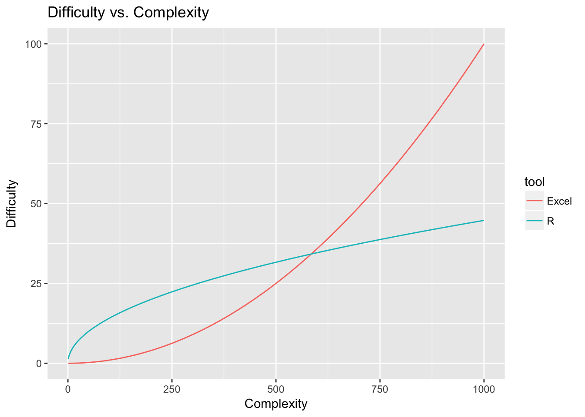


<!--chapter:end:intro_ds.Rmd-->

# R语言基础 {#intro-R}


R 软件是一个自由、开源软件平台，具有统计分析、可视化和编程的强大功能。
你可以从这里免费[下载](https://cloud.r-project.org)。 为了更好的使用 R 软件，我推荐大家使用 [RStudio](https://www.rstudio.com/products/rstudio)这个 IDE。这里有个[在线教程](https://www.rstudio.com/online-learning/)帮助我们熟悉 R 和 RStudio。


## 安装 R

我们从官方网站[http://cran.r-project.org](https://cloud.r-project.org)下载, 网站界面感觉有点朴素:


 


## 安装 RStudio
安装完R， 还需要安装RStudio。有同学可能要问 R 与 RStudio 是什么关系呢？打个比方吧，R 就像汽车的发动机, RStudio 就是汽车的仪表盘。


同样，我们从官方网站下载并安装，苹果系统的用户，选择苹果系统对应的rstudio版本即可。

- <https://www.rstudio.com/download>
- 选择`RStudio Desktop`


<div class="danger">
<p>这里有个小小的提示：</p>
<ul>
<li>电脑不要用中文用户名，否则Rstudio会杠上中文用户名</li>
<li>尽量安装在非系统盘，比如，可以选择安装在D盘</li>
<li>安装路径不要有中文和空格。比如，这样就比较好
<ul>
<li><code>D:/R</code></li>
<li><code>D:/Rstudio</code></li>
</ul></li>
</ul>
</div>


## 开始

安装完毕后，从windos`开始菜单`，点开`rstudio`图标，就打开了rstudio的窗口，界面效果如下


RStudio 的用户界面十分友好，想要运行一段R代码，只需要在 RStudio 控制台面板最下面一行内键入R 代码，然后回车即可。比如我们键入`1 + 1` 并按回车后，RStudio 将显示如下结果

```r
1 + 1
```

```
## [1] 2
```


```r
log(8)
```

```
## [1] 2.079
```


```r
1:15
```

```
##  [1]  1  2  3  4  5  6  7  8  9 10 11 12 13 14 15
```


## 对象


在R中存储的数据称为**对象**， R语言数据处理实际上就是不断的创建和操控这些对象。创建一个R对象，首先确定一个名称，然后使用
赋值操作符 `<-`，将数据赋值给它。比如，如果想给变量 x 赋值为5，在命令行中可以这样写 `x <- 5` ，然后回车.


```r
x <- 5
```


当键入`x` 然后回车，就打印出 x 的值。当然也可以使用命令`print(x)`，结果一样。

```r
x
```

```
## [1] 5
```


```r
x + 2
```

```
## [1] 7
```


```r
die <- 1:6
```


```r
die
```

```
## [1] 1 2 3 4 5 6
```


```r
die / 2
```

```
## [1] 0.5 1.0 1.5 2.0 2.5 3.0
```


```r
die * die
```

```
## [1]  1  4  9 16 25 36
```


```r
die %*% die
```

```
##      [,1]
## [1,]   91
```


```r
die %o% die
```

```
##      [,1] [,2] [,3] [,4] [,5] [,6]
## [1,]    1    2    3    4    5    6
## [2,]    2    4    6    8   10   12
## [3,]    3    6    9   12   15   18
## [4,]    4    8   12   16   20   24
## [5,]    5   10   15   20   25   30
## [6,]    6   12   18   24   30   36
```


## 数据结构

- 大家前面看到`x <- 1` 和 `x <- c(1, 2, 3)`，这就是最简单的数据对象，叫**原子型向量**。
- 用`c`函数将一组数据**构造**成向量


```r
die <- c(2, 4, 3, 1, 5, 7)
die
```

```
## [1] 2 4 3 1 5 7
```

长度为 1 的原子型向量

```r
x <- 1 # or
x <- c(1)
```


- 大家看到前面`die %o% die` 是**矩阵**类型，矩阵就是二维数组
- 可以用`matrix` 函数创建

```r
m <- matrix(c(2, 4, 3, 1, 5, 7),
  nrow = 2, ncol = 3, byrow = TRUE
)
```


```r
m
```

```
##      [,1] [,2] [,3]
## [1,]    2    4    3
## [2,]    1    5    7
```


- 数据对象：**数组**
- `array` 函数生成`n`维数组

```r
ar <- array(c(11:14, 21:24, 31:34), dim = c(2, 2, 3))
ar
```

```
## , , 1
## 
##      [,1] [,2]
## [1,]   11   13
## [2,]   12   14
## 
## , , 2
## 
##      [,1] [,2]
## [1,]   21   23
## [2,]   22   24
## 
## , , 3
## 
##      [,1] [,2]
## [1,]   31   33
## [2,]   32   34
```


- 数据对象：**列表**
- 与`c`函数创建向量的方式相似，不同的元素用逗号分开。不同的是，列表允许不同的数据类型（数值型，字符型，逻辑型等）， 而向量要求每个元素的数据类型必须相同。


```r
list1 <- list(100:110, "R", c(2, 4, 3, 1, 5, 7))
list1
```

```
## [[1]]
##  [1] 100 101 102 103 104 105 106 107 108 109 110
## 
## [[2]]
## [1] "R"
## 
## [[3]]
## [1] 2 4 3 1 5 7
```


- 数据对象：**数据框**
- `data.frame`函数构建


```r
df <- data.frame(
  name = c("ace", "bob", "carl", "kaite"),
  age = c(21, 14, 13, 15),
  sex = c("girl", "boy", "boy", "girl")
)
df
```

<div data-pagedtable="false">
  <script data-pagedtable-source type="application/json">
{"columns":[{"label":["name"],"name":[1],"type":["fctr"],"align":["left"]},{"label":["age"],"name":[2],"type":["dbl"],"align":["right"]},{"label":["sex"],"name":[3],"type":["fctr"],"align":["left"]}],"data":[{"1":"ace","2":"21","3":"girl"},{"1":"bob","2":"14","3":"boy"},{"1":"carl","2":"13","3":"boy"},{"1":"kaite","2":"15","3":"girl"}],"options":{"columns":{"min":{},"max":[10]},"rows":{"min":[10],"max":[10]},"pages":{}}}
  </script>
</div>


R 对象的数据结构(向量、矩阵、数组、列表和数据框)，总结如下


为了更好地理解相关概念，建议大家阅读Garrett Grolemund的
[hopr](https://rstudio-education.github.io/hopr/)这本书 [@Garrett2014]。


## 函数

R 语言的强大在于使用**函数**操控各种对象，你可以把对象看作是名词，而函数看作是动词。
我们用一个简单的例子，`sum()`来演示函数如何工作的。这个函数的功能正如它的名字一样，对输入的各个对象求和，然后返回求和后的值，你可以在命令行中键入`?sum()`查看其官方文档。
`sum()`后的结果可以直接显示出来，也可以赋名。比如下面代码，首先计算`x + 10`并赋以名字`y`， 然后第二行中打印出来这个新创建的对象`y`


```r
y <- sum(x, 10)
y
```

```
## [1] 11
```

因为代码的灵活性，可以不断地重新定义对象。只要数据发生改变，原来的代码就会返回新的值。比如，对`x`重新赋值为 15， 同样运行`sum()`函数，这次我们不赋值给对象`y`，而是让它直接显示


```r
x <- 15
sum(x, 10)
```

```
## [1] 25
```

再比如

```r
round(3.14159)
```

```
## [1] 3
```


```r
mean(1:6)
```

```
## [1] 3.5
```


```r
n <- 100
x <- seq(1, n)
sum(x)
```

```
## [1] 5050
```


```r
dt <- mtcars[, 1:4]
head(dt)
```

<div data-pagedtable="false">
  <script data-pagedtable-source type="application/json">
{"columns":[{"label":[""],"name":["_rn_"],"type":[""],"align":["left"]},{"label":["mpg"],"name":[1],"type":["dbl"],"align":["right"]},{"label":["cyl"],"name":[2],"type":["dbl"],"align":["right"]},{"label":["disp"],"name":[3],"type":["dbl"],"align":["right"]},{"label":["hp"],"name":[4],"type":["dbl"],"align":["right"]}],"data":[{"1":"21.0","2":"6","3":"160","4":"110","_rn_":"Mazda RX4"},{"1":"21.0","2":"6","3":"160","4":"110","_rn_":"Mazda RX4 Wag"},{"1":"22.8","2":"4","3":"108","4":"93","_rn_":"Datsun 710"},{"1":"21.4","2":"6","3":"258","4":"110","_rn_":"Hornet 4 Drive"},{"1":"18.7","2":"8","3":"360","4":"175","_rn_":"Hornet Sportabout"},{"1":"18.1","2":"6","3":"225","4":"105","_rn_":"Valiant"}],"options":{"columns":{"min":{},"max":[10]},"rows":{"min":[10],"max":[10]},"pages":{}}}
  </script>
</div>


```r
cor(dt)
```

```
##          mpg     cyl    disp      hp
## mpg   1.0000 -0.8522 -0.8476 -0.7762
## cyl  -0.8522  1.0000  0.9020  0.8324
## disp -0.8476  0.9020  1.0000  0.7909
## hp   -0.7762  0.8324  0.7909  1.0000
```


## 脚本

如果我们已经写好了一段R程序，我们可以保存为**脚本**文件，脚本文件通常以.R作为文件的后缀名。比如我们可以将刚才创建`x`和 `y`对象的命令，保存为脚本文件`my_script.R`。
这样我们可以在其它时间修改和重新运行它。

在RStudio中，你可以通过菜单栏依此点击`File > New File > R Script` 来创建一个新的脚本。
强烈建议大家在运行代码之前，使用脚本的形式编写和编辑自己的程序，养成这样的习惯后，你今后所有的工作都有案可查，并且具有可重复性。


- 点击 `Run` 或者 `Source` 运行脚本


## 宏包

R 语言的强大还在于各种宏包，一般在[The Comprehensive R Archive Network (CRAN)](https://cran.r-project.org)下载安装。宏包扩展了R语言本身的各种功能，也为解决问题提供了各种方案。截至撰写本书时止，CRAN上大约有1.4万个宏包可以使用。但由于各种包接口不统一，语法不一致，也带来一些困扰。为了解决这个问题，RStudio 公司的[Hadley Wickham](http://hadley.nz) 与其带领的团队推出了`tidyverse`宏包， [tidyverse](https://www.tidyverse.org)将常用的宏包整合在一起，并保持了语法的一致性。可以说，`tidyverse`宏包是R语言[入门](http://varianceexplained.org/r/teach-tidyverse/) 学习的首选。
本书正是基于`tidyverse`宏包而成的，本书也将通过一些例子不断地展示`tidyverse`在数据分析和可视化的应用。

可以用如下命令安装 `ggplot2` 宏包:


```r
# 安装单个包
install.packages("tidyverse")
```


```r
# 安装多个包
install.packages(c("ggplot2", "devtools", "dplyr"))
```


如果下载速度太慢，可以选择国内镜像


如果安装宏包过程中出错，可以试试这样

```r
install.packages("tidyverse", repos = "http://cran.rstudio.com")
# 或者
install.packages("tidyverse", repos = "https://CRAN.R-project.org")
```

如果遇到如下报错信息

```r
Warning in install.packages :
  unable to access index for repository http://cran.rstudio.com/src/contrib:
  cannot open URL 'http://cran.rstudio.com/src/contrib/PACKAGES'
```

输入下面命令后，再试试

```r
options(download.file.method="libcurl")
```

或者打开`D:\R\etc\Rprofile.site`，添加以下内容：

```r
local({r <- getOption("repos")
       r["CRAN"] <- "http://mirrors.tuna.tsinghua.edu.cn/CRAN"
       options(repos=r)})

options(download.file.method="libcurl")
```


如果打开代码是乱码，可以试试修改如下设置


## 如何获取帮助


- 记住和学习所有的函数几乎是不可能的
- 打开函数的帮助页面(`Rstudio`右下面板的`Help`选项卡)


```r
?sqrt
?gather
?spread
?ggplot2
?scale
?map_dfr
```

比如：


## R 语言社区

R 语言社区非常友好，可以在这里找到你问题的答案

  - twitter: <https://twitter.com/>
  - R-Bloggers: <https://www.r-bloggers.com/>
  - kaggle: <https://www.kaggle.com/>
  - stackoverflow: <https://stackoverflow.com/questions/tagged/r>
  - rstudio: <https://community.rstudio.com/>
  
## 本章代码

<!--html_preserve--><a href="" download="ch02_introR.R">Download ch02_introR.R</a><!--/html_preserve-->


## 延伸阅读 

- 如何获取向量`a <- c("a", "c", "e")`的第二个元素？矩阵和列表的时候，又该如何?
- 试试 `c(1, FALSE)` 与 `c("a", TRUE)` 会是什么？ 
- `1 == "1"` 和 `-1 < FALSE` 为什么为真？ `"one" < 2` 为什么为假？
- R语言里可以构造哪些数据对象？
- 数据框可以装载哪些数据类型的数据？
- 数据框和列表区别在哪里？

<!--chapter:end:intro_R.Rmd-->

# 子集选取 {#subsetting}

子集选取单独作一章，说明它确实很重要。

## 向量


对于原子型向量，我们有至少四种方法取子集

```r
x <- c(1.1, 2.2, 3.3, 4.4, 5.5)
```


- 正整数： 指定向量元素中的位置

```r
x[1]
```

```
## [1] 1.1
```


```r
x[c(3,1)]
```

```
## [1] 3.3 1.1
```

- 负整数：删除指定位置的元素

```r
x[-2]
```

```
## [1] 1.1 3.3 4.4 5.5
```

- 逻辑向量：将`TRUE`对应位置的元素提取出来

```r
x[c(TRUE, FALSE, TRUE, FALSE, TRUE)]
```

```
## [1] 1.1 3.3 5.5
```


- 如果是命名向量

```r
y <- c("a" =  11, "b" =  12, "c" =  13, "d" =  14)
y
```

```
##  a  b  c  d 
## 11 12 13 14
```

我们可以用名字向量，返回对应位置的向量

```r
y[c("d", "c", "a")]
```

```
##  d  c  a 
## 14 13 11
```

## 列表

对列表取子集，和向量的方法一样。使用`[`总是返回列表，`[[`和`$` 返回列表中的元素

```r
l <- list("one" = c("a", "b", "c"), 
		  "two" = c(1:5), 
		  "three" = c(TRUE, FALSE)
		  )
l
```

```
## $one
## [1] "a" "b" "c"
## 
## $two
## [1] 1 2 3 4 5
## 
## $three
## [1]  TRUE FALSE
```


```r
l[1]
```

```
## $one
## [1] "a" "b" "c"
```


```r
l[[1]]
```

```
## [1] "a" "b" "c"
```
也可以

```r
l[["one"]]
```

```
## [1] "a" "b" "c"
```
取出`one`位置上的元素，需要写`[["one"]]`， 程序员觉得太麻烦了，所以用`$`来简写

```r
l$one
```

```
## [1] "a" "b" "c"
```

所以请记住
- `[` 和`[[`的区别
-`x$y` 是 `x[["y"]]`的简写
 
 
## 矩阵


```r
a <- matrix(1:9, nrow = 3)
a
```

```
##      [,1] [,2] [,3]
## [1,]    1    4    7
## [2,]    2    5    8
## [3,]    3    6    9
```
我们取第1到2行的2-3列，`[1:2, 2:3]`，中间以逗号分隔，于是得到一个新的矩阵

```r
a[1:2, 2:3]
```

```
##      [,1] [,2]
## [1,]    4    7
## [2,]    5    8
```

默认情况下, `[` 会将获取的数据，以尽可能低的维度形式呈现。比如

```r
a[1, 1:2]
```

```
## [1] 1 4
```
表示第1行的第1、2列，此时不是$1 \times 2$矩阵，而是包含了两个元素的向量。
**以尽可能低的维度形式呈现**，换句话说，这个1, 4长的像个矩阵，又有点像向量，向量的维度比矩阵低，那就是向量吧。


有些时候，我们想保留所有的行或者列，比如这里我们选取1到2行的所有列，可以这样简写


```r
a[1:2, ]
```

```
##      [,1] [,2] [,3]
## [1,]    1    4    7
## [2,]    2    5    8
```

想想，会输出什么

```r
a[,]
```

```
##      [,1] [,2] [,3]
## [1,]    1    4    7
## [2,]    2    5    8
## [3,]    3    6    9
```
可以再简化点？

```r
a[]
```

```
##      [,1] [,2] [,3]
## [1,]    1    4    7
## [2,]    2    5    8
## [3,]    3    6    9
```

是不是可以再简化点？

```r
a
```

```
##      [,1] [,2] [,3]
## [1,]    1    4    7
## [2,]    2    5    8
## [3,]    3    6    9
```

## 数据框

数据框具有list和matrix的属性，因此

- 当选取数据框的某几列的时候，可以和list一样，指定元素位置，比如`df[1:2]`选取前两列 
- 也可以像矩阵一样，使用行和列的标识选取，比如`df[1:3, ]`选取前三行的所有列


```r
df <- data.frame(x = 1:4,
				 y = 4:1,
				 z = c("a", "b", "c", "d")
				 )
df
```

<div data-pagedtable="false">
  <script data-pagedtable-source type="application/json">
{"columns":[{"label":["x"],"name":[1],"type":["int"],"align":["right"]},{"label":["y"],"name":[2],"type":["int"],"align":["right"]},{"label":["z"],"name":[3],"type":["fctr"],"align":["left"]}],"data":[{"1":"1","2":"4","3":"a"},{"1":"2","2":"3","3":"b"},{"1":"3","2":"2","3":"c"},{"1":"4","2":"1","3":"d"}],"options":{"columns":{"min":{},"max":[10]},"rows":{"min":[10],"max":[10]},"pages":{}}}
  </script>
</div>

```r
# Like a list
df[c("x", "z")]
```

<div data-pagedtable="false">
  <script data-pagedtable-source type="application/json">
{"columns":[{"label":["x"],"name":[1],"type":["int"],"align":["right"]},{"label":["z"],"name":[2],"type":["fctr"],"align":["left"]}],"data":[{"1":"1","2":"a"},{"1":"2","2":"b"},{"1":"3","2":"c"},{"1":"4","2":"d"}],"options":{"columns":{"min":{},"max":[10]},"rows":{"min":[10],"max":[10]},"pages":{}}}
  </script>
</div>


```r
# Like a matrix
df[, c("x", "z")]
```

<div data-pagedtable="false">
  <script data-pagedtable-source type="application/json">
{"columns":[{"label":["x"],"name":[1],"type":["int"],"align":["right"]},{"label":["z"],"name":[2],"type":["fctr"],"align":["left"]}],"data":[{"1":"1","2":"a"},{"1":"2","2":"b"},{"1":"3","2":"c"},{"1":"4","2":"d"}],"options":{"columns":{"min":{},"max":[10]},"rows":{"min":[10],"max":[10]},"pages":{}}}
  </script>
</div>


也可以通过行和列的位置

```r
df[1:2]
```

<div data-pagedtable="false">
  <script data-pagedtable-source type="application/json">
{"columns":[{"label":["x"],"name":[1],"type":["int"],"align":["right"]},{"label":["y"],"name":[2],"type":["int"],"align":["right"]}],"data":[{"1":"1","2":"4"},{"1":"2","2":"3"},{"1":"3","2":"2"},{"1":"4","2":"1"}],"options":{"columns":{"min":{},"max":[10]},"rows":{"min":[10],"max":[10]},"pages":{}}}
  </script>
</div>


```r
df[1:3, ]
```

<div data-pagedtable="false">
  <script data-pagedtable-source type="application/json">
{"columns":[{"label":[""],"name":["_rn_"],"type":[""],"align":["left"]},{"label":["x"],"name":[1],"type":["int"],"align":["right"]},{"label":["y"],"name":[2],"type":["int"],"align":["right"]},{"label":["z"],"name":[3],"type":["fctr"],"align":["left"]}],"data":[{"1":"1","2":"4","3":"a","_rn_":"1"},{"1":"2","2":"3","3":"b","_rn_":"2"},{"1":"3","2":"2","3":"c","_rn_":"3"}],"options":{"columns":{"min":{},"max":[10]},"rows":{"min":[10],"max":[10]},"pages":{}}}
  </script>
</div>


也和矩阵一样，遇到单行单列的时候，数据会降维

```r
df[, "x"]
```

```
## [1] 1 2 3 4
```


如果不想避免降维，需要多写一句话

```r
df[, "x", drop = FALSE]
```

<div data-pagedtable="false">
  <script data-pagedtable-source type="application/json">
{"columns":[{"label":["x"],"name":[1],"type":["int"],"align":["right"]}],"data":[{"1":"1"},{"1":"2"},{"1":"3"},{"1":"4"}],"options":{"columns":{"min":{},"max":[10]},"rows":{"min":[10],"max":[10]},"pages":{}}}
  </script>
</div>
这样输出的还是矩阵形式, 但程序员总是偷懒的，有时候我们也容易忘记写`drop = FALSE`，
所以我比较喜欢下面的`tibble`.


## tibble

tibble是增强型的data.frame，选取tibble的行或者列，即使遇到单行或者单列的时候，数据也不会降维，总是返回tibble，即仍然是数据框的形式。


```r
tb <- tibble::tibble(
  x = 1:4,
  y = 4:1,
  z = c("a", "b", "c", "d")
)
tb
```

<div data-pagedtable="false">
  <script data-pagedtable-source type="application/json">
{"columns":[{"label":["x"],"name":[1],"type":["int"],"align":["right"]},{"label":["y"],"name":[2],"type":["int"],"align":["right"]},{"label":["z"],"name":[3],"type":["chr"],"align":["left"]}],"data":[{"1":"1","2":"4","3":"a"},{"1":"2","2":"3","3":"b"},{"1":"3","2":"2","3":"c"},{"1":"4","2":"1","3":"d"}],"options":{"columns":{"min":{},"max":[10]},"rows":{"min":[10],"max":[10]},"pages":{}}}
  </script>
</div>


```r
tb["x"]
```

<div data-pagedtable="false">
  <script data-pagedtable-source type="application/json">
{"columns":[{"label":["x"],"name":[1],"type":["int"],"align":["right"]}],"data":[{"1":"1"},{"1":"2"},{"1":"3"},{"1":"4"}],"options":{"columns":{"min":{},"max":[10]},"rows":{"min":[10],"max":[10]},"pages":{}}}
  </script>
</div>


```r
tb[, "x"]
```

<div data-pagedtable="false">
  <script data-pagedtable-source type="application/json">
{"columns":[{"label":["x"],"name":[1],"type":["int"],"align":["right"]}],"data":[{"1":"1"},{"1":"2"},{"1":"3"},{"1":"4"}],"options":{"columns":{"min":{},"max":[10]},"rows":{"min":[10],"max":[10]},"pages":{}}}
  </script>
</div>
除此以外，`tibble`还有很多优良的[特性](https://tibble.tidyverse.org/)。

## 本章代码

<!--html_preserve--><a href="data:text/plain;base64,IyBjaDAzX3N1YnNldHRpbmcuUg0KDQp4IDwtIGMoMS4xLCAyLjIsIDMuMywgNC40LCA1LjUpDQoNCnhbMV0NCg0KeFtjKFRSVUUsIEZBTFNFLCBUUlVFLCBGQUxTRSwgVFJVRSldDQoNCnhbVFJVRV0NCg==" download="ch03_subsetting.R">Download ch03_subsetting.R</a><!--/html_preserve-->

## 延伸阅读

- 如何获取`matrix(1:9, nrow = 3)`上对角元? 对角元？
- 对数据框，思考`df["x"]`， `df[["x"]]`， `df$x`三者的区别?
- 如果`x`是一个矩阵，请问 `x[] <- 0` 和`x <- 0` 有什么区别？


<!--chapter:end:subsetting.Rmd-->

# 数据可视化 {#visual}

上节课介绍了R语言的基本数据结构，可能大家有种看美剧的感觉，有些懵。这很正常，我在开始学习R的时候，感觉和大家一样，所以不要惊慌，我们后面会慢慢填补这些知识点。

这节课，我们介绍R语言最强大的可视化，看看都有哪些炫酷的操作。


```r
library(tidyverse)
library(patchwork)
```


## 为什么要可视化
我们先从一个故事开始，1854年伦敦爆发严重霍乱，当时流行的观点是霍乱是通过空气传播的，而John Snow医生（不是《权力的游戏》里的 Jon Snow）研究发现，霍乱是通过饮用水传播的。研究过程中，John Snow医生统计每户病亡人数，每死亡一人标注一条横线，分析发现，大多数病例的住所都围绕在Broad Street水泵附近，结合其他证据得出饮用水传播的结论，于是移掉了Broad Street水泵的把手，霍乱最终得到控制。


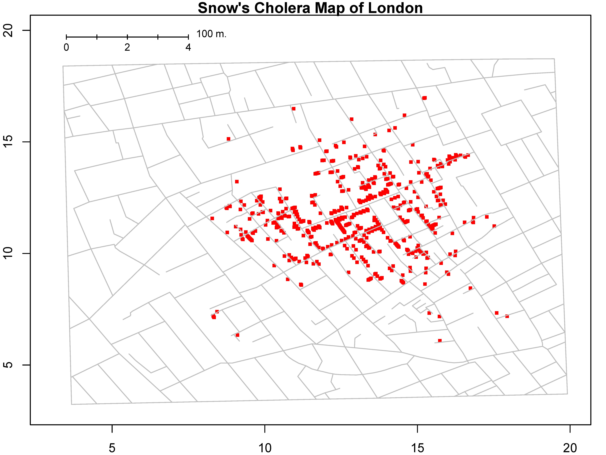


另一个有趣的例子就是辛普森悖论（Simpson's Paradox）。比如我们想研究下，学习时间和考试成绩的关联。结果发现两者呈负相关性，即补课时间越长，考试成绩反而越差（下图横坐标是学习时间，纵坐标是考试成绩），很明显这个结果有违生活常识。

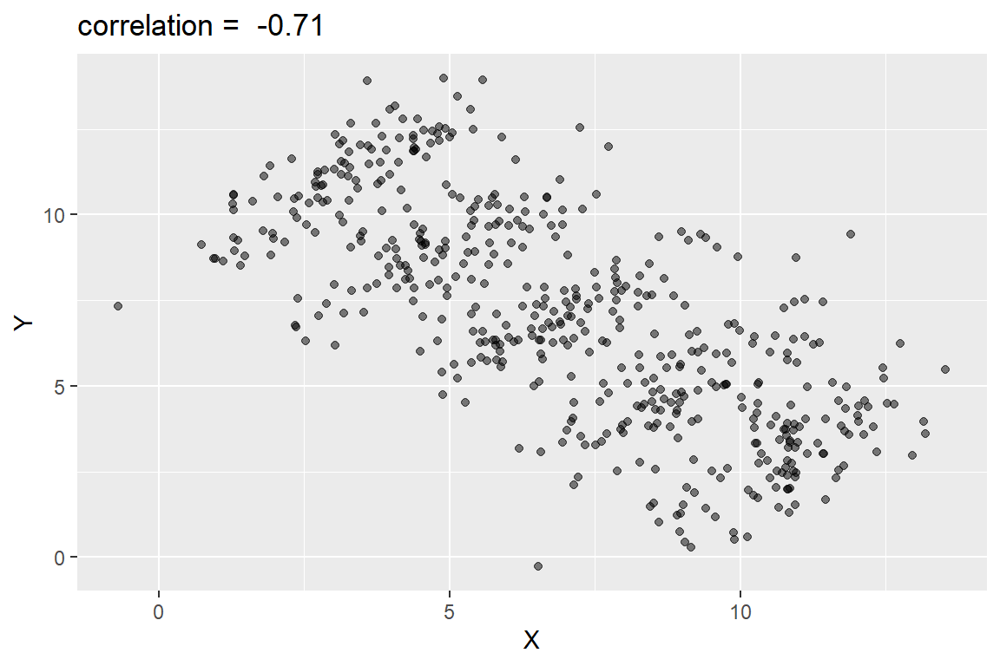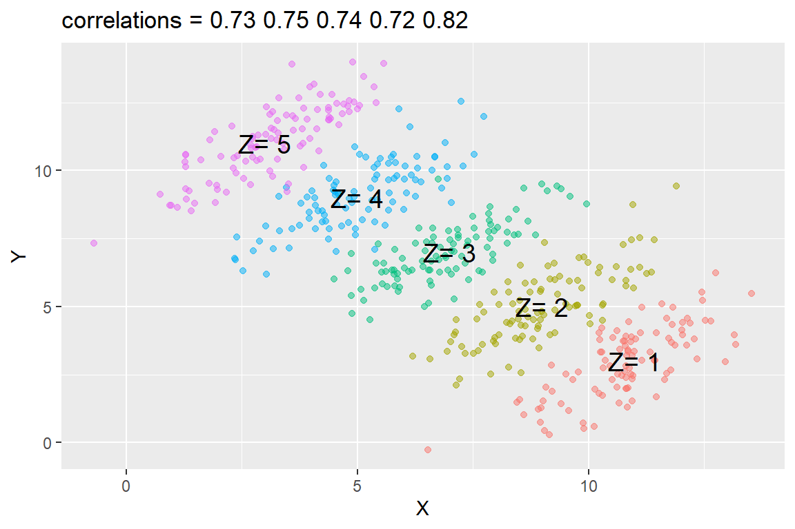

事实上，当我们把学生按照不同年级分成五组，再来观察学习时间和考试成绩之间的关联，发现相关性完全逆转了! 我们可以看到学习时间和考试成绩强烈正相关。


辛普森悖论在日常生活中层出不穷。 那么如何避免辛普森悖论呢？我们能做的，就是仔细地研究分析各种影响因素，不要笼统概括地、浅尝辄止地看问题。其中，可视化分析为我们提供了一个好的方法。

## ggplot2 的图形语法

ggplot2是R语言最流行的宏包，是RStudio首席科学家Hadley Wickham读博期间的作品，是R相比其他语言一个独领风骚的特点。包名中“gg”是grammar of graphics的简称，是一套优雅的绘图语法。
ggplot的语法包括9个部件：

- **数据 (data)**
- **映射 (mapping)**
- **几何对象 (geom)**
- 统计变换 (stats)
- 标度 (scale)
- 坐标系 (coord)
- 分面 (facet)
- 主题 (theme)
- 存储和输出 (output)

其中前三个是必需的。Hadley Wickham将这套语法诠释为，一张统计图形就是从数据到几何对象（geometric object，缩写geom）的图形属性（aesthetic attribute，缩写aes）的一个映射。此外，图形中还可能包含数据的统计变换（statistical transformation，缩写stats），最后绘制在某个特定的坐标系（coordinate system，缩写coord）中，而分面（facet）则可以用来生成数据不同子集的图形。


我们用ggplot2宏包内置的汽车测试数据（mpg）来演示，我们用到了四个变量


```r
mpg %>% select(displ, hwy, cyl, class)
```

<div data-pagedtable="false">
  <script data-pagedtable-source type="application/json">
{"columns":[{"label":["displ"],"name":[1],"type":["dbl"],"align":["right"]},{"label":["hwy"],"name":[2],"type":["int"],"align":["right"]},{"label":["cyl"],"name":[3],"type":["int"],"align":["right"]},{"label":["class"],"name":[4],"type":["chr"],"align":["left"]}],"data":[{"1":"1.8","2":"29","3":"4","4":"compact"},{"1":"1.8","2":"29","3":"4","4":"compact"},{"1":"2.0","2":"31","3":"4","4":"compact"},{"1":"2.0","2":"30","3":"4","4":"compact"},{"1":"2.8","2":"26","3":"6","4":"compact"},{"1":"2.8","2":"26","3":"6","4":"compact"},{"1":"3.1","2":"27","3":"6","4":"compact"},{"1":"1.8","2":"26","3":"4","4":"compact"},{"1":"1.8","2":"25","3":"4","4":"compact"},{"1":"2.0","2":"28","3":"4","4":"compact"},{"1":"2.0","2":"27","3":"4","4":"compact"},{"1":"2.8","2":"25","3":"6","4":"compact"},{"1":"2.8","2":"25","3":"6","4":"compact"},{"1":"3.1","2":"25","3":"6","4":"compact"},{"1":"3.1","2":"25","3":"6","4":"compact"},{"1":"2.8","2":"24","3":"6","4":"midsize"},{"1":"3.1","2":"25","3":"6","4":"midsize"},{"1":"4.2","2":"23","3":"8","4":"midsize"},{"1":"5.3","2":"20","3":"8","4":"suv"},{"1":"5.3","2":"15","3":"8","4":"suv"},{"1":"5.3","2":"20","3":"8","4":"suv"},{"1":"5.7","2":"17","3":"8","4":"suv"},{"1":"6.0","2":"17","3":"8","4":"suv"},{"1":"5.7","2":"26","3":"8","4":"2seater"},{"1":"5.7","2":"23","3":"8","4":"2seater"},{"1":"6.2","2":"26","3":"8","4":"2seater"},{"1":"6.2","2":"25","3":"8","4":"2seater"},{"1":"7.0","2":"24","3":"8","4":"2seater"},{"1":"5.3","2":"19","3":"8","4":"suv"},{"1":"5.3","2":"14","3":"8","4":"suv"},{"1":"5.7","2":"15","3":"8","4":"suv"},{"1":"6.5","2":"17","3":"8","4":"suv"},{"1":"2.4","2":"27","3":"4","4":"midsize"},{"1":"2.4","2":"30","3":"4","4":"midsize"},{"1":"3.1","2":"26","3":"6","4":"midsize"},{"1":"3.5","2":"29","3":"6","4":"midsize"},{"1":"3.6","2":"26","3":"6","4":"midsize"},{"1":"2.4","2":"24","3":"4","4":"minivan"},{"1":"3.0","2":"24","3":"6","4":"minivan"},{"1":"3.3","2":"22","3":"6","4":"minivan"},{"1":"3.3","2":"22","3":"6","4":"minivan"},{"1":"3.3","2":"24","3":"6","4":"minivan"},{"1":"3.3","2":"24","3":"6","4":"minivan"},{"1":"3.3","2":"17","3":"6","4":"minivan"},{"1":"3.8","2":"22","3":"6","4":"minivan"},{"1":"3.8","2":"21","3":"6","4":"minivan"},{"1":"3.8","2":"23","3":"6","4":"minivan"},{"1":"4.0","2":"23","3":"6","4":"minivan"},{"1":"3.7","2":"19","3":"6","4":"pickup"},{"1":"3.7","2":"18","3":"6","4":"pickup"},{"1":"3.9","2":"17","3":"6","4":"pickup"},{"1":"3.9","2":"17","3":"6","4":"pickup"},{"1":"4.7","2":"19","3":"8","4":"pickup"},{"1":"4.7","2":"19","3":"8","4":"pickup"},{"1":"4.7","2":"12","3":"8","4":"pickup"},{"1":"5.2","2":"17","3":"8","4":"pickup"},{"1":"5.2","2":"15","3":"8","4":"pickup"},{"1":"3.9","2":"17","3":"6","4":"suv"},{"1":"4.7","2":"17","3":"8","4":"suv"},{"1":"4.7","2":"12","3":"8","4":"suv"},{"1":"4.7","2":"17","3":"8","4":"suv"},{"1":"5.2","2":"16","3":"8","4":"suv"},{"1":"5.7","2":"18","3":"8","4":"suv"},{"1":"5.9","2":"15","3":"8","4":"suv"},{"1":"4.7","2":"16","3":"8","4":"pickup"},{"1":"4.7","2":"12","3":"8","4":"pickup"},{"1":"4.7","2":"17","3":"8","4":"pickup"},{"1":"4.7","2":"17","3":"8","4":"pickup"},{"1":"4.7","2":"16","3":"8","4":"pickup"},{"1":"4.7","2":"12","3":"8","4":"pickup"},{"1":"5.2","2":"15","3":"8","4":"pickup"},{"1":"5.2","2":"16","3":"8","4":"pickup"},{"1":"5.7","2":"17","3":"8","4":"pickup"},{"1":"5.9","2":"15","3":"8","4":"pickup"},{"1":"4.6","2":"17","3":"8","4":"suv"},{"1":"5.4","2":"17","3":"8","4":"suv"},{"1":"5.4","2":"18","3":"8","4":"suv"},{"1":"4.0","2":"17","3":"6","4":"suv"},{"1":"4.0","2":"19","3":"6","4":"suv"},{"1":"4.0","2":"17","3":"6","4":"suv"},{"1":"4.0","2":"19","3":"6","4":"suv"},{"1":"4.6","2":"19","3":"8","4":"suv"},{"1":"5.0","2":"17","3":"8","4":"suv"},{"1":"4.2","2":"17","3":"6","4":"pickup"},{"1":"4.2","2":"17","3":"6","4":"pickup"},{"1":"4.6","2":"16","3":"8","4":"pickup"},{"1":"4.6","2":"16","3":"8","4":"pickup"},{"1":"4.6","2":"17","3":"8","4":"pickup"},{"1":"5.4","2":"15","3":"8","4":"pickup"},{"1":"5.4","2":"17","3":"8","4":"pickup"},{"1":"3.8","2":"26","3":"6","4":"subcompact"},{"1":"3.8","2":"25","3":"6","4":"subcompact"},{"1":"4.0","2":"26","3":"6","4":"subcompact"},{"1":"4.0","2":"24","3":"6","4":"subcompact"},{"1":"4.6","2":"21","3":"8","4":"subcompact"},{"1":"4.6","2":"22","3":"8","4":"subcompact"},{"1":"4.6","2":"23","3":"8","4":"subcompact"},{"1":"4.6","2":"22","3":"8","4":"subcompact"},{"1":"5.4","2":"20","3":"8","4":"subcompact"},{"1":"1.6","2":"33","3":"4","4":"subcompact"},{"1":"1.6","2":"32","3":"4","4":"subcompact"},{"1":"1.6","2":"32","3":"4","4":"subcompact"},{"1":"1.6","2":"29","3":"4","4":"subcompact"},{"1":"1.6","2":"32","3":"4","4":"subcompact"},{"1":"1.8","2":"34","3":"4","4":"subcompact"},{"1":"1.8","2":"36","3":"4","4":"subcompact"},{"1":"1.8","2":"36","3":"4","4":"subcompact"},{"1":"2.0","2":"29","3":"4","4":"subcompact"},{"1":"2.4","2":"26","3":"4","4":"midsize"},{"1":"2.4","2":"27","3":"4","4":"midsize"},{"1":"2.4","2":"30","3":"4","4":"midsize"},{"1":"2.4","2":"31","3":"4","4":"midsize"},{"1":"2.5","2":"26","3":"6","4":"midsize"},{"1":"2.5","2":"26","3":"6","4":"midsize"},{"1":"3.3","2":"28","3":"6","4":"midsize"},{"1":"2.0","2":"26","3":"4","4":"subcompact"},{"1":"2.0","2":"29","3":"4","4":"subcompact"},{"1":"2.0","2":"28","3":"4","4":"subcompact"},{"1":"2.0","2":"27","3":"4","4":"subcompact"},{"1":"2.7","2":"24","3":"6","4":"subcompact"},{"1":"2.7","2":"24","3":"6","4":"subcompact"},{"1":"2.7","2":"24","3":"6","4":"subcompact"},{"1":"3.0","2":"22","3":"6","4":"suv"},{"1":"3.7","2":"19","3":"6","4":"suv"},{"1":"4.0","2":"20","3":"6","4":"suv"},{"1":"4.7","2":"17","3":"8","4":"suv"},{"1":"4.7","2":"12","3":"8","4":"suv"},{"1":"4.7","2":"19","3":"8","4":"suv"},{"1":"5.7","2":"18","3":"8","4":"suv"},{"1":"6.1","2":"14","3":"8","4":"suv"},{"1":"4.0","2":"15","3":"8","4":"suv"},{"1":"4.2","2":"18","3":"8","4":"suv"},{"1":"4.4","2":"18","3":"8","4":"suv"},{"1":"4.6","2":"15","3":"8","4":"suv"},{"1":"5.4","2":"17","3":"8","4":"suv"},{"1":"5.4","2":"16","3":"8","4":"suv"},{"1":"5.4","2":"18","3":"8","4":"suv"},{"1":"4.0","2":"17","3":"6","4":"suv"},{"1":"4.0","2":"19","3":"6","4":"suv"},{"1":"4.6","2":"19","3":"8","4":"suv"},{"1":"5.0","2":"17","3":"8","4":"suv"},{"1":"2.4","2":"29","3":"4","4":"compact"},{"1":"2.4","2":"27","3":"4","4":"compact"},{"1":"2.5","2":"31","3":"4","4":"midsize"},{"1":"2.5","2":"32","3":"4","4":"midsize"},{"1":"3.5","2":"27","3":"6","4":"midsize"},{"1":"3.5","2":"26","3":"6","4":"midsize"},{"1":"3.0","2":"26","3":"6","4":"midsize"},{"1":"3.0","2":"25","3":"6","4":"midsize"},{"1":"3.5","2":"25","3":"6","4":"midsize"},{"1":"3.3","2":"17","3":"6","4":"suv"},{"1":"3.3","2":"17","3":"6","4":"suv"},{"1":"4.0","2":"20","3":"6","4":"suv"},{"1":"5.6","2":"18","3":"8","4":"suv"},{"1":"3.1","2":"26","3":"6","4":"midsize"},{"1":"3.8","2":"26","3":"6","4":"midsize"},{"1":"3.8","2":"27","3":"6","4":"midsize"},{"1":"3.8","2":"28","3":"6","4":"midsize"},{"1":"5.3","2":"25","3":"8","4":"midsize"},{"1":"2.5","2":"25","3":"4","4":"suv"},{"1":"2.5","2":"24","3":"4","4":"suv"},{"1":"2.5","2":"27","3":"4","4":"suv"},{"1":"2.5","2":"25","3":"4","4":"suv"},{"1":"2.5","2":"26","3":"4","4":"suv"},{"1":"2.5","2":"23","3":"4","4":"suv"},{"1":"2.2","2":"26","3":"4","4":"subcompact"},{"1":"2.2","2":"26","3":"4","4":"subcompact"},{"1":"2.5","2":"26","3":"4","4":"subcompact"},{"1":"2.5","2":"26","3":"4","4":"subcompact"},{"1":"2.5","2":"25","3":"4","4":"compact"},{"1":"2.5","2":"27","3":"4","4":"compact"},{"1":"2.5","2":"25","3":"4","4":"compact"},{"1":"2.5","2":"27","3":"4","4":"compact"},{"1":"2.7","2":"20","3":"4","4":"suv"},{"1":"2.7","2":"20","3":"4","4":"suv"},{"1":"3.4","2":"19","3":"6","4":"suv"},{"1":"3.4","2":"17","3":"6","4":"suv"},{"1":"4.0","2":"20","3":"6","4":"suv"},{"1":"4.7","2":"17","3":"8","4":"suv"},{"1":"2.2","2":"29","3":"4","4":"midsize"},{"1":"2.2","2":"27","3":"4","4":"midsize"},{"1":"2.4","2":"31","3":"4","4":"midsize"},{"1":"2.4","2":"31","3":"4","4":"midsize"},{"1":"3.0","2":"26","3":"6","4":"midsize"},{"1":"3.0","2":"26","3":"6","4":"midsize"},{"1":"3.5","2":"28","3":"6","4":"midsize"},{"1":"2.2","2":"27","3":"4","4":"compact"},{"1":"2.2","2":"29","3":"4","4":"compact"},{"1":"2.4","2":"31","3":"4","4":"compact"},{"1":"2.4","2":"31","3":"4","4":"compact"},{"1":"3.0","2":"26","3":"6","4":"compact"},{"1":"3.0","2":"26","3":"6","4":"compact"},{"1":"3.3","2":"27","3":"6","4":"compact"},{"1":"1.8","2":"30","3":"4","4":"compact"},{"1":"1.8","2":"33","3":"4","4":"compact"},{"1":"1.8","2":"35","3":"4","4":"compact"},{"1":"1.8","2":"37","3":"4","4":"compact"},{"1":"1.8","2":"35","3":"4","4":"compact"},{"1":"4.7","2":"15","3":"8","4":"suv"},{"1":"5.7","2":"18","3":"8","4":"suv"},{"1":"2.7","2":"20","3":"4","4":"pickup"},{"1":"2.7","2":"20","3":"4","4":"pickup"},{"1":"2.7","2":"22","3":"4","4":"pickup"},{"1":"3.4","2":"17","3":"6","4":"pickup"},{"1":"3.4","2":"19","3":"6","4":"pickup"},{"1":"4.0","2":"18","3":"6","4":"pickup"},{"1":"4.0","2":"20","3":"6","4":"pickup"},{"1":"2.0","2":"29","3":"4","4":"compact"},{"1":"2.0","2":"26","3":"4","4":"compact"},{"1":"2.0","2":"29","3":"4","4":"compact"},{"1":"2.0","2":"29","3":"4","4":"compact"},{"1":"2.8","2":"24","3":"6","4":"compact"},{"1":"1.9","2":"44","3":"4","4":"compact"},{"1":"2.0","2":"29","3":"4","4":"compact"},{"1":"2.0","2":"26","3":"4","4":"compact"},{"1":"2.0","2":"29","3":"4","4":"compact"},{"1":"2.0","2":"29","3":"4","4":"compact"},{"1":"2.5","2":"29","3":"5","4":"compact"},{"1":"2.5","2":"29","3":"5","4":"compact"},{"1":"2.8","2":"23","3":"6","4":"compact"},{"1":"2.8","2":"24","3":"6","4":"compact"},{"1":"1.9","2":"44","3":"4","4":"subcompact"},{"1":"1.9","2":"41","3":"4","4":"subcompact"},{"1":"2.0","2":"29","3":"4","4":"subcompact"},{"1":"2.0","2":"26","3":"4","4":"subcompact"},{"1":"2.5","2":"28","3":"5","4":"subcompact"},{"1":"2.5","2":"29","3":"5","4":"subcompact"},{"1":"1.8","2":"29","3":"4","4":"midsize"},{"1":"1.8","2":"29","3":"4","4":"midsize"},{"1":"2.0","2":"28","3":"4","4":"midsize"},{"1":"2.0","2":"29","3":"4","4":"midsize"},{"1":"2.8","2":"26","3":"6","4":"midsize"},{"1":"2.8","2":"26","3":"6","4":"midsize"},{"1":"3.6","2":"26","3":"6","4":"midsize"}],"options":{"columns":{"min":{},"max":[10]},"rows":{"min":[10],"max":[10]},"pages":{}}}
  </script>
</div>

- displ： 发动机排量
- hwy： 每加仑英里数
- cyl：汽缸数目
- class：汽车类型

最简单的例子开始，绘制displ和hwy的散点图，

```r
ggplot(data = mpg, aes(x = displ, y = hwy)) + 
  geom_point()
```

- `ggplot()`表示调用该函数画图，`data = mpg` 表示使用mpg数据框来画图。
- `aes()`表示数据和视觉属性之间的映射，通俗来讲，不同的数值，转换成不同的位置、色彩或透明度等。

`aes(x = displ, y = hwy)`，意思是变量displ作为（映射为）x轴方向的**位置**，变量hwy作为（映射为）y轴方向的**位置**。
- `+`表示添加图层。
- `geom_point()`表示绘制散点图。


运行脚本后生成图片：

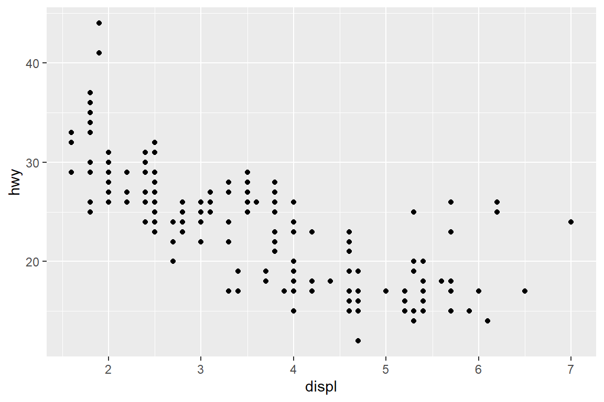

刚才看到的是位置上的映射，ggplot还包含了颜色、形状以及透明度等图形属性的映射，可以来比较不同分组，比如我们在`aes()`里增加一个`color = class`

```r
ggplot(data = mpg, aes(x = displ, y = hwy, color = class)) + 
  geom_point()
```

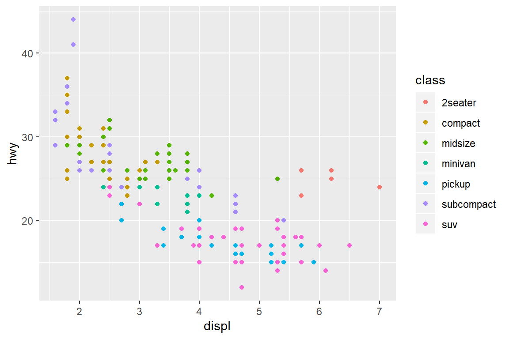

此图绘制了displ和hwy的散点图， 其中不同的汽车类型，用不同的颜色显示。

大家试试下面代码呢，

```r
ggplot(data = mpg, aes(x = displ, y = hwy, size = class)) + 
  geom_point()

ggplot(data = mpg, aes(x = displ, y = hwy, shape = class)) + 
  geom_point()

ggplot(data = mpg, aes(x = displ, y = hwy, aphha = class)) + 
  geom_point()
```


## 映射 vs.设置

想把图中的点指定为某一种颜色，可以使用设置语句，比如


```r
ggplot(mpg, aes(displ, hwy)) + geom_point(color = "blue")
```


大家也可以试试下面

```r
ggplot(mpg, aes(displ, hwy)) + geom_point(size = 5)
ggplot(mpg, aes(displ, hwy)) + geom_point(shape = 3)
ggplot(mpg, aes(displ, hwy)) + geom_point(alpha = 0.5)
```


思考下`aes(color = "blue")`为什么会红色的点？

```r
ggplot(mpg, aes(x = displ, y = hwy, color = "blue")) + 
  geom_point()
```


## 几何对象

`geom_point()` 可以画散点图，也可以使用`geom_smooth()`绘制平滑曲线，

```r
p1 <- ggplot(data = mpg, aes(x = displ, y = hwy)) + 
  geom_point()

p2 <- ggplot(data = mpg, aes(x = displ, y = hwy)) + 
  geom_smooth()

p3 <- ggplot(data = mpg, aes(x = displ, y = hwy)) + 
   geom_point() +
   geom_smooth()

p1 + p2 + p3
```

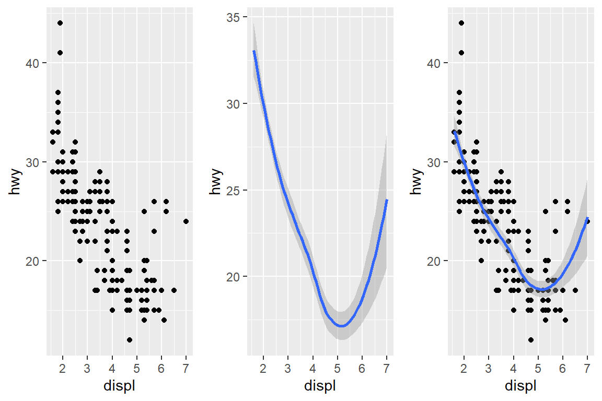


## Global vs. Local


```r
ggplot(mpg, aes(x = displ, y = hwy, color = class)) + 
  geom_point()
```


```r
ggplot(mpg) + 
  geom_point( aes(x = displ, y = hwy, color = class))
```


大家可以看到，以上两段代码出来的图是一样。


事实上，如果映射关系`aes()` 写在`ggplot()`里, 


```r
ggplot(mpg, aes(x = displ, y = hwy, color = class)) + 
  geom_point()
```
`x = displ, y = hwy, color = class` 为全局变量。如果映射关系`aes()` 写在几何对象`geom_point()`里, 就为局部变量, 比如。

```r
ggplot(mpg) + 
  geom_point(aes(displ, hwy, color = class))
```


如果`geom_point()`中缺少所绘图所需要的映射关系，就会继承全局变量的映射关系`aes(x = displ, y = hwy, color = class)` 。

```r
ggplot(mpg, aes(x = displ, y = hwy, color = class)) + 
  geom_point() +
  geom_smooth()
```
这里的 `geom_point()` 和 `geom_smooth()` 都会从全局变量中继承映射关系。如果局部变量中的映射关系已经存在，那么就不会从全局变量中继承，沿用当前的映射关系。


```r
ggplot(mpg, aes(x = displ, y = hwy, color = class)) + 
  geom_point(aes(color = factor(cyl))) 
```


大家细细体会下，下面两段代码的区别

```r
ggplot(mpg, aes(displ, hwy, color = class)) + 
  geom_smooth(method = lm) +
  geom_point()
```


```r
ggplot(mpg, aes(displ, hwy)) + 
  geom_smooth(method = lm) +
  geom_point(aes(color = class))
```


## saving plots

可以使用ggsave()函数，将图片保存为所需要的格式，如".pdf", ".png"等


```r
ggsave("myfirst_plot.pdf", width = 6, height = 6, dpi = 300)
```

## 本章代码

<!--html_preserve--><a href="" download="ch04_ggplot2.R">Download ch04_ggplot2.R</a><!--/html_preserve-->

## 延伸阅读 

在第 \@ref(ggplot2) 章会再讲ggplot2

<!--chapter:end:visualization.Rmd-->

# 可重复性研究 {#rmarkdown}


## Communicating with Data via R Markdown

*Instructions*

1. 安装最新版本 [R](https://cran.r-project.org/mirrors.html) (>3.5) 和 [RStudio Desktop](https://rstudio.com/products/rstudio/) (>1.2).
2. 安装 [LaTeX](https://www.latex-project.org/get/). 然而这个软件会比较大
   (e.g. MacTeX is approximate 3.9G). 如果你之前没有安装过
   LaTeX，我推荐你安装轻量级的 `tinytex`. 安装方法如下，打开R，然后再命令行输入:


```r
install.packages("tinytex")
tinytex::install_tinytex()
```

3. 安装如下宏包:

```r
install.packages(c("tidyverse", 
                 "rmarkdown", 
                 "knitr",
                 "xaringan", 
                 "usethis",
                 "rmdformats", 
                 "prettydoc",
                 "rticles",
                 "linl",
                 "shiny",
                 "bookdown",
                 "pagedown",
                 "remotes"))
# the following is not on CRAN 
remotes::install_github("gadenbuie/xaringanthemer")
remotes::install_github("hadley/emo")
```


## markdown 基本语法

```markdown

# This is a title


This is a sentence.

Now a list begins:
  
- no importance
- again
- repeat
  
A numbered list:
  
1. first
2. second

__bold__, _italic_, ~~strike through~~
```


## Hello R Markdown

`Rstudio` create Rmd file ： `File -> New File -> R Markdown`.


基本构成

- metadata
- text
- code
   

### 插入公式


```
$$\frac{\sum (\bar{x} - x_i)^2}{n-1}$$
```


$$\frac{\sum (\bar{x} - x_i)^2}{n-1}$$


### 插入图片


```r
knitr::include_graphics("images/R_logo.png")
```


### 表格


```r
knitr::kable(iris[1:5, ], caption = "A caption")
```


Table: (\#tab:tables-mtcars)A caption

 Sepal.Length   Sepal.Width   Petal.Length   Petal.Width  Species 
-------------  ------------  -------------  ------------  --------
          5.1           3.5            1.4           0.2  setosa  
          4.9           3.0            1.4           0.2  setosa  
          4.7           3.2            1.3           0.2  setosa  
          4.6           3.1            1.5           0.2  setosa  
          5.0           3.6            1.4           0.2  setosa  

需要更优美的表格，可参考[这里](https://haozhu233.github.io/kableExtra/)

## html_document

```yaml
---
title: Habits
author: John Doe
date: "2019-11-27"
output: 
  html_document:
    df_print: paged
    toc: yes
    number_sections: yes
---
```

## pdf_document

```yaml
---
title: 'Going deeper with dplyr'
author: "王小二"
date: 2018-09-27
output:
  pdf_document: 
    latex_engine: xelatex
    extra_dependencies:
      ctex: UTF8
    number_sections: yes
    toc: yes
classoptions: "hyperref, 12pt, a4paper"
---
```

## 本章代码

<!--html_preserve--><a href="" download="ch06_rmd_pdf.Rmd">Download ch06_rmd_pdf.Rmd</a><!--/html_preserve-->


## 延伸阅读

* Markdown tutorial https://www.markdowntutorial.com (10分钟学完)
* LaTeX tutorial https://www.latex-tutorial.com/quick-start/


<!--chapter:end:rmarkdown.Rmd-->

# 数据处理 {#dplyr}

Hadley Wickhamt提出了数据科学tidy原则，我结合自己的理解，tidy思想体现在:

- 一切都是数据框，任何数据都可以规整
- 数据框的一列代表一个**变量**，数据框的一行代表一次**观察**
- 函数处理数据时，数据框进数据框出


本章我们介绍tidyverse里数据处理的神器dplyr宏包。首先，我们加载该宏包

```r
library(dplyr)
```


dplyr 定义了数据处理的规范语法，其中主要包含以下七个主要的函数。


* `mutate() `, `select() `, `filter() ` 
* `summarise() `, `group_by()`, `arrange() `
* `left_join()`, `right_join()`， `full_join()`

我们依次介绍

## `mutate() `

假定我们有一数据框，包含三位学生的英语和数学


```r
df <- tibble(
      name = c("Alice", "Alice", "Bob", "Bob", "Carol", "Carol"),
      type = c("english", "math", "english", "math", "english", "math")
)

df
```

<div data-pagedtable="false">
  <script data-pagedtable-source type="application/json">
{"columns":[{"label":["name"],"name":[1],"type":["chr"],"align":["left"]},{"label":["type"],"name":[2],"type":["chr"],"align":["left"]}],"data":[{"1":"Alice","2":"english"},{"1":"Alice","2":"math"},{"1":"Bob","2":"english"},{"1":"Bob","2":"math"},{"1":"Carol","2":"english"},{"1":"Carol","2":"math"}],"options":{"columns":{"min":{},"max":[10]},"rows":{"min":[10],"max":[10]},"pages":{}}}
  </script>
</div>

这里有他们的考试成绩， 我们想增加到数据框里去

```r
s <- c(80.2, 90.5, 92.2, 90.8, 82.5, 84.6)
s 
```

```
## [1] 80.2 90.5 92.2 90.8 82.5 84.6
```
语法这样写

```r
mutate(df, score = s)
```

<div data-pagedtable="false">
  <script data-pagedtable-source type="application/json">
{"columns":[{"label":["name"],"name":[1],"type":["chr"],"align":["left"]},{"label":["type"],"name":[2],"type":["chr"],"align":["left"]},{"label":["score"],"name":[3],"type":["dbl"],"align":["right"]}],"data":[{"1":"Alice","2":"english","3":"80.2"},{"1":"Alice","2":"math","3":"90.5"},{"1":"Bob","2":"english","3":"92.2"},{"1":"Bob","2":"math","3":"90.8"},{"1":"Carol","2":"english","3":"82.5"},{"1":"Carol","2":"math","3":"84.6"}],"options":{"columns":{"min":{},"max":[10]},"rows":{"min":[10],"max":[10]},"pages":{}}}
  </script>
</div>

`mutate()` 函数第一参数是我们要处理的数据框，比如这里的`df`，紧跟着的是`score = s`，等号左边的`score`是我们打算创建一个新列，而取的列名；等号右边是装着学生成绩的向量（注意，向量 的长度要与数据框的行数相等，比如这里长度都是6）

## `管道` %>%

这里有必要介绍下管道操作符 `%>%` .


```r
sum(c(1:10))
```

```
## [1] 55
```
与下面的写法是等价的,

```r
c(1:10) %>% sum()
```

```
## [1] 55
```
这条语句的意思，向量`c(1:10)` 通过管道操作符 `%>%` ，传递到函数`sum()`的第一个参数位置，即`sum(c(1:10))`， 这个`%>%`管道操作符还是很形象的， 且对执行多个函数操作的时候，就显得格外方便，代码可读性更强。

```r
# sqrt(sum(abs(c(-10:10)))) 
c(-10:10) %>% abs() %>% sum() %>% sqrt()
```

```
## [1] 10.49
```


那么，上面增加学生成绩的语句`mutate(df, score = s)`就可以写为


```r
# 等价于
df %>% mutate(score = s)
```

<div data-pagedtable="false">
  <script data-pagedtable-source type="application/json">
{"columns":[{"label":["name"],"name":[1],"type":["chr"],"align":["left"]},{"label":["type"],"name":[2],"type":["chr"],"align":["left"]},{"label":["score"],"name":[3],"type":["dbl"],"align":["right"]}],"data":[{"1":"Alice","2":"english","3":"80.2"},{"1":"Alice","2":"math","3":"90.5"},{"1":"Bob","2":"english","3":"92.2"},{"1":"Bob","2":"math","3":"90.8"},{"1":"Carol","2":"english","3":"82.5"},{"1":"Carol","2":"math","3":"84.6"}],"options":{"columns":{"min":{},"max":[10]},"rows":{"min":[10],"max":[10]},"pages":{}}}
  </script>
</div>
是不是很赞？


## `select() `

`select() `顾名思义`选择`，就是选择数据框的某一列，我们还是以学生成绩的数据框为例

```r
df <- df %>% mutate(score = s)
df
```

<div data-pagedtable="false">
  <script data-pagedtable-source type="application/json">
{"columns":[{"label":["name"],"name":[1],"type":["chr"],"align":["left"]},{"label":["type"],"name":[2],"type":["chr"],"align":["left"]},{"label":["score"],"name":[3],"type":["dbl"],"align":["right"]}],"data":[{"1":"Alice","2":"english","3":"80.2"},{"1":"Alice","2":"math","3":"90.5"},{"1":"Bob","2":"english","3":"92.2"},{"1":"Bob","2":"math","3":"90.8"},{"1":"Carol","2":"english","3":"82.5"},{"1":"Carol","2":"math","3":"84.6"}],"options":{"columns":{"min":{},"max":[10]},"rows":{"min":[10],"max":[10]},"pages":{}}}
  </script>
</div>

我们可以选择`name`列, 结果是只有一列的数据框（仍然数据框喔）

```r
df %>% select(name)
```

<div data-pagedtable="false">
  <script data-pagedtable-source type="application/json">
{"columns":[{"label":["name"],"name":[1],"type":["chr"],"align":["left"]}],"data":[{"1":"Alice"},{"1":"Alice"},{"1":"Bob"},{"1":"Bob"},{"1":"Carol"},{"1":"Carol"}],"options":{"columns":{"min":{},"max":[10]},"rows":{"min":[10],"max":[10]},"pages":{}}}
  </script>
</div>


如果选取多列，就再写一个就行了

```r
df %>% select(name, score)
```

<div data-pagedtable="false">
  <script data-pagedtable-source type="application/json">
{"columns":[{"label":["name"],"name":[1],"type":["chr"],"align":["left"]},{"label":["score"],"name":[2],"type":["dbl"],"align":["right"]}],"data":[{"1":"Alice","2":"80.2"},{"1":"Alice","2":"90.5"},{"1":"Bob","2":"92.2"},{"1":"Bob","2":"90.8"},{"1":"Carol","2":"82.5"},{"1":"Carol","2":"84.6"}],"options":{"columns":{"min":{},"max":[10]},"rows":{"min":[10],"max":[10]},"pages":{}}}
  </script>
</div>
如果不想要某列， 可以在变量前面加`-`， 结果与上面的一样


```r
df %>% select(-type)
```

<div data-pagedtable="false">
  <script data-pagedtable-source type="application/json">
{"columns":[{"label":["name"],"name":[1],"type":["chr"],"align":["left"]},{"label":["score"],"name":[2],"type":["dbl"],"align":["right"]}],"data":[{"1":"Alice","2":"80.2"},{"1":"Alice","2":"90.5"},{"1":"Bob","2":"92.2"},{"1":"Bob","2":"90.8"},{"1":"Carol","2":"82.5"},{"1":"Carol","2":"84.6"}],"options":{"columns":{"min":{},"max":[10]},"rows":{"min":[10],"max":[10]},"pages":{}}}
  </script>
</div>


## `filter() `

`select`是列方向的选择， 我们还可以对数据行方向的选择和筛选，比如这里把**成绩高于90分的**同学筛选出来


```r
df %>% filter(score >= 90)
```

<div data-pagedtable="false">
  <script data-pagedtable-source type="application/json">
{"columns":[{"label":["name"],"name":[1],"type":["chr"],"align":["left"]},{"label":["type"],"name":[2],"type":["chr"],"align":["left"]},{"label":["score"],"name":[3],"type":["dbl"],"align":["right"]}],"data":[{"1":"Alice","2":"math","3":"90.5"},{"1":"Bob","2":"english","3":"92.2"},{"1":"Bob","2":"math","3":"90.8"}],"options":{"columns":{"min":{},"max":[10]},"rows":{"min":[10],"max":[10]},"pages":{}}}
  </script>
</div>

也可以限定多个条件进行筛选, 英语成绩高于90分的筛选出来

```r
df %>% filter(type == "english", score >= 90)
```

<div data-pagedtable="false">
  <script data-pagedtable-source type="application/json">
{"columns":[{"label":["name"],"name":[1],"type":["chr"],"align":["left"]},{"label":["type"],"name":[2],"type":["chr"],"align":["left"]},{"label":["score"],"name":[3],"type":["dbl"],"align":["right"]}],"data":[{"1":"Bob","2":"english","3":"92.2"}],"options":{"columns":{"min":{},"max":[10]},"rows":{"min":[10],"max":[10]},"pages":{}}}
  </script>
</div>

## `summarise() `统计

`summarise() `主要用于统计，往往与其他函数配合使用，比如计算所有同学的考试成绩的均值

```r
df %>% summarise( mean_score = mean(score))
```

<div data-pagedtable="false">
  <script data-pagedtable-source type="application/json">
{"columns":[{"label":["mean_score"],"name":[1],"type":["dbl"],"align":["right"]}],"data":[{"1":"86.8"}],"options":{"columns":{"min":{},"max":[10]},"rows":{"min":[10],"max":[10]},"pages":{}}}
  </script>
</div>
还同时完成多个统计

```r
df %>% summarise( mean_score = mean(score),
                  median_score = median(score)
                  )
```

<div data-pagedtable="false">
  <script data-pagedtable-source type="application/json">
{"columns":[{"label":["mean_score"],"name":[1],"type":["dbl"],"align":["right"]},{"label":["median_score"],"name":[2],"type":["dbl"],"align":["right"]}],"data":[{"1":"86.8","2":"87.55"}],"options":{"columns":{"min":{},"max":[10]},"rows":{"min":[10],"max":[10]},"pages":{}}}
  </script>
</div>


## `group_by()`分组

事实上，`summarise() `往往配合`group_by()`一起使用，即，先分组再统计。比如，我们想统计每个学生的平均成绩，那么就需要先按学生`name`分组，然后求平均

```r
df %>% 
  group_by(name) %>% 
  summarise( mean_score = mean(score)  )
```

<div data-pagedtable="false">
  <script data-pagedtable-source type="application/json">
{"columns":[{"label":["name"],"name":[1],"type":["chr"],"align":["left"]},{"label":["mean_score"],"name":[2],"type":["dbl"],"align":["right"]}],"data":[{"1":"Alice","2":"85.35"},{"1":"Bob","2":"91.50"},{"1":"Carol","2":"83.55"}],"options":{"columns":{"min":{},"max":[10]},"rows":{"min":[10],"max":[10]},"pages":{}}}
  </script>
</div>

## `arrange() `排序
这个很好理解的。比如我们按照考试成绩从低到高排序，然后输出

```r
df %>% arrange(score)
```

<div data-pagedtable="false">
  <script data-pagedtable-source type="application/json">
{"columns":[{"label":["name"],"name":[1],"type":["chr"],"align":["left"]},{"label":["type"],"name":[2],"type":["chr"],"align":["left"]},{"label":["score"],"name":[3],"type":["dbl"],"align":["right"]}],"data":[{"1":"Alice","2":"english","3":"80.2"},{"1":"Carol","2":"english","3":"82.5"},{"1":"Carol","2":"math","3":"84.6"},{"1":"Alice","2":"math","3":"90.5"},{"1":"Bob","2":"math","3":"90.8"},{"1":"Bob","2":"english","3":"92.2"}],"options":{"columns":{"min":{},"max":[10]},"rows":{"min":[10],"max":[10]},"pages":{}}}
  </script>
</div>
如果从高到低排序呢，有两种方法:

```r
df %>% arrange(-score)
```

<div data-pagedtable="false">
  <script data-pagedtable-source type="application/json">
{"columns":[{"label":["name"],"name":[1],"type":["chr"],"align":["left"]},{"label":["type"],"name":[2],"type":["chr"],"align":["left"]},{"label":["score"],"name":[3],"type":["dbl"],"align":["right"]}],"data":[{"1":"Bob","2":"english","3":"92.2"},{"1":"Bob","2":"math","3":"90.8"},{"1":"Alice","2":"math","3":"90.5"},{"1":"Carol","2":"math","3":"84.6"},{"1":"Carol","2":"english","3":"82.5"},{"1":"Alice","2":"english","3":"80.2"}],"options":{"columns":{"min":{},"max":[10]},"rows":{"min":[10],"max":[10]},"pages":{}}}
  </script>
</div>

写成下面这种形式也是降序排列，但可读性更强些

```r
df %>% arrange(desc(score))
```

<div data-pagedtable="false">
  <script data-pagedtable-source type="application/json">
{"columns":[{"label":["name"],"name":[1],"type":["chr"],"align":["left"]},{"label":["type"],"name":[2],"type":["chr"],"align":["left"]},{"label":["score"],"name":[3],"type":["dbl"],"align":["right"]}],"data":[{"1":"Bob","2":"english","3":"92.2"},{"1":"Bob","2":"math","3":"90.8"},{"1":"Alice","2":"math","3":"90.5"},{"1":"Carol","2":"math","3":"84.6"},{"1":"Carol","2":"english","3":"82.5"},{"1":"Alice","2":"english","3":"80.2"}],"options":{"columns":{"min":{},"max":[10]},"rows":{"min":[10],"max":[10]},"pages":{}}}
  </script>
</div>


也可对多个变量先后排序。先按学科排，然后按照成绩从高到底排序

```r
df %>% 
  arrange(type, -score)
```

<div data-pagedtable="false">
  <script data-pagedtable-source type="application/json">
{"columns":[{"label":["name"],"name":[1],"type":["chr"],"align":["left"]},{"label":["type"],"name":[2],"type":["chr"],"align":["left"]},{"label":["score"],"name":[3],"type":["dbl"],"align":["right"]}],"data":[{"1":"Bob","2":"english","3":"92.2"},{"1":"Carol","2":"english","3":"82.5"},{"1":"Alice","2":"english","3":"80.2"},{"1":"Bob","2":"math","3":"90.8"},{"1":"Alice","2":"math","3":"90.5"},{"1":"Carol","2":"math","3":"84.6"}],"options":{"columns":{"min":{},"max":[10]},"rows":{"min":[10],"max":[10]},"pages":{}}}
  </script>
</div>


## `left_join`
数据框合并，假定我们已经统计了每个同学的平均成绩，存放在`df1`


```r
df1 <- df %>% 
  group_by(name) %>% 
  summarise( mean_score = mean(score) )

df1
```

<div data-pagedtable="false">
  <script data-pagedtable-source type="application/json">
{"columns":[{"label":["name"],"name":[1],"type":["chr"],"align":["left"]},{"label":["mean_score"],"name":[2],"type":["dbl"],"align":["right"]}],"data":[{"1":"Alice","2":"85.35"},{"1":"Bob","2":"91.50"},{"1":"Carol","2":"83.55"}],"options":{"columns":{"min":{},"max":[10]},"rows":{"min":[10],"max":[10]},"pages":{}}}
  </script>
</div>

我们有新一个数据框`df2`，包含同学们的年龄信息

```r
df2 <- tibble(
      name = c("Alice", "Bob"),
      age =  c(12, 13)
)

df2
```

<div data-pagedtable="false">
  <script data-pagedtable-source type="application/json">
{"columns":[{"label":["name"],"name":[1],"type":["chr"],"align":["left"]},{"label":["age"],"name":[2],"type":["dbl"],"align":["right"]}],"data":[{"1":"Alice","2":"12"},{"1":"Bob","2":"13"}],"options":{"columns":{"min":{},"max":[10]},"rows":{"min":[10],"max":[10]},"pages":{}}}
  </script>
</div>

可以用 `left_join`把两个数据框`df1`和`df2`，合并连接再一起, 两个数据框是通过姓名`name`连接的，因此需要指定`by = "name"`


```r
df1 %>% left_join(df2, by = "name")
```

<div data-pagedtable="false">
  <script data-pagedtable-source type="application/json">
{"columns":[{"label":["name"],"name":[1],"type":["chr"],"align":["left"]},{"label":["mean_score"],"name":[2],"type":["dbl"],"align":["right"]},{"label":["age"],"name":[3],"type":["dbl"],"align":["right"]}],"data":[{"1":"Alice","2":"85.35","3":"12"},{"1":"Bob","2":"91.50","3":"13"},{"1":"Carol","2":"83.55","3":"NA"}],"options":{"columns":{"min":{},"max":[10]},"rows":{"min":[10],"max":[10]},"pages":{}}}
  </script>
</div>

大家注意到最后一行Carol的年龄是`NA`， 大家想想为什么呢？

我们再试试`right_join()`


```r
df1 %>% right_join(df2, by = "name")
```

<div data-pagedtable="false">
  <script data-pagedtable-source type="application/json">
{"columns":[{"label":["name"],"name":[1],"type":["chr"],"align":["left"]},{"label":["mean_score"],"name":[2],"type":["dbl"],"align":["right"]},{"label":["age"],"name":[3],"type":["dbl"],"align":["right"]}],"data":[{"1":"Alice","2":"85.35","3":"12"},{"1":"Bob","2":"91.50","3":"13"}],"options":{"columns":{"min":{},"max":[10]},"rows":{"min":[10],"max":[10]},"pages":{}}}
  </script>
</div>
Carol同学的信息没有了？ 大家想想又为什么呢？


事实上，答案就在函数的名字上，`left_join()`是左合并，即以左边数据框`df1`中的学生姓名`name`为准，在右边数据框`df2`里，有`Alice`和`Bob`的年龄，那么就对应合并过来，没有`Carol`，就为缺失值`NA`

`left_join()`是右合并，即以右边数据框`df2`中的学生姓名`name`为准，只有`Alice`和`Bob`，因此而`df1`只需要把`Alice`和`Bob`的信息粘过来。


## 延伸阅读

- 推荐[https://dplyr.tidyverse.org/](https://dplyr.tidyverse.org/).
- 作业：读懂并运行下面的代码

<!--html_preserve--><a href="" download="nycflights.Rmd">Download nycflights.Rmd</a><!--/html_preserve-->


<!--chapter:end:dplyr.Rmd-->

# 正则表达式 {#stringr}


```r
library(tidyverse)
library(stringr)
```


## 什么是正则表达式

我们在word文档或者excel中，经常使用查找和替换, 然而有些情况，word是解决不了的，比如

- 条件搜索
  - 统计文中，前面有 “data”, “computer” or “statistical” 的 “analysis”，这个单词的个数
  - 找出文中重复的单词，比如“we love love you”
- 拼写检查
  - 电话号码（邮件，密码等）是否正确格式
  - 日期书写的规范与统一
- 提取信息
  - 提取文本特定位置的数据 
- 文本挖掘
  - 非结构化的提取成结构化


这个时候就需要用到正则表达式（Regular Expression），这一强大、便捷、高效的文本处理工具。那么，什么是正则表达式呢？简单点说，正则表达式是处理字符串的。复杂点说，正则表达式描述了一种字符串匹配的模式（pattern），通常被用来检索、替换那些符合某个模式(规则)的文本。这种固定的格式的文本，生活中常见的有电话号码、网络地址、邮件地址和日期格式等等。

正则表达式并不是R语言特有的，事实上，几乎所有程序语言都支持正则表达式。

R语言中的字符串操作，基础包里有很多函数可以使用，然而大神Hadley Wickham开发的stringr包让正则表达式简单易懂，所以今天我们介绍这个包，本章的内容与《R for data science》第10章基本一致。本章目的教大家写**简单的**正则表示式就行了。


## 字符串基础


### 字符串长度

想获取字符串的长度，可以使用`str_length()`函数

```r
str_length("R for data science")
```

```
## [1] 18
```

对字符串向量

```r
str_length(c("a", "R for data science", NA))
```

```
## [1]  1 18 NA
```

数据框里配合dplyr函数，同样很方便

```r
data.frame(
  x = c("a", "R for data science", NA)
  ) %>%
  mutate(y = str_length(x))
```

<div data-pagedtable="false">
  <script data-pagedtable-source type="application/json">
{"columns":[{"label":["x"],"name":[1],"type":["fctr"],"align":["left"]},{"label":["y"],"name":[2],"type":["int"],"align":["right"]}],"data":[{"1":"a","2":"1"},{"1":"R for data science","2":"18"},{"1":"NA","2":"NA"}],"options":{"columns":{"min":{},"max":[10]},"rows":{"min":[10],"max":[10]},"pages":{}}}
  </script>
</div>


### 字符串组合


把字符串拼接在一起

```r
str_c("x", "y")
```

```
## [1] "xy"
```


把字符串拼接在一起，可以设置中间的间隔

```r
str_c("x", "y", sep = ", ")
```

```
## [1] "x, y"
```


```r
str_c(c("x", "y", "z"), sep = ", ")
```

```
## [1] "x" "y" "z"
```
是不是和你想象的不一样，那就`?str_c`，或者试试这个


```r
str_c(c("x", "y", "z"), c("x", "y", "z"), sep = ", ")
```

```
## [1] "x, x" "y, y" "z, z"
```

用在数据框里

```r
data.frame(
  x = c("I", "love", "you"),
  y = c("you", "like", "me")
  ) %>%
  mutate(z = str_c(x, y, sep = "|"))
```

<div data-pagedtable="false">
  <script data-pagedtable-source type="application/json">
{"columns":[{"label":["x"],"name":[1],"type":["fctr"],"align":["left"]},{"label":["y"],"name":[2],"type":["fctr"],"align":["left"]},{"label":["z"],"name":[3],"type":["chr"],"align":["left"]}],"data":[{"1":"I","2":"you","3":"I|you"},{"1":"love","2":"like","3":"love|like"},{"1":"you","2":"me","3":"you|me"}],"options":{"columns":{"min":{},"max":[10]},"rows":{"min":[10],"max":[10]},"pages":{}}}
  </script>
</div>

使用collapse选项，是先组合，然后再转换成单个字符串，大家对比下


```r
str_c(c("x", "y", "z"), c("a", "b", "c"), sep = "|")
```

```
## [1] "x|a" "y|b" "z|c"
```


```r
str_c(c("x", "y", "z"), c("a", "b", "c"), collapse = "|")
```

```
## [1] "xa|yb|zc"
```


### 字符串取子集

截取字符串的一部分，需要指定截取的开始位置和结束位置

```r
x <- c("Apple", "Banana", "Pear")
str_sub(x, 1, 3)
```

```
## [1] "App" "Ban" "Pea"
```

开始位置和结束位置如果是负整数，就表示位置是从后往前数，比如下面这段代码，截取倒数第3个至倒数第1个位置上的字符串

```r
x <- c("Apple", "Banana", "Pear")
str_sub(x, -3, -1)
```

```
## [1] "ple" "ana" "ear"
```


也可以进行赋值，如果该位置上有字符，就用新的字符替换旧的字符

```r
str_sub(x, 1, 1) <- "Q"
x
```

```
## [1] "Qpple"  "Qanana" "Qear"
```


## 使用正则表达式进行模式匹配

正则表示式慢慢会呈现了

### 基础匹配

`str_view()` 是查看string是否匹配pattern，如果匹配，就高亮显示

```r
x <- c("apple", "banana", "pear")
str_view(string = x, pattern = "an")
```

<!--html_preserve--><div id="htmlwidget-dcdd8ed04081025ebc48" style="width:960px;height:100%;" class="str_view html-widget"></div>
<script type="application/json" data-for="htmlwidget-dcdd8ed04081025ebc48">{"x":{"html":"<ul>\n  <li>apple<\/li>\n  <li>b<span class='match'>an<\/span>ana<\/li>\n  <li>pear<\/li>\n<\/ul>"},"evals":[],"jsHooks":[]}</script><!--/html_preserve-->

有时候，我们希望在字符串中，`a`前后都有字符（a处在两字符中间， rap, bad, sad, wave，spear等等）

```r
x <- c("apple", "banana", "pear")
str_view(x, ".a.")
```

<!--html_preserve--><div id="htmlwidget-ac45a5c4a313ccf77bda" style="width:960px;height:100%;" class="str_view html-widget"></div>
<script type="application/json" data-for="htmlwidget-ac45a5c4a313ccf77bda">{"x":{"html":"<ul>\n  <li>apple<\/li>\n  <li><span class='match'>ban<\/span>ana<\/li>\n  <li>p<span class='match'>ear<\/span><\/li>\n<\/ul>"},"evals":[],"jsHooks":[]}</script><!--/html_preserve-->

这里的`.` 代表任意字符。如果向表达.本身呢？


```r
c("s.d") %>% 
  str_view(".")
```

<!--html_preserve--><div id="htmlwidget-f98990aebf63b3935406" style="width:960px;height:100%;" class="str_view html-widget"></div>
<script type="application/json" data-for="htmlwidget-f98990aebf63b3935406">{"x":{"html":"<ul>\n  <li><span class='match'>s<\/span>.d<\/li>\n<\/ul>"},"evals":[],"jsHooks":[]}</script><!--/html_preserve-->


```r
c("s.d") %>% 
  str_view("\\.")
```

<!--html_preserve--><div id="htmlwidget-fff479619eaa8cc3127f" style="width:960px;height:100%;" class="str_view html-widget"></div>
<script type="application/json" data-for="htmlwidget-fff479619eaa8cc3127f">{"x":{"html":"<ul>\n  <li>s<span class='match'>.<\/span>d<\/li>\n<\/ul>"},"evals":[],"jsHooks":[]}</script><!--/html_preserve-->


### 锚点

希望`a`是字符串的开始

```r
x <- c("apple", "banana", "pear")
str_view(x, "^a")
```

<!--html_preserve--><div id="htmlwidget-a41c74ecaaeba4535977" style="width:960px;height:100%;" class="str_view html-widget"></div>
<script type="application/json" data-for="htmlwidget-a41c74ecaaeba4535977">{"x":{"html":"<ul>\n  <li><span class='match'>a<\/span>pple<\/li>\n  <li>banana<\/li>\n  <li>pear<\/li>\n<\/ul>"},"evals":[],"jsHooks":[]}</script><!--/html_preserve-->


希望`a`是一字符串的末尾

```r
x <- c("apple", "banana", "pear")
str_view(x, "a$")
```

<!--html_preserve--><div id="htmlwidget-8f514979c7808b21dda3" style="width:960px;height:100%;" class="str_view html-widget"></div>
<script type="application/json" data-for="htmlwidget-8f514979c7808b21dda3">{"x":{"html":"<ul>\n  <li>apple<\/li>\n  <li>banan<span class='match'>a<\/span><\/li>\n  <li>pear<\/li>\n<\/ul>"},"evals":[],"jsHooks":[]}</script><!--/html_preserve-->


```r
x <- c("apple pie", "apple", "apple cake")
str_view(x, "^apple$")
```

<!--html_preserve--><div id="htmlwidget-dcea445c1fcf432e30dd" style="width:960px;height:100%;" class="str_view html-widget"></div>
<script type="application/json" data-for="htmlwidget-dcea445c1fcf432e30dd">{"x":{"html":"<ul>\n  <li>apple pie<\/li>\n  <li><span class='match'>apple<\/span><\/li>\n  <li>apple cake<\/li>\n<\/ul>"},"evals":[],"jsHooks":[]}</script><!--/html_preserve-->


### 字符类与字符选项

前面提到，`.`匹配任意字符，事实上还有很多这种**特殊含义**的字符：

* `\d`: matches any digit.
* `\s`: matches any whitespace (e.g. space, tab, newline).
* `[abc]`: matches a, b, or c.
* `[^abc]`: matches anything except a, b, or c.


```r
str_view(c("grey", "gray"), "gr[ea]y")
```

<!--html_preserve--><div id="htmlwidget-5da8ed3fe45ce58644c8" style="width:960px;height:100%;" class="str_view html-widget"></div>
<script type="application/json" data-for="htmlwidget-5da8ed3fe45ce58644c8">{"x":{"html":"<ul>\n  <li><span class='match'>grey<\/span><\/li>\n  <li><span class='match'>gray<\/span><\/li>\n<\/ul>"},"evals":[],"jsHooks":[]}</script><!--/html_preserve-->


### 重复

控制匹配次数:

* `?`: 0 or 1
* `+`: 1 or more
* `*`: 0 or more


```r
x <- "Roman numerals: MDCCCLXXXVIII"
str_view(x, "CC?")
```

<!--html_preserve--><div id="htmlwidget-74ee33ae5dae40cc0cd1" style="width:960px;height:100%;" class="str_view html-widget"></div>
<script type="application/json" data-for="htmlwidget-74ee33ae5dae40cc0cd1">{"x":{"html":"<ul>\n  <li>Roman numerals: MD<span class='match'>CC<\/span>CLXXXVIII<\/li>\n<\/ul>"},"evals":[],"jsHooks":[]}</script><!--/html_preserve-->

```r
str_view(x, "X+")
```

<!--html_preserve--><div id="htmlwidget-6cf3a0db2101ca7f17fc" style="width:960px;height:100%;" class="str_view html-widget"></div>
<script type="application/json" data-for="htmlwidget-6cf3a0db2101ca7f17fc">{"x":{"html":"<ul>\n  <li>Roman numerals: MDCCCL<span class='match'>XXX<\/span>VIII<\/li>\n<\/ul>"},"evals":[],"jsHooks":[]}</script><!--/html_preserve-->


控制匹配次数:

* `{n}`: exactly n
* `{n,}`: n or more
* `{,m}`: at most m
* `{n,m}`: between n and m


```r
x <- "Roman numerals: MDCCCLXXXVIII"
str_view(x, "C{2}")
```

<!--html_preserve--><div id="htmlwidget-83c62b7badfbe111ca95" style="width:960px;height:100%;" class="str_view html-widget"></div>
<script type="application/json" data-for="htmlwidget-83c62b7badfbe111ca95">{"x":{"html":"<ul>\n  <li>Roman numerals: MD<span class='match'>CC<\/span>CLXXXVIII<\/li>\n<\/ul>"},"evals":[],"jsHooks":[]}</script><!--/html_preserve-->

```r
str_view(x, "C{2,}")
```

<!--html_preserve--><div id="htmlwidget-0be746ce822c7961a0cb" style="width:960px;height:100%;" class="str_view html-widget"></div>
<script type="application/json" data-for="htmlwidget-0be746ce822c7961a0cb">{"x":{"html":"<ul>\n  <li>Roman numerals: MD<span class='match'>CCC<\/span>LXXXVIII<\/li>\n<\/ul>"},"evals":[],"jsHooks":[]}</script><!--/html_preserve-->

```r
str_view(x, "C{2,3}")
```

<!--html_preserve--><div id="htmlwidget-88a257bd2ecf44eb829b" style="width:960px;height:100%;" class="str_view html-widget"></div>
<script type="application/json" data-for="htmlwidget-88a257bd2ecf44eb829b">{"x":{"html":"<ul>\n  <li>Roman numerals: MD<span class='match'>CCC<\/span>LXXXVIII<\/li>\n<\/ul>"},"evals":[],"jsHooks":[]}</script><!--/html_preserve-->


- 默认的情况，`*`, `+` 匹配都是**贪婪**的，也就是它会尽可能的匹配更多
- 如果想让它不贪婪，而是变得懒惰起来，可以在`*`, `+` 加个`?`


```r
x <- "Roman numerals: MDCCCLXXXVIII"

str_view(x, "CLX+")
```

<!--html_preserve--><div id="htmlwidget-83578b9e99523bc388b9" style="width:960px;height:100%;" class="str_view html-widget"></div>
<script type="application/json" data-for="htmlwidget-83578b9e99523bc388b9">{"x":{"html":"<ul>\n  <li>Roman numerals: MDCC<span class='match'>CLXXX<\/span>VIII<\/li>\n<\/ul>"},"evals":[],"jsHooks":[]}</script><!--/html_preserve-->

```r
str_view(x, "CLX+?")
```

<!--html_preserve--><div id="htmlwidget-f5b2e9bc6453e758f959" style="width:960px;height:100%;" class="str_view html-widget"></div>
<script type="application/json" data-for="htmlwidget-f5b2e9bc6453e758f959">{"x":{"html":"<ul>\n  <li>Roman numerals: MDCC<span class='match'>CLX<\/span>XXVIII<\/li>\n<\/ul>"},"evals":[],"jsHooks":[]}</script><!--/html_preserve-->


小结一下呢


### 分组与回溯引用


```r
ft <- fruit %>% head(10)
ft
```

```
##  [1] "apple"        "apricot"      "avocado"     
##  [4] "banana"       "bell pepper"  "bilberry"    
##  [7] "blackberry"   "blackcurrant" "blood orange"
## [10] "blueberry"
```

我们想看看这些单词里，有哪些字母是重复两次的，比如`aa`, `pp`. 如果用上面学的方法

```r
str_view(ft, ".{2}", match = TRUE)
```

<!--html_preserve--><div id="htmlwidget-baf25b108ef4ab8fcd6e" style="width:960px;height:100%;" class="str_view html-widget"></div>
<script type="application/json" data-for="htmlwidget-baf25b108ef4ab8fcd6e">{"x":{"html":"<ul>\n  <li><span class='match'>ap<\/span>ple<\/li>\n  <li><span class='match'>ap<\/span>ricot<\/li>\n  <li><span class='match'>av<\/span>ocado<\/li>\n  <li><span class='match'>ba<\/span>nana<\/li>\n  <li><span class='match'>be<\/span>ll pepper<\/li>\n  <li><span class='match'>bi<\/span>lberry<\/li>\n  <li><span class='match'>bl<\/span>ackberry<\/li>\n  <li><span class='match'>bl<\/span>ackcurrant<\/li>\n  <li><span class='match'>bl<\/span>ood orange<\/li>\n  <li><span class='match'>bl<\/span>ueberry<\/li>\n<\/ul>"},"evals":[],"jsHooks":[]}</script><!--/html_preserve-->

发现不是和我们的预想不一样呢。

所以需要用到新技术 **分组与回溯引用**，

```r
str_view(ft, "(.)\\1", match = TRUE)
```

<!--html_preserve--><div id="htmlwidget-106a328db829da2b637f" style="width:960px;height:100%;" class="str_view html-widget"></div>
<script type="application/json" data-for="htmlwidget-106a328db829da2b637f">{"x":{"html":"<ul>\n  <li>a<span class='match'>pp<\/span>le<\/li>\n  <li>be<span class='match'>ll<\/span> pepper<\/li>\n  <li>bilbe<span class='match'>rr<\/span>y<\/li>\n  <li>blackbe<span class='match'>rr<\/span>y<\/li>\n  <li>blackcu<span class='match'>rr<\/span>ant<\/li>\n  <li>bl<span class='match'>oo<\/span>d orange<\/li>\n  <li>bluebe<span class='match'>rr<\/span>y<\/li>\n<\/ul>"},"evals":[],"jsHooks":[]}</script><!--/html_preserve-->

- `.` 是匹配任何字符
- `(.)` 将匹配项括起来，它就用了一个名字，叫`\\1`； 如果有两个括号，就叫`\\1`和`\\2`
- `\\1` 表示回溯引用，表示引用`\\1`对于的`(.)`

所以`(.)\\1`的意思就是，匹配到了字符，后面还希望有个**同样的字符**


如果是匹配`abab`, `wcwc`

```r
str_view(ft, "(..)\\1", match = TRUE)
```

<!--html_preserve--><div id="htmlwidget-cab2ec28f5971b7f1311" style="width:960px;height:100%;" class="str_view html-widget"></div>
<script type="application/json" data-for="htmlwidget-cab2ec28f5971b7f1311">{"x":{"html":"<ul>\n  <li>b<span class='match'>anan<\/span>a<\/li>\n<\/ul>"},"evals":[],"jsHooks":[]}</script><!--/html_preserve-->

如果是匹配`abba`, `wccw`呢？


```r
str_view(ft, "(.)(.)\\2\\1", match = TRUE)
```

<!--html_preserve--><div id="htmlwidget-f583fcb3c73bb3aed443" style="width:960px;height:100%;" class="str_view html-widget"></div>
<script type="application/json" data-for="htmlwidget-f583fcb3c73bb3aed443">{"x":{"html":"<ul>\n  <li>bell p<span class='match'>eppe<\/span>r<\/li>\n<\/ul>"},"evals":[],"jsHooks":[]}</script><!--/html_preserve-->

是不是很神奇？


## 解决实际问题


### 确定一个字符向量是否匹配一种模式

实际问题中，我们希望得到，是否匹配？或者将匹配的筛选处理，
这个时候，需要用到`str_detect`等函数

```r
x <- c("apple", "banana", "pear")
str_detect(x, "e")
```

```
## [1]  TRUE FALSE  TRUE
```

`stringr::words`包含了牛津字典里常用单词

```r
stringr::words %>% head()
```

```
## [1] "a"        "able"     "about"    "absolute"
## [5] "accept"   "account"
```

我们统计下以`t`开头的单词，有多少个？

```r
# How many common words start with t?
sum(str_detect(words, "^t"))
```

```
## [1] 65
```
我们又一次看到了**强制转换**.


以元音结尾的单词，占比多少？

```r
# proportion of common words end with a vowel?
mean(str_detect(words, "[aeiou]$"))
```

```
## [1] 0.2765
```


放在数据框里看看, 看看以`x`结尾的单词是哪些？

```r
tibble(
  word = words
) %>%
  filter(str_detect(word, "x$"))
```

<div data-pagedtable="false">
  <script data-pagedtable-source type="application/json">
{"columns":[{"label":["word"],"name":[1],"type":["chr"],"align":["left"]}],"data":[{"1":"box"},{"1":"sex"},{"1":"six"},{"1":"tax"}],"options":{"columns":{"min":{},"max":[10]},"rows":{"min":[10],"max":[10]},"pages":{}}}
  </script>
</div>


`str_detect()` 有一个功能类似的函数`str_count()`，区别在于，后者不是简单地返回是或否，而是返回字符串中匹配的数量


```r
x <- c("apple", "banana", "pear")
str_count(x, "a")
```

```
## [1] 1 3 1
```


```r
tibble(
  word = words
) %>%
  mutate(
    vowels = str_count(word, "[aeiou]"),
    consonants = str_count(word, "[^aeiou]")
  )
```

<div data-pagedtable="false">
  <script data-pagedtable-source type="application/json">
{"columns":[{"label":["word"],"name":[1],"type":["chr"],"align":["left"]},{"label":["vowels"],"name":[2],"type":["int"],"align":["right"]},{"label":["consonants"],"name":[3],"type":["int"],"align":["right"]}],"data":[{"1":"a","2":"1","3":"0"},{"1":"able","2":"2","3":"2"},{"1":"about","2":"3","3":"2"},{"1":"absolute","2":"4","3":"4"},{"1":"accept","2":"2","3":"4"},{"1":"account","2":"3","3":"4"},{"1":"achieve","2":"4","3":"3"},{"1":"across","2":"2","3":"4"},{"1":"act","2":"1","3":"2"},{"1":"active","2":"3","3":"3"},{"1":"actual","2":"3","3":"3"},{"1":"add","2":"1","3":"2"},{"1":"address","2":"2","3":"5"},{"1":"admit","2":"2","3":"3"},{"1":"advertise","2":"4","3":"5"},{"1":"affect","2":"2","3":"4"},{"1":"afford","2":"2","3":"4"},{"1":"after","2":"2","3":"3"},{"1":"afternoon","2":"4","3":"5"},{"1":"again","2":"3","3":"2"},{"1":"against","2":"3","3":"4"},{"1":"age","2":"2","3":"1"},{"1":"agent","2":"2","3":"3"},{"1":"ago","2":"2","3":"1"},{"1":"agree","2":"3","3":"2"},{"1":"air","2":"2","3":"1"},{"1":"all","2":"1","3":"2"},{"1":"allow","2":"2","3":"3"},{"1":"almost","2":"2","3":"4"},{"1":"along","2":"2","3":"3"},{"1":"already","2":"3","3":"4"},{"1":"alright","2":"2","3":"5"},{"1":"also","2":"2","3":"2"},{"1":"although","2":"3","3":"5"},{"1":"always","2":"2","3":"4"},{"1":"america","2":"4","3":"3"},{"1":"amount","2":"3","3":"3"},{"1":"and","2":"1","3":"2"},{"1":"another","2":"3","3":"4"},{"1":"answer","2":"2","3":"4"},{"1":"any","2":"1","3":"2"},{"1":"apart","2":"2","3":"3"},{"1":"apparent","2":"3","3":"5"},{"1":"appear","2":"3","3":"3"},{"1":"apply","2":"1","3":"4"},{"1":"appoint","2":"3","3":"4"},{"1":"approach","2":"3","3":"5"},{"1":"appropriate","2":"5","3":"6"},{"1":"area","2":"3","3":"1"},{"1":"argue","2":"3","3":"2"},{"1":"arm","2":"1","3":"2"},{"1":"around","2":"3","3":"3"},{"1":"arrange","2":"3","3":"4"},{"1":"art","2":"1","3":"2"},{"1":"as","2":"1","3":"1"},{"1":"ask","2":"1","3":"2"},{"1":"associate","2":"5","3":"4"},{"1":"assume","2":"3","3":"3"},{"1":"at","2":"1","3":"1"},{"1":"attend","2":"2","3":"4"},{"1":"authority","2":"4","3":"5"},{"1":"available","2":"5","3":"4"},{"1":"aware","2":"3","3":"2"},{"1":"away","2":"2","3":"2"},{"1":"awful","2":"2","3":"3"},{"1":"baby","2":"1","3":"3"},{"1":"back","2":"1","3":"3"},{"1":"bad","2":"1","3":"2"},{"1":"bag","2":"1","3":"2"},{"1":"balance","2":"3","3":"4"},{"1":"ball","2":"1","3":"3"},{"1":"bank","2":"1","3":"3"},{"1":"bar","2":"1","3":"2"},{"1":"base","2":"2","3":"2"},{"1":"basis","2":"2","3":"3"},{"1":"be","2":"1","3":"1"},{"1":"bear","2":"2","3":"2"},{"1":"beat","2":"2","3":"2"},{"1":"beauty","2":"3","3":"3"},{"1":"because","2":"4","3":"3"},{"1":"become","2":"3","3":"3"},{"1":"bed","2":"1","3":"2"},{"1":"before","2":"3","3":"3"},{"1":"begin","2":"2","3":"3"},{"1":"behind","2":"2","3":"4"},{"1":"believe","2":"4","3":"3"},{"1":"benefit","2":"3","3":"4"},{"1":"best","2":"1","3":"3"},{"1":"bet","2":"1","3":"2"},{"1":"between","2":"3","3":"4"},{"1":"big","2":"1","3":"2"},{"1":"bill","2":"1","3":"3"},{"1":"birth","2":"1","3":"4"},{"1":"bit","2":"1","3":"2"},{"1":"black","2":"1","3":"4"},{"1":"bloke","2":"2","3":"3"},{"1":"blood","2":"2","3":"3"},{"1":"blow","2":"1","3":"3"},{"1":"blue","2":"2","3":"2"},{"1":"board","2":"2","3":"3"},{"1":"boat","2":"2","3":"2"},{"1":"body","2":"1","3":"3"},{"1":"book","2":"2","3":"2"},{"1":"both","2":"1","3":"3"},{"1":"bother","2":"2","3":"4"},{"1":"bottle","2":"2","3":"4"},{"1":"bottom","2":"2","3":"4"},{"1":"box","2":"1","3":"2"},{"1":"boy","2":"1","3":"2"},{"1":"break","2":"2","3":"3"},{"1":"brief","2":"2","3":"3"},{"1":"brilliant","2":"3","3":"6"},{"1":"bring","2":"1","3":"4"},{"1":"britain","2":"3","3":"4"},{"1":"brother","2":"2","3":"5"},{"1":"budget","2":"2","3":"4"},{"1":"build","2":"2","3":"3"},{"1":"bus","2":"1","3":"2"},{"1":"business","2":"3","3":"5"},{"1":"busy","2":"1","3":"3"},{"1":"but","2":"1","3":"2"},{"1":"buy","2":"1","3":"2"},{"1":"by","2":"0","3":"2"},{"1":"cake","2":"2","3":"2"},{"1":"call","2":"1","3":"3"},{"1":"can","2":"1","3":"2"},{"1":"car","2":"1","3":"2"},{"1":"card","2":"1","3":"3"},{"1":"care","2":"2","3":"2"},{"1":"carry","2":"1","3":"4"},{"1":"case","2":"2","3":"2"},{"1":"cat","2":"1","3":"2"},{"1":"catch","2":"1","3":"4"},{"1":"cause","2":"3","3":"2"},{"1":"cent","2":"1","3":"3"},{"1":"centre","2":"2","3":"4"},{"1":"certain","2":"3","3":"4"},{"1":"chair","2":"2","3":"3"},{"1":"chairman","2":"3","3":"5"},{"1":"chance","2":"2","3":"4"},{"1":"change","2":"2","3":"4"},{"1":"chap","2":"1","3":"3"},{"1":"character","2":"3","3":"6"},{"1":"charge","2":"2","3":"4"},{"1":"cheap","2":"2","3":"3"},{"1":"check","2":"1","3":"4"},{"1":"child","2":"1","3":"4"},{"1":"choice","2":"3","3":"3"},{"1":"choose","2":"3","3":"3"},{"1":"Christ","2":"1","3":"5"},{"1":"Christmas","2":"2","3":"7"},{"1":"church","2":"1","3":"5"},{"1":"city","2":"1","3":"3"},{"1":"claim","2":"2","3":"3"},{"1":"class","2":"1","3":"4"},{"1":"clean","2":"2","3":"3"},{"1":"clear","2":"2","3":"3"},{"1":"client","2":"2","3":"4"},{"1":"clock","2":"1","3":"4"},{"1":"close","2":"2","3":"3"},{"1":"closes","2":"2","3":"4"},{"1":"clothe","2":"2","3":"4"},{"1":"club","2":"1","3":"3"},{"1":"coffee","2":"3","3":"3"},{"1":"cold","2":"1","3":"3"},{"1":"colleague","2":"5","3":"4"},{"1":"collect","2":"2","3":"5"},{"1":"college","2":"3","3":"4"},{"1":"colour","2":"3","3":"3"},{"1":"come","2":"2","3":"2"},{"1":"comment","2":"2","3":"5"},{"1":"commit","2":"2","3":"4"},{"1":"committee","2":"4","3":"5"},{"1":"common","2":"2","3":"4"},{"1":"community","2":"3","3":"6"},{"1":"company","2":"2","3":"5"},{"1":"compare","2":"3","3":"4"},{"1":"complete","2":"3","3":"5"},{"1":"compute","2":"3","3":"4"},{"1":"concern","2":"2","3":"5"},{"1":"condition","2":"4","3":"5"},{"1":"confer","2":"2","3":"4"},{"1":"consider","2":"3","3":"5"},{"1":"consult","2":"2","3":"5"},{"1":"contact","2":"2","3":"5"},{"1":"continue","2":"4","3":"4"},{"1":"contract","2":"2","3":"6"},{"1":"control","2":"2","3":"5"},{"1":"converse","2":"3","3":"5"},{"1":"cook","2":"2","3":"2"},{"1":"copy","2":"1","3":"3"},{"1":"corner","2":"2","3":"4"},{"1":"correct","2":"2","3":"5"},{"1":"cost","2":"1","3":"3"},{"1":"could","2":"2","3":"3"},{"1":"council","2":"3","3":"4"},{"1":"count","2":"2","3":"3"},{"1":"country","2":"2","3":"5"},{"1":"county","2":"2","3":"4"},{"1":"couple","2":"3","3":"3"},{"1":"course","2":"3","3":"3"},{"1":"court","2":"2","3":"3"},{"1":"cover","2":"2","3":"3"},{"1":"create","2":"3","3":"3"},{"1":"cross","2":"1","3":"4"},{"1":"cup","2":"1","3":"2"},{"1":"current","2":"2","3":"5"},{"1":"cut","2":"1","3":"2"},{"1":"dad","2":"1","3":"2"},{"1":"danger","2":"2","3":"4"},{"1":"date","2":"2","3":"2"},{"1":"day","2":"1","3":"2"},{"1":"dead","2":"2","3":"2"},{"1":"deal","2":"2","3":"2"},{"1":"dear","2":"2","3":"2"},{"1":"debate","2":"3","3":"3"},{"1":"decide","2":"3","3":"3"},{"1":"decision","2":"4","3":"4"},{"1":"deep","2":"2","3":"2"},{"1":"definite","2":"4","3":"4"},{"1":"degree","2":"3","3":"3"},{"1":"department","2":"3","3":"7"},{"1":"depend","2":"2","3":"4"},{"1":"describe","2":"3","3":"5"},{"1":"design","2":"2","3":"4"},{"1":"detail","2":"3","3":"3"},{"1":"develop","2":"3","3":"4"},{"1":"die","2":"2","3":"1"},{"1":"difference","2":"4","3":"6"},{"1":"difficult","2":"3","3":"6"},{"1":"dinner","2":"2","3":"4"},{"1":"direct","2":"2","3":"4"},{"1":"discuss","2":"2","3":"5"},{"1":"district","2":"2","3":"6"},{"1":"divide","2":"3","3":"3"},{"1":"do","2":"1","3":"1"},{"1":"doctor","2":"2","3":"4"},{"1":"document","2":"3","3":"5"},{"1":"dog","2":"1","3":"2"},{"1":"door","2":"2","3":"2"},{"1":"double","2":"3","3":"3"},{"1":"doubt","2":"2","3":"3"},{"1":"down","2":"1","3":"3"},{"1":"draw","2":"1","3":"3"},{"1":"dress","2":"1","3":"4"},{"1":"drink","2":"1","3":"4"},{"1":"drive","2":"2","3":"3"},{"1":"drop","2":"1","3":"3"},{"1":"dry","2":"0","3":"3"},{"1":"due","2":"2","3":"1"},{"1":"during","2":"2","3":"4"},{"1":"each","2":"2","3":"2"},{"1":"early","2":"2","3":"3"},{"1":"east","2":"2","3":"2"},{"1":"easy","2":"2","3":"2"},{"1":"eat","2":"2","3":"1"},{"1":"economy","2":"3","3":"4"},{"1":"educate","2":"4","3":"3"},{"1":"effect","2":"2","3":"4"},{"1":"egg","2":"1","3":"2"},{"1":"eight","2":"2","3":"3"},{"1":"either","2":"3","3":"3"},{"1":"elect","2":"2","3":"3"},{"1":"electric","2":"3","3":"5"},{"1":"eleven","2":"3","3":"3"},{"1":"else","2":"2","3":"2"},{"1":"employ","2":"2","3":"4"},{"1":"encourage","2":"5","3":"4"},{"1":"end","2":"1","3":"2"},{"1":"engine","2":"3","3":"3"},{"1":"english","2":"2","3":"5"},{"1":"enjoy","2":"2","3":"3"},{"1":"enough","2":"3","3":"3"},{"1":"enter","2":"2","3":"3"},{"1":"environment","2":"4","3":"7"},{"1":"equal","2":"3","3":"2"},{"1":"especial","2":"4","3":"4"},{"1":"europe","2":"4","3":"2"},{"1":"even","2":"2","3":"2"},{"1":"evening","2":"3","3":"4"},{"1":"ever","2":"2","3":"2"},{"1":"every","2":"2","3":"3"},{"1":"evidence","2":"4","3":"4"},{"1":"exact","2":"2","3":"3"},{"1":"example","2":"3","3":"4"},{"1":"except","2":"2","3":"4"},{"1":"excuse","2":"3","3":"3"},{"1":"exercise","2":"4","3":"4"},{"1":"exist","2":"2","3":"3"},{"1":"expect","2":"2","3":"4"},{"1":"expense","2":"3","3":"4"},{"1":"experience","2":"5","3":"5"},{"1":"explain","2":"3","3":"4"},{"1":"express","2":"2","3":"5"},{"1":"extra","2":"2","3":"3"},{"1":"eye","2":"2","3":"1"},{"1":"face","2":"2","3":"2"},{"1":"fact","2":"1","3":"3"},{"1":"fair","2":"2","3":"2"},{"1":"fall","2":"1","3":"3"},{"1":"family","2":"2","3":"4"},{"1":"far","2":"1","3":"2"},{"1":"farm","2":"1","3":"3"},{"1":"fast","2":"1","3":"3"},{"1":"father","2":"2","3":"4"},{"1":"favour","2":"3","3":"3"},{"1":"feed","2":"2","3":"2"},{"1":"feel","2":"2","3":"2"},{"1":"few","2":"1","3":"2"},{"1":"field","2":"2","3":"3"},{"1":"fight","2":"1","3":"4"},{"1":"figure","2":"3","3":"3"},{"1":"file","2":"2","3":"2"},{"1":"fill","2":"1","3":"3"},{"1":"film","2":"1","3":"3"},{"1":"final","2":"2","3":"3"},{"1":"finance","2":"3","3":"4"},{"1":"find","2":"1","3":"3"},{"1":"fine","2":"2","3":"2"},{"1":"finish","2":"2","3":"4"},{"1":"fire","2":"2","3":"2"},{"1":"first","2":"1","3":"4"},{"1":"fish","2":"1","3":"3"},{"1":"fit","2":"1","3":"2"},{"1":"five","2":"2","3":"2"},{"1":"flat","2":"1","3":"3"},{"1":"floor","2":"2","3":"3"},{"1":"fly","2":"0","3":"3"},{"1":"follow","2":"2","3":"4"},{"1":"food","2":"2","3":"2"},{"1":"foot","2":"2","3":"2"},{"1":"for","2":"1","3":"2"},{"1":"force","2":"2","3":"3"},{"1":"forget","2":"2","3":"4"},{"1":"form","2":"1","3":"3"},{"1":"fortune","2":"3","3":"4"},{"1":"forward","2":"2","3":"5"},{"1":"four","2":"2","3":"2"},{"1":"france","2":"2","3":"4"},{"1":"free","2":"2","3":"2"},{"1":"friday","2":"2","3":"4"},{"1":"friend","2":"2","3":"4"},{"1":"from","2":"1","3":"3"},{"1":"front","2":"1","3":"4"},{"1":"full","2":"1","3":"3"},{"1":"fun","2":"1","3":"2"},{"1":"function","2":"3","3":"5"},{"1":"fund","2":"1","3":"3"},{"1":"further","2":"2","3":"5"},{"1":"future","2":"3","3":"3"},{"1":"game","2":"2","3":"2"},{"1":"garden","2":"2","3":"4"},{"1":"gas","2":"1","3":"2"},{"1":"general","2":"3","3":"4"},{"1":"germany","2":"2","3":"5"},{"1":"get","2":"1","3":"2"},{"1":"girl","2":"1","3":"3"},{"1":"give","2":"2","3":"2"},{"1":"glass","2":"1","3":"4"},{"1":"go","2":"1","3":"1"},{"1":"god","2":"1","3":"2"},{"1":"good","2":"2","3":"2"},{"1":"goodbye","2":"3","3":"4"},{"1":"govern","2":"2","3":"4"},{"1":"grand","2":"1","3":"4"},{"1":"grant","2":"1","3":"4"},{"1":"great","2":"2","3":"3"},{"1":"green","2":"2","3":"3"},{"1":"ground","2":"2","3":"4"},{"1":"group","2":"2","3":"3"},{"1":"grow","2":"1","3":"3"},{"1":"guess","2":"2","3":"3"},{"1":"guy","2":"1","3":"2"},{"1":"hair","2":"2","3":"2"},{"1":"half","2":"1","3":"3"},{"1":"hall","2":"1","3":"3"},{"1":"hand","2":"1","3":"3"},{"1":"hang","2":"1","3":"3"},{"1":"happen","2":"2","3":"4"},{"1":"happy","2":"1","3":"4"},{"1":"hard","2":"1","3":"3"},{"1":"hate","2":"2","3":"2"},{"1":"have","2":"2","3":"2"},{"1":"he","2":"1","3":"1"},{"1":"head","2":"2","3":"2"},{"1":"health","2":"2","3":"4"},{"1":"hear","2":"2","3":"2"},{"1":"heart","2":"2","3":"3"},{"1":"heat","2":"2","3":"2"},{"1":"heavy","2":"2","3":"3"},{"1":"hell","2":"1","3":"3"},{"1":"help","2":"1","3":"3"},{"1":"here","2":"2","3":"2"},{"1":"high","2":"1","3":"3"},{"1":"history","2":"2","3":"5"},{"1":"hit","2":"1","3":"2"},{"1":"hold","2":"1","3":"3"},{"1":"holiday","2":"3","3":"4"},{"1":"home","2":"2","3":"2"},{"1":"honest","2":"2","3":"4"},{"1":"hope","2":"2","3":"2"},{"1":"horse","2":"2","3":"3"},{"1":"hospital","2":"3","3":"5"},{"1":"hot","2":"1","3":"2"},{"1":"hour","2":"2","3":"2"},{"1":"house","2":"3","3":"2"},{"1":"how","2":"1","3":"2"},{"1":"however","2":"3","3":"4"},{"1":"hullo","2":"2","3":"3"},{"1":"hundred","2":"2","3":"5"},{"1":"husband","2":"2","3":"5"},{"1":"idea","2":"3","3":"1"},{"1":"identify","2":"3","3":"5"},{"1":"if","2":"1","3":"1"},{"1":"imagine","2":"4","3":"3"},{"1":"important","2":"3","3":"6"},{"1":"improve","2":"3","3":"4"},{"1":"in","2":"1","3":"1"},{"1":"include","2":"3","3":"4"},{"1":"income","2":"3","3":"3"},{"1":"increase","2":"4","3":"4"},{"1":"indeed","2":"3","3":"3"},{"1":"individual","2":"5","3":"5"},{"1":"industry","2":"2","3":"6"},{"1":"inform","2":"2","3":"4"},{"1":"inside","2":"3","3":"3"},{"1":"instead","2":"3","3":"4"},{"1":"insure","2":"3","3":"3"},{"1":"interest","2":"3","3":"5"},{"1":"into","2":"2","3":"2"},{"1":"introduce","2":"4","3":"5"},{"1":"invest","2":"2","3":"4"},{"1":"involve","2":"3","3":"4"},{"1":"issue","2":"3","3":"2"},{"1":"it","2":"1","3":"1"},{"1":"item","2":"2","3":"2"},{"1":"jesus","2":"2","3":"3"},{"1":"job","2":"1","3":"2"},{"1":"join","2":"2","3":"2"},{"1":"judge","2":"2","3":"3"},{"1":"jump","2":"1","3":"3"},{"1":"just","2":"1","3":"3"},{"1":"keep","2":"2","3":"2"},{"1":"key","2":"1","3":"2"},{"1":"kid","2":"1","3":"2"},{"1":"kill","2":"1","3":"3"},{"1":"kind","2":"1","3":"3"},{"1":"king","2":"1","3":"3"},{"1":"kitchen","2":"2","3":"5"},{"1":"knock","2":"1","3":"4"},{"1":"know","2":"1","3":"3"},{"1":"labour","2":"3","3":"3"},{"1":"lad","2":"1","3":"2"},{"1":"lady","2":"1","3":"3"},{"1":"land","2":"1","3":"3"},{"1":"language","2":"4","3":"4"},{"1":"large","2":"2","3":"3"},{"1":"last","2":"1","3":"3"},{"1":"late","2":"2","3":"2"},{"1":"laugh","2":"2","3":"3"},{"1":"law","2":"1","3":"2"},{"1":"lay","2":"1","3":"2"},{"1":"lead","2":"2","3":"2"},{"1":"learn","2":"2","3":"3"},{"1":"leave","2":"3","3":"2"},{"1":"left","2":"1","3":"3"},{"1":"leg","2":"1","3":"2"},{"1":"less","2":"1","3":"3"},{"1":"let","2":"1","3":"2"},{"1":"letter","2":"2","3":"4"},{"1":"level","2":"2","3":"3"},{"1":"lie","2":"2","3":"1"},{"1":"life","2":"2","3":"2"},{"1":"light","2":"1","3":"4"},{"1":"like","2":"2","3":"2"},{"1":"likely","2":"2","3":"4"},{"1":"limit","2":"2","3":"3"},{"1":"line","2":"2","3":"2"},{"1":"link","2":"1","3":"3"},{"1":"list","2":"1","3":"3"},{"1":"listen","2":"2","3":"4"},{"1":"little","2":"2","3":"4"},{"1":"live","2":"2","3":"2"},{"1":"load","2":"2","3":"2"},{"1":"local","2":"2","3":"3"},{"1":"lock","2":"1","3":"3"},{"1":"london","2":"2","3":"4"},{"1":"long","2":"1","3":"3"},{"1":"look","2":"2","3":"2"},{"1":"lord","2":"1","3":"3"},{"1":"lose","2":"2","3":"2"},{"1":"lot","2":"1","3":"2"},{"1":"love","2":"2","3":"2"},{"1":"low","2":"1","3":"2"},{"1":"luck","2":"1","3":"3"},{"1":"lunch","2":"1","3":"4"},{"1":"machine","2":"3","3":"4"},{"1":"main","2":"2","3":"2"},{"1":"major","2":"2","3":"3"},{"1":"make","2":"2","3":"2"},{"1":"man","2":"1","3":"2"},{"1":"manage","2":"3","3":"3"},{"1":"many","2":"1","3":"3"},{"1":"mark","2":"1","3":"3"},{"1":"market","2":"2","3":"4"},{"1":"marry","2":"1","3":"4"},{"1":"match","2":"1","3":"4"},{"1":"matter","2":"2","3":"4"},{"1":"may","2":"1","3":"2"},{"1":"maybe","2":"2","3":"3"},{"1":"mean","2":"2","3":"2"},{"1":"meaning","2":"3","3":"4"},{"1":"measure","2":"4","3":"3"},{"1":"meet","2":"2","3":"2"},{"1":"member","2":"2","3":"4"},{"1":"mention","2":"3","3":"4"},{"1":"middle","2":"2","3":"4"},{"1":"might","2":"1","3":"4"},{"1":"mile","2":"2","3":"2"},{"1":"milk","2":"1","3":"3"},{"1":"million","2":"3","3":"4"},{"1":"mind","2":"1","3":"3"},{"1":"minister","2":"3","3":"5"},{"1":"minus","2":"2","3":"3"},{"1":"minute","2":"3","3":"3"},{"1":"miss","2":"1","3":"3"},{"1":"mister","2":"2","3":"4"},{"1":"moment","2":"2","3":"4"},{"1":"monday","2":"2","3":"4"},{"1":"money","2":"2","3":"3"},{"1":"month","2":"1","3":"4"},{"1":"more","2":"2","3":"2"},{"1":"morning","2":"2","3":"5"},{"1":"most","2":"1","3":"3"},{"1":"mother","2":"2","3":"4"},{"1":"motion","2":"3","3":"3"},{"1":"move","2":"2","3":"2"},{"1":"mrs","2":"0","3":"3"},{"1":"much","2":"1","3":"3"},{"1":"music","2":"2","3":"3"},{"1":"must","2":"1","3":"3"},{"1":"name","2":"2","3":"2"},{"1":"nation","2":"3","3":"3"},{"1":"nature","2":"3","3":"3"},{"1":"near","2":"2","3":"2"},{"1":"necessary","2":"3","3":"6"},{"1":"need","2":"2","3":"2"},{"1":"never","2":"2","3":"3"},{"1":"new","2":"1","3":"2"},{"1":"news","2":"1","3":"3"},{"1":"next","2":"1","3":"3"},{"1":"nice","2":"2","3":"2"},{"1":"night","2":"1","3":"4"},{"1":"nine","2":"2","3":"2"},{"1":"no","2":"1","3":"1"},{"1":"non","2":"1","3":"2"},{"1":"none","2":"2","3":"2"},{"1":"normal","2":"2","3":"4"},{"1":"north","2":"1","3":"4"},{"1":"not","2":"1","3":"2"},{"1":"note","2":"2","3":"2"},{"1":"notice","2":"3","3":"3"},{"1":"now","2":"1","3":"2"},{"1":"number","2":"2","3":"4"},{"1":"obvious","2":"4","3":"3"},{"1":"occasion","2":"4","3":"4"},{"1":"odd","2":"1","3":"2"},{"1":"of","2":"1","3":"1"},{"1":"off","2":"1","3":"2"},{"1":"offer","2":"2","3":"3"},{"1":"office","2":"3","3":"3"},{"1":"often","2":"2","3":"3"},{"1":"okay","2":"2","3":"2"},{"1":"old","2":"1","3":"2"},{"1":"on","2":"1","3":"1"},{"1":"once","2":"2","3":"2"},{"1":"one","2":"2","3":"1"},{"1":"only","2":"1","3":"3"},{"1":"open","2":"2","3":"2"},{"1":"operate","2":"4","3":"3"},{"1":"opportunity","2":"4","3":"7"},{"1":"oppose","2":"3","3":"3"},{"1":"or","2":"1","3":"1"},{"1":"order","2":"2","3":"3"},{"1":"organize","2":"4","3":"4"},{"1":"original","2":"4","3":"4"},{"1":"other","2":"2","3":"3"},{"1":"otherwise","2":"4","3":"5"},{"1":"ought","2":"2","3":"3"},{"1":"out","2":"2","3":"1"},{"1":"over","2":"2","3":"2"},{"1":"own","2":"1","3":"2"},{"1":"pack","2":"1","3":"3"},{"1":"page","2":"2","3":"2"},{"1":"paint","2":"2","3":"3"},{"1":"pair","2":"2","3":"2"},{"1":"paper","2":"2","3":"3"},{"1":"paragraph","2":"3","3":"6"},{"1":"pardon","2":"2","3":"4"},{"1":"parent","2":"2","3":"4"},{"1":"park","2":"1","3":"3"},{"1":"part","2":"1","3":"3"},{"1":"particular","2":"4","3":"6"},{"1":"party","2":"1","3":"4"},{"1":"pass","2":"1","3":"3"},{"1":"past","2":"1","3":"3"},{"1":"pay","2":"1","3":"2"},{"1":"pence","2":"2","3":"3"},{"1":"pension","2":"3","3":"4"},{"1":"people","2":"3","3":"3"},{"1":"per","2":"1","3":"2"},{"1":"percent","2":"2","3":"5"},{"1":"perfect","2":"2","3":"5"},{"1":"perhaps","2":"2","3":"5"},{"1":"period","2":"3","3":"3"},{"1":"person","2":"2","3":"4"},{"1":"photograph","2":"3","3":"7"},{"1":"pick","2":"1","3":"3"},{"1":"picture","2":"3","3":"4"},{"1":"piece","2":"3","3":"2"},{"1":"place","2":"2","3":"3"},{"1":"plan","2":"1","3":"3"},{"1":"play","2":"1","3":"3"},{"1":"please","2":"3","3":"3"},{"1":"plus","2":"1","3":"3"},{"1":"point","2":"2","3":"3"},{"1":"police","2":"3","3":"3"},{"1":"policy","2":"2","3":"4"},{"1":"politic","2":"3","3":"4"},{"1":"poor","2":"2","3":"2"},{"1":"position","2":"4","3":"4"},{"1":"positive","2":"4","3":"4"},{"1":"possible","2":"3","3":"5"},{"1":"post","2":"1","3":"3"},{"1":"pound","2":"2","3":"3"},{"1":"power","2":"2","3":"3"},{"1":"practise","2":"3","3":"5"},{"1":"prepare","2":"3","3":"4"},{"1":"present","2":"2","3":"5"},{"1":"press","2":"1","3":"4"},{"1":"pressure","2":"3","3":"5"},{"1":"presume","2":"3","3":"4"},{"1":"pretty","2":"1","3":"5"},{"1":"previous","2":"4","3":"4"},{"1":"price","2":"2","3":"3"},{"1":"print","2":"1","3":"4"},{"1":"private","2":"3","3":"4"},{"1":"probable","2":"3","3":"5"},{"1":"problem","2":"2","3":"5"},{"1":"proceed","2":"3","3":"4"},{"1":"process","2":"2","3":"5"},{"1":"produce","2":"3","3":"4"},{"1":"product","2":"2","3":"5"},{"1":"programme","2":"3","3":"6"},{"1":"project","2":"2","3":"5"},{"1":"proper","2":"2","3":"4"},{"1":"propose","2":"3","3":"4"},{"1":"protect","2":"2","3":"5"},{"1":"provide","2":"3","3":"4"},{"1":"public","2":"2","3":"4"},{"1":"pull","2":"1","3":"3"},{"1":"purpose","2":"3","3":"4"},{"1":"push","2":"1","3":"3"},{"1":"put","2":"1","3":"2"},{"1":"quality","2":"3","3":"4"},{"1":"quarter","2":"3","3":"4"},{"1":"question","2":"4","3":"4"},{"1":"quick","2":"2","3":"3"},{"1":"quid","2":"2","3":"2"},{"1":"quiet","2":"3","3":"2"},{"1":"quite","2":"3","3":"2"},{"1":"radio","2":"3","3":"2"},{"1":"rail","2":"2","3":"2"},{"1":"raise","2":"3","3":"2"},{"1":"range","2":"2","3":"3"},{"1":"rate","2":"2","3":"2"},{"1":"rather","2":"2","3":"4"},{"1":"read","2":"2","3":"2"},{"1":"ready","2":"2","3":"3"},{"1":"real","2":"2","3":"2"},{"1":"realise","2":"4","3":"3"},{"1":"really","2":"2","3":"4"},{"1":"reason","2":"3","3":"3"},{"1":"receive","2":"4","3":"3"},{"1":"recent","2":"2","3":"4"},{"1":"reckon","2":"2","3":"4"},{"1":"recognize","2":"4","3":"5"},{"1":"recommend","2":"3","3":"6"},{"1":"record","2":"2","3":"4"},{"1":"red","2":"1","3":"2"},{"1":"reduce","2":"3","3":"3"},{"1":"refer","2":"2","3":"3"},{"1":"regard","2":"2","3":"4"},{"1":"region","2":"3","3":"3"},{"1":"relation","2":"4","3":"4"},{"1":"remember","2":"3","3":"5"},{"1":"report","2":"2","3":"4"},{"1":"represent","2":"3","3":"6"},{"1":"require","2":"4","3":"3"},{"1":"research","2":"3","3":"5"},{"1":"resource","2":"4","3":"4"},{"1":"respect","2":"2","3":"5"},{"1":"responsible","2":"4","3":"7"},{"1":"rest","2":"1","3":"3"},{"1":"result","2":"2","3":"4"},{"1":"return","2":"2","3":"4"},{"1":"rid","2":"1","3":"2"},{"1":"right","2":"1","3":"4"},{"1":"ring","2":"1","3":"3"},{"1":"rise","2":"2","3":"2"},{"1":"road","2":"2","3":"2"},{"1":"role","2":"2","3":"2"},{"1":"roll","2":"1","3":"3"},{"1":"room","2":"2","3":"2"},{"1":"round","2":"2","3":"3"},{"1":"rule","2":"2","3":"2"},{"1":"run","2":"1","3":"2"},{"1":"safe","2":"2","3":"2"},{"1":"sale","2":"2","3":"2"},{"1":"same","2":"2","3":"2"},{"1":"saturday","2":"3","3":"5"},{"1":"save","2":"2","3":"2"},{"1":"say","2":"1","3":"2"},{"1":"scheme","2":"2","3":"4"},{"1":"school","2":"2","3":"4"},{"1":"science","2":"3","3":"4"},{"1":"score","2":"2","3":"3"},{"1":"scotland","2":"2","3":"6"},{"1":"seat","2":"2","3":"2"},{"1":"second","2":"2","3":"4"},{"1":"secretary","2":"3","3":"6"},{"1":"section","2":"3","3":"4"},{"1":"secure","2":"3","3":"3"},{"1":"see","2":"2","3":"1"},{"1":"seem","2":"2","3":"2"},{"1":"self","2":"1","3":"3"},{"1":"sell","2":"1","3":"3"},{"1":"send","2":"1","3":"3"},{"1":"sense","2":"2","3":"3"},{"1":"separate","2":"4","3":"4"},{"1":"serious","2":"4","3":"3"},{"1":"serve","2":"2","3":"3"},{"1":"service","2":"3","3":"4"},{"1":"set","2":"1","3":"2"},{"1":"settle","2":"2","3":"4"},{"1":"seven","2":"2","3":"3"},{"1":"sex","2":"1","3":"2"},{"1":"shall","2":"1","3":"4"},{"1":"share","2":"2","3":"3"},{"1":"she","2":"1","3":"2"},{"1":"sheet","2":"2","3":"3"},{"1":"shoe","2":"2","3":"2"},{"1":"shoot","2":"2","3":"3"},{"1":"shop","2":"1","3":"3"},{"1":"short","2":"1","3":"4"},{"1":"should","2":"2","3":"4"},{"1":"show","2":"1","3":"3"},{"1":"shut","2":"1","3":"3"},{"1":"sick","2":"1","3":"3"},{"1":"side","2":"2","3":"2"},{"1":"sign","2":"1","3":"3"},{"1":"similar","2":"3","3":"4"},{"1":"simple","2":"2","3":"4"},{"1":"since","2":"2","3":"3"},{"1":"sing","2":"1","3":"3"},{"1":"single","2":"2","3":"4"},{"1":"sir","2":"1","3":"2"},{"1":"sister","2":"2","3":"4"},{"1":"sit","2":"1","3":"2"},{"1":"site","2":"2","3":"2"},{"1":"situate","2":"4","3":"3"},{"1":"six","2":"1","3":"2"},{"1":"size","2":"2","3":"2"},{"1":"sleep","2":"2","3":"3"},{"1":"slight","2":"1","3":"5"},{"1":"slow","2":"1","3":"3"},{"1":"small","2":"1","3":"4"},{"1":"smoke","2":"2","3":"3"},{"1":"so","2":"1","3":"1"},{"1":"social","2":"3","3":"3"},{"1":"society","2":"3","3":"4"},{"1":"some","2":"2","3":"2"},{"1":"son","2":"1","3":"2"},{"1":"soon","2":"2","3":"2"},{"1":"sorry","2":"1","3":"4"},{"1":"sort","2":"1","3":"3"},{"1":"sound","2":"2","3":"3"},{"1":"south","2":"2","3":"3"},{"1":"space","2":"2","3":"3"},{"1":"speak","2":"2","3":"3"},{"1":"special","2":"3","3":"4"},{"1":"specific","2":"3","3":"5"},{"1":"speed","2":"2","3":"3"},{"1":"spell","2":"1","3":"4"},{"1":"spend","2":"1","3":"4"},{"1":"square","2":"3","3":"3"},{"1":"staff","2":"1","3":"4"},{"1":"stage","2":"2","3":"3"},{"1":"stairs","2":"2","3":"4"},{"1":"stand","2":"1","3":"4"},{"1":"standard","2":"2","3":"6"},{"1":"start","2":"1","3":"4"},{"1":"state","2":"2","3":"3"},{"1":"station","2":"3","3":"4"},{"1":"stay","2":"1","3":"3"},{"1":"step","2":"1","3":"3"},{"1":"stick","2":"1","3":"4"},{"1":"still","2":"1","3":"4"},{"1":"stop","2":"1","3":"3"},{"1":"story","2":"1","3":"4"},{"1":"straight","2":"2","3":"6"},{"1":"strategy","2":"2","3":"6"},{"1":"street","2":"2","3":"4"},{"1":"strike","2":"2","3":"4"},{"1":"strong","2":"1","3":"5"},{"1":"structure","2":"3","3":"6"},{"1":"student","2":"2","3":"5"},{"1":"study","2":"1","3":"4"},{"1":"stuff","2":"1","3":"4"},{"1":"stupid","2":"2","3":"4"},{"1":"subject","2":"2","3":"5"},{"1":"succeed","2":"3","3":"4"},{"1":"such","2":"1","3":"3"},{"1":"sudden","2":"2","3":"4"},{"1":"suggest","2":"2","3":"5"},{"1":"suit","2":"2","3":"2"},{"1":"summer","2":"2","3":"4"},{"1":"sun","2":"1","3":"2"},{"1":"sunday","2":"2","3":"4"},{"1":"supply","2":"1","3":"5"},{"1":"support","2":"2","3":"5"},{"1":"suppose","2":"3","3":"4"},{"1":"sure","2":"2","3":"2"},{"1":"surprise","2":"3","3":"5"},{"1":"switch","2":"1","3":"5"},{"1":"system","2":"1","3":"5"},{"1":"table","2":"2","3":"3"},{"1":"take","2":"2","3":"2"},{"1":"talk","2":"1","3":"3"},{"1":"tape","2":"2","3":"2"},{"1":"tax","2":"1","3":"2"},{"1":"tea","2":"2","3":"1"},{"1":"teach","2":"2","3":"3"},{"1":"team","2":"2","3":"2"},{"1":"telephone","2":"4","3":"5"},{"1":"television","2":"5","3":"5"},{"1":"tell","2":"1","3":"3"},{"1":"ten","2":"1","3":"2"},{"1":"tend","2":"1","3":"3"},{"1":"term","2":"1","3":"3"},{"1":"terrible","2":"3","3":"5"},{"1":"test","2":"1","3":"3"},{"1":"than","2":"1","3":"3"},{"1":"thank","2":"1","3":"4"},{"1":"the","2":"1","3":"2"},{"1":"then","2":"1","3":"3"},{"1":"there","2":"2","3":"3"},{"1":"therefore","2":"4","3":"5"},{"1":"they","2":"1","3":"3"},{"1":"thing","2":"1","3":"4"},{"1":"think","2":"1","3":"4"},{"1":"thirteen","2":"3","3":"5"},{"1":"thirty","2":"1","3":"5"},{"1":"this","2":"1","3":"3"},{"1":"thou","2":"2","3":"2"},{"1":"though","2":"2","3":"4"},{"1":"thousand","2":"3","3":"5"},{"1":"three","2":"2","3":"3"},{"1":"through","2":"2","3":"5"},{"1":"throw","2":"1","3":"4"},{"1":"thursday","2":"2","3":"6"},{"1":"tie","2":"2","3":"1"},{"1":"time","2":"2","3":"2"},{"1":"to","2":"1","3":"1"},{"1":"today","2":"2","3":"3"},{"1":"together","2":"3","3":"5"},{"1":"tomorrow","2":"3","3":"5"},{"1":"tonight","2":"2","3":"5"},{"1":"too","2":"2","3":"1"},{"1":"top","2":"1","3":"2"},{"1":"total","2":"2","3":"3"},{"1":"touch","2":"2","3":"3"},{"1":"toward","2":"2","3":"4"},{"1":"town","2":"1","3":"3"},{"1":"trade","2":"2","3":"3"},{"1":"traffic","2":"2","3":"5"},{"1":"train","2":"2","3":"3"},{"1":"transport","2":"2","3":"7"},{"1":"travel","2":"2","3":"4"},{"1":"treat","2":"2","3":"3"},{"1":"tree","2":"2","3":"2"},{"1":"trouble","2":"3","3":"4"},{"1":"true","2":"2","3":"2"},{"1":"trust","2":"1","3":"4"},{"1":"try","2":"0","3":"3"},{"1":"tuesday","2":"3","3":"4"},{"1":"turn","2":"1","3":"3"},{"1":"twelve","2":"2","3":"4"},{"1":"twenty","2":"1","3":"5"},{"1":"two","2":"1","3":"2"},{"1":"type","2":"1","3":"3"},{"1":"under","2":"2","3":"3"},{"1":"understand","2":"3","3":"7"},{"1":"union","2":"3","3":"2"},{"1":"unit","2":"2","3":"2"},{"1":"unite","2":"3","3":"2"},{"1":"university","2":"4","3":"6"},{"1":"unless","2":"2","3":"4"},{"1":"until","2":"2","3":"3"},{"1":"up","2":"1","3":"1"},{"1":"upon","2":"2","3":"2"},{"1":"use","2":"2","3":"1"},{"1":"usual","2":"3","3":"2"},{"1":"value","2":"3","3":"2"},{"1":"various","2":"4","3":"3"},{"1":"very","2":"1","3":"3"},{"1":"video","2":"3","3":"2"},{"1":"view","2":"2","3":"2"},{"1":"village","2":"3","3":"4"},{"1":"visit","2":"2","3":"3"},{"1":"vote","2":"2","3":"2"},{"1":"wage","2":"2","3":"2"},{"1":"wait","2":"2","3":"2"},{"1":"walk","2":"1","3":"3"},{"1":"wall","2":"1","3":"3"},{"1":"want","2":"1","3":"3"},{"1":"war","2":"1","3":"2"},{"1":"warm","2":"1","3":"3"},{"1":"wash","2":"1","3":"3"},{"1":"waste","2":"2","3":"3"},{"1":"watch","2":"1","3":"4"},{"1":"water","2":"2","3":"3"},{"1":"way","2":"1","3":"2"},{"1":"we","2":"1","3":"1"},{"1":"wear","2":"2","3":"2"},{"1":"wednesday","2":"3","3":"6"},{"1":"wee","2":"2","3":"1"},{"1":"week","2":"2","3":"2"},{"1":"weigh","2":"2","3":"3"},{"1":"welcome","2":"3","3":"4"},{"1":"well","2":"1","3":"3"},{"1":"west","2":"1","3":"3"},{"1":"what","2":"1","3":"3"},{"1":"when","2":"1","3":"3"},{"1":"where","2":"2","3":"3"},{"1":"whether","2":"2","3":"5"},{"1":"which","2":"1","3":"4"},{"1":"while","2":"2","3":"3"},{"1":"white","2":"2","3":"3"},{"1":"who","2":"1","3":"2"},{"1":"whole","2":"2","3":"3"},{"1":"why","2":"0","3":"3"},{"1":"wide","2":"2","3":"2"},{"1":"wife","2":"2","3":"2"},{"1":"will","2":"1","3":"3"},{"1":"win","2":"1","3":"2"},{"1":"wind","2":"1","3":"3"},{"1":"window","2":"2","3":"4"},{"1":"wish","2":"1","3":"3"},{"1":"with","2":"1","3":"3"},{"1":"within","2":"2","3":"4"},{"1":"without","2":"3","3":"4"},{"1":"woman","2":"2","3":"3"},{"1":"wonder","2":"2","3":"4"},{"1":"wood","2":"2","3":"2"},{"1":"word","2":"1","3":"3"},{"1":"work","2":"1","3":"3"},{"1":"world","2":"1","3":"4"},{"1":"worry","2":"1","3":"4"},{"1":"worse","2":"2","3":"3"},{"1":"worth","2":"1","3":"4"},{"1":"would","2":"2","3":"3"},{"1":"write","2":"2","3":"3"},{"1":"wrong","2":"1","3":"4"},{"1":"year","2":"2","3":"2"},{"1":"yes","2":"1","3":"2"},{"1":"yesterday","2":"3","3":"6"},{"1":"yet","2":"1","3":"2"},{"1":"you","2":"2","3":"1"},{"1":"young","2":"2","3":"3"}],"options":{"columns":{"min":{},"max":[10]},"rows":{"min":[10],"max":[10]},"pages":{}}}
  </script>
</div>


### 确定匹配的位置


大家放心，正则表达式不会重叠匹配。比如用`"aba"`去匹配`"abababa"`，肉眼感觉是三次，但正则表达式告诉我们是两次，因为不会重叠匹配


```r
str_count("abababa", "aba")
```

```
## [1] 2
```


```r
str_view_all("abababa", "aba")
```

<!--html_preserve--><div id="htmlwidget-4c70cd842179215c6ec7" style="width:960px;height:100%;" class="str_view html-widget"></div>
<script type="application/json" data-for="htmlwidget-4c70cd842179215c6ec7">{"x":{"html":"<ul>\n  <li><span class='match'>aba<\/span>b<span class='match'>aba<\/span><\/li>\n<\/ul>"},"evals":[],"jsHooks":[]}</script><!--/html_preserve-->


### 提取匹配的内容


```r
colours <- c(
  "red", "orange", "yellow",
  "green", "blue", "purple"
)
colour_match <- str_c(colours, collapse = "|")
colour_match
```

```
## [1] "red|orange|yellow|green|blue|purple"
```

colour_match 这里是一个字符串，放在pattern参数位置上也是正则表达式了,

这里注意以下两者的区别


```r
str_view("abcd", "ab|cd")
str_view("abc", "a[bc]d")
```


```r
more <- "It is hard to erase blue or red ink."
str_extract(more, pattern = colour_match)
```

```
## [1] "blue"
```


```r
str_extract_all(more, pattern = colour_match)
```

```
## [[1]]
## [1] "blue" "red"
```


```r
more <- sentences[str_count(sentences, colour_match) > 1]
more
```

```
## [1] "It is hard to erase blue or red ink."          
## [2] "The green light in the brown box flickered."   
## [3] "The sky in the west is tinged with orange red."
```
取出sentences中，含有有两种和两种颜色以上的句子。不过，不喜欢这种写法，看着费劲，还是用tidyverse的方法

```r
tibble(sentence = sentences) %>% 
  filter(str_count(sentences, colour_match) > 1)
```

<div data-pagedtable="false">
  <script data-pagedtable-source type="application/json">
{"columns":[{"label":["sentence"],"name":[1],"type":["chr"],"align":["left"]}],"data":[{"1":"It is hard to erase blue or red ink."},{"1":"The green light in the brown box flickered."},{"1":"The sky in the west is tinged with orange red."}],"options":{"columns":{"min":{},"max":[10]},"rows":{"min":[10],"max":[10]},"pages":{}}}
  </script>
</div>

`str_extract()`提取匹配, 谁先匹配就提取谁

```r
tibble(x = more) %>%
  mutate(color = str_extract(x, colour_match))
```

<div data-pagedtable="false">
  <script data-pagedtable-source type="application/json">
{"columns":[{"label":["x"],"name":[1],"type":["chr"],"align":["left"]},{"label":["color"],"name":[2],"type":["chr"],"align":["left"]}],"data":[{"1":"It is hard to erase blue or red ink.","2":"blue"},{"1":"The green light in the brown box flickered.","2":"green"},{"1":"The sky in the west is tinged with orange red.","2":"orange"}],"options":{"columns":{"min":{},"max":[10]},"rows":{"min":[10],"max":[10]},"pages":{}}}
  </script>
</div>


`str_extract_all()`提取全部匹配项


```r
tibble(x = more) %>%
  mutate(color = str_extract_all(x, colour_match))
```

<div data-pagedtable="false">
  <script data-pagedtable-source type="application/json">
{"columns":[{"label":["x"],"name":[1],"type":["chr"],"align":["left"]},{"label":["color"],"name":[2],"type":["list"],"align":["right"]}],"data":[{"1":"It is hard to erase blue or red ink.","2":"<chr [2]>"},{"1":"The green light in the brown box flickered.","2":"<chr [2]>"},{"1":"The sky in the west is tinged with orange red.","2":"<chr [2]>"}],"options":{"columns":{"min":{},"max":[10]},"rows":{"min":[10],"max":[10]},"pages":{}}}
  </script>
</div>


```r
tibble(x = more) %>%
  mutate(color = str_extract_all(x, colour_match)) %>% 
  unnest_wider(color)
```

<div data-pagedtable="false">
  <script data-pagedtable-source type="application/json">
{"columns":[{"label":["x"],"name":[1],"type":["chr"],"align":["left"]},{"label":["...1"],"name":[2],"type":["chr"],"align":["left"]},{"label":["...2"],"name":[3],"type":["chr"],"align":["left"]}],"data":[{"1":"It is hard to erase blue or red ink.","2":"blue","3":"red"},{"1":"The green light in the brown box flickered.","2":"green","3":"red"},{"1":"The sky in the west is tinged with orange red.","2":"orange","3":"red"}],"options":{"columns":{"min":{},"max":[10]},"rows":{"min":[10],"max":[10]},"pages":{}}}
  </script>
</div>


### 替换匹配内容


只替换匹配的第一项

```r
x <- c("apple", "pear", "banana")
str_replace(x, "[aeiou]", "-")
```

```
## [1] "-pple"  "p-ar"   "b-nana"
```


替换全部匹配项

```r
str_replace_all(x, "[aeiou]", "-")
```

```
## [1] "-ppl-"  "p--r"   "b-n-n-"
```


### 拆分字符串

这个和`str_c()`是相反的操作


```r
lines <- "I love my country"
lines
```

```
## [1] "I love my country"
```


```r
str_split(lines, " ")
```

```
## [[1]]
## [1] "I"       "love"    "my"      "country"
```


```r
fields <- c("Name: Hadley", "Country: NZ", "Age: 35")
fields %>% str_split(": ", n = 2, simplify = TRUE)
```

```
##      [,1]      [,2]    
## [1,] "Name"    "Hadley"
## [2,] "Country" "NZ"    
## [3,] "Age"     "35"
```


## 进阶部分

带有条件的匹配

### look ahead

想匹配Windows，同时希望Windows右侧是`"95", "98", "NT", "2000"`中的一个

```r
win <- c("Windows2000", "Windows", "Windows3.1")
str_view(win, "Windows(?=95|98|NT|2000)")
```

<!--html_preserve--><div id="htmlwidget-a8eb6d3516f1f82de1a0" style="width:960px;height:100%;" class="str_view html-widget"></div>
<script type="application/json" data-for="htmlwidget-a8eb6d3516f1f82de1a0">{"x":{"html":"<ul>\n  <li><span class='match'>Windows<\/span>2000<\/li>\n  <li>Windows<\/li>\n  <li>Windows3.1<\/li>\n<\/ul>"},"evals":[],"jsHooks":[]}</script><!--/html_preserve-->


```r
win <- c("Windows2000", "Windows", "Windows3.1")
str_view(win, "Windows(?!95|98|NT|2000)")
```

<!--html_preserve--><div id="htmlwidget-71828d956d8c9479bc0e" style="width:960px;height:100%;" class="str_view html-widget"></div>
<script type="application/json" data-for="htmlwidget-71828d956d8c9479bc0e">{"x":{"html":"<ul>\n  <li>Windows2000<\/li>\n  <li><span class='match'>Windows<\/span><\/li>\n  <li><span class='match'>Windows<\/span>3.1<\/li>\n<\/ul>"},"evals":[],"jsHooks":[]}</script><!--/html_preserve-->


Windows后面的 `()` 是匹配条件，事实上，有四种情形：

- `(?=pattern)`  要求此位置的后面必须匹配表达式pattern
- `(?!pattern)`  要求此位置的后面不能匹配表达式pattern
- `(?<=pattern)` 要求此位置的前面必须匹配表达式pattern
- `(?<!pattern)` 要求此位置的前面不能匹配表达式pattern


<div class="danger">
<p>注意：对于正则表达式引擎来说，它是从文本头部向尾部（从左到右）开始解析的，因此对于文本尾部方向，称为“前”，因为这个时候，正则引擎还没走到那块；而对文本头部方向，则称为“后”，因为正则引擎已经走过了那一块地方。</p>
</div>


### look behind


```r
win <- c("2000Windows", "Windows", "3.1Windows")
str_view(win, "(?<=95|98|NT|2000)Windows")
```

<!--html_preserve--><div id="htmlwidget-195da485a7bc9a7c9ad2" style="width:960px;height:100%;" class="str_view html-widget"></div>
<script type="application/json" data-for="htmlwidget-195da485a7bc9a7c9ad2">{"x":{"html":"<ul>\n  <li>2000<span class='match'>Windows<\/span><\/li>\n  <li>Windows<\/li>\n  <li>3.1Windows<\/li>\n<\/ul>"},"evals":[],"jsHooks":[]}</script><!--/html_preserve-->


```r
win <- c("2000Windows", "Windows", "3.1Windows")
str_view(win, "(?<!95|98|NT|2000)Windows")
```

<!--html_preserve--><div id="htmlwidget-aa95a971f0cfa422a005" style="width:960px;height:100%;" class="str_view html-widget"></div>
<script type="application/json" data-for="htmlwidget-aa95a971f0cfa422a005">{"x":{"html":"<ul>\n  <li>2000Windows<\/li>\n  <li><span class='match'>Windows<\/span><\/li>\n  <li>3.1<span class='match'>Windows<\/span><\/li>\n<\/ul>"},"evals":[],"jsHooks":[]}</script><!--/html_preserve-->


## 案例分析

### 案例1

我们希望能提取第二列中的数值，构成新的一列


```r
dt <- tibble(
  x = 1:4,
  y = c("wk 3", "week-1", "7", "w#9")
)
dt
```

<div data-pagedtable="false">
  <script data-pagedtable-source type="application/json">
{"columns":[{"label":["x"],"name":[1],"type":["int"],"align":["right"]},{"label":["y"],"name":[2],"type":["chr"],"align":["left"]}],"data":[{"1":"1","2":"wk 3"},{"1":"2","2":"week-1"},{"1":"3","2":"7"},{"1":"4","2":"w#9"}],"options":{"columns":{"min":{},"max":[10]},"rows":{"min":[10],"max":[10]},"pages":{}}}
  </script>
</div>


```r
dt %>%
  mutate(
    z = str_extract(y, "[0-9]")
  ) 
```

<div data-pagedtable="false">
  <script data-pagedtable-source type="application/json">
{"columns":[{"label":["x"],"name":[1],"type":["int"],"align":["right"]},{"label":["y"],"name":[2],"type":["chr"],"align":["left"]},{"label":["z"],"name":[3],"type":["chr"],"align":["left"]}],"data":[{"1":"1","2":"wk 3","3":"3"},{"1":"2","2":"week-1","3":"1"},{"1":"3","2":"7","3":"7"},{"1":"4","2":"w#9","3":"9"}],"options":{"columns":{"min":{},"max":[10]},"rows":{"min":[10],"max":[10]},"pages":{}}}
  </script>
</div>


### 案例2

提取第二列中的大写字母


```r
df <- data.frame(
  x = seq_along(1:7),
  y = c("2016123456", "20150513", "AB2016123456", "J2017000987", "B2017000987C", "aksdf", "2014")
)
df
```

<div data-pagedtable="false">
  <script data-pagedtable-source type="application/json">
{"columns":[{"label":["x"],"name":[1],"type":["int"],"align":["right"]},{"label":["y"],"name":[2],"type":["fctr"],"align":["left"]}],"data":[{"1":"1","2":"2016123456"},{"1":"2","2":"20150513"},{"1":"3","2":"AB2016123456"},{"1":"4","2":"J2017000987"},{"1":"5","2":"B2017000987C"},{"1":"6","2":"aksdf"},{"1":"7","2":"2014"}],"options":{"columns":{"min":{},"max":[10]},"rows":{"min":[10],"max":[10]},"pages":{}}}
  </script>
</div>


```r
df %>%
  mutate(
    item = str_extract_all(y, "[A-Z]")
  ) %>%
  tidyr::unnest(item)
```

<div data-pagedtable="false">
  <script data-pagedtable-source type="application/json">
{"columns":[{"label":["x"],"name":[1],"type":["int"],"align":["right"]},{"label":["y"],"name":[2],"type":["fctr"],"align":["left"]},{"label":["item"],"name":[3],"type":["chr"],"align":["left"]}],"data":[{"1":"3","2":"AB2016123456","3":"A"},{"1":"3","2":"AB2016123456","3":"B"},{"1":"4","2":"J2017000987","3":"J"},{"1":"5","2":"B2017000987C","3":"B"},{"1":"5","2":"B2017000987C","3":"C"}],"options":{"columns":{"min":{},"max":[10]},"rows":{"min":[10],"max":[10]},"pages":{}}}
  </script>
</div>


### 案例3

要求：中英文分开


```r
tb <- tibble(x = c("I我", "love爱", "you你"))
tb
```

<div data-pagedtable="false">
  <script data-pagedtable-source type="application/json">
{"columns":[{"label":["x"],"name":[1],"type":["chr"],"align":["left"]}],"data":[{"1":"I我"},{"1":"love爱"},{"1":"you你"}],"options":{"columns":{"min":{},"max":[10]},"rows":{"min":[10],"max":[10]},"pages":{}}}
  </script>
</div>


```r
tb %>% 
  tidyr::extract(
  x, c("en", "cn"), "([:alpha:]+)([^:alpha:]+)",
  remove = FALSE
)
```

<div data-pagedtable="false">
  <script data-pagedtable-source type="application/json">
{"columns":[{"label":["x"],"name":[1],"type":["chr"],"align":["left"]},{"label":["en"],"name":[2],"type":["chr"],"align":["left"]},{"label":["cn"],"name":[3],"type":["chr"],"align":["left"]}],"data":[{"1":"I我","2":"I","3":"我"},{"1":"love爱","2":"love","3":"爱"},{"1":"you你","2":"you","3":"你"}],"options":{"columns":{"min":{},"max":[10]},"rows":{"min":[10],"max":[10]},"pages":{}}}
  </script>
</div>


### 案例4

要求：提取起始数字


```r
df <- tibble(x = c("1-12周", "1-10周", "5-12周"))
df
```

<div data-pagedtable="false">
  <script data-pagedtable-source type="application/json">
{"columns":[{"label":["x"],"name":[1],"type":["chr"],"align":["left"]}],"data":[{"1":"1-12周"},{"1":"1-10周"},{"1":"5-12周"}],"options":{"columns":{"min":{},"max":[10]},"rows":{"min":[10],"max":[10]},"pages":{}}}
  </script>
</div>


```r
df %>% extract(
  x,
  c("start", "end", "cn"), "([:digit:]+)-([:digit:]+)([^:alpha:]+)",
  remove = FALSE
)
```

<div data-pagedtable="false">
  <script data-pagedtable-source type="application/json">
{"columns":[{"label":["x"],"name":[1],"type":["chr"],"align":["left"]},{"label":["start"],"name":[2],"type":["chr"],"align":["left"]},{"label":["end"],"name":[3],"type":["chr"],"align":["left"]},{"label":["cn"],"name":[4],"type":["chr"],"align":["left"]}],"data":[{"1":"1-12周","2":"1","3":"12","4":"周"},{"1":"1-10周","2":"1","3":"10","4":"周"},{"1":"5-12周","2":"5","3":"12","4":"周"}],"options":{"columns":{"min":{},"max":[10]},"rows":{"min":[10],"max":[10]},"pages":{}}}
  </script>
</div>


### 案例5

要求：提取大写字母后的数字


```r
df <- tibble(
  x = c("12W34", "AB2C46", "B217C", "akTs6df", "21WD4")
)
```


```r
df %>% 
  mutate( item =  str_extract_all(x, "(?<=[A-Z])[0-9]")  ) %>% 
  tidyr::unnest(item)
```

<div data-pagedtable="false">
  <script data-pagedtable-source type="application/json">
{"columns":[{"label":["x"],"name":[1],"type":["chr"],"align":["left"]},{"label":["item"],"name":[2],"type":["chr"],"align":["left"]}],"data":[{"1":"12W34","2":"3"},{"1":"AB2C46","2":"2"},{"1":"AB2C46","2":"4"},{"1":"B217C","2":"2"},{"1":"21WD4","2":"4"}],"options":{"columns":{"min":{},"max":[10]},"rows":{"min":[10],"max":[10]},"pages":{}}}
  </script>
</div>

思考题，

- 如何提取大写字母后的连续数字，比如B217C后面的217
- 如何提取提取数字前的大写字母？
- 为什么第一个正则表达式返回结果为"" 


```r
x <- "Roman numerals: MDCCCLXXXVIII"
str_match_all(x, "C?") # "?"的意思是匹配0次或者1次
```

```
## [[1]]
##       [,1]
##  [1,] ""  
##  [2,] ""  
##  [3,] ""  
##  [4,] ""  
##  [5,] ""  
##  [6,] ""  
##  [7,] ""  
##  [8,] ""  
##  [9,] ""  
## [10,] ""  
## [11,] ""  
## [12,] ""  
## [13,] ""  
## [14,] ""  
## [15,] ""  
## [16,] ""  
## [17,] ""  
## [18,] ""  
## [19,] "C" 
## [20,] "C" 
## [21,] "C" 
## [22,] ""  
## [23,] ""  
## [24,] ""  
## [25,] ""  
## [26,] ""  
## [27,] ""  
## [28,] ""  
## [29,] ""  
## [30,] ""
```

```r
str_match_all(x, "CC?")
```

```
## [[1]]
##      [,1]
## [1,] "CC"
## [2,] "C"
```
 


### 案例6

提取数字并求和


```r
df <- tibble(
  x = c("1234", "B246", "217C", "2357f", "21WD4")
)
df
```

<div data-pagedtable="false">
  <script data-pagedtable-source type="application/json">
{"columns":[{"label":["x"],"name":[1],"type":["chr"],"align":["left"]}],"data":[{"1":"1234"},{"1":"B246"},{"1":"217C"},{"1":"2357f"},{"1":"21WD4"}],"options":{"columns":{"min":{},"max":[10]},"rows":{"min":[10],"max":[10]},"pages":{}}}
  </script>
</div>


```r
df %>% 
  mutate(num = str_match_all(x, "\\d")) %>% 
  unnest(num) %>% 
  mutate_at(vars(num), as.numeric) %>% 
  group_by(x) %>% 
  summarise(sum = sum(num))
```

<div data-pagedtable="false">
  <script data-pagedtable-source type="application/json">
{"columns":[{"label":["x"],"name":[1],"type":["chr"],"align":["left"]},{"label":["sum"],"name":[2],"type":["dbl"],"align":["right"]}],"data":[{"1":"1234","2":"10"},{"1":"217C","2":"10"},{"1":"21WD4","2":"7"},{"1":"2357f","2":"17"},{"1":"B246","2":"12"}],"options":{"columns":{"min":{},"max":[10]},"rows":{"min":[10],"max":[10]},"pages":{}}}
  </script>
</div>


## 一些有趣的正则表达式的宏包

- https://github.com/gadenbuie/regexplain
- https://github.com/daranzolin/inferregex
- https://github.com/VerbalExpressions/RVerbalExpressions


```r
library(inferregex) # remotes::install_github("daranzolin/inferregex")
s <- "abcd-9999-ab9"
infer_regex(s)$regex
```

```
## [1] "^[a-z]{4}-\\d{4}-[a-z]{2}\\d$"
```


<!--chapter:end:stringr.Rmd-->

# 函数式编程 {#purrr}


很多教材都是讲函数和循环，都是从`for, while, ifelse`讲起
，如果我也这样讲，又回到了Base R的老路上去了。考虑到大家都没有编程背景，也不会立志当程序员，所以我直接讲purrr包，留坑以后填吧。


## 简单回顾

大家知道R常用的数据结构是向量、矩阵、列表和数据框，如下图


他们构造起来，很多相似性。


```r
        list(a = 1, b = "a")   # 列表
           c(a = 1, b = 2)     # 命名向量
  data.frame(a = 1, b = 2)     # 数据框
      tibble(a = 1, b = 2)     # 增强型数据框
```

## 多说说列表

我们构造一个列表


```r
a_list <- list(
  num = c(8, 9),
  log = TRUE,
  cha = c("a", "b", "c")
)
a_list
```

```
## $num
## [1] 8 9
## 
## $log
## [1] TRUE
## 
## $cha
## [1] "a" "b" "c"
```

要想访问某个元素，可以这样

```r
a_list["num"]
```

```
## $num
## [1] 8 9
```
注意返回结果，第一行是`$num`，说明返回的结果仍然是列表, 相比`a_list`来说，`a_list["num"]`是只包含一个元素的列表。

想将num元素里面的向量提取出来，就得用两个`[[`

```r
a_list[["num"]]
```

```
## [1] 8 9
```

大家知道程序员都是偷懒的，为了节省体力，用一个美元符号`$`代替`[[" "]]`六个字符

```r
a_list$num
```

```
## [1] 8 9
```


在tidyverse里，还可以用

```r
a_list %>% pluck(1)
```

```
## [1] 8 9
```
或者

```r
a_list %>% pluck("num")
```

```
## [1] 8 9
```


## 列表 vs 向量

假定一向量

```r
v <- c(-2, -1, 0, 1, 2)
v
```

```
## [1] -2 -1  0  1  2
```
我们对元素分别取绝对值

```r
abs(v)
```

```
## [1] 2 1 0 1 2
```

如果是列表形式，`abs`函数应用到列表中就会报错

```r
lst <- list(-2, -1, 0, 1, 2)
```


```r
abs(lst)
```

```
## Error in abs(lst): 数学函数中用了非数值参数
```

报错了。用在向量的函数用在list上，往往行不通。


再来一个例子：我们模拟了5个学生的10次考试的成绩

```r
exams <- list(
  student1 = round(runif(10, 50, 100)),
  student2 = round(runif(10, 50, 100)),
  student3 = round(runif(10, 50, 100)),
  student4 = round(runif(10, 50, 100)),
  student5 = round(runif(10, 50, 100))
)
exams
```

```
## $student1
##  [1] 71 84 68 94 52 53 73 70 95 61
## 
## $student2
##  [1] 57 75 73 74 79 77 97 51 53 65
## 
## $student3
##  [1] 81 64 62 80 74 99 72 51 60 59
## 
## $student4
##  [1] 87 87 93 90 71 67 89 80 97 65
## 
## $student5
##  [1] 86 79 62 67 99 95 87 70 90 72
```

很显然，`exams`是一个列表。那么，每个学生的平均成绩是多呢？

我们可能会想到用mean函数，但是

```r
mean(exams)
```

```
## [1] NA
```

发现报错了，可以看看帮助文档看看问题出在什么地方

```r
?mean()
```

帮助文档告诉我们，`mean()`要求第一个参数是**数值型或者逻辑型**的向量。
而我们这里的`exams`是列表，因此无法运行。

那好，我们就用笨办法吧

```r
list(
  student1 = mean(exams$student1),
  student2 = mean(exams$student2),
  student3 = mean(exams$student3),
  student4 = mean(exams$student4),
  student5 = mean(exams$student5)
)
```

```
## $student1
## [1] 72.1
## 
## $student2
## [1] 70.1
## 
## $student3
## [1] 70.2
## 
## $student4
## [1] 82.6
## 
## $student5
## [1] 80.7
```

成功了。但发现我们写了好多代码，如果有100个学生，那就得写更多的代码，如果是这样，程序员就不高兴了，这太累了啊。于是`purrr`包的`map`函数来解救我们，下面主角出场了。


## purrr

介绍之前，先试试

```r
exams %>% map(mean)
```

```
## $student1
## [1] 72.1
## 
## $student2
## [1] 70.1
## 
## $student3
## [1] 70.2
## 
## $student4
## [1] 82.6
## 
## $student5
## [1] 80.7
```
哇，短短几句话，得出了相同的结果。如果希望返回的是数值型的**向量**，可以这样写

```r
exams %>% map_dbl(mean)
```

```
## student1 student2 student3 student4 student5 
##     72.1     70.1     70.2     82.6     80.7
```

如果希望返回的结果是数据框

```r
exams %>% map_df(mean)
```

<div data-pagedtable="false">
  <script data-pagedtable-source type="application/json">
{"columns":[{"label":["student1"],"name":[1],"type":["dbl"],"align":["right"]},{"label":["student2"],"name":[2],"type":["dbl"],"align":["right"]},{"label":["student3"],"name":[3],"type":["dbl"],"align":["right"]},{"label":["student4"],"name":[4],"type":["dbl"],"align":["right"]},{"label":["student5"],"name":[5],"type":["dbl"],"align":["right"]}],"data":[{"1":"72.1","2":"70.1","3":"70.2","4":"82.6","5":"80.7"}],"options":{"columns":{"min":{},"max":[10]},"rows":{"min":[10],"max":[10]},"pages":{}}}
  </script>
</div>

是不是很酷？


事实上，`map`函数


- 第一个参数是列表（数据框是列表的一种特殊形式，因此数据框也是可以的）
- 第二个参数是函数，这个函数会**应用到列表的每一个元素**


`map`函数执行过程如下
：


具体为，`exams`有5个元素，一个元素装着一个学生的10次考试成绩，
运行`map(exams, mean)`函数后， 首先取出exams第一个元素`exams$student1`(它是向量)，然后执行
`mean(exams$student1)`, 然后将计算结果存放在列表result中的第一个位置`result1`上；


做完第一个学生的，紧接着取出`exams`第二个元素`exams$student2`，执行
`mean(exams$student2)`, 然后将计算结果存放在列表`result`中的第一个位置`result2`上；


如此这般，直到所有学生都处理完毕。我们得到了最终结果---一个新的列表`result`。


当然，我们也可以根据需要，让map返回我们需要的数据格式, purrr也提供了方便的函数，具体如下


我们将`mean`函数换成求方差`var`函数试试，

```r
exams %>% map_df(var)
```

<div data-pagedtable="false">
  <script data-pagedtable-source type="application/json">
{"columns":[{"label":["student1"],"name":[1],"type":["dbl"],"align":["right"]},{"label":["student2"],"name":[2],"type":["dbl"],"align":["right"]},{"label":["student3"],"name":[3],"type":["dbl"],"align":["right"]},{"label":["student4"],"name":[4],"type":["dbl"],"align":["right"]},{"label":["student5"],"name":[5],"type":["dbl"],"align":["right"]}],"data":[{"1":"229","2":"194.8","3":"196","4":"127.2","5":"158.2"}],"options":{"columns":{"min":{},"max":[10]},"rows":{"min":[10],"max":[10]},"pages":{}}}
  </script>
</div>


## 自定义函数

刚才我们是让学生成绩执行求平均`mean`，求方差`var`等函数。我们也可以自定义函数。
比如我们这里定义了将向量**中心化**的函数（先求出10次考试的平均值，然后每次考试成绩去减这个平均值）

```r
my_fun <- function(x){
  x - mean(x)
}

exams %>% map_df(my_fun)
```

<div data-pagedtable="false">
  <script data-pagedtable-source type="application/json">
{"columns":[{"label":["student1"],"name":[1],"type":["dbl"],"align":["right"]},{"label":["student2"],"name":[2],"type":["dbl"],"align":["right"]},{"label":["student3"],"name":[3],"type":["dbl"],"align":["right"]},{"label":["student4"],"name":[4],"type":["dbl"],"align":["right"]},{"label":["student5"],"name":[5],"type":["dbl"],"align":["right"]}],"data":[{"1":"-1.1","2":"-13.1","3":"10.8","4":"4.4","5":"5.3"},{"1":"11.9","2":"4.9","3":"-6.2","4":"4.4","5":"-1.7"},{"1":"-4.1","2":"2.9","3":"-8.2","4":"10.4","5":"-18.7"},{"1":"21.9","2":"3.9","3":"9.8","4":"7.4","5":"-13.7"},{"1":"-20.1","2":"8.9","3":"3.8","4":"-11.6","5":"18.3"},{"1":"-19.1","2":"6.9","3":"28.8","4":"-15.6","5":"14.3"},{"1":"0.9","2":"26.9","3":"1.8","4":"6.4","5":"6.3"},{"1":"-2.1","2":"-19.1","3":"-19.2","4":"-2.6","5":"-10.7"},{"1":"22.9","2":"-17.1","3":"-10.2","4":"14.4","5":"9.3"},{"1":"-11.1","2":"-5.1","3":"-11.2","4":"-17.6","5":"-8.7"}],"options":{"columns":{"min":{},"max":[10]},"rows":{"min":[10],"max":[10]},"pages":{}}}
  </script>
</div>

当然可以偷懒将函数直接写在`map()`里，用`~`代替`my_fun`， 但**代价**是参数必须是规定的写法，比如`.x`

```r
exams %>% map_df(~ .x - mean(.x))
```

<div data-pagedtable="false">
  <script data-pagedtable-source type="application/json">
{"columns":[{"label":["student1"],"name":[1],"type":["dbl"],"align":["right"]},{"label":["student2"],"name":[2],"type":["dbl"],"align":["right"]},{"label":["student3"],"name":[3],"type":["dbl"],"align":["right"]},{"label":["student4"],"name":[4],"type":["dbl"],"align":["right"]},{"label":["student5"],"name":[5],"type":["dbl"],"align":["right"]}],"data":[{"1":"-1.1","2":"-13.1","3":"10.8","4":"4.4","5":"5.3"},{"1":"11.9","2":"4.9","3":"-6.2","4":"4.4","5":"-1.7"},{"1":"-4.1","2":"2.9","3":"-8.2","4":"10.4","5":"-18.7"},{"1":"21.9","2":"3.9","3":"9.8","4":"7.4","5":"-13.7"},{"1":"-20.1","2":"8.9","3":"3.8","4":"-11.6","5":"18.3"},{"1":"-19.1","2":"6.9","3":"28.8","4":"-15.6","5":"14.3"},{"1":"0.9","2":"26.9","3":"1.8","4":"6.4","5":"6.3"},{"1":"-2.1","2":"-19.1","3":"-19.2","4":"-2.6","5":"-10.7"},{"1":"22.9","2":"-17.1","3":"-10.2","4":"14.4","5":"9.3"},{"1":"-11.1","2":"-5.1","3":"-11.2","4":"-17.6","5":"-8.7"}],"options":{"columns":{"min":{},"max":[10]},"rows":{"min":[10],"max":[10]},"pages":{}}}
  </script>
</div>


有时候，程序员觉得`x`还是有点多余，于是更够懒一点，只用`.`， 也是可以的

```r
exams %>% map_df(~ . - mean(.))
```

<div data-pagedtable="false">
  <script data-pagedtable-source type="application/json">
{"columns":[{"label":["student1"],"name":[1],"type":["dbl"],"align":["right"]},{"label":["student2"],"name":[2],"type":["dbl"],"align":["right"]},{"label":["student3"],"name":[3],"type":["dbl"],"align":["right"]},{"label":["student4"],"name":[4],"type":["dbl"],"align":["right"]},{"label":["student5"],"name":[5],"type":["dbl"],"align":["right"]}],"data":[{"1":"-1.1","2":"-13.1","3":"10.8","4":"4.4","5":"5.3"},{"1":"11.9","2":"4.9","3":"-6.2","4":"4.4","5":"-1.7"},{"1":"-4.1","2":"2.9","3":"-8.2","4":"10.4","5":"-18.7"},{"1":"21.9","2":"3.9","3":"9.8","4":"7.4","5":"-13.7"},{"1":"-20.1","2":"8.9","3":"3.8","4":"-11.6","5":"18.3"},{"1":"-19.1","2":"6.9","3":"28.8","4":"-15.6","5":"14.3"},{"1":"0.9","2":"26.9","3":"1.8","4":"6.4","5":"6.3"},{"1":"-2.1","2":"-19.1","3":"-19.2","4":"-2.6","5":"-10.7"},{"1":"22.9","2":"-17.1","3":"-10.2","4":"14.4","5":"9.3"},{"1":"-11.1","2":"-5.1","3":"-11.2","4":"-17.6","5":"-8.7"}],"options":{"columns":{"min":{},"max":[10]},"rows":{"min":[10],"max":[10]},"pages":{}}}
  </script>
</div>


## 延伸阅读

1、看手册`?purrr::modify()`， 思考下它与`map()`的区别

```r
exams %>% modify(~ . - mean(.))
```

2、他们的区别哪里？函数能否互换？

```r
mtcars %>% map_chr(typeof)
mtcars %>% map_lgl(is.double)
mtcars %>% map_int(n_unique)
mtcars %>% map_dbl(mean)
```


<!--chapter:end:purrr.Rmd-->

# 探索性数据分析 {#eda}

探索性数据分析（exporatory data analysis）是各种知识的综合运用。本章通过一个案例，讲解探索性数据分析的基本思路，也算是对前面几章内容的一次总结复习。

## 探索性

- 数据准备（对数据要做到心中有数）

  - 描述变量
  - 数据结构
  - 缺失值及其处理


- 数据探索（围绕探索的目标）

  - 数据规整
  - 可视化
  - 建模


## 数据集

这是一个诺贝尔奖获得者的数据集，


## 导入数据

```r
library(tidyverse)
library(lubridate)
```


```r
df <- read_csv("./demo_data/nobel_winners.csv")
df 
```

<div data-pagedtable="false">
  <script data-pagedtable-source type="application/json">
{"columns":[{"label":["prize_year"],"name":[1],"type":["dbl"],"align":["right"]},{"label":["category"],"name":[2],"type":["chr"],"align":["left"]},{"label":["prize"],"name":[3],"type":["chr"],"align":["left"]},{"label":["motivation"],"name":[4],"type":["chr"],"align":["left"]},{"label":["prize_share"],"name":[5],"type":["chr"],"align":["left"]},{"label":["laureate_id"],"name":[6],"type":["dbl"],"align":["right"]},{"label":["laureate_type"],"name":[7],"type":["chr"],"align":["left"]},{"label":["full_name"],"name":[8],"type":["chr"],"align":["left"]},{"label":["birth_date"],"name":[9],"type":["date"],"align":["right"]},{"label":["birth_city"],"name":[10],"type":["chr"],"align":["left"]},{"label":["birth_country"],"name":[11],"type":["chr"],"align":["left"]},{"label":["gender"],"name":[12],"type":["chr"],"align":["left"]},{"label":["organization_name"],"name":[13],"type":["chr"],"align":["left"]},{"label":["organization_city"],"name":[14],"type":["chr"],"align":["left"]},{"label":["organization_country"],"name":[15],"type":["chr"],"align":["left"]},{"label":["death_date"],"name":[16],"type":["date"],"align":["right"]},{"label":["death_city"],"name":[17],"type":["chr"],"align":["left"]},{"label":["death_country"],"name":[18],"type":["chr"],"align":["left"]}],"data":[{"1":"1901","2":"Chemistry","3":"The Nobel Prize in Chemistry 1901","4":"\"in recognition of the extraordinary services he has rendered by the discovery of the laws of chemical dynamics and osmotic pressure in solutions\"","5":"1/1","6":"160","7":"Individual","8":"Jacobus Henricus van 't Hoff","9":"1852-08-30","10":"Rotterdam","11":"Netherlands","12":"Male","13":"Berlin University","14":"Berlin","15":"Germany","16":"1911-03-01","17":"Berlin","18":"Germany"},{"1":"1901","2":"Literature","3":"The Nobel Prize in Literature 1901","4":"\"in special recognition of his poetic composition, which gives evidence of lofty idealism, artistic perfection and a rare combination of the qualities of both heart and intellect\"","5":"1/1","6":"569","7":"Individual","8":"Sully Prudhomme","9":"1839-03-16","10":"Paris","11":"France","12":"Male","13":"NA","14":"NA","15":"NA","16":"1907-09-07","17":"Chatenay","18":"France"},{"1":"1901","2":"Medicine","3":"The Nobel Prize in Physiology or Medicine 1901","4":"\"for his work on serum therapy, especially its application against diphtheria, by which he has opened a new road in the domain of medical science and thereby placed in the hands of the physician a victorious weapon against illness and deaths\"","5":"1/1","6":"293","7":"Individual","8":"Emil Adolf von Behring","9":"1854-03-15","10":"Hansdorf (Lawice)","11":"Prussia (Poland)","12":"Male","13":"Marburg University","14":"Marburg","15":"Germany","16":"1917-03-31","17":"Marburg","18":"Germany"},{"1":"1901","2":"Peace","3":"The Nobel Peace Prize 1901","4":"NA","5":"1/2","6":"462","7":"Individual","8":"Jean Henry Dunant","9":"1828-05-08","10":"Geneva","11":"Switzerland","12":"Male","13":"NA","14":"NA","15":"NA","16":"1910-10-30","17":"Heiden","18":"Switzerland"},{"1":"1901","2":"Peace","3":"The Nobel Peace Prize 1901","4":"NA","5":"1/2","6":"463","7":"Individual","8":"Frédéric Passy","9":"1822-05-20","10":"Paris","11":"France","12":"Male","13":"NA","14":"NA","15":"NA","16":"1912-06-12","17":"Paris","18":"France"},{"1":"1901","2":"Physics","3":"The Nobel Prize in Physics 1901","4":"\"in recognition of the extraordinary services he has rendered by the discovery of the remarkable rays subsequently named after him\"","5":"1/1","6":"1","7":"Individual","8":"Wilhelm Conrad R<U+00F6>ntgen","9":"1845-03-27","10":"Lennep (Remscheid)","11":"Prussia (Germany)","12":"Male","13":"Munich University","14":"Munich","15":"Germany","16":"1923-02-10","17":"Munich","18":"Germany"},{"1":"1902","2":"Chemistry","3":"The Nobel Prize in Chemistry 1902","4":"\"in recognition of the extraordinary services he has rendered by his work on sugar and purine syntheses\"","5":"1/1","6":"161","7":"Individual","8":"Hermann Emil Fischer","9":"1852-10-09","10":"Euskirchen","11":"Prussia (Germany)","12":"Male","13":"Berlin University","14":"Berlin","15":"Germany","16":"1919-07-15","17":"Berlin","18":"Germany"},{"1":"1902","2":"Literature","3":"The Nobel Prize in Literature 1902","4":"\"the greatest living master of the art of historical writing, with special reference to his monumental work, <I>A history of Rome<\/I>\"","5":"1/1","6":"571","7":"Individual","8":"Christian Matthias Theodor Mommsen","9":"1817-11-30","10":"Garding","11":"Schleswig (Germany)","12":"Male","13":"NA","14":"NA","15":"NA","16":"1903-11-01","17":"Charlottenburg","18":"Germany"},{"1":"1902","2":"Medicine","3":"The Nobel Prize in Physiology or Medicine 1902","4":"\"for his work on malaria, by which he has shown how it enters the organism and thereby has laid the foundation for successful research on this disease and methods of combating it\"","5":"1/1","6":"294","7":"Individual","8":"Ronald Ross","9":"1857-05-13","10":"Almora","11":"India","12":"Male","13":"University College","14":"Liverpool","15":"United Kingdom","16":"1932-09-16","17":"Putney Heath","18":"United Kingdom"},{"1":"1902","2":"Peace","3":"The Nobel Peace Prize 1902","4":"NA","5":"1/2","6":"464","7":"Individual","8":"élie Ducommun","9":"1833-02-19","10":"Geneva","11":"Switzerland","12":"Male","13":"NA","14":"NA","15":"NA","16":"1906-12-07","17":"Bern","18":"Switzerland"},{"1":"1902","2":"Peace","3":"The Nobel Peace Prize 1902","4":"NA","5":"1/2","6":"465","7":"Individual","8":"Charles Albert Gobat","9":"1843-05-21","10":"Tramelan","11":"Switzerland","12":"Male","13":"NA","14":"NA","15":"NA","16":"1914-03-16","17":"Bern","18":"Switzerland"},{"1":"1902","2":"Physics","3":"The Nobel Prize in Physics 1902","4":"\"in recognition of the extraordinary service they rendered by their researches into the influence of magnetism upon radiation phenomena\"","5":"1/2","6":"2","7":"Individual","8":"Hendrik Antoon Lorentz","9":"1853-07-18","10":"Arnhem","11":"Netherlands","12":"Male","13":"Leiden University","14":"Leiden","15":"Netherlands","16":"1928-02-04","17":"NA","18":"Netherlands"},{"1":"1902","2":"Physics","3":"The Nobel Prize in Physics 1902","4":"\"in recognition of the extraordinary service they rendered by their researches into the influence of magnetism upon radiation phenomena\"","5":"1/2","6":"3","7":"Individual","8":"Pieter Zeeman","9":"1865-05-25","10":"Zonnemaire","11":"Netherlands","12":"Male","13":"Amsterdam University","14":"Amsterdam","15":"Netherlands","16":"1943-10-09","17":"Amsterdam","18":"Netherlands"},{"1":"1903","2":"Chemistry","3":"The Nobel Prize in Chemistry 1903","4":"\"in recognition of the extraordinary services he has rendered to the advancement of chemistry by his electrolytic theory of dissociation\"","5":"1/1","6":"162","7":"Individual","8":"Svante August Arrhenius","9":"1859-02-19","10":"Vik","11":"Sweden","12":"Male","13":"Stockholm University","14":"Stockholm","15":"Sweden","16":"1927-10-02","17":"Stockholm","18":"Sweden"},{"1":"1903","2":"Literature","3":"The Nobel Prize in Literature 1903","4":"\"as a tribute to his noble, magnificent and versatile poetry, which has always been distinguished by both the freshness of its inspiration and the rare purity of its spirit\"","5":"1/1","6":"572","7":"Individual","8":"Bj<U+00F8>rnstjerne Martinus Bj<U+00F8>rnson","9":"1832-12-08","10":"Kvikne","11":"Norway","12":"Male","13":"NA","14":"NA","15":"NA","16":"1910-04-26","17":"Paris","18":"France"},{"1":"1903","2":"Medicine","3":"The Nobel Prize in Physiology or Medicine 1903","4":"\"in recognition of his contribution to the treatment of diseases, especially lupus vulgaris, with concentrated light radiation, whereby he has opened a new avenue for medical science\"","5":"1/1","6":"295","7":"Individual","8":"Niels Ryberg Finsen","9":"1860-12-15","10":"Thorshavn","11":"Faroe Islands (Denmark)","12":"Male","13":"Finsen Medical Light Institute","14":"Copenhagen","15":"Denmark","16":"1904-09-24","17":"Copenhagen","18":"Denmark"},{"1":"1903","2":"Peace","3":"The Nobel Peace Prize 1903","4":"NA","5":"1/1","6":"466","7":"Individual","8":"William Randal Cremer","9":"1828-03-18","10":"Fareham","11":"United Kingdom","12":"Male","13":"NA","14":"NA","15":"NA","16":"1908-07-22","17":"London","18":"United Kingdom"},{"1":"1903","2":"Physics","3":"The Nobel Prize in Physics 1903","4":"\"in recognition of the extraordinary services he has rendered by his discovery of spontaneous radioactivity\"","5":"1/2","6":"4","7":"Individual","8":"Antoine Henri Becquerel","9":"1852-12-15","10":"Paris","11":"France","12":"Male","13":"école Polytechnique","14":"Paris","15":"France","16":"1908-08-25","17":"NA","18":"France"},{"1":"1903","2":"Physics","3":"The Nobel Prize in Physics 1903","4":"\"in recognition of the extraordinary services they have rendered by their joint researches on the radiation phenomena discovered by Professor Henri Becquerel\"","5":"1/4","6":"5","7":"Individual","8":"Pierre Curie","9":"1859-05-15","10":"Paris","11":"France","12":"Male","13":"école municipale de physique et de chimie industrielles (Municipal School of Industrial Physics and Chemistry)","14":"Paris","15":"France","16":"1906-04-19","17":"Paris","18":"France"},{"1":"1903","2":"Physics","3":"The Nobel Prize in Physics 1903","4":"\"in recognition of the extraordinary services they have rendered by their joint researches on the radiation phenomena discovered by Professor Henri Becquerel\"","5":"1/4","6":"6","7":"Individual","8":"Marie Curie, née Sklodowska","9":"1867-11-07","10":"Warsaw","11":"Russian Empire (Poland)","12":"Female","13":"NA","14":"NA","15":"NA","16":"1934-07-04","17":"Sallanches","18":"France"},{"1":"1904","2":"Chemistry","3":"The Nobel Prize in Chemistry 1904","4":"\"in recognition of his services in the discovery of the inert gaseous elements in air, and his determination of their place in the periodic system\"","5":"1/1","6":"163","7":"Individual","8":"Sir William Ramsay","9":"1852-10-02","10":"Glasgow","11":"Scotland","12":"Male","13":"University College","14":"London","15":"United Kingdom","16":"1916-07-23","17":"High Wycombe","18":"United Kingdom"},{"1":"1904","2":"Literature","3":"The Nobel Prize in Literature 1904","4":"\"in recognition of the fresh originality and true inspiration of his poetic production, which faithfully reflects the natural scenery and native spirit of his people, and, in addition, his significant work as a Proven&ccedil;al philologist\"","5":"1/2","6":"573","7":"Individual","8":"Frédéric Mistral","9":"1830-09-08","10":"Maillane","11":"France","12":"Male","13":"NA","14":"NA","15":"NA","16":"1914-03-25","17":"Maillane","18":"France"},{"1":"1904","2":"Literature","3":"The Nobel Prize in Literature 1904","4":"\"in recognition of the numerous and brilliant compositions which, in an individual and original manner, have revived the great traditions of the Spanish drama\"","5":"1/2","6":"574","7":"Individual","8":"José Echegaray y Eizaguirre","9":"1832-04-19","10":"Madrid","11":"Spain","12":"Male","13":"NA","14":"NA","15":"NA","16":"1916-09-04","17":"Madrid","18":"Spain"},{"1":"1904","2":"Medicine","3":"The Nobel Prize in Physiology or Medicine 1904","4":"\"in recognition of his work on the physiology of digestion, through which knowledge on vital aspects of the subject has been transformed and enlarged\"","5":"1/1","6":"296","7":"Individual","8":"Ivan Petrovich Pavlov","9":"1849-09-14","10":"Ryazan","11":"Russia","12":"Male","13":"Military Medical Academy","14":"St. Petersburg","15":"Russia","16":"1936-02-27","17":"Leningrad","18":"Russia"},{"1":"1904","2":"Peace","3":"The Nobel Peace Prize 1904","4":"NA","5":"1/1","6":"467","7":"Organization","8":"Institut de droit international (Institute of International Law)","9":"<NA>","10":"NA","11":"NA","12":"NA","13":"NA","14":"NA","15":"NA","16":"<NA>","17":"NA","18":"NA"},{"1":"1904","2":"Physics","3":"The Nobel Prize in Physics 1904","4":"\"for his investigations of the densities of the most important gases and for his discovery of argon in connection with these studies\"","5":"1/1","6":"8","7":"Individual","8":"Lord Rayleigh (John William Strutt)","9":"1842-11-12","10":"Langford Grove, Maldon, Essex","11":"United Kingdom","12":"Male","13":"Royal Institution of Great Britain","14":"London","15":"United Kingdom","16":"1919-06-30","17":"NA","18":"United Kingdom"},{"1":"1905","2":"Chemistry","3":"The Nobel Prize in Chemistry 1905","4":"\"in recognition of his services in the advancement of organic chemistry and the chemical industry, through his work on organic dyes and hydroaromatic compounds\"","5":"1/1","6":"164","7":"Individual","8":"Johann Friedrich Wilhelm Adolf von Baeyer","9":"1835-10-31","10":"Berlin","11":"Prussia (Germany)","12":"Male","13":"Munich University","14":"Munich","15":"Germany","16":"1917-08-20","17":"Starnberg","18":"Germany"},{"1":"1905","2":"Literature","3":"The Nobel Prize in Literature 1905","4":"\"because of his outstanding merits as an epic writer\"","5":"1/1","6":"575","7":"Individual","8":"Henryk Sienkiewicz","9":"1846-05-05","10":"Wola Okrzejska","11":"Poland","12":"Male","13":"NA","14":"NA","15":"NA","16":"1916-11-15","17":"Vevey","18":"Switzerland"},{"1":"1905","2":"Medicine","3":"The Nobel Prize in Physiology or Medicine 1905","4":"\"for his investigations and discoveries in relation to tuberculosis\"","5":"1/1","6":"297","7":"Individual","8":"Robert Koch","9":"1843-12-11","10":"Clausthal (Clausthal-Zellerfeld)","11":"Germany","12":"Male","13":"Institute for Infectious Diseases","14":"Berlin","15":"Germany","16":"1910-05-27","17":"Baden-Baden","18":"Germany"},{"1":"1905","2":"Peace","3":"The Nobel Peace Prize 1905","4":"NA","5":"1/1","6":"468","7":"Individual","8":"Baroness Bertha Sophie Felicita von Suttner, née Countess Kinsky von Chinic und Tettau","9":"1843-06-09","10":"Prague","11":"Austrian Empire (Czech Republic)","12":"Female","13":"NA","14":"NA","15":"NA","16":"1914-06-21","17":"Vienna","18":"Austria"},{"1":"1905","2":"Physics","3":"The Nobel Prize in Physics 1905","4":"\"for his work on cathode rays\"","5":"1/1","6":"9","7":"Individual","8":"Philipp Eduard Anton von Lenard","9":"1862-06-07","10":"Pressburg (Bratislava)","11":"Hungary (Slovakia)","12":"Male","13":"Kiel University","14":"Kiel","15":"Germany","16":"1947-05-20","17":"Messelhausen","18":"Germany"},{"1":"1906","2":"Chemistry","3":"The Nobel Prize in Chemistry 1906","4":"\"in recognition of the great services rendered by him in his investigation and isolation of the element fluorine, and for the adoption in the service of science of the electric furnace called after him\"","5":"1/1","6":"165","7":"Individual","8":"Henri Moissan","9":"1852-09-28","10":"Paris","11":"France","12":"Male","13":"Sorbonne University","14":"Paris","15":"France","16":"1907-02-20","17":"Paris","18":"France"},{"1":"1906","2":"Literature","3":"The Nobel Prize in Literature 1906","4":"\"not only in consideration of his deep learning and critical research, but above all as a tribute to the creative energy, freshness of style, and lyrical force which characterize his poetic masterpieces\"","5":"1/1","6":"576","7":"Individual","8":"Giosuè Carducci","9":"1835-07-27","10":"Val di Castello","11":"Tuscany (Italy)","12":"Male","13":"NA","14":"NA","15":"NA","16":"1907-02-16","17":"Bologna","18":"Italy"},{"1":"1906","2":"Medicine","3":"The Nobel Prize in Physiology or Medicine 1906","4":"\"in recognition of their work on the structure of the nervous system\"","5":"1/2","6":"298","7":"Individual","8":"Camillo Golgi","9":"1843-07-07","10":"Corteno","11":"Italy","12":"Male","13":"Pavia University","14":"Pavia","15":"Italy","16":"1926-01-21","17":"Pavia","18":"Italy"},{"1":"1906","2":"Medicine","3":"The Nobel Prize in Physiology or Medicine 1906","4":"\"in recognition of their work on the structure of the nervous system\"","5":"1/2","6":"299","7":"Individual","8":"Santiago Ramón y Cajal","9":"1852-05-01","10":"Petilla de Aragó","11":"Spain","12":"Male","13":"Madrid University","14":"Madrid","15":"Spain","16":"1934-10-17","17":"Madrid","18":"Spain"},{"1":"1906","2":"Peace","3":"The Nobel Peace Prize 1906","4":"NA","5":"1/1","6":"470","7":"Individual","8":"Theodore Roosevelt","9":"1858-10-27","10":"New York, NY","11":"United States of America","12":"Male","13":"NA","14":"NA","15":"NA","16":"1919-01-06","17":"Oyster Bay, NY","18":"United States of America"},{"1":"1906","2":"Physics","3":"The Nobel Prize in Physics 1906","4":"\"in recognition of the great merits of his theoretical and experimental investigations on the conduction of electricity by gases\"","5":"1/1","6":"10","7":"Individual","8":"Joseph John Thomson","9":"1856-12-18","10":"Cheetham Hill, near Manchester","11":"United Kingdom","12":"Male","13":"University of Cambridge","14":"Cambridge","15":"United Kingdom","16":"1940-08-30","17":"Cambridge","18":"United Kingdom"},{"1":"1907","2":"Chemistry","3":"The Nobel Prize in Chemistry 1907","4":"\"for his biochemical researches and his discovery of cell-free fermentation\"","5":"1/1","6":"166","7":"Individual","8":"Eduard Buchner","9":"1860-05-20","10":"Munich","11":"Bavaria (Germany)","12":"Male","13":"Landwirtschaftliche Hochschule (Agricultural College)","14":"Berlin","15":"Germany","16":"1917-08-13","17":"Focsani","18":"Romania"},{"1":"1907","2":"Literature","3":"The Nobel Prize in Literature 1907","4":"\"in consideration of the power of observation, originality of imagination, virility of ideas and remarkable talent for narration which characterize the creations of this world-famous author\"","5":"1/1","6":"577","7":"Individual","8":"Rudyard Kipling","9":"1865-12-30","10":"Bombay","11":"British India (India)","12":"Male","13":"NA","14":"NA","15":"NA","16":"1936-01-18","17":"London","18":"United Kingdom"},{"1":"1907","2":"Medicine","3":"The Nobel Prize in Physiology or Medicine 1907","4":"\"in recognition of his work on the role played by protozoa in causing diseases\"","5":"1/1","6":"300","7":"Individual","8":"Charles Louis Alphonse Laveran","9":"1845-06-18","10":"Paris","11":"France","12":"Male","13":"Institut Pasteur","14":"Paris","15":"France","16":"1922-05-18","17":"Paris","18":"France"},{"1":"1907","2":"Peace","3":"The Nobel Peace Prize 1907","4":"NA","5":"1/2","6":"471","7":"Individual","8":"Ernesto Teodoro Moneta","9":"1833-09-20","10":"Milan","11":"Austrian Empire (Italy)","12":"Male","13":"NA","14":"NA","15":"NA","16":"1918-02-10","17":"Milan","18":"Italy"},{"1":"1907","2":"Peace","3":"The Nobel Peace Prize 1907","4":"NA","5":"1/2","6":"472","7":"Individual","8":"Louis Renault","9":"1843-05-21","10":"Autun","11":"France","12":"Male","13":"Sorbonne University","14":"Paris","15":"France","16":"1918-02-08","17":"Barbizon","18":"France"},{"1":"1907","2":"Physics","3":"The Nobel Prize in Physics 1907","4":"\"for his optical precision instruments and the spectroscopic and metrological investigations carried out with their aid\"","5":"1/1","6":"11","7":"Individual","8":"Albert Abraham Michelson","9":"1852-12-19","10":"Strelno (Strzelno)","11":"Prussia (Poland)","12":"Male","13":"University of Chicago","14":"Chicago, IL","15":"United States of America","16":"1931-05-09","17":"Pasadena, CA","18":"United States of America"},{"1":"1908","2":"Chemistry","3":"The Nobel Prize in Chemistry 1908","4":"\"for his investigations into the disintegration of the elements, and the chemistry of radioactive substances\"","5":"1/1","6":"167","7":"Individual","8":"Ernest Rutherford","9":"1871-08-30","10":"Nelson","11":"New Zealand","12":"Male","13":"Victoria University","14":"Manchester","15":"United Kingdom","16":"1937-10-19","17":"Cambridge","18":"United Kingdom"},{"1":"1908","2":"Literature","3":"The Nobel Prize in Literature 1908","4":"\"in recognition of his earnest search for truth, his penetrating power of thought, his wide range of vision, and the warmth and strength in presentation with which in his numerous works he has vindicated and developed an idealistic philosophy of life\"","5":"1/1","6":"578","7":"Individual","8":"Rudolf Christoph Eucken","9":"1846-01-05","10":"Aurich","11":"East Friesland (Germany)","12":"Male","13":"NA","14":"NA","15":"NA","16":"1926-09-14","17":"Jena","18":"Germany"},{"1":"1908","2":"Medicine","3":"The Nobel Prize in Physiology or Medicine 1908","4":"\"in recognition of their work on immunity\"","5":"1/2","6":"301","7":"Individual","8":"Ilya Ilyich Mechnikov","9":"1845-05-15","10":"Kharkov (Kharkiv)","11":"Russian Empire (Ukraine)","12":"Male","13":"Institut Pasteur","14":"Paris","15":"France","16":"1916-07-15","17":"Paris","18":"France"},{"1":"1908","2":"Medicine","3":"The Nobel Prize in Physiology or Medicine 1908","4":"\"in recognition of their work on immunity\"","5":"1/2","6":"302","7":"Individual","8":"Paul Ehrlich","9":"1854-03-14","10":"Strehlen (Strzelin)","11":"Prussia (Poland)","12":"Male","13":"Goettingen University","14":"G<U+00F6>ttingen","15":"Germany","16":"1915-08-20","17":"Bad Homburg vor der H<U+00F6>he","18":"Germany"},{"1":"1908","2":"Medicine","3":"The Nobel Prize in Physiology or Medicine 1908","4":"\"in recognition of their work on immunity\"","5":"1/2","6":"302","7":"Individual","8":"Paul Ehrlich","9":"1854-03-14","10":"Strehlen (Strzelin)","11":"Prussia (Poland)","12":"Male","13":"K<U+00F6>nigliches Institut für experimentelle Therapie (Royal Institute for Experimental Therapy)","14":"Frankfurt-on-the-Main","15":"Germany","16":"1915-08-20","17":"Bad Homburg vor der H<U+00F6>he","18":"Germany"},{"1":"1908","2":"Peace","3":"The Nobel Peace Prize 1908","4":"NA","5":"1/2","6":"473","7":"Individual","8":"Klas Pontus Arnoldson","9":"1844-10-27","10":"Gothenburg","11":"Sweden","12":"Male","13":"NA","14":"NA","15":"NA","16":"1916-02-20","17":"Stockholm","18":"Sweden"},{"1":"1908","2":"Peace","3":"The Nobel Peace Prize 1908","4":"NA","5":"1/2","6":"474","7":"Individual","8":"Fredrik Bajer","9":"1837-04-21","10":"N<U+00E6>stved","11":"Denmark","12":"Male","13":"NA","14":"NA","15":"NA","16":"1922-01-22","17":"Copenhagen","18":"Denmark"},{"1":"1908","2":"Physics","3":"The Nobel Prize in Physics 1908","4":"\"for his method of reproducing colours photographically based on the phenomenon of interference\"","5":"1/1","6":"12","7":"Individual","8":"Gabriel Lippmann","9":"1845-08-16","10":"Hollerich","11":"Luxembourg","12":"Male","13":"Sorbonne University","14":"Paris","15":"France","16":"1921-07-13","17":"NA","18":"NA"},{"1":"1909","2":"Chemistry","3":"The Nobel Prize in Chemistry 1909","4":"\"in recognition of his work on catalysis and for his investigations into the fundamental principles governing chemical equilibria and rates of reaction\"","5":"1/1","6":"168","7":"Individual","8":"Wilhelm Ostwald","9":"1853-09-02","10":"Riga","11":"Russian Empire (Latvia)","12":"Male","13":"Leipzig University","14":"Leipzig","15":"Germany","16":"1932-04-04","17":"Leipzig","18":"Germany"},{"1":"1909","2":"Literature","3":"The Nobel Prize in Literature 1909","4":"\"in appreciation of the lofty idealism, vivid imagination and spiritual perception that characterize her writings\"","5":"1/1","6":"579","7":"Individual","8":"Selma Ottilia Lovisa Lagerl<U+00F6>f","9":"1858-11-20","10":"M<U+00E5>rbacka","11":"Sweden","12":"Female","13":"NA","14":"NA","15":"NA","16":"1940-03-16","17":"M<U+00E5>rbacka","18":"Sweden"},{"1":"1909","2":"Medicine","3":"The Nobel Prize in Physiology or Medicine 1909","4":"\"for his work on the physiology, pathology and surgery of the thyroid gland\"","5":"1/1","6":"303","7":"Individual","8":"Emil Theodor Kocher","9":"1841-08-25","10":"Berne","11":"Switzerland","12":"Male","13":"Berne University","14":"Berne","15":"Switzerland","16":"1917-07-27","17":"Berne","18":"Switzerland"},{"1":"1909","2":"Peace","3":"The Nobel Peace Prize 1909","4":"NA","5":"1/2","6":"475","7":"Individual","8":"Auguste Marie Fran<U+00E7>ois Beernaert","9":"1829-07-26","10":"Ostend","11":"Belgium","12":"Male","13":"NA","14":"NA","15":"NA","16":"1912-10-06","17":"Lucerne","18":"Switzerland"},{"1":"1909","2":"Peace","3":"The Nobel Peace Prize 1909","4":"NA","5":"1/2","6":"476","7":"Individual","8":"Paul Henri Benjamin Balluet d'Estournelles de Constant, Baron de Constant de Rebecque","9":"1852-11-22","10":"La Flèche","11":"France","12":"Male","13":"NA","14":"NA","15":"NA","16":"1924-05-15","17":"Paris","18":"France"},{"1":"1909","2":"Physics","3":"The Nobel Prize in Physics 1909","4":"\"in recognition of their contributions to the development of wireless telegraphy\"","5":"1/2","6":"13","7":"Individual","8":"Guglielmo Marconi","9":"1874-04-25","10":"Bologna","11":"Italy","12":"Male","13":"Marconi Wireless Telegraph Co. Ltd.","14":"London","15":"United Kingdom","16":"1937-07-20","17":"Rome","18":"Italy"},{"1":"1909","2":"Physics","3":"The Nobel Prize in Physics 1909","4":"\"in recognition of their contributions to the development of wireless telegraphy\"","5":"1/2","6":"14","7":"Individual","8":"Karl Ferdinand Braun","9":"1850-06-06","10":"Fulda","11":"Hesse-Kassel (Germany)","12":"Male","13":"Strasbourg University","14":"Strasbourg","15":"Alsace (then Germany, now France)","16":"1918-04-20","17":"Brooklyn, NY","18":"United States of America"},{"1":"1910","2":"Chemistry","3":"The Nobel Prize in Chemistry 1910","4":"\"in recognition of his services to organic chemistry and the chemical industry by his pioneer work in the field of alicyclic compounds\"","5":"1/1","6":"169","7":"Individual","8":"Otto Wallach","9":"1847-03-27","10":"Koenigsberg (Kaliningrad)","11":"Germany (Russia)","12":"Male","13":"Goettingen University","14":"G<U+00F6>ttingen","15":"Germany","16":"1931-02-26","17":"G<U+00F6>ttingen","18":"Germany"},{"1":"1910","2":"Literature","3":"The Nobel Prize in Literature 1910","4":"\"as a tribute to the consummate artistry, permeated with idealism, which he has demonstrated during his long productive career as a lyric poet, dramatist, novelist and writer of world-renowned short stories\"","5":"1/1","6":"580","7":"Individual","8":"Paul Johann Ludwig Heyse","9":"1830-03-15","10":"Berlin","11":"Prussia (Germany)","12":"Male","13":"NA","14":"NA","15":"NA","16":"1914-04-02","17":"Munich","18":"Germany"},{"1":"1910","2":"Medicine","3":"The Nobel Prize in Physiology or Medicine 1910","4":"\"in recognition of the contributions to our knowledge of cell chemistry made through his work on proteins, including the nucleic substances\"","5":"1/1","6":"304","7":"Individual","8":"Albrecht Kossel","9":"1853-09-16","10":"Rostock","11":"Mecklenburg (Germany)","12":"Male","13":"University of Heidelberg","14":"Heidelberg","15":"Germany","16":"1927-07-05","17":"Heidelberg","18":"Germany"},{"1":"1910","2":"Peace","3":"The Nobel Peace Prize 1910","4":"NA","5":"1/1","6":"477","7":"Organization","8":"Bureau international permanent de la Paix (Permanent International Peace Bureau)","9":"<NA>","10":"NA","11":"NA","12":"NA","13":"NA","14":"NA","15":"NA","16":"<NA>","17":"NA","18":"NA"},{"1":"1910","2":"Physics","3":"The Nobel Prize in Physics 1910","4":"\"for his work on the equation of state for gases and liquids\"","5":"1/1","6":"15","7":"Individual","8":"Johannes Diderik van der Waals","9":"1837-11-23","10":"Leiden","11":"Netherlands","12":"Male","13":"Amsterdam University","14":"Amsterdam","15":"Netherlands","16":"1923-03-08","17":"Amsterdam","18":"Netherlands"},{"1":"1911","2":"Chemistry","3":"The Nobel Prize in Chemistry 1911","4":"\"in recognition of her services to the advancement of chemistry by the discovery of the elements radium and polonium, by the isolation of radium and the study of the nature and compounds of this remarkable element\"","5":"1/1","6":"6","7":"Individual","8":"Marie Curie, née Sklodowska","9":"1867-11-07","10":"Warsaw","11":"Russian Empire (Poland)","12":"Female","13":"Sorbonne University","14":"Paris","15":"France","16":"1934-07-04","17":"Sallanches","18":"France"},{"1":"1911","2":"Literature","3":"The Nobel Prize in Literature 1911","4":"\"in appreciation of his many-sided literary activities, and especially of his dramatic works, which are distinguished by a wealth of imagination and by a poetic fancy, which reveals, sometimes in the guise of a fairy tale, a deep inspiration, while in a mysterious way they appeal to the readers' own feelings and stimulate their imaginations\"","5":"1/1","6":"581","7":"Individual","8":"Count Maurice (Mooris) Polidore Marie Bernhard Maeterlinck","9":"1862-08-29","10":"Ghent","11":"Belgium","12":"Male","13":"NA","14":"NA","15":"NA","16":"1949-05-06","17":"Nice","18":"France"},{"1":"1911","2":"Medicine","3":"The Nobel Prize in Physiology or Medicine 1911","4":"\"for his work on the dioptrics of the eye\"","5":"1/1","6":"305","7":"Individual","8":"Allvar Gullstrand","9":"1862-06-05","10":"Landskrona","11":"Sweden","12":"Male","13":"Uppsala University","14":"Uppsala","15":"Sweden","16":"1930-07-28","17":"Stockholm","18":"Sweden"},{"1":"1911","2":"Peace","3":"The Nobel Peace Prize 1911","4":"NA","5":"1/2","6":"478","7":"Individual","8":"Tobias Michael Carel Asser","9":"1838-04-28","10":"Amsterdam","11":"Netherlands","12":"Male","13":"NA","14":"NA","15":"NA","16":"1913-07-29","17":"the Hague","18":"Netherlands"},{"1":"1911","2":"Peace","3":"The Nobel Peace Prize 1911","4":"NA","5":"1/2","6":"479","7":"Individual","8":"Alfred Hermann Fried","9":"1864-11-11","10":"Vienna","11":"Austria","12":"Male","13":"NA","14":"NA","15":"NA","16":"1921-05-05","17":"Vienna","18":"Austria"},{"1":"1911","2":"Physics","3":"The Nobel Prize in Physics 1911","4":"\"for his discoveries regarding the laws governing the radiation of heat\"","5":"1/1","6":"16","7":"Individual","8":"Wilhelm Wien","9":"1864-01-13","10":"Gaffken (Parusnoye)","11":"Prussia (Russia)","12":"Male","13":"Würzburg University","14":"Würzburg","15":"Germany","16":"1928-08-30","17":"Munich","18":"Germany"},{"1":"1912","2":"Chemistry","3":"The Nobel Prize in Chemistry 1912","4":"\"for the discovery of the so-called Grignard reagent, which in recent years has greatly advanced the progress of organic chemistry\"","5":"1/2","6":"172","7":"Individual","8":"Victor Grignard","9":"1871-05-06","10":"Cherbourg","11":"France","12":"Male","13":"Nancy University","14":"Nancy","15":"France","16":"1935-12-13","17":"Lyon","18":"France"},{"1":"1912","2":"Chemistry","3":"The Nobel Prize in Chemistry 1912","4":"\"for his method of hydrogenating organic compounds in the presence of finely disintegrated metals whereby the progress of organic chemistry has been greatly advanced in recent years\"","5":"1/2","6":"173","7":"Individual","8":"Paul Sabatier","9":"1854-11-05","10":"Carcassonne","11":"France","12":"Male","13":"Toulouse University","14":"Toulouse","15":"France","16":"1941-08-14","17":"Toulouse","18":"France"},{"1":"1912","2":"Literature","3":"The Nobel Prize in Literature 1912","4":"\"primarily in recognition of his fruitful, varied and outstanding production in the realm of dramatic art\"","5":"1/1","6":"582","7":"Individual","8":"Gerhart Johann Robert Hauptmann","9":"1862-11-15","10":"Bad Salzbrunn","11":"Prussia (Germany)","12":"Male","13":"NA","14":"NA","15":"NA","16":"1946-06-06","17":"Agnetendorf (Jagniatków)","18":"Germany (Poland)"},{"1":"1912","2":"Medicine","3":"The Nobel Prize in Physiology or Medicine 1912","4":"\"in recognition of his work on vascular suture and the transplantation of blood vessels and organs\"","5":"1/1","6":"306","7":"Individual","8":"Alexis Carrel","9":"1873-06-28","10":"Sainte-Foy-lès-Lyon","11":"France","12":"Male","13":"Rockefeller Institute for Medical Research","14":"New York, NY","15":"United States of America","16":"1944-11-05","17":"Paris","18":"France"},{"1":"1912","2":"Peace","3":"The Nobel Peace Prize 1912","4":"NA","5":"1/1","6":"480","7":"Individual","8":"Elihu Root","9":"1845-02-15","10":"Clinton, NY","11":"United States of America","12":"Male","13":"NA","14":"NA","15":"NA","16":"1937-02-07","17":"New York, NY","18":"United States of America"},{"1":"1912","2":"Physics","3":"The Nobel Prize in Physics 1912","4":"\"for his invention of automatic regulators for use in conjunction with gas accumulators for illuminating lighthouses and buoys\"","5":"1/1","6":"17","7":"Individual","8":"Nils Gustaf Dalén","9":"1869-11-30","10":"Stenstorp","11":"Sweden","12":"Male","13":"Swedish Gas-Accumulator Co.","14":"Liding<U+00F6>-Stockholm","15":"Sweden","16":"1937-12-09","17":"Stockholm","18":"Sweden"},{"1":"1913","2":"Chemistry","3":"The Nobel Prize in Chemistry 1913","4":"\"in recognition of his work on the linkage of atoms in molecules by which he has thrown new light on earlier investigations and opened up new fields of research especially in inorganic chemistry\"","5":"1/1","6":"174","7":"Individual","8":"Alfred Werner","9":"1866-12-12","10":"Mulhouse","11":"France","12":"Male","13":"University of Zurich","14":"Zurich","15":"Switzerland","16":"1919-11-15","17":"Zurich","18":"Switzerland"},{"1":"1913","2":"Literature","3":"The Nobel Prize in Literature 1913","4":"\"because of his profoundly sensitive, fresh and beautiful verse, by which, with consummate skill, he has made his poetic thought, expressed in his own English words, a part of the literature of the West\"","5":"1/1","6":"583","7":"Individual","8":"Rabindranath Tagore","9":"1861-05-07","10":"Calcutta","11":"India","12":"Male","13":"NA","14":"NA","15":"NA","16":"1941-08-07","17":"Calcutta","18":"India"},{"1":"1913","2":"Medicine","3":"The Nobel Prize in Physiology or Medicine 1913","4":"\"in recognition of his work on anaphylaxis\"","5":"1/1","6":"307","7":"Individual","8":"Charles Robert Richet","9":"1850-08-26","10":"Paris","11":"France","12":"Male","13":"Sorbonne University","14":"Paris","15":"France","16":"1935-12-04","17":"Paris","18":"France"},{"1":"1913","2":"Peace","3":"The Nobel Peace Prize 1913","4":"NA","5":"1/1","6":"481","7":"Individual","8":"Henri La Fontaine","9":"1854-04-22","10":"Brussels","11":"Belgium","12":"Male","13":"NA","14":"NA","15":"NA","16":"1943-05-14","17":"Brussels","18":"Belgium"},{"1":"1913","2":"Physics","3":"The Nobel Prize in Physics 1913","4":"\"for his investigations on the properties of matter at low temperatures which led, inter alia, to the production of liquid helium\"","5":"1/1","6":"18","7":"Individual","8":"Heike Kamerlingh Onnes","9":"1853-09-21","10":"Groningen","11":"Netherlands","12":"Male","13":"Leiden University","14":"Leiden","15":"Netherlands","16":"1926-02-21","17":"Leiden","18":"Netherlands"},{"1":"1914","2":"Chemistry","3":"The Nobel Prize in Chemistry 1914","4":"\"in recognition of his accurate determinations of the atomic weight of a large number of chemical elements\"","5":"1/1","6":"175","7":"Individual","8":"Theodore William Richards","9":"1868-01-31","10":"Germantown, PA","11":"United States of America","12":"Male","13":"Harvard University","14":"Cambridge, MA","15":"United States of America","16":"1928-04-02","17":"Cambridge, MA","18":"United States of America"},{"1":"1914","2":"Medicine","3":"The Nobel Prize in Physiology or Medicine 1914","4":"\"for his work on the physiology and pathology of the vestibular apparatus\"","5":"1/1","6":"308","7":"Individual","8":"Robert Bárány","9":"1876-04-22","10":"Vienna","11":"Austria","12":"Male","13":"Vienna University","14":"Vienna","15":"Austria","16":"1936-04-08","17":"Uppsala","18":"Sweden"},{"1":"1914","2":"Physics","3":"The Nobel Prize in Physics 1914","4":"\"for his discovery of the diffraction of X-rays by crystals\"","5":"1/1","6":"19","7":"Individual","8":"Max von Laue","9":"1879-10-09","10":"Pfaffendorf","11":"Germany","12":"Male","13":"Frankfurt-on-the-Main University","14":"Frankfurt-on-the-Main","15":"Germany","16":"1960-04-23","17":"Berlin","18":"West Germany (Germany)"},{"1":"1915","2":"Chemistry","3":"The Nobel Prize in Chemistry 1915","4":"\"for his researches on plant pigments, especially chlorophyll\"","5":"1/1","6":"176","7":"Individual","8":"Richard Martin Willst<U+00E4>tter","9":"1872-08-13","10":"Karlsruhe","11":"Germany","12":"Male","13":"Munich University","14":"Munich","15":"Germany","16":"1942-08-03","17":"Locarno","18":"Switzerland"},{"1":"1915","2":"Literature","3":"The Nobel Prize in Literature 1915","4":"\"as a tribute to the lofty idealism of his literary production and to the sympathy and love of truth with which he has described different types of human beings\"","5":"1/1","6":"584","7":"Individual","8":"Romain Rolland","9":"1866-01-29","10":"Clamecy","11":"France","12":"Male","13":"NA","14":"NA","15":"NA","16":"1944-12-30","17":"Vézelay","18":"France"},{"1":"1915","2":"Physics","3":"The Nobel Prize in Physics 1915","4":"\"for their services in the analysis of crystal structure by means of X-rays\"","5":"1/2","6":"20","7":"Individual","8":"Sir William Henry Bragg","9":"1862-07-02","10":"Wigton","11":"United Kingdom","12":"Male","13":"University College","14":"London","15":"United Kingdom","16":"1942-03-12","17":"London","18":"United Kingdom"},{"1":"1915","2":"Physics","3":"The Nobel Prize in Physics 1915","4":"\"for their services in the analysis of crystal structure by means of X-rays\"","5":"1/2","6":"21","7":"Individual","8":"William Lawrence Bragg","9":"1890-03-31","10":"Adelaide","11":"Australia","12":"Male","13":"Victoria University","14":"Manchester","15":"United Kingdom","16":"1971-07-01","17":"Ipswich","18":"United Kingdom"},{"1":"1916","2":"Literature","3":"The Nobel Prize in Literature 1916","4":"\"in recognition of his significance as the leading representative of a new era in our literature\"","5":"1/1","6":"585","7":"Individual","8":"Carl Gustaf Verner von Heidenstam","9":"1859-07-06","10":"Olshammar","11":"Sweden","12":"Male","13":"NA","14":"NA","15":"NA","16":"1940-05-20","17":"<U+00D6>vralid","18":"Sweden"},{"1":"1917","2":"Literature","3":"The Nobel Prize in Literature 1917","4":"\"for his varied and rich poetry, which is inspired by lofty ideals\"","5":"1/2","6":"586","7":"Individual","8":"Karl Adolph Gjellerup","9":"1857-06-02","10":"Roholte","11":"Denmark","12":"Male","13":"NA","14":"NA","15":"NA","16":"1919-10-11","17":"Klotzsche","18":"Germany"},{"1":"1917","2":"Literature","3":"The Nobel Prize in Literature 1917","4":"\"for his authentic descriptions of present-day life in Denmark\"","5":"1/2","6":"587","7":"Individual","8":"Henrik Pontoppidan","9":"1857-07-24","10":"Fredericia","11":"Denmark","12":"Male","13":"NA","14":"NA","15":"NA","16":"1943-08-21","17":"Ordrup","18":"Denmark"},{"1":"1917","2":"Peace","3":"The Nobel Peace Prize 1917","4":"NA","5":"1/1","6":"482","7":"Organization","8":"Comité international de la Croix Rouge (International Committee of the Red Cross)","9":"<NA>","10":"NA","11":"NA","12":"NA","13":"NA","14":"NA","15":"NA","16":"<NA>","17":"NA","18":"NA"},{"1":"1917","2":"Physics","3":"The Nobel Prize in Physics 1917","4":"\"for his discovery of the characteristic R&ouml;ntgen radiation of the elements\"","5":"1/1","6":"22","7":"Individual","8":"Charles Glover Barkla","9":"1877-06-07","10":"Widnes","11":"United Kingdom","12":"Male","13":"Edinburgh University","14":"Edinburgh","15":"United Kingdom","16":"1944-10-23","17":"Edinburgh","18":"Scotland"},{"1":"1918","2":"Chemistry","3":"The Nobel Prize in Chemistry 1918","4":"\"for the synthesis of ammonia from its elements\"","5":"1/1","6":"177","7":"Individual","8":"Fritz Haber","9":"1868-12-09","10":"Breslau (Wroclaw)","11":"Prussia (Poland)","12":"Male","13":"Kaiser-Wilhelm-Institut (now Fritz-Haber-Institut) für physikalische Chemie und Electrochemie","14":"Berlin-Dahlem","15":"Germany","16":"1934-01-29","17":"Basel","18":"Switzerland"},{"1":"1918","2":"Physics","3":"The Nobel Prize in Physics 1918","4":"\"in recognition of the services he rendered to the advancement of Physics by his discovery of energy quanta\"","5":"1/1","6":"23","7":"Individual","8":"Max Karl Ernst Ludwig Planck","9":"1858-04-23","10":"Kiel","11":"Schleswig (Germany)","12":"Male","13":"Berlin University","14":"Berlin","15":"Germany","16":"1947-10-04","17":"G<U+00F6>ttingen","18":"West Germany (Germany)"},{"1":"1919","2":"Literature","3":"The Nobel Prize in Literature 1919","4":"\"in special appreciation of his epic, <I>Olympian Spring<\/I>\"","5":"1/1","6":"588","7":"Individual","8":"Carl Friedrich Georg Spitteler","9":"1845-04-24","10":"Liestal","11":"Switzerland","12":"Male","13":"NA","14":"NA","15":"NA","16":"1924-12-29","17":"Lucerne","18":"Switzerland"},{"1":"1919","2":"Medicine","3":"The Nobel Prize in Physiology or Medicine 1919","4":"\"for his discoveries relating to immunity\"","5":"1/1","6":"309","7":"Individual","8":"Jules Bordet","9":"1870-06-13","10":"Soignies","11":"Belgium","12":"Male","13":"Brussels University","14":"Brussels","15":"Belgium","16":"1961-04-06","17":"Brussels","18":"Belgium"},{"1":"1919","2":"Peace","3":"The Nobel Peace Prize 1919","4":"NA","5":"1/1","6":"483","7":"Individual","8":"Thomas Woodrow Wilson","9":"1856-12-28","10":"Staunton, VA","11":"United States of America","12":"Male","13":"NA","14":"NA","15":"NA","16":"1924-02-03","17":"Washington, DC","18":"United States of America"},{"1":"1919","2":"Physics","3":"The Nobel Prize in Physics 1919","4":"\"for his discovery of the Doppler effect in canal rays and the splitting of spectral lines in electric fields\"","5":"1/1","6":"24","7":"Individual","8":"Johannes Stark","9":"1874-04-15","10":"Schickenhof","11":"Germany","12":"Male","13":"Greifswald University","14":"Greifswald","15":"Germany","16":"1957-06-21","17":"Traunstein","18":"West Germany (Germany)"},{"1":"1920","2":"Chemistry","3":"The Nobel Prize in Chemistry 1920","4":"\"in recognition of his work in thermochemistry\"","5":"1/1","6":"178","7":"Individual","8":"Walther Hermann Nernst","9":"1864-06-25","10":"Briesen","11":"Prussia (Germany)","12":"Male","13":"Berlin University","14":"Berlin","15":"Germany","16":"1941-11-18","17":"Muskau","18":"Germany"},{"1":"1920","2":"Literature","3":"The Nobel Prize in Literature 1920","4":"\"for his monumental work, <I>Growth of the Soil<\/I>\"","5":"1/1","6":"589","7":"Individual","8":"Knut Pedersen Hamsun","9":"1859-08-04","10":"Lom","11":"Norway","12":"Male","13":"NA","14":"NA","15":"NA","16":"1952-02-19","17":"Grimstad","18":"Norway"},{"1":"1920","2":"Medicine","3":"The Nobel Prize in Physiology or Medicine 1920","4":"\"for his discovery of the capillary motor regulating mechanism\"","5":"1/1","6":"310","7":"Individual","8":"Schack August Steenberg Krogh","9":"1874-11-15","10":"Gren<U+00E5>","11":"Denmark","12":"Male","13":"Copenhagen University","14":"Copenhagen","15":"Denmark","16":"1949-09-13","17":"Copenhagen","18":"Denmark"},{"1":"1920","2":"Peace","3":"The Nobel Peace Prize 1920","4":"NA","5":"1/1","6":"484","7":"Individual","8":"Léon Victor Auguste Bourgeois","9":"1851-05-21","10":"Paris","11":"France","12":"Male","13":"NA","14":"NA","15":"NA","16":"1925-09-29","17":"épernay","18":"France"},{"1":"1920","2":"Physics","3":"The Nobel Prize in Physics 1920","4":"\"in recognition of the service he has rendered to precision measurements in Physics by his discovery of anomalies in nickel steel alloys\"","5":"1/1","6":"25","7":"Individual","8":"Charles Edouard Guillaume","9":"1861-02-15","10":"Fleurier","11":"Switzerland","12":"Male","13":"Bureau International des Poids et Mesures (International Bureau of Weights and Measures)","14":"Sèvres","15":"France","16":"1938-06-13","17":"Sèvres","18":"France"},{"1":"1921","2":"Chemistry","3":"The Nobel Prize in Chemistry 1921","4":"\"for his contributions to our knowledge of the chemistry of radioactive substances, and his investigations into the origin and nature of isotopes\"","5":"1/1","6":"179","7":"Individual","8":"Frederick Soddy","9":"1877-09-02","10":"Eastbourne","11":"United Kingdom","12":"Male","13":"University of Oxford","14":"Oxford","15":"United Kingdom","16":"1956-09-22","17":"Brighton","18":"United Kingdom"},{"1":"1921","2":"Literature","3":"The Nobel Prize in Literature 1921","4":"\"in recognition of his brilliant literary achievements, characterized as they are by a nobility of style, a profound human sympathy, grace, and a true Gallic temperament\"","5":"1/1","6":"590","7":"Individual","8":"Anatole France","9":"1844-04-16","10":"Paris","11":"France","12":"Male","13":"NA","14":"NA","15":"NA","16":"1924-10-12","17":"Saint-Cyr-sur-Loire","18":"France"},{"1":"1921","2":"Peace","3":"The Nobel Peace Prize 1921","4":"NA","5":"1/2","6":"485","7":"Individual","8":"Karl Hjalmar Branting","9":"1860-11-23","10":"Stockholm","11":"Sweden","12":"Male","13":"NA","14":"NA","15":"NA","16":"1925-02-24","17":"Stockholm","18":"Sweden"},{"1":"1921","2":"Peace","3":"The Nobel Peace Prize 1921","4":"NA","5":"1/2","6":"486","7":"Individual","8":"Christian Lous Lange","9":"1869-09-17","10":"Stavanger","11":"Norway","12":"Male","13":"NA","14":"NA","15":"NA","16":"1938-12-11","17":"Oslo","18":"Norway"},{"1":"1921","2":"Physics","3":"The Nobel Prize in Physics 1921","4":"\"for his services to Theoretical Physics, and especially for his discovery of the law of the photoelectric effect\"","5":"1/1","6":"26","7":"Individual","8":"Albert Einstein","9":"1879-03-14","10":"Ulm","11":"Germany","12":"Male","13":"Kaiser-Wilhelm-Institut (now Max-Planck-Institut) für Physik","14":"Berlin","15":"Germany","16":"1955-04-18","17":"Princeton, NJ","18":"United States of America"},{"1":"1922","2":"Chemistry","3":"The Nobel Prize in Chemistry 1922","4":"\"for his discovery, by means of his mass spectrograph, of isotopes, in a large number of non-radioactive elements, and for his enunciation of the whole-number rule\"","5":"1/1","6":"180","7":"Individual","8":"Francis William Aston","9":"1877-09-01","10":"Harborne","11":"United Kingdom","12":"Male","13":"University of Cambridge","14":"Cambridge","15":"United Kingdom","16":"1945-11-20","17":"Cambridge","18":"United Kingdom"},{"1":"1922","2":"Literature","3":"The Nobel Prize in Literature 1922","4":"\"for the happy manner in which he has continued the illustrious traditions of the Spanish drama\"","5":"1/1","6":"592","7":"Individual","8":"Jacinto Benavente","9":"1866-08-12","10":"Madrid","11":"Spain","12":"Male","13":"NA","14":"NA","15":"NA","16":"1954-07-14","17":"Madrid","18":"Spain"},{"1":"1922","2":"Medicine","3":"The Nobel Prize in Physiology or Medicine 1922","4":"\"for his discovery relating to the production of heat in the muscle\"","5":"1/2","6":"311","7":"Individual","8":"Archibald Vivian Hill","9":"1886-09-26","10":"Bristol","11":"United Kingdom","12":"Male","13":"London University","14":"London","15":"United Kingdom","16":"1977-06-03","17":"Cambridge","18":"United Kingdom"},{"1":"1922","2":"Medicine","3":"The Nobel Prize in Physiology or Medicine 1922","4":"\"for his discovery of the fixed relationship between the consumption of oxygen and the metabolism of lactic acid in the muscle\"","5":"1/2","6":"312","7":"Individual","8":"Otto Fritz Meyerhof","9":"1884-04-12","10":"Hanover","11":"Germany","12":"Male","13":"Kiel University","14":"Kiel","15":"Germany","16":"1951-10-06","17":"Philadelphia, PA","18":"United States of America"},{"1":"1922","2":"Peace","3":"The Nobel Peace Prize 1922","4":"NA","5":"1/1","6":"487","7":"Individual","8":"Fridtjof Nansen","9":"1861-10-10","10":"Kristiania (Oslo)","11":"Norway","12":"Male","13":"NA","14":"NA","15":"NA","16":"1930-05-13","17":"Oslo","18":"Norway"},{"1":"1922","2":"Physics","3":"The Nobel Prize in Physics 1922","4":"\"for his services in the investigation of the structure of atoms and of the radiation emanating from them\"","5":"1/1","6":"27","7":"Individual","8":"Niels Henrik David Bohr","9":"1885-10-07","10":"Copenhagen","11":"Denmark","12":"Male","13":"Copenhagen University","14":"Copenhagen","15":"Denmark","16":"1962-11-18","17":"Copenhagen","18":"Denmark"},{"1":"1923","2":"Chemistry","3":"The Nobel Prize in Chemistry 1923","4":"\"for his invention of the method of micro-analysis of organic substances\"","5":"1/1","6":"181","7":"Individual","8":"Fritz Pregl","9":"1869-09-03","10":"Laibach (Ljubljana)","11":"Austria-Hungary (Slovenia)","12":"Male","13":"Graz University","14":"Graz","15":"Austria","16":"1930-12-13","17":"Graz","18":"Austria"},{"1":"1923","2":"Literature","3":"The Nobel Prize in Literature 1923","4":"\"for his always inspired poetry, which in a highly artistic form gives expression to the spirit of a whole nation\"","5":"1/1","6":"593","7":"Individual","8":"William Butler Yeats","9":"1865-06-13","10":"Dublin","11":"Ireland","12":"Male","13":"NA","14":"NA","15":"NA","16":"1939-01-28","17":"Roquebrune-Cap-Martin","18":"France"},{"1":"1923","2":"Medicine","3":"The Nobel Prize in Physiology or Medicine 1923","4":"\"for the discovery of insulin\"","5":"1/2","6":"313","7":"Individual","8":"Frederick Grant Banting","9":"1891-11-14","10":"Alliston","11":"Canada","12":"Male","13":"University of Toronto","14":"Toronto","15":"Canada","16":"1941-02-21","17":"Newfoundland","18":"Canada"},{"1":"1923","2":"Medicine","3":"The Nobel Prize in Physiology or Medicine 1923","4":"\"for the discovery of insulin\"","5":"1/2","6":"314","7":"Individual","8":"John James Rickard Macleod","9":"1876-09-06","10":"Cluny","11":"Scotland","12":"Male","13":"University of Toronto","14":"Toronto","15":"Canada","16":"1935-03-16","17":"Aberdeen","18":"Scotland"},{"1":"1923","2":"Physics","3":"The Nobel Prize in Physics 1923","4":"\"for his work on the elementary charge of electricity and on the photoelectric effect\"","5":"1/1","6":"28","7":"Individual","8":"Robert Andrews Millikan","9":"1868-03-22","10":"Morrison, IL","11":"United States of America","12":"Male","13":"California Institute of Technology (Caltech)","14":"Pasadena, CA","15":"United States of America","16":"1953-12-19","17":"San Marino, CA","18":"United States of America"},{"1":"1924","2":"Literature","3":"The Nobel Prize in Literature 1924","4":"\"for his great national epic, <I>The Peasants<\/I>\"","5":"1/1","6":"594","7":"Individual","8":"Wladyslaw Stanislaw Reymont","9":"1867-05-07","10":"Kobiele Wielkie","11":"Russian Empire (Poland)","12":"Male","13":"NA","14":"NA","15":"NA","16":"1925-12-05","17":"Warsaw","18":"Poland"},{"1":"1924","2":"Medicine","3":"The Nobel Prize in Physiology or Medicine 1924","4":"\"for his discovery of the mechanism of the electrocardiogram\"","5":"1/1","6":"315","7":"Individual","8":"Willem Einthoven","9":"1860-05-21","10":"Semarang","11":"Java, Dutch East Indies (Indonesia)","12":"Male","13":"Leiden University","14":"Leiden","15":"Netherlands","16":"1927-09-29","17":"Leiden","18":"Netherlands"},{"1":"1924","2":"Physics","3":"The Nobel Prize in Physics 1924","4":"\"for his discoveries and research in the field of X-ray spectroscopy\"","5":"1/1","6":"29","7":"Individual","8":"Karl Manne Georg Siegbahn","9":"1886-12-03","10":"Lund","11":"Sweden","12":"Male","13":"Uppsala University","14":"Uppsala","15":"Sweden","16":"1978-09-26","17":"<U+00C4>ngelholm","18":"Sweden"},{"1":"1925","2":"Chemistry","3":"The Nobel Prize in Chemistry 1925","4":"\"for his demonstration of the heterogenous nature of colloid solutions and for the methods he used, which have since become fundamental in modern colloid chemistry\"","5":"1/1","6":"182","7":"Individual","8":"Richard Adolf Zsigmondy","9":"1865-04-01","10":"Vienna","11":"Austrian Empire (Austria)","12":"Male","13":"Goettingen University","14":"G<U+00F6>ttingen","15":"Germany","16":"1929-09-24","17":"G<U+00F6>ttingen","18":"Germany"},{"1":"1925","2":"Literature","3":"The Nobel Prize in Literature 1925","4":"\"for his work which is marked by both idealism and humanity, its stimulating satire often being infused with a singular poetic beauty\"","5":"1/1","6":"596","7":"Individual","8":"George Bernard Shaw","9":"1856-07-26","10":"Dublin","11":"Ireland","12":"Male","13":"NA","14":"NA","15":"NA","16":"1950-11-02","17":"Ayot St. Lawrence","18":"United Kingdom"},{"1":"1925","2":"Peace","3":"The Nobel Peace Prize 1925","4":"NA","5":"1/2","6":"488","7":"Individual","8":"Sir Austen Chamberlain","9":"1863-10-16","10":"Birmingham","11":"United Kingdom","12":"Male","13":"NA","14":"NA","15":"NA","16":"1937-03-16","17":"London","18":"United Kingdom"},{"1":"1925","2":"Peace","3":"The Nobel Peace Prize 1925","4":"NA","5":"1/2","6":"489","7":"Individual","8":"Charles Gates Dawes","9":"1865-08-27","10":"Marietta, OH","11":"United States of America","12":"Male","13":"NA","14":"NA","15":"NA","16":"1951-04-23","17":"Evanston, IL","18":"United States of America"},{"1":"1925","2":"Physics","3":"The Nobel Prize in Physics 1925","4":"\"for their discovery of the laws governing the impact of an electron upon an atom\"","5":"1/2","6":"30","7":"Individual","8":"James Franck","9":"1882-08-26","10":"Hamburg","11":"Germany","12":"Male","13":"Goettingen University","14":"G<U+00F6>ttingen","15":"Germany","16":"1964-05-21","17":"G<U+00F6>ttingen","18":"West Germany (Germany)"},{"1":"1925","2":"Physics","3":"The Nobel Prize in Physics 1925","4":"\"for their discovery of the laws governing the impact of an electron upon an atom\"","5":"1/2","6":"31","7":"Individual","8":"Gustav Ludwig Hertz","9":"1887-07-22","10":"Hamburg","11":"Germany","12":"Male","13":"Halle University","14":"Halle","15":"Germany","16":"1975-10-30","17":"Berlin","18":"East Germany"},{"1":"1926","2":"Chemistry","3":"The Nobel Prize in Chemistry 1926","4":"\"for his work on disperse systems\"","5":"1/1","6":"183","7":"Individual","8":"The (Theodor) Svedberg","9":"1884-08-30","10":"Fler<U+00E4>ng","11":"Sweden","12":"Male","13":"Uppsala University","14":"Uppsala","15":"Sweden","16":"1971-02-25","17":"<U+00D6>rebro","18":"Sweden"},{"1":"1926","2":"Literature","3":"The Nobel Prize in Literature 1926","4":"\"for her idealistically inspired writings which with plastic clarity picture the life on her native island and with depth and sympathy deal with human problems in general\"","5":"1/1","6":"597","7":"Individual","8":"Grazia Deledda","9":"1871-09-27","10":"Nuoro, Sardinia","11":"Italy","12":"Female","13":"NA","14":"NA","15":"NA","16":"1936-08-15","17":"Rome","18":"Italy"},{"1":"1926","2":"Medicine","3":"The Nobel Prize in Physiology or Medicine 1926","4":"\"for his discovery of the Spiroptera carcinoma\"","5":"1/1","6":"316","7":"Individual","8":"Johannes Andreas Grib Fibiger","9":"1867-04-23","10":"Silkeborg","11":"Denmark","12":"Male","13":"Copenhagen University","14":"Copenhagen","15":"Denmark","16":"1928-01-30","17":"Copenhagen","18":"Denmark"},{"1":"1926","2":"Peace","3":"The Nobel Peace Prize 1926","4":"NA","5":"1/2","6":"490","7":"Individual","8":"Aristide Briand","9":"1862-03-28","10":"Nantes","11":"France","12":"Male","13":"NA","14":"NA","15":"NA","16":"1932-03-07","17":"Paris","18":"France"},{"1":"1926","2":"Peace","3":"The Nobel Peace Prize 1926","4":"NA","5":"1/2","6":"491","7":"Individual","8":"Gustav Stresemann","9":"1878-05-10","10":"Berlin","11":"Germany","12":"Male","13":"NA","14":"NA","15":"NA","16":"1929-10-03","17":"Berlin","18":"Germany"},{"1":"1926","2":"Physics","3":"The Nobel Prize in Physics 1926","4":"\"for his work on the discontinuous structure of matter, and especially for his discovery of sedimentation equilibrium\"","5":"1/1","6":"32","7":"Individual","8":"Jean Baptiste Perrin","9":"1870-09-30","10":"Lille","11":"France","12":"Male","13":"Sorbonne University","14":"Paris","15":"France","16":"1942-04-17","17":"New York, NY","18":"United States of America"},{"1":"1927","2":"Chemistry","3":"The Nobel Prize in Chemistry 1927","4":"\"for his investigations of the constitution of the bile acids and related substances\"","5":"1/1","6":"184","7":"Individual","8":"Heinrich Otto Wieland","9":"1877-06-04","10":"Pforzheim","11":"Germany","12":"Male","13":"Munich University","14":"Munich","15":"Germany","16":"1957-08-05","17":"Munich","18":"West Germany (Germany)"},{"1":"1927","2":"Literature","3":"The Nobel Prize in Literature 1927","4":"\"in recognition of his rich and vitalizing ideas and the brilliant skill with which they have been presented\"","5":"1/1","6":"600","7":"Individual","8":"Henri Bergson","9":"1859-10-18","10":"Paris","11":"France","12":"Male","13":"NA","14":"NA","15":"NA","16":"1941-01-04","17":"Paris","18":"France"},{"1":"1927","2":"Medicine","3":"The Nobel Prize in Physiology or Medicine 1927","4":"\"for his discovery of the therapeutic value of malaria inoculation in the treatment of dementia paralytica\"","5":"1/1","6":"317","7":"Individual","8":"Julius Wagner-Jauregg","9":"1857-03-07","10":"Wels","11":"Austria","12":"Male","13":"Vienna University","14":"Vienna","15":"Austria","16":"1940-09-27","17":"Vienna","18":"Austria"},{"1":"1927","2":"Peace","3":"The Nobel Peace Prize 1927","4":"NA","5":"1/2","6":"492","7":"Individual","8":"Ferdinand Buisson","9":"1841-12-20","10":"Paris","11":"France","12":"Male","13":"NA","14":"NA","15":"NA","16":"1932-02-16","17":"Thieuloy-Saint-Antoine","18":"France"},{"1":"1927","2":"Peace","3":"The Nobel Peace Prize 1927","4":"NA","5":"1/2","6":"493","7":"Individual","8":"Ludwig Quidde","9":"1858-03-23","10":"Bremen","11":"Germany","12":"Male","13":"NA","14":"NA","15":"NA","16":"1941-03-04","17":"Geneva","18":"Switzerland"},{"1":"1927","2":"Physics","3":"The Nobel Prize in Physics 1927","4":"\"for his discovery of the effect named after him\"","5":"1/2","6":"33","7":"Individual","8":"Arthur Holly Compton","9":"1892-09-10","10":"Wooster, OH","11":"United States of America","12":"Male","13":"University of Chicago","14":"Chicago, IL","15":"United States of America","16":"1962-03-15","17":"Berkeley, CA","18":"United States of America"},{"1":"1927","2":"Physics","3":"The Nobel Prize in Physics 1927","4":"\"for his method of making the paths of electrically charged particles visible by condensation of vapour\"","5":"1/2","6":"34","7":"Individual","8":"Charles Thomson Rees Wilson","9":"1869-02-14","10":"Glencorse","11":"Scotland","12":"Male","13":"University of Cambridge","14":"Cambridge","15":"United Kingdom","16":"1959-11-15","17":"Carlops","18":"Scotland"},{"1":"1928","2":"Chemistry","3":"The Nobel Prize in Chemistry 1928","4":"\"for the services rendered through his research into the constitution of the sterols and their connection with the vitamins\"","5":"1/1","6":"185","7":"Individual","8":"Adolf Otto Reinhold Windaus","9":"1876-12-25","10":"Berlin","11":"Germany","12":"Male","13":"Goettingen University","14":"G<U+00F6>ttingen","15":"Germany","16":"1959-06-09","17":"G<U+00F6>ttingen","18":"West Germany (Germany)"},{"1":"1928","2":"Literature","3":"The Nobel Prize in Literature 1928","4":"\"principally for her powerful descriptions of Northern life during the Middle Ages\"","5":"1/1","6":"601","7":"Individual","8":"Sigrid Undset","9":"1882-05-20","10":"Kalundborg","11":"Denmark","12":"Female","13":"NA","14":"NA","15":"NA","16":"1949-06-10","17":"Lillehammer","18":"Norway"},{"1":"1928","2":"Medicine","3":"The Nobel Prize in Physiology or Medicine 1928","4":"\"for his work on typhus\"","5":"1/1","6":"318","7":"Individual","8":"Charles Jules Henri Nicolle","9":"1866-09-21","10":"Rouen","11":"France","12":"Male","13":"Institut Pasteur","14":"Tunis","15":"NA","16":"1936-02-28","17":"Tunis","18":"Tunisia"},{"1":"1928","2":"Physics","3":"The Nobel Prize in Physics 1928","4":"\"for his work on the thermionic phenomenon and especially for the discovery of the law named after him\"","5":"1/1","6":"35","7":"Individual","8":"Owen Willans Richardson","9":"1879-04-26","10":"Dewsbury","11":"United Kingdom","12":"Male","13":"London University","14":"London","15":"United Kingdom","16":"1959-02-15","17":"Alton","18":"United Kingdom"},{"1":"1929","2":"Chemistry","3":"The Nobel Prize in Chemistry 1929","4":"\"for their investigations on the fermentation of sugar and fermentative enzymes\"","5":"1/2","6":"186","7":"Individual","8":"Arthur Harden","9":"1865-10-12","10":"Manchester","11":"United Kingdom","12":"Male","13":"London University","14":"London","15":"United Kingdom","16":"1940-06-17","17":"Bourne","18":"United Kingdom"},{"1":"1929","2":"Chemistry","3":"The Nobel Prize in Chemistry 1929","4":"\"for their investigations on the fermentation of sugar and fermentative enzymes\"","5":"1/2","6":"187","7":"Individual","8":"Hans Karl August Simon von Euler-Chelpin","9":"1873-02-15","10":"Augsburg","11":"Germany","12":"Male","13":"Stockholm University","14":"Stockholm","15":"Sweden","16":"1964-11-06","17":"Stockholm","18":"Sweden"},{"1":"1929","2":"Literature","3":"The Nobel Prize in Literature 1929","4":"\"principally for his great novel, <I>Buddenbrooks<\/I>, which has won steadily increased recognition as one of the classic works of contemporary literature\"","5":"1/1","6":"602","7":"Individual","8":"Thomas Mann","9":"1875-06-06","10":"Lübeck","11":"Germany","12":"Male","13":"NA","14":"NA","15":"NA","16":"1955-08-12","17":"Zurich","18":"Switzerland"},{"1":"1929","2":"Medicine","3":"The Nobel Prize in Physiology or Medicine 1929","4":"\"for his discovery of the antineuritic vitamin\"","5":"1/2","6":"319","7":"Individual","8":"Christiaan Eijkman","9":"1858-08-11","10":"Nijkerk","11":"Netherlands","12":"Male","13":"Utrecht University","14":"Utrecht","15":"Netherlands","16":"1930-11-05","17":"Utrecht","18":"Netherlands"},{"1":"1929","2":"Medicine","3":"The Nobel Prize in Physiology or Medicine 1929","4":"\"for his discovery of the growth-stimulating vitamins\"","5":"1/2","6":"320","7":"Individual","8":"Sir Frederick Gowland Hopkins","9":"1861-06-20","10":"Eastbourne","11":"United Kingdom","12":"Male","13":"University of Cambridge","14":"Cambridge","15":"United Kingdom","16":"1947-05-16","17":"Cambridge","18":"United Kingdom"},{"1":"1929","2":"Peace","3":"The Nobel Peace Prize 1929","4":"NA","5":"1/1","6":"494","7":"Individual","8":"Frank Billings Kellogg","9":"1856-12-22","10":"Potsdam, NY","11":"United States of America","12":"Male","13":"NA","14":"NA","15":"NA","16":"1937-12-21","17":"St. Paul, MN","18":"United States of America"},{"1":"1929","2":"Physics","3":"The Nobel Prize in Physics 1929","4":"\"for his discovery of the wave nature of electrons\"","5":"1/1","6":"36","7":"Individual","8":"Prince Louis-Victor Pierre Raymond de Broglie","9":"1892-08-15","10":"Dieppe","11":"France","12":"Male","13":"Sorbonne University, Institut Henri Poincaré","14":"Paris","15":"France","16":"1987-03-19","17":"Paris","18":"France"},{"1":"1930","2":"Chemistry","3":"The Nobel Prize in Chemistry 1930","4":"\"for his researches into the constitution of haemin and chlorophyll and especially for his synthesis of haemin\"","5":"1/1","6":"188","7":"Individual","8":"Hans Fischer","9":"1881-07-27","10":"Hoechst","11":"Germany","12":"Male","13":"Technische Hochschule (Institute of Technology)","14":"Munich","15":"Germany","16":"1945-03-31","17":"Munich","18":"Germany"},{"1":"1930","2":"Literature","3":"The Nobel Prize in Literature 1930","4":"\"for his vigorous and graphic art of description and his ability to create, with wit and humour, new types of characters\"","5":"1/1","6":"603","7":"Individual","8":"Sinclair Lewis","9":"1885-02-07","10":"Sauk Centre, MN","11":"United States of America","12":"Male","13":"NA","14":"NA","15":"NA","16":"1951-01-10","17":"Rome","18":"Italy"},{"1":"1930","2":"Medicine","3":"The Nobel Prize in Physiology or Medicine 1930","4":"\"for his discovery of human blood groups\"","5":"1/1","6":"321","7":"Individual","8":"Karl Landsteiner","9":"1868-06-14","10":"Vienna","11":"Austrian Empire (Austria)","12":"Male","13":"Rockefeller Institute for Medical Research","14":"New York, NY","15":"United States of America","16":"1943-06-26","17":"New York, NY","18":"United States of America"},{"1":"1930","2":"Peace","3":"The Nobel Peace Prize 1930","4":"NA","5":"1/1","6":"495","7":"Individual","8":"Lars Olof Jonathan (Nathan) S<U+00F6>derblom","9":"1866-01-15","10":"Tr<U+00F6>n<U+00F6>","11":"Sweden","12":"Male","13":"NA","14":"NA","15":"NA","16":"1931-07-12","17":"Uppsala","18":"Sweden"},{"1":"1930","2":"Physics","3":"The Nobel Prize in Physics 1930","4":"\"for his work on the scattering of light and for the discovery of the effect named after him\"","5":"1/1","6":"37","7":"Individual","8":"Sir Chandrasekhara Venkata Raman","9":"1888-11-07","10":"Tiruchirappalli","11":"India","12":"Male","13":"Calcutta University","14":"Calcutta","15":"India","16":"1970-11-21","17":"Bangalore","18":"India"},{"1":"1931","2":"Chemistry","3":"The Nobel Prize in Chemistry 1931","4":"\"in recognition of their contributions to the invention and development of chemical high pressure methods\"","5":"1/2","6":"189","7":"Individual","8":"Carl Bosch","9":"1874-08-27","10":"Cologne","11":"Germany","12":"Male","13":"University of Heidelberg","14":"Heidelberg","15":"Germany","16":"1940-04-26","17":"Heidelberg","18":"Germany"},{"1":"1931","2":"Chemistry","3":"The Nobel Prize in Chemistry 1931","4":"\"in recognition of their contributions to the invention and development of chemical high pressure methods\"","5":"1/2","6":"189","7":"Individual","8":"Carl Bosch","9":"1874-08-27","10":"Cologne","11":"Germany","12":"Male","13":"I.G. Farbenindustrie A.G.","14":"Heidelberg","15":"Germany","16":"1940-04-26","17":"Heidelberg","18":"Germany"},{"1":"1931","2":"Chemistry","3":"The Nobel Prize in Chemistry 1931","4":"\"in recognition of their contributions to the invention and development of chemical high pressure methods\"","5":"1/2","6":"190","7":"Individual","8":"Friedrich Bergius","9":"1884-10-11","10":"Goldschmieden, near Breslau","11":"Germany (Poland)","12":"Male","13":"University of Heidelberg","14":"Heidelberg","15":"Germany","16":"1949-03-30","17":"Buenos Aires","18":"Argentina"},{"1":"1931","2":"Chemistry","3":"The Nobel Prize in Chemistry 1931","4":"\"in recognition of their contributions to the invention and development of chemical high pressure methods\"","5":"1/2","6":"190","7":"Individual","8":"Friedrich Bergius","9":"1884-10-11","10":"Goldschmieden, near Breslau","11":"Germany (Poland)","12":"Male","13":"I.G. Farbenindustrie A.G.","14":"Mannheim-Rheinau","15":"Germany","16":"1949-03-30","17":"Buenos Aires","18":"Argentina"},{"1":"1931","2":"Literature","3":"The Nobel Prize in Literature 1931","4":"\"The poetry of Erik Axel Karlfeldt\"","5":"1/1","6":"604","7":"Individual","8":"Erik Axel Karlfeldt","9":"1864-07-20","10":"Karlbo","11":"Sweden","12":"Male","13":"NA","14":"NA","15":"NA","16":"1931-04-08","17":"Stockholm","18":"Sweden"},{"1":"1931","2":"Medicine","3":"The Nobel Prize in Physiology or Medicine 1931","4":"\"for his discovery of the nature and mode of action of the respiratory enzyme\"","5":"1/1","6":"322","7":"Individual","8":"Otto Heinrich Warburg","9":"1883-10-08","10":"Freiburg im Breisgau","11":"Germany","12":"Male","13":"Kaiser-Wilhelm-Institut (now Max-Planck-Institut) für Biologie","14":"Berlin-Dahlem","15":"Germany","16":"1970-08-01","17":"West Berlin","18":"West Germany (Germany)"},{"1":"1931","2":"Peace","3":"The Nobel Peace Prize 1931","4":"NA","5":"1/2","6":"496","7":"Individual","8":"Jane Addams","9":"1860-09-06","10":"Cedarville, IL","11":"United States of America","12":"Female","13":"NA","14":"NA","15":"NA","16":"1935-05-21","17":"Chicago, IL","18":"United States of America"},{"1":"1931","2":"Peace","3":"The Nobel Peace Prize 1931","4":"NA","5":"1/2","6":"497","7":"Individual","8":"Nicholas Murray Butler","9":"1862-04-02","10":"Elizabeth, NJ","11":"United States of America","12":"Male","13":"Columbia University","14":"New York, NY","15":"United States of America","16":"1947-12-07","17":"New York, NY","18":"United States of America"},{"1":"1932","2":"Chemistry","3":"The Nobel Prize in Chemistry 1932","4":"\"for his discoveries and investigations in surface chemistry\"","5":"1/1","6":"191","7":"Individual","8":"Irving Langmuir","9":"1881-01-31","10":"Brooklyn, NY","11":"United States of America","12":"Male","13":"General Electric Company","14":"Schenectady, NY","15":"United States of America","16":"1957-08-16","17":"Falmouth, MA","18":"United States of America"},{"1":"1932","2":"Literature","3":"The Nobel Prize in Literature 1932","4":"\"for his distinguished art of narration which takes its highest form in <I>The Forsyte Saga<\/I>\"","5":"1/1","6":"605","7":"Individual","8":"John Galsworthy","9":"1867-08-14","10":"Kingston Hill","11":"United Kingdom","12":"Male","13":"NA","14":"NA","15":"NA","16":"1933-01-31","17":"London","18":"United Kingdom"},{"1":"1932","2":"Medicine","3":"The Nobel Prize in Physiology or Medicine 1932","4":"\"for their discoveries regarding the functions of neurons\"","5":"1/2","6":"323","7":"Individual","8":"Sir Charles Scott Sherrington","9":"1857-11-27","10":"London","11":"United Kingdom","12":"Male","13":"University of Oxford","14":"Oxford","15":"United Kingdom","16":"1952-03-04","17":"Eastbourne","18":"United Kingdom"},{"1":"1932","2":"Medicine","3":"The Nobel Prize in Physiology or Medicine 1932","4":"\"for their discoveries regarding the functions of neurons\"","5":"1/2","6":"324","7":"Individual","8":"Edgar Douglas Adrian","9":"1889-11-30","10":"London","11":"United Kingdom","12":"Male","13":"University of Cambridge","14":"Cambridge","15":"United Kingdom","16":"1977-08-08","17":"Cambridge","18":"United Kingdom"},{"1":"1932","2":"Physics","3":"The Nobel Prize in Physics 1932","4":"\"for the creation of quantum mechanics, the application of which has, inter alia, led to the discovery of the allotropic forms of hydrogen\"","5":"1/1","6":"38","7":"Individual","8":"Werner Karl Heisenberg","9":"1901-12-05","10":"Würzburg","11":"Germany","12":"Male","13":"Leipzig University","14":"Leipzig","15":"Germany","16":"1976-02-01","17":"Munich","18":"West Germany (Germany)"},{"1":"1933","2":"Literature","3":"The Nobel Prize in Literature 1933","4":"\"for the strict artistry with which he has carried on the classical Russian traditions in prose writing\"","5":"1/1","6":"606","7":"Individual","8":"Ivan Alekseyevich Bunin","9":"1870-10-22","10":"Voronezh","11":"Russia","12":"Male","13":"NA","14":"NA","15":"NA","16":"1953-11-08","17":"Paris","18":"France"},{"1":"1933","2":"Medicine","3":"The Nobel Prize in Physiology or Medicine 1933","4":"\"for his discoveries concerning the role played by the chromosome in heredity\"","5":"1/1","6":"325","7":"Individual","8":"Thomas Hunt Morgan","9":"1866-09-25","10":"Lexington, KY","11":"United States of America","12":"Male","13":"California Institute of Technology (Caltech)","14":"Pasadena, CA","15":"United States of America","16":"1945-12-04","17":"Pasadena, CA","18":"United States of America"},{"1":"1933","2":"Peace","3":"The Nobel Peace Prize 1933","4":"NA","5":"1/1","6":"498","7":"Individual","8":"Sir Norman Angell (Ralph Lane)","9":"1872-12-26","10":"Holbeach","11":"United Kingdom","12":"Male","13":"NA","14":"NA","15":"NA","16":"1967-10-07","17":"Croydon","18":"United Kingdom"},{"1":"1933","2":"Physics","3":"The Nobel Prize in Physics 1933","4":"\"for the discovery of new productive forms of atomic theory\"","5":"1/2","6":"39","7":"Individual","8":"Erwin Schr<U+00F6>dinger","9":"1887-08-12","10":"Vienna","11":"Austria","12":"Male","13":"Berlin University","14":"Berlin","15":"Germany","16":"1961-01-04","17":"Vienna","18":"Austria"},{"1":"1933","2":"Physics","3":"The Nobel Prize in Physics 1933","4":"\"for the discovery of new productive forms of atomic theory\"","5":"1/2","6":"40","7":"Individual","8":"Paul Adrien Maurice Dirac","9":"1902-08-08","10":"Bristol","11":"United Kingdom","12":"Male","13":"University of Cambridge","14":"Cambridge","15":"United Kingdom","16":"1984-10-20","17":"Tallahassee, FL","18":"United States of America"},{"1":"1934","2":"Chemistry","3":"The Nobel Prize in Chemistry 1934","4":"\"for his discovery of heavy hydrogen\"","5":"1/1","6":"192","7":"Individual","8":"Harold Clayton Urey","9":"1893-04-29","10":"Walkerton, IN","11":"United States of America","12":"Male","13":"Columbia University","14":"New York, NY","15":"United States of America","16":"1981-01-05","17":"La Jolla, CA","18":"United States of America"},{"1":"1934","2":"Literature","3":"The Nobel Prize in Literature 1934","4":"\"for his bold and ingenious revival of dramatic and scenic art\"","5":"1/1","6":"607","7":"Individual","8":"Luigi Pirandello","9":"1867-06-28","10":"Agrigento, Sicily","11":"Italy","12":"Male","13":"NA","14":"NA","15":"NA","16":"1936-12-10","17":"Rome","18":"Italy"},{"1":"1934","2":"Medicine","3":"The Nobel Prize in Physiology or Medicine 1934","4":"\"for their discoveries concerning liver therapy in cases of anaemia\"","5":"1/3","6":"326","7":"Individual","8":"George Hoyt Whipple","9":"1878-08-28","10":"Ashland, NH","11":"United States of America","12":"Male","13":"University of Rochester","14":"Rochester, NY","15":"United States of America","16":"1976-02-01","17":"Rochester, NY","18":"United States of America"},{"1":"1934","2":"Medicine","3":"The Nobel Prize in Physiology or Medicine 1934","4":"\"for their discoveries concerning liver therapy in cases of anaemia\"","5":"1/3","6":"327","7":"Individual","8":"George Richards Minot","9":"1885-12-02","10":"Boston, MA","11":"United States of America","12":"Male","13":"Harvard University","14":"Cambridge, MA","15":"United States of America","16":"1950-02-25","17":"Brookline, MA","18":"United States of America"},{"1":"1934","2":"Medicine","3":"The Nobel Prize in Physiology or Medicine 1934","4":"\"for their discoveries concerning liver therapy in cases of anaemia\"","5":"1/3","6":"328","7":"Individual","8":"William Parry Murphy","9":"1892-02-06","10":"Stoughton, WI","11":"United States of America","12":"Male","13":"Harvard University","14":"Cambridge, MA","15":"United States of America","16":"1987-10-09","17":"Brookline, MA","18":"United States of America"},{"1":"1934","2":"Medicine","3":"The Nobel Prize in Physiology or Medicine 1934","4":"\"for their discoveries concerning liver therapy in cases of anaemia\"","5":"1/3","6":"328","7":"Individual","8":"William Parry Murphy","9":"1892-02-06","10":"Stoughton, WI","11":"United States of America","12":"Male","13":"Peter Brent Brigham Hospital","14":"Boston, MA","15":"United States of America","16":"1987-10-09","17":"Brookline, MA","18":"United States of America"},{"1":"1934","2":"Peace","3":"The Nobel Peace Prize 1934","4":"NA","5":"1/1","6":"499","7":"Individual","8":"Arthur Henderson","9":"1863-09-13","10":"Glasgow","11":"Scotland","12":"Male","13":"NA","14":"NA","15":"NA","16":"1935-10-20","17":"London","18":"United Kingdom"},{"1":"1935","2":"Chemistry","3":"The Nobel Prize in Chemistry 1935","4":"\"in recognition of their synthesis of new radioactive elements\"","5":"1/2","6":"193","7":"Individual","8":"Frédéric Joliot","9":"1900-03-19","10":"Paris","11":"France","12":"Male","13":"Institut du Radium","14":"Paris","15":"France","16":"1958-08-14","17":"Paris","18":"France"},{"1":"1935","2":"Chemistry","3":"The Nobel Prize in Chemistry 1935","4":"\"in recognition of their synthesis of new radioactive elements\"","5":"1/2","6":"194","7":"Individual","8":"Irène Joliot-Curie","9":"1897-09-12","10":"Paris","11":"France","12":"Female","13":"Institut du Radium","14":"Paris","15":"France","16":"1956-03-17","17":"Paris","18":"France"},{"1":"1935","2":"Medicine","3":"The Nobel Prize in Physiology or Medicine 1935","4":"\"for his discovery of the organizer effect in embryonic development\"","5":"1/1","6":"329","7":"Individual","8":"Hans Spemann","9":"1869-06-27","10":"Stuttgart","11":"W&uuml;rttemberg (Germany)","12":"Male","13":"University of Freiburg im Breisgau","14":"Breisgau","15":"Germany","16":"1941-09-12","17":"Freiburg im Breisgau","18":"Germany"},{"1":"1935","2":"Peace","3":"The Nobel Peace Prize 1935","4":"NA","5":"1/1","6":"500","7":"Individual","8":"Carl von Ossietzky","9":"1889-10-03","10":"Hamburg","11":"Germany","12":"Male","13":"NA","14":"NA","15":"NA","16":"1938-05-04","17":"Berlin","18":"Germany"},{"1":"1935","2":"Physics","3":"The Nobel Prize in Physics 1935","4":"\"for the discovery of the neutron\"","5":"1/1","6":"41","7":"Individual","8":"James Chadwick","9":"1891-10-20","10":"Manchester","11":"United Kingdom","12":"Male","13":"Liverpool University","14":"Liverpool","15":"United Kingdom","16":"1974-07-24","17":"Cambridge","18":"United Kingdom"},{"1":"1936","2":"Chemistry","3":"The Nobel Prize in Chemistry 1936","4":"\"for his contributions to our knowledge of molecular structure through his investigations on dipole moments and on the diffraction of X-rays and electrons in gases\"","5":"1/1","6":"195","7":"Individual","8":"Petrus (Peter) Josephus Wilhelmus Debye","9":"1884-03-24","10":"Maastricht","11":"Netherlands","12":"Male","13":"Berlin University","14":"Berlin","15":"Germany","16":"1966-11-02","17":"Ithaca, NY","18":"United States of America"},{"1":"1936","2":"Chemistry","3":"The Nobel Prize in Chemistry 1936","4":"\"for his contributions to our knowledge of molecular structure through his investigations on dipole moments and on the diffraction of X-rays and electrons in gases\"","5":"1/1","6":"195","7":"Individual","8":"Petrus (Peter) Josephus Wilhelmus Debye","9":"1884-03-24","10":"Maastricht","11":"Netherlands","12":"Male","13":"Kaiser-Wilhelm-Institut (now Max-Planck-Institut) für Physik","14":"Berlin","15":"Germany","16":"1966-11-02","17":"Ithaca, NY","18":"United States of America"},{"1":"1936","2":"Literature","3":"The Nobel Prize in Literature 1936","4":"\"for the power, honesty and deep-felt emotions of his dramatic works, which embody an original concept of tragedy\"","5":"1/1","6":"608","7":"Individual","8":"Eugene Gladstone O'Neill","9":"1888-10-16","10":"New York, NY","11":"United States of America","12":"Male","13":"NA","14":"NA","15":"NA","16":"1953-11-27","17":"Boston, MA","18":"United States of America"},{"1":"1936","2":"Medicine","3":"The Nobel Prize in Physiology or Medicine 1936","4":"\"for their discoveries relating to chemical transmission of nerve impulses\"","5":"1/2","6":"330","7":"Individual","8":"Sir Henry Hallett Dale","9":"1875-06-09","10":"London","11":"United Kingdom","12":"Male","13":"National Institute for Medical Research","14":"London","15":"United Kingdom","16":"1968-07-23","17":"Cambridge","18":"United Kingdom"},{"1":"1936","2":"Medicine","3":"The Nobel Prize in Physiology or Medicine 1936","4":"\"for their discoveries relating to chemical transmission of nerve impulses\"","5":"1/2","6":"331","7":"Individual","8":"Otto Loewi","9":"1873-06-03","10":"Frankfurt-on-the-Main","11":"Germany","12":"Male","13":"Graz University","14":"Graz","15":"Austria","16":"1961-12-25","17":"New York, NY","18":"United States of America"},{"1":"1936","2":"Peace","3":"The Nobel Peace Prize 1936","4":"NA","5":"1/1","6":"501","7":"Individual","8":"Carlos Saavedra Lamas","9":"1878-11-01","10":"Buenos Aires","11":"Argentina","12":"Male","13":"NA","14":"NA","15":"NA","16":"1959-05-05","17":"Buenos Aires","18":"Argentina"},{"1":"1936","2":"Physics","3":"The Nobel Prize in Physics 1936","4":"\"for his discovery of cosmic radiation\"","5":"1/2","6":"42","7":"Individual","8":"Victor Franz Hess","9":"1883-06-24","10":"Peggau","11":"Austria","12":"Male","13":"Innsbruck University","14":"Innsbruck","15":"Austria","16":"1964-12-17","17":"Mount Verno, NY","18":"United States of America"},{"1":"1936","2":"Physics","3":"The Nobel Prize in Physics 1936","4":"\"for his discovery of the positron\"","5":"1/2","6":"43","7":"Individual","8":"Carl David Anderson","9":"1905-09-03","10":"New York, NY","11":"United States of America","12":"Male","13":"California Institute of Technology (Caltech)","14":"Pasadena, CA","15":"United States of America","16":"1991-01-11","17":"San Marino, CA","18":"United States of America"},{"1":"1937","2":"Chemistry","3":"The Nobel Prize in Chemistry 1937","4":"\"for his investigations on carbohydrates and vitamin C\"","5":"1/2","6":"196","7":"Individual","8":"Walter Norman Haworth","9":"1883-03-19","10":"Chorley","11":"United Kingdom","12":"Male","13":"Birmingham University","14":"Birmingham","15":"United Kingdom","16":"1950-03-19","17":"Birmingham","18":"United Kingdom"},{"1":"1937","2":"Chemistry","3":"The Nobel Prize in Chemistry 1937","4":"\"for his investigations on carotenoids, flavins and vitamins A and B2\"","5":"1/2","6":"197","7":"Individual","8":"Paul Karrer","9":"1889-04-21","10":"Moscow","11":"Russia","12":"Male","13":"University of Zurich","14":"Zurich","15":"Switzerland","16":"1971-06-18","17":"Zurich","18":"Switzerland"},{"1":"1937","2":"Literature","3":"The Nobel Prize in Literature 1937","4":"\"for the artistic power and truth with which he has depicted human conflict as well as some fundamental aspects of contemporary life in his novel-cycle <I>Les Thibault<\/I>\"","5":"1/1","6":"609","7":"Individual","8":"Roger Martin du Gard","9":"1881-03-23","10":"Neuilly-sur-Seine","11":"France","12":"Male","13":"NA","14":"NA","15":"NA","16":"1958-08-22","17":"Bellême","18":"France"},{"1":"1937","2":"Medicine","3":"The Nobel Prize in Physiology or Medicine 1937","4":"\"for his discoveries in connection with the biological combustion processes, with special reference to vitamin C and the catalysis of fumaric acid\"","5":"1/1","6":"332","7":"Individual","8":"Albert von Szent-Gy<U+00F6>rgyi Nagyrápolt","9":"1893-09-16","10":"Budapest","11":"Austria-Hungary (Hungary)","12":"Male","13":"Szeged University","14":"Szeged","15":"Hungary","16":"1986-10-22","17":"Woods Hole, MA","18":"United States of America"},{"1":"1937","2":"Peace","3":"The Nobel Peace Prize 1937","4":"NA","5":"1/1","6":"502","7":"Individual","8":"Cecil of Chelwood, Viscount (Lord Edgar Algernon Robert Gascoyne Cecil)","9":"1864-09-14","10":"London","11":"United Kingdom","12":"Male","13":"NA","14":"NA","15":"NA","16":"1958-11-24","17":"Tunbridge Wells","18":"United Kingdom"},{"1":"1937","2":"Physics","3":"The Nobel Prize in Physics 1937","4":"\"for their experimental discovery of the diffraction of electrons by crystals\"","5":"1/2","6":"44","7":"Individual","8":"Clinton Joseph Davisson","9":"1881-10-22","10":"Bloomington, IL","11":"United States of America","12":"Male","13":"Bell Telephone Laboratories","14":"New York, NY","15":"United States of America","16":"1958-02-01","17":"Charlottesville, VA","18":"United States of America"},{"1":"1937","2":"Physics","3":"The Nobel Prize in Physics 1937","4":"\"for their experimental discovery of the diffraction of electrons by crystals\"","5":"1/2","6":"45","7":"Individual","8":"George Paget Thomson","9":"1892-05-03","10":"Cambridge","11":"United Kingdom","12":"Male","13":"London University","14":"London","15":"United Kingdom","16":"1975-09-10","17":"Cambridge","18":"United Kingdom"},{"1":"1938","2":"Chemistry","3":"The Nobel Prize in Chemistry 1938","4":"\"for his work on carotenoids and vitamins\"","5":"1/1","6":"198","7":"Individual","8":"Richard Kuhn","9":"1900-12-03","10":"Vienna","11":"Austria-Hungary (Austria)","12":"Male","13":"Kaiser-Wilhelm-Institut (now Max-Planck Institut) für Medizinische Forschung","14":"Heidelberg","15":"Germany","16":"1967-07-31","17":"Heidelberg","18":"West Germany (Germany)"},{"1":"1938","2":"Chemistry","3":"The Nobel Prize in Chemistry 1938","4":"\"for his work on carotenoids and vitamins\"","5":"1/1","6":"198","7":"Individual","8":"Richard Kuhn","9":"1900-12-03","10":"Vienna","11":"Austria-Hungary (Austria)","12":"Male","13":"University of Heidelberg","14":"Heidelberg","15":"Germany","16":"1967-07-31","17":"Heidelberg","18":"West Germany (Germany)"},{"1":"1938","2":"Literature","3":"The Nobel Prize in Literature 1938","4":"\"for her rich and truly epic descriptions of peasant life in China and for her biographical masterpieces\"","5":"1/1","6":"610","7":"Individual","8":"Pearl Buck","9":"1892-06-26","10":"Hillsboro, WV","11":"United States of America","12":"Female","13":"NA","14":"NA","15":"NA","16":"1973-03-06","17":"Danby, VT","18":"United States of America"},{"1":"1938","2":"Medicine","3":"The Nobel Prize in Physiology or Medicine 1938","4":"\"for the discovery of the role played by the sinus and aortic mechanisms in the regulation of respiration\"","5":"1/1","6":"333","7":"Individual","8":"Corneille Jean Fran<U+00E7>ois Heymans","9":"1892-03-28","10":"Ghent","11":"Belgium","12":"Male","13":"Ghent University","14":"Ghent","15":"Belgium","16":"1968-07-18","17":"Knokke","18":"Belgium"},{"1":"1938","2":"Peace","3":"The Nobel Peace Prize 1938","4":"NA","5":"1/1","6":"503","7":"Organization","8":"Office international Nansen pour les Réfugiés (Nansen International Office for Refugees)","9":"<NA>","10":"NA","11":"NA","12":"NA","13":"NA","14":"NA","15":"NA","16":"<NA>","17":"NA","18":"NA"},{"1":"1938","2":"Physics","3":"The Nobel Prize in Physics 1938","4":"\"for his demonstrations of the existence of new radioactive elements produced by neutron irradiation, and for his related discovery of nuclear reactions brought about by slow neutrons\"","5":"1/1","6":"46","7":"Individual","8":"Enrico Fermi","9":"1901-09-29","10":"Rome","11":"Italy","12":"Male","13":"Rome University","14":"Rome","15":"Italy","16":"1954-11-28","17":"Chicago, IL","18":"United States of America"},{"1":"1939","2":"Chemistry","3":"The Nobel Prize in Chemistry 1939","4":"\"for his work on sex hormones\"","5":"1/2","6":"199","7":"Individual","8":"Adolf Friedrich Johann Butenandt","9":"1903-03-24","10":"Bremerhaven-Lehe","11":"Germany","12":"Male","13":"Kaiser-Wilhelm-Institut (now Max-Planck-Institut) für Biochemie","14":"Berlin-Dahlem","15":"Germany","16":"1995-01-18","17":"Munich","18":"Germany"},{"1":"1939","2":"Chemistry","3":"The Nobel Prize in Chemistry 1939","4":"\"for his work on sex hormones\"","5":"1/2","6":"199","7":"Individual","8":"Adolf Friedrich Johann Butenandt","9":"1903-03-24","10":"Bremerhaven-Lehe","11":"Germany","12":"Male","13":"Berlin University","14":"Berlin","15":"Germany","16":"1995-01-18","17":"Munich","18":"Germany"},{"1":"1939","2":"Chemistry","3":"The Nobel Prize in Chemistry 1939","4":"\"for his work on polymethylenes and higher terpenes\"","5":"1/2","6":"200","7":"Individual","8":"Leopold Ruzicka","9":"1887-09-13","10":"Vukovar","11":"Austria-Hungary (Croatia)","12":"Male","13":"Eidgen<U+00F6>ssische Technische Hochschule (Swiss Federal Institute of Technology)","14":"Zurich","15":"Switzerland","16":"1976-09-26","17":"Zurich","18":"Switzerland"},{"1":"1939","2":"Literature","3":"The Nobel Prize in Literature 1939","4":"\"for his deep understanding of his country's peasantry and the exquisite art with which he has portrayed their way of life and their relationship with Nature\"","5":"1/1","6":"613","7":"Individual","8":"Frans Eemil Sillanp<U+00E4><U+00E4>","9":"1888-09-16","10":"H<U+00E4>meenkyr<U+00F6>","11":"Russian Empire (Finland)","12":"Male","13":"NA","14":"NA","15":"NA","16":"1964-06-03","17":"Helsinki","18":"Finland"},{"1":"1939","2":"Medicine","3":"The Nobel Prize in Physiology or Medicine 1939","4":"\"for the discovery of the antibacterial effects of prontosil\"","5":"1/1","6":"334","7":"Individual","8":"Gerhard Domagk","9":"1895-10-30","10":"Lagow","11":"Germany (Poland)","12":"Male","13":"Munster University","14":"Munster","15":"Germany","16":"1964-04-24","17":"Burgberg","18":"West Germany (Germany)"},{"1":"1939","2":"Physics","3":"The Nobel Prize in Physics 1939","4":"\"for the invention and development of the cyclotron and for results obtained with it, especially with regard to artificial radioactive elements\"","5":"1/1","6":"47","7":"Individual","8":"Ernest Orlando Lawrence","9":"1901-08-08","10":"Canton, SD","11":"United States of America","12":"Male","13":"University of California","14":"Berkeley, CA","15":"United States of America","16":"1958-08-27","17":"Palo Alto, CA","18":"United States of America"},{"1":"1943","2":"Chemistry","3":"The Nobel Prize in Chemistry 1943","4":"\"for his work on the use of isotopes as tracers in the study of chemical processes\"","5":"1/1","6":"201","7":"Individual","8":"George de Hevesy","9":"1885-08-01","10":"Budapest","11":"Austria-Hungary (Hungary)","12":"Male","13":"Stockholm University","14":"Stockholm","15":"Sweden","16":"1966-07-05","17":"Freiburg im Breisgau","18":"West Germany (Germany)"},{"1":"1943","2":"Medicine","3":"The Nobel Prize in Physiology or Medicine 1943","4":"\"for his discovery of vitamin K\"","5":"1/2","6":"335","7":"Individual","8":"Henrik Carl Peter Dam","9":"1895-02-21","10":"Copenhagen","11":"Denmark","12":"Male","13":"Polytechnic Institute","14":"Copenhagen","15":"Denmark","16":"1976-04-17","17":"Copenhagen","18":"Denmark"},{"1":"1943","2":"Medicine","3":"The Nobel Prize in Physiology or Medicine 1943","4":"\"for his discovery of the chemical nature of vitamin K\"","5":"1/2","6":"336","7":"Individual","8":"Edward Adelbert Doisy","9":"1893-11-13","10":"Hume, IL","11":"United States of America","12":"Male","13":"Saint Louis University","14":"St. Louis, MO","15":"United States of America","16":"1986-10-23","17":"St. Louis, MO","18":"United States of America"},{"1":"1943","2":"Physics","3":"The Nobel Prize in Physics 1943","4":"\"for his contribution to the development of the molecular ray method and his discovery of the magnetic moment of the proton\"","5":"1/1","6":"48","7":"Individual","8":"Otto Stern","9":"1888-02-17","10":"Sorau (Zory)","11":"Germany (Poland)","12":"Male","13":"Carnegie Institute of Technology","14":"Pittsburgh, PA","15":"United States of America","16":"1969-08-17","17":"Berkeley, CA","18":"United States of America"},{"1":"1944","2":"Chemistry","3":"The Nobel Prize in Chemistry 1944","4":"\"for his discovery of the fission of heavy nuclei\"","5":"1/1","6":"202","7":"Individual","8":"Otto Hahn","9":"1879-03-08","10":"Frankfurt-on-the-Main","11":"Germany","12":"Male","13":"Kaiser-Wilhelm-Institut (now Max-Planck Institut) für Chemie","14":"Berlin-Dahlem","15":"Germany","16":"1968-07-28","17":"G<U+00F6>ttingen","18":"West Germany (Germany)"},{"1":"1944","2":"Literature","3":"The Nobel Prize in Literature 1944","4":"\"for the rare strength and fertility of his poetic imagination with which is combined an intellectual curiosity of wide scope and a bold, freshly creative style\"","5":"1/1","6":"614","7":"Individual","8":"Johannes Vilhelm Jensen","9":"1873-01-20","10":"Fars<U+00F8>","11":"Denmark","12":"Male","13":"NA","14":"NA","15":"NA","16":"1950-11-25","17":"Copenhagen","18":"Denmark"},{"1":"1944","2":"Medicine","3":"The Nobel Prize in Physiology or Medicine 1944","4":"\"for their discoveries relating to the highly differentiated functions of single nerve fibres\"","5":"1/2","6":"337","7":"Individual","8":"Joseph Erlanger","9":"1874-01-05","10":"San Francisco, CA","11":"United States of America","12":"Male","13":"Washington University","14":"St. Louis, MO","15":"United States of America","16":"1965-12-05","17":"St. Louis, MO","18":"United States of America"},{"1":"1944","2":"Medicine","3":"The Nobel Prize in Physiology or Medicine 1944","4":"\"for their discoveries relating to the highly differentiated functions of single nerve fibres\"","5":"1/2","6":"338","7":"Individual","8":"Herbert Spencer Gasser","9":"1888-07-05","10":"Platteville, WI","11":"United States of America","12":"Male","13":"Rockefeller Institute for Medical Research","14":"New York, NY","15":"United States of America","16":"1963-05-11","17":"New York, NY","18":"United States of America"},{"1":"1944","2":"Peace","3":"The Nobel Peace Prize 1944","4":"NA","5":"1/1","6":"482","7":"Organization","8":"Comité international de la Croix Rouge (International Committee of the Red Cross)","9":"<NA>","10":"NA","11":"NA","12":"NA","13":"NA","14":"NA","15":"NA","16":"<NA>","17":"NA","18":"NA"},{"1":"1944","2":"Physics","3":"The Nobel Prize in Physics 1944","4":"\"for his resonance method for recording the magnetic properties of atomic nuclei\"","5":"1/1","6":"49","7":"Individual","8":"Isidor Isaac Rabi","9":"1898-07-29","10":"Rymanow","11":"Austria-Hungary (Poland)","12":"Male","13":"Columbia University","14":"New York, NY","15":"United States of America","16":"1988-01-11","17":"New York, NY","18":"United States of America"},{"1":"1945","2":"Chemistry","3":"The Nobel Prize in Chemistry 1945","4":"\"for his research and inventions in agricultural and nutrition chemistry, especially for his fodder preservation method\"","5":"1/1","6":"203","7":"Individual","8":"Artturi Ilmari Virtanen","9":"1895-01-15","10":"Helsinki","11":"Russian Empire (Finland)","12":"Male","13":"University of Helsinki","14":"Helsinki","15":"Finland","16":"1973-11-11","17":"Helsinki","18":"Finland"},{"1":"1945","2":"Literature","3":"The Nobel Prize in Literature 1945","4":"\"for her lyric poetry which, inspired by powerful emotions, has made her name a symbol of the idealistic aspirations of the entire Latin American world\"","5":"1/1","6":"615","7":"Individual","8":"Gabriela Mistral","9":"1889-04-07","10":"Vicu<U+00F1>a","11":"Chile","12":"Female","13":"NA","14":"NA","15":"NA","16":"1957-01-10","17":"Hempstead, NY","18":"United States of America"},{"1":"1945","2":"Medicine","3":"The Nobel Prize in Physiology or Medicine 1945","4":"\"for the discovery of penicillin and its curative effect in various infectious diseases\"","5":"1/3","6":"339","7":"Individual","8":"Sir Alexander Fleming","9":"1881-08-06","10":"Lochfield","11":"Scotland","12":"Male","13":"London University","14":"London","15":"United Kingdom","16":"1955-03-11","17":"London","18":"United Kingdom"},{"1":"1945","2":"Medicine","3":"The Nobel Prize in Physiology or Medicine 1945","4":"\"for the discovery of penicillin and its curative effect in various infectious diseases\"","5":"1/3","6":"340","7":"Individual","8":"Ernst Boris Chain","9":"1906-06-19","10":"Berlin","11":"Germany","12":"Male","13":"University of Oxford","14":"Oxford","15":"United Kingdom","16":"1979-08-12","17":"Mulrany","18":"Ireland"},{"1":"1945","2":"Medicine","3":"The Nobel Prize in Physiology or Medicine 1945","4":"\"for the discovery of penicillin and its curative effect in various infectious diseases\"","5":"1/3","6":"341","7":"Individual","8":"Sir Howard Walter Florey","9":"1898-09-24","10":"Adelaide","11":"Australia","12":"Male","13":"University of Oxford","14":"Oxford","15":"United Kingdom","16":"1968-02-21","17":"Oxford","18":"United Kingdom"},{"1":"1945","2":"Peace","3":"The Nobel Peace Prize 1945","4":"NA","5":"1/1","6":"505","7":"Individual","8":"Cordell Hull","9":"1871-10-02","10":"Olympus, TN","11":"United States of America","12":"Male","13":"NA","14":"NA","15":"NA","16":"1955-07-23","17":"Bethesda, MD","18":"United States of America"},{"1":"1945","2":"Physics","3":"The Nobel Prize in Physics 1945","4":"\"for the discovery of the Exclusion Principle, also called the Pauli Principle\"","5":"1/1","6":"50","7":"Individual","8":"Wolfgang Pauli","9":"1900-04-25","10":"Vienna","11":"Austria","12":"Male","13":"Princeton University","14":"Princeton, NJ","15":"United States of America","16":"1958-12-15","17":"Zurich","18":"Switzerland"},{"1":"1946","2":"Chemistry","3":"The Nobel Prize in Chemistry 1946","4":"\"for his discovery that enzymes can be crystallized\"","5":"1/2","6":"204","7":"Individual","8":"James Batcheller Sumner","9":"1887-11-19","10":"Canton, MA","11":"United States of America","12":"Male","13":"Cornell University","14":"Ithaca, NY","15":"United States of America","16":"1955-08-12","17":"Buffalo, NY","18":"United States of America"},{"1":"1946","2":"Chemistry","3":"The Nobel Prize in Chemistry 1946","4":"\"for their preparation of enzymes and virus proteins in a pure form\"","5":"1/4","6":"205","7":"Individual","8":"John Howard Northrop","9":"1891-07-05","10":"Yonkers, NY","11":"United States of America","12":"Male","13":"Rockefeller Institute for Medical Research","14":"Princeton, NJ","15":"United States of America","16":"1987-05-27","17":"Wickenberg, AZ","18":"United States of America"},{"1":"1946","2":"Chemistry","3":"The Nobel Prize in Chemistry 1946","4":"\"for their preparation of enzymes and virus proteins in a pure form\"","5":"1/4","6":"206","7":"Individual","8":"Wendell Meredith Stanley","9":"1904-08-16","10":"Ridgeville, IN","11":"United States of America","12":"Male","13":"Rockefeller Institute for Medical Research","14":"Princeton, NJ","15":"United States of America","16":"1971-06-15","17":"Salamanca","18":"Spain"},{"1":"1946","2":"Literature","3":"The Nobel Prize in Literature 1946","4":"\"for his inspired writings which, while growing in boldness and penetration, exemplify the classical humanitarian ideals and high qualities of style\"","5":"1/1","6":"617","7":"Individual","8":"Hermann Hesse","9":"1877-07-02","10":"Calw","11":"Germany","12":"Male","13":"NA","14":"NA","15":"NA","16":"1962-08-09","17":"Montagnola","18":"Switzerland"},{"1":"1946","2":"Medicine","3":"The Nobel Prize in Physiology or Medicine 1946","4":"\"for the discovery of the production of mutations by means of X-ray irradiation\"","5":"1/1","6":"342","7":"Individual","8":"Hermann Joseph Muller","9":"1890-12-21","10":"New York, NY","11":"United States of America","12":"Male","13":"Indiana University","14":"Bloomington, IN","15":"United States of America","16":"1967-04-05","17":"NA","18":"NA"},{"1":"1946","2":"Peace","3":"The Nobel Peace Prize 1946","4":"NA","5":"1/2","6":"506","7":"Individual","8":"Emily Greene Balch","9":"1867-01-08","10":"Jamaica Plain, MA (Boston)","11":"United States of America","12":"Female","13":"NA","14":"NA","15":"NA","16":"1961-01-09","17":"Cambridge, MA","18":"United States of America"},{"1":"1946","2":"Peace","3":"The Nobel Peace Prize 1946","4":"NA","5":"1/2","6":"507","7":"Individual","8":"John Raleigh Mott","9":"1865-05-25","10":"Livingston Manor, NY","11":"United States of America","12":"Male","13":"NA","14":"NA","15":"NA","16":"1955-01-31","17":"NA","18":"United States of America"},{"1":"1946","2":"Physics","3":"The Nobel Prize in Physics 1946","4":"\"for the invention of an apparatus to produce extremely high pressures, and for the discoveries he made therewith in the field of high pressure physics\"","5":"1/1","6":"51","7":"Individual","8":"Percy Williams Bridgman","9":"1882-04-21","10":"Cambridge, MA","11":"United States of America","12":"Male","13":"Harvard University","14":"Cambridge, MA","15":"United States of America","16":"1961-08-20","17":"Randolph, NH","18":"United States of America"},{"1":"1947","2":"Chemistry","3":"The Nobel Prize in Chemistry 1947","4":"\"for his investigations on plant products of biological importance, especially the alkaloids\"","5":"1/1","6":"207","7":"Individual","8":"Sir Robert Robinson","9":"1886-09-13","10":"Rufford, near Chesterfield","11":"United Kingdom","12":"Male","13":"University of Oxford","14":"Oxford","15":"United Kingdom","16":"1975-02-08","17":"Great Missenden","18":"United Kingdom"},{"1":"1947","2":"Literature","3":"The Nobel Prize in Literature 1947","4":"\"for his comprehensive and artistically significant writings, in which human problems and conditions have been presented with a fearless love of truth and keen psychological insight\"","5":"1/1","6":"618","7":"Individual","8":"André Paul Guillaume Gide","9":"1869-11-22","10":"Paris","11":"France","12":"Male","13":"NA","14":"NA","15":"NA","16":"1951-02-19","17":"Paris","18":"France"},{"1":"1947","2":"Medicine","3":"The Nobel Prize in Physiology or Medicine 1947","4":"\"for their discovery of the course of the catalytic conversion of glycogen\"","5":"1/4","6":"343","7":"Individual","8":"Carl Ferdinand Cori","9":"1896-12-05","10":"Prague","11":"Austria-Hungary (Czech Republic)","12":"Male","13":"Washington University","14":"St. Louis, MO","15":"United States of America","16":"1984-10-20","17":"Cambridge, MA","18":"United States of America"},{"1":"1947","2":"Medicine","3":"The Nobel Prize in Physiology or Medicine 1947","4":"\"for their discovery of the course of the catalytic conversion of glycogen\"","5":"1/4","6":"344","7":"Individual","8":"Gerty Theresa Cori, née Radnitz","9":"1896-08-15","10":"Prague","11":"Austria-Hungary (Czech Republic)","12":"Female","13":"Washington University","14":"St. Louis, MO","15":"United States of America","16":"1957-10-26","17":"St. Louis, MO","18":"United States of America"},{"1":"1947","2":"Medicine","3":"The Nobel Prize in Physiology or Medicine 1947","4":"\"for his discovery of the part played by the hormone of the anterior pituitary lobe in the metabolism of sugar\"","5":"1/2","6":"345","7":"Individual","8":"Bernardo Alberto Houssay","9":"1887-04-10","10":"Buenos Aires","11":"Argentina","12":"Male","13":"Instituto de Biologia y Medicina Experimental (Institute for Biology and Experimental Medicine)","14":"Buenos Aires","15":"Argentina","16":"1971-09-21","17":"Buenos Aires","18":"Argentina"},{"1":"1947","2":"Peace","3":"The Nobel Peace Prize 1947","4":"NA","5":"1/2","6":"508","7":"Organization","8":"Friends Service Council (The Quakers)","9":"<NA>","10":"NA","11":"NA","12":"NA","13":"NA","14":"NA","15":"NA","16":"<NA>","17":"NA","18":"NA"},{"1":"1947","2":"Peace","3":"The Nobel Peace Prize 1947","4":"NA","5":"1/2","6":"509","7":"Organization","8":"American Friends Service Committee (The Quakers)","9":"<NA>","10":"NA","11":"NA","12":"NA","13":"NA","14":"NA","15":"NA","16":"<NA>","17":"NA","18":"NA"},{"1":"1947","2":"Physics","3":"The Nobel Prize in Physics 1947","4":"\"for his investigations of the physics of the upper atmosphere especially for the discovery of the so-called Appleton layer\"","5":"1/1","6":"52","7":"Individual","8":"Sir Edward Victor Appleton","9":"1892-09-06","10":"Bradford","11":"United Kingdom","12":"Male","13":"Department of Scientific and Industrial Research","14":"London","15":"United Kingdom","16":"1965-04-21","17":"Edinburgh","18":"Scotland"},{"1":"1948","2":"Chemistry","3":"The Nobel Prize in Chemistry 1948","4":"\"for his research on electrophoresis and adsorption analysis, especially for his discoveries concerning the complex nature of the serum proteins\"","5":"1/1","6":"208","7":"Individual","8":"Arne Wilhelm Kaurin Tiselius","9":"1902-08-10","10":"Stockholm","11":"Sweden","12":"Male","13":"Uppsala University","14":"Uppsala","15":"Sweden","16":"1971-10-29","17":"Uppsala","18":"Sweden"},{"1":"1948","2":"Literature","3":"The Nobel Prize in Literature 1948","4":"\"for his outstanding, pioneer contribution to present-day poetry\"","5":"1/1","6":"619","7":"Individual","8":"Thomas Stearns Eliot","9":"1888-09-26","10":"St. Louis, MO","11":"United States of America","12":"Male","13":"NA","14":"NA","15":"NA","16":"1965-01-04","17":"London","18":"United Kingdom"},{"1":"1948","2":"Medicine","3":"The Nobel Prize in Physiology or Medicine 1948","4":"\"for his discovery of the high efficiency of DDT as a contact poison against several arthropods\"","5":"1/1","6":"346","7":"Individual","8":"Paul Hermann Müller","9":"1899-01-12","10":"Olten","11":"Switzerland","12":"Male","13":"Laboratorium der Farben-Fabriken J.R. Geigy A.G. (Laboratory of the J.R. Geigy Dye-Factory Co.)","14":"Basel","15":"Switzerland","16":"1965-10-12","17":"Basel","18":"Switzerland"},{"1":"1948","2":"Physics","3":"The Nobel Prize in Physics 1948","4":"\"for his development of the Wilson cloud chamber method, and his discoveries therewith in the fields of nuclear physics and cosmic radiation\"","5":"1/1","6":"53","7":"Individual","8":"Patrick Maynard Stuart Blackett","9":"1897-11-18","10":"London","11":"United Kingdom","12":"Male","13":"Victoria University","14":"Manchester","15":"United Kingdom","16":"1974-07-13","17":"London","18":"United Kingdom"},{"1":"1949","2":"Chemistry","3":"The Nobel Prize in Chemistry 1949","4":"\"for his contributions in the field of chemical thermodynamics, particularly concerning the behaviour of substances at extremely low temperatures\"","5":"1/1","6":"209","7":"Individual","8":"William Francis Giauque","9":"1895-05-12","10":"Niagara Falls","11":"Canada","12":"Male","13":"University of California","14":"Berkeley, CA","15":"United States of America","16":"1982-03-28","17":"Berkeley, CA","18":"United States of America"},{"1":"1949","2":"Literature","3":"The Nobel Prize in Literature 1949","4":"\"for his powerful and artistically unique contribution to the modern American novel\"","5":"1/1","6":"620","7":"Individual","8":"William Faulkner","9":"1897-09-25","10":"New Albany, MS","11":"United States of America","12":"Male","13":"NA","14":"NA","15":"NA","16":"1962-07-06","17":"Byhalia, MS","18":"United States of America"},{"1":"1949","2":"Medicine","3":"The Nobel Prize in Physiology or Medicine 1949","4":"\"for his discovery of the functional organization of the interbrain as a coordinator of the activities of the internal organs\"","5":"1/2","6":"347","7":"Individual","8":"Walter Rudolf Hess","9":"1881-03-17","10":"Frauenfeld","11":"Switzerland","12":"Male","13":"University of Zurich","14":"Zurich","15":"Switzerland","16":"1973-08-12","17":"Ascona","18":"Switzerland"},{"1":"1949","2":"Medicine","3":"The Nobel Prize in Physiology or Medicine 1949","4":"\"for his discovery of the therapeutic value of leucotomy in certain psychoses\"","5":"1/2","6":"348","7":"Individual","8":"Antonio Caetano de Abreu Freire Egas Moniz","9":"1874-11-29","10":"Avanca","11":"Portugal","12":"Male","13":"University of Lisbon","14":"Lisbon","15":"Portugal","16":"1955-12-13","17":"Lisbon","18":"Portugal"},{"1":"1949","2":"Medicine","3":"The Nobel Prize in Physiology or Medicine 1949","4":"\"for his discovery of the therapeutic value of leucotomy in certain psychoses\"","5":"1/2","6":"348","7":"Individual","8":"Antonio Caetano de Abreu Freire Egas Moniz","9":"1874-11-29","10":"Avanca","11":"Portugal","12":"Male","13":"Neurological Institute","14":"Lisbon","15":"Portugal","16":"1955-12-13","17":"Lisbon","18":"Portugal"},{"1":"1949","2":"Peace","3":"The Nobel Peace Prize 1949","4":"NA","5":"1/1","6":"510","7":"Individual","8":"Lord (John) Boyd Orr of Brechin","9":"1880-09-23","10":"Kilmaurs","11":"Scotland","12":"Male","13":"NA","14":"NA","15":"NA","16":"1971-06-25","17":"Edzell","18":"Scotland"},{"1":"1949","2":"Physics","3":"The Nobel Prize in Physics 1949","4":"\"for his prediction of the existence of mesons on the basis of theoretical work on nuclear forces\"","5":"1/1","6":"54","7":"Individual","8":"Hideki Yukawa","9":"1907-01-23","10":"Tokyo","11":"Japan","12":"Male","13":"Kyoto Imperial University","14":"Kyoto","15":"Japan","16":"1981-09-08","17":"Kyoto","18":"Japan"},{"1":"1949","2":"Physics","3":"The Nobel Prize in Physics 1949","4":"\"for his prediction of the existence of mesons on the basis of theoretical work on nuclear forces\"","5":"1/1","6":"54","7":"Individual","8":"Hideki Yukawa","9":"1907-01-23","10":"Tokyo","11":"Japan","12":"Male","13":"Columbia University","14":"New York, NY","15":"United States of America","16":"1981-09-08","17":"Kyoto","18":"Japan"},{"1":"1950","2":"Chemistry","3":"The Nobel Prize in Chemistry 1950","4":"\"for their discovery and development of the diene synthesis\"","5":"1/2","6":"210","7":"Individual","8":"Otto Paul Hermann Diels","9":"1876-01-23","10":"Hamburg","11":"Germany","12":"Male","13":"Kiel University","14":"Kiel","15":"Federal Republic of Germany","16":"1954-03-07","17":"Kiel","18":"West Germany (Germany)"},{"1":"1950","2":"Chemistry","3":"The Nobel Prize in Chemistry 1950","4":"\"for their discovery and development of the diene synthesis\"","5":"1/2","6":"211","7":"Individual","8":"Kurt Alder","9":"1902-07-10","10":"K<U+00F6>nigshütte (Chorzów)","11":"Prussia (Poland)","12":"Male","13":"Cologne University","14":"Cologne","15":"Federal Republic of Germany","16":"1958-06-20","17":"Cologne","18":"West Germany (Germany)"},{"1":"1950","2":"Literature","3":"The Nobel Prize in Literature 1950","4":"\"in recognition of his varied and significant writings in which he champions humanitarian ideals and freedom of thought\"","5":"1/1","6":"621","7":"Individual","8":"Earl (Bertrand Arthur William) Russell","9":"1872-05-18","10":"Trelleck","11":"United Kingdom","12":"Male","13":"NA","14":"NA","15":"NA","16":"1970-02-02","17":"Penrhyndeudraeth","18":"United Kingdom"},{"1":"1950","2":"Medicine","3":"The Nobel Prize in Physiology or Medicine 1950","4":"\"for their discoveries relating to the hormones of the adrenal cortex, their structure and biological effects\"","5":"1/3","6":"349","7":"Individual","8":"Edward Calvin Kendall","9":"1886-03-08","10":"South Norwalk, CT","11":"United States of America","12":"Male","13":"Mayo Clinic","14":"Rochester, MN","15":"United States of America","16":"1972-05-04","17":"Princeton, NJ","18":"United States of America"},{"1":"1950","2":"Medicine","3":"The Nobel Prize in Physiology or Medicine 1950","4":"\"for their discoveries relating to the hormones of the adrenal cortex, their structure and biological effects\"","5":"1/3","6":"350","7":"Individual","8":"Tadeus Reichstein","9":"1897-07-20","10":"Wloclawek","11":"Poland","12":"Male","13":"Basel University","14":"Basel","15":"Switzerland","16":"1996-08-01","17":"Basel","18":"Switzerland"},{"1":"1950","2":"Medicine","3":"The Nobel Prize in Physiology or Medicine 1950","4":"\"for their discoveries relating to the hormones of the adrenal cortex, their structure and biological effects\"","5":"1/3","6":"351","7":"Individual","8":"Philip Showalter Hench","9":"1896-02-28","10":"Pittsburgh, PA","11":"United States of America","12":"Male","13":"Mayo Clinic","14":"Rochester, MN","15":"United States of America","16":"1965-03-30","17":"Ocho Rios","18":"Jamaica"},{"1":"1950","2":"Peace","3":"The Nobel Peace Prize 1950","4":"NA","5":"1/1","6":"511","7":"Individual","8":"Ralph Bunche","9":"1904-08-07","10":"Detroit, MI","11":"United States of America","12":"Male","13":"Harvard University","14":"Cambridge, MA","15":"United States of America","16":"1971-12-09","17":"New York, NY","18":"United States of America"},{"1":"1950","2":"Physics","3":"The Nobel Prize in Physics 1950","4":"\"for his development of the photographic method of studying nuclear processes and his discoveries regarding mesons made with this method\"","5":"1/1","6":"55","7":"Individual","8":"Cecil Frank Powell","9":"1903-12-05","10":"Tonbridge","11":"United Kingdom","12":"Male","13":"Bristol University","14":"Bristol","15":"United Kingdom","16":"1969-08-09","17":"NA","18":"Italy"},{"1":"1951","2":"Chemistry","3":"The Nobel Prize in Chemistry 1951","4":"\"for their discoveries in the chemistry of the transuranium elements\"","5":"1/2","6":"212","7":"Individual","8":"Edwin Mattison McMillan","9":"1907-09-18","10":"Redondo Beach, CA","11":"United States of America","12":"Male","13":"University of California","14":"Berkeley, CA","15":"United States of America","16":"1991-09-07","17":"El Cerrito, CA","18":"United States of America"},{"1":"1951","2":"Chemistry","3":"The Nobel Prize in Chemistry 1951","4":"\"for their discoveries in the chemistry of the transuranium elements\"","5":"1/2","6":"213","7":"Individual","8":"Glenn Theodore Seaborg","9":"1912-04-19","10":"Ishpeming, MI","11":"United States of America","12":"Male","13":"University of California","14":"Berkeley, CA","15":"United States of America","16":"1999-02-25","17":"Lafayette, CA","18":"United States of America"},{"1":"1951","2":"Literature","3":"The Nobel Prize in Literature 1951","4":"\"for the artistic vigour and true independence of mind with which he endeavours in his poetry to find answers to the eternal questions confronting mankind\"","5":"1/1","6":"622","7":"Individual","8":"P<U+00E4>r Fabian Lagerkvist","9":"1891-05-23","10":"V<U+00E4>xj<U+00F6>","11":"Sweden","12":"Male","13":"NA","14":"NA","15":"NA","16":"1974-07-11","17":"Stockholm","18":"Sweden"},{"1":"1951","2":"Medicine","3":"The Nobel Prize in Physiology or Medicine 1951","4":"\"for his discoveries concerning yellow fever and how to combat it\"","5":"1/1","6":"352","7":"Individual","8":"Max Theiler","9":"1899-01-30","10":"Pretoria","11":"South Africa","12":"Male","13":"Laboratories of the Division of Medicine and Public Health, Rockefeller Foundation","14":"New York, NY","15":"United States of America","16":"1972-08-11","17":"New Haven, CT","18":"United States of America"},{"1":"1951","2":"Peace","3":"The Nobel Peace Prize 1951","4":"NA","5":"1/1","6":"512","7":"Individual","8":"Léon Jouhaux","9":"1879-07-01","10":"Paris","11":"France","12":"Male","13":"NA","14":"NA","15":"NA","16":"1954-04-28","17":"Paris","18":"France"},{"1":"1951","2":"Physics","3":"The Nobel Prize in Physics 1951","4":"\"for their pioneer work on the transmutation of atomic nuclei by artificially accelerated atomic particles\"","5":"1/2","6":"56","7":"Individual","8":"Sir John Douglas Cockcroft","9":"1897-05-27","10":"Todmorden","11":"United Kingdom","12":"Male","13":"Atomic Energy Research Establishment","14":"Harwell, Berkshire","15":"United Kingdom","16":"1967-09-18","17":"Cambridge","18":"United Kingdom"},{"1":"1951","2":"Physics","3":"The Nobel Prize in Physics 1951","4":"\"for their pioneer work on the transmutation of atomic nuclei by artificially accelerated atomic particles\"","5":"1/2","6":"57","7":"Individual","8":"Ernest Thomas Sinton Walton","9":"1903-10-06","10":"Dungarvan","11":"Ireland","12":"Male","13":"Trinity College","14":"Dublin","15":"Ireland","16":"1995-06-25","17":"Belfast","18":"Northern Ireland"},{"1":"1952","2":"Chemistry","3":"The Nobel Prize in Chemistry 1952","4":"\"for their invention of partition chromatography\"","5":"1/2","6":"214","7":"Individual","8":"Archer John Porter Martin","9":"1910-03-01","10":"London","11":"United Kingdom","12":"Male","13":"National Institute for Medical Research","14":"London","15":"United Kingdom","16":"2002-07-28","17":"Llangarron","18":"United Kingdom"},{"1":"1952","2":"Chemistry","3":"The Nobel Prize in Chemistry 1952","4":"\"for their invention of partition chromatography\"","5":"1/2","6":"215","7":"Individual","8":"Richard Laurence Millington Synge","9":"1914-10-28","10":"Liverpool","11":"United Kingdom","12":"Male","13":"Rowett Research Institute","14":"Bucksburn (Scotland)","15":"United Kingdom","16":"1994-08-18","17":"Norwich","18":"United Kingdom"},{"1":"1952","2":"Literature","3":"The Nobel Prize in Literature 1952","4":"\"for the deep spiritual insight and the artistic intensity with which he has in his novels penetrated the drama of human life\"","5":"1/1","6":"623","7":"Individual","8":"Fran<U+00E7>ois Mauriac","9":"1885-10-11","10":"Bordeaux","11":"France","12":"Male","13":"NA","14":"NA","15":"NA","16":"1970-09-01","17":"Paris","18":"France"},{"1":"1952","2":"Medicine","3":"The Nobel Prize in Physiology or Medicine 1952","4":"\"for his discovery of streptomycin, the first antibiotic effective against tuberculosis\"","5":"1/1","6":"353","7":"Individual","8":"Selman Abraham Waksman","9":"1888-07-22","10":"Priluka (Nova Pryluka)","11":"Russian Empire (Ukraine)","12":"Male","13":"Rutgers University","14":"New Brunswick, NJ","15":"United States of America","16":"1973-08-16","17":"Hyannis, MA","18":"United States of America"},{"1":"1952","2":"Peace","3":"The Nobel Peace Prize 1952","4":"NA","5":"1/1","6":"513","7":"Individual","8":"Albert Schweitzer","9":"1875-01-14","10":"Kaysersberg","11":"Germany (France)","12":"Male","13":"NA","14":"NA","15":"NA","16":"1965-09-04","17":"Lambaréné","18":"Gabon"},{"1":"1952","2":"Physics","3":"The Nobel Prize in Physics 1952","4":"\"for their development of new methods for nuclear magnetic precision measurements and discoveries in connection therewith\"","5":"1/2","6":"58","7":"Individual","8":"Felix Bloch","9":"1905-10-23","10":"Zurich","11":"Switzerland","12":"Male","13":"Stanford University","14":"Stanford, CA","15":"United States of America","16":"1983-09-10","17":"Zurich","18":"Switzerland"},{"1":"1952","2":"Physics","3":"The Nobel Prize in Physics 1952","4":"\"for their development of new methods for nuclear magnetic precision measurements and discoveries in connection therewith\"","5":"1/2","6":"59","7":"Individual","8":"Edward Mills Purcell","9":"1912-08-30","10":"Taylorville, IL","11":"United States of America","12":"Male","13":"Harvard University","14":"Cambridge, MA","15":"United States of America","16":"1997-03-07","17":"Cambridge, MA","18":"United States of America"},{"1":"1953","2":"Chemistry","3":"The Nobel Prize in Chemistry 1953","4":"\"for his discoveries in the field of macromolecular chemistry\"","5":"1/1","6":"216","7":"Individual","8":"Hermann Staudinger","9":"1881-03-23","10":"Worms","11":"Germany","12":"Male","13":"University of Freiburg","14":"Breisgau","15":"Federal Republic of Germany","16":"1965-09-08","17":"Freiburg im Breisgau","18":"West Germany (Germany)"},{"1":"1953","2":"Chemistry","3":"The Nobel Prize in Chemistry 1953","4":"\"for his discoveries in the field of macromolecular chemistry\"","5":"1/1","6":"216","7":"Individual","8":"Hermann Staudinger","9":"1881-03-23","10":"Worms","11":"Germany","12":"Male","13":"Staatliches Institut für makromolekulare Chemie (State Research Institute for Macromolecular Chemistry), Freiburg","14":"Breisgau","15":"Federal Republic of Germany","16":"1965-09-08","17":"Freiburg im Breisgau","18":"West Germany (Germany)"},{"1":"1953","2":"Literature","3":"The Nobel Prize in Literature 1953","4":"\"for his mastery of historical and biographical description as well as for brilliant oratory in defending exalted human values\"","5":"1/1","6":"624","7":"Individual","8":"Sir Winston Leonard Spencer Churchill","9":"1874-11-30","10":"Woodstock","11":"United Kingdom","12":"Male","13":"NA","14":"NA","15":"NA","16":"1965-01-24","17":"London","18":"United Kingdom"},{"1":"1953","2":"Medicine","3":"The Nobel Prize in Physiology or Medicine 1953","4":"\"for his discovery of the citric acid cycle\"","5":"1/2","6":"354","7":"Individual","8":"Hans Adolf Krebs","9":"1900-08-25","10":"Hildesheim","11":"Germany","12":"Male","13":"Sheffield University","14":"Sheffield","15":"United Kingdom","16":"1981-11-22","17":"Oxford","18":"United Kingdom"},{"1":"1953","2":"Medicine","3":"The Nobel Prize in Physiology or Medicine 1953","4":"\"for his discovery of co-enzyme A and its importance for intermediary metabolism\"","5":"1/2","6":"355","7":"Individual","8":"Fritz Albert Lipmann","9":"1899-06-12","10":"Koenigsberg (Kaliningrad)","11":"Germany (Russia)","12":"Male","13":"Harvard Medical School","14":"Boston, MA","15":"United States of America","16":"1986-07-24","17":"Poughkeepsie, NY","18":"United States of America"},{"1":"1953","2":"Medicine","3":"The Nobel Prize in Physiology or Medicine 1953","4":"\"for his discovery of co-enzyme A and its importance for intermediary metabolism\"","5":"1/2","6":"355","7":"Individual","8":"Fritz Albert Lipmann","9":"1899-06-12","10":"Koenigsberg (Kaliningrad)","11":"Germany (Russia)","12":"Male","13":"Massachusetts General Hospital","14":"Boston, MA","15":"United States of America","16":"1986-07-24","17":"Poughkeepsie, NY","18":"United States of America"},{"1":"1953","2":"Peace","3":"The Nobel Peace Prize 1953","4":"NA","5":"1/1","6":"514","7":"Individual","8":"George Catlett Marshall","9":"1880-12-31","10":"Uniontown, PA","11":"United States of America","12":"Male","13":"NA","14":"NA","15":"NA","16":"1959-10-16","17":"Washington, DC","18":"United States of America"},{"1":"1953","2":"Physics","3":"The Nobel Prize in Physics 1953","4":"\"for his demonstration of the phase contrast method, especially for his invention of the phase contrast microscope\"","5":"1/1","6":"60","7":"Individual","8":"Frits Zernike","9":"1888-07-16","10":"Amsterdam","11":"Netherlands","12":"Male","13":"Groningen University","14":"Groningen","15":"Netherlands","16":"1966-03-10","17":"Groningen","18":"Netherlands"},{"1":"1954","2":"Chemistry","3":"The Nobel Prize in Chemistry 1954","4":"\"for his research into the nature of the chemical bond and its application to the elucidation of the structure of complex substances\"","5":"1/1","6":"217","7":"Individual","8":"Linus Carl Pauling","9":"1901-02-28","10":"Portland, OR","11":"United States of America","12":"Male","13":"California Institute of Technology (Caltech)","14":"Pasadena, CA","15":"United States of America","16":"1994-08-19","17":"Big Sur, CA","18":"United States of America"},{"1":"1954","2":"Literature","3":"The Nobel Prize in Literature 1954","4":"\"for his mastery of the art of narrative, most recently demonstrated in <I>The Old Man and the Sea,<\/I> and for the influence that he has exerted on contemporary style\"","5":"1/1","6":"625","7":"Individual","8":"Ernest Miller Hemingway","9":"1899-07-21","10":"Oak Park, IL","11":"United States of America","12":"Male","13":"NA","14":"NA","15":"NA","16":"1961-07-02","17":"Ketchum, ID","18":"United States of America"},{"1":"1954","2":"Medicine","3":"The Nobel Prize in Physiology or Medicine 1954","4":"\"for their discovery of the ability of poliomyelitis viruses to grow in cultures of various types of tissue\"","5":"1/3","6":"356","7":"Individual","8":"John Franklin Enders","9":"1897-02-10","10":"West Hartford, CT","11":"United States of America","12":"Male","13":"Harvard Medical School","14":"Boston, MA","15":"United States of America","16":"1985-09-08","17":"Waterford, CT","18":"United States of America"},{"1":"1954","2":"Medicine","3":"The Nobel Prize in Physiology or Medicine 1954","4":"\"for their discovery of the ability of poliomyelitis viruses to grow in cultures of various types of tissue\"","5":"1/3","6":"356","7":"Individual","8":"John Franklin Enders","9":"1897-02-10","10":"West Hartford, CT","11":"United States of America","12":"Male","13":"Research Division of Infectious Diseases, Children's Medical Center","14":"Boston, MA","15":"United States of America","16":"1985-09-08","17":"Waterford, CT","18":"United States of America"},{"1":"1954","2":"Medicine","3":"The Nobel Prize in Physiology or Medicine 1954","4":"\"for their discovery of the ability of poliomyelitis viruses to grow in cultures of various types of tissue\"","5":"1/3","6":"357","7":"Individual","8":"Thomas Huckle Weller","9":"1915-06-15","10":"Ann Arbor, MI","11":"United States of America","12":"Male","13":"Research Division of Infectious Diseases, Children's Medical Center","14":"Boston, MA","15":"United States of America","16":"2008-08-23","17":"Needham, MA","18":"United States of America"},{"1":"1954","2":"Medicine","3":"The Nobel Prize in Physiology or Medicine 1954","4":"\"for their discovery of the ability of poliomyelitis viruses to grow in cultures of various types of tissue\"","5":"1/3","6":"358","7":"Individual","8":"Frederick Chapman Robbins","9":"1916-08-25","10":"Auburn, AL","11":"United States of America","12":"Male","13":"Western Reserve University","14":"Cleveland, OH","15":"United States of America","16":"2003-08-04","17":"Cleveland, OH","18":"United States of America"},{"1":"1954","2":"Peace","3":"The Nobel Peace Prize 1954","4":"NA","5":"1/1","6":"515","7":"Organization","8":"Office of the United Nations High Commissioner for Refugees (UNHCR)","9":"<NA>","10":"NA","11":"NA","12":"NA","13":"NA","14":"NA","15":"NA","16":"<NA>","17":"NA","18":"NA"},{"1":"1954","2":"Physics","3":"The Nobel Prize in Physics 1954","4":"\"for his fundamental research in quantum mechanics, especially for his statistical interpretation of the wavefunction\"","5":"1/2","6":"61","7":"Individual","8":"Max Born","9":"1882-12-11","10":"Breslau (Wroclaw)","11":"Germany (Poland)","12":"Male","13":"Edinburgh University","14":"Edinburgh","15":"United Kingdom","16":"1970-01-05","17":"G<U+00F6>ttingen","18":"West Germany (Germany)"},{"1":"1954","2":"Physics","3":"The Nobel Prize in Physics 1954","4":"\"for the coincidence method and his discoveries made therewith\"","5":"1/2","6":"62","7":"Individual","8":"Walther Bothe","9":"1891-01-08","10":"Oranienburg","11":"Germany","12":"Male","13":"University of Heidelberg","14":"Heidelberg","15":"Federal Republic of Germany","16":"1957-02-08","17":"Heidelberg","18":"West Germany (Germany)"},{"1":"1954","2":"Physics","3":"The Nobel Prize in Physics 1954","4":"\"for the coincidence method and his discoveries made therewith\"","5":"1/2","6":"62","7":"Individual","8":"Walther Bothe","9":"1891-01-08","10":"Oranienburg","11":"Germany","12":"Male","13":"Max-Planck-Institut für medizinische Forschung","14":"Heidelberg","15":"Federal Republic of Germany","16":"1957-02-08","17":"Heidelberg","18":"West Germany (Germany)"},{"1":"1955","2":"Chemistry","3":"The Nobel Prize in Chemistry 1955","4":"\"for his work on biochemically important sulphur compounds, especially for the first synthesis of a polypeptide hormone\"","5":"1/1","6":"218","7":"Individual","8":"Vincent du Vigneaud","9":"1901-05-18","10":"Chicago, IL","11":"United States of America","12":"Male","13":"Cornell University","14":"Ithaca, NY","15":"United States of America","16":"1978-12-11","17":"White Plains, NY","18":"United States of America"},{"1":"1955","2":"Literature","3":"The Nobel Prize in Literature 1955","4":"\"for his vivid epic power which has renewed the great narrative art of Iceland\"","5":"1/1","6":"626","7":"Individual","8":"Halldór Kiljan Laxness","9":"1902-04-23","10":"Reykjavik","11":"Iceland","12":"Male","13":"NA","14":"NA","15":"NA","16":"1998-02-08","17":"Reykjavik","18":"Iceland"},{"1":"1955","2":"Medicine","3":"The Nobel Prize in Physiology or Medicine 1955","4":"\"for his discoveries concerning the nature and mode of action of oxidation enzymes\"","5":"1/1","6":"359","7":"Individual","8":"Axel Hugo Theodor Theorell","9":"1903-07-06","10":"Link<U+00F6>ping","11":"Sweden","12":"Male","13":"Karolinska Institutet, Nobel Medical Institute","14":"Stockholm","15":"Sweden","16":"1982-08-15","17":"Stockholm","18":"Sweden"},{"1":"1955","2":"Physics","3":"The Nobel Prize in Physics 1955","4":"\"for his discoveries concerning the fine structure of the hydrogen spectrum\"","5":"1/2","6":"63","7":"Individual","8":"Willis Eugene Lamb","9":"1913-07-12","10":"Los Angeles, CA","11":"United States of America","12":"Male","13":"Stanford University","14":"Stanford, CA","15":"United States of America","16":"2008-05-15","17":"Tucson, AZ","18":"United States of America"},{"1":"1955","2":"Physics","3":"The Nobel Prize in Physics 1955","4":"\"for his precision determination of the magnetic moment of the electron\"","5":"1/2","6":"64","7":"Individual","8":"Polykarp Kusch","9":"1911-01-26","10":"Blankenburg","11":"Germany","12":"Male","13":"Columbia University","14":"New York, NY","15":"United States of America","16":"1993-03-20","17":"Dallas, TX","18":"United States of America"},{"1":"1956","2":"Chemistry","3":"The Nobel Prize in Chemistry 1956","4":"\"for their researches into the mechanism of chemical reactions\"","5":"1/2","6":"219","7":"Individual","8":"Sir Cyril Norman Hinshelwood","9":"1897-05-19","10":"London","11":"United Kingdom","12":"Male","13":"University of Oxford","14":"Oxford","15":"United Kingdom","16":"1967-10-09","17":"London","18":"United Kingdom"},{"1":"1956","2":"Chemistry","3":"The Nobel Prize in Chemistry 1956","4":"\"for their researches into the mechanism of chemical reactions\"","5":"1/2","6":"220","7":"Individual","8":"Nikolay Nikolaevich Semenov","9":"1896-04-03","10":"Saratov","11":"Russia","12":"Male","13":"Institute for Chemical Physics of the Academy of Sciences of the USSR","14":"Moscow","15":"Union of Soviet Socialist Republics","16":"1986-09-25","17":"Moscow","18":"Union of Soviet Socialist Republics"},{"1":"1956","2":"Literature","3":"The Nobel Prize in Literature 1956","4":"\"for his lyrical poetry, which in Spanish language constitutes an example of high spirit and artistical purity\"","5":"1/1","6":"627","7":"Individual","8":"Juan Ramón Jiménez","9":"1881-12-24","10":"Moguer","11":"Spain","12":"Male","13":"NA","14":"NA","15":"NA","16":"1958-05-29","17":"San Juan","18":"Puerto Rico"},{"1":"1956","2":"Medicine","3":"The Nobel Prize in Physiology or Medicine 1956","4":"\"for their discoveries concerning heart catheterization and pathological changes in the circulatory system\"","5":"1/3","6":"360","7":"Individual","8":"André Frédéric Cournand","9":"1895-09-24","10":"Paris","11":"France","12":"Male","13":"Columbia University Division, Cardio-Pulmonary Laboratory, Bellevue Hospital","14":"New York, NY","15":"United States of America","16":"1988-02-19","17":"Great Barrington, MA","18":"United States of America"},{"1":"1956","2":"Medicine","3":"The Nobel Prize in Physiology or Medicine 1956","4":"\"for their discoveries concerning heart catheterization and pathological changes in the circulatory system\"","5":"1/3","6":"361","7":"Individual","8":"Werner Forssmann","9":"1904-08-29","10":"Berlin","11":"Germany","12":"Male","13":"Mainz University","14":"Mainz","15":"Federal Republic of Germany","16":"1979-06-01","17":"Schopfheim","18":"West Germany (Germany)"},{"1":"1956","2":"Medicine","3":"The Nobel Prize in Physiology or Medicine 1956","4":"\"for their discoveries concerning heart catheterization and pathological changes in the circulatory system\"","5":"1/3","6":"361","7":"Individual","8":"Werner Forssmann","9":"1904-08-29","10":"Berlin","11":"Germany","12":"Male","13":"NA","14":"Bad Kreuznach","15":"Federal Republic of Germany","16":"1979-06-01","17":"Schopfheim","18":"West Germany (Germany)"},{"1":"1956","2":"Medicine","3":"The Nobel Prize in Physiology or Medicine 1956","4":"\"for their discoveries concerning heart catheterization and pathological changes in the circulatory system\"","5":"1/3","6":"362","7":"Individual","8":"Dickinson W. Richards","9":"1895-10-30","10":"Orange, NJ","11":"United States of America","12":"Male","13":"Columbia University","14":"New York, NY","15":"United States of America","16":"1973-02-23","17":"Lakeville, CT","18":"United States of America"},{"1":"1956","2":"Physics","3":"The Nobel Prize in Physics 1956","4":"\"for their researches on semiconductors and their discovery of the transistor effect\"","5":"1/3","6":"65","7":"Individual","8":"William Bradford Shockley","9":"1910-02-13","10":"London","11":"United Kingdom","12":"Male","13":"Semiconductor Laboratory of Beckman Instruments, Inc.","14":"Mountain View, CA","15":"United States of America","16":"1989-08-12","17":"Palo Alto, CA","18":"United States of America"},{"1":"1956","2":"Physics","3":"The Nobel Prize in Physics 1956","4":"\"for their researches on semiconductors and their discovery of the transistor effect\"","5":"1/3","6":"66","7":"Individual","8":"John Bardeen","9":"1908-05-23","10":"Madison, WI","11":"United States of America","12":"Male","13":"University of Illinois","14":"Urbana, IL","15":"United States of America","16":"1991-01-30","17":"Boston, MA","18":"United States of America"},{"1":"1956","2":"Physics","3":"The Nobel Prize in Physics 1956","4":"\"for their researches on semiconductors and their discovery of the transistor effect\"","5":"1/3","6":"67","7":"Individual","8":"Walter Houser Brattain","9":"1902-02-10","10":"Amoy","11":"China","12":"Male","13":"Bell Telephone Laboratories","14":"Murray Hill, NJ","15":"United States of America","16":"1987-10-13","17":"Seattle, WA","18":"United States of America"},{"1":"1957","2":"Chemistry","3":"The Nobel Prize in Chemistry 1957","4":"\"for his work on nucleotides and nucleotide co-enzymes\"","5":"1/1","6":"221","7":"Individual","8":"Lord (Alexander R.) Todd","9":"1907-10-02","10":"Glasgow","11":"Scotland","12":"Male","13":"University of Cambridge","14":"Cambridge","15":"United Kingdom","16":"1997-01-10","17":"Cambridge","18":"United Kingdom"},{"1":"1957","2":"Literature","3":"The Nobel Prize in Literature 1957","4":"\"for his important literary production, which with clear-sighted earnestness illuminates the problems of the human conscience in our times\"","5":"1/1","6":"628","7":"Individual","8":"Albert Camus","9":"1913-11-07","10":"Mondovi","11":"French Algeria (Algeria)","12":"Male","13":"NA","14":"NA","15":"NA","16":"1960-01-04","17":"Sens","18":"France"},{"1":"1957","2":"Medicine","3":"The Nobel Prize in Physiology or Medicine 1957","4":"\"for his discoveries relating to synthetic compounds that inhibit the action of certain body substances, and especially their action on the vascular system and the skeletal muscles\"","5":"1/1","6":"363","7":"Individual","8":"Daniel Bovet","9":"1907-03-23","10":"Neuchatel","11":"Switzerland","12":"Male","13":"Istituto Superiore di Sanità (Chief Institute of Public Health)","14":"Rome","15":"Italy","16":"1992-04-08","17":"Rome","18":"Italy"},{"1":"1957","2":"Peace","3":"The Nobel Peace Prize 1957","4":"NA","5":"1/1","6":"516","7":"Individual","8":"Lester Bowles Pearson","9":"1897-04-23","10":"Toronto","11":"Canada","12":"Male","13":"NA","14":"NA","15":"NA","16":"1972-12-27","17":"Ottawa","18":"Canada"},{"1":"1957","2":"Physics","3":"The Nobel Prize in Physics 1957","4":"\"for their penetrating investigation of the so-called parity laws which has led to important discoveries regarding the elementary particles\"","5":"1/2","6":"68","7":"Individual","8":"Chen Ning Yang","9":"1922-09-22","10":"Hofei, Anhwei","11":"China","12":"Male","13":"Institute for Advanced Study","14":"Princeton, NJ","15":"United States of America","16":"<NA>","17":"NA","18":"NA"},{"1":"1957","2":"Physics","3":"The Nobel Prize in Physics 1957","4":"\"for their penetrating investigation of the so-called parity laws which has led to important discoveries regarding the elementary particles\"","5":"1/2","6":"69","7":"Individual","8":"Tsung-Dao (T.D.) Lee","9":"1926-11-24","10":"Shanghai","11":"China","12":"Male","13":"Columbia University","14":"New York, NY","15":"United States of America","16":"<NA>","17":"NA","18":"NA"},{"1":"1958","2":"Chemistry","3":"The Nobel Prize in Chemistry 1958","4":"\"for his work on the structure of proteins, especially that of insulin\"","5":"1/1","6":"222","7":"Individual","8":"Frederick Sanger","9":"1918-08-13","10":"Rendcombe","11":"United Kingdom","12":"Male","13":"University of Cambridge","14":"Cambridge","15":"United Kingdom","16":"2013-11-19","17":"Cambridge","18":"United Kingdom"},{"1":"1958","2":"Literature","3":"The Nobel Prize in Literature 1958","4":"\"for his important achievement both in contemporary lyrical poetry and in the field of the great Russian epic tradition\"","5":"1/1","6":"629","7":"Individual","8":"Boris Leonidovich Pasternak","9":"1890-02-10","10":"Moscow","11":"Russia","12":"Male","13":"NA","14":"NA","15":"NA","16":"1960-05-30","17":"Peredelkino","18":"Russia"},{"1":"1958","2":"Medicine","3":"The Nobel Prize in Physiology or Medicine 1958","4":"\"for their discovery that genes act by regulating definite chemical events\"","5":"1/4","6":"364","7":"Individual","8":"George Wells Beadle","9":"1903-10-22","10":"Wahoo, NE","11":"United States of America","12":"Male","13":"California Institute of Technology (Caltech)","14":"Pasadena, CA","15":"United States of America","16":"1989-06-09","17":"Pomona, CA","18":"United States of America"},{"1":"1958","2":"Medicine","3":"The Nobel Prize in Physiology or Medicine 1958","4":"\"for their discovery that genes act by regulating definite chemical events\"","5":"1/4","6":"365","7":"Individual","8":"Edward Lawrie Tatum","9":"1909-12-14","10":"Boulder, CO","11":"United States of America","12":"Male","13":"Rockefeller Institute for Medical Research","14":"New York, NY","15":"United States of America","16":"1975-11-05","17":"New York, NY","18":"United States of America"},{"1":"1958","2":"Medicine","3":"The Nobel Prize in Physiology or Medicine 1958","4":"\"for his discoveries concerning genetic recombination and the organization of the genetic material of bacteria\"","5":"1/2","6":"366","7":"Individual","8":"Joshua Lederberg","9":"1925-05-23","10":"Montclair, NJ","11":"United States of America","12":"Male","13":"University of Wisconsin","14":"Madison, WI","15":"United States of America","16":"2008-02-02","17":"New York, NY","18":"United States of America"},{"1":"1958","2":"Peace","3":"The Nobel Peace Prize 1958","4":"NA","5":"1/1","6":"517","7":"Individual","8":"Georges Pire","9":"1910-02-10","10":"Dinant","11":"Belgium","12":"Male","13":"NA","14":"NA","15":"NA","16":"1969-01-30","17":"Leuven","18":"Belgium"},{"1":"1958","2":"Physics","3":"The Nobel Prize in Physics 1958","4":"\"for the discovery and the interpretation of the Cherenkov effect\"","5":"1/3","6":"70","7":"Individual","8":"Pavel Alekseyevich Cherenkov","9":"1904-07-28","10":"Novaya Chigla","11":"Russia","12":"Male","13":"P.N. Lebedev Physical Institute","14":"Moscow","15":"Union of Soviet Socialist Republics","16":"1990-01-06","17":"NA","18":"Union of Soviet Socialist Republics"},{"1":"1958","2":"Physics","3":"The Nobel Prize in Physics 1958","4":"\"for the discovery and the interpretation of the Cherenkov effect\"","5":"1/3","6":"71","7":"Individual","8":"Igor Yevgenyevich Tamm","9":"1895-07-08","10":"Vladivostok","11":"Russia","12":"Male","13":"University of Moscow","14":"Moscow","15":"Union of Soviet Socialist Republics","16":"1971-04-12","17":"Moscow","18":"Union of Soviet Socialist Republics (Russia)"},{"1":"1958","2":"Physics","3":"The Nobel Prize in Physics 1958","4":"\"for the discovery and the interpretation of the Cherenkov effect\"","5":"1/3","6":"71","7":"Individual","8":"Igor Yevgenyevich Tamm","9":"1895-07-08","10":"Vladivostok","11":"Russia","12":"Male","13":"P.N. Lebedev Physical Institute","14":"Moscow","15":"Union of Soviet Socialist Republics","16":"1971-04-12","17":"Moscow","18":"Union of Soviet Socialist Republics (Russia)"},{"1":"1958","2":"Physics","3":"The Nobel Prize in Physics 1958","4":"\"for the discovery and the interpretation of the Cherenkov effect\"","5":"1/3","6":"721","7":"Individual","8":"Il′ja Mikhailovich Frank","9":"1908-10-23","10":"Leningrad (Saint Petersburg)","11":"Russia","12":"Male","13":"University of Moscow","14":"Moscow","15":"Union of Soviet Socialist Republics","16":"1990-06-22","17":"Moscow","18":"Union of Soviet Socialist Republics (Russia)"},{"1":"1958","2":"Physics","3":"The Nobel Prize in Physics 1958","4":"\"for the discovery and the interpretation of the Cherenkov effect\"","5":"1/3","6":"721","7":"Individual","8":"Il′ja Mikhailovich Frank","9":"1908-10-23","10":"Leningrad (Saint Petersburg)","11":"Russia","12":"Male","13":"P.N. Lebedev Physical Institute","14":"Moscow","15":"Union of Soviet Socialist Republics","16":"1990-06-22","17":"Moscow","18":"Union of Soviet Socialist Republics (Russia)"},{"1":"1959","2":"Chemistry","3":"The Nobel Prize in Chemistry 1959","4":"\"for his discovery and development of the polarographic methods of analysis\"","5":"1/1","6":"223","7":"Individual","8":"Jaroslav Heyrovsky","9":"1890-12-20","10":"Prague","11":"Austria-Hungary (Czech Republic)","12":"Male","13":"Polarographic Institute of the Czechoslovak Academy of Science","14":"Prague","15":"Czechoslovakia","16":"1967-03-27","17":"Prague","18":"Czechoslovakia"},{"1":"1959","2":"Literature","3":"The Nobel Prize in Literature 1959","4":"\"for his lyrical poetry, which with classical fire expresses the tragic experience of life in our own times\"","5":"1/1","6":"630","7":"Individual","8":"Salvatore Quasimodo","9":"1901-08-20","10":"Modica","11":"Italy","12":"Male","13":"NA","14":"NA","15":"NA","16":"1968-06-14","17":"Naples","18":"Italy"},{"1":"1959","2":"Medicine","3":"The Nobel Prize in Physiology or Medicine 1959","4":"\"for their discovery of the mechanisms in the biological synthesis of ribonucleic acid and deoxyribonucleic acid\"","5":"1/2","6":"367","7":"Individual","8":"Severo Ochoa","9":"1905-09-24","10":"Luarca","11":"Spain","12":"Male","13":"New York University, College of Medicine","14":"New York, NY","15":"United States of America","16":"1993-11-01","17":"Madrid","18":"Spain"},{"1":"1959","2":"Medicine","3":"The Nobel Prize in Physiology or Medicine 1959","4":"\"for their discovery of the mechanisms in the biological synthesis of ribonucleic acid and deoxyribonucleic acid\"","5":"1/2","6":"368","7":"Individual","8":"Arthur Kornberg","9":"1918-03-03","10":"Brooklyn, NY","11":"United States of America","12":"Male","13":"Stanford University","14":"Stanford, CA","15":"United States of America","16":"2007-10-26","17":"Stanford, CA","18":"United States of America"},{"1":"1959","2":"Peace","3":"The Nobel Peace Prize 1959","4":"NA","5":"1/1","6":"518","7":"Individual","8":"Philip J. Noel-Baker","9":"1889-11-01","10":"London","11":"United Kingdom","12":"Male","13":"NA","14":"NA","15":"NA","16":"1982-10-08","17":"London","18":"United Kingdom"},{"1":"1959","2":"Physics","3":"The Nobel Prize in Physics 1959","4":"\"for their discovery of the antiproton\"","5":"1/2","6":"72","7":"Individual","8":"Emilio Gino Segrè","9":"1905-02-01","10":"Tivoli","11":"Italy","12":"Male","13":"University of California","14":"Berkeley, CA","15":"United States of America","16":"1989-04-22","17":"Lafayette, CA","18":"United States of America"},{"1":"1959","2":"Physics","3":"The Nobel Prize in Physics 1959","4":"\"for their discovery of the antiproton\"","5":"1/2","6":"73","7":"Individual","8":"Owen Chamberlain","9":"1920-07-10","10":"San Francisco, CA","11":"United States of America","12":"Male","13":"University of California","14":"Berkeley, CA","15":"United States of America","16":"2006-02-28","17":"Berkeley, CA","18":"United States of America"},{"1":"1960","2":"Chemistry","3":"The Nobel Prize in Chemistry 1960","4":"\"for his method to use carbon-14 for age determination in archaeology, geology, geophysics, and other branches of science\"","5":"1/1","6":"224","7":"Individual","8":"Willard Frank Libby","9":"1908-12-17","10":"Grand Valley, CO","11":"United States of America","12":"Male","13":"University of California","14":"Los Angeles, CA","15":"United States of America","16":"1980-09-08","17":"Los Angeles, CA","18":"United States of America"},{"1":"1960","2":"Literature","3":"The Nobel Prize in Literature 1960","4":"\"for the soaring flight and the evocative imagery of his poetry which in a visionary fashion reflects the conditions of our time\"","5":"1/1","6":"631","7":"Individual","8":"Saint-John Perse","9":"1887-05-31","10":"Pointe-à-Pitre","11":"Guadeloupe Island","12":"Male","13":"NA","14":"NA","15":"NA","16":"1975-09-20","17":"Presqu'<U+00EE>le-de-Giens","18":"France"},{"1":"1960","2":"Medicine","3":"The Nobel Prize in Physiology or Medicine 1960","4":"\"for discovery of acquired immunological tolerance\"","5":"1/2","6":"369","7":"Individual","8":"Sir Frank Macfarlane Burnet","9":"1899-09-03","10":"Traralgon","11":"Australia","12":"Male","13":"Walter and Eliza Hall Institute for Medical Research","14":"Melbourne","15":"Australia","16":"1985-08-31","17":"Melbourne","18":"Australia"},{"1":"1960","2":"Medicine","3":"The Nobel Prize in Physiology or Medicine 1960","4":"\"for discovery of acquired immunological tolerance\"","5":"1/2","6":"370","7":"Individual","8":"Peter Brian Medawar","9":"1915-02-28","10":"Rio de Janeiro","11":"Brazil","12":"Male","13":"University College","14":"London","15":"United Kingdom","16":"1987-10-02","17":"London","18":"United Kingdom"},{"1":"1960","2":"Peace","3":"The Nobel Peace Prize 1960","4":"NA","5":"1/1","6":"519","7":"Individual","8":"Albert John Lutuli","9":"<NA>","10":"Bulawayo","11":"Southern Rhodesia (Zimbabwe)","12":"Male","13":"NA","14":"NA","15":"NA","16":"1967-07-21","17":"Stanger","18":"South Africa"},{"1":"1960","2":"Physics","3":"The Nobel Prize in Physics 1960","4":"\"for the invention of the bubble chamber\"","5":"1/1","6":"74","7":"Individual","8":"Donald Arthur Glaser","9":"1926-09-21","10":"Cleveland, OH","11":"United States of America","12":"Male","13":"University of California","14":"Berkeley, CA","15":"United States of America","16":"2013-02-28","17":"Berkeley, CA","18":"United States of America"},{"1":"1961","2":"Chemistry","3":"The Nobel Prize in Chemistry 1961","4":"\"for his research on the carbon dioxide assimilation in plants\"","5":"1/1","6":"225","7":"Individual","8":"Melvin Calvin","9":"1911-04-08","10":"St. Paul, MN","11":"United States of America","12":"Male","13":"University of California","14":"Berkeley, CA","15":"United States of America","16":"1997-01-08","17":"Berkeley, CA","18":"United States of America"},{"1":"1961","2":"Literature","3":"The Nobel Prize in Literature 1961","4":"\"for the epic force with which he has traced themes and depicted human destinies drawn from the history of his country\"","5":"1/1","6":"633","7":"Individual","8":"Ivo Andric","9":"1892-10-10","10":"Dolac","11":"Bosnia (Bosnia and Herzegovina)","12":"Male","13":"NA","14":"NA","15":"NA","16":"1975-03-13","17":"Belgrade","18":"Yugoslavia (Serbia)"},{"1":"1961","2":"Medicine","3":"The Nobel Prize in Physiology or Medicine 1961","4":"\"for his discoveries of the physical mechanism of stimulation within the cochlea\"","5":"1/1","6":"371","7":"Individual","8":"Georg von Békésy","9":"1899-06-03","10":"Budapest","11":"Hungary","12":"Male","13":"Harvard University","14":"Cambridge, MA","15":"United States of America","16":"1972-06-13","17":"Honolulu, HI","18":"United States of America"},{"1":"1961","2":"Peace","3":"The Nobel Peace Prize 1961","4":"NA","5":"1/1","6":"520","7":"Individual","8":"Dag Hjalmar Agne Carl Hammarskj<U+00F6>ld","9":"1905-07-29","10":"J<U+00F6>nk<U+00F6>ping","11":"Sweden","12":"Male","13":"NA","14":"NA","15":"NA","16":"1961-09-18","17":"Ndola","18":"Northern Rhodesia (Zambia)"},{"1":"1961","2":"Physics","3":"The Nobel Prize in Physics 1961","4":"\"for his pioneering studies of electron scattering in atomic nuclei and for his thereby achieved discoveries concerning the structure of the nucleons\"","5":"1/2","6":"75","7":"Individual","8":"Robert Hofstadter","9":"1915-02-05","10":"New York, NY","11":"United States of America","12":"Male","13":"Stanford University","14":"Stanford, CA","15":"United States of America","16":"1990-11-17","17":"Stanford, CA","18":"United States of America"},{"1":"1961","2":"Physics","3":"The Nobel Prize in Physics 1961","4":"\"for his researches concerning the resonance absorption of gamma radiation and his discovery in this connection of the effect which bears his name\"","5":"1/2","6":"76","7":"Individual","8":"Rudolf Ludwig M<U+00F6>ssbauer","9":"1929-01-31","10":"Munich","11":"Germany","12":"Male","13":"Technical University","14":"Munich","15":"Federal Republic of Germany","16":"2011-09-14","17":"NA","18":"NA"},{"1":"1961","2":"Physics","3":"The Nobel Prize in Physics 1961","4":"\"for his researches concerning the resonance absorption of gamma radiation and his discovery in this connection of the effect which bears his name\"","5":"1/2","6":"76","7":"Individual","8":"Rudolf Ludwig M<U+00F6>ssbauer","9":"1929-01-31","10":"Munich","11":"Germany","12":"Male","13":"California Institute of Technology (Caltech)","14":"Pasadena, CA","15":"United States of America","16":"2011-09-14","17":"NA","18":"NA"},{"1":"1962","2":"Chemistry","3":"The Nobel Prize in Chemistry 1962","4":"\"for their studies of the structures of globular proteins\"","5":"1/2","6":"226","7":"Individual","8":"Max Ferdinand Perutz","9":"1914-05-19","10":"Vienna","11":"Austria","12":"Male","13":"MRC Laboratory of Molecular Biology","14":"Cambridge","15":"United Kingdom","16":"2002-02-06","17":"Cambridge","18":"United Kingdom"},{"1":"1962","2":"Chemistry","3":"The Nobel Prize in Chemistry 1962","4":"\"for their studies of the structures of globular proteins\"","5":"1/2","6":"227","7":"Individual","8":"John Cowdery Kendrew","9":"1917-03-24","10":"Oxford","11":"United Kingdom","12":"Male","13":"MRC Laboratory of Molecular Biology","14":"Cambridge","15":"United Kingdom","16":"1997-08-23","17":"Cambridge","18":"United Kingdom"},{"1":"1962","2":"Literature","3":"The Nobel Prize in Literature 1962","4":"\"for his realistic and imaginative writings, combining as they do sympathetic humour and keen social perception\"","5":"1/1","6":"634","7":"Individual","8":"John Steinbeck","9":"1902-02-27","10":"Salinas, CA","11":"United States of America","12":"Male","13":"NA","14":"NA","15":"NA","16":"1968-12-20","17":"New York, NY","18":"United States of America"},{"1":"1962","2":"Medicine","3":"The Nobel Prize in Physiology or Medicine 1962","4":"\"for their discoveries concerning the molecular structure of nucleic acids and its significance for information transfer in living material\"","5":"1/3","6":"372","7":"Individual","8":"Francis Harry Compton Crick","9":"1916-06-08","10":"Northampton","11":"United Kingdom","12":"Male","13":"MRC Laboratory of Molecular Biology","14":"Cambridge","15":"United Kingdom","16":"2004-07-28","17":"San Diego, CA","18":"United States of America"},{"1":"1962","2":"Medicine","3":"The Nobel Prize in Physiology or Medicine 1962","4":"\"for their discoveries concerning the molecular structure of nucleic acids and its significance for information transfer in living material\"","5":"1/3","6":"373","7":"Individual","8":"James Dewey Watson","9":"1928-04-06","10":"Chicago, IL","11":"United States of America","12":"Male","13":"Harvard University","14":"Cambridge, MA","15":"United States of America","16":"<NA>","17":"NA","18":"NA"},{"1":"1962","2":"Medicine","3":"The Nobel Prize in Physiology or Medicine 1962","4":"\"for their discoveries concerning the molecular structure of nucleic acids and its significance for information transfer in living material\"","5":"1/3","6":"374","7":"Individual","8":"Maurice Hugh Frederick Wilkins","9":"1916-12-15","10":"Pongaroa","11":"New Zealand","12":"Male","13":"London University","14":"London","15":"United Kingdom","16":"2004-10-05","17":"London","18":"United Kingdom"},{"1":"1962","2":"Peace","3":"The Nobel Peace Prize 1962","4":"NA","5":"1/1","6":"217","7":"Individual","8":"Linus Carl Pauling","9":"1901-02-28","10":"Portland, OR","11":"United States of America","12":"Male","13":"California Institute of Technology (Caltech)","14":"Pasadena, CA","15":"United States of America","16":"1994-08-19","17":"Big Sur, CA","18":"United States of America"},{"1":"1962","2":"Physics","3":"The Nobel Prize in Physics 1962","4":"\"for his pioneering theories for condensed matter, especially liquid helium\"","5":"1/1","6":"77","7":"Individual","8":"Lev Davidovich Landau","9":"1908-01-22","10":"Baku","11":"Russian Empire (Azerbaijan)","12":"Male","13":"Academy of Sciences","14":"Moscow","15":"Union of Soviet Socialist Republics","16":"1968-04-01","17":"Moscow","18":"Union of Soviet Socialist Republics (Russia)"},{"1":"1963","2":"Chemistry","3":"The Nobel Prize in Chemistry 1963","4":"\"for their discoveries in the field of the chemistry and technology of high polymers\"","5":"1/2","6":"228","7":"Individual","8":"Karl Ziegler","9":"1898-11-26","10":"Helsa","11":"Germany","12":"Male","13":"Max-Planck-Institut für Kohlenforschung (Max-Planck-Institute for Carbon Research)","14":"Mülheim/Ruhr","15":"Federal Republic of Germany","16":"1973-08-12","17":"Mülheim","18":"West Germany (Germany)"},{"1":"1963","2":"Chemistry","3":"The Nobel Prize in Chemistry 1963","4":"\"for their discoveries in the field of the chemistry and technology of high polymers\"","5":"1/2","6":"229","7":"Individual","8":"Giulio Natta","9":"1903-02-26","10":"Imperia","11":"Italy","12":"Male","13":"Institute of Technology","14":"Milan","15":"Italy","16":"1979-05-02","17":"Bergamo","18":"Italy"},{"1":"1963","2":"Literature","3":"The Nobel Prize in Literature 1963","4":"\"for his eminent lyrical writing, inspired by a deep feeling for the Hellenic world of culture\"","5":"1/1","6":"635","7":"Individual","8":"Giorgos Seferis","9":"1900-03-13","10":"Smyrna (Izmir)","11":"Ottoman Empire (Turkey)","12":"Male","13":"NA","14":"NA","15":"NA","16":"1971-09-20","17":"Athens","18":"Greece"},{"1":"1963","2":"Medicine","3":"The Nobel Prize in Physiology or Medicine 1963","4":"\"for their discoveries concerning the ionic mechanisms involved in excitation and inhibition in the peripheral and central portions of the nerve cell membrane\"","5":"1/3","6":"375","7":"Individual","8":"Sir John Carew Eccles","9":"1903-01-27","10":"Melbourne","11":"Australia","12":"Male","13":"Australian National University","14":"Canberra","15":"Australia","16":"1997-05-02","17":"Contra","18":"Switzerland"},{"1":"1963","2":"Medicine","3":"The Nobel Prize in Physiology or Medicine 1963","4":"\"for their discoveries concerning the ionic mechanisms involved in excitation and inhibition in the peripheral and central portions of the nerve cell membrane\"","5":"1/3","6":"376","7":"Individual","8":"Alan Lloyd Hodgkin","9":"1914-02-05","10":"Banbury","11":"United Kingdom","12":"Male","13":"University of Cambridge","14":"Cambridge","15":"United Kingdom","16":"1998-12-20","17":"Cambridge","18":"United Kingdom"},{"1":"1963","2":"Medicine","3":"The Nobel Prize in Physiology or Medicine 1963","4":"\"for their discoveries concerning the ionic mechanisms involved in excitation and inhibition in the peripheral and central portions of the nerve cell membrane\"","5":"1/3","6":"377","7":"Individual","8":"Andrew Fielding Huxley","9":"1917-11-22","10":"Hampstead","11":"United Kingdom","12":"Male","13":"University College","14":"London","15":"United Kingdom","16":"2012-05-30","17":"Grantchester","18":"United Kingdom"},{"1":"1963","2":"Peace","3":"The Nobel Peace Prize 1963","4":"NA","5":"1/2","6":"482","7":"Organization","8":"Comité international de la Croix Rouge (International Committee of the Red Cross)","9":"<NA>","10":"NA","11":"NA","12":"NA","13":"NA","14":"NA","15":"NA","16":"<NA>","17":"NA","18":"NA"},{"1":"1963","2":"Peace","3":"The Nobel Peace Prize 1963","4":"NA","5":"1/2","6":"523","7":"Organization","8":"Ligue des Sociétés de la Croix-Rouge (League of Red Cross Societies)","9":"<NA>","10":"NA","11":"NA","12":"NA","13":"NA","14":"NA","15":"NA","16":"<NA>","17":"NA","18":"NA"},{"1":"1963","2":"Physics","3":"The Nobel Prize in Physics 1963","4":"\"for his contributions to the theory of the atomic nucleus and the elementary particles, particularly through the discovery and application of fundamental symmetry principles\"","5":"1/2","6":"78","7":"Individual","8":"Eugene Paul Wigner","9":"1902-11-17","10":"Budapest","11":"Austria-Hungary (Hungary)","12":"Male","13":"Princeton University","14":"Princeton, NJ","15":"United States of America","16":"1995-01-01","17":"Princeton, NJ","18":"United States of America"},{"1":"1963","2":"Physics","3":"The Nobel Prize in Physics 1963","4":"\"for their discoveries concerning nuclear shell structure\"","5":"1/4","6":"79","7":"Individual","8":"Maria Goeppert Mayer","9":"1906-06-28","10":"Kattowitz (Katowice)","11":"Germany (Poland)","12":"Female","13":"University of California","14":"San Diego, CA","15":"United States of America","16":"1972-02-20","17":"San Diego, CA","18":"United States of America"},{"1":"1963","2":"Physics","3":"The Nobel Prize in Physics 1963","4":"\"for their discoveries concerning nuclear shell structure\"","5":"1/4","6":"80","7":"Individual","8":"J. Hans D. Jensen","9":"1907-06-25","10":"Hamburg","11":"Germany","12":"Male","13":"University of Heidelberg","14":"Heidelberg","15":"Federal Republic of Germany","16":"1973-02-11","17":"Heidelberg","18":"West Germany (Germany)"},{"1":"1964","2":"Chemistry","3":"The Nobel Prize in Chemistry 1964","4":"\"for her determinations by X-ray techniques of the structures of important biochemical substances\"","5":"1/1","6":"230","7":"Individual","8":"Dorothy Crowfoot Hodgkin","9":"1910-05-12","10":"Cairo","11":"Egypt","12":"Female","13":"University of Oxford, Royal Society","14":"Oxford","15":"United Kingdom","16":"1994-07-29","17":"Shipston-on-Stour","18":"United Kingdom"},{"1":"1964","2":"Literature","3":"The Nobel Prize in Literature 1964","4":"\"for his work which, rich in ideas and filled with the spirit of freedom and the quest for truth, has exerted a far-reaching influence on our age\"","5":"1/1","6":"637","7":"Individual","8":"Jean-Paul Sartre","9":"1905-06-21","10":"Paris","11":"France","12":"Male","13":"NA","14":"NA","15":"NA","16":"1980-04-15","17":"Paris","18":"France"},{"1":"1964","2":"Medicine","3":"The Nobel Prize in Physiology or Medicine 1964","4":"\"for their discoveries concerning the mechanism and regulation of the cholesterol and fatty acid metabolism\"","5":"1/2","6":"378","7":"Individual","8":"Konrad Bloch","9":"1912-01-21","10":"Neisse (Nysa)","11":"Germany (Poland)","12":"Male","13":"Harvard University","14":"Cambridge, MA","15":"United States of America","16":"2000-10-15","17":"Burlington, MA","18":"United States of America"},{"1":"1964","2":"Medicine","3":"The Nobel Prize in Physiology or Medicine 1964","4":"\"for their discoveries concerning the mechanism and regulation of the cholesterol and fatty acid metabolism\"","5":"1/2","6":"379","7":"Individual","8":"Feodor Lynen","9":"1911-04-06","10":"Munich","11":"Germany","12":"Male","13":"Max-Planck-Institut für Zellchemie","14":"Munich","15":"Federal Republic of Germany","16":"1979-08-06","17":"Munich","18":"Germany"},{"1":"1964","2":"Peace","3":"The Nobel Peace Prize 1964","4":"NA","5":"1/1","6":"524","7":"Individual","8":"Martin Luther King Jr.","9":"1929-01-15","10":"Atlanta, GA","11":"United States of America","12":"Male","13":"NA","14":"NA","15":"NA","16":"1968-04-04","17":"Memphis, TN","18":"United States of America"},{"1":"1964","2":"Physics","3":"The Nobel Prize in Physics 1964","4":"\"for fundamental work in the field of quantum electronics, which has led to the construction of oscillators and amplifiers based on the maser-laser principle\"","5":"1/2","6":"81","7":"Individual","8":"Charles Hard Townes","9":"1915-07-28","10":"Greenville, SC","11":"United States of America","12":"Male","13":"Massachusetts Institute of Technology (MIT)","14":"Cambridge, MA","15":"United States of America","16":"2015-01-27","17":"Berkeley, CA","18":"United States of America"},{"1":"1964","2":"Physics","3":"The Nobel Prize in Physics 1964","4":"\"for fundamental work in the field of quantum electronics, which has led to the construction of oscillators and amplifiers based on the maser-laser principle\"","5":"1/4","6":"82","7":"Individual","8":"Nicolay Gennadiyevich Basov","9":"1922-12-14","10":"Usman","11":"Union of Soviet Socialist Republics (Russia)","12":"Male","13":"P.N. Lebedev Physical Institute","14":"Moscow","15":"Union of Soviet Socialist Republics","16":"2001-07-01","17":"Moscow","18":"Russia"},{"1":"1964","2":"Physics","3":"The Nobel Prize in Physics 1964","4":"\"for fundamental work in the field of quantum electronics, which has led to the construction of oscillators and amplifiers based on the maser-laser principle\"","5":"1/4","6":"83","7":"Individual","8":"Aleksandr Mikhailovich Prokhorov","9":"1916-07-11","10":"Atherton","11":"Australia","12":"Male","13":"P.N. Lebedev Physical Institute","14":"Moscow","15":"Union of Soviet Socialist Republics","16":"2002-01-08","17":"Moscow","18":"Russia"},{"1":"1965","2":"Chemistry","3":"The Nobel Prize in Chemistry 1965","4":"\"for his outstanding achievements in the art of organic synthesis\"","5":"1/1","6":"231","7":"Individual","8":"Robert Burns Woodward","9":"1917-04-10","10":"Boston, MA","11":"United States of America","12":"Male","13":"Harvard University","14":"Cambridge, MA","15":"United States of America","16":"1979-07-08","17":"Cambridge, MA","18":"United States of America"},{"1":"1965","2":"Literature","3":"The Nobel Prize in Literature 1965","4":"\"for the artistic power and integrity with which, in his epic of the Don, he has given expression to a historic phase in the life of the Russian people\"","5":"1/1","6":"638","7":"Individual","8":"Mikhail Aleksandrovich Sholokhov","9":"1905-05-24","10":"Veshenskaya","11":"Russia","12":"Male","13":"NA","14":"NA","15":"NA","16":"1984-02-21","17":"Veshenskaya","18":"Union of Soviet Socialist Republics"},{"1":"1965","2":"Medicine","3":"The Nobel Prize in Physiology or Medicine 1965","4":"\"for their discoveries concerning genetic control of enzyme and virus synthesis\"","5":"1/3","6":"380","7":"Individual","8":"Fran<U+00E7>ois Jacob","9":"1920-06-17","10":"Nancy","11":"France","12":"Male","13":"Institut Pasteur","14":"Paris","15":"France","16":"2013-04-19","17":"Paris","18":"France"},{"1":"1965","2":"Medicine","3":"The Nobel Prize in Physiology or Medicine 1965","4":"\"for their discoveries concerning genetic control of enzyme and virus synthesis\"","5":"1/3","6":"381","7":"Individual","8":"André Lwoff","9":"1902-05-08","10":"Ainay-le-Chateau","11":"France","12":"Male","13":"Institut Pasteur","14":"Paris","15":"France","16":"1994-09-30","17":"Paris","18":"France"},{"1":"1965","2":"Medicine","3":"The Nobel Prize in Physiology or Medicine 1965","4":"\"for their discoveries concerning genetic control of enzyme and virus synthesis\"","5":"1/3","6":"382","7":"Individual","8":"Jacques Monod","9":"1910-02-09","10":"Paris","11":"France","12":"Male","13":"Institut Pasteur","14":"Paris","15":"France","16":"1976-05-31","17":"Cannes","18":"France"},{"1":"1965","2":"Peace","3":"The Nobel Peace Prize 1965","4":"NA","5":"1/1","6":"525","7":"Organization","8":"United Nations Children's Fund (UNICEF)","9":"<NA>","10":"NA","11":"NA","12":"NA","13":"NA","14":"NA","15":"NA","16":"<NA>","17":"NA","18":"NA"},{"1":"1965","2":"Physics","3":"The Nobel Prize in Physics 1965","4":"\"for their fundamental work in quantum electrodynamics, with deep-ploughing consequences for the physics of elementary particles\"","5":"1/3","6":"84","7":"Individual","8":"Sin-Itiro Tomonaga","9":"1906-03-31","10":"Kyoto","11":"Japan","12":"Male","13":"Tokyo University of Education","14":"Tokyo","15":"Japan","16":"1979-07-08","17":"Tokyo","18":"Japan"},{"1":"1965","2":"Physics","3":"The Nobel Prize in Physics 1965","4":"\"for their fundamental work in quantum electrodynamics, with deep-ploughing consequences for the physics of elementary particles\"","5":"1/3","6":"85","7":"Individual","8":"Julian Schwinger","9":"1918-02-12","10":"New York, NY","11":"United States of America","12":"Male","13":"Harvard University","14":"Cambridge, MA","15":"United States of America","16":"1994-07-16","17":"Los Angeles, CA","18":"United States of America"},{"1":"1965","2":"Physics","3":"The Nobel Prize in Physics 1965","4":"\"for their fundamental work in quantum electrodynamics, with deep-ploughing consequences for the physics of elementary particles\"","5":"1/3","6":"86","7":"Individual","8":"Richard P. Feynman","9":"1918-05-11","10":"New York, NY","11":"United States of America","12":"Male","13":"California Institute of Technology (Caltech)","14":"Pasadena, CA","15":"United States of America","16":"1988-02-15","17":"Los Angeles, CA","18":"United States of America"},{"1":"1966","2":"Chemistry","3":"The Nobel Prize in Chemistry 1966","4":"\"for his fundamental work concerning chemical bonds and the electronic structure of molecules by the molecular orbital method\"","5":"1/1","6":"232","7":"Individual","8":"Robert S. Mulliken","9":"1896-06-07","10":"Newburyport, MA","11":"United States of America","12":"Male","13":"University of Chicago","14":"Chicago, IL","15":"United States of America","16":"1986-10-31","17":"Arlington, VA","18":"United States of America"},{"1":"1966","2":"Literature","3":"The Nobel Prize in Literature 1966","4":"\"for his profoundly characteristic narrative art with motifs from the life of the Jewish people\"","5":"1/2","6":"639","7":"Individual","8":"Shmuel Yosef Agnon","9":"1888-07-17","10":"Buczacz (Buchach)","11":"Austria-Hungary (Ukraine)","12":"Male","13":"NA","14":"NA","15":"NA","16":"1970-02-17","17":"Rehovot","18":"Israel"},{"1":"1966","2":"Literature","3":"The Nobel Prize in Literature 1966","4":"\"for her outstanding lyrical and dramatic writing, which interprets Israel's destiny with touching strength\"","5":"1/2","6":"640","7":"Individual","8":"Nelly Sachs","9":"1891-12-10","10":"Berlin","11":"Germany","12":"Female","13":"NA","14":"NA","15":"NA","16":"1970-05-12","17":"Stockholm","18":"Sweden"},{"1":"1966","2":"Medicine","3":"The Nobel Prize in Physiology or Medicine 1966","4":"\"for his discovery of tumour-inducing viruses\"","5":"1/2","6":"383","7":"Individual","8":"Peyton Rous","9":"1879-10-05","10":"Baltimore, MD","11":"United States of America","12":"Male","13":"Rockefeller University","14":"New York, NY","15":"United States of America","16":"1972-02-16","17":"New York, NY","18":"United States of America"},{"1":"1966","2":"Medicine","3":"The Nobel Prize in Physiology or Medicine 1966","4":"\"for his discoveries concerning hormonal treatment of prostatic cancer\"","5":"1/2","6":"384","7":"Individual","8":"Charles Brenton Huggins","9":"1901-09-22","10":"Halifax","11":"Canada","12":"Male","13":"University of Chicago, Ben May Laboratory for Cancer Research","14":"Chicago, IL","15":"United States of America","16":"1997-01-12","17":"Chicago, IL","18":"United States of America"},{"1":"1966","2":"Physics","3":"The Nobel Prize in Physics 1966","4":"\"for the discovery and development of optical methods for studying Hertzian resonances in atoms\"","5":"1/1","6":"87","7":"Individual","8":"Alfred Kastler","9":"1902-05-03","10":"Guebwiller","11":"Germany (France)","12":"Male","13":"école Normale Supérieure","14":"Paris","15":"France","16":"1984-01-07","17":"Bandol","18":"France"},{"1":"1967","2":"Chemistry","3":"The Nobel Prize in Chemistry 1967","4":"\"for their studies of extremely fast chemical reactions, effected by disturbing the equilibrium by means of very short pulses of energy\"","5":"1/2","6":"233","7":"Individual","8":"Manfred Eigen","9":"1927-05-09","10":"Bochum","11":"Germany","12":"Male","13":"Max-Planck-Institut für Physikalische Chemie","14":"G<U+00F6>ttingen","15":"Federal Republic of Germany","16":"<NA>","17":"NA","18":"NA"},{"1":"1967","2":"Chemistry","3":"The Nobel Prize in Chemistry 1967","4":"\"for their studies of extremely fast chemical reactions, effected by disturbing the equilibrium by means of very short pulses of energy\"","5":"1/4","6":"234","7":"Individual","8":"Ronald George Wreyford Norrish","9":"1897-11-09","10":"Cambridge","11":"United Kingdom","12":"Male","13":"Institute of Physical Chemistry","14":"Cambridge","15":"United Kingdom","16":"1978-06-07","17":"Cambridge","18":"United Kingdom"},{"1":"1967","2":"Chemistry","3":"The Nobel Prize in Chemistry 1967","4":"\"for their studies of extremely fast chemical reactions, effected by disturbing the equilibrium by means of very short pulses of energy\"","5":"1/4","6":"235","7":"Individual","8":"George Porter","9":"1920-12-06","10":"Stainforth","11":"United Kingdom","12":"Male","13":"Royal Institution of Great Britain","14":"London","15":"United Kingdom","16":"2002-08-31","17":"Canterbury","18":"United Kingdom"},{"1":"1967","2":"Literature","3":"The Nobel Prize in Literature 1967","4":"\"for his vivid literary achievement, deep-rooted in the national traits and traditions of Indian peoples of Latin America\"","5":"1/1","6":"641","7":"Individual","8":"Miguel Angel Asturias","9":"1899-10-19","10":"Guatemala City","11":"Guatemala","12":"Male","13":"NA","14":"NA","15":"NA","16":"1974-06-09","17":"Madrid","18":"Spain"},{"1":"1967","2":"Medicine","3":"The Nobel Prize in Physiology or Medicine 1967","4":"\"for their discoveries concerning the primary physiological and chemical visual processes in the eye\"","5":"1/3","6":"385","7":"Individual","8":"Ragnar Granit","9":"1900-10-30","10":"Helsinki","11":"Russian Empire (Finland)","12":"Male","13":"Karolinska Institutet","14":"Stockholm","15":"Sweden","16":"1991-03-12","17":"Stockholm","18":"Sweden"},{"1":"1967","2":"Medicine","3":"The Nobel Prize in Physiology or Medicine 1967","4":"\"for their discoveries concerning the primary physiological and chemical visual processes in the eye\"","5":"1/3","6":"386","7":"Individual","8":"Haldan Keffer Hartline","9":"1903-12-22","10":"Bloomsburg, PA","11":"United States of America","12":"Male","13":"Rockefeller University","14":"New York, NY","15":"United States of America","16":"1983-03-17","17":"Fallston, MD","18":"United States of America"},{"1":"1967","2":"Medicine","3":"The Nobel Prize in Physiology or Medicine 1967","4":"\"for their discoveries concerning the primary physiological and chemical visual processes in the eye\"","5":"1/3","6":"387","7":"Individual","8":"George Wald","9":"1906-11-18","10":"New York, NY","11":"United States of America","12":"Male","13":"Harvard University","14":"Cambridge, MA","15":"United States of America","16":"1997-04-12","17":"Cambridge, MA","18":"United States of America"},{"1":"1967","2":"Physics","3":"The Nobel Prize in Physics 1967","4":"\"for his contributions to the theory of nuclear reactions, especially his discoveries concerning the energy production in stars\"","5":"1/1","6":"88","7":"Individual","8":"Hans Albrecht Bethe","9":"1906-07-02","10":"Strassburg (Strasbourg)","11":"Germany (France)","12":"Male","13":"Cornell University","14":"Ithaca, NY","15":"United States of America","16":"2005-03-06","17":"Ithaca, NY","18":"United States of America"},{"1":"1968","2":"Chemistry","3":"The Nobel Prize in Chemistry 1968","4":"\"for the discovery of the reciprocal relations bearing his name, which are fundamental for the thermodynamics of irreversible processes\"","5":"1/1","6":"236","7":"Individual","8":"Lars Onsager","9":"1903-11-27","10":"Kristiania (Oslo)","11":"Norway","12":"Male","13":"Yale University","14":"New Haven, CT","15":"United States of America","16":"1976-10-05","17":"Coral Gables, FL","18":"United States of America"},{"1":"1968","2":"Literature","3":"The Nobel Prize in Literature 1968","4":"\"for his narrative mastery, which with great sensibility expresses the essence of the Japanese mind\"","5":"1/1","6":"642","7":"Individual","8":"Yasunari Kawabata","9":"1899-06-11","10":"Osaka","11":"Japan","12":"Male","13":"NA","14":"NA","15":"NA","16":"1972-04-16","17":"Zushi","18":"Japan"},{"1":"1968","2":"Medicine","3":"The Nobel Prize in Physiology or Medicine 1968","4":"\"for their interpretation of the genetic code and its function in protein synthesis\"","5":"1/3","6":"388","7":"Individual","8":"Robert W. Holley","9":"1922-01-28","10":"Urbana, IL","11":"United States of America","12":"Male","13":"Cornell University","14":"Ithaca, NY","15":"United States of America","16":"1993-02-11","17":"Los Gatos, CA","18":"United States of America"},{"1":"1968","2":"Medicine","3":"The Nobel Prize in Physiology or Medicine 1968","4":"\"for their interpretation of the genetic code and its function in protein synthesis\"","5":"1/3","6":"389","7":"Individual","8":"Har Gobind Khorana","9":"1922-01-09","10":"Raipur","11":"India","12":"Male","13":"University of Wisconsin","14":"Madison, WI","15":"United States of America","16":"2011-11-09","17":"Concord, MA","18":"United States of America"},{"1":"1968","2":"Medicine","3":"The Nobel Prize in Physiology or Medicine 1968","4":"\"for their interpretation of the genetic code and its function in protein synthesis\"","5":"1/3","6":"390","7":"Individual","8":"Marshall W. Nirenberg","9":"1927-04-10","10":"New York, NY","11":"United States of America","12":"Male","13":"National Institutes of Health","14":"Bethesda, MD","15":"United States of America","16":"2010-01-15","17":"New York, NY","18":"United States of America"},{"1":"1968","2":"Peace","3":"The Nobel Peace Prize 1968","4":"NA","5":"1/1","6":"526","7":"Individual","8":"René Cassin","9":"1887-10-05","10":"Bayonne","11":"France","12":"Male","13":"NA","14":"NA","15":"NA","16":"1976-02-20","17":"Paris","18":"France"},{"1":"1968","2":"Physics","3":"The Nobel Prize in Physics 1968","4":"\"for his decisive contributions to elementary particle physics, in particular the discovery of a large number of resonance states, made possible through his development of the technique of using hydrogen bubble chamber and data analysis\"","5":"1/1","6":"89","7":"Individual","8":"Luis Walter Alvarez","9":"1911-06-13","10":"San Francisco, CA","11":"United States of America","12":"Male","13":"University of California","14":"Berkeley, CA","15":"United States of America","16":"1988-09-01","17":"Berkeley, CA","18":"United States of America"},{"1":"1969","2":"Chemistry","3":"The Nobel Prize in Chemistry 1969","4":"\"for their contributions to the development of the concept of conformation and its application in chemistry\"","5":"1/2","6":"237","7":"Individual","8":"Derek H. R. Barton","9":"1918-09-08","10":"Gravesend","11":"United Kingdom","12":"Male","13":"Imperial College","14":"London","15":"United Kingdom","16":"1998-03-16","17":"College Station, TX","18":"United States of America"},{"1":"1969","2":"Chemistry","3":"The Nobel Prize in Chemistry 1969","4":"\"for their contributions to the development of the concept of conformation and its application in chemistry\"","5":"1/2","6":"238","7":"Individual","8":"Odd Hassel","9":"1897-05-17","10":"Kristiania (Oslo)","11":"Norway","12":"Male","13":"University of Oslo","14":"Oslo","15":"Norway","16":"1981-05-11","17":"Oslo","18":"Norway"},{"1":"1969","2":"Economics","3":"The Sveriges Riksbank Prize in Economic Sciences 1969","4":"\"for having developed and applied dynamic models for the analysis of economic processes\"","5":"1/2","6":"677","7":"Individual","8":"Ragnar Frisch","9":"1895-03-03","10":"Oslo","11":"Norway","12":"Male","13":"University of Oslo","14":"Oslo","15":"Norway","16":"1973-01-31","17":"Oslo","18":"Norway"},{"1":"1969","2":"Economics","3":"The Sveriges Riksbank Prize in Economic Sciences 1969","4":"\"for having developed and applied dynamic models for the analysis of economic processes\"","5":"1/2","6":"678","7":"Individual","8":"Jan Tinbergen","9":"1903-04-12","10":"the Hague","11":"Netherlands","12":"Male","13":"The Netherlands School of Economics","14":"Rotterdam","15":"Netherlands","16":"1994-06-09","17":"the Hague","18":"Netherlands"},{"1":"1969","2":"Literature","3":"The Nobel Prize in Literature 1969","4":"\"for his writing, which - in new forms for the novel and drama - in the destitution of modern man acquires its elevation\"","5":"1/1","6":"643","7":"Individual","8":"Samuel Beckett","9":"1906-04-13","10":"Dublin","11":"Ireland","12":"Male","13":"NA","14":"NA","15":"NA","16":"1989-12-22","17":"Paris","18":"France"},{"1":"1969","2":"Medicine","3":"The Nobel Prize in Physiology or Medicine 1969","4":"\"for their discoveries concerning the replication mechanism and the genetic structure of viruses\"","5":"1/3","6":"391","7":"Individual","8":"Max Delbrück","9":"1906-09-04","10":"Berlin","11":"Germany","12":"Male","13":"California Institute of Technology (Caltech)","14":"Pasadena, CA","15":"United States of America","16":"1981-03-09","17":"Pasadena, CA","18":"United States of America"},{"1":"1969","2":"Medicine","3":"The Nobel Prize in Physiology or Medicine 1969","4":"\"for their discoveries concerning the replication mechanism and the genetic structure of viruses\"","5":"1/3","6":"392","7":"Individual","8":"Alfred D. Hershey","9":"1908-12-04","10":"Owosso, MI","11":"United States of America","12":"Male","13":"Carnegie Institution of Washington","14":"Long Island, New York, NY","15":"United States of America","16":"1997-05-22","17":"Syosset, NY","18":"United States of America"},{"1":"1969","2":"Medicine","3":"The Nobel Prize in Physiology or Medicine 1969","4":"\"for their discoveries concerning the replication mechanism and the genetic structure of viruses\"","5":"1/3","6":"393","7":"Individual","8":"Salvador E. Luria","9":"1912-08-13","10":"Torino","11":"Italy","12":"Male","13":"Massachusetts Institute of Technology (MIT)","14":"Cambridge, MA","15":"United States of America","16":"1991-02-06","17":"Lexington, MA","18":"United States of America"},{"1":"1969","2":"Peace","3":"The Nobel Peace Prize 1969","4":"NA","5":"1/1","6":"527","7":"Organization","8":"International Labour Organization (I.L.O.)","9":"<NA>","10":"NA","11":"NA","12":"NA","13":"NA","14":"NA","15":"NA","16":"<NA>","17":"NA","18":"NA"},{"1":"1969","2":"Physics","3":"The Nobel Prize in Physics 1969","4":"\"for his contributions and discoveries concerning the classification of elementary particles and their interactions\"","5":"1/1","6":"90","7":"Individual","8":"Murray Gell-Mann","9":"1929-09-15","10":"New York, NY","11":"United States of America","12":"Male","13":"California Institute of Technology (Caltech)","14":"Pasadena, CA","15":"United States of America","16":"<NA>","17":"NA","18":"NA"},{"1":"1970","2":"Chemistry","3":"The Nobel Prize in Chemistry 1970","4":"\"for his discovery of sugar nucleotides and their role in the biosynthesis of carbohydrates\"","5":"1/1","6":"239","7":"Individual","8":"Luis F. Leloir","9":"1906-09-06","10":"Paris","11":"France","12":"Male","13":"Institute for Biochemical Research","14":"Buenos Aires","15":"Argentina","16":"1987-12-02","17":"Buenos Aires","18":"Argentina"},{"1":"1970","2":"Economics","3":"The Sveriges Riksbank Prize in Economic Sciences 1970","4":"\"for the scientific work through which he has developed static and dynamic economic theory and actively contributed to raising the level of analysis in economic science\"","5":"1/1","6":"679","7":"Individual","8":"Paul A. Samuelson","9":"1915-05-15","10":"Gary, IN","11":"United States of America","12":"Male","13":"Massachusetts Institute of Technology (MIT)","14":"Cambridge, MA","15":"United States of America","16":"2009-12-13","17":"Belmont, MA","18":"United States of America"},{"1":"1970","2":"Literature","3":"The Nobel Prize in Literature 1970","4":"\"for the ethical force with which he has pursued the indispensable traditions of Russian literature\"","5":"1/1","6":"644","7":"Individual","8":"Aleksandr Isayevich Solzhenitsyn","9":"1918-12-11","10":"Kislovodsk","11":"Russia","12":"Male","13":"NA","14":"NA","15":"NA","16":"2008-08-03","17":"Troitse-Lykovo","18":"Russia"},{"1":"1970","2":"Medicine","3":"The Nobel Prize in Physiology or Medicine 1970","4":"\"for their discoveries concerning the humoral transmittors in the nerve terminals and the mechanism for their storage, release and inactivation\"","5":"1/3","6":"394","7":"Individual","8":"Sir Bernard Katz","9":"1911-03-26","10":"Leipzig","11":"Germany","12":"Male","13":"University College","14":"London","15":"United Kingdom","16":"2003-04-20","17":"London","18":"United Kingdom"},{"1":"1970","2":"Medicine","3":"The Nobel Prize in Physiology or Medicine 1970","4":"\"for their discoveries concerning the humoral transmittors in the nerve terminals and the mechanism for their storage, release and inactivation\"","5":"1/3","6":"395","7":"Individual","8":"Ulf von Euler","9":"1905-02-07","10":"Stockholm","11":"Sweden","12":"Male","13":"Karolinska Institutet","14":"Stockholm","15":"Sweden","16":"1983-03-09","17":"Stockholm","18":"Sweden"},{"1":"1970","2":"Medicine","3":"The Nobel Prize in Physiology or Medicine 1970","4":"\"for their discoveries concerning the humoral transmittors in the nerve terminals and the mechanism for their storage, release and inactivation\"","5":"1/3","6":"396","7":"Individual","8":"Julius Axelrod","9":"1912-05-30","10":"New York, NY","11":"United States of America","12":"Male","13":"National Institutes of Health","14":"Bethesda, MD","15":"United States of America","16":"2004-12-29","17":"Rockville, MD","18":"United States of America"},{"1":"1970","2":"Peace","3":"The Nobel Peace Prize 1970","4":"NA","5":"1/1","6":"528","7":"Individual","8":"Norman E. Borlaug","9":"1914-03-25","10":"Cresco, IA","11":"United States of America","12":"Male","13":"NA","14":"NA","15":"NA","16":"2009-09-12","17":"Dallas, TX","18":"United States of America"},{"1":"1970","2":"Physics","3":"The Nobel Prize in Physics 1970","4":"\"for fundamental work and discoveries in magnetohydro-dynamics with fruitful applications in different parts of plasma physics\"","5":"1/2","6":"91","7":"Individual","8":"Hannes Olof G<U+00F6>sta Alfvén","9":"1908-05-30","10":"Norrk<U+00F6>ping","11":"Sweden","12":"Male","13":"Royal Institute of Technology","14":"Stockholm","15":"Sweden","16":"1995-04-02","17":"Djursholm","18":"Sweden"},{"1":"1970","2":"Physics","3":"The Nobel Prize in Physics 1970","4":"\"for fundamental work and discoveries concerning antiferromagnetism and ferrimagnetism which have led to important applications in solid state physics\"","5":"1/2","6":"92","7":"Individual","8":"Louis Eugène Félix Néel","9":"1904-11-22","10":"Lyon","11":"France","12":"Male","13":"University of Grenoble","14":"Grenoble","15":"France","16":"2000-11-17","17":"Brive-Corrèze","18":"France"},{"1":"1971","2":"Chemistry","3":"The Nobel Prize in Chemistry 1971","4":"\"for his contributions to the knowledge of electronic structure and geometry of molecules, particularly free radicals\"","5":"1/1","6":"240","7":"Individual","8":"Gerhard Herzberg","9":"1904-12-25","10":"Hamburg","11":"Germany","12":"Male","13":"National Research Council of Canada","14":"Ottawa","15":"Canada","16":"1999-03-03","17":"Ottawa","18":"Canada"},{"1":"1971","2":"Economics","3":"The Sveriges Riksbank Prize in Economic Sciences 1971","4":"\"for his empirically founded interpretation of economic growth which has led to new and deepened insight into the economic and social structure and process of development\"","5":"1/1","6":"680","7":"Individual","8":"Simon Kuznets","9":"1901-04-30","10":"Pinsk","11":"Russian Empire (Belarus)","12":"Male","13":"Harvard University","14":"Cambridge, MA","15":"United States of America","16":"1985-07-08","17":"Cambridge, MA","18":"United States of America"},{"1":"1971","2":"Literature","3":"The Nobel Prize in Literature 1971","4":"\"for a poetry that with the action of an elemental force brings alive a continent's destiny and dreams\"","5":"1/1","6":"645","7":"Individual","8":"Pablo Neruda","9":"1904-07-12","10":"Parral","11":"Chile","12":"Male","13":"NA","14":"NA","15":"NA","16":"1973-09-23","17":"Santiago","18":"Chile"},{"1":"1971","2":"Medicine","3":"The Nobel Prize in Physiology or Medicine 1971","4":"\"for his discoveries concerning the mechanisms of the action of hormones\"","5":"1/1","6":"397","7":"Individual","8":"Earl W. Sutherland, Jr.","9":"1915-11-19","10":"Burlingame, KS","11":"United States of America","12":"Male","13":"Vanderbilt University","14":"Nashville, TN","15":"United States of America","16":"1974-03-09","17":"Miami, FL","18":"United States of America"},{"1":"1971","2":"Peace","3":"The Nobel Peace Prize 1971","4":"NA","5":"1/1","6":"529","7":"Individual","8":"Willy Brandt","9":"1913-12-18","10":"Lübeck","11":"Germany","12":"Male","13":"NA","14":"NA","15":"NA","16":"1992-10-08","17":"Unkel","18":"Germany"},{"1":"1971","2":"Physics","3":"The Nobel Prize in Physics 1971","4":"\"for his invention and development of the holographic method\"","5":"1/1","6":"93","7":"Individual","8":"Dennis Gabor","9":"1900-06-05","10":"Budapest","11":"Hungary","12":"Male","13":"Imperial College","14":"London","15":"United Kingdom","16":"1979-02-08","17":"London","18":"United Kingdom"},{"1":"1972","2":"Chemistry","3":"The Nobel Prize in Chemistry 1972","4":"\"for his work on ribonuclease, especially concerning the connection between the amino acid sequence and the biologically active conformation\"","5":"1/2","6":"241","7":"Individual","8":"Christian B. Anfinsen","9":"1916-03-26","10":"Monessen, PA","11":"United States of America","12":"Male","13":"National Institutes of Health","14":"Bethesda, MD","15":"United States of America","16":"1995-05-14","17":"Randallstown, MD","18":"United States of America"},{"1":"1972","2":"Chemistry","3":"The Nobel Prize in Chemistry 1972","4":"\"for their contribution to the understanding of the connection between chemical structure and catalytic activity of the active centre of the ribonuclease molecule\"","5":"1/4","6":"242","7":"Individual","8":"Stanford Moore","9":"1913-09-04","10":"Chicago, IL","11":"United States of America","12":"Male","13":"Rockefeller University","14":"New York, NY","15":"United States of America","16":"1982-08-23","17":"New York, NY","18":"United States of America"},{"1":"1972","2":"Chemistry","3":"The Nobel Prize in Chemistry 1972","4":"\"for their contribution to the understanding of the connection between chemical structure and catalytic activity of the active centre of the ribonuclease molecule\"","5":"1/4","6":"243","7":"Individual","8":"William H. Stein","9":"1911-06-25","10":"New York, NY","11":"United States of America","12":"Male","13":"Rockefeller University","14":"New York, NY","15":"United States of America","16":"1980-02-02","17":"New York, NY","18":"United States of America"},{"1":"1972","2":"Economics","3":"The Sveriges Riksbank Prize in Economic Sciences 1972","4":"\"for their pioneering contributions to general economic equilibrium theory and welfare theory\"","5":"1/2","6":"681","7":"Individual","8":"John R. Hicks","9":"1904-04-08","10":"Warwick","11":"United Kingdom","12":"Male","13":"All Souls College","14":"Oxford","15":"United Kingdom","16":"1989-05-20","17":"Blockley","18":"United Kingdom"},{"1":"1972","2":"Economics","3":"The Sveriges Riksbank Prize in Economic Sciences 1972","4":"\"for their pioneering contributions to general economic equilibrium theory and welfare theory\"","5":"1/2","6":"682","7":"Individual","8":"Kenneth J. Arrow","9":"1921-08-23","10":"New York, NY","11":"United States of America","12":"Male","13":"Harvard University","14":"Cambridge, MA","15":"United States of America","16":"<NA>","17":"NA","18":"NA"},{"1":"1972","2":"Literature","3":"The Nobel Prize in Literature 1972","4":"\"for his writing which through its combination of a broad perspective on his time and a sensitive skill in characterization has contributed to a renewal of German literature\"","5":"1/1","6":"647","7":"Individual","8":"Heinrich B<U+00F6>ll","9":"1917-12-21","10":"Cologne","11":"Germany","12":"Male","13":"NA","14":"NA","15":"NA","16":"1985-07-16","17":"Bornheim-Merten","18":"West Germany (Germany)"},{"1":"1972","2":"Medicine","3":"The Nobel Prize in Physiology or Medicine 1972","4":"\"for their discoveries concerning the chemical structure of antibodies\"","5":"1/2","6":"398","7":"Individual","8":"Gerald M. Edelman","9":"1929-07-01","10":"New York, NY","11":"United States of America","12":"Male","13":"Rockefeller University","14":"New York, NY","15":"United States of America","16":"2014-05-17","17":"La Jolla, CA","18":"United States of America"},{"1":"1972","2":"Medicine","3":"The Nobel Prize in Physiology or Medicine 1972","4":"\"for their discoveries concerning the chemical structure of antibodies\"","5":"1/2","6":"399","7":"Individual","8":"Rodney R. Porter","9":"1917-10-08","10":"Newton-le-Willows","11":"United Kingdom","12":"Male","13":"University of Oxford","14":"Oxford","15":"United Kingdom","16":"1985-09-06","17":"Winchester","18":"United Kingdom"},{"1":"1972","2":"Physics","3":"The Nobel Prize in Physics 1972","4":"\"for their jointly developed theory of superconductivity, usually called the BCS-theory\"","5":"1/3","6":"66","7":"Individual","8":"John Bardeen","9":"1908-05-23","10":"Madison, WI","11":"United States of America","12":"Male","13":"University of Illinois","14":"Urbana, IL","15":"United States of America","16":"1991-01-30","17":"Boston, MA","18":"United States of America"},{"1":"1972","2":"Physics","3":"The Nobel Prize in Physics 1972","4":"\"for their jointly developed theory of superconductivity, usually called the BCS-theory\"","5":"1/3","6":"95","7":"Individual","8":"Leon Neil Cooper","9":"1930-02-28","10":"New York, NY","11":"United States of America","12":"Male","13":"Brown University","14":"Providence, RI","15":"United States of America","16":"<NA>","17":"NA","18":"NA"},{"1":"1972","2":"Physics","3":"The Nobel Prize in Physics 1972","4":"\"for their jointly developed theory of superconductivity, usually called the BCS-theory\"","5":"1/3","6":"96","7":"Individual","8":"John Robert Schrieffer","9":"1931-05-31","10":"Oak Park, IL","11":"United States of America","12":"Male","13":"University of Pennsylvania","14":"Philadelphia, PA","15":"United States of America","16":"<NA>","17":"NA","18":"NA"},{"1":"1973","2":"Chemistry","3":"The Nobel Prize in Chemistry 1973","4":"\"for their pioneering work, performed independently, on the chemistry of the organometallic, so called sandwich compounds\"","5":"1/2","6":"244","7":"Individual","8":"Ernst Otto Fischer","9":"1918-11-10","10":"Munich","11":"Germany","12":"Male","13":"Technical University","14":"Munich","15":"Federal Republic of Germany","16":"2007-07-23","17":"Munich","18":"Germany"},{"1":"1973","2":"Chemistry","3":"The Nobel Prize in Chemistry 1973","4":"\"for their pioneering work, performed independently, on the chemistry of the organometallic, so called sandwich compounds\"","5":"1/2","6":"245","7":"Individual","8":"Geoffrey Wilkinson","9":"1921-07-14","10":"Todmorden","11":"United Kingdom","12":"Male","13":"Imperial College","14":"London","15":"United Kingdom","16":"1996-09-26","17":"London","18":"United Kingdom"},{"1":"1973","2":"Economics","3":"The Sveriges Riksbank Prize in Economic Sciences 1973","4":"\"for the development of the input-output method and for its application to important economic problems\"","5":"1/1","6":"683","7":"Individual","8":"Wassily Leontief","9":"1906-08-05","10":"St. Petersburg","11":"Russia","12":"Male","13":"Harvard University","14":"Cambridge, MA","15":"United States of America","16":"1999-02-05","17":"New York, NY","18":"United States of America"},{"1":"1973","2":"Literature","3":"The Nobel Prize in Literature 1973","4":"\"for an epic and psychological narrative art which has introduced a new continent into literature\"","5":"1/1","6":"648","7":"Individual","8":"Patrick White","9":"1912-05-28","10":"London","11":"United Kingdom","12":"Male","13":"NA","14":"NA","15":"NA","16":"1990-09-30","17":"Sydney","18":"Australia"},{"1":"1973","2":"Medicine","3":"The Nobel Prize in Physiology or Medicine 1973","4":"\"for their discoveries concerning organization and elicitation of individual and social behaviour patterns\"","5":"1/3","6":"400","7":"Individual","8":"Karl von Frisch","9":"1886-11-20","10":"Vienna","11":"Austria","12":"Male","13":"Zoologisches Institut der Universit<U+00E4>t München","14":"Munich","15":"Federal Republic of Germany","16":"1982-06-12","17":"Munich","18":"West Germany (Germany)"},{"1":"1973","2":"Medicine","3":"The Nobel Prize in Physiology or Medicine 1973","4":"\"for their discoveries concerning organization and elicitation of individual and social behaviour patterns\"","5":"1/3","6":"401","7":"Individual","8":"Konrad Lorenz","9":"1903-11-07","10":"Vienna","11":"Austria","12":"Male","13":"Konrad-Lorenz-Institut der <U+00D6>sterreichischen Akademie der Wissen-schaften, Forschungsstelle für Ethologie","14":"Altenberg; Grünau im Almtal","15":"Austria","16":"1989-02-27","17":"Vienna","18":"Austria"},{"1":"1973","2":"Medicine","3":"The Nobel Prize in Physiology or Medicine 1973","4":"\"for their discoveries concerning organization and elicitation of individual and social behaviour patterns\"","5":"1/3","6":"402","7":"Individual","8":"Nikolaas Tinbergen","9":"1907-04-15","10":"the Hague","11":"Netherlands","12":"Male","13":"University of Oxford","14":"Oxford","15":"United Kingdom","16":"1988-12-21","17":"Oxford","18":"United Kingdom"},{"1":"1973","2":"Peace","3":"The Nobel Peace Prize 1973","4":"NA","5":"1/2","6":"530","7":"Individual","8":"Henry A. Kissinger","9":"1923-05-27","10":"Fürth","11":"Germany","12":"Male","13":"NA","14":"NA","15":"NA","16":"<NA>","17":"NA","18":"NA"},{"1":"1973","2":"Peace","3":"The Nobel Peace Prize 1973","4":"NA","5":"1/2","6":"531","7":"Organization","8":"Le Duc Tho","9":"1911-10-14","10":"Nam Ha province","11":"Vietnam","12":"Male","13":"NA","14":"NA","15":"NA","16":"1990-10-13","17":"Hanoi","18":"Vietnam"},{"1":"1973","2":"Physics","3":"The Nobel Prize in Physics 1973","4":"\"for their experimental discoveries regarding tunneling phenomena in semiconductors and superconductors, respectively\"","5":"1/4","6":"97","7":"Individual","8":"Leo Esaki","9":"1925-03-12","10":"Osaka","11":"Japan","12":"Male","13":"IBM Thomas J. Watson Research Center","14":"Yorktown Heights, NY","15":"United States of America","16":"<NA>","17":"NA","18":"NA"},{"1":"1973","2":"Physics","3":"The Nobel Prize in Physics 1973","4":"\"for their experimental discoveries regarding tunneling phenomena in semiconductors and superconductors, respectively\"","5":"1/4","6":"98","7":"Individual","8":"Ivar Giaever","9":"1929-04-05","10":"Bergen","11":"Norway","12":"Male","13":"General Electric Company","14":"Schenectady, NY","15":"United States of America","16":"<NA>","17":"NA","18":"NA"},{"1":"1973","2":"Physics","3":"The Nobel Prize in Physics 1973","4":"\"for his theoretical predictions of the properties of a supercurrent through a tunnel barrier, in particular those phenomena which are generally known as the Josephson effects\"","5":"1/2","6":"99","7":"Individual","8":"Brian David Josephson","9":"1940-01-04","10":"Cardiff","11":"United Kingdom","12":"Male","13":"University of Cambridge","14":"Cambridge","15":"United Kingdom","16":"<NA>","17":"NA","18":"NA"},{"1":"1974","2":"Chemistry","3":"The Nobel Prize in Chemistry 1974","4":"\"for his fundamental achievements, both theoretical and experimental, in the physical chemistry of the macromolecules\"","5":"1/1","6":"246","7":"Individual","8":"Paul J. Flory","9":"1910-06-19","10":"Sterling, IL","11":"United States of America","12":"Male","13":"Stanford University","14":"Stanford, CA","15":"United States of America","16":"1985-09-08","17":"Big Sur, CA","18":"United States of America"},{"1":"1974","2":"Economics","3":"The Sveriges Riksbank Prize in Economic Sciences 1974","4":"\"for their pioneering work in the theory of money and economic fluctuations and for their penetrating analysis of the interdependence of economic, social and institutional phenomena\"","5":"1/2","6":"684","7":"Individual","8":"Gunnar Myrdal","9":"1898-12-06","10":"Skattungbyn","11":"Sweden","12":"Male","13":"NA","14":"NA","15":"NA","16":"1987-05-17","17":"Stockholm","18":"Sweden"},{"1":"1974","2":"Economics","3":"The Sveriges Riksbank Prize in Economic Sciences 1974","4":"\"for their pioneering work in the theory of money and economic fluctuations and for their penetrating analysis of the interdependence of economic, social and institutional phenomena\"","5":"1/2","6":"685","7":"Individual","8":"Friedrich August von Hayek","9":"1899-05-08","10":"Vienna","11":"Austria","12":"Male","13":"NA","14":"NA","15":"NA","16":"1992-03-23","17":"Freiburg","18":"Germany"},{"1":"1974","2":"Literature","3":"The Nobel Prize in Literature 1974","4":"\"for a narrative art, far-seeing in lands and ages, in the service of freedom\"","5":"1/2","6":"649","7":"Individual","8":"Eyvind Johnson","9":"1900-07-29","10":"Svartbj<U+00F6>rnsbyn","11":"Sweden","12":"Male","13":"NA","14":"NA","15":"NA","16":"1976-08-25","17":"Stockholm","18":"Sweden"},{"1":"1974","2":"Literature","3":"The Nobel Prize in Literature 1974","4":"\"for writings that catch the dewdrop and reflect the cosmos\"","5":"1/2","6":"650","7":"Individual","8":"Harry Martinson","9":"1904-05-06","10":"J<U+00E4>msh<U+00F6>g","11":"Sweden","12":"Male","13":"NA","14":"NA","15":"NA","16":"1978-02-11","17":"Stockholm","18":"Sweden"},{"1":"1974","2":"Medicine","3":"The Nobel Prize in Physiology or Medicine 1974","4":"\"for their discoveries concerning the structural and functional organization of the cell\"","5":"1/3","6":"403","7":"Individual","8":"Albert Claude","9":"1898-08-24","10":"Longlier","11":"Belgium","12":"Male","13":"Université Catholique de Louvain","14":"Louvain","15":"Belgium","16":"1983-05-22","17":"Brussels","18":"Belgium"},{"1":"1974","2":"Medicine","3":"The Nobel Prize in Physiology or Medicine 1974","4":"\"for their discoveries concerning the structural and functional organization of the cell\"","5":"1/3","6":"404","7":"Individual","8":"Christian de Duve","9":"1917-10-02","10":"Thames Ditton","11":"United Kingdom","12":"Male","13":"Rockefeller University","14":"New York, NY","15":"United States of America","16":"2013-05-04","17":"Nethen","18":"Belgium"},{"1":"1974","2":"Medicine","3":"The Nobel Prize in Physiology or Medicine 1974","4":"\"for their discoveries concerning the structural and functional organization of the cell\"","5":"1/3","6":"404","7":"Individual","8":"Christian de Duve","9":"1917-10-02","10":"Thames Ditton","11":"United Kingdom","12":"Male","13":"Université Catholique de Louvain","14":"Louvain","15":"Belgium","16":"2013-05-04","17":"Nethen","18":"Belgium"},{"1":"1974","2":"Medicine","3":"The Nobel Prize in Physiology or Medicine 1974","4":"\"for their discoveries concerning the structural and functional organization of the cell\"","5":"1/3","6":"405","7":"Individual","8":"George E. Palade","9":"1912-11-19","10":"Iasi","11":"Romania","12":"Male","13":"Yale University, School of Medicine","14":"New Haven, CT","15":"United States of America","16":"2008-10-07","17":"Del Mar, CA","18":"United States of America"},{"1":"1974","2":"Peace","3":"The Nobel Peace Prize 1974","4":"NA","5":"1/2","6":"532","7":"Individual","8":"Seán MacBride","9":"1904-01-26","10":"Paris","11":"France","12":"Male","13":"NA","14":"NA","15":"NA","16":"1988-01-15","17":"Dublin","18":"Ireland"},{"1":"1974","2":"Peace","3":"The Nobel Peace Prize 1974","4":"NA","5":"1/2","6":"533","7":"Individual","8":"Eisaku Sato","9":"1901-03-27","10":"Tabuse","11":"Japan","12":"Male","13":"NA","14":"NA","15":"NA","16":"1975-06-03","17":"Tokyo","18":"Japan"},{"1":"1974","2":"Physics","3":"The Nobel Prize in Physics 1974","4":"\"for their pioneering research in radio astrophysics: Ryle for his observations and inventions, in particular of the aperture synthesis technique, and Hewish for his decisive role in the discovery of pulsars\"","5":"1/2","6":"100","7":"Individual","8":"Sir Martin Ryle","9":"1918-09-27","10":"Brighton","11":"United Kingdom","12":"Male","13":"University of Cambridge","14":"Cambridge","15":"United Kingdom","16":"1984-10-14","17":"Cambridge","18":"United Kingdom"},{"1":"1974","2":"Physics","3":"The Nobel Prize in Physics 1974","4":"\"for their pioneering research in radio astrophysics: Ryle for his observations and inventions, in particular of the aperture synthesis technique, and Hewish for his decisive role in the discovery of pulsars\"","5":"1/2","6":"101","7":"Individual","8":"Antony Hewish","9":"1924-05-11","10":"Fowey","11":"United Kingdom","12":"Male","13":"University of Cambridge","14":"Cambridge","15":"United Kingdom","16":"<NA>","17":"NA","18":"NA"},{"1":"1975","2":"Chemistry","3":"The Nobel Prize in Chemistry 1975","4":"\"for his work on the stereochemistry of enzyme-catalyzed reactions\"","5":"1/2","6":"247","7":"Individual","8":"John Warcup Cornforth","9":"1917-09-07","10":"Sydney","11":"Australia","12":"Male","13":"University of Sussex","14":"Brighton","15":"United Kingdom","16":"2013-12-08","17":"NA","18":"NA"},{"1":"1975","2":"Chemistry","3":"The Nobel Prize in Chemistry 1975","4":"\"for his research into the stereochemistry of organic molecules and reactions\"","5":"1/2","6":"248","7":"Individual","8":"Vladimir Prelog","9":"1906-07-23","10":"Sarajevo","11":"Austria-Hungary (Bosnia and Herzegovina)","12":"Male","13":"Eidgen<U+00F6>ssische Technische Hochschule (Swiss Federal Institute of Technology)","14":"Zurich","15":"Switzerland","16":"1998-01-07","17":"Zurich","18":"Switzerland"},{"1":"1975","2":"Economics","3":"The Sveriges Riksbank Prize in Economic Sciences 1975","4":"\"for their contributions to the theory of optimum allocation of resources\"","5":"1/2","6":"686","7":"Individual","8":"Leonid Vitaliyevich Kantorovich","9":"1912-01-19","10":"St. Petersburg","11":"Russian Empire (Russia)","12":"Male","13":"Academy of Sciences","14":"Moscow","15":"Union of Soviet Socialist Republics","16":"1986-04-07","17":"Moscow","18":"Union of Soviet Socialist Republics (Russia)"},{"1":"1975","2":"Economics","3":"The Sveriges Riksbank Prize in Economic Sciences 1975","4":"\"for their contributions to the theory of optimum allocation of resources\"","5":"1/2","6":"687","7":"Individual","8":"Tjalling C. Koopmans","9":"1910-08-28","10":"'s Graveland","11":"Netherlands","12":"Male","13":"Yale University","14":"New Haven, CT","15":"United States of America","16":"1985-02-26","17":"New Haven, CT","18":"United States of America"},{"1":"1975","2":"Literature","3":"The Nobel Prize in Literature 1975","4":"\"for his distinctive poetry which, with great artistic sensitivity, has interpreted human values under the sign of an outlook on life with no illusions\"","5":"1/1","6":"651","7":"Individual","8":"Eugenio Montale","9":"1896-10-12","10":"Genoa","11":"Italy","12":"Male","13":"NA","14":"NA","15":"NA","16":"1981-09-12","17":"Milan","18":"Italy"},{"1":"1975","2":"Medicine","3":"The Nobel Prize in Physiology or Medicine 1975","4":"\"for their discoveries concerning the interaction between tumour viruses and the genetic material of the cell\"","5":"1/3","6":"406","7":"Individual","8":"David Baltimore","9":"1938-03-07","10":"New York, NY","11":"United States of America","12":"Male","13":"Massachusetts Institute of Technology (MIT)","14":"Cambridge, MA","15":"United States of America","16":"<NA>","17":"NA","18":"NA"},{"1":"1975","2":"Medicine","3":"The Nobel Prize in Physiology or Medicine 1975","4":"\"for their discoveries concerning the interaction between tumour viruses and the genetic material of the cell\"","5":"1/3","6":"407","7":"Individual","8":"Renato Dulbecco","9":"1914-02-22","10":"Catanzaro","11":"Italy","12":"Male","13":"Imperial Cancer Research Fund Laboratory","14":"London","15":"United Kingdom","16":"2012-02-19","17":"La Jolla, CA","18":"United States of America"},{"1":"1975","2":"Medicine","3":"The Nobel Prize in Physiology or Medicine 1975","4":"\"for their discoveries concerning the interaction between tumour viruses and the genetic material of the cell\"","5":"1/3","6":"408","7":"Individual","8":"Howard Martin Temin","9":"1934-12-10","10":"Philadelphia, PA","11":"United States of America","12":"Male","13":"University of Wisconsin","14":"Madison, WI","15":"United States of America","16":"1994-02-09","17":"Madison, WI","18":"United States of America"},{"1":"1975","2":"Peace","3":"The Nobel Peace Prize 1975","4":"NA","5":"1/1","6":"534","7":"Individual","8":"Andrei Dmitrievich Sakharov","9":"1921-05-21","10":"Moscow","11":"Russia","12":"Male","13":"NA","14":"NA","15":"NA","16":"1989-12-14","17":"Moscow","18":"Union of Soviet Socialist Republics (Russia)"},{"1":"1975","2":"Physics","3":"The Nobel Prize in Physics 1975","4":"\"for the discovery of the connection between collective motion and particle motion in atomic nuclei and the development of the theory of the structure of the atomic nucleus based on this connection\"","5":"1/3","6":"102","7":"Individual","8":"Aage Niels Bohr","9":"1922-06-19","10":"Copenhagen","11":"Denmark","12":"Male","13":"Niels Bohr Institute","14":"Copenhagen","15":"Denmark","16":"2009-09-08","17":"Copenhagen","18":"Denmark"},{"1":"1975","2":"Physics","3":"The Nobel Prize in Physics 1975","4":"\"for the discovery of the connection between collective motion and particle motion in atomic nuclei and the development of the theory of the structure of the atomic nucleus based on this connection\"","5":"1/3","6":"103","7":"Individual","8":"Ben Roy Mottelson","9":"1926-07-09","10":"Chicago, IL","11":"United States of America","12":"Male","13":"Nordita","14":"Copenhagen","15":"Denmark","16":"<NA>","17":"NA","18":"NA"},{"1":"1975","2":"Physics","3":"The Nobel Prize in Physics 1975","4":"\"for the discovery of the connection between collective motion and particle motion in atomic nuclei and the development of the theory of the structure of the atomic nucleus based on this connection\"","5":"1/3","6":"104","7":"Individual","8":"Leo James Rainwater","9":"1917-12-09","10":"Council, ID","11":"United States of America","12":"Male","13":"Columbia University","14":"New York, NY","15":"United States of America","16":"1986-03-31","17":"Yonkers, NY","18":"United States of America"},{"1":"1976","2":"Chemistry","3":"The Nobel Prize in Chemistry 1976","4":"\"for his studies on the structure of boranes illuminating problems of chemical bonding\"","5":"1/1","6":"249","7":"Individual","8":"William N. Lipscomb","9":"1919-12-09","10":"Cleveland, OH","11":"United States of America","12":"Male","13":"Harvard University","14":"Cambridge, MA","15":"United States of America","16":"2011-04-14","17":"Cambridge, MA","18":"United States of America"},{"1":"1976","2":"Economics","3":"The Sveriges Riksbank Prize in Economic Sciences 1976","4":"\"for his achievements in the fields of consumption analysis, monetary history and theory and for his demonstration of the complexity of stabilization policy\"","5":"1/1","6":"688","7":"Individual","8":"Milton Friedman","9":"1912-07-31","10":"Brooklyn, NY","11":"United States of America","12":"Male","13":"University of Chicago","14":"Chicago, IL","15":"United States of America","16":"2006-11-16","17":"San Francisco, CA","18":"United States of America"},{"1":"1976","2":"Literature","3":"The Nobel Prize in Literature 1976","4":"\"for the human understanding and subtle analysis of contemporary culture that are combined in his work\"","5":"1/1","6":"652","7":"Individual","8":"Saul Bellow","9":"1915-06-10","10":"Montreal","11":"Canada","12":"Male","13":"NA","14":"NA","15":"NA","16":"2005-04-05","17":"Brookline, MA","18":"United States of America"},{"1":"1976","2":"Medicine","3":"The Nobel Prize in Physiology or Medicine 1976","4":"\"for their discoveries concerning new mechanisms for the origin and dissemination of infectious diseases\"","5":"1/2","6":"409","7":"Individual","8":"Baruch S. Blumberg","9":"1925-07-28","10":"New York, NY","11":"United States of America","12":"Male","13":"The Institute for Cancer Research","14":"Philadelphia, PA","15":"United States of America","16":"2011-04-05","17":"Moffett Field, CA","18":"United States of America"},{"1":"1976","2":"Medicine","3":"The Nobel Prize in Physiology or Medicine 1976","4":"\"for their discoveries concerning new mechanisms for the origin and dissemination of infectious diseases\"","5":"1/2","6":"410","7":"Individual","8":"D. Carleton Gajdusek","9":"1923-09-09","10":"Yonkers, NY","11":"United States of America","12":"Male","13":"National Institutes of Health","14":"Bethesda, MD","15":"United States of America","16":"2008-12-12","17":"Troms<U+00F8>","18":"Norway"},{"1":"1976","2":"Peace","3":"The Nobel Peace Prize 1976","4":"NA","5":"1/2","6":"535","7":"Individual","8":"Betty Williams","9":"1943-05-22","10":"Belfast","11":"Northern Ireland","12":"Female","13":"NA","14":"NA","15":"NA","16":"<NA>","17":"NA","18":"NA"},{"1":"1976","2":"Peace","3":"The Nobel Peace Prize 1976","4":"NA","5":"1/2","6":"536","7":"Individual","8":"Mairead Corrigan","9":"1944-01-27","10":"Belfast","11":"Northern Ireland","12":"Female","13":"NA","14":"NA","15":"NA","16":"<NA>","17":"NA","18":"NA"},{"1":"1976","2":"Physics","3":"The Nobel Prize in Physics 1976","4":"\"for their pioneering work in the discovery of a heavy elementary particle of a new kind\"","5":"1/2","6":"105","7":"Individual","8":"Burton Richter","9":"1931-03-22","10":"Brooklyn, NY","11":"United States of America","12":"Male","13":"Stanford Linear Accelerator Center","14":"Stanford, CA","15":"United States of America","16":"<NA>","17":"NA","18":"NA"},{"1":"1976","2":"Physics","3":"The Nobel Prize in Physics 1976","4":"\"for their pioneering work in the discovery of a heavy elementary particle of a new kind\"","5":"1/2","6":"106","7":"Individual","8":"Samuel Chao Chung Ting","9":"1936-01-27","10":"Ann Arbor, MI","11":"United States of America","12":"Male","13":"Massachusetts Institute of Technology (MIT)","14":"Cambridge, MA","15":"United States of America","16":"<NA>","17":"NA","18":"NA"},{"1":"1977","2":"Chemistry","3":"The Nobel Prize in Chemistry 1977","4":"\"for his contributions to non-equilibrium thermodynamics, particularly the theory of dissipative structures\"","5":"1/1","6":"250","7":"Individual","8":"Ilya Prigogine","9":"1917-01-25","10":"Moscow","11":"Russia","12":"Male","13":"Université Libre de Bruxelles","14":"Brussels","15":"Belgium","16":"2003-05-28","17":"Brussels","18":"Belgium"},{"1":"1977","2":"Chemistry","3":"The Nobel Prize in Chemistry 1977","4":"\"for his contributions to non-equilibrium thermodynamics, particularly the theory of dissipative structures\"","5":"1/1","6":"250","7":"Individual","8":"Ilya Prigogine","9":"1917-01-25","10":"Moscow","11":"Russia","12":"Male","13":"University of Texas","14":"Austin, TX","15":"United States of America","16":"2003-05-28","17":"Brussels","18":"Belgium"},{"1":"1977","2":"Economics","3":"The Sveriges Riksbank Prize in Economic Sciences 1977","4":"\"for their pathbreaking contribution to the theory of international trade and international capital movements\"","5":"1/2","6":"689","7":"Individual","8":"Bertil Ohlin","9":"1899-04-23","10":"Klippan","11":"Sweden","12":"Male","13":"Stockholm School of Economics","14":"Stockholm","15":"Sweden","16":"1979-08-03","17":"V<U+00E5>l<U+00E5>dalen","18":"Sweden"},{"1":"1977","2":"Economics","3":"The Sveriges Riksbank Prize in Economic Sciences 1977","4":"\"for their pathbreaking contribution to the theory of international trade and international capital movements\"","5":"1/2","6":"690","7":"Individual","8":"James E. Meade","9":"1907-06-23","10":"Swanage","11":"United Kingdom","12":"Male","13":"University of Cambridge","14":"Cambridge","15":"United Kingdom","16":"1995-12-22","17":"Cambridge","18":"United Kingdom"},{"1":"1977","2":"Literature","3":"The Nobel Prize in Literature 1977","4":"\"for a creative poetic writing which illuminates man's condition in the cosmos and in present-day society, at the same time representing the great renewal of the traditions of Spanish poetry between the wars\"","5":"1/1","6":"653","7":"Individual","8":"Vicente Aleixandre","9":"1898-04-26","10":"Sevilla","11":"Spain","12":"Male","13":"NA","14":"NA","15":"NA","16":"1984-12-14","17":"Madrid","18":"Spain"},{"1":"1977","2":"Medicine","3":"The Nobel Prize in Physiology or Medicine 1977","4":"\"for their discoveries concerning the peptide hormone production of the brain\"","5":"1/4","6":"411","7":"Individual","8":"Roger Guillemin","9":"1924-01-11","10":"Dijon","11":"France","12":"Male","13":"The Salk Institute","14":"San Diego, CA","15":"United States of America","16":"<NA>","17":"NA","18":"NA"},{"1":"1977","2":"Medicine","3":"The Nobel Prize in Physiology or Medicine 1977","4":"\"for their discoveries concerning the peptide hormone production of the brain\"","5":"1/4","6":"412","7":"Individual","8":"Andrew V. Schally","9":"1926-11-30","10":"Wilno (Vilnius)","11":"Poland (Lithuania)","12":"Male","13":"Veterans Administration Hospital","14":"New Orleans, LA","15":"United States of America","16":"<NA>","17":"NA","18":"NA"},{"1":"1977","2":"Medicine","3":"The Nobel Prize in Physiology or Medicine 1977","4":"\"for the development of radioimmunoassays of peptide hormones\"","5":"1/2","6":"413","7":"Individual","8":"Rosalyn Yalow","9":"1921-07-19","10":"New York, NY","11":"United States of America","12":"Female","13":"Veterans Administration Hospital","14":"Bronx, NY","15":"United States of America","16":"2011-05-30","17":"New York, NY","18":"United States of America"},{"1":"1977","2":"Peace","3":"The Nobel Peace Prize 1977","4":"NA","5":"1/1","6":"537","7":"Organization","8":"Amnesty International","9":"<NA>","10":"NA","11":"NA","12":"NA","13":"NA","14":"NA","15":"NA","16":"<NA>","17":"NA","18":"NA"},{"1":"1977","2":"Physics","3":"The Nobel Prize in Physics 1977","4":"\"for their fundamental theoretical investigations of the electronic structure of magnetic and disordered systems\"","5":"1/3","6":"107","7":"Individual","8":"Philip Warren Anderson","9":"1923-12-13","10":"Indianapolis, IN","11":"United States of America","12":"Male","13":"Bell Telephone Laboratories","14":"Murray Hill, NJ","15":"United States of America","16":"<NA>","17":"NA","18":"NA"},{"1":"1977","2":"Physics","3":"The Nobel Prize in Physics 1977","4":"\"for their fundamental theoretical investigations of the electronic structure of magnetic and disordered systems\"","5":"1/3","6":"108","7":"Individual","8":"Sir Nevill Francis Mott","9":"1905-09-30","10":"Leeds","11":"United Kingdom","12":"Male","13":"University of Cambridge","14":"Cambridge","15":"United Kingdom","16":"1996-08-08","17":"Milton Keynes","18":"United Kingdom"},{"1":"1977","2":"Physics","3":"The Nobel Prize in Physics 1977","4":"\"for their fundamental theoretical investigations of the electronic structure of magnetic and disordered systems\"","5":"1/3","6":"109","7":"Individual","8":"John Hasbrouck van Vleck","9":"1899-03-13","10":"Middletown, CT","11":"United States of America","12":"Male","13":"Harvard University","14":"Cambridge, MA","15":"United States of America","16":"1980-10-27","17":"Cambridge, MA","18":"United States of America"},{"1":"1978","2":"Chemistry","3":"The Nobel Prize in Chemistry 1978","4":"\"for his contribution to the understanding of biological energy transfer through the formulation of the chemiosmotic theory\"","5":"1/1","6":"251","7":"Individual","8":"Peter D. Mitchell","9":"1920-09-29","10":"Mitcham","11":"United Kingdom","12":"Male","13":"Glynn Research Laboratories","14":"Bodmin","15":"United Kingdom","16":"1992-04-10","17":"Bodmin","18":"United Kingdom"},{"1":"1978","2":"Economics","3":"The Sveriges Riksbank Prize in Economic Sciences 1978","4":"\"for his pioneering research into the decision-making process within economic organizations\"","5":"1/1","6":"691","7":"Individual","8":"Herbert A. Simon","9":"1916-06-15","10":"Milwaukee, WI","11":"United States of America","12":"Male","13":"Carnegie Mellon University","14":"Pittsburgh, PA","15":"United States of America","16":"2001-02-09","17":"Pittsburgh, PA","18":"United States of America"},{"1":"1978","2":"Literature","3":"The Nobel Prize in Literature 1978","4":"\"for his impassioned narrative art which, with roots in a Polish-Jewish cultural tradition, brings universal human conditions to life\"","5":"1/1","6":"654","7":"Individual","8":"Isaac Bashevis Singer","9":"1904-07-14","10":"Leoncin","11":"Russian Empire (Poland)","12":"Male","13":"NA","14":"NA","15":"NA","16":"1991-07-24","17":"Surfside, FL","18":"United States of America"},{"1":"1978","2":"Medicine","3":"The Nobel Prize in Physiology or Medicine 1978","4":"\"for the discovery of restriction enzymes and their application to problems of molecular genetics\"","5":"1/3","6":"414","7":"Individual","8":"Werner Arber","9":"1929-06-03","10":"Gr<U+00E4>nichen","11":"Switzerland","12":"Male","13":"Biozentrum der Universit<U+00E4>t","14":"Basel","15":"Switzerland","16":"<NA>","17":"NA","18":"NA"},{"1":"1978","2":"Medicine","3":"The Nobel Prize in Physiology or Medicine 1978","4":"\"for the discovery of restriction enzymes and their application to problems of molecular genetics\"","5":"1/3","6":"415","7":"Individual","8":"Daniel Nathans","9":"1928-10-30","10":"Wilmington, DE","11":"United States of America","12":"Male","13":"Johns Hopkins University School of Medicine","14":"Baltimore, MD","15":"United States of America","16":"1999-11-16","17":"Baltimore, MD","18":"United States of America"},{"1":"1978","2":"Medicine","3":"The Nobel Prize in Physiology or Medicine 1978","4":"\"for the discovery of restriction enzymes and their application to problems of molecular genetics\"","5":"1/3","6":"416","7":"Individual","8":"Hamilton O. Smith","9":"1931-08-23","10":"New York, NY","11":"United States of America","12":"Male","13":"Johns Hopkins University School of Medicine","14":"Baltimore, MD","15":"United States of America","16":"<NA>","17":"NA","18":"NA"},{"1":"1978","2":"Peace","3":"The Nobel Peace Prize 1978","4":"NA","5":"1/2","6":"538","7":"Individual","8":"Mohamed Anwar al-Sadat","9":"1918-12-25","10":"Mit Abu al-Kawm","11":"Egypt","12":"Male","13":"NA","14":"NA","15":"NA","16":"1981-10-06","17":"Cairo","18":"Egypt"},{"1":"1978","2":"Peace","3":"The Nobel Peace Prize 1978","4":"NA","5":"1/2","6":"539","7":"Individual","8":"Menachem Begin","9":"1913-08-16","10":"Brest Litovsk","11":"Russian Empire (Belarus)","12":"Male","13":"NA","14":"NA","15":"NA","16":"1992-03-09","17":"Tel Aviv","18":"Israel"},{"1":"1978","2":"Physics","3":"The Nobel Prize in Physics 1978","4":"\"for his basic inventions and discoveries in the area of low-temperature physics\"","5":"1/2","6":"110","7":"Individual","8":"Pyotr Leonidovich Kapitsa","9":"1894-07-09","10":"Kronshtadt","11":"Russian Empire (Russia)","12":"Male","13":"Academy of Sciences","14":"Moscow","15":"Union of Soviet Socialist Republics","16":"1984-04-08","17":"Moscow","18":"Union of Soviet Socialist Republics (Russia)"},{"1":"1978","2":"Physics","3":"The Nobel Prize in Physics 1978","4":"\"for their discovery of cosmic microwave background radiation\"","5":"1/4","6":"111","7":"Individual","8":"Arno Allan Penzias","9":"1933-04-26","10":"Munich","11":"Germany","12":"Male","13":"Bell Laboratories","14":"Holmdel, NJ","15":"United States of America","16":"<NA>","17":"NA","18":"NA"},{"1":"1978","2":"Physics","3":"The Nobel Prize in Physics 1978","4":"\"for their discovery of cosmic microwave background radiation\"","5":"1/4","6":"112","7":"Individual","8":"Robert Woodrow Wilson","9":"1936-01-10","10":"Houston, TX","11":"United States of America","12":"Male","13":"Bell Laboratories","14":"Holmdel, NJ","15":"United States of America","16":"<NA>","17":"NA","18":"NA"},{"1":"1979","2":"Chemistry","3":"The Nobel Prize in Chemistry 1979","4":"\"for their development of the use of boron- and phosphorus-containing compounds, respectively, into important reagents in organic synthesis\"","5":"1/2","6":"252","7":"Individual","8":"Herbert C. Brown","9":"1912-05-22","10":"London","11":"United Kingdom","12":"Male","13":"Purdue University","14":"West Lafayette, IN","15":"United States of America","16":"2004-12-19","17":"Lafayette, IN","18":"United States of America"},{"1":"1979","2":"Chemistry","3":"The Nobel Prize in Chemistry 1979","4":"\"for their development of the use of boron- and phosphorus-containing compounds, respectively, into important reagents in organic synthesis\"","5":"1/2","6":"253","7":"Individual","8":"Georg Wittig","9":"1897-06-16","10":"Berlin","11":"Germany","12":"Male","13":"University of Heidelberg","14":"Heidelberg","15":"Federal Republic of Germany","16":"1987-08-26","17":"Heidelberg","18":"West Germany (Germany)"},{"1":"1979","2":"Economics","3":"The Sveriges Riksbank Prize in Economic Sciences 1979","4":"\"for their pioneering research into economic development research with particular consideration of the problems of developing countries\"","5":"1/2","6":"692","7":"Individual","8":"Theodore W. Schultz","9":"1902-04-30","10":"Arlington, SD","11":"United States of America","12":"Male","13":"University of Chicago","14":"Chicago, IL","15":"United States of America","16":"1998-02-26","17":"Evanston, IL","18":"United States of America"},{"1":"1979","2":"Economics","3":"The Sveriges Riksbank Prize in Economic Sciences 1979","4":"\"for their pioneering research into economic development research with particular consideration of the problems of developing countries\"","5":"1/2","6":"693","7":"Individual","8":"Sir Arthur Lewis","9":"1915-01-23","10":"Castries","11":"British West Indies (Saint Lucia)","12":"Male","13":"Princeton University","14":"Princeton, NJ","15":"United States of America","16":"1991-06-15","17":"Bridgetown","18":"Barbados"},{"1":"1979","2":"Literature","3":"The Nobel Prize in Literature 1979","4":"\"for his poetry, which, against the background of Greek tradition, depicts with sensuous strength and intellectual clear-sightedness modern man's struggle for freedom and creativeness\"","5":"1/1","6":"655","7":"Individual","8":"Odysseus Elytis","9":"1911-11-02","10":"Iráklion","11":"Crete (Greece)","12":"Male","13":"NA","14":"NA","15":"NA","16":"1996-03-18","17":"Athens","18":"Greece"},{"1":"1979","2":"Medicine","3":"The Nobel Prize in Physiology or Medicine 1979","4":"\"for the development of computer assisted tomography\"","5":"1/2","6":"417","7":"Individual","8":"Allan M. Cormack","9":"1924-02-23","10":"Johannesburg","11":"South Africa","12":"Male","13":"Tufts University","14":"Medford, MA","15":"United States of America","16":"1998-05-07","17":"Winchester, MA","18":"United States of America"},{"1":"1979","2":"Medicine","3":"The Nobel Prize in Physiology or Medicine 1979","4":"\"for the development of computer assisted tomography\"","5":"1/2","6":"418","7":"Individual","8":"Godfrey N. Hounsfield","9":"1919-08-28","10":"Newark","11":"United Kingdom","12":"Male","13":"Central Research Laboratories, EMI","14":"London","15":"United Kingdom","16":"2004-08-12","17":"Kingston upon Thames","18":"United Kingdom"},{"1":"1979","2":"Peace","3":"The Nobel Peace Prize 1979","4":"NA","5":"1/1","6":"540","7":"Organization","8":"Mother Teresa","9":"1910-08-26","10":"Uskup (Skopje)","11":"Ottoman Empire (Republic of Macedonia)","12":"Female","13":"NA","14":"NA","15":"NA","16":"1997-09-05","17":"Calcutta","18":"India"},{"1":"1979","2":"Physics","3":"The Nobel Prize in Physics 1979","4":"\"for their contributions to the theory of the unified weak and electromagnetic interaction between elementary particles, including, inter alia, the prediction of the weak neutral current\"","5":"1/3","6":"113","7":"Individual","8":"Sheldon Lee Glashow","9":"1932-12-05","10":"New York, NY","11":"United States of America","12":"Male","13":"Harvard University, Lyman Laboratory","14":"Cambridge, MA","15":"United States of America","16":"<NA>","17":"NA","18":"NA"},{"1":"1979","2":"Physics","3":"The Nobel Prize in Physics 1979","4":"\"for their contributions to the theory of the unified weak and electromagnetic interaction between elementary particles, including, inter alia, the prediction of the weak neutral current\"","5":"1/3","6":"114","7":"Individual","8":"Abdus Salam","9":"1926-01-29","10":"Jhang Maghi&#257;na","11":"India (Pakistan)","12":"Male","13":"International Centre for Theoretical Physics","14":"Trieste","15":"Italy","16":"1996-11-21","17":"Oxford","18":"United Kingdom"},{"1":"1979","2":"Physics","3":"The Nobel Prize in Physics 1979","4":"\"for their contributions to the theory of the unified weak and electromagnetic interaction between elementary particles, including, inter alia, the prediction of the weak neutral current\"","5":"1/3","6":"114","7":"Individual","8":"Abdus Salam","9":"1926-01-29","10":"Jhang Maghi&#257;na","11":"India (Pakistan)","12":"Male","13":"Imperial College","14":"London","15":"United Kingdom","16":"1996-11-21","17":"Oxford","18":"United Kingdom"},{"1":"1979","2":"Physics","3":"The Nobel Prize in Physics 1979","4":"\"for their contributions to the theory of the unified weak and electromagnetic interaction between elementary particles, including, inter alia, the prediction of the weak neutral current\"","5":"1/3","6":"115","7":"Individual","8":"Steven Weinberg","9":"1933-05-03","10":"New York, NY","11":"United States of America","12":"Male","13":"Harvard University","14":"Cambridge, MA","15":"United States of America","16":"<NA>","17":"NA","18":"NA"},{"1":"1980","2":"Chemistry","3":"The Nobel Prize in Chemistry 1980","4":"\"for their contributions concerning the determination of base sequences in nucleic acids\"","5":"1/4","6":"222","7":"Individual","8":"Frederick Sanger","9":"1918-08-13","10":"Rendcombe","11":"United Kingdom","12":"Male","13":"MRC Laboratory of Molecular Biology","14":"Cambridge","15":"United Kingdom","16":"2013-11-19","17":"Cambridge","18":"United Kingdom"},{"1":"1980","2":"Chemistry","3":"The Nobel Prize in Chemistry 1980","4":"\"for his fundamental studies of the biochemistry of nucleic acids, with particular regard to recombinant-DNA\"","5":"1/2","6":"254","7":"Individual","8":"Paul Berg","9":"1926-06-30","10":"New York, NY","11":"United States of America","12":"Male","13":"Stanford University","14":"Stanford, CA","15":"United States of America","16":"<NA>","17":"NA","18":"NA"},{"1":"1980","2":"Chemistry","3":"The Nobel Prize in Chemistry 1980","4":"\"for their contributions concerning the determination of base sequences in nucleic acids\"","5":"1/4","6":"255","7":"Individual","8":"Walter Gilbert","9":"1932-03-21","10":"Boston, MA","11":"United States of America","12":"Male","13":"Harvard University, Biological Laboratories","14":"Cambridge, MA","15":"United States of America","16":"<NA>","17":"NA","18":"NA"},{"1":"1980","2":"Economics","3":"The Sveriges Riksbank Prize in Economic Sciences 1980","4":"\"for the creation of econometric models and the application to the analysis of economic fluctuations and economic policies\"","5":"1/1","6":"694","7":"Individual","8":"Lawrence R. Klein","9":"1920-09-14","10":"Omaha, NE","11":"United States of America","12":"Male","13":"University of Pennsylvania","14":"Philadelphia, PA","15":"United States of America","16":"2013-10-20","17":"Gladwyne, PA","18":"United States of America"},{"1":"1980","2":"Literature","3":"The Nobel Prize in Literature 1980","4":"\"who with uncompromising clear-sightedness voices man's exposed condition in a world of severe conflicts\"","5":"1/1","6":"657","7":"Individual","8":"Czeslaw Milosz","9":"1911-06-30","10":"&#346;eteniai","11":"Russian Empire (Lithuania)","12":"Male","13":"NA","14":"NA","15":"NA","16":"2004-08-14","17":"Kraków","18":"Poland"},{"1":"1980","2":"Medicine","3":"The Nobel Prize in Physiology or Medicine 1980","4":"\"for their discoveries concerning genetically determined structures on the cell surface that regulate immunological reactions\"","5":"1/3","6":"419","7":"Individual","8":"Baruj Benacerraf","9":"1920-10-29","10":"Caracas","11":"Venezuela","12":"Male","13":"Harvard Medical School","14":"Boston, MA","15":"United States of America","16":"2011-08-02","17":"Boston, MA","18":"United States of America"},{"1":"1980","2":"Medicine","3":"The Nobel Prize in Physiology or Medicine 1980","4":"\"for their discoveries concerning genetically determined structures on the cell surface that regulate immunological reactions\"","5":"1/3","6":"420","7":"Individual","8":"Jean Dausset","9":"1916-10-19","10":"Toulouse","11":"France","12":"Male","13":"Université de Paris, Laboratoire Immuno-Hématologie","14":"Paris","15":"France","16":"2009-06-06","17":"Palma, Majorca","18":"Spain"},{"1":"1980","2":"Medicine","3":"The Nobel Prize in Physiology or Medicine 1980","4":"\"for their discoveries concerning genetically determined structures on the cell surface that regulate immunological reactions\"","5":"1/3","6":"421","7":"Individual","8":"George D. Snell","9":"1903-12-19","10":"Bradford, MA","11":"United States of America","12":"Male","13":"Jackson Laboratory","14":"Bar Harbor, ME","15":"United States of America","16":"1996-06-06","17":"Bar Harbor, ME","18":"United States of America"},{"1":"1980","2":"Peace","3":"The Nobel Peace Prize 1980","4":"NA","5":"1/1","6":"541","7":"Individual","8":"Adolfo Pérez Esquivel","9":"1931-11-26","10":"Buenos Aires","11":"Argentina","12":"Male","13":"NA","14":"NA","15":"NA","16":"<NA>","17":"NA","18":"NA"},{"1":"1980","2":"Physics","3":"The Nobel Prize in Physics 1980","4":"\"for the discovery of violations of fundamental symmetry principles in the decay of neutral K-mesons\"","5":"1/2","6":"116","7":"Individual","8":"James Watson Cronin","9":"1931-09-29","10":"Chicago, IL","11":"United States of America","12":"Male","13":"University of Chicago","14":"Chicago, IL","15":"United States of America","16":"2016-08-25","17":"St. Paul, MN","18":"United States of America"},{"1":"1980","2":"Physics","3":"The Nobel Prize in Physics 1980","4":"\"for the discovery of violations of fundamental symmetry principles in the decay of neutral K-mesons\"","5":"1/2","6":"117","7":"Individual","8":"Val Logsdon Fitch","9":"1923-03-10","10":"Merriman, NE","11":"United States of America","12":"Male","13":"Princeton University","14":"Princeton, NJ","15":"United States of America","16":"2015-02-05","17":"Princeton, NJ","18":"United States of America"},{"1":"1981","2":"Chemistry","3":"The Nobel Prize in Chemistry 1981","4":"\"for their theories, developed independently, concerning the course of chemical reactions\"","5":"1/2","6":"257","7":"Individual","8":"Kenichi Fukui","9":"1918-10-04","10":"Nara","11":"Japan","12":"Male","13":"Kyoto University","14":"Kyoto","15":"Japan","16":"1998-01-09","17":"Kyoto","18":"Japan"},{"1":"1981","2":"Chemistry","3":"The Nobel Prize in Chemistry 1981","4":"\"for their theories, developed independently, concerning the course of chemical reactions\"","5":"1/2","6":"258","7":"Individual","8":"Roald Hoffmann","9":"1937-07-18","10":"Zloczov","11":"Poland (Ukraine)","12":"Male","13":"Cornell University","14":"Ithaca, NY","15":"United States of America","16":"<NA>","17":"NA","18":"NA"},{"1":"1981","2":"Economics","3":"The Sveriges Riksbank Prize in Economic Sciences 1981","4":"\"for his analysis of financial markets and their relations to expenditure decisions, employment, production and prices\"","5":"1/1","6":"695","7":"Individual","8":"James Tobin","9":"1918-03-05","10":"Champaign, IL","11":"United States of America","12":"Male","13":"Yale University","14":"New Haven, CT","15":"United States of America","16":"2002-03-11","17":"New Haven, CT","18":"United States of America"},{"1":"1981","2":"Literature","3":"The Nobel Prize in Literature 1981","4":"\"for writings marked by a broad outlook, a wealth of ideas and artistic power\"","5":"1/1","6":"658","7":"Individual","8":"Elias Canetti","9":"1905-07-25","10":"Ruse","11":"Bulgaria","12":"Male","13":"NA","14":"NA","15":"NA","16":"1994-08-14","17":"Zurich","18":"Switzerland"},{"1":"1981","2":"Medicine","3":"The Nobel Prize in Physiology or Medicine 1981","4":"\"for his discoveries concerning the functional specialization of the cerebral hemispheres\"","5":"1/2","6":"422","7":"Individual","8":"Roger W. Sperry","9":"1913-08-20","10":"Hartford, CT","11":"United States of America","12":"Male","13":"California Institute of Technology (Caltech)","14":"Pasadena, CA","15":"United States of America","16":"1994-04-17","17":"Pasadena, CA","18":"United States of America"},{"1":"1981","2":"Medicine","3":"The Nobel Prize in Physiology or Medicine 1981","4":"\"for their discoveries concerning information processing in the visual system\"","5":"1/4","6":"423","7":"Individual","8":"David H. Hubel","9":"1926-02-27","10":"Windsor, ON","11":"Canada","12":"Male","13":"Harvard Medical School","14":"Boston, MA","15":"United States of America","16":"2013-09-22","17":"Lincoln, MA","18":"United States of America"},{"1":"1981","2":"Medicine","3":"The Nobel Prize in Physiology or Medicine 1981","4":"\"for their discoveries concerning information processing in the visual system\"","5":"1/4","6":"424","7":"Individual","8":"Torsten N. Wiesel","9":"1924-06-03","10":"Uppsala","11":"Sweden","12":"Male","13":"Harvard Medical School","14":"Boston, MA","15":"United States of America","16":"<NA>","17":"NA","18":"NA"},{"1":"1981","2":"Peace","3":"The Nobel Peace Prize 1981","4":"NA","5":"1/1","6":"515","7":"Organization","8":"Office of the United Nations High Commissioner for Refugees (UNHCR)","9":"<NA>","10":"NA","11":"NA","12":"NA","13":"NA","14":"NA","15":"NA","16":"<NA>","17":"NA","18":"NA"},{"1":"1981","2":"Physics","3":"The Nobel Prize in Physics 1981","4":"\"for their contribution to the development of laser spectroscopy\"","5":"1/4","6":"118","7":"Individual","8":"Nicolaas Bloembergen","9":"1920-03-11","10":"Dordrecht","11":"Netherlands","12":"Male","13":"Harvard University","14":"Cambridge, MA","15":"United States of America","16":"<NA>","17":"NA","18":"NA"},{"1":"1981","2":"Physics","3":"The Nobel Prize in Physics 1981","4":"\"for their contribution to the development of laser spectroscopy\"","5":"1/4","6":"119","7":"Individual","8":"Arthur Leonard Schawlow","9":"1921-05-05","10":"Mount Verno, NY","11":"United States of America","12":"Male","13":"Stanford University","14":"Stanford, CA","15":"United States of America","16":"1999-04-28","17":"Palo Alto, CA","18":"United States of America"},{"1":"1981","2":"Physics","3":"The Nobel Prize in Physics 1981","4":"\"for his contribution to the development of high-resolution electron spectroscopy\"","5":"1/2","6":"120","7":"Individual","8":"Kai M. Siegbahn","9":"1918-04-20","10":"Lund","11":"Sweden","12":"Male","13":"Uppsala University","14":"Uppsala","15":"Sweden","16":"2007-07-20","17":"<U+00C4>ngelholm","18":"Sweden"},{"1":"1982","2":"Chemistry","3":"The Nobel Prize in Chemistry 1982","4":"\"for his development of crystallographic electron microscopy and his structural elucidation of biologically important nucleic acid-protein complexes\"","5":"1/1","6":"259","7":"Individual","8":"Aaron Klug","9":"1926-08-11","10":"Zelvas","11":"Lithuania","12":"Male","13":"MRC Laboratory of Molecular Biology","14":"Cambridge","15":"United Kingdom","16":"<NA>","17":"NA","18":"NA"},{"1":"1982","2":"Economics","3":"The Sveriges Riksbank Prize in Economic Sciences 1982","4":"\"for his seminal studies of industrial structures, functioning of markets and causes and effects of public regulation\"","5":"1/1","6":"696","7":"Individual","8":"George J. Stigler","9":"1911-01-17","10":"Renton, WA","11":"United States of America","12":"Male","13":"University of Chicago","14":"Chicago, IL","15":"United States of America","16":"1991-12-01","17":"Chicago, IL","18":"United States of America"},{"1":"1982","2":"Literature","3":"The Nobel Prize in Literature 1982","4":"\"for his novels and short stories, in which the fantastic and the realistic are combined in a richly composed world of imagination, reflecting a continent's life and conflicts\"","5":"1/1","6":"659","7":"Individual","8":"Gabriel García Márquez","9":"1927-03-06","10":"Aracataca","11":"Colombia","12":"Male","13":"NA","14":"NA","15":"NA","16":"2014-04-17","17":"Mexico City","18":"Mexico"},{"1":"1982","2":"Medicine","3":"The Nobel Prize in Physiology or Medicine 1982","4":"\"for their discoveries concerning prostaglandins and related biologically active substances\"","5":"1/3","6":"425","7":"Individual","8":"Sune K. Bergstr<U+00F6>m","9":"1916-01-10","10":"Stockholm","11":"Sweden","12":"Male","13":"Karolinska Institutet","14":"Stockholm","15":"Sweden","16":"2004-08-15","17":"Stockholm","18":"Sweden"},{"1":"1982","2":"Medicine","3":"The Nobel Prize in Physiology or Medicine 1982","4":"\"for their discoveries concerning prostaglandins and related biologically active substances\"","5":"1/3","6":"426","7":"Individual","8":"Bengt I. Samuelsson","9":"1934-05-21","10":"Halmstad","11":"Sweden","12":"Male","13":"Karolinska Institutet","14":"Stockholm","15":"Sweden","16":"<NA>","17":"NA","18":"NA"},{"1":"1982","2":"Medicine","3":"The Nobel Prize in Physiology or Medicine 1982","4":"\"for their discoveries concerning prostaglandins and related biologically active substances\"","5":"1/3","6":"427","7":"Individual","8":"John R. Vane","9":"1927-03-29","10":"Tardebigg","11":"United Kingdom","12":"Male","13":"The Wellcome Research Laboratories","14":"Beckenham","15":"United Kingdom","16":"2004-11-19","17":"Farnborough","18":"United Kingdom"},{"1":"1982","2":"Peace","3":"The Nobel Peace Prize 1982","4":"NA","5":"1/2","6":"543","7":"Individual","8":"Alva Myrdal","9":"1902-01-31","10":"Uppsala","11":"Sweden","12":"Female","13":"NA","14":"NA","15":"NA","16":"1986-02-01","17":"Stockholm","18":"Sweden"},{"1":"1982","2":"Peace","3":"The Nobel Peace Prize 1982","4":"NA","5":"1/2","6":"544","7":"Individual","8":"Alfonso García Robles","9":"1911-03-20","10":"Zamora","11":"Mexico","12":"Male","13":"NA","14":"NA","15":"NA","16":"1991-09-02","17":"Mexico City","18":"Mexico"},{"1":"1982","2":"Physics","3":"The Nobel Prize in Physics 1982","4":"\"for his theory for critical phenomena in connection with phase transitions\"","5":"1/1","6":"121","7":"Individual","8":"Kenneth G. Wilson","9":"1936-06-08","10":"Waltham, MA","11":"United States of America","12":"Male","13":"Cornell University","14":"Ithaca, NY","15":"United States of America","16":"2013-06-15","17":"Saco, ME","18":"United States of America"},{"1":"1983","2":"Chemistry","3":"The Nobel Prize in Chemistry 1983","4":"\"for his work on the mechanisms of electron transfer reactions, especially in metal complexes\"","5":"1/1","6":"260","7":"Individual","8":"Henry Taube","9":"1915-11-30","10":"Neudorf","11":"Canada","12":"Male","13":"Stanford University","14":"Stanford, CA","15":"United States of America","16":"2005-11-16","17":"Stanford, CA","18":"United States of America"},{"1":"1983","2":"Economics","3":"The Sveriges Riksbank Prize in Economic Sciences 1983","4":"\"for having incorporated new analytical methods into economic theory and for his rigorous reformulation of the theory of general equilibrium\"","5":"1/1","6":"697","7":"Individual","8":"Gerard Debreu","9":"1921-07-04","10":"Calais","11":"France","12":"Male","13":"University of California","14":"Berkeley, CA","15":"United States of America","16":"2004-12-31","17":"Paris","18":"France"},{"1":"1983","2":"Literature","3":"The Nobel Prize in Literature 1983","4":"\"for his novels which, with the perspicuity of realistic narrative art and the diversity and universality of myth, illuminate the human condition in the world of today\"","5":"1/1","6":"660","7":"Individual","8":"William Golding","9":"1911-09-19","10":"St. Columb Minor","11":"United Kingdom","12":"Male","13":"NA","14":"NA","15":"NA","16":"1993-06-19","17":"Perranarworthal","18":"United Kingdom"},{"1":"1983","2":"Medicine","3":"The Nobel Prize in Physiology or Medicine 1983","4":"\"for her discovery of mobile genetic elements\"","5":"1/1","6":"428","7":"Individual","8":"Barbara McClintock","9":"1902-06-16","10":"Hartford, CT","11":"United States of America","12":"Female","13":"Cold Spring Harbor Laboratory","14":"Cold Spring Harbor, NY","15":"United States of America","16":"1992-09-02","17":"Huntington, NY","18":"United States of America"},{"1":"1983","2":"Peace","3":"The Nobel Peace Prize 1983","4":"NA","5":"1/1","6":"545","7":"Individual","8":"Lech Walesa","9":"1943-09-29","10":"Popowo","11":"Poland","12":"Male","13":"NA","14":"NA","15":"NA","16":"<NA>","17":"NA","18":"NA"},{"1":"1983","2":"Physics","3":"The Nobel Prize in Physics 1983","4":"\"for his theoretical studies of the physical processes of importance to the structure and evolution of the stars\"","5":"1/2","6":"122","7":"Individual","8":"Subramanyan Chandrasekhar","9":"1910-10-19","10":"Lahore","11":"India (Pakistan)","12":"Male","13":"University of Chicago","14":"Chicago, IL","15":"United States of America","16":"1995-08-21","17":"Chicago, IL","18":"United States of America"},{"1":"1983","2":"Physics","3":"The Nobel Prize in Physics 1983","4":"\"for his theoretical and experimental studies of the nuclear reactions of importance in the formation of the chemical elements in the universe\"","5":"1/2","6":"123","7":"Individual","8":"William Alfred Fowler","9":"1911-08-09","10":"Pittsburgh, PA","11":"United States of America","12":"Male","13":"California Institute of Technology (Caltech)","14":"Pasadena, CA","15":"United States of America","16":"1995-03-14","17":"Pasadena, CA","18":"United States of America"},{"1":"1984","2":"Chemistry","3":"The Nobel Prize in Chemistry 1984","4":"\"for his development of methodology for chemical synthesis on a solid matrix\"","5":"1/1","6":"261","7":"Individual","8":"Robert Bruce Merrifield","9":"1921-07-15","10":"Fort Worth, TX","11":"United States of America","12":"Male","13":"Rockefeller University","14":"New York, NY","15":"United States of America","16":"2006-05-14","17":"Cresskill, NJ","18":"United States of America"},{"1":"1984","2":"Economics","3":"The Sveriges Riksbank Prize in Economic Sciences 1984","4":"\"for having made fundamental contributions to the development of systems of national accounts and hence greatly improved the basis for empirical economic analysis\"","5":"1/1","6":"698","7":"Individual","8":"Richard Stone","9":"1913-08-30","10":"London","11":"United Kingdom","12":"Male","13":"University of Cambridge","14":"Cambridge","15":"United Kingdom","16":"1991-12-06","17":"Cambridge","18":"United Kingdom"},{"1":"1984","2":"Literature","3":"The Nobel Prize in Literature 1984","4":"\"for his poetry which endowed with freshness, sensuality and rich inventiveness provides a liberating image of the indomitable spirit and versatility of man\"","5":"1/1","6":"661","7":"Individual","8":"Jaroslav Seifert","9":"1901-09-23","10":"Prague","11":"Austria-Hungary (Czech Republic)","12":"Male","13":"NA","14":"NA","15":"NA","16":"1986-01-10","17":"Prague","18":"Czechoslovakia"},{"1":"1984","2":"Medicine","3":"The Nobel Prize in Physiology or Medicine 1984","4":"\"for theories concerning the specificity in development and control of the immune system and the discovery of the principle for production of monoclonal antibodies\"","5":"1/3","6":"429","7":"Individual","8":"Niels K. Jerne","9":"1911-12-23","10":"London","11":"United Kingdom","12":"Male","13":"Basel Institute for Immunology","14":"Basel","15":"Switzerland","16":"1994-10-07","17":"Castillon-du-Gard","18":"France"},{"1":"1984","2":"Medicine","3":"The Nobel Prize in Physiology or Medicine 1984","4":"\"for theories concerning the specificity in development and control of the immune system and the discovery of the principle for production of monoclonal antibodies\"","5":"1/3","6":"430","7":"Individual","8":"Georges J.F. K<U+00F6>hler","9":"1946-04-17","10":"Munich","11":"Germany","12":"Male","13":"Basel Institute for Immunology","14":"Basel","15":"Switzerland","16":"1995-03-01","17":"Freiburg im Breisgau","18":"Germany"},{"1":"1984","2":"Medicine","3":"The Nobel Prize in Physiology or Medicine 1984","4":"\"for theories concerning the specificity in development and control of the immune system and the discovery of the principle for production of monoclonal antibodies\"","5":"1/3","6":"431","7":"Individual","8":"César Milstein","9":"1927-10-08","10":"Bahia Blanca","11":"Argentina","12":"Male","13":"MRC Laboratory of Molecular Biology","14":"Cambridge","15":"United Kingdom","16":"2002-03-24","17":"Cambridge","18":"United Kingdom"},{"1":"1984","2":"Peace","3":"The Nobel Peace Prize 1984","4":"NA","5":"1/1","6":"546","7":"Individual","8":"Desmond Mpilo Tutu","9":"1931-10-07","10":"Klerksdorp","11":"South Africa","12":"Male","13":"NA","14":"NA","15":"NA","16":"<NA>","17":"NA","18":"NA"},{"1":"1984","2":"Physics","3":"The Nobel Prize in Physics 1984","4":"\"for their decisive contributions to the large project, which led to the discovery of the field particles W and Z, communicators of weak interaction\"","5":"1/2","6":"124","7":"Individual","8":"Carlo Rubbia","9":"1934-03-31","10":"Gorizia","11":"Italy","12":"Male","13":"CERN","14":"Geneva","15":"Switzerland","16":"<NA>","17":"Geneva","18":"Switzerland"},{"1":"1984","2":"Physics","3":"The Nobel Prize in Physics 1984","4":"\"for their decisive contributions to the large project, which led to the discovery of the field particles W and Z, communicators of weak interaction\"","5":"1/2","6":"125","7":"Individual","8":"Simon van der Meer","9":"1925-11-24","10":"the Hague","11":"Netherlands","12":"Male","13":"CERN","14":"Geneva","15":"Switzerland","16":"2011-03-04","17":"Geneva","18":"Switzerland"},{"1":"1985","2":"Chemistry","3":"The Nobel Prize in Chemistry 1985","4":"\"for their outstanding achievements in the development of direct methods for the determination of crystal structures\"","5":"1/2","6":"262","7":"Individual","8":"Herbert A. Hauptman","9":"1917-02-14","10":"New York, NY","11":"United States of America","12":"Male","13":"The Medical Foundation of Buffalo","14":"Buffalo, NY","15":"United States of America","16":"2011-10-23","17":"Buffalo, NY","18":"United States of America"},{"1":"1985","2":"Chemistry","3":"The Nobel Prize in Chemistry 1985","4":"\"for their outstanding achievements in the development of direct methods for the determination of crystal structures\"","5":"1/2","6":"263","7":"Individual","8":"Jerome Karle","9":"1918-06-18","10":"New York, NY","11":"United States of America","12":"Male","13":"US Naval Research Laboratory","14":"Washington, DC","15":"United States of America","16":"2013-06-06","17":"NA","18":"NA"},{"1":"1985","2":"Economics","3":"The Sveriges Riksbank Prize in Economic Sciences 1985","4":"\"for his pioneering analyses of saving and of financial markets\"","5":"1/1","6":"699","7":"Individual","8":"Franco Modigliani","9":"1918-06-18","10":"Rome","11":"Italy","12":"Male","13":"Massachusetts Institute of Technology (MIT)","14":"Cambridge, MA","15":"United States of America","16":"2003-09-25","17":"Cambridge, MA","18":"United States of America"},{"1":"1985","2":"Literature","3":"The Nobel Prize in Literature 1985","4":"\"who in his novel combines the poet's and the painter's creativeness with a deepened awareness of time in the depiction of the human condition\"","5":"1/1","6":"662","7":"Individual","8":"Claude Simon","9":"1913-10-10","10":"Tananarive (Antananarivo)","11":"Madagascar","12":"Male","13":"NA","14":"NA","15":"NA","16":"2005-07-06","17":"Paris","18":"France"},{"1":"1985","2":"Medicine","3":"The Nobel Prize in Physiology or Medicine 1985","4":"\"for their discoveries concerning the regulation of cholesterol metabolism\"","5":"1/2","6":"432","7":"Individual","8":"Michael S. Brown","9":"1941-04-13","10":"New York, NY","11":"United States of America","12":"Male","13":"University of Texas Southwestern Medical Center at Dallas","14":"Dallas, TX","15":"United States of America","16":"<NA>","17":"NA","18":"NA"},{"1":"1985","2":"Medicine","3":"The Nobel Prize in Physiology or Medicine 1985","4":"\"for their discoveries concerning the regulation of cholesterol metabolism\"","5":"1/2","6":"433","7":"Individual","8":"Joseph L. Goldstein","9":"1940-04-18","10":"Sumter, SC","11":"United States of America","12":"Male","13":"University of Texas Southwestern Medical Center at Dallas","14":"Dallas, TX","15":"United States of America","16":"<NA>","17":"NA","18":"NA"},{"1":"1985","2":"Peace","3":"The Nobel Peace Prize 1985","4":"NA","5":"1/1","6":"547","7":"Organization","8":"International Physicians for the Prevention of Nuclear War","9":"<NA>","10":"NA","11":"NA","12":"NA","13":"NA","14":"NA","15":"NA","16":"<NA>","17":"NA","18":"NA"},{"1":"1985","2":"Physics","3":"The Nobel Prize in Physics 1985","4":"\"for the discovery of the quantized Hall effect\"","5":"1/1","6":"126","7":"Individual","8":"Klaus von Klitzing","9":"1943-06-28","10":"Schroda","11":"German-occupied Poland (Poland)","12":"Male","13":"Max-Planck-Institut für Festk<U+00F6>rperforschung","14":"Stuttgart","15":"Federal Republic of Germany","16":"<NA>","17":"NA","18":"NA"},{"1":"1986","2":"Chemistry","3":"The Nobel Prize in Chemistry 1986","4":"\"for their contributions concerning the dynamics of chemical elementary processes\"","5":"1/3","6":"264","7":"Individual","8":"Dudley R. Herschbach","9":"1932-06-18","10":"San José, CA","11":"United States of America","12":"Male","13":"Harvard University","14":"Cambridge, MA","15":"United States of America","16":"<NA>","17":"NA","18":"NA"},{"1":"1986","2":"Chemistry","3":"The Nobel Prize in Chemistry 1986","4":"\"for their contributions concerning the dynamics of chemical elementary processes\"","5":"1/3","6":"265","7":"Individual","8":"Yuan T. Lee","9":"1936-11-19","10":"Hsinchu","11":"Taiwan","12":"Male","13":"University of California","14":"Berkeley, CA","15":"United States of America","16":"<NA>","17":"NA","18":"NA"},{"1":"1986","2":"Chemistry","3":"The Nobel Prize in Chemistry 1986","4":"\"for their contributions concerning the dynamics of chemical elementary processes\"","5":"1/3","6":"266","7":"Individual","8":"John C. Polanyi","9":"1929-01-23","10":"Berlin","11":"Germany","12":"Male","13":"University of Toronto","14":"Toronto","15":"Canada","16":"<NA>","17":"NA","18":"NA"},{"1":"1986","2":"Economics","3":"The Sveriges Riksbank Prize in Economic Sciences 1986","4":"\"for his development of the contractual and constitutional bases for the theory of economic and political decision-making\"","5":"1/1","6":"700","7":"Individual","8":"James M. Buchanan Jr.","9":"1919-10-03","10":"Murfreesboro, TN","11":"United States of America","12":"Male","13":"Center for Study of Public Choice","14":"Fairfax, VA","15":"United States of America","16":"2013-01-09","17":"Blacksburg, VA","18":"United States of America"},{"1":"1986","2":"Literature","3":"The Nobel Prize in Literature 1986","4":"\"who in a wide cultural perspective and with poetic overtones fashions the drama of existence\"","5":"1/1","6":"663","7":"Individual","8":"Wole Soyinka","9":"1934-07-13","10":"Abeokuta","11":"Nigeria","12":"Male","13":"NA","14":"NA","15":"NA","16":"<NA>","17":"NA","18":"NA"},{"1":"1986","2":"Medicine","3":"The Nobel Prize in Physiology or Medicine 1986","4":"\"for their discoveries of growth factors\"","5":"1/2","6":"434","7":"Individual","8":"Stanley Cohen","9":"1922-11-17","10":"Brooklyn, NY","11":"United States of America","12":"Male","13":"Vanderbilt University School of Medicine","14":"Nashville, TN","15":"United States of America","16":"<NA>","17":"NA","18":"NA"},{"1":"1986","2":"Medicine","3":"The Nobel Prize in Physiology or Medicine 1986","4":"\"for their discoveries of growth factors\"","5":"1/2","6":"435","7":"Individual","8":"Rita Levi-Montalcini","9":"1909-04-22","10":"Turin","11":"Italy","12":"Female","13":"Institute of Cell Biology of the C.N.R.","14":"Rome","15":"Italy","16":"2012-12-30","17":"Rome","18":"Italy"},{"1":"1986","2":"Peace","3":"The Nobel Peace Prize 1986","4":"NA","5":"1/1","6":"548","7":"Individual","8":"Elie Wiesel","9":"1928-09-30","10":"Sighet","11":"Romania","12":"Male","13":"NA","14":"NA","15":"NA","16":"2016-07-02","17":"New York, NY","18":"United States of America"},{"1":"1986","2":"Physics","3":"The Nobel Prize in Physics 1986","4":"\"for his fundamental work in electron optics, and for the design of the first electron microscope\"","5":"1/2","6":"127","7":"Individual","8":"Ernst Ruska","9":"1906-12-25","10":"Heidelberg","11":"Germany","12":"Male","13":"Fritz-Haber-Institut der Max-Planck-Gesellschaft","14":"Berlin","15":"Federal Republic of Germany","16":"1988-05-27","17":"West Berlin","18":"Germany"},{"1":"1986","2":"Physics","3":"The Nobel Prize in Physics 1986","4":"\"for their design of the scanning tunneling microscope\"","5":"1/4","6":"128","7":"Individual","8":"Gerd Binnig","9":"1947-07-20","10":"Frankfurt-on-the-Main","11":"West Germany (Germany)","12":"Male","13":"IBM Zurich Research Laboratory","14":"Rüschlikon","15":"Switzerland","16":"<NA>","17":"NA","18":"NA"},{"1":"1986","2":"Physics","3":"The Nobel Prize in Physics 1986","4":"\"for their design of the scanning tunneling microscope\"","5":"1/4","6":"129","7":"Individual","8":"Heinrich Rohrer","9":"1933-06-06","10":"Buchs","11":"Switzerland","12":"Male","13":"IBM Zurich Research Laboratory","14":"Rüschlikon","15":"Switzerland","16":"2013-05-16","17":"Wollerau","18":"Switzerland"},{"1":"1987","2":"Chemistry","3":"The Nobel Prize in Chemistry 1987","4":"\"for their development and use of molecules with structure-specific interactions of high selectivity\"","5":"1/3","6":"267","7":"Individual","8":"Donald J. Cram","9":"1919-04-22","10":"Chester, VT","11":"United States of America","12":"Male","13":"University of California","14":"Los Angeles, CA","15":"United States of America","16":"2001-06-17","17":"Palm Desert, CA","18":"United States of America"},{"1":"1987","2":"Chemistry","3":"The Nobel Prize in Chemistry 1987","4":"\"for their development and use of molecules with structure-specific interactions of high selectivity\"","5":"1/3","6":"268","7":"Individual","8":"Jean-Marie Lehn","9":"1939-09-30","10":"Rosheim","11":"France","12":"Male","13":"Université Louis Pasteur","14":"Strasbourg","15":"France","16":"<NA>","17":"NA","18":"NA"},{"1":"1987","2":"Chemistry","3":"The Nobel Prize in Chemistry 1987","4":"\"for their development and use of molecules with structure-specific interactions of high selectivity\"","5":"1/3","6":"268","7":"Individual","8":"Jean-Marie Lehn","9":"1939-09-30","10":"Rosheim","11":"France","12":"Male","13":"Collège de France","14":"Paris","15":"France","16":"<NA>","17":"NA","18":"NA"},{"1":"1987","2":"Chemistry","3":"The Nobel Prize in Chemistry 1987","4":"\"for their development and use of molecules with structure-specific interactions of high selectivity\"","5":"1/3","6":"269","7":"Individual","8":"Charles J. Pedersen","9":"1904-10-03","10":"Pusan","11":"Korea (South Korea)","12":"Male","13":"Du Pont","14":"Wilmington, DE","15":"United States of America","16":"1989-10-26","17":"Salem, NJ","18":"United States of America"},{"1":"1987","2":"Economics","3":"The Sveriges Riksbank Prize in Economic Sciences 1987","4":"\"for his contributions to the theory of economic growth\"","5":"1/1","6":"701","7":"Individual","8":"Robert M. Solow","9":"1924-08-23","10":"Brooklyn, NY","11":"United States of America","12":"Male","13":"Massachusetts Institute of Technology (MIT)","14":"Cambridge, MA","15":"United States of America","16":"<NA>","17":"NA","18":"NA"},{"1":"1987","2":"Literature","3":"The Nobel Prize in Literature 1987","4":"\"for an all-embracing authorship, imbued with clarity of thought and poetic intensity\"","5":"1/1","6":"664","7":"Individual","8":"Joseph Brodsky","9":"1940-05-24","10":"Leningrad (Saint Petersburg)","11":"Union of Soviet Socialist Republics (Russia)","12":"Male","13":"NA","14":"NA","15":"NA","16":"1996-01-28","17":"New York, NY","18":"United States of America"},{"1":"1987","2":"Medicine","3":"The Nobel Prize in Physiology or Medicine 1987","4":"\"for his discovery of the genetic principle for generation of antibody diversity\"","5":"1/1","6":"436","7":"Individual","8":"Susumu Tonegawa","9":"1939-09-06","10":"Nagoya","11":"Japan","12":"Male","13":"Massachusetts Institute of Technology (MIT)","14":"Cambridge, MA","15":"United States of America","16":"<NA>","17":"NA","18":"NA"},{"1":"1987","2":"Peace","3":"The Nobel Peace Prize 1987","4":"\"for his work for peace in Central America, efforts which led to the accord signed in Guatemala on August 7 this year\"","5":"1/1","6":"549","7":"Individual","8":"Oscar Arias Sánchez","9":"1941-09-13","10":"Heredia","11":"Costa Rica","12":"Male","13":"NA","14":"NA","15":"NA","16":"<NA>","17":"NA","18":"NA"},{"1":"1987","2":"Physics","3":"The Nobel Prize in Physics 1987","4":"\"for their important break-through in the discovery of superconductivity in ceramic materials\"","5":"1/2","6":"130","7":"Individual","8":"J. Georg Bednorz","9":"1950-05-16","10":"Neuenkirchen","11":"West Germany (Germany)","12":"Male","13":"IBM Zurich Research Laboratory","14":"Rüschlikon","15":"Switzerland","16":"<NA>","17":"NA","18":"NA"},{"1":"1987","2":"Physics","3":"The Nobel Prize in Physics 1987","4":"\"for their important break-through in the discovery of superconductivity in ceramic materials\"","5":"1/2","6":"131","7":"Individual","8":"K. Alexander Müller","9":"1927-04-20","10":"Basel","11":"Switzerland","12":"Male","13":"IBM Zurich Research Laboratory","14":"Rüschlikon","15":"Switzerland","16":"<NA>","17":"NA","18":"NA"},{"1":"1988","2":"Chemistry","3":"The Nobel Prize in Chemistry 1988","4":"\"for the determination of the three-dimensional structure of a photosynthetic reaction centre\"","5":"1/3","6":"270","7":"Individual","8":"Johann Deisenhofer","9":"1943-09-30","10":"Zusamaltheim","11":"Germany","12":"Male","13":"University of Texas Southwestern Medical Center at Dallas","14":"Dallas, TX","15":"United States of America","16":"<NA>","17":"NA","18":"NA"},{"1":"1988","2":"Chemistry","3":"The Nobel Prize in Chemistry 1988","4":"\"for the determination of the three-dimensional structure of a photosynthetic reaction centre\"","5":"1/3","6":"270","7":"Individual","8":"Johann Deisenhofer","9":"1943-09-30","10":"Zusamaltheim","11":"Germany","12":"Male","13":"Howard Hughes Medical Institute","14":"NA","15":"NA","16":"<NA>","17":"NA","18":"NA"},{"1":"1988","2":"Chemistry","3":"The Nobel Prize in Chemistry 1988","4":"\"for the determination of the three-dimensional structure of a photosynthetic reaction centre\"","5":"1/3","6":"271","7":"Individual","8":"Robert Huber","9":"1937-02-20","10":"Munich","11":"Germany","12":"Male","13":"Max-Planck-Institut für Biochemie","14":"Martinsried","15":"Federal Republic of Germany","16":"<NA>","17":"NA","18":"NA"},{"1":"1988","2":"Chemistry","3":"The Nobel Prize in Chemistry 1988","4":"\"for the determination of the three-dimensional structure of a photosynthetic reaction centre\"","5":"1/3","6":"272","7":"Individual","8":"Hartmut Michel","9":"1948-07-18","10":"Ludwigsburg","11":"West Germany (Germany)","12":"Male","13":"Max-Planck-Institut für Biophysik","14":"Frankfurt-on-the-Main","15":"Federal Republic of Germany","16":"<NA>","17":"NA","18":"NA"},{"1":"1988","2":"Economics","3":"The Sveriges Riksbank Prize in Economic Sciences 1988","4":"\"for his pioneering contributions to the theory of markets and efficient utilization of resources\"","5":"1/1","6":"702","7":"Individual","8":"Maurice Allais","9":"1911-05-31","10":"Paris","11":"France","12":"Male","13":"école Nationale Supérieur des Mines de Paris","14":"Paris","15":"France","16":"2010-10-09","17":"Paris","18":"France"},{"1":"1988","2":"Literature","3":"The Nobel Prize in Literature 1988","4":"\"who, through works rich in nuance - now clear-sightedly realistic, now evocatively ambiguous - has formed an Arabian narrative art that applies to all mankind\"","5":"1/1","6":"665","7":"Individual","8":"Naguib Mahfouz","9":"1911-12-11","10":"Cairo","11":"Egypt","12":"Male","13":"NA","14":"NA","15":"NA","16":"2006-08-30","17":"Cairo","18":"Egypt"},{"1":"1988","2":"Medicine","3":"The Nobel Prize in Physiology or Medicine 1988","4":"\"for their discoveries of important principles for drug treatment\"","5":"1/3","6":"437","7":"Individual","8":"Sir James W. Black","9":"1924-06-14","10":"Uddingston","11":"Scotland","12":"Male","13":"London University, King's College Hospital Medical School","14":"London","15":"United Kingdom","16":"2010-03-21","17":"NA","18":"NA"},{"1":"1988","2":"Medicine","3":"The Nobel Prize in Physiology or Medicine 1988","4":"\"for their discoveries of important principles for drug treatment\"","5":"1/3","6":"438","7":"Individual","8":"Gertrude B. Elion","9":"1918-01-23","10":"New York, NY","11":"United States of America","12":"Female","13":"Wellcome Research Laboratories","14":"Research Triangle Park, NC","15":"United States of America","16":"1999-02-21","17":"Chapel Hill, NC","18":"United States of America"},{"1":"1988","2":"Medicine","3":"The Nobel Prize in Physiology or Medicine 1988","4":"\"for their discoveries of important principles for drug treatment\"","5":"1/3","6":"439","7":"Individual","8":"George H. Hitchings","9":"1905-04-18","10":"Hoquiam, WA","11":"United States of America","12":"Male","13":"Wellcome Research Laboratories","14":"Research Triangle Park, NC","15":"United States of America","16":"1998-02-27","17":"Chapel Hill, NC","18":"United States of America"},{"1":"1988","2":"Peace","3":"The Nobel Peace Prize 1988","4":"NA","5":"1/1","6":"550","7":"Organization","8":"United Nations Peacekeeping Forces","9":"<NA>","10":"NA","11":"NA","12":"NA","13":"NA","14":"NA","15":"NA","16":"<NA>","17":"NA","18":"NA"},{"1":"1988","2":"Physics","3":"The Nobel Prize in Physics 1988","4":"\"for the neutrino beam method and the demonstration of the doublet structure of the leptons through the discovery of the muon neutrino\"","5":"1/3","6":"132","7":"Individual","8":"Leon M. Lederman","9":"1922-07-15","10":"New York, NY","11":"United States of America","12":"Male","13":"Fermi National Accelerator Laboratory","14":"Batavia, IL","15":"United States of America","16":"<NA>","17":"NA","18":"NA"},{"1":"1988","2":"Physics","3":"The Nobel Prize in Physics 1988","4":"\"for the neutrino beam method and the demonstration of the doublet structure of the leptons through the discovery of the muon neutrino\"","5":"1/3","6":"133","7":"Individual","8":"Melvin Schwartz","9":"1932-11-02","10":"New York, NY","11":"United States of America","12":"Male","13":"Digital Pathways, Inc.","14":"Mountain View, CA","15":"United States of America","16":"2006-08-28","17":"Twin Falls, ID","18":"United States of America"},{"1":"1988","2":"Physics","3":"The Nobel Prize in Physics 1988","4":"\"for the neutrino beam method and the demonstration of the doublet structure of the leptons through the discovery of the muon neutrino\"","5":"1/3","6":"134","7":"Individual","8":"Jack Steinberger","9":"1921-05-25","10":"Bad Kissingen","11":"Germany","12":"Male","13":"CERN","14":"Geneva","15":"Switzerland","16":"<NA>","17":"NA","18":"NA"},{"1":"1989","2":"Chemistry","3":"The Nobel Prize in Chemistry 1989","4":"\"for their discovery of catalytic properties of RNA\"","5":"1/2","6":"273","7":"Individual","8":"Sidney Altman","9":"1939-05-07","10":"Montreal","11":"Canada","12":"Male","13":"Yale University","14":"New Haven, CT","15":"United States of America","16":"<NA>","17":"NA","18":"NA"},{"1":"1989","2":"Chemistry","3":"The Nobel Prize in Chemistry 1989","4":"\"for their discovery of catalytic properties of RNA\"","5":"1/2","6":"274","7":"Individual","8":"Thomas R. Cech","9":"1947-12-08","10":"Chicago, IL","11":"United States of America","12":"Male","13":"University of Colorado","14":"Boulder, CO","15":"United States of America","16":"<NA>","17":"NA","18":"NA"},{"1":"1989","2":"Economics","3":"The Sveriges Riksbank Prize in Economic Sciences 1989","4":"\"for his clarification of the probability theory foundations of econometrics and his analyses of simultaneous economic structures\"","5":"1/1","6":"703","7":"Individual","8":"Trygve Haavelmo","9":"1911-12-13","10":"Skedsmo","11":"Norway","12":"Male","13":"University of Oslo","14":"Oslo","15":"Norway","16":"1999-07-26","17":"Oslo","18":"Norway"},{"1":"1989","2":"Literature","3":"The Nobel Prize in Literature 1989","4":"\"for a rich and intensive prose, which with restrained compassion forms a challenging vision of man's vulnerability\"","5":"1/1","6":"666","7":"Individual","8":"Camilo José Cela","9":"1916-05-11","10":"Iria Flavia","11":"Spain","12":"Male","13":"NA","14":"NA","15":"NA","16":"2002-01-17","17":"Madrid","18":"Spain"},{"1":"1989","2":"Medicine","3":"The Nobel Prize in Physiology or Medicine 1989","4":"\"for their discovery of the cellular origin of retroviral oncogenes\"","5":"1/2","6":"440","7":"Individual","8":"J. Michael Bishop","9":"1936-02-22","10":"York, PA","11":"United States of America","12":"Male","13":"University of California School of Medicine","14":"San Francisco, CA","15":"United States of America","16":"<NA>","17":"NA","18":"NA"},{"1":"1989","2":"Medicine","3":"The Nobel Prize in Physiology or Medicine 1989","4":"\"for their discovery of the cellular origin of retroviral oncogenes\"","5":"1/2","6":"441","7":"Individual","8":"Harold E. Varmus","9":"1939-12-18","10":"Oceanside, NY","11":"United States of America","12":"Male","13":"University of California School of Medicine","14":"San Francisco, CA","15":"United States of America","16":"<NA>","17":"NA","18":"NA"},{"1":"1989","2":"Peace","3":"The Nobel Peace Prize 1989","4":"NA","5":"1/1","6":"551","7":"Organization","8":"The 14th Dalai Lama (Tenzin Gyatso)","9":"1935-07-06","10":"Taktser","11":"Tibet (People's Republic of China)","12":"Male","13":"NA","14":"NA","15":"NA","16":"<NA>","17":"NA","18":"NA"},{"1":"1989","2":"Physics","3":"The Nobel Prize in Physics 1989","4":"\"for the invention of the separated oscillatory fields method and its use in the hydrogen maser and other atomic clocks\"","5":"1/2","6":"135","7":"Individual","8":"Norman F. Ramsey","9":"1915-08-27","10":"Washington, DC","11":"United States of America","12":"Male","13":"Harvard University","14":"Cambridge, MA","15":"United States of America","16":"2011-11-04","17":"Wayland, MA","18":"United States of America"},{"1":"1989","2":"Physics","3":"The Nobel Prize in Physics 1989","4":"\"for the development of the ion trap technique\"","5":"1/4","6":"136","7":"Individual","8":"Hans G. Dehmelt","9":"1922-09-09","10":"G<U+00F6>rlitz","11":"Prussia (Germany)","12":"Male","13":"University of Washington","14":"Seattle, WA","15":"United States of America","16":"<NA>","17":"NA","18":"NA"},{"1":"1989","2":"Physics","3":"The Nobel Prize in Physics 1989","4":"\"for the development of the ion trap technique\"","5":"1/4","6":"137","7":"Individual","8":"Wolfgang Paul","9":"1913-08-10","10":"Lorenzkirch","11":"Germany","12":"Male","13":"University of Bonn","14":"Bonn","15":"Federal Republic of Germany","16":"1993-12-07","17":"Bonn","18":"Germany"},{"1":"1990","2":"Chemistry","3":"The Nobel Prize in Chemistry 1990","4":"\"for his development of the theory and methodology of organic synthesis\"","5":"1/1","6":"275","7":"Individual","8":"Elias James Corey","9":"1928-07-12","10":"Methuen, MA","11":"United States of America","12":"Male","13":"Harvard University","14":"Cambridge, MA","15":"United States of America","16":"<NA>","17":"NA","18":"NA"},{"1":"1990","2":"Economics","3":"The Sveriges Riksbank Prize in Economic Sciences 1990","4":"\"for their pioneering work in the theory of financial economics\"","5":"1/3","6":"704","7":"Individual","8":"Harry M. Markowitz","9":"1927-08-24","10":"Chicago, IL","11":"United States of America","12":"Male","13":"City University of New York","14":"New York, NY","15":"United States of America","16":"<NA>","17":"NA","18":"NA"},{"1":"1990","2":"Economics","3":"The Sveriges Riksbank Prize in Economic Sciences 1990","4":"\"for their pioneering work in the theory of financial economics\"","5":"1/3","6":"705","7":"Individual","8":"Merton H. Miller","9":"1923-05-16","10":"Boston, MA","11":"United States of America","12":"Male","13":"University of Chicago","14":"Chicago, IL","15":"United States of America","16":"2000-06-03","17":"Chicago, IL","18":"United States of America"},{"1":"1990","2":"Economics","3":"The Sveriges Riksbank Prize in Economic Sciences 1990","4":"\"for their pioneering work in the theory of financial economics\"","5":"1/3","6":"706","7":"Individual","8":"William F. Sharpe","9":"1934-06-16","10":"Boston, MA","11":"United States of America","12":"Male","13":"Stanford University","14":"Stanford, CA","15":"United States of America","16":"<NA>","17":"NA","18":"NA"},{"1":"1990","2":"Literature","3":"The Nobel Prize in Literature 1990","4":"\"for impassioned writing with wide horizons, characterized by sensuous intelligence and humanistic integrity\"","5":"1/1","6":"667","7":"Individual","8":"Octavio Paz","9":"1914-03-31","10":"Mexico City","11":"Mexico","12":"Male","13":"NA","14":"NA","15":"NA","16":"1998-04-19","17":"Mexico City","18":"Mexico"},{"1":"1990","2":"Medicine","3":"The Nobel Prize in Physiology or Medicine 1990","4":"\"for their discoveries concerning organ and cell transplantation in the treatment of human disease\"","5":"1/2","6":"442","7":"Individual","8":"Joseph E. Murray","9":"1919-04-01","10":"Milford, MA","11":"United States of America","12":"Male","13":"Brigham and Women's Hospital","14":"Boston, MA","15":"United States of America","16":"2012-11-26","17":"Boston, MA","18":"United States of America"},{"1":"1990","2":"Medicine","3":"The Nobel Prize in Physiology or Medicine 1990","4":"\"for their discoveries concerning organ and cell transplantation in the treatment of human disease\"","5":"1/2","6":"443","7":"Individual","8":"E. Donnall Thomas","9":"1920-03-15","10":"Mart, TX","11":"United States of America","12":"Male","13":"Fred Hutchinson Cancer Research Center","14":"Seattle, WA","15":"United States of America","16":"2012-10-20","17":"Seattle, WA","18":"United States of America"},{"1":"1990","2":"Peace","3":"The Nobel Peace Prize 1990","4":"\"for his leading role in the peace process which today characterizes important parts of the international community\"","5":"1/1","6":"552","7":"Individual","8":"Mikhail Sergeyevich Gorbachev","9":"1931-03-02","10":"Privolnoye","11":"Union of Soviet Socialist Republics (Russia)","12":"Male","13":"NA","14":"NA","15":"NA","16":"<NA>","17":"NA","18":"NA"},{"1":"1990","2":"Physics","3":"The Nobel Prize in Physics 1990","4":"\"for their pioneering investigations concerning deep inelastic scattering of electrons on protons and bound neutrons, which have been of essential importance for the development of the quark model in particle physics\"","5":"1/3","6":"138","7":"Individual","8":"Jerome I. Friedman","9":"1930-03-28","10":"Chicago, IL","11":"United States of America","12":"Male","13":"Massachusetts Institute of Technology (MIT)","14":"Cambridge, MA","15":"United States of America","16":"<NA>","17":"NA","18":"NA"},{"1":"1990","2":"Physics","3":"The Nobel Prize in Physics 1990","4":"\"for their pioneering investigations concerning deep inelastic scattering of electrons on protons and bound neutrons, which have been of essential importance for the development of the quark model in particle physics\"","5":"1/3","6":"139","7":"Individual","8":"Henry W. Kendall","9":"1926-12-09","10":"Boston, MA","11":"United States of America","12":"Male","13":"Massachusetts Institute of Technology (MIT)","14":"Cambridge, MA","15":"United States of America","16":"1999-02-15","17":"Wakulla Springs State Park, FL","18":"United States of America"},{"1":"1990","2":"Physics","3":"The Nobel Prize in Physics 1990","4":"\"for their pioneering investigations concerning deep inelastic scattering of electrons on protons and bound neutrons, which have been of essential importance for the development of the quark model in particle physics\"","5":"1/3","6":"140","7":"Individual","8":"Richard E. Taylor","9":"1929-11-02","10":"Medicine Hat, Alberta","11":"Canada","12":"Male","13":"Stanford University","14":"Stanford, CA","15":"United States of America","16":"<NA>","17":"NA","18":"NA"},{"1":"1991","2":"Chemistry","3":"The Nobel Prize in Chemistry 1991","4":"\"for his contributions to the development of the methodology of high resolution nuclear magnetic resonance (NMR) spectroscopy\"","5":"1/1","6":"276","7":"Individual","8":"Richard R. Ernst","9":"1933-08-14","10":"Winterthur","11":"Switzerland","12":"Male","13":"Eidgen<U+00F6>ssische Technische Hochschule (Swiss Federal Institute of Technology)","14":"Zurich","15":"Switzerland","16":"<NA>","17":"NA","18":"NA"},{"1":"1991","2":"Economics","3":"The Sveriges Riksbank Prize in Economic Sciences 1991","4":"\"for his discovery and clarification of the significance of transaction costs and property rights for the institutional structure and functioning of the economy\"","5":"1/1","6":"707","7":"Individual","8":"Ronald H. Coase","9":"1910-12-29","10":"Willesden","11":"United Kingdom","12":"Male","13":"University of Chicago","14":"Chicago, IL","15":"United States of America","16":"2013-09-02","17":"Chicago, IL","18":"United States of America"},{"1":"1991","2":"Literature","3":"The Nobel Prize in Literature 1991","4":"\"who through her magnificent epic writing has - in the words of Alfred Nobel - been of very great benefit to humanity\"","5":"1/1","6":"668","7":"Individual","8":"Nadine Gordimer","9":"1923-11-20","10":"Springs","11":"South Africa","12":"Female","13":"NA","14":"NA","15":"NA","16":"2014-07-13","17":"Johannesburg","18":"South Africa"},{"1":"1991","2":"Medicine","3":"The Nobel Prize in Physiology or Medicine 1991","4":"\"for their discoveries concerning the function of single ion channels in cells\"","5":"1/2","6":"444","7":"Individual","8":"Erwin Neher","9":"1944-03-20","10":"Landsberg","11":"Germany","12":"Male","13":"Max-Planck-Institut für Biophysikalische Chemie","14":"G<U+00F6>ttingen","15":"Federal Republic of Germany","16":"<NA>","17":"NA","18":"NA"},{"1":"1991","2":"Medicine","3":"The Nobel Prize in Physiology or Medicine 1991","4":"\"for their discoveries concerning the function of single ion channels in cells\"","5":"1/2","6":"445","7":"Individual","8":"Bert Sakmann","9":"1942-06-12","10":"Stuttgart","11":"Germany","12":"Male","13":"Max-Planck-Institut für medizinische Forschung","14":"Heidelberg","15":"Federal Republic of Germany","16":"<NA>","17":"NA","18":"NA"},{"1":"1991","2":"Peace","3":"The Nobel Peace Prize 1991","4":"\"for her non-violent struggle for democracy and human rights\"","5":"1/1","6":"553","7":"Organization","8":"Aung San Suu Kyi","9":"1945-06-19","10":"Rangoon (Yangon)","11":"Burma (Myanmar)","12":"Female","13":"NA","14":"NA","15":"NA","16":"<NA>","17":"NA","18":"NA"},{"1":"1991","2":"Physics","3":"The Nobel Prize in Physics 1991","4":"\"for discovering that methods developed for studying order phenomena in simple systems can be generalized to more complex forms of matter, in particular to liquid crystals and polymers\"","5":"1/1","6":"141","7":"Individual","8":"Pierre-Gilles de Gennes","9":"1932-10-24","10":"Paris","11":"France","12":"Male","13":"Collège de France","14":"Paris","15":"France","16":"2007-05-18","17":"Orsay","18":"France"},{"1":"1992","2":"Chemistry","3":"The Nobel Prize in Chemistry 1992","4":"\"for his contributions to the theory of electron transfer reactions in chemical systems\"","5":"1/1","6":"277","7":"Individual","8":"Rudolph A. Marcus","9":"1923-07-21","10":"Montreal","11":"Canada","12":"Male","13":"California Institute of Technology (Caltech)","14":"Pasadena, CA","15":"United States of America","16":"<NA>","17":"NA","18":"NA"},{"1":"1992","2":"Economics","3":"The Sveriges Riksbank Prize in Economic Sciences 1992","4":"\"for having extended the domain of microeconomic analysis to a wide range of human behaviour and interaction, including nonmarket behaviour\"","5":"1/1","6":"708","7":"Individual","8":"Gary S. Becker","9":"1930-12-02","10":"Pottsville, PA","11":"United States of America","12":"Male","13":"University of Chicago","14":"Chicago, IL","15":"United States of America","16":"2014-05-03","17":"Chicago, IL","18":"United States of America"},{"1":"1992","2":"Literature","3":"The Nobel Prize in Literature 1992","4":"\"for a poetic oeuvre of great luminosity, sustained by a historical vision, the outcome of a multicultural commitment\"","5":"1/1","6":"669","7":"Individual","8":"Derek Walcott","9":"1930-01-23","10":"Castries","11":"Saint Lucia","12":"Male","13":"NA","14":"NA","15":"NA","16":"<NA>","17":"NA","18":"NA"},{"1":"1992","2":"Medicine","3":"The Nobel Prize in Physiology or Medicine 1992","4":"\"for their discoveries concerning reversible protein phosphorylation as a biological regulatory mechanism\"","5":"1/2","6":"446","7":"Individual","8":"Edmond H. Fischer","9":"1920-04-06","10":"Shanghai","11":"China","12":"Male","13":"University of Washington","14":"Seattle, WA","15":"United States of America","16":"<NA>","17":"NA","18":"NA"},{"1":"1992","2":"Medicine","3":"The Nobel Prize in Physiology or Medicine 1992","4":"\"for their discoveries concerning reversible protein phosphorylation as a biological regulatory mechanism\"","5":"1/2","6":"447","7":"Individual","8":"Edwin G. Krebs","9":"1918-06-06","10":"Lansing, IA","11":"United States of America","12":"Male","13":"University of Washington","14":"Seattle, WA","15":"United States of America","16":"2009-12-21","17":"Seattle, WA","18":"United States of America"},{"1":"1992","2":"Peace","3":"The Nobel Peace Prize 1992","4":"\"in recognition of her work for social justice and ethno-cultural reconciliation based on respect for the rights of indigenous peoples\"","5":"1/1","6":"554","7":"Individual","8":"Rigoberta Menchú Tum","9":"1959-01-09","10":"Aldea Chimel","11":"Guatemala","12":"Female","13":"NA","14":"NA","15":"NA","16":"<NA>","17":"NA","18":"NA"},{"1":"1992","2":"Physics","3":"The Nobel Prize in Physics 1992","4":"\"for his invention and development of particle detectors, in particular the multiwire proportional chamber\"","5":"1/1","6":"142","7":"Individual","8":"Georges Charpak","9":"1924-08-01","10":"Dabrovica","11":"Poland","12":"Male","13":"école Supérieure de Physique et Chimie","14":"Paris","15":"France","16":"2010-09-29","17":"Paris","18":"France"},{"1":"1992","2":"Physics","3":"The Nobel Prize in Physics 1992","4":"\"for his invention and development of particle detectors, in particular the multiwire proportional chamber\"","5":"1/1","6":"142","7":"Individual","8":"Georges Charpak","9":"1924-08-01","10":"Dabrovica","11":"Poland","12":"Male","13":"CERN","14":"Geneva","15":"Switzerland","16":"2010-09-29","17":"Paris","18":"France"},{"1":"1993","2":"Chemistry","3":"The Nobel Prize in Chemistry 1993","4":"\"for contributions to the developments of methods within DNA-based chemistry; for his invention of the polymerase chain reaction (PCR) method\"","5":"1/2","6":"278","7":"Individual","8":"Kary B. Mullis","9":"1944-12-28","10":"Lenoir, NC","11":"United States of America","12":"Male","13":"NA","14":"La Jolla, CA","15":"United States of America","16":"<NA>","17":"NA","18":"NA"},{"1":"1993","2":"Chemistry","3":"The Nobel Prize in Chemistry 1993","4":"\"for contributions to the developments of methods within DNA-based chemistry; for his fundamental contributions to the establishment of oligonucleotide-based, site-directed mutagenesis and its development for protein studies\"","5":"1/2","6":"279","7":"Individual","8":"Michael Smith","9":"1932-04-26","10":"Blackpool","11":"United Kingdom","12":"Male","13":"University of British Columbia","14":"Vancouver","15":"Canada","16":"2000-10-04","17":"Vancouver","18":"Canada"},{"1":"1993","2":"Economics","3":"The Sveriges Riksbank Prize in Economic Sciences 1993","4":"\"for having renewed research in economic history by applying economic theory and quantitative methods in order to explain economic and institutional change\"","5":"1/2","6":"709","7":"Individual","8":"Robert W. Fogel","9":"1927-07-01","10":"New York, NY","11":"United States of America","12":"Male","13":"University of Chicago","14":"Chicago, IL","15":"United States of America","16":"2013-06-11","17":"Oak Lawn, IL","18":"United States of America"},{"1":"1993","2":"Economics","3":"The Sveriges Riksbank Prize in Economic Sciences 1993","4":"\"for having renewed research in economic history by applying economic theory and quantitative methods in order to explain economic and institutional change\"","5":"1/2","6":"710","7":"Individual","8":"Douglass C. North","9":"1920-11-05","10":"Cambridge, MA","11":"United States of America","12":"Male","13":"Washington University","14":"St. Louis, MO","15":"United States of America","16":"2015-11-23","17":"Benzonia, MI","18":"United States of America"},{"1":"1993","2":"Literature","3":"The Nobel Prize in Literature 1993","4":"\"who in novels characterized by visionary force and poetic import, gives life to an essential aspect of American reality\"","5":"1/1","6":"670","7":"Individual","8":"Toni Morrison","9":"1931-02-18","10":"Lorain, OH","11":"United States of America","12":"Female","13":"NA","14":"NA","15":"NA","16":"<NA>","17":"NA","18":"NA"},{"1":"1993","2":"Medicine","3":"The Nobel Prize in Physiology or Medicine 1993","4":"\"for their discoveries of split genes\"","5":"1/2","6":"448","7":"Individual","8":"Richard J. Roberts","9":"1943-09-06","10":"Derby","11":"United Kingdom","12":"Male","13":"New England Biolabs","14":"Beverly, MA","15":"United States of America","16":"<NA>","17":"NA","18":"NA"},{"1":"1993","2":"Medicine","3":"The Nobel Prize in Physiology or Medicine 1993","4":"\"for their discoveries of split genes\"","5":"1/2","6":"449","7":"Individual","8":"Phillip A. Sharp","9":"1944-06-06","10":"Falmouth, KY","11":"United States of America","12":"Male","13":"Massachusetts Institute of Technology (MIT), Center for Cancer Research","14":"Cambridge, MA","15":"United States of America","16":"<NA>","17":"NA","18":"NA"},{"1":"1993","2":"Peace","3":"The Nobel Peace Prize 1993","4":"\"for their work for the peaceful termination of the apartheid regime, and for laying the foundations for a new democratic South Africa\"","5":"1/2","6":"555","7":"Individual","8":"Nelson Mandela","9":"1918-07-18","10":"Qunu","11":"South Africa","12":"Male","13":"NA","14":"NA","15":"NA","16":"2013-12-05","17":"Johannesburg","18":"South Africa"},{"1":"1993","2":"Peace","3":"The Nobel Peace Prize 1993","4":"\"for their work for the peaceful termination of the apartheid regime, and for laying the foundations for a new democratic South Africa\"","5":"1/2","6":"556","7":"Individual","8":"Frederik Willem de Klerk","9":"1936-03-18","10":"Johannesburg","11":"South Africa","12":"Male","13":"NA","14":"NA","15":"NA","16":"<NA>","17":"NA","18":"NA"},{"1":"1993","2":"Physics","3":"The Nobel Prize in Physics 1993","4":"\"for the discovery of a new type of pulsar, a discovery that has opened up new possibilities for the study of gravitation\"","5":"1/2","6":"143","7":"Individual","8":"Russell A. Hulse","9":"1950-11-28","10":"New York, NY","11":"United States of America","12":"Male","13":"Princeton University","14":"Princeton, NJ","15":"United States of America","16":"<NA>","17":"NA","18":"NA"},{"1":"1993","2":"Physics","3":"The Nobel Prize in Physics 1993","4":"\"for the discovery of a new type of pulsar, a discovery that has opened up new possibilities for the study of gravitation\"","5":"1/2","6":"144","7":"Individual","8":"Joseph H. Taylor Jr.","9":"1941-03-29","10":"Philadelphia, PA","11":"United States of America","12":"Male","13":"Princeton University","14":"Princeton, NJ","15":"United States of America","16":"<NA>","17":"NA","18":"NA"},{"1":"1994","2":"Chemistry","3":"The Nobel Prize in Chemistry 1994","4":"\"for his contribution to carbocation chemistry\"","5":"1/1","6":"280","7":"Individual","8":"George A. Olah","9":"1927-05-22","10":"Budapest","11":"Hungary","12":"Male","13":"University of Southern California","14":"Los Angeles, CA","15":"United States of America","16":"<NA>","17":"NA","18":"NA"},{"1":"1994","2":"Economics","3":"The Sveriges Riksbank Prize in Economic Sciences 1994","4":"\"for their pioneering analysis of equilibria in the theory of non-cooperative games\"","5":"1/3","6":"711","7":"Individual","8":"John C. Harsanyi","9":"1920-05-29","10":"Budapest","11":"Hungary","12":"Male","13":"University of California","14":"Berkeley, CA","15":"United States of America","16":"2000-08-09","17":"Berkeley, CA","18":"United States of America"},{"1":"1994","2":"Economics","3":"The Sveriges Riksbank Prize in Economic Sciences 1994","4":"\"for their pioneering analysis of equilibria in the theory of non-cooperative games\"","5":"1/3","6":"712","7":"Individual","8":"John F. Nash Jr.","9":"1928-06-13","10":"Bluefield, WV","11":"United States of America","12":"Male","13":"Princeton University","14":"Princeton, NJ","15":"United States of America","16":"2015-05-23","17":"New Jersey, NJ","18":"United States of America"},{"1":"1994","2":"Economics","3":"The Sveriges Riksbank Prize in Economic Sciences 1994","4":"\"for their pioneering analysis of equilibria in the theory of non-cooperative games\"","5":"1/3","6":"713","7":"Individual","8":"Reinhard Selten","9":"1930-10-05","10":"Breslau (Wroclaw)","11":"Germany (Poland)","12":"Male","13":"Rheinische Friedrich-Wilhelms-Universit<U+00E4>t","14":"Bonn","15":"Federal Republic of Germany","16":"2016-08-23","17":"Poznan","18":"Poland"},{"1":"1994","2":"Literature","3":"The Nobel Prize in Literature 1994","4":"\"who with poetic force creates an imagined world, where life and myth condense to form a disconcerting picture of the human predicament today\"","5":"1/1","6":"671","7":"Individual","8":"Kenzaburo Oe","9":"1935-01-31","10":"Uchiko","11":"Japan","12":"Male","13":"NA","14":"NA","15":"NA","16":"<NA>","17":"NA","18":"NA"},{"1":"1994","2":"Medicine","3":"The Nobel Prize in Physiology or Medicine 1994","4":"\"for their discovery of G-proteins and the role of these proteins in signal transduction in cells\"","5":"1/2","6":"450","7":"Individual","8":"Alfred G. Gilman","9":"1941-07-01","10":"New Haven, CT","11":"United States of America","12":"Male","13":"University of Texas Southwestern Medical Center at Dallas","14":"Dallas, TX","15":"United States of America","16":"2015-12-23","17":"Dallas, TX","18":"United States of America"},{"1":"1994","2":"Medicine","3":"The Nobel Prize in Physiology or Medicine 1994","4":"\"for their discovery of G-proteins and the role of these proteins in signal transduction in cells\"","5":"1/2","6":"451","7":"Individual","8":"Martin Rodbell","9":"1925-12-01","10":"Baltimore, MD","11":"United States of America","12":"Male","13":"National Institute of Environmental Health Sciences","14":"Research Triangle Park, NC","15":"United States of America","16":"1998-12-07","17":"Chapel Hill, NC","18":"United States of America"},{"1":"1994","2":"Peace","3":"The Nobel Peace Prize 1994","4":"\"for their efforts to create peace in the Middle East\"","5":"1/3","6":"557","7":"Individual","8":"Yasser Arafat","9":"1929-08-24","10":"Cairo","11":"Egypt","12":"Male","13":"NA","14":"NA","15":"NA","16":"2004-11-11","17":"NA","18":"NA"},{"1":"1994","2":"Peace","3":"The Nobel Peace Prize 1994","4":"\"for their efforts to create peace in the Middle East\"","5":"1/3","6":"558","7":"Individual","8":"Shimon Peres","9":"1923-08-16","10":"Vishneva","11":"Poland (Belarus)","12":"Male","13":"NA","14":"NA","15":"NA","16":"2016-09-28","17":"Tel Aviv","18":"Israel"},{"1":"1994","2":"Peace","3":"The Nobel Peace Prize 1994","4":"\"for their efforts to create peace in the Middle East\"","5":"1/3","6":"559","7":"Individual","8":"Yitzhak Rabin","9":"1922-03-01","10":"Jerusalem","11":"British Mandate of Palestine (Israel)","12":"Male","13":"NA","14":"NA","15":"NA","16":"1995-11-04","17":"Tel Aviv","18":"Israel"},{"1":"1994","2":"Physics","3":"The Nobel Prize in Physics 1994","4":"\"for pioneering contributions to the development of neutron scattering techniques for studies of condensed matter; for the development of neutron spectroscopy\"","5":"1/2","6":"145","7":"Individual","8":"Bertram N. Brockhouse","9":"1918-07-15","10":"Lethbridge, Alberta","11":"Canada","12":"Male","13":"McMaster University","14":"Hamilton, Ontario","15":"Canada","16":"2003-10-13","17":"Hamilton, Ontario","18":"Canada"},{"1":"1994","2":"Physics","3":"The Nobel Prize in Physics 1994","4":"\"for pioneering contributions to the development of neutron scattering techniques for studies of condensed matter; for the development of the neutron diffraction technique\"","5":"1/2","6":"146","7":"Individual","8":"Clifford G. Shull","9":"1915-09-23","10":"Pittsburgh, PA","11":"United States of America","12":"Male","13":"Massachusetts Institute of Technology (MIT)","14":"Cambridge, MA","15":"United States of America","16":"2001-03-31","17":"Medford, MA","18":"United States of America"},{"1":"1995","2":"Chemistry","3":"The Nobel Prize in Chemistry 1995","4":"\"for their work in atmospheric chemistry, particularly concerning the formation and decomposition of ozone\"","5":"1/3","6":"281","7":"Individual","8":"Paul J. Crutzen","9":"1933-12-03","10":"Amsterdam","11":"Netherlands","12":"Male","13":"Max-Planck-Institut für Chemie","14":"Mainz","15":"Federal Republic of Germany","16":"<NA>","17":"NA","18":"NA"},{"1":"1995","2":"Chemistry","3":"The Nobel Prize in Chemistry 1995","4":"\"for their work in atmospheric chemistry, particularly concerning the formation and decomposition of ozone\"","5":"1/3","6":"282","7":"Individual","8":"Mario J. Molina","9":"1943-03-19","10":"Mexico City","11":"Mexico","12":"Male","13":"Massachusetts Institute of Technology (MIT)","14":"Cambridge, MA","15":"United States of America","16":"<NA>","17":"NA","18":"NA"},{"1":"1995","2":"Chemistry","3":"The Nobel Prize in Chemistry 1995","4":"\"for their work in atmospheric chemistry, particularly concerning the formation and decomposition of ozone\"","5":"1/3","6":"283","7":"Individual","8":"F. Sherwood Rowland","9":"1927-06-28","10":"Delaware, OH","11":"United States of America","12":"Male","13":"University of California","14":"Irvine, CA","15":"United States of America","16":"2012-03-10","17":"Corona del Mar, CA","18":"United States of America"},{"1":"1995","2":"Economics","3":"The Sveriges Riksbank Prize in Economic Sciences 1995","4":"\"for having developed and applied the hypothesis of rational expectations, and thereby having transformed macroeconomic analysis and deepened our understanding of economic policy\"","5":"1/1","6":"714","7":"Individual","8":"Robert E. Lucas Jr.","9":"1937-09-15","10":"Yakima, WA","11":"United States of America","12":"Male","13":"University of Chicago","14":"Chicago, IL","15":"United States of America","16":"<NA>","17":"NA","18":"NA"},{"1":"1995","2":"Literature","3":"The Nobel Prize in Literature 1995","4":"\"for works of lyrical beauty and ethical depth, which exalt everyday miracles and the living past\"","5":"1/1","6":"672","7":"Individual","8":"Seamus Heaney","9":"1939-04-13","10":"Casteldàwson","11":"Northern Ireland","12":"Male","13":"NA","14":"NA","15":"NA","16":"2013-08-30","17":"Dublin","18":"Ireland"},{"1":"1995","2":"Medicine","3":"The Nobel Prize in Physiology or Medicine 1995","4":"\"for their discoveries concerning the genetic control of early embryonic development\"","5":"1/3","6":"452","7":"Individual","8":"Edward B. Lewis","9":"1918-05-20","10":"Wilkes-Barre, PA","11":"United States of America","12":"Male","13":"California Institute of Technology (Caltech)","14":"Pasadena, CA","15":"United States of America","16":"2004-07-21","17":"Pasadena, CA","18":"United States of America"},{"1":"1995","2":"Medicine","3":"The Nobel Prize in Physiology or Medicine 1995","4":"\"for their discoveries concerning the genetic control of early embryonic development\"","5":"1/3","6":"453","7":"Individual","8":"Christiane Nüsslein-Volhard","9":"1942-10-20","10":"Magdeburg","11":"Germany","12":"Female","13":"Max-Planck-Institut für Entwicklungsbiologie","14":"Tübingen","15":"Federal Republic of Germany","16":"<NA>","17":"NA","18":"NA"},{"1":"1995","2":"Medicine","3":"The Nobel Prize in Physiology or Medicine 1995","4":"\"for their discoveries concerning the genetic control of early embryonic development\"","5":"1/3","6":"454","7":"Individual","8":"Eric F. Wieschaus","9":"1947-06-08","10":"South Bend, IN","11":"United States of America","12":"Male","13":"Princeton University","14":"Princeton, NJ","15":"United States of America","16":"<NA>","17":"NA","18":"NA"},{"1":"1995","2":"Peace","3":"The Nobel Peace Prize 1995","4":"\"for their efforts to diminish the part played by nuclear arms in international politics and, in the longer run, to eliminate such arms\"","5":"1/2","6":"560","7":"Individual","8":"Joseph Rotblat","9":"1908-11-04","10":"Warsaw","11":"Russian Empire (Poland)","12":"Male","13":"NA","14":"NA","15":"NA","16":"2005-08-31","17":"London","18":"United Kingdom"},{"1":"1995","2":"Peace","3":"The Nobel Peace Prize 1995","4":"\"for their efforts to diminish the part played by nuclear arms in international politics and, in the longer run, to eliminate such arms\"","5":"1/2","6":"561","7":"Organization","8":"Pugwash Conferences on Science and World Affairs","9":"<NA>","10":"NA","11":"NA","12":"NA","13":"NA","14":"NA","15":"NA","16":"<NA>","17":"NA","18":"NA"},{"1":"1995","2":"Physics","3":"The Nobel Prize in Physics 1995","4":"\"for pioneering contributions to the development of neutron scattering techniques for studies of condensed matter; for the discovery of the tau lepton\"","5":"1/2","6":"147","7":"Individual","8":"Martin L. Perl","9":"1927-06-24","10":"New York, NY","11":"United States of America","12":"Male","13":"Stanford University","14":"Stanford, CA","15":"United States of America","16":"2014-09-30","17":"Palo Alto, CA","18":"United States of America"},{"1":"1995","2":"Physics","3":"The Nobel Prize in Physics 1995","4":"\"for pioneering contributions to the development of neutron scattering techniques for studies of condensed matter; for the detection of the neutrino\"","5":"1/2","6":"148","7":"Individual","8":"Frederick Reines","9":"1918-03-16","10":"Paterson, NJ","11":"United States of America","12":"Male","13":"University of California","14":"Irvine, CA","15":"United States of America","16":"1998-08-26","17":"Orange, CA","18":"United States of America"},{"1":"1996","2":"Chemistry","3":"The Nobel Prize in Chemistry 1996","4":"\"for their discovery of fullerenes\"","5":"1/3","6":"284","7":"Individual","8":"Robert F. Curl Jr.","9":"1933-08-23","10":"Alice, TX","11":"United States of America","12":"Male","13":"Rice University","14":"Houston, TX","15":"United States of America","16":"<NA>","17":"NA","18":"NA"},{"1":"1996","2":"Chemistry","3":"The Nobel Prize in Chemistry 1996","4":"\"for their discovery of fullerenes\"","5":"1/3","6":"285","7":"Individual","8":"Sir Harold W. Kroto","9":"1939-10-07","10":"Wisbech","11":"United Kingdom","12":"Male","13":"University of Sussex","14":"Brighton","15":"United Kingdom","16":"2016-04-30","17":"Lewes, East Sussex","18":"United Kingdom"},{"1":"1996","2":"Chemistry","3":"The Nobel Prize in Chemistry 1996","4":"\"for their discovery of fullerenes\"","5":"1/3","6":"286","7":"Individual","8":"Richard E. Smalley","9":"1943-06-06","10":"Akron, OH","11":"United States of America","12":"Male","13":"Rice University","14":"Houston, TX","15":"United States of America","16":"2005-10-28","17":"Houston, TX","18":"United States of America"},{"1":"1996","2":"Economics","3":"The Sveriges Riksbank Prize in Economic Sciences 1996","4":"\"for their fundamental contributions to the economic theory of incentives under asymmetric information\"","5":"1/2","6":"715","7":"Individual","8":"James A. Mirrlees","9":"1936-07-05","10":"Minnigaff","11":"Scotland","12":"Male","13":"University of Cambridge","14":"Cambridge","15":"United Kingdom","16":"<NA>","17":"NA","18":"NA"},{"1":"1996","2":"Economics","3":"The Sveriges Riksbank Prize in Economic Sciences 1996","4":"\"for their fundamental contributions to the economic theory of incentives under asymmetric information\"","5":"1/2","6":"716","7":"Individual","8":"William Vickrey","9":"1914-06-21","10":"Victoria, BC","11":"Canada","12":"Male","13":"Columbia University","14":"New York, NY","15":"United States of America","16":"1996-10-11","17":"Harrison, NY","18":"United States of America"},{"1":"1996","2":"Literature","3":"The Nobel Prize in Literature 1996","4":"\"for poetry that with ironic precision allows the historical and biological context to come to light in fragments of human reality\"","5":"1/1","6":"673","7":"Individual","8":"Wislawa Szymborska","9":"1923-07-02","10":"Bnin (Kórnik)","11":"Poland","12":"Female","13":"NA","14":"NA","15":"NA","16":"2012-02-01","17":"Kraków","18":"Poland"},{"1":"1996","2":"Medicine","3":"The Nobel Prize in Physiology or Medicine 1996","4":"\"for their discoveries concerning the specificity of the cell mediated immune defence\"","5":"1/2","6":"455","7":"Individual","8":"Peter C. Doherty","9":"1940-10-15","10":"Brisbane","11":"Australia","12":"Male","13":"St. Jude Children's Research Hospital","14":"Memphis, TN","15":"United States of America","16":"<NA>","17":"NA","18":"NA"},{"1":"1996","2":"Medicine","3":"The Nobel Prize in Physiology or Medicine 1996","4":"\"for their discoveries concerning the specificity of the cell mediated immune defence\"","5":"1/2","6":"456","7":"Individual","8":"Rolf M. Zinkernagel","9":"1944-01-06","10":"Basel","11":"Switzerland","12":"Male","13":"University of Zurich, Institute of Experimental Immunology","14":"Zurich","15":"Switzerland","16":"<NA>","17":"NA","18":"NA"},{"1":"1996","2":"Peace","3":"The Nobel Peace Prize 1996","4":"\"for their work towards a just and peaceful solution to the conflict in East Timor\"","5":"1/2","6":"562","7":"Individual","8":"Carlos Filipe Ximenes Belo","9":"1948-02-03","10":"Wailacama","11":"East Timor","12":"Male","13":"NA","14":"NA","15":"NA","16":"<NA>","17":"NA","18":"NA"},{"1":"1996","2":"Peace","3":"The Nobel Peace Prize 1996","4":"\"for their work towards a just and peaceful solution to the conflict in East Timor\"","5":"1/2","6":"563","7":"Individual","8":"José Ramos-Horta","9":"1949-12-26","10":"Dili","11":"East Timor","12":"Male","13":"NA","14":"NA","15":"NA","16":"<NA>","17":"NA","18":"NA"},{"1":"1996","2":"Physics","3":"The Nobel Prize in Physics 1996","4":"\"for their discovery of superfluidity in helium-3\"","5":"1/3","6":"149","7":"Individual","8":"David M. Lee","9":"1931-01-20","10":"Rye, NY","11":"United States of America","12":"Male","13":"Cornell University","14":"Ithaca, NY","15":"United States of America","16":"<NA>","17":"NA","18":"NA"},{"1":"1996","2":"Physics","3":"The Nobel Prize in Physics 1996","4":"\"for their discovery of superfluidity in helium-3\"","5":"1/3","6":"150","7":"Individual","8":"Douglas D. Osheroff","9":"1945-08-01","10":"Aberdeen, WA","11":"United States of America","12":"Male","13":"Stanford University","14":"Stanford, CA","15":"United States of America","16":"<NA>","17":"NA","18":"NA"},{"1":"1996","2":"Physics","3":"The Nobel Prize in Physics 1996","4":"\"for their discovery of superfluidity in helium-3\"","5":"1/3","6":"151","7":"Individual","8":"Robert C. Richardson","9":"1937-06-26","10":"Washington, DC","11":"United States of America","12":"Male","13":"Cornell University","14":"Ithaca, NY","15":"United States of America","16":"2013-02-19","17":"Ithaca, NY","18":"United States of America"},{"1":"1997","2":"Chemistry","3":"The Nobel Prize in Chemistry 1997","4":"\"for their elucidation of the enzymatic mechanism underlying the synthesis of adenosine triphosphate (ATP)\"","5":"1/4","6":"287","7":"Individual","8":"Paul D. Boyer","9":"1918-07-31","10":"Provo, UT","11":"United States of America","12":"Male","13":"University of California","14":"Los Angeles, CA","15":"United States of America","16":"<NA>","17":"NA","18":"NA"},{"1":"1997","2":"Chemistry","3":"The Nobel Prize in Chemistry 1997","4":"\"for their elucidation of the enzymatic mechanism underlying the synthesis of adenosine triphosphate (ATP)\"","5":"1/4","6":"288","7":"Individual","8":"John E. Walker","9":"1941-01-07","10":"Halifax","11":"United Kingdom","12":"Male","13":"MRC Laboratory of Molecular Biology","14":"Cambridge","15":"United Kingdom","16":"<NA>","17":"NA","18":"NA"},{"1":"1997","2":"Chemistry","3":"The Nobel Prize in Chemistry 1997","4":"\"for the first discovery of an ion-transporting enzyme, Na+, K+ -ATPase\"","5":"1/2","6":"289","7":"Individual","8":"Jens C. Skou","9":"1918-10-08","10":"Lemvig","11":"Denmark","12":"Male","13":"Aarhus University","14":"Aarhus","15":"Denmark","16":"<NA>","17":"NA","18":"NA"},{"1":"1997","2":"Economics","3":"The Sveriges Riksbank Prize in Economic Sciences 1997","4":"\"for a new method to determine the value of derivatives\"","5":"1/2","6":"717","7":"Individual","8":"Robert C. Merton","9":"1944-07-31","10":"New York, NY","11":"United States of America","12":"Male","13":"Harvard University","14":"Cambridge, MA","15":"United States of America","16":"<NA>","17":"NA","18":"NA"},{"1":"1997","2":"Economics","3":"The Sveriges Riksbank Prize in Economic Sciences 1997","4":"\"for a new method to determine the value of derivatives\"","5":"1/2","6":"718","7":"Individual","8":"Myron S. Scholes","9":"1941-07-01","10":"Timmins, ON","11":"Canada","12":"Male","13":"Long Term Capital Management","14":"Greenwich, CT","15":"United States of America","16":"<NA>","17":"NA","18":"NA"},{"1":"1997","2":"Literature","3":"The Nobel Prize in Literature 1997","4":"\"who emulates the jesters of the Middle Ages in scourging authority and upholding the dignity of the downtrodden\"","5":"1/1","6":"674","7":"Individual","8":"Dario Fo","9":"1926-03-24","10":"Leggiuno-Sangiano","11":"Italy","12":"Male","13":"NA","14":"NA","15":"NA","16":"2016-10-13","17":"Milano","18":"Italy"},{"1":"1997","2":"Medicine","3":"The Nobel Prize in Physiology or Medicine 1997","4":"\"for his discovery of Prions - a new biological principle of infection\"","5":"1/1","6":"457","7":"Individual","8":"Stanley B. Prusiner","9":"1942-05-28","10":"Des Moines, IA","11":"United States of America","12":"Male","13":"University of California School of Medicine","14":"San Francisco, CA","15":"United States of America","16":"<NA>","17":"NA","18":"NA"},{"1":"1997","2":"Peace","3":"The Nobel Peace Prize 1997","4":"\"for their work for the banning and clearing of anti-personnel mines\"","5":"1/2","6":"564","7":"Organization","8":"International Campaign to Ban Landmines (ICBL)","9":"<NA>","10":"NA","11":"NA","12":"NA","13":"NA","14":"NA","15":"NA","16":"<NA>","17":"NA","18":"NA"},{"1":"1997","2":"Peace","3":"The Nobel Peace Prize 1997","4":"\"for their work for the banning and clearing of anti-personnel mines\"","5":"1/2","6":"565","7":"Individual","8":"Jody Williams","9":"1950-10-09","10":"Putney, VT","11":"United States of America","12":"Female","13":"NA","14":"NA","15":"NA","16":"<NA>","17":"NA","18":"NA"},{"1":"1997","2":"Physics","3":"The Nobel Prize in Physics 1997","4":"\"for development of methods to cool and trap atoms with laser light\"","5":"1/3","6":"152","7":"Individual","8":"Steven Chu","9":"1948-02-28","10":"St. Louis, MO","11":"United States of America","12":"Male","13":"Stanford University","14":"Stanford, CA","15":"United States of America","16":"<NA>","17":"NA","18":"NA"},{"1":"1997","2":"Physics","3":"The Nobel Prize in Physics 1997","4":"\"for development of methods to cool and trap atoms with laser light\"","5":"1/3","6":"153","7":"Individual","8":"Claude Cohen-Tannoudji","9":"1933-04-01","10":"Constantine","11":"French Algeria (Algeria)","12":"Male","13":"Collège de France","14":"Paris","15":"France","16":"<NA>","17":"NA","18":"NA"},{"1":"1997","2":"Physics","3":"The Nobel Prize in Physics 1997","4":"\"for development of methods to cool and trap atoms with laser light\"","5":"1/3","6":"153","7":"Individual","8":"Claude Cohen-Tannoudji","9":"1933-04-01","10":"Constantine","11":"French Algeria (Algeria)","12":"Male","13":"école Normale Supérieure","14":"Paris","15":"France","16":"<NA>","17":"NA","18":"NA"},{"1":"1997","2":"Physics","3":"The Nobel Prize in Physics 1997","4":"\"for development of methods to cool and trap atoms with laser light\"","5":"1/3","6":"154","7":"Individual","8":"William D. Phillips","9":"1948-11-05","10":"Wilkes-Barre, PA","11":"United States of America","12":"Male","13":"National Institute of Standards and Technology","14":"Gaithersburg, MD","15":"United States of America","16":"<NA>","17":"NA","18":"NA"},{"1":"1998","2":"Chemistry","3":"The Nobel Prize in Chemistry 1998","4":"\"for his development of the density-functional theory\"","5":"1/2","6":"290","7":"Individual","8":"Walter Kohn","9":"1923-03-09","10":"Vienna","11":"Austria","12":"Male","13":"University of California","14":"Santa Barbara, CA","15":"United States of America","16":"2016-04-19","17":"Santa Barbara, CA","18":"United States of America"},{"1":"1998","2":"Chemistry","3":"The Nobel Prize in Chemistry 1998","4":"\"for his development of computational methods in quantum chemistry\"","5":"1/2","6":"291","7":"Individual","8":"John A. Pople","9":"1925-10-31","10":"Burnham-on-Sea","11":"United Kingdom","12":"Male","13":"Northwestern University","14":"Evanston, IL","15":"United States of America","16":"2004-03-15","17":"Chicago, IL","18":"United States of America"},{"1":"1998","2":"Economics","3":"The Sveriges Riksbank Prize in Economic Sciences 1998","4":"\"for his contributions to welfare economics\"","5":"1/1","6":"719","7":"Individual","8":"Amartya Sen","9":"1933-11-03","10":"Santiniketan","11":"India","12":"Male","13":"Trinity College","14":"Cambridge","15":"United Kingdom","16":"<NA>","17":"NA","18":"NA"},{"1":"1998","2":"Literature","3":"The Nobel Prize in Literature 1998","4":"\"who with parables sustained by imagination, compassion and irony continually enables us once again to apprehend an elusory reality\"","5":"1/1","6":"675","7":"Individual","8":"José Saramago","9":"1922-11-16","10":"Azinhaga","11":"Portugal","12":"Male","13":"NA","14":"NA","15":"NA","16":"2010-06-18","17":"Lanzarote","18":"Spain"},{"1":"1998","2":"Medicine","3":"The Nobel Prize in Physiology or Medicine 1998","4":"\"for their discoveries concerning nitric oxide as a signalling molecule in the cardiovascular system\"","5":"1/3","6":"458","7":"Individual","8":"Robert F. Furchgott","9":"1916-06-04","10":"Charleston, SC","11":"United States of America","12":"Male","13":"SUNY Health Science Center","14":"Brooklyn, NY","15":"United States of America","16":"2009-05-19","17":"Seattle, WA","18":"United States of America"},{"1":"1998","2":"Medicine","3":"The Nobel Prize in Physiology or Medicine 1998","4":"\"for their discoveries concerning nitric oxide as a signalling molecule in the cardiovascular system\"","5":"1/3","6":"459","7":"Individual","8":"Louis J. Ignarro","9":"1941-05-31","10":"Brooklyn, NY","11":"United States of America","12":"Male","13":"University of California School of Medicine","14":"Los Angeles, CA","15":"United States of America","16":"<NA>","17":"NA","18":"NA"},{"1":"1998","2":"Medicine","3":"The Nobel Prize in Physiology or Medicine 1998","4":"\"for their discoveries concerning nitric oxide as a signalling molecule in the cardiovascular system\"","5":"1/3","6":"460","7":"Individual","8":"Ferid Murad","9":"1936-09-14","10":"Whiting, IN","11":"United States of America","12":"Male","13":"University of Texas Medical School at Houston","14":"Houston, TX","15":"United States of America","16":"<NA>","17":"NA","18":"NA"},{"1":"1998","2":"Peace","3":"The Nobel Peace Prize 1998","4":"\"for their efforts to find a peaceful solution to the conflict in Northern Ireland\"","5":"1/2","6":"566","7":"Individual","8":"John Hume","9":"1937-01-18","10":"Londonderry","11":"Northern Ireland","12":"Male","13":"NA","14":"NA","15":"NA","16":"<NA>","17":"NA","18":"NA"},{"1":"1998","2":"Peace","3":"The Nobel Peace Prize 1998","4":"\"for their efforts to find a peaceful solution to the conflict in Northern Ireland\"","5":"1/2","6":"567","7":"Individual","8":"David Trimble","9":"1944-10-15","10":"Belfast","11":"Northern Ireland","12":"Male","13":"NA","14":"NA","15":"NA","16":"<NA>","17":"NA","18":"NA"},{"1":"1998","2":"Physics","3":"The Nobel Prize in Physics 1998","4":"\"for their discovery of a new form of quantum fluid with fractionally charged excitations\"","5":"1/3","6":"155","7":"Individual","8":"Robert B. Laughlin","9":"1950-11-01","10":"Visalia, CA","11":"United States of America","12":"Male","13":"Stanford University","14":"Stanford, CA","15":"United States of America","16":"<NA>","17":"NA","18":"NA"},{"1":"1998","2":"Physics","3":"The Nobel Prize in Physics 1998","4":"\"for their discovery of a new form of quantum fluid with fractionally charged excitations\"","5":"1/3","6":"156","7":"Individual","8":"Horst L. St<U+00F6>rmer","9":"1949-04-06","10":"Frankfurt-on-the-Main","11":"West Germany (Germany)","12":"Male","13":"Columbia University","14":"New York, NY","15":"United States of America","16":"<NA>","17":"NA","18":"NA"},{"1":"1998","2":"Physics","3":"The Nobel Prize in Physics 1998","4":"\"for their discovery of a new form of quantum fluid with fractionally charged excitations\"","5":"1/3","6":"157","7":"Individual","8":"Daniel C. Tsui","9":"1939-02-28","10":"Henan","11":"China","12":"Male","13":"Princeton University","14":"Princeton, NJ","15":"United States of America","16":"<NA>","17":"NA","18":"NA"},{"1":"1999","2":"Chemistry","3":"The Nobel Prize in Chemistry 1999","4":"\"for his studies of the transition states of chemical reactions using femtosecond spectroscopy\"","5":"1/1","6":"292","7":"Individual","8":"Ahmed H. Zewail","9":"1946-02-26","10":"Damanhur","11":"Egypt","12":"Male","13":"California Institute of Technology (Caltech)","14":"Pasadena, CA","15":"United States of America","16":"2016-08-02","17":"NA","18":"NA"},{"1":"1999","2":"Economics","3":"The Sveriges Riksbank Prize in Economic Sciences 1999","4":"\"for his analysis of monetary and fiscal policy under different exchange rate regimes and his analysis of optimum currency areas\"","5":"1/1","6":"720","7":"Individual","8":"Robert A. Mundell","9":"1932-10-24","10":"Kingston, ON","11":"Canada","12":"Male","13":"Columbia University","14":"New York, NY","15":"United States of America","16":"<NA>","17":"NA","18":"NA"},{"1":"1999","2":"Literature","3":"The Nobel Prize in Literature 1999","4":"\"whose frolicsome black fables portray the forgotten face of history\"","5":"1/1","6":"676","7":"Individual","8":"Günter Grass","9":"1927-10-16","10":"Danzig (Gdansk)","11":"Free City of Danzig (Poland)","12":"Male","13":"NA","14":"NA","15":"NA","16":"2015-04-13","17":"Lübeck","18":"Germany"},{"1":"1999","2":"Medicine","3":"The Nobel Prize in Physiology or Medicine 1999","4":"\"for the discovery that proteins have intrinsic signals that govern their transport and localization in the cell\"","5":"1/1","6":"461","7":"Individual","8":"Günter Blobel","9":"1936-05-21","10":"Waltersdorf (Niegoslawice)","11":"Germany (Poland)","12":"Male","13":"Rockefeller University","14":"New York, NY","15":"United States of America","16":"<NA>","17":"NA","18":"NA"},{"1":"1999","2":"Medicine","3":"The Nobel Prize in Physiology or Medicine 1999","4":"\"for the discovery that proteins have intrinsic signals that govern their transport and localization in the cell\"","5":"1/1","6":"461","7":"Individual","8":"Günter Blobel","9":"1936-05-21","10":"Waltersdorf (Niegoslawice)","11":"Germany (Poland)","12":"Male","13":"Howard Hughes Medical Institute","14":"NA","15":"NA","16":"<NA>","17":"NA","18":"NA"},{"1":"1999","2":"Peace","3":"The Nobel Peace Prize 1999","4":"\"in recognition of the organization's pioneering humanitarian work on several continents\"","5":"1/1","6":"568","7":"Organization","8":"Médecins Sans Frontières","9":"<NA>","10":"NA","11":"NA","12":"NA","13":"NA","14":"NA","15":"NA","16":"<NA>","17":"NA","18":"NA"},{"1":"1999","2":"Physics","3":"The Nobel Prize in Physics 1999","4":"\"for elucidating the quantum structure of electroweak interactions in physics\"","5":"1/2","6":"158","7":"Individual","8":"Gerardus 't Hooft","9":"1946-07-05","10":"Den Helder","11":"Netherlands","12":"Male","13":"Utrecht University","14":"Utrecht","15":"Netherlands","16":"<NA>","17":"NA","18":"NA"},{"1":"1999","2":"Physics","3":"The Nobel Prize in Physics 1999","4":"\"for elucidating the quantum structure of electroweak interactions in physics\"","5":"1/2","6":"159","7":"Individual","8":"Martinus J.G. Veltman","9":"1931-06-27","10":"Waalwijk","11":"Netherlands","12":"Male","13":"NA","14":"Bilthoven","15":"Netherlands","16":"<NA>","17":"NA","18":"NA"},{"1":"2000","2":"Chemistry","3":"The Nobel Prize in Chemistry 2000","4":"\"for the discovery and development of conductive polymers\"","5":"1/3","6":"729","7":"Individual","8":"Alan J. Heeger","9":"1936-01-22","10":"Sioux City, IA","11":"United States of America","12":"Male","13":"University of California","14":"Santa Barbara, CA","15":"United States of America","16":"<NA>","17":"NA","18":"NA"},{"1":"2000","2":"Chemistry","3":"The Nobel Prize in Chemistry 2000","4":"\"for the discovery and development of conductive polymers\"","5":"1/3","6":"730","7":"Individual","8":"Alan G. MacDiarmid","9":"1927-04-14","10":"Masterton","11":"New Zealand","12":"Male","13":"University of Pennsylvania","14":"Philadelphia, PA","15":"United States of America","16":"2007-02-07","17":"Drexel Hill, PA","18":"United States of America"},{"1":"2000","2":"Chemistry","3":"The Nobel Prize in Chemistry 2000","4":"\"for the discovery and development of conductive polymers\"","5":"1/3","6":"731","7":"Individual","8":"Hideki Shirakawa","9":"1936-08-20","10":"Tokyo","11":"Japan","12":"Male","13":"University of Tsukuba","14":"Tokyo","15":"Japan","16":"<NA>","17":"NA","18":"NA"},{"1":"2000","2":"Economics","3":"The Sveriges Riksbank Prize in Economic Sciences 2000","4":"\"for his development of theory and methods for analyzing selective samples\"","5":"1/2","6":"732","7":"Individual","8":"James J. Heckman","9":"1944-04-19","10":"Chicago, IL","11":"United States of America","12":"Male","13":"University of Chicago","14":"Chicago, IL","15":"United States of America","16":"<NA>","17":"NA","18":"NA"},{"1":"2000","2":"Economics","3":"The Sveriges Riksbank Prize in Economic Sciences 2000","4":"\"for his development of theory and methods for analyzing discrete choice\"","5":"1/2","6":"733","7":"Individual","8":"Daniel L. McFadden","9":"1937-07-29","10":"Raleigh, NC","11":"United States of America","12":"Male","13":"University of California","14":"Berkeley, CA","15":"United States of America","16":"<NA>","17":"NA","18":"NA"},{"1":"2000","2":"Literature","3":"The Nobel Prize in Literature 2000","4":"\"for an <U+00E6>uvre of universal validity, bitter insights and linguistic ingenuity, which has opened new paths for the Chinese novel and drama\"","5":"1/1","6":"734","7":"Individual","8":"Gao Xingjian","9":"1940-01-04","10":"Ganzhou","11":"China","12":"Male","13":"NA","14":"NA","15":"NA","16":"<NA>","17":"NA","18":"NA"},{"1":"2000","2":"Medicine","3":"The Nobel Prize in Physiology or Medicine 2000","4":"\"for their discoveries concerning signal transduction in the nervous system\"","5":"1/3","6":"722","7":"Individual","8":"Arvid Carlsson","9":"1923-01-25","10":"Uppsala","11":"Sweden","12":"Male","13":"G<U+00F6>teborg University","14":"Gothenburg","15":"Sweden","16":"<NA>","17":"NA","18":"NA"},{"1":"2000","2":"Medicine","3":"The Nobel Prize in Physiology or Medicine 2000","4":"\"for their discoveries concerning signal transduction in the nervous system\"","5":"1/3","6":"723","7":"Individual","8":"Paul Greengard","9":"1925-12-11","10":"New York, NY","11":"United States of America","12":"Male","13":"Rockefeller University","14":"New York, NY","15":"United States of America","16":"<NA>","17":"NA","18":"NA"},{"1":"2000","2":"Medicine","3":"The Nobel Prize in Physiology or Medicine 2000","4":"\"for their discoveries concerning signal transduction in the nervous system\"","5":"1/3","6":"724","7":"Individual","8":"Eric R. Kandel","9":"1929-11-07","10":"Vienna","11":"Austria","12":"Male","13":"Columbia University","14":"New York, NY","15":"United States of America","16":"<NA>","17":"NA","18":"NA"},{"1":"2000","2":"Peace","3":"The Nobel Peace Prize 2000","4":"\"for his work for democracy and human rights in South Korea and in East Asia in general, and for peace and reconciliation with North Korea in particular\"","5":"1/1","6":"725","7":"Individual","8":"Kim Dae-jung","9":"1925-12-03","10":"Mokpo","11":"Korea (South Korea)","12":"Male","13":"NA","14":"NA","15":"NA","16":"2009-08-18","17":"NA","18":"NA"},{"1":"2000","2":"Physics","3":"The Nobel Prize in Physics 2000","4":"\"for basic work on information and communication technology; for developing semiconductor heterostructures used in high-speed- and opto-electronics\"","5":"1/4","6":"726","7":"Individual","8":"Zhores I. Alferov","9":"1930-03-15","10":"Vitebsk, Belorussia","11":"Union of Soviet Socialist Republics (Belarus)","12":"Male","13":"A.F. Ioffe Physico-Technical Institute","14":"St. Petersburg","15":"Russia","16":"<NA>","17":"NA","18":"NA"},{"1":"2000","2":"Physics","3":"The Nobel Prize in Physics 2000","4":"\"for basic work on information and communication technology; for developing semiconductor heterostructures used in high-speed- and opto-electronics\"","5":"1/4","6":"727","7":"Individual","8":"Herbert Kroemer","9":"1928-08-25","10":"Weimar","11":"Germany","12":"Male","13":"University of California","14":"Santa Barbara, CA","15":"United States of America","16":"<NA>","17":"NA","18":"NA"},{"1":"2000","2":"Physics","3":"The Nobel Prize in Physics 2000","4":"\"for basic work on information and communication technology; for his part in the invention of the integrated circuit\"","5":"1/2","6":"728","7":"Individual","8":"Jack S. Kilby","9":"1923-11-08","10":"Jefferson City, MO","11":"United States of America","12":"Male","13":"Texas Instruments","14":"Dallas, TX","15":"United States of America","16":"2005-06-20","17":"Dallas, TX","18":"United States of America"},{"1":"2001","2":"Chemistry","3":"The Nobel Prize in Chemistry 2001","4":"\"for their work on chirally catalysed hydrogenation reactions\"","5":"1/4","6":"741","7":"Individual","8":"William S. Knowles","9":"1917-06-01","10":"Taunton, MA","11":"United States of America","12":"Male","13":"NA","14":"St. Louis, MO","15":"United States of America","16":"2012-06-13","17":"Chesterfield, MO","18":"United States of America"},{"1":"2001","2":"Chemistry","3":"The Nobel Prize in Chemistry 2001","4":"\"for their work on chirally catalysed hydrogenation reactions\"","5":"1/4","6":"742","7":"Individual","8":"Ryoji Noyori","9":"1938-09-03","10":"Kobe","11":"Japan","12":"Male","13":"Nagoya University","14":"Nagoya","15":"Japan","16":"<NA>","17":"NA","18":"NA"},{"1":"2001","2":"Chemistry","3":"The Nobel Prize in Chemistry 2001","4":"\"for his work on chirally catalysed oxidation reactions\"","5":"1/2","6":"743","7":"Individual","8":"K. Barry Sharpless","9":"1941-04-28","10":"Philadelphia, PA","11":"United States of America","12":"Male","13":"The Scripps Research Institute","14":"La Jolla, CA","15":"United States of America","16":"<NA>","17":"NA","18":"NA"},{"1":"2001","2":"Economics","3":"The Sveriges Riksbank Prize in Economic Sciences 2001","4":"\"for their analyses of markets with asymmetric information\"","5":"1/3","6":"744","7":"Individual","8":"George A. Akerlof","9":"1940-06-17","10":"New Haven, CT","11":"United States of America","12":"Male","13":"University of California","14":"Berkeley, CA","15":"United States of America","16":"<NA>","17":"NA","18":"NA"},{"1":"2001","2":"Economics","3":"The Sveriges Riksbank Prize in Economic Sciences 2001","4":"\"for their analyses of markets with asymmetric information\"","5":"1/3","6":"745","7":"Individual","8":"A. Michael Spence","9":"<NA>","10":"Montclair, NJ","11":"United States of America","12":"Male","13":"Stanford University","14":"Stanford, CA","15":"United States of America","16":"<NA>","17":"NA","18":"NA"},{"1":"2001","2":"Economics","3":"The Sveriges Riksbank Prize in Economic Sciences 2001","4":"\"for their analyses of markets with asymmetric information\"","5":"1/3","6":"746","7":"Individual","8":"Joseph E. Stiglitz","9":"1943-02-09","10":"Gary, IN","11":"United States of America","12":"Male","13":"Columbia University","14":"New York, NY","15":"United States of America","16":"<NA>","17":"NA","18":"NA"},{"1":"2001","2":"Literature","3":"The Nobel Prize in Literature 2001","4":"\"for having united perceptive narrative and incorruptible scrutiny in works that compel us to see the presence of suppressed histories\"","5":"1/1","6":"747","7":"Individual","8":"Sir Vidiadhar Surajprasad Naipaul","9":"1932-08-17","10":"NA","11":"Trinidad","12":"Male","13":"NA","14":"NA","15":"NA","16":"<NA>","17":"NA","18":"NA"},{"1":"2001","2":"Medicine","3":"The Nobel Prize in Physiology or Medicine 2001","4":"\"for their discoveries of key regulators of the cell cycle\"","5":"1/3","6":"735","7":"Individual","8":"Leland H. Hartwell","9":"1939-10-30","10":"Los Angeles, CA","11":"United States of America","12":"Male","13":"Fred Hutchinson Cancer Research Center","14":"Seattle, WA","15":"United States of America","16":"<NA>","17":"NA","18":"NA"},{"1":"2001","2":"Medicine","3":"The Nobel Prize in Physiology or Medicine 2001","4":"\"for their discoveries of key regulators of the cell cycle\"","5":"1/3","6":"736","7":"Individual","8":"Tim Hunt","9":"1943-02-19","10":"Neston","11":"United Kingdom","12":"Male","13":"Imperial Cancer Research Fund","14":"London","15":"United Kingdom","16":"<NA>","17":"NA","18":"NA"},{"1":"2001","2":"Medicine","3":"The Nobel Prize in Physiology or Medicine 2001","4":"\"for their discoveries of key regulators of the cell cycle\"","5":"1/3","6":"737","7":"Individual","8":"Sir Paul M. Nurse","9":"1949-01-25","10":"Norwich","11":"United Kingdom","12":"Male","13":"Imperial Cancer Research Fund","14":"London","15":"United Kingdom","16":"<NA>","17":"NA","18":"NA"},{"1":"2001","2":"Peace","3":"The Nobel Peace Prize 2001","4":"\"for their work for a better organized and more peaceful world\"","5":"1/2","6":"748","7":"Organization","8":"United Nations (U.N.)","9":"<NA>","10":"NA","11":"NA","12":"NA","13":"NA","14":"NA","15":"NA","16":"<NA>","17":"NA","18":"NA"},{"1":"2001","2":"Peace","3":"The Nobel Peace Prize 2001","4":"\"for their work for a better organized and more peaceful world\"","5":"1/2","6":"749","7":"Individual","8":"Kofi Annan","9":"1938-04-08","10":"Kumasi","11":"Gold Coast (Ghana)","12":"Male","13":"NA","14":"NA","15":"NA","16":"<NA>","17":"NA","18":"NA"},{"1":"2001","2":"Physics","3":"The Nobel Prize in Physics 2001","4":"\"for the achievement of Bose-Einstein condensation in dilute gases of alkali atoms, and for early fundamental studies of the properties of the condensates\"","5":"1/3","6":"738","7":"Individual","8":"Eric A. Cornell","9":"1961-12-19","10":"Palo Alto, CA","11":"United States of America","12":"Male","13":"University of Colorado, JILA","14":"Boulder, CO","15":"United States of America","16":"<NA>","17":"NA","18":"NA"},{"1":"2001","2":"Physics","3":"The Nobel Prize in Physics 2001","4":"\"for the achievement of Bose-Einstein condensation in dilute gases of alkali atoms, and for early fundamental studies of the properties of the condensates\"","5":"1/3","6":"739","7":"Individual","8":"Wolfgang Ketterle","9":"1957-10-21","10":"Heidelberg","11":"West Germany (Germany)","12":"Male","13":"Massachusetts Institute of Technology (MIT)","14":"Cambridge, MA","15":"United States of America","16":"<NA>","17":"NA","18":"NA"},{"1":"2001","2":"Physics","3":"The Nobel Prize in Physics 2001","4":"\"for the achievement of Bose-Einstein condensation in dilute gases of alkali atoms, and for early fundamental studies of the properties of the condensates\"","5":"1/3","6":"740","7":"Individual","8":"Carl E. Wieman","9":"1951-03-26","10":"Corvallis, OR","11":"United States of America","12":"Male","13":"University of Colorado, JILA","14":"Boulder, CO","15":"United States of America","16":"<NA>","17":"NA","18":"NA"},{"1":"2002","2":"Chemistry","3":"The Nobel Prize in Chemistry 2002","4":"\"for their development of soft desorption ionisation methods for mass spectrometric analyses of biological macromolecules\"","5":"1/4","6":"756","7":"Individual","8":"John B. Fenn","9":"1917-06-15","10":"New York, NY","11":"United States of America","12":"Male","13":"Virginia Commonwealth University","14":"Richmond, VA","15":"United States of America","16":"2010-12-10","17":"Richmond, VA","18":"United States of America"},{"1":"2002","2":"Chemistry","3":"The Nobel Prize in Chemistry 2002","4":"\"for their development of soft desorption ionisation methods for mass spectrometric analyses of biological macromolecules\"","5":"1/4","6":"757","7":"Individual","8":"Koichi Tanaka","9":"1959-08-03","10":"Toyama City","11":"Japan","12":"Male","13":"Shimadzu Corp.","14":"Kyoto","15":"Japan","16":"<NA>","17":"NA","18":"NA"},{"1":"2002","2":"Chemistry","3":"The Nobel Prize in Chemistry 2002","4":"\"for his development of nuclear magnetic resonance spectroscopy for determining the three-dimensional structure of biological macromolecules in solution\"","5":"1/2","6":"758","7":"Individual","8":"Kurt Wüthrich","9":"1938-10-04","10":"Aarberg","11":"Switzerland","12":"Male","13":"Eidgen<U+00F6>ssische Technische Hochschule (Swiss Federal Institute of Technology)","14":"Zurich","15":"Switzerland","16":"<NA>","17":"NA","18":"NA"},{"1":"2002","2":"Chemistry","3":"The Nobel Prize in Chemistry 2002","4":"\"for his development of nuclear magnetic resonance spectroscopy for determining the three-dimensional structure of biological macromolecules in solution\"","5":"1/2","6":"758","7":"Individual","8":"Kurt Wüthrich","9":"1938-10-04","10":"Aarberg","11":"Switzerland","12":"Male","13":"The Scripps Research Institute","14":"La Jolla, CA","15":"United States of America","16":"<NA>","17":"NA","18":"NA"},{"1":"2002","2":"Economics","3":"The Sveriges Riksbank Prize in Economic Sciences 2002","4":"\"for having integrated insights from psychological research into economic science, especially concerning human judgment and decision-making under uncertainty\"","5":"1/2","6":"759","7":"Individual","8":"Daniel Kahneman","9":"1934-03-05","10":"Tel Aviv","11":"British Mandate of Palestine (Israel)","12":"Male","13":"Princeton University","14":"Princeton, NJ","15":"United States of America","16":"<NA>","17":"NA","18":"NA"},{"1":"2002","2":"Economics","3":"The Sveriges Riksbank Prize in Economic Sciences 2002","4":"\"for having established laboratory experiments as a tool in empirical economic analysis, especially in the study of alternative market mechanisms\"","5":"1/2","6":"760","7":"Individual","8":"Vernon L. Smith","9":"1927-01-01","10":"Wichita, KS","11":"United States of America","12":"Male","13":"George Mason University","14":"Fairfax, VA","15":"United States of America","16":"<NA>","17":"NA","18":"NA"},{"1":"2002","2":"Literature","3":"The Nobel Prize in Literature 2002","4":"\"for writing that upholds the fragile experience of the individual against the barbaric arbitrariness of history\"","5":"1/1","6":"761","7":"Individual","8":"Imre Kertész","9":"1929-11-09","10":"Budapest","11":"Hungary","12":"Male","13":"NA","14":"NA","15":"NA","16":"2016-03-31","17":"Budapest","18":"Hungary"},{"1":"2002","2":"Medicine","3":"The Nobel Prize in Physiology or Medicine 2002","4":"\"for their discoveries concerning genetic regulation of organ development and programmed cell death'\"","5":"1/3","6":"750","7":"Individual","8":"Sydney Brenner","9":"1927-01-13","10":"Germiston","11":"South Africa","12":"Male","13":"The Molecular Sciences Institute","14":"Berkeley, CA","15":"United States of America","16":"<NA>","17":"NA","18":"NA"},{"1":"2002","2":"Medicine","3":"The Nobel Prize in Physiology or Medicine 2002","4":"\"for their discoveries concerning genetic regulation of organ development and programmed cell death'\"","5":"1/3","6":"751","7":"Individual","8":"H. Robert Horvitz","9":"1947-05-08","10":"Chicago, IL","11":"United States of America","12":"Male","13":"Massachusetts Institute of Technology (MIT)","14":"Cambridge, MA","15":"United States of America","16":"<NA>","17":"NA","18":"NA"},{"1":"2002","2":"Medicine","3":"The Nobel Prize in Physiology or Medicine 2002","4":"\"for their discoveries concerning genetic regulation of organ development and programmed cell death'\"","5":"1/3","6":"752","7":"Individual","8":"John E. Sulston","9":"1942-03-27","10":"Cambridge","11":"United Kingdom","12":"Male","13":"The Wellcome Trust Sanger Institute","14":"Cambridge","15":"United Kingdom","16":"<NA>","17":"NA","18":"NA"},{"1":"2002","2":"Peace","3":"The Nobel Peace Prize 2002","4":"\"for his decades of untiring effort to find peaceful solutions to international conflicts, to advance democracy and human rights, and to promote economic and social development\"","5":"1/1","6":"762","7":"Individual","8":"Jimmy Carter","9":"1924-10-01","10":"Plains, GA","11":"United States of America","12":"Male","13":"NA","14":"NA","15":"NA","16":"<NA>","17":"NA","18":"NA"},{"1":"2002","2":"Physics","3":"The Nobel Prize in Physics 2002","4":"\"for pioneering contributions to astrophysics, in particular for the detection of cosmic neutrinos\"","5":"1/4","6":"753","7":"Individual","8":"Raymond Davis Jr.","9":"1914-10-14","10":"Washington, DC","11":"United States of America","12":"Male","13":"University of Pennsylvania","14":"Philadelphia, PA","15":"United States of America","16":"2006-05-31","17":"Blue Point, NY","18":"United States of America"},{"1":"2002","2":"Physics","3":"The Nobel Prize in Physics 2002","4":"\"for pioneering contributions to astrophysics, in particular for the detection of cosmic neutrinos\"","5":"1/4","6":"754","7":"Individual","8":"Masatoshi Koshiba","9":"1926-09-19","10":"Toyohashi","11":"Japan","12":"Male","13":"University of Tokyo","14":"Tokyo","15":"Japan","16":"<NA>","17":"NA","18":"NA"},{"1":"2002","2":"Physics","3":"The Nobel Prize in Physics 2002","4":"\"for pioneering contributions to astrophysics, which have led to the discovery of cosmic X-ray sources\"","5":"1/2","6":"755","7":"Individual","8":"Riccardo Giacconi","9":"1931-10-06","10":"Genoa","11":"Italy","12":"Male","13":"Associated Universities Inc.","14":"Washington, DC","15":"United States of America","16":"<NA>","17":"NA","18":"NA"},{"1":"2003","2":"Chemistry","3":"The Nobel Prize in Chemistry 2003","4":"\"for discoveries concerning channels in cell membranes; for the discovery of water channels\"","5":"1/2","6":"769","7":"Individual","8":"Peter Agre","9":"1949-01-30","10":"Northfield, MN","11":"United States of America","12":"Male","13":"Johns Hopkins University School of Medicine","14":"Baltimore, MD","15":"United States of America","16":"<NA>","17":"NA","18":"NA"},{"1":"2003","2":"Chemistry","3":"The Nobel Prize in Chemistry 2003","4":"\"for discoveries concerning channels in cell membranes; for structural and mechanistic studies of ion channels\"","5":"1/2","6":"770","7":"Individual","8":"Roderick MacKinnon","9":"1956-02-19","10":"Burlington, MA","11":"United States of America","12":"Male","13":"Rockefeller University","14":"New York, NY","15":"United States of America","16":"<NA>","17":"NA","18":"NA"},{"1":"2003","2":"Chemistry","3":"The Nobel Prize in Chemistry 2003","4":"\"for discoveries concerning channels in cell membranes; for structural and mechanistic studies of ion channels\"","5":"1/2","6":"770","7":"Individual","8":"Roderick MacKinnon","9":"1956-02-19","10":"Burlington, MA","11":"United States of America","12":"Male","13":"Howard Hughes Medical Institute","14":"NA","15":"NA","16":"<NA>","17":"NA","18":"NA"},{"1":"2003","2":"Economics","3":"The Sveriges Riksbank Prize in Economic Sciences 2003","4":"\"for methods of analyzing economic time series with time-varying volatility (ARCH)\"","5":"1/2","6":"771","7":"Individual","8":"Robert F. Engle III","9":"1942-11-10","10":"Syracuse, NY","11":"United States of America","12":"Male","13":"New York University","14":"New York, NY","15":"United States of America","16":"<NA>","17":"NA","18":"NA"},{"1":"2003","2":"Economics","3":"The Sveriges Riksbank Prize in Economic Sciences 2003","4":"\"for methods of analyzing economic time series with common trends (cointegration)\"","5":"1/2","6":"772","7":"Individual","8":"Clive W.J. Granger","9":"1934-09-04","10":"Swansea","11":"United Kingdom","12":"Male","13":"University of California","14":"San Diego, CA","15":"United States of America","16":"2009-05-27","17":"San Diego, CA","18":"United States of America"},{"1":"2003","2":"Literature","3":"The Nobel Prize in Literature 2003","4":"\"who in innumerable guises portrays the surprising involvement of the outsider\"","5":"1/1","6":"763","7":"Individual","8":"John M. Coetzee","9":"1940-02-09","10":"Cape Town","11":"South Africa","12":"Male","13":"NA","14":"NA","15":"NA","16":"<NA>","17":"NA","18":"NA"},{"1":"2003","2":"Medicine","3":"The Nobel Prize in Physiology or Medicine 2003","4":"\"for their discoveries concerning magnetic resonance imaging\"","5":"1/2","6":"764","7":"Individual","8":"Paul C. Lauterbur","9":"1929-05-06","10":"Sidney, OH","11":"United States of America","12":"Male","13":"University of Illinois","14":"Urbana, IL","15":"United States of America","16":"2007-03-27","17":"Urbana, IL","18":"United States of America"},{"1":"2003","2":"Medicine","3":"The Nobel Prize in Physiology or Medicine 2003","4":"\"for their discoveries concerning magnetic resonance imaging\"","5":"1/2","6":"765","7":"Individual","8":"Sir Peter Mansfield","9":"1933-10-09","10":"London","11":"United Kingdom","12":"Male","13":"University of Nottingham, School of Physics and Astronomy","14":"Nottingham","15":"United Kingdom","16":"2017-02-08","17":"NA","18":"NA"},{"1":"2003","2":"Peace","3":"The Nobel Peace Prize 2003","4":"\"for her efforts for democracy and human rights. She has focused especially on the struggle for the rights of women and children\"","5":"1/1","6":"773","7":"Individual","8":"Shirin Ebadi","9":"1947-06-21","10":"Hamadan","11":"Iran","12":"Female","13":"NA","14":"NA","15":"NA","16":"<NA>","17":"NA","18":"NA"},{"1":"2003","2":"Physics","3":"The Nobel Prize in Physics 2003","4":"\"for pioneering contributions to the theory of superconductors and superfluids\"","5":"1/3","6":"766","7":"Individual","8":"Alexei A. Abrikosov","9":"1928-06-25","10":"Moscow","11":"Union of Soviet Socialist Republics (Russia)","12":"Male","13":"Argonne National Laboratory","14":"Argonne, IL","15":"United States of America","16":"<NA>","17":"NA","18":"NA"},{"1":"2003","2":"Physics","3":"The Nobel Prize in Physics 2003","4":"\"for pioneering contributions to the theory of superconductors and superfluids\"","5":"1/3","6":"767","7":"Individual","8":"Vitaly L. Ginzburg","9":"1916-10-04","10":"Moscow","11":"Russia","12":"Male","13":"P.N. Lebedev Physical Institute","14":"Moscow","15":"Russia","16":"2009-11-08","17":"NA","18":"NA"},{"1":"2003","2":"Physics","3":"The Nobel Prize in Physics 2003","4":"\"for pioneering contributions to the theory of superconductors and superfluids\"","5":"1/3","6":"768","7":"Individual","8":"Anthony J. Leggett","9":"1938-03-26","10":"London","11":"United Kingdom","12":"Male","13":"University of Illinois","14":"Urbana, IL","15":"United States of America","16":"<NA>","17":"NA","18":"NA"},{"1":"2004","2":"Chemistry","3":"The Nobel Prize in Chemistry 2004","4":"\"for the discovery of ubiquitin-mediated protein degradation\"","5":"1/3","6":"779","7":"Individual","8":"Aaron Ciechanover","9":"1947-10-01","10":"Haifa","11":"British Protectorate of Palestine (Israel)","12":"Male","13":"Technion - Israel Institute of Technology","14":"Haifa","15":"Israel","16":"<NA>","17":"NA","18":"NA"},{"1":"2004","2":"Chemistry","3":"The Nobel Prize in Chemistry 2004","4":"\"for the discovery of ubiquitin-mediated protein degradation\"","5":"1/3","6":"780","7":"Individual","8":"Avram Hershko","9":"1937-12-31","10":"Karcag","11":"Hungary","12":"Male","13":"Technion - Israel Institute of Technology","14":"Haifa","15":"Israel","16":"<NA>","17":"NA","18":"NA"},{"1":"2004","2":"Chemistry","3":"The Nobel Prize in Chemistry 2004","4":"\"for the discovery of ubiquitin-mediated protein degradation\"","5":"1/3","6":"781","7":"Individual","8":"Irwin Rose","9":"1926-07-16","10":"Brooklyn, NY","11":"United States of America","12":"Male","13":"University of California","14":"Irvine, CA","15":"United States of America","16":"2015-06-03","17":"Deerfield, MA","18":"United States of America"},{"1":"2004","2":"Economics","3":"The Sveriges Riksbank Prize in Economic Sciences 2004","4":"\"for their contributions to dynamic macroeconomics: the time consistency of economic policy and the driving forces behind business cycles\"","5":"1/2","6":"786","7":"Individual","8":"Finn E. Kydland","9":"1943-12-01","10":"Gjesdal","11":"Norway","12":"Male","13":"Carnegie Mellon University","14":"Pittsburgh, PA","15":"United States of America","16":"<NA>","17":"NA","18":"NA"},{"1":"2004","2":"Economics","3":"The Sveriges Riksbank Prize in Economic Sciences 2004","4":"\"for their contributions to dynamic macroeconomics: the time consistency of economic policy and the driving forces behind business cycles\"","5":"1/2","6":"786","7":"Individual","8":"Finn E. Kydland","9":"1943-12-01","10":"Gjesdal","11":"Norway","12":"Male","13":"University of California","14":"Santa Barbara, CA","15":"United States of America","16":"<NA>","17":"NA","18":"NA"},{"1":"2004","2":"Economics","3":"The Sveriges Riksbank Prize in Economic Sciences 2004","4":"\"for their contributions to dynamic macroeconomics: the time consistency of economic policy and the driving forces behind business cycles\"","5":"1/2","6":"787","7":"Individual","8":"Edward C. Prescott","9":"1940-12-26","10":"Glens Falls, NY","11":"United States of America","12":"Male","13":"Arizona State University","14":"Tempe, AZ","15":"United States of America","16":"<NA>","17":"NA","18":"NA"},{"1":"2004","2":"Economics","3":"The Sveriges Riksbank Prize in Economic Sciences 2004","4":"\"for their contributions to dynamic macroeconomics: the time consistency of economic policy and the driving forces behind business cycles\"","5":"1/2","6":"787","7":"Individual","8":"Edward C. Prescott","9":"1940-12-26","10":"Glens Falls, NY","11":"United States of America","12":"Male","13":"Federal Reserve Bank of Minneapolis","14":"Minneapolis, MN","15":"United States of America","16":"<NA>","17":"NA","18":"NA"},{"1":"2004","2":"Literature","3":"The Nobel Prize in Literature 2004","4":"\"for her musical flow of voices and counter-voices in novels and plays that with extraordinary linguistic zeal reveal the absurdity of society's clich&eacute;s and their subjugating power\"","5":"1/1","6":"782","7":"Individual","8":"Elfriede Jelinek","9":"1946-10-20","10":"Mürzzuschlag","11":"Austria","12":"Female","13":"NA","14":"NA","15":"NA","16":"<NA>","17":"NA","18":"NA"},{"1":"2004","2":"Medicine","3":"The Nobel Prize in Physiology or Medicine 2004","4":"\"for their discoveries of odorant receptors and the organization of the olfactory system\"","5":"1/2","6":"774","7":"Individual","8":"Richard Axel","9":"1946-07-02","10":"New York, NY","11":"United States of America","12":"Male","13":"Columbia University","14":"New York, NY","15":"United States of America","16":"<NA>","17":"NA","18":"NA"},{"1":"2004","2":"Medicine","3":"The Nobel Prize in Physiology or Medicine 2004","4":"\"for their discoveries of odorant receptors and the organization of the olfactory system\"","5":"1/2","6":"775","7":"Individual","8":"Linda B. Buck","9":"1947-01-29","10":"Seattle, WA","11":"United States of America","12":"Female","13":"Fred Hutchinson Cancer Research Center","14":"Seattle, WA","15":"United States of America","16":"<NA>","17":"NA","18":"NA"},{"1":"2004","2":"Peace","3":"The Nobel Peace Prize 2004","4":"\"for her contribution to sustainable development, democracy and peace\"","5":"1/1","6":"783","7":"Individual","8":"Wangari Muta Maathai","9":"1940-04-01","10":"Nyeri","11":"Kenya","12":"Female","13":"NA","14":"NA","15":"NA","16":"2011-09-25","17":"Nairobi","18":"Kenya"},{"1":"2004","2":"Physics","3":"The Nobel Prize in Physics 2004","4":"\"for the discovery of asymptotic freedom in the theory of the strong interaction\"","5":"1/3","6":"776","7":"Individual","8":"David J. Gross","9":"1941-02-19","10":"Washington, DC","11":"United States of America","12":"Male","13":"University of California, Kavli Institute for Theoretical Physics","14":"Santa Barbara, CA","15":"United States of America","16":"<NA>","17":"NA","18":"NA"},{"1":"2004","2":"Physics","3":"The Nobel Prize in Physics 2004","4":"\"for the discovery of asymptotic freedom in the theory of the strong interaction\"","5":"1/3","6":"777","7":"Individual","8":"H. David Politzer","9":"1949-08-31","10":"New York, NY","11":"United States of America","12":"Male","13":"California Institute of Technology (Caltech)","14":"Pasadena, CA","15":"United States of America","16":"<NA>","17":"NA","18":"NA"},{"1":"2004","2":"Physics","3":"The Nobel Prize in Physics 2004","4":"\"for the discovery of asymptotic freedom in the theory of the strong interaction\"","5":"1/3","6":"778","7":"Individual","8":"Frank Wilczek","9":"1951-05-15","10":"New York, NY","11":"United States of America","12":"Male","13":"Massachusetts Institute of Technology (MIT)","14":"Cambridge, MA","15":"United States of America","16":"<NA>","17":"NA","18":"NA"},{"1":"2005","2":"Chemistry","3":"The Nobel Prize in Chemistry 2005","4":"\"for the development of the metathesis method in organic synthesis\"","5":"1/3","6":"794","7":"Individual","8":"Yves Chauvin","9":"1930-10-10","10":"Menin","11":"Belgium","12":"Male","13":"Institut Fran<U+00E7>ais du Pétrole","14":"Rueil-Malmaison","15":"France","16":"2015-01-27","17":"Tours","18":"France"},{"1":"2005","2":"Chemistry","3":"The Nobel Prize in Chemistry 2005","4":"\"for the development of the metathesis method in organic synthesis\"","5":"1/3","6":"795","7":"Individual","8":"Robert H. Grubbs","9":"1942-02-27","10":"Possum Trot, KY","11":"United States of America","12":"Male","13":"California Institute of Technology (Caltech)","14":"Pasadena, CA","15":"United States of America","16":"<NA>","17":"NA","18":"NA"},{"1":"2005","2":"Chemistry","3":"The Nobel Prize in Chemistry 2005","4":"\"for the development of the metathesis method in organic synthesis\"","5":"1/3","6":"796","7":"Individual","8":"Richard R. Schrock","9":"1945-01-04","10":"Berne, IN","11":"United States of America","12":"Male","13":"Massachusetts Institute of Technology (MIT)","14":"Cambridge, MA","15":"United States of America","16":"<NA>","17":"NA","18":"NA"},{"1":"2005","2":"Economics","3":"The Sveriges Riksbank Prize in Economic Sciences 2005","4":"\"for having enhanced our understanding of conflict and cooperation through game-theory analysis\"","5":"1/2","6":"799","7":"Individual","8":"Robert J. Aumann","9":"1930-06-08","10":"Frankfurt-on-the-Main","11":"Germany","12":"Male","13":"University of Jerusalem, Center for RationalityHebrew","14":"Jerusalem","15":"Israel","16":"<NA>","17":"NA","18":"NA"},{"1":"2005","2":"Economics","3":"The Sveriges Riksbank Prize in Economic Sciences 2005","4":"\"for having enhanced our understanding of conflict and cooperation through game-theory analysis\"","5":"1/2","6":"800","7":"Individual","8":"Thomas C. Schelling","9":"1921-04-14","10":"Oakland, CA","11":"United States of America","12":"Male","13":"University of Maryland, Department of Economics and School of Public Policy","14":"College Park, MD","15":"United States of America","16":"2016-12-13","17":"Bethesda, MD","18":"United States of America"},{"1":"2005","2":"Literature","3":"The Nobel Prize in Literature 2005","4":"\"who in his plays uncovers the precipice under everyday prattle and forces entry into oppression's closed rooms\"","5":"1/1","6":"801","7":"Individual","8":"Harold Pinter","9":"1930-10-10","10":"London","11":"United Kingdom","12":"Male","13":"NA","14":"NA","15":"NA","16":"2008-12-24","17":"London","18":"United Kingdom"},{"1":"2005","2":"Medicine","3":"The Nobel Prize in Physiology or Medicine 2005","4":"\"for their discovery of the bacterium <i>Helicobacter pylori<\/i> and its role in gastritis and peptic ulcer disease\"","5":"1/2","6":"789","7":"Individual","8":"Barry J. Marshall","9":"1951-09-30","10":"Kalgoorlie","11":"Australia","12":"Male","13":"NHMRC Helicobacter pylori Research Laboratory, QEII Medical Centre","14":"Nedlands","15":"Australia","16":"<NA>","17":"NA","18":"NA"},{"1":"2005","2":"Medicine","3":"The Nobel Prize in Physiology or Medicine 2005","4":"\"for their discovery of the bacterium <i>Helicobacter pylori<\/i> and its role in gastritis and peptic ulcer disease\"","5":"1/2","6":"789","7":"Individual","8":"Barry J. Marshall","9":"1951-09-30","10":"Kalgoorlie","11":"Australia","12":"Male","13":"University of Western Australia","14":"Perth","15":"Australia","16":"<NA>","17":"NA","18":"NA"},{"1":"2005","2":"Medicine","3":"The Nobel Prize in Physiology or Medicine 2005","4":"\"for their discovery of the bacterium <i>Helicobacter pylori<\/i> and its role in gastritis and peptic ulcer disease\"","5":"1/2","6":"790","7":"Individual","8":"J. Robin Warren","9":"1937-06-11","10":"Adelaide","11":"Australia","12":"Male","13":"NA","14":"Perth","15":"Australia","16":"<NA>","17":"NA","18":"NA"},{"1":"2005","2":"Peace","3":"The Nobel Peace Prize 2005","4":"\"for their efforts to prevent nuclear energy from being used for military purposes and to ensure that nuclear energy for peaceful purposes is used in the safest possible way\"","5":"1/2","6":"797","7":"Organization","8":"International Atomic Energy Agency (IAEA)","9":"<NA>","10":"NA","11":"NA","12":"NA","13":"NA","14":"NA","15":"NA","16":"<NA>","17":"NA","18":"NA"},{"1":"2005","2":"Peace","3":"The Nobel Peace Prize 2005","4":"\"for their efforts to prevent nuclear energy from being used for military purposes and to ensure that nuclear energy for peaceful purposes is used in the safest possible way\"","5":"1/2","6":"798","7":"Individual","8":"Mohamed ElBaradei","9":"1942-06-17","10":"Cairo","11":"Egypt","12":"Male","13":"NA","14":"NA","15":"NA","16":"<NA>","17":"NA","18":"NA"},{"1":"2005","2":"Physics","3":"The Nobel Prize in Physics 2005","4":"\"for his contribution to the quantum theory of optical coherence\"","5":"1/2","6":"791","7":"Individual","8":"Roy J. Glauber","9":"1925-09-01","10":"New York, NY","11":"United States of America","12":"Male","13":"Harvard University","14":"Cambridge, MA","15":"United States of America","16":"<NA>","17":"NA","18":"NA"},{"1":"2005","2":"Physics","3":"The Nobel Prize in Physics 2005","4":"\"for their contributions to the development of laser-based precision spectroscopy, including the optical frequency comb technique\"","5":"1/4","6":"792","7":"Individual","8":"John L. Hall","9":"1934-08-21","10":"Denver, CO","11":"United States of America","12":"Male","13":"University of Colorado, JILA","14":"Boulder, CO","15":"United States of America","16":"<NA>","17":"NA","18":"NA"},{"1":"2005","2":"Physics","3":"The Nobel Prize in Physics 2005","4":"\"for their contributions to the development of laser-based precision spectroscopy, including the optical frequency comb technique\"","5":"1/4","6":"792","7":"Individual","8":"John L. Hall","9":"1934-08-21","10":"Denver, CO","11":"United States of America","12":"Male","13":"National Institute of Standards and Technology","14":"Boulder, CO","15":"United States of America","16":"<NA>","17":"NA","18":"NA"},{"1":"2005","2":"Physics","3":"The Nobel Prize in Physics 2005","4":"\"for their contributions to the development of laser-based precision spectroscopy, including the optical frequency comb technique\"","5":"1/4","6":"793","7":"Individual","8":"Theodor W. H<U+00E4>nsch","9":"1941-10-30","10":"Heidelberg","11":"Germany","12":"Male","13":"Max-Planck-Institut für Quantenoptik","14":"Garching","15":"Germany","16":"<NA>","17":"NA","18":"NA"},{"1":"2005","2":"Physics","3":"The Nobel Prize in Physics 2005","4":"\"for their contributions to the development of laser-based precision spectroscopy, including the optical frequency comb technique\"","5":"1/4","6":"793","7":"Individual","8":"Theodor W. H<U+00E4>nsch","9":"1941-10-30","10":"Heidelberg","11":"Germany","12":"Male","13":"Ludwig-Maximilians- Universit<U+00E4>t","14":"Munich","15":"Germany","16":"<NA>","17":"NA","18":"NA"},{"1":"2006","2":"Chemistry","3":"The Nobel Prize in Chemistry 2006","4":"\"for his studies of the molecular basis of eukaryotic transcription\"","5":"1/1","6":"806","7":"Individual","8":"Roger D. Kornberg","9":"1947-04-24","10":"St. Louis, MO","11":"United States of America","12":"Male","13":"Stanford University","14":"Stanford, CA","15":"United States of America","16":"<NA>","17":"NA","18":"NA"},{"1":"2006","2":"Economics","3":"The Sveriges Riksbank Prize in Economic Sciences 2006","4":"\"for his analysis of intertemporal tradeoffs in macroeconomic policy\"","5":"1/1","6":"807","7":"Individual","8":"Edmund S. Phelps","9":"1933-07-26","10":"Evanston, IL","11":"United States of America","12":"Male","13":"Columbia University","14":"New York, NY","15":"United States of America","16":"<NA>","17":"NA","18":"NA"},{"1":"2006","2":"Literature","3":"The Nobel Prize in Literature 2006","4":"\"who in the quest for the melancholic soul of his native city has discovered new symbols for the clash and interlacing of cultures\"","5":"1/1","6":"808","7":"Individual","8":"Orhan Pamuk","9":"1952-06-07","10":"Istanbul","11":"Turkey","12":"Male","13":"NA","14":"NA","15":"NA","16":"<NA>","17":"NA","18":"NA"},{"1":"2006","2":"Medicine","3":"The Nobel Prize in Physiology or Medicine 2006","4":"\"for their discovery of RNA interference - gene silencing by double-stranded RNA\"","5":"1/2","6":"802","7":"Individual","8":"Andrew Z. Fire","9":"1959-04-27","10":"Stanford, CA","11":"United States of America","12":"Male","13":"Stanford University School of Medicine","14":"Stanford, CA","15":"United States of America","16":"<NA>","17":"NA","18":"NA"},{"1":"2006","2":"Medicine","3":"The Nobel Prize in Physiology or Medicine 2006","4":"\"for their discovery of RNA interference - gene silencing by double-stranded RNA\"","5":"1/2","6":"803","7":"Individual","8":"Craig C. Mello","9":"1960-10-19","10":"New Haven, CT","11":"United States of America","12":"Male","13":"University of Massachusetts Medical School","14":"Worcester, MA","15":"United States of America","16":"<NA>","17":"NA","18":"NA"},{"1":"2006","2":"Peace","3":"The Nobel Peace Prize 2006","4":"\"for their efforts to create economic and social development from below\"","5":"1/2","6":"809","7":"Individual","8":"Muhammad Yunus","9":"1940-06-28","10":"Chittagong","11":"British India (Bangladesh)","12":"Male","13":"NA","14":"NA","15":"NA","16":"<NA>","17":"NA","18":"NA"},{"1":"2006","2":"Peace","3":"The Nobel Peace Prize 2006","4":"\"for their efforts to create economic and social development from below\"","5":"1/2","6":"810","7":"Organization","8":"Grameen Bank","9":"<NA>","10":"NA","11":"NA","12":"NA","13":"NA","14":"NA","15":"NA","16":"<NA>","17":"NA","18":"NA"},{"1":"2006","2":"Physics","3":"The Nobel Prize in Physics 2006","4":"\"for their discovery of the blackbody form and anisotropy of the cosmic microwave background radiation\"","5":"1/2","6":"804","7":"Individual","8":"John C. Mather","9":"1946-08-07","10":"Roanoke, VA","11":"United States of America","12":"Male","13":"NASA Goddard Space Flight Center","14":"Greenbelt, MD","15":"United States of America","16":"<NA>","17":"NA","18":"NA"},{"1":"2006","2":"Physics","3":"The Nobel Prize in Physics 2006","4":"\"for their discovery of the blackbody form and anisotropy of the cosmic microwave background radiation\"","5":"1/2","6":"805","7":"Individual","8":"George F. Smoot","9":"1945-02-20","10":"Yukon, FL","11":"United States of America","12":"Male","13":"University of California","14":"Berkeley, CA","15":"United States of America","16":"<NA>","17":"NA","18":"NA"},{"1":"2007","2":"Chemistry","3":"The Nobel Prize in Chemistry 2007","4":"\"for his studies of chemical processes on solid surfaces\"","5":"1/1","6":"816","7":"Individual","8":"Gerhard Ertl","9":"1936-10-10","10":"Bad Cannstatt","11":"Germany","12":"Male","13":"Fritz-Haber-Institut der Max-Planck-Gesellschaft","14":"Berlin","15":"Germany","16":"<NA>","17":"NA","18":"NA"},{"1":"2007","2":"Economics","3":"The Sveriges Riksbank Prize in Economic Sciences 2007","4":"\"for having laid the foundations of mechanism design theory\"","5":"1/3","6":"820","7":"Individual","8":"Leonid Hurwicz","9":"1917-08-21","10":"Moscow","11":"Russia","12":"Male","13":"University of Minnesota","14":"Minneapolis, MN","15":"United States of America","16":"2008-06-24","17":"Minneapolis, MN","18":"United States of America"},{"1":"2007","2":"Economics","3":"The Sveriges Riksbank Prize in Economic Sciences 2007","4":"\"for having laid the foundations of mechanism design theory\"","5":"1/3","6":"821","7":"Individual","8":"Eric S. Maskin","9":"1950-12-12","10":"New York, NY","11":"United States of America","12":"Male","13":"Institute for Advanced Study","14":"Princeton, NJ","15":"United States of America","16":"<NA>","17":"NA","18":"NA"},{"1":"2007","2":"Economics","3":"The Sveriges Riksbank Prize in Economic Sciences 2007","4":"\"for having laid the foundations of mechanism design theory\"","5":"1/3","6":"822","7":"Individual","8":"Roger B. Myerson","9":"1951-03-29","10":"Boston, MA","11":"United States of America","12":"Male","13":"University of Chicago","14":"Chicago, IL","15":"United States of America","16":"<NA>","17":"NA","18":"NA"},{"1":"2007","2":"Literature","3":"The Nobel Prize in Literature 2007","4":"\"that epicist of the female experience, who with scepticism, fire and visionary power has subjected a divided civilisation to scrutiny\"","5":"1/1","6":"817","7":"Individual","8":"Doris Lessing","9":"1919-10-22","10":"Kermanshah","11":"Persia (Iran)","12":"Female","13":"NA","14":"NA","15":"NA","16":"2013-11-17","17":"London","18":"United Kingdom"},{"1":"2007","2":"Medicine","3":"The Nobel Prize in Physiology or Medicine 2007","4":"\"for their discoveries of principles for introducing specific gene modifications in mice by the use of embryonic stem cells\"","5":"1/3","6":"811","7":"Individual","8":"Mario R. Capecchi","9":"1937-10-06","10":"Verona","11":"Italy","12":"Male","13":"University of Utah","14":"Salt Lake City, UT","15":"United States of America","16":"<NA>","17":"NA","18":"NA"},{"1":"2007","2":"Medicine","3":"The Nobel Prize in Physiology or Medicine 2007","4":"\"for their discoveries of principles for introducing specific gene modifications in mice by the use of embryonic stem cells\"","5":"1/3","6":"811","7":"Individual","8":"Mario R. Capecchi","9":"1937-10-06","10":"Verona","11":"Italy","12":"Male","13":"Howard Hughes Medical Institute","14":"NA","15":"NA","16":"<NA>","17":"NA","18":"NA"},{"1":"2007","2":"Medicine","3":"The Nobel Prize in Physiology or Medicine 2007","4":"\"for their discoveries of principles for introducing specific gene modifications in mice by the use of embryonic stem cells\"","5":"1/3","6":"812","7":"Individual","8":"Sir Martin J. Evans","9":"1941-01-01","10":"Stroud","11":"United Kingdom","12":"Male","13":"Cardiff University","14":"Cardiff","15":"United Kingdom","16":"<NA>","17":"NA","18":"NA"},{"1":"2007","2":"Medicine","3":"The Nobel Prize in Physiology or Medicine 2007","4":"\"for their discoveries of principles for introducing specific gene modifications in mice by the use of embryonic stem cells\"","5":"1/3","6":"813","7":"Individual","8":"Oliver Smithies","9":"1925-06-23","10":"Halifax","11":"United Kingdom","12":"Male","13":"University of North Carolina","14":"Chapel Hill, NC","15":"United States of America","16":"2017-01-10","17":"Chapel Hill, NC","18":"United States of America"},{"1":"2007","2":"Peace","3":"The Nobel Peace Prize 2007","4":"\"for their efforts to build up and disseminate greater knowledge about man-made climate change, and to lay the foundations for the measures that are needed to counteract such change\"","5":"1/2","6":"818","7":"Organization","8":"Intergovernmental Panel on Climate Change (IPCC)","9":"<NA>","10":"NA","11":"NA","12":"NA","13":"NA","14":"NA","15":"NA","16":"<NA>","17":"NA","18":"NA"},{"1":"2007","2":"Peace","3":"The Nobel Peace Prize 2007","4":"\"for their efforts to build up and disseminate greater knowledge about man-made climate change, and to lay the foundations for the measures that are needed to counteract such change\"","5":"1/2","6":"819","7":"Individual","8":"Albert Arnold (Al) Gore Jr.","9":"1948-03-31","10":"Washington, DC","11":"United States of America","12":"Male","13":"NA","14":"NA","15":"NA","16":"<NA>","17":"NA","18":"NA"},{"1":"2007","2":"Physics","3":"The Nobel Prize in Physics 2007","4":"\"for the discovery of Giant Magnetoresistance\"","5":"1/2","6":"814","7":"Individual","8":"Albert Fert","9":"1938-03-07","10":"Carcassonne","11":"France","12":"Male","13":"Universit&eacute; Paris-Sud","14":"Orsay","15":"France","16":"<NA>","17":"NA","18":"NA"},{"1":"2007","2":"Physics","3":"The Nobel Prize in Physics 2007","4":"\"for the discovery of Giant Magnetoresistance\"","5":"1/2","6":"814","7":"Individual","8":"Albert Fert","9":"1938-03-07","10":"Carcassonne","11":"France","12":"Male","13":"Unit&eacute; Mixte de Physique CNRS/THALES","14":"Orsay","15":"France","16":"<NA>","17":"NA","18":"NA"},{"1":"2007","2":"Physics","3":"The Nobel Prize in Physics 2007","4":"\"for the discovery of Giant Magnetoresistance\"","5":"1/2","6":"815","7":"Individual","8":"Peter Grünberg","9":"1939-05-18","10":"Plzen","11":"Czechoslovakia (Czech Republic)","12":"Male","13":"Forschungszentrum J&uuml;lich","14":"J&uuml;lich","15":"Germany","16":"<NA>","17":"NA","18":"NA"},{"1":"2008","2":"Chemistry","3":"The Nobel Prize in Chemistry 2008","4":"\"for the discovery and development of the green fluorescent protein, GFP\"","5":"1/3","6":"829","7":"Individual","8":"Osamu Shimomura","9":"1928-08-27","10":"Kyoto","11":"Japan","12":"Male","13":"Marine Biological Laboratory (MBL)","14":"Woods Hole, MA","15":"United States of America","16":"<NA>","17":"NA","18":"NA"},{"1":"2008","2":"Chemistry","3":"The Nobel Prize in Chemistry 2008","4":"\"for the discovery and development of the green fluorescent protein, GFP\"","5":"1/3","6":"829","7":"Individual","8":"Osamu Shimomura","9":"1928-08-27","10":"Kyoto","11":"Japan","12":"Male","13":"Boston University Medical School","14":"Massachusetts, MA","15":"United States of America","16":"<NA>","17":"NA","18":"NA"},{"1":"2008","2":"Chemistry","3":"The Nobel Prize in Chemistry 2008","4":"\"for the discovery and development of the green fluorescent protein, GFP\"","5":"1/3","6":"830","7":"Individual","8":"Martin Chalfie","9":"1947-01-15","10":"Chicago, IL","11":"United States of America","12":"Male","13":"Columbia University","14":"New York, NY","15":"United States of America","16":"<NA>","17":"NA","18":"NA"},{"1":"2008","2":"Chemistry","3":"The Nobel Prize in Chemistry 2008","4":"\"for the discovery and development of the green fluorescent protein, GFP\"","5":"1/3","6":"831","7":"Individual","8":"Roger Y. Tsien","9":"1952-02-01","10":"New York, NY","11":"United States of America","12":"Male","13":"University of California","14":"San Diego, CA","15":"United States of America","16":"2016-08-24","17":"Eugene, OR","18":"United States of America"},{"1":"2008","2":"Chemistry","3":"The Nobel Prize in Chemistry 2008","4":"\"for the discovery and development of the green fluorescent protein, GFP\"","5":"1/3","6":"831","7":"Individual","8":"Roger Y. Tsien","9":"1952-02-01","10":"New York, NY","11":"United States of America","12":"Male","13":"Howard Hughes Medical Institute","14":"NA","15":"NA","16":"2016-08-24","17":"Eugene, OR","18":"United States of America"},{"1":"2008","2":"Economics","3":"The Sveriges Riksbank Prize in Economic Sciences 2008","4":"\"for his analysis of trade patterns and location of economic activity\"","5":"1/1","6":"834","7":"Individual","8":"Paul Krugman","9":"1953-02-28","10":"New York, NY","11":"United States of America","12":"Male","13":"Princeton University","14":"Princeton, NJ","15":"United States of America","16":"<NA>","17":"NA","18":"NA"},{"1":"2008","2":"Literature","3":"The Nobel Prize in Literature 2008","4":"\"author of new departures, poetic adventure and sensual ecstasy, explorer of a humanity beyond and below the reigning civilization\"","5":"1/1","6":"832","7":"Individual","8":"Jean-Marie Gustave Le Clézio","9":"1940-04-13","10":"Nice","11":"France","12":"Male","13":"NA","14":"NA","15":"NA","16":"<NA>","17":"NA","18":"NA"},{"1":"2008","2":"Medicine","3":"The Nobel Prize in Physiology or Medicine 2008","4":"\"for his discovery of human papilloma viruses causing cervical cancer\"","5":"1/2","6":"823","7":"Individual","8":"Harald zur Hausen","9":"1936-03-11","10":"Gelsenkirchen","11":"Germany","12":"Male","13":"German Cancer Research Center","14":"Heidelberg","15":"Germany","16":"<NA>","17":"NA","18":"NA"},{"1":"2008","2":"Medicine","3":"The Nobel Prize in Physiology or Medicine 2008","4":"\"for their discovery of human immunodeficiency virus\"","5":"1/4","6":"824","7":"Individual","8":"Fran<U+00E7>oise Barré-Sinoussi","9":"1947-07-30","10":"Paris","11":"France","12":"Female","13":"Regulation of Retroviral Infections Unit, Virology Department, Institut Pasteur","14":"Paris","15":"France","16":"<NA>","17":"NA","18":"NA"},{"1":"2008","2":"Medicine","3":"The Nobel Prize in Physiology or Medicine 2008","4":"\"for their discovery of human immunodeficiency virus\"","5":"1/4","6":"825","7":"Individual","8":"Luc Montagnier","9":"1932-08-18","10":"Chabris","11":"France","12":"Male","13":"World Foundation for AIDS Research and Prevention","14":"Paris","15":"France","16":"<NA>","17":"NA","18":"NA"},{"1":"2008","2":"Peace","3":"The Nobel Peace Prize 2008","4":"\"for his important efforts, on several continents and over more than three decades, to resolve international conflicts\"","5":"1/1","6":"833","7":"Individual","8":"Martti Ahtisaari","9":"1937-06-23","10":"Viipuri (Vyborg)","11":"Finland","12":"Male","13":"NA","14":"NA","15":"NA","16":"<NA>","17":"NA","18":"NA"},{"1":"2008","2":"Physics","3":"The Nobel Prize in Physics 2008","4":"\"for the discovery of the mechanism of spontaneous broken symmetry in subatomic physics\"","5":"1/2","6":"826","7":"Individual","8":"Yoichiro Nambu","9":"1921-01-18","10":"Tokyo","11":"Japan","12":"Male","13":"Enrico Fermi Institute, University of Chicago","14":"Chicago, IL","15":"United States of America","16":"2015-07-05","17":"Osaka","18":"Japan"},{"1":"2008","2":"Physics","3":"The Nobel Prize in Physics 2008","4":"\"for the discovery of the origin of the broken symmetry which predicts the existence of at least three families of quarks in nature\"","5":"1/4","6":"827","7":"Individual","8":"Makoto Kobayashi","9":"1944-04-07","10":"Nagoya","11":"Japan","12":"Male","13":"High Energy Accelerator Research Organization (KEK)","14":"Tsukuba","15":"Japan","16":"<NA>","17":"NA","18":"NA"},{"1":"2008","2":"Physics","3":"The Nobel Prize in Physics 2008","4":"\"for the discovery of the origin of the broken symmetry which predicts the existence of at least three families of quarks in nature\"","5":"1/4","6":"828","7":"Individual","8":"Toshihide Maskawa","9":"1940-02-07","10":"Nagoya","11":"Japan","12":"Male","13":"Kyoto Sangyo University","14":"Kyoto","15":"Japan","16":"<NA>","17":"NA","18":"NA"},{"1":"2008","2":"Physics","3":"The Nobel Prize in Physics 2008","4":"\"for the discovery of the origin of the broken symmetry which predicts the existence of at least three families of quarks in nature\"","5":"1/4","6":"828","7":"Individual","8":"Toshihide Maskawa","9":"1940-02-07","10":"Nagoya","11":"Japan","12":"Male","13":"Yukawa Institute for Theoretical Physics (YITP), Kyoto University","14":"Kyoto","15":"Japan","16":"<NA>","17":"NA","18":"NA"},{"1":"2009","2":"Chemistry","3":"The Nobel Prize in Chemistry 2009","4":"\"for studies of the structure and function of the ribosome\"","5":"1/3","6":"841","7":"Individual","8":"Venkatraman Ramakrishnan","9":"<NA>","10":"Chidambaram, Tamil Nadu","11":"India","12":"Male","13":"MRC Laboratory of Molecular Biology","14":"Cambridge","15":"United Kingdom","16":"<NA>","17":"NA","18":"NA"},{"1":"2009","2":"Chemistry","3":"The Nobel Prize in Chemistry 2009","4":"\"for studies of the structure and function of the ribosome\"","5":"1/3","6":"842","7":"Individual","8":"Thomas A. Steitz","9":"1940-08-23","10":"Milwaukee, WI","11":"United States of America","12":"Male","13":"Yale University","14":"New Haven, CT","15":"United States of America","16":"<NA>","17":"NA","18":"NA"},{"1":"2009","2":"Chemistry","3":"The Nobel Prize in Chemistry 2009","4":"\"for studies of the structure and function of the ribosome\"","5":"1/3","6":"842","7":"Individual","8":"Thomas A. Steitz","9":"1940-08-23","10":"Milwaukee, WI","11":"United States of America","12":"Male","13":"Howard Hughes Medical Institute","14":"NA","15":"NA","16":"<NA>","17":"NA","18":"NA"},{"1":"2009","2":"Chemistry","3":"The Nobel Prize in Chemistry 2009","4":"\"for studies of the structure and function of the ribosome\"","5":"1/3","6":"843","7":"Individual","8":"Ada E. Yonath","9":"1939-06-22","10":"Jerusalem","11":"British Mandate of Palestine (Israel)","12":"Female","13":"Weizmann Institute of Science","14":"Rehovot","15":"Israel","16":"<NA>","17":"NA","18":"NA"},{"1":"2009","2":"Economics","3":"The Sveriges Riksbank Prize in Economic Sciences 2009","4":"\"for her analysis of economic governance, especially the commons\"","5":"1/2","6":"846","7":"Individual","8":"Elinor Ostrom","9":"1933-08-07","10":"Los Angeles, CA","11":"United States of America","12":"Female","13":"Indiana University","14":"Bloomington, IN","15":"United States of America","16":"2012-06-12","17":"Bloomington, IN","18":"United States of America"},{"1":"2009","2":"Economics","3":"The Sveriges Riksbank Prize in Economic Sciences 2009","4":"\"for her analysis of economic governance, especially the commons\"","5":"1/2","6":"846","7":"Individual","8":"Elinor Ostrom","9":"1933-08-07","10":"Los Angeles, CA","11":"United States of America","12":"Female","13":"Arizona State University","14":"Tempe, AZ","15":"United States of America","16":"2012-06-12","17":"Bloomington, IN","18":"United States of America"},{"1":"2009","2":"Economics","3":"The Sveriges Riksbank Prize in Economic Sciences 2009","4":"\"for his analysis of economic governance, especially the boundaries of the firm\"","5":"1/2","6":"847","7":"Individual","8":"Oliver E. Williamson","9":"1932-09-27","10":"Superior, WI","11":"United States of America","12":"Male","13":"University of California","14":"Berkeley, CA","15":"United States of America","16":"<NA>","17":"NA","18":"NA"},{"1":"2009","2":"Literature","3":"The Nobel Prize in Literature 2009","4":"\"who, with the concentration of poetry and the frankness of prose, depicts the landscape of the dispossessed\"","5":"1/1","6":"844","7":"Individual","8":"Herta Müller","9":"1953-08-17","10":"Nitzkydorf, Banat","11":"Romania","12":"Female","13":"NA","14":"NA","15":"NA","16":"<NA>","17":"NA","18":"NA"},{"1":"2009","2":"Medicine","3":"The Nobel Prize in Physiology or Medicine 2009","4":"\"for the discovery of how chromosomes are protected by telomeres and the enzyme telomerase\"","5":"1/3","6":"835","7":"Individual","8":"Elizabeth H. Blackburn","9":"1948-11-26","10":"Hobart, Tasmania","11":"Australia","12":"Female","13":"University of California","14":"San Francisco, CA","15":"United States of America","16":"<NA>","17":"NA","18":"NA"},{"1":"2009","2":"Medicine","3":"The Nobel Prize in Physiology or Medicine 2009","4":"\"for the discovery of how chromosomes are protected by telomeres and the enzyme telomerase\"","5":"1/3","6":"836","7":"Individual","8":"Carol W. Greider","9":"1961-04-15","10":"San Diego, CA","11":"United States of America","12":"Female","13":"Johns Hopkins University School of Medicine","14":"Baltimore, MD","15":"United States of America","16":"<NA>","17":"NA","18":"NA"},{"1":"2009","2":"Medicine","3":"The Nobel Prize in Physiology or Medicine 2009","4":"\"for the discovery of how chromosomes are protected by telomeres and the enzyme telomerase\"","5":"1/3","6":"837","7":"Individual","8":"Jack W. Szostak","9":"1952-11-09","10":"London","11":"United Kingdom","12":"Male","13":"Harvard Medical School","14":"Boston, MA","15":"United States of America","16":"<NA>","17":"NA","18":"NA"},{"1":"2009","2":"Medicine","3":"The Nobel Prize in Physiology or Medicine 2009","4":"\"for the discovery of how chromosomes are protected by telomeres and the enzyme telomerase\"","5":"1/3","6":"837","7":"Individual","8":"Jack W. Szostak","9":"1952-11-09","10":"London","11":"United Kingdom","12":"Male","13":"Massachusetts General Hospital","14":"Boston, MA","15":"United States of America","16":"<NA>","17":"NA","18":"NA"},{"1":"2009","2":"Medicine","3":"The Nobel Prize in Physiology or Medicine 2009","4":"\"for the discovery of how chromosomes are protected by telomeres and the enzyme telomerase\"","5":"1/3","6":"837","7":"Individual","8":"Jack W. Szostak","9":"1952-11-09","10":"London","11":"United Kingdom","12":"Male","13":"Howard Hughes Medical Institute","14":"NA","15":"NA","16":"<NA>","17":"NA","18":"NA"},{"1":"2009","2":"Peace","3":"The Nobel Peace Prize 2009","4":"\"for his extraordinary efforts to strengthen international diplomacy and cooperation between peoples\"","5":"1/1","6":"845","7":"Individual","8":"Barack H. Obama","9":"1961-08-04","10":"Honolulu, HI","11":"United States of America","12":"Male","13":"NA","14":"NA","15":"NA","16":"<NA>","17":"NA","18":"NA"},{"1":"2009","2":"Physics","3":"The Nobel Prize in Physics 2009","4":"\"for groundbreaking achievements concerning the transmission of light in fibers for optical communication\"","5":"1/2","6":"838","7":"Individual","8":"Charles Kuen Kao","9":"1933-11-04","10":"Shanghai","11":"China","12":"Male","13":"Standard Telecommunication Laboratories","14":"Harlow","15":"United Kingdom","16":"<NA>","17":"NA","18":"NA"},{"1":"2009","2":"Physics","3":"The Nobel Prize in Physics 2009","4":"\"for groundbreaking achievements concerning the transmission of light in fibers for optical communication\"","5":"1/2","6":"838","7":"Individual","8":"Charles Kuen Kao","9":"1933-11-04","10":"Shanghai","11":"China","12":"Male","13":"Chinese University of Hong Kong","14":"Hong Kong","15":"China","16":"<NA>","17":"NA","18":"NA"},{"1":"2009","2":"Physics","3":"The Nobel Prize in Physics 2009","4":"\"for the invention of an imaging semiconductor circuit - the CCD sensor\"","5":"1/4","6":"839","7":"Individual","8":"Willard S. Boyle","9":"1924-08-19","10":"Amherst, NS","11":"Canada","12":"Male","13":"Bell Laboratories","14":"Murray Hill, NJ","15":"United States of America","16":"2011-05-07","17":"Truro, NS","18":"Canada"},{"1":"2009","2":"Physics","3":"The Nobel Prize in Physics 2009","4":"\"for the invention of an imaging semiconductor circuit - the CCD sensor\"","5":"1/4","6":"840","7":"Individual","8":"George E. Smith","9":"1930-05-10","10":"White Plains, NY","11":"United States of America","12":"Male","13":"Bell Laboratories","14":"Murray Hill, NJ","15":"United States of America","16":"<NA>","17":"NA","18":"NA"},{"1":"2010","2":"Chemistry","3":"The Nobel Prize in Chemistry 2010","4":"\"for palladium-catalyzed cross couplings in organic synthesis\"","5":"1/3","6":"851","7":"Individual","8":"Richard F. Heck","9":"1931-08-15","10":"Springfield, MA","11":"United States of America","12":"Male","13":"University of Delaware","14":"NA","15":"United States of America","16":"2015-10-09","17":"Manila","18":"Philippines"},{"1":"2010","2":"Chemistry","3":"The Nobel Prize in Chemistry 2010","4":"\"for palladium-catalyzed cross couplings in organic synthesis\"","5":"1/3","6":"852","7":"Individual","8":"Ei-ichi Negishi","9":"1935-07-14","10":"Changchun","11":"China","12":"Male","13":"Purdue University","14":"West Lafayette, IN","15":"United States of America","16":"<NA>","17":"NA","18":"NA"},{"1":"2010","2":"Chemistry","3":"The Nobel Prize in Chemistry 2010","4":"\"for palladium-catalyzed cross couplings in organic synthesis\"","5":"1/3","6":"853","7":"Individual","8":"Akira Suzuki","9":"1930-09-12","10":"Mukawa","11":"Japan","12":"Male","13":"Hokkaido University","14":"Sapporo","15":"Japan","16":"<NA>","17":"NA","18":"NA"},{"1":"2010","2":"Economics","3":"The Sveriges Riksbank Prize in Economic Sciences 2010","4":"\"for their analysis of markets with search frictions\"","5":"1/3","6":"856","7":"Individual","8":"Peter A. Diamond","9":"1940-04-29","10":"New York, NY","11":"United States of America","12":"Male","13":"Massachusetts Institute of Technology (MIT)","14":"Cambridge, MA","15":"United States of America","16":"<NA>","17":"NA","18":"NA"},{"1":"2010","2":"Economics","3":"The Sveriges Riksbank Prize in Economic Sciences 2010","4":"\"for their analysis of markets with search frictions\"","5":"1/3","6":"857","7":"Individual","8":"Dale T. Mortensen","9":"1939-02-02","10":"Enterprise, OR","11":"United States of America","12":"Male","13":"Northwestern University","14":"Evanston, IL","15":"United States of America","16":"2014-01-09","17":"Wilmette, IL","18":"United States of America"},{"1":"2010","2":"Economics","3":"The Sveriges Riksbank Prize in Economic Sciences 2010","4":"\"for their analysis of markets with search frictions\"","5":"1/3","6":"857","7":"Individual","8":"Dale T. Mortensen","9":"1939-02-02","10":"Enterprise, OR","11":"United States of America","12":"Male","13":"Aarhus University","14":"Aarhus","15":"Denmark","16":"2014-01-09","17":"Wilmette, IL","18":"United States of America"},{"1":"2010","2":"Economics","3":"The Sveriges Riksbank Prize in Economic Sciences 2010","4":"\"for their analysis of markets with search frictions\"","5":"1/3","6":"858","7":"Individual","8":"Christopher A. Pissarides","9":"1948-02-20","10":"Nicosia","11":"Cyprus","12":"Male","13":"London School of Economics and Political Science","14":"London","15":"United Kingdom","16":"<NA>","17":"NA","18":"NA"},{"1":"2010","2":"Literature","3":"The Nobel Prize in Literature 2010","4":"\"for his cartography of structures of power and his trenchant images of the individual's resistance, revolt, and defeat\"","5":"1/1","6":"854","7":"Individual","8":"Mario Vargas Llosa","9":"1936-03-28","10":"Arequipa","11":"Peru","12":"Male","13":"NA","14":"NA","15":"NA","16":"<NA>","17":"NA","18":"NA"},{"1":"2010","2":"Medicine","3":"The Nobel Prize in Physiology or Medicine 2010","4":"\"for the development of in vitro fertilization\"","5":"1/1","6":"848","7":"Individual","8":"Robert G. Edwards","9":"1925-09-27","10":"Batley","11":"United Kingdom","12":"Male","13":"University of Cambridge","14":"Cambridge","15":"United Kingdom","16":"2013-04-10","17":"Cambridge","18":"United Kingdom"},{"1":"2010","2":"Peace","3":"The Nobel Peace Prize 2010","4":"\"for his long and non-violent struggle for fundamental human rights in China\"","5":"1/1","6":"855","7":"Individual","8":"Liu Xiaobo","9":"1955-12-28","10":"NA","11":"China","12":"Male","13":"NA","14":"NA","15":"NA","16":"<NA>","17":"NA","18":"NA"},{"1":"2010","2":"Physics","3":"The Nobel Prize in Physics 2010","4":"\"for groundbreaking experiments regarding the two-dimensional material graphene\"","5":"1/2","6":"849","7":"Individual","8":"Andre Geim","9":"1958-10-21","10":"Sochi","11":"Russia","12":"Male","13":"University of Manchester","14":"Manchester","15":"United Kingdom","16":"<NA>","17":"NA","18":"NA"},{"1":"2010","2":"Physics","3":"The Nobel Prize in Physics 2010","4":"\"for groundbreaking experiments regarding the two-dimensional material graphene\"","5":"1/2","6":"850","7":"Individual","8":"Konstantin Novoselov","9":"1974-08-23","10":"Nizhny Tagil","11":"Russia","12":"Male","13":"University of Manchester","14":"Manchester","15":"United Kingdom","16":"<NA>","17":"NA","18":"NA"},{"1":"2011","2":"Chemistry","3":"The Nobel Prize in Chemistry 2011","4":"\"for the discovery of quasicrystals\"","5":"1/1","6":"867","7":"Individual","8":"Dan Shechtman","9":"1941-01-24","10":"Tel Aviv","11":"British Mandate of Palestine (Israel)","12":"Male","13":"Technion - Israel Institute of Technology","14":"Haifa","15":"Israel","16":"<NA>","17":"NA","18":"NA"},{"1":"2011","2":"Economics","3":"The Sveriges Riksbank Prize in Economic Sciences 2011","4":"\"for their empirical research on cause and effect in the macroeconomy\"","5":"1/2","6":"872","7":"Individual","8":"Thomas J. Sargent","9":"1943-07-19","10":"Pasadena, CA","11":"United States of America","12":"Male","13":"New York University","14":"New York, NY","15":"United States of America","16":"<NA>","17":"NA","18":"NA"},{"1":"2011","2":"Economics","3":"The Sveriges Riksbank Prize in Economic Sciences 2011","4":"\"for their empirical research on cause and effect in the macroeconomy\"","5":"1/2","6":"873","7":"Individual","8":"Christopher A. Sims","9":"1942-10-21","10":"Washington, DC","11":"United States of America","12":"Male","13":"Princeton University","14":"Princeton, NJ","15":"United States of America","16":"<NA>","17":"NA","18":"NA"},{"1":"2011","2":"Literature","3":"The Nobel Prize in Literature 2011","4":"\"because, through his condensed, translucent images, he gives us fresh access to reality\"","5":"1/1","6":"868","7":"Individual","8":"Tomas Transtr<U+00F6>mer","9":"1931-04-15","10":"Stockholm","11":"Sweden","12":"Male","13":"NA","14":"NA","15":"NA","16":"2015-03-26","17":"Stockholm","18":"Sweden"},{"1":"2011","2":"Medicine","3":"The Nobel Prize in Physiology or Medicine 2011","4":"\"for their discoveries concerning the activation of innate immunity\"","5":"1/4","6":"861","7":"Individual","8":"Bruce A. Beutler","9":"1957-12-29","10":"Chicago, IL","11":"United States of America","12":"Male","13":"University of Texas Southwestern Medical Center at Dallas","14":"Dallas, TX","15":"United States of America","16":"<NA>","17":"NA","18":"NA"},{"1":"2011","2":"Medicine","3":"The Nobel Prize in Physiology or Medicine 2011","4":"\"for their discoveries concerning the activation of innate immunity\"","5":"1/4","6":"861","7":"Individual","8":"Bruce A. Beutler","9":"1957-12-29","10":"Chicago, IL","11":"United States of America","12":"Male","13":"The Scripps Research Institute","14":"La Jolla, CA","15":"United States of America","16":"<NA>","17":"NA","18":"NA"},{"1":"2011","2":"Medicine","3":"The Nobel Prize in Physiology or Medicine 2011","4":"\"for their discoveries concerning the activation of innate immunity\"","5":"1/4","6":"862","7":"Individual","8":"Jules A. Hoffmann","9":"1941-08-02","10":"Echternach","11":"Luxembourg","12":"Male","13":"University of Strasbourg","14":"Strasbourg","15":"France","16":"<NA>","17":"NA","18":"NA"},{"1":"2011","2":"Medicine","3":"The Nobel Prize in Physiology or Medicine 2011","4":"\"for his discovery of the dendritic cell and its role in adaptive immunity\"","5":"1/2","6":"863","7":"Individual","8":"Ralph M. Steinman","9":"1943-01-14","10":"Montreal","11":"Canada","12":"Male","13":"Rockefeller University","14":"New York, NY","15":"United States of America","16":"2011-09-30","17":"NA","18":"NA"},{"1":"2011","2":"Peace","3":"The Nobel Peace Prize 2011","4":"\"for their non-violent struggle for the safety of women and for women&apos;s rights to full participation in peace-building work\"","5":"1/3","6":"869","7":"Individual","8":"Ellen Johnson Sirleaf","9":"1938-10-29","10":"Monrovia","11":"Liberia","12":"Female","13":"NA","14":"NA","15":"NA","16":"<NA>","17":"NA","18":"NA"},{"1":"2011","2":"Peace","3":"The Nobel Peace Prize 2011","4":"\"for their non-violent struggle for the safety of women and for women&apos;s rights to full participation in peace-building work\"","5":"1/3","6":"870","7":"Individual","8":"Leymah Gbowee","9":"1972-02-01","10":"Monrovia","11":"Liberia","12":"Female","13":"NA","14":"NA","15":"NA","16":"<NA>","17":"NA","18":"NA"},{"1":"2011","2":"Peace","3":"The Nobel Peace Prize 2011","4":"\"for their non-violent struggle for the safety of women and for women&apos;s rights to full participation in peace-building work\"","5":"1/3","6":"871","7":"Individual","8":"Tawakkol Karman","9":"1979-02-07","10":"Ta'izz","11":"Yemen","12":"Female","13":"NA","14":"NA","15":"NA","16":"<NA>","17":"NA","18":"NA"},{"1":"2011","2":"Physics","3":"The Nobel Prize in Physics 2011","4":"\"for the discovery of the accelerating expansion of the Universe through observations of distant supernovae\"","5":"1/2","6":"864","7":"Individual","8":"Saul Perlmutter","9":"<NA>","10":"Champaign-Urbana, IL","11":"United States of America","12":"Male","13":"Lawrence Berkeley National Laboratory","14":"Berkeley, CA","15":"United States of America","16":"<NA>","17":"NA","18":"NA"},{"1":"2011","2":"Physics","3":"The Nobel Prize in Physics 2011","4":"\"for the discovery of the accelerating expansion of the Universe through observations of distant supernovae\"","5":"1/2","6":"864","7":"Individual","8":"Saul Perlmutter","9":"<NA>","10":"Champaign-Urbana, IL","11":"United States of America","12":"Male","13":"University of California","14":"Berkeley, CA","15":"United States of America","16":"<NA>","17":"NA","18":"NA"},{"1":"2011","2":"Physics","3":"The Nobel Prize in Physics 2011","4":"\"for the discovery of the accelerating expansion of the Universe through observations of distant supernovae\"","5":"1/4","6":"865","7":"Individual","8":"Brian P. Schmidt","9":"1967-02-24","10":"Missoula, MT","11":"United States of America","12":"Male","13":"Australian National University","14":"Weston Creek","15":"Australia","16":"<NA>","17":"NA","18":"NA"},{"1":"2011","2":"Physics","3":"The Nobel Prize in Physics 2011","4":"\"for the discovery of the accelerating expansion of the Universe through observations of distant supernovae\"","5":"1/4","6":"866","7":"Individual","8":"Adam G. Riess","9":"1969-12-16","10":"Washington, DC","11":"United States of America","12":"Male","13":"Johns Hopkins University","14":"Baltimore, MD","15":"United States of America","16":"<NA>","17":"NA","18":"NA"},{"1":"2011","2":"Physics","3":"The Nobel Prize in Physics 2011","4":"\"for the discovery of the accelerating expansion of the Universe through observations of distant supernovae\"","5":"1/4","6":"866","7":"Individual","8":"Adam G. Riess","9":"1969-12-16","10":"Washington, DC","11":"United States of America","12":"Male","13":"Space Telescope Science Institute","14":"Baltimore, MD","15":"United States of America","16":"<NA>","17":"NA","18":"NA"},{"1":"2012","2":"Chemistry","3":"The Nobel Prize in Chemistry 2012","4":"\"for studies of G-protein-coupled receptors\"","5":"1/2","6":"878","7":"Individual","8":"Robert J. Lefkowitz","9":"1943-04-15","10":"New York, NY","11":"United States of America","12":"Male","13":"Howard Hughes Medical Institute","14":"NA","15":"NA","16":"<NA>","17":"NA","18":"NA"},{"1":"2012","2":"Chemistry","3":"The Nobel Prize in Chemistry 2012","4":"\"for studies of G-protein-coupled receptors\"","5":"1/2","6":"878","7":"Individual","8":"Robert J. Lefkowitz","9":"1943-04-15","10":"New York, NY","11":"United States of America","12":"Male","13":"Duke University Medical Center","14":"Durham, NC","15":"United States of America","16":"<NA>","17":"NA","18":"NA"},{"1":"2012","2":"Chemistry","3":"The Nobel Prize in Chemistry 2012","4":"\"for studies of G-protein-coupled receptors\"","5":"1/2","6":"879","7":"Individual","8":"Brian K. Kobilka","9":"1955-05-30","10":"Little Falls, MN","11":"United States of America","12":"Male","13":"Stanford University School of Medicine","14":"Stanford, CA","15":"United States of America","16":"<NA>","17":"NA","18":"NA"},{"1":"2012","2":"Economics","3":"The Sveriges Riksbank Prize in Economic Sciences 2012","4":"\"for the theory of stable allocations and the practice of market design\"","5":"1/2","6":"882","7":"Individual","8":"Alvin E. Roth","9":"1951-12-18","10":"New York, NY","11":"United States of America","12":"Male","13":"Harvard University","14":"Cambridge, MA","15":"United States of America","16":"<NA>","17":"NA","18":"NA"},{"1":"2012","2":"Economics","3":"The Sveriges Riksbank Prize in Economic Sciences 2012","4":"\"for the theory of stable allocations and the practice of market design\"","5":"1/2","6":"882","7":"Individual","8":"Alvin E. Roth","9":"1951-12-18","10":"New York, NY","11":"United States of America","12":"Male","13":"Harvard Business School","14":"Boston, MA","15":"United States of America","16":"<NA>","17":"NA","18":"NA"},{"1":"2012","2":"Economics","3":"The Sveriges Riksbank Prize in Economic Sciences 2012","4":"\"for the theory of stable allocations and the practice of market design\"","5":"1/2","6":"883","7":"Individual","8":"Lloyd S. Shapley","9":"1923-06-02","10":"Cambridge, MA","11":"United States of America","12":"Male","13":"University of California","14":"Los Angeles, CA","15":"United States of America","16":"2016-03-12","17":"Tucson, AZ","18":"United States of America"},{"1":"2012","2":"Literature","3":"The Nobel Prize in Literature 2012","4":"\"who with hallucinatory realism merges folk tales, history and the contemporary\"","5":"1/1","6":"880","7":"Individual","8":"Mo Yan","9":"1955-02-02","10":"Gaomi","11":"China","12":"Male","13":"NA","14":"NA","15":"NA","16":"<NA>","17":"NA","18":"NA"},{"1":"2012","2":"Medicine","3":"The Nobel Prize in Physiology or Medicine 2012","4":"\"for the discovery that mature cells can be reprogrammed to become pluripotent\"","5":"1/2","6":"874","7":"Individual","8":"Sir John B. Gurdon","9":"1933-10-02","10":"Dippenhall","11":"United Kingdom","12":"Male","13":"Gurdon Institute","14":"Cambridge","15":"United Kingdom","16":"<NA>","17":"NA","18":"NA"},{"1":"2012","2":"Medicine","3":"The Nobel Prize in Physiology or Medicine 2012","4":"\"for the discovery that mature cells can be reprogrammed to become pluripotent\"","5":"1/2","6":"875","7":"Individual","8":"Shinya Yamanaka","9":"1962-09-04","10":"Osaka","11":"Japan","12":"Male","13":"Kyoto University","14":"Kyoto","15":"Japan","16":"<NA>","17":"NA","18":"NA"},{"1":"2012","2":"Medicine","3":"The Nobel Prize in Physiology or Medicine 2012","4":"\"for the discovery that mature cells can be reprogrammed to become pluripotent\"","5":"1/2","6":"875","7":"Individual","8":"Shinya Yamanaka","9":"1962-09-04","10":"Osaka","11":"Japan","12":"Male","13":"Gladstone Institutes","14":"San Francisco, CA","15":"United States of America","16":"<NA>","17":"NA","18":"NA"},{"1":"2012","2":"Peace","3":"The Nobel Peace Prize 2012","4":"\"for over six decades contributed to the advancement of peace and reconciliation, democracy and human rights in Europe\"","5":"1/1","6":"881","7":"Organization","8":"European Union (EU)","9":"<NA>","10":"NA","11":"NA","12":"NA","13":"NA","14":"NA","15":"NA","16":"<NA>","17":"NA","18":"NA"},{"1":"2012","2":"Physics","3":"The Nobel Prize in Physics 2012","4":"\"for ground-breaking experimental methods that enable measuring and manipulation of individual quantum systems\"","5":"1/2","6":"876","7":"Individual","8":"Serge Haroche","9":"1944-09-11","10":"Casablanca","11":"Morocco","12":"Male","13":"Collège de France","14":"Paris","15":"France","16":"<NA>","17":"NA","18":"NA"},{"1":"2012","2":"Physics","3":"The Nobel Prize in Physics 2012","4":"\"for ground-breaking experimental methods that enable measuring and manipulation of individual quantum systems\"","5":"1/2","6":"876","7":"Individual","8":"Serge Haroche","9":"1944-09-11","10":"Casablanca","11":"Morocco","12":"Male","13":"école Normale Supérieure","14":"Paris","15":"France","16":"<NA>","17":"NA","18":"NA"},{"1":"2012","2":"Physics","3":"The Nobel Prize in Physics 2012","4":"\"for ground-breaking experimental methods that enable measuring and manipulation of individual quantum systems\"","5":"1/2","6":"877","7":"Individual","8":"David J. Wineland","9":"1944-02-24","10":"Milwaukee, WI","11":"United States of America","12":"Male","13":"National Institute of Standards and Technology","14":"Boulder, CO","15":"United States of America","16":"<NA>","17":"NA","18":"NA"},{"1":"2012","2":"Physics","3":"The Nobel Prize in Physics 2012","4":"\"for ground-breaking experimental methods that enable measuring and manipulation of individual quantum systems\"","5":"1/2","6":"877","7":"Individual","8":"David J. Wineland","9":"1944-02-24","10":"Milwaukee, WI","11":"United States of America","12":"Male","13":"University of Colorado","14":"Boulder, CO","15":"United States of America","16":"<NA>","17":"NA","18":"NA"},{"1":"2013","2":"Chemistry","3":"The Nobel Prize in Chemistry 2013","4":"\"for the development of multiscale models for complex chemical systems\"","5":"1/3","6":"889","7":"Individual","8":"Martin Karplus","9":"1930-03-15","10":"Vienna","11":"Austria","12":"Male","13":"Université de Strasbourg","14":"Strasbourg","15":"France","16":"<NA>","17":"NA","18":"NA"},{"1":"2013","2":"Chemistry","3":"The Nobel Prize in Chemistry 2013","4":"\"for the development of multiscale models for complex chemical systems\"","5":"1/3","6":"889","7":"Individual","8":"Martin Karplus","9":"1930-03-15","10":"Vienna","11":"Austria","12":"Male","13":"Harvard University","14":"Cambridge, MA","15":"United States of America","16":"<NA>","17":"NA","18":"NA"},{"1":"2013","2":"Chemistry","3":"The Nobel Prize in Chemistry 2013","4":"\"for the development of multiscale models for complex chemical systems\"","5":"1/3","6":"890","7":"Individual","8":"Michael Levitt","9":"1947-05-09","10":"Pretoria","11":"South Africa","12":"Male","13":"Stanford University School of Medicine","14":"Stanford, CA","15":"United States of America","16":"<NA>","17":"NA","18":"NA"},{"1":"2013","2":"Chemistry","3":"The Nobel Prize in Chemistry 2013","4":"\"for the development of multiscale models for complex chemical systems\"","5":"1/3","6":"891","7":"Individual","8":"Arieh Warshel","9":"1940-11-20","10":"Kibbutz Sde-Nahum","11":"British Mandate of Palestine (Israel)","12":"Male","13":"University of Southern California","14":"Los Angeles, CA","15":"United States of America","16":"<NA>","17":"NA","18":"NA"},{"1":"2013","2":"Economics","3":"The Sveriges Riksbank Prize in Economic Sciences 2013","4":"\"for their empirical analysis of asset prices\"","5":"1/3","6":"894","7":"Individual","8":"Eugene F. Fama","9":"1939-02-14","10":"Boston, MA","11":"United States of America","12":"Male","13":"University of Chicago","14":"Chicago, IL","15":"United States of America","16":"<NA>","17":"NA","18":"NA"},{"1":"2013","2":"Economics","3":"The Sveriges Riksbank Prize in Economic Sciences 2013","4":"\"for their empirical analysis of asset prices\"","5":"1/3","6":"895","7":"Individual","8":"Lars Peter Hansen","9":"1952-10-26","10":"Urbana, IL","11":"United States of America","12":"Male","13":"University of Chicago","14":"Chicago, IL","15":"United States of America","16":"<NA>","17":"NA","18":"NA"},{"1":"2013","2":"Economics","3":"The Sveriges Riksbank Prize in Economic Sciences 2013","4":"\"for their empirical analysis of asset prices\"","5":"1/3","6":"896","7":"Individual","8":"Robert J. Shiller","9":"1946-03-29","10":"Detroit, MI","11":"United States of America","12":"Male","13":"Yale University","14":"New Haven, CT","15":"United States of America","16":"<NA>","17":"NA","18":"NA"},{"1":"2013","2":"Literature","3":"The Nobel Prize in Literature 2013","4":"\"master of the contemporary short story\"","5":"1/1","6":"892","7":"Individual","8":"Alice Munro","9":"1931-07-10","10":"Wingham","11":"Canada","12":"Female","13":"NA","14":"NA","15":"NA","16":"<NA>","17":"NA","18":"NA"},{"1":"2013","2":"Medicine","3":"The Nobel Prize in Physiology or Medicine 2013","4":"\"for their discoveries of machinery regulating vesicle traffic, a major transport system in our cells\"","5":"1/3","6":"884","7":"Individual","8":"James E. Rothman","9":"1950-11-03","10":"Haverhill, MA","11":"United States of America","12":"Male","13":"Yale University","14":"New Haven, CT","15":"United States of America","16":"<NA>","17":"NA","18":"NA"},{"1":"2013","2":"Medicine","3":"The Nobel Prize in Physiology or Medicine 2013","4":"\"for their discoveries of machinery regulating vesicle traffic, a major transport system in our cells\"","5":"1/3","6":"885","7":"Individual","8":"Randy W. Schekman","9":"1948-12-30","10":"St. Paul, MN","11":"United States of America","12":"Male","13":"University of California","14":"Berkeley, CA","15":"United States of America","16":"<NA>","17":"NA","18":"NA"},{"1":"2013","2":"Medicine","3":"The Nobel Prize in Physiology or Medicine 2013","4":"\"for their discoveries of machinery regulating vesicle traffic, a major transport system in our cells\"","5":"1/3","6":"885","7":"Individual","8":"Randy W. Schekman","9":"1948-12-30","10":"St. Paul, MN","11":"United States of America","12":"Male","13":"Howard Hughes Medical Institute","14":"NA","15":"NA","16":"<NA>","17":"NA","18":"NA"},{"1":"2013","2":"Medicine","3":"The Nobel Prize in Physiology or Medicine 2013","4":"\"for their discoveries of machinery regulating vesicle traffic, a major transport system in our cells\"","5":"1/3","6":"886","7":"Individual","8":"Thomas C. Südhof","9":"1955-12-22","10":"G<U+00F6>ttingen","11":"Germany","12":"Male","13":"Stanford University","14":"Stanford, CA","15":"United States of America","16":"<NA>","17":"NA","18":"NA"},{"1":"2013","2":"Medicine","3":"The Nobel Prize in Physiology or Medicine 2013","4":"\"for their discoveries of machinery regulating vesicle traffic, a major transport system in our cells\"","5":"1/3","6":"886","7":"Individual","8":"Thomas C. Südhof","9":"1955-12-22","10":"G<U+00F6>ttingen","11":"Germany","12":"Male","13":"Howard Hughes Medical Institute","14":"NA","15":"NA","16":"<NA>","17":"NA","18":"NA"},{"1":"2013","2":"Peace","3":"The Nobel Peace Prize 2013","4":"\"for its extensive efforts to eliminate chemical weapons\"","5":"1/1","6":"893","7":"Organization","8":"Organisation for the Prohibition of Chemical Weapons (OPCW)","9":"<NA>","10":"NA","11":"NA","12":"NA","13":"NA","14":"NA","15":"NA","16":"<NA>","17":"NA","18":"NA"},{"1":"2013","2":"Physics","3":"The Nobel Prize in Physics 2013","4":"\"for the theoretical discovery of a mechanism that contributes to our understanding of the origin of mass of subatomic particles, and which recently was confirmed through the discovery of the predicted fundamental particle, by the ATLAS and CMS experiments at CERN's Large Hadron Collider\"","5":"1/2","6":"887","7":"Individual","8":"Fran<U+00E7>ois Englert","9":"1932-11-06","10":"Etterbeek","11":"Belgium","12":"Male","13":"Université Libre de Bruxelles","14":"Brussels","15":"Belgium","16":"<NA>","17":"NA","18":"NA"},{"1":"2013","2":"Physics","3":"The Nobel Prize in Physics 2013","4":"\"for the theoretical discovery of a mechanism that contributes to our understanding of the origin of mass of subatomic particles, and which recently was confirmed through the discovery of the predicted fundamental particle, by the ATLAS and CMS experiments at CERN's Large Hadron Collider\"","5":"1/2","6":"888","7":"Individual","8":"Peter W. Higgs","9":"1929-05-29","10":"Newcastle upon Tyne","11":"United Kingdom","12":"Male","13":"University of Edinburgh","14":"Edinburgh","15":"United Kingdom","16":"<NA>","17":"NA","18":"NA"},{"1":"2014","2":"Chemistry","3":"The Nobel Prize in Chemistry 2014","4":"\"for the development of super-resolved fluorescence microscopy\"","5":"1/3","6":"909","7":"Individual","8":"Eric Betzig","9":"1960-01-13","10":"Ann Arbor, MI","11":"United States of America","12":"Male","13":"Janelia Research Campus, Howard Hughes Medical Institute","14":"Ashburn, VA","15":"United States of America","16":"<NA>","17":"NA","18":"NA"},{"1":"2014","2":"Chemistry","3":"The Nobel Prize in Chemistry 2014","4":"\"for the development of super-resolved fluorescence microscopy\"","5":"1/3","6":"910","7":"Individual","8":"Stefan W. Hell","9":"1962-12-23","10":"Arad","11":"Romania","12":"Male","13":"Max Planck Institute for Biophysical Chemistry","14":"G<U+00F6>ttingen","15":"Germany","16":"<NA>","17":"NA","18":"NA"},{"1":"2014","2":"Chemistry","3":"The Nobel Prize in Chemistry 2014","4":"\"for the development of super-resolved fluorescence microscopy\"","5":"1/3","6":"910","7":"Individual","8":"Stefan W. Hell","9":"1962-12-23","10":"Arad","11":"Romania","12":"Male","13":"German Cancer Research Center","14":"Heidelberg","15":"Germany","16":"<NA>","17":"NA","18":"NA"},{"1":"2014","2":"Chemistry","3":"The Nobel Prize in Chemistry 2014","4":"\"for the development of super-resolved fluorescence microscopy\"","5":"1/3","6":"911","7":"Individual","8":"William E. Moerner","9":"1953-06-24","10":"Pleasanton, CA","11":"United States of America","12":"Male","13":"Stanford University","14":"Stanford, CA","15":"United States of America","16":"<NA>","17":"NA","18":"NA"},{"1":"2014","2":"Economics","3":"The Sveriges Riksbank Prize in Economic Sciences 2014","4":"\"for his analysis of market power and regulation\"","5":"1/1","6":"915","7":"Individual","8":"Jean Tirole","9":"1953-08-09","10":"Troyes","11":"France","12":"Male","13":"Toulouse School of Economics (TSE)","14":"Toulouse","15":"France","16":"<NA>","17":"NA","18":"NA"},{"1":"2014","2":"Literature","3":"The Nobel Prize in Literature 2014","4":"\"for the art of memory with which he has evoked the most ungraspable human destinies and uncovered the life-world of the occupation\"","5":"1/1","6":"912","7":"Individual","8":"Patrick Modiano","9":"1945-07-30","10":"Paris","11":"France","12":"Male","13":"NA","14":"NA","15":"NA","16":"<NA>","17":"NA","18":"NA"},{"1":"2014","2":"Medicine","3":"The Nobel Prize in Physiology or Medicine 2014","4":"\"for their discoveries of cells that constitute a positioning system in the brain\"","5":"1/2","6":"903","7":"Individual","8":"John O'Keefe","9":"1939-11-18","10":"New York, NY","11":"United States of America","12":"Male","13":"University College","14":"London","15":"United Kingdom","16":"<NA>","17":"NA","18":"NA"},{"1":"2014","2":"Medicine","3":"The Nobel Prize in Physiology or Medicine 2014","4":"\"for their discoveries of cells that constitute a positioning system in the brain\"","5":"1/4","6":"904","7":"Individual","8":"May-Britt Moser","9":"1963-01-04","10":"Fosnav<U+00E5>g","11":"Norway","12":"Female","13":"Norwegian University of Science and Technology (NTNU)","14":"Trondheim","15":"Norway","16":"<NA>","17":"NA","18":"NA"},{"1":"2014","2":"Medicine","3":"The Nobel Prize in Physiology or Medicine 2014","4":"\"for their discoveries of cells that constitute a positioning system in the brain\"","5":"1/4","6":"905","7":"Individual","8":"Edvard I. Moser","9":"1962-04-27","10":"<U+00C5>lesund","11":"Norway","12":"Male","13":"Norwegian University of Science and Technology (NTNU)","14":"Trondheim","15":"Norway","16":"<NA>","17":"NA","18":"NA"},{"1":"2014","2":"Peace","3":"The Nobel Peace Prize 2014","4":"\"for their struggle against the suppression of children and young people and for the right of all children to education\"","5":"1/2","6":"913","7":"Individual","8":"Kailash Satyarthi","9":"1954-01-11","10":"Vidisha","11":"India","12":"Male","13":"NA","14":"NA","15":"NA","16":"<NA>","17":"NA","18":"NA"},{"1":"2014","2":"Peace","3":"The Nobel Peace Prize 2014","4":"\"for their struggle against the suppression of children and young people and for the right of all children to education\"","5":"1/2","6":"914","7":"Individual","8":"Malala Yousafzai","9":"1997-07-12","10":"Mingora","11":"Pakistan","12":"Female","13":"NA","14":"NA","15":"NA","16":"<NA>","17":"NA","18":"NA"},{"1":"2014","2":"Physics","3":"The Nobel Prize in Physics 2014","4":"\"for the invention of efficient blue light-emitting diodes which has enabled bright and energy-saving white light sources\"","5":"1/3","6":"906","7":"Individual","8":"Isamu Akasaki","9":"1929-01-30","10":"Chiran","11":"Japan","12":"Male","13":"Meijo University","14":"Nagoya","15":"Japan","16":"<NA>","17":"NA","18":"NA"},{"1":"2014","2":"Physics","3":"The Nobel Prize in Physics 2014","4":"\"for the invention of efficient blue light-emitting diodes which has enabled bright and energy-saving white light sources\"","5":"1/3","6":"906","7":"Individual","8":"Isamu Akasaki","9":"1929-01-30","10":"Chiran","11":"Japan","12":"Male","13":"Nagoya University","14":"Nagoya","15":"Japan","16":"<NA>","17":"NA","18":"NA"},{"1":"2014","2":"Physics","3":"The Nobel Prize in Physics 2014","4":"\"for the invention of efficient blue light-emitting diodes which has enabled bright and energy-saving white light sources\"","5":"1/3","6":"907","7":"Individual","8":"Hiroshi Amano","9":"1960-09-11","10":"Hamamatsu","11":"Japan","12":"Male","13":"Nagoya University","14":"Nagoya","15":"Japan","16":"<NA>","17":"NA","18":"NA"},{"1":"2014","2":"Physics","3":"The Nobel Prize in Physics 2014","4":"\"for the invention of efficient blue light-emitting diodes which has enabled bright and energy-saving white light sources\"","5":"1/3","6":"908","7":"Individual","8":"Shuji Nakamura","9":"1954-05-22","10":"Ikata","11":"Japan","12":"Male","13":"University of California","14":"Santa Barbara, CA","15":"United States of America","16":"<NA>","17":"NA","18":"NA"},{"1":"2015","2":"Chemistry","3":"The Nobel Prize in Chemistry 2015","4":"\"for mechanistic studies of DNA repair\"","5":"1/3","6":"921","7":"Individual","8":"Tomas Lindahl","9":"1938-01-28","10":"Stockholm","11":"Sweden","12":"Male","13":"Francis Crick Institute","14":"Hertfordshire","15":"United Kingdom","16":"<NA>","17":"NA","18":"NA"},{"1":"2015","2":"Chemistry","3":"The Nobel Prize in Chemistry 2015","4":"\"for mechanistic studies of DNA repair\"","5":"1/3","6":"921","7":"Individual","8":"Tomas Lindahl","9":"1938-01-28","10":"Stockholm","11":"Sweden","12":"Male","13":"Clare Hall Laboratory","14":"Hertfordshire","15":"United Kingdom","16":"<NA>","17":"NA","18":"NA"},{"1":"2015","2":"Chemistry","3":"The Nobel Prize in Chemistry 2015","4":"\"for mechanistic studies of DNA repair\"","5":"1/3","6":"922","7":"Individual","8":"Paul Modrich","9":"1946-06-13","10":"Raton, NM","11":"United States of America","12":"Male","13":"Howard Hughes Medical Institute","14":"Durham, NC","15":"United States of America","16":"<NA>","17":"NA","18":"NA"},{"1":"2015","2":"Chemistry","3":"The Nobel Prize in Chemistry 2015","4":"\"for mechanistic studies of DNA repair\"","5":"1/3","6":"922","7":"Individual","8":"Paul Modrich","9":"1946-06-13","10":"Raton, NM","11":"United States of America","12":"Male","13":"Duke University School of Medicine","14":"Durham, NC","15":"United States of America","16":"<NA>","17":"NA","18":"NA"},{"1":"2015","2":"Chemistry","3":"The Nobel Prize in Chemistry 2015","4":"\"for mechanistic studies of DNA repair\"","5":"1/3","6":"923","7":"Individual","8":"Aziz Sancar","9":"1946-09-08","10":"Savur","11":"Turkey","12":"Male","13":"University of North Carolina","14":"Chapel Hill, NC","15":"United States of America","16":"<NA>","17":"NA","18":"NA"},{"1":"2015","2":"Economics","3":"The Sveriges Riksbank Prize in Economic Sciences 2015","4":"\"for his analysis of consumption, poverty, and welfare\"","5":"1/1","6":"926","7":"Individual","8":"Angus Deaton","9":"1945-10-19","10":"Edinburgh","11":"United Kingdom","12":"Male","13":"Princeton University","14":"Princeton, NJ","15":"United States of America","16":"<NA>","17":"NA","18":"NA"},{"1":"2015","2":"Literature","3":"The Nobel Prize in Literature 2015","4":"\"for her polyphonic writings, a monument to suffering and courage in our time\"","5":"1/1","6":"924","7":"Individual","8":"Svetlana Alexievich","9":"1948-05-31","10":"Ivano-Frankivsk","11":"Ukraine","12":"Female","13":"NA","14":"NA","15":"NA","16":"<NA>","17":"NA","18":"NA"},{"1":"2015","2":"Medicine","3":"The Nobel Prize in Physiology or Medicine 2015","4":"\"for their discoveries concerning a novel therapy against infections caused by roundworm parasites\"","5":"1/4","6":"916","7":"Individual","8":"William C. Campbell","9":"1930-06-28","10":"Ramelton","11":"Ireland","12":"Male","13":"Drew University","14":"Madison, NJ","15":"United States of America","16":"<NA>","17":"NA","18":"NA"},{"1":"2015","2":"Medicine","3":"The Nobel Prize in Physiology or Medicine 2015","4":"\"for their discoveries concerning a novel therapy against infections caused by roundworm parasites\"","5":"1/4","6":"917","7":"Individual","8":"Satoshi ōmura","9":"1935-07-12","10":"Yamanashi Prefecture","11":"Japan","12":"Male","13":"Kitasato University","14":"Tokyo","15":"Japan","16":"<NA>","17":"NA","18":"NA"},{"1":"2015","2":"Medicine","3":"The Nobel Prize in Physiology or Medicine 2015","4":"\"for her discoveries concerning a novel therapy against Malaria\"","5":"1/2","6":"918","7":"Individual","8":"Youyou Tu","9":"1930-12-30","10":"Zhejiang Ningbo","11":"China","12":"Female","13":"China Academy of Traditional Chinese Medicine","14":"Beijing","15":"China","16":"<NA>","17":"NA","18":"NA"},{"1":"2015","2":"Peace","3":"The Nobel Peace Prize 2015","4":"\"for its decisive contribution to the building of a pluralistic democracy in Tunisia in the wake of the Jasmine Revolution of 2011\"","5":"1/1","6":"925","7":"Organization","8":"National Dialogue Quartet","9":"<NA>","10":"NA","11":"NA","12":"NA","13":"NA","14":"NA","15":"NA","16":"<NA>","17":"NA","18":"NA"},{"1":"2015","2":"Physics","3":"The Nobel Prize in Physics 2015","4":"\"for the discovery of neutrino oscillations, which shows that neutrinos have mass\"","5":"1/2","6":"919","7":"Individual","8":"Takaaki Kajita","9":"1959-03-09","10":"Higashimatsuyama","11":"Japan","12":"Male","13":"University of Tokyo","14":"Kashiwa","15":"Japan","16":"<NA>","17":"NA","18":"NA"},{"1":"2015","2":"Physics","3":"The Nobel Prize in Physics 2015","4":"\"for the discovery of neutrino oscillations, which shows that neutrinos have mass\"","5":"1/2","6":"920","7":"Individual","8":"Arthur B. McDonald","9":"1943-08-29","10":"Sydney","11":"Canada","12":"Male","13":"Queen's University","14":"Kingston","15":"Canada","16":"<NA>","17":"NA","18":"NA"},{"1":"2016","2":"Chemistry","3":"The Nobel Prize in Chemistry 2016","4":"\"for the design and synthesis of molecular machines\"","5":"1/3","6":"931","7":"Individual","8":"Jean-Pierre Sauvage","9":"1944-10-21","10":"Paris","11":"France","12":"Male","13":"University of Strasbourg","14":"Strasbourg","15":"France","16":"<NA>","17":"NA","18":"NA"},{"1":"2016","2":"Chemistry","3":"The Nobel Prize in Chemistry 2016","4":"\"for the design and synthesis of molecular machines\"","5":"1/3","6":"932","7":"Individual","8":"Sir J. Fraser Stoddart","9":"1942-05-24","10":"Edinburgh","11":"United Kingdom","12":"Male","13":"Northwestern University","14":"Evanston, IL","15":"United States of America","16":"<NA>","17":"NA","18":"NA"},{"1":"2016","2":"Chemistry","3":"The Nobel Prize in Chemistry 2016","4":"\"for the design and synthesis of molecular machines\"","5":"1/3","6":"933","7":"Individual","8":"Bernard L. Feringa","9":"1951-05-18","10":"Barger-Compascuum","11":"Netherlands","12":"Male","13":"University of Groningen","14":"Groningen","15":"Netherlands","16":"<NA>","17":"NA","18":"NA"},{"1":"2016","2":"Economics","3":"The Sveriges Riksbank Prize in Economic Sciences 2016","4":"\"for their contributions to contract theory\"","5":"1/2","6":"935","7":"Individual","8":"Oliver Hart","9":"1948-10-09","10":"London","11":"United Kingdom","12":"Male","13":"Harvard University","14":"Cambridge, MA","15":"United States of America","16":"<NA>","17":"NA","18":"NA"},{"1":"2016","2":"Economics","3":"The Sveriges Riksbank Prize in Economic Sciences 2016","4":"\"for their contributions to contract theory\"","5":"1/2","6":"936","7":"Individual","8":"Bengt Holmstr<U+00F6>m","9":"1949-04-18","10":"Helsinki","11":"Finland","12":"Male","13":"Massachusetts Institute of Technology (MIT)","14":"Cambridge, MA","15":"United States of America","16":"<NA>","17":"NA","18":"NA"},{"1":"2016","2":"Literature","3":"The Nobel Prize in Literature 2016","4":"\"for having created new poetic expressions within the great American song tradition\"","5":"1/1","6":"937","7":"Individual","8":"Bob Dylan","9":"1941-05-24","10":"Duluth, MN","11":"United States of America","12":"Male","13":"NA","14":"NA","15":"NA","16":"<NA>","17":"NA","18":"NA"},{"1":"2016","2":"Medicine","3":"The Nobel Prize in Physiology or Medicine 2016","4":"\"for his discoveries of mechanisms for autophagy\"","5":"1/1","6":"927","7":"Individual","8":"Yoshinori Ohsumi","9":"1945-02-09","10":"Fukuoka","11":"Japan","12":"Male","13":"Tokyo Institute of Technology","14":"Tokyo","15":"Japan","16":"<NA>","17":"NA","18":"NA"},{"1":"2016","2":"Peace","3":"The Nobel Peace Prize 2016","4":"\"for his resolute efforts to bring the country's more than 50-year-long civil war to an end\"","5":"1/1","6":"934","7":"Individual","8":"Juan Manuel Santos","9":"1951-08-10","10":"Bogotá","11":"Colombia","12":"Male","13":"NA","14":"NA","15":"NA","16":"<NA>","17":"NA","18":"NA"},{"1":"2016","2":"Physics","3":"The Nobel Prize in Physics 2016","4":"\"for theoretical discoveries of topological phase transitions and topological phases of matter\"","5":"1/2","6":"928","7":"Individual","8":"David J. Thouless","9":"1934-09-21","10":"Bearsden","11":"United Kingdom","12":"Male","13":"University of Washington","14":"Seattle, WA","15":"United States of America","16":"<NA>","17":"NA","18":"NA"},{"1":"2016","2":"Physics","3":"The Nobel Prize in Physics 2016","4":"\"for theoretical discoveries of topological phase transitions and topological phases of matter\"","5":"1/4","6":"929","7":"Individual","8":"F. Duncan M. Haldane","9":"1951-09-14","10":"London","11":"United Kingdom","12":"Male","13":"Princeton University","14":"Princeton, NJ","15":"United States of America","16":"<NA>","17":"NA","18":"NA"},{"1":"2016","2":"Physics","3":"The Nobel Prize in Physics 2016","4":"\"for theoretical discoveries of topological phase transitions and topological phases of matter\"","5":"1/4","6":"930","7":"Individual","8":"J. Michael Kosterlitz","9":"1943-06-22","10":"Aberdeen","11":"United Kingdom","12":"Male","13":"Brown University","14":"Providence, RI","15":"United States of America","16":"<NA>","17":"NA","18":"NA"}],"options":{"columns":{"min":{},"max":[10]},"rows":{"min":[10],"max":[10]},"pages":{}}}
  </script>
</div>
## 数据结构

一行就是一个诺奖获得者的记录? 确定？


缺失值及其处理

```r
df %>% map_df(~sum(is.na(.)))
```

<div data-pagedtable="false">
  <script data-pagedtable-source type="application/json">
{"columns":[{"label":["prize_year"],"name":[1],"type":["int"],"align":["right"]},{"label":["category"],"name":[2],"type":["int"],"align":["right"]},{"label":["prize"],"name":[3],"type":["int"],"align":["right"]},{"label":["motivation"],"name":[4],"type":["int"],"align":["right"]},{"label":["prize_share"],"name":[5],"type":["int"],"align":["right"]},{"label":["laureate_id"],"name":[6],"type":["int"],"align":["right"]},{"label":["laureate_type"],"name":[7],"type":["int"],"align":["right"]},{"label":["full_name"],"name":[8],"type":["int"],"align":["right"]},{"label":["birth_date"],"name":[9],"type":["int"],"align":["right"]},{"label":["birth_city"],"name":[10],"type":["int"],"align":["right"]},{"label":["birth_country"],"name":[11],"type":["int"],"align":["right"]},{"label":["gender"],"name":[12],"type":["int"],"align":["right"]},{"label":["organization_name"],"name":[13],"type":["int"],"align":["right"]},{"label":["organization_city"],"name":[14],"type":["int"],"align":["right"]},{"label":["organization_country"],"name":[15],"type":["int"],"align":["right"]},{"label":["death_date"],"name":[16],"type":["int"],"align":["right"]},{"label":["death_city"],"name":[17],"type":["int"],"align":["right"]},{"label":["death_country"],"name":[18],"type":["int"],"align":["right"]}],"data":[{"1":"0","2":"0","3":"0","4":"88","5":"0","6":"0","7":"0","8":"0","9":"31","10":"28","11":"26","12":"26","13":"247","14":"253","15":"253","16":"352","17":"370","18":"364"}],"options":{"columns":{"min":{},"max":[10]},"rows":{"min":[10],"max":[10]},"pages":{}}}
  </script>
</div>


性别缺失怎么造成的？

```r
df %>% count(laureate_type)
```

<div data-pagedtable="false">
  <script data-pagedtable-source type="application/json">
{"columns":[{"label":["laureate_type"],"name":[1],"type":["chr"],"align":["left"]},{"label":["n"],"name":[2],"type":["int"],"align":["right"]}],"data":[{"1":"Individual","2":"939"},{"1":"Organization","2":"30"}],"options":{"columns":{"min":{},"max":[10]},"rows":{"min":[10],"max":[10]},"pages":{}}}
  </script>
</div>


## 我们想探索哪些问题？

你想关心哪些问题，可能是

- 每个学科颁过多少次奖？
- 这些大神都是哪个年代的人？
- 性别比例
- 平均年龄和获奖数量
- 最年轻的诺奖获得者是谁？
- 中国诺奖获得者有哪些？
- 得奖的时候多大年龄？
- 获奖者所在国家的经济情况？
- 有大神多次获得诺贝尔奖，而且在不同科学领域获奖？
- 出生地分布？工作地分布？迁移模式？
- GDP经济与诺奖模型？
- 诺奖分享情况？


## 每个学科颁过多少次奖


```r
df %>% count(category)
```

<div data-pagedtable="false">
  <script data-pagedtable-source type="application/json">
{"columns":[{"label":["category"],"name":[1],"type":["chr"],"align":["left"]},{"label":["n"],"name":[2],"type":["int"],"align":["right"]}],"data":[{"1":"Chemistry","2":"194"},{"1":"Economics","2":"83"},{"1":"Literature","2":"113"},{"1":"Medicine","2":"227"},{"1":"Peace","2":"130"},{"1":"Physics","2":"222"}],"options":{"columns":{"min":{},"max":[10]},"rows":{"min":[10],"max":[10]},"pages":{}}}
  </script>
</div>


```r
df %>%
  count(category) %>%
  ggplot(aes(x = category, y = n, fill = category)) +
  geom_col() +
  geom_text(aes(label = n), vjust = -0.25) +
  labs(title = "不同学科诺贝奖获奖次数对比", x = "学科", y = "数量") +
  theme(legend.position = "none")
```


```r
df %>% 
  count(category) %>% 
  ggplot(aes(x = fct_reorder(category, n), y = n, fill = category)) +
  geom_col() +
  geom_text(aes(label = n), vjust = -0.25) +
  labs(title = "不同学科诺贝奖获奖次数对比", x = "学科", y = "数量") +
  theme(legend.position = "none")
```

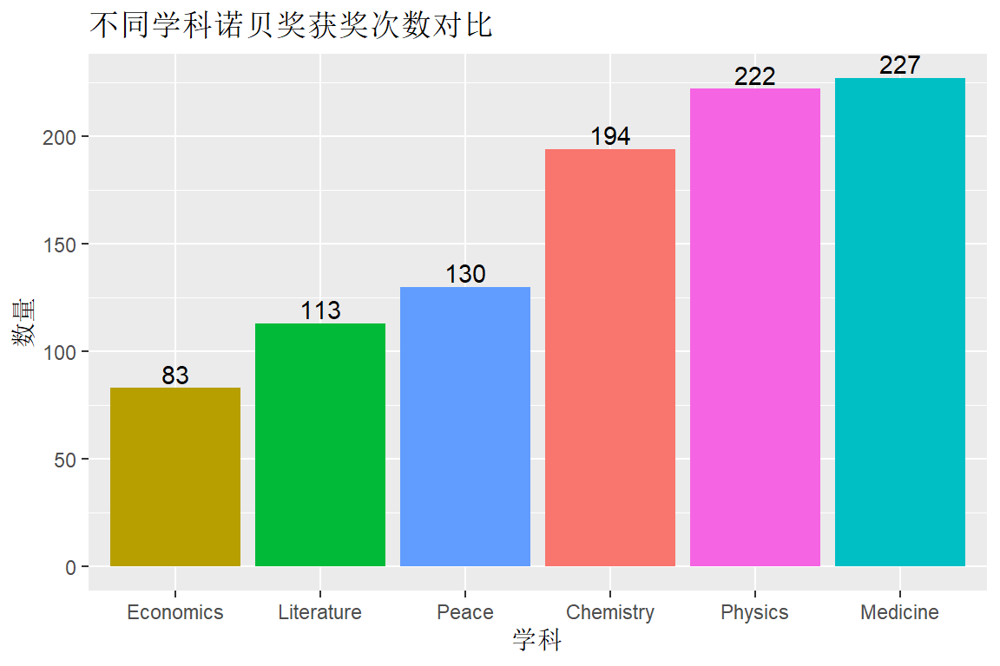

也可以使用别人定义好的配色方案


```r
library(ggthemr) # install.packages("devtools")
                 # devtools::install_github('cttobin/ggthemr')
ggthemr('dust')

df %>% 
  count(category) %>% 
  ggplot(aes(x = fct_reorder(category, n), y = n, fill = category)) +
  geom_col() +
  labs(title = "不同学科诺贝奖获奖次数对比", x = "学科", y = "数量") +
  theme(legend.position = "none")
```


这个配色方案感觉挺好看的呢，比较适合我这种又挑剔又懒惰的人。


当然，也可以自己DIY，或者使用配色网站的主题方案(https://learnui.design/tools/data-color-picker.html#palette)


```r
df %>% 
  count(category) %>% 
  ggplot(aes(x = fct_reorder(category, n), y = n)) +
  geom_col(fill = c("#003f5c", "#444e86", "#955196", "#dd5182", "#ff6e54", "#ffa600")
  ) +
  labs(title = "不同学科诺贝奖获奖次数对比", x = "学科", y = "数量") +
  theme(legend.position = "none")
```


让图骚动起来吧

```r
library(gganimate) #install.packages("gganimate", dependencies = T)

df %>% 
  count(category) %>% 
  mutate(category = fct_reorder(category, n)) %>% 
  ggplot(aes(x = category, y = n)) +
  geom_text(aes(label = n), vjust = -0.25) +
  geom_col(fill = c("#003f5c", "#444e86", "#955196", "#dd5182", "#ff6e54", "#ffa600")
  ) +
  labs(title = "不同学科诺贝奖获奖次数对比", x = "学科", y = "数量") +
  theme(legend.position = "none") +
  transition_states(category)  +
  shadow_mark(past = TRUE)
```

<!-- -->

和ggplot2的分面一样，动态图可以增加数据展示的维度。


## 看看我们伟大的祖国

```r
df %>% 
  filter(birth_country == "China") %>% 
  select(full_name, prize_year, category)
```

<div data-pagedtable="false">
  <script data-pagedtable-source type="application/json">
{"columns":[{"label":["full_name"],"name":[1],"type":["chr"],"align":["left"]},{"label":["prize_year"],"name":[2],"type":["dbl"],"align":["right"]},{"label":["category"],"name":[3],"type":["chr"],"align":["left"]}],"data":[{"1":"Walter Houser Brattain","2":"1956","3":"Physics"},{"1":"Chen Ning Yang","2":"1957","3":"Physics"},{"1":"Tsung-Dao (T.D.) Lee","2":"1957","3":"Physics"},{"1":"Edmond H. Fischer","2":"1992","3":"Medicine"},{"1":"Daniel C. Tsui","2":"1998","3":"Physics"},{"1":"Gao Xingjian","2":"2000","3":"Literature"},{"1":"Charles Kuen Kao","2":"2009","3":"Physics"},{"1":"Charles Kuen Kao","2":"2009","3":"Physics"},{"1":"Ei-ichi Negishi","2":"2010","3":"Chemistry"},{"1":"Liu Xiaobo","2":"2010","3":"Peace"},{"1":"Mo Yan","2":"2012","3":"Literature"},{"1":"Youyou Tu","2":"2015","3":"Medicine"}],"options":{"columns":{"min":{},"max":[10]},"rows":{"min":[10],"max":[10]},"pages":{}}}
  </script>
</div>


我们发现获奖者有多个地址，就会有重复的情况，比如 Charles Kuen Kao在2009年Physics有两次，为什么重复计数了呢？


下面我们去重吧， 去重可以用`distinct()`函数


```r
dt <- tibble::tribble(
  ~x, ~y,  ~z,
   1,  1, "a",
   1,  1, "b",
   1,  2, "c",
   1,  2, "d"
  )

dt
```

<div data-pagedtable="false">
  <script data-pagedtable-source type="application/json">
{"columns":[{"label":["x"],"name":[1],"type":["dbl"],"align":["right"]},{"label":["y"],"name":[2],"type":["dbl"],"align":["right"]},{"label":["z"],"name":[3],"type":["chr"],"align":["left"]}],"data":[{"1":"1","2":"1","3":"a"},{"1":"1","2":"1","3":"b"},{"1":"1","2":"2","3":"c"},{"1":"1","2":"2","3":"d"}],"options":{"columns":{"min":{},"max":[10]},"rows":{"min":[10],"max":[10]},"pages":{}}}
  </script>
</div>


```r
dt %>% distinct_at(vars(x), .keep_all = T)
```

<div data-pagedtable="false">
  <script data-pagedtable-source type="application/json">
{"columns":[{"label":["x"],"name":[1],"type":["dbl"],"align":["right"]},{"label":["y"],"name":[2],"type":["dbl"],"align":["right"]},{"label":["z"],"name":[3],"type":["chr"],"align":["left"]}],"data":[{"1":"1","2":"1","3":"a"}],"options":{"columns":{"min":{},"max":[10]},"rows":{"min":[10],"max":[10]},"pages":{}}}
  </script>
</div>


```r
dt %>% distinct_at(vars(x, y), .keep_all = T)
```

<div data-pagedtable="false">
  <script data-pagedtable-source type="application/json">
{"columns":[{"label":["x"],"name":[1],"type":["dbl"],"align":["right"]},{"label":["y"],"name":[2],"type":["dbl"],"align":["right"]},{"label":["z"],"name":[3],"type":["chr"],"align":["left"]}],"data":[{"1":"1","2":"1","3":"a"},{"1":"1","2":"2","3":"c"}],"options":{"columns":{"min":{},"max":[10]},"rows":{"min":[10],"max":[10]},"pages":{}}}
  </script>
</div>


```r
nobel_winners <- df %>%
  mutate_if(is.character, tolower) %>% 
  distinct_at(vars(full_name, prize_year, category), .keep_all = TRUE) %>%
  mutate(decade = 10 * (prize_year %/% 10),
         prize_age = prize_year - year(birth_date))

nobel_winners
```

<div data-pagedtable="false">
  <script data-pagedtable-source type="application/json">
{"columns":[{"label":["prize_year"],"name":[1],"type":["dbl"],"align":["right"]},{"label":["category"],"name":[2],"type":["chr"],"align":["left"]},{"label":["prize"],"name":[3],"type":["chr"],"align":["left"]},{"label":["motivation"],"name":[4],"type":["chr"],"align":["left"]},{"label":["prize_share"],"name":[5],"type":["chr"],"align":["left"]},{"label":["laureate_id"],"name":[6],"type":["dbl"],"align":["right"]},{"label":["laureate_type"],"name":[7],"type":["chr"],"align":["left"]},{"label":["full_name"],"name":[8],"type":["chr"],"align":["left"]},{"label":["birth_date"],"name":[9],"type":["date"],"align":["right"]},{"label":["birth_city"],"name":[10],"type":["chr"],"align":["left"]},{"label":["birth_country"],"name":[11],"type":["chr"],"align":["left"]},{"label":["gender"],"name":[12],"type":["chr"],"align":["left"]},{"label":["organization_name"],"name":[13],"type":["chr"],"align":["left"]},{"label":["organization_city"],"name":[14],"type":["chr"],"align":["left"]},{"label":["organization_country"],"name":[15],"type":["chr"],"align":["left"]},{"label":["death_date"],"name":[16],"type":["date"],"align":["right"]},{"label":["death_city"],"name":[17],"type":["chr"],"align":["left"]},{"label":["death_country"],"name":[18],"type":["chr"],"align":["left"]},{"label":["decade"],"name":[19],"type":["dbl"],"align":["right"]},{"label":["prize_age"],"name":[20],"type":["dbl"],"align":["right"]}],"data":[{"1":"1901","2":"chemistry","3":"the nobel prize in chemistry 1901","4":"\"in recognition of the extraordinary services he has rendered by the discovery of the laws of chemical dynamics and osmotic pressure in solutions\"","5":"1/1","6":"160","7":"individual","8":"jacobus henricus van 't hoff","9":"1852-08-30","10":"rotterdam","11":"netherlands","12":"male","13":"berlin university","14":"berlin","15":"germany","16":"1911-03-01","17":"berlin","18":"germany","19":"1900","20":"49"},{"1":"1901","2":"literature","3":"the nobel prize in literature 1901","4":"\"in special recognition of his poetic composition, which gives evidence of lofty idealism, artistic perfection and a rare combination of the qualities of both heart and intellect\"","5":"1/1","6":"569","7":"individual","8":"sully prudhomme","9":"1839-03-16","10":"paris","11":"france","12":"male","13":"NA","14":"NA","15":"NA","16":"1907-09-07","17":"chatenay","18":"france","19":"1900","20":"62"},{"1":"1901","2":"medicine","3":"the nobel prize in physiology or medicine 1901","4":"\"for his work on serum therapy, especially its application against diphtheria, by which he has opened a new road in the domain of medical science and thereby placed in the hands of the physician a victorious weapon against illness and deaths\"","5":"1/1","6":"293","7":"individual","8":"emil adolf von behring","9":"1854-03-15","10":"hansdorf (lawice)","11":"prussia (poland)","12":"male","13":"marburg university","14":"marburg","15":"germany","16":"1917-03-31","17":"marburg","18":"germany","19":"1900","20":"47"},{"1":"1901","2":"peace","3":"the nobel peace prize 1901","4":"NA","5":"1/2","6":"462","7":"individual","8":"jean henry dunant","9":"1828-05-08","10":"geneva","11":"switzerland","12":"male","13":"NA","14":"NA","15":"NA","16":"1910-10-30","17":"heiden","18":"switzerland","19":"1900","20":"73"},{"1":"1901","2":"peace","3":"the nobel peace prize 1901","4":"NA","5":"1/2","6":"463","7":"individual","8":"frédéric passy","9":"1822-05-20","10":"paris","11":"france","12":"male","13":"NA","14":"NA","15":"NA","16":"1912-06-12","17":"paris","18":"france","19":"1900","20":"79"},{"1":"1901","2":"physics","3":"the nobel prize in physics 1901","4":"\"in recognition of the extraordinary services he has rendered by the discovery of the remarkable rays subsequently named after him\"","5":"1/1","6":"1","7":"individual","8":"wilhelm conrad r<U+00F6>ntgen","9":"1845-03-27","10":"lennep (remscheid)","11":"prussia (germany)","12":"male","13":"munich university","14":"munich","15":"germany","16":"1923-02-10","17":"munich","18":"germany","19":"1900","20":"56"},{"1":"1902","2":"chemistry","3":"the nobel prize in chemistry 1902","4":"\"in recognition of the extraordinary services he has rendered by his work on sugar and purine syntheses\"","5":"1/1","6":"161","7":"individual","8":"hermann emil fischer","9":"1852-10-09","10":"euskirchen","11":"prussia (germany)","12":"male","13":"berlin university","14":"berlin","15":"germany","16":"1919-07-15","17":"berlin","18":"germany","19":"1900","20":"50"},{"1":"1902","2":"literature","3":"the nobel prize in literature 1902","4":"\"the greatest living master of the art of historical writing, with special reference to his monumental work, <i>a history of rome<\/i>\"","5":"1/1","6":"571","7":"individual","8":"christian matthias theodor mommsen","9":"1817-11-30","10":"garding","11":"schleswig (germany)","12":"male","13":"NA","14":"NA","15":"NA","16":"1903-11-01","17":"charlottenburg","18":"germany","19":"1900","20":"85"},{"1":"1902","2":"medicine","3":"the nobel prize in physiology or medicine 1902","4":"\"for his work on malaria, by which he has shown how it enters the organism and thereby has laid the foundation for successful research on this disease and methods of combating it\"","5":"1/1","6":"294","7":"individual","8":"ronald ross","9":"1857-05-13","10":"almora","11":"india","12":"male","13":"university college","14":"liverpool","15":"united kingdom","16":"1932-09-16","17":"putney heath","18":"united kingdom","19":"1900","20":"45"},{"1":"1902","2":"peace","3":"the nobel peace prize 1902","4":"NA","5":"1/2","6":"464","7":"individual","8":"lie ducommun","9":"1833-02-19","10":"geneva","11":"switzerland","12":"male","13":"NA","14":"NA","15":"NA","16":"1906-12-07","17":"bern","18":"switzerland","19":"1900","20":"69"},{"1":"1902","2":"peace","3":"the nobel peace prize 1902","4":"NA","5":"1/2","6":"465","7":"individual","8":"charles albert gobat","9":"1843-05-21","10":"tramelan","11":"switzerland","12":"male","13":"NA","14":"NA","15":"NA","16":"1914-03-16","17":"bern","18":"switzerland","19":"1900","20":"59"},{"1":"1902","2":"physics","3":"the nobel prize in physics 1902","4":"\"in recognition of the extraordinary service they rendered by their researches into the influence of magnetism upon radiation phenomena\"","5":"1/2","6":"2","7":"individual","8":"hendrik antoon lorentz","9":"1853-07-18","10":"arnhem","11":"netherlands","12":"male","13":"leiden university","14":"leiden","15":"netherlands","16":"1928-02-04","17":"NA","18":"netherlands","19":"1900","20":"49"},{"1":"1902","2":"physics","3":"the nobel prize in physics 1902","4":"\"in recognition of the extraordinary service they rendered by their researches into the influence of magnetism upon radiation phenomena\"","5":"1/2","6":"3","7":"individual","8":"pieter zeeman","9":"1865-05-25","10":"zonnemaire","11":"netherlands","12":"male","13":"amsterdam university","14":"amsterdam","15":"netherlands","16":"1943-10-09","17":"amsterdam","18":"netherlands","19":"1900","20":"37"},{"1":"1903","2":"chemistry","3":"the nobel prize in chemistry 1903","4":"\"in recognition of the extraordinary services he has rendered to the advancement of chemistry by his electrolytic theory of dissociation\"","5":"1/1","6":"162","7":"individual","8":"svante august arrhenius","9":"1859-02-19","10":"vik","11":"sweden","12":"male","13":"stockholm university","14":"stockholm","15":"sweden","16":"1927-10-02","17":"stockholm","18":"sweden","19":"1900","20":"44"},{"1":"1903","2":"literature","3":"the nobel prize in literature 1903","4":"\"as a tribute to his noble, magnificent and versatile poetry, which has always been distinguished by both the freshness of its inspiration and the rare purity of its spirit\"","5":"1/1","6":"572","7":"individual","8":"bj<U+00F8>rnstjerne martinus bj<U+00F8>rnson","9":"1832-12-08","10":"kvikne","11":"norway","12":"male","13":"NA","14":"NA","15":"NA","16":"1910-04-26","17":"paris","18":"france","19":"1900","20":"71"},{"1":"1903","2":"medicine","3":"the nobel prize in physiology or medicine 1903","4":"\"in recognition of his contribution to the treatment of diseases, especially lupus vulgaris, with concentrated light radiation, whereby he has opened a new avenue for medical science\"","5":"1/1","6":"295","7":"individual","8":"niels ryberg finsen","9":"1860-12-15","10":"thorshavn","11":"faroe islands (denmark)","12":"male","13":"finsen medical light institute","14":"copenhagen","15":"denmark","16":"1904-09-24","17":"copenhagen","18":"denmark","19":"1900","20":"43"},{"1":"1903","2":"peace","3":"the nobel peace prize 1903","4":"NA","5":"1/1","6":"466","7":"individual","8":"william randal cremer","9":"1828-03-18","10":"fareham","11":"united kingdom","12":"male","13":"NA","14":"NA","15":"NA","16":"1908-07-22","17":"london","18":"united kingdom","19":"1900","20":"75"},{"1":"1903","2":"physics","3":"the nobel prize in physics 1903","4":"\"in recognition of the extraordinary services he has rendered by his discovery of spontaneous radioactivity\"","5":"1/2","6":"4","7":"individual","8":"antoine henri becquerel","9":"1852-12-15","10":"paris","11":"france","12":"male","13":"cole polytechnique","14":"paris","15":"france","16":"1908-08-25","17":"NA","18":"france","19":"1900","20":"51"},{"1":"1903","2":"physics","3":"the nobel prize in physics 1903","4":"\"in recognition of the extraordinary services they have rendered by their joint researches on the radiation phenomena discovered by professor henri becquerel\"","5":"1/4","6":"5","7":"individual","8":"pierre curie","9":"1859-05-15","10":"paris","11":"france","12":"male","13":"cole municipale de physique et de chimie industrielles (municipal school of industrial physics and chemistry)","14":"paris","15":"france","16":"1906-04-19","17":"paris","18":"france","19":"1900","20":"44"},{"1":"1903","2":"physics","3":"the nobel prize in physics 1903","4":"\"in recognition of the extraordinary services they have rendered by their joint researches on the radiation phenomena discovered by professor henri becquerel\"","5":"1/4","6":"6","7":"individual","8":"marie curie, née sklodowska","9":"1867-11-07","10":"warsaw","11":"russian empire (poland)","12":"female","13":"NA","14":"NA","15":"NA","16":"1934-07-04","17":"sallanches","18":"france","19":"1900","20":"36"},{"1":"1904","2":"chemistry","3":"the nobel prize in chemistry 1904","4":"\"in recognition of his services in the discovery of the inert gaseous elements in air, and his determination of their place in the periodic system\"","5":"1/1","6":"163","7":"individual","8":"sir william ramsay","9":"1852-10-02","10":"glasgow","11":"scotland","12":"male","13":"university college","14":"london","15":"united kingdom","16":"1916-07-23","17":"high wycombe","18":"united kingdom","19":"1900","20":"52"},{"1":"1904","2":"literature","3":"the nobel prize in literature 1904","4":"\"in recognition of the fresh originality and true inspiration of his poetic production, which faithfully reflects the natural scenery and native spirit of his people, and, in addition, his significant work as a proven&ccedil;al philologist\"","5":"1/2","6":"573","7":"individual","8":"frédéric mistral","9":"1830-09-08","10":"maillane","11":"france","12":"male","13":"NA","14":"NA","15":"NA","16":"1914-03-25","17":"maillane","18":"france","19":"1900","20":"74"},{"1":"1904","2":"literature","3":"the nobel prize in literature 1904","4":"\"in recognition of the numerous and brilliant compositions which, in an individual and original manner, have revived the great traditions of the spanish drama\"","5":"1/2","6":"574","7":"individual","8":"josé echegaray y eizaguirre","9":"1832-04-19","10":"madrid","11":"spain","12":"male","13":"NA","14":"NA","15":"NA","16":"1916-09-04","17":"madrid","18":"spain","19":"1900","20":"72"},{"1":"1904","2":"medicine","3":"the nobel prize in physiology or medicine 1904","4":"\"in recognition of his work on the physiology of digestion, through which knowledge on vital aspects of the subject has been transformed and enlarged\"","5":"1/1","6":"296","7":"individual","8":"ivan petrovich pavlov","9":"1849-09-14","10":"ryazan","11":"russia","12":"male","13":"military medical academy","14":"st. petersburg","15":"russia","16":"1936-02-27","17":"leningrad","18":"russia","19":"1900","20":"55"},{"1":"1904","2":"peace","3":"the nobel peace prize 1904","4":"NA","5":"1/1","6":"467","7":"organization","8":"institut de droit international (institute of international law)","9":"<NA>","10":"NA","11":"NA","12":"NA","13":"NA","14":"NA","15":"NA","16":"<NA>","17":"NA","18":"NA","19":"1900","20":"NA"},{"1":"1904","2":"physics","3":"the nobel prize in physics 1904","4":"\"for his investigations of the densities of the most important gases and for his discovery of argon in connection with these studies\"","5":"1/1","6":"8","7":"individual","8":"lord rayleigh (john william strutt)","9":"1842-11-12","10":"langford grove, maldon, essex","11":"united kingdom","12":"male","13":"royal institution of great britain","14":"london","15":"united kingdom","16":"1919-06-30","17":"NA","18":"united kingdom","19":"1900","20":"62"},{"1":"1905","2":"chemistry","3":"the nobel prize in chemistry 1905","4":"\"in recognition of his services in the advancement of organic chemistry and the chemical industry, through his work on organic dyes and hydroaromatic compounds\"","5":"1/1","6":"164","7":"individual","8":"johann friedrich wilhelm adolf von baeyer","9":"1835-10-31","10":"berlin","11":"prussia (germany)","12":"male","13":"munich university","14":"munich","15":"germany","16":"1917-08-20","17":"starnberg","18":"germany","19":"1900","20":"70"},{"1":"1905","2":"literature","3":"the nobel prize in literature 1905","4":"\"because of his outstanding merits as an epic writer\"","5":"1/1","6":"575","7":"individual","8":"henryk sienkiewicz","9":"1846-05-05","10":"wola okrzejska","11":"poland","12":"male","13":"NA","14":"NA","15":"NA","16":"1916-11-15","17":"vevey","18":"switzerland","19":"1900","20":"59"},{"1":"1905","2":"medicine","3":"the nobel prize in physiology or medicine 1905","4":"\"for his investigations and discoveries in relation to tuberculosis\"","5":"1/1","6":"297","7":"individual","8":"robert koch","9":"1843-12-11","10":"clausthal (clausthal-zellerfeld)","11":"germany","12":"male","13":"institute for infectious diseases","14":"berlin","15":"germany","16":"1910-05-27","17":"baden-baden","18":"germany","19":"1900","20":"62"},{"1":"1905","2":"peace","3":"the nobel peace prize 1905","4":"NA","5":"1/1","6":"468","7":"individual","8":"baroness bertha sophie felicita von suttner, née countess kinsky von chinic und tettau","9":"1843-06-09","10":"prague","11":"austrian empire (czech republic)","12":"female","13":"NA","14":"NA","15":"NA","16":"1914-06-21","17":"vienna","18":"austria","19":"1900","20":"62"},{"1":"1905","2":"physics","3":"the nobel prize in physics 1905","4":"\"for his work on cathode rays\"","5":"1/1","6":"9","7":"individual","8":"philipp eduard anton von lenard","9":"1862-06-07","10":"pressburg (bratislava)","11":"hungary (slovakia)","12":"male","13":"kiel university","14":"kiel","15":"germany","16":"1947-05-20","17":"messelhausen","18":"germany","19":"1900","20":"43"},{"1":"1906","2":"chemistry","3":"the nobel prize in chemistry 1906","4":"\"in recognition of the great services rendered by him in his investigation and isolation of the element fluorine, and for the adoption in the service of science of the electric furnace called after him\"","5":"1/1","6":"165","7":"individual","8":"henri moissan","9":"1852-09-28","10":"paris","11":"france","12":"male","13":"sorbonne university","14":"paris","15":"france","16":"1907-02-20","17":"paris","18":"france","19":"1900","20":"54"},{"1":"1906","2":"literature","3":"the nobel prize in literature 1906","4":"\"not only in consideration of his deep learning and critical research, but above all as a tribute to the creative energy, freshness of style, and lyrical force which characterize his poetic masterpieces\"","5":"1/1","6":"576","7":"individual","8":"giosuè carducci","9":"1835-07-27","10":"val di castello","11":"tuscany (italy)","12":"male","13":"NA","14":"NA","15":"NA","16":"1907-02-16","17":"bologna","18":"italy","19":"1900","20":"71"},{"1":"1906","2":"medicine","3":"the nobel prize in physiology or medicine 1906","4":"\"in recognition of their work on the structure of the nervous system\"","5":"1/2","6":"298","7":"individual","8":"camillo golgi","9":"1843-07-07","10":"corteno","11":"italy","12":"male","13":"pavia university","14":"pavia","15":"italy","16":"1926-01-21","17":"pavia","18":"italy","19":"1900","20":"63"},{"1":"1906","2":"medicine","3":"the nobel prize in physiology or medicine 1906","4":"\"in recognition of their work on the structure of the nervous system\"","5":"1/2","6":"299","7":"individual","8":"santiago ramón y cajal","9":"1852-05-01","10":"petilla de aragó","11":"spain","12":"male","13":"madrid university","14":"madrid","15":"spain","16":"1934-10-17","17":"madrid","18":"spain","19":"1900","20":"54"},{"1":"1906","2":"peace","3":"the nobel peace prize 1906","4":"NA","5":"1/1","6":"470","7":"individual","8":"theodore roosevelt","9":"1858-10-27","10":"new york, ny","11":"united states of america","12":"male","13":"NA","14":"NA","15":"NA","16":"1919-01-06","17":"oyster bay, ny","18":"united states of america","19":"1900","20":"48"},{"1":"1906","2":"physics","3":"the nobel prize in physics 1906","4":"\"in recognition of the great merits of his theoretical and experimental investigations on the conduction of electricity by gases\"","5":"1/1","6":"10","7":"individual","8":"joseph john thomson","9":"1856-12-18","10":"cheetham hill, near manchester","11":"united kingdom","12":"male","13":"university of cambridge","14":"cambridge","15":"united kingdom","16":"1940-08-30","17":"cambridge","18":"united kingdom","19":"1900","20":"50"},{"1":"1907","2":"chemistry","3":"the nobel prize in chemistry 1907","4":"\"for his biochemical researches and his discovery of cell-free fermentation\"","5":"1/1","6":"166","7":"individual","8":"eduard buchner","9":"1860-05-20","10":"munich","11":"bavaria (germany)","12":"male","13":"landwirtschaftliche hochschule (agricultural college)","14":"berlin","15":"germany","16":"1917-08-13","17":"focsani","18":"romania","19":"1900","20":"47"},{"1":"1907","2":"literature","3":"the nobel prize in literature 1907","4":"\"in consideration of the power of observation, originality of imagination, virility of ideas and remarkable talent for narration which characterize the creations of this world-famous author\"","5":"1/1","6":"577","7":"individual","8":"rudyard kipling","9":"1865-12-30","10":"bombay","11":"british india (india)","12":"male","13":"NA","14":"NA","15":"NA","16":"1936-01-18","17":"london","18":"united kingdom","19":"1900","20":"42"},{"1":"1907","2":"medicine","3":"the nobel prize in physiology or medicine 1907","4":"\"in recognition of his work on the role played by protozoa in causing diseases\"","5":"1/1","6":"300","7":"individual","8":"charles louis alphonse laveran","9":"1845-06-18","10":"paris","11":"france","12":"male","13":"institut pasteur","14":"paris","15":"france","16":"1922-05-18","17":"paris","18":"france","19":"1900","20":"62"},{"1":"1907","2":"peace","3":"the nobel peace prize 1907","4":"NA","5":"1/2","6":"471","7":"individual","8":"ernesto teodoro moneta","9":"1833-09-20","10":"milan","11":"austrian empire (italy)","12":"male","13":"NA","14":"NA","15":"NA","16":"1918-02-10","17":"milan","18":"italy","19":"1900","20":"74"},{"1":"1907","2":"peace","3":"the nobel peace prize 1907","4":"NA","5":"1/2","6":"472","7":"individual","8":"louis renault","9":"1843-05-21","10":"autun","11":"france","12":"male","13":"sorbonne university","14":"paris","15":"france","16":"1918-02-08","17":"barbizon","18":"france","19":"1900","20":"64"},{"1":"1907","2":"physics","3":"the nobel prize in physics 1907","4":"\"for his optical precision instruments and the spectroscopic and metrological investigations carried out with their aid\"","5":"1/1","6":"11","7":"individual","8":"albert abraham michelson","9":"1852-12-19","10":"strelno (strzelno)","11":"prussia (poland)","12":"male","13":"university of chicago","14":"chicago, il","15":"united states of america","16":"1931-05-09","17":"pasadena, ca","18":"united states of america","19":"1900","20":"55"},{"1":"1908","2":"chemistry","3":"the nobel prize in chemistry 1908","4":"\"for his investigations into the disintegration of the elements, and the chemistry of radioactive substances\"","5":"1/1","6":"167","7":"individual","8":"ernest rutherford","9":"1871-08-30","10":"nelson","11":"new zealand","12":"male","13":"victoria university","14":"manchester","15":"united kingdom","16":"1937-10-19","17":"cambridge","18":"united kingdom","19":"1900","20":"37"},{"1":"1908","2":"literature","3":"the nobel prize in literature 1908","4":"\"in recognition of his earnest search for truth, his penetrating power of thought, his wide range of vision, and the warmth and strength in presentation with which in his numerous works he has vindicated and developed an idealistic philosophy of life\"","5":"1/1","6":"578","7":"individual","8":"rudolf christoph eucken","9":"1846-01-05","10":"aurich","11":"east friesland (germany)","12":"male","13":"NA","14":"NA","15":"NA","16":"1926-09-14","17":"jena","18":"germany","19":"1900","20":"62"},{"1":"1908","2":"medicine","3":"the nobel prize in physiology or medicine 1908","4":"\"in recognition of their work on immunity\"","5":"1/2","6":"301","7":"individual","8":"ilya ilyich mechnikov","9":"1845-05-15","10":"kharkov (kharkiv)","11":"russian empire (ukraine)","12":"male","13":"institut pasteur","14":"paris","15":"france","16":"1916-07-15","17":"paris","18":"france","19":"1900","20":"63"},{"1":"1908","2":"medicine","3":"the nobel prize in physiology or medicine 1908","4":"\"in recognition of their work on immunity\"","5":"1/2","6":"302","7":"individual","8":"paul ehrlich","9":"1854-03-14","10":"strehlen (strzelin)","11":"prussia (poland)","12":"male","13":"goettingen university","14":"g<U+00F6>ttingen","15":"germany","16":"1915-08-20","17":"bad homburg vor der h<U+00F6>he","18":"germany","19":"1900","20":"54"},{"1":"1908","2":"peace","3":"the nobel peace prize 1908","4":"NA","5":"1/2","6":"473","7":"individual","8":"klas pontus arnoldson","9":"1844-10-27","10":"gothenburg","11":"sweden","12":"male","13":"NA","14":"NA","15":"NA","16":"1916-02-20","17":"stockholm","18":"sweden","19":"1900","20":"64"},{"1":"1908","2":"peace","3":"the nobel peace prize 1908","4":"NA","5":"1/2","6":"474","7":"individual","8":"fredrik bajer","9":"1837-04-21","10":"n<U+00E6>stved","11":"denmark","12":"male","13":"NA","14":"NA","15":"NA","16":"1922-01-22","17":"copenhagen","18":"denmark","19":"1900","20":"71"},{"1":"1908","2":"physics","3":"the nobel prize in physics 1908","4":"\"for his method of reproducing colours photographically based on the phenomenon of interference\"","5":"1/1","6":"12","7":"individual","8":"gabriel lippmann","9":"1845-08-16","10":"hollerich","11":"luxembourg","12":"male","13":"sorbonne university","14":"paris","15":"france","16":"1921-07-13","17":"NA","18":"NA","19":"1900","20":"63"},{"1":"1909","2":"chemistry","3":"the nobel prize in chemistry 1909","4":"\"in recognition of his work on catalysis and for his investigations into the fundamental principles governing chemical equilibria and rates of reaction\"","5":"1/1","6":"168","7":"individual","8":"wilhelm ostwald","9":"1853-09-02","10":"riga","11":"russian empire (latvia)","12":"male","13":"leipzig university","14":"leipzig","15":"germany","16":"1932-04-04","17":"leipzig","18":"germany","19":"1900","20":"56"},{"1":"1909","2":"literature","3":"the nobel prize in literature 1909","4":"\"in appreciation of the lofty idealism, vivid imagination and spiritual perception that characterize her writings\"","5":"1/1","6":"579","7":"individual","8":"selma ottilia lovisa lagerl<U+00F6>f","9":"1858-11-20","10":"m<U+00E5>rbacka","11":"sweden","12":"female","13":"NA","14":"NA","15":"NA","16":"1940-03-16","17":"m<U+00E5>rbacka","18":"sweden","19":"1900","20":"51"},{"1":"1909","2":"medicine","3":"the nobel prize in physiology or medicine 1909","4":"\"for his work on the physiology, pathology and surgery of the thyroid gland\"","5":"1/1","6":"303","7":"individual","8":"emil theodor kocher","9":"1841-08-25","10":"berne","11":"switzerland","12":"male","13":"berne university","14":"berne","15":"switzerland","16":"1917-07-27","17":"berne","18":"switzerland","19":"1900","20":"68"},{"1":"1909","2":"peace","3":"the nobel peace prize 1909","4":"NA","5":"1/2","6":"475","7":"individual","8":"auguste marie fran<U+00E7>ois beernaert","9":"1829-07-26","10":"ostend","11":"belgium","12":"male","13":"NA","14":"NA","15":"NA","16":"1912-10-06","17":"lucerne","18":"switzerland","19":"1900","20":"80"},{"1":"1909","2":"peace","3":"the nobel peace prize 1909","4":"NA","5":"1/2","6":"476","7":"individual","8":"paul henri benjamin balluet d'estournelles de constant, baron de constant de rebecque","9":"1852-11-22","10":"la flèche","11":"france","12":"male","13":"NA","14":"NA","15":"NA","16":"1924-05-15","17":"paris","18":"france","19":"1900","20":"57"},{"1":"1909","2":"physics","3":"the nobel prize in physics 1909","4":"\"in recognition of their contributions to the development of wireless telegraphy\"","5":"1/2","6":"13","7":"individual","8":"guglielmo marconi","9":"1874-04-25","10":"bologna","11":"italy","12":"male","13":"marconi wireless telegraph co. ltd.","14":"london","15":"united kingdom","16":"1937-07-20","17":"rome","18":"italy","19":"1900","20":"35"},{"1":"1909","2":"physics","3":"the nobel prize in physics 1909","4":"\"in recognition of their contributions to the development of wireless telegraphy\"","5":"1/2","6":"14","7":"individual","8":"karl ferdinand braun","9":"1850-06-06","10":"fulda","11":"hesse-kassel (germany)","12":"male","13":"strasbourg university","14":"strasbourg","15":"alsace (then germany, now france)","16":"1918-04-20","17":"brooklyn, ny","18":"united states of america","19":"1900","20":"59"},{"1":"1910","2":"chemistry","3":"the nobel prize in chemistry 1910","4":"\"in recognition of his services to organic chemistry and the chemical industry by his pioneer work in the field of alicyclic compounds\"","5":"1/1","6":"169","7":"individual","8":"otto wallach","9":"1847-03-27","10":"koenigsberg (kaliningrad)","11":"germany (russia)","12":"male","13":"goettingen university","14":"g<U+00F6>ttingen","15":"germany","16":"1931-02-26","17":"g<U+00F6>ttingen","18":"germany","19":"1910","20":"63"},{"1":"1910","2":"literature","3":"the nobel prize in literature 1910","4":"\"as a tribute to the consummate artistry, permeated with idealism, which he has demonstrated during his long productive career as a lyric poet, dramatist, novelist and writer of world-renowned short stories\"","5":"1/1","6":"580","7":"individual","8":"paul johann ludwig heyse","9":"1830-03-15","10":"berlin","11":"prussia (germany)","12":"male","13":"NA","14":"NA","15":"NA","16":"1914-04-02","17":"munich","18":"germany","19":"1910","20":"80"},{"1":"1910","2":"medicine","3":"the nobel prize in physiology or medicine 1910","4":"\"in recognition of the contributions to our knowledge of cell chemistry made through his work on proteins, including the nucleic substances\"","5":"1/1","6":"304","7":"individual","8":"albrecht kossel","9":"1853-09-16","10":"rostock","11":"mecklenburg (germany)","12":"male","13":"university of heidelberg","14":"heidelberg","15":"germany","16":"1927-07-05","17":"heidelberg","18":"germany","19":"1910","20":"57"},{"1":"1910","2":"peace","3":"the nobel peace prize 1910","4":"NA","5":"1/1","6":"477","7":"organization","8":"bureau international permanent de la paix (permanent international peace bureau)","9":"<NA>","10":"NA","11":"NA","12":"NA","13":"NA","14":"NA","15":"NA","16":"<NA>","17":"NA","18":"NA","19":"1910","20":"NA"},{"1":"1910","2":"physics","3":"the nobel prize in physics 1910","4":"\"for his work on the equation of state for gases and liquids\"","5":"1/1","6":"15","7":"individual","8":"johannes diderik van der waals","9":"1837-11-23","10":"leiden","11":"netherlands","12":"male","13":"amsterdam university","14":"amsterdam","15":"netherlands","16":"1923-03-08","17":"amsterdam","18":"netherlands","19":"1910","20":"73"},{"1":"1911","2":"chemistry","3":"the nobel prize in chemistry 1911","4":"\"in recognition of her services to the advancement of chemistry by the discovery of the elements radium and polonium, by the isolation of radium and the study of the nature and compounds of this remarkable element\"","5":"1/1","6":"6","7":"individual","8":"marie curie, née sklodowska","9":"1867-11-07","10":"warsaw","11":"russian empire (poland)","12":"female","13":"sorbonne university","14":"paris","15":"france","16":"1934-07-04","17":"sallanches","18":"france","19":"1910","20":"44"},{"1":"1911","2":"literature","3":"the nobel prize in literature 1911","4":"\"in appreciation of his many-sided literary activities, and especially of his dramatic works, which are distinguished by a wealth of imagination and by a poetic fancy, which reveals, sometimes in the guise of a fairy tale, a deep inspiration, while in a mysterious way they appeal to the readers' own feelings and stimulate their imaginations\"","5":"1/1","6":"581","7":"individual","8":"count maurice (mooris) polidore marie bernhard maeterlinck","9":"1862-08-29","10":"ghent","11":"belgium","12":"male","13":"NA","14":"NA","15":"NA","16":"1949-05-06","17":"nice","18":"france","19":"1910","20":"49"},{"1":"1911","2":"medicine","3":"the nobel prize in physiology or medicine 1911","4":"\"for his work on the dioptrics of the eye\"","5":"1/1","6":"305","7":"individual","8":"allvar gullstrand","9":"1862-06-05","10":"landskrona","11":"sweden","12":"male","13":"uppsala university","14":"uppsala","15":"sweden","16":"1930-07-28","17":"stockholm","18":"sweden","19":"1910","20":"49"},{"1":"1911","2":"peace","3":"the nobel peace prize 1911","4":"NA","5":"1/2","6":"478","7":"individual","8":"tobias michael carel asser","9":"1838-04-28","10":"amsterdam","11":"netherlands","12":"male","13":"NA","14":"NA","15":"NA","16":"1913-07-29","17":"the hague","18":"netherlands","19":"1910","20":"73"},{"1":"1911","2":"peace","3":"the nobel peace prize 1911","4":"NA","5":"1/2","6":"479","7":"individual","8":"alfred hermann fried","9":"1864-11-11","10":"vienna","11":"austria","12":"male","13":"NA","14":"NA","15":"NA","16":"1921-05-05","17":"vienna","18":"austria","19":"1910","20":"47"},{"1":"1911","2":"physics","3":"the nobel prize in physics 1911","4":"\"for his discoveries regarding the laws governing the radiation of heat\"","5":"1/1","6":"16","7":"individual","8":"wilhelm wien","9":"1864-01-13","10":"gaffken (parusnoye)","11":"prussia (russia)","12":"male","13":"würzburg university","14":"würzburg","15":"germany","16":"1928-08-30","17":"munich","18":"germany","19":"1910","20":"47"},{"1":"1912","2":"chemistry","3":"the nobel prize in chemistry 1912","4":"\"for the discovery of the so-called grignard reagent, which in recent years has greatly advanced the progress of organic chemistry\"","5":"1/2","6":"172","7":"individual","8":"victor grignard","9":"1871-05-06","10":"cherbourg","11":"france","12":"male","13":"nancy university","14":"nancy","15":"france","16":"1935-12-13","17":"lyon","18":"france","19":"1910","20":"41"},{"1":"1912","2":"chemistry","3":"the nobel prize in chemistry 1912","4":"\"for his method of hydrogenating organic compounds in the presence of finely disintegrated metals whereby the progress of organic chemistry has been greatly advanced in recent years\"","5":"1/2","6":"173","7":"individual","8":"paul sabatier","9":"1854-11-05","10":"carcassonne","11":"france","12":"male","13":"toulouse university","14":"toulouse","15":"france","16":"1941-08-14","17":"toulouse","18":"france","19":"1910","20":"58"},{"1":"1912","2":"literature","3":"the nobel prize in literature 1912","4":"\"primarily in recognition of his fruitful, varied and outstanding production in the realm of dramatic art\"","5":"1/1","6":"582","7":"individual","8":"gerhart johann robert hauptmann","9":"1862-11-15","10":"bad salzbrunn","11":"prussia (germany)","12":"male","13":"NA","14":"NA","15":"NA","16":"1946-06-06","17":"agnetendorf (jagniatków)","18":"germany (poland)","19":"1910","20":"50"},{"1":"1912","2":"medicine","3":"the nobel prize in physiology or medicine 1912","4":"\"in recognition of his work on vascular suture and the transplantation of blood vessels and organs\"","5":"1/1","6":"306","7":"individual","8":"alexis carrel","9":"1873-06-28","10":"sainte-foy-lès-lyon","11":"france","12":"male","13":"rockefeller institute for medical research","14":"new york, ny","15":"united states of america","16":"1944-11-05","17":"paris","18":"france","19":"1910","20":"39"},{"1":"1912","2":"peace","3":"the nobel peace prize 1912","4":"NA","5":"1/1","6":"480","7":"individual","8":"elihu root","9":"1845-02-15","10":"clinton, ny","11":"united states of america","12":"male","13":"NA","14":"NA","15":"NA","16":"1937-02-07","17":"new york, ny","18":"united states of america","19":"1910","20":"67"},{"1":"1912","2":"physics","3":"the nobel prize in physics 1912","4":"\"for his invention of automatic regulators for use in conjunction with gas accumulators for illuminating lighthouses and buoys\"","5":"1/1","6":"17","7":"individual","8":"nils gustaf dalén","9":"1869-11-30","10":"stenstorp","11":"sweden","12":"male","13":"swedish gas-accumulator co.","14":"liding<U+00F6>-stockholm","15":"sweden","16":"1937-12-09","17":"stockholm","18":"sweden","19":"1910","20":"43"},{"1":"1913","2":"chemistry","3":"the nobel prize in chemistry 1913","4":"\"in recognition of his work on the linkage of atoms in molecules by which he has thrown new light on earlier investigations and opened up new fields of research especially in inorganic chemistry\"","5":"1/1","6":"174","7":"individual","8":"alfred werner","9":"1866-12-12","10":"mulhouse","11":"france","12":"male","13":"university of zurich","14":"zurich","15":"switzerland","16":"1919-11-15","17":"zurich","18":"switzerland","19":"1910","20":"47"},{"1":"1913","2":"literature","3":"the nobel prize in literature 1913","4":"\"because of his profoundly sensitive, fresh and beautiful verse, by which, with consummate skill, he has made his poetic thought, expressed in his own english words, a part of the literature of the west\"","5":"1/1","6":"583","7":"individual","8":"rabindranath tagore","9":"1861-05-07","10":"calcutta","11":"india","12":"male","13":"NA","14":"NA","15":"NA","16":"1941-08-07","17":"calcutta","18":"india","19":"1910","20":"52"},{"1":"1913","2":"medicine","3":"the nobel prize in physiology or medicine 1913","4":"\"in recognition of his work on anaphylaxis\"","5":"1/1","6":"307","7":"individual","8":"charles robert richet","9":"1850-08-26","10":"paris","11":"france","12":"male","13":"sorbonne university","14":"paris","15":"france","16":"1935-12-04","17":"paris","18":"france","19":"1910","20":"63"},{"1":"1913","2":"peace","3":"the nobel peace prize 1913","4":"NA","5":"1/1","6":"481","7":"individual","8":"henri la fontaine","9":"1854-04-22","10":"brussels","11":"belgium","12":"male","13":"NA","14":"NA","15":"NA","16":"1943-05-14","17":"brussels","18":"belgium","19":"1910","20":"59"},{"1":"1913","2":"physics","3":"the nobel prize in physics 1913","4":"\"for his investigations on the properties of matter at low temperatures which led, inter alia, to the production of liquid helium\"","5":"1/1","6":"18","7":"individual","8":"heike kamerlingh onnes","9":"1853-09-21","10":"groningen","11":"netherlands","12":"male","13":"leiden university","14":"leiden","15":"netherlands","16":"1926-02-21","17":"leiden","18":"netherlands","19":"1910","20":"60"},{"1":"1914","2":"chemistry","3":"the nobel prize in chemistry 1914","4":"\"in recognition of his accurate determinations of the atomic weight of a large number of chemical elements\"","5":"1/1","6":"175","7":"individual","8":"theodore william richards","9":"1868-01-31","10":"germantown, pa","11":"united states of america","12":"male","13":"harvard university","14":"cambridge, ma","15":"united states of america","16":"1928-04-02","17":"cambridge, ma","18":"united states of america","19":"1910","20":"46"},{"1":"1914","2":"medicine","3":"the nobel prize in physiology or medicine 1914","4":"\"for his work on the physiology and pathology of the vestibular apparatus\"","5":"1/1","6":"308","7":"individual","8":"robert bárány","9":"1876-04-22","10":"vienna","11":"austria","12":"male","13":"vienna university","14":"vienna","15":"austria","16":"1936-04-08","17":"uppsala","18":"sweden","19":"1910","20":"38"},{"1":"1914","2":"physics","3":"the nobel prize in physics 1914","4":"\"for his discovery of the diffraction of x-rays by crystals\"","5":"1/1","6":"19","7":"individual","8":"max von laue","9":"1879-10-09","10":"pfaffendorf","11":"germany","12":"male","13":"frankfurt-on-the-main university","14":"frankfurt-on-the-main","15":"germany","16":"1960-04-23","17":"berlin","18":"west germany (germany)","19":"1910","20":"35"},{"1":"1915","2":"chemistry","3":"the nobel prize in chemistry 1915","4":"\"for his researches on plant pigments, especially chlorophyll\"","5":"1/1","6":"176","7":"individual","8":"richard martin willst<U+00E4>tter","9":"1872-08-13","10":"karlsruhe","11":"germany","12":"male","13":"munich university","14":"munich","15":"germany","16":"1942-08-03","17":"locarno","18":"switzerland","19":"1910","20":"43"},{"1":"1915","2":"literature","3":"the nobel prize in literature 1915","4":"\"as a tribute to the lofty idealism of his literary production and to the sympathy and love of truth with which he has described different types of human beings\"","5":"1/1","6":"584","7":"individual","8":"romain rolland","9":"1866-01-29","10":"clamecy","11":"france","12":"male","13":"NA","14":"NA","15":"NA","16":"1944-12-30","17":"vézelay","18":"france","19":"1910","20":"49"},{"1":"1915","2":"physics","3":"the nobel prize in physics 1915","4":"\"for their services in the analysis of crystal structure by means of x-rays\"","5":"1/2","6":"20","7":"individual","8":"sir william henry bragg","9":"1862-07-02","10":"wigton","11":"united kingdom","12":"male","13":"university college","14":"london","15":"united kingdom","16":"1942-03-12","17":"london","18":"united kingdom","19":"1910","20":"53"},{"1":"1915","2":"physics","3":"the nobel prize in physics 1915","4":"\"for their services in the analysis of crystal structure by means of x-rays\"","5":"1/2","6":"21","7":"individual","8":"william lawrence bragg","9":"1890-03-31","10":"adelaide","11":"australia","12":"male","13":"victoria university","14":"manchester","15":"united kingdom","16":"1971-07-01","17":"ipswich","18":"united kingdom","19":"1910","20":"25"},{"1":"1916","2":"literature","3":"the nobel prize in literature 1916","4":"\"in recognition of his significance as the leading representative of a new era in our literature\"","5":"1/1","6":"585","7":"individual","8":"carl gustaf verner von heidenstam","9":"1859-07-06","10":"olshammar","11":"sweden","12":"male","13":"NA","14":"NA","15":"NA","16":"1940-05-20","17":"vralid","18":"sweden","19":"1910","20":"57"},{"1":"1917","2":"literature","3":"the nobel prize in literature 1917","4":"\"for his varied and rich poetry, which is inspired by lofty ideals\"","5":"1/2","6":"586","7":"individual","8":"karl adolph gjellerup","9":"1857-06-02","10":"roholte","11":"denmark","12":"male","13":"NA","14":"NA","15":"NA","16":"1919-10-11","17":"klotzsche","18":"germany","19":"1910","20":"60"},{"1":"1917","2":"literature","3":"the nobel prize in literature 1917","4":"\"for his authentic descriptions of present-day life in denmark\"","5":"1/2","6":"587","7":"individual","8":"henrik pontoppidan","9":"1857-07-24","10":"fredericia","11":"denmark","12":"male","13":"NA","14":"NA","15":"NA","16":"1943-08-21","17":"ordrup","18":"denmark","19":"1910","20":"60"},{"1":"1917","2":"peace","3":"the nobel peace prize 1917","4":"NA","5":"1/1","6":"482","7":"organization","8":"comité international de la croix rouge (international committee of the red cross)","9":"<NA>","10":"NA","11":"NA","12":"NA","13":"NA","14":"NA","15":"NA","16":"<NA>","17":"NA","18":"NA","19":"1910","20":"NA"},{"1":"1917","2":"physics","3":"the nobel prize in physics 1917","4":"\"for his discovery of the characteristic r&ouml;ntgen radiation of the elements\"","5":"1/1","6":"22","7":"individual","8":"charles glover barkla","9":"1877-06-07","10":"widnes","11":"united kingdom","12":"male","13":"edinburgh university","14":"edinburgh","15":"united kingdom","16":"1944-10-23","17":"edinburgh","18":"scotland","19":"1910","20":"40"},{"1":"1918","2":"chemistry","3":"the nobel prize in chemistry 1918","4":"\"for the synthesis of ammonia from its elements\"","5":"1/1","6":"177","7":"individual","8":"fritz haber","9":"1868-12-09","10":"breslau (wroclaw)","11":"prussia (poland)","12":"male","13":"kaiser-wilhelm-institut (now fritz-haber-institut) für physikalische chemie und electrochemie","14":"berlin-dahlem","15":"germany","16":"1934-01-29","17":"basel","18":"switzerland","19":"1910","20":"50"},{"1":"1918","2":"physics","3":"the nobel prize in physics 1918","4":"\"in recognition of the services he rendered to the advancement of physics by his discovery of energy quanta\"","5":"1/1","6":"23","7":"individual","8":"max karl ernst ludwig planck","9":"1858-04-23","10":"kiel","11":"schleswig (germany)","12":"male","13":"berlin university","14":"berlin","15":"germany","16":"1947-10-04","17":"g<U+00F6>ttingen","18":"west germany (germany)","19":"1910","20":"60"},{"1":"1919","2":"literature","3":"the nobel prize in literature 1919","4":"\"in special appreciation of his epic, <i>olympian spring<\/i>\"","5":"1/1","6":"588","7":"individual","8":"carl friedrich georg spitteler","9":"1845-04-24","10":"liestal","11":"switzerland","12":"male","13":"NA","14":"NA","15":"NA","16":"1924-12-29","17":"lucerne","18":"switzerland","19":"1910","20":"74"},{"1":"1919","2":"medicine","3":"the nobel prize in physiology or medicine 1919","4":"\"for his discoveries relating to immunity\"","5":"1/1","6":"309","7":"individual","8":"jules bordet","9":"1870-06-13","10":"soignies","11":"belgium","12":"male","13":"brussels university","14":"brussels","15":"belgium","16":"1961-04-06","17":"brussels","18":"belgium","19":"1910","20":"49"},{"1":"1919","2":"peace","3":"the nobel peace prize 1919","4":"NA","5":"1/1","6":"483","7":"individual","8":"thomas woodrow wilson","9":"1856-12-28","10":"staunton, va","11":"united states of america","12":"male","13":"NA","14":"NA","15":"NA","16":"1924-02-03","17":"washington, dc","18":"united states of america","19":"1910","20":"63"},{"1":"1919","2":"physics","3":"the nobel prize in physics 1919","4":"\"for his discovery of the doppler effect in canal rays and the splitting of spectral lines in electric fields\"","5":"1/1","6":"24","7":"individual","8":"johannes stark","9":"1874-04-15","10":"schickenhof","11":"germany","12":"male","13":"greifswald university","14":"greifswald","15":"germany","16":"1957-06-21","17":"traunstein","18":"west germany (germany)","19":"1910","20":"45"},{"1":"1920","2":"chemistry","3":"the nobel prize in chemistry 1920","4":"\"in recognition of his work in thermochemistry\"","5":"1/1","6":"178","7":"individual","8":"walther hermann nernst","9":"1864-06-25","10":"briesen","11":"prussia (germany)","12":"male","13":"berlin university","14":"berlin","15":"germany","16":"1941-11-18","17":"muskau","18":"germany","19":"1920","20":"56"},{"1":"1920","2":"literature","3":"the nobel prize in literature 1920","4":"\"for his monumental work, <i>growth of the soil<\/i>\"","5":"1/1","6":"589","7":"individual","8":"knut pedersen hamsun","9":"1859-08-04","10":"lom","11":"norway","12":"male","13":"NA","14":"NA","15":"NA","16":"1952-02-19","17":"grimstad","18":"norway","19":"1920","20":"61"},{"1":"1920","2":"medicine","3":"the nobel prize in physiology or medicine 1920","4":"\"for his discovery of the capillary motor regulating mechanism\"","5":"1/1","6":"310","7":"individual","8":"schack august steenberg krogh","9":"1874-11-15","10":"gren<U+00E5>","11":"denmark","12":"male","13":"copenhagen university","14":"copenhagen","15":"denmark","16":"1949-09-13","17":"copenhagen","18":"denmark","19":"1920","20":"46"},{"1":"1920","2":"peace","3":"the nobel peace prize 1920","4":"NA","5":"1/1","6":"484","7":"individual","8":"léon victor auguste bourgeois","9":"1851-05-21","10":"paris","11":"france","12":"male","13":"NA","14":"NA","15":"NA","16":"1925-09-29","17":"pernay","18":"france","19":"1920","20":"69"},{"1":"1920","2":"physics","3":"the nobel prize in physics 1920","4":"\"in recognition of the service he has rendered to precision measurements in physics by his discovery of anomalies in nickel steel alloys\"","5":"1/1","6":"25","7":"individual","8":"charles edouard guillaume","9":"1861-02-15","10":"fleurier","11":"switzerland","12":"male","13":"bureau international des poids et mesures (international bureau of weights and measures)","14":"sèvres","15":"france","16":"1938-06-13","17":"sèvres","18":"france","19":"1920","20":"59"},{"1":"1921","2":"chemistry","3":"the nobel prize in chemistry 1921","4":"\"for his contributions to our knowledge of the chemistry of radioactive substances, and his investigations into the origin and nature of isotopes\"","5":"1/1","6":"179","7":"individual","8":"frederick soddy","9":"1877-09-02","10":"eastbourne","11":"united kingdom","12":"male","13":"university of oxford","14":"oxford","15":"united kingdom","16":"1956-09-22","17":"brighton","18":"united kingdom","19":"1920","20":"44"},{"1":"1921","2":"literature","3":"the nobel prize in literature 1921","4":"\"in recognition of his brilliant literary achievements, characterized as they are by a nobility of style, a profound human sympathy, grace, and a true gallic temperament\"","5":"1/1","6":"590","7":"individual","8":"anatole france","9":"1844-04-16","10":"paris","11":"france","12":"male","13":"NA","14":"NA","15":"NA","16":"1924-10-12","17":"saint-cyr-sur-loire","18":"france","19":"1920","20":"77"},{"1":"1921","2":"peace","3":"the nobel peace prize 1921","4":"NA","5":"1/2","6":"485","7":"individual","8":"karl hjalmar branting","9":"1860-11-23","10":"stockholm","11":"sweden","12":"male","13":"NA","14":"NA","15":"NA","16":"1925-02-24","17":"stockholm","18":"sweden","19":"1920","20":"61"},{"1":"1921","2":"peace","3":"the nobel peace prize 1921","4":"NA","5":"1/2","6":"486","7":"individual","8":"christian lous lange","9":"1869-09-17","10":"stavanger","11":"norway","12":"male","13":"NA","14":"NA","15":"NA","16":"1938-12-11","17":"oslo","18":"norway","19":"1920","20":"52"},{"1":"1921","2":"physics","3":"the nobel prize in physics 1921","4":"\"for his services to theoretical physics, and especially for his discovery of the law of the photoelectric effect\"","5":"1/1","6":"26","7":"individual","8":"albert einstein","9":"1879-03-14","10":"ulm","11":"germany","12":"male","13":"kaiser-wilhelm-institut (now max-planck-institut) für physik","14":"berlin","15":"germany","16":"1955-04-18","17":"princeton, nj","18":"united states of america","19":"1920","20":"42"},{"1":"1922","2":"chemistry","3":"the nobel prize in chemistry 1922","4":"\"for his discovery, by means of his mass spectrograph, of isotopes, in a large number of non-radioactive elements, and for his enunciation of the whole-number rule\"","5":"1/1","6":"180","7":"individual","8":"francis william aston","9":"1877-09-01","10":"harborne","11":"united kingdom","12":"male","13":"university of cambridge","14":"cambridge","15":"united kingdom","16":"1945-11-20","17":"cambridge","18":"united kingdom","19":"1920","20":"45"},{"1":"1922","2":"literature","3":"the nobel prize in literature 1922","4":"\"for the happy manner in which he has continued the illustrious traditions of the spanish drama\"","5":"1/1","6":"592","7":"individual","8":"jacinto benavente","9":"1866-08-12","10":"madrid","11":"spain","12":"male","13":"NA","14":"NA","15":"NA","16":"1954-07-14","17":"madrid","18":"spain","19":"1920","20":"56"},{"1":"1922","2":"medicine","3":"the nobel prize in physiology or medicine 1922","4":"\"for his discovery relating to the production of heat in the muscle\"","5":"1/2","6":"311","7":"individual","8":"archibald vivian hill","9":"1886-09-26","10":"bristol","11":"united kingdom","12":"male","13":"london university","14":"london","15":"united kingdom","16":"1977-06-03","17":"cambridge","18":"united kingdom","19":"1920","20":"36"},{"1":"1922","2":"medicine","3":"the nobel prize in physiology or medicine 1922","4":"\"for his discovery of the fixed relationship between the consumption of oxygen and the metabolism of lactic acid in the muscle\"","5":"1/2","6":"312","7":"individual","8":"otto fritz meyerhof","9":"1884-04-12","10":"hanover","11":"germany","12":"male","13":"kiel university","14":"kiel","15":"germany","16":"1951-10-06","17":"philadelphia, pa","18":"united states of america","19":"1920","20":"38"},{"1":"1922","2":"peace","3":"the nobel peace prize 1922","4":"NA","5":"1/1","6":"487","7":"individual","8":"fridtjof nansen","9":"1861-10-10","10":"kristiania (oslo)","11":"norway","12":"male","13":"NA","14":"NA","15":"NA","16":"1930-05-13","17":"oslo","18":"norway","19":"1920","20":"61"},{"1":"1922","2":"physics","3":"the nobel prize in physics 1922","4":"\"for his services in the investigation of the structure of atoms and of the radiation emanating from them\"","5":"1/1","6":"27","7":"individual","8":"niels henrik david bohr","9":"1885-10-07","10":"copenhagen","11":"denmark","12":"male","13":"copenhagen university","14":"copenhagen","15":"denmark","16":"1962-11-18","17":"copenhagen","18":"denmark","19":"1920","20":"37"},{"1":"1923","2":"chemistry","3":"the nobel prize in chemistry 1923","4":"\"for his invention of the method of micro-analysis of organic substances\"","5":"1/1","6":"181","7":"individual","8":"fritz pregl","9":"1869-09-03","10":"laibach (ljubljana)","11":"austria-hungary (slovenia)","12":"male","13":"graz university","14":"graz","15":"austria","16":"1930-12-13","17":"graz","18":"austria","19":"1920","20":"54"},{"1":"1923","2":"literature","3":"the nobel prize in literature 1923","4":"\"for his always inspired poetry, which in a highly artistic form gives expression to the spirit of a whole nation\"","5":"1/1","6":"593","7":"individual","8":"william butler yeats","9":"1865-06-13","10":"dublin","11":"ireland","12":"male","13":"NA","14":"NA","15":"NA","16":"1939-01-28","17":"roquebrune-cap-martin","18":"france","19":"1920","20":"58"},{"1":"1923","2":"medicine","3":"the nobel prize in physiology or medicine 1923","4":"\"for the discovery of insulin\"","5":"1/2","6":"313","7":"individual","8":"frederick grant banting","9":"1891-11-14","10":"alliston","11":"canada","12":"male","13":"university of toronto","14":"toronto","15":"canada","16":"1941-02-21","17":"newfoundland","18":"canada","19":"1920","20":"32"},{"1":"1923","2":"medicine","3":"the nobel prize in physiology or medicine 1923","4":"\"for the discovery of insulin\"","5":"1/2","6":"314","7":"individual","8":"john james rickard macleod","9":"1876-09-06","10":"cluny","11":"scotland","12":"male","13":"university of toronto","14":"toronto","15":"canada","16":"1935-03-16","17":"aberdeen","18":"scotland","19":"1920","20":"47"},{"1":"1923","2":"physics","3":"the nobel prize in physics 1923","4":"\"for his work on the elementary charge of electricity and on the photoelectric effect\"","5":"1/1","6":"28","7":"individual","8":"robert andrews millikan","9":"1868-03-22","10":"morrison, il","11":"united states of america","12":"male","13":"california institute of technology (caltech)","14":"pasadena, ca","15":"united states of america","16":"1953-12-19","17":"san marino, ca","18":"united states of america","19":"1920","20":"55"},{"1":"1924","2":"literature","3":"the nobel prize in literature 1924","4":"\"for his great national epic, <i>the peasants<\/i>\"","5":"1/1","6":"594","7":"individual","8":"wladyslaw stanislaw reymont","9":"1867-05-07","10":"kobiele wielkie","11":"russian empire (poland)","12":"male","13":"NA","14":"NA","15":"NA","16":"1925-12-05","17":"warsaw","18":"poland","19":"1920","20":"57"},{"1":"1924","2":"medicine","3":"the nobel prize in physiology or medicine 1924","4":"\"for his discovery of the mechanism of the electrocardiogram\"","5":"1/1","6":"315","7":"individual","8":"willem einthoven","9":"1860-05-21","10":"semarang","11":"java, dutch east indies (indonesia)","12":"male","13":"leiden university","14":"leiden","15":"netherlands","16":"1927-09-29","17":"leiden","18":"netherlands","19":"1920","20":"64"},{"1":"1924","2":"physics","3":"the nobel prize in physics 1924","4":"\"for his discoveries and research in the field of x-ray spectroscopy\"","5":"1/1","6":"29","7":"individual","8":"karl manne georg siegbahn","9":"1886-12-03","10":"lund","11":"sweden","12":"male","13":"uppsala university","14":"uppsala","15":"sweden","16":"1978-09-26","17":"ngelholm","18":"sweden","19":"1920","20":"38"},{"1":"1925","2":"chemistry","3":"the nobel prize in chemistry 1925","4":"\"for his demonstration of the heterogenous nature of colloid solutions and for the methods he used, which have since become fundamental in modern colloid chemistry\"","5":"1/1","6":"182","7":"individual","8":"richard adolf zsigmondy","9":"1865-04-01","10":"vienna","11":"austrian empire (austria)","12":"male","13":"goettingen university","14":"g<U+00F6>ttingen","15":"germany","16":"1929-09-24","17":"g<U+00F6>ttingen","18":"germany","19":"1920","20":"60"},{"1":"1925","2":"literature","3":"the nobel prize in literature 1925","4":"\"for his work which is marked by both idealism and humanity, its stimulating satire often being infused with a singular poetic beauty\"","5":"1/1","6":"596","7":"individual","8":"george bernard shaw","9":"1856-07-26","10":"dublin","11":"ireland","12":"male","13":"NA","14":"NA","15":"NA","16":"1950-11-02","17":"ayot st. lawrence","18":"united kingdom","19":"1920","20":"69"},{"1":"1925","2":"peace","3":"the nobel peace prize 1925","4":"NA","5":"1/2","6":"488","7":"individual","8":"sir austen chamberlain","9":"1863-10-16","10":"birmingham","11":"united kingdom","12":"male","13":"NA","14":"NA","15":"NA","16":"1937-03-16","17":"london","18":"united kingdom","19":"1920","20":"62"},{"1":"1925","2":"peace","3":"the nobel peace prize 1925","4":"NA","5":"1/2","6":"489","7":"individual","8":"charles gates dawes","9":"1865-08-27","10":"marietta, oh","11":"united states of america","12":"male","13":"NA","14":"NA","15":"NA","16":"1951-04-23","17":"evanston, il","18":"united states of america","19":"1920","20":"60"},{"1":"1925","2":"physics","3":"the nobel prize in physics 1925","4":"\"for their discovery of the laws governing the impact of an electron upon an atom\"","5":"1/2","6":"30","7":"individual","8":"james franck","9":"1882-08-26","10":"hamburg","11":"germany","12":"male","13":"goettingen university","14":"g<U+00F6>ttingen","15":"germany","16":"1964-05-21","17":"g<U+00F6>ttingen","18":"west germany (germany)","19":"1920","20":"43"},{"1":"1925","2":"physics","3":"the nobel prize in physics 1925","4":"\"for their discovery of the laws governing the impact of an electron upon an atom\"","5":"1/2","6":"31","7":"individual","8":"gustav ludwig hertz","9":"1887-07-22","10":"hamburg","11":"germany","12":"male","13":"halle university","14":"halle","15":"germany","16":"1975-10-30","17":"berlin","18":"east germany","19":"1920","20":"38"},{"1":"1926","2":"chemistry","3":"the nobel prize in chemistry 1926","4":"\"for his work on disperse systems\"","5":"1/1","6":"183","7":"individual","8":"the (theodor) svedberg","9":"1884-08-30","10":"fler<U+00E4>ng","11":"sweden","12":"male","13":"uppsala university","14":"uppsala","15":"sweden","16":"1971-02-25","17":"rebro","18":"sweden","19":"1920","20":"42"},{"1":"1926","2":"literature","3":"the nobel prize in literature 1926","4":"\"for her idealistically inspired writings which with plastic clarity picture the life on her native island and with depth and sympathy deal with human problems in general\"","5":"1/1","6":"597","7":"individual","8":"grazia deledda","9":"1871-09-27","10":"nuoro, sardinia","11":"italy","12":"female","13":"NA","14":"NA","15":"NA","16":"1936-08-15","17":"rome","18":"italy","19":"1920","20":"55"},{"1":"1926","2":"medicine","3":"the nobel prize in physiology or medicine 1926","4":"\"for his discovery of the spiroptera carcinoma\"","5":"1/1","6":"316","7":"individual","8":"johannes andreas grib fibiger","9":"1867-04-23","10":"silkeborg","11":"denmark","12":"male","13":"copenhagen university","14":"copenhagen","15":"denmark","16":"1928-01-30","17":"copenhagen","18":"denmark","19":"1920","20":"59"},{"1":"1926","2":"peace","3":"the nobel peace prize 1926","4":"NA","5":"1/2","6":"490","7":"individual","8":"aristide briand","9":"1862-03-28","10":"nantes","11":"france","12":"male","13":"NA","14":"NA","15":"NA","16":"1932-03-07","17":"paris","18":"france","19":"1920","20":"64"},{"1":"1926","2":"peace","3":"the nobel peace prize 1926","4":"NA","5":"1/2","6":"491","7":"individual","8":"gustav stresemann","9":"1878-05-10","10":"berlin","11":"germany","12":"male","13":"NA","14":"NA","15":"NA","16":"1929-10-03","17":"berlin","18":"germany","19":"1920","20":"48"},{"1":"1926","2":"physics","3":"the nobel prize in physics 1926","4":"\"for his work on the discontinuous structure of matter, and especially for his discovery of sedimentation equilibrium\"","5":"1/1","6":"32","7":"individual","8":"jean baptiste perrin","9":"1870-09-30","10":"lille","11":"france","12":"male","13":"sorbonne university","14":"paris","15":"france","16":"1942-04-17","17":"new york, ny","18":"united states of america","19":"1920","20":"56"},{"1":"1927","2":"chemistry","3":"the nobel prize in chemistry 1927","4":"\"for his investigations of the constitution of the bile acids and related substances\"","5":"1/1","6":"184","7":"individual","8":"heinrich otto wieland","9":"1877-06-04","10":"pforzheim","11":"germany","12":"male","13":"munich university","14":"munich","15":"germany","16":"1957-08-05","17":"munich","18":"west germany (germany)","19":"1920","20":"50"},{"1":"1927","2":"literature","3":"the nobel prize in literature 1927","4":"\"in recognition of his rich and vitalizing ideas and the brilliant skill with which they have been presented\"","5":"1/1","6":"600","7":"individual","8":"henri bergson","9":"1859-10-18","10":"paris","11":"france","12":"male","13":"NA","14":"NA","15":"NA","16":"1941-01-04","17":"paris","18":"france","19":"1920","20":"68"},{"1":"1927","2":"medicine","3":"the nobel prize in physiology or medicine 1927","4":"\"for his discovery of the therapeutic value of malaria inoculation in the treatment of dementia paralytica\"","5":"1/1","6":"317","7":"individual","8":"julius wagner-jauregg","9":"1857-03-07","10":"wels","11":"austria","12":"male","13":"vienna university","14":"vienna","15":"austria","16":"1940-09-27","17":"vienna","18":"austria","19":"1920","20":"70"},{"1":"1927","2":"peace","3":"the nobel peace prize 1927","4":"NA","5":"1/2","6":"492","7":"individual","8":"ferdinand buisson","9":"1841-12-20","10":"paris","11":"france","12":"male","13":"NA","14":"NA","15":"NA","16":"1932-02-16","17":"thieuloy-saint-antoine","18":"france","19":"1920","20":"86"},{"1":"1927","2":"peace","3":"the nobel peace prize 1927","4":"NA","5":"1/2","6":"493","7":"individual","8":"ludwig quidde","9":"1858-03-23","10":"bremen","11":"germany","12":"male","13":"NA","14":"NA","15":"NA","16":"1941-03-04","17":"geneva","18":"switzerland","19":"1920","20":"69"},{"1":"1927","2":"physics","3":"the nobel prize in physics 1927","4":"\"for his discovery of the effect named after him\"","5":"1/2","6":"33","7":"individual","8":"arthur holly compton","9":"1892-09-10","10":"wooster, oh","11":"united states of america","12":"male","13":"university of chicago","14":"chicago, il","15":"united states of america","16":"1962-03-15","17":"berkeley, ca","18":"united states of america","19":"1920","20":"35"},{"1":"1927","2":"physics","3":"the nobel prize in physics 1927","4":"\"for his method of making the paths of electrically charged particles visible by condensation of vapour\"","5":"1/2","6":"34","7":"individual","8":"charles thomson rees wilson","9":"1869-02-14","10":"glencorse","11":"scotland","12":"male","13":"university of cambridge","14":"cambridge","15":"united kingdom","16":"1959-11-15","17":"carlops","18":"scotland","19":"1920","20":"58"},{"1":"1928","2":"chemistry","3":"the nobel prize in chemistry 1928","4":"\"for the services rendered through his research into the constitution of the sterols and their connection with the vitamins\"","5":"1/1","6":"185","7":"individual","8":"adolf otto reinhold windaus","9":"1876-12-25","10":"berlin","11":"germany","12":"male","13":"goettingen university","14":"g<U+00F6>ttingen","15":"germany","16":"1959-06-09","17":"g<U+00F6>ttingen","18":"west germany (germany)","19":"1920","20":"52"},{"1":"1928","2":"literature","3":"the nobel prize in literature 1928","4":"\"principally for her powerful descriptions of northern life during the middle ages\"","5":"1/1","6":"601","7":"individual","8":"sigrid undset","9":"1882-05-20","10":"kalundborg","11":"denmark","12":"female","13":"NA","14":"NA","15":"NA","16":"1949-06-10","17":"lillehammer","18":"norway","19":"1920","20":"46"},{"1":"1928","2":"medicine","3":"the nobel prize in physiology or medicine 1928","4":"\"for his work on typhus\"","5":"1/1","6":"318","7":"individual","8":"charles jules henri nicolle","9":"1866-09-21","10":"rouen","11":"france","12":"male","13":"institut pasteur","14":"tunis","15":"NA","16":"1936-02-28","17":"tunis","18":"tunisia","19":"1920","20":"62"},{"1":"1928","2":"physics","3":"the nobel prize in physics 1928","4":"\"for his work on the thermionic phenomenon and especially for the discovery of the law named after him\"","5":"1/1","6":"35","7":"individual","8":"owen willans richardson","9":"1879-04-26","10":"dewsbury","11":"united kingdom","12":"male","13":"london university","14":"london","15":"united kingdom","16":"1959-02-15","17":"alton","18":"united kingdom","19":"1920","20":"49"},{"1":"1929","2":"chemistry","3":"the nobel prize in chemistry 1929","4":"\"for their investigations on the fermentation of sugar and fermentative enzymes\"","5":"1/2","6":"186","7":"individual","8":"arthur harden","9":"1865-10-12","10":"manchester","11":"united kingdom","12":"male","13":"london university","14":"london","15":"united kingdom","16":"1940-06-17","17":"bourne","18":"united kingdom","19":"1920","20":"64"},{"1":"1929","2":"chemistry","3":"the nobel prize in chemistry 1929","4":"\"for their investigations on the fermentation of sugar and fermentative enzymes\"","5":"1/2","6":"187","7":"individual","8":"hans karl august simon von euler-chelpin","9":"1873-02-15","10":"augsburg","11":"germany","12":"male","13":"stockholm university","14":"stockholm","15":"sweden","16":"1964-11-06","17":"stockholm","18":"sweden","19":"1920","20":"56"},{"1":"1929","2":"literature","3":"the nobel prize in literature 1929","4":"\"principally for his great novel, <i>buddenbrooks<\/i>, which has won steadily increased recognition as one of the classic works of contemporary literature\"","5":"1/1","6":"602","7":"individual","8":"thomas mann","9":"1875-06-06","10":"lübeck","11":"germany","12":"male","13":"NA","14":"NA","15":"NA","16":"1955-08-12","17":"zurich","18":"switzerland","19":"1920","20":"54"},{"1":"1929","2":"medicine","3":"the nobel prize in physiology or medicine 1929","4":"\"for his discovery of the antineuritic vitamin\"","5":"1/2","6":"319","7":"individual","8":"christiaan eijkman","9":"1858-08-11","10":"nijkerk","11":"netherlands","12":"male","13":"utrecht university","14":"utrecht","15":"netherlands","16":"1930-11-05","17":"utrecht","18":"netherlands","19":"1920","20":"71"},{"1":"1929","2":"medicine","3":"the nobel prize in physiology or medicine 1929","4":"\"for his discovery of the growth-stimulating vitamins\"","5":"1/2","6":"320","7":"individual","8":"sir frederick gowland hopkins","9":"1861-06-20","10":"eastbourne","11":"united kingdom","12":"male","13":"university of cambridge","14":"cambridge","15":"united kingdom","16":"1947-05-16","17":"cambridge","18":"united kingdom","19":"1920","20":"68"},{"1":"1929","2":"peace","3":"the nobel peace prize 1929","4":"NA","5":"1/1","6":"494","7":"individual","8":"frank billings kellogg","9":"1856-12-22","10":"potsdam, ny","11":"united states of america","12":"male","13":"NA","14":"NA","15":"NA","16":"1937-12-21","17":"st. paul, mn","18":"united states of america","19":"1920","20":"73"},{"1":"1929","2":"physics","3":"the nobel prize in physics 1929","4":"\"for his discovery of the wave nature of electrons\"","5":"1/1","6":"36","7":"individual","8":"prince louis-victor pierre raymond de broglie","9":"1892-08-15","10":"dieppe","11":"france","12":"male","13":"sorbonne university, institut henri poincaré","14":"paris","15":"france","16":"1987-03-19","17":"paris","18":"france","19":"1920","20":"37"},{"1":"1930","2":"chemistry","3":"the nobel prize in chemistry 1930","4":"\"for his researches into the constitution of haemin and chlorophyll and especially for his synthesis of haemin\"","5":"1/1","6":"188","7":"individual","8":"hans fischer","9":"1881-07-27","10":"hoechst","11":"germany","12":"male","13":"technische hochschule (institute of technology)","14":"munich","15":"germany","16":"1945-03-31","17":"munich","18":"germany","19":"1930","20":"49"},{"1":"1930","2":"literature","3":"the nobel prize in literature 1930","4":"\"for his vigorous and graphic art of description and his ability to create, with wit and humour, new types of characters\"","5":"1/1","6":"603","7":"individual","8":"sinclair lewis","9":"1885-02-07","10":"sauk centre, mn","11":"united states of america","12":"male","13":"NA","14":"NA","15":"NA","16":"1951-01-10","17":"rome","18":"italy","19":"1930","20":"45"},{"1":"1930","2":"medicine","3":"the nobel prize in physiology or medicine 1930","4":"\"for his discovery of human blood groups\"","5":"1/1","6":"321","7":"individual","8":"karl landsteiner","9":"1868-06-14","10":"vienna","11":"austrian empire (austria)","12":"male","13":"rockefeller institute for medical research","14":"new york, ny","15":"united states of america","16":"1943-06-26","17":"new york, ny","18":"united states of america","19":"1930","20":"62"},{"1":"1930","2":"peace","3":"the nobel peace prize 1930","4":"NA","5":"1/1","6":"495","7":"individual","8":"lars olof jonathan (nathan) s<U+00F6>derblom","9":"1866-01-15","10":"tr<U+00F6>n<U+00F6>","11":"sweden","12":"male","13":"NA","14":"NA","15":"NA","16":"1931-07-12","17":"uppsala","18":"sweden","19":"1930","20":"64"},{"1":"1930","2":"physics","3":"the nobel prize in physics 1930","4":"\"for his work on the scattering of light and for the discovery of the effect named after him\"","5":"1/1","6":"37","7":"individual","8":"sir chandrasekhara venkata raman","9":"1888-11-07","10":"tiruchirappalli","11":"india","12":"male","13":"calcutta university","14":"calcutta","15":"india","16":"1970-11-21","17":"bangalore","18":"india","19":"1930","20":"42"},{"1":"1931","2":"chemistry","3":"the nobel prize in chemistry 1931","4":"\"in recognition of their contributions to the invention and development of chemical high pressure methods\"","5":"1/2","6":"189","7":"individual","8":"carl bosch","9":"1874-08-27","10":"cologne","11":"germany","12":"male","13":"university of heidelberg","14":"heidelberg","15":"germany","16":"1940-04-26","17":"heidelberg","18":"germany","19":"1930","20":"57"},{"1":"1931","2":"chemistry","3":"the nobel prize in chemistry 1931","4":"\"in recognition of their contributions to the invention and development of chemical high pressure methods\"","5":"1/2","6":"190","7":"individual","8":"friedrich bergius","9":"1884-10-11","10":"goldschmieden, near breslau","11":"germany (poland)","12":"male","13":"university of heidelberg","14":"heidelberg","15":"germany","16":"1949-03-30","17":"buenos aires","18":"argentina","19":"1930","20":"47"},{"1":"1931","2":"literature","3":"the nobel prize in literature 1931","4":"\"the poetry of erik axel karlfeldt\"","5":"1/1","6":"604","7":"individual","8":"erik axel karlfeldt","9":"1864-07-20","10":"karlbo","11":"sweden","12":"male","13":"NA","14":"NA","15":"NA","16":"1931-04-08","17":"stockholm","18":"sweden","19":"1930","20":"67"},{"1":"1931","2":"medicine","3":"the nobel prize in physiology or medicine 1931","4":"\"for his discovery of the nature and mode of action of the respiratory enzyme\"","5":"1/1","6":"322","7":"individual","8":"otto heinrich warburg","9":"1883-10-08","10":"freiburg im breisgau","11":"germany","12":"male","13":"kaiser-wilhelm-institut (now max-planck-institut) für biologie","14":"berlin-dahlem","15":"germany","16":"1970-08-01","17":"west berlin","18":"west germany (germany)","19":"1930","20":"48"},{"1":"1931","2":"peace","3":"the nobel peace prize 1931","4":"NA","5":"1/2","6":"496","7":"individual","8":"jane addams","9":"1860-09-06","10":"cedarville, il","11":"united states of america","12":"female","13":"NA","14":"NA","15":"NA","16":"1935-05-21","17":"chicago, il","18":"united states of america","19":"1930","20":"71"},{"1":"1931","2":"peace","3":"the nobel peace prize 1931","4":"NA","5":"1/2","6":"497","7":"individual","8":"nicholas murray butler","9":"1862-04-02","10":"elizabeth, nj","11":"united states of america","12":"male","13":"columbia university","14":"new york, ny","15":"united states of america","16":"1947-12-07","17":"new york, ny","18":"united states of america","19":"1930","20":"69"},{"1":"1932","2":"chemistry","3":"the nobel prize in chemistry 1932","4":"\"for his discoveries and investigations in surface chemistry\"","5":"1/1","6":"191","7":"individual","8":"irving langmuir","9":"1881-01-31","10":"brooklyn, ny","11":"united states of america","12":"male","13":"general electric company","14":"schenectady, ny","15":"united states of america","16":"1957-08-16","17":"falmouth, ma","18":"united states of america","19":"1930","20":"51"},{"1":"1932","2":"literature","3":"the nobel prize in literature 1932","4":"\"for his distinguished art of narration which takes its highest form in <i>the forsyte saga<\/i>\"","5":"1/1","6":"605","7":"individual","8":"john galsworthy","9":"1867-08-14","10":"kingston hill","11":"united kingdom","12":"male","13":"NA","14":"NA","15":"NA","16":"1933-01-31","17":"london","18":"united kingdom","19":"1930","20":"65"},{"1":"1932","2":"medicine","3":"the nobel prize in physiology or medicine 1932","4":"\"for their discoveries regarding the functions of neurons\"","5":"1/2","6":"323","7":"individual","8":"sir charles scott sherrington","9":"1857-11-27","10":"london","11":"united kingdom","12":"male","13":"university of oxford","14":"oxford","15":"united kingdom","16":"1952-03-04","17":"eastbourne","18":"united kingdom","19":"1930","20":"75"},{"1":"1932","2":"medicine","3":"the nobel prize in physiology or medicine 1932","4":"\"for their discoveries regarding the functions of neurons\"","5":"1/2","6":"324","7":"individual","8":"edgar douglas adrian","9":"1889-11-30","10":"london","11":"united kingdom","12":"male","13":"university of cambridge","14":"cambridge","15":"united kingdom","16":"1977-08-08","17":"cambridge","18":"united kingdom","19":"1930","20":"43"},{"1":"1932","2":"physics","3":"the nobel prize in physics 1932","4":"\"for the creation of quantum mechanics, the application of which has, inter alia, led to the discovery of the allotropic forms of hydrogen\"","5":"1/1","6":"38","7":"individual","8":"werner karl heisenberg","9":"1901-12-05","10":"würzburg","11":"germany","12":"male","13":"leipzig university","14":"leipzig","15":"germany","16":"1976-02-01","17":"munich","18":"west germany (germany)","19":"1930","20":"31"},{"1":"1933","2":"literature","3":"the nobel prize in literature 1933","4":"\"for the strict artistry with which he has carried on the classical russian traditions in prose writing\"","5":"1/1","6":"606","7":"individual","8":"ivan alekseyevich bunin","9":"1870-10-22","10":"voronezh","11":"russia","12":"male","13":"NA","14":"NA","15":"NA","16":"1953-11-08","17":"paris","18":"france","19":"1930","20":"63"},{"1":"1933","2":"medicine","3":"the nobel prize in physiology or medicine 1933","4":"\"for his discoveries concerning the role played by the chromosome in heredity\"","5":"1/1","6":"325","7":"individual","8":"thomas hunt morgan","9":"1866-09-25","10":"lexington, ky","11":"united states of america","12":"male","13":"california institute of technology (caltech)","14":"pasadena, ca","15":"united states of america","16":"1945-12-04","17":"pasadena, ca","18":"united states of america","19":"1930","20":"67"},{"1":"1933","2":"peace","3":"the nobel peace prize 1933","4":"NA","5":"1/1","6":"498","7":"individual","8":"sir norman angell (ralph lane)","9":"1872-12-26","10":"holbeach","11":"united kingdom","12":"male","13":"NA","14":"NA","15":"NA","16":"1967-10-07","17":"croydon","18":"united kingdom","19":"1930","20":"61"},{"1":"1933","2":"physics","3":"the nobel prize in physics 1933","4":"\"for the discovery of new productive forms of atomic theory\"","5":"1/2","6":"39","7":"individual","8":"erwin schr<U+00F6>dinger","9":"1887-08-12","10":"vienna","11":"austria","12":"male","13":"berlin university","14":"berlin","15":"germany","16":"1961-01-04","17":"vienna","18":"austria","19":"1930","20":"46"},{"1":"1933","2":"physics","3":"the nobel prize in physics 1933","4":"\"for the discovery of new productive forms of atomic theory\"","5":"1/2","6":"40","7":"individual","8":"paul adrien maurice dirac","9":"1902-08-08","10":"bristol","11":"united kingdom","12":"male","13":"university of cambridge","14":"cambridge","15":"united kingdom","16":"1984-10-20","17":"tallahassee, fl","18":"united states of america","19":"1930","20":"31"},{"1":"1934","2":"chemistry","3":"the nobel prize in chemistry 1934","4":"\"for his discovery of heavy hydrogen\"","5":"1/1","6":"192","7":"individual","8":"harold clayton urey","9":"1893-04-29","10":"walkerton, in","11":"united states of america","12":"male","13":"columbia university","14":"new york, ny","15":"united states of america","16":"1981-01-05","17":"la jolla, ca","18":"united states of america","19":"1930","20":"41"},{"1":"1934","2":"literature","3":"the nobel prize in literature 1934","4":"\"for his bold and ingenious revival of dramatic and scenic art\"","5":"1/1","6":"607","7":"individual","8":"luigi pirandello","9":"1867-06-28","10":"agrigento, sicily","11":"italy","12":"male","13":"NA","14":"NA","15":"NA","16":"1936-12-10","17":"rome","18":"italy","19":"1930","20":"67"},{"1":"1934","2":"medicine","3":"the nobel prize in physiology or medicine 1934","4":"\"for their discoveries concerning liver therapy in cases of anaemia\"","5":"1/3","6":"326","7":"individual","8":"george hoyt whipple","9":"1878-08-28","10":"ashland, nh","11":"united states of america","12":"male","13":"university of rochester","14":"rochester, ny","15":"united states of america","16":"1976-02-01","17":"rochester, ny","18":"united states of america","19":"1930","20":"56"},{"1":"1934","2":"medicine","3":"the nobel prize in physiology or medicine 1934","4":"\"for their discoveries concerning liver therapy in cases of anaemia\"","5":"1/3","6":"327","7":"individual","8":"george richards minot","9":"1885-12-02","10":"boston, ma","11":"united states of america","12":"male","13":"harvard university","14":"cambridge, ma","15":"united states of america","16":"1950-02-25","17":"brookline, ma","18":"united states of america","19":"1930","20":"49"},{"1":"1934","2":"medicine","3":"the nobel prize in physiology or medicine 1934","4":"\"for their discoveries concerning liver therapy in cases of anaemia\"","5":"1/3","6":"328","7":"individual","8":"william parry murphy","9":"1892-02-06","10":"stoughton, wi","11":"united states of america","12":"male","13":"harvard university","14":"cambridge, ma","15":"united states of america","16":"1987-10-09","17":"brookline, ma","18":"united states of america","19":"1930","20":"42"},{"1":"1934","2":"peace","3":"the nobel peace prize 1934","4":"NA","5":"1/1","6":"499","7":"individual","8":"arthur henderson","9":"1863-09-13","10":"glasgow","11":"scotland","12":"male","13":"NA","14":"NA","15":"NA","16":"1935-10-20","17":"london","18":"united kingdom","19":"1930","20":"71"},{"1":"1935","2":"chemistry","3":"the nobel prize in chemistry 1935","4":"\"in recognition of their synthesis of new radioactive elements\"","5":"1/2","6":"193","7":"individual","8":"frédéric joliot","9":"1900-03-19","10":"paris","11":"france","12":"male","13":"institut du radium","14":"paris","15":"france","16":"1958-08-14","17":"paris","18":"france","19":"1930","20":"35"},{"1":"1935","2":"chemistry","3":"the nobel prize in chemistry 1935","4":"\"in recognition of their synthesis of new radioactive elements\"","5":"1/2","6":"194","7":"individual","8":"irène joliot-curie","9":"1897-09-12","10":"paris","11":"france","12":"female","13":"institut du radium","14":"paris","15":"france","16":"1956-03-17","17":"paris","18":"france","19":"1930","20":"38"},{"1":"1935","2":"medicine","3":"the nobel prize in physiology or medicine 1935","4":"\"for his discovery of the organizer effect in embryonic development\"","5":"1/1","6":"329","7":"individual","8":"hans spemann","9":"1869-06-27","10":"stuttgart","11":"w&uuml;rttemberg (germany)","12":"male","13":"university of freiburg im breisgau","14":"breisgau","15":"germany","16":"1941-09-12","17":"freiburg im breisgau","18":"germany","19":"1930","20":"66"},{"1":"1935","2":"peace","3":"the nobel peace prize 1935","4":"NA","5":"1/1","6":"500","7":"individual","8":"carl von ossietzky","9":"1889-10-03","10":"hamburg","11":"germany","12":"male","13":"NA","14":"NA","15":"NA","16":"1938-05-04","17":"berlin","18":"germany","19":"1930","20":"46"},{"1":"1935","2":"physics","3":"the nobel prize in physics 1935","4":"\"for the discovery of the neutron\"","5":"1/1","6":"41","7":"individual","8":"james chadwick","9":"1891-10-20","10":"manchester","11":"united kingdom","12":"male","13":"liverpool university","14":"liverpool","15":"united kingdom","16":"1974-07-24","17":"cambridge","18":"united kingdom","19":"1930","20":"44"},{"1":"1936","2":"chemistry","3":"the nobel prize in chemistry 1936","4":"\"for his contributions to our knowledge of molecular structure through his investigations on dipole moments and on the diffraction of x-rays and electrons in gases\"","5":"1/1","6":"195","7":"individual","8":"petrus (peter) josephus wilhelmus debye","9":"1884-03-24","10":"maastricht","11":"netherlands","12":"male","13":"berlin university","14":"berlin","15":"germany","16":"1966-11-02","17":"ithaca, ny","18":"united states of america","19":"1930","20":"52"},{"1":"1936","2":"literature","3":"the nobel prize in literature 1936","4":"\"for the power, honesty and deep-felt emotions of his dramatic works, which embody an original concept of tragedy\"","5":"1/1","6":"608","7":"individual","8":"eugene gladstone o'neill","9":"1888-10-16","10":"new york, ny","11":"united states of america","12":"male","13":"NA","14":"NA","15":"NA","16":"1953-11-27","17":"boston, ma","18":"united states of america","19":"1930","20":"48"},{"1":"1936","2":"medicine","3":"the nobel prize in physiology or medicine 1936","4":"\"for their discoveries relating to chemical transmission of nerve impulses\"","5":"1/2","6":"330","7":"individual","8":"sir henry hallett dale","9":"1875-06-09","10":"london","11":"united kingdom","12":"male","13":"national institute for medical research","14":"london","15":"united kingdom","16":"1968-07-23","17":"cambridge","18":"united kingdom","19":"1930","20":"61"},{"1":"1936","2":"medicine","3":"the nobel prize in physiology or medicine 1936","4":"\"for their discoveries relating to chemical transmission of nerve impulses\"","5":"1/2","6":"331","7":"individual","8":"otto loewi","9":"1873-06-03","10":"frankfurt-on-the-main","11":"germany","12":"male","13":"graz university","14":"graz","15":"austria","16":"1961-12-25","17":"new york, ny","18":"united states of america","19":"1930","20":"63"},{"1":"1936","2":"peace","3":"the nobel peace prize 1936","4":"NA","5":"1/1","6":"501","7":"individual","8":"carlos saavedra lamas","9":"1878-11-01","10":"buenos aires","11":"argentina","12":"male","13":"NA","14":"NA","15":"NA","16":"1959-05-05","17":"buenos aires","18":"argentina","19":"1930","20":"58"},{"1":"1936","2":"physics","3":"the nobel prize in physics 1936","4":"\"for his discovery of cosmic radiation\"","5":"1/2","6":"42","7":"individual","8":"victor franz hess","9":"1883-06-24","10":"peggau","11":"austria","12":"male","13":"innsbruck university","14":"innsbruck","15":"austria","16":"1964-12-17","17":"mount verno, ny","18":"united states of america","19":"1930","20":"53"},{"1":"1936","2":"physics","3":"the nobel prize in physics 1936","4":"\"for his discovery of the positron\"","5":"1/2","6":"43","7":"individual","8":"carl david anderson","9":"1905-09-03","10":"new york, ny","11":"united states of america","12":"male","13":"california institute of technology (caltech)","14":"pasadena, ca","15":"united states of america","16":"1991-01-11","17":"san marino, ca","18":"united states of america","19":"1930","20":"31"},{"1":"1937","2":"chemistry","3":"the nobel prize in chemistry 1937","4":"\"for his investigations on carbohydrates and vitamin c\"","5":"1/2","6":"196","7":"individual","8":"walter norman haworth","9":"1883-03-19","10":"chorley","11":"united kingdom","12":"male","13":"birmingham university","14":"birmingham","15":"united kingdom","16":"1950-03-19","17":"birmingham","18":"united kingdom","19":"1930","20":"54"},{"1":"1937","2":"chemistry","3":"the nobel prize in chemistry 1937","4":"\"for his investigations on carotenoids, flavins and vitamins a and b2\"","5":"1/2","6":"197","7":"individual","8":"paul karrer","9":"1889-04-21","10":"moscow","11":"russia","12":"male","13":"university of zurich","14":"zurich","15":"switzerland","16":"1971-06-18","17":"zurich","18":"switzerland","19":"1930","20":"48"},{"1":"1937","2":"literature","3":"the nobel prize in literature 1937","4":"\"for the artistic power and truth with which he has depicted human conflict as well as some fundamental aspects of contemporary life in his novel-cycle <i>les thibault<\/i>\"","5":"1/1","6":"609","7":"individual","8":"roger martin du gard","9":"1881-03-23","10":"neuilly-sur-seine","11":"france","12":"male","13":"NA","14":"NA","15":"NA","16":"1958-08-22","17":"bellême","18":"france","19":"1930","20":"56"},{"1":"1937","2":"medicine","3":"the nobel prize in physiology or medicine 1937","4":"\"for his discoveries in connection with the biological combustion processes, with special reference to vitamin c and the catalysis of fumaric acid\"","5":"1/1","6":"332","7":"individual","8":"albert von szent-gy<U+00F6>rgyi nagyrápolt","9":"1893-09-16","10":"budapest","11":"austria-hungary (hungary)","12":"male","13":"szeged university","14":"szeged","15":"hungary","16":"1986-10-22","17":"woods hole, ma","18":"united states of america","19":"1930","20":"44"},{"1":"1937","2":"peace","3":"the nobel peace prize 1937","4":"NA","5":"1/1","6":"502","7":"individual","8":"cecil of chelwood, viscount (lord edgar algernon robert gascoyne cecil)","9":"1864-09-14","10":"london","11":"united kingdom","12":"male","13":"NA","14":"NA","15":"NA","16":"1958-11-24","17":"tunbridge wells","18":"united kingdom","19":"1930","20":"73"},{"1":"1937","2":"physics","3":"the nobel prize in physics 1937","4":"\"for their experimental discovery of the diffraction of electrons by crystals\"","5":"1/2","6":"44","7":"individual","8":"clinton joseph davisson","9":"1881-10-22","10":"bloomington, il","11":"united states of america","12":"male","13":"bell telephone laboratories","14":"new york, ny","15":"united states of america","16":"1958-02-01","17":"charlottesville, va","18":"united states of america","19":"1930","20":"56"},{"1":"1937","2":"physics","3":"the nobel prize in physics 1937","4":"\"for their experimental discovery of the diffraction of electrons by crystals\"","5":"1/2","6":"45","7":"individual","8":"george paget thomson","9":"1892-05-03","10":"cambridge","11":"united kingdom","12":"male","13":"london university","14":"london","15":"united kingdom","16":"1975-09-10","17":"cambridge","18":"united kingdom","19":"1930","20":"45"},{"1":"1938","2":"chemistry","3":"the nobel prize in chemistry 1938","4":"\"for his work on carotenoids and vitamins\"","5":"1/1","6":"198","7":"individual","8":"richard kuhn","9":"1900-12-03","10":"vienna","11":"austria-hungary (austria)","12":"male","13":"kaiser-wilhelm-institut (now max-planck institut) für medizinische forschung","14":"heidelberg","15":"germany","16":"1967-07-31","17":"heidelberg","18":"west germany (germany)","19":"1930","20":"38"},{"1":"1938","2":"literature","3":"the nobel prize in literature 1938","4":"\"for her rich and truly epic descriptions of peasant life in china and for her biographical masterpieces\"","5":"1/1","6":"610","7":"individual","8":"pearl buck","9":"1892-06-26","10":"hillsboro, wv","11":"united states of america","12":"female","13":"NA","14":"NA","15":"NA","16":"1973-03-06","17":"danby, vt","18":"united states of america","19":"1930","20":"46"},{"1":"1938","2":"medicine","3":"the nobel prize in physiology or medicine 1938","4":"\"for the discovery of the role played by the sinus and aortic mechanisms in the regulation of respiration\"","5":"1/1","6":"333","7":"individual","8":"corneille jean fran<U+00E7>ois heymans","9":"1892-03-28","10":"ghent","11":"belgium","12":"male","13":"ghent university","14":"ghent","15":"belgium","16":"1968-07-18","17":"knokke","18":"belgium","19":"1930","20":"46"},{"1":"1938","2":"peace","3":"the nobel peace prize 1938","4":"NA","5":"1/1","6":"503","7":"organization","8":"office international nansen pour les réfugiés (nansen international office for refugees)","9":"<NA>","10":"NA","11":"NA","12":"NA","13":"NA","14":"NA","15":"NA","16":"<NA>","17":"NA","18":"NA","19":"1930","20":"NA"},{"1":"1938","2":"physics","3":"the nobel prize in physics 1938","4":"\"for his demonstrations of the existence of new radioactive elements produced by neutron irradiation, and for his related discovery of nuclear reactions brought about by slow neutrons\"","5":"1/1","6":"46","7":"individual","8":"enrico fermi","9":"1901-09-29","10":"rome","11":"italy","12":"male","13":"rome university","14":"rome","15":"italy","16":"1954-11-28","17":"chicago, il","18":"united states of america","19":"1930","20":"37"},{"1":"1939","2":"chemistry","3":"the nobel prize in chemistry 1939","4":"\"for his work on sex hormones\"","5":"1/2","6":"199","7":"individual","8":"adolf friedrich johann butenandt","9":"1903-03-24","10":"bremerhaven-lehe","11":"germany","12":"male","13":"kaiser-wilhelm-institut (now max-planck-institut) für biochemie","14":"berlin-dahlem","15":"germany","16":"1995-01-18","17":"munich","18":"germany","19":"1930","20":"36"},{"1":"1939","2":"chemistry","3":"the nobel prize in chemistry 1939","4":"\"for his work on polymethylenes and higher terpenes\"","5":"1/2","6":"200","7":"individual","8":"leopold ruzicka","9":"1887-09-13","10":"vukovar","11":"austria-hungary (croatia)","12":"male","13":"eidgen<U+00F6>ssische technische hochschule (swiss federal institute of technology)","14":"zurich","15":"switzerland","16":"1976-09-26","17":"zurich","18":"switzerland","19":"1930","20":"52"},{"1":"1939","2":"literature","3":"the nobel prize in literature 1939","4":"\"for his deep understanding of his country's peasantry and the exquisite art with which he has portrayed their way of life and their relationship with nature\"","5":"1/1","6":"613","7":"individual","8":"frans eemil sillanp<U+00E4><U+00E4>","9":"1888-09-16","10":"h<U+00E4>meenkyr<U+00F6>","11":"russian empire (finland)","12":"male","13":"NA","14":"NA","15":"NA","16":"1964-06-03","17":"helsinki","18":"finland","19":"1930","20":"51"},{"1":"1939","2":"medicine","3":"the nobel prize in physiology or medicine 1939","4":"\"for the discovery of the antibacterial effects of prontosil\"","5":"1/1","6":"334","7":"individual","8":"gerhard domagk","9":"1895-10-30","10":"lagow","11":"germany (poland)","12":"male","13":"munster university","14":"munster","15":"germany","16":"1964-04-24","17":"burgberg","18":"west germany (germany)","19":"1930","20":"44"},{"1":"1939","2":"physics","3":"the nobel prize in physics 1939","4":"\"for the invention and development of the cyclotron and for results obtained with it, especially with regard to artificial radioactive elements\"","5":"1/1","6":"47","7":"individual","8":"ernest orlando lawrence","9":"1901-08-08","10":"canton, sd","11":"united states of america","12":"male","13":"university of california","14":"berkeley, ca","15":"united states of america","16":"1958-08-27","17":"palo alto, ca","18":"united states of america","19":"1930","20":"38"},{"1":"1943","2":"chemistry","3":"the nobel prize in chemistry 1943","4":"\"for his work on the use of isotopes as tracers in the study of chemical processes\"","5":"1/1","6":"201","7":"individual","8":"george de hevesy","9":"1885-08-01","10":"budapest","11":"austria-hungary (hungary)","12":"male","13":"stockholm university","14":"stockholm","15":"sweden","16":"1966-07-05","17":"freiburg im breisgau","18":"west germany (germany)","19":"1940","20":"58"},{"1":"1943","2":"medicine","3":"the nobel prize in physiology or medicine 1943","4":"\"for his discovery of vitamin k\"","5":"1/2","6":"335","7":"individual","8":"henrik carl peter dam","9":"1895-02-21","10":"copenhagen","11":"denmark","12":"male","13":"polytechnic institute","14":"copenhagen","15":"denmark","16":"1976-04-17","17":"copenhagen","18":"denmark","19":"1940","20":"48"},{"1":"1943","2":"medicine","3":"the nobel prize in physiology or medicine 1943","4":"\"for his discovery of the chemical nature of vitamin k\"","5":"1/2","6":"336","7":"individual","8":"edward adelbert doisy","9":"1893-11-13","10":"hume, il","11":"united states of america","12":"male","13":"saint louis university","14":"st. louis, mo","15":"united states of america","16":"1986-10-23","17":"st. louis, mo","18":"united states of america","19":"1940","20":"50"},{"1":"1943","2":"physics","3":"the nobel prize in physics 1943","4":"\"for his contribution to the development of the molecular ray method and his discovery of the magnetic moment of the proton\"","5":"1/1","6":"48","7":"individual","8":"otto stern","9":"1888-02-17","10":"sorau (zory)","11":"germany (poland)","12":"male","13":"carnegie institute of technology","14":"pittsburgh, pa","15":"united states of america","16":"1969-08-17","17":"berkeley, ca","18":"united states of america","19":"1940","20":"55"},{"1":"1944","2":"chemistry","3":"the nobel prize in chemistry 1944","4":"\"for his discovery of the fission of heavy nuclei\"","5":"1/1","6":"202","7":"individual","8":"otto hahn","9":"1879-03-08","10":"frankfurt-on-the-main","11":"germany","12":"male","13":"kaiser-wilhelm-institut (now max-planck institut) für chemie","14":"berlin-dahlem","15":"germany","16":"1968-07-28","17":"g<U+00F6>ttingen","18":"west germany (germany)","19":"1940","20":"65"},{"1":"1944","2":"literature","3":"the nobel prize in literature 1944","4":"\"for the rare strength and fertility of his poetic imagination with which is combined an intellectual curiosity of wide scope and a bold, freshly creative style\"","5":"1/1","6":"614","7":"individual","8":"johannes vilhelm jensen","9":"1873-01-20","10":"fars<U+00F8>","11":"denmark","12":"male","13":"NA","14":"NA","15":"NA","16":"1950-11-25","17":"copenhagen","18":"denmark","19":"1940","20":"71"},{"1":"1944","2":"medicine","3":"the nobel prize in physiology or medicine 1944","4":"\"for their discoveries relating to the highly differentiated functions of single nerve fibres\"","5":"1/2","6":"337","7":"individual","8":"joseph erlanger","9":"1874-01-05","10":"san francisco, ca","11":"united states of america","12":"male","13":"washington university","14":"st. louis, mo","15":"united states of america","16":"1965-12-05","17":"st. louis, mo","18":"united states of america","19":"1940","20":"70"},{"1":"1944","2":"medicine","3":"the nobel prize in physiology or medicine 1944","4":"\"for their discoveries relating to the highly differentiated functions of single nerve fibres\"","5":"1/2","6":"338","7":"individual","8":"herbert spencer gasser","9":"1888-07-05","10":"platteville, wi","11":"united states of america","12":"male","13":"rockefeller institute for medical research","14":"new york, ny","15":"united states of america","16":"1963-05-11","17":"new york, ny","18":"united states of america","19":"1940","20":"56"},{"1":"1944","2":"peace","3":"the nobel peace prize 1944","4":"NA","5":"1/1","6":"482","7":"organization","8":"comité international de la croix rouge (international committee of the red cross)","9":"<NA>","10":"NA","11":"NA","12":"NA","13":"NA","14":"NA","15":"NA","16":"<NA>","17":"NA","18":"NA","19":"1940","20":"NA"},{"1":"1944","2":"physics","3":"the nobel prize in physics 1944","4":"\"for his resonance method for recording the magnetic properties of atomic nuclei\"","5":"1/1","6":"49","7":"individual","8":"isidor isaac rabi","9":"1898-07-29","10":"rymanow","11":"austria-hungary (poland)","12":"male","13":"columbia university","14":"new york, ny","15":"united states of america","16":"1988-01-11","17":"new york, ny","18":"united states of america","19":"1940","20":"46"},{"1":"1945","2":"chemistry","3":"the nobel prize in chemistry 1945","4":"\"for his research and inventions in agricultural and nutrition chemistry, especially for his fodder preservation method\"","5":"1/1","6":"203","7":"individual","8":"artturi ilmari virtanen","9":"1895-01-15","10":"helsinki","11":"russian empire (finland)","12":"male","13":"university of helsinki","14":"helsinki","15":"finland","16":"1973-11-11","17":"helsinki","18":"finland","19":"1940","20":"50"},{"1":"1945","2":"literature","3":"the nobel prize in literature 1945","4":"\"for her lyric poetry which, inspired by powerful emotions, has made her name a symbol of the idealistic aspirations of the entire latin american world\"","5":"1/1","6":"615","7":"individual","8":"gabriela mistral","9":"1889-04-07","10":"vicu<U+00F1>a","11":"chile","12":"female","13":"NA","14":"NA","15":"NA","16":"1957-01-10","17":"hempstead, ny","18":"united states of america","19":"1940","20":"56"},{"1":"1945","2":"medicine","3":"the nobel prize in physiology or medicine 1945","4":"\"for the discovery of penicillin and its curative effect in various infectious diseases\"","5":"1/3","6":"339","7":"individual","8":"sir alexander fleming","9":"1881-08-06","10":"lochfield","11":"scotland","12":"male","13":"london university","14":"london","15":"united kingdom","16":"1955-03-11","17":"london","18":"united kingdom","19":"1940","20":"64"},{"1":"1945","2":"medicine","3":"the nobel prize in physiology or medicine 1945","4":"\"for the discovery of penicillin and its curative effect in various infectious diseases\"","5":"1/3","6":"340","7":"individual","8":"ernst boris chain","9":"1906-06-19","10":"berlin","11":"germany","12":"male","13":"university of oxford","14":"oxford","15":"united kingdom","16":"1979-08-12","17":"mulrany","18":"ireland","19":"1940","20":"39"},{"1":"1945","2":"medicine","3":"the nobel prize in physiology or medicine 1945","4":"\"for the discovery of penicillin and its curative effect in various infectious diseases\"","5":"1/3","6":"341","7":"individual","8":"sir howard walter florey","9":"1898-09-24","10":"adelaide","11":"australia","12":"male","13":"university of oxford","14":"oxford","15":"united kingdom","16":"1968-02-21","17":"oxford","18":"united kingdom","19":"1940","20":"47"},{"1":"1945","2":"peace","3":"the nobel peace prize 1945","4":"NA","5":"1/1","6":"505","7":"individual","8":"cordell hull","9":"1871-10-02","10":"olympus, tn","11":"united states of america","12":"male","13":"NA","14":"NA","15":"NA","16":"1955-07-23","17":"bethesda, md","18":"united states of america","19":"1940","20":"74"},{"1":"1945","2":"physics","3":"the nobel prize in physics 1945","4":"\"for the discovery of the exclusion principle, also called the pauli principle\"","5":"1/1","6":"50","7":"individual","8":"wolfgang pauli","9":"1900-04-25","10":"vienna","11":"austria","12":"male","13":"princeton university","14":"princeton, nj","15":"united states of america","16":"1958-12-15","17":"zurich","18":"switzerland","19":"1940","20":"45"},{"1":"1946","2":"chemistry","3":"the nobel prize in chemistry 1946","4":"\"for his discovery that enzymes can be crystallized\"","5":"1/2","6":"204","7":"individual","8":"james batcheller sumner","9":"1887-11-19","10":"canton, ma","11":"united states of america","12":"male","13":"cornell university","14":"ithaca, ny","15":"united states of america","16":"1955-08-12","17":"buffalo, ny","18":"united states of america","19":"1940","20":"59"},{"1":"1946","2":"chemistry","3":"the nobel prize in chemistry 1946","4":"\"for their preparation of enzymes and virus proteins in a pure form\"","5":"1/4","6":"205","7":"individual","8":"john howard northrop","9":"1891-07-05","10":"yonkers, ny","11":"united states of america","12":"male","13":"rockefeller institute for medical research","14":"princeton, nj","15":"united states of america","16":"1987-05-27","17":"wickenberg, az","18":"united states of america","19":"1940","20":"55"},{"1":"1946","2":"chemistry","3":"the nobel prize in chemistry 1946","4":"\"for their preparation of enzymes and virus proteins in a pure form\"","5":"1/4","6":"206","7":"individual","8":"wendell meredith stanley","9":"1904-08-16","10":"ridgeville, in","11":"united states of america","12":"male","13":"rockefeller institute for medical research","14":"princeton, nj","15":"united states of america","16":"1971-06-15","17":"salamanca","18":"spain","19":"1940","20":"42"},{"1":"1946","2":"literature","3":"the nobel prize in literature 1946","4":"\"for his inspired writings which, while growing in boldness and penetration, exemplify the classical humanitarian ideals and high qualities of style\"","5":"1/1","6":"617","7":"individual","8":"hermann hesse","9":"1877-07-02","10":"calw","11":"germany","12":"male","13":"NA","14":"NA","15":"NA","16":"1962-08-09","17":"montagnola","18":"switzerland","19":"1940","20":"69"},{"1":"1946","2":"medicine","3":"the nobel prize in physiology or medicine 1946","4":"\"for the discovery of the production of mutations by means of x-ray irradiation\"","5":"1/1","6":"342","7":"individual","8":"hermann joseph muller","9":"1890-12-21","10":"new york, ny","11":"united states of america","12":"male","13":"indiana university","14":"bloomington, in","15":"united states of america","16":"1967-04-05","17":"NA","18":"NA","19":"1940","20":"56"},{"1":"1946","2":"peace","3":"the nobel peace prize 1946","4":"NA","5":"1/2","6":"506","7":"individual","8":"emily greene balch","9":"1867-01-08","10":"jamaica plain, ma (boston)","11":"united states of america","12":"female","13":"NA","14":"NA","15":"NA","16":"1961-01-09","17":"cambridge, ma","18":"united states of america","19":"1940","20":"79"},{"1":"1946","2":"peace","3":"the nobel peace prize 1946","4":"NA","5":"1/2","6":"507","7":"individual","8":"john raleigh mott","9":"1865-05-25","10":"livingston manor, ny","11":"united states of america","12":"male","13":"NA","14":"NA","15":"NA","16":"1955-01-31","17":"NA","18":"united states of america","19":"1940","20":"81"},{"1":"1946","2":"physics","3":"the nobel prize in physics 1946","4":"\"for the invention of an apparatus to produce extremely high pressures, and for the discoveries he made therewith in the field of high pressure physics\"","5":"1/1","6":"51","7":"individual","8":"percy williams bridgman","9":"1882-04-21","10":"cambridge, ma","11":"united states of america","12":"male","13":"harvard university","14":"cambridge, ma","15":"united states of america","16":"1961-08-20","17":"randolph, nh","18":"united states of america","19":"1940","20":"64"},{"1":"1947","2":"chemistry","3":"the nobel prize in chemistry 1947","4":"\"for his investigations on plant products of biological importance, especially the alkaloids\"","5":"1/1","6":"207","7":"individual","8":"sir robert robinson","9":"1886-09-13","10":"rufford, near chesterfield","11":"united kingdom","12":"male","13":"university of oxford","14":"oxford","15":"united kingdom","16":"1975-02-08","17":"great missenden","18":"united kingdom","19":"1940","20":"61"},{"1":"1947","2":"literature","3":"the nobel prize in literature 1947","4":"\"for his comprehensive and artistically significant writings, in which human problems and conditions have been presented with a fearless love of truth and keen psychological insight\"","5":"1/1","6":"618","7":"individual","8":"andré paul guillaume gide","9":"1869-11-22","10":"paris","11":"france","12":"male","13":"NA","14":"NA","15":"NA","16":"1951-02-19","17":"paris","18":"france","19":"1940","20":"78"},{"1":"1947","2":"medicine","3":"the nobel prize in physiology or medicine 1947","4":"\"for their discovery of the course of the catalytic conversion of glycogen\"","5":"1/4","6":"343","7":"individual","8":"carl ferdinand cori","9":"1896-12-05","10":"prague","11":"austria-hungary (czech republic)","12":"male","13":"washington university","14":"st. louis, mo","15":"united states of america","16":"1984-10-20","17":"cambridge, ma","18":"united states of america","19":"1940","20":"51"},{"1":"1947","2":"medicine","3":"the nobel prize in physiology or medicine 1947","4":"\"for their discovery of the course of the catalytic conversion of glycogen\"","5":"1/4","6":"344","7":"individual","8":"gerty theresa cori, née radnitz","9":"1896-08-15","10":"prague","11":"austria-hungary (czech republic)","12":"female","13":"washington university","14":"st. louis, mo","15":"united states of america","16":"1957-10-26","17":"st. louis, mo","18":"united states of america","19":"1940","20":"51"},{"1":"1947","2":"medicine","3":"the nobel prize in physiology or medicine 1947","4":"\"for his discovery of the part played by the hormone of the anterior pituitary lobe in the metabolism of sugar\"","5":"1/2","6":"345","7":"individual","8":"bernardo alberto houssay","9":"1887-04-10","10":"buenos aires","11":"argentina","12":"male","13":"instituto de biologia y medicina experimental (institute for biology and experimental medicine)","14":"buenos aires","15":"argentina","16":"1971-09-21","17":"buenos aires","18":"argentina","19":"1940","20":"60"},{"1":"1947","2":"peace","3":"the nobel peace prize 1947","4":"NA","5":"1/2","6":"508","7":"organization","8":"friends service council (the quakers)","9":"<NA>","10":"NA","11":"NA","12":"NA","13":"NA","14":"NA","15":"NA","16":"<NA>","17":"NA","18":"NA","19":"1940","20":"NA"},{"1":"1947","2":"peace","3":"the nobel peace prize 1947","4":"NA","5":"1/2","6":"509","7":"organization","8":"american friends service committee (the quakers)","9":"<NA>","10":"NA","11":"NA","12":"NA","13":"NA","14":"NA","15":"NA","16":"<NA>","17":"NA","18":"NA","19":"1940","20":"NA"},{"1":"1947","2":"physics","3":"the nobel prize in physics 1947","4":"\"for his investigations of the physics of the upper atmosphere especially for the discovery of the so-called appleton layer\"","5":"1/1","6":"52","7":"individual","8":"sir edward victor appleton","9":"1892-09-06","10":"bradford","11":"united kingdom","12":"male","13":"department of scientific and industrial research","14":"london","15":"united kingdom","16":"1965-04-21","17":"edinburgh","18":"scotland","19":"1940","20":"55"},{"1":"1948","2":"chemistry","3":"the nobel prize in chemistry 1948","4":"\"for his research on electrophoresis and adsorption analysis, especially for his discoveries concerning the complex nature of the serum proteins\"","5":"1/1","6":"208","7":"individual","8":"arne wilhelm kaurin tiselius","9":"1902-08-10","10":"stockholm","11":"sweden","12":"male","13":"uppsala university","14":"uppsala","15":"sweden","16":"1971-10-29","17":"uppsala","18":"sweden","19":"1940","20":"46"},{"1":"1948","2":"literature","3":"the nobel prize in literature 1948","4":"\"for his outstanding, pioneer contribution to present-day poetry\"","5":"1/1","6":"619","7":"individual","8":"thomas stearns eliot","9":"1888-09-26","10":"st. louis, mo","11":"united states of america","12":"male","13":"NA","14":"NA","15":"NA","16":"1965-01-04","17":"london","18":"united kingdom","19":"1940","20":"60"},{"1":"1948","2":"medicine","3":"the nobel prize in physiology or medicine 1948","4":"\"for his discovery of the high efficiency of ddt as a contact poison against several arthropods\"","5":"1/1","6":"346","7":"individual","8":"paul hermann müller","9":"1899-01-12","10":"olten","11":"switzerland","12":"male","13":"laboratorium der farben-fabriken j.r. geigy a.g. (laboratory of the j.r. geigy dye-factory co.)","14":"basel","15":"switzerland","16":"1965-10-12","17":"basel","18":"switzerland","19":"1940","20":"49"},{"1":"1948","2":"physics","3":"the nobel prize in physics 1948","4":"\"for his development of the wilson cloud chamber method, and his discoveries therewith in the fields of nuclear physics and cosmic radiation\"","5":"1/1","6":"53","7":"individual","8":"patrick maynard stuart blackett","9":"1897-11-18","10":"london","11":"united kingdom","12":"male","13":"victoria university","14":"manchester","15":"united kingdom","16":"1974-07-13","17":"london","18":"united kingdom","19":"1940","20":"51"},{"1":"1949","2":"chemistry","3":"the nobel prize in chemistry 1949","4":"\"for his contributions in the field of chemical thermodynamics, particularly concerning the behaviour of substances at extremely low temperatures\"","5":"1/1","6":"209","7":"individual","8":"william francis giauque","9":"1895-05-12","10":"niagara falls","11":"canada","12":"male","13":"university of california","14":"berkeley, ca","15":"united states of america","16":"1982-03-28","17":"berkeley, ca","18":"united states of america","19":"1940","20":"54"},{"1":"1949","2":"literature","3":"the nobel prize in literature 1949","4":"\"for his powerful and artistically unique contribution to the modern american novel\"","5":"1/1","6":"620","7":"individual","8":"william faulkner","9":"1897-09-25","10":"new albany, ms","11":"united states of america","12":"male","13":"NA","14":"NA","15":"NA","16":"1962-07-06","17":"byhalia, ms","18":"united states of america","19":"1940","20":"52"},{"1":"1949","2":"medicine","3":"the nobel prize in physiology or medicine 1949","4":"\"for his discovery of the functional organization of the interbrain as a coordinator of the activities of the internal organs\"","5":"1/2","6":"347","7":"individual","8":"walter rudolf hess","9":"1881-03-17","10":"frauenfeld","11":"switzerland","12":"male","13":"university of zurich","14":"zurich","15":"switzerland","16":"1973-08-12","17":"ascona","18":"switzerland","19":"1940","20":"68"},{"1":"1949","2":"medicine","3":"the nobel prize in physiology or medicine 1949","4":"\"for his discovery of the therapeutic value of leucotomy in certain psychoses\"","5":"1/2","6":"348","7":"individual","8":"antonio caetano de abreu freire egas moniz","9":"1874-11-29","10":"avanca","11":"portugal","12":"male","13":"university of lisbon","14":"lisbon","15":"portugal","16":"1955-12-13","17":"lisbon","18":"portugal","19":"1940","20":"75"},{"1":"1949","2":"peace","3":"the nobel peace prize 1949","4":"NA","5":"1/1","6":"510","7":"individual","8":"lord (john) boyd orr of brechin","9":"1880-09-23","10":"kilmaurs","11":"scotland","12":"male","13":"NA","14":"NA","15":"NA","16":"1971-06-25","17":"edzell","18":"scotland","19":"1940","20":"69"},{"1":"1949","2":"physics","3":"the nobel prize in physics 1949","4":"\"for his prediction of the existence of mesons on the basis of theoretical work on nuclear forces\"","5":"1/1","6":"54","7":"individual","8":"hideki yukawa","9":"1907-01-23","10":"tokyo","11":"japan","12":"male","13":"kyoto imperial university","14":"kyoto","15":"japan","16":"1981-09-08","17":"kyoto","18":"japan","19":"1940","20":"42"},{"1":"1950","2":"chemistry","3":"the nobel prize in chemistry 1950","4":"\"for their discovery and development of the diene synthesis\"","5":"1/2","6":"210","7":"individual","8":"otto paul hermann diels","9":"1876-01-23","10":"hamburg","11":"germany","12":"male","13":"kiel university","14":"kiel","15":"federal republic of germany","16":"1954-03-07","17":"kiel","18":"west germany (germany)","19":"1950","20":"74"},{"1":"1950","2":"chemistry","3":"the nobel prize in chemistry 1950","4":"\"for their discovery and development of the diene synthesis\"","5":"1/2","6":"211","7":"individual","8":"kurt alder","9":"1902-07-10","10":"k<U+00F6>nigshütte (chorzów)","11":"prussia (poland)","12":"male","13":"cologne university","14":"cologne","15":"federal republic of germany","16":"1958-06-20","17":"cologne","18":"west germany (germany)","19":"1950","20":"48"},{"1":"1950","2":"literature","3":"the nobel prize in literature 1950","4":"\"in recognition of his varied and significant writings in which he champions humanitarian ideals and freedom of thought\"","5":"1/1","6":"621","7":"individual","8":"earl (bertrand arthur william) russell","9":"1872-05-18","10":"trelleck","11":"united kingdom","12":"male","13":"NA","14":"NA","15":"NA","16":"1970-02-02","17":"penrhyndeudraeth","18":"united kingdom","19":"1950","20":"78"},{"1":"1950","2":"medicine","3":"the nobel prize in physiology or medicine 1950","4":"\"for their discoveries relating to the hormones of the adrenal cortex, their structure and biological effects\"","5":"1/3","6":"349","7":"individual","8":"edward calvin kendall","9":"1886-03-08","10":"south norwalk, ct","11":"united states of america","12":"male","13":"mayo clinic","14":"rochester, mn","15":"united states of america","16":"1972-05-04","17":"princeton, nj","18":"united states of america","19":"1950","20":"64"},{"1":"1950","2":"medicine","3":"the nobel prize in physiology or medicine 1950","4":"\"for their discoveries relating to the hormones of the adrenal cortex, their structure and biological effects\"","5":"1/3","6":"350","7":"individual","8":"tadeus reichstein","9":"1897-07-20","10":"wloclawek","11":"poland","12":"male","13":"basel university","14":"basel","15":"switzerland","16":"1996-08-01","17":"basel","18":"switzerland","19":"1950","20":"53"},{"1":"1950","2":"medicine","3":"the nobel prize in physiology or medicine 1950","4":"\"for their discoveries relating to the hormones of the adrenal cortex, their structure and biological effects\"","5":"1/3","6":"351","7":"individual","8":"philip showalter hench","9":"1896-02-28","10":"pittsburgh, pa","11":"united states of america","12":"male","13":"mayo clinic","14":"rochester, mn","15":"united states of america","16":"1965-03-30","17":"ocho rios","18":"jamaica","19":"1950","20":"54"},{"1":"1950","2":"peace","3":"the nobel peace prize 1950","4":"NA","5":"1/1","6":"511","7":"individual","8":"ralph bunche","9":"1904-08-07","10":"detroit, mi","11":"united states of america","12":"male","13":"harvard university","14":"cambridge, ma","15":"united states of america","16":"1971-12-09","17":"new york, ny","18":"united states of america","19":"1950","20":"46"},{"1":"1950","2":"physics","3":"the nobel prize in physics 1950","4":"\"for his development of the photographic method of studying nuclear processes and his discoveries regarding mesons made with this method\"","5":"1/1","6":"55","7":"individual","8":"cecil frank powell","9":"1903-12-05","10":"tonbridge","11":"united kingdom","12":"male","13":"bristol university","14":"bristol","15":"united kingdom","16":"1969-08-09","17":"NA","18":"italy","19":"1950","20":"47"},{"1":"1951","2":"chemistry","3":"the nobel prize in chemistry 1951","4":"\"for their discoveries in the chemistry of the transuranium elements\"","5":"1/2","6":"212","7":"individual","8":"edwin mattison mcmillan","9":"1907-09-18","10":"redondo beach, ca","11":"united states of america","12":"male","13":"university of california","14":"berkeley, ca","15":"united states of america","16":"1991-09-07","17":"el cerrito, ca","18":"united states of america","19":"1950","20":"44"},{"1":"1951","2":"chemistry","3":"the nobel prize in chemistry 1951","4":"\"for their discoveries in the chemistry of the transuranium elements\"","5":"1/2","6":"213","7":"individual","8":"glenn theodore seaborg","9":"1912-04-19","10":"ishpeming, mi","11":"united states of america","12":"male","13":"university of california","14":"berkeley, ca","15":"united states of america","16":"1999-02-25","17":"lafayette, ca","18":"united states of america","19":"1950","20":"39"},{"1":"1951","2":"literature","3":"the nobel prize in literature 1951","4":"\"for the artistic vigour and true independence of mind with which he endeavours in his poetry to find answers to the eternal questions confronting mankind\"","5":"1/1","6":"622","7":"individual","8":"p<U+00E4>r fabian lagerkvist","9":"1891-05-23","10":"v<U+00E4>xj<U+00F6>","11":"sweden","12":"male","13":"NA","14":"NA","15":"NA","16":"1974-07-11","17":"stockholm","18":"sweden","19":"1950","20":"60"},{"1":"1951","2":"medicine","3":"the nobel prize in physiology or medicine 1951","4":"\"for his discoveries concerning yellow fever and how to combat it\"","5":"1/1","6":"352","7":"individual","8":"max theiler","9":"1899-01-30","10":"pretoria","11":"south africa","12":"male","13":"laboratories of the division of medicine and public health, rockefeller foundation","14":"new york, ny","15":"united states of america","16":"1972-08-11","17":"new haven, ct","18":"united states of america","19":"1950","20":"52"},{"1":"1951","2":"peace","3":"the nobel peace prize 1951","4":"NA","5":"1/1","6":"512","7":"individual","8":"léon jouhaux","9":"1879-07-01","10":"paris","11":"france","12":"male","13":"NA","14":"NA","15":"NA","16":"1954-04-28","17":"paris","18":"france","19":"1950","20":"72"},{"1":"1951","2":"physics","3":"the nobel prize in physics 1951","4":"\"for their pioneer work on the transmutation of atomic nuclei by artificially accelerated atomic particles\"","5":"1/2","6":"56","7":"individual","8":"sir john douglas cockcroft","9":"1897-05-27","10":"todmorden","11":"united kingdom","12":"male","13":"atomic energy research establishment","14":"harwell, berkshire","15":"united kingdom","16":"1967-09-18","17":"cambridge","18":"united kingdom","19":"1950","20":"54"},{"1":"1951","2":"physics","3":"the nobel prize in physics 1951","4":"\"for their pioneer work on the transmutation of atomic nuclei by artificially accelerated atomic particles\"","5":"1/2","6":"57","7":"individual","8":"ernest thomas sinton walton","9":"1903-10-06","10":"dungarvan","11":"ireland","12":"male","13":"trinity college","14":"dublin","15":"ireland","16":"1995-06-25","17":"belfast","18":"northern ireland","19":"1950","20":"48"},{"1":"1952","2":"chemistry","3":"the nobel prize in chemistry 1952","4":"\"for their invention of partition chromatography\"","5":"1/2","6":"214","7":"individual","8":"archer john porter martin","9":"1910-03-01","10":"london","11":"united kingdom","12":"male","13":"national institute for medical research","14":"london","15":"united kingdom","16":"2002-07-28","17":"llangarron","18":"united kingdom","19":"1950","20":"42"},{"1":"1952","2":"chemistry","3":"the nobel prize in chemistry 1952","4":"\"for their invention of partition chromatography\"","5":"1/2","6":"215","7":"individual","8":"richard laurence millington synge","9":"1914-10-28","10":"liverpool","11":"united kingdom","12":"male","13":"rowett research institute","14":"bucksburn (scotland)","15":"united kingdom","16":"1994-08-18","17":"norwich","18":"united kingdom","19":"1950","20":"38"},{"1":"1952","2":"literature","3":"the nobel prize in literature 1952","4":"\"for the deep spiritual insight and the artistic intensity with which he has in his novels penetrated the drama of human life\"","5":"1/1","6":"623","7":"individual","8":"fran<U+00E7>ois mauriac","9":"1885-10-11","10":"bordeaux","11":"france","12":"male","13":"NA","14":"NA","15":"NA","16":"1970-09-01","17":"paris","18":"france","19":"1950","20":"67"},{"1":"1952","2":"medicine","3":"the nobel prize in physiology or medicine 1952","4":"\"for his discovery of streptomycin, the first antibiotic effective against tuberculosis\"","5":"1/1","6":"353","7":"individual","8":"selman abraham waksman","9":"1888-07-22","10":"priluka (nova pryluka)","11":"russian empire (ukraine)","12":"male","13":"rutgers university","14":"new brunswick, nj","15":"united states of america","16":"1973-08-16","17":"hyannis, ma","18":"united states of america","19":"1950","20":"64"},{"1":"1952","2":"peace","3":"the nobel peace prize 1952","4":"NA","5":"1/1","6":"513","7":"individual","8":"albert schweitzer","9":"1875-01-14","10":"kaysersberg","11":"germany (france)","12":"male","13":"NA","14":"NA","15":"NA","16":"1965-09-04","17":"lambaréné","18":"gabon","19":"1950","20":"77"},{"1":"1952","2":"physics","3":"the nobel prize in physics 1952","4":"\"for their development of new methods for nuclear magnetic precision measurements and discoveries in connection therewith\"","5":"1/2","6":"58","7":"individual","8":"felix bloch","9":"1905-10-23","10":"zurich","11":"switzerland","12":"male","13":"stanford university","14":"stanford, ca","15":"united states of america","16":"1983-09-10","17":"zurich","18":"switzerland","19":"1950","20":"47"},{"1":"1952","2":"physics","3":"the nobel prize in physics 1952","4":"\"for their development of new methods for nuclear magnetic precision measurements and discoveries in connection therewith\"","5":"1/2","6":"59","7":"individual","8":"edward mills purcell","9":"1912-08-30","10":"taylorville, il","11":"united states of america","12":"male","13":"harvard university","14":"cambridge, ma","15":"united states of america","16":"1997-03-07","17":"cambridge, ma","18":"united states of america","19":"1950","20":"40"},{"1":"1953","2":"chemistry","3":"the nobel prize in chemistry 1953","4":"\"for his discoveries in the field of macromolecular chemistry\"","5":"1/1","6":"216","7":"individual","8":"hermann staudinger","9":"1881-03-23","10":"worms","11":"germany","12":"male","13":"university of freiburg","14":"breisgau","15":"federal republic of germany","16":"1965-09-08","17":"freiburg im breisgau","18":"west germany (germany)","19":"1950","20":"72"},{"1":"1953","2":"literature","3":"the nobel prize in literature 1953","4":"\"for his mastery of historical and biographical description as well as for brilliant oratory in defending exalted human values\"","5":"1/1","6":"624","7":"individual","8":"sir winston leonard spencer churchill","9":"1874-11-30","10":"woodstock","11":"united kingdom","12":"male","13":"NA","14":"NA","15":"NA","16":"1965-01-24","17":"london","18":"united kingdom","19":"1950","20":"79"},{"1":"1953","2":"medicine","3":"the nobel prize in physiology or medicine 1953","4":"\"for his discovery of the citric acid cycle\"","5":"1/2","6":"354","7":"individual","8":"hans adolf krebs","9":"1900-08-25","10":"hildesheim","11":"germany","12":"male","13":"sheffield university","14":"sheffield","15":"united kingdom","16":"1981-11-22","17":"oxford","18":"united kingdom","19":"1950","20":"53"},{"1":"1953","2":"medicine","3":"the nobel prize in physiology or medicine 1953","4":"\"for his discovery of co-enzyme a and its importance for intermediary metabolism\"","5":"1/2","6":"355","7":"individual","8":"fritz albert lipmann","9":"1899-06-12","10":"koenigsberg (kaliningrad)","11":"germany (russia)","12":"male","13":"harvard medical school","14":"boston, ma","15":"united states of america","16":"1986-07-24","17":"poughkeepsie, ny","18":"united states of america","19":"1950","20":"54"},{"1":"1953","2":"peace","3":"the nobel peace prize 1953","4":"NA","5":"1/1","6":"514","7":"individual","8":"george catlett marshall","9":"1880-12-31","10":"uniontown, pa","11":"united states of america","12":"male","13":"NA","14":"NA","15":"NA","16":"1959-10-16","17":"washington, dc","18":"united states of america","19":"1950","20":"73"},{"1":"1953","2":"physics","3":"the nobel prize in physics 1953","4":"\"for his demonstration of the phase contrast method, especially for his invention of the phase contrast microscope\"","5":"1/1","6":"60","7":"individual","8":"frits zernike","9":"1888-07-16","10":"amsterdam","11":"netherlands","12":"male","13":"groningen university","14":"groningen","15":"netherlands","16":"1966-03-10","17":"groningen","18":"netherlands","19":"1950","20":"65"},{"1":"1954","2":"chemistry","3":"the nobel prize in chemistry 1954","4":"\"for his research into the nature of the chemical bond and its application to the elucidation of the structure of complex substances\"","5":"1/1","6":"217","7":"individual","8":"linus carl pauling","9":"1901-02-28","10":"portland, or","11":"united states of america","12":"male","13":"california institute of technology (caltech)","14":"pasadena, ca","15":"united states of america","16":"1994-08-19","17":"big sur, ca","18":"united states of america","19":"1950","20":"53"},{"1":"1954","2":"literature","3":"the nobel prize in literature 1954","4":"\"for his mastery of the art of narrative, most recently demonstrated in <i>the old man and the sea,<\/i> and for the influence that he has exerted on contemporary style\"","5":"1/1","6":"625","7":"individual","8":"ernest miller hemingway","9":"1899-07-21","10":"oak park, il","11":"united states of america","12":"male","13":"NA","14":"NA","15":"NA","16":"1961-07-02","17":"ketchum, id","18":"united states of america","19":"1950","20":"55"},{"1":"1954","2":"medicine","3":"the nobel prize in physiology or medicine 1954","4":"\"for their discovery of the ability of poliomyelitis viruses to grow in cultures of various types of tissue\"","5":"1/3","6":"356","7":"individual","8":"john franklin enders","9":"1897-02-10","10":"west hartford, ct","11":"united states of america","12":"male","13":"harvard medical school","14":"boston, ma","15":"united states of america","16":"1985-09-08","17":"waterford, ct","18":"united states of america","19":"1950","20":"57"},{"1":"1954","2":"medicine","3":"the nobel prize in physiology or medicine 1954","4":"\"for their discovery of the ability of poliomyelitis viruses to grow in cultures of various types of tissue\"","5":"1/3","6":"357","7":"individual","8":"thomas huckle weller","9":"1915-06-15","10":"ann arbor, mi","11":"united states of america","12":"male","13":"research division of infectious diseases, children's medical center","14":"boston, ma","15":"united states of america","16":"2008-08-23","17":"needham, ma","18":"united states of america","19":"1950","20":"39"},{"1":"1954","2":"medicine","3":"the nobel prize in physiology or medicine 1954","4":"\"for their discovery of the ability of poliomyelitis viruses to grow in cultures of various types of tissue\"","5":"1/3","6":"358","7":"individual","8":"frederick chapman robbins","9":"1916-08-25","10":"auburn, al","11":"united states of america","12":"male","13":"western reserve university","14":"cleveland, oh","15":"united states of america","16":"2003-08-04","17":"cleveland, oh","18":"united states of america","19":"1950","20":"38"},{"1":"1954","2":"peace","3":"the nobel peace prize 1954","4":"NA","5":"1/1","6":"515","7":"organization","8":"office of the united nations high commissioner for refugees (unhcr)","9":"<NA>","10":"NA","11":"NA","12":"NA","13":"NA","14":"NA","15":"NA","16":"<NA>","17":"NA","18":"NA","19":"1950","20":"NA"},{"1":"1954","2":"physics","3":"the nobel prize in physics 1954","4":"\"for his fundamental research in quantum mechanics, especially for his statistical interpretation of the wavefunction\"","5":"1/2","6":"61","7":"individual","8":"max born","9":"1882-12-11","10":"breslau (wroclaw)","11":"germany (poland)","12":"male","13":"edinburgh university","14":"edinburgh","15":"united kingdom","16":"1970-01-05","17":"g<U+00F6>ttingen","18":"west germany (germany)","19":"1950","20":"72"},{"1":"1954","2":"physics","3":"the nobel prize in physics 1954","4":"\"for the coincidence method and his discoveries made therewith\"","5":"1/2","6":"62","7":"individual","8":"walther bothe","9":"1891-01-08","10":"oranienburg","11":"germany","12":"male","13":"university of heidelberg","14":"heidelberg","15":"federal republic of germany","16":"1957-02-08","17":"heidelberg","18":"west germany (germany)","19":"1950","20":"63"},{"1":"1955","2":"chemistry","3":"the nobel prize in chemistry 1955","4":"\"for his work on biochemically important sulphur compounds, especially for the first synthesis of a polypeptide hormone\"","5":"1/1","6":"218","7":"individual","8":"vincent du vigneaud","9":"1901-05-18","10":"chicago, il","11":"united states of america","12":"male","13":"cornell university","14":"ithaca, ny","15":"united states of america","16":"1978-12-11","17":"white plains, ny","18":"united states of america","19":"1950","20":"54"},{"1":"1955","2":"literature","3":"the nobel prize in literature 1955","4":"\"for his vivid epic power which has renewed the great narrative art of iceland\"","5":"1/1","6":"626","7":"individual","8":"halldór kiljan laxness","9":"1902-04-23","10":"reykjavik","11":"iceland","12":"male","13":"NA","14":"NA","15":"NA","16":"1998-02-08","17":"reykjavik","18":"iceland","19":"1950","20":"53"},{"1":"1955","2":"medicine","3":"the nobel prize in physiology or medicine 1955","4":"\"for his discoveries concerning the nature and mode of action of oxidation enzymes\"","5":"1/1","6":"359","7":"individual","8":"axel hugo theodor theorell","9":"1903-07-06","10":"link<U+00F6>ping","11":"sweden","12":"male","13":"karolinska institutet, nobel medical institute","14":"stockholm","15":"sweden","16":"1982-08-15","17":"stockholm","18":"sweden","19":"1950","20":"52"},{"1":"1955","2":"physics","3":"the nobel prize in physics 1955","4":"\"for his discoveries concerning the fine structure of the hydrogen spectrum\"","5":"1/2","6":"63","7":"individual","8":"willis eugene lamb","9":"1913-07-12","10":"los angeles, ca","11":"united states of america","12":"male","13":"stanford university","14":"stanford, ca","15":"united states of america","16":"2008-05-15","17":"tucson, az","18":"united states of america","19":"1950","20":"42"},{"1":"1955","2":"physics","3":"the nobel prize in physics 1955","4":"\"for his precision determination of the magnetic moment of the electron\"","5":"1/2","6":"64","7":"individual","8":"polykarp kusch","9":"1911-01-26","10":"blankenburg","11":"germany","12":"male","13":"columbia university","14":"new york, ny","15":"united states of america","16":"1993-03-20","17":"dallas, tx","18":"united states of america","19":"1950","20":"44"},{"1":"1956","2":"chemistry","3":"the nobel prize in chemistry 1956","4":"\"for their researches into the mechanism of chemical reactions\"","5":"1/2","6":"219","7":"individual","8":"sir cyril norman hinshelwood","9":"1897-05-19","10":"london","11":"united kingdom","12":"male","13":"university of oxford","14":"oxford","15":"united kingdom","16":"1967-10-09","17":"london","18":"united kingdom","19":"1950","20":"59"},{"1":"1956","2":"chemistry","3":"the nobel prize in chemistry 1956","4":"\"for their researches into the mechanism of chemical reactions\"","5":"1/2","6":"220","7":"individual","8":"nikolay nikolaevich semenov","9":"1896-04-03","10":"saratov","11":"russia","12":"male","13":"institute for chemical physics of the academy of sciences of the ussr","14":"moscow","15":"union of soviet socialist republics","16":"1986-09-25","17":"moscow","18":"union of soviet socialist republics","19":"1950","20":"60"},{"1":"1956","2":"literature","3":"the nobel prize in literature 1956","4":"\"for his lyrical poetry, which in spanish language constitutes an example of high spirit and artistical purity\"","5":"1/1","6":"627","7":"individual","8":"juan ramón jiménez","9":"1881-12-24","10":"moguer","11":"spain","12":"male","13":"NA","14":"NA","15":"NA","16":"1958-05-29","17":"san juan","18":"puerto rico","19":"1950","20":"75"},{"1":"1956","2":"medicine","3":"the nobel prize in physiology or medicine 1956","4":"\"for their discoveries concerning heart catheterization and pathological changes in the circulatory system\"","5":"1/3","6":"360","7":"individual","8":"andré frédéric cournand","9":"1895-09-24","10":"paris","11":"france","12":"male","13":"columbia university division, cardio-pulmonary laboratory, bellevue hospital","14":"new york, ny","15":"united states of america","16":"1988-02-19","17":"great barrington, ma","18":"united states of america","19":"1950","20":"61"},{"1":"1956","2":"medicine","3":"the nobel prize in physiology or medicine 1956","4":"\"for their discoveries concerning heart catheterization and pathological changes in the circulatory system\"","5":"1/3","6":"361","7":"individual","8":"werner forssmann","9":"1904-08-29","10":"berlin","11":"germany","12":"male","13":"mainz university","14":"mainz","15":"federal republic of germany","16":"1979-06-01","17":"schopfheim","18":"west germany (germany)","19":"1950","20":"52"},{"1":"1956","2":"medicine","3":"the nobel prize in physiology or medicine 1956","4":"\"for their discoveries concerning heart catheterization and pathological changes in the circulatory system\"","5":"1/3","6":"362","7":"individual","8":"dickinson w. richards","9":"1895-10-30","10":"orange, nj","11":"united states of america","12":"male","13":"columbia university","14":"new york, ny","15":"united states of america","16":"1973-02-23","17":"lakeville, ct","18":"united states of america","19":"1950","20":"61"},{"1":"1956","2":"physics","3":"the nobel prize in physics 1956","4":"\"for their researches on semiconductors and their discovery of the transistor effect\"","5":"1/3","6":"65","7":"individual","8":"william bradford shockley","9":"1910-02-13","10":"london","11":"united kingdom","12":"male","13":"semiconductor laboratory of beckman instruments, inc.","14":"mountain view, ca","15":"united states of america","16":"1989-08-12","17":"palo alto, ca","18":"united states of america","19":"1950","20":"46"},{"1":"1956","2":"physics","3":"the nobel prize in physics 1956","4":"\"for their researches on semiconductors and their discovery of the transistor effect\"","5":"1/3","6":"66","7":"individual","8":"john bardeen","9":"1908-05-23","10":"madison, wi","11":"united states of america","12":"male","13":"university of illinois","14":"urbana, il","15":"united states of america","16":"1991-01-30","17":"boston, ma","18":"united states of america","19":"1950","20":"48"},{"1":"1956","2":"physics","3":"the nobel prize in physics 1956","4":"\"for their researches on semiconductors and their discovery of the transistor effect\"","5":"1/3","6":"67","7":"individual","8":"walter houser brattain","9":"1902-02-10","10":"amoy","11":"china","12":"male","13":"bell telephone laboratories","14":"murray hill, nj","15":"united states of america","16":"1987-10-13","17":"seattle, wa","18":"united states of america","19":"1950","20":"54"},{"1":"1957","2":"chemistry","3":"the nobel prize in chemistry 1957","4":"\"for his work on nucleotides and nucleotide co-enzymes\"","5":"1/1","6":"221","7":"individual","8":"lord (alexander r.) todd","9":"1907-10-02","10":"glasgow","11":"scotland","12":"male","13":"university of cambridge","14":"cambridge","15":"united kingdom","16":"1997-01-10","17":"cambridge","18":"united kingdom","19":"1950","20":"50"},{"1":"1957","2":"literature","3":"the nobel prize in literature 1957","4":"\"for his important literary production, which with clear-sighted earnestness illuminates the problems of the human conscience in our times\"","5":"1/1","6":"628","7":"individual","8":"albert camus","9":"1913-11-07","10":"mondovi","11":"french algeria (algeria)","12":"male","13":"NA","14":"NA","15":"NA","16":"1960-01-04","17":"sens","18":"france","19":"1950","20":"44"},{"1":"1957","2":"medicine","3":"the nobel prize in physiology or medicine 1957","4":"\"for his discoveries relating to synthetic compounds that inhibit the action of certain body substances, and especially their action on the vascular system and the skeletal muscles\"","5":"1/1","6":"363","7":"individual","8":"daniel bovet","9":"1907-03-23","10":"neuchatel","11":"switzerland","12":"male","13":"istituto superiore di sanità (chief institute of public health)","14":"rome","15":"italy","16":"1992-04-08","17":"rome","18":"italy","19":"1950","20":"50"},{"1":"1957","2":"peace","3":"the nobel peace prize 1957","4":"NA","5":"1/1","6":"516","7":"individual","8":"lester bowles pearson","9":"1897-04-23","10":"toronto","11":"canada","12":"male","13":"NA","14":"NA","15":"NA","16":"1972-12-27","17":"ottawa","18":"canada","19":"1950","20":"60"},{"1":"1957","2":"physics","3":"the nobel prize in physics 1957","4":"\"for their penetrating investigation of the so-called parity laws which has led to important discoveries regarding the elementary particles\"","5":"1/2","6":"68","7":"individual","8":"chen ning yang","9":"1922-09-22","10":"hofei, anhwei","11":"china","12":"male","13":"institute for advanced study","14":"princeton, nj","15":"united states of america","16":"<NA>","17":"NA","18":"NA","19":"1950","20":"35"},{"1":"1957","2":"physics","3":"the nobel prize in physics 1957","4":"\"for their penetrating investigation of the so-called parity laws which has led to important discoveries regarding the elementary particles\"","5":"1/2","6":"69","7":"individual","8":"tsung-dao (t.d.) lee","9":"1926-11-24","10":"shanghai","11":"china","12":"male","13":"columbia university","14":"new york, ny","15":"united states of america","16":"<NA>","17":"NA","18":"NA","19":"1950","20":"31"},{"1":"1958","2":"chemistry","3":"the nobel prize in chemistry 1958","4":"\"for his work on the structure of proteins, especially that of insulin\"","5":"1/1","6":"222","7":"individual","8":"frederick sanger","9":"1918-08-13","10":"rendcombe","11":"united kingdom","12":"male","13":"university of cambridge","14":"cambridge","15":"united kingdom","16":"2013-11-19","17":"cambridge","18":"united kingdom","19":"1950","20":"40"},{"1":"1958","2":"literature","3":"the nobel prize in literature 1958","4":"\"for his important achievement both in contemporary lyrical poetry and in the field of the great russian epic tradition\"","5":"1/1","6":"629","7":"individual","8":"boris leonidovich pasternak","9":"1890-02-10","10":"moscow","11":"russia","12":"male","13":"NA","14":"NA","15":"NA","16":"1960-05-30","17":"peredelkino","18":"russia","19":"1950","20":"68"},{"1":"1958","2":"medicine","3":"the nobel prize in physiology or medicine 1958","4":"\"for their discovery that genes act by regulating definite chemical events\"","5":"1/4","6":"364","7":"individual","8":"george wells beadle","9":"1903-10-22","10":"wahoo, ne","11":"united states of america","12":"male","13":"california institute of technology (caltech)","14":"pasadena, ca","15":"united states of america","16":"1989-06-09","17":"pomona, ca","18":"united states of america","19":"1950","20":"55"},{"1":"1958","2":"medicine","3":"the nobel prize in physiology or medicine 1958","4":"\"for their discovery that genes act by regulating definite chemical events\"","5":"1/4","6":"365","7":"individual","8":"edward lawrie tatum","9":"1909-12-14","10":"boulder, co","11":"united states of america","12":"male","13":"rockefeller institute for medical research","14":"new york, ny","15":"united states of america","16":"1975-11-05","17":"new york, ny","18":"united states of america","19":"1950","20":"49"},{"1":"1958","2":"medicine","3":"the nobel prize in physiology or medicine 1958","4":"\"for his discoveries concerning genetic recombination and the organization of the genetic material of bacteria\"","5":"1/2","6":"366","7":"individual","8":"joshua lederberg","9":"1925-05-23","10":"montclair, nj","11":"united states of america","12":"male","13":"university of wisconsin","14":"madison, wi","15":"united states of america","16":"2008-02-02","17":"new york, ny","18":"united states of america","19":"1950","20":"33"},{"1":"1958","2":"peace","3":"the nobel peace prize 1958","4":"NA","5":"1/1","6":"517","7":"individual","8":"georges pire","9":"1910-02-10","10":"dinant","11":"belgium","12":"male","13":"NA","14":"NA","15":"NA","16":"1969-01-30","17":"leuven","18":"belgium","19":"1950","20":"48"},{"1":"1958","2":"physics","3":"the nobel prize in physics 1958","4":"\"for the discovery and the interpretation of the cherenkov effect\"","5":"1/3","6":"70","7":"individual","8":"pavel alekseyevich cherenkov","9":"1904-07-28","10":"novaya chigla","11":"russia","12":"male","13":"p.n. lebedev physical institute","14":"moscow","15":"union of soviet socialist republics","16":"1990-01-06","17":"NA","18":"union of soviet socialist republics","19":"1950","20":"54"},{"1":"1958","2":"physics","3":"the nobel prize in physics 1958","4":"\"for the discovery and the interpretation of the cherenkov effect\"","5":"1/3","6":"71","7":"individual","8":"igor yevgenyevich tamm","9":"1895-07-08","10":"vladivostok","11":"russia","12":"male","13":"university of moscow","14":"moscow","15":"union of soviet socialist republics","16":"1971-04-12","17":"moscow","18":"union of soviet socialist republics (russia)","19":"1950","20":"63"},{"1":"1958","2":"physics","3":"the nobel prize in physics 1958","4":"\"for the discovery and the interpretation of the cherenkov effect\"","5":"1/3","6":"721","7":"individual","8":"il′ja mikhailovich frank","9":"1908-10-23","10":"leningrad (saint petersburg)","11":"russia","12":"male","13":"university of moscow","14":"moscow","15":"union of soviet socialist republics","16":"1990-06-22","17":"moscow","18":"union of soviet socialist republics (russia)","19":"1950","20":"50"},{"1":"1959","2":"chemistry","3":"the nobel prize in chemistry 1959","4":"\"for his discovery and development of the polarographic methods of analysis\"","5":"1/1","6":"223","7":"individual","8":"jaroslav heyrovsky","9":"1890-12-20","10":"prague","11":"austria-hungary (czech republic)","12":"male","13":"polarographic institute of the czechoslovak academy of science","14":"prague","15":"czechoslovakia","16":"1967-03-27","17":"prague","18":"czechoslovakia","19":"1950","20":"69"},{"1":"1959","2":"literature","3":"the nobel prize in literature 1959","4":"\"for his lyrical poetry, which with classical fire expresses the tragic experience of life in our own times\"","5":"1/1","6":"630","7":"individual","8":"salvatore quasimodo","9":"1901-08-20","10":"modica","11":"italy","12":"male","13":"NA","14":"NA","15":"NA","16":"1968-06-14","17":"naples","18":"italy","19":"1950","20":"58"},{"1":"1959","2":"medicine","3":"the nobel prize in physiology or medicine 1959","4":"\"for their discovery of the mechanisms in the biological synthesis of ribonucleic acid and deoxyribonucleic acid\"","5":"1/2","6":"367","7":"individual","8":"severo ochoa","9":"1905-09-24","10":"luarca","11":"spain","12":"male","13":"new york university, college of medicine","14":"new york, ny","15":"united states of america","16":"1993-11-01","17":"madrid","18":"spain","19":"1950","20":"54"},{"1":"1959","2":"medicine","3":"the nobel prize in physiology or medicine 1959","4":"\"for their discovery of the mechanisms in the biological synthesis of ribonucleic acid and deoxyribonucleic acid\"","5":"1/2","6":"368","7":"individual","8":"arthur kornberg","9":"1918-03-03","10":"brooklyn, ny","11":"united states of america","12":"male","13":"stanford university","14":"stanford, ca","15":"united states of america","16":"2007-10-26","17":"stanford, ca","18":"united states of america","19":"1950","20":"41"},{"1":"1959","2":"peace","3":"the nobel peace prize 1959","4":"NA","5":"1/1","6":"518","7":"individual","8":"philip j. noel-baker","9":"1889-11-01","10":"london","11":"united kingdom","12":"male","13":"NA","14":"NA","15":"NA","16":"1982-10-08","17":"london","18":"united kingdom","19":"1950","20":"70"},{"1":"1959","2":"physics","3":"the nobel prize in physics 1959","4":"\"for their discovery of the antiproton\"","5":"1/2","6":"72","7":"individual","8":"emilio gino segrè","9":"1905-02-01","10":"tivoli","11":"italy","12":"male","13":"university of california","14":"berkeley, ca","15":"united states of america","16":"1989-04-22","17":"lafayette, ca","18":"united states of america","19":"1950","20":"54"},{"1":"1959","2":"physics","3":"the nobel prize in physics 1959","4":"\"for their discovery of the antiproton\"","5":"1/2","6":"73","7":"individual","8":"owen chamberlain","9":"1920-07-10","10":"san francisco, ca","11":"united states of america","12":"male","13":"university of california","14":"berkeley, ca","15":"united states of america","16":"2006-02-28","17":"berkeley, ca","18":"united states of america","19":"1950","20":"39"},{"1":"1960","2":"chemistry","3":"the nobel prize in chemistry 1960","4":"\"for his method to use carbon-14 for age determination in archaeology, geology, geophysics, and other branches of science\"","5":"1/1","6":"224","7":"individual","8":"willard frank libby","9":"1908-12-17","10":"grand valley, co","11":"united states of america","12":"male","13":"university of california","14":"los angeles, ca","15":"united states of america","16":"1980-09-08","17":"los angeles, ca","18":"united states of america","19":"1960","20":"52"},{"1":"1960","2":"literature","3":"the nobel prize in literature 1960","4":"\"for the soaring flight and the evocative imagery of his poetry which in a visionary fashion reflects the conditions of our time\"","5":"1/1","6":"631","7":"individual","8":"saint-john perse","9":"1887-05-31","10":"pointe-à-pitre","11":"guadeloupe island","12":"male","13":"NA","14":"NA","15":"NA","16":"1975-09-20","17":"presqu'<U+00EE>le-de-giens","18":"france","19":"1960","20":"73"},{"1":"1960","2":"medicine","3":"the nobel prize in physiology or medicine 1960","4":"\"for discovery of acquired immunological tolerance\"","5":"1/2","6":"369","7":"individual","8":"sir frank macfarlane burnet","9":"1899-09-03","10":"traralgon","11":"australia","12":"male","13":"walter and eliza hall institute for medical research","14":"melbourne","15":"australia","16":"1985-08-31","17":"melbourne","18":"australia","19":"1960","20":"61"},{"1":"1960","2":"medicine","3":"the nobel prize in physiology or medicine 1960","4":"\"for discovery of acquired immunological tolerance\"","5":"1/2","6":"370","7":"individual","8":"peter brian medawar","9":"1915-02-28","10":"rio de janeiro","11":"brazil","12":"male","13":"university college","14":"london","15":"united kingdom","16":"1987-10-02","17":"london","18":"united kingdom","19":"1960","20":"45"},{"1":"1960","2":"peace","3":"the nobel peace prize 1960","4":"NA","5":"1/1","6":"519","7":"individual","8":"albert john lutuli","9":"<NA>","10":"bulawayo","11":"southern rhodesia (zimbabwe)","12":"male","13":"NA","14":"NA","15":"NA","16":"1967-07-21","17":"stanger","18":"south africa","19":"1960","20":"NA"},{"1":"1960","2":"physics","3":"the nobel prize in physics 1960","4":"\"for the invention of the bubble chamber\"","5":"1/1","6":"74","7":"individual","8":"donald arthur glaser","9":"1926-09-21","10":"cleveland, oh","11":"united states of america","12":"male","13":"university of california","14":"berkeley, ca","15":"united states of america","16":"2013-02-28","17":"berkeley, ca","18":"united states of america","19":"1960","20":"34"},{"1":"1961","2":"chemistry","3":"the nobel prize in chemistry 1961","4":"\"for his research on the carbon dioxide assimilation in plants\"","5":"1/1","6":"225","7":"individual","8":"melvin calvin","9":"1911-04-08","10":"st. paul, mn","11":"united states of america","12":"male","13":"university of california","14":"berkeley, ca","15":"united states of america","16":"1997-01-08","17":"berkeley, ca","18":"united states of america","19":"1960","20":"50"},{"1":"1961","2":"literature","3":"the nobel prize in literature 1961","4":"\"for the epic force with which he has traced themes and depicted human destinies drawn from the history of his country\"","5":"1/1","6":"633","7":"individual","8":"ivo andric","9":"1892-10-10","10":"dolac","11":"bosnia (bosnia and herzegovina)","12":"male","13":"NA","14":"NA","15":"NA","16":"1975-03-13","17":"belgrade","18":"yugoslavia (serbia)","19":"1960","20":"69"},{"1":"1961","2":"medicine","3":"the nobel prize in physiology or medicine 1961","4":"\"for his discoveries of the physical mechanism of stimulation within the cochlea\"","5":"1/1","6":"371","7":"individual","8":"georg von békésy","9":"1899-06-03","10":"budapest","11":"hungary","12":"male","13":"harvard university","14":"cambridge, ma","15":"united states of america","16":"1972-06-13","17":"honolulu, hi","18":"united states of america","19":"1960","20":"62"},{"1":"1961","2":"peace","3":"the nobel peace prize 1961","4":"NA","5":"1/1","6":"520","7":"individual","8":"dag hjalmar agne carl hammarskj<U+00F6>ld","9":"1905-07-29","10":"j<U+00F6>nk<U+00F6>ping","11":"sweden","12":"male","13":"NA","14":"NA","15":"NA","16":"1961-09-18","17":"ndola","18":"northern rhodesia (zambia)","19":"1960","20":"56"},{"1":"1961","2":"physics","3":"the nobel prize in physics 1961","4":"\"for his pioneering studies of electron scattering in atomic nuclei and for his thereby achieved discoveries concerning the structure of the nucleons\"","5":"1/2","6":"75","7":"individual","8":"robert hofstadter","9":"1915-02-05","10":"new york, ny","11":"united states of america","12":"male","13":"stanford university","14":"stanford, ca","15":"united states of america","16":"1990-11-17","17":"stanford, ca","18":"united states of america","19":"1960","20":"46"},{"1":"1961","2":"physics","3":"the nobel prize in physics 1961","4":"\"for his researches concerning the resonance absorption of gamma radiation and his discovery in this connection of the effect which bears his name\"","5":"1/2","6":"76","7":"individual","8":"rudolf ludwig m<U+00F6>ssbauer","9":"1929-01-31","10":"munich","11":"germany","12":"male","13":"technical university","14":"munich","15":"federal republic of germany","16":"2011-09-14","17":"NA","18":"NA","19":"1960","20":"32"},{"1":"1962","2":"chemistry","3":"the nobel prize in chemistry 1962","4":"\"for their studies of the structures of globular proteins\"","5":"1/2","6":"226","7":"individual","8":"max ferdinand perutz","9":"1914-05-19","10":"vienna","11":"austria","12":"male","13":"mrc laboratory of molecular biology","14":"cambridge","15":"united kingdom","16":"2002-02-06","17":"cambridge","18":"united kingdom","19":"1960","20":"48"},{"1":"1962","2":"chemistry","3":"the nobel prize in chemistry 1962","4":"\"for their studies of the structures of globular proteins\"","5":"1/2","6":"227","7":"individual","8":"john cowdery kendrew","9":"1917-03-24","10":"oxford","11":"united kingdom","12":"male","13":"mrc laboratory of molecular biology","14":"cambridge","15":"united kingdom","16":"1997-08-23","17":"cambridge","18":"united kingdom","19":"1960","20":"45"},{"1":"1962","2":"literature","3":"the nobel prize in literature 1962","4":"\"for his realistic and imaginative writings, combining as they do sympathetic humour and keen social perception\"","5":"1/1","6":"634","7":"individual","8":"john steinbeck","9":"1902-02-27","10":"salinas, ca","11":"united states of america","12":"male","13":"NA","14":"NA","15":"NA","16":"1968-12-20","17":"new york, ny","18":"united states of america","19":"1960","20":"60"},{"1":"1962","2":"medicine","3":"the nobel prize in physiology or medicine 1962","4":"\"for their discoveries concerning the molecular structure of nucleic acids and its significance for information transfer in living material\"","5":"1/3","6":"372","7":"individual","8":"francis harry compton crick","9":"1916-06-08","10":"northampton","11":"united kingdom","12":"male","13":"mrc laboratory of molecular biology","14":"cambridge","15":"united kingdom","16":"2004-07-28","17":"san diego, ca","18":"united states of america","19":"1960","20":"46"},{"1":"1962","2":"medicine","3":"the nobel prize in physiology or medicine 1962","4":"\"for their discoveries concerning the molecular structure of nucleic acids and its significance for information transfer in living material\"","5":"1/3","6":"373","7":"individual","8":"james dewey watson","9":"1928-04-06","10":"chicago, il","11":"united states of america","12":"male","13":"harvard university","14":"cambridge, ma","15":"united states of america","16":"<NA>","17":"NA","18":"NA","19":"1960","20":"34"},{"1":"1962","2":"medicine","3":"the nobel prize in physiology or medicine 1962","4":"\"for their discoveries concerning the molecular structure of nucleic acids and its significance for information transfer in living material\"","5":"1/3","6":"374","7":"individual","8":"maurice hugh frederick wilkins","9":"1916-12-15","10":"pongaroa","11":"new zealand","12":"male","13":"london university","14":"london","15":"united kingdom","16":"2004-10-05","17":"london","18":"united kingdom","19":"1960","20":"46"},{"1":"1962","2":"peace","3":"the nobel peace prize 1962","4":"NA","5":"1/1","6":"217","7":"individual","8":"linus carl pauling","9":"1901-02-28","10":"portland, or","11":"united states of america","12":"male","13":"california institute of technology (caltech)","14":"pasadena, ca","15":"united states of america","16":"1994-08-19","17":"big sur, ca","18":"united states of america","19":"1960","20":"61"},{"1":"1962","2":"physics","3":"the nobel prize in physics 1962","4":"\"for his pioneering theories for condensed matter, especially liquid helium\"","5":"1/1","6":"77","7":"individual","8":"lev davidovich landau","9":"1908-01-22","10":"baku","11":"russian empire (azerbaijan)","12":"male","13":"academy of sciences","14":"moscow","15":"union of soviet socialist republics","16":"1968-04-01","17":"moscow","18":"union of soviet socialist republics (russia)","19":"1960","20":"54"},{"1":"1963","2":"chemistry","3":"the nobel prize in chemistry 1963","4":"\"for their discoveries in the field of the chemistry and technology of high polymers\"","5":"1/2","6":"228","7":"individual","8":"karl ziegler","9":"1898-11-26","10":"helsa","11":"germany","12":"male","13":"max-planck-institut für kohlenforschung (max-planck-institute for carbon research)","14":"mülheim/ruhr","15":"federal republic of germany","16":"1973-08-12","17":"mülheim","18":"west germany (germany)","19":"1960","20":"65"},{"1":"1963","2":"chemistry","3":"the nobel prize in chemistry 1963","4":"\"for their discoveries in the field of the chemistry and technology of high polymers\"","5":"1/2","6":"229","7":"individual","8":"giulio natta","9":"1903-02-26","10":"imperia","11":"italy","12":"male","13":"institute of technology","14":"milan","15":"italy","16":"1979-05-02","17":"bergamo","18":"italy","19":"1960","20":"60"},{"1":"1963","2":"literature","3":"the nobel prize in literature 1963","4":"\"for his eminent lyrical writing, inspired by a deep feeling for the hellenic world of culture\"","5":"1/1","6":"635","7":"individual","8":"giorgos seferis","9":"1900-03-13","10":"smyrna (izmir)","11":"ottoman empire (turkey)","12":"male","13":"NA","14":"NA","15":"NA","16":"1971-09-20","17":"athens","18":"greece","19":"1960","20":"63"},{"1":"1963","2":"medicine","3":"the nobel prize in physiology or medicine 1963","4":"\"for their discoveries concerning the ionic mechanisms involved in excitation and inhibition in the peripheral and central portions of the nerve cell membrane\"","5":"1/3","6":"375","7":"individual","8":"sir john carew eccles","9":"1903-01-27","10":"melbourne","11":"australia","12":"male","13":"australian national university","14":"canberra","15":"australia","16":"1997-05-02","17":"contra","18":"switzerland","19":"1960","20":"60"},{"1":"1963","2":"medicine","3":"the nobel prize in physiology or medicine 1963","4":"\"for their discoveries concerning the ionic mechanisms involved in excitation and inhibition in the peripheral and central portions of the nerve cell membrane\"","5":"1/3","6":"376","7":"individual","8":"alan lloyd hodgkin","9":"1914-02-05","10":"banbury","11":"united kingdom","12":"male","13":"university of cambridge","14":"cambridge","15":"united kingdom","16":"1998-12-20","17":"cambridge","18":"united kingdom","19":"1960","20":"49"},{"1":"1963","2":"medicine","3":"the nobel prize in physiology or medicine 1963","4":"\"for their discoveries concerning the ionic mechanisms involved in excitation and inhibition in the peripheral and central portions of the nerve cell membrane\"","5":"1/3","6":"377","7":"individual","8":"andrew fielding huxley","9":"1917-11-22","10":"hampstead","11":"united kingdom","12":"male","13":"university college","14":"london","15":"united kingdom","16":"2012-05-30","17":"grantchester","18":"united kingdom","19":"1960","20":"46"},{"1":"1963","2":"peace","3":"the nobel peace prize 1963","4":"NA","5":"1/2","6":"482","7":"organization","8":"comité international de la croix rouge (international committee of the red cross)","9":"<NA>","10":"NA","11":"NA","12":"NA","13":"NA","14":"NA","15":"NA","16":"<NA>","17":"NA","18":"NA","19":"1960","20":"NA"},{"1":"1963","2":"peace","3":"the nobel peace prize 1963","4":"NA","5":"1/2","6":"523","7":"organization","8":"ligue des sociétés de la croix-rouge (league of red cross societies)","9":"<NA>","10":"NA","11":"NA","12":"NA","13":"NA","14":"NA","15":"NA","16":"<NA>","17":"NA","18":"NA","19":"1960","20":"NA"},{"1":"1963","2":"physics","3":"the nobel prize in physics 1963","4":"\"for his contributions to the theory of the atomic nucleus and the elementary particles, particularly through the discovery and application of fundamental symmetry principles\"","5":"1/2","6":"78","7":"individual","8":"eugene paul wigner","9":"1902-11-17","10":"budapest","11":"austria-hungary (hungary)","12":"male","13":"princeton university","14":"princeton, nj","15":"united states of america","16":"1995-01-01","17":"princeton, nj","18":"united states of america","19":"1960","20":"61"},{"1":"1963","2":"physics","3":"the nobel prize in physics 1963","4":"\"for their discoveries concerning nuclear shell structure\"","5":"1/4","6":"79","7":"individual","8":"maria goeppert mayer","9":"1906-06-28","10":"kattowitz (katowice)","11":"germany (poland)","12":"female","13":"university of california","14":"san diego, ca","15":"united states of america","16":"1972-02-20","17":"san diego, ca","18":"united states of america","19":"1960","20":"57"},{"1":"1963","2":"physics","3":"the nobel prize in physics 1963","4":"\"for their discoveries concerning nuclear shell structure\"","5":"1/4","6":"80","7":"individual","8":"j. hans d. jensen","9":"1907-06-25","10":"hamburg","11":"germany","12":"male","13":"university of heidelberg","14":"heidelberg","15":"federal republic of germany","16":"1973-02-11","17":"heidelberg","18":"west germany (germany)","19":"1960","20":"56"},{"1":"1964","2":"chemistry","3":"the nobel prize in chemistry 1964","4":"\"for her determinations by x-ray techniques of the structures of important biochemical substances\"","5":"1/1","6":"230","7":"individual","8":"dorothy crowfoot hodgkin","9":"1910-05-12","10":"cairo","11":"egypt","12":"female","13":"university of oxford, royal society","14":"oxford","15":"united kingdom","16":"1994-07-29","17":"shipston-on-stour","18":"united kingdom","19":"1960","20":"54"},{"1":"1964","2":"literature","3":"the nobel prize in literature 1964","4":"\"for his work which, rich in ideas and filled with the spirit of freedom and the quest for truth, has exerted a far-reaching influence on our age\"","5":"1/1","6":"637","7":"individual","8":"jean-paul sartre","9":"1905-06-21","10":"paris","11":"france","12":"male","13":"NA","14":"NA","15":"NA","16":"1980-04-15","17":"paris","18":"france","19":"1960","20":"59"},{"1":"1964","2":"medicine","3":"the nobel prize in physiology or medicine 1964","4":"\"for their discoveries concerning the mechanism and regulation of the cholesterol and fatty acid metabolism\"","5":"1/2","6":"378","7":"individual","8":"konrad bloch","9":"1912-01-21","10":"neisse (nysa)","11":"germany (poland)","12":"male","13":"harvard university","14":"cambridge, ma","15":"united states of america","16":"2000-10-15","17":"burlington, ma","18":"united states of america","19":"1960","20":"52"},{"1":"1964","2":"medicine","3":"the nobel prize in physiology or medicine 1964","4":"\"for their discoveries concerning the mechanism and regulation of the cholesterol and fatty acid metabolism\"","5":"1/2","6":"379","7":"individual","8":"feodor lynen","9":"1911-04-06","10":"munich","11":"germany","12":"male","13":"max-planck-institut für zellchemie","14":"munich","15":"federal republic of germany","16":"1979-08-06","17":"munich","18":"germany","19":"1960","20":"53"},{"1":"1964","2":"peace","3":"the nobel peace prize 1964","4":"NA","5":"1/1","6":"524","7":"individual","8":"martin luther king jr.","9":"1929-01-15","10":"atlanta, ga","11":"united states of america","12":"male","13":"NA","14":"NA","15":"NA","16":"1968-04-04","17":"memphis, tn","18":"united states of america","19":"1960","20":"35"},{"1":"1964","2":"physics","3":"the nobel prize in physics 1964","4":"\"for fundamental work in the field of quantum electronics, which has led to the construction of oscillators and amplifiers based on the maser-laser principle\"","5":"1/2","6":"81","7":"individual","8":"charles hard townes","9":"1915-07-28","10":"greenville, sc","11":"united states of america","12":"male","13":"massachusetts institute of technology (mit)","14":"cambridge, ma","15":"united states of america","16":"2015-01-27","17":"berkeley, ca","18":"united states of america","19":"1960","20":"49"},{"1":"1964","2":"physics","3":"the nobel prize in physics 1964","4":"\"for fundamental work in the field of quantum electronics, which has led to the construction of oscillators and amplifiers based on the maser-laser principle\"","5":"1/4","6":"82","7":"individual","8":"nicolay gennadiyevich basov","9":"1922-12-14","10":"usman","11":"union of soviet socialist republics (russia)","12":"male","13":"p.n. lebedev physical institute","14":"moscow","15":"union of soviet socialist republics","16":"2001-07-01","17":"moscow","18":"russia","19":"1960","20":"42"},{"1":"1964","2":"physics","3":"the nobel prize in physics 1964","4":"\"for fundamental work in the field of quantum electronics, which has led to the construction of oscillators and amplifiers based on the maser-laser principle\"","5":"1/4","6":"83","7":"individual","8":"aleksandr mikhailovich prokhorov","9":"1916-07-11","10":"atherton","11":"australia","12":"male","13":"p.n. lebedev physical institute","14":"moscow","15":"union of soviet socialist republics","16":"2002-01-08","17":"moscow","18":"russia","19":"1960","20":"48"},{"1":"1965","2":"chemistry","3":"the nobel prize in chemistry 1965","4":"\"for his outstanding achievements in the art of organic synthesis\"","5":"1/1","6":"231","7":"individual","8":"robert burns woodward","9":"1917-04-10","10":"boston, ma","11":"united states of america","12":"male","13":"harvard university","14":"cambridge, ma","15":"united states of america","16":"1979-07-08","17":"cambridge, ma","18":"united states of america","19":"1960","20":"48"},{"1":"1965","2":"literature","3":"the nobel prize in literature 1965","4":"\"for the artistic power and integrity with which, in his epic of the don, he has given expression to a historic phase in the life of the russian people\"","5":"1/1","6":"638","7":"individual","8":"mikhail aleksandrovich sholokhov","9":"1905-05-24","10":"veshenskaya","11":"russia","12":"male","13":"NA","14":"NA","15":"NA","16":"1984-02-21","17":"veshenskaya","18":"union of soviet socialist republics","19":"1960","20":"60"},{"1":"1965","2":"medicine","3":"the nobel prize in physiology or medicine 1965","4":"\"for their discoveries concerning genetic control of enzyme and virus synthesis\"","5":"1/3","6":"380","7":"individual","8":"fran<U+00E7>ois jacob","9":"1920-06-17","10":"nancy","11":"france","12":"male","13":"institut pasteur","14":"paris","15":"france","16":"2013-04-19","17":"paris","18":"france","19":"1960","20":"45"},{"1":"1965","2":"medicine","3":"the nobel prize in physiology or medicine 1965","4":"\"for their discoveries concerning genetic control of enzyme and virus synthesis\"","5":"1/3","6":"381","7":"individual","8":"andré lwoff","9":"1902-05-08","10":"ainay-le-chateau","11":"france","12":"male","13":"institut pasteur","14":"paris","15":"france","16":"1994-09-30","17":"paris","18":"france","19":"1960","20":"63"},{"1":"1965","2":"medicine","3":"the nobel prize in physiology or medicine 1965","4":"\"for their discoveries concerning genetic control of enzyme and virus synthesis\"","5":"1/3","6":"382","7":"individual","8":"jacques monod","9":"1910-02-09","10":"paris","11":"france","12":"male","13":"institut pasteur","14":"paris","15":"france","16":"1976-05-31","17":"cannes","18":"france","19":"1960","20":"55"},{"1":"1965","2":"peace","3":"the nobel peace prize 1965","4":"NA","5":"1/1","6":"525","7":"organization","8":"united nations children's fund (unicef)","9":"<NA>","10":"NA","11":"NA","12":"NA","13":"NA","14":"NA","15":"NA","16":"<NA>","17":"NA","18":"NA","19":"1960","20":"NA"},{"1":"1965","2":"physics","3":"the nobel prize in physics 1965","4":"\"for their fundamental work in quantum electrodynamics, with deep-ploughing consequences for the physics of elementary particles\"","5":"1/3","6":"84","7":"individual","8":"sin-itiro tomonaga","9":"1906-03-31","10":"kyoto","11":"japan","12":"male","13":"tokyo university of education","14":"tokyo","15":"japan","16":"1979-07-08","17":"tokyo","18":"japan","19":"1960","20":"59"},{"1":"1965","2":"physics","3":"the nobel prize in physics 1965","4":"\"for their fundamental work in quantum electrodynamics, with deep-ploughing consequences for the physics of elementary particles\"","5":"1/3","6":"85","7":"individual","8":"julian schwinger","9":"1918-02-12","10":"new york, ny","11":"united states of america","12":"male","13":"harvard university","14":"cambridge, ma","15":"united states of america","16":"1994-07-16","17":"los angeles, ca","18":"united states of america","19":"1960","20":"47"},{"1":"1965","2":"physics","3":"the nobel prize in physics 1965","4":"\"for their fundamental work in quantum electrodynamics, with deep-ploughing consequences for the physics of elementary particles\"","5":"1/3","6":"86","7":"individual","8":"richard p. feynman","9":"1918-05-11","10":"new york, ny","11":"united states of america","12":"male","13":"california institute of technology (caltech)","14":"pasadena, ca","15":"united states of america","16":"1988-02-15","17":"los angeles, ca","18":"united states of america","19":"1960","20":"47"},{"1":"1966","2":"chemistry","3":"the nobel prize in chemistry 1966","4":"\"for his fundamental work concerning chemical bonds and the electronic structure of molecules by the molecular orbital method\"","5":"1/1","6":"232","7":"individual","8":"robert s. mulliken","9":"1896-06-07","10":"newburyport, ma","11":"united states of america","12":"male","13":"university of chicago","14":"chicago, il","15":"united states of america","16":"1986-10-31","17":"arlington, va","18":"united states of america","19":"1960","20":"70"},{"1":"1966","2":"literature","3":"the nobel prize in literature 1966","4":"\"for his profoundly characteristic narrative art with motifs from the life of the jewish people\"","5":"1/2","6":"639","7":"individual","8":"shmuel yosef agnon","9":"1888-07-17","10":"buczacz (buchach)","11":"austria-hungary (ukraine)","12":"male","13":"NA","14":"NA","15":"NA","16":"1970-02-17","17":"rehovot","18":"israel","19":"1960","20":"78"},{"1":"1966","2":"literature","3":"the nobel prize in literature 1966","4":"\"for her outstanding lyrical and dramatic writing, which interprets israel's destiny with touching strength\"","5":"1/2","6":"640","7":"individual","8":"nelly sachs","9":"1891-12-10","10":"berlin","11":"germany","12":"female","13":"NA","14":"NA","15":"NA","16":"1970-05-12","17":"stockholm","18":"sweden","19":"1960","20":"75"},{"1":"1966","2":"medicine","3":"the nobel prize in physiology or medicine 1966","4":"\"for his discovery of tumour-inducing viruses\"","5":"1/2","6":"383","7":"individual","8":"peyton rous","9":"1879-10-05","10":"baltimore, md","11":"united states of america","12":"male","13":"rockefeller university","14":"new york, ny","15":"united states of america","16":"1972-02-16","17":"new york, ny","18":"united states of america","19":"1960","20":"87"},{"1":"1966","2":"medicine","3":"the nobel prize in physiology or medicine 1966","4":"\"for his discoveries concerning hormonal treatment of prostatic cancer\"","5":"1/2","6":"384","7":"individual","8":"charles brenton huggins","9":"1901-09-22","10":"halifax","11":"canada","12":"male","13":"university of chicago, ben may laboratory for cancer research","14":"chicago, il","15":"united states of america","16":"1997-01-12","17":"chicago, il","18":"united states of america","19":"1960","20":"65"},{"1":"1966","2":"physics","3":"the nobel prize in physics 1966","4":"\"for the discovery and development of optical methods for studying hertzian resonances in atoms\"","5":"1/1","6":"87","7":"individual","8":"alfred kastler","9":"1902-05-03","10":"guebwiller","11":"germany (france)","12":"male","13":"cole normale supérieure","14":"paris","15":"france","16":"1984-01-07","17":"bandol","18":"france","19":"1960","20":"64"},{"1":"1967","2":"chemistry","3":"the nobel prize in chemistry 1967","4":"\"for their studies of extremely fast chemical reactions, effected by disturbing the equilibrium by means of very short pulses of energy\"","5":"1/2","6":"233","7":"individual","8":"manfred eigen","9":"1927-05-09","10":"bochum","11":"germany","12":"male","13":"max-planck-institut für physikalische chemie","14":"g<U+00F6>ttingen","15":"federal republic of germany","16":"<NA>","17":"NA","18":"NA","19":"1960","20":"40"},{"1":"1967","2":"chemistry","3":"the nobel prize in chemistry 1967","4":"\"for their studies of extremely fast chemical reactions, effected by disturbing the equilibrium by means of very short pulses of energy\"","5":"1/4","6":"234","7":"individual","8":"ronald george wreyford norrish","9":"1897-11-09","10":"cambridge","11":"united kingdom","12":"male","13":"institute of physical chemistry","14":"cambridge","15":"united kingdom","16":"1978-06-07","17":"cambridge","18":"united kingdom","19":"1960","20":"70"},{"1":"1967","2":"chemistry","3":"the nobel prize in chemistry 1967","4":"\"for their studies of extremely fast chemical reactions, effected by disturbing the equilibrium by means of very short pulses of energy\"","5":"1/4","6":"235","7":"individual","8":"george porter","9":"1920-12-06","10":"stainforth","11":"united kingdom","12":"male","13":"royal institution of great britain","14":"london","15":"united kingdom","16":"2002-08-31","17":"canterbury","18":"united kingdom","19":"1960","20":"47"},{"1":"1967","2":"literature","3":"the nobel prize in literature 1967","4":"\"for his vivid literary achievement, deep-rooted in the national traits and traditions of indian peoples of latin america\"","5":"1/1","6":"641","7":"individual","8":"miguel angel asturias","9":"1899-10-19","10":"guatemala city","11":"guatemala","12":"male","13":"NA","14":"NA","15":"NA","16":"1974-06-09","17":"madrid","18":"spain","19":"1960","20":"68"},{"1":"1967","2":"medicine","3":"the nobel prize in physiology or medicine 1967","4":"\"for their discoveries concerning the primary physiological and chemical visual processes in the eye\"","5":"1/3","6":"385","7":"individual","8":"ragnar granit","9":"1900-10-30","10":"helsinki","11":"russian empire (finland)","12":"male","13":"karolinska institutet","14":"stockholm","15":"sweden","16":"1991-03-12","17":"stockholm","18":"sweden","19":"1960","20":"67"},{"1":"1967","2":"medicine","3":"the nobel prize in physiology or medicine 1967","4":"\"for their discoveries concerning the primary physiological and chemical visual processes in the eye\"","5":"1/3","6":"386","7":"individual","8":"haldan keffer hartline","9":"1903-12-22","10":"bloomsburg, pa","11":"united states of america","12":"male","13":"rockefeller university","14":"new york, ny","15":"united states of america","16":"1983-03-17","17":"fallston, md","18":"united states of america","19":"1960","20":"64"},{"1":"1967","2":"medicine","3":"the nobel prize in physiology or medicine 1967","4":"\"for their discoveries concerning the primary physiological and chemical visual processes in the eye\"","5":"1/3","6":"387","7":"individual","8":"george wald","9":"1906-11-18","10":"new york, ny","11":"united states of america","12":"male","13":"harvard university","14":"cambridge, ma","15":"united states of america","16":"1997-04-12","17":"cambridge, ma","18":"united states of america","19":"1960","20":"61"},{"1":"1967","2":"physics","3":"the nobel prize in physics 1967","4":"\"for his contributions to the theory of nuclear reactions, especially his discoveries concerning the energy production in stars\"","5":"1/1","6":"88","7":"individual","8":"hans albrecht bethe","9":"1906-07-02","10":"strassburg (strasbourg)","11":"germany (france)","12":"male","13":"cornell university","14":"ithaca, ny","15":"united states of america","16":"2005-03-06","17":"ithaca, ny","18":"united states of america","19":"1960","20":"61"},{"1":"1968","2":"chemistry","3":"the nobel prize in chemistry 1968","4":"\"for the discovery of the reciprocal relations bearing his name, which are fundamental for the thermodynamics of irreversible processes\"","5":"1/1","6":"236","7":"individual","8":"lars onsager","9":"1903-11-27","10":"kristiania (oslo)","11":"norway","12":"male","13":"yale university","14":"new haven, ct","15":"united states of america","16":"1976-10-05","17":"coral gables, fl","18":"united states of america","19":"1960","20":"65"},{"1":"1968","2":"literature","3":"the nobel prize in literature 1968","4":"\"for his narrative mastery, which with great sensibility expresses the essence of the japanese mind\"","5":"1/1","6":"642","7":"individual","8":"yasunari kawabata","9":"1899-06-11","10":"osaka","11":"japan","12":"male","13":"NA","14":"NA","15":"NA","16":"1972-04-16","17":"zushi","18":"japan","19":"1960","20":"69"},{"1":"1968","2":"medicine","3":"the nobel prize in physiology or medicine 1968","4":"\"for their interpretation of the genetic code and its function in protein synthesis\"","5":"1/3","6":"388","7":"individual","8":"robert w. holley","9":"1922-01-28","10":"urbana, il","11":"united states of america","12":"male","13":"cornell university","14":"ithaca, ny","15":"united states of america","16":"1993-02-11","17":"los gatos, ca","18":"united states of america","19":"1960","20":"46"},{"1":"1968","2":"medicine","3":"the nobel prize in physiology or medicine 1968","4":"\"for their interpretation of the genetic code and its function in protein synthesis\"","5":"1/3","6":"389","7":"individual","8":"har gobind khorana","9":"1922-01-09","10":"raipur","11":"india","12":"male","13":"university of wisconsin","14":"madison, wi","15":"united states of america","16":"2011-11-09","17":"concord, ma","18":"united states of america","19":"1960","20":"46"},{"1":"1968","2":"medicine","3":"the nobel prize in physiology or medicine 1968","4":"\"for their interpretation of the genetic code and its function in protein synthesis\"","5":"1/3","6":"390","7":"individual","8":"marshall w. nirenberg","9":"1927-04-10","10":"new york, ny","11":"united states of america","12":"male","13":"national institutes of health","14":"bethesda, md","15":"united states of america","16":"2010-01-15","17":"new york, ny","18":"united states of america","19":"1960","20":"41"},{"1":"1968","2":"peace","3":"the nobel peace prize 1968","4":"NA","5":"1/1","6":"526","7":"individual","8":"rené cassin","9":"1887-10-05","10":"bayonne","11":"france","12":"male","13":"NA","14":"NA","15":"NA","16":"1976-02-20","17":"paris","18":"france","19":"1960","20":"81"},{"1":"1968","2":"physics","3":"the nobel prize in physics 1968","4":"\"for his decisive contributions to elementary particle physics, in particular the discovery of a large number of resonance states, made possible through his development of the technique of using hydrogen bubble chamber and data analysis\"","5":"1/1","6":"89","7":"individual","8":"luis walter alvarez","9":"1911-06-13","10":"san francisco, ca","11":"united states of america","12":"male","13":"university of california","14":"berkeley, ca","15":"united states of america","16":"1988-09-01","17":"berkeley, ca","18":"united states of america","19":"1960","20":"57"},{"1":"1969","2":"chemistry","3":"the nobel prize in chemistry 1969","4":"\"for their contributions to the development of the concept of conformation and its application in chemistry\"","5":"1/2","6":"237","7":"individual","8":"derek h. r. barton","9":"1918-09-08","10":"gravesend","11":"united kingdom","12":"male","13":"imperial college","14":"london","15":"united kingdom","16":"1998-03-16","17":"college station, tx","18":"united states of america","19":"1960","20":"51"},{"1":"1969","2":"chemistry","3":"the nobel prize in chemistry 1969","4":"\"for their contributions to the development of the concept of conformation and its application in chemistry\"","5":"1/2","6":"238","7":"individual","8":"odd hassel","9":"1897-05-17","10":"kristiania (oslo)","11":"norway","12":"male","13":"university of oslo","14":"oslo","15":"norway","16":"1981-05-11","17":"oslo","18":"norway","19":"1960","20":"72"},{"1":"1969","2":"economics","3":"the sveriges riksbank prize in economic sciences 1969","4":"\"for having developed and applied dynamic models for the analysis of economic processes\"","5":"1/2","6":"677","7":"individual","8":"ragnar frisch","9":"1895-03-03","10":"oslo","11":"norway","12":"male","13":"university of oslo","14":"oslo","15":"norway","16":"1973-01-31","17":"oslo","18":"norway","19":"1960","20":"74"},{"1":"1969","2":"economics","3":"the sveriges riksbank prize in economic sciences 1969","4":"\"for having developed and applied dynamic models for the analysis of economic processes\"","5":"1/2","6":"678","7":"individual","8":"jan tinbergen","9":"1903-04-12","10":"the hague","11":"netherlands","12":"male","13":"the netherlands school of economics","14":"rotterdam","15":"netherlands","16":"1994-06-09","17":"the hague","18":"netherlands","19":"1960","20":"66"},{"1":"1969","2":"literature","3":"the nobel prize in literature 1969","4":"\"for his writing, which - in new forms for the novel and drama - in the destitution of modern man acquires its elevation\"","5":"1/1","6":"643","7":"individual","8":"samuel beckett","9":"1906-04-13","10":"dublin","11":"ireland","12":"male","13":"NA","14":"NA","15":"NA","16":"1989-12-22","17":"paris","18":"france","19":"1960","20":"63"},{"1":"1969","2":"medicine","3":"the nobel prize in physiology or medicine 1969","4":"\"for their discoveries concerning the replication mechanism and the genetic structure of viruses\"","5":"1/3","6":"391","7":"individual","8":"max delbrück","9":"1906-09-04","10":"berlin","11":"germany","12":"male","13":"california institute of technology (caltech)","14":"pasadena, ca","15":"united states of america","16":"1981-03-09","17":"pasadena, ca","18":"united states of america","19":"1960","20":"63"},{"1":"1969","2":"medicine","3":"the nobel prize in physiology or medicine 1969","4":"\"for their discoveries concerning the replication mechanism and the genetic structure of viruses\"","5":"1/3","6":"392","7":"individual","8":"alfred d. hershey","9":"1908-12-04","10":"owosso, mi","11":"united states of america","12":"male","13":"carnegie institution of washington","14":"long island, new york, ny","15":"united states of america","16":"1997-05-22","17":"syosset, ny","18":"united states of america","19":"1960","20":"61"},{"1":"1969","2":"medicine","3":"the nobel prize in physiology or medicine 1969","4":"\"for their discoveries concerning the replication mechanism and the genetic structure of viruses\"","5":"1/3","6":"393","7":"individual","8":"salvador e. luria","9":"1912-08-13","10":"torino","11":"italy","12":"male","13":"massachusetts institute of technology (mit)","14":"cambridge, ma","15":"united states of america","16":"1991-02-06","17":"lexington, ma","18":"united states of america","19":"1960","20":"57"},{"1":"1969","2":"peace","3":"the nobel peace prize 1969","4":"NA","5":"1/1","6":"527","7":"organization","8":"international labour organization (i.l.o.)","9":"<NA>","10":"NA","11":"NA","12":"NA","13":"NA","14":"NA","15":"NA","16":"<NA>","17":"NA","18":"NA","19":"1960","20":"NA"},{"1":"1969","2":"physics","3":"the nobel prize in physics 1969","4":"\"for his contributions and discoveries concerning the classification of elementary particles and their interactions\"","5":"1/1","6":"90","7":"individual","8":"murray gell-mann","9":"1929-09-15","10":"new york, ny","11":"united states of america","12":"male","13":"california institute of technology (caltech)","14":"pasadena, ca","15":"united states of america","16":"<NA>","17":"NA","18":"NA","19":"1960","20":"40"},{"1":"1970","2":"chemistry","3":"the nobel prize in chemistry 1970","4":"\"for his discovery of sugar nucleotides and their role in the biosynthesis of carbohydrates\"","5":"1/1","6":"239","7":"individual","8":"luis f. leloir","9":"1906-09-06","10":"paris","11":"france","12":"male","13":"institute for biochemical research","14":"buenos aires","15":"argentina","16":"1987-12-02","17":"buenos aires","18":"argentina","19":"1970","20":"64"},{"1":"1970","2":"economics","3":"the sveriges riksbank prize in economic sciences 1970","4":"\"for the scientific work through which he has developed static and dynamic economic theory and actively contributed to raising the level of analysis in economic science\"","5":"1/1","6":"679","7":"individual","8":"paul a. samuelson","9":"1915-05-15","10":"gary, in","11":"united states of america","12":"male","13":"massachusetts institute of technology (mit)","14":"cambridge, ma","15":"united states of america","16":"2009-12-13","17":"belmont, ma","18":"united states of america","19":"1970","20":"55"},{"1":"1970","2":"literature","3":"the nobel prize in literature 1970","4":"\"for the ethical force with which he has pursued the indispensable traditions of russian literature\"","5":"1/1","6":"644","7":"individual","8":"aleksandr isayevich solzhenitsyn","9":"1918-12-11","10":"kislovodsk","11":"russia","12":"male","13":"NA","14":"NA","15":"NA","16":"2008-08-03","17":"troitse-lykovo","18":"russia","19":"1970","20":"52"},{"1":"1970","2":"medicine","3":"the nobel prize in physiology or medicine 1970","4":"\"for their discoveries concerning the humoral transmittors in the nerve terminals and the mechanism for their storage, release and inactivation\"","5":"1/3","6":"394","7":"individual","8":"sir bernard katz","9":"1911-03-26","10":"leipzig","11":"germany","12":"male","13":"university college","14":"london","15":"united kingdom","16":"2003-04-20","17":"london","18":"united kingdom","19":"1970","20":"59"},{"1":"1970","2":"medicine","3":"the nobel prize in physiology or medicine 1970","4":"\"for their discoveries concerning the humoral transmittors in the nerve terminals and the mechanism for their storage, release and inactivation\"","5":"1/3","6":"395","7":"individual","8":"ulf von euler","9":"1905-02-07","10":"stockholm","11":"sweden","12":"male","13":"karolinska institutet","14":"stockholm","15":"sweden","16":"1983-03-09","17":"stockholm","18":"sweden","19":"1970","20":"65"},{"1":"1970","2":"medicine","3":"the nobel prize in physiology or medicine 1970","4":"\"for their discoveries concerning the humoral transmittors in the nerve terminals and the mechanism for their storage, release and inactivation\"","5":"1/3","6":"396","7":"individual","8":"julius axelrod","9":"1912-05-30","10":"new york, ny","11":"united states of america","12":"male","13":"national institutes of health","14":"bethesda, md","15":"united states of america","16":"2004-12-29","17":"rockville, md","18":"united states of america","19":"1970","20":"58"},{"1":"1970","2":"peace","3":"the nobel peace prize 1970","4":"NA","5":"1/1","6":"528","7":"individual","8":"norman e. borlaug","9":"1914-03-25","10":"cresco, ia","11":"united states of america","12":"male","13":"NA","14":"NA","15":"NA","16":"2009-09-12","17":"dallas, tx","18":"united states of america","19":"1970","20":"56"},{"1":"1970","2":"physics","3":"the nobel prize in physics 1970","4":"\"for fundamental work and discoveries in magnetohydro-dynamics with fruitful applications in different parts of plasma physics\"","5":"1/2","6":"91","7":"individual","8":"hannes olof g<U+00F6>sta alfvén","9":"1908-05-30","10":"norrk<U+00F6>ping","11":"sweden","12":"male","13":"royal institute of technology","14":"stockholm","15":"sweden","16":"1995-04-02","17":"djursholm","18":"sweden","19":"1970","20":"62"},{"1":"1970","2":"physics","3":"the nobel prize in physics 1970","4":"\"for fundamental work and discoveries concerning antiferromagnetism and ferrimagnetism which have led to important applications in solid state physics\"","5":"1/2","6":"92","7":"individual","8":"louis eugène félix néel","9":"1904-11-22","10":"lyon","11":"france","12":"male","13":"university of grenoble","14":"grenoble","15":"france","16":"2000-11-17","17":"brive-corrèze","18":"france","19":"1970","20":"66"},{"1":"1971","2":"chemistry","3":"the nobel prize in chemistry 1971","4":"\"for his contributions to the knowledge of electronic structure and geometry of molecules, particularly free radicals\"","5":"1/1","6":"240","7":"individual","8":"gerhard herzberg","9":"1904-12-25","10":"hamburg","11":"germany","12":"male","13":"national research council of canada","14":"ottawa","15":"canada","16":"1999-03-03","17":"ottawa","18":"canada","19":"1970","20":"67"},{"1":"1971","2":"economics","3":"the sveriges riksbank prize in economic sciences 1971","4":"\"for his empirically founded interpretation of economic growth which has led to new and deepened insight into the economic and social structure and process of development\"","5":"1/1","6":"680","7":"individual","8":"simon kuznets","9":"1901-04-30","10":"pinsk","11":"russian empire (belarus)","12":"male","13":"harvard university","14":"cambridge, ma","15":"united states of america","16":"1985-07-08","17":"cambridge, ma","18":"united states of america","19":"1970","20":"70"},{"1":"1971","2":"literature","3":"the nobel prize in literature 1971","4":"\"for a poetry that with the action of an elemental force brings alive a continent's destiny and dreams\"","5":"1/1","6":"645","7":"individual","8":"pablo neruda","9":"1904-07-12","10":"parral","11":"chile","12":"male","13":"NA","14":"NA","15":"NA","16":"1973-09-23","17":"santiago","18":"chile","19":"1970","20":"67"},{"1":"1971","2":"medicine","3":"the nobel prize in physiology or medicine 1971","4":"\"for his discoveries concerning the mechanisms of the action of hormones\"","5":"1/1","6":"397","7":"individual","8":"earl w. sutherland, jr.","9":"1915-11-19","10":"burlingame, ks","11":"united states of america","12":"male","13":"vanderbilt university","14":"nashville, tn","15":"united states of america","16":"1974-03-09","17":"miami, fl","18":"united states of america","19":"1970","20":"56"},{"1":"1971","2":"peace","3":"the nobel peace prize 1971","4":"NA","5":"1/1","6":"529","7":"individual","8":"willy brandt","9":"1913-12-18","10":"lübeck","11":"germany","12":"male","13":"NA","14":"NA","15":"NA","16":"1992-10-08","17":"unkel","18":"germany","19":"1970","20":"58"},{"1":"1971","2":"physics","3":"the nobel prize in physics 1971","4":"\"for his invention and development of the holographic method\"","5":"1/1","6":"93","7":"individual","8":"dennis gabor","9":"1900-06-05","10":"budapest","11":"hungary","12":"male","13":"imperial college","14":"london","15":"united kingdom","16":"1979-02-08","17":"london","18":"united kingdom","19":"1970","20":"71"},{"1":"1972","2":"chemistry","3":"the nobel prize in chemistry 1972","4":"\"for his work on ribonuclease, especially concerning the connection between the amino acid sequence and the biologically active conformation\"","5":"1/2","6":"241","7":"individual","8":"christian b. anfinsen","9":"1916-03-26","10":"monessen, pa","11":"united states of america","12":"male","13":"national institutes of health","14":"bethesda, md","15":"united states of america","16":"1995-05-14","17":"randallstown, md","18":"united states of america","19":"1970","20":"56"},{"1":"1972","2":"chemistry","3":"the nobel prize in chemistry 1972","4":"\"for their contribution to the understanding of the connection between chemical structure and catalytic activity of the active centre of the ribonuclease molecule\"","5":"1/4","6":"242","7":"individual","8":"stanford moore","9":"1913-09-04","10":"chicago, il","11":"united states of america","12":"male","13":"rockefeller university","14":"new york, ny","15":"united states of america","16":"1982-08-23","17":"new york, ny","18":"united states of america","19":"1970","20":"59"},{"1":"1972","2":"chemistry","3":"the nobel prize in chemistry 1972","4":"\"for their contribution to the understanding of the connection between chemical structure and catalytic activity of the active centre of the ribonuclease molecule\"","5":"1/4","6":"243","7":"individual","8":"william h. stein","9":"1911-06-25","10":"new york, ny","11":"united states of america","12":"male","13":"rockefeller university","14":"new york, ny","15":"united states of america","16":"1980-02-02","17":"new york, ny","18":"united states of america","19":"1970","20":"61"},{"1":"1972","2":"economics","3":"the sveriges riksbank prize in economic sciences 1972","4":"\"for their pioneering contributions to general economic equilibrium theory and welfare theory\"","5":"1/2","6":"681","7":"individual","8":"john r. hicks","9":"1904-04-08","10":"warwick","11":"united kingdom","12":"male","13":"all souls college","14":"oxford","15":"united kingdom","16":"1989-05-20","17":"blockley","18":"united kingdom","19":"1970","20":"68"},{"1":"1972","2":"economics","3":"the sveriges riksbank prize in economic sciences 1972","4":"\"for their pioneering contributions to general economic equilibrium theory and welfare theory\"","5":"1/2","6":"682","7":"individual","8":"kenneth j. arrow","9":"1921-08-23","10":"new york, ny","11":"united states of america","12":"male","13":"harvard university","14":"cambridge, ma","15":"united states of america","16":"<NA>","17":"NA","18":"NA","19":"1970","20":"51"},{"1":"1972","2":"literature","3":"the nobel prize in literature 1972","4":"\"for his writing which through its combination of a broad perspective on his time and a sensitive skill in characterization has contributed to a renewal of german literature\"","5":"1/1","6":"647","7":"individual","8":"heinrich b<U+00F6>ll","9":"1917-12-21","10":"cologne","11":"germany","12":"male","13":"NA","14":"NA","15":"NA","16":"1985-07-16","17":"bornheim-merten","18":"west germany (germany)","19":"1970","20":"55"},{"1":"1972","2":"medicine","3":"the nobel prize in physiology or medicine 1972","4":"\"for their discoveries concerning the chemical structure of antibodies\"","5":"1/2","6":"398","7":"individual","8":"gerald m. edelman","9":"1929-07-01","10":"new york, ny","11":"united states of america","12":"male","13":"rockefeller university","14":"new york, ny","15":"united states of america","16":"2014-05-17","17":"la jolla, ca","18":"united states of america","19":"1970","20":"43"},{"1":"1972","2":"medicine","3":"the nobel prize in physiology or medicine 1972","4":"\"for their discoveries concerning the chemical structure of antibodies\"","5":"1/2","6":"399","7":"individual","8":"rodney r. porter","9":"1917-10-08","10":"newton-le-willows","11":"united kingdom","12":"male","13":"university of oxford","14":"oxford","15":"united kingdom","16":"1985-09-06","17":"winchester","18":"united kingdom","19":"1970","20":"55"},{"1":"1972","2":"physics","3":"the nobel prize in physics 1972","4":"\"for their jointly developed theory of superconductivity, usually called the bcs-theory\"","5":"1/3","6":"66","7":"individual","8":"john bardeen","9":"1908-05-23","10":"madison, wi","11":"united states of america","12":"male","13":"university of illinois","14":"urbana, il","15":"united states of america","16":"1991-01-30","17":"boston, ma","18":"united states of america","19":"1970","20":"64"},{"1":"1972","2":"physics","3":"the nobel prize in physics 1972","4":"\"for their jointly developed theory of superconductivity, usually called the bcs-theory\"","5":"1/3","6":"95","7":"individual","8":"leon neil cooper","9":"1930-02-28","10":"new york, ny","11":"united states of america","12":"male","13":"brown university","14":"providence, ri","15":"united states of america","16":"<NA>","17":"NA","18":"NA","19":"1970","20":"42"},{"1":"1972","2":"physics","3":"the nobel prize in physics 1972","4":"\"for their jointly developed theory of superconductivity, usually called the bcs-theory\"","5":"1/3","6":"96","7":"individual","8":"john robert schrieffer","9":"1931-05-31","10":"oak park, il","11":"united states of america","12":"male","13":"university of pennsylvania","14":"philadelphia, pa","15":"united states of america","16":"<NA>","17":"NA","18":"NA","19":"1970","20":"41"},{"1":"1973","2":"chemistry","3":"the nobel prize in chemistry 1973","4":"\"for their pioneering work, performed independently, on the chemistry of the organometallic, so called sandwich compounds\"","5":"1/2","6":"244","7":"individual","8":"ernst otto fischer","9":"1918-11-10","10":"munich","11":"germany","12":"male","13":"technical university","14":"munich","15":"federal republic of germany","16":"2007-07-23","17":"munich","18":"germany","19":"1970","20":"55"},{"1":"1973","2":"chemistry","3":"the nobel prize in chemistry 1973","4":"\"for their pioneering work, performed independently, on the chemistry of the organometallic, so called sandwich compounds\"","5":"1/2","6":"245","7":"individual","8":"geoffrey wilkinson","9":"1921-07-14","10":"todmorden","11":"united kingdom","12":"male","13":"imperial college","14":"london","15":"united kingdom","16":"1996-09-26","17":"london","18":"united kingdom","19":"1970","20":"52"},{"1":"1973","2":"economics","3":"the sveriges riksbank prize in economic sciences 1973","4":"\"for the development of the input-output method and for its application to important economic problems\"","5":"1/1","6":"683","7":"individual","8":"wassily leontief","9":"1906-08-05","10":"st. petersburg","11":"russia","12":"male","13":"harvard university","14":"cambridge, ma","15":"united states of america","16":"1999-02-05","17":"new york, ny","18":"united states of america","19":"1970","20":"67"},{"1":"1973","2":"literature","3":"the nobel prize in literature 1973","4":"\"for an epic and psychological narrative art which has introduced a new continent into literature\"","5":"1/1","6":"648","7":"individual","8":"patrick white","9":"1912-05-28","10":"london","11":"united kingdom","12":"male","13":"NA","14":"NA","15":"NA","16":"1990-09-30","17":"sydney","18":"australia","19":"1970","20":"61"},{"1":"1973","2":"medicine","3":"the nobel prize in physiology or medicine 1973","4":"\"for their discoveries concerning organization and elicitation of individual and social behaviour patterns\"","5":"1/3","6":"400","7":"individual","8":"karl von frisch","9":"1886-11-20","10":"vienna","11":"austria","12":"male","13":"zoologisches institut der universit<U+00E4>t münchen","14":"munich","15":"federal republic of germany","16":"1982-06-12","17":"munich","18":"west germany (germany)","19":"1970","20":"87"},{"1":"1973","2":"medicine","3":"the nobel prize in physiology or medicine 1973","4":"\"for their discoveries concerning organization and elicitation of individual and social behaviour patterns\"","5":"1/3","6":"401","7":"individual","8":"konrad lorenz","9":"1903-11-07","10":"vienna","11":"austria","12":"male","13":"konrad-lorenz-institut der  sterreichischen akademie der wissen-schaften, forschungsstelle für ethologie","14":"altenberg; grünau im almtal","15":"austria","16":"1989-02-27","17":"vienna","18":"austria","19":"1970","20":"70"},{"1":"1973","2":"medicine","3":"the nobel prize in physiology or medicine 1973","4":"\"for their discoveries concerning organization and elicitation of individual and social behaviour patterns\"","5":"1/3","6":"402","7":"individual","8":"nikolaas tinbergen","9":"1907-04-15","10":"the hague","11":"netherlands","12":"male","13":"university of oxford","14":"oxford","15":"united kingdom","16":"1988-12-21","17":"oxford","18":"united kingdom","19":"1970","20":"66"},{"1":"1973","2":"peace","3":"the nobel peace prize 1973","4":"NA","5":"1/2","6":"530","7":"individual","8":"henry a. kissinger","9":"1923-05-27","10":"fürth","11":"germany","12":"male","13":"NA","14":"NA","15":"NA","16":"<NA>","17":"NA","18":"NA","19":"1970","20":"50"},{"1":"1973","2":"peace","3":"the nobel peace prize 1973","4":"NA","5":"1/2","6":"531","7":"organization","8":"le duc tho","9":"1911-10-14","10":"nam ha province","11":"vietnam","12":"male","13":"NA","14":"NA","15":"NA","16":"1990-10-13","17":"hanoi","18":"vietnam","19":"1970","20":"62"},{"1":"1973","2":"physics","3":"the nobel prize in physics 1973","4":"\"for their experimental discoveries regarding tunneling phenomena in semiconductors and superconductors, respectively\"","5":"1/4","6":"97","7":"individual","8":"leo esaki","9":"1925-03-12","10":"osaka","11":"japan","12":"male","13":"ibm thomas j. watson research center","14":"yorktown heights, ny","15":"united states of america","16":"<NA>","17":"NA","18":"NA","19":"1970","20":"48"},{"1":"1973","2":"physics","3":"the nobel prize in physics 1973","4":"\"for their experimental discoveries regarding tunneling phenomena in semiconductors and superconductors, respectively\"","5":"1/4","6":"98","7":"individual","8":"ivar giaever","9":"1929-04-05","10":"bergen","11":"norway","12":"male","13":"general electric company","14":"schenectady, ny","15":"united states of america","16":"<NA>","17":"NA","18":"NA","19":"1970","20":"44"},{"1":"1973","2":"physics","3":"the nobel prize in physics 1973","4":"\"for his theoretical predictions of the properties of a supercurrent through a tunnel barrier, in particular those phenomena which are generally known as the josephson effects\"","5":"1/2","6":"99","7":"individual","8":"brian david josephson","9":"1940-01-04","10":"cardiff","11":"united kingdom","12":"male","13":"university of cambridge","14":"cambridge","15":"united kingdom","16":"<NA>","17":"NA","18":"NA","19":"1970","20":"33"},{"1":"1974","2":"chemistry","3":"the nobel prize in chemistry 1974","4":"\"for his fundamental achievements, both theoretical and experimental, in the physical chemistry of the macromolecules\"","5":"1/1","6":"246","7":"individual","8":"paul j. flory","9":"1910-06-19","10":"sterling, il","11":"united states of america","12":"male","13":"stanford university","14":"stanford, ca","15":"united states of america","16":"1985-09-08","17":"big sur, ca","18":"united states of america","19":"1970","20":"64"},{"1":"1974","2":"economics","3":"the sveriges riksbank prize in economic sciences 1974","4":"\"for their pioneering work in the theory of money and economic fluctuations and for their penetrating analysis of the interdependence of economic, social and institutional phenomena\"","5":"1/2","6":"684","7":"individual","8":"gunnar myrdal","9":"1898-12-06","10":"skattungbyn","11":"sweden","12":"male","13":"NA","14":"NA","15":"NA","16":"1987-05-17","17":"stockholm","18":"sweden","19":"1970","20":"76"},{"1":"1974","2":"economics","3":"the sveriges riksbank prize in economic sciences 1974","4":"\"for their pioneering work in the theory of money and economic fluctuations and for their penetrating analysis of the interdependence of economic, social and institutional phenomena\"","5":"1/2","6":"685","7":"individual","8":"friedrich august von hayek","9":"1899-05-08","10":"vienna","11":"austria","12":"male","13":"NA","14":"NA","15":"NA","16":"1992-03-23","17":"freiburg","18":"germany","19":"1970","20":"75"},{"1":"1974","2":"literature","3":"the nobel prize in literature 1974","4":"\"for a narrative art, far-seeing in lands and ages, in the service of freedom\"","5":"1/2","6":"649","7":"individual","8":"eyvind johnson","9":"1900-07-29","10":"svartbj<U+00F6>rnsbyn","11":"sweden","12":"male","13":"NA","14":"NA","15":"NA","16":"1976-08-25","17":"stockholm","18":"sweden","19":"1970","20":"74"},{"1":"1974","2":"literature","3":"the nobel prize in literature 1974","4":"\"for writings that catch the dewdrop and reflect the cosmos\"","5":"1/2","6":"650","7":"individual","8":"harry martinson","9":"1904-05-06","10":"j<U+00E4>msh<U+00F6>g","11":"sweden","12":"male","13":"NA","14":"NA","15":"NA","16":"1978-02-11","17":"stockholm","18":"sweden","19":"1970","20":"70"},{"1":"1974","2":"medicine","3":"the nobel prize in physiology or medicine 1974","4":"\"for their discoveries concerning the structural and functional organization of the cell\"","5":"1/3","6":"403","7":"individual","8":"albert claude","9":"1898-08-24","10":"longlier","11":"belgium","12":"male","13":"université catholique de louvain","14":"louvain","15":"belgium","16":"1983-05-22","17":"brussels","18":"belgium","19":"1970","20":"76"},{"1":"1974","2":"medicine","3":"the nobel prize in physiology or medicine 1974","4":"\"for their discoveries concerning the structural and functional organization of the cell\"","5":"1/3","6":"404","7":"individual","8":"christian de duve","9":"1917-10-02","10":"thames ditton","11":"united kingdom","12":"male","13":"rockefeller university","14":"new york, ny","15":"united states of america","16":"2013-05-04","17":"nethen","18":"belgium","19":"1970","20":"57"},{"1":"1974","2":"medicine","3":"the nobel prize in physiology or medicine 1974","4":"\"for their discoveries concerning the structural and functional organization of the cell\"","5":"1/3","6":"405","7":"individual","8":"george e. palade","9":"1912-11-19","10":"iasi","11":"romania","12":"male","13":"yale university, school of medicine","14":"new haven, ct","15":"united states of america","16":"2008-10-07","17":"del mar, ca","18":"united states of america","19":"1970","20":"62"},{"1":"1974","2":"peace","3":"the nobel peace prize 1974","4":"NA","5":"1/2","6":"532","7":"individual","8":"seán macbride","9":"1904-01-26","10":"paris","11":"france","12":"male","13":"NA","14":"NA","15":"NA","16":"1988-01-15","17":"dublin","18":"ireland","19":"1970","20":"70"},{"1":"1974","2":"peace","3":"the nobel peace prize 1974","4":"NA","5":"1/2","6":"533","7":"individual","8":"eisaku sato","9":"1901-03-27","10":"tabuse","11":"japan","12":"male","13":"NA","14":"NA","15":"NA","16":"1975-06-03","17":"tokyo","18":"japan","19":"1970","20":"73"},{"1":"1974","2":"physics","3":"the nobel prize in physics 1974","4":"\"for their pioneering research in radio astrophysics: ryle for his observations and inventions, in particular of the aperture synthesis technique, and hewish for his decisive role in the discovery of pulsars\"","5":"1/2","6":"100","7":"individual","8":"sir martin ryle","9":"1918-09-27","10":"brighton","11":"united kingdom","12":"male","13":"university of cambridge","14":"cambridge","15":"united kingdom","16":"1984-10-14","17":"cambridge","18":"united kingdom","19":"1970","20":"56"},{"1":"1974","2":"physics","3":"the nobel prize in physics 1974","4":"\"for their pioneering research in radio astrophysics: ryle for his observations and inventions, in particular of the aperture synthesis technique, and hewish for his decisive role in the discovery of pulsars\"","5":"1/2","6":"101","7":"individual","8":"antony hewish","9":"1924-05-11","10":"fowey","11":"united kingdom","12":"male","13":"university of cambridge","14":"cambridge","15":"united kingdom","16":"<NA>","17":"NA","18":"NA","19":"1970","20":"50"},{"1":"1975","2":"chemistry","3":"the nobel prize in chemistry 1975","4":"\"for his work on the stereochemistry of enzyme-catalyzed reactions\"","5":"1/2","6":"247","7":"individual","8":"john warcup cornforth","9":"1917-09-07","10":"sydney","11":"australia","12":"male","13":"university of sussex","14":"brighton","15":"united kingdom","16":"2013-12-08","17":"NA","18":"NA","19":"1970","20":"58"},{"1":"1975","2":"chemistry","3":"the nobel prize in chemistry 1975","4":"\"for his research into the stereochemistry of organic molecules and reactions\"","5":"1/2","6":"248","7":"individual","8":"vladimir prelog","9":"1906-07-23","10":"sarajevo","11":"austria-hungary (bosnia and herzegovina)","12":"male","13":"eidgen<U+00F6>ssische technische hochschule (swiss federal institute of technology)","14":"zurich","15":"switzerland","16":"1998-01-07","17":"zurich","18":"switzerland","19":"1970","20":"69"},{"1":"1975","2":"economics","3":"the sveriges riksbank prize in economic sciences 1975","4":"\"for their contributions to the theory of optimum allocation of resources\"","5":"1/2","6":"686","7":"individual","8":"leonid vitaliyevich kantorovich","9":"1912-01-19","10":"st. petersburg","11":"russian empire (russia)","12":"male","13":"academy of sciences","14":"moscow","15":"union of soviet socialist republics","16":"1986-04-07","17":"moscow","18":"union of soviet socialist republics (russia)","19":"1970","20":"63"},{"1":"1975","2":"economics","3":"the sveriges riksbank prize in economic sciences 1975","4":"\"for their contributions to the theory of optimum allocation of resources\"","5":"1/2","6":"687","7":"individual","8":"tjalling c. koopmans","9":"1910-08-28","10":"'s graveland","11":"netherlands","12":"male","13":"yale university","14":"new haven, ct","15":"united states of america","16":"1985-02-26","17":"new haven, ct","18":"united states of america","19":"1970","20":"65"},{"1":"1975","2":"literature","3":"the nobel prize in literature 1975","4":"\"for his distinctive poetry which, with great artistic sensitivity, has interpreted human values under the sign of an outlook on life with no illusions\"","5":"1/1","6":"651","7":"individual","8":"eugenio montale","9":"1896-10-12","10":"genoa","11":"italy","12":"male","13":"NA","14":"NA","15":"NA","16":"1981-09-12","17":"milan","18":"italy","19":"1970","20":"79"},{"1":"1975","2":"medicine","3":"the nobel prize in physiology or medicine 1975","4":"\"for their discoveries concerning the interaction between tumour viruses and the genetic material of the cell\"","5":"1/3","6":"406","7":"individual","8":"david baltimore","9":"1938-03-07","10":"new york, ny","11":"united states of america","12":"male","13":"massachusetts institute of technology (mit)","14":"cambridge, ma","15":"united states of america","16":"<NA>","17":"NA","18":"NA","19":"1970","20":"37"},{"1":"1975","2":"medicine","3":"the nobel prize in physiology or medicine 1975","4":"\"for their discoveries concerning the interaction between tumour viruses and the genetic material of the cell\"","5":"1/3","6":"407","7":"individual","8":"renato dulbecco","9":"1914-02-22","10":"catanzaro","11":"italy","12":"male","13":"imperial cancer research fund laboratory","14":"london","15":"united kingdom","16":"2012-02-19","17":"la jolla, ca","18":"united states of america","19":"1970","20":"61"},{"1":"1975","2":"medicine","3":"the nobel prize in physiology or medicine 1975","4":"\"for their discoveries concerning the interaction between tumour viruses and the genetic material of the cell\"","5":"1/3","6":"408","7":"individual","8":"howard martin temin","9":"1934-12-10","10":"philadelphia, pa","11":"united states of america","12":"male","13":"university of wisconsin","14":"madison, wi","15":"united states of america","16":"1994-02-09","17":"madison, wi","18":"united states of america","19":"1970","20":"41"},{"1":"1975","2":"peace","3":"the nobel peace prize 1975","4":"NA","5":"1/1","6":"534","7":"individual","8":"andrei dmitrievich sakharov","9":"1921-05-21","10":"moscow","11":"russia","12":"male","13":"NA","14":"NA","15":"NA","16":"1989-12-14","17":"moscow","18":"union of soviet socialist republics (russia)","19":"1970","20":"54"},{"1":"1975","2":"physics","3":"the nobel prize in physics 1975","4":"\"for the discovery of the connection between collective motion and particle motion in atomic nuclei and the development of the theory of the structure of the atomic nucleus based on this connection\"","5":"1/3","6":"102","7":"individual","8":"aage niels bohr","9":"1922-06-19","10":"copenhagen","11":"denmark","12":"male","13":"niels bohr institute","14":"copenhagen","15":"denmark","16":"2009-09-08","17":"copenhagen","18":"denmark","19":"1970","20":"53"},{"1":"1975","2":"physics","3":"the nobel prize in physics 1975","4":"\"for the discovery of the connection between collective motion and particle motion in atomic nuclei and the development of the theory of the structure of the atomic nucleus based on this connection\"","5":"1/3","6":"103","7":"individual","8":"ben roy mottelson","9":"1926-07-09","10":"chicago, il","11":"united states of america","12":"male","13":"nordita","14":"copenhagen","15":"denmark","16":"<NA>","17":"NA","18":"NA","19":"1970","20":"49"},{"1":"1975","2":"physics","3":"the nobel prize in physics 1975","4":"\"for the discovery of the connection between collective motion and particle motion in atomic nuclei and the development of the theory of the structure of the atomic nucleus based on this connection\"","5":"1/3","6":"104","7":"individual","8":"leo james rainwater","9":"1917-12-09","10":"council, id","11":"united states of america","12":"male","13":"columbia university","14":"new york, ny","15":"united states of america","16":"1986-03-31","17":"yonkers, ny","18":"united states of america","19":"1970","20":"58"},{"1":"1976","2":"chemistry","3":"the nobel prize in chemistry 1976","4":"\"for his studies on the structure of boranes illuminating problems of chemical bonding\"","5":"1/1","6":"249","7":"individual","8":"william n. lipscomb","9":"1919-12-09","10":"cleveland, oh","11":"united states of america","12":"male","13":"harvard university","14":"cambridge, ma","15":"united states of america","16":"2011-04-14","17":"cambridge, ma","18":"united states of america","19":"1970","20":"57"},{"1":"1976","2":"economics","3":"the sveriges riksbank prize in economic sciences 1976","4":"\"for his achievements in the fields of consumption analysis, monetary history and theory and for his demonstration of the complexity of stabilization policy\"","5":"1/1","6":"688","7":"individual","8":"milton friedman","9":"1912-07-31","10":"brooklyn, ny","11":"united states of america","12":"male","13":"university of chicago","14":"chicago, il","15":"united states of america","16":"2006-11-16","17":"san francisco, ca","18":"united states of america","19":"1970","20":"64"},{"1":"1976","2":"literature","3":"the nobel prize in literature 1976","4":"\"for the human understanding and subtle analysis of contemporary culture that are combined in his work\"","5":"1/1","6":"652","7":"individual","8":"saul bellow","9":"1915-06-10","10":"montreal","11":"canada","12":"male","13":"NA","14":"NA","15":"NA","16":"2005-04-05","17":"brookline, ma","18":"united states of america","19":"1970","20":"61"},{"1":"1976","2":"medicine","3":"the nobel prize in physiology or medicine 1976","4":"\"for their discoveries concerning new mechanisms for the origin and dissemination of infectious diseases\"","5":"1/2","6":"409","7":"individual","8":"baruch s. blumberg","9":"1925-07-28","10":"new york, ny","11":"united states of america","12":"male","13":"the institute for cancer research","14":"philadelphia, pa","15":"united states of america","16":"2011-04-05","17":"moffett field, ca","18":"united states of america","19":"1970","20":"51"},{"1":"1976","2":"medicine","3":"the nobel prize in physiology or medicine 1976","4":"\"for their discoveries concerning new mechanisms for the origin and dissemination of infectious diseases\"","5":"1/2","6":"410","7":"individual","8":"d. carleton gajdusek","9":"1923-09-09","10":"yonkers, ny","11":"united states of america","12":"male","13":"national institutes of health","14":"bethesda, md","15":"united states of america","16":"2008-12-12","17":"troms<U+00F8>","18":"norway","19":"1970","20":"53"},{"1":"1976","2":"peace","3":"the nobel peace prize 1976","4":"NA","5":"1/2","6":"535","7":"individual","8":"betty williams","9":"1943-05-22","10":"belfast","11":"northern ireland","12":"female","13":"NA","14":"NA","15":"NA","16":"<NA>","17":"NA","18":"NA","19":"1970","20":"33"},{"1":"1976","2":"peace","3":"the nobel peace prize 1976","4":"NA","5":"1/2","6":"536","7":"individual","8":"mairead corrigan","9":"1944-01-27","10":"belfast","11":"northern ireland","12":"female","13":"NA","14":"NA","15":"NA","16":"<NA>","17":"NA","18":"NA","19":"1970","20":"32"},{"1":"1976","2":"physics","3":"the nobel prize in physics 1976","4":"\"for their pioneering work in the discovery of a heavy elementary particle of a new kind\"","5":"1/2","6":"105","7":"individual","8":"burton richter","9":"1931-03-22","10":"brooklyn, ny","11":"united states of america","12":"male","13":"stanford linear accelerator center","14":"stanford, ca","15":"united states of america","16":"<NA>","17":"NA","18":"NA","19":"1970","20":"45"},{"1":"1976","2":"physics","3":"the nobel prize in physics 1976","4":"\"for their pioneering work in the discovery of a heavy elementary particle of a new kind\"","5":"1/2","6":"106","7":"individual","8":"samuel chao chung ting","9":"1936-01-27","10":"ann arbor, mi","11":"united states of america","12":"male","13":"massachusetts institute of technology (mit)","14":"cambridge, ma","15":"united states of america","16":"<NA>","17":"NA","18":"NA","19":"1970","20":"40"},{"1":"1977","2":"chemistry","3":"the nobel prize in chemistry 1977","4":"\"for his contributions to non-equilibrium thermodynamics, particularly the theory of dissipative structures\"","5":"1/1","6":"250","7":"individual","8":"ilya prigogine","9":"1917-01-25","10":"moscow","11":"russia","12":"male","13":"université libre de bruxelles","14":"brussels","15":"belgium","16":"2003-05-28","17":"brussels","18":"belgium","19":"1970","20":"60"},{"1":"1977","2":"economics","3":"the sveriges riksbank prize in economic sciences 1977","4":"\"for their pathbreaking contribution to the theory of international trade and international capital movements\"","5":"1/2","6":"689","7":"individual","8":"bertil ohlin","9":"1899-04-23","10":"klippan","11":"sweden","12":"male","13":"stockholm school of economics","14":"stockholm","15":"sweden","16":"1979-08-03","17":"v<U+00E5>l<U+00E5>dalen","18":"sweden","19":"1970","20":"78"},{"1":"1977","2":"economics","3":"the sveriges riksbank prize in economic sciences 1977","4":"\"for their pathbreaking contribution to the theory of international trade and international capital movements\"","5":"1/2","6":"690","7":"individual","8":"james e. meade","9":"1907-06-23","10":"swanage","11":"united kingdom","12":"male","13":"university of cambridge","14":"cambridge","15":"united kingdom","16":"1995-12-22","17":"cambridge","18":"united kingdom","19":"1970","20":"70"},{"1":"1977","2":"literature","3":"the nobel prize in literature 1977","4":"\"for a creative poetic writing which illuminates man's condition in the cosmos and in present-day society, at the same time representing the great renewal of the traditions of spanish poetry between the wars\"","5":"1/1","6":"653","7":"individual","8":"vicente aleixandre","9":"1898-04-26","10":"sevilla","11":"spain","12":"male","13":"NA","14":"NA","15":"NA","16":"1984-12-14","17":"madrid","18":"spain","19":"1970","20":"79"},{"1":"1977","2":"medicine","3":"the nobel prize in physiology or medicine 1977","4":"\"for their discoveries concerning the peptide hormone production of the brain\"","5":"1/4","6":"411","7":"individual","8":"roger guillemin","9":"1924-01-11","10":"dijon","11":"france","12":"male","13":"the salk institute","14":"san diego, ca","15":"united states of america","16":"<NA>","17":"NA","18":"NA","19":"1970","20":"53"},{"1":"1977","2":"medicine","3":"the nobel prize in physiology or medicine 1977","4":"\"for their discoveries concerning the peptide hormone production of the brain\"","5":"1/4","6":"412","7":"individual","8":"andrew v. schally","9":"1926-11-30","10":"wilno (vilnius)","11":"poland (lithuania)","12":"male","13":"veterans administration hospital","14":"new orleans, la","15":"united states of america","16":"<NA>","17":"NA","18":"NA","19":"1970","20":"51"},{"1":"1977","2":"medicine","3":"the nobel prize in physiology or medicine 1977","4":"\"for the development of radioimmunoassays of peptide hormones\"","5":"1/2","6":"413","7":"individual","8":"rosalyn yalow","9":"1921-07-19","10":"new york, ny","11":"united states of america","12":"female","13":"veterans administration hospital","14":"bronx, ny","15":"united states of america","16":"2011-05-30","17":"new york, ny","18":"united states of america","19":"1970","20":"56"},{"1":"1977","2":"peace","3":"the nobel peace prize 1977","4":"NA","5":"1/1","6":"537","7":"organization","8":"amnesty international","9":"<NA>","10":"NA","11":"NA","12":"NA","13":"NA","14":"NA","15":"NA","16":"<NA>","17":"NA","18":"NA","19":"1970","20":"NA"},{"1":"1977","2":"physics","3":"the nobel prize in physics 1977","4":"\"for their fundamental theoretical investigations of the electronic structure of magnetic and disordered systems\"","5":"1/3","6":"107","7":"individual","8":"philip warren anderson","9":"1923-12-13","10":"indianapolis, in","11":"united states of america","12":"male","13":"bell telephone laboratories","14":"murray hill, nj","15":"united states of america","16":"<NA>","17":"NA","18":"NA","19":"1970","20":"54"},{"1":"1977","2":"physics","3":"the nobel prize in physics 1977","4":"\"for their fundamental theoretical investigations of the electronic structure of magnetic and disordered systems\"","5":"1/3","6":"108","7":"individual","8":"sir nevill francis mott","9":"1905-09-30","10":"leeds","11":"united kingdom","12":"male","13":"university of cambridge","14":"cambridge","15":"united kingdom","16":"1996-08-08","17":"milton keynes","18":"united kingdom","19":"1970","20":"72"},{"1":"1977","2":"physics","3":"the nobel prize in physics 1977","4":"\"for their fundamental theoretical investigations of the electronic structure of magnetic and disordered systems\"","5":"1/3","6":"109","7":"individual","8":"john hasbrouck van vleck","9":"1899-03-13","10":"middletown, ct","11":"united states of america","12":"male","13":"harvard university","14":"cambridge, ma","15":"united states of america","16":"1980-10-27","17":"cambridge, ma","18":"united states of america","19":"1970","20":"78"},{"1":"1978","2":"chemistry","3":"the nobel prize in chemistry 1978","4":"\"for his contribution to the understanding of biological energy transfer through the formulation of the chemiosmotic theory\"","5":"1/1","6":"251","7":"individual","8":"peter d. mitchell","9":"1920-09-29","10":"mitcham","11":"united kingdom","12":"male","13":"glynn research laboratories","14":"bodmin","15":"united kingdom","16":"1992-04-10","17":"bodmin","18":"united kingdom","19":"1970","20":"58"},{"1":"1978","2":"economics","3":"the sveriges riksbank prize in economic sciences 1978","4":"\"for his pioneering research into the decision-making process within economic organizations\"","5":"1/1","6":"691","7":"individual","8":"herbert a. simon","9":"1916-06-15","10":"milwaukee, wi","11":"united states of america","12":"male","13":"carnegie mellon university","14":"pittsburgh, pa","15":"united states of america","16":"2001-02-09","17":"pittsburgh, pa","18":"united states of america","19":"1970","20":"62"},{"1":"1978","2":"literature","3":"the nobel prize in literature 1978","4":"\"for his impassioned narrative art which, with roots in a polish-jewish cultural tradition, brings universal human conditions to life\"","5":"1/1","6":"654","7":"individual","8":"isaac bashevis singer","9":"1904-07-14","10":"leoncin","11":"russian empire (poland)","12":"male","13":"NA","14":"NA","15":"NA","16":"1991-07-24","17":"surfside, fl","18":"united states of america","19":"1970","20":"74"},{"1":"1978","2":"medicine","3":"the nobel prize in physiology or medicine 1978","4":"\"for the discovery of restriction enzymes and their application to problems of molecular genetics\"","5":"1/3","6":"414","7":"individual","8":"werner arber","9":"1929-06-03","10":"gr<U+00E4>nichen","11":"switzerland","12":"male","13":"biozentrum der universit<U+00E4>t","14":"basel","15":"switzerland","16":"<NA>","17":"NA","18":"NA","19":"1970","20":"49"},{"1":"1978","2":"medicine","3":"the nobel prize in physiology or medicine 1978","4":"\"for the discovery of restriction enzymes and their application to problems of molecular genetics\"","5":"1/3","6":"415","7":"individual","8":"daniel nathans","9":"1928-10-30","10":"wilmington, de","11":"united states of america","12":"male","13":"johns hopkins university school of medicine","14":"baltimore, md","15":"united states of america","16":"1999-11-16","17":"baltimore, md","18":"united states of america","19":"1970","20":"50"},{"1":"1978","2":"medicine","3":"the nobel prize in physiology or medicine 1978","4":"\"for the discovery of restriction enzymes and their application to problems of molecular genetics\"","5":"1/3","6":"416","7":"individual","8":"hamilton o. smith","9":"1931-08-23","10":"new york, ny","11":"united states of america","12":"male","13":"johns hopkins university school of medicine","14":"baltimore, md","15":"united states of america","16":"<NA>","17":"NA","18":"NA","19":"1970","20":"47"},{"1":"1978","2":"peace","3":"the nobel peace prize 1978","4":"NA","5":"1/2","6":"538","7":"individual","8":"mohamed anwar al-sadat","9":"1918-12-25","10":"mit abu al-kawm","11":"egypt","12":"male","13":"NA","14":"NA","15":"NA","16":"1981-10-06","17":"cairo","18":"egypt","19":"1970","20":"60"},{"1":"1978","2":"peace","3":"the nobel peace prize 1978","4":"NA","5":"1/2","6":"539","7":"individual","8":"menachem begin","9":"1913-08-16","10":"brest litovsk","11":"russian empire (belarus)","12":"male","13":"NA","14":"NA","15":"NA","16":"1992-03-09","17":"tel aviv","18":"israel","19":"1970","20":"65"},{"1":"1978","2":"physics","3":"the nobel prize in physics 1978","4":"\"for his basic inventions and discoveries in the area of low-temperature physics\"","5":"1/2","6":"110","7":"individual","8":"pyotr leonidovich kapitsa","9":"1894-07-09","10":"kronshtadt","11":"russian empire (russia)","12":"male","13":"academy of sciences","14":"moscow","15":"union of soviet socialist republics","16":"1984-04-08","17":"moscow","18":"union of soviet socialist republics (russia)","19":"1970","20":"84"},{"1":"1978","2":"physics","3":"the nobel prize in physics 1978","4":"\"for their discovery of cosmic microwave background radiation\"","5":"1/4","6":"111","7":"individual","8":"arno allan penzias","9":"1933-04-26","10":"munich","11":"germany","12":"male","13":"bell laboratories","14":"holmdel, nj","15":"united states of america","16":"<NA>","17":"NA","18":"NA","19":"1970","20":"45"},{"1":"1978","2":"physics","3":"the nobel prize in physics 1978","4":"\"for their discovery of cosmic microwave background radiation\"","5":"1/4","6":"112","7":"individual","8":"robert woodrow wilson","9":"1936-01-10","10":"houston, tx","11":"united states of america","12":"male","13":"bell laboratories","14":"holmdel, nj","15":"united states of america","16":"<NA>","17":"NA","18":"NA","19":"1970","20":"42"},{"1":"1979","2":"chemistry","3":"the nobel prize in chemistry 1979","4":"\"for their development of the use of boron- and phosphorus-containing compounds, respectively, into important reagents in organic synthesis\"","5":"1/2","6":"252","7":"individual","8":"herbert c. brown","9":"1912-05-22","10":"london","11":"united kingdom","12":"male","13":"purdue university","14":"west lafayette, in","15":"united states of america","16":"2004-12-19","17":"lafayette, in","18":"united states of america","19":"1970","20":"67"},{"1":"1979","2":"chemistry","3":"the nobel prize in chemistry 1979","4":"\"for their development of the use of boron- and phosphorus-containing compounds, respectively, into important reagents in organic synthesis\"","5":"1/2","6":"253","7":"individual","8":"georg wittig","9":"1897-06-16","10":"berlin","11":"germany","12":"male","13":"university of heidelberg","14":"heidelberg","15":"federal republic of germany","16":"1987-08-26","17":"heidelberg","18":"west germany (germany)","19":"1970","20":"82"},{"1":"1979","2":"economics","3":"the sveriges riksbank prize in economic sciences 1979","4":"\"for their pioneering research into economic development research with particular consideration of the problems of developing countries\"","5":"1/2","6":"692","7":"individual","8":"theodore w. schultz","9":"1902-04-30","10":"arlington, sd","11":"united states of america","12":"male","13":"university of chicago","14":"chicago, il","15":"united states of america","16":"1998-02-26","17":"evanston, il","18":"united states of america","19":"1970","20":"77"},{"1":"1979","2":"economics","3":"the sveriges riksbank prize in economic sciences 1979","4":"\"for their pioneering research into economic development research with particular consideration of the problems of developing countries\"","5":"1/2","6":"693","7":"individual","8":"sir arthur lewis","9":"1915-01-23","10":"castries","11":"british west indies (saint lucia)","12":"male","13":"princeton university","14":"princeton, nj","15":"united states of america","16":"1991-06-15","17":"bridgetown","18":"barbados","19":"1970","20":"64"},{"1":"1979","2":"literature","3":"the nobel prize in literature 1979","4":"\"for his poetry, which, against the background of greek tradition, depicts with sensuous strength and intellectual clear-sightedness modern man's struggle for freedom and creativeness\"","5":"1/1","6":"655","7":"individual","8":"odysseus elytis","9":"1911-11-02","10":"iráklion","11":"crete (greece)","12":"male","13":"NA","14":"NA","15":"NA","16":"1996-03-18","17":"athens","18":"greece","19":"1970","20":"68"},{"1":"1979","2":"medicine","3":"the nobel prize in physiology or medicine 1979","4":"\"for the development of computer assisted tomography\"","5":"1/2","6":"417","7":"individual","8":"allan m. cormack","9":"1924-02-23","10":"johannesburg","11":"south africa","12":"male","13":"tufts university","14":"medford, ma","15":"united states of america","16":"1998-05-07","17":"winchester, ma","18":"united states of america","19":"1970","20":"55"},{"1":"1979","2":"medicine","3":"the nobel prize in physiology or medicine 1979","4":"\"for the development of computer assisted tomography\"","5":"1/2","6":"418","7":"individual","8":"godfrey n. hounsfield","9":"1919-08-28","10":"newark","11":"united kingdom","12":"male","13":"central research laboratories, emi","14":"london","15":"united kingdom","16":"2004-08-12","17":"kingston upon thames","18":"united kingdom","19":"1970","20":"60"},{"1":"1979","2":"peace","3":"the nobel peace prize 1979","4":"NA","5":"1/1","6":"540","7":"organization","8":"mother teresa","9":"1910-08-26","10":"uskup (skopje)","11":"ottoman empire (republic of macedonia)","12":"female","13":"NA","14":"NA","15":"NA","16":"1997-09-05","17":"calcutta","18":"india","19":"1970","20":"69"},{"1":"1979","2":"physics","3":"the nobel prize in physics 1979","4":"\"for their contributions to the theory of the unified weak and electromagnetic interaction between elementary particles, including, inter alia, the prediction of the weak neutral current\"","5":"1/3","6":"113","7":"individual","8":"sheldon lee glashow","9":"1932-12-05","10":"new york, ny","11":"united states of america","12":"male","13":"harvard university, lyman laboratory","14":"cambridge, ma","15":"united states of america","16":"<NA>","17":"NA","18":"NA","19":"1970","20":"47"},{"1":"1979","2":"physics","3":"the nobel prize in physics 1979","4":"\"for their contributions to the theory of the unified weak and electromagnetic interaction between elementary particles, including, inter alia, the prediction of the weak neutral current\"","5":"1/3","6":"114","7":"individual","8":"abdus salam","9":"1926-01-29","10":"jhang maghi&#257;na","11":"india (pakistan)","12":"male","13":"international centre for theoretical physics","14":"trieste","15":"italy","16":"1996-11-21","17":"oxford","18":"united kingdom","19":"1970","20":"53"},{"1":"1979","2":"physics","3":"the nobel prize in physics 1979","4":"\"for their contributions to the theory of the unified weak and electromagnetic interaction between elementary particles, including, inter alia, the prediction of the weak neutral current\"","5":"1/3","6":"115","7":"individual","8":"steven weinberg","9":"1933-05-03","10":"new york, ny","11":"united states of america","12":"male","13":"harvard university","14":"cambridge, ma","15":"united states of america","16":"<NA>","17":"NA","18":"NA","19":"1970","20":"46"},{"1":"1980","2":"chemistry","3":"the nobel prize in chemistry 1980","4":"\"for their contributions concerning the determination of base sequences in nucleic acids\"","5":"1/4","6":"222","7":"individual","8":"frederick sanger","9":"1918-08-13","10":"rendcombe","11":"united kingdom","12":"male","13":"mrc laboratory of molecular biology","14":"cambridge","15":"united kingdom","16":"2013-11-19","17":"cambridge","18":"united kingdom","19":"1980","20":"62"},{"1":"1980","2":"chemistry","3":"the nobel prize in chemistry 1980","4":"\"for his fundamental studies of the biochemistry of nucleic acids, with particular regard to recombinant-dna\"","5":"1/2","6":"254","7":"individual","8":"paul berg","9":"1926-06-30","10":"new york, ny","11":"united states of america","12":"male","13":"stanford university","14":"stanford, ca","15":"united states of america","16":"<NA>","17":"NA","18":"NA","19":"1980","20":"54"},{"1":"1980","2":"chemistry","3":"the nobel prize in chemistry 1980","4":"\"for their contributions concerning the determination of base sequences in nucleic acids\"","5":"1/4","6":"255","7":"individual","8":"walter gilbert","9":"1932-03-21","10":"boston, ma","11":"united states of america","12":"male","13":"harvard university, biological laboratories","14":"cambridge, ma","15":"united states of america","16":"<NA>","17":"NA","18":"NA","19":"1980","20":"48"},{"1":"1980","2":"economics","3":"the sveriges riksbank prize in economic sciences 1980","4":"\"for the creation of econometric models and the application to the analysis of economic fluctuations and economic policies\"","5":"1/1","6":"694","7":"individual","8":"lawrence r. klein","9":"1920-09-14","10":"omaha, ne","11":"united states of america","12":"male","13":"university of pennsylvania","14":"philadelphia, pa","15":"united states of america","16":"2013-10-20","17":"gladwyne, pa","18":"united states of america","19":"1980","20":"60"},{"1":"1980","2":"literature","3":"the nobel prize in literature 1980","4":"\"who with uncompromising clear-sightedness voices man's exposed condition in a world of severe conflicts\"","5":"1/1","6":"657","7":"individual","8":"czeslaw milosz","9":"1911-06-30","10":"&#346;eteniai","11":"russian empire (lithuania)","12":"male","13":"NA","14":"NA","15":"NA","16":"2004-08-14","17":"kraków","18":"poland","19":"1980","20":"69"},{"1":"1980","2":"medicine","3":"the nobel prize in physiology or medicine 1980","4":"\"for their discoveries concerning genetically determined structures on the cell surface that regulate immunological reactions\"","5":"1/3","6":"419","7":"individual","8":"baruj benacerraf","9":"1920-10-29","10":"caracas","11":"venezuela","12":"male","13":"harvard medical school","14":"boston, ma","15":"united states of america","16":"2011-08-02","17":"boston, ma","18":"united states of america","19":"1980","20":"60"},{"1":"1980","2":"medicine","3":"the nobel prize in physiology or medicine 1980","4":"\"for their discoveries concerning genetically determined structures on the cell surface that regulate immunological reactions\"","5":"1/3","6":"420","7":"individual","8":"jean dausset","9":"1916-10-19","10":"toulouse","11":"france","12":"male","13":"université de paris, laboratoire immuno-hématologie","14":"paris","15":"france","16":"2009-06-06","17":"palma, majorca","18":"spain","19":"1980","20":"64"},{"1":"1980","2":"medicine","3":"the nobel prize in physiology or medicine 1980","4":"\"for their discoveries concerning genetically determined structures on the cell surface that regulate immunological reactions\"","5":"1/3","6":"421","7":"individual","8":"george d. snell","9":"1903-12-19","10":"bradford, ma","11":"united states of america","12":"male","13":"jackson laboratory","14":"bar harbor, me","15":"united states of america","16":"1996-06-06","17":"bar harbor, me","18":"united states of america","19":"1980","20":"77"},{"1":"1980","2":"peace","3":"the nobel peace prize 1980","4":"NA","5":"1/1","6":"541","7":"individual","8":"adolfo pérez esquivel","9":"1931-11-26","10":"buenos aires","11":"argentina","12":"male","13":"NA","14":"NA","15":"NA","16":"<NA>","17":"NA","18":"NA","19":"1980","20":"49"},{"1":"1980","2":"physics","3":"the nobel prize in physics 1980","4":"\"for the discovery of violations of fundamental symmetry principles in the decay of neutral k-mesons\"","5":"1/2","6":"116","7":"individual","8":"james watson cronin","9":"1931-09-29","10":"chicago, il","11":"united states of america","12":"male","13":"university of chicago","14":"chicago, il","15":"united states of america","16":"2016-08-25","17":"st. paul, mn","18":"united states of america","19":"1980","20":"49"},{"1":"1980","2":"physics","3":"the nobel prize in physics 1980","4":"\"for the discovery of violations of fundamental symmetry principles in the decay of neutral k-mesons\"","5":"1/2","6":"117","7":"individual","8":"val logsdon fitch","9":"1923-03-10","10":"merriman, ne","11":"united states of america","12":"male","13":"princeton university","14":"princeton, nj","15":"united states of america","16":"2015-02-05","17":"princeton, nj","18":"united states of america","19":"1980","20":"57"},{"1":"1981","2":"chemistry","3":"the nobel prize in chemistry 1981","4":"\"for their theories, developed independently, concerning the course of chemical reactions\"","5":"1/2","6":"257","7":"individual","8":"kenichi fukui","9":"1918-10-04","10":"nara","11":"japan","12":"male","13":"kyoto university","14":"kyoto","15":"japan","16":"1998-01-09","17":"kyoto","18":"japan","19":"1980","20":"63"},{"1":"1981","2":"chemistry","3":"the nobel prize in chemistry 1981","4":"\"for their theories, developed independently, concerning the course of chemical reactions\"","5":"1/2","6":"258","7":"individual","8":"roald hoffmann","9":"1937-07-18","10":"zloczov","11":"poland (ukraine)","12":"male","13":"cornell university","14":"ithaca, ny","15":"united states of america","16":"<NA>","17":"NA","18":"NA","19":"1980","20":"44"},{"1":"1981","2":"economics","3":"the sveriges riksbank prize in economic sciences 1981","4":"\"for his analysis of financial markets and their relations to expenditure decisions, employment, production and prices\"","5":"1/1","6":"695","7":"individual","8":"james tobin","9":"1918-03-05","10":"champaign, il","11":"united states of america","12":"male","13":"yale university","14":"new haven, ct","15":"united states of america","16":"2002-03-11","17":"new haven, ct","18":"united states of america","19":"1980","20":"63"},{"1":"1981","2":"literature","3":"the nobel prize in literature 1981","4":"\"for writings marked by a broad outlook, a wealth of ideas and artistic power\"","5":"1/1","6":"658","7":"individual","8":"elias canetti","9":"1905-07-25","10":"ruse","11":"bulgaria","12":"male","13":"NA","14":"NA","15":"NA","16":"1994-08-14","17":"zurich","18":"switzerland","19":"1980","20":"76"},{"1":"1981","2":"medicine","3":"the nobel prize in physiology or medicine 1981","4":"\"for his discoveries concerning the functional specialization of the cerebral hemispheres\"","5":"1/2","6":"422","7":"individual","8":"roger w. sperry","9":"1913-08-20","10":"hartford, ct","11":"united states of america","12":"male","13":"california institute of technology (caltech)","14":"pasadena, ca","15":"united states of america","16":"1994-04-17","17":"pasadena, ca","18":"united states of america","19":"1980","20":"68"},{"1":"1981","2":"medicine","3":"the nobel prize in physiology or medicine 1981","4":"\"for their discoveries concerning information processing in the visual system\"","5":"1/4","6":"423","7":"individual","8":"david h. hubel","9":"1926-02-27","10":"windsor, on","11":"canada","12":"male","13":"harvard medical school","14":"boston, ma","15":"united states of america","16":"2013-09-22","17":"lincoln, ma","18":"united states of america","19":"1980","20":"55"},{"1":"1981","2":"medicine","3":"the nobel prize in physiology or medicine 1981","4":"\"for their discoveries concerning information processing in the visual system\"","5":"1/4","6":"424","7":"individual","8":"torsten n. wiesel","9":"1924-06-03","10":"uppsala","11":"sweden","12":"male","13":"harvard medical school","14":"boston, ma","15":"united states of america","16":"<NA>","17":"NA","18":"NA","19":"1980","20":"57"},{"1":"1981","2":"peace","3":"the nobel peace prize 1981","4":"NA","5":"1/1","6":"515","7":"organization","8":"office of the united nations high commissioner for refugees (unhcr)","9":"<NA>","10":"NA","11":"NA","12":"NA","13":"NA","14":"NA","15":"NA","16":"<NA>","17":"NA","18":"NA","19":"1980","20":"NA"},{"1":"1981","2":"physics","3":"the nobel prize in physics 1981","4":"\"for their contribution to the development of laser spectroscopy\"","5":"1/4","6":"118","7":"individual","8":"nicolaas bloembergen","9":"1920-03-11","10":"dordrecht","11":"netherlands","12":"male","13":"harvard university","14":"cambridge, ma","15":"united states of america","16":"<NA>","17":"NA","18":"NA","19":"1980","20":"61"},{"1":"1981","2":"physics","3":"the nobel prize in physics 1981","4":"\"for their contribution to the development of laser spectroscopy\"","5":"1/4","6":"119","7":"individual","8":"arthur leonard schawlow","9":"1921-05-05","10":"mount verno, ny","11":"united states of america","12":"male","13":"stanford university","14":"stanford, ca","15":"united states of america","16":"1999-04-28","17":"palo alto, ca","18":"united states of america","19":"1980","20":"60"},{"1":"1981","2":"physics","3":"the nobel prize in physics 1981","4":"\"for his contribution to the development of high-resolution electron spectroscopy\"","5":"1/2","6":"120","7":"individual","8":"kai m. siegbahn","9":"1918-04-20","10":"lund","11":"sweden","12":"male","13":"uppsala university","14":"uppsala","15":"sweden","16":"2007-07-20","17":"ngelholm","18":"sweden","19":"1980","20":"63"},{"1":"1982","2":"chemistry","3":"the nobel prize in chemistry 1982","4":"\"for his development of crystallographic electron microscopy and his structural elucidation of biologically important nucleic acid-protein complexes\"","5":"1/1","6":"259","7":"individual","8":"aaron klug","9":"1926-08-11","10":"zelvas","11":"lithuania","12":"male","13":"mrc laboratory of molecular biology","14":"cambridge","15":"united kingdom","16":"<NA>","17":"NA","18":"NA","19":"1980","20":"56"},{"1":"1982","2":"economics","3":"the sveriges riksbank prize in economic sciences 1982","4":"\"for his seminal studies of industrial structures, functioning of markets and causes and effects of public regulation\"","5":"1/1","6":"696","7":"individual","8":"george j. stigler","9":"1911-01-17","10":"renton, wa","11":"united states of america","12":"male","13":"university of chicago","14":"chicago, il","15":"united states of america","16":"1991-12-01","17":"chicago, il","18":"united states of america","19":"1980","20":"71"},{"1":"1982","2":"literature","3":"the nobel prize in literature 1982","4":"\"for his novels and short stories, in which the fantastic and the realistic are combined in a richly composed world of imagination, reflecting a continent's life and conflicts\"","5":"1/1","6":"659","7":"individual","8":"gabriel garcía márquez","9":"1927-03-06","10":"aracataca","11":"colombia","12":"male","13":"NA","14":"NA","15":"NA","16":"2014-04-17","17":"mexico city","18":"mexico","19":"1980","20":"55"},{"1":"1982","2":"medicine","3":"the nobel prize in physiology or medicine 1982","4":"\"for their discoveries concerning prostaglandins and related biologically active substances\"","5":"1/3","6":"425","7":"individual","8":"sune k. bergstr<U+00F6>m","9":"1916-01-10","10":"stockholm","11":"sweden","12":"male","13":"karolinska institutet","14":"stockholm","15":"sweden","16":"2004-08-15","17":"stockholm","18":"sweden","19":"1980","20":"66"},{"1":"1982","2":"medicine","3":"the nobel prize in physiology or medicine 1982","4":"\"for their discoveries concerning prostaglandins and related biologically active substances\"","5":"1/3","6":"426","7":"individual","8":"bengt i. samuelsson","9":"1934-05-21","10":"halmstad","11":"sweden","12":"male","13":"karolinska institutet","14":"stockholm","15":"sweden","16":"<NA>","17":"NA","18":"NA","19":"1980","20":"48"},{"1":"1982","2":"medicine","3":"the nobel prize in physiology or medicine 1982","4":"\"for their discoveries concerning prostaglandins and related biologically active substances\"","5":"1/3","6":"427","7":"individual","8":"john r. vane","9":"1927-03-29","10":"tardebigg","11":"united kingdom","12":"male","13":"the wellcome research laboratories","14":"beckenham","15":"united kingdom","16":"2004-11-19","17":"farnborough","18":"united kingdom","19":"1980","20":"55"},{"1":"1982","2":"peace","3":"the nobel peace prize 1982","4":"NA","5":"1/2","6":"543","7":"individual","8":"alva myrdal","9":"1902-01-31","10":"uppsala","11":"sweden","12":"female","13":"NA","14":"NA","15":"NA","16":"1986-02-01","17":"stockholm","18":"sweden","19":"1980","20":"80"},{"1":"1982","2":"peace","3":"the nobel peace prize 1982","4":"NA","5":"1/2","6":"544","7":"individual","8":"alfonso garcía robles","9":"1911-03-20","10":"zamora","11":"mexico","12":"male","13":"NA","14":"NA","15":"NA","16":"1991-09-02","17":"mexico city","18":"mexico","19":"1980","20":"71"},{"1":"1982","2":"physics","3":"the nobel prize in physics 1982","4":"\"for his theory for critical phenomena in connection with phase transitions\"","5":"1/1","6":"121","7":"individual","8":"kenneth g. wilson","9":"1936-06-08","10":"waltham, ma","11":"united states of america","12":"male","13":"cornell university","14":"ithaca, ny","15":"united states of america","16":"2013-06-15","17":"saco, me","18":"united states of america","19":"1980","20":"46"},{"1":"1983","2":"chemistry","3":"the nobel prize in chemistry 1983","4":"\"for his work on the mechanisms of electron transfer reactions, especially in metal complexes\"","5":"1/1","6":"260","7":"individual","8":"henry taube","9":"1915-11-30","10":"neudorf","11":"canada","12":"male","13":"stanford university","14":"stanford, ca","15":"united states of america","16":"2005-11-16","17":"stanford, ca","18":"united states of america","19":"1980","20":"68"},{"1":"1983","2":"economics","3":"the sveriges riksbank prize in economic sciences 1983","4":"\"for having incorporated new analytical methods into economic theory and for his rigorous reformulation of the theory of general equilibrium\"","5":"1/1","6":"697","7":"individual","8":"gerard debreu","9":"1921-07-04","10":"calais","11":"france","12":"male","13":"university of california","14":"berkeley, ca","15":"united states of america","16":"2004-12-31","17":"paris","18":"france","19":"1980","20":"62"},{"1":"1983","2":"literature","3":"the nobel prize in literature 1983","4":"\"for his novels which, with the perspicuity of realistic narrative art and the diversity and universality of myth, illuminate the human condition in the world of today\"","5":"1/1","6":"660","7":"individual","8":"william golding","9":"1911-09-19","10":"st. columb minor","11":"united kingdom","12":"male","13":"NA","14":"NA","15":"NA","16":"1993-06-19","17":"perranarworthal","18":"united kingdom","19":"1980","20":"72"},{"1":"1983","2":"medicine","3":"the nobel prize in physiology or medicine 1983","4":"\"for her discovery of mobile genetic elements\"","5":"1/1","6":"428","7":"individual","8":"barbara mcclintock","9":"1902-06-16","10":"hartford, ct","11":"united states of america","12":"female","13":"cold spring harbor laboratory","14":"cold spring harbor, ny","15":"united states of america","16":"1992-09-02","17":"huntington, ny","18":"united states of america","19":"1980","20":"81"},{"1":"1983","2":"peace","3":"the nobel peace prize 1983","4":"NA","5":"1/1","6":"545","7":"individual","8":"lech walesa","9":"1943-09-29","10":"popowo","11":"poland","12":"male","13":"NA","14":"NA","15":"NA","16":"<NA>","17":"NA","18":"NA","19":"1980","20":"40"},{"1":"1983","2":"physics","3":"the nobel prize in physics 1983","4":"\"for his theoretical studies of the physical processes of importance to the structure and evolution of the stars\"","5":"1/2","6":"122","7":"individual","8":"subramanyan chandrasekhar","9":"1910-10-19","10":"lahore","11":"india (pakistan)","12":"male","13":"university of chicago","14":"chicago, il","15":"united states of america","16":"1995-08-21","17":"chicago, il","18":"united states of america","19":"1980","20":"73"},{"1":"1983","2":"physics","3":"the nobel prize in physics 1983","4":"\"for his theoretical and experimental studies of the nuclear reactions of importance in the formation of the chemical elements in the universe\"","5":"1/2","6":"123","7":"individual","8":"william alfred fowler","9":"1911-08-09","10":"pittsburgh, pa","11":"united states of america","12":"male","13":"california institute of technology (caltech)","14":"pasadena, ca","15":"united states of america","16":"1995-03-14","17":"pasadena, ca","18":"united states of america","19":"1980","20":"72"},{"1":"1984","2":"chemistry","3":"the nobel prize in chemistry 1984","4":"\"for his development of methodology for chemical synthesis on a solid matrix\"","5":"1/1","6":"261","7":"individual","8":"robert bruce merrifield","9":"1921-07-15","10":"fort worth, tx","11":"united states of america","12":"male","13":"rockefeller university","14":"new york, ny","15":"united states of america","16":"2006-05-14","17":"cresskill, nj","18":"united states of america","19":"1980","20":"63"},{"1":"1984","2":"economics","3":"the sveriges riksbank prize in economic sciences 1984","4":"\"for having made fundamental contributions to the development of systems of national accounts and hence greatly improved the basis for empirical economic analysis\"","5":"1/1","6":"698","7":"individual","8":"richard stone","9":"1913-08-30","10":"london","11":"united kingdom","12":"male","13":"university of cambridge","14":"cambridge","15":"united kingdom","16":"1991-12-06","17":"cambridge","18":"united kingdom","19":"1980","20":"71"},{"1":"1984","2":"literature","3":"the nobel prize in literature 1984","4":"\"for his poetry which endowed with freshness, sensuality and rich inventiveness provides a liberating image of the indomitable spirit and versatility of man\"","5":"1/1","6":"661","7":"individual","8":"jaroslav seifert","9":"1901-09-23","10":"prague","11":"austria-hungary (czech republic)","12":"male","13":"NA","14":"NA","15":"NA","16":"1986-01-10","17":"prague","18":"czechoslovakia","19":"1980","20":"83"},{"1":"1984","2":"medicine","3":"the nobel prize in physiology or medicine 1984","4":"\"for theories concerning the specificity in development and control of the immune system and the discovery of the principle for production of monoclonal antibodies\"","5":"1/3","6":"429","7":"individual","8":"niels k. jerne","9":"1911-12-23","10":"london","11":"united kingdom","12":"male","13":"basel institute for immunology","14":"basel","15":"switzerland","16":"1994-10-07","17":"castillon-du-gard","18":"france","19":"1980","20":"73"},{"1":"1984","2":"medicine","3":"the nobel prize in physiology or medicine 1984","4":"\"for theories concerning the specificity in development and control of the immune system and the discovery of the principle for production of monoclonal antibodies\"","5":"1/3","6":"430","7":"individual","8":"georges j.f. k<U+00F6>hler","9":"1946-04-17","10":"munich","11":"germany","12":"male","13":"basel institute for immunology","14":"basel","15":"switzerland","16":"1995-03-01","17":"freiburg im breisgau","18":"germany","19":"1980","20":"38"},{"1":"1984","2":"medicine","3":"the nobel prize in physiology or medicine 1984","4":"\"for theories concerning the specificity in development and control of the immune system and the discovery of the principle for production of monoclonal antibodies\"","5":"1/3","6":"431","7":"individual","8":"césar milstein","9":"1927-10-08","10":"bahia blanca","11":"argentina","12":"male","13":"mrc laboratory of molecular biology","14":"cambridge","15":"united kingdom","16":"2002-03-24","17":"cambridge","18":"united kingdom","19":"1980","20":"57"},{"1":"1984","2":"peace","3":"the nobel peace prize 1984","4":"NA","5":"1/1","6":"546","7":"individual","8":"desmond mpilo tutu","9":"1931-10-07","10":"klerksdorp","11":"south africa","12":"male","13":"NA","14":"NA","15":"NA","16":"<NA>","17":"NA","18":"NA","19":"1980","20":"53"},{"1":"1984","2":"physics","3":"the nobel prize in physics 1984","4":"\"for their decisive contributions to the large project, which led to the discovery of the field particles w and z, communicators of weak interaction\"","5":"1/2","6":"124","7":"individual","8":"carlo rubbia","9":"1934-03-31","10":"gorizia","11":"italy","12":"male","13":"cern","14":"geneva","15":"switzerland","16":"<NA>","17":"geneva","18":"switzerland","19":"1980","20":"50"},{"1":"1984","2":"physics","3":"the nobel prize in physics 1984","4":"\"for their decisive contributions to the large project, which led to the discovery of the field particles w and z, communicators of weak interaction\"","5":"1/2","6":"125","7":"individual","8":"simon van der meer","9":"1925-11-24","10":"the hague","11":"netherlands","12":"male","13":"cern","14":"geneva","15":"switzerland","16":"2011-03-04","17":"geneva","18":"switzerland","19":"1980","20":"59"},{"1":"1985","2":"chemistry","3":"the nobel prize in chemistry 1985","4":"\"for their outstanding achievements in the development of direct methods for the determination of crystal structures\"","5":"1/2","6":"262","7":"individual","8":"herbert a. hauptman","9":"1917-02-14","10":"new york, ny","11":"united states of america","12":"male","13":"the medical foundation of buffalo","14":"buffalo, ny","15":"united states of america","16":"2011-10-23","17":"buffalo, ny","18":"united states of america","19":"1980","20":"68"},{"1":"1985","2":"chemistry","3":"the nobel prize in chemistry 1985","4":"\"for their outstanding achievements in the development of direct methods for the determination of crystal structures\"","5":"1/2","6":"263","7":"individual","8":"jerome karle","9":"1918-06-18","10":"new york, ny","11":"united states of america","12":"male","13":"us naval research laboratory","14":"washington, dc","15":"united states of america","16":"2013-06-06","17":"NA","18":"NA","19":"1980","20":"67"},{"1":"1985","2":"economics","3":"the sveriges riksbank prize in economic sciences 1985","4":"\"for his pioneering analyses of saving and of financial markets\"","5":"1/1","6":"699","7":"individual","8":"franco modigliani","9":"1918-06-18","10":"rome","11":"italy","12":"male","13":"massachusetts institute of technology (mit)","14":"cambridge, ma","15":"united states of america","16":"2003-09-25","17":"cambridge, ma","18":"united states of america","19":"1980","20":"67"},{"1":"1985","2":"literature","3":"the nobel prize in literature 1985","4":"\"who in his novel combines the poet's and the painter's creativeness with a deepened awareness of time in the depiction of the human condition\"","5":"1/1","6":"662","7":"individual","8":"claude simon","9":"1913-10-10","10":"tananarive (antananarivo)","11":"madagascar","12":"male","13":"NA","14":"NA","15":"NA","16":"2005-07-06","17":"paris","18":"france","19":"1980","20":"72"},{"1":"1985","2":"medicine","3":"the nobel prize in physiology or medicine 1985","4":"\"for their discoveries concerning the regulation of cholesterol metabolism\"","5":"1/2","6":"432","7":"individual","8":"michael s. brown","9":"1941-04-13","10":"new york, ny","11":"united states of america","12":"male","13":"university of texas southwestern medical center at dallas","14":"dallas, tx","15":"united states of america","16":"<NA>","17":"NA","18":"NA","19":"1980","20":"44"},{"1":"1985","2":"medicine","3":"the nobel prize in physiology or medicine 1985","4":"\"for their discoveries concerning the regulation of cholesterol metabolism\"","5":"1/2","6":"433","7":"individual","8":"joseph l. goldstein","9":"1940-04-18","10":"sumter, sc","11":"united states of america","12":"male","13":"university of texas southwestern medical center at dallas","14":"dallas, tx","15":"united states of america","16":"<NA>","17":"NA","18":"NA","19":"1980","20":"45"},{"1":"1985","2":"peace","3":"the nobel peace prize 1985","4":"NA","5":"1/1","6":"547","7":"organization","8":"international physicians for the prevention of nuclear war","9":"<NA>","10":"NA","11":"NA","12":"NA","13":"NA","14":"NA","15":"NA","16":"<NA>","17":"NA","18":"NA","19":"1980","20":"NA"},{"1":"1985","2":"physics","3":"the nobel prize in physics 1985","4":"\"for the discovery of the quantized hall effect\"","5":"1/1","6":"126","7":"individual","8":"klaus von klitzing","9":"1943-06-28","10":"schroda","11":"german-occupied poland (poland)","12":"male","13":"max-planck-institut für festk<U+00F6>rperforschung","14":"stuttgart","15":"federal republic of germany","16":"<NA>","17":"NA","18":"NA","19":"1980","20":"42"},{"1":"1986","2":"chemistry","3":"the nobel prize in chemistry 1986","4":"\"for their contributions concerning the dynamics of chemical elementary processes\"","5":"1/3","6":"264","7":"individual","8":"dudley r. herschbach","9":"1932-06-18","10":"san josé, ca","11":"united states of america","12":"male","13":"harvard university","14":"cambridge, ma","15":"united states of america","16":"<NA>","17":"NA","18":"NA","19":"1980","20":"54"},{"1":"1986","2":"chemistry","3":"the nobel prize in chemistry 1986","4":"\"for their contributions concerning the dynamics of chemical elementary processes\"","5":"1/3","6":"265","7":"individual","8":"yuan t. lee","9":"1936-11-19","10":"hsinchu","11":"taiwan","12":"male","13":"university of california","14":"berkeley, ca","15":"united states of america","16":"<NA>","17":"NA","18":"NA","19":"1980","20":"50"},{"1":"1986","2":"chemistry","3":"the nobel prize in chemistry 1986","4":"\"for their contributions concerning the dynamics of chemical elementary processes\"","5":"1/3","6":"266","7":"individual","8":"john c. polanyi","9":"1929-01-23","10":"berlin","11":"germany","12":"male","13":"university of toronto","14":"toronto","15":"canada","16":"<NA>","17":"NA","18":"NA","19":"1980","20":"57"},{"1":"1986","2":"economics","3":"the sveriges riksbank prize in economic sciences 1986","4":"\"for his development of the contractual and constitutional bases for the theory of economic and political decision-making\"","5":"1/1","6":"700","7":"individual","8":"james m. buchanan jr.","9":"1919-10-03","10":"murfreesboro, tn","11":"united states of america","12":"male","13":"center for study of public choice","14":"fairfax, va","15":"united states of america","16":"2013-01-09","17":"blacksburg, va","18":"united states of america","19":"1980","20":"67"},{"1":"1986","2":"literature","3":"the nobel prize in literature 1986","4":"\"who in a wide cultural perspective and with poetic overtones fashions the drama of existence\"","5":"1/1","6":"663","7":"individual","8":"wole soyinka","9":"1934-07-13","10":"abeokuta","11":"nigeria","12":"male","13":"NA","14":"NA","15":"NA","16":"<NA>","17":"NA","18":"NA","19":"1980","20":"52"},{"1":"1986","2":"medicine","3":"the nobel prize in physiology or medicine 1986","4":"\"for their discoveries of growth factors\"","5":"1/2","6":"434","7":"individual","8":"stanley cohen","9":"1922-11-17","10":"brooklyn, ny","11":"united states of america","12":"male","13":"vanderbilt university school of medicine","14":"nashville, tn","15":"united states of america","16":"<NA>","17":"NA","18":"NA","19":"1980","20":"64"},{"1":"1986","2":"medicine","3":"the nobel prize in physiology or medicine 1986","4":"\"for their discoveries of growth factors\"","5":"1/2","6":"435","7":"individual","8":"rita levi-montalcini","9":"1909-04-22","10":"turin","11":"italy","12":"female","13":"institute of cell biology of the c.n.r.","14":"rome","15":"italy","16":"2012-12-30","17":"rome","18":"italy","19":"1980","20":"77"},{"1":"1986","2":"peace","3":"the nobel peace prize 1986","4":"NA","5":"1/1","6":"548","7":"individual","8":"elie wiesel","9":"1928-09-30","10":"sighet","11":"romania","12":"male","13":"NA","14":"NA","15":"NA","16":"2016-07-02","17":"new york, ny","18":"united states of america","19":"1980","20":"58"},{"1":"1986","2":"physics","3":"the nobel prize in physics 1986","4":"\"for his fundamental work in electron optics, and for the design of the first electron microscope\"","5":"1/2","6":"127","7":"individual","8":"ernst ruska","9":"1906-12-25","10":"heidelberg","11":"germany","12":"male","13":"fritz-haber-institut der max-planck-gesellschaft","14":"berlin","15":"federal republic of germany","16":"1988-05-27","17":"west berlin","18":"germany","19":"1980","20":"80"},{"1":"1986","2":"physics","3":"the nobel prize in physics 1986","4":"\"for their design of the scanning tunneling microscope\"","5":"1/4","6":"128","7":"individual","8":"gerd binnig","9":"1947-07-20","10":"frankfurt-on-the-main","11":"west germany (germany)","12":"male","13":"ibm zurich research laboratory","14":"rüschlikon","15":"switzerland","16":"<NA>","17":"NA","18":"NA","19":"1980","20":"39"},{"1":"1986","2":"physics","3":"the nobel prize in physics 1986","4":"\"for their design of the scanning tunneling microscope\"","5":"1/4","6":"129","7":"individual","8":"heinrich rohrer","9":"1933-06-06","10":"buchs","11":"switzerland","12":"male","13":"ibm zurich research laboratory","14":"rüschlikon","15":"switzerland","16":"2013-05-16","17":"wollerau","18":"switzerland","19":"1980","20":"53"},{"1":"1987","2":"chemistry","3":"the nobel prize in chemistry 1987","4":"\"for their development and use of molecules with structure-specific interactions of high selectivity\"","5":"1/3","6":"267","7":"individual","8":"donald j. cram","9":"1919-04-22","10":"chester, vt","11":"united states of america","12":"male","13":"university of california","14":"los angeles, ca","15":"united states of america","16":"2001-06-17","17":"palm desert, ca","18":"united states of america","19":"1980","20":"68"},{"1":"1987","2":"chemistry","3":"the nobel prize in chemistry 1987","4":"\"for their development and use of molecules with structure-specific interactions of high selectivity\"","5":"1/3","6":"268","7":"individual","8":"jean-marie lehn","9":"1939-09-30","10":"rosheim","11":"france","12":"male","13":"université louis pasteur","14":"strasbourg","15":"france","16":"<NA>","17":"NA","18":"NA","19":"1980","20":"48"},{"1":"1987","2":"chemistry","3":"the nobel prize in chemistry 1987","4":"\"for their development and use of molecules with structure-specific interactions of high selectivity\"","5":"1/3","6":"269","7":"individual","8":"charles j. pedersen","9":"1904-10-03","10":"pusan","11":"korea (south korea)","12":"male","13":"du pont","14":"wilmington, de","15":"united states of america","16":"1989-10-26","17":"salem, nj","18":"united states of america","19":"1980","20":"83"},{"1":"1987","2":"economics","3":"the sveriges riksbank prize in economic sciences 1987","4":"\"for his contributions to the theory of economic growth\"","5":"1/1","6":"701","7":"individual","8":"robert m. solow","9":"1924-08-23","10":"brooklyn, ny","11":"united states of america","12":"male","13":"massachusetts institute of technology (mit)","14":"cambridge, ma","15":"united states of america","16":"<NA>","17":"NA","18":"NA","19":"1980","20":"63"},{"1":"1987","2":"literature","3":"the nobel prize in literature 1987","4":"\"for an all-embracing authorship, imbued with clarity of thought and poetic intensity\"","5":"1/1","6":"664","7":"individual","8":"joseph brodsky","9":"1940-05-24","10":"leningrad (saint petersburg)","11":"union of soviet socialist republics (russia)","12":"male","13":"NA","14":"NA","15":"NA","16":"1996-01-28","17":"new york, ny","18":"united states of america","19":"1980","20":"47"},{"1":"1987","2":"medicine","3":"the nobel prize in physiology or medicine 1987","4":"\"for his discovery of the genetic principle for generation of antibody diversity\"","5":"1/1","6":"436","7":"individual","8":"susumu tonegawa","9":"1939-09-06","10":"nagoya","11":"japan","12":"male","13":"massachusetts institute of technology (mit)","14":"cambridge, ma","15":"united states of america","16":"<NA>","17":"NA","18":"NA","19":"1980","20":"48"},{"1":"1987","2":"peace","3":"the nobel peace prize 1987","4":"\"for his work for peace in central america, efforts which led to the accord signed in guatemala on august 7 this year\"","5":"1/1","6":"549","7":"individual","8":"oscar arias sánchez","9":"1941-09-13","10":"heredia","11":"costa rica","12":"male","13":"NA","14":"NA","15":"NA","16":"<NA>","17":"NA","18":"NA","19":"1980","20":"46"},{"1":"1987","2":"physics","3":"the nobel prize in physics 1987","4":"\"for their important break-through in the discovery of superconductivity in ceramic materials\"","5":"1/2","6":"130","7":"individual","8":"j. georg bednorz","9":"1950-05-16","10":"neuenkirchen","11":"west germany (germany)","12":"male","13":"ibm zurich research laboratory","14":"rüschlikon","15":"switzerland","16":"<NA>","17":"NA","18":"NA","19":"1980","20":"37"},{"1":"1987","2":"physics","3":"the nobel prize in physics 1987","4":"\"for their important break-through in the discovery of superconductivity in ceramic materials\"","5":"1/2","6":"131","7":"individual","8":"k. alexander müller","9":"1927-04-20","10":"basel","11":"switzerland","12":"male","13":"ibm zurich research laboratory","14":"rüschlikon","15":"switzerland","16":"<NA>","17":"NA","18":"NA","19":"1980","20":"60"},{"1":"1988","2":"chemistry","3":"the nobel prize in chemistry 1988","4":"\"for the determination of the three-dimensional structure of a photosynthetic reaction centre\"","5":"1/3","6":"270","7":"individual","8":"johann deisenhofer","9":"1943-09-30","10":"zusamaltheim","11":"germany","12":"male","13":"university of texas southwestern medical center at dallas","14":"dallas, tx","15":"united states of america","16":"<NA>","17":"NA","18":"NA","19":"1980","20":"45"},{"1":"1988","2":"chemistry","3":"the nobel prize in chemistry 1988","4":"\"for the determination of the three-dimensional structure of a photosynthetic reaction centre\"","5":"1/3","6":"271","7":"individual","8":"robert huber","9":"1937-02-20","10":"munich","11":"germany","12":"male","13":"max-planck-institut für biochemie","14":"martinsried","15":"federal republic of germany","16":"<NA>","17":"NA","18":"NA","19":"1980","20":"51"},{"1":"1988","2":"chemistry","3":"the nobel prize in chemistry 1988","4":"\"for the determination of the three-dimensional structure of a photosynthetic reaction centre\"","5":"1/3","6":"272","7":"individual","8":"hartmut michel","9":"1948-07-18","10":"ludwigsburg","11":"west germany (germany)","12":"male","13":"max-planck-institut für biophysik","14":"frankfurt-on-the-main","15":"federal republic of germany","16":"<NA>","17":"NA","18":"NA","19":"1980","20":"40"},{"1":"1988","2":"economics","3":"the sveriges riksbank prize in economic sciences 1988","4":"\"for his pioneering contributions to the theory of markets and efficient utilization of resources\"","5":"1/1","6":"702","7":"individual","8":"maurice allais","9":"1911-05-31","10":"paris","11":"france","12":"male","13":"cole nationale supérieur des mines de paris","14":"paris","15":"france","16":"2010-10-09","17":"paris","18":"france","19":"1980","20":"77"},{"1":"1988","2":"literature","3":"the nobel prize in literature 1988","4":"\"who, through works rich in nuance - now clear-sightedly realistic, now evocatively ambiguous - has formed an arabian narrative art that applies to all mankind\"","5":"1/1","6":"665","7":"individual","8":"naguib mahfouz","9":"1911-12-11","10":"cairo","11":"egypt","12":"male","13":"NA","14":"NA","15":"NA","16":"2006-08-30","17":"cairo","18":"egypt","19":"1980","20":"77"},{"1":"1988","2":"medicine","3":"the nobel prize in physiology or medicine 1988","4":"\"for their discoveries of important principles for drug treatment\"","5":"1/3","6":"437","7":"individual","8":"sir james w. black","9":"1924-06-14","10":"uddingston","11":"scotland","12":"male","13":"london university, king's college hospital medical school","14":"london","15":"united kingdom","16":"2010-03-21","17":"NA","18":"NA","19":"1980","20":"64"},{"1":"1988","2":"medicine","3":"the nobel prize in physiology or medicine 1988","4":"\"for their discoveries of important principles for drug treatment\"","5":"1/3","6":"438","7":"individual","8":"gertrude b. elion","9":"1918-01-23","10":"new york, ny","11":"united states of america","12":"female","13":"wellcome research laboratories","14":"research triangle park, nc","15":"united states of america","16":"1999-02-21","17":"chapel hill, nc","18":"united states of america","19":"1980","20":"70"},{"1":"1988","2":"medicine","3":"the nobel prize in physiology or medicine 1988","4":"\"for their discoveries of important principles for drug treatment\"","5":"1/3","6":"439","7":"individual","8":"george h. hitchings","9":"1905-04-18","10":"hoquiam, wa","11":"united states of america","12":"male","13":"wellcome research laboratories","14":"research triangle park, nc","15":"united states of america","16":"1998-02-27","17":"chapel hill, nc","18":"united states of america","19":"1980","20":"83"},{"1":"1988","2":"peace","3":"the nobel peace prize 1988","4":"NA","5":"1/1","6":"550","7":"organization","8":"united nations peacekeeping forces","9":"<NA>","10":"NA","11":"NA","12":"NA","13":"NA","14":"NA","15":"NA","16":"<NA>","17":"NA","18":"NA","19":"1980","20":"NA"},{"1":"1988","2":"physics","3":"the nobel prize in physics 1988","4":"\"for the neutrino beam method and the demonstration of the doublet structure of the leptons through the discovery of the muon neutrino\"","5":"1/3","6":"132","7":"individual","8":"leon m. lederman","9":"1922-07-15","10":"new york, ny","11":"united states of america","12":"male","13":"fermi national accelerator laboratory","14":"batavia, il","15":"united states of america","16":"<NA>","17":"NA","18":"NA","19":"1980","20":"66"},{"1":"1988","2":"physics","3":"the nobel prize in physics 1988","4":"\"for the neutrino beam method and the demonstration of the doublet structure of the leptons through the discovery of the muon neutrino\"","5":"1/3","6":"133","7":"individual","8":"melvin schwartz","9":"1932-11-02","10":"new york, ny","11":"united states of america","12":"male","13":"digital pathways, inc.","14":"mountain view, ca","15":"united states of america","16":"2006-08-28","17":"twin falls, id","18":"united states of america","19":"1980","20":"56"},{"1":"1988","2":"physics","3":"the nobel prize in physics 1988","4":"\"for the neutrino beam method and the demonstration of the doublet structure of the leptons through the discovery of the muon neutrino\"","5":"1/3","6":"134","7":"individual","8":"jack steinberger","9":"1921-05-25","10":"bad kissingen","11":"germany","12":"male","13":"cern","14":"geneva","15":"switzerland","16":"<NA>","17":"NA","18":"NA","19":"1980","20":"67"},{"1":"1989","2":"chemistry","3":"the nobel prize in chemistry 1989","4":"\"for their discovery of catalytic properties of rna\"","5":"1/2","6":"273","7":"individual","8":"sidney altman","9":"1939-05-07","10":"montreal","11":"canada","12":"male","13":"yale university","14":"new haven, ct","15":"united states of america","16":"<NA>","17":"NA","18":"NA","19":"1980","20":"50"},{"1":"1989","2":"chemistry","3":"the nobel prize in chemistry 1989","4":"\"for their discovery of catalytic properties of rna\"","5":"1/2","6":"274","7":"individual","8":"thomas r. cech","9":"1947-12-08","10":"chicago, il","11":"united states of america","12":"male","13":"university of colorado","14":"boulder, co","15":"united states of america","16":"<NA>","17":"NA","18":"NA","19":"1980","20":"42"},{"1":"1989","2":"economics","3":"the sveriges riksbank prize in economic sciences 1989","4":"\"for his clarification of the probability theory foundations of econometrics and his analyses of simultaneous economic structures\"","5":"1/1","6":"703","7":"individual","8":"trygve haavelmo","9":"1911-12-13","10":"skedsmo","11":"norway","12":"male","13":"university of oslo","14":"oslo","15":"norway","16":"1999-07-26","17":"oslo","18":"norway","19":"1980","20":"78"},{"1":"1989","2":"literature","3":"the nobel prize in literature 1989","4":"\"for a rich and intensive prose, which with restrained compassion forms a challenging vision of man's vulnerability\"","5":"1/1","6":"666","7":"individual","8":"camilo josé cela","9":"1916-05-11","10":"iria flavia","11":"spain","12":"male","13":"NA","14":"NA","15":"NA","16":"2002-01-17","17":"madrid","18":"spain","19":"1980","20":"73"},{"1":"1989","2":"medicine","3":"the nobel prize in physiology or medicine 1989","4":"\"for their discovery of the cellular origin of retroviral oncogenes\"","5":"1/2","6":"440","7":"individual","8":"j. michael bishop","9":"1936-02-22","10":"york, pa","11":"united states of america","12":"male","13":"university of california school of medicine","14":"san francisco, ca","15":"united states of america","16":"<NA>","17":"NA","18":"NA","19":"1980","20":"53"},{"1":"1989","2":"medicine","3":"the nobel prize in physiology or medicine 1989","4":"\"for their discovery of the cellular origin of retroviral oncogenes\"","5":"1/2","6":"441","7":"individual","8":"harold e. varmus","9":"1939-12-18","10":"oceanside, ny","11":"united states of america","12":"male","13":"university of california school of medicine","14":"san francisco, ca","15":"united states of america","16":"<NA>","17":"NA","18":"NA","19":"1980","20":"50"},{"1":"1989","2":"peace","3":"the nobel peace prize 1989","4":"NA","5":"1/1","6":"551","7":"organization","8":"the 14th dalai lama (tenzin gyatso)","9":"1935-07-06","10":"taktser","11":"tibet (people's republic of china)","12":"male","13":"NA","14":"NA","15":"NA","16":"<NA>","17":"NA","18":"NA","19":"1980","20":"54"},{"1":"1989","2":"physics","3":"the nobel prize in physics 1989","4":"\"for the invention of the separated oscillatory fields method and its use in the hydrogen maser and other atomic clocks\"","5":"1/2","6":"135","7":"individual","8":"norman f. ramsey","9":"1915-08-27","10":"washington, dc","11":"united states of america","12":"male","13":"harvard university","14":"cambridge, ma","15":"united states of america","16":"2011-11-04","17":"wayland, ma","18":"united states of america","19":"1980","20":"74"},{"1":"1989","2":"physics","3":"the nobel prize in physics 1989","4":"\"for the development of the ion trap technique\"","5":"1/4","6":"136","7":"individual","8":"hans g. dehmelt","9":"1922-09-09","10":"g<U+00F6>rlitz","11":"prussia (germany)","12":"male","13":"university of washington","14":"seattle, wa","15":"united states of america","16":"<NA>","17":"NA","18":"NA","19":"1980","20":"67"},{"1":"1989","2":"physics","3":"the nobel prize in physics 1989","4":"\"for the development of the ion trap technique\"","5":"1/4","6":"137","7":"individual","8":"wolfgang paul","9":"1913-08-10","10":"lorenzkirch","11":"germany","12":"male","13":"university of bonn","14":"bonn","15":"federal republic of germany","16":"1993-12-07","17":"bonn","18":"germany","19":"1980","20":"76"},{"1":"1990","2":"chemistry","3":"the nobel prize in chemistry 1990","4":"\"for his development of the theory and methodology of organic synthesis\"","5":"1/1","6":"275","7":"individual","8":"elias james corey","9":"1928-07-12","10":"methuen, ma","11":"united states of america","12":"male","13":"harvard university","14":"cambridge, ma","15":"united states of america","16":"<NA>","17":"NA","18":"NA","19":"1990","20":"62"},{"1":"1990","2":"economics","3":"the sveriges riksbank prize in economic sciences 1990","4":"\"for their pioneering work in the theory of financial economics\"","5":"1/3","6":"704","7":"individual","8":"harry m. markowitz","9":"1927-08-24","10":"chicago, il","11":"united states of america","12":"male","13":"city university of new york","14":"new york, ny","15":"united states of america","16":"<NA>","17":"NA","18":"NA","19":"1990","20":"63"},{"1":"1990","2":"economics","3":"the sveriges riksbank prize in economic sciences 1990","4":"\"for their pioneering work in the theory of financial economics\"","5":"1/3","6":"705","7":"individual","8":"merton h. miller","9":"1923-05-16","10":"boston, ma","11":"united states of america","12":"male","13":"university of chicago","14":"chicago, il","15":"united states of america","16":"2000-06-03","17":"chicago, il","18":"united states of america","19":"1990","20":"67"},{"1":"1990","2":"economics","3":"the sveriges riksbank prize in economic sciences 1990","4":"\"for their pioneering work in the theory of financial economics\"","5":"1/3","6":"706","7":"individual","8":"william f. sharpe","9":"1934-06-16","10":"boston, ma","11":"united states of america","12":"male","13":"stanford university","14":"stanford, ca","15":"united states of america","16":"<NA>","17":"NA","18":"NA","19":"1990","20":"56"},{"1":"1990","2":"literature","3":"the nobel prize in literature 1990","4":"\"for impassioned writing with wide horizons, characterized by sensuous intelligence and humanistic integrity\"","5":"1/1","6":"667","7":"individual","8":"octavio paz","9":"1914-03-31","10":"mexico city","11":"mexico","12":"male","13":"NA","14":"NA","15":"NA","16":"1998-04-19","17":"mexico city","18":"mexico","19":"1990","20":"76"},{"1":"1990","2":"medicine","3":"the nobel prize in physiology or medicine 1990","4":"\"for their discoveries concerning organ and cell transplantation in the treatment of human disease\"","5":"1/2","6":"442","7":"individual","8":"joseph e. murray","9":"1919-04-01","10":"milford, ma","11":"united states of america","12":"male","13":"brigham and women's hospital","14":"boston, ma","15":"united states of america","16":"2012-11-26","17":"boston, ma","18":"united states of america","19":"1990","20":"71"},{"1":"1990","2":"medicine","3":"the nobel prize in physiology or medicine 1990","4":"\"for their discoveries concerning organ and cell transplantation in the treatment of human disease\"","5":"1/2","6":"443","7":"individual","8":"e. donnall thomas","9":"1920-03-15","10":"mart, tx","11":"united states of america","12":"male","13":"fred hutchinson cancer research center","14":"seattle, wa","15":"united states of america","16":"2012-10-20","17":"seattle, wa","18":"united states of america","19":"1990","20":"70"},{"1":"1990","2":"peace","3":"the nobel peace prize 1990","4":"\"for his leading role in the peace process which today characterizes important parts of the international community\"","5":"1/1","6":"552","7":"individual","8":"mikhail sergeyevich gorbachev","9":"1931-03-02","10":"privolnoye","11":"union of soviet socialist republics (russia)","12":"male","13":"NA","14":"NA","15":"NA","16":"<NA>","17":"NA","18":"NA","19":"1990","20":"59"},{"1":"1990","2":"physics","3":"the nobel prize in physics 1990","4":"\"for their pioneering investigations concerning deep inelastic scattering of electrons on protons and bound neutrons, which have been of essential importance for the development of the quark model in particle physics\"","5":"1/3","6":"138","7":"individual","8":"jerome i. friedman","9":"1930-03-28","10":"chicago, il","11":"united states of america","12":"male","13":"massachusetts institute of technology (mit)","14":"cambridge, ma","15":"united states of america","16":"<NA>","17":"NA","18":"NA","19":"1990","20":"60"},{"1":"1990","2":"physics","3":"the nobel prize in physics 1990","4":"\"for their pioneering investigations concerning deep inelastic scattering of electrons on protons and bound neutrons, which have been of essential importance for the development of the quark model in particle physics\"","5":"1/3","6":"139","7":"individual","8":"henry w. kendall","9":"1926-12-09","10":"boston, ma","11":"united states of america","12":"male","13":"massachusetts institute of technology (mit)","14":"cambridge, ma","15":"united states of america","16":"1999-02-15","17":"wakulla springs state park, fl","18":"united states of america","19":"1990","20":"64"},{"1":"1990","2":"physics","3":"the nobel prize in physics 1990","4":"\"for their pioneering investigations concerning deep inelastic scattering of electrons on protons and bound neutrons, which have been of essential importance for the development of the quark model in particle physics\"","5":"1/3","6":"140","7":"individual","8":"richard e. taylor","9":"1929-11-02","10":"medicine hat, alberta","11":"canada","12":"male","13":"stanford university","14":"stanford, ca","15":"united states of america","16":"<NA>","17":"NA","18":"NA","19":"1990","20":"61"},{"1":"1991","2":"chemistry","3":"the nobel prize in chemistry 1991","4":"\"for his contributions to the development of the methodology of high resolution nuclear magnetic resonance (nmr) spectroscopy\"","5":"1/1","6":"276","7":"individual","8":"richard r. ernst","9":"1933-08-14","10":"winterthur","11":"switzerland","12":"male","13":"eidgen<U+00F6>ssische technische hochschule (swiss federal institute of technology)","14":"zurich","15":"switzerland","16":"<NA>","17":"NA","18":"NA","19":"1990","20":"58"},{"1":"1991","2":"economics","3":"the sveriges riksbank prize in economic sciences 1991","4":"\"for his discovery and clarification of the significance of transaction costs and property rights for the institutional structure and functioning of the economy\"","5":"1/1","6":"707","7":"individual","8":"ronald h. coase","9":"1910-12-29","10":"willesden","11":"united kingdom","12":"male","13":"university of chicago","14":"chicago, il","15":"united states of america","16":"2013-09-02","17":"chicago, il","18":"united states of america","19":"1990","20":"81"},{"1":"1991","2":"literature","3":"the nobel prize in literature 1991","4":"\"who through her magnificent epic writing has - in the words of alfred nobel - been of very great benefit to humanity\"","5":"1/1","6":"668","7":"individual","8":"nadine gordimer","9":"1923-11-20","10":"springs","11":"south africa","12":"female","13":"NA","14":"NA","15":"NA","16":"2014-07-13","17":"johannesburg","18":"south africa","19":"1990","20":"68"},{"1":"1991","2":"medicine","3":"the nobel prize in physiology or medicine 1991","4":"\"for their discoveries concerning the function of single ion channels in cells\"","5":"1/2","6":"444","7":"individual","8":"erwin neher","9":"1944-03-20","10":"landsberg","11":"germany","12":"male","13":"max-planck-institut für biophysikalische chemie","14":"g<U+00F6>ttingen","15":"federal republic of germany","16":"<NA>","17":"NA","18":"NA","19":"1990","20":"47"},{"1":"1991","2":"medicine","3":"the nobel prize in physiology or medicine 1991","4":"\"for their discoveries concerning the function of single ion channels in cells\"","5":"1/2","6":"445","7":"individual","8":"bert sakmann","9":"1942-06-12","10":"stuttgart","11":"germany","12":"male","13":"max-planck-institut für medizinische forschung","14":"heidelberg","15":"federal republic of germany","16":"<NA>","17":"NA","18":"NA","19":"1990","20":"49"},{"1":"1991","2":"peace","3":"the nobel peace prize 1991","4":"\"for her non-violent struggle for democracy and human rights\"","5":"1/1","6":"553","7":"organization","8":"aung san suu kyi","9":"1945-06-19","10":"rangoon (yangon)","11":"burma (myanmar)","12":"female","13":"NA","14":"NA","15":"NA","16":"<NA>","17":"NA","18":"NA","19":"1990","20":"46"},{"1":"1991","2":"physics","3":"the nobel prize in physics 1991","4":"\"for discovering that methods developed for studying order phenomena in simple systems can be generalized to more complex forms of matter, in particular to liquid crystals and polymers\"","5":"1/1","6":"141","7":"individual","8":"pierre-gilles de gennes","9":"1932-10-24","10":"paris","11":"france","12":"male","13":"collège de france","14":"paris","15":"france","16":"2007-05-18","17":"orsay","18":"france","19":"1990","20":"59"},{"1":"1992","2":"chemistry","3":"the nobel prize in chemistry 1992","4":"\"for his contributions to the theory of electron transfer reactions in chemical systems\"","5":"1/1","6":"277","7":"individual","8":"rudolph a. marcus","9":"1923-07-21","10":"montreal","11":"canada","12":"male","13":"california institute of technology (caltech)","14":"pasadena, ca","15":"united states of america","16":"<NA>","17":"NA","18":"NA","19":"1990","20":"69"},{"1":"1992","2":"economics","3":"the sveriges riksbank prize in economic sciences 1992","4":"\"for having extended the domain of microeconomic analysis to a wide range of human behaviour and interaction, including nonmarket behaviour\"","5":"1/1","6":"708","7":"individual","8":"gary s. becker","9":"1930-12-02","10":"pottsville, pa","11":"united states of america","12":"male","13":"university of chicago","14":"chicago, il","15":"united states of america","16":"2014-05-03","17":"chicago, il","18":"united states of america","19":"1990","20":"62"},{"1":"1992","2":"literature","3":"the nobel prize in literature 1992","4":"\"for a poetic oeuvre of great luminosity, sustained by a historical vision, the outcome of a multicultural commitment\"","5":"1/1","6":"669","7":"individual","8":"derek walcott","9":"1930-01-23","10":"castries","11":"saint lucia","12":"male","13":"NA","14":"NA","15":"NA","16":"<NA>","17":"NA","18":"NA","19":"1990","20":"62"},{"1":"1992","2":"medicine","3":"the nobel prize in physiology or medicine 1992","4":"\"for their discoveries concerning reversible protein phosphorylation as a biological regulatory mechanism\"","5":"1/2","6":"446","7":"individual","8":"edmond h. fischer","9":"1920-04-06","10":"shanghai","11":"china","12":"male","13":"university of washington","14":"seattle, wa","15":"united states of america","16":"<NA>","17":"NA","18":"NA","19":"1990","20":"72"},{"1":"1992","2":"medicine","3":"the nobel prize in physiology or medicine 1992","4":"\"for their discoveries concerning reversible protein phosphorylation as a biological regulatory mechanism\"","5":"1/2","6":"447","7":"individual","8":"edwin g. krebs","9":"1918-06-06","10":"lansing, ia","11":"united states of america","12":"male","13":"university of washington","14":"seattle, wa","15":"united states of america","16":"2009-12-21","17":"seattle, wa","18":"united states of america","19":"1990","20":"74"},{"1":"1992","2":"peace","3":"the nobel peace prize 1992","4":"\"in recognition of her work for social justice and ethno-cultural reconciliation based on respect for the rights of indigenous peoples\"","5":"1/1","6":"554","7":"individual","8":"rigoberta menchú tum","9":"1959-01-09","10":"aldea chimel","11":"guatemala","12":"female","13":"NA","14":"NA","15":"NA","16":"<NA>","17":"NA","18":"NA","19":"1990","20":"33"},{"1":"1992","2":"physics","3":"the nobel prize in physics 1992","4":"\"for his invention and development of particle detectors, in particular the multiwire proportional chamber\"","5":"1/1","6":"142","7":"individual","8":"georges charpak","9":"1924-08-01","10":"dabrovica","11":"poland","12":"male","13":"cole supérieure de physique et chimie","14":"paris","15":"france","16":"2010-09-29","17":"paris","18":"france","19":"1990","20":"68"},{"1":"1993","2":"chemistry","3":"the nobel prize in chemistry 1993","4":"\"for contributions to the developments of methods within dna-based chemistry; for his invention of the polymerase chain reaction (pcr) method\"","5":"1/2","6":"278","7":"individual","8":"kary b. mullis","9":"1944-12-28","10":"lenoir, nc","11":"united states of america","12":"male","13":"NA","14":"la jolla, ca","15":"united states of america","16":"<NA>","17":"NA","18":"NA","19":"1990","20":"49"},{"1":"1993","2":"chemistry","3":"the nobel prize in chemistry 1993","4":"\"for contributions to the developments of methods within dna-based chemistry; for his fundamental contributions to the establishment of oligonucleotide-based, site-directed mutagenesis and its development for protein studies\"","5":"1/2","6":"279","7":"individual","8":"michael smith","9":"1932-04-26","10":"blackpool","11":"united kingdom","12":"male","13":"university of british columbia","14":"vancouver","15":"canada","16":"2000-10-04","17":"vancouver","18":"canada","19":"1990","20":"61"},{"1":"1993","2":"economics","3":"the sveriges riksbank prize in economic sciences 1993","4":"\"for having renewed research in economic history by applying economic theory and quantitative methods in order to explain economic and institutional change\"","5":"1/2","6":"709","7":"individual","8":"robert w. fogel","9":"1927-07-01","10":"new york, ny","11":"united states of america","12":"male","13":"university of chicago","14":"chicago, il","15":"united states of america","16":"2013-06-11","17":"oak lawn, il","18":"united states of america","19":"1990","20":"66"},{"1":"1993","2":"economics","3":"the sveriges riksbank prize in economic sciences 1993","4":"\"for having renewed research in economic history by applying economic theory and quantitative methods in order to explain economic and institutional change\"","5":"1/2","6":"710","7":"individual","8":"douglass c. north","9":"1920-11-05","10":"cambridge, ma","11":"united states of america","12":"male","13":"washington university","14":"st. louis, mo","15":"united states of america","16":"2015-11-23","17":"benzonia, mi","18":"united states of america","19":"1990","20":"73"},{"1":"1993","2":"literature","3":"the nobel prize in literature 1993","4":"\"who in novels characterized by visionary force and poetic import, gives life to an essential aspect of american reality\"","5":"1/1","6":"670","7":"individual","8":"toni morrison","9":"1931-02-18","10":"lorain, oh","11":"united states of america","12":"female","13":"NA","14":"NA","15":"NA","16":"<NA>","17":"NA","18":"NA","19":"1990","20":"62"},{"1":"1993","2":"medicine","3":"the nobel prize in physiology or medicine 1993","4":"\"for their discoveries of split genes\"","5":"1/2","6":"448","7":"individual","8":"richard j. roberts","9":"1943-09-06","10":"derby","11":"united kingdom","12":"male","13":"new england biolabs","14":"beverly, ma","15":"united states of america","16":"<NA>","17":"NA","18":"NA","19":"1990","20":"50"},{"1":"1993","2":"medicine","3":"the nobel prize in physiology or medicine 1993","4":"\"for their discoveries of split genes\"","5":"1/2","6":"449","7":"individual","8":"phillip a. sharp","9":"1944-06-06","10":"falmouth, ky","11":"united states of america","12":"male","13":"massachusetts institute of technology (mit), center for cancer research","14":"cambridge, ma","15":"united states of america","16":"<NA>","17":"NA","18":"NA","19":"1990","20":"49"},{"1":"1993","2":"peace","3":"the nobel peace prize 1993","4":"\"for their work for the peaceful termination of the apartheid regime, and for laying the foundations for a new democratic south africa\"","5":"1/2","6":"555","7":"individual","8":"nelson mandela","9":"1918-07-18","10":"qunu","11":"south africa","12":"male","13":"NA","14":"NA","15":"NA","16":"2013-12-05","17":"johannesburg","18":"south africa","19":"1990","20":"75"},{"1":"1993","2":"peace","3":"the nobel peace prize 1993","4":"\"for their work for the peaceful termination of the apartheid regime, and for laying the foundations for a new democratic south africa\"","5":"1/2","6":"556","7":"individual","8":"frederik willem de klerk","9":"1936-03-18","10":"johannesburg","11":"south africa","12":"male","13":"NA","14":"NA","15":"NA","16":"<NA>","17":"NA","18":"NA","19":"1990","20":"57"},{"1":"1993","2":"physics","3":"the nobel prize in physics 1993","4":"\"for the discovery of a new type of pulsar, a discovery that has opened up new possibilities for the study of gravitation\"","5":"1/2","6":"143","7":"individual","8":"russell a. hulse","9":"1950-11-28","10":"new york, ny","11":"united states of america","12":"male","13":"princeton university","14":"princeton, nj","15":"united states of america","16":"<NA>","17":"NA","18":"NA","19":"1990","20":"43"},{"1":"1993","2":"physics","3":"the nobel prize in physics 1993","4":"\"for the discovery of a new type of pulsar, a discovery that has opened up new possibilities for the study of gravitation\"","5":"1/2","6":"144","7":"individual","8":"joseph h. taylor jr.","9":"1941-03-29","10":"philadelphia, pa","11":"united states of america","12":"male","13":"princeton university","14":"princeton, nj","15":"united states of america","16":"<NA>","17":"NA","18":"NA","19":"1990","20":"52"},{"1":"1994","2":"chemistry","3":"the nobel prize in chemistry 1994","4":"\"for his contribution to carbocation chemistry\"","5":"1/1","6":"280","7":"individual","8":"george a. olah","9":"1927-05-22","10":"budapest","11":"hungary","12":"male","13":"university of southern california","14":"los angeles, ca","15":"united states of america","16":"<NA>","17":"NA","18":"NA","19":"1990","20":"67"},{"1":"1994","2":"economics","3":"the sveriges riksbank prize in economic sciences 1994","4":"\"for their pioneering analysis of equilibria in the theory of non-cooperative games\"","5":"1/3","6":"711","7":"individual","8":"john c. harsanyi","9":"1920-05-29","10":"budapest","11":"hungary","12":"male","13":"university of california","14":"berkeley, ca","15":"united states of america","16":"2000-08-09","17":"berkeley, ca","18":"united states of america","19":"1990","20":"74"},{"1":"1994","2":"economics","3":"the sveriges riksbank prize in economic sciences 1994","4":"\"for their pioneering analysis of equilibria in the theory of non-cooperative games\"","5":"1/3","6":"712","7":"individual","8":"john f. nash jr.","9":"1928-06-13","10":"bluefield, wv","11":"united states of america","12":"male","13":"princeton university","14":"princeton, nj","15":"united states of america","16":"2015-05-23","17":"new jersey, nj","18":"united states of america","19":"1990","20":"66"},{"1":"1994","2":"economics","3":"the sveriges riksbank prize in economic sciences 1994","4":"\"for their pioneering analysis of equilibria in the theory of non-cooperative games\"","5":"1/3","6":"713","7":"individual","8":"reinhard selten","9":"1930-10-05","10":"breslau (wroclaw)","11":"germany (poland)","12":"male","13":"rheinische friedrich-wilhelms-universit<U+00E4>t","14":"bonn","15":"federal republic of germany","16":"2016-08-23","17":"poznan","18":"poland","19":"1990","20":"64"},{"1":"1994","2":"literature","3":"the nobel prize in literature 1994","4":"\"who with poetic force creates an imagined world, where life and myth condense to form a disconcerting picture of the human predicament today\"","5":"1/1","6":"671","7":"individual","8":"kenzaburo oe","9":"1935-01-31","10":"uchiko","11":"japan","12":"male","13":"NA","14":"NA","15":"NA","16":"<NA>","17":"NA","18":"NA","19":"1990","20":"59"},{"1":"1994","2":"medicine","3":"the nobel prize in physiology or medicine 1994","4":"\"for their discovery of g-proteins and the role of these proteins in signal transduction in cells\"","5":"1/2","6":"450","7":"individual","8":"alfred g. gilman","9":"1941-07-01","10":"new haven, ct","11":"united states of america","12":"male","13":"university of texas southwestern medical center at dallas","14":"dallas, tx","15":"united states of america","16":"2015-12-23","17":"dallas, tx","18":"united states of america","19":"1990","20":"53"},{"1":"1994","2":"medicine","3":"the nobel prize in physiology or medicine 1994","4":"\"for their discovery of g-proteins and the role of these proteins in signal transduction in cells\"","5":"1/2","6":"451","7":"individual","8":"martin rodbell","9":"1925-12-01","10":"baltimore, md","11":"united states of america","12":"male","13":"national institute of environmental health sciences","14":"research triangle park, nc","15":"united states of america","16":"1998-12-07","17":"chapel hill, nc","18":"united states of america","19":"1990","20":"69"},{"1":"1994","2":"peace","3":"the nobel peace prize 1994","4":"\"for their efforts to create peace in the middle east\"","5":"1/3","6":"557","7":"individual","8":"yasser arafat","9":"1929-08-24","10":"cairo","11":"egypt","12":"male","13":"NA","14":"NA","15":"NA","16":"2004-11-11","17":"NA","18":"NA","19":"1990","20":"65"},{"1":"1994","2":"peace","3":"the nobel peace prize 1994","4":"\"for their efforts to create peace in the middle east\"","5":"1/3","6":"558","7":"individual","8":"shimon peres","9":"1923-08-16","10":"vishneva","11":"poland (belarus)","12":"male","13":"NA","14":"NA","15":"NA","16":"2016-09-28","17":"tel aviv","18":"israel","19":"1990","20":"71"},{"1":"1994","2":"peace","3":"the nobel peace prize 1994","4":"\"for their efforts to create peace in the middle east\"","5":"1/3","6":"559","7":"individual","8":"yitzhak rabin","9":"1922-03-01","10":"jerusalem","11":"british mandate of palestine (israel)","12":"male","13":"NA","14":"NA","15":"NA","16":"1995-11-04","17":"tel aviv","18":"israel","19":"1990","20":"72"},{"1":"1994","2":"physics","3":"the nobel prize in physics 1994","4":"\"for pioneering contributions to the development of neutron scattering techniques for studies of condensed matter; for the development of neutron spectroscopy\"","5":"1/2","6":"145","7":"individual","8":"bertram n. brockhouse","9":"1918-07-15","10":"lethbridge, alberta","11":"canada","12":"male","13":"mcmaster university","14":"hamilton, ontario","15":"canada","16":"2003-10-13","17":"hamilton, ontario","18":"canada","19":"1990","20":"76"},{"1":"1994","2":"physics","3":"the nobel prize in physics 1994","4":"\"for pioneering contributions to the development of neutron scattering techniques for studies of condensed matter; for the development of the neutron diffraction technique\"","5":"1/2","6":"146","7":"individual","8":"clifford g. shull","9":"1915-09-23","10":"pittsburgh, pa","11":"united states of america","12":"male","13":"massachusetts institute of technology (mit)","14":"cambridge, ma","15":"united states of america","16":"2001-03-31","17":"medford, ma","18":"united states of america","19":"1990","20":"79"},{"1":"1995","2":"chemistry","3":"the nobel prize in chemistry 1995","4":"\"for their work in atmospheric chemistry, particularly concerning the formation and decomposition of ozone\"","5":"1/3","6":"281","7":"individual","8":"paul j. crutzen","9":"1933-12-03","10":"amsterdam","11":"netherlands","12":"male","13":"max-planck-institut für chemie","14":"mainz","15":"federal republic of germany","16":"<NA>","17":"NA","18":"NA","19":"1990","20":"62"},{"1":"1995","2":"chemistry","3":"the nobel prize in chemistry 1995","4":"\"for their work in atmospheric chemistry, particularly concerning the formation and decomposition of ozone\"","5":"1/3","6":"282","7":"individual","8":"mario j. molina","9":"1943-03-19","10":"mexico city","11":"mexico","12":"male","13":"massachusetts institute of technology (mit)","14":"cambridge, ma","15":"united states of america","16":"<NA>","17":"NA","18":"NA","19":"1990","20":"52"},{"1":"1995","2":"chemistry","3":"the nobel prize in chemistry 1995","4":"\"for their work in atmospheric chemistry, particularly concerning the formation and decomposition of ozone\"","5":"1/3","6":"283","7":"individual","8":"f. sherwood rowland","9":"1927-06-28","10":"delaware, oh","11":"united states of america","12":"male","13":"university of california","14":"irvine, ca","15":"united states of america","16":"2012-03-10","17":"corona del mar, ca","18":"united states of america","19":"1990","20":"68"},{"1":"1995","2":"economics","3":"the sveriges riksbank prize in economic sciences 1995","4":"\"for having developed and applied the hypothesis of rational expectations, and thereby having transformed macroeconomic analysis and deepened our understanding of economic policy\"","5":"1/1","6":"714","7":"individual","8":"robert e. lucas jr.","9":"1937-09-15","10":"yakima, wa","11":"united states of america","12":"male","13":"university of chicago","14":"chicago, il","15":"united states of america","16":"<NA>","17":"NA","18":"NA","19":"1990","20":"58"},{"1":"1995","2":"literature","3":"the nobel prize in literature 1995","4":"\"for works of lyrical beauty and ethical depth, which exalt everyday miracles and the living past\"","5":"1/1","6":"672","7":"individual","8":"seamus heaney","9":"1939-04-13","10":"casteldàwson","11":"northern ireland","12":"male","13":"NA","14":"NA","15":"NA","16":"2013-08-30","17":"dublin","18":"ireland","19":"1990","20":"56"},{"1":"1995","2":"medicine","3":"the nobel prize in physiology or medicine 1995","4":"\"for their discoveries concerning the genetic control of early embryonic development\"","5":"1/3","6":"452","7":"individual","8":"edward b. lewis","9":"1918-05-20","10":"wilkes-barre, pa","11":"united states of america","12":"male","13":"california institute of technology (caltech)","14":"pasadena, ca","15":"united states of america","16":"2004-07-21","17":"pasadena, ca","18":"united states of america","19":"1990","20":"77"},{"1":"1995","2":"medicine","3":"the nobel prize in physiology or medicine 1995","4":"\"for their discoveries concerning the genetic control of early embryonic development\"","5":"1/3","6":"453","7":"individual","8":"christiane nüsslein-volhard","9":"1942-10-20","10":"magdeburg","11":"germany","12":"female","13":"max-planck-institut für entwicklungsbiologie","14":"tübingen","15":"federal republic of germany","16":"<NA>","17":"NA","18":"NA","19":"1990","20":"53"},{"1":"1995","2":"medicine","3":"the nobel prize in physiology or medicine 1995","4":"\"for their discoveries concerning the genetic control of early embryonic development\"","5":"1/3","6":"454","7":"individual","8":"eric f. wieschaus","9":"1947-06-08","10":"south bend, in","11":"united states of america","12":"male","13":"princeton university","14":"princeton, nj","15":"united states of america","16":"<NA>","17":"NA","18":"NA","19":"1990","20":"48"},{"1":"1995","2":"peace","3":"the nobel peace prize 1995","4":"\"for their efforts to diminish the part played by nuclear arms in international politics and, in the longer run, to eliminate such arms\"","5":"1/2","6":"560","7":"individual","8":"joseph rotblat","9":"1908-11-04","10":"warsaw","11":"russian empire (poland)","12":"male","13":"NA","14":"NA","15":"NA","16":"2005-08-31","17":"london","18":"united kingdom","19":"1990","20":"87"},{"1":"1995","2":"peace","3":"the nobel peace prize 1995","4":"\"for their efforts to diminish the part played by nuclear arms in international politics and, in the longer run, to eliminate such arms\"","5":"1/2","6":"561","7":"organization","8":"pugwash conferences on science and world affairs","9":"<NA>","10":"NA","11":"NA","12":"NA","13":"NA","14":"NA","15":"NA","16":"<NA>","17":"NA","18":"NA","19":"1990","20":"NA"},{"1":"1995","2":"physics","3":"the nobel prize in physics 1995","4":"\"for pioneering contributions to the development of neutron scattering techniques for studies of condensed matter; for the discovery of the tau lepton\"","5":"1/2","6":"147","7":"individual","8":"martin l. perl","9":"1927-06-24","10":"new york, ny","11":"united states of america","12":"male","13":"stanford university","14":"stanford, ca","15":"united states of america","16":"2014-09-30","17":"palo alto, ca","18":"united states of america","19":"1990","20":"68"},{"1":"1995","2":"physics","3":"the nobel prize in physics 1995","4":"\"for pioneering contributions to the development of neutron scattering techniques for studies of condensed matter; for the detection of the neutrino\"","5":"1/2","6":"148","7":"individual","8":"frederick reines","9":"1918-03-16","10":"paterson, nj","11":"united states of america","12":"male","13":"university of california","14":"irvine, ca","15":"united states of america","16":"1998-08-26","17":"orange, ca","18":"united states of america","19":"1990","20":"77"},{"1":"1996","2":"chemistry","3":"the nobel prize in chemistry 1996","4":"\"for their discovery of fullerenes\"","5":"1/3","6":"284","7":"individual","8":"robert f. curl jr.","9":"1933-08-23","10":"alice, tx","11":"united states of america","12":"male","13":"rice university","14":"houston, tx","15":"united states of america","16":"<NA>","17":"NA","18":"NA","19":"1990","20":"63"},{"1":"1996","2":"chemistry","3":"the nobel prize in chemistry 1996","4":"\"for their discovery of fullerenes\"","5":"1/3","6":"285","7":"individual","8":"sir harold w. kroto","9":"1939-10-07","10":"wisbech","11":"united kingdom","12":"male","13":"university of sussex","14":"brighton","15":"united kingdom","16":"2016-04-30","17":"lewes, east sussex","18":"united kingdom","19":"1990","20":"57"},{"1":"1996","2":"chemistry","3":"the nobel prize in chemistry 1996","4":"\"for their discovery of fullerenes\"","5":"1/3","6":"286","7":"individual","8":"richard e. smalley","9":"1943-06-06","10":"akron, oh","11":"united states of america","12":"male","13":"rice university","14":"houston, tx","15":"united states of america","16":"2005-10-28","17":"houston, tx","18":"united states of america","19":"1990","20":"53"},{"1":"1996","2":"economics","3":"the sveriges riksbank prize in economic sciences 1996","4":"\"for their fundamental contributions to the economic theory of incentives under asymmetric information\"","5":"1/2","6":"715","7":"individual","8":"james a. mirrlees","9":"1936-07-05","10":"minnigaff","11":"scotland","12":"male","13":"university of cambridge","14":"cambridge","15":"united kingdom","16":"<NA>","17":"NA","18":"NA","19":"1990","20":"60"},{"1":"1996","2":"economics","3":"the sveriges riksbank prize in economic sciences 1996","4":"\"for their fundamental contributions to the economic theory of incentives under asymmetric information\"","5":"1/2","6":"716","7":"individual","8":"william vickrey","9":"1914-06-21","10":"victoria, bc","11":"canada","12":"male","13":"columbia university","14":"new york, ny","15":"united states of america","16":"1996-10-11","17":"harrison, ny","18":"united states of america","19":"1990","20":"82"},{"1":"1996","2":"literature","3":"the nobel prize in literature 1996","4":"\"for poetry that with ironic precision allows the historical and biological context to come to light in fragments of human reality\"","5":"1/1","6":"673","7":"individual","8":"wislawa szymborska","9":"1923-07-02","10":"bnin (kórnik)","11":"poland","12":"female","13":"NA","14":"NA","15":"NA","16":"2012-02-01","17":"kraków","18":"poland","19":"1990","20":"73"},{"1":"1996","2":"medicine","3":"the nobel prize in physiology or medicine 1996","4":"\"for their discoveries concerning the specificity of the cell mediated immune defence\"","5":"1/2","6":"455","7":"individual","8":"peter c. doherty","9":"1940-10-15","10":"brisbane","11":"australia","12":"male","13":"st. jude children's research hospital","14":"memphis, tn","15":"united states of america","16":"<NA>","17":"NA","18":"NA","19":"1990","20":"56"},{"1":"1996","2":"medicine","3":"the nobel prize in physiology or medicine 1996","4":"\"for their discoveries concerning the specificity of the cell mediated immune defence\"","5":"1/2","6":"456","7":"individual","8":"rolf m. zinkernagel","9":"1944-01-06","10":"basel","11":"switzerland","12":"male","13":"university of zurich, institute of experimental immunology","14":"zurich","15":"switzerland","16":"<NA>","17":"NA","18":"NA","19":"1990","20":"52"},{"1":"1996","2":"peace","3":"the nobel peace prize 1996","4":"\"for their work towards a just and peaceful solution to the conflict in east timor\"","5":"1/2","6":"562","7":"individual","8":"carlos filipe ximenes belo","9":"1948-02-03","10":"wailacama","11":"east timor","12":"male","13":"NA","14":"NA","15":"NA","16":"<NA>","17":"NA","18":"NA","19":"1990","20":"48"},{"1":"1996","2":"peace","3":"the nobel peace prize 1996","4":"\"for their work towards a just and peaceful solution to the conflict in east timor\"","5":"1/2","6":"563","7":"individual","8":"josé ramos-horta","9":"1949-12-26","10":"dili","11":"east timor","12":"male","13":"NA","14":"NA","15":"NA","16":"<NA>","17":"NA","18":"NA","19":"1990","20":"47"},{"1":"1996","2":"physics","3":"the nobel prize in physics 1996","4":"\"for their discovery of superfluidity in helium-3\"","5":"1/3","6":"149","7":"individual","8":"david m. lee","9":"1931-01-20","10":"rye, ny","11":"united states of america","12":"male","13":"cornell university","14":"ithaca, ny","15":"united states of america","16":"<NA>","17":"NA","18":"NA","19":"1990","20":"65"},{"1":"1996","2":"physics","3":"the nobel prize in physics 1996","4":"\"for their discovery of superfluidity in helium-3\"","5":"1/3","6":"150","7":"individual","8":"douglas d. osheroff","9":"1945-08-01","10":"aberdeen, wa","11":"united states of america","12":"male","13":"stanford university","14":"stanford, ca","15":"united states of america","16":"<NA>","17":"NA","18":"NA","19":"1990","20":"51"},{"1":"1996","2":"physics","3":"the nobel prize in physics 1996","4":"\"for their discovery of superfluidity in helium-3\"","5":"1/3","6":"151","7":"individual","8":"robert c. richardson","9":"1937-06-26","10":"washington, dc","11":"united states of america","12":"male","13":"cornell university","14":"ithaca, ny","15":"united states of america","16":"2013-02-19","17":"ithaca, ny","18":"united states of america","19":"1990","20":"59"},{"1":"1997","2":"chemistry","3":"the nobel prize in chemistry 1997","4":"\"for their elucidation of the enzymatic mechanism underlying the synthesis of adenosine triphosphate (atp)\"","5":"1/4","6":"287","7":"individual","8":"paul d. boyer","9":"1918-07-31","10":"provo, ut","11":"united states of america","12":"male","13":"university of california","14":"los angeles, ca","15":"united states of america","16":"<NA>","17":"NA","18":"NA","19":"1990","20":"79"},{"1":"1997","2":"chemistry","3":"the nobel prize in chemistry 1997","4":"\"for their elucidation of the enzymatic mechanism underlying the synthesis of adenosine triphosphate (atp)\"","5":"1/4","6":"288","7":"individual","8":"john e. walker","9":"1941-01-07","10":"halifax","11":"united kingdom","12":"male","13":"mrc laboratory of molecular biology","14":"cambridge","15":"united kingdom","16":"<NA>","17":"NA","18":"NA","19":"1990","20":"56"},{"1":"1997","2":"chemistry","3":"the nobel prize in chemistry 1997","4":"\"for the first discovery of an ion-transporting enzyme, na+, k+ -atpase\"","5":"1/2","6":"289","7":"individual","8":"jens c. skou","9":"1918-10-08","10":"lemvig","11":"denmark","12":"male","13":"aarhus university","14":"aarhus","15":"denmark","16":"<NA>","17":"NA","18":"NA","19":"1990","20":"79"},{"1":"1997","2":"economics","3":"the sveriges riksbank prize in economic sciences 1997","4":"\"for a new method to determine the value of derivatives\"","5":"1/2","6":"717","7":"individual","8":"robert c. merton","9":"1944-07-31","10":"new york, ny","11":"united states of america","12":"male","13":"harvard university","14":"cambridge, ma","15":"united states of america","16":"<NA>","17":"NA","18":"NA","19":"1990","20":"53"},{"1":"1997","2":"economics","3":"the sveriges riksbank prize in economic sciences 1997","4":"\"for a new method to determine the value of derivatives\"","5":"1/2","6":"718","7":"individual","8":"myron s. scholes","9":"1941-07-01","10":"timmins, on","11":"canada","12":"male","13":"long term capital management","14":"greenwich, ct","15":"united states of america","16":"<NA>","17":"NA","18":"NA","19":"1990","20":"56"},{"1":"1997","2":"literature","3":"the nobel prize in literature 1997","4":"\"who emulates the jesters of the middle ages in scourging authority and upholding the dignity of the downtrodden\"","5":"1/1","6":"674","7":"individual","8":"dario fo","9":"1926-03-24","10":"leggiuno-sangiano","11":"italy","12":"male","13":"NA","14":"NA","15":"NA","16":"2016-10-13","17":"milano","18":"italy","19":"1990","20":"71"},{"1":"1997","2":"medicine","3":"the nobel prize in physiology or medicine 1997","4":"\"for his discovery of prions - a new biological principle of infection\"","5":"1/1","6":"457","7":"individual","8":"stanley b. prusiner","9":"1942-05-28","10":"des moines, ia","11":"united states of america","12":"male","13":"university of california school of medicine","14":"san francisco, ca","15":"united states of america","16":"<NA>","17":"NA","18":"NA","19":"1990","20":"55"},{"1":"1997","2":"peace","3":"the nobel peace prize 1997","4":"\"for their work for the banning and clearing of anti-personnel mines\"","5":"1/2","6":"564","7":"organization","8":"international campaign to ban landmines (icbl)","9":"<NA>","10":"NA","11":"NA","12":"NA","13":"NA","14":"NA","15":"NA","16":"<NA>","17":"NA","18":"NA","19":"1990","20":"NA"},{"1":"1997","2":"peace","3":"the nobel peace prize 1997","4":"\"for their work for the banning and clearing of anti-personnel mines\"","5":"1/2","6":"565","7":"individual","8":"jody williams","9":"1950-10-09","10":"putney, vt","11":"united states of america","12":"female","13":"NA","14":"NA","15":"NA","16":"<NA>","17":"NA","18":"NA","19":"1990","20":"47"},{"1":"1997","2":"physics","3":"the nobel prize in physics 1997","4":"\"for development of methods to cool and trap atoms with laser light\"","5":"1/3","6":"152","7":"individual","8":"steven chu","9":"1948-02-28","10":"st. louis, mo","11":"united states of america","12":"male","13":"stanford university","14":"stanford, ca","15":"united states of america","16":"<NA>","17":"NA","18":"NA","19":"1990","20":"49"},{"1":"1997","2":"physics","3":"the nobel prize in physics 1997","4":"\"for development of methods to cool and trap atoms with laser light\"","5":"1/3","6":"153","7":"individual","8":"claude cohen-tannoudji","9":"1933-04-01","10":"constantine","11":"french algeria (algeria)","12":"male","13":"collège de france","14":"paris","15":"france","16":"<NA>","17":"NA","18":"NA","19":"1990","20":"64"},{"1":"1997","2":"physics","3":"the nobel prize in physics 1997","4":"\"for development of methods to cool and trap atoms with laser light\"","5":"1/3","6":"154","7":"individual","8":"william d. phillips","9":"1948-11-05","10":"wilkes-barre, pa","11":"united states of america","12":"male","13":"national institute of standards and technology","14":"gaithersburg, md","15":"united states of america","16":"<NA>","17":"NA","18":"NA","19":"1990","20":"49"},{"1":"1998","2":"chemistry","3":"the nobel prize in chemistry 1998","4":"\"for his development of the density-functional theory\"","5":"1/2","6":"290","7":"individual","8":"walter kohn","9":"1923-03-09","10":"vienna","11":"austria","12":"male","13":"university of california","14":"santa barbara, ca","15":"united states of america","16":"2016-04-19","17":"santa barbara, ca","18":"united states of america","19":"1990","20":"75"},{"1":"1998","2":"chemistry","3":"the nobel prize in chemistry 1998","4":"\"for his development of computational methods in quantum chemistry\"","5":"1/2","6":"291","7":"individual","8":"john a. pople","9":"1925-10-31","10":"burnham-on-sea","11":"united kingdom","12":"male","13":"northwestern university","14":"evanston, il","15":"united states of america","16":"2004-03-15","17":"chicago, il","18":"united states of america","19":"1990","20":"73"},{"1":"1998","2":"economics","3":"the sveriges riksbank prize in economic sciences 1998","4":"\"for his contributions to welfare economics\"","5":"1/1","6":"719","7":"individual","8":"amartya sen","9":"1933-11-03","10":"santiniketan","11":"india","12":"male","13":"trinity college","14":"cambridge","15":"united kingdom","16":"<NA>","17":"NA","18":"NA","19":"1990","20":"65"},{"1":"1998","2":"literature","3":"the nobel prize in literature 1998","4":"\"who with parables sustained by imagination, compassion and irony continually enables us once again to apprehend an elusory reality\"","5":"1/1","6":"675","7":"individual","8":"josé saramago","9":"1922-11-16","10":"azinhaga","11":"portugal","12":"male","13":"NA","14":"NA","15":"NA","16":"2010-06-18","17":"lanzarote","18":"spain","19":"1990","20":"76"},{"1":"1998","2":"medicine","3":"the nobel prize in physiology or medicine 1998","4":"\"for their discoveries concerning nitric oxide as a signalling molecule in the cardiovascular system\"","5":"1/3","6":"458","7":"individual","8":"robert f. furchgott","9":"1916-06-04","10":"charleston, sc","11":"united states of america","12":"male","13":"suny health science center","14":"brooklyn, ny","15":"united states of america","16":"2009-05-19","17":"seattle, wa","18":"united states of america","19":"1990","20":"82"},{"1":"1998","2":"medicine","3":"the nobel prize in physiology or medicine 1998","4":"\"for their discoveries concerning nitric oxide as a signalling molecule in the cardiovascular system\"","5":"1/3","6":"459","7":"individual","8":"louis j. ignarro","9":"1941-05-31","10":"brooklyn, ny","11":"united states of america","12":"male","13":"university of california school of medicine","14":"los angeles, ca","15":"united states of america","16":"<NA>","17":"NA","18":"NA","19":"1990","20":"57"},{"1":"1998","2":"medicine","3":"the nobel prize in physiology or medicine 1998","4":"\"for their discoveries concerning nitric oxide as a signalling molecule in the cardiovascular system\"","5":"1/3","6":"460","7":"individual","8":"ferid murad","9":"1936-09-14","10":"whiting, in","11":"united states of america","12":"male","13":"university of texas medical school at houston","14":"houston, tx","15":"united states of america","16":"<NA>","17":"NA","18":"NA","19":"1990","20":"62"},{"1":"1998","2":"peace","3":"the nobel peace prize 1998","4":"\"for their efforts to find a peaceful solution to the conflict in northern ireland\"","5":"1/2","6":"566","7":"individual","8":"john hume","9":"1937-01-18","10":"londonderry","11":"northern ireland","12":"male","13":"NA","14":"NA","15":"NA","16":"<NA>","17":"NA","18":"NA","19":"1990","20":"61"},{"1":"1998","2":"peace","3":"the nobel peace prize 1998","4":"\"for their efforts to find a peaceful solution to the conflict in northern ireland\"","5":"1/2","6":"567","7":"individual","8":"david trimble","9":"1944-10-15","10":"belfast","11":"northern ireland","12":"male","13":"NA","14":"NA","15":"NA","16":"<NA>","17":"NA","18":"NA","19":"1990","20":"54"},{"1":"1998","2":"physics","3":"the nobel prize in physics 1998","4":"\"for their discovery of a new form of quantum fluid with fractionally charged excitations\"","5":"1/3","6":"155","7":"individual","8":"robert b. laughlin","9":"1950-11-01","10":"visalia, ca","11":"united states of america","12":"male","13":"stanford university","14":"stanford, ca","15":"united states of america","16":"<NA>","17":"NA","18":"NA","19":"1990","20":"48"},{"1":"1998","2":"physics","3":"the nobel prize in physics 1998","4":"\"for their discovery of a new form of quantum fluid with fractionally charged excitations\"","5":"1/3","6":"156","7":"individual","8":"horst l. st<U+00F6>rmer","9":"1949-04-06","10":"frankfurt-on-the-main","11":"west germany (germany)","12":"male","13":"columbia university","14":"new york, ny","15":"united states of america","16":"<NA>","17":"NA","18":"NA","19":"1990","20":"49"},{"1":"1998","2":"physics","3":"the nobel prize in physics 1998","4":"\"for their discovery of a new form of quantum fluid with fractionally charged excitations\"","5":"1/3","6":"157","7":"individual","8":"daniel c. tsui","9":"1939-02-28","10":"henan","11":"china","12":"male","13":"princeton university","14":"princeton, nj","15":"united states of america","16":"<NA>","17":"NA","18":"NA","19":"1990","20":"59"},{"1":"1999","2":"chemistry","3":"the nobel prize in chemistry 1999","4":"\"for his studies of the transition states of chemical reactions using femtosecond spectroscopy\"","5":"1/1","6":"292","7":"individual","8":"ahmed h. zewail","9":"1946-02-26","10":"damanhur","11":"egypt","12":"male","13":"california institute of technology (caltech)","14":"pasadena, ca","15":"united states of america","16":"2016-08-02","17":"NA","18":"NA","19":"1990","20":"53"},{"1":"1999","2":"economics","3":"the sveriges riksbank prize in economic sciences 1999","4":"\"for his analysis of monetary and fiscal policy under different exchange rate regimes and his analysis of optimum currency areas\"","5":"1/1","6":"720","7":"individual","8":"robert a. mundell","9":"1932-10-24","10":"kingston, on","11":"canada","12":"male","13":"columbia university","14":"new york, ny","15":"united states of america","16":"<NA>","17":"NA","18":"NA","19":"1990","20":"67"},{"1":"1999","2":"literature","3":"the nobel prize in literature 1999","4":"\"whose frolicsome black fables portray the forgotten face of history\"","5":"1/1","6":"676","7":"individual","8":"günter grass","9":"1927-10-16","10":"danzig (gdansk)","11":"free city of danzig (poland)","12":"male","13":"NA","14":"NA","15":"NA","16":"2015-04-13","17":"lübeck","18":"germany","19":"1990","20":"72"},{"1":"1999","2":"medicine","3":"the nobel prize in physiology or medicine 1999","4":"\"for the discovery that proteins have intrinsic signals that govern their transport and localization in the cell\"","5":"1/1","6":"461","7":"individual","8":"günter blobel","9":"1936-05-21","10":"waltersdorf (niegoslawice)","11":"germany (poland)","12":"male","13":"rockefeller university","14":"new york, ny","15":"united states of america","16":"<NA>","17":"NA","18":"NA","19":"1990","20":"63"},{"1":"1999","2":"peace","3":"the nobel peace prize 1999","4":"\"in recognition of the organization's pioneering humanitarian work on several continents\"","5":"1/1","6":"568","7":"organization","8":"médecins sans frontières","9":"<NA>","10":"NA","11":"NA","12":"NA","13":"NA","14":"NA","15":"NA","16":"<NA>","17":"NA","18":"NA","19":"1990","20":"NA"},{"1":"1999","2":"physics","3":"the nobel prize in physics 1999","4":"\"for elucidating the quantum structure of electroweak interactions in physics\"","5":"1/2","6":"158","7":"individual","8":"gerardus 't hooft","9":"1946-07-05","10":"den helder","11":"netherlands","12":"male","13":"utrecht university","14":"utrecht","15":"netherlands","16":"<NA>","17":"NA","18":"NA","19":"1990","20":"53"},{"1":"1999","2":"physics","3":"the nobel prize in physics 1999","4":"\"for elucidating the quantum structure of electroweak interactions in physics\"","5":"1/2","6":"159","7":"individual","8":"martinus j.g. veltman","9":"1931-06-27","10":"waalwijk","11":"netherlands","12":"male","13":"NA","14":"bilthoven","15":"netherlands","16":"<NA>","17":"NA","18":"NA","19":"1990","20":"68"},{"1":"2000","2":"chemistry","3":"the nobel prize in chemistry 2000","4":"\"for the discovery and development of conductive polymers\"","5":"1/3","6":"729","7":"individual","8":"alan j. heeger","9":"1936-01-22","10":"sioux city, ia","11":"united states of america","12":"male","13":"university of california","14":"santa barbara, ca","15":"united states of america","16":"<NA>","17":"NA","18":"NA","19":"2000","20":"64"},{"1":"2000","2":"chemistry","3":"the nobel prize in chemistry 2000","4":"\"for the discovery and development of conductive polymers\"","5":"1/3","6":"730","7":"individual","8":"alan g. macdiarmid","9":"1927-04-14","10":"masterton","11":"new zealand","12":"male","13":"university of pennsylvania","14":"philadelphia, pa","15":"united states of america","16":"2007-02-07","17":"drexel hill, pa","18":"united states of america","19":"2000","20":"73"},{"1":"2000","2":"chemistry","3":"the nobel prize in chemistry 2000","4":"\"for the discovery and development of conductive polymers\"","5":"1/3","6":"731","7":"individual","8":"hideki shirakawa","9":"1936-08-20","10":"tokyo","11":"japan","12":"male","13":"university of tsukuba","14":"tokyo","15":"japan","16":"<NA>","17":"NA","18":"NA","19":"2000","20":"64"},{"1":"2000","2":"economics","3":"the sveriges riksbank prize in economic sciences 2000","4":"\"for his development of theory and methods for analyzing selective samples\"","5":"1/2","6":"732","7":"individual","8":"james j. heckman","9":"1944-04-19","10":"chicago, il","11":"united states of america","12":"male","13":"university of chicago","14":"chicago, il","15":"united states of america","16":"<NA>","17":"NA","18":"NA","19":"2000","20":"56"},{"1":"2000","2":"economics","3":"the sveriges riksbank prize in economic sciences 2000","4":"\"for his development of theory and methods for analyzing discrete choice\"","5":"1/2","6":"733","7":"individual","8":"daniel l. mcfadden","9":"1937-07-29","10":"raleigh, nc","11":"united states of america","12":"male","13":"university of california","14":"berkeley, ca","15":"united states of america","16":"<NA>","17":"NA","18":"NA","19":"2000","20":"63"},{"1":"2000","2":"literature","3":"the nobel prize in literature 2000","4":"\"for an <U+00E6>uvre of universal validity, bitter insights and linguistic ingenuity, which has opened new paths for the chinese novel and drama\"","5":"1/1","6":"734","7":"individual","8":"gao xingjian","9":"1940-01-04","10":"ganzhou","11":"china","12":"male","13":"NA","14":"NA","15":"NA","16":"<NA>","17":"NA","18":"NA","19":"2000","20":"60"},{"1":"2000","2":"medicine","3":"the nobel prize in physiology or medicine 2000","4":"\"for their discoveries concerning signal transduction in the nervous system\"","5":"1/3","6":"722","7":"individual","8":"arvid carlsson","9":"1923-01-25","10":"uppsala","11":"sweden","12":"male","13":"g<U+00F6>teborg university","14":"gothenburg","15":"sweden","16":"<NA>","17":"NA","18":"NA","19":"2000","20":"77"},{"1":"2000","2":"medicine","3":"the nobel prize in physiology or medicine 2000","4":"\"for their discoveries concerning signal transduction in the nervous system\"","5":"1/3","6":"723","7":"individual","8":"paul greengard","9":"1925-12-11","10":"new york, ny","11":"united states of america","12":"male","13":"rockefeller university","14":"new york, ny","15":"united states of america","16":"<NA>","17":"NA","18":"NA","19":"2000","20":"75"},{"1":"2000","2":"medicine","3":"the nobel prize in physiology or medicine 2000","4":"\"for their discoveries concerning signal transduction in the nervous system\"","5":"1/3","6":"724","7":"individual","8":"eric r. kandel","9":"1929-11-07","10":"vienna","11":"austria","12":"male","13":"columbia university","14":"new york, ny","15":"united states of america","16":"<NA>","17":"NA","18":"NA","19":"2000","20":"71"},{"1":"2000","2":"peace","3":"the nobel peace prize 2000","4":"\"for his work for democracy and human rights in south korea and in east asia in general, and for peace and reconciliation with north korea in particular\"","5":"1/1","6":"725","7":"individual","8":"kim dae-jung","9":"1925-12-03","10":"mokpo","11":"korea (south korea)","12":"male","13":"NA","14":"NA","15":"NA","16":"2009-08-18","17":"NA","18":"NA","19":"2000","20":"75"},{"1":"2000","2":"physics","3":"the nobel prize in physics 2000","4":"\"for basic work on information and communication technology; for developing semiconductor heterostructures used in high-speed- and opto-electronics\"","5":"1/4","6":"726","7":"individual","8":"zhores i. alferov","9":"1930-03-15","10":"vitebsk, belorussia","11":"union of soviet socialist republics (belarus)","12":"male","13":"a.f. ioffe physico-technical institute","14":"st. petersburg","15":"russia","16":"<NA>","17":"NA","18":"NA","19":"2000","20":"70"},{"1":"2000","2":"physics","3":"the nobel prize in physics 2000","4":"\"for basic work on information and communication technology; for developing semiconductor heterostructures used in high-speed- and opto-electronics\"","5":"1/4","6":"727","7":"individual","8":"herbert kroemer","9":"1928-08-25","10":"weimar","11":"germany","12":"male","13":"university of california","14":"santa barbara, ca","15":"united states of america","16":"<NA>","17":"NA","18":"NA","19":"2000","20":"72"},{"1":"2000","2":"physics","3":"the nobel prize in physics 2000","4":"\"for basic work on information and communication technology; for his part in the invention of the integrated circuit\"","5":"1/2","6":"728","7":"individual","8":"jack s. kilby","9":"1923-11-08","10":"jefferson city, mo","11":"united states of america","12":"male","13":"texas instruments","14":"dallas, tx","15":"united states of america","16":"2005-06-20","17":"dallas, tx","18":"united states of america","19":"2000","20":"77"},{"1":"2001","2":"chemistry","3":"the nobel prize in chemistry 2001","4":"\"for their work on chirally catalysed hydrogenation reactions\"","5":"1/4","6":"741","7":"individual","8":"william s. knowles","9":"1917-06-01","10":"taunton, ma","11":"united states of america","12":"male","13":"NA","14":"st. louis, mo","15":"united states of america","16":"2012-06-13","17":"chesterfield, mo","18":"united states of america","19":"2000","20":"84"},{"1":"2001","2":"chemistry","3":"the nobel prize in chemistry 2001","4":"\"for their work on chirally catalysed hydrogenation reactions\"","5":"1/4","6":"742","7":"individual","8":"ryoji noyori","9":"1938-09-03","10":"kobe","11":"japan","12":"male","13":"nagoya university","14":"nagoya","15":"japan","16":"<NA>","17":"NA","18":"NA","19":"2000","20":"63"},{"1":"2001","2":"chemistry","3":"the nobel prize in chemistry 2001","4":"\"for his work on chirally catalysed oxidation reactions\"","5":"1/2","6":"743","7":"individual","8":"k. barry sharpless","9":"1941-04-28","10":"philadelphia, pa","11":"united states of america","12":"male","13":"the scripps research institute","14":"la jolla, ca","15":"united states of america","16":"<NA>","17":"NA","18":"NA","19":"2000","20":"60"},{"1":"2001","2":"economics","3":"the sveriges riksbank prize in economic sciences 2001","4":"\"for their analyses of markets with asymmetric information\"","5":"1/3","6":"744","7":"individual","8":"george a. akerlof","9":"1940-06-17","10":"new haven, ct","11":"united states of america","12":"male","13":"university of california","14":"berkeley, ca","15":"united states of america","16":"<NA>","17":"NA","18":"NA","19":"2000","20":"61"},{"1":"2001","2":"economics","3":"the sveriges riksbank prize in economic sciences 2001","4":"\"for their analyses of markets with asymmetric information\"","5":"1/3","6":"745","7":"individual","8":"a. michael spence","9":"<NA>","10":"montclair, nj","11":"united states of america","12":"male","13":"stanford university","14":"stanford, ca","15":"united states of america","16":"<NA>","17":"NA","18":"NA","19":"2000","20":"NA"},{"1":"2001","2":"economics","3":"the sveriges riksbank prize in economic sciences 2001","4":"\"for their analyses of markets with asymmetric information\"","5":"1/3","6":"746","7":"individual","8":"joseph e. stiglitz","9":"1943-02-09","10":"gary, in","11":"united states of america","12":"male","13":"columbia university","14":"new york, ny","15":"united states of america","16":"<NA>","17":"NA","18":"NA","19":"2000","20":"58"},{"1":"2001","2":"literature","3":"the nobel prize in literature 2001","4":"\"for having united perceptive narrative and incorruptible scrutiny in works that compel us to see the presence of suppressed histories\"","5":"1/1","6":"747","7":"individual","8":"sir vidiadhar surajprasad naipaul","9":"1932-08-17","10":"NA","11":"trinidad","12":"male","13":"NA","14":"NA","15":"NA","16":"<NA>","17":"NA","18":"NA","19":"2000","20":"69"},{"1":"2001","2":"medicine","3":"the nobel prize in physiology or medicine 2001","4":"\"for their discoveries of key regulators of the cell cycle\"","5":"1/3","6":"735","7":"individual","8":"leland h. hartwell","9":"1939-10-30","10":"los angeles, ca","11":"united states of america","12":"male","13":"fred hutchinson cancer research center","14":"seattle, wa","15":"united states of america","16":"<NA>","17":"NA","18":"NA","19":"2000","20":"62"},{"1":"2001","2":"medicine","3":"the nobel prize in physiology or medicine 2001","4":"\"for their discoveries of key regulators of the cell cycle\"","5":"1/3","6":"736","7":"individual","8":"tim hunt","9":"1943-02-19","10":"neston","11":"united kingdom","12":"male","13":"imperial cancer research fund","14":"london","15":"united kingdom","16":"<NA>","17":"NA","18":"NA","19":"2000","20":"58"},{"1":"2001","2":"medicine","3":"the nobel prize in physiology or medicine 2001","4":"\"for their discoveries of key regulators of the cell cycle\"","5":"1/3","6":"737","7":"individual","8":"sir paul m. nurse","9":"1949-01-25","10":"norwich","11":"united kingdom","12":"male","13":"imperial cancer research fund","14":"london","15":"united kingdom","16":"<NA>","17":"NA","18":"NA","19":"2000","20":"52"},{"1":"2001","2":"peace","3":"the nobel peace prize 2001","4":"\"for their work for a better organized and more peaceful world\"","5":"1/2","6":"748","7":"organization","8":"united nations (u.n.)","9":"<NA>","10":"NA","11":"NA","12":"NA","13":"NA","14":"NA","15":"NA","16":"<NA>","17":"NA","18":"NA","19":"2000","20":"NA"},{"1":"2001","2":"peace","3":"the nobel peace prize 2001","4":"\"for their work for a better organized and more peaceful world\"","5":"1/2","6":"749","7":"individual","8":"kofi annan","9":"1938-04-08","10":"kumasi","11":"gold coast (ghana)","12":"male","13":"NA","14":"NA","15":"NA","16":"<NA>","17":"NA","18":"NA","19":"2000","20":"63"},{"1":"2001","2":"physics","3":"the nobel prize in physics 2001","4":"\"for the achievement of bose-einstein condensation in dilute gases of alkali atoms, and for early fundamental studies of the properties of the condensates\"","5":"1/3","6":"738","7":"individual","8":"eric a. cornell","9":"1961-12-19","10":"palo alto, ca","11":"united states of america","12":"male","13":"university of colorado, jila","14":"boulder, co","15":"united states of america","16":"<NA>","17":"NA","18":"NA","19":"2000","20":"40"},{"1":"2001","2":"physics","3":"the nobel prize in physics 2001","4":"\"for the achievement of bose-einstein condensation in dilute gases of alkali atoms, and for early fundamental studies of the properties of the condensates\"","5":"1/3","6":"739","7":"individual","8":"wolfgang ketterle","9":"1957-10-21","10":"heidelberg","11":"west germany (germany)","12":"male","13":"massachusetts institute of technology (mit)","14":"cambridge, ma","15":"united states of america","16":"<NA>","17":"NA","18":"NA","19":"2000","20":"44"},{"1":"2001","2":"physics","3":"the nobel prize in physics 2001","4":"\"for the achievement of bose-einstein condensation in dilute gases of alkali atoms, and for early fundamental studies of the properties of the condensates\"","5":"1/3","6":"740","7":"individual","8":"carl e. wieman","9":"1951-03-26","10":"corvallis, or","11":"united states of america","12":"male","13":"university of colorado, jila","14":"boulder, co","15":"united states of america","16":"<NA>","17":"NA","18":"NA","19":"2000","20":"50"},{"1":"2002","2":"chemistry","3":"the nobel prize in chemistry 2002","4":"\"for their development of soft desorption ionisation methods for mass spectrometric analyses of biological macromolecules\"","5":"1/4","6":"756","7":"individual","8":"john b. fenn","9":"1917-06-15","10":"new york, ny","11":"united states of america","12":"male","13":"virginia commonwealth university","14":"richmond, va","15":"united states of america","16":"2010-12-10","17":"richmond, va","18":"united states of america","19":"2000","20":"85"},{"1":"2002","2":"chemistry","3":"the nobel prize in chemistry 2002","4":"\"for their development of soft desorption ionisation methods for mass spectrometric analyses of biological macromolecules\"","5":"1/4","6":"757","7":"individual","8":"koichi tanaka","9":"1959-08-03","10":"toyama city","11":"japan","12":"male","13":"shimadzu corp.","14":"kyoto","15":"japan","16":"<NA>","17":"NA","18":"NA","19":"2000","20":"43"},{"1":"2002","2":"chemistry","3":"the nobel prize in chemistry 2002","4":"\"for his development of nuclear magnetic resonance spectroscopy for determining the three-dimensional structure of biological macromolecules in solution\"","5":"1/2","6":"758","7":"individual","8":"kurt wüthrich","9":"1938-10-04","10":"aarberg","11":"switzerland","12":"male","13":"eidgen<U+00F6>ssische technische hochschule (swiss federal institute of technology)","14":"zurich","15":"switzerland","16":"<NA>","17":"NA","18":"NA","19":"2000","20":"64"},{"1":"2002","2":"economics","3":"the sveriges riksbank prize in economic sciences 2002","4":"\"for having integrated insights from psychological research into economic science, especially concerning human judgment and decision-making under uncertainty\"","5":"1/2","6":"759","7":"individual","8":"daniel kahneman","9":"1934-03-05","10":"tel aviv","11":"british mandate of palestine (israel)","12":"male","13":"princeton university","14":"princeton, nj","15":"united states of america","16":"<NA>","17":"NA","18":"NA","19":"2000","20":"68"},{"1":"2002","2":"economics","3":"the sveriges riksbank prize in economic sciences 2002","4":"\"for having established laboratory experiments as a tool in empirical economic analysis, especially in the study of alternative market mechanisms\"","5":"1/2","6":"760","7":"individual","8":"vernon l. smith","9":"1927-01-01","10":"wichita, ks","11":"united states of america","12":"male","13":"george mason university","14":"fairfax, va","15":"united states of america","16":"<NA>","17":"NA","18":"NA","19":"2000","20":"75"},{"1":"2002","2":"literature","3":"the nobel prize in literature 2002","4":"\"for writing that upholds the fragile experience of the individual against the barbaric arbitrariness of history\"","5":"1/1","6":"761","7":"individual","8":"imre kertész","9":"1929-11-09","10":"budapest","11":"hungary","12":"male","13":"NA","14":"NA","15":"NA","16":"2016-03-31","17":"budapest","18":"hungary","19":"2000","20":"73"},{"1":"2002","2":"medicine","3":"the nobel prize in physiology or medicine 2002","4":"\"for their discoveries concerning genetic regulation of organ development and programmed cell death'\"","5":"1/3","6":"750","7":"individual","8":"sydney brenner","9":"1927-01-13","10":"germiston","11":"south africa","12":"male","13":"the molecular sciences institute","14":"berkeley, ca","15":"united states of america","16":"<NA>","17":"NA","18":"NA","19":"2000","20":"75"},{"1":"2002","2":"medicine","3":"the nobel prize in physiology or medicine 2002","4":"\"for their discoveries concerning genetic regulation of organ development and programmed cell death'\"","5":"1/3","6":"751","7":"individual","8":"h. robert horvitz","9":"1947-05-08","10":"chicago, il","11":"united states of america","12":"male","13":"massachusetts institute of technology (mit)","14":"cambridge, ma","15":"united states of america","16":"<NA>","17":"NA","18":"NA","19":"2000","20":"55"},{"1":"2002","2":"medicine","3":"the nobel prize in physiology or medicine 2002","4":"\"for their discoveries concerning genetic regulation of organ development and programmed cell death'\"","5":"1/3","6":"752","7":"individual","8":"john e. sulston","9":"1942-03-27","10":"cambridge","11":"united kingdom","12":"male","13":"the wellcome trust sanger institute","14":"cambridge","15":"united kingdom","16":"<NA>","17":"NA","18":"NA","19":"2000","20":"60"},{"1":"2002","2":"peace","3":"the nobel peace prize 2002","4":"\"for his decades of untiring effort to find peaceful solutions to international conflicts, to advance democracy and human rights, and to promote economic and social development\"","5":"1/1","6":"762","7":"individual","8":"jimmy carter","9":"1924-10-01","10":"plains, ga","11":"united states of america","12":"male","13":"NA","14":"NA","15":"NA","16":"<NA>","17":"NA","18":"NA","19":"2000","20":"78"},{"1":"2002","2":"physics","3":"the nobel prize in physics 2002","4":"\"for pioneering contributions to astrophysics, in particular for the detection of cosmic neutrinos\"","5":"1/4","6":"753","7":"individual","8":"raymond davis jr.","9":"1914-10-14","10":"washington, dc","11":"united states of america","12":"male","13":"university of pennsylvania","14":"philadelphia, pa","15":"united states of america","16":"2006-05-31","17":"blue point, ny","18":"united states of america","19":"2000","20":"88"},{"1":"2002","2":"physics","3":"the nobel prize in physics 2002","4":"\"for pioneering contributions to astrophysics, in particular for the detection of cosmic neutrinos\"","5":"1/4","6":"754","7":"individual","8":"masatoshi koshiba","9":"1926-09-19","10":"toyohashi","11":"japan","12":"male","13":"university of tokyo","14":"tokyo","15":"japan","16":"<NA>","17":"NA","18":"NA","19":"2000","20":"76"},{"1":"2002","2":"physics","3":"the nobel prize in physics 2002","4":"\"for pioneering contributions to astrophysics, which have led to the discovery of cosmic x-ray sources\"","5":"1/2","6":"755","7":"individual","8":"riccardo giacconi","9":"1931-10-06","10":"genoa","11":"italy","12":"male","13":"associated universities inc.","14":"washington, dc","15":"united states of america","16":"<NA>","17":"NA","18":"NA","19":"2000","20":"71"},{"1":"2003","2":"chemistry","3":"the nobel prize in chemistry 2003","4":"\"for discoveries concerning channels in cell membranes; for the discovery of water channels\"","5":"1/2","6":"769","7":"individual","8":"peter agre","9":"1949-01-30","10":"northfield, mn","11":"united states of america","12":"male","13":"johns hopkins university school of medicine","14":"baltimore, md","15":"united states of america","16":"<NA>","17":"NA","18":"NA","19":"2000","20":"54"},{"1":"2003","2":"chemistry","3":"the nobel prize in chemistry 2003","4":"\"for discoveries concerning channels in cell membranes; for structural and mechanistic studies of ion channels\"","5":"1/2","6":"770","7":"individual","8":"roderick mackinnon","9":"1956-02-19","10":"burlington, ma","11":"united states of america","12":"male","13":"rockefeller university","14":"new york, ny","15":"united states of america","16":"<NA>","17":"NA","18":"NA","19":"2000","20":"47"},{"1":"2003","2":"economics","3":"the sveriges riksbank prize in economic sciences 2003","4":"\"for methods of analyzing economic time series with time-varying volatility (arch)\"","5":"1/2","6":"771","7":"individual","8":"robert f. engle iii","9":"1942-11-10","10":"syracuse, ny","11":"united states of america","12":"male","13":"new york university","14":"new york, ny","15":"united states of america","16":"<NA>","17":"NA","18":"NA","19":"2000","20":"61"},{"1":"2003","2":"economics","3":"the sveriges riksbank prize in economic sciences 2003","4":"\"for methods of analyzing economic time series with common trends (cointegration)\"","5":"1/2","6":"772","7":"individual","8":"clive w.j. granger","9":"1934-09-04","10":"swansea","11":"united kingdom","12":"male","13":"university of california","14":"san diego, ca","15":"united states of america","16":"2009-05-27","17":"san diego, ca","18":"united states of america","19":"2000","20":"69"},{"1":"2003","2":"literature","3":"the nobel prize in literature 2003","4":"\"who in innumerable guises portrays the surprising involvement of the outsider\"","5":"1/1","6":"763","7":"individual","8":"john m. coetzee","9":"1940-02-09","10":"cape town","11":"south africa","12":"male","13":"NA","14":"NA","15":"NA","16":"<NA>","17":"NA","18":"NA","19":"2000","20":"63"},{"1":"2003","2":"medicine","3":"the nobel prize in physiology or medicine 2003","4":"\"for their discoveries concerning magnetic resonance imaging\"","5":"1/2","6":"764","7":"individual","8":"paul c. lauterbur","9":"1929-05-06","10":"sidney, oh","11":"united states of america","12":"male","13":"university of illinois","14":"urbana, il","15":"united states of america","16":"2007-03-27","17":"urbana, il","18":"united states of america","19":"2000","20":"74"},{"1":"2003","2":"medicine","3":"the nobel prize in physiology or medicine 2003","4":"\"for their discoveries concerning magnetic resonance imaging\"","5":"1/2","6":"765","7":"individual","8":"sir peter mansfield","9":"1933-10-09","10":"london","11":"united kingdom","12":"male","13":"university of nottingham, school of physics and astronomy","14":"nottingham","15":"united kingdom","16":"2017-02-08","17":"NA","18":"NA","19":"2000","20":"70"},{"1":"2003","2":"peace","3":"the nobel peace prize 2003","4":"\"for her efforts for democracy and human rights. she has focused especially on the struggle for the rights of women and children\"","5":"1/1","6":"773","7":"individual","8":"shirin ebadi","9":"1947-06-21","10":"hamadan","11":"iran","12":"female","13":"NA","14":"NA","15":"NA","16":"<NA>","17":"NA","18":"NA","19":"2000","20":"56"},{"1":"2003","2":"physics","3":"the nobel prize in physics 2003","4":"\"for pioneering contributions to the theory of superconductors and superfluids\"","5":"1/3","6":"766","7":"individual","8":"alexei a. abrikosov","9":"1928-06-25","10":"moscow","11":"union of soviet socialist republics (russia)","12":"male","13":"argonne national laboratory","14":"argonne, il","15":"united states of america","16":"<NA>","17":"NA","18":"NA","19":"2000","20":"75"},{"1":"2003","2":"physics","3":"the nobel prize in physics 2003","4":"\"for pioneering contributions to the theory of superconductors and superfluids\"","5":"1/3","6":"767","7":"individual","8":"vitaly l. ginzburg","9":"1916-10-04","10":"moscow","11":"russia","12":"male","13":"p.n. lebedev physical institute","14":"moscow","15":"russia","16":"2009-11-08","17":"NA","18":"NA","19":"2000","20":"87"},{"1":"2003","2":"physics","3":"the nobel prize in physics 2003","4":"\"for pioneering contributions to the theory of superconductors and superfluids\"","5":"1/3","6":"768","7":"individual","8":"anthony j. leggett","9":"1938-03-26","10":"london","11":"united kingdom","12":"male","13":"university of illinois","14":"urbana, il","15":"united states of america","16":"<NA>","17":"NA","18":"NA","19":"2000","20":"65"},{"1":"2004","2":"chemistry","3":"the nobel prize in chemistry 2004","4":"\"for the discovery of ubiquitin-mediated protein degradation\"","5":"1/3","6":"779","7":"individual","8":"aaron ciechanover","9":"1947-10-01","10":"haifa","11":"british protectorate of palestine (israel)","12":"male","13":"technion - israel institute of technology","14":"haifa","15":"israel","16":"<NA>","17":"NA","18":"NA","19":"2000","20":"57"},{"1":"2004","2":"chemistry","3":"the nobel prize in chemistry 2004","4":"\"for the discovery of ubiquitin-mediated protein degradation\"","5":"1/3","6":"780","7":"individual","8":"avram hershko","9":"1937-12-31","10":"karcag","11":"hungary","12":"male","13":"technion - israel institute of technology","14":"haifa","15":"israel","16":"<NA>","17":"NA","18":"NA","19":"2000","20":"67"},{"1":"2004","2":"chemistry","3":"the nobel prize in chemistry 2004","4":"\"for the discovery of ubiquitin-mediated protein degradation\"","5":"1/3","6":"781","7":"individual","8":"irwin rose","9":"1926-07-16","10":"brooklyn, ny","11":"united states of america","12":"male","13":"university of california","14":"irvine, ca","15":"united states of america","16":"2015-06-03","17":"deerfield, ma","18":"united states of america","19":"2000","20":"78"},{"1":"2004","2":"economics","3":"the sveriges riksbank prize in economic sciences 2004","4":"\"for their contributions to dynamic macroeconomics: the time consistency of economic policy and the driving forces behind business cycles\"","5":"1/2","6":"786","7":"individual","8":"finn e. kydland","9":"1943-12-01","10":"gjesdal","11":"norway","12":"male","13":"carnegie mellon university","14":"pittsburgh, pa","15":"united states of america","16":"<NA>","17":"NA","18":"NA","19":"2000","20":"61"},{"1":"2004","2":"economics","3":"the sveriges riksbank prize in economic sciences 2004","4":"\"for their contributions to dynamic macroeconomics: the time consistency of economic policy and the driving forces behind business cycles\"","5":"1/2","6":"787","7":"individual","8":"edward c. prescott","9":"1940-12-26","10":"glens falls, ny","11":"united states of america","12":"male","13":"arizona state university","14":"tempe, az","15":"united states of america","16":"<NA>","17":"NA","18":"NA","19":"2000","20":"64"},{"1":"2004","2":"literature","3":"the nobel prize in literature 2004","4":"\"for her musical flow of voices and counter-voices in novels and plays that with extraordinary linguistic zeal reveal the absurdity of society's clich&eacute;s and their subjugating power\"","5":"1/1","6":"782","7":"individual","8":"elfriede jelinek","9":"1946-10-20","10":"mürzzuschlag","11":"austria","12":"female","13":"NA","14":"NA","15":"NA","16":"<NA>","17":"NA","18":"NA","19":"2000","20":"58"},{"1":"2004","2":"medicine","3":"the nobel prize in physiology or medicine 2004","4":"\"for their discoveries of odorant receptors and the organization of the olfactory system\"","5":"1/2","6":"774","7":"individual","8":"richard axel","9":"1946-07-02","10":"new york, ny","11":"united states of america","12":"male","13":"columbia university","14":"new york, ny","15":"united states of america","16":"<NA>","17":"NA","18":"NA","19":"2000","20":"58"},{"1":"2004","2":"medicine","3":"the nobel prize in physiology or medicine 2004","4":"\"for their discoveries of odorant receptors and the organization of the olfactory system\"","5":"1/2","6":"775","7":"individual","8":"linda b. buck","9":"1947-01-29","10":"seattle, wa","11":"united states of america","12":"female","13":"fred hutchinson cancer research center","14":"seattle, wa","15":"united states of america","16":"<NA>","17":"NA","18":"NA","19":"2000","20":"57"},{"1":"2004","2":"peace","3":"the nobel peace prize 2004","4":"\"for her contribution to sustainable development, democracy and peace\"","5":"1/1","6":"783","7":"individual","8":"wangari muta maathai","9":"1940-04-01","10":"nyeri","11":"kenya","12":"female","13":"NA","14":"NA","15":"NA","16":"2011-09-25","17":"nairobi","18":"kenya","19":"2000","20":"64"},{"1":"2004","2":"physics","3":"the nobel prize in physics 2004","4":"\"for the discovery of asymptotic freedom in the theory of the strong interaction\"","5":"1/3","6":"776","7":"individual","8":"david j. gross","9":"1941-02-19","10":"washington, dc","11":"united states of america","12":"male","13":"university of california, kavli institute for theoretical physics","14":"santa barbara, ca","15":"united states of america","16":"<NA>","17":"NA","18":"NA","19":"2000","20":"63"},{"1":"2004","2":"physics","3":"the nobel prize in physics 2004","4":"\"for the discovery of asymptotic freedom in the theory of the strong interaction\"","5":"1/3","6":"777","7":"individual","8":"h. david politzer","9":"1949-08-31","10":"new york, ny","11":"united states of america","12":"male","13":"california institute of technology (caltech)","14":"pasadena, ca","15":"united states of america","16":"<NA>","17":"NA","18":"NA","19":"2000","20":"55"},{"1":"2004","2":"physics","3":"the nobel prize in physics 2004","4":"\"for the discovery of asymptotic freedom in the theory of the strong interaction\"","5":"1/3","6":"778","7":"individual","8":"frank wilczek","9":"1951-05-15","10":"new york, ny","11":"united states of america","12":"male","13":"massachusetts institute of technology (mit)","14":"cambridge, ma","15":"united states of america","16":"<NA>","17":"NA","18":"NA","19":"2000","20":"53"},{"1":"2005","2":"chemistry","3":"the nobel prize in chemistry 2005","4":"\"for the development of the metathesis method in organic synthesis\"","5":"1/3","6":"794","7":"individual","8":"yves chauvin","9":"1930-10-10","10":"menin","11":"belgium","12":"male","13":"institut fran<U+00E7>ais du pétrole","14":"rueil-malmaison","15":"france","16":"2015-01-27","17":"tours","18":"france","19":"2000","20":"75"},{"1":"2005","2":"chemistry","3":"the nobel prize in chemistry 2005","4":"\"for the development of the metathesis method in organic synthesis\"","5":"1/3","6":"795","7":"individual","8":"robert h. grubbs","9":"1942-02-27","10":"possum trot, ky","11":"united states of america","12":"male","13":"california institute of technology (caltech)","14":"pasadena, ca","15":"united states of america","16":"<NA>","17":"NA","18":"NA","19":"2000","20":"63"},{"1":"2005","2":"chemistry","3":"the nobel prize in chemistry 2005","4":"\"for the development of the metathesis method in organic synthesis\"","5":"1/3","6":"796","7":"individual","8":"richard r. schrock","9":"1945-01-04","10":"berne, in","11":"united states of america","12":"male","13":"massachusetts institute of technology (mit)","14":"cambridge, ma","15":"united states of america","16":"<NA>","17":"NA","18":"NA","19":"2000","20":"60"},{"1":"2005","2":"economics","3":"the sveriges riksbank prize in economic sciences 2005","4":"\"for having enhanced our understanding of conflict and cooperation through game-theory analysis\"","5":"1/2","6":"799","7":"individual","8":"robert j. aumann","9":"1930-06-08","10":"frankfurt-on-the-main","11":"germany","12":"male","13":"university of jerusalem, center for rationalityhebrew","14":"jerusalem","15":"israel","16":"<NA>","17":"NA","18":"NA","19":"2000","20":"75"},{"1":"2005","2":"economics","3":"the sveriges riksbank prize in economic sciences 2005","4":"\"for having enhanced our understanding of conflict and cooperation through game-theory analysis\"","5":"1/2","6":"800","7":"individual","8":"thomas c. schelling","9":"1921-04-14","10":"oakland, ca","11":"united states of america","12":"male","13":"university of maryland, department of economics and school of public policy","14":"college park, md","15":"united states of america","16":"2016-12-13","17":"bethesda, md","18":"united states of america","19":"2000","20":"84"},{"1":"2005","2":"literature","3":"the nobel prize in literature 2005","4":"\"who in his plays uncovers the precipice under everyday prattle and forces entry into oppression's closed rooms\"","5":"1/1","6":"801","7":"individual","8":"harold pinter","9":"1930-10-10","10":"london","11":"united kingdom","12":"male","13":"NA","14":"NA","15":"NA","16":"2008-12-24","17":"london","18":"united kingdom","19":"2000","20":"75"},{"1":"2005","2":"medicine","3":"the nobel prize in physiology or medicine 2005","4":"\"for their discovery of the bacterium <i>helicobacter pylori<\/i> and its role in gastritis and peptic ulcer disease\"","5":"1/2","6":"789","7":"individual","8":"barry j. marshall","9":"1951-09-30","10":"kalgoorlie","11":"australia","12":"male","13":"nhmrc helicobacter pylori research laboratory, qeii medical centre","14":"nedlands","15":"australia","16":"<NA>","17":"NA","18":"NA","19":"2000","20":"54"},{"1":"2005","2":"medicine","3":"the nobel prize in physiology or medicine 2005","4":"\"for their discovery of the bacterium <i>helicobacter pylori<\/i> and its role in gastritis and peptic ulcer disease\"","5":"1/2","6":"790","7":"individual","8":"j. robin warren","9":"1937-06-11","10":"adelaide","11":"australia","12":"male","13":"NA","14":"perth","15":"australia","16":"<NA>","17":"NA","18":"NA","19":"2000","20":"68"},{"1":"2005","2":"peace","3":"the nobel peace prize 2005","4":"\"for their efforts to prevent nuclear energy from being used for military purposes and to ensure that nuclear energy for peaceful purposes is used in the safest possible way\"","5":"1/2","6":"797","7":"organization","8":"international atomic energy agency (iaea)","9":"<NA>","10":"NA","11":"NA","12":"NA","13":"NA","14":"NA","15":"NA","16":"<NA>","17":"NA","18":"NA","19":"2000","20":"NA"},{"1":"2005","2":"peace","3":"the nobel peace prize 2005","4":"\"for their efforts to prevent nuclear energy from being used for military purposes and to ensure that nuclear energy for peaceful purposes is used in the safest possible way\"","5":"1/2","6":"798","7":"individual","8":"mohamed elbaradei","9":"1942-06-17","10":"cairo","11":"egypt","12":"male","13":"NA","14":"NA","15":"NA","16":"<NA>","17":"NA","18":"NA","19":"2000","20":"63"},{"1":"2005","2":"physics","3":"the nobel prize in physics 2005","4":"\"for his contribution to the quantum theory of optical coherence\"","5":"1/2","6":"791","7":"individual","8":"roy j. glauber","9":"1925-09-01","10":"new york, ny","11":"united states of america","12":"male","13":"harvard university","14":"cambridge, ma","15":"united states of america","16":"<NA>","17":"NA","18":"NA","19":"2000","20":"80"},{"1":"2005","2":"physics","3":"the nobel prize in physics 2005","4":"\"for their contributions to the development of laser-based precision spectroscopy, including the optical frequency comb technique\"","5":"1/4","6":"792","7":"individual","8":"john l. hall","9":"1934-08-21","10":"denver, co","11":"united states of america","12":"male","13":"university of colorado, jila","14":"boulder, co","15":"united states of america","16":"<NA>","17":"NA","18":"NA","19":"2000","20":"71"},{"1":"2005","2":"physics","3":"the nobel prize in physics 2005","4":"\"for their contributions to the development of laser-based precision spectroscopy, including the optical frequency comb technique\"","5":"1/4","6":"793","7":"individual","8":"theodor w. h<U+00E4>nsch","9":"1941-10-30","10":"heidelberg","11":"germany","12":"male","13":"max-planck-institut für quantenoptik","14":"garching","15":"germany","16":"<NA>","17":"NA","18":"NA","19":"2000","20":"64"},{"1":"2006","2":"chemistry","3":"the nobel prize in chemistry 2006","4":"\"for his studies of the molecular basis of eukaryotic transcription\"","5":"1/1","6":"806","7":"individual","8":"roger d. kornberg","9":"1947-04-24","10":"st. louis, mo","11":"united states of america","12":"male","13":"stanford university","14":"stanford, ca","15":"united states of america","16":"<NA>","17":"NA","18":"NA","19":"2000","20":"59"},{"1":"2006","2":"economics","3":"the sveriges riksbank prize in economic sciences 2006","4":"\"for his analysis of intertemporal tradeoffs in macroeconomic policy\"","5":"1/1","6":"807","7":"individual","8":"edmund s. phelps","9":"1933-07-26","10":"evanston, il","11":"united states of america","12":"male","13":"columbia university","14":"new york, ny","15":"united states of america","16":"<NA>","17":"NA","18":"NA","19":"2000","20":"73"},{"1":"2006","2":"literature","3":"the nobel prize in literature 2006","4":"\"who in the quest for the melancholic soul of his native city has discovered new symbols for the clash and interlacing of cultures\"","5":"1/1","6":"808","7":"individual","8":"orhan pamuk","9":"1952-06-07","10":"istanbul","11":"turkey","12":"male","13":"NA","14":"NA","15":"NA","16":"<NA>","17":"NA","18":"NA","19":"2000","20":"54"},{"1":"2006","2":"medicine","3":"the nobel prize in physiology or medicine 2006","4":"\"for their discovery of rna interference - gene silencing by double-stranded rna\"","5":"1/2","6":"802","7":"individual","8":"andrew z. fire","9":"1959-04-27","10":"stanford, ca","11":"united states of america","12":"male","13":"stanford university school of medicine","14":"stanford, ca","15":"united states of america","16":"<NA>","17":"NA","18":"NA","19":"2000","20":"47"},{"1":"2006","2":"medicine","3":"the nobel prize in physiology or medicine 2006","4":"\"for their discovery of rna interference - gene silencing by double-stranded rna\"","5":"1/2","6":"803","7":"individual","8":"craig c. mello","9":"1960-10-19","10":"new haven, ct","11":"united states of america","12":"male","13":"university of massachusetts medical school","14":"worcester, ma","15":"united states of america","16":"<NA>","17":"NA","18":"NA","19":"2000","20":"46"},{"1":"2006","2":"peace","3":"the nobel peace prize 2006","4":"\"for their efforts to create economic and social development from below\"","5":"1/2","6":"809","7":"individual","8":"muhammad yunus","9":"1940-06-28","10":"chittagong","11":"british india (bangladesh)","12":"male","13":"NA","14":"NA","15":"NA","16":"<NA>","17":"NA","18":"NA","19":"2000","20":"66"},{"1":"2006","2":"peace","3":"the nobel peace prize 2006","4":"\"for their efforts to create economic and social development from below\"","5":"1/2","6":"810","7":"organization","8":"grameen bank","9":"<NA>","10":"NA","11":"NA","12":"NA","13":"NA","14":"NA","15":"NA","16":"<NA>","17":"NA","18":"NA","19":"2000","20":"NA"},{"1":"2006","2":"physics","3":"the nobel prize in physics 2006","4":"\"for their discovery of the blackbody form and anisotropy of the cosmic microwave background radiation\"","5":"1/2","6":"804","7":"individual","8":"john c. mather","9":"1946-08-07","10":"roanoke, va","11":"united states of america","12":"male","13":"nasa goddard space flight center","14":"greenbelt, md","15":"united states of america","16":"<NA>","17":"NA","18":"NA","19":"2000","20":"60"},{"1":"2006","2":"physics","3":"the nobel prize in physics 2006","4":"\"for their discovery of the blackbody form and anisotropy of the cosmic microwave background radiation\"","5":"1/2","6":"805","7":"individual","8":"george f. smoot","9":"1945-02-20","10":"yukon, fl","11":"united states of america","12":"male","13":"university of california","14":"berkeley, ca","15":"united states of america","16":"<NA>","17":"NA","18":"NA","19":"2000","20":"61"},{"1":"2007","2":"chemistry","3":"the nobel prize in chemistry 2007","4":"\"for his studies of chemical processes on solid surfaces\"","5":"1/1","6":"816","7":"individual","8":"gerhard ertl","9":"1936-10-10","10":"bad cannstatt","11":"germany","12":"male","13":"fritz-haber-institut der max-planck-gesellschaft","14":"berlin","15":"germany","16":"<NA>","17":"NA","18":"NA","19":"2000","20":"71"},{"1":"2007","2":"economics","3":"the sveriges riksbank prize in economic sciences 2007","4":"\"for having laid the foundations of mechanism design theory\"","5":"1/3","6":"820","7":"individual","8":"leonid hurwicz","9":"1917-08-21","10":"moscow","11":"russia","12":"male","13":"university of minnesota","14":"minneapolis, mn","15":"united states of america","16":"2008-06-24","17":"minneapolis, mn","18":"united states of america","19":"2000","20":"90"},{"1":"2007","2":"economics","3":"the sveriges riksbank prize in economic sciences 2007","4":"\"for having laid the foundations of mechanism design theory\"","5":"1/3","6":"821","7":"individual","8":"eric s. maskin","9":"1950-12-12","10":"new york, ny","11":"united states of america","12":"male","13":"institute for advanced study","14":"princeton, nj","15":"united states of america","16":"<NA>","17":"NA","18":"NA","19":"2000","20":"57"},{"1":"2007","2":"economics","3":"the sveriges riksbank prize in economic sciences 2007","4":"\"for having laid the foundations of mechanism design theory\"","5":"1/3","6":"822","7":"individual","8":"roger b. myerson","9":"1951-03-29","10":"boston, ma","11":"united states of america","12":"male","13":"university of chicago","14":"chicago, il","15":"united states of america","16":"<NA>","17":"NA","18":"NA","19":"2000","20":"56"},{"1":"2007","2":"literature","3":"the nobel prize in literature 2007","4":"\"that epicist of the female experience, who with scepticism, fire and visionary power has subjected a divided civilisation to scrutiny\"","5":"1/1","6":"817","7":"individual","8":"doris lessing","9":"1919-10-22","10":"kermanshah","11":"persia (iran)","12":"female","13":"NA","14":"NA","15":"NA","16":"2013-11-17","17":"london","18":"united kingdom","19":"2000","20":"88"},{"1":"2007","2":"medicine","3":"the nobel prize in physiology or medicine 2007","4":"\"for their discoveries of principles for introducing specific gene modifications in mice by the use of embryonic stem cells\"","5":"1/3","6":"811","7":"individual","8":"mario r. capecchi","9":"1937-10-06","10":"verona","11":"italy","12":"male","13":"university of utah","14":"salt lake city, ut","15":"united states of america","16":"<NA>","17":"NA","18":"NA","19":"2000","20":"70"},{"1":"2007","2":"medicine","3":"the nobel prize in physiology or medicine 2007","4":"\"for their discoveries of principles for introducing specific gene modifications in mice by the use of embryonic stem cells\"","5":"1/3","6":"812","7":"individual","8":"sir martin j. evans","9":"1941-01-01","10":"stroud","11":"united kingdom","12":"male","13":"cardiff university","14":"cardiff","15":"united kingdom","16":"<NA>","17":"NA","18":"NA","19":"2000","20":"66"},{"1":"2007","2":"medicine","3":"the nobel prize in physiology or medicine 2007","4":"\"for their discoveries of principles for introducing specific gene modifications in mice by the use of embryonic stem cells\"","5":"1/3","6":"813","7":"individual","8":"oliver smithies","9":"1925-06-23","10":"halifax","11":"united kingdom","12":"male","13":"university of north carolina","14":"chapel hill, nc","15":"united states of america","16":"2017-01-10","17":"chapel hill, nc","18":"united states of america","19":"2000","20":"82"},{"1":"2007","2":"peace","3":"the nobel peace prize 2007","4":"\"for their efforts to build up and disseminate greater knowledge about man-made climate change, and to lay the foundations for the measures that are needed to counteract such change\"","5":"1/2","6":"818","7":"organization","8":"intergovernmental panel on climate change (ipcc)","9":"<NA>","10":"NA","11":"NA","12":"NA","13":"NA","14":"NA","15":"NA","16":"<NA>","17":"NA","18":"NA","19":"2000","20":"NA"},{"1":"2007","2":"peace","3":"the nobel peace prize 2007","4":"\"for their efforts to build up and disseminate greater knowledge about man-made climate change, and to lay the foundations for the measures that are needed to counteract such change\"","5":"1/2","6":"819","7":"individual","8":"albert arnold (al) gore jr.","9":"1948-03-31","10":"washington, dc","11":"united states of america","12":"male","13":"NA","14":"NA","15":"NA","16":"<NA>","17":"NA","18":"NA","19":"2000","20":"59"},{"1":"2007","2":"physics","3":"the nobel prize in physics 2007","4":"\"for the discovery of giant magnetoresistance\"","5":"1/2","6":"814","7":"individual","8":"albert fert","9":"1938-03-07","10":"carcassonne","11":"france","12":"male","13":"universit&eacute; paris-sud","14":"orsay","15":"france","16":"<NA>","17":"NA","18":"NA","19":"2000","20":"69"},{"1":"2007","2":"physics","3":"the nobel prize in physics 2007","4":"\"for the discovery of giant magnetoresistance\"","5":"1/2","6":"815","7":"individual","8":"peter grünberg","9":"1939-05-18","10":"plzen","11":"czechoslovakia (czech republic)","12":"male","13":"forschungszentrum j&uuml;lich","14":"j&uuml;lich","15":"germany","16":"<NA>","17":"NA","18":"NA","19":"2000","20":"68"},{"1":"2008","2":"chemistry","3":"the nobel prize in chemistry 2008","4":"\"for the discovery and development of the green fluorescent protein, gfp\"","5":"1/3","6":"829","7":"individual","8":"osamu shimomura","9":"1928-08-27","10":"kyoto","11":"japan","12":"male","13":"marine biological laboratory (mbl)","14":"woods hole, ma","15":"united states of america","16":"<NA>","17":"NA","18":"NA","19":"2000","20":"80"},{"1":"2008","2":"chemistry","3":"the nobel prize in chemistry 2008","4":"\"for the discovery and development of the green fluorescent protein, gfp\"","5":"1/3","6":"830","7":"individual","8":"martin chalfie","9":"1947-01-15","10":"chicago, il","11":"united states of america","12":"male","13":"columbia university","14":"new york, ny","15":"united states of america","16":"<NA>","17":"NA","18":"NA","19":"2000","20":"61"},{"1":"2008","2":"chemistry","3":"the nobel prize in chemistry 2008","4":"\"for the discovery and development of the green fluorescent protein, gfp\"","5":"1/3","6":"831","7":"individual","8":"roger y. tsien","9":"1952-02-01","10":"new york, ny","11":"united states of america","12":"male","13":"university of california","14":"san diego, ca","15":"united states of america","16":"2016-08-24","17":"eugene, or","18":"united states of america","19":"2000","20":"56"},{"1":"2008","2":"economics","3":"the sveriges riksbank prize in economic sciences 2008","4":"\"for his analysis of trade patterns and location of economic activity\"","5":"1/1","6":"834","7":"individual","8":"paul krugman","9":"1953-02-28","10":"new york, ny","11":"united states of america","12":"male","13":"princeton university","14":"princeton, nj","15":"united states of america","16":"<NA>","17":"NA","18":"NA","19":"2000","20":"55"},{"1":"2008","2":"literature","3":"the nobel prize in literature 2008","4":"\"author of new departures, poetic adventure and sensual ecstasy, explorer of a humanity beyond and below the reigning civilization\"","5":"1/1","6":"832","7":"individual","8":"jean-marie gustave le clézio","9":"1940-04-13","10":"nice","11":"france","12":"male","13":"NA","14":"NA","15":"NA","16":"<NA>","17":"NA","18":"NA","19":"2000","20":"68"},{"1":"2008","2":"medicine","3":"the nobel prize in physiology or medicine 2008","4":"\"for his discovery of human papilloma viruses causing cervical cancer\"","5":"1/2","6":"823","7":"individual","8":"harald zur hausen","9":"1936-03-11","10":"gelsenkirchen","11":"germany","12":"male","13":"german cancer research center","14":"heidelberg","15":"germany","16":"<NA>","17":"NA","18":"NA","19":"2000","20":"72"},{"1":"2008","2":"medicine","3":"the nobel prize in physiology or medicine 2008","4":"\"for their discovery of human immunodeficiency virus\"","5":"1/4","6":"824","7":"individual","8":"fran<U+00E7>oise barré-sinoussi","9":"1947-07-30","10":"paris","11":"france","12":"female","13":"regulation of retroviral infections unit, virology department, institut pasteur","14":"paris","15":"france","16":"<NA>","17":"NA","18":"NA","19":"2000","20":"61"},{"1":"2008","2":"medicine","3":"the nobel prize in physiology or medicine 2008","4":"\"for their discovery of human immunodeficiency virus\"","5":"1/4","6":"825","7":"individual","8":"luc montagnier","9":"1932-08-18","10":"chabris","11":"france","12":"male","13":"world foundation for aids research and prevention","14":"paris","15":"france","16":"<NA>","17":"NA","18":"NA","19":"2000","20":"76"},{"1":"2008","2":"peace","3":"the nobel peace prize 2008","4":"\"for his important efforts, on several continents and over more than three decades, to resolve international conflicts\"","5":"1/1","6":"833","7":"individual","8":"martti ahtisaari","9":"1937-06-23","10":"viipuri (vyborg)","11":"finland","12":"male","13":"NA","14":"NA","15":"NA","16":"<NA>","17":"NA","18":"NA","19":"2000","20":"71"},{"1":"2008","2":"physics","3":"the nobel prize in physics 2008","4":"\"for the discovery of the mechanism of spontaneous broken symmetry in subatomic physics\"","5":"1/2","6":"826","7":"individual","8":"yoichiro nambu","9":"1921-01-18","10":"tokyo","11":"japan","12":"male","13":"enrico fermi institute, university of chicago","14":"chicago, il","15":"united states of america","16":"2015-07-05","17":"osaka","18":"japan","19":"2000","20":"87"},{"1":"2008","2":"physics","3":"the nobel prize in physics 2008","4":"\"for the discovery of the origin of the broken symmetry which predicts the existence of at least three families of quarks in nature\"","5":"1/4","6":"827","7":"individual","8":"makoto kobayashi","9":"1944-04-07","10":"nagoya","11":"japan","12":"male","13":"high energy accelerator research organization (kek)","14":"tsukuba","15":"japan","16":"<NA>","17":"NA","18":"NA","19":"2000","20":"64"},{"1":"2008","2":"physics","3":"the nobel prize in physics 2008","4":"\"for the discovery of the origin of the broken symmetry which predicts the existence of at least three families of quarks in nature\"","5":"1/4","6":"828","7":"individual","8":"toshihide maskawa","9":"1940-02-07","10":"nagoya","11":"japan","12":"male","13":"kyoto sangyo university","14":"kyoto","15":"japan","16":"<NA>","17":"NA","18":"NA","19":"2000","20":"68"},{"1":"2009","2":"chemistry","3":"the nobel prize in chemistry 2009","4":"\"for studies of the structure and function of the ribosome\"","5":"1/3","6":"841","7":"individual","8":"venkatraman ramakrishnan","9":"<NA>","10":"chidambaram, tamil nadu","11":"india","12":"male","13":"mrc laboratory of molecular biology","14":"cambridge","15":"united kingdom","16":"<NA>","17":"NA","18":"NA","19":"2000","20":"NA"},{"1":"2009","2":"chemistry","3":"the nobel prize in chemistry 2009","4":"\"for studies of the structure and function of the ribosome\"","5":"1/3","6":"842","7":"individual","8":"thomas a. steitz","9":"1940-08-23","10":"milwaukee, wi","11":"united states of america","12":"male","13":"yale university","14":"new haven, ct","15":"united states of america","16":"<NA>","17":"NA","18":"NA","19":"2000","20":"69"},{"1":"2009","2":"chemistry","3":"the nobel prize in chemistry 2009","4":"\"for studies of the structure and function of the ribosome\"","5":"1/3","6":"843","7":"individual","8":"ada e. yonath","9":"1939-06-22","10":"jerusalem","11":"british mandate of palestine (israel)","12":"female","13":"weizmann institute of science","14":"rehovot","15":"israel","16":"<NA>","17":"NA","18":"NA","19":"2000","20":"70"},{"1":"2009","2":"economics","3":"the sveriges riksbank prize in economic sciences 2009","4":"\"for her analysis of economic governance, especially the commons\"","5":"1/2","6":"846","7":"individual","8":"elinor ostrom","9":"1933-08-07","10":"los angeles, ca","11":"united states of america","12":"female","13":"indiana university","14":"bloomington, in","15":"united states of america","16":"2012-06-12","17":"bloomington, in","18":"united states of america","19":"2000","20":"76"},{"1":"2009","2":"economics","3":"the sveriges riksbank prize in economic sciences 2009","4":"\"for his analysis of economic governance, especially the boundaries of the firm\"","5":"1/2","6":"847","7":"individual","8":"oliver e. williamson","9":"1932-09-27","10":"superior, wi","11":"united states of america","12":"male","13":"university of california","14":"berkeley, ca","15":"united states of america","16":"<NA>","17":"NA","18":"NA","19":"2000","20":"77"},{"1":"2009","2":"literature","3":"the nobel prize in literature 2009","4":"\"who, with the concentration of poetry and the frankness of prose, depicts the landscape of the dispossessed\"","5":"1/1","6":"844","7":"individual","8":"herta müller","9":"1953-08-17","10":"nitzkydorf, banat","11":"romania","12":"female","13":"NA","14":"NA","15":"NA","16":"<NA>","17":"NA","18":"NA","19":"2000","20":"56"},{"1":"2009","2":"medicine","3":"the nobel prize in physiology or medicine 2009","4":"\"for the discovery of how chromosomes are protected by telomeres and the enzyme telomerase\"","5":"1/3","6":"835","7":"individual","8":"elizabeth h. blackburn","9":"1948-11-26","10":"hobart, tasmania","11":"australia","12":"female","13":"university of california","14":"san francisco, ca","15":"united states of america","16":"<NA>","17":"NA","18":"NA","19":"2000","20":"61"},{"1":"2009","2":"medicine","3":"the nobel prize in physiology or medicine 2009","4":"\"for the discovery of how chromosomes are protected by telomeres and the enzyme telomerase\"","5":"1/3","6":"836","7":"individual","8":"carol w. greider","9":"1961-04-15","10":"san diego, ca","11":"united states of america","12":"female","13":"johns hopkins university school of medicine","14":"baltimore, md","15":"united states of america","16":"<NA>","17":"NA","18":"NA","19":"2000","20":"48"},{"1":"2009","2":"medicine","3":"the nobel prize in physiology or medicine 2009","4":"\"for the discovery of how chromosomes are protected by telomeres and the enzyme telomerase\"","5":"1/3","6":"837","7":"individual","8":"jack w. szostak","9":"1952-11-09","10":"london","11":"united kingdom","12":"male","13":"harvard medical school","14":"boston, ma","15":"united states of america","16":"<NA>","17":"NA","18":"NA","19":"2000","20":"57"},{"1":"2009","2":"peace","3":"the nobel peace prize 2009","4":"\"for his extraordinary efforts to strengthen international diplomacy and cooperation between peoples\"","5":"1/1","6":"845","7":"individual","8":"barack h. obama","9":"1961-08-04","10":"honolulu, hi","11":"united states of america","12":"male","13":"NA","14":"NA","15":"NA","16":"<NA>","17":"NA","18":"NA","19":"2000","20":"48"},{"1":"2009","2":"physics","3":"the nobel prize in physics 2009","4":"\"for groundbreaking achievements concerning the transmission of light in fibers for optical communication\"","5":"1/2","6":"838","7":"individual","8":"charles kuen kao","9":"1933-11-04","10":"shanghai","11":"china","12":"male","13":"standard telecommunication laboratories","14":"harlow","15":"united kingdom","16":"<NA>","17":"NA","18":"NA","19":"2000","20":"76"},{"1":"2009","2":"physics","3":"the nobel prize in physics 2009","4":"\"for the invention of an imaging semiconductor circuit - the ccd sensor\"","5":"1/4","6":"839","7":"individual","8":"willard s. boyle","9":"1924-08-19","10":"amherst, ns","11":"canada","12":"male","13":"bell laboratories","14":"murray hill, nj","15":"united states of america","16":"2011-05-07","17":"truro, ns","18":"canada","19":"2000","20":"85"},{"1":"2009","2":"physics","3":"the nobel prize in physics 2009","4":"\"for the invention of an imaging semiconductor circuit - the ccd sensor\"","5":"1/4","6":"840","7":"individual","8":"george e. smith","9":"1930-05-10","10":"white plains, ny","11":"united states of america","12":"male","13":"bell laboratories","14":"murray hill, nj","15":"united states of america","16":"<NA>","17":"NA","18":"NA","19":"2000","20":"79"},{"1":"2010","2":"chemistry","3":"the nobel prize in chemistry 2010","4":"\"for palladium-catalyzed cross couplings in organic synthesis\"","5":"1/3","6":"851","7":"individual","8":"richard f. heck","9":"1931-08-15","10":"springfield, ma","11":"united states of america","12":"male","13":"university of delaware","14":"NA","15":"united states of america","16":"2015-10-09","17":"manila","18":"philippines","19":"2010","20":"79"},{"1":"2010","2":"chemistry","3":"the nobel prize in chemistry 2010","4":"\"for palladium-catalyzed cross couplings in organic synthesis\"","5":"1/3","6":"852","7":"individual","8":"ei-ichi negishi","9":"1935-07-14","10":"changchun","11":"china","12":"male","13":"purdue university","14":"west lafayette, in","15":"united states of america","16":"<NA>","17":"NA","18":"NA","19":"2010","20":"75"},{"1":"2010","2":"chemistry","3":"the nobel prize in chemistry 2010","4":"\"for palladium-catalyzed cross couplings in organic synthesis\"","5":"1/3","6":"853","7":"individual","8":"akira suzuki","9":"1930-09-12","10":"mukawa","11":"japan","12":"male","13":"hokkaido university","14":"sapporo","15":"japan","16":"<NA>","17":"NA","18":"NA","19":"2010","20":"80"},{"1":"2010","2":"economics","3":"the sveriges riksbank prize in economic sciences 2010","4":"\"for their analysis of markets with search frictions\"","5":"1/3","6":"856","7":"individual","8":"peter a. diamond","9":"1940-04-29","10":"new york, ny","11":"united states of america","12":"male","13":"massachusetts institute of technology (mit)","14":"cambridge, ma","15":"united states of america","16":"<NA>","17":"NA","18":"NA","19":"2010","20":"70"},{"1":"2010","2":"economics","3":"the sveriges riksbank prize in economic sciences 2010","4":"\"for their analysis of markets with search frictions\"","5":"1/3","6":"857","7":"individual","8":"dale t. mortensen","9":"1939-02-02","10":"enterprise, or","11":"united states of america","12":"male","13":"northwestern university","14":"evanston, il","15":"united states of america","16":"2014-01-09","17":"wilmette, il","18":"united states of america","19":"2010","20":"71"},{"1":"2010","2":"economics","3":"the sveriges riksbank prize in economic sciences 2010","4":"\"for their analysis of markets with search frictions\"","5":"1/3","6":"858","7":"individual","8":"christopher a. pissarides","9":"1948-02-20","10":"nicosia","11":"cyprus","12":"male","13":"london school of economics and political science","14":"london","15":"united kingdom","16":"<NA>","17":"NA","18":"NA","19":"2010","20":"62"},{"1":"2010","2":"literature","3":"the nobel prize in literature 2010","4":"\"for his cartography of structures of power and his trenchant images of the individual's resistance, revolt, and defeat\"","5":"1/1","6":"854","7":"individual","8":"mario vargas llosa","9":"1936-03-28","10":"arequipa","11":"peru","12":"male","13":"NA","14":"NA","15":"NA","16":"<NA>","17":"NA","18":"NA","19":"2010","20":"74"},{"1":"2010","2":"medicine","3":"the nobel prize in physiology or medicine 2010","4":"\"for the development of in vitro fertilization\"","5":"1/1","6":"848","7":"individual","8":"robert g. edwards","9":"1925-09-27","10":"batley","11":"united kingdom","12":"male","13":"university of cambridge","14":"cambridge","15":"united kingdom","16":"2013-04-10","17":"cambridge","18":"united kingdom","19":"2010","20":"85"},{"1":"2010","2":"peace","3":"the nobel peace prize 2010","4":"\"for his long and non-violent struggle for fundamental human rights in china\"","5":"1/1","6":"855","7":"individual","8":"liu xiaobo","9":"1955-12-28","10":"NA","11":"china","12":"male","13":"NA","14":"NA","15":"NA","16":"<NA>","17":"NA","18":"NA","19":"2010","20":"55"},{"1":"2010","2":"physics","3":"the nobel prize in physics 2010","4":"\"for groundbreaking experiments regarding the two-dimensional material graphene\"","5":"1/2","6":"849","7":"individual","8":"andre geim","9":"1958-10-21","10":"sochi","11":"russia","12":"male","13":"university of manchester","14":"manchester","15":"united kingdom","16":"<NA>","17":"NA","18":"NA","19":"2010","20":"52"},{"1":"2010","2":"physics","3":"the nobel prize in physics 2010","4":"\"for groundbreaking experiments regarding the two-dimensional material graphene\"","5":"1/2","6":"850","7":"individual","8":"konstantin novoselov","9":"1974-08-23","10":"nizhny tagil","11":"russia","12":"male","13":"university of manchester","14":"manchester","15":"united kingdom","16":"<NA>","17":"NA","18":"NA","19":"2010","20":"36"},{"1":"2011","2":"chemistry","3":"the nobel prize in chemistry 2011","4":"\"for the discovery of quasicrystals\"","5":"1/1","6":"867","7":"individual","8":"dan shechtman","9":"1941-01-24","10":"tel aviv","11":"british mandate of palestine (israel)","12":"male","13":"technion - israel institute of technology","14":"haifa","15":"israel","16":"<NA>","17":"NA","18":"NA","19":"2010","20":"70"},{"1":"2011","2":"economics","3":"the sveriges riksbank prize in economic sciences 2011","4":"\"for their empirical research on cause and effect in the macroeconomy\"","5":"1/2","6":"872","7":"individual","8":"thomas j. sargent","9":"1943-07-19","10":"pasadena, ca","11":"united states of america","12":"male","13":"new york university","14":"new york, ny","15":"united states of america","16":"<NA>","17":"NA","18":"NA","19":"2010","20":"68"},{"1":"2011","2":"economics","3":"the sveriges riksbank prize in economic sciences 2011","4":"\"for their empirical research on cause and effect in the macroeconomy\"","5":"1/2","6":"873","7":"individual","8":"christopher a. sims","9":"1942-10-21","10":"washington, dc","11":"united states of america","12":"male","13":"princeton university","14":"princeton, nj","15":"united states of america","16":"<NA>","17":"NA","18":"NA","19":"2010","20":"69"},{"1":"2011","2":"literature","3":"the nobel prize in literature 2011","4":"\"because, through his condensed, translucent images, he gives us fresh access to reality\"","5":"1/1","6":"868","7":"individual","8":"tomas transtr<U+00F6>mer","9":"1931-04-15","10":"stockholm","11":"sweden","12":"male","13":"NA","14":"NA","15":"NA","16":"2015-03-26","17":"stockholm","18":"sweden","19":"2010","20":"80"},{"1":"2011","2":"medicine","3":"the nobel prize in physiology or medicine 2011","4":"\"for their discoveries concerning the activation of innate immunity\"","5":"1/4","6":"861","7":"individual","8":"bruce a. beutler","9":"1957-12-29","10":"chicago, il","11":"united states of america","12":"male","13":"university of texas southwestern medical center at dallas","14":"dallas, tx","15":"united states of america","16":"<NA>","17":"NA","18":"NA","19":"2010","20":"54"},{"1":"2011","2":"medicine","3":"the nobel prize in physiology or medicine 2011","4":"\"for their discoveries concerning the activation of innate immunity\"","5":"1/4","6":"862","7":"individual","8":"jules a. hoffmann","9":"1941-08-02","10":"echternach","11":"luxembourg","12":"male","13":"university of strasbourg","14":"strasbourg","15":"france","16":"<NA>","17":"NA","18":"NA","19":"2010","20":"70"},{"1":"2011","2":"medicine","3":"the nobel prize in physiology or medicine 2011","4":"\"for his discovery of the dendritic cell and its role in adaptive immunity\"","5":"1/2","6":"863","7":"individual","8":"ralph m. steinman","9":"1943-01-14","10":"montreal","11":"canada","12":"male","13":"rockefeller university","14":"new york, ny","15":"united states of america","16":"2011-09-30","17":"NA","18":"NA","19":"2010","20":"68"},{"1":"2011","2":"peace","3":"the nobel peace prize 2011","4":"\"for their non-violent struggle for the safety of women and for women&apos;s rights to full participation in peace-building work\"","5":"1/3","6":"869","7":"individual","8":"ellen johnson sirleaf","9":"1938-10-29","10":"monrovia","11":"liberia","12":"female","13":"NA","14":"NA","15":"NA","16":"<NA>","17":"NA","18":"NA","19":"2010","20":"73"},{"1":"2011","2":"peace","3":"the nobel peace prize 2011","4":"\"for their non-violent struggle for the safety of women and for women&apos;s rights to full participation in peace-building work\"","5":"1/3","6":"870","7":"individual","8":"leymah gbowee","9":"1972-02-01","10":"monrovia","11":"liberia","12":"female","13":"NA","14":"NA","15":"NA","16":"<NA>","17":"NA","18":"NA","19":"2010","20":"39"},{"1":"2011","2":"peace","3":"the nobel peace prize 2011","4":"\"for their non-violent struggle for the safety of women and for women&apos;s rights to full participation in peace-building work\"","5":"1/3","6":"871","7":"individual","8":"tawakkol karman","9":"1979-02-07","10":"ta'izz","11":"yemen","12":"female","13":"NA","14":"NA","15":"NA","16":"<NA>","17":"NA","18":"NA","19":"2010","20":"32"},{"1":"2011","2":"physics","3":"the nobel prize in physics 2011","4":"\"for the discovery of the accelerating expansion of the universe through observations of distant supernovae\"","5":"1/2","6":"864","7":"individual","8":"saul perlmutter","9":"<NA>","10":"champaign-urbana, il","11":"united states of america","12":"male","13":"lawrence berkeley national laboratory","14":"berkeley, ca","15":"united states of america","16":"<NA>","17":"NA","18":"NA","19":"2010","20":"NA"},{"1":"2011","2":"physics","3":"the nobel prize in physics 2011","4":"\"for the discovery of the accelerating expansion of the universe through observations of distant supernovae\"","5":"1/4","6":"865","7":"individual","8":"brian p. schmidt","9":"1967-02-24","10":"missoula, mt","11":"united states of america","12":"male","13":"australian national university","14":"weston creek","15":"australia","16":"<NA>","17":"NA","18":"NA","19":"2010","20":"44"},{"1":"2011","2":"physics","3":"the nobel prize in physics 2011","4":"\"for the discovery of the accelerating expansion of the universe through observations of distant supernovae\"","5":"1/4","6":"866","7":"individual","8":"adam g. riess","9":"1969-12-16","10":"washington, dc","11":"united states of america","12":"male","13":"johns hopkins university","14":"baltimore, md","15":"united states of america","16":"<NA>","17":"NA","18":"NA","19":"2010","20":"42"},{"1":"2012","2":"chemistry","3":"the nobel prize in chemistry 2012","4":"\"for studies of g-protein-coupled receptors\"","5":"1/2","6":"878","7":"individual","8":"robert j. lefkowitz","9":"1943-04-15","10":"new york, ny","11":"united states of america","12":"male","13":"howard hughes medical institute","14":"NA","15":"NA","16":"<NA>","17":"NA","18":"NA","19":"2010","20":"69"},{"1":"2012","2":"chemistry","3":"the nobel prize in chemistry 2012","4":"\"for studies of g-protein-coupled receptors\"","5":"1/2","6":"879","7":"individual","8":"brian k. kobilka","9":"1955-05-30","10":"little falls, mn","11":"united states of america","12":"male","13":"stanford university school of medicine","14":"stanford, ca","15":"united states of america","16":"<NA>","17":"NA","18":"NA","19":"2010","20":"57"},{"1":"2012","2":"economics","3":"the sveriges riksbank prize in economic sciences 2012","4":"\"for the theory of stable allocations and the practice of market design\"","5":"1/2","6":"882","7":"individual","8":"alvin e. roth","9":"1951-12-18","10":"new york, ny","11":"united states of america","12":"male","13":"harvard university","14":"cambridge, ma","15":"united states of america","16":"<NA>","17":"NA","18":"NA","19":"2010","20":"61"},{"1":"2012","2":"economics","3":"the sveriges riksbank prize in economic sciences 2012","4":"\"for the theory of stable allocations and the practice of market design\"","5":"1/2","6":"883","7":"individual","8":"lloyd s. shapley","9":"1923-06-02","10":"cambridge, ma","11":"united states of america","12":"male","13":"university of california","14":"los angeles, ca","15":"united states of america","16":"2016-03-12","17":"tucson, az","18":"united states of america","19":"2010","20":"89"},{"1":"2012","2":"literature","3":"the nobel prize in literature 2012","4":"\"who with hallucinatory realism merges folk tales, history and the contemporary\"","5":"1/1","6":"880","7":"individual","8":"mo yan","9":"1955-02-02","10":"gaomi","11":"china","12":"male","13":"NA","14":"NA","15":"NA","16":"<NA>","17":"NA","18":"NA","19":"2010","20":"57"},{"1":"2012","2":"medicine","3":"the nobel prize in physiology or medicine 2012","4":"\"for the discovery that mature cells can be reprogrammed to become pluripotent\"","5":"1/2","6":"874","7":"individual","8":"sir john b. gurdon","9":"1933-10-02","10":"dippenhall","11":"united kingdom","12":"male","13":"gurdon institute","14":"cambridge","15":"united kingdom","16":"<NA>","17":"NA","18":"NA","19":"2010","20":"79"},{"1":"2012","2":"medicine","3":"the nobel prize in physiology or medicine 2012","4":"\"for the discovery that mature cells can be reprogrammed to become pluripotent\"","5":"1/2","6":"875","7":"individual","8":"shinya yamanaka","9":"1962-09-04","10":"osaka","11":"japan","12":"male","13":"kyoto university","14":"kyoto","15":"japan","16":"<NA>","17":"NA","18":"NA","19":"2010","20":"50"},{"1":"2012","2":"peace","3":"the nobel peace prize 2012","4":"\"for over six decades contributed to the advancement of peace and reconciliation, democracy and human rights in europe\"","5":"1/1","6":"881","7":"organization","8":"european union (eu)","9":"<NA>","10":"NA","11":"NA","12":"NA","13":"NA","14":"NA","15":"NA","16":"<NA>","17":"NA","18":"NA","19":"2010","20":"NA"},{"1":"2012","2":"physics","3":"the nobel prize in physics 2012","4":"\"for ground-breaking experimental methods that enable measuring and manipulation of individual quantum systems\"","5":"1/2","6":"876","7":"individual","8":"serge haroche","9":"1944-09-11","10":"casablanca","11":"morocco","12":"male","13":"collège de france","14":"paris","15":"france","16":"<NA>","17":"NA","18":"NA","19":"2010","20":"68"},{"1":"2012","2":"physics","3":"the nobel prize in physics 2012","4":"\"for ground-breaking experimental methods that enable measuring and manipulation of individual quantum systems\"","5":"1/2","6":"877","7":"individual","8":"david j. wineland","9":"1944-02-24","10":"milwaukee, wi","11":"united states of america","12":"male","13":"national institute of standards and technology","14":"boulder, co","15":"united states of america","16":"<NA>","17":"NA","18":"NA","19":"2010","20":"68"},{"1":"2013","2":"chemistry","3":"the nobel prize in chemistry 2013","4":"\"for the development of multiscale models for complex chemical systems\"","5":"1/3","6":"889","7":"individual","8":"martin karplus","9":"1930-03-15","10":"vienna","11":"austria","12":"male","13":"université de strasbourg","14":"strasbourg","15":"france","16":"<NA>","17":"NA","18":"NA","19":"2010","20":"83"},{"1":"2013","2":"chemistry","3":"the nobel prize in chemistry 2013","4":"\"for the development of multiscale models for complex chemical systems\"","5":"1/3","6":"890","7":"individual","8":"michael levitt","9":"1947-05-09","10":"pretoria","11":"south africa","12":"male","13":"stanford university school of medicine","14":"stanford, ca","15":"united states of america","16":"<NA>","17":"NA","18":"NA","19":"2010","20":"66"},{"1":"2013","2":"chemistry","3":"the nobel prize in chemistry 2013","4":"\"for the development of multiscale models for complex chemical systems\"","5":"1/3","6":"891","7":"individual","8":"arieh warshel","9":"1940-11-20","10":"kibbutz sde-nahum","11":"british mandate of palestine (israel)","12":"male","13":"university of southern california","14":"los angeles, ca","15":"united states of america","16":"<NA>","17":"NA","18":"NA","19":"2010","20":"73"},{"1":"2013","2":"economics","3":"the sveriges riksbank prize in economic sciences 2013","4":"\"for their empirical analysis of asset prices\"","5":"1/3","6":"894","7":"individual","8":"eugene f. fama","9":"1939-02-14","10":"boston, ma","11":"united states of america","12":"male","13":"university of chicago","14":"chicago, il","15":"united states of america","16":"<NA>","17":"NA","18":"NA","19":"2010","20":"74"},{"1":"2013","2":"economics","3":"the sveriges riksbank prize in economic sciences 2013","4":"\"for their empirical analysis of asset prices\"","5":"1/3","6":"895","7":"individual","8":"lars peter hansen","9":"1952-10-26","10":"urbana, il","11":"united states of america","12":"male","13":"university of chicago","14":"chicago, il","15":"united states of america","16":"<NA>","17":"NA","18":"NA","19":"2010","20":"61"},{"1":"2013","2":"economics","3":"the sveriges riksbank prize in economic sciences 2013","4":"\"for their empirical analysis of asset prices\"","5":"1/3","6":"896","7":"individual","8":"robert j. shiller","9":"1946-03-29","10":"detroit, mi","11":"united states of america","12":"male","13":"yale university","14":"new haven, ct","15":"united states of america","16":"<NA>","17":"NA","18":"NA","19":"2010","20":"67"},{"1":"2013","2":"literature","3":"the nobel prize in literature 2013","4":"\"master of the contemporary short story\"","5":"1/1","6":"892","7":"individual","8":"alice munro","9":"1931-07-10","10":"wingham","11":"canada","12":"female","13":"NA","14":"NA","15":"NA","16":"<NA>","17":"NA","18":"NA","19":"2010","20":"82"},{"1":"2013","2":"medicine","3":"the nobel prize in physiology or medicine 2013","4":"\"for their discoveries of machinery regulating vesicle traffic, a major transport system in our cells\"","5":"1/3","6":"884","7":"individual","8":"james e. rothman","9":"1950-11-03","10":"haverhill, ma","11":"united states of america","12":"male","13":"yale university","14":"new haven, ct","15":"united states of america","16":"<NA>","17":"NA","18":"NA","19":"2010","20":"63"},{"1":"2013","2":"medicine","3":"the nobel prize in physiology or medicine 2013","4":"\"for their discoveries of machinery regulating vesicle traffic, a major transport system in our cells\"","5":"1/3","6":"885","7":"individual","8":"randy w. schekman","9":"1948-12-30","10":"st. paul, mn","11":"united states of america","12":"male","13":"university of california","14":"berkeley, ca","15":"united states of america","16":"<NA>","17":"NA","18":"NA","19":"2010","20":"65"},{"1":"2013","2":"medicine","3":"the nobel prize in physiology or medicine 2013","4":"\"for their discoveries of machinery regulating vesicle traffic, a major transport system in our cells\"","5":"1/3","6":"886","7":"individual","8":"thomas c. südhof","9":"1955-12-22","10":"g<U+00F6>ttingen","11":"germany","12":"male","13":"stanford university","14":"stanford, ca","15":"united states of america","16":"<NA>","17":"NA","18":"NA","19":"2010","20":"58"},{"1":"2013","2":"peace","3":"the nobel peace prize 2013","4":"\"for its extensive efforts to eliminate chemical weapons\"","5":"1/1","6":"893","7":"organization","8":"organisation for the prohibition of chemical weapons (opcw)","9":"<NA>","10":"NA","11":"NA","12":"NA","13":"NA","14":"NA","15":"NA","16":"<NA>","17":"NA","18":"NA","19":"2010","20":"NA"},{"1":"2013","2":"physics","3":"the nobel prize in physics 2013","4":"\"for the theoretical discovery of a mechanism that contributes to our understanding of the origin of mass of subatomic particles, and which recently was confirmed through the discovery of the predicted fundamental particle, by the atlas and cms experiments at cern's large hadron collider\"","5":"1/2","6":"887","7":"individual","8":"fran<U+00E7>ois englert","9":"1932-11-06","10":"etterbeek","11":"belgium","12":"male","13":"université libre de bruxelles","14":"brussels","15":"belgium","16":"<NA>","17":"NA","18":"NA","19":"2010","20":"81"},{"1":"2013","2":"physics","3":"the nobel prize in physics 2013","4":"\"for the theoretical discovery of a mechanism that contributes to our understanding of the origin of mass of subatomic particles, and which recently was confirmed through the discovery of the predicted fundamental particle, by the atlas and cms experiments at cern's large hadron collider\"","5":"1/2","6":"888","7":"individual","8":"peter w. higgs","9":"1929-05-29","10":"newcastle upon tyne","11":"united kingdom","12":"male","13":"university of edinburgh","14":"edinburgh","15":"united kingdom","16":"<NA>","17":"NA","18":"NA","19":"2010","20":"84"},{"1":"2014","2":"chemistry","3":"the nobel prize in chemistry 2014","4":"\"for the development of super-resolved fluorescence microscopy\"","5":"1/3","6":"909","7":"individual","8":"eric betzig","9":"1960-01-13","10":"ann arbor, mi","11":"united states of america","12":"male","13":"janelia research campus, howard hughes medical institute","14":"ashburn, va","15":"united states of america","16":"<NA>","17":"NA","18":"NA","19":"2010","20":"54"},{"1":"2014","2":"chemistry","3":"the nobel prize in chemistry 2014","4":"\"for the development of super-resolved fluorescence microscopy\"","5":"1/3","6":"910","7":"individual","8":"stefan w. hell","9":"1962-12-23","10":"arad","11":"romania","12":"male","13":"max planck institute for biophysical chemistry","14":"g<U+00F6>ttingen","15":"germany","16":"<NA>","17":"NA","18":"NA","19":"2010","20":"52"},{"1":"2014","2":"chemistry","3":"the nobel prize in chemistry 2014","4":"\"for the development of super-resolved fluorescence microscopy\"","5":"1/3","6":"911","7":"individual","8":"william e. moerner","9":"1953-06-24","10":"pleasanton, ca","11":"united states of america","12":"male","13":"stanford university","14":"stanford, ca","15":"united states of america","16":"<NA>","17":"NA","18":"NA","19":"2010","20":"61"},{"1":"2014","2":"economics","3":"the sveriges riksbank prize in economic sciences 2014","4":"\"for his analysis of market power and regulation\"","5":"1/1","6":"915","7":"individual","8":"jean tirole","9":"1953-08-09","10":"troyes","11":"france","12":"male","13":"toulouse school of economics (tse)","14":"toulouse","15":"france","16":"<NA>","17":"NA","18":"NA","19":"2010","20":"61"},{"1":"2014","2":"literature","3":"the nobel prize in literature 2014","4":"\"for the art of memory with which he has evoked the most ungraspable human destinies and uncovered the life-world of the occupation\"","5":"1/1","6":"912","7":"individual","8":"patrick modiano","9":"1945-07-30","10":"paris","11":"france","12":"male","13":"NA","14":"NA","15":"NA","16":"<NA>","17":"NA","18":"NA","19":"2010","20":"69"},{"1":"2014","2":"medicine","3":"the nobel prize in physiology or medicine 2014","4":"\"for their discoveries of cells that constitute a positioning system in the brain\"","5":"1/2","6":"903","7":"individual","8":"john o'keefe","9":"1939-11-18","10":"new york, ny","11":"united states of america","12":"male","13":"university college","14":"london","15":"united kingdom","16":"<NA>","17":"NA","18":"NA","19":"2010","20":"75"},{"1":"2014","2":"medicine","3":"the nobel prize in physiology or medicine 2014","4":"\"for their discoveries of cells that constitute a positioning system in the brain\"","5":"1/4","6":"904","7":"individual","8":"may-britt moser","9":"1963-01-04","10":"fosnav<U+00E5>g","11":"norway","12":"female","13":"norwegian university of science and technology (ntnu)","14":"trondheim","15":"norway","16":"<NA>","17":"NA","18":"NA","19":"2010","20":"51"},{"1":"2014","2":"medicine","3":"the nobel prize in physiology or medicine 2014","4":"\"for their discoveries of cells that constitute a positioning system in the brain\"","5":"1/4","6":"905","7":"individual","8":"edvard i. moser","9":"1962-04-27","10":"lesund","11":"norway","12":"male","13":"norwegian university of science and technology (ntnu)","14":"trondheim","15":"norway","16":"<NA>","17":"NA","18":"NA","19":"2010","20":"52"},{"1":"2014","2":"peace","3":"the nobel peace prize 2014","4":"\"for their struggle against the suppression of children and young people and for the right of all children to education\"","5":"1/2","6":"913","7":"individual","8":"kailash satyarthi","9":"1954-01-11","10":"vidisha","11":"india","12":"male","13":"NA","14":"NA","15":"NA","16":"<NA>","17":"NA","18":"NA","19":"2010","20":"60"},{"1":"2014","2":"peace","3":"the nobel peace prize 2014","4":"\"for their struggle against the suppression of children and young people and for the right of all children to education\"","5":"1/2","6":"914","7":"individual","8":"malala yousafzai","9":"1997-07-12","10":"mingora","11":"pakistan","12":"female","13":"NA","14":"NA","15":"NA","16":"<NA>","17":"NA","18":"NA","19":"2010","20":"17"},{"1":"2014","2":"physics","3":"the nobel prize in physics 2014","4":"\"for the invention of efficient blue light-emitting diodes which has enabled bright and energy-saving white light sources\"","5":"1/3","6":"906","7":"individual","8":"isamu akasaki","9":"1929-01-30","10":"chiran","11":"japan","12":"male","13":"meijo university","14":"nagoya","15":"japan","16":"<NA>","17":"NA","18":"NA","19":"2010","20":"85"},{"1":"2014","2":"physics","3":"the nobel prize in physics 2014","4":"\"for the invention of efficient blue light-emitting diodes which has enabled bright and energy-saving white light sources\"","5":"1/3","6":"907","7":"individual","8":"hiroshi amano","9":"1960-09-11","10":"hamamatsu","11":"japan","12":"male","13":"nagoya university","14":"nagoya","15":"japan","16":"<NA>","17":"NA","18":"NA","19":"2010","20":"54"},{"1":"2014","2":"physics","3":"the nobel prize in physics 2014","4":"\"for the invention of efficient blue light-emitting diodes which has enabled bright and energy-saving white light sources\"","5":"1/3","6":"908","7":"individual","8":"shuji nakamura","9":"1954-05-22","10":"ikata","11":"japan","12":"male","13":"university of california","14":"santa barbara, ca","15":"united states of america","16":"<NA>","17":"NA","18":"NA","19":"2010","20":"60"},{"1":"2015","2":"chemistry","3":"the nobel prize in chemistry 2015","4":"\"for mechanistic studies of dna repair\"","5":"1/3","6":"921","7":"individual","8":"tomas lindahl","9":"1938-01-28","10":"stockholm","11":"sweden","12":"male","13":"francis crick institute","14":"hertfordshire","15":"united kingdom","16":"<NA>","17":"NA","18":"NA","19":"2010","20":"77"},{"1":"2015","2":"chemistry","3":"the nobel prize in chemistry 2015","4":"\"for mechanistic studies of dna repair\"","5":"1/3","6":"922","7":"individual","8":"paul modrich","9":"1946-06-13","10":"raton, nm","11":"united states of america","12":"male","13":"howard hughes medical institute","14":"durham, nc","15":"united states of america","16":"<NA>","17":"NA","18":"NA","19":"2010","20":"69"},{"1":"2015","2":"chemistry","3":"the nobel prize in chemistry 2015","4":"\"for mechanistic studies of dna repair\"","5":"1/3","6":"923","7":"individual","8":"aziz sancar","9":"1946-09-08","10":"savur","11":"turkey","12":"male","13":"university of north carolina","14":"chapel hill, nc","15":"united states of america","16":"<NA>","17":"NA","18":"NA","19":"2010","20":"69"},{"1":"2015","2":"economics","3":"the sveriges riksbank prize in economic sciences 2015","4":"\"for his analysis of consumption, poverty, and welfare\"","5":"1/1","6":"926","7":"individual","8":"angus deaton","9":"1945-10-19","10":"edinburgh","11":"united kingdom","12":"male","13":"princeton university","14":"princeton, nj","15":"united states of america","16":"<NA>","17":"NA","18":"NA","19":"2010","20":"70"},{"1":"2015","2":"literature","3":"the nobel prize in literature 2015","4":"\"for her polyphonic writings, a monument to suffering and courage in our time\"","5":"1/1","6":"924","7":"individual","8":"svetlana alexievich","9":"1948-05-31","10":"ivano-frankivsk","11":"ukraine","12":"female","13":"NA","14":"NA","15":"NA","16":"<NA>","17":"NA","18":"NA","19":"2010","20":"67"},{"1":"2015","2":"medicine","3":"the nobel prize in physiology or medicine 2015","4":"\"for their discoveries concerning a novel therapy against infections caused by roundworm parasites\"","5":"1/4","6":"916","7":"individual","8":"william c. campbell","9":"1930-06-28","10":"ramelton","11":"ireland","12":"male","13":"drew university","14":"madison, nj","15":"united states of america","16":"<NA>","17":"NA","18":"NA","19":"2010","20":"85"},{"1":"2015","2":"medicine","3":"the nobel prize in physiology or medicine 2015","4":"\"for their discoveries concerning a novel therapy against infections caused by roundworm parasites\"","5":"1/4","6":"917","7":"individual","8":"satoshi ōmura","9":"1935-07-12","10":"yamanashi prefecture","11":"japan","12":"male","13":"kitasato university","14":"tokyo","15":"japan","16":"<NA>","17":"NA","18":"NA","19":"2010","20":"80"},{"1":"2015","2":"medicine","3":"the nobel prize in physiology or medicine 2015","4":"\"for her discoveries concerning a novel therapy against malaria\"","5":"1/2","6":"918","7":"individual","8":"youyou tu","9":"1930-12-30","10":"zhejiang ningbo","11":"china","12":"female","13":"china academy of traditional chinese medicine","14":"beijing","15":"china","16":"<NA>","17":"NA","18":"NA","19":"2010","20":"85"},{"1":"2015","2":"peace","3":"the nobel peace prize 2015","4":"\"for its decisive contribution to the building of a pluralistic democracy in tunisia in the wake of the jasmine revolution of 2011\"","5":"1/1","6":"925","7":"organization","8":"national dialogue quartet","9":"<NA>","10":"NA","11":"NA","12":"NA","13":"NA","14":"NA","15":"NA","16":"<NA>","17":"NA","18":"NA","19":"2010","20":"NA"},{"1":"2015","2":"physics","3":"the nobel prize in physics 2015","4":"\"for the discovery of neutrino oscillations, which shows that neutrinos have mass\"","5":"1/2","6":"919","7":"individual","8":"takaaki kajita","9":"1959-03-09","10":"higashimatsuyama","11":"japan","12":"male","13":"university of tokyo","14":"kashiwa","15":"japan","16":"<NA>","17":"NA","18":"NA","19":"2010","20":"56"},{"1":"2015","2":"physics","3":"the nobel prize in physics 2015","4":"\"for the discovery of neutrino oscillations, which shows that neutrinos have mass\"","5":"1/2","6":"920","7":"individual","8":"arthur b. mcdonald","9":"1943-08-29","10":"sydney","11":"canada","12":"male","13":"queen's university","14":"kingston","15":"canada","16":"<NA>","17":"NA","18":"NA","19":"2010","20":"72"},{"1":"2016","2":"chemistry","3":"the nobel prize in chemistry 2016","4":"\"for the design and synthesis of molecular machines\"","5":"1/3","6":"931","7":"individual","8":"jean-pierre sauvage","9":"1944-10-21","10":"paris","11":"france","12":"male","13":"university of strasbourg","14":"strasbourg","15":"france","16":"<NA>","17":"NA","18":"NA","19":"2010","20":"72"},{"1":"2016","2":"chemistry","3":"the nobel prize in chemistry 2016","4":"\"for the design and synthesis of molecular machines\"","5":"1/3","6":"932","7":"individual","8":"sir j. fraser stoddart","9":"1942-05-24","10":"edinburgh","11":"united kingdom","12":"male","13":"northwestern university","14":"evanston, il","15":"united states of america","16":"<NA>","17":"NA","18":"NA","19":"2010","20":"74"},{"1":"2016","2":"chemistry","3":"the nobel prize in chemistry 2016","4":"\"for the design and synthesis of molecular machines\"","5":"1/3","6":"933","7":"individual","8":"bernard l. feringa","9":"1951-05-18","10":"barger-compascuum","11":"netherlands","12":"male","13":"university of groningen","14":"groningen","15":"netherlands","16":"<NA>","17":"NA","18":"NA","19":"2010","20":"65"},{"1":"2016","2":"economics","3":"the sveriges riksbank prize in economic sciences 2016","4":"\"for their contributions to contract theory\"","5":"1/2","6":"935","7":"individual","8":"oliver hart","9":"1948-10-09","10":"london","11":"united kingdom","12":"male","13":"harvard university","14":"cambridge, ma","15":"united states of america","16":"<NA>","17":"NA","18":"NA","19":"2010","20":"68"},{"1":"2016","2":"economics","3":"the sveriges riksbank prize in economic sciences 2016","4":"\"for their contributions to contract theory\"","5":"1/2","6":"936","7":"individual","8":"bengt holmstr<U+00F6>m","9":"1949-04-18","10":"helsinki","11":"finland","12":"male","13":"massachusetts institute of technology (mit)","14":"cambridge, ma","15":"united states of america","16":"<NA>","17":"NA","18":"NA","19":"2010","20":"67"},{"1":"2016","2":"literature","3":"the nobel prize in literature 2016","4":"\"for having created new poetic expressions within the great american song tradition\"","5":"1/1","6":"937","7":"individual","8":"bob dylan","9":"1941-05-24","10":"duluth, mn","11":"united states of america","12":"male","13":"NA","14":"NA","15":"NA","16":"<NA>","17":"NA","18":"NA","19":"2010","20":"75"},{"1":"2016","2":"medicine","3":"the nobel prize in physiology or medicine 2016","4":"\"for his discoveries of mechanisms for autophagy\"","5":"1/1","6":"927","7":"individual","8":"yoshinori ohsumi","9":"1945-02-09","10":"fukuoka","11":"japan","12":"male","13":"tokyo institute of technology","14":"tokyo","15":"japan","16":"<NA>","17":"NA","18":"NA","19":"2010","20":"71"},{"1":"2016","2":"peace","3":"the nobel peace prize 2016","4":"\"for his resolute efforts to bring the country's more than 50-year-long civil war to an end\"","5":"1/1","6":"934","7":"individual","8":"juan manuel santos","9":"1951-08-10","10":"bogotá","11":"colombia","12":"male","13":"NA","14":"NA","15":"NA","16":"<NA>","17":"NA","18":"NA","19":"2010","20":"65"},{"1":"2016","2":"physics","3":"the nobel prize in physics 2016","4":"\"for theoretical discoveries of topological phase transitions and topological phases of matter\"","5":"1/2","6":"928","7":"individual","8":"david j. thouless","9":"1934-09-21","10":"bearsden","11":"united kingdom","12":"male","13":"university of washington","14":"seattle, wa","15":"united states of america","16":"<NA>","17":"NA","18":"NA","19":"2010","20":"82"},{"1":"2016","2":"physics","3":"the nobel prize in physics 2016","4":"\"for theoretical discoveries of topological phase transitions and topological phases of matter\"","5":"1/4","6":"929","7":"individual","8":"f. duncan m. haldane","9":"1951-09-14","10":"london","11":"united kingdom","12":"male","13":"princeton university","14":"princeton, nj","15":"united states of america","16":"<NA>","17":"NA","18":"NA","19":"2010","20":"65"},{"1":"2016","2":"physics","3":"the nobel prize in physics 2016","4":"\"for theoretical discoveries of topological phase transitions and topological phases of matter\"","5":"1/4","6":"930","7":"individual","8":"j. michael kosterlitz","9":"1943-06-22","10":"aberdeen","11":"united kingdom","12":"male","13":"brown university","14":"providence, ri","15":"united states of america","16":"<NA>","17":"NA","18":"NA","19":"2010","20":"73"}],"options":{"columns":{"min":{},"max":[10]},"rows":{"min":[10],"max":[10]},"pages":{}}}
  </script>
</div>


<div class="danger">
<p>这是时候，我们才对数据有了一个初步的了解</p>
</div>


再来看看我的祖国

```r
nobel_winners %>%
  filter(birth_country == "china") %>%
  select(full_name, prize_year, category)
```

<div data-pagedtable="false">
  <script data-pagedtable-source type="application/json">
{"columns":[{"label":["full_name"],"name":[1],"type":["chr"],"align":["left"]},{"label":["prize_year"],"name":[2],"type":["dbl"],"align":["right"]},{"label":["category"],"name":[3],"type":["chr"],"align":["left"]}],"data":[{"1":"walter houser brattain","2":"1956","3":"physics"},{"1":"chen ning yang","2":"1957","3":"physics"},{"1":"tsung-dao (t.d.) lee","2":"1957","3":"physics"},{"1":"edmond h. fischer","2":"1992","3":"medicine"},{"1":"daniel c. tsui","2":"1998","3":"physics"},{"1":"gao xingjian","2":"2000","3":"literature"},{"1":"charles kuen kao","2":"2009","3":"physics"},{"1":"ei-ichi negishi","2":"2010","3":"chemistry"},{"1":"liu xiaobo","2":"2010","3":"peace"},{"1":"mo yan","2":"2012","3":"literature"},{"1":"youyou tu","2":"2015","3":"medicine"}],"options":{"columns":{"min":{},"max":[10]},"rows":{"min":[10],"max":[10]},"pages":{}}}
  </script>
</div>

## 哪些大神多次获得诺贝尔奖

```r
nobel_winners %>% count(full_name, sort =T)
```

<div data-pagedtable="false">
  <script data-pagedtable-source type="application/json">
{"columns":[{"label":["full_name"],"name":[1],"type":["chr"],"align":["left"]},{"label":["n"],"name":[2],"type":["int"],"align":["right"]}],"data":[{"1":"comité international de la croix rouge (international committee of the red cross)","2":"3"},{"1":"frederick sanger","2":"2"},{"1":"john bardeen","2":"2"},{"1":"linus carl pauling","2":"2"},{"1":"marie curie, née sklodowska","2":"2"},{"1":"office of the united nations high commissioner for refugees (unhcr)","2":"2"},{"1":"lie ducommun","2":"1"},{"1":"a. michael spence","2":"1"},{"1":"aage niels bohr","2":"1"},{"1":"aaron ciechanover","2":"1"},{"1":"aaron klug","2":"1"},{"1":"abdus salam","2":"1"},{"1":"ada e. yonath","2":"1"},{"1":"adam g. riess","2":"1"},{"1":"adolf friedrich johann butenandt","2":"1"},{"1":"adolf otto reinhold windaus","2":"1"},{"1":"adolfo pérez esquivel","2":"1"},{"1":"ahmed h. zewail","2":"1"},{"1":"akira suzuki","2":"1"},{"1":"alan g. macdiarmid","2":"1"},{"1":"alan j. heeger","2":"1"},{"1":"alan lloyd hodgkin","2":"1"},{"1":"albert abraham michelson","2":"1"},{"1":"albert arnold (al) gore jr.","2":"1"},{"1":"albert camus","2":"1"},{"1":"albert claude","2":"1"},{"1":"albert einstein","2":"1"},{"1":"albert fert","2":"1"},{"1":"albert john lutuli","2":"1"},{"1":"albert schweitzer","2":"1"},{"1":"albert von szent-gy<U+00F6>rgyi nagyrápolt","2":"1"},{"1":"albrecht kossel","2":"1"},{"1":"aleksandr isayevich solzhenitsyn","2":"1"},{"1":"aleksandr mikhailovich prokhorov","2":"1"},{"1":"alexei a. abrikosov","2":"1"},{"1":"alexis carrel","2":"1"},{"1":"alfonso garcía robles","2":"1"},{"1":"alfred d. hershey","2":"1"},{"1":"alfred g. gilman","2":"1"},{"1":"alfred hermann fried","2":"1"},{"1":"alfred kastler","2":"1"},{"1":"alfred werner","2":"1"},{"1":"alice munro","2":"1"},{"1":"allan m. cormack","2":"1"},{"1":"allvar gullstrand","2":"1"},{"1":"alva myrdal","2":"1"},{"1":"alvin e. roth","2":"1"},{"1":"amartya sen","2":"1"},{"1":"american friends service committee (the quakers)","2":"1"},{"1":"amnesty international","2":"1"},{"1":"anatole france","2":"1"},{"1":"andré frédéric cournand","2":"1"},{"1":"andre geim","2":"1"},{"1":"andré lwoff","2":"1"},{"1":"andré paul guillaume gide","2":"1"},{"1":"andrei dmitrievich sakharov","2":"1"},{"1":"andrew fielding huxley","2":"1"},{"1":"andrew v. schally","2":"1"},{"1":"andrew z. fire","2":"1"},{"1":"angus deaton","2":"1"},{"1":"anthony j. leggett","2":"1"},{"1":"antoine henri becquerel","2":"1"},{"1":"antonio caetano de abreu freire egas moniz","2":"1"},{"1":"antony hewish","2":"1"},{"1":"archer john porter martin","2":"1"},{"1":"archibald vivian hill","2":"1"},{"1":"arieh warshel","2":"1"},{"1":"aristide briand","2":"1"},{"1":"arne wilhelm kaurin tiselius","2":"1"},{"1":"arno allan penzias","2":"1"},{"1":"arthur b. mcdonald","2":"1"},{"1":"arthur harden","2":"1"},{"1":"arthur henderson","2":"1"},{"1":"arthur holly compton","2":"1"},{"1":"arthur kornberg","2":"1"},{"1":"arthur leonard schawlow","2":"1"},{"1":"artturi ilmari virtanen","2":"1"},{"1":"arvid carlsson","2":"1"},{"1":"auguste marie fran<U+00E7>ois beernaert","2":"1"},{"1":"aung san suu kyi","2":"1"},{"1":"avram hershko","2":"1"},{"1":"axel hugo theodor theorell","2":"1"},{"1":"aziz sancar","2":"1"},{"1":"barack h. obama","2":"1"},{"1":"barbara mcclintock","2":"1"},{"1":"baroness bertha sophie felicita von suttner, née countess kinsky von chinic und tettau","2":"1"},{"1":"barry j. marshall","2":"1"},{"1":"baruch s. blumberg","2":"1"},{"1":"baruj benacerraf","2":"1"},{"1":"ben roy mottelson","2":"1"},{"1":"bengt holmstr<U+00F6>m","2":"1"},{"1":"bengt i. samuelsson","2":"1"},{"1":"bernard l. feringa","2":"1"},{"1":"bernardo alberto houssay","2":"1"},{"1":"bert sakmann","2":"1"},{"1":"bertil ohlin","2":"1"},{"1":"bertram n. brockhouse","2":"1"},{"1":"betty williams","2":"1"},{"1":"bj<U+00F8>rnstjerne martinus bj<U+00F8>rnson","2":"1"},{"1":"bob dylan","2":"1"},{"1":"boris leonidovich pasternak","2":"1"},{"1":"brian david josephson","2":"1"},{"1":"brian k. kobilka","2":"1"},{"1":"brian p. schmidt","2":"1"},{"1":"bruce a. beutler","2":"1"},{"1":"bureau international permanent de la paix (permanent international peace bureau)","2":"1"},{"1":"burton richter","2":"1"},{"1":"camillo golgi","2":"1"},{"1":"camilo josé cela","2":"1"},{"1":"carl bosch","2":"1"},{"1":"carl david anderson","2":"1"},{"1":"carl e. wieman","2":"1"},{"1":"carl ferdinand cori","2":"1"},{"1":"carl friedrich georg spitteler","2":"1"},{"1":"carl gustaf verner von heidenstam","2":"1"},{"1":"carl von ossietzky","2":"1"},{"1":"carlo rubbia","2":"1"},{"1":"carlos filipe ximenes belo","2":"1"},{"1":"carlos saavedra lamas","2":"1"},{"1":"carol w. greider","2":"1"},{"1":"cecil frank powell","2":"1"},{"1":"cecil of chelwood, viscount (lord edgar algernon robert gascoyne cecil)","2":"1"},{"1":"césar milstein","2":"1"},{"1":"charles albert gobat","2":"1"},{"1":"charles brenton huggins","2":"1"},{"1":"charles edouard guillaume","2":"1"},{"1":"charles gates dawes","2":"1"},{"1":"charles glover barkla","2":"1"},{"1":"charles hard townes","2":"1"},{"1":"charles j. pedersen","2":"1"},{"1":"charles jules henri nicolle","2":"1"},{"1":"charles kuen kao","2":"1"},{"1":"charles louis alphonse laveran","2":"1"},{"1":"charles robert richet","2":"1"},{"1":"charles thomson rees wilson","2":"1"},{"1":"chen ning yang","2":"1"},{"1":"christiaan eijkman","2":"1"},{"1":"christian b. anfinsen","2":"1"},{"1":"christian de duve","2":"1"},{"1":"christian lous lange","2":"1"},{"1":"christian matthias theodor mommsen","2":"1"},{"1":"christiane nüsslein-volhard","2":"1"},{"1":"christopher a. pissarides","2":"1"},{"1":"christopher a. sims","2":"1"},{"1":"claude cohen-tannoudji","2":"1"},{"1":"claude simon","2":"1"},{"1":"clifford g. shull","2":"1"},{"1":"clinton joseph davisson","2":"1"},{"1":"clive w.j. granger","2":"1"},{"1":"cordell hull","2":"1"},{"1":"corneille jean fran<U+00E7>ois heymans","2":"1"},{"1":"count maurice (mooris) polidore marie bernhard maeterlinck","2":"1"},{"1":"craig c. mello","2":"1"},{"1":"czeslaw milosz","2":"1"},{"1":"d. carleton gajdusek","2":"1"},{"1":"dag hjalmar agne carl hammarskj<U+00F6>ld","2":"1"},{"1":"dale t. mortensen","2":"1"},{"1":"dan shechtman","2":"1"},{"1":"daniel bovet","2":"1"},{"1":"daniel c. tsui","2":"1"},{"1":"daniel kahneman","2":"1"},{"1":"daniel l. mcfadden","2":"1"},{"1":"daniel nathans","2":"1"},{"1":"dario fo","2":"1"},{"1":"david baltimore","2":"1"},{"1":"david h. hubel","2":"1"},{"1":"david j. gross","2":"1"},{"1":"david j. thouless","2":"1"},{"1":"david j. wineland","2":"1"},{"1":"david m. lee","2":"1"},{"1":"david trimble","2":"1"},{"1":"dennis gabor","2":"1"},{"1":"derek h. r. barton","2":"1"},{"1":"derek walcott","2":"1"},{"1":"desmond mpilo tutu","2":"1"},{"1":"dickinson w. richards","2":"1"},{"1":"donald arthur glaser","2":"1"},{"1":"donald j. cram","2":"1"},{"1":"doris lessing","2":"1"},{"1":"dorothy crowfoot hodgkin","2":"1"},{"1":"douglas d. osheroff","2":"1"},{"1":"douglass c. north","2":"1"},{"1":"dudley r. herschbach","2":"1"},{"1":"e. donnall thomas","2":"1"},{"1":"earl (bertrand arthur william) russell","2":"1"},{"1":"earl w. sutherland, jr.","2":"1"},{"1":"edgar douglas adrian","2":"1"},{"1":"edmond h. fischer","2":"1"},{"1":"edmund s. phelps","2":"1"},{"1":"eduard buchner","2":"1"},{"1":"edvard i. moser","2":"1"},{"1":"edward adelbert doisy","2":"1"},{"1":"edward b. lewis","2":"1"},{"1":"edward c. prescott","2":"1"},{"1":"edward calvin kendall","2":"1"},{"1":"edward lawrie tatum","2":"1"},{"1":"edward mills purcell","2":"1"},{"1":"edwin g. krebs","2":"1"},{"1":"edwin mattison mcmillan","2":"1"},{"1":"ei-ichi negishi","2":"1"},{"1":"eisaku sato","2":"1"},{"1":"elfriede jelinek","2":"1"},{"1":"elias canetti","2":"1"},{"1":"elias james corey","2":"1"},{"1":"elie wiesel","2":"1"},{"1":"elihu root","2":"1"},{"1":"elinor ostrom","2":"1"},{"1":"elizabeth h. blackburn","2":"1"},{"1":"ellen johnson sirleaf","2":"1"},{"1":"emil adolf von behring","2":"1"},{"1":"emil theodor kocher","2":"1"},{"1":"emilio gino segrè","2":"1"},{"1":"emily greene balch","2":"1"},{"1":"enrico fermi","2":"1"},{"1":"eric a. cornell","2":"1"},{"1":"eric betzig","2":"1"},{"1":"eric f. wieschaus","2":"1"},{"1":"eric r. kandel","2":"1"},{"1":"eric s. maskin","2":"1"},{"1":"erik axel karlfeldt","2":"1"},{"1":"ernest miller hemingway","2":"1"},{"1":"ernest orlando lawrence","2":"1"},{"1":"ernest rutherford","2":"1"},{"1":"ernest thomas sinton walton","2":"1"},{"1":"ernesto teodoro moneta","2":"1"},{"1":"ernst boris chain","2":"1"},{"1":"ernst otto fischer","2":"1"},{"1":"ernst ruska","2":"1"},{"1":"erwin neher","2":"1"},{"1":"erwin schr<U+00F6>dinger","2":"1"},{"1":"eugene f. fama","2":"1"},{"1":"eugene gladstone o'neill","2":"1"},{"1":"eugene paul wigner","2":"1"},{"1":"eugenio montale","2":"1"},{"1":"european union (eu)","2":"1"},{"1":"eyvind johnson","2":"1"},{"1":"f. duncan m. haldane","2":"1"},{"1":"f. sherwood rowland","2":"1"},{"1":"felix bloch","2":"1"},{"1":"feodor lynen","2":"1"},{"1":"ferdinand buisson","2":"1"},{"1":"ferid murad","2":"1"},{"1":"finn e. kydland","2":"1"},{"1":"fran<U+00E7>ois englert","2":"1"},{"1":"fran<U+00E7>ois jacob","2":"1"},{"1":"fran<U+00E7>ois mauriac","2":"1"},{"1":"fran<U+00E7>oise barré-sinoussi","2":"1"},{"1":"francis harry compton crick","2":"1"},{"1":"francis william aston","2":"1"},{"1":"franco modigliani","2":"1"},{"1":"frank billings kellogg","2":"1"},{"1":"frank wilczek","2":"1"},{"1":"frans eemil sillanp<U+00E4><U+00E4>","2":"1"},{"1":"frédéric joliot","2":"1"},{"1":"frédéric mistral","2":"1"},{"1":"frédéric passy","2":"1"},{"1":"frederick chapman robbins","2":"1"},{"1":"frederick grant banting","2":"1"},{"1":"frederick reines","2":"1"},{"1":"frederick soddy","2":"1"},{"1":"frederik willem de klerk","2":"1"},{"1":"fredrik bajer","2":"1"},{"1":"fridtjof nansen","2":"1"},{"1":"friedrich august von hayek","2":"1"},{"1":"friedrich bergius","2":"1"},{"1":"friends service council (the quakers)","2":"1"},{"1":"frits zernike","2":"1"},{"1":"fritz albert lipmann","2":"1"},{"1":"fritz haber","2":"1"},{"1":"fritz pregl","2":"1"},{"1":"gabriel garcía márquez","2":"1"},{"1":"gabriel lippmann","2":"1"},{"1":"gabriela mistral","2":"1"},{"1":"gao xingjian","2":"1"},{"1":"gary s. becker","2":"1"},{"1":"geoffrey wilkinson","2":"1"},{"1":"georg von békésy","2":"1"},{"1":"georg wittig","2":"1"},{"1":"george a. akerlof","2":"1"},{"1":"george a. olah","2":"1"},{"1":"george bernard shaw","2":"1"},{"1":"george catlett marshall","2":"1"},{"1":"george d. snell","2":"1"},{"1":"george de hevesy","2":"1"},{"1":"george e. palade","2":"1"},{"1":"george e. smith","2":"1"},{"1":"george f. smoot","2":"1"},{"1":"george h. hitchings","2":"1"},{"1":"george hoyt whipple","2":"1"},{"1":"george j. stigler","2":"1"},{"1":"george paget thomson","2":"1"},{"1":"george porter","2":"1"},{"1":"george richards minot","2":"1"},{"1":"george wald","2":"1"},{"1":"george wells beadle","2":"1"},{"1":"georges charpak","2":"1"},{"1":"georges j.f. k<U+00F6>hler","2":"1"},{"1":"georges pire","2":"1"},{"1":"gerald m. edelman","2":"1"},{"1":"gerard debreu","2":"1"},{"1":"gerardus 't hooft","2":"1"},{"1":"gerd binnig","2":"1"},{"1":"gerhard domagk","2":"1"},{"1":"gerhard ertl","2":"1"},{"1":"gerhard herzberg","2":"1"},{"1":"gerhart johann robert hauptmann","2":"1"},{"1":"gertrude b. elion","2":"1"},{"1":"gerty theresa cori, née radnitz","2":"1"},{"1":"giorgos seferis","2":"1"},{"1":"giosuè carducci","2":"1"},{"1":"giulio natta","2":"1"},{"1":"glenn theodore seaborg","2":"1"},{"1":"godfrey n. hounsfield","2":"1"},{"1":"grameen bank","2":"1"},{"1":"grazia deledda","2":"1"},{"1":"guglielmo marconi","2":"1"},{"1":"gunnar myrdal","2":"1"},{"1":"günter blobel","2":"1"},{"1":"günter grass","2":"1"},{"1":"gustav ludwig hertz","2":"1"},{"1":"gustav stresemann","2":"1"},{"1":"h. david politzer","2":"1"},{"1":"h. robert horvitz","2":"1"},{"1":"haldan keffer hartline","2":"1"},{"1":"halldór kiljan laxness","2":"1"},{"1":"hamilton o. smith","2":"1"},{"1":"hannes olof g<U+00F6>sta alfvén","2":"1"},{"1":"hans adolf krebs","2":"1"},{"1":"hans albrecht bethe","2":"1"},{"1":"hans fischer","2":"1"},{"1":"hans g. dehmelt","2":"1"},{"1":"hans karl august simon von euler-chelpin","2":"1"},{"1":"hans spemann","2":"1"},{"1":"har gobind khorana","2":"1"},{"1":"harald zur hausen","2":"1"},{"1":"harold clayton urey","2":"1"},{"1":"harold e. varmus","2":"1"},{"1":"harold pinter","2":"1"},{"1":"harry m. markowitz","2":"1"},{"1":"harry martinson","2":"1"},{"1":"hartmut michel","2":"1"},{"1":"heike kamerlingh onnes","2":"1"},{"1":"heinrich b<U+00F6>ll","2":"1"},{"1":"heinrich otto wieland","2":"1"},{"1":"heinrich rohrer","2":"1"},{"1":"hendrik antoon lorentz","2":"1"},{"1":"henri bergson","2":"1"},{"1":"henri la fontaine","2":"1"},{"1":"henri moissan","2":"1"},{"1":"henrik carl peter dam","2":"1"},{"1":"henrik pontoppidan","2":"1"},{"1":"henry a. kissinger","2":"1"},{"1":"henry taube","2":"1"},{"1":"henry w. kendall","2":"1"},{"1":"henryk sienkiewicz","2":"1"},{"1":"herbert a. hauptman","2":"1"},{"1":"herbert a. simon","2":"1"},{"1":"herbert c. brown","2":"1"},{"1":"herbert kroemer","2":"1"},{"1":"herbert spencer gasser","2":"1"},{"1":"hermann emil fischer","2":"1"},{"1":"hermann hesse","2":"1"},{"1":"hermann joseph muller","2":"1"},{"1":"hermann staudinger","2":"1"},{"1":"herta müller","2":"1"},{"1":"hideki shirakawa","2":"1"},{"1":"hideki yukawa","2":"1"},{"1":"hiroshi amano","2":"1"},{"1":"horst l. st<U+00F6>rmer","2":"1"},{"1":"howard martin temin","2":"1"},{"1":"igor yevgenyevich tamm","2":"1"},{"1":"il′ja mikhailovich frank","2":"1"},{"1":"ilya ilyich mechnikov","2":"1"},{"1":"ilya prigogine","2":"1"},{"1":"imre kertész","2":"1"},{"1":"institut de droit international (institute of international law)","2":"1"},{"1":"intergovernmental panel on climate change (ipcc)","2":"1"},{"1":"international atomic energy agency (iaea)","2":"1"},{"1":"international campaign to ban landmines (icbl)","2":"1"},{"1":"international labour organization (i.l.o.)","2":"1"},{"1":"international physicians for the prevention of nuclear war","2":"1"},{"1":"irène joliot-curie","2":"1"},{"1":"irving langmuir","2":"1"},{"1":"irwin rose","2":"1"},{"1":"isaac bashevis singer","2":"1"},{"1":"isamu akasaki","2":"1"},{"1":"isidor isaac rabi","2":"1"},{"1":"ivan alekseyevich bunin","2":"1"},{"1":"ivan petrovich pavlov","2":"1"},{"1":"ivar giaever","2":"1"},{"1":"ivo andric","2":"1"},{"1":"j. georg bednorz","2":"1"},{"1":"j. hans d. jensen","2":"1"},{"1":"j. michael bishop","2":"1"},{"1":"j. michael kosterlitz","2":"1"},{"1":"j. robin warren","2":"1"},{"1":"jacinto benavente","2":"1"},{"1":"jack s. kilby","2":"1"},{"1":"jack steinberger","2":"1"},{"1":"jack w. szostak","2":"1"},{"1":"jacobus henricus van 't hoff","2":"1"},{"1":"jacques monod","2":"1"},{"1":"james a. mirrlees","2":"1"},{"1":"james batcheller sumner","2":"1"},{"1":"james chadwick","2":"1"},{"1":"james dewey watson","2":"1"},{"1":"james e. meade","2":"1"},{"1":"james e. rothman","2":"1"},{"1":"james franck","2":"1"},{"1":"james j. heckman","2":"1"},{"1":"james m. buchanan jr.","2":"1"},{"1":"james tobin","2":"1"},{"1":"james watson cronin","2":"1"},{"1":"jan tinbergen","2":"1"},{"1":"jane addams","2":"1"},{"1":"jaroslav heyrovsky","2":"1"},{"1":"jaroslav seifert","2":"1"},{"1":"jean-marie gustave le clézio","2":"1"},{"1":"jean-marie lehn","2":"1"},{"1":"jean-paul sartre","2":"1"},{"1":"jean-pierre sauvage","2":"1"},{"1":"jean baptiste perrin","2":"1"},{"1":"jean dausset","2":"1"},{"1":"jean henry dunant","2":"1"},{"1":"jean tirole","2":"1"},{"1":"jens c. skou","2":"1"},{"1":"jerome i. friedman","2":"1"},{"1":"jerome karle","2":"1"},{"1":"jimmy carter","2":"1"},{"1":"jody williams","2":"1"},{"1":"johann deisenhofer","2":"1"},{"1":"johann friedrich wilhelm adolf von baeyer","2":"1"},{"1":"johannes andreas grib fibiger","2":"1"},{"1":"johannes diderik van der waals","2":"1"},{"1":"johannes stark","2":"1"},{"1":"johannes vilhelm jensen","2":"1"},{"1":"john a. pople","2":"1"},{"1":"john b. fenn","2":"1"},{"1":"john c. harsanyi","2":"1"},{"1":"john c. mather","2":"1"},{"1":"john c. polanyi","2":"1"},{"1":"john cowdery kendrew","2":"1"},{"1":"john e. sulston","2":"1"},{"1":"john e. walker","2":"1"},{"1":"john f. nash jr.","2":"1"},{"1":"john franklin enders","2":"1"},{"1":"john galsworthy","2":"1"},{"1":"john hasbrouck van vleck","2":"1"},{"1":"john howard northrop","2":"1"},{"1":"john hume","2":"1"},{"1":"john james rickard macleod","2":"1"},{"1":"john l. hall","2":"1"},{"1":"john m. coetzee","2":"1"},{"1":"john o'keefe","2":"1"},{"1":"john r. hicks","2":"1"},{"1":"john r. vane","2":"1"},{"1":"john raleigh mott","2":"1"},{"1":"john robert schrieffer","2":"1"},{"1":"john steinbeck","2":"1"},{"1":"john warcup cornforth","2":"1"},{"1":"josé echegaray y eizaguirre","2":"1"},{"1":"josé ramos-horta","2":"1"},{"1":"josé saramago","2":"1"},{"1":"joseph brodsky","2":"1"},{"1":"joseph e. murray","2":"1"},{"1":"joseph e. stiglitz","2":"1"},{"1":"joseph erlanger","2":"1"},{"1":"joseph h. taylor jr.","2":"1"},{"1":"joseph john thomson","2":"1"},{"1":"joseph l. goldstein","2":"1"},{"1":"joseph rotblat","2":"1"},{"1":"joshua lederberg","2":"1"},{"1":"juan manuel santos","2":"1"},{"1":"juan ramón jiménez","2":"1"},{"1":"jules a. hoffmann","2":"1"},{"1":"jules bordet","2":"1"},{"1":"julian schwinger","2":"1"},{"1":"julius axelrod","2":"1"},{"1":"julius wagner-jauregg","2":"1"},{"1":"k. alexander müller","2":"1"},{"1":"k. barry sharpless","2":"1"},{"1":"kai m. siegbahn","2":"1"},{"1":"kailash satyarthi","2":"1"},{"1":"karl adolph gjellerup","2":"1"},{"1":"karl ferdinand braun","2":"1"},{"1":"karl hjalmar branting","2":"1"},{"1":"karl landsteiner","2":"1"},{"1":"karl manne georg siegbahn","2":"1"},{"1":"karl von frisch","2":"1"},{"1":"karl ziegler","2":"1"},{"1":"kary b. mullis","2":"1"},{"1":"kenichi fukui","2":"1"},{"1":"kenneth g. wilson","2":"1"},{"1":"kenneth j. arrow","2":"1"},{"1":"kenzaburo oe","2":"1"},{"1":"kim dae-jung","2":"1"},{"1":"klas pontus arnoldson","2":"1"},{"1":"klaus von klitzing","2":"1"},{"1":"knut pedersen hamsun","2":"1"},{"1":"kofi annan","2":"1"},{"1":"koichi tanaka","2":"1"},{"1":"konrad bloch","2":"1"},{"1":"konrad lorenz","2":"1"},{"1":"konstantin novoselov","2":"1"},{"1":"kurt alder","2":"1"},{"1":"kurt wüthrich","2":"1"},{"1":"lars olof jonathan (nathan) s<U+00F6>derblom","2":"1"},{"1":"lars onsager","2":"1"},{"1":"lars peter hansen","2":"1"},{"1":"lawrence r. klein","2":"1"},{"1":"le duc tho","2":"1"},{"1":"lech walesa","2":"1"},{"1":"leland h. hartwell","2":"1"},{"1":"leo esaki","2":"1"},{"1":"leo james rainwater","2":"1"},{"1":"léon jouhaux","2":"1"},{"1":"leon m. lederman","2":"1"},{"1":"leon neil cooper","2":"1"},{"1":"léon victor auguste bourgeois","2":"1"},{"1":"leonid hurwicz","2":"1"},{"1":"leonid vitaliyevich kantorovich","2":"1"},{"1":"leopold ruzicka","2":"1"},{"1":"lester bowles pearson","2":"1"},{"1":"lev davidovich landau","2":"1"},{"1":"leymah gbowee","2":"1"},{"1":"ligue des sociétés de la croix-rouge (league of red cross societies)","2":"1"},{"1":"linda b. buck","2":"1"},{"1":"liu xiaobo","2":"1"},{"1":"lloyd s. shapley","2":"1"},{"1":"lord (alexander r.) todd","2":"1"},{"1":"lord (john) boyd orr of brechin","2":"1"},{"1":"lord rayleigh (john william strutt)","2":"1"},{"1":"louis eugène félix néel","2":"1"},{"1":"louis j. ignarro","2":"1"},{"1":"louis renault","2":"1"},{"1":"luc montagnier","2":"1"},{"1":"ludwig quidde","2":"1"},{"1":"luigi pirandello","2":"1"},{"1":"luis f. leloir","2":"1"},{"1":"luis walter alvarez","2":"1"},{"1":"mairead corrigan","2":"1"},{"1":"makoto kobayashi","2":"1"},{"1":"malala yousafzai","2":"1"},{"1":"manfred eigen","2":"1"},{"1":"maria goeppert mayer","2":"1"},{"1":"mario j. molina","2":"1"},{"1":"mario r. capecchi","2":"1"},{"1":"mario vargas llosa","2":"1"},{"1":"marshall w. nirenberg","2":"1"},{"1":"martin chalfie","2":"1"},{"1":"martin karplus","2":"1"},{"1":"martin l. perl","2":"1"},{"1":"martin luther king jr.","2":"1"},{"1":"martin rodbell","2":"1"},{"1":"martinus j.g. veltman","2":"1"},{"1":"martti ahtisaari","2":"1"},{"1":"masatoshi koshiba","2":"1"},{"1":"maurice allais","2":"1"},{"1":"maurice hugh frederick wilkins","2":"1"},{"1":"max born","2":"1"},{"1":"max delbrück","2":"1"},{"1":"max ferdinand perutz","2":"1"},{"1":"max karl ernst ludwig planck","2":"1"},{"1":"max theiler","2":"1"},{"1":"max von laue","2":"1"},{"1":"may-britt moser","2":"1"},{"1":"médecins sans frontières","2":"1"},{"1":"melvin calvin","2":"1"},{"1":"melvin schwartz","2":"1"},{"1":"menachem begin","2":"1"},{"1":"merton h. miller","2":"1"},{"1":"michael levitt","2":"1"},{"1":"michael s. brown","2":"1"},{"1":"michael smith","2":"1"},{"1":"miguel angel asturias","2":"1"},{"1":"mikhail aleksandrovich sholokhov","2":"1"},{"1":"mikhail sergeyevich gorbachev","2":"1"},{"1":"milton friedman","2":"1"},{"1":"mo yan","2":"1"},{"1":"mohamed anwar al-sadat","2":"1"},{"1":"mohamed elbaradei","2":"1"},{"1":"mother teresa","2":"1"},{"1":"muhammad yunus","2":"1"},{"1":"murray gell-mann","2":"1"},{"1":"myron s. scholes","2":"1"},{"1":"nadine gordimer","2":"1"},{"1":"naguib mahfouz","2":"1"},{"1":"national dialogue quartet","2":"1"},{"1":"nelly sachs","2":"1"},{"1":"nelson mandela","2":"1"},{"1":"nicholas murray butler","2":"1"},{"1":"nicolaas bloembergen","2":"1"},{"1":"nicolay gennadiyevich basov","2":"1"},{"1":"niels henrik david bohr","2":"1"},{"1":"niels k. jerne","2":"1"},{"1":"niels ryberg finsen","2":"1"},{"1":"nikolaas tinbergen","2":"1"},{"1":"nikolay nikolaevich semenov","2":"1"},{"1":"nils gustaf dalén","2":"1"},{"1":"norman e. borlaug","2":"1"},{"1":"norman f. ramsey","2":"1"},{"1":"octavio paz","2":"1"},{"1":"odd hassel","2":"1"},{"1":"odysseus elytis","2":"1"},{"1":"office international nansen pour les réfugiés (nansen international office for refugees)","2":"1"},{"1":"oliver e. williamson","2":"1"},{"1":"oliver hart","2":"1"},{"1":"oliver smithies","2":"1"},{"1":"organisation for the prohibition of chemical weapons (opcw)","2":"1"},{"1":"orhan pamuk","2":"1"},{"1":"osamu shimomura","2":"1"},{"1":"oscar arias sánchez","2":"1"},{"1":"otto fritz meyerhof","2":"1"},{"1":"otto hahn","2":"1"},{"1":"otto heinrich warburg","2":"1"},{"1":"otto loewi","2":"1"},{"1":"otto paul hermann diels","2":"1"},{"1":"otto stern","2":"1"},{"1":"otto wallach","2":"1"},{"1":"owen chamberlain","2":"1"},{"1":"owen willans richardson","2":"1"},{"1":"p<U+00E4>r fabian lagerkvist","2":"1"},{"1":"pablo neruda","2":"1"},{"1":"patrick maynard stuart blackett","2":"1"},{"1":"patrick modiano","2":"1"},{"1":"patrick white","2":"1"},{"1":"paul a. samuelson","2":"1"},{"1":"paul adrien maurice dirac","2":"1"},{"1":"paul berg","2":"1"},{"1":"paul c. lauterbur","2":"1"},{"1":"paul d. boyer","2":"1"},{"1":"paul ehrlich","2":"1"},{"1":"paul greengard","2":"1"},{"1":"paul henri benjamin balluet d'estournelles de constant, baron de constant de rebecque","2":"1"},{"1":"paul hermann müller","2":"1"},{"1":"paul j. crutzen","2":"1"},{"1":"paul j. flory","2":"1"},{"1":"paul johann ludwig heyse","2":"1"},{"1":"paul karrer","2":"1"},{"1":"paul krugman","2":"1"},{"1":"paul modrich","2":"1"},{"1":"paul sabatier","2":"1"},{"1":"pavel alekseyevich cherenkov","2":"1"},{"1":"pearl buck","2":"1"},{"1":"percy williams bridgman","2":"1"},{"1":"peter a. diamond","2":"1"},{"1":"peter agre","2":"1"},{"1":"peter brian medawar","2":"1"},{"1":"peter c. doherty","2":"1"},{"1":"peter d. mitchell","2":"1"},{"1":"peter grünberg","2":"1"},{"1":"peter w. higgs","2":"1"},{"1":"petrus (peter) josephus wilhelmus debye","2":"1"},{"1":"peyton rous","2":"1"},{"1":"philip j. noel-baker","2":"1"},{"1":"philip showalter hench","2":"1"},{"1":"philip warren anderson","2":"1"},{"1":"philipp eduard anton von lenard","2":"1"},{"1":"phillip a. sharp","2":"1"},{"1":"pierre-gilles de gennes","2":"1"},{"1":"pierre curie","2":"1"},{"1":"pieter zeeman","2":"1"},{"1":"polykarp kusch","2":"1"},{"1":"prince louis-victor pierre raymond de broglie","2":"1"},{"1":"pugwash conferences on science and world affairs","2":"1"},{"1":"pyotr leonidovich kapitsa","2":"1"},{"1":"rabindranath tagore","2":"1"},{"1":"ragnar frisch","2":"1"},{"1":"ragnar granit","2":"1"},{"1":"ralph bunche","2":"1"},{"1":"ralph m. steinman","2":"1"},{"1":"randy w. schekman","2":"1"},{"1":"raymond davis jr.","2":"1"},{"1":"reinhard selten","2":"1"},{"1":"renato dulbecco","2":"1"},{"1":"rené cassin","2":"1"},{"1":"riccardo giacconi","2":"1"},{"1":"richard adolf zsigmondy","2":"1"},{"1":"richard axel","2":"1"},{"1":"richard e. smalley","2":"1"},{"1":"richard e. taylor","2":"1"},{"1":"richard f. heck","2":"1"},{"1":"richard j. roberts","2":"1"},{"1":"richard kuhn","2":"1"},{"1":"richard laurence millington synge","2":"1"},{"1":"richard martin willst<U+00E4>tter","2":"1"},{"1":"richard p. feynman","2":"1"},{"1":"richard r. ernst","2":"1"},{"1":"richard r. schrock","2":"1"},{"1":"richard stone","2":"1"},{"1":"rigoberta menchú tum","2":"1"},{"1":"rita levi-montalcini","2":"1"},{"1":"roald hoffmann","2":"1"},{"1":"robert a. mundell","2":"1"},{"1":"robert andrews millikan","2":"1"},{"1":"robert b. laughlin","2":"1"},{"1":"robert bárány","2":"1"},{"1":"robert bruce merrifield","2":"1"},{"1":"robert burns woodward","2":"1"},{"1":"robert c. merton","2":"1"},{"1":"robert c. richardson","2":"1"},{"1":"robert e. lucas jr.","2":"1"},{"1":"robert f. curl jr.","2":"1"},{"1":"robert f. engle iii","2":"1"},{"1":"robert f. furchgott","2":"1"},{"1":"robert g. edwards","2":"1"},{"1":"robert h. grubbs","2":"1"},{"1":"robert hofstadter","2":"1"},{"1":"robert huber","2":"1"},{"1":"robert j. aumann","2":"1"},{"1":"robert j. lefkowitz","2":"1"},{"1":"robert j. shiller","2":"1"},{"1":"robert koch","2":"1"},{"1":"robert m. solow","2":"1"},{"1":"robert s. mulliken","2":"1"},{"1":"robert w. fogel","2":"1"},{"1":"robert w. holley","2":"1"},{"1":"robert woodrow wilson","2":"1"},{"1":"roderick mackinnon","2":"1"},{"1":"rodney r. porter","2":"1"},{"1":"roger b. myerson","2":"1"},{"1":"roger d. kornberg","2":"1"},{"1":"roger guillemin","2":"1"},{"1":"roger martin du gard","2":"1"},{"1":"roger w. sperry","2":"1"},{"1":"roger y. tsien","2":"1"},{"1":"rolf m. zinkernagel","2":"1"},{"1":"romain rolland","2":"1"},{"1":"ronald george wreyford norrish","2":"1"},{"1":"ronald h. coase","2":"1"},{"1":"ronald ross","2":"1"},{"1":"rosalyn yalow","2":"1"},{"1":"roy j. glauber","2":"1"},{"1":"rudolf christoph eucken","2":"1"},{"1":"rudolf ludwig m<U+00F6>ssbauer","2":"1"},{"1":"rudolph a. marcus","2":"1"},{"1":"rudyard kipling","2":"1"},{"1":"russell a. hulse","2":"1"},{"1":"ryoji noyori","2":"1"},{"1":"saint-john perse","2":"1"},{"1":"salvador e. luria","2":"1"},{"1":"salvatore quasimodo","2":"1"},{"1":"samuel beckett","2":"1"},{"1":"samuel chao chung ting","2":"1"},{"1":"santiago ramón y cajal","2":"1"},{"1":"satoshi ōmura","2":"1"},{"1":"saul bellow","2":"1"},{"1":"saul perlmutter","2":"1"},{"1":"schack august steenberg krogh","2":"1"},{"1":"seamus heaney","2":"1"},{"1":"seán macbride","2":"1"},{"1":"selma ottilia lovisa lagerl<U+00F6>f","2":"1"},{"1":"selman abraham waksman","2":"1"},{"1":"serge haroche","2":"1"},{"1":"severo ochoa","2":"1"},{"1":"sheldon lee glashow","2":"1"},{"1":"shimon peres","2":"1"},{"1":"shinya yamanaka","2":"1"},{"1":"shirin ebadi","2":"1"},{"1":"shmuel yosef agnon","2":"1"},{"1":"shuji nakamura","2":"1"},{"1":"sidney altman","2":"1"},{"1":"sigrid undset","2":"1"},{"1":"simon kuznets","2":"1"},{"1":"simon van der meer","2":"1"},{"1":"sin-itiro tomonaga","2":"1"},{"1":"sinclair lewis","2":"1"},{"1":"sir alexander fleming","2":"1"},{"1":"sir arthur lewis","2":"1"},{"1":"sir austen chamberlain","2":"1"},{"1":"sir bernard katz","2":"1"},{"1":"sir chandrasekhara venkata raman","2":"1"},{"1":"sir charles scott sherrington","2":"1"},{"1":"sir cyril norman hinshelwood","2":"1"},{"1":"sir edward victor appleton","2":"1"},{"1":"sir frank macfarlane burnet","2":"1"},{"1":"sir frederick gowland hopkins","2":"1"},{"1":"sir harold w. kroto","2":"1"},{"1":"sir henry hallett dale","2":"1"},{"1":"sir howard walter florey","2":"1"},{"1":"sir j. fraser stoddart","2":"1"},{"1":"sir james w. black","2":"1"},{"1":"sir john b. gurdon","2":"1"},{"1":"sir john carew eccles","2":"1"},{"1":"sir john douglas cockcroft","2":"1"},{"1":"sir martin j. evans","2":"1"},{"1":"sir martin ryle","2":"1"},{"1":"sir nevill francis mott","2":"1"},{"1":"sir norman angell (ralph lane)","2":"1"},{"1":"sir paul m. nurse","2":"1"},{"1":"sir peter mansfield","2":"1"},{"1":"sir robert robinson","2":"1"},{"1":"sir vidiadhar surajprasad naipaul","2":"1"},{"1":"sir william henry bragg","2":"1"},{"1":"sir william ramsay","2":"1"},{"1":"sir winston leonard spencer churchill","2":"1"},{"1":"stanford moore","2":"1"},{"1":"stanley b. prusiner","2":"1"},{"1":"stanley cohen","2":"1"},{"1":"stefan w. hell","2":"1"},{"1":"steven chu","2":"1"},{"1":"steven weinberg","2":"1"},{"1":"subramanyan chandrasekhar","2":"1"},{"1":"sully prudhomme","2":"1"},{"1":"sune k. bergstr<U+00F6>m","2":"1"},{"1":"susumu tonegawa","2":"1"},{"1":"svante august arrhenius","2":"1"},{"1":"svetlana alexievich","2":"1"},{"1":"sydney brenner","2":"1"},{"1":"tadeus reichstein","2":"1"},{"1":"takaaki kajita","2":"1"},{"1":"tawakkol karman","2":"1"},{"1":"the (theodor) svedberg","2":"1"},{"1":"the 14th dalai lama (tenzin gyatso)","2":"1"},{"1":"theodor w. h<U+00E4>nsch","2":"1"},{"1":"theodore roosevelt","2":"1"},{"1":"theodore w. schultz","2":"1"},{"1":"theodore william richards","2":"1"},{"1":"thomas a. steitz","2":"1"},{"1":"thomas c. schelling","2":"1"},{"1":"thomas c. südhof","2":"1"},{"1":"thomas huckle weller","2":"1"},{"1":"thomas hunt morgan","2":"1"},{"1":"thomas j. sargent","2":"1"},{"1":"thomas mann","2":"1"},{"1":"thomas r. cech","2":"1"},{"1":"thomas stearns eliot","2":"1"},{"1":"thomas woodrow wilson","2":"1"},{"1":"tim hunt","2":"1"},{"1":"tjalling c. koopmans","2":"1"},{"1":"tobias michael carel asser","2":"1"},{"1":"tomas lindahl","2":"1"},{"1":"tomas transtr<U+00F6>mer","2":"1"},{"1":"toni morrison","2":"1"},{"1":"torsten n. wiesel","2":"1"},{"1":"toshihide maskawa","2":"1"},{"1":"trygve haavelmo","2":"1"},{"1":"tsung-dao (t.d.) lee","2":"1"},{"1":"ulf von euler","2":"1"},{"1":"united nations (u.n.)","2":"1"},{"1":"united nations children's fund (unicef)","2":"1"},{"1":"united nations peacekeeping forces","2":"1"},{"1":"val logsdon fitch","2":"1"},{"1":"venkatraman ramakrishnan","2":"1"},{"1":"vernon l. smith","2":"1"},{"1":"vicente aleixandre","2":"1"},{"1":"victor franz hess","2":"1"},{"1":"victor grignard","2":"1"},{"1":"vincent du vigneaud","2":"1"},{"1":"vitaly l. ginzburg","2":"1"},{"1":"vladimir prelog","2":"1"},{"1":"walter gilbert","2":"1"},{"1":"walter houser brattain","2":"1"},{"1":"walter kohn","2":"1"},{"1":"walter norman haworth","2":"1"},{"1":"walter rudolf hess","2":"1"},{"1":"walther bothe","2":"1"},{"1":"walther hermann nernst","2":"1"},{"1":"wangari muta maathai","2":"1"},{"1":"wassily leontief","2":"1"},{"1":"wendell meredith stanley","2":"1"},{"1":"werner arber","2":"1"},{"1":"werner forssmann","2":"1"},{"1":"werner karl heisenberg","2":"1"},{"1":"wilhelm conrad r<U+00F6>ntgen","2":"1"},{"1":"wilhelm ostwald","2":"1"},{"1":"wilhelm wien","2":"1"},{"1":"willard frank libby","2":"1"},{"1":"willard s. boyle","2":"1"},{"1":"willem einthoven","2":"1"},{"1":"william alfred fowler","2":"1"},{"1":"william bradford shockley","2":"1"},{"1":"william butler yeats","2":"1"},{"1":"william c. campbell","2":"1"},{"1":"william d. phillips","2":"1"},{"1":"william e. moerner","2":"1"},{"1":"william f. sharpe","2":"1"},{"1":"william faulkner","2":"1"},{"1":"william francis giauque","2":"1"},{"1":"william golding","2":"1"},{"1":"william h. stein","2":"1"},{"1":"william lawrence bragg","2":"1"},{"1":"william n. lipscomb","2":"1"},{"1":"william parry murphy","2":"1"},{"1":"william randal cremer","2":"1"},{"1":"william s. knowles","2":"1"},{"1":"william vickrey","2":"1"},{"1":"willis eugene lamb","2":"1"},{"1":"willy brandt","2":"1"},{"1":"wislawa szymborska","2":"1"},{"1":"wladyslaw stanislaw reymont","2":"1"},{"1":"wole soyinka","2":"1"},{"1":"wolfgang ketterle","2":"1"},{"1":"wolfgang paul","2":"1"},{"1":"wolfgang pauli","2":"1"},{"1":"yasser arafat","2":"1"},{"1":"yasunari kawabata","2":"1"},{"1":"yitzhak rabin","2":"1"},{"1":"yoichiro nambu","2":"1"},{"1":"yoshinori ohsumi","2":"1"},{"1":"youyou tu","2":"1"},{"1":"yuan t. lee","2":"1"},{"1":"yves chauvin","2":"1"},{"1":"zhores i. alferov","2":"1"}],"options":{"columns":{"min":{},"max":[10]},"rows":{"min":[10],"max":[10]},"pages":{}}}
  </script>
</div>


```r
nobel_winners %>%
  group_by(full_name) %>%
  mutate( 
    number_prize = n(),
    number_cateory = n_distinct(category)
    ) %>% 
  arrange(desc(number_prize), full_name) %>% 
  filter(number_cateory == 2) 
```

<div data-pagedtable="false">
  <script data-pagedtable-source type="application/json">
{"columns":[{"label":["prize_year"],"name":[1],"type":["dbl"],"align":["right"]},{"label":["category"],"name":[2],"type":["chr"],"align":["left"]},{"label":["prize"],"name":[3],"type":["chr"],"align":["left"]},{"label":["motivation"],"name":[4],"type":["chr"],"align":["left"]},{"label":["prize_share"],"name":[5],"type":["chr"],"align":["left"]},{"label":["laureate_id"],"name":[6],"type":["dbl"],"align":["right"]},{"label":["laureate_type"],"name":[7],"type":["chr"],"align":["left"]},{"label":["full_name"],"name":[8],"type":["chr"],"align":["left"]},{"label":["birth_date"],"name":[9],"type":["date"],"align":["right"]},{"label":["birth_city"],"name":[10],"type":["chr"],"align":["left"]},{"label":["birth_country"],"name":[11],"type":["chr"],"align":["left"]},{"label":["gender"],"name":[12],"type":["chr"],"align":["left"]},{"label":["organization_name"],"name":[13],"type":["chr"],"align":["left"]},{"label":["organization_city"],"name":[14],"type":["chr"],"align":["left"]},{"label":["organization_country"],"name":[15],"type":["chr"],"align":["left"]},{"label":["death_date"],"name":[16],"type":["date"],"align":["right"]},{"label":["death_city"],"name":[17],"type":["chr"],"align":["left"]},{"label":["death_country"],"name":[18],"type":["chr"],"align":["left"]},{"label":["decade"],"name":[19],"type":["dbl"],"align":["right"]},{"label":["prize_age"],"name":[20],"type":["dbl"],"align":["right"]},{"label":["number_prize"],"name":[21],"type":["int"],"align":["right"]},{"label":["number_cateory"],"name":[22],"type":["int"],"align":["right"]}],"data":[{"1":"1954","2":"chemistry","3":"the nobel prize in chemistry 1954","4":"\"for his research into the nature of the chemical bond and its application to the elucidation of the structure of complex substances\"","5":"1/1","6":"217","7":"individual","8":"linus carl pauling","9":"1901-02-28","10":"portland, or","11":"united states of america","12":"male","13":"california institute of technology (caltech)","14":"pasadena, ca","15":"united states of america","16":"1994-08-19","17":"big sur, ca","18":"united states of america","19":"1950","20":"53","21":"2","22":"2"},{"1":"1962","2":"peace","3":"the nobel peace prize 1962","4":"NA","5":"1/1","6":"217","7":"individual","8":"linus carl pauling","9":"1901-02-28","10":"portland, or","11":"united states of america","12":"male","13":"california institute of technology (caltech)","14":"pasadena, ca","15":"united states of america","16":"1994-08-19","17":"big sur, ca","18":"united states of america","19":"1960","20":"61","21":"2","22":"2"},{"1":"1903","2":"physics","3":"the nobel prize in physics 1903","4":"\"in recognition of the extraordinary services they have rendered by their joint researches on the radiation phenomena discovered by professor henri becquerel\"","5":"1/4","6":"6","7":"individual","8":"marie curie, née sklodowska","9":"1867-11-07","10":"warsaw","11":"russian empire (poland)","12":"female","13":"NA","14":"NA","15":"NA","16":"1934-07-04","17":"sallanches","18":"france","19":"1900","20":"36","21":"2","22":"2"},{"1":"1911","2":"chemistry","3":"the nobel prize in chemistry 1911","4":"\"in recognition of her services to the advancement of chemistry by the discovery of the elements radium and polonium, by the isolation of radium and the study of the nature and compounds of this remarkable element\"","5":"1/1","6":"6","7":"individual","8":"marie curie, née sklodowska","9":"1867-11-07","10":"warsaw","11":"russian empire (poland)","12":"female","13":"sorbonne university","14":"paris","15":"france","16":"1934-07-04","17":"sallanches","18":"france","19":"1910","20":"44","21":"2","22":"2"}],"options":{"columns":{"min":{},"max":[10]},"rows":{"min":[10],"max":[10]},"pages":{}}}
  </script>
</div>


## 大神在得奖的时候是多大年龄？


```r
nobel_winners %>%
   count(prize_age) %>% 
   ggplot(aes(x =  prize_age, y = n)) + 
   geom_col()
```


```r
nobel_winners %>% 
  group_by(category) %>% 
  summarise(mean_prize_age = mean(prize_age, na.rm = T)
            )
```

<div data-pagedtable="false">
  <script data-pagedtable-source type="application/json">
{"columns":[{"label":["category"],"name":[1],"type":["chr"],"align":["left"]},{"label":["mean_prize_age"],"name":[2],"type":["dbl"],"align":["right"]}],"data":[{"1":"chemistry","2":"58.04"},{"1":"economics","2":"67.19"},{"1":"literature","2":"64.67"},{"1":"medicine","2":"57.97"},{"1":"peace","2":"61.39"},{"1":"physics","2":"55.37"}],"options":{"columns":{"min":{},"max":[10]},"rows":{"min":[10],"max":[10]},"pages":{}}}
  </script>
</div>

```r
nobel_winners %>%
  mutate(category = fct_reorder(category, prize_age, median, na.rm = TRUE)) %>%
  ggplot(aes(category, prize_age)) + 
  geom_point() +
  geom_boxplot() +
  coord_flip()
```


```r
nobel_winners %>%
  filter(!is.na(prize_age)) %>%
  group_by(decade, category) %>%
  summarize(average_age = mean(prize_age),
            median_age = median(prize_age)) %>%
  ggplot(aes(decade, average_age, color = category)) +
  geom_line()
```


```r
library(ggridges)

nobel_winners %>% 
  ggplot(aes(x = prize_age,
             y = category,
             fill = category)) +
  geom_density_ridges()
```


他们60多少岁才得诺奖，大家才23或24岁，还年轻，不用焦虑喔。


```r
nobel_winners %>% 
  
  ggplot(aes(x = prize_age, fill = category, color = category))  +
  geom_density() +
  facet_wrap(vars(category)) +
  theme(legend.position = "none")
```


有同学说要一个个的画，至于`group_split()`函数，下次课在讲

```r
nobel_winners %>% 
  group_split(category) %>%
  map(
    ~ ggplot(data = .x, aes(x = prize_age)) +
      geom_density()
  )
```

```
## [[1]]
```

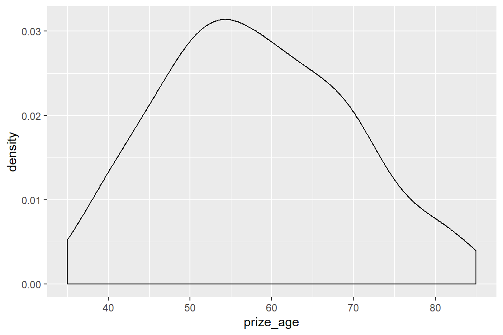

```
## 
## [[2]]
```


```
## 
## [[3]]
```


```
## 
## [[4]]
```

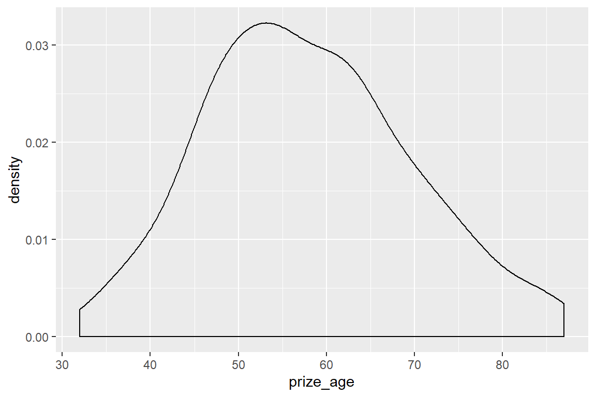

```
## 
## [[5]]
```


```
## 
## [[6]]
```

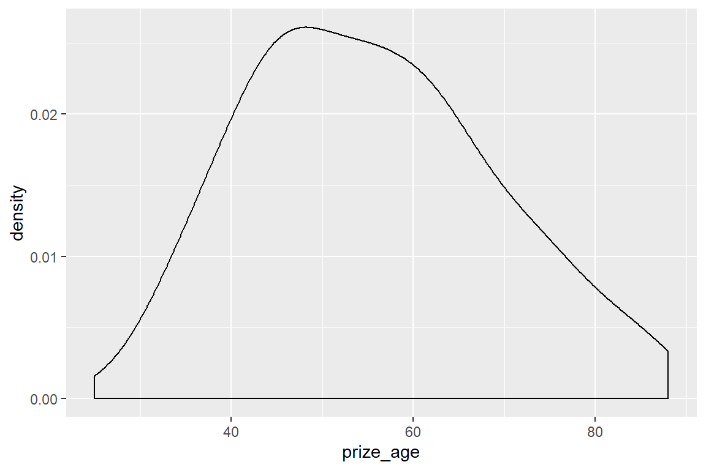


## 性别比例

```r
nobel_winners %>% 
  filter(laureate_type == "individual") %>% 
  count(category, gender) %>% 
  group_by(category) %>% 
  mutate(prop = n / sum(n)
         )
```

<div data-pagedtable="false">
  <script data-pagedtable-source type="application/json">
{"columns":[{"label":["category"],"name":[1],"type":["chr"],"align":["left"]},{"label":["gender"],"name":[2],"type":["chr"],"align":["left"]},{"label":["n"],"name":[3],"type":["int"],"align":["right"]},{"label":["prop"],"name":[4],"type":["dbl"],"align":["right"]}],"data":[{"1":"chemistry","2":"female","3":"4","4":"0.022857"},{"1":"chemistry","2":"male","3":"171","4":"0.977143"},{"1":"economics","2":"female","3":"1","4":"0.012821"},{"1":"economics","2":"male","3":"77","4":"0.987179"},{"1":"literature","2":"female","3":"14","4":"0.123894"},{"1":"literature","2":"male","3":"99","4":"0.876106"},{"1":"medicine","2":"female","3":"12","4":"0.056872"},{"1":"medicine","2":"male","3":"199","4":"0.943128"},{"1":"peace","2":"female","3":"14","4":"0.140000"},{"1":"peace","2":"male","3":"86","4":"0.860000"},{"1":"physics","2":"female","3":"2","4":"0.009804"},{"1":"physics","2":"male","3":"202","4":"0.990196"}],"options":{"columns":{"min":{},"max":[10]},"rows":{"min":[10],"max":[10]},"pages":{}}}
  </script>
</div>

各年代性别比例

```r
nobel_winners %>%
  filter(laureate_type == "individual") %>%
  # mutate(decade = glue::glue("{round(prize_year - 1, -1)}s")) %>%
  count(decade, category, gender) %>%
  group_by(decade, category) %>%
  mutate(prop = n / sum(n)) %>%
  ggplot(aes(decade, category, fill = prop)) +
  geom_tile(size = 0.7) +
  #geom_text(aes(label = scales::percent(prop, accuracy = .01))) + 
  geom_text(aes(label = scales::number(prop, accuracy = .01))) + 
  facet_grid(vars(gender)) +
  scale_fill_gradient(low = "#FDF4E9", high = "#834C0D")
```


```r
library(ggbeeswarm)#install.packages("ggbeeswarm")

nobel_winners %>% 
  ggplot(aes(x = category,
             y = prize_age,
             colour = gender,
             alpha = gender)) +
  ggbeeswarm::geom_beeswarm() +
  coord_flip() +
  scale_color_manual(values = c("#BB1288", "#5867A6")) +
  scale_alpha_manual(values = c(1, .4)) +
  theme_minimal() +
  theme(legend.position = "top") +
  labs(title = "诺奖获得者性别不平衡",
       subtitle = "1901年-2016年数据",
       colour = "Gender",
       alpha = "Gender",
       x = "学科",
       y = "获奖年龄")
```


```r
nobel_winners %>%
  count(decade,
        category,
        gender = coalesce(gender, laureate_type)) %>%
  
  
  group_by(decade, category) %>%
  mutate(percent = n / sum(n)) %>%
  ggplot(aes(decade, n, fill = gender)) +
  geom_col() +
  facet_wrap(~ category) +
  labs(x = "Decade",
       y = "# of nobel prize winners",
       fill = "Gender",
       title = "Nobel Prize gender distribution over time")
```


## 这些大神都是哪个年代出生的人？

```r
nobel_winners %>% 
  select(category, birth_date) %>% 
  mutate(year =  floor(year(birth_date)/10) * 10 ) %>% 
  count(category, year) %>% 
  filter(!is.na(year)) %>% 
  ggplot(aes(x = year, y = n)) +
  geom_col() +
  scale_x_continuous(breaks = seq(1810, 1990, 20)) +
  geom_text(aes(label = n), vjust = -0.25) +
  facet_wrap(vars(category))
```


课堂练习，哪位同学能把图弄得好看些？


## 最年轻的诺奖获得者？


```r
nobel_winners %>% 
    filter(prize_age == min(prize_age, na.rm = T))
```

<div data-pagedtable="false">
  <script data-pagedtable-source type="application/json">
{"columns":[{"label":["prize_year"],"name":[1],"type":["dbl"],"align":["right"]},{"label":["category"],"name":[2],"type":["chr"],"align":["left"]},{"label":["prize"],"name":[3],"type":["chr"],"align":["left"]},{"label":["motivation"],"name":[4],"type":["chr"],"align":["left"]},{"label":["prize_share"],"name":[5],"type":["chr"],"align":["left"]},{"label":["laureate_id"],"name":[6],"type":["dbl"],"align":["right"]},{"label":["laureate_type"],"name":[7],"type":["chr"],"align":["left"]},{"label":["full_name"],"name":[8],"type":["chr"],"align":["left"]},{"label":["birth_date"],"name":[9],"type":["date"],"align":["right"]},{"label":["birth_city"],"name":[10],"type":["chr"],"align":["left"]},{"label":["birth_country"],"name":[11],"type":["chr"],"align":["left"]},{"label":["gender"],"name":[12],"type":["chr"],"align":["left"]},{"label":["organization_name"],"name":[13],"type":["chr"],"align":["left"]},{"label":["organization_city"],"name":[14],"type":["chr"],"align":["left"]},{"label":["organization_country"],"name":[15],"type":["chr"],"align":["left"]},{"label":["death_date"],"name":[16],"type":["date"],"align":["right"]},{"label":["death_city"],"name":[17],"type":["chr"],"align":["left"]},{"label":["death_country"],"name":[18],"type":["chr"],"align":["left"]},{"label":["decade"],"name":[19],"type":["dbl"],"align":["right"]},{"label":["prize_age"],"name":[20],"type":["dbl"],"align":["right"]}],"data":[{"1":"2014","2":"peace","3":"the nobel peace prize 2014","4":"\"for their struggle against the suppression of children and young people and for the right of all children to education\"","5":"1/2","6":"914","7":"individual","8":"malala yousafzai","9":"1997-07-12","10":"mingora","11":"pakistan","12":"female","13":"NA","14":"NA","15":"NA","16":"<NA>","17":"NA","18":"NA","19":"2010","20":"17"}],"options":{"columns":{"min":{},"max":[10]},"rows":{"min":[10],"max":[10]},"pages":{}}}
  </script>
</div>


```r
nobel_winners %>% 
  filter(
    rank(prize_year - year(birth_date) ) == 1
  )
```

<div data-pagedtable="false">
  <script data-pagedtable-source type="application/json">
{"columns":[{"label":["prize_year"],"name":[1],"type":["dbl"],"align":["right"]},{"label":["category"],"name":[2],"type":["chr"],"align":["left"]},{"label":["prize"],"name":[3],"type":["chr"],"align":["left"]},{"label":["motivation"],"name":[4],"type":["chr"],"align":["left"]},{"label":["prize_share"],"name":[5],"type":["chr"],"align":["left"]},{"label":["laureate_id"],"name":[6],"type":["dbl"],"align":["right"]},{"label":["laureate_type"],"name":[7],"type":["chr"],"align":["left"]},{"label":["full_name"],"name":[8],"type":["chr"],"align":["left"]},{"label":["birth_date"],"name":[9],"type":["date"],"align":["right"]},{"label":["birth_city"],"name":[10],"type":["chr"],"align":["left"]},{"label":["birth_country"],"name":[11],"type":["chr"],"align":["left"]},{"label":["gender"],"name":[12],"type":["chr"],"align":["left"]},{"label":["organization_name"],"name":[13],"type":["chr"],"align":["left"]},{"label":["organization_city"],"name":[14],"type":["chr"],"align":["left"]},{"label":["organization_country"],"name":[15],"type":["chr"],"align":["left"]},{"label":["death_date"],"name":[16],"type":["date"],"align":["right"]},{"label":["death_city"],"name":[17],"type":["chr"],"align":["left"]},{"label":["death_country"],"name":[18],"type":["chr"],"align":["left"]},{"label":["decade"],"name":[19],"type":["dbl"],"align":["right"]},{"label":["prize_age"],"name":[20],"type":["dbl"],"align":["right"]}],"data":[{"1":"2014","2":"peace","3":"the nobel peace prize 2014","4":"\"for their struggle against the suppression of children and young people and for the right of all children to education\"","5":"1/2","6":"914","7":"individual","8":"malala yousafzai","9":"1997-07-12","10":"mingora","11":"pakistan","12":"female","13":"NA","14":"NA","15":"NA","16":"<NA>","17":"NA","18":"NA","19":"2010","20":"17"}],"options":{"columns":{"min":{},"max":[10]},"rows":{"min":[10],"max":[10]},"pages":{}}}
  </script>
</div>


```r
nobel_winners %>% 
  arrange(
    prize_year - year(birth_date)
  )
```

<div data-pagedtable="false">
  <script data-pagedtable-source type="application/json">
{"columns":[{"label":["prize_year"],"name":[1],"type":["dbl"],"align":["right"]},{"label":["category"],"name":[2],"type":["chr"],"align":["left"]},{"label":["prize"],"name":[3],"type":["chr"],"align":["left"]},{"label":["motivation"],"name":[4],"type":["chr"],"align":["left"]},{"label":["prize_share"],"name":[5],"type":["chr"],"align":["left"]},{"label":["laureate_id"],"name":[6],"type":["dbl"],"align":["right"]},{"label":["laureate_type"],"name":[7],"type":["chr"],"align":["left"]},{"label":["full_name"],"name":[8],"type":["chr"],"align":["left"]},{"label":["birth_date"],"name":[9],"type":["date"],"align":["right"]},{"label":["birth_city"],"name":[10],"type":["chr"],"align":["left"]},{"label":["birth_country"],"name":[11],"type":["chr"],"align":["left"]},{"label":["gender"],"name":[12],"type":["chr"],"align":["left"]},{"label":["organization_name"],"name":[13],"type":["chr"],"align":["left"]},{"label":["organization_city"],"name":[14],"type":["chr"],"align":["left"]},{"label":["organization_country"],"name":[15],"type":["chr"],"align":["left"]},{"label":["death_date"],"name":[16],"type":["date"],"align":["right"]},{"label":["death_city"],"name":[17],"type":["chr"],"align":["left"]},{"label":["death_country"],"name":[18],"type":["chr"],"align":["left"]},{"label":["decade"],"name":[19],"type":["dbl"],"align":["right"]},{"label":["prize_age"],"name":[20],"type":["dbl"],"align":["right"]}],"data":[{"1":"2014","2":"peace","3":"the nobel peace prize 2014","4":"\"for their struggle against the suppression of children and young people and for the right of all children to education\"","5":"1/2","6":"914","7":"individual","8":"malala yousafzai","9":"1997-07-12","10":"mingora","11":"pakistan","12":"female","13":"NA","14":"NA","15":"NA","16":"<NA>","17":"NA","18":"NA","19":"2010","20":"17"},{"1":"1915","2":"physics","3":"the nobel prize in physics 1915","4":"\"for their services in the analysis of crystal structure by means of x-rays\"","5":"1/2","6":"21","7":"individual","8":"william lawrence bragg","9":"1890-03-31","10":"adelaide","11":"australia","12":"male","13":"victoria university","14":"manchester","15":"united kingdom","16":"1971-07-01","17":"ipswich","18":"united kingdom","19":"1910","20":"25"},{"1":"1932","2":"physics","3":"the nobel prize in physics 1932","4":"\"for the creation of quantum mechanics, the application of which has, inter alia, led to the discovery of the allotropic forms of hydrogen\"","5":"1/1","6":"38","7":"individual","8":"werner karl heisenberg","9":"1901-12-05","10":"würzburg","11":"germany","12":"male","13":"leipzig university","14":"leipzig","15":"germany","16":"1976-02-01","17":"munich","18":"west germany (germany)","19":"1930","20":"31"},{"1":"1933","2":"physics","3":"the nobel prize in physics 1933","4":"\"for the discovery of new productive forms of atomic theory\"","5":"1/2","6":"40","7":"individual","8":"paul adrien maurice dirac","9":"1902-08-08","10":"bristol","11":"united kingdom","12":"male","13":"university of cambridge","14":"cambridge","15":"united kingdom","16":"1984-10-20","17":"tallahassee, fl","18":"united states of america","19":"1930","20":"31"},{"1":"1936","2":"physics","3":"the nobel prize in physics 1936","4":"\"for his discovery of the positron\"","5":"1/2","6":"43","7":"individual","8":"carl david anderson","9":"1905-09-03","10":"new york, ny","11":"united states of america","12":"male","13":"california institute of technology (caltech)","14":"pasadena, ca","15":"united states of america","16":"1991-01-11","17":"san marino, ca","18":"united states of america","19":"1930","20":"31"},{"1":"1957","2":"physics","3":"the nobel prize in physics 1957","4":"\"for their penetrating investigation of the so-called parity laws which has led to important discoveries regarding the elementary particles\"","5":"1/2","6":"69","7":"individual","8":"tsung-dao (t.d.) lee","9":"1926-11-24","10":"shanghai","11":"china","12":"male","13":"columbia university","14":"new york, ny","15":"united states of america","16":"<NA>","17":"NA","18":"NA","19":"1950","20":"31"},{"1":"1923","2":"medicine","3":"the nobel prize in physiology or medicine 1923","4":"\"for the discovery of insulin\"","5":"1/2","6":"313","7":"individual","8":"frederick grant banting","9":"1891-11-14","10":"alliston","11":"canada","12":"male","13":"university of toronto","14":"toronto","15":"canada","16":"1941-02-21","17":"newfoundland","18":"canada","19":"1920","20":"32"},{"1":"1961","2":"physics","3":"the nobel prize in physics 1961","4":"\"for his researches concerning the resonance absorption of gamma radiation and his discovery in this connection of the effect which bears his name\"","5":"1/2","6":"76","7":"individual","8":"rudolf ludwig m<U+00F6>ssbauer","9":"1929-01-31","10":"munich","11":"germany","12":"male","13":"technical university","14":"munich","15":"federal republic of germany","16":"2011-09-14","17":"NA","18":"NA","19":"1960","20":"32"},{"1":"1976","2":"peace","3":"the nobel peace prize 1976","4":"NA","5":"1/2","6":"536","7":"individual","8":"mairead corrigan","9":"1944-01-27","10":"belfast","11":"northern ireland","12":"female","13":"NA","14":"NA","15":"NA","16":"<NA>","17":"NA","18":"NA","19":"1970","20":"32"},{"1":"2011","2":"peace","3":"the nobel peace prize 2011","4":"\"for their non-violent struggle for the safety of women and for women&apos;s rights to full participation in peace-building work\"","5":"1/3","6":"871","7":"individual","8":"tawakkol karman","9":"1979-02-07","10":"ta'izz","11":"yemen","12":"female","13":"NA","14":"NA","15":"NA","16":"<NA>","17":"NA","18":"NA","19":"2010","20":"32"},{"1":"1958","2":"medicine","3":"the nobel prize in physiology or medicine 1958","4":"\"for his discoveries concerning genetic recombination and the organization of the genetic material of bacteria\"","5":"1/2","6":"366","7":"individual","8":"joshua lederberg","9":"1925-05-23","10":"montclair, nj","11":"united states of america","12":"male","13":"university of wisconsin","14":"madison, wi","15":"united states of america","16":"2008-02-02","17":"new york, ny","18":"united states of america","19":"1950","20":"33"},{"1":"1973","2":"physics","3":"the nobel prize in physics 1973","4":"\"for his theoretical predictions of the properties of a supercurrent through a tunnel barrier, in particular those phenomena which are generally known as the josephson effects\"","5":"1/2","6":"99","7":"individual","8":"brian david josephson","9":"1940-01-04","10":"cardiff","11":"united kingdom","12":"male","13":"university of cambridge","14":"cambridge","15":"united kingdom","16":"<NA>","17":"NA","18":"NA","19":"1970","20":"33"},{"1":"1976","2":"peace","3":"the nobel peace prize 1976","4":"NA","5":"1/2","6":"535","7":"individual","8":"betty williams","9":"1943-05-22","10":"belfast","11":"northern ireland","12":"female","13":"NA","14":"NA","15":"NA","16":"<NA>","17":"NA","18":"NA","19":"1970","20":"33"},{"1":"1992","2":"peace","3":"the nobel peace prize 1992","4":"\"in recognition of her work for social justice and ethno-cultural reconciliation based on respect for the rights of indigenous peoples\"","5":"1/1","6":"554","7":"individual","8":"rigoberta menchú tum","9":"1959-01-09","10":"aldea chimel","11":"guatemala","12":"female","13":"NA","14":"NA","15":"NA","16":"<NA>","17":"NA","18":"NA","19":"1990","20":"33"},{"1":"1960","2":"physics","3":"the nobel prize in physics 1960","4":"\"for the invention of the bubble chamber\"","5":"1/1","6":"74","7":"individual","8":"donald arthur glaser","9":"1926-09-21","10":"cleveland, oh","11":"united states of america","12":"male","13":"university of california","14":"berkeley, ca","15":"united states of america","16":"2013-02-28","17":"berkeley, ca","18":"united states of america","19":"1960","20":"34"},{"1":"1962","2":"medicine","3":"the nobel prize in physiology or medicine 1962","4":"\"for their discoveries concerning the molecular structure of nucleic acids and its significance for information transfer in living material\"","5":"1/3","6":"373","7":"individual","8":"james dewey watson","9":"1928-04-06","10":"chicago, il","11":"united states of america","12":"male","13":"harvard university","14":"cambridge, ma","15":"united states of america","16":"<NA>","17":"NA","18":"NA","19":"1960","20":"34"},{"1":"1909","2":"physics","3":"the nobel prize in physics 1909","4":"\"in recognition of their contributions to the development of wireless telegraphy\"","5":"1/2","6":"13","7":"individual","8":"guglielmo marconi","9":"1874-04-25","10":"bologna","11":"italy","12":"male","13":"marconi wireless telegraph co. ltd.","14":"london","15":"united kingdom","16":"1937-07-20","17":"rome","18":"italy","19":"1900","20":"35"},{"1":"1914","2":"physics","3":"the nobel prize in physics 1914","4":"\"for his discovery of the diffraction of x-rays by crystals\"","5":"1/1","6":"19","7":"individual","8":"max von laue","9":"1879-10-09","10":"pfaffendorf","11":"germany","12":"male","13":"frankfurt-on-the-main university","14":"frankfurt-on-the-main","15":"germany","16":"1960-04-23","17":"berlin","18":"west germany (germany)","19":"1910","20":"35"},{"1":"1927","2":"physics","3":"the nobel prize in physics 1927","4":"\"for his discovery of the effect named after him\"","5":"1/2","6":"33","7":"individual","8":"arthur holly compton","9":"1892-09-10","10":"wooster, oh","11":"united states of america","12":"male","13":"university of chicago","14":"chicago, il","15":"united states of america","16":"1962-03-15","17":"berkeley, ca","18":"united states of america","19":"1920","20":"35"},{"1":"1935","2":"chemistry","3":"the nobel prize in chemistry 1935","4":"\"in recognition of their synthesis of new radioactive elements\"","5":"1/2","6":"193","7":"individual","8":"frédéric joliot","9":"1900-03-19","10":"paris","11":"france","12":"male","13":"institut du radium","14":"paris","15":"france","16":"1958-08-14","17":"paris","18":"france","19":"1930","20":"35"},{"1":"1957","2":"physics","3":"the nobel prize in physics 1957","4":"\"for their penetrating investigation of the so-called parity laws which has led to important discoveries regarding the elementary particles\"","5":"1/2","6":"68","7":"individual","8":"chen ning yang","9":"1922-09-22","10":"hofei, anhwei","11":"china","12":"male","13":"institute for advanced study","14":"princeton, nj","15":"united states of america","16":"<NA>","17":"NA","18":"NA","19":"1950","20":"35"},{"1":"1964","2":"peace","3":"the nobel peace prize 1964","4":"NA","5":"1/1","6":"524","7":"individual","8":"martin luther king jr.","9":"1929-01-15","10":"atlanta, ga","11":"united states of america","12":"male","13":"NA","14":"NA","15":"NA","16":"1968-04-04","17":"memphis, tn","18":"united states of america","19":"1960","20":"35"},{"1":"1903","2":"physics","3":"the nobel prize in physics 1903","4":"\"in recognition of the extraordinary services they have rendered by their joint researches on the radiation phenomena discovered by professor henri becquerel\"","5":"1/4","6":"6","7":"individual","8":"marie curie, née sklodowska","9":"1867-11-07","10":"warsaw","11":"russian empire (poland)","12":"female","13":"NA","14":"NA","15":"NA","16":"1934-07-04","17":"sallanches","18":"france","19":"1900","20":"36"},{"1":"1922","2":"medicine","3":"the nobel prize in physiology or medicine 1922","4":"\"for his discovery relating to the production of heat in the muscle\"","5":"1/2","6":"311","7":"individual","8":"archibald vivian hill","9":"1886-09-26","10":"bristol","11":"united kingdom","12":"male","13":"london university","14":"london","15":"united kingdom","16":"1977-06-03","17":"cambridge","18":"united kingdom","19":"1920","20":"36"},{"1":"1939","2":"chemistry","3":"the nobel prize in chemistry 1939","4":"\"for his work on sex hormones\"","5":"1/2","6":"199","7":"individual","8":"adolf friedrich johann butenandt","9":"1903-03-24","10":"bremerhaven-lehe","11":"germany","12":"male","13":"kaiser-wilhelm-institut (now max-planck-institut) für biochemie","14":"berlin-dahlem","15":"germany","16":"1995-01-18","17":"munich","18":"germany","19":"1930","20":"36"},{"1":"2010","2":"physics","3":"the nobel prize in physics 2010","4":"\"for groundbreaking experiments regarding the two-dimensional material graphene\"","5":"1/2","6":"850","7":"individual","8":"konstantin novoselov","9":"1974-08-23","10":"nizhny tagil","11":"russia","12":"male","13":"university of manchester","14":"manchester","15":"united kingdom","16":"<NA>","17":"NA","18":"NA","19":"2010","20":"36"},{"1":"1902","2":"physics","3":"the nobel prize in physics 1902","4":"\"in recognition of the extraordinary service they rendered by their researches into the influence of magnetism upon radiation phenomena\"","5":"1/2","6":"3","7":"individual","8":"pieter zeeman","9":"1865-05-25","10":"zonnemaire","11":"netherlands","12":"male","13":"amsterdam university","14":"amsterdam","15":"netherlands","16":"1943-10-09","17":"amsterdam","18":"netherlands","19":"1900","20":"37"},{"1":"1908","2":"chemistry","3":"the nobel prize in chemistry 1908","4":"\"for his investigations into the disintegration of the elements, and the chemistry of radioactive substances\"","5":"1/1","6":"167","7":"individual","8":"ernest rutherford","9":"1871-08-30","10":"nelson","11":"new zealand","12":"male","13":"victoria university","14":"manchester","15":"united kingdom","16":"1937-10-19","17":"cambridge","18":"united kingdom","19":"1900","20":"37"},{"1":"1922","2":"physics","3":"the nobel prize in physics 1922","4":"\"for his services in the investigation of the structure of atoms and of the radiation emanating from them\"","5":"1/1","6":"27","7":"individual","8":"niels henrik david bohr","9":"1885-10-07","10":"copenhagen","11":"denmark","12":"male","13":"copenhagen university","14":"copenhagen","15":"denmark","16":"1962-11-18","17":"copenhagen","18":"denmark","19":"1920","20":"37"},{"1":"1929","2":"physics","3":"the nobel prize in physics 1929","4":"\"for his discovery of the wave nature of electrons\"","5":"1/1","6":"36","7":"individual","8":"prince louis-victor pierre raymond de broglie","9":"1892-08-15","10":"dieppe","11":"france","12":"male","13":"sorbonne university, institut henri poincaré","14":"paris","15":"france","16":"1987-03-19","17":"paris","18":"france","19":"1920","20":"37"},{"1":"1938","2":"physics","3":"the nobel prize in physics 1938","4":"\"for his demonstrations of the existence of new radioactive elements produced by neutron irradiation, and for his related discovery of nuclear reactions brought about by slow neutrons\"","5":"1/1","6":"46","7":"individual","8":"enrico fermi","9":"1901-09-29","10":"rome","11":"italy","12":"male","13":"rome university","14":"rome","15":"italy","16":"1954-11-28","17":"chicago, il","18":"united states of america","19":"1930","20":"37"},{"1":"1975","2":"medicine","3":"the nobel prize in physiology or medicine 1975","4":"\"for their discoveries concerning the interaction between tumour viruses and the genetic material of the cell\"","5":"1/3","6":"406","7":"individual","8":"david baltimore","9":"1938-03-07","10":"new york, ny","11":"united states of america","12":"male","13":"massachusetts institute of technology (mit)","14":"cambridge, ma","15":"united states of america","16":"<NA>","17":"NA","18":"NA","19":"1970","20":"37"},{"1":"1987","2":"physics","3":"the nobel prize in physics 1987","4":"\"for their important break-through in the discovery of superconductivity in ceramic materials\"","5":"1/2","6":"130","7":"individual","8":"j. georg bednorz","9":"1950-05-16","10":"neuenkirchen","11":"west germany (germany)","12":"male","13":"ibm zurich research laboratory","14":"rüschlikon","15":"switzerland","16":"<NA>","17":"NA","18":"NA","19":"1980","20":"37"},{"1":"1914","2":"medicine","3":"the nobel prize in physiology or medicine 1914","4":"\"for his work on the physiology and pathology of the vestibular apparatus\"","5":"1/1","6":"308","7":"individual","8":"robert bárány","9":"1876-04-22","10":"vienna","11":"austria","12":"male","13":"vienna university","14":"vienna","15":"austria","16":"1936-04-08","17":"uppsala","18":"sweden","19":"1910","20":"38"},{"1":"1922","2":"medicine","3":"the nobel prize in physiology or medicine 1922","4":"\"for his discovery of the fixed relationship between the consumption of oxygen and the metabolism of lactic acid in the muscle\"","5":"1/2","6":"312","7":"individual","8":"otto fritz meyerhof","9":"1884-04-12","10":"hanover","11":"germany","12":"male","13":"kiel university","14":"kiel","15":"germany","16":"1951-10-06","17":"philadelphia, pa","18":"united states of america","19":"1920","20":"38"},{"1":"1924","2":"physics","3":"the nobel prize in physics 1924","4":"\"for his discoveries and research in the field of x-ray spectroscopy\"","5":"1/1","6":"29","7":"individual","8":"karl manne georg siegbahn","9":"1886-12-03","10":"lund","11":"sweden","12":"male","13":"uppsala university","14":"uppsala","15":"sweden","16":"1978-09-26","17":"ngelholm","18":"sweden","19":"1920","20":"38"},{"1":"1925","2":"physics","3":"the nobel prize in physics 1925","4":"\"for their discovery of the laws governing the impact of an electron upon an atom\"","5":"1/2","6":"31","7":"individual","8":"gustav ludwig hertz","9":"1887-07-22","10":"hamburg","11":"germany","12":"male","13":"halle university","14":"halle","15":"germany","16":"1975-10-30","17":"berlin","18":"east germany","19":"1920","20":"38"},{"1":"1935","2":"chemistry","3":"the nobel prize in chemistry 1935","4":"\"in recognition of their synthesis of new radioactive elements\"","5":"1/2","6":"194","7":"individual","8":"irène joliot-curie","9":"1897-09-12","10":"paris","11":"france","12":"female","13":"institut du radium","14":"paris","15":"france","16":"1956-03-17","17":"paris","18":"france","19":"1930","20":"38"},{"1":"1938","2":"chemistry","3":"the nobel prize in chemistry 1938","4":"\"for his work on carotenoids and vitamins\"","5":"1/1","6":"198","7":"individual","8":"richard kuhn","9":"1900-12-03","10":"vienna","11":"austria-hungary (austria)","12":"male","13":"kaiser-wilhelm-institut (now max-planck institut) für medizinische forschung","14":"heidelberg","15":"germany","16":"1967-07-31","17":"heidelberg","18":"west germany (germany)","19":"1930","20":"38"},{"1":"1939","2":"physics","3":"the nobel prize in physics 1939","4":"\"for the invention and development of the cyclotron and for results obtained with it, especially with regard to artificial radioactive elements\"","5":"1/1","6":"47","7":"individual","8":"ernest orlando lawrence","9":"1901-08-08","10":"canton, sd","11":"united states of america","12":"male","13":"university of california","14":"berkeley, ca","15":"united states of america","16":"1958-08-27","17":"palo alto, ca","18":"united states of america","19":"1930","20":"38"},{"1":"1952","2":"chemistry","3":"the nobel prize in chemistry 1952","4":"\"for their invention of partition chromatography\"","5":"1/2","6":"215","7":"individual","8":"richard laurence millington synge","9":"1914-10-28","10":"liverpool","11":"united kingdom","12":"male","13":"rowett research institute","14":"bucksburn (scotland)","15":"united kingdom","16":"1994-08-18","17":"norwich","18":"united kingdom","19":"1950","20":"38"},{"1":"1954","2":"medicine","3":"the nobel prize in physiology or medicine 1954","4":"\"for their discovery of the ability of poliomyelitis viruses to grow in cultures of various types of tissue\"","5":"1/3","6":"358","7":"individual","8":"frederick chapman robbins","9":"1916-08-25","10":"auburn, al","11":"united states of america","12":"male","13":"western reserve university","14":"cleveland, oh","15":"united states of america","16":"2003-08-04","17":"cleveland, oh","18":"united states of america","19":"1950","20":"38"},{"1":"1984","2":"medicine","3":"the nobel prize in physiology or medicine 1984","4":"\"for theories concerning the specificity in development and control of the immune system and the discovery of the principle for production of monoclonal antibodies\"","5":"1/3","6":"430","7":"individual","8":"georges j.f. k<U+00F6>hler","9":"1946-04-17","10":"munich","11":"germany","12":"male","13":"basel institute for immunology","14":"basel","15":"switzerland","16":"1995-03-01","17":"freiburg im breisgau","18":"germany","19":"1980","20":"38"},{"1":"1912","2":"medicine","3":"the nobel prize in physiology or medicine 1912","4":"\"in recognition of his work on vascular suture and the transplantation of blood vessels and organs\"","5":"1/1","6":"306","7":"individual","8":"alexis carrel","9":"1873-06-28","10":"sainte-foy-lès-lyon","11":"france","12":"male","13":"rockefeller institute for medical research","14":"new york, ny","15":"united states of america","16":"1944-11-05","17":"paris","18":"france","19":"1910","20":"39"},{"1":"1945","2":"medicine","3":"the nobel prize in physiology or medicine 1945","4":"\"for the discovery of penicillin and its curative effect in various infectious diseases\"","5":"1/3","6":"340","7":"individual","8":"ernst boris chain","9":"1906-06-19","10":"berlin","11":"germany","12":"male","13":"university of oxford","14":"oxford","15":"united kingdom","16":"1979-08-12","17":"mulrany","18":"ireland","19":"1940","20":"39"},{"1":"1951","2":"chemistry","3":"the nobel prize in chemistry 1951","4":"\"for their discoveries in the chemistry of the transuranium elements\"","5":"1/2","6":"213","7":"individual","8":"glenn theodore seaborg","9":"1912-04-19","10":"ishpeming, mi","11":"united states of america","12":"male","13":"university of california","14":"berkeley, ca","15":"united states of america","16":"1999-02-25","17":"lafayette, ca","18":"united states of america","19":"1950","20":"39"},{"1":"1954","2":"medicine","3":"the nobel prize in physiology or medicine 1954","4":"\"for their discovery of the ability of poliomyelitis viruses to grow in cultures of various types of tissue\"","5":"1/3","6":"357","7":"individual","8":"thomas huckle weller","9":"1915-06-15","10":"ann arbor, mi","11":"united states of america","12":"male","13":"research division of infectious diseases, children's medical center","14":"boston, ma","15":"united states of america","16":"2008-08-23","17":"needham, ma","18":"united states of america","19":"1950","20":"39"},{"1":"1959","2":"physics","3":"the nobel prize in physics 1959","4":"\"for their discovery of the antiproton\"","5":"1/2","6":"73","7":"individual","8":"owen chamberlain","9":"1920-07-10","10":"san francisco, ca","11":"united states of america","12":"male","13":"university of california","14":"berkeley, ca","15":"united states of america","16":"2006-02-28","17":"berkeley, ca","18":"united states of america","19":"1950","20":"39"},{"1":"1986","2":"physics","3":"the nobel prize in physics 1986","4":"\"for their design of the scanning tunneling microscope\"","5":"1/4","6":"128","7":"individual","8":"gerd binnig","9":"1947-07-20","10":"frankfurt-on-the-main","11":"west germany (germany)","12":"male","13":"ibm zurich research laboratory","14":"rüschlikon","15":"switzerland","16":"<NA>","17":"NA","18":"NA","19":"1980","20":"39"},{"1":"2011","2":"peace","3":"the nobel peace prize 2011","4":"\"for their non-violent struggle for the safety of women and for women&apos;s rights to full participation in peace-building work\"","5":"1/3","6":"870","7":"individual","8":"leymah gbowee","9":"1972-02-01","10":"monrovia","11":"liberia","12":"female","13":"NA","14":"NA","15":"NA","16":"<NA>","17":"NA","18":"NA","19":"2010","20":"39"},{"1":"1917","2":"physics","3":"the nobel prize in physics 1917","4":"\"for his discovery of the characteristic r&ouml;ntgen radiation of the elements\"","5":"1/1","6":"22","7":"individual","8":"charles glover barkla","9":"1877-06-07","10":"widnes","11":"united kingdom","12":"male","13":"edinburgh university","14":"edinburgh","15":"united kingdom","16":"1944-10-23","17":"edinburgh","18":"scotland","19":"1910","20":"40"},{"1":"1952","2":"physics","3":"the nobel prize in physics 1952","4":"\"for their development of new methods for nuclear magnetic precision measurements and discoveries in connection therewith\"","5":"1/2","6":"59","7":"individual","8":"edward mills purcell","9":"1912-08-30","10":"taylorville, il","11":"united states of america","12":"male","13":"harvard university","14":"cambridge, ma","15":"united states of america","16":"1997-03-07","17":"cambridge, ma","18":"united states of america","19":"1950","20":"40"},{"1":"1958","2":"chemistry","3":"the nobel prize in chemistry 1958","4":"\"for his work on the structure of proteins, especially that of insulin\"","5":"1/1","6":"222","7":"individual","8":"frederick sanger","9":"1918-08-13","10":"rendcombe","11":"united kingdom","12":"male","13":"university of cambridge","14":"cambridge","15":"united kingdom","16":"2013-11-19","17":"cambridge","18":"united kingdom","19":"1950","20":"40"},{"1":"1967","2":"chemistry","3":"the nobel prize in chemistry 1967","4":"\"for their studies of extremely fast chemical reactions, effected by disturbing the equilibrium by means of very short pulses of energy\"","5":"1/2","6":"233","7":"individual","8":"manfred eigen","9":"1927-05-09","10":"bochum","11":"germany","12":"male","13":"max-planck-institut für physikalische chemie","14":"g<U+00F6>ttingen","15":"federal republic of germany","16":"<NA>","17":"NA","18":"NA","19":"1960","20":"40"},{"1":"1969","2":"physics","3":"the nobel prize in physics 1969","4":"\"for his contributions and discoveries concerning the classification of elementary particles and their interactions\"","5":"1/1","6":"90","7":"individual","8":"murray gell-mann","9":"1929-09-15","10":"new york, ny","11":"united states of america","12":"male","13":"california institute of technology (caltech)","14":"pasadena, ca","15":"united states of america","16":"<NA>","17":"NA","18":"NA","19":"1960","20":"40"},{"1":"1976","2":"physics","3":"the nobel prize in physics 1976","4":"\"for their pioneering work in the discovery of a heavy elementary particle of a new kind\"","5":"1/2","6":"106","7":"individual","8":"samuel chao chung ting","9":"1936-01-27","10":"ann arbor, mi","11":"united states of america","12":"male","13":"massachusetts institute of technology (mit)","14":"cambridge, ma","15":"united states of america","16":"<NA>","17":"NA","18":"NA","19":"1970","20":"40"},{"1":"1983","2":"peace","3":"the nobel peace prize 1983","4":"NA","5":"1/1","6":"545","7":"individual","8":"lech walesa","9":"1943-09-29","10":"popowo","11":"poland","12":"male","13":"NA","14":"NA","15":"NA","16":"<NA>","17":"NA","18":"NA","19":"1980","20":"40"},{"1":"1988","2":"chemistry","3":"the nobel prize in chemistry 1988","4":"\"for the determination of the three-dimensional structure of a photosynthetic reaction centre\"","5":"1/3","6":"272","7":"individual","8":"hartmut michel","9":"1948-07-18","10":"ludwigsburg","11":"west germany (germany)","12":"male","13":"max-planck-institut für biophysik","14":"frankfurt-on-the-main","15":"federal republic of germany","16":"<NA>","17":"NA","18":"NA","19":"1980","20":"40"},{"1":"2001","2":"physics","3":"the nobel prize in physics 2001","4":"\"for the achievement of bose-einstein condensation in dilute gases of alkali atoms, and for early fundamental studies of the properties of the condensates\"","5":"1/3","6":"738","7":"individual","8":"eric a. cornell","9":"1961-12-19","10":"palo alto, ca","11":"united states of america","12":"male","13":"university of colorado, jila","14":"boulder, co","15":"united states of america","16":"<NA>","17":"NA","18":"NA","19":"2000","20":"40"},{"1":"1912","2":"chemistry","3":"the nobel prize in chemistry 1912","4":"\"for the discovery of the so-called grignard reagent, which in recent years has greatly advanced the progress of organic chemistry\"","5":"1/2","6":"172","7":"individual","8":"victor grignard","9":"1871-05-06","10":"cherbourg","11":"france","12":"male","13":"nancy university","14":"nancy","15":"france","16":"1935-12-13","17":"lyon","18":"france","19":"1910","20":"41"},{"1":"1934","2":"chemistry","3":"the nobel prize in chemistry 1934","4":"\"for his discovery of heavy hydrogen\"","5":"1/1","6":"192","7":"individual","8":"harold clayton urey","9":"1893-04-29","10":"walkerton, in","11":"united states of america","12":"male","13":"columbia university","14":"new york, ny","15":"united states of america","16":"1981-01-05","17":"la jolla, ca","18":"united states of america","19":"1930","20":"41"},{"1":"1959","2":"medicine","3":"the nobel prize in physiology or medicine 1959","4":"\"for their discovery of the mechanisms in the biological synthesis of ribonucleic acid and deoxyribonucleic acid\"","5":"1/2","6":"368","7":"individual","8":"arthur kornberg","9":"1918-03-03","10":"brooklyn, ny","11":"united states of america","12":"male","13":"stanford university","14":"stanford, ca","15":"united states of america","16":"2007-10-26","17":"stanford, ca","18":"united states of america","19":"1950","20":"41"},{"1":"1968","2":"medicine","3":"the nobel prize in physiology or medicine 1968","4":"\"for their interpretation of the genetic code and its function in protein synthesis\"","5":"1/3","6":"390","7":"individual","8":"marshall w. nirenberg","9":"1927-04-10","10":"new york, ny","11":"united states of america","12":"male","13":"national institutes of health","14":"bethesda, md","15":"united states of america","16":"2010-01-15","17":"new york, ny","18":"united states of america","19":"1960","20":"41"},{"1":"1972","2":"physics","3":"the nobel prize in physics 1972","4":"\"for their jointly developed theory of superconductivity, usually called the bcs-theory\"","5":"1/3","6":"96","7":"individual","8":"john robert schrieffer","9":"1931-05-31","10":"oak park, il","11":"united states of america","12":"male","13":"university of pennsylvania","14":"philadelphia, pa","15":"united states of america","16":"<NA>","17":"NA","18":"NA","19":"1970","20":"41"},{"1":"1975","2":"medicine","3":"the nobel prize in physiology or medicine 1975","4":"\"for their discoveries concerning the interaction between tumour viruses and the genetic material of the cell\"","5":"1/3","6":"408","7":"individual","8":"howard martin temin","9":"1934-12-10","10":"philadelphia, pa","11":"united states of america","12":"male","13":"university of wisconsin","14":"madison, wi","15":"united states of america","16":"1994-02-09","17":"madison, wi","18":"united states of america","19":"1970","20":"41"},{"1":"1907","2":"literature","3":"the nobel prize in literature 1907","4":"\"in consideration of the power of observation, originality of imagination, virility of ideas and remarkable talent for narration which characterize the creations of this world-famous author\"","5":"1/1","6":"577","7":"individual","8":"rudyard kipling","9":"1865-12-30","10":"bombay","11":"british india (india)","12":"male","13":"NA","14":"NA","15":"NA","16":"1936-01-18","17":"london","18":"united kingdom","19":"1900","20":"42"},{"1":"1921","2":"physics","3":"the nobel prize in physics 1921","4":"\"for his services to theoretical physics, and especially for his discovery of the law of the photoelectric effect\"","5":"1/1","6":"26","7":"individual","8":"albert einstein","9":"1879-03-14","10":"ulm","11":"germany","12":"male","13":"kaiser-wilhelm-institut (now max-planck-institut) für physik","14":"berlin","15":"germany","16":"1955-04-18","17":"princeton, nj","18":"united states of america","19":"1920","20":"42"},{"1":"1926","2":"chemistry","3":"the nobel prize in chemistry 1926","4":"\"for his work on disperse systems\"","5":"1/1","6":"183","7":"individual","8":"the (theodor) svedberg","9":"1884-08-30","10":"fler<U+00E4>ng","11":"sweden","12":"male","13":"uppsala university","14":"uppsala","15":"sweden","16":"1971-02-25","17":"rebro","18":"sweden","19":"1920","20":"42"},{"1":"1930","2":"physics","3":"the nobel prize in physics 1930","4":"\"for his work on the scattering of light and for the discovery of the effect named after him\"","5":"1/1","6":"37","7":"individual","8":"sir chandrasekhara venkata raman","9":"1888-11-07","10":"tiruchirappalli","11":"india","12":"male","13":"calcutta university","14":"calcutta","15":"india","16":"1970-11-21","17":"bangalore","18":"india","19":"1930","20":"42"},{"1":"1934","2":"medicine","3":"the nobel prize in physiology or medicine 1934","4":"\"for their discoveries concerning liver therapy in cases of anaemia\"","5":"1/3","6":"328","7":"individual","8":"william parry murphy","9":"1892-02-06","10":"stoughton, wi","11":"united states of america","12":"male","13":"harvard university","14":"cambridge, ma","15":"united states of america","16":"1987-10-09","17":"brookline, ma","18":"united states of america","19":"1930","20":"42"},{"1":"1946","2":"chemistry","3":"the nobel prize in chemistry 1946","4":"\"for their preparation of enzymes and virus proteins in a pure form\"","5":"1/4","6":"206","7":"individual","8":"wendell meredith stanley","9":"1904-08-16","10":"ridgeville, in","11":"united states of america","12":"male","13":"rockefeller institute for medical research","14":"princeton, nj","15":"united states of america","16":"1971-06-15","17":"salamanca","18":"spain","19":"1940","20":"42"},{"1":"1949","2":"physics","3":"the nobel prize in physics 1949","4":"\"for his prediction of the existence of mesons on the basis of theoretical work on nuclear forces\"","5":"1/1","6":"54","7":"individual","8":"hideki yukawa","9":"1907-01-23","10":"tokyo","11":"japan","12":"male","13":"kyoto imperial university","14":"kyoto","15":"japan","16":"1981-09-08","17":"kyoto","18":"japan","19":"1940","20":"42"},{"1":"1952","2":"chemistry","3":"the nobel prize in chemistry 1952","4":"\"for their invention of partition chromatography\"","5":"1/2","6":"214","7":"individual","8":"archer john porter martin","9":"1910-03-01","10":"london","11":"united kingdom","12":"male","13":"national institute for medical research","14":"london","15":"united kingdom","16":"2002-07-28","17":"llangarron","18":"united kingdom","19":"1950","20":"42"},{"1":"1955","2":"physics","3":"the nobel prize in physics 1955","4":"\"for his discoveries concerning the fine structure of the hydrogen spectrum\"","5":"1/2","6":"63","7":"individual","8":"willis eugene lamb","9":"1913-07-12","10":"los angeles, ca","11":"united states of america","12":"male","13":"stanford university","14":"stanford, ca","15":"united states of america","16":"2008-05-15","17":"tucson, az","18":"united states of america","19":"1950","20":"42"},{"1":"1964","2":"physics","3":"the nobel prize in physics 1964","4":"\"for fundamental work in the field of quantum electronics, which has led to the construction of oscillators and amplifiers based on the maser-laser principle\"","5":"1/4","6":"82","7":"individual","8":"nicolay gennadiyevich basov","9":"1922-12-14","10":"usman","11":"union of soviet socialist republics (russia)","12":"male","13":"p.n. lebedev physical institute","14":"moscow","15":"union of soviet socialist republics","16":"2001-07-01","17":"moscow","18":"russia","19":"1960","20":"42"},{"1":"1972","2":"physics","3":"the nobel prize in physics 1972","4":"\"for their jointly developed theory of superconductivity, usually called the bcs-theory\"","5":"1/3","6":"95","7":"individual","8":"leon neil cooper","9":"1930-02-28","10":"new york, ny","11":"united states of america","12":"male","13":"brown university","14":"providence, ri","15":"united states of america","16":"<NA>","17":"NA","18":"NA","19":"1970","20":"42"},{"1":"1978","2":"physics","3":"the nobel prize in physics 1978","4":"\"for their discovery of cosmic microwave background radiation\"","5":"1/4","6":"112","7":"individual","8":"robert woodrow wilson","9":"1936-01-10","10":"houston, tx","11":"united states of america","12":"male","13":"bell laboratories","14":"holmdel, nj","15":"united states of america","16":"<NA>","17":"NA","18":"NA","19":"1970","20":"42"},{"1":"1985","2":"physics","3":"the nobel prize in physics 1985","4":"\"for the discovery of the quantized hall effect\"","5":"1/1","6":"126","7":"individual","8":"klaus von klitzing","9":"1943-06-28","10":"schroda","11":"german-occupied poland (poland)","12":"male","13":"max-planck-institut für festk<U+00F6>rperforschung","14":"stuttgart","15":"federal republic of germany","16":"<NA>","17":"NA","18":"NA","19":"1980","20":"42"},{"1":"1989","2":"chemistry","3":"the nobel prize in chemistry 1989","4":"\"for their discovery of catalytic properties of rna\"","5":"1/2","6":"274","7":"individual","8":"thomas r. cech","9":"1947-12-08","10":"chicago, il","11":"united states of america","12":"male","13":"university of colorado","14":"boulder, co","15":"united states of america","16":"<NA>","17":"NA","18":"NA","19":"1980","20":"42"},{"1":"2011","2":"physics","3":"the nobel prize in physics 2011","4":"\"for the discovery of the accelerating expansion of the universe through observations of distant supernovae\"","5":"1/4","6":"866","7":"individual","8":"adam g. riess","9":"1969-12-16","10":"washington, dc","11":"united states of america","12":"male","13":"johns hopkins university","14":"baltimore, md","15":"united states of america","16":"<NA>","17":"NA","18":"NA","19":"2010","20":"42"},{"1":"1903","2":"medicine","3":"the nobel prize in physiology or medicine 1903","4":"\"in recognition of his contribution to the treatment of diseases, especially lupus vulgaris, with concentrated light radiation, whereby he has opened a new avenue for medical science\"","5":"1/1","6":"295","7":"individual","8":"niels ryberg finsen","9":"1860-12-15","10":"thorshavn","11":"faroe islands (denmark)","12":"male","13":"finsen medical light institute","14":"copenhagen","15":"denmark","16":"1904-09-24","17":"copenhagen","18":"denmark","19":"1900","20":"43"},{"1":"1905","2":"physics","3":"the nobel prize in physics 1905","4":"\"for his work on cathode rays\"","5":"1/1","6":"9","7":"individual","8":"philipp eduard anton von lenard","9":"1862-06-07","10":"pressburg (bratislava)","11":"hungary (slovakia)","12":"male","13":"kiel university","14":"kiel","15":"germany","16":"1947-05-20","17":"messelhausen","18":"germany","19":"1900","20":"43"},{"1":"1912","2":"physics","3":"the nobel prize in physics 1912","4":"\"for his invention of automatic regulators for use in conjunction with gas accumulators for illuminating lighthouses and buoys\"","5":"1/1","6":"17","7":"individual","8":"nils gustaf dalén","9":"1869-11-30","10":"stenstorp","11":"sweden","12":"male","13":"swedish gas-accumulator co.","14":"liding<U+00F6>-stockholm","15":"sweden","16":"1937-12-09","17":"stockholm","18":"sweden","19":"1910","20":"43"},{"1":"1915","2":"chemistry","3":"the nobel prize in chemistry 1915","4":"\"for his researches on plant pigments, especially chlorophyll\"","5":"1/1","6":"176","7":"individual","8":"richard martin willst<U+00E4>tter","9":"1872-08-13","10":"karlsruhe","11":"germany","12":"male","13":"munich university","14":"munich","15":"germany","16":"1942-08-03","17":"locarno","18":"switzerland","19":"1910","20":"43"},{"1":"1925","2":"physics","3":"the nobel prize in physics 1925","4":"\"for their discovery of the laws governing the impact of an electron upon an atom\"","5":"1/2","6":"30","7":"individual","8":"james franck","9":"1882-08-26","10":"hamburg","11":"germany","12":"male","13":"goettingen university","14":"g<U+00F6>ttingen","15":"germany","16":"1964-05-21","17":"g<U+00F6>ttingen","18":"west germany (germany)","19":"1920","20":"43"},{"1":"1932","2":"medicine","3":"the nobel prize in physiology or medicine 1932","4":"\"for their discoveries regarding the functions of neurons\"","5":"1/2","6":"324","7":"individual","8":"edgar douglas adrian","9":"1889-11-30","10":"london","11":"united kingdom","12":"male","13":"university of cambridge","14":"cambridge","15":"united kingdom","16":"1977-08-08","17":"cambridge","18":"united kingdom","19":"1930","20":"43"},{"1":"1972","2":"medicine","3":"the nobel prize in physiology or medicine 1972","4":"\"for their discoveries concerning the chemical structure of antibodies\"","5":"1/2","6":"398","7":"individual","8":"gerald m. edelman","9":"1929-07-01","10":"new york, ny","11":"united states of america","12":"male","13":"rockefeller university","14":"new york, ny","15":"united states of america","16":"2014-05-17","17":"la jolla, ca","18":"united states of america","19":"1970","20":"43"},{"1":"1993","2":"physics","3":"the nobel prize in physics 1993","4":"\"for the discovery of a new type of pulsar, a discovery that has opened up new possibilities for the study of gravitation\"","5":"1/2","6":"143","7":"individual","8":"russell a. hulse","9":"1950-11-28","10":"new york, ny","11":"united states of america","12":"male","13":"princeton university","14":"princeton, nj","15":"united states of america","16":"<NA>","17":"NA","18":"NA","19":"1990","20":"43"},{"1":"2002","2":"chemistry","3":"the nobel prize in chemistry 2002","4":"\"for their development of soft desorption ionisation methods for mass spectrometric analyses of biological macromolecules\"","5":"1/4","6":"757","7":"individual","8":"koichi tanaka","9":"1959-08-03","10":"toyama city","11":"japan","12":"male","13":"shimadzu corp.","14":"kyoto","15":"japan","16":"<NA>","17":"NA","18":"NA","19":"2000","20":"43"},{"1":"1903","2":"chemistry","3":"the nobel prize in chemistry 1903","4":"\"in recognition of the extraordinary services he has rendered to the advancement of chemistry by his electrolytic theory of dissociation\"","5":"1/1","6":"162","7":"individual","8":"svante august arrhenius","9":"1859-02-19","10":"vik","11":"sweden","12":"male","13":"stockholm university","14":"stockholm","15":"sweden","16":"1927-10-02","17":"stockholm","18":"sweden","19":"1900","20":"44"},{"1":"1903","2":"physics","3":"the nobel prize in physics 1903","4":"\"in recognition of the extraordinary services they have rendered by their joint researches on the radiation phenomena discovered by professor henri becquerel\"","5":"1/4","6":"5","7":"individual","8":"pierre curie","9":"1859-05-15","10":"paris","11":"france","12":"male","13":"cole municipale de physique et de chimie industrielles (municipal school of industrial physics and chemistry)","14":"paris","15":"france","16":"1906-04-19","17":"paris","18":"france","19":"1900","20":"44"},{"1":"1911","2":"chemistry","3":"the nobel prize in chemistry 1911","4":"\"in recognition of her services to the advancement of chemistry by the discovery of the elements radium and polonium, by the isolation of radium and the study of the nature and compounds of this remarkable element\"","5":"1/1","6":"6","7":"individual","8":"marie curie, née sklodowska","9":"1867-11-07","10":"warsaw","11":"russian empire (poland)","12":"female","13":"sorbonne university","14":"paris","15":"france","16":"1934-07-04","17":"sallanches","18":"france","19":"1910","20":"44"},{"1":"1921","2":"chemistry","3":"the nobel prize in chemistry 1921","4":"\"for his contributions to our knowledge of the chemistry of radioactive substances, and his investigations into the origin and nature of isotopes\"","5":"1/1","6":"179","7":"individual","8":"frederick soddy","9":"1877-09-02","10":"eastbourne","11":"united kingdom","12":"male","13":"university of oxford","14":"oxford","15":"united kingdom","16":"1956-09-22","17":"brighton","18":"united kingdom","19":"1920","20":"44"},{"1":"1935","2":"physics","3":"the nobel prize in physics 1935","4":"\"for the discovery of the neutron\"","5":"1/1","6":"41","7":"individual","8":"james chadwick","9":"1891-10-20","10":"manchester","11":"united kingdom","12":"male","13":"liverpool university","14":"liverpool","15":"united kingdom","16":"1974-07-24","17":"cambridge","18":"united kingdom","19":"1930","20":"44"},{"1":"1937","2":"medicine","3":"the nobel prize in physiology or medicine 1937","4":"\"for his discoveries in connection with the biological combustion processes, with special reference to vitamin c and the catalysis of fumaric acid\"","5":"1/1","6":"332","7":"individual","8":"albert von szent-gy<U+00F6>rgyi nagyrápolt","9":"1893-09-16","10":"budapest","11":"austria-hungary (hungary)","12":"male","13":"szeged university","14":"szeged","15":"hungary","16":"1986-10-22","17":"woods hole, ma","18":"united states of america","19":"1930","20":"44"},{"1":"1939","2":"medicine","3":"the nobel prize in physiology or medicine 1939","4":"\"for the discovery of the antibacterial effects of prontosil\"","5":"1/1","6":"334","7":"individual","8":"gerhard domagk","9":"1895-10-30","10":"lagow","11":"germany (poland)","12":"male","13":"munster university","14":"munster","15":"germany","16":"1964-04-24","17":"burgberg","18":"west germany (germany)","19":"1930","20":"44"},{"1":"1951","2":"chemistry","3":"the nobel prize in chemistry 1951","4":"\"for their discoveries in the chemistry of the transuranium elements\"","5":"1/2","6":"212","7":"individual","8":"edwin mattison mcmillan","9":"1907-09-18","10":"redondo beach, ca","11":"united states of america","12":"male","13":"university of california","14":"berkeley, ca","15":"united states of america","16":"1991-09-07","17":"el cerrito, ca","18":"united states of america","19":"1950","20":"44"},{"1":"1955","2":"physics","3":"the nobel prize in physics 1955","4":"\"for his precision determination of the magnetic moment of the electron\"","5":"1/2","6":"64","7":"individual","8":"polykarp kusch","9":"1911-01-26","10":"blankenburg","11":"germany","12":"male","13":"columbia university","14":"new york, ny","15":"united states of america","16":"1993-03-20","17":"dallas, tx","18":"united states of america","19":"1950","20":"44"},{"1":"1957","2":"literature","3":"the nobel prize in literature 1957","4":"\"for his important literary production, which with clear-sighted earnestness illuminates the problems of the human conscience in our times\"","5":"1/1","6":"628","7":"individual","8":"albert camus","9":"1913-11-07","10":"mondovi","11":"french algeria (algeria)","12":"male","13":"NA","14":"NA","15":"NA","16":"1960-01-04","17":"sens","18":"france","19":"1950","20":"44"},{"1":"1973","2":"physics","3":"the nobel prize in physics 1973","4":"\"for their experimental discoveries regarding tunneling phenomena in semiconductors and superconductors, respectively\"","5":"1/4","6":"98","7":"individual","8":"ivar giaever","9":"1929-04-05","10":"bergen","11":"norway","12":"male","13":"general electric company","14":"schenectady, ny","15":"united states of america","16":"<NA>","17":"NA","18":"NA","19":"1970","20":"44"},{"1":"1981","2":"chemistry","3":"the nobel prize in chemistry 1981","4":"\"for their theories, developed independently, concerning the course of chemical reactions\"","5":"1/2","6":"258","7":"individual","8":"roald hoffmann","9":"1937-07-18","10":"zloczov","11":"poland (ukraine)","12":"male","13":"cornell university","14":"ithaca, ny","15":"united states of america","16":"<NA>","17":"NA","18":"NA","19":"1980","20":"44"},{"1":"1985","2":"medicine","3":"the nobel prize in physiology or medicine 1985","4":"\"for their discoveries concerning the regulation of cholesterol metabolism\"","5":"1/2","6":"432","7":"individual","8":"michael s. brown","9":"1941-04-13","10":"new york, ny","11":"united states of america","12":"male","13":"university of texas southwestern medical center at dallas","14":"dallas, tx","15":"united states of america","16":"<NA>","17":"NA","18":"NA","19":"1980","20":"44"},{"1":"2001","2":"physics","3":"the nobel prize in physics 2001","4":"\"for the achievement of bose-einstein condensation in dilute gases of alkali atoms, and for early fundamental studies of the properties of the condensates\"","5":"1/3","6":"739","7":"individual","8":"wolfgang ketterle","9":"1957-10-21","10":"heidelberg","11":"west germany (germany)","12":"male","13":"massachusetts institute of technology (mit)","14":"cambridge, ma","15":"united states of america","16":"<NA>","17":"NA","18":"NA","19":"2000","20":"44"},{"1":"2011","2":"physics","3":"the nobel prize in physics 2011","4":"\"for the discovery of the accelerating expansion of the universe through observations of distant supernovae\"","5":"1/4","6":"865","7":"individual","8":"brian p. schmidt","9":"1967-02-24","10":"missoula, mt","11":"united states of america","12":"male","13":"australian national university","14":"weston creek","15":"australia","16":"<NA>","17":"NA","18":"NA","19":"2010","20":"44"},{"1":"1902","2":"medicine","3":"the nobel prize in physiology or medicine 1902","4":"\"for his work on malaria, by which he has shown how it enters the organism and thereby has laid the foundation for successful research on this disease and methods of combating it\"","5":"1/1","6":"294","7":"individual","8":"ronald ross","9":"1857-05-13","10":"almora","11":"india","12":"male","13":"university college","14":"liverpool","15":"united kingdom","16":"1932-09-16","17":"putney heath","18":"united kingdom","19":"1900","20":"45"},{"1":"1919","2":"physics","3":"the nobel prize in physics 1919","4":"\"for his discovery of the doppler effect in canal rays and the splitting of spectral lines in electric fields\"","5":"1/1","6":"24","7":"individual","8":"johannes stark","9":"1874-04-15","10":"schickenhof","11":"germany","12":"male","13":"greifswald university","14":"greifswald","15":"germany","16":"1957-06-21","17":"traunstein","18":"west germany (germany)","19":"1910","20":"45"},{"1":"1922","2":"chemistry","3":"the nobel prize in chemistry 1922","4":"\"for his discovery, by means of his mass spectrograph, of isotopes, in a large number of non-radioactive elements, and for his enunciation of the whole-number rule\"","5":"1/1","6":"180","7":"individual","8":"francis william aston","9":"1877-09-01","10":"harborne","11":"united kingdom","12":"male","13":"university of cambridge","14":"cambridge","15":"united kingdom","16":"1945-11-20","17":"cambridge","18":"united kingdom","19":"1920","20":"45"},{"1":"1930","2":"literature","3":"the nobel prize in literature 1930","4":"\"for his vigorous and graphic art of description and his ability to create, with wit and humour, new types of characters\"","5":"1/1","6":"603","7":"individual","8":"sinclair lewis","9":"1885-02-07","10":"sauk centre, mn","11":"united states of america","12":"male","13":"NA","14":"NA","15":"NA","16":"1951-01-10","17":"rome","18":"italy","19":"1930","20":"45"},{"1":"1937","2":"physics","3":"the nobel prize in physics 1937","4":"\"for their experimental discovery of the diffraction of electrons by crystals\"","5":"1/2","6":"45","7":"individual","8":"george paget thomson","9":"1892-05-03","10":"cambridge","11":"united kingdom","12":"male","13":"london university","14":"london","15":"united kingdom","16":"1975-09-10","17":"cambridge","18":"united kingdom","19":"1930","20":"45"},{"1":"1945","2":"physics","3":"the nobel prize in physics 1945","4":"\"for the discovery of the exclusion principle, also called the pauli principle\"","5":"1/1","6":"50","7":"individual","8":"wolfgang pauli","9":"1900-04-25","10":"vienna","11":"austria","12":"male","13":"princeton university","14":"princeton, nj","15":"united states of america","16":"1958-12-15","17":"zurich","18":"switzerland","19":"1940","20":"45"},{"1":"1960","2":"medicine","3":"the nobel prize in physiology or medicine 1960","4":"\"for discovery of acquired immunological tolerance\"","5":"1/2","6":"370","7":"individual","8":"peter brian medawar","9":"1915-02-28","10":"rio de janeiro","11":"brazil","12":"male","13":"university college","14":"london","15":"united kingdom","16":"1987-10-02","17":"london","18":"united kingdom","19":"1960","20":"45"},{"1":"1962","2":"chemistry","3":"the nobel prize in chemistry 1962","4":"\"for their studies of the structures of globular proteins\"","5":"1/2","6":"227","7":"individual","8":"john cowdery kendrew","9":"1917-03-24","10":"oxford","11":"united kingdom","12":"male","13":"mrc laboratory of molecular biology","14":"cambridge","15":"united kingdom","16":"1997-08-23","17":"cambridge","18":"united kingdom","19":"1960","20":"45"},{"1":"1965","2":"medicine","3":"the nobel prize in physiology or medicine 1965","4":"\"for their discoveries concerning genetic control of enzyme and virus synthesis\"","5":"1/3","6":"380","7":"individual","8":"fran<U+00E7>ois jacob","9":"1920-06-17","10":"nancy","11":"france","12":"male","13":"institut pasteur","14":"paris","15":"france","16":"2013-04-19","17":"paris","18":"france","19":"1960","20":"45"},{"1":"1976","2":"physics","3":"the nobel prize in physics 1976","4":"\"for their pioneering work in the discovery of a heavy elementary particle of a new kind\"","5":"1/2","6":"105","7":"individual","8":"burton richter","9":"1931-03-22","10":"brooklyn, ny","11":"united states of america","12":"male","13":"stanford linear accelerator center","14":"stanford, ca","15":"united states of america","16":"<NA>","17":"NA","18":"NA","19":"1970","20":"45"},{"1":"1978","2":"physics","3":"the nobel prize in physics 1978","4":"\"for their discovery of cosmic microwave background radiation\"","5":"1/4","6":"111","7":"individual","8":"arno allan penzias","9":"1933-04-26","10":"munich","11":"germany","12":"male","13":"bell laboratories","14":"holmdel, nj","15":"united states of america","16":"<NA>","17":"NA","18":"NA","19":"1970","20":"45"},{"1":"1985","2":"medicine","3":"the nobel prize in physiology or medicine 1985","4":"\"for their discoveries concerning the regulation of cholesterol metabolism\"","5":"1/2","6":"433","7":"individual","8":"joseph l. goldstein","9":"1940-04-18","10":"sumter, sc","11":"united states of america","12":"male","13":"university of texas southwestern medical center at dallas","14":"dallas, tx","15":"united states of america","16":"<NA>","17":"NA","18":"NA","19":"1980","20":"45"},{"1":"1988","2":"chemistry","3":"the nobel prize in chemistry 1988","4":"\"for the determination of the three-dimensional structure of a photosynthetic reaction centre\"","5":"1/3","6":"270","7":"individual","8":"johann deisenhofer","9":"1943-09-30","10":"zusamaltheim","11":"germany","12":"male","13":"university of texas southwestern medical center at dallas","14":"dallas, tx","15":"united states of america","16":"<NA>","17":"NA","18":"NA","19":"1980","20":"45"},{"1":"1914","2":"chemistry","3":"the nobel prize in chemistry 1914","4":"\"in recognition of his accurate determinations of the atomic weight of a large number of chemical elements\"","5":"1/1","6":"175","7":"individual","8":"theodore william richards","9":"1868-01-31","10":"germantown, pa","11":"united states of america","12":"male","13":"harvard university","14":"cambridge, ma","15":"united states of america","16":"1928-04-02","17":"cambridge, ma","18":"united states of america","19":"1910","20":"46"},{"1":"1920","2":"medicine","3":"the nobel prize in physiology or medicine 1920","4":"\"for his discovery of the capillary motor regulating mechanism\"","5":"1/1","6":"310","7":"individual","8":"schack august steenberg krogh","9":"1874-11-15","10":"gren<U+00E5>","11":"denmark","12":"male","13":"copenhagen university","14":"copenhagen","15":"denmark","16":"1949-09-13","17":"copenhagen","18":"denmark","19":"1920","20":"46"},{"1":"1928","2":"literature","3":"the nobel prize in literature 1928","4":"\"principally for her powerful descriptions of northern life during the middle ages\"","5":"1/1","6":"601","7":"individual","8":"sigrid undset","9":"1882-05-20","10":"kalundborg","11":"denmark","12":"female","13":"NA","14":"NA","15":"NA","16":"1949-06-10","17":"lillehammer","18":"norway","19":"1920","20":"46"},{"1":"1933","2":"physics","3":"the nobel prize in physics 1933","4":"\"for the discovery of new productive forms of atomic theory\"","5":"1/2","6":"39","7":"individual","8":"erwin schr<U+00F6>dinger","9":"1887-08-12","10":"vienna","11":"austria","12":"male","13":"berlin university","14":"berlin","15":"germany","16":"1961-01-04","17":"vienna","18":"austria","19":"1930","20":"46"},{"1":"1935","2":"peace","3":"the nobel peace prize 1935","4":"NA","5":"1/1","6":"500","7":"individual","8":"carl von ossietzky","9":"1889-10-03","10":"hamburg","11":"germany","12":"male","13":"NA","14":"NA","15":"NA","16":"1938-05-04","17":"berlin","18":"germany","19":"1930","20":"46"},{"1":"1938","2":"literature","3":"the nobel prize in literature 1938","4":"\"for her rich and truly epic descriptions of peasant life in china and for her biographical masterpieces\"","5":"1/1","6":"610","7":"individual","8":"pearl buck","9":"1892-06-26","10":"hillsboro, wv","11":"united states of america","12":"female","13":"NA","14":"NA","15":"NA","16":"1973-03-06","17":"danby, vt","18":"united states of america","19":"1930","20":"46"},{"1":"1938","2":"medicine","3":"the nobel prize in physiology or medicine 1938","4":"\"for the discovery of the role played by the sinus and aortic mechanisms in the regulation of respiration\"","5":"1/1","6":"333","7":"individual","8":"corneille jean fran<U+00E7>ois heymans","9":"1892-03-28","10":"ghent","11":"belgium","12":"male","13":"ghent university","14":"ghent","15":"belgium","16":"1968-07-18","17":"knokke","18":"belgium","19":"1930","20":"46"},{"1":"1944","2":"physics","3":"the nobel prize in physics 1944","4":"\"for his resonance method for recording the magnetic properties of atomic nuclei\"","5":"1/1","6":"49","7":"individual","8":"isidor isaac rabi","9":"1898-07-29","10":"rymanow","11":"austria-hungary (poland)","12":"male","13":"columbia university","14":"new york, ny","15":"united states of america","16":"1988-01-11","17":"new york, ny","18":"united states of america","19":"1940","20":"46"},{"1":"1948","2":"chemistry","3":"the nobel prize in chemistry 1948","4":"\"for his research on electrophoresis and adsorption analysis, especially for his discoveries concerning the complex nature of the serum proteins\"","5":"1/1","6":"208","7":"individual","8":"arne wilhelm kaurin tiselius","9":"1902-08-10","10":"stockholm","11":"sweden","12":"male","13":"uppsala university","14":"uppsala","15":"sweden","16":"1971-10-29","17":"uppsala","18":"sweden","19":"1940","20":"46"},{"1":"1950","2":"peace","3":"the nobel peace prize 1950","4":"NA","5":"1/1","6":"511","7":"individual","8":"ralph bunche","9":"1904-08-07","10":"detroit, mi","11":"united states of america","12":"male","13":"harvard university","14":"cambridge, ma","15":"united states of america","16":"1971-12-09","17":"new york, ny","18":"united states of america","19":"1950","20":"46"},{"1":"1956","2":"physics","3":"the nobel prize in physics 1956","4":"\"for their researches on semiconductors and their discovery of the transistor effect\"","5":"1/3","6":"65","7":"individual","8":"william bradford shockley","9":"1910-02-13","10":"london","11":"united kingdom","12":"male","13":"semiconductor laboratory of beckman instruments, inc.","14":"mountain view, ca","15":"united states of america","16":"1989-08-12","17":"palo alto, ca","18":"united states of america","19":"1950","20":"46"},{"1":"1961","2":"physics","3":"the nobel prize in physics 1961","4":"\"for his pioneering studies of electron scattering in atomic nuclei and for his thereby achieved discoveries concerning the structure of the nucleons\"","5":"1/2","6":"75","7":"individual","8":"robert hofstadter","9":"1915-02-05","10":"new york, ny","11":"united states of america","12":"male","13":"stanford university","14":"stanford, ca","15":"united states of america","16":"1990-11-17","17":"stanford, ca","18":"united states of america","19":"1960","20":"46"},{"1":"1962","2":"medicine","3":"the nobel prize in physiology or medicine 1962","4":"\"for their discoveries concerning the molecular structure of nucleic acids and its significance for information transfer in living material\"","5":"1/3","6":"372","7":"individual","8":"francis harry compton crick","9":"1916-06-08","10":"northampton","11":"united kingdom","12":"male","13":"mrc laboratory of molecular biology","14":"cambridge","15":"united kingdom","16":"2004-07-28","17":"san diego, ca","18":"united states of america","19":"1960","20":"46"},{"1":"1962","2":"medicine","3":"the nobel prize in physiology or medicine 1962","4":"\"for their discoveries concerning the molecular structure of nucleic acids and its significance for information transfer in living material\"","5":"1/3","6":"374","7":"individual","8":"maurice hugh frederick wilkins","9":"1916-12-15","10":"pongaroa","11":"new zealand","12":"male","13":"london university","14":"london","15":"united kingdom","16":"2004-10-05","17":"london","18":"united kingdom","19":"1960","20":"46"},{"1":"1963","2":"medicine","3":"the nobel prize in physiology or medicine 1963","4":"\"for their discoveries concerning the ionic mechanisms involved in excitation and inhibition in the peripheral and central portions of the nerve cell membrane\"","5":"1/3","6":"377","7":"individual","8":"andrew fielding huxley","9":"1917-11-22","10":"hampstead","11":"united kingdom","12":"male","13":"university college","14":"london","15":"united kingdom","16":"2012-05-30","17":"grantchester","18":"united kingdom","19":"1960","20":"46"},{"1":"1968","2":"medicine","3":"the nobel prize in physiology or medicine 1968","4":"\"for their interpretation of the genetic code and its function in protein synthesis\"","5":"1/3","6":"388","7":"individual","8":"robert w. holley","9":"1922-01-28","10":"urbana, il","11":"united states of america","12":"male","13":"cornell university","14":"ithaca, ny","15":"united states of america","16":"1993-02-11","17":"los gatos, ca","18":"united states of america","19":"1960","20":"46"},{"1":"1968","2":"medicine","3":"the nobel prize in physiology or medicine 1968","4":"\"for their interpretation of the genetic code and its function in protein synthesis\"","5":"1/3","6":"389","7":"individual","8":"har gobind khorana","9":"1922-01-09","10":"raipur","11":"india","12":"male","13":"university of wisconsin","14":"madison, wi","15":"united states of america","16":"2011-11-09","17":"concord, ma","18":"united states of america","19":"1960","20":"46"},{"1":"1979","2":"physics","3":"the nobel prize in physics 1979","4":"\"for their contributions to the theory of the unified weak and electromagnetic interaction between elementary particles, including, inter alia, the prediction of the weak neutral current\"","5":"1/3","6":"115","7":"individual","8":"steven weinberg","9":"1933-05-03","10":"new york, ny","11":"united states of america","12":"male","13":"harvard university","14":"cambridge, ma","15":"united states of america","16":"<NA>","17":"NA","18":"NA","19":"1970","20":"46"},{"1":"1982","2":"physics","3":"the nobel prize in physics 1982","4":"\"for his theory for critical phenomena in connection with phase transitions\"","5":"1/1","6":"121","7":"individual","8":"kenneth g. wilson","9":"1936-06-08","10":"waltham, ma","11":"united states of america","12":"male","13":"cornell university","14":"ithaca, ny","15":"united states of america","16":"2013-06-15","17":"saco, me","18":"united states of america","19":"1980","20":"46"},{"1":"1987","2":"peace","3":"the nobel peace prize 1987","4":"\"for his work for peace in central america, efforts which led to the accord signed in guatemala on august 7 this year\"","5":"1/1","6":"549","7":"individual","8":"oscar arias sánchez","9":"1941-09-13","10":"heredia","11":"costa rica","12":"male","13":"NA","14":"NA","15":"NA","16":"<NA>","17":"NA","18":"NA","19":"1980","20":"46"},{"1":"1991","2":"peace","3":"the nobel peace prize 1991","4":"\"for her non-violent struggle for democracy and human rights\"","5":"1/1","6":"553","7":"organization","8":"aung san suu kyi","9":"1945-06-19","10":"rangoon (yangon)","11":"burma (myanmar)","12":"female","13":"NA","14":"NA","15":"NA","16":"<NA>","17":"NA","18":"NA","19":"1990","20":"46"},{"1":"2006","2":"medicine","3":"the nobel prize in physiology or medicine 2006","4":"\"for their discovery of rna interference - gene silencing by double-stranded rna\"","5":"1/2","6":"803","7":"individual","8":"craig c. mello","9":"1960-10-19","10":"new haven, ct","11":"united states of america","12":"male","13":"university of massachusetts medical school","14":"worcester, ma","15":"united states of america","16":"<NA>","17":"NA","18":"NA","19":"2000","20":"46"},{"1":"1901","2":"medicine","3":"the nobel prize in physiology or medicine 1901","4":"\"for his work on serum therapy, especially its application against diphtheria, by which he has opened a new road in the domain of medical science and thereby placed in the hands of the physician a victorious weapon against illness and deaths\"","5":"1/1","6":"293","7":"individual","8":"emil adolf von behring","9":"1854-03-15","10":"hansdorf (lawice)","11":"prussia (poland)","12":"male","13":"marburg university","14":"marburg","15":"germany","16":"1917-03-31","17":"marburg","18":"germany","19":"1900","20":"47"},{"1":"1907","2":"chemistry","3":"the nobel prize in chemistry 1907","4":"\"for his biochemical researches and his discovery of cell-free fermentation\"","5":"1/1","6":"166","7":"individual","8":"eduard buchner","9":"1860-05-20","10":"munich","11":"bavaria (germany)","12":"male","13":"landwirtschaftliche hochschule (agricultural college)","14":"berlin","15":"germany","16":"1917-08-13","17":"focsani","18":"romania","19":"1900","20":"47"},{"1":"1911","2":"peace","3":"the nobel peace prize 1911","4":"NA","5":"1/2","6":"479","7":"individual","8":"alfred hermann fried","9":"1864-11-11","10":"vienna","11":"austria","12":"male","13":"NA","14":"NA","15":"NA","16":"1921-05-05","17":"vienna","18":"austria","19":"1910","20":"47"},{"1":"1911","2":"physics","3":"the nobel prize in physics 1911","4":"\"for his discoveries regarding the laws governing the radiation of heat\"","5":"1/1","6":"16","7":"individual","8":"wilhelm wien","9":"1864-01-13","10":"gaffken (parusnoye)","11":"prussia (russia)","12":"male","13":"würzburg university","14":"würzburg","15":"germany","16":"1928-08-30","17":"munich","18":"germany","19":"1910","20":"47"},{"1":"1913","2":"chemistry","3":"the nobel prize in chemistry 1913","4":"\"in recognition of his work on the linkage of atoms in molecules by which he has thrown new light on earlier investigations and opened up new fields of research especially in inorganic chemistry\"","5":"1/1","6":"174","7":"individual","8":"alfred werner","9":"1866-12-12","10":"mulhouse","11":"france","12":"male","13":"university of zurich","14":"zurich","15":"switzerland","16":"1919-11-15","17":"zurich","18":"switzerland","19":"1910","20":"47"},{"1":"1923","2":"medicine","3":"the nobel prize in physiology or medicine 1923","4":"\"for the discovery of insulin\"","5":"1/2","6":"314","7":"individual","8":"john james rickard macleod","9":"1876-09-06","10":"cluny","11":"scotland","12":"male","13":"university of toronto","14":"toronto","15":"canada","16":"1935-03-16","17":"aberdeen","18":"scotland","19":"1920","20":"47"},{"1":"1931","2":"chemistry","3":"the nobel prize in chemistry 1931","4":"\"in recognition of their contributions to the invention and development of chemical high pressure methods\"","5":"1/2","6":"190","7":"individual","8":"friedrich bergius","9":"1884-10-11","10":"goldschmieden, near breslau","11":"germany (poland)","12":"male","13":"university of heidelberg","14":"heidelberg","15":"germany","16":"1949-03-30","17":"buenos aires","18":"argentina","19":"1930","20":"47"},{"1":"1945","2":"medicine","3":"the nobel prize in physiology or medicine 1945","4":"\"for the discovery of penicillin and its curative effect in various infectious diseases\"","5":"1/3","6":"341","7":"individual","8":"sir howard walter florey","9":"1898-09-24","10":"adelaide","11":"australia","12":"male","13":"university of oxford","14":"oxford","15":"united kingdom","16":"1968-02-21","17":"oxford","18":"united kingdom","19":"1940","20":"47"},{"1":"1950","2":"physics","3":"the nobel prize in physics 1950","4":"\"for his development of the photographic method of studying nuclear processes and his discoveries regarding mesons made with this method\"","5":"1/1","6":"55","7":"individual","8":"cecil frank powell","9":"1903-12-05","10":"tonbridge","11":"united kingdom","12":"male","13":"bristol university","14":"bristol","15":"united kingdom","16":"1969-08-09","17":"NA","18":"italy","19":"1950","20":"47"},{"1":"1952","2":"physics","3":"the nobel prize in physics 1952","4":"\"for their development of new methods for nuclear magnetic precision measurements and discoveries in connection therewith\"","5":"1/2","6":"58","7":"individual","8":"felix bloch","9":"1905-10-23","10":"zurich","11":"switzerland","12":"male","13":"stanford university","14":"stanford, ca","15":"united states of america","16":"1983-09-10","17":"zurich","18":"switzerland","19":"1950","20":"47"},{"1":"1965","2":"physics","3":"the nobel prize in physics 1965","4":"\"for their fundamental work in quantum electrodynamics, with deep-ploughing consequences for the physics of elementary particles\"","5":"1/3","6":"85","7":"individual","8":"julian schwinger","9":"1918-02-12","10":"new york, ny","11":"united states of america","12":"male","13":"harvard university","14":"cambridge, ma","15":"united states of america","16":"1994-07-16","17":"los angeles, ca","18":"united states of america","19":"1960","20":"47"},{"1":"1965","2":"physics","3":"the nobel prize in physics 1965","4":"\"for their fundamental work in quantum electrodynamics, with deep-ploughing consequences for the physics of elementary particles\"","5":"1/3","6":"86","7":"individual","8":"richard p. feynman","9":"1918-05-11","10":"new york, ny","11":"united states of america","12":"male","13":"california institute of technology (caltech)","14":"pasadena, ca","15":"united states of america","16":"1988-02-15","17":"los angeles, ca","18":"united states of america","19":"1960","20":"47"},{"1":"1967","2":"chemistry","3":"the nobel prize in chemistry 1967","4":"\"for their studies of extremely fast chemical reactions, effected by disturbing the equilibrium by means of very short pulses of energy\"","5":"1/4","6":"235","7":"individual","8":"george porter","9":"1920-12-06","10":"stainforth","11":"united kingdom","12":"male","13":"royal institution of great britain","14":"london","15":"united kingdom","16":"2002-08-31","17":"canterbury","18":"united kingdom","19":"1960","20":"47"},{"1":"1978","2":"medicine","3":"the nobel prize in physiology or medicine 1978","4":"\"for the discovery of restriction enzymes and their application to problems of molecular genetics\"","5":"1/3","6":"416","7":"individual","8":"hamilton o. smith","9":"1931-08-23","10":"new york, ny","11":"united states of america","12":"male","13":"johns hopkins university school of medicine","14":"baltimore, md","15":"united states of america","16":"<NA>","17":"NA","18":"NA","19":"1970","20":"47"},{"1":"1979","2":"physics","3":"the nobel prize in physics 1979","4":"\"for their contributions to the theory of the unified weak and electromagnetic interaction between elementary particles, including, inter alia, the prediction of the weak neutral current\"","5":"1/3","6":"113","7":"individual","8":"sheldon lee glashow","9":"1932-12-05","10":"new york, ny","11":"united states of america","12":"male","13":"harvard university, lyman laboratory","14":"cambridge, ma","15":"united states of america","16":"<NA>","17":"NA","18":"NA","19":"1970","20":"47"},{"1":"1987","2":"literature","3":"the nobel prize in literature 1987","4":"\"for an all-embracing authorship, imbued with clarity of thought and poetic intensity\"","5":"1/1","6":"664","7":"individual","8":"joseph brodsky","9":"1940-05-24","10":"leningrad (saint petersburg)","11":"union of soviet socialist republics (russia)","12":"male","13":"NA","14":"NA","15":"NA","16":"1996-01-28","17":"new york, ny","18":"united states of america","19":"1980","20":"47"},{"1":"1991","2":"medicine","3":"the nobel prize in physiology or medicine 1991","4":"\"for their discoveries concerning the function of single ion channels in cells\"","5":"1/2","6":"444","7":"individual","8":"erwin neher","9":"1944-03-20","10":"landsberg","11":"germany","12":"male","13":"max-planck-institut für biophysikalische chemie","14":"g<U+00F6>ttingen","15":"federal republic of germany","16":"<NA>","17":"NA","18":"NA","19":"1990","20":"47"},{"1":"1996","2":"peace","3":"the nobel peace prize 1996","4":"\"for their work towards a just and peaceful solution to the conflict in east timor\"","5":"1/2","6":"563","7":"individual","8":"josé ramos-horta","9":"1949-12-26","10":"dili","11":"east timor","12":"male","13":"NA","14":"NA","15":"NA","16":"<NA>","17":"NA","18":"NA","19":"1990","20":"47"},{"1":"1997","2":"peace","3":"the nobel peace prize 1997","4":"\"for their work for the banning and clearing of anti-personnel mines\"","5":"1/2","6":"565","7":"individual","8":"jody williams","9":"1950-10-09","10":"putney, vt","11":"united states of america","12":"female","13":"NA","14":"NA","15":"NA","16":"<NA>","17":"NA","18":"NA","19":"1990","20":"47"},{"1":"2003","2":"chemistry","3":"the nobel prize in chemistry 2003","4":"\"for discoveries concerning channels in cell membranes; for structural and mechanistic studies of ion channels\"","5":"1/2","6":"770","7":"individual","8":"roderick mackinnon","9":"1956-02-19","10":"burlington, ma","11":"united states of america","12":"male","13":"rockefeller university","14":"new york, ny","15":"united states of america","16":"<NA>","17":"NA","18":"NA","19":"2000","20":"47"},{"1":"2006","2":"medicine","3":"the nobel prize in physiology or medicine 2006","4":"\"for their discovery of rna interference - gene silencing by double-stranded rna\"","5":"1/2","6":"802","7":"individual","8":"andrew z. fire","9":"1959-04-27","10":"stanford, ca","11":"united states of america","12":"male","13":"stanford university school of medicine","14":"stanford, ca","15":"united states of america","16":"<NA>","17":"NA","18":"NA","19":"2000","20":"47"},{"1":"1906","2":"peace","3":"the nobel peace prize 1906","4":"NA","5":"1/1","6":"470","7":"individual","8":"theodore roosevelt","9":"1858-10-27","10":"new york, ny","11":"united states of america","12":"male","13":"NA","14":"NA","15":"NA","16":"1919-01-06","17":"oyster bay, ny","18":"united states of america","19":"1900","20":"48"},{"1":"1926","2":"peace","3":"the nobel peace prize 1926","4":"NA","5":"1/2","6":"491","7":"individual","8":"gustav stresemann","9":"1878-05-10","10":"berlin","11":"germany","12":"male","13":"NA","14":"NA","15":"NA","16":"1929-10-03","17":"berlin","18":"germany","19":"1920","20":"48"},{"1":"1931","2":"medicine","3":"the nobel prize in physiology or medicine 1931","4":"\"for his discovery of the nature and mode of action of the respiratory enzyme\"","5":"1/1","6":"322","7":"individual","8":"otto heinrich warburg","9":"1883-10-08","10":"freiburg im breisgau","11":"germany","12":"male","13":"kaiser-wilhelm-institut (now max-planck-institut) für biologie","14":"berlin-dahlem","15":"germany","16":"1970-08-01","17":"west berlin","18":"west germany (germany)","19":"1930","20":"48"},{"1":"1936","2":"literature","3":"the nobel prize in literature 1936","4":"\"for the power, honesty and deep-felt emotions of his dramatic works, which embody an original concept of tragedy\"","5":"1/1","6":"608","7":"individual","8":"eugene gladstone o'neill","9":"1888-10-16","10":"new york, ny","11":"united states of america","12":"male","13":"NA","14":"NA","15":"NA","16":"1953-11-27","17":"boston, ma","18":"united states of america","19":"1930","20":"48"},{"1":"1937","2":"chemistry","3":"the nobel prize in chemistry 1937","4":"\"for his investigations on carotenoids, flavins and vitamins a and b2\"","5":"1/2","6":"197","7":"individual","8":"paul karrer","9":"1889-04-21","10":"moscow","11":"russia","12":"male","13":"university of zurich","14":"zurich","15":"switzerland","16":"1971-06-18","17":"zurich","18":"switzerland","19":"1930","20":"48"},{"1":"1943","2":"medicine","3":"the nobel prize in physiology or medicine 1943","4":"\"for his discovery of vitamin k\"","5":"1/2","6":"335","7":"individual","8":"henrik carl peter dam","9":"1895-02-21","10":"copenhagen","11":"denmark","12":"male","13":"polytechnic institute","14":"copenhagen","15":"denmark","16":"1976-04-17","17":"copenhagen","18":"denmark","19":"1940","20":"48"},{"1":"1950","2":"chemistry","3":"the nobel prize in chemistry 1950","4":"\"for their discovery and development of the diene synthesis\"","5":"1/2","6":"211","7":"individual","8":"kurt alder","9":"1902-07-10","10":"k<U+00F6>nigshütte (chorzów)","11":"prussia (poland)","12":"male","13":"cologne university","14":"cologne","15":"federal republic of germany","16":"1958-06-20","17":"cologne","18":"west germany (germany)","19":"1950","20":"48"},{"1":"1951","2":"physics","3":"the nobel prize in physics 1951","4":"\"for their pioneer work on the transmutation of atomic nuclei by artificially accelerated atomic particles\"","5":"1/2","6":"57","7":"individual","8":"ernest thomas sinton walton","9":"1903-10-06","10":"dungarvan","11":"ireland","12":"male","13":"trinity college","14":"dublin","15":"ireland","16":"1995-06-25","17":"belfast","18":"northern ireland","19":"1950","20":"48"},{"1":"1956","2":"physics","3":"the nobel prize in physics 1956","4":"\"for their researches on semiconductors and their discovery of the transistor effect\"","5":"1/3","6":"66","7":"individual","8":"john bardeen","9":"1908-05-23","10":"madison, wi","11":"united states of america","12":"male","13":"university of illinois","14":"urbana, il","15":"united states of america","16":"1991-01-30","17":"boston, ma","18":"united states of america","19":"1950","20":"48"},{"1":"1958","2":"peace","3":"the nobel peace prize 1958","4":"NA","5":"1/1","6":"517","7":"individual","8":"georges pire","9":"1910-02-10","10":"dinant","11":"belgium","12":"male","13":"NA","14":"NA","15":"NA","16":"1969-01-30","17":"leuven","18":"belgium","19":"1950","20":"48"},{"1":"1962","2":"chemistry","3":"the nobel prize in chemistry 1962","4":"\"for their studies of the structures of globular proteins\"","5":"1/2","6":"226","7":"individual","8":"max ferdinand perutz","9":"1914-05-19","10":"vienna","11":"austria","12":"male","13":"mrc laboratory of molecular biology","14":"cambridge","15":"united kingdom","16":"2002-02-06","17":"cambridge","18":"united kingdom","19":"1960","20":"48"},{"1":"1964","2":"physics","3":"the nobel prize in physics 1964","4":"\"for fundamental work in the field of quantum electronics, which has led to the construction of oscillators and amplifiers based on the maser-laser principle\"","5":"1/4","6":"83","7":"individual","8":"aleksandr mikhailovich prokhorov","9":"1916-07-11","10":"atherton","11":"australia","12":"male","13":"p.n. lebedev physical institute","14":"moscow","15":"union of soviet socialist republics","16":"2002-01-08","17":"moscow","18":"russia","19":"1960","20":"48"},{"1":"1965","2":"chemistry","3":"the nobel prize in chemistry 1965","4":"\"for his outstanding achievements in the art of organic synthesis\"","5":"1/1","6":"231","7":"individual","8":"robert burns woodward","9":"1917-04-10","10":"boston, ma","11":"united states of america","12":"male","13":"harvard university","14":"cambridge, ma","15":"united states of america","16":"1979-07-08","17":"cambridge, ma","18":"united states of america","19":"1960","20":"48"},{"1":"1973","2":"physics","3":"the nobel prize in physics 1973","4":"\"for their experimental discoveries regarding tunneling phenomena in semiconductors and superconductors, respectively\"","5":"1/4","6":"97","7":"individual","8":"leo esaki","9":"1925-03-12","10":"osaka","11":"japan","12":"male","13":"ibm thomas j. watson research center","14":"yorktown heights, ny","15":"united states of america","16":"<NA>","17":"NA","18":"NA","19":"1970","20":"48"},{"1":"1980","2":"chemistry","3":"the nobel prize in chemistry 1980","4":"\"for their contributions concerning the determination of base sequences in nucleic acids\"","5":"1/4","6":"255","7":"individual","8":"walter gilbert","9":"1932-03-21","10":"boston, ma","11":"united states of america","12":"male","13":"harvard university, biological laboratories","14":"cambridge, ma","15":"united states of america","16":"<NA>","17":"NA","18":"NA","19":"1980","20":"48"},{"1":"1982","2":"medicine","3":"the nobel prize in physiology or medicine 1982","4":"\"for their discoveries concerning prostaglandins and related biologically active substances\"","5":"1/3","6":"426","7":"individual","8":"bengt i. samuelsson","9":"1934-05-21","10":"halmstad","11":"sweden","12":"male","13":"karolinska institutet","14":"stockholm","15":"sweden","16":"<NA>","17":"NA","18":"NA","19":"1980","20":"48"},{"1":"1987","2":"chemistry","3":"the nobel prize in chemistry 1987","4":"\"for their development and use of molecules with structure-specific interactions of high selectivity\"","5":"1/3","6":"268","7":"individual","8":"jean-marie lehn","9":"1939-09-30","10":"rosheim","11":"france","12":"male","13":"université louis pasteur","14":"strasbourg","15":"france","16":"<NA>","17":"NA","18":"NA","19":"1980","20":"48"},{"1":"1987","2":"medicine","3":"the nobel prize in physiology or medicine 1987","4":"\"for his discovery of the genetic principle for generation of antibody diversity\"","5":"1/1","6":"436","7":"individual","8":"susumu tonegawa","9":"1939-09-06","10":"nagoya","11":"japan","12":"male","13":"massachusetts institute of technology (mit)","14":"cambridge, ma","15":"united states of america","16":"<NA>","17":"NA","18":"NA","19":"1980","20":"48"},{"1":"1995","2":"medicine","3":"the nobel prize in physiology or medicine 1995","4":"\"for their discoveries concerning the genetic control of early embryonic development\"","5":"1/3","6":"454","7":"individual","8":"eric f. wieschaus","9":"1947-06-08","10":"south bend, in","11":"united states of america","12":"male","13":"princeton university","14":"princeton, nj","15":"united states of america","16":"<NA>","17":"NA","18":"NA","19":"1990","20":"48"},{"1":"1996","2":"peace","3":"the nobel peace prize 1996","4":"\"for their work towards a just and peaceful solution to the conflict in east timor\"","5":"1/2","6":"562","7":"individual","8":"carlos filipe ximenes belo","9":"1948-02-03","10":"wailacama","11":"east timor","12":"male","13":"NA","14":"NA","15":"NA","16":"<NA>","17":"NA","18":"NA","19":"1990","20":"48"},{"1":"1998","2":"physics","3":"the nobel prize in physics 1998","4":"\"for their discovery of a new form of quantum fluid with fractionally charged excitations\"","5":"1/3","6":"155","7":"individual","8":"robert b. laughlin","9":"1950-11-01","10":"visalia, ca","11":"united states of america","12":"male","13":"stanford university","14":"stanford, ca","15":"united states of america","16":"<NA>","17":"NA","18":"NA","19":"1990","20":"48"},{"1":"2009","2":"medicine","3":"the nobel prize in physiology or medicine 2009","4":"\"for the discovery of how chromosomes are protected by telomeres and the enzyme telomerase\"","5":"1/3","6":"836","7":"individual","8":"carol w. greider","9":"1961-04-15","10":"san diego, ca","11":"united states of america","12":"female","13":"johns hopkins university school of medicine","14":"baltimore, md","15":"united states of america","16":"<NA>","17":"NA","18":"NA","19":"2000","20":"48"},{"1":"2009","2":"peace","3":"the nobel peace prize 2009","4":"\"for his extraordinary efforts to strengthen international diplomacy and cooperation between peoples\"","5":"1/1","6":"845","7":"individual","8":"barack h. obama","9":"1961-08-04","10":"honolulu, hi","11":"united states of america","12":"male","13":"NA","14":"NA","15":"NA","16":"<NA>","17":"NA","18":"NA","19":"2000","20":"48"},{"1":"1901","2":"chemistry","3":"the nobel prize in chemistry 1901","4":"\"in recognition of the extraordinary services he has rendered by the discovery of the laws of chemical dynamics and osmotic pressure in solutions\"","5":"1/1","6":"160","7":"individual","8":"jacobus henricus van 't hoff","9":"1852-08-30","10":"rotterdam","11":"netherlands","12":"male","13":"berlin university","14":"berlin","15":"germany","16":"1911-03-01","17":"berlin","18":"germany","19":"1900","20":"49"},{"1":"1902","2":"physics","3":"the nobel prize in physics 1902","4":"\"in recognition of the extraordinary service they rendered by their researches into the influence of magnetism upon radiation phenomena\"","5":"1/2","6":"2","7":"individual","8":"hendrik antoon lorentz","9":"1853-07-18","10":"arnhem","11":"netherlands","12":"male","13":"leiden university","14":"leiden","15":"netherlands","16":"1928-02-04","17":"NA","18":"netherlands","19":"1900","20":"49"},{"1":"1911","2":"literature","3":"the nobel prize in literature 1911","4":"\"in appreciation of his many-sided literary activities, and especially of his dramatic works, which are distinguished by a wealth of imagination and by a poetic fancy, which reveals, sometimes in the guise of a fairy tale, a deep inspiration, while in a mysterious way they appeal to the readers' own feelings and stimulate their imaginations\"","5":"1/1","6":"581","7":"individual","8":"count maurice (mooris) polidore marie bernhard maeterlinck","9":"1862-08-29","10":"ghent","11":"belgium","12":"male","13":"NA","14":"NA","15":"NA","16":"1949-05-06","17":"nice","18":"france","19":"1910","20":"49"},{"1":"1911","2":"medicine","3":"the nobel prize in physiology or medicine 1911","4":"\"for his work on the dioptrics of the eye\"","5":"1/1","6":"305","7":"individual","8":"allvar gullstrand","9":"1862-06-05","10":"landskrona","11":"sweden","12":"male","13":"uppsala university","14":"uppsala","15":"sweden","16":"1930-07-28","17":"stockholm","18":"sweden","19":"1910","20":"49"},{"1":"1915","2":"literature","3":"the nobel prize in literature 1915","4":"\"as a tribute to the lofty idealism of his literary production and to the sympathy and love of truth with which he has described different types of human beings\"","5":"1/1","6":"584","7":"individual","8":"romain rolland","9":"1866-01-29","10":"clamecy","11":"france","12":"male","13":"NA","14":"NA","15":"NA","16":"1944-12-30","17":"vézelay","18":"france","19":"1910","20":"49"},{"1":"1919","2":"medicine","3":"the nobel prize in physiology or medicine 1919","4":"\"for his discoveries relating to immunity\"","5":"1/1","6":"309","7":"individual","8":"jules bordet","9":"1870-06-13","10":"soignies","11":"belgium","12":"male","13":"brussels university","14":"brussels","15":"belgium","16":"1961-04-06","17":"brussels","18":"belgium","19":"1910","20":"49"},{"1":"1928","2":"physics","3":"the nobel prize in physics 1928","4":"\"for his work on the thermionic phenomenon and especially for the discovery of the law named after him\"","5":"1/1","6":"35","7":"individual","8":"owen willans richardson","9":"1879-04-26","10":"dewsbury","11":"united kingdom","12":"male","13":"london university","14":"london","15":"united kingdom","16":"1959-02-15","17":"alton","18":"united kingdom","19":"1920","20":"49"},{"1":"1930","2":"chemistry","3":"the nobel prize in chemistry 1930","4":"\"for his researches into the constitution of haemin and chlorophyll and especially for his synthesis of haemin\"","5":"1/1","6":"188","7":"individual","8":"hans fischer","9":"1881-07-27","10":"hoechst","11":"germany","12":"male","13":"technische hochschule (institute of technology)","14":"munich","15":"germany","16":"1945-03-31","17":"munich","18":"germany","19":"1930","20":"49"},{"1":"1934","2":"medicine","3":"the nobel prize in physiology or medicine 1934","4":"\"for their discoveries concerning liver therapy in cases of anaemia\"","5":"1/3","6":"327","7":"individual","8":"george richards minot","9":"1885-12-02","10":"boston, ma","11":"united states of america","12":"male","13":"harvard university","14":"cambridge, ma","15":"united states of america","16":"1950-02-25","17":"brookline, ma","18":"united states of america","19":"1930","20":"49"},{"1":"1948","2":"medicine","3":"the nobel prize in physiology or medicine 1948","4":"\"for his discovery of the high efficiency of ddt as a contact poison against several arthropods\"","5":"1/1","6":"346","7":"individual","8":"paul hermann müller","9":"1899-01-12","10":"olten","11":"switzerland","12":"male","13":"laboratorium der farben-fabriken j.r. geigy a.g. (laboratory of the j.r. geigy dye-factory co.)","14":"basel","15":"switzerland","16":"1965-10-12","17":"basel","18":"switzerland","19":"1940","20":"49"},{"1":"1958","2":"medicine","3":"the nobel prize in physiology or medicine 1958","4":"\"for their discovery that genes act by regulating definite chemical events\"","5":"1/4","6":"365","7":"individual","8":"edward lawrie tatum","9":"1909-12-14","10":"boulder, co","11":"united states of america","12":"male","13":"rockefeller institute for medical research","14":"new york, ny","15":"united states of america","16":"1975-11-05","17":"new york, ny","18":"united states of america","19":"1950","20":"49"},{"1":"1963","2":"medicine","3":"the nobel prize in physiology or medicine 1963","4":"\"for their discoveries concerning the ionic mechanisms involved in excitation and inhibition in the peripheral and central portions of the nerve cell membrane\"","5":"1/3","6":"376","7":"individual","8":"alan lloyd hodgkin","9":"1914-02-05","10":"banbury","11":"united kingdom","12":"male","13":"university of cambridge","14":"cambridge","15":"united kingdom","16":"1998-12-20","17":"cambridge","18":"united kingdom","19":"1960","20":"49"},{"1":"1964","2":"physics","3":"the nobel prize in physics 1964","4":"\"for fundamental work in the field of quantum electronics, which has led to the construction of oscillators and amplifiers based on the maser-laser principle\"","5":"1/2","6":"81","7":"individual","8":"charles hard townes","9":"1915-07-28","10":"greenville, sc","11":"united states of america","12":"male","13":"massachusetts institute of technology (mit)","14":"cambridge, ma","15":"united states of america","16":"2015-01-27","17":"berkeley, ca","18":"united states of america","19":"1960","20":"49"},{"1":"1975","2":"physics","3":"the nobel prize in physics 1975","4":"\"for the discovery of the connection between collective motion and particle motion in atomic nuclei and the development of the theory of the structure of the atomic nucleus based on this connection\"","5":"1/3","6":"103","7":"individual","8":"ben roy mottelson","9":"1926-07-09","10":"chicago, il","11":"united states of america","12":"male","13":"nordita","14":"copenhagen","15":"denmark","16":"<NA>","17":"NA","18":"NA","19":"1970","20":"49"},{"1":"1978","2":"medicine","3":"the nobel prize in physiology or medicine 1978","4":"\"for the discovery of restriction enzymes and their application to problems of molecular genetics\"","5":"1/3","6":"414","7":"individual","8":"werner arber","9":"1929-06-03","10":"gr<U+00E4>nichen","11":"switzerland","12":"male","13":"biozentrum der universit<U+00E4>t","14":"basel","15":"switzerland","16":"<NA>","17":"NA","18":"NA","19":"1970","20":"49"},{"1":"1980","2":"peace","3":"the nobel peace prize 1980","4":"NA","5":"1/1","6":"541","7":"individual","8":"adolfo pérez esquivel","9":"1931-11-26","10":"buenos aires","11":"argentina","12":"male","13":"NA","14":"NA","15":"NA","16":"<NA>","17":"NA","18":"NA","19":"1980","20":"49"},{"1":"1980","2":"physics","3":"the nobel prize in physics 1980","4":"\"for the discovery of violations of fundamental symmetry principles in the decay of neutral k-mesons\"","5":"1/2","6":"116","7":"individual","8":"james watson cronin","9":"1931-09-29","10":"chicago, il","11":"united states of america","12":"male","13":"university of chicago","14":"chicago, il","15":"united states of america","16":"2016-08-25","17":"st. paul, mn","18":"united states of america","19":"1980","20":"49"},{"1":"1991","2":"medicine","3":"the nobel prize in physiology or medicine 1991","4":"\"for their discoveries concerning the function of single ion channels in cells\"","5":"1/2","6":"445","7":"individual","8":"bert sakmann","9":"1942-06-12","10":"stuttgart","11":"germany","12":"male","13":"max-planck-institut für medizinische forschung","14":"heidelberg","15":"federal republic of germany","16":"<NA>","17":"NA","18":"NA","19":"1990","20":"49"},{"1":"1993","2":"chemistry","3":"the nobel prize in chemistry 1993","4":"\"for contributions to the developments of methods within dna-based chemistry; for his invention of the polymerase chain reaction (pcr) method\"","5":"1/2","6":"278","7":"individual","8":"kary b. mullis","9":"1944-12-28","10":"lenoir, nc","11":"united states of america","12":"male","13":"NA","14":"la jolla, ca","15":"united states of america","16":"<NA>","17":"NA","18":"NA","19":"1990","20":"49"},{"1":"1993","2":"medicine","3":"the nobel prize in physiology or medicine 1993","4":"\"for their discoveries of split genes\"","5":"1/2","6":"449","7":"individual","8":"phillip a. sharp","9":"1944-06-06","10":"falmouth, ky","11":"united states of america","12":"male","13":"massachusetts institute of technology (mit), center for cancer research","14":"cambridge, ma","15":"united states of america","16":"<NA>","17":"NA","18":"NA","19":"1990","20":"49"},{"1":"1997","2":"physics","3":"the nobel prize in physics 1997","4":"\"for development of methods to cool and trap atoms with laser light\"","5":"1/3","6":"152","7":"individual","8":"steven chu","9":"1948-02-28","10":"st. louis, mo","11":"united states of america","12":"male","13":"stanford university","14":"stanford, ca","15":"united states of america","16":"<NA>","17":"NA","18":"NA","19":"1990","20":"49"},{"1":"1997","2":"physics","3":"the nobel prize in physics 1997","4":"\"for development of methods to cool and trap atoms with laser light\"","5":"1/3","6":"154","7":"individual","8":"william d. phillips","9":"1948-11-05","10":"wilkes-barre, pa","11":"united states of america","12":"male","13":"national institute of standards and technology","14":"gaithersburg, md","15":"united states of america","16":"<NA>","17":"NA","18":"NA","19":"1990","20":"49"},{"1":"1998","2":"physics","3":"the nobel prize in physics 1998","4":"\"for their discovery of a new form of quantum fluid with fractionally charged excitations\"","5":"1/3","6":"156","7":"individual","8":"horst l. st<U+00F6>rmer","9":"1949-04-06","10":"frankfurt-on-the-main","11":"west germany (germany)","12":"male","13":"columbia university","14":"new york, ny","15":"united states of america","16":"<NA>","17":"NA","18":"NA","19":"1990","20":"49"},{"1":"1902","2":"chemistry","3":"the nobel prize in chemistry 1902","4":"\"in recognition of the extraordinary services he has rendered by his work on sugar and purine syntheses\"","5":"1/1","6":"161","7":"individual","8":"hermann emil fischer","9":"1852-10-09","10":"euskirchen","11":"prussia (germany)","12":"male","13":"berlin university","14":"berlin","15":"germany","16":"1919-07-15","17":"berlin","18":"germany","19":"1900","20":"50"},{"1":"1906","2":"physics","3":"the nobel prize in physics 1906","4":"\"in recognition of the great merits of his theoretical and experimental investigations on the conduction of electricity by gases\"","5":"1/1","6":"10","7":"individual","8":"joseph john thomson","9":"1856-12-18","10":"cheetham hill, near manchester","11":"united kingdom","12":"male","13":"university of cambridge","14":"cambridge","15":"united kingdom","16":"1940-08-30","17":"cambridge","18":"united kingdom","19":"1900","20":"50"},{"1":"1912","2":"literature","3":"the nobel prize in literature 1912","4":"\"primarily in recognition of his fruitful, varied and outstanding production in the realm of dramatic art\"","5":"1/1","6":"582","7":"individual","8":"gerhart johann robert hauptmann","9":"1862-11-15","10":"bad salzbrunn","11":"prussia (germany)","12":"male","13":"NA","14":"NA","15":"NA","16":"1946-06-06","17":"agnetendorf (jagniatków)","18":"germany (poland)","19":"1910","20":"50"},{"1":"1918","2":"chemistry","3":"the nobel prize in chemistry 1918","4":"\"for the synthesis of ammonia from its elements\"","5":"1/1","6":"177","7":"individual","8":"fritz haber","9":"1868-12-09","10":"breslau (wroclaw)","11":"prussia (poland)","12":"male","13":"kaiser-wilhelm-institut (now fritz-haber-institut) für physikalische chemie und electrochemie","14":"berlin-dahlem","15":"germany","16":"1934-01-29","17":"basel","18":"switzerland","19":"1910","20":"50"},{"1":"1927","2":"chemistry","3":"the nobel prize in chemistry 1927","4":"\"for his investigations of the constitution of the bile acids and related substances\"","5":"1/1","6":"184","7":"individual","8":"heinrich otto wieland","9":"1877-06-04","10":"pforzheim","11":"germany","12":"male","13":"munich university","14":"munich","15":"germany","16":"1957-08-05","17":"munich","18":"west germany (germany)","19":"1920","20":"50"},{"1":"1943","2":"medicine","3":"the nobel prize in physiology or medicine 1943","4":"\"for his discovery of the chemical nature of vitamin k\"","5":"1/2","6":"336","7":"individual","8":"edward adelbert doisy","9":"1893-11-13","10":"hume, il","11":"united states of america","12":"male","13":"saint louis university","14":"st. louis, mo","15":"united states of america","16":"1986-10-23","17":"st. louis, mo","18":"united states of america","19":"1940","20":"50"},{"1":"1945","2":"chemistry","3":"the nobel prize in chemistry 1945","4":"\"for his research and inventions in agricultural and nutrition chemistry, especially for his fodder preservation method\"","5":"1/1","6":"203","7":"individual","8":"artturi ilmari virtanen","9":"1895-01-15","10":"helsinki","11":"russian empire (finland)","12":"male","13":"university of helsinki","14":"helsinki","15":"finland","16":"1973-11-11","17":"helsinki","18":"finland","19":"1940","20":"50"},{"1":"1957","2":"chemistry","3":"the nobel prize in chemistry 1957","4":"\"for his work on nucleotides and nucleotide co-enzymes\"","5":"1/1","6":"221","7":"individual","8":"lord (alexander r.) todd","9":"1907-10-02","10":"glasgow","11":"scotland","12":"male","13":"university of cambridge","14":"cambridge","15":"united kingdom","16":"1997-01-10","17":"cambridge","18":"united kingdom","19":"1950","20":"50"},{"1":"1957","2":"medicine","3":"the nobel prize in physiology or medicine 1957","4":"\"for his discoveries relating to synthetic compounds that inhibit the action of certain body substances, and especially their action on the vascular system and the skeletal muscles\"","5":"1/1","6":"363","7":"individual","8":"daniel bovet","9":"1907-03-23","10":"neuchatel","11":"switzerland","12":"male","13":"istituto superiore di sanità (chief institute of public health)","14":"rome","15":"italy","16":"1992-04-08","17":"rome","18":"italy","19":"1950","20":"50"},{"1":"1958","2":"physics","3":"the nobel prize in physics 1958","4":"\"for the discovery and the interpretation of the cherenkov effect\"","5":"1/3","6":"721","7":"individual","8":"il′ja mikhailovich frank","9":"1908-10-23","10":"leningrad (saint petersburg)","11":"russia","12":"male","13":"university of moscow","14":"moscow","15":"union of soviet socialist republics","16":"1990-06-22","17":"moscow","18":"union of soviet socialist republics (russia)","19":"1950","20":"50"},{"1":"1961","2":"chemistry","3":"the nobel prize in chemistry 1961","4":"\"for his research on the carbon dioxide assimilation in plants\"","5":"1/1","6":"225","7":"individual","8":"melvin calvin","9":"1911-04-08","10":"st. paul, mn","11":"united states of america","12":"male","13":"university of california","14":"berkeley, ca","15":"united states of america","16":"1997-01-08","17":"berkeley, ca","18":"united states of america","19":"1960","20":"50"},{"1":"1973","2":"peace","3":"the nobel peace prize 1973","4":"NA","5":"1/2","6":"530","7":"individual","8":"henry a. kissinger","9":"1923-05-27","10":"fürth","11":"germany","12":"male","13":"NA","14":"NA","15":"NA","16":"<NA>","17":"NA","18":"NA","19":"1970","20":"50"},{"1":"1974","2":"physics","3":"the nobel prize in physics 1974","4":"\"for their pioneering research in radio astrophysics: ryle for his observations and inventions, in particular of the aperture synthesis technique, and hewish for his decisive role in the discovery of pulsars\"","5":"1/2","6":"101","7":"individual","8":"antony hewish","9":"1924-05-11","10":"fowey","11":"united kingdom","12":"male","13":"university of cambridge","14":"cambridge","15":"united kingdom","16":"<NA>","17":"NA","18":"NA","19":"1970","20":"50"},{"1":"1978","2":"medicine","3":"the nobel prize in physiology or medicine 1978","4":"\"for the discovery of restriction enzymes and their application to problems of molecular genetics\"","5":"1/3","6":"415","7":"individual","8":"daniel nathans","9":"1928-10-30","10":"wilmington, de","11":"united states of america","12":"male","13":"johns hopkins university school of medicine","14":"baltimore, md","15":"united states of america","16":"1999-11-16","17":"baltimore, md","18":"united states of america","19":"1970","20":"50"},{"1":"1984","2":"physics","3":"the nobel prize in physics 1984","4":"\"for their decisive contributions to the large project, which led to the discovery of the field particles w and z, communicators of weak interaction\"","5":"1/2","6":"124","7":"individual","8":"carlo rubbia","9":"1934-03-31","10":"gorizia","11":"italy","12":"male","13":"cern","14":"geneva","15":"switzerland","16":"<NA>","17":"geneva","18":"switzerland","19":"1980","20":"50"},{"1":"1986","2":"chemistry","3":"the nobel prize in chemistry 1986","4":"\"for their contributions concerning the dynamics of chemical elementary processes\"","5":"1/3","6":"265","7":"individual","8":"yuan t. lee","9":"1936-11-19","10":"hsinchu","11":"taiwan","12":"male","13":"university of california","14":"berkeley, ca","15":"united states of america","16":"<NA>","17":"NA","18":"NA","19":"1980","20":"50"},{"1":"1989","2":"chemistry","3":"the nobel prize in chemistry 1989","4":"\"for their discovery of catalytic properties of rna\"","5":"1/2","6":"273","7":"individual","8":"sidney altman","9":"1939-05-07","10":"montreal","11":"canada","12":"male","13":"yale university","14":"new haven, ct","15":"united states of america","16":"<NA>","17":"NA","18":"NA","19":"1980","20":"50"},{"1":"1989","2":"medicine","3":"the nobel prize in physiology or medicine 1989","4":"\"for their discovery of the cellular origin of retroviral oncogenes\"","5":"1/2","6":"441","7":"individual","8":"harold e. varmus","9":"1939-12-18","10":"oceanside, ny","11":"united states of america","12":"male","13":"university of california school of medicine","14":"san francisco, ca","15":"united states of america","16":"<NA>","17":"NA","18":"NA","19":"1980","20":"50"},{"1":"1993","2":"medicine","3":"the nobel prize in physiology or medicine 1993","4":"\"for their discoveries of split genes\"","5":"1/2","6":"448","7":"individual","8":"richard j. roberts","9":"1943-09-06","10":"derby","11":"united kingdom","12":"male","13":"new england biolabs","14":"beverly, ma","15":"united states of america","16":"<NA>","17":"NA","18":"NA","19":"1990","20":"50"},{"1":"2001","2":"physics","3":"the nobel prize in physics 2001","4":"\"for the achievement of bose-einstein condensation in dilute gases of alkali atoms, and for early fundamental studies of the properties of the condensates\"","5":"1/3","6":"740","7":"individual","8":"carl e. wieman","9":"1951-03-26","10":"corvallis, or","11":"united states of america","12":"male","13":"university of colorado, jila","14":"boulder, co","15":"united states of america","16":"<NA>","17":"NA","18":"NA","19":"2000","20":"50"},{"1":"2012","2":"medicine","3":"the nobel prize in physiology or medicine 2012","4":"\"for the discovery that mature cells can be reprogrammed to become pluripotent\"","5":"1/2","6":"875","7":"individual","8":"shinya yamanaka","9":"1962-09-04","10":"osaka","11":"japan","12":"male","13":"kyoto university","14":"kyoto","15":"japan","16":"<NA>","17":"NA","18":"NA","19":"2010","20":"50"},{"1":"1903","2":"physics","3":"the nobel prize in physics 1903","4":"\"in recognition of the extraordinary services he has rendered by his discovery of spontaneous radioactivity\"","5":"1/2","6":"4","7":"individual","8":"antoine henri becquerel","9":"1852-12-15","10":"paris","11":"france","12":"male","13":"cole polytechnique","14":"paris","15":"france","16":"1908-08-25","17":"NA","18":"france","19":"1900","20":"51"},{"1":"1909","2":"literature","3":"the nobel prize in literature 1909","4":"\"in appreciation of the lofty idealism, vivid imagination and spiritual perception that characterize her writings\"","5":"1/1","6":"579","7":"individual","8":"selma ottilia lovisa lagerl<U+00F6>f","9":"1858-11-20","10":"m<U+00E5>rbacka","11":"sweden","12":"female","13":"NA","14":"NA","15":"NA","16":"1940-03-16","17":"m<U+00E5>rbacka","18":"sweden","19":"1900","20":"51"},{"1":"1932","2":"chemistry","3":"the nobel prize in chemistry 1932","4":"\"for his discoveries and investigations in surface chemistry\"","5":"1/1","6":"191","7":"individual","8":"irving langmuir","9":"1881-01-31","10":"brooklyn, ny","11":"united states of america","12":"male","13":"general electric company","14":"schenectady, ny","15":"united states of america","16":"1957-08-16","17":"falmouth, ma","18":"united states of america","19":"1930","20":"51"},{"1":"1939","2":"literature","3":"the nobel prize in literature 1939","4":"\"for his deep understanding of his country's peasantry and the exquisite art with which he has portrayed their way of life and their relationship with nature\"","5":"1/1","6":"613","7":"individual","8":"frans eemil sillanp<U+00E4><U+00E4>","9":"1888-09-16","10":"h<U+00E4>meenkyr<U+00F6>","11":"russian empire (finland)","12":"male","13":"NA","14":"NA","15":"NA","16":"1964-06-03","17":"helsinki","18":"finland","19":"1930","20":"51"},{"1":"1947","2":"medicine","3":"the nobel prize in physiology or medicine 1947","4":"\"for their discovery of the course of the catalytic conversion of glycogen\"","5":"1/4","6":"343","7":"individual","8":"carl ferdinand cori","9":"1896-12-05","10":"prague","11":"austria-hungary (czech republic)","12":"male","13":"washington university","14":"st. louis, mo","15":"united states of america","16":"1984-10-20","17":"cambridge, ma","18":"united states of america","19":"1940","20":"51"},{"1":"1947","2":"medicine","3":"the nobel prize in physiology or medicine 1947","4":"\"for their discovery of the course of the catalytic conversion of glycogen\"","5":"1/4","6":"344","7":"individual","8":"gerty theresa cori, née radnitz","9":"1896-08-15","10":"prague","11":"austria-hungary (czech republic)","12":"female","13":"washington university","14":"st. louis, mo","15":"united states of america","16":"1957-10-26","17":"st. louis, mo","18":"united states of america","19":"1940","20":"51"},{"1":"1948","2":"physics","3":"the nobel prize in physics 1948","4":"\"for his development of the wilson cloud chamber method, and his discoveries therewith in the fields of nuclear physics and cosmic radiation\"","5":"1/1","6":"53","7":"individual","8":"patrick maynard stuart blackett","9":"1897-11-18","10":"london","11":"united kingdom","12":"male","13":"victoria university","14":"manchester","15":"united kingdom","16":"1974-07-13","17":"london","18":"united kingdom","19":"1940","20":"51"},{"1":"1969","2":"chemistry","3":"the nobel prize in chemistry 1969","4":"\"for their contributions to the development of the concept of conformation and its application in chemistry\"","5":"1/2","6":"237","7":"individual","8":"derek h. r. barton","9":"1918-09-08","10":"gravesend","11":"united kingdom","12":"male","13":"imperial college","14":"london","15":"united kingdom","16":"1998-03-16","17":"college station, tx","18":"united states of america","19":"1960","20":"51"},{"1":"1972","2":"economics","3":"the sveriges riksbank prize in economic sciences 1972","4":"\"for their pioneering contributions to general economic equilibrium theory and welfare theory\"","5":"1/2","6":"682","7":"individual","8":"kenneth j. arrow","9":"1921-08-23","10":"new york, ny","11":"united states of america","12":"male","13":"harvard university","14":"cambridge, ma","15":"united states of america","16":"<NA>","17":"NA","18":"NA","19":"1970","20":"51"},{"1":"1976","2":"medicine","3":"the nobel prize in physiology or medicine 1976","4":"\"for their discoveries concerning new mechanisms for the origin and dissemination of infectious diseases\"","5":"1/2","6":"409","7":"individual","8":"baruch s. blumberg","9":"1925-07-28","10":"new york, ny","11":"united states of america","12":"male","13":"the institute for cancer research","14":"philadelphia, pa","15":"united states of america","16":"2011-04-05","17":"moffett field, ca","18":"united states of america","19":"1970","20":"51"},{"1":"1977","2":"medicine","3":"the nobel prize in physiology or medicine 1977","4":"\"for their discoveries concerning the peptide hormone production of the brain\"","5":"1/4","6":"412","7":"individual","8":"andrew v. schally","9":"1926-11-30","10":"wilno (vilnius)","11":"poland (lithuania)","12":"male","13":"veterans administration hospital","14":"new orleans, la","15":"united states of america","16":"<NA>","17":"NA","18":"NA","19":"1970","20":"51"},{"1":"1988","2":"chemistry","3":"the nobel prize in chemistry 1988","4":"\"for the determination of the three-dimensional structure of a photosynthetic reaction centre\"","5":"1/3","6":"271","7":"individual","8":"robert huber","9":"1937-02-20","10":"munich","11":"germany","12":"male","13":"max-planck-institut für biochemie","14":"martinsried","15":"federal republic of germany","16":"<NA>","17":"NA","18":"NA","19":"1980","20":"51"},{"1":"1996","2":"physics","3":"the nobel prize in physics 1996","4":"\"for their discovery of superfluidity in helium-3\"","5":"1/3","6":"150","7":"individual","8":"douglas d. osheroff","9":"1945-08-01","10":"aberdeen, wa","11":"united states of america","12":"male","13":"stanford university","14":"stanford, ca","15":"united states of america","16":"<NA>","17":"NA","18":"NA","19":"1990","20":"51"},{"1":"2014","2":"medicine","3":"the nobel prize in physiology or medicine 2014","4":"\"for their discoveries of cells that constitute a positioning system in the brain\"","5":"1/4","6":"904","7":"individual","8":"may-britt moser","9":"1963-01-04","10":"fosnav<U+00E5>g","11":"norway","12":"female","13":"norwegian university of science and technology (ntnu)","14":"trondheim","15":"norway","16":"<NA>","17":"NA","18":"NA","19":"2010","20":"51"},{"1":"1904","2":"chemistry","3":"the nobel prize in chemistry 1904","4":"\"in recognition of his services in the discovery of the inert gaseous elements in air, and his determination of their place in the periodic system\"","5":"1/1","6":"163","7":"individual","8":"sir william ramsay","9":"1852-10-02","10":"glasgow","11":"scotland","12":"male","13":"university college","14":"london","15":"united kingdom","16":"1916-07-23","17":"high wycombe","18":"united kingdom","19":"1900","20":"52"},{"1":"1913","2":"literature","3":"the nobel prize in literature 1913","4":"\"because of his profoundly sensitive, fresh and beautiful verse, by which, with consummate skill, he has made his poetic thought, expressed in his own english words, a part of the literature of the west\"","5":"1/1","6":"583","7":"individual","8":"rabindranath tagore","9":"1861-05-07","10":"calcutta","11":"india","12":"male","13":"NA","14":"NA","15":"NA","16":"1941-08-07","17":"calcutta","18":"india","19":"1910","20":"52"},{"1":"1921","2":"peace","3":"the nobel peace prize 1921","4":"NA","5":"1/2","6":"486","7":"individual","8":"christian lous lange","9":"1869-09-17","10":"stavanger","11":"norway","12":"male","13":"NA","14":"NA","15":"NA","16":"1938-12-11","17":"oslo","18":"norway","19":"1920","20":"52"},{"1":"1928","2":"chemistry","3":"the nobel prize in chemistry 1928","4":"\"for the services rendered through his research into the constitution of the sterols and their connection with the vitamins\"","5":"1/1","6":"185","7":"individual","8":"adolf otto reinhold windaus","9":"1876-12-25","10":"berlin","11":"germany","12":"male","13":"goettingen university","14":"g<U+00F6>ttingen","15":"germany","16":"1959-06-09","17":"g<U+00F6>ttingen","18":"west germany (germany)","19":"1920","20":"52"},{"1":"1936","2":"chemistry","3":"the nobel prize in chemistry 1936","4":"\"for his contributions to our knowledge of molecular structure through his investigations on dipole moments and on the diffraction of x-rays and electrons in gases\"","5":"1/1","6":"195","7":"individual","8":"petrus (peter) josephus wilhelmus debye","9":"1884-03-24","10":"maastricht","11":"netherlands","12":"male","13":"berlin university","14":"berlin","15":"germany","16":"1966-11-02","17":"ithaca, ny","18":"united states of america","19":"1930","20":"52"},{"1":"1939","2":"chemistry","3":"the nobel prize in chemistry 1939","4":"\"for his work on polymethylenes and higher terpenes\"","5":"1/2","6":"200","7":"individual","8":"leopold ruzicka","9":"1887-09-13","10":"vukovar","11":"austria-hungary (croatia)","12":"male","13":"eidgen<U+00F6>ssische technische hochschule (swiss federal institute of technology)","14":"zurich","15":"switzerland","16":"1976-09-26","17":"zurich","18":"switzerland","19":"1930","20":"52"},{"1":"1949","2":"literature","3":"the nobel prize in literature 1949","4":"\"for his powerful and artistically unique contribution to the modern american novel\"","5":"1/1","6":"620","7":"individual","8":"william faulkner","9":"1897-09-25","10":"new albany, ms","11":"united states of america","12":"male","13":"NA","14":"NA","15":"NA","16":"1962-07-06","17":"byhalia, ms","18":"united states of america","19":"1940","20":"52"},{"1":"1951","2":"medicine","3":"the nobel prize in physiology or medicine 1951","4":"\"for his discoveries concerning yellow fever and how to combat it\"","5":"1/1","6":"352","7":"individual","8":"max theiler","9":"1899-01-30","10":"pretoria","11":"south africa","12":"male","13":"laboratories of the division of medicine and public health, rockefeller foundation","14":"new york, ny","15":"united states of america","16":"1972-08-11","17":"new haven, ct","18":"united states of america","19":"1950","20":"52"},{"1":"1955","2":"medicine","3":"the nobel prize in physiology or medicine 1955","4":"\"for his discoveries concerning the nature and mode of action of oxidation enzymes\"","5":"1/1","6":"359","7":"individual","8":"axel hugo theodor theorell","9":"1903-07-06","10":"link<U+00F6>ping","11":"sweden","12":"male","13":"karolinska institutet, nobel medical institute","14":"stockholm","15":"sweden","16":"1982-08-15","17":"stockholm","18":"sweden","19":"1950","20":"52"},{"1":"1956","2":"medicine","3":"the nobel prize in physiology or medicine 1956","4":"\"for their discoveries concerning heart catheterization and pathological changes in the circulatory system\"","5":"1/3","6":"361","7":"individual","8":"werner forssmann","9":"1904-08-29","10":"berlin","11":"germany","12":"male","13":"mainz university","14":"mainz","15":"federal republic of germany","16":"1979-06-01","17":"schopfheim","18":"west germany (germany)","19":"1950","20":"52"},{"1":"1960","2":"chemistry","3":"the nobel prize in chemistry 1960","4":"\"for his method to use carbon-14 for age determination in archaeology, geology, geophysics, and other branches of science\"","5":"1/1","6":"224","7":"individual","8":"willard frank libby","9":"1908-12-17","10":"grand valley, co","11":"united states of america","12":"male","13":"university of california","14":"los angeles, ca","15":"united states of america","16":"1980-09-08","17":"los angeles, ca","18":"united states of america","19":"1960","20":"52"},{"1":"1964","2":"medicine","3":"the nobel prize in physiology or medicine 1964","4":"\"for their discoveries concerning the mechanism and regulation of the cholesterol and fatty acid metabolism\"","5":"1/2","6":"378","7":"individual","8":"konrad bloch","9":"1912-01-21","10":"neisse (nysa)","11":"germany (poland)","12":"male","13":"harvard university","14":"cambridge, ma","15":"united states of america","16":"2000-10-15","17":"burlington, ma","18":"united states of america","19":"1960","20":"52"},{"1":"1970","2":"literature","3":"the nobel prize in literature 1970","4":"\"for the ethical force with which he has pursued the indispensable traditions of russian literature\"","5":"1/1","6":"644","7":"individual","8":"aleksandr isayevich solzhenitsyn","9":"1918-12-11","10":"kislovodsk","11":"russia","12":"male","13":"NA","14":"NA","15":"NA","16":"2008-08-03","17":"troitse-lykovo","18":"russia","19":"1970","20":"52"},{"1":"1973","2":"chemistry","3":"the nobel prize in chemistry 1973","4":"\"for their pioneering work, performed independently, on the chemistry of the organometallic, so called sandwich compounds\"","5":"1/2","6":"245","7":"individual","8":"geoffrey wilkinson","9":"1921-07-14","10":"todmorden","11":"united kingdom","12":"male","13":"imperial college","14":"london","15":"united kingdom","16":"1996-09-26","17":"london","18":"united kingdom","19":"1970","20":"52"},{"1":"1986","2":"literature","3":"the nobel prize in literature 1986","4":"\"who in a wide cultural perspective and with poetic overtones fashions the drama of existence\"","5":"1/1","6":"663","7":"individual","8":"wole soyinka","9":"1934-07-13","10":"abeokuta","11":"nigeria","12":"male","13":"NA","14":"NA","15":"NA","16":"<NA>","17":"NA","18":"NA","19":"1980","20":"52"},{"1":"1993","2":"physics","3":"the nobel prize in physics 1993","4":"\"for the discovery of a new type of pulsar, a discovery that has opened up new possibilities for the study of gravitation\"","5":"1/2","6":"144","7":"individual","8":"joseph h. taylor jr.","9":"1941-03-29","10":"philadelphia, pa","11":"united states of america","12":"male","13":"princeton university","14":"princeton, nj","15":"united states of america","16":"<NA>","17":"NA","18":"NA","19":"1990","20":"52"},{"1":"1995","2":"chemistry","3":"the nobel prize in chemistry 1995","4":"\"for their work in atmospheric chemistry, particularly concerning the formation and decomposition of ozone\"","5":"1/3","6":"282","7":"individual","8":"mario j. molina","9":"1943-03-19","10":"mexico city","11":"mexico","12":"male","13":"massachusetts institute of technology (mit)","14":"cambridge, ma","15":"united states of america","16":"<NA>","17":"NA","18":"NA","19":"1990","20":"52"},{"1":"1996","2":"medicine","3":"the nobel prize in physiology or medicine 1996","4":"\"for their discoveries concerning the specificity of the cell mediated immune defence\"","5":"1/2","6":"456","7":"individual","8":"rolf m. zinkernagel","9":"1944-01-06","10":"basel","11":"switzerland","12":"male","13":"university of zurich, institute of experimental immunology","14":"zurich","15":"switzerland","16":"<NA>","17":"NA","18":"NA","19":"1990","20":"52"},{"1":"2001","2":"medicine","3":"the nobel prize in physiology or medicine 2001","4":"\"for their discoveries of key regulators of the cell cycle\"","5":"1/3","6":"737","7":"individual","8":"sir paul m. nurse","9":"1949-01-25","10":"norwich","11":"united kingdom","12":"male","13":"imperial cancer research fund","14":"london","15":"united kingdom","16":"<NA>","17":"NA","18":"NA","19":"2000","20":"52"},{"1":"2010","2":"physics","3":"the nobel prize in physics 2010","4":"\"for groundbreaking experiments regarding the two-dimensional material graphene\"","5":"1/2","6":"849","7":"individual","8":"andre geim","9":"1958-10-21","10":"sochi","11":"russia","12":"male","13":"university of manchester","14":"manchester","15":"united kingdom","16":"<NA>","17":"NA","18":"NA","19":"2010","20":"52"},{"1":"2014","2":"chemistry","3":"the nobel prize in chemistry 2014","4":"\"for the development of super-resolved fluorescence microscopy\"","5":"1/3","6":"910","7":"individual","8":"stefan w. hell","9":"1962-12-23","10":"arad","11":"romania","12":"male","13":"max planck institute for biophysical chemistry","14":"g<U+00F6>ttingen","15":"germany","16":"<NA>","17":"NA","18":"NA","19":"2010","20":"52"},{"1":"2014","2":"medicine","3":"the nobel prize in physiology or medicine 2014","4":"\"for their discoveries of cells that constitute a positioning system in the brain\"","5":"1/4","6":"905","7":"individual","8":"edvard i. moser","9":"1962-04-27","10":"lesund","11":"norway","12":"male","13":"norwegian university of science and technology (ntnu)","14":"trondheim","15":"norway","16":"<NA>","17":"NA","18":"NA","19":"2010","20":"52"},{"1":"1915","2":"physics","3":"the nobel prize in physics 1915","4":"\"for their services in the analysis of crystal structure by means of x-rays\"","5":"1/2","6":"20","7":"individual","8":"sir william henry bragg","9":"1862-07-02","10":"wigton","11":"united kingdom","12":"male","13":"university college","14":"london","15":"united kingdom","16":"1942-03-12","17":"london","18":"united kingdom","19":"1910","20":"53"},{"1":"1936","2":"physics","3":"the nobel prize in physics 1936","4":"\"for his discovery of cosmic radiation\"","5":"1/2","6":"42","7":"individual","8":"victor franz hess","9":"1883-06-24","10":"peggau","11":"austria","12":"male","13":"innsbruck university","14":"innsbruck","15":"austria","16":"1964-12-17","17":"mount verno, ny","18":"united states of america","19":"1930","20":"53"},{"1":"1950","2":"medicine","3":"the nobel prize in physiology or medicine 1950","4":"\"for their discoveries relating to the hormones of the adrenal cortex, their structure and biological effects\"","5":"1/3","6":"350","7":"individual","8":"tadeus reichstein","9":"1897-07-20","10":"wloclawek","11":"poland","12":"male","13":"basel university","14":"basel","15":"switzerland","16":"1996-08-01","17":"basel","18":"switzerland","19":"1950","20":"53"},{"1":"1953","2":"medicine","3":"the nobel prize in physiology or medicine 1953","4":"\"for his discovery of the citric acid cycle\"","5":"1/2","6":"354","7":"individual","8":"hans adolf krebs","9":"1900-08-25","10":"hildesheim","11":"germany","12":"male","13":"sheffield university","14":"sheffield","15":"united kingdom","16":"1981-11-22","17":"oxford","18":"united kingdom","19":"1950","20":"53"},{"1":"1954","2":"chemistry","3":"the nobel prize in chemistry 1954","4":"\"for his research into the nature of the chemical bond and its application to the elucidation of the structure of complex substances\"","5":"1/1","6":"217","7":"individual","8":"linus carl pauling","9":"1901-02-28","10":"portland, or","11":"united states of america","12":"male","13":"california institute of technology (caltech)","14":"pasadena, ca","15":"united states of america","16":"1994-08-19","17":"big sur, ca","18":"united states of america","19":"1950","20":"53"},{"1":"1955","2":"literature","3":"the nobel prize in literature 1955","4":"\"for his vivid epic power which has renewed the great narrative art of iceland\"","5":"1/1","6":"626","7":"individual","8":"halldór kiljan laxness","9":"1902-04-23","10":"reykjavik","11":"iceland","12":"male","13":"NA","14":"NA","15":"NA","16":"1998-02-08","17":"reykjavik","18":"iceland","19":"1950","20":"53"},{"1":"1964","2":"medicine","3":"the nobel prize in physiology or medicine 1964","4":"\"for their discoveries concerning the mechanism and regulation of the cholesterol and fatty acid metabolism\"","5":"1/2","6":"379","7":"individual","8":"feodor lynen","9":"1911-04-06","10":"munich","11":"germany","12":"male","13":"max-planck-institut für zellchemie","14":"munich","15":"federal republic of germany","16":"1979-08-06","17":"munich","18":"germany","19":"1960","20":"53"},{"1":"1975","2":"physics","3":"the nobel prize in physics 1975","4":"\"for the discovery of the connection between collective motion and particle motion in atomic nuclei and the development of the theory of the structure of the atomic nucleus based on this connection\"","5":"1/3","6":"102","7":"individual","8":"aage niels bohr","9":"1922-06-19","10":"copenhagen","11":"denmark","12":"male","13":"niels bohr institute","14":"copenhagen","15":"denmark","16":"2009-09-08","17":"copenhagen","18":"denmark","19":"1970","20":"53"},{"1":"1976","2":"medicine","3":"the nobel prize in physiology or medicine 1976","4":"\"for their discoveries concerning new mechanisms for the origin and dissemination of infectious diseases\"","5":"1/2","6":"410","7":"individual","8":"d. carleton gajdusek","9":"1923-09-09","10":"yonkers, ny","11":"united states of america","12":"male","13":"national institutes of health","14":"bethesda, md","15":"united states of america","16":"2008-12-12","17":"troms<U+00F8>","18":"norway","19":"1970","20":"53"},{"1":"1977","2":"medicine","3":"the nobel prize in physiology or medicine 1977","4":"\"for their discoveries concerning the peptide hormone production of the brain\"","5":"1/4","6":"411","7":"individual","8":"roger guillemin","9":"1924-01-11","10":"dijon","11":"france","12":"male","13":"the salk institute","14":"san diego, ca","15":"united states of america","16":"<NA>","17":"NA","18":"NA","19":"1970","20":"53"},{"1":"1979","2":"physics","3":"the nobel prize in physics 1979","4":"\"for their contributions to the theory of the unified weak and electromagnetic interaction between elementary particles, including, inter alia, the prediction of the weak neutral current\"","5":"1/3","6":"114","7":"individual","8":"abdus salam","9":"1926-01-29","10":"jhang maghi&#257;na","11":"india (pakistan)","12":"male","13":"international centre for theoretical physics","14":"trieste","15":"italy","16":"1996-11-21","17":"oxford","18":"united kingdom","19":"1970","20":"53"},{"1":"1984","2":"peace","3":"the nobel peace prize 1984","4":"NA","5":"1/1","6":"546","7":"individual","8":"desmond mpilo tutu","9":"1931-10-07","10":"klerksdorp","11":"south africa","12":"male","13":"NA","14":"NA","15":"NA","16":"<NA>","17":"NA","18":"NA","19":"1980","20":"53"},{"1":"1986","2":"physics","3":"the nobel prize in physics 1986","4":"\"for their design of the scanning tunneling microscope\"","5":"1/4","6":"129","7":"individual","8":"heinrich rohrer","9":"1933-06-06","10":"buchs","11":"switzerland","12":"male","13":"ibm zurich research laboratory","14":"rüschlikon","15":"switzerland","16":"2013-05-16","17":"wollerau","18":"switzerland","19":"1980","20":"53"},{"1":"1989","2":"medicine","3":"the nobel prize in physiology or medicine 1989","4":"\"for their discovery of the cellular origin of retroviral oncogenes\"","5":"1/2","6":"440","7":"individual","8":"j. michael bishop","9":"1936-02-22","10":"york, pa","11":"united states of america","12":"male","13":"university of california school of medicine","14":"san francisco, ca","15":"united states of america","16":"<NA>","17":"NA","18":"NA","19":"1980","20":"53"},{"1":"1994","2":"medicine","3":"the nobel prize in physiology or medicine 1994","4":"\"for their discovery of g-proteins and the role of these proteins in signal transduction in cells\"","5":"1/2","6":"450","7":"individual","8":"alfred g. gilman","9":"1941-07-01","10":"new haven, ct","11":"united states of america","12":"male","13":"university of texas southwestern medical center at dallas","14":"dallas, tx","15":"united states of america","16":"2015-12-23","17":"dallas, tx","18":"united states of america","19":"1990","20":"53"},{"1":"1995","2":"medicine","3":"the nobel prize in physiology or medicine 1995","4":"\"for their discoveries concerning the genetic control of early embryonic development\"","5":"1/3","6":"453","7":"individual","8":"christiane nüsslein-volhard","9":"1942-10-20","10":"magdeburg","11":"germany","12":"female","13":"max-planck-institut für entwicklungsbiologie","14":"tübingen","15":"federal republic of germany","16":"<NA>","17":"NA","18":"NA","19":"1990","20":"53"},{"1":"1996","2":"chemistry","3":"the nobel prize in chemistry 1996","4":"\"for their discovery of fullerenes\"","5":"1/3","6":"286","7":"individual","8":"richard e. smalley","9":"1943-06-06","10":"akron, oh","11":"united states of america","12":"male","13":"rice university","14":"houston, tx","15":"united states of america","16":"2005-10-28","17":"houston, tx","18":"united states of america","19":"1990","20":"53"},{"1":"1997","2":"economics","3":"the sveriges riksbank prize in economic sciences 1997","4":"\"for a new method to determine the value of derivatives\"","5":"1/2","6":"717","7":"individual","8":"robert c. merton","9":"1944-07-31","10":"new york, ny","11":"united states of america","12":"male","13":"harvard university","14":"cambridge, ma","15":"united states of america","16":"<NA>","17":"NA","18":"NA","19":"1990","20":"53"},{"1":"1999","2":"chemistry","3":"the nobel prize in chemistry 1999","4":"\"for his studies of the transition states of chemical reactions using femtosecond spectroscopy\"","5":"1/1","6":"292","7":"individual","8":"ahmed h. zewail","9":"1946-02-26","10":"damanhur","11":"egypt","12":"male","13":"california institute of technology (caltech)","14":"pasadena, ca","15":"united states of america","16":"2016-08-02","17":"NA","18":"NA","19":"1990","20":"53"},{"1":"1999","2":"physics","3":"the nobel prize in physics 1999","4":"\"for elucidating the quantum structure of electroweak interactions in physics\"","5":"1/2","6":"158","7":"individual","8":"gerardus 't hooft","9":"1946-07-05","10":"den helder","11":"netherlands","12":"male","13":"utrecht university","14":"utrecht","15":"netherlands","16":"<NA>","17":"NA","18":"NA","19":"1990","20":"53"},{"1":"2004","2":"physics","3":"the nobel prize in physics 2004","4":"\"for the discovery of asymptotic freedom in the theory of the strong interaction\"","5":"1/3","6":"778","7":"individual","8":"frank wilczek","9":"1951-05-15","10":"new york, ny","11":"united states of america","12":"male","13":"massachusetts institute of technology (mit)","14":"cambridge, ma","15":"united states of america","16":"<NA>","17":"NA","18":"NA","19":"2000","20":"53"},{"1":"1906","2":"chemistry","3":"the nobel prize in chemistry 1906","4":"\"in recognition of the great services rendered by him in his investigation and isolation of the element fluorine, and for the adoption in the service of science of the electric furnace called after him\"","5":"1/1","6":"165","7":"individual","8":"henri moissan","9":"1852-09-28","10":"paris","11":"france","12":"male","13":"sorbonne university","14":"paris","15":"france","16":"1907-02-20","17":"paris","18":"france","19":"1900","20":"54"},{"1":"1906","2":"medicine","3":"the nobel prize in physiology or medicine 1906","4":"\"in recognition of their work on the structure of the nervous system\"","5":"1/2","6":"299","7":"individual","8":"santiago ramón y cajal","9":"1852-05-01","10":"petilla de aragó","11":"spain","12":"male","13":"madrid university","14":"madrid","15":"spain","16":"1934-10-17","17":"madrid","18":"spain","19":"1900","20":"54"},{"1":"1908","2":"medicine","3":"the nobel prize in physiology or medicine 1908","4":"\"in recognition of their work on immunity\"","5":"1/2","6":"302","7":"individual","8":"paul ehrlich","9":"1854-03-14","10":"strehlen (strzelin)","11":"prussia (poland)","12":"male","13":"goettingen university","14":"g<U+00F6>ttingen","15":"germany","16":"1915-08-20","17":"bad homburg vor der h<U+00F6>he","18":"germany","19":"1900","20":"54"},{"1":"1923","2":"chemistry","3":"the nobel prize in chemistry 1923","4":"\"for his invention of the method of micro-analysis of organic substances\"","5":"1/1","6":"181","7":"individual","8":"fritz pregl","9":"1869-09-03","10":"laibach (ljubljana)","11":"austria-hungary (slovenia)","12":"male","13":"graz university","14":"graz","15":"austria","16":"1930-12-13","17":"graz","18":"austria","19":"1920","20":"54"},{"1":"1929","2":"literature","3":"the nobel prize in literature 1929","4":"\"principally for his great novel, <i>buddenbrooks<\/i>, which has won steadily increased recognition as one of the classic works of contemporary literature\"","5":"1/1","6":"602","7":"individual","8":"thomas mann","9":"1875-06-06","10":"lübeck","11":"germany","12":"male","13":"NA","14":"NA","15":"NA","16":"1955-08-12","17":"zurich","18":"switzerland","19":"1920","20":"54"},{"1":"1937","2":"chemistry","3":"the nobel prize in chemistry 1937","4":"\"for his investigations on carbohydrates and vitamin c\"","5":"1/2","6":"196","7":"individual","8":"walter norman haworth","9":"1883-03-19","10":"chorley","11":"united kingdom","12":"male","13":"birmingham university","14":"birmingham","15":"united kingdom","16":"1950-03-19","17":"birmingham","18":"united kingdom","19":"1930","20":"54"},{"1":"1949","2":"chemistry","3":"the nobel prize in chemistry 1949","4":"\"for his contributions in the field of chemical thermodynamics, particularly concerning the behaviour of substances at extremely low temperatures\"","5":"1/1","6":"209","7":"individual","8":"william francis giauque","9":"1895-05-12","10":"niagara falls","11":"canada","12":"male","13":"university of california","14":"berkeley, ca","15":"united states of america","16":"1982-03-28","17":"berkeley, ca","18":"united states of america","19":"1940","20":"54"},{"1":"1950","2":"medicine","3":"the nobel prize in physiology or medicine 1950","4":"\"for their discoveries relating to the hormones of the adrenal cortex, their structure and biological effects\"","5":"1/3","6":"351","7":"individual","8":"philip showalter hench","9":"1896-02-28","10":"pittsburgh, pa","11":"united states of america","12":"male","13":"mayo clinic","14":"rochester, mn","15":"united states of america","16":"1965-03-30","17":"ocho rios","18":"jamaica","19":"1950","20":"54"},{"1":"1951","2":"physics","3":"the nobel prize in physics 1951","4":"\"for their pioneer work on the transmutation of atomic nuclei by artificially accelerated atomic particles\"","5":"1/2","6":"56","7":"individual","8":"sir john douglas cockcroft","9":"1897-05-27","10":"todmorden","11":"united kingdom","12":"male","13":"atomic energy research establishment","14":"harwell, berkshire","15":"united kingdom","16":"1967-09-18","17":"cambridge","18":"united kingdom","19":"1950","20":"54"},{"1":"1953","2":"medicine","3":"the nobel prize in physiology or medicine 1953","4":"\"for his discovery of co-enzyme a and its importance for intermediary metabolism\"","5":"1/2","6":"355","7":"individual","8":"fritz albert lipmann","9":"1899-06-12","10":"koenigsberg (kaliningrad)","11":"germany (russia)","12":"male","13":"harvard medical school","14":"boston, ma","15":"united states of america","16":"1986-07-24","17":"poughkeepsie, ny","18":"united states of america","19":"1950","20":"54"},{"1":"1955","2":"chemistry","3":"the nobel prize in chemistry 1955","4":"\"for his work on biochemically important sulphur compounds, especially for the first synthesis of a polypeptide hormone\"","5":"1/1","6":"218","7":"individual","8":"vincent du vigneaud","9":"1901-05-18","10":"chicago, il","11":"united states of america","12":"male","13":"cornell university","14":"ithaca, ny","15":"united states of america","16":"1978-12-11","17":"white plains, ny","18":"united states of america","19":"1950","20":"54"},{"1":"1956","2":"physics","3":"the nobel prize in physics 1956","4":"\"for their researches on semiconductors and their discovery of the transistor effect\"","5":"1/3","6":"67","7":"individual","8":"walter houser brattain","9":"1902-02-10","10":"amoy","11":"china","12":"male","13":"bell telephone laboratories","14":"murray hill, nj","15":"united states of america","16":"1987-10-13","17":"seattle, wa","18":"united states of america","19":"1950","20":"54"},{"1":"1958","2":"physics","3":"the nobel prize in physics 1958","4":"\"for the discovery and the interpretation of the cherenkov effect\"","5":"1/3","6":"70","7":"individual","8":"pavel alekseyevich cherenkov","9":"1904-07-28","10":"novaya chigla","11":"russia","12":"male","13":"p.n. lebedev physical institute","14":"moscow","15":"union of soviet socialist republics","16":"1990-01-06","17":"NA","18":"union of soviet socialist republics","19":"1950","20":"54"},{"1":"1959","2":"medicine","3":"the nobel prize in physiology or medicine 1959","4":"\"for their discovery of the mechanisms in the biological synthesis of ribonucleic acid and deoxyribonucleic acid\"","5":"1/2","6":"367","7":"individual","8":"severo ochoa","9":"1905-09-24","10":"luarca","11":"spain","12":"male","13":"new york university, college of medicine","14":"new york, ny","15":"united states of america","16":"1993-11-01","17":"madrid","18":"spain","19":"1950","20":"54"},{"1":"1959","2":"physics","3":"the nobel prize in physics 1959","4":"\"for their discovery of the antiproton\"","5":"1/2","6":"72","7":"individual","8":"emilio gino segrè","9":"1905-02-01","10":"tivoli","11":"italy","12":"male","13":"university of california","14":"berkeley, ca","15":"united states of america","16":"1989-04-22","17":"lafayette, ca","18":"united states of america","19":"1950","20":"54"},{"1":"1962","2":"physics","3":"the nobel prize in physics 1962","4":"\"for his pioneering theories for condensed matter, especially liquid helium\"","5":"1/1","6":"77","7":"individual","8":"lev davidovich landau","9":"1908-01-22","10":"baku","11":"russian empire (azerbaijan)","12":"male","13":"academy of sciences","14":"moscow","15":"union of soviet socialist republics","16":"1968-04-01","17":"moscow","18":"union of soviet socialist republics (russia)","19":"1960","20":"54"},{"1":"1964","2":"chemistry","3":"the nobel prize in chemistry 1964","4":"\"for her determinations by x-ray techniques of the structures of important biochemical substances\"","5":"1/1","6":"230","7":"individual","8":"dorothy crowfoot hodgkin","9":"1910-05-12","10":"cairo","11":"egypt","12":"female","13":"university of oxford, royal society","14":"oxford","15":"united kingdom","16":"1994-07-29","17":"shipston-on-stour","18":"united kingdom","19":"1960","20":"54"},{"1":"1975","2":"peace","3":"the nobel peace prize 1975","4":"NA","5":"1/1","6":"534","7":"individual","8":"andrei dmitrievich sakharov","9":"1921-05-21","10":"moscow","11":"russia","12":"male","13":"NA","14":"NA","15":"NA","16":"1989-12-14","17":"moscow","18":"union of soviet socialist republics (russia)","19":"1970","20":"54"},{"1":"1977","2":"physics","3":"the nobel prize in physics 1977","4":"\"for their fundamental theoretical investigations of the electronic structure of magnetic and disordered systems\"","5":"1/3","6":"107","7":"individual","8":"philip warren anderson","9":"1923-12-13","10":"indianapolis, in","11":"united states of america","12":"male","13":"bell telephone laboratories","14":"murray hill, nj","15":"united states of america","16":"<NA>","17":"NA","18":"NA","19":"1970","20":"54"},{"1":"1980","2":"chemistry","3":"the nobel prize in chemistry 1980","4":"\"for his fundamental studies of the biochemistry of nucleic acids, with particular regard to recombinant-dna\"","5":"1/2","6":"254","7":"individual","8":"paul berg","9":"1926-06-30","10":"new york, ny","11":"united states of america","12":"male","13":"stanford university","14":"stanford, ca","15":"united states of america","16":"<NA>","17":"NA","18":"NA","19":"1980","20":"54"},{"1":"1986","2":"chemistry","3":"the nobel prize in chemistry 1986","4":"\"for their contributions concerning the dynamics of chemical elementary processes\"","5":"1/3","6":"264","7":"individual","8":"dudley r. herschbach","9":"1932-06-18","10":"san josé, ca","11":"united states of america","12":"male","13":"harvard university","14":"cambridge, ma","15":"united states of america","16":"<NA>","17":"NA","18":"NA","19":"1980","20":"54"},{"1":"1989","2":"peace","3":"the nobel peace prize 1989","4":"NA","5":"1/1","6":"551","7":"organization","8":"the 14th dalai lama (tenzin gyatso)","9":"1935-07-06","10":"taktser","11":"tibet (people's republic of china)","12":"male","13":"NA","14":"NA","15":"NA","16":"<NA>","17":"NA","18":"NA","19":"1980","20":"54"},{"1":"1998","2":"peace","3":"the nobel peace prize 1998","4":"\"for their efforts to find a peaceful solution to the conflict in northern ireland\"","5":"1/2","6":"567","7":"individual","8":"david trimble","9":"1944-10-15","10":"belfast","11":"northern ireland","12":"male","13":"NA","14":"NA","15":"NA","16":"<NA>","17":"NA","18":"NA","19":"1990","20":"54"},{"1":"2003","2":"chemistry","3":"the nobel prize in chemistry 2003","4":"\"for discoveries concerning channels in cell membranes; for the discovery of water channels\"","5":"1/2","6":"769","7":"individual","8":"peter agre","9":"1949-01-30","10":"northfield, mn","11":"united states of america","12":"male","13":"johns hopkins university school of medicine","14":"baltimore, md","15":"united states of america","16":"<NA>","17":"NA","18":"NA","19":"2000","20":"54"},{"1":"2005","2":"medicine","3":"the nobel prize in physiology or medicine 2005","4":"\"for their discovery of the bacterium <i>helicobacter pylori<\/i> and its role in gastritis and peptic ulcer disease\"","5":"1/2","6":"789","7":"individual","8":"barry j. marshall","9":"1951-09-30","10":"kalgoorlie","11":"australia","12":"male","13":"nhmrc helicobacter pylori research laboratory, qeii medical centre","14":"nedlands","15":"australia","16":"<NA>","17":"NA","18":"NA","19":"2000","20":"54"},{"1":"2006","2":"literature","3":"the nobel prize in literature 2006","4":"\"who in the quest for the melancholic soul of his native city has discovered new symbols for the clash and interlacing of cultures\"","5":"1/1","6":"808","7":"individual","8":"orhan pamuk","9":"1952-06-07","10":"istanbul","11":"turkey","12":"male","13":"NA","14":"NA","15":"NA","16":"<NA>","17":"NA","18":"NA","19":"2000","20":"54"},{"1":"2011","2":"medicine","3":"the nobel prize in physiology or medicine 2011","4":"\"for their discoveries concerning the activation of innate immunity\"","5":"1/4","6":"861","7":"individual","8":"bruce a. beutler","9":"1957-12-29","10":"chicago, il","11":"united states of america","12":"male","13":"university of texas southwestern medical center at dallas","14":"dallas, tx","15":"united states of america","16":"<NA>","17":"NA","18":"NA","19":"2010","20":"54"},{"1":"2014","2":"chemistry","3":"the nobel prize in chemistry 2014","4":"\"for the development of super-resolved fluorescence microscopy\"","5":"1/3","6":"909","7":"individual","8":"eric betzig","9":"1960-01-13","10":"ann arbor, mi","11":"united states of america","12":"male","13":"janelia research campus, howard hughes medical institute","14":"ashburn, va","15":"united states of america","16":"<NA>","17":"NA","18":"NA","19":"2010","20":"54"},{"1":"2014","2":"physics","3":"the nobel prize in physics 2014","4":"\"for the invention of efficient blue light-emitting diodes which has enabled bright and energy-saving white light sources\"","5":"1/3","6":"907","7":"individual","8":"hiroshi amano","9":"1960-09-11","10":"hamamatsu","11":"japan","12":"male","13":"nagoya university","14":"nagoya","15":"japan","16":"<NA>","17":"NA","18":"NA","19":"2010","20":"54"},{"1":"1904","2":"medicine","3":"the nobel prize in physiology or medicine 1904","4":"\"in recognition of his work on the physiology of digestion, through which knowledge on vital aspects of the subject has been transformed and enlarged\"","5":"1/1","6":"296","7":"individual","8":"ivan petrovich pavlov","9":"1849-09-14","10":"ryazan","11":"russia","12":"male","13":"military medical academy","14":"st. petersburg","15":"russia","16":"1936-02-27","17":"leningrad","18":"russia","19":"1900","20":"55"},{"1":"1907","2":"physics","3":"the nobel prize in physics 1907","4":"\"for his optical precision instruments and the spectroscopic and metrological investigations carried out with their aid\"","5":"1/1","6":"11","7":"individual","8":"albert abraham michelson","9":"1852-12-19","10":"strelno (strzelno)","11":"prussia (poland)","12":"male","13":"university of chicago","14":"chicago, il","15":"united states of america","16":"1931-05-09","17":"pasadena, ca","18":"united states of america","19":"1900","20":"55"},{"1":"1923","2":"physics","3":"the nobel prize in physics 1923","4":"\"for his work on the elementary charge of electricity and on the photoelectric effect\"","5":"1/1","6":"28","7":"individual","8":"robert andrews millikan","9":"1868-03-22","10":"morrison, il","11":"united states of america","12":"male","13":"california institute of technology (caltech)","14":"pasadena, ca","15":"united states of america","16":"1953-12-19","17":"san marino, ca","18":"united states of america","19":"1920","20":"55"},{"1":"1926","2":"literature","3":"the nobel prize in literature 1926","4":"\"for her idealistically inspired writings which with plastic clarity picture the life on her native island and with depth and sympathy deal with human problems in general\"","5":"1/1","6":"597","7":"individual","8":"grazia deledda","9":"1871-09-27","10":"nuoro, sardinia","11":"italy","12":"female","13":"NA","14":"NA","15":"NA","16":"1936-08-15","17":"rome","18":"italy","19":"1920","20":"55"},{"1":"1943","2":"physics","3":"the nobel prize in physics 1943","4":"\"for his contribution to the development of the molecular ray method and his discovery of the magnetic moment of the proton\"","5":"1/1","6":"48","7":"individual","8":"otto stern","9":"1888-02-17","10":"sorau (zory)","11":"germany (poland)","12":"male","13":"carnegie institute of technology","14":"pittsburgh, pa","15":"united states of america","16":"1969-08-17","17":"berkeley, ca","18":"united states of america","19":"1940","20":"55"},{"1":"1946","2":"chemistry","3":"the nobel prize in chemistry 1946","4":"\"for their preparation of enzymes and virus proteins in a pure form\"","5":"1/4","6":"205","7":"individual","8":"john howard northrop","9":"1891-07-05","10":"yonkers, ny","11":"united states of america","12":"male","13":"rockefeller institute for medical research","14":"princeton, nj","15":"united states of america","16":"1987-05-27","17":"wickenberg, az","18":"united states of america","19":"1940","20":"55"},{"1":"1947","2":"physics","3":"the nobel prize in physics 1947","4":"\"for his investigations of the physics of the upper atmosphere especially for the discovery of the so-called appleton layer\"","5":"1/1","6":"52","7":"individual","8":"sir edward victor appleton","9":"1892-09-06","10":"bradford","11":"united kingdom","12":"male","13":"department of scientific and industrial research","14":"london","15":"united kingdom","16":"1965-04-21","17":"edinburgh","18":"scotland","19":"1940","20":"55"},{"1":"1954","2":"literature","3":"the nobel prize in literature 1954","4":"\"for his mastery of the art of narrative, most recently demonstrated in <i>the old man and the sea,<\/i> and for the influence that he has exerted on contemporary style\"","5":"1/1","6":"625","7":"individual","8":"ernest miller hemingway","9":"1899-07-21","10":"oak park, il","11":"united states of america","12":"male","13":"NA","14":"NA","15":"NA","16":"1961-07-02","17":"ketchum, id","18":"united states of america","19":"1950","20":"55"},{"1":"1958","2":"medicine","3":"the nobel prize in physiology or medicine 1958","4":"\"for their discovery that genes act by regulating definite chemical events\"","5":"1/4","6":"364","7":"individual","8":"george wells beadle","9":"1903-10-22","10":"wahoo, ne","11":"united states of america","12":"male","13":"california institute of technology (caltech)","14":"pasadena, ca","15":"united states of america","16":"1989-06-09","17":"pomona, ca","18":"united states of america","19":"1950","20":"55"},{"1":"1965","2":"medicine","3":"the nobel prize in physiology or medicine 1965","4":"\"for their discoveries concerning genetic control of enzyme and virus synthesis\"","5":"1/3","6":"382","7":"individual","8":"jacques monod","9":"1910-02-09","10":"paris","11":"france","12":"male","13":"institut pasteur","14":"paris","15":"france","16":"1976-05-31","17":"cannes","18":"france","19":"1960","20":"55"},{"1":"1970","2":"economics","3":"the sveriges riksbank prize in economic sciences 1970","4":"\"for the scientific work through which he has developed static and dynamic economic theory and actively contributed to raising the level of analysis in economic science\"","5":"1/1","6":"679","7":"individual","8":"paul a. samuelson","9":"1915-05-15","10":"gary, in","11":"united states of america","12":"male","13":"massachusetts institute of technology (mit)","14":"cambridge, ma","15":"united states of america","16":"2009-12-13","17":"belmont, ma","18":"united states of america","19":"1970","20":"55"},{"1":"1972","2":"literature","3":"the nobel prize in literature 1972","4":"\"for his writing which through its combination of a broad perspective on his time and a sensitive skill in characterization has contributed to a renewal of german literature\"","5":"1/1","6":"647","7":"individual","8":"heinrich b<U+00F6>ll","9":"1917-12-21","10":"cologne","11":"germany","12":"male","13":"NA","14":"NA","15":"NA","16":"1985-07-16","17":"bornheim-merten","18":"west germany (germany)","19":"1970","20":"55"},{"1":"1972","2":"medicine","3":"the nobel prize in physiology or medicine 1972","4":"\"for their discoveries concerning the chemical structure of antibodies\"","5":"1/2","6":"399","7":"individual","8":"rodney r. porter","9":"1917-10-08","10":"newton-le-willows","11":"united kingdom","12":"male","13":"university of oxford","14":"oxford","15":"united kingdom","16":"1985-09-06","17":"winchester","18":"united kingdom","19":"1970","20":"55"},{"1":"1973","2":"chemistry","3":"the nobel prize in chemistry 1973","4":"\"for their pioneering work, performed independently, on the chemistry of the organometallic, so called sandwich compounds\"","5":"1/2","6":"244","7":"individual","8":"ernst otto fischer","9":"1918-11-10","10":"munich","11":"germany","12":"male","13":"technical university","14":"munich","15":"federal republic of germany","16":"2007-07-23","17":"munich","18":"germany","19":"1970","20":"55"},{"1":"1979","2":"medicine","3":"the nobel prize in physiology or medicine 1979","4":"\"for the development of computer assisted tomography\"","5":"1/2","6":"417","7":"individual","8":"allan m. cormack","9":"1924-02-23","10":"johannesburg","11":"south africa","12":"male","13":"tufts university","14":"medford, ma","15":"united states of america","16":"1998-05-07","17":"winchester, ma","18":"united states of america","19":"1970","20":"55"},{"1":"1981","2":"medicine","3":"the nobel prize in physiology or medicine 1981","4":"\"for their discoveries concerning information processing in the visual system\"","5":"1/4","6":"423","7":"individual","8":"david h. hubel","9":"1926-02-27","10":"windsor, on","11":"canada","12":"male","13":"harvard medical school","14":"boston, ma","15":"united states of america","16":"2013-09-22","17":"lincoln, ma","18":"united states of america","19":"1980","20":"55"},{"1":"1982","2":"literature","3":"the nobel prize in literature 1982","4":"\"for his novels and short stories, in which the fantastic and the realistic are combined in a richly composed world of imagination, reflecting a continent's life and conflicts\"","5":"1/1","6":"659","7":"individual","8":"gabriel garcía márquez","9":"1927-03-06","10":"aracataca","11":"colombia","12":"male","13":"NA","14":"NA","15":"NA","16":"2014-04-17","17":"mexico city","18":"mexico","19":"1980","20":"55"},{"1":"1982","2":"medicine","3":"the nobel prize in physiology or medicine 1982","4":"\"for their discoveries concerning prostaglandins and related biologically active substances\"","5":"1/3","6":"427","7":"individual","8":"john r. vane","9":"1927-03-29","10":"tardebigg","11":"united kingdom","12":"male","13":"the wellcome research laboratories","14":"beckenham","15":"united kingdom","16":"2004-11-19","17":"farnborough","18":"united kingdom","19":"1980","20":"55"},{"1":"1997","2":"medicine","3":"the nobel prize in physiology or medicine 1997","4":"\"for his discovery of prions - a new biological principle of infection\"","5":"1/1","6":"457","7":"individual","8":"stanley b. prusiner","9":"1942-05-28","10":"des moines, ia","11":"united states of america","12":"male","13":"university of california school of medicine","14":"san francisco, ca","15":"united states of america","16":"<NA>","17":"NA","18":"NA","19":"1990","20":"55"},{"1":"2002","2":"medicine","3":"the nobel prize in physiology or medicine 2002","4":"\"for their discoveries concerning genetic regulation of organ development and programmed cell death'\"","5":"1/3","6":"751","7":"individual","8":"h. robert horvitz","9":"1947-05-08","10":"chicago, il","11":"united states of america","12":"male","13":"massachusetts institute of technology (mit)","14":"cambridge, ma","15":"united states of america","16":"<NA>","17":"NA","18":"NA","19":"2000","20":"55"},{"1":"2004","2":"physics","3":"the nobel prize in physics 2004","4":"\"for the discovery of asymptotic freedom in the theory of the strong interaction\"","5":"1/3","6":"777","7":"individual","8":"h. david politzer","9":"1949-08-31","10":"new york, ny","11":"united states of america","12":"male","13":"california institute of technology (caltech)","14":"pasadena, ca","15":"united states of america","16":"<NA>","17":"NA","18":"NA","19":"2000","20":"55"},{"1":"2008","2":"economics","3":"the sveriges riksbank prize in economic sciences 2008","4":"\"for his analysis of trade patterns and location of economic activity\"","5":"1/1","6":"834","7":"individual","8":"paul krugman","9":"1953-02-28","10":"new york, ny","11":"united states of america","12":"male","13":"princeton university","14":"princeton, nj","15":"united states of america","16":"<NA>","17":"NA","18":"NA","19":"2000","20":"55"},{"1":"2010","2":"peace","3":"the nobel peace prize 2010","4":"\"for his long and non-violent struggle for fundamental human rights in china\"","5":"1/1","6":"855","7":"individual","8":"liu xiaobo","9":"1955-12-28","10":"NA","11":"china","12":"male","13":"NA","14":"NA","15":"NA","16":"<NA>","17":"NA","18":"NA","19":"2010","20":"55"},{"1":"1901","2":"physics","3":"the nobel prize in physics 1901","4":"\"in recognition of the extraordinary services he has rendered by the discovery of the remarkable rays subsequently named after him\"","5":"1/1","6":"1","7":"individual","8":"wilhelm conrad r<U+00F6>ntgen","9":"1845-03-27","10":"lennep (remscheid)","11":"prussia (germany)","12":"male","13":"munich university","14":"munich","15":"germany","16":"1923-02-10","17":"munich","18":"germany","19":"1900","20":"56"},{"1":"1909","2":"chemistry","3":"the nobel prize in chemistry 1909","4":"\"in recognition of his work on catalysis and for his investigations into the fundamental principles governing chemical equilibria and rates of reaction\"","5":"1/1","6":"168","7":"individual","8":"wilhelm ostwald","9":"1853-09-02","10":"riga","11":"russian empire (latvia)","12":"male","13":"leipzig university","14":"leipzig","15":"germany","16":"1932-04-04","17":"leipzig","18":"germany","19":"1900","20":"56"},{"1":"1920","2":"chemistry","3":"the nobel prize in chemistry 1920","4":"\"in recognition of his work in thermochemistry\"","5":"1/1","6":"178","7":"individual","8":"walther hermann nernst","9":"1864-06-25","10":"briesen","11":"prussia (germany)","12":"male","13":"berlin university","14":"berlin","15":"germany","16":"1941-11-18","17":"muskau","18":"germany","19":"1920","20":"56"},{"1":"1922","2":"literature","3":"the nobel prize in literature 1922","4":"\"for the happy manner in which he has continued the illustrious traditions of the spanish drama\"","5":"1/1","6":"592","7":"individual","8":"jacinto benavente","9":"1866-08-12","10":"madrid","11":"spain","12":"male","13":"NA","14":"NA","15":"NA","16":"1954-07-14","17":"madrid","18":"spain","19":"1920","20":"56"},{"1":"1926","2":"physics","3":"the nobel prize in physics 1926","4":"\"for his work on the discontinuous structure of matter, and especially for his discovery of sedimentation equilibrium\"","5":"1/1","6":"32","7":"individual","8":"jean baptiste perrin","9":"1870-09-30","10":"lille","11":"france","12":"male","13":"sorbonne university","14":"paris","15":"france","16":"1942-04-17","17":"new york, ny","18":"united states of america","19":"1920","20":"56"},{"1":"1929","2":"chemistry","3":"the nobel prize in chemistry 1929","4":"\"for their investigations on the fermentation of sugar and fermentative enzymes\"","5":"1/2","6":"187","7":"individual","8":"hans karl august simon von euler-chelpin","9":"1873-02-15","10":"augsburg","11":"germany","12":"male","13":"stockholm university","14":"stockholm","15":"sweden","16":"1964-11-06","17":"stockholm","18":"sweden","19":"1920","20":"56"},{"1":"1934","2":"medicine","3":"the nobel prize in physiology or medicine 1934","4":"\"for their discoveries concerning liver therapy in cases of anaemia\"","5":"1/3","6":"326","7":"individual","8":"george hoyt whipple","9":"1878-08-28","10":"ashland, nh","11":"united states of america","12":"male","13":"university of rochester","14":"rochester, ny","15":"united states of america","16":"1976-02-01","17":"rochester, ny","18":"united states of america","19":"1930","20":"56"},{"1":"1937","2":"literature","3":"the nobel prize in literature 1937","4":"\"for the artistic power and truth with which he has depicted human conflict as well as some fundamental aspects of contemporary life in his novel-cycle <i>les thibault<\/i>\"","5":"1/1","6":"609","7":"individual","8":"roger martin du gard","9":"1881-03-23","10":"neuilly-sur-seine","11":"france","12":"male","13":"NA","14":"NA","15":"NA","16":"1958-08-22","17":"bellême","18":"france","19":"1930","20":"56"},{"1":"1937","2":"physics","3":"the nobel prize in physics 1937","4":"\"for their experimental discovery of the diffraction of electrons by crystals\"","5":"1/2","6":"44","7":"individual","8":"clinton joseph davisson","9":"1881-10-22","10":"bloomington, il","11":"united states of america","12":"male","13":"bell telephone laboratories","14":"new york, ny","15":"united states of america","16":"1958-02-01","17":"charlottesville, va","18":"united states of america","19":"1930","20":"56"},{"1":"1944","2":"medicine","3":"the nobel prize in physiology or medicine 1944","4":"\"for their discoveries relating to the highly differentiated functions of single nerve fibres\"","5":"1/2","6":"338","7":"individual","8":"herbert spencer gasser","9":"1888-07-05","10":"platteville, wi","11":"united states of america","12":"male","13":"rockefeller institute for medical research","14":"new york, ny","15":"united states of america","16":"1963-05-11","17":"new york, ny","18":"united states of america","19":"1940","20":"56"},{"1":"1945","2":"literature","3":"the nobel prize in literature 1945","4":"\"for her lyric poetry which, inspired by powerful emotions, has made her name a symbol of the idealistic aspirations of the entire latin american world\"","5":"1/1","6":"615","7":"individual","8":"gabriela mistral","9":"1889-04-07","10":"vicu<U+00F1>a","11":"chile","12":"female","13":"NA","14":"NA","15":"NA","16":"1957-01-10","17":"hempstead, ny","18":"united states of america","19":"1940","20":"56"},{"1":"1946","2":"medicine","3":"the nobel prize in physiology or medicine 1946","4":"\"for the discovery of the production of mutations by means of x-ray irradiation\"","5":"1/1","6":"342","7":"individual","8":"hermann joseph muller","9":"1890-12-21","10":"new york, ny","11":"united states of america","12":"male","13":"indiana university","14":"bloomington, in","15":"united states of america","16":"1967-04-05","17":"NA","18":"NA","19":"1940","20":"56"},{"1":"1961","2":"peace","3":"the nobel peace prize 1961","4":"NA","5":"1/1","6":"520","7":"individual","8":"dag hjalmar agne carl hammarskj<U+00F6>ld","9":"1905-07-29","10":"j<U+00F6>nk<U+00F6>ping","11":"sweden","12":"male","13":"NA","14":"NA","15":"NA","16":"1961-09-18","17":"ndola","18":"northern rhodesia (zambia)","19":"1960","20":"56"},{"1":"1963","2":"physics","3":"the nobel prize in physics 1963","4":"\"for their discoveries concerning nuclear shell structure\"","5":"1/4","6":"80","7":"individual","8":"j. hans d. jensen","9":"1907-06-25","10":"hamburg","11":"germany","12":"male","13":"university of heidelberg","14":"heidelberg","15":"federal republic of germany","16":"1973-02-11","17":"heidelberg","18":"west germany (germany)","19":"1960","20":"56"},{"1":"1970","2":"peace","3":"the nobel peace prize 1970","4":"NA","5":"1/1","6":"528","7":"individual","8":"norman e. borlaug","9":"1914-03-25","10":"cresco, ia","11":"united states of america","12":"male","13":"NA","14":"NA","15":"NA","16":"2009-09-12","17":"dallas, tx","18":"united states of america","19":"1970","20":"56"},{"1":"1971","2":"medicine","3":"the nobel prize in physiology or medicine 1971","4":"\"for his discoveries concerning the mechanisms of the action of hormones\"","5":"1/1","6":"397","7":"individual","8":"earl w. sutherland, jr.","9":"1915-11-19","10":"burlingame, ks","11":"united states of america","12":"male","13":"vanderbilt university","14":"nashville, tn","15":"united states of america","16":"1974-03-09","17":"miami, fl","18":"united states of america","19":"1970","20":"56"},{"1":"1972","2":"chemistry","3":"the nobel prize in chemistry 1972","4":"\"for his work on ribonuclease, especially concerning the connection between the amino acid sequence and the biologically active conformation\"","5":"1/2","6":"241","7":"individual","8":"christian b. anfinsen","9":"1916-03-26","10":"monessen, pa","11":"united states of america","12":"male","13":"national institutes of health","14":"bethesda, md","15":"united states of america","16":"1995-05-14","17":"randallstown, md","18":"united states of america","19":"1970","20":"56"},{"1":"1974","2":"physics","3":"the nobel prize in physics 1974","4":"\"for their pioneering research in radio astrophysics: ryle for his observations and inventions, in particular of the aperture synthesis technique, and hewish for his decisive role in the discovery of pulsars\"","5":"1/2","6":"100","7":"individual","8":"sir martin ryle","9":"1918-09-27","10":"brighton","11":"united kingdom","12":"male","13":"university of cambridge","14":"cambridge","15":"united kingdom","16":"1984-10-14","17":"cambridge","18":"united kingdom","19":"1970","20":"56"},{"1":"1977","2":"medicine","3":"the nobel prize in physiology or medicine 1977","4":"\"for the development of radioimmunoassays of peptide hormones\"","5":"1/2","6":"413","7":"individual","8":"rosalyn yalow","9":"1921-07-19","10":"new york, ny","11":"united states of america","12":"female","13":"veterans administration hospital","14":"bronx, ny","15":"united states of america","16":"2011-05-30","17":"new york, ny","18":"united states of america","19":"1970","20":"56"},{"1":"1982","2":"chemistry","3":"the nobel prize in chemistry 1982","4":"\"for his development of crystallographic electron microscopy and his structural elucidation of biologically important nucleic acid-protein complexes\"","5":"1/1","6":"259","7":"individual","8":"aaron klug","9":"1926-08-11","10":"zelvas","11":"lithuania","12":"male","13":"mrc laboratory of molecular biology","14":"cambridge","15":"united kingdom","16":"<NA>","17":"NA","18":"NA","19":"1980","20":"56"},{"1":"1988","2":"physics","3":"the nobel prize in physics 1988","4":"\"for the neutrino beam method and the demonstration of the doublet structure of the leptons through the discovery of the muon neutrino\"","5":"1/3","6":"133","7":"individual","8":"melvin schwartz","9":"1932-11-02","10":"new york, ny","11":"united states of america","12":"male","13":"digital pathways, inc.","14":"mountain view, ca","15":"united states of america","16":"2006-08-28","17":"twin falls, id","18":"united states of america","19":"1980","20":"56"},{"1":"1990","2":"economics","3":"the sveriges riksbank prize in economic sciences 1990","4":"\"for their pioneering work in the theory of financial economics\"","5":"1/3","6":"706","7":"individual","8":"william f. sharpe","9":"1934-06-16","10":"boston, ma","11":"united states of america","12":"male","13":"stanford university","14":"stanford, ca","15":"united states of america","16":"<NA>","17":"NA","18":"NA","19":"1990","20":"56"},{"1":"1995","2":"literature","3":"the nobel prize in literature 1995","4":"\"for works of lyrical beauty and ethical depth, which exalt everyday miracles and the living past\"","5":"1/1","6":"672","7":"individual","8":"seamus heaney","9":"1939-04-13","10":"casteldàwson","11":"northern ireland","12":"male","13":"NA","14":"NA","15":"NA","16":"2013-08-30","17":"dublin","18":"ireland","19":"1990","20":"56"},{"1":"1996","2":"medicine","3":"the nobel prize in physiology or medicine 1996","4":"\"for their discoveries concerning the specificity of the cell mediated immune defence\"","5":"1/2","6":"455","7":"individual","8":"peter c. doherty","9":"1940-10-15","10":"brisbane","11":"australia","12":"male","13":"st. jude children's research hospital","14":"memphis, tn","15":"united states of america","16":"<NA>","17":"NA","18":"NA","19":"1990","20":"56"},{"1":"1997","2":"chemistry","3":"the nobel prize in chemistry 1997","4":"\"for their elucidation of the enzymatic mechanism underlying the synthesis of adenosine triphosphate (atp)\"","5":"1/4","6":"288","7":"individual","8":"john e. walker","9":"1941-01-07","10":"halifax","11":"united kingdom","12":"male","13":"mrc laboratory of molecular biology","14":"cambridge","15":"united kingdom","16":"<NA>","17":"NA","18":"NA","19":"1990","20":"56"},{"1":"1997","2":"economics","3":"the sveriges riksbank prize in economic sciences 1997","4":"\"for a new method to determine the value of derivatives\"","5":"1/2","6":"718","7":"individual","8":"myron s. scholes","9":"1941-07-01","10":"timmins, on","11":"canada","12":"male","13":"long term capital management","14":"greenwich, ct","15":"united states of america","16":"<NA>","17":"NA","18":"NA","19":"1990","20":"56"},{"1":"2000","2":"economics","3":"the sveriges riksbank prize in economic sciences 2000","4":"\"for his development of theory and methods for analyzing selective samples\"","5":"1/2","6":"732","7":"individual","8":"james j. heckman","9":"1944-04-19","10":"chicago, il","11":"united states of america","12":"male","13":"university of chicago","14":"chicago, il","15":"united states of america","16":"<NA>","17":"NA","18":"NA","19":"2000","20":"56"},{"1":"2003","2":"peace","3":"the nobel peace prize 2003","4":"\"for her efforts for democracy and human rights. she has focused especially on the struggle for the rights of women and children\"","5":"1/1","6":"773","7":"individual","8":"shirin ebadi","9":"1947-06-21","10":"hamadan","11":"iran","12":"female","13":"NA","14":"NA","15":"NA","16":"<NA>","17":"NA","18":"NA","19":"2000","20":"56"},{"1":"2007","2":"economics","3":"the sveriges riksbank prize in economic sciences 2007","4":"\"for having laid the foundations of mechanism design theory\"","5":"1/3","6":"822","7":"individual","8":"roger b. myerson","9":"1951-03-29","10":"boston, ma","11":"united states of america","12":"male","13":"university of chicago","14":"chicago, il","15":"united states of america","16":"<NA>","17":"NA","18":"NA","19":"2000","20":"56"},{"1":"2008","2":"chemistry","3":"the nobel prize in chemistry 2008","4":"\"for the discovery and development of the green fluorescent protein, gfp\"","5":"1/3","6":"831","7":"individual","8":"roger y. tsien","9":"1952-02-01","10":"new york, ny","11":"united states of america","12":"male","13":"university of california","14":"san diego, ca","15":"united states of america","16":"2016-08-24","17":"eugene, or","18":"united states of america","19":"2000","20":"56"},{"1":"2009","2":"literature","3":"the nobel prize in literature 2009","4":"\"who, with the concentration of poetry and the frankness of prose, depicts the landscape of the dispossessed\"","5":"1/1","6":"844","7":"individual","8":"herta müller","9":"1953-08-17","10":"nitzkydorf, banat","11":"romania","12":"female","13":"NA","14":"NA","15":"NA","16":"<NA>","17":"NA","18":"NA","19":"2000","20":"56"},{"1":"2015","2":"physics","3":"the nobel prize in physics 2015","4":"\"for the discovery of neutrino oscillations, which shows that neutrinos have mass\"","5":"1/2","6":"919","7":"individual","8":"takaaki kajita","9":"1959-03-09","10":"higashimatsuyama","11":"japan","12":"male","13":"university of tokyo","14":"kashiwa","15":"japan","16":"<NA>","17":"NA","18":"NA","19":"2010","20":"56"},{"1":"1909","2":"peace","3":"the nobel peace prize 1909","4":"NA","5":"1/2","6":"476","7":"individual","8":"paul henri benjamin balluet d'estournelles de constant, baron de constant de rebecque","9":"1852-11-22","10":"la flèche","11":"france","12":"male","13":"NA","14":"NA","15":"NA","16":"1924-05-15","17":"paris","18":"france","19":"1900","20":"57"},{"1":"1910","2":"medicine","3":"the nobel prize in physiology or medicine 1910","4":"\"in recognition of the contributions to our knowledge of cell chemistry made through his work on proteins, including the nucleic substances\"","5":"1/1","6":"304","7":"individual","8":"albrecht kossel","9":"1853-09-16","10":"rostock","11":"mecklenburg (germany)","12":"male","13":"university of heidelberg","14":"heidelberg","15":"germany","16":"1927-07-05","17":"heidelberg","18":"germany","19":"1910","20":"57"},{"1":"1916","2":"literature","3":"the nobel prize in literature 1916","4":"\"in recognition of his significance as the leading representative of a new era in our literature\"","5":"1/1","6":"585","7":"individual","8":"carl gustaf verner von heidenstam","9":"1859-07-06","10":"olshammar","11":"sweden","12":"male","13":"NA","14":"NA","15":"NA","16":"1940-05-20","17":"vralid","18":"sweden","19":"1910","20":"57"},{"1":"1924","2":"literature","3":"the nobel prize in literature 1924","4":"\"for his great national epic, <i>the peasants<\/i>\"","5":"1/1","6":"594","7":"individual","8":"wladyslaw stanislaw reymont","9":"1867-05-07","10":"kobiele wielkie","11":"russian empire (poland)","12":"male","13":"NA","14":"NA","15":"NA","16":"1925-12-05","17":"warsaw","18":"poland","19":"1920","20":"57"},{"1":"1931","2":"chemistry","3":"the nobel prize in chemistry 1931","4":"\"in recognition of their contributions to the invention and development of chemical high pressure methods\"","5":"1/2","6":"189","7":"individual","8":"carl bosch","9":"1874-08-27","10":"cologne","11":"germany","12":"male","13":"university of heidelberg","14":"heidelberg","15":"germany","16":"1940-04-26","17":"heidelberg","18":"germany","19":"1930","20":"57"},{"1":"1954","2":"medicine","3":"the nobel prize in physiology or medicine 1954","4":"\"for their discovery of the ability of poliomyelitis viruses to grow in cultures of various types of tissue\"","5":"1/3","6":"356","7":"individual","8":"john franklin enders","9":"1897-02-10","10":"west hartford, ct","11":"united states of america","12":"male","13":"harvard medical school","14":"boston, ma","15":"united states of america","16":"1985-09-08","17":"waterford, ct","18":"united states of america","19":"1950","20":"57"},{"1":"1963","2":"physics","3":"the nobel prize in physics 1963","4":"\"for their discoveries concerning nuclear shell structure\"","5":"1/4","6":"79","7":"individual","8":"maria goeppert mayer","9":"1906-06-28","10":"kattowitz (katowice)","11":"germany (poland)","12":"female","13":"university of california","14":"san diego, ca","15":"united states of america","16":"1972-02-20","17":"san diego, ca","18":"united states of america","19":"1960","20":"57"},{"1":"1968","2":"physics","3":"the nobel prize in physics 1968","4":"\"for his decisive contributions to elementary particle physics, in particular the discovery of a large number of resonance states, made possible through his development of the technique of using hydrogen bubble chamber and data analysis\"","5":"1/1","6":"89","7":"individual","8":"luis walter alvarez","9":"1911-06-13","10":"san francisco, ca","11":"united states of america","12":"male","13":"university of california","14":"berkeley, ca","15":"united states of america","16":"1988-09-01","17":"berkeley, ca","18":"united states of america","19":"1960","20":"57"},{"1":"1969","2":"medicine","3":"the nobel prize in physiology or medicine 1969","4":"\"for their discoveries concerning the replication mechanism and the genetic structure of viruses\"","5":"1/3","6":"393","7":"individual","8":"salvador e. luria","9":"1912-08-13","10":"torino","11":"italy","12":"male","13":"massachusetts institute of technology (mit)","14":"cambridge, ma","15":"united states of america","16":"1991-02-06","17":"lexington, ma","18":"united states of america","19":"1960","20":"57"},{"1":"1974","2":"medicine","3":"the nobel prize in physiology or medicine 1974","4":"\"for their discoveries concerning the structural and functional organization of the cell\"","5":"1/3","6":"404","7":"individual","8":"christian de duve","9":"1917-10-02","10":"thames ditton","11":"united kingdom","12":"male","13":"rockefeller university","14":"new york, ny","15":"united states of america","16":"2013-05-04","17":"nethen","18":"belgium","19":"1970","20":"57"},{"1":"1976","2":"chemistry","3":"the nobel prize in chemistry 1976","4":"\"for his studies on the structure of boranes illuminating problems of chemical bonding\"","5":"1/1","6":"249","7":"individual","8":"william n. lipscomb","9":"1919-12-09","10":"cleveland, oh","11":"united states of america","12":"male","13":"harvard university","14":"cambridge, ma","15":"united states of america","16":"2011-04-14","17":"cambridge, ma","18":"united states of america","19":"1970","20":"57"},{"1":"1980","2":"physics","3":"the nobel prize in physics 1980","4":"\"for the discovery of violations of fundamental symmetry principles in the decay of neutral k-mesons\"","5":"1/2","6":"117","7":"individual","8":"val logsdon fitch","9":"1923-03-10","10":"merriman, ne","11":"united states of america","12":"male","13":"princeton university","14":"princeton, nj","15":"united states of america","16":"2015-02-05","17":"princeton, nj","18":"united states of america","19":"1980","20":"57"},{"1":"1981","2":"medicine","3":"the nobel prize in physiology or medicine 1981","4":"\"for their discoveries concerning information processing in the visual system\"","5":"1/4","6":"424","7":"individual","8":"torsten n. wiesel","9":"1924-06-03","10":"uppsala","11":"sweden","12":"male","13":"harvard medical school","14":"boston, ma","15":"united states of america","16":"<NA>","17":"NA","18":"NA","19":"1980","20":"57"},{"1":"1984","2":"medicine","3":"the nobel prize in physiology or medicine 1984","4":"\"for theories concerning the specificity in development and control of the immune system and the discovery of the principle for production of monoclonal antibodies\"","5":"1/3","6":"431","7":"individual","8":"césar milstein","9":"1927-10-08","10":"bahia blanca","11":"argentina","12":"male","13":"mrc laboratory of molecular biology","14":"cambridge","15":"united kingdom","16":"2002-03-24","17":"cambridge","18":"united kingdom","19":"1980","20":"57"},{"1":"1986","2":"chemistry","3":"the nobel prize in chemistry 1986","4":"\"for their contributions concerning the dynamics of chemical elementary processes\"","5":"1/3","6":"266","7":"individual","8":"john c. polanyi","9":"1929-01-23","10":"berlin","11":"germany","12":"male","13":"university of toronto","14":"toronto","15":"canada","16":"<NA>","17":"NA","18":"NA","19":"1980","20":"57"},{"1":"1993","2":"peace","3":"the nobel peace prize 1993","4":"\"for their work for the peaceful termination of the apartheid regime, and for laying the foundations for a new democratic south africa\"","5":"1/2","6":"556","7":"individual","8":"frederik willem de klerk","9":"1936-03-18","10":"johannesburg","11":"south africa","12":"male","13":"NA","14":"NA","15":"NA","16":"<NA>","17":"NA","18":"NA","19":"1990","20":"57"},{"1":"1996","2":"chemistry","3":"the nobel prize in chemistry 1996","4":"\"for their discovery of fullerenes\"","5":"1/3","6":"285","7":"individual","8":"sir harold w. kroto","9":"1939-10-07","10":"wisbech","11":"united kingdom","12":"male","13":"university of sussex","14":"brighton","15":"united kingdom","16":"2016-04-30","17":"lewes, east sussex","18":"united kingdom","19":"1990","20":"57"},{"1":"1998","2":"medicine","3":"the nobel prize in physiology or medicine 1998","4":"\"for their discoveries concerning nitric oxide as a signalling molecule in the cardiovascular system\"","5":"1/3","6":"459","7":"individual","8":"louis j. ignarro","9":"1941-05-31","10":"brooklyn, ny","11":"united states of america","12":"male","13":"university of california school of medicine","14":"los angeles, ca","15":"united states of america","16":"<NA>","17":"NA","18":"NA","19":"1990","20":"57"},{"1":"2004","2":"chemistry","3":"the nobel prize in chemistry 2004","4":"\"for the discovery of ubiquitin-mediated protein degradation\"","5":"1/3","6":"779","7":"individual","8":"aaron ciechanover","9":"1947-10-01","10":"haifa","11":"british protectorate of palestine (israel)","12":"male","13":"technion - israel institute of technology","14":"haifa","15":"israel","16":"<NA>","17":"NA","18":"NA","19":"2000","20":"57"},{"1":"2004","2":"medicine","3":"the nobel prize in physiology or medicine 2004","4":"\"for their discoveries of odorant receptors and the organization of the olfactory system\"","5":"1/2","6":"775","7":"individual","8":"linda b. buck","9":"1947-01-29","10":"seattle, wa","11":"united states of america","12":"female","13":"fred hutchinson cancer research center","14":"seattle, wa","15":"united states of america","16":"<NA>","17":"NA","18":"NA","19":"2000","20":"57"},{"1":"2007","2":"economics","3":"the sveriges riksbank prize in economic sciences 2007","4":"\"for having laid the foundations of mechanism design theory\"","5":"1/3","6":"821","7":"individual","8":"eric s. maskin","9":"1950-12-12","10":"new york, ny","11":"united states of america","12":"male","13":"institute for advanced study","14":"princeton, nj","15":"united states of america","16":"<NA>","17":"NA","18":"NA","19":"2000","20":"57"},{"1":"2009","2":"medicine","3":"the nobel prize in physiology or medicine 2009","4":"\"for the discovery of how chromosomes are protected by telomeres and the enzyme telomerase\"","5":"1/3","6":"837","7":"individual","8":"jack w. szostak","9":"1952-11-09","10":"london","11":"united kingdom","12":"male","13":"harvard medical school","14":"boston, ma","15":"united states of america","16":"<NA>","17":"NA","18":"NA","19":"2000","20":"57"},{"1":"2012","2":"chemistry","3":"the nobel prize in chemistry 2012","4":"\"for studies of g-protein-coupled receptors\"","5":"1/2","6":"879","7":"individual","8":"brian k. kobilka","9":"1955-05-30","10":"little falls, mn","11":"united states of america","12":"male","13":"stanford university school of medicine","14":"stanford, ca","15":"united states of america","16":"<NA>","17":"NA","18":"NA","19":"2010","20":"57"},{"1":"2012","2":"literature","3":"the nobel prize in literature 2012","4":"\"who with hallucinatory realism merges folk tales, history and the contemporary\"","5":"1/1","6":"880","7":"individual","8":"mo yan","9":"1955-02-02","10":"gaomi","11":"china","12":"male","13":"NA","14":"NA","15":"NA","16":"<NA>","17":"NA","18":"NA","19":"2010","20":"57"},{"1":"1912","2":"chemistry","3":"the nobel prize in chemistry 1912","4":"\"for his method of hydrogenating organic compounds in the presence of finely disintegrated metals whereby the progress of organic chemistry has been greatly advanced in recent years\"","5":"1/2","6":"173","7":"individual","8":"paul sabatier","9":"1854-11-05","10":"carcassonne","11":"france","12":"male","13":"toulouse university","14":"toulouse","15":"france","16":"1941-08-14","17":"toulouse","18":"france","19":"1910","20":"58"},{"1":"1923","2":"literature","3":"the nobel prize in literature 1923","4":"\"for his always inspired poetry, which in a highly artistic form gives expression to the spirit of a whole nation\"","5":"1/1","6":"593","7":"individual","8":"william butler yeats","9":"1865-06-13","10":"dublin","11":"ireland","12":"male","13":"NA","14":"NA","15":"NA","16":"1939-01-28","17":"roquebrune-cap-martin","18":"france","19":"1920","20":"58"},{"1":"1927","2":"physics","3":"the nobel prize in physics 1927","4":"\"for his method of making the paths of electrically charged particles visible by condensation of vapour\"","5":"1/2","6":"34","7":"individual","8":"charles thomson rees wilson","9":"1869-02-14","10":"glencorse","11":"scotland","12":"male","13":"university of cambridge","14":"cambridge","15":"united kingdom","16":"1959-11-15","17":"carlops","18":"scotland","19":"1920","20":"58"},{"1":"1936","2":"peace","3":"the nobel peace prize 1936","4":"NA","5":"1/1","6":"501","7":"individual","8":"carlos saavedra lamas","9":"1878-11-01","10":"buenos aires","11":"argentina","12":"male","13":"NA","14":"NA","15":"NA","16":"1959-05-05","17":"buenos aires","18":"argentina","19":"1930","20":"58"},{"1":"1943","2":"chemistry","3":"the nobel prize in chemistry 1943","4":"\"for his work on the use of isotopes as tracers in the study of chemical processes\"","5":"1/1","6":"201","7":"individual","8":"george de hevesy","9":"1885-08-01","10":"budapest","11":"austria-hungary (hungary)","12":"male","13":"stockholm university","14":"stockholm","15":"sweden","16":"1966-07-05","17":"freiburg im breisgau","18":"west germany (germany)","19":"1940","20":"58"},{"1":"1959","2":"literature","3":"the nobel prize in literature 1959","4":"\"for his lyrical poetry, which with classical fire expresses the tragic experience of life in our own times\"","5":"1/1","6":"630","7":"individual","8":"salvatore quasimodo","9":"1901-08-20","10":"modica","11":"italy","12":"male","13":"NA","14":"NA","15":"NA","16":"1968-06-14","17":"naples","18":"italy","19":"1950","20":"58"},{"1":"1970","2":"medicine","3":"the nobel prize in physiology or medicine 1970","4":"\"for their discoveries concerning the humoral transmittors in the nerve terminals and the mechanism for their storage, release and inactivation\"","5":"1/3","6":"396","7":"individual","8":"julius axelrod","9":"1912-05-30","10":"new york, ny","11":"united states of america","12":"male","13":"national institutes of health","14":"bethesda, md","15":"united states of america","16":"2004-12-29","17":"rockville, md","18":"united states of america","19":"1970","20":"58"},{"1":"1971","2":"peace","3":"the nobel peace prize 1971","4":"NA","5":"1/1","6":"529","7":"individual","8":"willy brandt","9":"1913-12-18","10":"lübeck","11":"germany","12":"male","13":"NA","14":"NA","15":"NA","16":"1992-10-08","17":"unkel","18":"germany","19":"1970","20":"58"},{"1":"1975","2":"chemistry","3":"the nobel prize in chemistry 1975","4":"\"for his work on the stereochemistry of enzyme-catalyzed reactions\"","5":"1/2","6":"247","7":"individual","8":"john warcup cornforth","9":"1917-09-07","10":"sydney","11":"australia","12":"male","13":"university of sussex","14":"brighton","15":"united kingdom","16":"2013-12-08","17":"NA","18":"NA","19":"1970","20":"58"},{"1":"1975","2":"physics","3":"the nobel prize in physics 1975","4":"\"for the discovery of the connection between collective motion and particle motion in atomic nuclei and the development of the theory of the structure of the atomic nucleus based on this connection\"","5":"1/3","6":"104","7":"individual","8":"leo james rainwater","9":"1917-12-09","10":"council, id","11":"united states of america","12":"male","13":"columbia university","14":"new york, ny","15":"united states of america","16":"1986-03-31","17":"yonkers, ny","18":"united states of america","19":"1970","20":"58"},{"1":"1978","2":"chemistry","3":"the nobel prize in chemistry 1978","4":"\"for his contribution to the understanding of biological energy transfer through the formulation of the chemiosmotic theory\"","5":"1/1","6":"251","7":"individual","8":"peter d. mitchell","9":"1920-09-29","10":"mitcham","11":"united kingdom","12":"male","13":"glynn research laboratories","14":"bodmin","15":"united kingdom","16":"1992-04-10","17":"bodmin","18":"united kingdom","19":"1970","20":"58"},{"1":"1986","2":"peace","3":"the nobel peace prize 1986","4":"NA","5":"1/1","6":"548","7":"individual","8":"elie wiesel","9":"1928-09-30","10":"sighet","11":"romania","12":"male","13":"NA","14":"NA","15":"NA","16":"2016-07-02","17":"new york, ny","18":"united states of america","19":"1980","20":"58"},{"1":"1991","2":"chemistry","3":"the nobel prize in chemistry 1991","4":"\"for his contributions to the development of the methodology of high resolution nuclear magnetic resonance (nmr) spectroscopy\"","5":"1/1","6":"276","7":"individual","8":"richard r. ernst","9":"1933-08-14","10":"winterthur","11":"switzerland","12":"male","13":"eidgen<U+00F6>ssische technische hochschule (swiss federal institute of technology)","14":"zurich","15":"switzerland","16":"<NA>","17":"NA","18":"NA","19":"1990","20":"58"},{"1":"1995","2":"economics","3":"the sveriges riksbank prize in economic sciences 1995","4":"\"for having developed and applied the hypothesis of rational expectations, and thereby having transformed macroeconomic analysis and deepened our understanding of economic policy\"","5":"1/1","6":"714","7":"individual","8":"robert e. lucas jr.","9":"1937-09-15","10":"yakima, wa","11":"united states of america","12":"male","13":"university of chicago","14":"chicago, il","15":"united states of america","16":"<NA>","17":"NA","18":"NA","19":"1990","20":"58"},{"1":"2001","2":"economics","3":"the sveriges riksbank prize in economic sciences 2001","4":"\"for their analyses of markets with asymmetric information\"","5":"1/3","6":"746","7":"individual","8":"joseph e. stiglitz","9":"1943-02-09","10":"gary, in","11":"united states of america","12":"male","13":"columbia university","14":"new york, ny","15":"united states of america","16":"<NA>","17":"NA","18":"NA","19":"2000","20":"58"},{"1":"2001","2":"medicine","3":"the nobel prize in physiology or medicine 2001","4":"\"for their discoveries of key regulators of the cell cycle\"","5":"1/3","6":"736","7":"individual","8":"tim hunt","9":"1943-02-19","10":"neston","11":"united kingdom","12":"male","13":"imperial cancer research fund","14":"london","15":"united kingdom","16":"<NA>","17":"NA","18":"NA","19":"2000","20":"58"},{"1":"2004","2":"literature","3":"the nobel prize in literature 2004","4":"\"for her musical flow of voices and counter-voices in novels and plays that with extraordinary linguistic zeal reveal the absurdity of society's clich&eacute;s and their subjugating power\"","5":"1/1","6":"782","7":"individual","8":"elfriede jelinek","9":"1946-10-20","10":"mürzzuschlag","11":"austria","12":"female","13":"NA","14":"NA","15":"NA","16":"<NA>","17":"NA","18":"NA","19":"2000","20":"58"},{"1":"2004","2":"medicine","3":"the nobel prize in physiology or medicine 2004","4":"\"for their discoveries of odorant receptors and the organization of the olfactory system\"","5":"1/2","6":"774","7":"individual","8":"richard axel","9":"1946-07-02","10":"new york, ny","11":"united states of america","12":"male","13":"columbia university","14":"new york, ny","15":"united states of america","16":"<NA>","17":"NA","18":"NA","19":"2000","20":"58"},{"1":"2013","2":"medicine","3":"the nobel prize in physiology or medicine 2013","4":"\"for their discoveries of machinery regulating vesicle traffic, a major transport system in our cells\"","5":"1/3","6":"886","7":"individual","8":"thomas c. südhof","9":"1955-12-22","10":"g<U+00F6>ttingen","11":"germany","12":"male","13":"stanford university","14":"stanford, ca","15":"united states of america","16":"<NA>","17":"NA","18":"NA","19":"2010","20":"58"},{"1":"1902","2":"peace","3":"the nobel peace prize 1902","4":"NA","5":"1/2","6":"465","7":"individual","8":"charles albert gobat","9":"1843-05-21","10":"tramelan","11":"switzerland","12":"male","13":"NA","14":"NA","15":"NA","16":"1914-03-16","17":"bern","18":"switzerland","19":"1900","20":"59"},{"1":"1905","2":"literature","3":"the nobel prize in literature 1905","4":"\"because of his outstanding merits as an epic writer\"","5":"1/1","6":"575","7":"individual","8":"henryk sienkiewicz","9":"1846-05-05","10":"wola okrzejska","11":"poland","12":"male","13":"NA","14":"NA","15":"NA","16":"1916-11-15","17":"vevey","18":"switzerland","19":"1900","20":"59"},{"1":"1909","2":"physics","3":"the nobel prize in physics 1909","4":"\"in recognition of their contributions to the development of wireless telegraphy\"","5":"1/2","6":"14","7":"individual","8":"karl ferdinand braun","9":"1850-06-06","10":"fulda","11":"hesse-kassel (germany)","12":"male","13":"strasbourg university","14":"strasbourg","15":"alsace (then germany, now france)","16":"1918-04-20","17":"brooklyn, ny","18":"united states of america","19":"1900","20":"59"},{"1":"1913","2":"peace","3":"the nobel peace prize 1913","4":"NA","5":"1/1","6":"481","7":"individual","8":"henri la fontaine","9":"1854-04-22","10":"brussels","11":"belgium","12":"male","13":"NA","14":"NA","15":"NA","16":"1943-05-14","17":"brussels","18":"belgium","19":"1910","20":"59"},{"1":"1920","2":"physics","3":"the nobel prize in physics 1920","4":"\"in recognition of the service he has rendered to precision measurements in physics by his discovery of anomalies in nickel steel alloys\"","5":"1/1","6":"25","7":"individual","8":"charles edouard guillaume","9":"1861-02-15","10":"fleurier","11":"switzerland","12":"male","13":"bureau international des poids et mesures (international bureau of weights and measures)","14":"sèvres","15":"france","16":"1938-06-13","17":"sèvres","18":"france","19":"1920","20":"59"},{"1":"1926","2":"medicine","3":"the nobel prize in physiology or medicine 1926","4":"\"for his discovery of the spiroptera carcinoma\"","5":"1/1","6":"316","7":"individual","8":"johannes andreas grib fibiger","9":"1867-04-23","10":"silkeborg","11":"denmark","12":"male","13":"copenhagen university","14":"copenhagen","15":"denmark","16":"1928-01-30","17":"copenhagen","18":"denmark","19":"1920","20":"59"},{"1":"1946","2":"chemistry","3":"the nobel prize in chemistry 1946","4":"\"for his discovery that enzymes can be crystallized\"","5":"1/2","6":"204","7":"individual","8":"james batcheller sumner","9":"1887-11-19","10":"canton, ma","11":"united states of america","12":"male","13":"cornell university","14":"ithaca, ny","15":"united states of america","16":"1955-08-12","17":"buffalo, ny","18":"united states of america","19":"1940","20":"59"},{"1":"1956","2":"chemistry","3":"the nobel prize in chemistry 1956","4":"\"for their researches into the mechanism of chemical reactions\"","5":"1/2","6":"219","7":"individual","8":"sir cyril norman hinshelwood","9":"1897-05-19","10":"london","11":"united kingdom","12":"male","13":"university of oxford","14":"oxford","15":"united kingdom","16":"1967-10-09","17":"london","18":"united kingdom","19":"1950","20":"59"},{"1":"1964","2":"literature","3":"the nobel prize in literature 1964","4":"\"for his work which, rich in ideas and filled with the spirit of freedom and the quest for truth, has exerted a far-reaching influence on our age\"","5":"1/1","6":"637","7":"individual","8":"jean-paul sartre","9":"1905-06-21","10":"paris","11":"france","12":"male","13":"NA","14":"NA","15":"NA","16":"1980-04-15","17":"paris","18":"france","19":"1960","20":"59"},{"1":"1965","2":"physics","3":"the nobel prize in physics 1965","4":"\"for their fundamental work in quantum electrodynamics, with deep-ploughing consequences for the physics of elementary particles\"","5":"1/3","6":"84","7":"individual","8":"sin-itiro tomonaga","9":"1906-03-31","10":"kyoto","11":"japan","12":"male","13":"tokyo university of education","14":"tokyo","15":"japan","16":"1979-07-08","17":"tokyo","18":"japan","19":"1960","20":"59"},{"1":"1970","2":"medicine","3":"the nobel prize in physiology or medicine 1970","4":"\"for their discoveries concerning the humoral transmittors in the nerve terminals and the mechanism for their storage, release and inactivation\"","5":"1/3","6":"394","7":"individual","8":"sir bernard katz","9":"1911-03-26","10":"leipzig","11":"germany","12":"male","13":"university college","14":"london","15":"united kingdom","16":"2003-04-20","17":"london","18":"united kingdom","19":"1970","20":"59"},{"1":"1972","2":"chemistry","3":"the nobel prize in chemistry 1972","4":"\"for their contribution to the understanding of the connection between chemical structure and catalytic activity of the active centre of the ribonuclease molecule\"","5":"1/4","6":"242","7":"individual","8":"stanford moore","9":"1913-09-04","10":"chicago, il","11":"united states of america","12":"male","13":"rockefeller university","14":"new york, ny","15":"united states of america","16":"1982-08-23","17":"new york, ny","18":"united states of america","19":"1970","20":"59"},{"1":"1984","2":"physics","3":"the nobel prize in physics 1984","4":"\"for their decisive contributions to the large project, which led to the discovery of the field particles w and z, communicators of weak interaction\"","5":"1/2","6":"125","7":"individual","8":"simon van der meer","9":"1925-11-24","10":"the hague","11":"netherlands","12":"male","13":"cern","14":"geneva","15":"switzerland","16":"2011-03-04","17":"geneva","18":"switzerland","19":"1980","20":"59"},{"1":"1990","2":"peace","3":"the nobel peace prize 1990","4":"\"for his leading role in the peace process which today characterizes important parts of the international community\"","5":"1/1","6":"552","7":"individual","8":"mikhail sergeyevich gorbachev","9":"1931-03-02","10":"privolnoye","11":"union of soviet socialist republics (russia)","12":"male","13":"NA","14":"NA","15":"NA","16":"<NA>","17":"NA","18":"NA","19":"1990","20":"59"},{"1":"1991","2":"physics","3":"the nobel prize in physics 1991","4":"\"for discovering that methods developed for studying order phenomena in simple systems can be generalized to more complex forms of matter, in particular to liquid crystals and polymers\"","5":"1/1","6":"141","7":"individual","8":"pierre-gilles de gennes","9":"1932-10-24","10":"paris","11":"france","12":"male","13":"collège de france","14":"paris","15":"france","16":"2007-05-18","17":"orsay","18":"france","19":"1990","20":"59"},{"1":"1994","2":"literature","3":"the nobel prize in literature 1994","4":"\"who with poetic force creates an imagined world, where life and myth condense to form a disconcerting picture of the human predicament today\"","5":"1/1","6":"671","7":"individual","8":"kenzaburo oe","9":"1935-01-31","10":"uchiko","11":"japan","12":"male","13":"NA","14":"NA","15":"NA","16":"<NA>","17":"NA","18":"NA","19":"1990","20":"59"},{"1":"1996","2":"physics","3":"the nobel prize in physics 1996","4":"\"for their discovery of superfluidity in helium-3\"","5":"1/3","6":"151","7":"individual","8":"robert c. richardson","9":"1937-06-26","10":"washington, dc","11":"united states of america","12":"male","13":"cornell university","14":"ithaca, ny","15":"united states of america","16":"2013-02-19","17":"ithaca, ny","18":"united states of america","19":"1990","20":"59"},{"1":"1998","2":"physics","3":"the nobel prize in physics 1998","4":"\"for their discovery of a new form of quantum fluid with fractionally charged excitations\"","5":"1/3","6":"157","7":"individual","8":"daniel c. tsui","9":"1939-02-28","10":"henan","11":"china","12":"male","13":"princeton university","14":"princeton, nj","15":"united states of america","16":"<NA>","17":"NA","18":"NA","19":"1990","20":"59"},{"1":"2006","2":"chemistry","3":"the nobel prize in chemistry 2006","4":"\"for his studies of the molecular basis of eukaryotic transcription\"","5":"1/1","6":"806","7":"individual","8":"roger d. kornberg","9":"1947-04-24","10":"st. louis, mo","11":"united states of america","12":"male","13":"stanford university","14":"stanford, ca","15":"united states of america","16":"<NA>","17":"NA","18":"NA","19":"2000","20":"59"},{"1":"2007","2":"peace","3":"the nobel peace prize 2007","4":"\"for their efforts to build up and disseminate greater knowledge about man-made climate change, and to lay the foundations for the measures that are needed to counteract such change\"","5":"1/2","6":"819","7":"individual","8":"albert arnold (al) gore jr.","9":"1948-03-31","10":"washington, dc","11":"united states of america","12":"male","13":"NA","14":"NA","15":"NA","16":"<NA>","17":"NA","18":"NA","19":"2000","20":"59"},{"1":"1913","2":"physics","3":"the nobel prize in physics 1913","4":"\"for his investigations on the properties of matter at low temperatures which led, inter alia, to the production of liquid helium\"","5":"1/1","6":"18","7":"individual","8":"heike kamerlingh onnes","9":"1853-09-21","10":"groningen","11":"netherlands","12":"male","13":"leiden university","14":"leiden","15":"netherlands","16":"1926-02-21","17":"leiden","18":"netherlands","19":"1910","20":"60"},{"1":"1917","2":"literature","3":"the nobel prize in literature 1917","4":"\"for his varied and rich poetry, which is inspired by lofty ideals\"","5":"1/2","6":"586","7":"individual","8":"karl adolph gjellerup","9":"1857-06-02","10":"roholte","11":"denmark","12":"male","13":"NA","14":"NA","15":"NA","16":"1919-10-11","17":"klotzsche","18":"germany","19":"1910","20":"60"},{"1":"1917","2":"literature","3":"the nobel prize in literature 1917","4":"\"for his authentic descriptions of present-day life in denmark\"","5":"1/2","6":"587","7":"individual","8":"henrik pontoppidan","9":"1857-07-24","10":"fredericia","11":"denmark","12":"male","13":"NA","14":"NA","15":"NA","16":"1943-08-21","17":"ordrup","18":"denmark","19":"1910","20":"60"},{"1":"1918","2":"physics","3":"the nobel prize in physics 1918","4":"\"in recognition of the services he rendered to the advancement of physics by his discovery of energy quanta\"","5":"1/1","6":"23","7":"individual","8":"max karl ernst ludwig planck","9":"1858-04-23","10":"kiel","11":"schleswig (germany)","12":"male","13":"berlin university","14":"berlin","15":"germany","16":"1947-10-04","17":"g<U+00F6>ttingen","18":"west germany (germany)","19":"1910","20":"60"},{"1":"1925","2":"chemistry","3":"the nobel prize in chemistry 1925","4":"\"for his demonstration of the heterogenous nature of colloid solutions and for the methods he used, which have since become fundamental in modern colloid chemistry\"","5":"1/1","6":"182","7":"individual","8":"richard adolf zsigmondy","9":"1865-04-01","10":"vienna","11":"austrian empire (austria)","12":"male","13":"goettingen university","14":"g<U+00F6>ttingen","15":"germany","16":"1929-09-24","17":"g<U+00F6>ttingen","18":"germany","19":"1920","20":"60"},{"1":"1925","2":"peace","3":"the nobel peace prize 1925","4":"NA","5":"1/2","6":"489","7":"individual","8":"charles gates dawes","9":"1865-08-27","10":"marietta, oh","11":"united states of america","12":"male","13":"NA","14":"NA","15":"NA","16":"1951-04-23","17":"evanston, il","18":"united states of america","19":"1920","20":"60"},{"1":"1947","2":"medicine","3":"the nobel prize in physiology or medicine 1947","4":"\"for his discovery of the part played by the hormone of the anterior pituitary lobe in the metabolism of sugar\"","5":"1/2","6":"345","7":"individual","8":"bernardo alberto houssay","9":"1887-04-10","10":"buenos aires","11":"argentina","12":"male","13":"instituto de biologia y medicina experimental (institute for biology and experimental medicine)","14":"buenos aires","15":"argentina","16":"1971-09-21","17":"buenos aires","18":"argentina","19":"1940","20":"60"},{"1":"1948","2":"literature","3":"the nobel prize in literature 1948","4":"\"for his outstanding, pioneer contribution to present-day poetry\"","5":"1/1","6":"619","7":"individual","8":"thomas stearns eliot","9":"1888-09-26","10":"st. louis, mo","11":"united states of america","12":"male","13":"NA","14":"NA","15":"NA","16":"1965-01-04","17":"london","18":"united kingdom","19":"1940","20":"60"},{"1":"1951","2":"literature","3":"the nobel prize in literature 1951","4":"\"for the artistic vigour and true independence of mind with which he endeavours in his poetry to find answers to the eternal questions confronting mankind\"","5":"1/1","6":"622","7":"individual","8":"p<U+00E4>r fabian lagerkvist","9":"1891-05-23","10":"v<U+00E4>xj<U+00F6>","11":"sweden","12":"male","13":"NA","14":"NA","15":"NA","16":"1974-07-11","17":"stockholm","18":"sweden","19":"1950","20":"60"},{"1":"1956","2":"chemistry","3":"the nobel prize in chemistry 1956","4":"\"for their researches into the mechanism of chemical reactions\"","5":"1/2","6":"220","7":"individual","8":"nikolay nikolaevich semenov","9":"1896-04-03","10":"saratov","11":"russia","12":"male","13":"institute for chemical physics of the academy of sciences of the ussr","14":"moscow","15":"union of soviet socialist republics","16":"1986-09-25","17":"moscow","18":"union of soviet socialist republics","19":"1950","20":"60"},{"1":"1957","2":"peace","3":"the nobel peace prize 1957","4":"NA","5":"1/1","6":"516","7":"individual","8":"lester bowles pearson","9":"1897-04-23","10":"toronto","11":"canada","12":"male","13":"NA","14":"NA","15":"NA","16":"1972-12-27","17":"ottawa","18":"canada","19":"1950","20":"60"},{"1":"1962","2":"literature","3":"the nobel prize in literature 1962","4":"\"for his realistic and imaginative writings, combining as they do sympathetic humour and keen social perception\"","5":"1/1","6":"634","7":"individual","8":"john steinbeck","9":"1902-02-27","10":"salinas, ca","11":"united states of america","12":"male","13":"NA","14":"NA","15":"NA","16":"1968-12-20","17":"new york, ny","18":"united states of america","19":"1960","20":"60"},{"1":"1963","2":"chemistry","3":"the nobel prize in chemistry 1963","4":"\"for their discoveries in the field of the chemistry and technology of high polymers\"","5":"1/2","6":"229","7":"individual","8":"giulio natta","9":"1903-02-26","10":"imperia","11":"italy","12":"male","13":"institute of technology","14":"milan","15":"italy","16":"1979-05-02","17":"bergamo","18":"italy","19":"1960","20":"60"},{"1":"1963","2":"medicine","3":"the nobel prize in physiology or medicine 1963","4":"\"for their discoveries concerning the ionic mechanisms involved in excitation and inhibition in the peripheral and central portions of the nerve cell membrane\"","5":"1/3","6":"375","7":"individual","8":"sir john carew eccles","9":"1903-01-27","10":"melbourne","11":"australia","12":"male","13":"australian national university","14":"canberra","15":"australia","16":"1997-05-02","17":"contra","18":"switzerland","19":"1960","20":"60"},{"1":"1965","2":"literature","3":"the nobel prize in literature 1965","4":"\"for the artistic power and integrity with which, in his epic of the don, he has given expression to a historic phase in the life of the russian people\"","5":"1/1","6":"638","7":"individual","8":"mikhail aleksandrovich sholokhov","9":"1905-05-24","10":"veshenskaya","11":"russia","12":"male","13":"NA","14":"NA","15":"NA","16":"1984-02-21","17":"veshenskaya","18":"union of soviet socialist republics","19":"1960","20":"60"},{"1":"1977","2":"chemistry","3":"the nobel prize in chemistry 1977","4":"\"for his contributions to non-equilibrium thermodynamics, particularly the theory of dissipative structures\"","5":"1/1","6":"250","7":"individual","8":"ilya prigogine","9":"1917-01-25","10":"moscow","11":"russia","12":"male","13":"université libre de bruxelles","14":"brussels","15":"belgium","16":"2003-05-28","17":"brussels","18":"belgium","19":"1970","20":"60"},{"1":"1978","2":"peace","3":"the nobel peace prize 1978","4":"NA","5":"1/2","6":"538","7":"individual","8":"mohamed anwar al-sadat","9":"1918-12-25","10":"mit abu al-kawm","11":"egypt","12":"male","13":"NA","14":"NA","15":"NA","16":"1981-10-06","17":"cairo","18":"egypt","19":"1970","20":"60"},{"1":"1979","2":"medicine","3":"the nobel prize in physiology or medicine 1979","4":"\"for the development of computer assisted tomography\"","5":"1/2","6":"418","7":"individual","8":"godfrey n. hounsfield","9":"1919-08-28","10":"newark","11":"united kingdom","12":"male","13":"central research laboratories, emi","14":"london","15":"united kingdom","16":"2004-08-12","17":"kingston upon thames","18":"united kingdom","19":"1970","20":"60"},{"1":"1980","2":"economics","3":"the sveriges riksbank prize in economic sciences 1980","4":"\"for the creation of econometric models and the application to the analysis of economic fluctuations and economic policies\"","5":"1/1","6":"694","7":"individual","8":"lawrence r. klein","9":"1920-09-14","10":"omaha, ne","11":"united states of america","12":"male","13":"university of pennsylvania","14":"philadelphia, pa","15":"united states of america","16":"2013-10-20","17":"gladwyne, pa","18":"united states of america","19":"1980","20":"60"},{"1":"1980","2":"medicine","3":"the nobel prize in physiology or medicine 1980","4":"\"for their discoveries concerning genetically determined structures on the cell surface that regulate immunological reactions\"","5":"1/3","6":"419","7":"individual","8":"baruj benacerraf","9":"1920-10-29","10":"caracas","11":"venezuela","12":"male","13":"harvard medical school","14":"boston, ma","15":"united states of america","16":"2011-08-02","17":"boston, ma","18":"united states of america","19":"1980","20":"60"},{"1":"1981","2":"physics","3":"the nobel prize in physics 1981","4":"\"for their contribution to the development of laser spectroscopy\"","5":"1/4","6":"119","7":"individual","8":"arthur leonard schawlow","9":"1921-05-05","10":"mount verno, ny","11":"united states of america","12":"male","13":"stanford university","14":"stanford, ca","15":"united states of america","16":"1999-04-28","17":"palo alto, ca","18":"united states of america","19":"1980","20":"60"},{"1":"1987","2":"physics","3":"the nobel prize in physics 1987","4":"\"for their important break-through in the discovery of superconductivity in ceramic materials\"","5":"1/2","6":"131","7":"individual","8":"k. alexander müller","9":"1927-04-20","10":"basel","11":"switzerland","12":"male","13":"ibm zurich research laboratory","14":"rüschlikon","15":"switzerland","16":"<NA>","17":"NA","18":"NA","19":"1980","20":"60"},{"1":"1990","2":"physics","3":"the nobel prize in physics 1990","4":"\"for their pioneering investigations concerning deep inelastic scattering of electrons on protons and bound neutrons, which have been of essential importance for the development of the quark model in particle physics\"","5":"1/3","6":"138","7":"individual","8":"jerome i. friedman","9":"1930-03-28","10":"chicago, il","11":"united states of america","12":"male","13":"massachusetts institute of technology (mit)","14":"cambridge, ma","15":"united states of america","16":"<NA>","17":"NA","18":"NA","19":"1990","20":"60"},{"1":"1996","2":"economics","3":"the sveriges riksbank prize in economic sciences 1996","4":"\"for their fundamental contributions to the economic theory of incentives under asymmetric information\"","5":"1/2","6":"715","7":"individual","8":"james a. mirrlees","9":"1936-07-05","10":"minnigaff","11":"scotland","12":"male","13":"university of cambridge","14":"cambridge","15":"united kingdom","16":"<NA>","17":"NA","18":"NA","19":"1990","20":"60"},{"1":"2000","2":"literature","3":"the nobel prize in literature 2000","4":"\"for an <U+00E6>uvre of universal validity, bitter insights and linguistic ingenuity, which has opened new paths for the chinese novel and drama\"","5":"1/1","6":"734","7":"individual","8":"gao xingjian","9":"1940-01-04","10":"ganzhou","11":"china","12":"male","13":"NA","14":"NA","15":"NA","16":"<NA>","17":"NA","18":"NA","19":"2000","20":"60"},{"1":"2001","2":"chemistry","3":"the nobel prize in chemistry 2001","4":"\"for his work on chirally catalysed oxidation reactions\"","5":"1/2","6":"743","7":"individual","8":"k. barry sharpless","9":"1941-04-28","10":"philadelphia, pa","11":"united states of america","12":"male","13":"the scripps research institute","14":"la jolla, ca","15":"united states of america","16":"<NA>","17":"NA","18":"NA","19":"2000","20":"60"},{"1":"2002","2":"medicine","3":"the nobel prize in physiology or medicine 2002","4":"\"for their discoveries concerning genetic regulation of organ development and programmed cell death'\"","5":"1/3","6":"752","7":"individual","8":"john e. sulston","9":"1942-03-27","10":"cambridge","11":"united kingdom","12":"male","13":"the wellcome trust sanger institute","14":"cambridge","15":"united kingdom","16":"<NA>","17":"NA","18":"NA","19":"2000","20":"60"},{"1":"2005","2":"chemistry","3":"the nobel prize in chemistry 2005","4":"\"for the development of the metathesis method in organic synthesis\"","5":"1/3","6":"796","7":"individual","8":"richard r. schrock","9":"1945-01-04","10":"berne, in","11":"united states of america","12":"male","13":"massachusetts institute of technology (mit)","14":"cambridge, ma","15":"united states of america","16":"<NA>","17":"NA","18":"NA","19":"2000","20":"60"},{"1":"2006","2":"physics","3":"the nobel prize in physics 2006","4":"\"for their discovery of the blackbody form and anisotropy of the cosmic microwave background radiation\"","5":"1/2","6":"804","7":"individual","8":"john c. mather","9":"1946-08-07","10":"roanoke, va","11":"united states of america","12":"male","13":"nasa goddard space flight center","14":"greenbelt, md","15":"united states of america","16":"<NA>","17":"NA","18":"NA","19":"2000","20":"60"},{"1":"2014","2":"peace","3":"the nobel peace prize 2014","4":"\"for their struggle against the suppression of children and young people and for the right of all children to education\"","5":"1/2","6":"913","7":"individual","8":"kailash satyarthi","9":"1954-01-11","10":"vidisha","11":"india","12":"male","13":"NA","14":"NA","15":"NA","16":"<NA>","17":"NA","18":"NA","19":"2010","20":"60"},{"1":"2014","2":"physics","3":"the nobel prize in physics 2014","4":"\"for the invention of efficient blue light-emitting diodes which has enabled bright and energy-saving white light sources\"","5":"1/3","6":"908","7":"individual","8":"shuji nakamura","9":"1954-05-22","10":"ikata","11":"japan","12":"male","13":"university of california","14":"santa barbara, ca","15":"united states of america","16":"<NA>","17":"NA","18":"NA","19":"2010","20":"60"},{"1":"1920","2":"literature","3":"the nobel prize in literature 1920","4":"\"for his monumental work, <i>growth of the soil<\/i>\"","5":"1/1","6":"589","7":"individual","8":"knut pedersen hamsun","9":"1859-08-04","10":"lom","11":"norway","12":"male","13":"NA","14":"NA","15":"NA","16":"1952-02-19","17":"grimstad","18":"norway","19":"1920","20":"61"},{"1":"1921","2":"peace","3":"the nobel peace prize 1921","4":"NA","5":"1/2","6":"485","7":"individual","8":"karl hjalmar branting","9":"1860-11-23","10":"stockholm","11":"sweden","12":"male","13":"NA","14":"NA","15":"NA","16":"1925-02-24","17":"stockholm","18":"sweden","19":"1920","20":"61"},{"1":"1922","2":"peace","3":"the nobel peace prize 1922","4":"NA","5":"1/1","6":"487","7":"individual","8":"fridtjof nansen","9":"1861-10-10","10":"kristiania (oslo)","11":"norway","12":"male","13":"NA","14":"NA","15":"NA","16":"1930-05-13","17":"oslo","18":"norway","19":"1920","20":"61"},{"1":"1933","2":"peace","3":"the nobel peace prize 1933","4":"NA","5":"1/1","6":"498","7":"individual","8":"sir norman angell (ralph lane)","9":"1872-12-26","10":"holbeach","11":"united kingdom","12":"male","13":"NA","14":"NA","15":"NA","16":"1967-10-07","17":"croydon","18":"united kingdom","19":"1930","20":"61"},{"1":"1936","2":"medicine","3":"the nobel prize in physiology or medicine 1936","4":"\"for their discoveries relating to chemical transmission of nerve impulses\"","5":"1/2","6":"330","7":"individual","8":"sir henry hallett dale","9":"1875-06-09","10":"london","11":"united kingdom","12":"male","13":"national institute for medical research","14":"london","15":"united kingdom","16":"1968-07-23","17":"cambridge","18":"united kingdom","19":"1930","20":"61"},{"1":"1947","2":"chemistry","3":"the nobel prize in chemistry 1947","4":"\"for his investigations on plant products of biological importance, especially the alkaloids\"","5":"1/1","6":"207","7":"individual","8":"sir robert robinson","9":"1886-09-13","10":"rufford, near chesterfield","11":"united kingdom","12":"male","13":"university of oxford","14":"oxford","15":"united kingdom","16":"1975-02-08","17":"great missenden","18":"united kingdom","19":"1940","20":"61"},{"1":"1956","2":"medicine","3":"the nobel prize in physiology or medicine 1956","4":"\"for their discoveries concerning heart catheterization and pathological changes in the circulatory system\"","5":"1/3","6":"360","7":"individual","8":"andré frédéric cournand","9":"1895-09-24","10":"paris","11":"france","12":"male","13":"columbia university division, cardio-pulmonary laboratory, bellevue hospital","14":"new york, ny","15":"united states of america","16":"1988-02-19","17":"great barrington, ma","18":"united states of america","19":"1950","20":"61"},{"1":"1956","2":"medicine","3":"the nobel prize in physiology or medicine 1956","4":"\"for their discoveries concerning heart catheterization and pathological changes in the circulatory system\"","5":"1/3","6":"362","7":"individual","8":"dickinson w. richards","9":"1895-10-30","10":"orange, nj","11":"united states of america","12":"male","13":"columbia university","14":"new york, ny","15":"united states of america","16":"1973-02-23","17":"lakeville, ct","18":"united states of america","19":"1950","20":"61"},{"1":"1960","2":"medicine","3":"the nobel prize in physiology or medicine 1960","4":"\"for discovery of acquired immunological tolerance\"","5":"1/2","6":"369","7":"individual","8":"sir frank macfarlane burnet","9":"1899-09-03","10":"traralgon","11":"australia","12":"male","13":"walter and eliza hall institute for medical research","14":"melbourne","15":"australia","16":"1985-08-31","17":"melbourne","18":"australia","19":"1960","20":"61"},{"1":"1962","2":"peace","3":"the nobel peace prize 1962","4":"NA","5":"1/1","6":"217","7":"individual","8":"linus carl pauling","9":"1901-02-28","10":"portland, or","11":"united states of america","12":"male","13":"california institute of technology (caltech)","14":"pasadena, ca","15":"united states of america","16":"1994-08-19","17":"big sur, ca","18":"united states of america","19":"1960","20":"61"},{"1":"1963","2":"physics","3":"the nobel prize in physics 1963","4":"\"for his contributions to the theory of the atomic nucleus and the elementary particles, particularly through the discovery and application of fundamental symmetry principles\"","5":"1/2","6":"78","7":"individual","8":"eugene paul wigner","9":"1902-11-17","10":"budapest","11":"austria-hungary (hungary)","12":"male","13":"princeton university","14":"princeton, nj","15":"united states of america","16":"1995-01-01","17":"princeton, nj","18":"united states of america","19":"1960","20":"61"},{"1":"1967","2":"medicine","3":"the nobel prize in physiology or medicine 1967","4":"\"for their discoveries concerning the primary physiological and chemical visual processes in the eye\"","5":"1/3","6":"387","7":"individual","8":"george wald","9":"1906-11-18","10":"new york, ny","11":"united states of america","12":"male","13":"harvard university","14":"cambridge, ma","15":"united states of america","16":"1997-04-12","17":"cambridge, ma","18":"united states of america","19":"1960","20":"61"},{"1":"1967","2":"physics","3":"the nobel prize in physics 1967","4":"\"for his contributions to the theory of nuclear reactions, especially his discoveries concerning the energy production in stars\"","5":"1/1","6":"88","7":"individual","8":"hans albrecht bethe","9":"1906-07-02","10":"strassburg (strasbourg)","11":"germany (france)","12":"male","13":"cornell university","14":"ithaca, ny","15":"united states of america","16":"2005-03-06","17":"ithaca, ny","18":"united states of america","19":"1960","20":"61"},{"1":"1969","2":"medicine","3":"the nobel prize in physiology or medicine 1969","4":"\"for their discoveries concerning the replication mechanism and the genetic structure of viruses\"","5":"1/3","6":"392","7":"individual","8":"alfred d. hershey","9":"1908-12-04","10":"owosso, mi","11":"united states of america","12":"male","13":"carnegie institution of washington","14":"long island, new york, ny","15":"united states of america","16":"1997-05-22","17":"syosset, ny","18":"united states of america","19":"1960","20":"61"},{"1":"1972","2":"chemistry","3":"the nobel prize in chemistry 1972","4":"\"for their contribution to the understanding of the connection between chemical structure and catalytic activity of the active centre of the ribonuclease molecule\"","5":"1/4","6":"243","7":"individual","8":"william h. stein","9":"1911-06-25","10":"new york, ny","11":"united states of america","12":"male","13":"rockefeller university","14":"new york, ny","15":"united states of america","16":"1980-02-02","17":"new york, ny","18":"united states of america","19":"1970","20":"61"},{"1":"1973","2":"literature","3":"the nobel prize in literature 1973","4":"\"for an epic and psychological narrative art which has introduced a new continent into literature\"","5":"1/1","6":"648","7":"individual","8":"patrick white","9":"1912-05-28","10":"london","11":"united kingdom","12":"male","13":"NA","14":"NA","15":"NA","16":"1990-09-30","17":"sydney","18":"australia","19":"1970","20":"61"},{"1":"1975","2":"medicine","3":"the nobel prize in physiology or medicine 1975","4":"\"for their discoveries concerning the interaction between tumour viruses and the genetic material of the cell\"","5":"1/3","6":"407","7":"individual","8":"renato dulbecco","9":"1914-02-22","10":"catanzaro","11":"italy","12":"male","13":"imperial cancer research fund laboratory","14":"london","15":"united kingdom","16":"2012-02-19","17":"la jolla, ca","18":"united states of america","19":"1970","20":"61"},{"1":"1976","2":"literature","3":"the nobel prize in literature 1976","4":"\"for the human understanding and subtle analysis of contemporary culture that are combined in his work\"","5":"1/1","6":"652","7":"individual","8":"saul bellow","9":"1915-06-10","10":"montreal","11":"canada","12":"male","13":"NA","14":"NA","15":"NA","16":"2005-04-05","17":"brookline, ma","18":"united states of america","19":"1970","20":"61"},{"1":"1981","2":"physics","3":"the nobel prize in physics 1981","4":"\"for their contribution to the development of laser spectroscopy\"","5":"1/4","6":"118","7":"individual","8":"nicolaas bloembergen","9":"1920-03-11","10":"dordrecht","11":"netherlands","12":"male","13":"harvard university","14":"cambridge, ma","15":"united states of america","16":"<NA>","17":"NA","18":"NA","19":"1980","20":"61"},{"1":"1990","2":"physics","3":"the nobel prize in physics 1990","4":"\"for their pioneering investigations concerning deep inelastic scattering of electrons on protons and bound neutrons, which have been of essential importance for the development of the quark model in particle physics\"","5":"1/3","6":"140","7":"individual","8":"richard e. taylor","9":"1929-11-02","10":"medicine hat, alberta","11":"canada","12":"male","13":"stanford university","14":"stanford, ca","15":"united states of america","16":"<NA>","17":"NA","18":"NA","19":"1990","20":"61"},{"1":"1993","2":"chemistry","3":"the nobel prize in chemistry 1993","4":"\"for contributions to the developments of methods within dna-based chemistry; for his fundamental contributions to the establishment of oligonucleotide-based, site-directed mutagenesis and its development for protein studies\"","5":"1/2","6":"279","7":"individual","8":"michael smith","9":"1932-04-26","10":"blackpool","11":"united kingdom","12":"male","13":"university of british columbia","14":"vancouver","15":"canada","16":"2000-10-04","17":"vancouver","18":"canada","19":"1990","20":"61"},{"1":"1998","2":"peace","3":"the nobel peace prize 1998","4":"\"for their efforts to find a peaceful solution to the conflict in northern ireland\"","5":"1/2","6":"566","7":"individual","8":"john hume","9":"1937-01-18","10":"londonderry","11":"northern ireland","12":"male","13":"NA","14":"NA","15":"NA","16":"<NA>","17":"NA","18":"NA","19":"1990","20":"61"},{"1":"2001","2":"economics","3":"the sveriges riksbank prize in economic sciences 2001","4":"\"for their analyses of markets with asymmetric information\"","5":"1/3","6":"744","7":"individual","8":"george a. akerlof","9":"1940-06-17","10":"new haven, ct","11":"united states of america","12":"male","13":"university of california","14":"berkeley, ca","15":"united states of america","16":"<NA>","17":"NA","18":"NA","19":"2000","20":"61"},{"1":"2003","2":"economics","3":"the sveriges riksbank prize in economic sciences 2003","4":"\"for methods of analyzing economic time series with time-varying volatility (arch)\"","5":"1/2","6":"771","7":"individual","8":"robert f. engle iii","9":"1942-11-10","10":"syracuse, ny","11":"united states of america","12":"male","13":"new york university","14":"new york, ny","15":"united states of america","16":"<NA>","17":"NA","18":"NA","19":"2000","20":"61"},{"1":"2004","2":"economics","3":"the sveriges riksbank prize in economic sciences 2004","4":"\"for their contributions to dynamic macroeconomics: the time consistency of economic policy and the driving forces behind business cycles\"","5":"1/2","6":"786","7":"individual","8":"finn e. kydland","9":"1943-12-01","10":"gjesdal","11":"norway","12":"male","13":"carnegie mellon university","14":"pittsburgh, pa","15":"united states of america","16":"<NA>","17":"NA","18":"NA","19":"2000","20":"61"},{"1":"2006","2":"physics","3":"the nobel prize in physics 2006","4":"\"for their discovery of the blackbody form and anisotropy of the cosmic microwave background radiation\"","5":"1/2","6":"805","7":"individual","8":"george f. smoot","9":"1945-02-20","10":"yukon, fl","11":"united states of america","12":"male","13":"university of california","14":"berkeley, ca","15":"united states of america","16":"<NA>","17":"NA","18":"NA","19":"2000","20":"61"},{"1":"2008","2":"chemistry","3":"the nobel prize in chemistry 2008","4":"\"for the discovery and development of the green fluorescent protein, gfp\"","5":"1/3","6":"830","7":"individual","8":"martin chalfie","9":"1947-01-15","10":"chicago, il","11":"united states of america","12":"male","13":"columbia university","14":"new york, ny","15":"united states of america","16":"<NA>","17":"NA","18":"NA","19":"2000","20":"61"},{"1":"2008","2":"medicine","3":"the nobel prize in physiology or medicine 2008","4":"\"for their discovery of human immunodeficiency virus\"","5":"1/4","6":"824","7":"individual","8":"fran<U+00E7>oise barré-sinoussi","9":"1947-07-30","10":"paris","11":"france","12":"female","13":"regulation of retroviral infections unit, virology department, institut pasteur","14":"paris","15":"france","16":"<NA>","17":"NA","18":"NA","19":"2000","20":"61"},{"1":"2009","2":"medicine","3":"the nobel prize in physiology or medicine 2009","4":"\"for the discovery of how chromosomes are protected by telomeres and the enzyme telomerase\"","5":"1/3","6":"835","7":"individual","8":"elizabeth h. blackburn","9":"1948-11-26","10":"hobart, tasmania","11":"australia","12":"female","13":"university of california","14":"san francisco, ca","15":"united states of america","16":"<NA>","17":"NA","18":"NA","19":"2000","20":"61"},{"1":"2012","2":"economics","3":"the sveriges riksbank prize in economic sciences 2012","4":"\"for the theory of stable allocations and the practice of market design\"","5":"1/2","6":"882","7":"individual","8":"alvin e. roth","9":"1951-12-18","10":"new york, ny","11":"united states of america","12":"male","13":"harvard university","14":"cambridge, ma","15":"united states of america","16":"<NA>","17":"NA","18":"NA","19":"2010","20":"61"},{"1":"2013","2":"economics","3":"the sveriges riksbank prize in economic sciences 2013","4":"\"for their empirical analysis of asset prices\"","5":"1/3","6":"895","7":"individual","8":"lars peter hansen","9":"1952-10-26","10":"urbana, il","11":"united states of america","12":"male","13":"university of chicago","14":"chicago, il","15":"united states of america","16":"<NA>","17":"NA","18":"NA","19":"2010","20":"61"},{"1":"2014","2":"chemistry","3":"the nobel prize in chemistry 2014","4":"\"for the development of super-resolved fluorescence microscopy\"","5":"1/3","6":"911","7":"individual","8":"william e. moerner","9":"1953-06-24","10":"pleasanton, ca","11":"united states of america","12":"male","13":"stanford university","14":"stanford, ca","15":"united states of america","16":"<NA>","17":"NA","18":"NA","19":"2010","20":"61"},{"1":"2014","2":"economics","3":"the sveriges riksbank prize in economic sciences 2014","4":"\"for his analysis of market power and regulation\"","5":"1/1","6":"915","7":"individual","8":"jean tirole","9":"1953-08-09","10":"troyes","11":"france","12":"male","13":"toulouse school of economics (tse)","14":"toulouse","15":"france","16":"<NA>","17":"NA","18":"NA","19":"2010","20":"61"},{"1":"1901","2":"literature","3":"the nobel prize in literature 1901","4":"\"in special recognition of his poetic composition, which gives evidence of lofty idealism, artistic perfection and a rare combination of the qualities of both heart and intellect\"","5":"1/1","6":"569","7":"individual","8":"sully prudhomme","9":"1839-03-16","10":"paris","11":"france","12":"male","13":"NA","14":"NA","15":"NA","16":"1907-09-07","17":"chatenay","18":"france","19":"1900","20":"62"},{"1":"1904","2":"physics","3":"the nobel prize in physics 1904","4":"\"for his investigations of the densities of the most important gases and for his discovery of argon in connection with these studies\"","5":"1/1","6":"8","7":"individual","8":"lord rayleigh (john william strutt)","9":"1842-11-12","10":"langford grove, maldon, essex","11":"united kingdom","12":"male","13":"royal institution of great britain","14":"london","15":"united kingdom","16":"1919-06-30","17":"NA","18":"united kingdom","19":"1900","20":"62"},{"1":"1905","2":"medicine","3":"the nobel prize in physiology or medicine 1905","4":"\"for his investigations and discoveries in relation to tuberculosis\"","5":"1/1","6":"297","7":"individual","8":"robert koch","9":"1843-12-11","10":"clausthal (clausthal-zellerfeld)","11":"germany","12":"male","13":"institute for infectious diseases","14":"berlin","15":"germany","16":"1910-05-27","17":"baden-baden","18":"germany","19":"1900","20":"62"},{"1":"1905","2":"peace","3":"the nobel peace prize 1905","4":"NA","5":"1/1","6":"468","7":"individual","8":"baroness bertha sophie felicita von suttner, née countess kinsky von chinic und tettau","9":"1843-06-09","10":"prague","11":"austrian empire (czech republic)","12":"female","13":"NA","14":"NA","15":"NA","16":"1914-06-21","17":"vienna","18":"austria","19":"1900","20":"62"},{"1":"1907","2":"medicine","3":"the nobel prize in physiology or medicine 1907","4":"\"in recognition of his work on the role played by protozoa in causing diseases\"","5":"1/1","6":"300","7":"individual","8":"charles louis alphonse laveran","9":"1845-06-18","10":"paris","11":"france","12":"male","13":"institut pasteur","14":"paris","15":"france","16":"1922-05-18","17":"paris","18":"france","19":"1900","20":"62"},{"1":"1908","2":"literature","3":"the nobel prize in literature 1908","4":"\"in recognition of his earnest search for truth, his penetrating power of thought, his wide range of vision, and the warmth and strength in presentation with which in his numerous works he has vindicated and developed an idealistic philosophy of life\"","5":"1/1","6":"578","7":"individual","8":"rudolf christoph eucken","9":"1846-01-05","10":"aurich","11":"east friesland (germany)","12":"male","13":"NA","14":"NA","15":"NA","16":"1926-09-14","17":"jena","18":"germany","19":"1900","20":"62"},{"1":"1925","2":"peace","3":"the nobel peace prize 1925","4":"NA","5":"1/2","6":"488","7":"individual","8":"sir austen chamberlain","9":"1863-10-16","10":"birmingham","11":"united kingdom","12":"male","13":"NA","14":"NA","15":"NA","16":"1937-03-16","17":"london","18":"united kingdom","19":"1920","20":"62"},{"1":"1928","2":"medicine","3":"the nobel prize in physiology or medicine 1928","4":"\"for his work on typhus\"","5":"1/1","6":"318","7":"individual","8":"charles jules henri nicolle","9":"1866-09-21","10":"rouen","11":"france","12":"male","13":"institut pasteur","14":"tunis","15":"NA","16":"1936-02-28","17":"tunis","18":"tunisia","19":"1920","20":"62"},{"1":"1930","2":"medicine","3":"the nobel prize in physiology or medicine 1930","4":"\"for his discovery of human blood groups\"","5":"1/1","6":"321","7":"individual","8":"karl landsteiner","9":"1868-06-14","10":"vienna","11":"austrian empire (austria)","12":"male","13":"rockefeller institute for medical research","14":"new york, ny","15":"united states of america","16":"1943-06-26","17":"new york, ny","18":"united states of america","19":"1930","20":"62"},{"1":"1961","2":"medicine","3":"the nobel prize in physiology or medicine 1961","4":"\"for his discoveries of the physical mechanism of stimulation within the cochlea\"","5":"1/1","6":"371","7":"individual","8":"georg von békésy","9":"1899-06-03","10":"budapest","11":"hungary","12":"male","13":"harvard university","14":"cambridge, ma","15":"united states of america","16":"1972-06-13","17":"honolulu, hi","18":"united states of america","19":"1960","20":"62"},{"1":"1970","2":"physics","3":"the nobel prize in physics 1970","4":"\"for fundamental work and discoveries in magnetohydro-dynamics with fruitful applications in different parts of plasma physics\"","5":"1/2","6":"91","7":"individual","8":"hannes olof g<U+00F6>sta alfvén","9":"1908-05-30","10":"norrk<U+00F6>ping","11":"sweden","12":"male","13":"royal institute of technology","14":"stockholm","15":"sweden","16":"1995-04-02","17":"djursholm","18":"sweden","19":"1970","20":"62"},{"1":"1973","2":"peace","3":"the nobel peace prize 1973","4":"NA","5":"1/2","6":"531","7":"organization","8":"le duc tho","9":"1911-10-14","10":"nam ha province","11":"vietnam","12":"male","13":"NA","14":"NA","15":"NA","16":"1990-10-13","17":"hanoi","18":"vietnam","19":"1970","20":"62"},{"1":"1974","2":"medicine","3":"the nobel prize in physiology or medicine 1974","4":"\"for their discoveries concerning the structural and functional organization of the cell\"","5":"1/3","6":"405","7":"individual","8":"george e. palade","9":"1912-11-19","10":"iasi","11":"romania","12":"male","13":"yale university, school of medicine","14":"new haven, ct","15":"united states of america","16":"2008-10-07","17":"del mar, ca","18":"united states of america","19":"1970","20":"62"},{"1":"1978","2":"economics","3":"the sveriges riksbank prize in economic sciences 1978","4":"\"for his pioneering research into the decision-making process within economic organizations\"","5":"1/1","6":"691","7":"individual","8":"herbert a. simon","9":"1916-06-15","10":"milwaukee, wi","11":"united states of america","12":"male","13":"carnegie mellon university","14":"pittsburgh, pa","15":"united states of america","16":"2001-02-09","17":"pittsburgh, pa","18":"united states of america","19":"1970","20":"62"},{"1":"1980","2":"chemistry","3":"the nobel prize in chemistry 1980","4":"\"for their contributions concerning the determination of base sequences in nucleic acids\"","5":"1/4","6":"222","7":"individual","8":"frederick sanger","9":"1918-08-13","10":"rendcombe","11":"united kingdom","12":"male","13":"mrc laboratory of molecular biology","14":"cambridge","15":"united kingdom","16":"2013-11-19","17":"cambridge","18":"united kingdom","19":"1980","20":"62"},{"1":"1983","2":"economics","3":"the sveriges riksbank prize in economic sciences 1983","4":"\"for having incorporated new analytical methods into economic theory and for his rigorous reformulation of the theory of general equilibrium\"","5":"1/1","6":"697","7":"individual","8":"gerard debreu","9":"1921-07-04","10":"calais","11":"france","12":"male","13":"university of california","14":"berkeley, ca","15":"united states of america","16":"2004-12-31","17":"paris","18":"france","19":"1980","20":"62"},{"1":"1990","2":"chemistry","3":"the nobel prize in chemistry 1990","4":"\"for his development of the theory and methodology of organic synthesis\"","5":"1/1","6":"275","7":"individual","8":"elias james corey","9":"1928-07-12","10":"methuen, ma","11":"united states of america","12":"male","13":"harvard university","14":"cambridge, ma","15":"united states of america","16":"<NA>","17":"NA","18":"NA","19":"1990","20":"62"},{"1":"1992","2":"economics","3":"the sveriges riksbank prize in economic sciences 1992","4":"\"for having extended the domain of microeconomic analysis to a wide range of human behaviour and interaction, including nonmarket behaviour\"","5":"1/1","6":"708","7":"individual","8":"gary s. becker","9":"1930-12-02","10":"pottsville, pa","11":"united states of america","12":"male","13":"university of chicago","14":"chicago, il","15":"united states of america","16":"2014-05-03","17":"chicago, il","18":"united states of america","19":"1990","20":"62"},{"1":"1992","2":"literature","3":"the nobel prize in literature 1992","4":"\"for a poetic oeuvre of great luminosity, sustained by a historical vision, the outcome of a multicultural commitment\"","5":"1/1","6":"669","7":"individual","8":"derek walcott","9":"1930-01-23","10":"castries","11":"saint lucia","12":"male","13":"NA","14":"NA","15":"NA","16":"<NA>","17":"NA","18":"NA","19":"1990","20":"62"},{"1":"1993","2":"literature","3":"the nobel prize in literature 1993","4":"\"who in novels characterized by visionary force and poetic import, gives life to an essential aspect of american reality\"","5":"1/1","6":"670","7":"individual","8":"toni morrison","9":"1931-02-18","10":"lorain, oh","11":"united states of america","12":"female","13":"NA","14":"NA","15":"NA","16":"<NA>","17":"NA","18":"NA","19":"1990","20":"62"},{"1":"1995","2":"chemistry","3":"the nobel prize in chemistry 1995","4":"\"for their work in atmospheric chemistry, particularly concerning the formation and decomposition of ozone\"","5":"1/3","6":"281","7":"individual","8":"paul j. crutzen","9":"1933-12-03","10":"amsterdam","11":"netherlands","12":"male","13":"max-planck-institut für chemie","14":"mainz","15":"federal republic of germany","16":"<NA>","17":"NA","18":"NA","19":"1990","20":"62"},{"1":"1998","2":"medicine","3":"the nobel prize in physiology or medicine 1998","4":"\"for their discoveries concerning nitric oxide as a signalling molecule in the cardiovascular system\"","5":"1/3","6":"460","7":"individual","8":"ferid murad","9":"1936-09-14","10":"whiting, in","11":"united states of america","12":"male","13":"university of texas medical school at houston","14":"houston, tx","15":"united states of america","16":"<NA>","17":"NA","18":"NA","19":"1990","20":"62"},{"1":"2001","2":"medicine","3":"the nobel prize in physiology or medicine 2001","4":"\"for their discoveries of key regulators of the cell cycle\"","5":"1/3","6":"735","7":"individual","8":"leland h. hartwell","9":"1939-10-30","10":"los angeles, ca","11":"united states of america","12":"male","13":"fred hutchinson cancer research center","14":"seattle, wa","15":"united states of america","16":"<NA>","17":"NA","18":"NA","19":"2000","20":"62"},{"1":"2010","2":"economics","3":"the sveriges riksbank prize in economic sciences 2010","4":"\"for their analysis of markets with search frictions\"","5":"1/3","6":"858","7":"individual","8":"christopher a. pissarides","9":"1948-02-20","10":"nicosia","11":"cyprus","12":"male","13":"london school of economics and political science","14":"london","15":"united kingdom","16":"<NA>","17":"NA","18":"NA","19":"2010","20":"62"},{"1":"1906","2":"medicine","3":"the nobel prize in physiology or medicine 1906","4":"\"in recognition of their work on the structure of the nervous system\"","5":"1/2","6":"298","7":"individual","8":"camillo golgi","9":"1843-07-07","10":"corteno","11":"italy","12":"male","13":"pavia university","14":"pavia","15":"italy","16":"1926-01-21","17":"pavia","18":"italy","19":"1900","20":"63"},{"1":"1908","2":"medicine","3":"the nobel prize in physiology or medicine 1908","4":"\"in recognition of their work on immunity\"","5":"1/2","6":"301","7":"individual","8":"ilya ilyich mechnikov","9":"1845-05-15","10":"kharkov (kharkiv)","11":"russian empire (ukraine)","12":"male","13":"institut pasteur","14":"paris","15":"france","16":"1916-07-15","17":"paris","18":"france","19":"1900","20":"63"},{"1":"1908","2":"physics","3":"the nobel prize in physics 1908","4":"\"for his method of reproducing colours photographically based on the phenomenon of interference\"","5":"1/1","6":"12","7":"individual","8":"gabriel lippmann","9":"1845-08-16","10":"hollerich","11":"luxembourg","12":"male","13":"sorbonne university","14":"paris","15":"france","16":"1921-07-13","17":"NA","18":"NA","19":"1900","20":"63"},{"1":"1910","2":"chemistry","3":"the nobel prize in chemistry 1910","4":"\"in recognition of his services to organic chemistry and the chemical industry by his pioneer work in the field of alicyclic compounds\"","5":"1/1","6":"169","7":"individual","8":"otto wallach","9":"1847-03-27","10":"koenigsberg (kaliningrad)","11":"germany (russia)","12":"male","13":"goettingen university","14":"g<U+00F6>ttingen","15":"germany","16":"1931-02-26","17":"g<U+00F6>ttingen","18":"germany","19":"1910","20":"63"},{"1":"1913","2":"medicine","3":"the nobel prize in physiology or medicine 1913","4":"\"in recognition of his work on anaphylaxis\"","5":"1/1","6":"307","7":"individual","8":"charles robert richet","9":"1850-08-26","10":"paris","11":"france","12":"male","13":"sorbonne university","14":"paris","15":"france","16":"1935-12-04","17":"paris","18":"france","19":"1910","20":"63"},{"1":"1919","2":"peace","3":"the nobel peace prize 1919","4":"NA","5":"1/1","6":"483","7":"individual","8":"thomas woodrow wilson","9":"1856-12-28","10":"staunton, va","11":"united states of america","12":"male","13":"NA","14":"NA","15":"NA","16":"1924-02-03","17":"washington, dc","18":"united states of america","19":"1910","20":"63"},{"1":"1933","2":"literature","3":"the nobel prize in literature 1933","4":"\"for the strict artistry with which he has carried on the classical russian traditions in prose writing\"","5":"1/1","6":"606","7":"individual","8":"ivan alekseyevich bunin","9":"1870-10-22","10":"voronezh","11":"russia","12":"male","13":"NA","14":"NA","15":"NA","16":"1953-11-08","17":"paris","18":"france","19":"1930","20":"63"},{"1":"1936","2":"medicine","3":"the nobel prize in physiology or medicine 1936","4":"\"for their discoveries relating to chemical transmission of nerve impulses\"","5":"1/2","6":"331","7":"individual","8":"otto loewi","9":"1873-06-03","10":"frankfurt-on-the-main","11":"germany","12":"male","13":"graz university","14":"graz","15":"austria","16":"1961-12-25","17":"new york, ny","18":"united states of america","19":"1930","20":"63"},{"1":"1954","2":"physics","3":"the nobel prize in physics 1954","4":"\"for the coincidence method and his discoveries made therewith\"","5":"1/2","6":"62","7":"individual","8":"walther bothe","9":"1891-01-08","10":"oranienburg","11":"germany","12":"male","13":"university of heidelberg","14":"heidelberg","15":"federal republic of germany","16":"1957-02-08","17":"heidelberg","18":"west germany (germany)","19":"1950","20":"63"},{"1":"1958","2":"physics","3":"the nobel prize in physics 1958","4":"\"for the discovery and the interpretation of the cherenkov effect\"","5":"1/3","6":"71","7":"individual","8":"igor yevgenyevich tamm","9":"1895-07-08","10":"vladivostok","11":"russia","12":"male","13":"university of moscow","14":"moscow","15":"union of soviet socialist republics","16":"1971-04-12","17":"moscow","18":"union of soviet socialist republics (russia)","19":"1950","20":"63"},{"1":"1963","2":"literature","3":"the nobel prize in literature 1963","4":"\"for his eminent lyrical writing, inspired by a deep feeling for the hellenic world of culture\"","5":"1/1","6":"635","7":"individual","8":"giorgos seferis","9":"1900-03-13","10":"smyrna (izmir)","11":"ottoman empire (turkey)","12":"male","13":"NA","14":"NA","15":"NA","16":"1971-09-20","17":"athens","18":"greece","19":"1960","20":"63"},{"1":"1965","2":"medicine","3":"the nobel prize in physiology or medicine 1965","4":"\"for their discoveries concerning genetic control of enzyme and virus synthesis\"","5":"1/3","6":"381","7":"individual","8":"andré lwoff","9":"1902-05-08","10":"ainay-le-chateau","11":"france","12":"male","13":"institut pasteur","14":"paris","15":"france","16":"1994-09-30","17":"paris","18":"france","19":"1960","20":"63"},{"1":"1969","2":"literature","3":"the nobel prize in literature 1969","4":"\"for his writing, which - in new forms for the novel and drama - in the destitution of modern man acquires its elevation\"","5":"1/1","6":"643","7":"individual","8":"samuel beckett","9":"1906-04-13","10":"dublin","11":"ireland","12":"male","13":"NA","14":"NA","15":"NA","16":"1989-12-22","17":"paris","18":"france","19":"1960","20":"63"},{"1":"1969","2":"medicine","3":"the nobel prize in physiology or medicine 1969","4":"\"for their discoveries concerning the replication mechanism and the genetic structure of viruses\"","5":"1/3","6":"391","7":"individual","8":"max delbrück","9":"1906-09-04","10":"berlin","11":"germany","12":"male","13":"california institute of technology (caltech)","14":"pasadena, ca","15":"united states of america","16":"1981-03-09","17":"pasadena, ca","18":"united states of america","19":"1960","20":"63"},{"1":"1975","2":"economics","3":"the sveriges riksbank prize in economic sciences 1975","4":"\"for their contributions to the theory of optimum allocation of resources\"","5":"1/2","6":"686","7":"individual","8":"leonid vitaliyevich kantorovich","9":"1912-01-19","10":"st. petersburg","11":"russian empire (russia)","12":"male","13":"academy of sciences","14":"moscow","15":"union of soviet socialist republics","16":"1986-04-07","17":"moscow","18":"union of soviet socialist republics (russia)","19":"1970","20":"63"},{"1":"1981","2":"chemistry","3":"the nobel prize in chemistry 1981","4":"\"for their theories, developed independently, concerning the course of chemical reactions\"","5":"1/2","6":"257","7":"individual","8":"kenichi fukui","9":"1918-10-04","10":"nara","11":"japan","12":"male","13":"kyoto university","14":"kyoto","15":"japan","16":"1998-01-09","17":"kyoto","18":"japan","19":"1980","20":"63"},{"1":"1981","2":"economics","3":"the sveriges riksbank prize in economic sciences 1981","4":"\"for his analysis of financial markets and their relations to expenditure decisions, employment, production and prices\"","5":"1/1","6":"695","7":"individual","8":"james tobin","9":"1918-03-05","10":"champaign, il","11":"united states of america","12":"male","13":"yale university","14":"new haven, ct","15":"united states of america","16":"2002-03-11","17":"new haven, ct","18":"united states of america","19":"1980","20":"63"},{"1":"1981","2":"physics","3":"the nobel prize in physics 1981","4":"\"for his contribution to the development of high-resolution electron spectroscopy\"","5":"1/2","6":"120","7":"individual","8":"kai m. siegbahn","9":"1918-04-20","10":"lund","11":"sweden","12":"male","13":"uppsala university","14":"uppsala","15":"sweden","16":"2007-07-20","17":"ngelholm","18":"sweden","19":"1980","20":"63"},{"1":"1984","2":"chemistry","3":"the nobel prize in chemistry 1984","4":"\"for his development of methodology for chemical synthesis on a solid matrix\"","5":"1/1","6":"261","7":"individual","8":"robert bruce merrifield","9":"1921-07-15","10":"fort worth, tx","11":"united states of america","12":"male","13":"rockefeller university","14":"new york, ny","15":"united states of america","16":"2006-05-14","17":"cresskill, nj","18":"united states of america","19":"1980","20":"63"},{"1":"1987","2":"economics","3":"the sveriges riksbank prize in economic sciences 1987","4":"\"for his contributions to the theory of economic growth\"","5":"1/1","6":"701","7":"individual","8":"robert m. solow","9":"1924-08-23","10":"brooklyn, ny","11":"united states of america","12":"male","13":"massachusetts institute of technology (mit)","14":"cambridge, ma","15":"united states of america","16":"<NA>","17":"NA","18":"NA","19":"1980","20":"63"},{"1":"1990","2":"economics","3":"the sveriges riksbank prize in economic sciences 1990","4":"\"for their pioneering work in the theory of financial economics\"","5":"1/3","6":"704","7":"individual","8":"harry m. markowitz","9":"1927-08-24","10":"chicago, il","11":"united states of america","12":"male","13":"city university of new york","14":"new york, ny","15":"united states of america","16":"<NA>","17":"NA","18":"NA","19":"1990","20":"63"},{"1":"1996","2":"chemistry","3":"the nobel prize in chemistry 1996","4":"\"for their discovery of fullerenes\"","5":"1/3","6":"284","7":"individual","8":"robert f. curl jr.","9":"1933-08-23","10":"alice, tx","11":"united states of america","12":"male","13":"rice university","14":"houston, tx","15":"united states of america","16":"<NA>","17":"NA","18":"NA","19":"1990","20":"63"},{"1":"1999","2":"medicine","3":"the nobel prize in physiology or medicine 1999","4":"\"for the discovery that proteins have intrinsic signals that govern their transport and localization in the cell\"","5":"1/1","6":"461","7":"individual","8":"günter blobel","9":"1936-05-21","10":"waltersdorf (niegoslawice)","11":"germany (poland)","12":"male","13":"rockefeller university","14":"new york, ny","15":"united states of america","16":"<NA>","17":"NA","18":"NA","19":"1990","20":"63"},{"1":"2000","2":"economics","3":"the sveriges riksbank prize in economic sciences 2000","4":"\"for his development of theory and methods for analyzing discrete choice\"","5":"1/2","6":"733","7":"individual","8":"daniel l. mcfadden","9":"1937-07-29","10":"raleigh, nc","11":"united states of america","12":"male","13":"university of california","14":"berkeley, ca","15":"united states of america","16":"<NA>","17":"NA","18":"NA","19":"2000","20":"63"},{"1":"2001","2":"chemistry","3":"the nobel prize in chemistry 2001","4":"\"for their work on chirally catalysed hydrogenation reactions\"","5":"1/4","6":"742","7":"individual","8":"ryoji noyori","9":"1938-09-03","10":"kobe","11":"japan","12":"male","13":"nagoya university","14":"nagoya","15":"japan","16":"<NA>","17":"NA","18":"NA","19":"2000","20":"63"},{"1":"2001","2":"peace","3":"the nobel peace prize 2001","4":"\"for their work for a better organized and more peaceful world\"","5":"1/2","6":"749","7":"individual","8":"kofi annan","9":"1938-04-08","10":"kumasi","11":"gold coast (ghana)","12":"male","13":"NA","14":"NA","15":"NA","16":"<NA>","17":"NA","18":"NA","19":"2000","20":"63"},{"1":"2003","2":"literature","3":"the nobel prize in literature 2003","4":"\"who in innumerable guises portrays the surprising involvement of the outsider\"","5":"1/1","6":"763","7":"individual","8":"john m. coetzee","9":"1940-02-09","10":"cape town","11":"south africa","12":"male","13":"NA","14":"NA","15":"NA","16":"<NA>","17":"NA","18":"NA","19":"2000","20":"63"},{"1":"2004","2":"physics","3":"the nobel prize in physics 2004","4":"\"for the discovery of asymptotic freedom in the theory of the strong interaction\"","5":"1/3","6":"776","7":"individual","8":"david j. gross","9":"1941-02-19","10":"washington, dc","11":"united states of america","12":"male","13":"university of california, kavli institute for theoretical physics","14":"santa barbara, ca","15":"united states of america","16":"<NA>","17":"NA","18":"NA","19":"2000","20":"63"},{"1":"2005","2":"chemistry","3":"the nobel prize in chemistry 2005","4":"\"for the development of the metathesis method in organic synthesis\"","5":"1/3","6":"795","7":"individual","8":"robert h. grubbs","9":"1942-02-27","10":"possum trot, ky","11":"united states of america","12":"male","13":"california institute of technology (caltech)","14":"pasadena, ca","15":"united states of america","16":"<NA>","17":"NA","18":"NA","19":"2000","20":"63"},{"1":"2005","2":"peace","3":"the nobel peace prize 2005","4":"\"for their efforts to prevent nuclear energy from being used for military purposes and to ensure that nuclear energy for peaceful purposes is used in the safest possible way\"","5":"1/2","6":"798","7":"individual","8":"mohamed elbaradei","9":"1942-06-17","10":"cairo","11":"egypt","12":"male","13":"NA","14":"NA","15":"NA","16":"<NA>","17":"NA","18":"NA","19":"2000","20":"63"},{"1":"2013","2":"medicine","3":"the nobel prize in physiology or medicine 2013","4":"\"for their discoveries of machinery regulating vesicle traffic, a major transport system in our cells\"","5":"1/3","6":"884","7":"individual","8":"james e. rothman","9":"1950-11-03","10":"haverhill, ma","11":"united states of america","12":"male","13":"yale university","14":"new haven, ct","15":"united states of america","16":"<NA>","17":"NA","18":"NA","19":"2010","20":"63"},{"1":"1907","2":"peace","3":"the nobel peace prize 1907","4":"NA","5":"1/2","6":"472","7":"individual","8":"louis renault","9":"1843-05-21","10":"autun","11":"france","12":"male","13":"sorbonne university","14":"paris","15":"france","16":"1918-02-08","17":"barbizon","18":"france","19":"1900","20":"64"},{"1":"1908","2":"peace","3":"the nobel peace prize 1908","4":"NA","5":"1/2","6":"473","7":"individual","8":"klas pontus arnoldson","9":"1844-10-27","10":"gothenburg","11":"sweden","12":"male","13":"NA","14":"NA","15":"NA","16":"1916-02-20","17":"stockholm","18":"sweden","19":"1900","20":"64"},{"1":"1924","2":"medicine","3":"the nobel prize in physiology or medicine 1924","4":"\"for his discovery of the mechanism of the electrocardiogram\"","5":"1/1","6":"315","7":"individual","8":"willem einthoven","9":"1860-05-21","10":"semarang","11":"java, dutch east indies (indonesia)","12":"male","13":"leiden university","14":"leiden","15":"netherlands","16":"1927-09-29","17":"leiden","18":"netherlands","19":"1920","20":"64"},{"1":"1926","2":"peace","3":"the nobel peace prize 1926","4":"NA","5":"1/2","6":"490","7":"individual","8":"aristide briand","9":"1862-03-28","10":"nantes","11":"france","12":"male","13":"NA","14":"NA","15":"NA","16":"1932-03-07","17":"paris","18":"france","19":"1920","20":"64"},{"1":"1929","2":"chemistry","3":"the nobel prize in chemistry 1929","4":"\"for their investigations on the fermentation of sugar and fermentative enzymes\"","5":"1/2","6":"186","7":"individual","8":"arthur harden","9":"1865-10-12","10":"manchester","11":"united kingdom","12":"male","13":"london university","14":"london","15":"united kingdom","16":"1940-06-17","17":"bourne","18":"united kingdom","19":"1920","20":"64"},{"1":"1930","2":"peace","3":"the nobel peace prize 1930","4":"NA","5":"1/1","6":"495","7":"individual","8":"lars olof jonathan (nathan) s<U+00F6>derblom","9":"1866-01-15","10":"tr<U+00F6>n<U+00F6>","11":"sweden","12":"male","13":"NA","14":"NA","15":"NA","16":"1931-07-12","17":"uppsala","18":"sweden","19":"1930","20":"64"},{"1":"1945","2":"medicine","3":"the nobel prize in physiology or medicine 1945","4":"\"for the discovery of penicillin and its curative effect in various infectious diseases\"","5":"1/3","6":"339","7":"individual","8":"sir alexander fleming","9":"1881-08-06","10":"lochfield","11":"scotland","12":"male","13":"london university","14":"london","15":"united kingdom","16":"1955-03-11","17":"london","18":"united kingdom","19":"1940","20":"64"},{"1":"1946","2":"physics","3":"the nobel prize in physics 1946","4":"\"for the invention of an apparatus to produce extremely high pressures, and for the discoveries he made therewith in the field of high pressure physics\"","5":"1/1","6":"51","7":"individual","8":"percy williams bridgman","9":"1882-04-21","10":"cambridge, ma","11":"united states of america","12":"male","13":"harvard university","14":"cambridge, ma","15":"united states of america","16":"1961-08-20","17":"randolph, nh","18":"united states of america","19":"1940","20":"64"},{"1":"1950","2":"medicine","3":"the nobel prize in physiology or medicine 1950","4":"\"for their discoveries relating to the hormones of the adrenal cortex, their structure and biological effects\"","5":"1/3","6":"349","7":"individual","8":"edward calvin kendall","9":"1886-03-08","10":"south norwalk, ct","11":"united states of america","12":"male","13":"mayo clinic","14":"rochester, mn","15":"united states of america","16":"1972-05-04","17":"princeton, nj","18":"united states of america","19":"1950","20":"64"},{"1":"1952","2":"medicine","3":"the nobel prize in physiology or medicine 1952","4":"\"for his discovery of streptomycin, the first antibiotic effective against tuberculosis\"","5":"1/1","6":"353","7":"individual","8":"selman abraham waksman","9":"1888-07-22","10":"priluka (nova pryluka)","11":"russian empire (ukraine)","12":"male","13":"rutgers university","14":"new brunswick, nj","15":"united states of america","16":"1973-08-16","17":"hyannis, ma","18":"united states of america","19":"1950","20":"64"},{"1":"1966","2":"physics","3":"the nobel prize in physics 1966","4":"\"for the discovery and development of optical methods for studying hertzian resonances in atoms\"","5":"1/1","6":"87","7":"individual","8":"alfred kastler","9":"1902-05-03","10":"guebwiller","11":"germany (france)","12":"male","13":"cole normale supérieure","14":"paris","15":"france","16":"1984-01-07","17":"bandol","18":"france","19":"1960","20":"64"},{"1":"1967","2":"medicine","3":"the nobel prize in physiology or medicine 1967","4":"\"for their discoveries concerning the primary physiological and chemical visual processes in the eye\"","5":"1/3","6":"386","7":"individual","8":"haldan keffer hartline","9":"1903-12-22","10":"bloomsburg, pa","11":"united states of america","12":"male","13":"rockefeller university","14":"new york, ny","15":"united states of america","16":"1983-03-17","17":"fallston, md","18":"united states of america","19":"1960","20":"64"},{"1":"1970","2":"chemistry","3":"the nobel prize in chemistry 1970","4":"\"for his discovery of sugar nucleotides and their role in the biosynthesis of carbohydrates\"","5":"1/1","6":"239","7":"individual","8":"luis f. leloir","9":"1906-09-06","10":"paris","11":"france","12":"male","13":"institute for biochemical research","14":"buenos aires","15":"argentina","16":"1987-12-02","17":"buenos aires","18":"argentina","19":"1970","20":"64"},{"1":"1972","2":"physics","3":"the nobel prize in physics 1972","4":"\"for their jointly developed theory of superconductivity, usually called the bcs-theory\"","5":"1/3","6":"66","7":"individual","8":"john bardeen","9":"1908-05-23","10":"madison, wi","11":"united states of america","12":"male","13":"university of illinois","14":"urbana, il","15":"united states of america","16":"1991-01-30","17":"boston, ma","18":"united states of america","19":"1970","20":"64"},{"1":"1974","2":"chemistry","3":"the nobel prize in chemistry 1974","4":"\"for his fundamental achievements, both theoretical and experimental, in the physical chemistry of the macromolecules\"","5":"1/1","6":"246","7":"individual","8":"paul j. flory","9":"1910-06-19","10":"sterling, il","11":"united states of america","12":"male","13":"stanford university","14":"stanford, ca","15":"united states of america","16":"1985-09-08","17":"big sur, ca","18":"united states of america","19":"1970","20":"64"},{"1":"1976","2":"economics","3":"the sveriges riksbank prize in economic sciences 1976","4":"\"for his achievements in the fields of consumption analysis, monetary history and theory and for his demonstration of the complexity of stabilization policy\"","5":"1/1","6":"688","7":"individual","8":"milton friedman","9":"1912-07-31","10":"brooklyn, ny","11":"united states of america","12":"male","13":"university of chicago","14":"chicago, il","15":"united states of america","16":"2006-11-16","17":"san francisco, ca","18":"united states of america","19":"1970","20":"64"},{"1":"1979","2":"economics","3":"the sveriges riksbank prize in economic sciences 1979","4":"\"for their pioneering research into economic development research with particular consideration of the problems of developing countries\"","5":"1/2","6":"693","7":"individual","8":"sir arthur lewis","9":"1915-01-23","10":"castries","11":"british west indies (saint lucia)","12":"male","13":"princeton university","14":"princeton, nj","15":"united states of america","16":"1991-06-15","17":"bridgetown","18":"barbados","19":"1970","20":"64"},{"1":"1980","2":"medicine","3":"the nobel prize in physiology or medicine 1980","4":"\"for their discoveries concerning genetically determined structures on the cell surface that regulate immunological reactions\"","5":"1/3","6":"420","7":"individual","8":"jean dausset","9":"1916-10-19","10":"toulouse","11":"france","12":"male","13":"université de paris, laboratoire immuno-hématologie","14":"paris","15":"france","16":"2009-06-06","17":"palma, majorca","18":"spain","19":"1980","20":"64"},{"1":"1986","2":"medicine","3":"the nobel prize in physiology or medicine 1986","4":"\"for their discoveries of growth factors\"","5":"1/2","6":"434","7":"individual","8":"stanley cohen","9":"1922-11-17","10":"brooklyn, ny","11":"united states of america","12":"male","13":"vanderbilt university school of medicine","14":"nashville, tn","15":"united states of america","16":"<NA>","17":"NA","18":"NA","19":"1980","20":"64"},{"1":"1988","2":"medicine","3":"the nobel prize in physiology or medicine 1988","4":"\"for their discoveries of important principles for drug treatment\"","5":"1/3","6":"437","7":"individual","8":"sir james w. black","9":"1924-06-14","10":"uddingston","11":"scotland","12":"male","13":"london university, king's college hospital medical school","14":"london","15":"united kingdom","16":"2010-03-21","17":"NA","18":"NA","19":"1980","20":"64"},{"1":"1990","2":"physics","3":"the nobel prize in physics 1990","4":"\"for their pioneering investigations concerning deep inelastic scattering of electrons on protons and bound neutrons, which have been of essential importance for the development of the quark model in particle physics\"","5":"1/3","6":"139","7":"individual","8":"henry w. kendall","9":"1926-12-09","10":"boston, ma","11":"united states of america","12":"male","13":"massachusetts institute of technology (mit)","14":"cambridge, ma","15":"united states of america","16":"1999-02-15","17":"wakulla springs state park, fl","18":"united states of america","19":"1990","20":"64"},{"1":"1994","2":"economics","3":"the sveriges riksbank prize in economic sciences 1994","4":"\"for their pioneering analysis of equilibria in the theory of non-cooperative games\"","5":"1/3","6":"713","7":"individual","8":"reinhard selten","9":"1930-10-05","10":"breslau (wroclaw)","11":"germany (poland)","12":"male","13":"rheinische friedrich-wilhelms-universit<U+00E4>t","14":"bonn","15":"federal republic of germany","16":"2016-08-23","17":"poznan","18":"poland","19":"1990","20":"64"},{"1":"1997","2":"physics","3":"the nobel prize in physics 1997","4":"\"for development of methods to cool and trap atoms with laser light\"","5":"1/3","6":"153","7":"individual","8":"claude cohen-tannoudji","9":"1933-04-01","10":"constantine","11":"french algeria (algeria)","12":"male","13":"collège de france","14":"paris","15":"france","16":"<NA>","17":"NA","18":"NA","19":"1990","20":"64"},{"1":"2000","2":"chemistry","3":"the nobel prize in chemistry 2000","4":"\"for the discovery and development of conductive polymers\"","5":"1/3","6":"729","7":"individual","8":"alan j. heeger","9":"1936-01-22","10":"sioux city, ia","11":"united states of america","12":"male","13":"university of california","14":"santa barbara, ca","15":"united states of america","16":"<NA>","17":"NA","18":"NA","19":"2000","20":"64"},{"1":"2000","2":"chemistry","3":"the nobel prize in chemistry 2000","4":"\"for the discovery and development of conductive polymers\"","5":"1/3","6":"731","7":"individual","8":"hideki shirakawa","9":"1936-08-20","10":"tokyo","11":"japan","12":"male","13":"university of tsukuba","14":"tokyo","15":"japan","16":"<NA>","17":"NA","18":"NA","19":"2000","20":"64"},{"1":"2002","2":"chemistry","3":"the nobel prize in chemistry 2002","4":"\"for his development of nuclear magnetic resonance spectroscopy for determining the three-dimensional structure of biological macromolecules in solution\"","5":"1/2","6":"758","7":"individual","8":"kurt wüthrich","9":"1938-10-04","10":"aarberg","11":"switzerland","12":"male","13":"eidgen<U+00F6>ssische technische hochschule (swiss federal institute of technology)","14":"zurich","15":"switzerland","16":"<NA>","17":"NA","18":"NA","19":"2000","20":"64"},{"1":"2004","2":"economics","3":"the sveriges riksbank prize in economic sciences 2004","4":"\"for their contributions to dynamic macroeconomics: the time consistency of economic policy and the driving forces behind business cycles\"","5":"1/2","6":"787","7":"individual","8":"edward c. prescott","9":"1940-12-26","10":"glens falls, ny","11":"united states of america","12":"male","13":"arizona state university","14":"tempe, az","15":"united states of america","16":"<NA>","17":"NA","18":"NA","19":"2000","20":"64"},{"1":"2004","2":"peace","3":"the nobel peace prize 2004","4":"\"for her contribution to sustainable development, democracy and peace\"","5":"1/1","6":"783","7":"individual","8":"wangari muta maathai","9":"1940-04-01","10":"nyeri","11":"kenya","12":"female","13":"NA","14":"NA","15":"NA","16":"2011-09-25","17":"nairobi","18":"kenya","19":"2000","20":"64"},{"1":"2005","2":"physics","3":"the nobel prize in physics 2005","4":"\"for their contributions to the development of laser-based precision spectroscopy, including the optical frequency comb technique\"","5":"1/4","6":"793","7":"individual","8":"theodor w. h<U+00E4>nsch","9":"1941-10-30","10":"heidelberg","11":"germany","12":"male","13":"max-planck-institut für quantenoptik","14":"garching","15":"germany","16":"<NA>","17":"NA","18":"NA","19":"2000","20":"64"},{"1":"2008","2":"physics","3":"the nobel prize in physics 2008","4":"\"for the discovery of the origin of the broken symmetry which predicts the existence of at least three families of quarks in nature\"","5":"1/4","6":"827","7":"individual","8":"makoto kobayashi","9":"1944-04-07","10":"nagoya","11":"japan","12":"male","13":"high energy accelerator research organization (kek)","14":"tsukuba","15":"japan","16":"<NA>","17":"NA","18":"NA","19":"2000","20":"64"},{"1":"1932","2":"literature","3":"the nobel prize in literature 1932","4":"\"for his distinguished art of narration which takes its highest form in <i>the forsyte saga<\/i>\"","5":"1/1","6":"605","7":"individual","8":"john galsworthy","9":"1867-08-14","10":"kingston hill","11":"united kingdom","12":"male","13":"NA","14":"NA","15":"NA","16":"1933-01-31","17":"london","18":"united kingdom","19":"1930","20":"65"},{"1":"1944","2":"chemistry","3":"the nobel prize in chemistry 1944","4":"\"for his discovery of the fission of heavy nuclei\"","5":"1/1","6":"202","7":"individual","8":"otto hahn","9":"1879-03-08","10":"frankfurt-on-the-main","11":"germany","12":"male","13":"kaiser-wilhelm-institut (now max-planck institut) für chemie","14":"berlin-dahlem","15":"germany","16":"1968-07-28","17":"g<U+00F6>ttingen","18":"west germany (germany)","19":"1940","20":"65"},{"1":"1953","2":"physics","3":"the nobel prize in physics 1953","4":"\"for his demonstration of the phase contrast method, especially for his invention of the phase contrast microscope\"","5":"1/1","6":"60","7":"individual","8":"frits zernike","9":"1888-07-16","10":"amsterdam","11":"netherlands","12":"male","13":"groningen university","14":"groningen","15":"netherlands","16":"1966-03-10","17":"groningen","18":"netherlands","19":"1950","20":"65"},{"1":"1963","2":"chemistry","3":"the nobel prize in chemistry 1963","4":"\"for their discoveries in the field of the chemistry and technology of high polymers\"","5":"1/2","6":"228","7":"individual","8":"karl ziegler","9":"1898-11-26","10":"helsa","11":"germany","12":"male","13":"max-planck-institut für kohlenforschung (max-planck-institute for carbon research)","14":"mülheim/ruhr","15":"federal republic of germany","16":"1973-08-12","17":"mülheim","18":"west germany (germany)","19":"1960","20":"65"},{"1":"1966","2":"medicine","3":"the nobel prize in physiology or medicine 1966","4":"\"for his discoveries concerning hormonal treatment of prostatic cancer\"","5":"1/2","6":"384","7":"individual","8":"charles brenton huggins","9":"1901-09-22","10":"halifax","11":"canada","12":"male","13":"university of chicago, ben may laboratory for cancer research","14":"chicago, il","15":"united states of america","16":"1997-01-12","17":"chicago, il","18":"united states of america","19":"1960","20":"65"},{"1":"1968","2":"chemistry","3":"the nobel prize in chemistry 1968","4":"\"for the discovery of the reciprocal relations bearing his name, which are fundamental for the thermodynamics of irreversible processes\"","5":"1/1","6":"236","7":"individual","8":"lars onsager","9":"1903-11-27","10":"kristiania (oslo)","11":"norway","12":"male","13":"yale university","14":"new haven, ct","15":"united states of america","16":"1976-10-05","17":"coral gables, fl","18":"united states of america","19":"1960","20":"65"},{"1":"1970","2":"medicine","3":"the nobel prize in physiology or medicine 1970","4":"\"for their discoveries concerning the humoral transmittors in the nerve terminals and the mechanism for their storage, release and inactivation\"","5":"1/3","6":"395","7":"individual","8":"ulf von euler","9":"1905-02-07","10":"stockholm","11":"sweden","12":"male","13":"karolinska institutet","14":"stockholm","15":"sweden","16":"1983-03-09","17":"stockholm","18":"sweden","19":"1970","20":"65"},{"1":"1975","2":"economics","3":"the sveriges riksbank prize in economic sciences 1975","4":"\"for their contributions to the theory of optimum allocation of resources\"","5":"1/2","6":"687","7":"individual","8":"tjalling c. koopmans","9":"1910-08-28","10":"'s graveland","11":"netherlands","12":"male","13":"yale university","14":"new haven, ct","15":"united states of america","16":"1985-02-26","17":"new haven, ct","18":"united states of america","19":"1970","20":"65"},{"1":"1978","2":"peace","3":"the nobel peace prize 1978","4":"NA","5":"1/2","6":"539","7":"individual","8":"menachem begin","9":"1913-08-16","10":"brest litovsk","11":"russian empire (belarus)","12":"male","13":"NA","14":"NA","15":"NA","16":"1992-03-09","17":"tel aviv","18":"israel","19":"1970","20":"65"},{"1":"1994","2":"peace","3":"the nobel peace prize 1994","4":"\"for their efforts to create peace in the middle east\"","5":"1/3","6":"557","7":"individual","8":"yasser arafat","9":"1929-08-24","10":"cairo","11":"egypt","12":"male","13":"NA","14":"NA","15":"NA","16":"2004-11-11","17":"NA","18":"NA","19":"1990","20":"65"},{"1":"1996","2":"physics","3":"the nobel prize in physics 1996","4":"\"for their discovery of superfluidity in helium-3\"","5":"1/3","6":"149","7":"individual","8":"david m. lee","9":"1931-01-20","10":"rye, ny","11":"united states of america","12":"male","13":"cornell university","14":"ithaca, ny","15":"united states of america","16":"<NA>","17":"NA","18":"NA","19":"1990","20":"65"},{"1":"1998","2":"economics","3":"the sveriges riksbank prize in economic sciences 1998","4":"\"for his contributions to welfare economics\"","5":"1/1","6":"719","7":"individual","8":"amartya sen","9":"1933-11-03","10":"santiniketan","11":"india","12":"male","13":"trinity college","14":"cambridge","15":"united kingdom","16":"<NA>","17":"NA","18":"NA","19":"1990","20":"65"},{"1":"2003","2":"physics","3":"the nobel prize in physics 2003","4":"\"for pioneering contributions to the theory of superconductors and superfluids\"","5":"1/3","6":"768","7":"individual","8":"anthony j. leggett","9":"1938-03-26","10":"london","11":"united kingdom","12":"male","13":"university of illinois","14":"urbana, il","15":"united states of america","16":"<NA>","17":"NA","18":"NA","19":"2000","20":"65"},{"1":"2013","2":"medicine","3":"the nobel prize in physiology or medicine 2013","4":"\"for their discoveries of machinery regulating vesicle traffic, a major transport system in our cells\"","5":"1/3","6":"885","7":"individual","8":"randy w. schekman","9":"1948-12-30","10":"st. paul, mn","11":"united states of america","12":"male","13":"university of california","14":"berkeley, ca","15":"united states of america","16":"<NA>","17":"NA","18":"NA","19":"2010","20":"65"},{"1":"2016","2":"chemistry","3":"the nobel prize in chemistry 2016","4":"\"for the design and synthesis of molecular machines\"","5":"1/3","6":"933","7":"individual","8":"bernard l. feringa","9":"1951-05-18","10":"barger-compascuum","11":"netherlands","12":"male","13":"university of groningen","14":"groningen","15":"netherlands","16":"<NA>","17":"NA","18":"NA","19":"2010","20":"65"},{"1":"2016","2":"peace","3":"the nobel peace prize 2016","4":"\"for his resolute efforts to bring the country's more than 50-year-long civil war to an end\"","5":"1/1","6":"934","7":"individual","8":"juan manuel santos","9":"1951-08-10","10":"bogotá","11":"colombia","12":"male","13":"NA","14":"NA","15":"NA","16":"<NA>","17":"NA","18":"NA","19":"2010","20":"65"},{"1":"2016","2":"physics","3":"the nobel prize in physics 2016","4":"\"for theoretical discoveries of topological phase transitions and topological phases of matter\"","5":"1/4","6":"929","7":"individual","8":"f. duncan m. haldane","9":"1951-09-14","10":"london","11":"united kingdom","12":"male","13":"princeton university","14":"princeton, nj","15":"united states of america","16":"<NA>","17":"NA","18":"NA","19":"2010","20":"65"},{"1":"1935","2":"medicine","3":"the nobel prize in physiology or medicine 1935","4":"\"for his discovery of the organizer effect in embryonic development\"","5":"1/1","6":"329","7":"individual","8":"hans spemann","9":"1869-06-27","10":"stuttgart","11":"w&uuml;rttemberg (germany)","12":"male","13":"university of freiburg im breisgau","14":"breisgau","15":"germany","16":"1941-09-12","17":"freiburg im breisgau","18":"germany","19":"1930","20":"66"},{"1":"1969","2":"economics","3":"the sveriges riksbank prize in economic sciences 1969","4":"\"for having developed and applied dynamic models for the analysis of economic processes\"","5":"1/2","6":"678","7":"individual","8":"jan tinbergen","9":"1903-04-12","10":"the hague","11":"netherlands","12":"male","13":"the netherlands school of economics","14":"rotterdam","15":"netherlands","16":"1994-06-09","17":"the hague","18":"netherlands","19":"1960","20":"66"},{"1":"1970","2":"physics","3":"the nobel prize in physics 1970","4":"\"for fundamental work and discoveries concerning antiferromagnetism and ferrimagnetism which have led to important applications in solid state physics\"","5":"1/2","6":"92","7":"individual","8":"louis eugène félix néel","9":"1904-11-22","10":"lyon","11":"france","12":"male","13":"university of grenoble","14":"grenoble","15":"france","16":"2000-11-17","17":"brive-corrèze","18":"france","19":"1970","20":"66"},{"1":"1973","2":"medicine","3":"the nobel prize in physiology or medicine 1973","4":"\"for their discoveries concerning organization and elicitation of individual and social behaviour patterns\"","5":"1/3","6":"402","7":"individual","8":"nikolaas tinbergen","9":"1907-04-15","10":"the hague","11":"netherlands","12":"male","13":"university of oxford","14":"oxford","15":"united kingdom","16":"1988-12-21","17":"oxford","18":"united kingdom","19":"1970","20":"66"},{"1":"1982","2":"medicine","3":"the nobel prize in physiology or medicine 1982","4":"\"for their discoveries concerning prostaglandins and related biologically active substances\"","5":"1/3","6":"425","7":"individual","8":"sune k. bergstr<U+00F6>m","9":"1916-01-10","10":"stockholm","11":"sweden","12":"male","13":"karolinska institutet","14":"stockholm","15":"sweden","16":"2004-08-15","17":"stockholm","18":"sweden","19":"1980","20":"66"},{"1":"1988","2":"physics","3":"the nobel prize in physics 1988","4":"\"for the neutrino beam method and the demonstration of the doublet structure of the leptons through the discovery of the muon neutrino\"","5":"1/3","6":"132","7":"individual","8":"leon m. lederman","9":"1922-07-15","10":"new york, ny","11":"united states of america","12":"male","13":"fermi national accelerator laboratory","14":"batavia, il","15":"united states of america","16":"<NA>","17":"NA","18":"NA","19":"1980","20":"66"},{"1":"1993","2":"economics","3":"the sveriges riksbank prize in economic sciences 1993","4":"\"for having renewed research in economic history by applying economic theory and quantitative methods in order to explain economic and institutional change\"","5":"1/2","6":"709","7":"individual","8":"robert w. fogel","9":"1927-07-01","10":"new york, ny","11":"united states of america","12":"male","13":"university of chicago","14":"chicago, il","15":"united states of america","16":"2013-06-11","17":"oak lawn, il","18":"united states of america","19":"1990","20":"66"},{"1":"1994","2":"economics","3":"the sveriges riksbank prize in economic sciences 1994","4":"\"for their pioneering analysis of equilibria in the theory of non-cooperative games\"","5":"1/3","6":"712","7":"individual","8":"john f. nash jr.","9":"1928-06-13","10":"bluefield, wv","11":"united states of america","12":"male","13":"princeton university","14":"princeton, nj","15":"united states of america","16":"2015-05-23","17":"new jersey, nj","18":"united states of america","19":"1990","20":"66"},{"1":"2006","2":"peace","3":"the nobel peace prize 2006","4":"\"for their efforts to create economic and social development from below\"","5":"1/2","6":"809","7":"individual","8":"muhammad yunus","9":"1940-06-28","10":"chittagong","11":"british india (bangladesh)","12":"male","13":"NA","14":"NA","15":"NA","16":"<NA>","17":"NA","18":"NA","19":"2000","20":"66"},{"1":"2007","2":"medicine","3":"the nobel prize in physiology or medicine 2007","4":"\"for their discoveries of principles for introducing specific gene modifications in mice by the use of embryonic stem cells\"","5":"1/3","6":"812","7":"individual","8":"sir martin j. evans","9":"1941-01-01","10":"stroud","11":"united kingdom","12":"male","13":"cardiff university","14":"cardiff","15":"united kingdom","16":"<NA>","17":"NA","18":"NA","19":"2000","20":"66"},{"1":"2013","2":"chemistry","3":"the nobel prize in chemistry 2013","4":"\"for the development of multiscale models for complex chemical systems\"","5":"1/3","6":"890","7":"individual","8":"michael levitt","9":"1947-05-09","10":"pretoria","11":"south africa","12":"male","13":"stanford university school of medicine","14":"stanford, ca","15":"united states of america","16":"<NA>","17":"NA","18":"NA","19":"2010","20":"66"},{"1":"1912","2":"peace","3":"the nobel peace prize 1912","4":"NA","5":"1/1","6":"480","7":"individual","8":"elihu root","9":"1845-02-15","10":"clinton, ny","11":"united states of america","12":"male","13":"NA","14":"NA","15":"NA","16":"1937-02-07","17":"new york, ny","18":"united states of america","19":"1910","20":"67"},{"1":"1931","2":"literature","3":"the nobel prize in literature 1931","4":"\"the poetry of erik axel karlfeldt\"","5":"1/1","6":"604","7":"individual","8":"erik axel karlfeldt","9":"1864-07-20","10":"karlbo","11":"sweden","12":"male","13":"NA","14":"NA","15":"NA","16":"1931-04-08","17":"stockholm","18":"sweden","19":"1930","20":"67"},{"1":"1933","2":"medicine","3":"the nobel prize in physiology or medicine 1933","4":"\"for his discoveries concerning the role played by the chromosome in heredity\"","5":"1/1","6":"325","7":"individual","8":"thomas hunt morgan","9":"1866-09-25","10":"lexington, ky","11":"united states of america","12":"male","13":"california institute of technology (caltech)","14":"pasadena, ca","15":"united states of america","16":"1945-12-04","17":"pasadena, ca","18":"united states of america","19":"1930","20":"67"},{"1":"1934","2":"literature","3":"the nobel prize in literature 1934","4":"\"for his bold and ingenious revival of dramatic and scenic art\"","5":"1/1","6":"607","7":"individual","8":"luigi pirandello","9":"1867-06-28","10":"agrigento, sicily","11":"italy","12":"male","13":"NA","14":"NA","15":"NA","16":"1936-12-10","17":"rome","18":"italy","19":"1930","20":"67"},{"1":"1952","2":"literature","3":"the nobel prize in literature 1952","4":"\"for the deep spiritual insight and the artistic intensity with which he has in his novels penetrated the drama of human life\"","5":"1/1","6":"623","7":"individual","8":"fran<U+00E7>ois mauriac","9":"1885-10-11","10":"bordeaux","11":"france","12":"male","13":"NA","14":"NA","15":"NA","16":"1970-09-01","17":"paris","18":"france","19":"1950","20":"67"},{"1":"1967","2":"medicine","3":"the nobel prize in physiology or medicine 1967","4":"\"for their discoveries concerning the primary physiological and chemical visual processes in the eye\"","5":"1/3","6":"385","7":"individual","8":"ragnar granit","9":"1900-10-30","10":"helsinki","11":"russian empire (finland)","12":"male","13":"karolinska institutet","14":"stockholm","15":"sweden","16":"1991-03-12","17":"stockholm","18":"sweden","19":"1960","20":"67"},{"1":"1971","2":"chemistry","3":"the nobel prize in chemistry 1971","4":"\"for his contributions to the knowledge of electronic structure and geometry of molecules, particularly free radicals\"","5":"1/1","6":"240","7":"individual","8":"gerhard herzberg","9":"1904-12-25","10":"hamburg","11":"germany","12":"male","13":"national research council of canada","14":"ottawa","15":"canada","16":"1999-03-03","17":"ottawa","18":"canada","19":"1970","20":"67"},{"1":"1971","2":"literature","3":"the nobel prize in literature 1971","4":"\"for a poetry that with the action of an elemental force brings alive a continent's destiny and dreams\"","5":"1/1","6":"645","7":"individual","8":"pablo neruda","9":"1904-07-12","10":"parral","11":"chile","12":"male","13":"NA","14":"NA","15":"NA","16":"1973-09-23","17":"santiago","18":"chile","19":"1970","20":"67"},{"1":"1973","2":"economics","3":"the sveriges riksbank prize in economic sciences 1973","4":"\"for the development of the input-output method and for its application to important economic problems\"","5":"1/1","6":"683","7":"individual","8":"wassily leontief","9":"1906-08-05","10":"st. petersburg","11":"russia","12":"male","13":"harvard university","14":"cambridge, ma","15":"united states of america","16":"1999-02-05","17":"new york, ny","18":"united states of america","19":"1970","20":"67"},{"1":"1979","2":"chemistry","3":"the nobel prize in chemistry 1979","4":"\"for their development of the use of boron- and phosphorus-containing compounds, respectively, into important reagents in organic synthesis\"","5":"1/2","6":"252","7":"individual","8":"herbert c. brown","9":"1912-05-22","10":"london","11":"united kingdom","12":"male","13":"purdue university","14":"west lafayette, in","15":"united states of america","16":"2004-12-19","17":"lafayette, in","18":"united states of america","19":"1970","20":"67"},{"1":"1985","2":"chemistry","3":"the nobel prize in chemistry 1985","4":"\"for their outstanding achievements in the development of direct methods for the determination of crystal structures\"","5":"1/2","6":"263","7":"individual","8":"jerome karle","9":"1918-06-18","10":"new york, ny","11":"united states of america","12":"male","13":"us naval research laboratory","14":"washington, dc","15":"united states of america","16":"2013-06-06","17":"NA","18":"NA","19":"1980","20":"67"},{"1":"1985","2":"economics","3":"the sveriges riksbank prize in economic sciences 1985","4":"\"for his pioneering analyses of saving and of financial markets\"","5":"1/1","6":"699","7":"individual","8":"franco modigliani","9":"1918-06-18","10":"rome","11":"italy","12":"male","13":"massachusetts institute of technology (mit)","14":"cambridge, ma","15":"united states of america","16":"2003-09-25","17":"cambridge, ma","18":"united states of america","19":"1980","20":"67"},{"1":"1986","2":"economics","3":"the sveriges riksbank prize in economic sciences 1986","4":"\"for his development of the contractual and constitutional bases for the theory of economic and political decision-making\"","5":"1/1","6":"700","7":"individual","8":"james m. buchanan jr.","9":"1919-10-03","10":"murfreesboro, tn","11":"united states of america","12":"male","13":"center for study of public choice","14":"fairfax, va","15":"united states of america","16":"2013-01-09","17":"blacksburg, va","18":"united states of america","19":"1980","20":"67"},{"1":"1988","2":"physics","3":"the nobel prize in physics 1988","4":"\"for the neutrino beam method and the demonstration of the doublet structure of the leptons through the discovery of the muon neutrino\"","5":"1/3","6":"134","7":"individual","8":"jack steinberger","9":"1921-05-25","10":"bad kissingen","11":"germany","12":"male","13":"cern","14":"geneva","15":"switzerland","16":"<NA>","17":"NA","18":"NA","19":"1980","20":"67"},{"1":"1989","2":"physics","3":"the nobel prize in physics 1989","4":"\"for the development of the ion trap technique\"","5":"1/4","6":"136","7":"individual","8":"hans g. dehmelt","9":"1922-09-09","10":"g<U+00F6>rlitz","11":"prussia (germany)","12":"male","13":"university of washington","14":"seattle, wa","15":"united states of america","16":"<NA>","17":"NA","18":"NA","19":"1980","20":"67"},{"1":"1990","2":"economics","3":"the sveriges riksbank prize in economic sciences 1990","4":"\"for their pioneering work in the theory of financial economics\"","5":"1/3","6":"705","7":"individual","8":"merton h. miller","9":"1923-05-16","10":"boston, ma","11":"united states of america","12":"male","13":"university of chicago","14":"chicago, il","15":"united states of america","16":"2000-06-03","17":"chicago, il","18":"united states of america","19":"1990","20":"67"},{"1":"1994","2":"chemistry","3":"the nobel prize in chemistry 1994","4":"\"for his contribution to carbocation chemistry\"","5":"1/1","6":"280","7":"individual","8":"george a. olah","9":"1927-05-22","10":"budapest","11":"hungary","12":"male","13":"university of southern california","14":"los angeles, ca","15":"united states of america","16":"<NA>","17":"NA","18":"NA","19":"1990","20":"67"},{"1":"1999","2":"economics","3":"the sveriges riksbank prize in economic sciences 1999","4":"\"for his analysis of monetary and fiscal policy under different exchange rate regimes and his analysis of optimum currency areas\"","5":"1/1","6":"720","7":"individual","8":"robert a. mundell","9":"1932-10-24","10":"kingston, on","11":"canada","12":"male","13":"columbia university","14":"new york, ny","15":"united states of america","16":"<NA>","17":"NA","18":"NA","19":"1990","20":"67"},{"1":"2004","2":"chemistry","3":"the nobel prize in chemistry 2004","4":"\"for the discovery of ubiquitin-mediated protein degradation\"","5":"1/3","6":"780","7":"individual","8":"avram hershko","9":"1937-12-31","10":"karcag","11":"hungary","12":"male","13":"technion - israel institute of technology","14":"haifa","15":"israel","16":"<NA>","17":"NA","18":"NA","19":"2000","20":"67"},{"1":"2013","2":"economics","3":"the sveriges riksbank prize in economic sciences 2013","4":"\"for their empirical analysis of asset prices\"","5":"1/3","6":"896","7":"individual","8":"robert j. shiller","9":"1946-03-29","10":"detroit, mi","11":"united states of america","12":"male","13":"yale university","14":"new haven, ct","15":"united states of america","16":"<NA>","17":"NA","18":"NA","19":"2010","20":"67"},{"1":"2015","2":"literature","3":"the nobel prize in literature 2015","4":"\"for her polyphonic writings, a monument to suffering and courage in our time\"","5":"1/1","6":"924","7":"individual","8":"svetlana alexievich","9":"1948-05-31","10":"ivano-frankivsk","11":"ukraine","12":"female","13":"NA","14":"NA","15":"NA","16":"<NA>","17":"NA","18":"NA","19":"2010","20":"67"},{"1":"2016","2":"economics","3":"the sveriges riksbank prize in economic sciences 2016","4":"\"for their contributions to contract theory\"","5":"1/2","6":"936","7":"individual","8":"bengt holmstr<U+00F6>m","9":"1949-04-18","10":"helsinki","11":"finland","12":"male","13":"massachusetts institute of technology (mit)","14":"cambridge, ma","15":"united states of america","16":"<NA>","17":"NA","18":"NA","19":"2010","20":"67"},{"1":"1909","2":"medicine","3":"the nobel prize in physiology or medicine 1909","4":"\"for his work on the physiology, pathology and surgery of the thyroid gland\"","5":"1/1","6":"303","7":"individual","8":"emil theodor kocher","9":"1841-08-25","10":"berne","11":"switzerland","12":"male","13":"berne university","14":"berne","15":"switzerland","16":"1917-07-27","17":"berne","18":"switzerland","19":"1900","20":"68"},{"1":"1927","2":"literature","3":"the nobel prize in literature 1927","4":"\"in recognition of his rich and vitalizing ideas and the brilliant skill with which they have been presented\"","5":"1/1","6":"600","7":"individual","8":"henri bergson","9":"1859-10-18","10":"paris","11":"france","12":"male","13":"NA","14":"NA","15":"NA","16":"1941-01-04","17":"paris","18":"france","19":"1920","20":"68"},{"1":"1929","2":"medicine","3":"the nobel prize in physiology or medicine 1929","4":"\"for his discovery of the growth-stimulating vitamins\"","5":"1/2","6":"320","7":"individual","8":"sir frederick gowland hopkins","9":"1861-06-20","10":"eastbourne","11":"united kingdom","12":"male","13":"university of cambridge","14":"cambridge","15":"united kingdom","16":"1947-05-16","17":"cambridge","18":"united kingdom","19":"1920","20":"68"},{"1":"1949","2":"medicine","3":"the nobel prize in physiology or medicine 1949","4":"\"for his discovery of the functional organization of the interbrain as a coordinator of the activities of the internal organs\"","5":"1/2","6":"347","7":"individual","8":"walter rudolf hess","9":"1881-03-17","10":"frauenfeld","11":"switzerland","12":"male","13":"university of zurich","14":"zurich","15":"switzerland","16":"1973-08-12","17":"ascona","18":"switzerland","19":"1940","20":"68"},{"1":"1958","2":"literature","3":"the nobel prize in literature 1958","4":"\"for his important achievement both in contemporary lyrical poetry and in the field of the great russian epic tradition\"","5":"1/1","6":"629","7":"individual","8":"boris leonidovich pasternak","9":"1890-02-10","10":"moscow","11":"russia","12":"male","13":"NA","14":"NA","15":"NA","16":"1960-05-30","17":"peredelkino","18":"russia","19":"1950","20":"68"},{"1":"1967","2":"literature","3":"the nobel prize in literature 1967","4":"\"for his vivid literary achievement, deep-rooted in the national traits and traditions of indian peoples of latin america\"","5":"1/1","6":"641","7":"individual","8":"miguel angel asturias","9":"1899-10-19","10":"guatemala city","11":"guatemala","12":"male","13":"NA","14":"NA","15":"NA","16":"1974-06-09","17":"madrid","18":"spain","19":"1960","20":"68"},{"1":"1972","2":"economics","3":"the sveriges riksbank prize in economic sciences 1972","4":"\"for their pioneering contributions to general economic equilibrium theory and welfare theory\"","5":"1/2","6":"681","7":"individual","8":"john r. hicks","9":"1904-04-08","10":"warwick","11":"united kingdom","12":"male","13":"all souls college","14":"oxford","15":"united kingdom","16":"1989-05-20","17":"blockley","18":"united kingdom","19":"1970","20":"68"},{"1":"1979","2":"literature","3":"the nobel prize in literature 1979","4":"\"for his poetry, which, against the background of greek tradition, depicts with sensuous strength and intellectual clear-sightedness modern man's struggle for freedom and creativeness\"","5":"1/1","6":"655","7":"individual","8":"odysseus elytis","9":"1911-11-02","10":"iráklion","11":"crete (greece)","12":"male","13":"NA","14":"NA","15":"NA","16":"1996-03-18","17":"athens","18":"greece","19":"1970","20":"68"},{"1":"1981","2":"medicine","3":"the nobel prize in physiology or medicine 1981","4":"\"for his discoveries concerning the functional specialization of the cerebral hemispheres\"","5":"1/2","6":"422","7":"individual","8":"roger w. sperry","9":"1913-08-20","10":"hartford, ct","11":"united states of america","12":"male","13":"california institute of technology (caltech)","14":"pasadena, ca","15":"united states of america","16":"1994-04-17","17":"pasadena, ca","18":"united states of america","19":"1980","20":"68"},{"1":"1983","2":"chemistry","3":"the nobel prize in chemistry 1983","4":"\"for his work on the mechanisms of electron transfer reactions, especially in metal complexes\"","5":"1/1","6":"260","7":"individual","8":"henry taube","9":"1915-11-30","10":"neudorf","11":"canada","12":"male","13":"stanford university","14":"stanford, ca","15":"united states of america","16":"2005-11-16","17":"stanford, ca","18":"united states of america","19":"1980","20":"68"},{"1":"1985","2":"chemistry","3":"the nobel prize in chemistry 1985","4":"\"for their outstanding achievements in the development of direct methods for the determination of crystal structures\"","5":"1/2","6":"262","7":"individual","8":"herbert a. hauptman","9":"1917-02-14","10":"new york, ny","11":"united states of america","12":"male","13":"the medical foundation of buffalo","14":"buffalo, ny","15":"united states of america","16":"2011-10-23","17":"buffalo, ny","18":"united states of america","19":"1980","20":"68"},{"1":"1987","2":"chemistry","3":"the nobel prize in chemistry 1987","4":"\"for their development and use of molecules with structure-specific interactions of high selectivity\"","5":"1/3","6":"267","7":"individual","8":"donald j. cram","9":"1919-04-22","10":"chester, vt","11":"united states of america","12":"male","13":"university of california","14":"los angeles, ca","15":"united states of america","16":"2001-06-17","17":"palm desert, ca","18":"united states of america","19":"1980","20":"68"},{"1":"1991","2":"literature","3":"the nobel prize in literature 1991","4":"\"who through her magnificent epic writing has - in the words of alfred nobel - been of very great benefit to humanity\"","5":"1/1","6":"668","7":"individual","8":"nadine gordimer","9":"1923-11-20","10":"springs","11":"south africa","12":"female","13":"NA","14":"NA","15":"NA","16":"2014-07-13","17":"johannesburg","18":"south africa","19":"1990","20":"68"},{"1":"1992","2":"physics","3":"the nobel prize in physics 1992","4":"\"for his invention and development of particle detectors, in particular the multiwire proportional chamber\"","5":"1/1","6":"142","7":"individual","8":"georges charpak","9":"1924-08-01","10":"dabrovica","11":"poland","12":"male","13":"cole supérieure de physique et chimie","14":"paris","15":"france","16":"2010-09-29","17":"paris","18":"france","19":"1990","20":"68"},{"1":"1995","2":"chemistry","3":"the nobel prize in chemistry 1995","4":"\"for their work in atmospheric chemistry, particularly concerning the formation and decomposition of ozone\"","5":"1/3","6":"283","7":"individual","8":"f. sherwood rowland","9":"1927-06-28","10":"delaware, oh","11":"united states of america","12":"male","13":"university of california","14":"irvine, ca","15":"united states of america","16":"2012-03-10","17":"corona del mar, ca","18":"united states of america","19":"1990","20":"68"},{"1":"1995","2":"physics","3":"the nobel prize in physics 1995","4":"\"for pioneering contributions to the development of neutron scattering techniques for studies of condensed matter; for the discovery of the tau lepton\"","5":"1/2","6":"147","7":"individual","8":"martin l. perl","9":"1927-06-24","10":"new york, ny","11":"united states of america","12":"male","13":"stanford university","14":"stanford, ca","15":"united states of america","16":"2014-09-30","17":"palo alto, ca","18":"united states of america","19":"1990","20":"68"},{"1":"1999","2":"physics","3":"the nobel prize in physics 1999","4":"\"for elucidating the quantum structure of electroweak interactions in physics\"","5":"1/2","6":"159","7":"individual","8":"martinus j.g. veltman","9":"1931-06-27","10":"waalwijk","11":"netherlands","12":"male","13":"NA","14":"bilthoven","15":"netherlands","16":"<NA>","17":"NA","18":"NA","19":"1990","20":"68"},{"1":"2002","2":"economics","3":"the sveriges riksbank prize in economic sciences 2002","4":"\"for having integrated insights from psychological research into economic science, especially concerning human judgment and decision-making under uncertainty\"","5":"1/2","6":"759","7":"individual","8":"daniel kahneman","9":"1934-03-05","10":"tel aviv","11":"british mandate of palestine (israel)","12":"male","13":"princeton university","14":"princeton, nj","15":"united states of america","16":"<NA>","17":"NA","18":"NA","19":"2000","20":"68"},{"1":"2005","2":"medicine","3":"the nobel prize in physiology or medicine 2005","4":"\"for their discovery of the bacterium <i>helicobacter pylori<\/i> and its role in gastritis and peptic ulcer disease\"","5":"1/2","6":"790","7":"individual","8":"j. robin warren","9":"1937-06-11","10":"adelaide","11":"australia","12":"male","13":"NA","14":"perth","15":"australia","16":"<NA>","17":"NA","18":"NA","19":"2000","20":"68"},{"1":"2007","2":"physics","3":"the nobel prize in physics 2007","4":"\"for the discovery of giant magnetoresistance\"","5":"1/2","6":"815","7":"individual","8":"peter grünberg","9":"1939-05-18","10":"plzen","11":"czechoslovakia (czech republic)","12":"male","13":"forschungszentrum j&uuml;lich","14":"j&uuml;lich","15":"germany","16":"<NA>","17":"NA","18":"NA","19":"2000","20":"68"},{"1":"2008","2":"literature","3":"the nobel prize in literature 2008","4":"\"author of new departures, poetic adventure and sensual ecstasy, explorer of a humanity beyond and below the reigning civilization\"","5":"1/1","6":"832","7":"individual","8":"jean-marie gustave le clézio","9":"1940-04-13","10":"nice","11":"france","12":"male","13":"NA","14":"NA","15":"NA","16":"<NA>","17":"NA","18":"NA","19":"2000","20":"68"},{"1":"2008","2":"physics","3":"the nobel prize in physics 2008","4":"\"for the discovery of the origin of the broken symmetry which predicts the existence of at least three families of quarks in nature\"","5":"1/4","6":"828","7":"individual","8":"toshihide maskawa","9":"1940-02-07","10":"nagoya","11":"japan","12":"male","13":"kyoto sangyo university","14":"kyoto","15":"japan","16":"<NA>","17":"NA","18":"NA","19":"2000","20":"68"},{"1":"2011","2":"economics","3":"the sveriges riksbank prize in economic sciences 2011","4":"\"for their empirical research on cause and effect in the macroeconomy\"","5":"1/2","6":"872","7":"individual","8":"thomas j. sargent","9":"1943-07-19","10":"pasadena, ca","11":"united states of america","12":"male","13":"new york university","14":"new york, ny","15":"united states of america","16":"<NA>","17":"NA","18":"NA","19":"2010","20":"68"},{"1":"2011","2":"medicine","3":"the nobel prize in physiology or medicine 2011","4":"\"for his discovery of the dendritic cell and its role in adaptive immunity\"","5":"1/2","6":"863","7":"individual","8":"ralph m. steinman","9":"1943-01-14","10":"montreal","11":"canada","12":"male","13":"rockefeller university","14":"new york, ny","15":"united states of america","16":"2011-09-30","17":"NA","18":"NA","19":"2010","20":"68"},{"1":"2012","2":"physics","3":"the nobel prize in physics 2012","4":"\"for ground-breaking experimental methods that enable measuring and manipulation of individual quantum systems\"","5":"1/2","6":"876","7":"individual","8":"serge haroche","9":"1944-09-11","10":"casablanca","11":"morocco","12":"male","13":"collège de france","14":"paris","15":"france","16":"<NA>","17":"NA","18":"NA","19":"2010","20":"68"},{"1":"2012","2":"physics","3":"the nobel prize in physics 2012","4":"\"for ground-breaking experimental methods that enable measuring and manipulation of individual quantum systems\"","5":"1/2","6":"877","7":"individual","8":"david j. wineland","9":"1944-02-24","10":"milwaukee, wi","11":"united states of america","12":"male","13":"national institute of standards and technology","14":"boulder, co","15":"united states of america","16":"<NA>","17":"NA","18":"NA","19":"2010","20":"68"},{"1":"2016","2":"economics","3":"the sveriges riksbank prize in economic sciences 2016","4":"\"for their contributions to contract theory\"","5":"1/2","6":"935","7":"individual","8":"oliver hart","9":"1948-10-09","10":"london","11":"united kingdom","12":"male","13":"harvard university","14":"cambridge, ma","15":"united states of america","16":"<NA>","17":"NA","18":"NA","19":"2010","20":"68"},{"1":"1902","2":"peace","3":"the nobel peace prize 1902","4":"NA","5":"1/2","6":"464","7":"individual","8":"lie ducommun","9":"1833-02-19","10":"geneva","11":"switzerland","12":"male","13":"NA","14":"NA","15":"NA","16":"1906-12-07","17":"bern","18":"switzerland","19":"1900","20":"69"},{"1":"1920","2":"peace","3":"the nobel peace prize 1920","4":"NA","5":"1/1","6":"484","7":"individual","8":"léon victor auguste bourgeois","9":"1851-05-21","10":"paris","11":"france","12":"male","13":"NA","14":"NA","15":"NA","16":"1925-09-29","17":"pernay","18":"france","19":"1920","20":"69"},{"1":"1925","2":"literature","3":"the nobel prize in literature 1925","4":"\"for his work which is marked by both idealism and humanity, its stimulating satire often being infused with a singular poetic beauty\"","5":"1/1","6":"596","7":"individual","8":"george bernard shaw","9":"1856-07-26","10":"dublin","11":"ireland","12":"male","13":"NA","14":"NA","15":"NA","16":"1950-11-02","17":"ayot st. lawrence","18":"united kingdom","19":"1920","20":"69"},{"1":"1927","2":"peace","3":"the nobel peace prize 1927","4":"NA","5":"1/2","6":"493","7":"individual","8":"ludwig quidde","9":"1858-03-23","10":"bremen","11":"germany","12":"male","13":"NA","14":"NA","15":"NA","16":"1941-03-04","17":"geneva","18":"switzerland","19":"1920","20":"69"},{"1":"1931","2":"peace","3":"the nobel peace prize 1931","4":"NA","5":"1/2","6":"497","7":"individual","8":"nicholas murray butler","9":"1862-04-02","10":"elizabeth, nj","11":"united states of america","12":"male","13":"columbia university","14":"new york, ny","15":"united states of america","16":"1947-12-07","17":"new york, ny","18":"united states of america","19":"1930","20":"69"},{"1":"1946","2":"literature","3":"the nobel prize in literature 1946","4":"\"for his inspired writings which, while growing in boldness and penetration, exemplify the classical humanitarian ideals and high qualities of style\"","5":"1/1","6":"617","7":"individual","8":"hermann hesse","9":"1877-07-02","10":"calw","11":"germany","12":"male","13":"NA","14":"NA","15":"NA","16":"1962-08-09","17":"montagnola","18":"switzerland","19":"1940","20":"69"},{"1":"1949","2":"peace","3":"the nobel peace prize 1949","4":"NA","5":"1/1","6":"510","7":"individual","8":"lord (john) boyd orr of brechin","9":"1880-09-23","10":"kilmaurs","11":"scotland","12":"male","13":"NA","14":"NA","15":"NA","16":"1971-06-25","17":"edzell","18":"scotland","19":"1940","20":"69"},{"1":"1959","2":"chemistry","3":"the nobel prize in chemistry 1959","4":"\"for his discovery and development of the polarographic methods of analysis\"","5":"1/1","6":"223","7":"individual","8":"jaroslav heyrovsky","9":"1890-12-20","10":"prague","11":"austria-hungary (czech republic)","12":"male","13":"polarographic institute of the czechoslovak academy of science","14":"prague","15":"czechoslovakia","16":"1967-03-27","17":"prague","18":"czechoslovakia","19":"1950","20":"69"},{"1":"1961","2":"literature","3":"the nobel prize in literature 1961","4":"\"for the epic force with which he has traced themes and depicted human destinies drawn from the history of his country\"","5":"1/1","6":"633","7":"individual","8":"ivo andric","9":"1892-10-10","10":"dolac","11":"bosnia (bosnia and herzegovina)","12":"male","13":"NA","14":"NA","15":"NA","16":"1975-03-13","17":"belgrade","18":"yugoslavia (serbia)","19":"1960","20":"69"},{"1":"1968","2":"literature","3":"the nobel prize in literature 1968","4":"\"for his narrative mastery, which with great sensibility expresses the essence of the japanese mind\"","5":"1/1","6":"642","7":"individual","8":"yasunari kawabata","9":"1899-06-11","10":"osaka","11":"japan","12":"male","13":"NA","14":"NA","15":"NA","16":"1972-04-16","17":"zushi","18":"japan","19":"1960","20":"69"},{"1":"1975","2":"chemistry","3":"the nobel prize in chemistry 1975","4":"\"for his research into the stereochemistry of organic molecules and reactions\"","5":"1/2","6":"248","7":"individual","8":"vladimir prelog","9":"1906-07-23","10":"sarajevo","11":"austria-hungary (bosnia and herzegovina)","12":"male","13":"eidgen<U+00F6>ssische technische hochschule (swiss federal institute of technology)","14":"zurich","15":"switzerland","16":"1998-01-07","17":"zurich","18":"switzerland","19":"1970","20":"69"},{"1":"1979","2":"peace","3":"the nobel peace prize 1979","4":"NA","5":"1/1","6":"540","7":"organization","8":"mother teresa","9":"1910-08-26","10":"uskup (skopje)","11":"ottoman empire (republic of macedonia)","12":"female","13":"NA","14":"NA","15":"NA","16":"1997-09-05","17":"calcutta","18":"india","19":"1970","20":"69"},{"1":"1980","2":"literature","3":"the nobel prize in literature 1980","4":"\"who with uncompromising clear-sightedness voices man's exposed condition in a world of severe conflicts\"","5":"1/1","6":"657","7":"individual","8":"czeslaw milosz","9":"1911-06-30","10":"&#346;eteniai","11":"russian empire (lithuania)","12":"male","13":"NA","14":"NA","15":"NA","16":"2004-08-14","17":"kraków","18":"poland","19":"1980","20":"69"},{"1":"1992","2":"chemistry","3":"the nobel prize in chemistry 1992","4":"\"for his contributions to the theory of electron transfer reactions in chemical systems\"","5":"1/1","6":"277","7":"individual","8":"rudolph a. marcus","9":"1923-07-21","10":"montreal","11":"canada","12":"male","13":"california institute of technology (caltech)","14":"pasadena, ca","15":"united states of america","16":"<NA>","17":"NA","18":"NA","19":"1990","20":"69"},{"1":"1994","2":"medicine","3":"the nobel prize in physiology or medicine 1994","4":"\"for their discovery of g-proteins and the role of these proteins in signal transduction in cells\"","5":"1/2","6":"451","7":"individual","8":"martin rodbell","9":"1925-12-01","10":"baltimore, md","11":"united states of america","12":"male","13":"national institute of environmental health sciences","14":"research triangle park, nc","15":"united states of america","16":"1998-12-07","17":"chapel hill, nc","18":"united states of america","19":"1990","20":"69"},{"1":"2001","2":"literature","3":"the nobel prize in literature 2001","4":"\"for having united perceptive narrative and incorruptible scrutiny in works that compel us to see the presence of suppressed histories\"","5":"1/1","6":"747","7":"individual","8":"sir vidiadhar surajprasad naipaul","9":"1932-08-17","10":"NA","11":"trinidad","12":"male","13":"NA","14":"NA","15":"NA","16":"<NA>","17":"NA","18":"NA","19":"2000","20":"69"},{"1":"2003","2":"economics","3":"the sveriges riksbank prize in economic sciences 2003","4":"\"for methods of analyzing economic time series with common trends (cointegration)\"","5":"1/2","6":"772","7":"individual","8":"clive w.j. granger","9":"1934-09-04","10":"swansea","11":"united kingdom","12":"male","13":"university of california","14":"san diego, ca","15":"united states of america","16":"2009-05-27","17":"san diego, ca","18":"united states of america","19":"2000","20":"69"},{"1":"2007","2":"physics","3":"the nobel prize in physics 2007","4":"\"for the discovery of giant magnetoresistance\"","5":"1/2","6":"814","7":"individual","8":"albert fert","9":"1938-03-07","10":"carcassonne","11":"france","12":"male","13":"universit&eacute; paris-sud","14":"orsay","15":"france","16":"<NA>","17":"NA","18":"NA","19":"2000","20":"69"},{"1":"2009","2":"chemistry","3":"the nobel prize in chemistry 2009","4":"\"for studies of the structure and function of the ribosome\"","5":"1/3","6":"842","7":"individual","8":"thomas a. steitz","9":"1940-08-23","10":"milwaukee, wi","11":"united states of america","12":"male","13":"yale university","14":"new haven, ct","15":"united states of america","16":"<NA>","17":"NA","18":"NA","19":"2000","20":"69"},{"1":"2011","2":"economics","3":"the sveriges riksbank prize in economic sciences 2011","4":"\"for their empirical research on cause and effect in the macroeconomy\"","5":"1/2","6":"873","7":"individual","8":"christopher a. sims","9":"1942-10-21","10":"washington, dc","11":"united states of america","12":"male","13":"princeton university","14":"princeton, nj","15":"united states of america","16":"<NA>","17":"NA","18":"NA","19":"2010","20":"69"},{"1":"2012","2":"chemistry","3":"the nobel prize in chemistry 2012","4":"\"for studies of g-protein-coupled receptors\"","5":"1/2","6":"878","7":"individual","8":"robert j. lefkowitz","9":"1943-04-15","10":"new york, ny","11":"united states of america","12":"male","13":"howard hughes medical institute","14":"NA","15":"NA","16":"<NA>","17":"NA","18":"NA","19":"2010","20":"69"},{"1":"2014","2":"literature","3":"the nobel prize in literature 2014","4":"\"for the art of memory with which he has evoked the most ungraspable human destinies and uncovered the life-world of the occupation\"","5":"1/1","6":"912","7":"individual","8":"patrick modiano","9":"1945-07-30","10":"paris","11":"france","12":"male","13":"NA","14":"NA","15":"NA","16":"<NA>","17":"NA","18":"NA","19":"2010","20":"69"},{"1":"2015","2":"chemistry","3":"the nobel prize in chemistry 2015","4":"\"for mechanistic studies of dna repair\"","5":"1/3","6":"922","7":"individual","8":"paul modrich","9":"1946-06-13","10":"raton, nm","11":"united states of america","12":"male","13":"howard hughes medical institute","14":"durham, nc","15":"united states of america","16":"<NA>","17":"NA","18":"NA","19":"2010","20":"69"},{"1":"2015","2":"chemistry","3":"the nobel prize in chemistry 2015","4":"\"for mechanistic studies of dna repair\"","5":"1/3","6":"923","7":"individual","8":"aziz sancar","9":"1946-09-08","10":"savur","11":"turkey","12":"male","13":"university of north carolina","14":"chapel hill, nc","15":"united states of america","16":"<NA>","17":"NA","18":"NA","19":"2010","20":"69"},{"1":"1905","2":"chemistry","3":"the nobel prize in chemistry 1905","4":"\"in recognition of his services in the advancement of organic chemistry and the chemical industry, through his work on organic dyes and hydroaromatic compounds\"","5":"1/1","6":"164","7":"individual","8":"johann friedrich wilhelm adolf von baeyer","9":"1835-10-31","10":"berlin","11":"prussia (germany)","12":"male","13":"munich university","14":"munich","15":"germany","16":"1917-08-20","17":"starnberg","18":"germany","19":"1900","20":"70"},{"1":"1927","2":"medicine","3":"the nobel prize in physiology or medicine 1927","4":"\"for his discovery of the therapeutic value of malaria inoculation in the treatment of dementia paralytica\"","5":"1/1","6":"317","7":"individual","8":"julius wagner-jauregg","9":"1857-03-07","10":"wels","11":"austria","12":"male","13":"vienna university","14":"vienna","15":"austria","16":"1940-09-27","17":"vienna","18":"austria","19":"1920","20":"70"},{"1":"1944","2":"medicine","3":"the nobel prize in physiology or medicine 1944","4":"\"for their discoveries relating to the highly differentiated functions of single nerve fibres\"","5":"1/2","6":"337","7":"individual","8":"joseph erlanger","9":"1874-01-05","10":"san francisco, ca","11":"united states of america","12":"male","13":"washington university","14":"st. louis, mo","15":"united states of america","16":"1965-12-05","17":"st. louis, mo","18":"united states of america","19":"1940","20":"70"},{"1":"1959","2":"peace","3":"the nobel peace prize 1959","4":"NA","5":"1/1","6":"518","7":"individual","8":"philip j. noel-baker","9":"1889-11-01","10":"london","11":"united kingdom","12":"male","13":"NA","14":"NA","15":"NA","16":"1982-10-08","17":"london","18":"united kingdom","19":"1950","20":"70"},{"1":"1966","2":"chemistry","3":"the nobel prize in chemistry 1966","4":"\"for his fundamental work concerning chemical bonds and the electronic structure of molecules by the molecular orbital method\"","5":"1/1","6":"232","7":"individual","8":"robert s. mulliken","9":"1896-06-07","10":"newburyport, ma","11":"united states of america","12":"male","13":"university of chicago","14":"chicago, il","15":"united states of america","16":"1986-10-31","17":"arlington, va","18":"united states of america","19":"1960","20":"70"},{"1":"1967","2":"chemistry","3":"the nobel prize in chemistry 1967","4":"\"for their studies of extremely fast chemical reactions, effected by disturbing the equilibrium by means of very short pulses of energy\"","5":"1/4","6":"234","7":"individual","8":"ronald george wreyford norrish","9":"1897-11-09","10":"cambridge","11":"united kingdom","12":"male","13":"institute of physical chemistry","14":"cambridge","15":"united kingdom","16":"1978-06-07","17":"cambridge","18":"united kingdom","19":"1960","20":"70"},{"1":"1971","2":"economics","3":"the sveriges riksbank prize in economic sciences 1971","4":"\"for his empirically founded interpretation of economic growth which has led to new and deepened insight into the economic and social structure and process of development\"","5":"1/1","6":"680","7":"individual","8":"simon kuznets","9":"1901-04-30","10":"pinsk","11":"russian empire (belarus)","12":"male","13":"harvard university","14":"cambridge, ma","15":"united states of america","16":"1985-07-08","17":"cambridge, ma","18":"united states of america","19":"1970","20":"70"},{"1":"1973","2":"medicine","3":"the nobel prize in physiology or medicine 1973","4":"\"for their discoveries concerning organization and elicitation of individual and social behaviour patterns\"","5":"1/3","6":"401","7":"individual","8":"konrad lorenz","9":"1903-11-07","10":"vienna","11":"austria","12":"male","13":"konrad-lorenz-institut der  sterreichischen akademie der wissen-schaften, forschungsstelle für ethologie","14":"altenberg; grünau im almtal","15":"austria","16":"1989-02-27","17":"vienna","18":"austria","19":"1970","20":"70"},{"1":"1974","2":"literature","3":"the nobel prize in literature 1974","4":"\"for writings that catch the dewdrop and reflect the cosmos\"","5":"1/2","6":"650","7":"individual","8":"harry martinson","9":"1904-05-06","10":"j<U+00E4>msh<U+00F6>g","11":"sweden","12":"male","13":"NA","14":"NA","15":"NA","16":"1978-02-11","17":"stockholm","18":"sweden","19":"1970","20":"70"},{"1":"1974","2":"peace","3":"the nobel peace prize 1974","4":"NA","5":"1/2","6":"532","7":"individual","8":"seán macbride","9":"1904-01-26","10":"paris","11":"france","12":"male","13":"NA","14":"NA","15":"NA","16":"1988-01-15","17":"dublin","18":"ireland","19":"1970","20":"70"},{"1":"1977","2":"economics","3":"the sveriges riksbank prize in economic sciences 1977","4":"\"for their pathbreaking contribution to the theory of international trade and international capital movements\"","5":"1/2","6":"690","7":"individual","8":"james e. meade","9":"1907-06-23","10":"swanage","11":"united kingdom","12":"male","13":"university of cambridge","14":"cambridge","15":"united kingdom","16":"1995-12-22","17":"cambridge","18":"united kingdom","19":"1970","20":"70"},{"1":"1988","2":"medicine","3":"the nobel prize in physiology or medicine 1988","4":"\"for their discoveries of important principles for drug treatment\"","5":"1/3","6":"438","7":"individual","8":"gertrude b. elion","9":"1918-01-23","10":"new york, ny","11":"united states of america","12":"female","13":"wellcome research laboratories","14":"research triangle park, nc","15":"united states of america","16":"1999-02-21","17":"chapel hill, nc","18":"united states of america","19":"1980","20":"70"},{"1":"1990","2":"medicine","3":"the nobel prize in physiology or medicine 1990","4":"\"for their discoveries concerning organ and cell transplantation in the treatment of human disease\"","5":"1/2","6":"443","7":"individual","8":"e. donnall thomas","9":"1920-03-15","10":"mart, tx","11":"united states of america","12":"male","13":"fred hutchinson cancer research center","14":"seattle, wa","15":"united states of america","16":"2012-10-20","17":"seattle, wa","18":"united states of america","19":"1990","20":"70"},{"1":"2000","2":"physics","3":"the nobel prize in physics 2000","4":"\"for basic work on information and communication technology; for developing semiconductor heterostructures used in high-speed- and opto-electronics\"","5":"1/4","6":"726","7":"individual","8":"zhores i. alferov","9":"1930-03-15","10":"vitebsk, belorussia","11":"union of soviet socialist republics (belarus)","12":"male","13":"a.f. ioffe physico-technical institute","14":"st. petersburg","15":"russia","16":"<NA>","17":"NA","18":"NA","19":"2000","20":"70"},{"1":"2003","2":"medicine","3":"the nobel prize in physiology or medicine 2003","4":"\"for their discoveries concerning magnetic resonance imaging\"","5":"1/2","6":"765","7":"individual","8":"sir peter mansfield","9":"1933-10-09","10":"london","11":"united kingdom","12":"male","13":"university of nottingham, school of physics and astronomy","14":"nottingham","15":"united kingdom","16":"2017-02-08","17":"NA","18":"NA","19":"2000","20":"70"},{"1":"2007","2":"medicine","3":"the nobel prize in physiology or medicine 2007","4":"\"for their discoveries of principles for introducing specific gene modifications in mice by the use of embryonic stem cells\"","5":"1/3","6":"811","7":"individual","8":"mario r. capecchi","9":"1937-10-06","10":"verona","11":"italy","12":"male","13":"university of utah","14":"salt lake city, ut","15":"united states of america","16":"<NA>","17":"NA","18":"NA","19":"2000","20":"70"},{"1":"2009","2":"chemistry","3":"the nobel prize in chemistry 2009","4":"\"for studies of the structure and function of the ribosome\"","5":"1/3","6":"843","7":"individual","8":"ada e. yonath","9":"1939-06-22","10":"jerusalem","11":"british mandate of palestine (israel)","12":"female","13":"weizmann institute of science","14":"rehovot","15":"israel","16":"<NA>","17":"NA","18":"NA","19":"2000","20":"70"},{"1":"2010","2":"economics","3":"the sveriges riksbank prize in economic sciences 2010","4":"\"for their analysis of markets with search frictions\"","5":"1/3","6":"856","7":"individual","8":"peter a. diamond","9":"1940-04-29","10":"new york, ny","11":"united states of america","12":"male","13":"massachusetts institute of technology (mit)","14":"cambridge, ma","15":"united states of america","16":"<NA>","17":"NA","18":"NA","19":"2010","20":"70"},{"1":"2011","2":"chemistry","3":"the nobel prize in chemistry 2011","4":"\"for the discovery of quasicrystals\"","5":"1/1","6":"867","7":"individual","8":"dan shechtman","9":"1941-01-24","10":"tel aviv","11":"british mandate of palestine (israel)","12":"male","13":"technion - israel institute of technology","14":"haifa","15":"israel","16":"<NA>","17":"NA","18":"NA","19":"2010","20":"70"},{"1":"2011","2":"medicine","3":"the nobel prize in physiology or medicine 2011","4":"\"for their discoveries concerning the activation of innate immunity\"","5":"1/4","6":"862","7":"individual","8":"jules a. hoffmann","9":"1941-08-02","10":"echternach","11":"luxembourg","12":"male","13":"university of strasbourg","14":"strasbourg","15":"france","16":"<NA>","17":"NA","18":"NA","19":"2010","20":"70"},{"1":"2015","2":"economics","3":"the sveriges riksbank prize in economic sciences 2015","4":"\"for his analysis of consumption, poverty, and welfare\"","5":"1/1","6":"926","7":"individual","8":"angus deaton","9":"1945-10-19","10":"edinburgh","11":"united kingdom","12":"male","13":"princeton university","14":"princeton, nj","15":"united states of america","16":"<NA>","17":"NA","18":"NA","19":"2010","20":"70"},{"1":"1903","2":"literature","3":"the nobel prize in literature 1903","4":"\"as a tribute to his noble, magnificent and versatile poetry, which has always been distinguished by both the freshness of its inspiration and the rare purity of its spirit\"","5":"1/1","6":"572","7":"individual","8":"bj<U+00F8>rnstjerne martinus bj<U+00F8>rnson","9":"1832-12-08","10":"kvikne","11":"norway","12":"male","13":"NA","14":"NA","15":"NA","16":"1910-04-26","17":"paris","18":"france","19":"1900","20":"71"},{"1":"1906","2":"literature","3":"the nobel prize in literature 1906","4":"\"not only in consideration of his deep learning and critical research, but above all as a tribute to the creative energy, freshness of style, and lyrical force which characterize his poetic masterpieces\"","5":"1/1","6":"576","7":"individual","8":"giosuè carducci","9":"1835-07-27","10":"val di castello","11":"tuscany (italy)","12":"male","13":"NA","14":"NA","15":"NA","16":"1907-02-16","17":"bologna","18":"italy","19":"1900","20":"71"},{"1":"1908","2":"peace","3":"the nobel peace prize 1908","4":"NA","5":"1/2","6":"474","7":"individual","8":"fredrik bajer","9":"1837-04-21","10":"n<U+00E6>stved","11":"denmark","12":"male","13":"NA","14":"NA","15":"NA","16":"1922-01-22","17":"copenhagen","18":"denmark","19":"1900","20":"71"},{"1":"1929","2":"medicine","3":"the nobel prize in physiology or medicine 1929","4":"\"for his discovery of the antineuritic vitamin\"","5":"1/2","6":"319","7":"individual","8":"christiaan eijkman","9":"1858-08-11","10":"nijkerk","11":"netherlands","12":"male","13":"utrecht university","14":"utrecht","15":"netherlands","16":"1930-11-05","17":"utrecht","18":"netherlands","19":"1920","20":"71"},{"1":"1931","2":"peace","3":"the nobel peace prize 1931","4":"NA","5":"1/2","6":"496","7":"individual","8":"jane addams","9":"1860-09-06","10":"cedarville, il","11":"united states of america","12":"female","13":"NA","14":"NA","15":"NA","16":"1935-05-21","17":"chicago, il","18":"united states of america","19":"1930","20":"71"},{"1":"1934","2":"peace","3":"the nobel peace prize 1934","4":"NA","5":"1/1","6":"499","7":"individual","8":"arthur henderson","9":"1863-09-13","10":"glasgow","11":"scotland","12":"male","13":"NA","14":"NA","15":"NA","16":"1935-10-20","17":"london","18":"united kingdom","19":"1930","20":"71"},{"1":"1944","2":"literature","3":"the nobel prize in literature 1944","4":"\"for the rare strength and fertility of his poetic imagination with which is combined an intellectual curiosity of wide scope and a bold, freshly creative style\"","5":"1/1","6":"614","7":"individual","8":"johannes vilhelm jensen","9":"1873-01-20","10":"fars<U+00F8>","11":"denmark","12":"male","13":"NA","14":"NA","15":"NA","16":"1950-11-25","17":"copenhagen","18":"denmark","19":"1940","20":"71"},{"1":"1971","2":"physics","3":"the nobel prize in physics 1971","4":"\"for his invention and development of the holographic method\"","5":"1/1","6":"93","7":"individual","8":"dennis gabor","9":"1900-06-05","10":"budapest","11":"hungary","12":"male","13":"imperial college","14":"london","15":"united kingdom","16":"1979-02-08","17":"london","18":"united kingdom","19":"1970","20":"71"},{"1":"1982","2":"economics","3":"the sveriges riksbank prize in economic sciences 1982","4":"\"for his seminal studies of industrial structures, functioning of markets and causes and effects of public regulation\"","5":"1/1","6":"696","7":"individual","8":"george j. stigler","9":"1911-01-17","10":"renton, wa","11":"united states of america","12":"male","13":"university of chicago","14":"chicago, il","15":"united states of america","16":"1991-12-01","17":"chicago, il","18":"united states of america","19":"1980","20":"71"},{"1":"1982","2":"peace","3":"the nobel peace prize 1982","4":"NA","5":"1/2","6":"544","7":"individual","8":"alfonso garcía robles","9":"1911-03-20","10":"zamora","11":"mexico","12":"male","13":"NA","14":"NA","15":"NA","16":"1991-09-02","17":"mexico city","18":"mexico","19":"1980","20":"71"},{"1":"1984","2":"economics","3":"the sveriges riksbank prize in economic sciences 1984","4":"\"for having made fundamental contributions to the development of systems of national accounts and hence greatly improved the basis for empirical economic analysis\"","5":"1/1","6":"698","7":"individual","8":"richard stone","9":"1913-08-30","10":"london","11":"united kingdom","12":"male","13":"university of cambridge","14":"cambridge","15":"united kingdom","16":"1991-12-06","17":"cambridge","18":"united kingdom","19":"1980","20":"71"},{"1":"1990","2":"medicine","3":"the nobel prize in physiology or medicine 1990","4":"\"for their discoveries concerning organ and cell transplantation in the treatment of human disease\"","5":"1/2","6":"442","7":"individual","8":"joseph e. murray","9":"1919-04-01","10":"milford, ma","11":"united states of america","12":"male","13":"brigham and women's hospital","14":"boston, ma","15":"united states of america","16":"2012-11-26","17":"boston, ma","18":"united states of america","19":"1990","20":"71"},{"1":"1994","2":"peace","3":"the nobel peace prize 1994","4":"\"for their efforts to create peace in the middle east\"","5":"1/3","6":"558","7":"individual","8":"shimon peres","9":"1923-08-16","10":"vishneva","11":"poland (belarus)","12":"male","13":"NA","14":"NA","15":"NA","16":"2016-09-28","17":"tel aviv","18":"israel","19":"1990","20":"71"},{"1":"1997","2":"literature","3":"the nobel prize in literature 1997","4":"\"who emulates the jesters of the middle ages in scourging authority and upholding the dignity of the downtrodden\"","5":"1/1","6":"674","7":"individual","8":"dario fo","9":"1926-03-24","10":"leggiuno-sangiano","11":"italy","12":"male","13":"NA","14":"NA","15":"NA","16":"2016-10-13","17":"milano","18":"italy","19":"1990","20":"71"},{"1":"2000","2":"medicine","3":"the nobel prize in physiology or medicine 2000","4":"\"for their discoveries concerning signal transduction in the nervous system\"","5":"1/3","6":"724","7":"individual","8":"eric r. kandel","9":"1929-11-07","10":"vienna","11":"austria","12":"male","13":"columbia university","14":"new york, ny","15":"united states of america","16":"<NA>","17":"NA","18":"NA","19":"2000","20":"71"},{"1":"2002","2":"physics","3":"the nobel prize in physics 2002","4":"\"for pioneering contributions to astrophysics, which have led to the discovery of cosmic x-ray sources\"","5":"1/2","6":"755","7":"individual","8":"riccardo giacconi","9":"1931-10-06","10":"genoa","11":"italy","12":"male","13":"associated universities inc.","14":"washington, dc","15":"united states of america","16":"<NA>","17":"NA","18":"NA","19":"2000","20":"71"},{"1":"2005","2":"physics","3":"the nobel prize in physics 2005","4":"\"for their contributions to the development of laser-based precision spectroscopy, including the optical frequency comb technique\"","5":"1/4","6":"792","7":"individual","8":"john l. hall","9":"1934-08-21","10":"denver, co","11":"united states of america","12":"male","13":"university of colorado, jila","14":"boulder, co","15":"united states of america","16":"<NA>","17":"NA","18":"NA","19":"2000","20":"71"},{"1":"2007","2":"chemistry","3":"the nobel prize in chemistry 2007","4":"\"for his studies of chemical processes on solid surfaces\"","5":"1/1","6":"816","7":"individual","8":"gerhard ertl","9":"1936-10-10","10":"bad cannstatt","11":"germany","12":"male","13":"fritz-haber-institut der max-planck-gesellschaft","14":"berlin","15":"germany","16":"<NA>","17":"NA","18":"NA","19":"2000","20":"71"},{"1":"2008","2":"peace","3":"the nobel peace prize 2008","4":"\"for his important efforts, on several continents and over more than three decades, to resolve international conflicts\"","5":"1/1","6":"833","7":"individual","8":"martti ahtisaari","9":"1937-06-23","10":"viipuri (vyborg)","11":"finland","12":"male","13":"NA","14":"NA","15":"NA","16":"<NA>","17":"NA","18":"NA","19":"2000","20":"71"},{"1":"2010","2":"economics","3":"the sveriges riksbank prize in economic sciences 2010","4":"\"for their analysis of markets with search frictions\"","5":"1/3","6":"857","7":"individual","8":"dale t. mortensen","9":"1939-02-02","10":"enterprise, or","11":"united states of america","12":"male","13":"northwestern university","14":"evanston, il","15":"united states of america","16":"2014-01-09","17":"wilmette, il","18":"united states of america","19":"2010","20":"71"},{"1":"2016","2":"medicine","3":"the nobel prize in physiology or medicine 2016","4":"\"for his discoveries of mechanisms for autophagy\"","5":"1/1","6":"927","7":"individual","8":"yoshinori ohsumi","9":"1945-02-09","10":"fukuoka","11":"japan","12":"male","13":"tokyo institute of technology","14":"tokyo","15":"japan","16":"<NA>","17":"NA","18":"NA","19":"2010","20":"71"},{"1":"1904","2":"literature","3":"the nobel prize in literature 1904","4":"\"in recognition of the numerous and brilliant compositions which, in an individual and original manner, have revived the great traditions of the spanish drama\"","5":"1/2","6":"574","7":"individual","8":"josé echegaray y eizaguirre","9":"1832-04-19","10":"madrid","11":"spain","12":"male","13":"NA","14":"NA","15":"NA","16":"1916-09-04","17":"madrid","18":"spain","19":"1900","20":"72"},{"1":"1951","2":"peace","3":"the nobel peace prize 1951","4":"NA","5":"1/1","6":"512","7":"individual","8":"léon jouhaux","9":"1879-07-01","10":"paris","11":"france","12":"male","13":"NA","14":"NA","15":"NA","16":"1954-04-28","17":"paris","18":"france","19":"1950","20":"72"},{"1":"1953","2":"chemistry","3":"the nobel prize in chemistry 1953","4":"\"for his discoveries in the field of macromolecular chemistry\"","5":"1/1","6":"216","7":"individual","8":"hermann staudinger","9":"1881-03-23","10":"worms","11":"germany","12":"male","13":"university of freiburg","14":"breisgau","15":"federal republic of germany","16":"1965-09-08","17":"freiburg im breisgau","18":"west germany (germany)","19":"1950","20":"72"},{"1":"1954","2":"physics","3":"the nobel prize in physics 1954","4":"\"for his fundamental research in quantum mechanics, especially for his statistical interpretation of the wavefunction\"","5":"1/2","6":"61","7":"individual","8":"max born","9":"1882-12-11","10":"breslau (wroclaw)","11":"germany (poland)","12":"male","13":"edinburgh university","14":"edinburgh","15":"united kingdom","16":"1970-01-05","17":"g<U+00F6>ttingen","18":"west germany (germany)","19":"1950","20":"72"},{"1":"1969","2":"chemistry","3":"the nobel prize in chemistry 1969","4":"\"for their contributions to the development of the concept of conformation and its application in chemistry\"","5":"1/2","6":"238","7":"individual","8":"odd hassel","9":"1897-05-17","10":"kristiania (oslo)","11":"norway","12":"male","13":"university of oslo","14":"oslo","15":"norway","16":"1981-05-11","17":"oslo","18":"norway","19":"1960","20":"72"},{"1":"1977","2":"physics","3":"the nobel prize in physics 1977","4":"\"for their fundamental theoretical investigations of the electronic structure of magnetic and disordered systems\"","5":"1/3","6":"108","7":"individual","8":"sir nevill francis mott","9":"1905-09-30","10":"leeds","11":"united kingdom","12":"male","13":"university of cambridge","14":"cambridge","15":"united kingdom","16":"1996-08-08","17":"milton keynes","18":"united kingdom","19":"1970","20":"72"},{"1":"1983","2":"literature","3":"the nobel prize in literature 1983","4":"\"for his novels which, with the perspicuity of realistic narrative art and the diversity and universality of myth, illuminate the human condition in the world of today\"","5":"1/1","6":"660","7":"individual","8":"william golding","9":"1911-09-19","10":"st. columb minor","11":"united kingdom","12":"male","13":"NA","14":"NA","15":"NA","16":"1993-06-19","17":"perranarworthal","18":"united kingdom","19":"1980","20":"72"},{"1":"1983","2":"physics","3":"the nobel prize in physics 1983","4":"\"for his theoretical and experimental studies of the nuclear reactions of importance in the formation of the chemical elements in the universe\"","5":"1/2","6":"123","7":"individual","8":"william alfred fowler","9":"1911-08-09","10":"pittsburgh, pa","11":"united states of america","12":"male","13":"california institute of technology (caltech)","14":"pasadena, ca","15":"united states of america","16":"1995-03-14","17":"pasadena, ca","18":"united states of america","19":"1980","20":"72"},{"1":"1985","2":"literature","3":"the nobel prize in literature 1985","4":"\"who in his novel combines the poet's and the painter's creativeness with a deepened awareness of time in the depiction of the human condition\"","5":"1/1","6":"662","7":"individual","8":"claude simon","9":"1913-10-10","10":"tananarive (antananarivo)","11":"madagascar","12":"male","13":"NA","14":"NA","15":"NA","16":"2005-07-06","17":"paris","18":"france","19":"1980","20":"72"},{"1":"1992","2":"medicine","3":"the nobel prize in physiology or medicine 1992","4":"\"for their discoveries concerning reversible protein phosphorylation as a biological regulatory mechanism\"","5":"1/2","6":"446","7":"individual","8":"edmond h. fischer","9":"1920-04-06","10":"shanghai","11":"china","12":"male","13":"university of washington","14":"seattle, wa","15":"united states of america","16":"<NA>","17":"NA","18":"NA","19":"1990","20":"72"},{"1":"1994","2":"peace","3":"the nobel peace prize 1994","4":"\"for their efforts to create peace in the middle east\"","5":"1/3","6":"559","7":"individual","8":"yitzhak rabin","9":"1922-03-01","10":"jerusalem","11":"british mandate of palestine (israel)","12":"male","13":"NA","14":"NA","15":"NA","16":"1995-11-04","17":"tel aviv","18":"israel","19":"1990","20":"72"},{"1":"1999","2":"literature","3":"the nobel prize in literature 1999","4":"\"whose frolicsome black fables portray the forgotten face of history\"","5":"1/1","6":"676","7":"individual","8":"günter grass","9":"1927-10-16","10":"danzig (gdansk)","11":"free city of danzig (poland)","12":"male","13":"NA","14":"NA","15":"NA","16":"2015-04-13","17":"lübeck","18":"germany","19":"1990","20":"72"},{"1":"2000","2":"physics","3":"the nobel prize in physics 2000","4":"\"for basic work on information and communication technology; for developing semiconductor heterostructures used in high-speed- and opto-electronics\"","5":"1/4","6":"727","7":"individual","8":"herbert kroemer","9":"1928-08-25","10":"weimar","11":"germany","12":"male","13":"university of california","14":"santa barbara, ca","15":"united states of america","16":"<NA>","17":"NA","18":"NA","19":"2000","20":"72"},{"1":"2008","2":"medicine","3":"the nobel prize in physiology or medicine 2008","4":"\"for his discovery of human papilloma viruses causing cervical cancer\"","5":"1/2","6":"823","7":"individual","8":"harald zur hausen","9":"1936-03-11","10":"gelsenkirchen","11":"germany","12":"male","13":"german cancer research center","14":"heidelberg","15":"germany","16":"<NA>","17":"NA","18":"NA","19":"2000","20":"72"},{"1":"2015","2":"physics","3":"the nobel prize in physics 2015","4":"\"for the discovery of neutrino oscillations, which shows that neutrinos have mass\"","5":"1/2","6":"920","7":"individual","8":"arthur b. mcdonald","9":"1943-08-29","10":"sydney","11":"canada","12":"male","13":"queen's university","14":"kingston","15":"canada","16":"<NA>","17":"NA","18":"NA","19":"2010","20":"72"},{"1":"2016","2":"chemistry","3":"the nobel prize in chemistry 2016","4":"\"for the design and synthesis of molecular machines\"","5":"1/3","6":"931","7":"individual","8":"jean-pierre sauvage","9":"1944-10-21","10":"paris","11":"france","12":"male","13":"university of strasbourg","14":"strasbourg","15":"france","16":"<NA>","17":"NA","18":"NA","19":"2010","20":"72"},{"1":"1901","2":"peace","3":"the nobel peace prize 1901","4":"NA","5":"1/2","6":"462","7":"individual","8":"jean henry dunant","9":"1828-05-08","10":"geneva","11":"switzerland","12":"male","13":"NA","14":"NA","15":"NA","16":"1910-10-30","17":"heiden","18":"switzerland","19":"1900","20":"73"},{"1":"1910","2":"physics","3":"the nobel prize in physics 1910","4":"\"for his work on the equation of state for gases and liquids\"","5":"1/1","6":"15","7":"individual","8":"johannes diderik van der waals","9":"1837-11-23","10":"leiden","11":"netherlands","12":"male","13":"amsterdam university","14":"amsterdam","15":"netherlands","16":"1923-03-08","17":"amsterdam","18":"netherlands","19":"1910","20":"73"},{"1":"1911","2":"peace","3":"the nobel peace prize 1911","4":"NA","5":"1/2","6":"478","7":"individual","8":"tobias michael carel asser","9":"1838-04-28","10":"amsterdam","11":"netherlands","12":"male","13":"NA","14":"NA","15":"NA","16":"1913-07-29","17":"the hague","18":"netherlands","19":"1910","20":"73"},{"1":"1929","2":"peace","3":"the nobel peace prize 1929","4":"NA","5":"1/1","6":"494","7":"individual","8":"frank billings kellogg","9":"1856-12-22","10":"potsdam, ny","11":"united states of america","12":"male","13":"NA","14":"NA","15":"NA","16":"1937-12-21","17":"st. paul, mn","18":"united states of america","19":"1920","20":"73"},{"1":"1937","2":"peace","3":"the nobel peace prize 1937","4":"NA","5":"1/1","6":"502","7":"individual","8":"cecil of chelwood, viscount (lord edgar algernon robert gascoyne cecil)","9":"1864-09-14","10":"london","11":"united kingdom","12":"male","13":"NA","14":"NA","15":"NA","16":"1958-11-24","17":"tunbridge wells","18":"united kingdom","19":"1930","20":"73"},{"1":"1953","2":"peace","3":"the nobel peace prize 1953","4":"NA","5":"1/1","6":"514","7":"individual","8":"george catlett marshall","9":"1880-12-31","10":"uniontown, pa","11":"united states of america","12":"male","13":"NA","14":"NA","15":"NA","16":"1959-10-16","17":"washington, dc","18":"united states of america","19":"1950","20":"73"},{"1":"1960","2":"literature","3":"the nobel prize in literature 1960","4":"\"for the soaring flight and the evocative imagery of his poetry which in a visionary fashion reflects the conditions of our time\"","5":"1/1","6":"631","7":"individual","8":"saint-john perse","9":"1887-05-31","10":"pointe-à-pitre","11":"guadeloupe island","12":"male","13":"NA","14":"NA","15":"NA","16":"1975-09-20","17":"presqu'<U+00EE>le-de-giens","18":"france","19":"1960","20":"73"},{"1":"1974","2":"peace","3":"the nobel peace prize 1974","4":"NA","5":"1/2","6":"533","7":"individual","8":"eisaku sato","9":"1901-03-27","10":"tabuse","11":"japan","12":"male","13":"NA","14":"NA","15":"NA","16":"1975-06-03","17":"tokyo","18":"japan","19":"1970","20":"73"},{"1":"1983","2":"physics","3":"the nobel prize in physics 1983","4":"\"for his theoretical studies of the physical processes of importance to the structure and evolution of the stars\"","5":"1/2","6":"122","7":"individual","8":"subramanyan chandrasekhar","9":"1910-10-19","10":"lahore","11":"india (pakistan)","12":"male","13":"university of chicago","14":"chicago, il","15":"united states of america","16":"1995-08-21","17":"chicago, il","18":"united states of america","19":"1980","20":"73"},{"1":"1984","2":"medicine","3":"the nobel prize in physiology or medicine 1984","4":"\"for theories concerning the specificity in development and control of the immune system and the discovery of the principle for production of monoclonal antibodies\"","5":"1/3","6":"429","7":"individual","8":"niels k. jerne","9":"1911-12-23","10":"london","11":"united kingdom","12":"male","13":"basel institute for immunology","14":"basel","15":"switzerland","16":"1994-10-07","17":"castillon-du-gard","18":"france","19":"1980","20":"73"},{"1":"1989","2":"literature","3":"the nobel prize in literature 1989","4":"\"for a rich and intensive prose, which with restrained compassion forms a challenging vision of man's vulnerability\"","5":"1/1","6":"666","7":"individual","8":"camilo josé cela","9":"1916-05-11","10":"iria flavia","11":"spain","12":"male","13":"NA","14":"NA","15":"NA","16":"2002-01-17","17":"madrid","18":"spain","19":"1980","20":"73"},{"1":"1993","2":"economics","3":"the sveriges riksbank prize in economic sciences 1993","4":"\"for having renewed research in economic history by applying economic theory and quantitative methods in order to explain economic and institutional change\"","5":"1/2","6":"710","7":"individual","8":"douglass c. north","9":"1920-11-05","10":"cambridge, ma","11":"united states of america","12":"male","13":"washington university","14":"st. louis, mo","15":"united states of america","16":"2015-11-23","17":"benzonia, mi","18":"united states of america","19":"1990","20":"73"},{"1":"1996","2":"literature","3":"the nobel prize in literature 1996","4":"\"for poetry that with ironic precision allows the historical and biological context to come to light in fragments of human reality\"","5":"1/1","6":"673","7":"individual","8":"wislawa szymborska","9":"1923-07-02","10":"bnin (kórnik)","11":"poland","12":"female","13":"NA","14":"NA","15":"NA","16":"2012-02-01","17":"kraków","18":"poland","19":"1990","20":"73"},{"1":"1998","2":"chemistry","3":"the nobel prize in chemistry 1998","4":"\"for his development of computational methods in quantum chemistry\"","5":"1/2","6":"291","7":"individual","8":"john a. pople","9":"1925-10-31","10":"burnham-on-sea","11":"united kingdom","12":"male","13":"northwestern university","14":"evanston, il","15":"united states of america","16":"2004-03-15","17":"chicago, il","18":"united states of america","19":"1990","20":"73"},{"1":"2000","2":"chemistry","3":"the nobel prize in chemistry 2000","4":"\"for the discovery and development of conductive polymers\"","5":"1/3","6":"730","7":"individual","8":"alan g. macdiarmid","9":"1927-04-14","10":"masterton","11":"new zealand","12":"male","13":"university of pennsylvania","14":"philadelphia, pa","15":"united states of america","16":"2007-02-07","17":"drexel hill, pa","18":"united states of america","19":"2000","20":"73"},{"1":"2002","2":"literature","3":"the nobel prize in literature 2002","4":"\"for writing that upholds the fragile experience of the individual against the barbaric arbitrariness of history\"","5":"1/1","6":"761","7":"individual","8":"imre kertész","9":"1929-11-09","10":"budapest","11":"hungary","12":"male","13":"NA","14":"NA","15":"NA","16":"2016-03-31","17":"budapest","18":"hungary","19":"2000","20":"73"},{"1":"2006","2":"economics","3":"the sveriges riksbank prize in economic sciences 2006","4":"\"for his analysis of intertemporal tradeoffs in macroeconomic policy\"","5":"1/1","6":"807","7":"individual","8":"edmund s. phelps","9":"1933-07-26","10":"evanston, il","11":"united states of america","12":"male","13":"columbia university","14":"new york, ny","15":"united states of america","16":"<NA>","17":"NA","18":"NA","19":"2000","20":"73"},{"1":"2011","2":"peace","3":"the nobel peace prize 2011","4":"\"for their non-violent struggle for the safety of women and for women&apos;s rights to full participation in peace-building work\"","5":"1/3","6":"869","7":"individual","8":"ellen johnson sirleaf","9":"1938-10-29","10":"monrovia","11":"liberia","12":"female","13":"NA","14":"NA","15":"NA","16":"<NA>","17":"NA","18":"NA","19":"2010","20":"73"},{"1":"2013","2":"chemistry","3":"the nobel prize in chemistry 2013","4":"\"for the development of multiscale models for complex chemical systems\"","5":"1/3","6":"891","7":"individual","8":"arieh warshel","9":"1940-11-20","10":"kibbutz sde-nahum","11":"british mandate of palestine (israel)","12":"male","13":"university of southern california","14":"los angeles, ca","15":"united states of america","16":"<NA>","17":"NA","18":"NA","19":"2010","20":"73"},{"1":"2016","2":"physics","3":"the nobel prize in physics 2016","4":"\"for theoretical discoveries of topological phase transitions and topological phases of matter\"","5":"1/4","6":"930","7":"individual","8":"j. michael kosterlitz","9":"1943-06-22","10":"aberdeen","11":"united kingdom","12":"male","13":"brown university","14":"providence, ri","15":"united states of america","16":"<NA>","17":"NA","18":"NA","19":"2010","20":"73"},{"1":"1904","2":"literature","3":"the nobel prize in literature 1904","4":"\"in recognition of the fresh originality and true inspiration of his poetic production, which faithfully reflects the natural scenery and native spirit of his people, and, in addition, his significant work as a proven&ccedil;al philologist\"","5":"1/2","6":"573","7":"individual","8":"frédéric mistral","9":"1830-09-08","10":"maillane","11":"france","12":"male","13":"NA","14":"NA","15":"NA","16":"1914-03-25","17":"maillane","18":"france","19":"1900","20":"74"},{"1":"1907","2":"peace","3":"the nobel peace prize 1907","4":"NA","5":"1/2","6":"471","7":"individual","8":"ernesto teodoro moneta","9":"1833-09-20","10":"milan","11":"austrian empire (italy)","12":"male","13":"NA","14":"NA","15":"NA","16":"1918-02-10","17":"milan","18":"italy","19":"1900","20":"74"},{"1":"1919","2":"literature","3":"the nobel prize in literature 1919","4":"\"in special appreciation of his epic, <i>olympian spring<\/i>\"","5":"1/1","6":"588","7":"individual","8":"carl friedrich georg spitteler","9":"1845-04-24","10":"liestal","11":"switzerland","12":"male","13":"NA","14":"NA","15":"NA","16":"1924-12-29","17":"lucerne","18":"switzerland","19":"1910","20":"74"},{"1":"1945","2":"peace","3":"the nobel peace prize 1945","4":"NA","5":"1/1","6":"505","7":"individual","8":"cordell hull","9":"1871-10-02","10":"olympus, tn","11":"united states of america","12":"male","13":"NA","14":"NA","15":"NA","16":"1955-07-23","17":"bethesda, md","18":"united states of america","19":"1940","20":"74"},{"1":"1950","2":"chemistry","3":"the nobel prize in chemistry 1950","4":"\"for their discovery and development of the diene synthesis\"","5":"1/2","6":"210","7":"individual","8":"otto paul hermann diels","9":"1876-01-23","10":"hamburg","11":"germany","12":"male","13":"kiel university","14":"kiel","15":"federal republic of germany","16":"1954-03-07","17":"kiel","18":"west germany (germany)","19":"1950","20":"74"},{"1":"1969","2":"economics","3":"the sveriges riksbank prize in economic sciences 1969","4":"\"for having developed and applied dynamic models for the analysis of economic processes\"","5":"1/2","6":"677","7":"individual","8":"ragnar frisch","9":"1895-03-03","10":"oslo","11":"norway","12":"male","13":"university of oslo","14":"oslo","15":"norway","16":"1973-01-31","17":"oslo","18":"norway","19":"1960","20":"74"},{"1":"1974","2":"literature","3":"the nobel prize in literature 1974","4":"\"for a narrative art, far-seeing in lands and ages, in the service of freedom\"","5":"1/2","6":"649","7":"individual","8":"eyvind johnson","9":"1900-07-29","10":"svartbj<U+00F6>rnsbyn","11":"sweden","12":"male","13":"NA","14":"NA","15":"NA","16":"1976-08-25","17":"stockholm","18":"sweden","19":"1970","20":"74"},{"1":"1978","2":"literature","3":"the nobel prize in literature 1978","4":"\"for his impassioned narrative art which, with roots in a polish-jewish cultural tradition, brings universal human conditions to life\"","5":"1/1","6":"654","7":"individual","8":"isaac bashevis singer","9":"1904-07-14","10":"leoncin","11":"russian empire (poland)","12":"male","13":"NA","14":"NA","15":"NA","16":"1991-07-24","17":"surfside, fl","18":"united states of america","19":"1970","20":"74"},{"1":"1989","2":"physics","3":"the nobel prize in physics 1989","4":"\"for the invention of the separated oscillatory fields method and its use in the hydrogen maser and other atomic clocks\"","5":"1/2","6":"135","7":"individual","8":"norman f. ramsey","9":"1915-08-27","10":"washington, dc","11":"united states of america","12":"male","13":"harvard university","14":"cambridge, ma","15":"united states of america","16":"2011-11-04","17":"wayland, ma","18":"united states of america","19":"1980","20":"74"},{"1":"1992","2":"medicine","3":"the nobel prize in physiology or medicine 1992","4":"\"for their discoveries concerning reversible protein phosphorylation as a biological regulatory mechanism\"","5":"1/2","6":"447","7":"individual","8":"edwin g. krebs","9":"1918-06-06","10":"lansing, ia","11":"united states of america","12":"male","13":"university of washington","14":"seattle, wa","15":"united states of america","16":"2009-12-21","17":"seattle, wa","18":"united states of america","19":"1990","20":"74"},{"1":"1994","2":"economics","3":"the sveriges riksbank prize in economic sciences 1994","4":"\"for their pioneering analysis of equilibria in the theory of non-cooperative games\"","5":"1/3","6":"711","7":"individual","8":"john c. harsanyi","9":"1920-05-29","10":"budapest","11":"hungary","12":"male","13":"university of california","14":"berkeley, ca","15":"united states of america","16":"2000-08-09","17":"berkeley, ca","18":"united states of america","19":"1990","20":"74"},{"1":"2003","2":"medicine","3":"the nobel prize in physiology or medicine 2003","4":"\"for their discoveries concerning magnetic resonance imaging\"","5":"1/2","6":"764","7":"individual","8":"paul c. lauterbur","9":"1929-05-06","10":"sidney, oh","11":"united states of america","12":"male","13":"university of illinois","14":"urbana, il","15":"united states of america","16":"2007-03-27","17":"urbana, il","18":"united states of america","19":"2000","20":"74"},{"1":"2010","2":"literature","3":"the nobel prize in literature 2010","4":"\"for his cartography of structures of power and his trenchant images of the individual's resistance, revolt, and defeat\"","5":"1/1","6":"854","7":"individual","8":"mario vargas llosa","9":"1936-03-28","10":"arequipa","11":"peru","12":"male","13":"NA","14":"NA","15":"NA","16":"<NA>","17":"NA","18":"NA","19":"2010","20":"74"},{"1":"2013","2":"economics","3":"the sveriges riksbank prize in economic sciences 2013","4":"\"for their empirical analysis of asset prices\"","5":"1/3","6":"894","7":"individual","8":"eugene f. fama","9":"1939-02-14","10":"boston, ma","11":"united states of america","12":"male","13":"university of chicago","14":"chicago, il","15":"united states of america","16":"<NA>","17":"NA","18":"NA","19":"2010","20":"74"},{"1":"2016","2":"chemistry","3":"the nobel prize in chemistry 2016","4":"\"for the design and synthesis of molecular machines\"","5":"1/3","6":"932","7":"individual","8":"sir j. fraser stoddart","9":"1942-05-24","10":"edinburgh","11":"united kingdom","12":"male","13":"northwestern university","14":"evanston, il","15":"united states of america","16":"<NA>","17":"NA","18":"NA","19":"2010","20":"74"},{"1":"1903","2":"peace","3":"the nobel peace prize 1903","4":"NA","5":"1/1","6":"466","7":"individual","8":"william randal cremer","9":"1828-03-18","10":"fareham","11":"united kingdom","12":"male","13":"NA","14":"NA","15":"NA","16":"1908-07-22","17":"london","18":"united kingdom","19":"1900","20":"75"},{"1":"1932","2":"medicine","3":"the nobel prize in physiology or medicine 1932","4":"\"for their discoveries regarding the functions of neurons\"","5":"1/2","6":"323","7":"individual","8":"sir charles scott sherrington","9":"1857-11-27","10":"london","11":"united kingdom","12":"male","13":"university of oxford","14":"oxford","15":"united kingdom","16":"1952-03-04","17":"eastbourne","18":"united kingdom","19":"1930","20":"75"},{"1":"1949","2":"medicine","3":"the nobel prize in physiology or medicine 1949","4":"\"for his discovery of the therapeutic value of leucotomy in certain psychoses\"","5":"1/2","6":"348","7":"individual","8":"antonio caetano de abreu freire egas moniz","9":"1874-11-29","10":"avanca","11":"portugal","12":"male","13":"university of lisbon","14":"lisbon","15":"portugal","16":"1955-12-13","17":"lisbon","18":"portugal","19":"1940","20":"75"},{"1":"1956","2":"literature","3":"the nobel prize in literature 1956","4":"\"for his lyrical poetry, which in spanish language constitutes an example of high spirit and artistical purity\"","5":"1/1","6":"627","7":"individual","8":"juan ramón jiménez","9":"1881-12-24","10":"moguer","11":"spain","12":"male","13":"NA","14":"NA","15":"NA","16":"1958-05-29","17":"san juan","18":"puerto rico","19":"1950","20":"75"},{"1":"1966","2":"literature","3":"the nobel prize in literature 1966","4":"\"for her outstanding lyrical and dramatic writing, which interprets israel's destiny with touching strength\"","5":"1/2","6":"640","7":"individual","8":"nelly sachs","9":"1891-12-10","10":"berlin","11":"germany","12":"female","13":"NA","14":"NA","15":"NA","16":"1970-05-12","17":"stockholm","18":"sweden","19":"1960","20":"75"},{"1":"1974","2":"economics","3":"the sveriges riksbank prize in economic sciences 1974","4":"\"for their pioneering work in the theory of money and economic fluctuations and for their penetrating analysis of the interdependence of economic, social and institutional phenomena\"","5":"1/2","6":"685","7":"individual","8":"friedrich august von hayek","9":"1899-05-08","10":"vienna","11":"austria","12":"male","13":"NA","14":"NA","15":"NA","16":"1992-03-23","17":"freiburg","18":"germany","19":"1970","20":"75"},{"1":"1993","2":"peace","3":"the nobel peace prize 1993","4":"\"for their work for the peaceful termination of the apartheid regime, and for laying the foundations for a new democratic south africa\"","5":"1/2","6":"555","7":"individual","8":"nelson mandela","9":"1918-07-18","10":"qunu","11":"south africa","12":"male","13":"NA","14":"NA","15":"NA","16":"2013-12-05","17":"johannesburg","18":"south africa","19":"1990","20":"75"},{"1":"1998","2":"chemistry","3":"the nobel prize in chemistry 1998","4":"\"for his development of the density-functional theory\"","5":"1/2","6":"290","7":"individual","8":"walter kohn","9":"1923-03-09","10":"vienna","11":"austria","12":"male","13":"university of california","14":"santa barbara, ca","15":"united states of america","16":"2016-04-19","17":"santa barbara, ca","18":"united states of america","19":"1990","20":"75"},{"1":"2000","2":"medicine","3":"the nobel prize in physiology or medicine 2000","4":"\"for their discoveries concerning signal transduction in the nervous system\"","5":"1/3","6":"723","7":"individual","8":"paul greengard","9":"1925-12-11","10":"new york, ny","11":"united states of america","12":"male","13":"rockefeller university","14":"new york, ny","15":"united states of america","16":"<NA>","17":"NA","18":"NA","19":"2000","20":"75"},{"1":"2000","2":"peace","3":"the nobel peace prize 2000","4":"\"for his work for democracy and human rights in south korea and in east asia in general, and for peace and reconciliation with north korea in particular\"","5":"1/1","6":"725","7":"individual","8":"kim dae-jung","9":"1925-12-03","10":"mokpo","11":"korea (south korea)","12":"male","13":"NA","14":"NA","15":"NA","16":"2009-08-18","17":"NA","18":"NA","19":"2000","20":"75"},{"1":"2002","2":"economics","3":"the sveriges riksbank prize in economic sciences 2002","4":"\"for having established laboratory experiments as a tool in empirical economic analysis, especially in the study of alternative market mechanisms\"","5":"1/2","6":"760","7":"individual","8":"vernon l. smith","9":"1927-01-01","10":"wichita, ks","11":"united states of america","12":"male","13":"george mason university","14":"fairfax, va","15":"united states of america","16":"<NA>","17":"NA","18":"NA","19":"2000","20":"75"},{"1":"2002","2":"medicine","3":"the nobel prize in physiology or medicine 2002","4":"\"for their discoveries concerning genetic regulation of organ development and programmed cell death'\"","5":"1/3","6":"750","7":"individual","8":"sydney brenner","9":"1927-01-13","10":"germiston","11":"south africa","12":"male","13":"the molecular sciences institute","14":"berkeley, ca","15":"united states of america","16":"<NA>","17":"NA","18":"NA","19":"2000","20":"75"},{"1":"2003","2":"physics","3":"the nobel prize in physics 2003","4":"\"for pioneering contributions to the theory of superconductors and superfluids\"","5":"1/3","6":"766","7":"individual","8":"alexei a. abrikosov","9":"1928-06-25","10":"moscow","11":"union of soviet socialist republics (russia)","12":"male","13":"argonne national laboratory","14":"argonne, il","15":"united states of america","16":"<NA>","17":"NA","18":"NA","19":"2000","20":"75"},{"1":"2005","2":"chemistry","3":"the nobel prize in chemistry 2005","4":"\"for the development of the metathesis method in organic synthesis\"","5":"1/3","6":"794","7":"individual","8":"yves chauvin","9":"1930-10-10","10":"menin","11":"belgium","12":"male","13":"institut fran<U+00E7>ais du pétrole","14":"rueil-malmaison","15":"france","16":"2015-01-27","17":"tours","18":"france","19":"2000","20":"75"},{"1":"2005","2":"economics","3":"the sveriges riksbank prize in economic sciences 2005","4":"\"for having enhanced our understanding of conflict and cooperation through game-theory analysis\"","5":"1/2","6":"799","7":"individual","8":"robert j. aumann","9":"1930-06-08","10":"frankfurt-on-the-main","11":"germany","12":"male","13":"university of jerusalem, center for rationalityhebrew","14":"jerusalem","15":"israel","16":"<NA>","17":"NA","18":"NA","19":"2000","20":"75"},{"1":"2005","2":"literature","3":"the nobel prize in literature 2005","4":"\"who in his plays uncovers the precipice under everyday prattle and forces entry into oppression's closed rooms\"","5":"1/1","6":"801","7":"individual","8":"harold pinter","9":"1930-10-10","10":"london","11":"united kingdom","12":"male","13":"NA","14":"NA","15":"NA","16":"2008-12-24","17":"london","18":"united kingdom","19":"2000","20":"75"},{"1":"2010","2":"chemistry","3":"the nobel prize in chemistry 2010","4":"\"for palladium-catalyzed cross couplings in organic synthesis\"","5":"1/3","6":"852","7":"individual","8":"ei-ichi negishi","9":"1935-07-14","10":"changchun","11":"china","12":"male","13":"purdue university","14":"west lafayette, in","15":"united states of america","16":"<NA>","17":"NA","18":"NA","19":"2010","20":"75"},{"1":"2014","2":"medicine","3":"the nobel prize in physiology or medicine 2014","4":"\"for their discoveries of cells that constitute a positioning system in the brain\"","5":"1/2","6":"903","7":"individual","8":"john o'keefe","9":"1939-11-18","10":"new york, ny","11":"united states of america","12":"male","13":"university college","14":"london","15":"united kingdom","16":"<NA>","17":"NA","18":"NA","19":"2010","20":"75"},{"1":"2016","2":"literature","3":"the nobel prize in literature 2016","4":"\"for having created new poetic expressions within the great american song tradition\"","5":"1/1","6":"937","7":"individual","8":"bob dylan","9":"1941-05-24","10":"duluth, mn","11":"united states of america","12":"male","13":"NA","14":"NA","15":"NA","16":"<NA>","17":"NA","18":"NA","19":"2010","20":"75"},{"1":"1974","2":"economics","3":"the sveriges riksbank prize in economic sciences 1974","4":"\"for their pioneering work in the theory of money and economic fluctuations and for their penetrating analysis of the interdependence of economic, social and institutional phenomena\"","5":"1/2","6":"684","7":"individual","8":"gunnar myrdal","9":"1898-12-06","10":"skattungbyn","11":"sweden","12":"male","13":"NA","14":"NA","15":"NA","16":"1987-05-17","17":"stockholm","18":"sweden","19":"1970","20":"76"},{"1":"1974","2":"medicine","3":"the nobel prize in physiology or medicine 1974","4":"\"for their discoveries concerning the structural and functional organization of the cell\"","5":"1/3","6":"403","7":"individual","8":"albert claude","9":"1898-08-24","10":"longlier","11":"belgium","12":"male","13":"université catholique de louvain","14":"louvain","15":"belgium","16":"1983-05-22","17":"brussels","18":"belgium","19":"1970","20":"76"},{"1":"1981","2":"literature","3":"the nobel prize in literature 1981","4":"\"for writings marked by a broad outlook, a wealth of ideas and artistic power\"","5":"1/1","6":"658","7":"individual","8":"elias canetti","9":"1905-07-25","10":"ruse","11":"bulgaria","12":"male","13":"NA","14":"NA","15":"NA","16":"1994-08-14","17":"zurich","18":"switzerland","19":"1980","20":"76"},{"1":"1989","2":"physics","3":"the nobel prize in physics 1989","4":"\"for the development of the ion trap technique\"","5":"1/4","6":"137","7":"individual","8":"wolfgang paul","9":"1913-08-10","10":"lorenzkirch","11":"germany","12":"male","13":"university of bonn","14":"bonn","15":"federal republic of germany","16":"1993-12-07","17":"bonn","18":"germany","19":"1980","20":"76"},{"1":"1990","2":"literature","3":"the nobel prize in literature 1990","4":"\"for impassioned writing with wide horizons, characterized by sensuous intelligence and humanistic integrity\"","5":"1/1","6":"667","7":"individual","8":"octavio paz","9":"1914-03-31","10":"mexico city","11":"mexico","12":"male","13":"NA","14":"NA","15":"NA","16":"1998-04-19","17":"mexico city","18":"mexico","19":"1990","20":"76"},{"1":"1994","2":"physics","3":"the nobel prize in physics 1994","4":"\"for pioneering contributions to the development of neutron scattering techniques for studies of condensed matter; for the development of neutron spectroscopy\"","5":"1/2","6":"145","7":"individual","8":"bertram n. brockhouse","9":"1918-07-15","10":"lethbridge, alberta","11":"canada","12":"male","13":"mcmaster university","14":"hamilton, ontario","15":"canada","16":"2003-10-13","17":"hamilton, ontario","18":"canada","19":"1990","20":"76"},{"1":"1998","2":"literature","3":"the nobel prize in literature 1998","4":"\"who with parables sustained by imagination, compassion and irony continually enables us once again to apprehend an elusory reality\"","5":"1/1","6":"675","7":"individual","8":"josé saramago","9":"1922-11-16","10":"azinhaga","11":"portugal","12":"male","13":"NA","14":"NA","15":"NA","16":"2010-06-18","17":"lanzarote","18":"spain","19":"1990","20":"76"},{"1":"2002","2":"physics","3":"the nobel prize in physics 2002","4":"\"for pioneering contributions to astrophysics, in particular for the detection of cosmic neutrinos\"","5":"1/4","6":"754","7":"individual","8":"masatoshi koshiba","9":"1926-09-19","10":"toyohashi","11":"japan","12":"male","13":"university of tokyo","14":"tokyo","15":"japan","16":"<NA>","17":"NA","18":"NA","19":"2000","20":"76"},{"1":"2008","2":"medicine","3":"the nobel prize in physiology or medicine 2008","4":"\"for their discovery of human immunodeficiency virus\"","5":"1/4","6":"825","7":"individual","8":"luc montagnier","9":"1932-08-18","10":"chabris","11":"france","12":"male","13":"world foundation for aids research and prevention","14":"paris","15":"france","16":"<NA>","17":"NA","18":"NA","19":"2000","20":"76"},{"1":"2009","2":"economics","3":"the sveriges riksbank prize in economic sciences 2009","4":"\"for her analysis of economic governance, especially the commons\"","5":"1/2","6":"846","7":"individual","8":"elinor ostrom","9":"1933-08-07","10":"los angeles, ca","11":"united states of america","12":"female","13":"indiana university","14":"bloomington, in","15":"united states of america","16":"2012-06-12","17":"bloomington, in","18":"united states of america","19":"2000","20":"76"},{"1":"2009","2":"physics","3":"the nobel prize in physics 2009","4":"\"for groundbreaking achievements concerning the transmission of light in fibers for optical communication\"","5":"1/2","6":"838","7":"individual","8":"charles kuen kao","9":"1933-11-04","10":"shanghai","11":"china","12":"male","13":"standard telecommunication laboratories","14":"harlow","15":"united kingdom","16":"<NA>","17":"NA","18":"NA","19":"2000","20":"76"},{"1":"1921","2":"literature","3":"the nobel prize in literature 1921","4":"\"in recognition of his brilliant literary achievements, characterized as they are by a nobility of style, a profound human sympathy, grace, and a true gallic temperament\"","5":"1/1","6":"590","7":"individual","8":"anatole france","9":"1844-04-16","10":"paris","11":"france","12":"male","13":"NA","14":"NA","15":"NA","16":"1924-10-12","17":"saint-cyr-sur-loire","18":"france","19":"1920","20":"77"},{"1":"1952","2":"peace","3":"the nobel peace prize 1952","4":"NA","5":"1/1","6":"513","7":"individual","8":"albert schweitzer","9":"1875-01-14","10":"kaysersberg","11":"germany (france)","12":"male","13":"NA","14":"NA","15":"NA","16":"1965-09-04","17":"lambaréné","18":"gabon","19":"1950","20":"77"},{"1":"1979","2":"economics","3":"the sveriges riksbank prize in economic sciences 1979","4":"\"for their pioneering research into economic development research with particular consideration of the problems of developing countries\"","5":"1/2","6":"692","7":"individual","8":"theodore w. schultz","9":"1902-04-30","10":"arlington, sd","11":"united states of america","12":"male","13":"university of chicago","14":"chicago, il","15":"united states of america","16":"1998-02-26","17":"evanston, il","18":"united states of america","19":"1970","20":"77"},{"1":"1980","2":"medicine","3":"the nobel prize in physiology or medicine 1980","4":"\"for their discoveries concerning genetically determined structures on the cell surface that regulate immunological reactions\"","5":"1/3","6":"421","7":"individual","8":"george d. snell","9":"1903-12-19","10":"bradford, ma","11":"united states of america","12":"male","13":"jackson laboratory","14":"bar harbor, me","15":"united states of america","16":"1996-06-06","17":"bar harbor, me","18":"united states of america","19":"1980","20":"77"},{"1":"1986","2":"medicine","3":"the nobel prize in physiology or medicine 1986","4":"\"for their discoveries of growth factors\"","5":"1/2","6":"435","7":"individual","8":"rita levi-montalcini","9":"1909-04-22","10":"turin","11":"italy","12":"female","13":"institute of cell biology of the c.n.r.","14":"rome","15":"italy","16":"2012-12-30","17":"rome","18":"italy","19":"1980","20":"77"},{"1":"1988","2":"economics","3":"the sveriges riksbank prize in economic sciences 1988","4":"\"for his pioneering contributions to the theory of markets and efficient utilization of resources\"","5":"1/1","6":"702","7":"individual","8":"maurice allais","9":"1911-05-31","10":"paris","11":"france","12":"male","13":"cole nationale supérieur des mines de paris","14":"paris","15":"france","16":"2010-10-09","17":"paris","18":"france","19":"1980","20":"77"},{"1":"1988","2":"literature","3":"the nobel prize in literature 1988","4":"\"who, through works rich in nuance - now clear-sightedly realistic, now evocatively ambiguous - has formed an arabian narrative art that applies to all mankind\"","5":"1/1","6":"665","7":"individual","8":"naguib mahfouz","9":"1911-12-11","10":"cairo","11":"egypt","12":"male","13":"NA","14":"NA","15":"NA","16":"2006-08-30","17":"cairo","18":"egypt","19":"1980","20":"77"},{"1":"1995","2":"medicine","3":"the nobel prize in physiology or medicine 1995","4":"\"for their discoveries concerning the genetic control of early embryonic development\"","5":"1/3","6":"452","7":"individual","8":"edward b. lewis","9":"1918-05-20","10":"wilkes-barre, pa","11":"united states of america","12":"male","13":"california institute of technology (caltech)","14":"pasadena, ca","15":"united states of america","16":"2004-07-21","17":"pasadena, ca","18":"united states of america","19":"1990","20":"77"},{"1":"1995","2":"physics","3":"the nobel prize in physics 1995","4":"\"for pioneering contributions to the development of neutron scattering techniques for studies of condensed matter; for the detection of the neutrino\"","5":"1/2","6":"148","7":"individual","8":"frederick reines","9":"1918-03-16","10":"paterson, nj","11":"united states of america","12":"male","13":"university of california","14":"irvine, ca","15":"united states of america","16":"1998-08-26","17":"orange, ca","18":"united states of america","19":"1990","20":"77"},{"1":"2000","2":"medicine","3":"the nobel prize in physiology or medicine 2000","4":"\"for their discoveries concerning signal transduction in the nervous system\"","5":"1/3","6":"722","7":"individual","8":"arvid carlsson","9":"1923-01-25","10":"uppsala","11":"sweden","12":"male","13":"g<U+00F6>teborg university","14":"gothenburg","15":"sweden","16":"<NA>","17":"NA","18":"NA","19":"2000","20":"77"},{"1":"2000","2":"physics","3":"the nobel prize in physics 2000","4":"\"for basic work on information and communication technology; for his part in the invention of the integrated circuit\"","5":"1/2","6":"728","7":"individual","8":"jack s. kilby","9":"1923-11-08","10":"jefferson city, mo","11":"united states of america","12":"male","13":"texas instruments","14":"dallas, tx","15":"united states of america","16":"2005-06-20","17":"dallas, tx","18":"united states of america","19":"2000","20":"77"},{"1":"2009","2":"economics","3":"the sveriges riksbank prize in economic sciences 2009","4":"\"for his analysis of economic governance, especially the boundaries of the firm\"","5":"1/2","6":"847","7":"individual","8":"oliver e. williamson","9":"1932-09-27","10":"superior, wi","11":"united states of america","12":"male","13":"university of california","14":"berkeley, ca","15":"united states of america","16":"<NA>","17":"NA","18":"NA","19":"2000","20":"77"},{"1":"2015","2":"chemistry","3":"the nobel prize in chemistry 2015","4":"\"for mechanistic studies of dna repair\"","5":"1/3","6":"921","7":"individual","8":"tomas lindahl","9":"1938-01-28","10":"stockholm","11":"sweden","12":"male","13":"francis crick institute","14":"hertfordshire","15":"united kingdom","16":"<NA>","17":"NA","18":"NA","19":"2010","20":"77"},{"1":"1947","2":"literature","3":"the nobel prize in literature 1947","4":"\"for his comprehensive and artistically significant writings, in which human problems and conditions have been presented with a fearless love of truth and keen psychological insight\"","5":"1/1","6":"618","7":"individual","8":"andré paul guillaume gide","9":"1869-11-22","10":"paris","11":"france","12":"male","13":"NA","14":"NA","15":"NA","16":"1951-02-19","17":"paris","18":"france","19":"1940","20":"78"},{"1":"1950","2":"literature","3":"the nobel prize in literature 1950","4":"\"in recognition of his varied and significant writings in which he champions humanitarian ideals and freedom of thought\"","5":"1/1","6":"621","7":"individual","8":"earl (bertrand arthur william) russell","9":"1872-05-18","10":"trelleck","11":"united kingdom","12":"male","13":"NA","14":"NA","15":"NA","16":"1970-02-02","17":"penrhyndeudraeth","18":"united kingdom","19":"1950","20":"78"},{"1":"1966","2":"literature","3":"the nobel prize in literature 1966","4":"\"for his profoundly characteristic narrative art with motifs from the life of the jewish people\"","5":"1/2","6":"639","7":"individual","8":"shmuel yosef agnon","9":"1888-07-17","10":"buczacz (buchach)","11":"austria-hungary (ukraine)","12":"male","13":"NA","14":"NA","15":"NA","16":"1970-02-17","17":"rehovot","18":"israel","19":"1960","20":"78"},{"1":"1977","2":"economics","3":"the sveriges riksbank prize in economic sciences 1977","4":"\"for their pathbreaking contribution to the theory of international trade and international capital movements\"","5":"1/2","6":"689","7":"individual","8":"bertil ohlin","9":"1899-04-23","10":"klippan","11":"sweden","12":"male","13":"stockholm school of economics","14":"stockholm","15":"sweden","16":"1979-08-03","17":"v<U+00E5>l<U+00E5>dalen","18":"sweden","19":"1970","20":"78"},{"1":"1977","2":"physics","3":"the nobel prize in physics 1977","4":"\"for their fundamental theoretical investigations of the electronic structure of magnetic and disordered systems\"","5":"1/3","6":"109","7":"individual","8":"john hasbrouck van vleck","9":"1899-03-13","10":"middletown, ct","11":"united states of america","12":"male","13":"harvard university","14":"cambridge, ma","15":"united states of america","16":"1980-10-27","17":"cambridge, ma","18":"united states of america","19":"1970","20":"78"},{"1":"1989","2":"economics","3":"the sveriges riksbank prize in economic sciences 1989","4":"\"for his clarification of the probability theory foundations of econometrics and his analyses of simultaneous economic structures\"","5":"1/1","6":"703","7":"individual","8":"trygve haavelmo","9":"1911-12-13","10":"skedsmo","11":"norway","12":"male","13":"university of oslo","14":"oslo","15":"norway","16":"1999-07-26","17":"oslo","18":"norway","19":"1980","20":"78"},{"1":"2002","2":"peace","3":"the nobel peace prize 2002","4":"\"for his decades of untiring effort to find peaceful solutions to international conflicts, to advance democracy and human rights, and to promote economic and social development\"","5":"1/1","6":"762","7":"individual","8":"jimmy carter","9":"1924-10-01","10":"plains, ga","11":"united states of america","12":"male","13":"NA","14":"NA","15":"NA","16":"<NA>","17":"NA","18":"NA","19":"2000","20":"78"},{"1":"2004","2":"chemistry","3":"the nobel prize in chemistry 2004","4":"\"for the discovery of ubiquitin-mediated protein degradation\"","5":"1/3","6":"781","7":"individual","8":"irwin rose","9":"1926-07-16","10":"brooklyn, ny","11":"united states of america","12":"male","13":"university of california","14":"irvine, ca","15":"united states of america","16":"2015-06-03","17":"deerfield, ma","18":"united states of america","19":"2000","20":"78"},{"1":"1901","2":"peace","3":"the nobel peace prize 1901","4":"NA","5":"1/2","6":"463","7":"individual","8":"frédéric passy","9":"1822-05-20","10":"paris","11":"france","12":"male","13":"NA","14":"NA","15":"NA","16":"1912-06-12","17":"paris","18":"france","19":"1900","20":"79"},{"1":"1946","2":"peace","3":"the nobel peace prize 1946","4":"NA","5":"1/2","6":"506","7":"individual","8":"emily greene balch","9":"1867-01-08","10":"jamaica plain, ma (boston)","11":"united states of america","12":"female","13":"NA","14":"NA","15":"NA","16":"1961-01-09","17":"cambridge, ma","18":"united states of america","19":"1940","20":"79"},{"1":"1953","2":"literature","3":"the nobel prize in literature 1953","4":"\"for his mastery of historical and biographical description as well as for brilliant oratory in defending exalted human values\"","5":"1/1","6":"624","7":"individual","8":"sir winston leonard spencer churchill","9":"1874-11-30","10":"woodstock","11":"united kingdom","12":"male","13":"NA","14":"NA","15":"NA","16":"1965-01-24","17":"london","18":"united kingdom","19":"1950","20":"79"},{"1":"1975","2":"literature","3":"the nobel prize in literature 1975","4":"\"for his distinctive poetry which, with great artistic sensitivity, has interpreted human values under the sign of an outlook on life with no illusions\"","5":"1/1","6":"651","7":"individual","8":"eugenio montale","9":"1896-10-12","10":"genoa","11":"italy","12":"male","13":"NA","14":"NA","15":"NA","16":"1981-09-12","17":"milan","18":"italy","19":"1970","20":"79"},{"1":"1977","2":"literature","3":"the nobel prize in literature 1977","4":"\"for a creative poetic writing which illuminates man's condition in the cosmos and in present-day society, at the same time representing the great renewal of the traditions of spanish poetry between the wars\"","5":"1/1","6":"653","7":"individual","8":"vicente aleixandre","9":"1898-04-26","10":"sevilla","11":"spain","12":"male","13":"NA","14":"NA","15":"NA","16":"1984-12-14","17":"madrid","18":"spain","19":"1970","20":"79"},{"1":"1994","2":"physics","3":"the nobel prize in physics 1994","4":"\"for pioneering contributions to the development of neutron scattering techniques for studies of condensed matter; for the development of the neutron diffraction technique\"","5":"1/2","6":"146","7":"individual","8":"clifford g. shull","9":"1915-09-23","10":"pittsburgh, pa","11":"united states of america","12":"male","13":"massachusetts institute of technology (mit)","14":"cambridge, ma","15":"united states of america","16":"2001-03-31","17":"medford, ma","18":"united states of america","19":"1990","20":"79"},{"1":"1997","2":"chemistry","3":"the nobel prize in chemistry 1997","4":"\"for their elucidation of the enzymatic mechanism underlying the synthesis of adenosine triphosphate (atp)\"","5":"1/4","6":"287","7":"individual","8":"paul d. boyer","9":"1918-07-31","10":"provo, ut","11":"united states of america","12":"male","13":"university of california","14":"los angeles, ca","15":"united states of america","16":"<NA>","17":"NA","18":"NA","19":"1990","20":"79"},{"1":"1997","2":"chemistry","3":"the nobel prize in chemistry 1997","4":"\"for the first discovery of an ion-transporting enzyme, na+, k+ -atpase\"","5":"1/2","6":"289","7":"individual","8":"jens c. skou","9":"1918-10-08","10":"lemvig","11":"denmark","12":"male","13":"aarhus university","14":"aarhus","15":"denmark","16":"<NA>","17":"NA","18":"NA","19":"1990","20":"79"},{"1":"2009","2":"physics","3":"the nobel prize in physics 2009","4":"\"for the invention of an imaging semiconductor circuit - the ccd sensor\"","5":"1/4","6":"840","7":"individual","8":"george e. smith","9":"1930-05-10","10":"white plains, ny","11":"united states of america","12":"male","13":"bell laboratories","14":"murray hill, nj","15":"united states of america","16":"<NA>","17":"NA","18":"NA","19":"2000","20":"79"},{"1":"2010","2":"chemistry","3":"the nobel prize in chemistry 2010","4":"\"for palladium-catalyzed cross couplings in organic synthesis\"","5":"1/3","6":"851","7":"individual","8":"richard f. heck","9":"1931-08-15","10":"springfield, ma","11":"united states of america","12":"male","13":"university of delaware","14":"NA","15":"united states of america","16":"2015-10-09","17":"manila","18":"philippines","19":"2010","20":"79"},{"1":"2012","2":"medicine","3":"the nobel prize in physiology or medicine 2012","4":"\"for the discovery that mature cells can be reprogrammed to become pluripotent\"","5":"1/2","6":"874","7":"individual","8":"sir john b. gurdon","9":"1933-10-02","10":"dippenhall","11":"united kingdom","12":"male","13":"gurdon institute","14":"cambridge","15":"united kingdom","16":"<NA>","17":"NA","18":"NA","19":"2010","20":"79"},{"1":"1909","2":"peace","3":"the nobel peace prize 1909","4":"NA","5":"1/2","6":"475","7":"individual","8":"auguste marie fran<U+00E7>ois beernaert","9":"1829-07-26","10":"ostend","11":"belgium","12":"male","13":"NA","14":"NA","15":"NA","16":"1912-10-06","17":"lucerne","18":"switzerland","19":"1900","20":"80"},{"1":"1910","2":"literature","3":"the nobel prize in literature 1910","4":"\"as a tribute to the consummate artistry, permeated with idealism, which he has demonstrated during his long productive career as a lyric poet, dramatist, novelist and writer of world-renowned short stories\"","5":"1/1","6":"580","7":"individual","8":"paul johann ludwig heyse","9":"1830-03-15","10":"berlin","11":"prussia (germany)","12":"male","13":"NA","14":"NA","15":"NA","16":"1914-04-02","17":"munich","18":"germany","19":"1910","20":"80"},{"1":"1982","2":"peace","3":"the nobel peace prize 1982","4":"NA","5":"1/2","6":"543","7":"individual","8":"alva myrdal","9":"1902-01-31","10":"uppsala","11":"sweden","12":"female","13":"NA","14":"NA","15":"NA","16":"1986-02-01","17":"stockholm","18":"sweden","19":"1980","20":"80"},{"1":"1986","2":"physics","3":"the nobel prize in physics 1986","4":"\"for his fundamental work in electron optics, and for the design of the first electron microscope\"","5":"1/2","6":"127","7":"individual","8":"ernst ruska","9":"1906-12-25","10":"heidelberg","11":"germany","12":"male","13":"fritz-haber-institut der max-planck-gesellschaft","14":"berlin","15":"federal republic of germany","16":"1988-05-27","17":"west berlin","18":"germany","19":"1980","20":"80"},{"1":"2005","2":"physics","3":"the nobel prize in physics 2005","4":"\"for his contribution to the quantum theory of optical coherence\"","5":"1/2","6":"791","7":"individual","8":"roy j. glauber","9":"1925-09-01","10":"new york, ny","11":"united states of america","12":"male","13":"harvard university","14":"cambridge, ma","15":"united states of america","16":"<NA>","17":"NA","18":"NA","19":"2000","20":"80"},{"1":"2008","2":"chemistry","3":"the nobel prize in chemistry 2008","4":"\"for the discovery and development of the green fluorescent protein, gfp\"","5":"1/3","6":"829","7":"individual","8":"osamu shimomura","9":"1928-08-27","10":"kyoto","11":"japan","12":"male","13":"marine biological laboratory (mbl)","14":"woods hole, ma","15":"united states of america","16":"<NA>","17":"NA","18":"NA","19":"2000","20":"80"},{"1":"2010","2":"chemistry","3":"the nobel prize in chemistry 2010","4":"\"for palladium-catalyzed cross couplings in organic synthesis\"","5":"1/3","6":"853","7":"individual","8":"akira suzuki","9":"1930-09-12","10":"mukawa","11":"japan","12":"male","13":"hokkaido university","14":"sapporo","15":"japan","16":"<NA>","17":"NA","18":"NA","19":"2010","20":"80"},{"1":"2011","2":"literature","3":"the nobel prize in literature 2011","4":"\"because, through his condensed, translucent images, he gives us fresh access to reality\"","5":"1/1","6":"868","7":"individual","8":"tomas transtr<U+00F6>mer","9":"1931-04-15","10":"stockholm","11":"sweden","12":"male","13":"NA","14":"NA","15":"NA","16":"2015-03-26","17":"stockholm","18":"sweden","19":"2010","20":"80"},{"1":"2015","2":"medicine","3":"the nobel prize in physiology or medicine 2015","4":"\"for their discoveries concerning a novel therapy against infections caused by roundworm parasites\"","5":"1/4","6":"917","7":"individual","8":"satoshi ōmura","9":"1935-07-12","10":"yamanashi prefecture","11":"japan","12":"male","13":"kitasato university","14":"tokyo","15":"japan","16":"<NA>","17":"NA","18":"NA","19":"2010","20":"80"},{"1":"1946","2":"peace","3":"the nobel peace prize 1946","4":"NA","5":"1/2","6":"507","7":"individual","8":"john raleigh mott","9":"1865-05-25","10":"livingston manor, ny","11":"united states of america","12":"male","13":"NA","14":"NA","15":"NA","16":"1955-01-31","17":"NA","18":"united states of america","19":"1940","20":"81"},{"1":"1968","2":"peace","3":"the nobel peace prize 1968","4":"NA","5":"1/1","6":"526","7":"individual","8":"rené cassin","9":"1887-10-05","10":"bayonne","11":"france","12":"male","13":"NA","14":"NA","15":"NA","16":"1976-02-20","17":"paris","18":"france","19":"1960","20":"81"},{"1":"1983","2":"medicine","3":"the nobel prize in physiology or medicine 1983","4":"\"for her discovery of mobile genetic elements\"","5":"1/1","6":"428","7":"individual","8":"barbara mcclintock","9":"1902-06-16","10":"hartford, ct","11":"united states of america","12":"female","13":"cold spring harbor laboratory","14":"cold spring harbor, ny","15":"united states of america","16":"1992-09-02","17":"huntington, ny","18":"united states of america","19":"1980","20":"81"},{"1":"1991","2":"economics","3":"the sveriges riksbank prize in economic sciences 1991","4":"\"for his discovery and clarification of the significance of transaction costs and property rights for the institutional structure and functioning of the economy\"","5":"1/1","6":"707","7":"individual","8":"ronald h. coase","9":"1910-12-29","10":"willesden","11":"united kingdom","12":"male","13":"university of chicago","14":"chicago, il","15":"united states of america","16":"2013-09-02","17":"chicago, il","18":"united states of america","19":"1990","20":"81"},{"1":"2013","2":"physics","3":"the nobel prize in physics 2013","4":"\"for the theoretical discovery of a mechanism that contributes to our understanding of the origin of mass of subatomic particles, and which recently was confirmed through the discovery of the predicted fundamental particle, by the atlas and cms experiments at cern's large hadron collider\"","5":"1/2","6":"887","7":"individual","8":"fran<U+00E7>ois englert","9":"1932-11-06","10":"etterbeek","11":"belgium","12":"male","13":"université libre de bruxelles","14":"brussels","15":"belgium","16":"<NA>","17":"NA","18":"NA","19":"2010","20":"81"},{"1":"1979","2":"chemistry","3":"the nobel prize in chemistry 1979","4":"\"for their development of the use of boron- and phosphorus-containing compounds, respectively, into important reagents in organic synthesis\"","5":"1/2","6":"253","7":"individual","8":"georg wittig","9":"1897-06-16","10":"berlin","11":"germany","12":"male","13":"university of heidelberg","14":"heidelberg","15":"federal republic of germany","16":"1987-08-26","17":"heidelberg","18":"west germany (germany)","19":"1970","20":"82"},{"1":"1996","2":"economics","3":"the sveriges riksbank prize in economic sciences 1996","4":"\"for their fundamental contributions to the economic theory of incentives under asymmetric information\"","5":"1/2","6":"716","7":"individual","8":"william vickrey","9":"1914-06-21","10":"victoria, bc","11":"canada","12":"male","13":"columbia university","14":"new york, ny","15":"united states of america","16":"1996-10-11","17":"harrison, ny","18":"united states of america","19":"1990","20":"82"},{"1":"1998","2":"medicine","3":"the nobel prize in physiology or medicine 1998","4":"\"for their discoveries concerning nitric oxide as a signalling molecule in the cardiovascular system\"","5":"1/3","6":"458","7":"individual","8":"robert f. furchgott","9":"1916-06-04","10":"charleston, sc","11":"united states of america","12":"male","13":"suny health science center","14":"brooklyn, ny","15":"united states of america","16":"2009-05-19","17":"seattle, wa","18":"united states of america","19":"1990","20":"82"},{"1":"2007","2":"medicine","3":"the nobel prize in physiology or medicine 2007","4":"\"for their discoveries of principles for introducing specific gene modifications in mice by the use of embryonic stem cells\"","5":"1/3","6":"813","7":"individual","8":"oliver smithies","9":"1925-06-23","10":"halifax","11":"united kingdom","12":"male","13":"university of north carolina","14":"chapel hill, nc","15":"united states of america","16":"2017-01-10","17":"chapel hill, nc","18":"united states of america","19":"2000","20":"82"},{"1":"2013","2":"literature","3":"the nobel prize in literature 2013","4":"\"master of the contemporary short story\"","5":"1/1","6":"892","7":"individual","8":"alice munro","9":"1931-07-10","10":"wingham","11":"canada","12":"female","13":"NA","14":"NA","15":"NA","16":"<NA>","17":"NA","18":"NA","19":"2010","20":"82"},{"1":"2016","2":"physics","3":"the nobel prize in physics 2016","4":"\"for theoretical discoveries of topological phase transitions and topological phases of matter\"","5":"1/2","6":"928","7":"individual","8":"david j. thouless","9":"1934-09-21","10":"bearsden","11":"united kingdom","12":"male","13":"university of washington","14":"seattle, wa","15":"united states of america","16":"<NA>","17":"NA","18":"NA","19":"2010","20":"82"},{"1":"1984","2":"literature","3":"the nobel prize in literature 1984","4":"\"for his poetry which endowed with freshness, sensuality and rich inventiveness provides a liberating image of the indomitable spirit and versatility of man\"","5":"1/1","6":"661","7":"individual","8":"jaroslav seifert","9":"1901-09-23","10":"prague","11":"austria-hungary (czech republic)","12":"male","13":"NA","14":"NA","15":"NA","16":"1986-01-10","17":"prague","18":"czechoslovakia","19":"1980","20":"83"},{"1":"1987","2":"chemistry","3":"the nobel prize in chemistry 1987","4":"\"for their development and use of molecules with structure-specific interactions of high selectivity\"","5":"1/3","6":"269","7":"individual","8":"charles j. pedersen","9":"1904-10-03","10":"pusan","11":"korea (south korea)","12":"male","13":"du pont","14":"wilmington, de","15":"united states of america","16":"1989-10-26","17":"salem, nj","18":"united states of america","19":"1980","20":"83"},{"1":"1988","2":"medicine","3":"the nobel prize in physiology or medicine 1988","4":"\"for their discoveries of important principles for drug treatment\"","5":"1/3","6":"439","7":"individual","8":"george h. hitchings","9":"1905-04-18","10":"hoquiam, wa","11":"united states of america","12":"male","13":"wellcome research laboratories","14":"research triangle park, nc","15":"united states of america","16":"1998-02-27","17":"chapel hill, nc","18":"united states of america","19":"1980","20":"83"},{"1":"2013","2":"chemistry","3":"the nobel prize in chemistry 2013","4":"\"for the development of multiscale models for complex chemical systems\"","5":"1/3","6":"889","7":"individual","8":"martin karplus","9":"1930-03-15","10":"vienna","11":"austria","12":"male","13":"université de strasbourg","14":"strasbourg","15":"france","16":"<NA>","17":"NA","18":"NA","19":"2010","20":"83"},{"1":"1978","2":"physics","3":"the nobel prize in physics 1978","4":"\"for his basic inventions and discoveries in the area of low-temperature physics\"","5":"1/2","6":"110","7":"individual","8":"pyotr leonidovich kapitsa","9":"1894-07-09","10":"kronshtadt","11":"russian empire (russia)","12":"male","13":"academy of sciences","14":"moscow","15":"union of soviet socialist republics","16":"1984-04-08","17":"moscow","18":"union of soviet socialist republics (russia)","19":"1970","20":"84"},{"1":"2001","2":"chemistry","3":"the nobel prize in chemistry 2001","4":"\"for their work on chirally catalysed hydrogenation reactions\"","5":"1/4","6":"741","7":"individual","8":"william s. knowles","9":"1917-06-01","10":"taunton, ma","11":"united states of america","12":"male","13":"NA","14":"st. louis, mo","15":"united states of america","16":"2012-06-13","17":"chesterfield, mo","18":"united states of america","19":"2000","20":"84"},{"1":"2005","2":"economics","3":"the sveriges riksbank prize in economic sciences 2005","4":"\"for having enhanced our understanding of conflict and cooperation through game-theory analysis\"","5":"1/2","6":"800","7":"individual","8":"thomas c. schelling","9":"1921-04-14","10":"oakland, ca","11":"united states of america","12":"male","13":"university of maryland, department of economics and school of public policy","14":"college park, md","15":"united states of america","16":"2016-12-13","17":"bethesda, md","18":"united states of america","19":"2000","20":"84"},{"1":"2013","2":"physics","3":"the nobel prize in physics 2013","4":"\"for the theoretical discovery of a mechanism that contributes to our understanding of the origin of mass of subatomic particles, and which recently was confirmed through the discovery of the predicted fundamental particle, by the atlas and cms experiments at cern's large hadron collider\"","5":"1/2","6":"888","7":"individual","8":"peter w. higgs","9":"1929-05-29","10":"newcastle upon tyne","11":"united kingdom","12":"male","13":"university of edinburgh","14":"edinburgh","15":"united kingdom","16":"<NA>","17":"NA","18":"NA","19":"2010","20":"84"},{"1":"1902","2":"literature","3":"the nobel prize in literature 1902","4":"\"the greatest living master of the art of historical writing, with special reference to his monumental work, <i>a history of rome<\/i>\"","5":"1/1","6":"571","7":"individual","8":"christian matthias theodor mommsen","9":"1817-11-30","10":"garding","11":"schleswig (germany)","12":"male","13":"NA","14":"NA","15":"NA","16":"1903-11-01","17":"charlottenburg","18":"germany","19":"1900","20":"85"},{"1":"2002","2":"chemistry","3":"the nobel prize in chemistry 2002","4":"\"for their development of soft desorption ionisation methods for mass spectrometric analyses of biological macromolecules\"","5":"1/4","6":"756","7":"individual","8":"john b. fenn","9":"1917-06-15","10":"new york, ny","11":"united states of america","12":"male","13":"virginia commonwealth university","14":"richmond, va","15":"united states of america","16":"2010-12-10","17":"richmond, va","18":"united states of america","19":"2000","20":"85"},{"1":"2009","2":"physics","3":"the nobel prize in physics 2009","4":"\"for the invention of an imaging semiconductor circuit - the ccd sensor\"","5":"1/4","6":"839","7":"individual","8":"willard s. boyle","9":"1924-08-19","10":"amherst, ns","11":"canada","12":"male","13":"bell laboratories","14":"murray hill, nj","15":"united states of america","16":"2011-05-07","17":"truro, ns","18":"canada","19":"2000","20":"85"},{"1":"2010","2":"medicine","3":"the nobel prize in physiology or medicine 2010","4":"\"for the development of in vitro fertilization\"","5":"1/1","6":"848","7":"individual","8":"robert g. edwards","9":"1925-09-27","10":"batley","11":"united kingdom","12":"male","13":"university of cambridge","14":"cambridge","15":"united kingdom","16":"2013-04-10","17":"cambridge","18":"united kingdom","19":"2010","20":"85"},{"1":"2014","2":"physics","3":"the nobel prize in physics 2014","4":"\"for the invention of efficient blue light-emitting diodes which has enabled bright and energy-saving white light sources\"","5":"1/3","6":"906","7":"individual","8":"isamu akasaki","9":"1929-01-30","10":"chiran","11":"japan","12":"male","13":"meijo university","14":"nagoya","15":"japan","16":"<NA>","17":"NA","18":"NA","19":"2010","20":"85"},{"1":"2015","2":"medicine","3":"the nobel prize in physiology or medicine 2015","4":"\"for their discoveries concerning a novel therapy against infections caused by roundworm parasites\"","5":"1/4","6":"916","7":"individual","8":"william c. campbell","9":"1930-06-28","10":"ramelton","11":"ireland","12":"male","13":"drew university","14":"madison, nj","15":"united states of america","16":"<NA>","17":"NA","18":"NA","19":"2010","20":"85"},{"1":"2015","2":"medicine","3":"the nobel prize in physiology or medicine 2015","4":"\"for her discoveries concerning a novel therapy against malaria\"","5":"1/2","6":"918","7":"individual","8":"youyou tu","9":"1930-12-30","10":"zhejiang ningbo","11":"china","12":"female","13":"china academy of traditional chinese medicine","14":"beijing","15":"china","16":"<NA>","17":"NA","18":"NA","19":"2010","20":"85"},{"1":"1927","2":"peace","3":"the nobel peace prize 1927","4":"NA","5":"1/2","6":"492","7":"individual","8":"ferdinand buisson","9":"1841-12-20","10":"paris","11":"france","12":"male","13":"NA","14":"NA","15":"NA","16":"1932-02-16","17":"thieuloy-saint-antoine","18":"france","19":"1920","20":"86"},{"1":"1966","2":"medicine","3":"the nobel prize in physiology or medicine 1966","4":"\"for his discovery of tumour-inducing viruses\"","5":"1/2","6":"383","7":"individual","8":"peyton rous","9":"1879-10-05","10":"baltimore, md","11":"united states of america","12":"male","13":"rockefeller university","14":"new york, ny","15":"united states of america","16":"1972-02-16","17":"new york, ny","18":"united states of america","19":"1960","20":"87"},{"1":"1973","2":"medicine","3":"the nobel prize in physiology or medicine 1973","4":"\"for their discoveries concerning organization and elicitation of individual and social behaviour patterns\"","5":"1/3","6":"400","7":"individual","8":"karl von frisch","9":"1886-11-20","10":"vienna","11":"austria","12":"male","13":"zoologisches institut der universit<U+00E4>t münchen","14":"munich","15":"federal republic of germany","16":"1982-06-12","17":"munich","18":"west germany (germany)","19":"1970","20":"87"},{"1":"1995","2":"peace","3":"the nobel peace prize 1995","4":"\"for their efforts to diminish the part played by nuclear arms in international politics and, in the longer run, to eliminate such arms\"","5":"1/2","6":"560","7":"individual","8":"joseph rotblat","9":"1908-11-04","10":"warsaw","11":"russian empire (poland)","12":"male","13":"NA","14":"NA","15":"NA","16":"2005-08-31","17":"london","18":"united kingdom","19":"1990","20":"87"},{"1":"2003","2":"physics","3":"the nobel prize in physics 2003","4":"\"for pioneering contributions to the theory of superconductors and superfluids\"","5":"1/3","6":"767","7":"individual","8":"vitaly l. ginzburg","9":"1916-10-04","10":"moscow","11":"russia","12":"male","13":"p.n. lebedev physical institute","14":"moscow","15":"russia","16":"2009-11-08","17":"NA","18":"NA","19":"2000","20":"87"},{"1":"2008","2":"physics","3":"the nobel prize in physics 2008","4":"\"for the discovery of the mechanism of spontaneous broken symmetry in subatomic physics\"","5":"1/2","6":"826","7":"individual","8":"yoichiro nambu","9":"1921-01-18","10":"tokyo","11":"japan","12":"male","13":"enrico fermi institute, university of chicago","14":"chicago, il","15":"united states of america","16":"2015-07-05","17":"osaka","18":"japan","19":"2000","20":"87"},{"1":"2002","2":"physics","3":"the nobel prize in physics 2002","4":"\"for pioneering contributions to astrophysics, in particular for the detection of cosmic neutrinos\"","5":"1/4","6":"753","7":"individual","8":"raymond davis jr.","9":"1914-10-14","10":"washington, dc","11":"united states of america","12":"male","13":"university of pennsylvania","14":"philadelphia, pa","15":"united states of america","16":"2006-05-31","17":"blue point, ny","18":"united states of america","19":"2000","20":"88"},{"1":"2007","2":"literature","3":"the nobel prize in literature 2007","4":"\"that epicist of the female experience, who with scepticism, fire and visionary power has subjected a divided civilisation to scrutiny\"","5":"1/1","6":"817","7":"individual","8":"doris lessing","9":"1919-10-22","10":"kermanshah","11":"persia (iran)","12":"female","13":"NA","14":"NA","15":"NA","16":"2013-11-17","17":"london","18":"united kingdom","19":"2000","20":"88"},{"1":"2012","2":"economics","3":"the sveriges riksbank prize in economic sciences 2012","4":"\"for the theory of stable allocations and the practice of market design\"","5":"1/2","6":"883","7":"individual","8":"lloyd s. shapley","9":"1923-06-02","10":"cambridge, ma","11":"united states of america","12":"male","13":"university of california","14":"los angeles, ca","15":"united states of america","16":"2016-03-12","17":"tucson, az","18":"united states of america","19":"2010","20":"89"},{"1":"2007","2":"economics","3":"the sveriges riksbank prize in economic sciences 2007","4":"\"for having laid the foundations of mechanism design theory\"","5":"1/3","6":"820","7":"individual","8":"leonid hurwicz","9":"1917-08-21","10":"moscow","11":"russia","12":"male","13":"university of minnesota","14":"minneapolis, mn","15":"united states of america","16":"2008-06-24","17":"minneapolis, mn","18":"united states of america","19":"2000","20":"90"},{"1":"1904","2":"peace","3":"the nobel peace prize 1904","4":"NA","5":"1/1","6":"467","7":"organization","8":"institut de droit international (institute of international law)","9":"<NA>","10":"NA","11":"NA","12":"NA","13":"NA","14":"NA","15":"NA","16":"<NA>","17":"NA","18":"NA","19":"1900","20":"NA"},{"1":"1910","2":"peace","3":"the nobel peace prize 1910","4":"NA","5":"1/1","6":"477","7":"organization","8":"bureau international permanent de la paix (permanent international peace bureau)","9":"<NA>","10":"NA","11":"NA","12":"NA","13":"NA","14":"NA","15":"NA","16":"<NA>","17":"NA","18":"NA","19":"1910","20":"NA"},{"1":"1917","2":"peace","3":"the nobel peace prize 1917","4":"NA","5":"1/1","6":"482","7":"organization","8":"comité international de la croix rouge (international committee of the red cross)","9":"<NA>","10":"NA","11":"NA","12":"NA","13":"NA","14":"NA","15":"NA","16":"<NA>","17":"NA","18":"NA","19":"1910","20":"NA"},{"1":"1938","2":"peace","3":"the nobel peace prize 1938","4":"NA","5":"1/1","6":"503","7":"organization","8":"office international nansen pour les réfugiés (nansen international office for refugees)","9":"<NA>","10":"NA","11":"NA","12":"NA","13":"NA","14":"NA","15":"NA","16":"<NA>","17":"NA","18":"NA","19":"1930","20":"NA"},{"1":"1944","2":"peace","3":"the nobel peace prize 1944","4":"NA","5":"1/1","6":"482","7":"organization","8":"comité international de la croix rouge (international committee of the red cross)","9":"<NA>","10":"NA","11":"NA","12":"NA","13":"NA","14":"NA","15":"NA","16":"<NA>","17":"NA","18":"NA","19":"1940","20":"NA"},{"1":"1947","2":"peace","3":"the nobel peace prize 1947","4":"NA","5":"1/2","6":"508","7":"organization","8":"friends service council (the quakers)","9":"<NA>","10":"NA","11":"NA","12":"NA","13":"NA","14":"NA","15":"NA","16":"<NA>","17":"NA","18":"NA","19":"1940","20":"NA"},{"1":"1947","2":"peace","3":"the nobel peace prize 1947","4":"NA","5":"1/2","6":"509","7":"organization","8":"american friends service committee (the quakers)","9":"<NA>","10":"NA","11":"NA","12":"NA","13":"NA","14":"NA","15":"NA","16":"<NA>","17":"NA","18":"NA","19":"1940","20":"NA"},{"1":"1954","2":"peace","3":"the nobel peace prize 1954","4":"NA","5":"1/1","6":"515","7":"organization","8":"office of the united nations high commissioner for refugees (unhcr)","9":"<NA>","10":"NA","11":"NA","12":"NA","13":"NA","14":"NA","15":"NA","16":"<NA>","17":"NA","18":"NA","19":"1950","20":"NA"},{"1":"1960","2":"peace","3":"the nobel peace prize 1960","4":"NA","5":"1/1","6":"519","7":"individual","8":"albert john lutuli","9":"<NA>","10":"bulawayo","11":"southern rhodesia (zimbabwe)","12":"male","13":"NA","14":"NA","15":"NA","16":"1967-07-21","17":"stanger","18":"south africa","19":"1960","20":"NA"},{"1":"1963","2":"peace","3":"the nobel peace prize 1963","4":"NA","5":"1/2","6":"482","7":"organization","8":"comité international de la croix rouge (international committee of the red cross)","9":"<NA>","10":"NA","11":"NA","12":"NA","13":"NA","14":"NA","15":"NA","16":"<NA>","17":"NA","18":"NA","19":"1960","20":"NA"},{"1":"1963","2":"peace","3":"the nobel peace prize 1963","4":"NA","5":"1/2","6":"523","7":"organization","8":"ligue des sociétés de la croix-rouge (league of red cross societies)","9":"<NA>","10":"NA","11":"NA","12":"NA","13":"NA","14":"NA","15":"NA","16":"<NA>","17":"NA","18":"NA","19":"1960","20":"NA"},{"1":"1965","2":"peace","3":"the nobel peace prize 1965","4":"NA","5":"1/1","6":"525","7":"organization","8":"united nations children's fund (unicef)","9":"<NA>","10":"NA","11":"NA","12":"NA","13":"NA","14":"NA","15":"NA","16":"<NA>","17":"NA","18":"NA","19":"1960","20":"NA"},{"1":"1969","2":"peace","3":"the nobel peace prize 1969","4":"NA","5":"1/1","6":"527","7":"organization","8":"international labour organization (i.l.o.)","9":"<NA>","10":"NA","11":"NA","12":"NA","13":"NA","14":"NA","15":"NA","16":"<NA>","17":"NA","18":"NA","19":"1960","20":"NA"},{"1":"1977","2":"peace","3":"the nobel peace prize 1977","4":"NA","5":"1/1","6":"537","7":"organization","8":"amnesty international","9":"<NA>","10":"NA","11":"NA","12":"NA","13":"NA","14":"NA","15":"NA","16":"<NA>","17":"NA","18":"NA","19":"1970","20":"NA"},{"1":"1981","2":"peace","3":"the nobel peace prize 1981","4":"NA","5":"1/1","6":"515","7":"organization","8":"office of the united nations high commissioner for refugees (unhcr)","9":"<NA>","10":"NA","11":"NA","12":"NA","13":"NA","14":"NA","15":"NA","16":"<NA>","17":"NA","18":"NA","19":"1980","20":"NA"},{"1":"1985","2":"peace","3":"the nobel peace prize 1985","4":"NA","5":"1/1","6":"547","7":"organization","8":"international physicians for the prevention of nuclear war","9":"<NA>","10":"NA","11":"NA","12":"NA","13":"NA","14":"NA","15":"NA","16":"<NA>","17":"NA","18":"NA","19":"1980","20":"NA"},{"1":"1988","2":"peace","3":"the nobel peace prize 1988","4":"NA","5":"1/1","6":"550","7":"organization","8":"united nations peacekeeping forces","9":"<NA>","10":"NA","11":"NA","12":"NA","13":"NA","14":"NA","15":"NA","16":"<NA>","17":"NA","18":"NA","19":"1980","20":"NA"},{"1":"1995","2":"peace","3":"the nobel peace prize 1995","4":"\"for their efforts to diminish the part played by nuclear arms in international politics and, in the longer run, to eliminate such arms\"","5":"1/2","6":"561","7":"organization","8":"pugwash conferences on science and world affairs","9":"<NA>","10":"NA","11":"NA","12":"NA","13":"NA","14":"NA","15":"NA","16":"<NA>","17":"NA","18":"NA","19":"1990","20":"NA"},{"1":"1997","2":"peace","3":"the nobel peace prize 1997","4":"\"for their work for the banning and clearing of anti-personnel mines\"","5":"1/2","6":"564","7":"organization","8":"international campaign to ban landmines (icbl)","9":"<NA>","10":"NA","11":"NA","12":"NA","13":"NA","14":"NA","15":"NA","16":"<NA>","17":"NA","18":"NA","19":"1990","20":"NA"},{"1":"1999","2":"peace","3":"the nobel peace prize 1999","4":"\"in recognition of the organization's pioneering humanitarian work on several continents\"","5":"1/1","6":"568","7":"organization","8":"médecins sans frontières","9":"<NA>","10":"NA","11":"NA","12":"NA","13":"NA","14":"NA","15":"NA","16":"<NA>","17":"NA","18":"NA","19":"1990","20":"NA"},{"1":"2001","2":"economics","3":"the sveriges riksbank prize in economic sciences 2001","4":"\"for their analyses of markets with asymmetric information\"","5":"1/3","6":"745","7":"individual","8":"a. michael spence","9":"<NA>","10":"montclair, nj","11":"united states of america","12":"male","13":"stanford university","14":"stanford, ca","15":"united states of america","16":"<NA>","17":"NA","18":"NA","19":"2000","20":"NA"},{"1":"2001","2":"peace","3":"the nobel peace prize 2001","4":"\"for their work for a better organized and more peaceful world\"","5":"1/2","6":"748","7":"organization","8":"united nations (u.n.)","9":"<NA>","10":"NA","11":"NA","12":"NA","13":"NA","14":"NA","15":"NA","16":"<NA>","17":"NA","18":"NA","19":"2000","20":"NA"},{"1":"2005","2":"peace","3":"the nobel peace prize 2005","4":"\"for their efforts to prevent nuclear energy from being used for military purposes and to ensure that nuclear energy for peaceful purposes is used in the safest possible way\"","5":"1/2","6":"797","7":"organization","8":"international atomic energy agency (iaea)","9":"<NA>","10":"NA","11":"NA","12":"NA","13":"NA","14":"NA","15":"NA","16":"<NA>","17":"NA","18":"NA","19":"2000","20":"NA"},{"1":"2006","2":"peace","3":"the nobel peace prize 2006","4":"\"for their efforts to create economic and social development from below\"","5":"1/2","6":"810","7":"organization","8":"grameen bank","9":"<NA>","10":"NA","11":"NA","12":"NA","13":"NA","14":"NA","15":"NA","16":"<NA>","17":"NA","18":"NA","19":"2000","20":"NA"},{"1":"2007","2":"peace","3":"the nobel peace prize 2007","4":"\"for their efforts to build up and disseminate greater knowledge about man-made climate change, and to lay the foundations for the measures that are needed to counteract such change\"","5":"1/2","6":"818","7":"organization","8":"intergovernmental panel on climate change (ipcc)","9":"<NA>","10":"NA","11":"NA","12":"NA","13":"NA","14":"NA","15":"NA","16":"<NA>","17":"NA","18":"NA","19":"2000","20":"NA"},{"1":"2009","2":"chemistry","3":"the nobel prize in chemistry 2009","4":"\"for studies of the structure and function of the ribosome\"","5":"1/3","6":"841","7":"individual","8":"venkatraman ramakrishnan","9":"<NA>","10":"chidambaram, tamil nadu","11":"india","12":"male","13":"mrc laboratory of molecular biology","14":"cambridge","15":"united kingdom","16":"<NA>","17":"NA","18":"NA","19":"2000","20":"NA"},{"1":"2011","2":"physics","3":"the nobel prize in physics 2011","4":"\"for the discovery of the accelerating expansion of the universe through observations of distant supernovae\"","5":"1/2","6":"864","7":"individual","8":"saul perlmutter","9":"<NA>","10":"champaign-urbana, il","11":"united states of america","12":"male","13":"lawrence berkeley national laboratory","14":"berkeley, ca","15":"united states of america","16":"<NA>","17":"NA","18":"NA","19":"2010","20":"NA"},{"1":"2012","2":"peace","3":"the nobel peace prize 2012","4":"\"for over six decades contributed to the advancement of peace and reconciliation, democracy and human rights in europe\"","5":"1/1","6":"881","7":"organization","8":"european union (eu)","9":"<NA>","10":"NA","11":"NA","12":"NA","13":"NA","14":"NA","15":"NA","16":"<NA>","17":"NA","18":"NA","19":"2010","20":"NA"},{"1":"2013","2":"peace","3":"the nobel peace prize 2013","4":"\"for its extensive efforts to eliminate chemical weapons\"","5":"1/1","6":"893","7":"organization","8":"organisation for the prohibition of chemical weapons (opcw)","9":"<NA>","10":"NA","11":"NA","12":"NA","13":"NA","14":"NA","15":"NA","16":"<NA>","17":"NA","18":"NA","19":"2010","20":"NA"},{"1":"2015","2":"peace","3":"the nobel peace prize 2015","4":"\"for its decisive contribution to the building of a pluralistic democracy in tunisia in the wake of the jasmine revolution of 2011\"","5":"1/1","6":"925","7":"organization","8":"national dialogue quartet","9":"<NA>","10":"NA","11":"NA","12":"NA","13":"NA","14":"NA","15":"NA","16":"<NA>","17":"NA","18":"NA","19":"2010","20":"NA"}],"options":{"columns":{"min":{},"max":[10]},"rows":{"min":[10],"max":[10]},"pages":{}}}
  </script>
</div>


## 平均年龄和获奖数量

```r
df1 <- nobel_winners %>% 
  group_by(category) %>% 
  summarise(
   mean_prise_age = mean(prize_age, na.rm = T),
   total_num = n()
)
df1
```

<div data-pagedtable="false">
  <script data-pagedtable-source type="application/json">
{"columns":[{"label":["category"],"name":[1],"type":["chr"],"align":["left"]},{"label":["mean_prise_age"],"name":[2],"type":["dbl"],"align":["right"]},{"label":["total_num"],"name":[3],"type":["int"],"align":["right"]}],"data":[{"1":"chemistry","2":"58.04","3":"175"},{"1":"economics","2":"67.19","3":"78"},{"1":"literature","2":"64.67","3":"113"},{"1":"medicine","2":"57.97","3":"211"},{"1":"peace","2":"61.39","3":"130"},{"1":"physics","2":"55.37","3":"204"}],"options":{"columns":{"min":{},"max":[10]},"rows":{"min":[10],"max":[10]},"pages":{}}}
  </script>
</div>


```r
df1 %>%
  ggplot(aes(mean_prise_age, total_num)) +
  geom_point(aes(color = category)) +
  geom_smooth(method = lm, se = FALSE)
```


## 出生地与工作地分布

```r
nobel_winners_clean <- nobel_winners %>% 
  mutate_at(
    vars(birth_country, death_country),
    ~ ifelse(str_detect(., "\\(" ), str_extract(., "(?<=\\().*?(?=\\))" ), .)
  ) %>%
  mutate_at(
    vars(birth_country, death_country),
    ~ case_when(
      . == "scotland" ~ "united kingdom",
      . == "northern ireland" ~ "united kingdom",
      str_detect(., "czech") ~ "czechia",
      str_detect(., "germany") ~ "germany",
      TRUE ~ .
    )
  ) %>%
  select(full_name, prize_year, category, birth_date, birth_country, gender, organization_name, organization_country, death_country)
```


```r
nobel_winners_clean %>% count(death_country, sort = TRUE)
```

<div data-pagedtable="false">
  <script data-pagedtable-source type="application/json">
{"columns":[{"label":["death_country"],"name":[1],"type":["chr"],"align":["left"]},{"label":["n"],"name":[2],"type":["int"],"align":["right"]}],"data":[{"1":"NA","2":"329"},{"1":"united states of america","2":"203"},{"1":"united kingdom","2":"79"},{"1":"germany","2":"56"},{"1":"france","2":"51"},{"1":"sweden","2":"28"},{"1":"switzerland","2":"26"},{"1":"italy","2":"14"},{"1":"russia","2":"11"},{"1":"spain","2":"10"},{"1":"denmark","2":"9"},{"1":"netherlands","2":"9"},{"1":"norway","2":"8"},{"1":"belgium","2":"7"},{"1":"austria","2":"6"},{"1":"canada","2":"6"},{"1":"japan","2":"6"},{"1":"poland","2":"5"},{"1":"argentina","2":"4"},{"1":"israel","2":"4"},{"1":"india","2":"3"},{"1":"ireland","2":"3"},{"1":"mexico","2":"3"},{"1":"south africa","2":"3"},{"1":"union of soviet socialist republics","2":"3"},{"1":"australia","2":"2"},{"1":"czechia","2":"2"},{"1":"egypt","2":"2"},{"1":"finland","2":"2"},{"1":"greece","2":"2"},{"1":"barbados","2":"1"},{"1":"chile","2":"1"},{"1":"gabon","2":"1"},{"1":"hungary","2":"1"},{"1":"iceland","2":"1"},{"1":"jamaica","2":"1"},{"1":"kenya","2":"1"},{"1":"philippines","2":"1"},{"1":"portugal","2":"1"},{"1":"puerto rico","2":"1"},{"1":"romania","2":"1"},{"1":"serbia","2":"1"},{"1":"tunisia","2":"1"},{"1":"vietnam","2":"1"},{"1":"zambia","2":"1"}],"options":{"columns":{"min":{},"max":[10]},"rows":{"min":[10],"max":[10]},"pages":{}}}
  </script>
</div>


## 迁移模式

```r
nobel_winners_clean %>% 
  mutate(
    colour = case_when(
      death_country == "united states of america" ~ "#FF2B4F",
      death_country == "germany" ~ "#fcab27",
      death_country == "united kingdom" ~ "#3686d3",
      death_country == "france" ~ "#88398a",
      death_country == "switzerland" ~ "#20d4bc",
      TRUE ~ "gray60"
    )
  ) %>%
  ggplot(aes(
    x = 0,
    y = fct_rev(factor(birth_country)),
    xend = death_country,
    yend = 1,
    colour = colour,
    alpha = (colour != "gray60")
  )) +
  geom_curve(curvature = -0.5,
             arrow = arrow(length = unit(0.01, "npc"))) +
  scale_x_discrete() +
  scale_y_discrete() +
  scale_color_identity() +
  scale_alpha_manual(values = c(0.1, 0.2), guide = F) +
  scale_size_manual(values = c(0.1, 0.4), guide = F) +
  theme_minimal() +
  theme(
    panel.grid = element_blank(),
    plot.background = element_rect(fill = "#F0EFF1", colour = "#F0EFF1"),
    legend.position = "none",
    axis.text.x = element_text(angle = 40, hjust = 1)
  ) 
```


## 地图

```r
library(here)
library(sf)
library(countrycode)

#countrycode('Albania', 'country.name', 'iso3c')

nobel_winners_birth_country <- nobel_winners_clean %>%
  count(birth_country) %>%
  filter(!is.na(birth_country)) %>%
  mutate(ISO3 = countrycode(birth_country, 
                            origin = "country.name", destination = "iso3c"))


global <- 
  sf::st_read("./demo_data/worldmap/TM_WORLD_BORDERS_SIMPL-0.3.shp") %>%
  st_transform(4326)
```

```
## Reading layer `TM_WORLD_BORDERS_SIMPL-0.3' from data source `G:\Guide_DS_R\70Graduate_Class\bookdown_ds_in_class\demo_data\worldmap\TM_WORLD_BORDERS_SIMPL-0.3.shp' using driver `ESRI Shapefile'
## Simple feature collection with 246 features and 11 fields
## geometry type:  MULTIPOLYGON
## dimension:      XY
## bbox:           xmin: -180 ymin: -90 xmax: 180 ymax: 83.57
## epsg (SRID):    4326
## proj4string:    +proj=longlat +datum=WGS84 +no_defs
```

```r
global %>%
  full_join(nobel_winners_birth_country, by = "ISO3") %>%
  ggplot() +
  geom_sf(aes(fill = n),
          color = "white",
          size = 0.1
  ) +
  labs(
    x = NULL, y = NULL,
    title = "Nobel Winners by country",
    subtitle = "color of map indicates number of Nobel lauretes",
    fill = "num of Nobel lauretes",
    caption = "Made: wang_minjie"
  ) +
  scale_fill_gradientn(colors = c("royalblue1","magenta","orange","gold"), na.value = "white") +
  #scale_fill_gradient(low = "wheat1", high = "red") +
  theme_void()  +
  theme(
    legend.position = c(0.1, 0.3),
    plot.background = element_rect(fill = "gray")
  )
```


```r
# Determine to 10 Countries
topCountries <- nobel_winners_clean  %>%
    count(birth_country, sort = TRUE) %>%
    na.omit() %>%
    top_n(8)

topCountries
```

<div data-pagedtable="false">
  <script data-pagedtable-source type="application/json">
{"columns":[{"label":["birth_country"],"name":[1],"type":["chr"],"align":["left"]},{"label":["n"],"name":[2],"type":["int"],"align":["right"]}],"data":[{"1":"united states of america","2":"259"},{"1":"united kingdom","2":"99"},{"1":"germany","2":"80"},{"1":"france","2":"54"},{"1":"sweden","2":"29"},{"1":"poland","2":"26"},{"1":"russia","2":"26"},{"1":"japan","2":"24"}],"options":{"columns":{"min":{},"max":[10]},"rows":{"min":[10],"max":[10]},"pages":{}}}
  </script>
</div>


```r
df4 <- nobel_winners_clean %>%
    filter(birth_country %in% topCountries$birth_country) %>%
    group_by(birth_country, category, prize_year) %>%
    summarise(prizes = n()) %>%
    mutate(cumPrizes = cumsum(prizes))

df4
```

<div data-pagedtable="false">
  <script data-pagedtable-source type="application/json">
{"columns":[{"label":["birth_country"],"name":[1],"type":["chr"],"align":["left"]},{"label":["category"],"name":[2],"type":["chr"],"align":["left"]},{"label":["prize_year"],"name":[3],"type":["dbl"],"align":["right"]},{"label":["prizes"],"name":[4],"type":["int"],"align":["right"]},{"label":["cumPrizes"],"name":[5],"type":["int"],"align":["right"]}],"data":[{"1":"france","2":"chemistry","3":"1906","4":"1","5":"1"},{"1":"france","2":"chemistry","3":"1912","4":"2","5":"3"},{"1":"france","2":"chemistry","3":"1913","4":"1","5":"4"},{"1":"france","2":"chemistry","3":"1935","4":"2","5":"6"},{"1":"france","2":"chemistry","3":"1970","4":"1","5":"7"},{"1":"france","2":"chemistry","3":"1987","4":"1","5":"8"},{"1":"france","2":"chemistry","3":"2016","4":"1","5":"9"},{"1":"france","2":"economics","3":"1983","4":"1","5":"1"},{"1":"france","2":"economics","3":"1988","4":"1","5":"2"},{"1":"france","2":"economics","3":"2014","4":"1","5":"3"},{"1":"france","2":"literature","3":"1901","4":"1","5":"1"},{"1":"france","2":"literature","3":"1904","4":"1","5":"2"},{"1":"france","2":"literature","3":"1915","4":"1","5":"3"},{"1":"france","2":"literature","3":"1921","4":"1","5":"4"},{"1":"france","2":"literature","3":"1927","4":"1","5":"5"},{"1":"france","2":"literature","3":"1937","4":"1","5":"6"},{"1":"france","2":"literature","3":"1947","4":"1","5":"7"},{"1":"france","2":"literature","3":"1952","4":"1","5":"8"},{"1":"france","2":"literature","3":"1964","4":"1","5":"9"},{"1":"france","2":"literature","3":"2008","4":"1","5":"10"},{"1":"france","2":"literature","3":"2014","4":"1","5":"11"},{"1":"france","2":"medicine","3":"1907","4":"1","5":"1"},{"1":"france","2":"medicine","3":"1912","4":"1","5":"2"},{"1":"france","2":"medicine","3":"1913","4":"1","5":"3"},{"1":"france","2":"medicine","3":"1928","4":"1","5":"4"},{"1":"france","2":"medicine","3":"1956","4":"1","5":"5"},{"1":"france","2":"medicine","3":"1965","4":"3","5":"8"},{"1":"france","2":"medicine","3":"1977","4":"1","5":"9"},{"1":"france","2":"medicine","3":"1980","4":"1","5":"10"},{"1":"france","2":"medicine","3":"2008","4":"2","5":"12"},{"1":"france","2":"peace","3":"1901","4":"1","5":"1"},{"1":"france","2":"peace","3":"1907","4":"1","5":"2"},{"1":"france","2":"peace","3":"1909","4":"1","5":"3"},{"1":"france","2":"peace","3":"1920","4":"1","5":"4"},{"1":"france","2":"peace","3":"1926","4":"1","5":"5"},{"1":"france","2":"peace","3":"1927","4":"1","5":"6"},{"1":"france","2":"peace","3":"1951","4":"1","5":"7"},{"1":"france","2":"peace","3":"1952","4":"1","5":"8"},{"1":"france","2":"peace","3":"1968","4":"1","5":"9"},{"1":"france","2":"peace","3":"1974","4":"1","5":"10"},{"1":"france","2":"physics","3":"1903","4":"2","5":"2"},{"1":"france","2":"physics","3":"1926","4":"1","5":"3"},{"1":"france","2":"physics","3":"1929","4":"1","5":"4"},{"1":"france","2":"physics","3":"1966","4":"1","5":"5"},{"1":"france","2":"physics","3":"1967","4":"1","5":"6"},{"1":"france","2":"physics","3":"1970","4":"1","5":"7"},{"1":"france","2":"physics","3":"1991","4":"1","5":"8"},{"1":"france","2":"physics","3":"2007","4":"1","5":"9"},{"1":"germany","2":"chemistry","3":"1902","4":"1","5":"1"},{"1":"germany","2":"chemistry","3":"1905","4":"1","5":"2"},{"1":"germany","2":"chemistry","3":"1907","4":"1","5":"3"},{"1":"germany","2":"chemistry","3":"1915","4":"1","5":"4"},{"1":"germany","2":"chemistry","3":"1920","4":"1","5":"5"},{"1":"germany","2":"chemistry","3":"1927","4":"1","5":"6"},{"1":"germany","2":"chemistry","3":"1928","4":"1","5":"7"},{"1":"germany","2":"chemistry","3":"1929","4":"1","5":"8"},{"1":"germany","2":"chemistry","3":"1930","4":"1","5":"9"},{"1":"germany","2":"chemistry","3":"1931","4":"1","5":"10"},{"1":"germany","2":"chemistry","3":"1939","4":"1","5":"11"},{"1":"germany","2":"chemistry","3":"1944","4":"1","5":"12"},{"1":"germany","2":"chemistry","3":"1950","4":"1","5":"13"},{"1":"germany","2":"chemistry","3":"1953","4":"1","5":"14"},{"1":"germany","2":"chemistry","3":"1963","4":"1","5":"15"},{"1":"germany","2":"chemistry","3":"1967","4":"1","5":"16"},{"1":"germany","2":"chemistry","3":"1971","4":"1","5":"17"},{"1":"germany","2":"chemistry","3":"1973","4":"1","5":"18"},{"1":"germany","2":"chemistry","3":"1979","4":"1","5":"19"},{"1":"germany","2":"chemistry","3":"1986","4":"1","5":"20"},{"1":"germany","2":"chemistry","3":"1988","4":"3","5":"23"},{"1":"germany","2":"chemistry","3":"2007","4":"1","5":"24"},{"1":"germany","2":"economics","3":"2005","4":"1","5":"1"},{"1":"germany","2":"literature","3":"1902","4":"1","5":"1"},{"1":"germany","2":"literature","3":"1908","4":"1","5":"2"},{"1":"germany","2":"literature","3":"1910","4":"1","5":"3"},{"1":"germany","2":"literature","3":"1912","4":"1","5":"4"},{"1":"germany","2":"literature","3":"1929","4":"1","5":"5"},{"1":"germany","2":"literature","3":"1946","4":"1","5":"6"},{"1":"germany","2":"literature","3":"1966","4":"1","5":"7"},{"1":"germany","2":"literature","3":"1972","4":"1","5":"8"},{"1":"germany","2":"medicine","3":"1905","4":"1","5":"1"},{"1":"germany","2":"medicine","3":"1910","4":"1","5":"2"},{"1":"germany","2":"medicine","3":"1922","4":"1","5":"3"},{"1":"germany","2":"medicine","3":"1931","4":"1","5":"4"},{"1":"germany","2":"medicine","3":"1935","4":"1","5":"5"},{"1":"germany","2":"medicine","3":"1936","4":"1","5":"6"},{"1":"germany","2":"medicine","3":"1945","4":"1","5":"7"},{"1":"germany","2":"medicine","3":"1953","4":"1","5":"8"},{"1":"germany","2":"medicine","3":"1956","4":"1","5":"9"},{"1":"germany","2":"medicine","3":"1964","4":"1","5":"10"},{"1":"germany","2":"medicine","3":"1969","4":"1","5":"11"},{"1":"germany","2":"medicine","3":"1970","4":"1","5":"12"},{"1":"germany","2":"medicine","3":"1984","4":"1","5":"13"},{"1":"germany","2":"medicine","3":"1991","4":"2","5":"15"},{"1":"germany","2":"medicine","3":"1995","4":"1","5":"16"},{"1":"germany","2":"medicine","3":"2008","4":"1","5":"17"},{"1":"germany","2":"medicine","3":"2013","4":"1","5":"18"},{"1":"germany","2":"peace","3":"1926","4":"1","5":"1"},{"1":"germany","2":"peace","3":"1927","4":"1","5":"2"},{"1":"germany","2":"peace","3":"1935","4":"1","5":"3"},{"1":"germany","2":"peace","3":"1971","4":"1","5":"4"},{"1":"germany","2":"peace","3":"1973","4":"1","5":"5"},{"1":"germany","2":"physics","3":"1901","4":"1","5":"1"},{"1":"germany","2":"physics","3":"1909","4":"1","5":"2"},{"1":"germany","2":"physics","3":"1914","4":"1","5":"3"},{"1":"germany","2":"physics","3":"1918","4":"1","5":"4"},{"1":"germany","2":"physics","3":"1919","4":"1","5":"5"},{"1":"germany","2":"physics","3":"1921","4":"1","5":"6"},{"1":"germany","2":"physics","3":"1925","4":"2","5":"8"},{"1":"germany","2":"physics","3":"1932","4":"1","5":"9"},{"1":"germany","2":"physics","3":"1954","4":"1","5":"10"},{"1":"germany","2":"physics","3":"1955","4":"1","5":"11"},{"1":"germany","2":"physics","3":"1961","4":"1","5":"12"},{"1":"germany","2":"physics","3":"1963","4":"1","5":"13"},{"1":"germany","2":"physics","3":"1978","4":"1","5":"14"},{"1":"germany","2":"physics","3":"1986","4":"2","5":"16"},{"1":"germany","2":"physics","3":"1987","4":"1","5":"17"},{"1":"germany","2":"physics","3":"1988","4":"1","5":"18"},{"1":"germany","2":"physics","3":"1989","4":"2","5":"20"},{"1":"germany","2":"physics","3":"1998","4":"1","5":"21"},{"1":"germany","2":"physics","3":"2000","4":"1","5":"22"},{"1":"germany","2":"physics","3":"2001","4":"1","5":"23"},{"1":"germany","2":"physics","3":"2005","4":"1","5":"24"},{"1":"japan","2":"chemistry","3":"1981","4":"1","5":"1"},{"1":"japan","2":"chemistry","3":"2000","4":"1","5":"2"},{"1":"japan","2":"chemistry","3":"2001","4":"1","5":"3"},{"1":"japan","2":"chemistry","3":"2002","4":"1","5":"4"},{"1":"japan","2":"chemistry","3":"2008","4":"1","5":"5"},{"1":"japan","2":"chemistry","3":"2010","4":"1","5":"6"},{"1":"japan","2":"literature","3":"1968","4":"1","5":"1"},{"1":"japan","2":"literature","3":"1994","4":"1","5":"2"},{"1":"japan","2":"medicine","3":"1987","4":"1","5":"1"},{"1":"japan","2":"medicine","3":"2012","4":"1","5":"2"},{"1":"japan","2":"medicine","3":"2015","4":"1","5":"3"},{"1":"japan","2":"medicine","3":"2016","4":"1","5":"4"},{"1":"japan","2":"peace","3":"1974","4":"1","5":"1"},{"1":"japan","2":"physics","3":"1949","4":"1","5":"1"},{"1":"japan","2":"physics","3":"1965","4":"1","5":"2"},{"1":"japan","2":"physics","3":"1973","4":"1","5":"3"},{"1":"japan","2":"physics","3":"2002","4":"1","5":"4"},{"1":"japan","2":"physics","3":"2008","4":"3","5":"7"},{"1":"japan","2":"physics","3":"2014","4":"3","5":"10"},{"1":"japan","2":"physics","3":"2015","4":"1","5":"11"},{"1":"poland","2":"chemistry","3":"1911","4":"1","5":"1"},{"1":"poland","2":"chemistry","3":"1918","4":"1","5":"2"},{"1":"poland","2":"chemistry","3":"1931","4":"1","5":"3"},{"1":"poland","2":"chemistry","3":"1950","4":"1","5":"4"},{"1":"poland","2":"economics","3":"1994","4":"1","5":"1"},{"1":"poland","2":"literature","3":"1905","4":"1","5":"1"},{"1":"poland","2":"literature","3":"1924","4":"1","5":"2"},{"1":"poland","2":"literature","3":"1978","4":"1","5":"3"},{"1":"poland","2":"literature","3":"1996","4":"1","5":"4"},{"1":"poland","2":"literature","3":"1999","4":"1","5":"5"},{"1":"poland","2":"medicine","3":"1901","4":"1","5":"1"},{"1":"poland","2":"medicine","3":"1908","4":"1","5":"2"},{"1":"poland","2":"medicine","3":"1939","4":"1","5":"3"},{"1":"poland","2":"medicine","3":"1950","4":"1","5":"4"},{"1":"poland","2":"medicine","3":"1964","4":"1","5":"5"},{"1":"poland","2":"medicine","3":"1999","4":"1","5":"6"},{"1":"poland","2":"peace","3":"1983","4":"1","5":"1"},{"1":"poland","2":"peace","3":"1995","4":"1","5":"2"},{"1":"poland","2":"physics","3":"1903","4":"1","5":"1"},{"1":"poland","2":"physics","3":"1907","4":"1","5":"2"},{"1":"poland","2":"physics","3":"1943","4":"1","5":"3"},{"1":"poland","2":"physics","3":"1944","4":"1","5":"4"},{"1":"poland","2":"physics","3":"1954","4":"1","5":"5"},{"1":"poland","2":"physics","3":"1963","4":"1","5":"6"},{"1":"poland","2":"physics","3":"1985","4":"1","5":"7"},{"1":"poland","2":"physics","3":"1992","4":"1","5":"8"},{"1":"russia","2":"chemistry","3":"1910","4":"1","5":"1"},{"1":"russia","2":"chemistry","3":"1937","4":"1","5":"2"},{"1":"russia","2":"chemistry","3":"1956","4":"1","5":"3"},{"1":"russia","2":"chemistry","3":"1977","4":"1","5":"4"},{"1":"russia","2":"economics","3":"1973","4":"1","5":"1"},{"1":"russia","2":"economics","3":"1975","4":"1","5":"2"},{"1":"russia","2":"economics","3":"2007","4":"1","5":"3"},{"1":"russia","2":"literature","3":"1933","4":"1","5":"1"},{"1":"russia","2":"literature","3":"1958","4":"1","5":"2"},{"1":"russia","2":"literature","3":"1965","4":"1","5":"3"},{"1":"russia","2":"literature","3":"1970","4":"1","5":"4"},{"1":"russia","2":"literature","3":"1987","4":"1","5":"5"},{"1":"russia","2":"medicine","3":"1904","4":"1","5":"1"},{"1":"russia","2":"medicine","3":"1953","4":"1","5":"2"},{"1":"russia","2":"peace","3":"1975","4":"1","5":"1"},{"1":"russia","2":"peace","3":"1990","4":"1","5":"2"},{"1":"russia","2":"physics","3":"1911","4":"1","5":"1"},{"1":"russia","2":"physics","3":"1958","4":"3","5":"4"},{"1":"russia","2":"physics","3":"1964","4":"1","5":"5"},{"1":"russia","2":"physics","3":"1978","4":"1","5":"6"},{"1":"russia","2":"physics","3":"2003","4":"2","5":"8"},{"1":"russia","2":"physics","3":"2010","4":"2","5":"10"},{"1":"sweden","2":"chemistry","3":"1903","4":"1","5":"1"},{"1":"sweden","2":"chemistry","3":"1926","4":"1","5":"2"},{"1":"sweden","2":"chemistry","3":"1948","4":"1","5":"3"},{"1":"sweden","2":"chemistry","3":"2015","4":"1","5":"4"},{"1":"sweden","2":"economics","3":"1974","4":"1","5":"1"},{"1":"sweden","2":"economics","3":"1977","4":"1","5":"2"},{"1":"sweden","2":"literature","3":"1909","4":"1","5":"1"},{"1":"sweden","2":"literature","3":"1916","4":"1","5":"2"},{"1":"sweden","2":"literature","3":"1931","4":"1","5":"3"},{"1":"sweden","2":"literature","3":"1951","4":"1","5":"4"},{"1":"sweden","2":"literature","3":"1974","4":"2","5":"6"},{"1":"sweden","2":"literature","3":"2011","4":"1","5":"7"},{"1":"sweden","2":"medicine","3":"1911","4":"1","5":"1"},{"1":"sweden","2":"medicine","3":"1955","4":"1","5":"2"},{"1":"sweden","2":"medicine","3":"1970","4":"1","5":"3"},{"1":"sweden","2":"medicine","3":"1981","4":"1","5":"4"},{"1":"sweden","2":"medicine","3":"1982","4":"2","5":"6"},{"1":"sweden","2":"medicine","3":"2000","4":"1","5":"7"},{"1":"sweden","2":"peace","3":"1908","4":"1","5":"1"},{"1":"sweden","2":"peace","3":"1921","4":"1","5":"2"},{"1":"sweden","2":"peace","3":"1930","4":"1","5":"3"},{"1":"sweden","2":"peace","3":"1961","4":"1","5":"4"},{"1":"sweden","2":"peace","3":"1982","4":"1","5":"5"},{"1":"sweden","2":"physics","3":"1912","4":"1","5":"1"},{"1":"sweden","2":"physics","3":"1924","4":"1","5":"2"},{"1":"sweden","2":"physics","3":"1970","4":"1","5":"3"},{"1":"sweden","2":"physics","3":"1981","4":"1","5":"4"},{"1":"united kingdom","2":"chemistry","3":"1904","4":"1","5":"1"},{"1":"united kingdom","2":"chemistry","3":"1921","4":"1","5":"2"},{"1":"united kingdom","2":"chemistry","3":"1922","4":"1","5":"3"},{"1":"united kingdom","2":"chemistry","3":"1929","4":"1","5":"4"},{"1":"united kingdom","2":"chemistry","3":"1937","4":"1","5":"5"},{"1":"united kingdom","2":"chemistry","3":"1947","4":"1","5":"6"},{"1":"united kingdom","2":"chemistry","3":"1952","4":"2","5":"8"},{"1":"united kingdom","2":"chemistry","3":"1956","4":"1","5":"9"},{"1":"united kingdom","2":"chemistry","3":"1957","4":"1","5":"10"},{"1":"united kingdom","2":"chemistry","3":"1958","4":"1","5":"11"},{"1":"united kingdom","2":"chemistry","3":"1962","4":"1","5":"12"},{"1":"united kingdom","2":"chemistry","3":"1967","4":"2","5":"14"},{"1":"united kingdom","2":"chemistry","3":"1969","4":"1","5":"15"},{"1":"united kingdom","2":"chemistry","3":"1973","4":"1","5":"16"},{"1":"united kingdom","2":"chemistry","3":"1978","4":"1","5":"17"},{"1":"united kingdom","2":"chemistry","3":"1979","4":"1","5":"18"},{"1":"united kingdom","2":"chemistry","3":"1980","4":"1","5":"19"},{"1":"united kingdom","2":"chemistry","3":"1993","4":"1","5":"20"},{"1":"united kingdom","2":"chemistry","3":"1996","4":"1","5":"21"},{"1":"united kingdom","2":"chemistry","3":"1997","4":"1","5":"22"},{"1":"united kingdom","2":"chemistry","3":"1998","4":"1","5":"23"},{"1":"united kingdom","2":"chemistry","3":"2016","4":"1","5":"24"},{"1":"united kingdom","2":"economics","3":"1972","4":"1","5":"1"},{"1":"united kingdom","2":"economics","3":"1977","4":"1","5":"2"},{"1":"united kingdom","2":"economics","3":"1984","4":"1","5":"3"},{"1":"united kingdom","2":"economics","3":"1991","4":"1","5":"4"},{"1":"united kingdom","2":"economics","3":"1996","4":"1","5":"5"},{"1":"united kingdom","2":"economics","3":"2003","4":"1","5":"6"},{"1":"united kingdom","2":"economics","3":"2015","4":"1","5":"7"},{"1":"united kingdom","2":"economics","3":"2016","4":"1","5":"8"},{"1":"united kingdom","2":"literature","3":"1932","4":"1","5":"1"},{"1":"united kingdom","2":"literature","3":"1950","4":"1","5":"2"},{"1":"united kingdom","2":"literature","3":"1953","4":"1","5":"3"},{"1":"united kingdom","2":"literature","3":"1973","4":"1","5":"4"},{"1":"united kingdom","2":"literature","3":"1983","4":"1","5":"5"},{"1":"united kingdom","2":"literature","3":"1995","4":"1","5":"6"},{"1":"united kingdom","2":"literature","3":"2005","4":"1","5":"7"},{"1":"united kingdom","2":"medicine","3":"1922","4":"1","5":"1"},{"1":"united kingdom","2":"medicine","3":"1923","4":"1","5":"2"},{"1":"united kingdom","2":"medicine","3":"1929","4":"1","5":"3"},{"1":"united kingdom","2":"medicine","3":"1932","4":"2","5":"5"},{"1":"united kingdom","2":"medicine","3":"1936","4":"1","5":"6"},{"1":"united kingdom","2":"medicine","3":"1945","4":"1","5":"7"},{"1":"united kingdom","2":"medicine","3":"1962","4":"1","5":"8"},{"1":"united kingdom","2":"medicine","3":"1963","4":"2","5":"10"},{"1":"united kingdom","2":"medicine","3":"1972","4":"1","5":"11"},{"1":"united kingdom","2":"medicine","3":"1974","4":"1","5":"12"},{"1":"united kingdom","2":"medicine","3":"1979","4":"1","5":"13"},{"1":"united kingdom","2":"medicine","3":"1982","4":"1","5":"14"},{"1":"united kingdom","2":"medicine","3":"1984","4":"1","5":"15"},{"1":"united kingdom","2":"medicine","3":"1988","4":"1","5":"16"},{"1":"united kingdom","2":"medicine","3":"1993","4":"1","5":"17"},{"1":"united kingdom","2":"medicine","3":"2001","4":"2","5":"19"},{"1":"united kingdom","2":"medicine","3":"2002","4":"1","5":"20"},{"1":"united kingdom","2":"medicine","3":"2003","4":"1","5":"21"},{"1":"united kingdom","2":"medicine","3":"2007","4":"2","5":"23"},{"1":"united kingdom","2":"medicine","3":"2009","4":"1","5":"24"},{"1":"united kingdom","2":"medicine","3":"2010","4":"1","5":"25"},{"1":"united kingdom","2":"medicine","3":"2012","4":"1","5":"26"},{"1":"united kingdom","2":"peace","3":"1903","4":"1","5":"1"},{"1":"united kingdom","2":"peace","3":"1925","4":"1","5":"2"},{"1":"united kingdom","2":"peace","3":"1933","4":"1","5":"3"},{"1":"united kingdom","2":"peace","3":"1934","4":"1","5":"4"},{"1":"united kingdom","2":"peace","3":"1937","4":"1","5":"5"},{"1":"united kingdom","2":"peace","3":"1949","4":"1","5":"6"},{"1":"united kingdom","2":"peace","3":"1959","4":"1","5":"7"},{"1":"united kingdom","2":"peace","3":"1976","4":"2","5":"9"},{"1":"united kingdom","2":"peace","3":"1998","4":"2","5":"11"},{"1":"united kingdom","2":"physics","3":"1904","4":"1","5":"1"},{"1":"united kingdom","2":"physics","3":"1906","4":"1","5":"2"},{"1":"united kingdom","2":"physics","3":"1915","4":"1","5":"3"},{"1":"united kingdom","2":"physics","3":"1917","4":"1","5":"4"},{"1":"united kingdom","2":"physics","3":"1927","4":"1","5":"5"},{"1":"united kingdom","2":"physics","3":"1928","4":"1","5":"6"},{"1":"united kingdom","2":"physics","3":"1933","4":"1","5":"7"},{"1":"united kingdom","2":"physics","3":"1935","4":"1","5":"8"},{"1":"united kingdom","2":"physics","3":"1937","4":"1","5":"9"},{"1":"united kingdom","2":"physics","3":"1947","4":"1","5":"10"},{"1":"united kingdom","2":"physics","3":"1948","4":"1","5":"11"},{"1":"united kingdom","2":"physics","3":"1950","4":"1","5":"12"},{"1":"united kingdom","2":"physics","3":"1951","4":"1","5":"13"},{"1":"united kingdom","2":"physics","3":"1956","4":"1","5":"14"},{"1":"united kingdom","2":"physics","3":"1973","4":"1","5":"15"},{"1":"united kingdom","2":"physics","3":"1974","4":"2","5":"17"},{"1":"united kingdom","2":"physics","3":"1977","4":"1","5":"18"},{"1":"united kingdom","2":"physics","3":"2003","4":"1","5":"19"},{"1":"united kingdom","2":"physics","3":"2013","4":"1","5":"20"},{"1":"united kingdom","2":"physics","3":"2016","4":"3","5":"23"},{"1":"united states of america","2":"chemistry","3":"1914","4":"1","5":"1"},{"1":"united states of america","2":"chemistry","3":"1932","4":"1","5":"2"},{"1":"united states of america","2":"chemistry","3":"1934","4":"1","5":"3"},{"1":"united states of america","2":"chemistry","3":"1946","4":"3","5":"6"},{"1":"united states of america","2":"chemistry","3":"1951","4":"2","5":"8"},{"1":"united states of america","2":"chemistry","3":"1954","4":"1","5":"9"},{"1":"united states of america","2":"chemistry","3":"1955","4":"1","5":"10"},{"1":"united states of america","2":"chemistry","3":"1960","4":"1","5":"11"},{"1":"united states of america","2":"chemistry","3":"1961","4":"1","5":"12"},{"1":"united states of america","2":"chemistry","3":"1965","4":"1","5":"13"},{"1":"united states of america","2":"chemistry","3":"1966","4":"1","5":"14"},{"1":"united states of america","2":"chemistry","3":"1972","4":"3","5":"17"},{"1":"united states of america","2":"chemistry","3":"1974","4":"1","5":"18"},{"1":"united states of america","2":"chemistry","3":"1976","4":"1","5":"19"},{"1":"united states of america","2":"chemistry","3":"1980","4":"2","5":"21"},{"1":"united states of america","2":"chemistry","3":"1984","4":"1","5":"22"},{"1":"united states of america","2":"chemistry","3":"1985","4":"2","5":"24"},{"1":"united states of america","2":"chemistry","3":"1986","4":"1","5":"25"},{"1":"united states of america","2":"chemistry","3":"1987","4":"1","5":"26"},{"1":"united states of america","2":"chemistry","3":"1989","4":"1","5":"27"},{"1":"united states of america","2":"chemistry","3":"1990","4":"1","5":"28"},{"1":"united states of america","2":"chemistry","3":"1993","4":"1","5":"29"},{"1":"united states of america","2":"chemistry","3":"1995","4":"1","5":"30"},{"1":"united states of america","2":"chemistry","3":"1996","4":"2","5":"32"},{"1":"united states of america","2":"chemistry","3":"1997","4":"1","5":"33"},{"1":"united states of america","2":"chemistry","3":"2000","4":"1","5":"34"},{"1":"united states of america","2":"chemistry","3":"2001","4":"2","5":"36"},{"1":"united states of america","2":"chemistry","3":"2002","4":"1","5":"37"},{"1":"united states of america","2":"chemistry","3":"2003","4":"2","5":"39"},{"1":"united states of america","2":"chemistry","3":"2004","4":"1","5":"40"},{"1":"united states of america","2":"chemistry","3":"2005","4":"2","5":"42"},{"1":"united states of america","2":"chemistry","3":"2006","4":"1","5":"43"},{"1":"united states of america","2":"chemistry","3":"2008","4":"2","5":"45"},{"1":"united states of america","2":"chemistry","3":"2009","4":"1","5":"46"},{"1":"united states of america","2":"chemistry","3":"2010","4":"1","5":"47"},{"1":"united states of america","2":"chemistry","3":"2012","4":"2","5":"49"},{"1":"united states of america","2":"chemistry","3":"2014","4":"2","5":"51"},{"1":"united states of america","2":"chemistry","3":"2015","4":"1","5":"52"},{"1":"united states of america","2":"economics","3":"1970","4":"1","5":"1"},{"1":"united states of america","2":"economics","3":"1972","4":"1","5":"2"},{"1":"united states of america","2":"economics","3":"1976","4":"1","5":"3"},{"1":"united states of america","2":"economics","3":"1978","4":"1","5":"4"},{"1":"united states of america","2":"economics","3":"1979","4":"1","5":"5"},{"1":"united states of america","2":"economics","3":"1980","4":"1","5":"6"},{"1":"united states of america","2":"economics","3":"1981","4":"1","5":"7"},{"1":"united states of america","2":"economics","3":"1982","4":"1","5":"8"},{"1":"united states of america","2":"economics","3":"1986","4":"1","5":"9"},{"1":"united states of america","2":"economics","3":"1987","4":"1","5":"10"},{"1":"united states of america","2":"economics","3":"1990","4":"3","5":"13"},{"1":"united states of america","2":"economics","3":"1992","4":"1","5":"14"},{"1":"united states of america","2":"economics","3":"1993","4":"2","5":"16"},{"1":"united states of america","2":"economics","3":"1994","4":"1","5":"17"},{"1":"united states of america","2":"economics","3":"1995","4":"1","5":"18"},{"1":"united states of america","2":"economics","3":"1997","4":"1","5":"19"},{"1":"united states of america","2":"economics","3":"2000","4":"2","5":"21"},{"1":"united states of america","2":"economics","3":"2001","4":"3","5":"24"},{"1":"united states of america","2":"economics","3":"2002","4":"1","5":"25"},{"1":"united states of america","2":"economics","3":"2003","4":"1","5":"26"},{"1":"united states of america","2":"economics","3":"2004","4":"1","5":"27"},{"1":"united states of america","2":"economics","3":"2005","4":"1","5":"28"},{"1":"united states of america","2":"economics","3":"2006","4":"1","5":"29"},{"1":"united states of america","2":"economics","3":"2007","4":"2","5":"31"},{"1":"united states of america","2":"economics","3":"2008","4":"1","5":"32"},{"1":"united states of america","2":"economics","3":"2009","4":"2","5":"34"},{"1":"united states of america","2":"economics","3":"2010","4":"2","5":"36"},{"1":"united states of america","2":"economics","3":"2011","4":"2","5":"38"},{"1":"united states of america","2":"economics","3":"2012","4":"2","5":"40"},{"1":"united states of america","2":"economics","3":"2013","4":"3","5":"43"},{"1":"united states of america","2":"literature","3":"1930","4":"1","5":"1"},{"1":"united states of america","2":"literature","3":"1936","4":"1","5":"2"},{"1":"united states of america","2":"literature","3":"1938","4":"1","5":"3"},{"1":"united states of america","2":"literature","3":"1948","4":"1","5":"4"},{"1":"united states of america","2":"literature","3":"1949","4":"1","5":"5"},{"1":"united states of america","2":"literature","3":"1954","4":"1","5":"6"},{"1":"united states of america","2":"literature","3":"1962","4":"1","5":"7"},{"1":"united states of america","2":"literature","3":"1993","4":"1","5":"8"},{"1":"united states of america","2":"literature","3":"2016","4":"1","5":"9"},{"1":"united states of america","2":"medicine","3":"1933","4":"1","5":"1"},{"1":"united states of america","2":"medicine","3":"1934","4":"3","5":"4"},{"1":"united states of america","2":"medicine","3":"1943","4":"1","5":"5"},{"1":"united states of america","2":"medicine","3":"1944","4":"2","5":"7"},{"1":"united states of america","2":"medicine","3":"1946","4":"1","5":"8"},{"1":"united states of america","2":"medicine","3":"1950","4":"2","5":"10"},{"1":"united states of america","2":"medicine","3":"1954","4":"3","5":"13"},{"1":"united states of america","2":"medicine","3":"1956","4":"1","5":"14"},{"1":"united states of america","2":"medicine","3":"1958","4":"3","5":"17"},{"1":"united states of america","2":"medicine","3":"1959","4":"1","5":"18"},{"1":"united states of america","2":"medicine","3":"1962","4":"1","5":"19"},{"1":"united states of america","2":"medicine","3":"1966","4":"1","5":"20"},{"1":"united states of america","2":"medicine","3":"1967","4":"2","5":"22"},{"1":"united states of america","2":"medicine","3":"1968","4":"2","5":"24"},{"1":"united states of america","2":"medicine","3":"1969","4":"1","5":"25"},{"1":"united states of america","2":"medicine","3":"1970","4":"1","5":"26"},{"1":"united states of america","2":"medicine","3":"1971","4":"1","5":"27"},{"1":"united states of america","2":"medicine","3":"1972","4":"1","5":"28"},{"1":"united states of america","2":"medicine","3":"1975","4":"2","5":"30"},{"1":"united states of america","2":"medicine","3":"1976","4":"2","5":"32"},{"1":"united states of america","2":"medicine","3":"1977","4":"1","5":"33"},{"1":"united states of america","2":"medicine","3":"1978","4":"2","5":"35"},{"1":"united states of america","2":"medicine","3":"1980","4":"1","5":"36"},{"1":"united states of america","2":"medicine","3":"1981","4":"1","5":"37"},{"1":"united states of america","2":"medicine","3":"1983","4":"1","5":"38"},{"1":"united states of america","2":"medicine","3":"1985","4":"2","5":"40"},{"1":"united states of america","2":"medicine","3":"1986","4":"1","5":"41"},{"1":"united states of america","2":"medicine","3":"1988","4":"2","5":"43"},{"1":"united states of america","2":"medicine","3":"1989","4":"2","5":"45"},{"1":"united states of america","2":"medicine","3":"1990","4":"2","5":"47"},{"1":"united states of america","2":"medicine","3":"1992","4":"1","5":"48"},{"1":"united states of america","2":"medicine","3":"1993","4":"1","5":"49"},{"1":"united states of america","2":"medicine","3":"1994","4":"2","5":"51"},{"1":"united states of america","2":"medicine","3":"1995","4":"2","5":"53"},{"1":"united states of america","2":"medicine","3":"1997","4":"1","5":"54"},{"1":"united states of america","2":"medicine","3":"1998","4":"3","5":"57"},{"1":"united states of america","2":"medicine","3":"2000","4":"1","5":"58"},{"1":"united states of america","2":"medicine","3":"2001","4":"1","5":"59"},{"1":"united states of america","2":"medicine","3":"2002","4":"1","5":"60"},{"1":"united states of america","2":"medicine","3":"2003","4":"1","5":"61"},{"1":"united states of america","2":"medicine","3":"2004","4":"2","5":"63"},{"1":"united states of america","2":"medicine","3":"2006","4":"2","5":"65"},{"1":"united states of america","2":"medicine","3":"2009","4":"1","5":"66"},{"1":"united states of america","2":"medicine","3":"2011","4":"1","5":"67"},{"1":"united states of america","2":"medicine","3":"2013","4":"2","5":"69"},{"1":"united states of america","2":"medicine","3":"2014","4":"1","5":"70"},{"1":"united states of america","2":"peace","3":"1906","4":"1","5":"1"},{"1":"united states of america","2":"peace","3":"1912","4":"1","5":"2"},{"1":"united states of america","2":"peace","3":"1919","4":"1","5":"3"},{"1":"united states of america","2":"peace","3":"1925","4":"1","5":"4"},{"1":"united states of america","2":"peace","3":"1929","4":"1","5":"5"},{"1":"united states of america","2":"peace","3":"1931","4":"2","5":"7"},{"1":"united states of america","2":"peace","3":"1945","4":"1","5":"8"},{"1":"united states of america","2":"peace","3":"1946","4":"2","5":"10"},{"1":"united states of america","2":"peace","3":"1950","4":"1","5":"11"},{"1":"united states of america","2":"peace","3":"1953","4":"1","5":"12"},{"1":"united states of america","2":"peace","3":"1962","4":"1","5":"13"},{"1":"united states of america","2":"peace","3":"1964","4":"1","5":"14"},{"1":"united states of america","2":"peace","3":"1970","4":"1","5":"15"},{"1":"united states of america","2":"peace","3":"1997","4":"1","5":"16"},{"1":"united states of america","2":"peace","3":"2002","4":"1","5":"17"},{"1":"united states of america","2":"peace","3":"2007","4":"1","5":"18"},{"1":"united states of america","2":"peace","3":"2009","4":"1","5":"19"},{"1":"united states of america","2":"physics","3":"1923","4":"1","5":"1"},{"1":"united states of america","2":"physics","3":"1927","4":"1","5":"2"},{"1":"united states of america","2":"physics","3":"1936","4":"1","5":"3"},{"1":"united states of america","2":"physics","3":"1937","4":"1","5":"4"},{"1":"united states of america","2":"physics","3":"1939","4":"1","5":"5"},{"1":"united states of america","2":"physics","3":"1946","4":"1","5":"6"},{"1":"united states of america","2":"physics","3":"1952","4":"1","5":"7"},{"1":"united states of america","2":"physics","3":"1955","4":"1","5":"8"},{"1":"united states of america","2":"physics","3":"1956","4":"1","5":"9"},{"1":"united states of america","2":"physics","3":"1959","4":"1","5":"10"},{"1":"united states of america","2":"physics","3":"1960","4":"1","5":"11"},{"1":"united states of america","2":"physics","3":"1961","4":"1","5":"12"},{"1":"united states of america","2":"physics","3":"1964","4":"1","5":"13"},{"1":"united states of america","2":"physics","3":"1965","4":"2","5":"15"},{"1":"united states of america","2":"physics","3":"1968","4":"1","5":"16"},{"1":"united states of america","2":"physics","3":"1969","4":"1","5":"17"},{"1":"united states of america","2":"physics","3":"1972","4":"3","5":"20"},{"1":"united states of america","2":"physics","3":"1975","4":"2","5":"22"},{"1":"united states of america","2":"physics","3":"1976","4":"2","5":"24"},{"1":"united states of america","2":"physics","3":"1977","4":"2","5":"26"},{"1":"united states of america","2":"physics","3":"1978","4":"1","5":"27"},{"1":"united states of america","2":"physics","3":"1979","4":"2","5":"29"},{"1":"united states of america","2":"physics","3":"1980","4":"2","5":"31"},{"1":"united states of america","2":"physics","3":"1981","4":"1","5":"32"},{"1":"united states of america","2":"physics","3":"1982","4":"1","5":"33"},{"1":"united states of america","2":"physics","3":"1983","4":"1","5":"34"},{"1":"united states of america","2":"physics","3":"1988","4":"2","5":"36"},{"1":"united states of america","2":"physics","3":"1989","4":"1","5":"37"},{"1":"united states of america","2":"physics","3":"1990","4":"2","5":"39"},{"1":"united states of america","2":"physics","3":"1993","4":"2","5":"41"},{"1":"united states of america","2":"physics","3":"1994","4":"1","5":"42"},{"1":"united states of america","2":"physics","3":"1995","4":"2","5":"44"},{"1":"united states of america","2":"physics","3":"1996","4":"3","5":"47"},{"1":"united states of america","2":"physics","3":"1997","4":"2","5":"49"},{"1":"united states of america","2":"physics","3":"1998","4":"1","5":"50"},{"1":"united states of america","2":"physics","3":"2000","4":"1","5":"51"},{"1":"united states of america","2":"physics","3":"2001","4":"2","5":"53"},{"1":"united states of america","2":"physics","3":"2002","4":"1","5":"54"},{"1":"united states of america","2":"physics","3":"2004","4":"3","5":"57"},{"1":"united states of america","2":"physics","3":"2005","4":"2","5":"59"},{"1":"united states of america","2":"physics","3":"2006","4":"2","5":"61"},{"1":"united states of america","2":"physics","3":"2009","4":"1","5":"62"},{"1":"united states of america","2":"physics","3":"2011","4":"3","5":"65"},{"1":"united states of america","2":"physics","3":"2012","4":"1","5":"66"}],"options":{"columns":{"min":{},"max":[10]},"rows":{"min":[10],"max":[10]},"pages":{}}}
  </script>
</div>


```r
library(gganimate)
df4 %>% 
  mutate(prize_year = as.integer(prize_year)) %>% 
  ggplot(aes(x = birth_country, y = category, color = birth_country)) +
    geom_point(aes(size = cumPrizes), alpha = 0.6) +
    #geom_text(aes(label = cumPrizes)) +
    scale_size_continuous(range = c(2, 30)) +
    transition_reveal(prize_year) +
    labs(title = '诺奖获得者最多的10个国家',
         subtitle = "Year: {frame_along}",
         y = 'Category') +
    theme_minimal() +
    theme(
        plot.title = element_text(size = 22),
        axis.title = element_blank()) +
    scale_color_brewer(palette = "RdYlBu") +
    theme(legend.position = "none") +
    theme(plot.margin = margin(5.5, 5.5, 5.5, 5.5))
```

<!-- -->


## 出生地和工作地不一样的占比


```r
nobel_winners_clean %>%
  select(category, birth_country, death_country) %>% 
  mutate(immigration = if_else(birth_country == death_country, 0, 1))
```

<div data-pagedtable="false">
  <script data-pagedtable-source type="application/json">
{"columns":[{"label":["category"],"name":[1],"type":["chr"],"align":["left"]},{"label":["birth_country"],"name":[2],"type":["chr"],"align":["left"]},{"label":["death_country"],"name":[3],"type":["chr"],"align":["left"]},{"label":["immigration"],"name":[4],"type":["dbl"],"align":["right"]}],"data":[{"1":"chemistry","2":"netherlands","3":"germany","4":"1"},{"1":"literature","2":"france","3":"france","4":"0"},{"1":"medicine","2":"poland","3":"germany","4":"1"},{"1":"peace","2":"switzerland","3":"switzerland","4":"0"},{"1":"peace","2":"france","3":"france","4":"0"},{"1":"physics","2":"germany","3":"germany","4":"0"},{"1":"chemistry","2":"germany","3":"germany","4":"0"},{"1":"literature","2":"germany","3":"germany","4":"0"},{"1":"medicine","2":"india","3":"united kingdom","4":"1"},{"1":"peace","2":"switzerland","3":"switzerland","4":"0"},{"1":"peace","2":"switzerland","3":"switzerland","4":"0"},{"1":"physics","2":"netherlands","3":"netherlands","4":"0"},{"1":"physics","2":"netherlands","3":"netherlands","4":"0"},{"1":"chemistry","2":"sweden","3":"sweden","4":"0"},{"1":"literature","2":"norway","3":"france","4":"1"},{"1":"medicine","2":"denmark","3":"denmark","4":"0"},{"1":"peace","2":"united kingdom","3":"united kingdom","4":"0"},{"1":"physics","2":"france","3":"france","4":"0"},{"1":"physics","2":"france","3":"france","4":"0"},{"1":"physics","2":"poland","3":"france","4":"1"},{"1":"chemistry","2":"united kingdom","3":"united kingdom","4":"0"},{"1":"literature","2":"france","3":"france","4":"0"},{"1":"literature","2":"spain","3":"spain","4":"0"},{"1":"medicine","2":"russia","3":"russia","4":"0"},{"1":"peace","2":"NA","3":"NA","4":"NA"},{"1":"physics","2":"united kingdom","3":"united kingdom","4":"0"},{"1":"chemistry","2":"germany","3":"germany","4":"0"},{"1":"literature","2":"poland","3":"switzerland","4":"1"},{"1":"medicine","2":"germany","3":"germany","4":"0"},{"1":"peace","2":"czechia","3":"austria","4":"1"},{"1":"physics","2":"slovakia","3":"germany","4":"1"},{"1":"chemistry","2":"france","3":"france","4":"0"},{"1":"literature","2":"italy","3":"italy","4":"0"},{"1":"medicine","2":"italy","3":"italy","4":"0"},{"1":"medicine","2":"spain","3":"spain","4":"0"},{"1":"peace","2":"united states of america","3":"united states of america","4":"0"},{"1":"physics","2":"united kingdom","3":"united kingdom","4":"0"},{"1":"chemistry","2":"germany","3":"romania","4":"1"},{"1":"literature","2":"india","3":"united kingdom","4":"1"},{"1":"medicine","2":"france","3":"france","4":"0"},{"1":"peace","2":"italy","3":"italy","4":"0"},{"1":"peace","2":"france","3":"france","4":"0"},{"1":"physics","2":"poland","3":"united states of america","4":"1"},{"1":"chemistry","2":"new zealand","3":"united kingdom","4":"1"},{"1":"literature","2":"germany","3":"germany","4":"0"},{"1":"medicine","2":"ukraine","3":"france","4":"1"},{"1":"medicine","2":"poland","3":"germany","4":"1"},{"1":"peace","2":"sweden","3":"sweden","4":"0"},{"1":"peace","2":"denmark","3":"denmark","4":"0"},{"1":"physics","2":"luxembourg","3":"NA","4":"NA"},{"1":"chemistry","2":"latvia","3":"germany","4":"1"},{"1":"literature","2":"sweden","3":"sweden","4":"0"},{"1":"medicine","2":"switzerland","3":"switzerland","4":"0"},{"1":"peace","2":"belgium","3":"switzerland","4":"1"},{"1":"peace","2":"france","3":"france","4":"0"},{"1":"physics","2":"italy","3":"italy","4":"0"},{"1":"physics","2":"germany","3":"united states of america","4":"1"},{"1":"chemistry","2":"russia","3":"germany","4":"1"},{"1":"literature","2":"germany","3":"germany","4":"0"},{"1":"medicine","2":"germany","3":"germany","4":"0"},{"1":"peace","2":"NA","3":"NA","4":"NA"},{"1":"physics","2":"netherlands","3":"netherlands","4":"0"},{"1":"chemistry","2":"poland","3":"france","4":"1"},{"1":"literature","2":"belgium","3":"france","4":"1"},{"1":"medicine","2":"sweden","3":"sweden","4":"0"},{"1":"peace","2":"netherlands","3":"netherlands","4":"0"},{"1":"peace","2":"austria","3":"austria","4":"0"},{"1":"physics","2":"russia","3":"germany","4":"1"},{"1":"chemistry","2":"france","3":"france","4":"0"},{"1":"chemistry","2":"france","3":"france","4":"0"},{"1":"literature","2":"germany","3":"poland","4":"1"},{"1":"medicine","2":"france","3":"france","4":"0"},{"1":"peace","2":"united states of america","3":"united states of america","4":"0"},{"1":"physics","2":"sweden","3":"sweden","4":"0"},{"1":"chemistry","2":"france","3":"switzerland","4":"1"},{"1":"literature","2":"india","3":"india","4":"0"},{"1":"medicine","2":"france","3":"france","4":"0"},{"1":"peace","2":"belgium","3":"belgium","4":"0"},{"1":"physics","2":"netherlands","3":"netherlands","4":"0"},{"1":"chemistry","2":"united states of america","3":"united states of america","4":"0"},{"1":"medicine","2":"austria","3":"sweden","4":"1"},{"1":"physics","2":"germany","3":"germany","4":"0"},{"1":"chemistry","2":"germany","3":"switzerland","4":"1"},{"1":"literature","2":"france","3":"france","4":"0"},{"1":"physics","2":"united kingdom","3":"united kingdom","4":"0"},{"1":"physics","2":"australia","3":"united kingdom","4":"1"},{"1":"literature","2":"sweden","3":"sweden","4":"0"},{"1":"literature","2":"denmark","3":"germany","4":"1"},{"1":"literature","2":"denmark","3":"denmark","4":"0"},{"1":"peace","2":"NA","3":"NA","4":"NA"},{"1":"physics","2":"united kingdom","3":"united kingdom","4":"0"},{"1":"chemistry","2":"poland","3":"switzerland","4":"1"},{"1":"physics","2":"germany","3":"germany","4":"0"},{"1":"literature","2":"switzerland","3":"switzerland","4":"0"},{"1":"medicine","2":"belgium","3":"belgium","4":"0"},{"1":"peace","2":"united states of america","3":"united states of america","4":"0"},{"1":"physics","2":"germany","3":"germany","4":"0"},{"1":"chemistry","2":"germany","3":"germany","4":"0"},{"1":"literature","2":"norway","3":"norway","4":"0"},{"1":"medicine","2":"denmark","3":"denmark","4":"0"},{"1":"peace","2":"france","3":"france","4":"0"},{"1":"physics","2":"switzerland","3":"france","4":"1"},{"1":"chemistry","2":"united kingdom","3":"united kingdom","4":"0"},{"1":"literature","2":"france","3":"france","4":"0"},{"1":"peace","2":"sweden","3":"sweden","4":"0"},{"1":"peace","2":"norway","3":"norway","4":"0"},{"1":"physics","2":"germany","3":"united states of america","4":"1"},{"1":"chemistry","2":"united kingdom","3":"united kingdom","4":"0"},{"1":"literature","2":"spain","3":"spain","4":"0"},{"1":"medicine","2":"united kingdom","3":"united kingdom","4":"0"},{"1":"medicine","2":"germany","3":"united states of america","4":"1"},{"1":"peace","2":"norway","3":"norway","4":"0"},{"1":"physics","2":"denmark","3":"denmark","4":"0"},{"1":"chemistry","2":"slovenia","3":"austria","4":"1"},{"1":"literature","2":"ireland","3":"france","4":"1"},{"1":"medicine","2":"canada","3":"canada","4":"0"},{"1":"medicine","2":"united kingdom","3":"united kingdom","4":"0"},{"1":"physics","2":"united states of america","3":"united states of america","4":"0"},{"1":"literature","2":"poland","3":"poland","4":"0"},{"1":"medicine","2":"indonesia","3":"netherlands","4":"1"},{"1":"physics","2":"sweden","3":"sweden","4":"0"},{"1":"chemistry","2":"austria","3":"germany","4":"1"},{"1":"literature","2":"ireland","3":"united kingdom","4":"1"},{"1":"peace","2":"united kingdom","3":"united kingdom","4":"0"},{"1":"peace","2":"united states of america","3":"united states of america","4":"0"},{"1":"physics","2":"germany","3":"germany","4":"0"},{"1":"physics","2":"germany","3":"germany","4":"0"},{"1":"chemistry","2":"sweden","3":"sweden","4":"0"},{"1":"literature","2":"italy","3":"italy","4":"0"},{"1":"medicine","2":"denmark","3":"denmark","4":"0"},{"1":"peace","2":"france","3":"france","4":"0"},{"1":"peace","2":"germany","3":"germany","4":"0"},{"1":"physics","2":"france","3":"united states of america","4":"1"},{"1":"chemistry","2":"germany","3":"germany","4":"0"},{"1":"literature","2":"france","3":"france","4":"0"},{"1":"medicine","2":"austria","3":"austria","4":"0"},{"1":"peace","2":"france","3":"france","4":"0"},{"1":"peace","2":"germany","3":"switzerland","4":"1"},{"1":"physics","2":"united states of america","3":"united states of america","4":"0"},{"1":"physics","2":"united kingdom","3":"united kingdom","4":"0"},{"1":"chemistry","2":"germany","3":"germany","4":"0"},{"1":"literature","2":"denmark","3":"norway","4":"1"},{"1":"medicine","2":"france","3":"tunisia","4":"1"},{"1":"physics","2":"united kingdom","3":"united kingdom","4":"0"},{"1":"chemistry","2":"united kingdom","3":"united kingdom","4":"0"},{"1":"chemistry","2":"germany","3":"sweden","4":"1"},{"1":"literature","2":"germany","3":"switzerland","4":"1"},{"1":"medicine","2":"netherlands","3":"netherlands","4":"0"},{"1":"medicine","2":"united kingdom","3":"united kingdom","4":"0"},{"1":"peace","2":"united states of america","3":"united states of america","4":"0"},{"1":"physics","2":"france","3":"france","4":"0"},{"1":"chemistry","2":"germany","3":"germany","4":"0"},{"1":"literature","2":"united states of america","3":"italy","4":"1"},{"1":"medicine","2":"austria","3":"united states of america","4":"1"},{"1":"peace","2":"sweden","3":"sweden","4":"0"},{"1":"physics","2":"india","3":"india","4":"0"},{"1":"chemistry","2":"germany","3":"germany","4":"0"},{"1":"chemistry","2":"poland","3":"argentina","4":"1"},{"1":"literature","2":"sweden","3":"sweden","4":"0"},{"1":"medicine","2":"germany","3":"germany","4":"0"},{"1":"peace","2":"united states of america","3":"united states of america","4":"0"},{"1":"peace","2":"united states of america","3":"united states of america","4":"0"},{"1":"chemistry","2":"united states of america","3":"united states of america","4":"0"},{"1":"literature","2":"united kingdom","3":"united kingdom","4":"0"},{"1":"medicine","2":"united kingdom","3":"united kingdom","4":"0"},{"1":"medicine","2":"united kingdom","3":"united kingdom","4":"0"},{"1":"physics","2":"germany","3":"germany","4":"0"},{"1":"literature","2":"russia","3":"france","4":"1"},{"1":"medicine","2":"united states of america","3":"united states of america","4":"0"},{"1":"peace","2":"united kingdom","3":"united kingdom","4":"0"},{"1":"physics","2":"austria","3":"austria","4":"0"},{"1":"physics","2":"united kingdom","3":"united states of america","4":"1"},{"1":"chemistry","2":"united states of america","3":"united states of america","4":"0"},{"1":"literature","2":"italy","3":"italy","4":"0"},{"1":"medicine","2":"united states of america","3":"united states of america","4":"0"},{"1":"medicine","2":"united states of america","3":"united states of america","4":"0"},{"1":"medicine","2":"united states of america","3":"united states of america","4":"0"},{"1":"peace","2":"united kingdom","3":"united kingdom","4":"0"},{"1":"chemistry","2":"france","3":"france","4":"0"},{"1":"chemistry","2":"france","3":"france","4":"0"},{"1":"medicine","2":"germany","3":"germany","4":"0"},{"1":"peace","2":"germany","3":"germany","4":"0"},{"1":"physics","2":"united kingdom","3":"united kingdom","4":"0"},{"1":"chemistry","2":"netherlands","3":"united states of america","4":"1"},{"1":"literature","2":"united states of america","3":"united states of america","4":"0"},{"1":"medicine","2":"united kingdom","3":"united kingdom","4":"0"},{"1":"medicine","2":"germany","3":"united states of america","4":"1"},{"1":"peace","2":"argentina","3":"argentina","4":"0"},{"1":"physics","2":"austria","3":"united states of america","4":"1"},{"1":"physics","2":"united states of america","3":"united states of america","4":"0"},{"1":"chemistry","2":"united kingdom","3":"united kingdom","4":"0"},{"1":"chemistry","2":"russia","3":"switzerland","4":"1"},{"1":"literature","2":"france","3":"france","4":"0"},{"1":"medicine","2":"hungary","3":"united states of america","4":"1"},{"1":"peace","2":"united kingdom","3":"united kingdom","4":"0"},{"1":"physics","2":"united states of america","3":"united states of america","4":"0"},{"1":"physics","2":"united kingdom","3":"united kingdom","4":"0"},{"1":"chemistry","2":"austria","3":"germany","4":"1"},{"1":"literature","2":"united states of america","3":"united states of america","4":"0"},{"1":"medicine","2":"belgium","3":"belgium","4":"0"},{"1":"peace","2":"NA","3":"NA","4":"NA"},{"1":"physics","2":"italy","3":"united states of america","4":"1"},{"1":"chemistry","2":"germany","3":"germany","4":"0"},{"1":"chemistry","2":"croatia","3":"switzerland","4":"1"},{"1":"literature","2":"finland","3":"finland","4":"0"},{"1":"medicine","2":"poland","3":"germany","4":"1"},{"1":"physics","2":"united states of america","3":"united states of america","4":"0"},{"1":"chemistry","2":"hungary","3":"germany","4":"1"},{"1":"medicine","2":"denmark","3":"denmark","4":"0"},{"1":"medicine","2":"united states of america","3":"united states of america","4":"0"},{"1":"physics","2":"poland","3":"united states of america","4":"1"},{"1":"chemistry","2":"germany","3":"germany","4":"0"},{"1":"literature","2":"denmark","3":"denmark","4":"0"},{"1":"medicine","2":"united states of america","3":"united states of america","4":"0"},{"1":"medicine","2":"united states of america","3":"united states of america","4":"0"},{"1":"peace","2":"NA","3":"NA","4":"NA"},{"1":"physics","2":"poland","3":"united states of america","4":"1"},{"1":"chemistry","2":"finland","3":"finland","4":"0"},{"1":"literature","2":"chile","3":"united states of america","4":"1"},{"1":"medicine","2":"united kingdom","3":"united kingdom","4":"0"},{"1":"medicine","2":"germany","3":"ireland","4":"1"},{"1":"medicine","2":"australia","3":"united kingdom","4":"1"},{"1":"peace","2":"united states of america","3":"united states of america","4":"0"},{"1":"physics","2":"austria","3":"switzerland","4":"1"},{"1":"chemistry","2":"united states of america","3":"united states of america","4":"0"},{"1":"chemistry","2":"united states of america","3":"united states of america","4":"0"},{"1":"chemistry","2":"united states of america","3":"spain","4":"1"},{"1":"literature","2":"germany","3":"switzerland","4":"1"},{"1":"medicine","2":"united states of america","3":"NA","4":"NA"},{"1":"peace","2":"united states of america","3":"united states of america","4":"0"},{"1":"peace","2":"united states of america","3":"united states of america","4":"0"},{"1":"physics","2":"united states of america","3":"united states of america","4":"0"},{"1":"chemistry","2":"united kingdom","3":"united kingdom","4":"0"},{"1":"literature","2":"france","3":"france","4":"0"},{"1":"medicine","2":"czechia","3":"united states of america","4":"1"},{"1":"medicine","2":"czechia","3":"united states of america","4":"1"},{"1":"medicine","2":"argentina","3":"argentina","4":"0"},{"1":"peace","2":"NA","3":"NA","4":"NA"},{"1":"peace","2":"NA","3":"NA","4":"NA"},{"1":"physics","2":"united kingdom","3":"united kingdom","4":"0"},{"1":"chemistry","2":"sweden","3":"sweden","4":"0"},{"1":"literature","2":"united states of america","3":"united kingdom","4":"1"},{"1":"medicine","2":"switzerland","3":"switzerland","4":"0"},{"1":"physics","2":"united kingdom","3":"united kingdom","4":"0"},{"1":"chemistry","2":"canada","3":"united states of america","4":"1"},{"1":"literature","2":"united states of america","3":"united states of america","4":"0"},{"1":"medicine","2":"switzerland","3":"switzerland","4":"0"},{"1":"medicine","2":"portugal","3":"portugal","4":"0"},{"1":"peace","2":"united kingdom","3":"united kingdom","4":"0"},{"1":"physics","2":"japan","3":"japan","4":"0"},{"1":"chemistry","2":"germany","3":"germany","4":"0"},{"1":"chemistry","2":"poland","3":"germany","4":"1"},{"1":"literature","2":"united kingdom","3":"united kingdom","4":"0"},{"1":"medicine","2":"united states of america","3":"united states of america","4":"0"},{"1":"medicine","2":"poland","3":"switzerland","4":"1"},{"1":"medicine","2":"united states of america","3":"jamaica","4":"1"},{"1":"peace","2":"united states of america","3":"united states of america","4":"0"},{"1":"physics","2":"united kingdom","3":"italy","4":"1"},{"1":"chemistry","2":"united states of america","3":"united states of america","4":"0"},{"1":"chemistry","2":"united states of america","3":"united states of america","4":"0"},{"1":"literature","2":"sweden","3":"sweden","4":"0"},{"1":"medicine","2":"south africa","3":"united states of america","4":"1"},{"1":"peace","2":"france","3":"france","4":"0"},{"1":"physics","2":"united kingdom","3":"united kingdom","4":"0"},{"1":"physics","2":"ireland","3":"united kingdom","4":"1"},{"1":"chemistry","2":"united kingdom","3":"united kingdom","4":"0"},{"1":"chemistry","2":"united kingdom","3":"united kingdom","4":"0"},{"1":"literature","2":"france","3":"france","4":"0"},{"1":"medicine","2":"ukraine","3":"united states of america","4":"1"},{"1":"peace","2":"france","3":"gabon","4":"1"},{"1":"physics","2":"switzerland","3":"switzerland","4":"0"},{"1":"physics","2":"united states of america","3":"united states of america","4":"0"},{"1":"chemistry","2":"germany","3":"germany","4":"0"},{"1":"literature","2":"united kingdom","3":"united kingdom","4":"0"},{"1":"medicine","2":"germany","3":"united kingdom","4":"1"},{"1":"medicine","2":"russia","3":"united states of america","4":"1"},{"1":"peace","2":"united states of america","3":"united states of america","4":"0"},{"1":"physics","2":"netherlands","3":"netherlands","4":"0"},{"1":"chemistry","2":"united states of america","3":"united states of america","4":"0"},{"1":"literature","2":"united states of america","3":"united states of america","4":"0"},{"1":"medicine","2":"united states of america","3":"united states of america","4":"0"},{"1":"medicine","2":"united states of america","3":"united states of america","4":"0"},{"1":"medicine","2":"united states of america","3":"united states of america","4":"0"},{"1":"peace","2":"NA","3":"NA","4":"NA"},{"1":"physics","2":"poland","3":"germany","4":"1"},{"1":"physics","2":"germany","3":"germany","4":"0"},{"1":"chemistry","2":"united states of america","3":"united states of america","4":"0"},{"1":"literature","2":"iceland","3":"iceland","4":"0"},{"1":"medicine","2":"sweden","3":"sweden","4":"0"},{"1":"physics","2":"united states of america","3":"united states of america","4":"0"},{"1":"physics","2":"germany","3":"united states of america","4":"1"},{"1":"chemistry","2":"united kingdom","3":"united kingdom","4":"0"},{"1":"chemistry","2":"russia","3":"union of soviet socialist republics","4":"1"},{"1":"literature","2":"spain","3":"puerto rico","4":"1"},{"1":"medicine","2":"france","3":"united states of america","4":"1"},{"1":"medicine","2":"germany","3":"germany","4":"0"},{"1":"medicine","2":"united states of america","3":"united states of america","4":"0"},{"1":"physics","2":"united kingdom","3":"united states of america","4":"1"},{"1":"physics","2":"united states of america","3":"united states of america","4":"0"},{"1":"physics","2":"china","3":"united states of america","4":"1"},{"1":"chemistry","2":"united kingdom","3":"united kingdom","4":"0"},{"1":"literature","2":"algeria","3":"france","4":"1"},{"1":"medicine","2":"switzerland","3":"italy","4":"1"},{"1":"peace","2":"canada","3":"canada","4":"0"},{"1":"physics","2":"china","3":"NA","4":"NA"},{"1":"physics","2":"china","3":"NA","4":"NA"},{"1":"chemistry","2":"united kingdom","3":"united kingdom","4":"0"},{"1":"literature","2":"russia","3":"russia","4":"0"},{"1":"medicine","2":"united states of america","3":"united states of america","4":"0"},{"1":"medicine","2":"united states of america","3":"united states of america","4":"0"},{"1":"medicine","2":"united states of america","3":"united states of america","4":"0"},{"1":"peace","2":"belgium","3":"belgium","4":"0"},{"1":"physics","2":"russia","3":"union of soviet socialist republics","4":"1"},{"1":"physics","2":"russia","3":"russia","4":"0"},{"1":"physics","2":"russia","3":"russia","4":"0"},{"1":"chemistry","2":"czechia","3":"czechia","4":"0"},{"1":"literature","2":"italy","3":"italy","4":"0"},{"1":"medicine","2":"spain","3":"spain","4":"0"},{"1":"medicine","2":"united states of america","3":"united states of america","4":"0"},{"1":"peace","2":"united kingdom","3":"united kingdom","4":"0"},{"1":"physics","2":"italy","3":"united states of america","4":"1"},{"1":"physics","2":"united states of america","3":"united states of america","4":"0"},{"1":"chemistry","2":"united states of america","3":"united states of america","4":"0"},{"1":"literature","2":"guadeloupe island","3":"france","4":"1"},{"1":"medicine","2":"australia","3":"australia","4":"0"},{"1":"medicine","2":"brazil","3":"united kingdom","4":"1"},{"1":"peace","2":"zimbabwe","3":"south africa","4":"1"},{"1":"physics","2":"united states of america","3":"united states of america","4":"0"},{"1":"chemistry","2":"united states of america","3":"united states of america","4":"0"},{"1":"literature","2":"bosnia and herzegovina","3":"serbia","4":"1"},{"1":"medicine","2":"hungary","3":"united states of america","4":"1"},{"1":"peace","2":"sweden","3":"zambia","4":"1"},{"1":"physics","2":"united states of america","3":"united states of america","4":"0"},{"1":"physics","2":"germany","3":"NA","4":"NA"},{"1":"chemistry","2":"austria","3":"united kingdom","4":"1"},{"1":"chemistry","2":"united kingdom","3":"united kingdom","4":"0"},{"1":"literature","2":"united states of america","3":"united states of america","4":"0"},{"1":"medicine","2":"united kingdom","3":"united states of america","4":"1"},{"1":"medicine","2":"united states of america","3":"NA","4":"NA"},{"1":"medicine","2":"new zealand","3":"united kingdom","4":"1"},{"1":"peace","2":"united states of america","3":"united states of america","4":"0"},{"1":"physics","2":"azerbaijan","3":"russia","4":"1"},{"1":"chemistry","2":"germany","3":"germany","4":"0"},{"1":"chemistry","2":"italy","3":"italy","4":"0"},{"1":"literature","2":"turkey","3":"greece","4":"1"},{"1":"medicine","2":"australia","3":"switzerland","4":"1"},{"1":"medicine","2":"united kingdom","3":"united kingdom","4":"0"},{"1":"medicine","2":"united kingdom","3":"united kingdom","4":"0"},{"1":"peace","2":"NA","3":"NA","4":"NA"},{"1":"peace","2":"NA","3":"NA","4":"NA"},{"1":"physics","2":"hungary","3":"united states of america","4":"1"},{"1":"physics","2":"poland","3":"united states of america","4":"1"},{"1":"physics","2":"germany","3":"germany","4":"0"},{"1":"chemistry","2":"egypt","3":"united kingdom","4":"1"},{"1":"literature","2":"france","3":"france","4":"0"},{"1":"medicine","2":"poland","3":"united states of america","4":"1"},{"1":"medicine","2":"germany","3":"germany","4":"0"},{"1":"peace","2":"united states of america","3":"united states of america","4":"0"},{"1":"physics","2":"united states of america","3":"united states of america","4":"0"},{"1":"physics","2":"russia","3":"russia","4":"0"},{"1":"physics","2":"australia","3":"russia","4":"1"},{"1":"chemistry","2":"united states of america","3":"united states of america","4":"0"},{"1":"literature","2":"russia","3":"union of soviet socialist republics","4":"1"},{"1":"medicine","2":"france","3":"france","4":"0"},{"1":"medicine","2":"france","3":"france","4":"0"},{"1":"medicine","2":"france","3":"france","4":"0"},{"1":"peace","2":"NA","3":"NA","4":"NA"},{"1":"physics","2":"japan","3":"japan","4":"0"},{"1":"physics","2":"united states of america","3":"united states of america","4":"0"},{"1":"physics","2":"united states of america","3":"united states of america","4":"0"},{"1":"chemistry","2":"united states of america","3":"united states of america","4":"0"},{"1":"literature","2":"ukraine","3":"israel","4":"1"},{"1":"literature","2":"germany","3":"sweden","4":"1"},{"1":"medicine","2":"united states of america","3":"united states of america","4":"0"},{"1":"medicine","2":"canada","3":"united states of america","4":"1"},{"1":"physics","2":"france","3":"france","4":"0"},{"1":"chemistry","2":"germany","3":"NA","4":"NA"},{"1":"chemistry","2":"united kingdom","3":"united kingdom","4":"0"},{"1":"chemistry","2":"united kingdom","3":"united kingdom","4":"0"},{"1":"literature","2":"guatemala","3":"spain","4":"1"},{"1":"medicine","2":"finland","3":"sweden","4":"1"},{"1":"medicine","2":"united states of america","3":"united states of america","4":"0"},{"1":"medicine","2":"united states of america","3":"united states of america","4":"0"},{"1":"physics","2":"france","3":"united states of america","4":"1"},{"1":"chemistry","2":"norway","3":"united states of america","4":"1"},{"1":"literature","2":"japan","3":"japan","4":"0"},{"1":"medicine","2":"united states of america","3":"united states of america","4":"0"},{"1":"medicine","2":"india","3":"united states of america","4":"1"},{"1":"medicine","2":"united states of america","3":"united states of america","4":"0"},{"1":"peace","2":"france","3":"france","4":"0"},{"1":"physics","2":"united states of america","3":"united states of america","4":"0"},{"1":"chemistry","2":"united kingdom","3":"united states of america","4":"1"},{"1":"chemistry","2":"norway","3":"norway","4":"0"},{"1":"economics","2":"norway","3":"norway","4":"0"},{"1":"economics","2":"netherlands","3":"netherlands","4":"0"},{"1":"literature","2":"ireland","3":"france","4":"1"},{"1":"medicine","2":"germany","3":"united states of america","4":"1"},{"1":"medicine","2":"united states of america","3":"united states of america","4":"0"},{"1":"medicine","2":"italy","3":"united states of america","4":"1"},{"1":"peace","2":"NA","3":"NA","4":"NA"},{"1":"physics","2":"united states of america","3":"NA","4":"NA"},{"1":"chemistry","2":"france","3":"argentina","4":"1"},{"1":"economics","2":"united states of america","3":"united states of america","4":"0"},{"1":"literature","2":"russia","3":"russia","4":"0"},{"1":"medicine","2":"germany","3":"united kingdom","4":"1"},{"1":"medicine","2":"sweden","3":"sweden","4":"0"},{"1":"medicine","2":"united states of america","3":"united states of america","4":"0"},{"1":"peace","2":"united states of america","3":"united states of america","4":"0"},{"1":"physics","2":"sweden","3":"sweden","4":"0"},{"1":"physics","2":"france","3":"france","4":"0"},{"1":"chemistry","2":"germany","3":"canada","4":"1"},{"1":"economics","2":"belarus","3":"united states of america","4":"1"},{"1":"literature","2":"chile","3":"chile","4":"0"},{"1":"medicine","2":"united states of america","3":"united states of america","4":"0"},{"1":"peace","2":"germany","3":"germany","4":"0"},{"1":"physics","2":"hungary","3":"united kingdom","4":"1"},{"1":"chemistry","2":"united states of america","3":"united states of america","4":"0"},{"1":"chemistry","2":"united states of america","3":"united states of america","4":"0"},{"1":"chemistry","2":"united states of america","3":"united states of america","4":"0"},{"1":"economics","2":"united kingdom","3":"united kingdom","4":"0"},{"1":"economics","2":"united states of america","3":"NA","4":"NA"},{"1":"literature","2":"germany","3":"germany","4":"0"},{"1":"medicine","2":"united states of america","3":"united states of america","4":"0"},{"1":"medicine","2":"united kingdom","3":"united kingdom","4":"0"},{"1":"physics","2":"united states of america","3":"united states of america","4":"0"},{"1":"physics","2":"united states of america","3":"NA","4":"NA"},{"1":"physics","2":"united states of america","3":"NA","4":"NA"},{"1":"chemistry","2":"germany","3":"germany","4":"0"},{"1":"chemistry","2":"united kingdom","3":"united kingdom","4":"0"},{"1":"economics","2":"russia","3":"united states of america","4":"1"},{"1":"literature","2":"united kingdom","3":"australia","4":"1"},{"1":"medicine","2":"austria","3":"germany","4":"1"},{"1":"medicine","2":"austria","3":"austria","4":"0"},{"1":"medicine","2":"netherlands","3":"united kingdom","4":"1"},{"1":"peace","2":"germany","3":"NA","4":"NA"},{"1":"peace","2":"vietnam","3":"vietnam","4":"0"},{"1":"physics","2":"japan","3":"NA","4":"NA"},{"1":"physics","2":"norway","3":"NA","4":"NA"},{"1":"physics","2":"united kingdom","3":"NA","4":"NA"},{"1":"chemistry","2":"united states of america","3":"united states of america","4":"0"},{"1":"economics","2":"sweden","3":"sweden","4":"0"},{"1":"economics","2":"austria","3":"germany","4":"1"},{"1":"literature","2":"sweden","3":"sweden","4":"0"},{"1":"literature","2":"sweden","3":"sweden","4":"0"},{"1":"medicine","2":"belgium","3":"belgium","4":"0"},{"1":"medicine","2":"united kingdom","3":"belgium","4":"1"},{"1":"medicine","2":"romania","3":"united states of america","4":"1"},{"1":"peace","2":"france","3":"ireland","4":"1"},{"1":"peace","2":"japan","3":"japan","4":"0"},{"1":"physics","2":"united kingdom","3":"united kingdom","4":"0"},{"1":"physics","2":"united kingdom","3":"NA","4":"NA"},{"1":"chemistry","2":"australia","3":"NA","4":"NA"},{"1":"chemistry","2":"bosnia and herzegovina","3":"switzerland","4":"1"},{"1":"economics","2":"russia","3":"russia","4":"0"},{"1":"economics","2":"netherlands","3":"united states of america","4":"1"},{"1":"literature","2":"italy","3":"italy","4":"0"},{"1":"medicine","2":"united states of america","3":"NA","4":"NA"},{"1":"medicine","2":"italy","3":"united states of america","4":"1"},{"1":"medicine","2":"united states of america","3":"united states of america","4":"0"},{"1":"peace","2":"russia","3":"russia","4":"0"},{"1":"physics","2":"denmark","3":"denmark","4":"0"},{"1":"physics","2":"united states of america","3":"NA","4":"NA"},{"1":"physics","2":"united states of america","3":"united states of america","4":"0"},{"1":"chemistry","2":"united states of america","3":"united states of america","4":"0"},{"1":"economics","2":"united states of america","3":"united states of america","4":"0"},{"1":"literature","2":"canada","3":"united states of america","4":"1"},{"1":"medicine","2":"united states of america","3":"united states of america","4":"0"},{"1":"medicine","2":"united states of america","3":"norway","4":"1"},{"1":"peace","2":"united kingdom","3":"NA","4":"NA"},{"1":"peace","2":"united kingdom","3":"NA","4":"NA"},{"1":"physics","2":"united states of america","3":"NA","4":"NA"},{"1":"physics","2":"united states of america","3":"NA","4":"NA"},{"1":"chemistry","2":"russia","3":"belgium","4":"1"},{"1":"economics","2":"sweden","3":"sweden","4":"0"},{"1":"economics","2":"united kingdom","3":"united kingdom","4":"0"},{"1":"literature","2":"spain","3":"spain","4":"0"},{"1":"medicine","2":"france","3":"NA","4":"NA"},{"1":"medicine","2":"lithuania","3":"NA","4":"NA"},{"1":"medicine","2":"united states of america","3":"united states of america","4":"0"},{"1":"peace","2":"NA","3":"NA","4":"NA"},{"1":"physics","2":"united states of america","3":"NA","4":"NA"},{"1":"physics","2":"united kingdom","3":"united kingdom","4":"0"},{"1":"physics","2":"united states of america","3":"united states of america","4":"0"},{"1":"chemistry","2":"united kingdom","3":"united kingdom","4":"0"},{"1":"economics","2":"united states of america","3":"united states of america","4":"0"},{"1":"literature","2":"poland","3":"united states of america","4":"1"},{"1":"medicine","2":"switzerland","3":"NA","4":"NA"},{"1":"medicine","2":"united states of america","3":"united states of america","4":"0"},{"1":"medicine","2":"united states of america","3":"NA","4":"NA"},{"1":"peace","2":"egypt","3":"egypt","4":"0"},{"1":"peace","2":"belarus","3":"israel","4":"1"},{"1":"physics","2":"russia","3":"russia","4":"0"},{"1":"physics","2":"germany","3":"NA","4":"NA"},{"1":"physics","2":"united states of america","3":"NA","4":"NA"},{"1":"chemistry","2":"united kingdom","3":"united states of america","4":"1"},{"1":"chemistry","2":"germany","3":"germany","4":"0"},{"1":"economics","2":"united states of america","3":"united states of america","4":"0"},{"1":"economics","2":"saint lucia","3":"barbados","4":"1"},{"1":"literature","2":"greece","3":"greece","4":"0"},{"1":"medicine","2":"south africa","3":"united states of america","4":"1"},{"1":"medicine","2":"united kingdom","3":"united kingdom","4":"0"},{"1":"peace","2":"republic of macedonia","3":"india","4":"1"},{"1":"physics","2":"united states of america","3":"NA","4":"NA"},{"1":"physics","2":"pakistan","3":"united kingdom","4":"1"},{"1":"physics","2":"united states of america","3":"NA","4":"NA"},{"1":"chemistry","2":"united kingdom","3":"united kingdom","4":"0"},{"1":"chemistry","2":"united states of america","3":"NA","4":"NA"},{"1":"chemistry","2":"united states of america","3":"NA","4":"NA"},{"1":"economics","2":"united states of america","3":"united states of america","4":"0"},{"1":"literature","2":"lithuania","3":"poland","4":"1"},{"1":"medicine","2":"venezuela","3":"united states of america","4":"1"},{"1":"medicine","2":"france","3":"spain","4":"1"},{"1":"medicine","2":"united states of america","3":"united states of america","4":"0"},{"1":"peace","2":"argentina","3":"NA","4":"NA"},{"1":"physics","2":"united states of america","3":"united states of america","4":"0"},{"1":"physics","2":"united states of america","3":"united states of america","4":"0"},{"1":"chemistry","2":"japan","3":"japan","4":"0"},{"1":"chemistry","2":"ukraine","3":"NA","4":"NA"},{"1":"economics","2":"united states of america","3":"united states of america","4":"0"},{"1":"literature","2":"bulgaria","3":"switzerland","4":"1"},{"1":"medicine","2":"united states of america","3":"united states of america","4":"0"},{"1":"medicine","2":"canada","3":"united states of america","4":"1"},{"1":"medicine","2":"sweden","3":"NA","4":"NA"},{"1":"peace","2":"NA","3":"NA","4":"NA"},{"1":"physics","2":"netherlands","3":"NA","4":"NA"},{"1":"physics","2":"united states of america","3":"united states of america","4":"0"},{"1":"physics","2":"sweden","3":"sweden","4":"0"},{"1":"chemistry","2":"lithuania","3":"NA","4":"NA"},{"1":"economics","2":"united states of america","3":"united states of america","4":"0"},{"1":"literature","2":"colombia","3":"mexico","4":"1"},{"1":"medicine","2":"sweden","3":"sweden","4":"0"},{"1":"medicine","2":"sweden","3":"NA","4":"NA"},{"1":"medicine","2":"united kingdom","3":"united kingdom","4":"0"},{"1":"peace","2":"sweden","3":"sweden","4":"0"},{"1":"peace","2":"mexico","3":"mexico","4":"0"},{"1":"physics","2":"united states of america","3":"united states of america","4":"0"},{"1":"chemistry","2":"canada","3":"united states of america","4":"1"},{"1":"economics","2":"france","3":"france","4":"0"},{"1":"literature","2":"united kingdom","3":"united kingdom","4":"0"},{"1":"medicine","2":"united states of america","3":"united states of america","4":"0"},{"1":"peace","2":"poland","3":"NA","4":"NA"},{"1":"physics","2":"pakistan","3":"united states of america","4":"1"},{"1":"physics","2":"united states of america","3":"united states of america","4":"0"},{"1":"chemistry","2":"united states of america","3":"united states of america","4":"0"},{"1":"economics","2":"united kingdom","3":"united kingdom","4":"0"},{"1":"literature","2":"czechia","3":"czechia","4":"0"},{"1":"medicine","2":"united kingdom","3":"france","4":"1"},{"1":"medicine","2":"germany","3":"germany","4":"0"},{"1":"medicine","2":"argentina","3":"united kingdom","4":"1"},{"1":"peace","2":"south africa","3":"NA","4":"NA"},{"1":"physics","2":"italy","3":"switzerland","4":"1"},{"1":"physics","2":"netherlands","3":"switzerland","4":"1"},{"1":"chemistry","2":"united states of america","3":"united states of america","4":"0"},{"1":"chemistry","2":"united states of america","3":"NA","4":"NA"},{"1":"economics","2":"italy","3":"united states of america","4":"1"},{"1":"literature","2":"madagascar","3":"france","4":"1"},{"1":"medicine","2":"united states of america","3":"NA","4":"NA"},{"1":"medicine","2":"united states of america","3":"NA","4":"NA"},{"1":"peace","2":"NA","3":"NA","4":"NA"},{"1":"physics","2":"poland","3":"NA","4":"NA"},{"1":"chemistry","2":"united states of america","3":"NA","4":"NA"},{"1":"chemistry","2":"taiwan","3":"NA","4":"NA"},{"1":"chemistry","2":"germany","3":"NA","4":"NA"},{"1":"economics","2":"united states of america","3":"united states of america","4":"0"},{"1":"literature","2":"nigeria","3":"NA","4":"NA"},{"1":"medicine","2":"united states of america","3":"NA","4":"NA"},{"1":"medicine","2":"italy","3":"italy","4":"0"},{"1":"peace","2":"romania","3":"united states of america","4":"1"},{"1":"physics","2":"germany","3":"germany","4":"0"},{"1":"physics","2":"germany","3":"NA","4":"NA"},{"1":"physics","2":"switzerland","3":"switzerland","4":"0"},{"1":"chemistry","2":"united states of america","3":"united states of america","4":"0"},{"1":"chemistry","2":"france","3":"NA","4":"NA"},{"1":"chemistry","2":"south korea","3":"united states of america","4":"1"},{"1":"economics","2":"united states of america","3":"NA","4":"NA"},{"1":"literature","2":"russia","3":"united states of america","4":"1"},{"1":"medicine","2":"japan","3":"NA","4":"NA"},{"1":"peace","2":"costa rica","3":"NA","4":"NA"},{"1":"physics","2":"germany","3":"NA","4":"NA"},{"1":"physics","2":"switzerland","3":"NA","4":"NA"},{"1":"chemistry","2":"germany","3":"NA","4":"NA"},{"1":"chemistry","2":"germany","3":"NA","4":"NA"},{"1":"chemistry","2":"germany","3":"NA","4":"NA"},{"1":"economics","2":"france","3":"france","4":"0"},{"1":"literature","2":"egypt","3":"egypt","4":"0"},{"1":"medicine","2":"united kingdom","3":"NA","4":"NA"},{"1":"medicine","2":"united states of america","3":"united states of america","4":"0"},{"1":"medicine","2":"united states of america","3":"united states of america","4":"0"},{"1":"peace","2":"NA","3":"NA","4":"NA"},{"1":"physics","2":"united states of america","3":"NA","4":"NA"},{"1":"physics","2":"united states of america","3":"united states of america","4":"0"},{"1":"physics","2":"germany","3":"NA","4":"NA"},{"1":"chemistry","2":"canada","3":"NA","4":"NA"},{"1":"chemistry","2":"united states of america","3":"NA","4":"NA"},{"1":"economics","2":"norway","3":"norway","4":"0"},{"1":"literature","2":"spain","3":"spain","4":"0"},{"1":"medicine","2":"united states of america","3":"NA","4":"NA"},{"1":"medicine","2":"united states of america","3":"NA","4":"NA"},{"1":"peace","2":"people's republic of china","3":"NA","4":"NA"},{"1":"physics","2":"united states of america","3":"united states of america","4":"0"},{"1":"physics","2":"germany","3":"NA","4":"NA"},{"1":"physics","2":"germany","3":"germany","4":"0"},{"1":"chemistry","2":"united states of america","3":"NA","4":"NA"},{"1":"economics","2":"united states of america","3":"NA","4":"NA"},{"1":"economics","2":"united states of america","3":"united states of america","4":"0"},{"1":"economics","2":"united states of america","3":"NA","4":"NA"},{"1":"literature","2":"mexico","3":"mexico","4":"0"},{"1":"medicine","2":"united states of america","3":"united states of america","4":"0"},{"1":"medicine","2":"united states of america","3":"united states of america","4":"0"},{"1":"peace","2":"russia","3":"NA","4":"NA"},{"1":"physics","2":"united states of america","3":"NA","4":"NA"},{"1":"physics","2":"united states of america","3":"united states of america","4":"0"},{"1":"physics","2":"canada","3":"NA","4":"NA"},{"1":"chemistry","2":"switzerland","3":"NA","4":"NA"},{"1":"economics","2":"united kingdom","3":"united states of america","4":"1"},{"1":"literature","2":"south africa","3":"south africa","4":"0"},{"1":"medicine","2":"germany","3":"NA","4":"NA"},{"1":"medicine","2":"germany","3":"NA","4":"NA"},{"1":"peace","2":"myanmar","3":"NA","4":"NA"},{"1":"physics","2":"france","3":"france","4":"0"},{"1":"chemistry","2":"canada","3":"NA","4":"NA"},{"1":"economics","2":"united states of america","3":"united states of america","4":"0"},{"1":"literature","2":"saint lucia","3":"NA","4":"NA"},{"1":"medicine","2":"china","3":"NA","4":"NA"},{"1":"medicine","2":"united states of america","3":"united states of america","4":"0"},{"1":"peace","2":"guatemala","3":"NA","4":"NA"},{"1":"physics","2":"poland","3":"france","4":"1"},{"1":"chemistry","2":"united states of america","3":"NA","4":"NA"},{"1":"chemistry","2":"united kingdom","3":"canada","4":"1"},{"1":"economics","2":"united states of america","3":"united states of america","4":"0"},{"1":"economics","2":"united states of america","3":"united states of america","4":"0"},{"1":"literature","2":"united states of america","3":"NA","4":"NA"},{"1":"medicine","2":"united kingdom","3":"NA","4":"NA"},{"1":"medicine","2":"united states of america","3":"NA","4":"NA"},{"1":"peace","2":"south africa","3":"south africa","4":"0"},{"1":"peace","2":"south africa","3":"NA","4":"NA"},{"1":"physics","2":"united states of america","3":"NA","4":"NA"},{"1":"physics","2":"united states of america","3":"NA","4":"NA"},{"1":"chemistry","2":"hungary","3":"NA","4":"NA"},{"1":"economics","2":"hungary","3":"united states of america","4":"1"},{"1":"economics","2":"united states of america","3":"united states of america","4":"0"},{"1":"economics","2":"poland","3":"poland","4":"0"},{"1":"literature","2":"japan","3":"NA","4":"NA"},{"1":"medicine","2":"united states of america","3":"united states of america","4":"0"},{"1":"medicine","2":"united states of america","3":"united states of america","4":"0"},{"1":"peace","2":"egypt","3":"NA","4":"NA"},{"1":"peace","2":"belarus","3":"israel","4":"1"},{"1":"peace","2":"israel","3":"israel","4":"0"},{"1":"physics","2":"canada","3":"canada","4":"0"},{"1":"physics","2":"united states of america","3":"united states of america","4":"0"},{"1":"chemistry","2":"netherlands","3":"NA","4":"NA"},{"1":"chemistry","2":"mexico","3":"NA","4":"NA"},{"1":"chemistry","2":"united states of america","3":"united states of america","4":"0"},{"1":"economics","2":"united states of america","3":"NA","4":"NA"},{"1":"literature","2":"united kingdom","3":"ireland","4":"1"},{"1":"medicine","2":"united states of america","3":"united states of america","4":"0"},{"1":"medicine","2":"germany","3":"NA","4":"NA"},{"1":"medicine","2":"united states of america","3":"NA","4":"NA"},{"1":"peace","2":"poland","3":"united kingdom","4":"1"},{"1":"peace","2":"NA","3":"NA","4":"NA"},{"1":"physics","2":"united states of america","3":"united states of america","4":"0"},{"1":"physics","2":"united states of america","3":"united states of america","4":"0"},{"1":"chemistry","2":"united states of america","3":"NA","4":"NA"},{"1":"chemistry","2":"united kingdom","3":"united kingdom","4":"0"},{"1":"chemistry","2":"united states of america","3":"united states of america","4":"0"},{"1":"economics","2":"united kingdom","3":"NA","4":"NA"},{"1":"economics","2":"canada","3":"united states of america","4":"1"},{"1":"literature","2":"poland","3":"poland","4":"0"},{"1":"medicine","2":"australia","3":"NA","4":"NA"},{"1":"medicine","2":"switzerland","3":"NA","4":"NA"},{"1":"peace","2":"east timor","3":"NA","4":"NA"},{"1":"peace","2":"east timor","3":"NA","4":"NA"},{"1":"physics","2":"united states of america","3":"NA","4":"NA"},{"1":"physics","2":"united states of america","3":"NA","4":"NA"},{"1":"physics","2":"united states of america","3":"united states of america","4":"0"},{"1":"chemistry","2":"united states of america","3":"NA","4":"NA"},{"1":"chemistry","2":"united kingdom","3":"NA","4":"NA"},{"1":"chemistry","2":"denmark","3":"NA","4":"NA"},{"1":"economics","2":"united states of america","3":"NA","4":"NA"},{"1":"economics","2":"canada","3":"NA","4":"NA"},{"1":"literature","2":"italy","3":"italy","4":"0"},{"1":"medicine","2":"united states of america","3":"NA","4":"NA"},{"1":"peace","2":"NA","3":"NA","4":"NA"},{"1":"peace","2":"united states of america","3":"NA","4":"NA"},{"1":"physics","2":"united states of america","3":"NA","4":"NA"},{"1":"physics","2":"algeria","3":"NA","4":"NA"},{"1":"physics","2":"united states of america","3":"NA","4":"NA"},{"1":"chemistry","2":"austria","3":"united states of america","4":"1"},{"1":"chemistry","2":"united kingdom","3":"united states of america","4":"1"},{"1":"economics","2":"india","3":"NA","4":"NA"},{"1":"literature","2":"portugal","3":"spain","4":"1"},{"1":"medicine","2":"united states of america","3":"united states of america","4":"0"},{"1":"medicine","2":"united states of america","3":"NA","4":"NA"},{"1":"medicine","2":"united states of america","3":"NA","4":"NA"},{"1":"peace","2":"united kingdom","3":"NA","4":"NA"},{"1":"peace","2":"united kingdom","3":"NA","4":"NA"},{"1":"physics","2":"united states of america","3":"NA","4":"NA"},{"1":"physics","2":"germany","3":"NA","4":"NA"},{"1":"physics","2":"china","3":"NA","4":"NA"},{"1":"chemistry","2":"egypt","3":"NA","4":"NA"},{"1":"economics","2":"canada","3":"NA","4":"NA"},{"1":"literature","2":"poland","3":"germany","4":"1"},{"1":"medicine","2":"poland","3":"NA","4":"NA"},{"1":"peace","2":"NA","3":"NA","4":"NA"},{"1":"physics","2":"netherlands","3":"NA","4":"NA"},{"1":"physics","2":"netherlands","3":"NA","4":"NA"},{"1":"chemistry","2":"united states of america","3":"NA","4":"NA"},{"1":"chemistry","2":"new zealand","3":"united states of america","4":"1"},{"1":"chemistry","2":"japan","3":"NA","4":"NA"},{"1":"economics","2":"united states of america","3":"NA","4":"NA"},{"1":"economics","2":"united states of america","3":"NA","4":"NA"},{"1":"literature","2":"china","3":"NA","4":"NA"},{"1":"medicine","2":"sweden","3":"NA","4":"NA"},{"1":"medicine","2":"united states of america","3":"NA","4":"NA"},{"1":"medicine","2":"austria","3":"NA","4":"NA"},{"1":"peace","2":"south korea","3":"NA","4":"NA"},{"1":"physics","2":"belarus","3":"NA","4":"NA"},{"1":"physics","2":"germany","3":"NA","4":"NA"},{"1":"physics","2":"united states of america","3":"united states of america","4":"0"},{"1":"chemistry","2":"united states of america","3":"united states of america","4":"0"},{"1":"chemistry","2":"japan","3":"NA","4":"NA"},{"1":"chemistry","2":"united states of america","3":"NA","4":"NA"},{"1":"economics","2":"united states of america","3":"NA","4":"NA"},{"1":"economics","2":"united states of america","3":"NA","4":"NA"},{"1":"economics","2":"united states of america","3":"NA","4":"NA"},{"1":"literature","2":"trinidad","3":"NA","4":"NA"},{"1":"medicine","2":"united states of america","3":"NA","4":"NA"},{"1":"medicine","2":"united kingdom","3":"NA","4":"NA"},{"1":"medicine","2":"united kingdom","3":"NA","4":"NA"},{"1":"peace","2":"NA","3":"NA","4":"NA"},{"1":"peace","2":"ghana","3":"NA","4":"NA"},{"1":"physics","2":"united states of america","3":"NA","4":"NA"},{"1":"physics","2":"germany","3":"NA","4":"NA"},{"1":"physics","2":"united states of america","3":"NA","4":"NA"},{"1":"chemistry","2":"united states of america","3":"united states of america","4":"0"},{"1":"chemistry","2":"japan","3":"NA","4":"NA"},{"1":"chemistry","2":"switzerland","3":"NA","4":"NA"},{"1":"economics","2":"israel","3":"NA","4":"NA"},{"1":"economics","2":"united states of america","3":"NA","4":"NA"},{"1":"literature","2":"hungary","3":"hungary","4":"0"},{"1":"medicine","2":"south africa","3":"NA","4":"NA"},{"1":"medicine","2":"united states of america","3":"NA","4":"NA"},{"1":"medicine","2":"united kingdom","3":"NA","4":"NA"},{"1":"peace","2":"united states of america","3":"NA","4":"NA"},{"1":"physics","2":"united states of america","3":"united states of america","4":"0"},{"1":"physics","2":"japan","3":"NA","4":"NA"},{"1":"physics","2":"italy","3":"NA","4":"NA"},{"1":"chemistry","2":"united states of america","3":"NA","4":"NA"},{"1":"chemistry","2":"united states of america","3":"NA","4":"NA"},{"1":"economics","2":"united states of america","3":"NA","4":"NA"},{"1":"economics","2":"united kingdom","3":"united states of america","4":"1"},{"1":"literature","2":"south africa","3":"NA","4":"NA"},{"1":"medicine","2":"united states of america","3":"united states of america","4":"0"},{"1":"medicine","2":"united kingdom","3":"NA","4":"NA"},{"1":"peace","2":"iran","3":"NA","4":"NA"},{"1":"physics","2":"russia","3":"NA","4":"NA"},{"1":"physics","2":"russia","3":"NA","4":"NA"},{"1":"physics","2":"united kingdom","3":"NA","4":"NA"},{"1":"chemistry","2":"israel","3":"NA","4":"NA"},{"1":"chemistry","2":"hungary","3":"NA","4":"NA"},{"1":"chemistry","2":"united states of america","3":"united states of america","4":"0"},{"1":"economics","2":"norway","3":"NA","4":"NA"},{"1":"economics","2":"united states of america","3":"NA","4":"NA"},{"1":"literature","2":"austria","3":"NA","4":"NA"},{"1":"medicine","2":"united states of america","3":"NA","4":"NA"},{"1":"medicine","2":"united states of america","3":"NA","4":"NA"},{"1":"peace","2":"kenya","3":"kenya","4":"0"},{"1":"physics","2":"united states of america","3":"NA","4":"NA"},{"1":"physics","2":"united states of america","3":"NA","4":"NA"},{"1":"physics","2":"united states of america","3":"NA","4":"NA"},{"1":"chemistry","2":"belgium","3":"france","4":"1"},{"1":"chemistry","2":"united states of america","3":"NA","4":"NA"},{"1":"chemistry","2":"united states of america","3":"NA","4":"NA"},{"1":"economics","2":"germany","3":"NA","4":"NA"},{"1":"economics","2":"united states of america","3":"united states of america","4":"0"},{"1":"literature","2":"united kingdom","3":"united kingdom","4":"0"},{"1":"medicine","2":"australia","3":"NA","4":"NA"},{"1":"medicine","2":"australia","3":"NA","4":"NA"},{"1":"peace","2":"NA","3":"NA","4":"NA"},{"1":"peace","2":"egypt","3":"NA","4":"NA"},{"1":"physics","2":"united states of america","3":"NA","4":"NA"},{"1":"physics","2":"united states of america","3":"NA","4":"NA"},{"1":"physics","2":"germany","3":"NA","4":"NA"},{"1":"chemistry","2":"united states of america","3":"NA","4":"NA"},{"1":"economics","2":"united states of america","3":"NA","4":"NA"},{"1":"literature","2":"turkey","3":"NA","4":"NA"},{"1":"medicine","2":"united states of america","3":"NA","4":"NA"},{"1":"medicine","2":"united states of america","3":"NA","4":"NA"},{"1":"peace","2":"bangladesh","3":"NA","4":"NA"},{"1":"peace","2":"NA","3":"NA","4":"NA"},{"1":"physics","2":"united states of america","3":"NA","4":"NA"},{"1":"physics","2":"united states of america","3":"NA","4":"NA"},{"1":"chemistry","2":"germany","3":"NA","4":"NA"},{"1":"economics","2":"russia","3":"united states of america","4":"1"},{"1":"economics","2":"united states of america","3":"NA","4":"NA"},{"1":"economics","2":"united states of america","3":"NA","4":"NA"},{"1":"literature","2":"iran","3":"united kingdom","4":"1"},{"1":"medicine","2":"italy","3":"NA","4":"NA"},{"1":"medicine","2":"united kingdom","3":"NA","4":"NA"},{"1":"medicine","2":"united kingdom","3":"united states of america","4":"1"},{"1":"peace","2":"NA","3":"NA","4":"NA"},{"1":"peace","2":"united states of america","3":"NA","4":"NA"},{"1":"physics","2":"france","3":"NA","4":"NA"},{"1":"physics","2":"czechia","3":"NA","4":"NA"},{"1":"chemistry","2":"japan","3":"NA","4":"NA"},{"1":"chemistry","2":"united states of america","3":"NA","4":"NA"},{"1":"chemistry","2":"united states of america","3":"united states of america","4":"0"},{"1":"economics","2":"united states of america","3":"NA","4":"NA"},{"1":"literature","2":"france","3":"NA","4":"NA"},{"1":"medicine","2":"germany","3":"NA","4":"NA"},{"1":"medicine","2":"france","3":"NA","4":"NA"},{"1":"medicine","2":"france","3":"NA","4":"NA"},{"1":"peace","2":"finland","3":"NA","4":"NA"},{"1":"physics","2":"japan","3":"japan","4":"0"},{"1":"physics","2":"japan","3":"NA","4":"NA"},{"1":"physics","2":"japan","3":"NA","4":"NA"},{"1":"chemistry","2":"india","3":"NA","4":"NA"},{"1":"chemistry","2":"united states of america","3":"NA","4":"NA"},{"1":"chemistry","2":"israel","3":"NA","4":"NA"},{"1":"economics","2":"united states of america","3":"united states of america","4":"0"},{"1":"economics","2":"united states of america","3":"NA","4":"NA"},{"1":"literature","2":"romania","3":"NA","4":"NA"},{"1":"medicine","2":"australia","3":"NA","4":"NA"},{"1":"medicine","2":"united states of america","3":"NA","4":"NA"},{"1":"medicine","2":"united kingdom","3":"NA","4":"NA"},{"1":"peace","2":"united states of america","3":"NA","4":"NA"},{"1":"physics","2":"china","3":"NA","4":"NA"},{"1":"physics","2":"canada","3":"canada","4":"0"},{"1":"physics","2":"united states of america","3":"NA","4":"NA"},{"1":"chemistry","2":"united states of america","3":"philippines","4":"1"},{"1":"chemistry","2":"china","3":"NA","4":"NA"},{"1":"chemistry","2":"japan","3":"NA","4":"NA"},{"1":"economics","2":"united states of america","3":"NA","4":"NA"},{"1":"economics","2":"united states of america","3":"united states of america","4":"0"},{"1":"economics","2":"cyprus","3":"NA","4":"NA"},{"1":"literature","2":"peru","3":"NA","4":"NA"},{"1":"medicine","2":"united kingdom","3":"united kingdom","4":"0"},{"1":"peace","2":"china","3":"NA","4":"NA"},{"1":"physics","2":"russia","3":"NA","4":"NA"},{"1":"physics","2":"russia","3":"NA","4":"NA"},{"1":"chemistry","2":"israel","3":"NA","4":"NA"},{"1":"economics","2":"united states of america","3":"NA","4":"NA"},{"1":"economics","2":"united states of america","3":"NA","4":"NA"},{"1":"literature","2":"sweden","3":"sweden","4":"0"},{"1":"medicine","2":"united states of america","3":"NA","4":"NA"},{"1":"medicine","2":"luxembourg","3":"NA","4":"NA"},{"1":"medicine","2":"canada","3":"NA","4":"NA"},{"1":"peace","2":"liberia","3":"NA","4":"NA"},{"1":"peace","2":"liberia","3":"NA","4":"NA"},{"1":"peace","2":"yemen","3":"NA","4":"NA"},{"1":"physics","2":"united states of america","3":"NA","4":"NA"},{"1":"physics","2":"united states of america","3":"NA","4":"NA"},{"1":"physics","2":"united states of america","3":"NA","4":"NA"},{"1":"chemistry","2":"united states of america","3":"NA","4":"NA"},{"1":"chemistry","2":"united states of america","3":"NA","4":"NA"},{"1":"economics","2":"united states of america","3":"NA","4":"NA"},{"1":"economics","2":"united states of america","3":"united states of america","4":"0"},{"1":"literature","2":"china","3":"NA","4":"NA"},{"1":"medicine","2":"united kingdom","3":"NA","4":"NA"},{"1":"medicine","2":"japan","3":"NA","4":"NA"},{"1":"peace","2":"NA","3":"NA","4":"NA"},{"1":"physics","2":"morocco","3":"NA","4":"NA"},{"1":"physics","2":"united states of america","3":"NA","4":"NA"},{"1":"chemistry","2":"austria","3":"NA","4":"NA"},{"1":"chemistry","2":"south africa","3":"NA","4":"NA"},{"1":"chemistry","2":"israel","3":"NA","4":"NA"},{"1":"economics","2":"united states of america","3":"NA","4":"NA"},{"1":"economics","2":"united states of america","3":"NA","4":"NA"},{"1":"economics","2":"united states of america","3":"NA","4":"NA"},{"1":"literature","2":"canada","3":"NA","4":"NA"},{"1":"medicine","2":"united states of america","3":"NA","4":"NA"},{"1":"medicine","2":"united states of america","3":"NA","4":"NA"},{"1":"medicine","2":"germany","3":"NA","4":"NA"},{"1":"peace","2":"NA","3":"NA","4":"NA"},{"1":"physics","2":"belgium","3":"NA","4":"NA"},{"1":"physics","2":"united kingdom","3":"NA","4":"NA"},{"1":"chemistry","2":"united states of america","3":"NA","4":"NA"},{"1":"chemistry","2":"romania","3":"NA","4":"NA"},{"1":"chemistry","2":"united states of america","3":"NA","4":"NA"},{"1":"economics","2":"france","3":"NA","4":"NA"},{"1":"literature","2":"france","3":"NA","4":"NA"},{"1":"medicine","2":"united states of america","3":"NA","4":"NA"},{"1":"medicine","2":"norway","3":"NA","4":"NA"},{"1":"medicine","2":"norway","3":"NA","4":"NA"},{"1":"peace","2":"india","3":"NA","4":"NA"},{"1":"peace","2":"pakistan","3":"NA","4":"NA"},{"1":"physics","2":"japan","3":"NA","4":"NA"},{"1":"physics","2":"japan","3":"NA","4":"NA"},{"1":"physics","2":"japan","3":"NA","4":"NA"},{"1":"chemistry","2":"sweden","3":"NA","4":"NA"},{"1":"chemistry","2":"united states of america","3":"NA","4":"NA"},{"1":"chemistry","2":"turkey","3":"NA","4":"NA"},{"1":"economics","2":"united kingdom","3":"NA","4":"NA"},{"1":"literature","2":"ukraine","3":"NA","4":"NA"},{"1":"medicine","2":"ireland","3":"NA","4":"NA"},{"1":"medicine","2":"japan","3":"NA","4":"NA"},{"1":"medicine","2":"china","3":"NA","4":"NA"},{"1":"peace","2":"NA","3":"NA","4":"NA"},{"1":"physics","2":"japan","3":"NA","4":"NA"},{"1":"physics","2":"canada","3":"NA","4":"NA"},{"1":"chemistry","2":"france","3":"NA","4":"NA"},{"1":"chemistry","2":"united kingdom","3":"NA","4":"NA"},{"1":"chemistry","2":"netherlands","3":"NA","4":"NA"},{"1":"economics","2":"united kingdom","3":"NA","4":"NA"},{"1":"economics","2":"finland","3":"NA","4":"NA"},{"1":"literature","2":"united states of america","3":"NA","4":"NA"},{"1":"medicine","2":"japan","3":"NA","4":"NA"},{"1":"peace","2":"colombia","3":"NA","4":"NA"},{"1":"physics","2":"united kingdom","3":"NA","4":"NA"},{"1":"physics","2":"united kingdom","3":"NA","4":"NA"},{"1":"physics","2":"united kingdom","3":"NA","4":"NA"}],"options":{"columns":{"min":{},"max":[10]},"rows":{"min":[10],"max":[10]},"pages":{}}}
  </script>
</div>

## 诺奖分享者

<!-- # https://github.com/gkaramanis/tidytuesday/blob/master/week-20/nobelShared.R -->


```r
nobel_winners %>% 
  separate(prize_share, into = c("num", "deno"), sep = "/", remove = FALSE)
```

<div data-pagedtable="false">
  <script data-pagedtable-source type="application/json">
{"columns":[{"label":["prize_year"],"name":[1],"type":["dbl"],"align":["right"]},{"label":["category"],"name":[2],"type":["chr"],"align":["left"]},{"label":["prize"],"name":[3],"type":["chr"],"align":["left"]},{"label":["motivation"],"name":[4],"type":["chr"],"align":["left"]},{"label":["prize_share"],"name":[5],"type":["chr"],"align":["left"]},{"label":["num"],"name":[6],"type":["chr"],"align":["left"]},{"label":["deno"],"name":[7],"type":["chr"],"align":["left"]},{"label":["laureate_id"],"name":[8],"type":["dbl"],"align":["right"]},{"label":["laureate_type"],"name":[9],"type":["chr"],"align":["left"]},{"label":["full_name"],"name":[10],"type":["chr"],"align":["left"]},{"label":["birth_date"],"name":[11],"type":["date"],"align":["right"]},{"label":["birth_city"],"name":[12],"type":["chr"],"align":["left"]},{"label":["birth_country"],"name":[13],"type":["chr"],"align":["left"]},{"label":["gender"],"name":[14],"type":["chr"],"align":["left"]},{"label":["organization_name"],"name":[15],"type":["chr"],"align":["left"]},{"label":["organization_city"],"name":[16],"type":["chr"],"align":["left"]},{"label":["organization_country"],"name":[17],"type":["chr"],"align":["left"]},{"label":["death_date"],"name":[18],"type":["date"],"align":["right"]},{"label":["death_city"],"name":[19],"type":["chr"],"align":["left"]},{"label":["death_country"],"name":[20],"type":["chr"],"align":["left"]},{"label":["decade"],"name":[21],"type":["dbl"],"align":["right"]},{"label":["prize_age"],"name":[22],"type":["dbl"],"align":["right"]}],"data":[{"1":"1901","2":"chemistry","3":"the nobel prize in chemistry 1901","4":"\"in recognition of the extraordinary services he has rendered by the discovery of the laws of chemical dynamics and osmotic pressure in solutions\"","5":"1/1","6":"1","7":"1","8":"160","9":"individual","10":"jacobus henricus van 't hoff","11":"1852-08-30","12":"rotterdam","13":"netherlands","14":"male","15":"berlin university","16":"berlin","17":"germany","18":"1911-03-01","19":"berlin","20":"germany","21":"1900","22":"49"},{"1":"1901","2":"literature","3":"the nobel prize in literature 1901","4":"\"in special recognition of his poetic composition, which gives evidence of lofty idealism, artistic perfection and a rare combination of the qualities of both heart and intellect\"","5":"1/1","6":"1","7":"1","8":"569","9":"individual","10":"sully prudhomme","11":"1839-03-16","12":"paris","13":"france","14":"male","15":"NA","16":"NA","17":"NA","18":"1907-09-07","19":"chatenay","20":"france","21":"1900","22":"62"},{"1":"1901","2":"medicine","3":"the nobel prize in physiology or medicine 1901","4":"\"for his work on serum therapy, especially its application against diphtheria, by which he has opened a new road in the domain of medical science and thereby placed in the hands of the physician a victorious weapon against illness and deaths\"","5":"1/1","6":"1","7":"1","8":"293","9":"individual","10":"emil adolf von behring","11":"1854-03-15","12":"hansdorf (lawice)","13":"prussia (poland)","14":"male","15":"marburg university","16":"marburg","17":"germany","18":"1917-03-31","19":"marburg","20":"germany","21":"1900","22":"47"},{"1":"1901","2":"peace","3":"the nobel peace prize 1901","4":"NA","5":"1/2","6":"1","7":"2","8":"462","9":"individual","10":"jean henry dunant","11":"1828-05-08","12":"geneva","13":"switzerland","14":"male","15":"NA","16":"NA","17":"NA","18":"1910-10-30","19":"heiden","20":"switzerland","21":"1900","22":"73"},{"1":"1901","2":"peace","3":"the nobel peace prize 1901","4":"NA","5":"1/2","6":"1","7":"2","8":"463","9":"individual","10":"frédéric passy","11":"1822-05-20","12":"paris","13":"france","14":"male","15":"NA","16":"NA","17":"NA","18":"1912-06-12","19":"paris","20":"france","21":"1900","22":"79"},{"1":"1901","2":"physics","3":"the nobel prize in physics 1901","4":"\"in recognition of the extraordinary services he has rendered by the discovery of the remarkable rays subsequently named after him\"","5":"1/1","6":"1","7":"1","8":"1","9":"individual","10":"wilhelm conrad r<U+00F6>ntgen","11":"1845-03-27","12":"lennep (remscheid)","13":"prussia (germany)","14":"male","15":"munich university","16":"munich","17":"germany","18":"1923-02-10","19":"munich","20":"germany","21":"1900","22":"56"},{"1":"1902","2":"chemistry","3":"the nobel prize in chemistry 1902","4":"\"in recognition of the extraordinary services he has rendered by his work on sugar and purine syntheses\"","5":"1/1","6":"1","7":"1","8":"161","9":"individual","10":"hermann emil fischer","11":"1852-10-09","12":"euskirchen","13":"prussia (germany)","14":"male","15":"berlin university","16":"berlin","17":"germany","18":"1919-07-15","19":"berlin","20":"germany","21":"1900","22":"50"},{"1":"1902","2":"literature","3":"the nobel prize in literature 1902","4":"\"the greatest living master of the art of historical writing, with special reference to his monumental work, <i>a history of rome<\/i>\"","5":"1/1","6":"1","7":"1","8":"571","9":"individual","10":"christian matthias theodor mommsen","11":"1817-11-30","12":"garding","13":"schleswig (germany)","14":"male","15":"NA","16":"NA","17":"NA","18":"1903-11-01","19":"charlottenburg","20":"germany","21":"1900","22":"85"},{"1":"1902","2":"medicine","3":"the nobel prize in physiology or medicine 1902","4":"\"for his work on malaria, by which he has shown how it enters the organism and thereby has laid the foundation for successful research on this disease and methods of combating it\"","5":"1/1","6":"1","7":"1","8":"294","9":"individual","10":"ronald ross","11":"1857-05-13","12":"almora","13":"india","14":"male","15":"university college","16":"liverpool","17":"united kingdom","18":"1932-09-16","19":"putney heath","20":"united kingdom","21":"1900","22":"45"},{"1":"1902","2":"peace","3":"the nobel peace prize 1902","4":"NA","5":"1/2","6":"1","7":"2","8":"464","9":"individual","10":"lie ducommun","11":"1833-02-19","12":"geneva","13":"switzerland","14":"male","15":"NA","16":"NA","17":"NA","18":"1906-12-07","19":"bern","20":"switzerland","21":"1900","22":"69"},{"1":"1902","2":"peace","3":"the nobel peace prize 1902","4":"NA","5":"1/2","6":"1","7":"2","8":"465","9":"individual","10":"charles albert gobat","11":"1843-05-21","12":"tramelan","13":"switzerland","14":"male","15":"NA","16":"NA","17":"NA","18":"1914-03-16","19":"bern","20":"switzerland","21":"1900","22":"59"},{"1":"1902","2":"physics","3":"the nobel prize in physics 1902","4":"\"in recognition of the extraordinary service they rendered by their researches into the influence of magnetism upon radiation phenomena\"","5":"1/2","6":"1","7":"2","8":"2","9":"individual","10":"hendrik antoon lorentz","11":"1853-07-18","12":"arnhem","13":"netherlands","14":"male","15":"leiden university","16":"leiden","17":"netherlands","18":"1928-02-04","19":"NA","20":"netherlands","21":"1900","22":"49"},{"1":"1902","2":"physics","3":"the nobel prize in physics 1902","4":"\"in recognition of the extraordinary service they rendered by their researches into the influence of magnetism upon radiation phenomena\"","5":"1/2","6":"1","7":"2","8":"3","9":"individual","10":"pieter zeeman","11":"1865-05-25","12":"zonnemaire","13":"netherlands","14":"male","15":"amsterdam university","16":"amsterdam","17":"netherlands","18":"1943-10-09","19":"amsterdam","20":"netherlands","21":"1900","22":"37"},{"1":"1903","2":"chemistry","3":"the nobel prize in chemistry 1903","4":"\"in recognition of the extraordinary services he has rendered to the advancement of chemistry by his electrolytic theory of dissociation\"","5":"1/1","6":"1","7":"1","8":"162","9":"individual","10":"svante august arrhenius","11":"1859-02-19","12":"vik","13":"sweden","14":"male","15":"stockholm university","16":"stockholm","17":"sweden","18":"1927-10-02","19":"stockholm","20":"sweden","21":"1900","22":"44"},{"1":"1903","2":"literature","3":"the nobel prize in literature 1903","4":"\"as a tribute to his noble, magnificent and versatile poetry, which has always been distinguished by both the freshness of its inspiration and the rare purity of its spirit\"","5":"1/1","6":"1","7":"1","8":"572","9":"individual","10":"bj<U+00F8>rnstjerne martinus bj<U+00F8>rnson","11":"1832-12-08","12":"kvikne","13":"norway","14":"male","15":"NA","16":"NA","17":"NA","18":"1910-04-26","19":"paris","20":"france","21":"1900","22":"71"},{"1":"1903","2":"medicine","3":"the nobel prize in physiology or medicine 1903","4":"\"in recognition of his contribution to the treatment of diseases, especially lupus vulgaris, with concentrated light radiation, whereby he has opened a new avenue for medical science\"","5":"1/1","6":"1","7":"1","8":"295","9":"individual","10":"niels ryberg finsen","11":"1860-12-15","12":"thorshavn","13":"faroe islands (denmark)","14":"male","15":"finsen medical light institute","16":"copenhagen","17":"denmark","18":"1904-09-24","19":"copenhagen","20":"denmark","21":"1900","22":"43"},{"1":"1903","2":"peace","3":"the nobel peace prize 1903","4":"NA","5":"1/1","6":"1","7":"1","8":"466","9":"individual","10":"william randal cremer","11":"1828-03-18","12":"fareham","13":"united kingdom","14":"male","15":"NA","16":"NA","17":"NA","18":"1908-07-22","19":"london","20":"united kingdom","21":"1900","22":"75"},{"1":"1903","2":"physics","3":"the nobel prize in physics 1903","4":"\"in recognition of the extraordinary services he has rendered by his discovery of spontaneous radioactivity\"","5":"1/2","6":"1","7":"2","8":"4","9":"individual","10":"antoine henri becquerel","11":"1852-12-15","12":"paris","13":"france","14":"male","15":"cole polytechnique","16":"paris","17":"france","18":"1908-08-25","19":"NA","20":"france","21":"1900","22":"51"},{"1":"1903","2":"physics","3":"the nobel prize in physics 1903","4":"\"in recognition of the extraordinary services they have rendered by their joint researches on the radiation phenomena discovered by professor henri becquerel\"","5":"1/4","6":"1","7":"4","8":"5","9":"individual","10":"pierre curie","11":"1859-05-15","12":"paris","13":"france","14":"male","15":"cole municipale de physique et de chimie industrielles (municipal school of industrial physics and chemistry)","16":"paris","17":"france","18":"1906-04-19","19":"paris","20":"france","21":"1900","22":"44"},{"1":"1903","2":"physics","3":"the nobel prize in physics 1903","4":"\"in recognition of the extraordinary services they have rendered by their joint researches on the radiation phenomena discovered by professor henri becquerel\"","5":"1/4","6":"1","7":"4","8":"6","9":"individual","10":"marie curie, née sklodowska","11":"1867-11-07","12":"warsaw","13":"russian empire (poland)","14":"female","15":"NA","16":"NA","17":"NA","18":"1934-07-04","19":"sallanches","20":"france","21":"1900","22":"36"},{"1":"1904","2":"chemistry","3":"the nobel prize in chemistry 1904","4":"\"in recognition of his services in the discovery of the inert gaseous elements in air, and his determination of their place in the periodic system\"","5":"1/1","6":"1","7":"1","8":"163","9":"individual","10":"sir william ramsay","11":"1852-10-02","12":"glasgow","13":"scotland","14":"male","15":"university college","16":"london","17":"united kingdom","18":"1916-07-23","19":"high wycombe","20":"united kingdom","21":"1900","22":"52"},{"1":"1904","2":"literature","3":"the nobel prize in literature 1904","4":"\"in recognition of the fresh originality and true inspiration of his poetic production, which faithfully reflects the natural scenery and native spirit of his people, and, in addition, his significant work as a proven&ccedil;al philologist\"","5":"1/2","6":"1","7":"2","8":"573","9":"individual","10":"frédéric mistral","11":"1830-09-08","12":"maillane","13":"france","14":"male","15":"NA","16":"NA","17":"NA","18":"1914-03-25","19":"maillane","20":"france","21":"1900","22":"74"},{"1":"1904","2":"literature","3":"the nobel prize in literature 1904","4":"\"in recognition of the numerous and brilliant compositions which, in an individual and original manner, have revived the great traditions of the spanish drama\"","5":"1/2","6":"1","7":"2","8":"574","9":"individual","10":"josé echegaray y eizaguirre","11":"1832-04-19","12":"madrid","13":"spain","14":"male","15":"NA","16":"NA","17":"NA","18":"1916-09-04","19":"madrid","20":"spain","21":"1900","22":"72"},{"1":"1904","2":"medicine","3":"the nobel prize in physiology or medicine 1904","4":"\"in recognition of his work on the physiology of digestion, through which knowledge on vital aspects of the subject has been transformed and enlarged\"","5":"1/1","6":"1","7":"1","8":"296","9":"individual","10":"ivan petrovich pavlov","11":"1849-09-14","12":"ryazan","13":"russia","14":"male","15":"military medical academy","16":"st. petersburg","17":"russia","18":"1936-02-27","19":"leningrad","20":"russia","21":"1900","22":"55"},{"1":"1904","2":"peace","3":"the nobel peace prize 1904","4":"NA","5":"1/1","6":"1","7":"1","8":"467","9":"organization","10":"institut de droit international (institute of international law)","11":"<NA>","12":"NA","13":"NA","14":"NA","15":"NA","16":"NA","17":"NA","18":"<NA>","19":"NA","20":"NA","21":"1900","22":"NA"},{"1":"1904","2":"physics","3":"the nobel prize in physics 1904","4":"\"for his investigations of the densities of the most important gases and for his discovery of argon in connection with these studies\"","5":"1/1","6":"1","7":"1","8":"8","9":"individual","10":"lord rayleigh (john william strutt)","11":"1842-11-12","12":"langford grove, maldon, essex","13":"united kingdom","14":"male","15":"royal institution of great britain","16":"london","17":"united kingdom","18":"1919-06-30","19":"NA","20":"united kingdom","21":"1900","22":"62"},{"1":"1905","2":"chemistry","3":"the nobel prize in chemistry 1905","4":"\"in recognition of his services in the advancement of organic chemistry and the chemical industry, through his work on organic dyes and hydroaromatic compounds\"","5":"1/1","6":"1","7":"1","8":"164","9":"individual","10":"johann friedrich wilhelm adolf von baeyer","11":"1835-10-31","12":"berlin","13":"prussia (germany)","14":"male","15":"munich university","16":"munich","17":"germany","18":"1917-08-20","19":"starnberg","20":"germany","21":"1900","22":"70"},{"1":"1905","2":"literature","3":"the nobel prize in literature 1905","4":"\"because of his outstanding merits as an epic writer\"","5":"1/1","6":"1","7":"1","8":"575","9":"individual","10":"henryk sienkiewicz","11":"1846-05-05","12":"wola okrzejska","13":"poland","14":"male","15":"NA","16":"NA","17":"NA","18":"1916-11-15","19":"vevey","20":"switzerland","21":"1900","22":"59"},{"1":"1905","2":"medicine","3":"the nobel prize in physiology or medicine 1905","4":"\"for his investigations and discoveries in relation to tuberculosis\"","5":"1/1","6":"1","7":"1","8":"297","9":"individual","10":"robert koch","11":"1843-12-11","12":"clausthal (clausthal-zellerfeld)","13":"germany","14":"male","15":"institute for infectious diseases","16":"berlin","17":"germany","18":"1910-05-27","19":"baden-baden","20":"germany","21":"1900","22":"62"},{"1":"1905","2":"peace","3":"the nobel peace prize 1905","4":"NA","5":"1/1","6":"1","7":"1","8":"468","9":"individual","10":"baroness bertha sophie felicita von suttner, née countess kinsky von chinic und tettau","11":"1843-06-09","12":"prague","13":"austrian empire (czech republic)","14":"female","15":"NA","16":"NA","17":"NA","18":"1914-06-21","19":"vienna","20":"austria","21":"1900","22":"62"},{"1":"1905","2":"physics","3":"the nobel prize in physics 1905","4":"\"for his work on cathode rays\"","5":"1/1","6":"1","7":"1","8":"9","9":"individual","10":"philipp eduard anton von lenard","11":"1862-06-07","12":"pressburg (bratislava)","13":"hungary (slovakia)","14":"male","15":"kiel university","16":"kiel","17":"germany","18":"1947-05-20","19":"messelhausen","20":"germany","21":"1900","22":"43"},{"1":"1906","2":"chemistry","3":"the nobel prize in chemistry 1906","4":"\"in recognition of the great services rendered by him in his investigation and isolation of the element fluorine, and for the adoption in the service of science of the electric furnace called after him\"","5":"1/1","6":"1","7":"1","8":"165","9":"individual","10":"henri moissan","11":"1852-09-28","12":"paris","13":"france","14":"male","15":"sorbonne university","16":"paris","17":"france","18":"1907-02-20","19":"paris","20":"france","21":"1900","22":"54"},{"1":"1906","2":"literature","3":"the nobel prize in literature 1906","4":"\"not only in consideration of his deep learning and critical research, but above all as a tribute to the creative energy, freshness of style, and lyrical force which characterize his poetic masterpieces\"","5":"1/1","6":"1","7":"1","8":"576","9":"individual","10":"giosuè carducci","11":"1835-07-27","12":"val di castello","13":"tuscany (italy)","14":"male","15":"NA","16":"NA","17":"NA","18":"1907-02-16","19":"bologna","20":"italy","21":"1900","22":"71"},{"1":"1906","2":"medicine","3":"the nobel prize in physiology or medicine 1906","4":"\"in recognition of their work on the structure of the nervous system\"","5":"1/2","6":"1","7":"2","8":"298","9":"individual","10":"camillo golgi","11":"1843-07-07","12":"corteno","13":"italy","14":"male","15":"pavia university","16":"pavia","17":"italy","18":"1926-01-21","19":"pavia","20":"italy","21":"1900","22":"63"},{"1":"1906","2":"medicine","3":"the nobel prize in physiology or medicine 1906","4":"\"in recognition of their work on the structure of the nervous system\"","5":"1/2","6":"1","7":"2","8":"299","9":"individual","10":"santiago ramón y cajal","11":"1852-05-01","12":"petilla de aragó","13":"spain","14":"male","15":"madrid university","16":"madrid","17":"spain","18":"1934-10-17","19":"madrid","20":"spain","21":"1900","22":"54"},{"1":"1906","2":"peace","3":"the nobel peace prize 1906","4":"NA","5":"1/1","6":"1","7":"1","8":"470","9":"individual","10":"theodore roosevelt","11":"1858-10-27","12":"new york, ny","13":"united states of america","14":"male","15":"NA","16":"NA","17":"NA","18":"1919-01-06","19":"oyster bay, ny","20":"united states of america","21":"1900","22":"48"},{"1":"1906","2":"physics","3":"the nobel prize in physics 1906","4":"\"in recognition of the great merits of his theoretical and experimental investigations on the conduction of electricity by gases\"","5":"1/1","6":"1","7":"1","8":"10","9":"individual","10":"joseph john thomson","11":"1856-12-18","12":"cheetham hill, near manchester","13":"united kingdom","14":"male","15":"university of cambridge","16":"cambridge","17":"united kingdom","18":"1940-08-30","19":"cambridge","20":"united kingdom","21":"1900","22":"50"},{"1":"1907","2":"chemistry","3":"the nobel prize in chemistry 1907","4":"\"for his biochemical researches and his discovery of cell-free fermentation\"","5":"1/1","6":"1","7":"1","8":"166","9":"individual","10":"eduard buchner","11":"1860-05-20","12":"munich","13":"bavaria (germany)","14":"male","15":"landwirtschaftliche hochschule (agricultural college)","16":"berlin","17":"germany","18":"1917-08-13","19":"focsani","20":"romania","21":"1900","22":"47"},{"1":"1907","2":"literature","3":"the nobel prize in literature 1907","4":"\"in consideration of the power of observation, originality of imagination, virility of ideas and remarkable talent for narration which characterize the creations of this world-famous author\"","5":"1/1","6":"1","7":"1","8":"577","9":"individual","10":"rudyard kipling","11":"1865-12-30","12":"bombay","13":"british india (india)","14":"male","15":"NA","16":"NA","17":"NA","18":"1936-01-18","19":"london","20":"united kingdom","21":"1900","22":"42"},{"1":"1907","2":"medicine","3":"the nobel prize in physiology or medicine 1907","4":"\"in recognition of his work on the role played by protozoa in causing diseases\"","5":"1/1","6":"1","7":"1","8":"300","9":"individual","10":"charles louis alphonse laveran","11":"1845-06-18","12":"paris","13":"france","14":"male","15":"institut pasteur","16":"paris","17":"france","18":"1922-05-18","19":"paris","20":"france","21":"1900","22":"62"},{"1":"1907","2":"peace","3":"the nobel peace prize 1907","4":"NA","5":"1/2","6":"1","7":"2","8":"471","9":"individual","10":"ernesto teodoro moneta","11":"1833-09-20","12":"milan","13":"austrian empire (italy)","14":"male","15":"NA","16":"NA","17":"NA","18":"1918-02-10","19":"milan","20":"italy","21":"1900","22":"74"},{"1":"1907","2":"peace","3":"the nobel peace prize 1907","4":"NA","5":"1/2","6":"1","7":"2","8":"472","9":"individual","10":"louis renault","11":"1843-05-21","12":"autun","13":"france","14":"male","15":"sorbonne university","16":"paris","17":"france","18":"1918-02-08","19":"barbizon","20":"france","21":"1900","22":"64"},{"1":"1907","2":"physics","3":"the nobel prize in physics 1907","4":"\"for his optical precision instruments and the spectroscopic and metrological investigations carried out with their aid\"","5":"1/1","6":"1","7":"1","8":"11","9":"individual","10":"albert abraham michelson","11":"1852-12-19","12":"strelno (strzelno)","13":"prussia (poland)","14":"male","15":"university of chicago","16":"chicago, il","17":"united states of america","18":"1931-05-09","19":"pasadena, ca","20":"united states of america","21":"1900","22":"55"},{"1":"1908","2":"chemistry","3":"the nobel prize in chemistry 1908","4":"\"for his investigations into the disintegration of the elements, and the chemistry of radioactive substances\"","5":"1/1","6":"1","7":"1","8":"167","9":"individual","10":"ernest rutherford","11":"1871-08-30","12":"nelson","13":"new zealand","14":"male","15":"victoria university","16":"manchester","17":"united kingdom","18":"1937-10-19","19":"cambridge","20":"united kingdom","21":"1900","22":"37"},{"1":"1908","2":"literature","3":"the nobel prize in literature 1908","4":"\"in recognition of his earnest search for truth, his penetrating power of thought, his wide range of vision, and the warmth and strength in presentation with which in his numerous works he has vindicated and developed an idealistic philosophy of life\"","5":"1/1","6":"1","7":"1","8":"578","9":"individual","10":"rudolf christoph eucken","11":"1846-01-05","12":"aurich","13":"east friesland (germany)","14":"male","15":"NA","16":"NA","17":"NA","18":"1926-09-14","19":"jena","20":"germany","21":"1900","22":"62"},{"1":"1908","2":"medicine","3":"the nobel prize in physiology or medicine 1908","4":"\"in recognition of their work on immunity\"","5":"1/2","6":"1","7":"2","8":"301","9":"individual","10":"ilya ilyich mechnikov","11":"1845-05-15","12":"kharkov (kharkiv)","13":"russian empire (ukraine)","14":"male","15":"institut pasteur","16":"paris","17":"france","18":"1916-07-15","19":"paris","20":"france","21":"1900","22":"63"},{"1":"1908","2":"medicine","3":"the nobel prize in physiology or medicine 1908","4":"\"in recognition of their work on immunity\"","5":"1/2","6":"1","7":"2","8":"302","9":"individual","10":"paul ehrlich","11":"1854-03-14","12":"strehlen (strzelin)","13":"prussia (poland)","14":"male","15":"goettingen university","16":"g<U+00F6>ttingen","17":"germany","18":"1915-08-20","19":"bad homburg vor der h<U+00F6>he","20":"germany","21":"1900","22":"54"},{"1":"1908","2":"peace","3":"the nobel peace prize 1908","4":"NA","5":"1/2","6":"1","7":"2","8":"473","9":"individual","10":"klas pontus arnoldson","11":"1844-10-27","12":"gothenburg","13":"sweden","14":"male","15":"NA","16":"NA","17":"NA","18":"1916-02-20","19":"stockholm","20":"sweden","21":"1900","22":"64"},{"1":"1908","2":"peace","3":"the nobel peace prize 1908","4":"NA","5":"1/2","6":"1","7":"2","8":"474","9":"individual","10":"fredrik bajer","11":"1837-04-21","12":"n<U+00E6>stved","13":"denmark","14":"male","15":"NA","16":"NA","17":"NA","18":"1922-01-22","19":"copenhagen","20":"denmark","21":"1900","22":"71"},{"1":"1908","2":"physics","3":"the nobel prize in physics 1908","4":"\"for his method of reproducing colours photographically based on the phenomenon of interference\"","5":"1/1","6":"1","7":"1","8":"12","9":"individual","10":"gabriel lippmann","11":"1845-08-16","12":"hollerich","13":"luxembourg","14":"male","15":"sorbonne university","16":"paris","17":"france","18":"1921-07-13","19":"NA","20":"NA","21":"1900","22":"63"},{"1":"1909","2":"chemistry","3":"the nobel prize in chemistry 1909","4":"\"in recognition of his work on catalysis and for his investigations into the fundamental principles governing chemical equilibria and rates of reaction\"","5":"1/1","6":"1","7":"1","8":"168","9":"individual","10":"wilhelm ostwald","11":"1853-09-02","12":"riga","13":"russian empire (latvia)","14":"male","15":"leipzig university","16":"leipzig","17":"germany","18":"1932-04-04","19":"leipzig","20":"germany","21":"1900","22":"56"},{"1":"1909","2":"literature","3":"the nobel prize in literature 1909","4":"\"in appreciation of the lofty idealism, vivid imagination and spiritual perception that characterize her writings\"","5":"1/1","6":"1","7":"1","8":"579","9":"individual","10":"selma ottilia lovisa lagerl<U+00F6>f","11":"1858-11-20","12":"m<U+00E5>rbacka","13":"sweden","14":"female","15":"NA","16":"NA","17":"NA","18":"1940-03-16","19":"m<U+00E5>rbacka","20":"sweden","21":"1900","22":"51"},{"1":"1909","2":"medicine","3":"the nobel prize in physiology or medicine 1909","4":"\"for his work on the physiology, pathology and surgery of the thyroid gland\"","5":"1/1","6":"1","7":"1","8":"303","9":"individual","10":"emil theodor kocher","11":"1841-08-25","12":"berne","13":"switzerland","14":"male","15":"berne university","16":"berne","17":"switzerland","18":"1917-07-27","19":"berne","20":"switzerland","21":"1900","22":"68"},{"1":"1909","2":"peace","3":"the nobel peace prize 1909","4":"NA","5":"1/2","6":"1","7":"2","8":"475","9":"individual","10":"auguste marie fran<U+00E7>ois beernaert","11":"1829-07-26","12":"ostend","13":"belgium","14":"male","15":"NA","16":"NA","17":"NA","18":"1912-10-06","19":"lucerne","20":"switzerland","21":"1900","22":"80"},{"1":"1909","2":"peace","3":"the nobel peace prize 1909","4":"NA","5":"1/2","6":"1","7":"2","8":"476","9":"individual","10":"paul henri benjamin balluet d'estournelles de constant, baron de constant de rebecque","11":"1852-11-22","12":"la flèche","13":"france","14":"male","15":"NA","16":"NA","17":"NA","18":"1924-05-15","19":"paris","20":"france","21":"1900","22":"57"},{"1":"1909","2":"physics","3":"the nobel prize in physics 1909","4":"\"in recognition of their contributions to the development of wireless telegraphy\"","5":"1/2","6":"1","7":"2","8":"13","9":"individual","10":"guglielmo marconi","11":"1874-04-25","12":"bologna","13":"italy","14":"male","15":"marconi wireless telegraph co. ltd.","16":"london","17":"united kingdom","18":"1937-07-20","19":"rome","20":"italy","21":"1900","22":"35"},{"1":"1909","2":"physics","3":"the nobel prize in physics 1909","4":"\"in recognition of their contributions to the development of wireless telegraphy\"","5":"1/2","6":"1","7":"2","8":"14","9":"individual","10":"karl ferdinand braun","11":"1850-06-06","12":"fulda","13":"hesse-kassel (germany)","14":"male","15":"strasbourg university","16":"strasbourg","17":"alsace (then germany, now france)","18":"1918-04-20","19":"brooklyn, ny","20":"united states of america","21":"1900","22":"59"},{"1":"1910","2":"chemistry","3":"the nobel prize in chemistry 1910","4":"\"in recognition of his services to organic chemistry and the chemical industry by his pioneer work in the field of alicyclic compounds\"","5":"1/1","6":"1","7":"1","8":"169","9":"individual","10":"otto wallach","11":"1847-03-27","12":"koenigsberg (kaliningrad)","13":"germany (russia)","14":"male","15":"goettingen university","16":"g<U+00F6>ttingen","17":"germany","18":"1931-02-26","19":"g<U+00F6>ttingen","20":"germany","21":"1910","22":"63"},{"1":"1910","2":"literature","3":"the nobel prize in literature 1910","4":"\"as a tribute to the consummate artistry, permeated with idealism, which he has demonstrated during his long productive career as a lyric poet, dramatist, novelist and writer of world-renowned short stories\"","5":"1/1","6":"1","7":"1","8":"580","9":"individual","10":"paul johann ludwig heyse","11":"1830-03-15","12":"berlin","13":"prussia (germany)","14":"male","15":"NA","16":"NA","17":"NA","18":"1914-04-02","19":"munich","20":"germany","21":"1910","22":"80"},{"1":"1910","2":"medicine","3":"the nobel prize in physiology or medicine 1910","4":"\"in recognition of the contributions to our knowledge of cell chemistry made through his work on proteins, including the nucleic substances\"","5":"1/1","6":"1","7":"1","8":"304","9":"individual","10":"albrecht kossel","11":"1853-09-16","12":"rostock","13":"mecklenburg (germany)","14":"male","15":"university of heidelberg","16":"heidelberg","17":"germany","18":"1927-07-05","19":"heidelberg","20":"germany","21":"1910","22":"57"},{"1":"1910","2":"peace","3":"the nobel peace prize 1910","4":"NA","5":"1/1","6":"1","7":"1","8":"477","9":"organization","10":"bureau international permanent de la paix (permanent international peace bureau)","11":"<NA>","12":"NA","13":"NA","14":"NA","15":"NA","16":"NA","17":"NA","18":"<NA>","19":"NA","20":"NA","21":"1910","22":"NA"},{"1":"1910","2":"physics","3":"the nobel prize in physics 1910","4":"\"for his work on the equation of state for gases and liquids\"","5":"1/1","6":"1","7":"1","8":"15","9":"individual","10":"johannes diderik van der waals","11":"1837-11-23","12":"leiden","13":"netherlands","14":"male","15":"amsterdam university","16":"amsterdam","17":"netherlands","18":"1923-03-08","19":"amsterdam","20":"netherlands","21":"1910","22":"73"},{"1":"1911","2":"chemistry","3":"the nobel prize in chemistry 1911","4":"\"in recognition of her services to the advancement of chemistry by the discovery of the elements radium and polonium, by the isolation of radium and the study of the nature and compounds of this remarkable element\"","5":"1/1","6":"1","7":"1","8":"6","9":"individual","10":"marie curie, née sklodowska","11":"1867-11-07","12":"warsaw","13":"russian empire (poland)","14":"female","15":"sorbonne university","16":"paris","17":"france","18":"1934-07-04","19":"sallanches","20":"france","21":"1910","22":"44"},{"1":"1911","2":"literature","3":"the nobel prize in literature 1911","4":"\"in appreciation of his many-sided literary activities, and especially of his dramatic works, which are distinguished by a wealth of imagination and by a poetic fancy, which reveals, sometimes in the guise of a fairy tale, a deep inspiration, while in a mysterious way they appeal to the readers' own feelings and stimulate their imaginations\"","5":"1/1","6":"1","7":"1","8":"581","9":"individual","10":"count maurice (mooris) polidore marie bernhard maeterlinck","11":"1862-08-29","12":"ghent","13":"belgium","14":"male","15":"NA","16":"NA","17":"NA","18":"1949-05-06","19":"nice","20":"france","21":"1910","22":"49"},{"1":"1911","2":"medicine","3":"the nobel prize in physiology or medicine 1911","4":"\"for his work on the dioptrics of the eye\"","5":"1/1","6":"1","7":"1","8":"305","9":"individual","10":"allvar gullstrand","11":"1862-06-05","12":"landskrona","13":"sweden","14":"male","15":"uppsala university","16":"uppsala","17":"sweden","18":"1930-07-28","19":"stockholm","20":"sweden","21":"1910","22":"49"},{"1":"1911","2":"peace","3":"the nobel peace prize 1911","4":"NA","5":"1/2","6":"1","7":"2","8":"478","9":"individual","10":"tobias michael carel asser","11":"1838-04-28","12":"amsterdam","13":"netherlands","14":"male","15":"NA","16":"NA","17":"NA","18":"1913-07-29","19":"the hague","20":"netherlands","21":"1910","22":"73"},{"1":"1911","2":"peace","3":"the nobel peace prize 1911","4":"NA","5":"1/2","6":"1","7":"2","8":"479","9":"individual","10":"alfred hermann fried","11":"1864-11-11","12":"vienna","13":"austria","14":"male","15":"NA","16":"NA","17":"NA","18":"1921-05-05","19":"vienna","20":"austria","21":"1910","22":"47"},{"1":"1911","2":"physics","3":"the nobel prize in physics 1911","4":"\"for his discoveries regarding the laws governing the radiation of heat\"","5":"1/1","6":"1","7":"1","8":"16","9":"individual","10":"wilhelm wien","11":"1864-01-13","12":"gaffken (parusnoye)","13":"prussia (russia)","14":"male","15":"würzburg university","16":"würzburg","17":"germany","18":"1928-08-30","19":"munich","20":"germany","21":"1910","22":"47"},{"1":"1912","2":"chemistry","3":"the nobel prize in chemistry 1912","4":"\"for the discovery of the so-called grignard reagent, which in recent years has greatly advanced the progress of organic chemistry\"","5":"1/2","6":"1","7":"2","8":"172","9":"individual","10":"victor grignard","11":"1871-05-06","12":"cherbourg","13":"france","14":"male","15":"nancy university","16":"nancy","17":"france","18":"1935-12-13","19":"lyon","20":"france","21":"1910","22":"41"},{"1":"1912","2":"chemistry","3":"the nobel prize in chemistry 1912","4":"\"for his method of hydrogenating organic compounds in the presence of finely disintegrated metals whereby the progress of organic chemistry has been greatly advanced in recent years\"","5":"1/2","6":"1","7":"2","8":"173","9":"individual","10":"paul sabatier","11":"1854-11-05","12":"carcassonne","13":"france","14":"male","15":"toulouse university","16":"toulouse","17":"france","18":"1941-08-14","19":"toulouse","20":"france","21":"1910","22":"58"},{"1":"1912","2":"literature","3":"the nobel prize in literature 1912","4":"\"primarily in recognition of his fruitful, varied and outstanding production in the realm of dramatic art\"","5":"1/1","6":"1","7":"1","8":"582","9":"individual","10":"gerhart johann robert hauptmann","11":"1862-11-15","12":"bad salzbrunn","13":"prussia (germany)","14":"male","15":"NA","16":"NA","17":"NA","18":"1946-06-06","19":"agnetendorf (jagniatków)","20":"germany (poland)","21":"1910","22":"50"},{"1":"1912","2":"medicine","3":"the nobel prize in physiology or medicine 1912","4":"\"in recognition of his work on vascular suture and the transplantation of blood vessels and organs\"","5":"1/1","6":"1","7":"1","8":"306","9":"individual","10":"alexis carrel","11":"1873-06-28","12":"sainte-foy-lès-lyon","13":"france","14":"male","15":"rockefeller institute for medical research","16":"new york, ny","17":"united states of america","18":"1944-11-05","19":"paris","20":"france","21":"1910","22":"39"},{"1":"1912","2":"peace","3":"the nobel peace prize 1912","4":"NA","5":"1/1","6":"1","7":"1","8":"480","9":"individual","10":"elihu root","11":"1845-02-15","12":"clinton, ny","13":"united states of america","14":"male","15":"NA","16":"NA","17":"NA","18":"1937-02-07","19":"new york, ny","20":"united states of america","21":"1910","22":"67"},{"1":"1912","2":"physics","3":"the nobel prize in physics 1912","4":"\"for his invention of automatic regulators for use in conjunction with gas accumulators for illuminating lighthouses and buoys\"","5":"1/1","6":"1","7":"1","8":"17","9":"individual","10":"nils gustaf dalén","11":"1869-11-30","12":"stenstorp","13":"sweden","14":"male","15":"swedish gas-accumulator co.","16":"liding<U+00F6>-stockholm","17":"sweden","18":"1937-12-09","19":"stockholm","20":"sweden","21":"1910","22":"43"},{"1":"1913","2":"chemistry","3":"the nobel prize in chemistry 1913","4":"\"in recognition of his work on the linkage of atoms in molecules by which he has thrown new light on earlier investigations and opened up new fields of research especially in inorganic chemistry\"","5":"1/1","6":"1","7":"1","8":"174","9":"individual","10":"alfred werner","11":"1866-12-12","12":"mulhouse","13":"france","14":"male","15":"university of zurich","16":"zurich","17":"switzerland","18":"1919-11-15","19":"zurich","20":"switzerland","21":"1910","22":"47"},{"1":"1913","2":"literature","3":"the nobel prize in literature 1913","4":"\"because of his profoundly sensitive, fresh and beautiful verse, by which, with consummate skill, he has made his poetic thought, expressed in his own english words, a part of the literature of the west\"","5":"1/1","6":"1","7":"1","8":"583","9":"individual","10":"rabindranath tagore","11":"1861-05-07","12":"calcutta","13":"india","14":"male","15":"NA","16":"NA","17":"NA","18":"1941-08-07","19":"calcutta","20":"india","21":"1910","22":"52"},{"1":"1913","2":"medicine","3":"the nobel prize in physiology or medicine 1913","4":"\"in recognition of his work on anaphylaxis\"","5":"1/1","6":"1","7":"1","8":"307","9":"individual","10":"charles robert richet","11":"1850-08-26","12":"paris","13":"france","14":"male","15":"sorbonne university","16":"paris","17":"france","18":"1935-12-04","19":"paris","20":"france","21":"1910","22":"63"},{"1":"1913","2":"peace","3":"the nobel peace prize 1913","4":"NA","5":"1/1","6":"1","7":"1","8":"481","9":"individual","10":"henri la fontaine","11":"1854-04-22","12":"brussels","13":"belgium","14":"male","15":"NA","16":"NA","17":"NA","18":"1943-05-14","19":"brussels","20":"belgium","21":"1910","22":"59"},{"1":"1913","2":"physics","3":"the nobel prize in physics 1913","4":"\"for his investigations on the properties of matter at low temperatures which led, inter alia, to the production of liquid helium\"","5":"1/1","6":"1","7":"1","8":"18","9":"individual","10":"heike kamerlingh onnes","11":"1853-09-21","12":"groningen","13":"netherlands","14":"male","15":"leiden university","16":"leiden","17":"netherlands","18":"1926-02-21","19":"leiden","20":"netherlands","21":"1910","22":"60"},{"1":"1914","2":"chemistry","3":"the nobel prize in chemistry 1914","4":"\"in recognition of his accurate determinations of the atomic weight of a large number of chemical elements\"","5":"1/1","6":"1","7":"1","8":"175","9":"individual","10":"theodore william richards","11":"1868-01-31","12":"germantown, pa","13":"united states of america","14":"male","15":"harvard university","16":"cambridge, ma","17":"united states of america","18":"1928-04-02","19":"cambridge, ma","20":"united states of america","21":"1910","22":"46"},{"1":"1914","2":"medicine","3":"the nobel prize in physiology or medicine 1914","4":"\"for his work on the physiology and pathology of the vestibular apparatus\"","5":"1/1","6":"1","7":"1","8":"308","9":"individual","10":"robert bárány","11":"1876-04-22","12":"vienna","13":"austria","14":"male","15":"vienna university","16":"vienna","17":"austria","18":"1936-04-08","19":"uppsala","20":"sweden","21":"1910","22":"38"},{"1":"1914","2":"physics","3":"the nobel prize in physics 1914","4":"\"for his discovery of the diffraction of x-rays by crystals\"","5":"1/1","6":"1","7":"1","8":"19","9":"individual","10":"max von laue","11":"1879-10-09","12":"pfaffendorf","13":"germany","14":"male","15":"frankfurt-on-the-main university","16":"frankfurt-on-the-main","17":"germany","18":"1960-04-23","19":"berlin","20":"west germany (germany)","21":"1910","22":"35"},{"1":"1915","2":"chemistry","3":"the nobel prize in chemistry 1915","4":"\"for his researches on plant pigments, especially chlorophyll\"","5":"1/1","6":"1","7":"1","8":"176","9":"individual","10":"richard martin willst<U+00E4>tter","11":"1872-08-13","12":"karlsruhe","13":"germany","14":"male","15":"munich university","16":"munich","17":"germany","18":"1942-08-03","19":"locarno","20":"switzerland","21":"1910","22":"43"},{"1":"1915","2":"literature","3":"the nobel prize in literature 1915","4":"\"as a tribute to the lofty idealism of his literary production and to the sympathy and love of truth with which he has described different types of human beings\"","5":"1/1","6":"1","7":"1","8":"584","9":"individual","10":"romain rolland","11":"1866-01-29","12":"clamecy","13":"france","14":"male","15":"NA","16":"NA","17":"NA","18":"1944-12-30","19":"vézelay","20":"france","21":"1910","22":"49"},{"1":"1915","2":"physics","3":"the nobel prize in physics 1915","4":"\"for their services in the analysis of crystal structure by means of x-rays\"","5":"1/2","6":"1","7":"2","8":"20","9":"individual","10":"sir william henry bragg","11":"1862-07-02","12":"wigton","13":"united kingdom","14":"male","15":"university college","16":"london","17":"united kingdom","18":"1942-03-12","19":"london","20":"united kingdom","21":"1910","22":"53"},{"1":"1915","2":"physics","3":"the nobel prize in physics 1915","4":"\"for their services in the analysis of crystal structure by means of x-rays\"","5":"1/2","6":"1","7":"2","8":"21","9":"individual","10":"william lawrence bragg","11":"1890-03-31","12":"adelaide","13":"australia","14":"male","15":"victoria university","16":"manchester","17":"united kingdom","18":"1971-07-01","19":"ipswich","20":"united kingdom","21":"1910","22":"25"},{"1":"1916","2":"literature","3":"the nobel prize in literature 1916","4":"\"in recognition of his significance as the leading representative of a new era in our literature\"","5":"1/1","6":"1","7":"1","8":"585","9":"individual","10":"carl gustaf verner von heidenstam","11":"1859-07-06","12":"olshammar","13":"sweden","14":"male","15":"NA","16":"NA","17":"NA","18":"1940-05-20","19":"vralid","20":"sweden","21":"1910","22":"57"},{"1":"1917","2":"literature","3":"the nobel prize in literature 1917","4":"\"for his varied and rich poetry, which is inspired by lofty ideals\"","5":"1/2","6":"1","7":"2","8":"586","9":"individual","10":"karl adolph gjellerup","11":"1857-06-02","12":"roholte","13":"denmark","14":"male","15":"NA","16":"NA","17":"NA","18":"1919-10-11","19":"klotzsche","20":"germany","21":"1910","22":"60"},{"1":"1917","2":"literature","3":"the nobel prize in literature 1917","4":"\"for his authentic descriptions of present-day life in denmark\"","5":"1/2","6":"1","7":"2","8":"587","9":"individual","10":"henrik pontoppidan","11":"1857-07-24","12":"fredericia","13":"denmark","14":"male","15":"NA","16":"NA","17":"NA","18":"1943-08-21","19":"ordrup","20":"denmark","21":"1910","22":"60"},{"1":"1917","2":"peace","3":"the nobel peace prize 1917","4":"NA","5":"1/1","6":"1","7":"1","8":"482","9":"organization","10":"comité international de la croix rouge (international committee of the red cross)","11":"<NA>","12":"NA","13":"NA","14":"NA","15":"NA","16":"NA","17":"NA","18":"<NA>","19":"NA","20":"NA","21":"1910","22":"NA"},{"1":"1917","2":"physics","3":"the nobel prize in physics 1917","4":"\"for his discovery of the characteristic r&ouml;ntgen radiation of the elements\"","5":"1/1","6":"1","7":"1","8":"22","9":"individual","10":"charles glover barkla","11":"1877-06-07","12":"widnes","13":"united kingdom","14":"male","15":"edinburgh university","16":"edinburgh","17":"united kingdom","18":"1944-10-23","19":"edinburgh","20":"scotland","21":"1910","22":"40"},{"1":"1918","2":"chemistry","3":"the nobel prize in chemistry 1918","4":"\"for the synthesis of ammonia from its elements\"","5":"1/1","6":"1","7":"1","8":"177","9":"individual","10":"fritz haber","11":"1868-12-09","12":"breslau (wroclaw)","13":"prussia (poland)","14":"male","15":"kaiser-wilhelm-institut (now fritz-haber-institut) für physikalische chemie und electrochemie","16":"berlin-dahlem","17":"germany","18":"1934-01-29","19":"basel","20":"switzerland","21":"1910","22":"50"},{"1":"1918","2":"physics","3":"the nobel prize in physics 1918","4":"\"in recognition of the services he rendered to the advancement of physics by his discovery of energy quanta\"","5":"1/1","6":"1","7":"1","8":"23","9":"individual","10":"max karl ernst ludwig planck","11":"1858-04-23","12":"kiel","13":"schleswig (germany)","14":"male","15":"berlin university","16":"berlin","17":"germany","18":"1947-10-04","19":"g<U+00F6>ttingen","20":"west germany (germany)","21":"1910","22":"60"},{"1":"1919","2":"literature","3":"the nobel prize in literature 1919","4":"\"in special appreciation of his epic, <i>olympian spring<\/i>\"","5":"1/1","6":"1","7":"1","8":"588","9":"individual","10":"carl friedrich georg spitteler","11":"1845-04-24","12":"liestal","13":"switzerland","14":"male","15":"NA","16":"NA","17":"NA","18":"1924-12-29","19":"lucerne","20":"switzerland","21":"1910","22":"74"},{"1":"1919","2":"medicine","3":"the nobel prize in physiology or medicine 1919","4":"\"for his discoveries relating to immunity\"","5":"1/1","6":"1","7":"1","8":"309","9":"individual","10":"jules bordet","11":"1870-06-13","12":"soignies","13":"belgium","14":"male","15":"brussels university","16":"brussels","17":"belgium","18":"1961-04-06","19":"brussels","20":"belgium","21":"1910","22":"49"},{"1":"1919","2":"peace","3":"the nobel peace prize 1919","4":"NA","5":"1/1","6":"1","7":"1","8":"483","9":"individual","10":"thomas woodrow wilson","11":"1856-12-28","12":"staunton, va","13":"united states of america","14":"male","15":"NA","16":"NA","17":"NA","18":"1924-02-03","19":"washington, dc","20":"united states of america","21":"1910","22":"63"},{"1":"1919","2":"physics","3":"the nobel prize in physics 1919","4":"\"for his discovery of the doppler effect in canal rays and the splitting of spectral lines in electric fields\"","5":"1/1","6":"1","7":"1","8":"24","9":"individual","10":"johannes stark","11":"1874-04-15","12":"schickenhof","13":"germany","14":"male","15":"greifswald university","16":"greifswald","17":"germany","18":"1957-06-21","19":"traunstein","20":"west germany (germany)","21":"1910","22":"45"},{"1":"1920","2":"chemistry","3":"the nobel prize in chemistry 1920","4":"\"in recognition of his work in thermochemistry\"","5":"1/1","6":"1","7":"1","8":"178","9":"individual","10":"walther hermann nernst","11":"1864-06-25","12":"briesen","13":"prussia (germany)","14":"male","15":"berlin university","16":"berlin","17":"germany","18":"1941-11-18","19":"muskau","20":"germany","21":"1920","22":"56"},{"1":"1920","2":"literature","3":"the nobel prize in literature 1920","4":"\"for his monumental work, <i>growth of the soil<\/i>\"","5":"1/1","6":"1","7":"1","8":"589","9":"individual","10":"knut pedersen hamsun","11":"1859-08-04","12":"lom","13":"norway","14":"male","15":"NA","16":"NA","17":"NA","18":"1952-02-19","19":"grimstad","20":"norway","21":"1920","22":"61"},{"1":"1920","2":"medicine","3":"the nobel prize in physiology or medicine 1920","4":"\"for his discovery of the capillary motor regulating mechanism\"","5":"1/1","6":"1","7":"1","8":"310","9":"individual","10":"schack august steenberg krogh","11":"1874-11-15","12":"gren<U+00E5>","13":"denmark","14":"male","15":"copenhagen university","16":"copenhagen","17":"denmark","18":"1949-09-13","19":"copenhagen","20":"denmark","21":"1920","22":"46"},{"1":"1920","2":"peace","3":"the nobel peace prize 1920","4":"NA","5":"1/1","6":"1","7":"1","8":"484","9":"individual","10":"léon victor auguste bourgeois","11":"1851-05-21","12":"paris","13":"france","14":"male","15":"NA","16":"NA","17":"NA","18":"1925-09-29","19":"pernay","20":"france","21":"1920","22":"69"},{"1":"1920","2":"physics","3":"the nobel prize in physics 1920","4":"\"in recognition of the service he has rendered to precision measurements in physics by his discovery of anomalies in nickel steel alloys\"","5":"1/1","6":"1","7":"1","8":"25","9":"individual","10":"charles edouard guillaume","11":"1861-02-15","12":"fleurier","13":"switzerland","14":"male","15":"bureau international des poids et mesures (international bureau of weights and measures)","16":"sèvres","17":"france","18":"1938-06-13","19":"sèvres","20":"france","21":"1920","22":"59"},{"1":"1921","2":"chemistry","3":"the nobel prize in chemistry 1921","4":"\"for his contributions to our knowledge of the chemistry of radioactive substances, and his investigations into the origin and nature of isotopes\"","5":"1/1","6":"1","7":"1","8":"179","9":"individual","10":"frederick soddy","11":"1877-09-02","12":"eastbourne","13":"united kingdom","14":"male","15":"university of oxford","16":"oxford","17":"united kingdom","18":"1956-09-22","19":"brighton","20":"united kingdom","21":"1920","22":"44"},{"1":"1921","2":"literature","3":"the nobel prize in literature 1921","4":"\"in recognition of his brilliant literary achievements, characterized as they are by a nobility of style, a profound human sympathy, grace, and a true gallic temperament\"","5":"1/1","6":"1","7":"1","8":"590","9":"individual","10":"anatole france","11":"1844-04-16","12":"paris","13":"france","14":"male","15":"NA","16":"NA","17":"NA","18":"1924-10-12","19":"saint-cyr-sur-loire","20":"france","21":"1920","22":"77"},{"1":"1921","2":"peace","3":"the nobel peace prize 1921","4":"NA","5":"1/2","6":"1","7":"2","8":"485","9":"individual","10":"karl hjalmar branting","11":"1860-11-23","12":"stockholm","13":"sweden","14":"male","15":"NA","16":"NA","17":"NA","18":"1925-02-24","19":"stockholm","20":"sweden","21":"1920","22":"61"},{"1":"1921","2":"peace","3":"the nobel peace prize 1921","4":"NA","5":"1/2","6":"1","7":"2","8":"486","9":"individual","10":"christian lous lange","11":"1869-09-17","12":"stavanger","13":"norway","14":"male","15":"NA","16":"NA","17":"NA","18":"1938-12-11","19":"oslo","20":"norway","21":"1920","22":"52"},{"1":"1921","2":"physics","3":"the nobel prize in physics 1921","4":"\"for his services to theoretical physics, and especially for his discovery of the law of the photoelectric effect\"","5":"1/1","6":"1","7":"1","8":"26","9":"individual","10":"albert einstein","11":"1879-03-14","12":"ulm","13":"germany","14":"male","15":"kaiser-wilhelm-institut (now max-planck-institut) für physik","16":"berlin","17":"germany","18":"1955-04-18","19":"princeton, nj","20":"united states of america","21":"1920","22":"42"},{"1":"1922","2":"chemistry","3":"the nobel prize in chemistry 1922","4":"\"for his discovery, by means of his mass spectrograph, of isotopes, in a large number of non-radioactive elements, and for his enunciation of the whole-number rule\"","5":"1/1","6":"1","7":"1","8":"180","9":"individual","10":"francis william aston","11":"1877-09-01","12":"harborne","13":"united kingdom","14":"male","15":"university of cambridge","16":"cambridge","17":"united kingdom","18":"1945-11-20","19":"cambridge","20":"united kingdom","21":"1920","22":"45"},{"1":"1922","2":"literature","3":"the nobel prize in literature 1922","4":"\"for the happy manner in which he has continued the illustrious traditions of the spanish drama\"","5":"1/1","6":"1","7":"1","8":"592","9":"individual","10":"jacinto benavente","11":"1866-08-12","12":"madrid","13":"spain","14":"male","15":"NA","16":"NA","17":"NA","18":"1954-07-14","19":"madrid","20":"spain","21":"1920","22":"56"},{"1":"1922","2":"medicine","3":"the nobel prize in physiology or medicine 1922","4":"\"for his discovery relating to the production of heat in the muscle\"","5":"1/2","6":"1","7":"2","8":"311","9":"individual","10":"archibald vivian hill","11":"1886-09-26","12":"bristol","13":"united kingdom","14":"male","15":"london university","16":"london","17":"united kingdom","18":"1977-06-03","19":"cambridge","20":"united kingdom","21":"1920","22":"36"},{"1":"1922","2":"medicine","3":"the nobel prize in physiology or medicine 1922","4":"\"for his discovery of the fixed relationship between the consumption of oxygen and the metabolism of lactic acid in the muscle\"","5":"1/2","6":"1","7":"2","8":"312","9":"individual","10":"otto fritz meyerhof","11":"1884-04-12","12":"hanover","13":"germany","14":"male","15":"kiel university","16":"kiel","17":"germany","18":"1951-10-06","19":"philadelphia, pa","20":"united states of america","21":"1920","22":"38"},{"1":"1922","2":"peace","3":"the nobel peace prize 1922","4":"NA","5":"1/1","6":"1","7":"1","8":"487","9":"individual","10":"fridtjof nansen","11":"1861-10-10","12":"kristiania (oslo)","13":"norway","14":"male","15":"NA","16":"NA","17":"NA","18":"1930-05-13","19":"oslo","20":"norway","21":"1920","22":"61"},{"1":"1922","2":"physics","3":"the nobel prize in physics 1922","4":"\"for his services in the investigation of the structure of atoms and of the radiation emanating from them\"","5":"1/1","6":"1","7":"1","8":"27","9":"individual","10":"niels henrik david bohr","11":"1885-10-07","12":"copenhagen","13":"denmark","14":"male","15":"copenhagen university","16":"copenhagen","17":"denmark","18":"1962-11-18","19":"copenhagen","20":"denmark","21":"1920","22":"37"},{"1":"1923","2":"chemistry","3":"the nobel prize in chemistry 1923","4":"\"for his invention of the method of micro-analysis of organic substances\"","5":"1/1","6":"1","7":"1","8":"181","9":"individual","10":"fritz pregl","11":"1869-09-03","12":"laibach (ljubljana)","13":"austria-hungary (slovenia)","14":"male","15":"graz university","16":"graz","17":"austria","18":"1930-12-13","19":"graz","20":"austria","21":"1920","22":"54"},{"1":"1923","2":"literature","3":"the nobel prize in literature 1923","4":"\"for his always inspired poetry, which in a highly artistic form gives expression to the spirit of a whole nation\"","5":"1/1","6":"1","7":"1","8":"593","9":"individual","10":"william butler yeats","11":"1865-06-13","12":"dublin","13":"ireland","14":"male","15":"NA","16":"NA","17":"NA","18":"1939-01-28","19":"roquebrune-cap-martin","20":"france","21":"1920","22":"58"},{"1":"1923","2":"medicine","3":"the nobel prize in physiology or medicine 1923","4":"\"for the discovery of insulin\"","5":"1/2","6":"1","7":"2","8":"313","9":"individual","10":"frederick grant banting","11":"1891-11-14","12":"alliston","13":"canada","14":"male","15":"university of toronto","16":"toronto","17":"canada","18":"1941-02-21","19":"newfoundland","20":"canada","21":"1920","22":"32"},{"1":"1923","2":"medicine","3":"the nobel prize in physiology or medicine 1923","4":"\"for the discovery of insulin\"","5":"1/2","6":"1","7":"2","8":"314","9":"individual","10":"john james rickard macleod","11":"1876-09-06","12":"cluny","13":"scotland","14":"male","15":"university of toronto","16":"toronto","17":"canada","18":"1935-03-16","19":"aberdeen","20":"scotland","21":"1920","22":"47"},{"1":"1923","2":"physics","3":"the nobel prize in physics 1923","4":"\"for his work on the elementary charge of electricity and on the photoelectric effect\"","5":"1/1","6":"1","7":"1","8":"28","9":"individual","10":"robert andrews millikan","11":"1868-03-22","12":"morrison, il","13":"united states of america","14":"male","15":"california institute of technology (caltech)","16":"pasadena, ca","17":"united states of america","18":"1953-12-19","19":"san marino, ca","20":"united states of america","21":"1920","22":"55"},{"1":"1924","2":"literature","3":"the nobel prize in literature 1924","4":"\"for his great national epic, <i>the peasants<\/i>\"","5":"1/1","6":"1","7":"1","8":"594","9":"individual","10":"wladyslaw stanislaw reymont","11":"1867-05-07","12":"kobiele wielkie","13":"russian empire (poland)","14":"male","15":"NA","16":"NA","17":"NA","18":"1925-12-05","19":"warsaw","20":"poland","21":"1920","22":"57"},{"1":"1924","2":"medicine","3":"the nobel prize in physiology or medicine 1924","4":"\"for his discovery of the mechanism of the electrocardiogram\"","5":"1/1","6":"1","7":"1","8":"315","9":"individual","10":"willem einthoven","11":"1860-05-21","12":"semarang","13":"java, dutch east indies (indonesia)","14":"male","15":"leiden university","16":"leiden","17":"netherlands","18":"1927-09-29","19":"leiden","20":"netherlands","21":"1920","22":"64"},{"1":"1924","2":"physics","3":"the nobel prize in physics 1924","4":"\"for his discoveries and research in the field of x-ray spectroscopy\"","5":"1/1","6":"1","7":"1","8":"29","9":"individual","10":"karl manne georg siegbahn","11":"1886-12-03","12":"lund","13":"sweden","14":"male","15":"uppsala university","16":"uppsala","17":"sweden","18":"1978-09-26","19":"ngelholm","20":"sweden","21":"1920","22":"38"},{"1":"1925","2":"chemistry","3":"the nobel prize in chemistry 1925","4":"\"for his demonstration of the heterogenous nature of colloid solutions and for the methods he used, which have since become fundamental in modern colloid chemistry\"","5":"1/1","6":"1","7":"1","8":"182","9":"individual","10":"richard adolf zsigmondy","11":"1865-04-01","12":"vienna","13":"austrian empire (austria)","14":"male","15":"goettingen university","16":"g<U+00F6>ttingen","17":"germany","18":"1929-09-24","19":"g<U+00F6>ttingen","20":"germany","21":"1920","22":"60"},{"1":"1925","2":"literature","3":"the nobel prize in literature 1925","4":"\"for his work which is marked by both idealism and humanity, its stimulating satire often being infused with a singular poetic beauty\"","5":"1/1","6":"1","7":"1","8":"596","9":"individual","10":"george bernard shaw","11":"1856-07-26","12":"dublin","13":"ireland","14":"male","15":"NA","16":"NA","17":"NA","18":"1950-11-02","19":"ayot st. lawrence","20":"united kingdom","21":"1920","22":"69"},{"1":"1925","2":"peace","3":"the nobel peace prize 1925","4":"NA","5":"1/2","6":"1","7":"2","8":"488","9":"individual","10":"sir austen chamberlain","11":"1863-10-16","12":"birmingham","13":"united kingdom","14":"male","15":"NA","16":"NA","17":"NA","18":"1937-03-16","19":"london","20":"united kingdom","21":"1920","22":"62"},{"1":"1925","2":"peace","3":"the nobel peace prize 1925","4":"NA","5":"1/2","6":"1","7":"2","8":"489","9":"individual","10":"charles gates dawes","11":"1865-08-27","12":"marietta, oh","13":"united states of america","14":"male","15":"NA","16":"NA","17":"NA","18":"1951-04-23","19":"evanston, il","20":"united states of america","21":"1920","22":"60"},{"1":"1925","2":"physics","3":"the nobel prize in physics 1925","4":"\"for their discovery of the laws governing the impact of an electron upon an atom\"","5":"1/2","6":"1","7":"2","8":"30","9":"individual","10":"james franck","11":"1882-08-26","12":"hamburg","13":"germany","14":"male","15":"goettingen university","16":"g<U+00F6>ttingen","17":"germany","18":"1964-05-21","19":"g<U+00F6>ttingen","20":"west germany (germany)","21":"1920","22":"43"},{"1":"1925","2":"physics","3":"the nobel prize in physics 1925","4":"\"for their discovery of the laws governing the impact of an electron upon an atom\"","5":"1/2","6":"1","7":"2","8":"31","9":"individual","10":"gustav ludwig hertz","11":"1887-07-22","12":"hamburg","13":"germany","14":"male","15":"halle university","16":"halle","17":"germany","18":"1975-10-30","19":"berlin","20":"east germany","21":"1920","22":"38"},{"1":"1926","2":"chemistry","3":"the nobel prize in chemistry 1926","4":"\"for his work on disperse systems\"","5":"1/1","6":"1","7":"1","8":"183","9":"individual","10":"the (theodor) svedberg","11":"1884-08-30","12":"fler<U+00E4>ng","13":"sweden","14":"male","15":"uppsala university","16":"uppsala","17":"sweden","18":"1971-02-25","19":"rebro","20":"sweden","21":"1920","22":"42"},{"1":"1926","2":"literature","3":"the nobel prize in literature 1926","4":"\"for her idealistically inspired writings which with plastic clarity picture the life on her native island and with depth and sympathy deal with human problems in general\"","5":"1/1","6":"1","7":"1","8":"597","9":"individual","10":"grazia deledda","11":"1871-09-27","12":"nuoro, sardinia","13":"italy","14":"female","15":"NA","16":"NA","17":"NA","18":"1936-08-15","19":"rome","20":"italy","21":"1920","22":"55"},{"1":"1926","2":"medicine","3":"the nobel prize in physiology or medicine 1926","4":"\"for his discovery of the spiroptera carcinoma\"","5":"1/1","6":"1","7":"1","8":"316","9":"individual","10":"johannes andreas grib fibiger","11":"1867-04-23","12":"silkeborg","13":"denmark","14":"male","15":"copenhagen university","16":"copenhagen","17":"denmark","18":"1928-01-30","19":"copenhagen","20":"denmark","21":"1920","22":"59"},{"1":"1926","2":"peace","3":"the nobel peace prize 1926","4":"NA","5":"1/2","6":"1","7":"2","8":"490","9":"individual","10":"aristide briand","11":"1862-03-28","12":"nantes","13":"france","14":"male","15":"NA","16":"NA","17":"NA","18":"1932-03-07","19":"paris","20":"france","21":"1920","22":"64"},{"1":"1926","2":"peace","3":"the nobel peace prize 1926","4":"NA","5":"1/2","6":"1","7":"2","8":"491","9":"individual","10":"gustav stresemann","11":"1878-05-10","12":"berlin","13":"germany","14":"male","15":"NA","16":"NA","17":"NA","18":"1929-10-03","19":"berlin","20":"germany","21":"1920","22":"48"},{"1":"1926","2":"physics","3":"the nobel prize in physics 1926","4":"\"for his work on the discontinuous structure of matter, and especially for his discovery of sedimentation equilibrium\"","5":"1/1","6":"1","7":"1","8":"32","9":"individual","10":"jean baptiste perrin","11":"1870-09-30","12":"lille","13":"france","14":"male","15":"sorbonne university","16":"paris","17":"france","18":"1942-04-17","19":"new york, ny","20":"united states of america","21":"1920","22":"56"},{"1":"1927","2":"chemistry","3":"the nobel prize in chemistry 1927","4":"\"for his investigations of the constitution of the bile acids and related substances\"","5":"1/1","6":"1","7":"1","8":"184","9":"individual","10":"heinrich otto wieland","11":"1877-06-04","12":"pforzheim","13":"germany","14":"male","15":"munich university","16":"munich","17":"germany","18":"1957-08-05","19":"munich","20":"west germany (germany)","21":"1920","22":"50"},{"1":"1927","2":"literature","3":"the nobel prize in literature 1927","4":"\"in recognition of his rich and vitalizing ideas and the brilliant skill with which they have been presented\"","5":"1/1","6":"1","7":"1","8":"600","9":"individual","10":"henri bergson","11":"1859-10-18","12":"paris","13":"france","14":"male","15":"NA","16":"NA","17":"NA","18":"1941-01-04","19":"paris","20":"france","21":"1920","22":"68"},{"1":"1927","2":"medicine","3":"the nobel prize in physiology or medicine 1927","4":"\"for his discovery of the therapeutic value of malaria inoculation in the treatment of dementia paralytica\"","5":"1/1","6":"1","7":"1","8":"317","9":"individual","10":"julius wagner-jauregg","11":"1857-03-07","12":"wels","13":"austria","14":"male","15":"vienna university","16":"vienna","17":"austria","18":"1940-09-27","19":"vienna","20":"austria","21":"1920","22":"70"},{"1":"1927","2":"peace","3":"the nobel peace prize 1927","4":"NA","5":"1/2","6":"1","7":"2","8":"492","9":"individual","10":"ferdinand buisson","11":"1841-12-20","12":"paris","13":"france","14":"male","15":"NA","16":"NA","17":"NA","18":"1932-02-16","19":"thieuloy-saint-antoine","20":"france","21":"1920","22":"86"},{"1":"1927","2":"peace","3":"the nobel peace prize 1927","4":"NA","5":"1/2","6":"1","7":"2","8":"493","9":"individual","10":"ludwig quidde","11":"1858-03-23","12":"bremen","13":"germany","14":"male","15":"NA","16":"NA","17":"NA","18":"1941-03-04","19":"geneva","20":"switzerland","21":"1920","22":"69"},{"1":"1927","2":"physics","3":"the nobel prize in physics 1927","4":"\"for his discovery of the effect named after him\"","5":"1/2","6":"1","7":"2","8":"33","9":"individual","10":"arthur holly compton","11":"1892-09-10","12":"wooster, oh","13":"united states of america","14":"male","15":"university of chicago","16":"chicago, il","17":"united states of america","18":"1962-03-15","19":"berkeley, ca","20":"united states of america","21":"1920","22":"35"},{"1":"1927","2":"physics","3":"the nobel prize in physics 1927","4":"\"for his method of making the paths of electrically charged particles visible by condensation of vapour\"","5":"1/2","6":"1","7":"2","8":"34","9":"individual","10":"charles thomson rees wilson","11":"1869-02-14","12":"glencorse","13":"scotland","14":"male","15":"university of cambridge","16":"cambridge","17":"united kingdom","18":"1959-11-15","19":"carlops","20":"scotland","21":"1920","22":"58"},{"1":"1928","2":"chemistry","3":"the nobel prize in chemistry 1928","4":"\"for the services rendered through his research into the constitution of the sterols and their connection with the vitamins\"","5":"1/1","6":"1","7":"1","8":"185","9":"individual","10":"adolf otto reinhold windaus","11":"1876-12-25","12":"berlin","13":"germany","14":"male","15":"goettingen university","16":"g<U+00F6>ttingen","17":"germany","18":"1959-06-09","19":"g<U+00F6>ttingen","20":"west germany (germany)","21":"1920","22":"52"},{"1":"1928","2":"literature","3":"the nobel prize in literature 1928","4":"\"principally for her powerful descriptions of northern life during the middle ages\"","5":"1/1","6":"1","7":"1","8":"601","9":"individual","10":"sigrid undset","11":"1882-05-20","12":"kalundborg","13":"denmark","14":"female","15":"NA","16":"NA","17":"NA","18":"1949-06-10","19":"lillehammer","20":"norway","21":"1920","22":"46"},{"1":"1928","2":"medicine","3":"the nobel prize in physiology or medicine 1928","4":"\"for his work on typhus\"","5":"1/1","6":"1","7":"1","8":"318","9":"individual","10":"charles jules henri nicolle","11":"1866-09-21","12":"rouen","13":"france","14":"male","15":"institut pasteur","16":"tunis","17":"NA","18":"1936-02-28","19":"tunis","20":"tunisia","21":"1920","22":"62"},{"1":"1928","2":"physics","3":"the nobel prize in physics 1928","4":"\"for his work on the thermionic phenomenon and especially for the discovery of the law named after him\"","5":"1/1","6":"1","7":"1","8":"35","9":"individual","10":"owen willans richardson","11":"1879-04-26","12":"dewsbury","13":"united kingdom","14":"male","15":"london university","16":"london","17":"united kingdom","18":"1959-02-15","19":"alton","20":"united kingdom","21":"1920","22":"49"},{"1":"1929","2":"chemistry","3":"the nobel prize in chemistry 1929","4":"\"for their investigations on the fermentation of sugar and fermentative enzymes\"","5":"1/2","6":"1","7":"2","8":"186","9":"individual","10":"arthur harden","11":"1865-10-12","12":"manchester","13":"united kingdom","14":"male","15":"london university","16":"london","17":"united kingdom","18":"1940-06-17","19":"bourne","20":"united kingdom","21":"1920","22":"64"},{"1":"1929","2":"chemistry","3":"the nobel prize in chemistry 1929","4":"\"for their investigations on the fermentation of sugar and fermentative enzymes\"","5":"1/2","6":"1","7":"2","8":"187","9":"individual","10":"hans karl august simon von euler-chelpin","11":"1873-02-15","12":"augsburg","13":"germany","14":"male","15":"stockholm university","16":"stockholm","17":"sweden","18":"1964-11-06","19":"stockholm","20":"sweden","21":"1920","22":"56"},{"1":"1929","2":"literature","3":"the nobel prize in literature 1929","4":"\"principally for his great novel, <i>buddenbrooks<\/i>, which has won steadily increased recognition as one of the classic works of contemporary literature\"","5":"1/1","6":"1","7":"1","8":"602","9":"individual","10":"thomas mann","11":"1875-06-06","12":"lübeck","13":"germany","14":"male","15":"NA","16":"NA","17":"NA","18":"1955-08-12","19":"zurich","20":"switzerland","21":"1920","22":"54"},{"1":"1929","2":"medicine","3":"the nobel prize in physiology or medicine 1929","4":"\"for his discovery of the antineuritic vitamin\"","5":"1/2","6":"1","7":"2","8":"319","9":"individual","10":"christiaan eijkman","11":"1858-08-11","12":"nijkerk","13":"netherlands","14":"male","15":"utrecht university","16":"utrecht","17":"netherlands","18":"1930-11-05","19":"utrecht","20":"netherlands","21":"1920","22":"71"},{"1":"1929","2":"medicine","3":"the nobel prize in physiology or medicine 1929","4":"\"for his discovery of the growth-stimulating vitamins\"","5":"1/2","6":"1","7":"2","8":"320","9":"individual","10":"sir frederick gowland hopkins","11":"1861-06-20","12":"eastbourne","13":"united kingdom","14":"male","15":"university of cambridge","16":"cambridge","17":"united kingdom","18":"1947-05-16","19":"cambridge","20":"united kingdom","21":"1920","22":"68"},{"1":"1929","2":"peace","3":"the nobel peace prize 1929","4":"NA","5":"1/1","6":"1","7":"1","8":"494","9":"individual","10":"frank billings kellogg","11":"1856-12-22","12":"potsdam, ny","13":"united states of america","14":"male","15":"NA","16":"NA","17":"NA","18":"1937-12-21","19":"st. paul, mn","20":"united states of america","21":"1920","22":"73"},{"1":"1929","2":"physics","3":"the nobel prize in physics 1929","4":"\"for his discovery of the wave nature of electrons\"","5":"1/1","6":"1","7":"1","8":"36","9":"individual","10":"prince louis-victor pierre raymond de broglie","11":"1892-08-15","12":"dieppe","13":"france","14":"male","15":"sorbonne university, institut henri poincaré","16":"paris","17":"france","18":"1987-03-19","19":"paris","20":"france","21":"1920","22":"37"},{"1":"1930","2":"chemistry","3":"the nobel prize in chemistry 1930","4":"\"for his researches into the constitution of haemin and chlorophyll and especially for his synthesis of haemin\"","5":"1/1","6":"1","7":"1","8":"188","9":"individual","10":"hans fischer","11":"1881-07-27","12":"hoechst","13":"germany","14":"male","15":"technische hochschule (institute of technology)","16":"munich","17":"germany","18":"1945-03-31","19":"munich","20":"germany","21":"1930","22":"49"},{"1":"1930","2":"literature","3":"the nobel prize in literature 1930","4":"\"for his vigorous and graphic art of description and his ability to create, with wit and humour, new types of characters\"","5":"1/1","6":"1","7":"1","8":"603","9":"individual","10":"sinclair lewis","11":"1885-02-07","12":"sauk centre, mn","13":"united states of america","14":"male","15":"NA","16":"NA","17":"NA","18":"1951-01-10","19":"rome","20":"italy","21":"1930","22":"45"},{"1":"1930","2":"medicine","3":"the nobel prize in physiology or medicine 1930","4":"\"for his discovery of human blood groups\"","5":"1/1","6":"1","7":"1","8":"321","9":"individual","10":"karl landsteiner","11":"1868-06-14","12":"vienna","13":"austrian empire (austria)","14":"male","15":"rockefeller institute for medical research","16":"new york, ny","17":"united states of america","18":"1943-06-26","19":"new york, ny","20":"united states of america","21":"1930","22":"62"},{"1":"1930","2":"peace","3":"the nobel peace prize 1930","4":"NA","5":"1/1","6":"1","7":"1","8":"495","9":"individual","10":"lars olof jonathan (nathan) s<U+00F6>derblom","11":"1866-01-15","12":"tr<U+00F6>n<U+00F6>","13":"sweden","14":"male","15":"NA","16":"NA","17":"NA","18":"1931-07-12","19":"uppsala","20":"sweden","21":"1930","22":"64"},{"1":"1930","2":"physics","3":"the nobel prize in physics 1930","4":"\"for his work on the scattering of light and for the discovery of the effect named after him\"","5":"1/1","6":"1","7":"1","8":"37","9":"individual","10":"sir chandrasekhara venkata raman","11":"1888-11-07","12":"tiruchirappalli","13":"india","14":"male","15":"calcutta university","16":"calcutta","17":"india","18":"1970-11-21","19":"bangalore","20":"india","21":"1930","22":"42"},{"1":"1931","2":"chemistry","3":"the nobel prize in chemistry 1931","4":"\"in recognition of their contributions to the invention and development of chemical high pressure methods\"","5":"1/2","6":"1","7":"2","8":"189","9":"individual","10":"carl bosch","11":"1874-08-27","12":"cologne","13":"germany","14":"male","15":"university of heidelberg","16":"heidelberg","17":"germany","18":"1940-04-26","19":"heidelberg","20":"germany","21":"1930","22":"57"},{"1":"1931","2":"chemistry","3":"the nobel prize in chemistry 1931","4":"\"in recognition of their contributions to the invention and development of chemical high pressure methods\"","5":"1/2","6":"1","7":"2","8":"190","9":"individual","10":"friedrich bergius","11":"1884-10-11","12":"goldschmieden, near breslau","13":"germany (poland)","14":"male","15":"university of heidelberg","16":"heidelberg","17":"germany","18":"1949-03-30","19":"buenos aires","20":"argentina","21":"1930","22":"47"},{"1":"1931","2":"literature","3":"the nobel prize in literature 1931","4":"\"the poetry of erik axel karlfeldt\"","5":"1/1","6":"1","7":"1","8":"604","9":"individual","10":"erik axel karlfeldt","11":"1864-07-20","12":"karlbo","13":"sweden","14":"male","15":"NA","16":"NA","17":"NA","18":"1931-04-08","19":"stockholm","20":"sweden","21":"1930","22":"67"},{"1":"1931","2":"medicine","3":"the nobel prize in physiology or medicine 1931","4":"\"for his discovery of the nature and mode of action of the respiratory enzyme\"","5":"1/1","6":"1","7":"1","8":"322","9":"individual","10":"otto heinrich warburg","11":"1883-10-08","12":"freiburg im breisgau","13":"germany","14":"male","15":"kaiser-wilhelm-institut (now max-planck-institut) für biologie","16":"berlin-dahlem","17":"germany","18":"1970-08-01","19":"west berlin","20":"west germany (germany)","21":"1930","22":"48"},{"1":"1931","2":"peace","3":"the nobel peace prize 1931","4":"NA","5":"1/2","6":"1","7":"2","8":"496","9":"individual","10":"jane addams","11":"1860-09-06","12":"cedarville, il","13":"united states of america","14":"female","15":"NA","16":"NA","17":"NA","18":"1935-05-21","19":"chicago, il","20":"united states of america","21":"1930","22":"71"},{"1":"1931","2":"peace","3":"the nobel peace prize 1931","4":"NA","5":"1/2","6":"1","7":"2","8":"497","9":"individual","10":"nicholas murray butler","11":"1862-04-02","12":"elizabeth, nj","13":"united states of america","14":"male","15":"columbia university","16":"new york, ny","17":"united states of america","18":"1947-12-07","19":"new york, ny","20":"united states of america","21":"1930","22":"69"},{"1":"1932","2":"chemistry","3":"the nobel prize in chemistry 1932","4":"\"for his discoveries and investigations in surface chemistry\"","5":"1/1","6":"1","7":"1","8":"191","9":"individual","10":"irving langmuir","11":"1881-01-31","12":"brooklyn, ny","13":"united states of america","14":"male","15":"general electric company","16":"schenectady, ny","17":"united states of america","18":"1957-08-16","19":"falmouth, ma","20":"united states of america","21":"1930","22":"51"},{"1":"1932","2":"literature","3":"the nobel prize in literature 1932","4":"\"for his distinguished art of narration which takes its highest form in <i>the forsyte saga<\/i>\"","5":"1/1","6":"1","7":"1","8":"605","9":"individual","10":"john galsworthy","11":"1867-08-14","12":"kingston hill","13":"united kingdom","14":"male","15":"NA","16":"NA","17":"NA","18":"1933-01-31","19":"london","20":"united kingdom","21":"1930","22":"65"},{"1":"1932","2":"medicine","3":"the nobel prize in physiology or medicine 1932","4":"\"for their discoveries regarding the functions of neurons\"","5":"1/2","6":"1","7":"2","8":"323","9":"individual","10":"sir charles scott sherrington","11":"1857-11-27","12":"london","13":"united kingdom","14":"male","15":"university of oxford","16":"oxford","17":"united kingdom","18":"1952-03-04","19":"eastbourne","20":"united kingdom","21":"1930","22":"75"},{"1":"1932","2":"medicine","3":"the nobel prize in physiology or medicine 1932","4":"\"for their discoveries regarding the functions of neurons\"","5":"1/2","6":"1","7":"2","8":"324","9":"individual","10":"edgar douglas adrian","11":"1889-11-30","12":"london","13":"united kingdom","14":"male","15":"university of cambridge","16":"cambridge","17":"united kingdom","18":"1977-08-08","19":"cambridge","20":"united kingdom","21":"1930","22":"43"},{"1":"1932","2":"physics","3":"the nobel prize in physics 1932","4":"\"for the creation of quantum mechanics, the application of which has, inter alia, led to the discovery of the allotropic forms of hydrogen\"","5":"1/1","6":"1","7":"1","8":"38","9":"individual","10":"werner karl heisenberg","11":"1901-12-05","12":"würzburg","13":"germany","14":"male","15":"leipzig university","16":"leipzig","17":"germany","18":"1976-02-01","19":"munich","20":"west germany (germany)","21":"1930","22":"31"},{"1":"1933","2":"literature","3":"the nobel prize in literature 1933","4":"\"for the strict artistry with which he has carried on the classical russian traditions in prose writing\"","5":"1/1","6":"1","7":"1","8":"606","9":"individual","10":"ivan alekseyevich bunin","11":"1870-10-22","12":"voronezh","13":"russia","14":"male","15":"NA","16":"NA","17":"NA","18":"1953-11-08","19":"paris","20":"france","21":"1930","22":"63"},{"1":"1933","2":"medicine","3":"the nobel prize in physiology or medicine 1933","4":"\"for his discoveries concerning the role played by the chromosome in heredity\"","5":"1/1","6":"1","7":"1","8":"325","9":"individual","10":"thomas hunt morgan","11":"1866-09-25","12":"lexington, ky","13":"united states of america","14":"male","15":"california institute of technology (caltech)","16":"pasadena, ca","17":"united states of america","18":"1945-12-04","19":"pasadena, ca","20":"united states of america","21":"1930","22":"67"},{"1":"1933","2":"peace","3":"the nobel peace prize 1933","4":"NA","5":"1/1","6":"1","7":"1","8":"498","9":"individual","10":"sir norman angell (ralph lane)","11":"1872-12-26","12":"holbeach","13":"united kingdom","14":"male","15":"NA","16":"NA","17":"NA","18":"1967-10-07","19":"croydon","20":"united kingdom","21":"1930","22":"61"},{"1":"1933","2":"physics","3":"the nobel prize in physics 1933","4":"\"for the discovery of new productive forms of atomic theory\"","5":"1/2","6":"1","7":"2","8":"39","9":"individual","10":"erwin schr<U+00F6>dinger","11":"1887-08-12","12":"vienna","13":"austria","14":"male","15":"berlin university","16":"berlin","17":"germany","18":"1961-01-04","19":"vienna","20":"austria","21":"1930","22":"46"},{"1":"1933","2":"physics","3":"the nobel prize in physics 1933","4":"\"for the discovery of new productive forms of atomic theory\"","5":"1/2","6":"1","7":"2","8":"40","9":"individual","10":"paul adrien maurice dirac","11":"1902-08-08","12":"bristol","13":"united kingdom","14":"male","15":"university of cambridge","16":"cambridge","17":"united kingdom","18":"1984-10-20","19":"tallahassee, fl","20":"united states of america","21":"1930","22":"31"},{"1":"1934","2":"chemistry","3":"the nobel prize in chemistry 1934","4":"\"for his discovery of heavy hydrogen\"","5":"1/1","6":"1","7":"1","8":"192","9":"individual","10":"harold clayton urey","11":"1893-04-29","12":"walkerton, in","13":"united states of america","14":"male","15":"columbia university","16":"new york, ny","17":"united states of america","18":"1981-01-05","19":"la jolla, ca","20":"united states of america","21":"1930","22":"41"},{"1":"1934","2":"literature","3":"the nobel prize in literature 1934","4":"\"for his bold and ingenious revival of dramatic and scenic art\"","5":"1/1","6":"1","7":"1","8":"607","9":"individual","10":"luigi pirandello","11":"1867-06-28","12":"agrigento, sicily","13":"italy","14":"male","15":"NA","16":"NA","17":"NA","18":"1936-12-10","19":"rome","20":"italy","21":"1930","22":"67"},{"1":"1934","2":"medicine","3":"the nobel prize in physiology or medicine 1934","4":"\"for their discoveries concerning liver therapy in cases of anaemia\"","5":"1/3","6":"1","7":"3","8":"326","9":"individual","10":"george hoyt whipple","11":"1878-08-28","12":"ashland, nh","13":"united states of america","14":"male","15":"university of rochester","16":"rochester, ny","17":"united states of america","18":"1976-02-01","19":"rochester, ny","20":"united states of america","21":"1930","22":"56"},{"1":"1934","2":"medicine","3":"the nobel prize in physiology or medicine 1934","4":"\"for their discoveries concerning liver therapy in cases of anaemia\"","5":"1/3","6":"1","7":"3","8":"327","9":"individual","10":"george richards minot","11":"1885-12-02","12":"boston, ma","13":"united states of america","14":"male","15":"harvard university","16":"cambridge, ma","17":"united states of america","18":"1950-02-25","19":"brookline, ma","20":"united states of america","21":"1930","22":"49"},{"1":"1934","2":"medicine","3":"the nobel prize in physiology or medicine 1934","4":"\"for their discoveries concerning liver therapy in cases of anaemia\"","5":"1/3","6":"1","7":"3","8":"328","9":"individual","10":"william parry murphy","11":"1892-02-06","12":"stoughton, wi","13":"united states of america","14":"male","15":"harvard university","16":"cambridge, ma","17":"united states of america","18":"1987-10-09","19":"brookline, ma","20":"united states of america","21":"1930","22":"42"},{"1":"1934","2":"peace","3":"the nobel peace prize 1934","4":"NA","5":"1/1","6":"1","7":"1","8":"499","9":"individual","10":"arthur henderson","11":"1863-09-13","12":"glasgow","13":"scotland","14":"male","15":"NA","16":"NA","17":"NA","18":"1935-10-20","19":"london","20":"united kingdom","21":"1930","22":"71"},{"1":"1935","2":"chemistry","3":"the nobel prize in chemistry 1935","4":"\"in recognition of their synthesis of new radioactive elements\"","5":"1/2","6":"1","7":"2","8":"193","9":"individual","10":"frédéric joliot","11":"1900-03-19","12":"paris","13":"france","14":"male","15":"institut du radium","16":"paris","17":"france","18":"1958-08-14","19":"paris","20":"france","21":"1930","22":"35"},{"1":"1935","2":"chemistry","3":"the nobel prize in chemistry 1935","4":"\"in recognition of their synthesis of new radioactive elements\"","5":"1/2","6":"1","7":"2","8":"194","9":"individual","10":"irène joliot-curie","11":"1897-09-12","12":"paris","13":"france","14":"female","15":"institut du radium","16":"paris","17":"france","18":"1956-03-17","19":"paris","20":"france","21":"1930","22":"38"},{"1":"1935","2":"medicine","3":"the nobel prize in physiology or medicine 1935","4":"\"for his discovery of the organizer effect in embryonic development\"","5":"1/1","6":"1","7":"1","8":"329","9":"individual","10":"hans spemann","11":"1869-06-27","12":"stuttgart","13":"w&uuml;rttemberg (germany)","14":"male","15":"university of freiburg im breisgau","16":"breisgau","17":"germany","18":"1941-09-12","19":"freiburg im breisgau","20":"germany","21":"1930","22":"66"},{"1":"1935","2":"peace","3":"the nobel peace prize 1935","4":"NA","5":"1/1","6":"1","7":"1","8":"500","9":"individual","10":"carl von ossietzky","11":"1889-10-03","12":"hamburg","13":"germany","14":"male","15":"NA","16":"NA","17":"NA","18":"1938-05-04","19":"berlin","20":"germany","21":"1930","22":"46"},{"1":"1935","2":"physics","3":"the nobel prize in physics 1935","4":"\"for the discovery of the neutron\"","5":"1/1","6":"1","7":"1","8":"41","9":"individual","10":"james chadwick","11":"1891-10-20","12":"manchester","13":"united kingdom","14":"male","15":"liverpool university","16":"liverpool","17":"united kingdom","18":"1974-07-24","19":"cambridge","20":"united kingdom","21":"1930","22":"44"},{"1":"1936","2":"chemistry","3":"the nobel prize in chemistry 1936","4":"\"for his contributions to our knowledge of molecular structure through his investigations on dipole moments and on the diffraction of x-rays and electrons in gases\"","5":"1/1","6":"1","7":"1","8":"195","9":"individual","10":"petrus (peter) josephus wilhelmus debye","11":"1884-03-24","12":"maastricht","13":"netherlands","14":"male","15":"berlin university","16":"berlin","17":"germany","18":"1966-11-02","19":"ithaca, ny","20":"united states of america","21":"1930","22":"52"},{"1":"1936","2":"literature","3":"the nobel prize in literature 1936","4":"\"for the power, honesty and deep-felt emotions of his dramatic works, which embody an original concept of tragedy\"","5":"1/1","6":"1","7":"1","8":"608","9":"individual","10":"eugene gladstone o'neill","11":"1888-10-16","12":"new york, ny","13":"united states of america","14":"male","15":"NA","16":"NA","17":"NA","18":"1953-11-27","19":"boston, ma","20":"united states of america","21":"1930","22":"48"},{"1":"1936","2":"medicine","3":"the nobel prize in physiology or medicine 1936","4":"\"for their discoveries relating to chemical transmission of nerve impulses\"","5":"1/2","6":"1","7":"2","8":"330","9":"individual","10":"sir henry hallett dale","11":"1875-06-09","12":"london","13":"united kingdom","14":"male","15":"national institute for medical research","16":"london","17":"united kingdom","18":"1968-07-23","19":"cambridge","20":"united kingdom","21":"1930","22":"61"},{"1":"1936","2":"medicine","3":"the nobel prize in physiology or medicine 1936","4":"\"for their discoveries relating to chemical transmission of nerve impulses\"","5":"1/2","6":"1","7":"2","8":"331","9":"individual","10":"otto loewi","11":"1873-06-03","12":"frankfurt-on-the-main","13":"germany","14":"male","15":"graz university","16":"graz","17":"austria","18":"1961-12-25","19":"new york, ny","20":"united states of america","21":"1930","22":"63"},{"1":"1936","2":"peace","3":"the nobel peace prize 1936","4":"NA","5":"1/1","6":"1","7":"1","8":"501","9":"individual","10":"carlos saavedra lamas","11":"1878-11-01","12":"buenos aires","13":"argentina","14":"male","15":"NA","16":"NA","17":"NA","18":"1959-05-05","19":"buenos aires","20":"argentina","21":"1930","22":"58"},{"1":"1936","2":"physics","3":"the nobel prize in physics 1936","4":"\"for his discovery of cosmic radiation\"","5":"1/2","6":"1","7":"2","8":"42","9":"individual","10":"victor franz hess","11":"1883-06-24","12":"peggau","13":"austria","14":"male","15":"innsbruck university","16":"innsbruck","17":"austria","18":"1964-12-17","19":"mount verno, ny","20":"united states of america","21":"1930","22":"53"},{"1":"1936","2":"physics","3":"the nobel prize in physics 1936","4":"\"for his discovery of the positron\"","5":"1/2","6":"1","7":"2","8":"43","9":"individual","10":"carl david anderson","11":"1905-09-03","12":"new york, ny","13":"united states of america","14":"male","15":"california institute of technology (caltech)","16":"pasadena, ca","17":"united states of america","18":"1991-01-11","19":"san marino, ca","20":"united states of america","21":"1930","22":"31"},{"1":"1937","2":"chemistry","3":"the nobel prize in chemistry 1937","4":"\"for his investigations on carbohydrates and vitamin c\"","5":"1/2","6":"1","7":"2","8":"196","9":"individual","10":"walter norman haworth","11":"1883-03-19","12":"chorley","13":"united kingdom","14":"male","15":"birmingham university","16":"birmingham","17":"united kingdom","18":"1950-03-19","19":"birmingham","20":"united kingdom","21":"1930","22":"54"},{"1":"1937","2":"chemistry","3":"the nobel prize in chemistry 1937","4":"\"for his investigations on carotenoids, flavins and vitamins a and b2\"","5":"1/2","6":"1","7":"2","8":"197","9":"individual","10":"paul karrer","11":"1889-04-21","12":"moscow","13":"russia","14":"male","15":"university of zurich","16":"zurich","17":"switzerland","18":"1971-06-18","19":"zurich","20":"switzerland","21":"1930","22":"48"},{"1":"1937","2":"literature","3":"the nobel prize in literature 1937","4":"\"for the artistic power and truth with which he has depicted human conflict as well as some fundamental aspects of contemporary life in his novel-cycle <i>les thibault<\/i>\"","5":"1/1","6":"1","7":"1","8":"609","9":"individual","10":"roger martin du gard","11":"1881-03-23","12":"neuilly-sur-seine","13":"france","14":"male","15":"NA","16":"NA","17":"NA","18":"1958-08-22","19":"bellême","20":"france","21":"1930","22":"56"},{"1":"1937","2":"medicine","3":"the nobel prize in physiology or medicine 1937","4":"\"for his discoveries in connection with the biological combustion processes, with special reference to vitamin c and the catalysis of fumaric acid\"","5":"1/1","6":"1","7":"1","8":"332","9":"individual","10":"albert von szent-gy<U+00F6>rgyi nagyrápolt","11":"1893-09-16","12":"budapest","13":"austria-hungary (hungary)","14":"male","15":"szeged university","16":"szeged","17":"hungary","18":"1986-10-22","19":"woods hole, ma","20":"united states of america","21":"1930","22":"44"},{"1":"1937","2":"peace","3":"the nobel peace prize 1937","4":"NA","5":"1/1","6":"1","7":"1","8":"502","9":"individual","10":"cecil of chelwood, viscount (lord edgar algernon robert gascoyne cecil)","11":"1864-09-14","12":"london","13":"united kingdom","14":"male","15":"NA","16":"NA","17":"NA","18":"1958-11-24","19":"tunbridge wells","20":"united kingdom","21":"1930","22":"73"},{"1":"1937","2":"physics","3":"the nobel prize in physics 1937","4":"\"for their experimental discovery of the diffraction of electrons by crystals\"","5":"1/2","6":"1","7":"2","8":"44","9":"individual","10":"clinton joseph davisson","11":"1881-10-22","12":"bloomington, il","13":"united states of america","14":"male","15":"bell telephone laboratories","16":"new york, ny","17":"united states of america","18":"1958-02-01","19":"charlottesville, va","20":"united states of america","21":"1930","22":"56"},{"1":"1937","2":"physics","3":"the nobel prize in physics 1937","4":"\"for their experimental discovery of the diffraction of electrons by crystals\"","5":"1/2","6":"1","7":"2","8":"45","9":"individual","10":"george paget thomson","11":"1892-05-03","12":"cambridge","13":"united kingdom","14":"male","15":"london university","16":"london","17":"united kingdom","18":"1975-09-10","19":"cambridge","20":"united kingdom","21":"1930","22":"45"},{"1":"1938","2":"chemistry","3":"the nobel prize in chemistry 1938","4":"\"for his work on carotenoids and vitamins\"","5":"1/1","6":"1","7":"1","8":"198","9":"individual","10":"richard kuhn","11":"1900-12-03","12":"vienna","13":"austria-hungary (austria)","14":"male","15":"kaiser-wilhelm-institut (now max-planck institut) für medizinische forschung","16":"heidelberg","17":"germany","18":"1967-07-31","19":"heidelberg","20":"west germany (germany)","21":"1930","22":"38"},{"1":"1938","2":"literature","3":"the nobel prize in literature 1938","4":"\"for her rich and truly epic descriptions of peasant life in china and for her biographical masterpieces\"","5":"1/1","6":"1","7":"1","8":"610","9":"individual","10":"pearl buck","11":"1892-06-26","12":"hillsboro, wv","13":"united states of america","14":"female","15":"NA","16":"NA","17":"NA","18":"1973-03-06","19":"danby, vt","20":"united states of america","21":"1930","22":"46"},{"1":"1938","2":"medicine","3":"the nobel prize in physiology or medicine 1938","4":"\"for the discovery of the role played by the sinus and aortic mechanisms in the regulation of respiration\"","5":"1/1","6":"1","7":"1","8":"333","9":"individual","10":"corneille jean fran<U+00E7>ois heymans","11":"1892-03-28","12":"ghent","13":"belgium","14":"male","15":"ghent university","16":"ghent","17":"belgium","18":"1968-07-18","19":"knokke","20":"belgium","21":"1930","22":"46"},{"1":"1938","2":"peace","3":"the nobel peace prize 1938","4":"NA","5":"1/1","6":"1","7":"1","8":"503","9":"organization","10":"office international nansen pour les réfugiés (nansen international office for refugees)","11":"<NA>","12":"NA","13":"NA","14":"NA","15":"NA","16":"NA","17":"NA","18":"<NA>","19":"NA","20":"NA","21":"1930","22":"NA"},{"1":"1938","2":"physics","3":"the nobel prize in physics 1938","4":"\"for his demonstrations of the existence of new radioactive elements produced by neutron irradiation, and for his related discovery of nuclear reactions brought about by slow neutrons\"","5":"1/1","6":"1","7":"1","8":"46","9":"individual","10":"enrico fermi","11":"1901-09-29","12":"rome","13":"italy","14":"male","15":"rome university","16":"rome","17":"italy","18":"1954-11-28","19":"chicago, il","20":"united states of america","21":"1930","22":"37"},{"1":"1939","2":"chemistry","3":"the nobel prize in chemistry 1939","4":"\"for his work on sex hormones\"","5":"1/2","6":"1","7":"2","8":"199","9":"individual","10":"adolf friedrich johann butenandt","11":"1903-03-24","12":"bremerhaven-lehe","13":"germany","14":"male","15":"kaiser-wilhelm-institut (now max-planck-institut) für biochemie","16":"berlin-dahlem","17":"germany","18":"1995-01-18","19":"munich","20":"germany","21":"1930","22":"36"},{"1":"1939","2":"chemistry","3":"the nobel prize in chemistry 1939","4":"\"for his work on polymethylenes and higher terpenes\"","5":"1/2","6":"1","7":"2","8":"200","9":"individual","10":"leopold ruzicka","11":"1887-09-13","12":"vukovar","13":"austria-hungary (croatia)","14":"male","15":"eidgen<U+00F6>ssische technische hochschule (swiss federal institute of technology)","16":"zurich","17":"switzerland","18":"1976-09-26","19":"zurich","20":"switzerland","21":"1930","22":"52"},{"1":"1939","2":"literature","3":"the nobel prize in literature 1939","4":"\"for his deep understanding of his country's peasantry and the exquisite art with which he has portrayed their way of life and their relationship with nature\"","5":"1/1","6":"1","7":"1","8":"613","9":"individual","10":"frans eemil sillanp<U+00E4><U+00E4>","11":"1888-09-16","12":"h<U+00E4>meenkyr<U+00F6>","13":"russian empire (finland)","14":"male","15":"NA","16":"NA","17":"NA","18":"1964-06-03","19":"helsinki","20":"finland","21":"1930","22":"51"},{"1":"1939","2":"medicine","3":"the nobel prize in physiology or medicine 1939","4":"\"for the discovery of the antibacterial effects of prontosil\"","5":"1/1","6":"1","7":"1","8":"334","9":"individual","10":"gerhard domagk","11":"1895-10-30","12":"lagow","13":"germany (poland)","14":"male","15":"munster university","16":"munster","17":"germany","18":"1964-04-24","19":"burgberg","20":"west germany (germany)","21":"1930","22":"44"},{"1":"1939","2":"physics","3":"the nobel prize in physics 1939","4":"\"for the invention and development of the cyclotron and for results obtained with it, especially with regard to artificial radioactive elements\"","5":"1/1","6":"1","7":"1","8":"47","9":"individual","10":"ernest orlando lawrence","11":"1901-08-08","12":"canton, sd","13":"united states of america","14":"male","15":"university of california","16":"berkeley, ca","17":"united states of america","18":"1958-08-27","19":"palo alto, ca","20":"united states of america","21":"1930","22":"38"},{"1":"1943","2":"chemistry","3":"the nobel prize in chemistry 1943","4":"\"for his work on the use of isotopes as tracers in the study of chemical processes\"","5":"1/1","6":"1","7":"1","8":"201","9":"individual","10":"george de hevesy","11":"1885-08-01","12":"budapest","13":"austria-hungary (hungary)","14":"male","15":"stockholm university","16":"stockholm","17":"sweden","18":"1966-07-05","19":"freiburg im breisgau","20":"west germany (germany)","21":"1940","22":"58"},{"1":"1943","2":"medicine","3":"the nobel prize in physiology or medicine 1943","4":"\"for his discovery of vitamin k\"","5":"1/2","6":"1","7":"2","8":"335","9":"individual","10":"henrik carl peter dam","11":"1895-02-21","12":"copenhagen","13":"denmark","14":"male","15":"polytechnic institute","16":"copenhagen","17":"denmark","18":"1976-04-17","19":"copenhagen","20":"denmark","21":"1940","22":"48"},{"1":"1943","2":"medicine","3":"the nobel prize in physiology or medicine 1943","4":"\"for his discovery of the chemical nature of vitamin k\"","5":"1/2","6":"1","7":"2","8":"336","9":"individual","10":"edward adelbert doisy","11":"1893-11-13","12":"hume, il","13":"united states of america","14":"male","15":"saint louis university","16":"st. louis, mo","17":"united states of america","18":"1986-10-23","19":"st. louis, mo","20":"united states of america","21":"1940","22":"50"},{"1":"1943","2":"physics","3":"the nobel prize in physics 1943","4":"\"for his contribution to the development of the molecular ray method and his discovery of the magnetic moment of the proton\"","5":"1/1","6":"1","7":"1","8":"48","9":"individual","10":"otto stern","11":"1888-02-17","12":"sorau (zory)","13":"germany (poland)","14":"male","15":"carnegie institute of technology","16":"pittsburgh, pa","17":"united states of america","18":"1969-08-17","19":"berkeley, ca","20":"united states of america","21":"1940","22":"55"},{"1":"1944","2":"chemistry","3":"the nobel prize in chemistry 1944","4":"\"for his discovery of the fission of heavy nuclei\"","5":"1/1","6":"1","7":"1","8":"202","9":"individual","10":"otto hahn","11":"1879-03-08","12":"frankfurt-on-the-main","13":"germany","14":"male","15":"kaiser-wilhelm-institut (now max-planck institut) für chemie","16":"berlin-dahlem","17":"germany","18":"1968-07-28","19":"g<U+00F6>ttingen","20":"west germany (germany)","21":"1940","22":"65"},{"1":"1944","2":"literature","3":"the nobel prize in literature 1944","4":"\"for the rare strength and fertility of his poetic imagination with which is combined an intellectual curiosity of wide scope and a bold, freshly creative style\"","5":"1/1","6":"1","7":"1","8":"614","9":"individual","10":"johannes vilhelm jensen","11":"1873-01-20","12":"fars<U+00F8>","13":"denmark","14":"male","15":"NA","16":"NA","17":"NA","18":"1950-11-25","19":"copenhagen","20":"denmark","21":"1940","22":"71"},{"1":"1944","2":"medicine","3":"the nobel prize in physiology or medicine 1944","4":"\"for their discoveries relating to the highly differentiated functions of single nerve fibres\"","5":"1/2","6":"1","7":"2","8":"337","9":"individual","10":"joseph erlanger","11":"1874-01-05","12":"san francisco, ca","13":"united states of america","14":"male","15":"washington university","16":"st. louis, mo","17":"united states of america","18":"1965-12-05","19":"st. louis, mo","20":"united states of america","21":"1940","22":"70"},{"1":"1944","2":"medicine","3":"the nobel prize in physiology or medicine 1944","4":"\"for their discoveries relating to the highly differentiated functions of single nerve fibres\"","5":"1/2","6":"1","7":"2","8":"338","9":"individual","10":"herbert spencer gasser","11":"1888-07-05","12":"platteville, wi","13":"united states of america","14":"male","15":"rockefeller institute for medical research","16":"new york, ny","17":"united states of america","18":"1963-05-11","19":"new york, ny","20":"united states of america","21":"1940","22":"56"},{"1":"1944","2":"peace","3":"the nobel peace prize 1944","4":"NA","5":"1/1","6":"1","7":"1","8":"482","9":"organization","10":"comité international de la croix rouge (international committee of the red cross)","11":"<NA>","12":"NA","13":"NA","14":"NA","15":"NA","16":"NA","17":"NA","18":"<NA>","19":"NA","20":"NA","21":"1940","22":"NA"},{"1":"1944","2":"physics","3":"the nobel prize in physics 1944","4":"\"for his resonance method for recording the magnetic properties of atomic nuclei\"","5":"1/1","6":"1","7":"1","8":"49","9":"individual","10":"isidor isaac rabi","11":"1898-07-29","12":"rymanow","13":"austria-hungary (poland)","14":"male","15":"columbia university","16":"new york, ny","17":"united states of america","18":"1988-01-11","19":"new york, ny","20":"united states of america","21":"1940","22":"46"},{"1":"1945","2":"chemistry","3":"the nobel prize in chemistry 1945","4":"\"for his research and inventions in agricultural and nutrition chemistry, especially for his fodder preservation method\"","5":"1/1","6":"1","7":"1","8":"203","9":"individual","10":"artturi ilmari virtanen","11":"1895-01-15","12":"helsinki","13":"russian empire (finland)","14":"male","15":"university of helsinki","16":"helsinki","17":"finland","18":"1973-11-11","19":"helsinki","20":"finland","21":"1940","22":"50"},{"1":"1945","2":"literature","3":"the nobel prize in literature 1945","4":"\"for her lyric poetry which, inspired by powerful emotions, has made her name a symbol of the idealistic aspirations of the entire latin american world\"","5":"1/1","6":"1","7":"1","8":"615","9":"individual","10":"gabriela mistral","11":"1889-04-07","12":"vicu<U+00F1>a","13":"chile","14":"female","15":"NA","16":"NA","17":"NA","18":"1957-01-10","19":"hempstead, ny","20":"united states of america","21":"1940","22":"56"},{"1":"1945","2":"medicine","3":"the nobel prize in physiology or medicine 1945","4":"\"for the discovery of penicillin and its curative effect in various infectious diseases\"","5":"1/3","6":"1","7":"3","8":"339","9":"individual","10":"sir alexander fleming","11":"1881-08-06","12":"lochfield","13":"scotland","14":"male","15":"london university","16":"london","17":"united kingdom","18":"1955-03-11","19":"london","20":"united kingdom","21":"1940","22":"64"},{"1":"1945","2":"medicine","3":"the nobel prize in physiology or medicine 1945","4":"\"for the discovery of penicillin and its curative effect in various infectious diseases\"","5":"1/3","6":"1","7":"3","8":"340","9":"individual","10":"ernst boris chain","11":"1906-06-19","12":"berlin","13":"germany","14":"male","15":"university of oxford","16":"oxford","17":"united kingdom","18":"1979-08-12","19":"mulrany","20":"ireland","21":"1940","22":"39"},{"1":"1945","2":"medicine","3":"the nobel prize in physiology or medicine 1945","4":"\"for the discovery of penicillin and its curative effect in various infectious diseases\"","5":"1/3","6":"1","7":"3","8":"341","9":"individual","10":"sir howard walter florey","11":"1898-09-24","12":"adelaide","13":"australia","14":"male","15":"university of oxford","16":"oxford","17":"united kingdom","18":"1968-02-21","19":"oxford","20":"united kingdom","21":"1940","22":"47"},{"1":"1945","2":"peace","3":"the nobel peace prize 1945","4":"NA","5":"1/1","6":"1","7":"1","8":"505","9":"individual","10":"cordell hull","11":"1871-10-02","12":"olympus, tn","13":"united states of america","14":"male","15":"NA","16":"NA","17":"NA","18":"1955-07-23","19":"bethesda, md","20":"united states of america","21":"1940","22":"74"},{"1":"1945","2":"physics","3":"the nobel prize in physics 1945","4":"\"for the discovery of the exclusion principle, also called the pauli principle\"","5":"1/1","6":"1","7":"1","8":"50","9":"individual","10":"wolfgang pauli","11":"1900-04-25","12":"vienna","13":"austria","14":"male","15":"princeton university","16":"princeton, nj","17":"united states of america","18":"1958-12-15","19":"zurich","20":"switzerland","21":"1940","22":"45"},{"1":"1946","2":"chemistry","3":"the nobel prize in chemistry 1946","4":"\"for his discovery that enzymes can be crystallized\"","5":"1/2","6":"1","7":"2","8":"204","9":"individual","10":"james batcheller sumner","11":"1887-11-19","12":"canton, ma","13":"united states of america","14":"male","15":"cornell university","16":"ithaca, ny","17":"united states of america","18":"1955-08-12","19":"buffalo, ny","20":"united states of america","21":"1940","22":"59"},{"1":"1946","2":"chemistry","3":"the nobel prize in chemistry 1946","4":"\"for their preparation of enzymes and virus proteins in a pure form\"","5":"1/4","6":"1","7":"4","8":"205","9":"individual","10":"john howard northrop","11":"1891-07-05","12":"yonkers, ny","13":"united states of america","14":"male","15":"rockefeller institute for medical research","16":"princeton, nj","17":"united states of america","18":"1987-05-27","19":"wickenberg, az","20":"united states of america","21":"1940","22":"55"},{"1":"1946","2":"chemistry","3":"the nobel prize in chemistry 1946","4":"\"for their preparation of enzymes and virus proteins in a pure form\"","5":"1/4","6":"1","7":"4","8":"206","9":"individual","10":"wendell meredith stanley","11":"1904-08-16","12":"ridgeville, in","13":"united states of america","14":"male","15":"rockefeller institute for medical research","16":"princeton, nj","17":"united states of america","18":"1971-06-15","19":"salamanca","20":"spain","21":"1940","22":"42"},{"1":"1946","2":"literature","3":"the nobel prize in literature 1946","4":"\"for his inspired writings which, while growing in boldness and penetration, exemplify the classical humanitarian ideals and high qualities of style\"","5":"1/1","6":"1","7":"1","8":"617","9":"individual","10":"hermann hesse","11":"1877-07-02","12":"calw","13":"germany","14":"male","15":"NA","16":"NA","17":"NA","18":"1962-08-09","19":"montagnola","20":"switzerland","21":"1940","22":"69"},{"1":"1946","2":"medicine","3":"the nobel prize in physiology or medicine 1946","4":"\"for the discovery of the production of mutations by means of x-ray irradiation\"","5":"1/1","6":"1","7":"1","8":"342","9":"individual","10":"hermann joseph muller","11":"1890-12-21","12":"new york, ny","13":"united states of america","14":"male","15":"indiana university","16":"bloomington, in","17":"united states of america","18":"1967-04-05","19":"NA","20":"NA","21":"1940","22":"56"},{"1":"1946","2":"peace","3":"the nobel peace prize 1946","4":"NA","5":"1/2","6":"1","7":"2","8":"506","9":"individual","10":"emily greene balch","11":"1867-01-08","12":"jamaica plain, ma (boston)","13":"united states of america","14":"female","15":"NA","16":"NA","17":"NA","18":"1961-01-09","19":"cambridge, ma","20":"united states of america","21":"1940","22":"79"},{"1":"1946","2":"peace","3":"the nobel peace prize 1946","4":"NA","5":"1/2","6":"1","7":"2","8":"507","9":"individual","10":"john raleigh mott","11":"1865-05-25","12":"livingston manor, ny","13":"united states of america","14":"male","15":"NA","16":"NA","17":"NA","18":"1955-01-31","19":"NA","20":"united states of america","21":"1940","22":"81"},{"1":"1946","2":"physics","3":"the nobel prize in physics 1946","4":"\"for the invention of an apparatus to produce extremely high pressures, and for the discoveries he made therewith in the field of high pressure physics\"","5":"1/1","6":"1","7":"1","8":"51","9":"individual","10":"percy williams bridgman","11":"1882-04-21","12":"cambridge, ma","13":"united states of america","14":"male","15":"harvard university","16":"cambridge, ma","17":"united states of america","18":"1961-08-20","19":"randolph, nh","20":"united states of america","21":"1940","22":"64"},{"1":"1947","2":"chemistry","3":"the nobel prize in chemistry 1947","4":"\"for his investigations on plant products of biological importance, especially the alkaloids\"","5":"1/1","6":"1","7":"1","8":"207","9":"individual","10":"sir robert robinson","11":"1886-09-13","12":"rufford, near chesterfield","13":"united kingdom","14":"male","15":"university of oxford","16":"oxford","17":"united kingdom","18":"1975-02-08","19":"great missenden","20":"united kingdom","21":"1940","22":"61"},{"1":"1947","2":"literature","3":"the nobel prize in literature 1947","4":"\"for his comprehensive and artistically significant writings, in which human problems and conditions have been presented with a fearless love of truth and keen psychological insight\"","5":"1/1","6":"1","7":"1","8":"618","9":"individual","10":"andré paul guillaume gide","11":"1869-11-22","12":"paris","13":"france","14":"male","15":"NA","16":"NA","17":"NA","18":"1951-02-19","19":"paris","20":"france","21":"1940","22":"78"},{"1":"1947","2":"medicine","3":"the nobel prize in physiology or medicine 1947","4":"\"for their discovery of the course of the catalytic conversion of glycogen\"","5":"1/4","6":"1","7":"4","8":"343","9":"individual","10":"carl ferdinand cori","11":"1896-12-05","12":"prague","13":"austria-hungary (czech republic)","14":"male","15":"washington university","16":"st. louis, mo","17":"united states of america","18":"1984-10-20","19":"cambridge, ma","20":"united states of america","21":"1940","22":"51"},{"1":"1947","2":"medicine","3":"the nobel prize in physiology or medicine 1947","4":"\"for their discovery of the course of the catalytic conversion of glycogen\"","5":"1/4","6":"1","7":"4","8":"344","9":"individual","10":"gerty theresa cori, née radnitz","11":"1896-08-15","12":"prague","13":"austria-hungary (czech republic)","14":"female","15":"washington university","16":"st. louis, mo","17":"united states of america","18":"1957-10-26","19":"st. louis, mo","20":"united states of america","21":"1940","22":"51"},{"1":"1947","2":"medicine","3":"the nobel prize in physiology or medicine 1947","4":"\"for his discovery of the part played by the hormone of the anterior pituitary lobe in the metabolism of sugar\"","5":"1/2","6":"1","7":"2","8":"345","9":"individual","10":"bernardo alberto houssay","11":"1887-04-10","12":"buenos aires","13":"argentina","14":"male","15":"instituto de biologia y medicina experimental (institute for biology and experimental medicine)","16":"buenos aires","17":"argentina","18":"1971-09-21","19":"buenos aires","20":"argentina","21":"1940","22":"60"},{"1":"1947","2":"peace","3":"the nobel peace prize 1947","4":"NA","5":"1/2","6":"1","7":"2","8":"508","9":"organization","10":"friends service council (the quakers)","11":"<NA>","12":"NA","13":"NA","14":"NA","15":"NA","16":"NA","17":"NA","18":"<NA>","19":"NA","20":"NA","21":"1940","22":"NA"},{"1":"1947","2":"peace","3":"the nobel peace prize 1947","4":"NA","5":"1/2","6":"1","7":"2","8":"509","9":"organization","10":"american friends service committee (the quakers)","11":"<NA>","12":"NA","13":"NA","14":"NA","15":"NA","16":"NA","17":"NA","18":"<NA>","19":"NA","20":"NA","21":"1940","22":"NA"},{"1":"1947","2":"physics","3":"the nobel prize in physics 1947","4":"\"for his investigations of the physics of the upper atmosphere especially for the discovery of the so-called appleton layer\"","5":"1/1","6":"1","7":"1","8":"52","9":"individual","10":"sir edward victor appleton","11":"1892-09-06","12":"bradford","13":"united kingdom","14":"male","15":"department of scientific and industrial research","16":"london","17":"united kingdom","18":"1965-04-21","19":"edinburgh","20":"scotland","21":"1940","22":"55"},{"1":"1948","2":"chemistry","3":"the nobel prize in chemistry 1948","4":"\"for his research on electrophoresis and adsorption analysis, especially for his discoveries concerning the complex nature of the serum proteins\"","5":"1/1","6":"1","7":"1","8":"208","9":"individual","10":"arne wilhelm kaurin tiselius","11":"1902-08-10","12":"stockholm","13":"sweden","14":"male","15":"uppsala university","16":"uppsala","17":"sweden","18":"1971-10-29","19":"uppsala","20":"sweden","21":"1940","22":"46"},{"1":"1948","2":"literature","3":"the nobel prize in literature 1948","4":"\"for his outstanding, pioneer contribution to present-day poetry\"","5":"1/1","6":"1","7":"1","8":"619","9":"individual","10":"thomas stearns eliot","11":"1888-09-26","12":"st. louis, mo","13":"united states of america","14":"male","15":"NA","16":"NA","17":"NA","18":"1965-01-04","19":"london","20":"united kingdom","21":"1940","22":"60"},{"1":"1948","2":"medicine","3":"the nobel prize in physiology or medicine 1948","4":"\"for his discovery of the high efficiency of ddt as a contact poison against several arthropods\"","5":"1/1","6":"1","7":"1","8":"346","9":"individual","10":"paul hermann müller","11":"1899-01-12","12":"olten","13":"switzerland","14":"male","15":"laboratorium der farben-fabriken j.r. geigy a.g. (laboratory of the j.r. geigy dye-factory co.)","16":"basel","17":"switzerland","18":"1965-10-12","19":"basel","20":"switzerland","21":"1940","22":"49"},{"1":"1948","2":"physics","3":"the nobel prize in physics 1948","4":"\"for his development of the wilson cloud chamber method, and his discoveries therewith in the fields of nuclear physics and cosmic radiation\"","5":"1/1","6":"1","7":"1","8":"53","9":"individual","10":"patrick maynard stuart blackett","11":"1897-11-18","12":"london","13":"united kingdom","14":"male","15":"victoria university","16":"manchester","17":"united kingdom","18":"1974-07-13","19":"london","20":"united kingdom","21":"1940","22":"51"},{"1":"1949","2":"chemistry","3":"the nobel prize in chemistry 1949","4":"\"for his contributions in the field of chemical thermodynamics, particularly concerning the behaviour of substances at extremely low temperatures\"","5":"1/1","6":"1","7":"1","8":"209","9":"individual","10":"william francis giauque","11":"1895-05-12","12":"niagara falls","13":"canada","14":"male","15":"university of california","16":"berkeley, ca","17":"united states of america","18":"1982-03-28","19":"berkeley, ca","20":"united states of america","21":"1940","22":"54"},{"1":"1949","2":"literature","3":"the nobel prize in literature 1949","4":"\"for his powerful and artistically unique contribution to the modern american novel\"","5":"1/1","6":"1","7":"1","8":"620","9":"individual","10":"william faulkner","11":"1897-09-25","12":"new albany, ms","13":"united states of america","14":"male","15":"NA","16":"NA","17":"NA","18":"1962-07-06","19":"byhalia, ms","20":"united states of america","21":"1940","22":"52"},{"1":"1949","2":"medicine","3":"the nobel prize in physiology or medicine 1949","4":"\"for his discovery of the functional organization of the interbrain as a coordinator of the activities of the internal organs\"","5":"1/2","6":"1","7":"2","8":"347","9":"individual","10":"walter rudolf hess","11":"1881-03-17","12":"frauenfeld","13":"switzerland","14":"male","15":"university of zurich","16":"zurich","17":"switzerland","18":"1973-08-12","19":"ascona","20":"switzerland","21":"1940","22":"68"},{"1":"1949","2":"medicine","3":"the nobel prize in physiology or medicine 1949","4":"\"for his discovery of the therapeutic value of leucotomy in certain psychoses\"","5":"1/2","6":"1","7":"2","8":"348","9":"individual","10":"antonio caetano de abreu freire egas moniz","11":"1874-11-29","12":"avanca","13":"portugal","14":"male","15":"university of lisbon","16":"lisbon","17":"portugal","18":"1955-12-13","19":"lisbon","20":"portugal","21":"1940","22":"75"},{"1":"1949","2":"peace","3":"the nobel peace prize 1949","4":"NA","5":"1/1","6":"1","7":"1","8":"510","9":"individual","10":"lord (john) boyd orr of brechin","11":"1880-09-23","12":"kilmaurs","13":"scotland","14":"male","15":"NA","16":"NA","17":"NA","18":"1971-06-25","19":"edzell","20":"scotland","21":"1940","22":"69"},{"1":"1949","2":"physics","3":"the nobel prize in physics 1949","4":"\"for his prediction of the existence of mesons on the basis of theoretical work on nuclear forces\"","5":"1/1","6":"1","7":"1","8":"54","9":"individual","10":"hideki yukawa","11":"1907-01-23","12":"tokyo","13":"japan","14":"male","15":"kyoto imperial university","16":"kyoto","17":"japan","18":"1981-09-08","19":"kyoto","20":"japan","21":"1940","22":"42"},{"1":"1950","2":"chemistry","3":"the nobel prize in chemistry 1950","4":"\"for their discovery and development of the diene synthesis\"","5":"1/2","6":"1","7":"2","8":"210","9":"individual","10":"otto paul hermann diels","11":"1876-01-23","12":"hamburg","13":"germany","14":"male","15":"kiel university","16":"kiel","17":"federal republic of germany","18":"1954-03-07","19":"kiel","20":"west germany (germany)","21":"1950","22":"74"},{"1":"1950","2":"chemistry","3":"the nobel prize in chemistry 1950","4":"\"for their discovery and development of the diene synthesis\"","5":"1/2","6":"1","7":"2","8":"211","9":"individual","10":"kurt alder","11":"1902-07-10","12":"k<U+00F6>nigshütte (chorzów)","13":"prussia (poland)","14":"male","15":"cologne university","16":"cologne","17":"federal republic of germany","18":"1958-06-20","19":"cologne","20":"west germany (germany)","21":"1950","22":"48"},{"1":"1950","2":"literature","3":"the nobel prize in literature 1950","4":"\"in recognition of his varied and significant writings in which he champions humanitarian ideals and freedom of thought\"","5":"1/1","6":"1","7":"1","8":"621","9":"individual","10":"earl (bertrand arthur william) russell","11":"1872-05-18","12":"trelleck","13":"united kingdom","14":"male","15":"NA","16":"NA","17":"NA","18":"1970-02-02","19":"penrhyndeudraeth","20":"united kingdom","21":"1950","22":"78"},{"1":"1950","2":"medicine","3":"the nobel prize in physiology or medicine 1950","4":"\"for their discoveries relating to the hormones of the adrenal cortex, their structure and biological effects\"","5":"1/3","6":"1","7":"3","8":"349","9":"individual","10":"edward calvin kendall","11":"1886-03-08","12":"south norwalk, ct","13":"united states of america","14":"male","15":"mayo clinic","16":"rochester, mn","17":"united states of america","18":"1972-05-04","19":"princeton, nj","20":"united states of america","21":"1950","22":"64"},{"1":"1950","2":"medicine","3":"the nobel prize in physiology or medicine 1950","4":"\"for their discoveries relating to the hormones of the adrenal cortex, their structure and biological effects\"","5":"1/3","6":"1","7":"3","8":"350","9":"individual","10":"tadeus reichstein","11":"1897-07-20","12":"wloclawek","13":"poland","14":"male","15":"basel university","16":"basel","17":"switzerland","18":"1996-08-01","19":"basel","20":"switzerland","21":"1950","22":"53"},{"1":"1950","2":"medicine","3":"the nobel prize in physiology or medicine 1950","4":"\"for their discoveries relating to the hormones of the adrenal cortex, their structure and biological effects\"","5":"1/3","6":"1","7":"3","8":"351","9":"individual","10":"philip showalter hench","11":"1896-02-28","12":"pittsburgh, pa","13":"united states of america","14":"male","15":"mayo clinic","16":"rochester, mn","17":"united states of america","18":"1965-03-30","19":"ocho rios","20":"jamaica","21":"1950","22":"54"},{"1":"1950","2":"peace","3":"the nobel peace prize 1950","4":"NA","5":"1/1","6":"1","7":"1","8":"511","9":"individual","10":"ralph bunche","11":"1904-08-07","12":"detroit, mi","13":"united states of america","14":"male","15":"harvard university","16":"cambridge, ma","17":"united states of america","18":"1971-12-09","19":"new york, ny","20":"united states of america","21":"1950","22":"46"},{"1":"1950","2":"physics","3":"the nobel prize in physics 1950","4":"\"for his development of the photographic method of studying nuclear processes and his discoveries regarding mesons made with this method\"","5":"1/1","6":"1","7":"1","8":"55","9":"individual","10":"cecil frank powell","11":"1903-12-05","12":"tonbridge","13":"united kingdom","14":"male","15":"bristol university","16":"bristol","17":"united kingdom","18":"1969-08-09","19":"NA","20":"italy","21":"1950","22":"47"},{"1":"1951","2":"chemistry","3":"the nobel prize in chemistry 1951","4":"\"for their discoveries in the chemistry of the transuranium elements\"","5":"1/2","6":"1","7":"2","8":"212","9":"individual","10":"edwin mattison mcmillan","11":"1907-09-18","12":"redondo beach, ca","13":"united states of america","14":"male","15":"university of california","16":"berkeley, ca","17":"united states of america","18":"1991-09-07","19":"el cerrito, ca","20":"united states of america","21":"1950","22":"44"},{"1":"1951","2":"chemistry","3":"the nobel prize in chemistry 1951","4":"\"for their discoveries in the chemistry of the transuranium elements\"","5":"1/2","6":"1","7":"2","8":"213","9":"individual","10":"glenn theodore seaborg","11":"1912-04-19","12":"ishpeming, mi","13":"united states of america","14":"male","15":"university of california","16":"berkeley, ca","17":"united states of america","18":"1999-02-25","19":"lafayette, ca","20":"united states of america","21":"1950","22":"39"},{"1":"1951","2":"literature","3":"the nobel prize in literature 1951","4":"\"for the artistic vigour and true independence of mind with which he endeavours in his poetry to find answers to the eternal questions confronting mankind\"","5":"1/1","6":"1","7":"1","8":"622","9":"individual","10":"p<U+00E4>r fabian lagerkvist","11":"1891-05-23","12":"v<U+00E4>xj<U+00F6>","13":"sweden","14":"male","15":"NA","16":"NA","17":"NA","18":"1974-07-11","19":"stockholm","20":"sweden","21":"1950","22":"60"},{"1":"1951","2":"medicine","3":"the nobel prize in physiology or medicine 1951","4":"\"for his discoveries concerning yellow fever and how to combat it\"","5":"1/1","6":"1","7":"1","8":"352","9":"individual","10":"max theiler","11":"1899-01-30","12":"pretoria","13":"south africa","14":"male","15":"laboratories of the division of medicine and public health, rockefeller foundation","16":"new york, ny","17":"united states of america","18":"1972-08-11","19":"new haven, ct","20":"united states of america","21":"1950","22":"52"},{"1":"1951","2":"peace","3":"the nobel peace prize 1951","4":"NA","5":"1/1","6":"1","7":"1","8":"512","9":"individual","10":"léon jouhaux","11":"1879-07-01","12":"paris","13":"france","14":"male","15":"NA","16":"NA","17":"NA","18":"1954-04-28","19":"paris","20":"france","21":"1950","22":"72"},{"1":"1951","2":"physics","3":"the nobel prize in physics 1951","4":"\"for their pioneer work on the transmutation of atomic nuclei by artificially accelerated atomic particles\"","5":"1/2","6":"1","7":"2","8":"56","9":"individual","10":"sir john douglas cockcroft","11":"1897-05-27","12":"todmorden","13":"united kingdom","14":"male","15":"atomic energy research establishment","16":"harwell, berkshire","17":"united kingdom","18":"1967-09-18","19":"cambridge","20":"united kingdom","21":"1950","22":"54"},{"1":"1951","2":"physics","3":"the nobel prize in physics 1951","4":"\"for their pioneer work on the transmutation of atomic nuclei by artificially accelerated atomic particles\"","5":"1/2","6":"1","7":"2","8":"57","9":"individual","10":"ernest thomas sinton walton","11":"1903-10-06","12":"dungarvan","13":"ireland","14":"male","15":"trinity college","16":"dublin","17":"ireland","18":"1995-06-25","19":"belfast","20":"northern ireland","21":"1950","22":"48"},{"1":"1952","2":"chemistry","3":"the nobel prize in chemistry 1952","4":"\"for their invention of partition chromatography\"","5":"1/2","6":"1","7":"2","8":"214","9":"individual","10":"archer john porter martin","11":"1910-03-01","12":"london","13":"united kingdom","14":"male","15":"national institute for medical research","16":"london","17":"united kingdom","18":"2002-07-28","19":"llangarron","20":"united kingdom","21":"1950","22":"42"},{"1":"1952","2":"chemistry","3":"the nobel prize in chemistry 1952","4":"\"for their invention of partition chromatography\"","5":"1/2","6":"1","7":"2","8":"215","9":"individual","10":"richard laurence millington synge","11":"1914-10-28","12":"liverpool","13":"united kingdom","14":"male","15":"rowett research institute","16":"bucksburn (scotland)","17":"united kingdom","18":"1994-08-18","19":"norwich","20":"united kingdom","21":"1950","22":"38"},{"1":"1952","2":"literature","3":"the nobel prize in literature 1952","4":"\"for the deep spiritual insight and the artistic intensity with which he has in his novels penetrated the drama of human life\"","5":"1/1","6":"1","7":"1","8":"623","9":"individual","10":"fran<U+00E7>ois mauriac","11":"1885-10-11","12":"bordeaux","13":"france","14":"male","15":"NA","16":"NA","17":"NA","18":"1970-09-01","19":"paris","20":"france","21":"1950","22":"67"},{"1":"1952","2":"medicine","3":"the nobel prize in physiology or medicine 1952","4":"\"for his discovery of streptomycin, the first antibiotic effective against tuberculosis\"","5":"1/1","6":"1","7":"1","8":"353","9":"individual","10":"selman abraham waksman","11":"1888-07-22","12":"priluka (nova pryluka)","13":"russian empire (ukraine)","14":"male","15":"rutgers university","16":"new brunswick, nj","17":"united states of america","18":"1973-08-16","19":"hyannis, ma","20":"united states of america","21":"1950","22":"64"},{"1":"1952","2":"peace","3":"the nobel peace prize 1952","4":"NA","5":"1/1","6":"1","7":"1","8":"513","9":"individual","10":"albert schweitzer","11":"1875-01-14","12":"kaysersberg","13":"germany (france)","14":"male","15":"NA","16":"NA","17":"NA","18":"1965-09-04","19":"lambaréné","20":"gabon","21":"1950","22":"77"},{"1":"1952","2":"physics","3":"the nobel prize in physics 1952","4":"\"for their development of new methods for nuclear magnetic precision measurements and discoveries in connection therewith\"","5":"1/2","6":"1","7":"2","8":"58","9":"individual","10":"felix bloch","11":"1905-10-23","12":"zurich","13":"switzerland","14":"male","15":"stanford university","16":"stanford, ca","17":"united states of america","18":"1983-09-10","19":"zurich","20":"switzerland","21":"1950","22":"47"},{"1":"1952","2":"physics","3":"the nobel prize in physics 1952","4":"\"for their development of new methods for nuclear magnetic precision measurements and discoveries in connection therewith\"","5":"1/2","6":"1","7":"2","8":"59","9":"individual","10":"edward mills purcell","11":"1912-08-30","12":"taylorville, il","13":"united states of america","14":"male","15":"harvard university","16":"cambridge, ma","17":"united states of america","18":"1997-03-07","19":"cambridge, ma","20":"united states of america","21":"1950","22":"40"},{"1":"1953","2":"chemistry","3":"the nobel prize in chemistry 1953","4":"\"for his discoveries in the field of macromolecular chemistry\"","5":"1/1","6":"1","7":"1","8":"216","9":"individual","10":"hermann staudinger","11":"1881-03-23","12":"worms","13":"germany","14":"male","15":"university of freiburg","16":"breisgau","17":"federal republic of germany","18":"1965-09-08","19":"freiburg im breisgau","20":"west germany (germany)","21":"1950","22":"72"},{"1":"1953","2":"literature","3":"the nobel prize in literature 1953","4":"\"for his mastery of historical and biographical description as well as for brilliant oratory in defending exalted human values\"","5":"1/1","6":"1","7":"1","8":"624","9":"individual","10":"sir winston leonard spencer churchill","11":"1874-11-30","12":"woodstock","13":"united kingdom","14":"male","15":"NA","16":"NA","17":"NA","18":"1965-01-24","19":"london","20":"united kingdom","21":"1950","22":"79"},{"1":"1953","2":"medicine","3":"the nobel prize in physiology or medicine 1953","4":"\"for his discovery of the citric acid cycle\"","5":"1/2","6":"1","7":"2","8":"354","9":"individual","10":"hans adolf krebs","11":"1900-08-25","12":"hildesheim","13":"germany","14":"male","15":"sheffield university","16":"sheffield","17":"united kingdom","18":"1981-11-22","19":"oxford","20":"united kingdom","21":"1950","22":"53"},{"1":"1953","2":"medicine","3":"the nobel prize in physiology or medicine 1953","4":"\"for his discovery of co-enzyme a and its importance for intermediary metabolism\"","5":"1/2","6":"1","7":"2","8":"355","9":"individual","10":"fritz albert lipmann","11":"1899-06-12","12":"koenigsberg (kaliningrad)","13":"germany (russia)","14":"male","15":"harvard medical school","16":"boston, ma","17":"united states of america","18":"1986-07-24","19":"poughkeepsie, ny","20":"united states of america","21":"1950","22":"54"},{"1":"1953","2":"peace","3":"the nobel peace prize 1953","4":"NA","5":"1/1","6":"1","7":"1","8":"514","9":"individual","10":"george catlett marshall","11":"1880-12-31","12":"uniontown, pa","13":"united states of america","14":"male","15":"NA","16":"NA","17":"NA","18":"1959-10-16","19":"washington, dc","20":"united states of america","21":"1950","22":"73"},{"1":"1953","2":"physics","3":"the nobel prize in physics 1953","4":"\"for his demonstration of the phase contrast method, especially for his invention of the phase contrast microscope\"","5":"1/1","6":"1","7":"1","8":"60","9":"individual","10":"frits zernike","11":"1888-07-16","12":"amsterdam","13":"netherlands","14":"male","15":"groningen university","16":"groningen","17":"netherlands","18":"1966-03-10","19":"groningen","20":"netherlands","21":"1950","22":"65"},{"1":"1954","2":"chemistry","3":"the nobel prize in chemistry 1954","4":"\"for his research into the nature of the chemical bond and its application to the elucidation of the structure of complex substances\"","5":"1/1","6":"1","7":"1","8":"217","9":"individual","10":"linus carl pauling","11":"1901-02-28","12":"portland, or","13":"united states of america","14":"male","15":"california institute of technology (caltech)","16":"pasadena, ca","17":"united states of america","18":"1994-08-19","19":"big sur, ca","20":"united states of america","21":"1950","22":"53"},{"1":"1954","2":"literature","3":"the nobel prize in literature 1954","4":"\"for his mastery of the art of narrative, most recently demonstrated in <i>the old man and the sea,<\/i> and for the influence that he has exerted on contemporary style\"","5":"1/1","6":"1","7":"1","8":"625","9":"individual","10":"ernest miller hemingway","11":"1899-07-21","12":"oak park, il","13":"united states of america","14":"male","15":"NA","16":"NA","17":"NA","18":"1961-07-02","19":"ketchum, id","20":"united states of america","21":"1950","22":"55"},{"1":"1954","2":"medicine","3":"the nobel prize in physiology or medicine 1954","4":"\"for their discovery of the ability of poliomyelitis viruses to grow in cultures of various types of tissue\"","5":"1/3","6":"1","7":"3","8":"356","9":"individual","10":"john franklin enders","11":"1897-02-10","12":"west hartford, ct","13":"united states of america","14":"male","15":"harvard medical school","16":"boston, ma","17":"united states of america","18":"1985-09-08","19":"waterford, ct","20":"united states of america","21":"1950","22":"57"},{"1":"1954","2":"medicine","3":"the nobel prize in physiology or medicine 1954","4":"\"for their discovery of the ability of poliomyelitis viruses to grow in cultures of various types of tissue\"","5":"1/3","6":"1","7":"3","8":"357","9":"individual","10":"thomas huckle weller","11":"1915-06-15","12":"ann arbor, mi","13":"united states of america","14":"male","15":"research division of infectious diseases, children's medical center","16":"boston, ma","17":"united states of america","18":"2008-08-23","19":"needham, ma","20":"united states of america","21":"1950","22":"39"},{"1":"1954","2":"medicine","3":"the nobel prize in physiology or medicine 1954","4":"\"for their discovery of the ability of poliomyelitis viruses to grow in cultures of various types of tissue\"","5":"1/3","6":"1","7":"3","8":"358","9":"individual","10":"frederick chapman robbins","11":"1916-08-25","12":"auburn, al","13":"united states of america","14":"male","15":"western reserve university","16":"cleveland, oh","17":"united states of america","18":"2003-08-04","19":"cleveland, oh","20":"united states of america","21":"1950","22":"38"},{"1":"1954","2":"peace","3":"the nobel peace prize 1954","4":"NA","5":"1/1","6":"1","7":"1","8":"515","9":"organization","10":"office of the united nations high commissioner for refugees (unhcr)","11":"<NA>","12":"NA","13":"NA","14":"NA","15":"NA","16":"NA","17":"NA","18":"<NA>","19":"NA","20":"NA","21":"1950","22":"NA"},{"1":"1954","2":"physics","3":"the nobel prize in physics 1954","4":"\"for his fundamental research in quantum mechanics, especially for his statistical interpretation of the wavefunction\"","5":"1/2","6":"1","7":"2","8":"61","9":"individual","10":"max born","11":"1882-12-11","12":"breslau (wroclaw)","13":"germany (poland)","14":"male","15":"edinburgh university","16":"edinburgh","17":"united kingdom","18":"1970-01-05","19":"g<U+00F6>ttingen","20":"west germany (germany)","21":"1950","22":"72"},{"1":"1954","2":"physics","3":"the nobel prize in physics 1954","4":"\"for the coincidence method and his discoveries made therewith\"","5":"1/2","6":"1","7":"2","8":"62","9":"individual","10":"walther bothe","11":"1891-01-08","12":"oranienburg","13":"germany","14":"male","15":"university of heidelberg","16":"heidelberg","17":"federal republic of germany","18":"1957-02-08","19":"heidelberg","20":"west germany (germany)","21":"1950","22":"63"},{"1":"1955","2":"chemistry","3":"the nobel prize in chemistry 1955","4":"\"for his work on biochemically important sulphur compounds, especially for the first synthesis of a polypeptide hormone\"","5":"1/1","6":"1","7":"1","8":"218","9":"individual","10":"vincent du vigneaud","11":"1901-05-18","12":"chicago, il","13":"united states of america","14":"male","15":"cornell university","16":"ithaca, ny","17":"united states of america","18":"1978-12-11","19":"white plains, ny","20":"united states of america","21":"1950","22":"54"},{"1":"1955","2":"literature","3":"the nobel prize in literature 1955","4":"\"for his vivid epic power which has renewed the great narrative art of iceland\"","5":"1/1","6":"1","7":"1","8":"626","9":"individual","10":"halldór kiljan laxness","11":"1902-04-23","12":"reykjavik","13":"iceland","14":"male","15":"NA","16":"NA","17":"NA","18":"1998-02-08","19":"reykjavik","20":"iceland","21":"1950","22":"53"},{"1":"1955","2":"medicine","3":"the nobel prize in physiology or medicine 1955","4":"\"for his discoveries concerning the nature and mode of action of oxidation enzymes\"","5":"1/1","6":"1","7":"1","8":"359","9":"individual","10":"axel hugo theodor theorell","11":"1903-07-06","12":"link<U+00F6>ping","13":"sweden","14":"male","15":"karolinska institutet, nobel medical institute","16":"stockholm","17":"sweden","18":"1982-08-15","19":"stockholm","20":"sweden","21":"1950","22":"52"},{"1":"1955","2":"physics","3":"the nobel prize in physics 1955","4":"\"for his discoveries concerning the fine structure of the hydrogen spectrum\"","5":"1/2","6":"1","7":"2","8":"63","9":"individual","10":"willis eugene lamb","11":"1913-07-12","12":"los angeles, ca","13":"united states of america","14":"male","15":"stanford university","16":"stanford, ca","17":"united states of america","18":"2008-05-15","19":"tucson, az","20":"united states of america","21":"1950","22":"42"},{"1":"1955","2":"physics","3":"the nobel prize in physics 1955","4":"\"for his precision determination of the magnetic moment of the electron\"","5":"1/2","6":"1","7":"2","8":"64","9":"individual","10":"polykarp kusch","11":"1911-01-26","12":"blankenburg","13":"germany","14":"male","15":"columbia university","16":"new york, ny","17":"united states of america","18":"1993-03-20","19":"dallas, tx","20":"united states of america","21":"1950","22":"44"},{"1":"1956","2":"chemistry","3":"the nobel prize in chemistry 1956","4":"\"for their researches into the mechanism of chemical reactions\"","5":"1/2","6":"1","7":"2","8":"219","9":"individual","10":"sir cyril norman hinshelwood","11":"1897-05-19","12":"london","13":"united kingdom","14":"male","15":"university of oxford","16":"oxford","17":"united kingdom","18":"1967-10-09","19":"london","20":"united kingdom","21":"1950","22":"59"},{"1":"1956","2":"chemistry","3":"the nobel prize in chemistry 1956","4":"\"for their researches into the mechanism of chemical reactions\"","5":"1/2","6":"1","7":"2","8":"220","9":"individual","10":"nikolay nikolaevich semenov","11":"1896-04-03","12":"saratov","13":"russia","14":"male","15":"institute for chemical physics of the academy of sciences of the ussr","16":"moscow","17":"union of soviet socialist republics","18":"1986-09-25","19":"moscow","20":"union of soviet socialist republics","21":"1950","22":"60"},{"1":"1956","2":"literature","3":"the nobel prize in literature 1956","4":"\"for his lyrical poetry, which in spanish language constitutes an example of high spirit and artistical purity\"","5":"1/1","6":"1","7":"1","8":"627","9":"individual","10":"juan ramón jiménez","11":"1881-12-24","12":"moguer","13":"spain","14":"male","15":"NA","16":"NA","17":"NA","18":"1958-05-29","19":"san juan","20":"puerto rico","21":"1950","22":"75"},{"1":"1956","2":"medicine","3":"the nobel prize in physiology or medicine 1956","4":"\"for their discoveries concerning heart catheterization and pathological changes in the circulatory system\"","5":"1/3","6":"1","7":"3","8":"360","9":"individual","10":"andré frédéric cournand","11":"1895-09-24","12":"paris","13":"france","14":"male","15":"columbia university division, cardio-pulmonary laboratory, bellevue hospital","16":"new york, ny","17":"united states of america","18":"1988-02-19","19":"great barrington, ma","20":"united states of america","21":"1950","22":"61"},{"1":"1956","2":"medicine","3":"the nobel prize in physiology or medicine 1956","4":"\"for their discoveries concerning heart catheterization and pathological changes in the circulatory system\"","5":"1/3","6":"1","7":"3","8":"361","9":"individual","10":"werner forssmann","11":"1904-08-29","12":"berlin","13":"germany","14":"male","15":"mainz university","16":"mainz","17":"federal republic of germany","18":"1979-06-01","19":"schopfheim","20":"west germany (germany)","21":"1950","22":"52"},{"1":"1956","2":"medicine","3":"the nobel prize in physiology or medicine 1956","4":"\"for their discoveries concerning heart catheterization and pathological changes in the circulatory system\"","5":"1/3","6":"1","7":"3","8":"362","9":"individual","10":"dickinson w. richards","11":"1895-10-30","12":"orange, nj","13":"united states of america","14":"male","15":"columbia university","16":"new york, ny","17":"united states of america","18":"1973-02-23","19":"lakeville, ct","20":"united states of america","21":"1950","22":"61"},{"1":"1956","2":"physics","3":"the nobel prize in physics 1956","4":"\"for their researches on semiconductors and their discovery of the transistor effect\"","5":"1/3","6":"1","7":"3","8":"65","9":"individual","10":"william bradford shockley","11":"1910-02-13","12":"london","13":"united kingdom","14":"male","15":"semiconductor laboratory of beckman instruments, inc.","16":"mountain view, ca","17":"united states of america","18":"1989-08-12","19":"palo alto, ca","20":"united states of america","21":"1950","22":"46"},{"1":"1956","2":"physics","3":"the nobel prize in physics 1956","4":"\"for their researches on semiconductors and their discovery of the transistor effect\"","5":"1/3","6":"1","7":"3","8":"66","9":"individual","10":"john bardeen","11":"1908-05-23","12":"madison, wi","13":"united states of america","14":"male","15":"university of illinois","16":"urbana, il","17":"united states of america","18":"1991-01-30","19":"boston, ma","20":"united states of america","21":"1950","22":"48"},{"1":"1956","2":"physics","3":"the nobel prize in physics 1956","4":"\"for their researches on semiconductors and their discovery of the transistor effect\"","5":"1/3","6":"1","7":"3","8":"67","9":"individual","10":"walter houser brattain","11":"1902-02-10","12":"amoy","13":"china","14":"male","15":"bell telephone laboratories","16":"murray hill, nj","17":"united states of america","18":"1987-10-13","19":"seattle, wa","20":"united states of america","21":"1950","22":"54"},{"1":"1957","2":"chemistry","3":"the nobel prize in chemistry 1957","4":"\"for his work on nucleotides and nucleotide co-enzymes\"","5":"1/1","6":"1","7":"1","8":"221","9":"individual","10":"lord (alexander r.) todd","11":"1907-10-02","12":"glasgow","13":"scotland","14":"male","15":"university of cambridge","16":"cambridge","17":"united kingdom","18":"1997-01-10","19":"cambridge","20":"united kingdom","21":"1950","22":"50"},{"1":"1957","2":"literature","3":"the nobel prize in literature 1957","4":"\"for his important literary production, which with clear-sighted earnestness illuminates the problems of the human conscience in our times\"","5":"1/1","6":"1","7":"1","8":"628","9":"individual","10":"albert camus","11":"1913-11-07","12":"mondovi","13":"french algeria (algeria)","14":"male","15":"NA","16":"NA","17":"NA","18":"1960-01-04","19":"sens","20":"france","21":"1950","22":"44"},{"1":"1957","2":"medicine","3":"the nobel prize in physiology or medicine 1957","4":"\"for his discoveries relating to synthetic compounds that inhibit the action of certain body substances, and especially their action on the vascular system and the skeletal muscles\"","5":"1/1","6":"1","7":"1","8":"363","9":"individual","10":"daniel bovet","11":"1907-03-23","12":"neuchatel","13":"switzerland","14":"male","15":"istituto superiore di sanità (chief institute of public health)","16":"rome","17":"italy","18":"1992-04-08","19":"rome","20":"italy","21":"1950","22":"50"},{"1":"1957","2":"peace","3":"the nobel peace prize 1957","4":"NA","5":"1/1","6":"1","7":"1","8":"516","9":"individual","10":"lester bowles pearson","11":"1897-04-23","12":"toronto","13":"canada","14":"male","15":"NA","16":"NA","17":"NA","18":"1972-12-27","19":"ottawa","20":"canada","21":"1950","22":"60"},{"1":"1957","2":"physics","3":"the nobel prize in physics 1957","4":"\"for their penetrating investigation of the so-called parity laws which has led to important discoveries regarding the elementary particles\"","5":"1/2","6":"1","7":"2","8":"68","9":"individual","10":"chen ning yang","11":"1922-09-22","12":"hofei, anhwei","13":"china","14":"male","15":"institute for advanced study","16":"princeton, nj","17":"united states of america","18":"<NA>","19":"NA","20":"NA","21":"1950","22":"35"},{"1":"1957","2":"physics","3":"the nobel prize in physics 1957","4":"\"for their penetrating investigation of the so-called parity laws which has led to important discoveries regarding the elementary particles\"","5":"1/2","6":"1","7":"2","8":"69","9":"individual","10":"tsung-dao (t.d.) lee","11":"1926-11-24","12":"shanghai","13":"china","14":"male","15":"columbia university","16":"new york, ny","17":"united states of america","18":"<NA>","19":"NA","20":"NA","21":"1950","22":"31"},{"1":"1958","2":"chemistry","3":"the nobel prize in chemistry 1958","4":"\"for his work on the structure of proteins, especially that of insulin\"","5":"1/1","6":"1","7":"1","8":"222","9":"individual","10":"frederick sanger","11":"1918-08-13","12":"rendcombe","13":"united kingdom","14":"male","15":"university of cambridge","16":"cambridge","17":"united kingdom","18":"2013-11-19","19":"cambridge","20":"united kingdom","21":"1950","22":"40"},{"1":"1958","2":"literature","3":"the nobel prize in literature 1958","4":"\"for his important achievement both in contemporary lyrical poetry and in the field of the great russian epic tradition\"","5":"1/1","6":"1","7":"1","8":"629","9":"individual","10":"boris leonidovich pasternak","11":"1890-02-10","12":"moscow","13":"russia","14":"male","15":"NA","16":"NA","17":"NA","18":"1960-05-30","19":"peredelkino","20":"russia","21":"1950","22":"68"},{"1":"1958","2":"medicine","3":"the nobel prize in physiology or medicine 1958","4":"\"for their discovery that genes act by regulating definite chemical events\"","5":"1/4","6":"1","7":"4","8":"364","9":"individual","10":"george wells beadle","11":"1903-10-22","12":"wahoo, ne","13":"united states of america","14":"male","15":"california institute of technology (caltech)","16":"pasadena, ca","17":"united states of america","18":"1989-06-09","19":"pomona, ca","20":"united states of america","21":"1950","22":"55"},{"1":"1958","2":"medicine","3":"the nobel prize in physiology or medicine 1958","4":"\"for their discovery that genes act by regulating definite chemical events\"","5":"1/4","6":"1","7":"4","8":"365","9":"individual","10":"edward lawrie tatum","11":"1909-12-14","12":"boulder, co","13":"united states of america","14":"male","15":"rockefeller institute for medical research","16":"new york, ny","17":"united states of america","18":"1975-11-05","19":"new york, ny","20":"united states of america","21":"1950","22":"49"},{"1":"1958","2":"medicine","3":"the nobel prize in physiology or medicine 1958","4":"\"for his discoveries concerning genetic recombination and the organization of the genetic material of bacteria\"","5":"1/2","6":"1","7":"2","8":"366","9":"individual","10":"joshua lederberg","11":"1925-05-23","12":"montclair, nj","13":"united states of america","14":"male","15":"university of wisconsin","16":"madison, wi","17":"united states of america","18":"2008-02-02","19":"new york, ny","20":"united states of america","21":"1950","22":"33"},{"1":"1958","2":"peace","3":"the nobel peace prize 1958","4":"NA","5":"1/1","6":"1","7":"1","8":"517","9":"individual","10":"georges pire","11":"1910-02-10","12":"dinant","13":"belgium","14":"male","15":"NA","16":"NA","17":"NA","18":"1969-01-30","19":"leuven","20":"belgium","21":"1950","22":"48"},{"1":"1958","2":"physics","3":"the nobel prize in physics 1958","4":"\"for the discovery and the interpretation of the cherenkov effect\"","5":"1/3","6":"1","7":"3","8":"70","9":"individual","10":"pavel alekseyevich cherenkov","11":"1904-07-28","12":"novaya chigla","13":"russia","14":"male","15":"p.n. lebedev physical institute","16":"moscow","17":"union of soviet socialist republics","18":"1990-01-06","19":"NA","20":"union of soviet socialist republics","21":"1950","22":"54"},{"1":"1958","2":"physics","3":"the nobel prize in physics 1958","4":"\"for the discovery and the interpretation of the cherenkov effect\"","5":"1/3","6":"1","7":"3","8":"71","9":"individual","10":"igor yevgenyevich tamm","11":"1895-07-08","12":"vladivostok","13":"russia","14":"male","15":"university of moscow","16":"moscow","17":"union of soviet socialist republics","18":"1971-04-12","19":"moscow","20":"union of soviet socialist republics (russia)","21":"1950","22":"63"},{"1":"1958","2":"physics","3":"the nobel prize in physics 1958","4":"\"for the discovery and the interpretation of the cherenkov effect\"","5":"1/3","6":"1","7":"3","8":"721","9":"individual","10":"il′ja mikhailovich frank","11":"1908-10-23","12":"leningrad (saint petersburg)","13":"russia","14":"male","15":"university of moscow","16":"moscow","17":"union of soviet socialist republics","18":"1990-06-22","19":"moscow","20":"union of soviet socialist republics (russia)","21":"1950","22":"50"},{"1":"1959","2":"chemistry","3":"the nobel prize in chemistry 1959","4":"\"for his discovery and development of the polarographic methods of analysis\"","5":"1/1","6":"1","7":"1","8":"223","9":"individual","10":"jaroslav heyrovsky","11":"1890-12-20","12":"prague","13":"austria-hungary (czech republic)","14":"male","15":"polarographic institute of the czechoslovak academy of science","16":"prague","17":"czechoslovakia","18":"1967-03-27","19":"prague","20":"czechoslovakia","21":"1950","22":"69"},{"1":"1959","2":"literature","3":"the nobel prize in literature 1959","4":"\"for his lyrical poetry, which with classical fire expresses the tragic experience of life in our own times\"","5":"1/1","6":"1","7":"1","8":"630","9":"individual","10":"salvatore quasimodo","11":"1901-08-20","12":"modica","13":"italy","14":"male","15":"NA","16":"NA","17":"NA","18":"1968-06-14","19":"naples","20":"italy","21":"1950","22":"58"},{"1":"1959","2":"medicine","3":"the nobel prize in physiology or medicine 1959","4":"\"for their discovery of the mechanisms in the biological synthesis of ribonucleic acid and deoxyribonucleic acid\"","5":"1/2","6":"1","7":"2","8":"367","9":"individual","10":"severo ochoa","11":"1905-09-24","12":"luarca","13":"spain","14":"male","15":"new york university, college of medicine","16":"new york, ny","17":"united states of america","18":"1993-11-01","19":"madrid","20":"spain","21":"1950","22":"54"},{"1":"1959","2":"medicine","3":"the nobel prize in physiology or medicine 1959","4":"\"for their discovery of the mechanisms in the biological synthesis of ribonucleic acid and deoxyribonucleic acid\"","5":"1/2","6":"1","7":"2","8":"368","9":"individual","10":"arthur kornberg","11":"1918-03-03","12":"brooklyn, ny","13":"united states of america","14":"male","15":"stanford university","16":"stanford, ca","17":"united states of america","18":"2007-10-26","19":"stanford, ca","20":"united states of america","21":"1950","22":"41"},{"1":"1959","2":"peace","3":"the nobel peace prize 1959","4":"NA","5":"1/1","6":"1","7":"1","8":"518","9":"individual","10":"philip j. noel-baker","11":"1889-11-01","12":"london","13":"united kingdom","14":"male","15":"NA","16":"NA","17":"NA","18":"1982-10-08","19":"london","20":"united kingdom","21":"1950","22":"70"},{"1":"1959","2":"physics","3":"the nobel prize in physics 1959","4":"\"for their discovery of the antiproton\"","5":"1/2","6":"1","7":"2","8":"72","9":"individual","10":"emilio gino segrè","11":"1905-02-01","12":"tivoli","13":"italy","14":"male","15":"university of california","16":"berkeley, ca","17":"united states of america","18":"1989-04-22","19":"lafayette, ca","20":"united states of america","21":"1950","22":"54"},{"1":"1959","2":"physics","3":"the nobel prize in physics 1959","4":"\"for their discovery of the antiproton\"","5":"1/2","6":"1","7":"2","8":"73","9":"individual","10":"owen chamberlain","11":"1920-07-10","12":"san francisco, ca","13":"united states of america","14":"male","15":"university of california","16":"berkeley, ca","17":"united states of america","18":"2006-02-28","19":"berkeley, ca","20":"united states of america","21":"1950","22":"39"},{"1":"1960","2":"chemistry","3":"the nobel prize in chemistry 1960","4":"\"for his method to use carbon-14 for age determination in archaeology, geology, geophysics, and other branches of science\"","5":"1/1","6":"1","7":"1","8":"224","9":"individual","10":"willard frank libby","11":"1908-12-17","12":"grand valley, co","13":"united states of america","14":"male","15":"university of california","16":"los angeles, ca","17":"united states of america","18":"1980-09-08","19":"los angeles, ca","20":"united states of america","21":"1960","22":"52"},{"1":"1960","2":"literature","3":"the nobel prize in literature 1960","4":"\"for the soaring flight and the evocative imagery of his poetry which in a visionary fashion reflects the conditions of our time\"","5":"1/1","6":"1","7":"1","8":"631","9":"individual","10":"saint-john perse","11":"1887-05-31","12":"pointe-à-pitre","13":"guadeloupe island","14":"male","15":"NA","16":"NA","17":"NA","18":"1975-09-20","19":"presqu'<U+00EE>le-de-giens","20":"france","21":"1960","22":"73"},{"1":"1960","2":"medicine","3":"the nobel prize in physiology or medicine 1960","4":"\"for discovery of acquired immunological tolerance\"","5":"1/2","6":"1","7":"2","8":"369","9":"individual","10":"sir frank macfarlane burnet","11":"1899-09-03","12":"traralgon","13":"australia","14":"male","15":"walter and eliza hall institute for medical research","16":"melbourne","17":"australia","18":"1985-08-31","19":"melbourne","20":"australia","21":"1960","22":"61"},{"1":"1960","2":"medicine","3":"the nobel prize in physiology or medicine 1960","4":"\"for discovery of acquired immunological tolerance\"","5":"1/2","6":"1","7":"2","8":"370","9":"individual","10":"peter brian medawar","11":"1915-02-28","12":"rio de janeiro","13":"brazil","14":"male","15":"university college","16":"london","17":"united kingdom","18":"1987-10-02","19":"london","20":"united kingdom","21":"1960","22":"45"},{"1":"1960","2":"peace","3":"the nobel peace prize 1960","4":"NA","5":"1/1","6":"1","7":"1","8":"519","9":"individual","10":"albert john lutuli","11":"<NA>","12":"bulawayo","13":"southern rhodesia (zimbabwe)","14":"male","15":"NA","16":"NA","17":"NA","18":"1967-07-21","19":"stanger","20":"south africa","21":"1960","22":"NA"},{"1":"1960","2":"physics","3":"the nobel prize in physics 1960","4":"\"for the invention of the bubble chamber\"","5":"1/1","6":"1","7":"1","8":"74","9":"individual","10":"donald arthur glaser","11":"1926-09-21","12":"cleveland, oh","13":"united states of america","14":"male","15":"university of california","16":"berkeley, ca","17":"united states of america","18":"2013-02-28","19":"berkeley, ca","20":"united states of america","21":"1960","22":"34"},{"1":"1961","2":"chemistry","3":"the nobel prize in chemistry 1961","4":"\"for his research on the carbon dioxide assimilation in plants\"","5":"1/1","6":"1","7":"1","8":"225","9":"individual","10":"melvin calvin","11":"1911-04-08","12":"st. paul, mn","13":"united states of america","14":"male","15":"university of california","16":"berkeley, ca","17":"united states of america","18":"1997-01-08","19":"berkeley, ca","20":"united states of america","21":"1960","22":"50"},{"1":"1961","2":"literature","3":"the nobel prize in literature 1961","4":"\"for the epic force with which he has traced themes and depicted human destinies drawn from the history of his country\"","5":"1/1","6":"1","7":"1","8":"633","9":"individual","10":"ivo andric","11":"1892-10-10","12":"dolac","13":"bosnia (bosnia and herzegovina)","14":"male","15":"NA","16":"NA","17":"NA","18":"1975-03-13","19":"belgrade","20":"yugoslavia (serbia)","21":"1960","22":"69"},{"1":"1961","2":"medicine","3":"the nobel prize in physiology or medicine 1961","4":"\"for his discoveries of the physical mechanism of stimulation within the cochlea\"","5":"1/1","6":"1","7":"1","8":"371","9":"individual","10":"georg von békésy","11":"1899-06-03","12":"budapest","13":"hungary","14":"male","15":"harvard university","16":"cambridge, ma","17":"united states of america","18":"1972-06-13","19":"honolulu, hi","20":"united states of america","21":"1960","22":"62"},{"1":"1961","2":"peace","3":"the nobel peace prize 1961","4":"NA","5":"1/1","6":"1","7":"1","8":"520","9":"individual","10":"dag hjalmar agne carl hammarskj<U+00F6>ld","11":"1905-07-29","12":"j<U+00F6>nk<U+00F6>ping","13":"sweden","14":"male","15":"NA","16":"NA","17":"NA","18":"1961-09-18","19":"ndola","20":"northern rhodesia (zambia)","21":"1960","22":"56"},{"1":"1961","2":"physics","3":"the nobel prize in physics 1961","4":"\"for his pioneering studies of electron scattering in atomic nuclei and for his thereby achieved discoveries concerning the structure of the nucleons\"","5":"1/2","6":"1","7":"2","8":"75","9":"individual","10":"robert hofstadter","11":"1915-02-05","12":"new york, ny","13":"united states of america","14":"male","15":"stanford university","16":"stanford, ca","17":"united states of america","18":"1990-11-17","19":"stanford, ca","20":"united states of america","21":"1960","22":"46"},{"1":"1961","2":"physics","3":"the nobel prize in physics 1961","4":"\"for his researches concerning the resonance absorption of gamma radiation and his discovery in this connection of the effect which bears his name\"","5":"1/2","6":"1","7":"2","8":"76","9":"individual","10":"rudolf ludwig m<U+00F6>ssbauer","11":"1929-01-31","12":"munich","13":"germany","14":"male","15":"technical university","16":"munich","17":"federal republic of germany","18":"2011-09-14","19":"NA","20":"NA","21":"1960","22":"32"},{"1":"1962","2":"chemistry","3":"the nobel prize in chemistry 1962","4":"\"for their studies of the structures of globular proteins\"","5":"1/2","6":"1","7":"2","8":"226","9":"individual","10":"max ferdinand perutz","11":"1914-05-19","12":"vienna","13":"austria","14":"male","15":"mrc laboratory of molecular biology","16":"cambridge","17":"united kingdom","18":"2002-02-06","19":"cambridge","20":"united kingdom","21":"1960","22":"48"},{"1":"1962","2":"chemistry","3":"the nobel prize in chemistry 1962","4":"\"for their studies of the structures of globular proteins\"","5":"1/2","6":"1","7":"2","8":"227","9":"individual","10":"john cowdery kendrew","11":"1917-03-24","12":"oxford","13":"united kingdom","14":"male","15":"mrc laboratory of molecular biology","16":"cambridge","17":"united kingdom","18":"1997-08-23","19":"cambridge","20":"united kingdom","21":"1960","22":"45"},{"1":"1962","2":"literature","3":"the nobel prize in literature 1962","4":"\"for his realistic and imaginative writings, combining as they do sympathetic humour and keen social perception\"","5":"1/1","6":"1","7":"1","8":"634","9":"individual","10":"john steinbeck","11":"1902-02-27","12":"salinas, ca","13":"united states of america","14":"male","15":"NA","16":"NA","17":"NA","18":"1968-12-20","19":"new york, ny","20":"united states of america","21":"1960","22":"60"},{"1":"1962","2":"medicine","3":"the nobel prize in physiology or medicine 1962","4":"\"for their discoveries concerning the molecular structure of nucleic acids and its significance for information transfer in living material\"","5":"1/3","6":"1","7":"3","8":"372","9":"individual","10":"francis harry compton crick","11":"1916-06-08","12":"northampton","13":"united kingdom","14":"male","15":"mrc laboratory of molecular biology","16":"cambridge","17":"united kingdom","18":"2004-07-28","19":"san diego, ca","20":"united states of america","21":"1960","22":"46"},{"1":"1962","2":"medicine","3":"the nobel prize in physiology or medicine 1962","4":"\"for their discoveries concerning the molecular structure of nucleic acids and its significance for information transfer in living material\"","5":"1/3","6":"1","7":"3","8":"373","9":"individual","10":"james dewey watson","11":"1928-04-06","12":"chicago, il","13":"united states of america","14":"male","15":"harvard university","16":"cambridge, ma","17":"united states of america","18":"<NA>","19":"NA","20":"NA","21":"1960","22":"34"},{"1":"1962","2":"medicine","3":"the nobel prize in physiology or medicine 1962","4":"\"for their discoveries concerning the molecular structure of nucleic acids and its significance for information transfer in living material\"","5":"1/3","6":"1","7":"3","8":"374","9":"individual","10":"maurice hugh frederick wilkins","11":"1916-12-15","12":"pongaroa","13":"new zealand","14":"male","15":"london university","16":"london","17":"united kingdom","18":"2004-10-05","19":"london","20":"united kingdom","21":"1960","22":"46"},{"1":"1962","2":"peace","3":"the nobel peace prize 1962","4":"NA","5":"1/1","6":"1","7":"1","8":"217","9":"individual","10":"linus carl pauling","11":"1901-02-28","12":"portland, or","13":"united states of america","14":"male","15":"california institute of technology (caltech)","16":"pasadena, ca","17":"united states of america","18":"1994-08-19","19":"big sur, ca","20":"united states of america","21":"1960","22":"61"},{"1":"1962","2":"physics","3":"the nobel prize in physics 1962","4":"\"for his pioneering theories for condensed matter, especially liquid helium\"","5":"1/1","6":"1","7":"1","8":"77","9":"individual","10":"lev davidovich landau","11":"1908-01-22","12":"baku","13":"russian empire (azerbaijan)","14":"male","15":"academy of sciences","16":"moscow","17":"union of soviet socialist republics","18":"1968-04-01","19":"moscow","20":"union of soviet socialist republics (russia)","21":"1960","22":"54"},{"1":"1963","2":"chemistry","3":"the nobel prize in chemistry 1963","4":"\"for their discoveries in the field of the chemistry and technology of high polymers\"","5":"1/2","6":"1","7":"2","8":"228","9":"individual","10":"karl ziegler","11":"1898-11-26","12":"helsa","13":"germany","14":"male","15":"max-planck-institut für kohlenforschung (max-planck-institute for carbon research)","16":"mülheim/ruhr","17":"federal republic of germany","18":"1973-08-12","19":"mülheim","20":"west germany (germany)","21":"1960","22":"65"},{"1":"1963","2":"chemistry","3":"the nobel prize in chemistry 1963","4":"\"for their discoveries in the field of the chemistry and technology of high polymers\"","5":"1/2","6":"1","7":"2","8":"229","9":"individual","10":"giulio natta","11":"1903-02-26","12":"imperia","13":"italy","14":"male","15":"institute of technology","16":"milan","17":"italy","18":"1979-05-02","19":"bergamo","20":"italy","21":"1960","22":"60"},{"1":"1963","2":"literature","3":"the nobel prize in literature 1963","4":"\"for his eminent lyrical writing, inspired by a deep feeling for the hellenic world of culture\"","5":"1/1","6":"1","7":"1","8":"635","9":"individual","10":"giorgos seferis","11":"1900-03-13","12":"smyrna (izmir)","13":"ottoman empire (turkey)","14":"male","15":"NA","16":"NA","17":"NA","18":"1971-09-20","19":"athens","20":"greece","21":"1960","22":"63"},{"1":"1963","2":"medicine","3":"the nobel prize in physiology or medicine 1963","4":"\"for their discoveries concerning the ionic mechanisms involved in excitation and inhibition in the peripheral and central portions of the nerve cell membrane\"","5":"1/3","6":"1","7":"3","8":"375","9":"individual","10":"sir john carew eccles","11":"1903-01-27","12":"melbourne","13":"australia","14":"male","15":"australian national university","16":"canberra","17":"australia","18":"1997-05-02","19":"contra","20":"switzerland","21":"1960","22":"60"},{"1":"1963","2":"medicine","3":"the nobel prize in physiology or medicine 1963","4":"\"for their discoveries concerning the ionic mechanisms involved in excitation and inhibition in the peripheral and central portions of the nerve cell membrane\"","5":"1/3","6":"1","7":"3","8":"376","9":"individual","10":"alan lloyd hodgkin","11":"1914-02-05","12":"banbury","13":"united kingdom","14":"male","15":"university of cambridge","16":"cambridge","17":"united kingdom","18":"1998-12-20","19":"cambridge","20":"united kingdom","21":"1960","22":"49"},{"1":"1963","2":"medicine","3":"the nobel prize in physiology or medicine 1963","4":"\"for their discoveries concerning the ionic mechanisms involved in excitation and inhibition in the peripheral and central portions of the nerve cell membrane\"","5":"1/3","6":"1","7":"3","8":"377","9":"individual","10":"andrew fielding huxley","11":"1917-11-22","12":"hampstead","13":"united kingdom","14":"male","15":"university college","16":"london","17":"united kingdom","18":"2012-05-30","19":"grantchester","20":"united kingdom","21":"1960","22":"46"},{"1":"1963","2":"peace","3":"the nobel peace prize 1963","4":"NA","5":"1/2","6":"1","7":"2","8":"482","9":"organization","10":"comité international de la croix rouge (international committee of the red cross)","11":"<NA>","12":"NA","13":"NA","14":"NA","15":"NA","16":"NA","17":"NA","18":"<NA>","19":"NA","20":"NA","21":"1960","22":"NA"},{"1":"1963","2":"peace","3":"the nobel peace prize 1963","4":"NA","5":"1/2","6":"1","7":"2","8":"523","9":"organization","10":"ligue des sociétés de la croix-rouge (league of red cross societies)","11":"<NA>","12":"NA","13":"NA","14":"NA","15":"NA","16":"NA","17":"NA","18":"<NA>","19":"NA","20":"NA","21":"1960","22":"NA"},{"1":"1963","2":"physics","3":"the nobel prize in physics 1963","4":"\"for his contributions to the theory of the atomic nucleus and the elementary particles, particularly through the discovery and application of fundamental symmetry principles\"","5":"1/2","6":"1","7":"2","8":"78","9":"individual","10":"eugene paul wigner","11":"1902-11-17","12":"budapest","13":"austria-hungary (hungary)","14":"male","15":"princeton university","16":"princeton, nj","17":"united states of america","18":"1995-01-01","19":"princeton, nj","20":"united states of america","21":"1960","22":"61"},{"1":"1963","2":"physics","3":"the nobel prize in physics 1963","4":"\"for their discoveries concerning nuclear shell structure\"","5":"1/4","6":"1","7":"4","8":"79","9":"individual","10":"maria goeppert mayer","11":"1906-06-28","12":"kattowitz (katowice)","13":"germany (poland)","14":"female","15":"university of california","16":"san diego, ca","17":"united states of america","18":"1972-02-20","19":"san diego, ca","20":"united states of america","21":"1960","22":"57"},{"1":"1963","2":"physics","3":"the nobel prize in physics 1963","4":"\"for their discoveries concerning nuclear shell structure\"","5":"1/4","6":"1","7":"4","8":"80","9":"individual","10":"j. hans d. jensen","11":"1907-06-25","12":"hamburg","13":"germany","14":"male","15":"university of heidelberg","16":"heidelberg","17":"federal republic of germany","18":"1973-02-11","19":"heidelberg","20":"west germany (germany)","21":"1960","22":"56"},{"1":"1964","2":"chemistry","3":"the nobel prize in chemistry 1964","4":"\"for her determinations by x-ray techniques of the structures of important biochemical substances\"","5":"1/1","6":"1","7":"1","8":"230","9":"individual","10":"dorothy crowfoot hodgkin","11":"1910-05-12","12":"cairo","13":"egypt","14":"female","15":"university of oxford, royal society","16":"oxford","17":"united kingdom","18":"1994-07-29","19":"shipston-on-stour","20":"united kingdom","21":"1960","22":"54"},{"1":"1964","2":"literature","3":"the nobel prize in literature 1964","4":"\"for his work which, rich in ideas and filled with the spirit of freedom and the quest for truth, has exerted a far-reaching influence on our age\"","5":"1/1","6":"1","7":"1","8":"637","9":"individual","10":"jean-paul sartre","11":"1905-06-21","12":"paris","13":"france","14":"male","15":"NA","16":"NA","17":"NA","18":"1980-04-15","19":"paris","20":"france","21":"1960","22":"59"},{"1":"1964","2":"medicine","3":"the nobel prize in physiology or medicine 1964","4":"\"for their discoveries concerning the mechanism and regulation of the cholesterol and fatty acid metabolism\"","5":"1/2","6":"1","7":"2","8":"378","9":"individual","10":"konrad bloch","11":"1912-01-21","12":"neisse (nysa)","13":"germany (poland)","14":"male","15":"harvard university","16":"cambridge, ma","17":"united states of america","18":"2000-10-15","19":"burlington, ma","20":"united states of america","21":"1960","22":"52"},{"1":"1964","2":"medicine","3":"the nobel prize in physiology or medicine 1964","4":"\"for their discoveries concerning the mechanism and regulation of the cholesterol and fatty acid metabolism\"","5":"1/2","6":"1","7":"2","8":"379","9":"individual","10":"feodor lynen","11":"1911-04-06","12":"munich","13":"germany","14":"male","15":"max-planck-institut für zellchemie","16":"munich","17":"federal republic of germany","18":"1979-08-06","19":"munich","20":"germany","21":"1960","22":"53"},{"1":"1964","2":"peace","3":"the nobel peace prize 1964","4":"NA","5":"1/1","6":"1","7":"1","8":"524","9":"individual","10":"martin luther king jr.","11":"1929-01-15","12":"atlanta, ga","13":"united states of america","14":"male","15":"NA","16":"NA","17":"NA","18":"1968-04-04","19":"memphis, tn","20":"united states of america","21":"1960","22":"35"},{"1":"1964","2":"physics","3":"the nobel prize in physics 1964","4":"\"for fundamental work in the field of quantum electronics, which has led to the construction of oscillators and amplifiers based on the maser-laser principle\"","5":"1/2","6":"1","7":"2","8":"81","9":"individual","10":"charles hard townes","11":"1915-07-28","12":"greenville, sc","13":"united states of america","14":"male","15":"massachusetts institute of technology (mit)","16":"cambridge, ma","17":"united states of america","18":"2015-01-27","19":"berkeley, ca","20":"united states of america","21":"1960","22":"49"},{"1":"1964","2":"physics","3":"the nobel prize in physics 1964","4":"\"for fundamental work in the field of quantum electronics, which has led to the construction of oscillators and amplifiers based on the maser-laser principle\"","5":"1/4","6":"1","7":"4","8":"82","9":"individual","10":"nicolay gennadiyevich basov","11":"1922-12-14","12":"usman","13":"union of soviet socialist republics (russia)","14":"male","15":"p.n. lebedev physical institute","16":"moscow","17":"union of soviet socialist republics","18":"2001-07-01","19":"moscow","20":"russia","21":"1960","22":"42"},{"1":"1964","2":"physics","3":"the nobel prize in physics 1964","4":"\"for fundamental work in the field of quantum electronics, which has led to the construction of oscillators and amplifiers based on the maser-laser principle\"","5":"1/4","6":"1","7":"4","8":"83","9":"individual","10":"aleksandr mikhailovich prokhorov","11":"1916-07-11","12":"atherton","13":"australia","14":"male","15":"p.n. lebedev physical institute","16":"moscow","17":"union of soviet socialist republics","18":"2002-01-08","19":"moscow","20":"russia","21":"1960","22":"48"},{"1":"1965","2":"chemistry","3":"the nobel prize in chemistry 1965","4":"\"for his outstanding achievements in the art of organic synthesis\"","5":"1/1","6":"1","7":"1","8":"231","9":"individual","10":"robert burns woodward","11":"1917-04-10","12":"boston, ma","13":"united states of america","14":"male","15":"harvard university","16":"cambridge, ma","17":"united states of america","18":"1979-07-08","19":"cambridge, ma","20":"united states of america","21":"1960","22":"48"},{"1":"1965","2":"literature","3":"the nobel prize in literature 1965","4":"\"for the artistic power and integrity with which, in his epic of the don, he has given expression to a historic phase in the life of the russian people\"","5":"1/1","6":"1","7":"1","8":"638","9":"individual","10":"mikhail aleksandrovich sholokhov","11":"1905-05-24","12":"veshenskaya","13":"russia","14":"male","15":"NA","16":"NA","17":"NA","18":"1984-02-21","19":"veshenskaya","20":"union of soviet socialist republics","21":"1960","22":"60"},{"1":"1965","2":"medicine","3":"the nobel prize in physiology or medicine 1965","4":"\"for their discoveries concerning genetic control of enzyme and virus synthesis\"","5":"1/3","6":"1","7":"3","8":"380","9":"individual","10":"fran<U+00E7>ois jacob","11":"1920-06-17","12":"nancy","13":"france","14":"male","15":"institut pasteur","16":"paris","17":"france","18":"2013-04-19","19":"paris","20":"france","21":"1960","22":"45"},{"1":"1965","2":"medicine","3":"the nobel prize in physiology or medicine 1965","4":"\"for their discoveries concerning genetic control of enzyme and virus synthesis\"","5":"1/3","6":"1","7":"3","8":"381","9":"individual","10":"andré lwoff","11":"1902-05-08","12":"ainay-le-chateau","13":"france","14":"male","15":"institut pasteur","16":"paris","17":"france","18":"1994-09-30","19":"paris","20":"france","21":"1960","22":"63"},{"1":"1965","2":"medicine","3":"the nobel prize in physiology or medicine 1965","4":"\"for their discoveries concerning genetic control of enzyme and virus synthesis\"","5":"1/3","6":"1","7":"3","8":"382","9":"individual","10":"jacques monod","11":"1910-02-09","12":"paris","13":"france","14":"male","15":"institut pasteur","16":"paris","17":"france","18":"1976-05-31","19":"cannes","20":"france","21":"1960","22":"55"},{"1":"1965","2":"peace","3":"the nobel peace prize 1965","4":"NA","5":"1/1","6":"1","7":"1","8":"525","9":"organization","10":"united nations children's fund (unicef)","11":"<NA>","12":"NA","13":"NA","14":"NA","15":"NA","16":"NA","17":"NA","18":"<NA>","19":"NA","20":"NA","21":"1960","22":"NA"},{"1":"1965","2":"physics","3":"the nobel prize in physics 1965","4":"\"for their fundamental work in quantum electrodynamics, with deep-ploughing consequences for the physics of elementary particles\"","5":"1/3","6":"1","7":"3","8":"84","9":"individual","10":"sin-itiro tomonaga","11":"1906-03-31","12":"kyoto","13":"japan","14":"male","15":"tokyo university of education","16":"tokyo","17":"japan","18":"1979-07-08","19":"tokyo","20":"japan","21":"1960","22":"59"},{"1":"1965","2":"physics","3":"the nobel prize in physics 1965","4":"\"for their fundamental work in quantum electrodynamics, with deep-ploughing consequences for the physics of elementary particles\"","5":"1/3","6":"1","7":"3","8":"85","9":"individual","10":"julian schwinger","11":"1918-02-12","12":"new york, ny","13":"united states of america","14":"male","15":"harvard university","16":"cambridge, ma","17":"united states of america","18":"1994-07-16","19":"los angeles, ca","20":"united states of america","21":"1960","22":"47"},{"1":"1965","2":"physics","3":"the nobel prize in physics 1965","4":"\"for their fundamental work in quantum electrodynamics, with deep-ploughing consequences for the physics of elementary particles\"","5":"1/3","6":"1","7":"3","8":"86","9":"individual","10":"richard p. feynman","11":"1918-05-11","12":"new york, ny","13":"united states of america","14":"male","15":"california institute of technology (caltech)","16":"pasadena, ca","17":"united states of america","18":"1988-02-15","19":"los angeles, ca","20":"united states of america","21":"1960","22":"47"},{"1":"1966","2":"chemistry","3":"the nobel prize in chemistry 1966","4":"\"for his fundamental work concerning chemical bonds and the electronic structure of molecules by the molecular orbital method\"","5":"1/1","6":"1","7":"1","8":"232","9":"individual","10":"robert s. mulliken","11":"1896-06-07","12":"newburyport, ma","13":"united states of america","14":"male","15":"university of chicago","16":"chicago, il","17":"united states of america","18":"1986-10-31","19":"arlington, va","20":"united states of america","21":"1960","22":"70"},{"1":"1966","2":"literature","3":"the nobel prize in literature 1966","4":"\"for his profoundly characteristic narrative art with motifs from the life of the jewish people\"","5":"1/2","6":"1","7":"2","8":"639","9":"individual","10":"shmuel yosef agnon","11":"1888-07-17","12":"buczacz (buchach)","13":"austria-hungary (ukraine)","14":"male","15":"NA","16":"NA","17":"NA","18":"1970-02-17","19":"rehovot","20":"israel","21":"1960","22":"78"},{"1":"1966","2":"literature","3":"the nobel prize in literature 1966","4":"\"for her outstanding lyrical and dramatic writing, which interprets israel's destiny with touching strength\"","5":"1/2","6":"1","7":"2","8":"640","9":"individual","10":"nelly sachs","11":"1891-12-10","12":"berlin","13":"germany","14":"female","15":"NA","16":"NA","17":"NA","18":"1970-05-12","19":"stockholm","20":"sweden","21":"1960","22":"75"},{"1":"1966","2":"medicine","3":"the nobel prize in physiology or medicine 1966","4":"\"for his discovery of tumour-inducing viruses\"","5":"1/2","6":"1","7":"2","8":"383","9":"individual","10":"peyton rous","11":"1879-10-05","12":"baltimore, md","13":"united states of america","14":"male","15":"rockefeller university","16":"new york, ny","17":"united states of america","18":"1972-02-16","19":"new york, ny","20":"united states of america","21":"1960","22":"87"},{"1":"1966","2":"medicine","3":"the nobel prize in physiology or medicine 1966","4":"\"for his discoveries concerning hormonal treatment of prostatic cancer\"","5":"1/2","6":"1","7":"2","8":"384","9":"individual","10":"charles brenton huggins","11":"1901-09-22","12":"halifax","13":"canada","14":"male","15":"university of chicago, ben may laboratory for cancer research","16":"chicago, il","17":"united states of america","18":"1997-01-12","19":"chicago, il","20":"united states of america","21":"1960","22":"65"},{"1":"1966","2":"physics","3":"the nobel prize in physics 1966","4":"\"for the discovery and development of optical methods for studying hertzian resonances in atoms\"","5":"1/1","6":"1","7":"1","8":"87","9":"individual","10":"alfred kastler","11":"1902-05-03","12":"guebwiller","13":"germany (france)","14":"male","15":"cole normale supérieure","16":"paris","17":"france","18":"1984-01-07","19":"bandol","20":"france","21":"1960","22":"64"},{"1":"1967","2":"chemistry","3":"the nobel prize in chemistry 1967","4":"\"for their studies of extremely fast chemical reactions, effected by disturbing the equilibrium by means of very short pulses of energy\"","5":"1/2","6":"1","7":"2","8":"233","9":"individual","10":"manfred eigen","11":"1927-05-09","12":"bochum","13":"germany","14":"male","15":"max-planck-institut für physikalische chemie","16":"g<U+00F6>ttingen","17":"federal republic of germany","18":"<NA>","19":"NA","20":"NA","21":"1960","22":"40"},{"1":"1967","2":"chemistry","3":"the nobel prize in chemistry 1967","4":"\"for their studies of extremely fast chemical reactions, effected by disturbing the equilibrium by means of very short pulses of energy\"","5":"1/4","6":"1","7":"4","8":"234","9":"individual","10":"ronald george wreyford norrish","11":"1897-11-09","12":"cambridge","13":"united kingdom","14":"male","15":"institute of physical chemistry","16":"cambridge","17":"united kingdom","18":"1978-06-07","19":"cambridge","20":"united kingdom","21":"1960","22":"70"},{"1":"1967","2":"chemistry","3":"the nobel prize in chemistry 1967","4":"\"for their studies of extremely fast chemical reactions, effected by disturbing the equilibrium by means of very short pulses of energy\"","5":"1/4","6":"1","7":"4","8":"235","9":"individual","10":"george porter","11":"1920-12-06","12":"stainforth","13":"united kingdom","14":"male","15":"royal institution of great britain","16":"london","17":"united kingdom","18":"2002-08-31","19":"canterbury","20":"united kingdom","21":"1960","22":"47"},{"1":"1967","2":"literature","3":"the nobel prize in literature 1967","4":"\"for his vivid literary achievement, deep-rooted in the national traits and traditions of indian peoples of latin america\"","5":"1/1","6":"1","7":"1","8":"641","9":"individual","10":"miguel angel asturias","11":"1899-10-19","12":"guatemala city","13":"guatemala","14":"male","15":"NA","16":"NA","17":"NA","18":"1974-06-09","19":"madrid","20":"spain","21":"1960","22":"68"},{"1":"1967","2":"medicine","3":"the nobel prize in physiology or medicine 1967","4":"\"for their discoveries concerning the primary physiological and chemical visual processes in the eye\"","5":"1/3","6":"1","7":"3","8":"385","9":"individual","10":"ragnar granit","11":"1900-10-30","12":"helsinki","13":"russian empire (finland)","14":"male","15":"karolinska institutet","16":"stockholm","17":"sweden","18":"1991-03-12","19":"stockholm","20":"sweden","21":"1960","22":"67"},{"1":"1967","2":"medicine","3":"the nobel prize in physiology or medicine 1967","4":"\"for their discoveries concerning the primary physiological and chemical visual processes in the eye\"","5":"1/3","6":"1","7":"3","8":"386","9":"individual","10":"haldan keffer hartline","11":"1903-12-22","12":"bloomsburg, pa","13":"united states of america","14":"male","15":"rockefeller university","16":"new york, ny","17":"united states of america","18":"1983-03-17","19":"fallston, md","20":"united states of america","21":"1960","22":"64"},{"1":"1967","2":"medicine","3":"the nobel prize in physiology or medicine 1967","4":"\"for their discoveries concerning the primary physiological and chemical visual processes in the eye\"","5":"1/3","6":"1","7":"3","8":"387","9":"individual","10":"george wald","11":"1906-11-18","12":"new york, ny","13":"united states of america","14":"male","15":"harvard university","16":"cambridge, ma","17":"united states of america","18":"1997-04-12","19":"cambridge, ma","20":"united states of america","21":"1960","22":"61"},{"1":"1967","2":"physics","3":"the nobel prize in physics 1967","4":"\"for his contributions to the theory of nuclear reactions, especially his discoveries concerning the energy production in stars\"","5":"1/1","6":"1","7":"1","8":"88","9":"individual","10":"hans albrecht bethe","11":"1906-07-02","12":"strassburg (strasbourg)","13":"germany (france)","14":"male","15":"cornell university","16":"ithaca, ny","17":"united states of america","18":"2005-03-06","19":"ithaca, ny","20":"united states of america","21":"1960","22":"61"},{"1":"1968","2":"chemistry","3":"the nobel prize in chemistry 1968","4":"\"for the discovery of the reciprocal relations bearing his name, which are fundamental for the thermodynamics of irreversible processes\"","5":"1/1","6":"1","7":"1","8":"236","9":"individual","10":"lars onsager","11":"1903-11-27","12":"kristiania (oslo)","13":"norway","14":"male","15":"yale university","16":"new haven, ct","17":"united states of america","18":"1976-10-05","19":"coral gables, fl","20":"united states of america","21":"1960","22":"65"},{"1":"1968","2":"literature","3":"the nobel prize in literature 1968","4":"\"for his narrative mastery, which with great sensibility expresses the essence of the japanese mind\"","5":"1/1","6":"1","7":"1","8":"642","9":"individual","10":"yasunari kawabata","11":"1899-06-11","12":"osaka","13":"japan","14":"male","15":"NA","16":"NA","17":"NA","18":"1972-04-16","19":"zushi","20":"japan","21":"1960","22":"69"},{"1":"1968","2":"medicine","3":"the nobel prize in physiology or medicine 1968","4":"\"for their interpretation of the genetic code and its function in protein synthesis\"","5":"1/3","6":"1","7":"3","8":"388","9":"individual","10":"robert w. holley","11":"1922-01-28","12":"urbana, il","13":"united states of america","14":"male","15":"cornell university","16":"ithaca, ny","17":"united states of america","18":"1993-02-11","19":"los gatos, ca","20":"united states of america","21":"1960","22":"46"},{"1":"1968","2":"medicine","3":"the nobel prize in physiology or medicine 1968","4":"\"for their interpretation of the genetic code and its function in protein synthesis\"","5":"1/3","6":"1","7":"3","8":"389","9":"individual","10":"har gobind khorana","11":"1922-01-09","12":"raipur","13":"india","14":"male","15":"university of wisconsin","16":"madison, wi","17":"united states of america","18":"2011-11-09","19":"concord, ma","20":"united states of america","21":"1960","22":"46"},{"1":"1968","2":"medicine","3":"the nobel prize in physiology or medicine 1968","4":"\"for their interpretation of the genetic code and its function in protein synthesis\"","5":"1/3","6":"1","7":"3","8":"390","9":"individual","10":"marshall w. nirenberg","11":"1927-04-10","12":"new york, ny","13":"united states of america","14":"male","15":"national institutes of health","16":"bethesda, md","17":"united states of america","18":"2010-01-15","19":"new york, ny","20":"united states of america","21":"1960","22":"41"},{"1":"1968","2":"peace","3":"the nobel peace prize 1968","4":"NA","5":"1/1","6":"1","7":"1","8":"526","9":"individual","10":"rené cassin","11":"1887-10-05","12":"bayonne","13":"france","14":"male","15":"NA","16":"NA","17":"NA","18":"1976-02-20","19":"paris","20":"france","21":"1960","22":"81"},{"1":"1968","2":"physics","3":"the nobel prize in physics 1968","4":"\"for his decisive contributions to elementary particle physics, in particular the discovery of a large number of resonance states, made possible through his development of the technique of using hydrogen bubble chamber and data analysis\"","5":"1/1","6":"1","7":"1","8":"89","9":"individual","10":"luis walter alvarez","11":"1911-06-13","12":"san francisco, ca","13":"united states of america","14":"male","15":"university of california","16":"berkeley, ca","17":"united states of america","18":"1988-09-01","19":"berkeley, ca","20":"united states of america","21":"1960","22":"57"},{"1":"1969","2":"chemistry","3":"the nobel prize in chemistry 1969","4":"\"for their contributions to the development of the concept of conformation and its application in chemistry\"","5":"1/2","6":"1","7":"2","8":"237","9":"individual","10":"derek h. r. barton","11":"1918-09-08","12":"gravesend","13":"united kingdom","14":"male","15":"imperial college","16":"london","17":"united kingdom","18":"1998-03-16","19":"college station, tx","20":"united states of america","21":"1960","22":"51"},{"1":"1969","2":"chemistry","3":"the nobel prize in chemistry 1969","4":"\"for their contributions to the development of the concept of conformation and its application in chemistry\"","5":"1/2","6":"1","7":"2","8":"238","9":"individual","10":"odd hassel","11":"1897-05-17","12":"kristiania (oslo)","13":"norway","14":"male","15":"university of oslo","16":"oslo","17":"norway","18":"1981-05-11","19":"oslo","20":"norway","21":"1960","22":"72"},{"1":"1969","2":"economics","3":"the sveriges riksbank prize in economic sciences 1969","4":"\"for having developed and applied dynamic models for the analysis of economic processes\"","5":"1/2","6":"1","7":"2","8":"677","9":"individual","10":"ragnar frisch","11":"1895-03-03","12":"oslo","13":"norway","14":"male","15":"university of oslo","16":"oslo","17":"norway","18":"1973-01-31","19":"oslo","20":"norway","21":"1960","22":"74"},{"1":"1969","2":"economics","3":"the sveriges riksbank prize in economic sciences 1969","4":"\"for having developed and applied dynamic models for the analysis of economic processes\"","5":"1/2","6":"1","7":"2","8":"678","9":"individual","10":"jan tinbergen","11":"1903-04-12","12":"the hague","13":"netherlands","14":"male","15":"the netherlands school of economics","16":"rotterdam","17":"netherlands","18":"1994-06-09","19":"the hague","20":"netherlands","21":"1960","22":"66"},{"1":"1969","2":"literature","3":"the nobel prize in literature 1969","4":"\"for his writing, which - in new forms for the novel and drama - in the destitution of modern man acquires its elevation\"","5":"1/1","6":"1","7":"1","8":"643","9":"individual","10":"samuel beckett","11":"1906-04-13","12":"dublin","13":"ireland","14":"male","15":"NA","16":"NA","17":"NA","18":"1989-12-22","19":"paris","20":"france","21":"1960","22":"63"},{"1":"1969","2":"medicine","3":"the nobel prize in physiology or medicine 1969","4":"\"for their discoveries concerning the replication mechanism and the genetic structure of viruses\"","5":"1/3","6":"1","7":"3","8":"391","9":"individual","10":"max delbrück","11":"1906-09-04","12":"berlin","13":"germany","14":"male","15":"california institute of technology (caltech)","16":"pasadena, ca","17":"united states of america","18":"1981-03-09","19":"pasadena, ca","20":"united states of america","21":"1960","22":"63"},{"1":"1969","2":"medicine","3":"the nobel prize in physiology or medicine 1969","4":"\"for their discoveries concerning the replication mechanism and the genetic structure of viruses\"","5":"1/3","6":"1","7":"3","8":"392","9":"individual","10":"alfred d. hershey","11":"1908-12-04","12":"owosso, mi","13":"united states of america","14":"male","15":"carnegie institution of washington","16":"long island, new york, ny","17":"united states of america","18":"1997-05-22","19":"syosset, ny","20":"united states of america","21":"1960","22":"61"},{"1":"1969","2":"medicine","3":"the nobel prize in physiology or medicine 1969","4":"\"for their discoveries concerning the replication mechanism and the genetic structure of viruses\"","5":"1/3","6":"1","7":"3","8":"393","9":"individual","10":"salvador e. luria","11":"1912-08-13","12":"torino","13":"italy","14":"male","15":"massachusetts institute of technology (mit)","16":"cambridge, ma","17":"united states of america","18":"1991-02-06","19":"lexington, ma","20":"united states of america","21":"1960","22":"57"},{"1":"1969","2":"peace","3":"the nobel peace prize 1969","4":"NA","5":"1/1","6":"1","7":"1","8":"527","9":"organization","10":"international labour organization (i.l.o.)","11":"<NA>","12":"NA","13":"NA","14":"NA","15":"NA","16":"NA","17":"NA","18":"<NA>","19":"NA","20":"NA","21":"1960","22":"NA"},{"1":"1969","2":"physics","3":"the nobel prize in physics 1969","4":"\"for his contributions and discoveries concerning the classification of elementary particles and their interactions\"","5":"1/1","6":"1","7":"1","8":"90","9":"individual","10":"murray gell-mann","11":"1929-09-15","12":"new york, ny","13":"united states of america","14":"male","15":"california institute of technology (caltech)","16":"pasadena, ca","17":"united states of america","18":"<NA>","19":"NA","20":"NA","21":"1960","22":"40"},{"1":"1970","2":"chemistry","3":"the nobel prize in chemistry 1970","4":"\"for his discovery of sugar nucleotides and their role in the biosynthesis of carbohydrates\"","5":"1/1","6":"1","7":"1","8":"239","9":"individual","10":"luis f. leloir","11":"1906-09-06","12":"paris","13":"france","14":"male","15":"institute for biochemical research","16":"buenos aires","17":"argentina","18":"1987-12-02","19":"buenos aires","20":"argentina","21":"1970","22":"64"},{"1":"1970","2":"economics","3":"the sveriges riksbank prize in economic sciences 1970","4":"\"for the scientific work through which he has developed static and dynamic economic theory and actively contributed to raising the level of analysis in economic science\"","5":"1/1","6":"1","7":"1","8":"679","9":"individual","10":"paul a. samuelson","11":"1915-05-15","12":"gary, in","13":"united states of america","14":"male","15":"massachusetts institute of technology (mit)","16":"cambridge, ma","17":"united states of america","18":"2009-12-13","19":"belmont, ma","20":"united states of america","21":"1970","22":"55"},{"1":"1970","2":"literature","3":"the nobel prize in literature 1970","4":"\"for the ethical force with which he has pursued the indispensable traditions of russian literature\"","5":"1/1","6":"1","7":"1","8":"644","9":"individual","10":"aleksandr isayevich solzhenitsyn","11":"1918-12-11","12":"kislovodsk","13":"russia","14":"male","15":"NA","16":"NA","17":"NA","18":"2008-08-03","19":"troitse-lykovo","20":"russia","21":"1970","22":"52"},{"1":"1970","2":"medicine","3":"the nobel prize in physiology or medicine 1970","4":"\"for their discoveries concerning the humoral transmittors in the nerve terminals and the mechanism for their storage, release and inactivation\"","5":"1/3","6":"1","7":"3","8":"394","9":"individual","10":"sir bernard katz","11":"1911-03-26","12":"leipzig","13":"germany","14":"male","15":"university college","16":"london","17":"united kingdom","18":"2003-04-20","19":"london","20":"united kingdom","21":"1970","22":"59"},{"1":"1970","2":"medicine","3":"the nobel prize in physiology or medicine 1970","4":"\"for their discoveries concerning the humoral transmittors in the nerve terminals and the mechanism for their storage, release and inactivation\"","5":"1/3","6":"1","7":"3","8":"395","9":"individual","10":"ulf von euler","11":"1905-02-07","12":"stockholm","13":"sweden","14":"male","15":"karolinska institutet","16":"stockholm","17":"sweden","18":"1983-03-09","19":"stockholm","20":"sweden","21":"1970","22":"65"},{"1":"1970","2":"medicine","3":"the nobel prize in physiology or medicine 1970","4":"\"for their discoveries concerning the humoral transmittors in the nerve terminals and the mechanism for their storage, release and inactivation\"","5":"1/3","6":"1","7":"3","8":"396","9":"individual","10":"julius axelrod","11":"1912-05-30","12":"new york, ny","13":"united states of america","14":"male","15":"national institutes of health","16":"bethesda, md","17":"united states of america","18":"2004-12-29","19":"rockville, md","20":"united states of america","21":"1970","22":"58"},{"1":"1970","2":"peace","3":"the nobel peace prize 1970","4":"NA","5":"1/1","6":"1","7":"1","8":"528","9":"individual","10":"norman e. borlaug","11":"1914-03-25","12":"cresco, ia","13":"united states of america","14":"male","15":"NA","16":"NA","17":"NA","18":"2009-09-12","19":"dallas, tx","20":"united states of america","21":"1970","22":"56"},{"1":"1970","2":"physics","3":"the nobel prize in physics 1970","4":"\"for fundamental work and discoveries in magnetohydro-dynamics with fruitful applications in different parts of plasma physics\"","5":"1/2","6":"1","7":"2","8":"91","9":"individual","10":"hannes olof g<U+00F6>sta alfvén","11":"1908-05-30","12":"norrk<U+00F6>ping","13":"sweden","14":"male","15":"royal institute of technology","16":"stockholm","17":"sweden","18":"1995-04-02","19":"djursholm","20":"sweden","21":"1970","22":"62"},{"1":"1970","2":"physics","3":"the nobel prize in physics 1970","4":"\"for fundamental work and discoveries concerning antiferromagnetism and ferrimagnetism which have led to important applications in solid state physics\"","5":"1/2","6":"1","7":"2","8":"92","9":"individual","10":"louis eugène félix néel","11":"1904-11-22","12":"lyon","13":"france","14":"male","15":"university of grenoble","16":"grenoble","17":"france","18":"2000-11-17","19":"brive-corrèze","20":"france","21":"1970","22":"66"},{"1":"1971","2":"chemistry","3":"the nobel prize in chemistry 1971","4":"\"for his contributions to the knowledge of electronic structure and geometry of molecules, particularly free radicals\"","5":"1/1","6":"1","7":"1","8":"240","9":"individual","10":"gerhard herzberg","11":"1904-12-25","12":"hamburg","13":"germany","14":"male","15":"national research council of canada","16":"ottawa","17":"canada","18":"1999-03-03","19":"ottawa","20":"canada","21":"1970","22":"67"},{"1":"1971","2":"economics","3":"the sveriges riksbank prize in economic sciences 1971","4":"\"for his empirically founded interpretation of economic growth which has led to new and deepened insight into the economic and social structure and process of development\"","5":"1/1","6":"1","7":"1","8":"680","9":"individual","10":"simon kuznets","11":"1901-04-30","12":"pinsk","13":"russian empire (belarus)","14":"male","15":"harvard university","16":"cambridge, ma","17":"united states of america","18":"1985-07-08","19":"cambridge, ma","20":"united states of america","21":"1970","22":"70"},{"1":"1971","2":"literature","3":"the nobel prize in literature 1971","4":"\"for a poetry that with the action of an elemental force brings alive a continent's destiny and dreams\"","5":"1/1","6":"1","7":"1","8":"645","9":"individual","10":"pablo neruda","11":"1904-07-12","12":"parral","13":"chile","14":"male","15":"NA","16":"NA","17":"NA","18":"1973-09-23","19":"santiago","20":"chile","21":"1970","22":"67"},{"1":"1971","2":"medicine","3":"the nobel prize in physiology or medicine 1971","4":"\"for his discoveries concerning the mechanisms of the action of hormones\"","5":"1/1","6":"1","7":"1","8":"397","9":"individual","10":"earl w. sutherland, jr.","11":"1915-11-19","12":"burlingame, ks","13":"united states of america","14":"male","15":"vanderbilt university","16":"nashville, tn","17":"united states of america","18":"1974-03-09","19":"miami, fl","20":"united states of america","21":"1970","22":"56"},{"1":"1971","2":"peace","3":"the nobel peace prize 1971","4":"NA","5":"1/1","6":"1","7":"1","8":"529","9":"individual","10":"willy brandt","11":"1913-12-18","12":"lübeck","13":"germany","14":"male","15":"NA","16":"NA","17":"NA","18":"1992-10-08","19":"unkel","20":"germany","21":"1970","22":"58"},{"1":"1971","2":"physics","3":"the nobel prize in physics 1971","4":"\"for his invention and development of the holographic method\"","5":"1/1","6":"1","7":"1","8":"93","9":"individual","10":"dennis gabor","11":"1900-06-05","12":"budapest","13":"hungary","14":"male","15":"imperial college","16":"london","17":"united kingdom","18":"1979-02-08","19":"london","20":"united kingdom","21":"1970","22":"71"},{"1":"1972","2":"chemistry","3":"the nobel prize in chemistry 1972","4":"\"for his work on ribonuclease, especially concerning the connection between the amino acid sequence and the biologically active conformation\"","5":"1/2","6":"1","7":"2","8":"241","9":"individual","10":"christian b. anfinsen","11":"1916-03-26","12":"monessen, pa","13":"united states of america","14":"male","15":"national institutes of health","16":"bethesda, md","17":"united states of america","18":"1995-05-14","19":"randallstown, md","20":"united states of america","21":"1970","22":"56"},{"1":"1972","2":"chemistry","3":"the nobel prize in chemistry 1972","4":"\"for their contribution to the understanding of the connection between chemical structure and catalytic activity of the active centre of the ribonuclease molecule\"","5":"1/4","6":"1","7":"4","8":"242","9":"individual","10":"stanford moore","11":"1913-09-04","12":"chicago, il","13":"united states of america","14":"male","15":"rockefeller university","16":"new york, ny","17":"united states of america","18":"1982-08-23","19":"new york, ny","20":"united states of america","21":"1970","22":"59"},{"1":"1972","2":"chemistry","3":"the nobel prize in chemistry 1972","4":"\"for their contribution to the understanding of the connection between chemical structure and catalytic activity of the active centre of the ribonuclease molecule\"","5":"1/4","6":"1","7":"4","8":"243","9":"individual","10":"william h. stein","11":"1911-06-25","12":"new york, ny","13":"united states of america","14":"male","15":"rockefeller university","16":"new york, ny","17":"united states of america","18":"1980-02-02","19":"new york, ny","20":"united states of america","21":"1970","22":"61"},{"1":"1972","2":"economics","3":"the sveriges riksbank prize in economic sciences 1972","4":"\"for their pioneering contributions to general economic equilibrium theory and welfare theory\"","5":"1/2","6":"1","7":"2","8":"681","9":"individual","10":"john r. hicks","11":"1904-04-08","12":"warwick","13":"united kingdom","14":"male","15":"all souls college","16":"oxford","17":"united kingdom","18":"1989-05-20","19":"blockley","20":"united kingdom","21":"1970","22":"68"},{"1":"1972","2":"economics","3":"the sveriges riksbank prize in economic sciences 1972","4":"\"for their pioneering contributions to general economic equilibrium theory and welfare theory\"","5":"1/2","6":"1","7":"2","8":"682","9":"individual","10":"kenneth j. arrow","11":"1921-08-23","12":"new york, ny","13":"united states of america","14":"male","15":"harvard university","16":"cambridge, ma","17":"united states of america","18":"<NA>","19":"NA","20":"NA","21":"1970","22":"51"},{"1":"1972","2":"literature","3":"the nobel prize in literature 1972","4":"\"for his writing which through its combination of a broad perspective on his time and a sensitive skill in characterization has contributed to a renewal of german literature\"","5":"1/1","6":"1","7":"1","8":"647","9":"individual","10":"heinrich b<U+00F6>ll","11":"1917-12-21","12":"cologne","13":"germany","14":"male","15":"NA","16":"NA","17":"NA","18":"1985-07-16","19":"bornheim-merten","20":"west germany (germany)","21":"1970","22":"55"},{"1":"1972","2":"medicine","3":"the nobel prize in physiology or medicine 1972","4":"\"for their discoveries concerning the chemical structure of antibodies\"","5":"1/2","6":"1","7":"2","8":"398","9":"individual","10":"gerald m. edelman","11":"1929-07-01","12":"new york, ny","13":"united states of america","14":"male","15":"rockefeller university","16":"new york, ny","17":"united states of america","18":"2014-05-17","19":"la jolla, ca","20":"united states of america","21":"1970","22":"43"},{"1":"1972","2":"medicine","3":"the nobel prize in physiology or medicine 1972","4":"\"for their discoveries concerning the chemical structure of antibodies\"","5":"1/2","6":"1","7":"2","8":"399","9":"individual","10":"rodney r. porter","11":"1917-10-08","12":"newton-le-willows","13":"united kingdom","14":"male","15":"university of oxford","16":"oxford","17":"united kingdom","18":"1985-09-06","19":"winchester","20":"united kingdom","21":"1970","22":"55"},{"1":"1972","2":"physics","3":"the nobel prize in physics 1972","4":"\"for their jointly developed theory of superconductivity, usually called the bcs-theory\"","5":"1/3","6":"1","7":"3","8":"66","9":"individual","10":"john bardeen","11":"1908-05-23","12":"madison, wi","13":"united states of america","14":"male","15":"university of illinois","16":"urbana, il","17":"united states of america","18":"1991-01-30","19":"boston, ma","20":"united states of america","21":"1970","22":"64"},{"1":"1972","2":"physics","3":"the nobel prize in physics 1972","4":"\"for their jointly developed theory of superconductivity, usually called the bcs-theory\"","5":"1/3","6":"1","7":"3","8":"95","9":"individual","10":"leon neil cooper","11":"1930-02-28","12":"new york, ny","13":"united states of america","14":"male","15":"brown university","16":"providence, ri","17":"united states of america","18":"<NA>","19":"NA","20":"NA","21":"1970","22":"42"},{"1":"1972","2":"physics","3":"the nobel prize in physics 1972","4":"\"for their jointly developed theory of superconductivity, usually called the bcs-theory\"","5":"1/3","6":"1","7":"3","8":"96","9":"individual","10":"john robert schrieffer","11":"1931-05-31","12":"oak park, il","13":"united states of america","14":"male","15":"university of pennsylvania","16":"philadelphia, pa","17":"united states of america","18":"<NA>","19":"NA","20":"NA","21":"1970","22":"41"},{"1":"1973","2":"chemistry","3":"the nobel prize in chemistry 1973","4":"\"for their pioneering work, performed independently, on the chemistry of the organometallic, so called sandwich compounds\"","5":"1/2","6":"1","7":"2","8":"244","9":"individual","10":"ernst otto fischer","11":"1918-11-10","12":"munich","13":"germany","14":"male","15":"technical university","16":"munich","17":"federal republic of germany","18":"2007-07-23","19":"munich","20":"germany","21":"1970","22":"55"},{"1":"1973","2":"chemistry","3":"the nobel prize in chemistry 1973","4":"\"for their pioneering work, performed independently, on the chemistry of the organometallic, so called sandwich compounds\"","5":"1/2","6":"1","7":"2","8":"245","9":"individual","10":"geoffrey wilkinson","11":"1921-07-14","12":"todmorden","13":"united kingdom","14":"male","15":"imperial college","16":"london","17":"united kingdom","18":"1996-09-26","19":"london","20":"united kingdom","21":"1970","22":"52"},{"1":"1973","2":"economics","3":"the sveriges riksbank prize in economic sciences 1973","4":"\"for the development of the input-output method and for its application to important economic problems\"","5":"1/1","6":"1","7":"1","8":"683","9":"individual","10":"wassily leontief","11":"1906-08-05","12":"st. petersburg","13":"russia","14":"male","15":"harvard university","16":"cambridge, ma","17":"united states of america","18":"1999-02-05","19":"new york, ny","20":"united states of america","21":"1970","22":"67"},{"1":"1973","2":"literature","3":"the nobel prize in literature 1973","4":"\"for an epic and psychological narrative art which has introduced a new continent into literature\"","5":"1/1","6":"1","7":"1","8":"648","9":"individual","10":"patrick white","11":"1912-05-28","12":"london","13":"united kingdom","14":"male","15":"NA","16":"NA","17":"NA","18":"1990-09-30","19":"sydney","20":"australia","21":"1970","22":"61"},{"1":"1973","2":"medicine","3":"the nobel prize in physiology or medicine 1973","4":"\"for their discoveries concerning organization and elicitation of individual and social behaviour patterns\"","5":"1/3","6":"1","7":"3","8":"400","9":"individual","10":"karl von frisch","11":"1886-11-20","12":"vienna","13":"austria","14":"male","15":"zoologisches institut der universit<U+00E4>t münchen","16":"munich","17":"federal republic of germany","18":"1982-06-12","19":"munich","20":"west germany (germany)","21":"1970","22":"87"},{"1":"1973","2":"medicine","3":"the nobel prize in physiology or medicine 1973","4":"\"for their discoveries concerning organization and elicitation of individual and social behaviour patterns\"","5":"1/3","6":"1","7":"3","8":"401","9":"individual","10":"konrad lorenz","11":"1903-11-07","12":"vienna","13":"austria","14":"male","15":"konrad-lorenz-institut der  sterreichischen akademie der wissen-schaften, forschungsstelle für ethologie","16":"altenberg; grünau im almtal","17":"austria","18":"1989-02-27","19":"vienna","20":"austria","21":"1970","22":"70"},{"1":"1973","2":"medicine","3":"the nobel prize in physiology or medicine 1973","4":"\"for their discoveries concerning organization and elicitation of individual and social behaviour patterns\"","5":"1/3","6":"1","7":"3","8":"402","9":"individual","10":"nikolaas tinbergen","11":"1907-04-15","12":"the hague","13":"netherlands","14":"male","15":"university of oxford","16":"oxford","17":"united kingdom","18":"1988-12-21","19":"oxford","20":"united kingdom","21":"1970","22":"66"},{"1":"1973","2":"peace","3":"the nobel peace prize 1973","4":"NA","5":"1/2","6":"1","7":"2","8":"530","9":"individual","10":"henry a. kissinger","11":"1923-05-27","12":"fürth","13":"germany","14":"male","15":"NA","16":"NA","17":"NA","18":"<NA>","19":"NA","20":"NA","21":"1970","22":"50"},{"1":"1973","2":"peace","3":"the nobel peace prize 1973","4":"NA","5":"1/2","6":"1","7":"2","8":"531","9":"organization","10":"le duc tho","11":"1911-10-14","12":"nam ha province","13":"vietnam","14":"male","15":"NA","16":"NA","17":"NA","18":"1990-10-13","19":"hanoi","20":"vietnam","21":"1970","22":"62"},{"1":"1973","2":"physics","3":"the nobel prize in physics 1973","4":"\"for their experimental discoveries regarding tunneling phenomena in semiconductors and superconductors, respectively\"","5":"1/4","6":"1","7":"4","8":"97","9":"individual","10":"leo esaki","11":"1925-03-12","12":"osaka","13":"japan","14":"male","15":"ibm thomas j. watson research center","16":"yorktown heights, ny","17":"united states of america","18":"<NA>","19":"NA","20":"NA","21":"1970","22":"48"},{"1":"1973","2":"physics","3":"the nobel prize in physics 1973","4":"\"for their experimental discoveries regarding tunneling phenomena in semiconductors and superconductors, respectively\"","5":"1/4","6":"1","7":"4","8":"98","9":"individual","10":"ivar giaever","11":"1929-04-05","12":"bergen","13":"norway","14":"male","15":"general electric company","16":"schenectady, ny","17":"united states of america","18":"<NA>","19":"NA","20":"NA","21":"1970","22":"44"},{"1":"1973","2":"physics","3":"the nobel prize in physics 1973","4":"\"for his theoretical predictions of the properties of a supercurrent through a tunnel barrier, in particular those phenomena which are generally known as the josephson effects\"","5":"1/2","6":"1","7":"2","8":"99","9":"individual","10":"brian david josephson","11":"1940-01-04","12":"cardiff","13":"united kingdom","14":"male","15":"university of cambridge","16":"cambridge","17":"united kingdom","18":"<NA>","19":"NA","20":"NA","21":"1970","22":"33"},{"1":"1974","2":"chemistry","3":"the nobel prize in chemistry 1974","4":"\"for his fundamental achievements, both theoretical and experimental, in the physical chemistry of the macromolecules\"","5":"1/1","6":"1","7":"1","8":"246","9":"individual","10":"paul j. flory","11":"1910-06-19","12":"sterling, il","13":"united states of america","14":"male","15":"stanford university","16":"stanford, ca","17":"united states of america","18":"1985-09-08","19":"big sur, ca","20":"united states of america","21":"1970","22":"64"},{"1":"1974","2":"economics","3":"the sveriges riksbank prize in economic sciences 1974","4":"\"for their pioneering work in the theory of money and economic fluctuations and for their penetrating analysis of the interdependence of economic, social and institutional phenomena\"","5":"1/2","6":"1","7":"2","8":"684","9":"individual","10":"gunnar myrdal","11":"1898-12-06","12":"skattungbyn","13":"sweden","14":"male","15":"NA","16":"NA","17":"NA","18":"1987-05-17","19":"stockholm","20":"sweden","21":"1970","22":"76"},{"1":"1974","2":"economics","3":"the sveriges riksbank prize in economic sciences 1974","4":"\"for their pioneering work in the theory of money and economic fluctuations and for their penetrating analysis of the interdependence of economic, social and institutional phenomena\"","5":"1/2","6":"1","7":"2","8":"685","9":"individual","10":"friedrich august von hayek","11":"1899-05-08","12":"vienna","13":"austria","14":"male","15":"NA","16":"NA","17":"NA","18":"1992-03-23","19":"freiburg","20":"germany","21":"1970","22":"75"},{"1":"1974","2":"literature","3":"the nobel prize in literature 1974","4":"\"for a narrative art, far-seeing in lands and ages, in the service of freedom\"","5":"1/2","6":"1","7":"2","8":"649","9":"individual","10":"eyvind johnson","11":"1900-07-29","12":"svartbj<U+00F6>rnsbyn","13":"sweden","14":"male","15":"NA","16":"NA","17":"NA","18":"1976-08-25","19":"stockholm","20":"sweden","21":"1970","22":"74"},{"1":"1974","2":"literature","3":"the nobel prize in literature 1974","4":"\"for writings that catch the dewdrop and reflect the cosmos\"","5":"1/2","6":"1","7":"2","8":"650","9":"individual","10":"harry martinson","11":"1904-05-06","12":"j<U+00E4>msh<U+00F6>g","13":"sweden","14":"male","15":"NA","16":"NA","17":"NA","18":"1978-02-11","19":"stockholm","20":"sweden","21":"1970","22":"70"},{"1":"1974","2":"medicine","3":"the nobel prize in physiology or medicine 1974","4":"\"for their discoveries concerning the structural and functional organization of the cell\"","5":"1/3","6":"1","7":"3","8":"403","9":"individual","10":"albert claude","11":"1898-08-24","12":"longlier","13":"belgium","14":"male","15":"université catholique de louvain","16":"louvain","17":"belgium","18":"1983-05-22","19":"brussels","20":"belgium","21":"1970","22":"76"},{"1":"1974","2":"medicine","3":"the nobel prize in physiology or medicine 1974","4":"\"for their discoveries concerning the structural and functional organization of the cell\"","5":"1/3","6":"1","7":"3","8":"404","9":"individual","10":"christian de duve","11":"1917-10-02","12":"thames ditton","13":"united kingdom","14":"male","15":"rockefeller university","16":"new york, ny","17":"united states of america","18":"2013-05-04","19":"nethen","20":"belgium","21":"1970","22":"57"},{"1":"1974","2":"medicine","3":"the nobel prize in physiology or medicine 1974","4":"\"for their discoveries concerning the structural and functional organization of the cell\"","5":"1/3","6":"1","7":"3","8":"405","9":"individual","10":"george e. palade","11":"1912-11-19","12":"iasi","13":"romania","14":"male","15":"yale university, school of medicine","16":"new haven, ct","17":"united states of america","18":"2008-10-07","19":"del mar, ca","20":"united states of america","21":"1970","22":"62"},{"1":"1974","2":"peace","3":"the nobel peace prize 1974","4":"NA","5":"1/2","6":"1","7":"2","8":"532","9":"individual","10":"seán macbride","11":"1904-01-26","12":"paris","13":"france","14":"male","15":"NA","16":"NA","17":"NA","18":"1988-01-15","19":"dublin","20":"ireland","21":"1970","22":"70"},{"1":"1974","2":"peace","3":"the nobel peace prize 1974","4":"NA","5":"1/2","6":"1","7":"2","8":"533","9":"individual","10":"eisaku sato","11":"1901-03-27","12":"tabuse","13":"japan","14":"male","15":"NA","16":"NA","17":"NA","18":"1975-06-03","19":"tokyo","20":"japan","21":"1970","22":"73"},{"1":"1974","2":"physics","3":"the nobel prize in physics 1974","4":"\"for their pioneering research in radio astrophysics: ryle for his observations and inventions, in particular of the aperture synthesis technique, and hewish for his decisive role in the discovery of pulsars\"","5":"1/2","6":"1","7":"2","8":"100","9":"individual","10":"sir martin ryle","11":"1918-09-27","12":"brighton","13":"united kingdom","14":"male","15":"university of cambridge","16":"cambridge","17":"united kingdom","18":"1984-10-14","19":"cambridge","20":"united kingdom","21":"1970","22":"56"},{"1":"1974","2":"physics","3":"the nobel prize in physics 1974","4":"\"for their pioneering research in radio astrophysics: ryle for his observations and inventions, in particular of the aperture synthesis technique, and hewish for his decisive role in the discovery of pulsars\"","5":"1/2","6":"1","7":"2","8":"101","9":"individual","10":"antony hewish","11":"1924-05-11","12":"fowey","13":"united kingdom","14":"male","15":"university of cambridge","16":"cambridge","17":"united kingdom","18":"<NA>","19":"NA","20":"NA","21":"1970","22":"50"},{"1":"1975","2":"chemistry","3":"the nobel prize in chemistry 1975","4":"\"for his work on the stereochemistry of enzyme-catalyzed reactions\"","5":"1/2","6":"1","7":"2","8":"247","9":"individual","10":"john warcup cornforth","11":"1917-09-07","12":"sydney","13":"australia","14":"male","15":"university of sussex","16":"brighton","17":"united kingdom","18":"2013-12-08","19":"NA","20":"NA","21":"1970","22":"58"},{"1":"1975","2":"chemistry","3":"the nobel prize in chemistry 1975","4":"\"for his research into the stereochemistry of organic molecules and reactions\"","5":"1/2","6":"1","7":"2","8":"248","9":"individual","10":"vladimir prelog","11":"1906-07-23","12":"sarajevo","13":"austria-hungary (bosnia and herzegovina)","14":"male","15":"eidgen<U+00F6>ssische technische hochschule (swiss federal institute of technology)","16":"zurich","17":"switzerland","18":"1998-01-07","19":"zurich","20":"switzerland","21":"1970","22":"69"},{"1":"1975","2":"economics","3":"the sveriges riksbank prize in economic sciences 1975","4":"\"for their contributions to the theory of optimum allocation of resources\"","5":"1/2","6":"1","7":"2","8":"686","9":"individual","10":"leonid vitaliyevich kantorovich","11":"1912-01-19","12":"st. petersburg","13":"russian empire (russia)","14":"male","15":"academy of sciences","16":"moscow","17":"union of soviet socialist republics","18":"1986-04-07","19":"moscow","20":"union of soviet socialist republics (russia)","21":"1970","22":"63"},{"1":"1975","2":"economics","3":"the sveriges riksbank prize in economic sciences 1975","4":"\"for their contributions to the theory of optimum allocation of resources\"","5":"1/2","6":"1","7":"2","8":"687","9":"individual","10":"tjalling c. koopmans","11":"1910-08-28","12":"'s graveland","13":"netherlands","14":"male","15":"yale university","16":"new haven, ct","17":"united states of america","18":"1985-02-26","19":"new haven, ct","20":"united states of america","21":"1970","22":"65"},{"1":"1975","2":"literature","3":"the nobel prize in literature 1975","4":"\"for his distinctive poetry which, with great artistic sensitivity, has interpreted human values under the sign of an outlook on life with no illusions\"","5":"1/1","6":"1","7":"1","8":"651","9":"individual","10":"eugenio montale","11":"1896-10-12","12":"genoa","13":"italy","14":"male","15":"NA","16":"NA","17":"NA","18":"1981-09-12","19":"milan","20":"italy","21":"1970","22":"79"},{"1":"1975","2":"medicine","3":"the nobel prize in physiology or medicine 1975","4":"\"for their discoveries concerning the interaction between tumour viruses and the genetic material of the cell\"","5":"1/3","6":"1","7":"3","8":"406","9":"individual","10":"david baltimore","11":"1938-03-07","12":"new york, ny","13":"united states of america","14":"male","15":"massachusetts institute of technology (mit)","16":"cambridge, ma","17":"united states of america","18":"<NA>","19":"NA","20":"NA","21":"1970","22":"37"},{"1":"1975","2":"medicine","3":"the nobel prize in physiology or medicine 1975","4":"\"for their discoveries concerning the interaction between tumour viruses and the genetic material of the cell\"","5":"1/3","6":"1","7":"3","8":"407","9":"individual","10":"renato dulbecco","11":"1914-02-22","12":"catanzaro","13":"italy","14":"male","15":"imperial cancer research fund laboratory","16":"london","17":"united kingdom","18":"2012-02-19","19":"la jolla, ca","20":"united states of america","21":"1970","22":"61"},{"1":"1975","2":"medicine","3":"the nobel prize in physiology or medicine 1975","4":"\"for their discoveries concerning the interaction between tumour viruses and the genetic material of the cell\"","5":"1/3","6":"1","7":"3","8":"408","9":"individual","10":"howard martin temin","11":"1934-12-10","12":"philadelphia, pa","13":"united states of america","14":"male","15":"university of wisconsin","16":"madison, wi","17":"united states of america","18":"1994-02-09","19":"madison, wi","20":"united states of america","21":"1970","22":"41"},{"1":"1975","2":"peace","3":"the nobel peace prize 1975","4":"NA","5":"1/1","6":"1","7":"1","8":"534","9":"individual","10":"andrei dmitrievich sakharov","11":"1921-05-21","12":"moscow","13":"russia","14":"male","15":"NA","16":"NA","17":"NA","18":"1989-12-14","19":"moscow","20":"union of soviet socialist republics (russia)","21":"1970","22":"54"},{"1":"1975","2":"physics","3":"the nobel prize in physics 1975","4":"\"for the discovery of the connection between collective motion and particle motion in atomic nuclei and the development of the theory of the structure of the atomic nucleus based on this connection\"","5":"1/3","6":"1","7":"3","8":"102","9":"individual","10":"aage niels bohr","11":"1922-06-19","12":"copenhagen","13":"denmark","14":"male","15":"niels bohr institute","16":"copenhagen","17":"denmark","18":"2009-09-08","19":"copenhagen","20":"denmark","21":"1970","22":"53"},{"1":"1975","2":"physics","3":"the nobel prize in physics 1975","4":"\"for the discovery of the connection between collective motion and particle motion in atomic nuclei and the development of the theory of the structure of the atomic nucleus based on this connection\"","5":"1/3","6":"1","7":"3","8":"103","9":"individual","10":"ben roy mottelson","11":"1926-07-09","12":"chicago, il","13":"united states of america","14":"male","15":"nordita","16":"copenhagen","17":"denmark","18":"<NA>","19":"NA","20":"NA","21":"1970","22":"49"},{"1":"1975","2":"physics","3":"the nobel prize in physics 1975","4":"\"for the discovery of the connection between collective motion and particle motion in atomic nuclei and the development of the theory of the structure of the atomic nucleus based on this connection\"","5":"1/3","6":"1","7":"3","8":"104","9":"individual","10":"leo james rainwater","11":"1917-12-09","12":"council, id","13":"united states of america","14":"male","15":"columbia university","16":"new york, ny","17":"united states of america","18":"1986-03-31","19":"yonkers, ny","20":"united states of america","21":"1970","22":"58"},{"1":"1976","2":"chemistry","3":"the nobel prize in chemistry 1976","4":"\"for his studies on the structure of boranes illuminating problems of chemical bonding\"","5":"1/1","6":"1","7":"1","8":"249","9":"individual","10":"william n. lipscomb","11":"1919-12-09","12":"cleveland, oh","13":"united states of america","14":"male","15":"harvard university","16":"cambridge, ma","17":"united states of america","18":"2011-04-14","19":"cambridge, ma","20":"united states of america","21":"1970","22":"57"},{"1":"1976","2":"economics","3":"the sveriges riksbank prize in economic sciences 1976","4":"\"for his achievements in the fields of consumption analysis, monetary history and theory and for his demonstration of the complexity of stabilization policy\"","5":"1/1","6":"1","7":"1","8":"688","9":"individual","10":"milton friedman","11":"1912-07-31","12":"brooklyn, ny","13":"united states of america","14":"male","15":"university of chicago","16":"chicago, il","17":"united states of america","18":"2006-11-16","19":"san francisco, ca","20":"united states of america","21":"1970","22":"64"},{"1":"1976","2":"literature","3":"the nobel prize in literature 1976","4":"\"for the human understanding and subtle analysis of contemporary culture that are combined in his work\"","5":"1/1","6":"1","7":"1","8":"652","9":"individual","10":"saul bellow","11":"1915-06-10","12":"montreal","13":"canada","14":"male","15":"NA","16":"NA","17":"NA","18":"2005-04-05","19":"brookline, ma","20":"united states of america","21":"1970","22":"61"},{"1":"1976","2":"medicine","3":"the nobel prize in physiology or medicine 1976","4":"\"for their discoveries concerning new mechanisms for the origin and dissemination of infectious diseases\"","5":"1/2","6":"1","7":"2","8":"409","9":"individual","10":"baruch s. blumberg","11":"1925-07-28","12":"new york, ny","13":"united states of america","14":"male","15":"the institute for cancer research","16":"philadelphia, pa","17":"united states of america","18":"2011-04-05","19":"moffett field, ca","20":"united states of america","21":"1970","22":"51"},{"1":"1976","2":"medicine","3":"the nobel prize in physiology or medicine 1976","4":"\"for their discoveries concerning new mechanisms for the origin and dissemination of infectious diseases\"","5":"1/2","6":"1","7":"2","8":"410","9":"individual","10":"d. carleton gajdusek","11":"1923-09-09","12":"yonkers, ny","13":"united states of america","14":"male","15":"national institutes of health","16":"bethesda, md","17":"united states of america","18":"2008-12-12","19":"troms<U+00F8>","20":"norway","21":"1970","22":"53"},{"1":"1976","2":"peace","3":"the nobel peace prize 1976","4":"NA","5":"1/2","6":"1","7":"2","8":"535","9":"individual","10":"betty williams","11":"1943-05-22","12":"belfast","13":"northern ireland","14":"female","15":"NA","16":"NA","17":"NA","18":"<NA>","19":"NA","20":"NA","21":"1970","22":"33"},{"1":"1976","2":"peace","3":"the nobel peace prize 1976","4":"NA","5":"1/2","6":"1","7":"2","8":"536","9":"individual","10":"mairead corrigan","11":"1944-01-27","12":"belfast","13":"northern ireland","14":"female","15":"NA","16":"NA","17":"NA","18":"<NA>","19":"NA","20":"NA","21":"1970","22":"32"},{"1":"1976","2":"physics","3":"the nobel prize in physics 1976","4":"\"for their pioneering work in the discovery of a heavy elementary particle of a new kind\"","5":"1/2","6":"1","7":"2","8":"105","9":"individual","10":"burton richter","11":"1931-03-22","12":"brooklyn, ny","13":"united states of america","14":"male","15":"stanford linear accelerator center","16":"stanford, ca","17":"united states of america","18":"<NA>","19":"NA","20":"NA","21":"1970","22":"45"},{"1":"1976","2":"physics","3":"the nobel prize in physics 1976","4":"\"for their pioneering work in the discovery of a heavy elementary particle of a new kind\"","5":"1/2","6":"1","7":"2","8":"106","9":"individual","10":"samuel chao chung ting","11":"1936-01-27","12":"ann arbor, mi","13":"united states of america","14":"male","15":"massachusetts institute of technology (mit)","16":"cambridge, ma","17":"united states of america","18":"<NA>","19":"NA","20":"NA","21":"1970","22":"40"},{"1":"1977","2":"chemistry","3":"the nobel prize in chemistry 1977","4":"\"for his contributions to non-equilibrium thermodynamics, particularly the theory of dissipative structures\"","5":"1/1","6":"1","7":"1","8":"250","9":"individual","10":"ilya prigogine","11":"1917-01-25","12":"moscow","13":"russia","14":"male","15":"université libre de bruxelles","16":"brussels","17":"belgium","18":"2003-05-28","19":"brussels","20":"belgium","21":"1970","22":"60"},{"1":"1977","2":"economics","3":"the sveriges riksbank prize in economic sciences 1977","4":"\"for their pathbreaking contribution to the theory of international trade and international capital movements\"","5":"1/2","6":"1","7":"2","8":"689","9":"individual","10":"bertil ohlin","11":"1899-04-23","12":"klippan","13":"sweden","14":"male","15":"stockholm school of economics","16":"stockholm","17":"sweden","18":"1979-08-03","19":"v<U+00E5>l<U+00E5>dalen","20":"sweden","21":"1970","22":"78"},{"1":"1977","2":"economics","3":"the sveriges riksbank prize in economic sciences 1977","4":"\"for their pathbreaking contribution to the theory of international trade and international capital movements\"","5":"1/2","6":"1","7":"2","8":"690","9":"individual","10":"james e. meade","11":"1907-06-23","12":"swanage","13":"united kingdom","14":"male","15":"university of cambridge","16":"cambridge","17":"united kingdom","18":"1995-12-22","19":"cambridge","20":"united kingdom","21":"1970","22":"70"},{"1":"1977","2":"literature","3":"the nobel prize in literature 1977","4":"\"for a creative poetic writing which illuminates man's condition in the cosmos and in present-day society, at the same time representing the great renewal of the traditions of spanish poetry between the wars\"","5":"1/1","6":"1","7":"1","8":"653","9":"individual","10":"vicente aleixandre","11":"1898-04-26","12":"sevilla","13":"spain","14":"male","15":"NA","16":"NA","17":"NA","18":"1984-12-14","19":"madrid","20":"spain","21":"1970","22":"79"},{"1":"1977","2":"medicine","3":"the nobel prize in physiology or medicine 1977","4":"\"for their discoveries concerning the peptide hormone production of the brain\"","5":"1/4","6":"1","7":"4","8":"411","9":"individual","10":"roger guillemin","11":"1924-01-11","12":"dijon","13":"france","14":"male","15":"the salk institute","16":"san diego, ca","17":"united states of america","18":"<NA>","19":"NA","20":"NA","21":"1970","22":"53"},{"1":"1977","2":"medicine","3":"the nobel prize in physiology or medicine 1977","4":"\"for their discoveries concerning the peptide hormone production of the brain\"","5":"1/4","6":"1","7":"4","8":"412","9":"individual","10":"andrew v. schally","11":"1926-11-30","12":"wilno (vilnius)","13":"poland (lithuania)","14":"male","15":"veterans administration hospital","16":"new orleans, la","17":"united states of america","18":"<NA>","19":"NA","20":"NA","21":"1970","22":"51"},{"1":"1977","2":"medicine","3":"the nobel prize in physiology or medicine 1977","4":"\"for the development of radioimmunoassays of peptide hormones\"","5":"1/2","6":"1","7":"2","8":"413","9":"individual","10":"rosalyn yalow","11":"1921-07-19","12":"new york, ny","13":"united states of america","14":"female","15":"veterans administration hospital","16":"bronx, ny","17":"united states of america","18":"2011-05-30","19":"new york, ny","20":"united states of america","21":"1970","22":"56"},{"1":"1977","2":"peace","3":"the nobel peace prize 1977","4":"NA","5":"1/1","6":"1","7":"1","8":"537","9":"organization","10":"amnesty international","11":"<NA>","12":"NA","13":"NA","14":"NA","15":"NA","16":"NA","17":"NA","18":"<NA>","19":"NA","20":"NA","21":"1970","22":"NA"},{"1":"1977","2":"physics","3":"the nobel prize in physics 1977","4":"\"for their fundamental theoretical investigations of the electronic structure of magnetic and disordered systems\"","5":"1/3","6":"1","7":"3","8":"107","9":"individual","10":"philip warren anderson","11":"1923-12-13","12":"indianapolis, in","13":"united states of america","14":"male","15":"bell telephone laboratories","16":"murray hill, nj","17":"united states of america","18":"<NA>","19":"NA","20":"NA","21":"1970","22":"54"},{"1":"1977","2":"physics","3":"the nobel prize in physics 1977","4":"\"for their fundamental theoretical investigations of the electronic structure of magnetic and disordered systems\"","5":"1/3","6":"1","7":"3","8":"108","9":"individual","10":"sir nevill francis mott","11":"1905-09-30","12":"leeds","13":"united kingdom","14":"male","15":"university of cambridge","16":"cambridge","17":"united kingdom","18":"1996-08-08","19":"milton keynes","20":"united kingdom","21":"1970","22":"72"},{"1":"1977","2":"physics","3":"the nobel prize in physics 1977","4":"\"for their fundamental theoretical investigations of the electronic structure of magnetic and disordered systems\"","5":"1/3","6":"1","7":"3","8":"109","9":"individual","10":"john hasbrouck van vleck","11":"1899-03-13","12":"middletown, ct","13":"united states of america","14":"male","15":"harvard university","16":"cambridge, ma","17":"united states of america","18":"1980-10-27","19":"cambridge, ma","20":"united states of america","21":"1970","22":"78"},{"1":"1978","2":"chemistry","3":"the nobel prize in chemistry 1978","4":"\"for his contribution to the understanding of biological energy transfer through the formulation of the chemiosmotic theory\"","5":"1/1","6":"1","7":"1","8":"251","9":"individual","10":"peter d. mitchell","11":"1920-09-29","12":"mitcham","13":"united kingdom","14":"male","15":"glynn research laboratories","16":"bodmin","17":"united kingdom","18":"1992-04-10","19":"bodmin","20":"united kingdom","21":"1970","22":"58"},{"1":"1978","2":"economics","3":"the sveriges riksbank prize in economic sciences 1978","4":"\"for his pioneering research into the decision-making process within economic organizations\"","5":"1/1","6":"1","7":"1","8":"691","9":"individual","10":"herbert a. simon","11":"1916-06-15","12":"milwaukee, wi","13":"united states of america","14":"male","15":"carnegie mellon university","16":"pittsburgh, pa","17":"united states of america","18":"2001-02-09","19":"pittsburgh, pa","20":"united states of america","21":"1970","22":"62"},{"1":"1978","2":"literature","3":"the nobel prize in literature 1978","4":"\"for his impassioned narrative art which, with roots in a polish-jewish cultural tradition, brings universal human conditions to life\"","5":"1/1","6":"1","7":"1","8":"654","9":"individual","10":"isaac bashevis singer","11":"1904-07-14","12":"leoncin","13":"russian empire (poland)","14":"male","15":"NA","16":"NA","17":"NA","18":"1991-07-24","19":"surfside, fl","20":"united states of america","21":"1970","22":"74"},{"1":"1978","2":"medicine","3":"the nobel prize in physiology or medicine 1978","4":"\"for the discovery of restriction enzymes and their application to problems of molecular genetics\"","5":"1/3","6":"1","7":"3","8":"414","9":"individual","10":"werner arber","11":"1929-06-03","12":"gr<U+00E4>nichen","13":"switzerland","14":"male","15":"biozentrum der universit<U+00E4>t","16":"basel","17":"switzerland","18":"<NA>","19":"NA","20":"NA","21":"1970","22":"49"},{"1":"1978","2":"medicine","3":"the nobel prize in physiology or medicine 1978","4":"\"for the discovery of restriction enzymes and their application to problems of molecular genetics\"","5":"1/3","6":"1","7":"3","8":"415","9":"individual","10":"daniel nathans","11":"1928-10-30","12":"wilmington, de","13":"united states of america","14":"male","15":"johns hopkins university school of medicine","16":"baltimore, md","17":"united states of america","18":"1999-11-16","19":"baltimore, md","20":"united states of america","21":"1970","22":"50"},{"1":"1978","2":"medicine","3":"the nobel prize in physiology or medicine 1978","4":"\"for the discovery of restriction enzymes and their application to problems of molecular genetics\"","5":"1/3","6":"1","7":"3","8":"416","9":"individual","10":"hamilton o. smith","11":"1931-08-23","12":"new york, ny","13":"united states of america","14":"male","15":"johns hopkins university school of medicine","16":"baltimore, md","17":"united states of america","18":"<NA>","19":"NA","20":"NA","21":"1970","22":"47"},{"1":"1978","2":"peace","3":"the nobel peace prize 1978","4":"NA","5":"1/2","6":"1","7":"2","8":"538","9":"individual","10":"mohamed anwar al-sadat","11":"1918-12-25","12":"mit abu al-kawm","13":"egypt","14":"male","15":"NA","16":"NA","17":"NA","18":"1981-10-06","19":"cairo","20":"egypt","21":"1970","22":"60"},{"1":"1978","2":"peace","3":"the nobel peace prize 1978","4":"NA","5":"1/2","6":"1","7":"2","8":"539","9":"individual","10":"menachem begin","11":"1913-08-16","12":"brest litovsk","13":"russian empire (belarus)","14":"male","15":"NA","16":"NA","17":"NA","18":"1992-03-09","19":"tel aviv","20":"israel","21":"1970","22":"65"},{"1":"1978","2":"physics","3":"the nobel prize in physics 1978","4":"\"for his basic inventions and discoveries in the area of low-temperature physics\"","5":"1/2","6":"1","7":"2","8":"110","9":"individual","10":"pyotr leonidovich kapitsa","11":"1894-07-09","12":"kronshtadt","13":"russian empire (russia)","14":"male","15":"academy of sciences","16":"moscow","17":"union of soviet socialist republics","18":"1984-04-08","19":"moscow","20":"union of soviet socialist republics (russia)","21":"1970","22":"84"},{"1":"1978","2":"physics","3":"the nobel prize in physics 1978","4":"\"for their discovery of cosmic microwave background radiation\"","5":"1/4","6":"1","7":"4","8":"111","9":"individual","10":"arno allan penzias","11":"1933-04-26","12":"munich","13":"germany","14":"male","15":"bell laboratories","16":"holmdel, nj","17":"united states of america","18":"<NA>","19":"NA","20":"NA","21":"1970","22":"45"},{"1":"1978","2":"physics","3":"the nobel prize in physics 1978","4":"\"for their discovery of cosmic microwave background radiation\"","5":"1/4","6":"1","7":"4","8":"112","9":"individual","10":"robert woodrow wilson","11":"1936-01-10","12":"houston, tx","13":"united states of america","14":"male","15":"bell laboratories","16":"holmdel, nj","17":"united states of america","18":"<NA>","19":"NA","20":"NA","21":"1970","22":"42"},{"1":"1979","2":"chemistry","3":"the nobel prize in chemistry 1979","4":"\"for their development of the use of boron- and phosphorus-containing compounds, respectively, into important reagents in organic synthesis\"","5":"1/2","6":"1","7":"2","8":"252","9":"individual","10":"herbert c. brown","11":"1912-05-22","12":"london","13":"united kingdom","14":"male","15":"purdue university","16":"west lafayette, in","17":"united states of america","18":"2004-12-19","19":"lafayette, in","20":"united states of america","21":"1970","22":"67"},{"1":"1979","2":"chemistry","3":"the nobel prize in chemistry 1979","4":"\"for their development of the use of boron- and phosphorus-containing compounds, respectively, into important reagents in organic synthesis\"","5":"1/2","6":"1","7":"2","8":"253","9":"individual","10":"georg wittig","11":"1897-06-16","12":"berlin","13":"germany","14":"male","15":"university of heidelberg","16":"heidelberg","17":"federal republic of germany","18":"1987-08-26","19":"heidelberg","20":"west germany (germany)","21":"1970","22":"82"},{"1":"1979","2":"economics","3":"the sveriges riksbank prize in economic sciences 1979","4":"\"for their pioneering research into economic development research with particular consideration of the problems of developing countries\"","5":"1/2","6":"1","7":"2","8":"692","9":"individual","10":"theodore w. schultz","11":"1902-04-30","12":"arlington, sd","13":"united states of america","14":"male","15":"university of chicago","16":"chicago, il","17":"united states of america","18":"1998-02-26","19":"evanston, il","20":"united states of america","21":"1970","22":"77"},{"1":"1979","2":"economics","3":"the sveriges riksbank prize in economic sciences 1979","4":"\"for their pioneering research into economic development research with particular consideration of the problems of developing countries\"","5":"1/2","6":"1","7":"2","8":"693","9":"individual","10":"sir arthur lewis","11":"1915-01-23","12":"castries","13":"british west indies (saint lucia)","14":"male","15":"princeton university","16":"princeton, nj","17":"united states of america","18":"1991-06-15","19":"bridgetown","20":"barbados","21":"1970","22":"64"},{"1":"1979","2":"literature","3":"the nobel prize in literature 1979","4":"\"for his poetry, which, against the background of greek tradition, depicts with sensuous strength and intellectual clear-sightedness modern man's struggle for freedom and creativeness\"","5":"1/1","6":"1","7":"1","8":"655","9":"individual","10":"odysseus elytis","11":"1911-11-02","12":"iráklion","13":"crete (greece)","14":"male","15":"NA","16":"NA","17":"NA","18":"1996-03-18","19":"athens","20":"greece","21":"1970","22":"68"},{"1":"1979","2":"medicine","3":"the nobel prize in physiology or medicine 1979","4":"\"for the development of computer assisted tomography\"","5":"1/2","6":"1","7":"2","8":"417","9":"individual","10":"allan m. cormack","11":"1924-02-23","12":"johannesburg","13":"south africa","14":"male","15":"tufts university","16":"medford, ma","17":"united states of america","18":"1998-05-07","19":"winchester, ma","20":"united states of america","21":"1970","22":"55"},{"1":"1979","2":"medicine","3":"the nobel prize in physiology or medicine 1979","4":"\"for the development of computer assisted tomography\"","5":"1/2","6":"1","7":"2","8":"418","9":"individual","10":"godfrey n. hounsfield","11":"1919-08-28","12":"newark","13":"united kingdom","14":"male","15":"central research laboratories, emi","16":"london","17":"united kingdom","18":"2004-08-12","19":"kingston upon thames","20":"united kingdom","21":"1970","22":"60"},{"1":"1979","2":"peace","3":"the nobel peace prize 1979","4":"NA","5":"1/1","6":"1","7":"1","8":"540","9":"organization","10":"mother teresa","11":"1910-08-26","12":"uskup (skopje)","13":"ottoman empire (republic of macedonia)","14":"female","15":"NA","16":"NA","17":"NA","18":"1997-09-05","19":"calcutta","20":"india","21":"1970","22":"69"},{"1":"1979","2":"physics","3":"the nobel prize in physics 1979","4":"\"for their contributions to the theory of the unified weak and electromagnetic interaction between elementary particles, including, inter alia, the prediction of the weak neutral current\"","5":"1/3","6":"1","7":"3","8":"113","9":"individual","10":"sheldon lee glashow","11":"1932-12-05","12":"new york, ny","13":"united states of america","14":"male","15":"harvard university, lyman laboratory","16":"cambridge, ma","17":"united states of america","18":"<NA>","19":"NA","20":"NA","21":"1970","22":"47"},{"1":"1979","2":"physics","3":"the nobel prize in physics 1979","4":"\"for their contributions to the theory of the unified weak and electromagnetic interaction between elementary particles, including, inter alia, the prediction of the weak neutral current\"","5":"1/3","6":"1","7":"3","8":"114","9":"individual","10":"abdus salam","11":"1926-01-29","12":"jhang maghi&#257;na","13":"india (pakistan)","14":"male","15":"international centre for theoretical physics","16":"trieste","17":"italy","18":"1996-11-21","19":"oxford","20":"united kingdom","21":"1970","22":"53"},{"1":"1979","2":"physics","3":"the nobel prize in physics 1979","4":"\"for their contributions to the theory of the unified weak and electromagnetic interaction between elementary particles, including, inter alia, the prediction of the weak neutral current\"","5":"1/3","6":"1","7":"3","8":"115","9":"individual","10":"steven weinberg","11":"1933-05-03","12":"new york, ny","13":"united states of america","14":"male","15":"harvard university","16":"cambridge, ma","17":"united states of america","18":"<NA>","19":"NA","20":"NA","21":"1970","22":"46"},{"1":"1980","2":"chemistry","3":"the nobel prize in chemistry 1980","4":"\"for their contributions concerning the determination of base sequences in nucleic acids\"","5":"1/4","6":"1","7":"4","8":"222","9":"individual","10":"frederick sanger","11":"1918-08-13","12":"rendcombe","13":"united kingdom","14":"male","15":"mrc laboratory of molecular biology","16":"cambridge","17":"united kingdom","18":"2013-11-19","19":"cambridge","20":"united kingdom","21":"1980","22":"62"},{"1":"1980","2":"chemistry","3":"the nobel prize in chemistry 1980","4":"\"for his fundamental studies of the biochemistry of nucleic acids, with particular regard to recombinant-dna\"","5":"1/2","6":"1","7":"2","8":"254","9":"individual","10":"paul berg","11":"1926-06-30","12":"new york, ny","13":"united states of america","14":"male","15":"stanford university","16":"stanford, ca","17":"united states of america","18":"<NA>","19":"NA","20":"NA","21":"1980","22":"54"},{"1":"1980","2":"chemistry","3":"the nobel prize in chemistry 1980","4":"\"for their contributions concerning the determination of base sequences in nucleic acids\"","5":"1/4","6":"1","7":"4","8":"255","9":"individual","10":"walter gilbert","11":"1932-03-21","12":"boston, ma","13":"united states of america","14":"male","15":"harvard university, biological laboratories","16":"cambridge, ma","17":"united states of america","18":"<NA>","19":"NA","20":"NA","21":"1980","22":"48"},{"1":"1980","2":"economics","3":"the sveriges riksbank prize in economic sciences 1980","4":"\"for the creation of econometric models and the application to the analysis of economic fluctuations and economic policies\"","5":"1/1","6":"1","7":"1","8":"694","9":"individual","10":"lawrence r. klein","11":"1920-09-14","12":"omaha, ne","13":"united states of america","14":"male","15":"university of pennsylvania","16":"philadelphia, pa","17":"united states of america","18":"2013-10-20","19":"gladwyne, pa","20":"united states of america","21":"1980","22":"60"},{"1":"1980","2":"literature","3":"the nobel prize in literature 1980","4":"\"who with uncompromising clear-sightedness voices man's exposed condition in a world of severe conflicts\"","5":"1/1","6":"1","7":"1","8":"657","9":"individual","10":"czeslaw milosz","11":"1911-06-30","12":"&#346;eteniai","13":"russian empire (lithuania)","14":"male","15":"NA","16":"NA","17":"NA","18":"2004-08-14","19":"kraków","20":"poland","21":"1980","22":"69"},{"1":"1980","2":"medicine","3":"the nobel prize in physiology or medicine 1980","4":"\"for their discoveries concerning genetically determined structures on the cell surface that regulate immunological reactions\"","5":"1/3","6":"1","7":"3","8":"419","9":"individual","10":"baruj benacerraf","11":"1920-10-29","12":"caracas","13":"venezuela","14":"male","15":"harvard medical school","16":"boston, ma","17":"united states of america","18":"2011-08-02","19":"boston, ma","20":"united states of america","21":"1980","22":"60"},{"1":"1980","2":"medicine","3":"the nobel prize in physiology or medicine 1980","4":"\"for their discoveries concerning genetically determined structures on the cell surface that regulate immunological reactions\"","5":"1/3","6":"1","7":"3","8":"420","9":"individual","10":"jean dausset","11":"1916-10-19","12":"toulouse","13":"france","14":"male","15":"université de paris, laboratoire immuno-hématologie","16":"paris","17":"france","18":"2009-06-06","19":"palma, majorca","20":"spain","21":"1980","22":"64"},{"1":"1980","2":"medicine","3":"the nobel prize in physiology or medicine 1980","4":"\"for their discoveries concerning genetically determined structures on the cell surface that regulate immunological reactions\"","5":"1/3","6":"1","7":"3","8":"421","9":"individual","10":"george d. snell","11":"1903-12-19","12":"bradford, ma","13":"united states of america","14":"male","15":"jackson laboratory","16":"bar harbor, me","17":"united states of america","18":"1996-06-06","19":"bar harbor, me","20":"united states of america","21":"1980","22":"77"},{"1":"1980","2":"peace","3":"the nobel peace prize 1980","4":"NA","5":"1/1","6":"1","7":"1","8":"541","9":"individual","10":"adolfo pérez esquivel","11":"1931-11-26","12":"buenos aires","13":"argentina","14":"male","15":"NA","16":"NA","17":"NA","18":"<NA>","19":"NA","20":"NA","21":"1980","22":"49"},{"1":"1980","2":"physics","3":"the nobel prize in physics 1980","4":"\"for the discovery of violations of fundamental symmetry principles in the decay of neutral k-mesons\"","5":"1/2","6":"1","7":"2","8":"116","9":"individual","10":"james watson cronin","11":"1931-09-29","12":"chicago, il","13":"united states of america","14":"male","15":"university of chicago","16":"chicago, il","17":"united states of america","18":"2016-08-25","19":"st. paul, mn","20":"united states of america","21":"1980","22":"49"},{"1":"1980","2":"physics","3":"the nobel prize in physics 1980","4":"\"for the discovery of violations of fundamental symmetry principles in the decay of neutral k-mesons\"","5":"1/2","6":"1","7":"2","8":"117","9":"individual","10":"val logsdon fitch","11":"1923-03-10","12":"merriman, ne","13":"united states of america","14":"male","15":"princeton university","16":"princeton, nj","17":"united states of america","18":"2015-02-05","19":"princeton, nj","20":"united states of america","21":"1980","22":"57"},{"1":"1981","2":"chemistry","3":"the nobel prize in chemistry 1981","4":"\"for their theories, developed independently, concerning the course of chemical reactions\"","5":"1/2","6":"1","7":"2","8":"257","9":"individual","10":"kenichi fukui","11":"1918-10-04","12":"nara","13":"japan","14":"male","15":"kyoto university","16":"kyoto","17":"japan","18":"1998-01-09","19":"kyoto","20":"japan","21":"1980","22":"63"},{"1":"1981","2":"chemistry","3":"the nobel prize in chemistry 1981","4":"\"for their theories, developed independently, concerning the course of chemical reactions\"","5":"1/2","6":"1","7":"2","8":"258","9":"individual","10":"roald hoffmann","11":"1937-07-18","12":"zloczov","13":"poland (ukraine)","14":"male","15":"cornell university","16":"ithaca, ny","17":"united states of america","18":"<NA>","19":"NA","20":"NA","21":"1980","22":"44"},{"1":"1981","2":"economics","3":"the sveriges riksbank prize in economic sciences 1981","4":"\"for his analysis of financial markets and their relations to expenditure decisions, employment, production and prices\"","5":"1/1","6":"1","7":"1","8":"695","9":"individual","10":"james tobin","11":"1918-03-05","12":"champaign, il","13":"united states of america","14":"male","15":"yale university","16":"new haven, ct","17":"united states of america","18":"2002-03-11","19":"new haven, ct","20":"united states of america","21":"1980","22":"63"},{"1":"1981","2":"literature","3":"the nobel prize in literature 1981","4":"\"for writings marked by a broad outlook, a wealth of ideas and artistic power\"","5":"1/1","6":"1","7":"1","8":"658","9":"individual","10":"elias canetti","11":"1905-07-25","12":"ruse","13":"bulgaria","14":"male","15":"NA","16":"NA","17":"NA","18":"1994-08-14","19":"zurich","20":"switzerland","21":"1980","22":"76"},{"1":"1981","2":"medicine","3":"the nobel prize in physiology or medicine 1981","4":"\"for his discoveries concerning the functional specialization of the cerebral hemispheres\"","5":"1/2","6":"1","7":"2","8":"422","9":"individual","10":"roger w. sperry","11":"1913-08-20","12":"hartford, ct","13":"united states of america","14":"male","15":"california institute of technology (caltech)","16":"pasadena, ca","17":"united states of america","18":"1994-04-17","19":"pasadena, ca","20":"united states of america","21":"1980","22":"68"},{"1":"1981","2":"medicine","3":"the nobel prize in physiology or medicine 1981","4":"\"for their discoveries concerning information processing in the visual system\"","5":"1/4","6":"1","7":"4","8":"423","9":"individual","10":"david h. hubel","11":"1926-02-27","12":"windsor, on","13":"canada","14":"male","15":"harvard medical school","16":"boston, ma","17":"united states of america","18":"2013-09-22","19":"lincoln, ma","20":"united states of america","21":"1980","22":"55"},{"1":"1981","2":"medicine","3":"the nobel prize in physiology or medicine 1981","4":"\"for their discoveries concerning information processing in the visual system\"","5":"1/4","6":"1","7":"4","8":"424","9":"individual","10":"torsten n. wiesel","11":"1924-06-03","12":"uppsala","13":"sweden","14":"male","15":"harvard medical school","16":"boston, ma","17":"united states of america","18":"<NA>","19":"NA","20":"NA","21":"1980","22":"57"},{"1":"1981","2":"peace","3":"the nobel peace prize 1981","4":"NA","5":"1/1","6":"1","7":"1","8":"515","9":"organization","10":"office of the united nations high commissioner for refugees (unhcr)","11":"<NA>","12":"NA","13":"NA","14":"NA","15":"NA","16":"NA","17":"NA","18":"<NA>","19":"NA","20":"NA","21":"1980","22":"NA"},{"1":"1981","2":"physics","3":"the nobel prize in physics 1981","4":"\"for their contribution to the development of laser spectroscopy\"","5":"1/4","6":"1","7":"4","8":"118","9":"individual","10":"nicolaas bloembergen","11":"1920-03-11","12":"dordrecht","13":"netherlands","14":"male","15":"harvard university","16":"cambridge, ma","17":"united states of america","18":"<NA>","19":"NA","20":"NA","21":"1980","22":"61"},{"1":"1981","2":"physics","3":"the nobel prize in physics 1981","4":"\"for their contribution to the development of laser spectroscopy\"","5":"1/4","6":"1","7":"4","8":"119","9":"individual","10":"arthur leonard schawlow","11":"1921-05-05","12":"mount verno, ny","13":"united states of america","14":"male","15":"stanford university","16":"stanford, ca","17":"united states of america","18":"1999-04-28","19":"palo alto, ca","20":"united states of america","21":"1980","22":"60"},{"1":"1981","2":"physics","3":"the nobel prize in physics 1981","4":"\"for his contribution to the development of high-resolution electron spectroscopy\"","5":"1/2","6":"1","7":"2","8":"120","9":"individual","10":"kai m. siegbahn","11":"1918-04-20","12":"lund","13":"sweden","14":"male","15":"uppsala university","16":"uppsala","17":"sweden","18":"2007-07-20","19":"ngelholm","20":"sweden","21":"1980","22":"63"},{"1":"1982","2":"chemistry","3":"the nobel prize in chemistry 1982","4":"\"for his development of crystallographic electron microscopy and his structural elucidation of biologically important nucleic acid-protein complexes\"","5":"1/1","6":"1","7":"1","8":"259","9":"individual","10":"aaron klug","11":"1926-08-11","12":"zelvas","13":"lithuania","14":"male","15":"mrc laboratory of molecular biology","16":"cambridge","17":"united kingdom","18":"<NA>","19":"NA","20":"NA","21":"1980","22":"56"},{"1":"1982","2":"economics","3":"the sveriges riksbank prize in economic sciences 1982","4":"\"for his seminal studies of industrial structures, functioning of markets and causes and effects of public regulation\"","5":"1/1","6":"1","7":"1","8":"696","9":"individual","10":"george j. stigler","11":"1911-01-17","12":"renton, wa","13":"united states of america","14":"male","15":"university of chicago","16":"chicago, il","17":"united states of america","18":"1991-12-01","19":"chicago, il","20":"united states of america","21":"1980","22":"71"},{"1":"1982","2":"literature","3":"the nobel prize in literature 1982","4":"\"for his novels and short stories, in which the fantastic and the realistic are combined in a richly composed world of imagination, reflecting a continent's life and conflicts\"","5":"1/1","6":"1","7":"1","8":"659","9":"individual","10":"gabriel garcía márquez","11":"1927-03-06","12":"aracataca","13":"colombia","14":"male","15":"NA","16":"NA","17":"NA","18":"2014-04-17","19":"mexico city","20":"mexico","21":"1980","22":"55"},{"1":"1982","2":"medicine","3":"the nobel prize in physiology or medicine 1982","4":"\"for their discoveries concerning prostaglandins and related biologically active substances\"","5":"1/3","6":"1","7":"3","8":"425","9":"individual","10":"sune k. bergstr<U+00F6>m","11":"1916-01-10","12":"stockholm","13":"sweden","14":"male","15":"karolinska institutet","16":"stockholm","17":"sweden","18":"2004-08-15","19":"stockholm","20":"sweden","21":"1980","22":"66"},{"1":"1982","2":"medicine","3":"the nobel prize in physiology or medicine 1982","4":"\"for their discoveries concerning prostaglandins and related biologically active substances\"","5":"1/3","6":"1","7":"3","8":"426","9":"individual","10":"bengt i. samuelsson","11":"1934-05-21","12":"halmstad","13":"sweden","14":"male","15":"karolinska institutet","16":"stockholm","17":"sweden","18":"<NA>","19":"NA","20":"NA","21":"1980","22":"48"},{"1":"1982","2":"medicine","3":"the nobel prize in physiology or medicine 1982","4":"\"for their discoveries concerning prostaglandins and related biologically active substances\"","5":"1/3","6":"1","7":"3","8":"427","9":"individual","10":"john r. vane","11":"1927-03-29","12":"tardebigg","13":"united kingdom","14":"male","15":"the wellcome research laboratories","16":"beckenham","17":"united kingdom","18":"2004-11-19","19":"farnborough","20":"united kingdom","21":"1980","22":"55"},{"1":"1982","2":"peace","3":"the nobel peace prize 1982","4":"NA","5":"1/2","6":"1","7":"2","8":"543","9":"individual","10":"alva myrdal","11":"1902-01-31","12":"uppsala","13":"sweden","14":"female","15":"NA","16":"NA","17":"NA","18":"1986-02-01","19":"stockholm","20":"sweden","21":"1980","22":"80"},{"1":"1982","2":"peace","3":"the nobel peace prize 1982","4":"NA","5":"1/2","6":"1","7":"2","8":"544","9":"individual","10":"alfonso garcía robles","11":"1911-03-20","12":"zamora","13":"mexico","14":"male","15":"NA","16":"NA","17":"NA","18":"1991-09-02","19":"mexico city","20":"mexico","21":"1980","22":"71"},{"1":"1982","2":"physics","3":"the nobel prize in physics 1982","4":"\"for his theory for critical phenomena in connection with phase transitions\"","5":"1/1","6":"1","7":"1","8":"121","9":"individual","10":"kenneth g. wilson","11":"1936-06-08","12":"waltham, ma","13":"united states of america","14":"male","15":"cornell university","16":"ithaca, ny","17":"united states of america","18":"2013-06-15","19":"saco, me","20":"united states of america","21":"1980","22":"46"},{"1":"1983","2":"chemistry","3":"the nobel prize in chemistry 1983","4":"\"for his work on the mechanisms of electron transfer reactions, especially in metal complexes\"","5":"1/1","6":"1","7":"1","8":"260","9":"individual","10":"henry taube","11":"1915-11-30","12":"neudorf","13":"canada","14":"male","15":"stanford university","16":"stanford, ca","17":"united states of america","18":"2005-11-16","19":"stanford, ca","20":"united states of america","21":"1980","22":"68"},{"1":"1983","2":"economics","3":"the sveriges riksbank prize in economic sciences 1983","4":"\"for having incorporated new analytical methods into economic theory and for his rigorous reformulation of the theory of general equilibrium\"","5":"1/1","6":"1","7":"1","8":"697","9":"individual","10":"gerard debreu","11":"1921-07-04","12":"calais","13":"france","14":"male","15":"university of california","16":"berkeley, ca","17":"united states of america","18":"2004-12-31","19":"paris","20":"france","21":"1980","22":"62"},{"1":"1983","2":"literature","3":"the nobel prize in literature 1983","4":"\"for his novels which, with the perspicuity of realistic narrative art and the diversity and universality of myth, illuminate the human condition in the world of today\"","5":"1/1","6":"1","7":"1","8":"660","9":"individual","10":"william golding","11":"1911-09-19","12":"st. columb minor","13":"united kingdom","14":"male","15":"NA","16":"NA","17":"NA","18":"1993-06-19","19":"perranarworthal","20":"united kingdom","21":"1980","22":"72"},{"1":"1983","2":"medicine","3":"the nobel prize in physiology or medicine 1983","4":"\"for her discovery of mobile genetic elements\"","5":"1/1","6":"1","7":"1","8":"428","9":"individual","10":"barbara mcclintock","11":"1902-06-16","12":"hartford, ct","13":"united states of america","14":"female","15":"cold spring harbor laboratory","16":"cold spring harbor, ny","17":"united states of america","18":"1992-09-02","19":"huntington, ny","20":"united states of america","21":"1980","22":"81"},{"1":"1983","2":"peace","3":"the nobel peace prize 1983","4":"NA","5":"1/1","6":"1","7":"1","8":"545","9":"individual","10":"lech walesa","11":"1943-09-29","12":"popowo","13":"poland","14":"male","15":"NA","16":"NA","17":"NA","18":"<NA>","19":"NA","20":"NA","21":"1980","22":"40"},{"1":"1983","2":"physics","3":"the nobel prize in physics 1983","4":"\"for his theoretical studies of the physical processes of importance to the structure and evolution of the stars\"","5":"1/2","6":"1","7":"2","8":"122","9":"individual","10":"subramanyan chandrasekhar","11":"1910-10-19","12":"lahore","13":"india (pakistan)","14":"male","15":"university of chicago","16":"chicago, il","17":"united states of america","18":"1995-08-21","19":"chicago, il","20":"united states of america","21":"1980","22":"73"},{"1":"1983","2":"physics","3":"the nobel prize in physics 1983","4":"\"for his theoretical and experimental studies of the nuclear reactions of importance in the formation of the chemical elements in the universe\"","5":"1/2","6":"1","7":"2","8":"123","9":"individual","10":"william alfred fowler","11":"1911-08-09","12":"pittsburgh, pa","13":"united states of america","14":"male","15":"california institute of technology (caltech)","16":"pasadena, ca","17":"united states of america","18":"1995-03-14","19":"pasadena, ca","20":"united states of america","21":"1980","22":"72"},{"1":"1984","2":"chemistry","3":"the nobel prize in chemistry 1984","4":"\"for his development of methodology for chemical synthesis on a solid matrix\"","5":"1/1","6":"1","7":"1","8":"261","9":"individual","10":"robert bruce merrifield","11":"1921-07-15","12":"fort worth, tx","13":"united states of america","14":"male","15":"rockefeller university","16":"new york, ny","17":"united states of america","18":"2006-05-14","19":"cresskill, nj","20":"united states of america","21":"1980","22":"63"},{"1":"1984","2":"economics","3":"the sveriges riksbank prize in economic sciences 1984","4":"\"for having made fundamental contributions to the development of systems of national accounts and hence greatly improved the basis for empirical economic analysis\"","5":"1/1","6":"1","7":"1","8":"698","9":"individual","10":"richard stone","11":"1913-08-30","12":"london","13":"united kingdom","14":"male","15":"university of cambridge","16":"cambridge","17":"united kingdom","18":"1991-12-06","19":"cambridge","20":"united kingdom","21":"1980","22":"71"},{"1":"1984","2":"literature","3":"the nobel prize in literature 1984","4":"\"for his poetry which endowed with freshness, sensuality and rich inventiveness provides a liberating image of the indomitable spirit and versatility of man\"","5":"1/1","6":"1","7":"1","8":"661","9":"individual","10":"jaroslav seifert","11":"1901-09-23","12":"prague","13":"austria-hungary (czech republic)","14":"male","15":"NA","16":"NA","17":"NA","18":"1986-01-10","19":"prague","20":"czechoslovakia","21":"1980","22":"83"},{"1":"1984","2":"medicine","3":"the nobel prize in physiology or medicine 1984","4":"\"for theories concerning the specificity in development and control of the immune system and the discovery of the principle for production of monoclonal antibodies\"","5":"1/3","6":"1","7":"3","8":"429","9":"individual","10":"niels k. jerne","11":"1911-12-23","12":"london","13":"united kingdom","14":"male","15":"basel institute for immunology","16":"basel","17":"switzerland","18":"1994-10-07","19":"castillon-du-gard","20":"france","21":"1980","22":"73"},{"1":"1984","2":"medicine","3":"the nobel prize in physiology or medicine 1984","4":"\"for theories concerning the specificity in development and control of the immune system and the discovery of the principle for production of monoclonal antibodies\"","5":"1/3","6":"1","7":"3","8":"430","9":"individual","10":"georges j.f. k<U+00F6>hler","11":"1946-04-17","12":"munich","13":"germany","14":"male","15":"basel institute for immunology","16":"basel","17":"switzerland","18":"1995-03-01","19":"freiburg im breisgau","20":"germany","21":"1980","22":"38"},{"1":"1984","2":"medicine","3":"the nobel prize in physiology or medicine 1984","4":"\"for theories concerning the specificity in development and control of the immune system and the discovery of the principle for production of monoclonal antibodies\"","5":"1/3","6":"1","7":"3","8":"431","9":"individual","10":"césar milstein","11":"1927-10-08","12":"bahia blanca","13":"argentina","14":"male","15":"mrc laboratory of molecular biology","16":"cambridge","17":"united kingdom","18":"2002-03-24","19":"cambridge","20":"united kingdom","21":"1980","22":"57"},{"1":"1984","2":"peace","3":"the nobel peace prize 1984","4":"NA","5":"1/1","6":"1","7":"1","8":"546","9":"individual","10":"desmond mpilo tutu","11":"1931-10-07","12":"klerksdorp","13":"south africa","14":"male","15":"NA","16":"NA","17":"NA","18":"<NA>","19":"NA","20":"NA","21":"1980","22":"53"},{"1":"1984","2":"physics","3":"the nobel prize in physics 1984","4":"\"for their decisive contributions to the large project, which led to the discovery of the field particles w and z, communicators of weak interaction\"","5":"1/2","6":"1","7":"2","8":"124","9":"individual","10":"carlo rubbia","11":"1934-03-31","12":"gorizia","13":"italy","14":"male","15":"cern","16":"geneva","17":"switzerland","18":"<NA>","19":"geneva","20":"switzerland","21":"1980","22":"50"},{"1":"1984","2":"physics","3":"the nobel prize in physics 1984","4":"\"for their decisive contributions to the large project, which led to the discovery of the field particles w and z, communicators of weak interaction\"","5":"1/2","6":"1","7":"2","8":"125","9":"individual","10":"simon van der meer","11":"1925-11-24","12":"the hague","13":"netherlands","14":"male","15":"cern","16":"geneva","17":"switzerland","18":"2011-03-04","19":"geneva","20":"switzerland","21":"1980","22":"59"},{"1":"1985","2":"chemistry","3":"the nobel prize in chemistry 1985","4":"\"for their outstanding achievements in the development of direct methods for the determination of crystal structures\"","5":"1/2","6":"1","7":"2","8":"262","9":"individual","10":"herbert a. hauptman","11":"1917-02-14","12":"new york, ny","13":"united states of america","14":"male","15":"the medical foundation of buffalo","16":"buffalo, ny","17":"united states of america","18":"2011-10-23","19":"buffalo, ny","20":"united states of america","21":"1980","22":"68"},{"1":"1985","2":"chemistry","3":"the nobel prize in chemistry 1985","4":"\"for their outstanding achievements in the development of direct methods for the determination of crystal structures\"","5":"1/2","6":"1","7":"2","8":"263","9":"individual","10":"jerome karle","11":"1918-06-18","12":"new york, ny","13":"united states of america","14":"male","15":"us naval research laboratory","16":"washington, dc","17":"united states of america","18":"2013-06-06","19":"NA","20":"NA","21":"1980","22":"67"},{"1":"1985","2":"economics","3":"the sveriges riksbank prize in economic sciences 1985","4":"\"for his pioneering analyses of saving and of financial markets\"","5":"1/1","6":"1","7":"1","8":"699","9":"individual","10":"franco modigliani","11":"1918-06-18","12":"rome","13":"italy","14":"male","15":"massachusetts institute of technology (mit)","16":"cambridge, ma","17":"united states of america","18":"2003-09-25","19":"cambridge, ma","20":"united states of america","21":"1980","22":"67"},{"1":"1985","2":"literature","3":"the nobel prize in literature 1985","4":"\"who in his novel combines the poet's and the painter's creativeness with a deepened awareness of time in the depiction of the human condition\"","5":"1/1","6":"1","7":"1","8":"662","9":"individual","10":"claude simon","11":"1913-10-10","12":"tananarive (antananarivo)","13":"madagascar","14":"male","15":"NA","16":"NA","17":"NA","18":"2005-07-06","19":"paris","20":"france","21":"1980","22":"72"},{"1":"1985","2":"medicine","3":"the nobel prize in physiology or medicine 1985","4":"\"for their discoveries concerning the regulation of cholesterol metabolism\"","5":"1/2","6":"1","7":"2","8":"432","9":"individual","10":"michael s. brown","11":"1941-04-13","12":"new york, ny","13":"united states of america","14":"male","15":"university of texas southwestern medical center at dallas","16":"dallas, tx","17":"united states of america","18":"<NA>","19":"NA","20":"NA","21":"1980","22":"44"},{"1":"1985","2":"medicine","3":"the nobel prize in physiology or medicine 1985","4":"\"for their discoveries concerning the regulation of cholesterol metabolism\"","5":"1/2","6":"1","7":"2","8":"433","9":"individual","10":"joseph l. goldstein","11":"1940-04-18","12":"sumter, sc","13":"united states of america","14":"male","15":"university of texas southwestern medical center at dallas","16":"dallas, tx","17":"united states of america","18":"<NA>","19":"NA","20":"NA","21":"1980","22":"45"},{"1":"1985","2":"peace","3":"the nobel peace prize 1985","4":"NA","5":"1/1","6":"1","7":"1","8":"547","9":"organization","10":"international physicians for the prevention of nuclear war","11":"<NA>","12":"NA","13":"NA","14":"NA","15":"NA","16":"NA","17":"NA","18":"<NA>","19":"NA","20":"NA","21":"1980","22":"NA"},{"1":"1985","2":"physics","3":"the nobel prize in physics 1985","4":"\"for the discovery of the quantized hall effect\"","5":"1/1","6":"1","7":"1","8":"126","9":"individual","10":"klaus von klitzing","11":"1943-06-28","12":"schroda","13":"german-occupied poland (poland)","14":"male","15":"max-planck-institut für festk<U+00F6>rperforschung","16":"stuttgart","17":"federal republic of germany","18":"<NA>","19":"NA","20":"NA","21":"1980","22":"42"},{"1":"1986","2":"chemistry","3":"the nobel prize in chemistry 1986","4":"\"for their contributions concerning the dynamics of chemical elementary processes\"","5":"1/3","6":"1","7":"3","8":"264","9":"individual","10":"dudley r. herschbach","11":"1932-06-18","12":"san josé, ca","13":"united states of america","14":"male","15":"harvard university","16":"cambridge, ma","17":"united states of america","18":"<NA>","19":"NA","20":"NA","21":"1980","22":"54"},{"1":"1986","2":"chemistry","3":"the nobel prize in chemistry 1986","4":"\"for their contributions concerning the dynamics of chemical elementary processes\"","5":"1/3","6":"1","7":"3","8":"265","9":"individual","10":"yuan t. lee","11":"1936-11-19","12":"hsinchu","13":"taiwan","14":"male","15":"university of california","16":"berkeley, ca","17":"united states of america","18":"<NA>","19":"NA","20":"NA","21":"1980","22":"50"},{"1":"1986","2":"chemistry","3":"the nobel prize in chemistry 1986","4":"\"for their contributions concerning the dynamics of chemical elementary processes\"","5":"1/3","6":"1","7":"3","8":"266","9":"individual","10":"john c. polanyi","11":"1929-01-23","12":"berlin","13":"germany","14":"male","15":"university of toronto","16":"toronto","17":"canada","18":"<NA>","19":"NA","20":"NA","21":"1980","22":"57"},{"1":"1986","2":"economics","3":"the sveriges riksbank prize in economic sciences 1986","4":"\"for his development of the contractual and constitutional bases for the theory of economic and political decision-making\"","5":"1/1","6":"1","7":"1","8":"700","9":"individual","10":"james m. buchanan jr.","11":"1919-10-03","12":"murfreesboro, tn","13":"united states of america","14":"male","15":"center for study of public choice","16":"fairfax, va","17":"united states of america","18":"2013-01-09","19":"blacksburg, va","20":"united states of america","21":"1980","22":"67"},{"1":"1986","2":"literature","3":"the nobel prize in literature 1986","4":"\"who in a wide cultural perspective and with poetic overtones fashions the drama of existence\"","5":"1/1","6":"1","7":"1","8":"663","9":"individual","10":"wole soyinka","11":"1934-07-13","12":"abeokuta","13":"nigeria","14":"male","15":"NA","16":"NA","17":"NA","18":"<NA>","19":"NA","20":"NA","21":"1980","22":"52"},{"1":"1986","2":"medicine","3":"the nobel prize in physiology or medicine 1986","4":"\"for their discoveries of growth factors\"","5":"1/2","6":"1","7":"2","8":"434","9":"individual","10":"stanley cohen","11":"1922-11-17","12":"brooklyn, ny","13":"united states of america","14":"male","15":"vanderbilt university school of medicine","16":"nashville, tn","17":"united states of america","18":"<NA>","19":"NA","20":"NA","21":"1980","22":"64"},{"1":"1986","2":"medicine","3":"the nobel prize in physiology or medicine 1986","4":"\"for their discoveries of growth factors\"","5":"1/2","6":"1","7":"2","8":"435","9":"individual","10":"rita levi-montalcini","11":"1909-04-22","12":"turin","13":"italy","14":"female","15":"institute of cell biology of the c.n.r.","16":"rome","17":"italy","18":"2012-12-30","19":"rome","20":"italy","21":"1980","22":"77"},{"1":"1986","2":"peace","3":"the nobel peace prize 1986","4":"NA","5":"1/1","6":"1","7":"1","8":"548","9":"individual","10":"elie wiesel","11":"1928-09-30","12":"sighet","13":"romania","14":"male","15":"NA","16":"NA","17":"NA","18":"2016-07-02","19":"new york, ny","20":"united states of america","21":"1980","22":"58"},{"1":"1986","2":"physics","3":"the nobel prize in physics 1986","4":"\"for his fundamental work in electron optics, and for the design of the first electron microscope\"","5":"1/2","6":"1","7":"2","8":"127","9":"individual","10":"ernst ruska","11":"1906-12-25","12":"heidelberg","13":"germany","14":"male","15":"fritz-haber-institut der max-planck-gesellschaft","16":"berlin","17":"federal republic of germany","18":"1988-05-27","19":"west berlin","20":"germany","21":"1980","22":"80"},{"1":"1986","2":"physics","3":"the nobel prize in physics 1986","4":"\"for their design of the scanning tunneling microscope\"","5":"1/4","6":"1","7":"4","8":"128","9":"individual","10":"gerd binnig","11":"1947-07-20","12":"frankfurt-on-the-main","13":"west germany (germany)","14":"male","15":"ibm zurich research laboratory","16":"rüschlikon","17":"switzerland","18":"<NA>","19":"NA","20":"NA","21":"1980","22":"39"},{"1":"1986","2":"physics","3":"the nobel prize in physics 1986","4":"\"for their design of the scanning tunneling microscope\"","5":"1/4","6":"1","7":"4","8":"129","9":"individual","10":"heinrich rohrer","11":"1933-06-06","12":"buchs","13":"switzerland","14":"male","15":"ibm zurich research laboratory","16":"rüschlikon","17":"switzerland","18":"2013-05-16","19":"wollerau","20":"switzerland","21":"1980","22":"53"},{"1":"1987","2":"chemistry","3":"the nobel prize in chemistry 1987","4":"\"for their development and use of molecules with structure-specific interactions of high selectivity\"","5":"1/3","6":"1","7":"3","8":"267","9":"individual","10":"donald j. cram","11":"1919-04-22","12":"chester, vt","13":"united states of america","14":"male","15":"university of california","16":"los angeles, ca","17":"united states of america","18":"2001-06-17","19":"palm desert, ca","20":"united states of america","21":"1980","22":"68"},{"1":"1987","2":"chemistry","3":"the nobel prize in chemistry 1987","4":"\"for their development and use of molecules with structure-specific interactions of high selectivity\"","5":"1/3","6":"1","7":"3","8":"268","9":"individual","10":"jean-marie lehn","11":"1939-09-30","12":"rosheim","13":"france","14":"male","15":"université louis pasteur","16":"strasbourg","17":"france","18":"<NA>","19":"NA","20":"NA","21":"1980","22":"48"},{"1":"1987","2":"chemistry","3":"the nobel prize in chemistry 1987","4":"\"for their development and use of molecules with structure-specific interactions of high selectivity\"","5":"1/3","6":"1","7":"3","8":"269","9":"individual","10":"charles j. pedersen","11":"1904-10-03","12":"pusan","13":"korea (south korea)","14":"male","15":"du pont","16":"wilmington, de","17":"united states of america","18":"1989-10-26","19":"salem, nj","20":"united states of america","21":"1980","22":"83"},{"1":"1987","2":"economics","3":"the sveriges riksbank prize in economic sciences 1987","4":"\"for his contributions to the theory of economic growth\"","5":"1/1","6":"1","7":"1","8":"701","9":"individual","10":"robert m. solow","11":"1924-08-23","12":"brooklyn, ny","13":"united states of america","14":"male","15":"massachusetts institute of technology (mit)","16":"cambridge, ma","17":"united states of america","18":"<NA>","19":"NA","20":"NA","21":"1980","22":"63"},{"1":"1987","2":"literature","3":"the nobel prize in literature 1987","4":"\"for an all-embracing authorship, imbued with clarity of thought and poetic intensity\"","5":"1/1","6":"1","7":"1","8":"664","9":"individual","10":"joseph brodsky","11":"1940-05-24","12":"leningrad (saint petersburg)","13":"union of soviet socialist republics (russia)","14":"male","15":"NA","16":"NA","17":"NA","18":"1996-01-28","19":"new york, ny","20":"united states of america","21":"1980","22":"47"},{"1":"1987","2":"medicine","3":"the nobel prize in physiology or medicine 1987","4":"\"for his discovery of the genetic principle for generation of antibody diversity\"","5":"1/1","6":"1","7":"1","8":"436","9":"individual","10":"susumu tonegawa","11":"1939-09-06","12":"nagoya","13":"japan","14":"male","15":"massachusetts institute of technology (mit)","16":"cambridge, ma","17":"united states of america","18":"<NA>","19":"NA","20":"NA","21":"1980","22":"48"},{"1":"1987","2":"peace","3":"the nobel peace prize 1987","4":"\"for his work for peace in central america, efforts which led to the accord signed in guatemala on august 7 this year\"","5":"1/1","6":"1","7":"1","8":"549","9":"individual","10":"oscar arias sánchez","11":"1941-09-13","12":"heredia","13":"costa rica","14":"male","15":"NA","16":"NA","17":"NA","18":"<NA>","19":"NA","20":"NA","21":"1980","22":"46"},{"1":"1987","2":"physics","3":"the nobel prize in physics 1987","4":"\"for their important break-through in the discovery of superconductivity in ceramic materials\"","5":"1/2","6":"1","7":"2","8":"130","9":"individual","10":"j. georg bednorz","11":"1950-05-16","12":"neuenkirchen","13":"west germany (germany)","14":"male","15":"ibm zurich research laboratory","16":"rüschlikon","17":"switzerland","18":"<NA>","19":"NA","20":"NA","21":"1980","22":"37"},{"1":"1987","2":"physics","3":"the nobel prize in physics 1987","4":"\"for their important break-through in the discovery of superconductivity in ceramic materials\"","5":"1/2","6":"1","7":"2","8":"131","9":"individual","10":"k. alexander müller","11":"1927-04-20","12":"basel","13":"switzerland","14":"male","15":"ibm zurich research laboratory","16":"rüschlikon","17":"switzerland","18":"<NA>","19":"NA","20":"NA","21":"1980","22":"60"},{"1":"1988","2":"chemistry","3":"the nobel prize in chemistry 1988","4":"\"for the determination of the three-dimensional structure of a photosynthetic reaction centre\"","5":"1/3","6":"1","7":"3","8":"270","9":"individual","10":"johann deisenhofer","11":"1943-09-30","12":"zusamaltheim","13":"germany","14":"male","15":"university of texas southwestern medical center at dallas","16":"dallas, tx","17":"united states of america","18":"<NA>","19":"NA","20":"NA","21":"1980","22":"45"},{"1":"1988","2":"chemistry","3":"the nobel prize in chemistry 1988","4":"\"for the determination of the three-dimensional structure of a photosynthetic reaction centre\"","5":"1/3","6":"1","7":"3","8":"271","9":"individual","10":"robert huber","11":"1937-02-20","12":"munich","13":"germany","14":"male","15":"max-planck-institut für biochemie","16":"martinsried","17":"federal republic of germany","18":"<NA>","19":"NA","20":"NA","21":"1980","22":"51"},{"1":"1988","2":"chemistry","3":"the nobel prize in chemistry 1988","4":"\"for the determination of the three-dimensional structure of a photosynthetic reaction centre\"","5":"1/3","6":"1","7":"3","8":"272","9":"individual","10":"hartmut michel","11":"1948-07-18","12":"ludwigsburg","13":"west germany (germany)","14":"male","15":"max-planck-institut für biophysik","16":"frankfurt-on-the-main","17":"federal republic of germany","18":"<NA>","19":"NA","20":"NA","21":"1980","22":"40"},{"1":"1988","2":"economics","3":"the sveriges riksbank prize in economic sciences 1988","4":"\"for his pioneering contributions to the theory of markets and efficient utilization of resources\"","5":"1/1","6":"1","7":"1","8":"702","9":"individual","10":"maurice allais","11":"1911-05-31","12":"paris","13":"france","14":"male","15":"cole nationale supérieur des mines de paris","16":"paris","17":"france","18":"2010-10-09","19":"paris","20":"france","21":"1980","22":"77"},{"1":"1988","2":"literature","3":"the nobel prize in literature 1988","4":"\"who, through works rich in nuance - now clear-sightedly realistic, now evocatively ambiguous - has formed an arabian narrative art that applies to all mankind\"","5":"1/1","6":"1","7":"1","8":"665","9":"individual","10":"naguib mahfouz","11":"1911-12-11","12":"cairo","13":"egypt","14":"male","15":"NA","16":"NA","17":"NA","18":"2006-08-30","19":"cairo","20":"egypt","21":"1980","22":"77"},{"1":"1988","2":"medicine","3":"the nobel prize in physiology or medicine 1988","4":"\"for their discoveries of important principles for drug treatment\"","5":"1/3","6":"1","7":"3","8":"437","9":"individual","10":"sir james w. black","11":"1924-06-14","12":"uddingston","13":"scotland","14":"male","15":"london university, king's college hospital medical school","16":"london","17":"united kingdom","18":"2010-03-21","19":"NA","20":"NA","21":"1980","22":"64"},{"1":"1988","2":"medicine","3":"the nobel prize in physiology or medicine 1988","4":"\"for their discoveries of important principles for drug treatment\"","5":"1/3","6":"1","7":"3","8":"438","9":"individual","10":"gertrude b. elion","11":"1918-01-23","12":"new york, ny","13":"united states of america","14":"female","15":"wellcome research laboratories","16":"research triangle park, nc","17":"united states of america","18":"1999-02-21","19":"chapel hill, nc","20":"united states of america","21":"1980","22":"70"},{"1":"1988","2":"medicine","3":"the nobel prize in physiology or medicine 1988","4":"\"for their discoveries of important principles for drug treatment\"","5":"1/3","6":"1","7":"3","8":"439","9":"individual","10":"george h. hitchings","11":"1905-04-18","12":"hoquiam, wa","13":"united states of america","14":"male","15":"wellcome research laboratories","16":"research triangle park, nc","17":"united states of america","18":"1998-02-27","19":"chapel hill, nc","20":"united states of america","21":"1980","22":"83"},{"1":"1988","2":"peace","3":"the nobel peace prize 1988","4":"NA","5":"1/1","6":"1","7":"1","8":"550","9":"organization","10":"united nations peacekeeping forces","11":"<NA>","12":"NA","13":"NA","14":"NA","15":"NA","16":"NA","17":"NA","18":"<NA>","19":"NA","20":"NA","21":"1980","22":"NA"},{"1":"1988","2":"physics","3":"the nobel prize in physics 1988","4":"\"for the neutrino beam method and the demonstration of the doublet structure of the leptons through the discovery of the muon neutrino\"","5":"1/3","6":"1","7":"3","8":"132","9":"individual","10":"leon m. lederman","11":"1922-07-15","12":"new york, ny","13":"united states of america","14":"male","15":"fermi national accelerator laboratory","16":"batavia, il","17":"united states of america","18":"<NA>","19":"NA","20":"NA","21":"1980","22":"66"},{"1":"1988","2":"physics","3":"the nobel prize in physics 1988","4":"\"for the neutrino beam method and the demonstration of the doublet structure of the leptons through the discovery of the muon neutrino\"","5":"1/3","6":"1","7":"3","8":"133","9":"individual","10":"melvin schwartz","11":"1932-11-02","12":"new york, ny","13":"united states of america","14":"male","15":"digital pathways, inc.","16":"mountain view, ca","17":"united states of america","18":"2006-08-28","19":"twin falls, id","20":"united states of america","21":"1980","22":"56"},{"1":"1988","2":"physics","3":"the nobel prize in physics 1988","4":"\"for the neutrino beam method and the demonstration of the doublet structure of the leptons through the discovery of the muon neutrino\"","5":"1/3","6":"1","7":"3","8":"134","9":"individual","10":"jack steinberger","11":"1921-05-25","12":"bad kissingen","13":"germany","14":"male","15":"cern","16":"geneva","17":"switzerland","18":"<NA>","19":"NA","20":"NA","21":"1980","22":"67"},{"1":"1989","2":"chemistry","3":"the nobel prize in chemistry 1989","4":"\"for their discovery of catalytic properties of rna\"","5":"1/2","6":"1","7":"2","8":"273","9":"individual","10":"sidney altman","11":"1939-05-07","12":"montreal","13":"canada","14":"male","15":"yale university","16":"new haven, ct","17":"united states of america","18":"<NA>","19":"NA","20":"NA","21":"1980","22":"50"},{"1":"1989","2":"chemistry","3":"the nobel prize in chemistry 1989","4":"\"for their discovery of catalytic properties of rna\"","5":"1/2","6":"1","7":"2","8":"274","9":"individual","10":"thomas r. cech","11":"1947-12-08","12":"chicago, il","13":"united states of america","14":"male","15":"university of colorado","16":"boulder, co","17":"united states of america","18":"<NA>","19":"NA","20":"NA","21":"1980","22":"42"},{"1":"1989","2":"economics","3":"the sveriges riksbank prize in economic sciences 1989","4":"\"for his clarification of the probability theory foundations of econometrics and his analyses of simultaneous economic structures\"","5":"1/1","6":"1","7":"1","8":"703","9":"individual","10":"trygve haavelmo","11":"1911-12-13","12":"skedsmo","13":"norway","14":"male","15":"university of oslo","16":"oslo","17":"norway","18":"1999-07-26","19":"oslo","20":"norway","21":"1980","22":"78"},{"1":"1989","2":"literature","3":"the nobel prize in literature 1989","4":"\"for a rich and intensive prose, which with restrained compassion forms a challenging vision of man's vulnerability\"","5":"1/1","6":"1","7":"1","8":"666","9":"individual","10":"camilo josé cela","11":"1916-05-11","12":"iria flavia","13":"spain","14":"male","15":"NA","16":"NA","17":"NA","18":"2002-01-17","19":"madrid","20":"spain","21":"1980","22":"73"},{"1":"1989","2":"medicine","3":"the nobel prize in physiology or medicine 1989","4":"\"for their discovery of the cellular origin of retroviral oncogenes\"","5":"1/2","6":"1","7":"2","8":"440","9":"individual","10":"j. michael bishop","11":"1936-02-22","12":"york, pa","13":"united states of america","14":"male","15":"university of california school of medicine","16":"san francisco, ca","17":"united states of america","18":"<NA>","19":"NA","20":"NA","21":"1980","22":"53"},{"1":"1989","2":"medicine","3":"the nobel prize in physiology or medicine 1989","4":"\"for their discovery of the cellular origin of retroviral oncogenes\"","5":"1/2","6":"1","7":"2","8":"441","9":"individual","10":"harold e. varmus","11":"1939-12-18","12":"oceanside, ny","13":"united states of america","14":"male","15":"university of california school of medicine","16":"san francisco, ca","17":"united states of america","18":"<NA>","19":"NA","20":"NA","21":"1980","22":"50"},{"1":"1989","2":"peace","3":"the nobel peace prize 1989","4":"NA","5":"1/1","6":"1","7":"1","8":"551","9":"organization","10":"the 14th dalai lama (tenzin gyatso)","11":"1935-07-06","12":"taktser","13":"tibet (people's republic of china)","14":"male","15":"NA","16":"NA","17":"NA","18":"<NA>","19":"NA","20":"NA","21":"1980","22":"54"},{"1":"1989","2":"physics","3":"the nobel prize in physics 1989","4":"\"for the invention of the separated oscillatory fields method and its use in the hydrogen maser and other atomic clocks\"","5":"1/2","6":"1","7":"2","8":"135","9":"individual","10":"norman f. ramsey","11":"1915-08-27","12":"washington, dc","13":"united states of america","14":"male","15":"harvard university","16":"cambridge, ma","17":"united states of america","18":"2011-11-04","19":"wayland, ma","20":"united states of america","21":"1980","22":"74"},{"1":"1989","2":"physics","3":"the nobel prize in physics 1989","4":"\"for the development of the ion trap technique\"","5":"1/4","6":"1","7":"4","8":"136","9":"individual","10":"hans g. dehmelt","11":"1922-09-09","12":"g<U+00F6>rlitz","13":"prussia (germany)","14":"male","15":"university of washington","16":"seattle, wa","17":"united states of america","18":"<NA>","19":"NA","20":"NA","21":"1980","22":"67"},{"1":"1989","2":"physics","3":"the nobel prize in physics 1989","4":"\"for the development of the ion trap technique\"","5":"1/4","6":"1","7":"4","8":"137","9":"individual","10":"wolfgang paul","11":"1913-08-10","12":"lorenzkirch","13":"germany","14":"male","15":"university of bonn","16":"bonn","17":"federal republic of germany","18":"1993-12-07","19":"bonn","20":"germany","21":"1980","22":"76"},{"1":"1990","2":"chemistry","3":"the nobel prize in chemistry 1990","4":"\"for his development of the theory and methodology of organic synthesis\"","5":"1/1","6":"1","7":"1","8":"275","9":"individual","10":"elias james corey","11":"1928-07-12","12":"methuen, ma","13":"united states of america","14":"male","15":"harvard university","16":"cambridge, ma","17":"united states of america","18":"<NA>","19":"NA","20":"NA","21":"1990","22":"62"},{"1":"1990","2":"economics","3":"the sveriges riksbank prize in economic sciences 1990","4":"\"for their pioneering work in the theory of financial economics\"","5":"1/3","6":"1","7":"3","8":"704","9":"individual","10":"harry m. markowitz","11":"1927-08-24","12":"chicago, il","13":"united states of america","14":"male","15":"city university of new york","16":"new york, ny","17":"united states of america","18":"<NA>","19":"NA","20":"NA","21":"1990","22":"63"},{"1":"1990","2":"economics","3":"the sveriges riksbank prize in economic sciences 1990","4":"\"for their pioneering work in the theory of financial economics\"","5":"1/3","6":"1","7":"3","8":"705","9":"individual","10":"merton h. miller","11":"1923-05-16","12":"boston, ma","13":"united states of america","14":"male","15":"university of chicago","16":"chicago, il","17":"united states of america","18":"2000-06-03","19":"chicago, il","20":"united states of america","21":"1990","22":"67"},{"1":"1990","2":"economics","3":"the sveriges riksbank prize in economic sciences 1990","4":"\"for their pioneering work in the theory of financial economics\"","5":"1/3","6":"1","7":"3","8":"706","9":"individual","10":"william f. sharpe","11":"1934-06-16","12":"boston, ma","13":"united states of america","14":"male","15":"stanford university","16":"stanford, ca","17":"united states of america","18":"<NA>","19":"NA","20":"NA","21":"1990","22":"56"},{"1":"1990","2":"literature","3":"the nobel prize in literature 1990","4":"\"for impassioned writing with wide horizons, characterized by sensuous intelligence and humanistic integrity\"","5":"1/1","6":"1","7":"1","8":"667","9":"individual","10":"octavio paz","11":"1914-03-31","12":"mexico city","13":"mexico","14":"male","15":"NA","16":"NA","17":"NA","18":"1998-04-19","19":"mexico city","20":"mexico","21":"1990","22":"76"},{"1":"1990","2":"medicine","3":"the nobel prize in physiology or medicine 1990","4":"\"for their discoveries concerning organ and cell transplantation in the treatment of human disease\"","5":"1/2","6":"1","7":"2","8":"442","9":"individual","10":"joseph e. murray","11":"1919-04-01","12":"milford, ma","13":"united states of america","14":"male","15":"brigham and women's hospital","16":"boston, ma","17":"united states of america","18":"2012-11-26","19":"boston, ma","20":"united states of america","21":"1990","22":"71"},{"1":"1990","2":"medicine","3":"the nobel prize in physiology or medicine 1990","4":"\"for their discoveries concerning organ and cell transplantation in the treatment of human disease\"","5":"1/2","6":"1","7":"2","8":"443","9":"individual","10":"e. donnall thomas","11":"1920-03-15","12":"mart, tx","13":"united states of america","14":"male","15":"fred hutchinson cancer research center","16":"seattle, wa","17":"united states of america","18":"2012-10-20","19":"seattle, wa","20":"united states of america","21":"1990","22":"70"},{"1":"1990","2":"peace","3":"the nobel peace prize 1990","4":"\"for his leading role in the peace process which today characterizes important parts of the international community\"","5":"1/1","6":"1","7":"1","8":"552","9":"individual","10":"mikhail sergeyevich gorbachev","11":"1931-03-02","12":"privolnoye","13":"union of soviet socialist republics (russia)","14":"male","15":"NA","16":"NA","17":"NA","18":"<NA>","19":"NA","20":"NA","21":"1990","22":"59"},{"1":"1990","2":"physics","3":"the nobel prize in physics 1990","4":"\"for their pioneering investigations concerning deep inelastic scattering of electrons on protons and bound neutrons, which have been of essential importance for the development of the quark model in particle physics\"","5":"1/3","6":"1","7":"3","8":"138","9":"individual","10":"jerome i. friedman","11":"1930-03-28","12":"chicago, il","13":"united states of america","14":"male","15":"massachusetts institute of technology (mit)","16":"cambridge, ma","17":"united states of america","18":"<NA>","19":"NA","20":"NA","21":"1990","22":"60"},{"1":"1990","2":"physics","3":"the nobel prize in physics 1990","4":"\"for their pioneering investigations concerning deep inelastic scattering of electrons on protons and bound neutrons, which have been of essential importance for the development of the quark model in particle physics\"","5":"1/3","6":"1","7":"3","8":"139","9":"individual","10":"henry w. kendall","11":"1926-12-09","12":"boston, ma","13":"united states of america","14":"male","15":"massachusetts institute of technology (mit)","16":"cambridge, ma","17":"united states of america","18":"1999-02-15","19":"wakulla springs state park, fl","20":"united states of america","21":"1990","22":"64"},{"1":"1990","2":"physics","3":"the nobel prize in physics 1990","4":"\"for their pioneering investigations concerning deep inelastic scattering of electrons on protons and bound neutrons, which have been of essential importance for the development of the quark model in particle physics\"","5":"1/3","6":"1","7":"3","8":"140","9":"individual","10":"richard e. taylor","11":"1929-11-02","12":"medicine hat, alberta","13":"canada","14":"male","15":"stanford university","16":"stanford, ca","17":"united states of america","18":"<NA>","19":"NA","20":"NA","21":"1990","22":"61"},{"1":"1991","2":"chemistry","3":"the nobel prize in chemistry 1991","4":"\"for his contributions to the development of the methodology of high resolution nuclear magnetic resonance (nmr) spectroscopy\"","5":"1/1","6":"1","7":"1","8":"276","9":"individual","10":"richard r. ernst","11":"1933-08-14","12":"winterthur","13":"switzerland","14":"male","15":"eidgen<U+00F6>ssische technische hochschule (swiss federal institute of technology)","16":"zurich","17":"switzerland","18":"<NA>","19":"NA","20":"NA","21":"1990","22":"58"},{"1":"1991","2":"economics","3":"the sveriges riksbank prize in economic sciences 1991","4":"\"for his discovery and clarification of the significance of transaction costs and property rights for the institutional structure and functioning of the economy\"","5":"1/1","6":"1","7":"1","8":"707","9":"individual","10":"ronald h. coase","11":"1910-12-29","12":"willesden","13":"united kingdom","14":"male","15":"university of chicago","16":"chicago, il","17":"united states of america","18":"2013-09-02","19":"chicago, il","20":"united states of america","21":"1990","22":"81"},{"1":"1991","2":"literature","3":"the nobel prize in literature 1991","4":"\"who through her magnificent epic writing has - in the words of alfred nobel - been of very great benefit to humanity\"","5":"1/1","6":"1","7":"1","8":"668","9":"individual","10":"nadine gordimer","11":"1923-11-20","12":"springs","13":"south africa","14":"female","15":"NA","16":"NA","17":"NA","18":"2014-07-13","19":"johannesburg","20":"south africa","21":"1990","22":"68"},{"1":"1991","2":"medicine","3":"the nobel prize in physiology or medicine 1991","4":"\"for their discoveries concerning the function of single ion channels in cells\"","5":"1/2","6":"1","7":"2","8":"444","9":"individual","10":"erwin neher","11":"1944-03-20","12":"landsberg","13":"germany","14":"male","15":"max-planck-institut für biophysikalische chemie","16":"g<U+00F6>ttingen","17":"federal republic of germany","18":"<NA>","19":"NA","20":"NA","21":"1990","22":"47"},{"1":"1991","2":"medicine","3":"the nobel prize in physiology or medicine 1991","4":"\"for their discoveries concerning the function of single ion channels in cells\"","5":"1/2","6":"1","7":"2","8":"445","9":"individual","10":"bert sakmann","11":"1942-06-12","12":"stuttgart","13":"germany","14":"male","15":"max-planck-institut für medizinische forschung","16":"heidelberg","17":"federal republic of germany","18":"<NA>","19":"NA","20":"NA","21":"1990","22":"49"},{"1":"1991","2":"peace","3":"the nobel peace prize 1991","4":"\"for her non-violent struggle for democracy and human rights\"","5":"1/1","6":"1","7":"1","8":"553","9":"organization","10":"aung san suu kyi","11":"1945-06-19","12":"rangoon (yangon)","13":"burma (myanmar)","14":"female","15":"NA","16":"NA","17":"NA","18":"<NA>","19":"NA","20":"NA","21":"1990","22":"46"},{"1":"1991","2":"physics","3":"the nobel prize in physics 1991","4":"\"for discovering that methods developed for studying order phenomena in simple systems can be generalized to more complex forms of matter, in particular to liquid crystals and polymers\"","5":"1/1","6":"1","7":"1","8":"141","9":"individual","10":"pierre-gilles de gennes","11":"1932-10-24","12":"paris","13":"france","14":"male","15":"collège de france","16":"paris","17":"france","18":"2007-05-18","19":"orsay","20":"france","21":"1990","22":"59"},{"1":"1992","2":"chemistry","3":"the nobel prize in chemistry 1992","4":"\"for his contributions to the theory of electron transfer reactions in chemical systems\"","5":"1/1","6":"1","7":"1","8":"277","9":"individual","10":"rudolph a. marcus","11":"1923-07-21","12":"montreal","13":"canada","14":"male","15":"california institute of technology (caltech)","16":"pasadena, ca","17":"united states of america","18":"<NA>","19":"NA","20":"NA","21":"1990","22":"69"},{"1":"1992","2":"economics","3":"the sveriges riksbank prize in economic sciences 1992","4":"\"for having extended the domain of microeconomic analysis to a wide range of human behaviour and interaction, including nonmarket behaviour\"","5":"1/1","6":"1","7":"1","8":"708","9":"individual","10":"gary s. becker","11":"1930-12-02","12":"pottsville, pa","13":"united states of america","14":"male","15":"university of chicago","16":"chicago, il","17":"united states of america","18":"2014-05-03","19":"chicago, il","20":"united states of america","21":"1990","22":"62"},{"1":"1992","2":"literature","3":"the nobel prize in literature 1992","4":"\"for a poetic oeuvre of great luminosity, sustained by a historical vision, the outcome of a multicultural commitment\"","5":"1/1","6":"1","7":"1","8":"669","9":"individual","10":"derek walcott","11":"1930-01-23","12":"castries","13":"saint lucia","14":"male","15":"NA","16":"NA","17":"NA","18":"<NA>","19":"NA","20":"NA","21":"1990","22":"62"},{"1":"1992","2":"medicine","3":"the nobel prize in physiology or medicine 1992","4":"\"for their discoveries concerning reversible protein phosphorylation as a biological regulatory mechanism\"","5":"1/2","6":"1","7":"2","8":"446","9":"individual","10":"edmond h. fischer","11":"1920-04-06","12":"shanghai","13":"china","14":"male","15":"university of washington","16":"seattle, wa","17":"united states of america","18":"<NA>","19":"NA","20":"NA","21":"1990","22":"72"},{"1":"1992","2":"medicine","3":"the nobel prize in physiology or medicine 1992","4":"\"for their discoveries concerning reversible protein phosphorylation as a biological regulatory mechanism\"","5":"1/2","6":"1","7":"2","8":"447","9":"individual","10":"edwin g. krebs","11":"1918-06-06","12":"lansing, ia","13":"united states of america","14":"male","15":"university of washington","16":"seattle, wa","17":"united states of america","18":"2009-12-21","19":"seattle, wa","20":"united states of america","21":"1990","22":"74"},{"1":"1992","2":"peace","3":"the nobel peace prize 1992","4":"\"in recognition of her work for social justice and ethno-cultural reconciliation based on respect for the rights of indigenous peoples\"","5":"1/1","6":"1","7":"1","8":"554","9":"individual","10":"rigoberta menchú tum","11":"1959-01-09","12":"aldea chimel","13":"guatemala","14":"female","15":"NA","16":"NA","17":"NA","18":"<NA>","19":"NA","20":"NA","21":"1990","22":"33"},{"1":"1992","2":"physics","3":"the nobel prize in physics 1992","4":"\"for his invention and development of particle detectors, in particular the multiwire proportional chamber\"","5":"1/1","6":"1","7":"1","8":"142","9":"individual","10":"georges charpak","11":"1924-08-01","12":"dabrovica","13":"poland","14":"male","15":"cole supérieure de physique et chimie","16":"paris","17":"france","18":"2010-09-29","19":"paris","20":"france","21":"1990","22":"68"},{"1":"1993","2":"chemistry","3":"the nobel prize in chemistry 1993","4":"\"for contributions to the developments of methods within dna-based chemistry; for his invention of the polymerase chain reaction (pcr) method\"","5":"1/2","6":"1","7":"2","8":"278","9":"individual","10":"kary b. mullis","11":"1944-12-28","12":"lenoir, nc","13":"united states of america","14":"male","15":"NA","16":"la jolla, ca","17":"united states of america","18":"<NA>","19":"NA","20":"NA","21":"1990","22":"49"},{"1":"1993","2":"chemistry","3":"the nobel prize in chemistry 1993","4":"\"for contributions to the developments of methods within dna-based chemistry; for his fundamental contributions to the establishment of oligonucleotide-based, site-directed mutagenesis and its development for protein studies\"","5":"1/2","6":"1","7":"2","8":"279","9":"individual","10":"michael smith","11":"1932-04-26","12":"blackpool","13":"united kingdom","14":"male","15":"university of british columbia","16":"vancouver","17":"canada","18":"2000-10-04","19":"vancouver","20":"canada","21":"1990","22":"61"},{"1":"1993","2":"economics","3":"the sveriges riksbank prize in economic sciences 1993","4":"\"for having renewed research in economic history by applying economic theory and quantitative methods in order to explain economic and institutional change\"","5":"1/2","6":"1","7":"2","8":"709","9":"individual","10":"robert w. fogel","11":"1927-07-01","12":"new york, ny","13":"united states of america","14":"male","15":"university of chicago","16":"chicago, il","17":"united states of america","18":"2013-06-11","19":"oak lawn, il","20":"united states of america","21":"1990","22":"66"},{"1":"1993","2":"economics","3":"the sveriges riksbank prize in economic sciences 1993","4":"\"for having renewed research in economic history by applying economic theory and quantitative methods in order to explain economic and institutional change\"","5":"1/2","6":"1","7":"2","8":"710","9":"individual","10":"douglass c. north","11":"1920-11-05","12":"cambridge, ma","13":"united states of america","14":"male","15":"washington university","16":"st. louis, mo","17":"united states of america","18":"2015-11-23","19":"benzonia, mi","20":"united states of america","21":"1990","22":"73"},{"1":"1993","2":"literature","3":"the nobel prize in literature 1993","4":"\"who in novels characterized by visionary force and poetic import, gives life to an essential aspect of american reality\"","5":"1/1","6":"1","7":"1","8":"670","9":"individual","10":"toni morrison","11":"1931-02-18","12":"lorain, oh","13":"united states of america","14":"female","15":"NA","16":"NA","17":"NA","18":"<NA>","19":"NA","20":"NA","21":"1990","22":"62"},{"1":"1993","2":"medicine","3":"the nobel prize in physiology or medicine 1993","4":"\"for their discoveries of split genes\"","5":"1/2","6":"1","7":"2","8":"448","9":"individual","10":"richard j. roberts","11":"1943-09-06","12":"derby","13":"united kingdom","14":"male","15":"new england biolabs","16":"beverly, ma","17":"united states of america","18":"<NA>","19":"NA","20":"NA","21":"1990","22":"50"},{"1":"1993","2":"medicine","3":"the nobel prize in physiology or medicine 1993","4":"\"for their discoveries of split genes\"","5":"1/2","6":"1","7":"2","8":"449","9":"individual","10":"phillip a. sharp","11":"1944-06-06","12":"falmouth, ky","13":"united states of america","14":"male","15":"massachusetts institute of technology (mit), center for cancer research","16":"cambridge, ma","17":"united states of america","18":"<NA>","19":"NA","20":"NA","21":"1990","22":"49"},{"1":"1993","2":"peace","3":"the nobel peace prize 1993","4":"\"for their work for the peaceful termination of the apartheid regime, and for laying the foundations for a new democratic south africa\"","5":"1/2","6":"1","7":"2","8":"555","9":"individual","10":"nelson mandela","11":"1918-07-18","12":"qunu","13":"south africa","14":"male","15":"NA","16":"NA","17":"NA","18":"2013-12-05","19":"johannesburg","20":"south africa","21":"1990","22":"75"},{"1":"1993","2":"peace","3":"the nobel peace prize 1993","4":"\"for their work for the peaceful termination of the apartheid regime, and for laying the foundations for a new democratic south africa\"","5":"1/2","6":"1","7":"2","8":"556","9":"individual","10":"frederik willem de klerk","11":"1936-03-18","12":"johannesburg","13":"south africa","14":"male","15":"NA","16":"NA","17":"NA","18":"<NA>","19":"NA","20":"NA","21":"1990","22":"57"},{"1":"1993","2":"physics","3":"the nobel prize in physics 1993","4":"\"for the discovery of a new type of pulsar, a discovery that has opened up new possibilities for the study of gravitation\"","5":"1/2","6":"1","7":"2","8":"143","9":"individual","10":"russell a. hulse","11":"1950-11-28","12":"new york, ny","13":"united states of america","14":"male","15":"princeton university","16":"princeton, nj","17":"united states of america","18":"<NA>","19":"NA","20":"NA","21":"1990","22":"43"},{"1":"1993","2":"physics","3":"the nobel prize in physics 1993","4":"\"for the discovery of a new type of pulsar, a discovery that has opened up new possibilities for the study of gravitation\"","5":"1/2","6":"1","7":"2","8":"144","9":"individual","10":"joseph h. taylor jr.","11":"1941-03-29","12":"philadelphia, pa","13":"united states of america","14":"male","15":"princeton university","16":"princeton, nj","17":"united states of america","18":"<NA>","19":"NA","20":"NA","21":"1990","22":"52"},{"1":"1994","2":"chemistry","3":"the nobel prize in chemistry 1994","4":"\"for his contribution to carbocation chemistry\"","5":"1/1","6":"1","7":"1","8":"280","9":"individual","10":"george a. olah","11":"1927-05-22","12":"budapest","13":"hungary","14":"male","15":"university of southern california","16":"los angeles, ca","17":"united states of america","18":"<NA>","19":"NA","20":"NA","21":"1990","22":"67"},{"1":"1994","2":"economics","3":"the sveriges riksbank prize in economic sciences 1994","4":"\"for their pioneering analysis of equilibria in the theory of non-cooperative games\"","5":"1/3","6":"1","7":"3","8":"711","9":"individual","10":"john c. harsanyi","11":"1920-05-29","12":"budapest","13":"hungary","14":"male","15":"university of california","16":"berkeley, ca","17":"united states of america","18":"2000-08-09","19":"berkeley, ca","20":"united states of america","21":"1990","22":"74"},{"1":"1994","2":"economics","3":"the sveriges riksbank prize in economic sciences 1994","4":"\"for their pioneering analysis of equilibria in the theory of non-cooperative games\"","5":"1/3","6":"1","7":"3","8":"712","9":"individual","10":"john f. nash jr.","11":"1928-06-13","12":"bluefield, wv","13":"united states of america","14":"male","15":"princeton university","16":"princeton, nj","17":"united states of america","18":"2015-05-23","19":"new jersey, nj","20":"united states of america","21":"1990","22":"66"},{"1":"1994","2":"economics","3":"the sveriges riksbank prize in economic sciences 1994","4":"\"for their pioneering analysis of equilibria in the theory of non-cooperative games\"","5":"1/3","6":"1","7":"3","8":"713","9":"individual","10":"reinhard selten","11":"1930-10-05","12":"breslau (wroclaw)","13":"germany (poland)","14":"male","15":"rheinische friedrich-wilhelms-universit<U+00E4>t","16":"bonn","17":"federal republic of germany","18":"2016-08-23","19":"poznan","20":"poland","21":"1990","22":"64"},{"1":"1994","2":"literature","3":"the nobel prize in literature 1994","4":"\"who with poetic force creates an imagined world, where life and myth condense to form a disconcerting picture of the human predicament today\"","5":"1/1","6":"1","7":"1","8":"671","9":"individual","10":"kenzaburo oe","11":"1935-01-31","12":"uchiko","13":"japan","14":"male","15":"NA","16":"NA","17":"NA","18":"<NA>","19":"NA","20":"NA","21":"1990","22":"59"},{"1":"1994","2":"medicine","3":"the nobel prize in physiology or medicine 1994","4":"\"for their discovery of g-proteins and the role of these proteins in signal transduction in cells\"","5":"1/2","6":"1","7":"2","8":"450","9":"individual","10":"alfred g. gilman","11":"1941-07-01","12":"new haven, ct","13":"united states of america","14":"male","15":"university of texas southwestern medical center at dallas","16":"dallas, tx","17":"united states of america","18":"2015-12-23","19":"dallas, tx","20":"united states of america","21":"1990","22":"53"},{"1":"1994","2":"medicine","3":"the nobel prize in physiology or medicine 1994","4":"\"for their discovery of g-proteins and the role of these proteins in signal transduction in cells\"","5":"1/2","6":"1","7":"2","8":"451","9":"individual","10":"martin rodbell","11":"1925-12-01","12":"baltimore, md","13":"united states of america","14":"male","15":"national institute of environmental health sciences","16":"research triangle park, nc","17":"united states of america","18":"1998-12-07","19":"chapel hill, nc","20":"united states of america","21":"1990","22":"69"},{"1":"1994","2":"peace","3":"the nobel peace prize 1994","4":"\"for their efforts to create peace in the middle east\"","5":"1/3","6":"1","7":"3","8":"557","9":"individual","10":"yasser arafat","11":"1929-08-24","12":"cairo","13":"egypt","14":"male","15":"NA","16":"NA","17":"NA","18":"2004-11-11","19":"NA","20":"NA","21":"1990","22":"65"},{"1":"1994","2":"peace","3":"the nobel peace prize 1994","4":"\"for their efforts to create peace in the middle east\"","5":"1/3","6":"1","7":"3","8":"558","9":"individual","10":"shimon peres","11":"1923-08-16","12":"vishneva","13":"poland (belarus)","14":"male","15":"NA","16":"NA","17":"NA","18":"2016-09-28","19":"tel aviv","20":"israel","21":"1990","22":"71"},{"1":"1994","2":"peace","3":"the nobel peace prize 1994","4":"\"for their efforts to create peace in the middle east\"","5":"1/3","6":"1","7":"3","8":"559","9":"individual","10":"yitzhak rabin","11":"1922-03-01","12":"jerusalem","13":"british mandate of palestine (israel)","14":"male","15":"NA","16":"NA","17":"NA","18":"1995-11-04","19":"tel aviv","20":"israel","21":"1990","22":"72"},{"1":"1994","2":"physics","3":"the nobel prize in physics 1994","4":"\"for pioneering contributions to the development of neutron scattering techniques for studies of condensed matter; for the development of neutron spectroscopy\"","5":"1/2","6":"1","7":"2","8":"145","9":"individual","10":"bertram n. brockhouse","11":"1918-07-15","12":"lethbridge, alberta","13":"canada","14":"male","15":"mcmaster university","16":"hamilton, ontario","17":"canada","18":"2003-10-13","19":"hamilton, ontario","20":"canada","21":"1990","22":"76"},{"1":"1994","2":"physics","3":"the nobel prize in physics 1994","4":"\"for pioneering contributions to the development of neutron scattering techniques for studies of condensed matter; for the development of the neutron diffraction technique\"","5":"1/2","6":"1","7":"2","8":"146","9":"individual","10":"clifford g. shull","11":"1915-09-23","12":"pittsburgh, pa","13":"united states of america","14":"male","15":"massachusetts institute of technology (mit)","16":"cambridge, ma","17":"united states of america","18":"2001-03-31","19":"medford, ma","20":"united states of america","21":"1990","22":"79"},{"1":"1995","2":"chemistry","3":"the nobel prize in chemistry 1995","4":"\"for their work in atmospheric chemistry, particularly concerning the formation and decomposition of ozone\"","5":"1/3","6":"1","7":"3","8":"281","9":"individual","10":"paul j. crutzen","11":"1933-12-03","12":"amsterdam","13":"netherlands","14":"male","15":"max-planck-institut für chemie","16":"mainz","17":"federal republic of germany","18":"<NA>","19":"NA","20":"NA","21":"1990","22":"62"},{"1":"1995","2":"chemistry","3":"the nobel prize in chemistry 1995","4":"\"for their work in atmospheric chemistry, particularly concerning the formation and decomposition of ozone\"","5":"1/3","6":"1","7":"3","8":"282","9":"individual","10":"mario j. molina","11":"1943-03-19","12":"mexico city","13":"mexico","14":"male","15":"massachusetts institute of technology (mit)","16":"cambridge, ma","17":"united states of america","18":"<NA>","19":"NA","20":"NA","21":"1990","22":"52"},{"1":"1995","2":"chemistry","3":"the nobel prize in chemistry 1995","4":"\"for their work in atmospheric chemistry, particularly concerning the formation and decomposition of ozone\"","5":"1/3","6":"1","7":"3","8":"283","9":"individual","10":"f. sherwood rowland","11":"1927-06-28","12":"delaware, oh","13":"united states of america","14":"male","15":"university of california","16":"irvine, ca","17":"united states of america","18":"2012-03-10","19":"corona del mar, ca","20":"united states of america","21":"1990","22":"68"},{"1":"1995","2":"economics","3":"the sveriges riksbank prize in economic sciences 1995","4":"\"for having developed and applied the hypothesis of rational expectations, and thereby having transformed macroeconomic analysis and deepened our understanding of economic policy\"","5":"1/1","6":"1","7":"1","8":"714","9":"individual","10":"robert e. lucas jr.","11":"1937-09-15","12":"yakima, wa","13":"united states of america","14":"male","15":"university of chicago","16":"chicago, il","17":"united states of america","18":"<NA>","19":"NA","20":"NA","21":"1990","22":"58"},{"1":"1995","2":"literature","3":"the nobel prize in literature 1995","4":"\"for works of lyrical beauty and ethical depth, which exalt everyday miracles and the living past\"","5":"1/1","6":"1","7":"1","8":"672","9":"individual","10":"seamus heaney","11":"1939-04-13","12":"casteldàwson","13":"northern ireland","14":"male","15":"NA","16":"NA","17":"NA","18":"2013-08-30","19":"dublin","20":"ireland","21":"1990","22":"56"},{"1":"1995","2":"medicine","3":"the nobel prize in physiology or medicine 1995","4":"\"for their discoveries concerning the genetic control of early embryonic development\"","5":"1/3","6":"1","7":"3","8":"452","9":"individual","10":"edward b. lewis","11":"1918-05-20","12":"wilkes-barre, pa","13":"united states of america","14":"male","15":"california institute of technology (caltech)","16":"pasadena, ca","17":"united states of america","18":"2004-07-21","19":"pasadena, ca","20":"united states of america","21":"1990","22":"77"},{"1":"1995","2":"medicine","3":"the nobel prize in physiology or medicine 1995","4":"\"for their discoveries concerning the genetic control of early embryonic development\"","5":"1/3","6":"1","7":"3","8":"453","9":"individual","10":"christiane nüsslein-volhard","11":"1942-10-20","12":"magdeburg","13":"germany","14":"female","15":"max-planck-institut für entwicklungsbiologie","16":"tübingen","17":"federal republic of germany","18":"<NA>","19":"NA","20":"NA","21":"1990","22":"53"},{"1":"1995","2":"medicine","3":"the nobel prize in physiology or medicine 1995","4":"\"for their discoveries concerning the genetic control of early embryonic development\"","5":"1/3","6":"1","7":"3","8":"454","9":"individual","10":"eric f. wieschaus","11":"1947-06-08","12":"south bend, in","13":"united states of america","14":"male","15":"princeton university","16":"princeton, nj","17":"united states of america","18":"<NA>","19":"NA","20":"NA","21":"1990","22":"48"},{"1":"1995","2":"peace","3":"the nobel peace prize 1995","4":"\"for their efforts to diminish the part played by nuclear arms in international politics and, in the longer run, to eliminate such arms\"","5":"1/2","6":"1","7":"2","8":"560","9":"individual","10":"joseph rotblat","11":"1908-11-04","12":"warsaw","13":"russian empire (poland)","14":"male","15":"NA","16":"NA","17":"NA","18":"2005-08-31","19":"london","20":"united kingdom","21":"1990","22":"87"},{"1":"1995","2":"peace","3":"the nobel peace prize 1995","4":"\"for their efforts to diminish the part played by nuclear arms in international politics and, in the longer run, to eliminate such arms\"","5":"1/2","6":"1","7":"2","8":"561","9":"organization","10":"pugwash conferences on science and world affairs","11":"<NA>","12":"NA","13":"NA","14":"NA","15":"NA","16":"NA","17":"NA","18":"<NA>","19":"NA","20":"NA","21":"1990","22":"NA"},{"1":"1995","2":"physics","3":"the nobel prize in physics 1995","4":"\"for pioneering contributions to the development of neutron scattering techniques for studies of condensed matter; for the discovery of the tau lepton\"","5":"1/2","6":"1","7":"2","8":"147","9":"individual","10":"martin l. perl","11":"1927-06-24","12":"new york, ny","13":"united states of america","14":"male","15":"stanford university","16":"stanford, ca","17":"united states of america","18":"2014-09-30","19":"palo alto, ca","20":"united states of america","21":"1990","22":"68"},{"1":"1995","2":"physics","3":"the nobel prize in physics 1995","4":"\"for pioneering contributions to the development of neutron scattering techniques for studies of condensed matter; for the detection of the neutrino\"","5":"1/2","6":"1","7":"2","8":"148","9":"individual","10":"frederick reines","11":"1918-03-16","12":"paterson, nj","13":"united states of america","14":"male","15":"university of california","16":"irvine, ca","17":"united states of america","18":"1998-08-26","19":"orange, ca","20":"united states of america","21":"1990","22":"77"},{"1":"1996","2":"chemistry","3":"the nobel prize in chemistry 1996","4":"\"for their discovery of fullerenes\"","5":"1/3","6":"1","7":"3","8":"284","9":"individual","10":"robert f. curl jr.","11":"1933-08-23","12":"alice, tx","13":"united states of america","14":"male","15":"rice university","16":"houston, tx","17":"united states of america","18":"<NA>","19":"NA","20":"NA","21":"1990","22":"63"},{"1":"1996","2":"chemistry","3":"the nobel prize in chemistry 1996","4":"\"for their discovery of fullerenes\"","5":"1/3","6":"1","7":"3","8":"285","9":"individual","10":"sir harold w. kroto","11":"1939-10-07","12":"wisbech","13":"united kingdom","14":"male","15":"university of sussex","16":"brighton","17":"united kingdom","18":"2016-04-30","19":"lewes, east sussex","20":"united kingdom","21":"1990","22":"57"},{"1":"1996","2":"chemistry","3":"the nobel prize in chemistry 1996","4":"\"for their discovery of fullerenes\"","5":"1/3","6":"1","7":"3","8":"286","9":"individual","10":"richard e. smalley","11":"1943-06-06","12":"akron, oh","13":"united states of america","14":"male","15":"rice university","16":"houston, tx","17":"united states of america","18":"2005-10-28","19":"houston, tx","20":"united states of america","21":"1990","22":"53"},{"1":"1996","2":"economics","3":"the sveriges riksbank prize in economic sciences 1996","4":"\"for their fundamental contributions to the economic theory of incentives under asymmetric information\"","5":"1/2","6":"1","7":"2","8":"715","9":"individual","10":"james a. mirrlees","11":"1936-07-05","12":"minnigaff","13":"scotland","14":"male","15":"university of cambridge","16":"cambridge","17":"united kingdom","18":"<NA>","19":"NA","20":"NA","21":"1990","22":"60"},{"1":"1996","2":"economics","3":"the sveriges riksbank prize in economic sciences 1996","4":"\"for their fundamental contributions to the economic theory of incentives under asymmetric information\"","5":"1/2","6":"1","7":"2","8":"716","9":"individual","10":"william vickrey","11":"1914-06-21","12":"victoria, bc","13":"canada","14":"male","15":"columbia university","16":"new york, ny","17":"united states of america","18":"1996-10-11","19":"harrison, ny","20":"united states of america","21":"1990","22":"82"},{"1":"1996","2":"literature","3":"the nobel prize in literature 1996","4":"\"for poetry that with ironic precision allows the historical and biological context to come to light in fragments of human reality\"","5":"1/1","6":"1","7":"1","8":"673","9":"individual","10":"wislawa szymborska","11":"1923-07-02","12":"bnin (kórnik)","13":"poland","14":"female","15":"NA","16":"NA","17":"NA","18":"2012-02-01","19":"kraków","20":"poland","21":"1990","22":"73"},{"1":"1996","2":"medicine","3":"the nobel prize in physiology or medicine 1996","4":"\"for their discoveries concerning the specificity of the cell mediated immune defence\"","5":"1/2","6":"1","7":"2","8":"455","9":"individual","10":"peter c. doherty","11":"1940-10-15","12":"brisbane","13":"australia","14":"male","15":"st. jude children's research hospital","16":"memphis, tn","17":"united states of america","18":"<NA>","19":"NA","20":"NA","21":"1990","22":"56"},{"1":"1996","2":"medicine","3":"the nobel prize in physiology or medicine 1996","4":"\"for their discoveries concerning the specificity of the cell mediated immune defence\"","5":"1/2","6":"1","7":"2","8":"456","9":"individual","10":"rolf m. zinkernagel","11":"1944-01-06","12":"basel","13":"switzerland","14":"male","15":"university of zurich, institute of experimental immunology","16":"zurich","17":"switzerland","18":"<NA>","19":"NA","20":"NA","21":"1990","22":"52"},{"1":"1996","2":"peace","3":"the nobel peace prize 1996","4":"\"for their work towards a just and peaceful solution to the conflict in east timor\"","5":"1/2","6":"1","7":"2","8":"562","9":"individual","10":"carlos filipe ximenes belo","11":"1948-02-03","12":"wailacama","13":"east timor","14":"male","15":"NA","16":"NA","17":"NA","18":"<NA>","19":"NA","20":"NA","21":"1990","22":"48"},{"1":"1996","2":"peace","3":"the nobel peace prize 1996","4":"\"for their work towards a just and peaceful solution to the conflict in east timor\"","5":"1/2","6":"1","7":"2","8":"563","9":"individual","10":"josé ramos-horta","11":"1949-12-26","12":"dili","13":"east timor","14":"male","15":"NA","16":"NA","17":"NA","18":"<NA>","19":"NA","20":"NA","21":"1990","22":"47"},{"1":"1996","2":"physics","3":"the nobel prize in physics 1996","4":"\"for their discovery of superfluidity in helium-3\"","5":"1/3","6":"1","7":"3","8":"149","9":"individual","10":"david m. lee","11":"1931-01-20","12":"rye, ny","13":"united states of america","14":"male","15":"cornell university","16":"ithaca, ny","17":"united states of america","18":"<NA>","19":"NA","20":"NA","21":"1990","22":"65"},{"1":"1996","2":"physics","3":"the nobel prize in physics 1996","4":"\"for their discovery of superfluidity in helium-3\"","5":"1/3","6":"1","7":"3","8":"150","9":"individual","10":"douglas d. osheroff","11":"1945-08-01","12":"aberdeen, wa","13":"united states of america","14":"male","15":"stanford university","16":"stanford, ca","17":"united states of america","18":"<NA>","19":"NA","20":"NA","21":"1990","22":"51"},{"1":"1996","2":"physics","3":"the nobel prize in physics 1996","4":"\"for their discovery of superfluidity in helium-3\"","5":"1/3","6":"1","7":"3","8":"151","9":"individual","10":"robert c. richardson","11":"1937-06-26","12":"washington, dc","13":"united states of america","14":"male","15":"cornell university","16":"ithaca, ny","17":"united states of america","18":"2013-02-19","19":"ithaca, ny","20":"united states of america","21":"1990","22":"59"},{"1":"1997","2":"chemistry","3":"the nobel prize in chemistry 1997","4":"\"for their elucidation of the enzymatic mechanism underlying the synthesis of adenosine triphosphate (atp)\"","5":"1/4","6":"1","7":"4","8":"287","9":"individual","10":"paul d. boyer","11":"1918-07-31","12":"provo, ut","13":"united states of america","14":"male","15":"university of california","16":"los angeles, ca","17":"united states of america","18":"<NA>","19":"NA","20":"NA","21":"1990","22":"79"},{"1":"1997","2":"chemistry","3":"the nobel prize in chemistry 1997","4":"\"for their elucidation of the enzymatic mechanism underlying the synthesis of adenosine triphosphate (atp)\"","5":"1/4","6":"1","7":"4","8":"288","9":"individual","10":"john e. walker","11":"1941-01-07","12":"halifax","13":"united kingdom","14":"male","15":"mrc laboratory of molecular biology","16":"cambridge","17":"united kingdom","18":"<NA>","19":"NA","20":"NA","21":"1990","22":"56"},{"1":"1997","2":"chemistry","3":"the nobel prize in chemistry 1997","4":"\"for the first discovery of an ion-transporting enzyme, na+, k+ -atpase\"","5":"1/2","6":"1","7":"2","8":"289","9":"individual","10":"jens c. skou","11":"1918-10-08","12":"lemvig","13":"denmark","14":"male","15":"aarhus university","16":"aarhus","17":"denmark","18":"<NA>","19":"NA","20":"NA","21":"1990","22":"79"},{"1":"1997","2":"economics","3":"the sveriges riksbank prize in economic sciences 1997","4":"\"for a new method to determine the value of derivatives\"","5":"1/2","6":"1","7":"2","8":"717","9":"individual","10":"robert c. merton","11":"1944-07-31","12":"new york, ny","13":"united states of america","14":"male","15":"harvard university","16":"cambridge, ma","17":"united states of america","18":"<NA>","19":"NA","20":"NA","21":"1990","22":"53"},{"1":"1997","2":"economics","3":"the sveriges riksbank prize in economic sciences 1997","4":"\"for a new method to determine the value of derivatives\"","5":"1/2","6":"1","7":"2","8":"718","9":"individual","10":"myron s. scholes","11":"1941-07-01","12":"timmins, on","13":"canada","14":"male","15":"long term capital management","16":"greenwich, ct","17":"united states of america","18":"<NA>","19":"NA","20":"NA","21":"1990","22":"56"},{"1":"1997","2":"literature","3":"the nobel prize in literature 1997","4":"\"who emulates the jesters of the middle ages in scourging authority and upholding the dignity of the downtrodden\"","5":"1/1","6":"1","7":"1","8":"674","9":"individual","10":"dario fo","11":"1926-03-24","12":"leggiuno-sangiano","13":"italy","14":"male","15":"NA","16":"NA","17":"NA","18":"2016-10-13","19":"milano","20":"italy","21":"1990","22":"71"},{"1":"1997","2":"medicine","3":"the nobel prize in physiology or medicine 1997","4":"\"for his discovery of prions - a new biological principle of infection\"","5":"1/1","6":"1","7":"1","8":"457","9":"individual","10":"stanley b. prusiner","11":"1942-05-28","12":"des moines, ia","13":"united states of america","14":"male","15":"university of california school of medicine","16":"san francisco, ca","17":"united states of america","18":"<NA>","19":"NA","20":"NA","21":"1990","22":"55"},{"1":"1997","2":"peace","3":"the nobel peace prize 1997","4":"\"for their work for the banning and clearing of anti-personnel mines\"","5":"1/2","6":"1","7":"2","8":"564","9":"organization","10":"international campaign to ban landmines (icbl)","11":"<NA>","12":"NA","13":"NA","14":"NA","15":"NA","16":"NA","17":"NA","18":"<NA>","19":"NA","20":"NA","21":"1990","22":"NA"},{"1":"1997","2":"peace","3":"the nobel peace prize 1997","4":"\"for their work for the banning and clearing of anti-personnel mines\"","5":"1/2","6":"1","7":"2","8":"565","9":"individual","10":"jody williams","11":"1950-10-09","12":"putney, vt","13":"united states of america","14":"female","15":"NA","16":"NA","17":"NA","18":"<NA>","19":"NA","20":"NA","21":"1990","22":"47"},{"1":"1997","2":"physics","3":"the nobel prize in physics 1997","4":"\"for development of methods to cool and trap atoms with laser light\"","5":"1/3","6":"1","7":"3","8":"152","9":"individual","10":"steven chu","11":"1948-02-28","12":"st. louis, mo","13":"united states of america","14":"male","15":"stanford university","16":"stanford, ca","17":"united states of america","18":"<NA>","19":"NA","20":"NA","21":"1990","22":"49"},{"1":"1997","2":"physics","3":"the nobel prize in physics 1997","4":"\"for development of methods to cool and trap atoms with laser light\"","5":"1/3","6":"1","7":"3","8":"153","9":"individual","10":"claude cohen-tannoudji","11":"1933-04-01","12":"constantine","13":"french algeria (algeria)","14":"male","15":"collège de france","16":"paris","17":"france","18":"<NA>","19":"NA","20":"NA","21":"1990","22":"64"},{"1":"1997","2":"physics","3":"the nobel prize in physics 1997","4":"\"for development of methods to cool and trap atoms with laser light\"","5":"1/3","6":"1","7":"3","8":"154","9":"individual","10":"william d. phillips","11":"1948-11-05","12":"wilkes-barre, pa","13":"united states of america","14":"male","15":"national institute of standards and technology","16":"gaithersburg, md","17":"united states of america","18":"<NA>","19":"NA","20":"NA","21":"1990","22":"49"},{"1":"1998","2":"chemistry","3":"the nobel prize in chemistry 1998","4":"\"for his development of the density-functional theory\"","5":"1/2","6":"1","7":"2","8":"290","9":"individual","10":"walter kohn","11":"1923-03-09","12":"vienna","13":"austria","14":"male","15":"university of california","16":"santa barbara, ca","17":"united states of america","18":"2016-04-19","19":"santa barbara, ca","20":"united states of america","21":"1990","22":"75"},{"1":"1998","2":"chemistry","3":"the nobel prize in chemistry 1998","4":"\"for his development of computational methods in quantum chemistry\"","5":"1/2","6":"1","7":"2","8":"291","9":"individual","10":"john a. pople","11":"1925-10-31","12":"burnham-on-sea","13":"united kingdom","14":"male","15":"northwestern university","16":"evanston, il","17":"united states of america","18":"2004-03-15","19":"chicago, il","20":"united states of america","21":"1990","22":"73"},{"1":"1998","2":"economics","3":"the sveriges riksbank prize in economic sciences 1998","4":"\"for his contributions to welfare economics\"","5":"1/1","6":"1","7":"1","8":"719","9":"individual","10":"amartya sen","11":"1933-11-03","12":"santiniketan","13":"india","14":"male","15":"trinity college","16":"cambridge","17":"united kingdom","18":"<NA>","19":"NA","20":"NA","21":"1990","22":"65"},{"1":"1998","2":"literature","3":"the nobel prize in literature 1998","4":"\"who with parables sustained by imagination, compassion and irony continually enables us once again to apprehend an elusory reality\"","5":"1/1","6":"1","7":"1","8":"675","9":"individual","10":"josé saramago","11":"1922-11-16","12":"azinhaga","13":"portugal","14":"male","15":"NA","16":"NA","17":"NA","18":"2010-06-18","19":"lanzarote","20":"spain","21":"1990","22":"76"},{"1":"1998","2":"medicine","3":"the nobel prize in physiology or medicine 1998","4":"\"for their discoveries concerning nitric oxide as a signalling molecule in the cardiovascular system\"","5":"1/3","6":"1","7":"3","8":"458","9":"individual","10":"robert f. furchgott","11":"1916-06-04","12":"charleston, sc","13":"united states of america","14":"male","15":"suny health science center","16":"brooklyn, ny","17":"united states of america","18":"2009-05-19","19":"seattle, wa","20":"united states of america","21":"1990","22":"82"},{"1":"1998","2":"medicine","3":"the nobel prize in physiology or medicine 1998","4":"\"for their discoveries concerning nitric oxide as a signalling molecule in the cardiovascular system\"","5":"1/3","6":"1","7":"3","8":"459","9":"individual","10":"louis j. ignarro","11":"1941-05-31","12":"brooklyn, ny","13":"united states of america","14":"male","15":"university of california school of medicine","16":"los angeles, ca","17":"united states of america","18":"<NA>","19":"NA","20":"NA","21":"1990","22":"57"},{"1":"1998","2":"medicine","3":"the nobel prize in physiology or medicine 1998","4":"\"for their discoveries concerning nitric oxide as a signalling molecule in the cardiovascular system\"","5":"1/3","6":"1","7":"3","8":"460","9":"individual","10":"ferid murad","11":"1936-09-14","12":"whiting, in","13":"united states of america","14":"male","15":"university of texas medical school at houston","16":"houston, tx","17":"united states of america","18":"<NA>","19":"NA","20":"NA","21":"1990","22":"62"},{"1":"1998","2":"peace","3":"the nobel peace prize 1998","4":"\"for their efforts to find a peaceful solution to the conflict in northern ireland\"","5":"1/2","6":"1","7":"2","8":"566","9":"individual","10":"john hume","11":"1937-01-18","12":"londonderry","13":"northern ireland","14":"male","15":"NA","16":"NA","17":"NA","18":"<NA>","19":"NA","20":"NA","21":"1990","22":"61"},{"1":"1998","2":"peace","3":"the nobel peace prize 1998","4":"\"for their efforts to find a peaceful solution to the conflict in northern ireland\"","5":"1/2","6":"1","7":"2","8":"567","9":"individual","10":"david trimble","11":"1944-10-15","12":"belfast","13":"northern ireland","14":"male","15":"NA","16":"NA","17":"NA","18":"<NA>","19":"NA","20":"NA","21":"1990","22":"54"},{"1":"1998","2":"physics","3":"the nobel prize in physics 1998","4":"\"for their discovery of a new form of quantum fluid with fractionally charged excitations\"","5":"1/3","6":"1","7":"3","8":"155","9":"individual","10":"robert b. laughlin","11":"1950-11-01","12":"visalia, ca","13":"united states of america","14":"male","15":"stanford university","16":"stanford, ca","17":"united states of america","18":"<NA>","19":"NA","20":"NA","21":"1990","22":"48"},{"1":"1998","2":"physics","3":"the nobel prize in physics 1998","4":"\"for their discovery of a new form of quantum fluid with fractionally charged excitations\"","5":"1/3","6":"1","7":"3","8":"156","9":"individual","10":"horst l. st<U+00F6>rmer","11":"1949-04-06","12":"frankfurt-on-the-main","13":"west germany (germany)","14":"male","15":"columbia university","16":"new york, ny","17":"united states of america","18":"<NA>","19":"NA","20":"NA","21":"1990","22":"49"},{"1":"1998","2":"physics","3":"the nobel prize in physics 1998","4":"\"for their discovery of a new form of quantum fluid with fractionally charged excitations\"","5":"1/3","6":"1","7":"3","8":"157","9":"individual","10":"daniel c. tsui","11":"1939-02-28","12":"henan","13":"china","14":"male","15":"princeton university","16":"princeton, nj","17":"united states of america","18":"<NA>","19":"NA","20":"NA","21":"1990","22":"59"},{"1":"1999","2":"chemistry","3":"the nobel prize in chemistry 1999","4":"\"for his studies of the transition states of chemical reactions using femtosecond spectroscopy\"","5":"1/1","6":"1","7":"1","8":"292","9":"individual","10":"ahmed h. zewail","11":"1946-02-26","12":"damanhur","13":"egypt","14":"male","15":"california institute of technology (caltech)","16":"pasadena, ca","17":"united states of america","18":"2016-08-02","19":"NA","20":"NA","21":"1990","22":"53"},{"1":"1999","2":"economics","3":"the sveriges riksbank prize in economic sciences 1999","4":"\"for his analysis of monetary and fiscal policy under different exchange rate regimes and his analysis of optimum currency areas\"","5":"1/1","6":"1","7":"1","8":"720","9":"individual","10":"robert a. mundell","11":"1932-10-24","12":"kingston, on","13":"canada","14":"male","15":"columbia university","16":"new york, ny","17":"united states of america","18":"<NA>","19":"NA","20":"NA","21":"1990","22":"67"},{"1":"1999","2":"literature","3":"the nobel prize in literature 1999","4":"\"whose frolicsome black fables portray the forgotten face of history\"","5":"1/1","6":"1","7":"1","8":"676","9":"individual","10":"günter grass","11":"1927-10-16","12":"danzig (gdansk)","13":"free city of danzig (poland)","14":"male","15":"NA","16":"NA","17":"NA","18":"2015-04-13","19":"lübeck","20":"germany","21":"1990","22":"72"},{"1":"1999","2":"medicine","3":"the nobel prize in physiology or medicine 1999","4":"\"for the discovery that proteins have intrinsic signals that govern their transport and localization in the cell\"","5":"1/1","6":"1","7":"1","8":"461","9":"individual","10":"günter blobel","11":"1936-05-21","12":"waltersdorf (niegoslawice)","13":"germany (poland)","14":"male","15":"rockefeller university","16":"new york, ny","17":"united states of america","18":"<NA>","19":"NA","20":"NA","21":"1990","22":"63"},{"1":"1999","2":"peace","3":"the nobel peace prize 1999","4":"\"in recognition of the organization's pioneering humanitarian work on several continents\"","5":"1/1","6":"1","7":"1","8":"568","9":"organization","10":"médecins sans frontières","11":"<NA>","12":"NA","13":"NA","14":"NA","15":"NA","16":"NA","17":"NA","18":"<NA>","19":"NA","20":"NA","21":"1990","22":"NA"},{"1":"1999","2":"physics","3":"the nobel prize in physics 1999","4":"\"for elucidating the quantum structure of electroweak interactions in physics\"","5":"1/2","6":"1","7":"2","8":"158","9":"individual","10":"gerardus 't hooft","11":"1946-07-05","12":"den helder","13":"netherlands","14":"male","15":"utrecht university","16":"utrecht","17":"netherlands","18":"<NA>","19":"NA","20":"NA","21":"1990","22":"53"},{"1":"1999","2":"physics","3":"the nobel prize in physics 1999","4":"\"for elucidating the quantum structure of electroweak interactions in physics\"","5":"1/2","6":"1","7":"2","8":"159","9":"individual","10":"martinus j.g. veltman","11":"1931-06-27","12":"waalwijk","13":"netherlands","14":"male","15":"NA","16":"bilthoven","17":"netherlands","18":"<NA>","19":"NA","20":"NA","21":"1990","22":"68"},{"1":"2000","2":"chemistry","3":"the nobel prize in chemistry 2000","4":"\"for the discovery and development of conductive polymers\"","5":"1/3","6":"1","7":"3","8":"729","9":"individual","10":"alan j. heeger","11":"1936-01-22","12":"sioux city, ia","13":"united states of america","14":"male","15":"university of california","16":"santa barbara, ca","17":"united states of america","18":"<NA>","19":"NA","20":"NA","21":"2000","22":"64"},{"1":"2000","2":"chemistry","3":"the nobel prize in chemistry 2000","4":"\"for the discovery and development of conductive polymers\"","5":"1/3","6":"1","7":"3","8":"730","9":"individual","10":"alan g. macdiarmid","11":"1927-04-14","12":"masterton","13":"new zealand","14":"male","15":"university of pennsylvania","16":"philadelphia, pa","17":"united states of america","18":"2007-02-07","19":"drexel hill, pa","20":"united states of america","21":"2000","22":"73"},{"1":"2000","2":"chemistry","3":"the nobel prize in chemistry 2000","4":"\"for the discovery and development of conductive polymers\"","5":"1/3","6":"1","7":"3","8":"731","9":"individual","10":"hideki shirakawa","11":"1936-08-20","12":"tokyo","13":"japan","14":"male","15":"university of tsukuba","16":"tokyo","17":"japan","18":"<NA>","19":"NA","20":"NA","21":"2000","22":"64"},{"1":"2000","2":"economics","3":"the sveriges riksbank prize in economic sciences 2000","4":"\"for his development of theory and methods for analyzing selective samples\"","5":"1/2","6":"1","7":"2","8":"732","9":"individual","10":"james j. heckman","11":"1944-04-19","12":"chicago, il","13":"united states of america","14":"male","15":"university of chicago","16":"chicago, il","17":"united states of america","18":"<NA>","19":"NA","20":"NA","21":"2000","22":"56"},{"1":"2000","2":"economics","3":"the sveriges riksbank prize in economic sciences 2000","4":"\"for his development of theory and methods for analyzing discrete choice\"","5":"1/2","6":"1","7":"2","8":"733","9":"individual","10":"daniel l. mcfadden","11":"1937-07-29","12":"raleigh, nc","13":"united states of america","14":"male","15":"university of california","16":"berkeley, ca","17":"united states of america","18":"<NA>","19":"NA","20":"NA","21":"2000","22":"63"},{"1":"2000","2":"literature","3":"the nobel prize in literature 2000","4":"\"for an <U+00E6>uvre of universal validity, bitter insights and linguistic ingenuity, which has opened new paths for the chinese novel and drama\"","5":"1/1","6":"1","7":"1","8":"734","9":"individual","10":"gao xingjian","11":"1940-01-04","12":"ganzhou","13":"china","14":"male","15":"NA","16":"NA","17":"NA","18":"<NA>","19":"NA","20":"NA","21":"2000","22":"60"},{"1":"2000","2":"medicine","3":"the nobel prize in physiology or medicine 2000","4":"\"for their discoveries concerning signal transduction in the nervous system\"","5":"1/3","6":"1","7":"3","8":"722","9":"individual","10":"arvid carlsson","11":"1923-01-25","12":"uppsala","13":"sweden","14":"male","15":"g<U+00F6>teborg university","16":"gothenburg","17":"sweden","18":"<NA>","19":"NA","20":"NA","21":"2000","22":"77"},{"1":"2000","2":"medicine","3":"the nobel prize in physiology or medicine 2000","4":"\"for their discoveries concerning signal transduction in the nervous system\"","5":"1/3","6":"1","7":"3","8":"723","9":"individual","10":"paul greengard","11":"1925-12-11","12":"new york, ny","13":"united states of america","14":"male","15":"rockefeller university","16":"new york, ny","17":"united states of america","18":"<NA>","19":"NA","20":"NA","21":"2000","22":"75"},{"1":"2000","2":"medicine","3":"the nobel prize in physiology or medicine 2000","4":"\"for their discoveries concerning signal transduction in the nervous system\"","5":"1/3","6":"1","7":"3","8":"724","9":"individual","10":"eric r. kandel","11":"1929-11-07","12":"vienna","13":"austria","14":"male","15":"columbia university","16":"new york, ny","17":"united states of america","18":"<NA>","19":"NA","20":"NA","21":"2000","22":"71"},{"1":"2000","2":"peace","3":"the nobel peace prize 2000","4":"\"for his work for democracy and human rights in south korea and in east asia in general, and for peace and reconciliation with north korea in particular\"","5":"1/1","6":"1","7":"1","8":"725","9":"individual","10":"kim dae-jung","11":"1925-12-03","12":"mokpo","13":"korea (south korea)","14":"male","15":"NA","16":"NA","17":"NA","18":"2009-08-18","19":"NA","20":"NA","21":"2000","22":"75"},{"1":"2000","2":"physics","3":"the nobel prize in physics 2000","4":"\"for basic work on information and communication technology; for developing semiconductor heterostructures used in high-speed- and opto-electronics\"","5":"1/4","6":"1","7":"4","8":"726","9":"individual","10":"zhores i. alferov","11":"1930-03-15","12":"vitebsk, belorussia","13":"union of soviet socialist republics (belarus)","14":"male","15":"a.f. ioffe physico-technical institute","16":"st. petersburg","17":"russia","18":"<NA>","19":"NA","20":"NA","21":"2000","22":"70"},{"1":"2000","2":"physics","3":"the nobel prize in physics 2000","4":"\"for basic work on information and communication technology; for developing semiconductor heterostructures used in high-speed- and opto-electronics\"","5":"1/4","6":"1","7":"4","8":"727","9":"individual","10":"herbert kroemer","11":"1928-08-25","12":"weimar","13":"germany","14":"male","15":"university of california","16":"santa barbara, ca","17":"united states of america","18":"<NA>","19":"NA","20":"NA","21":"2000","22":"72"},{"1":"2000","2":"physics","3":"the nobel prize in physics 2000","4":"\"for basic work on information and communication technology; for his part in the invention of the integrated circuit\"","5":"1/2","6":"1","7":"2","8":"728","9":"individual","10":"jack s. kilby","11":"1923-11-08","12":"jefferson city, mo","13":"united states of america","14":"male","15":"texas instruments","16":"dallas, tx","17":"united states of america","18":"2005-06-20","19":"dallas, tx","20":"united states of america","21":"2000","22":"77"},{"1":"2001","2":"chemistry","3":"the nobel prize in chemistry 2001","4":"\"for their work on chirally catalysed hydrogenation reactions\"","5":"1/4","6":"1","7":"4","8":"741","9":"individual","10":"william s. knowles","11":"1917-06-01","12":"taunton, ma","13":"united states of america","14":"male","15":"NA","16":"st. louis, mo","17":"united states of america","18":"2012-06-13","19":"chesterfield, mo","20":"united states of america","21":"2000","22":"84"},{"1":"2001","2":"chemistry","3":"the nobel prize in chemistry 2001","4":"\"for their work on chirally catalysed hydrogenation reactions\"","5":"1/4","6":"1","7":"4","8":"742","9":"individual","10":"ryoji noyori","11":"1938-09-03","12":"kobe","13":"japan","14":"male","15":"nagoya university","16":"nagoya","17":"japan","18":"<NA>","19":"NA","20":"NA","21":"2000","22":"63"},{"1":"2001","2":"chemistry","3":"the nobel prize in chemistry 2001","4":"\"for his work on chirally catalysed oxidation reactions\"","5":"1/2","6":"1","7":"2","8":"743","9":"individual","10":"k. barry sharpless","11":"1941-04-28","12":"philadelphia, pa","13":"united states of america","14":"male","15":"the scripps research institute","16":"la jolla, ca","17":"united states of america","18":"<NA>","19":"NA","20":"NA","21":"2000","22":"60"},{"1":"2001","2":"economics","3":"the sveriges riksbank prize in economic sciences 2001","4":"\"for their analyses of markets with asymmetric information\"","5":"1/3","6":"1","7":"3","8":"744","9":"individual","10":"george a. akerlof","11":"1940-06-17","12":"new haven, ct","13":"united states of america","14":"male","15":"university of california","16":"berkeley, ca","17":"united states of america","18":"<NA>","19":"NA","20":"NA","21":"2000","22":"61"},{"1":"2001","2":"economics","3":"the sveriges riksbank prize in economic sciences 2001","4":"\"for their analyses of markets with asymmetric information\"","5":"1/3","6":"1","7":"3","8":"745","9":"individual","10":"a. michael spence","11":"<NA>","12":"montclair, nj","13":"united states of america","14":"male","15":"stanford university","16":"stanford, ca","17":"united states of america","18":"<NA>","19":"NA","20":"NA","21":"2000","22":"NA"},{"1":"2001","2":"economics","3":"the sveriges riksbank prize in economic sciences 2001","4":"\"for their analyses of markets with asymmetric information\"","5":"1/3","6":"1","7":"3","8":"746","9":"individual","10":"joseph e. stiglitz","11":"1943-02-09","12":"gary, in","13":"united states of america","14":"male","15":"columbia university","16":"new york, ny","17":"united states of america","18":"<NA>","19":"NA","20":"NA","21":"2000","22":"58"},{"1":"2001","2":"literature","3":"the nobel prize in literature 2001","4":"\"for having united perceptive narrative and incorruptible scrutiny in works that compel us to see the presence of suppressed histories\"","5":"1/1","6":"1","7":"1","8":"747","9":"individual","10":"sir vidiadhar surajprasad naipaul","11":"1932-08-17","12":"NA","13":"trinidad","14":"male","15":"NA","16":"NA","17":"NA","18":"<NA>","19":"NA","20":"NA","21":"2000","22":"69"},{"1":"2001","2":"medicine","3":"the nobel prize in physiology or medicine 2001","4":"\"for their discoveries of key regulators of the cell cycle\"","5":"1/3","6":"1","7":"3","8":"735","9":"individual","10":"leland h. hartwell","11":"1939-10-30","12":"los angeles, ca","13":"united states of america","14":"male","15":"fred hutchinson cancer research center","16":"seattle, wa","17":"united states of america","18":"<NA>","19":"NA","20":"NA","21":"2000","22":"62"},{"1":"2001","2":"medicine","3":"the nobel prize in physiology or medicine 2001","4":"\"for their discoveries of key regulators of the cell cycle\"","5":"1/3","6":"1","7":"3","8":"736","9":"individual","10":"tim hunt","11":"1943-02-19","12":"neston","13":"united kingdom","14":"male","15":"imperial cancer research fund","16":"london","17":"united kingdom","18":"<NA>","19":"NA","20":"NA","21":"2000","22":"58"},{"1":"2001","2":"medicine","3":"the nobel prize in physiology or medicine 2001","4":"\"for their discoveries of key regulators of the cell cycle\"","5":"1/3","6":"1","7":"3","8":"737","9":"individual","10":"sir paul m. nurse","11":"1949-01-25","12":"norwich","13":"united kingdom","14":"male","15":"imperial cancer research fund","16":"london","17":"united kingdom","18":"<NA>","19":"NA","20":"NA","21":"2000","22":"52"},{"1":"2001","2":"peace","3":"the nobel peace prize 2001","4":"\"for their work for a better organized and more peaceful world\"","5":"1/2","6":"1","7":"2","8":"748","9":"organization","10":"united nations (u.n.)","11":"<NA>","12":"NA","13":"NA","14":"NA","15":"NA","16":"NA","17":"NA","18":"<NA>","19":"NA","20":"NA","21":"2000","22":"NA"},{"1":"2001","2":"peace","3":"the nobel peace prize 2001","4":"\"for their work for a better organized and more peaceful world\"","5":"1/2","6":"1","7":"2","8":"749","9":"individual","10":"kofi annan","11":"1938-04-08","12":"kumasi","13":"gold coast (ghana)","14":"male","15":"NA","16":"NA","17":"NA","18":"<NA>","19":"NA","20":"NA","21":"2000","22":"63"},{"1":"2001","2":"physics","3":"the nobel prize in physics 2001","4":"\"for the achievement of bose-einstein condensation in dilute gases of alkali atoms, and for early fundamental studies of the properties of the condensates\"","5":"1/3","6":"1","7":"3","8":"738","9":"individual","10":"eric a. cornell","11":"1961-12-19","12":"palo alto, ca","13":"united states of america","14":"male","15":"university of colorado, jila","16":"boulder, co","17":"united states of america","18":"<NA>","19":"NA","20":"NA","21":"2000","22":"40"},{"1":"2001","2":"physics","3":"the nobel prize in physics 2001","4":"\"for the achievement of bose-einstein condensation in dilute gases of alkali atoms, and for early fundamental studies of the properties of the condensates\"","5":"1/3","6":"1","7":"3","8":"739","9":"individual","10":"wolfgang ketterle","11":"1957-10-21","12":"heidelberg","13":"west germany (germany)","14":"male","15":"massachusetts institute of technology (mit)","16":"cambridge, ma","17":"united states of america","18":"<NA>","19":"NA","20":"NA","21":"2000","22":"44"},{"1":"2001","2":"physics","3":"the nobel prize in physics 2001","4":"\"for the achievement of bose-einstein condensation in dilute gases of alkali atoms, and for early fundamental studies of the properties of the condensates\"","5":"1/3","6":"1","7":"3","8":"740","9":"individual","10":"carl e. wieman","11":"1951-03-26","12":"corvallis, or","13":"united states of america","14":"male","15":"university of colorado, jila","16":"boulder, co","17":"united states of america","18":"<NA>","19":"NA","20":"NA","21":"2000","22":"50"},{"1":"2002","2":"chemistry","3":"the nobel prize in chemistry 2002","4":"\"for their development of soft desorption ionisation methods for mass spectrometric analyses of biological macromolecules\"","5":"1/4","6":"1","7":"4","8":"756","9":"individual","10":"john b. fenn","11":"1917-06-15","12":"new york, ny","13":"united states of america","14":"male","15":"virginia commonwealth university","16":"richmond, va","17":"united states of america","18":"2010-12-10","19":"richmond, va","20":"united states of america","21":"2000","22":"85"},{"1":"2002","2":"chemistry","3":"the nobel prize in chemistry 2002","4":"\"for their development of soft desorption ionisation methods for mass spectrometric analyses of biological macromolecules\"","5":"1/4","6":"1","7":"4","8":"757","9":"individual","10":"koichi tanaka","11":"1959-08-03","12":"toyama city","13":"japan","14":"male","15":"shimadzu corp.","16":"kyoto","17":"japan","18":"<NA>","19":"NA","20":"NA","21":"2000","22":"43"},{"1":"2002","2":"chemistry","3":"the nobel prize in chemistry 2002","4":"\"for his development of nuclear magnetic resonance spectroscopy for determining the three-dimensional structure of biological macromolecules in solution\"","5":"1/2","6":"1","7":"2","8":"758","9":"individual","10":"kurt wüthrich","11":"1938-10-04","12":"aarberg","13":"switzerland","14":"male","15":"eidgen<U+00F6>ssische technische hochschule (swiss federal institute of technology)","16":"zurich","17":"switzerland","18":"<NA>","19":"NA","20":"NA","21":"2000","22":"64"},{"1":"2002","2":"economics","3":"the sveriges riksbank prize in economic sciences 2002","4":"\"for having integrated insights from psychological research into economic science, especially concerning human judgment and decision-making under uncertainty\"","5":"1/2","6":"1","7":"2","8":"759","9":"individual","10":"daniel kahneman","11":"1934-03-05","12":"tel aviv","13":"british mandate of palestine (israel)","14":"male","15":"princeton university","16":"princeton, nj","17":"united states of america","18":"<NA>","19":"NA","20":"NA","21":"2000","22":"68"},{"1":"2002","2":"economics","3":"the sveriges riksbank prize in economic sciences 2002","4":"\"for having established laboratory experiments as a tool in empirical economic analysis, especially in the study of alternative market mechanisms\"","5":"1/2","6":"1","7":"2","8":"760","9":"individual","10":"vernon l. smith","11":"1927-01-01","12":"wichita, ks","13":"united states of america","14":"male","15":"george mason university","16":"fairfax, va","17":"united states of america","18":"<NA>","19":"NA","20":"NA","21":"2000","22":"75"},{"1":"2002","2":"literature","3":"the nobel prize in literature 2002","4":"\"for writing that upholds the fragile experience of the individual against the barbaric arbitrariness of history\"","5":"1/1","6":"1","7":"1","8":"761","9":"individual","10":"imre kertész","11":"1929-11-09","12":"budapest","13":"hungary","14":"male","15":"NA","16":"NA","17":"NA","18":"2016-03-31","19":"budapest","20":"hungary","21":"2000","22":"73"},{"1":"2002","2":"medicine","3":"the nobel prize in physiology or medicine 2002","4":"\"for their discoveries concerning genetic regulation of organ development and programmed cell death'\"","5":"1/3","6":"1","7":"3","8":"750","9":"individual","10":"sydney brenner","11":"1927-01-13","12":"germiston","13":"south africa","14":"male","15":"the molecular sciences institute","16":"berkeley, ca","17":"united states of america","18":"<NA>","19":"NA","20":"NA","21":"2000","22":"75"},{"1":"2002","2":"medicine","3":"the nobel prize in physiology or medicine 2002","4":"\"for their discoveries concerning genetic regulation of organ development and programmed cell death'\"","5":"1/3","6":"1","7":"3","8":"751","9":"individual","10":"h. robert horvitz","11":"1947-05-08","12":"chicago, il","13":"united states of america","14":"male","15":"massachusetts institute of technology (mit)","16":"cambridge, ma","17":"united states of america","18":"<NA>","19":"NA","20":"NA","21":"2000","22":"55"},{"1":"2002","2":"medicine","3":"the nobel prize in physiology or medicine 2002","4":"\"for their discoveries concerning genetic regulation of organ development and programmed cell death'\"","5":"1/3","6":"1","7":"3","8":"752","9":"individual","10":"john e. sulston","11":"1942-03-27","12":"cambridge","13":"united kingdom","14":"male","15":"the wellcome trust sanger institute","16":"cambridge","17":"united kingdom","18":"<NA>","19":"NA","20":"NA","21":"2000","22":"60"},{"1":"2002","2":"peace","3":"the nobel peace prize 2002","4":"\"for his decades of untiring effort to find peaceful solutions to international conflicts, to advance democracy and human rights, and to promote economic and social development\"","5":"1/1","6":"1","7":"1","8":"762","9":"individual","10":"jimmy carter","11":"1924-10-01","12":"plains, ga","13":"united states of america","14":"male","15":"NA","16":"NA","17":"NA","18":"<NA>","19":"NA","20":"NA","21":"2000","22":"78"},{"1":"2002","2":"physics","3":"the nobel prize in physics 2002","4":"\"for pioneering contributions to astrophysics, in particular for the detection of cosmic neutrinos\"","5":"1/4","6":"1","7":"4","8":"753","9":"individual","10":"raymond davis jr.","11":"1914-10-14","12":"washington, dc","13":"united states of america","14":"male","15":"university of pennsylvania","16":"philadelphia, pa","17":"united states of america","18":"2006-05-31","19":"blue point, ny","20":"united states of america","21":"2000","22":"88"},{"1":"2002","2":"physics","3":"the nobel prize in physics 2002","4":"\"for pioneering contributions to astrophysics, in particular for the detection of cosmic neutrinos\"","5":"1/4","6":"1","7":"4","8":"754","9":"individual","10":"masatoshi koshiba","11":"1926-09-19","12":"toyohashi","13":"japan","14":"male","15":"university of tokyo","16":"tokyo","17":"japan","18":"<NA>","19":"NA","20":"NA","21":"2000","22":"76"},{"1":"2002","2":"physics","3":"the nobel prize in physics 2002","4":"\"for pioneering contributions to astrophysics, which have led to the discovery of cosmic x-ray sources\"","5":"1/2","6":"1","7":"2","8":"755","9":"individual","10":"riccardo giacconi","11":"1931-10-06","12":"genoa","13":"italy","14":"male","15":"associated universities inc.","16":"washington, dc","17":"united states of america","18":"<NA>","19":"NA","20":"NA","21":"2000","22":"71"},{"1":"2003","2":"chemistry","3":"the nobel prize in chemistry 2003","4":"\"for discoveries concerning channels in cell membranes; for the discovery of water channels\"","5":"1/2","6":"1","7":"2","8":"769","9":"individual","10":"peter agre","11":"1949-01-30","12":"northfield, mn","13":"united states of america","14":"male","15":"johns hopkins university school of medicine","16":"baltimore, md","17":"united states of america","18":"<NA>","19":"NA","20":"NA","21":"2000","22":"54"},{"1":"2003","2":"chemistry","3":"the nobel prize in chemistry 2003","4":"\"for discoveries concerning channels in cell membranes; for structural and mechanistic studies of ion channels\"","5":"1/2","6":"1","7":"2","8":"770","9":"individual","10":"roderick mackinnon","11":"1956-02-19","12":"burlington, ma","13":"united states of america","14":"male","15":"rockefeller university","16":"new york, ny","17":"united states of america","18":"<NA>","19":"NA","20":"NA","21":"2000","22":"47"},{"1":"2003","2":"economics","3":"the sveriges riksbank prize in economic sciences 2003","4":"\"for methods of analyzing economic time series with time-varying volatility (arch)\"","5":"1/2","6":"1","7":"2","8":"771","9":"individual","10":"robert f. engle iii","11":"1942-11-10","12":"syracuse, ny","13":"united states of america","14":"male","15":"new york university","16":"new york, ny","17":"united states of america","18":"<NA>","19":"NA","20":"NA","21":"2000","22":"61"},{"1":"2003","2":"economics","3":"the sveriges riksbank prize in economic sciences 2003","4":"\"for methods of analyzing economic time series with common trends (cointegration)\"","5":"1/2","6":"1","7":"2","8":"772","9":"individual","10":"clive w.j. granger","11":"1934-09-04","12":"swansea","13":"united kingdom","14":"male","15":"university of california","16":"san diego, ca","17":"united states of america","18":"2009-05-27","19":"san diego, ca","20":"united states of america","21":"2000","22":"69"},{"1":"2003","2":"literature","3":"the nobel prize in literature 2003","4":"\"who in innumerable guises portrays the surprising involvement of the outsider\"","5":"1/1","6":"1","7":"1","8":"763","9":"individual","10":"john m. coetzee","11":"1940-02-09","12":"cape town","13":"south africa","14":"male","15":"NA","16":"NA","17":"NA","18":"<NA>","19":"NA","20":"NA","21":"2000","22":"63"},{"1":"2003","2":"medicine","3":"the nobel prize in physiology or medicine 2003","4":"\"for their discoveries concerning magnetic resonance imaging\"","5":"1/2","6":"1","7":"2","8":"764","9":"individual","10":"paul c. lauterbur","11":"1929-05-06","12":"sidney, oh","13":"united states of america","14":"male","15":"university of illinois","16":"urbana, il","17":"united states of america","18":"2007-03-27","19":"urbana, il","20":"united states of america","21":"2000","22":"74"},{"1":"2003","2":"medicine","3":"the nobel prize in physiology or medicine 2003","4":"\"for their discoveries concerning magnetic resonance imaging\"","5":"1/2","6":"1","7":"2","8":"765","9":"individual","10":"sir peter mansfield","11":"1933-10-09","12":"london","13":"united kingdom","14":"male","15":"university of nottingham, school of physics and astronomy","16":"nottingham","17":"united kingdom","18":"2017-02-08","19":"NA","20":"NA","21":"2000","22":"70"},{"1":"2003","2":"peace","3":"the nobel peace prize 2003","4":"\"for her efforts for democracy and human rights. she has focused especially on the struggle for the rights of women and children\"","5":"1/1","6":"1","7":"1","8":"773","9":"individual","10":"shirin ebadi","11":"1947-06-21","12":"hamadan","13":"iran","14":"female","15":"NA","16":"NA","17":"NA","18":"<NA>","19":"NA","20":"NA","21":"2000","22":"56"},{"1":"2003","2":"physics","3":"the nobel prize in physics 2003","4":"\"for pioneering contributions to the theory of superconductors and superfluids\"","5":"1/3","6":"1","7":"3","8":"766","9":"individual","10":"alexei a. abrikosov","11":"1928-06-25","12":"moscow","13":"union of soviet socialist republics (russia)","14":"male","15":"argonne national laboratory","16":"argonne, il","17":"united states of america","18":"<NA>","19":"NA","20":"NA","21":"2000","22":"75"},{"1":"2003","2":"physics","3":"the nobel prize in physics 2003","4":"\"for pioneering contributions to the theory of superconductors and superfluids\"","5":"1/3","6":"1","7":"3","8":"767","9":"individual","10":"vitaly l. ginzburg","11":"1916-10-04","12":"moscow","13":"russia","14":"male","15":"p.n. lebedev physical institute","16":"moscow","17":"russia","18":"2009-11-08","19":"NA","20":"NA","21":"2000","22":"87"},{"1":"2003","2":"physics","3":"the nobel prize in physics 2003","4":"\"for pioneering contributions to the theory of superconductors and superfluids\"","5":"1/3","6":"1","7":"3","8":"768","9":"individual","10":"anthony j. leggett","11":"1938-03-26","12":"london","13":"united kingdom","14":"male","15":"university of illinois","16":"urbana, il","17":"united states of america","18":"<NA>","19":"NA","20":"NA","21":"2000","22":"65"},{"1":"2004","2":"chemistry","3":"the nobel prize in chemistry 2004","4":"\"for the discovery of ubiquitin-mediated protein degradation\"","5":"1/3","6":"1","7":"3","8":"779","9":"individual","10":"aaron ciechanover","11":"1947-10-01","12":"haifa","13":"british protectorate of palestine (israel)","14":"male","15":"technion - israel institute of technology","16":"haifa","17":"israel","18":"<NA>","19":"NA","20":"NA","21":"2000","22":"57"},{"1":"2004","2":"chemistry","3":"the nobel prize in chemistry 2004","4":"\"for the discovery of ubiquitin-mediated protein degradation\"","5":"1/3","6":"1","7":"3","8":"780","9":"individual","10":"avram hershko","11":"1937-12-31","12":"karcag","13":"hungary","14":"male","15":"technion - israel institute of technology","16":"haifa","17":"israel","18":"<NA>","19":"NA","20":"NA","21":"2000","22":"67"},{"1":"2004","2":"chemistry","3":"the nobel prize in chemistry 2004","4":"\"for the discovery of ubiquitin-mediated protein degradation\"","5":"1/3","6":"1","7":"3","8":"781","9":"individual","10":"irwin rose","11":"1926-07-16","12":"brooklyn, ny","13":"united states of america","14":"male","15":"university of california","16":"irvine, ca","17":"united states of america","18":"2015-06-03","19":"deerfield, ma","20":"united states of america","21":"2000","22":"78"},{"1":"2004","2":"economics","3":"the sveriges riksbank prize in economic sciences 2004","4":"\"for their contributions to dynamic macroeconomics: the time consistency of economic policy and the driving forces behind business cycles\"","5":"1/2","6":"1","7":"2","8":"786","9":"individual","10":"finn e. kydland","11":"1943-12-01","12":"gjesdal","13":"norway","14":"male","15":"carnegie mellon university","16":"pittsburgh, pa","17":"united states of america","18":"<NA>","19":"NA","20":"NA","21":"2000","22":"61"},{"1":"2004","2":"economics","3":"the sveriges riksbank prize in economic sciences 2004","4":"\"for their contributions to dynamic macroeconomics: the time consistency of economic policy and the driving forces behind business cycles\"","5":"1/2","6":"1","7":"2","8":"787","9":"individual","10":"edward c. prescott","11":"1940-12-26","12":"glens falls, ny","13":"united states of america","14":"male","15":"arizona state university","16":"tempe, az","17":"united states of america","18":"<NA>","19":"NA","20":"NA","21":"2000","22":"64"},{"1":"2004","2":"literature","3":"the nobel prize in literature 2004","4":"\"for her musical flow of voices and counter-voices in novels and plays that with extraordinary linguistic zeal reveal the absurdity of society's clich&eacute;s and their subjugating power\"","5":"1/1","6":"1","7":"1","8":"782","9":"individual","10":"elfriede jelinek","11":"1946-10-20","12":"mürzzuschlag","13":"austria","14":"female","15":"NA","16":"NA","17":"NA","18":"<NA>","19":"NA","20":"NA","21":"2000","22":"58"},{"1":"2004","2":"medicine","3":"the nobel prize in physiology or medicine 2004","4":"\"for their discoveries of odorant receptors and the organization of the olfactory system\"","5":"1/2","6":"1","7":"2","8":"774","9":"individual","10":"richard axel","11":"1946-07-02","12":"new york, ny","13":"united states of america","14":"male","15":"columbia university","16":"new york, ny","17":"united states of america","18":"<NA>","19":"NA","20":"NA","21":"2000","22":"58"},{"1":"2004","2":"medicine","3":"the nobel prize in physiology or medicine 2004","4":"\"for their discoveries of odorant receptors and the organization of the olfactory system\"","5":"1/2","6":"1","7":"2","8":"775","9":"individual","10":"linda b. buck","11":"1947-01-29","12":"seattle, wa","13":"united states of america","14":"female","15":"fred hutchinson cancer research center","16":"seattle, wa","17":"united states of america","18":"<NA>","19":"NA","20":"NA","21":"2000","22":"57"},{"1":"2004","2":"peace","3":"the nobel peace prize 2004","4":"\"for her contribution to sustainable development, democracy and peace\"","5":"1/1","6":"1","7":"1","8":"783","9":"individual","10":"wangari muta maathai","11":"1940-04-01","12":"nyeri","13":"kenya","14":"female","15":"NA","16":"NA","17":"NA","18":"2011-09-25","19":"nairobi","20":"kenya","21":"2000","22":"64"},{"1":"2004","2":"physics","3":"the nobel prize in physics 2004","4":"\"for the discovery of asymptotic freedom in the theory of the strong interaction\"","5":"1/3","6":"1","7":"3","8":"776","9":"individual","10":"david j. gross","11":"1941-02-19","12":"washington, dc","13":"united states of america","14":"male","15":"university of california, kavli institute for theoretical physics","16":"santa barbara, ca","17":"united states of america","18":"<NA>","19":"NA","20":"NA","21":"2000","22":"63"},{"1":"2004","2":"physics","3":"the nobel prize in physics 2004","4":"\"for the discovery of asymptotic freedom in the theory of the strong interaction\"","5":"1/3","6":"1","7":"3","8":"777","9":"individual","10":"h. david politzer","11":"1949-08-31","12":"new york, ny","13":"united states of america","14":"male","15":"california institute of technology (caltech)","16":"pasadena, ca","17":"united states of america","18":"<NA>","19":"NA","20":"NA","21":"2000","22":"55"},{"1":"2004","2":"physics","3":"the nobel prize in physics 2004","4":"\"for the discovery of asymptotic freedom in the theory of the strong interaction\"","5":"1/3","6":"1","7":"3","8":"778","9":"individual","10":"frank wilczek","11":"1951-05-15","12":"new york, ny","13":"united states of america","14":"male","15":"massachusetts institute of technology (mit)","16":"cambridge, ma","17":"united states of america","18":"<NA>","19":"NA","20":"NA","21":"2000","22":"53"},{"1":"2005","2":"chemistry","3":"the nobel prize in chemistry 2005","4":"\"for the development of the metathesis method in organic synthesis\"","5":"1/3","6":"1","7":"3","8":"794","9":"individual","10":"yves chauvin","11":"1930-10-10","12":"menin","13":"belgium","14":"male","15":"institut fran<U+00E7>ais du pétrole","16":"rueil-malmaison","17":"france","18":"2015-01-27","19":"tours","20":"france","21":"2000","22":"75"},{"1":"2005","2":"chemistry","3":"the nobel prize in chemistry 2005","4":"\"for the development of the metathesis method in organic synthesis\"","5":"1/3","6":"1","7":"3","8":"795","9":"individual","10":"robert h. grubbs","11":"1942-02-27","12":"possum trot, ky","13":"united states of america","14":"male","15":"california institute of technology (caltech)","16":"pasadena, ca","17":"united states of america","18":"<NA>","19":"NA","20":"NA","21":"2000","22":"63"},{"1":"2005","2":"chemistry","3":"the nobel prize in chemistry 2005","4":"\"for the development of the metathesis method in organic synthesis\"","5":"1/3","6":"1","7":"3","8":"796","9":"individual","10":"richard r. schrock","11":"1945-01-04","12":"berne, in","13":"united states of america","14":"male","15":"massachusetts institute of technology (mit)","16":"cambridge, ma","17":"united states of america","18":"<NA>","19":"NA","20":"NA","21":"2000","22":"60"},{"1":"2005","2":"economics","3":"the sveriges riksbank prize in economic sciences 2005","4":"\"for having enhanced our understanding of conflict and cooperation through game-theory analysis\"","5":"1/2","6":"1","7":"2","8":"799","9":"individual","10":"robert j. aumann","11":"1930-06-08","12":"frankfurt-on-the-main","13":"germany","14":"male","15":"university of jerusalem, center for rationalityhebrew","16":"jerusalem","17":"israel","18":"<NA>","19":"NA","20":"NA","21":"2000","22":"75"},{"1":"2005","2":"economics","3":"the sveriges riksbank prize in economic sciences 2005","4":"\"for having enhanced our understanding of conflict and cooperation through game-theory analysis\"","5":"1/2","6":"1","7":"2","8":"800","9":"individual","10":"thomas c. schelling","11":"1921-04-14","12":"oakland, ca","13":"united states of america","14":"male","15":"university of maryland, department of economics and school of public policy","16":"college park, md","17":"united states of america","18":"2016-12-13","19":"bethesda, md","20":"united states of america","21":"2000","22":"84"},{"1":"2005","2":"literature","3":"the nobel prize in literature 2005","4":"\"who in his plays uncovers the precipice under everyday prattle and forces entry into oppression's closed rooms\"","5":"1/1","6":"1","7":"1","8":"801","9":"individual","10":"harold pinter","11":"1930-10-10","12":"london","13":"united kingdom","14":"male","15":"NA","16":"NA","17":"NA","18":"2008-12-24","19":"london","20":"united kingdom","21":"2000","22":"75"},{"1":"2005","2":"medicine","3":"the nobel prize in physiology or medicine 2005","4":"\"for their discovery of the bacterium <i>helicobacter pylori<\/i> and its role in gastritis and peptic ulcer disease\"","5":"1/2","6":"1","7":"2","8":"789","9":"individual","10":"barry j. marshall","11":"1951-09-30","12":"kalgoorlie","13":"australia","14":"male","15":"nhmrc helicobacter pylori research laboratory, qeii medical centre","16":"nedlands","17":"australia","18":"<NA>","19":"NA","20":"NA","21":"2000","22":"54"},{"1":"2005","2":"medicine","3":"the nobel prize in physiology or medicine 2005","4":"\"for their discovery of the bacterium <i>helicobacter pylori<\/i> and its role in gastritis and peptic ulcer disease\"","5":"1/2","6":"1","7":"2","8":"790","9":"individual","10":"j. robin warren","11":"1937-06-11","12":"adelaide","13":"australia","14":"male","15":"NA","16":"perth","17":"australia","18":"<NA>","19":"NA","20":"NA","21":"2000","22":"68"},{"1":"2005","2":"peace","3":"the nobel peace prize 2005","4":"\"for their efforts to prevent nuclear energy from being used for military purposes and to ensure that nuclear energy for peaceful purposes is used in the safest possible way\"","5":"1/2","6":"1","7":"2","8":"797","9":"organization","10":"international atomic energy agency (iaea)","11":"<NA>","12":"NA","13":"NA","14":"NA","15":"NA","16":"NA","17":"NA","18":"<NA>","19":"NA","20":"NA","21":"2000","22":"NA"},{"1":"2005","2":"peace","3":"the nobel peace prize 2005","4":"\"for their efforts to prevent nuclear energy from being used for military purposes and to ensure that nuclear energy for peaceful purposes is used in the safest possible way\"","5":"1/2","6":"1","7":"2","8":"798","9":"individual","10":"mohamed elbaradei","11":"1942-06-17","12":"cairo","13":"egypt","14":"male","15":"NA","16":"NA","17":"NA","18":"<NA>","19":"NA","20":"NA","21":"2000","22":"63"},{"1":"2005","2":"physics","3":"the nobel prize in physics 2005","4":"\"for his contribution to the quantum theory of optical coherence\"","5":"1/2","6":"1","7":"2","8":"791","9":"individual","10":"roy j. glauber","11":"1925-09-01","12":"new york, ny","13":"united states of america","14":"male","15":"harvard university","16":"cambridge, ma","17":"united states of america","18":"<NA>","19":"NA","20":"NA","21":"2000","22":"80"},{"1":"2005","2":"physics","3":"the nobel prize in physics 2005","4":"\"for their contributions to the development of laser-based precision spectroscopy, including the optical frequency comb technique\"","5":"1/4","6":"1","7":"4","8":"792","9":"individual","10":"john l. hall","11":"1934-08-21","12":"denver, co","13":"united states of america","14":"male","15":"university of colorado, jila","16":"boulder, co","17":"united states of america","18":"<NA>","19":"NA","20":"NA","21":"2000","22":"71"},{"1":"2005","2":"physics","3":"the nobel prize in physics 2005","4":"\"for their contributions to the development of laser-based precision spectroscopy, including the optical frequency comb technique\"","5":"1/4","6":"1","7":"4","8":"793","9":"individual","10":"theodor w. h<U+00E4>nsch","11":"1941-10-30","12":"heidelberg","13":"germany","14":"male","15":"max-planck-institut für quantenoptik","16":"garching","17":"germany","18":"<NA>","19":"NA","20":"NA","21":"2000","22":"64"},{"1":"2006","2":"chemistry","3":"the nobel prize in chemistry 2006","4":"\"for his studies of the molecular basis of eukaryotic transcription\"","5":"1/1","6":"1","7":"1","8":"806","9":"individual","10":"roger d. kornberg","11":"1947-04-24","12":"st. louis, mo","13":"united states of america","14":"male","15":"stanford university","16":"stanford, ca","17":"united states of america","18":"<NA>","19":"NA","20":"NA","21":"2000","22":"59"},{"1":"2006","2":"economics","3":"the sveriges riksbank prize in economic sciences 2006","4":"\"for his analysis of intertemporal tradeoffs in macroeconomic policy\"","5":"1/1","6":"1","7":"1","8":"807","9":"individual","10":"edmund s. phelps","11":"1933-07-26","12":"evanston, il","13":"united states of america","14":"male","15":"columbia university","16":"new york, ny","17":"united states of america","18":"<NA>","19":"NA","20":"NA","21":"2000","22":"73"},{"1":"2006","2":"literature","3":"the nobel prize in literature 2006","4":"\"who in the quest for the melancholic soul of his native city has discovered new symbols for the clash and interlacing of cultures\"","5":"1/1","6":"1","7":"1","8":"808","9":"individual","10":"orhan pamuk","11":"1952-06-07","12":"istanbul","13":"turkey","14":"male","15":"NA","16":"NA","17":"NA","18":"<NA>","19":"NA","20":"NA","21":"2000","22":"54"},{"1":"2006","2":"medicine","3":"the nobel prize in physiology or medicine 2006","4":"\"for their discovery of rna interference - gene silencing by double-stranded rna\"","5":"1/2","6":"1","7":"2","8":"802","9":"individual","10":"andrew z. fire","11":"1959-04-27","12":"stanford, ca","13":"united states of america","14":"male","15":"stanford university school of medicine","16":"stanford, ca","17":"united states of america","18":"<NA>","19":"NA","20":"NA","21":"2000","22":"47"},{"1":"2006","2":"medicine","3":"the nobel prize in physiology or medicine 2006","4":"\"for their discovery of rna interference - gene silencing by double-stranded rna\"","5":"1/2","6":"1","7":"2","8":"803","9":"individual","10":"craig c. mello","11":"1960-10-19","12":"new haven, ct","13":"united states of america","14":"male","15":"university of massachusetts medical school","16":"worcester, ma","17":"united states of america","18":"<NA>","19":"NA","20":"NA","21":"2000","22":"46"},{"1":"2006","2":"peace","3":"the nobel peace prize 2006","4":"\"for their efforts to create economic and social development from below\"","5":"1/2","6":"1","7":"2","8":"809","9":"individual","10":"muhammad yunus","11":"1940-06-28","12":"chittagong","13":"british india (bangladesh)","14":"male","15":"NA","16":"NA","17":"NA","18":"<NA>","19":"NA","20":"NA","21":"2000","22":"66"},{"1":"2006","2":"peace","3":"the nobel peace prize 2006","4":"\"for their efforts to create economic and social development from below\"","5":"1/2","6":"1","7":"2","8":"810","9":"organization","10":"grameen bank","11":"<NA>","12":"NA","13":"NA","14":"NA","15":"NA","16":"NA","17":"NA","18":"<NA>","19":"NA","20":"NA","21":"2000","22":"NA"},{"1":"2006","2":"physics","3":"the nobel prize in physics 2006","4":"\"for their discovery of the blackbody form and anisotropy of the cosmic microwave background radiation\"","5":"1/2","6":"1","7":"2","8":"804","9":"individual","10":"john c. mather","11":"1946-08-07","12":"roanoke, va","13":"united states of america","14":"male","15":"nasa goddard space flight center","16":"greenbelt, md","17":"united states of america","18":"<NA>","19":"NA","20":"NA","21":"2000","22":"60"},{"1":"2006","2":"physics","3":"the nobel prize in physics 2006","4":"\"for their discovery of the blackbody form and anisotropy of the cosmic microwave background radiation\"","5":"1/2","6":"1","7":"2","8":"805","9":"individual","10":"george f. smoot","11":"1945-02-20","12":"yukon, fl","13":"united states of america","14":"male","15":"university of california","16":"berkeley, ca","17":"united states of america","18":"<NA>","19":"NA","20":"NA","21":"2000","22":"61"},{"1":"2007","2":"chemistry","3":"the nobel prize in chemistry 2007","4":"\"for his studies of chemical processes on solid surfaces\"","5":"1/1","6":"1","7":"1","8":"816","9":"individual","10":"gerhard ertl","11":"1936-10-10","12":"bad cannstatt","13":"germany","14":"male","15":"fritz-haber-institut der max-planck-gesellschaft","16":"berlin","17":"germany","18":"<NA>","19":"NA","20":"NA","21":"2000","22":"71"},{"1":"2007","2":"economics","3":"the sveriges riksbank prize in economic sciences 2007","4":"\"for having laid the foundations of mechanism design theory\"","5":"1/3","6":"1","7":"3","8":"820","9":"individual","10":"leonid hurwicz","11":"1917-08-21","12":"moscow","13":"russia","14":"male","15":"university of minnesota","16":"minneapolis, mn","17":"united states of america","18":"2008-06-24","19":"minneapolis, mn","20":"united states of america","21":"2000","22":"90"},{"1":"2007","2":"economics","3":"the sveriges riksbank prize in economic sciences 2007","4":"\"for having laid the foundations of mechanism design theory\"","5":"1/3","6":"1","7":"3","8":"821","9":"individual","10":"eric s. maskin","11":"1950-12-12","12":"new york, ny","13":"united states of america","14":"male","15":"institute for advanced study","16":"princeton, nj","17":"united states of america","18":"<NA>","19":"NA","20":"NA","21":"2000","22":"57"},{"1":"2007","2":"economics","3":"the sveriges riksbank prize in economic sciences 2007","4":"\"for having laid the foundations of mechanism design theory\"","5":"1/3","6":"1","7":"3","8":"822","9":"individual","10":"roger b. myerson","11":"1951-03-29","12":"boston, ma","13":"united states of america","14":"male","15":"university of chicago","16":"chicago, il","17":"united states of america","18":"<NA>","19":"NA","20":"NA","21":"2000","22":"56"},{"1":"2007","2":"literature","3":"the nobel prize in literature 2007","4":"\"that epicist of the female experience, who with scepticism, fire and visionary power has subjected a divided civilisation to scrutiny\"","5":"1/1","6":"1","7":"1","8":"817","9":"individual","10":"doris lessing","11":"1919-10-22","12":"kermanshah","13":"persia (iran)","14":"female","15":"NA","16":"NA","17":"NA","18":"2013-11-17","19":"london","20":"united kingdom","21":"2000","22":"88"},{"1":"2007","2":"medicine","3":"the nobel prize in physiology or medicine 2007","4":"\"for their discoveries of principles for introducing specific gene modifications in mice by the use of embryonic stem cells\"","5":"1/3","6":"1","7":"3","8":"811","9":"individual","10":"mario r. capecchi","11":"1937-10-06","12":"verona","13":"italy","14":"male","15":"university of utah","16":"salt lake city, ut","17":"united states of america","18":"<NA>","19":"NA","20":"NA","21":"2000","22":"70"},{"1":"2007","2":"medicine","3":"the nobel prize in physiology or medicine 2007","4":"\"for their discoveries of principles for introducing specific gene modifications in mice by the use of embryonic stem cells\"","5":"1/3","6":"1","7":"3","8":"812","9":"individual","10":"sir martin j. evans","11":"1941-01-01","12":"stroud","13":"united kingdom","14":"male","15":"cardiff university","16":"cardiff","17":"united kingdom","18":"<NA>","19":"NA","20":"NA","21":"2000","22":"66"},{"1":"2007","2":"medicine","3":"the nobel prize in physiology or medicine 2007","4":"\"for their discoveries of principles for introducing specific gene modifications in mice by the use of embryonic stem cells\"","5":"1/3","6":"1","7":"3","8":"813","9":"individual","10":"oliver smithies","11":"1925-06-23","12":"halifax","13":"united kingdom","14":"male","15":"university of north carolina","16":"chapel hill, nc","17":"united states of america","18":"2017-01-10","19":"chapel hill, nc","20":"united states of america","21":"2000","22":"82"},{"1":"2007","2":"peace","3":"the nobel peace prize 2007","4":"\"for their efforts to build up and disseminate greater knowledge about man-made climate change, and to lay the foundations for the measures that are needed to counteract such change\"","5":"1/2","6":"1","7":"2","8":"818","9":"organization","10":"intergovernmental panel on climate change (ipcc)","11":"<NA>","12":"NA","13":"NA","14":"NA","15":"NA","16":"NA","17":"NA","18":"<NA>","19":"NA","20":"NA","21":"2000","22":"NA"},{"1":"2007","2":"peace","3":"the nobel peace prize 2007","4":"\"for their efforts to build up and disseminate greater knowledge about man-made climate change, and to lay the foundations for the measures that are needed to counteract such change\"","5":"1/2","6":"1","7":"2","8":"819","9":"individual","10":"albert arnold (al) gore jr.","11":"1948-03-31","12":"washington, dc","13":"united states of america","14":"male","15":"NA","16":"NA","17":"NA","18":"<NA>","19":"NA","20":"NA","21":"2000","22":"59"},{"1":"2007","2":"physics","3":"the nobel prize in physics 2007","4":"\"for the discovery of giant magnetoresistance\"","5":"1/2","6":"1","7":"2","8":"814","9":"individual","10":"albert fert","11":"1938-03-07","12":"carcassonne","13":"france","14":"male","15":"universit&eacute; paris-sud","16":"orsay","17":"france","18":"<NA>","19":"NA","20":"NA","21":"2000","22":"69"},{"1":"2007","2":"physics","3":"the nobel prize in physics 2007","4":"\"for the discovery of giant magnetoresistance\"","5":"1/2","6":"1","7":"2","8":"815","9":"individual","10":"peter grünberg","11":"1939-05-18","12":"plzen","13":"czechoslovakia (czech republic)","14":"male","15":"forschungszentrum j&uuml;lich","16":"j&uuml;lich","17":"germany","18":"<NA>","19":"NA","20":"NA","21":"2000","22":"68"},{"1":"2008","2":"chemistry","3":"the nobel prize in chemistry 2008","4":"\"for the discovery and development of the green fluorescent protein, gfp\"","5":"1/3","6":"1","7":"3","8":"829","9":"individual","10":"osamu shimomura","11":"1928-08-27","12":"kyoto","13":"japan","14":"male","15":"marine biological laboratory (mbl)","16":"woods hole, ma","17":"united states of america","18":"<NA>","19":"NA","20":"NA","21":"2000","22":"80"},{"1":"2008","2":"chemistry","3":"the nobel prize in chemistry 2008","4":"\"for the discovery and development of the green fluorescent protein, gfp\"","5":"1/3","6":"1","7":"3","8":"830","9":"individual","10":"martin chalfie","11":"1947-01-15","12":"chicago, il","13":"united states of america","14":"male","15":"columbia university","16":"new york, ny","17":"united states of america","18":"<NA>","19":"NA","20":"NA","21":"2000","22":"61"},{"1":"2008","2":"chemistry","3":"the nobel prize in chemistry 2008","4":"\"for the discovery and development of the green fluorescent protein, gfp\"","5":"1/3","6":"1","7":"3","8":"831","9":"individual","10":"roger y. tsien","11":"1952-02-01","12":"new york, ny","13":"united states of america","14":"male","15":"university of california","16":"san diego, ca","17":"united states of america","18":"2016-08-24","19":"eugene, or","20":"united states of america","21":"2000","22":"56"},{"1":"2008","2":"economics","3":"the sveriges riksbank prize in economic sciences 2008","4":"\"for his analysis of trade patterns and location of economic activity\"","5":"1/1","6":"1","7":"1","8":"834","9":"individual","10":"paul krugman","11":"1953-02-28","12":"new york, ny","13":"united states of america","14":"male","15":"princeton university","16":"princeton, nj","17":"united states of america","18":"<NA>","19":"NA","20":"NA","21":"2000","22":"55"},{"1":"2008","2":"literature","3":"the nobel prize in literature 2008","4":"\"author of new departures, poetic adventure and sensual ecstasy, explorer of a humanity beyond and below the reigning civilization\"","5":"1/1","6":"1","7":"1","8":"832","9":"individual","10":"jean-marie gustave le clézio","11":"1940-04-13","12":"nice","13":"france","14":"male","15":"NA","16":"NA","17":"NA","18":"<NA>","19":"NA","20":"NA","21":"2000","22":"68"},{"1":"2008","2":"medicine","3":"the nobel prize in physiology or medicine 2008","4":"\"for his discovery of human papilloma viruses causing cervical cancer\"","5":"1/2","6":"1","7":"2","8":"823","9":"individual","10":"harald zur hausen","11":"1936-03-11","12":"gelsenkirchen","13":"germany","14":"male","15":"german cancer research center","16":"heidelberg","17":"germany","18":"<NA>","19":"NA","20":"NA","21":"2000","22":"72"},{"1":"2008","2":"medicine","3":"the nobel prize in physiology or medicine 2008","4":"\"for their discovery of human immunodeficiency virus\"","5":"1/4","6":"1","7":"4","8":"824","9":"individual","10":"fran<U+00E7>oise barré-sinoussi","11":"1947-07-30","12":"paris","13":"france","14":"female","15":"regulation of retroviral infections unit, virology department, institut pasteur","16":"paris","17":"france","18":"<NA>","19":"NA","20":"NA","21":"2000","22":"61"},{"1":"2008","2":"medicine","3":"the nobel prize in physiology or medicine 2008","4":"\"for their discovery of human immunodeficiency virus\"","5":"1/4","6":"1","7":"4","8":"825","9":"individual","10":"luc montagnier","11":"1932-08-18","12":"chabris","13":"france","14":"male","15":"world foundation for aids research and prevention","16":"paris","17":"france","18":"<NA>","19":"NA","20":"NA","21":"2000","22":"76"},{"1":"2008","2":"peace","3":"the nobel peace prize 2008","4":"\"for his important efforts, on several continents and over more than three decades, to resolve international conflicts\"","5":"1/1","6":"1","7":"1","8":"833","9":"individual","10":"martti ahtisaari","11":"1937-06-23","12":"viipuri (vyborg)","13":"finland","14":"male","15":"NA","16":"NA","17":"NA","18":"<NA>","19":"NA","20":"NA","21":"2000","22":"71"},{"1":"2008","2":"physics","3":"the nobel prize in physics 2008","4":"\"for the discovery of the mechanism of spontaneous broken symmetry in subatomic physics\"","5":"1/2","6":"1","7":"2","8":"826","9":"individual","10":"yoichiro nambu","11":"1921-01-18","12":"tokyo","13":"japan","14":"male","15":"enrico fermi institute, university of chicago","16":"chicago, il","17":"united states of america","18":"2015-07-05","19":"osaka","20":"japan","21":"2000","22":"87"},{"1":"2008","2":"physics","3":"the nobel prize in physics 2008","4":"\"for the discovery of the origin of the broken symmetry which predicts the existence of at least three families of quarks in nature\"","5":"1/4","6":"1","7":"4","8":"827","9":"individual","10":"makoto kobayashi","11":"1944-04-07","12":"nagoya","13":"japan","14":"male","15":"high energy accelerator research organization (kek)","16":"tsukuba","17":"japan","18":"<NA>","19":"NA","20":"NA","21":"2000","22":"64"},{"1":"2008","2":"physics","3":"the nobel prize in physics 2008","4":"\"for the discovery of the origin of the broken symmetry which predicts the existence of at least three families of quarks in nature\"","5":"1/4","6":"1","7":"4","8":"828","9":"individual","10":"toshihide maskawa","11":"1940-02-07","12":"nagoya","13":"japan","14":"male","15":"kyoto sangyo university","16":"kyoto","17":"japan","18":"<NA>","19":"NA","20":"NA","21":"2000","22":"68"},{"1":"2009","2":"chemistry","3":"the nobel prize in chemistry 2009","4":"\"for studies of the structure and function of the ribosome\"","5":"1/3","6":"1","7":"3","8":"841","9":"individual","10":"venkatraman ramakrishnan","11":"<NA>","12":"chidambaram, tamil nadu","13":"india","14":"male","15":"mrc laboratory of molecular biology","16":"cambridge","17":"united kingdom","18":"<NA>","19":"NA","20":"NA","21":"2000","22":"NA"},{"1":"2009","2":"chemistry","3":"the nobel prize in chemistry 2009","4":"\"for studies of the structure and function of the ribosome\"","5":"1/3","6":"1","7":"3","8":"842","9":"individual","10":"thomas a. steitz","11":"1940-08-23","12":"milwaukee, wi","13":"united states of america","14":"male","15":"yale university","16":"new haven, ct","17":"united states of america","18":"<NA>","19":"NA","20":"NA","21":"2000","22":"69"},{"1":"2009","2":"chemistry","3":"the nobel prize in chemistry 2009","4":"\"for studies of the structure and function of the ribosome\"","5":"1/3","6":"1","7":"3","8":"843","9":"individual","10":"ada e. yonath","11":"1939-06-22","12":"jerusalem","13":"british mandate of palestine (israel)","14":"female","15":"weizmann institute of science","16":"rehovot","17":"israel","18":"<NA>","19":"NA","20":"NA","21":"2000","22":"70"},{"1":"2009","2":"economics","3":"the sveriges riksbank prize in economic sciences 2009","4":"\"for her analysis of economic governance, especially the commons\"","5":"1/2","6":"1","7":"2","8":"846","9":"individual","10":"elinor ostrom","11":"1933-08-07","12":"los angeles, ca","13":"united states of america","14":"female","15":"indiana university","16":"bloomington, in","17":"united states of america","18":"2012-06-12","19":"bloomington, in","20":"united states of america","21":"2000","22":"76"},{"1":"2009","2":"economics","3":"the sveriges riksbank prize in economic sciences 2009","4":"\"for his analysis of economic governance, especially the boundaries of the firm\"","5":"1/2","6":"1","7":"2","8":"847","9":"individual","10":"oliver e. williamson","11":"1932-09-27","12":"superior, wi","13":"united states of america","14":"male","15":"university of california","16":"berkeley, ca","17":"united states of america","18":"<NA>","19":"NA","20":"NA","21":"2000","22":"77"},{"1":"2009","2":"literature","3":"the nobel prize in literature 2009","4":"\"who, with the concentration of poetry and the frankness of prose, depicts the landscape of the dispossessed\"","5":"1/1","6":"1","7":"1","8":"844","9":"individual","10":"herta müller","11":"1953-08-17","12":"nitzkydorf, banat","13":"romania","14":"female","15":"NA","16":"NA","17":"NA","18":"<NA>","19":"NA","20":"NA","21":"2000","22":"56"},{"1":"2009","2":"medicine","3":"the nobel prize in physiology or medicine 2009","4":"\"for the discovery of how chromosomes are protected by telomeres and the enzyme telomerase\"","5":"1/3","6":"1","7":"3","8":"835","9":"individual","10":"elizabeth h. blackburn","11":"1948-11-26","12":"hobart, tasmania","13":"australia","14":"female","15":"university of california","16":"san francisco, ca","17":"united states of america","18":"<NA>","19":"NA","20":"NA","21":"2000","22":"61"},{"1":"2009","2":"medicine","3":"the nobel prize in physiology or medicine 2009","4":"\"for the discovery of how chromosomes are protected by telomeres and the enzyme telomerase\"","5":"1/3","6":"1","7":"3","8":"836","9":"individual","10":"carol w. greider","11":"1961-04-15","12":"san diego, ca","13":"united states of america","14":"female","15":"johns hopkins university school of medicine","16":"baltimore, md","17":"united states of america","18":"<NA>","19":"NA","20":"NA","21":"2000","22":"48"},{"1":"2009","2":"medicine","3":"the nobel prize in physiology or medicine 2009","4":"\"for the discovery of how chromosomes are protected by telomeres and the enzyme telomerase\"","5":"1/3","6":"1","7":"3","8":"837","9":"individual","10":"jack w. szostak","11":"1952-11-09","12":"london","13":"united kingdom","14":"male","15":"harvard medical school","16":"boston, ma","17":"united states of america","18":"<NA>","19":"NA","20":"NA","21":"2000","22":"57"},{"1":"2009","2":"peace","3":"the nobel peace prize 2009","4":"\"for his extraordinary efforts to strengthen international diplomacy and cooperation between peoples\"","5":"1/1","6":"1","7":"1","8":"845","9":"individual","10":"barack h. obama","11":"1961-08-04","12":"honolulu, hi","13":"united states of america","14":"male","15":"NA","16":"NA","17":"NA","18":"<NA>","19":"NA","20":"NA","21":"2000","22":"48"},{"1":"2009","2":"physics","3":"the nobel prize in physics 2009","4":"\"for groundbreaking achievements concerning the transmission of light in fibers for optical communication\"","5":"1/2","6":"1","7":"2","8":"838","9":"individual","10":"charles kuen kao","11":"1933-11-04","12":"shanghai","13":"china","14":"male","15":"standard telecommunication laboratories","16":"harlow","17":"united kingdom","18":"<NA>","19":"NA","20":"NA","21":"2000","22":"76"},{"1":"2009","2":"physics","3":"the nobel prize in physics 2009","4":"\"for the invention of an imaging semiconductor circuit - the ccd sensor\"","5":"1/4","6":"1","7":"4","8":"839","9":"individual","10":"willard s. boyle","11":"1924-08-19","12":"amherst, ns","13":"canada","14":"male","15":"bell laboratories","16":"murray hill, nj","17":"united states of america","18":"2011-05-07","19":"truro, ns","20":"canada","21":"2000","22":"85"},{"1":"2009","2":"physics","3":"the nobel prize in physics 2009","4":"\"for the invention of an imaging semiconductor circuit - the ccd sensor\"","5":"1/4","6":"1","7":"4","8":"840","9":"individual","10":"george e. smith","11":"1930-05-10","12":"white plains, ny","13":"united states of america","14":"male","15":"bell laboratories","16":"murray hill, nj","17":"united states of america","18":"<NA>","19":"NA","20":"NA","21":"2000","22":"79"},{"1":"2010","2":"chemistry","3":"the nobel prize in chemistry 2010","4":"\"for palladium-catalyzed cross couplings in organic synthesis\"","5":"1/3","6":"1","7":"3","8":"851","9":"individual","10":"richard f. heck","11":"1931-08-15","12":"springfield, ma","13":"united states of america","14":"male","15":"university of delaware","16":"NA","17":"united states of america","18":"2015-10-09","19":"manila","20":"philippines","21":"2010","22":"79"},{"1":"2010","2":"chemistry","3":"the nobel prize in chemistry 2010","4":"\"for palladium-catalyzed cross couplings in organic synthesis\"","5":"1/3","6":"1","7":"3","8":"852","9":"individual","10":"ei-ichi negishi","11":"1935-07-14","12":"changchun","13":"china","14":"male","15":"purdue university","16":"west lafayette, in","17":"united states of america","18":"<NA>","19":"NA","20":"NA","21":"2010","22":"75"},{"1":"2010","2":"chemistry","3":"the nobel prize in chemistry 2010","4":"\"for palladium-catalyzed cross couplings in organic synthesis\"","5":"1/3","6":"1","7":"3","8":"853","9":"individual","10":"akira suzuki","11":"1930-09-12","12":"mukawa","13":"japan","14":"male","15":"hokkaido university","16":"sapporo","17":"japan","18":"<NA>","19":"NA","20":"NA","21":"2010","22":"80"},{"1":"2010","2":"economics","3":"the sveriges riksbank prize in economic sciences 2010","4":"\"for their analysis of markets with search frictions\"","5":"1/3","6":"1","7":"3","8":"856","9":"individual","10":"peter a. diamond","11":"1940-04-29","12":"new york, ny","13":"united states of america","14":"male","15":"massachusetts institute of technology (mit)","16":"cambridge, ma","17":"united states of america","18":"<NA>","19":"NA","20":"NA","21":"2010","22":"70"},{"1":"2010","2":"economics","3":"the sveriges riksbank prize in economic sciences 2010","4":"\"for their analysis of markets with search frictions\"","5":"1/3","6":"1","7":"3","8":"857","9":"individual","10":"dale t. mortensen","11":"1939-02-02","12":"enterprise, or","13":"united states of america","14":"male","15":"northwestern university","16":"evanston, il","17":"united states of america","18":"2014-01-09","19":"wilmette, il","20":"united states of america","21":"2010","22":"71"},{"1":"2010","2":"economics","3":"the sveriges riksbank prize in economic sciences 2010","4":"\"for their analysis of markets with search frictions\"","5":"1/3","6":"1","7":"3","8":"858","9":"individual","10":"christopher a. pissarides","11":"1948-02-20","12":"nicosia","13":"cyprus","14":"male","15":"london school of economics and political science","16":"london","17":"united kingdom","18":"<NA>","19":"NA","20":"NA","21":"2010","22":"62"},{"1":"2010","2":"literature","3":"the nobel prize in literature 2010","4":"\"for his cartography of structures of power and his trenchant images of the individual's resistance, revolt, and defeat\"","5":"1/1","6":"1","7":"1","8":"854","9":"individual","10":"mario vargas llosa","11":"1936-03-28","12":"arequipa","13":"peru","14":"male","15":"NA","16":"NA","17":"NA","18":"<NA>","19":"NA","20":"NA","21":"2010","22":"74"},{"1":"2010","2":"medicine","3":"the nobel prize in physiology or medicine 2010","4":"\"for the development of in vitro fertilization\"","5":"1/1","6":"1","7":"1","8":"848","9":"individual","10":"robert g. edwards","11":"1925-09-27","12":"batley","13":"united kingdom","14":"male","15":"university of cambridge","16":"cambridge","17":"united kingdom","18":"2013-04-10","19":"cambridge","20":"united kingdom","21":"2010","22":"85"},{"1":"2010","2":"peace","3":"the nobel peace prize 2010","4":"\"for his long and non-violent struggle for fundamental human rights in china\"","5":"1/1","6":"1","7":"1","8":"855","9":"individual","10":"liu xiaobo","11":"1955-12-28","12":"NA","13":"china","14":"male","15":"NA","16":"NA","17":"NA","18":"<NA>","19":"NA","20":"NA","21":"2010","22":"55"},{"1":"2010","2":"physics","3":"the nobel prize in physics 2010","4":"\"for groundbreaking experiments regarding the two-dimensional material graphene\"","5":"1/2","6":"1","7":"2","8":"849","9":"individual","10":"andre geim","11":"1958-10-21","12":"sochi","13":"russia","14":"male","15":"university of manchester","16":"manchester","17":"united kingdom","18":"<NA>","19":"NA","20":"NA","21":"2010","22":"52"},{"1":"2010","2":"physics","3":"the nobel prize in physics 2010","4":"\"for groundbreaking experiments regarding the two-dimensional material graphene\"","5":"1/2","6":"1","7":"2","8":"850","9":"individual","10":"konstantin novoselov","11":"1974-08-23","12":"nizhny tagil","13":"russia","14":"male","15":"university of manchester","16":"manchester","17":"united kingdom","18":"<NA>","19":"NA","20":"NA","21":"2010","22":"36"},{"1":"2011","2":"chemistry","3":"the nobel prize in chemistry 2011","4":"\"for the discovery of quasicrystals\"","5":"1/1","6":"1","7":"1","8":"867","9":"individual","10":"dan shechtman","11":"1941-01-24","12":"tel aviv","13":"british mandate of palestine (israel)","14":"male","15":"technion - israel institute of technology","16":"haifa","17":"israel","18":"<NA>","19":"NA","20":"NA","21":"2010","22":"70"},{"1":"2011","2":"economics","3":"the sveriges riksbank prize in economic sciences 2011","4":"\"for their empirical research on cause and effect in the macroeconomy\"","5":"1/2","6":"1","7":"2","8":"872","9":"individual","10":"thomas j. sargent","11":"1943-07-19","12":"pasadena, ca","13":"united states of america","14":"male","15":"new york university","16":"new york, ny","17":"united states of america","18":"<NA>","19":"NA","20":"NA","21":"2010","22":"68"},{"1":"2011","2":"economics","3":"the sveriges riksbank prize in economic sciences 2011","4":"\"for their empirical research on cause and effect in the macroeconomy\"","5":"1/2","6":"1","7":"2","8":"873","9":"individual","10":"christopher a. sims","11":"1942-10-21","12":"washington, dc","13":"united states of america","14":"male","15":"princeton university","16":"princeton, nj","17":"united states of america","18":"<NA>","19":"NA","20":"NA","21":"2010","22":"69"},{"1":"2011","2":"literature","3":"the nobel prize in literature 2011","4":"\"because, through his condensed, translucent images, he gives us fresh access to reality\"","5":"1/1","6":"1","7":"1","8":"868","9":"individual","10":"tomas transtr<U+00F6>mer","11":"1931-04-15","12":"stockholm","13":"sweden","14":"male","15":"NA","16":"NA","17":"NA","18":"2015-03-26","19":"stockholm","20":"sweden","21":"2010","22":"80"},{"1":"2011","2":"medicine","3":"the nobel prize in physiology or medicine 2011","4":"\"for their discoveries concerning the activation of innate immunity\"","5":"1/4","6":"1","7":"4","8":"861","9":"individual","10":"bruce a. beutler","11":"1957-12-29","12":"chicago, il","13":"united states of america","14":"male","15":"university of texas southwestern medical center at dallas","16":"dallas, tx","17":"united states of america","18":"<NA>","19":"NA","20":"NA","21":"2010","22":"54"},{"1":"2011","2":"medicine","3":"the nobel prize in physiology or medicine 2011","4":"\"for their discoveries concerning the activation of innate immunity\"","5":"1/4","6":"1","7":"4","8":"862","9":"individual","10":"jules a. hoffmann","11":"1941-08-02","12":"echternach","13":"luxembourg","14":"male","15":"university of strasbourg","16":"strasbourg","17":"france","18":"<NA>","19":"NA","20":"NA","21":"2010","22":"70"},{"1":"2011","2":"medicine","3":"the nobel prize in physiology or medicine 2011","4":"\"for his discovery of the dendritic cell and its role in adaptive immunity\"","5":"1/2","6":"1","7":"2","8":"863","9":"individual","10":"ralph m. steinman","11":"1943-01-14","12":"montreal","13":"canada","14":"male","15":"rockefeller university","16":"new york, ny","17":"united states of america","18":"2011-09-30","19":"NA","20":"NA","21":"2010","22":"68"},{"1":"2011","2":"peace","3":"the nobel peace prize 2011","4":"\"for their non-violent struggle for the safety of women and for women&apos;s rights to full participation in peace-building work\"","5":"1/3","6":"1","7":"3","8":"869","9":"individual","10":"ellen johnson sirleaf","11":"1938-10-29","12":"monrovia","13":"liberia","14":"female","15":"NA","16":"NA","17":"NA","18":"<NA>","19":"NA","20":"NA","21":"2010","22":"73"},{"1":"2011","2":"peace","3":"the nobel peace prize 2011","4":"\"for their non-violent struggle for the safety of women and for women&apos;s rights to full participation in peace-building work\"","5":"1/3","6":"1","7":"3","8":"870","9":"individual","10":"leymah gbowee","11":"1972-02-01","12":"monrovia","13":"liberia","14":"female","15":"NA","16":"NA","17":"NA","18":"<NA>","19":"NA","20":"NA","21":"2010","22":"39"},{"1":"2011","2":"peace","3":"the nobel peace prize 2011","4":"\"for their non-violent struggle for the safety of women and for women&apos;s rights to full participation in peace-building work\"","5":"1/3","6":"1","7":"3","8":"871","9":"individual","10":"tawakkol karman","11":"1979-02-07","12":"ta'izz","13":"yemen","14":"female","15":"NA","16":"NA","17":"NA","18":"<NA>","19":"NA","20":"NA","21":"2010","22":"32"},{"1":"2011","2":"physics","3":"the nobel prize in physics 2011","4":"\"for the discovery of the accelerating expansion of the universe through observations of distant supernovae\"","5":"1/2","6":"1","7":"2","8":"864","9":"individual","10":"saul perlmutter","11":"<NA>","12":"champaign-urbana, il","13":"united states of america","14":"male","15":"lawrence berkeley national laboratory","16":"berkeley, ca","17":"united states of america","18":"<NA>","19":"NA","20":"NA","21":"2010","22":"NA"},{"1":"2011","2":"physics","3":"the nobel prize in physics 2011","4":"\"for the discovery of the accelerating expansion of the universe through observations of distant supernovae\"","5":"1/4","6":"1","7":"4","8":"865","9":"individual","10":"brian p. schmidt","11":"1967-02-24","12":"missoula, mt","13":"united states of america","14":"male","15":"australian national university","16":"weston creek","17":"australia","18":"<NA>","19":"NA","20":"NA","21":"2010","22":"44"},{"1":"2011","2":"physics","3":"the nobel prize in physics 2011","4":"\"for the discovery of the accelerating expansion of the universe through observations of distant supernovae\"","5":"1/4","6":"1","7":"4","8":"866","9":"individual","10":"adam g. riess","11":"1969-12-16","12":"washington, dc","13":"united states of america","14":"male","15":"johns hopkins university","16":"baltimore, md","17":"united states of america","18":"<NA>","19":"NA","20":"NA","21":"2010","22":"42"},{"1":"2012","2":"chemistry","3":"the nobel prize in chemistry 2012","4":"\"for studies of g-protein-coupled receptors\"","5":"1/2","6":"1","7":"2","8":"878","9":"individual","10":"robert j. lefkowitz","11":"1943-04-15","12":"new york, ny","13":"united states of america","14":"male","15":"howard hughes medical institute","16":"NA","17":"NA","18":"<NA>","19":"NA","20":"NA","21":"2010","22":"69"},{"1":"2012","2":"chemistry","3":"the nobel prize in chemistry 2012","4":"\"for studies of g-protein-coupled receptors\"","5":"1/2","6":"1","7":"2","8":"879","9":"individual","10":"brian k. kobilka","11":"1955-05-30","12":"little falls, mn","13":"united states of america","14":"male","15":"stanford university school of medicine","16":"stanford, ca","17":"united states of america","18":"<NA>","19":"NA","20":"NA","21":"2010","22":"57"},{"1":"2012","2":"economics","3":"the sveriges riksbank prize in economic sciences 2012","4":"\"for the theory of stable allocations and the practice of market design\"","5":"1/2","6":"1","7":"2","8":"882","9":"individual","10":"alvin e. roth","11":"1951-12-18","12":"new york, ny","13":"united states of america","14":"male","15":"harvard university","16":"cambridge, ma","17":"united states of america","18":"<NA>","19":"NA","20":"NA","21":"2010","22":"61"},{"1":"2012","2":"economics","3":"the sveriges riksbank prize in economic sciences 2012","4":"\"for the theory of stable allocations and the practice of market design\"","5":"1/2","6":"1","7":"2","8":"883","9":"individual","10":"lloyd s. shapley","11":"1923-06-02","12":"cambridge, ma","13":"united states of america","14":"male","15":"university of california","16":"los angeles, ca","17":"united states of america","18":"2016-03-12","19":"tucson, az","20":"united states of america","21":"2010","22":"89"},{"1":"2012","2":"literature","3":"the nobel prize in literature 2012","4":"\"who with hallucinatory realism merges folk tales, history and the contemporary\"","5":"1/1","6":"1","7":"1","8":"880","9":"individual","10":"mo yan","11":"1955-02-02","12":"gaomi","13":"china","14":"male","15":"NA","16":"NA","17":"NA","18":"<NA>","19":"NA","20":"NA","21":"2010","22":"57"},{"1":"2012","2":"medicine","3":"the nobel prize in physiology or medicine 2012","4":"\"for the discovery that mature cells can be reprogrammed to become pluripotent\"","5":"1/2","6":"1","7":"2","8":"874","9":"individual","10":"sir john b. gurdon","11":"1933-10-02","12":"dippenhall","13":"united kingdom","14":"male","15":"gurdon institute","16":"cambridge","17":"united kingdom","18":"<NA>","19":"NA","20":"NA","21":"2010","22":"79"},{"1":"2012","2":"medicine","3":"the nobel prize in physiology or medicine 2012","4":"\"for the discovery that mature cells can be reprogrammed to become pluripotent\"","5":"1/2","6":"1","7":"2","8":"875","9":"individual","10":"shinya yamanaka","11":"1962-09-04","12":"osaka","13":"japan","14":"male","15":"kyoto university","16":"kyoto","17":"japan","18":"<NA>","19":"NA","20":"NA","21":"2010","22":"50"},{"1":"2012","2":"peace","3":"the nobel peace prize 2012","4":"\"for over six decades contributed to the advancement of peace and reconciliation, democracy and human rights in europe\"","5":"1/1","6":"1","7":"1","8":"881","9":"organization","10":"european union (eu)","11":"<NA>","12":"NA","13":"NA","14":"NA","15":"NA","16":"NA","17":"NA","18":"<NA>","19":"NA","20":"NA","21":"2010","22":"NA"},{"1":"2012","2":"physics","3":"the nobel prize in physics 2012","4":"\"for ground-breaking experimental methods that enable measuring and manipulation of individual quantum systems\"","5":"1/2","6":"1","7":"2","8":"876","9":"individual","10":"serge haroche","11":"1944-09-11","12":"casablanca","13":"morocco","14":"male","15":"collège de france","16":"paris","17":"france","18":"<NA>","19":"NA","20":"NA","21":"2010","22":"68"},{"1":"2012","2":"physics","3":"the nobel prize in physics 2012","4":"\"for ground-breaking experimental methods that enable measuring and manipulation of individual quantum systems\"","5":"1/2","6":"1","7":"2","8":"877","9":"individual","10":"david j. wineland","11":"1944-02-24","12":"milwaukee, wi","13":"united states of america","14":"male","15":"national institute of standards and technology","16":"boulder, co","17":"united states of america","18":"<NA>","19":"NA","20":"NA","21":"2010","22":"68"},{"1":"2013","2":"chemistry","3":"the nobel prize in chemistry 2013","4":"\"for the development of multiscale models for complex chemical systems\"","5":"1/3","6":"1","7":"3","8":"889","9":"individual","10":"martin karplus","11":"1930-03-15","12":"vienna","13":"austria","14":"male","15":"université de strasbourg","16":"strasbourg","17":"france","18":"<NA>","19":"NA","20":"NA","21":"2010","22":"83"},{"1":"2013","2":"chemistry","3":"the nobel prize in chemistry 2013","4":"\"for the development of multiscale models for complex chemical systems\"","5":"1/3","6":"1","7":"3","8":"890","9":"individual","10":"michael levitt","11":"1947-05-09","12":"pretoria","13":"south africa","14":"male","15":"stanford university school of medicine","16":"stanford, ca","17":"united states of america","18":"<NA>","19":"NA","20":"NA","21":"2010","22":"66"},{"1":"2013","2":"chemistry","3":"the nobel prize in chemistry 2013","4":"\"for the development of multiscale models for complex chemical systems\"","5":"1/3","6":"1","7":"3","8":"891","9":"individual","10":"arieh warshel","11":"1940-11-20","12":"kibbutz sde-nahum","13":"british mandate of palestine (israel)","14":"male","15":"university of southern california","16":"los angeles, ca","17":"united states of america","18":"<NA>","19":"NA","20":"NA","21":"2010","22":"73"},{"1":"2013","2":"economics","3":"the sveriges riksbank prize in economic sciences 2013","4":"\"for their empirical analysis of asset prices\"","5":"1/3","6":"1","7":"3","8":"894","9":"individual","10":"eugene f. fama","11":"1939-02-14","12":"boston, ma","13":"united states of america","14":"male","15":"university of chicago","16":"chicago, il","17":"united states of america","18":"<NA>","19":"NA","20":"NA","21":"2010","22":"74"},{"1":"2013","2":"economics","3":"the sveriges riksbank prize in economic sciences 2013","4":"\"for their empirical analysis of asset prices\"","5":"1/3","6":"1","7":"3","8":"895","9":"individual","10":"lars peter hansen","11":"1952-10-26","12":"urbana, il","13":"united states of america","14":"male","15":"university of chicago","16":"chicago, il","17":"united states of america","18":"<NA>","19":"NA","20":"NA","21":"2010","22":"61"},{"1":"2013","2":"economics","3":"the sveriges riksbank prize in economic sciences 2013","4":"\"for their empirical analysis of asset prices\"","5":"1/3","6":"1","7":"3","8":"896","9":"individual","10":"robert j. shiller","11":"1946-03-29","12":"detroit, mi","13":"united states of america","14":"male","15":"yale university","16":"new haven, ct","17":"united states of america","18":"<NA>","19":"NA","20":"NA","21":"2010","22":"67"},{"1":"2013","2":"literature","3":"the nobel prize in literature 2013","4":"\"master of the contemporary short story\"","5":"1/1","6":"1","7":"1","8":"892","9":"individual","10":"alice munro","11":"1931-07-10","12":"wingham","13":"canada","14":"female","15":"NA","16":"NA","17":"NA","18":"<NA>","19":"NA","20":"NA","21":"2010","22":"82"},{"1":"2013","2":"medicine","3":"the nobel prize in physiology or medicine 2013","4":"\"for their discoveries of machinery regulating vesicle traffic, a major transport system in our cells\"","5":"1/3","6":"1","7":"3","8":"884","9":"individual","10":"james e. rothman","11":"1950-11-03","12":"haverhill, ma","13":"united states of america","14":"male","15":"yale university","16":"new haven, ct","17":"united states of america","18":"<NA>","19":"NA","20":"NA","21":"2010","22":"63"},{"1":"2013","2":"medicine","3":"the nobel prize in physiology or medicine 2013","4":"\"for their discoveries of machinery regulating vesicle traffic, a major transport system in our cells\"","5":"1/3","6":"1","7":"3","8":"885","9":"individual","10":"randy w. schekman","11":"1948-12-30","12":"st. paul, mn","13":"united states of america","14":"male","15":"university of california","16":"berkeley, ca","17":"united states of america","18":"<NA>","19":"NA","20":"NA","21":"2010","22":"65"},{"1":"2013","2":"medicine","3":"the nobel prize in physiology or medicine 2013","4":"\"for their discoveries of machinery regulating vesicle traffic, a major transport system in our cells\"","5":"1/3","6":"1","7":"3","8":"886","9":"individual","10":"thomas c. südhof","11":"1955-12-22","12":"g<U+00F6>ttingen","13":"germany","14":"male","15":"stanford university","16":"stanford, ca","17":"united states of america","18":"<NA>","19":"NA","20":"NA","21":"2010","22":"58"},{"1":"2013","2":"peace","3":"the nobel peace prize 2013","4":"\"for its extensive efforts to eliminate chemical weapons\"","5":"1/1","6":"1","7":"1","8":"893","9":"organization","10":"organisation for the prohibition of chemical weapons (opcw)","11":"<NA>","12":"NA","13":"NA","14":"NA","15":"NA","16":"NA","17":"NA","18":"<NA>","19":"NA","20":"NA","21":"2010","22":"NA"},{"1":"2013","2":"physics","3":"the nobel prize in physics 2013","4":"\"for the theoretical discovery of a mechanism that contributes to our understanding of the origin of mass of subatomic particles, and which recently was confirmed through the discovery of the predicted fundamental particle, by the atlas and cms experiments at cern's large hadron collider\"","5":"1/2","6":"1","7":"2","8":"887","9":"individual","10":"fran<U+00E7>ois englert","11":"1932-11-06","12":"etterbeek","13":"belgium","14":"male","15":"université libre de bruxelles","16":"brussels","17":"belgium","18":"<NA>","19":"NA","20":"NA","21":"2010","22":"81"},{"1":"2013","2":"physics","3":"the nobel prize in physics 2013","4":"\"for the theoretical discovery of a mechanism that contributes to our understanding of the origin of mass of subatomic particles, and which recently was confirmed through the discovery of the predicted fundamental particle, by the atlas and cms experiments at cern's large hadron collider\"","5":"1/2","6":"1","7":"2","8":"888","9":"individual","10":"peter w. higgs","11":"1929-05-29","12":"newcastle upon tyne","13":"united kingdom","14":"male","15":"university of edinburgh","16":"edinburgh","17":"united kingdom","18":"<NA>","19":"NA","20":"NA","21":"2010","22":"84"},{"1":"2014","2":"chemistry","3":"the nobel prize in chemistry 2014","4":"\"for the development of super-resolved fluorescence microscopy\"","5":"1/3","6":"1","7":"3","8":"909","9":"individual","10":"eric betzig","11":"1960-01-13","12":"ann arbor, mi","13":"united states of america","14":"male","15":"janelia research campus, howard hughes medical institute","16":"ashburn, va","17":"united states of america","18":"<NA>","19":"NA","20":"NA","21":"2010","22":"54"},{"1":"2014","2":"chemistry","3":"the nobel prize in chemistry 2014","4":"\"for the development of super-resolved fluorescence microscopy\"","5":"1/3","6":"1","7":"3","8":"910","9":"individual","10":"stefan w. hell","11":"1962-12-23","12":"arad","13":"romania","14":"male","15":"max planck institute for biophysical chemistry","16":"g<U+00F6>ttingen","17":"germany","18":"<NA>","19":"NA","20":"NA","21":"2010","22":"52"},{"1":"2014","2":"chemistry","3":"the nobel prize in chemistry 2014","4":"\"for the development of super-resolved fluorescence microscopy\"","5":"1/3","6":"1","7":"3","8":"911","9":"individual","10":"william e. moerner","11":"1953-06-24","12":"pleasanton, ca","13":"united states of america","14":"male","15":"stanford university","16":"stanford, ca","17":"united states of america","18":"<NA>","19":"NA","20":"NA","21":"2010","22":"61"},{"1":"2014","2":"economics","3":"the sveriges riksbank prize in economic sciences 2014","4":"\"for his analysis of market power and regulation\"","5":"1/1","6":"1","7":"1","8":"915","9":"individual","10":"jean tirole","11":"1953-08-09","12":"troyes","13":"france","14":"male","15":"toulouse school of economics (tse)","16":"toulouse","17":"france","18":"<NA>","19":"NA","20":"NA","21":"2010","22":"61"},{"1":"2014","2":"literature","3":"the nobel prize in literature 2014","4":"\"for the art of memory with which he has evoked the most ungraspable human destinies and uncovered the life-world of the occupation\"","5":"1/1","6":"1","7":"1","8":"912","9":"individual","10":"patrick modiano","11":"1945-07-30","12":"paris","13":"france","14":"male","15":"NA","16":"NA","17":"NA","18":"<NA>","19":"NA","20":"NA","21":"2010","22":"69"},{"1":"2014","2":"medicine","3":"the nobel prize in physiology or medicine 2014","4":"\"for their discoveries of cells that constitute a positioning system in the brain\"","5":"1/2","6":"1","7":"2","8":"903","9":"individual","10":"john o'keefe","11":"1939-11-18","12":"new york, ny","13":"united states of america","14":"male","15":"university college","16":"london","17":"united kingdom","18":"<NA>","19":"NA","20":"NA","21":"2010","22":"75"},{"1":"2014","2":"medicine","3":"the nobel prize in physiology or medicine 2014","4":"\"for their discoveries of cells that constitute a positioning system in the brain\"","5":"1/4","6":"1","7":"4","8":"904","9":"individual","10":"may-britt moser","11":"1963-01-04","12":"fosnav<U+00E5>g","13":"norway","14":"female","15":"norwegian university of science and technology (ntnu)","16":"trondheim","17":"norway","18":"<NA>","19":"NA","20":"NA","21":"2010","22":"51"},{"1":"2014","2":"medicine","3":"the nobel prize in physiology or medicine 2014","4":"\"for their discoveries of cells that constitute a positioning system in the brain\"","5":"1/4","6":"1","7":"4","8":"905","9":"individual","10":"edvard i. moser","11":"1962-04-27","12":"lesund","13":"norway","14":"male","15":"norwegian university of science and technology (ntnu)","16":"trondheim","17":"norway","18":"<NA>","19":"NA","20":"NA","21":"2010","22":"52"},{"1":"2014","2":"peace","3":"the nobel peace prize 2014","4":"\"for their struggle against the suppression of children and young people and for the right of all children to education\"","5":"1/2","6":"1","7":"2","8":"913","9":"individual","10":"kailash satyarthi","11":"1954-01-11","12":"vidisha","13":"india","14":"male","15":"NA","16":"NA","17":"NA","18":"<NA>","19":"NA","20":"NA","21":"2010","22":"60"},{"1":"2014","2":"peace","3":"the nobel peace prize 2014","4":"\"for their struggle against the suppression of children and young people and for the right of all children to education\"","5":"1/2","6":"1","7":"2","8":"914","9":"individual","10":"malala yousafzai","11":"1997-07-12","12":"mingora","13":"pakistan","14":"female","15":"NA","16":"NA","17":"NA","18":"<NA>","19":"NA","20":"NA","21":"2010","22":"17"},{"1":"2014","2":"physics","3":"the nobel prize in physics 2014","4":"\"for the invention of efficient blue light-emitting diodes which has enabled bright and energy-saving white light sources\"","5":"1/3","6":"1","7":"3","8":"906","9":"individual","10":"isamu akasaki","11":"1929-01-30","12":"chiran","13":"japan","14":"male","15":"meijo university","16":"nagoya","17":"japan","18":"<NA>","19":"NA","20":"NA","21":"2010","22":"85"},{"1":"2014","2":"physics","3":"the nobel prize in physics 2014","4":"\"for the invention of efficient blue light-emitting diodes which has enabled bright and energy-saving white light sources\"","5":"1/3","6":"1","7":"3","8":"907","9":"individual","10":"hiroshi amano","11":"1960-09-11","12":"hamamatsu","13":"japan","14":"male","15":"nagoya university","16":"nagoya","17":"japan","18":"<NA>","19":"NA","20":"NA","21":"2010","22":"54"},{"1":"2014","2":"physics","3":"the nobel prize in physics 2014","4":"\"for the invention of efficient blue light-emitting diodes which has enabled bright and energy-saving white light sources\"","5":"1/3","6":"1","7":"3","8":"908","9":"individual","10":"shuji nakamura","11":"1954-05-22","12":"ikata","13":"japan","14":"male","15":"university of california","16":"santa barbara, ca","17":"united states of america","18":"<NA>","19":"NA","20":"NA","21":"2010","22":"60"},{"1":"2015","2":"chemistry","3":"the nobel prize in chemistry 2015","4":"\"for mechanistic studies of dna repair\"","5":"1/3","6":"1","7":"3","8":"921","9":"individual","10":"tomas lindahl","11":"1938-01-28","12":"stockholm","13":"sweden","14":"male","15":"francis crick institute","16":"hertfordshire","17":"united kingdom","18":"<NA>","19":"NA","20":"NA","21":"2010","22":"77"},{"1":"2015","2":"chemistry","3":"the nobel prize in chemistry 2015","4":"\"for mechanistic studies of dna repair\"","5":"1/3","6":"1","7":"3","8":"922","9":"individual","10":"paul modrich","11":"1946-06-13","12":"raton, nm","13":"united states of america","14":"male","15":"howard hughes medical institute","16":"durham, nc","17":"united states of america","18":"<NA>","19":"NA","20":"NA","21":"2010","22":"69"},{"1":"2015","2":"chemistry","3":"the nobel prize in chemistry 2015","4":"\"for mechanistic studies of dna repair\"","5":"1/3","6":"1","7":"3","8":"923","9":"individual","10":"aziz sancar","11":"1946-09-08","12":"savur","13":"turkey","14":"male","15":"university of north carolina","16":"chapel hill, nc","17":"united states of america","18":"<NA>","19":"NA","20":"NA","21":"2010","22":"69"},{"1":"2015","2":"economics","3":"the sveriges riksbank prize in economic sciences 2015","4":"\"for his analysis of consumption, poverty, and welfare\"","5":"1/1","6":"1","7":"1","8":"926","9":"individual","10":"angus deaton","11":"1945-10-19","12":"edinburgh","13":"united kingdom","14":"male","15":"princeton university","16":"princeton, nj","17":"united states of america","18":"<NA>","19":"NA","20":"NA","21":"2010","22":"70"},{"1":"2015","2":"literature","3":"the nobel prize in literature 2015","4":"\"for her polyphonic writings, a monument to suffering and courage in our time\"","5":"1/1","6":"1","7":"1","8":"924","9":"individual","10":"svetlana alexievich","11":"1948-05-31","12":"ivano-frankivsk","13":"ukraine","14":"female","15":"NA","16":"NA","17":"NA","18":"<NA>","19":"NA","20":"NA","21":"2010","22":"67"},{"1":"2015","2":"medicine","3":"the nobel prize in physiology or medicine 2015","4":"\"for their discoveries concerning a novel therapy against infections caused by roundworm parasites\"","5":"1/4","6":"1","7":"4","8":"916","9":"individual","10":"william c. campbell","11":"1930-06-28","12":"ramelton","13":"ireland","14":"male","15":"drew university","16":"madison, nj","17":"united states of america","18":"<NA>","19":"NA","20":"NA","21":"2010","22":"85"},{"1":"2015","2":"medicine","3":"the nobel prize in physiology or medicine 2015","4":"\"for their discoveries concerning a novel therapy against infections caused by roundworm parasites\"","5":"1/4","6":"1","7":"4","8":"917","9":"individual","10":"satoshi ōmura","11":"1935-07-12","12":"yamanashi prefecture","13":"japan","14":"male","15":"kitasato university","16":"tokyo","17":"japan","18":"<NA>","19":"NA","20":"NA","21":"2010","22":"80"},{"1":"2015","2":"medicine","3":"the nobel prize in physiology or medicine 2015","4":"\"for her discoveries concerning a novel therapy against malaria\"","5":"1/2","6":"1","7":"2","8":"918","9":"individual","10":"youyou tu","11":"1930-12-30","12":"zhejiang ningbo","13":"china","14":"female","15":"china academy of traditional chinese medicine","16":"beijing","17":"china","18":"<NA>","19":"NA","20":"NA","21":"2010","22":"85"},{"1":"2015","2":"peace","3":"the nobel peace prize 2015","4":"\"for its decisive contribution to the building of a pluralistic democracy in tunisia in the wake of the jasmine revolution of 2011\"","5":"1/1","6":"1","7":"1","8":"925","9":"organization","10":"national dialogue quartet","11":"<NA>","12":"NA","13":"NA","14":"NA","15":"NA","16":"NA","17":"NA","18":"<NA>","19":"NA","20":"NA","21":"2010","22":"NA"},{"1":"2015","2":"physics","3":"the nobel prize in physics 2015","4":"\"for the discovery of neutrino oscillations, which shows that neutrinos have mass\"","5":"1/2","6":"1","7":"2","8":"919","9":"individual","10":"takaaki kajita","11":"1959-03-09","12":"higashimatsuyama","13":"japan","14":"male","15":"university of tokyo","16":"kashiwa","17":"japan","18":"<NA>","19":"NA","20":"NA","21":"2010","22":"56"},{"1":"2015","2":"physics","3":"the nobel prize in physics 2015","4":"\"for the discovery of neutrino oscillations, which shows that neutrinos have mass\"","5":"1/2","6":"1","7":"2","8":"920","9":"individual","10":"arthur b. mcdonald","11":"1943-08-29","12":"sydney","13":"canada","14":"male","15":"queen's university","16":"kingston","17":"canada","18":"<NA>","19":"NA","20":"NA","21":"2010","22":"72"},{"1":"2016","2":"chemistry","3":"the nobel prize in chemistry 2016","4":"\"for the design and synthesis of molecular machines\"","5":"1/3","6":"1","7":"3","8":"931","9":"individual","10":"jean-pierre sauvage","11":"1944-10-21","12":"paris","13":"france","14":"male","15":"university of strasbourg","16":"strasbourg","17":"france","18":"<NA>","19":"NA","20":"NA","21":"2010","22":"72"},{"1":"2016","2":"chemistry","3":"the nobel prize in chemistry 2016","4":"\"for the design and synthesis of molecular machines\"","5":"1/3","6":"1","7":"3","8":"932","9":"individual","10":"sir j. fraser stoddart","11":"1942-05-24","12":"edinburgh","13":"united kingdom","14":"male","15":"northwestern university","16":"evanston, il","17":"united states of america","18":"<NA>","19":"NA","20":"NA","21":"2010","22":"74"},{"1":"2016","2":"chemistry","3":"the nobel prize in chemistry 2016","4":"\"for the design and synthesis of molecular machines\"","5":"1/3","6":"1","7":"3","8":"933","9":"individual","10":"bernard l. feringa","11":"1951-05-18","12":"barger-compascuum","13":"netherlands","14":"male","15":"university of groningen","16":"groningen","17":"netherlands","18":"<NA>","19":"NA","20":"NA","21":"2010","22":"65"},{"1":"2016","2":"economics","3":"the sveriges riksbank prize in economic sciences 2016","4":"\"for their contributions to contract theory\"","5":"1/2","6":"1","7":"2","8":"935","9":"individual","10":"oliver hart","11":"1948-10-09","12":"london","13":"united kingdom","14":"male","15":"harvard university","16":"cambridge, ma","17":"united states of america","18":"<NA>","19":"NA","20":"NA","21":"2010","22":"68"},{"1":"2016","2":"economics","3":"the sveriges riksbank prize in economic sciences 2016","4":"\"for their contributions to contract theory\"","5":"1/2","6":"1","7":"2","8":"936","9":"individual","10":"bengt holmstr<U+00F6>m","11":"1949-04-18","12":"helsinki","13":"finland","14":"male","15":"massachusetts institute of technology (mit)","16":"cambridge, ma","17":"united states of america","18":"<NA>","19":"NA","20":"NA","21":"2010","22":"67"},{"1":"2016","2":"literature","3":"the nobel prize in literature 2016","4":"\"for having created new poetic expressions within the great american song tradition\"","5":"1/1","6":"1","7":"1","8":"937","9":"individual","10":"bob dylan","11":"1941-05-24","12":"duluth, mn","13":"united states of america","14":"male","15":"NA","16":"NA","17":"NA","18":"<NA>","19":"NA","20":"NA","21":"2010","22":"75"},{"1":"2016","2":"medicine","3":"the nobel prize in physiology or medicine 2016","4":"\"for his discoveries of mechanisms for autophagy\"","5":"1/1","6":"1","7":"1","8":"927","9":"individual","10":"yoshinori ohsumi","11":"1945-02-09","12":"fukuoka","13":"japan","14":"male","15":"tokyo institute of technology","16":"tokyo","17":"japan","18":"<NA>","19":"NA","20":"NA","21":"2010","22":"71"},{"1":"2016","2":"peace","3":"the nobel peace prize 2016","4":"\"for his resolute efforts to bring the country's more than 50-year-long civil war to an end\"","5":"1/1","6":"1","7":"1","8":"934","9":"individual","10":"juan manuel santos","11":"1951-08-10","12":"bogotá","13":"colombia","14":"male","15":"NA","16":"NA","17":"NA","18":"<NA>","19":"NA","20":"NA","21":"2010","22":"65"},{"1":"2016","2":"physics","3":"the nobel prize in physics 2016","4":"\"for theoretical discoveries of topological phase transitions and topological phases of matter\"","5":"1/2","6":"1","7":"2","8":"928","9":"individual","10":"david j. thouless","11":"1934-09-21","12":"bearsden","13":"united kingdom","14":"male","15":"university of washington","16":"seattle, wa","17":"united states of america","18":"<NA>","19":"NA","20":"NA","21":"2010","22":"82"},{"1":"2016","2":"physics","3":"the nobel prize in physics 2016","4":"\"for theoretical discoveries of topological phase transitions and topological phases of matter\"","5":"1/4","6":"1","7":"4","8":"929","9":"individual","10":"f. duncan m. haldane","11":"1951-09-14","12":"london","13":"united kingdom","14":"male","15":"princeton university","16":"princeton, nj","17":"united states of america","18":"<NA>","19":"NA","20":"NA","21":"2010","22":"65"},{"1":"2016","2":"physics","3":"the nobel prize in physics 2016","4":"\"for theoretical discoveries of topological phase transitions and topological phases of matter\"","5":"1/4","6":"1","7":"4","8":"930","9":"individual","10":"j. michael kosterlitz","11":"1943-06-22","12":"aberdeen","13":"united kingdom","14":"male","15":"brown university","16":"providence, ri","17":"united states of america","18":"<NA>","19":"NA","20":"NA","21":"2010","22":"73"}],"options":{"columns":{"min":{},"max":[10]},"rows":{"min":[10],"max":[10]},"pages":{}}}
  </script>
</div>


```r
nobel_winners %>% 
  filter(category == "medicine") %>%
  mutate(num_a = as.numeric(str_sub(prize_share, 1, 1)),
         num_b = as.numeric(str_sub(prize_share, -1)),
         share = num_a/num_b,
         year = prize_year %% 10,
         decade = 10 * (prize_year %/% 10)
         ) %>% 
  group_by(prize_year) %>% 
  mutate(n = row_number()) %>%


  ggplot() +
  geom_col(aes(x = "", y = share, fill = as.factor(n)),
           show.legend = FALSE
  ) +
  coord_polar("y") +
  facet_grid(decade ~ year, switch = "both") +
  labs(title = "每年诺贝尔奖分享情况") +
  theme_void() +
  theme(
    plot.title = element_text(face = "bold", vjust = 8),
    strip.text.x = element_text(size = 7,
                                margin = margin(t = 5)),
    strip.text.y = element_text(size = 7,
             angle = 180, hjust = 1, margin = margin(r = 10))
    )
```


## 其它

没有回答的问题，大家自己花时间探索下。


## 延伸阅读

- 有些图可以再美化下


<!--chapter:end:eda.Rmd-->

# ggplot2 {#ggplot2}

> 采菊东篱下，悠然见南山。
>


根据大家投票，觉得`ggplot2`是最想掌握的技能，我想这就是R语言中最有质感的部分吧。所以，这里专门拿出一节课讲`ggplot2`，也算是补上之前第 \@ref(visual) 章数据可视化没讲的内容。


有几个新的宏包需要提前安装（不是必须的）

```r
install.packages(c("sf", "cowplot"))

install.packages("devtools")
devtools::install_github("thomasp85/patchwork")
devtools::install_github("yutannihilation/gghighlight")
```

如果安装不成功，请先update宏包，再执行上面安装命令


```r
library(tidyverse)
library(gghighlight)
library(cowplot)
library(patchwork)
```


## 一个有趣的案例

先看一组数据


```r
df <- read_csv("./demo_data/datasaurus.csv")
df
```

<div data-pagedtable="false">
  <script data-pagedtable-source type="application/json">
{"columns":[{"label":["dataset"],"name":[1],"type":["chr"],"align":["left"]},{"label":["x"],"name":[2],"type":["dbl"],"align":["right"]},{"label":["y"],"name":[3],"type":["dbl"],"align":["right"]}],"data":[{"1":"dino","2":"55.38","3":"97.17950"},{"1":"dino","2":"51.54","3":"96.02560"},{"1":"dino","2":"46.15","3":"94.48720"},{"1":"dino","2":"42.82","3":"91.41030"},{"1":"dino","2":"40.77","3":"88.33330"},{"1":"dino","2":"38.72","3":"84.87180"},{"1":"dino","2":"35.64","3":"79.87180"},{"1":"dino","2":"33.08","3":"77.56410"},{"1":"dino","2":"28.97","3":"74.48720"},{"1":"dino","2":"26.15","3":"71.41030"},{"1":"dino","2":"23.08","3":"66.41030"},{"1":"dino","2":"22.31","3":"61.79490"},{"1":"dino","2":"22.31","3":"57.17950"},{"1":"dino","2":"23.33","3":"52.94870"},{"1":"dino","2":"25.90","3":"51.02560"},{"1":"dino","2":"29.49","3":"51.02560"},{"1":"dino","2":"32.82","3":"51.02560"},{"1":"dino","2":"35.38","3":"51.41030"},{"1":"dino","2":"40.26","3":"51.41030"},{"1":"dino","2":"44.10","3":"52.94870"},{"1":"dino","2":"46.67","3":"54.10260"},{"1":"dino","2":"50.00","3":"55.25640"},{"1":"dino","2":"53.08","3":"55.64100"},{"1":"dino","2":"56.67","3":"56.02560"},{"1":"dino","2":"59.23","3":"57.94870"},{"1":"dino","2":"61.28","3":"62.17950"},{"1":"dino","2":"61.54","3":"66.41030"},{"1":"dino","2":"61.79","3":"69.10260"},{"1":"dino","2":"57.44","3":"55.25640"},{"1":"dino","2":"54.87","3":"49.87180"},{"1":"dino","2":"52.56","3":"46.02560"},{"1":"dino","2":"48.21","3":"38.33330"},{"1":"dino","2":"49.49","3":"42.17950"},{"1":"dino","2":"51.03","3":"44.10260"},{"1":"dino","2":"45.38","3":"36.41030"},{"1":"dino","2":"42.82","3":"32.56410"},{"1":"dino","2":"38.72","3":"31.41030"},{"1":"dino","2":"35.13","3":"30.25640"},{"1":"dino","2":"32.56","3":"32.17950"},{"1":"dino","2":"30.00","3":"36.79490"},{"1":"dino","2":"33.59","3":"41.41030"},{"1":"dino","2":"36.67","3":"45.64100"},{"1":"dino","2":"38.21","3":"49.10260"},{"1":"dino","2":"29.74","3":"36.02560"},{"1":"dino","2":"29.74","3":"32.17950"},{"1":"dino","2":"30.00","3":"29.10260"},{"1":"dino","2":"32.05","3":"26.79490"},{"1":"dino","2":"35.90","3":"25.25640"},{"1":"dino","2":"41.03","3":"25.25640"},{"1":"dino","2":"44.10","3":"25.64100"},{"1":"dino","2":"47.18","3":"28.71800"},{"1":"dino","2":"49.49","3":"31.41030"},{"1":"dino","2":"51.54","3":"34.87180"},{"1":"dino","2":"53.59","3":"37.56410"},{"1":"dino","2":"55.13","3":"40.64100"},{"1":"dino","2":"56.67","3":"42.17950"},{"1":"dino","2":"59.23","3":"44.48720"},{"1":"dino","2":"62.31","3":"46.02560"},{"1":"dino","2":"64.87","3":"46.79490"},{"1":"dino","2":"67.95","3":"47.94870"},{"1":"dino","2":"70.51","3":"53.71800"},{"1":"dino","2":"71.54","3":"60.64100"},{"1":"dino","2":"71.54","3":"64.48720"},{"1":"dino","2":"69.49","3":"69.48720"},{"1":"dino","2":"46.92","3":"79.87180"},{"1":"dino","2":"48.21","3":"84.10260"},{"1":"dino","2":"50.00","3":"85.25640"},{"1":"dino","2":"53.08","3":"85.25640"},{"1":"dino","2":"55.38","3":"86.02560"},{"1":"dino","2":"56.67","3":"86.02560"},{"1":"dino","2":"56.15","3":"82.94870"},{"1":"dino","2":"53.85","3":"80.64100"},{"1":"dino","2":"51.28","3":"78.71800"},{"1":"dino","2":"50.00","3":"78.71800"},{"1":"dino","2":"47.95","3":"77.56410"},{"1":"dino","2":"29.74","3":"59.87180"},{"1":"dino","2":"29.74","3":"62.17950"},{"1":"dino","2":"31.28","3":"62.56410"},{"1":"dino","2":"57.95","3":"99.48720"},{"1":"dino","2":"61.79","3":"99.10260"},{"1":"dino","2":"64.87","3":"97.56410"},{"1":"dino","2":"68.46","3":"94.10260"},{"1":"dino","2":"70.77","3":"91.02560"},{"1":"dino","2":"72.05","3":"86.41030"},{"1":"dino","2":"73.85","3":"83.33330"},{"1":"dino","2":"75.13","3":"79.10260"},{"1":"dino","2":"76.67","3":"75.25640"},{"1":"dino","2":"77.69","3":"71.41030"},{"1":"dino","2":"79.74","3":"66.79490"},{"1":"dino","2":"81.79","3":"60.25640"},{"1":"dino","2":"83.33","3":"55.25640"},{"1":"dino","2":"85.13","3":"51.41030"},{"1":"dino","2":"86.41","3":"47.56410"},{"1":"dino","2":"87.95","3":"46.02560"},{"1":"dino","2":"89.49","3":"42.56410"},{"1":"dino","2":"93.33","3":"39.87180"},{"1":"dino","2":"95.38","3":"36.79490"},{"1":"dino","2":"98.21","3":"33.71800"},{"1":"dino","2":"56.67","3":"40.64100"},{"1":"dino","2":"59.23","3":"38.33330"},{"1":"dino","2":"60.77","3":"33.71800"},{"1":"dino","2":"63.08","3":"29.10260"},{"1":"dino","2":"64.10","3":"25.25640"},{"1":"dino","2":"64.36","3":"24.10260"},{"1":"dino","2":"74.36","3":"22.94870"},{"1":"dino","2":"71.28","3":"22.94870"},{"1":"dino","2":"67.95","3":"22.17950"},{"1":"dino","2":"65.90","3":"20.25640"},{"1":"dino","2":"63.08","3":"19.10260"},{"1":"dino","2":"61.28","3":"19.10260"},{"1":"dino","2":"58.72","3":"18.33330"},{"1":"dino","2":"55.13","3":"18.33330"},{"1":"dino","2":"52.31","3":"18.33330"},{"1":"dino","2":"49.74","3":"17.56410"},{"1":"dino","2":"47.44","3":"16.02560"},{"1":"dino","2":"44.87","3":"13.71800"},{"1":"dino","2":"48.72","3":"14.87180"},{"1":"dino","2":"51.28","3":"14.87180"},{"1":"dino","2":"54.10","3":"14.87180"},{"1":"dino","2":"56.15","3":"14.10260"},{"1":"dino","2":"52.05","3":"12.56410"},{"1":"dino","2":"48.72","3":"11.02560"},{"1":"dino","2":"47.18","3":"9.87180"},{"1":"dino","2":"46.15","3":"6.02560"},{"1":"dino","2":"50.51","3":"9.48720"},{"1":"dino","2":"53.85","3":"10.25640"},{"1":"dino","2":"57.44","3":"10.25640"},{"1":"dino","2":"60.00","3":"10.64100"},{"1":"dino","2":"64.10","3":"10.64100"},{"1":"dino","2":"66.92","3":"10.64100"},{"1":"dino","2":"71.28","3":"10.64100"},{"1":"dino","2":"74.36","3":"10.64100"},{"1":"dino","2":"78.21","3":"10.64100"},{"1":"dino","2":"67.95","3":"8.71800"},{"1":"dino","2":"68.46","3":"5.25640"},{"1":"dino","2":"68.21","3":"2.94870"},{"1":"dino","2":"37.69","3":"25.76920"},{"1":"dino","2":"39.49","3":"25.38460"},{"1":"dino","2":"91.28","3":"41.53850"},{"1":"dino","2":"50.00","3":"95.76920"},{"1":"dino","2":"47.95","3":"95.00000"},{"1":"dino","2":"44.10","3":"92.69230"},{"1":"away","2":"32.33","3":"61.41110"},{"1":"away","2":"53.42","3":"26.18688"},{"1":"away","2":"63.92","3":"30.83219"},{"1":"away","2":"70.29","3":"82.53365"},{"1":"away","2":"34.12","3":"45.73455"},{"1":"away","2":"67.67","3":"37.11095"},{"1":"away","2":"53.26","3":"97.47577"},{"1":"away","2":"63.51","3":"25.10008"},{"1":"away","2":"67.98","3":"80.95717"},{"1":"away","2":"67.37","3":"29.72040"},{"1":"away","2":"15.56","3":"80.06564"},{"1":"away","2":"71.79","3":"71.06547"},{"1":"away","2":"70.24","3":"24.10960"},{"1":"away","2":"64.94","3":"81.55420"},{"1":"away","2":"62.21","3":"21.47584"},{"1":"away","2":"67.27","3":"18.70897"},{"1":"away","2":"40.57","3":"79.37296"},{"1":"away","2":"74.74","3":"21.10164"},{"1":"away","2":"71.77","3":"20.01106"},{"1":"away","2":"76.17","3":"75.93617"},{"1":"away","2":"65.62","3":"15.58280"},{"1":"away","2":"50.85","3":"13.98760"},{"1":"away","2":"33.02","3":"24.46783"},{"1":"away","2":"39.71","3":"84.27529"},{"1":"away","2":"45.60","3":"9.76335"},{"1":"away","2":"42.97","3":"17.94546"},{"1":"away","2":"52.49","3":"16.05111"},{"1":"away","2":"46.08","3":"23.11046"},{"1":"away","2":"74.25","3":"20.31419"},{"1":"away","2":"64.57","3":"83.63963"},{"1":"away","2":"74.02","3":"76.12827"},{"1":"away","2":"62.39","3":"5.62307"},{"1":"away","2":"74.19","3":"68.13358"},{"1":"away","2":"28.24","3":"56.13960"},{"1":"away","2":"75.77","3":"69.82923"},{"1":"away","2":"75.86","3":"62.51704"},{"1":"away","2":"65.97","3":"72.74486"},{"1":"away","2":"21.78","3":"6.61663"},{"1":"away","2":"67.76","3":"72.42120"},{"1":"away","2":"78.62","3":"52.57526"},{"1":"away","2":"68.51","3":"15.45692"},{"1":"away","2":"74.89","3":"25.41661"},{"1":"away","2":"66.45","3":"19.83663"},{"1":"away","2":"77.32","3":"48.39835"},{"1":"away","2":"58.91","3":"75.66776"},{"1":"away","2":"57.62","3":"8.19480"},{"1":"away","2":"76.09","3":"59.67993"},{"1":"away","2":"57.47","3":"1.50442"},{"1":"away","2":"79.43","3":"45.21079"},{"1":"away","2":"76.36","3":"10.41824"},{"1":"away","2":"64.41","3":"78.58418"},{"1":"away","2":"40.64","3":"73.39475"},{"1":"away","2":"43.95","3":"75.95872"},{"1":"away","2":"31.00","3":"71.69440"},{"1":"away","2":"68.23","3":"80.87250"},{"1":"away","2":"72.05","3":"12.91801"},{"1":"away","2":"46.59","3":"84.97238"},{"1":"away","2":"49.26","3":"81.88140"},{"1":"away","2":"42.78","3":"12.99119"},{"1":"away","2":"65.48","3":"14.27459"},{"1":"away","2":"71.97","3":"17.71024"},{"1":"away","2":"32.15","3":"43.48171"},{"1":"away","2":"31.84","3":"71.81217"},{"1":"away","2":"31.01","3":"40.68250"},{"1":"away","2":"80.47","3":"49.50215"},{"1":"away","2":"71.96","3":"41.87428"},{"1":"away","2":"78.08","3":"93.13332"},{"1":"away","2":"41.68","3":"30.20126"},{"1":"away","2":"65.95","3":"31.14741"},{"1":"away","2":"62.93","3":"31.91639"},{"1":"away","2":"64.37","3":"28.86258"},{"1":"away","2":"72.51","3":"39.54013"},{"1":"away","2":"30.05","3":"96.61754"},{"1":"away","2":"28.00","3":"46.67219"},{"1":"away","2":"75.40","3":"88.63908"},{"1":"away","2":"38.98","3":"87.32216"},{"1":"away","2":"65.22","3":"84.68295"},{"1":"away","2":"73.05","3":"29.38081"},{"1":"away","2":"34.40","3":"59.54445"},{"1":"away","2":"43.49","3":"40.78254"},{"1":"away","2":"55.14","3":"30.72576"},{"1":"away","2":"43.68","3":"32.82301"},{"1":"away","2":"35.90","3":"91.11186"},{"1":"away","2":"45.38","3":"29.16922"},{"1":"away","2":"39.78","3":"43.75582"},{"1":"away","2":"38.66","3":"33.31724"},{"1":"away","2":"39.04","3":"84.67601"},{"1":"away","2":"91.64","3":"79.40660"},{"1":"away","2":"47.49","3":"85.38993"},{"1":"away","2":"44.59","3":"22.03401"},{"1":"away","2":"39.09","3":"70.46619"},{"1":"away","2":"42.23","3":"19.91407"},{"1":"away","2":"37.00","3":"60.26428"},{"1":"away","2":"39.05","3":"70.65250"},{"1":"away","2":"37.49","3":"60.81440"},{"1":"away","2":"69.36","3":"65.52135"},{"1":"away","2":"43.54","3":"62.46031"},{"1":"away","2":"39.81","3":"65.33483"},{"1":"away","2":"70.07","3":"7.59347"},{"1":"away","2":"70.04","3":"77.14381"},{"1":"away","2":"39.51","3":"74.85163"},{"1":"away","2":"62.52","3":"66.48473"},{"1":"away","2":"72.14","3":"0.01512"},{"1":"away","2":"45.25","3":"70.00342"},{"1":"away","2":"42.06","3":"2.33520"},{"1":"away","2":"36.36","3":"6.00585"},{"1":"away","2":"30.39","3":"42.75961"},{"1":"away","2":"36.45","3":"50.54627"},{"1":"away","2":"40.47","3":"60.02751"},{"1":"away","2":"81.72","3":"6.03754"},{"1":"away","2":"48.82","3":"76.63533"},{"1":"away","2":"35.62","3":"57.28602"},{"1":"away","2":"50.58","3":"71.80662"},{"1":"away","2":"61.86","3":"71.79274"},{"1":"away","2":"39.32","3":"59.30082"},{"1":"away","2":"42.19","3":"66.03490"},{"1":"away","2":"30.85","3":"37.34164"},{"1":"away","2":"29.35","3":"42.14874"},{"1":"away","2":"82.11","3":"1.21055"},{"1":"away","2":"38.30","3":"60.01779"},{"1":"away","2":"56.58","3":"70.51251"},{"1":"away","2":"33.34","3":"0.50911"},{"1":"away","2":"78.77","3":"35.48410"},{"1":"away","2":"27.92","3":"25.98688"},{"1":"away","2":"71.70","3":"10.86814"},{"1":"away","2":"74.14","3":"49.17392"},{"1":"away","2":"32.58","3":"1.80812"},{"1":"away","2":"59.83","3":"69.15251"},{"1":"away","2":"35.03","3":"12.53665"},{"1":"away","2":"74.30","3":"42.47709"},{"1":"away","2":"63.25","3":"65.95249"},{"1":"away","2":"34.17","3":"25.69367"},{"1":"away","2":"40.91","3":"38.55902"},{"1":"away","2":"62.83","3":"62.51089"},{"1":"away","2":"42.48","3":"56.73129"},{"1":"away","2":"52.03","3":"64.56666"},{"1":"away","2":"48.91","3":"74.28775"},{"1":"away","2":"59.85","3":"72.95839"},{"1":"away","2":"48.96","3":"72.62953"},{"1":"away","2":"46.84","3":"36.79171"},{"1":"away","2":"39.96","3":"42.94491"},{"1":"away","2":"66.70","3":"32.01510"},{"1":"h_lines","2":"53.37","3":"90.20803"},{"1":"h_lines","2":"52.80","3":"90.08806"},{"1":"h_lines","2":"47.05","3":"90.45894"},{"1":"h_lines","2":"42.45","3":"89.50770"},{"1":"h_lines","2":"42.70","3":"90.44263"},{"1":"h_lines","2":"32.38","3":"90.14414"},{"1":"h_lines","2":"32.53","3":"70.15740"},{"1":"h_lines","2":"33.37","3":"70.45934"},{"1":"h_lines","2":"32.66","3":"70.05107"},{"1":"h_lines","2":"22.96","3":"70.42690"},{"1":"h_lines","2":"27.15","3":"70.21081"},{"1":"h_lines","2":"26.17","3":"70.50032"},{"1":"h_lines","2":"26.33","3":"50.49456"},{"1":"h_lines","2":"22.00","3":"50.49944"},{"1":"h_lines","2":"23.28","3":"50.47435"},{"1":"h_lines","2":"27.63","3":"50.50367"},{"1":"h_lines","2":"32.04","3":"50.50007"},{"1":"h_lines","2":"29.34","3":"50.46189"},{"1":"h_lines","2":"40.82","3":"50.48776"},{"1":"h_lines","2":"42.74","3":"50.48316"},{"1":"h_lines","2":"51.87","3":"50.49327"},{"1":"h_lines","2":"43.37","3":"50.50084"},{"1":"h_lines","2":"53.04","3":"50.48750"},{"1":"h_lines","2":"56.62","3":"50.50337"},{"1":"h_lines","2":"70.57","3":"50.49624"},{"1":"h_lines","2":"67.87","3":"70.06803"},{"1":"h_lines","2":"58.82","3":"70.45578"},{"1":"h_lines","2":"60.19","3":"70.48355"},{"1":"h_lines","2":"59.44","3":"50.42063"},{"1":"h_lines","2":"49.59","3":"50.43498"},{"1":"h_lines","2":"41.78","3":"50.47064"},{"1":"h_lines","2":"46.13","3":"30.44941"},{"1":"h_lines","2":"38.03","3":"50.49090"},{"1":"h_lines","2":"44.55","3":"50.41591"},{"1":"h_lines","2":"46.24","3":"30.49561"},{"1":"h_lines","2":"49.74","3":"30.47272"},{"1":"h_lines","2":"39.11","3":"30.47870"},{"1":"h_lines","2":"39.14","3":"30.79286"},{"1":"h_lines","2":"34.63","3":"30.49974"},{"1":"h_lines","2":"34.75","3":"30.49587"},{"1":"h_lines","2":"36.75","3":"50.52930"},{"1":"h_lines","2":"37.02","3":"50.49267"},{"1":"h_lines","2":"41.42","3":"50.46977"},{"1":"h_lines","2":"22.82","3":"30.43604"},{"1":"h_lines","2":"34.80","3":"30.49793"},{"1":"h_lines","2":"27.89","3":"30.48497"},{"1":"h_lines","2":"32.87","3":"30.50234"},{"1":"h_lines","2":"37.79","3":"30.49264"},{"1":"h_lines","2":"35.67","3":"30.52204"},{"1":"h_lines","2":"48.44","3":"30.50172"},{"1":"h_lines","2":"58.67","3":"30.50684"},{"1":"h_lines","2":"47.92","3":"30.48673"},{"1":"h_lines","2":"51.89","3":"30.49476"},{"1":"h_lines","2":"51.75","3":"30.47299"},{"1":"h_lines","2":"58.25","3":"50.44287"},{"1":"h_lines","2":"57.31","3":"50.48251"},{"1":"h_lines","2":"67.97","3":"50.45216"},{"1":"h_lines","2":"65.95","3":"50.49424"},{"1":"h_lines","2":"55.75","3":"50.47897"},{"1":"h_lines","2":"68.40","3":"50.49863"},{"1":"h_lines","2":"76.70","3":"50.49383"},{"1":"h_lines","2":"67.21","3":"70.26003"},{"1":"h_lines","2":"72.30","3":"70.22044"},{"1":"h_lines","2":"66.76","3":"70.47386"},{"1":"h_lines","2":"51.68","3":"89.99703"},{"1":"h_lines","2":"53.10","3":"89.54024"},{"1":"h_lines","2":"42.24","3":"89.70858"},{"1":"h_lines","2":"56.23","3":"89.63531"},{"1":"h_lines","2":"54.68","3":"89.96460"},{"1":"h_lines","2":"57.90","3":"89.61840"},{"1":"h_lines","2":"51.82","3":"89.83413"},{"1":"h_lines","2":"56.83","3":"89.58366"},{"1":"h_lines","2":"58.27","3":"69.90027"},{"1":"h_lines","2":"51.83","3":"70.35265"},{"1":"h_lines","2":"44.85","3":"70.39520"},{"1":"h_lines","2":"24.27","3":"50.48557"},{"1":"h_lines","2":"34.74","3":"70.33993"},{"1":"h_lines","2":"37.80","3":"70.46954"},{"1":"h_lines","2":"49.79","3":"89.65805"},{"1":"h_lines","2":"59.75","3":"89.73193"},{"1":"h_lines","2":"64.77","3":"90.13232"},{"1":"h_lines","2":"70.84","3":"89.92421"},{"1":"h_lines","2":"70.61","3":"90.04206"},{"1":"h_lines","2":"78.64","3":"89.55120"},{"1":"h_lines","2":"70.81","3":"89.59265"},{"1":"h_lines","2":"66.77","3":"70.42338"},{"1":"h_lines","2":"73.34","3":"70.31693"},{"1":"h_lines","2":"73.11","3":"70.30051"},{"1":"h_lines","2":"74.68","3":"70.44531"},{"1":"h_lines","2":"80.24","3":"70.35431"},{"1":"h_lines","2":"70.95","3":"50.47270"},{"1":"h_lines","2":"88.66","3":"50.45533"},{"1":"h_lines","2":"84.41","3":"50.49487"},{"1":"h_lines","2":"75.99","3":"50.49197"},{"1":"h_lines","2":"91.11","3":"50.48939"},{"1":"h_lines","2":"98.29","3":"30.60392"},{"1":"h_lines","2":"95.07","3":"30.50040"},{"1":"h_lines","2":"95.25","3":"30.45945"},{"1":"h_lines","2":"49.66","3":"50.43132"},{"1":"h_lines","2":"63.02","3":"30.49258"},{"1":"h_lines","2":"70.54","3":"30.48356"},{"1":"h_lines","2":"70.09","3":"30.51004"},{"1":"h_lines","2":"62.69","3":"30.54642"},{"1":"h_lines","2":"69.24","3":"30.50601"},{"1":"h_lines","2":"80.40","3":"30.48501"},{"1":"h_lines","2":"74.65","3":"30.67386"},{"1":"h_lines","2":"66.00","3":"30.47502"},{"1":"h_lines","2":"67.09","3":"30.49452"},{"1":"h_lines","2":"59.85","3":"10.54319"},{"1":"h_lines","2":"53.75","3":"10.52257"},{"1":"h_lines","2":"58.24","3":"10.49490"},{"1":"h_lines","2":"54.81","3":"10.72493"},{"1":"h_lines","2":"52.98","3":"10.85949"},{"1":"h_lines","2":"52.20","3":"10.49564"},{"1":"h_lines","2":"50.75","3":"10.52491"},{"1":"h_lines","2":"42.71","3":"10.48755"},{"1":"h_lines","2":"45.32","3":"10.49587"},{"1":"h_lines","2":"53.12","3":"10.50686"},{"1":"h_lines","2":"57.05","3":"10.50814"},{"1":"h_lines","2":"54.85","3":"10.46392"},{"1":"h_lines","2":"54.92","3":"10.49833"},{"1":"h_lines","2":"63.31","3":"10.48881"},{"1":"h_lines","2":"49.75","3":"10.48580"},{"1":"h_lines","2":"41.17","3":"10.49730"},{"1":"h_lines","2":"46.69","3":"10.50753"},{"1":"h_lines","2":"52.42","3":"10.49591"},{"1":"h_lines","2":"50.88","3":"10.50309"},{"1":"h_lines","2":"57.05","3":"10.51407"},{"1":"h_lines","2":"70.79","3":"10.51370"},{"1":"h_lines","2":"56.77","3":"10.50327"},{"1":"h_lines","2":"75.48","3":"10.51857"},{"1":"h_lines","2":"76.77","3":"10.49700"},{"1":"h_lines","2":"77.62","3":"10.49587"},{"1":"h_lines","2":"65.41","3":"10.68184"},{"1":"h_lines","2":"69.96","3":"10.50723"},{"1":"h_lines","2":"64.97","3":"10.48216"},{"1":"h_lines","2":"38.05","3":"30.40795"},{"1":"h_lines","2":"42.22","3":"30.49804"},{"1":"h_lines","2":"87.70","3":"50.48994"},{"1":"h_lines","2":"52.36","3":"89.70432"},{"1":"h_lines","2":"51.41","3":"89.71214"},{"1":"h_lines","2":"43.59","3":"89.74554"},{"1":"v_lines","2":"50.48","3":"93.22270"},{"1":"v_lines","2":"50.28","3":"97.60998"},{"1":"v_lines","2":"50.19","3":"99.69468"},{"1":"v_lines","2":"50.33","3":"90.02205"},{"1":"v_lines","2":"50.46","3":"89.98741"},{"1":"v_lines","2":"30.46","3":"82.08923"},{"1":"v_lines","2":"30.50","3":"82.30713"},{"1":"v_lines","2":"30.49","3":"77.72988"},{"1":"v_lines","2":"30.45","3":"79.83489"},{"1":"v_lines","2":"30.52","3":"68.25258"},{"1":"v_lines","2":"30.51","3":"66.09372"},{"1":"v_lines","2":"30.50","3":"62.38499"},{"1":"v_lines","2":"30.62","3":"60.86008"},{"1":"v_lines","2":"30.49","3":"55.87892"},{"1":"v_lines","2":"30.47","3":"52.32216"},{"1":"v_lines","2":"30.50","3":"48.06970"},{"1":"v_lines","2":"30.49","3":"45.77348"},{"1":"v_lines","2":"30.50","3":"49.38210"},{"1":"v_lines","2":"50.14","3":"47.01428"},{"1":"v_lines","2":"49.91","3":"55.58784"},{"1":"v_lines","2":"50.34","3":"57.95531"},{"1":"v_lines","2":"50.42","3":"60.52491"},{"1":"v_lines","2":"50.21","3":"57.92422"},{"1":"v_lines","2":"50.44","3":"56.43932"},{"1":"v_lines","2":"69.51","3":"59.28492"},{"1":"v_lines","2":"69.53","3":"64.89298"},{"1":"v_lines","2":"69.51","3":"61.32962"},{"1":"v_lines","2":"69.53","3":"56.99528"},{"1":"v_lines","2":"49.95","3":"48.22958"},{"1":"v_lines","2":"50.06","3":"58.08504"},{"1":"v_lines","2":"50.49","3":"39.20541"},{"1":"v_lines","2":"49.69","3":"42.01851"},{"1":"v_lines","2":"50.33","3":"43.58867"},{"1":"v_lines","2":"50.45","3":"57.23059"},{"1":"v_lines","2":"50.42","3":"43.34796"},{"1":"v_lines","2":"50.37","3":"32.91824"},{"1":"v_lines","2":"30.48","3":"39.42461"},{"1":"v_lines","2":"30.50","3":"38.34856"},{"1":"v_lines","2":"30.50","3":"28.77149"},{"1":"v_lines","2":"30.46","3":"32.75047"},{"1":"v_lines","2":"30.49","3":"43.56137"},{"1":"v_lines","2":"30.45","3":"44.99512"},{"1":"v_lines","2":"30.49","3":"47.34795"},{"1":"v_lines","2":"30.50","3":"36.44121"},{"1":"v_lines","2":"30.48","3":"28.02058"},{"1":"v_lines","2":"30.50","3":"38.31414"},{"1":"v_lines","2":"30.50","3":"26.41663"},{"1":"v_lines","2":"30.51","3":"22.82555"},{"1":"v_lines","2":"50.12","3":"16.69401"},{"1":"v_lines","2":"50.45","3":"21.64026"},{"1":"v_lines","2":"50.17","3":"29.17786"},{"1":"v_lines","2":"49.92","3":"38.44047"},{"1":"v_lines","2":"50.31","3":"26.86049"},{"1":"v_lines","2":"50.40","3":"38.96384"},{"1":"v_lines","2":"50.34","3":"40.91339"},{"1":"v_lines","2":"50.20","3":"47.21295"},{"1":"v_lines","2":"50.27","3":"49.62350"},{"1":"v_lines","2":"69.49","3":"52.61241"},{"1":"v_lines","2":"69.52","3":"47.38453"},{"1":"v_lines","2":"69.53","3":"57.84127"},{"1":"v_lines","2":"69.50","3":"58.78507"},{"1":"v_lines","2":"69.20","3":"60.41896"},{"1":"v_lines","2":"69.55","3":"58.40110"},{"1":"v_lines","2":"69.51","3":"68.08447"},{"1":"v_lines","2":"50.44","3":"75.01330"},{"1":"v_lines","2":"50.47","3":"90.28146"},{"1":"v_lines","2":"50.21","3":"80.94177"},{"1":"v_lines","2":"50.21","3":"90.64054"},{"1":"v_lines","2":"50.44","3":"92.35476"},{"1":"v_lines","2":"50.37","3":"82.21921"},{"1":"v_lines","2":"50.25","3":"81.74383"},{"1":"v_lines","2":"50.25","3":"71.95139"},{"1":"v_lines","2":"50.09","3":"73.95187"},{"1":"v_lines","2":"50.23","3":"80.64739"},{"1":"v_lines","2":"50.21","3":"73.11450"},{"1":"v_lines","2":"30.50","3":"53.61253"},{"1":"v_lines","2":"30.52","3":"65.10041"},{"1":"v_lines","2":"30.45","3":"63.50178"},{"1":"v_lines","2":"50.42","3":"97.26969"},{"1":"v_lines","2":"69.53","3":"93.59805"},{"1":"v_lines","2":"69.52","3":"97.19388"},{"1":"v_lines","2":"69.50","3":"92.12049"},{"1":"v_lines","2":"69.53","3":"91.62209"},{"1":"v_lines","2":"69.50","3":"84.47968"},{"1":"v_lines","2":"69.50","3":"81.81541"},{"1":"v_lines","2":"69.49","3":"81.83599"},{"1":"v_lines","2":"69.52","3":"71.11597"},{"1":"v_lines","2":"69.50","3":"70.49344"},{"1":"v_lines","2":"69.51","3":"61.49756"},{"1":"v_lines","2":"89.49","3":"62.23433"},{"1":"v_lines","2":"89.50","3":"53.21633"},{"1":"v_lines","2":"89.49","3":"48.89080"},{"1":"v_lines","2":"89.50","3":"46.62991"},{"1":"v_lines","2":"89.50","3":"48.42341"},{"1":"v_lines","2":"89.50","3":"43.34734"},{"1":"v_lines","2":"89.49","3":"40.62509"},{"1":"v_lines","2":"89.50","3":"45.81518"},{"1":"v_lines","2":"89.50","3":"33.90137"},{"1":"v_lines","2":"50.44","3":"37.67077"},{"1":"v_lines","2":"50.18","3":"36.80756"},{"1":"v_lines","2":"69.51","3":"33.74015"},{"1":"v_lines","2":"69.58","3":"21.93524"},{"1":"v_lines","2":"69.51","3":"22.72866"},{"1":"v_lines","2":"69.50","3":"16.33747"},{"1":"v_lines","2":"69.50","3":"27.13602"},{"1":"v_lines","2":"69.50","3":"23.66892"},{"1":"v_lines","2":"69.53","3":"21.85090"},{"1":"v_lines","2":"69.50","3":"11.79163"},{"1":"v_lines","2":"69.50","3":"15.61436"},{"1":"v_lines","2":"69.50","3":"17.16909"},{"1":"v_lines","2":"50.38","3":"16.50602"},{"1":"v_lines","2":"50.34","3":"18.72345"},{"1":"v_lines","2":"50.09","3":"11.60771"},{"1":"v_lines","2":"49.93","3":"22.25614"},{"1":"v_lines","2":"50.29","3":"13.43641"},{"1":"v_lines","2":"50.29","3":"12.87228"},{"1":"v_lines","2":"50.23","3":"20.40447"},{"1":"v_lines","2":"50.28","3":"15.60874"},{"1":"v_lines","2":"50.25","3":"11.30208"},{"1":"v_lines","2":"50.47","3":"12.46200"},{"1":"v_lines","2":"50.11","3":"18.25904"},{"1":"v_lines","2":"49.92","3":"3.71685"},{"1":"v_lines","2":"50.08","3":"10.23588"},{"1":"v_lines","2":"50.35","3":"12.46860"},{"1":"v_lines","2":"50.50","3":"7.40963"},{"1":"v_lines","2":"50.02","3":"16.25368"},{"1":"v_lines","2":"50.47","3":"13.35670"},{"1":"v_lines","2":"69.55","3":"9.03299"},{"1":"v_lines","2":"69.52","3":"15.18049"},{"1":"v_lines","2":"69.50","3":"16.87831"},{"1":"v_lines","2":"69.50","3":"10.20783"},{"1":"v_lines","2":"69.53","3":"9.99230"},{"1":"v_lines","2":"69.52","3":"11.42269"},{"1":"v_lines","2":"69.56","3":"15.99980"},{"1":"v_lines","2":"69.50","3":"5.95583"},{"1":"v_lines","2":"69.52","3":"2.73476"},{"1":"v_lines","2":"30.50","3":"26.08556"},{"1":"v_lines","2":"30.49","3":"19.77947"},{"1":"v_lines","2":"89.50","3":"31.97892"},{"1":"v_lines","2":"50.41","3":"98.62837"},{"1":"v_lines","2":"50.33","3":"94.99463"},{"1":"v_lines","2":"50.10","3":"95.08854"},{"1":"x_shape","2":"38.34","3":"92.47272"},{"1":"x_shape","2":"35.75","3":"94.11677"},{"1":"x_shape","2":"32.77","3":"88.51829"},{"1":"x_shape","2":"33.73","3":"88.62227"},{"1":"x_shape","2":"37.24","3":"83.72493"},{"1":"x_shape","2":"36.03","3":"82.04078"},{"1":"x_shape","2":"39.24","3":"79.26372"},{"1":"x_shape","2":"39.78","3":"82.26057"},{"1":"x_shape","2":"35.17","3":"84.15649"},{"1":"x_shape","2":"40.62","3":"78.54210"},{"1":"x_shape","2":"39.18","3":"79.81904"},{"1":"x_shape","2":"42.43","3":"75.13363"},{"1":"x_shape","2":"43.08","3":"75.34670"},{"1":"x_shape","2":"44.36","3":"70.47421"},{"1":"x_shape","2":"44.32","3":"71.04590"},{"1":"x_shape","2":"47.55","3":"66.46040"},{"1":"x_shape","2":"48.66","3":"64.96100"},{"1":"x_shape","2":"46.28","3":"68.02842"},{"1":"x_shape","2":"50.56","3":"62.62383"},{"1":"x_shape","2":"52.63","3":"59.96394"},{"1":"x_shape","2":"54.64","3":"57.49384"},{"1":"x_shape","2":"51.35","3":"61.60055"},{"1":"x_shape","2":"57.13","3":"53.87797"},{"1":"x_shape","2":"54.17","3":"58.05981"},{"1":"x_shape","2":"50.94","3":"62.09739"},{"1":"x_shape","2":"66.51","3":"59.07128"},{"1":"x_shape","2":"64.40","3":"56.17488"},{"1":"x_shape","2":"68.69","3":"62.23734"},{"1":"x_shape","2":"65.03","3":"57.09626"},{"1":"x_shape","2":"53.30","3":"40.88384"},{"1":"x_shape","2":"52.95","3":"40.38463"},{"1":"x_shape","2":"45.23","3":"30.55523"},{"1":"x_shape","2":"50.84","3":"37.74463"},{"1":"x_shape","2":"49.66","3":"36.27344"},{"1":"x_shape","2":"47.14","3":"32.02506"},{"1":"x_shape","2":"41.27","3":"21.72182"},{"1":"x_shape","2":"47.13","3":"31.30990"},{"1":"x_shape","2":"40.92","3":"23.54159"},{"1":"x_shape","2":"38.66","3":"21.68955"},{"1":"x_shape","2":"42.61","3":"24.19505"},{"1":"x_shape","2":"41.21","3":"24.12871"},{"1":"x_shape","2":"50.65","3":"37.48379"},{"1":"x_shape","2":"52.13","3":"39.36460"},{"1":"x_shape","2":"39.80","3":"16.08355"},{"1":"x_shape","2":"43.55","3":"24.30721"},{"1":"x_shape","2":"36.71","3":"17.38181"},{"1":"x_shape","2":"37.22","3":"17.98006"},{"1":"x_shape","2":"40.51","3":"22.96221"},{"1":"x_shape","2":"40.22","3":"20.61462"},{"1":"x_shape","2":"44.12","3":"23.36625"},{"1":"x_shape","2":"42.35","3":"24.55833"},{"1":"x_shape","2":"44.19","3":"28.77263"},{"1":"x_shape","2":"45.81","3":"31.05698"},{"1":"x_shape","2":"46.64","3":"31.40722"},{"1":"x_shape","2":"52.19","3":"39.36780"},{"1":"x_shape","2":"51.10","3":"38.09570"},{"1":"x_shape","2":"65.40","3":"42.61403"},{"1":"x_shape","2":"64.85","3":"43.13373"},{"1":"x_shape","2":"63.40","3":"44.84749"},{"1":"x_shape","2":"65.37","3":"42.69597"},{"1":"x_shape","2":"61.91","3":"53.19035"},{"1":"x_shape","2":"71.83","3":"65.68623"},{"1":"x_shape","2":"72.65","3":"66.87828"},{"1":"x_shape","2":"76.89","3":"72.16547"},{"1":"x_shape","2":"43.74","3":"71.26796"},{"1":"x_shape","2":"39.05","3":"83.11902"},{"1":"x_shape","2":"39.93","3":"79.93919"},{"1":"x_shape","2":"39.76","3":"76.40597"},{"1":"x_shape","2":"41.32","3":"80.21187"},{"1":"x_shape","2":"41.79","3":"83.98808"},{"1":"x_shape","2":"39.76","3":"79.65710"},{"1":"x_shape","2":"40.75","3":"77.20466"},{"1":"x_shape","2":"43.86","3":"77.60984"},{"1":"x_shape","2":"42.37","3":"73.63827"},{"1":"x_shape","2":"39.46","3":"78.45997"},{"1":"x_shape","2":"44.52","3":"70.36935"},{"1":"x_shape","2":"41.64","3":"76.24922"},{"1":"x_shape","2":"45.42","3":"69.09550"},{"1":"x_shape","2":"42.00","3":"97.83761"},{"1":"x_shape","2":"76.11","3":"95.30498"},{"1":"x_shape","2":"79.20","3":"92.40722"},{"1":"x_shape","2":"84.85","3":"95.42480"},{"1":"x_shape","2":"81.56","3":"83.79291"},{"1":"x_shape","2":"85.45","3":"83.07829"},{"1":"x_shape","2":"80.31","3":"76.51624"},{"1":"x_shape","2":"80.77","3":"79.89607"},{"1":"x_shape","2":"82.67","3":"81.71148"},{"1":"x_shape","2":"77.16","3":"73.52372"},{"1":"x_shape","2":"74.07","3":"68.47956"},{"1":"x_shape","2":"74.11","3":"71.92636"},{"1":"x_shape","2":"68.94","3":"62.63515"},{"1":"x_shape","2":"73.24","3":"67.35327"},{"1":"x_shape","2":"71.87","3":"34.32916"},{"1":"x_shape","2":"71.57","3":"34.69922"},{"1":"x_shape","2":"71.48","3":"34.68052"},{"1":"x_shape","2":"78.13","3":"23.13923"},{"1":"x_shape","2":"78.79","3":"25.59719"},{"1":"x_shape","2":"77.78","3":"23.44721"},{"1":"x_shape","2":"48.53","3":"34.15245"},{"1":"x_shape","2":"65.53","3":"42.28108"},{"1":"x_shape","2":"70.12","3":"36.44818"},{"1":"x_shape","2":"70.47","3":"36.08805"},{"1":"x_shape","2":"76.79","3":"28.07201"},{"1":"x_shape","2":"72.41","3":"33.03926"},{"1":"x_shape","2":"76.27","3":"25.56954"},{"1":"x_shape","2":"76.95","3":"27.77061"},{"1":"x_shape","2":"75.11","3":"30.01698"},{"1":"x_shape","2":"75.97","3":"29.03887"},{"1":"x_shape","2":"75.28","3":"24.87475"},{"1":"x_shape","2":"77.05","3":"27.90564"},{"1":"x_shape","2":"42.83","3":"25.55696"},{"1":"x_shape","2":"42.08","3":"24.94653"},{"1":"x_shape","2":"39.88","3":"18.32493"},{"1":"x_shape","2":"36.48","3":"17.71895"},{"1":"x_shape","2":"37.10","3":"15.44561"},{"1":"x_shape","2":"34.15","3":"13.52387"},{"1":"x_shape","2":"37.58","3":"15.01589"},{"1":"x_shape","2":"41.06","3":"12.21447"},{"1":"x_shape","2":"42.20","3":"20.91937"},{"1":"x_shape","2":"36.61","3":"15.74888"},{"1":"x_shape","2":"39.43","3":"19.32384"},{"1":"x_shape","2":"37.56","3":"11.92845"},{"1":"x_shape","2":"34.24","3":"13.71316"},{"1":"x_shape","2":"34.14","3":"4.57766"},{"1":"x_shape","2":"36.66","3":"17.68196"},{"1":"x_shape","2":"40.64","3":"20.24086"},{"1":"x_shape","2":"36.79","3":"13.39213"},{"1":"x_shape","2":"75.95","3":"22.74480"},{"1":"x_shape","2":"76.84","3":"20.91855"},{"1":"x_shape","2":"81.95","3":"19.87456"},{"1":"x_shape","2":"81.64","3":"16.59176"},{"1":"x_shape","2":"84.61","3":"14.24776"},{"1":"x_shape","2":"84.10","3":"8.98066"},{"1":"x_shape","2":"80.18","3":"19.08884"},{"1":"x_shape","2":"80.57","3":"8.36564"},{"1":"x_shape","2":"79.00","3":"10.62820"},{"1":"x_shape","2":"40.05","3":"24.26149"},{"1":"x_shape","2":"34.79","3":"13.96968"},{"1":"x_shape","2":"79.22","3":"22.09459"},{"1":"x_shape","2":"36.03","3":"93.12173"},{"1":"x_shape","2":"34.50","3":"86.60999"},{"1":"x_shape","2":"31.11","3":"89.46164"},{"1":"star","2":"58.21","3":"91.88189"},{"1":"star","2":"58.20","3":"92.21499"},{"1":"star","2":"58.72","3":"90.31053"},{"1":"star","2":"57.28","3":"89.90761"},{"1":"star","2":"58.08","3":"92.00815"},{"1":"star","2":"57.49","3":"88.08529"},{"1":"star","2":"28.09","3":"63.51079"},{"1":"star","2":"28.09","3":"63.59020"},{"1":"star","2":"28.09","3":"63.12328"},{"1":"star","2":"27.58","3":"62.82104"},{"1":"star","2":"27.78","3":"63.51815"},{"1":"star","2":"28.59","3":"63.02408"},{"1":"star","2":"28.74","3":"62.72086"},{"1":"star","2":"27.02","3":"62.90186"},{"1":"star","2":"28.80","3":"63.38904"},{"1":"star","2":"27.19","3":"63.55873"},{"1":"star","2":"29.29","3":"63.38361"},{"1":"star","2":"39.40","3":"51.15086"},{"1":"star","2":"28.81","3":"61.35785"},{"1":"star","2":"34.30","3":"56.54213"},{"1":"star","2":"29.60","3":"60.15735"},{"1":"star","2":"49.12","3":"63.66000"},{"1":"star","2":"39.62","3":"62.92519"},{"1":"star","2":"43.23","3":"63.16522"},{"1":"star","2":"64.89","3":"65.81418"},{"1":"star","2":"62.49","3":"74.58429"},{"1":"star","2":"68.99","3":"63.23215"},{"1":"star","2":"62.11","3":"75.99087"},{"1":"star","2":"32.46","3":"62.88190"},{"1":"star","2":"41.33","3":"49.07025"},{"1":"star","2":"44.01","3":"46.44967"},{"1":"star","2":"44.07","3":"34.55320"},{"1":"star","2":"44.00","3":"33.90421"},{"1":"star","2":"45.01","3":"38.29902"},{"1":"star","2":"44.44","3":"36.01908"},{"1":"star","2":"42.18","3":"26.49212"},{"1":"star","2":"44.04","3":"35.66224"},{"1":"star","2":"41.64","3":"27.09310"},{"1":"star","2":"41.94","3":"24.99152"},{"1":"star","2":"44.05","3":"33.55639"},{"1":"star","2":"39.21","3":"51.53372"},{"1":"star","2":"28.70","3":"61.77753"},{"1":"star","2":"31.71","3":"58.83775"},{"1":"star","2":"42.81","3":"30.02045"},{"1":"star","2":"43.30","3":"31.52643"},{"1":"star","2":"40.40","3":"16.34701"},{"1":"star","2":"40.44","3":"20.23267"},{"1":"star","2":"40.94","3":"16.91300"},{"1":"star","2":"39.66","3":"15.60936"},{"1":"star","2":"40.90","3":"20.79853"},{"1":"star","2":"41.97","3":"26.49707"},{"1":"star","2":"40.38","3":"21.39123"},{"1":"star","2":"56.54","3":"32.44425"},{"1":"star","2":"52.97","3":"29.04020"},{"1":"star","2":"54.62","3":"30.34452"},{"1":"star","2":"65.10","3":"27.24156"},{"1":"star","2":"63.06","3":"29.70910"},{"1":"star","2":"70.96","3":"41.25950"},{"1":"star","2":"69.90","3":"43.45376"},{"1":"star","2":"70.60","3":"41.96474"},{"1":"star","2":"69.65","3":"44.04445"},{"1":"star","2":"77.39","3":"63.37146"},{"1":"star","2":"64.40","3":"67.44872"},{"1":"star","2":"63.87","3":"70.21374"},{"1":"star","2":"56.59","3":"86.92701"},{"1":"star","2":"56.53","3":"87.49981"},{"1":"star","2":"59.65","3":"87.80946"},{"1":"star","2":"56.64","3":"85.63750"},{"1":"star","2":"58.67","3":"90.07716"},{"1":"star","2":"58.22","3":"90.41102"},{"1":"star","2":"57.91","3":"89.95380"},{"1":"star","2":"55.32","3":"80.25186"},{"1":"star","2":"54.58","3":"77.53629"},{"1":"star","2":"54.41","3":"78.22909"},{"1":"star","2":"55.07","3":"79.81755"},{"1":"star","2":"29.43","3":"60.80178"},{"1":"star","2":"29.42","3":"63.06846"},{"1":"star","2":"29.01","3":"63.39075"},{"1":"star","2":"58.46","3":"90.26533"},{"1":"star","2":"58.00","3":"92.15991"},{"1":"star","2":"57.55","3":"90.74891"},{"1":"star","2":"59.53","3":"88.32727"},{"1":"star","2":"58.25","3":"92.12968"},{"1":"star","2":"58.02","3":"91.69442"},{"1":"star","2":"58.38","3":"90.55348"},{"1":"star","2":"62.57","3":"77.74393"},{"1":"star","2":"72.18","3":"63.12893"},{"1":"star","2":"79.47","3":"63.40869"},{"1":"star","2":"80.36","3":"63.29544"},{"1":"star","2":"78.76","3":"53.33262"},{"1":"star","2":"82.54","3":"56.54105"},{"1":"star","2":"86.44","3":"59.79276"},{"1":"star","2":"79.49","3":"53.65167"},{"1":"star","2":"81.53","3":"56.02536"},{"1":"star","2":"79.19","3":"53.23479"},{"1":"star","2":"77.90","3":"51.82246"},{"1":"star","2":"75.13","3":"23.37244"},{"1":"star","2":"76.06","3":"16.38375"},{"1":"star","2":"57.61","3":"33.82245"},{"1":"star","2":"56.17","3":"32.11799"},{"1":"star","2":"66.29","3":"26.11711"},{"1":"star","2":"67.88","3":"24.23602"},{"1":"star","2":"64.03","3":"27.67269"},{"1":"star","2":"77.50","3":"14.94852"},{"1":"star","2":"77.63","3":"14.46185"},{"1":"star","2":"77.86","3":"14.61068"},{"1":"star","2":"77.34","3":"15.89005"},{"1":"star","2":"76.18","3":"15.91257"},{"1":"star","2":"77.25","3":"15.15152"},{"1":"star","2":"77.41","3":"15.22193"},{"1":"star","2":"76.73","3":"16.21685"},{"1":"star","2":"49.47","3":"25.06302"},{"1":"star","2":"42.48","3":"18.33847"},{"1":"star","2":"43.60","3":"19.99420"},{"1":"star","2":"50.34","3":"26.47140"},{"1":"star","2":"40.75","3":"16.18214"},{"1":"star","2":"38.39","3":"14.58022"},{"1":"star","2":"38.40","3":"14.45195"},{"1":"star","2":"38.76","3":"14.36559"},{"1":"star","2":"41.47","3":"17.27803"},{"1":"star","2":"47.16","3":"22.37793"},{"1":"star","2":"39.58","3":"17.64845"},{"1":"star","2":"41.74","3":"17.82932"},{"1":"star","2":"39.31","3":"15.64072"},{"1":"star","2":"41.68","3":"17.74592"},{"1":"star","2":"39.09","3":"15.12230"},{"1":"star","2":"41.48","3":"18.04744"},{"1":"star","2":"77.61","3":"15.16287"},{"1":"star","2":"75.98","3":"16.30692"},{"1":"star","2":"76.95","3":"15.85848"},{"1":"star","2":"77.54","3":"15.25395"},{"1":"star","2":"77.58","3":"15.83004"},{"1":"star","2":"76.82","3":"15.59517"},{"1":"star","2":"77.35","3":"15.77453"},{"1":"star","2":"77.57","3":"14.78065"},{"1":"star","2":"77.97","3":"14.95570"},{"1":"star","2":"41.53","3":"24.91643"},{"1":"star","2":"43.72","3":"19.07733"},{"1":"star","2":"79.33","3":"52.90039"},{"1":"star","2":"56.66","3":"87.94013"},{"1":"star","2":"57.82","3":"90.69317"},{"1":"star","2":"58.24","3":"92.10433"},{"1":"high_lines","2":"57.61","3":"83.90517"},{"1":"high_lines","2":"51.27","3":"82.81798"},{"1":"high_lines","2":"50.75","3":"76.75413"},{"1":"high_lines","2":"37.02","3":"81.95447"},{"1":"high_lines","2":"42.88","3":"80.18477"},{"1":"high_lines","2":"37.16","3":"84.95411"},{"1":"high_lines","2":"38.73","3":"83.78936"},{"1":"high_lines","2":"31.00","3":"82.57948"},{"1":"high_lines","2":"25.99","3":"74.34939"},{"1":"high_lines","2":"23.71","3":"75.09805"},{"1":"high_lines","2":"23.08","3":"71.72054"},{"1":"high_lines","2":"24.94","3":"72.58029"},{"1":"high_lines","2":"17.89","3":"71.10969"},{"1":"high_lines","2":"23.67","3":"64.87084"},{"1":"high_lines","2":"23.75","3":"63.55717"},{"1":"high_lines","2":"32.22","3":"65.60096"},{"1":"high_lines","2":"29.44","3":"67.55453"},{"1":"high_lines","2":"40.05","3":"71.88903"},{"1":"high_lines","2":"37.57","3":"69.98874"},{"1":"high_lines","2":"49.31","3":"67.16876"},{"1":"high_lines","2":"47.35","3":"72.59161"},{"1":"high_lines","2":"50.16","3":"71.16173"},{"1":"high_lines","2":"58.21","3":"68.04454"},{"1":"high_lines","2":"56.61","3":"70.40895"},{"1":"high_lines","2":"52.83","3":"72.55189"},{"1":"high_lines","2":"61.82","3":"76.11282"},{"1":"high_lines","2":"61.73","3":"77.06924"},{"1":"high_lines","2":"62.19","3":"76.15682"},{"1":"high_lines","2":"58.12","3":"73.11896"},{"1":"high_lines","2":"58.27","3":"35.59690"},{"1":"high_lines","2":"59.77","3":"32.62125"},{"1":"high_lines","2":"52.54","3":"27.17412"},{"1":"high_lines","2":"50.89","3":"29.14528"},{"1":"high_lines","2":"49.97","3":"28.46020"},{"1":"high_lines","2":"51.35","3":"27.36426"},{"1":"high_lines","2":"37.56","3":"24.53766"},{"1":"high_lines","2":"39.20","3":"23.68050"},{"1":"high_lines","2":"36.38","3":"25.23801"},{"1":"high_lines","2":"41.10","3":"26.55261"},{"1":"high_lines","2":"28.22","3":"28.28029"},{"1":"high_lines","2":"33.80","3":"28.69975"},{"1":"high_lines","2":"43.92","3":"27.79784"},{"1":"high_lines","2":"44.42","3":"28.94769"},{"1":"high_lines","2":"28.04","3":"26.80382"},{"1":"high_lines","2":"31.69","3":"26.66640"},{"1":"high_lines","2":"27.28","3":"19.25728"},{"1":"high_lines","2":"31.22","3":"26.44086"},{"1":"high_lines","2":"33.55","3":"20.08071"},{"1":"high_lines","2":"39.74","3":"23.49481"},{"1":"high_lines","2":"42.84","3":"20.33390"},{"1":"high_lines","2":"47.09","3":"26.99347"},{"1":"high_lines","2":"51.45","3":"26.02294"},{"1":"high_lines","2":"49.37","3":"22.00558"},{"1":"high_lines","2":"48.25","3":"29.27086"},{"1":"high_lines","2":"61.00","3":"30.01531"},{"1":"high_lines","2":"60.81","3":"27.86831"},{"1":"high_lines","2":"59.07","3":"26.78828"},{"1":"high_lines","2":"61.41","3":"31.03938"},{"1":"high_lines","2":"68.93","3":"31.61989"},{"1":"high_lines","2":"63.07","3":"34.23575"},{"1":"high_lines","2":"72.27","3":"67.64444"},{"1":"high_lines","2":"75.36","3":"75.42161"},{"1":"high_lines","2":"72.83","3":"72.11469"},{"1":"high_lines","2":"70.81","3":"79.35046"},{"1":"high_lines","2":"45.80","3":"81.65827"},{"1":"high_lines","2":"45.84","3":"82.74259"},{"1":"high_lines","2":"40.08","3":"80.24719"},{"1":"high_lines","2":"51.98","3":"82.20438"},{"1":"high_lines","2":"57.34","3":"84.99952"},{"1":"high_lines","2":"62.34","3":"83.24657"},{"1":"high_lines","2":"58.51","3":"81.74559"},{"1":"high_lines","2":"56.25","3":"83.51395"},{"1":"high_lines","2":"55.41","3":"80.26667"},{"1":"high_lines","2":"53.28","3":"84.26360"},{"1":"high_lines","2":"44.68","3":"80.23829"},{"1":"high_lines","2":"30.01","3":"68.14676"},{"1":"high_lines","2":"29.75","3":"74.40453"},{"1":"high_lines","2":"37.31","3":"72.58616"},{"1":"high_lines","2":"61.14","3":"82.53757"},{"1":"high_lines","2":"61.72","3":"85.70569"},{"1":"high_lines","2":"63.61","3":"83.36003"},{"1":"high_lines","2":"70.72","3":"87.15221"},{"1":"high_lines","2":"75.01","3":"82.42584"},{"1":"high_lines","2":"75.09","3":"83.43739"},{"1":"high_lines","2":"70.33","3":"82.02935"},{"1":"high_lines","2":"70.86","3":"79.40817"},{"1":"high_lines","2":"75.78","3":"79.88620"},{"1":"high_lines","2":"78.09","3":"77.75956"},{"1":"high_lines","2":"76.75","3":"71.97336"},{"1":"high_lines","2":"78.46","3":"69.74930"},{"1":"high_lines","2":"76.75","3":"70.04406"},{"1":"high_lines","2":"85.16","3":"65.51240"},{"1":"high_lines","2":"91.81","3":"34.96559"},{"1":"high_lines","2":"91.89","3":"34.76925"},{"1":"high_lines","2":"92.25","3":"32.37715"},{"1":"high_lines","2":"91.78","3":"34.38429"},{"1":"high_lines","2":"96.08","3":"28.05360"},{"1":"high_lines","2":"92.25","3":"28.07075"},{"1":"high_lines","2":"57.66","3":"24.06061"},{"1":"high_lines","2":"59.85","3":"26.17771"},{"1":"high_lines","2":"64.07","3":"27.77650"},{"1":"high_lines","2":"60.98","3":"23.93430"},{"1":"high_lines","2":"59.97","3":"26.80258"},{"1":"high_lines","2":"62.71","3":"21.99551"},{"1":"high_lines","2":"69.20","3":"22.70979"},{"1":"high_lines","2":"65.59","3":"20.69417"},{"1":"high_lines","2":"64.62","3":"22.44315"},{"1":"high_lines","2":"59.19","3":"17.76790"},{"1":"high_lines","2":"55.84","3":"21.61857"},{"1":"high_lines","2":"59.00","3":"21.17101"},{"1":"high_lines","2":"56.46","3":"25.14456"},{"1":"high_lines","2":"52.36","3":"19.41705"},{"1":"high_lines","2":"51.81","3":"17.03349"},{"1":"high_lines","2":"54.22","3":"19.50367"},{"1":"high_lines","2":"49.02","3":"23.48927"},{"1":"high_lines","2":"35.65","3":"17.51451"},{"1":"high_lines","2":"46.97","3":"16.78920"},{"1":"high_lines","2":"49.58","3":"16.75792"},{"1":"high_lines","2":"51.86","3":"21.96908"},{"1":"high_lines","2":"55.95","3":"16.78976"},{"1":"high_lines","2":"51.66","3":"19.92513"},{"1":"high_lines","2":"45.86","3":"17.12890"},{"1":"high_lines","2":"39.74","3":"18.74105"},{"1":"high_lines","2":"52.81","3":"17.85499"},{"1":"high_lines","2":"56.79","3":"17.30612"},{"1":"high_lines","2":"54.11","3":"17.67353"},{"1":"high_lines","2":"55.57","3":"17.36957"},{"1":"high_lines","2":"65.31","3":"18.19735"},{"1":"high_lines","2":"66.99","3":"17.22287"},{"1":"high_lines","2":"72.16","3":"16.81427"},{"1":"high_lines","2":"70.98","3":"17.15575"},{"1":"high_lines","2":"72.22","3":"19.36928"},{"1":"high_lines","2":"79.70","3":"20.74022"},{"1":"high_lines","2":"64.25","3":"14.91396"},{"1":"high_lines","2":"66.94","3":"20.18913"},{"1":"high_lines","2":"66.94","3":"18.24351"},{"1":"high_lines","2":"39.65","3":"22.73137"},{"1":"high_lines","2":"37.95","3":"26.52175"},{"1":"high_lines","2":"86.50","3":"34.89403"},{"1":"high_lines","2":"50.82","3":"78.95084"},{"1":"high_lines","2":"51.18","3":"85.12885"},{"1":"high_lines","2":"40.86","3":"82.92615"},{"1":"dots","2":"51.15","3":"90.86741"},{"1":"dots","2":"50.52","3":"89.10239"},{"1":"dots","2":"50.21","3":"85.46005"},{"1":"dots","2":"50.07","3":"83.05767"},{"1":"dots","2":"50.56","3":"82.93782"},{"1":"dots","2":"50.29","3":"82.97525"},{"1":"dots","2":"25.58","3":"82.91489"},{"1":"dots","2":"25.48","3":"82.92908"},{"1":"dots","2":"25.44","3":"82.87420"},{"1":"dots","2":"25.57","3":"82.92410"},{"1":"dots","2":"25.93","3":"82.82118"},{"1":"dots","2":"27.55","3":"51.48739"},{"1":"dots","2":"27.53","3":"51.41485"},{"1":"dots","2":"27.10","3":"52.07680"},{"1":"dots","2":"27.44","3":"51.71208"},{"1":"dots","2":"27.88","3":"50.70891"},{"1":"dots","2":"27.34","3":"51.65305"},{"1":"dots","2":"27.68","3":"51.18199"},{"1":"dots","2":"52.64","3":"51.41855"},{"1":"dots","2":"52.03","3":"52.12301"},{"1":"dots","2":"52.88","3":"50.62155"},{"1":"dots","2":"52.95","3":"50.07474"},{"1":"dots","2":"52.52","3":"51.50244"},{"1":"dots","2":"52.34","3":"51.86195"},{"1":"dots","2":"51.93","3":"52.25779"},{"1":"dots","2":"52.71","3":"51.19794"},{"1":"dots","2":"50.44","3":"82.94183"},{"1":"dots","2":"50.22","3":"83.75234"},{"1":"dots","2":"52.18","3":"51.97525"},{"1":"dots","2":"52.79","3":"51.07340"},{"1":"dots","2":"52.59","3":"51.33809"},{"1":"dots","2":"52.03","3":"52.17684"},{"1":"dots","2":"52.73","3":"51.20177"},{"1":"dots","2":"52.88","3":"50.44144"},{"1":"dots","2":"52.51","3":"51.41621"},{"1":"dots","2":"50.86","3":"17.14563"},{"1":"dots","2":"50.89","3":"17.14132"},{"1":"dots","2":"25.86","3":"17.08191"},{"1":"dots","2":"26.03","3":"16.92501"},{"1":"dots","2":"27.89","3":"50.66196"},{"1":"dots","2":"27.64","3":"51.39910"},{"1":"dots","2":"27.89","3":"50.79528"},{"1":"dots","2":"52.80","3":"50.68604"},{"1":"dots","2":"27.58","3":"51.52476"},{"1":"dots","2":"26.49","3":"17.40539"},{"1":"dots","2":"25.99","3":"17.20372"},{"1":"dots","2":"26.20","3":"17.09382"},{"1":"dots","2":"25.86","3":"17.11384"},{"1":"dots","2":"50.70","3":"17.02374"},{"1":"dots","2":"50.81","3":"17.11493"},{"1":"dots","2":"50.56","3":"17.07778"},{"1":"dots","2":"50.94","3":"16.98102"},{"1":"dots","2":"50.46","3":"17.03858"},{"1":"dots","2":"52.90","3":"50.69056"},{"1":"dots","2":"52.68","3":"51.29447"},{"1":"dots","2":"52.50","3":"51.59436"},{"1":"dots","2":"51.84","3":"52.33577"},{"1":"dots","2":"77.00","3":"52.04553"},{"1":"dots","2":"77.31","3":"51.74673"},{"1":"dots","2":"77.93","3":"50.31866"},{"1":"dots","2":"77.25","3":"51.46182"},{"1":"dots","2":"76.24","3":"52.12369"},{"1":"dots","2":"77.08","3":"51.96714"},{"1":"dots","2":"75.23","3":"82.98566"},{"1":"dots","2":"50.66","3":"83.11448"},{"1":"dots","2":"50.20","3":"82.98266"},{"1":"dots","2":"50.93","3":"82.84604"},{"1":"dots","2":"50.18","3":"83.18462"},{"1":"dots","2":"50.42","3":"82.90990"},{"1":"dots","2":"50.46","3":"82.93533"},{"1":"dots","2":"50.45","3":"83.96992"},{"1":"dots","2":"49.93","3":"82.99367"},{"1":"dots","2":"50.49","3":"83.09952"},{"1":"dots","2":"49.96","3":"83.70832"},{"1":"dots","2":"50.75","3":"82.90195"},{"1":"dots","2":"27.42","3":"51.43888"},{"1":"dots","2":"27.67","3":"51.30411"},{"1":"dots","2":"27.54","3":"51.59365"},{"1":"dots","2":"52.26","3":"94.24933"},{"1":"dots","2":"51.74","3":"92.97912"},{"1":"dots","2":"75.87","3":"88.38644"},{"1":"dots","2":"75.24","3":"83.90350"},{"1":"dots","2":"75.20","3":"83.46230"},{"1":"dots","2":"75.70","3":"82.91946"},{"1":"dots","2":"75.48","3":"82.88405"},{"1":"dots","2":"75.19","3":"82.93212"},{"1":"dots","2":"74.82","3":"82.96239"},{"1":"dots","2":"75.16","3":"83.03500"},{"1":"dots","2":"75.26","3":"82.94528"},{"1":"dots","2":"77.76","3":"51.15177"},{"1":"dots","2":"77.95","3":"50.47558"},{"1":"dots","2":"77.08","3":"52.15780"},{"1":"dots","2":"76.06","3":"52.10465"},{"1":"dots","2":"77.68","3":"51.16564"},{"1":"dots","2":"76.88","3":"51.86756"},{"1":"dots","2":"76.95","3":"51.90752"},{"1":"dots","2":"77.86","3":"49.66255"},{"1":"dots","2":"75.77","3":"17.11125"},{"1":"dots","2":"52.33","3":"51.87886"},{"1":"dots","2":"52.59","3":"51.39159"},{"1":"dots","2":"50.48","3":"17.04829"},{"1":"dots","2":"75.30","3":"17.01565"},{"1":"dots","2":"75.57","3":"17.06219"},{"1":"dots","2":"75.40","3":"17.04111"},{"1":"dots","2":"75.87","3":"17.13489"},{"1":"dots","2":"75.61","3":"17.06772"},{"1":"dots","2":"75.90","3":"17.16995"},{"1":"dots","2":"75.75","3":"17.10572"},{"1":"dots","2":"75.14","3":"16.75492"},{"1":"dots","2":"50.66","3":"17.07814"},{"1":"dots","2":"50.70","3":"17.08518"},{"1":"dots","2":"50.92","3":"17.14760"},{"1":"dots","2":"50.73","3":"16.90747"},{"1":"dots","2":"51.26","3":"17.16235"},{"1":"dots","2":"51.25","3":"17.24046"},{"1":"dots","2":"50.79","3":"17.18020"},{"1":"dots","2":"50.50","3":"17.10577"},{"1":"dots","2":"50.73","3":"16.99296"},{"1":"dots","2":"50.71","3":"17.08832"},{"1":"dots","2":"50.81","3":"16.57272"},{"1":"dots","2":"51.01","3":"17.22110"},{"1":"dots","2":"50.35","3":"17.06474"},{"1":"dots","2":"50.44","3":"17.06517"},{"1":"dots","2":"50.63","3":"17.07652"},{"1":"dots","2":"51.07","3":"17.20886"},{"1":"dots","2":"50.79","3":"17.20421"},{"1":"dots","2":"50.55","3":"17.08466"},{"1":"dots","2":"50.56","3":"17.09388"},{"1":"dots","2":"75.33","3":"15.77189"},{"1":"dots","2":"75.04","3":"17.00426"},{"1":"dots","2":"75.29","3":"16.17493"},{"1":"dots","2":"75.24","3":"17.03185"},{"1":"dots","2":"75.15","3":"17.00494"},{"1":"dots","2":"75.96","3":"16.69484"},{"1":"dots","2":"75.45","3":"17.04515"},{"1":"dots","2":"75.76","3":"16.94293"},{"1":"dots","2":"50.38","3":"16.94628"},{"1":"dots","2":"50.53","3":"17.01958"},{"1":"dots","2":"77.50","3":"50.16699"},{"1":"dots","2":"50.69","3":"87.51396"},{"1":"dots","2":"49.99","3":"83.99736"},{"1":"dots","2":"50.13","3":"82.99075"},{"1":"circle","2":"55.99","3":"79.27726"},{"1":"circle","2":"50.03","3":"79.01307"},{"1":"circle","2":"51.29","3":"82.43594"},{"1":"circle","2":"51.17","3":"79.16529"},{"1":"circle","2":"44.38","3":"78.16463"},{"1":"circle","2":"45.01","3":"77.88086"},{"1":"circle","2":"48.56","3":"78.78837"},{"1":"circle","2":"42.14","3":"76.88063"},{"1":"circle","2":"41.03","3":"76.40959"},{"1":"circle","2":"34.58","3":"72.72484"},{"1":"circle","2":"31.17","3":"69.24542"},{"1":"circle","2":"32.64","3":"70.73256"},{"1":"circle","2":"26.67","3":"62.98097"},{"1":"circle","2":"26.46","3":"62.63467"},{"1":"circle","2":"25.54","3":"60.63024"},{"1":"circle","2":"26.32","3":"62.39628"},{"1":"circle","2":"26.16","3":"62.02681"},{"1":"circle","2":"25.21","3":"60.27340"},{"1":"circle","2":"26.86","3":"63.14183"},{"1":"circle","2":"31.76","3":"69.79766"},{"1":"circle","2":"39.79","3":"75.80796"},{"1":"circle","2":"45.62","3":"78.11997"},{"1":"circle","2":"53.77","3":"79.30293"},{"1":"circle","2":"56.45","3":"79.24711"},{"1":"circle","2":"66.09","3":"77.01782"},{"1":"circle","2":"56.93","3":"79.20632"},{"1":"circle","2":"58.99","3":"78.91726"},{"1":"circle","2":"57.90","3":"79.08087"},{"1":"circle","2":"64.81","3":"77.48694"},{"1":"circle","2":"60.35","3":"78.72945"},{"1":"circle","2":"48.89","3":"16.80654"},{"1":"circle","2":"47.55","3":"17.07140"},{"1":"circle","2":"30.89","3":"26.32904"},{"1":"circle","2":"28.97","3":"29.05047"},{"1":"circle","2":"35.16","3":"22.78685"},{"1":"circle","2":"45.87","3":"17.48939"},{"1":"circle","2":"32.83","3":"24.79754"},{"1":"circle","2":"39.49","3":"20.03305"},{"1":"circle","2":"33.45","3":"24.19064"},{"1":"circle","2":"21.86","3":"46.05259"},{"1":"circle","2":"25.17","3":"35.76661"},{"1":"circle","2":"22.96","3":"51.28771"},{"1":"circle","2":"25.59","3":"60.84658"},{"1":"circle","2":"26.31","3":"33.29717"},{"1":"circle","2":"33.04","3":"24.56446"},{"1":"circle","2":"36.47","3":"21.87611"},{"1":"circle","2":"26.51","3":"32.91875"},{"1":"circle","2":"36.03","3":"22.19544"},{"1":"circle","2":"42.68","3":"18.54254"},{"1":"circle","2":"45.04","3":"17.73452"},{"1":"circle","2":"47.35","3":"17.13475"},{"1":"circle","2":"53.85","3":"16.38732"},{"1":"circle","2":"55.13","3":"16.35325"},{"1":"circle","2":"52.19","3":"16.41822"},{"1":"circle","2":"58.67","3":"16.66337"},{"1":"circle","2":"82.14","3":"33.19522"},{"1":"circle","2":"75.69","3":"24.74151"},{"1":"circle","2":"85.34","3":"52.88642"},{"1":"circle","2":"83.84","3":"58.61606"},{"1":"circle","2":"85.66","3":"45.54275"},{"1":"circle","2":"77.93","3":"68.69006"},{"1":"circle","2":"73.03","3":"73.12057"},{"1":"circle","2":"70.10","3":"75.68321"},{"1":"circle","2":"57.14","3":"79.19410"},{"1":"circle","2":"46.96","3":"78.66656"},{"1":"circle","2":"50.56","3":"79.07730"},{"1":"circle","2":"53.72","3":"79.30694"},{"1":"circle","2":"54.20","3":"79.32500"},{"1":"circle","2":"47.88","3":"78.67585"},{"1":"circle","2":"51.47","3":"79.15987"},{"1":"circle","2":"52.75","3":"79.29366"},{"1":"circle","2":"48.56","3":"78.78238"},{"1":"circle","2":"53.08","3":"79.29725"},{"1":"circle","2":"56.48","3":"79.16784"},{"1":"circle","2":"49.57","3":"79.03812"},{"1":"circle","2":"37.63","3":"74.55750"},{"1":"circle","2":"32.26","3":"70.31664"},{"1":"circle","2":"32.54","3":"70.70242"},{"1":"circle","2":"52.83","3":"85.57813"},{"1":"circle","2":"58.53","3":"78.97870"},{"1":"circle","2":"56.27","3":"79.25294"},{"1":"circle","2":"57.08","3":"79.19392"},{"1":"circle","2":"54.26","3":"79.31386"},{"1":"circle","2":"62.69","3":"78.17474"},{"1":"circle","2":"68.09","3":"76.11232"},{"1":"circle","2":"65.12","3":"77.39919"},{"1":"circle","2":"68.75","3":"75.79006"},{"1":"circle","2":"63.09","3":"78.04141"},{"1":"circle","2":"77.20","3":"69.31215"},{"1":"circle","2":"82.03","3":"62.68187"},{"1":"circle","2":"81.58","3":"63.89493"},{"1":"circle","2":"85.18","3":"53.78168"},{"1":"circle","2":"84.29","3":"57.25617"},{"1":"circle","2":"85.62","3":"45.02417"},{"1":"circle","2":"85.60","3":"50.76234"},{"1":"circle","2":"84.42","3":"38.76141"},{"1":"circle","2":"85.57","3":"44.56010"},{"1":"circle","2":"84.63","3":"39.48708"},{"1":"circle","2":"73.40","3":"22.81625"},{"1":"circle","2":"73.51","3":"22.85699"},{"1":"circle","2":"63.36","3":"17.72407"},{"1":"circle","2":"72.96","3":"22.51150"},{"1":"circle","2":"64.02","3":"17.88358"},{"1":"circle","2":"61.12","3":"17.11635"},{"1":"circle","2":"75.67","3":"24.78250"},{"1":"circle","2":"69.51","3":"20.27936"},{"1":"circle","2":"58.57","3":"16.64270"},{"1":"circle","2":"70.98","3":"21.14589"},{"1":"circle","2":"65.22","3":"18.39720"},{"1":"circle","2":"65.32","3":"18.33375"},{"1":"circle","2":"64.01","3":"17.92448"},{"1":"circle","2":"57.14","3":"16.59861"},{"1":"circle","2":"56.37","3":"16.32655"},{"1":"circle","2":"43.05","3":"18.40256"},{"1":"circle","2":"52.08","3":"16.45387"},{"1":"circle","2":"42.88","3":"18.48941"},{"1":"circle","2":"51.57","3":"16.48571"},{"1":"circle","2":"58.84","3":"16.63764"},{"1":"circle","2":"60.76","3":"17.03323"},{"1":"circle","2":"54.76","3":"16.36619"},{"1":"circle","2":"53.57","3":"16.33971"},{"1":"circle","2":"48.91","3":"16.79864"},{"1":"circle","2":"52.65","3":"16.38484"},{"1":"circle","2":"49.84","3":"16.67633"},{"1":"circle","2":"52.68","3":"16.40796"},{"1":"circle","2":"65.81","3":"18.14076"},{"1":"circle","2":"60.67","3":"17.05180"},{"1":"circle","2":"63.39","3":"17.70054"},{"1":"circle","2":"64.80","3":"18.21688"},{"1":"circle","2":"65.03","3":"18.28782"},{"1":"circle","2":"65.76","3":"18.51622"},{"1":"circle","2":"69.97","3":"20.53899"},{"1":"circle","2":"68.89","3":"20.03245"},{"1":"circle","2":"61.83","3":"17.26966"},{"1":"circle","2":"60.79","3":"17.04620"},{"1":"circle","2":"61.92","3":"17.28219"},{"1":"circle","2":"45.03","3":"17.72445"},{"1":"circle","2":"39.92","3":"19.70185"},{"1":"circle","2":"84.79","3":"55.56865"},{"1":"circle","2":"55.66","3":"83.35648"},{"1":"circle","2":"50.49","3":"78.99753"},{"1":"circle","2":"51.47","3":"79.20184"},{"1":"bullseye","2":"51.20","3":"83.33978"},{"1":"bullseye","2":"58.97","3":"85.49982"},{"1":"bullseye","2":"51.87","3":"85.82974"},{"1":"bullseye","2":"48.18","3":"85.04512"},{"1":"bullseye","2":"41.68","3":"84.01794"},{"1":"bullseye","2":"37.89","3":"82.56749"},{"1":"bullseye","2":"39.55","3":"80.81260"},{"1":"bullseye","2":"39.65","3":"82.66453"},{"1":"bullseye","2":"34.75","3":"80.01109"},{"1":"bullseye","2":"27.56","3":"72.84783"},{"1":"bullseye","2":"24.64","3":"71.61071"},{"1":"bullseye","2":"20.96","3":"66.04150"},{"1":"bullseye","2":"20.69","3":"62.72131"},{"1":"bullseye","2":"19.29","3":"62.06306"},{"1":"bullseye","2":"20.02","3":"61.34262"},{"1":"bullseye","2":"35.47","3":"43.11588"},{"1":"bullseye","2":"36.89","3":"47.70656"},{"1":"bullseye","2":"39.06","3":"55.54697"},{"1":"bullseye","2":"46.96","3":"65.24041"},{"1":"bullseye","2":"37.31","3":"45.25875"},{"1":"bullseye","2":"40.01","3":"60.98658"},{"1":"bullseye","2":"48.01","3":"65.71282"},{"1":"bullseye","2":"53.70","3":"66.38948"},{"1":"bullseye","2":"63.07","3":"64.03500"},{"1":"bullseye","2":"62.05","3":"63.84586"},{"1":"bullseye","2":"59.84","3":"64.47676"},{"1":"bullseye","2":"55.16","3":"65.23731"},{"1":"bullseye","2":"61.28","3":"65.76640"},{"1":"bullseye","2":"60.83","3":"64.60377"},{"1":"bullseye","2":"61.52","3":"64.79186"},{"1":"bullseye","2":"36.92","3":"41.09525"},{"1":"bullseye","2":"38.50","3":"41.56716"},{"1":"bullseye","2":"48.66","3":"30.68067"},{"1":"bullseye","2":"50.29","3":"30.33792"},{"1":"bullseye","2":"42.28","3":"34.52764"},{"1":"bullseye","2":"54.03","3":"29.67235"},{"1":"bullseye","2":"37.33","3":"39.60204"},{"1":"bullseye","2":"41.39","3":"37.29606"},{"1":"bullseye","2":"40.07","3":"34.62369"},{"1":"bullseye","2":"35.35","3":"47.14107"},{"1":"bullseye","2":"34.76","3":"47.62480"},{"1":"bullseye","2":"37.03","3":"44.46229"},{"1":"bullseye","2":"36.46","3":"40.79184"},{"1":"bullseye","2":"35.54","3":"48.72939"},{"1":"bullseye","2":"20.41","3":"32.20303"},{"1":"bullseye","2":"23.50","3":"25.32247"},{"1":"bullseye","2":"29.56","3":"21.36478"},{"1":"bullseye","2":"33.01","3":"15.98507"},{"1":"bullseye","2":"53.98","3":"29.35099"},{"1":"bullseye","2":"52.23","3":"29.71167"},{"1":"bullseye","2":"59.50","3":"30.66967"},{"1":"bullseye","2":"41.16","3":"34.31576"},{"1":"bullseye","2":"48.99","3":"32.03036"},{"1":"bullseye","2":"59.27","3":"29.64070"},{"1":"bullseye","2":"45.47","3":"33.83119"},{"1":"bullseye","2":"62.69","3":"30.29037"},{"1":"bullseye","2":"73.43","3":"48.57786"},{"1":"bullseye","2":"70.85","3":"52.28225"},{"1":"bullseye","2":"71.54","3":"45.52181"},{"1":"bullseye","2":"67.62","3":"38.00656"},{"1":"bullseye","2":"72.47","3":"51.12213"},{"1":"bullseye","2":"64.81","3":"62.81092"},{"1":"bullseye","2":"60.85","3":"65.49915"},{"1":"bullseye","2":"67.79","3":"61.36370"},{"1":"bullseye","2":"41.61","3":"83.84869"},{"1":"bullseye","2":"53.00","3":"84.67480"},{"1":"bullseye","2":"54.71","3":"84.04313"},{"1":"bullseye","2":"44.29","3":"82.90944"},{"1":"bullseye","2":"49.19","3":"85.87623"},{"1":"bullseye","2":"53.10","3":"84.54766"},{"1":"bullseye","2":"51.60","3":"84.81982"},{"1":"bullseye","2":"54.38","3":"84.24036"},{"1":"bullseye","2":"46.48","3":"83.51821"},{"1":"bullseye","2":"53.17","3":"84.26057"},{"1":"bullseye","2":"45.27","3":"85.23708"},{"1":"bullseye","2":"36.03","3":"53.37169"},{"1":"bullseye","2":"28.27","3":"72.84023"},{"1":"bullseye","2":"25.05","3":"71.54860"},{"1":"bullseye","2":"64.76","3":"82.31522"},{"1":"bullseye","2":"63.14","3":"85.23670"},{"1":"bullseye","2":"50.42","3":"85.17475"},{"1":"bullseye","2":"70.64","3":"82.43092"},{"1":"bullseye","2":"63.15","3":"83.94686"},{"1":"bullseye","2":"62.82","3":"84.96619"},{"1":"bullseye","2":"70.24","3":"82.17115"},{"1":"bullseye","2":"70.04","3":"80.38502"},{"1":"bullseye","2":"72.57","3":"80.97122"},{"1":"bullseye","2":"75.13","3":"79.98409"},{"1":"bullseye","2":"83.29","3":"70.77843"},{"1":"bullseye","2":"79.66","3":"73.93231"},{"1":"bullseye","2":"88.43","3":"64.62425"},{"1":"bullseye","2":"89.12","3":"64.00151"},{"1":"bullseye","2":"89.09","3":"57.76819"},{"1":"bullseye","2":"91.73","3":"52.62335"},{"1":"bullseye","2":"91.74","3":"48.97021"},{"1":"bullseye","2":"91.51","3":"53.31265"},{"1":"bullseye","2":"88.24","3":"31.47743"},{"1":"bullseye","2":"88.53","3":"30.47603"},{"1":"bullseye","2":"55.37","3":"30.44585"},{"1":"bullseye","2":"62.56","3":"30.44714"},{"1":"bullseye","2":"58.01","3":"30.25372"},{"1":"bullseye","2":"55.07","3":"29.01154"},{"1":"bullseye","2":"61.61","3":"29.99439"},{"1":"bullseye","2":"68.54","3":"35.65783"},{"1":"bullseye","2":"77.71","3":"20.30426"},{"1":"bullseye","2":"68.45","3":"13.03553"},{"1":"bullseye","2":"68.26","3":"12.38464"},{"1":"bullseye","2":"70.26","3":"13.25038"},{"1":"bullseye","2":"65.04","3":"11.00084"},{"1":"bullseye","2":"60.09","3":"11.87211"},{"1":"bullseye","2":"52.99","3":"9.90667"},{"1":"bullseye","2":"50.14","3":"12.21154"},{"1":"bullseye","2":"46.51","3":"11.20713"},{"1":"bullseye","2":"43.81","3":"11.31894"},{"1":"bullseye","2":"57.82","3":"10.94514"},{"1":"bullseye","2":"50.94","3":"9.69155"},{"1":"bullseye","2":"63.50","3":"11.91407"},{"1":"bullseye","2":"50.02","3":"11.93385"},{"1":"bullseye","2":"58.64","3":"11.97472"},{"1":"bullseye","2":"54.73","3":"11.41288"},{"1":"bullseye","2":"65.88","3":"11.73244"},{"1":"bullseye","2":"57.06","3":"9.92056"},{"1":"bullseye","2":"46.82","3":"10.49465"},{"1":"bullseye","2":"38.36","3":"13.43132"},{"1":"bullseye","2":"47.32","3":"12.85345"},{"1":"bullseye","2":"55.05","3":"11.94999"},{"1":"bullseye","2":"50.52","3":"9.76559"},{"1":"bullseye","2":"49.68","3":"10.38313"},{"1":"bullseye","2":"67.28","3":"14.12865"},{"1":"bullseye","2":"66.17","3":"12.03792"},{"1":"bullseye","2":"61.09","3":"10.08453"},{"1":"bullseye","2":"66.05","3":"13.38023"},{"1":"bullseye","2":"72.67","3":"15.23423"},{"1":"bullseye","2":"61.50","3":"10.82841"},{"1":"bullseye","2":"69.00","3":"13.99431"},{"1":"bullseye","2":"78.25","3":"17.88324"},{"1":"bullseye","2":"36.48","3":"15.16276"},{"1":"bullseye","2":"50.97","3":"29.67977"},{"1":"bullseye","2":"91.19","3":"46.67434"},{"1":"bullseye","2":"55.86","3":"85.33649"},{"1":"bullseye","2":"49.28","3":"84.04882"},{"1":"bullseye","2":"43.37","3":"84.33218"},{"1":"slant_up","2":"47.70","3":"95.24119"},{"1":"slant_up","2":"44.61","3":"93.07584"},{"1":"slant_up","2":"43.86","3":"94.08587"},{"1":"slant_up","2":"41.58","3":"90.30357"},{"1":"slant_up","2":"49.18","3":"96.61053"},{"1":"slant_up","2":"42.65","3":"90.56064"},{"1":"slant_up","2":"30.12","3":"81.14430"},{"1":"slant_up","2":"31.92","3":"79.79041"},{"1":"slant_up","2":"27.89","3":"75.44558"},{"1":"slant_up","2":"27.55","3":"75.16476"},{"1":"slant_up","2":"20.21","3":"67.51664"},{"1":"slant_up","2":"24.44","3":"54.47366"},{"1":"slant_up","2":"24.63","3":"53.39574"},{"1":"slant_up","2":"21.04","3":"49.82930"},{"1":"slant_up","2":"27.11","3":"54.71955"},{"1":"slant_up","2":"28.09","3":"60.51221"},{"1":"slant_up","2":"31.14","3":"61.43191"},{"1":"slant_up","2":"37.70","3":"68.41841"},{"1":"slant_up","2":"43.39","3":"43.59759"},{"1":"slant_up","2":"51.26","3":"49.66651"},{"1":"slant_up","2":"43.29","3":"43.05686"},{"1":"slant_up","2":"55.91","3":"54.25267"},{"1":"slant_up","2":"50.20","3":"52.22503"},{"1":"slant_up","2":"55.76","3":"54.03052"},{"1":"slant_up","2":"58.32","3":"60.03106"},{"1":"slant_up","2":"70.17","3":"70.28222"},{"1":"slant_up","2":"60.60","3":"59.75331"},{"1":"slant_up","2":"63.76","3":"61.18564"},{"1":"slant_up","2":"54.39","3":"53.81190"},{"1":"slant_up","2":"55.24","3":"52.59357"},{"1":"slant_up","2":"49.07","3":"48.89694"},{"1":"slant_up","2":"46.02","3":"46.25772"},{"1":"slant_up","2":"44.76","3":"41.97461"},{"1":"slant_up","2":"51.60","3":"50.03247"},{"1":"slant_up","2":"36.47","3":"35.52419"},{"1":"slant_up","2":"33.39","3":"35.01680"},{"1":"slant_up","2":"37.58","3":"38.83157"},{"1":"slant_up","2":"36.62","3":"36.81141"},{"1":"slant_up","2":"36.16","3":"33.81931"},{"1":"slant_up","2":"33.17","3":"31.24774"},{"1":"slant_up","2":"42.64","3":"40.15432"},{"1":"slant_up","2":"47.23","3":"44.57565"},{"1":"slant_up","2":"48.39","3":"50.33153"},{"1":"slant_up","2":"27.25","3":"29.81951"},{"1":"slant_up","2":"30.40","3":"29.07954"},{"1":"slant_up","2":"30.08","3":"27.58803"},{"1":"slant_up","2":"33.98","3":"35.03306"},{"1":"slant_up","2":"34.25","3":"34.44159"},{"1":"slant_up","2":"51.14","3":"20.61832"},{"1":"slant_up","2":"49.90","3":"19.56408"},{"1":"slant_up","2":"55.59","3":"26.29925"},{"1":"slant_up","2":"55.48","3":"22.82747"},{"1":"slant_up","2":"63.57","3":"32.93862"},{"1":"slant_up","2":"59.03","3":"28.32209"},{"1":"slant_up","2":"62.42","3":"33.48660"},{"1":"slant_up","2":"47.85","3":"48.55662"},{"1":"slant_up","2":"52.27","3":"52.80524"},{"1":"slant_up","2":"68.85","3":"39.57343"},{"1":"slant_up","2":"65.68","3":"35.10932"},{"1":"slant_up","2":"77.75","3":"47.37182"},{"1":"slant_up","2":"80.35","3":"47.80030"},{"1":"slant_up","2":"60.34","3":"63.03496"},{"1":"slant_up","2":"61.66","3":"64.10002"},{"1":"slant_up","2":"71.55","3":"72.65772"},{"1":"slant_up","2":"49.04","3":"77.36258"},{"1":"slant_up","2":"51.89","3":"80.11361"},{"1":"slant_up","2":"57.97","3":"85.35605"},{"1":"slant_up","2":"54.86","3":"83.78340"},{"1":"slant_up","2":"54.13","3":"83.79400"},{"1":"slant_up","2":"51.31","3":"80.13639"},{"1":"slant_up","2":"61.12","3":"88.70405"},{"1":"slant_up","2":"55.56","3":"85.81038"},{"1":"slant_up","2":"55.04","3":"83.54141"},{"1":"slant_up","2":"50.44","3":"78.19589"},{"1":"slant_up","2":"43.83","3":"71.04705"},{"1":"slant_up","2":"37.79","3":"66.85464"},{"1":"slant_up","2":"29.29","3":"59.79200"},{"1":"slant_up","2":"32.19","3":"60.20065"},{"1":"slant_up","2":"51.43","3":"99.25687"},{"1":"slant_up","2":"67.46","3":"95.99996"},{"1":"slant_up","2":"65.15","3":"92.50263"},{"1":"slant_up","2":"65.58","3":"93.51706"},{"1":"slant_up","2":"69.29","3":"99.57959"},{"1":"slant_up","2":"81.27","3":"80.63594"},{"1":"slant_up","2":"78.58","3":"76.81570"},{"1":"slant_up","2":"74.19","3":"74.34420"},{"1":"slant_up","2":"72.62","3":"74.52697"},{"1":"slant_up","2":"75.14","3":"73.81967"},{"1":"slant_up","2":"75.17","3":"73.90044"},{"1":"slant_up","2":"85.32","3":"55.38858"},{"1":"slant_up","2":"84.09","3":"56.30197"},{"1":"slant_up","2":"86.26","3":"55.83093"},{"1":"slant_up","2":"92.55","3":"42.90191"},{"1":"slant_up","2":"90.34","3":"37.78039"},{"1":"slant_up","2":"85.82","3":"37.57139"},{"1":"slant_up","2":"90.44","3":"40.13311"},{"1":"slant_up","2":"92.02","3":"39.91793"},{"1":"slant_up","2":"95.26","3":"46.00883"},{"1":"slant_up","2":"41.29","3":"42.31155"},{"1":"slant_up","2":"66.43","3":"36.53611"},{"1":"slant_up","2":"63.99","3":"32.71343"},{"1":"slant_up","2":"61.27","3":"29.38572"},{"1":"slant_up","2":"60.75","3":"28.05174"},{"1":"slant_up","2":"64.66","3":"16.61228"},{"1":"slant_up","2":"68.64","3":"18.50801"},{"1":"slant_up","2":"65.78","3":"16.78766"},{"1":"slant_up","2":"71.13","3":"19.38596"},{"1":"slant_up","2":"63.72","3":"14.52142"},{"1":"slant_up","2":"73.00","3":"24.07381"},{"1":"slant_up","2":"72.44","3":"20.57835"},{"1":"slant_up","2":"68.41","3":"19.91313"},{"1":"slant_up","2":"52.86","3":"20.23506"},{"1":"slant_up","2":"53.53","3":"24.24192"},{"1":"slant_up","2":"50.76","3":"18.08939"},{"1":"slant_up","2":"42.53","3":"10.16987"},{"1":"slant_up","2":"41.53","3":"13.39629"},{"1":"slant_up","2":"46.71","3":"15.61327"},{"1":"slant_up","2":"48.45","3":"16.21228"},{"1":"slant_up","2":"59.63","3":"7.05804"},{"1":"slant_up","2":"61.62","3":"13.41082"},{"1":"slant_up","2":"48.83","3":"17.72596"},{"1":"slant_up","2":"45.34","3":"13.90881"},{"1":"slant_up","2":"42.42","3":"11.69378"},{"1":"slant_up","2":"58.93","3":"9.36920"},{"1":"slant_up","2":"60.68","3":"10.63264"},{"1":"slant_up","2":"54.81","3":"6.56965"},{"1":"slant_up","2":"61.59","3":"11.02759"},{"1":"slant_up","2":"59.72","3":"11.51910"},{"1":"slant_up","2":"58.42","3":"5.64578"},{"1":"slant_up","2":"59.24","3":"10.54014"},{"1":"slant_up","2":"56.59","3":"8.91734"},{"1":"slant_up","2":"68.49","3":"17.98736"},{"1":"slant_up","2":"65.01","3":"15.91267"},{"1":"slant_up","2":"63.92","3":"15.62096"},{"1":"slant_up","2":"53.51","3":"5.87511"},{"1":"slant_up","2":"57.83","3":"9.22238"},{"1":"slant_up","2":"31.03","3":"28.92814"},{"1":"slant_up","2":"31.33","3":"32.53857"},{"1":"slant_up","2":"86.40","3":"38.74693"},{"1":"slant_up","2":"47.44","3":"98.18430"},{"1":"slant_up","2":"46.26","3":"94.11619"},{"1":"slant_up","2":"40.16","3":"87.44867"},{"1":"slant_down","2":"52.87","3":"97.34322"},{"1":"slant_down","2":"59.01","3":"93.57487"},{"1":"slant_down","2":"56.38","3":"96.30515"},{"1":"slant_down","2":"37.84","3":"94.35944"},{"1":"slant_down","2":"39.89","3":"90.63466"},{"1":"slant_down","2":"44.08","3":"84.12585"},{"1":"slant_down","2":"31.50","3":"67.91256"},{"1":"slant_down","2":"25.95","3":"73.03318"},{"1":"slant_down","2":"36.43","3":"62.29405"},{"1":"slant_down","2":"25.00","3":"75.44156"},{"1":"slant_down","2":"32.25","3":"70.11059"},{"1":"slant_down","2":"18.11","3":"53.70811"},{"1":"slant_down","2":"21.80","3":"49.49953"},{"1":"slant_down","2":"24.15","3":"47.18853"},{"1":"slant_down","2":"28.60","3":"44.22372"},{"1":"slant_down","2":"20.93","3":"51.64624"},{"1":"slant_down","2":"35.44","3":"34.96104"},{"1":"slant_down","2":"44.38","3":"57.68474"},{"1":"slant_down","2":"46.31","3":"55.68559"},{"1":"slant_down","2":"46.39","3":"51.00216"},{"1":"slant_down","2":"42.50","3":"56.90368"},{"1":"slant_down","2":"44.30","3":"58.13296"},{"1":"slant_down","2":"46.99","3":"55.42064"},{"1":"slant_down","2":"52.42","3":"47.86701"},{"1":"slant_down","2":"64.09","3":"68.65099"},{"1":"slant_down","2":"63.02","3":"68.22526"},{"1":"slant_down","2":"67.30","3":"64.41346"},{"1":"slant_down","2":"67.23","3":"62.47641"},{"1":"slant_down","2":"50.31","3":"47.26788"},{"1":"slant_down","2":"45.41","3":"53.87080"},{"1":"slant_down","2":"54.02","3":"47.26990"},{"1":"slant_down","2":"49.84","3":"50.57655"},{"1":"slant_down","2":"50.71","3":"48.77229"},{"1":"slant_down","2":"55.05","3":"45.98627"},{"1":"slant_down","2":"37.54","3":"32.88402"},{"1":"slant_down","2":"39.80","3":"28.44322"},{"1":"slant_down","2":"28.52","3":"39.79667"},{"1":"slant_down","2":"31.40","3":"39.26526"},{"1":"slant_down","2":"39.24","3":"33.36142"},{"1":"slant_down","2":"27.71","3":"42.25005"},{"1":"slant_down","2":"32.96","3":"35.82311"},{"1":"slant_down","2":"35.40","3":"31.93916"},{"1":"slant_down","2":"51.64","3":"50.83834"},{"1":"slant_down","2":"34.21","3":"33.59381"},{"1":"slant_down","2":"36.52","3":"35.67105"},{"1":"slant_down","2":"28.42","3":"21.31575"},{"1":"slant_down","2":"26.16","3":"23.04223"},{"1":"slant_down","2":"40.44","3":"27.64007"},{"1":"slant_down","2":"44.54","3":"27.36224"},{"1":"slant_down","2":"40.12","3":"30.07316"},{"1":"slant_down","2":"42.18","3":"28.57367"},{"1":"slant_down","2":"40.00","3":"27.48751"},{"1":"slant_down","2":"57.13","3":"42.73902"},{"1":"slant_down","2":"60.38","3":"41.35646"},{"1":"slant_down","2":"55.11","3":"46.14905"},{"1":"slant_down","2":"61.74","3":"38.58484"},{"1":"slant_down","2":"55.74","3":"46.65358"},{"1":"slant_down","2":"58.30","3":"41.58320"},{"1":"slant_down","2":"57.04","3":"42.41876"},{"1":"slant_down","2":"76.78","3":"55.25460"},{"1":"slant_down","2":"71.89","3":"59.26699"},{"1":"slant_down","2":"73.79","3":"58.62081"},{"1":"slant_down","2":"75.14","3":"54.24455"},{"1":"slant_down","2":"64.60","3":"65.95251"},{"1":"slant_down","2":"46.91","3":"85.60226"},{"1":"slant_down","2":"46.91","3":"81.56564"},{"1":"slant_down","2":"49.81","3":"82.08503"},{"1":"slant_down","2":"48.86","3":"83.15836"},{"1":"slant_down","2":"66.75","3":"84.00483"},{"1":"slant_down","2":"62.36","3":"90.24366"},{"1":"slant_down","2":"47.37","3":"83.47156"},{"1":"slant_down","2":"47.45","3":"82.62212"},{"1":"slant_down","2":"53.39","3":"78.87114"},{"1":"slant_down","2":"49.45","3":"79.93060"},{"1":"slant_down","2":"54.80","3":"75.36398"},{"1":"slant_down","2":"37.09","3":"60.85723"},{"1":"slant_down","2":"32.38","3":"68.51082"},{"1":"slant_down","2":"37.48","3":"63.78869"},{"1":"slant_down","2":"52.41","3":"96.42542"},{"1":"slant_down","2":"50.30","3":"99.64418"},{"1":"slant_down","2":"61.56","3":"89.86414"},{"1":"slant_down","2":"61.09","3":"89.22436"},{"1":"slant_down","2":"59.24","3":"91.48110"},{"1":"slant_down","2":"66.15","3":"84.11194"},{"1":"slant_down","2":"67.23","3":"85.05564"},{"1":"slant_down","2":"73.71","3":"78.27061"},{"1":"slant_down","2":"76.58","3":"72.89153"},{"1":"slant_down","2":"78.88","3":"71.56253"},{"1":"slant_down","2":"77.45","3":"72.44731"},{"1":"slant_down","2":"86.85","3":"65.54332"},{"1":"slant_down","2":"79.81","3":"52.72318"},{"1":"slant_down","2":"76.99","3":"54.20278"},{"1":"slant_down","2":"79.48","3":"49.14102"},{"1":"slant_down","2":"82.30","3":"46.99090"},{"1":"slant_down","2":"90.70","3":"41.46670"},{"1":"slant_down","2":"95.44","3":"36.18970"},{"1":"slant_down","2":"95.00","3":"35.09530"},{"1":"slant_down","2":"91.52","3":"36.89026"},{"1":"slant_down","2":"62.29","3":"40.02953"},{"1":"slant_down","2":"59.20","3":"41.27068"},{"1":"slant_down","2":"65.26","3":"32.85410"},{"1":"slant_down","2":"62.44","3":"35.41500"},{"1":"slant_down","2":"72.46","3":"27.62426"},{"1":"slant_down","2":"69.92","3":"29.31109"},{"1":"slant_down","2":"77.76","3":"23.49137"},{"1":"slant_down","2":"72.78","3":"26.90054"},{"1":"slant_down","2":"65.20","3":"33.02717"},{"1":"slant_down","2":"69.46","3":"30.19703"},{"1":"slant_down","2":"59.32","3":"12.35431"},{"1":"slant_down","2":"51.49","3":"20.84361"},{"1":"slant_down","2":"57.11","3":"15.32179"},{"1":"slant_down","2":"50.22","3":"19.17097"},{"1":"slant_down","2":"50.43","3":"18.53487"},{"1":"slant_down","2":"56.38","3":"14.78846"},{"1":"slant_down","2":"54.86","3":"14.00961"},{"1":"slant_down","2":"45.50","3":"3.98543"},{"1":"slant_down","2":"49.94","3":"21.59010"},{"1":"slant_down","2":"53.81","3":"17.76641"},{"1":"slant_down","2":"59.85","3":"9.03995"},{"1":"slant_down","2":"48.18","3":"19.52122"},{"1":"slant_down","2":"50.74","3":"17.83841"},{"1":"slant_down","2":"58.46","3":"14.14866"},{"1":"slant_down","2":"50.11","3":"1.74146"},{"1":"slant_down","2":"45.42","3":"5.37241"},{"1":"slant_down","2":"51.35","3":"0.30387"},{"1":"slant_down","2":"53.09","3":"19.29003"},{"1":"slant_down","2":"58.94","3":"11.61288"},{"1":"slant_down","2":"59.31","3":"10.57214"},{"1":"slant_down","2":"68.22","3":"1.13388"},{"1":"slant_down","2":"62.51","3":"7.49123"},{"1":"slant_down","2":"69.38","3":"1.48813"},{"1":"slant_down","2":"82.80","3":"18.52938"},{"1":"slant_down","2":"85.16","3":"15.01837"},{"1":"slant_down","2":"67.10","3":"0.60149"},{"1":"slant_down","2":"62.31","3":"5.74997"},{"1":"slant_down","2":"59.97","3":"7.91331"},{"1":"slant_down","2":"39.91","3":"32.14402"},{"1":"slant_down","2":"39.60","3":"32.13613"},{"1":"slant_down","2":"95.59","3":"33.23413"},{"1":"slant_down","2":"52.77","3":"99.61347"},{"1":"slant_down","2":"53.18","3":"98.60386"},{"1":"slant_down","2":"37.63","3":"93.06067"},{"1":"wide_lines","2":"65.82","3":"95.58837"},{"1":"wide_lines","2":"65.67","3":"91.93340"},{"1":"wide_lines","2":"39.00","3":"92.26184"},{"1":"wide_lines","2":"37.80","3":"93.53246"},{"1":"wide_lines","2":"35.51","3":"89.59919"},{"1":"wide_lines","2":"39.22","3":"83.54348"},{"1":"wide_lines","2":"31.59","3":"77.02805"},{"1":"wide_lines","2":"32.66","3":"80.11386"},{"1":"wide_lines","2":"31.64","3":"77.61083"},{"1":"wide_lines","2":"30.99","3":"63.94403"},{"1":"wide_lines","2":"27.44","3":"65.74446"},{"1":"wide_lines","2":"30.58","3":"65.52195"},{"1":"wide_lines","2":"28.81","3":"59.62100"},{"1":"wide_lines","2":"27.94","3":"50.98506"},{"1":"wide_lines","2":"33.85","3":"46.28447"},{"1":"wide_lines","2":"32.63","3":"54.06372"},{"1":"wide_lines","2":"32.44","3":"49.90302"},{"1":"wide_lines","2":"35.84","3":"53.35149"},{"1":"wide_lines","2":"37.14","3":"49.74199"},{"1":"wide_lines","2":"34.64","3":"54.44411"},{"1":"wide_lines","2":"35.68","3":"49.62564"},{"1":"wide_lines","2":"64.99","3":"49.46217"},{"1":"wide_lines","2":"66.13","3":"61.64372"},{"1":"wide_lines","2":"65.79","3":"55.94537"},{"1":"wide_lines","2":"67.50","3":"60.85023"},{"1":"wide_lines","2":"67.63","3":"61.42911"},{"1":"wide_lines","2":"63.91","3":"62.97233"},{"1":"wide_lines","2":"66.55","3":"67.72559"},{"1":"wide_lines","2":"64.05","3":"48.82009"},{"1":"wide_lines","2":"68.19","3":"46.54354"},{"1":"wide_lines","2":"65.28","3":"44.82035"},{"1":"wide_lines","2":"35.00","3":"28.63299"},{"1":"wide_lines","2":"33.92","3":"53.55869"},{"1":"wide_lines","2":"66.00","3":"52.68467"},{"1":"wide_lines","2":"37.02","3":"32.11848"},{"1":"wide_lines","2":"34.70","3":"36.47535"},{"1":"wide_lines","2":"34.86","3":"30.93927"},{"1":"wide_lines","2":"31.09","3":"32.38375"},{"1":"wide_lines","2":"34.92","3":"35.41844"},{"1":"wide_lines","2":"30.34","3":"32.52456"},{"1":"wide_lines","2":"35.48","3":"44.49163"},{"1":"wide_lines","2":"33.23","3":"38.50248"},{"1":"wide_lines","2":"35.44","3":"47.79752"},{"1":"wide_lines","2":"33.87","3":"37.05603"},{"1":"wide_lines","2":"28.56","3":"34.62640"},{"1":"wide_lines","2":"31.32","3":"31.66399"},{"1":"wide_lines","2":"30.80","3":"23.51903"},{"1":"wide_lines","2":"34.23","3":"22.49591"},{"1":"wide_lines","2":"36.63","3":"31.47683"},{"1":"wide_lines","2":"34.55","3":"26.11109"},{"1":"wide_lines","2":"37.52","3":"29.26761"},{"1":"wide_lines","2":"62.43","3":"34.04421"},{"1":"wide_lines","2":"64.32","3":"31.78563"},{"1":"wide_lines","2":"65.45","3":"43.27350"},{"1":"wide_lines","2":"64.33","3":"41.61598"},{"1":"wide_lines","2":"65.26","3":"35.71754"},{"1":"wide_lines","2":"66.39","3":"38.84474"},{"1":"wide_lines","2":"68.19","3":"45.16949"},{"1":"wide_lines","2":"68.54","3":"48.43853"},{"1":"wide_lines","2":"67.66","3":"51.06858"},{"1":"wide_lines","2":"68.68","3":"50.46523"},{"1":"wide_lines","2":"69.08","3":"55.47405"},{"1":"wide_lines","2":"69.05","3":"66.36605"},{"1":"wide_lines","2":"67.31","3":"71.59030"},{"1":"wide_lines","2":"38.71","3":"76.39698"},{"1":"wide_lines","2":"35.55","3":"89.30498"},{"1":"wide_lines","2":"36.71","3":"86.07497"},{"1":"wide_lines","2":"64.91","3":"87.64580"},{"1":"wide_lines","2":"66.06","3":"89.20867"},{"1":"wide_lines","2":"64.94","3":"87.07214"},{"1":"wide_lines","2":"67.03","3":"76.22252"},{"1":"wide_lines","2":"65.31","3":"77.93874"},{"1":"wide_lines","2":"64.30","3":"84.12586"},{"1":"wide_lines","2":"38.80","3":"74.61063"},{"1":"wide_lines","2":"34.68","3":"79.63760"},{"1":"wide_lines","2":"30.72","3":"58.81206"},{"1":"wide_lines","2":"34.11","3":"64.12920"},{"1":"wide_lines","2":"33.42","3":"67.09574"},{"1":"wide_lines","2":"66.31","3":"98.93103"},{"1":"wide_lines","2":"65.31","3":"98.16516"},{"1":"wide_lines","2":"65.71","3":"99.28376"},{"1":"wide_lines","2":"67.59","3":"90.95191"},{"1":"wide_lines","2":"66.39","3":"89.28123"},{"1":"wide_lines","2":"67.81","3":"91.68818"},{"1":"wide_lines","2":"70.96","3":"86.51812"},{"1":"wide_lines","2":"71.99","3":"78.82095"},{"1":"wide_lines","2":"72.48","3":"80.80068"},{"1":"wide_lines","2":"74.08","3":"72.95153"},{"1":"wide_lines","2":"72.04","3":"69.71605"},{"1":"wide_lines","2":"73.00","3":"59.66564"},{"1":"wide_lines","2":"74.81","3":"57.58988"},{"1":"wide_lines","2":"73.03","3":"46.27419"},{"1":"wide_lines","2":"77.07","3":"51.48692"},{"1":"wide_lines","2":"75.02","3":"46.62244"},{"1":"wide_lines","2":"76.67","3":"38.44025"},{"1":"wide_lines","2":"77.92","3":"45.92684"},{"1":"wide_lines","2":"73.74","3":"39.12099"},{"1":"wide_lines","2":"75.33","3":"32.83035"},{"1":"wide_lines","2":"63.41","3":"38.37774"},{"1":"wide_lines","2":"68.86","3":"43.08415"},{"1":"wide_lines","2":"66.34","3":"33.30651"},{"1":"wide_lines","2":"64.20","3":"26.64411"},{"1":"wide_lines","2":"64.50","3":"22.86350"},{"1":"wide_lines","2":"68.89","3":"27.29621"},{"1":"wide_lines","2":"72.37","3":"21.96164"},{"1":"wide_lines","2":"69.77","3":"19.99985"},{"1":"wide_lines","2":"68.62","3":"18.91568"},{"1":"wide_lines","2":"64.30","3":"20.42875"},{"1":"wide_lines","2":"66.70","3":"18.59109"},{"1":"wide_lines","2":"67.54","3":"16.44794"},{"1":"wide_lines","2":"63.95","3":"18.69285"},{"1":"wide_lines","2":"64.39","3":"15.77281"},{"1":"wide_lines","2":"65.57","3":"23.76576"},{"1":"wide_lines","2":"38.40","3":"19.04686"},{"1":"wide_lines","2":"37.83","3":"14.46949"},{"1":"wide_lines","2":"36.90","3":"13.58382"},{"1":"wide_lines","2":"36.29","3":"17.10577"},{"1":"wide_lines","2":"62.79","3":"13.91899"},{"1":"wide_lines","2":"66.82","3":"11.41250"},{"1":"wide_lines","2":"66.76","3":"18.08531"},{"1":"wide_lines","2":"65.42","3":"10.46351"},{"1":"wide_lines","2":"36.95","3":"13.51438"},{"1":"wide_lines","2":"37.83","3":"9.60103"},{"1":"wide_lines","2":"36.72","3":"9.33330"},{"1":"wide_lines","2":"67.07","3":"6.04921"},{"1":"wide_lines","2":"64.60","3":"12.00192"},{"1":"wide_lines","2":"65.44","3":"15.54539"},{"1":"wide_lines","2":"67.00","3":"15.34583"},{"1":"wide_lines","2":"66.72","3":"5.24981"},{"1":"wide_lines","2":"68.31","3":"13.28092"},{"1":"wide_lines","2":"68.77","3":"13.52146"},{"1":"wide_lines","2":"74.17","3":"5.34988"},{"1":"wide_lines","2":"64.90","3":"16.24526"},{"1":"wide_lines","2":"68.76","3":"8.70057"},{"1":"wide_lines","2":"66.82","3":"12.27329"},{"1":"wide_lines","2":"67.31","3":"0.21701"},{"1":"wide_lines","2":"34.73","3":"19.60180"},{"1":"wide_lines","2":"33.67","3":"26.09049"},{"1":"wide_lines","2":"75.63","3":"37.12875"},{"1":"wide_lines","2":"40.61","3":"89.13624"},{"1":"wide_lines","2":"39.11","3":"96.48175"},{"1":"wide_lines","2":"34.58","3":"89.58890"}],"options":{"columns":{"min":{},"max":[10]},"rows":{"min":[10],"max":[10]},"pages":{}}}
  </script>
</div>

先用`dataset`分组后，然后计算每组下`x`的均值和方差，`y`的均值和方差，以及`x，y`两者的相关系数，我们发现每组数据下它们几乎都是相等的

```r
df %>%
  group_by(dataset) %>%
  summarise_all(list(mean, sd)) %>%
  mutate_if(is.numeric, round, 3)
```

<div data-pagedtable="false">
  <script data-pagedtable-source type="application/json">
{"columns":[{"label":["dataset"],"name":[1],"type":["chr"],"align":["left"]},{"label":["x_fn1"],"name":[2],"type":["dbl"],"align":["right"]},{"label":["y_fn1"],"name":[3],"type":["dbl"],"align":["right"]},{"label":["x_fn2"],"name":[4],"type":["dbl"],"align":["right"]},{"label":["y_fn2"],"name":[5],"type":["dbl"],"align":["right"]}],"data":[{"1":"away","2":"54.27","3":"47.84","4":"16.77","5":"26.94"},{"1":"bullseye","2":"54.27","3":"47.83","4":"16.77","5":"26.94"},{"1":"circle","2":"54.27","3":"47.84","4":"16.76","5":"26.93"},{"1":"dino","2":"54.26","3":"47.83","4":"16.77","5":"26.93"},{"1":"dots","2":"54.26","3":"47.84","4":"16.77","5":"26.93"},{"1":"h_lines","2":"54.26","3":"47.83","4":"16.77","5":"26.94"},{"1":"high_lines","2":"54.27","3":"47.84","4":"16.77","5":"26.94"},{"1":"slant_down","2":"54.27","3":"47.84","4":"16.77","5":"26.94"},{"1":"slant_up","2":"54.27","3":"47.83","4":"16.77","5":"26.94"},{"1":"star","2":"54.27","3":"47.84","4":"16.77","5":"26.93"},{"1":"v_lines","2":"54.27","3":"47.84","4":"16.77","5":"26.94"},{"1":"wide_lines","2":"54.27","3":"47.83","4":"16.77","5":"26.94"},{"1":"x_shape","2":"54.26","3":"47.84","4":"16.77","5":"26.93"}],"options":{"columns":{"min":{},"max":[10]},"rows":{"min":[10],"max":[10]},"pages":{}}}
  </script>
</div>

如果上面代码不熟悉，可以用第 \@ref(dplyr) 章的代码重新表达，也是一样的

```r
df %>%
  group_by(dataset) %>%
  summarize(
    mean_x = mean(x),
    mean_y = mean(y),
    std_dev_x = sd(x),
    std_dev_y = sd(y),
    corr_x_y = cor(x, y)
  )
```

<div data-pagedtable="false">
  <script data-pagedtable-source type="application/json">
{"columns":[{"label":["dataset"],"name":[1],"type":["chr"],"align":["left"]},{"label":["mean_x"],"name":[2],"type":["dbl"],"align":["right"]},{"label":["mean_y"],"name":[3],"type":["dbl"],"align":["right"]},{"label":["std_dev_x"],"name":[4],"type":["dbl"],"align":["right"]},{"label":["std_dev_y"],"name":[5],"type":["dbl"],"align":["right"]},{"label":["corr_x_y"],"name":[6],"type":["dbl"],"align":["right"]}],"data":[{"1":"away","2":"54.27","3":"47.83","4":"16.77","5":"26.94","6":"-0.06413"},{"1":"bullseye","2":"54.27","3":"47.83","4":"16.77","5":"26.94","6":"-0.06859"},{"1":"circle","2":"54.27","3":"47.84","4":"16.76","5":"26.93","6":"-0.06834"},{"1":"dino","2":"54.26","3":"47.83","4":"16.77","5":"26.94","6":"-0.06447"},{"1":"dots","2":"54.26","3":"47.84","4":"16.77","5":"26.93","6":"-0.06034"},{"1":"h_lines","2":"54.26","3":"47.83","4":"16.77","5":"26.94","6":"-0.06171"},{"1":"high_lines","2":"54.27","3":"47.84","4":"16.77","5":"26.94","6":"-0.06850"},{"1":"slant_down","2":"54.27","3":"47.84","4":"16.77","5":"26.94","6":"-0.06898"},{"1":"slant_up","2":"54.27","3":"47.83","4":"16.77","5":"26.94","6":"-0.06861"},{"1":"star","2":"54.27","3":"47.84","4":"16.77","5":"26.93","6":"-0.06296"},{"1":"v_lines","2":"54.27","3":"47.84","4":"16.77","5":"26.94","6":"-0.06945"},{"1":"wide_lines","2":"54.27","3":"47.83","4":"16.77","5":"26.94","6":"-0.06658"},{"1":"x_shape","2":"54.26","3":"47.84","4":"16.77","5":"26.93","6":"-0.06558"}],"options":{"columns":{"min":{},"max":[10]},"rows":{"min":[10],"max":[10]},"pages":{}}}
  </script>
</div>

那么，我们是否能得出结论，每组的数据长的差不多呢？然而，我们画图发现


```r
ggplot(df, aes(x = x, y = y, colour = dataset)) +
  geom_point() +
  # geom_smooth(method = lm) +
  theme(legend.position = "none") +
  facet_wrap(~dataset, ncol = 3)
```


事实上，每张图都相差很大。所以，这里想说明的是，眼见为实。换句话说，可视化是数据探索中非常重要的部分。本章的目的就是带领大家学习ggplot2基本的绘图技能。


## 学习目标

1. Grammer of Graphics


2. `data`: 数据框data.frame (注意，不支持向量vector和列表list类型）

3. `aes`: 数据框中的变量**映射**到图形属性。什么叫图形属性？就是图中点的位置、形状，大小，颜色等眼睛能看到的东西。什么叫映射？就是一种对应关系，比如数学中的函数`b = f(a)`就是`a`和`b`之间的一种映射关系, `a`的值决定或者控制了`b`的值，在ggplot2语法里，`a`就是我们输入的数据变量，`b`就是图形属性， 这些图形属性包括：
    + x（x轴方向的位置）
    + y（y轴方向的位置）
    + color（点或者线等元素的颜色）
    + size（点或者线等元素的大小）
    + shape（点或者线等元素的形状）
    + alpha（点或者线等元素的透明度）
    
4. `geoms`: 几何对象，确定我们想画什么样的图，一个`geom_***`确定一种图形。更多几何对象推荐阅读[这里](https://ggplot2.tidyverse.org/reference/)

    + `geom_bar()`
    + `geom_density()`
    + `geom_freqpoly()`
    + `geom_histogram()`
    + `geom_violin()`
    + `geom_boxplot()`
    + `geom_col()`
    + `geom_point()`
    + `geom_smooth()`
    + `geom_tile()`
    + `geom_density2d()`
    + `geom_bin2d()`
    + `geom_hex()`
    + `geom_count()`
    + `geom_text()`
    + `geom_sf()`
    

5. `stats`:   统计变换
6. `scales`:  标度
7. `coord`:   坐标系统
8. `facet`:   分面
9. `layer`：  增加图层
10. `theme`:   主题风格
11. `save`:    保存图片


## 开始

<div class="try">
<p>前面讲到R语言数据类型有字符串型、数值型、因子型、逻辑型、日期型等，ggplot2会将字符串型、因子型、逻辑型、日期型默认为<strong>离散变量</strong>，而数值型默认为<strong>连续变量</strong>。我们在而呈现数据的时候，可能会同时用到多种类型的数据，比如</p>
<ul>
<li><p>一个离散</p></li>
<li><p>一个连续</p></li>
<li><p>两个离散</p></li>
<li><p>两个连续</p></li>
<li><p>一个离散, 一个连续</p></li>
<li><p>三个连续</p></li>
</ul>
</div>


### 导入数据


```r
gapdata <- read_csv("./demo_data/gapminder.csv")
gapdata
```

<div data-pagedtable="false">
  <script data-pagedtable-source type="application/json">
{"columns":[{"label":["country"],"name":[1],"type":["chr"],"align":["left"]},{"label":["continent"],"name":[2],"type":["chr"],"align":["left"]},{"label":["year"],"name":[3],"type":["dbl"],"align":["right"]},{"label":["lifeExp"],"name":[4],"type":["dbl"],"align":["right"]},{"label":["pop"],"name":[5],"type":["dbl"],"align":["right"]},{"label":["gdpPercap"],"name":[6],"type":["dbl"],"align":["right"]}],"data":[{"1":"Afghanistan","2":"Asia","3":"1952","4":"28.80","5":"8.425e+06","6":"779.4"},{"1":"Afghanistan","2":"Asia","3":"1957","4":"30.33","5":"9.241e+06","6":"820.9"},{"1":"Afghanistan","2":"Asia","3":"1962","4":"32.00","5":"1.027e+07","6":"853.1"},{"1":"Afghanistan","2":"Asia","3":"1967","4":"34.02","5":"1.154e+07","6":"836.2"},{"1":"Afghanistan","2":"Asia","3":"1972","4":"36.09","5":"1.308e+07","6":"740.0"},{"1":"Afghanistan","2":"Asia","3":"1977","4":"38.44","5":"1.488e+07","6":"786.1"},{"1":"Afghanistan","2":"Asia","3":"1982","4":"39.85","5":"1.288e+07","6":"978.0"},{"1":"Afghanistan","2":"Asia","3":"1987","4":"40.82","5":"1.387e+07","6":"852.4"},{"1":"Afghanistan","2":"Asia","3":"1992","4":"41.67","5":"1.632e+07","6":"649.3"},{"1":"Afghanistan","2":"Asia","3":"1997","4":"41.76","5":"2.223e+07","6":"635.3"},{"1":"Afghanistan","2":"Asia","3":"2002","4":"42.13","5":"2.527e+07","6":"726.7"},{"1":"Afghanistan","2":"Asia","3":"2007","4":"43.83","5":"3.189e+07","6":"974.6"},{"1":"Albania","2":"Europe","3":"1952","4":"55.23","5":"1.283e+06","6":"1601.1"},{"1":"Albania","2":"Europe","3":"1957","4":"59.28","5":"1.477e+06","6":"1942.3"},{"1":"Albania","2":"Europe","3":"1962","4":"64.82","5":"1.728e+06","6":"2312.9"},{"1":"Albania","2":"Europe","3":"1967","4":"66.22","5":"1.984e+06","6":"2760.2"},{"1":"Albania","2":"Europe","3":"1972","4":"67.69","5":"2.264e+06","6":"3313.4"},{"1":"Albania","2":"Europe","3":"1977","4":"68.93","5":"2.509e+06","6":"3533.0"},{"1":"Albania","2":"Europe","3":"1982","4":"70.42","5":"2.780e+06","6":"3630.9"},{"1":"Albania","2":"Europe","3":"1987","4":"72.00","5":"3.075e+06","6":"3738.9"},{"1":"Albania","2":"Europe","3":"1992","4":"71.58","5":"3.326e+06","6":"2497.4"},{"1":"Albania","2":"Europe","3":"1997","4":"72.95","5":"3.428e+06","6":"3193.1"},{"1":"Albania","2":"Europe","3":"2002","4":"75.65","5":"3.509e+06","6":"4604.2"},{"1":"Albania","2":"Europe","3":"2007","4":"76.42","5":"3.601e+06","6":"5937.0"},{"1":"Algeria","2":"Africa","3":"1952","4":"43.08","5":"9.280e+06","6":"2449.0"},{"1":"Algeria","2":"Africa","3":"1957","4":"45.69","5":"1.027e+07","6":"3014.0"},{"1":"Algeria","2":"Africa","3":"1962","4":"48.30","5":"1.100e+07","6":"2550.8"},{"1":"Algeria","2":"Africa","3":"1967","4":"51.41","5":"1.276e+07","6":"3247.0"},{"1":"Algeria","2":"Africa","3":"1972","4":"54.52","5":"1.476e+07","6":"4182.7"},{"1":"Algeria","2":"Africa","3":"1977","4":"58.01","5":"1.715e+07","6":"4910.4"},{"1":"Algeria","2":"Africa","3":"1982","4":"61.37","5":"2.003e+07","6":"5745.2"},{"1":"Algeria","2":"Africa","3":"1987","4":"65.80","5":"2.325e+07","6":"5681.4"},{"1":"Algeria","2":"Africa","3":"1992","4":"67.74","5":"2.630e+07","6":"5023.2"},{"1":"Algeria","2":"Africa","3":"1997","4":"69.15","5":"2.907e+07","6":"4797.3"},{"1":"Algeria","2":"Africa","3":"2002","4":"70.99","5":"3.129e+07","6":"5288.0"},{"1":"Algeria","2":"Africa","3":"2007","4":"72.30","5":"3.333e+07","6":"6223.4"},{"1":"Angola","2":"Africa","3":"1952","4":"30.02","5":"4.232e+06","6":"3520.6"},{"1":"Angola","2":"Africa","3":"1957","4":"32.00","5":"4.561e+06","6":"3827.9"},{"1":"Angola","2":"Africa","3":"1962","4":"34.00","5":"4.826e+06","6":"4269.3"},{"1":"Angola","2":"Africa","3":"1967","4":"35.98","5":"5.247e+06","6":"5522.8"},{"1":"Angola","2":"Africa","3":"1972","4":"37.93","5":"5.895e+06","6":"5473.3"},{"1":"Angola","2":"Africa","3":"1977","4":"39.48","5":"6.163e+06","6":"3008.6"},{"1":"Angola","2":"Africa","3":"1982","4":"39.94","5":"7.016e+06","6":"2757.0"},{"1":"Angola","2":"Africa","3":"1987","4":"39.91","5":"7.874e+06","6":"2430.2"},{"1":"Angola","2":"Africa","3":"1992","4":"40.65","5":"8.736e+06","6":"2627.8"},{"1":"Angola","2":"Africa","3":"1997","4":"40.96","5":"9.875e+06","6":"2277.1"},{"1":"Angola","2":"Africa","3":"2002","4":"41.00","5":"1.087e+07","6":"2773.3"},{"1":"Angola","2":"Africa","3":"2007","4":"42.73","5":"1.242e+07","6":"4797.2"},{"1":"Argentina","2":"Americas","3":"1952","4":"62.48","5":"1.788e+07","6":"5911.3"},{"1":"Argentina","2":"Americas","3":"1957","4":"64.40","5":"1.961e+07","6":"6856.9"},{"1":"Argentina","2":"Americas","3":"1962","4":"65.14","5":"2.128e+07","6":"7133.2"},{"1":"Argentina","2":"Americas","3":"1967","4":"65.63","5":"2.293e+07","6":"8053.0"},{"1":"Argentina","2":"Americas","3":"1972","4":"67.06","5":"2.478e+07","6":"9443.0"},{"1":"Argentina","2":"Americas","3":"1977","4":"68.48","5":"2.698e+07","6":"10079.0"},{"1":"Argentina","2":"Americas","3":"1982","4":"69.94","5":"2.934e+07","6":"8997.9"},{"1":"Argentina","2":"Americas","3":"1987","4":"70.77","5":"3.162e+07","6":"9139.7"},{"1":"Argentina","2":"Americas","3":"1992","4":"71.87","5":"3.396e+07","6":"9308.4"},{"1":"Argentina","2":"Americas","3":"1997","4":"73.28","5":"3.620e+07","6":"10967.3"},{"1":"Argentina","2":"Americas","3":"2002","4":"74.34","5":"3.833e+07","6":"8797.6"},{"1":"Argentina","2":"Americas","3":"2007","4":"75.32","5":"4.030e+07","6":"12779.4"},{"1":"Australia","2":"Oceania","3":"1952","4":"69.12","5":"8.691e+06","6":"10039.6"},{"1":"Australia","2":"Oceania","3":"1957","4":"70.33","5":"9.713e+06","6":"10949.6"},{"1":"Australia","2":"Oceania","3":"1962","4":"70.93","5":"1.079e+07","6":"12217.2"},{"1":"Australia","2":"Oceania","3":"1967","4":"71.10","5":"1.187e+07","6":"14526.1"},{"1":"Australia","2":"Oceania","3":"1972","4":"71.93","5":"1.318e+07","6":"16788.6"},{"1":"Australia","2":"Oceania","3":"1977","4":"73.49","5":"1.407e+07","6":"18334.2"},{"1":"Australia","2":"Oceania","3":"1982","4":"74.74","5":"1.518e+07","6":"19477.0"},{"1":"Australia","2":"Oceania","3":"1987","4":"76.32","5":"1.626e+07","6":"21888.9"},{"1":"Australia","2":"Oceania","3":"1992","4":"77.56","5":"1.748e+07","6":"23424.8"},{"1":"Australia","2":"Oceania","3":"1997","4":"78.83","5":"1.857e+07","6":"26997.9"},{"1":"Australia","2":"Oceania","3":"2002","4":"80.37","5":"1.955e+07","6":"30687.8"},{"1":"Australia","2":"Oceania","3":"2007","4":"81.23","5":"2.043e+07","6":"34435.4"},{"1":"Austria","2":"Europe","3":"1952","4":"66.80","5":"6.928e+06","6":"6137.1"},{"1":"Austria","2":"Europe","3":"1957","4":"67.48","5":"6.966e+06","6":"8842.6"},{"1":"Austria","2":"Europe","3":"1962","4":"69.54","5":"7.130e+06","6":"10750.7"},{"1":"Austria","2":"Europe","3":"1967","4":"70.14","5":"7.377e+06","6":"12834.6"},{"1":"Austria","2":"Europe","3":"1972","4":"70.63","5":"7.544e+06","6":"16661.6"},{"1":"Austria","2":"Europe","3":"1977","4":"72.17","5":"7.568e+06","6":"19749.4"},{"1":"Austria","2":"Europe","3":"1982","4":"73.18","5":"7.575e+06","6":"21597.1"},{"1":"Austria","2":"Europe","3":"1987","4":"74.94","5":"7.579e+06","6":"23687.8"},{"1":"Austria","2":"Europe","3":"1992","4":"76.04","5":"7.915e+06","6":"27042.0"},{"1":"Austria","2":"Europe","3":"1997","4":"77.51","5":"8.070e+06","6":"29095.9"},{"1":"Austria","2":"Europe","3":"2002","4":"78.98","5":"8.148e+06","6":"32417.6"},{"1":"Austria","2":"Europe","3":"2007","4":"79.83","5":"8.200e+06","6":"36126.5"},{"1":"Bahrain","2":"Asia","3":"1952","4":"50.94","5":"1.204e+05","6":"9867.1"},{"1":"Bahrain","2":"Asia","3":"1957","4":"53.83","5":"1.387e+05","6":"11635.8"},{"1":"Bahrain","2":"Asia","3":"1962","4":"56.92","5":"1.719e+05","6":"12753.3"},{"1":"Bahrain","2":"Asia","3":"1967","4":"59.92","5":"2.022e+05","6":"14804.7"},{"1":"Bahrain","2":"Asia","3":"1972","4":"63.30","5":"2.308e+05","6":"18268.7"},{"1":"Bahrain","2":"Asia","3":"1977","4":"65.59","5":"2.974e+05","6":"19340.1"},{"1":"Bahrain","2":"Asia","3":"1982","4":"69.05","5":"3.780e+05","6":"19211.1"},{"1":"Bahrain","2":"Asia","3":"1987","4":"70.75","5":"4.546e+05","6":"18524.0"},{"1":"Bahrain","2":"Asia","3":"1992","4":"72.60","5":"5.295e+05","6":"19035.6"},{"1":"Bahrain","2":"Asia","3":"1997","4":"73.92","5":"5.986e+05","6":"20292.0"},{"1":"Bahrain","2":"Asia","3":"2002","4":"74.80","5":"6.564e+05","6":"23403.6"},{"1":"Bahrain","2":"Asia","3":"2007","4":"75.64","5":"7.086e+05","6":"29796.0"},{"1":"Bangladesh","2":"Asia","3":"1952","4":"37.48","5":"4.689e+07","6":"684.2"},{"1":"Bangladesh","2":"Asia","3":"1957","4":"39.35","5":"5.137e+07","6":"661.6"},{"1":"Bangladesh","2":"Asia","3":"1962","4":"41.22","5":"5.684e+07","6":"686.3"},{"1":"Bangladesh","2":"Asia","3":"1967","4":"43.45","5":"6.282e+07","6":"721.2"},{"1":"Bangladesh","2":"Asia","3":"1972","4":"45.25","5":"7.076e+07","6":"630.2"},{"1":"Bangladesh","2":"Asia","3":"1977","4":"46.92","5":"8.043e+07","6":"659.9"},{"1":"Bangladesh","2":"Asia","3":"1982","4":"50.01","5":"9.307e+07","6":"677.0"},{"1":"Bangladesh","2":"Asia","3":"1987","4":"52.82","5":"1.038e+08","6":"752.0"},{"1":"Bangladesh","2":"Asia","3":"1992","4":"56.02","5":"1.137e+08","6":"837.8"},{"1":"Bangladesh","2":"Asia","3":"1997","4":"59.41","5":"1.233e+08","6":"972.8"},{"1":"Bangladesh","2":"Asia","3":"2002","4":"62.01","5":"1.357e+08","6":"1136.4"},{"1":"Bangladesh","2":"Asia","3":"2007","4":"64.06","5":"1.504e+08","6":"1391.3"},{"1":"Belgium","2":"Europe","3":"1952","4":"68.00","5":"8.730e+06","6":"8343.1"},{"1":"Belgium","2":"Europe","3":"1957","4":"69.24","5":"8.989e+06","6":"9715.0"},{"1":"Belgium","2":"Europe","3":"1962","4":"70.25","5":"9.218e+06","6":"10991.2"},{"1":"Belgium","2":"Europe","3":"1967","4":"70.94","5":"9.556e+06","6":"13149.0"},{"1":"Belgium","2":"Europe","3":"1972","4":"71.44","5":"9.709e+06","6":"16672.1"},{"1":"Belgium","2":"Europe","3":"1977","4":"72.80","5":"9.822e+06","6":"19118.0"},{"1":"Belgium","2":"Europe","3":"1982","4":"73.93","5":"9.856e+06","6":"20979.8"},{"1":"Belgium","2":"Europe","3":"1987","4":"75.35","5":"9.870e+06","6":"22525.6"},{"1":"Belgium","2":"Europe","3":"1992","4":"76.46","5":"1.005e+07","6":"25575.6"},{"1":"Belgium","2":"Europe","3":"1997","4":"77.53","5":"1.020e+07","6":"27561.2"},{"1":"Belgium","2":"Europe","3":"2002","4":"78.32","5":"1.031e+07","6":"30485.9"},{"1":"Belgium","2":"Europe","3":"2007","4":"79.44","5":"1.039e+07","6":"33692.6"},{"1":"Benin","2":"Africa","3":"1952","4":"38.22","5":"1.738e+06","6":"1062.8"},{"1":"Benin","2":"Africa","3":"1957","4":"40.36","5":"1.925e+06","6":"959.6"},{"1":"Benin","2":"Africa","3":"1962","4":"42.62","5":"2.152e+06","6":"949.5"},{"1":"Benin","2":"Africa","3":"1967","4":"44.88","5":"2.427e+06","6":"1035.8"},{"1":"Benin","2":"Africa","3":"1972","4":"47.01","5":"2.761e+06","6":"1085.8"},{"1":"Benin","2":"Africa","3":"1977","4":"49.19","5":"3.168e+06","6":"1029.2"},{"1":"Benin","2":"Africa","3":"1982","4":"50.90","5":"3.642e+06","6":"1277.9"},{"1":"Benin","2":"Africa","3":"1987","4":"52.34","5":"4.244e+06","6":"1225.9"},{"1":"Benin","2":"Africa","3":"1992","4":"53.92","5":"4.982e+06","6":"1191.2"},{"1":"Benin","2":"Africa","3":"1997","4":"54.78","5":"6.066e+06","6":"1233.0"},{"1":"Benin","2":"Africa","3":"2002","4":"54.41","5":"7.026e+06","6":"1372.9"},{"1":"Benin","2":"Africa","3":"2007","4":"56.73","5":"8.078e+06","6":"1441.3"},{"1":"Bolivia","2":"Americas","3":"1952","4":"40.41","5":"2.883e+06","6":"2677.3"},{"1":"Bolivia","2":"Americas","3":"1957","4":"41.89","5":"3.212e+06","6":"2127.7"},{"1":"Bolivia","2":"Americas","3":"1962","4":"43.43","5":"3.594e+06","6":"2181.0"},{"1":"Bolivia","2":"Americas","3":"1967","4":"45.03","5":"4.041e+06","6":"2586.9"},{"1":"Bolivia","2":"Americas","3":"1972","4":"46.71","5":"4.566e+06","6":"2980.3"},{"1":"Bolivia","2":"Americas","3":"1977","4":"50.02","5":"5.080e+06","6":"3548.1"},{"1":"Bolivia","2":"Americas","3":"1982","4":"53.86","5":"5.642e+06","6":"3156.5"},{"1":"Bolivia","2":"Americas","3":"1987","4":"57.25","5":"6.156e+06","6":"2753.7"},{"1":"Bolivia","2":"Americas","3":"1992","4":"59.96","5":"6.893e+06","6":"2961.7"},{"1":"Bolivia","2":"Americas","3":"1997","4":"62.05","5":"7.693e+06","6":"3326.1"},{"1":"Bolivia","2":"Americas","3":"2002","4":"63.88","5":"8.445e+06","6":"3413.3"},{"1":"Bolivia","2":"Americas","3":"2007","4":"65.55","5":"9.119e+06","6":"3822.1"},{"1":"Bosnia and Herzegovina","2":"Europe","3":"1952","4":"53.82","5":"2.791e+06","6":"973.5"},{"1":"Bosnia and Herzegovina","2":"Europe","3":"1957","4":"58.45","5":"3.076e+06","6":"1354.0"},{"1":"Bosnia and Herzegovina","2":"Europe","3":"1962","4":"61.93","5":"3.349e+06","6":"1709.7"},{"1":"Bosnia and Herzegovina","2":"Europe","3":"1967","4":"64.79","5":"3.585e+06","6":"2172.4"},{"1":"Bosnia and Herzegovina","2":"Europe","3":"1972","4":"67.45","5":"3.819e+06","6":"2860.2"},{"1":"Bosnia and Herzegovina","2":"Europe","3":"1977","4":"69.86","5":"4.086e+06","6":"3528.5"},{"1":"Bosnia and Herzegovina","2":"Europe","3":"1982","4":"70.69","5":"4.173e+06","6":"4126.6"},{"1":"Bosnia and Herzegovina","2":"Europe","3":"1987","4":"71.14","5":"4.339e+06","6":"4314.1"},{"1":"Bosnia and Herzegovina","2":"Europe","3":"1992","4":"72.18","5":"4.256e+06","6":"2546.8"},{"1":"Bosnia and Herzegovina","2":"Europe","3":"1997","4":"73.24","5":"3.607e+06","6":"4766.4"},{"1":"Bosnia and Herzegovina","2":"Europe","3":"2002","4":"74.09","5":"4.165e+06","6":"6019.0"},{"1":"Bosnia and Herzegovina","2":"Europe","3":"2007","4":"74.85","5":"4.552e+06","6":"7446.3"},{"1":"Botswana","2":"Africa","3":"1952","4":"47.62","5":"4.423e+05","6":"851.2"},{"1":"Botswana","2":"Africa","3":"1957","4":"49.62","5":"4.746e+05","6":"918.2"},{"1":"Botswana","2":"Africa","3":"1962","4":"51.52","5":"5.128e+05","6":"983.7"},{"1":"Botswana","2":"Africa","3":"1967","4":"53.30","5":"5.535e+05","6":"1214.7"},{"1":"Botswana","2":"Africa","3":"1972","4":"56.02","5":"6.194e+05","6":"2263.6"},{"1":"Botswana","2":"Africa","3":"1977","4":"59.32","5":"7.815e+05","6":"3214.9"},{"1":"Botswana","2":"Africa","3":"1982","4":"61.48","5":"9.703e+05","6":"4551.1"},{"1":"Botswana","2":"Africa","3":"1987","4":"63.62","5":"1.151e+06","6":"6205.9"},{"1":"Botswana","2":"Africa","3":"1992","4":"62.74","5":"1.343e+06","6":"7954.1"},{"1":"Botswana","2":"Africa","3":"1997","4":"52.56","5":"1.537e+06","6":"8647.1"},{"1":"Botswana","2":"Africa","3":"2002","4":"46.63","5":"1.630e+06","6":"11003.6"},{"1":"Botswana","2":"Africa","3":"2007","4":"50.73","5":"1.639e+06","6":"12569.9"},{"1":"Brazil","2":"Americas","3":"1952","4":"50.92","5":"5.660e+07","6":"2108.9"},{"1":"Brazil","2":"Americas","3":"1957","4":"53.28","5":"6.555e+07","6":"2487.4"},{"1":"Brazil","2":"Americas","3":"1962","4":"55.66","5":"7.604e+07","6":"3336.6"},{"1":"Brazil","2":"Americas","3":"1967","4":"57.63","5":"8.805e+07","6":"3429.9"},{"1":"Brazil","2":"Americas","3":"1972","4":"59.50","5":"1.008e+08","6":"4985.7"},{"1":"Brazil","2":"Americas","3":"1977","4":"61.49","5":"1.143e+08","6":"6660.1"},{"1":"Brazil","2":"Americas","3":"1982","4":"63.34","5":"1.290e+08","6":"7030.8"},{"1":"Brazil","2":"Americas","3":"1987","4":"65.20","5":"1.429e+08","6":"7807.1"},{"1":"Brazil","2":"Americas","3":"1992","4":"67.06","5":"1.560e+08","6":"6950.3"},{"1":"Brazil","2":"Americas","3":"1997","4":"69.39","5":"1.685e+08","6":"7958.0"},{"1":"Brazil","2":"Americas","3":"2002","4":"71.01","5":"1.799e+08","6":"8131.2"},{"1":"Brazil","2":"Americas","3":"2007","4":"72.39","5":"1.900e+08","6":"9065.8"},{"1":"Bulgaria","2":"Europe","3":"1952","4":"59.60","5":"7.275e+06","6":"2444.3"},{"1":"Bulgaria","2":"Europe","3":"1957","4":"66.61","5":"7.651e+06","6":"3008.7"},{"1":"Bulgaria","2":"Europe","3":"1962","4":"69.51","5":"8.013e+06","6":"4254.3"},{"1":"Bulgaria","2":"Europe","3":"1967","4":"70.42","5":"8.310e+06","6":"5577.0"},{"1":"Bulgaria","2":"Europe","3":"1972","4":"70.90","5":"8.576e+06","6":"6597.5"},{"1":"Bulgaria","2":"Europe","3":"1977","4":"70.81","5":"8.797e+06","6":"7612.2"},{"1":"Bulgaria","2":"Europe","3":"1982","4":"71.08","5":"8.892e+06","6":"8224.2"},{"1":"Bulgaria","2":"Europe","3":"1987","4":"71.34","5":"8.972e+06","6":"8239.9"},{"1":"Bulgaria","2":"Europe","3":"1992","4":"71.19","5":"8.659e+06","6":"6302.6"},{"1":"Bulgaria","2":"Europe","3":"1997","4":"70.32","5":"8.066e+06","6":"5970.4"},{"1":"Bulgaria","2":"Europe","3":"2002","4":"72.14","5":"7.662e+06","6":"7696.8"},{"1":"Bulgaria","2":"Europe","3":"2007","4":"73.00","5":"7.323e+06","6":"10680.8"},{"1":"Burkina Faso","2":"Africa","3":"1952","4":"31.98","5":"4.470e+06","6":"543.3"},{"1":"Burkina Faso","2":"Africa","3":"1957","4":"34.91","5":"4.713e+06","6":"617.2"},{"1":"Burkina Faso","2":"Africa","3":"1962","4":"37.81","5":"4.920e+06","6":"722.5"},{"1":"Burkina Faso","2":"Africa","3":"1967","4":"40.70","5":"5.128e+06","6":"794.8"},{"1":"Burkina Faso","2":"Africa","3":"1972","4":"43.59","5":"5.434e+06","6":"854.7"},{"1":"Burkina Faso","2":"Africa","3":"1977","4":"46.14","5":"5.890e+06","6":"743.4"},{"1":"Burkina Faso","2":"Africa","3":"1982","4":"48.12","5":"6.635e+06","6":"807.2"},{"1":"Burkina Faso","2":"Africa","3":"1987","4":"49.56","5":"7.587e+06","6":"912.1"},{"1":"Burkina Faso","2":"Africa","3":"1992","4":"50.26","5":"8.878e+06","6":"931.8"},{"1":"Burkina Faso","2":"Africa","3":"1997","4":"50.32","5":"1.035e+07","6":"946.3"},{"1":"Burkina Faso","2":"Africa","3":"2002","4":"50.65","5":"1.225e+07","6":"1037.6"},{"1":"Burkina Faso","2":"Africa","3":"2007","4":"52.30","5":"1.433e+07","6":"1217.0"},{"1":"Burundi","2":"Africa","3":"1952","4":"39.03","5":"2.446e+06","6":"339.3"},{"1":"Burundi","2":"Africa","3":"1957","4":"40.53","5":"2.668e+06","6":"379.6"},{"1":"Burundi","2":"Africa","3":"1962","4":"42.05","5":"2.962e+06","6":"355.2"},{"1":"Burundi","2":"Africa","3":"1967","4":"43.55","5":"3.331e+06","6":"413.0"},{"1":"Burundi","2":"Africa","3":"1972","4":"44.06","5":"3.530e+06","6":"464.1"},{"1":"Burundi","2":"Africa","3":"1977","4":"45.91","5":"3.834e+06","6":"556.1"},{"1":"Burundi","2":"Africa","3":"1982","4":"47.47","5":"4.580e+06","6":"559.6"},{"1":"Burundi","2":"Africa","3":"1987","4":"48.21","5":"5.126e+06","6":"621.8"},{"1":"Burundi","2":"Africa","3":"1992","4":"44.74","5":"5.809e+06","6":"631.7"},{"1":"Burundi","2":"Africa","3":"1997","4":"45.33","5":"6.122e+06","6":"463.1"},{"1":"Burundi","2":"Africa","3":"2002","4":"47.36","5":"7.021e+06","6":"446.4"},{"1":"Burundi","2":"Africa","3":"2007","4":"49.58","5":"8.391e+06","6":"430.1"},{"1":"Cambodia","2":"Asia","3":"1952","4":"39.42","5":"4.694e+06","6":"368.5"},{"1":"Cambodia","2":"Asia","3":"1957","4":"41.37","5":"5.323e+06","6":"434.0"},{"1":"Cambodia","2":"Asia","3":"1962","4":"43.41","5":"6.084e+06","6":"496.9"},{"1":"Cambodia","2":"Asia","3":"1967","4":"45.41","5":"6.960e+06","6":"523.4"},{"1":"Cambodia","2":"Asia","3":"1972","4":"40.32","5":"7.451e+06","6":"421.6"},{"1":"Cambodia","2":"Asia","3":"1977","4":"31.22","5":"6.979e+06","6":"525.0"},{"1":"Cambodia","2":"Asia","3":"1982","4":"50.96","5":"7.272e+06","6":"624.5"},{"1":"Cambodia","2":"Asia","3":"1987","4":"53.91","5":"8.372e+06","6":"683.9"},{"1":"Cambodia","2":"Asia","3":"1992","4":"55.80","5":"1.015e+07","6":"682.3"},{"1":"Cambodia","2":"Asia","3":"1997","4":"56.53","5":"1.178e+07","6":"734.3"},{"1":"Cambodia","2":"Asia","3":"2002","4":"56.75","5":"1.293e+07","6":"896.2"},{"1":"Cambodia","2":"Asia","3":"2007","4":"59.72","5":"1.413e+07","6":"1713.8"},{"1":"Cameroon","2":"Africa","3":"1952","4":"38.52","5":"5.009e+06","6":"1172.7"},{"1":"Cameroon","2":"Africa","3":"1957","4":"40.43","5":"5.360e+06","6":"1313.0"},{"1":"Cameroon","2":"Africa","3":"1962","4":"42.64","5":"5.794e+06","6":"1399.6"},{"1":"Cameroon","2":"Africa","3":"1967","4":"44.80","5":"6.336e+06","6":"1508.5"},{"1":"Cameroon","2":"Africa","3":"1972","4":"47.05","5":"7.021e+06","6":"1684.1"},{"1":"Cameroon","2":"Africa","3":"1977","4":"49.35","5":"7.960e+06","6":"1783.4"},{"1":"Cameroon","2":"Africa","3":"1982","4":"52.96","5":"9.251e+06","6":"2368.0"},{"1":"Cameroon","2":"Africa","3":"1987","4":"54.98","5":"1.078e+07","6":"2602.7"},{"1":"Cameroon","2":"Africa","3":"1992","4":"54.31","5":"1.247e+07","6":"1793.2"},{"1":"Cameroon","2":"Africa","3":"1997","4":"52.20","5":"1.420e+07","6":"1694.3"},{"1":"Cameroon","2":"Africa","3":"2002","4":"49.86","5":"1.593e+07","6":"1934.0"},{"1":"Cameroon","2":"Africa","3":"2007","4":"50.43","5":"1.770e+07","6":"2042.1"},{"1":"Canada","2":"Americas","3":"1952","4":"68.75","5":"1.479e+07","6":"11367.2"},{"1":"Canada","2":"Americas","3":"1957","4":"69.96","5":"1.701e+07","6":"12490.0"},{"1":"Canada","2":"Americas","3":"1962","4":"71.30","5":"1.899e+07","6":"13462.5"},{"1":"Canada","2":"Americas","3":"1967","4":"72.13","5":"2.082e+07","6":"16076.6"},{"1":"Canada","2":"Americas","3":"1972","4":"72.88","5":"2.228e+07","6":"18970.6"},{"1":"Canada","2":"Americas","3":"1977","4":"74.21","5":"2.380e+07","6":"22090.9"},{"1":"Canada","2":"Americas","3":"1982","4":"75.76","5":"2.520e+07","6":"22898.8"},{"1":"Canada","2":"Americas","3":"1987","4":"76.86","5":"2.655e+07","6":"26626.5"},{"1":"Canada","2":"Americas","3":"1992","4":"77.95","5":"2.852e+07","6":"26342.9"},{"1":"Canada","2":"Americas","3":"1997","4":"78.61","5":"3.031e+07","6":"28954.9"},{"1":"Canada","2":"Americas","3":"2002","4":"79.77","5":"3.190e+07","6":"33329.0"},{"1":"Canada","2":"Americas","3":"2007","4":"80.65","5":"3.339e+07","6":"36319.2"},{"1":"Central African Republic","2":"Africa","3":"1952","4":"35.46","5":"1.292e+06","6":"1071.3"},{"1":"Central African Republic","2":"Africa","3":"1957","4":"37.46","5":"1.392e+06","6":"1190.8"},{"1":"Central African Republic","2":"Africa","3":"1962","4":"39.48","5":"1.523e+06","6":"1193.1"},{"1":"Central African Republic","2":"Africa","3":"1967","4":"41.48","5":"1.734e+06","6":"1136.1"},{"1":"Central African Republic","2":"Africa","3":"1972","4":"43.46","5":"1.927e+06","6":"1070.0"},{"1":"Central African Republic","2":"Africa","3":"1977","4":"46.77","5":"2.168e+06","6":"1109.4"},{"1":"Central African Republic","2":"Africa","3":"1982","4":"48.30","5":"2.477e+06","6":"956.8"},{"1":"Central African Republic","2":"Africa","3":"1987","4":"50.48","5":"2.840e+06","6":"844.9"},{"1":"Central African Republic","2":"Africa","3":"1992","4":"49.40","5":"3.265e+06","6":"747.9"},{"1":"Central African Republic","2":"Africa","3":"1997","4":"46.07","5":"3.697e+06","6":"740.5"},{"1":"Central African Republic","2":"Africa","3":"2002","4":"43.31","5":"4.048e+06","6":"738.7"},{"1":"Central African Republic","2":"Africa","3":"2007","4":"44.74","5":"4.369e+06","6":"706.0"},{"1":"Chad","2":"Africa","3":"1952","4":"38.09","5":"2.682e+06","6":"1178.7"},{"1":"Chad","2":"Africa","3":"1957","4":"39.88","5":"2.895e+06","6":"1308.5"},{"1":"Chad","2":"Africa","3":"1962","4":"41.72","5":"3.150e+06","6":"1389.8"},{"1":"Chad","2":"Africa","3":"1967","4":"43.60","5":"3.496e+06","6":"1196.8"},{"1":"Chad","2":"Africa","3":"1972","4":"45.57","5":"3.899e+06","6":"1104.1"},{"1":"Chad","2":"Africa","3":"1977","4":"47.38","5":"4.388e+06","6":"1134.0"},{"1":"Chad","2":"Africa","3":"1982","4":"49.52","5":"4.875e+06","6":"797.9"},{"1":"Chad","2":"Africa","3":"1987","4":"51.05","5":"5.499e+06","6":"952.4"},{"1":"Chad","2":"Africa","3":"1992","4":"51.72","5":"6.429e+06","6":"1058.1"},{"1":"Chad","2":"Africa","3":"1997","4":"51.57","5":"7.562e+06","6":"1005.0"},{"1":"Chad","2":"Africa","3":"2002","4":"50.52","5":"8.836e+06","6":"1156.2"},{"1":"Chad","2":"Africa","3":"2007","4":"50.65","5":"1.024e+07","6":"1704.1"},{"1":"Chile","2":"Americas","3":"1952","4":"54.74","5":"6.378e+06","6":"3940.0"},{"1":"Chile","2":"Americas","3":"1957","4":"56.07","5":"7.048e+06","6":"4315.6"},{"1":"Chile","2":"Americas","3":"1962","4":"57.92","5":"7.961e+06","6":"4519.1"},{"1":"Chile","2":"Americas","3":"1967","4":"60.52","5":"8.859e+06","6":"5106.7"},{"1":"Chile","2":"Americas","3":"1972","4":"63.44","5":"9.718e+06","6":"5494.0"},{"1":"Chile","2":"Americas","3":"1977","4":"67.05","5":"1.060e+07","6":"4756.8"},{"1":"Chile","2":"Americas","3":"1982","4":"70.56","5":"1.149e+07","6":"5095.7"},{"1":"Chile","2":"Americas","3":"1987","4":"72.49","5":"1.246e+07","6":"5547.1"},{"1":"Chile","2":"Americas","3":"1992","4":"74.13","5":"1.357e+07","6":"7596.1"},{"1":"Chile","2":"Americas","3":"1997","4":"75.82","5":"1.460e+07","6":"10118.1"},{"1":"Chile","2":"Americas","3":"2002","4":"77.86","5":"1.550e+07","6":"10778.8"},{"1":"Chile","2":"Americas","3":"2007","4":"78.55","5":"1.628e+07","6":"13171.6"},{"1":"China","2":"Asia","3":"1952","4":"44.00","5":"5.563e+08","6":"400.4"},{"1":"China","2":"Asia","3":"1957","4":"50.55","5":"6.374e+08","6":"576.0"},{"1":"China","2":"Asia","3":"1962","4":"44.50","5":"6.658e+08","6":"487.7"},{"1":"China","2":"Asia","3":"1967","4":"58.38","5":"7.546e+08","6":"612.7"},{"1":"China","2":"Asia","3":"1972","4":"63.12","5":"8.620e+08","6":"676.9"},{"1":"China","2":"Asia","3":"1977","4":"63.97","5":"9.435e+08","6":"741.2"},{"1":"China","2":"Asia","3":"1982","4":"65.53","5":"1.000e+09","6":"962.4"},{"1":"China","2":"Asia","3":"1987","4":"67.27","5":"1.084e+09","6":"1378.9"},{"1":"China","2":"Asia","3":"1992","4":"68.69","5":"1.165e+09","6":"1655.8"},{"1":"China","2":"Asia","3":"1997","4":"70.43","5":"1.230e+09","6":"2289.2"},{"1":"China","2":"Asia","3":"2002","4":"72.03","5":"1.280e+09","6":"3119.3"},{"1":"China","2":"Asia","3":"2007","4":"72.96","5":"1.319e+09","6":"4959.1"},{"1":"Colombia","2":"Americas","3":"1952","4":"50.64","5":"1.235e+07","6":"2144.1"},{"1":"Colombia","2":"Americas","3":"1957","4":"55.12","5":"1.449e+07","6":"2323.8"},{"1":"Colombia","2":"Americas","3":"1962","4":"57.86","5":"1.701e+07","6":"2492.4"},{"1":"Colombia","2":"Americas","3":"1967","4":"59.96","5":"1.976e+07","6":"2678.7"},{"1":"Colombia","2":"Americas","3":"1972","4":"61.62","5":"2.254e+07","6":"3264.7"},{"1":"Colombia","2":"Americas","3":"1977","4":"63.84","5":"2.509e+07","6":"3815.8"},{"1":"Colombia","2":"Americas","3":"1982","4":"66.65","5":"2.776e+07","6":"4397.6"},{"1":"Colombia","2":"Americas","3":"1987","4":"67.77","5":"3.096e+07","6":"4903.2"},{"1":"Colombia","2":"Americas","3":"1992","4":"68.42","5":"3.420e+07","6":"5444.6"},{"1":"Colombia","2":"Americas","3":"1997","4":"70.31","5":"3.766e+07","6":"6117.4"},{"1":"Colombia","2":"Americas","3":"2002","4":"71.68","5":"4.101e+07","6":"5755.3"},{"1":"Colombia","2":"Americas","3":"2007","4":"72.89","5":"4.423e+07","6":"7006.6"},{"1":"Comoros","2":"Africa","3":"1952","4":"40.72","5":"1.539e+05","6":"1103.0"},{"1":"Comoros","2":"Africa","3":"1957","4":"42.46","5":"1.709e+05","6":"1211.1"},{"1":"Comoros","2":"Africa","3":"1962","4":"44.47","5":"1.917e+05","6":"1406.6"},{"1":"Comoros","2":"Africa","3":"1967","4":"46.47","5":"2.174e+05","6":"1876.0"},{"1":"Comoros","2":"Africa","3":"1972","4":"48.94","5":"2.500e+05","6":"1937.6"},{"1":"Comoros","2":"Africa","3":"1977","4":"50.94","5":"3.047e+05","6":"1172.6"},{"1":"Comoros","2":"Africa","3":"1982","4":"52.93","5":"3.486e+05","6":"1267.1"},{"1":"Comoros","2":"Africa","3":"1987","4":"54.93","5":"3.951e+05","6":"1316.0"},{"1":"Comoros","2":"Africa","3":"1992","4":"57.94","5":"4.544e+05","6":"1246.9"},{"1":"Comoros","2":"Africa","3":"1997","4":"60.66","5":"5.280e+05","6":"1173.6"},{"1":"Comoros","2":"Africa","3":"2002","4":"62.97","5":"6.144e+05","6":"1075.8"},{"1":"Comoros","2":"Africa","3":"2007","4":"65.15","5":"7.110e+05","6":"986.1"},{"1":"Congo, Dem. Rep.","2":"Africa","3":"1952","4":"39.14","5":"1.410e+07","6":"780.5"},{"1":"Congo, Dem. Rep.","2":"Africa","3":"1957","4":"40.65","5":"1.558e+07","6":"905.9"},{"1":"Congo, Dem. Rep.","2":"Africa","3":"1962","4":"42.12","5":"1.749e+07","6":"896.3"},{"1":"Congo, Dem. Rep.","2":"Africa","3":"1967","4":"44.06","5":"1.994e+07","6":"861.6"},{"1":"Congo, Dem. Rep.","2":"Africa","3":"1972","4":"45.99","5":"2.301e+07","6":"904.9"},{"1":"Congo, Dem. Rep.","2":"Africa","3":"1977","4":"47.80","5":"2.648e+07","6":"795.8"},{"1":"Congo, Dem. Rep.","2":"Africa","3":"1982","4":"47.78","5":"3.065e+07","6":"673.7"},{"1":"Congo, Dem. Rep.","2":"Africa","3":"1987","4":"47.41","5":"3.548e+07","6":"672.8"},{"1":"Congo, Dem. Rep.","2":"Africa","3":"1992","4":"45.55","5":"4.167e+07","6":"457.7"},{"1":"Congo, Dem. Rep.","2":"Africa","3":"1997","4":"42.59","5":"4.780e+07","6":"312.2"},{"1":"Congo, Dem. Rep.","2":"Africa","3":"2002","4":"44.97","5":"5.538e+07","6":"241.2"},{"1":"Congo, Dem. Rep.","2":"Africa","3":"2007","4":"46.46","5":"6.461e+07","6":"277.6"},{"1":"Congo, Rep.","2":"Africa","3":"1952","4":"42.11","5":"8.549e+05","6":"2125.6"},{"1":"Congo, Rep.","2":"Africa","3":"1957","4":"45.05","5":"9.405e+05","6":"2315.1"},{"1":"Congo, Rep.","2":"Africa","3":"1962","4":"48.44","5":"1.048e+06","6":"2464.8"},{"1":"Congo, Rep.","2":"Africa","3":"1967","4":"52.04","5":"1.180e+06","6":"2677.9"},{"1":"Congo, Rep.","2":"Africa","3":"1972","4":"54.91","5":"1.340e+06","6":"3213.2"},{"1":"Congo, Rep.","2":"Africa","3":"1977","4":"55.62","5":"1.537e+06","6":"3259.2"},{"1":"Congo, Rep.","2":"Africa","3":"1982","4":"56.70","5":"1.775e+06","6":"4879.5"},{"1":"Congo, Rep.","2":"Africa","3":"1987","4":"57.47","5":"2.064e+06","6":"4201.2"},{"1":"Congo, Rep.","2":"Africa","3":"1992","4":"56.43","5":"2.409e+06","6":"4016.2"},{"1":"Congo, Rep.","2":"Africa","3":"1997","4":"52.96","5":"2.801e+06","6":"3484.2"},{"1":"Congo, Rep.","2":"Africa","3":"2002","4":"52.97","5":"3.329e+06","6":"3484.1"},{"1":"Congo, Rep.","2":"Africa","3":"2007","4":"55.32","5":"3.801e+06","6":"3632.6"},{"1":"Costa Rica","2":"Americas","3":"1952","4":"57.21","5":"9.263e+05","6":"2627.0"},{"1":"Costa Rica","2":"Americas","3":"1957","4":"60.03","5":"1.112e+06","6":"2990.0"},{"1":"Costa Rica","2":"Americas","3":"1962","4":"62.84","5":"1.345e+06","6":"3460.9"},{"1":"Costa Rica","2":"Americas","3":"1967","4":"65.42","5":"1.589e+06","6":"4161.7"},{"1":"Costa Rica","2":"Americas","3":"1972","4":"67.85","5":"1.835e+06","6":"5118.1"},{"1":"Costa Rica","2":"Americas","3":"1977","4":"70.75","5":"2.108e+06","6":"5926.9"},{"1":"Costa Rica","2":"Americas","3":"1982","4":"73.45","5":"2.424e+06","6":"5262.7"},{"1":"Costa Rica","2":"Americas","3":"1987","4":"74.75","5":"2.800e+06","6":"5629.9"},{"1":"Costa Rica","2":"Americas","3":"1992","4":"75.71","5":"3.173e+06","6":"6160.4"},{"1":"Costa Rica","2":"Americas","3":"1997","4":"77.26","5":"3.518e+06","6":"6677.0"},{"1":"Costa Rica","2":"Americas","3":"2002","4":"78.12","5":"3.835e+06","6":"7723.4"},{"1":"Costa Rica","2":"Americas","3":"2007","4":"78.78","5":"4.134e+06","6":"9645.1"},{"1":"Cote d'Ivoire","2":"Africa","3":"1952","4":"40.48","5":"2.977e+06","6":"1388.6"},{"1":"Cote d'Ivoire","2":"Africa","3":"1957","4":"42.47","5":"3.300e+06","6":"1500.9"},{"1":"Cote d'Ivoire","2":"Africa","3":"1962","4":"44.93","5":"3.832e+06","6":"1728.9"},{"1":"Cote d'Ivoire","2":"Africa","3":"1967","4":"47.35","5":"4.745e+06","6":"2052.1"},{"1":"Cote d'Ivoire","2":"Africa","3":"1972","4":"49.80","5":"6.072e+06","6":"2378.2"},{"1":"Cote d'Ivoire","2":"Africa","3":"1977","4":"52.37","5":"7.460e+06","6":"2517.7"},{"1":"Cote d'Ivoire","2":"Africa","3":"1982","4":"53.98","5":"9.026e+06","6":"2602.7"},{"1":"Cote d'Ivoire","2":"Africa","3":"1987","4":"54.66","5":"1.076e+07","6":"2157.0"},{"1":"Cote d'Ivoire","2":"Africa","3":"1992","4":"52.04","5":"1.277e+07","6":"1648.1"},{"1":"Cote d'Ivoire","2":"Africa","3":"1997","4":"47.99","5":"1.463e+07","6":"1786.3"},{"1":"Cote d'Ivoire","2":"Africa","3":"2002","4":"46.83","5":"1.625e+07","6":"1648.8"},{"1":"Cote d'Ivoire","2":"Africa","3":"2007","4":"48.33","5":"1.801e+07","6":"1544.8"},{"1":"Croatia","2":"Europe","3":"1952","4":"61.21","5":"3.882e+06","6":"3119.2"},{"1":"Croatia","2":"Europe","3":"1957","4":"64.77","5":"3.991e+06","6":"4338.2"},{"1":"Croatia","2":"Europe","3":"1962","4":"67.13","5":"4.077e+06","6":"5477.9"},{"1":"Croatia","2":"Europe","3":"1967","4":"68.50","5":"4.174e+06","6":"6960.3"},{"1":"Croatia","2":"Europe","3":"1972","4":"69.61","5":"4.225e+06","6":"9164.1"},{"1":"Croatia","2":"Europe","3":"1977","4":"70.64","5":"4.319e+06","6":"11305.4"},{"1":"Croatia","2":"Europe","3":"1982","4":"70.46","5":"4.413e+06","6":"13221.8"},{"1":"Croatia","2":"Europe","3":"1987","4":"71.52","5":"4.484e+06","6":"13822.6"},{"1":"Croatia","2":"Europe","3":"1992","4":"72.53","5":"4.494e+06","6":"8447.8"},{"1":"Croatia","2":"Europe","3":"1997","4":"73.68","5":"4.445e+06","6":"9875.6"},{"1":"Croatia","2":"Europe","3":"2002","4":"74.88","5":"4.481e+06","6":"11628.4"},{"1":"Croatia","2":"Europe","3":"2007","4":"75.75","5":"4.493e+06","6":"14619.2"},{"1":"Cuba","2":"Americas","3":"1952","4":"59.42","5":"6.008e+06","6":"5586.5"},{"1":"Cuba","2":"Americas","3":"1957","4":"62.33","5":"6.641e+06","6":"6092.2"},{"1":"Cuba","2":"Americas","3":"1962","4":"65.25","5":"7.254e+06","6":"5180.8"},{"1":"Cuba","2":"Americas","3":"1967","4":"68.29","5":"8.139e+06","6":"5690.3"},{"1":"Cuba","2":"Americas","3":"1972","4":"70.72","5":"8.831e+06","6":"5305.4"},{"1":"Cuba","2":"Americas","3":"1977","4":"72.65","5":"9.538e+06","6":"6380.5"},{"1":"Cuba","2":"Americas","3":"1982","4":"73.72","5":"9.789e+06","6":"7316.9"},{"1":"Cuba","2":"Americas","3":"1987","4":"74.17","5":"1.024e+07","6":"7532.9"},{"1":"Cuba","2":"Americas","3":"1992","4":"74.41","5":"1.072e+07","6":"5592.8"},{"1":"Cuba","2":"Americas","3":"1997","4":"76.15","5":"1.098e+07","6":"5432.0"},{"1":"Cuba","2":"Americas","3":"2002","4":"77.16","5":"1.123e+07","6":"6340.6"},{"1":"Cuba","2":"Americas","3":"2007","4":"78.27","5":"1.142e+07","6":"8948.1"},{"1":"Czech Republic","2":"Europe","3":"1952","4":"66.87","5":"9.125e+06","6":"6876.1"},{"1":"Czech Republic","2":"Europe","3":"1957","4":"69.03","5":"9.514e+06","6":"8256.3"},{"1":"Czech Republic","2":"Europe","3":"1962","4":"69.90","5":"9.620e+06","6":"10136.9"},{"1":"Czech Republic","2":"Europe","3":"1967","4":"70.38","5":"9.835e+06","6":"11399.4"},{"1":"Czech Republic","2":"Europe","3":"1972","4":"70.29","5":"9.862e+06","6":"13108.5"},{"1":"Czech Republic","2":"Europe","3":"1977","4":"70.71","5":"1.016e+07","6":"14800.2"},{"1":"Czech Republic","2":"Europe","3":"1982","4":"70.96","5":"1.030e+07","6":"15377.2"},{"1":"Czech Republic","2":"Europe","3":"1987","4":"71.58","5":"1.031e+07","6":"16310.4"},{"1":"Czech Republic","2":"Europe","3":"1992","4":"72.40","5":"1.032e+07","6":"14297.0"},{"1":"Czech Republic","2":"Europe","3":"1997","4":"74.01","5":"1.030e+07","6":"16048.5"},{"1":"Czech Republic","2":"Europe","3":"2002","4":"75.51","5":"1.026e+07","6":"17596.2"},{"1":"Czech Republic","2":"Europe","3":"2007","4":"76.49","5":"1.023e+07","6":"22833.3"},{"1":"Denmark","2":"Europe","3":"1952","4":"70.78","5":"4.334e+06","6":"9692.4"},{"1":"Denmark","2":"Europe","3":"1957","4":"71.81","5":"4.488e+06","6":"11099.7"},{"1":"Denmark","2":"Europe","3":"1962","4":"72.35","5":"4.647e+06","6":"13583.3"},{"1":"Denmark","2":"Europe","3":"1967","4":"72.96","5":"4.839e+06","6":"15937.2"},{"1":"Denmark","2":"Europe","3":"1972","4":"73.47","5":"4.992e+06","6":"18866.2"},{"1":"Denmark","2":"Europe","3":"1977","4":"74.69","5":"5.088e+06","6":"20422.9"},{"1":"Denmark","2":"Europe","3":"1982","4":"74.63","5":"5.118e+06","6":"21688.0"},{"1":"Denmark","2":"Europe","3":"1987","4":"74.80","5":"5.127e+06","6":"25116.2"},{"1":"Denmark","2":"Europe","3":"1992","4":"75.33","5":"5.171e+06","6":"26406.7"},{"1":"Denmark","2":"Europe","3":"1997","4":"76.11","5":"5.284e+06","6":"29804.3"},{"1":"Denmark","2":"Europe","3":"2002","4":"77.18","5":"5.375e+06","6":"32166.5"},{"1":"Denmark","2":"Europe","3":"2007","4":"78.33","5":"5.468e+06","6":"35278.4"},{"1":"Djibouti","2":"Africa","3":"1952","4":"34.81","5":"6.315e+04","6":"2669.5"},{"1":"Djibouti","2":"Africa","3":"1957","4":"37.33","5":"7.185e+04","6":"2865.0"},{"1":"Djibouti","2":"Africa","3":"1962","4":"39.69","5":"8.990e+04","6":"3021.0"},{"1":"Djibouti","2":"Africa","3":"1967","4":"42.07","5":"1.276e+05","6":"3020.1"},{"1":"Djibouti","2":"Africa","3":"1972","4":"44.37","5":"1.788e+05","6":"3694.2"},{"1":"Djibouti","2":"Africa","3":"1977","4":"46.52","5":"2.287e+05","6":"3081.8"},{"1":"Djibouti","2":"Africa","3":"1982","4":"48.81","5":"3.060e+05","6":"2879.5"},{"1":"Djibouti","2":"Africa","3":"1987","4":"50.04","5":"3.110e+05","6":"2880.1"},{"1":"Djibouti","2":"Africa","3":"1992","4":"51.60","5":"3.842e+05","6":"2377.2"},{"1":"Djibouti","2":"Africa","3":"1997","4":"53.16","5":"4.179e+05","6":"1895.0"},{"1":"Djibouti","2":"Africa","3":"2002","4":"53.37","5":"4.474e+05","6":"1908.3"},{"1":"Djibouti","2":"Africa","3":"2007","4":"54.79","5":"4.964e+05","6":"2082.5"},{"1":"Dominican Republic","2":"Americas","3":"1952","4":"45.93","5":"2.491e+06","6":"1397.7"},{"1":"Dominican Republic","2":"Americas","3":"1957","4":"49.83","5":"2.923e+06","6":"1544.4"},{"1":"Dominican Republic","2":"Americas","3":"1962","4":"53.46","5":"3.453e+06","6":"1662.1"},{"1":"Dominican Republic","2":"Americas","3":"1967","4":"56.75","5":"4.049e+06","6":"1653.7"},{"1":"Dominican Republic","2":"Americas","3":"1972","4":"59.63","5":"4.671e+06","6":"2189.9"},{"1":"Dominican Republic","2":"Americas","3":"1977","4":"61.79","5":"5.303e+06","6":"2682.0"},{"1":"Dominican Republic","2":"Americas","3":"1982","4":"63.73","5":"5.968e+06","6":"2861.1"},{"1":"Dominican Republic","2":"Americas","3":"1987","4":"66.05","5":"6.655e+06","6":"2899.8"},{"1":"Dominican Republic","2":"Americas","3":"1992","4":"68.46","5":"7.351e+06","6":"3044.2"},{"1":"Dominican Republic","2":"Americas","3":"1997","4":"69.96","5":"7.992e+06","6":"3614.1"},{"1":"Dominican Republic","2":"Americas","3":"2002","4":"70.85","5":"8.650e+06","6":"4563.8"},{"1":"Dominican Republic","2":"Americas","3":"2007","4":"72.23","5":"9.320e+06","6":"6025.4"},{"1":"Ecuador","2":"Americas","3":"1952","4":"48.36","5":"3.549e+06","6":"3522.1"},{"1":"Ecuador","2":"Americas","3":"1957","4":"51.36","5":"4.058e+06","6":"3780.5"},{"1":"Ecuador","2":"Americas","3":"1962","4":"54.64","5":"4.682e+06","6":"4086.1"},{"1":"Ecuador","2":"Americas","3":"1967","4":"56.68","5":"5.432e+06","6":"4579.1"},{"1":"Ecuador","2":"Americas","3":"1972","4":"58.80","5":"6.299e+06","6":"5281.0"},{"1":"Ecuador","2":"Americas","3":"1977","4":"61.31","5":"7.279e+06","6":"6679.6"},{"1":"Ecuador","2":"Americas","3":"1982","4":"64.34","5":"8.366e+06","6":"7213.8"},{"1":"Ecuador","2":"Americas","3":"1987","4":"67.23","5":"9.545e+06","6":"6481.8"},{"1":"Ecuador","2":"Americas","3":"1992","4":"69.61","5":"1.075e+07","6":"7103.7"},{"1":"Ecuador","2":"Americas","3":"1997","4":"72.31","5":"1.191e+07","6":"7429.5"},{"1":"Ecuador","2":"Americas","3":"2002","4":"74.17","5":"1.292e+07","6":"5773.0"},{"1":"Ecuador","2":"Americas","3":"2007","4":"74.99","5":"1.376e+07","6":"6873.3"},{"1":"Egypt","2":"Africa","3":"1952","4":"41.89","5":"2.222e+07","6":"1418.8"},{"1":"Egypt","2":"Africa","3":"1957","4":"44.44","5":"2.501e+07","6":"1458.9"},{"1":"Egypt","2":"Africa","3":"1962","4":"46.99","5":"2.817e+07","6":"1693.3"},{"1":"Egypt","2":"Africa","3":"1967","4":"49.29","5":"3.168e+07","6":"1814.9"},{"1":"Egypt","2":"Africa","3":"1972","4":"51.14","5":"3.481e+07","6":"2024.0"},{"1":"Egypt","2":"Africa","3":"1977","4":"53.32","5":"3.878e+07","6":"2785.5"},{"1":"Egypt","2":"Africa","3":"1982","4":"56.01","5":"4.568e+07","6":"3503.7"},{"1":"Egypt","2":"Africa","3":"1987","4":"59.80","5":"5.280e+07","6":"3885.5"},{"1":"Egypt","2":"Africa","3":"1992","4":"63.67","5":"5.940e+07","6":"3794.8"},{"1":"Egypt","2":"Africa","3":"1997","4":"67.22","5":"6.613e+07","6":"4173.2"},{"1":"Egypt","2":"Africa","3":"2002","4":"69.81","5":"7.331e+07","6":"4754.6"},{"1":"Egypt","2":"Africa","3":"2007","4":"71.34","5":"8.026e+07","6":"5581.2"},{"1":"El Salvador","2":"Americas","3":"1952","4":"45.26","5":"2.043e+06","6":"3048.3"},{"1":"El Salvador","2":"Americas","3":"1957","4":"48.57","5":"2.356e+06","6":"3421.5"},{"1":"El Salvador","2":"Americas","3":"1962","4":"52.31","5":"2.748e+06","6":"3776.8"},{"1":"El Salvador","2":"Americas","3":"1967","4":"55.85","5":"3.233e+06","6":"4358.6"},{"1":"El Salvador","2":"Americas","3":"1972","4":"58.21","5":"3.791e+06","6":"4520.2"},{"1":"El Salvador","2":"Americas","3":"1977","4":"56.70","5":"4.283e+06","6":"5138.9"},{"1":"El Salvador","2":"Americas","3":"1982","4":"56.60","5":"4.475e+06","6":"4098.3"},{"1":"El Salvador","2":"Americas","3":"1987","4":"63.15","5":"4.842e+06","6":"4140.4"},{"1":"El Salvador","2":"Americas","3":"1992","4":"66.80","5":"5.275e+06","6":"4444.2"},{"1":"El Salvador","2":"Americas","3":"1997","4":"69.53","5":"5.783e+06","6":"5154.8"},{"1":"El Salvador","2":"Americas","3":"2002","4":"70.73","5":"6.354e+06","6":"5351.6"},{"1":"El Salvador","2":"Americas","3":"2007","4":"71.88","5":"6.940e+06","6":"5728.4"},{"1":"Equatorial Guinea","2":"Africa","3":"1952","4":"34.48","5":"2.170e+05","6":"375.6"},{"1":"Equatorial Guinea","2":"Africa","3":"1957","4":"35.98","5":"2.329e+05","6":"426.1"},{"1":"Equatorial Guinea","2":"Africa","3":"1962","4":"37.48","5":"2.492e+05","6":"582.8"},{"1":"Equatorial Guinea","2":"Africa","3":"1967","4":"38.99","5":"2.599e+05","6":"915.6"},{"1":"Equatorial Guinea","2":"Africa","3":"1972","4":"40.52","5":"2.776e+05","6":"672.4"},{"1":"Equatorial Guinea","2":"Africa","3":"1977","4":"42.02","5":"1.927e+05","6":"958.6"},{"1":"Equatorial Guinea","2":"Africa","3":"1982","4":"43.66","5":"2.855e+05","6":"927.8"},{"1":"Equatorial Guinea","2":"Africa","3":"1987","4":"45.66","5":"3.412e+05","6":"966.9"},{"1":"Equatorial Guinea","2":"Africa","3":"1992","4":"47.55","5":"3.878e+05","6":"1132.1"},{"1":"Equatorial Guinea","2":"Africa","3":"1997","4":"48.24","5":"4.400e+05","6":"2814.5"},{"1":"Equatorial Guinea","2":"Africa","3":"2002","4":"49.35","5":"4.956e+05","6":"7703.5"},{"1":"Equatorial Guinea","2":"Africa","3":"2007","4":"51.58","5":"5.512e+05","6":"12154.1"},{"1":"Eritrea","2":"Africa","3":"1952","4":"35.93","5":"1.439e+06","6":"328.9"},{"1":"Eritrea","2":"Africa","3":"1957","4":"38.05","5":"1.543e+06","6":"344.2"},{"1":"Eritrea","2":"Africa","3":"1962","4":"40.16","5":"1.667e+06","6":"381.0"},{"1":"Eritrea","2":"Africa","3":"1967","4":"42.19","5":"1.820e+06","6":"468.8"},{"1":"Eritrea","2":"Africa","3":"1972","4":"44.14","5":"2.260e+06","6":"514.3"},{"1":"Eritrea","2":"Africa","3":"1977","4":"44.53","5":"2.513e+06","6":"505.8"},{"1":"Eritrea","2":"Africa","3":"1982","4":"43.89","5":"2.637e+06","6":"524.9"},{"1":"Eritrea","2":"Africa","3":"1987","4":"46.45","5":"2.916e+06","6":"521.1"},{"1":"Eritrea","2":"Africa","3":"1992","4":"49.99","5":"3.668e+06","6":"582.9"},{"1":"Eritrea","2":"Africa","3":"1997","4":"53.38","5":"4.058e+06","6":"913.5"},{"1":"Eritrea","2":"Africa","3":"2002","4":"55.24","5":"4.415e+06","6":"765.4"},{"1":"Eritrea","2":"Africa","3":"2007","4":"58.04","5":"4.907e+06","6":"641.4"},{"1":"Ethiopia","2":"Africa","3":"1952","4":"34.08","5":"2.086e+07","6":"362.1"},{"1":"Ethiopia","2":"Africa","3":"1957","4":"36.67","5":"2.282e+07","6":"378.9"},{"1":"Ethiopia","2":"Africa","3":"1962","4":"40.06","5":"2.515e+07","6":"419.5"},{"1":"Ethiopia","2":"Africa","3":"1967","4":"42.12","5":"2.786e+07","6":"516.1"},{"1":"Ethiopia","2":"Africa","3":"1972","4":"43.52","5":"3.077e+07","6":"566.2"},{"1":"Ethiopia","2":"Africa","3":"1977","4":"44.51","5":"3.462e+07","6":"556.8"},{"1":"Ethiopia","2":"Africa","3":"1982","4":"44.92","5":"3.811e+07","6":"577.9"},{"1":"Ethiopia","2":"Africa","3":"1987","4":"46.68","5":"4.300e+07","6":"573.7"},{"1":"Ethiopia","2":"Africa","3":"1992","4":"48.09","5":"5.209e+07","6":"421.4"},{"1":"Ethiopia","2":"Africa","3":"1997","4":"49.40","5":"5.986e+07","6":"515.9"},{"1":"Ethiopia","2":"Africa","3":"2002","4":"50.73","5":"6.795e+07","6":"530.1"},{"1":"Ethiopia","2":"Africa","3":"2007","4":"52.95","5":"7.651e+07","6":"690.8"},{"1":"Finland","2":"Europe","3":"1952","4":"66.55","5":"4.090e+06","6":"6424.5"},{"1":"Finland","2":"Europe","3":"1957","4":"67.49","5":"4.324e+06","6":"7545.4"},{"1":"Finland","2":"Europe","3":"1962","4":"68.75","5":"4.491e+06","6":"9371.8"},{"1":"Finland","2":"Europe","3":"1967","4":"69.83","5":"4.606e+06","6":"10921.6"},{"1":"Finland","2":"Europe","3":"1972","4":"70.87","5":"4.640e+06","6":"14358.9"},{"1":"Finland","2":"Europe","3":"1977","4":"72.52","5":"4.739e+06","6":"15605.4"},{"1":"Finland","2":"Europe","3":"1982","4":"74.55","5":"4.827e+06","6":"18533.2"},{"1":"Finland","2":"Europe","3":"1987","4":"74.83","5":"4.932e+06","6":"21141.0"},{"1":"Finland","2":"Europe","3":"1992","4":"75.70","5":"5.041e+06","6":"20647.2"},{"1":"Finland","2":"Europe","3":"1997","4":"77.13","5":"5.134e+06","6":"23724.0"},{"1":"Finland","2":"Europe","3":"2002","4":"78.37","5":"5.193e+06","6":"28204.6"},{"1":"Finland","2":"Europe","3":"2007","4":"79.31","5":"5.238e+06","6":"33207.1"},{"1":"France","2":"Europe","3":"1952","4":"67.41","5":"4.246e+07","6":"7029.8"},{"1":"France","2":"Europe","3":"1957","4":"68.93","5":"4.431e+07","6":"8662.8"},{"1":"France","2":"Europe","3":"1962","4":"70.51","5":"4.712e+07","6":"10560.5"},{"1":"France","2":"Europe","3":"1967","4":"71.55","5":"4.957e+07","6":"12999.9"},{"1":"France","2":"Europe","3":"1972","4":"72.38","5":"5.173e+07","6":"16107.2"},{"1":"France","2":"Europe","3":"1977","4":"73.83","5":"5.317e+07","6":"18292.6"},{"1":"France","2":"Europe","3":"1982","4":"74.89","5":"5.443e+07","6":"20293.9"},{"1":"France","2":"Europe","3":"1987","4":"76.34","5":"5.563e+07","6":"22066.4"},{"1":"France","2":"Europe","3":"1992","4":"77.46","5":"5.737e+07","6":"24703.8"},{"1":"France","2":"Europe","3":"1997","4":"78.64","5":"5.862e+07","6":"25889.8"},{"1":"France","2":"Europe","3":"2002","4":"79.59","5":"5.993e+07","6":"28926.0"},{"1":"France","2":"Europe","3":"2007","4":"80.66","5":"6.108e+07","6":"30470.0"},{"1":"Gabon","2":"Africa","3":"1952","4":"37.00","5":"4.207e+05","6":"4293.5"},{"1":"Gabon","2":"Africa","3":"1957","4":"39.00","5":"4.349e+05","6":"4976.2"},{"1":"Gabon","2":"Africa","3":"1962","4":"40.49","5":"4.557e+05","6":"6631.5"},{"1":"Gabon","2":"Africa","3":"1967","4":"44.60","5":"4.890e+05","6":"8358.8"},{"1":"Gabon","2":"Africa","3":"1972","4":"48.69","5":"5.380e+05","6":"11401.9"},{"1":"Gabon","2":"Africa","3":"1977","4":"52.79","5":"7.064e+05","6":"21745.6"},{"1":"Gabon","2":"Africa","3":"1982","4":"56.56","5":"7.539e+05","6":"15113.4"},{"1":"Gabon","2":"Africa","3":"1987","4":"60.19","5":"8.804e+05","6":"11864.4"},{"1":"Gabon","2":"Africa","3":"1992","4":"61.37","5":"9.857e+05","6":"13522.2"},{"1":"Gabon","2":"Africa","3":"1997","4":"60.46","5":"1.126e+06","6":"14722.8"},{"1":"Gabon","2":"Africa","3":"2002","4":"56.76","5":"1.299e+06","6":"12521.7"},{"1":"Gabon","2":"Africa","3":"2007","4":"56.73","5":"1.455e+06","6":"13206.5"},{"1":"Gambia","2":"Africa","3":"1952","4":"30.00","5":"2.843e+05","6":"485.2"},{"1":"Gambia","2":"Africa","3":"1957","4":"32.06","5":"3.232e+05","6":"520.9"},{"1":"Gambia","2":"Africa","3":"1962","4":"33.90","5":"3.740e+05","6":"599.7"},{"1":"Gambia","2":"Africa","3":"1967","4":"35.86","5":"4.396e+05","6":"734.8"},{"1":"Gambia","2":"Africa","3":"1972","4":"38.31","5":"5.171e+05","6":"756.1"},{"1":"Gambia","2":"Africa","3":"1977","4":"41.84","5":"6.083e+05","6":"884.8"},{"1":"Gambia","2":"Africa","3":"1982","4":"45.58","5":"7.155e+05","6":"835.8"},{"1":"Gambia","2":"Africa","3":"1987","4":"49.27","5":"8.484e+05","6":"611.7"},{"1":"Gambia","2":"Africa","3":"1992","4":"52.64","5":"1.025e+06","6":"665.6"},{"1":"Gambia","2":"Africa","3":"1997","4":"55.86","5":"1.236e+06","6":"653.7"},{"1":"Gambia","2":"Africa","3":"2002","4":"58.04","5":"1.458e+06","6":"660.6"},{"1":"Gambia","2":"Africa","3":"2007","4":"59.45","5":"1.688e+06","6":"752.7"},{"1":"Germany","2":"Europe","3":"1952","4":"67.50","5":"6.915e+07","6":"7144.1"},{"1":"Germany","2":"Europe","3":"1957","4":"69.10","5":"7.102e+07","6":"10187.8"},{"1":"Germany","2":"Europe","3":"1962","4":"70.30","5":"7.374e+07","6":"12902.5"},{"1":"Germany","2":"Europe","3":"1967","4":"70.80","5":"7.637e+07","6":"14745.6"},{"1":"Germany","2":"Europe","3":"1972","4":"71.00","5":"7.872e+07","6":"18016.2"},{"1":"Germany","2":"Europe","3":"1977","4":"72.50","5":"7.816e+07","6":"20512.9"},{"1":"Germany","2":"Europe","3":"1982","4":"73.80","5":"7.834e+07","6":"22031.5"},{"1":"Germany","2":"Europe","3":"1987","4":"74.85","5":"7.772e+07","6":"24639.2"},{"1":"Germany","2":"Europe","3":"1992","4":"76.07","5":"8.060e+07","6":"26505.3"},{"1":"Germany","2":"Europe","3":"1997","4":"77.34","5":"8.201e+07","6":"27788.9"},{"1":"Germany","2":"Europe","3":"2002","4":"78.67","5":"8.235e+07","6":"30035.8"},{"1":"Germany","2":"Europe","3":"2007","4":"79.41","5":"8.240e+07","6":"32170.4"},{"1":"Ghana","2":"Africa","3":"1952","4":"43.15","5":"5.581e+06","6":"911.3"},{"1":"Ghana","2":"Africa","3":"1957","4":"44.78","5":"6.391e+06","6":"1043.6"},{"1":"Ghana","2":"Africa","3":"1962","4":"46.45","5":"7.355e+06","6":"1190.0"},{"1":"Ghana","2":"Africa","3":"1967","4":"48.07","5":"8.490e+06","6":"1125.7"},{"1":"Ghana","2":"Africa","3":"1972","4":"49.88","5":"9.354e+06","6":"1178.2"},{"1":"Ghana","2":"Africa","3":"1977","4":"51.76","5":"1.054e+07","6":"993.2"},{"1":"Ghana","2":"Africa","3":"1982","4":"53.74","5":"1.140e+07","6":"876.0"},{"1":"Ghana","2":"Africa","3":"1987","4":"55.73","5":"1.417e+07","6":"847.0"},{"1":"Ghana","2":"Africa","3":"1992","4":"57.50","5":"1.628e+07","6":"925.1"},{"1":"Ghana","2":"Africa","3":"1997","4":"58.56","5":"1.842e+07","6":"1005.2"},{"1":"Ghana","2":"Africa","3":"2002","4":"58.45","5":"2.055e+07","6":"1112.0"},{"1":"Ghana","2":"Africa","3":"2007","4":"60.02","5":"2.287e+07","6":"1327.6"},{"1":"Greece","2":"Europe","3":"1952","4":"65.86","5":"7.733e+06","6":"3530.7"},{"1":"Greece","2":"Europe","3":"1957","4":"67.86","5":"8.096e+06","6":"4916.3"},{"1":"Greece","2":"Europe","3":"1962","4":"69.51","5":"8.448e+06","6":"6017.2"},{"1":"Greece","2":"Europe","3":"1967","4":"71.00","5":"8.716e+06","6":"8513.1"},{"1":"Greece","2":"Europe","3":"1972","4":"72.34","5":"8.889e+06","6":"12724.8"},{"1":"Greece","2":"Europe","3":"1977","4":"73.68","5":"9.308e+06","6":"14195.5"},{"1":"Greece","2":"Europe","3":"1982","4":"75.24","5":"9.786e+06","6":"15268.4"},{"1":"Greece","2":"Europe","3":"1987","4":"76.67","5":"9.974e+06","6":"16120.5"},{"1":"Greece","2":"Europe","3":"1992","4":"77.03","5":"1.033e+07","6":"17541.5"},{"1":"Greece","2":"Europe","3":"1997","4":"77.87","5":"1.050e+07","6":"18747.7"},{"1":"Greece","2":"Europe","3":"2002","4":"78.26","5":"1.060e+07","6":"22514.3"},{"1":"Greece","2":"Europe","3":"2007","4":"79.48","5":"1.071e+07","6":"27538.4"},{"1":"Guatemala","2":"Americas","3":"1952","4":"42.02","5":"3.146e+06","6":"2428.2"},{"1":"Guatemala","2":"Americas","3":"1957","4":"44.14","5":"3.641e+06","6":"2617.2"},{"1":"Guatemala","2":"Americas","3":"1962","4":"46.95","5":"4.209e+06","6":"2750.4"},{"1":"Guatemala","2":"Americas","3":"1967","4":"50.02","5":"4.691e+06","6":"3242.5"},{"1":"Guatemala","2":"Americas","3":"1972","4":"53.74","5":"5.150e+06","6":"4031.4"},{"1":"Guatemala","2":"Americas","3":"1977","4":"56.03","5":"5.703e+06","6":"4880.0"},{"1":"Guatemala","2":"Americas","3":"1982","4":"58.14","5":"6.396e+06","6":"4820.5"},{"1":"Guatemala","2":"Americas","3":"1987","4":"60.78","5":"7.326e+06","6":"4246.5"},{"1":"Guatemala","2":"Americas","3":"1992","4":"63.37","5":"8.487e+06","6":"4439.5"},{"1":"Guatemala","2":"Americas","3":"1997","4":"66.32","5":"9.804e+06","6":"4684.3"},{"1":"Guatemala","2":"Americas","3":"2002","4":"68.98","5":"1.118e+07","6":"4858.3"},{"1":"Guatemala","2":"Americas","3":"2007","4":"70.26","5":"1.257e+07","6":"5186.1"},{"1":"Guinea","2":"Africa","3":"1952","4":"33.61","5":"2.664e+06","6":"510.2"},{"1":"Guinea","2":"Africa","3":"1957","4":"34.56","5":"2.877e+06","6":"576.3"},{"1":"Guinea","2":"Africa","3":"1962","4":"35.75","5":"3.140e+06","6":"686.4"},{"1":"Guinea","2":"Africa","3":"1967","4":"37.20","5":"3.451e+06","6":"708.8"},{"1":"Guinea","2":"Africa","3":"1972","4":"38.84","5":"3.811e+06","6":"741.7"},{"1":"Guinea","2":"Africa","3":"1977","4":"40.76","5":"4.227e+06","6":"874.7"},{"1":"Guinea","2":"Africa","3":"1982","4":"42.89","5":"4.710e+06","6":"857.3"},{"1":"Guinea","2":"Africa","3":"1987","4":"45.55","5":"5.650e+06","6":"805.6"},{"1":"Guinea","2":"Africa","3":"1992","4":"48.58","5":"6.991e+06","6":"794.3"},{"1":"Guinea","2":"Africa","3":"1997","4":"51.45","5":"8.049e+06","6":"869.4"},{"1":"Guinea","2":"Africa","3":"2002","4":"53.68","5":"8.808e+06","6":"945.6"},{"1":"Guinea","2":"Africa","3":"2007","4":"56.01","5":"9.948e+06","6":"942.7"},{"1":"Guinea-Bissau","2":"Africa","3":"1952","4":"32.50","5":"5.807e+05","6":"299.9"},{"1":"Guinea-Bissau","2":"Africa","3":"1957","4":"33.49","5":"6.011e+05","6":"431.8"},{"1":"Guinea-Bissau","2":"Africa","3":"1962","4":"34.49","5":"6.278e+05","6":"522.0"},{"1":"Guinea-Bissau","2":"Africa","3":"1967","4":"35.49","5":"6.013e+05","6":"715.6"},{"1":"Guinea-Bissau","2":"Africa","3":"1972","4":"36.49","5":"6.254e+05","6":"820.2"},{"1":"Guinea-Bissau","2":"Africa","3":"1977","4":"37.47","5":"7.452e+05","6":"764.7"},{"1":"Guinea-Bissau","2":"Africa","3":"1982","4":"39.33","5":"8.260e+05","6":"838.1"},{"1":"Guinea-Bissau","2":"Africa","3":"1987","4":"41.24","5":"9.275e+05","6":"736.4"},{"1":"Guinea-Bissau","2":"Africa","3":"1992","4":"43.27","5":"1.051e+06","6":"745.5"},{"1":"Guinea-Bissau","2":"Africa","3":"1997","4":"44.87","5":"1.194e+06","6":"796.7"},{"1":"Guinea-Bissau","2":"Africa","3":"2002","4":"45.50","5":"1.332e+06","6":"575.7"},{"1":"Guinea-Bissau","2":"Africa","3":"2007","4":"46.39","5":"1.472e+06","6":"579.2"},{"1":"Haiti","2":"Americas","3":"1952","4":"37.58","5":"3.201e+06","6":"1840.4"},{"1":"Haiti","2":"Americas","3":"1957","4":"40.70","5":"3.508e+06","6":"1726.9"},{"1":"Haiti","2":"Americas","3":"1962","4":"43.59","5":"3.880e+06","6":"1796.6"},{"1":"Haiti","2":"Americas","3":"1967","4":"46.24","5":"4.318e+06","6":"1452.1"},{"1":"Haiti","2":"Americas","3":"1972","4":"48.04","5":"4.698e+06","6":"1654.5"},{"1":"Haiti","2":"Americas","3":"1977","4":"49.92","5":"4.909e+06","6":"1874.3"},{"1":"Haiti","2":"Americas","3":"1982","4":"51.46","5":"5.198e+06","6":"2011.2"},{"1":"Haiti","2":"Americas","3":"1987","4":"53.64","5":"5.756e+06","6":"1823.0"},{"1":"Haiti","2":"Americas","3":"1992","4":"55.09","5":"6.327e+06","6":"1456.3"},{"1":"Haiti","2":"Americas","3":"1997","4":"56.67","5":"6.914e+06","6":"1341.7"},{"1":"Haiti","2":"Americas","3":"2002","4":"58.14","5":"7.608e+06","6":"1270.4"},{"1":"Haiti","2":"Americas","3":"2007","4":"60.92","5":"8.503e+06","6":"1201.6"},{"1":"Honduras","2":"Americas","3":"1952","4":"41.91","5":"1.517e+06","6":"2194.9"},{"1":"Honduras","2":"Americas","3":"1957","4":"44.66","5":"1.770e+06","6":"2220.5"},{"1":"Honduras","2":"Americas","3":"1962","4":"48.04","5":"2.090e+06","6":"2291.2"},{"1":"Honduras","2":"Americas","3":"1967","4":"50.92","5":"2.501e+06","6":"2538.3"},{"1":"Honduras","2":"Americas","3":"1972","4":"53.88","5":"2.965e+06","6":"2529.8"},{"1":"Honduras","2":"Americas","3":"1977","4":"57.40","5":"3.055e+06","6":"3203.2"},{"1":"Honduras","2":"Americas","3":"1982","4":"60.91","5":"3.669e+06","6":"3121.8"},{"1":"Honduras","2":"Americas","3":"1987","4":"64.49","5":"4.372e+06","6":"3023.1"},{"1":"Honduras","2":"Americas","3":"1992","4":"66.40","5":"5.077e+06","6":"3081.7"},{"1":"Honduras","2":"Americas","3":"1997","4":"67.66","5":"5.868e+06","6":"3160.5"},{"1":"Honduras","2":"Americas","3":"2002","4":"68.56","5":"6.677e+06","6":"3099.7"},{"1":"Honduras","2":"Americas","3":"2007","4":"70.20","5":"7.484e+06","6":"3548.3"},{"1":"Hong Kong, China","2":"Asia","3":"1952","4":"60.96","5":"2.126e+06","6":"3054.4"},{"1":"Hong Kong, China","2":"Asia","3":"1957","4":"64.75","5":"2.736e+06","6":"3629.1"},{"1":"Hong Kong, China","2":"Asia","3":"1962","4":"67.65","5":"3.305e+06","6":"4692.6"},{"1":"Hong Kong, China","2":"Asia","3":"1967","4":"70.00","5":"3.723e+06","6":"6198.0"},{"1":"Hong Kong, China","2":"Asia","3":"1972","4":"72.00","5":"4.116e+06","6":"8315.9"},{"1":"Hong Kong, China","2":"Asia","3":"1977","4":"73.60","5":"4.584e+06","6":"11186.1"},{"1":"Hong Kong, China","2":"Asia","3":"1982","4":"75.45","5":"5.264e+06","6":"14560.5"},{"1":"Hong Kong, China","2":"Asia","3":"1987","4":"76.20","5":"5.585e+06","6":"20038.5"},{"1":"Hong Kong, China","2":"Asia","3":"1992","4":"77.60","5":"5.830e+06","6":"24757.6"},{"1":"Hong Kong, China","2":"Asia","3":"1997","4":"80.00","5":"6.496e+06","6":"28377.6"},{"1":"Hong Kong, China","2":"Asia","3":"2002","4":"81.50","5":"6.762e+06","6":"30209.0"},{"1":"Hong Kong, China","2":"Asia","3":"2007","4":"82.21","5":"6.980e+06","6":"39725.0"},{"1":"Hungary","2":"Europe","3":"1952","4":"64.03","5":"9.504e+06","6":"5263.7"},{"1":"Hungary","2":"Europe","3":"1957","4":"66.41","5":"9.839e+06","6":"6040.2"},{"1":"Hungary","2":"Europe","3":"1962","4":"67.96","5":"1.006e+07","6":"7550.4"},{"1":"Hungary","2":"Europe","3":"1967","4":"69.50","5":"1.022e+07","6":"9326.6"},{"1":"Hungary","2":"Europe","3":"1972","4":"69.76","5":"1.039e+07","6":"10168.7"},{"1":"Hungary","2":"Europe","3":"1977","4":"69.95","5":"1.064e+07","6":"11674.8"},{"1":"Hungary","2":"Europe","3":"1982","4":"69.39","5":"1.071e+07","6":"12546.0"},{"1":"Hungary","2":"Europe","3":"1987","4":"69.58","5":"1.061e+07","6":"12986.5"},{"1":"Hungary","2":"Europe","3":"1992","4":"69.17","5":"1.035e+07","6":"10535.6"},{"1":"Hungary","2":"Europe","3":"1997","4":"71.04","5":"1.024e+07","6":"11712.8"},{"1":"Hungary","2":"Europe","3":"2002","4":"72.59","5":"1.008e+07","6":"14843.9"},{"1":"Hungary","2":"Europe","3":"2007","4":"73.34","5":"9.956e+06","6":"18008.9"},{"1":"Iceland","2":"Europe","3":"1952","4":"72.49","5":"1.480e+05","6":"7267.7"},{"1":"Iceland","2":"Europe","3":"1957","4":"73.47","5":"1.651e+05","6":"9244.0"},{"1":"Iceland","2":"Europe","3":"1962","4":"73.68","5":"1.821e+05","6":"10350.2"},{"1":"Iceland","2":"Europe","3":"1967","4":"73.73","5":"1.987e+05","6":"13319.9"},{"1":"Iceland","2":"Europe","3":"1972","4":"74.46","5":"2.093e+05","6":"15798.1"},{"1":"Iceland","2":"Europe","3":"1977","4":"76.11","5":"2.218e+05","6":"19655.0"},{"1":"Iceland","2":"Europe","3":"1982","4":"76.99","5":"2.340e+05","6":"23269.6"},{"1":"Iceland","2":"Europe","3":"1987","4":"77.23","5":"2.447e+05","6":"26923.2"},{"1":"Iceland","2":"Europe","3":"1992","4":"78.77","5":"2.590e+05","6":"25144.4"},{"1":"Iceland","2":"Europe","3":"1997","4":"78.95","5":"2.712e+05","6":"28061.1"},{"1":"Iceland","2":"Europe","3":"2002","4":"80.50","5":"2.880e+05","6":"31163.2"},{"1":"Iceland","2":"Europe","3":"2007","4":"81.76","5":"3.019e+05","6":"36180.8"},{"1":"India","2":"Asia","3":"1952","4":"37.37","5":"3.720e+08","6":"546.6"},{"1":"India","2":"Asia","3":"1957","4":"40.25","5":"4.090e+08","6":"590.1"},{"1":"India","2":"Asia","3":"1962","4":"43.60","5":"4.540e+08","6":"658.3"},{"1":"India","2":"Asia","3":"1967","4":"47.19","5":"5.060e+08","6":"700.8"},{"1":"India","2":"Asia","3":"1972","4":"50.65","5":"5.670e+08","6":"724.0"},{"1":"India","2":"Asia","3":"1977","4":"54.21","5":"6.340e+08","6":"813.3"},{"1":"India","2":"Asia","3":"1982","4":"56.60","5":"7.080e+08","6":"855.7"},{"1":"India","2":"Asia","3":"1987","4":"58.55","5":"7.880e+08","6":"976.5"},{"1":"India","2":"Asia","3":"1992","4":"60.22","5":"8.720e+08","6":"1164.4"},{"1":"India","2":"Asia","3":"1997","4":"61.77","5":"9.590e+08","6":"1458.8"},{"1":"India","2":"Asia","3":"2002","4":"62.88","5":"1.034e+09","6":"1746.8"},{"1":"India","2":"Asia","3":"2007","4":"64.70","5":"1.110e+09","6":"2452.2"},{"1":"Indonesia","2":"Asia","3":"1952","4":"37.47","5":"8.205e+07","6":"749.7"},{"1":"Indonesia","2":"Asia","3":"1957","4":"39.92","5":"9.012e+07","6":"858.9"},{"1":"Indonesia","2":"Asia","3":"1962","4":"42.52","5":"9.903e+07","6":"849.3"},{"1":"Indonesia","2":"Asia","3":"1967","4":"45.96","5":"1.093e+08","6":"762.4"},{"1":"Indonesia","2":"Asia","3":"1972","4":"49.20","5":"1.213e+08","6":"1111.1"},{"1":"Indonesia","2":"Asia","3":"1977","4":"52.70","5":"1.367e+08","6":"1382.7"},{"1":"Indonesia","2":"Asia","3":"1982","4":"56.16","5":"1.533e+08","6":"1516.9"},{"1":"Indonesia","2":"Asia","3":"1987","4":"60.14","5":"1.693e+08","6":"1748.4"},{"1":"Indonesia","2":"Asia","3":"1992","4":"62.68","5":"1.848e+08","6":"2383.1"},{"1":"Indonesia","2":"Asia","3":"1997","4":"66.04","5":"1.993e+08","6":"3119.3"},{"1":"Indonesia","2":"Asia","3":"2002","4":"68.59","5":"2.111e+08","6":"2873.9"},{"1":"Indonesia","2":"Asia","3":"2007","4":"70.65","5":"2.235e+08","6":"3540.7"},{"1":"Iran","2":"Asia","3":"1952","4":"44.87","5":"1.727e+07","6":"3035.3"},{"1":"Iran","2":"Asia","3":"1957","4":"47.18","5":"1.979e+07","6":"3290.3"},{"1":"Iran","2":"Asia","3":"1962","4":"49.33","5":"2.287e+07","6":"4187.3"},{"1":"Iran","2":"Asia","3":"1967","4":"52.47","5":"2.654e+07","6":"5906.7"},{"1":"Iran","2":"Asia","3":"1972","4":"55.23","5":"3.061e+07","6":"9613.8"},{"1":"Iran","2":"Asia","3":"1977","4":"57.70","5":"3.548e+07","6":"11888.6"},{"1":"Iran","2":"Asia","3":"1982","4":"59.62","5":"4.307e+07","6":"7608.3"},{"1":"Iran","2":"Asia","3":"1987","4":"63.04","5":"5.189e+07","6":"6642.9"},{"1":"Iran","2":"Asia","3":"1992","4":"65.74","5":"6.040e+07","6":"7235.7"},{"1":"Iran","2":"Asia","3":"1997","4":"68.04","5":"6.333e+07","6":"8263.6"},{"1":"Iran","2":"Asia","3":"2002","4":"69.45","5":"6.691e+07","6":"9240.8"},{"1":"Iran","2":"Asia","3":"2007","4":"70.96","5":"6.945e+07","6":"11605.7"},{"1":"Iraq","2":"Asia","3":"1952","4":"45.32","5":"5.442e+06","6":"4129.8"},{"1":"Iraq","2":"Asia","3":"1957","4":"48.44","5":"6.249e+06","6":"6229.3"},{"1":"Iraq","2":"Asia","3":"1962","4":"51.46","5":"7.240e+06","6":"8341.7"},{"1":"Iraq","2":"Asia","3":"1967","4":"54.46","5":"8.519e+06","6":"8931.5"},{"1":"Iraq","2":"Asia","3":"1972","4":"56.95","5":"1.006e+07","6":"9576.0"},{"1":"Iraq","2":"Asia","3":"1977","4":"60.41","5":"1.188e+07","6":"14688.2"},{"1":"Iraq","2":"Asia","3":"1982","4":"62.04","5":"1.417e+07","6":"14517.9"},{"1":"Iraq","2":"Asia","3":"1987","4":"65.04","5":"1.654e+07","6":"11643.6"},{"1":"Iraq","2":"Asia","3":"1992","4":"59.46","5":"1.786e+07","6":"3745.6"},{"1":"Iraq","2":"Asia","3":"1997","4":"58.81","5":"2.078e+07","6":"3076.2"},{"1":"Iraq","2":"Asia","3":"2002","4":"57.05","5":"2.400e+07","6":"4390.7"},{"1":"Iraq","2":"Asia","3":"2007","4":"59.55","5":"2.750e+07","6":"4471.1"},{"1":"Ireland","2":"Europe","3":"1952","4":"66.91","5":"2.952e+06","6":"5210.3"},{"1":"Ireland","2":"Europe","3":"1957","4":"68.90","5":"2.878e+06","6":"5599.1"},{"1":"Ireland","2":"Europe","3":"1962","4":"70.29","5":"2.830e+06","6":"6631.6"},{"1":"Ireland","2":"Europe","3":"1967","4":"71.08","5":"2.900e+06","6":"7655.6"},{"1":"Ireland","2":"Europe","3":"1972","4":"71.28","5":"3.024e+06","6":"9530.8"},{"1":"Ireland","2":"Europe","3":"1977","4":"72.03","5":"3.272e+06","6":"11151.0"},{"1":"Ireland","2":"Europe","3":"1982","4":"73.10","5":"3.480e+06","6":"12618.3"},{"1":"Ireland","2":"Europe","3":"1987","4":"74.36","5":"3.540e+06","6":"13872.9"},{"1":"Ireland","2":"Europe","3":"1992","4":"75.47","5":"3.558e+06","6":"17558.8"},{"1":"Ireland","2":"Europe","3":"1997","4":"76.12","5":"3.667e+06","6":"24521.9"},{"1":"Ireland","2":"Europe","3":"2002","4":"77.78","5":"3.879e+06","6":"34077.0"},{"1":"Ireland","2":"Europe","3":"2007","4":"78.89","5":"4.109e+06","6":"40676.0"},{"1":"Israel","2":"Asia","3":"1952","4":"65.39","5":"1.621e+06","6":"4086.5"},{"1":"Israel","2":"Asia","3":"1957","4":"67.84","5":"1.944e+06","6":"5385.3"},{"1":"Israel","2":"Asia","3":"1962","4":"69.39","5":"2.311e+06","6":"7105.6"},{"1":"Israel","2":"Asia","3":"1967","4":"70.75","5":"2.694e+06","6":"8393.7"},{"1":"Israel","2":"Asia","3":"1972","4":"71.63","5":"3.096e+06","6":"12786.9"},{"1":"Israel","2":"Asia","3":"1977","4":"73.06","5":"3.496e+06","6":"13306.6"},{"1":"Israel","2":"Asia","3":"1982","4":"74.45","5":"3.858e+06","6":"15367.0"},{"1":"Israel","2":"Asia","3":"1987","4":"75.60","5":"4.203e+06","6":"17122.5"},{"1":"Israel","2":"Asia","3":"1992","4":"76.93","5":"4.937e+06","6":"18051.5"},{"1":"Israel","2":"Asia","3":"1997","4":"78.27","5":"5.531e+06","6":"20896.6"},{"1":"Israel","2":"Asia","3":"2002","4":"79.70","5":"6.030e+06","6":"21905.6"},{"1":"Israel","2":"Asia","3":"2007","4":"80.75","5":"6.427e+06","6":"25523.3"},{"1":"Italy","2":"Europe","3":"1952","4":"65.94","5":"4.767e+07","6":"4931.4"},{"1":"Italy","2":"Europe","3":"1957","4":"67.81","5":"4.918e+07","6":"6248.7"},{"1":"Italy","2":"Europe","3":"1962","4":"69.24","5":"5.084e+07","6":"8243.6"},{"1":"Italy","2":"Europe","3":"1967","4":"71.06","5":"5.267e+07","6":"10022.4"},{"1":"Italy","2":"Europe","3":"1972","4":"72.19","5":"5.437e+07","6":"12269.3"},{"1":"Italy","2":"Europe","3":"1977","4":"73.48","5":"5.606e+07","6":"14256.0"},{"1":"Italy","2":"Europe","3":"1982","4":"74.98","5":"5.654e+07","6":"16537.5"},{"1":"Italy","2":"Europe","3":"1987","4":"76.42","5":"5.673e+07","6":"19207.2"},{"1":"Italy","2":"Europe","3":"1992","4":"77.44","5":"5.684e+07","6":"22013.6"},{"1":"Italy","2":"Europe","3":"1997","4":"78.82","5":"5.748e+07","6":"24675.0"},{"1":"Italy","2":"Europe","3":"2002","4":"80.24","5":"5.793e+07","6":"27968.1"},{"1":"Italy","2":"Europe","3":"2007","4":"80.55","5":"5.815e+07","6":"28569.7"},{"1":"Jamaica","2":"Americas","3":"1952","4":"58.53","5":"1.426e+06","6":"2898.5"},{"1":"Jamaica","2":"Americas","3":"1957","4":"62.61","5":"1.535e+06","6":"4756.5"},{"1":"Jamaica","2":"Americas","3":"1962","4":"65.61","5":"1.665e+06","6":"5246.1"},{"1":"Jamaica","2":"Americas","3":"1967","4":"67.51","5":"1.861e+06","6":"6124.7"},{"1":"Jamaica","2":"Americas","3":"1972","4":"69.00","5":"1.998e+06","6":"7433.9"},{"1":"Jamaica","2":"Americas","3":"1977","4":"70.11","5":"2.157e+06","6":"6650.2"},{"1":"Jamaica","2":"Americas","3":"1982","4":"71.21","5":"2.298e+06","6":"6068.1"},{"1":"Jamaica","2":"Americas","3":"1987","4":"71.77","5":"2.327e+06","6":"6351.2"},{"1":"Jamaica","2":"Americas","3":"1992","4":"71.77","5":"2.379e+06","6":"7404.9"},{"1":"Jamaica","2":"Americas","3":"1997","4":"72.26","5":"2.531e+06","6":"7121.9"},{"1":"Jamaica","2":"Americas","3":"2002","4":"72.05","5":"2.665e+06","6":"6994.8"},{"1":"Jamaica","2":"Americas","3":"2007","4":"72.57","5":"2.780e+06","6":"7320.9"},{"1":"Japan","2":"Asia","3":"1952","4":"63.03","5":"8.646e+07","6":"3217.0"},{"1":"Japan","2":"Asia","3":"1957","4":"65.50","5":"9.156e+07","6":"4317.7"},{"1":"Japan","2":"Asia","3":"1962","4":"68.73","5":"9.583e+07","6":"6576.6"},{"1":"Japan","2":"Asia","3":"1967","4":"71.43","5":"1.008e+08","6":"9847.8"},{"1":"Japan","2":"Asia","3":"1972","4":"73.42","5":"1.072e+08","6":"14778.8"},{"1":"Japan","2":"Asia","3":"1977","4":"75.38","5":"1.139e+08","6":"16610.4"},{"1":"Japan","2":"Asia","3":"1982","4":"77.11","5":"1.185e+08","6":"19384.1"},{"1":"Japan","2":"Asia","3":"1987","4":"78.67","5":"1.221e+08","6":"22375.9"},{"1":"Japan","2":"Asia","3":"1992","4":"79.36","5":"1.243e+08","6":"26824.9"},{"1":"Japan","2":"Asia","3":"1997","4":"80.69","5":"1.260e+08","6":"28816.6"},{"1":"Japan","2":"Asia","3":"2002","4":"82.00","5":"1.271e+08","6":"28604.6"},{"1":"Japan","2":"Asia","3":"2007","4":"82.60","5":"1.275e+08","6":"31656.1"},{"1":"Jordan","2":"Asia","3":"1952","4":"43.16","5":"6.079e+05","6":"1546.9"},{"1":"Jordan","2":"Asia","3":"1957","4":"45.67","5":"7.466e+05","6":"1886.1"},{"1":"Jordan","2":"Asia","3":"1962","4":"48.13","5":"9.336e+05","6":"2348.0"},{"1":"Jordan","2":"Asia","3":"1967","4":"51.63","5":"1.255e+06","6":"2741.8"},{"1":"Jordan","2":"Asia","3":"1972","4":"56.53","5":"1.614e+06","6":"2110.9"},{"1":"Jordan","2":"Asia","3":"1977","4":"61.13","5":"1.938e+06","6":"2852.4"},{"1":"Jordan","2":"Asia","3":"1982","4":"63.74","5":"2.347e+06","6":"4161.4"},{"1":"Jordan","2":"Asia","3":"1987","4":"65.87","5":"2.820e+06","6":"4448.7"},{"1":"Jordan","2":"Asia","3":"1992","4":"68.02","5":"3.867e+06","6":"3431.6"},{"1":"Jordan","2":"Asia","3":"1997","4":"69.77","5":"4.526e+06","6":"3645.4"},{"1":"Jordan","2":"Asia","3":"2002","4":"71.26","5":"5.307e+06","6":"3844.9"},{"1":"Jordan","2":"Asia","3":"2007","4":"72.53","5":"6.053e+06","6":"4519.5"},{"1":"Kenya","2":"Africa","3":"1952","4":"42.27","5":"6.464e+06","6":"853.5"},{"1":"Kenya","2":"Africa","3":"1957","4":"44.69","5":"7.455e+06","6":"944.4"},{"1":"Kenya","2":"Africa","3":"1962","4":"47.95","5":"8.679e+06","6":"897.0"},{"1":"Kenya","2":"Africa","3":"1967","4":"50.65","5":"1.019e+07","6":"1056.7"},{"1":"Kenya","2":"Africa","3":"1972","4":"53.56","5":"1.204e+07","6":"1222.4"},{"1":"Kenya","2":"Africa","3":"1977","4":"56.16","5":"1.450e+07","6":"1267.6"},{"1":"Kenya","2":"Africa","3":"1982","4":"58.77","5":"1.766e+07","6":"1348.2"},{"1":"Kenya","2":"Africa","3":"1987","4":"59.34","5":"2.120e+07","6":"1361.9"},{"1":"Kenya","2":"Africa","3":"1992","4":"59.28","5":"2.502e+07","6":"1341.9"},{"1":"Kenya","2":"Africa","3":"1997","4":"54.41","5":"2.826e+07","6":"1360.5"},{"1":"Kenya","2":"Africa","3":"2002","4":"50.99","5":"3.139e+07","6":"1287.5"},{"1":"Kenya","2":"Africa","3":"2007","4":"54.11","5":"3.561e+07","6":"1463.2"},{"1":"Korea, Dem. Rep.","2":"Asia","3":"1952","4":"50.06","5":"8.865e+06","6":"1088.3"},{"1":"Korea, Dem. Rep.","2":"Asia","3":"1957","4":"54.08","5":"9.411e+06","6":"1571.1"},{"1":"Korea, Dem. Rep.","2":"Asia","3":"1962","4":"56.66","5":"1.092e+07","6":"1621.7"},{"1":"Korea, Dem. Rep.","2":"Asia","3":"1967","4":"59.94","5":"1.262e+07","6":"2143.5"},{"1":"Korea, Dem. Rep.","2":"Asia","3":"1972","4":"63.98","5":"1.478e+07","6":"3701.6"},{"1":"Korea, Dem. Rep.","2":"Asia","3":"1977","4":"67.16","5":"1.633e+07","6":"4106.3"},{"1":"Korea, Dem. Rep.","2":"Asia","3":"1982","4":"69.10","5":"1.765e+07","6":"4106.5"},{"1":"Korea, Dem. Rep.","2":"Asia","3":"1987","4":"70.65","5":"1.907e+07","6":"4106.5"},{"1":"Korea, Dem. Rep.","2":"Asia","3":"1992","4":"69.98","5":"2.071e+07","6":"3726.1"},{"1":"Korea, Dem. Rep.","2":"Asia","3":"1997","4":"67.73","5":"2.159e+07","6":"1690.8"},{"1":"Korea, Dem. Rep.","2":"Asia","3":"2002","4":"66.66","5":"2.222e+07","6":"1646.8"},{"1":"Korea, Dem. Rep.","2":"Asia","3":"2007","4":"67.30","5":"2.330e+07","6":"1593.1"},{"1":"Korea, Rep.","2":"Asia","3":"1952","4":"47.45","5":"2.095e+07","6":"1030.6"},{"1":"Korea, Rep.","2":"Asia","3":"1957","4":"52.68","5":"2.261e+07","6":"1487.6"},{"1":"Korea, Rep.","2":"Asia","3":"1962","4":"55.29","5":"2.642e+07","6":"1536.3"},{"1":"Korea, Rep.","2":"Asia","3":"1967","4":"57.72","5":"3.013e+07","6":"2029.2"},{"1":"Korea, Rep.","2":"Asia","3":"1972","4":"62.61","5":"3.350e+07","6":"3030.9"},{"1":"Korea, Rep.","2":"Asia","3":"1977","4":"64.77","5":"3.644e+07","6":"4657.2"},{"1":"Korea, Rep.","2":"Asia","3":"1982","4":"67.12","5":"3.933e+07","6":"5622.9"},{"1":"Korea, Rep.","2":"Asia","3":"1987","4":"69.81","5":"4.162e+07","6":"8533.1"},{"1":"Korea, Rep.","2":"Asia","3":"1992","4":"72.24","5":"4.381e+07","6":"12104.3"},{"1":"Korea, Rep.","2":"Asia","3":"1997","4":"74.65","5":"4.617e+07","6":"15993.5"},{"1":"Korea, Rep.","2":"Asia","3":"2002","4":"77.05","5":"4.797e+07","6":"19234.0"},{"1":"Korea, Rep.","2":"Asia","3":"2007","4":"78.62","5":"4.904e+07","6":"23348.1"},{"1":"Kuwait","2":"Asia","3":"1952","4":"55.56","5":"1.600e+05","6":"108382.4"},{"1":"Kuwait","2":"Asia","3":"1957","4":"58.03","5":"2.128e+05","6":"113523.1"},{"1":"Kuwait","2":"Asia","3":"1962","4":"60.47","5":"3.583e+05","6":"95458.1"},{"1":"Kuwait","2":"Asia","3":"1967","4":"64.62","5":"5.750e+05","6":"80894.9"},{"1":"Kuwait","2":"Asia","3":"1972","4":"67.71","5":"8.419e+05","6":"109347.9"},{"1":"Kuwait","2":"Asia","3":"1977","4":"69.34","5":"1.140e+06","6":"59265.5"},{"1":"Kuwait","2":"Asia","3":"1982","4":"71.31","5":"1.497e+06","6":"31354.0"},{"1":"Kuwait","2":"Asia","3":"1987","4":"74.17","5":"1.891e+06","6":"28118.4"},{"1":"Kuwait","2":"Asia","3":"1992","4":"75.19","5":"1.418e+06","6":"34932.9"},{"1":"Kuwait","2":"Asia","3":"1997","4":"76.16","5":"1.765e+06","6":"40300.6"},{"1":"Kuwait","2":"Asia","3":"2002","4":"76.90","5":"2.112e+06","6":"35110.1"},{"1":"Kuwait","2":"Asia","3":"2007","4":"77.59","5":"2.506e+06","6":"47307.0"},{"1":"Lebanon","2":"Asia","3":"1952","4":"55.93","5":"1.440e+06","6":"4834.8"},{"1":"Lebanon","2":"Asia","3":"1957","4":"59.49","5":"1.647e+06","6":"6089.8"},{"1":"Lebanon","2":"Asia","3":"1962","4":"62.09","5":"1.887e+06","6":"5714.6"},{"1":"Lebanon","2":"Asia","3":"1967","4":"63.87","5":"2.187e+06","6":"6007.0"},{"1":"Lebanon","2":"Asia","3":"1972","4":"65.42","5":"2.680e+06","6":"7486.4"},{"1":"Lebanon","2":"Asia","3":"1977","4":"66.10","5":"3.116e+06","6":"8659.7"},{"1":"Lebanon","2":"Asia","3":"1982","4":"66.98","5":"3.087e+06","6":"7640.5"},{"1":"Lebanon","2":"Asia","3":"1987","4":"67.93","5":"3.089e+06","6":"5377.1"},{"1":"Lebanon","2":"Asia","3":"1992","4":"69.29","5":"3.220e+06","6":"6890.8"},{"1":"Lebanon","2":"Asia","3":"1997","4":"70.27","5":"3.430e+06","6":"8755.0"},{"1":"Lebanon","2":"Asia","3":"2002","4":"71.03","5":"3.678e+06","6":"9313.9"},{"1":"Lebanon","2":"Asia","3":"2007","4":"71.99","5":"3.921e+06","6":"10461.1"},{"1":"Lesotho","2":"Africa","3":"1952","4":"42.14","5":"7.487e+05","6":"298.8"},{"1":"Lesotho","2":"Africa","3":"1957","4":"45.05","5":"8.133e+05","6":"336.0"},{"1":"Lesotho","2":"Africa","3":"1962","4":"47.75","5":"8.931e+05","6":"411.8"},{"1":"Lesotho","2":"Africa","3":"1967","4":"48.49","5":"9.964e+05","6":"498.6"},{"1":"Lesotho","2":"Africa","3":"1972","4":"49.77","5":"1.117e+06","6":"496.6"},{"1":"Lesotho","2":"Africa","3":"1977","4":"52.21","5":"1.252e+06","6":"745.4"},{"1":"Lesotho","2":"Africa","3":"1982","4":"55.08","5":"1.412e+06","6":"797.3"},{"1":"Lesotho","2":"Africa","3":"1987","4":"57.18","5":"1.599e+06","6":"774.0"},{"1":"Lesotho","2":"Africa","3":"1992","4":"59.69","5":"1.803e+06","6":"977.5"},{"1":"Lesotho","2":"Africa","3":"1997","4":"55.56","5":"1.983e+06","6":"1186.1"},{"1":"Lesotho","2":"Africa","3":"2002","4":"44.59","5":"2.047e+06","6":"1275.2"},{"1":"Lesotho","2":"Africa","3":"2007","4":"42.59","5":"2.013e+06","6":"1569.3"},{"1":"Liberia","2":"Africa","3":"1952","4":"38.48","5":"8.633e+05","6":"575.6"},{"1":"Liberia","2":"Africa","3":"1957","4":"39.49","5":"9.760e+05","6":"621.0"},{"1":"Liberia","2":"Africa","3":"1962","4":"40.50","5":"1.113e+06","6":"634.2"},{"1":"Liberia","2":"Africa","3":"1967","4":"41.54","5":"1.279e+06","6":"713.6"},{"1":"Liberia","2":"Africa","3":"1972","4":"42.61","5":"1.483e+06","6":"803.0"},{"1":"Liberia","2":"Africa","3":"1977","4":"43.76","5":"1.704e+06","6":"640.3"},{"1":"Liberia","2":"Africa","3":"1982","4":"44.85","5":"1.957e+06","6":"572.2"},{"1":"Liberia","2":"Africa","3":"1987","4":"46.03","5":"2.269e+06","6":"506.1"},{"1":"Liberia","2":"Africa","3":"1992","4":"40.80","5":"1.913e+06","6":"636.6"},{"1":"Liberia","2":"Africa","3":"1997","4":"42.22","5":"2.201e+06","6":"609.2"},{"1":"Liberia","2":"Africa","3":"2002","4":"43.75","5":"2.815e+06","6":"531.5"},{"1":"Liberia","2":"Africa","3":"2007","4":"45.68","5":"3.194e+06","6":"414.5"},{"1":"Libya","2":"Africa","3":"1952","4":"42.72","5":"1.020e+06","6":"2387.5"},{"1":"Libya","2":"Africa","3":"1957","4":"45.29","5":"1.202e+06","6":"3448.3"},{"1":"Libya","2":"Africa","3":"1962","4":"47.81","5":"1.442e+06","6":"6757.0"},{"1":"Libya","2":"Africa","3":"1967","4":"50.23","5":"1.759e+06","6":"18772.8"},{"1":"Libya","2":"Africa","3":"1972","4":"52.77","5":"2.184e+06","6":"21011.5"},{"1":"Libya","2":"Africa","3":"1977","4":"57.44","5":"2.722e+06","6":"21951.2"},{"1":"Libya","2":"Africa","3":"1982","4":"62.16","5":"3.344e+06","6":"17364.3"},{"1":"Libya","2":"Africa","3":"1987","4":"66.23","5":"3.800e+06","6":"11770.6"},{"1":"Libya","2":"Africa","3":"1992","4":"68.75","5":"4.365e+06","6":"9640.1"},{"1":"Libya","2":"Africa","3":"1997","4":"71.56","5":"4.760e+06","6":"9467.4"},{"1":"Libya","2":"Africa","3":"2002","4":"72.74","5":"5.369e+06","6":"9534.7"},{"1":"Libya","2":"Africa","3":"2007","4":"73.95","5":"6.037e+06","6":"12057.5"},{"1":"Madagascar","2":"Africa","3":"1952","4":"36.68","5":"4.763e+06","6":"1443.0"},{"1":"Madagascar","2":"Africa","3":"1957","4":"38.87","5":"5.182e+06","6":"1589.2"},{"1":"Madagascar","2":"Africa","3":"1962","4":"40.85","5":"5.703e+06","6":"1643.4"},{"1":"Madagascar","2":"Africa","3":"1967","4":"42.88","5":"6.335e+06","6":"1634.0"},{"1":"Madagascar","2":"Africa","3":"1972","4":"44.85","5":"7.082e+06","6":"1748.6"},{"1":"Madagascar","2":"Africa","3":"1977","4":"46.88","5":"8.007e+06","6":"1544.2"},{"1":"Madagascar","2":"Africa","3":"1982","4":"48.97","5":"9.171e+06","6":"1302.9"},{"1":"Madagascar","2":"Africa","3":"1987","4":"49.35","5":"1.057e+07","6":"1155.4"},{"1":"Madagascar","2":"Africa","3":"1992","4":"52.21","5":"1.221e+07","6":"1040.7"},{"1":"Madagascar","2":"Africa","3":"1997","4":"54.98","5":"1.417e+07","6":"986.3"},{"1":"Madagascar","2":"Africa","3":"2002","4":"57.29","5":"1.647e+07","6":"894.6"},{"1":"Madagascar","2":"Africa","3":"2007","4":"59.44","5":"1.917e+07","6":"1044.8"},{"1":"Malawi","2":"Africa","3":"1952","4":"36.26","5":"2.918e+06","6":"369.2"},{"1":"Malawi","2":"Africa","3":"1957","4":"37.21","5":"3.221e+06","6":"416.4"},{"1":"Malawi","2":"Africa","3":"1962","4":"38.41","5":"3.629e+06","6":"427.9"},{"1":"Malawi","2":"Africa","3":"1967","4":"39.49","5":"4.147e+06","6":"495.5"},{"1":"Malawi","2":"Africa","3":"1972","4":"41.77","5":"4.731e+06","6":"584.6"},{"1":"Malawi","2":"Africa","3":"1977","4":"43.77","5":"5.637e+06","6":"663.2"},{"1":"Malawi","2":"Africa","3":"1982","4":"45.64","5":"6.503e+06","6":"632.8"},{"1":"Malawi","2":"Africa","3":"1987","4":"47.46","5":"7.825e+06","6":"635.5"},{"1":"Malawi","2":"Africa","3":"1992","4":"49.42","5":"1.001e+07","6":"563.2"},{"1":"Malawi","2":"Africa","3":"1997","4":"47.49","5":"1.042e+07","6":"692.3"},{"1":"Malawi","2":"Africa","3":"2002","4":"45.01","5":"1.182e+07","6":"665.4"},{"1":"Malawi","2":"Africa","3":"2007","4":"48.30","5":"1.333e+07","6":"759.3"},{"1":"Malaysia","2":"Asia","3":"1952","4":"48.46","5":"6.748e+06","6":"1831.1"},{"1":"Malaysia","2":"Asia","3":"1957","4":"52.10","5":"7.739e+06","6":"1810.1"},{"1":"Malaysia","2":"Asia","3":"1962","4":"55.74","5":"8.906e+06","6":"2036.9"},{"1":"Malaysia","2":"Asia","3":"1967","4":"59.37","5":"1.015e+07","6":"2277.7"},{"1":"Malaysia","2":"Asia","3":"1972","4":"63.01","5":"1.144e+07","6":"2849.1"},{"1":"Malaysia","2":"Asia","3":"1977","4":"65.26","5":"1.285e+07","6":"3827.9"},{"1":"Malaysia","2":"Asia","3":"1982","4":"68.00","5":"1.444e+07","6":"4920.4"},{"1":"Malaysia","2":"Asia","3":"1987","4":"69.50","5":"1.633e+07","6":"5249.8"},{"1":"Malaysia","2":"Asia","3":"1992","4":"70.69","5":"1.832e+07","6":"7277.9"},{"1":"Malaysia","2":"Asia","3":"1997","4":"71.94","5":"2.048e+07","6":"10132.9"},{"1":"Malaysia","2":"Asia","3":"2002","4":"73.04","5":"2.266e+07","6":"10207.0"},{"1":"Malaysia","2":"Asia","3":"2007","4":"74.24","5":"2.482e+07","6":"12451.7"},{"1":"Mali","2":"Africa","3":"1952","4":"33.69","5":"3.838e+06","6":"452.3"},{"1":"Mali","2":"Africa","3":"1957","4":"35.31","5":"4.242e+06","6":"490.4"},{"1":"Mali","2":"Africa","3":"1962","4":"36.94","5":"4.690e+06","6":"496.2"},{"1":"Mali","2":"Africa","3":"1967","4":"38.49","5":"5.212e+06","6":"545.0"},{"1":"Mali","2":"Africa","3":"1972","4":"39.98","5":"5.828e+06","6":"581.4"},{"1":"Mali","2":"Africa","3":"1977","4":"41.71","5":"6.492e+06","6":"686.4"},{"1":"Mali","2":"Africa","3":"1982","4":"43.92","5":"6.998e+06","6":"618.0"},{"1":"Mali","2":"Africa","3":"1987","4":"46.36","5":"7.634e+06","6":"684.2"},{"1":"Mali","2":"Africa","3":"1992","4":"48.39","5":"8.416e+06","6":"739.0"},{"1":"Mali","2":"Africa","3":"1997","4":"49.90","5":"9.385e+06","6":"790.3"},{"1":"Mali","2":"Africa","3":"2002","4":"51.82","5":"1.058e+07","6":"951.4"},{"1":"Mali","2":"Africa","3":"2007","4":"54.47","5":"1.203e+07","6":"1042.6"},{"1":"Mauritania","2":"Africa","3":"1952","4":"40.54","5":"1.023e+06","6":"743.1"},{"1":"Mauritania","2":"Africa","3":"1957","4":"42.34","5":"1.077e+06","6":"846.1"},{"1":"Mauritania","2":"Africa","3":"1962","4":"44.25","5":"1.147e+06","6":"1055.9"},{"1":"Mauritania","2":"Africa","3":"1967","4":"46.29","5":"1.231e+06","6":"1421.1"},{"1":"Mauritania","2":"Africa","3":"1972","4":"48.44","5":"1.333e+06","6":"1586.9"},{"1":"Mauritania","2":"Africa","3":"1977","4":"50.85","5":"1.457e+06","6":"1497.5"},{"1":"Mauritania","2":"Africa","3":"1982","4":"53.60","5":"1.622e+06","6":"1481.2"},{"1":"Mauritania","2":"Africa","3":"1987","4":"56.15","5":"1.841e+06","6":"1421.6"},{"1":"Mauritania","2":"Africa","3":"1992","4":"58.33","5":"2.119e+06","6":"1361.4"},{"1":"Mauritania","2":"Africa","3":"1997","4":"60.43","5":"2.445e+06","6":"1483.1"},{"1":"Mauritania","2":"Africa","3":"2002","4":"62.25","5":"2.829e+06","6":"1579.0"},{"1":"Mauritania","2":"Africa","3":"2007","4":"64.16","5":"3.270e+06","6":"1803.2"},{"1":"Mauritius","2":"Africa","3":"1952","4":"50.99","5":"5.166e+05","6":"1968.0"},{"1":"Mauritius","2":"Africa","3":"1957","4":"58.09","5":"6.098e+05","6":"2034.0"},{"1":"Mauritius","2":"Africa","3":"1962","4":"60.25","5":"7.010e+05","6":"2529.1"},{"1":"Mauritius","2":"Africa","3":"1967","4":"61.56","5":"7.893e+05","6":"2475.4"},{"1":"Mauritius","2":"Africa","3":"1972","4":"62.94","5":"8.513e+05","6":"2575.5"},{"1":"Mauritius","2":"Africa","3":"1977","4":"64.93","5":"9.130e+05","6":"3711.0"},{"1":"Mauritius","2":"Africa","3":"1982","4":"66.71","5":"9.920e+05","6":"3688.0"},{"1":"Mauritius","2":"Africa","3":"1987","4":"68.74","5":"1.043e+06","6":"4783.6"},{"1":"Mauritius","2":"Africa","3":"1992","4":"69.75","5":"1.096e+06","6":"6058.3"},{"1":"Mauritius","2":"Africa","3":"1997","4":"70.74","5":"1.150e+06","6":"7425.7"},{"1":"Mauritius","2":"Africa","3":"2002","4":"71.95","5":"1.200e+06","6":"9021.8"},{"1":"Mauritius","2":"Africa","3":"2007","4":"72.80","5":"1.251e+06","6":"10957.0"},{"1":"Mexico","2":"Americas","3":"1952","4":"50.79","5":"3.014e+07","6":"3478.1"},{"1":"Mexico","2":"Americas","3":"1957","4":"55.19","5":"3.502e+07","6":"4131.5"},{"1":"Mexico","2":"Americas","3":"1962","4":"58.30","5":"4.112e+07","6":"4581.6"},{"1":"Mexico","2":"Americas","3":"1967","4":"60.11","5":"4.800e+07","6":"5754.7"},{"1":"Mexico","2":"Americas","3":"1972","4":"62.36","5":"5.598e+07","6":"6809.4"},{"1":"Mexico","2":"Americas","3":"1977","4":"65.03","5":"6.376e+07","6":"7674.9"},{"1":"Mexico","2":"Americas","3":"1982","4":"67.41","5":"7.164e+07","6":"9611.1"},{"1":"Mexico","2":"Americas","3":"1987","4":"69.50","5":"8.012e+07","6":"8688.2"},{"1":"Mexico","2":"Americas","3":"1992","4":"71.45","5":"8.811e+07","6":"9472.4"},{"1":"Mexico","2":"Americas","3":"1997","4":"73.67","5":"9.590e+07","6":"9767.3"},{"1":"Mexico","2":"Americas","3":"2002","4":"74.90","5":"1.025e+08","6":"10742.4"},{"1":"Mexico","2":"Americas","3":"2007","4":"76.19","5":"1.087e+08","6":"11977.6"},{"1":"Mongolia","2":"Asia","3":"1952","4":"42.24","5":"8.007e+05","6":"786.6"},{"1":"Mongolia","2":"Asia","3":"1957","4":"45.25","5":"8.821e+05","6":"912.7"},{"1":"Mongolia","2":"Asia","3":"1962","4":"48.25","5":"1.010e+06","6":"1056.4"},{"1":"Mongolia","2":"Asia","3":"1967","4":"51.25","5":"1.150e+06","6":"1226.0"},{"1":"Mongolia","2":"Asia","3":"1972","4":"53.75","5":"1.320e+06","6":"1421.7"},{"1":"Mongolia","2":"Asia","3":"1977","4":"55.49","5":"1.528e+06","6":"1647.5"},{"1":"Mongolia","2":"Asia","3":"1982","4":"57.49","5":"1.756e+06","6":"2000.6"},{"1":"Mongolia","2":"Asia","3":"1987","4":"60.22","5":"2.015e+06","6":"2338.0"},{"1":"Mongolia","2":"Asia","3":"1992","4":"61.27","5":"2.313e+06","6":"1785.4"},{"1":"Mongolia","2":"Asia","3":"1997","4":"63.62","5":"2.495e+06","6":"1902.3"},{"1":"Mongolia","2":"Asia","3":"2002","4":"65.03","5":"2.674e+06","6":"2140.7"},{"1":"Mongolia","2":"Asia","3":"2007","4":"66.80","5":"2.874e+06","6":"3095.8"},{"1":"Montenegro","2":"Europe","3":"1952","4":"59.16","5":"4.138e+05","6":"2647.6"},{"1":"Montenegro","2":"Europe","3":"1957","4":"61.45","5":"4.428e+05","6":"3682.3"},{"1":"Montenegro","2":"Europe","3":"1962","4":"63.73","5":"4.745e+05","6":"4649.6"},{"1":"Montenegro","2":"Europe","3":"1967","4":"67.18","5":"5.010e+05","6":"5907.9"},{"1":"Montenegro","2":"Europe","3":"1972","4":"70.64","5":"5.277e+05","6":"7778.4"},{"1":"Montenegro","2":"Europe","3":"1977","4":"73.07","5":"5.601e+05","6":"9595.9"},{"1":"Montenegro","2":"Europe","3":"1982","4":"74.10","5":"5.625e+05","6":"11222.6"},{"1":"Montenegro","2":"Europe","3":"1987","4":"74.86","5":"5.695e+05","6":"11732.5"},{"1":"Montenegro","2":"Europe","3":"1992","4":"75.44","5":"6.216e+05","6":"7003.3"},{"1":"Montenegro","2":"Europe","3":"1997","4":"75.44","5":"6.927e+05","6":"6465.6"},{"1":"Montenegro","2":"Europe","3":"2002","4":"73.98","5":"7.202e+05","6":"6557.2"},{"1":"Montenegro","2":"Europe","3":"2007","4":"74.54","5":"6.847e+05","6":"9253.9"},{"1":"Morocco","2":"Africa","3":"1952","4":"42.87","5":"9.939e+06","6":"1688.2"},{"1":"Morocco","2":"Africa","3":"1957","4":"45.42","5":"1.141e+07","6":"1642.0"},{"1":"Morocco","2":"Africa","3":"1962","4":"47.92","5":"1.306e+07","6":"1566.4"},{"1":"Morocco","2":"Africa","3":"1967","4":"50.34","5":"1.477e+07","6":"1711.0"},{"1":"Morocco","2":"Africa","3":"1972","4":"52.86","5":"1.666e+07","6":"1930.2"},{"1":"Morocco","2":"Africa","3":"1977","4":"55.73","5":"1.840e+07","6":"2370.6"},{"1":"Morocco","2":"Africa","3":"1982","4":"59.65","5":"2.020e+07","6":"2702.6"},{"1":"Morocco","2":"Africa","3":"1987","4":"62.68","5":"2.299e+07","6":"2755.0"},{"1":"Morocco","2":"Africa","3":"1992","4":"65.39","5":"2.580e+07","6":"2948.0"},{"1":"Morocco","2":"Africa","3":"1997","4":"67.66","5":"2.853e+07","6":"2982.1"},{"1":"Morocco","2":"Africa","3":"2002","4":"69.61","5":"3.117e+07","6":"3258.5"},{"1":"Morocco","2":"Africa","3":"2007","4":"71.16","5":"3.376e+07","6":"3820.2"},{"1":"Mozambique","2":"Africa","3":"1952","4":"31.29","5":"6.446e+06","6":"468.5"},{"1":"Mozambique","2":"Africa","3":"1957","4":"33.78","5":"7.038e+06","6":"495.6"},{"1":"Mozambique","2":"Africa","3":"1962","4":"36.16","5":"7.789e+06","6":"556.7"},{"1":"Mozambique","2":"Africa","3":"1967","4":"38.11","5":"8.681e+06","6":"566.7"},{"1":"Mozambique","2":"Africa","3":"1972","4":"40.33","5":"9.810e+06","6":"724.9"},{"1":"Mozambique","2":"Africa","3":"1977","4":"42.49","5":"1.113e+07","6":"502.3"},{"1":"Mozambique","2":"Africa","3":"1982","4":"42.80","5":"1.259e+07","6":"462.2"},{"1":"Mozambique","2":"Africa","3":"1987","4":"42.86","5":"1.289e+07","6":"389.9"},{"1":"Mozambique","2":"Africa","3":"1992","4":"44.28","5":"1.316e+07","6":"410.9"},{"1":"Mozambique","2":"Africa","3":"1997","4":"46.34","5":"1.660e+07","6":"472.3"},{"1":"Mozambique","2":"Africa","3":"2002","4":"44.03","5":"1.847e+07","6":"633.6"},{"1":"Mozambique","2":"Africa","3":"2007","4":"42.08","5":"1.995e+07","6":"823.7"},{"1":"Myanmar","2":"Asia","3":"1952","4":"36.32","5":"2.009e+07","6":"331.0"},{"1":"Myanmar","2":"Asia","3":"1957","4":"41.91","5":"2.173e+07","6":"350.0"},{"1":"Myanmar","2":"Asia","3":"1962","4":"45.11","5":"2.363e+07","6":"388.0"},{"1":"Myanmar","2":"Asia","3":"1967","4":"49.38","5":"2.587e+07","6":"349.0"},{"1":"Myanmar","2":"Asia","3":"1972","4":"53.07","5":"2.847e+07","6":"357.0"},{"1":"Myanmar","2":"Asia","3":"1977","4":"56.06","5":"3.153e+07","6":"371.0"},{"1":"Myanmar","2":"Asia","3":"1982","4":"58.06","5":"3.468e+07","6":"424.0"},{"1":"Myanmar","2":"Asia","3":"1987","4":"58.34","5":"3.803e+07","6":"385.0"},{"1":"Myanmar","2":"Asia","3":"1992","4":"59.32","5":"4.055e+07","6":"347.0"},{"1":"Myanmar","2":"Asia","3":"1997","4":"60.33","5":"4.325e+07","6":"415.0"},{"1":"Myanmar","2":"Asia","3":"2002","4":"59.91","5":"4.560e+07","6":"611.0"},{"1":"Myanmar","2":"Asia","3":"2007","4":"62.07","5":"4.776e+07","6":"944.0"},{"1":"Namibia","2":"Africa","3":"1952","4":"41.73","5":"4.858e+05","6":"2423.8"},{"1":"Namibia","2":"Africa","3":"1957","4":"45.23","5":"5.481e+05","6":"2621.4"},{"1":"Namibia","2":"Africa","3":"1962","4":"48.39","5":"6.214e+05","6":"3173.2"},{"1":"Namibia","2":"Africa","3":"1967","4":"51.16","5":"7.066e+05","6":"3793.7"},{"1":"Namibia","2":"Africa","3":"1972","4":"53.87","5":"8.218e+05","6":"3746.1"},{"1":"Namibia","2":"Africa","3":"1977","4":"56.44","5":"9.770e+05","6":"3876.5"},{"1":"Namibia","2":"Africa","3":"1982","4":"58.97","5":"1.099e+06","6":"4191.1"},{"1":"Namibia","2":"Africa","3":"1987","4":"60.84","5":"1.278e+06","6":"3693.7"},{"1":"Namibia","2":"Africa","3":"1992","4":"62.00","5":"1.554e+06","6":"3804.5"},{"1":"Namibia","2":"Africa","3":"1997","4":"58.91","5":"1.775e+06","6":"3899.5"},{"1":"Namibia","2":"Africa","3":"2002","4":"51.48","5":"1.972e+06","6":"4072.3"},{"1":"Namibia","2":"Africa","3":"2007","4":"52.91","5":"2.055e+06","6":"4811.1"},{"1":"Nepal","2":"Asia","3":"1952","4":"36.16","5":"9.183e+06","6":"545.9"},{"1":"Nepal","2":"Asia","3":"1957","4":"37.69","5":"9.682e+06","6":"597.9"},{"1":"Nepal","2":"Asia","3":"1962","4":"39.39","5":"1.033e+07","6":"652.4"},{"1":"Nepal","2":"Asia","3":"1967","4":"41.47","5":"1.126e+07","6":"676.4"},{"1":"Nepal","2":"Asia","3":"1972","4":"43.97","5":"1.241e+07","6":"674.8"},{"1":"Nepal","2":"Asia","3":"1977","4":"46.75","5":"1.393e+07","6":"694.1"},{"1":"Nepal","2":"Asia","3":"1982","4":"49.59","5":"1.580e+07","6":"718.4"},{"1":"Nepal","2":"Asia","3":"1987","4":"52.54","5":"1.792e+07","6":"775.6"},{"1":"Nepal","2":"Asia","3":"1992","4":"55.73","5":"2.033e+07","6":"897.7"},{"1":"Nepal","2":"Asia","3":"1997","4":"59.43","5":"2.300e+07","6":"1010.9"},{"1":"Nepal","2":"Asia","3":"2002","4":"61.34","5":"2.587e+07","6":"1057.2"},{"1":"Nepal","2":"Asia","3":"2007","4":"63.78","5":"2.890e+07","6":"1091.4"},{"1":"Netherlands","2":"Europe","3":"1952","4":"72.13","5":"1.038e+07","6":"8941.6"},{"1":"Netherlands","2":"Europe","3":"1957","4":"72.99","5":"1.103e+07","6":"11276.2"},{"1":"Netherlands","2":"Europe","3":"1962","4":"73.23","5":"1.181e+07","6":"12790.8"},{"1":"Netherlands","2":"Europe","3":"1967","4":"73.82","5":"1.260e+07","6":"15363.3"},{"1":"Netherlands","2":"Europe","3":"1972","4":"73.75","5":"1.333e+07","6":"18794.7"},{"1":"Netherlands","2":"Europe","3":"1977","4":"75.24","5":"1.385e+07","6":"21209.1"},{"1":"Netherlands","2":"Europe","3":"1982","4":"76.05","5":"1.431e+07","6":"21399.5"},{"1":"Netherlands","2":"Europe","3":"1987","4":"76.83","5":"1.467e+07","6":"23651.3"},{"1":"Netherlands","2":"Europe","3":"1992","4":"77.42","5":"1.517e+07","6":"26790.9"},{"1":"Netherlands","2":"Europe","3":"1997","4":"78.03","5":"1.560e+07","6":"30246.1"},{"1":"Netherlands","2":"Europe","3":"2002","4":"78.53","5":"1.612e+07","6":"33724.8"},{"1":"Netherlands","2":"Europe","3":"2007","4":"79.76","5":"1.657e+07","6":"36797.9"},{"1":"New Zealand","2":"Oceania","3":"1952","4":"69.39","5":"1.995e+06","6":"10556.6"},{"1":"New Zealand","2":"Oceania","3":"1957","4":"70.26","5":"2.229e+06","6":"12247.4"},{"1":"New Zealand","2":"Oceania","3":"1962","4":"71.24","5":"2.489e+06","6":"13175.7"},{"1":"New Zealand","2":"Oceania","3":"1967","4":"71.52","5":"2.728e+06","6":"14463.9"},{"1":"New Zealand","2":"Oceania","3":"1972","4":"71.89","5":"2.929e+06","6":"16046.0"},{"1":"New Zealand","2":"Oceania","3":"1977","4":"72.22","5":"3.165e+06","6":"16233.7"},{"1":"New Zealand","2":"Oceania","3":"1982","4":"73.84","5":"3.211e+06","6":"17632.4"},{"1":"New Zealand","2":"Oceania","3":"1987","4":"74.32","5":"3.317e+06","6":"19007.2"},{"1":"New Zealand","2":"Oceania","3":"1992","4":"76.33","5":"3.438e+06","6":"18363.3"},{"1":"New Zealand","2":"Oceania","3":"1997","4":"77.55","5":"3.676e+06","6":"21050.4"},{"1":"New Zealand","2":"Oceania","3":"2002","4":"79.11","5":"3.908e+06","6":"23189.8"},{"1":"New Zealand","2":"Oceania","3":"2007","4":"80.20","5":"4.116e+06","6":"25185.0"},{"1":"Nicaragua","2":"Americas","3":"1952","4":"42.31","5":"1.166e+06","6":"3112.4"},{"1":"Nicaragua","2":"Americas","3":"1957","4":"45.43","5":"1.359e+06","6":"3457.4"},{"1":"Nicaragua","2":"Americas","3":"1962","4":"48.63","5":"1.591e+06","6":"3634.4"},{"1":"Nicaragua","2":"Americas","3":"1967","4":"51.88","5":"1.865e+06","6":"4643.4"},{"1":"Nicaragua","2":"Americas","3":"1972","4":"55.15","5":"2.183e+06","6":"4688.6"},{"1":"Nicaragua","2":"Americas","3":"1977","4":"57.47","5":"2.555e+06","6":"5486.4"},{"1":"Nicaragua","2":"Americas","3":"1982","4":"59.30","5":"2.979e+06","6":"3470.3"},{"1":"Nicaragua","2":"Americas","3":"1987","4":"62.01","5":"3.344e+06","6":"2956.0"},{"1":"Nicaragua","2":"Americas","3":"1992","4":"65.84","5":"4.018e+06","6":"2170.2"},{"1":"Nicaragua","2":"Americas","3":"1997","4":"68.43","5":"4.610e+06","6":"2253.0"},{"1":"Nicaragua","2":"Americas","3":"2002","4":"70.84","5":"5.147e+06","6":"2474.5"},{"1":"Nicaragua","2":"Americas","3":"2007","4":"72.90","5":"5.675e+06","6":"2749.3"},{"1":"Niger","2":"Africa","3":"1952","4":"37.44","5":"3.379e+06","6":"761.9"},{"1":"Niger","2":"Africa","3":"1957","4":"38.60","5":"3.692e+06","6":"835.5"},{"1":"Niger","2":"Africa","3":"1962","4":"39.49","5":"4.076e+06","6":"997.8"},{"1":"Niger","2":"Africa","3":"1967","4":"40.12","5":"4.534e+06","6":"1054.4"},{"1":"Niger","2":"Africa","3":"1972","4":"40.55","5":"5.060e+06","6":"954.2"},{"1":"Niger","2":"Africa","3":"1977","4":"41.29","5":"5.682e+06","6":"808.9"},{"1":"Niger","2":"Africa","3":"1982","4":"42.60","5":"6.437e+06","6":"909.7"},{"1":"Niger","2":"Africa","3":"1987","4":"44.55","5":"7.333e+06","6":"668.3"},{"1":"Niger","2":"Africa","3":"1992","4":"47.39","5":"8.393e+06","6":"581.2"},{"1":"Niger","2":"Africa","3":"1997","4":"51.31","5":"9.666e+06","6":"580.3"},{"1":"Niger","2":"Africa","3":"2002","4":"54.50","5":"1.114e+07","6":"601.1"},{"1":"Niger","2":"Africa","3":"2007","4":"56.87","5":"1.289e+07","6":"619.7"},{"1":"Nigeria","2":"Africa","3":"1952","4":"36.32","5":"3.312e+07","6":"1077.3"},{"1":"Nigeria","2":"Africa","3":"1957","4":"37.80","5":"3.717e+07","6":"1100.6"},{"1":"Nigeria","2":"Africa","3":"1962","4":"39.36","5":"4.187e+07","6":"1150.9"},{"1":"Nigeria","2":"Africa","3":"1967","4":"41.04","5":"4.729e+07","6":"1014.5"},{"1":"Nigeria","2":"Africa","3":"1972","4":"42.82","5":"5.374e+07","6":"1698.4"},{"1":"Nigeria","2":"Africa","3":"1977","4":"44.51","5":"6.221e+07","6":"1982.0"},{"1":"Nigeria","2":"Africa","3":"1982","4":"45.83","5":"7.304e+07","6":"1577.0"},{"1":"Nigeria","2":"Africa","3":"1987","4":"46.89","5":"8.155e+07","6":"1385.0"},{"1":"Nigeria","2":"Africa","3":"1992","4":"47.47","5":"9.336e+07","6":"1619.8"},{"1":"Nigeria","2":"Africa","3":"1997","4":"47.46","5":"1.062e+08","6":"1624.9"},{"1":"Nigeria","2":"Africa","3":"2002","4":"46.61","5":"1.199e+08","6":"1615.3"},{"1":"Nigeria","2":"Africa","3":"2007","4":"46.86","5":"1.350e+08","6":"2014.0"},{"1":"Norway","2":"Europe","3":"1952","4":"72.67","5":"3.328e+06","6":"10095.4"},{"1":"Norway","2":"Europe","3":"1957","4":"73.44","5":"3.492e+06","6":"11654.0"},{"1":"Norway","2":"Europe","3":"1962","4":"73.47","5":"3.639e+06","6":"13450.4"},{"1":"Norway","2":"Europe","3":"1967","4":"74.08","5":"3.786e+06","6":"16361.9"},{"1":"Norway","2":"Europe","3":"1972","4":"74.34","5":"3.933e+06","6":"18965.1"},{"1":"Norway","2":"Europe","3":"1977","4":"75.37","5":"4.043e+06","6":"23311.3"},{"1":"Norway","2":"Europe","3":"1982","4":"75.97","5":"4.115e+06","6":"26298.6"},{"1":"Norway","2":"Europe","3":"1987","4":"75.89","5":"4.186e+06","6":"31541.0"},{"1":"Norway","2":"Europe","3":"1992","4":"77.32","5":"4.286e+06","6":"33965.7"},{"1":"Norway","2":"Europe","3":"1997","4":"78.32","5":"4.406e+06","6":"41283.2"},{"1":"Norway","2":"Europe","3":"2002","4":"79.05","5":"4.536e+06","6":"44684.0"},{"1":"Norway","2":"Europe","3":"2007","4":"80.20","5":"4.628e+06","6":"49357.2"},{"1":"Oman","2":"Asia","3":"1952","4":"37.58","5":"5.078e+05","6":"1828.2"},{"1":"Oman","2":"Asia","3":"1957","4":"40.08","5":"5.620e+05","6":"2242.7"},{"1":"Oman","2":"Asia","3":"1962","4":"43.16","5":"6.282e+05","6":"2924.6"},{"1":"Oman","2":"Asia","3":"1967","4":"46.99","5":"7.148e+05","6":"4720.9"},{"1":"Oman","2":"Asia","3":"1972","4":"52.14","5":"8.290e+05","6":"10618.0"},{"1":"Oman","2":"Asia","3":"1977","4":"57.37","5":"1.005e+06","6":"11848.3"},{"1":"Oman","2":"Asia","3":"1982","4":"62.73","5":"1.301e+06","6":"12954.8"},{"1":"Oman","2":"Asia","3":"1987","4":"67.73","5":"1.594e+06","6":"18115.2"},{"1":"Oman","2":"Asia","3":"1992","4":"71.20","5":"1.915e+06","6":"18616.7"},{"1":"Oman","2":"Asia","3":"1997","4":"72.50","5":"2.284e+06","6":"19702.1"},{"1":"Oman","2":"Asia","3":"2002","4":"74.19","5":"2.713e+06","6":"19774.8"},{"1":"Oman","2":"Asia","3":"2007","4":"75.64","5":"3.205e+06","6":"22316.2"},{"1":"Pakistan","2":"Asia","3":"1952","4":"43.44","5":"4.135e+07","6":"684.6"},{"1":"Pakistan","2":"Asia","3":"1957","4":"45.56","5":"4.668e+07","6":"747.1"},{"1":"Pakistan","2":"Asia","3":"1962","4":"47.67","5":"5.310e+07","6":"803.3"},{"1":"Pakistan","2":"Asia","3":"1967","4":"49.80","5":"6.064e+07","6":"942.4"},{"1":"Pakistan","2":"Asia","3":"1972","4":"51.93","5":"6.933e+07","6":"1049.9"},{"1":"Pakistan","2":"Asia","3":"1977","4":"54.04","5":"7.815e+07","6":"1175.9"},{"1":"Pakistan","2":"Asia","3":"1982","4":"56.16","5":"9.146e+07","6":"1443.4"},{"1":"Pakistan","2":"Asia","3":"1987","4":"58.24","5":"1.052e+08","6":"1704.7"},{"1":"Pakistan","2":"Asia","3":"1992","4":"60.84","5":"1.201e+08","6":"1971.8"},{"1":"Pakistan","2":"Asia","3":"1997","4":"61.82","5":"1.356e+08","6":"2049.4"},{"1":"Pakistan","2":"Asia","3":"2002","4":"63.61","5":"1.534e+08","6":"2092.7"},{"1":"Pakistan","2":"Asia","3":"2007","4":"65.48","5":"1.693e+08","6":"2605.9"},{"1":"Panama","2":"Americas","3":"1952","4":"55.19","5":"9.401e+05","6":"2480.4"},{"1":"Panama","2":"Americas","3":"1957","4":"59.20","5":"1.064e+06","6":"2961.8"},{"1":"Panama","2":"Americas","3":"1962","4":"61.82","5":"1.216e+06","6":"3536.5"},{"1":"Panama","2":"Americas","3":"1967","4":"64.07","5":"1.405e+06","6":"4421.0"},{"1":"Panama","2":"Americas","3":"1972","4":"66.22","5":"1.616e+06","6":"5364.2"},{"1":"Panama","2":"Americas","3":"1977","4":"68.68","5":"1.840e+06","6":"5351.9"},{"1":"Panama","2":"Americas","3":"1982","4":"70.47","5":"2.036e+06","6":"7009.6"},{"1":"Panama","2":"Americas","3":"1987","4":"71.52","5":"2.254e+06","6":"7034.8"},{"1":"Panama","2":"Americas","3":"1992","4":"72.46","5":"2.485e+06","6":"6618.7"},{"1":"Panama","2":"Americas","3":"1997","4":"73.74","5":"2.735e+06","6":"7113.7"},{"1":"Panama","2":"Americas","3":"2002","4":"74.71","5":"2.991e+06","6":"7356.0"},{"1":"Panama","2":"Americas","3":"2007","4":"75.54","5":"3.242e+06","6":"9809.2"},{"1":"Paraguay","2":"Americas","3":"1952","4":"62.65","5":"1.556e+06","6":"1952.3"},{"1":"Paraguay","2":"Americas","3":"1957","4":"63.20","5":"1.771e+06","6":"2046.2"},{"1":"Paraguay","2":"Americas","3":"1962","4":"64.36","5":"2.010e+06","6":"2148.0"},{"1":"Paraguay","2":"Americas","3":"1967","4":"64.95","5":"2.288e+06","6":"2299.4"},{"1":"Paraguay","2":"Americas","3":"1972","4":"65.81","5":"2.614e+06","6":"2523.3"},{"1":"Paraguay","2":"Americas","3":"1977","4":"66.35","5":"2.984e+06","6":"3248.4"},{"1":"Paraguay","2":"Americas","3":"1982","4":"66.87","5":"3.366e+06","6":"4258.5"},{"1":"Paraguay","2":"Americas","3":"1987","4":"67.38","5":"3.887e+06","6":"3998.9"},{"1":"Paraguay","2":"Americas","3":"1992","4":"68.22","5":"4.484e+06","6":"4196.4"},{"1":"Paraguay","2":"Americas","3":"1997","4":"69.40","5":"5.154e+06","6":"4247.4"},{"1":"Paraguay","2":"Americas","3":"2002","4":"70.75","5":"5.884e+06","6":"3783.7"},{"1":"Paraguay","2":"Americas","3":"2007","4":"71.75","5":"6.667e+06","6":"4172.8"},{"1":"Peru","2":"Americas","3":"1952","4":"43.90","5":"8.026e+06","6":"3758.5"},{"1":"Peru","2":"Americas","3":"1957","4":"46.26","5":"9.146e+06","6":"4245.3"},{"1":"Peru","2":"Americas","3":"1962","4":"49.10","5":"1.052e+07","6":"4957.0"},{"1":"Peru","2":"Americas","3":"1967","4":"51.45","5":"1.213e+07","6":"5788.1"},{"1":"Peru","2":"Americas","3":"1972","4":"55.45","5":"1.395e+07","6":"5937.8"},{"1":"Peru","2":"Americas","3":"1977","4":"58.45","5":"1.599e+07","6":"6281.3"},{"1":"Peru","2":"Americas","3":"1982","4":"61.41","5":"1.813e+07","6":"6434.5"},{"1":"Peru","2":"Americas","3":"1987","4":"64.13","5":"2.020e+07","6":"6360.9"},{"1":"Peru","2":"Americas","3":"1992","4":"66.46","5":"2.243e+07","6":"4446.4"},{"1":"Peru","2":"Americas","3":"1997","4":"68.39","5":"2.475e+07","6":"5838.3"},{"1":"Peru","2":"Americas","3":"2002","4":"69.91","5":"2.677e+07","6":"5909.0"},{"1":"Peru","2":"Americas","3":"2007","4":"71.42","5":"2.867e+07","6":"7408.9"},{"1":"Philippines","2":"Asia","3":"1952","4":"47.75","5":"2.244e+07","6":"1272.9"},{"1":"Philippines","2":"Asia","3":"1957","4":"51.33","5":"2.607e+07","6":"1547.9"},{"1":"Philippines","2":"Asia","3":"1962","4":"54.76","5":"3.033e+07","6":"1649.6"},{"1":"Philippines","2":"Asia","3":"1967","4":"56.39","5":"3.536e+07","6":"1814.1"},{"1":"Philippines","2":"Asia","3":"1972","4":"58.06","5":"4.085e+07","6":"1989.4"},{"1":"Philippines","2":"Asia","3":"1977","4":"60.06","5":"4.685e+07","6":"2373.2"},{"1":"Philippines","2":"Asia","3":"1982","4":"62.08","5":"5.346e+07","6":"2603.3"},{"1":"Philippines","2":"Asia","3":"1987","4":"64.15","5":"6.002e+07","6":"2189.6"},{"1":"Philippines","2":"Asia","3":"1992","4":"66.46","5":"6.719e+07","6":"2279.3"},{"1":"Philippines","2":"Asia","3":"1997","4":"68.56","5":"7.501e+07","6":"2536.5"},{"1":"Philippines","2":"Asia","3":"2002","4":"70.30","5":"8.300e+07","6":"2650.9"},{"1":"Philippines","2":"Asia","3":"2007","4":"71.69","5":"9.108e+07","6":"3190.5"},{"1":"Poland","2":"Europe","3":"1952","4":"61.31","5":"2.573e+07","6":"4029.3"},{"1":"Poland","2":"Europe","3":"1957","4":"65.77","5":"2.824e+07","6":"4734.3"},{"1":"Poland","2":"Europe","3":"1962","4":"67.64","5":"3.033e+07","6":"5338.8"},{"1":"Poland","2":"Europe","3":"1967","4":"69.61","5":"3.179e+07","6":"6557.2"},{"1":"Poland","2":"Europe","3":"1972","4":"70.85","5":"3.304e+07","6":"8006.5"},{"1":"Poland","2":"Europe","3":"1977","4":"70.67","5":"3.462e+07","6":"9508.1"},{"1":"Poland","2":"Europe","3":"1982","4":"71.32","5":"3.623e+07","6":"8451.5"},{"1":"Poland","2":"Europe","3":"1987","4":"70.98","5":"3.774e+07","6":"9082.4"},{"1":"Poland","2":"Europe","3":"1992","4":"70.99","5":"3.837e+07","6":"7738.9"},{"1":"Poland","2":"Europe","3":"1997","4":"72.75","5":"3.865e+07","6":"10159.6"},{"1":"Poland","2":"Europe","3":"2002","4":"74.67","5":"3.863e+07","6":"12002.2"},{"1":"Poland","2":"Europe","3":"2007","4":"75.56","5":"3.852e+07","6":"15389.9"},{"1":"Portugal","2":"Europe","3":"1952","4":"59.82","5":"8.526e+06","6":"3068.3"},{"1":"Portugal","2":"Europe","3":"1957","4":"61.51","5":"8.818e+06","6":"3774.6"},{"1":"Portugal","2":"Europe","3":"1962","4":"64.39","5":"9.020e+06","6":"4728.0"},{"1":"Portugal","2":"Europe","3":"1967","4":"66.60","5":"9.103e+06","6":"6361.5"},{"1":"Portugal","2":"Europe","3":"1972","4":"69.26","5":"8.970e+06","6":"9022.2"},{"1":"Portugal","2":"Europe","3":"1977","4":"70.41","5":"9.663e+06","6":"10172.5"},{"1":"Portugal","2":"Europe","3":"1982","4":"72.77","5":"9.860e+06","6":"11753.8"},{"1":"Portugal","2":"Europe","3":"1987","4":"74.06","5":"9.915e+06","6":"13039.3"},{"1":"Portugal","2":"Europe","3":"1992","4":"74.86","5":"9.928e+06","6":"16207.3"},{"1":"Portugal","2":"Europe","3":"1997","4":"75.97","5":"1.016e+07","6":"17641.0"},{"1":"Portugal","2":"Europe","3":"2002","4":"77.29","5":"1.043e+07","6":"19970.9"},{"1":"Portugal","2":"Europe","3":"2007","4":"78.10","5":"1.064e+07","6":"20509.6"},{"1":"Puerto Rico","2":"Americas","3":"1952","4":"64.28","5":"2.227e+06","6":"3082.0"},{"1":"Puerto Rico","2":"Americas","3":"1957","4":"68.54","5":"2.260e+06","6":"3907.2"},{"1":"Puerto Rico","2":"Americas","3":"1962","4":"69.62","5":"2.448e+06","6":"5108.3"},{"1":"Puerto Rico","2":"Americas","3":"1967","4":"71.10","5":"2.649e+06","6":"6929.3"},{"1":"Puerto Rico","2":"Americas","3":"1972","4":"72.16","5":"2.847e+06","6":"9123.0"},{"1":"Puerto Rico","2":"Americas","3":"1977","4":"73.44","5":"3.081e+06","6":"9770.5"},{"1":"Puerto Rico","2":"Americas","3":"1982","4":"73.75","5":"3.279e+06","6":"10331.0"},{"1":"Puerto Rico","2":"Americas","3":"1987","4":"74.63","5":"3.444e+06","6":"12281.3"},{"1":"Puerto Rico","2":"Americas","3":"1992","4":"73.91","5":"3.585e+06","6":"14641.6"},{"1":"Puerto Rico","2":"Americas","3":"1997","4":"74.92","5":"3.759e+06","6":"16999.4"},{"1":"Puerto Rico","2":"Americas","3":"2002","4":"77.78","5":"3.860e+06","6":"18855.6"},{"1":"Puerto Rico","2":"Americas","3":"2007","4":"78.75","5":"3.942e+06","6":"19328.7"},{"1":"Reunion","2":"Africa","3":"1952","4":"52.72","5":"2.577e+05","6":"2718.9"},{"1":"Reunion","2":"Africa","3":"1957","4":"55.09","5":"3.087e+05","6":"2769.5"},{"1":"Reunion","2":"Africa","3":"1962","4":"57.67","5":"3.589e+05","6":"3173.7"},{"1":"Reunion","2":"Africa","3":"1967","4":"60.54","5":"4.140e+05","6":"4021.2"},{"1":"Reunion","2":"Africa","3":"1972","4":"64.27","5":"4.616e+05","6":"5047.7"},{"1":"Reunion","2":"Africa","3":"1977","4":"67.06","5":"4.921e+05","6":"4319.8"},{"1":"Reunion","2":"Africa","3":"1982","4":"69.89","5":"5.178e+05","6":"5267.2"},{"1":"Reunion","2":"Africa","3":"1987","4":"71.91","5":"5.620e+05","6":"5303.4"},{"1":"Reunion","2":"Africa","3":"1992","4":"73.61","5":"6.222e+05","6":"6101.3"},{"1":"Reunion","2":"Africa","3":"1997","4":"74.77","5":"6.848e+05","6":"6071.9"},{"1":"Reunion","2":"Africa","3":"2002","4":"75.74","5":"7.440e+05","6":"6316.2"},{"1":"Reunion","2":"Africa","3":"2007","4":"76.44","5":"7.981e+05","6":"7670.1"},{"1":"Romania","2":"Europe","3":"1952","4":"61.05","5":"1.663e+07","6":"3144.6"},{"1":"Romania","2":"Europe","3":"1957","4":"64.10","5":"1.783e+07","6":"3943.4"},{"1":"Romania","2":"Europe","3":"1962","4":"66.80","5":"1.868e+07","6":"4735.0"},{"1":"Romania","2":"Europe","3":"1967","4":"66.80","5":"1.928e+07","6":"6470.9"},{"1":"Romania","2":"Europe","3":"1972","4":"69.21","5":"2.066e+07","6":"8011.4"},{"1":"Romania","2":"Europe","3":"1977","4":"69.46","5":"2.166e+07","6":"9356.4"},{"1":"Romania","2":"Europe","3":"1982","4":"69.66","5":"2.236e+07","6":"9605.3"},{"1":"Romania","2":"Europe","3":"1987","4":"69.53","5":"2.269e+07","6":"9696.3"},{"1":"Romania","2":"Europe","3":"1992","4":"69.36","5":"2.280e+07","6":"6598.4"},{"1":"Romania","2":"Europe","3":"1997","4":"69.72","5":"2.256e+07","6":"7346.5"},{"1":"Romania","2":"Europe","3":"2002","4":"71.32","5":"2.240e+07","6":"7885.4"},{"1":"Romania","2":"Europe","3":"2007","4":"72.48","5":"2.228e+07","6":"10808.5"},{"1":"Rwanda","2":"Africa","3":"1952","4":"40.00","5":"2.535e+06","6":"493.3"},{"1":"Rwanda","2":"Africa","3":"1957","4":"41.50","5":"2.822e+06","6":"540.3"},{"1":"Rwanda","2":"Africa","3":"1962","4":"43.00","5":"3.051e+06","6":"597.5"},{"1":"Rwanda","2":"Africa","3":"1967","4":"44.10","5":"3.451e+06","6":"511.0"},{"1":"Rwanda","2":"Africa","3":"1972","4":"44.60","5":"3.992e+06","6":"590.6"},{"1":"Rwanda","2":"Africa","3":"1977","4":"45.00","5":"4.657e+06","6":"670.1"},{"1":"Rwanda","2":"Africa","3":"1982","4":"46.22","5":"5.508e+06","6":"881.6"},{"1":"Rwanda","2":"Africa","3":"1987","4":"44.02","5":"6.349e+06","6":"848.0"},{"1":"Rwanda","2":"Africa","3":"1992","4":"23.60","5":"7.290e+06","6":"737.1"},{"1":"Rwanda","2":"Africa","3":"1997","4":"36.09","5":"7.213e+06","6":"589.9"},{"1":"Rwanda","2":"Africa","3":"2002","4":"43.41","5":"7.852e+06","6":"785.7"},{"1":"Rwanda","2":"Africa","3":"2007","4":"46.24","5":"8.861e+06","6":"863.1"},{"1":"Sao Tome and Principe","2":"Africa","3":"1952","4":"46.47","5":"6.001e+04","6":"879.6"},{"1":"Sao Tome and Principe","2":"Africa","3":"1957","4":"48.95","5":"6.132e+04","6":"860.7"},{"1":"Sao Tome and Principe","2":"Africa","3":"1962","4":"51.89","5":"6.534e+04","6":"1071.6"},{"1":"Sao Tome and Principe","2":"Africa","3":"1967","4":"54.42","5":"7.079e+04","6":"1384.8"},{"1":"Sao Tome and Principe","2":"Africa","3":"1972","4":"56.48","5":"7.660e+04","6":"1533.0"},{"1":"Sao Tome and Principe","2":"Africa","3":"1977","4":"58.55","5":"8.680e+04","6":"1737.6"},{"1":"Sao Tome and Principe","2":"Africa","3":"1982","4":"60.35","5":"9.859e+04","6":"1890.2"},{"1":"Sao Tome and Principe","2":"Africa","3":"1987","4":"61.73","5":"1.108e+05","6":"1516.5"},{"1":"Sao Tome and Principe","2":"Africa","3":"1992","4":"62.74","5":"1.259e+05","6":"1428.8"},{"1":"Sao Tome and Principe","2":"Africa","3":"1997","4":"63.31","5":"1.456e+05","6":"1339.1"},{"1":"Sao Tome and Principe","2":"Africa","3":"2002","4":"64.34","5":"1.704e+05","6":"1353.1"},{"1":"Sao Tome and Principe","2":"Africa","3":"2007","4":"65.53","5":"1.996e+05","6":"1598.4"},{"1":"Saudi Arabia","2":"Asia","3":"1952","4":"39.88","5":"4.006e+06","6":"6459.6"},{"1":"Saudi Arabia","2":"Asia","3":"1957","4":"42.87","5":"4.420e+06","6":"8157.6"},{"1":"Saudi Arabia","2":"Asia","3":"1962","4":"45.91","5":"4.943e+06","6":"11626.4"},{"1":"Saudi Arabia","2":"Asia","3":"1967","4":"49.90","5":"5.618e+06","6":"16903.0"},{"1":"Saudi Arabia","2":"Asia","3":"1972","4":"53.89","5":"6.473e+06","6":"24837.4"},{"1":"Saudi Arabia","2":"Asia","3":"1977","4":"58.69","5":"8.129e+06","6":"34167.8"},{"1":"Saudi Arabia","2":"Asia","3":"1982","4":"63.01","5":"1.125e+07","6":"33693.2"},{"1":"Saudi Arabia","2":"Asia","3":"1987","4":"66.30","5":"1.462e+07","6":"21198.3"},{"1":"Saudi Arabia","2":"Asia","3":"1992","4":"68.77","5":"1.695e+07","6":"24841.6"},{"1":"Saudi Arabia","2":"Asia","3":"1997","4":"70.53","5":"2.123e+07","6":"20586.7"},{"1":"Saudi Arabia","2":"Asia","3":"2002","4":"71.63","5":"2.450e+07","6":"19014.5"},{"1":"Saudi Arabia","2":"Asia","3":"2007","4":"72.78","5":"2.760e+07","6":"21654.8"},{"1":"Senegal","2":"Africa","3":"1952","4":"37.28","5":"2.756e+06","6":"1450.4"},{"1":"Senegal","2":"Africa","3":"1957","4":"39.33","5":"3.055e+06","6":"1567.7"},{"1":"Senegal","2":"Africa","3":"1962","4":"41.45","5":"3.430e+06","6":"1655.0"},{"1":"Senegal","2":"Africa","3":"1967","4":"43.56","5":"3.966e+06","6":"1612.4"},{"1":"Senegal","2":"Africa","3":"1972","4":"45.81","5":"4.589e+06","6":"1597.7"},{"1":"Senegal","2":"Africa","3":"1977","4":"48.88","5":"5.261e+06","6":"1561.8"},{"1":"Senegal","2":"Africa","3":"1982","4":"52.38","5":"6.148e+06","6":"1518.5"},{"1":"Senegal","2":"Africa","3":"1987","4":"55.77","5":"7.171e+06","6":"1441.7"},{"1":"Senegal","2":"Africa","3":"1992","4":"58.20","5":"8.308e+06","6":"1367.9"},{"1":"Senegal","2":"Africa","3":"1997","4":"60.19","5":"9.535e+06","6":"1392.4"},{"1":"Senegal","2":"Africa","3":"2002","4":"61.60","5":"1.087e+07","6":"1519.6"},{"1":"Senegal","2":"Africa","3":"2007","4":"63.06","5":"1.227e+07","6":"1712.5"},{"1":"Serbia","2":"Europe","3":"1952","4":"58.00","5":"6.860e+06","6":"3581.5"},{"1":"Serbia","2":"Europe","3":"1957","4":"61.69","5":"7.271e+06","6":"4981.1"},{"1":"Serbia","2":"Europe","3":"1962","4":"64.53","5":"7.616e+06","6":"6289.6"},{"1":"Serbia","2":"Europe","3":"1967","4":"66.91","5":"7.971e+06","6":"7991.7"},{"1":"Serbia","2":"Europe","3":"1972","4":"68.70","5":"8.313e+06","6":"10522.1"},{"1":"Serbia","2":"Europe","3":"1977","4":"70.30","5":"8.686e+06","6":"12980.7"},{"1":"Serbia","2":"Europe","3":"1982","4":"70.16","5":"9.033e+06","6":"15181.1"},{"1":"Serbia","2":"Europe","3":"1987","4":"71.22","5":"9.231e+06","6":"15870.9"},{"1":"Serbia","2":"Europe","3":"1992","4":"71.66","5":"9.826e+06","6":"9325.1"},{"1":"Serbia","2":"Europe","3":"1997","4":"72.23","5":"1.034e+07","6":"7914.3"},{"1":"Serbia","2":"Europe","3":"2002","4":"73.21","5":"1.011e+07","6":"7236.1"},{"1":"Serbia","2":"Europe","3":"2007","4":"74.00","5":"1.015e+07","6":"9786.5"},{"1":"Sierra Leone","2":"Africa","3":"1952","4":"30.33","5":"2.143e+06","6":"879.8"},{"1":"Sierra Leone","2":"Africa","3":"1957","4":"31.57","5":"2.296e+06","6":"1004.5"},{"1":"Sierra Leone","2":"Africa","3":"1962","4":"32.77","5":"2.468e+06","6":"1116.6"},{"1":"Sierra Leone","2":"Africa","3":"1967","4":"34.11","5":"2.662e+06","6":"1206.0"},{"1":"Sierra Leone","2":"Africa","3":"1972","4":"35.40","5":"2.879e+06","6":"1353.8"},{"1":"Sierra Leone","2":"Africa","3":"1977","4":"36.79","5":"3.141e+06","6":"1348.3"},{"1":"Sierra Leone","2":"Africa","3":"1982","4":"38.45","5":"3.465e+06","6":"1465.0"},{"1":"Sierra Leone","2":"Africa","3":"1987","4":"40.01","5":"3.869e+06","6":"1294.4"},{"1":"Sierra Leone","2":"Africa","3":"1992","4":"38.33","5":"4.261e+06","6":"1068.7"},{"1":"Sierra Leone","2":"Africa","3":"1997","4":"39.90","5":"4.578e+06","6":"574.6"},{"1":"Sierra Leone","2":"Africa","3":"2002","4":"41.01","5":"5.359e+06","6":"699.5"},{"1":"Sierra Leone","2":"Africa","3":"2007","4":"42.57","5":"6.145e+06","6":"862.5"},{"1":"Singapore","2":"Asia","3":"1952","4":"60.40","5":"1.127e+06","6":"2315.1"},{"1":"Singapore","2":"Asia","3":"1957","4":"63.18","5":"1.446e+06","6":"2843.1"},{"1":"Singapore","2":"Asia","3":"1962","4":"65.80","5":"1.750e+06","6":"3674.7"},{"1":"Singapore","2":"Asia","3":"1967","4":"67.95","5":"1.978e+06","6":"4977.4"},{"1":"Singapore","2":"Asia","3":"1972","4":"69.52","5":"2.152e+06","6":"8597.8"},{"1":"Singapore","2":"Asia","3":"1977","4":"70.80","5":"2.325e+06","6":"11210.1"},{"1":"Singapore","2":"Asia","3":"1982","4":"71.76","5":"2.652e+06","6":"15169.2"},{"1":"Singapore","2":"Asia","3":"1987","4":"73.56","5":"2.795e+06","6":"18861.5"},{"1":"Singapore","2":"Asia","3":"1992","4":"75.79","5":"3.236e+06","6":"24769.9"},{"1":"Singapore","2":"Asia","3":"1997","4":"77.16","5":"3.802e+06","6":"33519.5"},{"1":"Singapore","2":"Asia","3":"2002","4":"78.77","5":"4.198e+06","6":"36023.1"},{"1":"Singapore","2":"Asia","3":"2007","4":"79.97","5":"4.553e+06","6":"47143.2"},{"1":"Slovak Republic","2":"Europe","3":"1952","4":"64.36","5":"3.558e+06","6":"5074.7"},{"1":"Slovak Republic","2":"Europe","3":"1957","4":"67.45","5":"3.844e+06","6":"6093.3"},{"1":"Slovak Republic","2":"Europe","3":"1962","4":"70.33","5":"4.237e+06","6":"7481.1"},{"1":"Slovak Republic","2":"Europe","3":"1967","4":"70.98","5":"4.442e+06","6":"8412.9"},{"1":"Slovak Republic","2":"Europe","3":"1972","4":"70.35","5":"4.593e+06","6":"9674.2"},{"1":"Slovak Republic","2":"Europe","3":"1977","4":"70.45","5":"4.828e+06","6":"10922.7"},{"1":"Slovak Republic","2":"Europe","3":"1982","4":"70.80","5":"5.048e+06","6":"11348.5"},{"1":"Slovak Republic","2":"Europe","3":"1987","4":"71.08","5":"5.199e+06","6":"12037.3"},{"1":"Slovak Republic","2":"Europe","3":"1992","4":"71.38","5":"5.303e+06","6":"9498.5"},{"1":"Slovak Republic","2":"Europe","3":"1997","4":"72.71","5":"5.383e+06","6":"12126.2"},{"1":"Slovak Republic","2":"Europe","3":"2002","4":"73.80","5":"5.410e+06","6":"13638.8"},{"1":"Slovak Republic","2":"Europe","3":"2007","4":"74.66","5":"5.448e+06","6":"18678.3"},{"1":"Slovenia","2":"Europe","3":"1952","4":"65.57","5":"1.490e+06","6":"4215.0"},{"1":"Slovenia","2":"Europe","3":"1957","4":"67.85","5":"1.533e+06","6":"5862.3"},{"1":"Slovenia","2":"Europe","3":"1962","4":"69.15","5":"1.583e+06","6":"7402.3"},{"1":"Slovenia","2":"Europe","3":"1967","4":"69.18","5":"1.647e+06","6":"9405.5"},{"1":"Slovenia","2":"Europe","3":"1972","4":"69.82","5":"1.695e+06","6":"12383.5"},{"1":"Slovenia","2":"Europe","3":"1977","4":"70.97","5":"1.747e+06","6":"15277.0"},{"1":"Slovenia","2":"Europe","3":"1982","4":"71.06","5":"1.861e+06","6":"17866.7"},{"1":"Slovenia","2":"Europe","3":"1987","4":"72.25","5":"1.946e+06","6":"18678.5"},{"1":"Slovenia","2":"Europe","3":"1992","4":"73.64","5":"1.999e+06","6":"14214.7"},{"1":"Slovenia","2":"Europe","3":"1997","4":"75.13","5":"2.012e+06","6":"17161.1"},{"1":"Slovenia","2":"Europe","3":"2002","4":"76.66","5":"2.011e+06","6":"20660.0"},{"1":"Slovenia","2":"Europe","3":"2007","4":"77.93","5":"2.009e+06","6":"25768.3"},{"1":"Somalia","2":"Africa","3":"1952","4":"32.98","5":"2.527e+06","6":"1135.7"},{"1":"Somalia","2":"Africa","3":"1957","4":"34.98","5":"2.780e+06","6":"1258.1"},{"1":"Somalia","2":"Africa","3":"1962","4":"36.98","5":"3.080e+06","6":"1369.5"},{"1":"Somalia","2":"Africa","3":"1967","4":"38.98","5":"3.429e+06","6":"1284.7"},{"1":"Somalia","2":"Africa","3":"1972","4":"40.97","5":"3.840e+06","6":"1254.6"},{"1":"Somalia","2":"Africa","3":"1977","4":"41.97","5":"4.354e+06","6":"1451.0"},{"1":"Somalia","2":"Africa","3":"1982","4":"42.95","5":"5.829e+06","6":"1176.8"},{"1":"Somalia","2":"Africa","3":"1987","4":"44.50","5":"6.922e+06","6":"1093.2"},{"1":"Somalia","2":"Africa","3":"1992","4":"39.66","5":"6.100e+06","6":"927.0"},{"1":"Somalia","2":"Africa","3":"1997","4":"43.80","5":"6.634e+06","6":"930.6"},{"1":"Somalia","2":"Africa","3":"2002","4":"45.94","5":"7.753e+06","6":"882.1"},{"1":"Somalia","2":"Africa","3":"2007","4":"48.16","5":"9.119e+06","6":"926.1"},{"1":"South Africa","2":"Africa","3":"1952","4":"45.01","5":"1.426e+07","6":"4725.3"},{"1":"South Africa","2":"Africa","3":"1957","4":"47.98","5":"1.615e+07","6":"5487.1"},{"1":"South Africa","2":"Africa","3":"1962","4":"49.95","5":"1.836e+07","6":"5768.7"},{"1":"South Africa","2":"Africa","3":"1967","4":"51.93","5":"2.100e+07","6":"7114.5"},{"1":"South Africa","2":"Africa","3":"1972","4":"53.70","5":"2.394e+07","6":"7766.0"},{"1":"South Africa","2":"Africa","3":"1977","4":"55.53","5":"2.713e+07","6":"8028.7"},{"1":"South Africa","2":"Africa","3":"1982","4":"58.16","5":"3.114e+07","6":"8568.3"},{"1":"South Africa","2":"Africa","3":"1987","4":"60.83","5":"3.593e+07","6":"7825.8"},{"1":"South Africa","2":"Africa","3":"1992","4":"61.89","5":"3.996e+07","6":"7225.1"},{"1":"South Africa","2":"Africa","3":"1997","4":"60.24","5":"4.284e+07","6":"7479.2"},{"1":"South Africa","2":"Africa","3":"2002","4":"53.37","5":"4.443e+07","6":"7710.9"},{"1":"South Africa","2":"Africa","3":"2007","4":"49.34","5":"4.400e+07","6":"9269.7"},{"1":"Spain","2":"Europe","3":"1952","4":"64.94","5":"2.855e+07","6":"3834.0"},{"1":"Spain","2":"Europe","3":"1957","4":"66.66","5":"2.984e+07","6":"4564.8"},{"1":"Spain","2":"Europe","3":"1962","4":"69.69","5":"3.116e+07","6":"5693.8"},{"1":"Spain","2":"Europe","3":"1967","4":"71.44","5":"3.285e+07","6":"7993.5"},{"1":"Spain","2":"Europe","3":"1972","4":"73.06","5":"3.451e+07","6":"10638.8"},{"1":"Spain","2":"Europe","3":"1977","4":"74.39","5":"3.644e+07","6":"13236.9"},{"1":"Spain","2":"Europe","3":"1982","4":"76.30","5":"3.798e+07","6":"13926.2"},{"1":"Spain","2":"Europe","3":"1987","4":"76.90","5":"3.888e+07","6":"15765.0"},{"1":"Spain","2":"Europe","3":"1992","4":"77.57","5":"3.955e+07","6":"18603.1"},{"1":"Spain","2":"Europe","3":"1997","4":"78.77","5":"3.986e+07","6":"20445.3"},{"1":"Spain","2":"Europe","3":"2002","4":"79.78","5":"4.015e+07","6":"24835.5"},{"1":"Spain","2":"Europe","3":"2007","4":"80.94","5":"4.045e+07","6":"28821.1"},{"1":"Sri Lanka","2":"Asia","3":"1952","4":"57.59","5":"7.982e+06","6":"1083.5"},{"1":"Sri Lanka","2":"Asia","3":"1957","4":"61.46","5":"9.129e+06","6":"1072.5"},{"1":"Sri Lanka","2":"Asia","3":"1962","4":"62.19","5":"1.042e+07","6":"1074.5"},{"1":"Sri Lanka","2":"Asia","3":"1967","4":"64.27","5":"1.174e+07","6":"1135.5"},{"1":"Sri Lanka","2":"Asia","3":"1972","4":"65.04","5":"1.302e+07","6":"1213.4"},{"1":"Sri Lanka","2":"Asia","3":"1977","4":"65.95","5":"1.412e+07","6":"1348.8"},{"1":"Sri Lanka","2":"Asia","3":"1982","4":"68.76","5":"1.541e+07","6":"1648.1"},{"1":"Sri Lanka","2":"Asia","3":"1987","4":"69.01","5":"1.650e+07","6":"1876.8"},{"1":"Sri Lanka","2":"Asia","3":"1992","4":"70.38","5":"1.759e+07","6":"2153.7"},{"1":"Sri Lanka","2":"Asia","3":"1997","4":"70.46","5":"1.870e+07","6":"2664.5"},{"1":"Sri Lanka","2":"Asia","3":"2002","4":"70.81","5":"1.958e+07","6":"3015.4"},{"1":"Sri Lanka","2":"Asia","3":"2007","4":"72.40","5":"2.038e+07","6":"3970.1"},{"1":"Sudan","2":"Africa","3":"1952","4":"38.63","5":"8.505e+06","6":"1616.0"},{"1":"Sudan","2":"Africa","3":"1957","4":"39.62","5":"9.753e+06","6":"1770.3"},{"1":"Sudan","2":"Africa","3":"1962","4":"40.87","5":"1.118e+07","6":"1959.6"},{"1":"Sudan","2":"Africa","3":"1967","4":"42.86","5":"1.272e+07","6":"1688.0"},{"1":"Sudan","2":"Africa","3":"1972","4":"45.08","5":"1.460e+07","6":"1659.7"},{"1":"Sudan","2":"Africa","3":"1977","4":"47.80","5":"1.710e+07","6":"2203.0"},{"1":"Sudan","2":"Africa","3":"1982","4":"50.34","5":"2.037e+07","6":"1895.5"},{"1":"Sudan","2":"Africa","3":"1987","4":"51.74","5":"2.473e+07","6":"1507.8"},{"1":"Sudan","2":"Africa","3":"1992","4":"53.56","5":"2.823e+07","6":"1492.2"},{"1":"Sudan","2":"Africa","3":"1997","4":"55.37","5":"3.216e+07","6":"1632.2"},{"1":"Sudan","2":"Africa","3":"2002","4":"56.37","5":"3.709e+07","6":"1993.4"},{"1":"Sudan","2":"Africa","3":"2007","4":"58.56","5":"4.229e+07","6":"2602.4"},{"1":"Swaziland","2":"Africa","3":"1952","4":"41.41","5":"2.902e+05","6":"1148.4"},{"1":"Swaziland","2":"Africa","3":"1957","4":"43.42","5":"3.267e+05","6":"1244.7"},{"1":"Swaziland","2":"Africa","3":"1962","4":"44.99","5":"3.700e+05","6":"1856.2"},{"1":"Swaziland","2":"Africa","3":"1967","4":"46.63","5":"4.207e+05","6":"2613.1"},{"1":"Swaziland","2":"Africa","3":"1972","4":"49.55","5":"4.801e+05","6":"3364.8"},{"1":"Swaziland","2":"Africa","3":"1977","4":"52.54","5":"5.514e+05","6":"3781.4"},{"1":"Swaziland","2":"Africa","3":"1982","4":"55.56","5":"6.499e+05","6":"3895.4"},{"1":"Swaziland","2":"Africa","3":"1987","4":"57.68","5":"7.793e+05","6":"3984.8"},{"1":"Swaziland","2":"Africa","3":"1992","4":"58.47","5":"9.623e+05","6":"3553.0"},{"1":"Swaziland","2":"Africa","3":"1997","4":"54.29","5":"1.054e+06","6":"3876.8"},{"1":"Swaziland","2":"Africa","3":"2002","4":"43.87","5":"1.130e+06","6":"4128.1"},{"1":"Swaziland","2":"Africa","3":"2007","4":"39.61","5":"1.133e+06","6":"4513.5"},{"1":"Sweden","2":"Europe","3":"1952","4":"71.86","5":"7.125e+06","6":"8527.8"},{"1":"Sweden","2":"Europe","3":"1957","4":"72.49","5":"7.364e+06","6":"9911.9"},{"1":"Sweden","2":"Europe","3":"1962","4":"73.37","5":"7.562e+06","6":"12329.4"},{"1":"Sweden","2":"Europe","3":"1967","4":"74.16","5":"7.868e+06","6":"15258.3"},{"1":"Sweden","2":"Europe","3":"1972","4":"74.72","5":"8.122e+06","6":"17832.0"},{"1":"Sweden","2":"Europe","3":"1977","4":"75.44","5":"8.252e+06","6":"18855.7"},{"1":"Sweden","2":"Europe","3":"1982","4":"76.42","5":"8.325e+06","6":"20667.4"},{"1":"Sweden","2":"Europe","3":"1987","4":"77.19","5":"8.421e+06","6":"23586.9"},{"1":"Sweden","2":"Europe","3":"1992","4":"78.16","5":"8.719e+06","6":"23880.0"},{"1":"Sweden","2":"Europe","3":"1997","4":"79.39","5":"8.898e+06","6":"25266.6"},{"1":"Sweden","2":"Europe","3":"2002","4":"80.04","5":"8.954e+06","6":"29341.6"},{"1":"Sweden","2":"Europe","3":"2007","4":"80.88","5":"9.031e+06","6":"33859.7"},{"1":"Switzerland","2":"Europe","3":"1952","4":"69.62","5":"4.815e+06","6":"14734.2"},{"1":"Switzerland","2":"Europe","3":"1957","4":"70.56","5":"5.126e+06","6":"17909.5"},{"1":"Switzerland","2":"Europe","3":"1962","4":"71.32","5":"5.666e+06","6":"20431.1"},{"1":"Switzerland","2":"Europe","3":"1967","4":"72.77","5":"6.063e+06","6":"22966.1"},{"1":"Switzerland","2":"Europe","3":"1972","4":"73.78","5":"6.401e+06","6":"27195.1"},{"1":"Switzerland","2":"Europe","3":"1977","4":"75.39","5":"6.316e+06","6":"26982.3"},{"1":"Switzerland","2":"Europe","3":"1982","4":"76.21","5":"6.468e+06","6":"28397.7"},{"1":"Switzerland","2":"Europe","3":"1987","4":"77.41","5":"6.650e+06","6":"30281.7"},{"1":"Switzerland","2":"Europe","3":"1992","4":"78.03","5":"6.995e+06","6":"31871.5"},{"1":"Switzerland","2":"Europe","3":"1997","4":"79.37","5":"7.194e+06","6":"32135.3"},{"1":"Switzerland","2":"Europe","3":"2002","4":"80.62","5":"7.362e+06","6":"34481.0"},{"1":"Switzerland","2":"Europe","3":"2007","4":"81.70","5":"7.555e+06","6":"37506.4"},{"1":"Syria","2":"Asia","3":"1952","4":"45.88","5":"3.662e+06","6":"1643.5"},{"1":"Syria","2":"Asia","3":"1957","4":"48.28","5":"4.150e+06","6":"2117.2"},{"1":"Syria","2":"Asia","3":"1962","4":"50.30","5":"4.835e+06","6":"2193.0"},{"1":"Syria","2":"Asia","3":"1967","4":"53.66","5":"5.681e+06","6":"1881.9"},{"1":"Syria","2":"Asia","3":"1972","4":"57.30","5":"6.701e+06","6":"2571.4"},{"1":"Syria","2":"Asia","3":"1977","4":"61.20","5":"7.933e+06","6":"3195.5"},{"1":"Syria","2":"Asia","3":"1982","4":"64.59","5":"9.410e+06","6":"3761.8"},{"1":"Syria","2":"Asia","3":"1987","4":"66.97","5":"1.124e+07","6":"3116.8"},{"1":"Syria","2":"Asia","3":"1992","4":"69.25","5":"1.322e+07","6":"3340.5"},{"1":"Syria","2":"Asia","3":"1997","4":"71.53","5":"1.508e+07","6":"4014.2"},{"1":"Syria","2":"Asia","3":"2002","4":"73.05","5":"1.716e+07","6":"4090.9"},{"1":"Syria","2":"Asia","3":"2007","4":"74.14","5":"1.931e+07","6":"4184.5"},{"1":"Taiwan","2":"Asia","3":"1952","4":"58.50","5":"8.550e+06","6":"1206.9"},{"1":"Taiwan","2":"Asia","3":"1957","4":"62.40","5":"1.016e+07","6":"1507.9"},{"1":"Taiwan","2":"Asia","3":"1962","4":"65.20","5":"1.192e+07","6":"1822.9"},{"1":"Taiwan","2":"Asia","3":"1967","4":"67.50","5":"1.365e+07","6":"2643.9"},{"1":"Taiwan","2":"Asia","3":"1972","4":"69.39","5":"1.523e+07","6":"4062.5"},{"1":"Taiwan","2":"Asia","3":"1977","4":"70.59","5":"1.679e+07","6":"5596.5"},{"1":"Taiwan","2":"Asia","3":"1982","4":"72.16","5":"1.850e+07","6":"7426.4"},{"1":"Taiwan","2":"Asia","3":"1987","4":"73.40","5":"1.976e+07","6":"11054.6"},{"1":"Taiwan","2":"Asia","3":"1992","4":"74.26","5":"2.069e+07","6":"15215.7"},{"1":"Taiwan","2":"Asia","3":"1997","4":"75.25","5":"2.163e+07","6":"20206.8"},{"1":"Taiwan","2":"Asia","3":"2002","4":"76.99","5":"2.245e+07","6":"23235.4"},{"1":"Taiwan","2":"Asia","3":"2007","4":"78.40","5":"2.317e+07","6":"28718.3"},{"1":"Tanzania","2":"Africa","3":"1952","4":"41.22","5":"8.323e+06","6":"716.7"},{"1":"Tanzania","2":"Africa","3":"1957","4":"42.97","5":"9.453e+06","6":"698.5"},{"1":"Tanzania","2":"Africa","3":"1962","4":"44.25","5":"1.086e+07","6":"722.0"},{"1":"Tanzania","2":"Africa","3":"1967","4":"45.76","5":"1.261e+07","6":"848.2"},{"1":"Tanzania","2":"Africa","3":"1972","4":"47.62","5":"1.471e+07","6":"916.0"},{"1":"Tanzania","2":"Africa","3":"1977","4":"49.92","5":"1.713e+07","6":"962.5"},{"1":"Tanzania","2":"Africa","3":"1982","4":"50.61","5":"1.984e+07","6":"874.2"},{"1":"Tanzania","2":"Africa","3":"1987","4":"51.53","5":"2.304e+07","6":"831.8"},{"1":"Tanzania","2":"Africa","3":"1992","4":"50.44","5":"2.661e+07","6":"825.7"},{"1":"Tanzania","2":"Africa","3":"1997","4":"48.47","5":"3.069e+07","6":"789.2"},{"1":"Tanzania","2":"Africa","3":"2002","4":"49.65","5":"3.459e+07","6":"899.1"},{"1":"Tanzania","2":"Africa","3":"2007","4":"52.52","5":"3.814e+07","6":"1107.5"},{"1":"Thailand","2":"Asia","3":"1952","4":"50.85","5":"2.129e+07","6":"757.8"},{"1":"Thailand","2":"Asia","3":"1957","4":"53.63","5":"2.504e+07","6":"793.6"},{"1":"Thailand","2":"Asia","3":"1962","4":"56.06","5":"2.926e+07","6":"1002.2"},{"1":"Thailand","2":"Asia","3":"1967","4":"58.28","5":"3.402e+07","6":"1295.5"},{"1":"Thailand","2":"Asia","3":"1972","4":"60.41","5":"3.928e+07","6":"1524.4"},{"1":"Thailand","2":"Asia","3":"1977","4":"62.49","5":"4.415e+07","6":"1961.2"},{"1":"Thailand","2":"Asia","3":"1982","4":"64.60","5":"4.883e+07","6":"2393.2"},{"1":"Thailand","2":"Asia","3":"1987","4":"66.08","5":"5.291e+07","6":"2982.7"},{"1":"Thailand","2":"Asia","3":"1992","4":"67.30","5":"5.667e+07","6":"4616.9"},{"1":"Thailand","2":"Asia","3":"1997","4":"67.52","5":"6.022e+07","6":"5852.6"},{"1":"Thailand","2":"Asia","3":"2002","4":"68.56","5":"6.281e+07","6":"5913.2"},{"1":"Thailand","2":"Asia","3":"2007","4":"70.62","5":"6.507e+07","6":"7458.4"},{"1":"Togo","2":"Africa","3":"1952","4":"38.60","5":"1.219e+06","6":"859.8"},{"1":"Togo","2":"Africa","3":"1957","4":"41.21","5":"1.357e+06","6":"925.9"},{"1":"Togo","2":"Africa","3":"1962","4":"43.92","5":"1.528e+06","6":"1067.5"},{"1":"Togo","2":"Africa","3":"1967","4":"46.77","5":"1.736e+06","6":"1477.6"},{"1":"Togo","2":"Africa","3":"1972","4":"49.76","5":"2.056e+06","6":"1649.7"},{"1":"Togo","2":"Africa","3":"1977","4":"52.89","5":"2.309e+06","6":"1532.8"},{"1":"Togo","2":"Africa","3":"1982","4":"55.47","5":"2.645e+06","6":"1344.6"},{"1":"Togo","2":"Africa","3":"1987","4":"56.94","5":"3.154e+06","6":"1202.2"},{"1":"Togo","2":"Africa","3":"1992","4":"58.06","5":"3.748e+06","6":"1034.3"},{"1":"Togo","2":"Africa","3":"1997","4":"58.39","5":"4.321e+06","6":"982.3"},{"1":"Togo","2":"Africa","3":"2002","4":"57.56","5":"4.977e+06","6":"886.2"},{"1":"Togo","2":"Africa","3":"2007","4":"58.42","5":"5.702e+06","6":"883.0"},{"1":"Trinidad and Tobago","2":"Americas","3":"1952","4":"59.10","5":"6.628e+05","6":"3023.3"},{"1":"Trinidad and Tobago","2":"Americas","3":"1957","4":"61.80","5":"7.649e+05","6":"4100.4"},{"1":"Trinidad and Tobago","2":"Americas","3":"1962","4":"64.90","5":"8.875e+05","6":"4997.5"},{"1":"Trinidad and Tobago","2":"Americas","3":"1967","4":"65.40","5":"9.602e+05","6":"5621.4"},{"1":"Trinidad and Tobago","2":"Americas","3":"1972","4":"65.90","5":"9.752e+05","6":"6619.6"},{"1":"Trinidad and Tobago","2":"Americas","3":"1977","4":"68.30","5":"1.039e+06","6":"7899.6"},{"1":"Trinidad and Tobago","2":"Americas","3":"1982","4":"68.83","5":"1.116e+06","6":"9119.5"},{"1":"Trinidad and Tobago","2":"Americas","3":"1987","4":"69.58","5":"1.191e+06","6":"7388.6"},{"1":"Trinidad and Tobago","2":"Americas","3":"1992","4":"69.86","5":"1.184e+06","6":"7371.0"},{"1":"Trinidad and Tobago","2":"Americas","3":"1997","4":"69.47","5":"1.138e+06","6":"8792.6"},{"1":"Trinidad and Tobago","2":"Americas","3":"2002","4":"68.98","5":"1.102e+06","6":"11460.6"},{"1":"Trinidad and Tobago","2":"Americas","3":"2007","4":"69.82","5":"1.057e+06","6":"18008.5"},{"1":"Tunisia","2":"Africa","3":"1952","4":"44.60","5":"3.648e+06","6":"1468.5"},{"1":"Tunisia","2":"Africa","3":"1957","4":"47.10","5":"3.951e+06","6":"1395.2"},{"1":"Tunisia","2":"Africa","3":"1962","4":"49.58","5":"4.287e+06","6":"1660.3"},{"1":"Tunisia","2":"Africa","3":"1967","4":"52.05","5":"4.787e+06","6":"1932.4"},{"1":"Tunisia","2":"Africa","3":"1972","4":"55.60","5":"5.304e+06","6":"2753.3"},{"1":"Tunisia","2":"Africa","3":"1977","4":"59.84","5":"6.005e+06","6":"3120.9"},{"1":"Tunisia","2":"Africa","3":"1982","4":"64.05","5":"6.734e+06","6":"3560.2"},{"1":"Tunisia","2":"Africa","3":"1987","4":"66.89","5":"7.725e+06","6":"3810.4"},{"1":"Tunisia","2":"Africa","3":"1992","4":"70.00","5":"8.523e+06","6":"4332.7"},{"1":"Tunisia","2":"Africa","3":"1997","4":"71.97","5":"9.232e+06","6":"4876.8"},{"1":"Tunisia","2":"Africa","3":"2002","4":"73.04","5":"9.771e+06","6":"5722.9"},{"1":"Tunisia","2":"Africa","3":"2007","4":"73.92","5":"1.028e+07","6":"7092.9"},{"1":"Turkey","2":"Europe","3":"1952","4":"43.59","5":"2.224e+07","6":"1969.1"},{"1":"Turkey","2":"Europe","3":"1957","4":"48.08","5":"2.567e+07","6":"2218.8"},{"1":"Turkey","2":"Europe","3":"1962","4":"52.10","5":"2.979e+07","6":"2322.9"},{"1":"Turkey","2":"Europe","3":"1967","4":"54.34","5":"3.341e+07","6":"2826.4"},{"1":"Turkey","2":"Europe","3":"1972","4":"57.01","5":"3.749e+07","6":"3450.7"},{"1":"Turkey","2":"Europe","3":"1977","4":"59.51","5":"4.240e+07","6":"4269.1"},{"1":"Turkey","2":"Europe","3":"1982","4":"61.04","5":"4.733e+07","6":"4241.4"},{"1":"Turkey","2":"Europe","3":"1987","4":"63.11","5":"5.288e+07","6":"5089.0"},{"1":"Turkey","2":"Europe","3":"1992","4":"66.15","5":"5.818e+07","6":"5678.3"},{"1":"Turkey","2":"Europe","3":"1997","4":"68.83","5":"6.305e+07","6":"6601.4"},{"1":"Turkey","2":"Europe","3":"2002","4":"70.84","5":"6.731e+07","6":"6508.1"},{"1":"Turkey","2":"Europe","3":"2007","4":"71.78","5":"7.116e+07","6":"8458.3"},{"1":"Uganda","2":"Africa","3":"1952","4":"39.98","5":"5.825e+06","6":"734.8"},{"1":"Uganda","2":"Africa","3":"1957","4":"42.57","5":"6.676e+06","6":"774.4"},{"1":"Uganda","2":"Africa","3":"1962","4":"45.34","5":"7.689e+06","6":"767.3"},{"1":"Uganda","2":"Africa","3":"1967","4":"48.05","5":"8.900e+06","6":"908.9"},{"1":"Uganda","2":"Africa","3":"1972","4":"51.02","5":"1.019e+07","6":"950.7"},{"1":"Uganda","2":"Africa","3":"1977","4":"50.35","5":"1.146e+07","6":"843.7"},{"1":"Uganda","2":"Africa","3":"1982","4":"49.85","5":"1.294e+07","6":"682.3"},{"1":"Uganda","2":"Africa","3":"1987","4":"51.51","5":"1.528e+07","6":"617.7"},{"1":"Uganda","2":"Africa","3":"1992","4":"48.83","5":"1.825e+07","6":"644.2"},{"1":"Uganda","2":"Africa","3":"1997","4":"44.58","5":"2.121e+07","6":"816.6"},{"1":"Uganda","2":"Africa","3":"2002","4":"47.81","5":"2.474e+07","6":"927.7"},{"1":"Uganda","2":"Africa","3":"2007","4":"51.54","5":"2.917e+07","6":"1056.4"},{"1":"United Kingdom","2":"Europe","3":"1952","4":"69.18","5":"5.043e+07","6":"9979.5"},{"1":"United Kingdom","2":"Europe","3":"1957","4":"70.42","5":"5.143e+07","6":"11283.2"},{"1":"United Kingdom","2":"Europe","3":"1962","4":"70.76","5":"5.329e+07","6":"12477.2"},{"1":"United Kingdom","2":"Europe","3":"1967","4":"71.36","5":"5.496e+07","6":"14142.9"},{"1":"United Kingdom","2":"Europe","3":"1972","4":"72.01","5":"5.608e+07","6":"15895.1"},{"1":"United Kingdom","2":"Europe","3":"1977","4":"72.76","5":"5.618e+07","6":"17428.7"},{"1":"United Kingdom","2":"Europe","3":"1982","4":"74.04","5":"5.634e+07","6":"18232.4"},{"1":"United Kingdom","2":"Europe","3":"1987","4":"75.01","5":"5.698e+07","6":"21664.8"},{"1":"United Kingdom","2":"Europe","3":"1992","4":"76.42","5":"5.787e+07","6":"22705.1"},{"1":"United Kingdom","2":"Europe","3":"1997","4":"77.22","5":"5.881e+07","6":"26074.5"},{"1":"United Kingdom","2":"Europe","3":"2002","4":"78.47","5":"5.991e+07","6":"29479.0"},{"1":"United Kingdom","2":"Europe","3":"2007","4":"79.42","5":"6.078e+07","6":"33203.3"},{"1":"United States","2":"Americas","3":"1952","4":"68.44","5":"1.576e+08","6":"13990.5"},{"1":"United States","2":"Americas","3":"1957","4":"69.49","5":"1.720e+08","6":"14847.1"},{"1":"United States","2":"Americas","3":"1962","4":"70.21","5":"1.865e+08","6":"16173.1"},{"1":"United States","2":"Americas","3":"1967","4":"70.76","5":"1.987e+08","6":"19530.4"},{"1":"United States","2":"Americas","3":"1972","4":"71.34","5":"2.099e+08","6":"21806.0"},{"1":"United States","2":"Americas","3":"1977","4":"73.38","5":"2.202e+08","6":"24072.6"},{"1":"United States","2":"Americas","3":"1982","4":"74.65","5":"2.322e+08","6":"25009.6"},{"1":"United States","2":"Americas","3":"1987","4":"75.02","5":"2.428e+08","6":"29884.4"},{"1":"United States","2":"Americas","3":"1992","4":"76.09","5":"2.569e+08","6":"32003.9"},{"1":"United States","2":"Americas","3":"1997","4":"76.81","5":"2.729e+08","6":"35767.4"},{"1":"United States","2":"Americas","3":"2002","4":"77.31","5":"2.877e+08","6":"39097.1"},{"1":"United States","2":"Americas","3":"2007","4":"78.24","5":"3.011e+08","6":"42951.7"},{"1":"Uruguay","2":"Americas","3":"1952","4":"66.07","5":"2.253e+06","6":"5716.8"},{"1":"Uruguay","2":"Americas","3":"1957","4":"67.04","5":"2.425e+06","6":"6150.8"},{"1":"Uruguay","2":"Americas","3":"1962","4":"68.25","5":"2.598e+06","6":"5603.4"},{"1":"Uruguay","2":"Americas","3":"1967","4":"68.47","5":"2.749e+06","6":"5444.6"},{"1":"Uruguay","2":"Americas","3":"1972","4":"68.67","5":"2.830e+06","6":"5703.4"},{"1":"Uruguay","2":"Americas","3":"1977","4":"69.48","5":"2.874e+06","6":"6504.3"},{"1":"Uruguay","2":"Americas","3":"1982","4":"70.81","5":"2.954e+06","6":"6920.2"},{"1":"Uruguay","2":"Americas","3":"1987","4":"71.92","5":"3.045e+06","6":"7452.4"},{"1":"Uruguay","2":"Americas","3":"1992","4":"72.75","5":"3.149e+06","6":"8137.0"},{"1":"Uruguay","2":"Americas","3":"1997","4":"74.22","5":"3.263e+06","6":"9230.2"},{"1":"Uruguay","2":"Americas","3":"2002","4":"75.31","5":"3.363e+06","6":"7727.0"},{"1":"Uruguay","2":"Americas","3":"2007","4":"76.38","5":"3.447e+06","6":"10611.5"},{"1":"Venezuela","2":"Americas","3":"1952","4":"55.09","5":"5.440e+06","6":"7689.8"},{"1":"Venezuela","2":"Americas","3":"1957","4":"57.91","5":"6.703e+06","6":"9802.5"},{"1":"Venezuela","2":"Americas","3":"1962","4":"60.77","5":"8.143e+06","6":"8423.0"},{"1":"Venezuela","2":"Americas","3":"1967","4":"63.48","5":"9.710e+06","6":"9541.5"},{"1":"Venezuela","2":"Americas","3":"1972","4":"65.71","5":"1.152e+07","6":"10505.3"},{"1":"Venezuela","2":"Americas","3":"1977","4":"67.46","5":"1.350e+07","6":"13144.0"},{"1":"Venezuela","2":"Americas","3":"1982","4":"68.56","5":"1.562e+07","6":"11152.4"},{"1":"Venezuela","2":"Americas","3":"1987","4":"70.19","5":"1.791e+07","6":"9883.6"},{"1":"Venezuela","2":"Americas","3":"1992","4":"71.15","5":"2.027e+07","6":"10733.9"},{"1":"Venezuela","2":"Americas","3":"1997","4":"72.15","5":"2.237e+07","6":"10165.5"},{"1":"Venezuela","2":"Americas","3":"2002","4":"72.77","5":"2.429e+07","6":"8605.0"},{"1":"Venezuela","2":"Americas","3":"2007","4":"73.75","5":"2.608e+07","6":"11415.8"},{"1":"Vietnam","2":"Asia","3":"1952","4":"40.41","5":"2.625e+07","6":"605.1"},{"1":"Vietnam","2":"Asia","3":"1957","4":"42.89","5":"2.900e+07","6":"676.3"},{"1":"Vietnam","2":"Asia","3":"1962","4":"45.36","5":"3.380e+07","6":"772.0"},{"1":"Vietnam","2":"Asia","3":"1967","4":"47.84","5":"3.946e+07","6":"637.1"},{"1":"Vietnam","2":"Asia","3":"1972","4":"50.25","5":"4.466e+07","6":"699.5"},{"1":"Vietnam","2":"Asia","3":"1977","4":"55.76","5":"5.053e+07","6":"713.5"},{"1":"Vietnam","2":"Asia","3":"1982","4":"58.82","5":"5.614e+07","6":"707.2"},{"1":"Vietnam","2":"Asia","3":"1987","4":"62.82","5":"6.283e+07","6":"820.8"},{"1":"Vietnam","2":"Asia","3":"1992","4":"67.66","5":"6.994e+07","6":"989.0"},{"1":"Vietnam","2":"Asia","3":"1997","4":"70.67","5":"7.605e+07","6":"1385.9"},{"1":"Vietnam","2":"Asia","3":"2002","4":"73.02","5":"8.091e+07","6":"1764.5"},{"1":"Vietnam","2":"Asia","3":"2007","4":"74.25","5":"8.526e+07","6":"2441.6"},{"1":"West Bank and Gaza","2":"Asia","3":"1952","4":"43.16","5":"1.031e+06","6":"1515.6"},{"1":"West Bank and Gaza","2":"Asia","3":"1957","4":"45.67","5":"1.070e+06","6":"1827.1"},{"1":"West Bank and Gaza","2":"Asia","3":"1962","4":"48.13","5":"1.133e+06","6":"2199.0"},{"1":"West Bank and Gaza","2":"Asia","3":"1967","4":"51.63","5":"1.143e+06","6":"2649.7"},{"1":"West Bank and Gaza","2":"Asia","3":"1972","4":"56.53","5":"1.090e+06","6":"3133.4"},{"1":"West Bank and Gaza","2":"Asia","3":"1977","4":"60.77","5":"1.261e+06","6":"3682.8"},{"1":"West Bank and Gaza","2":"Asia","3":"1982","4":"64.41","5":"1.426e+06","6":"4336.0"},{"1":"West Bank and Gaza","2":"Asia","3":"1987","4":"67.05","5":"1.691e+06","6":"5107.2"},{"1":"West Bank and Gaza","2":"Asia","3":"1992","4":"69.72","5":"2.105e+06","6":"6017.7"},{"1":"West Bank and Gaza","2":"Asia","3":"1997","4":"71.10","5":"2.826e+06","6":"7110.7"},{"1":"West Bank and Gaza","2":"Asia","3":"2002","4":"72.37","5":"3.390e+06","6":"4515.5"},{"1":"West Bank and Gaza","2":"Asia","3":"2007","4":"73.42","5":"4.018e+06","6":"3025.3"},{"1":"Yemen, Rep.","2":"Asia","3":"1952","4":"32.55","5":"4.964e+06","6":"781.7"},{"1":"Yemen, Rep.","2":"Asia","3":"1957","4":"33.97","5":"5.498e+06","6":"804.8"},{"1":"Yemen, Rep.","2":"Asia","3":"1962","4":"35.18","5":"6.120e+06","6":"825.6"},{"1":"Yemen, Rep.","2":"Asia","3":"1967","4":"36.98","5":"6.741e+06","6":"862.4"},{"1":"Yemen, Rep.","2":"Asia","3":"1972","4":"39.85","5":"7.407e+06","6":"1265.0"},{"1":"Yemen, Rep.","2":"Asia","3":"1977","4":"44.17","5":"8.404e+06","6":"1829.8"},{"1":"Yemen, Rep.","2":"Asia","3":"1982","4":"49.11","5":"9.658e+06","6":"1977.6"},{"1":"Yemen, Rep.","2":"Asia","3":"1987","4":"52.92","5":"1.122e+07","6":"1971.7"},{"1":"Yemen, Rep.","2":"Asia","3":"1992","4":"55.60","5":"1.337e+07","6":"1879.5"},{"1":"Yemen, Rep.","2":"Asia","3":"1997","4":"58.02","5":"1.583e+07","6":"2117.5"},{"1":"Yemen, Rep.","2":"Asia","3":"2002","4":"60.31","5":"1.870e+07","6":"2234.8"},{"1":"Yemen, Rep.","2":"Asia","3":"2007","4":"62.70","5":"2.221e+07","6":"2280.8"},{"1":"Zambia","2":"Africa","3":"1952","4":"42.04","5":"2.672e+06","6":"1147.4"},{"1":"Zambia","2":"Africa","3":"1957","4":"44.08","5":"3.016e+06","6":"1312.0"},{"1":"Zambia","2":"Africa","3":"1962","4":"46.02","5":"3.421e+06","6":"1452.7"},{"1":"Zambia","2":"Africa","3":"1967","4":"47.77","5":"3.900e+06","6":"1777.1"},{"1":"Zambia","2":"Africa","3":"1972","4":"50.11","5":"4.506e+06","6":"1773.5"},{"1":"Zambia","2":"Africa","3":"1977","4":"51.39","5":"5.217e+06","6":"1588.7"},{"1":"Zambia","2":"Africa","3":"1982","4":"51.82","5":"6.100e+06","6":"1408.7"},{"1":"Zambia","2":"Africa","3":"1987","4":"50.82","5":"7.272e+06","6":"1213.3"},{"1":"Zambia","2":"Africa","3":"1992","4":"46.10","5":"8.381e+06","6":"1210.9"},{"1":"Zambia","2":"Africa","3":"1997","4":"40.24","5":"9.418e+06","6":"1071.4"},{"1":"Zambia","2":"Africa","3":"2002","4":"39.19","5":"1.060e+07","6":"1071.6"},{"1":"Zambia","2":"Africa","3":"2007","4":"42.38","5":"1.175e+07","6":"1271.2"},{"1":"Zimbabwe","2":"Africa","3":"1952","4":"48.45","5":"3.081e+06","6":"406.9"},{"1":"Zimbabwe","2":"Africa","3":"1957","4":"50.47","5":"3.646e+06","6":"518.8"},{"1":"Zimbabwe","2":"Africa","3":"1962","4":"52.36","5":"4.278e+06","6":"527.3"},{"1":"Zimbabwe","2":"Africa","3":"1967","4":"53.99","5":"4.995e+06","6":"569.8"},{"1":"Zimbabwe","2":"Africa","3":"1972","4":"55.63","5":"5.861e+06","6":"799.4"},{"1":"Zimbabwe","2":"Africa","3":"1977","4":"57.67","5":"6.642e+06","6":"685.6"},{"1":"Zimbabwe","2":"Africa","3":"1982","4":"60.36","5":"7.637e+06","6":"788.9"},{"1":"Zimbabwe","2":"Africa","3":"1987","4":"62.35","5":"9.216e+06","6":"706.2"},{"1":"Zimbabwe","2":"Africa","3":"1992","4":"60.38","5":"1.070e+07","6":"693.4"},{"1":"Zimbabwe","2":"Africa","3":"1997","4":"46.81","5":"1.140e+07","6":"792.4"},{"1":"Zimbabwe","2":"Africa","3":"2002","4":"39.99","5":"1.193e+07","6":"672.0"},{"1":"Zimbabwe","2":"Africa","3":"2007","4":"43.49","5":"1.231e+07","6":"469.7"}],"options":{"columns":{"min":{},"max":[10]},"rows":{"min":[10],"max":[10]},"pages":{}}}
  </script>
</div>

### 检查数据

```r
# 是否有缺失值
gapdata %>%
  summarise_all(~ any(is.na(.)))
```

<div data-pagedtable="false">
  <script data-pagedtable-source type="application/json">
{"columns":[{"label":["country"],"name":[1],"type":["lgl"],"align":["right"]},{"label":["continent"],"name":[2],"type":["lgl"],"align":["right"]},{"label":["year"],"name":[3],"type":["lgl"],"align":["right"]},{"label":["lifeExp"],"name":[4],"type":["lgl"],"align":["right"]},{"label":["pop"],"name":[5],"type":["lgl"],"align":["right"]},{"label":["gdpPercap"],"name":[6],"type":["lgl"],"align":["right"]}],"data":[{"1":"FALSE","2":"FALSE","3":"FALSE","4":"FALSE","5":"FALSE","6":"FALSE"}],"options":{"columns":{"min":{},"max":[10]},"rows":{"min":[10],"max":[10]},"pages":{}}}
  </script>
</div>

* `country` 代表国家
* `countinet` 表示所在的洲
* `year` 时间
* `lifeExp` 平均寿命
* `pop` 人口数量
* `gdpPercap` 人均GDP


<div class="try">
<p>接下来，我们需要思考我们应该选择什么样的图，呈现这些不同类型的数据，探索数据背后的故事</p>
</div>


## 基本绘图

### 柱状图
常用于一个离散变量


```r
gapdata %>%
  ggplot(aes(x = continent)) + geom_bar()
```


```r
gapdata %>%
  ggplot(aes(x = reorder(continent, continent, length))) + geom_bar()
```


```r
gapdata %>%
  ggplot(aes(x = reorder(continent, continent, length))) + geom_bar() +
  coord_flip()
```


```r
gapdata %>%
  ggplot(aes(x = continent)) + stat_count()
```


```r
gapdata %>% count(continent)
```

<div data-pagedtable="false">
  <script data-pagedtable-source type="application/json">
{"columns":[{"label":["continent"],"name":[1],"type":["chr"],"align":["left"]},{"label":["n"],"name":[2],"type":["int"],"align":["right"]}],"data":[{"1":"Africa","2":"624"},{"1":"Americas","2":"300"},{"1":"Asia","2":"396"},{"1":"Europe","2":"360"},{"1":"Oceania","2":"24"}],"options":{"columns":{"min":{},"max":[10]},"rows":{"min":[10],"max":[10]},"pages":{}}}
  </script>
</div>
可见，geom_bar() 自动完成了这个统计，更多geom与stat对应关系见[这里]()


```r
gapdata %>%
  distinct(continent, country) %>%
  ggplot(aes(x = continent)) +
  geom_bar()
```

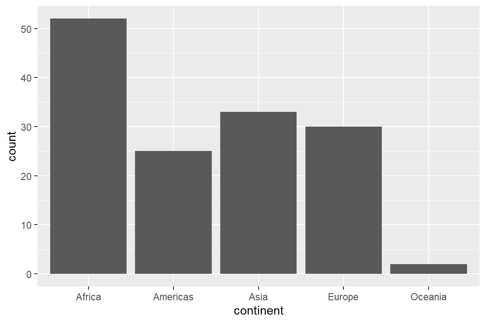

我个人比较喜欢先统计，然后画图

```r
gapdata %>%
  distinct(continent, country) %>%
  group_by(continent) %>%
  summarise(num = n()) %>%
  ggplot(aes(x = continent, y = num)) +
  geom_col()
```


### 直方图
常用于一个连续变量

```r
gapdata %>%
  ggplot(aes(x = lifeExp)) +
  geom_histogram()
```


```r
gapdata %>%
  ggplot(aes(x = lifeExp)) +
  geom_histogram(binwidth = 1)
```


```r
#' histograms, 默认使用 `position = "stack"`
gapdata %>%
  ggplot(aes(x = lifeExp, fill = continent)) +
  geom_histogram()
```


```r
#' 使用`position = "identity"`
gapdata %>%
  ggplot(aes(x = lifeExp, fill = continent)) +
  geom_histogram(position = "identity")
```


```r
gapdata %>%
  ggplot(aes(x = lifeExp, color = continent)) +
  geom_freqpoly()
```


```r
#' smooth histogram = densityplot
gapdata %>%
  ggplot(aes(x = lifeExp)) + geom_density()
```


如果不喜欢下面那条线，可以这样

```r
gapdata %>%
  ggplot(aes(x = lifeExp)) + geom_line(stat = "density")
```

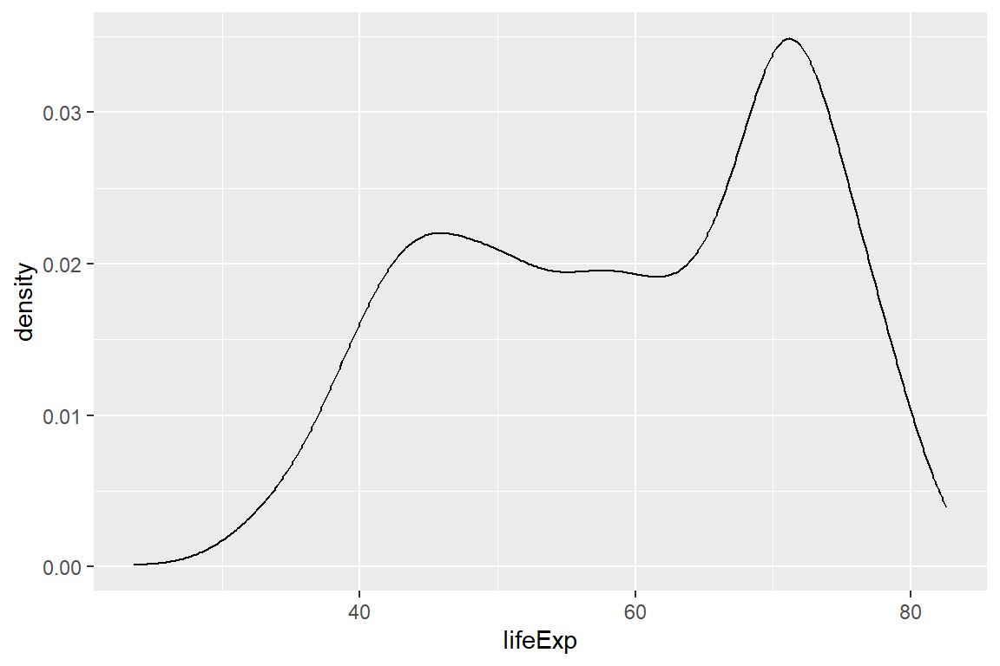


```r
# adjust 调节bandwidth,
# adjust = 1/2 means use half of the default bandwidth.
gapdata %>%
  ggplot(aes(x = lifeExp)) + geom_density(adjust = 1)
```


```r
gapdata %>%
  ggplot(aes(x = lifeExp)) + geom_density(adjust = 0.2)
```


```r
gapdata %>%
  ggplot(aes(x = lifeExp, color = continent)) +
  geom_density()
```


```r
gapdata %>%
  ggplot(aes(x = lifeExp, fill = continent)) +
  geom_density(alpha = 0.2)
```


```r
gapdata %>%
  filter(continent != "Oceania") %>%
  ggplot(aes(x = lifeExp, fill = continent)) +
  geom_density(alpha = 0.2)
```


```r
gapdata %>%
  ggplot(aes(x = lifeExp)) +
  geom_density() +
  # facet_wrap(vars(continent))
  facet_grid(. ~ continent)
```


```r
gapdata %>%
  filter(continent != "Oceania") %>%
  ggplot(aes(x = lifeExp, fill = continent)) +
  geom_histogram() +
  facet_grid(continent ~ .)
```


直方图和密度图画在一起。注意`y = stat(density) `表示y是由x新生成的变量，这是一种固定写法，类似的还有`stat(count)`

```r
gapdata %>%
  filter(continent != "Oceania") %>%
  ggplot(aes(x = lifeExp, y = stat(density))) +
  geom_histogram(aes(fill = continent)) +
  geom_density() +
  facet_grid(continent ~ .)
```


### 箱线图
一个离散变量 + 一个连续变量

```r
#' 思考下结果为什么是这样？
gapdata %>%
  ggplot(aes(x = year, y = lifeExp)) + geom_boxplot()
```


```r
# 数据框中的year变量是数值型，需要先转换成因子型，弄成离散型变量
gapdata %>%
  ggplot(aes(x = as.factor(year), y = lifeExp)) + geom_boxplot()
```


```r
# 明确指定分组变量
gapdata %>%
  ggplot(aes(x = year, y = lifeExp)) + geom_boxplot(aes(group = year))
```


```r
gapdata %>%
  ggplot(aes(x = year, y = lifeExp)) +
  geom_violin(aes(group = year)) +
  geom_jitter(alpha = 1 / 4) +
  geom_smooth(se = FALSE)
```

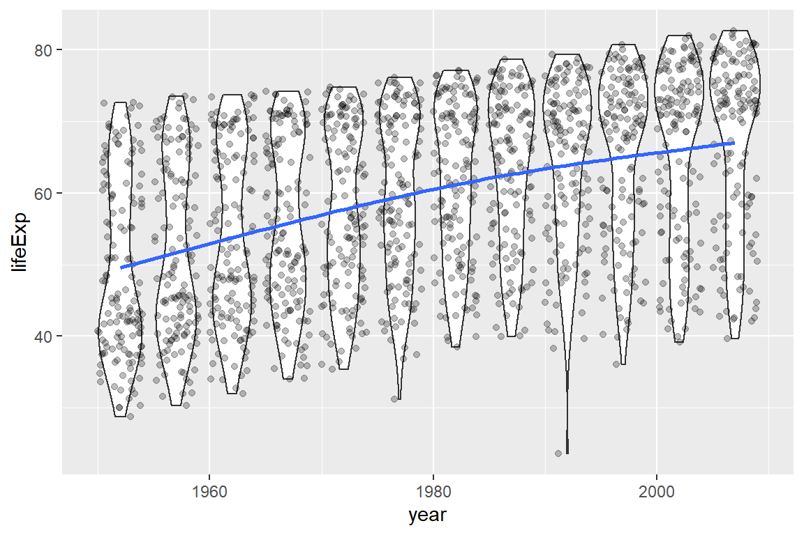


### 抖散图

点重叠的处理方案


```r
gapdata %>% ggplot(aes(x = continent, y = lifeExp)) + geom_point()
```


```r
gapdata %>% ggplot(aes(x = continent, y = lifeExp)) + geom_jitter()
```

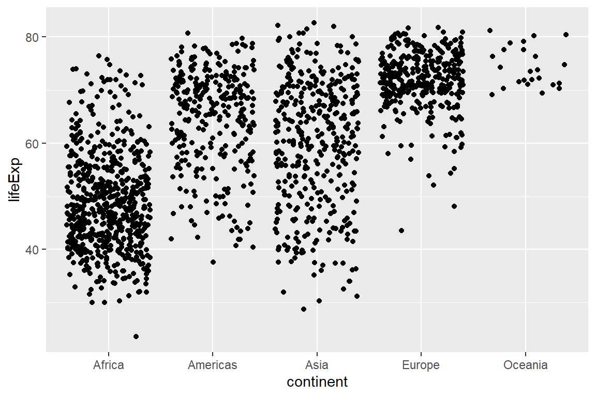


```r
gapdata %>% ggplot(aes(x = continent, y = lifeExp)) + geom_boxplot()
```


```r
gapdata %>% ggplot(aes(x = continent, y = lifeExp)) +
  geom_boxplot() +
  geom_jitter()
```

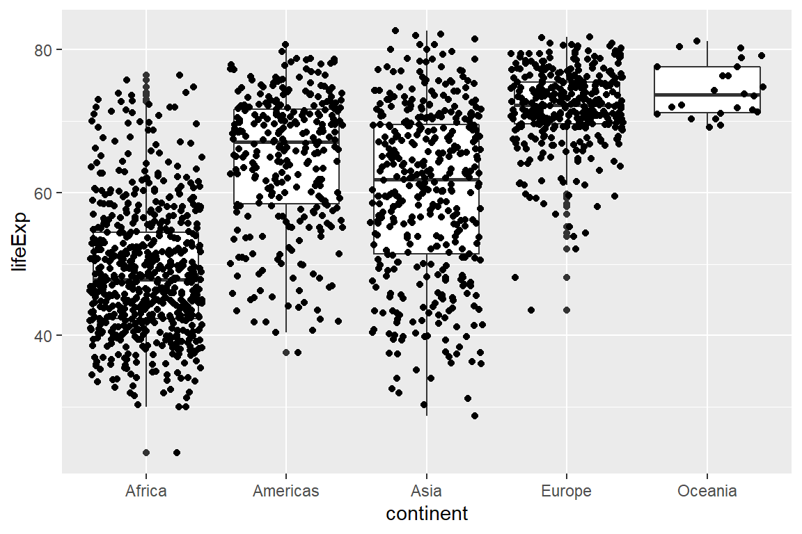


```r
gapdata %>%
  ggplot(aes(x = continent, y = lifeExp)) +
  geom_jitter() +
  stat_summary(fun.y = median, colour = "red", geom = "point", size = 5)
```

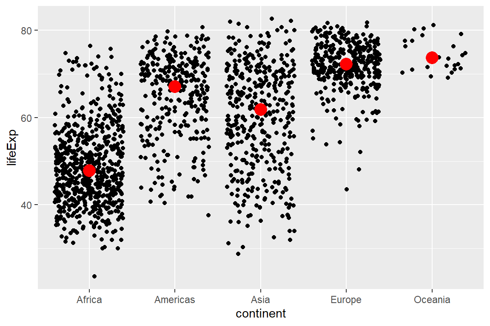


```r
gapdata %>%
  ggplot(aes(reorder(x = continent, lifeExp), y = lifeExp)) +
  geom_jitter() +
  stat_summary(fun.y = median, colour = "red", geom = "point", size = 5)
```

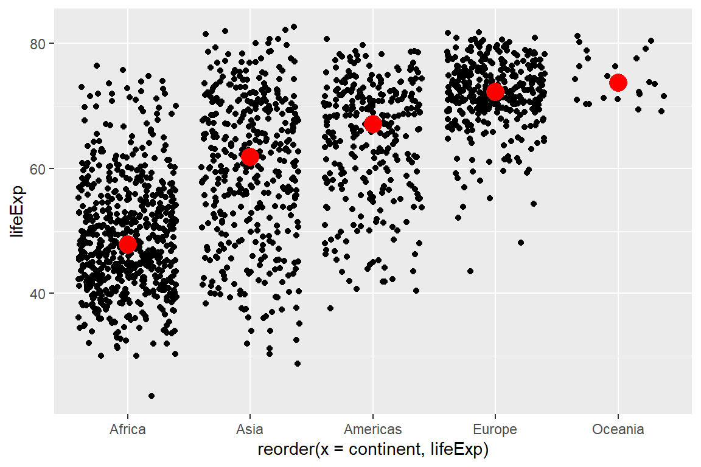


```r
gapdata %>%
  ggplot(aes(x = continent, y = lifeExp)) +
  geom_violin(
    trim = FALSE,
    alpha = 0.5
  ) +
  stat_summary(
    fun.y = mean,
    fun.ymax = function(x) {
      mean(x) + sd(x)
    },
    fun.ymin = function(x) {
      mean(x) - sd(x)
    },
    geom = "pointrange"
  )
```


### ridges图

常用于一个离散变量 + 一个连续变量

```r
gapdata %>%
  ggplot(aes(x = lifeExp,
             y = continent,
             fill = continent)) +
  ggridges::geom_density_ridges() 
```


### 散点图
常用于两个连续变量


```r
gapdata %>%
  ggplot(aes(x = gdpPercap, y = lifeExp)) +
  geom_point()
```


```r
gapdata %>%
  ggplot(aes(x = log(gdpPercap), y = lifeExp)) +
  geom_point()
```


```r
gapdata %>%
  ggplot(aes(x = gdpPercap, y = lifeExp)) +
  geom_point() +
  scale_x_log10() # A better way to log transform
```


```r
gapdata %>%
  ggplot(aes(x = gdpPercap, y = lifeExp)) +
  geom_point(aes(color = continent))
```


```r
gapdata %>%
  ggplot(aes(x = gdpPercap, y = lifeExp)) +
  geom_point(alpha = (1 / 3), size = 2)
```


```r
gapdata %>%
  ggplot(aes(x = gdpPercap, y = lifeExp)) +
  geom_point() +
  geom_smooth()
```


```r
gapdata %>%
  ggplot(aes(x = gdpPercap, y = lifeExp)) +
  geom_point() +
  geom_smooth(lwd = 3, se = FALSE)
```


```r
gapdata %>%
  ggplot(aes(x = gdpPercap, y = lifeExp)) +
  geom_point() +
  geom_smooth(lwd = 3, se = FALSE, method = "lm")
```


```r
gapdata %>%
  ggplot(aes(x = gdpPercap, y = lifeExp, color = continent)) +
  geom_point() +
  geom_smooth(lwd = 3, se = FALSE, method = "lm")
```


```r
gapdata %>%
  ggplot(aes(x = gdpPercap, y = lifeExp, color = continent)) +
  geom_point(show.legend = FALSE) +
  facet_wrap(~continent)
```


```r
jCountries <- c("Canada", "Rwanda", "Cambodia", "Mexico")

gapdata %>%
  filter(country %in% jCountries) %>%
  ggplot(aes(x = year, y = lifeExp, color = country)) +
  geom_line() +
  geom_point()
```


```r
gapdata %>%
  filter(country %in% jCountries) %>%
  ggplot(aes(
    x = year, y = lifeExp,
    color = reorder(country, -1 * lifeExp, max)
  )) +
  geom_line() +
  geom_point()
```


###  Cleveland dot plot

```r
gapdata %>%
  filter(continent == "Asia" & year == 2007) %>%
  ggplot(aes(x = lifeExp, y = country)) +
  geom_point()
```


```r
gapdata %>%
  filter(continent == "Asia" & year == 2007) %>%
  ggplot(aes(
    x = lifeExp,
    y = reorder(country, lifeExp)
  )) +
  geom_point(color = "blue", size = 2) +
  geom_segment(aes(
    x = 40,
    xend = lifeExp,
    y = reorder(country, lifeExp),
    yend = reorder(country, lifeExp)
  ),
  color = "lightgrey"
  ) +
  labs(
    x = "Life Expectancy (years)",
    y = "",
    title = "Life Expectancy by Country",
    subtitle = "GapMinder data for Asia - 2007"
  ) +
  theme_minimal() +
  theme(
    panel.grid.major = element_blank(),
    panel.grid.minor = element_blank()
  )
```


### 文本标注


```r
ten_countries <- gapdata %>%
  distinct(country) %>%
  pull() %>%
  sample(10)
```


```r
library(ggrepel)
gapdata %>%
  filter(year == 2007) %>%
  mutate(
    label = ifelse(country %in% ten_countries, as.character(country), "")
  ) %>%
  ggplot(aes(log(gdpPercap), lifeExp)) +
  geom_point(
    size = 3.5,
    alpha = .9,
    shape = 21,
    col = "white",
    fill = "#0162B2"
  ) +
  geom_text_repel(
    aes(label = label),
    size = 4.5,
    point.padding = .2,
    box.padding = .3,
    force = 1,
    min.segment.length = 0
  ) +
  theme_minimal(14) +
  theme(
    legend.position = "none",
    panel.grid.minor = element_blank()
  ) +
  labs(
    x = "log(GDP per capita)",
    y = "life expectancy"
  )
```

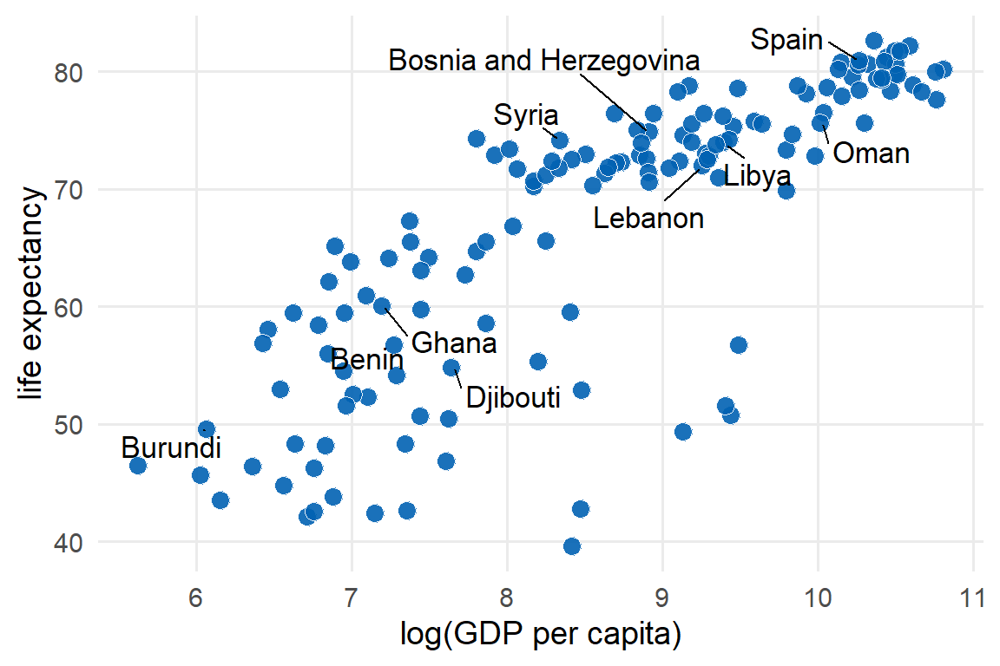


### errorbar图


```r
avg_gapdata <- gapdata %>%
  group_by(continent) %>%
  summarise(
    mean = mean(lifeExp),
    sd = sd(lifeExp)
  )
avg_gapdata
```

<div data-pagedtable="false">
  <script data-pagedtable-source type="application/json">
{"columns":[{"label":["continent"],"name":[1],"type":["chr"],"align":["left"]},{"label":["mean"],"name":[2],"type":["dbl"],"align":["right"]},{"label":["sd"],"name":[3],"type":["dbl"],"align":["right"]}],"data":[{"1":"Africa","2":"48.87","3":"9.150"},{"1":"Americas","2":"64.66","3":"9.345"},{"1":"Asia","2":"60.06","3":"11.865"},{"1":"Europe","2":"71.90","3":"5.433"},{"1":"Oceania","2":"74.33","3":"3.796"}],"options":{"columns":{"min":{},"max":[10]},"rows":{"min":[10],"max":[10]},"pages":{}}}
  </script>
</div>


```r
avg_gapdata %>%
  ggplot(aes(continent, mean, fill = continent)) +
  # geom_col(alpha = 0.5) +
  geom_point() +
  geom_errorbar(aes(ymin = mean - sd, ymax = mean + sd), width = 0.25)
```


### 椭圆图


```r
gapdata %>%
  ggplot(aes(x = log(gdpPercap), y = lifeExp)) +
  geom_point() +
  stat_ellipse(type = "norm", level = 0.95)
```


### 2D 密度图

与一维的情形`geom_density()`类似，
`geom_density_2d()`, `geom_bin2d()`, `geom_hex()`常用于刻画两个变量构成的二维区间的密度


```r
gapdata %>%
  ggplot(aes(x = gdpPercap, y = lifeExp)) +
  geom_bin2d()
```


```r
gapdata %>%
  ggplot(aes(x = gdpPercap, y = lifeExp)) +
  geom_hex()
```


### 马赛克图

`geom_tile()`， `geom_contour()`， `geom_raster()`常用于3个变量


```r
gapdata %>%
  group_by(continent, year) %>%
  summarise(mean_lifeExp = mean(lifeExp)) %>%
  ggplot(aes(x = year, y = continent, fill = mean_lifeExp)) +
  geom_tile() +
  scale_fill_viridis_c()
```


事实上可以有更好的呈现方式


```r
gapdata %>%
  group_by(continent, year) %>%
  summarise(mean_lifeExp = mean(lifeExp)) %>%
  ggplot(aes(x = year, y = continent, size = mean_lifeExp)) +
  geom_point()
```


## 主题风格


```r
gapdata %>%
  ggplot(aes(x = gdpPercap, y = lifeExp, color = continent)) +
  geom_point() +
  geom_smooth(lwd = 3, se = FALSE, method = "lm")
```


```r
gapdata %>%
  ggplot(aes(x = gdpPercap, y = lifeExp, color = continent)) +
  geom_point() +
  geom_smooth(lwd = 3, se = FALSE, method = "lm") +
  ggtitle("Life expectancy over time by continent")
```


```r
gapdata %>%
  ggplot(aes(x = gdpPercap, y = lifeExp, color = continent)) +
  geom_point() +
  geom_smooth(lwd = 3, se = FALSE, method = "lm") +
  theme_grey() # the default
```


```r
gapdata %>%
  ggplot(aes(x = gdpPercap, y = lifeExp, color = continent)) +
  geom_point() +
  geom_smooth(lwd = 3, se = FALSE, method = "lm") +
  theme_bw()
```

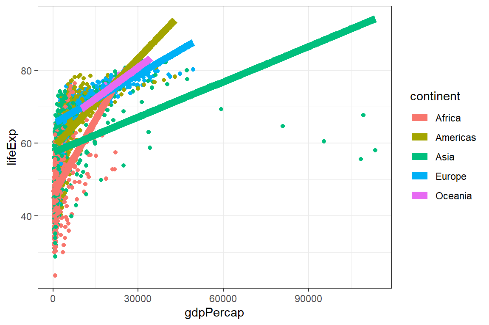


```r
gapdata %>%
  ggplot(aes(x = gdpPercap, y = lifeExp, color = continent)) +
  geom_point() +
  geom_smooth(lwd = 3, se = FALSE, method = "lm") +
  ggthemes::theme_calc() +
  ggtitle("ggthemes::theme_calc()")
```


```r
gapdata %>%
  ggplot(aes(x = gdpPercap, y = lifeExp, color = continent)) +
  geom_point() +
  geom_smooth(lwd = 3, se = FALSE, method = "lm") +
  ggthemes::theme_economist() +
  ggtitle("ggthemes::theme_economist()")
```


```r
gapdata %>%
  ggplot(aes(x = gdpPercap, y = lifeExp, color = continent)) +
  geom_point() +
  geom_smooth(lwd = 3, se = FALSE, method = "lm") +
  ggthemes::theme_economist_white() +
  ggtitle("ggthemes::theme_economist_white()")
```


```r
gapdata %>%
  ggplot(aes(x = gdpPercap, y = lifeExp, color = continent)) +
  geom_point() +
  geom_smooth(lwd = 3, se = FALSE, method = "lm") +
  ggthemes::theme_few() +
  ggtitle("ggthemes::theme_few()")
```


```r
gapdata %>%
  ggplot(aes(x = gdpPercap, y = lifeExp, color = continent)) +
  geom_point() +
  geom_smooth(lwd = 3, se = FALSE, method = "lm") +
  ggthemes::theme_gdocs() +
  ggtitle("ggthemes::theme_gdocs()")
```


```r
gapdata %>%
  ggplot(aes(x = gdpPercap, y = lifeExp, color = continent)) +
  geom_point() +
  geom_smooth(lwd = 3, se = FALSE, method = "lm") +
  ggthemes::theme_tufte() +
  ggtitle("ggthemes::theme_tufte()")
```


```r
gapdata %>%
  ggplot(aes(x = gdpPercap, y = lifeExp, color = continent)) +
  geom_point() +
  geom_smooth(lwd = 3, se = FALSE, method = "lm") +
  ggthemes::theme_wsj() +
  ggtitle("ggthemes::theme_wsj()")
```


## 定制

### Labels 


```r
gapdata %>%
  ggplot(aes(x = gdpPercap, y = lifeExp, color = continent)) +
  geom_point() +
  scale_x_log10() +
  ggtitle("My Plot Title") +
  xlab("The X Variable") +
  ylab("The Y Variable")
```

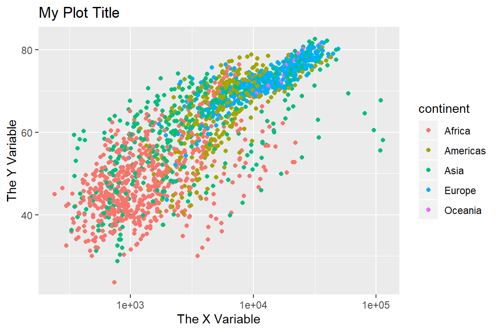


```r
gapdata %>%
  ggplot(aes(x = gdpPercap, y = lifeExp, color = continent)) +
  geom_point() +
  scale_x_log10() +
  labs(
    title = "My Plot Title",
    subtitle = "My Plot subtitle",
    x = "The X Variable",
    y = "The Y Variable"
  )
```


### 定制颜色

 我喜欢用这两个函数定制喜欢的绘图色彩，`scale_colour_manual()` 和 `scale_fill_manual()`. 更多方法可以参考 [Colours chapter in Cookbook for R](http://www.cookbook-r.com/Graphs/Colors_(ggplot2)/) 


```r
gapdata %>%
  ggplot(aes(x = gdpPercap, y = lifeExp, color = continent)) +
  geom_point() +
  scale_x_log10() +
  scale_color_manual(
    values = c("#195744", "#008148", "#C6C013", "#EF8A17", "#EF2917")
  )
```


 

## 组合图片

我们有时候想把多张图组合到一起

### cowplot

可以使用 [`cowplot`](https://cran.r-project.org/web/packages/cowplot/vignettes/introduction.html) 宏包的`plot_grid()`函数完成多张图片的组合，使用方法很简单。


```r
p1 <- gapdata %>%
  ggplot(aes(x = gdpPercap, y = lifeExp)) +
  geom_point(aes(color = lifeExp > mean(lifeExp))) +
  scale_x_log10() +
  theme(legend.position = "none") +
  scale_color_manual(values = c("orange", "pink")) +
  labs(
    title = "My Plot Title",
    x = "The X Variable",
    y = "The Y Variable"
  )
```


```r
p2 <- gapdata %>%
  ggplot(aes(x = gdpPercap, y = lifeExp, color = continent)) +
  geom_point() +
  scale_x_log10() +
  scale_color_manual(
    values = c("#195744", "#008148", "#C6C013", "#EF8A17", "#EF2917")
  ) +
  theme(legend.position = "none") +
  labs(
    title = "My Plot Title",
    x = "The X Variable",
    y = "The Y Variable"
  )
```


```r
cowplot::plot_grid(
  p1,
  p2,
  labels = c("A", "B")
)
```


也可以使用patchwork宏包，更简单的方法

```r
library(patchwork)
p1 + p2
```


```r
p1 / p2
```


patchwork 使用方法很简单，根本不需要记


### 保存图片

使用`ggsave()`函数，将图片保存为所需要的格式，如".pdf", ".png"等， 还可以指定图片的高度和宽度，默认`units`是英寸，也可以使用"cm", or "mm".


```r
pp <- gapdata %>%
  ggplot(aes(x = gdpPercap, y = lifeExp, color = continent)) +
  geom_point() +
  scale_x_log10() +
  scale_color_manual(
    values = c("#195744", "#008148", "#C6C013", "#EF8A17", "#EF2917")
  ) +
  theme(legend.position = "none") +
  labs(
    title = "My Plot Title",
    x = "The X Variable",
    y = "The Y Variable"
  )

# ggsave("demo_plot.pdf", plot = pp, width = 8, height = 6)
```


## 中文字体

```r
library(showtext)
showtext_auto()

gapdata %>%
  ggplot(aes(x = gdpPercap, y = lifeExp, color = continent)) +
  geom_point() +
  scale_x_log10() +
  scale_color_manual(
    values = c("#195744", "#008148", "#C6C013", "#EF8A17", "#EF2917")
  ) +
  theme(legend.position = "none") +
  labs(
    title = "这是我的标题美美哒",
    x = "这是我的x坐标",
    y = "这是我的y坐标"
  )
```


```r
# ggsave("myfirst.pdf", width = 8, height = 6)
```


## 高亮某一组
画图很容易，然而画一张好图，不容易。图片质量好不好，其原则就是**不增加看图者的心智负担**，有些图片的色彩很丰富，然而需要看图人配合文字和图注等信息才能看懂作者想表达的意思，这样就失去了图片“一图胜千言”的价值。


分析数据过程中，我们可以使用**高亮**我们某组数据，**突出**我们想表达的信息，是非常好的一种可视化探索手段。


### ggplot2方法

这种方法是将**背景部分**和**高亮部分**分两步来画


```r
drop_facet <- function(x) select(x, -continent)

gapdata %>%
  ggplot() +
  geom_line(
    data = drop_facet,
    aes(x = year, y = lifeExp, group = country), color = "grey",
  ) +
  geom_line(aes(x = year, y = lifeExp, color = country, group = country)) +
  facet_wrap(vars(continent)) +
  theme(legend.position = "none")
```


再来一个

```r
gapdata %>%
  mutate(group = country) %>%
  filter(continent == "Asia") %>%
  ggplot() +
  geom_line(
    data = function(d) select(d, -country),
    aes(x = year, y = lifeExp, group = group), color = "grey",
  ) +
  geom_line(aes(x = year, y = lifeExp, group = country), color = "red") +
  facet_wrap(vars(country)) +
  theme(legend.position = "none")
```


### gghighlight方法

这里推荐[gghighlight宏包](<https://yutannihilation.github.io/gghighlight/articles/gghighlight.html>)

- dplyr has filter()
- ggplot has Highlighting


```r
gapdata %>% filter(country == "China")
```

<div data-pagedtable="false">
  <script data-pagedtable-source type="application/json">
{"columns":[{"label":["country"],"name":[1],"type":["chr"],"align":["left"]},{"label":["continent"],"name":[2],"type":["chr"],"align":["left"]},{"label":["year"],"name":[3],"type":["dbl"],"align":["right"]},{"label":["lifeExp"],"name":[4],"type":["dbl"],"align":["right"]},{"label":["pop"],"name":[5],"type":["dbl"],"align":["right"]},{"label":["gdpPercap"],"name":[6],"type":["dbl"],"align":["right"]}],"data":[{"1":"China","2":"Asia","3":"1952","4":"44.00","5":"5.563e+08","6":"400.4"},{"1":"China","2":"Asia","3":"1957","4":"50.55","5":"6.374e+08","6":"576.0"},{"1":"China","2":"Asia","3":"1962","4":"44.50","5":"6.658e+08","6":"487.7"},{"1":"China","2":"Asia","3":"1967","4":"58.38","5":"7.546e+08","6":"612.7"},{"1":"China","2":"Asia","3":"1972","4":"63.12","5":"8.620e+08","6":"676.9"},{"1":"China","2":"Asia","3":"1977","4":"63.97","5":"9.435e+08","6":"741.2"},{"1":"China","2":"Asia","3":"1982","4":"65.53","5":"1.000e+09","6":"962.4"},{"1":"China","2":"Asia","3":"1987","4":"67.27","5":"1.084e+09","6":"1378.9"},{"1":"China","2":"Asia","3":"1992","4":"68.69","5":"1.165e+09","6":"1655.8"},{"1":"China","2":"Asia","3":"1997","4":"70.43","5":"1.230e+09","6":"2289.2"},{"1":"China","2":"Asia","3":"2002","4":"72.03","5":"1.280e+09","6":"3119.3"},{"1":"China","2":"Asia","3":"2007","4":"72.96","5":"1.319e+09","6":"4959.1"}],"options":{"columns":{"min":{},"max":[10]},"rows":{"min":[10],"max":[10]},"pages":{}}}
  </script>
</div>


```r
gapdata %>%
  ggplot(
    aes(x = year, y = lifeExp, color = continent, group = country)
  ) +
  geom_line() +
  gghighlight(
    country == "China", # which is passed to dplyr::filter().
    label_key = country
  )
```

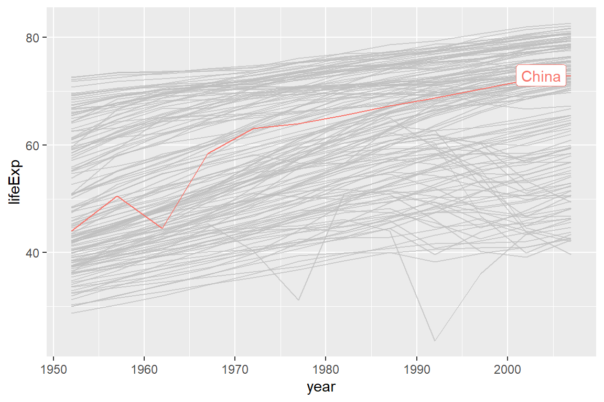


```r
gapdata %>% filter(continent == "Asia")
```

<div data-pagedtable="false">
  <script data-pagedtable-source type="application/json">
{"columns":[{"label":["country"],"name":[1],"type":["chr"],"align":["left"]},{"label":["continent"],"name":[2],"type":["chr"],"align":["left"]},{"label":["year"],"name":[3],"type":["dbl"],"align":["right"]},{"label":["lifeExp"],"name":[4],"type":["dbl"],"align":["right"]},{"label":["pop"],"name":[5],"type":["dbl"],"align":["right"]},{"label":["gdpPercap"],"name":[6],"type":["dbl"],"align":["right"]}],"data":[{"1":"Afghanistan","2":"Asia","3":"1952","4":"28.80","5":"8.425e+06","6":"779.4"},{"1":"Afghanistan","2":"Asia","3":"1957","4":"30.33","5":"9.241e+06","6":"820.9"},{"1":"Afghanistan","2":"Asia","3":"1962","4":"32.00","5":"1.027e+07","6":"853.1"},{"1":"Afghanistan","2":"Asia","3":"1967","4":"34.02","5":"1.154e+07","6":"836.2"},{"1":"Afghanistan","2":"Asia","3":"1972","4":"36.09","5":"1.308e+07","6":"740.0"},{"1":"Afghanistan","2":"Asia","3":"1977","4":"38.44","5":"1.488e+07","6":"786.1"},{"1":"Afghanistan","2":"Asia","3":"1982","4":"39.85","5":"1.288e+07","6":"978.0"},{"1":"Afghanistan","2":"Asia","3":"1987","4":"40.82","5":"1.387e+07","6":"852.4"},{"1":"Afghanistan","2":"Asia","3":"1992","4":"41.67","5":"1.632e+07","6":"649.3"},{"1":"Afghanistan","2":"Asia","3":"1997","4":"41.76","5":"2.223e+07","6":"635.3"},{"1":"Afghanistan","2":"Asia","3":"2002","4":"42.13","5":"2.527e+07","6":"726.7"},{"1":"Afghanistan","2":"Asia","3":"2007","4":"43.83","5":"3.189e+07","6":"974.6"},{"1":"Bahrain","2":"Asia","3":"1952","4":"50.94","5":"1.204e+05","6":"9867.1"},{"1":"Bahrain","2":"Asia","3":"1957","4":"53.83","5":"1.387e+05","6":"11635.8"},{"1":"Bahrain","2":"Asia","3":"1962","4":"56.92","5":"1.719e+05","6":"12753.3"},{"1":"Bahrain","2":"Asia","3":"1967","4":"59.92","5":"2.022e+05","6":"14804.7"},{"1":"Bahrain","2":"Asia","3":"1972","4":"63.30","5":"2.308e+05","6":"18268.7"},{"1":"Bahrain","2":"Asia","3":"1977","4":"65.59","5":"2.974e+05","6":"19340.1"},{"1":"Bahrain","2":"Asia","3":"1982","4":"69.05","5":"3.780e+05","6":"19211.1"},{"1":"Bahrain","2":"Asia","3":"1987","4":"70.75","5":"4.546e+05","6":"18524.0"},{"1":"Bahrain","2":"Asia","3":"1992","4":"72.60","5":"5.295e+05","6":"19035.6"},{"1":"Bahrain","2":"Asia","3":"1997","4":"73.92","5":"5.986e+05","6":"20292.0"},{"1":"Bahrain","2":"Asia","3":"2002","4":"74.80","5":"6.564e+05","6":"23403.6"},{"1":"Bahrain","2":"Asia","3":"2007","4":"75.64","5":"7.086e+05","6":"29796.0"},{"1":"Bangladesh","2":"Asia","3":"1952","4":"37.48","5":"4.689e+07","6":"684.2"},{"1":"Bangladesh","2":"Asia","3":"1957","4":"39.35","5":"5.137e+07","6":"661.6"},{"1":"Bangladesh","2":"Asia","3":"1962","4":"41.22","5":"5.684e+07","6":"686.3"},{"1":"Bangladesh","2":"Asia","3":"1967","4":"43.45","5":"6.282e+07","6":"721.2"},{"1":"Bangladesh","2":"Asia","3":"1972","4":"45.25","5":"7.076e+07","6":"630.2"},{"1":"Bangladesh","2":"Asia","3":"1977","4":"46.92","5":"8.043e+07","6":"659.9"},{"1":"Bangladesh","2":"Asia","3":"1982","4":"50.01","5":"9.307e+07","6":"677.0"},{"1":"Bangladesh","2":"Asia","3":"1987","4":"52.82","5":"1.038e+08","6":"752.0"},{"1":"Bangladesh","2":"Asia","3":"1992","4":"56.02","5":"1.137e+08","6":"837.8"},{"1":"Bangladesh","2":"Asia","3":"1997","4":"59.41","5":"1.233e+08","6":"972.8"},{"1":"Bangladesh","2":"Asia","3":"2002","4":"62.01","5":"1.357e+08","6":"1136.4"},{"1":"Bangladesh","2":"Asia","3":"2007","4":"64.06","5":"1.504e+08","6":"1391.3"},{"1":"Cambodia","2":"Asia","3":"1952","4":"39.42","5":"4.694e+06","6":"368.5"},{"1":"Cambodia","2":"Asia","3":"1957","4":"41.37","5":"5.323e+06","6":"434.0"},{"1":"Cambodia","2":"Asia","3":"1962","4":"43.41","5":"6.084e+06","6":"496.9"},{"1":"Cambodia","2":"Asia","3":"1967","4":"45.41","5":"6.960e+06","6":"523.4"},{"1":"Cambodia","2":"Asia","3":"1972","4":"40.32","5":"7.451e+06","6":"421.6"},{"1":"Cambodia","2":"Asia","3":"1977","4":"31.22","5":"6.979e+06","6":"525.0"},{"1":"Cambodia","2":"Asia","3":"1982","4":"50.96","5":"7.272e+06","6":"624.5"},{"1":"Cambodia","2":"Asia","3":"1987","4":"53.91","5":"8.372e+06","6":"683.9"},{"1":"Cambodia","2":"Asia","3":"1992","4":"55.80","5":"1.015e+07","6":"682.3"},{"1":"Cambodia","2":"Asia","3":"1997","4":"56.53","5":"1.178e+07","6":"734.3"},{"1":"Cambodia","2":"Asia","3":"2002","4":"56.75","5":"1.293e+07","6":"896.2"},{"1":"Cambodia","2":"Asia","3":"2007","4":"59.72","5":"1.413e+07","6":"1713.8"},{"1":"China","2":"Asia","3":"1952","4":"44.00","5":"5.563e+08","6":"400.4"},{"1":"China","2":"Asia","3":"1957","4":"50.55","5":"6.374e+08","6":"576.0"},{"1":"China","2":"Asia","3":"1962","4":"44.50","5":"6.658e+08","6":"487.7"},{"1":"China","2":"Asia","3":"1967","4":"58.38","5":"7.546e+08","6":"612.7"},{"1":"China","2":"Asia","3":"1972","4":"63.12","5":"8.620e+08","6":"676.9"},{"1":"China","2":"Asia","3":"1977","4":"63.97","5":"9.435e+08","6":"741.2"},{"1":"China","2":"Asia","3":"1982","4":"65.53","5":"1.000e+09","6":"962.4"},{"1":"China","2":"Asia","3":"1987","4":"67.27","5":"1.084e+09","6":"1378.9"},{"1":"China","2":"Asia","3":"1992","4":"68.69","5":"1.165e+09","6":"1655.8"},{"1":"China","2":"Asia","3":"1997","4":"70.43","5":"1.230e+09","6":"2289.2"},{"1":"China","2":"Asia","3":"2002","4":"72.03","5":"1.280e+09","6":"3119.3"},{"1":"China","2":"Asia","3":"2007","4":"72.96","5":"1.319e+09","6":"4959.1"},{"1":"Hong Kong, China","2":"Asia","3":"1952","4":"60.96","5":"2.126e+06","6":"3054.4"},{"1":"Hong Kong, China","2":"Asia","3":"1957","4":"64.75","5":"2.736e+06","6":"3629.1"},{"1":"Hong Kong, China","2":"Asia","3":"1962","4":"67.65","5":"3.305e+06","6":"4692.6"},{"1":"Hong Kong, China","2":"Asia","3":"1967","4":"70.00","5":"3.723e+06","6":"6198.0"},{"1":"Hong Kong, China","2":"Asia","3":"1972","4":"72.00","5":"4.116e+06","6":"8315.9"},{"1":"Hong Kong, China","2":"Asia","3":"1977","4":"73.60","5":"4.584e+06","6":"11186.1"},{"1":"Hong Kong, China","2":"Asia","3":"1982","4":"75.45","5":"5.264e+06","6":"14560.5"},{"1":"Hong Kong, China","2":"Asia","3":"1987","4":"76.20","5":"5.585e+06","6":"20038.5"},{"1":"Hong Kong, China","2":"Asia","3":"1992","4":"77.60","5":"5.830e+06","6":"24757.6"},{"1":"Hong Kong, China","2":"Asia","3":"1997","4":"80.00","5":"6.496e+06","6":"28377.6"},{"1":"Hong Kong, China","2":"Asia","3":"2002","4":"81.50","5":"6.762e+06","6":"30209.0"},{"1":"Hong Kong, China","2":"Asia","3":"2007","4":"82.21","5":"6.980e+06","6":"39725.0"},{"1":"India","2":"Asia","3":"1952","4":"37.37","5":"3.720e+08","6":"546.6"},{"1":"India","2":"Asia","3":"1957","4":"40.25","5":"4.090e+08","6":"590.1"},{"1":"India","2":"Asia","3":"1962","4":"43.60","5":"4.540e+08","6":"658.3"},{"1":"India","2":"Asia","3":"1967","4":"47.19","5":"5.060e+08","6":"700.8"},{"1":"India","2":"Asia","3":"1972","4":"50.65","5":"5.670e+08","6":"724.0"},{"1":"India","2":"Asia","3":"1977","4":"54.21","5":"6.340e+08","6":"813.3"},{"1":"India","2":"Asia","3":"1982","4":"56.60","5":"7.080e+08","6":"855.7"},{"1":"India","2":"Asia","3":"1987","4":"58.55","5":"7.880e+08","6":"976.5"},{"1":"India","2":"Asia","3":"1992","4":"60.22","5":"8.720e+08","6":"1164.4"},{"1":"India","2":"Asia","3":"1997","4":"61.77","5":"9.590e+08","6":"1458.8"},{"1":"India","2":"Asia","3":"2002","4":"62.88","5":"1.034e+09","6":"1746.8"},{"1":"India","2":"Asia","3":"2007","4":"64.70","5":"1.110e+09","6":"2452.2"},{"1":"Indonesia","2":"Asia","3":"1952","4":"37.47","5":"8.205e+07","6":"749.7"},{"1":"Indonesia","2":"Asia","3":"1957","4":"39.92","5":"9.012e+07","6":"858.9"},{"1":"Indonesia","2":"Asia","3":"1962","4":"42.52","5":"9.903e+07","6":"849.3"},{"1":"Indonesia","2":"Asia","3":"1967","4":"45.96","5":"1.093e+08","6":"762.4"},{"1":"Indonesia","2":"Asia","3":"1972","4":"49.20","5":"1.213e+08","6":"1111.1"},{"1":"Indonesia","2":"Asia","3":"1977","4":"52.70","5":"1.367e+08","6":"1382.7"},{"1":"Indonesia","2":"Asia","3":"1982","4":"56.16","5":"1.533e+08","6":"1516.9"},{"1":"Indonesia","2":"Asia","3":"1987","4":"60.14","5":"1.693e+08","6":"1748.4"},{"1":"Indonesia","2":"Asia","3":"1992","4":"62.68","5":"1.848e+08","6":"2383.1"},{"1":"Indonesia","2":"Asia","3":"1997","4":"66.04","5":"1.993e+08","6":"3119.3"},{"1":"Indonesia","2":"Asia","3":"2002","4":"68.59","5":"2.111e+08","6":"2873.9"},{"1":"Indonesia","2":"Asia","3":"2007","4":"70.65","5":"2.235e+08","6":"3540.7"},{"1":"Iran","2":"Asia","3":"1952","4":"44.87","5":"1.727e+07","6":"3035.3"},{"1":"Iran","2":"Asia","3":"1957","4":"47.18","5":"1.979e+07","6":"3290.3"},{"1":"Iran","2":"Asia","3":"1962","4":"49.33","5":"2.287e+07","6":"4187.3"},{"1":"Iran","2":"Asia","3":"1967","4":"52.47","5":"2.654e+07","6":"5906.7"},{"1":"Iran","2":"Asia","3":"1972","4":"55.23","5":"3.061e+07","6":"9613.8"},{"1":"Iran","2":"Asia","3":"1977","4":"57.70","5":"3.548e+07","6":"11888.6"},{"1":"Iran","2":"Asia","3":"1982","4":"59.62","5":"4.307e+07","6":"7608.3"},{"1":"Iran","2":"Asia","3":"1987","4":"63.04","5":"5.189e+07","6":"6642.9"},{"1":"Iran","2":"Asia","3":"1992","4":"65.74","5":"6.040e+07","6":"7235.7"},{"1":"Iran","2":"Asia","3":"1997","4":"68.04","5":"6.333e+07","6":"8263.6"},{"1":"Iran","2":"Asia","3":"2002","4":"69.45","5":"6.691e+07","6":"9240.8"},{"1":"Iran","2":"Asia","3":"2007","4":"70.96","5":"6.945e+07","6":"11605.7"},{"1":"Iraq","2":"Asia","3":"1952","4":"45.32","5":"5.442e+06","6":"4129.8"},{"1":"Iraq","2":"Asia","3":"1957","4":"48.44","5":"6.249e+06","6":"6229.3"},{"1":"Iraq","2":"Asia","3":"1962","4":"51.46","5":"7.240e+06","6":"8341.7"},{"1":"Iraq","2":"Asia","3":"1967","4":"54.46","5":"8.519e+06","6":"8931.5"},{"1":"Iraq","2":"Asia","3":"1972","4":"56.95","5":"1.006e+07","6":"9576.0"},{"1":"Iraq","2":"Asia","3":"1977","4":"60.41","5":"1.188e+07","6":"14688.2"},{"1":"Iraq","2":"Asia","3":"1982","4":"62.04","5":"1.417e+07","6":"14517.9"},{"1":"Iraq","2":"Asia","3":"1987","4":"65.04","5":"1.654e+07","6":"11643.6"},{"1":"Iraq","2":"Asia","3":"1992","4":"59.46","5":"1.786e+07","6":"3745.6"},{"1":"Iraq","2":"Asia","3":"1997","4":"58.81","5":"2.078e+07","6":"3076.2"},{"1":"Iraq","2":"Asia","3":"2002","4":"57.05","5":"2.400e+07","6":"4390.7"},{"1":"Iraq","2":"Asia","3":"2007","4":"59.55","5":"2.750e+07","6":"4471.1"},{"1":"Israel","2":"Asia","3":"1952","4":"65.39","5":"1.621e+06","6":"4086.5"},{"1":"Israel","2":"Asia","3":"1957","4":"67.84","5":"1.944e+06","6":"5385.3"},{"1":"Israel","2":"Asia","3":"1962","4":"69.39","5":"2.311e+06","6":"7105.6"},{"1":"Israel","2":"Asia","3":"1967","4":"70.75","5":"2.694e+06","6":"8393.7"},{"1":"Israel","2":"Asia","3":"1972","4":"71.63","5":"3.096e+06","6":"12786.9"},{"1":"Israel","2":"Asia","3":"1977","4":"73.06","5":"3.496e+06","6":"13306.6"},{"1":"Israel","2":"Asia","3":"1982","4":"74.45","5":"3.858e+06","6":"15367.0"},{"1":"Israel","2":"Asia","3":"1987","4":"75.60","5":"4.203e+06","6":"17122.5"},{"1":"Israel","2":"Asia","3":"1992","4":"76.93","5":"4.937e+06","6":"18051.5"},{"1":"Israel","2":"Asia","3":"1997","4":"78.27","5":"5.531e+06","6":"20896.6"},{"1":"Israel","2":"Asia","3":"2002","4":"79.70","5":"6.030e+06","6":"21905.6"},{"1":"Israel","2":"Asia","3":"2007","4":"80.75","5":"6.427e+06","6":"25523.3"},{"1":"Japan","2":"Asia","3":"1952","4":"63.03","5":"8.646e+07","6":"3217.0"},{"1":"Japan","2":"Asia","3":"1957","4":"65.50","5":"9.156e+07","6":"4317.7"},{"1":"Japan","2":"Asia","3":"1962","4":"68.73","5":"9.583e+07","6":"6576.6"},{"1":"Japan","2":"Asia","3":"1967","4":"71.43","5":"1.008e+08","6":"9847.8"},{"1":"Japan","2":"Asia","3":"1972","4":"73.42","5":"1.072e+08","6":"14778.8"},{"1":"Japan","2":"Asia","3":"1977","4":"75.38","5":"1.139e+08","6":"16610.4"},{"1":"Japan","2":"Asia","3":"1982","4":"77.11","5":"1.185e+08","6":"19384.1"},{"1":"Japan","2":"Asia","3":"1987","4":"78.67","5":"1.221e+08","6":"22375.9"},{"1":"Japan","2":"Asia","3":"1992","4":"79.36","5":"1.243e+08","6":"26824.9"},{"1":"Japan","2":"Asia","3":"1997","4":"80.69","5":"1.260e+08","6":"28816.6"},{"1":"Japan","2":"Asia","3":"2002","4":"82.00","5":"1.271e+08","6":"28604.6"},{"1":"Japan","2":"Asia","3":"2007","4":"82.60","5":"1.275e+08","6":"31656.1"},{"1":"Jordan","2":"Asia","3":"1952","4":"43.16","5":"6.079e+05","6":"1546.9"},{"1":"Jordan","2":"Asia","3":"1957","4":"45.67","5":"7.466e+05","6":"1886.1"},{"1":"Jordan","2":"Asia","3":"1962","4":"48.13","5":"9.336e+05","6":"2348.0"},{"1":"Jordan","2":"Asia","3":"1967","4":"51.63","5":"1.255e+06","6":"2741.8"},{"1":"Jordan","2":"Asia","3":"1972","4":"56.53","5":"1.614e+06","6":"2110.9"},{"1":"Jordan","2":"Asia","3":"1977","4":"61.13","5":"1.938e+06","6":"2852.4"},{"1":"Jordan","2":"Asia","3":"1982","4":"63.74","5":"2.347e+06","6":"4161.4"},{"1":"Jordan","2":"Asia","3":"1987","4":"65.87","5":"2.820e+06","6":"4448.7"},{"1":"Jordan","2":"Asia","3":"1992","4":"68.02","5":"3.867e+06","6":"3431.6"},{"1":"Jordan","2":"Asia","3":"1997","4":"69.77","5":"4.526e+06","6":"3645.4"},{"1":"Jordan","2":"Asia","3":"2002","4":"71.26","5":"5.307e+06","6":"3844.9"},{"1":"Jordan","2":"Asia","3":"2007","4":"72.53","5":"6.053e+06","6":"4519.5"},{"1":"Korea, Dem. Rep.","2":"Asia","3":"1952","4":"50.06","5":"8.865e+06","6":"1088.3"},{"1":"Korea, Dem. Rep.","2":"Asia","3":"1957","4":"54.08","5":"9.411e+06","6":"1571.1"},{"1":"Korea, Dem. Rep.","2":"Asia","3":"1962","4":"56.66","5":"1.092e+07","6":"1621.7"},{"1":"Korea, Dem. Rep.","2":"Asia","3":"1967","4":"59.94","5":"1.262e+07","6":"2143.5"},{"1":"Korea, Dem. Rep.","2":"Asia","3":"1972","4":"63.98","5":"1.478e+07","6":"3701.6"},{"1":"Korea, Dem. Rep.","2":"Asia","3":"1977","4":"67.16","5":"1.633e+07","6":"4106.3"},{"1":"Korea, Dem. Rep.","2":"Asia","3":"1982","4":"69.10","5":"1.765e+07","6":"4106.5"},{"1":"Korea, Dem. Rep.","2":"Asia","3":"1987","4":"70.65","5":"1.907e+07","6":"4106.5"},{"1":"Korea, Dem. Rep.","2":"Asia","3":"1992","4":"69.98","5":"2.071e+07","6":"3726.1"},{"1":"Korea, Dem. Rep.","2":"Asia","3":"1997","4":"67.73","5":"2.159e+07","6":"1690.8"},{"1":"Korea, Dem. Rep.","2":"Asia","3":"2002","4":"66.66","5":"2.222e+07","6":"1646.8"},{"1":"Korea, Dem. Rep.","2":"Asia","3":"2007","4":"67.30","5":"2.330e+07","6":"1593.1"},{"1":"Korea, Rep.","2":"Asia","3":"1952","4":"47.45","5":"2.095e+07","6":"1030.6"},{"1":"Korea, Rep.","2":"Asia","3":"1957","4":"52.68","5":"2.261e+07","6":"1487.6"},{"1":"Korea, Rep.","2":"Asia","3":"1962","4":"55.29","5":"2.642e+07","6":"1536.3"},{"1":"Korea, Rep.","2":"Asia","3":"1967","4":"57.72","5":"3.013e+07","6":"2029.2"},{"1":"Korea, Rep.","2":"Asia","3":"1972","4":"62.61","5":"3.350e+07","6":"3030.9"},{"1":"Korea, Rep.","2":"Asia","3":"1977","4":"64.77","5":"3.644e+07","6":"4657.2"},{"1":"Korea, Rep.","2":"Asia","3":"1982","4":"67.12","5":"3.933e+07","6":"5622.9"},{"1":"Korea, Rep.","2":"Asia","3":"1987","4":"69.81","5":"4.162e+07","6":"8533.1"},{"1":"Korea, Rep.","2":"Asia","3":"1992","4":"72.24","5":"4.381e+07","6":"12104.3"},{"1":"Korea, Rep.","2":"Asia","3":"1997","4":"74.65","5":"4.617e+07","6":"15993.5"},{"1":"Korea, Rep.","2":"Asia","3":"2002","4":"77.05","5":"4.797e+07","6":"19234.0"},{"1":"Korea, Rep.","2":"Asia","3":"2007","4":"78.62","5":"4.904e+07","6":"23348.1"},{"1":"Kuwait","2":"Asia","3":"1952","4":"55.56","5":"1.600e+05","6":"108382.4"},{"1":"Kuwait","2":"Asia","3":"1957","4":"58.03","5":"2.128e+05","6":"113523.1"},{"1":"Kuwait","2":"Asia","3":"1962","4":"60.47","5":"3.583e+05","6":"95458.1"},{"1":"Kuwait","2":"Asia","3":"1967","4":"64.62","5":"5.750e+05","6":"80894.9"},{"1":"Kuwait","2":"Asia","3":"1972","4":"67.71","5":"8.419e+05","6":"109347.9"},{"1":"Kuwait","2":"Asia","3":"1977","4":"69.34","5":"1.140e+06","6":"59265.5"},{"1":"Kuwait","2":"Asia","3":"1982","4":"71.31","5":"1.497e+06","6":"31354.0"},{"1":"Kuwait","2":"Asia","3":"1987","4":"74.17","5":"1.891e+06","6":"28118.4"},{"1":"Kuwait","2":"Asia","3":"1992","4":"75.19","5":"1.418e+06","6":"34932.9"},{"1":"Kuwait","2":"Asia","3":"1997","4":"76.16","5":"1.765e+06","6":"40300.6"},{"1":"Kuwait","2":"Asia","3":"2002","4":"76.90","5":"2.112e+06","6":"35110.1"},{"1":"Kuwait","2":"Asia","3":"2007","4":"77.59","5":"2.506e+06","6":"47307.0"},{"1":"Lebanon","2":"Asia","3":"1952","4":"55.93","5":"1.440e+06","6":"4834.8"},{"1":"Lebanon","2":"Asia","3":"1957","4":"59.49","5":"1.647e+06","6":"6089.8"},{"1":"Lebanon","2":"Asia","3":"1962","4":"62.09","5":"1.887e+06","6":"5714.6"},{"1":"Lebanon","2":"Asia","3":"1967","4":"63.87","5":"2.187e+06","6":"6007.0"},{"1":"Lebanon","2":"Asia","3":"1972","4":"65.42","5":"2.680e+06","6":"7486.4"},{"1":"Lebanon","2":"Asia","3":"1977","4":"66.10","5":"3.116e+06","6":"8659.7"},{"1":"Lebanon","2":"Asia","3":"1982","4":"66.98","5":"3.087e+06","6":"7640.5"},{"1":"Lebanon","2":"Asia","3":"1987","4":"67.93","5":"3.089e+06","6":"5377.1"},{"1":"Lebanon","2":"Asia","3":"1992","4":"69.29","5":"3.220e+06","6":"6890.8"},{"1":"Lebanon","2":"Asia","3":"1997","4":"70.27","5":"3.430e+06","6":"8755.0"},{"1":"Lebanon","2":"Asia","3":"2002","4":"71.03","5":"3.678e+06","6":"9313.9"},{"1":"Lebanon","2":"Asia","3":"2007","4":"71.99","5":"3.921e+06","6":"10461.1"},{"1":"Malaysia","2":"Asia","3":"1952","4":"48.46","5":"6.748e+06","6":"1831.1"},{"1":"Malaysia","2":"Asia","3":"1957","4":"52.10","5":"7.739e+06","6":"1810.1"},{"1":"Malaysia","2":"Asia","3":"1962","4":"55.74","5":"8.906e+06","6":"2036.9"},{"1":"Malaysia","2":"Asia","3":"1967","4":"59.37","5":"1.015e+07","6":"2277.7"},{"1":"Malaysia","2":"Asia","3":"1972","4":"63.01","5":"1.144e+07","6":"2849.1"},{"1":"Malaysia","2":"Asia","3":"1977","4":"65.26","5":"1.285e+07","6":"3827.9"},{"1":"Malaysia","2":"Asia","3":"1982","4":"68.00","5":"1.444e+07","6":"4920.4"},{"1":"Malaysia","2":"Asia","3":"1987","4":"69.50","5":"1.633e+07","6":"5249.8"},{"1":"Malaysia","2":"Asia","3":"1992","4":"70.69","5":"1.832e+07","6":"7277.9"},{"1":"Malaysia","2":"Asia","3":"1997","4":"71.94","5":"2.048e+07","6":"10132.9"},{"1":"Malaysia","2":"Asia","3":"2002","4":"73.04","5":"2.266e+07","6":"10207.0"},{"1":"Malaysia","2":"Asia","3":"2007","4":"74.24","5":"2.482e+07","6":"12451.7"},{"1":"Mongolia","2":"Asia","3":"1952","4":"42.24","5":"8.007e+05","6":"786.6"},{"1":"Mongolia","2":"Asia","3":"1957","4":"45.25","5":"8.821e+05","6":"912.7"},{"1":"Mongolia","2":"Asia","3":"1962","4":"48.25","5":"1.010e+06","6":"1056.4"},{"1":"Mongolia","2":"Asia","3":"1967","4":"51.25","5":"1.150e+06","6":"1226.0"},{"1":"Mongolia","2":"Asia","3":"1972","4":"53.75","5":"1.320e+06","6":"1421.7"},{"1":"Mongolia","2":"Asia","3":"1977","4":"55.49","5":"1.528e+06","6":"1647.5"},{"1":"Mongolia","2":"Asia","3":"1982","4":"57.49","5":"1.756e+06","6":"2000.6"},{"1":"Mongolia","2":"Asia","3":"1987","4":"60.22","5":"2.015e+06","6":"2338.0"},{"1":"Mongolia","2":"Asia","3":"1992","4":"61.27","5":"2.313e+06","6":"1785.4"},{"1":"Mongolia","2":"Asia","3":"1997","4":"63.62","5":"2.495e+06","6":"1902.3"},{"1":"Mongolia","2":"Asia","3":"2002","4":"65.03","5":"2.674e+06","6":"2140.7"},{"1":"Mongolia","2":"Asia","3":"2007","4":"66.80","5":"2.874e+06","6":"3095.8"},{"1":"Myanmar","2":"Asia","3":"1952","4":"36.32","5":"2.009e+07","6":"331.0"},{"1":"Myanmar","2":"Asia","3":"1957","4":"41.91","5":"2.173e+07","6":"350.0"},{"1":"Myanmar","2":"Asia","3":"1962","4":"45.11","5":"2.363e+07","6":"388.0"},{"1":"Myanmar","2":"Asia","3":"1967","4":"49.38","5":"2.587e+07","6":"349.0"},{"1":"Myanmar","2":"Asia","3":"1972","4":"53.07","5":"2.847e+07","6":"357.0"},{"1":"Myanmar","2":"Asia","3":"1977","4":"56.06","5":"3.153e+07","6":"371.0"},{"1":"Myanmar","2":"Asia","3":"1982","4":"58.06","5":"3.468e+07","6":"424.0"},{"1":"Myanmar","2":"Asia","3":"1987","4":"58.34","5":"3.803e+07","6":"385.0"},{"1":"Myanmar","2":"Asia","3":"1992","4":"59.32","5":"4.055e+07","6":"347.0"},{"1":"Myanmar","2":"Asia","3":"1997","4":"60.33","5":"4.325e+07","6":"415.0"},{"1":"Myanmar","2":"Asia","3":"2002","4":"59.91","5":"4.560e+07","6":"611.0"},{"1":"Myanmar","2":"Asia","3":"2007","4":"62.07","5":"4.776e+07","6":"944.0"},{"1":"Nepal","2":"Asia","3":"1952","4":"36.16","5":"9.183e+06","6":"545.9"},{"1":"Nepal","2":"Asia","3":"1957","4":"37.69","5":"9.682e+06","6":"597.9"},{"1":"Nepal","2":"Asia","3":"1962","4":"39.39","5":"1.033e+07","6":"652.4"},{"1":"Nepal","2":"Asia","3":"1967","4":"41.47","5":"1.126e+07","6":"676.4"},{"1":"Nepal","2":"Asia","3":"1972","4":"43.97","5":"1.241e+07","6":"674.8"},{"1":"Nepal","2":"Asia","3":"1977","4":"46.75","5":"1.393e+07","6":"694.1"},{"1":"Nepal","2":"Asia","3":"1982","4":"49.59","5":"1.580e+07","6":"718.4"},{"1":"Nepal","2":"Asia","3":"1987","4":"52.54","5":"1.792e+07","6":"775.6"},{"1":"Nepal","2":"Asia","3":"1992","4":"55.73","5":"2.033e+07","6":"897.7"},{"1":"Nepal","2":"Asia","3":"1997","4":"59.43","5":"2.300e+07","6":"1010.9"},{"1":"Nepal","2":"Asia","3":"2002","4":"61.34","5":"2.587e+07","6":"1057.2"},{"1":"Nepal","2":"Asia","3":"2007","4":"63.78","5":"2.890e+07","6":"1091.4"},{"1":"Oman","2":"Asia","3":"1952","4":"37.58","5":"5.078e+05","6":"1828.2"},{"1":"Oman","2":"Asia","3":"1957","4":"40.08","5":"5.620e+05","6":"2242.7"},{"1":"Oman","2":"Asia","3":"1962","4":"43.16","5":"6.282e+05","6":"2924.6"},{"1":"Oman","2":"Asia","3":"1967","4":"46.99","5":"7.148e+05","6":"4720.9"},{"1":"Oman","2":"Asia","3":"1972","4":"52.14","5":"8.290e+05","6":"10618.0"},{"1":"Oman","2":"Asia","3":"1977","4":"57.37","5":"1.005e+06","6":"11848.3"},{"1":"Oman","2":"Asia","3":"1982","4":"62.73","5":"1.301e+06","6":"12954.8"},{"1":"Oman","2":"Asia","3":"1987","4":"67.73","5":"1.594e+06","6":"18115.2"},{"1":"Oman","2":"Asia","3":"1992","4":"71.20","5":"1.915e+06","6":"18616.7"},{"1":"Oman","2":"Asia","3":"1997","4":"72.50","5":"2.284e+06","6":"19702.1"},{"1":"Oman","2":"Asia","3":"2002","4":"74.19","5":"2.713e+06","6":"19774.8"},{"1":"Oman","2":"Asia","3":"2007","4":"75.64","5":"3.205e+06","6":"22316.2"},{"1":"Pakistan","2":"Asia","3":"1952","4":"43.44","5":"4.135e+07","6":"684.6"},{"1":"Pakistan","2":"Asia","3":"1957","4":"45.56","5":"4.668e+07","6":"747.1"},{"1":"Pakistan","2":"Asia","3":"1962","4":"47.67","5":"5.310e+07","6":"803.3"},{"1":"Pakistan","2":"Asia","3":"1967","4":"49.80","5":"6.064e+07","6":"942.4"},{"1":"Pakistan","2":"Asia","3":"1972","4":"51.93","5":"6.933e+07","6":"1049.9"},{"1":"Pakistan","2":"Asia","3":"1977","4":"54.04","5":"7.815e+07","6":"1175.9"},{"1":"Pakistan","2":"Asia","3":"1982","4":"56.16","5":"9.146e+07","6":"1443.4"},{"1":"Pakistan","2":"Asia","3":"1987","4":"58.24","5":"1.052e+08","6":"1704.7"},{"1":"Pakistan","2":"Asia","3":"1992","4":"60.84","5":"1.201e+08","6":"1971.8"},{"1":"Pakistan","2":"Asia","3":"1997","4":"61.82","5":"1.356e+08","6":"2049.4"},{"1":"Pakistan","2":"Asia","3":"2002","4":"63.61","5":"1.534e+08","6":"2092.7"},{"1":"Pakistan","2":"Asia","3":"2007","4":"65.48","5":"1.693e+08","6":"2605.9"},{"1":"Philippines","2":"Asia","3":"1952","4":"47.75","5":"2.244e+07","6":"1272.9"},{"1":"Philippines","2":"Asia","3":"1957","4":"51.33","5":"2.607e+07","6":"1547.9"},{"1":"Philippines","2":"Asia","3":"1962","4":"54.76","5":"3.033e+07","6":"1649.6"},{"1":"Philippines","2":"Asia","3":"1967","4":"56.39","5":"3.536e+07","6":"1814.1"},{"1":"Philippines","2":"Asia","3":"1972","4":"58.06","5":"4.085e+07","6":"1989.4"},{"1":"Philippines","2":"Asia","3":"1977","4":"60.06","5":"4.685e+07","6":"2373.2"},{"1":"Philippines","2":"Asia","3":"1982","4":"62.08","5":"5.346e+07","6":"2603.3"},{"1":"Philippines","2":"Asia","3":"1987","4":"64.15","5":"6.002e+07","6":"2189.6"},{"1":"Philippines","2":"Asia","3":"1992","4":"66.46","5":"6.719e+07","6":"2279.3"},{"1":"Philippines","2":"Asia","3":"1997","4":"68.56","5":"7.501e+07","6":"2536.5"},{"1":"Philippines","2":"Asia","3":"2002","4":"70.30","5":"8.300e+07","6":"2650.9"},{"1":"Philippines","2":"Asia","3":"2007","4":"71.69","5":"9.108e+07","6":"3190.5"},{"1":"Saudi Arabia","2":"Asia","3":"1952","4":"39.88","5":"4.006e+06","6":"6459.6"},{"1":"Saudi Arabia","2":"Asia","3":"1957","4":"42.87","5":"4.420e+06","6":"8157.6"},{"1":"Saudi Arabia","2":"Asia","3":"1962","4":"45.91","5":"4.943e+06","6":"11626.4"},{"1":"Saudi Arabia","2":"Asia","3":"1967","4":"49.90","5":"5.618e+06","6":"16903.0"},{"1":"Saudi Arabia","2":"Asia","3":"1972","4":"53.89","5":"6.473e+06","6":"24837.4"},{"1":"Saudi Arabia","2":"Asia","3":"1977","4":"58.69","5":"8.129e+06","6":"34167.8"},{"1":"Saudi Arabia","2":"Asia","3":"1982","4":"63.01","5":"1.125e+07","6":"33693.2"},{"1":"Saudi Arabia","2":"Asia","3":"1987","4":"66.30","5":"1.462e+07","6":"21198.3"},{"1":"Saudi Arabia","2":"Asia","3":"1992","4":"68.77","5":"1.695e+07","6":"24841.6"},{"1":"Saudi Arabia","2":"Asia","3":"1997","4":"70.53","5":"2.123e+07","6":"20586.7"},{"1":"Saudi Arabia","2":"Asia","3":"2002","4":"71.63","5":"2.450e+07","6":"19014.5"},{"1":"Saudi Arabia","2":"Asia","3":"2007","4":"72.78","5":"2.760e+07","6":"21654.8"},{"1":"Singapore","2":"Asia","3":"1952","4":"60.40","5":"1.127e+06","6":"2315.1"},{"1":"Singapore","2":"Asia","3":"1957","4":"63.18","5":"1.446e+06","6":"2843.1"},{"1":"Singapore","2":"Asia","3":"1962","4":"65.80","5":"1.750e+06","6":"3674.7"},{"1":"Singapore","2":"Asia","3":"1967","4":"67.95","5":"1.978e+06","6":"4977.4"},{"1":"Singapore","2":"Asia","3":"1972","4":"69.52","5":"2.152e+06","6":"8597.8"},{"1":"Singapore","2":"Asia","3":"1977","4":"70.80","5":"2.325e+06","6":"11210.1"},{"1":"Singapore","2":"Asia","3":"1982","4":"71.76","5":"2.652e+06","6":"15169.2"},{"1":"Singapore","2":"Asia","3":"1987","4":"73.56","5":"2.795e+06","6":"18861.5"},{"1":"Singapore","2":"Asia","3":"1992","4":"75.79","5":"3.236e+06","6":"24769.9"},{"1":"Singapore","2":"Asia","3":"1997","4":"77.16","5":"3.802e+06","6":"33519.5"},{"1":"Singapore","2":"Asia","3":"2002","4":"78.77","5":"4.198e+06","6":"36023.1"},{"1":"Singapore","2":"Asia","3":"2007","4":"79.97","5":"4.553e+06","6":"47143.2"},{"1":"Sri Lanka","2":"Asia","3":"1952","4":"57.59","5":"7.982e+06","6":"1083.5"},{"1":"Sri Lanka","2":"Asia","3":"1957","4":"61.46","5":"9.129e+06","6":"1072.5"},{"1":"Sri Lanka","2":"Asia","3":"1962","4":"62.19","5":"1.042e+07","6":"1074.5"},{"1":"Sri Lanka","2":"Asia","3":"1967","4":"64.27","5":"1.174e+07","6":"1135.5"},{"1":"Sri Lanka","2":"Asia","3":"1972","4":"65.04","5":"1.302e+07","6":"1213.4"},{"1":"Sri Lanka","2":"Asia","3":"1977","4":"65.95","5":"1.412e+07","6":"1348.8"},{"1":"Sri Lanka","2":"Asia","3":"1982","4":"68.76","5":"1.541e+07","6":"1648.1"},{"1":"Sri Lanka","2":"Asia","3":"1987","4":"69.01","5":"1.650e+07","6":"1876.8"},{"1":"Sri Lanka","2":"Asia","3":"1992","4":"70.38","5":"1.759e+07","6":"2153.7"},{"1":"Sri Lanka","2":"Asia","3":"1997","4":"70.46","5":"1.870e+07","6":"2664.5"},{"1":"Sri Lanka","2":"Asia","3":"2002","4":"70.81","5":"1.958e+07","6":"3015.4"},{"1":"Sri Lanka","2":"Asia","3":"2007","4":"72.40","5":"2.038e+07","6":"3970.1"},{"1":"Syria","2":"Asia","3":"1952","4":"45.88","5":"3.662e+06","6":"1643.5"},{"1":"Syria","2":"Asia","3":"1957","4":"48.28","5":"4.150e+06","6":"2117.2"},{"1":"Syria","2":"Asia","3":"1962","4":"50.30","5":"4.835e+06","6":"2193.0"},{"1":"Syria","2":"Asia","3":"1967","4":"53.66","5":"5.681e+06","6":"1881.9"},{"1":"Syria","2":"Asia","3":"1972","4":"57.30","5":"6.701e+06","6":"2571.4"},{"1":"Syria","2":"Asia","3":"1977","4":"61.20","5":"7.933e+06","6":"3195.5"},{"1":"Syria","2":"Asia","3":"1982","4":"64.59","5":"9.410e+06","6":"3761.8"},{"1":"Syria","2":"Asia","3":"1987","4":"66.97","5":"1.124e+07","6":"3116.8"},{"1":"Syria","2":"Asia","3":"1992","4":"69.25","5":"1.322e+07","6":"3340.5"},{"1":"Syria","2":"Asia","3":"1997","4":"71.53","5":"1.508e+07","6":"4014.2"},{"1":"Syria","2":"Asia","3":"2002","4":"73.05","5":"1.716e+07","6":"4090.9"},{"1":"Syria","2":"Asia","3":"2007","4":"74.14","5":"1.931e+07","6":"4184.5"},{"1":"Taiwan","2":"Asia","3":"1952","4":"58.50","5":"8.550e+06","6":"1206.9"},{"1":"Taiwan","2":"Asia","3":"1957","4":"62.40","5":"1.016e+07","6":"1507.9"},{"1":"Taiwan","2":"Asia","3":"1962","4":"65.20","5":"1.192e+07","6":"1822.9"},{"1":"Taiwan","2":"Asia","3":"1967","4":"67.50","5":"1.365e+07","6":"2643.9"},{"1":"Taiwan","2":"Asia","3":"1972","4":"69.39","5":"1.523e+07","6":"4062.5"},{"1":"Taiwan","2":"Asia","3":"1977","4":"70.59","5":"1.679e+07","6":"5596.5"},{"1":"Taiwan","2":"Asia","3":"1982","4":"72.16","5":"1.850e+07","6":"7426.4"},{"1":"Taiwan","2":"Asia","3":"1987","4":"73.40","5":"1.976e+07","6":"11054.6"},{"1":"Taiwan","2":"Asia","3":"1992","4":"74.26","5":"2.069e+07","6":"15215.7"},{"1":"Taiwan","2":"Asia","3":"1997","4":"75.25","5":"2.163e+07","6":"20206.8"},{"1":"Taiwan","2":"Asia","3":"2002","4":"76.99","5":"2.245e+07","6":"23235.4"},{"1":"Taiwan","2":"Asia","3":"2007","4":"78.40","5":"2.317e+07","6":"28718.3"},{"1":"Thailand","2":"Asia","3":"1952","4":"50.85","5":"2.129e+07","6":"757.8"},{"1":"Thailand","2":"Asia","3":"1957","4":"53.63","5":"2.504e+07","6":"793.6"},{"1":"Thailand","2":"Asia","3":"1962","4":"56.06","5":"2.926e+07","6":"1002.2"},{"1":"Thailand","2":"Asia","3":"1967","4":"58.28","5":"3.402e+07","6":"1295.5"},{"1":"Thailand","2":"Asia","3":"1972","4":"60.41","5":"3.928e+07","6":"1524.4"},{"1":"Thailand","2":"Asia","3":"1977","4":"62.49","5":"4.415e+07","6":"1961.2"},{"1":"Thailand","2":"Asia","3":"1982","4":"64.60","5":"4.883e+07","6":"2393.2"},{"1":"Thailand","2":"Asia","3":"1987","4":"66.08","5":"5.291e+07","6":"2982.7"},{"1":"Thailand","2":"Asia","3":"1992","4":"67.30","5":"5.667e+07","6":"4616.9"},{"1":"Thailand","2":"Asia","3":"1997","4":"67.52","5":"6.022e+07","6":"5852.6"},{"1":"Thailand","2":"Asia","3":"2002","4":"68.56","5":"6.281e+07","6":"5913.2"},{"1":"Thailand","2":"Asia","3":"2007","4":"70.62","5":"6.507e+07","6":"7458.4"},{"1":"Vietnam","2":"Asia","3":"1952","4":"40.41","5":"2.625e+07","6":"605.1"},{"1":"Vietnam","2":"Asia","3":"1957","4":"42.89","5":"2.900e+07","6":"676.3"},{"1":"Vietnam","2":"Asia","3":"1962","4":"45.36","5":"3.380e+07","6":"772.0"},{"1":"Vietnam","2":"Asia","3":"1967","4":"47.84","5":"3.946e+07","6":"637.1"},{"1":"Vietnam","2":"Asia","3":"1972","4":"50.25","5":"4.466e+07","6":"699.5"},{"1":"Vietnam","2":"Asia","3":"1977","4":"55.76","5":"5.053e+07","6":"713.5"},{"1":"Vietnam","2":"Asia","3":"1982","4":"58.82","5":"5.614e+07","6":"707.2"},{"1":"Vietnam","2":"Asia","3":"1987","4":"62.82","5":"6.283e+07","6":"820.8"},{"1":"Vietnam","2":"Asia","3":"1992","4":"67.66","5":"6.994e+07","6":"989.0"},{"1":"Vietnam","2":"Asia","3":"1997","4":"70.67","5":"7.605e+07","6":"1385.9"},{"1":"Vietnam","2":"Asia","3":"2002","4":"73.02","5":"8.091e+07","6":"1764.5"},{"1":"Vietnam","2":"Asia","3":"2007","4":"74.25","5":"8.526e+07","6":"2441.6"},{"1":"West Bank and Gaza","2":"Asia","3":"1952","4":"43.16","5":"1.031e+06","6":"1515.6"},{"1":"West Bank and Gaza","2":"Asia","3":"1957","4":"45.67","5":"1.070e+06","6":"1827.1"},{"1":"West Bank and Gaza","2":"Asia","3":"1962","4":"48.13","5":"1.133e+06","6":"2199.0"},{"1":"West Bank and Gaza","2":"Asia","3":"1967","4":"51.63","5":"1.143e+06","6":"2649.7"},{"1":"West Bank and Gaza","2":"Asia","3":"1972","4":"56.53","5":"1.090e+06","6":"3133.4"},{"1":"West Bank and Gaza","2":"Asia","3":"1977","4":"60.77","5":"1.261e+06","6":"3682.8"},{"1":"West Bank and Gaza","2":"Asia","3":"1982","4":"64.41","5":"1.426e+06","6":"4336.0"},{"1":"West Bank and Gaza","2":"Asia","3":"1987","4":"67.05","5":"1.691e+06","6":"5107.2"},{"1":"West Bank and Gaza","2":"Asia","3":"1992","4":"69.72","5":"2.105e+06","6":"6017.7"},{"1":"West Bank and Gaza","2":"Asia","3":"1997","4":"71.10","5":"2.826e+06","6":"7110.7"},{"1":"West Bank and Gaza","2":"Asia","3":"2002","4":"72.37","5":"3.390e+06","6":"4515.5"},{"1":"West Bank and Gaza","2":"Asia","3":"2007","4":"73.42","5":"4.018e+06","6":"3025.3"},{"1":"Yemen, Rep.","2":"Asia","3":"1952","4":"32.55","5":"4.964e+06","6":"781.7"},{"1":"Yemen, Rep.","2":"Asia","3":"1957","4":"33.97","5":"5.498e+06","6":"804.8"},{"1":"Yemen, Rep.","2":"Asia","3":"1962","4":"35.18","5":"6.120e+06","6":"825.6"},{"1":"Yemen, Rep.","2":"Asia","3":"1967","4":"36.98","5":"6.741e+06","6":"862.4"},{"1":"Yemen, Rep.","2":"Asia","3":"1972","4":"39.85","5":"7.407e+06","6":"1265.0"},{"1":"Yemen, Rep.","2":"Asia","3":"1977","4":"44.17","5":"8.404e+06","6":"1829.8"},{"1":"Yemen, Rep.","2":"Asia","3":"1982","4":"49.11","5":"9.658e+06","6":"1977.6"},{"1":"Yemen, Rep.","2":"Asia","3":"1987","4":"52.92","5":"1.122e+07","6":"1971.7"},{"1":"Yemen, Rep.","2":"Asia","3":"1992","4":"55.60","5":"1.337e+07","6":"1879.5"},{"1":"Yemen, Rep.","2":"Asia","3":"1997","4":"58.02","5":"1.583e+07","6":"2117.5"},{"1":"Yemen, Rep.","2":"Asia","3":"2002","4":"60.31","5":"1.870e+07","6":"2234.8"},{"1":"Yemen, Rep.","2":"Asia","3":"2007","4":"62.70","5":"2.221e+07","6":"2280.8"}],"options":{"columns":{"min":{},"max":[10]},"rows":{"min":[10],"max":[10]},"pages":{}}}
  </script>
</div>


```r
gapdata %>%
  filter(continent == "Asia") %>%
  ggplot(aes(year, lifeExp, color = country, group = country)) +
  geom_line(size = 1.2, alpha = .9, color = "#E58C23") +
  theme_minimal(base_size = 14) +
  theme(
    legend.position = "none",
    panel.grid.major.x = element_blank(),
    panel.grid.minor = element_blank()
  ) +
  gghighlight(
    country %in% c("China", "India", "Japan", "Korea, Rep."),
    use_group_by = FALSE,
    use_direct_label = FALSE,
    unhighlighted_params = list(color = "grey90")
  ) +
  facet_wrap(vars(country))
```


## 函数图

有时候我们想画一个函数图，比如正态分布的函数，可能会想到先产生数据，然后画图，比如下面的代码


```r
tibble(x = seq(from = -3, to = 3, by = .01)) %>%
  mutate(y = dnorm(x, mean = 0, sd = 1)) %>%
  ggplot(aes(x = x, y = y)) +
  geom_line(color = "grey33")
```


事实上，`stat_function()`可以简化这个过程

```r
ggplot(data = data.frame(x = c(-3, 3)), aes(x = x)) +
  stat_function(fun = dnorm)
```

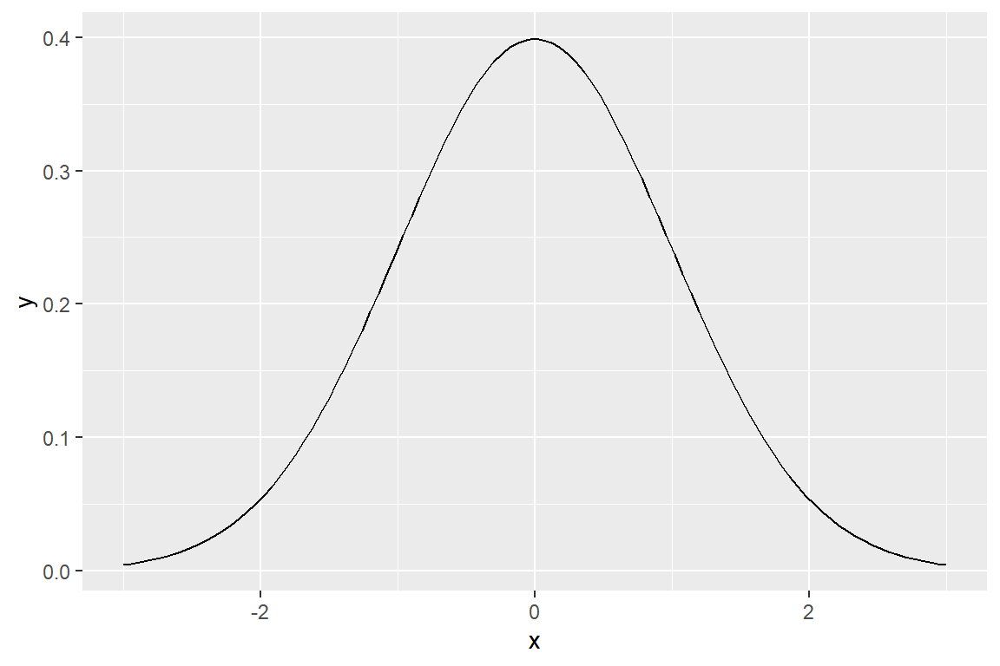


当然我们也可以绘制自定义函数

```r
myfun <- function(x) {
  (x - 1)**2
}

ggplot(data = data.frame(x = c(-1, 3)), aes(x = x)) +
  stat_function(fun = myfun, geom = "line", colour = "red")
```


下面这是一个很不错的例子，细细体会下

```r
d <- tibble(x = rnorm(2000, mean = 2, sd = 4))

ggplot(data = d, aes(x = x)) +
  geom_histogram(aes(y = stat(density))) +
  geom_density() +
  stat_function(fun = dnorm, args = list(mean = 2, sd = 4), colour = "red")
```

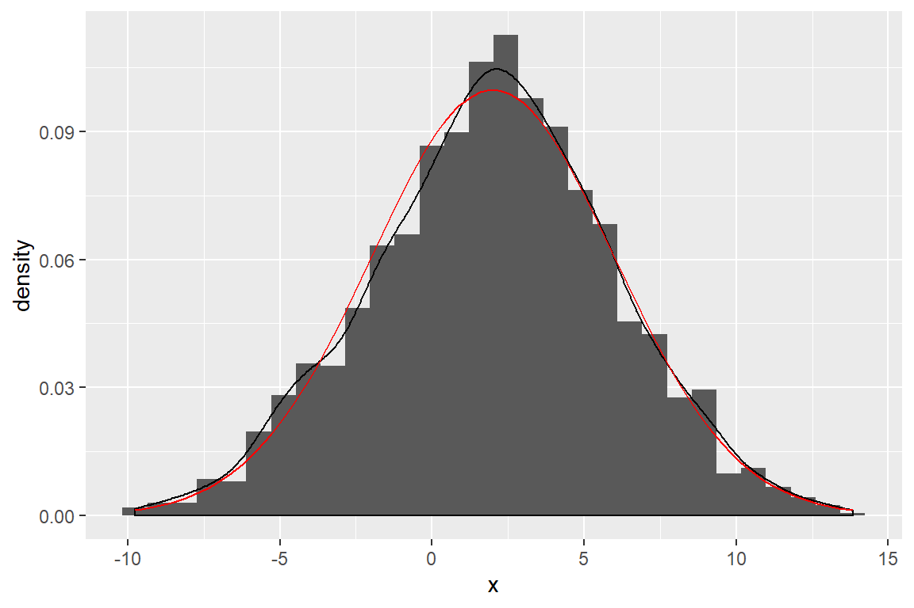

## 地图

> 小时候画地图很容易，长大了画地图却不容易了。
> 
>


这是一个公园🏞地图和公园里松鼠🐿数量的数据集


```r
nyc_squirrels <- read_csv("./demo_data/nyc_squirrels.csv")
central_park <- sf::read_sf("./demo_data/central_park")
```


先来一个地图，


```r
ggplot() +
  geom_sf(data = central_park)
```


一个`geom_sf`就搞定了🥂，貌似没那么难呢？ 好吧，换个姿势，在地图上标注松鼠出现的位置


```r
nyc_squirrels %>%
  drop_na(primary_fur_color) %>%
  ggplot() +
  geom_sf(data = central_park, color = "grey85") +
  geom_point(
    aes(x = long, y = lat, color = primary_fur_color),
    size = .8
  )
```


分开画呢

```r
nyc_squirrels %>%
  drop_na(primary_fur_color) %>%
  ggplot() +
  geom_sf(data = central_park, color = "grey85") +
  geom_point(
    aes(x = long, y = lat, color = primary_fur_color),
    size = .8
  ) +
  facet_wrap(vars(primary_fur_color)) +
  theme(legend.position = "none")
```


```r
label_colors <-
  c("all squirrels" = "grey75", "highlighted group" = "#0072B2")

nyc_squirrels %>%
  drop_na(primary_fur_color) %>%
  ggplot() +
  geom_sf(data = central_park, color = "grey85") +
  geom_point(
    data = function(x) select(x, -primary_fur_color),
    aes(x = long, y = lat, color = "all squirrels"),
    size = .8
  ) +
  geom_point(
    aes(x = long, y = lat, color = "highlighted group"),
    size = .8
  ) +
  cowplot::theme_map(16) +
  theme(
    legend.position = "bottom",
    legend.justification = "center"
  ) +
  facet_wrap(vars(primary_fur_color)) +
  scale_color_manual(name = NULL, values = label_colors) +
  guides(color = guide_legend(override.aes = list(size = 2)))
```


```r
# ggsave("Squirrels.pdf", width = 9, height = 6)
```


当然，也可以用`gghighlight`的方法

```r
nyc_squirrels %>%
  drop_na(primary_fur_color) %>%
  ggplot() +
  geom_sf(data = central_park, color = "grey85") +
  geom_point(
    aes(x = long, y = lat, color = primary_fur_color),
    size = .8
  ) +
  gghighlight(
    label_key = primary_fur_color,
    use_direct_label = FALSE
  ) +
  facet_wrap(vars(primary_fur_color)) +
  cowplot::theme_map(16) +
  theme(legend.position = "none")
```


## 参考资料

* [Look at Data](http://socviz.co/look-at-data.html) from [Data Vizualization for Social Science](http://socviz.co/)
* [Chapter 3: Data Visualisation](http://r4ds.had.co.nz/data-visualisation.html) of *R for Data Science*
* [Chapter 28: Graphics for communication](http://r4ds.had.co.nz/graphics-for-communication.html) of *R for Data Science*
* [Graphs](https://r-graphics.org/) in *R Graphics Cookbook*
* [ggplot2 cheat sheet](https://github.com/rstudio/cheatsheets/raw/master/data-visualization-2.1.pdf)
* [ggplot2 documentation](https://ggplot2.tidyverse.org/reference/)
* [The R Graph Gallery](http://www.r-graph-gallery.com/) (this is really useful)
* [Top 50 ggplot2 Visualizations](http://r-statistics.co/Top50-Ggplot2-Visualizations-MasterList-R-Code.html)
* [R Graphics Cookbook](http://www.cookbook-r.com/Graphs/) by Winston Chang
* [ggplot extensions](https://www.ggplot2-exts.org/)
* [plotly](https://plot.ly/ggplot2/) for creating interactive graphs

<!--chapter:end:ggplot2.Rmd-->

# 模拟与抽样 {#sampling}


```r
library(tidyverse)
```

本章目的是在tidyverse的架构下，介绍一些基本统计的知识。先回顾下Hadley Wickham提出的数据科学tidy原则，tidy思想体现在:

- 任何数据都可以规整为数据框 
- 数据框的一列代表一个**变量**，数据框的一行代表一次**观察**
- 函数处理数据时，数据框进、数据框出

## 模拟

### 生成随机数

比如生成5个高斯分布的随机数，高斯分布就是正态分布，R语言里我们用`rnorm()`函数产生正态分布的随机数

```r
rnorm(n = 5, mean = 0, sd = 1)
```

```
## [1] -0.04524 -0.67590  0.55463  0.13843  0.49878
```

事实上，R内置了很多随机数产生的函数

| Distrution 	| Notation 		| R |
|----------	|:-------------:|:-------------:|
|Uniform | $\text{U}(a, b)$ | `runif`|
|Normal  | $\text{N}(\mu, \sigma)$ | `rnorm`|
|Binormal  | $\text{Bin}(n, p)$ | `rbinorm`|
|Piosson  | $\text{pois}(\lambda)$ | `rpois`|
|Beta  | $\text{Beta}(\alpha, \beta)$ | `rbeta`|

如果大家查看帮助文档`?runif`，会发现每种**分布**都有对应的四个函数

- d:density 
- p:cumulative probability 
- q:quantile 
- r:random 


在tidyverse的框架下，我们喜欢在数据框(data.frame)下运用这些函数，因为这样我们可以方便使用ggplot2来可视化，

- 例子1，我们生成100个正态分布的点，然后看看其分布

```r
tibble(
  x = rnorm(n = 100, mean = 0, sd = 1)
) %>%
  ggplot(aes(x = x)) +
  geom_density()
```

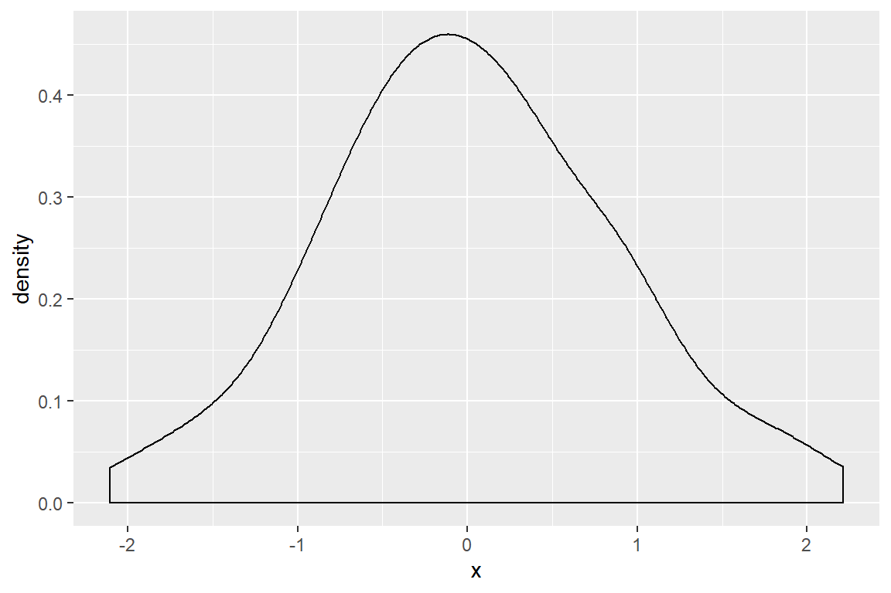


我们将模拟的正态分布和理论上正态分布画在一起

```r
tibble(
  x = rnorm(n = 100, mean = 0, sd = 1)
) %>%
  ggplot(aes(x = x)) +
  geom_density() +
  stat_function(
    fun = dnorm,
    args = list(mean = 0, sd = 1),
    color = "red"
  )
```

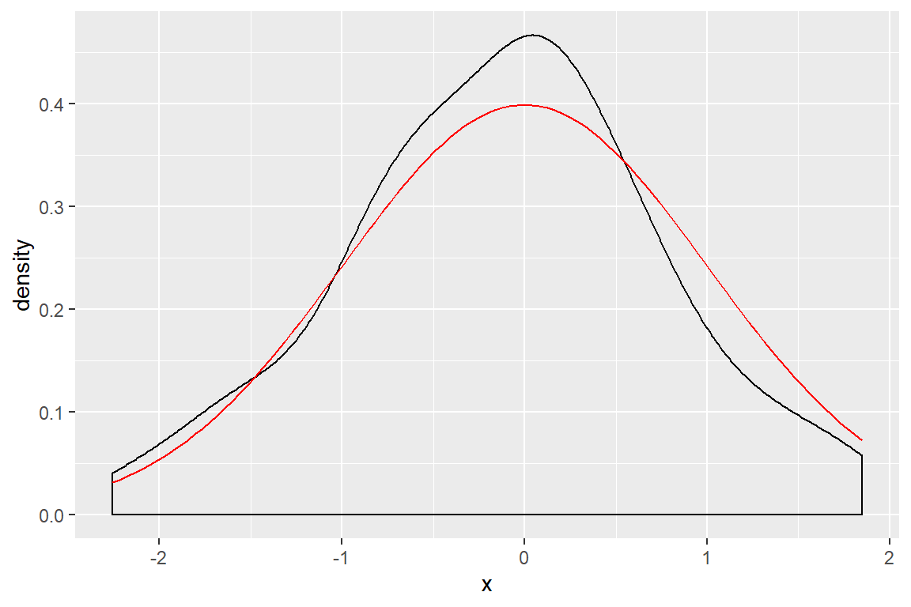
如果我们模拟点再增加点，会越来越逼近理论上的分布。


- 例子2，在数据框(data.frame)下，建立模拟$x$和$y$的线性关系

$$ y_i  = 4 + 3.2\, x_i$$
现实中，观察值往往会带入误差，假定误差服从正态分布，那么$x$和$y$的线性关系重新表述为
$$ y_i  = 4 + 3.2\, x_i + \epsilon_i, \quad \epsilon \in \text{Normal}(\mu =0, \sigma =1) $$


```r
sim_normal <- tibble(
  x = seq(0, 1, length.out = 100),
  yexp = 4 + 3.2 * x,
  yobs = yexp + rnorm(100, mean = 0, sd = 1) # 误差服从高斯分布
)

sim_normal %>% head()
```

<div data-pagedtable="false">
  <script data-pagedtable-source type="application/json">
{"columns":[{"label":["x"],"name":[1],"type":["dbl"],"align":["right"]},{"label":["yexp"],"name":[2],"type":["dbl"],"align":["right"]},{"label":["yobs"],"name":[3],"type":["dbl"],"align":["right"]}],"data":[{"1":"0.00000","2":"4.000","3":"3.264"},{"1":"0.01010","2":"4.032","3":"5.540"},{"1":"0.02020","2":"4.065","3":"5.187"},{"1":"0.03030","2":"4.097","3":"6.642"},{"1":"0.04040","2":"4.129","3":"4.113"},{"1":"0.05051","2":"4.162","3":"3.785"}],"options":{"columns":{"min":{},"max":[10]},"rows":{"min":[10],"max":[10]},"pages":{}}}
  </script>
</div>


```r
sim_normal %>%
  ggplot(aes(x = x, y = yexp)) +
  geom_line(color = "red", size = 2) +
  geom_point(aes(y = yobs))
```

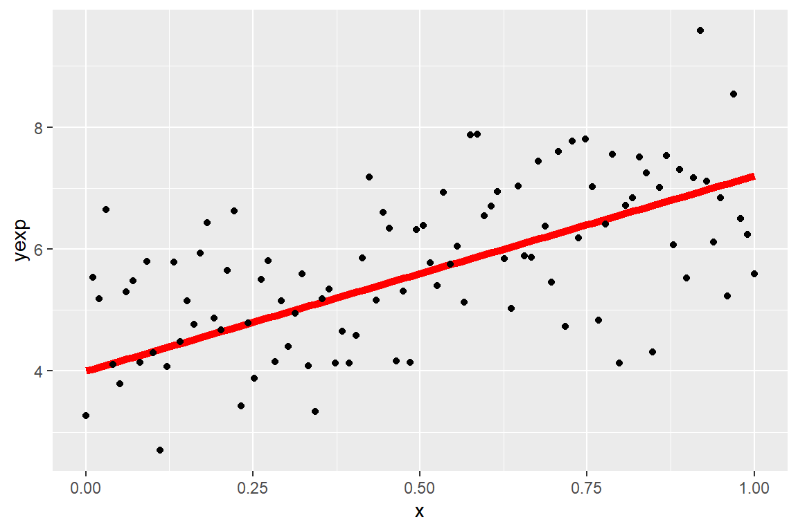


## 抽样与样本


### 总体分布
假定一个事实，川师男生总体的平均身高和身高的方差分别为

```r
true.mean <- 175.7
true.sd <- 15.19
```

那么我们可以模拟分布情况如下


```r
pop.distn <-
  tibble(
    height = seq(100, 250, 0.5),
    density = dnorm(height, mean = true.mean, sd = true.sd)
  )

ggplot(pop.distn) +
  geom_line(aes(height, density)) +
  geom_vline(
    xintercept = true.mean,
    color = "red",
    linetype = "dashed"
  ) +
  geom_vline(
    xintercept = true.mean + true.sd,
    color = "blue",
    linetype = "dashed"
  ) +
  geom_vline(
    xintercept = true.mean - true.sd,
    color = "blue",
    linetype = "dashed"
  ) +
  labs(
    x = "Height (cm)", y = "Density",
    title = "川师男生身高分布"
  )
```


### 样本
假定我们从中抽取30个男生身高样本


```r
sample.a <-
  tibble(height = rnorm(n = 30, mean = true.mean, sd = true.sd))
```

然后看看样本的直方图


```r
sample.a %>%
  ggplot(aes(x = height)) +
  geom_histogram(aes(y = stat(density)),
    fill = "steelblue",
    alpha = 0.75,
    bins = 10
  ) +
  geom_line(
    data = pop.distn,
    aes(x = height, y = density),
    alpha = 0.25, size = 1.5
  ) +
  geom_vline(xintercept = true.mean, linetype = "dashed", color = "red") +
  geom_vline(xintercept = mean(sample.a$height), linetype = "solid")
```

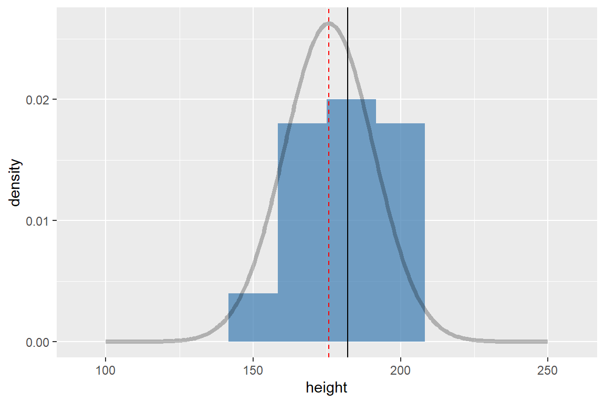

红色的虚线代表分布的总体的均值，黑色实线代表30个样本的均值，


```r
sample.a %>%
  summarize(
    sample.mean = mean(height),
    sample.sd = sd(height)
  )
```

<div data-pagedtable="false">
  <script data-pagedtable-source type="application/json">
{"columns":[{"label":["sample.mean"],"name":[1],"type":["dbl"],"align":["right"]},{"label":["sample.sd"],"name":[2],"type":["dbl"],"align":["right"]}],"data":[{"1":"182.1","2":"16.18"}],"options":{"columns":{"min":{},"max":[10]},"rows":{"min":[10],"max":[10]},"pages":{}}}
  </script>
</div>
也就是说，基于这30个观察值的样本，我们认为川师男生的身高均值为182.1486cm，方差为16.1765


可能有同学说，这个样本太少了，计算的均值还不够科学，会以偏概全。于是又重新找了30个男生，和上次类似，用`rnorm`函数模拟，我们记为样本b


```r
sample.b <-
  tibble(height = rnorm(30, mean = true.mean, sd = true.sd))
```

再来看看这次样本的分布

```r
sample.b %>%
  ggplot(aes(x = height)) +
  geom_histogram(aes(y = stat(density)),
    fill = "steelblue", alpha = 0.75, bins = 10
  ) +
  geom_line(
    data = pop.distn, aes(x = height, y = density),
    alpha = 0.25, size = 1.5
  ) +
  geom_vline(xintercept = true.mean, linetype = "dashed", color = "red") +
  geom_vline(xintercept = mean(sample.a$height), linetype = "solid")
```

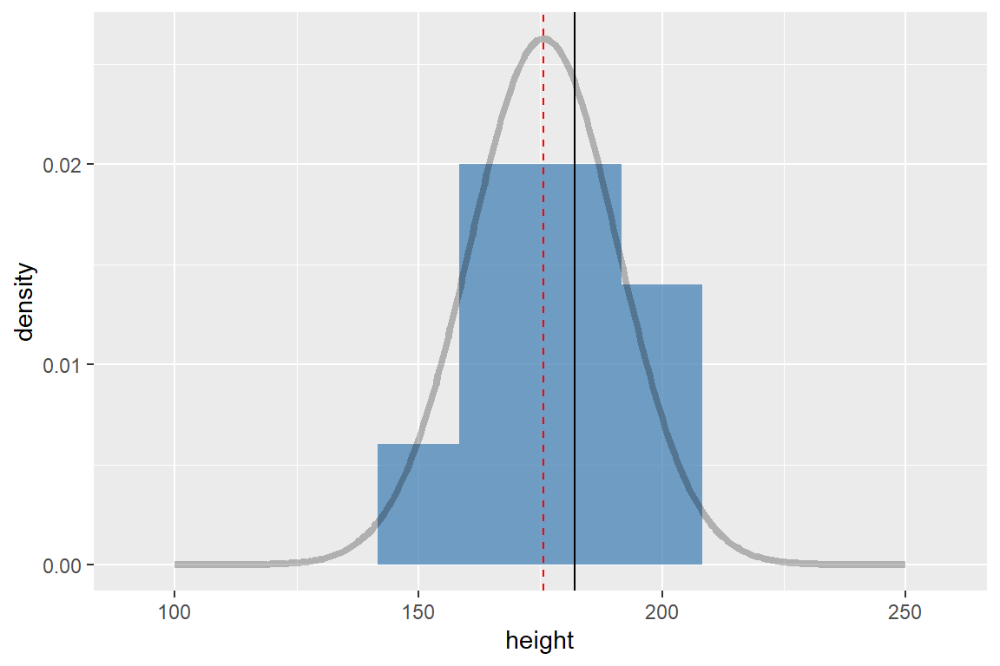

同样，我们计算样本b的均值和方差


```r
sample.b %>%
  summarize(
    sample.mean = mean(height),
    sample.sd = sd(height)
  )
```

<div data-pagedtable="false">
  <script data-pagedtable-source type="application/json">
{"columns":[{"label":["sample.mean"],"name":[1],"type":["dbl"],"align":["right"]},{"label":["sample.sd"],"name":[2],"type":["dbl"],"align":["right"]}],"data":[{"1":"176.4","2":"15.74"}],"options":{"columns":{"min":{},"max":[10]},"rows":{"min":[10],"max":[10]},"pages":{}}}
  </script>
</div>


这次抽样的结果，均值为176.3689cm，方差为15.7398

和样本a比，有一点点变化。不经想问，我能否继续抽样呢？结果会有变化吗？为了避免重复写代码
，我把上面的过程整合到一起，写一个**子函数**，专门模拟抽样过程


```r
rnorm.stats <- function(n, mu, sigma) {
  the.sample <- rnorm(n, mu, sigma)
  tibble(
    sample.size = n,
    sample.mean = mean(the.sample),
    sample.sd = sd(the.sample)
  )
}
```

于是，我们又可以继续模拟了。注意我们之前设定的总体分布的均值和方差

```r
true.mean <- 175.7
true.sd <- 15.19
```


```r
rnorm.stats(30, true.mean, true.sd)
```

<div data-pagedtable="false">
  <script data-pagedtable-source type="application/json">
{"columns":[{"label":["sample.size"],"name":[1],"type":["dbl"],"align":["right"]},{"label":["sample.mean"],"name":[2],"type":["dbl"],"align":["right"]},{"label":["sample.sd"],"name":[3],"type":["dbl"],"align":["right"]}],"data":[{"1":"30","2":"177.2","3":"15.17"}],"options":{"columns":{"min":{},"max":[10]},"rows":{"min":[10],"max":[10]},"pages":{}}}
  </script>
</div>
yes，代码工作的很好，但不过只是代码减少了一点点，仍然只是一次抽样（这里30个样本为一次抽样），**我们的目的是反复抽样**， 抽很多次的那种喔。


那我们用`purrr`包的`rerun`函数偷个懒，


```r
df.samples.of.30 <-
  purrr::rerun(2500, rnorm.stats(30, true.mean, true.sd)) %>%
  dplyr::bind_rows()
```
哇，一下子抽了2500个样本,全部装进了`df.sample.of.30`这个数据框， 偷偷看一眼呢

```r
df.samples.of.30 %>% head()
```

<div data-pagedtable="false">
  <script data-pagedtable-source type="application/json">
{"columns":[{"label":["sample.size"],"name":[1],"type":["dbl"],"align":["right"]},{"label":["sample.mean"],"name":[2],"type":["dbl"],"align":["right"]},{"label":["sample.sd"],"name":[3],"type":["dbl"],"align":["right"]}],"data":[{"1":"30","2":"176.2","3":"15.15"},{"1":"30","2":"174.8","3":"18.01"},{"1":"30","2":"177.7","3":"16.25"},{"1":"30","2":"174.4","3":"17.10"},{"1":"30","2":"176.7","3":"13.65"},{"1":"30","2":"172.4","3":"15.38"}],"options":{"columns":{"min":{},"max":[10]},"rows":{"min":[10],"max":[10]},"pages":{}}}
  </script>
</div>

回过头看看`df.samples.of.30`是什么：

 - 从川师的男生中随机抽取30个，计算这30个人身高的均值和方差，这叫一次抽样
 - 把上面的工作，重复2500次，得到2500个均值和方差
 - 2500个均值和方差，组成了一个数据框
 
 
 
我们发现每次抽样的均值都不一样，感觉又像一个分布(抽样的均值分布)，我们画出来看看吧

```r
df.samples.of.30 %>%
  ggplot(aes(x = sample.mean, y = stat(density))) +
  geom_histogram(bins = 25, fill = "firebrick", alpha = 0.5) +
  geom_vline(xintercept = true.mean, linetype = "dashed", color = "red") +
  labs(
    title = "抽样2500次（每次30个男生）身高均值的分布",
    subtitle = "Distribution of mean heights for 2500 samples of size 30"
  )
```

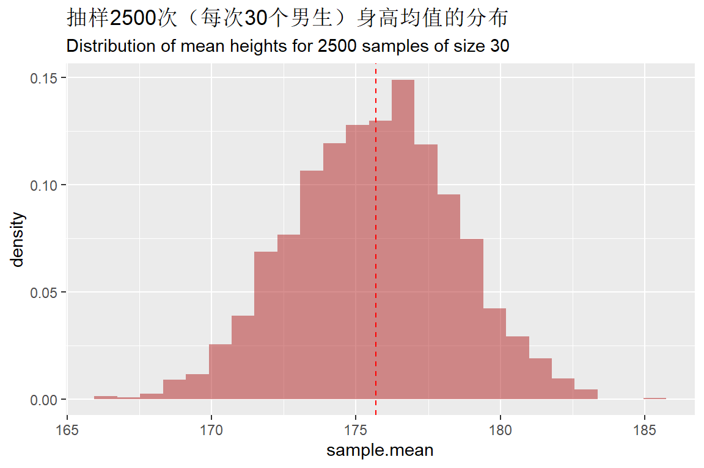
注意到，这不是男生身高的分布，而是**每次抽样计算的均值**构成的分布.

为了更清楚的说明，我们把**整体的分布(灰色曲线)、样本a（蓝色直方图）、抽样的均值分布（红色直方图）**三者画在一起。


```r
df.samples.of.30 %>%
  ggplot(aes(x = sample.mean, y = stat(density))) +
  geom_histogram(bins = 50, fill = "firebrick", alpha = 0.5) +
  geom_histogram(
    data = sample.a,
    aes(x = height, y = stat(density)),
    bins = 11, fill = "steelblue", alpha = 0.25
  ) +
  geom_vline(xintercept = true.mean, linetype = "dashed", color = "red") +
  geom_line(data = pop.distn, aes(x = height, y = density), alpha = 0.25, size = 1.5) +
  xlim(125, 225)
```


样本的均值分布，是个很有意思的结果，比如，我们**再选30个男生**再抽样一次，我们可以断定，这次抽样的均值会落在了红色的区间之内。

然而，注意到，必须限定再次抽样的大小仍然是30个男生，以上这句话才成立。


```r
df.samples.of.30 %>%
  summarize(
    mean.of.means = mean(sample.mean),
    sd.of.means = sd(sample.mean)
  )
```

<div data-pagedtable="false">
  <script data-pagedtable-source type="application/json">
{"columns":[{"label":["mean.of.means"],"name":[1],"type":["dbl"],"align":["right"]},{"label":["sd.of.means"],"name":[2],"type":["dbl"],"align":["right"]}],"data":[{"1":"175.6","2":"2.801"}],"options":{"columns":{"min":{},"max":[10]},"rows":{"min":[10],"max":[10]},"pages":{}}}
  </script>
</div>

这里计算的是抽样(样本大小为30)均值分布，而不是整体的均值分布。言外之意，样本大小可以是其它的呗， 那就把样本调整为50、100、250、500分别试试看

```r
df.samples.of.50 <-
  rerun(2500, rnorm.stats(50, true.mean, true.sd)) %>%
  bind_rows()

df.samples.of.100 <-
  rerun(2500, rnorm.stats(100, true.mean, true.sd)) %>%
  bind_rows()

df.samples.of.250 <-
  rerun(2500, rnorm.stats(250, true.mean, true.sd)) %>%
  bind_rows()

df.samples.of.500 <-
  rerun(2500, rnorm.stats(500, true.mean, true.sd)) %>%
  bind_rows()
```
忍不住想画图看看，每次抽取的男生数量不同，均值的分布会有不同？

```r
df.combined <-
  bind_rows(
    df.samples.of.30,
    df.samples.of.50,
    df.samples.of.100,
    df.samples.of.250,
    df.samples.of.500
  ) %>%
  mutate(sample.sz = as.factor(sample.size))
```


```r
df.combined %>%
  ggplot(aes(x = sample.mean, y = stat(density), fill = sample.sz)) +
  geom_histogram(bins = 25, alpha = 0.5) +
  geom_vline(xintercept = true.mean, linetype = "dashed") +
  facet_wrap(vars(sample.sz), nrow = 1) +
  scale_fill_brewer(palette = "Set1") +
  labs(
    x = "Sample means", y = "Density",
    title = "Distribution of mean heights for samples of varying size"
  )
```

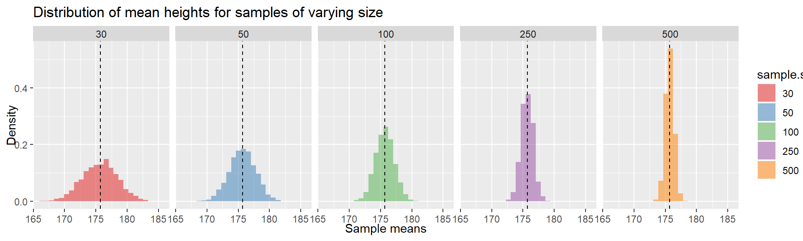

随着样本大小由30增加到500，抽样的均值分布围绕着越来越聚合到实际的均值，或者说随着样本大小的增多，对均值估计的不确定性越小。 


```r
sampling.distn.mean.table <-
  df.combined %>%
  group_by(sample.size) %>%
  summarize(
    mean.of.means = mean(sample.mean),
    sd.of.means = sd(sample.mean)
  )
sampling.distn.mean.table
```

<div data-pagedtable="false">
  <script data-pagedtable-source type="application/json">
{"columns":[{"label":["sample.size"],"name":[1],"type":["dbl"],"align":["right"]},{"label":["mean.of.means"],"name":[2],"type":["dbl"],"align":["right"]},{"label":["sd.of.means"],"name":[3],"type":["dbl"],"align":["right"]}],"data":[{"1":"30","2":"175.6","3":"2.8014"},{"1":"50","2":"175.7","3":"2.1149"},{"1":"100","2":"175.7","3":"1.5016"},{"1":"250","2":"175.7","3":"0.9580"},{"1":"500","2":"175.7","3":"0.6776"}],"options":{"columns":{"min":{},"max":[10]},"rows":{"min":[10],"max":[10]},"pages":{}}}
  </script>
</div>

有个统计学上的概念需要明确。

输出结果的第三列`sd.of.means` 是不同样本大小(30,50,100,250,500)下，反复抽样后平均数分布的标准差。


数学上，如果已知总体的标准差($\sigma$)，那么抽取无限多份大小为 $n$ 的样本，每个样本各有一个平均值，所有这个大小的样本之平均值的标准差可证明为

$$
\frac{\sigma}{\sqrt{n}}
$$
即，**平均值的标准误差**。


下面我们画图看看，模拟出来的$sd.of.means$和理论值$\frac{\sigma}{\sqrt{n}}$是否一致。

注意到这里的$\sigma$是总体的标准差，即最开始我们设定的川师男生身高的标准差`true.sd`. 也就说，理论上


```r
df.se.mean.theory <- tibble(
  sample.size = seq(10,500,10)
  ) %>% 
  mutate(std.error = true.sd/sqrt(sample.size))

df.se.mean.theory
```

<div data-pagedtable="false">
  <script data-pagedtable-source type="application/json">
{"columns":[{"label":["sample.size"],"name":[1],"type":["dbl"],"align":["right"]},{"label":["std.error"],"name":[2],"type":["dbl"],"align":["right"]}],"data":[{"1":"10","2":"4.8035"},{"1":"20","2":"3.3966"},{"1":"30","2":"2.7733"},{"1":"40","2":"2.4017"},{"1":"50","2":"2.1482"},{"1":"60","2":"1.9610"},{"1":"70","2":"1.8156"},{"1":"80","2":"1.6983"},{"1":"90","2":"1.6012"},{"1":"100","2":"1.5190"},{"1":"110","2":"1.4483"},{"1":"120","2":"1.3867"},{"1":"130","2":"1.3323"},{"1":"140","2":"1.2838"},{"1":"150","2":"1.2403"},{"1":"160","2":"1.2009"},{"1":"170","2":"1.1650"},{"1":"180","2":"1.1322"},{"1":"190","2":"1.1020"},{"1":"200","2":"1.0741"},{"1":"210","2":"1.0482"},{"1":"220","2":"1.0241"},{"1":"230","2":"1.0016"},{"1":"240","2":"0.9805"},{"1":"250","2":"0.9607"},{"1":"260","2":"0.9420"},{"1":"270","2":"0.9244"},{"1":"280","2":"0.9078"},{"1":"290","2":"0.8920"},{"1":"300","2":"0.8770"},{"1":"310","2":"0.8627"},{"1":"320","2":"0.8491"},{"1":"330","2":"0.8362"},{"1":"340","2":"0.8238"},{"1":"350","2":"0.8119"},{"1":"360","2":"0.8006"},{"1":"370","2":"0.7897"},{"1":"380","2":"0.7792"},{"1":"390","2":"0.7692"},{"1":"400","2":"0.7595"},{"1":"410","2":"0.7502"},{"1":"420","2":"0.7412"},{"1":"430","2":"0.7325"},{"1":"440","2":"0.7242"},{"1":"450","2":"0.7161"},{"1":"460","2":"0.7082"},{"1":"470","2":"0.7007"},{"1":"480","2":"0.6933"},{"1":"490","2":"0.6862"},{"1":"500","2":"0.6793"}],"options":{"columns":{"min":{},"max":[10]},"rows":{"min":[10],"max":[10]},"pages":{}}}
  </script>
</div>


```r
sampling.distn.mean.table %>%
  ggplot(aes(x = sample.size, y = sd.of.means)) +
  geom_point() +
  geom_line(aes(x = sample.size, y = std.error), 
            data = df.se.mean.theory, 
            color = "red") +
  labs(
    x = "Sample size", y = "Std Error of Mean",
    title = "平均值标准误差随样本大小变化（理论值和模拟值对比）"
  )
```

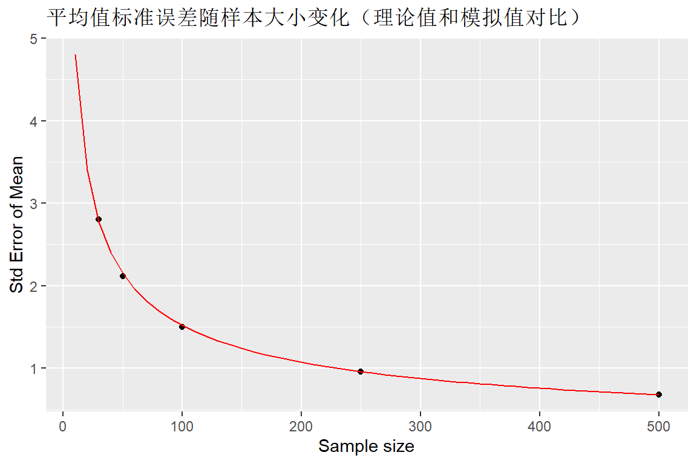

两者吻合的很好。


刚刚我们看到的，**抽样均值分布**随着**样本大小**变化而变化。可以试想下，抽样的其他统计量分布（方差，中位数），是不是也随着样本大小变化而变化呢？


```r
sampling.distn.sd.table <-
  df.combined %>%
  group_by(sample.size) %>%
  summarize(
    mean.of.sds = mean(sample.sd),
    sd.of.sds = sd(sample.sd)
  )

sampling.distn.sd.table
```

<div data-pagedtable="false">
  <script data-pagedtable-source type="application/json">
{"columns":[{"label":["sample.size"],"name":[1],"type":["dbl"],"align":["right"]},{"label":["mean.of.sds"],"name":[2],"type":["dbl"],"align":["right"]},{"label":["sd.of.sds"],"name":[3],"type":["dbl"],"align":["right"]}],"data":[{"1":"30","2":"15.07","3":"1.9772"},{"1":"50","2":"15.15","3":"1.5068"},{"1":"100","2":"15.20","3":"1.0871"},{"1":"250","2":"15.17","3":"0.6918"},{"1":"500","2":"15.18","3":"0.4733"}],"options":{"columns":{"min":{},"max":[10]},"rows":{"min":[10],"max":[10]},"pages":{}}}
  </script>
</div>

答案是肯定的，样本量的增多，抽样方差的不确定性减少。


<!--chapter:end:sampling.Rmd-->

# Tidy Statistics {#tidystats}


本章介绍基本的方差分析内容


```r
library(tidyverse)
```


## 从一个案例开始

从这是一份1994年收集1379个对象关于收入、身高、教育水平等信息的数据集，数据在这里下载
<!--html_preserve--><a href="" download="wages.csv">Download wages.csv</a><!--/html_preserve-->

首先，我们下载后导入数据

```r
wages <- read_csv("./demo_data/wages.csv")

wages %>% 
  head() %>% 
  knitr::kable()
```


  earn   height  sex      race     ed   age
------  -------  -------  ------  ---  ----
 79571    73.89  male     white    16    49
 96397    66.23  female   white    16    62
 48711    63.77  female   white    16    33
 80478    63.22  female   other    16    95
 82089    63.08  female   white    17    43
 15313    64.53  female   white    15    30

我们的问题：男性是否就比女性挣的多？


## 单因素方差分析


```r
t.test(earn ~ sex, data = wages)
```

```
## 
## 	Welch Two Sample t-test
## 
## data:  earn by sex
## t = -12, df = 768, p-value <2e-16
## alternative hypothesis: true difference in means is not equal to 0
## 95 percent confidence interval:
##  -25324 -18171
## sample estimates:
## mean in group female   mean in group male 
##                24246                45993
```


```r
lm(earn ~ sex, data = wages) %>% 
  summary()
```

```
## 
## Call:
## lm(formula = earn ~ sex, data = wages)
## 
## Residuals:
##    Min     1Q Median     3Q    Max 
## -46092 -20516  -4639  11722 271956 
## 
## Coefficients:
##             Estimate Std. Error t value Pr(>|t|)    
## (Intercept)    24246       1004    24.1   <2e-16 ***
## sexmale        21748       1636    13.3   <2e-16 ***
## ---
## Signif. codes:  
## 0 '***' 0.001 '**' 0.01 '*' 0.05 '.' 0.1 ' ' 1
## 
## Residual standard error: 29400 on 1377 degrees of freedom
## Multiple R-squared:  0.114,	Adjusted R-squared:  0.113 
## F-statistic:  177 on 1 and 1377 DF,  p-value: <2e-16
```


```r
aov(earn ~ sex, data = wages) %>% 
  summary()
```

```
##               Df   Sum Sq  Mean Sq F value Pr(>F)    
## sex            1 1.53e+11 1.53e+11     177 <2e-16 ***
## Residuals   1377 1.19e+12 8.66e+08                   
## ---
## Signif. codes:  
## 0 '***' 0.001 '**' 0.01 '*' 0.05 '.' 0.1 ' ' 1
```


## 双因素方差分析

我们采用`ggpubr`宏包下的`ToothGrowth`来说明，这个数据集包含60个样本，记录着每10只豚鼠在不同的喂食方法和不同的药物剂量下，牙齿的生长情况.

- len :  牙齿长度
- supp : 两种喂食方法 (橙汁和维生素C)
- dose : 抗坏血酸剂量 (0.5, 1, and 2 mg) 


```r
library("ggpubr")
my_data <- ToothGrowth %>%
  mutate_at(vars(supp, dose), ~ as_factor(.))

my_data %>% head()
```

<div data-pagedtable="false">
  <script data-pagedtable-source type="application/json">
{"columns":[{"label":[""],"name":["_rn_"],"type":[""],"align":["left"]},{"label":["len"],"name":[1],"type":["dbl"],"align":["right"]},{"label":["supp"],"name":[2],"type":["fctr"],"align":["left"]},{"label":["dose"],"name":[3],"type":["fctr"],"align":["left"]}],"data":[{"1":"4.2","2":"VC","3":"0.5","_rn_":"1"},{"1":"11.5","2":"VC","3":"0.5","_rn_":"2"},{"1":"7.3","2":"VC","3":"0.5","_rn_":"3"},{"1":"5.8","2":"VC","3":"0.5","_rn_":"4"},{"1":"6.4","2":"VC","3":"0.5","_rn_":"5"},{"1":"10.0","2":"VC","3":"0.5","_rn_":"6"}],"options":{"columns":{"min":{},"max":[10]},"rows":{"min":[10],"max":[10]},"pages":{}}}
  </script>
</div>


```r
my_data %>%
  ggplot(aes(x = supp, y = len, fill = supp)) +
  geom_boxplot(position = position_dodge()) +
  facet_wrap(vars(dose)) +
  labs(title = "VC剂量和摄入方式对豚鼠牙齿的影响")
```


问题：豚鼠牙齿的长度是否与药物的食用方法和剂量有关？

线性回归时，我们是通过独立变量来**预测**响应变量，但现在我们关注的重点会从预测**转向**不同组别差异之间的分析，这即为方差分析（ANOVA）。

这里是两个解释变量，所以问题需要双因素方差分析 (ANOVA)


```r
aov(len ~ supp + dose, data = my_data) %>%
  broom::tidy()
```

<div data-pagedtable="false">
  <script data-pagedtable-source type="application/json">
{"columns":[{"label":["term"],"name":[1],"type":["chr"],"align":["left"]},{"label":["df"],"name":[2],"type":["dbl"],"align":["right"]},{"label":["sumsq"],"name":[3],"type":["dbl"],"align":["right"]},{"label":["meansq"],"name":[4],"type":["dbl"],"align":["right"]},{"label":["statistic"],"name":[5],"type":["dbl"],"align":["right"]},{"label":["p.value"],"name":[6],"type":["dbl"],"align":["right"]}],"data":[{"1":"supp","2":"1","3":"205.4","4":"205.35","5":"14.02","6":"4.293e-04"},{"1":"dose","2":"2","3":"2426.4","4":"1213.22","5":"82.81","6":"1.871e-17"},{"1":"Residuals","2":"56","3":"820.4","4":"14.65","5":"NA","6":"NA"}],"options":{"columns":{"min":{},"max":[10]},"rows":{"min":[10],"max":[10]},"pages":{}}}
  </script>
</div>


检验表明不同类型之间存在显著差异，但是并没有告诉我们具体谁与谁之间的不同。需要多重比较帮助我们解决这个问题。使用`TurkeyHSD`函数


```r
aov(len ~ supp + dose, data = my_data) %>%
  TukeyHSD(which = "dose") %>%
  broom::tidy()
```

<div data-pagedtable="false">
  <script data-pagedtable-source type="application/json">
{"columns":[{"label":["term"],"name":[1],"type":["chr"],"align":["left"]},{"label":["comparison"],"name":[2],"type":["chr"],"align":["left"]},{"label":["estimate"],"name":[3],"type":["dbl"],"align":["right"]},{"label":["conf.low"],"name":[4],"type":["dbl"],"align":["right"]},{"label":["conf.high"],"name":[5],"type":["dbl"],"align":["right"]},{"label":["adj.p.value"],"name":[6],"type":["dbl"],"align":["right"]}],"data":[{"1":"dose","2":"1-0.5","3":"9.130","4":"6.216","5":"12.044","6":"1.319e-09"},{"1":"dose","2":"2-0.5","3":"15.495","4":"12.581","5":"18.409","6":"7.308e-12"},{"1":"dose","2":"2-1","3":"6.365","4":"3.451","5":"9.279","6":"6.977e-06"}],"options":{"columns":{"min":{},"max":[10]},"rows":{"min":[10],"max":[10]},"pages":{}}}
  </script>
</div>


```r
aov(len ~ supp + dose, data = my_data) %>%
  TukeyHSD(which = "supp") %>%
  broom::tidy()
```

<div data-pagedtable="false">
  <script data-pagedtable-source type="application/json">
{"columns":[{"label":["term"],"name":[1],"type":["chr"],"align":["left"]},{"label":["comparison"],"name":[2],"type":["chr"],"align":["left"]},{"label":["estimate"],"name":[3],"type":["dbl"],"align":["right"]},{"label":["conf.low"],"name":[4],"type":["dbl"],"align":["right"]},{"label":["conf.high"],"name":[5],"type":["dbl"],"align":["right"]},{"label":["adj.p.value"],"name":[6],"type":["dbl"],"align":["right"]}],"data":[{"1":"supp","2":"VC-OJ","3":"-3.7","4":"-5.68","5":"-1.72","6":"0.0004293"}],"options":{"columns":{"min":{},"max":[10]},"rows":{"min":[10],"max":[10]},"pages":{}}}
  </script>
</div>

思考：交互效应是否显著？

```r
aov(len ~ supp * dose, data = my_data) %>%
  broom::tidy()
```

<div data-pagedtable="false">
  <script data-pagedtable-source type="application/json">
{"columns":[{"label":["term"],"name":[1],"type":["chr"],"align":["left"]},{"label":["df"],"name":[2],"type":["dbl"],"align":["right"]},{"label":["sumsq"],"name":[3],"type":["dbl"],"align":["right"]},{"label":["meansq"],"name":[4],"type":["dbl"],"align":["right"]},{"label":["statistic"],"name":[5],"type":["dbl"],"align":["right"]},{"label":["p.value"],"name":[6],"type":["dbl"],"align":["right"]}],"data":[{"1":"supp","2":"1","3":"205.4","4":"205.35","5":"15.572","6":"2.312e-04"},{"1":"dose","2":"2","3":"2426.4","4":"1213.22","5":"92.000","6":"4.046e-18"},{"1":"supp:dose","2":"2","3":"108.3","4":"54.16","5":"4.107","6":"2.186e-02"},{"1":"Residuals","2":"54","3":"712.1","4":"13.19","5":"NA","6":"NA"}],"options":{"columns":{"min":{},"max":[10]},"rows":{"min":[10],"max":[10]},"pages":{}}}
  </script>
</div>


<!--chapter:end:tidystats.Rmd-->

# 线性回归 {#lm}

线性模型是数据分析中最常用的一种分析方法。最基础的往往最深刻。


```r
library(tidyverse)
```

## 从一个案例开始

这是一份1994年收集1379个对象关于收入、身高、教育水平等信息的数据集。数据在课件首页提供了下载链接。

首先，我们下载后导入数据

```r
wages <- read_csv("./demo_data/wages.csv")

wages %>% 
  head() 
```

<div data-pagedtable="false">
  <script data-pagedtable-source type="application/json">
{"columns":[{"label":["earn"],"name":[1],"type":["dbl"],"align":["right"]},{"label":["height"],"name":[2],"type":["dbl"],"align":["right"]},{"label":["sex"],"name":[3],"type":["chr"],"align":["left"]},{"label":["race"],"name":[4],"type":["chr"],"align":["left"]},{"label":["ed"],"name":[5],"type":["dbl"],"align":["right"]},{"label":["age"],"name":[6],"type":["dbl"],"align":["right"]}],"data":[{"1":"79571","2":"73.89","3":"male","4":"white","5":"16","6":"49"},{"1":"96397","2":"66.23","3":"female","4":"white","5":"16","6":"62"},{"1":"48711","2":"63.77","3":"female","4":"white","5":"16","6":"33"},{"1":"80478","2":"63.22","3":"female","4":"other","5":"16","6":"95"},{"1":"82089","2":"63.08","3":"female","4":"white","5":"17","6":"43"},{"1":"15313","2":"64.53","3":"female","4":"white","5":"15","6":"30"}],"options":{"columns":{"min":{},"max":[10]},"rows":{"min":[10],"max":[10]},"pages":{}}}
  </script>
</div>


### 缺失值检查

一般情况下，拿到一份数据，首先要了解数据，知道每个变量的含义，


```r
wages %>% colnames()
```

```
## [1] "earn"   "height" "sex"    "race"   "ed"    
## [6] "age"
```

同时检查数据是否有缺失值，这点很重要。在R中 NA（notavailable，不可用）表示缺失值, 比如可以这样检查是否有缺失值。


```r
# 如何检查数据是否有缺失值？
wages %>% 
  summarise(
     earn_na =  sum(is.na(earn)),
     height_na =  sum(is.na(height)),
     sex_na =  sum(is.na(sex)),
     race_na =  sum(is.na(race)),
     ed_na =  sum(is.na(ed)),
     age_na =  sum(is.na(age))
)
```

<div data-pagedtable="false">
  <script data-pagedtable-source type="application/json">
{"columns":[{"label":["earn_na"],"name":[1],"type":["int"],"align":["right"]},{"label":["height_na"],"name":[2],"type":["int"],"align":["right"]},{"label":["sex_na"],"name":[3],"type":["int"],"align":["right"]},{"label":["race_na"],"name":[4],"type":["int"],"align":["right"]},{"label":["ed_na"],"name":[5],"type":["int"],"align":["right"]},{"label":["age_na"],"name":[6],"type":["int"],"align":["right"]}],"data":[{"1":"0","2":"0","3":"0","4":"0","5":"0","6":"0"}],"options":{"columns":{"min":{},"max":[10]},"rows":{"min":[10],"max":[10]},"pages":{}}}
  </script>
</div>


程序员都是偷懒的，所以也可以写的简便一点。大家在学习的过程中，也会慢慢的发现tidyverse的函数很贴心，很周到。

```r
wages %>% 
  summarise_all(
     ~ sum(is.na(.))
)
```

<div data-pagedtable="false">
  <script data-pagedtable-source type="application/json">
{"columns":[{"label":["earn"],"name":[1],"type":["int"],"align":["right"]},{"label":["height"],"name":[2],"type":["int"],"align":["right"]},{"label":["sex"],"name":[3],"type":["int"],"align":["right"]},{"label":["race"],"name":[4],"type":["int"],"align":["right"]},{"label":["ed"],"name":[5],"type":["int"],"align":["right"]},{"label":["age"],"name":[6],"type":["int"],"align":["right"]}],"data":[{"1":"0","2":"0","3":"0","4":"0","5":"0","6":"0"}],"options":{"columns":{"min":{},"max":[10]},"rows":{"min":[10],"max":[10]},"pages":{}}}
  </script>
</div>

当然，也可以用`purrr::map()`的方法。这部分我会在后面的章节中逐步介绍。

```r
wages %>%
  map_df(~ sum(is.na(.)))
```

<div data-pagedtable="false">
  <script data-pagedtable-source type="application/json">
{"columns":[{"label":["earn"],"name":[1],"type":["int"],"align":["right"]},{"label":["height"],"name":[2],"type":["int"],"align":["right"]},{"label":["sex"],"name":[3],"type":["int"],"align":["right"]},{"label":["race"],"name":[4],"type":["int"],"align":["right"]},{"label":["ed"],"name":[5],"type":["int"],"align":["right"]},{"label":["age"],"name":[6],"type":["int"],"align":["right"]}],"data":[{"1":"0","2":"0","3":"0","4":"0","5":"0","6":"0"}],"options":{"columns":{"min":{},"max":[10]},"rows":{"min":[10],"max":[10]},"pages":{}}}
  </script>
</div>


###  变量简单统计

然后探索下每个变量的分布。比如调研数据中男女的数量分别是多少？

```r
wages %>% count(sex)
```

<div data-pagedtable="false">
  <script data-pagedtable-source type="application/json">
{"columns":[{"label":["sex"],"name":[1],"type":["chr"],"align":["left"]},{"label":["n"],"name":[2],"type":["int"],"align":["right"]}],"data":[{"1":"female","2":"859"},{"1":"male","2":"520"}],"options":{"columns":{"min":{},"max":[10]},"rows":{"min":[10],"max":[10]},"pages":{}}}
  </script>
</div>
男女这两组的身高均值分别是多少？收入的均值分别是多少？

```r
wages %>% 
  group_by(sex) %>% 
  summarise(
    n = n(),
    mean_height = mean(height),
    mean_earn = mean(earn)
  )
```

<div data-pagedtable="false">
  <script data-pagedtable-source type="application/json">
{"columns":[{"label":["sex"],"name":[1],"type":["chr"],"align":["left"]},{"label":["n"],"name":[2],"type":["int"],"align":["right"]},{"label":["mean_height"],"name":[3],"type":["dbl"],"align":["right"]},{"label":["mean_earn"],"name":[4],"type":["dbl"],"align":["right"]}],"data":[{"1":"female","2":"859","3":"64.50","4":"24246"},{"1":"male","2":"520","3":"70.04","4":"45993"}],"options":{"columns":{"min":{},"max":[10]},"rows":{"min":[10],"max":[10]},"pages":{}}}
  </script>
</div>

也有可以用可视化的方法，呈现男女收入的分布情况

```r
wages %>% 
  ggplot(aes(x = earn, color = sex)) +
  geom_density()
```


大家可以自行探索其他变量的情况。现在提出几个问题，希望大家带着这些问题去探索：

1. 长的越高的人挣钱越多？

2. 是否男性就比女性挣的多？

3. 影响收入最大的变量是哪个？
  
4. 怎么判定我们建立的模型是不是很好？


## 线性回归模型

**长的越高的人挣钱越多？**

要回答这个问题，我们先介绍线性模型。顾名思义，就是认为$x$和$y$之间有线性关系，数学上可以写为

$$
\begin{aligned}
y &= \alpha + \beta x + \epsilon \\
\epsilon &\in \text{Normal}(\mu, \sigma) 
\end{aligned}
$$

$ \epslion$ 代表误差项，它与$x$ 无关，且服从正态分布。
建立线性模型，就是要估计这里的系数$\hat\alpha$和$\hat\beta$，即截距项和斜率项。常用的方法是最小二乘法（ordinary least squares (OLS) regression）：
就是我们估算的$\hat\alpha$和$\hat\beta$, 要使得残差的平方和最小，即$\sum_i(y_i - \hat y_i)^2$或者叫$\sum_i \epsilon_i^2$最小。当然，数据量很大，手算是不现实的，我们借助R语言代码吧


## 使用`lm()` 函数

用R语言代码(建议大家先`?lm`看看帮助文档)，

`lm`参数很多, 但很多我们都用不上，所以我们只关注其中重要的两个参数


```r
lm(formula = y ~ x, data)
```

`lm(y ~ x, data)` 是最常用的线性模型函数(lm是linear model的缩写)。参数解释说明


<div class="danger">
<ul>
<li>formula：指定回归模型的公式，对于简单的线性回归模型<code>y ~ x</code>.</li>
<li>~ 符号：代表“预测”，可以读做“y由x预测”。有些学科不同的表述，比如下面都是可以的
<ul>
<li><code>response ~ explanatory</code><br />
</li>
<li><code>dependent ~ independent</code></li>
<li><code>outcome ~ predictors</code></li>
</ul></li>
<li>data：代表数据框，数据框包含了响应变量和独立变量</li>
</ul>
</div>


在运行`lm()`之前，先画出身高和收入的散点图(记在我们想干什么，寻找身高和收入的关系)


```r
wages %>% 
  ggplot(aes(x = height, y = earn)) +
  geom_point()
```


等不及了，就运行代码吧

```r
mod1 <- lm(formula = earn ~ height, 
          data = wages)
```


这里我们将`earn`作为响应变量，`height`为预测变量。`lm()`返回赋值给`mod1`. `mod1`现在是个什么东东呢？ mod1是一个叫`lm object`或者叫`类`的东西，


```r
names(mod1)
```

```
##  [1] "coefficients"  "residuals"     "effects"      
##  [4] "rank"          "fitted.values" "assign"       
##  [7] "qr"            "df.residual"   "xlevels"      
## [10] "call"          "terms"         "model"
```

我们打印看看，会发生什么


```r
print(mod1)
```

```
## 
## Call:
## lm(formula = earn ~ height, data = wages)
## 
## Coefficients:
## (Intercept)       height  
##     -126523         2387
```


这里有两部分信息。首先第一部分是我们建立的模型；第二部分是R给出了截距（$\alpha = -126532$）和斜率（$\beta = 2387$）. 也就是说我们建立的线性回归模型是
$$
\hat y = -126532 + 2387 \; x 
$$


<!-- tidyverse框架下，喜欢**数据框**的统计结果，因此，可用broom的`tidy()`函数将系数转换为数据框的形式 -->
<!-- ```{r} -->
<!-- broom::tidy(mod) -->
<!-- ``` -->

<!-- 也可以用broom的`glance()`函数**规整**模型的信息 -->
<!-- ```{r} -->
<!-- broom::glance(mod) -->
<!-- ``` -->

## 模型的解释

**建立一个`lm`模型是简单的，然而最重要的是，我们能解释这个模型。**

`mod1`的解释：

- 对于斜率$\beta = 2387$意味着，当一个人的身高是68英寸时，他的预期收入$earn = -126532 + 2387 \times 68= 35806$ 美元， 换个方式说，身高$height$每增加一个1英寸, 收入$earn$会增加2387美元。

- 对于截距$\alpha = -126532$，即当身高为0时，期望的收入值-126532。呵呵，人的身高不可能为0，所以这是一种极端的理论情况，现实不可能发生。


```r
wages %>% 
  ggplot(aes(x = height, y = earn)) +
  geom_point(alpha = 0.25) +
  geom_smooth(method = "lm", se = FALSE)
```


<!-- $$ -->
<!-- \begin{aligned} -->
<!-- y &= \alpha + \beta x + \epsilon \\ -->
<!-- \epsilon &\in \text{Normal}(\mu, \sigma)  -->
<!-- \end{aligned} -->
<!-- $$ -->


## 多元线性回归

刚才讨论的单个预测变量`height`，现在我们增加一个预测变量`ed`，稍微扩展一下我们的一元线性模型，就是多元回归模型

$$
\begin{aligned}
earn &= \alpha + \beta_1 \text{height} + \beta_2 \text{ed} +\epsilon \\
\end{aligned}
$$

R语言代码实现也很简单，只需要把变量`ed`增加在公式的右边

```r
mod2 <- lm(earn ~ height + ed, data = wages)
```
同样，我们打印`mod2`看看


```r
mod2
```

```
## 
## Call:
## lm(formula = earn ~ height + ed, data = wages)
## 
## Coefficients:
## (Intercept)       height           ed  
##     -161541         2087         4118
```

大家试着解释下`mod2`. 😄


## 更多模型


```r
lm(earn ~ sex, data = wages)
lm(earn ~ ed, data = wages)
lm(earn ~ age, data = wages)

lm(earn ~ height + sex, data = wages)
lm(earn ~ height + ed, data = wages)
lm(earn ~ height + age, data = wages)
lm(earn ~ height + race, data = wages)


lm(earn ~ height + sex + ed, data = wages)
lm(earn ~ height + sex + age, data = wages)
lm(earn ~ height + sex + race, data = wages)
lm(earn ~ height + ed + age, data = wages)
lm(earn ~ height + ed + race, data = wages)
lm(earn ~ height + age + race, data = wages)

lm(earn ~ height + sex + ed + age, data = wages)
lm(earn ~ height + sex + ed + race, data = wages)
lm(earn ~ height + sex + age + race, data = wages)
lm(earn ~ height + ed + age + race, data = wages)
lm(earn ~ sex + ed + age + race, data = wages)

lm(earn ~ height + sex + ed + age + race, data = wages)
```


## 可能遇到的情形

根据同学们的建议，模型中涉及统计知识，留给统计老师讲，我们这里是R语言课，应该讲代码。
因此，这里再介绍几种线性回归中遇到的几种特殊情况


### 截距项


```r
# 包含截距，以下两者是等价的
lm(earn ~ 1 + height, data = wages)
lm(earn ~ height, data = wages)

# 去掉截距，以下两者是等价的
lm(earn ~ height - 1, data = wages)
lm(earn ~ 0 + height, data = wages)
```


### 只有截距


```r
lm(earn ~ 1, data = wages)
```

```
## 
## Call:
## lm(formula = earn ~ 1, data = wages)
## 
## Coefficients:
## (Intercept)  
##       32446
```


```r
wages %>%
  summarise(
    mean_wages = mean(earn)
  )
```

<div data-pagedtable="false">
  <script data-pagedtable-source type="application/json">
{"columns":[{"label":["mean_wages"],"name":[1],"type":["dbl"],"align":["right"]}],"data":[{"1":"32446"}],"options":{"columns":{"min":{},"max":[10]},"rows":{"min":[10],"max":[10]},"pages":{}}}
  </script>
</div>


### 分类变量

race变量就是数据框wages的一个分类变量，代表四个不同的种族。用分类变量做回归，本质上是各组之间的进行比较。


```r
wages %>% distinct(race)
```

<div data-pagedtable="false">
  <script data-pagedtable-source type="application/json">
{"columns":[{"label":["race"],"name":[1],"type":["chr"],"align":["left"]}],"data":[{"1":"white"},{"1":"other"},{"1":"hispanic"},{"1":"black"}],"options":{"columns":{"min":{},"max":[10]},"rows":{"min":[10],"max":[10]},"pages":{}}}
  </script>
</div>


```r
wages %>% 
  ggplot(aes(x = race, y = earn, fill = race)) + 
  geom_boxplot(position = position_dodge()) +
  scale_y_continuous(limits = c(0, 20000))
```


以分类变量作为解释变量，做线性回归


```r
mod3 <- lm(earn ~ race, data = wages)
mod3
```

```
## 
## Call:
## lm(formula = earn ~ race, data = wages)
## 
## Coefficients:
##  (Intercept)  racehispanic     raceother  
##        28372         -2887          3905  
##    racewhite  
##         4993
```

tidyverse框架下，喜欢**数据框**的统计结果，因此，可用broom的`tidy()`函数将**模型输出**转换为数据框的形式


```r
broom::tidy(mod3)
```

<div data-pagedtable="false">
  <script data-pagedtable-source type="application/json">
{"columns":[{"label":["term"],"name":[1],"type":["chr"],"align":["left"]},{"label":["estimate"],"name":[2],"type":["dbl"],"align":["right"]},{"label":["std.error"],"name":[3],"type":["dbl"],"align":["right"]},{"label":["statistic"],"name":[4],"type":["dbl"],"align":["right"]},{"label":["p.value"],"name":[5],"type":["dbl"],"align":["right"]}],"data":[{"1":"(Intercept)","2":"28372","3":"2781","4":"10.2036","5":"1.294e-23"},{"1":"racehispanic","2":"-2887","3":"4515","4":"-0.6394","5":"5.227e-01"},{"1":"raceother","2":"3905","3":"6428","4":"0.6075","5":"5.436e-01"},{"1":"racewhite","2":"4993","3":"2929","4":"1.7046","5":"8.850e-02"}],"options":{"columns":{"min":{},"max":[10]},"rows":{"min":[10],"max":[10]},"pages":{}}}
  </script>
</div>


我们看到输出结果，只有race_hispanic、 race_other和race_white三个系数和Intercept截距，race_black去哪里了呢？

事实上，race变量里有4组，回归时，选择black为**基线**，hispanic的系数，可以理解为由black**切换**到hispanic，引起earn收入的变化（效应）

-  对 black 组的估计，`earn = 28372.09 = 28372.09`
-  对 hispanic组的估计，`earn = 28372.09 + -2886.79 = 25485.30`
-  对 other 组的估计，`earn = 28372.09 + 3905.32 = 32277.41`
-  对 white 组的估计，`earn = 28372.09 + 4993.33 = 33365.42`

<!-- Linear regression with a categorical variable, is the equivalent -->
<!-- of ANOVA (Analysis of Variance) -->

<div class="danger">
<p>分类变量的线性回归本质上就是方差分析</p>
</div>
第 \@ref(tidystats) 章专题讨论方差分析


### 因子变量

hispanic组的估计最低，适合做基线，因此可以将race转换为因子变量，这样方便调整因子先后顺序

```r
wages_fct <- wages %>% 
  mutate(race = factor(race, levels = c("hispanic", "white", "black", "other"))) %>% 
  select(earn, race)

head(wages_fct)
```

<div data-pagedtable="false">
  <script data-pagedtable-source type="application/json">
{"columns":[{"label":["earn"],"name":[1],"type":["dbl"],"align":["right"]},{"label":["race"],"name":[2],"type":["fctr"],"align":["left"]}],"data":[{"1":"79571","2":"white"},{"1":"96397","2":"white"},{"1":"48711","2":"white"},{"1":"80478","2":"other"},{"1":"82089","2":"white"},{"1":"15313","2":"white"}],"options":{"columns":{"min":{},"max":[10]},"rows":{"min":[10],"max":[10]},"pages":{}}}
  </script>
</div>

`wages_fct`替换`wages`，然后建立线性模型

```r
mod4 <- lm(earn ~ race, data = wages_fct)
broom::tidy(mod4)
```

<div data-pagedtable="false">
  <script data-pagedtable-source type="application/json">
{"columns":[{"label":["term"],"name":[1],"type":["chr"],"align":["left"]},{"label":["estimate"],"name":[2],"type":["dbl"],"align":["right"]},{"label":["std.error"],"name":[3],"type":["dbl"],"align":["right"]},{"label":["statistic"],"name":[4],"type":["dbl"],"align":["right"]},{"label":["p.value"],"name":[5],"type":["dbl"],"align":["right"]}],"data":[{"1":"(Intercept)","2":"25485","3":"3557","4":"7.1649","5":"1.265e-12"},{"1":"racewhite","2":"7880","3":"3674","4":"2.1446","5":"3.216e-02"},{"1":"raceblack","2":"2887","3":"4515","4":"0.6394","5":"5.227e-01"},{"1":"raceother","2":"6792","3":"6800","4":"0.9988","5":"3.181e-01"}],"options":{"columns":{"min":{},"max":[10]},"rows":{"min":[10],"max":[10]},"pages":{}}}
  </script>
</div>

以hispanic组作为基线，各组系数也调整了，但加上截距后，实际值是没有变的。


大家可以用sex变量试试看

```r
lm(earn ~ sex, data = wages)
```


### 一个分类变量和一个连续变量

如果预测变量是一个分类变量和一个连续变量


```r
mod5 <- lm(earn ~ height + sex, data = wages)
coef(mod5)
```

```
## (Intercept)      height     sexmale 
##    -32479.9       879.4     16874.2
```

- `height = 879.424`  当sex保持不变时，height变化引起的earn变化
- `sexmale = 16874.158`  当height保持不变时，sex变化(female变为male)引起的earn变化


```r
wages %>%
  ggplot(aes(x = height, y = earn, color = sex)) +
  geom_point(alpha = 0.1) +
  geom_line(aes(y = predict(mod5))) +
  scale_y_continuous(limits = c(0, 100000))
```


### 偷懒的写法

. is shorthand for "everything else." 


```r
lm(earn ~ height + sex + race + ed + age, data = wages)
lm(earn ~ ., data = wages)

lm(earn ~ height + sex + race + ed, data = wages)
lm(earn ~ . - age, data = wages)
```

R 语言很多时候都出现了`.`，不同的场景，含义是不一样的。我会在后面第 \@ref(dot) 章专门讨论这个问题， 这是一个非常重要的问题


### 交互项


```r
lm(earn ~ height + sex + height:sex, data = wages)
lm(earn ~ height * sex, data = wages)
lm(earn ~ (height + sex)^2, data = wages)
```


```r
lm(earn ~ height:sex, data = wages)
lm(earn ~ height:sex:race, data = wages)
```


```r
mod6 <- lm(earn ~ height + sex + height:sex, data = wages)
coef(mod6)
```

```
##    (Intercept)         height        sexmale 
##       -12167.0          564.5       -30510.4 
## height:sexmale 
##          701.4
```

<!-- - For men, a 1" increase in height is associated with a gain in earnings of 1265.92 -->
<!-- - For women, a 1" increase in height is associated with a gain in earnings of1265.92 + (-701.41) = 564.51 -->

- 对于女性，height增长1个单位，引起earn的增长`564.5102`
- 对于男性，height增长1个单位，引起earn的增长`564.5102 + 701.4065 = 1265.92` 


```r
wages %>%
  ggplot(aes(x = height, y = earn, color = sex)) +
  geom_point(alpha = 0.1) +
  geom_line(aes(y = predict(mod6))) +
  scale_y_continuous(limits = c(0, 100000))
```


### predict vs fit

- fitted() , 模型一旦建立，可以使用拟合函数`fitted()`返回拟合值，建模和拟合使用的是同一数据
- predict()， 模型建立后，可以用新的数据进行预测，`predict()`要求数据框包含新的预测变量，如果没有提供，那么就使用建模时的预测变量进行预测，这种情况下，得出的结果和`fitted()`就时一回事了。


`predict()`函数和`fitted()`函数不同的地方，还在于`predict()`函数往往带有返回何种类型的选项，可以是具体数值，也可以是分类变量。具体会在第 \@ref(tidymodels) 章介绍。

<!-- <https://stackoverflow.com/questions/12201439/is-there-a-difference-between-the-r-functions-fitted-and-predict> -->

### 回归和相关的关系

- 相关，比如求两个变量的相关系数`cor(x, y)`
- 回归，也是探寻自变量和因变量的关系，一般用来**预测**

回归分析中，如果自变量只有一个$x$，也就是模型`lm(y~x)`，那么回归和相关就有关联了。


比如：计算身高和收入两者的Pearson相关系数的平方

```r
r <- cor(wages$height, wages$earn)  
print( r^2 ) 
```

```
## [1] 0.08503
```


然后看看，身高和收入的线性模型


```r
lm(formula = earn ~ height, data = wages) %>% 
  broom::glance() %>% 
  pull(r.squared)
```

```
## [1] 0.08503
```
相关系数的平方 和 线性模型的$R^2$是相等的


## 延伸阅读

一篇极富思考性和启发性的文章[《常见统计检验的本质是线性模型》](https://lindeloev.github.io/tests-as-linear/)


<!--chapter:end:lm.Rmd-->

# 广义线性模型 {#glm}


```r
library(tidyverse)
```


线性回归需要满足四个前提假设：

1. **Linearity **
    - 因变量和每个自变量都是线性关系

2. **Indpendence **
    - 对于所有的观测值，它们的误差项相互之间是独立的

3. **Normality **
    - 误差项服从正态分布

4. **Equal-variance **  
    - [所有的误差项具有同样方差](<https://www.zhihu.com/question/67473778>)

这四个假设的首字母，合起来就是\alert{LINE}，这样很好记


<!--chapter:end:glm.Rmd-->

# 线性混合模型 {#lmm}


```r
library(tidyverse)
```

## 从一个案例开始

<!--chapter:end:lmm.Rmd-->

# 贝叶斯数据分析 {#tidybayes}


> "If you want to master something, teach it."
>
> --- ― Yogi Bhajan


## Bayesian New Statistics 


```r
library(tidyverse)
library(here)
library(fs)
library(stringr)
library(purrr)
```


<!--chapter:end:tidybayes.Rmd-->

# tidyverse进阶 {#advR}

让我们继续聊聊，相见恨晚的tidyverse


```r
library(tidyverse)
```


##  From gather to pivot

Easily Tidy Data


- Each variable is a column
- Each observation is a row
- Each type of observational unit is a table


从2019年9月份，[tidyr](<https://tidyr.tidyverse.org/>) 1.0.0新增了一组函数`pivot_longer()/pivot_wider()`，用来补充原来的`gather()/spread()` 


* `gather()/pivot_longer `  it makes “wide” data longer.
* `spread()/pivot_wider`  it makes “long” data wider.


```r
fake_data <- data.frame(
  id = 1:20,
  variable1 = runif(20, 0, 1),
  variable2 = rnorm(20)
)
```


```r
melted <- gather(fake_data, variable, value, 2:3)

## Column names instead of indices
melted <- gather(fake_data, variable, value, variable1, variable2)

## Excluding instead of including
melted <- gather(fake_data, variable, value, -1)

## Excluding using column name
melted <- gather(fake_data, variable, value, -id)
```


现在推荐大家，使用`pivot_longer()`函数

```r
long <- pivot_longer(fake_data, 2:3,
  names_to = "variable",
  values_to = "value"
)
long
```

<div data-pagedtable="false">
  <script data-pagedtable-source type="application/json">
{"columns":[{"label":["id"],"name":[1],"type":["int"],"align":["right"]},{"label":["variable"],"name":[2],"type":["chr"],"align":["left"]},{"label":["value"],"name":[3],"type":["dbl"],"align":["right"]}],"data":[{"1":"1","2":"variable1","3":"0.11147"},{"1":"1","2":"variable2","3":"-0.10487"},{"1":"2","2":"variable1","3":"0.45969"},{"1":"2","2":"variable2","3":"-0.35258"},{"1":"3","2":"variable1","3":"0.33520"},{"1":"3","2":"variable2","3":"0.41351"},{"1":"4","2":"variable1","3":"0.67780"},{"1":"4","2":"variable2","3":"0.97752"},{"1":"5","2":"variable1","3":"0.83116"},{"1":"5","2":"variable2","3":"-1.62995"},{"1":"6","2":"variable1","3":"0.74220"},{"1":"6","2":"variable2","3":"-1.98501"},{"1":"7","2":"variable1","3":"0.36782"},{"1":"7","2":"variable2","3":"-1.28921"},{"1":"8","2":"variable1","3":"0.24755"},{"1":"8","2":"variable2","3":"1.05755"},{"1":"9","2":"variable1","3":"0.66251"},{"1":"9","2":"variable2","3":"1.18003"},{"1":"10","2":"variable1","3":"0.58713"},{"1":"10","2":"variable2","3":"-0.02678"},{"1":"11","2":"variable1","3":"0.37720"},{"1":"11","2":"variable2","3":"0.16281"},{"1":"12","2":"variable1","3":"0.21576"},{"1":"12","2":"variable2","3":"0.46172"},{"1":"13","2":"variable1","3":"0.99735"},{"1":"13","2":"variable2","3":"-0.64938"},{"1":"14","2":"variable1","3":"0.59097"},{"1":"14","2":"variable2","3":"-0.93429"},{"1":"15","2":"variable1","3":"0.26406"},{"1":"15","2":"variable2","3":"0.73962"},{"1":"16","2":"variable1","3":"0.14890"},{"1":"16","2":"variable2","3":"-0.65874"},{"1":"17","2":"variable1","3":"0.64908"},{"1":"17","2":"variable2","3":"0.05017"},{"1":"18","2":"variable1","3":"0.47418"},{"1":"18","2":"variable2","3":"-1.06692"},{"1":"19","2":"variable1","3":"0.84327"},{"1":"19","2":"variable2","3":"0.45045"},{"1":"20","2":"variable1","3":"0.89991"},{"1":"20","2":"variable2","3":"-0.48510"}],"options":{"columns":{"min":{},"max":[10]},"rows":{"min":[10],"max":[10]},"pages":{}}}
  </script>
</div>


```r
wide <- pivot_wider(long,
  names_from = "variable",
  values_from = "value"
)
wide
```

<div data-pagedtable="false">
  <script data-pagedtable-source type="application/json">
{"columns":[{"label":["id"],"name":[1],"type":["int"],"align":["right"]},{"label":["variable1"],"name":[2],"type":["dbl"],"align":["right"]},{"label":["variable2"],"name":[3],"type":["dbl"],"align":["right"]}],"data":[{"1":"1","2":"0.1115","3":"-0.10487"},{"1":"2","2":"0.4597","3":"-0.35258"},{"1":"3","2":"0.3352","3":"0.41351"},{"1":"4","2":"0.6778","3":"0.97752"},{"1":"5","2":"0.8312","3":"-1.62995"},{"1":"6","2":"0.7422","3":"-1.98501"},{"1":"7","2":"0.3678","3":"-1.28921"},{"1":"8","2":"0.2476","3":"1.05755"},{"1":"9","2":"0.6625","3":"1.18003"},{"1":"10","2":"0.5871","3":"-0.02678"},{"1":"11","2":"0.3772","3":"0.16281"},{"1":"12","2":"0.2158","3":"0.46172"},{"1":"13","2":"0.9973","3":"-0.64938"},{"1":"14","2":"0.5910","3":"-0.93429"},{"1":"15","2":"0.2641","3":"0.73962"},{"1":"16","2":"0.1489","3":"-0.65874"},{"1":"17","2":"0.6491","3":"0.05017"},{"1":"18","2":"0.4742","3":"-1.06692"},{"1":"19","2":"0.8433","3":"0.45045"},{"1":"20","2":"0.8999","3":"-0.48510"}],"options":{"columns":{"min":{},"max":[10]},"rows":{"min":[10],"max":[10]},"pages":{}}}
  </script>
</div>

## if_else


```r
df <- tibble(
      name = c("Alice", "Alice", "Bob", "Bob", "Carol", "Carol"),
      type = c("english", "math", "english", "math", "english", "math"),
      score = c(60.2, 90.5, 92.2, 98.8, 82.5, 74.6)
)

df
```

<div data-pagedtable="false">
  <script data-pagedtable-source type="application/json">
{"columns":[{"label":["name"],"name":[1],"type":["chr"],"align":["left"]},{"label":["type"],"name":[2],"type":["chr"],"align":["left"]},{"label":["score"],"name":[3],"type":["dbl"],"align":["right"]}],"data":[{"1":"Alice","2":"english","3":"60.2"},{"1":"Alice","2":"math","3":"90.5"},{"1":"Bob","2":"english","3":"92.2"},{"1":"Bob","2":"math","3":"98.8"},{"1":"Carol","2":"english","3":"82.5"},{"1":"Carol","2":"math","3":"74.6"}],"options":{"columns":{"min":{},"max":[10]},"rows":{"min":[10],"max":[10]},"pages":{}}}
  </script>
</div>


```r
df %>% mutate(
  assess = if_else(score > 85, "very_good", "good")
  )
```

<div data-pagedtable="false">
  <script data-pagedtable-source type="application/json">
{"columns":[{"label":["name"],"name":[1],"type":["chr"],"align":["left"]},{"label":["type"],"name":[2],"type":["chr"],"align":["left"]},{"label":["score"],"name":[3],"type":["dbl"],"align":["right"]},{"label":["assess"],"name":[4],"type":["chr"],"align":["left"]}],"data":[{"1":"Alice","2":"english","3":"60.2","4":"good"},{"1":"Alice","2":"math","3":"90.5","4":"very_good"},{"1":"Bob","2":"english","3":"92.2","4":"very_good"},{"1":"Bob","2":"math","3":"98.8","4":"very_good"},{"1":"Carol","2":"english","3":"82.5","4":"good"},{"1":"Carol","2":"math","3":"74.6","4":"good"}],"options":{"columns":{"min":{},"max":[10]},"rows":{"min":[10],"max":[10]},"pages":{}}}
  </script>
</div>


```r
dt <- tribble(
  ~name, ~age,
  "a", 1,
  "b", 2,
  "c", NA,
  "d", 2
)

  
dt %>%
  mutate(
    age_adj = ifelse(is.na(age), mean(age, na.rm = TRUE), age)
  )
```

<div data-pagedtable="false">
  <script data-pagedtable-source type="application/json">
{"columns":[{"label":["name"],"name":[1],"type":["chr"],"align":["left"]},{"label":["age"],"name":[2],"type":["dbl"],"align":["right"]},{"label":["age_adj"],"name":[3],"type":["dbl"],"align":["right"]}],"data":[{"1":"a","2":"1","3":"1.000"},{"1":"b","2":"2","3":"2.000"},{"1":"c","2":"NA","3":"1.667"},{"1":"d","2":"2","3":"2.000"}],"options":{"columns":{"min":{},"max":[10]},"rows":{"min":[10],"max":[10]},"pages":{}}}
  </script>
</div>

## case_when


```r
df %>% mutate(
  assess = case_when(
    score < 70 ~ "general",
    score >= 70 & score < 80 ~ "good",
    score >= 80 & score < 90 ~ "very_good",
    score >= 90 ~ "best",
    TRUE ~ "other"
  )
)
```

<div data-pagedtable="false">
  <script data-pagedtable-source type="application/json">
{"columns":[{"label":["name"],"name":[1],"type":["chr"],"align":["left"]},{"label":["type"],"name":[2],"type":["chr"],"align":["left"]},{"label":["score"],"name":[3],"type":["dbl"],"align":["right"]},{"label":["assess"],"name":[4],"type":["chr"],"align":["left"]}],"data":[{"1":"Alice","2":"english","3":"60.2","4":"general"},{"1":"Alice","2":"math","3":"90.5","4":"best"},{"1":"Bob","2":"english","3":"92.2","4":"best"},{"1":"Bob","2":"math","3":"98.8","4":"best"},{"1":"Carol","2":"english","3":"82.5","4":"very_good"},{"1":"Carol","2":"math","3":"74.6","4":"good"}],"options":{"columns":{"min":{},"max":[10]},"rows":{"min":[10],"max":[10]},"pages":{}}}
  </script>
</div>

## scoped 函数

在第 \@ref(dplyr) 章介绍了dplyr的一些函数（`mutate()`, `select()`等等），事实上，这些函数加上后缀
`_all, _at, _if`，形成三组变体函数，可以方便对**特定的子集**进行操作。比如

- 对数据框所有列操作，可以用`_all`
- 对数据框指定的几列操作，可以用`_at`
- 对数据框符合条件的几列进行操作，可以用`_if`

| Operate   | _all          | _at          | _if          |
|-----------|---------------|--------------|--------------|
| `select()`    | `select_all()`    | `select_at()`    | `select_if()`    |
| `mutate()`    | `mutate_all()`    | `mutate_at()`    | `mutate_if()`    |
| `rename()`    | `rename_all()`    | `rename_at()`    | `rename_if()`    |
| `arrange()`   | `arrange_all()`   | `arrange_at()`   | `arrange_if()`   |
| `filter()`    | `filter_all()`    | `filter_at()`    | `filter_if()`    |
| `distinct()`  | `distinct_all()`  | `distinct_at()`  | `distinct_if()`  |
| `group_by()`  | `group_by_all()`  | `group_by_at()`  | `group_by_if()`  |
| `summarise()` | `summarise_all()` | `summarise_at()` | `summarise_if()` |
| `map()`       | `map_all()`       | `map_at()`       | `map_if()`       |
| `modify()`    | `modify_all()`    | `modify_at()`    | `modify_if()`    |


下面选取其中几个函数加以说明

### mutate_if


```r
df_iris <- iris %>%
  head(5)

df_iris
```

<div data-pagedtable="false">
  <script data-pagedtable-source type="application/json">
{"columns":[{"label":[""],"name":["_rn_"],"type":[""],"align":["left"]},{"label":["Sepal.Length"],"name":[1],"type":["dbl"],"align":["right"]},{"label":["Sepal.Width"],"name":[2],"type":["dbl"],"align":["right"]},{"label":["Petal.Length"],"name":[3],"type":["dbl"],"align":["right"]},{"label":["Petal.Width"],"name":[4],"type":["dbl"],"align":["right"]},{"label":["Species"],"name":[5],"type":["fctr"],"align":["left"]}],"data":[{"1":"5.1","2":"3.5","3":"1.4","4":"0.2","5":"setosa","_rn_":"1"},{"1":"4.9","2":"3.0","3":"1.4","4":"0.2","5":"setosa","_rn_":"2"},{"1":"4.7","2":"3.2","3":"1.3","4":"0.2","5":"setosa","_rn_":"3"},{"1":"4.6","2":"3.1","3":"1.5","4":"0.2","5":"setosa","_rn_":"4"},{"1":"5.0","2":"3.6","3":"1.4","4":"0.2","5":"setosa","_rn_":"5"}],"options":{"columns":{"min":{},"max":[10]},"rows":{"min":[10],"max":[10]},"pages":{}}}
  </script>
</div>


```r
df_iris %>% mutate_if(is.double, as.integer)
```

<div data-pagedtable="false">
  <script data-pagedtable-source type="application/json">
{"columns":[{"label":["Sepal.Length"],"name":[1],"type":["int"],"align":["right"]},{"label":["Sepal.Width"],"name":[2],"type":["int"],"align":["right"]},{"label":["Petal.Length"],"name":[3],"type":["int"],"align":["right"]},{"label":["Petal.Width"],"name":[4],"type":["int"],"align":["right"]},{"label":["Species"],"name":[5],"type":["fctr"],"align":["left"]}],"data":[{"1":"5","2":"3","3":"1","4":"0","5":"setosa"},{"1":"4","2":"3","3":"1","4":"0","5":"setosa"},{"1":"4","2":"3","3":"1","4":"0","5":"setosa"},{"1":"4","2":"3","3":"1","4":"0","5":"setosa"},{"1":"5","2":"3","3":"1","4":"0","5":"setosa"}],"options":{"columns":{"min":{},"max":[10]},"rows":{"min":[10],"max":[10]},"pages":{}}}
  </script>
</div>

可以一次性增加多列

```r
df_iris %>% mutate_if(is.numeric, list(scale, log))
```

<div data-pagedtable="false">
  <script data-pagedtable-source type="application/json">
{"columns":[{"label":["Sepal.Length"],"name":[1],"type":["dbl"],"align":["right"]},{"label":["Sepal.Width"],"name":[2],"type":["dbl"],"align":["right"]},{"label":["Petal.Length"],"name":[3],"type":["dbl"],"align":["right"]},{"label":["Petal.Width"],"name":[4],"type":["dbl"],"align":["right"]},{"label":["Species"],"name":[5],"type":["fctr"],"align":["left"]},{"label":["Sepal.Length_fn1"],"name":[6],"type":["dbl"],"align":["right"]},{"label":["Sepal.Width_fn1"],"name":[7],"type":["dbl"],"align":["right"]},{"label":["Petal.Length_fn1"],"name":[8],"type":["dbl"],"align":["right"]},{"label":["Petal.Width_fn1"],"name":[9],"type":["dbl"],"align":["right"]},{"label":["Sepal.Length_fn2"],"name":[10],"type":["dbl"],"align":["right"]},{"label":["Sepal.Width_fn2"],"name":[11],"type":["dbl"],"align":["right"]},{"label":["Petal.Length_fn2"],"name":[12],"type":["dbl"],"align":["right"]},{"label":["Petal.Width_fn2"],"name":[13],"type":["dbl"],"align":["right"]}],"data":[{"1":"5.1","2":"3.5","3":"1.4","4":"0.2","5":"setosa","6":"1.1574","7":"0.8499","8":"0.000","9":"NaN","10":"1.629","11":"1.253","12":"0.3365","13":"-1.609"},{"1":"4.9","2":"3.0","3":"1.4","4":"0.2","5":"setosa","6":"0.1929","7":"-1.0817","8":"0.000","9":"NaN","10":"1.589","11":"1.099","12":"0.3365","13":"-1.609"},{"1":"4.7","2":"3.2","3":"1.3","4":"0.2","5":"setosa","6":"-0.7716","7":"-0.3091","8":"-1.414","9":"NaN","10":"1.548","11":"1.163","12":"0.2624","13":"-1.609"},{"1":"4.6","2":"3.1","3":"1.5","4":"0.2","5":"setosa","6":"-1.2538","7":"-0.6954","8":"1.414","9":"NaN","10":"1.526","11":"1.131","12":"0.4055","13":"-1.609"},{"1":"5.0","2":"3.6","3":"1.4","4":"0.2","5":"setosa","6":"0.6751","7":"1.2363","8":"0.000","9":"NaN","10":"1.609","11":"1.281","12":"0.3365","13":"-1.609"}],"options":{"columns":{"min":{},"max":[10]},"rows":{"min":[10],"max":[10]},"pages":{}}}
  </script>
</div>

也可以把函数放在list()中，用 Purrr-style lambda 形式写出

```r
df_iris %>% mutate_if(is.numeric, list(~ scale(.), ~ log(.)))
```

<div data-pagedtable="false">
  <script data-pagedtable-source type="application/json">
{"columns":[{"label":["Sepal.Length"],"name":[1],"type":["dbl"],"align":["right"]},{"label":["Sepal.Width"],"name":[2],"type":["dbl"],"align":["right"]},{"label":["Petal.Length"],"name":[3],"type":["dbl"],"align":["right"]},{"label":["Petal.Width"],"name":[4],"type":["dbl"],"align":["right"]},{"label":["Species"],"name":[5],"type":["fctr"],"align":["left"]},{"label":["Sepal.Length_scale"],"name":[6],"type":["dbl"],"align":["right"]},{"label":["Sepal.Width_scale"],"name":[7],"type":["dbl"],"align":["right"]},{"label":["Petal.Length_scale"],"name":[8],"type":["dbl"],"align":["right"]},{"label":["Petal.Width_scale"],"name":[9],"type":["dbl"],"align":["right"]},{"label":["Sepal.Length_log"],"name":[10],"type":["dbl"],"align":["right"]},{"label":["Sepal.Width_log"],"name":[11],"type":["dbl"],"align":["right"]},{"label":["Petal.Length_log"],"name":[12],"type":["dbl"],"align":["right"]},{"label":["Petal.Width_log"],"name":[13],"type":["dbl"],"align":["right"]}],"data":[{"1":"5.1","2":"3.5","3":"1.4","4":"0.2","5":"setosa","6":"1.1574","7":"0.8499","8":"0.000","9":"NaN","10":"1.629","11":"1.253","12":"0.3365","13":"-1.609"},{"1":"4.9","2":"3.0","3":"1.4","4":"0.2","5":"setosa","6":"0.1929","7":"-1.0817","8":"0.000","9":"NaN","10":"1.589","11":"1.099","12":"0.3365","13":"-1.609"},{"1":"4.7","2":"3.2","3":"1.3","4":"0.2","5":"setosa","6":"-0.7716","7":"-0.3091","8":"-1.414","9":"NaN","10":"1.548","11":"1.163","12":"0.2624","13":"-1.609"},{"1":"4.6","2":"3.1","3":"1.5","4":"0.2","5":"setosa","6":"-1.2538","7":"-0.6954","8":"1.414","9":"NaN","10":"1.526","11":"1.131","12":"0.4055","13":"-1.609"},{"1":"5.0","2":"3.6","3":"1.4","4":"0.2","5":"setosa","6":"0.6751","7":"1.2363","8":"0.000","9":"NaN","10":"1.609","11":"1.281","12":"0.3365","13":"-1.609"}],"options":{"columns":{"min":{},"max":[10]},"rows":{"min":[10],"max":[10]},"pages":{}}}
  </script>
</div>


###  select_if()


```r
df <- tibble::tibble(
  x = letters[1:3],
  y = c(1:3),
  z = c(0, 0, 0)
)
df
```

<div data-pagedtable="false">
  <script data-pagedtable-source type="application/json">
{"columns":[{"label":["x"],"name":[1],"type":["chr"],"align":["left"]},{"label":["y"],"name":[2],"type":["int"],"align":["right"]},{"label":["z"],"name":[3],"type":["dbl"],"align":["right"]}],"data":[{"1":"a","2":"1","3":"0"},{"1":"b","2":"2","3":"0"},{"1":"c","2":"3","3":"0"}],"options":{"columns":{"min":{},"max":[10]},"rows":{"min":[10],"max":[10]},"pages":{}}}
  </script>
</div>


```r
df %>% select_if(is.numeric)
```

<div data-pagedtable="false">
  <script data-pagedtable-source type="application/json">
{"columns":[{"label":["y"],"name":[1],"type":["int"],"align":["right"]},{"label":["z"],"name":[2],"type":["dbl"],"align":["right"]}],"data":[{"1":"1","2":"0"},{"1":"2","2":"0"},{"1":"3","2":"0"}],"options":{"columns":{"min":{},"max":[10]},"rows":{"min":[10],"max":[10]},"pages":{}}}
  </script>
</div>


```r
df %>% select_if(~ n_distinct(.) > 2)
```

<div data-pagedtable="false">
  <script data-pagedtable-source type="application/json">
{"columns":[{"label":["x"],"name":[1],"type":["chr"],"align":["left"]},{"label":["y"],"name":[2],"type":["int"],"align":["right"]}],"data":[{"1":"a","2":"1"},{"1":"b","2":"2"},{"1":"c","2":"3"}],"options":{"columns":{"min":{},"max":[10]},"rows":{"min":[10],"max":[10]},"pages":{}}}
  </script>
</div>


`select_if` 多个条件的情况


```r
df %>% select_if(
  list(~ (is.numeric(.) | is.character(.)))
)
```

<div data-pagedtable="false">
  <script data-pagedtable-source type="application/json">
{"columns":[{"label":["x"],"name":[1],"type":["chr"],"align":["left"]},{"label":["y"],"name":[2],"type":["int"],"align":["right"]},{"label":["z"],"name":[3],"type":["dbl"],"align":["right"]}],"data":[{"1":"a","2":"1","3":"0"},{"1":"b","2":"2","3":"0"},{"1":"c","2":"3","3":"0"}],"options":{"columns":{"min":{},"max":[10]},"rows":{"min":[10],"max":[10]},"pages":{}}}
  </script>
</div>


```r
df %>% select_if(
  ~ (is.numeric(.) | is.character(.))
)
```

<div data-pagedtable="false">
  <script data-pagedtable-source type="application/json">
{"columns":[{"label":["x"],"name":[1],"type":["chr"],"align":["left"]},{"label":["y"],"name":[2],"type":["int"],"align":["right"]},{"label":["z"],"name":[3],"type":["dbl"],"align":["right"]}],"data":[{"1":"a","2":"1","3":"0"},{"1":"b","2":"2","3":"0"},{"1":"c","2":"3","3":"0"}],"options":{"columns":{"min":{},"max":[10]},"rows":{"min":[10],"max":[10]},"pages":{}}}
  </script>
</div>


```r
to_keep <- function(x) is.numeric(x) | is.character(x)
df %>% select_if(to_keep)
```

<div data-pagedtable="false">
  <script data-pagedtable-source type="application/json">
{"columns":[{"label":["x"],"name":[1],"type":["chr"],"align":["left"]},{"label":["y"],"name":[2],"type":["int"],"align":["right"]},{"label":["z"],"name":[3],"type":["dbl"],"align":["right"]}],"data":[{"1":"a","2":"1","3":"0"},{"1":"b","2":"2","3":"0"},{"1":"c","2":"3","3":"0"}],"options":{"columns":{"min":{},"max":[10]},"rows":{"min":[10],"max":[10]},"pages":{}}}
  </script>
</div>


```r
df %>% select_if(
  list(~ (is.numeric(.) && sum(.) > 2))
)
```

<div data-pagedtable="false">
  <script data-pagedtable-source type="application/json">
{"columns":[{"label":["y"],"name":[1],"type":["int"],"align":["right"]}],"data":[{"1":"1"},{"1":"2"},{"1":"3"}],"options":{"columns":{"min":{},"max":[10]},"rows":{"min":[10],"max":[10]},"pages":{}}}
  </script>
</div>


```r
df %>% select_if(
  list(~ (is.numeric(.) && mean(.) > 1))
)
```

<div data-pagedtable="false">
  <script data-pagedtable-source type="application/json">
{"columns":[{"label":["y"],"name":[1],"type":["int"],"align":["right"]}],"data":[{"1":"1"},{"1":"2"},{"1":"3"}],"options":{"columns":{"min":{},"max":[10]},"rows":{"min":[10],"max":[10]},"pages":{}}}
  </script>
</div>


我们也可以写成函数的形式

```r
to_want <- function(x) is.numeric(x) && sum(x) > 3

df %>% select_if(to_want)
```

<div data-pagedtable="false">
  <script data-pagedtable-source type="application/json">
{"columns":[{"label":["y"],"name":[1],"type":["int"],"align":["right"]}],"data":[{"1":"1"},{"1":"2"},{"1":"3"}],"options":{"columns":{"min":{},"max":[10]},"rows":{"min":[10],"max":[10]},"pages":{}}}
  </script>
</div>


## summarise_if


```r
msleep <- ggplot2::msleep
msleep %>%
  group_by(vore) %>%
  summarise_all(~ mean(., na.rm = TRUE))
```

<div data-pagedtable="false">
  <script data-pagedtable-source type="application/json">
{"columns":[{"label":["vore"],"name":[1],"type":["chr"],"align":["left"]},{"label":["name"],"name":[2],"type":["dbl"],"align":["right"]},{"label":["genus"],"name":[3],"type":["dbl"],"align":["right"]},{"label":["order"],"name":[4],"type":["dbl"],"align":["right"]},{"label":["conservation"],"name":[5],"type":["dbl"],"align":["right"]},{"label":["sleep_total"],"name":[6],"type":["dbl"],"align":["right"]},{"label":["sleep_rem"],"name":[7],"type":["dbl"],"align":["right"]},{"label":["sleep_cycle"],"name":[8],"type":["dbl"],"align":["right"]},{"label":["awake"],"name":[9],"type":["dbl"],"align":["right"]},{"label":["brainwt"],"name":[10],"type":["dbl"],"align":["right"]},{"label":["bodywt"],"name":[11],"type":["dbl"],"align":["right"]}],"data":[{"1":"carni","2":"NA","3":"NA","4":"NA","5":"NA","6":"10.379","7":"2.290","8":"0.3733","9":"13.63","10":"0.079256","11":"90.751"},{"1":"herbi","2":"NA","3":"NA","4":"NA","5":"NA","6":"9.509","7":"1.367","8":"0.4181","9":"14.49","10":"0.621598","11":"366.877"},{"1":"insecti","2":"NA","3":"NA","4":"NA","5":"NA","6":"14.940","7":"3.525","8":"0.1611","9":"9.06","10":"0.021550","11":"12.922"},{"1":"omni","2":"NA","3":"NA","4":"NA","5":"NA","6":"10.925","7":"1.956","8":"0.5924","9":"13.07","10":"0.145731","11":"12.718"},{"1":"NA","2":"NA","3":"NA","4":"NA","5":"NA","6":"10.186","7":"1.880","8":"0.1833","9":"13.81","10":"0.007626","11":"0.858"}],"options":{"columns":{"min":{},"max":[10]},"rows":{"min":[10],"max":[10]},"pages":{}}}
  </script>
</div>


```r
msleep <- ggplot2::msleep
msleep %>%
  group_by(vore) %>%
  # summarise_if(is.numeric, ~mean(., na.rm = TRUE))
  summarise_if(is.numeric, mean, na.rm = TRUE)
```

<div data-pagedtable="false">
  <script data-pagedtable-source type="application/json">
{"columns":[{"label":["vore"],"name":[1],"type":["chr"],"align":["left"]},{"label":["sleep_total"],"name":[2],"type":["dbl"],"align":["right"]},{"label":["sleep_rem"],"name":[3],"type":["dbl"],"align":["right"]},{"label":["sleep_cycle"],"name":[4],"type":["dbl"],"align":["right"]},{"label":["awake"],"name":[5],"type":["dbl"],"align":["right"]},{"label":["brainwt"],"name":[6],"type":["dbl"],"align":["right"]},{"label":["bodywt"],"name":[7],"type":["dbl"],"align":["right"]}],"data":[{"1":"carni","2":"10.379","3":"2.290","4":"0.3733","5":"13.63","6":"0.079256","7":"90.751"},{"1":"herbi","2":"9.509","3":"1.367","4":"0.4181","5":"14.49","6":"0.621598","7":"366.877"},{"1":"insecti","2":"14.940","3":"3.525","4":"0.1611","5":"9.06","6":"0.021550","7":"12.922"},{"1":"omni","2":"10.925","3":"1.956","4":"0.5924","5":"13.07","6":"0.145731","7":"12.718"},{"1":"NA","2":"10.186","3":"1.880","4":"0.1833","5":"13.81","6":"0.007626","7":"0.858"}],"options":{"columns":{"min":{},"max":[10]},"rows":{"min":[10],"max":[10]},"pages":{}}}
  </script>
</div>


## filter_if()


事实上，filter已经很强大了，有了scoped函数，就如虎添翼了


```r
msleep <- ggplot2::msleep
msleep %>%
  select(name, sleep_total) %>%
  filter(sleep_total > 18)
```

<div data-pagedtable="false">
  <script data-pagedtable-source type="application/json">
{"columns":[{"label":["name"],"name":[1],"type":["chr"],"align":["left"]},{"label":["sleep_total"],"name":[2],"type":["dbl"],"align":["right"]}],"data":[{"1":"Big brown bat","2":"19.7"},{"1":"Thick-tailed opposum","2":"19.4"},{"1":"Little brown bat","2":"19.9"},{"1":"Giant armadillo","2":"18.1"}],"options":{"columns":{"min":{},"max":[10]},"rows":{"min":[10],"max":[10]},"pages":{}}}
  </script>
</div>


```r
msleep %>%
  select(name, sleep_total) %>%
  filter(between(sleep_total, 16, 18))
```

<div data-pagedtable="false">
  <script data-pagedtable-source type="application/json">
{"columns":[{"label":["name"],"name":[1],"type":["chr"],"align":["left"]},{"label":["sleep_total"],"name":[2],"type":["dbl"],"align":["right"]}],"data":[{"1":"Owl monkey","2":"17.0"},{"1":"Long-nosed armadillo","2":"17.4"},{"1":"North American Opossum","2":"18.0"},{"1":"Arctic ground squirrel","2":"16.6"}],"options":{"columns":{"min":{},"max":[10]},"rows":{"min":[10],"max":[10]},"pages":{}}}
  </script>
</div>


```r
msleep %>%
  select(name, sleep_total) %>%
  # filter(near(sleep_total, 17,  tol=sd(sleep_total)))
  filter(near(sleep_total, mean(sleep_total), tol = 0.5 * sd(sleep_total)))
```

<div data-pagedtable="false">
  <script data-pagedtable-source type="application/json">
{"columns":[{"label":["name"],"name":[1],"type":["chr"],"align":["left"]},{"label":["sleep_total"],"name":[2],"type":["dbl"],"align":["right"]}],"data":[{"1":"Cheetah","2":"12.1"},{"1":"Northern fur seal","2":"8.7"},{"1":"Dog","2":"10.1"},{"1":"Guinea pig","2":"9.4"},{"1":"Grivet","2":"10.0"},{"1":"Chinchilla","2":"12.5"},{"1":"Star-nosed mole","2":"10.3"},{"1":"African giant pouched rat","2":"8.3"},{"1":"Lesser short-tailed shrew","2":"9.1"},{"1":"European hedgehog","2":"10.1"},{"1":"Patas monkey","2":"10.9"},{"1":"Domestic cat","2":"12.5"},{"1":"Galago","2":"9.8"},{"1":"Mongoose lemur","2":"9.5"},{"1":"Macaque","2":"10.1"},{"1":"House mouse","2":"12.5"},{"1":"Slow loris","2":"11.0"},{"1":"Rabbit","2":"8.4"},{"1":"Chimpanzee","2":"9.7"},{"1":"Jaguar","2":"10.4"},{"1":"Baboon","2":"9.4"},{"1":"Desert hedgehog","2":"10.3"},{"1":"Potto","2":"11.0"},{"1":"Deer mouse","2":"11.5"},{"1":"Potoroo","2":"11.1"},{"1":"African striped mouse","2":"8.7"},{"1":"Squirrel monkey","2":"9.6"},{"1":"Eastern american mole","2":"8.4"},{"1":"Cotton rat","2":"11.3"},{"1":"Mole rat","2":"10.6"},{"1":"Pig","2":"9.1"},{"1":"Short-nosed echidna","2":"8.6"},{"1":"Tree shrew","2":"8.9"},{"1":"Arctic fox","2":"12.5"},{"1":"Red fox","2":"9.8"}],"options":{"columns":{"min":{},"max":[10]},"rows":{"min":[10],"max":[10]},"pages":{}}}
  </script>
</div>


mtcars是 R内置数据集，记录了32种不同品牌的轿车的的11个属性


```r
mtcars %>% rmarkdown::paged_table()
```

<div data-pagedtable="false">
  <script data-pagedtable-source type="application/json">
{"columns":[{"label":[""],"name":["_rn_"],"type":[""],"align":["left"]},{"label":["mpg"],"name":[1],"type":["dbl"],"align":["right"]},{"label":["cyl"],"name":[2],"type":["dbl"],"align":["right"]},{"label":["disp"],"name":[3],"type":["dbl"],"align":["right"]},{"label":["hp"],"name":[4],"type":["dbl"],"align":["right"]},{"label":["drat"],"name":[5],"type":["dbl"],"align":["right"]},{"label":["wt"],"name":[6],"type":["dbl"],"align":["right"]},{"label":["qsec"],"name":[7],"type":["dbl"],"align":["right"]},{"label":["vs"],"name":[8],"type":["dbl"],"align":["right"]},{"label":["am"],"name":[9],"type":["dbl"],"align":["right"]},{"label":["gear"],"name":[10],"type":["dbl"],"align":["right"]},{"label":["carb"],"name":[11],"type":["dbl"],"align":["right"]}],"data":[{"1":"21.0","2":"6","3":"160.0","4":"110","5":"3.90","6":"2.620","7":"16.46","8":"0","9":"1","10":"4","11":"4","_rn_":"Mazda RX4"},{"1":"21.0","2":"6","3":"160.0","4":"110","5":"3.90","6":"2.875","7":"17.02","8":"0","9":"1","10":"4","11":"4","_rn_":"Mazda RX4 Wag"},{"1":"22.8","2":"4","3":"108.0","4":"93","5":"3.85","6":"2.320","7":"18.61","8":"1","9":"1","10":"4","11":"1","_rn_":"Datsun 710"},{"1":"21.4","2":"6","3":"258.0","4":"110","5":"3.08","6":"3.215","7":"19.44","8":"1","9":"0","10":"3","11":"1","_rn_":"Hornet 4 Drive"},{"1":"18.7","2":"8","3":"360.0","4":"175","5":"3.15","6":"3.440","7":"17.02","8":"0","9":"0","10":"3","11":"2","_rn_":"Hornet Sportabout"},{"1":"18.1","2":"6","3":"225.0","4":"105","5":"2.76","6":"3.460","7":"20.22","8":"1","9":"0","10":"3","11":"1","_rn_":"Valiant"},{"1":"14.3","2":"8","3":"360.0","4":"245","5":"3.21","6":"3.570","7":"15.84","8":"0","9":"0","10":"3","11":"4","_rn_":"Duster 360"},{"1":"24.4","2":"4","3":"146.7","4":"62","5":"3.69","6":"3.190","7":"20.00","8":"1","9":"0","10":"4","11":"2","_rn_":"Merc 240D"},{"1":"22.8","2":"4","3":"140.8","4":"95","5":"3.92","6":"3.150","7":"22.90","8":"1","9":"0","10":"4","11":"2","_rn_":"Merc 230"},{"1":"19.2","2":"6","3":"167.6","4":"123","5":"3.92","6":"3.440","7":"18.30","8":"1","9":"0","10":"4","11":"4","_rn_":"Merc 280"},{"1":"17.8","2":"6","3":"167.6","4":"123","5":"3.92","6":"3.440","7":"18.90","8":"1","9":"0","10":"4","11":"4","_rn_":"Merc 280C"},{"1":"16.4","2":"8","3":"275.8","4":"180","5":"3.07","6":"4.070","7":"17.40","8":"0","9":"0","10":"3","11":"3","_rn_":"Merc 450SE"},{"1":"17.3","2":"8","3":"275.8","4":"180","5":"3.07","6":"3.730","7":"17.60","8":"0","9":"0","10":"3","11":"3","_rn_":"Merc 450SL"},{"1":"15.2","2":"8","3":"275.8","4":"180","5":"3.07","6":"3.780","7":"18.00","8":"0","9":"0","10":"3","11":"3","_rn_":"Merc 450SLC"},{"1":"10.4","2":"8","3":"472.0","4":"205","5":"2.93","6":"5.250","7":"17.98","8":"0","9":"0","10":"3","11":"4","_rn_":"Cadillac Fleetwood"},{"1":"10.4","2":"8","3":"460.0","4":"215","5":"3.00","6":"5.424","7":"17.82","8":"0","9":"0","10":"3","11":"4","_rn_":"Lincoln Continental"},{"1":"14.7","2":"8","3":"440.0","4":"230","5":"3.23","6":"5.345","7":"17.42","8":"0","9":"0","10":"3","11":"4","_rn_":"Chrysler Imperial"},{"1":"32.4","2":"4","3":"78.7","4":"66","5":"4.08","6":"2.200","7":"19.47","8":"1","9":"1","10":"4","11":"1","_rn_":"Fiat 128"},{"1":"30.4","2":"4","3":"75.7","4":"52","5":"4.93","6":"1.615","7":"18.52","8":"1","9":"1","10":"4","11":"2","_rn_":"Honda Civic"},{"1":"33.9","2":"4","3":"71.1","4":"65","5":"4.22","6":"1.835","7":"19.90","8":"1","9":"1","10":"4","11":"1","_rn_":"Toyota Corolla"},{"1":"21.5","2":"4","3":"120.1","4":"97","5":"3.70","6":"2.465","7":"20.01","8":"1","9":"0","10":"3","11":"1","_rn_":"Toyota Corona"},{"1":"15.5","2":"8","3":"318.0","4":"150","5":"2.76","6":"3.520","7":"16.87","8":"0","9":"0","10":"3","11":"2","_rn_":"Dodge Challenger"},{"1":"15.2","2":"8","3":"304.0","4":"150","5":"3.15","6":"3.435","7":"17.30","8":"0","9":"0","10":"3","11":"2","_rn_":"AMC Javelin"},{"1":"13.3","2":"8","3":"350.0","4":"245","5":"3.73","6":"3.840","7":"15.41","8":"0","9":"0","10":"3","11":"4","_rn_":"Camaro Z28"},{"1":"19.2","2":"8","3":"400.0","4":"175","5":"3.08","6":"3.845","7":"17.05","8":"0","9":"0","10":"3","11":"2","_rn_":"Pontiac Firebird"},{"1":"27.3","2":"4","3":"79.0","4":"66","5":"4.08","6":"1.935","7":"18.90","8":"1","9":"1","10":"4","11":"1","_rn_":"Fiat X1-9"},{"1":"26.0","2":"4","3":"120.3","4":"91","5":"4.43","6":"2.140","7":"16.70","8":"0","9":"1","10":"5","11":"2","_rn_":"Porsche 914-2"},{"1":"30.4","2":"4","3":"95.1","4":"113","5":"3.77","6":"1.513","7":"16.90","8":"1","9":"1","10":"5","11":"2","_rn_":"Lotus Europa"},{"1":"15.8","2":"8","3":"351.0","4":"264","5":"4.22","6":"3.170","7":"14.50","8":"0","9":"1","10":"5","11":"4","_rn_":"Ford Pantera L"},{"1":"19.7","2":"6","3":"145.0","4":"175","5":"3.62","6":"2.770","7":"15.50","8":"0","9":"1","10":"5","11":"6","_rn_":"Ferrari Dino"},{"1":"15.0","2":"8","3":"301.0","4":"335","5":"3.54","6":"3.570","7":"14.60","8":"0","9":"1","10":"5","11":"8","_rn_":"Maserati Bora"},{"1":"21.4","2":"4","3":"121.0","4":"109","5":"4.11","6":"2.780","7":"18.60","8":"1","9":"1","10":"4","11":"2","_rn_":"Volvo 142E"}],"options":{"columns":{"min":{},"max":[10]},"rows":{"min":[10],"max":[10]},"pages":{}}}
  </script>
</div>


`filter_if()`配合`all_vars(), any_vars()`函数，可以完成很酷的工作.
比如，要求一行中所有变量的值都大于150

```r
mtcars %>% filter_all(all_vars(. > 150))
```

<div data-pagedtable="false">
  <script data-pagedtable-source type="application/json">
{"columns":[{"label":["mpg"],"name":[1],"type":["dbl"],"align":["right"]},{"label":["cyl"],"name":[2],"type":["dbl"],"align":["right"]},{"label":["disp"],"name":[3],"type":["dbl"],"align":["right"]},{"label":["hp"],"name":[4],"type":["dbl"],"align":["right"]},{"label":["drat"],"name":[5],"type":["dbl"],"align":["right"]},{"label":["wt"],"name":[6],"type":["dbl"],"align":["right"]},{"label":["qsec"],"name":[7],"type":["dbl"],"align":["right"]},{"label":["vs"],"name":[8],"type":["dbl"],"align":["right"]},{"label":["am"],"name":[9],"type":["dbl"],"align":["right"]},{"label":["gear"],"name":[10],"type":["dbl"],"align":["right"]},{"label":["carb"],"name":[11],"type":["dbl"],"align":["right"]}],"data":[],"options":{"columns":{"min":{},"max":[10]},"rows":{"min":[10],"max":[10]},"pages":{}}}
  </script>
</div>


比如，要求一行中至少有一个变量的值都大于150

```r
# Or the union:
mtcars %>% filter_all(any_vars(. > 150))
```

<div data-pagedtable="false">
  <script data-pagedtable-source type="application/json">
{"columns":[{"label":["mpg"],"name":[1],"type":["dbl"],"align":["right"]},{"label":["cyl"],"name":[2],"type":["dbl"],"align":["right"]},{"label":["disp"],"name":[3],"type":["dbl"],"align":["right"]},{"label":["hp"],"name":[4],"type":["dbl"],"align":["right"]},{"label":["drat"],"name":[5],"type":["dbl"],"align":["right"]},{"label":["wt"],"name":[6],"type":["dbl"],"align":["right"]},{"label":["qsec"],"name":[7],"type":["dbl"],"align":["right"]},{"label":["vs"],"name":[8],"type":["dbl"],"align":["right"]},{"label":["am"],"name":[9],"type":["dbl"],"align":["right"]},{"label":["gear"],"name":[10],"type":["dbl"],"align":["right"]},{"label":["carb"],"name":[11],"type":["dbl"],"align":["right"]}],"data":[{"1":"21.0","2":"6","3":"160.0","4":"110","5":"3.90","6":"2.620","7":"16.46","8":"0","9":"1","10":"4","11":"4"},{"1":"21.0","2":"6","3":"160.0","4":"110","5":"3.90","6":"2.875","7":"17.02","8":"0","9":"1","10":"4","11":"4"},{"1":"21.4","2":"6","3":"258.0","4":"110","5":"3.08","6":"3.215","7":"19.44","8":"1","9":"0","10":"3","11":"1"},{"1":"18.7","2":"8","3":"360.0","4":"175","5":"3.15","6":"3.440","7":"17.02","8":"0","9":"0","10":"3","11":"2"},{"1":"18.1","2":"6","3":"225.0","4":"105","5":"2.76","6":"3.460","7":"20.22","8":"1","9":"0","10":"3","11":"1"},{"1":"14.3","2":"8","3":"360.0","4":"245","5":"3.21","6":"3.570","7":"15.84","8":"0","9":"0","10":"3","11":"4"},{"1":"19.2","2":"6","3":"167.6","4":"123","5":"3.92","6":"3.440","7":"18.30","8":"1","9":"0","10":"4","11":"4"},{"1":"17.8","2":"6","3":"167.6","4":"123","5":"3.92","6":"3.440","7":"18.90","8":"1","9":"0","10":"4","11":"4"},{"1":"16.4","2":"8","3":"275.8","4":"180","5":"3.07","6":"4.070","7":"17.40","8":"0","9":"0","10":"3","11":"3"},{"1":"17.3","2":"8","3":"275.8","4":"180","5":"3.07","6":"3.730","7":"17.60","8":"0","9":"0","10":"3","11":"3"},{"1":"15.2","2":"8","3":"275.8","4":"180","5":"3.07","6":"3.780","7":"18.00","8":"0","9":"0","10":"3","11":"3"},{"1":"10.4","2":"8","3":"472.0","4":"205","5":"2.93","6":"5.250","7":"17.98","8":"0","9":"0","10":"3","11":"4"},{"1":"10.4","2":"8","3":"460.0","4":"215","5":"3.00","6":"5.424","7":"17.82","8":"0","9":"0","10":"3","11":"4"},{"1":"14.7","2":"8","3":"440.0","4":"230","5":"3.23","6":"5.345","7":"17.42","8":"0","9":"0","10":"3","11":"4"},{"1":"15.5","2":"8","3":"318.0","4":"150","5":"2.76","6":"3.520","7":"16.87","8":"0","9":"0","10":"3","11":"2"},{"1":"15.2","2":"8","3":"304.0","4":"150","5":"3.15","6":"3.435","7":"17.30","8":"0","9":"0","10":"3","11":"2"},{"1":"13.3","2":"8","3":"350.0","4":"245","5":"3.73","6":"3.840","7":"15.41","8":"0","9":"0","10":"3","11":"4"},{"1":"19.2","2":"8","3":"400.0","4":"175","5":"3.08","6":"3.845","7":"17.05","8":"0","9":"0","10":"3","11":"2"},{"1":"15.8","2":"8","3":"351.0","4":"264","5":"4.22","6":"3.170","7":"14.50","8":"0","9":"1","10":"5","11":"4"},{"1":"19.7","2":"6","3":"145.0","4":"175","5":"3.62","6":"2.770","7":"15.50","8":"0","9":"1","10":"5","11":"6"},{"1":"15.0","2":"8","3":"301.0","4":"335","5":"3.54","6":"3.570","7":"14.60","8":"0","9":"1","10":"5","11":"8"}],"options":{"columns":{"min":{},"max":[10]},"rows":{"min":[10],"max":[10]},"pages":{}}}
  </script>
</div>


```r
# You can vary the selection of columns on which to apply the predicate.
# filter_at() takes a vars() specification:
mtcars %>% filter_at(vars(starts_with("d")), any_vars((. %% 2) == 0))
```

<div data-pagedtable="false">
  <script data-pagedtable-source type="application/json">
{"columns":[{"label":["mpg"],"name":[1],"type":["dbl"],"align":["right"]},{"label":["cyl"],"name":[2],"type":["dbl"],"align":["right"]},{"label":["disp"],"name":[3],"type":["dbl"],"align":["right"]},{"label":["hp"],"name":[4],"type":["dbl"],"align":["right"]},{"label":["drat"],"name":[5],"type":["dbl"],"align":["right"]},{"label":["wt"],"name":[6],"type":["dbl"],"align":["right"]},{"label":["qsec"],"name":[7],"type":["dbl"],"align":["right"]},{"label":["vs"],"name":[8],"type":["dbl"],"align":["right"]},{"label":["am"],"name":[9],"type":["dbl"],"align":["right"]},{"label":["gear"],"name":[10],"type":["dbl"],"align":["right"]},{"label":["carb"],"name":[11],"type":["dbl"],"align":["right"]}],"data":[{"1":"21.0","2":"6","3":"160","4":"110","5":"3.90","6":"2.620","7":"16.46","8":"0","9":"1","10":"4","11":"4"},{"1":"21.0","2":"6","3":"160","4":"110","5":"3.90","6":"2.875","7":"17.02","8":"0","9":"1","10":"4","11":"4"},{"1":"22.8","2":"4","3":"108","4":"93","5":"3.85","6":"2.320","7":"18.61","8":"1","9":"1","10":"4","11":"1"},{"1":"21.4","2":"6","3":"258","4":"110","5":"3.08","6":"3.215","7":"19.44","8":"1","9":"0","10":"3","11":"1"},{"1":"18.7","2":"8","3":"360","4":"175","5":"3.15","6":"3.440","7":"17.02","8":"0","9":"0","10":"3","11":"2"},{"1":"14.3","2":"8","3":"360","4":"245","5":"3.21","6":"3.570","7":"15.84","8":"0","9":"0","10":"3","11":"4"},{"1":"10.4","2":"8","3":"472","4":"205","5":"2.93","6":"5.250","7":"17.98","8":"0","9":"0","10":"3","11":"4"},{"1":"10.4","2":"8","3":"460","4":"215","5":"3.00","6":"5.424","7":"17.82","8":"0","9":"0","10":"3","11":"4"},{"1":"14.7","2":"8","3":"440","4":"230","5":"3.23","6":"5.345","7":"17.42","8":"0","9":"0","10":"3","11":"4"},{"1":"15.5","2":"8","3":"318","4":"150","5":"2.76","6":"3.520","7":"16.87","8":"0","9":"0","10":"3","11":"2"},{"1":"15.2","2":"8","3":"304","4":"150","5":"3.15","6":"3.435","7":"17.30","8":"0","9":"0","10":"3","11":"2"},{"1":"13.3","2":"8","3":"350","4":"245","5":"3.73","6":"3.840","7":"15.41","8":"0","9":"0","10":"3","11":"4"},{"1":"19.2","2":"8","3":"400","4":"175","5":"3.08","6":"3.845","7":"17.05","8":"0","9":"0","10":"3","11":"2"}],"options":{"columns":{"min":{},"max":[10]},"rows":{"min":[10],"max":[10]},"pages":{}}}
  </script>
</div>


`filter_if(.tbl, .predicate, .vars_predicate)` 相对复杂点，我这里多说几句。

filter_if() 有三个参数：

- .tbl, 数据框
- .predicate, 应用在列上的函数，一般作为列的选择条件
- .vars_predicate, 应用在一行上的函数，通过 `all_vars(), any_vars()`返回值决定是否选取该行。


```r
# And filter_if() selects variables with a predicate function:
# filter_if(.tbl, .predicate, .vars_predicate)
# mtcars %>% map_df(~ all(floor(.) == .) )
# mtcars %>% select_if( ~ all(floor(.) == .) )

mtcars %>% filter_if(~ all(floor(.) == .), all_vars(. != 0))
```

<div data-pagedtable="false">
  <script data-pagedtable-source type="application/json">
{"columns":[{"label":["mpg"],"name":[1],"type":["dbl"],"align":["right"]},{"label":["cyl"],"name":[2],"type":["dbl"],"align":["right"]},{"label":["disp"],"name":[3],"type":["dbl"],"align":["right"]},{"label":["hp"],"name":[4],"type":["dbl"],"align":["right"]},{"label":["drat"],"name":[5],"type":["dbl"],"align":["right"]},{"label":["wt"],"name":[6],"type":["dbl"],"align":["right"]},{"label":["qsec"],"name":[7],"type":["dbl"],"align":["right"]},{"label":["vs"],"name":[8],"type":["dbl"],"align":["right"]},{"label":["am"],"name":[9],"type":["dbl"],"align":["right"]},{"label":["gear"],"name":[10],"type":["dbl"],"align":["right"]},{"label":["carb"],"name":[11],"type":["dbl"],"align":["right"]}],"data":[{"1":"22.8","2":"4","3":"108.0","4":"93","5":"3.85","6":"2.320","7":"18.61","8":"1","9":"1","10":"4","11":"1"},{"1":"32.4","2":"4","3":"78.7","4":"66","5":"4.08","6":"2.200","7":"19.47","8":"1","9":"1","10":"4","11":"1"},{"1":"30.4","2":"4","3":"75.7","4":"52","5":"4.93","6":"1.615","7":"18.52","8":"1","9":"1","10":"4","11":"2"},{"1":"33.9","2":"4","3":"71.1","4":"65","5":"4.22","6":"1.835","7":"19.90","8":"1","9":"1","10":"4","11":"1"},{"1":"27.3","2":"4","3":"79.0","4":"66","5":"4.08","6":"1.935","7":"18.90","8":"1","9":"1","10":"4","11":"1"},{"1":"30.4","2":"4","3":"95.1","4":"113","5":"3.77","6":"1.513","7":"16.90","8":"1","9":"1","10":"5","11":"2"},{"1":"21.4","2":"4","3":"121.0","4":"109","5":"4.11","6":"2.780","7":"18.60","8":"1","9":"1","10":"4","11":"2"}],"options":{"columns":{"min":{},"max":[10]},"rows":{"min":[10],"max":[10]},"pages":{}}}
  </script>
</div>
所以这里是，先通过`.predicate = ~ all(floor(.) == .)` 选取变量值为整数的列，然后再看选取的这些列的行方向，如果每一行的值`.vars_predicate = all_vars(. != 0)` ，都不为0，就保留下来，否则过滤掉。

简单点说，这段代码的意思，**数值全部为整数的列，不能同时为0**


## group_by

`group_by()` 用的很多，所以要多讲讲


```r
mtcars %>% group_by(cyl)
```

<div data-pagedtable="false">
  <script data-pagedtable-source type="application/json">
{"columns":[{"label":[""],"name":["_rn_"],"type":[""],"align":["left"]},{"label":["mpg"],"name":[1],"type":["dbl"],"align":["right"]},{"label":["cyl"],"name":[2],"type":["dbl"],"align":["right"]},{"label":["disp"],"name":[3],"type":["dbl"],"align":["right"]},{"label":["hp"],"name":[4],"type":["dbl"],"align":["right"]},{"label":["drat"],"name":[5],"type":["dbl"],"align":["right"]},{"label":["wt"],"name":[6],"type":["dbl"],"align":["right"]},{"label":["qsec"],"name":[7],"type":["dbl"],"align":["right"]},{"label":["vs"],"name":[8],"type":["dbl"],"align":["right"]},{"label":["am"],"name":[9],"type":["dbl"],"align":["right"]},{"label":["gear"],"name":[10],"type":["dbl"],"align":["right"]},{"label":["carb"],"name":[11],"type":["dbl"],"align":["right"]}],"data":[{"1":"21.0","2":"6","3":"160.0","4":"110","5":"3.90","6":"2.620","7":"16.46","8":"0","9":"1","10":"4","11":"4","_rn_":"1"},{"1":"21.0","2":"6","3":"160.0","4":"110","5":"3.90","6":"2.875","7":"17.02","8":"0","9":"1","10":"4","11":"4","_rn_":"2"},{"1":"22.8","2":"4","3":"108.0","4":"93","5":"3.85","6":"2.320","7":"18.61","8":"1","9":"1","10":"4","11":"1","_rn_":"3"},{"1":"21.4","2":"6","3":"258.0","4":"110","5":"3.08","6":"3.215","7":"19.44","8":"1","9":"0","10":"3","11":"1","_rn_":"4"},{"1":"18.7","2":"8","3":"360.0","4":"175","5":"3.15","6":"3.440","7":"17.02","8":"0","9":"0","10":"3","11":"2","_rn_":"5"},{"1":"18.1","2":"6","3":"225.0","4":"105","5":"2.76","6":"3.460","7":"20.22","8":"1","9":"0","10":"3","11":"1","_rn_":"6"},{"1":"14.3","2":"8","3":"360.0","4":"245","5":"3.21","6":"3.570","7":"15.84","8":"0","9":"0","10":"3","11":"4","_rn_":"7"},{"1":"24.4","2":"4","3":"146.7","4":"62","5":"3.69","6":"3.190","7":"20.00","8":"1","9":"0","10":"4","11":"2","_rn_":"8"},{"1":"22.8","2":"4","3":"140.8","4":"95","5":"3.92","6":"3.150","7":"22.90","8":"1","9":"0","10":"4","11":"2","_rn_":"9"},{"1":"19.2","2":"6","3":"167.6","4":"123","5":"3.92","6":"3.440","7":"18.30","8":"1","9":"0","10":"4","11":"4","_rn_":"10"},{"1":"17.8","2":"6","3":"167.6","4":"123","5":"3.92","6":"3.440","7":"18.90","8":"1","9":"0","10":"4","11":"4","_rn_":"11"},{"1":"16.4","2":"8","3":"275.8","4":"180","5":"3.07","6":"4.070","7":"17.40","8":"0","9":"0","10":"3","11":"3","_rn_":"12"},{"1":"17.3","2":"8","3":"275.8","4":"180","5":"3.07","6":"3.730","7":"17.60","8":"0","9":"0","10":"3","11":"3","_rn_":"13"},{"1":"15.2","2":"8","3":"275.8","4":"180","5":"3.07","6":"3.780","7":"18.00","8":"0","9":"0","10":"3","11":"3","_rn_":"14"},{"1":"10.4","2":"8","3":"472.0","4":"205","5":"2.93","6":"5.250","7":"17.98","8":"0","9":"0","10":"3","11":"4","_rn_":"15"},{"1":"10.4","2":"8","3":"460.0","4":"215","5":"3.00","6":"5.424","7":"17.82","8":"0","9":"0","10":"3","11":"4","_rn_":"16"},{"1":"14.7","2":"8","3":"440.0","4":"230","5":"3.23","6":"5.345","7":"17.42","8":"0","9":"0","10":"3","11":"4","_rn_":"17"},{"1":"32.4","2":"4","3":"78.7","4":"66","5":"4.08","6":"2.200","7":"19.47","8":"1","9":"1","10":"4","11":"1","_rn_":"18"},{"1":"30.4","2":"4","3":"75.7","4":"52","5":"4.93","6":"1.615","7":"18.52","8":"1","9":"1","10":"4","11":"2","_rn_":"19"},{"1":"33.9","2":"4","3":"71.1","4":"65","5":"4.22","6":"1.835","7":"19.90","8":"1","9":"1","10":"4","11":"1","_rn_":"20"},{"1":"21.5","2":"4","3":"120.1","4":"97","5":"3.70","6":"2.465","7":"20.01","8":"1","9":"0","10":"3","11":"1","_rn_":"21"},{"1":"15.5","2":"8","3":"318.0","4":"150","5":"2.76","6":"3.520","7":"16.87","8":"0","9":"0","10":"3","11":"2","_rn_":"22"},{"1":"15.2","2":"8","3":"304.0","4":"150","5":"3.15","6":"3.435","7":"17.30","8":"0","9":"0","10":"3","11":"2","_rn_":"23"},{"1":"13.3","2":"8","3":"350.0","4":"245","5":"3.73","6":"3.840","7":"15.41","8":"0","9":"0","10":"3","11":"4","_rn_":"24"},{"1":"19.2","2":"8","3":"400.0","4":"175","5":"3.08","6":"3.845","7":"17.05","8":"0","9":"0","10":"3","11":"2","_rn_":"25"},{"1":"27.3","2":"4","3":"79.0","4":"66","5":"4.08","6":"1.935","7":"18.90","8":"1","9":"1","10":"4","11":"1","_rn_":"26"},{"1":"26.0","2":"4","3":"120.3","4":"91","5":"4.43","6":"2.140","7":"16.70","8":"0","9":"1","10":"5","11":"2","_rn_":"27"},{"1":"30.4","2":"4","3":"95.1","4":"113","5":"3.77","6":"1.513","7":"16.90","8":"1","9":"1","10":"5","11":"2","_rn_":"28"},{"1":"15.8","2":"8","3":"351.0","4":"264","5":"4.22","6":"3.170","7":"14.50","8":"0","9":"1","10":"5","11":"4","_rn_":"29"},{"1":"19.7","2":"6","3":"145.0","4":"175","5":"3.62","6":"2.770","7":"15.50","8":"0","9":"1","10":"5","11":"6","_rn_":"30"},{"1":"15.0","2":"8","3":"301.0","4":"335","5":"3.54","6":"3.570","7":"14.60","8":"0","9":"1","10":"5","11":"8","_rn_":"31"},{"1":"21.4","2":"4","3":"121.0","4":"109","5":"4.11","6":"2.780","7":"18.60","8":"1","9":"1","10":"4","11":"2","_rn_":"32"}],"options":{"columns":{"min":{},"max":[10]},"rows":{"min":[10],"max":[10]},"pages":{}}}
  </script>
</div>


```r
mtcars %>% group_by_at(vars(cyl))
```

<div data-pagedtable="false">
  <script data-pagedtable-source type="application/json">
{"columns":[{"label":[""],"name":["_rn_"],"type":[""],"align":["left"]},{"label":["mpg"],"name":[1],"type":["dbl"],"align":["right"]},{"label":["cyl"],"name":[2],"type":["dbl"],"align":["right"]},{"label":["disp"],"name":[3],"type":["dbl"],"align":["right"]},{"label":["hp"],"name":[4],"type":["dbl"],"align":["right"]},{"label":["drat"],"name":[5],"type":["dbl"],"align":["right"]},{"label":["wt"],"name":[6],"type":["dbl"],"align":["right"]},{"label":["qsec"],"name":[7],"type":["dbl"],"align":["right"]},{"label":["vs"],"name":[8],"type":["dbl"],"align":["right"]},{"label":["am"],"name":[9],"type":["dbl"],"align":["right"]},{"label":["gear"],"name":[10],"type":["dbl"],"align":["right"]},{"label":["carb"],"name":[11],"type":["dbl"],"align":["right"]}],"data":[{"1":"21.0","2":"6","3":"160.0","4":"110","5":"3.90","6":"2.620","7":"16.46","8":"0","9":"1","10":"4","11":"4","_rn_":"1"},{"1":"21.0","2":"6","3":"160.0","4":"110","5":"3.90","6":"2.875","7":"17.02","8":"0","9":"1","10":"4","11":"4","_rn_":"2"},{"1":"22.8","2":"4","3":"108.0","4":"93","5":"3.85","6":"2.320","7":"18.61","8":"1","9":"1","10":"4","11":"1","_rn_":"3"},{"1":"21.4","2":"6","3":"258.0","4":"110","5":"3.08","6":"3.215","7":"19.44","8":"1","9":"0","10":"3","11":"1","_rn_":"4"},{"1":"18.7","2":"8","3":"360.0","4":"175","5":"3.15","6":"3.440","7":"17.02","8":"0","9":"0","10":"3","11":"2","_rn_":"5"},{"1":"18.1","2":"6","3":"225.0","4":"105","5":"2.76","6":"3.460","7":"20.22","8":"1","9":"0","10":"3","11":"1","_rn_":"6"},{"1":"14.3","2":"8","3":"360.0","4":"245","5":"3.21","6":"3.570","7":"15.84","8":"0","9":"0","10":"3","11":"4","_rn_":"7"},{"1":"24.4","2":"4","3":"146.7","4":"62","5":"3.69","6":"3.190","7":"20.00","8":"1","9":"0","10":"4","11":"2","_rn_":"8"},{"1":"22.8","2":"4","3":"140.8","4":"95","5":"3.92","6":"3.150","7":"22.90","8":"1","9":"0","10":"4","11":"2","_rn_":"9"},{"1":"19.2","2":"6","3":"167.6","4":"123","5":"3.92","6":"3.440","7":"18.30","8":"1","9":"0","10":"4","11":"4","_rn_":"10"},{"1":"17.8","2":"6","3":"167.6","4":"123","5":"3.92","6":"3.440","7":"18.90","8":"1","9":"0","10":"4","11":"4","_rn_":"11"},{"1":"16.4","2":"8","3":"275.8","4":"180","5":"3.07","6":"4.070","7":"17.40","8":"0","9":"0","10":"3","11":"3","_rn_":"12"},{"1":"17.3","2":"8","3":"275.8","4":"180","5":"3.07","6":"3.730","7":"17.60","8":"0","9":"0","10":"3","11":"3","_rn_":"13"},{"1":"15.2","2":"8","3":"275.8","4":"180","5":"3.07","6":"3.780","7":"18.00","8":"0","9":"0","10":"3","11":"3","_rn_":"14"},{"1":"10.4","2":"8","3":"472.0","4":"205","5":"2.93","6":"5.250","7":"17.98","8":"0","9":"0","10":"3","11":"4","_rn_":"15"},{"1":"10.4","2":"8","3":"460.0","4":"215","5":"3.00","6":"5.424","7":"17.82","8":"0","9":"0","10":"3","11":"4","_rn_":"16"},{"1":"14.7","2":"8","3":"440.0","4":"230","5":"3.23","6":"5.345","7":"17.42","8":"0","9":"0","10":"3","11":"4","_rn_":"17"},{"1":"32.4","2":"4","3":"78.7","4":"66","5":"4.08","6":"2.200","7":"19.47","8":"1","9":"1","10":"4","11":"1","_rn_":"18"},{"1":"30.4","2":"4","3":"75.7","4":"52","5":"4.93","6":"1.615","7":"18.52","8":"1","9":"1","10":"4","11":"2","_rn_":"19"},{"1":"33.9","2":"4","3":"71.1","4":"65","5":"4.22","6":"1.835","7":"19.90","8":"1","9":"1","10":"4","11":"1","_rn_":"20"},{"1":"21.5","2":"4","3":"120.1","4":"97","5":"3.70","6":"2.465","7":"20.01","8":"1","9":"0","10":"3","11":"1","_rn_":"21"},{"1":"15.5","2":"8","3":"318.0","4":"150","5":"2.76","6":"3.520","7":"16.87","8":"0","9":"0","10":"3","11":"2","_rn_":"22"},{"1":"15.2","2":"8","3":"304.0","4":"150","5":"3.15","6":"3.435","7":"17.30","8":"0","9":"0","10":"3","11":"2","_rn_":"23"},{"1":"13.3","2":"8","3":"350.0","4":"245","5":"3.73","6":"3.840","7":"15.41","8":"0","9":"0","10":"3","11":"4","_rn_":"24"},{"1":"19.2","2":"8","3":"400.0","4":"175","5":"3.08","6":"3.845","7":"17.05","8":"0","9":"0","10":"3","11":"2","_rn_":"25"},{"1":"27.3","2":"4","3":"79.0","4":"66","5":"4.08","6":"1.935","7":"18.90","8":"1","9":"1","10":"4","11":"1","_rn_":"26"},{"1":"26.0","2":"4","3":"120.3","4":"91","5":"4.43","6":"2.140","7":"16.70","8":"0","9":"1","10":"5","11":"2","_rn_":"27"},{"1":"30.4","2":"4","3":"95.1","4":"113","5":"3.77","6":"1.513","7":"16.90","8":"1","9":"1","10":"5","11":"2","_rn_":"28"},{"1":"15.8","2":"8","3":"351.0","4":"264","5":"4.22","6":"3.170","7":"14.50","8":"0","9":"1","10":"5","11":"4","_rn_":"29"},{"1":"19.7","2":"6","3":"145.0","4":"175","5":"3.62","6":"2.770","7":"15.50","8":"0","9":"1","10":"5","11":"6","_rn_":"30"},{"1":"15.0","2":"8","3":"301.0","4":"335","5":"3.54","6":"3.570","7":"14.60","8":"0","9":"1","10":"5","11":"8","_rn_":"31"},{"1":"21.4","2":"4","3":"121.0","4":"109","5":"4.11","6":"2.780","7":"18.60","8":"1","9":"1","10":"4","11":"2","_rn_":"32"}],"options":{"columns":{"min":{},"max":[10]},"rows":{"min":[10],"max":[10]},"pages":{}}}
  </script>
</div>


```r
# Group a data frame by all variables:
mtcars %>% group_by_all()
```

<div data-pagedtable="false">
  <script data-pagedtable-source type="application/json">
{"columns":[{"label":[""],"name":["_rn_"],"type":[""],"align":["left"]},{"label":["mpg"],"name":[1],"type":["dbl"],"align":["right"]},{"label":["cyl"],"name":[2],"type":["dbl"],"align":["right"]},{"label":["disp"],"name":[3],"type":["dbl"],"align":["right"]},{"label":["hp"],"name":[4],"type":["dbl"],"align":["right"]},{"label":["drat"],"name":[5],"type":["dbl"],"align":["right"]},{"label":["wt"],"name":[6],"type":["dbl"],"align":["right"]},{"label":["qsec"],"name":[7],"type":["dbl"],"align":["right"]},{"label":["vs"],"name":[8],"type":["dbl"],"align":["right"]},{"label":["am"],"name":[9],"type":["dbl"],"align":["right"]},{"label":["gear"],"name":[10],"type":["dbl"],"align":["right"]},{"label":["carb"],"name":[11],"type":["dbl"],"align":["right"]}],"data":[{"1":"21.0","2":"6","3":"160.0","4":"110","5":"3.90","6":"2.620","7":"16.46","8":"0","9":"1","10":"4","11":"4","_rn_":"1"},{"1":"21.0","2":"6","3":"160.0","4":"110","5":"3.90","6":"2.875","7":"17.02","8":"0","9":"1","10":"4","11":"4","_rn_":"2"},{"1":"22.8","2":"4","3":"108.0","4":"93","5":"3.85","6":"2.320","7":"18.61","8":"1","9":"1","10":"4","11":"1","_rn_":"3"},{"1":"21.4","2":"6","3":"258.0","4":"110","5":"3.08","6":"3.215","7":"19.44","8":"1","9":"0","10":"3","11":"1","_rn_":"4"},{"1":"18.7","2":"8","3":"360.0","4":"175","5":"3.15","6":"3.440","7":"17.02","8":"0","9":"0","10":"3","11":"2","_rn_":"5"},{"1":"18.1","2":"6","3":"225.0","4":"105","5":"2.76","6":"3.460","7":"20.22","8":"1","9":"0","10":"3","11":"1","_rn_":"6"},{"1":"14.3","2":"8","3":"360.0","4":"245","5":"3.21","6":"3.570","7":"15.84","8":"0","9":"0","10":"3","11":"4","_rn_":"7"},{"1":"24.4","2":"4","3":"146.7","4":"62","5":"3.69","6":"3.190","7":"20.00","8":"1","9":"0","10":"4","11":"2","_rn_":"8"},{"1":"22.8","2":"4","3":"140.8","4":"95","5":"3.92","6":"3.150","7":"22.90","8":"1","9":"0","10":"4","11":"2","_rn_":"9"},{"1":"19.2","2":"6","3":"167.6","4":"123","5":"3.92","6":"3.440","7":"18.30","8":"1","9":"0","10":"4","11":"4","_rn_":"10"},{"1":"17.8","2":"6","3":"167.6","4":"123","5":"3.92","6":"3.440","7":"18.90","8":"1","9":"0","10":"4","11":"4","_rn_":"11"},{"1":"16.4","2":"8","3":"275.8","4":"180","5":"3.07","6":"4.070","7":"17.40","8":"0","9":"0","10":"3","11":"3","_rn_":"12"},{"1":"17.3","2":"8","3":"275.8","4":"180","5":"3.07","6":"3.730","7":"17.60","8":"0","9":"0","10":"3","11":"3","_rn_":"13"},{"1":"15.2","2":"8","3":"275.8","4":"180","5":"3.07","6":"3.780","7":"18.00","8":"0","9":"0","10":"3","11":"3","_rn_":"14"},{"1":"10.4","2":"8","3":"472.0","4":"205","5":"2.93","6":"5.250","7":"17.98","8":"0","9":"0","10":"3","11":"4","_rn_":"15"},{"1":"10.4","2":"8","3":"460.0","4":"215","5":"3.00","6":"5.424","7":"17.82","8":"0","9":"0","10":"3","11":"4","_rn_":"16"},{"1":"14.7","2":"8","3":"440.0","4":"230","5":"3.23","6":"5.345","7":"17.42","8":"0","9":"0","10":"3","11":"4","_rn_":"17"},{"1":"32.4","2":"4","3":"78.7","4":"66","5":"4.08","6":"2.200","7":"19.47","8":"1","9":"1","10":"4","11":"1","_rn_":"18"},{"1":"30.4","2":"4","3":"75.7","4":"52","5":"4.93","6":"1.615","7":"18.52","8":"1","9":"1","10":"4","11":"2","_rn_":"19"},{"1":"33.9","2":"4","3":"71.1","4":"65","5":"4.22","6":"1.835","7":"19.90","8":"1","9":"1","10":"4","11":"1","_rn_":"20"},{"1":"21.5","2":"4","3":"120.1","4":"97","5":"3.70","6":"2.465","7":"20.01","8":"1","9":"0","10":"3","11":"1","_rn_":"21"},{"1":"15.5","2":"8","3":"318.0","4":"150","5":"2.76","6":"3.520","7":"16.87","8":"0","9":"0","10":"3","11":"2","_rn_":"22"},{"1":"15.2","2":"8","3":"304.0","4":"150","5":"3.15","6":"3.435","7":"17.30","8":"0","9":"0","10":"3","11":"2","_rn_":"23"},{"1":"13.3","2":"8","3":"350.0","4":"245","5":"3.73","6":"3.840","7":"15.41","8":"0","9":"0","10":"3","11":"4","_rn_":"24"},{"1":"19.2","2":"8","3":"400.0","4":"175","5":"3.08","6":"3.845","7":"17.05","8":"0","9":"0","10":"3","11":"2","_rn_":"25"},{"1":"27.3","2":"4","3":"79.0","4":"66","5":"4.08","6":"1.935","7":"18.90","8":"1","9":"1","10":"4","11":"1","_rn_":"26"},{"1":"26.0","2":"4","3":"120.3","4":"91","5":"4.43","6":"2.140","7":"16.70","8":"0","9":"1","10":"5","11":"2","_rn_":"27"},{"1":"30.4","2":"4","3":"95.1","4":"113","5":"3.77","6":"1.513","7":"16.90","8":"1","9":"1","10":"5","11":"2","_rn_":"28"},{"1":"15.8","2":"8","3":"351.0","4":"264","5":"4.22","6":"3.170","7":"14.50","8":"0","9":"1","10":"5","11":"4","_rn_":"29"},{"1":"19.7","2":"6","3":"145.0","4":"175","5":"3.62","6":"2.770","7":"15.50","8":"0","9":"1","10":"5","11":"6","_rn_":"30"},{"1":"15.0","2":"8","3":"301.0","4":"335","5":"3.54","6":"3.570","7":"14.60","8":"0","9":"1","10":"5","11":"8","_rn_":"31"},{"1":"21.4","2":"4","3":"121.0","4":"109","5":"4.11","6":"2.780","7":"18.60","8":"1","9":"1","10":"4","11":"2","_rn_":"32"}],"options":{"columns":{"min":{},"max":[10]},"rows":{"min":[10],"max":[10]},"pages":{}}}
  </script>
</div>


```r
# Group by variables selected with a predicate:
iris %>% group_by_if(is.factor)
```

<div data-pagedtable="false">
  <script data-pagedtable-source type="application/json">
{"columns":[{"label":["Sepal.Length"],"name":[1],"type":["dbl"],"align":["right"]},{"label":["Sepal.Width"],"name":[2],"type":["dbl"],"align":["right"]},{"label":["Petal.Length"],"name":[3],"type":["dbl"],"align":["right"]},{"label":["Petal.Width"],"name":[4],"type":["dbl"],"align":["right"]},{"label":["Species"],"name":[5],"type":["fctr"],"align":["left"]}],"data":[{"1":"5.1","2":"3.5","3":"1.4","4":"0.2","5":"setosa"},{"1":"4.9","2":"3.0","3":"1.4","4":"0.2","5":"setosa"},{"1":"4.7","2":"3.2","3":"1.3","4":"0.2","5":"setosa"},{"1":"4.6","2":"3.1","3":"1.5","4":"0.2","5":"setosa"},{"1":"5.0","2":"3.6","3":"1.4","4":"0.2","5":"setosa"},{"1":"5.4","2":"3.9","3":"1.7","4":"0.4","5":"setosa"},{"1":"4.6","2":"3.4","3":"1.4","4":"0.3","5":"setosa"},{"1":"5.0","2":"3.4","3":"1.5","4":"0.2","5":"setosa"},{"1":"4.4","2":"2.9","3":"1.4","4":"0.2","5":"setosa"},{"1":"4.9","2":"3.1","3":"1.5","4":"0.1","5":"setosa"},{"1":"5.4","2":"3.7","3":"1.5","4":"0.2","5":"setosa"},{"1":"4.8","2":"3.4","3":"1.6","4":"0.2","5":"setosa"},{"1":"4.8","2":"3.0","3":"1.4","4":"0.1","5":"setosa"},{"1":"4.3","2":"3.0","3":"1.1","4":"0.1","5":"setosa"},{"1":"5.8","2":"4.0","3":"1.2","4":"0.2","5":"setosa"},{"1":"5.7","2":"4.4","3":"1.5","4":"0.4","5":"setosa"},{"1":"5.4","2":"3.9","3":"1.3","4":"0.4","5":"setosa"},{"1":"5.1","2":"3.5","3":"1.4","4":"0.3","5":"setosa"},{"1":"5.7","2":"3.8","3":"1.7","4":"0.3","5":"setosa"},{"1":"5.1","2":"3.8","3":"1.5","4":"0.3","5":"setosa"},{"1":"5.4","2":"3.4","3":"1.7","4":"0.2","5":"setosa"},{"1":"5.1","2":"3.7","3":"1.5","4":"0.4","5":"setosa"},{"1":"4.6","2":"3.6","3":"1.0","4":"0.2","5":"setosa"},{"1":"5.1","2":"3.3","3":"1.7","4":"0.5","5":"setosa"},{"1":"4.8","2":"3.4","3":"1.9","4":"0.2","5":"setosa"},{"1":"5.0","2":"3.0","3":"1.6","4":"0.2","5":"setosa"},{"1":"5.0","2":"3.4","3":"1.6","4":"0.4","5":"setosa"},{"1":"5.2","2":"3.5","3":"1.5","4":"0.2","5":"setosa"},{"1":"5.2","2":"3.4","3":"1.4","4":"0.2","5":"setosa"},{"1":"4.7","2":"3.2","3":"1.6","4":"0.2","5":"setosa"},{"1":"4.8","2":"3.1","3":"1.6","4":"0.2","5":"setosa"},{"1":"5.4","2":"3.4","3":"1.5","4":"0.4","5":"setosa"},{"1":"5.2","2":"4.1","3":"1.5","4":"0.1","5":"setosa"},{"1":"5.5","2":"4.2","3":"1.4","4":"0.2","5":"setosa"},{"1":"4.9","2":"3.1","3":"1.5","4":"0.2","5":"setosa"},{"1":"5.0","2":"3.2","3":"1.2","4":"0.2","5":"setosa"},{"1":"5.5","2":"3.5","3":"1.3","4":"0.2","5":"setosa"},{"1":"4.9","2":"3.6","3":"1.4","4":"0.1","5":"setosa"},{"1":"4.4","2":"3.0","3":"1.3","4":"0.2","5":"setosa"},{"1":"5.1","2":"3.4","3":"1.5","4":"0.2","5":"setosa"},{"1":"5.0","2":"3.5","3":"1.3","4":"0.3","5":"setosa"},{"1":"4.5","2":"2.3","3":"1.3","4":"0.3","5":"setosa"},{"1":"4.4","2":"3.2","3":"1.3","4":"0.2","5":"setosa"},{"1":"5.0","2":"3.5","3":"1.6","4":"0.6","5":"setosa"},{"1":"5.1","2":"3.8","3":"1.9","4":"0.4","5":"setosa"},{"1":"4.8","2":"3.0","3":"1.4","4":"0.3","5":"setosa"},{"1":"5.1","2":"3.8","3":"1.6","4":"0.2","5":"setosa"},{"1":"4.6","2":"3.2","3":"1.4","4":"0.2","5":"setosa"},{"1":"5.3","2":"3.7","3":"1.5","4":"0.2","5":"setosa"},{"1":"5.0","2":"3.3","3":"1.4","4":"0.2","5":"setosa"},{"1":"7.0","2":"3.2","3":"4.7","4":"1.4","5":"versicolor"},{"1":"6.4","2":"3.2","3":"4.5","4":"1.5","5":"versicolor"},{"1":"6.9","2":"3.1","3":"4.9","4":"1.5","5":"versicolor"},{"1":"5.5","2":"2.3","3":"4.0","4":"1.3","5":"versicolor"},{"1":"6.5","2":"2.8","3":"4.6","4":"1.5","5":"versicolor"},{"1":"5.7","2":"2.8","3":"4.5","4":"1.3","5":"versicolor"},{"1":"6.3","2":"3.3","3":"4.7","4":"1.6","5":"versicolor"},{"1":"4.9","2":"2.4","3":"3.3","4":"1.0","5":"versicolor"},{"1":"6.6","2":"2.9","3":"4.6","4":"1.3","5":"versicolor"},{"1":"5.2","2":"2.7","3":"3.9","4":"1.4","5":"versicolor"},{"1":"5.0","2":"2.0","3":"3.5","4":"1.0","5":"versicolor"},{"1":"5.9","2":"3.0","3":"4.2","4":"1.5","5":"versicolor"},{"1":"6.0","2":"2.2","3":"4.0","4":"1.0","5":"versicolor"},{"1":"6.1","2":"2.9","3":"4.7","4":"1.4","5":"versicolor"},{"1":"5.6","2":"2.9","3":"3.6","4":"1.3","5":"versicolor"},{"1":"6.7","2":"3.1","3":"4.4","4":"1.4","5":"versicolor"},{"1":"5.6","2":"3.0","3":"4.5","4":"1.5","5":"versicolor"},{"1":"5.8","2":"2.7","3":"4.1","4":"1.0","5":"versicolor"},{"1":"6.2","2":"2.2","3":"4.5","4":"1.5","5":"versicolor"},{"1":"5.6","2":"2.5","3":"3.9","4":"1.1","5":"versicolor"},{"1":"5.9","2":"3.2","3":"4.8","4":"1.8","5":"versicolor"},{"1":"6.1","2":"2.8","3":"4.0","4":"1.3","5":"versicolor"},{"1":"6.3","2":"2.5","3":"4.9","4":"1.5","5":"versicolor"},{"1":"6.1","2":"2.8","3":"4.7","4":"1.2","5":"versicolor"},{"1":"6.4","2":"2.9","3":"4.3","4":"1.3","5":"versicolor"},{"1":"6.6","2":"3.0","3":"4.4","4":"1.4","5":"versicolor"},{"1":"6.8","2":"2.8","3":"4.8","4":"1.4","5":"versicolor"},{"1":"6.7","2":"3.0","3":"5.0","4":"1.7","5":"versicolor"},{"1":"6.0","2":"2.9","3":"4.5","4":"1.5","5":"versicolor"},{"1":"5.7","2":"2.6","3":"3.5","4":"1.0","5":"versicolor"},{"1":"5.5","2":"2.4","3":"3.8","4":"1.1","5":"versicolor"},{"1":"5.5","2":"2.4","3":"3.7","4":"1.0","5":"versicolor"},{"1":"5.8","2":"2.7","3":"3.9","4":"1.2","5":"versicolor"},{"1":"6.0","2":"2.7","3":"5.1","4":"1.6","5":"versicolor"},{"1":"5.4","2":"3.0","3":"4.5","4":"1.5","5":"versicolor"},{"1":"6.0","2":"3.4","3":"4.5","4":"1.6","5":"versicolor"},{"1":"6.7","2":"3.1","3":"4.7","4":"1.5","5":"versicolor"},{"1":"6.3","2":"2.3","3":"4.4","4":"1.3","5":"versicolor"},{"1":"5.6","2":"3.0","3":"4.1","4":"1.3","5":"versicolor"},{"1":"5.5","2":"2.5","3":"4.0","4":"1.3","5":"versicolor"},{"1":"5.5","2":"2.6","3":"4.4","4":"1.2","5":"versicolor"},{"1":"6.1","2":"3.0","3":"4.6","4":"1.4","5":"versicolor"},{"1":"5.8","2":"2.6","3":"4.0","4":"1.2","5":"versicolor"},{"1":"5.0","2":"2.3","3":"3.3","4":"1.0","5":"versicolor"},{"1":"5.6","2":"2.7","3":"4.2","4":"1.3","5":"versicolor"},{"1":"5.7","2":"3.0","3":"4.2","4":"1.2","5":"versicolor"},{"1":"5.7","2":"2.9","3":"4.2","4":"1.3","5":"versicolor"},{"1":"6.2","2":"2.9","3":"4.3","4":"1.3","5":"versicolor"},{"1":"5.1","2":"2.5","3":"3.0","4":"1.1","5":"versicolor"},{"1":"5.7","2":"2.8","3":"4.1","4":"1.3","5":"versicolor"},{"1":"6.3","2":"3.3","3":"6.0","4":"2.5","5":"virginica"},{"1":"5.8","2":"2.7","3":"5.1","4":"1.9","5":"virginica"},{"1":"7.1","2":"3.0","3":"5.9","4":"2.1","5":"virginica"},{"1":"6.3","2":"2.9","3":"5.6","4":"1.8","5":"virginica"},{"1":"6.5","2":"3.0","3":"5.8","4":"2.2","5":"virginica"},{"1":"7.6","2":"3.0","3":"6.6","4":"2.1","5":"virginica"},{"1":"4.9","2":"2.5","3":"4.5","4":"1.7","5":"virginica"},{"1":"7.3","2":"2.9","3":"6.3","4":"1.8","5":"virginica"},{"1":"6.7","2":"2.5","3":"5.8","4":"1.8","5":"virginica"},{"1":"7.2","2":"3.6","3":"6.1","4":"2.5","5":"virginica"},{"1":"6.5","2":"3.2","3":"5.1","4":"2.0","5":"virginica"},{"1":"6.4","2":"2.7","3":"5.3","4":"1.9","5":"virginica"},{"1":"6.8","2":"3.0","3":"5.5","4":"2.1","5":"virginica"},{"1":"5.7","2":"2.5","3":"5.0","4":"2.0","5":"virginica"},{"1":"5.8","2":"2.8","3":"5.1","4":"2.4","5":"virginica"},{"1":"6.4","2":"3.2","3":"5.3","4":"2.3","5":"virginica"},{"1":"6.5","2":"3.0","3":"5.5","4":"1.8","5":"virginica"},{"1":"7.7","2":"3.8","3":"6.7","4":"2.2","5":"virginica"},{"1":"7.7","2":"2.6","3":"6.9","4":"2.3","5":"virginica"},{"1":"6.0","2":"2.2","3":"5.0","4":"1.5","5":"virginica"},{"1":"6.9","2":"3.2","3":"5.7","4":"2.3","5":"virginica"},{"1":"5.6","2":"2.8","3":"4.9","4":"2.0","5":"virginica"},{"1":"7.7","2":"2.8","3":"6.7","4":"2.0","5":"virginica"},{"1":"6.3","2":"2.7","3":"4.9","4":"1.8","5":"virginica"},{"1":"6.7","2":"3.3","3":"5.7","4":"2.1","5":"virginica"},{"1":"7.2","2":"3.2","3":"6.0","4":"1.8","5":"virginica"},{"1":"6.2","2":"2.8","3":"4.8","4":"1.8","5":"virginica"},{"1":"6.1","2":"3.0","3":"4.9","4":"1.8","5":"virginica"},{"1":"6.4","2":"2.8","3":"5.6","4":"2.1","5":"virginica"},{"1":"7.2","2":"3.0","3":"5.8","4":"1.6","5":"virginica"},{"1":"7.4","2":"2.8","3":"6.1","4":"1.9","5":"virginica"},{"1":"7.9","2":"3.8","3":"6.4","4":"2.0","5":"virginica"},{"1":"6.4","2":"2.8","3":"5.6","4":"2.2","5":"virginica"},{"1":"6.3","2":"2.8","3":"5.1","4":"1.5","5":"virginica"},{"1":"6.1","2":"2.6","3":"5.6","4":"1.4","5":"virginica"},{"1":"7.7","2":"3.0","3":"6.1","4":"2.3","5":"virginica"},{"1":"6.3","2":"3.4","3":"5.6","4":"2.4","5":"virginica"},{"1":"6.4","2":"3.1","3":"5.5","4":"1.8","5":"virginica"},{"1":"6.0","2":"3.0","3":"4.8","4":"1.8","5":"virginica"},{"1":"6.9","2":"3.1","3":"5.4","4":"2.1","5":"virginica"},{"1":"6.7","2":"3.1","3":"5.6","4":"2.4","5":"virginica"},{"1":"6.9","2":"3.1","3":"5.1","4":"2.3","5":"virginica"},{"1":"5.8","2":"2.7","3":"5.1","4":"1.9","5":"virginica"},{"1":"6.8","2":"3.2","3":"5.9","4":"2.3","5":"virginica"},{"1":"6.7","2":"3.3","3":"5.7","4":"2.5","5":"virginica"},{"1":"6.7","2":"3.0","3":"5.2","4":"2.3","5":"virginica"},{"1":"6.3","2":"2.5","3":"5.0","4":"1.9","5":"virginica"},{"1":"6.5","2":"3.0","3":"5.2","4":"2.0","5":"virginica"},{"1":"6.2","2":"3.4","3":"5.4","4":"2.3","5":"virginica"},{"1":"5.9","2":"3.0","3":"5.1","4":"1.8","5":"virginica"}],"options":{"columns":{"min":{},"max":[10]},"rows":{"min":[10],"max":[10]},"pages":{}}}
  </script>
</div>


### group_split(), group_map(), group_modify()


```r
iris %>%
  group_by(Species) %>%
  group_split()
```

```
## [[1]]
## # A tibble: 50 x 5
##    Sepal.Length Sepal.Width Petal.Length Petal.Width
##           <dbl>       <dbl>        <dbl>       <dbl>
##  1          5.1         3.5          1.4         0.2
##  2          4.9         3            1.4         0.2
##  3          4.7         3.2          1.3         0.2
##  4          4.6         3.1          1.5         0.2
##  5          5           3.6          1.4         0.2
##  6          5.4         3.9          1.7         0.4
##  7          4.6         3.4          1.4         0.3
##  8          5           3.4          1.5         0.2
##  9          4.4         2.9          1.4         0.2
## 10          4.9         3.1          1.5         0.1
## # ... with 40 more rows, and 1 more variable:
## #   Species <fct>
## 
## [[2]]
## # A tibble: 50 x 5
##    Sepal.Length Sepal.Width Petal.Length Petal.Width
##           <dbl>       <dbl>        <dbl>       <dbl>
##  1          7           3.2          4.7         1.4
##  2          6.4         3.2          4.5         1.5
##  3          6.9         3.1          4.9         1.5
##  4          5.5         2.3          4           1.3
##  5          6.5         2.8          4.6         1.5
##  6          5.7         2.8          4.5         1.3
##  7          6.3         3.3          4.7         1.6
##  8          4.9         2.4          3.3         1  
##  9          6.6         2.9          4.6         1.3
## 10          5.2         2.7          3.9         1.4
## # ... with 40 more rows, and 1 more variable:
## #   Species <fct>
## 
## [[3]]
## # A tibble: 50 x 5
##    Sepal.Length Sepal.Width Petal.Length Petal.Width
##           <dbl>       <dbl>        <dbl>       <dbl>
##  1          6.3         3.3          6           2.5
##  2          5.8         2.7          5.1         1.9
##  3          7.1         3            5.9         2.1
##  4          6.3         2.9          5.6         1.8
##  5          6.5         3            5.8         2.2
##  6          7.6         3            6.6         2.1
##  7          4.9         2.5          4.5         1.7
##  8          7.3         2.9          6.3         1.8
##  9          6.7         2.5          5.8         1.8
## 10          7.2         3.6          6.1         2.5
## # ... with 40 more rows, and 1 more variable:
## #   Species <fct>
## 
## attr(,"ptype")
## # A tibble: 0 x 5
## # ... with 5 variables: Sepal.Length <dbl>,
## #   Sepal.Width <dbl>, Petal.Length <dbl>,
## #   Petal.Width <dbl>, Species <fct>
```

简单点写，就是

```r
iris %>%
  group_split(Species)
```

```
## [[1]]
## # A tibble: 50 x 5
##    Sepal.Length Sepal.Width Petal.Length Petal.Width
##           <dbl>       <dbl>        <dbl>       <dbl>
##  1          5.1         3.5          1.4         0.2
##  2          4.9         3            1.4         0.2
##  3          4.7         3.2          1.3         0.2
##  4          4.6         3.1          1.5         0.2
##  5          5           3.6          1.4         0.2
##  6          5.4         3.9          1.7         0.4
##  7          4.6         3.4          1.4         0.3
##  8          5           3.4          1.5         0.2
##  9          4.4         2.9          1.4         0.2
## 10          4.9         3.1          1.5         0.1
## # ... with 40 more rows, and 1 more variable:
## #   Species <fct>
## 
## [[2]]
## # A tibble: 50 x 5
##    Sepal.Length Sepal.Width Petal.Length Petal.Width
##           <dbl>       <dbl>        <dbl>       <dbl>
##  1          7           3.2          4.7         1.4
##  2          6.4         3.2          4.5         1.5
##  3          6.9         3.1          4.9         1.5
##  4          5.5         2.3          4           1.3
##  5          6.5         2.8          4.6         1.5
##  6          5.7         2.8          4.5         1.3
##  7          6.3         3.3          4.7         1.6
##  8          4.9         2.4          3.3         1  
##  9          6.6         2.9          4.6         1.3
## 10          5.2         2.7          3.9         1.4
## # ... with 40 more rows, and 1 more variable:
## #   Species <fct>
## 
## [[3]]
## # A tibble: 50 x 5
##    Sepal.Length Sepal.Width Petal.Length Petal.Width
##           <dbl>       <dbl>        <dbl>       <dbl>
##  1          6.3         3.3          6           2.5
##  2          5.8         2.7          5.1         1.9
##  3          7.1         3            5.9         2.1
##  4          6.3         2.9          5.6         1.8
##  5          6.5         3            5.8         2.2
##  6          7.6         3            6.6         2.1
##  7          4.9         2.5          4.5         1.7
##  8          7.3         2.9          6.3         1.8
##  9          6.7         2.5          5.8         1.8
## 10          7.2         3.6          6.1         2.5
## # ... with 40 more rows, and 1 more variable:
## #   Species <fct>
## 
## attr(,"ptype")
## # A tibble: 0 x 5
## # ... with 5 variables: Sepal.Length <dbl>,
## #   Sepal.Width <dbl>, Petal.Length <dbl>,
## #   Petal.Width <dbl>, Species <fct>
```


如果使用`group_split()`, 注意分组后，返回的是列表

```r
iris %>%
  group_split(Species)
```

```
## [[1]]
## # A tibble: 50 x 5
##    Sepal.Length Sepal.Width Petal.Length Petal.Width
##           <dbl>       <dbl>        <dbl>       <dbl>
##  1          5.1         3.5          1.4         0.2
##  2          4.9         3            1.4         0.2
##  3          4.7         3.2          1.3         0.2
##  4          4.6         3.1          1.5         0.2
##  5          5           3.6          1.4         0.2
##  6          5.4         3.9          1.7         0.4
##  7          4.6         3.4          1.4         0.3
##  8          5           3.4          1.5         0.2
##  9          4.4         2.9          1.4         0.2
## 10          4.9         3.1          1.5         0.1
## # ... with 40 more rows, and 1 more variable:
## #   Species <fct>
## 
## [[2]]
## # A tibble: 50 x 5
##    Sepal.Length Sepal.Width Petal.Length Petal.Width
##           <dbl>       <dbl>        <dbl>       <dbl>
##  1          7           3.2          4.7         1.4
##  2          6.4         3.2          4.5         1.5
##  3          6.9         3.1          4.9         1.5
##  4          5.5         2.3          4           1.3
##  5          6.5         2.8          4.6         1.5
##  6          5.7         2.8          4.5         1.3
##  7          6.3         3.3          4.7         1.6
##  8          4.9         2.4          3.3         1  
##  9          6.6         2.9          4.6         1.3
## 10          5.2         2.7          3.9         1.4
## # ... with 40 more rows, and 1 more variable:
## #   Species <fct>
## 
## [[3]]
## # A tibble: 50 x 5
##    Sepal.Length Sepal.Width Petal.Length Petal.Width
##           <dbl>       <dbl>        <dbl>       <dbl>
##  1          6.3         3.3          6           2.5
##  2          5.8         2.7          5.1         1.9
##  3          7.1         3            5.9         2.1
##  4          6.3         2.9          5.6         1.8
##  5          6.5         3            5.8         2.2
##  6          7.6         3            6.6         2.1
##  7          4.9         2.5          4.5         1.7
##  8          7.3         2.9          6.3         1.8
##  9          6.7         2.5          5.8         1.8
## 10          7.2         3.6          6.1         2.5
## # ... with 40 more rows, and 1 more variable:
## #   Species <fct>
## 
## attr(,"ptype")
## # A tibble: 0 x 5
## # ... with 5 variables: Sepal.Length <dbl>,
## #   Sepal.Width <dbl>, Petal.Length <dbl>,
## #   Petal.Width <dbl>, Species <fct>
```


既然是列表，当然想到用前面讲到的`purrr::map()`家族

```r
iris %>%
  group_split(Species) %>%
  map(~ broom::tidy(lm(Petal.Length ~ Sepal.Length, data = .x)))
```

```
## [[1]]
## # A tibble: 2 x 5
##   term         estimate std.error statistic p.value
##   <chr>           <dbl>     <dbl>     <dbl>   <dbl>
## 1 (Intercept)     0.803    0.344       2.34  0.0238
## 2 Sepal.Length    0.132    0.0685      1.92  0.0607
## 
## [[2]]
## # A tibble: 2 x 5
##   term         estimate std.error statistic  p.value
##   <chr>           <dbl>     <dbl>     <dbl>    <dbl>
## 1 (Intercept)     0.185    0.514      0.360 7.20e- 1
## 2 Sepal.Length    0.686    0.0863     7.95  2.59e-10
## 
## [[3]]
## # A tibble: 2 x 5
##   term         estimate std.error statistic  p.value
##   <chr>           <dbl>     <dbl>     <dbl>    <dbl>
## 1 (Intercept)     0.610    0.417       1.46 1.50e- 1
## 2 Sepal.Length    0.750    0.0630     11.9  6.30e-16
```


```r
iris %>%
  group_split(Species) %>%
  map_df(~ broom::tidy(lm(Petal.Length ~ Sepal.Length, data = .x)))
```

<div data-pagedtable="false">
  <script data-pagedtable-source type="application/json">
{"columns":[{"label":["term"],"name":[1],"type":["chr"],"align":["left"]},{"label":["estimate"],"name":[2],"type":["dbl"],"align":["right"]},{"label":["std.error"],"name":[3],"type":["dbl"],"align":["right"]},{"label":["statistic"],"name":[4],"type":["dbl"],"align":["right"]},{"label":["p.value"],"name":[5],"type":["dbl"],"align":["right"]}],"data":[{"1":"(Intercept)","2":"0.8031","3":"0.34388","4":"2.335","5":"2.376e-02"},{"1":"Sepal.Length","2":"0.1316","3":"0.06853","4":"1.921","5":"6.070e-02"},{"1":"(Intercept)","2":"0.1851","3":"0.51421","4":"0.360","5":"7.204e-01"},{"1":"Sepal.Length","2":"0.6865","3":"0.08631","4":"7.954","5":"2.586e-10"},{"1":"(Intercept)","2":"0.6105","3":"0.41711","4":"1.464","5":"1.498e-01"},{"1":"Sepal.Length","2":"0.7501","3":"0.06303","4":"11.901","5":"6.298e-16"}],"options":{"columns":{"min":{},"max":[10]},"rows":{"min":[10],"max":[10]},"pages":{}}}
  </script>
</div>


上面这个代码，数据框分割成list, 处理完后再合并成数据框，难道不觉得折腾么？ 为什么直接点？
tidyverse不会让我们失望的，先看看`group_map()`

```r
## The result of .f should be a data frame(.f 必须返回数据框)
## `group_map()` return a list of tibble(返回元素均为df的一个列表list(df1,df2,df3))
iris %>%
  group_by(Species) %>%
  group_map(~ broom::tidy(lm(Petal.Length ~ Sepal.Length, data = .x)))
```

```
## [[1]]
## # A tibble: 2 x 5
##   term         estimate std.error statistic p.value
##   <chr>           <dbl>     <dbl>     <dbl>   <dbl>
## 1 (Intercept)     0.803    0.344       2.34  0.0238
## 2 Sepal.Length    0.132    0.0685      1.92  0.0607
## 
## [[2]]
## # A tibble: 2 x 5
##   term         estimate std.error statistic  p.value
##   <chr>           <dbl>     <dbl>     <dbl>    <dbl>
## 1 (Intercept)     0.185    0.514      0.360 7.20e- 1
## 2 Sepal.Length    0.686    0.0863     7.95  2.59e-10
## 
## [[3]]
## # A tibble: 2 x 5
##   term         estimate std.error statistic  p.value
##   <chr>           <dbl>     <dbl>     <dbl>    <dbl>
## 1 (Intercept)     0.610    0.417       1.46 1.50e- 1
## 2 Sepal.Length    0.750    0.0630     11.9  6.30e-16
```

数据框进来，然后分组，依次处理成一个个数据框，最后以列表形式（a list of tibble）输出。


`group_modify()` 才是真正意义上的"数据框进、数据框出"。


```r
iris %>%
  group_by(Species) %>%
  group_modify(~ broom::tidy(lm(Petal.Length ~ Sepal.Length, data = .x)))
```

<div data-pagedtable="false">
  <script data-pagedtable-source type="application/json">
{"columns":[{"label":["Species"],"name":[1],"type":["fctr"],"align":["left"]},{"label":["term"],"name":[2],"type":["chr"],"align":["left"]},{"label":["estimate"],"name":[3],"type":["dbl"],"align":["right"]},{"label":["std.error"],"name":[4],"type":["dbl"],"align":["right"]},{"label":["statistic"],"name":[5],"type":["dbl"],"align":["right"]},{"label":["p.value"],"name":[6],"type":["dbl"],"align":["right"]}],"data":[{"1":"setosa","2":"(Intercept)","3":"0.8031","4":"0.34388","5":"2.335","6":"2.376e-02"},{"1":"setosa","2":"Sepal.Length","3":"0.1316","4":"0.06853","5":"1.921","6":"6.070e-02"},{"1":"versicolor","2":"(Intercept)","3":"0.1851","4":"0.51421","5":"0.360","6":"7.204e-01"},{"1":"versicolor","2":"Sepal.Length","3":"0.6865","4":"0.08631","5":"7.954","6":"2.586e-10"},{"1":"virginica","2":"(Intercept)","3":"0.6105","4":"0.41711","5":"1.464","6":"1.498e-01"},{"1":"virginica","2":"Sepal.Length","3":"0.7501","4":"0.06303","5":"11.901","6":"6.298e-16"}],"options":{"columns":{"min":{},"max":[10]},"rows":{"min":[10],"max":[10]},"pages":{}}}
  </script>
</div>


为了大家方便查阅和记忆，我总结下表


| 函数 | 说明 | 常用组合 | 返回值 | 要求 |
|----------|-------------|-------------------|------------------|---------|
| map() | 列表进、列表出 | df %>% <br>group_split() %>% <br>map() | list |  |
| map_df() | 列表进、数据框出 | df %>% <br>group_split() %>% <br>map_df() | df |  |
| group_map() | 数据框进、列表出 | df %>% <br>group_by() %>% <br>group_map() | 返回list(df1, df2, ...) | .f返回df |
| group_modify() | 数据框进、数据框出 | df %>% <br>group_by() %>% <br>group_modify() | 返回grouped tibble | .f返回df |
|  |  |  |  |  |
| walk | 列表进 | df %>% <br>group_split() %>%<br>walk() | side effects |  |
| group_walk() | 数据框进 | df %>% <br>group_by() %>% <br>group_walk() | side effects |  |


### 其他group函数
group_nest(), group_data(), group_keys(), group_rows()


## 列名清理


数据框的列名，不要用有空格和中文。
如果拿到的原始数据中列比较多，手动修改麻烦，可以使用`janitor::clean_names()`函数

```r
library(readxl)
library(janitor) # install.packages("janitor")

roster_raw <- read_excel(here::here("demo_data", "dirty_data.xlsx"))

glimpse(roster_raw)
```

```
## Observations: 13
## Variables: 11
## $ `First Name`        <chr> "Jason", "Jason", "Ali...
## $ `Last Name`         <chr> "Bourne", "Bourne", "K...
## $ `Employee Status`   <chr> "Teacher", "Teacher", ...
## $ Subject             <chr> "PE", "Drafting", "Mus...
## $ `Hire Date`         <dbl> 39690, 39690, 37118, 2...
## $ `% Allocated`       <dbl> 0.75, 0.25, 1.00, 1.00...
## $ `Full time?`        <chr> "Yes", "Yes", "Yes", "...
## $ `do not edit! --->` <lgl> NA, NA, NA, NA, NA, NA...
## $ Certification...9   <chr> "Physical ed", "Physic...
## $ Certification...10  <chr> "Theater", "Theater", ...
## $ Certification...11  <lgl> NA, NA, NA, NA, NA, NA...
```


```r
roster <- roster_raw %>%
  clean_names()

glimpse(roster)
```

```
## Observations: 13
## Variables: 11
## $ first_name        <chr> "Jason", "Jason", "Alici...
## $ last_name         <chr> "Bourne", "Bourne", "Key...
## $ employee_status   <chr> "Teacher", "Teacher", "T...
## $ subject           <chr> "PE", "Drafting", "Music...
## $ hire_date         <dbl> 39690, 39690, 37118, 275...
## $ percent_allocated <dbl> 0.75, 0.25, 1.00, 1.00, ...
## $ full_time         <chr> "Yes", "Yes", "Yes", "Ye...
## $ do_not_edit       <lgl> NA, NA, NA, NA, NA, NA, ...
## $ certification_9   <chr> "Physical ed", "Physical...
## $ certification_10  <chr> "Theater", "Theater", "V...
## $ certification_11  <lgl> NA, NA, NA, NA, NA, NA, ...
```


## 缺失值检查与处理


### purrr & dplyr 技巧

```r
library(purrr)
airquality %>% map(~ sum(is.na(.)))
```

```
## $Ozone
## [1] 37
## 
## $Solar.R
## [1] 7
## 
## $Wind
## [1] 0
## 
## $Temp
## [1] 0
## 
## $Month
## [1] 0
## 
## $Day
## [1] 0
```


```r
airquality %>%
  map_df(~ sum(is.na(.)))
```

<div data-pagedtable="false">
  <script data-pagedtable-source type="application/json">
{"columns":[{"label":["Ozone"],"name":[1],"type":["int"],"align":["right"]},{"label":["Solar.R"],"name":[2],"type":["int"],"align":["right"]},{"label":["Wind"],"name":[3],"type":["int"],"align":["right"]},{"label":["Temp"],"name":[4],"type":["int"],"align":["right"]},{"label":["Month"],"name":[5],"type":["int"],"align":["right"]},{"label":["Day"],"name":[6],"type":["int"],"align":["right"]}],"data":[{"1":"37","2":"7","3":"0","4":"0","5":"0","6":"0"}],"options":{"columns":{"min":{},"max":[10]},"rows":{"min":[10],"max":[10]},"pages":{}}}
  </script>
</div>


```r
airquality %>%
  summarise_at(2:3, ~ sum(is.na(.)))
```

<div data-pagedtable="false">
  <script data-pagedtable-source type="application/json">
{"columns":[{"label":["Solar.R"],"name":[1],"type":["int"],"align":["right"]},{"label":["Wind"],"name":[2],"type":["int"],"align":["right"]}],"data":[{"1":"7","2":"0"}],"options":{"columns":{"min":{},"max":[10]},"rows":{"min":[10],"max":[10]},"pages":{}}}
  </script>
</div>


### 缺失值替换

```r
airquality %>%
  mutate_all(funs(replace(., is.na(.), 0))) %>% 
  rmarkdown::paged_table()
```

<div data-pagedtable="false">
  <script data-pagedtable-source type="application/json">
{"columns":[{"label":["Ozone"],"name":[1],"type":["dbl"],"align":["right"]},{"label":["Solar.R"],"name":[2],"type":["dbl"],"align":["right"]},{"label":["Wind"],"name":[3],"type":["dbl"],"align":["right"]},{"label":["Temp"],"name":[4],"type":["dbl"],"align":["right"]},{"label":["Month"],"name":[5],"type":["dbl"],"align":["right"]},{"label":["Day"],"name":[6],"type":["dbl"],"align":["right"]}],"data":[{"1":"41","2":"190","3":"7.4","4":"67","5":"5","6":"1"},{"1":"36","2":"118","3":"8.0","4":"72","5":"5","6":"2"},{"1":"12","2":"149","3":"12.6","4":"74","5":"5","6":"3"},{"1":"18","2":"313","3":"11.5","4":"62","5":"5","6":"4"},{"1":"0","2":"0","3":"14.3","4":"56","5":"5","6":"5"},{"1":"28","2":"0","3":"14.9","4":"66","5":"5","6":"6"},{"1":"23","2":"299","3":"8.6","4":"65","5":"5","6":"7"},{"1":"19","2":"99","3":"13.8","4":"59","5":"5","6":"8"},{"1":"8","2":"19","3":"20.1","4":"61","5":"5","6":"9"},{"1":"0","2":"194","3":"8.6","4":"69","5":"5","6":"10"},{"1":"7","2":"0","3":"6.9","4":"74","5":"5","6":"11"},{"1":"16","2":"256","3":"9.7","4":"69","5":"5","6":"12"},{"1":"11","2":"290","3":"9.2","4":"66","5":"5","6":"13"},{"1":"14","2":"274","3":"10.9","4":"68","5":"5","6":"14"},{"1":"18","2":"65","3":"13.2","4":"58","5":"5","6":"15"},{"1":"14","2":"334","3":"11.5","4":"64","5":"5","6":"16"},{"1":"34","2":"307","3":"12.0","4":"66","5":"5","6":"17"},{"1":"6","2":"78","3":"18.4","4":"57","5":"5","6":"18"},{"1":"30","2":"322","3":"11.5","4":"68","5":"5","6":"19"},{"1":"11","2":"44","3":"9.7","4":"62","5":"5","6":"20"},{"1":"1","2":"8","3":"9.7","4":"59","5":"5","6":"21"},{"1":"11","2":"320","3":"16.6","4":"73","5":"5","6":"22"},{"1":"4","2":"25","3":"9.7","4":"61","5":"5","6":"23"},{"1":"32","2":"92","3":"12.0","4":"61","5":"5","6":"24"},{"1":"0","2":"66","3":"16.6","4":"57","5":"5","6":"25"},{"1":"0","2":"266","3":"14.9","4":"58","5":"5","6":"26"},{"1":"0","2":"0","3":"8.0","4":"57","5":"5","6":"27"},{"1":"23","2":"13","3":"12.0","4":"67","5":"5","6":"28"},{"1":"45","2":"252","3":"14.9","4":"81","5":"5","6":"29"},{"1":"115","2":"223","3":"5.7","4":"79","5":"5","6":"30"},{"1":"37","2":"279","3":"7.4","4":"76","5":"5","6":"31"},{"1":"0","2":"286","3":"8.6","4":"78","5":"6","6":"1"},{"1":"0","2":"287","3":"9.7","4":"74","5":"6","6":"2"},{"1":"0","2":"242","3":"16.1","4":"67","5":"6","6":"3"},{"1":"0","2":"186","3":"9.2","4":"84","5":"6","6":"4"},{"1":"0","2":"220","3":"8.6","4":"85","5":"6","6":"5"},{"1":"0","2":"264","3":"14.3","4":"79","5":"6","6":"6"},{"1":"29","2":"127","3":"9.7","4":"82","5":"6","6":"7"},{"1":"0","2":"273","3":"6.9","4":"87","5":"6","6":"8"},{"1":"71","2":"291","3":"13.8","4":"90","5":"6","6":"9"},{"1":"39","2":"323","3":"11.5","4":"87","5":"6","6":"10"},{"1":"0","2":"259","3":"10.9","4":"93","5":"6","6":"11"},{"1":"0","2":"250","3":"9.2","4":"92","5":"6","6":"12"},{"1":"23","2":"148","3":"8.0","4":"82","5":"6","6":"13"},{"1":"0","2":"332","3":"13.8","4":"80","5":"6","6":"14"},{"1":"0","2":"322","3":"11.5","4":"79","5":"6","6":"15"},{"1":"21","2":"191","3":"14.9","4":"77","5":"6","6":"16"},{"1":"37","2":"284","3":"20.7","4":"72","5":"6","6":"17"},{"1":"20","2":"37","3":"9.2","4":"65","5":"6","6":"18"},{"1":"12","2":"120","3":"11.5","4":"73","5":"6","6":"19"},{"1":"13","2":"137","3":"10.3","4":"76","5":"6","6":"20"},{"1":"0","2":"150","3":"6.3","4":"77","5":"6","6":"21"},{"1":"0","2":"59","3":"1.7","4":"76","5":"6","6":"22"},{"1":"0","2":"91","3":"4.6","4":"76","5":"6","6":"23"},{"1":"0","2":"250","3":"6.3","4":"76","5":"6","6":"24"},{"1":"0","2":"135","3":"8.0","4":"75","5":"6","6":"25"},{"1":"0","2":"127","3":"8.0","4":"78","5":"6","6":"26"},{"1":"0","2":"47","3":"10.3","4":"73","5":"6","6":"27"},{"1":"0","2":"98","3":"11.5","4":"80","5":"6","6":"28"},{"1":"0","2":"31","3":"14.9","4":"77","5":"6","6":"29"},{"1":"0","2":"138","3":"8.0","4":"83","5":"6","6":"30"},{"1":"135","2":"269","3":"4.1","4":"84","5":"7","6":"1"},{"1":"49","2":"248","3":"9.2","4":"85","5":"7","6":"2"},{"1":"32","2":"236","3":"9.2","4":"81","5":"7","6":"3"},{"1":"0","2":"101","3":"10.9","4":"84","5":"7","6":"4"},{"1":"64","2":"175","3":"4.6","4":"83","5":"7","6":"5"},{"1":"40","2":"314","3":"10.9","4":"83","5":"7","6":"6"},{"1":"77","2":"276","3":"5.1","4":"88","5":"7","6":"7"},{"1":"97","2":"267","3":"6.3","4":"92","5":"7","6":"8"},{"1":"97","2":"272","3":"5.7","4":"92","5":"7","6":"9"},{"1":"85","2":"175","3":"7.4","4":"89","5":"7","6":"10"},{"1":"0","2":"139","3":"8.6","4":"82","5":"7","6":"11"},{"1":"10","2":"264","3":"14.3","4":"73","5":"7","6":"12"},{"1":"27","2":"175","3":"14.9","4":"81","5":"7","6":"13"},{"1":"0","2":"291","3":"14.9","4":"91","5":"7","6":"14"},{"1":"7","2":"48","3":"14.3","4":"80","5":"7","6":"15"},{"1":"48","2":"260","3":"6.9","4":"81","5":"7","6":"16"},{"1":"35","2":"274","3":"10.3","4":"82","5":"7","6":"17"},{"1":"61","2":"285","3":"6.3","4":"84","5":"7","6":"18"},{"1":"79","2":"187","3":"5.1","4":"87","5":"7","6":"19"},{"1":"63","2":"220","3":"11.5","4":"85","5":"7","6":"20"},{"1":"16","2":"7","3":"6.9","4":"74","5":"7","6":"21"},{"1":"0","2":"258","3":"9.7","4":"81","5":"7","6":"22"},{"1":"0","2":"295","3":"11.5","4":"82","5":"7","6":"23"},{"1":"80","2":"294","3":"8.6","4":"86","5":"7","6":"24"},{"1":"108","2":"223","3":"8.0","4":"85","5":"7","6":"25"},{"1":"20","2":"81","3":"8.6","4":"82","5":"7","6":"26"},{"1":"52","2":"82","3":"12.0","4":"86","5":"7","6":"27"},{"1":"82","2":"213","3":"7.4","4":"88","5":"7","6":"28"},{"1":"50","2":"275","3":"7.4","4":"86","5":"7","6":"29"},{"1":"64","2":"253","3":"7.4","4":"83","5":"7","6":"30"},{"1":"59","2":"254","3":"9.2","4":"81","5":"7","6":"31"},{"1":"39","2":"83","3":"6.9","4":"81","5":"8","6":"1"},{"1":"9","2":"24","3":"13.8","4":"81","5":"8","6":"2"},{"1":"16","2":"77","3":"7.4","4":"82","5":"8","6":"3"},{"1":"78","2":"0","3":"6.9","4":"86","5":"8","6":"4"},{"1":"35","2":"0","3":"7.4","4":"85","5":"8","6":"5"},{"1":"66","2":"0","3":"4.6","4":"87","5":"8","6":"6"},{"1":"122","2":"255","3":"4.0","4":"89","5":"8","6":"7"},{"1":"89","2":"229","3":"10.3","4":"90","5":"8","6":"8"},{"1":"110","2":"207","3":"8.0","4":"90","5":"8","6":"9"},{"1":"0","2":"222","3":"8.6","4":"92","5":"8","6":"10"},{"1":"0","2":"137","3":"11.5","4":"86","5":"8","6":"11"},{"1":"44","2":"192","3":"11.5","4":"86","5":"8","6":"12"},{"1":"28","2":"273","3":"11.5","4":"82","5":"8","6":"13"},{"1":"65","2":"157","3":"9.7","4":"80","5":"8","6":"14"},{"1":"0","2":"64","3":"11.5","4":"79","5":"8","6":"15"},{"1":"22","2":"71","3":"10.3","4":"77","5":"8","6":"16"},{"1":"59","2":"51","3":"6.3","4":"79","5":"8","6":"17"},{"1":"23","2":"115","3":"7.4","4":"76","5":"8","6":"18"},{"1":"31","2":"244","3":"10.9","4":"78","5":"8","6":"19"},{"1":"44","2":"190","3":"10.3","4":"78","5":"8","6":"20"},{"1":"21","2":"259","3":"15.5","4":"77","5":"8","6":"21"},{"1":"9","2":"36","3":"14.3","4":"72","5":"8","6":"22"},{"1":"0","2":"255","3":"12.6","4":"75","5":"8","6":"23"},{"1":"45","2":"212","3":"9.7","4":"79","5":"8","6":"24"},{"1":"168","2":"238","3":"3.4","4":"81","5":"8","6":"25"},{"1":"73","2":"215","3":"8.0","4":"86","5":"8","6":"26"},{"1":"0","2":"153","3":"5.7","4":"88","5":"8","6":"27"},{"1":"76","2":"203","3":"9.7","4":"97","5":"8","6":"28"},{"1":"118","2":"225","3":"2.3","4":"94","5":"8","6":"29"},{"1":"84","2":"237","3":"6.3","4":"96","5":"8","6":"30"},{"1":"85","2":"188","3":"6.3","4":"94","5":"8","6":"31"},{"1":"96","2":"167","3":"6.9","4":"91","5":"9","6":"1"},{"1":"78","2":"197","3":"5.1","4":"92","5":"9","6":"2"},{"1":"73","2":"183","3":"2.8","4":"93","5":"9","6":"3"},{"1":"91","2":"189","3":"4.6","4":"93","5":"9","6":"4"},{"1":"47","2":"95","3":"7.4","4":"87","5":"9","6":"5"},{"1":"32","2":"92","3":"15.5","4":"84","5":"9","6":"6"},{"1":"20","2":"252","3":"10.9","4":"80","5":"9","6":"7"},{"1":"23","2":"220","3":"10.3","4":"78","5":"9","6":"8"},{"1":"21","2":"230","3":"10.9","4":"75","5":"9","6":"9"},{"1":"24","2":"259","3":"9.7","4":"73","5":"9","6":"10"},{"1":"44","2":"236","3":"14.9","4":"81","5":"9","6":"11"},{"1":"21","2":"259","3":"15.5","4":"76","5":"9","6":"12"},{"1":"28","2":"238","3":"6.3","4":"77","5":"9","6":"13"},{"1":"9","2":"24","3":"10.9","4":"71","5":"9","6":"14"},{"1":"13","2":"112","3":"11.5","4":"71","5":"9","6":"15"},{"1":"46","2":"237","3":"6.9","4":"78","5":"9","6":"16"},{"1":"18","2":"224","3":"13.8","4":"67","5":"9","6":"17"},{"1":"13","2":"27","3":"10.3","4":"76","5":"9","6":"18"},{"1":"24","2":"238","3":"10.3","4":"68","5":"9","6":"19"},{"1":"16","2":"201","3":"8.0","4":"82","5":"9","6":"20"},{"1":"13","2":"238","3":"12.6","4":"64","5":"9","6":"21"},{"1":"23","2":"14","3":"9.2","4":"71","5":"9","6":"22"},{"1":"36","2":"139","3":"10.3","4":"81","5":"9","6":"23"},{"1":"7","2":"49","3":"10.3","4":"69","5":"9","6":"24"},{"1":"14","2":"20","3":"16.6","4":"63","5":"9","6":"25"},{"1":"30","2":"193","3":"6.9","4":"70","5":"9","6":"26"},{"1":"0","2":"145","3":"13.2","4":"77","5":"9","6":"27"},{"1":"14","2":"191","3":"14.3","4":"75","5":"9","6":"28"},{"1":"18","2":"131","3":"8.0","4":"76","5":"9","6":"29"},{"1":"20","2":"223","3":"11.5","4":"68","5":"9","6":"30"}],"options":{"columns":{"min":{},"max":[10]},"rows":{"min":[10],"max":[10]},"pages":{}}}
  </script>
</div>


```r
airquality %>%
  mutate_all(replace_na, replace = 0) %>% 
  rmarkdown::paged_table()
```

<div data-pagedtable="false">
  <script data-pagedtable-source type="application/json">
{"columns":[{"label":["Ozone"],"name":[1],"type":["dbl"],"align":["right"]},{"label":["Solar.R"],"name":[2],"type":["dbl"],"align":["right"]},{"label":["Wind"],"name":[3],"type":["dbl"],"align":["right"]},{"label":["Temp"],"name":[4],"type":["dbl"],"align":["right"]},{"label":["Month"],"name":[5],"type":["dbl"],"align":["right"]},{"label":["Day"],"name":[6],"type":["dbl"],"align":["right"]}],"data":[{"1":"41","2":"190","3":"7.4","4":"67","5":"5","6":"1"},{"1":"36","2":"118","3":"8.0","4":"72","5":"5","6":"2"},{"1":"12","2":"149","3":"12.6","4":"74","5":"5","6":"3"},{"1":"18","2":"313","3":"11.5","4":"62","5":"5","6":"4"},{"1":"0","2":"0","3":"14.3","4":"56","5":"5","6":"5"},{"1":"28","2":"0","3":"14.9","4":"66","5":"5","6":"6"},{"1":"23","2":"299","3":"8.6","4":"65","5":"5","6":"7"},{"1":"19","2":"99","3":"13.8","4":"59","5":"5","6":"8"},{"1":"8","2":"19","3":"20.1","4":"61","5":"5","6":"9"},{"1":"0","2":"194","3":"8.6","4":"69","5":"5","6":"10"},{"1":"7","2":"0","3":"6.9","4":"74","5":"5","6":"11"},{"1":"16","2":"256","3":"9.7","4":"69","5":"5","6":"12"},{"1":"11","2":"290","3":"9.2","4":"66","5":"5","6":"13"},{"1":"14","2":"274","3":"10.9","4":"68","5":"5","6":"14"},{"1":"18","2":"65","3":"13.2","4":"58","5":"5","6":"15"},{"1":"14","2":"334","3":"11.5","4":"64","5":"5","6":"16"},{"1":"34","2":"307","3":"12.0","4":"66","5":"5","6":"17"},{"1":"6","2":"78","3":"18.4","4":"57","5":"5","6":"18"},{"1":"30","2":"322","3":"11.5","4":"68","5":"5","6":"19"},{"1":"11","2":"44","3":"9.7","4":"62","5":"5","6":"20"},{"1":"1","2":"8","3":"9.7","4":"59","5":"5","6":"21"},{"1":"11","2":"320","3":"16.6","4":"73","5":"5","6":"22"},{"1":"4","2":"25","3":"9.7","4":"61","5":"5","6":"23"},{"1":"32","2":"92","3":"12.0","4":"61","5":"5","6":"24"},{"1":"0","2":"66","3":"16.6","4":"57","5":"5","6":"25"},{"1":"0","2":"266","3":"14.9","4":"58","5":"5","6":"26"},{"1":"0","2":"0","3":"8.0","4":"57","5":"5","6":"27"},{"1":"23","2":"13","3":"12.0","4":"67","5":"5","6":"28"},{"1":"45","2":"252","3":"14.9","4":"81","5":"5","6":"29"},{"1":"115","2":"223","3":"5.7","4":"79","5":"5","6":"30"},{"1":"37","2":"279","3":"7.4","4":"76","5":"5","6":"31"},{"1":"0","2":"286","3":"8.6","4":"78","5":"6","6":"1"},{"1":"0","2":"287","3":"9.7","4":"74","5":"6","6":"2"},{"1":"0","2":"242","3":"16.1","4":"67","5":"6","6":"3"},{"1":"0","2":"186","3":"9.2","4":"84","5":"6","6":"4"},{"1":"0","2":"220","3":"8.6","4":"85","5":"6","6":"5"},{"1":"0","2":"264","3":"14.3","4":"79","5":"6","6":"6"},{"1":"29","2":"127","3":"9.7","4":"82","5":"6","6":"7"},{"1":"0","2":"273","3":"6.9","4":"87","5":"6","6":"8"},{"1":"71","2":"291","3":"13.8","4":"90","5":"6","6":"9"},{"1":"39","2":"323","3":"11.5","4":"87","5":"6","6":"10"},{"1":"0","2":"259","3":"10.9","4":"93","5":"6","6":"11"},{"1":"0","2":"250","3":"9.2","4":"92","5":"6","6":"12"},{"1":"23","2":"148","3":"8.0","4":"82","5":"6","6":"13"},{"1":"0","2":"332","3":"13.8","4":"80","5":"6","6":"14"},{"1":"0","2":"322","3":"11.5","4":"79","5":"6","6":"15"},{"1":"21","2":"191","3":"14.9","4":"77","5":"6","6":"16"},{"1":"37","2":"284","3":"20.7","4":"72","5":"6","6":"17"},{"1":"20","2":"37","3":"9.2","4":"65","5":"6","6":"18"},{"1":"12","2":"120","3":"11.5","4":"73","5":"6","6":"19"},{"1":"13","2":"137","3":"10.3","4":"76","5":"6","6":"20"},{"1":"0","2":"150","3":"6.3","4":"77","5":"6","6":"21"},{"1":"0","2":"59","3":"1.7","4":"76","5":"6","6":"22"},{"1":"0","2":"91","3":"4.6","4":"76","5":"6","6":"23"},{"1":"0","2":"250","3":"6.3","4":"76","5":"6","6":"24"},{"1":"0","2":"135","3":"8.0","4":"75","5":"6","6":"25"},{"1":"0","2":"127","3":"8.0","4":"78","5":"6","6":"26"},{"1":"0","2":"47","3":"10.3","4":"73","5":"6","6":"27"},{"1":"0","2":"98","3":"11.5","4":"80","5":"6","6":"28"},{"1":"0","2":"31","3":"14.9","4":"77","5":"6","6":"29"},{"1":"0","2":"138","3":"8.0","4":"83","5":"6","6":"30"},{"1":"135","2":"269","3":"4.1","4":"84","5":"7","6":"1"},{"1":"49","2":"248","3":"9.2","4":"85","5":"7","6":"2"},{"1":"32","2":"236","3":"9.2","4":"81","5":"7","6":"3"},{"1":"0","2":"101","3":"10.9","4":"84","5":"7","6":"4"},{"1":"64","2":"175","3":"4.6","4":"83","5":"7","6":"5"},{"1":"40","2":"314","3":"10.9","4":"83","5":"7","6":"6"},{"1":"77","2":"276","3":"5.1","4":"88","5":"7","6":"7"},{"1":"97","2":"267","3":"6.3","4":"92","5":"7","6":"8"},{"1":"97","2":"272","3":"5.7","4":"92","5":"7","6":"9"},{"1":"85","2":"175","3":"7.4","4":"89","5":"7","6":"10"},{"1":"0","2":"139","3":"8.6","4":"82","5":"7","6":"11"},{"1":"10","2":"264","3":"14.3","4":"73","5":"7","6":"12"},{"1":"27","2":"175","3":"14.9","4":"81","5":"7","6":"13"},{"1":"0","2":"291","3":"14.9","4":"91","5":"7","6":"14"},{"1":"7","2":"48","3":"14.3","4":"80","5":"7","6":"15"},{"1":"48","2":"260","3":"6.9","4":"81","5":"7","6":"16"},{"1":"35","2":"274","3":"10.3","4":"82","5":"7","6":"17"},{"1":"61","2":"285","3":"6.3","4":"84","5":"7","6":"18"},{"1":"79","2":"187","3":"5.1","4":"87","5":"7","6":"19"},{"1":"63","2":"220","3":"11.5","4":"85","5":"7","6":"20"},{"1":"16","2":"7","3":"6.9","4":"74","5":"7","6":"21"},{"1":"0","2":"258","3":"9.7","4":"81","5":"7","6":"22"},{"1":"0","2":"295","3":"11.5","4":"82","5":"7","6":"23"},{"1":"80","2":"294","3":"8.6","4":"86","5":"7","6":"24"},{"1":"108","2":"223","3":"8.0","4":"85","5":"7","6":"25"},{"1":"20","2":"81","3":"8.6","4":"82","5":"7","6":"26"},{"1":"52","2":"82","3":"12.0","4":"86","5":"7","6":"27"},{"1":"82","2":"213","3":"7.4","4":"88","5":"7","6":"28"},{"1":"50","2":"275","3":"7.4","4":"86","5":"7","6":"29"},{"1":"64","2":"253","3":"7.4","4":"83","5":"7","6":"30"},{"1":"59","2":"254","3":"9.2","4":"81","5":"7","6":"31"},{"1":"39","2":"83","3":"6.9","4":"81","5":"8","6":"1"},{"1":"9","2":"24","3":"13.8","4":"81","5":"8","6":"2"},{"1":"16","2":"77","3":"7.4","4":"82","5":"8","6":"3"},{"1":"78","2":"0","3":"6.9","4":"86","5":"8","6":"4"},{"1":"35","2":"0","3":"7.4","4":"85","5":"8","6":"5"},{"1":"66","2":"0","3":"4.6","4":"87","5":"8","6":"6"},{"1":"122","2":"255","3":"4.0","4":"89","5":"8","6":"7"},{"1":"89","2":"229","3":"10.3","4":"90","5":"8","6":"8"},{"1":"110","2":"207","3":"8.0","4":"90","5":"8","6":"9"},{"1":"0","2":"222","3":"8.6","4":"92","5":"8","6":"10"},{"1":"0","2":"137","3":"11.5","4":"86","5":"8","6":"11"},{"1":"44","2":"192","3":"11.5","4":"86","5":"8","6":"12"},{"1":"28","2":"273","3":"11.5","4":"82","5":"8","6":"13"},{"1":"65","2":"157","3":"9.7","4":"80","5":"8","6":"14"},{"1":"0","2":"64","3":"11.5","4":"79","5":"8","6":"15"},{"1":"22","2":"71","3":"10.3","4":"77","5":"8","6":"16"},{"1":"59","2":"51","3":"6.3","4":"79","5":"8","6":"17"},{"1":"23","2":"115","3":"7.4","4":"76","5":"8","6":"18"},{"1":"31","2":"244","3":"10.9","4":"78","5":"8","6":"19"},{"1":"44","2":"190","3":"10.3","4":"78","5":"8","6":"20"},{"1":"21","2":"259","3":"15.5","4":"77","5":"8","6":"21"},{"1":"9","2":"36","3":"14.3","4":"72","5":"8","6":"22"},{"1":"0","2":"255","3":"12.6","4":"75","5":"8","6":"23"},{"1":"45","2":"212","3":"9.7","4":"79","5":"8","6":"24"},{"1":"168","2":"238","3":"3.4","4":"81","5":"8","6":"25"},{"1":"73","2":"215","3":"8.0","4":"86","5":"8","6":"26"},{"1":"0","2":"153","3":"5.7","4":"88","5":"8","6":"27"},{"1":"76","2":"203","3":"9.7","4":"97","5":"8","6":"28"},{"1":"118","2":"225","3":"2.3","4":"94","5":"8","6":"29"},{"1":"84","2":"237","3":"6.3","4":"96","5":"8","6":"30"},{"1":"85","2":"188","3":"6.3","4":"94","5":"8","6":"31"},{"1":"96","2":"167","3":"6.9","4":"91","5":"9","6":"1"},{"1":"78","2":"197","3":"5.1","4":"92","5":"9","6":"2"},{"1":"73","2":"183","3":"2.8","4":"93","5":"9","6":"3"},{"1":"91","2":"189","3":"4.6","4":"93","5":"9","6":"4"},{"1":"47","2":"95","3":"7.4","4":"87","5":"9","6":"5"},{"1":"32","2":"92","3":"15.5","4":"84","5":"9","6":"6"},{"1":"20","2":"252","3":"10.9","4":"80","5":"9","6":"7"},{"1":"23","2":"220","3":"10.3","4":"78","5":"9","6":"8"},{"1":"21","2":"230","3":"10.9","4":"75","5":"9","6":"9"},{"1":"24","2":"259","3":"9.7","4":"73","5":"9","6":"10"},{"1":"44","2":"236","3":"14.9","4":"81","5":"9","6":"11"},{"1":"21","2":"259","3":"15.5","4":"76","5":"9","6":"12"},{"1":"28","2":"238","3":"6.3","4":"77","5":"9","6":"13"},{"1":"9","2":"24","3":"10.9","4":"71","5":"9","6":"14"},{"1":"13","2":"112","3":"11.5","4":"71","5":"9","6":"15"},{"1":"46","2":"237","3":"6.9","4":"78","5":"9","6":"16"},{"1":"18","2":"224","3":"13.8","4":"67","5":"9","6":"17"},{"1":"13","2":"27","3":"10.3","4":"76","5":"9","6":"18"},{"1":"24","2":"238","3":"10.3","4":"68","5":"9","6":"19"},{"1":"16","2":"201","3":"8.0","4":"82","5":"9","6":"20"},{"1":"13","2":"238","3":"12.6","4":"64","5":"9","6":"21"},{"1":"23","2":"14","3":"9.2","4":"71","5":"9","6":"22"},{"1":"36","2":"139","3":"10.3","4":"81","5":"9","6":"23"},{"1":"7","2":"49","3":"10.3","4":"69","5":"9","6":"24"},{"1":"14","2":"20","3":"16.6","4":"63","5":"9","6":"25"},{"1":"30","2":"193","3":"6.9","4":"70","5":"9","6":"26"},{"1":"0","2":"145","3":"13.2","4":"77","5":"9","6":"27"},{"1":"14","2":"191","3":"14.3","4":"75","5":"9","6":"28"},{"1":"18","2":"131","3":"8.0","4":"76","5":"9","6":"29"},{"1":"20","2":"223","3":"11.5","4":"68","5":"9","6":"30"}],"options":{"columns":{"min":{},"max":[10]},"rows":{"min":[10],"max":[10]},"pages":{}}}
  </script>
</div>


```r
airquality %>%
  mutate_if(is.numeric, replace_na, replace = 0) %>% 
  rmarkdown::paged_table()
```

<div data-pagedtable="false">
  <script data-pagedtable-source type="application/json">
{"columns":[{"label":["Ozone"],"name":[1],"type":["dbl"],"align":["right"]},{"label":["Solar.R"],"name":[2],"type":["dbl"],"align":["right"]},{"label":["Wind"],"name":[3],"type":["dbl"],"align":["right"]},{"label":["Temp"],"name":[4],"type":["dbl"],"align":["right"]},{"label":["Month"],"name":[5],"type":["dbl"],"align":["right"]},{"label":["Day"],"name":[6],"type":["dbl"],"align":["right"]}],"data":[{"1":"41","2":"190","3":"7.4","4":"67","5":"5","6":"1"},{"1":"36","2":"118","3":"8.0","4":"72","5":"5","6":"2"},{"1":"12","2":"149","3":"12.6","4":"74","5":"5","6":"3"},{"1":"18","2":"313","3":"11.5","4":"62","5":"5","6":"4"},{"1":"0","2":"0","3":"14.3","4":"56","5":"5","6":"5"},{"1":"28","2":"0","3":"14.9","4":"66","5":"5","6":"6"},{"1":"23","2":"299","3":"8.6","4":"65","5":"5","6":"7"},{"1":"19","2":"99","3":"13.8","4":"59","5":"5","6":"8"},{"1":"8","2":"19","3":"20.1","4":"61","5":"5","6":"9"},{"1":"0","2":"194","3":"8.6","4":"69","5":"5","6":"10"},{"1":"7","2":"0","3":"6.9","4":"74","5":"5","6":"11"},{"1":"16","2":"256","3":"9.7","4":"69","5":"5","6":"12"},{"1":"11","2":"290","3":"9.2","4":"66","5":"5","6":"13"},{"1":"14","2":"274","3":"10.9","4":"68","5":"5","6":"14"},{"1":"18","2":"65","3":"13.2","4":"58","5":"5","6":"15"},{"1":"14","2":"334","3":"11.5","4":"64","5":"5","6":"16"},{"1":"34","2":"307","3":"12.0","4":"66","5":"5","6":"17"},{"1":"6","2":"78","3":"18.4","4":"57","5":"5","6":"18"},{"1":"30","2":"322","3":"11.5","4":"68","5":"5","6":"19"},{"1":"11","2":"44","3":"9.7","4":"62","5":"5","6":"20"},{"1":"1","2":"8","3":"9.7","4":"59","5":"5","6":"21"},{"1":"11","2":"320","3":"16.6","4":"73","5":"5","6":"22"},{"1":"4","2":"25","3":"9.7","4":"61","5":"5","6":"23"},{"1":"32","2":"92","3":"12.0","4":"61","5":"5","6":"24"},{"1":"0","2":"66","3":"16.6","4":"57","5":"5","6":"25"},{"1":"0","2":"266","3":"14.9","4":"58","5":"5","6":"26"},{"1":"0","2":"0","3":"8.0","4":"57","5":"5","6":"27"},{"1":"23","2":"13","3":"12.0","4":"67","5":"5","6":"28"},{"1":"45","2":"252","3":"14.9","4":"81","5":"5","6":"29"},{"1":"115","2":"223","3":"5.7","4":"79","5":"5","6":"30"},{"1":"37","2":"279","3":"7.4","4":"76","5":"5","6":"31"},{"1":"0","2":"286","3":"8.6","4":"78","5":"6","6":"1"},{"1":"0","2":"287","3":"9.7","4":"74","5":"6","6":"2"},{"1":"0","2":"242","3":"16.1","4":"67","5":"6","6":"3"},{"1":"0","2":"186","3":"9.2","4":"84","5":"6","6":"4"},{"1":"0","2":"220","3":"8.6","4":"85","5":"6","6":"5"},{"1":"0","2":"264","3":"14.3","4":"79","5":"6","6":"6"},{"1":"29","2":"127","3":"9.7","4":"82","5":"6","6":"7"},{"1":"0","2":"273","3":"6.9","4":"87","5":"6","6":"8"},{"1":"71","2":"291","3":"13.8","4":"90","5":"6","6":"9"},{"1":"39","2":"323","3":"11.5","4":"87","5":"6","6":"10"},{"1":"0","2":"259","3":"10.9","4":"93","5":"6","6":"11"},{"1":"0","2":"250","3":"9.2","4":"92","5":"6","6":"12"},{"1":"23","2":"148","3":"8.0","4":"82","5":"6","6":"13"},{"1":"0","2":"332","3":"13.8","4":"80","5":"6","6":"14"},{"1":"0","2":"322","3":"11.5","4":"79","5":"6","6":"15"},{"1":"21","2":"191","3":"14.9","4":"77","5":"6","6":"16"},{"1":"37","2":"284","3":"20.7","4":"72","5":"6","6":"17"},{"1":"20","2":"37","3":"9.2","4":"65","5":"6","6":"18"},{"1":"12","2":"120","3":"11.5","4":"73","5":"6","6":"19"},{"1":"13","2":"137","3":"10.3","4":"76","5":"6","6":"20"},{"1":"0","2":"150","3":"6.3","4":"77","5":"6","6":"21"},{"1":"0","2":"59","3":"1.7","4":"76","5":"6","6":"22"},{"1":"0","2":"91","3":"4.6","4":"76","5":"6","6":"23"},{"1":"0","2":"250","3":"6.3","4":"76","5":"6","6":"24"},{"1":"0","2":"135","3":"8.0","4":"75","5":"6","6":"25"},{"1":"0","2":"127","3":"8.0","4":"78","5":"6","6":"26"},{"1":"0","2":"47","3":"10.3","4":"73","5":"6","6":"27"},{"1":"0","2":"98","3":"11.5","4":"80","5":"6","6":"28"},{"1":"0","2":"31","3":"14.9","4":"77","5":"6","6":"29"},{"1":"0","2":"138","3":"8.0","4":"83","5":"6","6":"30"},{"1":"135","2":"269","3":"4.1","4":"84","5":"7","6":"1"},{"1":"49","2":"248","3":"9.2","4":"85","5":"7","6":"2"},{"1":"32","2":"236","3":"9.2","4":"81","5":"7","6":"3"},{"1":"0","2":"101","3":"10.9","4":"84","5":"7","6":"4"},{"1":"64","2":"175","3":"4.6","4":"83","5":"7","6":"5"},{"1":"40","2":"314","3":"10.9","4":"83","5":"7","6":"6"},{"1":"77","2":"276","3":"5.1","4":"88","5":"7","6":"7"},{"1":"97","2":"267","3":"6.3","4":"92","5":"7","6":"8"},{"1":"97","2":"272","3":"5.7","4":"92","5":"7","6":"9"},{"1":"85","2":"175","3":"7.4","4":"89","5":"7","6":"10"},{"1":"0","2":"139","3":"8.6","4":"82","5":"7","6":"11"},{"1":"10","2":"264","3":"14.3","4":"73","5":"7","6":"12"},{"1":"27","2":"175","3":"14.9","4":"81","5":"7","6":"13"},{"1":"0","2":"291","3":"14.9","4":"91","5":"7","6":"14"},{"1":"7","2":"48","3":"14.3","4":"80","5":"7","6":"15"},{"1":"48","2":"260","3":"6.9","4":"81","5":"7","6":"16"},{"1":"35","2":"274","3":"10.3","4":"82","5":"7","6":"17"},{"1":"61","2":"285","3":"6.3","4":"84","5":"7","6":"18"},{"1":"79","2":"187","3":"5.1","4":"87","5":"7","6":"19"},{"1":"63","2":"220","3":"11.5","4":"85","5":"7","6":"20"},{"1":"16","2":"7","3":"6.9","4":"74","5":"7","6":"21"},{"1":"0","2":"258","3":"9.7","4":"81","5":"7","6":"22"},{"1":"0","2":"295","3":"11.5","4":"82","5":"7","6":"23"},{"1":"80","2":"294","3":"8.6","4":"86","5":"7","6":"24"},{"1":"108","2":"223","3":"8.0","4":"85","5":"7","6":"25"},{"1":"20","2":"81","3":"8.6","4":"82","5":"7","6":"26"},{"1":"52","2":"82","3":"12.0","4":"86","5":"7","6":"27"},{"1":"82","2":"213","3":"7.4","4":"88","5":"7","6":"28"},{"1":"50","2":"275","3":"7.4","4":"86","5":"7","6":"29"},{"1":"64","2":"253","3":"7.4","4":"83","5":"7","6":"30"},{"1":"59","2":"254","3":"9.2","4":"81","5":"7","6":"31"},{"1":"39","2":"83","3":"6.9","4":"81","5":"8","6":"1"},{"1":"9","2":"24","3":"13.8","4":"81","5":"8","6":"2"},{"1":"16","2":"77","3":"7.4","4":"82","5":"8","6":"3"},{"1":"78","2":"0","3":"6.9","4":"86","5":"8","6":"4"},{"1":"35","2":"0","3":"7.4","4":"85","5":"8","6":"5"},{"1":"66","2":"0","3":"4.6","4":"87","5":"8","6":"6"},{"1":"122","2":"255","3":"4.0","4":"89","5":"8","6":"7"},{"1":"89","2":"229","3":"10.3","4":"90","5":"8","6":"8"},{"1":"110","2":"207","3":"8.0","4":"90","5":"8","6":"9"},{"1":"0","2":"222","3":"8.6","4":"92","5":"8","6":"10"},{"1":"0","2":"137","3":"11.5","4":"86","5":"8","6":"11"},{"1":"44","2":"192","3":"11.5","4":"86","5":"8","6":"12"},{"1":"28","2":"273","3":"11.5","4":"82","5":"8","6":"13"},{"1":"65","2":"157","3":"9.7","4":"80","5":"8","6":"14"},{"1":"0","2":"64","3":"11.5","4":"79","5":"8","6":"15"},{"1":"22","2":"71","3":"10.3","4":"77","5":"8","6":"16"},{"1":"59","2":"51","3":"6.3","4":"79","5":"8","6":"17"},{"1":"23","2":"115","3":"7.4","4":"76","5":"8","6":"18"},{"1":"31","2":"244","3":"10.9","4":"78","5":"8","6":"19"},{"1":"44","2":"190","3":"10.3","4":"78","5":"8","6":"20"},{"1":"21","2":"259","3":"15.5","4":"77","5":"8","6":"21"},{"1":"9","2":"36","3":"14.3","4":"72","5":"8","6":"22"},{"1":"0","2":"255","3":"12.6","4":"75","5":"8","6":"23"},{"1":"45","2":"212","3":"9.7","4":"79","5":"8","6":"24"},{"1":"168","2":"238","3":"3.4","4":"81","5":"8","6":"25"},{"1":"73","2":"215","3":"8.0","4":"86","5":"8","6":"26"},{"1":"0","2":"153","3":"5.7","4":"88","5":"8","6":"27"},{"1":"76","2":"203","3":"9.7","4":"97","5":"8","6":"28"},{"1":"118","2":"225","3":"2.3","4":"94","5":"8","6":"29"},{"1":"84","2":"237","3":"6.3","4":"96","5":"8","6":"30"},{"1":"85","2":"188","3":"6.3","4":"94","5":"8","6":"31"},{"1":"96","2":"167","3":"6.9","4":"91","5":"9","6":"1"},{"1":"78","2":"197","3":"5.1","4":"92","5":"9","6":"2"},{"1":"73","2":"183","3":"2.8","4":"93","5":"9","6":"3"},{"1":"91","2":"189","3":"4.6","4":"93","5":"9","6":"4"},{"1":"47","2":"95","3":"7.4","4":"87","5":"9","6":"5"},{"1":"32","2":"92","3":"15.5","4":"84","5":"9","6":"6"},{"1":"20","2":"252","3":"10.9","4":"80","5":"9","6":"7"},{"1":"23","2":"220","3":"10.3","4":"78","5":"9","6":"8"},{"1":"21","2":"230","3":"10.9","4":"75","5":"9","6":"9"},{"1":"24","2":"259","3":"9.7","4":"73","5":"9","6":"10"},{"1":"44","2":"236","3":"14.9","4":"81","5":"9","6":"11"},{"1":"21","2":"259","3":"15.5","4":"76","5":"9","6":"12"},{"1":"28","2":"238","3":"6.3","4":"77","5":"9","6":"13"},{"1":"9","2":"24","3":"10.9","4":"71","5":"9","6":"14"},{"1":"13","2":"112","3":"11.5","4":"71","5":"9","6":"15"},{"1":"46","2":"237","3":"6.9","4":"78","5":"9","6":"16"},{"1":"18","2":"224","3":"13.8","4":"67","5":"9","6":"17"},{"1":"13","2":"27","3":"10.3","4":"76","5":"9","6":"18"},{"1":"24","2":"238","3":"10.3","4":"68","5":"9","6":"19"},{"1":"16","2":"201","3":"8.0","4":"82","5":"9","6":"20"},{"1":"13","2":"238","3":"12.6","4":"64","5":"9","6":"21"},{"1":"23","2":"14","3":"9.2","4":"71","5":"9","6":"22"},{"1":"36","2":"139","3":"10.3","4":"81","5":"9","6":"23"},{"1":"7","2":"49","3":"10.3","4":"69","5":"9","6":"24"},{"1":"14","2":"20","3":"16.6","4":"63","5":"9","6":"25"},{"1":"30","2":"193","3":"6.9","4":"70","5":"9","6":"26"},{"1":"0","2":"145","3":"13.2","4":"77","5":"9","6":"27"},{"1":"14","2":"191","3":"14.3","4":"75","5":"9","6":"28"},{"1":"18","2":"131","3":"8.0","4":"76","5":"9","6":"29"},{"1":"20","2":"223","3":"11.5","4":"68","5":"9","6":"30"}],"options":{"columns":{"min":{},"max":[10]},"rows":{"min":[10],"max":[10]},"pages":{}}}
  </script>
</div>


```r
airquality %>%
  mutate_all(as.numeric) %>%
  mutate_all(~ coalesce(., 0)) %>% 
  rmarkdown::paged_table()
```

<div data-pagedtable="false">
  <script data-pagedtable-source type="application/json">
{"columns":[{"label":["Ozone"],"name":[1],"type":["dbl"],"align":["right"]},{"label":["Solar.R"],"name":[2],"type":["dbl"],"align":["right"]},{"label":["Wind"],"name":[3],"type":["dbl"],"align":["right"]},{"label":["Temp"],"name":[4],"type":["dbl"],"align":["right"]},{"label":["Month"],"name":[5],"type":["dbl"],"align":["right"]},{"label":["Day"],"name":[6],"type":["dbl"],"align":["right"]}],"data":[{"1":"41","2":"190","3":"7.4","4":"67","5":"5","6":"1"},{"1":"36","2":"118","3":"8.0","4":"72","5":"5","6":"2"},{"1":"12","2":"149","3":"12.6","4":"74","5":"5","6":"3"},{"1":"18","2":"313","3":"11.5","4":"62","5":"5","6":"4"},{"1":"0","2":"0","3":"14.3","4":"56","5":"5","6":"5"},{"1":"28","2":"0","3":"14.9","4":"66","5":"5","6":"6"},{"1":"23","2":"299","3":"8.6","4":"65","5":"5","6":"7"},{"1":"19","2":"99","3":"13.8","4":"59","5":"5","6":"8"},{"1":"8","2":"19","3":"20.1","4":"61","5":"5","6":"9"},{"1":"0","2":"194","3":"8.6","4":"69","5":"5","6":"10"},{"1":"7","2":"0","3":"6.9","4":"74","5":"5","6":"11"},{"1":"16","2":"256","3":"9.7","4":"69","5":"5","6":"12"},{"1":"11","2":"290","3":"9.2","4":"66","5":"5","6":"13"},{"1":"14","2":"274","3":"10.9","4":"68","5":"5","6":"14"},{"1":"18","2":"65","3":"13.2","4":"58","5":"5","6":"15"},{"1":"14","2":"334","3":"11.5","4":"64","5":"5","6":"16"},{"1":"34","2":"307","3":"12.0","4":"66","5":"5","6":"17"},{"1":"6","2":"78","3":"18.4","4":"57","5":"5","6":"18"},{"1":"30","2":"322","3":"11.5","4":"68","5":"5","6":"19"},{"1":"11","2":"44","3":"9.7","4":"62","5":"5","6":"20"},{"1":"1","2":"8","3":"9.7","4":"59","5":"5","6":"21"},{"1":"11","2":"320","3":"16.6","4":"73","5":"5","6":"22"},{"1":"4","2":"25","3":"9.7","4":"61","5":"5","6":"23"},{"1":"32","2":"92","3":"12.0","4":"61","5":"5","6":"24"},{"1":"0","2":"66","3":"16.6","4":"57","5":"5","6":"25"},{"1":"0","2":"266","3":"14.9","4":"58","5":"5","6":"26"},{"1":"0","2":"0","3":"8.0","4":"57","5":"5","6":"27"},{"1":"23","2":"13","3":"12.0","4":"67","5":"5","6":"28"},{"1":"45","2":"252","3":"14.9","4":"81","5":"5","6":"29"},{"1":"115","2":"223","3":"5.7","4":"79","5":"5","6":"30"},{"1":"37","2":"279","3":"7.4","4":"76","5":"5","6":"31"},{"1":"0","2":"286","3":"8.6","4":"78","5":"6","6":"1"},{"1":"0","2":"287","3":"9.7","4":"74","5":"6","6":"2"},{"1":"0","2":"242","3":"16.1","4":"67","5":"6","6":"3"},{"1":"0","2":"186","3":"9.2","4":"84","5":"6","6":"4"},{"1":"0","2":"220","3":"8.6","4":"85","5":"6","6":"5"},{"1":"0","2":"264","3":"14.3","4":"79","5":"6","6":"6"},{"1":"29","2":"127","3":"9.7","4":"82","5":"6","6":"7"},{"1":"0","2":"273","3":"6.9","4":"87","5":"6","6":"8"},{"1":"71","2":"291","3":"13.8","4":"90","5":"6","6":"9"},{"1":"39","2":"323","3":"11.5","4":"87","5":"6","6":"10"},{"1":"0","2":"259","3":"10.9","4":"93","5":"6","6":"11"},{"1":"0","2":"250","3":"9.2","4":"92","5":"6","6":"12"},{"1":"23","2":"148","3":"8.0","4":"82","5":"6","6":"13"},{"1":"0","2":"332","3":"13.8","4":"80","5":"6","6":"14"},{"1":"0","2":"322","3":"11.5","4":"79","5":"6","6":"15"},{"1":"21","2":"191","3":"14.9","4":"77","5":"6","6":"16"},{"1":"37","2":"284","3":"20.7","4":"72","5":"6","6":"17"},{"1":"20","2":"37","3":"9.2","4":"65","5":"6","6":"18"},{"1":"12","2":"120","3":"11.5","4":"73","5":"6","6":"19"},{"1":"13","2":"137","3":"10.3","4":"76","5":"6","6":"20"},{"1":"0","2":"150","3":"6.3","4":"77","5":"6","6":"21"},{"1":"0","2":"59","3":"1.7","4":"76","5":"6","6":"22"},{"1":"0","2":"91","3":"4.6","4":"76","5":"6","6":"23"},{"1":"0","2":"250","3":"6.3","4":"76","5":"6","6":"24"},{"1":"0","2":"135","3":"8.0","4":"75","5":"6","6":"25"},{"1":"0","2":"127","3":"8.0","4":"78","5":"6","6":"26"},{"1":"0","2":"47","3":"10.3","4":"73","5":"6","6":"27"},{"1":"0","2":"98","3":"11.5","4":"80","5":"6","6":"28"},{"1":"0","2":"31","3":"14.9","4":"77","5":"6","6":"29"},{"1":"0","2":"138","3":"8.0","4":"83","5":"6","6":"30"},{"1":"135","2":"269","3":"4.1","4":"84","5":"7","6":"1"},{"1":"49","2":"248","3":"9.2","4":"85","5":"7","6":"2"},{"1":"32","2":"236","3":"9.2","4":"81","5":"7","6":"3"},{"1":"0","2":"101","3":"10.9","4":"84","5":"7","6":"4"},{"1":"64","2":"175","3":"4.6","4":"83","5":"7","6":"5"},{"1":"40","2":"314","3":"10.9","4":"83","5":"7","6":"6"},{"1":"77","2":"276","3":"5.1","4":"88","5":"7","6":"7"},{"1":"97","2":"267","3":"6.3","4":"92","5":"7","6":"8"},{"1":"97","2":"272","3":"5.7","4":"92","5":"7","6":"9"},{"1":"85","2":"175","3":"7.4","4":"89","5":"7","6":"10"},{"1":"0","2":"139","3":"8.6","4":"82","5":"7","6":"11"},{"1":"10","2":"264","3":"14.3","4":"73","5":"7","6":"12"},{"1":"27","2":"175","3":"14.9","4":"81","5":"7","6":"13"},{"1":"0","2":"291","3":"14.9","4":"91","5":"7","6":"14"},{"1":"7","2":"48","3":"14.3","4":"80","5":"7","6":"15"},{"1":"48","2":"260","3":"6.9","4":"81","5":"7","6":"16"},{"1":"35","2":"274","3":"10.3","4":"82","5":"7","6":"17"},{"1":"61","2":"285","3":"6.3","4":"84","5":"7","6":"18"},{"1":"79","2":"187","3":"5.1","4":"87","5":"7","6":"19"},{"1":"63","2":"220","3":"11.5","4":"85","5":"7","6":"20"},{"1":"16","2":"7","3":"6.9","4":"74","5":"7","6":"21"},{"1":"0","2":"258","3":"9.7","4":"81","5":"7","6":"22"},{"1":"0","2":"295","3":"11.5","4":"82","5":"7","6":"23"},{"1":"80","2":"294","3":"8.6","4":"86","5":"7","6":"24"},{"1":"108","2":"223","3":"8.0","4":"85","5":"7","6":"25"},{"1":"20","2":"81","3":"8.6","4":"82","5":"7","6":"26"},{"1":"52","2":"82","3":"12.0","4":"86","5":"7","6":"27"},{"1":"82","2":"213","3":"7.4","4":"88","5":"7","6":"28"},{"1":"50","2":"275","3":"7.4","4":"86","5":"7","6":"29"},{"1":"64","2":"253","3":"7.4","4":"83","5":"7","6":"30"},{"1":"59","2":"254","3":"9.2","4":"81","5":"7","6":"31"},{"1":"39","2":"83","3":"6.9","4":"81","5":"8","6":"1"},{"1":"9","2":"24","3":"13.8","4":"81","5":"8","6":"2"},{"1":"16","2":"77","3":"7.4","4":"82","5":"8","6":"3"},{"1":"78","2":"0","3":"6.9","4":"86","5":"8","6":"4"},{"1":"35","2":"0","3":"7.4","4":"85","5":"8","6":"5"},{"1":"66","2":"0","3":"4.6","4":"87","5":"8","6":"6"},{"1":"122","2":"255","3":"4.0","4":"89","5":"8","6":"7"},{"1":"89","2":"229","3":"10.3","4":"90","5":"8","6":"8"},{"1":"110","2":"207","3":"8.0","4":"90","5":"8","6":"9"},{"1":"0","2":"222","3":"8.6","4":"92","5":"8","6":"10"},{"1":"0","2":"137","3":"11.5","4":"86","5":"8","6":"11"},{"1":"44","2":"192","3":"11.5","4":"86","5":"8","6":"12"},{"1":"28","2":"273","3":"11.5","4":"82","5":"8","6":"13"},{"1":"65","2":"157","3":"9.7","4":"80","5":"8","6":"14"},{"1":"0","2":"64","3":"11.5","4":"79","5":"8","6":"15"},{"1":"22","2":"71","3":"10.3","4":"77","5":"8","6":"16"},{"1":"59","2":"51","3":"6.3","4":"79","5":"8","6":"17"},{"1":"23","2":"115","3":"7.4","4":"76","5":"8","6":"18"},{"1":"31","2":"244","3":"10.9","4":"78","5":"8","6":"19"},{"1":"44","2":"190","3":"10.3","4":"78","5":"8","6":"20"},{"1":"21","2":"259","3":"15.5","4":"77","5":"8","6":"21"},{"1":"9","2":"36","3":"14.3","4":"72","5":"8","6":"22"},{"1":"0","2":"255","3":"12.6","4":"75","5":"8","6":"23"},{"1":"45","2":"212","3":"9.7","4":"79","5":"8","6":"24"},{"1":"168","2":"238","3":"3.4","4":"81","5":"8","6":"25"},{"1":"73","2":"215","3":"8.0","4":"86","5":"8","6":"26"},{"1":"0","2":"153","3":"5.7","4":"88","5":"8","6":"27"},{"1":"76","2":"203","3":"9.7","4":"97","5":"8","6":"28"},{"1":"118","2":"225","3":"2.3","4":"94","5":"8","6":"29"},{"1":"84","2":"237","3":"6.3","4":"96","5":"8","6":"30"},{"1":"85","2":"188","3":"6.3","4":"94","5":"8","6":"31"},{"1":"96","2":"167","3":"6.9","4":"91","5":"9","6":"1"},{"1":"78","2":"197","3":"5.1","4":"92","5":"9","6":"2"},{"1":"73","2":"183","3":"2.8","4":"93","5":"9","6":"3"},{"1":"91","2":"189","3":"4.6","4":"93","5":"9","6":"4"},{"1":"47","2":"95","3":"7.4","4":"87","5":"9","6":"5"},{"1":"32","2":"92","3":"15.5","4":"84","5":"9","6":"6"},{"1":"20","2":"252","3":"10.9","4":"80","5":"9","6":"7"},{"1":"23","2":"220","3":"10.3","4":"78","5":"9","6":"8"},{"1":"21","2":"230","3":"10.9","4":"75","5":"9","6":"9"},{"1":"24","2":"259","3":"9.7","4":"73","5":"9","6":"10"},{"1":"44","2":"236","3":"14.9","4":"81","5":"9","6":"11"},{"1":"21","2":"259","3":"15.5","4":"76","5":"9","6":"12"},{"1":"28","2":"238","3":"6.3","4":"77","5":"9","6":"13"},{"1":"9","2":"24","3":"10.9","4":"71","5":"9","6":"14"},{"1":"13","2":"112","3":"11.5","4":"71","5":"9","6":"15"},{"1":"46","2":"237","3":"6.9","4":"78","5":"9","6":"16"},{"1":"18","2":"224","3":"13.8","4":"67","5":"9","6":"17"},{"1":"13","2":"27","3":"10.3","4":"76","5":"9","6":"18"},{"1":"24","2":"238","3":"10.3","4":"68","5":"9","6":"19"},{"1":"16","2":"201","3":"8.0","4":"82","5":"9","6":"20"},{"1":"13","2":"238","3":"12.6","4":"64","5":"9","6":"21"},{"1":"23","2":"14","3":"9.2","4":"71","5":"9","6":"22"},{"1":"36","2":"139","3":"10.3","4":"81","5":"9","6":"23"},{"1":"7","2":"49","3":"10.3","4":"69","5":"9","6":"24"},{"1":"14","2":"20","3":"16.6","4":"63","5":"9","6":"25"},{"1":"30","2":"193","3":"6.9","4":"70","5":"9","6":"26"},{"1":"0","2":"145","3":"13.2","4":"77","5":"9","6":"27"},{"1":"14","2":"191","3":"14.3","4":"75","5":"9","6":"28"},{"1":"18","2":"131","3":"8.0","4":"76","5":"9","6":"29"},{"1":"20","2":"223","3":"11.5","4":"68","5":"9","6":"30"}],"options":{"columns":{"min":{},"max":[10]},"rows":{"min":[10],"max":[10]},"pages":{}}}
  </script>
</div>


```r
tibble(
  y = c(1, 2, NA, NA, 5),
  z = c(NA, NA, 3, 4, 5)
) %>%
  mutate_all(~ coalesce(., 0))
```

<div data-pagedtable="false">
  <script data-pagedtable-source type="application/json">
{"columns":[{"label":["y"],"name":[1],"type":["dbl"],"align":["right"]},{"label":["z"],"name":[2],"type":["dbl"],"align":["right"]}],"data":[{"1":"1","2":"0"},{"1":"2","2":"0"},{"1":"0","2":"3"},{"1":"0","2":"4"},{"1":"5","2":"5"}],"options":{"columns":{"min":{},"max":[10]},"rows":{"min":[10],"max":[10]},"pages":{}}}
  </script>
</div>


## 标准化


```r
df_mtcars
```

<div data-pagedtable="false">
  <script data-pagedtable-source type="application/json">
{"columns":[{"label":["rowname"],"name":[1],"type":["chr"],"align":["left"]},{"label":["mpg"],"name":[2],"type":["dbl"],"align":["right"]},{"label":["cyl"],"name":[3],"type":["fctr"],"align":["left"]},{"label":["disp"],"name":[4],"type":["dbl"],"align":["right"]},{"label":["hp"],"name":[5],"type":["dbl"],"align":["right"]},{"label":["drat"],"name":[6],"type":["dbl"],"align":["right"]},{"label":["wt"],"name":[7],"type":["dbl"],"align":["right"]},{"label":["qsec"],"name":[8],"type":["dbl"],"align":["right"]},{"label":["vs"],"name":[9],"type":["fctr"],"align":["left"]},{"label":["am"],"name":[10],"type":["fctr"],"align":["left"]},{"label":["gear"],"name":[11],"type":["fctr"],"align":["left"]},{"label":["carb"],"name":[12],"type":["fctr"],"align":["left"]}],"data":[{"1":"Mazda RX4","2":"21.0","3":"6","4":"160.0","5":"110","6":"3.90","7":"2.620","8":"16.46","9":"0","10":"1","11":"4","12":"4"},{"1":"Mazda RX4 Wag","2":"21.0","3":"6","4":"160.0","5":"110","6":"3.90","7":"2.875","8":"17.02","9":"0","10":"1","11":"4","12":"4"},{"1":"Datsun 710","2":"22.8","3":"4","4":"108.0","5":"93","6":"3.85","7":"2.320","8":"18.61","9":"1","10":"1","11":"4","12":"1"},{"1":"Hornet 4 Drive","2":"21.4","3":"6","4":"258.0","5":"110","6":"3.08","7":"3.215","8":"19.44","9":"1","10":"0","11":"3","12":"1"},{"1":"Hornet Sportabout","2":"18.7","3":"8","4":"360.0","5":"175","6":"3.15","7":"3.440","8":"17.02","9":"0","10":"0","11":"3","12":"2"},{"1":"Valiant","2":"18.1","3":"6","4":"225.0","5":"105","6":"2.76","7":"3.460","8":"20.22","9":"1","10":"0","11":"3","12":"1"},{"1":"Duster 360","2":"14.3","3":"8","4":"360.0","5":"245","6":"3.21","7":"3.570","8":"15.84","9":"0","10":"0","11":"3","12":"4"},{"1":"Merc 240D","2":"24.4","3":"4","4":"146.7","5":"62","6":"3.69","7":"3.190","8":"20.00","9":"1","10":"0","11":"4","12":"2"},{"1":"Merc 230","2":"22.8","3":"4","4":"140.8","5":"95","6":"3.92","7":"3.150","8":"22.90","9":"1","10":"0","11":"4","12":"2"},{"1":"Merc 280","2":"19.2","3":"6","4":"167.6","5":"123","6":"3.92","7":"3.440","8":"18.30","9":"1","10":"0","11":"4","12":"4"},{"1":"Merc 280C","2":"17.8","3":"6","4":"167.6","5":"123","6":"3.92","7":"3.440","8":"18.90","9":"1","10":"0","11":"4","12":"4"},{"1":"Merc 450SE","2":"16.4","3":"8","4":"275.8","5":"180","6":"3.07","7":"4.070","8":"17.40","9":"0","10":"0","11":"3","12":"3"},{"1":"Merc 450SL","2":"17.3","3":"8","4":"275.8","5":"180","6":"3.07","7":"3.730","8":"17.60","9":"0","10":"0","11":"3","12":"3"},{"1":"Merc 450SLC","2":"15.2","3":"8","4":"275.8","5":"180","6":"3.07","7":"3.780","8":"18.00","9":"0","10":"0","11":"3","12":"3"},{"1":"Cadillac Fleetwood","2":"10.4","3":"8","4":"472.0","5":"205","6":"2.93","7":"5.250","8":"17.98","9":"0","10":"0","11":"3","12":"4"},{"1":"Lincoln Continental","2":"10.4","3":"8","4":"460.0","5":"215","6":"3.00","7":"5.424","8":"17.82","9":"0","10":"0","11":"3","12":"4"},{"1":"Chrysler Imperial","2":"14.7","3":"8","4":"440.0","5":"230","6":"3.23","7":"5.345","8":"17.42","9":"0","10":"0","11":"3","12":"4"},{"1":"Fiat 128","2":"32.4","3":"4","4":"78.7","5":"66","6":"4.08","7":"2.200","8":"19.47","9":"1","10":"1","11":"4","12":"1"},{"1":"Honda Civic","2":"30.4","3":"4","4":"75.7","5":"52","6":"4.93","7":"1.615","8":"18.52","9":"1","10":"1","11":"4","12":"2"},{"1":"Toyota Corolla","2":"33.9","3":"4","4":"71.1","5":"65","6":"4.22","7":"1.835","8":"19.90","9":"1","10":"1","11":"4","12":"1"},{"1":"Toyota Corona","2":"21.5","3":"4","4":"120.1","5":"97","6":"3.70","7":"2.465","8":"20.01","9":"1","10":"0","11":"3","12":"1"},{"1":"Dodge Challenger","2":"15.5","3":"8","4":"318.0","5":"150","6":"2.76","7":"3.520","8":"16.87","9":"0","10":"0","11":"3","12":"2"},{"1":"AMC Javelin","2":"15.2","3":"8","4":"304.0","5":"150","6":"3.15","7":"3.435","8":"17.30","9":"0","10":"0","11":"3","12":"2"},{"1":"Camaro Z28","2":"13.3","3":"8","4":"350.0","5":"245","6":"3.73","7":"3.840","8":"15.41","9":"0","10":"0","11":"3","12":"4"},{"1":"Pontiac Firebird","2":"19.2","3":"8","4":"400.0","5":"175","6":"3.08","7":"3.845","8":"17.05","9":"0","10":"0","11":"3","12":"2"},{"1":"Fiat X1-9","2":"27.3","3":"4","4":"79.0","5":"66","6":"4.08","7":"1.935","8":"18.90","9":"1","10":"1","11":"4","12":"1"},{"1":"Porsche 914-2","2":"26.0","3":"4","4":"120.3","5":"91","6":"4.43","7":"2.140","8":"16.70","9":"0","10":"1","11":"5","12":"2"},{"1":"Lotus Europa","2":"30.4","3":"4","4":"95.1","5":"113","6":"3.77","7":"1.513","8":"16.90","9":"1","10":"1","11":"5","12":"2"},{"1":"Ford Pantera L","2":"15.8","3":"8","4":"351.0","5":"264","6":"4.22","7":"3.170","8":"14.50","9":"0","10":"1","11":"5","12":"4"},{"1":"Ferrari Dino","2":"19.7","3":"6","4":"145.0","5":"175","6":"3.62","7":"2.770","8":"15.50","9":"0","10":"1","11":"5","12":"6"},{"1":"Maserati Bora","2":"15.0","3":"8","4":"301.0","5":"335","6":"3.54","7":"3.570","8":"14.60","9":"0","10":"1","11":"5","12":"8"},{"1":"Volvo 142E","2":"21.4","3":"4","4":"121.0","5":"109","6":"4.11","7":"2.780","8":"18.60","9":"1","10":"1","11":"4","12":"2"}],"options":{"columns":{"min":{},"max":[10]},"rows":{"min":[10],"max":[10]},"pages":{}}}
  </script>
</div>


```r
df_mtcars %>% select_if(funs(is.numeric))
```

<div data-pagedtable="false">
  <script data-pagedtable-source type="application/json">
{"columns":[{"label":["mpg"],"name":[1],"type":["dbl"],"align":["right"]},{"label":["disp"],"name":[2],"type":["dbl"],"align":["right"]},{"label":["hp"],"name":[3],"type":["dbl"],"align":["right"]},{"label":["drat"],"name":[4],"type":["dbl"],"align":["right"]},{"label":["wt"],"name":[5],"type":["dbl"],"align":["right"]},{"label":["qsec"],"name":[6],"type":["dbl"],"align":["right"]}],"data":[{"1":"21.0","2":"160.0","3":"110","4":"3.90","5":"2.620","6":"16.46"},{"1":"21.0","2":"160.0","3":"110","4":"3.90","5":"2.875","6":"17.02"},{"1":"22.8","2":"108.0","3":"93","4":"3.85","5":"2.320","6":"18.61"},{"1":"21.4","2":"258.0","3":"110","4":"3.08","5":"3.215","6":"19.44"},{"1":"18.7","2":"360.0","3":"175","4":"3.15","5":"3.440","6":"17.02"},{"1":"18.1","2":"225.0","3":"105","4":"2.76","5":"3.460","6":"20.22"},{"1":"14.3","2":"360.0","3":"245","4":"3.21","5":"3.570","6":"15.84"},{"1":"24.4","2":"146.7","3":"62","4":"3.69","5":"3.190","6":"20.00"},{"1":"22.8","2":"140.8","3":"95","4":"3.92","5":"3.150","6":"22.90"},{"1":"19.2","2":"167.6","3":"123","4":"3.92","5":"3.440","6":"18.30"},{"1":"17.8","2":"167.6","3":"123","4":"3.92","5":"3.440","6":"18.90"},{"1":"16.4","2":"275.8","3":"180","4":"3.07","5":"4.070","6":"17.40"},{"1":"17.3","2":"275.8","3":"180","4":"3.07","5":"3.730","6":"17.60"},{"1":"15.2","2":"275.8","3":"180","4":"3.07","5":"3.780","6":"18.00"},{"1":"10.4","2":"472.0","3":"205","4":"2.93","5":"5.250","6":"17.98"},{"1":"10.4","2":"460.0","3":"215","4":"3.00","5":"5.424","6":"17.82"},{"1":"14.7","2":"440.0","3":"230","4":"3.23","5":"5.345","6":"17.42"},{"1":"32.4","2":"78.7","3":"66","4":"4.08","5":"2.200","6":"19.47"},{"1":"30.4","2":"75.7","3":"52","4":"4.93","5":"1.615","6":"18.52"},{"1":"33.9","2":"71.1","3":"65","4":"4.22","5":"1.835","6":"19.90"},{"1":"21.5","2":"120.1","3":"97","4":"3.70","5":"2.465","6":"20.01"},{"1":"15.5","2":"318.0","3":"150","4":"2.76","5":"3.520","6":"16.87"},{"1":"15.2","2":"304.0","3":"150","4":"3.15","5":"3.435","6":"17.30"},{"1":"13.3","2":"350.0","3":"245","4":"3.73","5":"3.840","6":"15.41"},{"1":"19.2","2":"400.0","3":"175","4":"3.08","5":"3.845","6":"17.05"},{"1":"27.3","2":"79.0","3":"66","4":"4.08","5":"1.935","6":"18.90"},{"1":"26.0","2":"120.3","3":"91","4":"4.43","5":"2.140","6":"16.70"},{"1":"30.4","2":"95.1","3":"113","4":"3.77","5":"1.513","6":"16.90"},{"1":"15.8","2":"351.0","3":"264","4":"4.22","5":"3.170","6":"14.50"},{"1":"19.7","2":"145.0","3":"175","4":"3.62","5":"2.770","6":"15.50"},{"1":"15.0","2":"301.0","3":"335","4":"3.54","5":"3.570","6":"14.60"},{"1":"21.4","2":"121.0","3":"109","4":"4.11","5":"2.780","6":"18.60"}],"options":{"columns":{"min":{},"max":[10]},"rows":{"min":[10],"max":[10]},"pages":{}}}
  </script>
</div>


```r
# way 1
df_mtcars %>%
  mutate_at(vars(mpg, disp), ~ scale(., center = T, scale = T))
```

<div data-pagedtable="false">
  <script data-pagedtable-source type="application/json">
{"columns":[{"label":["rowname"],"name":[1],"type":["chr"],"align":["left"]},{"label":["mpg"],"name":[2],"type":["dbl"],"align":["right"]},{"label":["cyl"],"name":[3],"type":["fctr"],"align":["left"]},{"label":["disp"],"name":[4],"type":["dbl"],"align":["right"]},{"label":["hp"],"name":[5],"type":["dbl"],"align":["right"]},{"label":["drat"],"name":[6],"type":["dbl"],"align":["right"]},{"label":["wt"],"name":[7],"type":["dbl"],"align":["right"]},{"label":["qsec"],"name":[8],"type":["dbl"],"align":["right"]},{"label":["vs"],"name":[9],"type":["fctr"],"align":["left"]},{"label":["am"],"name":[10],"type":["fctr"],"align":["left"]},{"label":["gear"],"name":[11],"type":["fctr"],"align":["left"]},{"label":["carb"],"name":[12],"type":["fctr"],"align":["left"]}],"data":[{"1":"Mazda RX4","2":"0.15088","3":"6","4":"-0.57062","5":"110","6":"3.90","7":"2.620","8":"16.46","9":"0","10":"1","11":"4","12":"4"},{"1":"Mazda RX4 Wag","2":"0.15088","3":"6","4":"-0.57062","5":"110","6":"3.90","7":"2.875","8":"17.02","9":"0","10":"1","11":"4","12":"4"},{"1":"Datsun 710","2":"0.44954","3":"4","4":"-0.99018","5":"93","6":"3.85","7":"2.320","8":"18.61","9":"1","10":"1","11":"4","12":"1"},{"1":"Hornet 4 Drive","2":"0.21725","3":"6","4":"0.22009","5":"110","6":"3.08","7":"3.215","8":"19.44","9":"1","10":"0","11":"3","12":"1"},{"1":"Hornet Sportabout","2":"-0.23073","3":"8","4":"1.04308","5":"175","6":"3.15","7":"3.440","8":"17.02","9":"0","10":"0","11":"3","12":"2"},{"1":"Valiant","2":"-0.33029","3":"6","4":"-0.04617","5":"105","6":"2.76","7":"3.460","8":"20.22","9":"1","10":"0","11":"3","12":"1"},{"1":"Duster 360","2":"-0.96079","3":"8","4":"1.04308","5":"245","6":"3.21","7":"3.570","8":"15.84","9":"0","10":"0","11":"3","12":"4"},{"1":"Merc 240D","2":"0.71502","3":"4","4":"-0.67793","5":"62","6":"3.69","7":"3.190","8":"20.00","9":"1","10":"0","11":"4","12":"2"},{"1":"Merc 230","2":"0.44954","3":"4","4":"-0.72554","5":"95","6":"3.92","7":"3.150","8":"22.90","9":"1","10":"0","11":"4","12":"2"},{"1":"Merc 280","2":"-0.14777","3":"6","4":"-0.50930","5":"123","6":"3.92","7":"3.440","8":"18.30","9":"1","10":"0","11":"4","12":"4"},{"1":"Merc 280C","2":"-0.38006","3":"6","4":"-0.50930","5":"123","6":"3.92","7":"3.440","8":"18.90","9":"1","10":"0","11":"4","12":"4"},{"1":"Merc 450SE","2":"-0.61235","3":"8","4":"0.36371","5":"180","6":"3.07","7":"4.070","8":"17.40","9":"0","10":"0","11":"3","12":"3"},{"1":"Merc 450SL","2":"-0.46302","3":"8","4":"0.36371","5":"180","6":"3.07","7":"3.730","8":"17.60","9":"0","10":"0","11":"3","12":"3"},{"1":"Merc 450SLC","2":"-0.81146","3":"8","4":"0.36371","5":"180","6":"3.07","7":"3.780","8":"18.00","9":"0","10":"0","11":"3","12":"3"},{"1":"Cadillac Fleetwood","2":"-1.60788","3":"8","4":"1.94675","5":"205","6":"2.93","7":"5.250","8":"17.98","9":"0","10":"0","11":"3","12":"4"},{"1":"Lincoln Continental","2":"-1.60788","3":"8","4":"1.84993","5":"215","6":"3.00","7":"5.424","8":"17.82","9":"0","10":"0","11":"3","12":"4"},{"1":"Chrysler Imperial","2":"-0.89442","3":"8","4":"1.68856","5":"230","6":"3.23","7":"5.345","8":"17.42","9":"0","10":"0","11":"3","12":"4"},{"1":"Fiat 128","2":"2.04239","3":"4","4":"-1.22659","5":"66","6":"4.08","7":"2.200","8":"19.47","9":"1","10":"1","11":"4","12":"1"},{"1":"Honda Civic","2":"1.71055","3":"4","4":"-1.25079","5":"52","6":"4.93","7":"1.615","8":"18.52","9":"1","10":"1","11":"4","12":"2"},{"1":"Toyota Corolla","2":"2.29127","3":"4","4":"-1.28791","5":"65","6":"4.22","7":"1.835","8":"19.90","9":"1","10":"1","11":"4","12":"1"},{"1":"Toyota Corona","2":"0.23385","3":"4","4":"-0.89255","5":"97","6":"3.70","7":"2.465","8":"20.01","9":"1","10":"0","11":"3","12":"1"},{"1":"Dodge Challenger","2":"-0.76168","3":"8","4":"0.70420","5":"150","6":"2.76","7":"3.520","8":"16.87","9":"0","10":"0","11":"3","12":"2"},{"1":"AMC Javelin","2":"-0.81146","3":"8","4":"0.59124","5":"150","6":"3.15","7":"3.435","8":"17.30","9":"0","10":"0","11":"3","12":"2"},{"1":"Camaro Z28","2":"-1.12671","3":"8","4":"0.96240","5":"245","6":"3.73","7":"3.840","8":"15.41","9":"0","10":"0","11":"3","12":"4"},{"1":"Pontiac Firebird","2":"-0.14777","3":"8","4":"1.36582","5":"175","6":"3.08","7":"3.845","8":"17.05","9":"0","10":"0","11":"3","12":"2"},{"1":"Fiat X1-9","2":"1.19619","3":"4","4":"-1.22417","5":"66","6":"4.08","7":"1.935","8":"18.90","9":"1","10":"1","11":"4","12":"1"},{"1":"Porsche 914-2","2":"0.98049","3":"4","4":"-0.89094","5":"91","6":"4.43","7":"2.140","8":"16.70","9":"0","10":"1","11":"5","12":"2"},{"1":"Lotus Europa","2":"1.71055","3":"4","4":"-1.09427","5":"113","6":"3.77","7":"1.513","8":"16.90","9":"1","10":"1","11":"5","12":"2"},{"1":"Ford Pantera L","2":"-0.71191","3":"8","4":"0.97046","5":"264","6":"4.22","7":"3.170","8":"14.50","9":"0","10":"1","11":"5","12":"4"},{"1":"Ferrari Dino","2":"-0.06481","3":"6","4":"-0.69165","5":"175","6":"3.62","7":"2.770","8":"15.50","9":"0","10":"1","11":"5","12":"6"},{"1":"Maserati Bora","2":"-0.84464","3":"8","4":"0.56704","5":"335","6":"3.54","7":"3.570","8":"14.60","9":"0","10":"1","11":"5","12":"8"},{"1":"Volvo 142E","2":"0.21725","3":"4","4":"-0.88529","5":"109","6":"4.11","7":"2.780","8":"18.60","9":"1","10":"1","11":"4","12":"2"}],"options":{"columns":{"min":{},"max":[10]},"rows":{"min":[10],"max":[10]},"pages":{}}}
  </script>
</div>


```r
# way 2
df_mtcars %>%
  mutate_at(vars(mpg, disp), funs((. - mean(.)) / sd(.)))
```

<div data-pagedtable="false">
  <script data-pagedtable-source type="application/json">
{"columns":[{"label":["rowname"],"name":[1],"type":["chr"],"align":["left"]},{"label":["mpg"],"name":[2],"type":["dbl"],"align":["right"]},{"label":["cyl"],"name":[3],"type":["fctr"],"align":["left"]},{"label":["disp"],"name":[4],"type":["dbl"],"align":["right"]},{"label":["hp"],"name":[5],"type":["dbl"],"align":["right"]},{"label":["drat"],"name":[6],"type":["dbl"],"align":["right"]},{"label":["wt"],"name":[7],"type":["dbl"],"align":["right"]},{"label":["qsec"],"name":[8],"type":["dbl"],"align":["right"]},{"label":["vs"],"name":[9],"type":["fctr"],"align":["left"]},{"label":["am"],"name":[10],"type":["fctr"],"align":["left"]},{"label":["gear"],"name":[11],"type":["fctr"],"align":["left"]},{"label":["carb"],"name":[12],"type":["fctr"],"align":["left"]}],"data":[{"1":"Mazda RX4","2":"0.15088","3":"6","4":"-0.57062","5":"110","6":"3.90","7":"2.620","8":"16.46","9":"0","10":"1","11":"4","12":"4"},{"1":"Mazda RX4 Wag","2":"0.15088","3":"6","4":"-0.57062","5":"110","6":"3.90","7":"2.875","8":"17.02","9":"0","10":"1","11":"4","12":"4"},{"1":"Datsun 710","2":"0.44954","3":"4","4":"-0.99018","5":"93","6":"3.85","7":"2.320","8":"18.61","9":"1","10":"1","11":"4","12":"1"},{"1":"Hornet 4 Drive","2":"0.21725","3":"6","4":"0.22009","5":"110","6":"3.08","7":"3.215","8":"19.44","9":"1","10":"0","11":"3","12":"1"},{"1":"Hornet Sportabout","2":"-0.23073","3":"8","4":"1.04308","5":"175","6":"3.15","7":"3.440","8":"17.02","9":"0","10":"0","11":"3","12":"2"},{"1":"Valiant","2":"-0.33029","3":"6","4":"-0.04617","5":"105","6":"2.76","7":"3.460","8":"20.22","9":"1","10":"0","11":"3","12":"1"},{"1":"Duster 360","2":"-0.96079","3":"8","4":"1.04308","5":"245","6":"3.21","7":"3.570","8":"15.84","9":"0","10":"0","11":"3","12":"4"},{"1":"Merc 240D","2":"0.71502","3":"4","4":"-0.67793","5":"62","6":"3.69","7":"3.190","8":"20.00","9":"1","10":"0","11":"4","12":"2"},{"1":"Merc 230","2":"0.44954","3":"4","4":"-0.72554","5":"95","6":"3.92","7":"3.150","8":"22.90","9":"1","10":"0","11":"4","12":"2"},{"1":"Merc 280","2":"-0.14777","3":"6","4":"-0.50930","5":"123","6":"3.92","7":"3.440","8":"18.30","9":"1","10":"0","11":"4","12":"4"},{"1":"Merc 280C","2":"-0.38006","3":"6","4":"-0.50930","5":"123","6":"3.92","7":"3.440","8":"18.90","9":"1","10":"0","11":"4","12":"4"},{"1":"Merc 450SE","2":"-0.61235","3":"8","4":"0.36371","5":"180","6":"3.07","7":"4.070","8":"17.40","9":"0","10":"0","11":"3","12":"3"},{"1":"Merc 450SL","2":"-0.46302","3":"8","4":"0.36371","5":"180","6":"3.07","7":"3.730","8":"17.60","9":"0","10":"0","11":"3","12":"3"},{"1":"Merc 450SLC","2":"-0.81146","3":"8","4":"0.36371","5":"180","6":"3.07","7":"3.780","8":"18.00","9":"0","10":"0","11":"3","12":"3"},{"1":"Cadillac Fleetwood","2":"-1.60788","3":"8","4":"1.94675","5":"205","6":"2.93","7":"5.250","8":"17.98","9":"0","10":"0","11":"3","12":"4"},{"1":"Lincoln Continental","2":"-1.60788","3":"8","4":"1.84993","5":"215","6":"3.00","7":"5.424","8":"17.82","9":"0","10":"0","11":"3","12":"4"},{"1":"Chrysler Imperial","2":"-0.89442","3":"8","4":"1.68856","5":"230","6":"3.23","7":"5.345","8":"17.42","9":"0","10":"0","11":"3","12":"4"},{"1":"Fiat 128","2":"2.04239","3":"4","4":"-1.22659","5":"66","6":"4.08","7":"2.200","8":"19.47","9":"1","10":"1","11":"4","12":"1"},{"1":"Honda Civic","2":"1.71055","3":"4","4":"-1.25079","5":"52","6":"4.93","7":"1.615","8":"18.52","9":"1","10":"1","11":"4","12":"2"},{"1":"Toyota Corolla","2":"2.29127","3":"4","4":"-1.28791","5":"65","6":"4.22","7":"1.835","8":"19.90","9":"1","10":"1","11":"4","12":"1"},{"1":"Toyota Corona","2":"0.23385","3":"4","4":"-0.89255","5":"97","6":"3.70","7":"2.465","8":"20.01","9":"1","10":"0","11":"3","12":"1"},{"1":"Dodge Challenger","2":"-0.76168","3":"8","4":"0.70420","5":"150","6":"2.76","7":"3.520","8":"16.87","9":"0","10":"0","11":"3","12":"2"},{"1":"AMC Javelin","2":"-0.81146","3":"8","4":"0.59124","5":"150","6":"3.15","7":"3.435","8":"17.30","9":"0","10":"0","11":"3","12":"2"},{"1":"Camaro Z28","2":"-1.12671","3":"8","4":"0.96240","5":"245","6":"3.73","7":"3.840","8":"15.41","9":"0","10":"0","11":"3","12":"4"},{"1":"Pontiac Firebird","2":"-0.14777","3":"8","4":"1.36582","5":"175","6":"3.08","7":"3.845","8":"17.05","9":"0","10":"0","11":"3","12":"2"},{"1":"Fiat X1-9","2":"1.19619","3":"4","4":"-1.22417","5":"66","6":"4.08","7":"1.935","8":"18.90","9":"1","10":"1","11":"4","12":"1"},{"1":"Porsche 914-2","2":"0.98049","3":"4","4":"-0.89094","5":"91","6":"4.43","7":"2.140","8":"16.70","9":"0","10":"1","11":"5","12":"2"},{"1":"Lotus Europa","2":"1.71055","3":"4","4":"-1.09427","5":"113","6":"3.77","7":"1.513","8":"16.90","9":"1","10":"1","11":"5","12":"2"},{"1":"Ford Pantera L","2":"-0.71191","3":"8","4":"0.97046","5":"264","6":"4.22","7":"3.170","8":"14.50","9":"0","10":"1","11":"5","12":"4"},{"1":"Ferrari Dino","2":"-0.06481","3":"6","4":"-0.69165","5":"175","6":"3.62","7":"2.770","8":"15.50","9":"0","10":"1","11":"5","12":"6"},{"1":"Maserati Bora","2":"-0.84464","3":"8","4":"0.56704","5":"335","6":"3.54","7":"3.570","8":"14.60","9":"0","10":"1","11":"5","12":"8"},{"1":"Volvo 142E","2":"0.21725","3":"4","4":"-0.88529","5":"109","6":"4.11","7":"2.780","8":"18.60","9":"1","10":"1","11":"4","12":"2"}],"options":{"columns":{"min":{},"max":[10]},"rows":{"min":[10],"max":[10]},"pages":{}}}
  </script>
</div>


```r
# way 3
func <- function(x) (x - min(x)) / (max(x) - min(x))
df_mtcars %>%
  mutate_at(vars(mpg, disp), ~ func(.))
```

<div data-pagedtable="false">
  <script data-pagedtable-source type="application/json">
{"columns":[{"label":["rowname"],"name":[1],"type":["chr"],"align":["left"]},{"label":["mpg"],"name":[2],"type":["dbl"],"align":["right"]},{"label":["cyl"],"name":[3],"type":["fctr"],"align":["left"]},{"label":["disp"],"name":[4],"type":["dbl"],"align":["right"]},{"label":["hp"],"name":[5],"type":["dbl"],"align":["right"]},{"label":["drat"],"name":[6],"type":["dbl"],"align":["right"]},{"label":["wt"],"name":[7],"type":["dbl"],"align":["right"]},{"label":["qsec"],"name":[8],"type":["dbl"],"align":["right"]},{"label":["vs"],"name":[9],"type":["fctr"],"align":["left"]},{"label":["am"],"name":[10],"type":["fctr"],"align":["left"]},{"label":["gear"],"name":[11],"type":["fctr"],"align":["left"]},{"label":["carb"],"name":[12],"type":["fctr"],"align":["left"]}],"data":[{"1":"Mazda RX4","2":"0.4511","3":"6","4":"0.22175","5":"110","6":"3.90","7":"2.620","8":"16.46","9":"0","10":"1","11":"4","12":"4"},{"1":"Mazda RX4 Wag","2":"0.4511","3":"6","4":"0.22175","5":"110","6":"3.90","7":"2.875","8":"17.02","9":"0","10":"1","11":"4","12":"4"},{"1":"Datsun 710","2":"0.5277","3":"4","4":"0.09204","5":"93","6":"3.85","7":"2.320","8":"18.61","9":"1","10":"1","11":"4","12":"1"},{"1":"Hornet 4 Drive","2":"0.4681","3":"6","4":"0.46620","5":"110","6":"3.08","7":"3.215","8":"19.44","9":"1","10":"0","11":"3","12":"1"},{"1":"Hornet Sportabout","2":"0.3532","3":"8","4":"0.72063","5":"175","6":"3.15","7":"3.440","8":"17.02","9":"0","10":"0","11":"3","12":"2"},{"1":"Valiant","2":"0.3277","3":"6","4":"0.38389","5":"105","6":"2.76","7":"3.460","8":"20.22","9":"1","10":"0","11":"3","12":"1"},{"1":"Duster 360","2":"0.1660","3":"8","4":"0.72063","5":"245","6":"3.21","7":"3.570","8":"15.84","9":"0","10":"0","11":"3","12":"4"},{"1":"Merc 240D","2":"0.5957","3":"4","4":"0.18858","5":"62","6":"3.69","7":"3.190","8":"20.00","9":"1","10":"0","11":"4","12":"2"},{"1":"Merc 230","2":"0.5277","3":"4","4":"0.17386","5":"95","6":"3.92","7":"3.150","8":"22.90","9":"1","10":"0","11":"4","12":"2"},{"1":"Merc 280","2":"0.3745","3":"6","4":"0.24071","5":"123","6":"3.92","7":"3.440","8":"18.30","9":"1","10":"0","11":"4","12":"4"},{"1":"Merc 280C","2":"0.3149","3":"6","4":"0.24071","5":"123","6":"3.92","7":"3.440","8":"18.90","9":"1","10":"0","11":"4","12":"4"},{"1":"Merc 450SE","2":"0.2553","3":"8","4":"0.51060","5":"180","6":"3.07","7":"4.070","8":"17.40","9":"0","10":"0","11":"3","12":"3"},{"1":"Merc 450SL","2":"0.2936","3":"8","4":"0.51060","5":"180","6":"3.07","7":"3.730","8":"17.60","9":"0","10":"0","11":"3","12":"3"},{"1":"Merc 450SLC","2":"0.2043","3":"8","4":"0.51060","5":"180","6":"3.07","7":"3.780","8":"18.00","9":"0","10":"0","11":"3","12":"3"},{"1":"Cadillac Fleetwood","2":"0.0000","3":"8","4":"1.00000","5":"205","6":"2.93","7":"5.250","8":"17.98","9":"0","10":"0","11":"3","12":"4"},{"1":"Lincoln Continental","2":"0.0000","3":"8","4":"0.97007","5":"215","6":"3.00","7":"5.424","8":"17.82","9":"0","10":"0","11":"3","12":"4"},{"1":"Chrysler Imperial","2":"0.1830","3":"8","4":"0.92018","5":"230","6":"3.23","7":"5.345","8":"17.42","9":"0","10":"0","11":"3","12":"4"},{"1":"Fiat 128","2":"0.9362","3":"4","4":"0.01896","5":"66","6":"4.08","7":"2.200","8":"19.47","9":"1","10":"1","11":"4","12":"1"},{"1":"Honda Civic","2":"0.8511","3":"4","4":"0.01147","5":"52","6":"4.93","7":"1.615","8":"18.52","9":"1","10":"1","11":"4","12":"2"},{"1":"Toyota Corolla","2":"1.0000","3":"4","4":"0.00000","5":"65","6":"4.22","7":"1.835","8":"19.90","9":"1","10":"1","11":"4","12":"1"},{"1":"Toyota Corona","2":"0.4723","3":"4","4":"0.12222","5":"97","6":"3.70","7":"2.465","8":"20.01","9":"1","10":"0","11":"3","12":"1"},{"1":"Dodge Challenger","2":"0.2170","3":"8","4":"0.61586","5":"150","6":"2.76","7":"3.520","8":"16.87","9":"0","10":"0","11":"3","12":"2"},{"1":"AMC Javelin","2":"0.2043","3":"8","4":"0.58094","5":"150","6":"3.15","7":"3.435","8":"17.30","9":"0","10":"0","11":"3","12":"2"},{"1":"Camaro Z28","2":"0.1234","3":"8","4":"0.69568","5":"245","6":"3.73","7":"3.840","8":"15.41","9":"0","10":"0","11":"3","12":"4"},{"1":"Pontiac Firebird","2":"0.3745","3":"8","4":"0.82040","5":"175","6":"3.08","7":"3.845","8":"17.05","9":"0","10":"0","11":"3","12":"2"},{"1":"Fiat X1-9","2":"0.7191","3":"4","4":"0.01971","5":"66","6":"4.08","7":"1.935","8":"18.90","9":"1","10":"1","11":"4","12":"1"},{"1":"Porsche 914-2","2":"0.6638","3":"4","4":"0.12272","5":"91","6":"4.43","7":"2.140","8":"16.70","9":"0","10":"1","11":"5","12":"2"},{"1":"Lotus Europa","2":"0.8511","3":"4","4":"0.05987","5":"113","6":"3.77","7":"1.513","8":"16.90","9":"1","10":"1","11":"5","12":"2"},{"1":"Ford Pantera L","2":"0.2298","3":"8","4":"0.69818","5":"264","6":"4.22","7":"3.170","8":"14.50","9":"0","10":"1","11":"5","12":"4"},{"1":"Ferrari Dino","2":"0.3957","3":"6","4":"0.18434","5":"175","6":"3.62","7":"2.770","8":"15.50","9":"0","10":"1","11":"5","12":"6"},{"1":"Maserati Bora","2":"0.1957","3":"8","4":"0.57346","5":"335","6":"3.54","7":"3.570","8":"14.60","9":"0","10":"1","11":"5","12":"8"},{"1":"Volvo 142E","2":"0.4681","3":"4","4":"0.12447","5":"109","6":"4.11","7":"2.780","8":"18.60","9":"1","10":"1","11":"4","12":"2"}],"options":{"columns":{"min":{},"max":[10]},"rows":{"min":[10],"max":[10]},"pages":{}}}
  </script>
</div>


如果所有的列，都是数值型


```r
func <- function(x) (x - min(x)) / (max(x) - min(x))

df_mtcars %>% mutate_all(~ func(.))
```

```
## Error in x - min(x): 二进列运算符中有非数值参数
```

-  但这里数据中还有其他类型（fct, chr），所以这里 `mutate_all()` 会报错。
-  这种情形，用`mutate_if()`


```r
func <- function(x) (x - min(x)) / (max(x) - min(x))

df_mtcars %>% mutate_if(is.numeric, ~ func(.))
```

<div data-pagedtable="false">
  <script data-pagedtable-source type="application/json">
{"columns":[{"label":["rowname"],"name":[1],"type":["chr"],"align":["left"]},{"label":["mpg"],"name":[2],"type":["dbl"],"align":["right"]},{"label":["cyl"],"name":[3],"type":["fctr"],"align":["left"]},{"label":["disp"],"name":[4],"type":["dbl"],"align":["right"]},{"label":["hp"],"name":[5],"type":["dbl"],"align":["right"]},{"label":["drat"],"name":[6],"type":["dbl"],"align":["right"]},{"label":["wt"],"name":[7],"type":["dbl"],"align":["right"]},{"label":["qsec"],"name":[8],"type":["dbl"],"align":["right"]},{"label":["vs"],"name":[9],"type":["fctr"],"align":["left"]},{"label":["am"],"name":[10],"type":["fctr"],"align":["left"]},{"label":["gear"],"name":[11],"type":["fctr"],"align":["left"]},{"label":["carb"],"name":[12],"type":["fctr"],"align":["left"]}],"data":[{"1":"Mazda RX4","2":"0.4511","3":"6","4":"0.22175","5":"0.20495","6":"0.52535","7":"0.28305","8":"0.2333","9":"0","10":"1","11":"4","12":"4"},{"1":"Mazda RX4 Wag","2":"0.4511","3":"6","4":"0.22175","5":"0.20495","6":"0.52535","7":"0.34825","8":"0.3000","9":"0","10":"1","11":"4","12":"4"},{"1":"Datsun 710","2":"0.5277","3":"4","4":"0.09204","5":"0.14488","6":"0.50230","7":"0.20634","8":"0.4893","9":"1","10":"1","11":"4","12":"1"},{"1":"Hornet 4 Drive","2":"0.4681","3":"6","4":"0.46620","5":"0.20495","6":"0.14747","7":"0.43518","8":"0.5881","9":"1","10":"0","11":"3","12":"1"},{"1":"Hornet Sportabout","2":"0.3532","3":"8","4":"0.72063","5":"0.43463","6":"0.17972","7":"0.49271","8":"0.3000","9":"0","10":"0","11":"3","12":"2"},{"1":"Valiant","2":"0.3277","3":"6","4":"0.38389","5":"0.18728","6":"0.00000","7":"0.49783","8":"0.6810","9":"1","10":"0","11":"3","12":"1"},{"1":"Duster 360","2":"0.1660","3":"8","4":"0.72063","5":"0.68198","6":"0.20737","7":"0.52595","8":"0.1595","9":"0","10":"0","11":"3","12":"4"},{"1":"Merc 240D","2":"0.5957","3":"4","4":"0.18858","5":"0.03534","6":"0.42857","7":"0.42879","8":"0.6548","9":"1","10":"0","11":"4","12":"2"},{"1":"Merc 230","2":"0.5277","3":"4","4":"0.17386","5":"0.15194","6":"0.53456","7":"0.41856","8":"1.0000","9":"1","10":"0","11":"4","12":"2"},{"1":"Merc 280","2":"0.3745","3":"6","4":"0.24071","5":"0.25088","6":"0.53456","7":"0.49271","8":"0.4524","9":"1","10":"0","11":"4","12":"4"},{"1":"Merc 280C","2":"0.3149","3":"6","4":"0.24071","5":"0.25088","6":"0.53456","7":"0.49271","8":"0.5238","9":"1","10":"0","11":"4","12":"4"},{"1":"Merc 450SE","2":"0.2553","3":"8","4":"0.51060","5":"0.45230","6":"0.14286","7":"0.65380","8":"0.3452","9":"0","10":"0","11":"3","12":"3"},{"1":"Merc 450SL","2":"0.2936","3":"8","4":"0.51060","5":"0.45230","6":"0.14286","7":"0.56686","8":"0.3690","9":"0","10":"0","11":"3","12":"3"},{"1":"Merc 450SLC","2":"0.2043","3":"8","4":"0.51060","5":"0.45230","6":"0.14286","7":"0.57965","8":"0.4167","9":"0","10":"0","11":"3","12":"3"},{"1":"Cadillac Fleetwood","2":"0.0000","3":"8","4":"1.00000","5":"0.54064","6":"0.07834","7":"0.95551","8":"0.4143","9":"0","10":"0","11":"3","12":"4"},{"1":"Lincoln Continental","2":"0.0000","3":"8","4":"0.97007","5":"0.57597","6":"0.11060","7":"1.00000","8":"0.3952","9":"0","10":"0","11":"3","12":"4"},{"1":"Chrysler Imperial","2":"0.1830","3":"8","4":"0.92018","5":"0.62898","6":"0.21659","7":"0.97980","8":"0.3476","9":"0","10":"0","11":"3","12":"4"},{"1":"Fiat 128","2":"0.9362","3":"4","4":"0.01896","5":"0.04947","6":"0.60829","7":"0.17566","8":"0.5917","9":"1","10":"1","11":"4","12":"1"},{"1":"Honda Civic","2":"0.8511","3":"4","4":"0.01147","5":"0.00000","6":"1.00000","7":"0.02608","8":"0.4786","9":"1","10":"1","11":"4","12":"2"},{"1":"Toyota Corolla","2":"1.0000","3":"4","4":"0.00000","5":"0.04594","6":"0.67281","7":"0.08233","8":"0.6429","9":"1","10":"1","11":"4","12":"1"},{"1":"Toyota Corona","2":"0.4723","3":"4","4":"0.12222","5":"0.15901","6":"0.43318","7":"0.24342","8":"0.6560","9":"1","10":"0","11":"3","12":"1"},{"1":"Dodge Challenger","2":"0.2170","3":"8","4":"0.61586","5":"0.34629","6":"0.00000","7":"0.51317","8":"0.2821","9":"0","10":"0","11":"3","12":"2"},{"1":"AMC Javelin","2":"0.2043","3":"8","4":"0.58094","5":"0.34629","6":"0.17972","7":"0.49143","8":"0.3333","9":"0","10":"0","11":"3","12":"2"},{"1":"Camaro Z28","2":"0.1234","3":"8","4":"0.69568","5":"0.68198","6":"0.44700","7":"0.59499","8":"0.1083","9":"0","10":"0","11":"3","12":"4"},{"1":"Pontiac Firebird","2":"0.3745","3":"8","4":"0.82040","5":"0.43463","6":"0.14747","7":"0.59627","8":"0.3036","9":"0","10":"0","11":"3","12":"2"},{"1":"Fiat X1-9","2":"0.7191","3":"4","4":"0.01971","5":"0.04947","6":"0.60829","7":"0.10790","8":"0.5238","9":"1","10":"1","11":"4","12":"1"},{"1":"Porsche 914-2","2":"0.6638","3":"4","4":"0.12272","5":"0.13781","6":"0.76959","7":"0.16032","8":"0.2619","9":"0","10":"1","11":"5","12":"2"},{"1":"Lotus Europa","2":"0.8511","3":"4","4":"0.05987","5":"0.21555","6":"0.46544","7":"0.00000","8":"0.2857","9":"1","10":"1","11":"5","12":"2"},{"1":"Ford Pantera L","2":"0.2298","3":"8","4":"0.69818","5":"0.74912","6":"0.67281","7":"0.42368","8":"0.0000","9":"0","10":"1","11":"5","12":"4"},{"1":"Ferrari Dino","2":"0.3957","3":"6","4":"0.18434","5":"0.43463","6":"0.39631","7":"0.32140","8":"0.1190","9":"0","10":"1","11":"5","12":"6"},{"1":"Maserati Bora","2":"0.1957","3":"8","4":"0.57346","5":"1.00000","6":"0.35945","7":"0.52595","8":"0.0119","9":"0","10":"1","11":"5","12":"8"},{"1":"Volvo 142E","2":"0.4681","3":"4","4":"0.12447","5":"0.20141","6":"0.62212","7":"0.32396","8":"0.4881","9":"1","10":"1","11":"4","12":"2"}],"options":{"columns":{"min":{},"max":[10]},"rows":{"min":[10],"max":[10]},"pages":{}}}
  </script>
</div>


```r
funs <- list(
  centered = mean, # Function object
  scaled = ~ . - mean(.) / sd(.) # Purrr-style lambda
)

iris %>% 
  mutate_if(is.numeric, funs) %>% 
  rmarkdown::paged_table()
```

<div data-pagedtable="false">
  <script data-pagedtable-source type="application/json">
{"columns":[{"label":["Sepal.Length"],"name":[1],"type":["dbl"],"align":["right"]},{"label":["Sepal.Width"],"name":[2],"type":["dbl"],"align":["right"]},{"label":["Petal.Length"],"name":[3],"type":["dbl"],"align":["right"]},{"label":["Petal.Width"],"name":[4],"type":["dbl"],"align":["right"]},{"label":["Species"],"name":[5],"type":["fctr"],"align":["left"]},{"label":["Sepal.Length_centered"],"name":[6],"type":["dbl"],"align":["right"]},{"label":["Sepal.Width_centered"],"name":[7],"type":["dbl"],"align":["right"]},{"label":["Petal.Length_centered"],"name":[8],"type":["dbl"],"align":["right"]},{"label":["Petal.Width_centered"],"name":[9],"type":["dbl"],"align":["right"]},{"label":["Sepal.Length_scaled"],"name":[10],"type":["dbl"],"align":["right"]},{"label":["Sepal.Width_scaled"],"name":[11],"type":["dbl"],"align":["right"]},{"label":["Petal.Length_scaled"],"name":[12],"type":["dbl"],"align":["right"]},{"label":["Petal.Width_scaled"],"name":[13],"type":["dbl"],"align":["right"]}],"data":[{"1":"5.1","2":"3.5","3":"1.4","4":"0.2","5":"setosa","6":"5.843","7":"3.057","8":"3.758","9":"1.199","10":"-1.9566","11":"-3.514","12":"-0.7288","13":"-1.37344"},{"1":"4.9","2":"3.0","3":"1.4","4":"0.2","5":"setosa","6":"5.843","7":"3.057","8":"3.758","9":"1.199","10":"-2.1566","11":"-4.014","12":"-0.7288","13":"-1.37344"},{"1":"4.7","2":"3.2","3":"1.3","4":"0.2","5":"setosa","6":"5.843","7":"3.057","8":"3.758","9":"1.199","10":"-2.3566","11":"-3.814","12":"-0.8288","13":"-1.37344"},{"1":"4.6","2":"3.1","3":"1.5","4":"0.2","5":"setosa","6":"5.843","7":"3.057","8":"3.758","9":"1.199","10":"-2.4566","11":"-3.914","12":"-0.6288","13":"-1.37344"},{"1":"5.0","2":"3.6","3":"1.4","4":"0.2","5":"setosa","6":"5.843","7":"3.057","8":"3.758","9":"1.199","10":"-2.0566","11":"-3.414","12":"-0.7288","13":"-1.37344"},{"1":"5.4","2":"3.9","3":"1.7","4":"0.4","5":"setosa","6":"5.843","7":"3.057","8":"3.758","9":"1.199","10":"-1.6566","11":"-3.114","12":"-0.4288","13":"-1.17344"},{"1":"4.6","2":"3.4","3":"1.4","4":"0.3","5":"setosa","6":"5.843","7":"3.057","8":"3.758","9":"1.199","10":"-2.4566","11":"-3.614","12":"-0.7288","13":"-1.27344"},{"1":"5.0","2":"3.4","3":"1.5","4":"0.2","5":"setosa","6":"5.843","7":"3.057","8":"3.758","9":"1.199","10":"-2.0566","11":"-3.614","12":"-0.6288","13":"-1.37344"},{"1":"4.4","2":"2.9","3":"1.4","4":"0.2","5":"setosa","6":"5.843","7":"3.057","8":"3.758","9":"1.199","10":"-2.6566","11":"-4.114","12":"-0.7288","13":"-1.37344"},{"1":"4.9","2":"3.1","3":"1.5","4":"0.1","5":"setosa","6":"5.843","7":"3.057","8":"3.758","9":"1.199","10":"-2.1566","11":"-3.914","12":"-0.6288","13":"-1.47344"},{"1":"5.4","2":"3.7","3":"1.5","4":"0.2","5":"setosa","6":"5.843","7":"3.057","8":"3.758","9":"1.199","10":"-1.6566","11":"-3.314","12":"-0.6288","13":"-1.37344"},{"1":"4.8","2":"3.4","3":"1.6","4":"0.2","5":"setosa","6":"5.843","7":"3.057","8":"3.758","9":"1.199","10":"-2.2566","11":"-3.614","12":"-0.5288","13":"-1.37344"},{"1":"4.8","2":"3.0","3":"1.4","4":"0.1","5":"setosa","6":"5.843","7":"3.057","8":"3.758","9":"1.199","10":"-2.2566","11":"-4.014","12":"-0.7288","13":"-1.47344"},{"1":"4.3","2":"3.0","3":"1.1","4":"0.1","5":"setosa","6":"5.843","7":"3.057","8":"3.758","9":"1.199","10":"-2.7566","11":"-4.014","12":"-1.0288","13":"-1.47344"},{"1":"5.8","2":"4.0","3":"1.2","4":"0.2","5":"setosa","6":"5.843","7":"3.057","8":"3.758","9":"1.199","10":"-1.2566","11":"-3.014","12":"-0.9288","13":"-1.37344"},{"1":"5.7","2":"4.4","3":"1.5","4":"0.4","5":"setosa","6":"5.843","7":"3.057","8":"3.758","9":"1.199","10":"-1.3566","11":"-2.614","12":"-0.6288","13":"-1.17344"},{"1":"5.4","2":"3.9","3":"1.3","4":"0.4","5":"setosa","6":"5.843","7":"3.057","8":"3.758","9":"1.199","10":"-1.6566","11":"-3.114","12":"-0.8288","13":"-1.17344"},{"1":"5.1","2":"3.5","3":"1.4","4":"0.3","5":"setosa","6":"5.843","7":"3.057","8":"3.758","9":"1.199","10":"-1.9566","11":"-3.514","12":"-0.7288","13":"-1.27344"},{"1":"5.7","2":"3.8","3":"1.7","4":"0.3","5":"setosa","6":"5.843","7":"3.057","8":"3.758","9":"1.199","10":"-1.3566","11":"-3.214","12":"-0.4288","13":"-1.27344"},{"1":"5.1","2":"3.8","3":"1.5","4":"0.3","5":"setosa","6":"5.843","7":"3.057","8":"3.758","9":"1.199","10":"-1.9566","11":"-3.214","12":"-0.6288","13":"-1.27344"},{"1":"5.4","2":"3.4","3":"1.7","4":"0.2","5":"setosa","6":"5.843","7":"3.057","8":"3.758","9":"1.199","10":"-1.6566","11":"-3.614","12":"-0.4288","13":"-1.37344"},{"1":"5.1","2":"3.7","3":"1.5","4":"0.4","5":"setosa","6":"5.843","7":"3.057","8":"3.758","9":"1.199","10":"-1.9566","11":"-3.314","12":"-0.6288","13":"-1.17344"},{"1":"4.6","2":"3.6","3":"1.0","4":"0.2","5":"setosa","6":"5.843","7":"3.057","8":"3.758","9":"1.199","10":"-2.4566","11":"-3.414","12":"-1.1288","13":"-1.37344"},{"1":"5.1","2":"3.3","3":"1.7","4":"0.5","5":"setosa","6":"5.843","7":"3.057","8":"3.758","9":"1.199","10":"-1.9566","11":"-3.714","12":"-0.4288","13":"-1.07344"},{"1":"4.8","2":"3.4","3":"1.9","4":"0.2","5":"setosa","6":"5.843","7":"3.057","8":"3.758","9":"1.199","10":"-2.2566","11":"-3.614","12":"-0.2288","13":"-1.37344"},{"1":"5.0","2":"3.0","3":"1.6","4":"0.2","5":"setosa","6":"5.843","7":"3.057","8":"3.758","9":"1.199","10":"-2.0566","11":"-4.014","12":"-0.5288","13":"-1.37344"},{"1":"5.0","2":"3.4","3":"1.6","4":"0.4","5":"setosa","6":"5.843","7":"3.057","8":"3.758","9":"1.199","10":"-2.0566","11":"-3.614","12":"-0.5288","13":"-1.17344"},{"1":"5.2","2":"3.5","3":"1.5","4":"0.2","5":"setosa","6":"5.843","7":"3.057","8":"3.758","9":"1.199","10":"-1.8566","11":"-3.514","12":"-0.6288","13":"-1.37344"},{"1":"5.2","2":"3.4","3":"1.4","4":"0.2","5":"setosa","6":"5.843","7":"3.057","8":"3.758","9":"1.199","10":"-1.8566","11":"-3.614","12":"-0.7288","13":"-1.37344"},{"1":"4.7","2":"3.2","3":"1.6","4":"0.2","5":"setosa","6":"5.843","7":"3.057","8":"3.758","9":"1.199","10":"-2.3566","11":"-3.814","12":"-0.5288","13":"-1.37344"},{"1":"4.8","2":"3.1","3":"1.6","4":"0.2","5":"setosa","6":"5.843","7":"3.057","8":"3.758","9":"1.199","10":"-2.2566","11":"-3.914","12":"-0.5288","13":"-1.37344"},{"1":"5.4","2":"3.4","3":"1.5","4":"0.4","5":"setosa","6":"5.843","7":"3.057","8":"3.758","9":"1.199","10":"-1.6566","11":"-3.614","12":"-0.6288","13":"-1.17344"},{"1":"5.2","2":"4.1","3":"1.5","4":"0.1","5":"setosa","6":"5.843","7":"3.057","8":"3.758","9":"1.199","10":"-1.8566","11":"-2.914","12":"-0.6288","13":"-1.47344"},{"1":"5.5","2":"4.2","3":"1.4","4":"0.2","5":"setosa","6":"5.843","7":"3.057","8":"3.758","9":"1.199","10":"-1.5566","11":"-2.814","12":"-0.7288","13":"-1.37344"},{"1":"4.9","2":"3.1","3":"1.5","4":"0.2","5":"setosa","6":"5.843","7":"3.057","8":"3.758","9":"1.199","10":"-2.1566","11":"-3.914","12":"-0.6288","13":"-1.37344"},{"1":"5.0","2":"3.2","3":"1.2","4":"0.2","5":"setosa","6":"5.843","7":"3.057","8":"3.758","9":"1.199","10":"-2.0566","11":"-3.814","12":"-0.9288","13":"-1.37344"},{"1":"5.5","2":"3.5","3":"1.3","4":"0.2","5":"setosa","6":"5.843","7":"3.057","8":"3.758","9":"1.199","10":"-1.5566","11":"-3.514","12":"-0.8288","13":"-1.37344"},{"1":"4.9","2":"3.6","3":"1.4","4":"0.1","5":"setosa","6":"5.843","7":"3.057","8":"3.758","9":"1.199","10":"-2.1566","11":"-3.414","12":"-0.7288","13":"-1.47344"},{"1":"4.4","2":"3.0","3":"1.3","4":"0.2","5":"setosa","6":"5.843","7":"3.057","8":"3.758","9":"1.199","10":"-2.6566","11":"-4.014","12":"-0.8288","13":"-1.37344"},{"1":"5.1","2":"3.4","3":"1.5","4":"0.2","5":"setosa","6":"5.843","7":"3.057","8":"3.758","9":"1.199","10":"-1.9566","11":"-3.614","12":"-0.6288","13":"-1.37344"},{"1":"5.0","2":"3.5","3":"1.3","4":"0.3","5":"setosa","6":"5.843","7":"3.057","8":"3.758","9":"1.199","10":"-2.0566","11":"-3.514","12":"-0.8288","13":"-1.27344"},{"1":"4.5","2":"2.3","3":"1.3","4":"0.3","5":"setosa","6":"5.843","7":"3.057","8":"3.758","9":"1.199","10":"-2.5566","11":"-4.714","12":"-0.8288","13":"-1.27344"},{"1":"4.4","2":"3.2","3":"1.3","4":"0.2","5":"setosa","6":"5.843","7":"3.057","8":"3.758","9":"1.199","10":"-2.6566","11":"-3.814","12":"-0.8288","13":"-1.37344"},{"1":"5.0","2":"3.5","3":"1.6","4":"0.6","5":"setosa","6":"5.843","7":"3.057","8":"3.758","9":"1.199","10":"-2.0566","11":"-3.514","12":"-0.5288","13":"-0.97344"},{"1":"5.1","2":"3.8","3":"1.9","4":"0.4","5":"setosa","6":"5.843","7":"3.057","8":"3.758","9":"1.199","10":"-1.9566","11":"-3.214","12":"-0.2288","13":"-1.17344"},{"1":"4.8","2":"3.0","3":"1.4","4":"0.3","5":"setosa","6":"5.843","7":"3.057","8":"3.758","9":"1.199","10":"-2.2566","11":"-4.014","12":"-0.7288","13":"-1.27344"},{"1":"5.1","2":"3.8","3":"1.6","4":"0.2","5":"setosa","6":"5.843","7":"3.057","8":"3.758","9":"1.199","10":"-1.9566","11":"-3.214","12":"-0.5288","13":"-1.37344"},{"1":"4.6","2":"3.2","3":"1.4","4":"0.2","5":"setosa","6":"5.843","7":"3.057","8":"3.758","9":"1.199","10":"-2.4566","11":"-3.814","12":"-0.7288","13":"-1.37344"},{"1":"5.3","2":"3.7","3":"1.5","4":"0.2","5":"setosa","6":"5.843","7":"3.057","8":"3.758","9":"1.199","10":"-1.7566","11":"-3.314","12":"-0.6288","13":"-1.37344"},{"1":"5.0","2":"3.3","3":"1.4","4":"0.2","5":"setosa","6":"5.843","7":"3.057","8":"3.758","9":"1.199","10":"-2.0566","11":"-3.714","12":"-0.7288","13":"-1.37344"},{"1":"7.0","2":"3.2","3":"4.7","4":"1.4","5":"versicolor","6":"5.843","7":"3.057","8":"3.758","9":"1.199","10":"-0.0566","11":"-3.814","12":"2.5712","13":"-0.17344"},{"1":"6.4","2":"3.2","3":"4.5","4":"1.5","5":"versicolor","6":"5.843","7":"3.057","8":"3.758","9":"1.199","10":"-0.6566","11":"-3.814","12":"2.3712","13":"-0.07344"},{"1":"6.9","2":"3.1","3":"4.9","4":"1.5","5":"versicolor","6":"5.843","7":"3.057","8":"3.758","9":"1.199","10":"-0.1566","11":"-3.914","12":"2.7712","13":"-0.07344"},{"1":"5.5","2":"2.3","3":"4.0","4":"1.3","5":"versicolor","6":"5.843","7":"3.057","8":"3.758","9":"1.199","10":"-1.5566","11":"-4.714","12":"1.8712","13":"-0.27344"},{"1":"6.5","2":"2.8","3":"4.6","4":"1.5","5":"versicolor","6":"5.843","7":"3.057","8":"3.758","9":"1.199","10":"-0.5566","11":"-4.214","12":"2.4712","13":"-0.07344"},{"1":"5.7","2":"2.8","3":"4.5","4":"1.3","5":"versicolor","6":"5.843","7":"3.057","8":"3.758","9":"1.199","10":"-1.3566","11":"-4.214","12":"2.3712","13":"-0.27344"},{"1":"6.3","2":"3.3","3":"4.7","4":"1.6","5":"versicolor","6":"5.843","7":"3.057","8":"3.758","9":"1.199","10":"-0.7566","11":"-3.714","12":"2.5712","13":"0.02656"},{"1":"4.9","2":"2.4","3":"3.3","4":"1.0","5":"versicolor","6":"5.843","7":"3.057","8":"3.758","9":"1.199","10":"-2.1566","11":"-4.614","12":"1.1712","13":"-0.57344"},{"1":"6.6","2":"2.9","3":"4.6","4":"1.3","5":"versicolor","6":"5.843","7":"3.057","8":"3.758","9":"1.199","10":"-0.4566","11":"-4.114","12":"2.4712","13":"-0.27344"},{"1":"5.2","2":"2.7","3":"3.9","4":"1.4","5":"versicolor","6":"5.843","7":"3.057","8":"3.758","9":"1.199","10":"-1.8566","11":"-4.314","12":"1.7712","13":"-0.17344"},{"1":"5.0","2":"2.0","3":"3.5","4":"1.0","5":"versicolor","6":"5.843","7":"3.057","8":"3.758","9":"1.199","10":"-2.0566","11":"-5.014","12":"1.3712","13":"-0.57344"},{"1":"5.9","2":"3.0","3":"4.2","4":"1.5","5":"versicolor","6":"5.843","7":"3.057","8":"3.758","9":"1.199","10":"-1.1566","11":"-4.014","12":"2.0712","13":"-0.07344"},{"1":"6.0","2":"2.2","3":"4.0","4":"1.0","5":"versicolor","6":"5.843","7":"3.057","8":"3.758","9":"1.199","10":"-1.0566","11":"-4.814","12":"1.8712","13":"-0.57344"},{"1":"6.1","2":"2.9","3":"4.7","4":"1.4","5":"versicolor","6":"5.843","7":"3.057","8":"3.758","9":"1.199","10":"-0.9566","11":"-4.114","12":"2.5712","13":"-0.17344"},{"1":"5.6","2":"2.9","3":"3.6","4":"1.3","5":"versicolor","6":"5.843","7":"3.057","8":"3.758","9":"1.199","10":"-1.4566","11":"-4.114","12":"1.4712","13":"-0.27344"},{"1":"6.7","2":"3.1","3":"4.4","4":"1.4","5":"versicolor","6":"5.843","7":"3.057","8":"3.758","9":"1.199","10":"-0.3566","11":"-3.914","12":"2.2712","13":"-0.17344"},{"1":"5.6","2":"3.0","3":"4.5","4":"1.5","5":"versicolor","6":"5.843","7":"3.057","8":"3.758","9":"1.199","10":"-1.4566","11":"-4.014","12":"2.3712","13":"-0.07344"},{"1":"5.8","2":"2.7","3":"4.1","4":"1.0","5":"versicolor","6":"5.843","7":"3.057","8":"3.758","9":"1.199","10":"-1.2566","11":"-4.314","12":"1.9712","13":"-0.57344"},{"1":"6.2","2":"2.2","3":"4.5","4":"1.5","5":"versicolor","6":"5.843","7":"3.057","8":"3.758","9":"1.199","10":"-0.8566","11":"-4.814","12":"2.3712","13":"-0.07344"},{"1":"5.6","2":"2.5","3":"3.9","4":"1.1","5":"versicolor","6":"5.843","7":"3.057","8":"3.758","9":"1.199","10":"-1.4566","11":"-4.514","12":"1.7712","13":"-0.47344"},{"1":"5.9","2":"3.2","3":"4.8","4":"1.8","5":"versicolor","6":"5.843","7":"3.057","8":"3.758","9":"1.199","10":"-1.1566","11":"-3.814","12":"2.6712","13":"0.22656"},{"1":"6.1","2":"2.8","3":"4.0","4":"1.3","5":"versicolor","6":"5.843","7":"3.057","8":"3.758","9":"1.199","10":"-0.9566","11":"-4.214","12":"1.8712","13":"-0.27344"},{"1":"6.3","2":"2.5","3":"4.9","4":"1.5","5":"versicolor","6":"5.843","7":"3.057","8":"3.758","9":"1.199","10":"-0.7566","11":"-4.514","12":"2.7712","13":"-0.07344"},{"1":"6.1","2":"2.8","3":"4.7","4":"1.2","5":"versicolor","6":"5.843","7":"3.057","8":"3.758","9":"1.199","10":"-0.9566","11":"-4.214","12":"2.5712","13":"-0.37344"},{"1":"6.4","2":"2.9","3":"4.3","4":"1.3","5":"versicolor","6":"5.843","7":"3.057","8":"3.758","9":"1.199","10":"-0.6566","11":"-4.114","12":"2.1712","13":"-0.27344"},{"1":"6.6","2":"3.0","3":"4.4","4":"1.4","5":"versicolor","6":"5.843","7":"3.057","8":"3.758","9":"1.199","10":"-0.4566","11":"-4.014","12":"2.2712","13":"-0.17344"},{"1":"6.8","2":"2.8","3":"4.8","4":"1.4","5":"versicolor","6":"5.843","7":"3.057","8":"3.758","9":"1.199","10":"-0.2566","11":"-4.214","12":"2.6712","13":"-0.17344"},{"1":"6.7","2":"3.0","3":"5.0","4":"1.7","5":"versicolor","6":"5.843","7":"3.057","8":"3.758","9":"1.199","10":"-0.3566","11":"-4.014","12":"2.8712","13":"0.12656"},{"1":"6.0","2":"2.9","3":"4.5","4":"1.5","5":"versicolor","6":"5.843","7":"3.057","8":"3.758","9":"1.199","10":"-1.0566","11":"-4.114","12":"2.3712","13":"-0.07344"},{"1":"5.7","2":"2.6","3":"3.5","4":"1.0","5":"versicolor","6":"5.843","7":"3.057","8":"3.758","9":"1.199","10":"-1.3566","11":"-4.414","12":"1.3712","13":"-0.57344"},{"1":"5.5","2":"2.4","3":"3.8","4":"1.1","5":"versicolor","6":"5.843","7":"3.057","8":"3.758","9":"1.199","10":"-1.5566","11":"-4.614","12":"1.6712","13":"-0.47344"},{"1":"5.5","2":"2.4","3":"3.7","4":"1.0","5":"versicolor","6":"5.843","7":"3.057","8":"3.758","9":"1.199","10":"-1.5566","11":"-4.614","12":"1.5712","13":"-0.57344"},{"1":"5.8","2":"2.7","3":"3.9","4":"1.2","5":"versicolor","6":"5.843","7":"3.057","8":"3.758","9":"1.199","10":"-1.2566","11":"-4.314","12":"1.7712","13":"-0.37344"},{"1":"6.0","2":"2.7","3":"5.1","4":"1.6","5":"versicolor","6":"5.843","7":"3.057","8":"3.758","9":"1.199","10":"-1.0566","11":"-4.314","12":"2.9712","13":"0.02656"},{"1":"5.4","2":"3.0","3":"4.5","4":"1.5","5":"versicolor","6":"5.843","7":"3.057","8":"3.758","9":"1.199","10":"-1.6566","11":"-4.014","12":"2.3712","13":"-0.07344"},{"1":"6.0","2":"3.4","3":"4.5","4":"1.6","5":"versicolor","6":"5.843","7":"3.057","8":"3.758","9":"1.199","10":"-1.0566","11":"-3.614","12":"2.3712","13":"0.02656"},{"1":"6.7","2":"3.1","3":"4.7","4":"1.5","5":"versicolor","6":"5.843","7":"3.057","8":"3.758","9":"1.199","10":"-0.3566","11":"-3.914","12":"2.5712","13":"-0.07344"},{"1":"6.3","2":"2.3","3":"4.4","4":"1.3","5":"versicolor","6":"5.843","7":"3.057","8":"3.758","9":"1.199","10":"-0.7566","11":"-4.714","12":"2.2712","13":"-0.27344"},{"1":"5.6","2":"3.0","3":"4.1","4":"1.3","5":"versicolor","6":"5.843","7":"3.057","8":"3.758","9":"1.199","10":"-1.4566","11":"-4.014","12":"1.9712","13":"-0.27344"},{"1":"5.5","2":"2.5","3":"4.0","4":"1.3","5":"versicolor","6":"5.843","7":"3.057","8":"3.758","9":"1.199","10":"-1.5566","11":"-4.514","12":"1.8712","13":"-0.27344"},{"1":"5.5","2":"2.6","3":"4.4","4":"1.2","5":"versicolor","6":"5.843","7":"3.057","8":"3.758","9":"1.199","10":"-1.5566","11":"-4.414","12":"2.2712","13":"-0.37344"},{"1":"6.1","2":"3.0","3":"4.6","4":"1.4","5":"versicolor","6":"5.843","7":"3.057","8":"3.758","9":"1.199","10":"-0.9566","11":"-4.014","12":"2.4712","13":"-0.17344"},{"1":"5.8","2":"2.6","3":"4.0","4":"1.2","5":"versicolor","6":"5.843","7":"3.057","8":"3.758","9":"1.199","10":"-1.2566","11":"-4.414","12":"1.8712","13":"-0.37344"},{"1":"5.0","2":"2.3","3":"3.3","4":"1.0","5":"versicolor","6":"5.843","7":"3.057","8":"3.758","9":"1.199","10":"-2.0566","11":"-4.714","12":"1.1712","13":"-0.57344"},{"1":"5.6","2":"2.7","3":"4.2","4":"1.3","5":"versicolor","6":"5.843","7":"3.057","8":"3.758","9":"1.199","10":"-1.4566","11":"-4.314","12":"2.0712","13":"-0.27344"},{"1":"5.7","2":"3.0","3":"4.2","4":"1.2","5":"versicolor","6":"5.843","7":"3.057","8":"3.758","9":"1.199","10":"-1.3566","11":"-4.014","12":"2.0712","13":"-0.37344"},{"1":"5.7","2":"2.9","3":"4.2","4":"1.3","5":"versicolor","6":"5.843","7":"3.057","8":"3.758","9":"1.199","10":"-1.3566","11":"-4.114","12":"2.0712","13":"-0.27344"},{"1":"6.2","2":"2.9","3":"4.3","4":"1.3","5":"versicolor","6":"5.843","7":"3.057","8":"3.758","9":"1.199","10":"-0.8566","11":"-4.114","12":"2.1712","13":"-0.27344"},{"1":"5.1","2":"2.5","3":"3.0","4":"1.1","5":"versicolor","6":"5.843","7":"3.057","8":"3.758","9":"1.199","10":"-1.9566","11":"-4.514","12":"0.8712","13":"-0.47344"},{"1":"5.7","2":"2.8","3":"4.1","4":"1.3","5":"versicolor","6":"5.843","7":"3.057","8":"3.758","9":"1.199","10":"-1.3566","11":"-4.214","12":"1.9712","13":"-0.27344"},{"1":"6.3","2":"3.3","3":"6.0","4":"2.5","5":"virginica","6":"5.843","7":"3.057","8":"3.758","9":"1.199","10":"-0.7566","11":"-3.714","12":"3.8712","13":"0.92656"},{"1":"5.8","2":"2.7","3":"5.1","4":"1.9","5":"virginica","6":"5.843","7":"3.057","8":"3.758","9":"1.199","10":"-1.2566","11":"-4.314","12":"2.9712","13":"0.32656"},{"1":"7.1","2":"3.0","3":"5.9","4":"2.1","5":"virginica","6":"5.843","7":"3.057","8":"3.758","9":"1.199","10":"0.0434","11":"-4.014","12":"3.7712","13":"0.52656"},{"1":"6.3","2":"2.9","3":"5.6","4":"1.8","5":"virginica","6":"5.843","7":"3.057","8":"3.758","9":"1.199","10":"-0.7566","11":"-4.114","12":"3.4712","13":"0.22656"},{"1":"6.5","2":"3.0","3":"5.8","4":"2.2","5":"virginica","6":"5.843","7":"3.057","8":"3.758","9":"1.199","10":"-0.5566","11":"-4.014","12":"3.6712","13":"0.62656"},{"1":"7.6","2":"3.0","3":"6.6","4":"2.1","5":"virginica","6":"5.843","7":"3.057","8":"3.758","9":"1.199","10":"0.5434","11":"-4.014","12":"4.4712","13":"0.52656"},{"1":"4.9","2":"2.5","3":"4.5","4":"1.7","5":"virginica","6":"5.843","7":"3.057","8":"3.758","9":"1.199","10":"-2.1566","11":"-4.514","12":"2.3712","13":"0.12656"},{"1":"7.3","2":"2.9","3":"6.3","4":"1.8","5":"virginica","6":"5.843","7":"3.057","8":"3.758","9":"1.199","10":"0.2434","11":"-4.114","12":"4.1712","13":"0.22656"},{"1":"6.7","2":"2.5","3":"5.8","4":"1.8","5":"virginica","6":"5.843","7":"3.057","8":"3.758","9":"1.199","10":"-0.3566","11":"-4.514","12":"3.6712","13":"0.22656"},{"1":"7.2","2":"3.6","3":"6.1","4":"2.5","5":"virginica","6":"5.843","7":"3.057","8":"3.758","9":"1.199","10":"0.1434","11":"-3.414","12":"3.9712","13":"0.92656"},{"1":"6.5","2":"3.2","3":"5.1","4":"2.0","5":"virginica","6":"5.843","7":"3.057","8":"3.758","9":"1.199","10":"-0.5566","11":"-3.814","12":"2.9712","13":"0.42656"},{"1":"6.4","2":"2.7","3":"5.3","4":"1.9","5":"virginica","6":"5.843","7":"3.057","8":"3.758","9":"1.199","10":"-0.6566","11":"-4.314","12":"3.1712","13":"0.32656"},{"1":"6.8","2":"3.0","3":"5.5","4":"2.1","5":"virginica","6":"5.843","7":"3.057","8":"3.758","9":"1.199","10":"-0.2566","11":"-4.014","12":"3.3712","13":"0.52656"},{"1":"5.7","2":"2.5","3":"5.0","4":"2.0","5":"virginica","6":"5.843","7":"3.057","8":"3.758","9":"1.199","10":"-1.3566","11":"-4.514","12":"2.8712","13":"0.42656"},{"1":"5.8","2":"2.8","3":"5.1","4":"2.4","5":"virginica","6":"5.843","7":"3.057","8":"3.758","9":"1.199","10":"-1.2566","11":"-4.214","12":"2.9712","13":"0.82656"},{"1":"6.4","2":"3.2","3":"5.3","4":"2.3","5":"virginica","6":"5.843","7":"3.057","8":"3.758","9":"1.199","10":"-0.6566","11":"-3.814","12":"3.1712","13":"0.72656"},{"1":"6.5","2":"3.0","3":"5.5","4":"1.8","5":"virginica","6":"5.843","7":"3.057","8":"3.758","9":"1.199","10":"-0.5566","11":"-4.014","12":"3.3712","13":"0.22656"},{"1":"7.7","2":"3.8","3":"6.7","4":"2.2","5":"virginica","6":"5.843","7":"3.057","8":"3.758","9":"1.199","10":"0.6434","11":"-3.214","12":"4.5712","13":"0.62656"},{"1":"7.7","2":"2.6","3":"6.9","4":"2.3","5":"virginica","6":"5.843","7":"3.057","8":"3.758","9":"1.199","10":"0.6434","11":"-4.414","12":"4.7712","13":"0.72656"},{"1":"6.0","2":"2.2","3":"5.0","4":"1.5","5":"virginica","6":"5.843","7":"3.057","8":"3.758","9":"1.199","10":"-1.0566","11":"-4.814","12":"2.8712","13":"-0.07344"},{"1":"6.9","2":"3.2","3":"5.7","4":"2.3","5":"virginica","6":"5.843","7":"3.057","8":"3.758","9":"1.199","10":"-0.1566","11":"-3.814","12":"3.5712","13":"0.72656"},{"1":"5.6","2":"2.8","3":"4.9","4":"2.0","5":"virginica","6":"5.843","7":"3.057","8":"3.758","9":"1.199","10":"-1.4566","11":"-4.214","12":"2.7712","13":"0.42656"},{"1":"7.7","2":"2.8","3":"6.7","4":"2.0","5":"virginica","6":"5.843","7":"3.057","8":"3.758","9":"1.199","10":"0.6434","11":"-4.214","12":"4.5712","13":"0.42656"},{"1":"6.3","2":"2.7","3":"4.9","4":"1.8","5":"virginica","6":"5.843","7":"3.057","8":"3.758","9":"1.199","10":"-0.7566","11":"-4.314","12":"2.7712","13":"0.22656"},{"1":"6.7","2":"3.3","3":"5.7","4":"2.1","5":"virginica","6":"5.843","7":"3.057","8":"3.758","9":"1.199","10":"-0.3566","11":"-3.714","12":"3.5712","13":"0.52656"},{"1":"7.2","2":"3.2","3":"6.0","4":"1.8","5":"virginica","6":"5.843","7":"3.057","8":"3.758","9":"1.199","10":"0.1434","11":"-3.814","12":"3.8712","13":"0.22656"},{"1":"6.2","2":"2.8","3":"4.8","4":"1.8","5":"virginica","6":"5.843","7":"3.057","8":"3.758","9":"1.199","10":"-0.8566","11":"-4.214","12":"2.6712","13":"0.22656"},{"1":"6.1","2":"3.0","3":"4.9","4":"1.8","5":"virginica","6":"5.843","7":"3.057","8":"3.758","9":"1.199","10":"-0.9566","11":"-4.014","12":"2.7712","13":"0.22656"},{"1":"6.4","2":"2.8","3":"5.6","4":"2.1","5":"virginica","6":"5.843","7":"3.057","8":"3.758","9":"1.199","10":"-0.6566","11":"-4.214","12":"3.4712","13":"0.52656"},{"1":"7.2","2":"3.0","3":"5.8","4":"1.6","5":"virginica","6":"5.843","7":"3.057","8":"3.758","9":"1.199","10":"0.1434","11":"-4.014","12":"3.6712","13":"0.02656"},{"1":"7.4","2":"2.8","3":"6.1","4":"1.9","5":"virginica","6":"5.843","7":"3.057","8":"3.758","9":"1.199","10":"0.3434","11":"-4.214","12":"3.9712","13":"0.32656"},{"1":"7.9","2":"3.8","3":"6.4","4":"2.0","5":"virginica","6":"5.843","7":"3.057","8":"3.758","9":"1.199","10":"0.8434","11":"-3.214","12":"4.2712","13":"0.42656"},{"1":"6.4","2":"2.8","3":"5.6","4":"2.2","5":"virginica","6":"5.843","7":"3.057","8":"3.758","9":"1.199","10":"-0.6566","11":"-4.214","12":"3.4712","13":"0.62656"},{"1":"6.3","2":"2.8","3":"5.1","4":"1.5","5":"virginica","6":"5.843","7":"3.057","8":"3.758","9":"1.199","10":"-0.7566","11":"-4.214","12":"2.9712","13":"-0.07344"},{"1":"6.1","2":"2.6","3":"5.6","4":"1.4","5":"virginica","6":"5.843","7":"3.057","8":"3.758","9":"1.199","10":"-0.9566","11":"-4.414","12":"3.4712","13":"-0.17344"},{"1":"7.7","2":"3.0","3":"6.1","4":"2.3","5":"virginica","6":"5.843","7":"3.057","8":"3.758","9":"1.199","10":"0.6434","11":"-4.014","12":"3.9712","13":"0.72656"},{"1":"6.3","2":"3.4","3":"5.6","4":"2.4","5":"virginica","6":"5.843","7":"3.057","8":"3.758","9":"1.199","10":"-0.7566","11":"-3.614","12":"3.4712","13":"0.82656"},{"1":"6.4","2":"3.1","3":"5.5","4":"1.8","5":"virginica","6":"5.843","7":"3.057","8":"3.758","9":"1.199","10":"-0.6566","11":"-3.914","12":"3.3712","13":"0.22656"},{"1":"6.0","2":"3.0","3":"4.8","4":"1.8","5":"virginica","6":"5.843","7":"3.057","8":"3.758","9":"1.199","10":"-1.0566","11":"-4.014","12":"2.6712","13":"0.22656"},{"1":"6.9","2":"3.1","3":"5.4","4":"2.1","5":"virginica","6":"5.843","7":"3.057","8":"3.758","9":"1.199","10":"-0.1566","11":"-3.914","12":"3.2712","13":"0.52656"},{"1":"6.7","2":"3.1","3":"5.6","4":"2.4","5":"virginica","6":"5.843","7":"3.057","8":"3.758","9":"1.199","10":"-0.3566","11":"-3.914","12":"3.4712","13":"0.82656"},{"1":"6.9","2":"3.1","3":"5.1","4":"2.3","5":"virginica","6":"5.843","7":"3.057","8":"3.758","9":"1.199","10":"-0.1566","11":"-3.914","12":"2.9712","13":"0.72656"},{"1":"5.8","2":"2.7","3":"5.1","4":"1.9","5":"virginica","6":"5.843","7":"3.057","8":"3.758","9":"1.199","10":"-1.2566","11":"-4.314","12":"2.9712","13":"0.32656"},{"1":"6.8","2":"3.2","3":"5.9","4":"2.3","5":"virginica","6":"5.843","7":"3.057","8":"3.758","9":"1.199","10":"-0.2566","11":"-3.814","12":"3.7712","13":"0.72656"},{"1":"6.7","2":"3.3","3":"5.7","4":"2.5","5":"virginica","6":"5.843","7":"3.057","8":"3.758","9":"1.199","10":"-0.3566","11":"-3.714","12":"3.5712","13":"0.92656"},{"1":"6.7","2":"3.0","3":"5.2","4":"2.3","5":"virginica","6":"5.843","7":"3.057","8":"3.758","9":"1.199","10":"-0.3566","11":"-4.014","12":"3.0712","13":"0.72656"},{"1":"6.3","2":"2.5","3":"5.0","4":"1.9","5":"virginica","6":"5.843","7":"3.057","8":"3.758","9":"1.199","10":"-0.7566","11":"-4.514","12":"2.8712","13":"0.32656"},{"1":"6.5","2":"3.0","3":"5.2","4":"2.0","5":"virginica","6":"5.843","7":"3.057","8":"3.758","9":"1.199","10":"-0.5566","11":"-4.014","12":"3.0712","13":"0.42656"},{"1":"6.2","2":"3.4","3":"5.4","4":"2.3","5":"virginica","6":"5.843","7":"3.057","8":"3.758","9":"1.199","10":"-0.8566","11":"-3.614","12":"3.2712","13":"0.72656"},{"1":"5.9","2":"3.0","3":"5.1","4":"1.8","5":"virginica","6":"5.843","7":"3.057","8":"3.758","9":"1.199","10":"-1.1566","11":"-4.014","12":"2.9712","13":"0.22656"}],"options":{"columns":{"min":{},"max":[10]},"rows":{"min":[10],"max":[10]},"pages":{}}}
  </script>
</div>


<!-- ## ggplot2 未了情 -->

<!-- ### 中文字体 -->

<!-- 有时我们需要保存图片，图片有中文字符，就需要加载`library(showtext)`宏包 -->

<!-- ```{r, eval=funs} -->
<!-- library(ggplot2) -->
<!-- ggplot(data = mpg) +  -->
<!-- 	geom_point(mapping = aes(x = displ, y = hwy)) + -->
<!-- 	ggtitle("这是默认的龙泉驿字体") -->

<!-- ## maybe, 保存为pdf图，才能看到有效字体 -->
<!-- ggsave("showtext-example-0.pdf", width = 7, height = 4, dpi = 200)   -->
<!-- ``` -->


<!-- ```{r message=FALSE, warning=FALSE} -->
<!-- library(ggplot2) -->
<!-- library(showtext) -->
<!-- showtext_auto() -->

<!-- font_families() -->
<!-- font_paths() -->
<!-- font_files() -->

<!-- ## Add fonts that are available on Windows(默认路径"C:\\Windows\\Fonts") -->
<!-- font_add("heiti", "simhei.ttf") -->
<!-- font_add("constan", "constan.ttf", italic = "constani.ttf") -->
<!-- font_add("kaishu", "simkai.ttf") -->
<!-- #font_add("Noto", "NotoSansCJKsc-Regular.otf") -->
<!-- font_add("Yahei", "Yahei.ttf")    -->

<!-- # 也可放在指定的目录(尽量英文) -->
<!-- # https://github.com/yixuan/showtext/issues/18 -->
<!-- font_add("fzfsj",  here::here("myfont", "fzfsj.ttf")) -->
<!-- font_add("fzxbsj", here::here("myfont", "FZXBSJW.ttf")) -->
<!-- font_add("maoti",  here::here("myfont", "maoti.ttf")) -->
<!-- font_add("fzshuliu", here::here("myfont", "fzshuliu.ttf")) -->
<!-- font_families() -->

<!-- ## maybe, 保存为pdf图，才能看到有效字体 -->
<!-- ggplot(data = mpg) +  -->
<!-- 	geom_point(mapping = aes(x = displ, y = hwy)) + -->
<!-- 	ggtitle("这是我的小标宋简体") + -->
<!-- 	theme( -->
<!-- 		plot.title = element_text(family = "fzxbsj") -->
<!-- 	) + -->
<!-- 	geom_text(aes(x = 5, y = 40), label = "方正仿宋简体",  -->
<!-- 			  family = "fzfsj") + -->
<!-- 	geom_text(aes(x = 5, y = 38), label = "这是我的雅黑",  -->
<!-- 			  family = "Yahei") + -->
<!-- 	geom_text(aes(x = 5, y = 35), label = "方正楷书简体",  -->
<!-- 			  family = "kaishu") + -->
<!--  	geom_text(aes(x = 5, y = 30), label = "草檀斋毛泽东字体",  -->
<!--  			  family = "maoti") + -->
<!--  	geom_text(aes(x = 5, y = 28), label = "方正苏新诗柳楷简体",  -->
<!--  			  family = "fzshuliu")  -->


<!-- #ggsave("showtext-example-9.pdf", width = 7, height = 4, dpi = 200)   -->
<!-- ``` -->


<!-- ### latex公式 -->

<!-- ```{r message=FALSE, warning=FALSE} -->
<!-- library(ggplot2) -->
<!-- library(latex2exp) -->

<!-- ggplot(mpg, aes(x = displ, y = hwy)) + -->
<!--   geom_point() +  -->
<!--   annotate("text", x = 4, y = 40,  -->
<!--   		 label = TeX("$\\alpha^2 + \\theta^2 = \\omega^2 $"),  -->
<!--   		 size = 9) + -->
<!--   labs(title = TeX("The ratio of 1 and 2 is $\\,\\, \\frac{1}{2}$"),  -->
<!--            x = TeX("$\\alpha$"), -->
<!--            y = TeX("$\\alpha^2$") ) -->
<!-- ``` -->


<!--chapter:end:adv_dplyr.Rmd-->

# tidyverse中行方向的操作 {#rowwise}


```r
library(tidyverse)
```

tidyverse 喜欢数据框，因为一列就是一个向量，一列一列的处理起来很方便。然而我们有时候也要，完成行方向的操作，所以有必要介绍tidyverse中行方向的处理机制。

## 问题


```r
df <- tibble(x = 1:3, y = 4:6)
df
```

<div data-pagedtable="false">
  <script data-pagedtable-source type="application/json">
{"columns":[{"label":["x"],"name":[1],"type":["int"],"align":["right"]},{"label":["y"],"name":[2],"type":["int"],"align":["right"]}],"data":[{"1":"1","2":"4"},{"1":"2","2":"5"},{"1":"3","2":"6"}],"options":{"columns":{"min":{},"max":[10]},"rows":{"min":[10],"max":[10]},"pages":{}}}
  </script>
</div>
对每行的求和、求均值、最小值或者最大值？


## rowwise函数

dplyr提供了rowwise函数，但大神说不推荐

```r
df %>% 
  rowwise() %>% 
  mutate( i = sum(x, y) )
```

<div data-pagedtable="false">
  <script data-pagedtable-source type="application/json">
{"columns":[{"label":["x"],"name":[1],"type":["int"],"align":["right"]},{"label":["y"],"name":[2],"type":["int"],"align":["right"]},{"label":["i"],"name":[3],"type":["int"],"align":["right"]}],"data":[{"1":"1","2":"4","3":"5"},{"1":"2","2":"5","3":"7"},{"1":"3","2":"6","3":"9"}],"options":{"columns":{"min":{},"max":[10]},"rows":{"min":[10],"max":[10]},"pages":{}}}
  </script>
</div>


```r
df %>% 
  rowwise() %>% 
  mutate( i = mean(c(x, y) ))
```

<div data-pagedtable="false">
  <script data-pagedtable-source type="application/json">
{"columns":[{"label":["x"],"name":[1],"type":["int"],"align":["right"]},{"label":["y"],"name":[2],"type":["int"],"align":["right"]},{"label":["i"],"name":[3],"type":["dbl"],"align":["right"]}],"data":[{"1":"1","2":"4","3":"2.5"},{"1":"2","2":"5","3":"3.5"},{"1":"3","2":"6","3":"4.5"}],"options":{"columns":{"min":{},"max":[10]},"rows":{"min":[10],"max":[10]},"pages":{}}}
  </script>
</div>


```r
df %>%
  rowwise() %>% 
  mutate(min = min(x,y),
         max = max(x,y)
         )
```

<div data-pagedtable="false">
  <script data-pagedtable-source type="application/json">
{"columns":[{"label":["x"],"name":[1],"type":["int"],"align":["right"]},{"label":["y"],"name":[2],"type":["int"],"align":["right"]},{"label":["min"],"name":[3],"type":["int"],"align":["right"]},{"label":["max"],"name":[4],"type":["int"],"align":["right"]}],"data":[{"1":"1","2":"4","3":"1","4":"4"},{"1":"2","2":"5","3":"2","4":"5"},{"1":"3","2":"6","3":"3","4":"6"}],"options":{"columns":{"min":{},"max":[10]},"rows":{"min":[10],"max":[10]},"pages":{}}}
  </script>
</div>


```r
df %>% 
  rowwise() %>% 
  do(i = mean(c(.$x, .$y))) %>% 
  unnest(i)
```

<div data-pagedtable="false">
  <script data-pagedtable-source type="application/json">
{"columns":[{"label":["i"],"name":[1],"type":["dbl"],"align":["right"]}],"data":[{"1":"2.5"},{"1":"3.5"},{"1":"4.5"}],"options":{"columns":{"min":{},"max":[10]},"rows":{"min":[10],"max":[10]},"pages":{}}}
  </script>
</div>

## Row-wise Summaries

```r
df %>% mutate(row_sum = rowSums(.[1:2])  )
```

<div data-pagedtable="false">
  <script data-pagedtable-source type="application/json">
{"columns":[{"label":["x"],"name":[1],"type":["int"],"align":["right"]},{"label":["y"],"name":[2],"type":["int"],"align":["right"]},{"label":["row_sum"],"name":[3],"type":["dbl"],"align":["right"]}],"data":[{"1":"1","2":"4","3":"5"},{"1":"2","2":"5","3":"7"},{"1":"3","2":"6","3":"9"}],"options":{"columns":{"min":{},"max":[10]},"rows":{"min":[10],"max":[10]},"pages":{}}}
  </script>
</div>


```r
df %>% mutate(row_mean = rowMeans(.[1:2])  ) 
```

<div data-pagedtable="false">
  <script data-pagedtable-source type="application/json">
{"columns":[{"label":["x"],"name":[1],"type":["int"],"align":["right"]},{"label":["y"],"name":[2],"type":["int"],"align":["right"]},{"label":["row_mean"],"name":[3],"type":["dbl"],"align":["right"]}],"data":[{"1":"1","2":"4","3":"2.5"},{"1":"2","2":"5","3":"3.5"},{"1":"3","2":"6","3":"4.5"}],"options":{"columns":{"min":{},"max":[10]},"rows":{"min":[10],"max":[10]},"pages":{}}}
  </script>
</div>


```r
df %>% mutate(t_sum = rowSums(select_if(., is.numeric)))
```

<div data-pagedtable="false">
  <script data-pagedtable-source type="application/json">
{"columns":[{"label":["x"],"name":[1],"type":["int"],"align":["right"]},{"label":["y"],"name":[2],"type":["int"],"align":["right"]},{"label":["t_sum"],"name":[3],"type":["dbl"],"align":["right"]}],"data":[{"1":"1","2":"4","3":"5"},{"1":"2","2":"5","3":"7"},{"1":"3","2":"6","3":"9"}],"options":{"columns":{"min":{},"max":[10]},"rows":{"min":[10],"max":[10]},"pages":{}}}
  </script>
</div>

固然可解决问题， 然而，却不是一个很好的办法，比如除了求和与计算均值，可能还要计算每行的中位数、方差等等， 因为，不是每种计算都对应的row_函数？ 既然是tidyverse ，还是用tidyverse 的方法解决


## purrr::map方案

按照Jenny Bryan的方案


```r
df %>% mutate(t_sum = pmap_dbl(list(x, y), sum))
```

<div data-pagedtable="false">
  <script data-pagedtable-source type="application/json">
{"columns":[{"label":["x"],"name":[1],"type":["int"],"align":["right"]},{"label":["y"],"name":[2],"type":["int"],"align":["right"]},{"label":["t_sum"],"name":[3],"type":["dbl"],"align":["right"]}],"data":[{"1":"1","2":"4","3":"5"},{"1":"2","2":"5","3":"7"},{"1":"3","2":"6","3":"9"}],"options":{"columns":{"min":{},"max":[10]},"rows":{"min":[10],"max":[10]},"pages":{}}}
  </script>
</div>


```r
df %>%
	mutate(t_sum = pmap_dbl(select_if(., is.numeric), sum))
```

<div data-pagedtable="false">
  <script data-pagedtable-source type="application/json">
{"columns":[{"label":["x"],"name":[1],"type":["int"],"align":["right"]},{"label":["y"],"name":[2],"type":["int"],"align":["right"]},{"label":["t_sum"],"name":[3],"type":["dbl"],"align":["right"]}],"data":[{"1":"1","2":"4","3":"5"},{"1":"2","2":"5","3":"7"},{"1":"3","2":"6","3":"9"}],"options":{"columns":{"min":{},"max":[10]},"rows":{"min":[10],"max":[10]},"pages":{}}}
  </script>
</div>

计算均值的时候， 然而报错了

```r
df %>% mutate(t_sum = pmap_dbl(select_if(., is.numeric), mean))
```

tidyverse 总会想出办法来解决，把`mean()` 变成 `lift_vd(mean)`


```r
df %>%
	mutate(data = pmap_dbl(select_if(., is.numeric), lift_vd(mean)))
```

<div data-pagedtable="false">
  <script data-pagedtable-source type="application/json">
{"columns":[{"label":["x"],"name":[1],"type":["int"],"align":["right"]},{"label":["y"],"name":[2],"type":["int"],"align":["right"]},{"label":["data"],"name":[3],"type":["dbl"],"align":["right"]}],"data":[{"1":"1","2":"4","3":"2.5"},{"1":"2","2":"5","3":"3.5"},{"1":"3","2":"6","3":"4.5"}],"options":{"columns":{"min":{},"max":[10]},"rows":{"min":[10],"max":[10]},"pages":{}}}
  </script>
</div>


同理

```r
df %>% mutate(t_median = pmap_dbl(select_if(., is.numeric), lift_vd(median)))
```

<div data-pagedtable="false">
  <script data-pagedtable-source type="application/json">
{"columns":[{"label":["x"],"name":[1],"type":["int"],"align":["right"]},{"label":["y"],"name":[2],"type":["int"],"align":["right"]},{"label":["t_median"],"name":[3],"type":["dbl"],"align":["right"]}],"data":[{"1":"1","2":"4","3":"2.5"},{"1":"2","2":"5","3":"3.5"},{"1":"3","2":"6","3":"4.5"}],"options":{"columns":{"min":{},"max":[10]},"rows":{"min":[10],"max":[10]},"pages":{}}}
  </script>
</div>


```r
df %>% mutate(t_sd = pmap_dbl(select_if(., is.numeric), lift_vd(sd)))
```

<div data-pagedtable="false">
  <script data-pagedtable-source type="application/json">
{"columns":[{"label":["x"],"name":[1],"type":["int"],"align":["right"]},{"label":["y"],"name":[2],"type":["int"],"align":["right"]},{"label":["t_sd"],"name":[3],"type":["dbl"],"align":["right"]}],"data":[{"1":"1","2":"4","3":"2.121"},{"1":"2","2":"5","3":"2.121"},{"1":"3","2":"6","3":"2.121"}],"options":{"columns":{"min":{},"max":[10]},"rows":{"min":[10],"max":[10]},"pages":{}}}
  </script>
</div>


## tidy 的方案

我个人推荐的方法(Gather, group, summarize, left_join)


```r
new_df <- df %>%
  mutate(id = row_number()) 

s <- new_df %>% 
  gather("time", "val", -id) %>%
  group_by(id) %>%
  summarize(
    t_avg = mean(val),
    t_sum = sum(val)
  )

s
```

<div data-pagedtable="false">
  <script data-pagedtable-source type="application/json">
{"columns":[{"label":["id"],"name":[1],"type":["int"],"align":["right"]},{"label":["t_avg"],"name":[2],"type":["dbl"],"align":["right"]},{"label":["t_sum"],"name":[3],"type":["int"],"align":["right"]}],"data":[{"1":"1","2":"2.5","3":"5"},{"1":"2","2":"3.5","3":"7"},{"1":"3","2":"4.5","3":"9"}],"options":{"columns":{"min":{},"max":[10]},"rows":{"min":[10],"max":[10]},"pages":{}}}
  </script>
</div>


```r
new_df %>%
  left_join(s)
```

<div data-pagedtable="false">
  <script data-pagedtable-source type="application/json">
{"columns":[{"label":["x"],"name":[1],"type":["int"],"align":["right"]},{"label":["y"],"name":[2],"type":["int"],"align":["right"]},{"label":["id"],"name":[3],"type":["int"],"align":["right"]},{"label":["t_avg"],"name":[4],"type":["dbl"],"align":["right"]},{"label":["t_sum"],"name":[5],"type":["int"],"align":["right"]}],"data":[{"1":"1","2":"4","3":"1","4":"2.5","5":"5"},{"1":"2","2":"5","3":"2","4":"3.5","5":"7"},{"1":"3","2":"6","3":"3","4":"4.5","5":"9"}],"options":{"columns":{"min":{},"max":[10]},"rows":{"min":[10],"max":[10]},"pages":{}}}
  </script>
</div>

有点繁琐，但思路清晰


```r
ss <- new_df %>%
  group_by(id) %>%
  summarise(t_avg = mean(c(x, y)) )

ss
```

<div data-pagedtable="false">
  <script data-pagedtable-source type="application/json">
{"columns":[{"label":["id"],"name":[1],"type":["int"],"align":["right"]},{"label":["t_avg"],"name":[2],"type":["dbl"],"align":["right"]}],"data":[{"1":"1","2":"2.5"},{"1":"2","2":"3.5"},{"1":"3","2":"4.5"}],"options":{"columns":{"min":{},"max":[10]},"rows":{"min":[10],"max":[10]},"pages":{}}}
  </script>
</div>


```r
new_df %>%
  left_join(ss)
```

<div data-pagedtable="false">
  <script data-pagedtable-source type="application/json">
{"columns":[{"label":["x"],"name":[1],"type":["int"],"align":["right"]},{"label":["y"],"name":[2],"type":["int"],"align":["right"]},{"label":["id"],"name":[3],"type":["int"],"align":["right"]},{"label":["t_avg"],"name":[4],"type":["dbl"],"align":["right"]}],"data":[{"1":"1","2":"4","3":"1","4":"2.5"},{"1":"2","2":"5","3":"2","4":"3.5"},{"1":"3","2":"6","3":"3","4":"4.5"}],"options":{"columns":{"min":{},"max":[10]},"rows":{"min":[10],"max":[10]},"pages":{}}}
  </script>
</div>


之所以有这么多的搞法，是因为没有一个很好的搞法


## slide方案

[slide](https://github.com/DavisVaughan/slide)很强大，可以滚动喔


- 如果第一个参数是数据框，`slide`把数据框看作a vector of rows， 然后行方向的滚动，事实上， .x是一个个的小数据框（如下）
- 与`purrr::map`不同，因为map把数据框看作列方向的向量， 然后迭代
- 如果第一个参数是原子型向量的话，还是依次迭代逗号分隔的元素，只不过这里是slide比map更强大的是，还可以是滚动


```r
library(slide)

df <- tibble(a = 1:3, b = 4:6)

slide(
  select_if(df, is.numeric), 
  ~.x, 
  .before = 1
)
```

```
## [[1]]
## # A tibble: 1 x 2
##       a     b
##   <int> <int>
## 1     1     4
## 
## [[2]]
## # A tibble: 2 x 2
##       a     b
##   <int> <int>
## 1     1     4
## 2     2     5
## 
## [[3]]
## # A tibble: 2 x 2
##       a     b
##   <int> <int>
## 1     2     5
## 2     3     6
```


```r
df %>% 
  mutate(
    r_mean = slide_dbl(
      select_if(df, is.numeric), 
      ~mean(unlist(.x)), 
      .before = 1
    )
  )
```

<div data-pagedtable="false">
  <script data-pagedtable-source type="application/json">
{"columns":[{"label":["a"],"name":[1],"type":["int"],"align":["right"]},{"label":["b"],"name":[2],"type":["int"],"align":["right"]},{"label":["r_mean"],"name":[3],"type":["dbl"],"align":["right"]}],"data":[{"1":"1","2":"4","3":"2.5"},{"1":"2","2":"5","3":"3.0"},{"1":"3","2":"6","3":"4.0"}],"options":{"columns":{"min":{},"max":[10]},"rows":{"min":[10],"max":[10]},"pages":{}}}
  </script>
</div>


<!--chapter:end:rowwise.Rmd-->

# tidyverse中的dot {#dot}

本章介绍tidyverse的语法中经常遇到`.`， 不同的场景，含义不同。因此很有必要弄清楚各自的含义。


```r
library(tidyverse)
```


## 每一行的 `.` 各自代表什么意思呢?


```r
read_csv("./data/wages.csv") %>%
  mutate(letter = str_extract(race, "(?<=h)(.)")) %>%
  select(., -letter) %>%
  mutate_at(vars(race), ~ as.factor(.)) %>%
  mutate_at(vars(sex), ~ if_else(. == "male", 1, 0)) %>%
  filter_if(~ is.numeric(.), all_vars(. != 0)) %>% 
  split(.$sex) %>%
  map(~ lm(earn ~ ., data = .)) %>%
  map_dfr(~ broom::tidy(.), .id = "sex")
```

回答之前，我们先介绍一些相关知识点

## 占位符

管道符号` %>%` 主要功能是传递参数。

- `y %>% f()` is equivalent to `f(y)` 

- `y %>% f(x, .)` is equivalent to `f(x, y)` 
 
- `z %>% f(x, y, arg = .)` is equivalent to `f(x, y, arg  = z)`

我们经常这样写

```r
mtcars %>% 
  select(cyl, disp, hp) %>% 
  head(2)
```

<div data-pagedtable="false">
  <script data-pagedtable-source type="application/json">
{"columns":[{"label":[""],"name":["_rn_"],"type":[""],"align":["left"]},{"label":["cyl"],"name":[1],"type":["dbl"],"align":["right"]},{"label":["disp"],"name":[2],"type":["dbl"],"align":["right"]},{"label":["hp"],"name":[3],"type":["dbl"],"align":["right"]}],"data":[{"1":"6","2":"160","3":"110","_rn_":"Mazda RX4"},{"1":"6","2":"160","3":"110","_rn_":"Mazda RX4 Wag"}],"options":{"columns":{"min":{},"max":[10]},"rows":{"min":[10],"max":[10]},"pages":{}}}
  </script>
</div>

实际上，这里是有占位符的

```r
mtcars %>% 
  select(., cyl, disp, hp) %>% 
  head(., 2)
```

<div data-pagedtable="false">
  <script data-pagedtable-source type="application/json">
{"columns":[{"label":[""],"name":["_rn_"],"type":[""],"align":["left"]},{"label":["cyl"],"name":[1],"type":["dbl"],"align":["right"]},{"label":["disp"],"name":[2],"type":["dbl"],"align":["right"]},{"label":["hp"],"name":[3],"type":["dbl"],"align":["right"]}],"data":[{"1":"6","2":"160","3":"110","_rn_":"Mazda RX4"},{"1":"6","2":"160","3":"110","_rn_":"Mazda RX4 Wag"}],"options":{"columns":{"min":{},"max":[10]},"rows":{"min":[10],"max":[10]},"pages":{}}}
  </script>
</div>

## Lambda函数

`.`出现在函数`.f`的位置上， 就是 purrr 风格的Lambda函数`~ fun(.)`， 

```r
mtcars %>% 
  select_at(vars(contains("ar")), ~toupper(.)) %>% 
  head(3)
```

<div data-pagedtable="false">
  <script data-pagedtable-source type="application/json">
{"columns":[{"label":[""],"name":["_rn_"],"type":[""],"align":["left"]},{"label":["GEAR"],"name":[1],"type":["dbl"],"align":["right"]},{"label":["CARB"],"name":[2],"type":["dbl"],"align":["right"]}],"data":[{"1":"4","2":"4","_rn_":"Mazda RX4"},{"1":"4","2":"4","_rn_":"Mazda RX4 Wag"},{"1":"4","2":"1","_rn_":"Datsun 710"}],"options":{"columns":{"min":{},"max":[10]},"rows":{"min":[10],"max":[10]},"pages":{}}}
  </script>
</div>

有时候程序员会将`~toupper(.) `简写成 `toupper`

```r
mtcars %>% 
  select_at(vars(contains("ar")), toupper) %>% 
  head(3)
```

<div data-pagedtable="false">
  <script data-pagedtable-source type="application/json">
{"columns":[{"label":[""],"name":["_rn_"],"type":[""],"align":["left"]},{"label":["GEAR"],"name":[1],"type":["dbl"],"align":["right"]},{"label":["CARB"],"name":[2],"type":["dbl"],"align":["right"]}],"data":[{"1":"4","2":"4","_rn_":"Mazda RX4"},{"1":"4","2":"4","_rn_":"Mazda RX4 Wag"},{"1":"4","2":"1","_rn_":"Datsun 710"}],"options":{"columns":{"min":{},"max":[10]},"rows":{"min":[10],"max":[10]},"pages":{}}}
  </script>
</div>


## 正则表达式


```r
words <- "the fattest cat."
```


```r
words %>% str_replace_all("t.", "-")
```

```
## [1] "-e fa-es-ca-"
```


```r
words %>% str_replace_all("t\\.", "-")
```

```
## [1] "the fattest ca-"
```


## Unary funciton (只带一个参数的函数)
<!-- A pipeline with a dot (.) as LHS will create a unary function. -->


```r
mean_rm <- . %>% mean(na.rm = T)

c(1, 2, 3, NA) %>% mean_rm
```

```
## [1] 2
```

等价于

```r
# is equivalent to
c(1, 2, 3, NA) %>% mean(., na.rm = T)
```

```
## [1] 2
```


## more placeholder


```r
iris %>% subset(1:nrow(.) %% 30 == 0)
```

<div data-pagedtable="false">
  <script data-pagedtable-source type="application/json">
{"columns":[{"label":[""],"name":["_rn_"],"type":[""],"align":["left"]},{"label":["Sepal.Length"],"name":[1],"type":["dbl"],"align":["right"]},{"label":["Sepal.Width"],"name":[2],"type":["dbl"],"align":["right"]},{"label":["Petal.Length"],"name":[3],"type":["dbl"],"align":["right"]},{"label":["Petal.Width"],"name":[4],"type":["dbl"],"align":["right"]},{"label":["Species"],"name":[5],"type":["fctr"],"align":["left"]}],"data":[{"1":"4.7","2":"3.2","3":"1.6","4":"0.2","5":"setosa","_rn_":"30"},{"1":"5.2","2":"2.7","3":"3.9","4":"1.4","5":"versicolor","_rn_":"60"},{"1":"5.5","2":"2.5","3":"4.0","4":"1.3","5":"versicolor","_rn_":"90"},{"1":"6.0","2":"2.2","3":"5.0","4":"1.5","5":"virginica","_rn_":"120"},{"1":"5.9","2":"3.0","3":"5.1","4":"1.8","5":"virginica","_rn_":"150"}],"options":{"columns":{"min":{},"max":[10]},"rows":{"min":[10],"max":[10]},"pages":{}}}
  </script>
</div>


```r
1:10 %>% {c(min(.), max(.))}
```

```
## [1]  1 10
```


## 当mutate遇到map

当`dplyr::mutate`遇到`purrr::map`，情况就复杂很多了。然而，这种情况，tidyverse比比皆是。我就多说几句吧


```r
iris %>% 
  head(3) %>% 
  mutate(., r_sum = pmap_dbl(select_if(., is.numeric), sum)) 
```

<div data-pagedtable="false">
  <script data-pagedtable-source type="application/json">
{"columns":[{"label":["Sepal.Length"],"name":[1],"type":["dbl"],"align":["right"]},{"label":["Sepal.Width"],"name":[2],"type":["dbl"],"align":["right"]},{"label":["Petal.Length"],"name":[3],"type":["dbl"],"align":["right"]},{"label":["Petal.Width"],"name":[4],"type":["dbl"],"align":["right"]},{"label":["Species"],"name":[5],"type":["fctr"],"align":["left"]},{"label":["r_sum"],"name":[6],"type":["dbl"],"align":["right"]}],"data":[{"1":"5.1","2":"3.5","3":"1.4","4":"0.2","5":"setosa","6":"10.2"},{"1":"4.9","2":"3.0","3":"1.4","4":"0.2","5":"setosa","6":"9.5"},{"1":"4.7","2":"3.2","3":"1.3","4":"0.2","5":"setosa","6":"9.4"}],"options":{"columns":{"min":{},"max":[10]},"rows":{"min":[10],"max":[10]},"pages":{}}}
  </script>
</div>

这里`mutate()`行，有两个`.`, 实际这两个`.`都是等待`iris %>% head(3)`传来的data.frame


```r
df <- tibble(
  mean = c(1, 2),
  sd = c(2, 4)
)
df
```

<div data-pagedtable="false">
  <script data-pagedtable-source type="application/json">
{"columns":[{"label":["mean"],"name":[1],"type":["dbl"],"align":["right"]},{"label":["sd"],"name":[2],"type":["dbl"],"align":["right"]}],"data":[{"1":"1","2":"2"},{"1":"2","2":"4"}],"options":{"columns":{"min":{},"max":[10]},"rows":{"min":[10],"max":[10]},"pages":{}}}
  </script>
</div>

```r
df %>%
  mutate(., rand  = map(mean, ~ rnorm(5, .))) %>% 
  unnest_wider(rand)
```

<div data-pagedtable="false">
  <script data-pagedtable-source type="application/json">
{"columns":[{"label":["mean"],"name":[1],"type":["dbl"],"align":["right"]},{"label":["sd"],"name":[2],"type":["dbl"],"align":["right"]},{"label":["...1"],"name":[3],"type":["dbl"],"align":["right"]},{"label":["...2"],"name":[4],"type":["dbl"],"align":["right"]},{"label":["...3"],"name":[5],"type":["dbl"],"align":["right"]},{"label":["...4"],"name":[6],"type":["dbl"],"align":["right"]},{"label":["...5"],"name":[7],"type":["dbl"],"align":["right"]}],"data":[{"1":"1","2":"2","3":"-0.1499","4":"0.5936","5":"0.3951","6":"0.5752","7":"1.5439"},{"1":"2","2":"4","3":"1.3979","4":"1.3645","5":"2.8053","6":"2.9429","7":"0.3435"}],"options":{"columns":{"min":{},"max":[10]},"rows":{"min":[10],"max":[10]},"pages":{}}}
  </script>
</div>


- 第一个 `.`， 是`df`
- 第二个 `.`， 是`df`中的`mean`


```r
df %>%
  mutate(rand = map2(mean, sd, ~ rnorm(5, .x, .y))) %>% 
  unnest_wider(rand)
```

<div data-pagedtable="false">
  <script data-pagedtable-source type="application/json">
{"columns":[{"label":["mean"],"name":[1],"type":["dbl"],"align":["right"]},{"label":["sd"],"name":[2],"type":["dbl"],"align":["right"]},{"label":["...1"],"name":[3],"type":["dbl"],"align":["right"]},{"label":["...2"],"name":[4],"type":["dbl"],"align":["right"]},{"label":["...3"],"name":[5],"type":["dbl"],"align":["right"]},{"label":["...4"],"name":[6],"type":["dbl"],"align":["right"]},{"label":["...5"],"name":[7],"type":["dbl"],"align":["right"]}],"data":[{"1":"1","2":"2","3":"3.5620","4":"2.121","5":"-0.0961","6":"0.5866","7":"3.0198"},{"1":"2","2":"4","3":"-0.5676","4":"8.061","5":"-2.4779","6":"9.9209","7":"0.7133"}],"options":{"columns":{"min":{},"max":[10]},"rows":{"min":[10],"max":[10]},"pages":{}}}
  </script>
</div>

- `mean`传给 `.x`
- `sd`传给 `.y`


再来一个变态的。（我们不一定要这样写，但我们尽可能的要明白它的意思。）


```r
df <- tribble(
  ~ a, ~b,
  1, 10,
  2, 11
)


df %>%
   mutate(., sum = purrr::pmap_dbl(., ~sum(...)))
```

<div data-pagedtable="false">
  <script data-pagedtable-source type="application/json">
{"columns":[{"label":["a"],"name":[1],"type":["dbl"],"align":["right"]},{"label":["b"],"name":[2],"type":["dbl"],"align":["right"]},{"label":["sum"],"name":[3],"type":["dbl"],"align":["right"]}],"data":[{"1":"1","2":"10","3":"11"},{"1":"2","2":"11","3":"13"}],"options":{"columns":{"min":{},"max":[10]},"rows":{"min":[10],"max":[10]},"pages":{}}}
  </script>
</div>


## Dot dot dot

```r
commas <- function(...) 
  stringr::str_c(..., collapse = ", ")


commas(letters[1:10])
```

```
## [1] "a, b, c, d, e, f, g, h, i, j"
```


## Don't confuse 

<!-- Don't confuse with many function arguments that are prefixed with a . -->
注意：有些函数的参数前缀是 .


```r
mutate_all(.tbl, .funs, ...)

mutate_if(.tbl, .predicate, .funs, ...)

mutate_at(.tbl, .vars, .funs, ..., .cols = NULL)

select_all(.tbl, .funs = list(), ...)

rename_all(.tbl, .funs = list(), ...)
```


## 小结

* tidyvere中
  + 占位符(时常经常和 `%>%` 一起)
  + Lambda函数
  + 一元函数（LHS）
 
* 其他情形
  + 回归公式
  + 正则表达式
 
* 注意
  + 有些函数参数以 . 前缀(不要混淆喔! )
 
 
 

## 回答问题

现在回答本章开始的问题


```r
read_csv("./demo_data/wages.csv") %>%
  mutate(letter = str_extract(race, "(?<=h)(.)")) %>%
  select(., -letter) %>%
  mutate_at(vars(race), ~ as.factor(.)) %>%
  mutate_at(vars(sex), ~ if_else(. == "male", 1, 0)) %>%
  filter_if(~ is.numeric(.), all_vars(. != 0)) %>% 
  split(.$sex) %>%
  map(~ lm(earn ~ ., data = .)) %>%
  map_dfr(., ~ broom::tidy(.), .id = "sex")
```

<div data-pagedtable="false">
  <script data-pagedtable-source type="application/json">
{"columns":[{"label":["sex"],"name":[1],"type":["chr"],"align":["left"]},{"label":["term"],"name":[2],"type":["chr"],"align":["left"]},{"label":["estimate"],"name":[3],"type":["dbl"],"align":["right"]},{"label":["std.error"],"name":[4],"type":["dbl"],"align":["right"]},{"label":["statistic"],"name":[5],"type":["dbl"],"align":["right"]},{"label":["p.value"],"name":[6],"type":["dbl"],"align":["right"]}],"data":[{"1":"1","2":"(Intercept)","3":"-121845.9","4":"37449.17","5":"-3.25363","6":"1.214e-03"},{"1":"1","2":"height","3":"977.4","4":"515.20","5":"1.89711","6":"5.838e-02"},{"1":"1","2":"racehispanic","3":"577.9","4":"7934.15","5":"0.07284","6":"9.420e-01"},{"1":"1","2":"raceother","3":"-2035.3","4":"11514.31","5":"-0.17676","6":"8.598e-01"},{"1":"1","2":"racewhite","3":"12823.1","4":"5283.73","5":"2.42690","6":"1.557e-02"},{"1":"1","2":"ed","3":"5234.1","4":"601.15","5":"8.70675","6":"4.298e-17"},{"1":"1","2":"age","3":"405.9","4":"95.47","5":"4.25142","6":"2.524e-05"}],"options":{"columns":{"min":{},"max":[10]},"rows":{"min":[10],"max":[10]},"pages":{}}}
  </script>
</div>

- 第1行：路径中`.`代表当前位置，如果是`..`表示上一级目录
- 第2行：正则表达式，代表任何字符
- 第3行：占位符，等待数据框的传入，也可以简写`select(-letter)`
- 第4行: lambda函数，`~ as.factor(.)`也可以简写`as.factor`，`~`和`(.)`要么都写，要么都不写
- 第5行：同上,lambda函数
- 第6行：第一个`.`代表lambda函数; 第二个`.`也是lambda函数，但这里它是`all_vars(expr)`中expr的一种特有写法，代表所有数值型变量，***行方向构成的向量**, `all_vars(. != 0)`函数返回TRUE或FALSE，从而帮助`filter()`是否筛选该行
- 第7行：占位符，代表上面传来的数据框
- 第8行：回归模型`lm`中，第一个`.`代表除**因变量**earn之外所有的变量，第二个`.`占位符，留给上面的数据框
- 第9行：第一个`.`是占位符，代表上面传来的list，第二个`.`lambda函数，依次对list的元素迭代处理，第二个`.`是参数名，`.id`是特有的一个符号。


<!--chapter:end:dot.Rmd-->

# 网络爬虫 {#rvest}


```r
library(tidyverse)
library(rvest)
library(stringr)
library(purrr)
```


<!--chapter:end:rvest.Rmd-->

# 机器学习 {#tidymodels}


```r
library(tidyverse)
library(tidymodels)
```


<!--chapter:end:tidymodels.Rmd-->

# 社会网络分析 {#tidygraph}


```r
library(tidyverse)
library(here)
library(fs)
library(stringr)
library(purrr)
library(tidygraph)
library(ggraph)
```


<!--chapter:end:tidygraph.Rmd-->

# 在代表性领域的应用 {#r4psy}


```r
library(tidyverse)
library(psych)
```


- 心理学 <https://bookdown.org/wangminjie/R4psy/>
- 经  管 <https://bookdown.org/wangminjie/R4cfps/>
- 统  计 <https://bookdown.org/wangminjie/R4EDA/>
- 信息学 <https://bookdown.org/wangminjie/R4IS/>
- 教育学 <https://bookdown.org/wangminjie/R4edu/>
- 语音学 <https://bookdown.org/wangminjie/R4speech/>
- 音乐学

<!--chapter:end:r4psy.Rmd-->

\cleardoublepage 

# (APPENDIX) 附录 {-}

# 期末考试 {#exams}

研究生生涯的主要工作就是学习，而**学以致用**是最好的学习路径。考虑同学们不同的学科背景，同时也参考国内其它高校的做法，本学期《数据科学中的 R 语言》期末考试安排如下：

## 方式

结合所在学科，找一篇与自己研究方向相关的文献，用课堂上学到的R统计编程技能，**重复**文献的数据分析过程。


## 要求

在2019年12月31日前，将以下资料打包并提交`38552109@qq.com`邮箱

  - 所重复的文献
  - 数据 
  - Rmarkdown源代码
  - 分析结果(生成的pdf或者html文件)
  - 注明学号和姓名
  


## 数据集

仅供参考

- <https://datahub.io/collections/economic-data>
- <https://cnki.net/>
- <https://osf.io/>
- <https://www.kaggle.com/datasets>
- <https://toolbox.google.com/datasetsearch>
- <https://chfs.swufe.edu.cn/>（中国家庭金融调查）
- <http://www.isss.pku.edu.cn/cfps/index.htm>（中国家庭追踪调查）
- <http://www.ciejournal.org/> (中国工业经济)


<!--chapter:end:Appendix.Rmd-->

# 参考文献 {#references .unnumbered}


<!--chapter:end:references.Rmd-->

