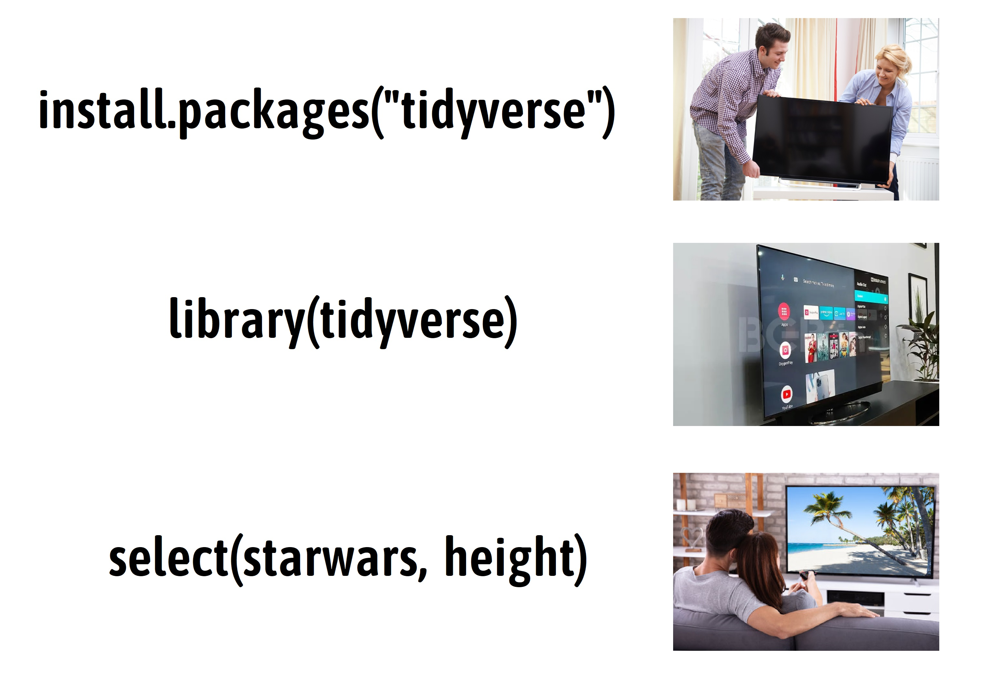

# 函数 {#baseR-functions}

上一节课我们认识了向量操作符，体会到了向量化操作的强大，事实上，向量操作符是一种函数。R 语言的强大就在于它拥有丰富的函数，这里的函数和我们高中数学中的函数 `y = f(x)` 没什么区别。

## 基础函数

R 语言内置了很多统计函数，比如对于向量`x`
```{r}
x <- c(2, 7, 8, 9, 3)
```

打印向量`x`
```{r}
print(x)
```

求开方
```{r}
sqrt(x)
```

求自然对数
```{r}
log(x)
```


求向量元素之和
```{r}
sum(x)
```

求向量元素的均值
```{r}
mean(x)
```

求向量元素的标准差
```{r}
sd(x)
```

找出向量元素中的最小值
```{r}
min(x)
```

找出向量元素中的最大值
```{r}
max(x)
```

计算向量元素的个数
```{r}
length(x)
```

对向量元素大小排序
```{r}
sort(x)
```

找出向量元素的唯一值，就是给出**去重后**的数据
```{r}
a <- c("a", "b", "b", "c", "d", "a", "g", "c", "d")
unique(a)
```

给出向量的分位数
```{r}
quantile(x)
```

判断是否为数值型/字符串型
```{r}
is.numeric(x)
is.character(x)
```

转化成字符串型
```{r}
as.character(x)
# as.logical(x)
# as.numeric(x)
```

判断向量元素是否大于5
```{r}
x <- c(2, 7, 8, 9, 3)
x > 5
```

```{r}
ifelse(x > 5, "big", "small")
```

## 向量的函数

用在向量上的函数，可以分为向量化函数(vectorized function)和汇总类函数(summary function)，

```{r, out.width = '65%', fig.align='center', echo = FALSE, fig.cap='这两类函数在 Tidyverse 框架中，应用非常广泛。'}
knitr::include_graphics("images/vector-function.png")
```

当然，也会有例外，比如`unique()`函数，它返回的向量通常不会与输入的向量等长，既不属于向量化函数，也不属于汇总类函数。


## 课堂练习

- 向量`x <- c(2, 7, 8, 9, 3)`的平方，加上5
```{r}
x <- c(2, 7, 8, 9, 3)
x^2 + 5
```

- 向量的元素减去其均值
```{r}
x <- c(2, 7, 8, 9, 3)
x - mean(x)
```


- 向量标准化（向量减去其均值之后，除以标准差）
```{r}
x <- c(2, 7, 8, 9, 3)
(x - mean(x)) / sd(x)
```


- 如果想对更多的向量，也做标准化处理呢？

```{r}
y <- c(1, 5, 7, 8, 9, 3)
(y - mean(y)) / sd(y)
```


```{r}
z <- c(4, 7, 7, 8, 9, 3, 9, 6)
(z - mean(z)) / sd(z)
```


简单重复比较累，有没有一劳永逸的方法？


## 自定义函数

```{r}
my_std <- function(x) {
   (x - mean(x)) / sd(x)
 }
```

```{r}
my_std(x)
my_std(y)
my_std(z)
```

::: {.rmdnote}
现在`my_std` 是一个糖葫芦**瘦身机器**了，放进一个胖瘦不匀称的糖葫芦，出来一个身材匀称的糖葫芦。
:::


```{r, eval=FALSE}
my_std <- function(x) {
   ...
}
```


- 创建，由`function(...)`创建一个函数
- 参数，由`(...)` 里指定参数，比如`function(x)`中的参数为 `x` 
- 函数主体，一般情况下，在`function(...)`后跟随一对大括号`{ }`，在大括号里声明具体函数功能，在代码最后一行，可以用`return`返回计算后的值。当然，如果函数的目的只是返回最后一行代码计算的值，这个`return`可以省略。
- 函数名，`function() { }` 赋值给新对象，比如这里的`my_std`，相当于给函数取一名字，方便以后使用。
- 函数调用，现在这个函数名字叫`my_std`，需要用这个函数的时候，就调用它的名字`my_std()`。

```{r, eval=FALSE}
my_std(x = c(1, 5, 7, 8, 9, 3)) # 或者
my_std(c(1, 5, 7, 8, 9, 3))     # 或者

input <- c(1, 5, 7, 8, 9, 3)
my_std(input)
```


### 课堂练习

- 根据下面的数学表达式，写出函数

$$
\mathrm{rescale}(x) = \frac{x_i- min(x)}{max(x) - min(x)} 
$$


```{r, include=FALSE}
my_scale <- function(x){
  (x - min(x)) / (max(x) - min(x))
}

y <- c(2, 7, 8, 9, 3, 6, 8, 12, 6, 9)

my_scale(y)
```


## 使用宏包的函数

### 安装宏包与使用宏包

安装宏包 `install.packages("dplyr")` 相当于你买了一台电视机，安装一次就够了; 加载 `library("dplyr")`相当于你每次要看电视，就需要插上电、打开电视的动作，运行`library("dplyr")`才能用里面的函数。

```{r out.width = '100%', echo = FALSE}
#knitr::include_graphics("images/loading_packages.png")

```

各种宏包也为我们准备了不同的函数，我们在使用前一般会先加载该宏包，比如后面章节我们会用的`dplyr`宏包中的`select()`函数，它用于选取数据框的某列
```{r, eval=FALSE}
library(dplyr)

select(starwars, height)
```

### 指定函数的所属宏包

但是，其它宏包可能也有`select()`函数，比如`MASS`和`skimr`，如果同时加载了`dplyr`，`MASS`和`skimr`三个宏包，在程序中使用`select()`函数，就会造成混淆和报错。这个时候就需要给每个函数指定是来源哪个宏包，具体方法就是在宏包和函数之间添加`::`，比如`dplyr::select()`，`skimr::select()` 或者`MASS::select()`。


至此，我们接触到了三类函数

- **内置的函数**
- **自定义的函数**
- **宏包的函数**


## 如何获取帮助


- 记住和学习所有的函数几乎是不可能的
- 打开函数的帮助页面(`Rstudio`右下面板的`Help`选项卡)

```{r intro-R-51, eval = FALSE }
?sqrt
?gather
?spread
?ggplot2
?scale
?map_dfr
```

比如：

```{r intro-R-52, out.width = '90%', echo = FALSE}
knitr::include_graphics("images/Rhelp.png")
```


## 习题

1. 根据方差的数学表达式，写出**方差**的计算函数，并与基础函数`var()`的结果对比

$$
\mathrm{Var}(x) = \frac{1}{n - 1} \sum_{i=1}^n (x_i - \bar{x}) ^2 
$$


```{r, include=FALSE}
varfun <- function(x) {
  res <- sum((x - mean(x))^2) / (length(x) - 1)
  return(res)
}
```


2. 自定义函数，它的作用是将输入的身高height(cm)与体重weight(kg)计算之后的BMI结果返回，BMI的计算公式为：

$$
\mathrm{BMI} = \frac{weight(kg)}{height(m)^2}  
$$
```{r, eval=FALSE}
get_bmi <- function(height, weight) {
  # ...
}
get_bmi(175, 65)
```

```{r, include=FALSE}
get_bmi <- function(height, weight) {
   height_m <- height / 100
   return(weight / height_m^2)
}
get_bmi(175, 65)
```

3. 对于给定的向量 `vector`和阈值`threshold`，求出`vector`中所有大于该阈值的元素的均值

```{r, eval=FALSE}
mean_above_threshod <- function(vector, threshold) {
  
}
```


```{r, include=FALSE}
x <- 1:10
x[x > 5]
mean(x[x > 5])


mean_above_threshod <- function(vector, threshold) {
  
  x <- vector[vector > threshold]
  
  mean(x, na.rm = TRUE)
  
}

```


## 阅读

- 推荐您阅读(https://r4ds.had.co.nz/functions.html)
