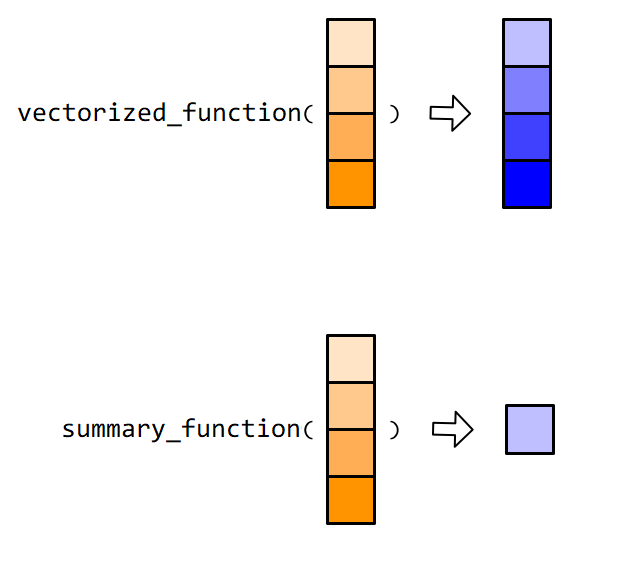

# 函数 {#baseR-functions}

R一切都是对象，不是数据就是函数。R 语言的强大还在于丰富的函数，这里的函数和我们高中数学中的函数 `y = f(x)` 没什么区别。
上一节课我们提到向量操作符，体会到了向量化操作的强大，事实上，向量操作符就是一种函数。

## 基础函数

R 语言内置了很多统计函数，比如对于向量`x`
```{r}
x <- c(2, 7, 8, 9, 3)
```

打印向量`x`
```{r}
print(x)
```

求开方
```{r}
sqrt(x)
```

求自然对数
```{r}
log(x)
```


求向量元素之和
```{r}
sum(x)
```

求向量元素的均值
```{r}
mean(x)
```

求向量元素的标准差
```{r}
sd(x)
```

找出向量元素中的最小值
```{r}
min(x)
```

找出向量元素中的最大值
```{r}
max(x)
```

计算向量元素的个数
```{r}
length(x)
```

对向量元素大小排序
```{r}
sort(x)
```

找出向量元素的唯一值，就是找出**去重后的数据**
```{r}
unique(x)
```

给出向量的分位数
```{r}
quantile(x)
```

判断是否为数值型/字符串型
```{r}
is.numeric(x)
is.character(x)
```

转化成字符串型
```{r}
as.character(x)
# as.logical(x)
# as.numeric(x)
```

判断向量元素是否大于5

```{r}
ifelse(x > 5, "big", "small")
```

## 向量的函数

用在向量上的函数，可以分为向量化函数(vectorized function)和汇总类函数(summary function)，

```{r, out.width = '70%', fig.align='center', echo = FALSE, fig.cap='这两类函数在 Tidyverse 框架中，应用非常广泛。'}

```

当然，也会有例外，比如`unique()`函数，它返回的向量通常不会与输入的向量等长，既不属于向量化函数，也不属于汇总类函数。


## 自定义函数

自己定义函数，需要四个关键部件：

```{r, eval=FALSE}
myFunction <- function(x, y) {
   ...
}
```


- 创建，由`function(...)`创建一个函数
- 参数，由`(...)` 里指定参数，比如`function(x, y)`中的参数为 `x` 和 `y`
- 函数主体，一般情况下，在`function(...)`后跟随一对大括号`{ }`，在大括号里声明具体函数功能，在代码最后一行，可以用return返回计算后的值，当然，这个return不是必需的。
- 函数名，`function() { }` 赋值给新对象，比如这里的`myFunction`

用一个简单的案例说明。这里我们想让输入的向量每个元素增加1，可以这样写函数
```{r}
add_one <- function(x) {
   y <- x + 1
   return(y)  
}
```


## 函数调用
```{r}
add_one(x = 10)
add_one(x = 1:6)
```


## 灵活的语法

R语言里面，完成一件事情往往有很多中方法，定义函数也不例外。比如我们定义简单的函数`add2`(对输入的数加2)，可以好几种写法


方法1：
```{r}
add2 <- function(x) {
    return(x + 2)
}
```


方法2：
```{r}
add2 <- function(x) { return(x + 2) }
```


方法3：
```{r}
add2 <- function(x) return(x + 2)
```


方法4：
```{r}
add2 <- function(x) x + 2
```


方法5：
```{r}
add2 <- function(x) {
    x + 2
}
```


### 案例

- 根据数据标准化的数学表达式，写出**数据标准化**的函数
$$
\mathrm{std}(x) = \frac{x_i - \bar{x}}{\mathrm{sd}(x)}  
$$


```{r, eval=FALSE, echo = FALSE}
std <- function(x) {
  (x - mean(x, na.rm = TRUE)) / sd(x, na.rm = TRUE)
}
```


 

## 多个参数

```{r}
sum_two <- function(num1, num2) {
  sum  <- num1 + num2
  return(sum)
}


sum_two(num1 = 1, num2 = 2)
sum_two(12, 9)
```


练习：说说这个函数的意思
```{r}
norm_by_y <- function(num1, num2) {
   result  <- (num1 - num2)/num2
   return(result)
}
```


## 条件语句

使用 `if-else` 语句
```{r, eval=FALSE}
if(condition) {
   Do something
} else {
   Alternative something
}
```


比如，先判断是否为数值，如果是返回它的平方，如果不是数值，就返回提示语句


```{r}
square_if <- function(num) {
    if (is.numeric(num)) {
      num^2
    } else {
     "Your input is not numeric."
    }
}


square_if("a")
square_if(3)
```


练习：将上面`sum_two()`函数增加数据类型判断语句，让函数更安全。
```{r, eval=FALSE}
sum_two("a", "b")
```


多个条件的，就需要`if-else if-else`语句，比如这里判断一个数是正数、负数还是0
```{r}
check_number <- function(x) {
  if (x < 0) {
    print("Negative number")
  } else if (x > 0) {
    print("Positive number")
  } else {
    print("Zero")
  }
}


x <- 0
check_number(x)
```


## 返回多个结果

如果要返回多个统计结果，可以把结果先放在list或者data.frame中，然后再返回。
```{r}
mystat <- function(x){
   meanval <- mean(x) 
   sdval <- sd(x)
   
   list(sd = sdval, mean = meanval)
}
```

或者
```{r}
mystat <- function(x){
   meanval <- mean(x) 
   sdval <- sd(x)
   
   data.frame(  sd = sdval, 
              mean = meanval)
}
```


## 使用宏包的函数

### 安装宏包与使用宏包

```{r out.width = '100%', echo = FALSE}

```

各种宏包也为我们准备了不同的函数，我们在使用前一般会先加载该宏包，比如后面章节我们会用的`dplyr`宏包中的`select()`函数，它用于选取数据框的某列
```{r, eval=FALSE}
library(dplyr)

select(mtcars, mpg)
```

### 指定函数的所属宏包

但是，其它宏包可能也有`select()`函数，比如`MASS`和`skimr`，如果同时加载了`dplyr`，`MASS`和`skimr`三个宏包，在程序中使用`select()`函数，就会造成混淆和报错。这个时候就需要给每个函数指定是来源哪个宏包，具体方法就是在宏包和函数之间添加`::`，比如`dplyr::select()`，`skimr::select()` 或者`MASS::select()`。


## 如何获取帮助


- 记住和学习所有的函数几乎是不可能的
- 打开函数的帮助页面(`Rstudio`右下面板的`Help`选项卡)

```{r intro-R-51, eval = FALSE }
?sqrt
?gather
?spread
?ggplot2
?scale
?map_dfr
```

比如：

```{r intro-R-52, out.width = '90%', echo = FALSE}
knitr::include_graphics("images/Rhelp.png")
```


## 习题

- 根据方差的数学表达式，写出**方差**的计算函数，并与基础函数`var()`的结果对比

$$
\mathrm{Var}(x) = \frac{1}{n - 1} \sum_{i=1}^n (x_i - \bar{x}) ^2 
$$


```{r, include=FALSE}
varfun <- function(x) {
  res <- sum((x - mean(x))^2) / (length(x) - 1)
  return(res)
}

```


- 自定义函数，它的作用是将输入的身高height(cm)与体重weight(kg)计算之后的BMI结果返回，BMI的计算公式为：

$$
\mathrm{BMI} = \frac{weight(kg)}{height(m)^2}  
$$
```{r, eval=FALSE}
get_bmi <- function(height, weight) {
  # ...
}
get_bmi(175, 65)
```

```{r, include=FALSE}
get_bmi <- function(height, weight) {
   height_m <- height / 100
   return(weight/ height_m^2)
}
get_bmi(175, 65)
```

- 对于给定的向量 `vector`和阈值`threshold`，求出`vector`中所有大于该阈值的元素的均值

```{r, eval=FALSE}
mean_above_threshod <- function(vector, threshold) {
  
}
```


```{r, include=FALSE}
x <- 1:10
x[x > 5]
mean(x[x > 5])


mean_above_threshod <- function(vector, threshold) {
  
  x <- vector[vector > threshold]
  
  mean(x, na.rm = TRUE)
  
}

```


## 阅读

- 推荐您阅读(https://r4ds.had.co.nz/functions.html)
