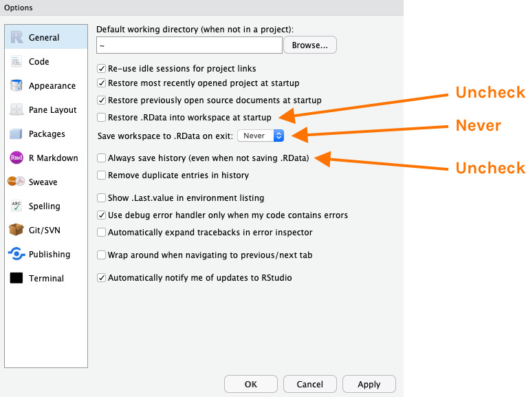
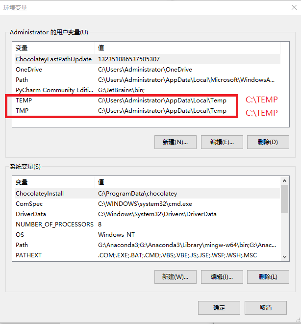
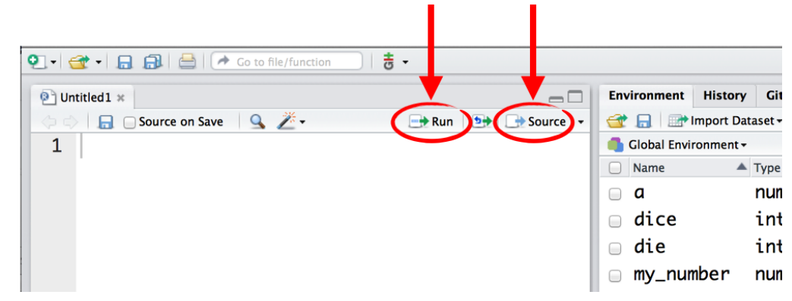

# 安装与环境配置 {#baseR-install}


R 软件是一个自由、开源软件平台，具有统计分析、可视化和编程的强大功能。
你可以从这里免费[下载](https://cloud.r-project.org)。 为了更好的使用 R 软件，我推荐大家使用 [RStudio](https://www.rstudio.com/products/rstudio)这个 IDE。这里有个[在线教程](https://www.rstudio.com/online-learning/)帮助我们熟悉 R 和 RStudio。


## 安装 R 和 Rstudio

R 软件是一个自由、开源软件平台，具有统计分析、可视化和编程的强大功能。


### 第一步安装 R

我们从官方网站[http://cran.r-project.org](https://cloud.r-project.org)免费下载, 网站界面感觉有点朴素。


```{r, echo=FALSE, out.width = '100%'}
knitr::include_graphics("images/Rinstall.png")
```


### 第二步安装 RStudio

为了更好的使用 R 软件，我推荐大家使用 [RStudio](https://www.rstudio.com/products/rstudio) IDE。因此，安装完 R 后，还需要安装 [RStudio](https://www.rstudio.com/products/rstudio)。有同学可能要问 R 与 RStudio 是什么关系呢？打个比方吧，R 就像汽车的发动机, RStudio 就是汽车的仪表盘。但我更觉得 R 是有趣的灵魂，而 Rstudio 是好看的皮囊。

```{r out.width = '49%', echo = FALSE}
knitr::include_graphics(c("images/engine.jpg", "images/dashboard.jpg"))
```


同样，我们从官方网站[https://www.rstudio.com/download](https://www.rstudio.com/download)下载`RStudio Desktop`版并安装，如果你是苹果系统的用户，选择苹果系统对应的rstudio版本即可。

```{r, out.width = '100%', echo = FALSE}
knitr::include_graphics("images/rstudio_install.png")
```


::: {.rmdnote}
这里**重要提示**：

- 电脑开机时的用户名不要用中文，否则Rstudio会杠上中文用户名
- 尽量安装在非系统盘，比如，可以选择安装在D盘
- 安装路径不要有中文和空格。比如，这样就比较好
   - `D:/R`
   - `D:/Rstudio`

:::


### 必要的配置(可选)

为了让R和Rstudio 的运行更顺畅，可以做以下必要的设置

- 宏包安装设置成国内镜像`Tools > Global options`

```{r, out.width = '50%', echo = FALSE}
knitr::include_graphics("images/mirror1.png")
knitr::include_graphics("images/mirror2.png")
```

- 如果打开代码是乱码，可以试试修改如下设置`Tools > Global options`

```{r, out.width = '75%', echo = FALSE}
knitr::include_graphics("images/code_utf_8.png")
```

- 如果每次打开Rstudio非常慢，可以在Rstudio里将这几个选项取消掉`Tools > Global options`
```{r, out.width = '100%', echo = FALSE}

```

- 安装过程中提示，我的系统不能兼容 64 位的 Rstudio。

可能你是低版本的windows系统，建议安装旧版本的Rstudio，可以在[https://rstudio.com/products/rstudio/older-versions/](https://rstudio.com/products/rstudio/older-versions/)找到旧版本.

- Windows系统中文用户名的问题

::: {.rmdnote}

当前Rstudio对中文支持不太好，如果windows系统用户名为中文，Rstudio安装完成后可能无法正常使用。这里有一个解决办法

- 右键`**我的电脑** -> 属性 -> 高级系统设置 -> 高级 -> 环境变量`
- 把TEMP 和TMP都修改为，`C:\TEMP`
- 在C盘目录下创建文件夹TEMP
- 重启Rstudio 

:::

```{r, out.width = '85%', echo = FALSE}

```

最好的办法是，用英文注册一个新用户，在新用户名下，重新安装R和Rstudio

### 第三步安装宏包

R 语言的强大还在于各种宏包，一般在[The Comprehensive R Archive Network (CRAN)](https://cran.r-project.org)下载安装。宏包扩展了R语言本身的各种功能，也为解决问题提供了各种方案。截至撰写本书时止，CRAN上大约有1.4万个宏包可以使用。但由于各种包接口不统一，语法不一致，也带来一些困扰。为了解决这个问题，RStudio 公司的[Hadley Wickham](http://hadley.nz) 与其带领的团队推出了`tidyverse`宏包， [tidyverse](https://www.tidyverse.org)将常用的宏包整合在一起，并保持了语法的一致性。可以说，`tidyverse`宏包是R语言[入门](http://varianceexplained.org/r/teach-tidyverse/) 学习的首选。
本书正是基于`tidyverse`宏包而成的，本书也将通过一些例子不断地展示`tidyverse`在数据分析和可视化的应用。

可以用如下命令安装宏包:

- 安装单个包
```{r, eval = FALSE }
install.packages("tidyverse")
```

- 安装多个包
```{r, eval = FALSE }
install.packages(c("palmerpenguins", "patchwork", "gapminder", "ggridges", "readxl"))
```


```{r, eval=FALSE, message=FALSE, warning=FALSE, include=FALSE}
my_packages <- c("tidyverse", "palmerpenguins", "readxl",
                 "ggraph", "tidygraph", "patchwork", "ggridges", "here", 
                 "brms", "sf", "rvest", "rmarkdown", "cowplot", "gapminder",
                 "broom", "modelr", "knitr", "rlang", "tidytext",  
                 "scales", "devtools")

install.packages(my_packages, repos = "http://cran.rstudio.com")
```


## 开始 

安装完毕后，从windows`开始菜单`，点开`rstudio`图标，就打开了rstudio的窗口，界面效果如下

```{r, out.width = '100%', echo = FALSE}
knitr::include_graphics("images/rstudio-editor.png")
```


RStudio 的用户界面十分友好，

- 左上角是`Editor`窗口，负责编写代码
- 左下角是`Console`窗口，可以键入命令
- 右上角是`Environment`和`History`窗口，保存当前存储的数据和历史命令记录等
- 右下角是`Plot`和`Help`窗口，用于显示绘制图片和帮助文档

想要运行一段R代码，可以在Console内键入 R 代码，然后回车即可。比如我们键入`1 + 1` 并按回车后，将显示如下结果
```{r}
1 + 1
```


## 脚本

运行代码最好的方法是，通过Rstudio菜单栏依此点击`File > New File > R Script` 来创建一个新的脚本。**脚本**文件通常以`.R`作为文件的后缀名。脚本文件的好处在于我们可以在其它时间修改和重新运行它。养成用脚本写代码的习惯后，今后所有的工作都有案可查，并且具有可重复性。

```{r, out.width = '100%', echo = FALSE}
knitr::include_graphics("images/script1.png")
```


如何运行脚本呢？方法有很多

  
```{r, out.width = '100%', echo = FALSE}

```

- 按住`Ctrl`键，然后按回车键`Enter`，可以运行**光标所在行**的代码
- 点击 `Run`, 运行**光标所在行**的代码
- 点击 `Source`，从头到尾运行当前脚本**全部**代码
- 鼠标选中多行代码，然后点击 `Run`或者`Ctrl + Enter`


## 注释

可以让阅读者更易理解代码，一般会在脚本中添加注释，R 语言注释符号为 `#`。 注释会被编译器忽略掉，不会影响代码的执行。

```{r, eval=FALSE}
1 + 3 # this is my comment
```

## R 语言社区

R 语言社区非常友好，可以在这里找到你问题的答案

  - twitter: <https://twitter.com/>
  - R-Bloggers: <https://www.r-bloggers.com/>
  - kaggle: <https://www.kaggle.com/>
  - stackoverflow: <https://stackoverflow.com/questions/tagged/r>
  - rstudio: <https://community.rstudio.com/>
  

