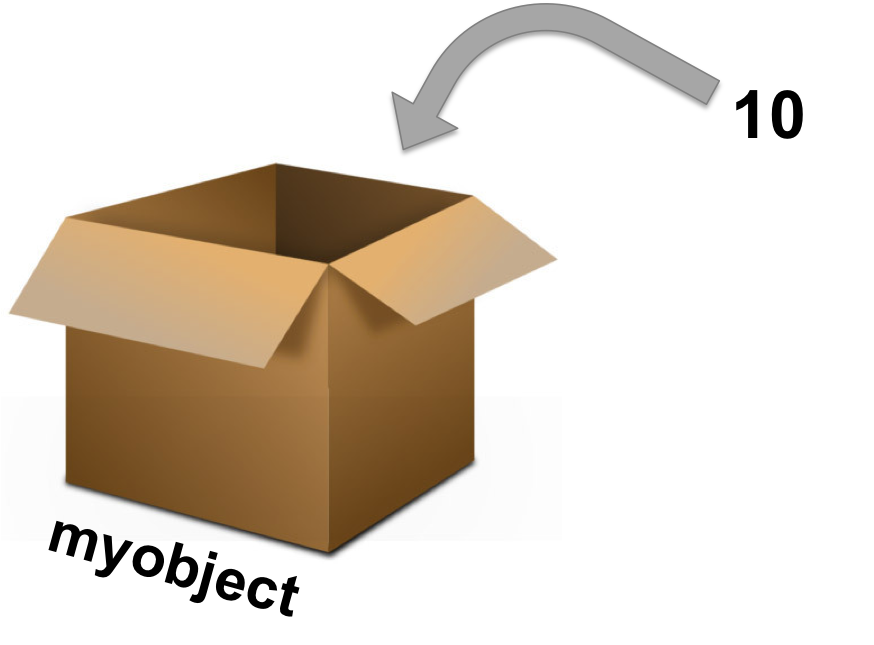
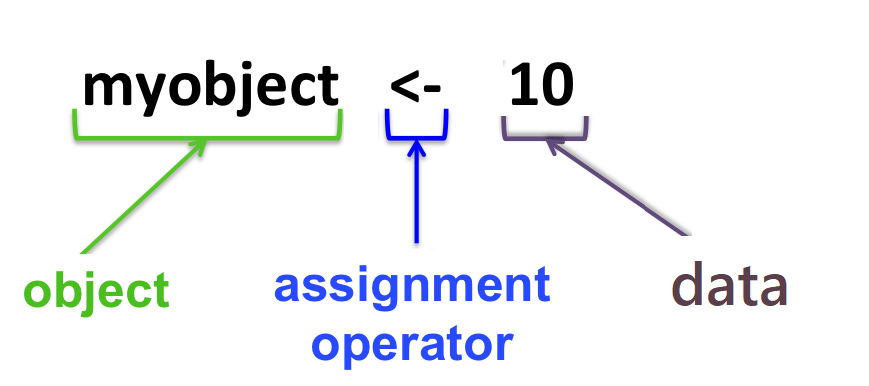

# 对象 {#baseR-objects}

## 基本运算

可以把 R 当作计算器用，比如加、减、乘、除等运算
```{r, eval = FALSE}
1 + 2
5 - 3
3 * 4
12 / 3
2^3
(2 + 4) / 3
```


## 对象

### 一切都是对象

在R中存储的数据称为**对象**（object），R语言数据处理实际上就是不断的创建和操控这些对象。

```{r, out.width = "65%", echo=FALSE}

```

对象可以理解成用来装数据和函数的盒子。


### 对象的创建与使用

创建一个R对象，首先确定一个名称，然后使用赋值操作符 `<-`，将数据赋值给它。

```{r, out.width = "65%", echo=FALSE}

```

我们给这个盒子取名 `x`，然后把5这个数放入**盒子**，用计算机语言描述就是，给变量 x 赋值为 5，在命令行中可以这样写 `x <- 5` ，然后回车.

```{r}
x <- 5
```

::: {.rmdnote}

快速产生赋值符号`<-`，在Rstudio中同时按下

- `alt` 和 `-`（windows系统）
- `option` 和 `-`（苹果系统）
:::

```{r, echo=FALSE}
library(magrittr)
library(ggkeyboard)

ggkeyboard(tkl) %>%
  highlight_keys(c("Alt Left", "_-"))
```

当键入 `x` 然后回车，就打印出 `x` 的值。当然也可以使用命令`print(x)`，结果一样。
```{r}
x
```

我们也可以做计算
```{r}
x + 2
```

注意此时`x`没有发生改变
```{r}
x
```


当我们再把6这个数放入盒子`x`后
```{r}
x <- 6
```


此时`x`就被更新了，变成了最新的数值
```{r}
x
```


### 变量命名规则

R变量名必须以字母、数字、下划线`_`和句点`.`组成。但是，变量名的第一个字符不能为数字或者特殊符号，比如 `+`, `-`, `*`, `/`, `^`, `!`, `@`,  `&`, 或者下划线`_`。变量名的第一个字符如果是句点`.`，那么句点后面不能紧跟数字。变量名是区分大小写的，`y`和`Y`是两个不同的变量名。在中文环境下，汉字也可以作为变量名的合法字符使用，但不推荐使用。

- 大小写敏感
- 不能有空格，可以用下划线代替空格，比如，`my_age <- 30`
- 开头不能是数字和一些特殊符号

为了让代码可读性更强，我们希望变量名能更清晰描述所赋值的对象，比如我们测量了男生的身高，并把测量结果存储为对象，那么这里有三种方案：

- 一般的变量名
```{r, eval=FALSE}
x <- 175
```

- 不错变量名
```{r, eval=FALSE}
height <- 175
```

- 更佳的变量名
```{r, eval=FALSE}
boy_height_cm <- 175
```

很显然，第三种方案是最佳的，它清晰告诉我们男生的身高是175，测量单位是cm

### 对象属性

所有R对象都有其属性，其中最重要的两个属性是**类型**和**长度**，我们可以用以下两个命令查看对象的类型和长度。


```{r}
typeof(x) 
length(x)
```


## 习题

以下哪些变量名是合法的

- `example    <- c(1, 2, 3)`
- `example1   <- c(1, 2, 3)`
- `example.1  <- c(1, 2, 3)`
- `example_1  <- c(1, 2, 3)`
- `example-1  <- c(1, 2, 3)`
- `example+1  <- c(1, 2, 3)`
- `.example   <- c(1, 2, 3)`
- `.2example  <- c(1, 2, 3)`
- `2example   <- c(1, 2, 3)`
- `_example   <- c(1, 2, 3)`
