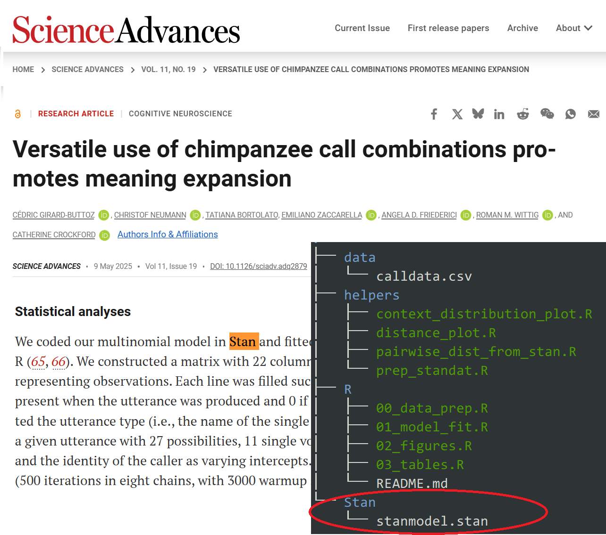
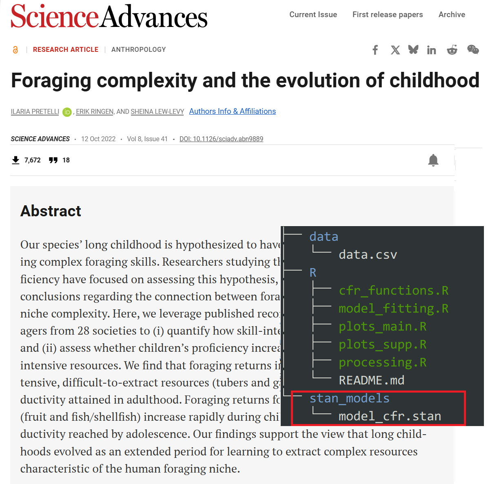
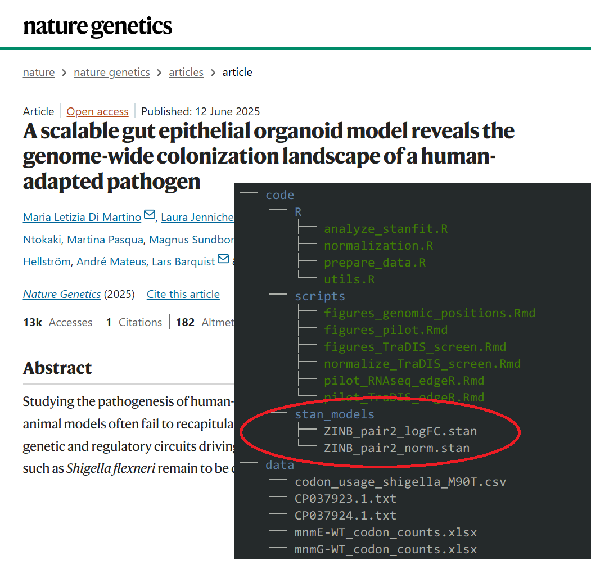
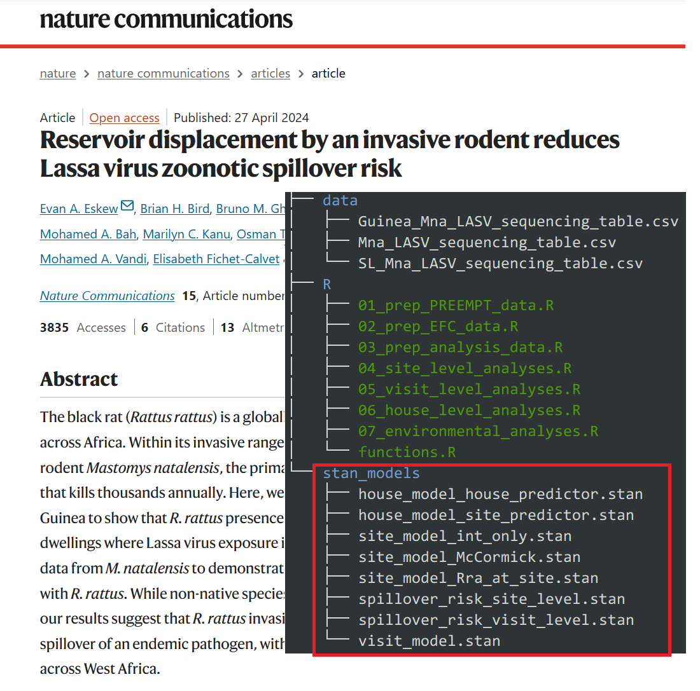

# Stan 正在悄然改变期刊的统计叙事 {#bayesian-in-journals}

```{r, include=FALSE}
knitr::opts_chunk$set(
   echo         = TRUE, 
   warning      = FALSE, 
   message      = FALSE,
   fig.showtext = TRUE
)
```


在 Nature、Science、PNAS 等顶刊中，越来越多的研究者不再满足于“传统线性模型”，他们需要：

- 可自定义模型结构
- 精确表达先验知识
- 有效应对层级/缺失/异质性/离群值。

而 Stan，正好响应这些需求。


```{r, echo=FALSE}

```


```{r, echo=FALSE}

```


```{r, echo=FALSE}

```


```{r, echo=FALSE}

```
