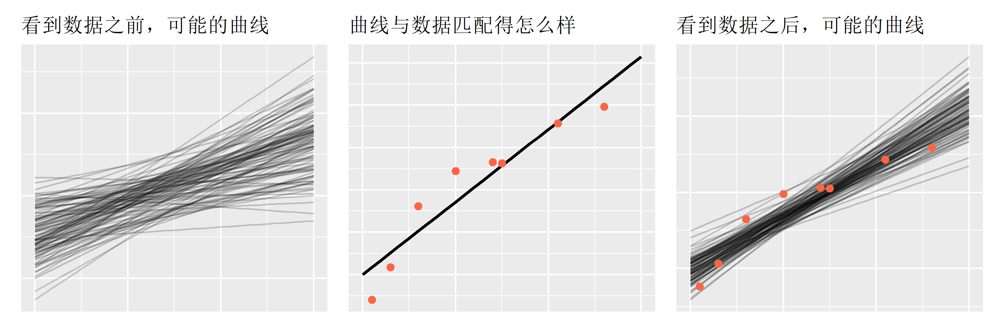

# 贝叶斯建模 {#bayesian-models}

```{r bayes-01, message=FALSE, warning=FALSE}
library(tidyverse)
library(tidybayes)
library(rstan)
library(brms)
rstan_options(auto_write = TRUE)
options(mc.cores = parallel::detectCores())
```


之前我们讲了线性模型和混合线性模型，今天我们往前一步，应该说是一大步。因为这一步迈向了贝叶斯分析，与频率学派的分析有本质的区别，这种区别类似经典物理和量子物理的区别。

- 频率学派，是从数据出发
- 贝叶斯。先假定参数有一个分布，看到数据后，再重新分配可能性。


## 生活中的贝叶斯

事实上，贝叶斯在生活中应用很广泛，我们自觉和不自觉中都在使用贝叶斯分析。


## 贝叶斯公式

参数是假设，数据是证据。对于参数 $\theta$ 和数据 $D$，贝叶斯公式可以写为

$$
\underbrace{p(\theta|D)}_\text{posterior} \; = \; \underbrace{p(D|\theta)}_\text{likelihood} \;\; \underbrace{p(\theta)}_\text{prior} \;.
$$

## 三张图讲贝叶斯分析


```{r, eval=FALSE, include=FALSE}
df <- tibble(
  alpha = rnorm(100, mean = 100, sd = 20),
  beta = rnorm(100, mean = 4, sd = 2)
) %>%
  rowwise() %>%
  mutate(
    set = list(tibble(
      height = 0:30,
      weight = alpha + beta * height
    ))
  )

ggplot() +
  map(
    df$set,
    ~ geom_line(data = ., aes(x = height, y = weight), alpha = 0.2)
  )
```


```{r bayes-three-panels-brms, eval=FALSE, include=FALSE}
# https://www.tjmahr.com/bayes-theorem-in-three-panels/

d <- tibble(
  ids = 1:8,
  bases = 100 * runif(8, .9, 1.1),
  experience = c(1, 3, 6, 10, 14, 15, 21, 26),
  raises = 2 * runif(8, .9, 1.1)
) %>% mutate(
  salary = bases + experience * raises
)
d


d %>% 
  ggplot(aes(x = experience, y = salary)) +
  geom_point()


## 看到数据之前，可能的曲线
## 在看到数据之前，我们认为这个系数，应该是某个值，且服从正态分布
fit_prior <- brm(
  formula = salary ~ experience, 
  data = d,
  prior = c( 
    prior(normal(100, 20), class = "Intercept"), 
    prior(normal(4, 2), class = "b")
  ),
  iter = 2000,
  chains = 4,
  sample_prior = "only", 
  cores = 4,
  control = list(adapt_delta = 0.9, max_treedepth = 13)
)

draws_prior <- d %>%
  tidyr::expand(experience = 0:30) %>%
  tidybayes::add_fitted_draws(fit_prior, n = 100)

p1 <- 
  ggplot(draws_prior) +
  aes(x = experience, y = .value) +
  geom_line(aes(group = .draw), alpha = .2) +
  theme(
    axis.ticks = element_blank(), 
    axis.text = element_blank(), 
    axis.title = element_blank()
  ) + 
  ggtitle("看到数据之前，可能的曲线")
p1


## 每条曲线与数据匹配得怎么样?
## 哪条曲线与数据匹配的最好？其中拟合最好的那条，这就是lm()估计出的模型参数，
## Maximum likelihood estimate
fm1 <- lm(salary ~ experience, data = d)
new_data <- tibble(experience = 0:30) %>% 
  mutate(
    fit = predict(fm1, newdata = .)
  )


p2 <- ggplot(data = d) + 
  aes(x = experience, y = salary) + 
  geom_line(aes(y = fit), data = new_data, size = 1) +
  geom_point(color = "#FB6542", size = 2) + 
  theme(
    axis.ticks = element_blank(), 
    axis.text = element_blank(), 
    axis.title = element_blank()
  ) + 
  ggtitle("曲线与数据匹配得怎么样")
p2


## 看到数据之后，可能的曲线
fit <- brm(
  formula = salary ~ experience, 
  data = d,
  prior = c( 
    prior(normal(100, 20), class = "Intercept"), 
    prior(normal(4, 2), class = "b")
  ),
  iter = 2000,
  chains = 4,
  cores = 4,
  control = list(adapt_delta = 0.9, max_treedepth = 13)
)


draws_posterior <- d %>%
  tidyr::expand(experience = 0:30) %>%
  tidybayes::add_fitted_draws(fit, n = 100) 
draws_posterior


p3 <- 
  ggplot(draws_posterior) +
  aes(x = experience, y = .value) +
  geom_line(aes(group = .draw), alpha = .2) +
  geom_point(
    aes(y = salary), 
    color = "#FB6542", size = 2, 
    data = d
  ) +
  theme(
    axis.ticks = element_blank(), 
    axis.text = element_blank(), 
    axis.title = element_blank()
  ) +
  ggtitle("看到数据之后，可能的曲线")
p3


library(patchwork)
p1 + p2 + p3

ggsave("bayes-three-panels.png", width = 9, height = 3)
```


```{r bayes-three-panels-stan, eval=FALSE, include=FALSE}
#用stan重新写一次

## 看到数据之前，可能的曲线
## 在看到数据之前，我们认为这个系数，应该是某个值，且服从正态分布
stan_program <- "
data {
  int M;
  vector[M] x;
}
parameters {
  real alpha;
  real beta;
  real<lower=0> sigma;
}
model {
  alpha ~ normal(100, 20);
  beta ~ normal(4, 2);
  //sigma ~ normal(0, 1);
}
generated quantities {
  vector[M] y_fit; 
  //vector[M] y_rep; 
  for (i in 1:M) 
    y_fit[i] = alpha + beta * x[i];                     // tidybayes::add_fitted_draws
   //y_rep[i] = normal_rng(alpha + beta * x[i], sigma); // tidybayes::add_predict_draws
}

"

stan_data <- list(
  M = 31,
  x = 0:30
)

fit_normal01 <- stan(model_code = stan_program, data = stan_data)


p1 <- fit_normal01 %>%
  tidybayes::gather_draws(y_fit[i], n = 100) %>%
  ggplot(aes(x = i, y = .value)) +
  geom_line(aes(group = .draw), alpha = .2) +
  theme(
    axis.ticks = element_blank(), 
    axis.text = element_blank(), 
    axis.title = element_blank()
  ) + 
  ggtitle("看到数据之前，可能的曲线")
p1


## 曲线与数据匹配得怎么样?
## 哪条曲线与数据匹配的最好？
## Maximum likelihood estimate
fm1 <- lm(salary ~ experience, data = d)
new_data <- tibble(experience = 0:30) %>% 
  mutate(
    fit = predict(fm1, newdata = .)
  )


p2 <- ggplot(data = d) + 
  aes(x = experience, y = salary) + 
  geom_line(aes(y = fit), data = new_data, size = 1) +
  geom_point(color = "#FB6542", size = 2) + 
  theme(
    axis.ticks = element_blank(), 
    axis.text = element_blank(), 
    axis.title = element_blank()
  ) + 
  ggtitle("曲线与数据匹配得怎么样")
p2


## 看到数据之后，可能的曲线
stan_program <- "
data {
  int N;
  vector[N] x;
  vector[N] y;
  int M;
  vector[M] x_new;
}
parameters {
  real alpha;
  real beta;
  real<lower=0> sigma;
}
model {
  alpha ~ normal(100, 20);
  beta ~ normal(4, 2);
  sigma ~ normal(0, 1);
  y ~ normal(alpha + beta * x, sigma);
}
generated quantities {
  vector[M] y_fit; 
  for (i in 1:M) 
    y_fit[i] = alpha + beta * x_new[i];           // tidybayes::add_fitted_draws
  //y_rep[i] = normal_rng(alpha + beta * x[i], sigma); // tidybayes::add_predict_draws
}

"


stan_data <- list(
  N = nrow(d),
  x = d$experience,
  y = d$salary,
  M = 31,
  x_new = 0:30
)

fit_normal3 <- stan(model_code = stan_program, data = stan_data)


p3 <- fit_normal3 %>%
  tidybayes::gather_draws(y_fit[i], n = 100) %>%
  ggplot(aes(x = i, y = .value)) +
  geom_line(aes(group = .draw), alpha = .2) +
  geom_point(
    aes(x =  experience, y = salary), 
    color = "#FB6542", size = 2, 
    data = d
  ) +
  theme(
    axis.ticks = element_blank(), 
    axis.text = element_blank(), 
    axis.title = element_blank()
  ) +
  ggtitle("看到数据之后，可能的曲线")
p3
```


```{r bayes-02, out.width = '100%', echo = FALSE}

```


- **第一张图**: 在看到数据之前，我们会去猜（如果你是专家，那就不能说是猜，而是叫合理假设），这个斜率可能是0.5, 1，1.5, 1.6, 2, 4, 4.5, 6，8....., 总之，我们不知道真实的值，只有去估计，或者认为这斜率应该在一个范围之内，在这个范围内，有些值的可能性大，有些值可能性较低。比如，认为这值游离在(1,8)范围，其中4左右的可能最大，两端的可能性最低。如果寻求用数学语言来描述，它符合正态分布的特征。（没有数据信息）

- **第二张图**: 每条曲线与数据匹配得怎么样? 很显然，有的直线拟合的很好，有的拟合的很差。其中 拟合最好的那条，这就是lm()估计出的模型参数。最大似然估计（这里没有考虑先验信息的）

- **第三张图**: 看到数据之后，可能的曲线。考虑先验和似然后，参数处在高密度区间的曲线们。

观察到数据点后，我们认为服从线性模型，这个线性模型不是一条直线，而是很多条，有些线的可能性大，有些线的可能性低，但都是有可能的。那么，综合这些有可能的线，(截距和斜率)构成了一种分布，即**后验概率分布**。


因为我们是R语言课，我们跳过很多理论推导。事实上，我在学习贝叶斯数据分析的时候，也是先从代码操作人手，然后理解贝叶斯推断相关理论，有时候更直观更容易理解。当然，我不是说我的方法一定正确，只是供大家的一个选项。我会用到brms和Stan，但我个人更喜欢Stan.


## 线性模型

从最简单的线性模式开始
$$
y_n = \alpha + \beta x_n + \epsilon_n \quad \text{where}\quad
\epsilon_n \sim \operatorname{normal}(0,\sigma).
$$

等价于

$$
y_n - (\alpha + \beta X_n) \sim \operatorname{normal}(0,\sigma),
$$

进一步等价

$$
y_n \sim \operatorname{normal}(\alpha + \beta X_n, \, \sigma).
$$


```{r bayes-simuate, eval=FALSE}
alpha_real <- 10
beta_real  <- 3
sigma_real <- 2

df <- tibble(
  x = runif(30, 1, 8),
  y = rnorm(30, alpha_real + beta_real * x, sd = sigma_real)
)
```


```{r bayes-03, eval=FALSE}
stan_program <- "
data {
  int<lower=0> N;
  vector[N] x;
  vector[N] y;
}
parameters {
  real alpha;
  real beta;
  real<lower=0> sigma;
}
model {
  y ~ normal(alpha + beta * x, sigma);
}
generated quantities {
  vector[N] y_rep; 
  for (n in 1:N) 
    y_rep[n] = normal_rng(alpha + beta * x[n], sigma);
}

"

stan_data <- df %>%
  tidybayes::compose_data(
    N = nrow(.),
    x = x,
    y = y
  )

fit_normal <- stan(model_code = stan_program, data = stan_data)
```

```{r include=FALSE}
# 运行stan代码，导致渲染bookdown报错，不知道为什么，先用这边笨办法凑合吧
#
#save(fit_normal, 
#     stan_data, 
#     alpha_real, 
#     beta_real, 
#     sigma_real, 
#     file = here::here("stan", "stan_data_normal.Rdata")
#     ) 

load(here::here("stan", "stan_data_normal.Rdata"))
```

### 模型输出

```{r bayes-04}
fit_normal
```


### 模型评估
```{r bayes-05}
rstan::traceplot(fit_normal, pars = c("alpha", "beta", "sigma"))
```


```{r, eval=FALSE}
rstan::extract(fit_normal, par = c("alpha", "beta"))
rstan::extract(fit_normal, par = "alpha")$alpha
rstan::extract(fit_normal, par = "beta")$beta
```


```{r bayes-06, eval=FALSE}
fit_normal %>% 
  tidybayes::gather_draws(alpha, beta) %>% 
  ggplot(aes(x = .value, y = as_factor(.variable)) ) +
  ggdist::stat_halfeye() +
  geom_vline(xintercept = c(alpha_real, beta_real)) 
```


事实上，`bayesplot`宏包提供了大量模型评估函数，大爱!!

```{r bayes-07, message=FALSE, results=FALSE}
true_alpha_beta <- c(alpha_real, beta_real, sigma_real)

posterior_alpha_beta <- 
  as.matrix(fit_normal, pars = c('alpha','beta', 'sigma'))
bayesplot::mcmc_recover_hist(posterior_alpha_beta, true = true_alpha_beta)
```


```{r bayes-08}
y_rep <- as.matrix(fit_normal, pars = "y_rep")
bayesplot::ppc_dens_overlay(y = stan_data$y, yrep = y_rep[1:200, ])
```


```{r bayes-09}
y_rep <- as.matrix(fit_normal, pars = "y_rep")
bayesplot::ppc_intervals(y = stan_data$y, yrep = y_rep, x = stan_data$x) 
```


## bayesian workflow


## 参考资料

- https://mc-stan.org/
- https://github.com/jgabry/bayes-workflow-book
- https://github.com/XiangyunHuang/masr/
- https://github.com/ASKurz/Statistical_Rethinking_with_brms_ggplot2_and_the_tidyverse_2_ed/
- 《Regression and Other Stories》, Andrew Gelman, Cambridge University Press. 2020
- 《A Student's Guide to Bayesian Statistics》,  Ben Lambert, 2018
- 《Statistical Rethinking: A Bayesian Course with Examples in R and STAN》 ( 2nd Edition), by Richard McElreath, 2020
- 《Bayesian Data Analysis》, Third Edition, 2013
- 《Doing Bayesian Data Analysis: A Tutorial with R, JAGS, and Stan》  (2nd Edition) John Kruschke, 2014
- 《Bayesian Models for Astrophysical Data: Using R, JAGS, Python, and Stan》， Joseph M. Hilbe, Cambridge University Press, 2017


```{r bayes-20, echo = F}
# remove the objects
# ls() %>% stringr::str_flatten(collapse = ", ")

rm(fit_normal, y_rep, stan_data, alpha_real, beta_real, sigma_real,posterior_alpha_beta, true_alpha_beta)
```


```{r bayes-21, echo = F, message = F, warning = F, results = "hide"}
pacman::p_unload(pacman::p_loaded(), character.only = TRUE)
```

