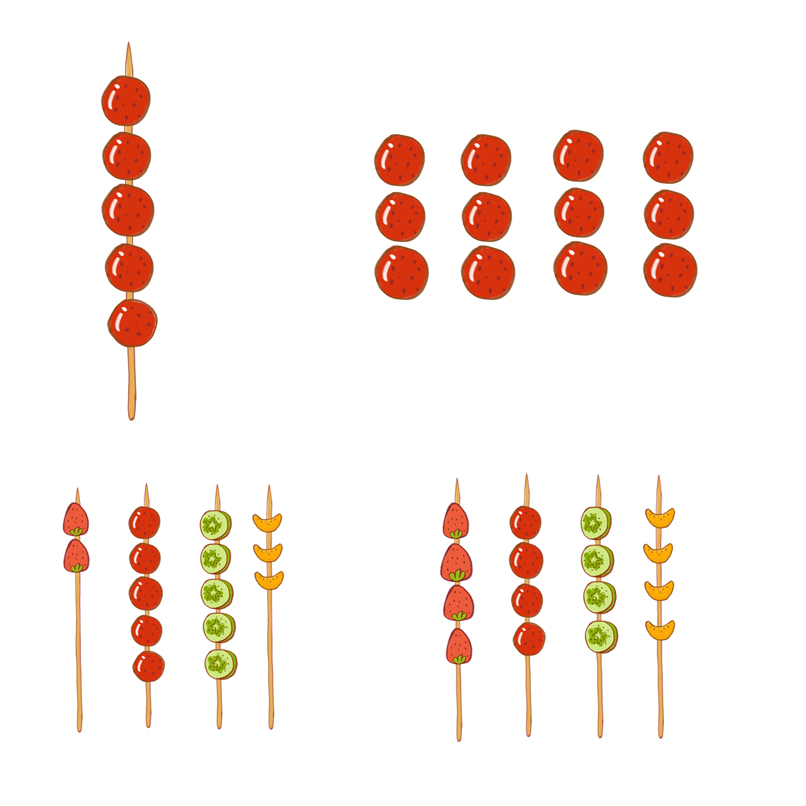
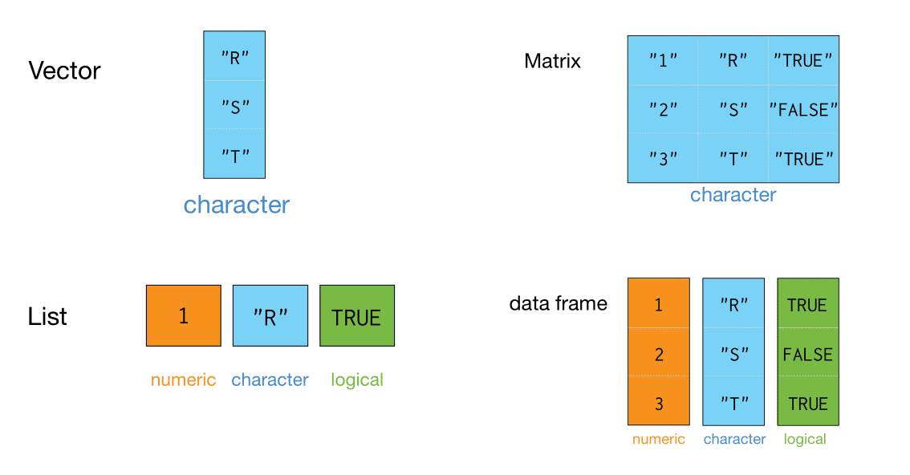

# 数据结构 {#data-structure}

前面介绍了向量，它是R语言中最基础的数据结构

```{r, out.width = '70%', echo = FALSE}
knitr::include_graphics("images/vector_like2.jpg", dpi = 300)
```


我们还会遇到其它数据结构

- 矩阵
- 列表
- 数据框

这些数据结构都可以看作由向量衍生出来的。


## 矩阵

矩阵可以存储行(row)和列(column)二维的数据。


```{r, out.width = '70%', echo = FALSE}
knitr::include_graphics("images/matrix.jpg", dpi = 300)
```

它实际上是向量的另一种表现形式。


矩阵可以用 `matrix()` 函数创建，第一位参数的是用于创建矩阵的向量。比如下面把向量`c(2, 4, 3, 1, 5, 7)` 转换成2行3列的矩阵

```{r, echo=TRUE, message=TRUE, warning=TRUE}
m <- matrix(
  c(2, 4, 3, 1, 5, 7),
  nrow = 2, 
  ncol = 3
)

m
```

```{r, echo=FALSE, out.width = '100%'}
knitr::include_graphics("images/create_matrix.jpg", dpi = 300)
```


大家还记得我们的向量是一个竖着的糖葫芦， 那么在转换成矩阵的时候，也是先竖着排，第一列竖着的方法排满后，就排第二列，这是默认的情形。如果想改变这一传统习惯，也可以增加一个语句 `byrow = TRUE`，这条语句让向量先横着排，排完第一行，再排第二行。

```{r}
matrix(
  c(2, 4, 3, 1, 5, 7),
  nrow = 2, 
  ncol = 3,
  byrow = TRUE
)
```

### 矩阵的属性

- 类型

```{r}
class(m)
```


- 长度

```{r}
length(m)
```


- 维度
```{r}
dim(m)
```


## 列表

盒子里装一个向量，有点浪费，我们想往里面装更多的东西，可以使用`list()`函数创建列表

```{r, out.width = '60%', echo = FALSE}
knitr::include_graphics("images/list.jpg", dpi = 300)
```


`list()` 函数创建列表 Vs. `c()` 函数创建向量：

- **相同点**：元素之间用逗号分开。
- **不同点**：
  - 向量的元素是单个值；列表的元素可以是更复杂的结构，可以是向量、矩阵或者列表。
  - 向量要求每个元素的数据类型必须相同，要么都是数值型，要么都是字符型；而列表的元素允许不同的数据类型。

<!-- 我在初学时，我把列表(list)想象成小火车，每节车厢可以装自己喜欢的东西 -->


```{r, echo=TRUE, message=TRUE, warning=TRUE}
list1 <- list(
  a = c(5, 10),
  b = c("I", "love", "R", "language", "!"),
  c = c(TRUE, TRUE, FALSE, TRUE)
)
list1
```


```{r, out.width = '100%', echo = FALSE}
knitr::include_graphics("images/create_list.jpg", dpi = 300)
```


### 列表的属性

- 类型

```{r}
class(list1)
```


- 长度
```{r}
length(list1)
```


## 数据框

如果列表元素的长度都相等，那么就变成了**数据框** (data frame)

```{r, out.width = '100%', echo = FALSE}
knitr::include_graphics("images/dataframe.jpg", dpi = 300)
```


换句话说，**数据框**是一种特殊的列表，我们可以使用 `data.frame()` 函数构建

```{r, echo=TRUE, message=TRUE, warning=TRUE}
df <- data.frame(
  name      = c("Alice", "Bob", "Carl", "Dave"),
  age       = c(23, 34, 23, 25),
  marriage  = c(TRUE, FALSE, TRUE, FALSE),
  color     = c("red", "blue", "orange", "purple")
)
df
```


```{r, echo=FALSE, out.width = '100%'}
knitr::include_graphics("images/create_dataframe.png", dpi = 300)
```

数据框就是我们经常用的excel表格，所以在数据科学的统计建模和可视化中运用非常广泛。

### 数据框的属性

- 类型

```{r}
class(df) 
```


- 维度
```{r}
nrow(df)
ncol(df)
```


## 小结

R 对象的数据结构(向量、矩阵、列表和数据框)，总结如下

```{r, out.width = '90%', include = FALSE}

```


```{r, out.width = '90%', echo = FALSE}

```

为了更好地理解相关概念，建议大家阅读Garrett Grolemund的
[hopr](https://rstudio-education.github.io/hopr/)这本书 [@Garrett2014]。


## 习题


