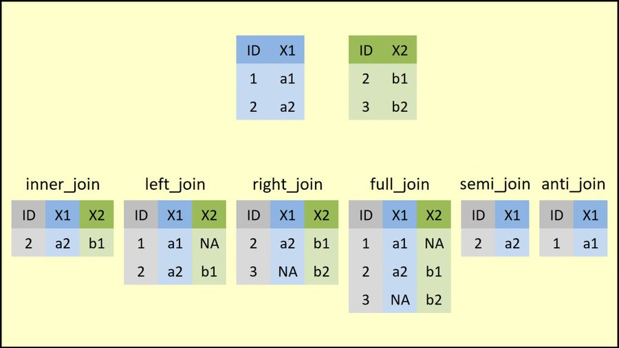

# 数据处理 {#dplyr}


本章我们介绍tidyverse里数据处理的神器dplyr宏包。首先，我们加载该宏包
```{r dplyr-1, message = FALSE, warning = FALSE}
library(dplyr)
```


dplyr 定义了数据处理的规范语法，其中主要包含以下九个主要的函数。


* `mutate() `, `select() `, `filter() ` 
* `summarise() `, `group_by()`, `arrange() `
* `left_join()`, `right_join()`， `full_join()`

```{r dplyr-2, out.width = '85%', echo = FALSE}
knitr::include_graphics("images/dplyr-verbs.png")
```


我们依次介绍


## `mutate() `

假定我们有一数据框，包含三位学生的英语和数学

```{r dplyr-3}
df <- data.frame(
      name = c("Alice", "Alice", "Bob", "Bob", "Carol", "Carol"),
      type = c("english", "math", "english", "math", "english", "math")
)

df
```

这里有他们的最近的考试成绩，我们想增加到数据框里去
```{r dplyr-4}
score2020 <- c(80.2, 90.5, 92.2, 90.8, 82.5, 84.6)
score2020
```


使用传统的方法
```{r dplyr-5}
df$newscore <- score2020
df
```

```{r dplyr-6, include=FALSE}
df <- data.frame(
      name = c("Alice", "Alice", "Bob", "Bob", "Carol", "Carol"),
      type = c("english", "math", "english", "math", "english", "math")
)
```


dplyr语法这样写


```{r dplyr-7}
mutate(df, newscore = score2020)
```


`mutate()` 函数

```{r dplyr-8, eval=FALSE}
mutate(.data = df, newscore = score2020)
```

- 第一参数是我们要处理的数据框，比如这里的`df`，
- 第二个参数是`newscore = score2020`，等号左边的`newscore`是我们打算创建一个新列，而取的列名；
等号右边是装着学生成绩的**向量**（注意，向量 的长度要与数据框的行数相等，比如这里长度都是6）

```{r dplyr-9, out.width = '60%', echo = FALSE}
knitr::include_graphics("images/dplyr-mutate.png")
```


## `管道` %>%

这里有必要介绍下管道操作符[ `%>%` ](https://magrittr.tidyverse.org/).

```{r dplyr-10}
c(1:10)
```

```{r dplyr-11}
sum(c(1:10))
```


与下面的写法是等价的,
```{r dplyr-12}
c(1:10) %>% sum()
```

这条语句的意思，向量`c(1:10)` 通过管道操作符 `%>%` ，传递到函数`sum()`的第一个参数位置，即`sum(c(1:10))`， 这个`%>%`管道操作符还是很形象的，

```{r dplyr-13, out.width = '50%', echo = FALSE}
knitr::include_graphics("images/pipe1.png")
```


当对执行多个函数操作的时候，就显得格外方便，代码可读性更强。

```{r dplyr-14}
sqrt(sum(abs(c(-10:10))))
```


```{r dplyr-15}
# sqrt(sum(abs(c(-10:10)))) 
c(-10:10) %>% abs() %>% sum() %>% sqrt()
```


那么，上面增加学生成绩的语句`mutate(df, newscore = score2020)`就可以使用管道

```{r dplyr-16, out.width = '50%', echo = FALSE}
knitr::include_graphics("images/pipe2.png")
```


```{r dplyr-17}
# 等价于
df %>% mutate(newscore = score2020)
```
是不是很赞？


注意此时`df`没有变化喔。好比把`df` 传给了`f()` 执行了`f(df)`, 但`df`本身没有变化。
如果想保留`f(df)`结果，需要把`f(df)`赋值给新的对象，当然也可以赋值给`df`, 即替换.

```{r dplyr-18}
df <- df %>% mutate(newscore = score2020)
df
```


## `select() `

`select() `顾名思义`选择`，就是选择数据框的某一列，或者某几列


```{r dplyr-19, out.width = '80%', echo = FALSE}
knitr::include_graphics("images/dplyr-select.png")
```


我们还是以学生成绩的数据框为例

我们可以选择`name`列, 结果是只有一列的数据框（仍然数据框喔）

- 使用传统的方法
```{r dplyr-20}
df["name"]
```


- dplyr 的方法
```{r dplyr-21}
df %>% select(name)
```


- 如果选取多列，用dplyr 就只是再写一个就行了
```{r dplyr-22}
df %>% select(name, newscore)
```


如果不想要某列， 可以在变量前面加`-`， 结果与上面的一样
```{r dplyr-23}
df %>% select(-type)
```


或者"!"，结果与上面的一样
```{r dplyr-23-1, eval=FALSE}
df %>% select(!type)
```


## `filter() `

`select`是列方向的选择，我们还可以对数据行方向的选择和筛选，选出符合我们条件的某些行^[
注意，这里filter()函数不是字面上“过滤掉”的意思，而是保留符合条件的行，也就说keep，不是drop的意思。 第一次会有一点点迷惑，我相信习惯就好了]

```{r dplyr-24, out.width = '65%', echo = FALSE}
knitr::include_graphics("images/dplyr-filter.png")
```

比如这里把**成绩高于90分的**同学筛选出来

```{r dplyr-25}
df %>% filter(newscore >= 90)
```


也可以限定多个条件进行筛选, 英语成绩高于90分的筛选出来
```{r dplyr-26}
df %>% filter(type == "english", newscore >= 90)
```


## `summarise() `统计


```{r dplyr-27, out.width = '70%', echo = FALSE}
knitr::include_graphics("images/dplyr-summarize.png")
```


`summarise() `主要用于统计，往往与其他函数配合使用，比如计算所有同学考试成绩的均值
```{r dplyr-28}
df %>% summarise( mean_score = mean(newscore))
```


比如，计算所有同学的考试成绩的标准差
```{r dplyr-29}
df %>% summarise( mean_score = sd(newscore))
```


还同时完成多个统计
```{r dplyr-30}
df %>% summarise(
  mean_score = mean(newscore),
  median_score = median(newscore),
  n = n(),
  sum = sum(newscore)
)
```


注意，`mutate()`, `select()` 和 `filter()`是在原数据框的基础上增减, 而`summarise()`返回的是一个新的数据框。


## `group_by()`分组

```{r dplyr-31, out.width = '85%', echo = FALSE}
knitr::include_graphics("images/dplyr-group-by.png")
```


事实上，`summarise() `往往配合`group_by()`一起使用，即，先分组再统计。比如，我们想统计每个学生的平均成绩，那么就需要先按学生`name`分组，然后求平均
```{r dplyr-32}
df %>% 
  group_by(name) %>% 
  summarise( 
    mean_score = mean(newscore),
   sd_score = sd(newscore)
  )
```


## `arrange() `排序

```{r dplyr-33, out.width = '65%', echo = FALSE}
knitr::include_graphics("images/dplyr-arrange.png")
```


这个很好理解的。比如我们按照考试成绩从低到高排序，然后输出
```{r dplyr-34}
df %>% arrange(newscore)
```


如果从高到低排序呢，有两种方法:
```{r dplyr-35}
df %>% arrange(-newscore)
```


写成下面这种形式也是降序排列，但可读性更强些
```{r dplyr-36}
df %>% arrange(desc(newscore))
```


也可对多个变量先后排序。先按学科排，然后按照成绩从高到底排序
```{r dplyr-37}
df %>% 
  arrange(type, desc(newscore))
```


## `left_join()`
数据框合并，假定我们已经统计了每个同学的平均成绩，存放在`df1`

```{r dplyr-38}
df1 <- df %>% 
  group_by(name) %>% 
  summarise( mean_score = mean(newscore) )

df1
```


我们有新一个数据框`df2`，包含同学们的年龄信息
```{r dplyr-39}
df2 <- tibble(
      name = c("Alice", "Bob"),
      age =  c(12, 13)
)

df2
```


可以用 `left_join`把两个数据框`df1`和`df2`，合并连接再一起, 两个数据框是通过姓名`name`连接的，因此需要指定`by = "name"`


```{r dplyr-40}
left_join(df1, df2, by = "name")
```


```{r dplyr-41, message=FALSE}
# 
df1 %>% left_join(df2, by = "name")
```

大家注意到最后一行Carol的年龄是`NA`， 大家想想为什么呢？


## `right_join()`

我们再试试`right_join()`

```{r dplyr-42, message=FALSE}
df1 %>% right_join(df2, by = "name")
```
Carol同学的信息没有了？ 大家想想又为什么呢？


事实上，答案就在函数的名字上，`left_join()`是左合并，即以左边数据框`df1`中的学生姓名`name`为准，在右边数据框`df2`里，有`Alice`和`Bob`的年龄，那么就对应合并过来，没有`Carol`，就为缺失值`NA`

`right_join()`是右合并，即以右边数据框`df2`中的学生姓名`name`为准，只有`Alice`和`Bob`，因此而`df1`只需要把`Alice`和`Bob`的信息粘过来。


```{r dplyr-42-1, out.width = '99%', echo = FALSE}

```


## 延伸阅读

- 推荐[https://dplyr.tidyverse.org/](https://dplyr.tidyverse.org/).
- [cheatsheet](https://github.com/rstudio/cheatsheets/raw/master/data-transformation.pdf)
- 作业：读懂并运行下面的代码

```{r dplyr-43, echo=FALSE}
# a single file
xfun::embed_file('./data/nycflights.Rmd')
```

- 统计每位同学成绩高于75分的科目数


```{r eval=FALSE, include=FALSE}
df %>% 
  group_by(name) %>% 
  mutate(num_of_bigger_than_75 = sum(score >75))
```


```{r dplyr-44, echo = F}
# remove the objects
rm(df, df1, df2, score2020)
```

```{r dplyr-45, echo = F, message = F, warning = F, results = "hide"}
pacman::p_unload(pacman::p_loaded(), character.only = TRUE)
```
