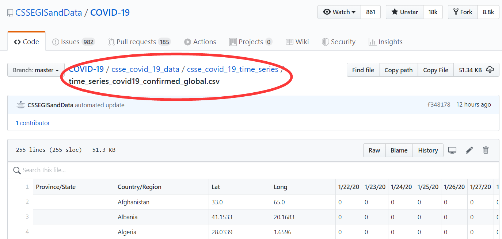

# 探索性数据分析-新冠疫情 {#eda-covid2019}


```{r eda-covid2019-1, message = FALSE, warning = FALSE}
library(tidyverse)
library(lubridate)
library(maps)
library(viridis)
library(ggrepel)
library(paletteer)
library(shadowtext)
library(showtext)
showtext_auto()
```


新型冠状病毒（COVID-19）疫情在多国蔓延，本章通过分析[疫情数据](https://github.com/CSSEGISandData/COVID-19)，了解疫情发展，祝愿人类早日会战胜病毒！


```{r eda-covid2019-2, out.width='45%', fig.align='left', fig.cap='电影《传染病》,《流感》海报', echo=FALSE}
knitr::include_graphics(c("images/movie_contagion.jpg", "images/movie_flu.png"))
```

## 数据来源

我们打开链接[https://github.com/CSSEGISandData/COVID-19](https://github.com/CSSEGISandData/COVID-19)，

```{r eda-covid2019-3, out.width='85%', fig.align='left', echo = F}
knitr::include_graphics("images/github_COVID-19_download.png")
```


找到疫情时间序列数据，你可以通过点击该网页`Clone or download`直接下载的方式获取数据。

```{r eda-covid2019-4, out.width='85%', fig.align='left', echo = F}

```


## 读取数据

假定你已经下载了数据，比如`time_series_covid19_confirmed_global.csv`， 那么我们可以用`readr::read_csv()`函数直接读取, 关于在R语言里文件读取的方法可以参考第 \@ref(readr) 章。


```{r eda-covid2019-5}
d <- read_csv("./demo_data/time_series_covid19_confirmed_global.csv")
d
```

## 数据集结构

探索数据之前，我们一定要对数据**存储结构、数据变量名及其含义**要非常清楚，重要的事情说三遍。


```{r eda-covid2019-6}
glimpse(d)
```


## 数据清洗规整


### 必要的预备知识之`select()`

```{r eda-covid2019-7, eval = FALSE}
d %>% select(-c(1:4))
d %>% select(5:ncol(.))
d %>% select(matches("/20"))
d %>% select(ends_with("/20"))

# 应该还有其他的方法
```


### 必要的预备知识之`pivot_longer()`

**宽表格**变**长表格**，需要用到`pivot_longer()` 和 `pivot_wider()`， 比如

```{r eda-covid2019-8, out.width='99%', fig.align='left', echo = F}
knitr::include_graphics("images/pivot.png")
```


```{r eda-covid2019-9}
table4a
```


```{r eda-covid2019-10}
longer <- table4a %>%
  pivot_longer(
    cols = `1999`:`2000`,
    names_to = "year",
    values_to = "cases"
  )

longer
```


### 必要的预备知识之`pivot_wider()`

有时候我们想折腾下，比如把**长表格**再变回**宽表格**

```{r eda-covid2019-11}
longer %>%
  pivot_wider(
    names_from = year,
    values_from = cases
  )
```

### 必要的预备知识之日期格式

有时候，我会遇到日期`date`这种数据类型，我推荐使用`lubridate`包来处理，比如

```{r eda-covid2019-12}
c("2020-3-25", "20200325", "20-03-25", "2020 03 25") %>% lubridate::ymd()
```


```{r eda-covid2019-13}
c("3/25/20", "03-25-20", "3-25/2020") %>% lubridate::mdy()
```

遇到这种`010210`日期的，请把输入数据的人扁一顿，他会告诉你的

```{r eda-covid2019-14, eval=FALSE}
lubridate::dmy(010210)
lubridate::dym(010210)
lubridate::mdy(010210)
lubridate::myd(010210)
lubridate::ymd(010210)
lubridate::ydm(010210)
```


### 必要的预备知识之时间差

```{r eda-covid2019-15}
difftime(ymd("2020-03-24"),
  ymd("2020-03-23"),
  units = "days"
)
```

或者更直观的表述
```{r eda-covid2019-16}
ymd("2020-03-24") - ymd("2020-03-23")
```


转换为天数
```{r eda-covid2019-17}
(ymd("2020-03-24") - ymd("2020-03-23")) %>% as.numeric()
```

### 有时候需要log10_scale

```{r eda-covid2019-18, out.width = '100%'}
tb <- tibble(
  days_since_100 = 0:18,
  cases = 100 * 1.33^days_since_100
)


p1 <- tb %>%
  ggplot(aes(days_since_100, cases)) +
  geom_line(size = 0.8) +
  geom_point(pch = 21, size = 1)

p2 <- tb %>%
  ggplot(aes(days_since_100, log10(cases))) +
  geom_line(size = 0.8) +
  geom_point(pch = 21, size = 1)


p3 <- tb %>%
  ggplot(aes(days_since_100, cases)) +
  geom_line(size = 0.8) +
  geom_point(pch = 21, size = 1) +
  scale_y_log10()

library(patchwork)
p1 + p2 + p3
```

### 数据清洗规整

```{r eda-covid2019-19}
d1 <- d %>%
  pivot_longer(
    cols = 5:ncol(.),
    names_to = "date",
    values_to = "cases"
  ) %>%
  mutate(date = lubridate::mdy(date)) %>%
  janitor::clean_names() %>%
  group_by(country_region, date) %>%
  summarise(cases = sum(cases)) %>%
  ungroup()

d1
```


```{r eda-covid2019-20}
d1 %>%
  group_by(date) %>%
  summarise(confirmed = sum(cases))
```

【WHO：2019冠状病毒全球大流行正在“加速”】世界卫生组织（WHO）昨日发出警告，指2019冠状病毒全球感染者已超过30万人，全球大流行正在“加速”。世卫组织指，从首例病例报告到感染者达到10万人用了67天；感染人数增至20万用了11天；从20万到突破30万则只用了4天。

```{r eda-covid2019-21, out.width = '100%'}
d1 %>%
  group_by(date) %>%
  summarise(confirmed = sum(cases)) %>%
  ggplot(aes(x = date, y = confirmed)) +
  geom_point() +
  scale_x_date(
    date_labels = "%m-%d",
    date_breaks = "1 week"
  ) +
  scale_y_continuous(
    breaks = c(0, 50000, 100000, 200000, 300000, 500000, 900000),
    labels = scales::comma
  )
```


```{r eda-covid2019-22}
# d1 %>% distinct(country_region) %>% pull(country_region)
d1 %>% distinct(country_region)
```


```{r eda-covid2019-23}
d1 %>%
  filter(country_region == "China")
```


```{r eda-covid2019-24, out.width = '100%'}
d1 %>%
  filter(country_region == "China") %>%
  ggplot(aes(x = date, y = cases)) +
  geom_point() +
  scale_x_date(date_breaks = "1 week", date_labels = "%m-%d") +
  scale_y_log10(labels = scales::comma)
```


```{r eda-covid2019-25, out.width = '100%'}
d1 %>%
  group_by(country_region) %>%
  filter(max(cases) >= 20000) %>%
  ungroup() %>%
  ggplot(aes(x = date, y = cases, color = country_region)) +
  geom_point() +
  scale_x_date(date_breaks = "1 week", date_labels = "%m-%d") +
  scale_y_log10() +
  facet_wrap(vars(country_region), ncol = 2) +
  theme(
    axis.text.x = element_text(angle = 45, hjust = 1)
  ) +
  theme(legend.position = "none")
```


## 可视化探索

网站[https://www.ft.com/coronavirus-latest](https://www.ft.com/coronavirus-latest) 这张图很受关注，于是打算重复


```{r eda-covid2019-26, out.width='85%', fig.align='left', fig.cap='图片来源www.ft.com', echo=FALSE}
knitr::include_graphics("images/ft_coronavirus.jpg")
```


这张图想表达的是，出现100个案例后，各国确诊人数的爆发趋势

- 横坐标是天数，即在出现100个案例后的第几天
- 纵坐标是累积确诊人数

那么，我们需要对数据的**时间轴**做相应的变形

- 首先按照国家分组
- 筛选，累积确诊人数超过`100`的国家
- 找到所有`case >= 100`的日期，`date[cases >= 100]`
- 最早的日期，就说我们要找的**第 0 day**， `min(date[cases >= 100])`
- 构建新的一列`mutate( days_since_100 = date - min(date[cases >= 100])`
- 将`days_since_100`转换成数值型`as.numeric()`

```{r eda-covid2019-27}
d2 <- d1 %>%
  group_by(country_region) %>%
  filter(max(cases) >= 100) %>%
  mutate(
    days_since_100 = date - min(date[cases >= 100])
  ) %>%
  mutate(days_since_100 = as.numeric(days_since_100)) %>%
  filter(days_since_100 >= 0) %>%
  ungroup()
d2
```

```{block eda-covid2019-28, type="danger"}
大家都谈过恋爱，也有可能失恋。大家失恋时间是不同的，若把失恋的当天作为第 0 day, 就可以比较失恋若干天后每个人精神波动情况。参照《失恋33天》
```


```{r eda-covid2019-29}
d2_most <- d2 %>%
  group_by(country_region) %>%
  top_n(1, days_since_100) %>%
  filter(cases >= 10000) %>% 
  ungroup() %>% 
  arrange(desc(cases))
d2_most
```


```{r eda-covid2019-30, out.width = "100%"}
d2 %>%
  bind_rows(
    tibble(country = "33% daily rise", days_since_100 = 0:30) %>%
      mutate(cases = 100 * 1.33^days_since_100)
  ) %>%
  
  ggplot(aes(days_since_100, cases, color = country_region)) +
  geom_hline(yintercept = 100) +
  geom_vline(xintercept = 0) +
  geom_line(size = 0.8) +
  geom_point(pch = 21, size = 1) +
#   scale_colour_manual(
#    values = c(
#     "US" = "#EB5E8D",
#     "Italy" = "black", 
#     "Spain" = "#c2b7af",
#     "China" = "red",
#     "Germany" = "#c2b7af",
#     "France" = "#c2b7af",
#     "Iran" = "#9dbf57",
#     "United Kingdom" = "#ce3140",
#     "Korea, South" = "#208fce",
#     "Japan" = "#208fce",
#     "Singapore" = "#1E8FCC",
#      "33% daily rise" = "#D9CCC3",
#     "Switzerland" = "#c2b7af",
#     "Turkey" = "#208fce",
#     "Belgium" = "#c2b7af",
#     "Netherlands" = "#c2b7af",
#     "Austria" = "#c2b7af",
#     "Hong Kong" = "#1E8FCC",
#     # gray
#     "India" = "#c2b7af",
#     "Switzerland" = "#c2b7af",
#     "Belgium" = "#c2b7af",
#     "Norway" = "#c2b7af",
#      "Sweden" = "#c2b7af",
#     "Austria" = "#c2b7af",
#     "Australia" = "#c2b7af",
#     "Denmark" = "#c2b7af",
#     "Canada" = "#c2b7af",
#     "Brazil" = "#c2b7af",
#     "Portugal" = "#c2b7af"
#   )
# ) +
  
  geom_shadowtext(
    data = d2_most, aes(label = paste0("  ", country_region)),
    bg.color = "white"
  ) +
  scale_y_log10(
    expand = expansion(mult = c(0, .1)),
    breaks = c(100, 200, 500, 1000, 2000, 5000, 10000, 20000, 50000),
    labels = scales::comma
  ) +
  scale_x_continuous(
    expand = expansion(mult = c(0, .1)),
    breaks = c(0, 5, 10, 15, 20, 25, 30)
  ) +
  theme_minimal() +
  theme(
    panel.grid.minor = element_blank(),
    plot.background = element_rect(fill = "#FFF1E6"),
    legend.position = "none",
    panel.spacing = margin(3, 15, 3, 15, "mm")
  ) +
  labs(
    x = "Number of days since 100th case",
    y = "",
    title = "Country by country: how coronavirus case trajectories compare",
    subtitle = "Cumulative number of cases, by Number of days since 100th case",
    caption = "data source from @www.ft.com"
  )
```

有点乱，还有很多细节没有实现，后面再弄弄了


### 简便的方法

```{r eda-covid2019-31}
d2a <- d1 %>%
  group_by(country_region) %>%
  filter(cases >= 100) %>%
  mutate(days_since_100 = 0:(n() - 1)) %>%
  # same as
  # mutate(edate = as.numeric(date - min(date)))
  ungroup()
d2a
```

这里的`d2a` 和`d2`是一样的了，但方法简单很多。


### 疫情持续时间最久的国家


```{r eda-covid2019-32}
d3 <- d2a %>%
  group_by(country_region) %>%
  filter(days_since_100 == max(days_since_100)) %>%
  # same as
  # top_n(1, days_since_100) %>%
  ungroup() %>%
  arrange(desc(days_since_100))
d3
```

```{r eda-covid2019-33}
highlight <- d3 %>%
  top_n(10, days_since_100) %>%
  pull(country_region)
highlight
```


```{r eda-covid2019-34, out.width = '100%'}
d2a %>%
  bind_rows(
    tibble(country = "33% daily rise", days_since_100 = 0:30) %>%
      mutate(cases = 100 * 1.33^days_since_100)
  ) %>%
  ggplot(aes(days_since_100, cases, color = country_region)) +
  geom_hline(yintercept = 100) +
  geom_vline(xintercept = 0) +
  geom_line(size = 0.8) +
  geom_point(pch = 21, size = 1) +
  scale_y_log10(
    expand = expansion(mult = c(0, .1)),
    breaks = c(100, 200, 500, 1000, 2000, 5000, 10000, 20000, 50000, 100000),
    labels = scales::comma
  ) +
  scale_x_continuous(
    expand = expansion(mult = c(0, .1)),
    breaks = c(0, 5, 10, 15, 20, 25, 30, 40, 50, 60)
  ) +
  theme_minimal() +
  theme(
    panel.grid.minor = element_blank(),
    plot.background = element_rect(fill = "#FFF1E6"),
    legend.position = "none",
    panel.spacing = margin(3, 15, 3, 15, "mm")
  ) +
  labs(
    x = "Number of days since 100th case",
    y = "",
    title = "Country by country: how coronavirus case trajectories compare",
    subtitle = "Cumulative number of cases, by Number of days since 100th case",
    caption = "data source from @www.ft.com"
  ) +
  gghighlight::gghighlight(country_region %in% highlight,
    label_key = country_region, use_direct_label = TRUE,
    label_params = list(segment.color = NA, nudge_x = 1),
    use_group_by = FALSE
  )
```

灰色线条的国家名，有点不好弄，在想办法


### 笨办法吧

笨办法，实际上是4张表共同完成

```{r eda-covid2019-35}
highlight <- c(
  "China", "Spain", "US", "United Kingdom", "Korea, South",
  "Italy", "Japan", "Singapore", "Germany", "France", "Iran"
)

gray <- c(
  "India", "Switzerland", "Belgium", "Netherlands",
  "Sweden", "Austria", "Australia", "Denmark",
  "Canada", "Brazil", "Portugal"
)

d3_highlight <- d2a %>% filter(country_region %in% highlight)

d3_gray <- d2a %>% filter(country_region %in% gray)
```

  
```{r eda-covid2019-36, out.width = '100%'}
d2a %>%
  ggplot(aes(days_since_100, cases, group = country_region)) +
  geom_hline(yintercept = 100) +
  geom_vline(xintercept = 0) +
  geom_line(size = 0.8, color = "gray70") +
  geom_point(pch = 21, size = 1, color = "gray70") +

  # highlight country
  geom_line(data = d3_highlight, aes(color = country_region)) +
  geom_point(data = d3_highlight, aes(color = country_region)) +
  geom_text(
    data = d3_highlight %>%
      group_by(country_region) %>%
      top_n(1, days_since_100) %>%
      ungroup(),
    aes(color = country_region, label = country_region),
    hjust = 0,
    vjust = 0,
    nudge_x = 0.5
  ) +


  # gray country
  geom_text(
    data = d3_gray %>%
      group_by(country_region) %>%
      top_n(1, days_since_100) %>%
      ungroup(),
    aes(label = country_region),
    color = "gray50",
    hjust = 0,
    vjust = 0,
    nudge_x = 0.5
  ) +
  geom_point(
    data = d3_gray %>%
      group_by(country_region) %>%
      top_n(1, days_since_100) %>%
      ungroup(),
    size = 2,
    color = "gray50"
  ) +
  scale_y_log10(
    expand = expansion(mult = c(0, .1)),
    breaks = c(100, 200, 500, 2000, 5000, 10000, 20000, 50000, 100000, 150000),
    labels = scales::comma
  ) +
  scale_x_continuous(
    expand = expansion(mult = c(0, .1)),
    breaks = c(0, 5, 10, 15, 20, 25, 30, 40, 50, 60)
  ) +
  theme_minimal() +
  theme(
    panel.grid.minor = element_blank(),
    plot.background = element_rect(fill = "#FFF1E6"),
    legend.position = "none",
    panel.spacing = margin(3, 15, 3, 15, "mm")
  ) +
  labs(
    x = "Number of days since 100th case",
    y = "",
    title = "Country by country: how coronavirus case trajectories compare",
    subtitle = "Cumulative number of cases, by Number of days since 100th case",
    caption = "data source from @www.ft.com"
  )
```

差强人意，再想想有没有好的办法


### 比较tidy的方法

对数据框d2a增加两列属性(有无标签，有无颜色)，然后手动改颜色


```{r eda-covid2019-37}
highlight_country <- d2a %>%
  group_by(country_region) %>%
  filter(days_since_100 == max(days_since_100)) %>%
  ungroup() %>%
  arrange(desc(days_since_100)) %>% 
  top_n(10, days_since_100) %>%
  pull(country_region)

highlight_country
```


吸取了[Kieran Healy大神的配色方案](https://github.com/kjhealy/covid) 
```{r eda-covid2019-38}
## Colors
cgroup_cols <- c(prismatic::clr_darken(paletteer_d("ggsci::category20_d3"), 0.2)[1:length(highlight_country)], "gray70")
scales::show_col(cgroup_cols)
```


```{r eda-covid2019-39}
d2a %>% 
  group_by(country_region) %>% 
  filter(max(days_since_100) > 9) %>%
  mutate(
    end_label = ifelse(days_since_100 == max(days_since_100), country_region, NA_character_)
  ) %>% 
  mutate(end_label = case_when(country_region %in% highlight_country ~ end_label,
                               TRUE ~ NA_character_), 
         cgroup = case_when(country_region %in% highlight_country ~ country_region, 
                            TRUE ~ "ZZOTHER")) %>% # length(highlight_country) + gray

  
  ggplot(aes(x = days_since_100, y = cases, 
         color = cgroup, label = end_label, 
         group = country_region)) + 
  geom_line(size = 0.8) + 
  geom_text_repel(nudge_x = 1.1,
                  nudge_y = 0.1, 
                  segment.color = NA) + 
  guides(color = FALSE) + 
  scale_color_manual(values = cgroup_cols) +
  scale_y_continuous(labels = scales::comma_format(accuracy = 1), 
                     breaks = 10^seq(2, 8),
                     trans = "log10"
                     ) + 
  labs(x = "Days Since 100 Confirmed Death", 
       y = "Cumulative Number of Deaths (log10 scale)", 
       title = "Cumulative Number of Reported Deaths from COVID-19, Selected Countries", 
    subtitle = "Cumulative number of cases, by Number of days since 100th case",
    caption = "data source from @www.ft.com") 
```

感觉这样是最好的方案。


## 每个国家的情况
```{r eda-covid2019-40}
d2 %>%
  group_by(country_region) %>%
  filter(max(cases) >= 1000) %>%
  ungroup()
```


```{r eda-covid2019-41, out.width = '100%'}
d2 %>%
  group_by(country_region) %>%
  filter(max(cases) >= 1000) %>%
  ungroup() %>%
  ggplot(aes(days_since_100, cases)) +
  geom_line(size = 0.8) +
  geom_line(
    data = d2 %>% rename(country = country_region),
    aes(days_since_100, cases, group = country),
    color = "grey"
  ) +
  geom_point(pch = 21, size = 1, color = "red") +
  scale_y_log10(
    expand = expansion(mult = c(0, .1)),
    breaks = c(100, 1000, 10000, 50000)
  ) +
  scale_x_continuous(
    expand = expansion(mult = c(0, 0)),
    breaks = c(0, 5, 10, 20, 30, 50)
  ) +
  facet_wrap(vars(country_region), scales = "free_x") +
  theme(
    panel.background = element_rect(fill = "#FFF1E6"),
    plot.background = element_rect(fill = "#FFF1E6")
  ) +
  labs(
    x = "Number of days since 100th case",
    y = "",
    title = "Outbreak are now underway in dozens of other countries, with some on the same trajectory as Italy",
    subtitle = "Cumulative number of cases, by Number of days since 100th case",
    caption = "data source from @www.ft.com"
  )
```


## 地图 

```{r eda-covid2019-42, eval=FALSE}
library(countrycode)
# countrycode('Albania', 'country.name', 'iso3c')

d2_newest %>%
  mutate(ISO3 = countrycode(country_region,
    origin = "country.name", destination = "iso3c"
  ))
```


我们选取最新的日期
```{r eda-covid2019-43}
d_newest <- d %>%
  select(Long, Lat, last_col()) %>%
  set_names("Long", "Lat", "newest_date")
d_newest
```


```{r eda-covid2019-44, out.width = '100%'}
world <- map_data("world")


ggplot() +
  geom_polygon(
    data = world,
    aes(x = long, y = lat, group = group),
    fill = "grey", alpha = 0.3
  ) +
  geom_point(
    data = d_newest,
    aes(x = Long, y = Lat, size = newest_date, color = newest_date),
    stroke = F, alpha = 0.7
  ) +
  scale_size_continuous(
    name = "Cases", trans = "log",
    range = c(1, 7),
    breaks = c(1, 20, 100, 1000, 50000),
    labels = c("1-19", "20-99", "100-999", "1,000-49,999", "50,000+")
  ) +
  scale_color_viridis_c(
    option = "inferno",
    name = "Cases",
    trans = "log",
    breaks = c(1, 20, 100, 1000, 50000),
    labels = c("1-19", "20-99", "100-999", "1,000-49,999", "50,000+")
  ) +
  theme_void() +
  guides(colour = guide_legend()) +
  labs(
    title = "Mapping the coronavirus outbreak",
    subtitle = "",
    caption = "Source: JHU Unviersity, CSSE; FT research @www.FT.com"
  ) +
  theme(
    legend.position = "bottom",
    text = element_text(color = "#22211d"),
    plot.background = element_rect(fill = "#ffffff", color = NA),
    panel.background = element_rect(fill = "#ffffff", color = NA),
    legend.background = element_rect(fill = "#ffffff", color = NA)
  )
```

## 更多

- 参考 (https://www.ft.com/coronavirus-latest)
- (https://covid19datahub.io/)
