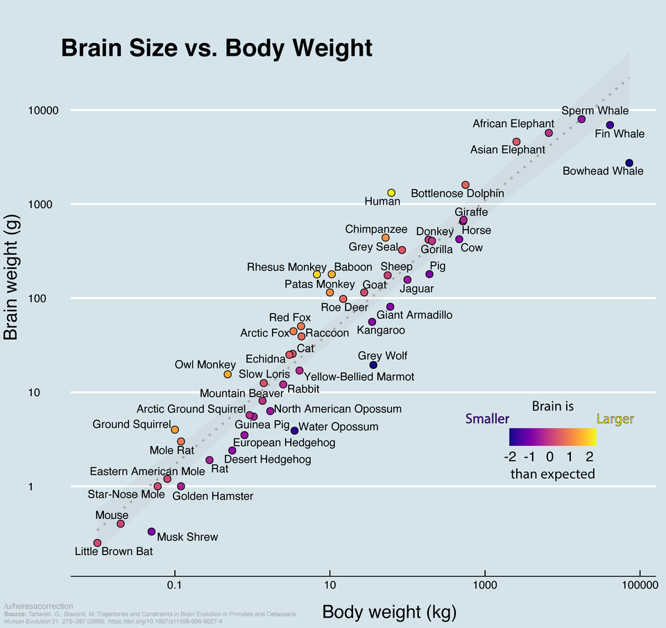

# 探索性数据分析-哺乳动物脑量与体重的关系 {#eda-mammal-species}

```{r, include=FALSE}
knitr::opts_chunk$set(
   echo         = TRUE, 
   warning      = FALSE, 
   message      = FALSE,
   fig.showtext = TRUE
)
```

我在[网上](https://www.reddit.com/r/dataisbeautiful/comments/poq0ks/oc_brain_size_vs_body_weight_of_various_animals/)看到这张图

```{r, echo=FALSE, out.width = '100%'}

```

找到数据来源是一篇[文章](https://link.springer.com/article/10.1007%2Fs11598-006-9027-4)，我下载了数据，希望能重复这张图。

## 读取数据
```{r, message=FALSE, warning=FALSE}
library(tidyverse)

data <- readr::read_rds("./demo_data/brain_size.rds") %>% 
   janitor::clean_names()
data
```

## 数据变换
```{r}
tb <- data %>%
  filter(body_weight_kg > 0, brain_weight_g > 0) %>%
  mutate(
    across(where(is.numeric), log10)
  )
tb
```

## 线性模型
```{r}
m <- lm(brain_weight_g ~ body_weight_kg, data = tb)

df <- tb %>% modelr::add_residuals(m)
```


## 可视化

```{r, out.width = '100%'}
library(colorspace)

df %>% 
  ggplot(aes(x = body_weight_kg, y = brain_weight_g)) +
  geom_smooth(method = "lm", se = TRUE, color = "gray60", fill = "gray70", linetype = "dashed") +
  geom_point(aes(fill = resid), color = "black", size = 4, shape = 21) +
  ggrepel::geom_text_repel(aes(label = species)) +
  #scale_x_log10() +
  #scale_y_log10() +
  ggthemes::theme_economist() +
  theme(
    legend.position = "none"
  ) +
  scale_fill_continuous_diverging(palette = "Green-Orange")
```


```{r, echo = F, message = F, warning = F, results = "hide"}
pacman::p_unload(pacman::p_loaded(), character.only = TRUE)
```
