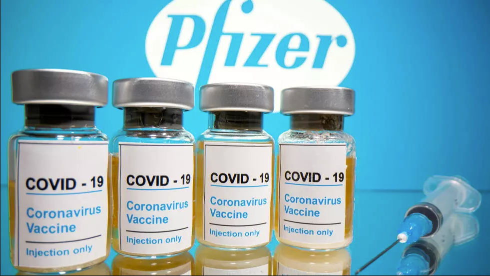

# 探索性数据分析-新冠疫苗有效率的计算 {#eda-vaccine}


## 引言


```{r eda-vaccine-effectiveness-1, out.width = '70%', fig.align='center', echo = FALSE}

```


[纽约时报](https://www.nytimes.com/2020/11/18/health/pfizer-covid-vaccine.html?auth=login-google)报道说，

> 美国制药公司辉瑞（Pfizer）和德国生物科技公司（BioNTech）11月9日率先宣布
，根据在数国临床试验初步结果，其研发的新冠疫苗有效率达到90%以上，星期三，完整结果显示，参加疫苗实验的44000个志愿者中，共有170人确诊感染，其中安慰剂组162人，接种疫苗组仅8人，这证明了辉瑞开发的新冠疫苗有效率高达95%。


```{r eda-vaccine-effectiveness-2, echo=FALSE}
d <- tibble::tribble(
  ~group, ~volunteers, ~got_covid,
  "placebo", 22000L, 162L,
  "vaccinated", 22000L, 8L
)

knitr::kable(d)
```


**新冠疫苗是有效的，且有效率高达95%。** 那么，这个95%是怎么计算出来的呢？它的概率是多少以及不确定性是多少呢？
回到这个问题，我们首先需要了解，辉瑞公司是如何定义疫苗有效率的

$$
\text{VE} = 1 - \frac{p_{t}}{p_{c}}
$$


其中$p_t$是**疫苗组**(vaccinated)的感染率，$p_c$是**安慰剂组**(placebo)的感染率。


## 模型

```{r eda-vaccine-effectiveness-3, message=FALSE, warning=FALSE}
library(tidyverse)
library(tidybayes)
library(rstan)
rstan_options(auto_write = TRUE)
options(mc.cores = parallel::detectCores())
```

然后，我们建立如下数学模型：

$$
\begin{align}
y_{c} \sim \textsf{binomial}(n_{c},p_{c}) \\
y_{t} \sim \textsf{binomial}(n_{t},p_{t}) \\
p_{c} \sim \textsf{beta}(1, 1) \\
p_{t} \sim \textsf{beta}(1, 1) 
\end{align}
$$


通过模型可以直接计算干预效果$\textsf{effect}$和疫苗有效性$VE$ 

$$
\begin{align}
\text{effect} = p_{t} - p_{c} \\
\text{VE} = 1 - \frac{p_{t}}{p_{c}}
\end{align}
$$


## 计算

具体Stan代码如下

```{r eda-vaccine-effectiveness-4, cache=TRUE, results=FALSE, eval=FALSE}
stan_program <- "
data {
  int<lower=1> event_c;        // num events, control
  int<lower=1> event_t;        // num events, treatment
  int<lower=1> n_c;            // num of person trial, control
  int<lower=1> n_t;            // num of person trial, treatment
}
parameters {
  real<lower=0,upper=1> p_c;    
  real<lower=0,upper=1> p_t;    
}
model {
  event_c ~ binomial(n_c, p_c);
  event_t ~ binomial(n_t, p_t);
  p_c ~ beta(1, 1);
  p_t ~ beta(1, 1);
}
generated quantities {
  real effect   = p_t - p_c;
  real VE       = 1- p_t /p_c;
  real log_odds = log(p_t / (1- p_t)) - log(p_c / (1- p_c));
}
"


stan_data <- list(
  event_c = 162,
  event_t = 8,
  n_c     = 4.4e4 / 2,
  n_t     = 4.4e4 / 2
)

mod_vaccine <- stan(model_code = stan_program, data = stan_data)
```


```{r include=FALSE}
# 运行stan代码，导致渲染bookdown报错，不知道为什么，先用这边笨办法凑合吧
# mod_vaccine %>% saveRDS(here::here("stan","mod_vaccine.rds"))
mod_vaccine <- readRDS(here::here("stan","mod_vaccine.rds"))

```


## 结果

最后，我们后验概率抽样
```{r eda-vaccine-effectiveness-5, eval=FALSE, include=FALSE}
mod_vaccine
```


```{r eda-vaccine-effectiveness-6}
draws <- mod_vaccine %>%
  tidybayes::spread_draws(effect, VE, log_odds)

draws %>% 
  head()
```


### 干预效果


从结果中看到effect中很多负数。事实上，effect中越多的负值，即被感染的可能性越低，说明疫苗干预效果越好

```{r eda-vaccine-effectiveness-7}
mean(draws$effect < 0) %>% round(2)
```

结果告诉我们，疫苗有明显的干预效果。比如，我们假定10000个人接受了疫苗，那么被感染的人数以及相应的可能性，如下图


```{r eda-vaccine-effectiveness-8}
draws %>%
  ggplot(aes(x = effect * 1e4)) +
  geom_density(fill = "blue", alpha = .2) +
  expand_limits(y = 0) +
  theme_minimal() +
  xlab("效应大小") +
  ggtitle("每10000个接种疫苗的人中被感染新冠的数量")
```


```{r eda-vaccine-effectiveness-9, eval=FALSE, include=FALSE}
draws %>%
  ggplot(aes(x = log_odds)) +
  geom_density(fill = "blue", alpha = .2) +
  expand_limits(y = 0) +
  theme_minimal() +
  xlab("Log odds") +
  ggtitle("Log odds of the treatment effect. More negative, less likely to get infected on treatment")
```


### 疫苗有效率


```{r eda-vaccine-effectiveness-10, eval=FALSE, message=FALSE, warning=FALSE, include=FALSE}
draws %>%
  ggdist::mean_qi(.width = c(0.95))

draws %>%
  ggdist::median_qi(.width = c(0.95))

median(draws$VE)
```


我们再看看疫苗有效率 VE 的结果

```{r eda-vaccine-effectiveness-11}
draws %>%
  select(VE) %>%
  ggdist::median_qi(.width = c(0.90))
```


通过数据看出，疫苗的有效性为0.95，在90%的可信赖水平, 中位数区间[0.91, 0.97].


```{r eda-vaccine-effectiveness-12, eval=FALSE, include=FALSE}
draws %>%
  ggplot(aes(x = VE)) +
  geom_density()

draws %>%
  ggplot(aes(x = VE)) +
  geom_density(fill = "blue", alpha = .2) +
  expand_limits(y = 0) +
  theme_minimal() +
  geom_vline(xintercept = median(draws$VE), size = 0.2)
```


当然，通过图可能理解的更清晰。

```{r eda-vaccine-effectiveness-14}
label_txt <- paste("median =", round(median(draws$VE), 2))

draws %>%
  ggplot(aes(x = VE)) +
  geom_density(fill = "blue", alpha = .2) +
  expand_limits(y = 0) +
  theme_minimal() +
  geom_vline(xintercept = median(draws$VE), size = 0.2) +
  annotate("text", x = 0.958, y = 10, label = label_txt, size = 3) +
  xlab("疫苗有效率") +
  ggtitle("辉瑞公司定义疫苗有效率为 VE = 1 - Pt/Pc")
```


```{r eda-vaccine-effectiveness-15, echo = F}
# remove the objects
# ls() %>% stringr::str_flatten(collapse = ", ")
#rm(d, draws, label_txt, mod_vaccine, stan_data, stan_program)
rm(d, draws, label_txt, mod_vaccine)
```


```{r eda-vaccine-effectiveness-16, echo = F, message = F, warning = F, results = "hide"}
pacman::p_unload(pacman::p_loaded(), character.only = TRUE)
```


