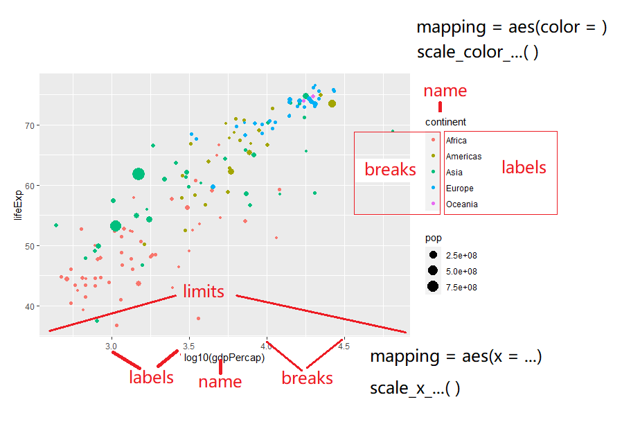

# ggplot2之标度 {#ggplot2-scales}

这一章我们一起学习ggplot2中的scales语法，推荐大家阅读Hadley Wickham最新版的[《ggplot2: Elegant Graphics for Data Analysis》](https://ggplot2-book.org/)，但如果需要详细了解**标度**参数体系，还是要看[ggplot2官方文档](https://cran.r-project.org/web/packages/ggplot2/index.html)


## 标度
在 \@ref(ggplot2-geom)章，我们了解到ggplot2中，映射是数据转化到图形属性，这里的图形属性是指视觉可以感知的东西，比如大小，形状，颜色和位置等。我们今天讨论的标度（scale）是控制着数据到图形属性映射的函数，每一种标度都是从数据空间的某个区域（标度的定义域）到图形属性空间的某个区域（标度的值域）的一个函数。

简单点来说，**标度是用于调整数据映射的图形属性**。
在ggplot2中，每一种图形属性都拥有一个默认的标度，也许你对这个默认的标度不满意，可以就需要学习如何修改默认的标度。比如，
系统默认`"a"`对应红色，`"b"`对应蓝色，我们想让`"a"`对应紫色，`"b"`对应橙色。


## 图形属性和变量类型

还是用我们熟悉的`ggplot2::mpg`，可能有同学说，我画图没接触到`scale`啊，比如
```{r ggplot2-scales-1}
library(tidyverse)
mpg %>% 
  ggplot(aes(x = displ, y = hwy)) + 
  geom_point(aes(colour = class)) 
```

能画个很漂亮的图，那是因为ggplot2默认缺省条件下，已经很美观了。（据说Hadley Wickham很后悔使用了这么漂亮的缺省值，因为很漂亮了大家都不认真学画图了。马云好像也说后悔创立了阿里巴巴？）

事实上，根据映射关系和变量名，我们将标度写完整，应该是这样的
```{r ggplot2-scales-2}
ggplot(mpg, aes(x = displ, y = hwy)) + 
  geom_point(aes(colour = class)) +
  
  scale_x_continuous() + 
  scale_y_continuous() + 
  scale_colour_discrete()
```

如果每次都要手动设置一次标度函数，那将是比较繁琐的事情。因此ggplot2使用了默认了设置，如果不满意ggplot2的默认值，可以手动调整或者改写标度，比如

```{r ggplot2-scales-3}
ggplot(mpg, aes(x = displ, y = hwy)) + 
  geom_point(aes(colour = class)) +
  
  scale_x_continuous(name = "这是我的x坐标") + 
  scale_y_continuous(name = "这是我的y坐标") + 
  scale_colour_brewer()
```

## 坐标轴和图例是同样的东西


```{r ggplot2-scales-4, out.width = '85%', echo = FALSE}

```


## 丰富的标度体系

注意到，标度函数是由"_"分割的三个部分构成的
- scale
- 视觉属性名 (e.g., colour, shape or x)
- 标度名 (e.g., continuous, discrete, brewer).


```{r ggplot2-scales-5, out.width = '100%', echo = FALSE}
knitr::include_graphics("images/ggplot2_scales_cheat.jpg")
```

每个标度函数内部都有丰富的参数系统
```{r ggplot2-scales-6, eval=FALSE}
scale_colour_manual(
  palette = function(), 
  limits = NULL,
  name = waiver(),
  labels = waiver(),
  breaks = waiver(),
  minor_breaks = waiver(),
  values = waiver(),
  ...
)
```

- 参数`name`，坐标和图例的名字，如果不想要图例的名字，就可以 `name = NULL`

- 参数`limits`, 坐标或图例的范围区间。连续性`c(n, m)`，离散型`c("a", "b", "c")`

- 参数`breaks`, 控制显示在坐标轴或者图例上的值（元素）

- 参数`labels`, 坐标和图例的间隔标签
  - 一般情况下，内置函数会自动完成
  - 也可人工指定一个字符型向量，与`breaks`提供的字符型向量一一对应
  - 也可以是函数，把`breaks`提供的字符型向量当做函数的输入
  - `NULL`，就是去掉标签

- 参数`values` 指的是（颜色、形状等）视觉属性值, 
  - 要么，与数值的顺序一致；
  - 要么，与`breaks`提供的字符型向量长度一致
  - 要么，用命名向量`c("数据标签" = "视觉属性")`提供

- 参数`expand`, 控制参数溢出量

- 参数`range`, 设置尺寸大小范围，比如针对点的相对大小


<!-- 把scale理解make, scale_x_continuous() == 使得x坐标连续型的 -->

下面，我们通过具体的案例讲解如何使用参数，把图形变成我们想要的模样。


## 案例详解

先导入一个数据
```{r ggplot2-scales-7}
gapdata <- read_csv("./demo_data/gapminder.csv")
```


```{r ggplot2-scales-8}
newgapdata <- gapdata %>% 
  group_by(continent, country) %>% 
  summarise(
    across(c(lifeExp, gdpPercap, pop), mean)
  )
newgapdata
```

```{r ggplot2-scales-9}
newgapdata %>% 
  ggplot(aes(x = gdpPercap, y = lifeExp)) +
    geom_point(aes(color = continent, size = pop)) +
    scale_x_continuous()
```


```{r ggplot2-scales-10}
newgapdata %>% 
  ggplot(aes(x = gdpPercap, y = lifeExp)) +
    geom_point(aes(color = continent, size = pop)) +
    scale_x_log10()
```


```{r ggplot2-scales-11}
newgapdata %>% 
  ggplot(aes(x = gdpPercap, y = lifeExp)) +
    geom_point(aes(color = continent, size = pop)) +
    scale_x_log10(breaks = c(500, 1000, 3000, 10000, 30000),
                  labels = scales::dollar)
```


```{r ggplot2-scales-12}
newgapdata %>% 
  ggplot(aes(x = gdpPercap, y = lifeExp)) +
    geom_point(aes(color = continent, size = pop)) +
    scale_x_log10(
      name = "人均GDP",
      breaks = c(500, 1000, 3000, 10000, 30000),
      labels = scales::unit_format(unit = "美元"))
```


```{r ggplot2-scales-13}
newgapdata %>% 
  ggplot(aes(x = gdpPercap, y = lifeExp)) +
    geom_point(aes(color = continent, size = pop)) +
    scale_x_log10() +
    scale_color_viridis_d()
```


离散变量映射到色彩的情形，可以使用[ColorBrewer](https://colorbrewer2.org)色彩。

```{r ggplot2-scales-14}
newgapdata %>% 
  ggplot(aes(x = gdpPercap, y = lifeExp)) +
    geom_point(aes(color = continent, size = pop)) +
    scale_x_log10() +
    scale_color_brewer(type = "qual", palette = "Set1")
```


```{r ggplot2-scales-15}
newgapdata %>% 
  ggplot(aes(x = gdpPercap, y = lifeExp)) +
    geom_point(aes(color = continent, size = pop)) +
    scale_x_log10() +
    scale_color_manual(
      name = "五大洲",
      values = c("Africa" = "red", "Americas" = "blue", "Asia" = "orange",
                 "Europe" = "black", "Oceania" = "gray"),
      breaks = c("Africa", "Americas", "Asia", "Europe", "Oceania"),
      labels = c("非洲", "美洲", "亚洲", "欧洲", "大洋洲")
    ) +
   scale_size(
     name = "人口数量",
     breaks = c(2e8, 5e8, 7e8),
     labels = c("2亿", "5亿", "7亿")
   )
```


## 用标度还是主题？

那什么时候用标度，什么时候用主题？这里有个原则：主题风格不会增加标签，也不会改变变量的范围，主题只会改变字体、大小、颜色等等。


## 小测试

用 ggplot2 重复这张lego图

```{r ggplot2-scales-16, echo=FALSE, out.width='65%', fig.align = "left"}
knitr::include_graphics("images/lego_example.jpg")
```

```{r ggplot2-scales-17, eval=FALSE, include=FALSE}
# 用 ggplot2 重复
df <- tibble(
  color = c("green", "white", "pink", "yellow", "blue", "light green", "orange"),
  count = c(6, 5, 4, 3, 2, 2, 1)
)


df %>%
  mutate(
    across(color, as_factor) 
    ) %>% 
  ggplot(aes(x = color, y = count, fill =color)) +
  geom_col() +
  scale_fill_manual(
    values = c("#70961c", "white", "#ee5e4f", "#d5c47c", "#008db3", "#a5d395", "#d35800")
  ) +
  theme(
    legend.position = "none",
    panel.background = element_rect(
      fill = "#d7d3c9",
      colour = "#d7d3c9",
      size = 0.5,
      linetype = "solid"
    )
  ) +
  labs(x = NULL, y = NULL)
```


## 参考资料

- <https://ggplot2tor.com/scales/>


```{r ggplot2-scales-18, echo = F}
# remove the objects
# rm(list=ls())
rm(gapdata, newgapdata)
```

```{r ggplot2-scales-19, echo = F, message = F, warning = F, results = "hide"}
pacman::p_unload(pacman::p_loaded(), character.only = TRUE)
```
