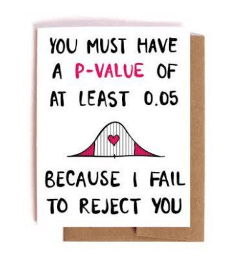
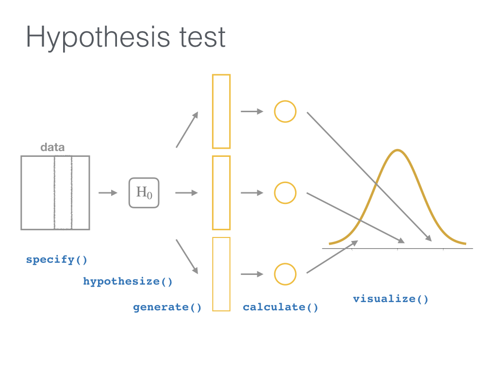
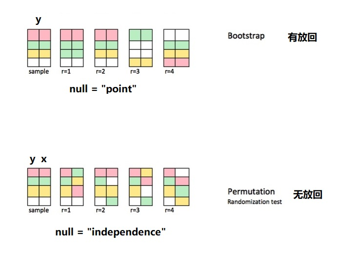

# 统计推断 {#infer}

Statistical Inference: A Tidy Approach

## 案例1:你会给爱情片还是动作片高分？

```{r infer-1, out.width = '65%', fig.align='left', echo = FALSE}
knitr::include_graphics("images/imdb.png")
```

这是一个关于电影评分的数据集[^1]，

[^1]: <https://github.com/hadley/ggplot2movies/blob/master/R/movies.R>

```{r infer-2}
library(tidyverse)
d <- ggplot2movies::movies
d
```

数据集包含58788 行 和 24 变量

| variable    | description      |
|:------------|:-----------------|
| title       | 电影名           |
| year        | 发行年份         |
| budget      | 预算金额         |
| length      | 电影时长         |
| rating      | 平均得分         |
| votes       | 投票人数         |
| r1-10       | 各分段投票人占比 |
| mpaa        | MPAA 分级        |
| action      | 动作片           |
| animation   | 动画片           |
| comedy      | 喜剧片           |
| drama       | 戏剧             |
| documentary | 纪录片           |
| romance     | 爱情片           |
| short       | 短片             |

```{r infer-3, eval=FALSE, include=FALSE}
d %>%
  rowwise() %>%
  mutate(
    t = sum(c_across(starts_with("r")))
  )
```

我们想看下爱情片与动作片（不是爱情动作片）的平均得分是否显著不同。

-   首先我们简单的整理下数据，主要是剔除既是爱情片又是动作片的电影

```{r infer-4}
movies_genre_sample <- d %>%
  select(title, year, rating, Action, Romance) %>%
  filter(!(Action == 1 & Romance == 1)) %>% # 既是爱情片又是动作片的，删去
  mutate(genre = case_when(
    Action == 1 ~ "Action",
    Romance == 1 ~ "Romance",
    TRUE ~ "Neither"
  )) %>%
  filter(genre != "Neither") %>%
  select(-Action, -Romance) %>%
  group_by(genre) %>%
  slice_sample(n = 34) %>% # 每种题材的电影只选取了34个
  ungroup()

movies_genre_sample
```

-   先看下图形

```{r infer-5, message=FALSE, warning=FALSE}
movies_genre_sample %>%
  ggplot(aes(x = genre, y = rating)) +
  geom_boxplot() +
  geom_jitter()
```

-   看下两种题材电影评分的分布

```{r infer-6}
movies_genre_sample %>%
  ggplot(mapping = aes(x = rating)) +
  geom_histogram(binwidth = 1, color = "white") +
  facet_grid(vars(genre))
```

-   统计两种题材电影评分的均值

```{r infer-7}
summary_ratings <- movies_genre_sample %>%
  group_by(genre) %>%
  summarize(
    mean = mean(rating),
    std_dev = sd(rating),
    n = n()
  )
summary_ratings
```

### 传统的基于频率方法的t检验

假设：

-   零假设:

    -   $H_0: \mu_{1} - \mu_{2} = 0$

-   备选假设:

    -   $H_A: \mu_{1} - \mu_{2} \neq 0$

两种可能的结论:

-   拒绝 $H_0$
-   不能拒绝 $H_0$

```{r infer-8}
t_test_eq <- t.test(rating ~ genre,
  data = movies_genre_sample,
  var.equal = TRUE
) %>%
  broom::tidy()
t_test_eq
```

```{r infer-9}
t_test_uneq <- t.test(rating ~ genre,
  data = movies_genre_sample,
  var.equal = FALSE
) %>%
  broom::tidy()
t_test_uneq
```

### infer:基于模拟的检验

所有的假设检验都符合这个框架[^2]:

[^2]: <http://allendowney.blogspot.com/2016/06/there-is-still-only-one-test.html>

```{r infer-10, out.width = '85%', fig.align='left', echo = FALSE, fig.cap = "Hypothesis Testing Framework"}
knitr::include_graphics("images/downey.png")
```

-   实际观察的差别

```{r infer-11}
library(infer)

obs_diff <- movies_genre_sample %>%
  specify(formula = rating ~ genre) %>%
  calculate(
    stat = "diff in means",
    order = c("Romance", "Action")
  )
obs_diff
```

-   模拟

```{r infer-12}
null_dist <- movies_genre_sample %>%
  specify(formula = rating ~ genre) %>%
  hypothesize(null = "independence") %>%
  generate(reps = 5000, type = "permute") %>% 
  calculate(
    stat = "diff in means",
    order = c("Romance", "Action")
  )
head(null_dist)
```

-   可视化

```{r infer-13}
null_dist %>%
  visualize()
```

```{r infer-14}
null_dist %>%
  visualize() +
  shade_p_value(obs_stat = obs_diff, direction = "both")
# shade_p_value(bins = 100, obs_stat = obs_diff, direction = "both")
```

-   计算p值

```{r infer-15}
pvalue <- null_dist %>%
  get_pvalue(obs_stat = obs_diff, direction = "two_sided")

pvalue
```

-   结论

```{r, echo=FALSE}
less_than_significance_text <- glue::glue(
  "`p_value < 0.05`, 那我们有足够的证据证明，H0不成立，即爱情电影和动作电影的评分均值存在**显著差异**，具体来说，动作电影的平均评分要比爱情电影低些。"
  )

greater_then_significance_text <- glue::glue(
    "`p_value > 0.05`，不能拒绝 H0，即我们没有足够的证据证明爱情电影和动作电影的评分均值存在**显著差异**。"
  )
```

在构建的虚拟($\Delta = 0$)的平行世界里，出现实际观察值（`r obs_diff$stat`）的概率为（`r pvalue$p_value`）。 如果以(p \< 0.05)为标准，我们看到`r ifelse(pvalue$p_value < 0.05,  less_than_significance_text, greater_then_significance_text)`


## 案例2: 航天事业的预算有党派门户之见？

美国国家航空航天局的预算是否存在党派门户之见？

```{r infer-16}
gss <- read_rds("./demo_data/gss.rds")

gss %>%
  select(NASA, party) %>%
  count(NASA, party) %>%
  head(8)
```

```{r infer-17}
gss %>%
  ggplot(aes(x = party, fill = NASA)) +
  geom_bar()
```

假设：

-   零假设 $H_0$:

    -  不同党派对预算的态度的构成比(TOO LITTLE, ABOUT RIGHT, TOO MUCH) 没有区别

-   备选假设 $H_a$:

    -  不同党派对预算的态度的构成比(TOO LITTLE, ABOUT RIGHT, TOO MUCH) 存在区别

两种可能的结论:

-   拒绝 $H_0$
-   不能拒绝 $H_0$

### 传统的方法

```{r infer-18}
chisq.test(gss$party, gss$NASA)
```

或者

```{r infer-19}
gss %>%
  chisq_test(NASA ~ party) %>%
  dplyr::select(p_value) %>%
  dplyr::pull()
```

### infer:Simulation-based tests

```{r infer-20}
obs_stat <- gss %>%
  specify(NASA ~ party) %>%
  calculate(stat = "Chisq")
obs_stat
```

```{r infer-21}
null_dist <- gss %>%
  specify(NASA ~ party) %>%                     # (1)
  hypothesize(null = "independence") %>%        # (2)
    generate(reps = 5000, type = "permute") %>% # (3)
  calculate(stat = "Chisq")                     # (4)
null_dist
```

```{r infer-22}
null_dist %>%
  visualize() +
  shade_p_value(obs_stat = obs_stat, method = "both", direction = "right")
```

```{r infer-23}
null_dist %>%
  get_pvalue(obs_stat = obs_stat, direction = "greater")
```

看到 `p_value > 0.05`，不能拒绝 $H_0$，我们没有足够的证据证明党派之间有显著差异

```{r infer-24, out.width = '50%', fig.align='center', echo = FALSE}

```

## 案例3:原住民中的女学生多？

案例 `quine` 数据集有 146 行 5 列，包含学生的生源、文化、性别和学习成效，具体说明如下

-   Eth: 民族背景：原住民与否 (是"A"; 否 "N")
-   Sex: 性别
-   Age: 年龄组 ("F0", "F1," "F2" or "F3")
-   Lrn: 学习者状态(平均水平 "AL"， 学习缓慢 "SL")
-   Days：一年中缺勤天数


```{r infer-25}
td <- MASS::quine %>%
  as_tibble() %>%
  mutate(
    across(c(Sex, Eth), as_factor)
  )
td
```


从民族背景有两组（A， N）来看，性别为 F 的占比 是否有区别？

```{r infer-26}
td %>% count(Eth, Sex)
```

### 传统方法

```{r infer-27}
prop.test(table(td$Eth, td$Sex), correct = FALSE)
```

### 基于模拟的方法

```{r infer-28}

obs_diff <- td %>%
  specify(Sex ~ Eth, success = "F") %>% # #被解释变量 sex中F的占比
  calculate(
    stat = "diff in props",
    order = c("A", "N") # 解释变量中两组A，N
  )

obs_diff
```

```{r infer-29}
null_distribution <- td %>%
  specify(Sex ~ Eth, success = "F") %>%
  hypothesize(null = "independence") %>%
  generate(reps = 5000, type = "permute") %>%
  calculate(stat = "diff in props", order = c("A", "N"))
```

```{r infer-30}
null_distribution %>%
  visualize()
```

```{r infer-31}
pvalue <- null_distribution %>%
  get_pvalue(obs_stat = obs_diff, direction = "both")

pvalue
```

```{r infer-32}
null_distribution %>%
  get_ci(level = 0.95, type = "percentile")
```


## 宏包`infer`

我比较喜欢[infer](https://github.com/tidymodels/infer)宏包的[设计思想](http://allendowney.blogspot.com/2016/06/there-is-still-only-one-test.html)，它把统计推断分成了四个步骤

```{r infer-33, out.width = '70%', fig.align='center', echo = FALSE}
knitr::include_graphics("images/infer-ht-diagram.png")
```


下图可以更好的帮助我们理解infer的工作流程
```{r infer-34, out.width = '70%', fig.align='center', echo = FALSE}

```

-   `specify()` 指定解释变量和被解释变量 (`y ~ x`)

-   `hypothesize()` 指定**零假设** (比如, `independence`= `y` 和 `x` 彼此独立)

-   `generate()` 从基于零假设的平行世界中抽样:

    -   指定每次重抽样的类型，通俗点讲就是数据洗牌，重抽样`type = "bootstrap"` (有放回的)，对应的零假设往往是null = "point" ； 重抽样`type = "permuting"` (无放回的)，对应的零假设往往是null = "independence", 指的是y和x之间彼此独立的，因此抽样后会重新排列，也就说原先 value1-group1 可能变成了value1-group2，(因为我们假定他们是独立的啊，这种操作，也不会影响y和x的关系)
    -   指定多少组 (`reps = 1000`)

-   `calculate()` 计算每组(`reps`)的统计值 (`stat = "diff in props"`)
-   `visualize()` 可视化，对比零假设的分布与实际观察值.


下面是我自己对重抽样的理解
```{r infer-35, out.width = '70%', fig.align='center', echo = FALSE}

```

## 更多

更多统计推断的内容可参考

-   <http://infer.netlify.com>
-   <https://moderndive.netlify.com/index.html>
-   <https://moderndive.com/index.html>
-   <https://github.com/tidymodels/infer>


```{r infer-36, echo = F}
# remove the objects
# rm(list=ls())
rm(d, gss, movies_genre_sample, null_dist, null_distribution, obs_diff, obs_stat, pvalue, summary_ratings, t_test_eq, t_test_uneq, td)
```


```{r infer-37, echo = F, message = F, warning = F, results = "hide"}
pacman::p_unload(pacman::p_loaded(), character.only = TRUE)
```
