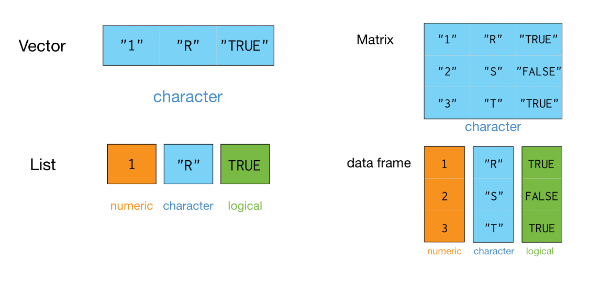

# R语言基础 {#intro-R}


R 软件是一个自由、开源软件平台，具有统计分析、可视化和编程的强大功能。
你可以从这里免费[下载](https://cloud.r-project.org)。 为了更好的使用 R 软件，我推荐大家使用 [RStudio](https://www.rstudio.com/products/rstudio)这个 IDE。这里有个[在线教程](https://www.rstudio.com/online-learning/)帮助我们熟悉 R 和 RStudio。


## 安装 R

我们从官方网站[http://cran.r-project.org](https://cloud.r-project.org)下载, 网站界面感觉有点朴素:


 


## 安装 RStudio
安装完R， 还需要安装RStudio。有同学可能要问 R 与 RStudio 是什么关系呢？打个比方吧，R 就像汽车的发动机, RStudio 就是汽车的仪表盘。但我更觉得 R 是有趣的灵魂，而 Rstudio 是好看的皮囊。

```{r out.width = '50%', echo = FALSE}
knitr::include_graphics(c("images/engine.jpg", "images/dashboard.jpg"))
```


同样，我们从官方网站下载并安装，如果你是苹果系统的用户，选择苹果系统对应的rstudio版本即可。

- <https://www.rstudio.com/download>
- 选择`RStudio Desktop`

```{r out.width = '85%', echo = FALSE}
knitr::include_graphics("images/rstudio_install.png")
```


```{block, type="danger"}
这里有个小小的提示：

- 电脑不要用中文用户名，否则Rstudio会杠上中文用户名
- 尽量安装在非系统盘，比如，可以选择安装在D盘
- 安装路径不要有中文和空格。比如，这样就比较好
   - `D:/R`
   - `D:/Rstudio`
```


## 开始

安装完毕后，从windos`开始菜单`，点开`rstudio`图标，就打开了rstudio的窗口，界面效果如下

```{r out.width = '75%', echo = FALSE}
knitr::include_graphics("images/rstudio-editor.png")
```


RStudio 的用户界面十分友好，想要运行一段R代码，只需要在 RStudio 控制台面板最下面 (Console)一行内键入R 代码，然后回车即可。比如我们键入`1 + 1` 并按回车后，RStudio 将显示如下结果
```{r }
1 + 1
```


```{r echo=TRUE, message=TRUE, warning=TRUE}
log(8)
```


```{r echo=TRUE, message=TRUE, warning=TRUE}
1:15
```


## 一切都是对象


在R中存储的数据称为**对象**， R语言数据处理实际上就是不断的创建和操控这些对象。创建一个R对象，首先确定一个名称，然后使用
赋值操作符 `<-`，将数据赋值给它。比如，如果想给变量 x 赋值为5，在命令行中可以这样写 `x <- 5` ，然后回车.

```{r assignment operator}
x <- 5
```


当键入`x` 然后回车，就打印出 x 的值。当然也可以使用命令`print(x)`，结果一样。
```{r print x}
x
```


```{r echo=TRUE, message=TRUE, warning=TRUE}
x + 2
```


```{r echo=TRUE, message=TRUE, warning=TRUE}
die <- 1:6
```


```{r echo=TRUE, message=TRUE, warning=TRUE}
die
```


```{r echo=TRUE, message=TRUE, warning=TRUE}
die / 2
```


```{r echo=TRUE, message=TRUE, warning=TRUE}
die * die
```


```{r echo=TRUE, message=TRUE, warning=TRUE}
die %*% die
```


```{r echo=TRUE, message=TRUE, warning=TRUE}
die %o% die
```


## 数据类型


```{r out.width = '65%', echo = FALSE}
knitr::include_graphics("images/data_type.png")
```

- 数值型
```{r}
3
5000
3e+06
class(0.0001)
```

- 字符串型
```{r}
"hello"
"girl"
"1"     # 注意 1 和 "1" 的区别
```

```{r}
class("1")
```

- 逻辑型
```{r}
TRUE
FALSE
3 < 4
```


```{r}
class(T)
```


```{r}
3 < 4
```

- 因子型
```{r}
fac <- factor(c("a", "b", "c"))
fac
```


```{r}
class(fac)
```


## 数据结构

- 大家前面看到`x <- 1` 和 `x <- c(1, 2, 3)`，这就是最简单的数据对象，叫**原子型向量**。
- 用`c`函数将一组数据**构造**成向量，要求每个元素用逗
号分隔，且每个元素的数据类型是一致的

```{r echo=TRUE, message=TRUE, warning=TRUE}
die <- c(2, 4, 3, 1, 5, 7)
die
```

长度为 1 的原子型向量
```{r echo=TRUE, message=TRUE, warning=TRUE}
x <- c(1) # or
x <- 1 
```

强制转换
```{r}
vec <- c("R", 1, TRUE)
class(vec)
```


- 大家看到前面`die %o% die` 是**矩阵**类型，矩阵就是二维数组
- 可以用`matrix` 函数创建
```{r echo=TRUE, message=TRUE, warning=TRUE}
m <- matrix(c(2, 4, 3, 1, 5, 7),
  nrow = 2, ncol = 3, byrow = TRUE
)
```


```{r echo=TRUE, message=TRUE, warning=TRUE}
m
```


- 数据对象：**数组**
- `array` 函数生成`n`维数组
```{r echo=TRUE, message=TRUE, warning=TRUE}
ar <- array(c(11:14, 21:24, 31:34), dim = c(2, 2, 3))
ar
```


- 数据对象：**列表**
- 与`c`函数创建向量的方式相似，不同的元素用逗号分开。不同的是，列表允许不同的数据类型（数值型，字符型，逻辑型等）， 而向量要求每个元素的数据类型必须相同。

```{r echo=TRUE, message=TRUE, warning=TRUE}
list1 <- list(100:110, "R", c(2, 4, 3, 1, 5, 7))
list1
```


- 数据对象：**数据框**
- `data.frame`函数构建

```{r echo=TRUE, message=TRUE, warning=TRUE}
df <- data.frame(
  name = c("ace", "bob", "carl", "kaite"),
  age = c(21, 14, 13, 15),
  sex = c("girl", "boy", "boy", "girl")
)
df
```


R 对象的数据结构(向量、矩阵、数组、列表和数据框)，总结如下

```{r out.width = '90%', echo = FALSE}

```

为了更好地理解相关概念，建议大家阅读Garrett Grolemund的
[hopr](https://rstudio-education.github.io/hopr/)这本书 [@Garrett2014]。


## 函数

R 语言的强大在于使用**函数**操控各种对象，你可以把对象看作是名词，而函数看作是动词。
我们用一个简单的例子，`sum()`来演示函数如何工作的。这个函数的功能正如它的名字一样，对输入的各个对象求和，然后返回求和后的值，你可以在命令行中键入`?sum()`查看其官方文档。
`sum()`后的结果可以直接显示出来，也可以赋名。比如下面代码，首先计算`x + 10`并赋以名字`y`， 然后第二行中打印出来这个新创建的对象`y`

```{r sum}
y <- sum(x, 10)
y
```

因为代码的灵活性，可以不断地重新定义对象。只要数据发生改变，原来的代码就会返回新的值。比如，对`x`重新赋值为 15， 同样运行`sum()`函数，这次我们不赋值给对象`y`，而是让它直接显示

```{r reassign object}
x <- 15
sum(x, 10)
```

再比如
```{r echo=TRUE, message=TRUE, warning=TRUE}
round(3.14159)
```


```{r echo=TRUE, message=TRUE, warning=TRUE}
mean(1:6)
```


```{r echo=TRUE, message=TRUE, warning=TRUE}
n <- 100
x <- seq(1, n)
sum(x)
```


```{r echo=TRUE, message=TRUE, warning=TRUE}
dt <- mtcars[, 1:4]
head(dt)
```


```{r echo=TRUE, message=TRUE, warning=TRUE}
cor(dt)
```


## 脚本

如果我们已经写好了一段R程序，我们可以保存为**脚本**文件，脚本文件通常以.R作为文件的后缀名。比如我们可以将刚才创建`x`和 `y`对象的命令，保存为脚本文件`my_script.R`。
这样我们可以在其它时间修改和重新运行它。

在RStudio中，你可以通过菜单栏依此点击`File > New File > R Script` 来创建一个新的脚本。
强烈建议大家在运行代码之前，使用脚本的形式编写和编辑自己的程序，养成这样的习惯后，你今后所有的工作都有案可查，并且具有可重复性。

```{r out.width = '75%', echo = FALSE}
knitr::include_graphics("images/script1.png")
```


- 点击 `Run` 或者 `Source` 运行脚本

```{r out.width = '75%', echo = FALSE}
knitr::include_graphics("images/script2.png")
```


## 宏包

R 语言的强大还在于各种宏包，一般在[The Comprehensive R Archive Network (CRAN)](https://cran.r-project.org)下载安装。宏包扩展了R语言本身的各种功能，也为解决问题提供了各种方案。截至撰写本书时止，CRAN上大约有1.4万个宏包可以使用。但由于各种包接口不统一，语法不一致，也带来一些困扰。为了解决这个问题，RStudio 公司的[Hadley Wickham](http://hadley.nz) 与其带领的团队推出了`tidyverse`宏包， [tidyverse](https://www.tidyverse.org)将常用的宏包整合在一起，并保持了语法的一致性。可以说，`tidyverse`宏包是R语言[入门](http://varianceexplained.org/r/teach-tidyverse/) 学习的首选。
本书正是基于`tidyverse`宏包而成的，本书也将通过一些例子不断地展示`tidyverse`在数据分析和可视化的应用。

可以用如下命令安装 `ggplot2` 宏包:

```{r, eval = FALSE }
# 安装单个包
install.packages("tidyverse")
```

```{r, eval = FALSE }
# 安装多个包
install.packages(c("ggplot2", "devtools", "dplyr"))
```


```{r eval=FALSE, message=FALSE, warning=FALSE, include=FALSE}
my_packages <- c("ggplot2", "dplyr", "tidyr", "stringr", "widyr", "ggRadar",
                 "ggraph", "tidygraph", "patchwork", "ggridges", "here", 
                 "brms", "sf", "rvest", "rmarkdown", "cowplot", "gapminder",
                 "broom", "modelr", "knitr", "rlang", "tidytext", "wordcloud2", 
                 "tibbletime",  "scales", "devtools")

#install.packages(my_packages, repos = "http://cran.rstudio.com")
```


如果下载速度太慢，可以选择国内镜像
```{r out.width = '75%', echo = FALSE}
knitr::include_graphics("images/mirror1.png")
knitr::include_graphics("images/mirror2.png")
```

如果安装宏包过程中出错，可以试试这样
```{r, eval = FALSE }
install.packages("tidyverse", repos = "http://cran.rstudio.com")
# 或者
install.packages("tidyverse", repos = "https://CRAN.R-project.org")
```

如果遇到如下报错信息
```{r, eval = FALSE }
Warning in install.packages :
  unable to access index for repository http://cran.rstudio.com/src/contrib:
  cannot open URL 'http://cran.rstudio.com/src/contrib/PACKAGES'
```

输入下面命令后，再试试
```{r, eval = FALSE }
options(download.file.method="libcurl")
```

或者打开`D:\R\etc\Rprofile.site`，添加以下内容：
```{r, eval = FALSE }
local({r <- getOption("repos")
       r["CRAN"] <- "http://mirrors.tuna.tsinghua.edu.cn/CRAN"
       options(repos=r)})

options(download.file.method="libcurl")
```


如果打开代码是乱码，可以试试修改如下设置

```{r out.width = '75%', echo = FALSE}
knitr::include_graphics("images/code_utf_8.png")
```

如果加载太慢，可以在Rstudio里将这几个选项取消
```{r out.width = '75%', echo = FALSE}
knitr::include_graphics("images/dont-load-data.png")
```


Rstudio的更多的使用，可参考这的[gif]( https://www.pipinghotdata.com/posts/2020-09-07-introducing-the-rstudio-ide-and-r-markdown/)


## 如何获取帮助


- 记住和学习所有的函数几乎是不可能的
- 打开函数的帮助页面(`Rstudio`右下面板的`Help`选项卡)

```{r, eval = FALSE }
?sqrt
?gather
?spread
?ggplot2
?scale
?map_dfr
```

比如：

```{r out.width = '90%', echo = FALSE}
knitr::include_graphics("images/Rhelp.png")
```


## R 语言社区

R 语言社区非常友好，可以在这里找到你问题的答案

  - twitter: <https://twitter.com/>
  - R-Bloggers: <https://www.r-bloggers.com/>
  - kaggle: <https://www.kaggle.com/>
  - stackoverflow: <https://stackoverflow.com/questions/tagged/r>
  - rstudio: <https://community.rstudio.com/>
  


## 延伸阅读 

- 如何获取向量`a <- c("a", "c", "e")`的第二个元素？矩阵和列表的时候，又该如何?
- 试试 `c(1, FALSE)` 与 `c("a", TRUE)` 会是什么？ 
- `1 == "1"` 和 `-1 < FALSE` 为什么为真？ `"one" < 2` 为什么为假？
- R语言里可以构造哪些数据对象？
- 数据框可以装载哪些数据类型的数据？
- 数据框和列表区别在哪里？
- ()与[]区别？


```{r, echo = F}
# remove the objects
# rm(list=ls())
rm(ar, df, die, dt, fac, list1, m, n, vec, x, y)
```

```{r, echo = F, message = F, warning = F, results = "hide"}
pacman::p_unload(pacman::p_loaded(), character.only = TRUE)
```

