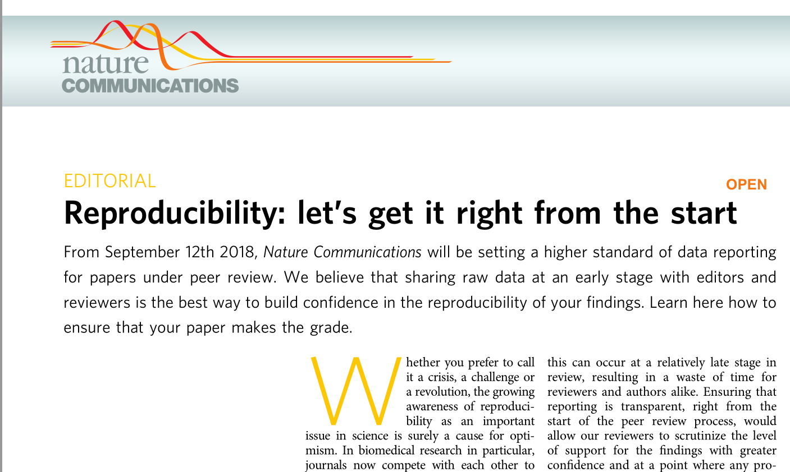
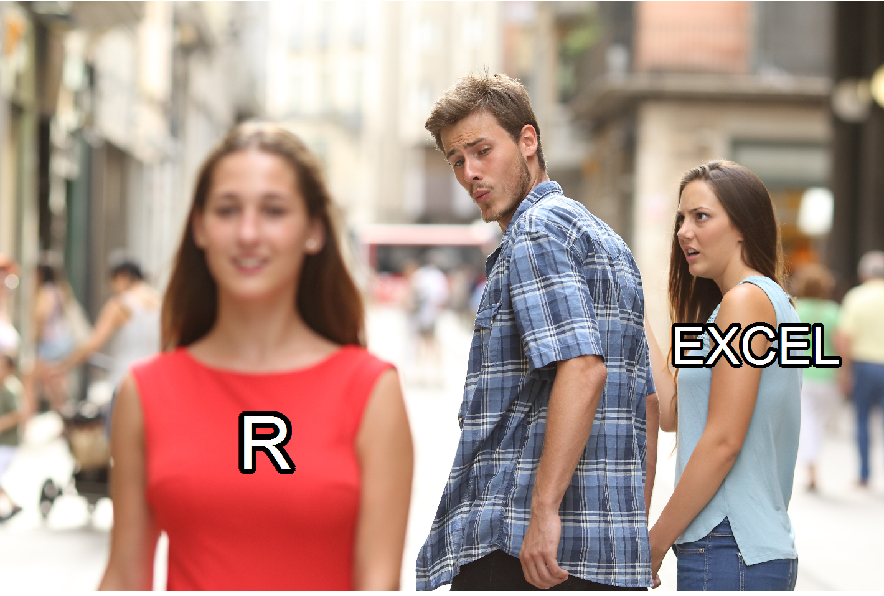

\mainmatter

# (PART) 基础篇 {-}

# 数据科学与R语言 {#intro-ds}

马克思曾说过：“一门科学只有当它达到能够成功运用数学时，才算真正得到发展。”数学为数据科学提供了坚实的理论基础，数据科学也为**数学与实际应用**之间建立起一个直接的桥梁。


## 什么是数据科学

数据科学是综合了统计学、计算机科学和领域知识的交叉学科，其基本内容就是用数据的方法研究科学，用科学的方法研究数据（鄂维南院士）。2010年，Drew Conway画了一张数据科学的[韦恩图](https://www.kainos.com/my-experience-as-a-data-scientist)

```{r intro-ds-1, out.width = '40%', fig.align='center', echo = FALSE}
knitr::include_graphics("images/data_science.png", dpi = 300)
```

从数据科学所涉及的学科领域来看，其知识结构不仅仅包括数学、统计学、计算机科学、信息科学等在内的基础性理论，还应该包括社会学、物理学、情报学、生物医学等在内的专业性领域理论。

（事实上，**编程是工具，统计是灵魂，专业是核心**，最重要的最下面那个部分，专业领域的知识）

## 什么是R

### R那些事

-   1992年，新西兰奥克兰大学统计学教授 Ross Ihaka 和 Robert Gentleman，为了方便地给学生教授统计学课程，他们设计开发了R语言（他们名字的首字母都是R）。

```{r intro-ds-2, echo=FALSE, fig.align='center', out.width = '100%'}

```

-   2000年，R1.0.0 发布
-   2004年，第一届国际useR!会议（随后每年举办一次）
-   2005年，ggplot2宏包（2018.8 - 2019.8下载量超过 1.3 亿次）
-   2012年，R2.15.2 发布
-   2013年，R3.0.2 发布, CRAN上的宏包数量5026个
-   2016年，Rstudio公司推出 tidyverse 宏包（数据科学当前最流行的R宏包）
-   2017年，R3.4.1 发布，CRAN上的宏包数量10875个
-   2019年，R3.6.1 发布，CRAN上的宏包数量15102个
-   2020年，R4.0.0 发布，CRAN上的宏包数量16054个

想了解R语言的发展历史，可阅读[The History of R](https://blog.revolutionanalytics.com/2020/07/the-history-of-r-updated-for-2020.html)

### R是什么

官网定义：<https://www.r-project.org/>

```{r intro-ds-3, echo=FALSE, out.width = '100%'}
knitr::include_graphics("images/what_is_R.png")
```

R语言是用于统计分析、图形表示和报告的编程语言:

-   R 是一个**统计编程**语言（statistical programming）
-   R 可运行于多种平台之上，包括Windows、UNIX 和 Mac OS X
-   R 拥有顶尖水准的**制图**功能
-   R 是免费的
-   R 应用广泛，拥有丰富的**库包**
-   活跃的**社区**

### R语言发展趋势

```{r intro-ds-4, echo=FALSE, out.width = '100%'}
knitr::include_graphics("images/tiobe-index.png")
```

[TIOBE index](https://www.tiobe.com/tiobe-index/)


### R路上的大神

2019 年 8 月，国际统计学年会将考普斯总统奖（The Committee of Presidents of Statistical Societies
Awards，简称 COPSS 奖，被誉为统计学的诺贝尔奖）奖颁给 tidyverse的作者Hadley Wickham后，充分说明R语言得到了学术界的肯定和认可，我相信未来它在自然科学、社会科学和工业领域中的应用前景会非常光明。


```{r intro-ds-5, echo=FALSE,  fig.align='center', out.width = '80%'}
knitr::include_graphics("images/hadley-wickham.jpg")
```

-   [Hadley Wickham](http://hadley.nz/)
-   R路上的大神
-   改变了R语言的人


## R能干什么

### 数据科学流程
Hadley Wickham将[数据科学流程](https://r4ds.had.co.nz/)分解成6个环节

```{r intro-ds-6, out.width = '80%', fig.align='center', echo = FALSE}
knitr::include_graphics("images/data-science-explore.png")
```

即数据导入、数据规整、数据处理、可视化、建模以及形成可重复性报告，整个分析和探索过程都在一个程序代码中完成，这种方式对训练我们的数据思维非常有帮助。


### tidyverse家族

```{r intro-ds-7, out.width = '70%', fig.align='center', echo = FALSE}
knitr::include_graphics("images/tidyverse.png")
```

[tidyverse](https://www.tidyverse.org/)套餐，其主要成员包括


| 功能 | 宏包        |
|:------|:-------------|
有颜值担当 | ggplot2 |
数据处理王者 | dplyr |
数据转换专家  | tidyr |
数据载入利器 | readr |
循环加速器 | purrr |
强化数据框 | tibble |
字符串处理 | stringr |
因子处理   | forcats |


 
###  R & tidyverse 四大优势

| 序号 | 内容   |  代码演示   |
|:---|:---|:---|
| 1     |  统计           |   `r xfun::embed_file('./exercises/01_stats.R')` |
| 2     |  可视化         |   `r xfun::embed_file('./exercises/02_visual.R')` |
| 3     |  探索性分析     |   `r xfun::embed_file('./exercises/03_eda.R')` |
| 4     |  可重复性报告   |   `r xfun::embed_file('./exercises/04_reproducible.Rmd')` |


看了这些代码，可能第一眼感觉是这样的
```{r intro-ds-8, echo=FALSE, out.width = '70%', fig.cap='图片来自电影《降临》'}
knitr::include_graphics("images/arrival-movie.png")
```


但我更希望这门课结束后，大家的感觉是这样的
```{r intro-ds-9, echo=FALSE, out.width = '70%',fig.cap='图片来自美剧《权利的游戏》'}
knitr::include_graphics("images/night_king.jpg")
```


## 为什么选择 R


### 社会科学需要统计

```{r intro-ds-10, echo=FALSE, fig.align='center', out.width = '70%'}
knitr::include_graphics("images/social_science.jpg")
```

看到这图，有同学可能会有同感。我认为，一个学科之所以成为一门科学，必须要有数学作
为基础。我说这话，相信很多人会反驳我。我接受反驳。但我还是会坚持我的观点。很多同学在选专业的时候，导师会说，这个专业不会用太多数学，事实上被忽悠了，尤其在（新文科建设、跨学科研究）背景下，社会科学（包括心理学、语言学）都在交叉融合，都需要用数学和计算机。所以，我们不是学统计的，但需要用统计。一个更残酷的现实，**用统计的，往往不是学统计的**。


### 社会科学需要可视化


```{r intro-ds-11, echo=FALSE, out.width = '100%'}
knitr::include_graphics("images/HotlineDrake1.jpg")
```


我们人，都是视觉动物，都喜欢看漂亮美好的东西。如果文章或者报告太多表格，不会
给人留下深刻影响；相反，用图片，重点突出、观点明确，一图胜千言，很容易传递信息。当然，前提是，画图要画的好。 事实上，可视化，一半是科学、一半是艺术。

又一个残酷的现实，**在这个看脸的时代，没有好看的皮囊，没人愿意了解你的灵魂。**


### 社会科学需要编程

```{r intro-ds-12, eval=FALSE, include=FALSE}

```

为什么要统计编程，回答这个问题，相
当于回答，为什么不能用 excel 做数据分析？画个图说明下

```{r intro-ds-13, out.width = '70%', fig.align='center', echo = FALSE}
knitr::include_graphics("images/R_Excel.png", dpi = 150)
```

对于数据量不大，或者复杂程度不高的需求来说，excel很方便也很直观。但随着数据量或复杂程度不断增大，excel解决起来难度系数就陡增，或者无法搞定，这就需要借助编程完成。也就说，掌握了编程技能，对于简单的问题和复杂的问题，难度系数是差不多了。

所以，第三残酷的现实：**现在小学生都开始学编程了**。
<!-- 我们不是学计算机的，但需要编程（小学生已经开始学编程了） -->


### 社会科学需要可重复性

```{r intro-ds-14, echo=FALSE, out.width = '60%'}
#

```

<!-- ~我们不是学设计的，但要操心**交叉引用**的事~  -->

<!-- 社会科学领域的研究是需要可重复性的，包括可重复性的分析文档。 -->

科学的可重复性危机，已经成为举世瞩目的热点议题。
科研结果可重复性低的原因很多很多。不可重复，说明事情没那么简单。
或许，科学固有不确定性，但我们需要从研究方法、实验
设计和统计方法方面改进。
所以，第四个残酷的现实：科学研究的方向是（开放科学
框架 (Open Science Framework, OSF)）, 正如 Nature 期刊
要求的一样，**需要公布原始数据和如何分析的代码**


## R 语言之美，你值得拥有


我想，R语言之美，你值得拥有，因为它可以缓解你的压力

- 首先，R语言做统计分析，是它的看家本领，非常好用 (可以缓解第一个残酷)
- 其次，ggplot2画图，是颜值担当，非常好看，一直被模仿，从未被超越(可以解决第二个残酷)
- tidyverse来编程，代码可读性强，用的是**人类语言**， 非常好学 	（在解决第三个残酷现实的同时，还让你感受到乐趣）
- 关于第四点，需要特别说明下，Rmarkdown 并不能保证**研究结果可重复性**，因为影响结果可重复性的原因很多很多，这不是程序语言能解决的事。但是，R语言能帮你的，就是减少低级的计算错误和复制粘贴等繁琐工作，可以生成html、word或者pdf 格式的可重复性报告文档，可以方便快捷做幻灯片、海报、论文、书籍、网页。所以还是挺好玩的.

所以，\textcolor{red}{R语言之美，体现在好用、好看、好学、好玩}

| 序号 	| 内容          	| 特性     	| 评价 	| 
|:-----	|:---------------	|:---------	|:-----	|
| 1    	| 统计分析      	| 看家本领 	| 好用 	|
| 2    	| ggplot2画图   	| 颜值担当 	| 好看 	| 
| 3    	| tidyverse语法 	| 人类语言 	| 好学 	| 
| 4    	| 可重复性报告  	| 方便快捷 	| 好玩 	| 


## 当今最值得学习的数据科学语言

2016年权威机构KDnuggets做过调研，显示数据科学领域最受欢迎的工具，是python和R两种语言

```{r intro-ds-15, out.width = '60%', fig.align='center', echo = FALSE}
knitr::include_graphics("images/Languages02.jpg", dpi = 90)
```

事实上，python和R都是非常强大的工具，两者各有优劣，作为初学者，究竟选择谁?
可以参考[《为什么R语言是当今最值得学习的数据科学语言》](https://www.sharpsightlabs.com/blog/r-recommend-data-science/)，这篇文章做了详细的对比，并旗帜鲜明的指出，\textcolor{red}{R语言，是当今最值得学习的数据科学语言}。罗列了很多理由，其中的3点理由很重要，我圈了出来(传统的统计学，贝叶斯新统计、数据可视化)，


```{r echo=FALSE, out.width = '100%'}
knitr::include_graphics("images/why_R_is_best_language.png")
```


事实上，数据科学，是和数据打交道（定义：用科学的方法研究数据，用数据的方法研究科学），目的要利用（计算机和统计知识）推动\textcolor{red}{学科}发展，不是把大家培养成程序员。


所以，我看完这篇文章的感受是：

- 第一、在数据科学领域，python能做的，R也能做，甚至更好，比如可视化。
- 第二、有一定R基础后，对统计学的学习帮助很大，这是 python 语言不具备的
- 第三、我觉得 R的语法 更符合人的思维方式。尤其 tidyverse 
    - 语法一致性（学习一个宏包，可以帮助理解其他宏包）
    - 代码可读性，接近人类语言 ( `%>%` 太酷了 )


<!-- 我个人的观点是，如果想做程序员或者打算今后在工业企业里工作，可以选择python; 如果你今后打算在科研机构做学术研究，我推荐R语言作为入门语言。 -->

## 一见钟情，还是相见恨晚？

```{r intro-ds-16, echo=FALSE,  fig.align='center', out.width = '70%'}

```


## 推荐阅读

-   [为什么R语言是当今最值得学习的数据科学语言](https://www.sharpsightlabs.com/blog/r-recommend-data-science/)
-   [R for Data Science](https://r4ds.had.co.nz/)
-   <https://www.tidyverse.org/>
