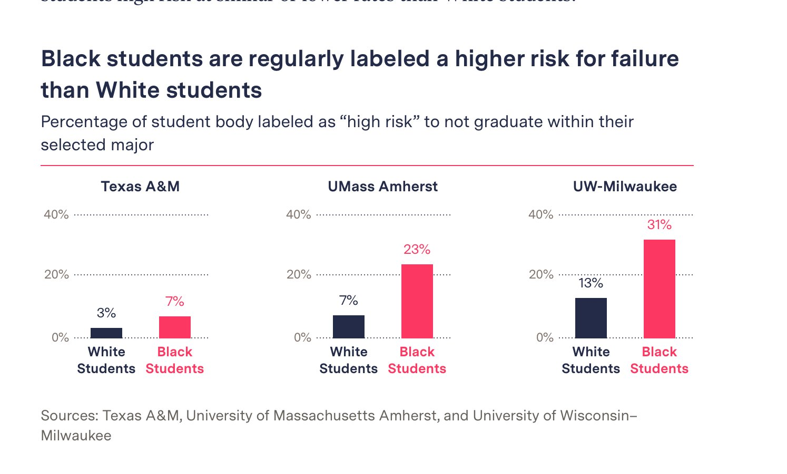

# 一天一练 {#practice}

> “表达我自己比被人喜欢更重要。” 加油

尽可能的在tidyverse的框架下完成
```{r practice00}
library(tidyverse)
```

## day01

旋转数据框，要求
```{r practice01}
d <- tibble::tribble(
    ~name, ~chinese, ~math, ~physics, ~english, ~music, ~sport,
  "Alice",      88L,   63L,      98L,      89L,    85L,    72L,
    "Bob",      85L,   75L,      85L,      82L,    73L,    83L,
  "Carlo",      95L,   98L,      75L,      75L,    68L,    84L
  )
d
```

变成
```{r practice02, echo = FALSE}
d %>%
  tidyr::pivot_longer(
    cols = -name,
    names_to = "discipline",
    values_to = "score"
  ) %>%
  tidyr::pivot_wider(
    names_from = name,
    values_from = score
  )
```


## day02

排序，要求按照score从大往小排，但希望all是最下面一行。
```{r practice03}
d <- 
  tibble::tribble(
  ~name, ~score,
   "a1",     2,
   "a2",     5,
   "a3",     3,
   "a4",     7,
   "a5",     6,
  "all",    23
  )
```


变成
```{r practice04, echo = FALSE}
d %>% 
  arrange(desc(score)) %>%
  arrange(name %in% c("all"))
```


## day03

统计每位同学，成绩高于各科均值的个数，
```{r practice05}
d <- tibble::tribble(
  ~name, ~chinese, ~engish, ~physics, ~sport, ~music,
  "Aice", 85, 56, 56, 54, 78,
  "Bob", 75, 78, 77, 56, 69,
  "Cake", 69, 41, 88, 89, 59,
  "Dave", 90, 66, 74, 82, 60,
  "Eve", 68, 85, 75, 69, 21,
  "Fod", 77, 74, 62, 74, 88,
  "Gimme", 56, 88, 75, 69, 34
)
d
```


变成
```{r practice06, echo = FALSE}
d %>%
  mutate(
    across(-name, list(RC = ~ . > mean(.)))
  ) %>%
  rowwise() %>%
  mutate(
    num_above_mean = sum(c_across(ends_with("_RC")))
  ) %>%
  ungroup() %>%
  select(-ends_with("_RC"))
```


## day04
```{r practice07}
data <- tribble(
  ~id, ~corr, ~period,
  1, 0, "a",
  1, 0, "b",
  2, 0, "a",
  2, 1, "b",
  3, 1, "a",
  3, 0, "b",
  4, 1, "a",
  4, 1, "b"
)
data
```

先按id分组，

- 如果corr中都是0  就"none"
- 如果corr中都是1  就"both"
- 如果corr中只有一个1，就输出1对应period


```{r practice08, echo = FALSE}
my_function <- function(corr, period) {
  sum <- sum(corr)
  
  if (sum == 0) {
    res <- "none"
  }
  
  if (sum == 2) {
    res <- "both"
  }
  
  if (sum == 1) {
    res <- period[corr == 1]
  }
  return(res)
}


data %>%
  group_by(id) %>%
  summarise(resp_period = my_function(corr, period))
```

## day05

图中柱子上的字体没有显示完整，请改进。
```{r practice09}
d <- tibble::tribble(
     ~name, ~value,
   "Alice",    2.12,
     "Bob",   68.45,
  "Carlie",   15.84,
    "Dave",    7.38,
     "Eve",    0.56
  )


d %>% 
  ggplot(aes(x = value, y = fct_reorder(name, value)) ) +
  geom_col(width = 0.6, fill = "gray60") +
  geom_text(aes(label = value, hjust =1))  +
  theme_classic() +
  scale_x_continuous(expand = c(0, 0)) +
  labs(x = NULL, y = NULL)
```


```{r practice10, eval=FALSE, echo = FALSE}
d %>% 
  ggplot(aes(x = value, y = fct_reorder(name, value)) ) +
  geom_col(width = 0.6, fill = "gray60") +
  geom_text(aes(label = value, hjust = ifelse(value > 50, 1, -.1)) ) +
  theme_classic() +
  scale_x_continuous(expand = c(0, 0)) +
  labs(x = NULL, y = NULL)
```


## day06

我看到新闻有[一张图](https://themarkup.org/news/2021/03/02/major-universities-are-using-race-as-a-high-impact-predictor-of-student-success)很漂亮，您能重复出来？

```{r practice11, out.width = '85%', echo = FALSE}

```


数据在下面

```{r practice12}
d <- tibble::tribble(
            ~area,           ~group, ~value,
      "Texas A&M", "white Students",   0.03,
      "Texas A&M", "Black Students",   0.07,
  "Umass Amherst", "white Students",   0.07,
  "Umass Amherst", "Black Students",   0.23,
   "UW-Milwaukee", "white Students",   0.13,
   "UW-Milwaukee", "Black Students",   0.31
  )
d
```

提示，可以把图片拉到https://color.adobe.com/zh/create/image-gradient 获取颜色值，比如
```{r practice13}
colorspace::swatchplot(c("#F42F5D","#252A4A"))
```


```{r practice14, eval=FALSE, echo = FALSE}
## 图片拉到https://color.adobe.com/zh/create/image-gradient 获取颜色值
colorspace::swatchplot(c("#F42F5D","#FC3762","#252A4A","#242B48"))
colorspace::swatchplot(c("#F42F5D","#252A4A"))


## a stupid way
text_subtitle <- glue::glue("<span style = 'font-size:13pt; '>Percentage of student body labeled as high risk to not graduate within their <br> selected major</span><br>",
                  "<span style = 'color:#F42F5D; '>", 
                  str_dup("-", 100), 
                  "</span>"
)


d %>% 
  mutate(
    across(group, as_factor),
  ) %>% 
  ggplot(aes(x = group, y = value, color = group, fill = group)) +
  geom_col(width = 0.4) +
  geom_text(aes(label = scales::label_percent(scale = 100, accuracy = 1)(value)), 
            vjust = -1, 
            size = rel(6),
            fontface = "bold"
            ) +
  facet_wrap(vars(area), ncol = 3, scales = "free_y") +
  scale_x_discrete(
    labels = function(x) str_replace(x, " ", "\n"),
    expand = expansion(mult = .8)
  ) +
  scale_y_continuous(
    limits = c(0, 0.46),
    breaks = c(0, 0.2, 0.4),
    labels = scales::label_percent(scale = 100, accuracy = 1),
    expand = expansion(mult = 0)
    ) +
  scale_fill_manual(
    values = c("white Students" = "#252A4A", "Black Students" = "#F42F5D"),
    aesthetics = c("colour", "fill")
  ) +
  theme(
    legend.position = "none", 
    plot.title = element_text(size = rel(2)),
    plot.subtitle = element_markdown(size = 11 ),
    plot.caption = element_text(size = 12, color = "grey50", hjust = 0),
    axis.text.y = element_text(size = rel(1.5)),
    axis.text.x = element_text(size = rel(1.5),
                               face = "bold", 
                               color = c("#252A4A", "#F42F5D")#,
                               #margin = margin(t = -5, unit = "pt")
                               ),
    axis.ticks = element_blank(),
    panel.background = element_rect(color = "white", fill = NA),
    panel.grid.major.y = element_line(colour = "gray", 
                                      size = 0.8, 
                                      linetype = "dotted"),
    strip.background = element_blank(),
    strip.text = element_text(face = "bold", size = rel(1)),
    panel.spacing = unit(2, "lines")
  ) +
  labs(
    title = "Black students are regularly labeled a higher risk for failure\nthan White students",
    subtitle = text_subtitle,
    caption = "Sources: Texas A&M, University of Massachusetts Amherst, and University of Wisconsin–\nMilwaukee",
    x = NULL, y = NULL) 

ggsave("myplot.pdf", width = 10, height = 5, units = "in")
```

## day07

告诉你一个你可能不知道的事情，`summarise()`一定要输出数据框吗？

```{r practice15, eval=FALSE, echo=TRUE}
iris %>%
  nest_by(Species) %>%
  rowwise() %>%
  summarise(
    write_csv(data, glue("{Species}.cvs"))
    )
```


## day08

运行以下两个代码，结果和你期望的一样？为什么？

```{r practice16, eval=FALSE, echo=TRUE}
mtcars %>%
  group_by(cyl) %>%
  summarise(
    broom::tidy(lm(mpg ~ wt, data = .))
  )

mtcars %>%
  group_by(cyl) %>%
  summarise(
    broom::tidy(lm(mpg ~ wt))
  )
```


```{r practice17, eval=FALSE, echo=FALSE}
# 答案，以上两段代码，分别等价于

mtcars %>%
  group_by(cyl) %>%
  summarise(
    broom::tidy(lm(mpg ~ wt, data = mtcars))
  )


mtcars %>%
  group_by(cyl) %>%
  summarise(
    broom::tidy(lm(mpg ~ wt, data = cur_data())) 
  )
```

## day09

缺失值替换，数值型的缺失值用0替换，字符串型的用""
```{r practice18, eval=FALSE, echo=TRUE}
df <- tibble(
  x = c(NA, 1, 2),
  y = c("a", NA, NA),
)

```


```{r practice19, eval=FALSE, echo=FALSE}
df %>% mutate(
  across(is.numeric, coalesce, 0),
  across(is.character, coalesce, "")
)
```


## day10

六年级的年级主任让学生提交自己所在的班级号，看到结果后，他很苦恼，你能帮忙他规整下？
```{r practice20}
d <- tibble::tribble(
               ~id,
               "2",
              "03",
       "小学2015级2班",
       "小学2015级3班",
            "0601",
            "0602",
          "201502",
          "201604",
            "6.10",
            "6.11",
             "6.5",
             "6.8",
              "06"
       )
d
```


```{r practice21, eval=FALSE, echo=FALSE}
parse_class_id <- function(x) {
  res <- NA_character_
   
  if ( stringr::str_length(x) < 3 ) {
    res <- x
  }
  
  if ( stringr::str_detect(x, "班$") ) {
    res <- stringr::str_extract(x, "\\d+(?=班)")
  }
  
  if ( stringr::str_detect(x, "\\.") ) {
    res <- stringr::str_extract(x, "(?<=\\.)\\d+")
  }
  
  if ( stringr::str_detect(x, "\\d{6}$") ) {
    res <- stringr::str_extract(x, "\\d{2}$")
  }
  
  if ( stringr::str_detect(x, "\\d{4}$") ) {
    res <- stringr::str_extract(x, "\\d{2}$")
  }
  
  res <- stringr::str_pad(res, width = 2, side = "left", pad = "0")
  return(res)
}


d %>% mutate(
  x = map_chr(id, ~parse_class_id(.))
)
```

## day11

每行以x为均值生成一个随机数, 以下哪个是正确的？

```{r practice22, eval=FALSE, echo=TRUE}
# A
tibble(x = 1:5) %>% 
  mutate(normal_mean = rnorm(1, mean = x))     

# B
tibble(x = 1:5) %>% 
  mutate(normal_mean = rnorm(n(), mean = x))

# C
tibble(x = 1:5) %>% 
  mutate(normal_mean = map_dbl(x, ~rnorm(1, mean = .)))

# D
tibble(x = 1:5) %>% 
  mutate(normal_mean = map_dbl(x, ~rnorm(1), mean = .))

# E
tibble(x = 1:5) %>% 
  rowwise() %>% 
  mutate(normal_mean = rnorm(1, mean = x))
```


## day12


`purrr::map()`的辅助参数放里面和放外面，有什么区别？

```{r practice23, eval=FALSE, echo=TRUE}
x <- rep(0, 3)
plus <- function(x, y) x + y

map_dbl(x, plus, runif(1))
map_dbl(x, ~plus(.x, runif(1)) )
```


## day13

计算每天水分和食物的所占比例， 比如第一天water和food都是10.0，那么各自比例都是50%.
```{r practice24}
d <- tibble::tribble(
  ~water, ~food,
  10.0,   10.0,
  12.1,   10.3,
  13.5,   19.1,
  17.4,   16.0,
  25.8,   15.6,
  27.4,   19.8
)
d
```


```{r practice25, eval=FALSE, echo=FALSE}
d %>%
  rowwise() %>%
  mutate(100 * across(.names = "%{.col}") / sum(c_across())) %>%
  ungroup()


# or
scale <- function(x) {
  100 * x / sum(x, na.rm = TRUE)
}

d %>%
  rowwise() %>%
  mutate(
    scale(across(.names = "%{.col}"))
  )
```


## day14

以下代码哪些会给出相同的图形?

```{r, eval=FALSE}
tb <- tibble(
     x = rep(c(1,2,3), 2),
     y = c(1:6),
    group = c(rep("group1", 3),  rep("group2", 3) )

)
```


1. `ggplot(tb, aes(x,y)) + geom_line()`
2. `ggplot(tb, aes(x,y,group=group)) + geom_line()` 
3. `ggplot(tb, aes(x,y,fill=group)) + geom_line()` 
4. `ggplot(tb, aes(x,y,color=group)) + geom_line()` 


## day15

重复这张图

```{r, out.width = '85%', echo = FALSE}
knitr::include_graphics(here::here("images","to_reproduce2.png"))
```

数据在下面

```{r}
library(tidyverse)
raw_df <- read_rds(here::here("demo_data", "rude_behavior_in_airplane.rds")) 
raw_df
```


```{r, eval=FALSE, echo=FALSE}
df <- raw_df %>%
  group_by(type) %>%
  mutate(
    percent = n / sum(n)
  ) %>%
  ungroup() %>%
  mutate(
    percent = if_else(str_detect(judgment, "Not"),  -1 * percent, percent)
  )
df
```

```{r, eval=FALSE, echo=FALSE}
df_no <- df %>%
  filter(judgment == "Not rude")

df_yes <- df %>%
  filter(judgment != "Not rude")

Somewhat_rude <- df_yes %>%
  filter(judgment == "Somewhat rude")

Very_Rude <- df_yes %>%
  filter(judgment == "Very Rude")
```


```{r, eval=FALSE, echo=FALSE}
ggplot() +
  geom_col(data = df_no, aes(x = percent, y = fct_reorder(type, percent), fill = judgment)) +
  geom_col(data = df_yes, aes(x = percent, y = type, fill = fct_rev(judgment))) +
  geom_vline(xintercept = 0, color = "black", linetype = "dashed") +
  
  geom_text(
    data = df_no, aes(x = percent/2, y = type, label = paste0(abs(round(100*percent)), "%"))
  ) +
  
  geom_text(
    data = Somewhat_rude, aes(x = percent/2, y = type, label = paste0(abs(round(100*percent)), "%"))
  ) +
  
  
  geom_text(
    data = Very_Rude, 
    aes(x = Somewhat_rude$percent + percent/2, y = type, 
        label = paste0(abs(round(100*percent)), "%")),
    hjust = ifelse(Very_Rude$percent > 0.05, 0.5, -.4)
  ) +
  
  
  scale_fill_manual(
    values = c("Not rude" = "#F2B138", "Very Rude" = "#32A685", "Somewhat rude" = "#77C2EA")
  ) +
  
  theme_minimal() +
  theme(
    legend.position = "bottom",
    plot.title.position = "plot",
    axis.text.x = element_blank(),
    axis.text.y = element_text(face = c("bold", "plain", "bold", "plain", 'bold', 'plain', 'bold', 'plain', 'bold'))
  ) +
  labs(x = NULL, y = NULL, fill = "",
       title = "what is the rudest airplane behavior?")
  
```

## day16


```{r, message=FALSE, warning=FALSE}
library(tidyverse)

genes <- paste0("gene", 1:5) %>% set_names(.)
genes
```

这里有一个列表，其元素`list1, list2, list3`是3个长度不等的向量
```{r, message=FALSE, warning=FALSE}
big_list <- list(  
  list1 = paste0("gene", c(1:2, 6:7)), 
  list2 = paste0("gene", c(6:7)), 
  list3 = paste0("gene", c(1, 4:7))
  )
big_list
```

需求：想看下 `r genes` 是否出现在 `list1, list2, list3`中，并统计成下表


```{r, echo=FALSE}
map(genes, ~{
    gene = .x
    mm = map_int(big_list, ~ (gene %in% .x)) # 这里出现了2个.x, 属于不同的map，会造成混淆.
  }) %>% 
    tibble::enframe(x = .) %>% 
    unnest_wider(value)

# 因此，推荐
tibble(name = genes) %>%
  rowwise() %>%
  mutate( 
    list = list(map_int(big_list, ~ (name %in% .x)))
  ) %>% 
  unnest_wider(list)
```


```{r practice99, echo = F}
# remove the objects
# rm(list=ls())
rm(d, data, my_function, text_subtitle, genes, big_list)
```


```{r practice100, echo = F, message = F, warning = F, results = "hide"}
pacman::p_unload(pacman::p_loaded(), character.only = TRUE)
```
