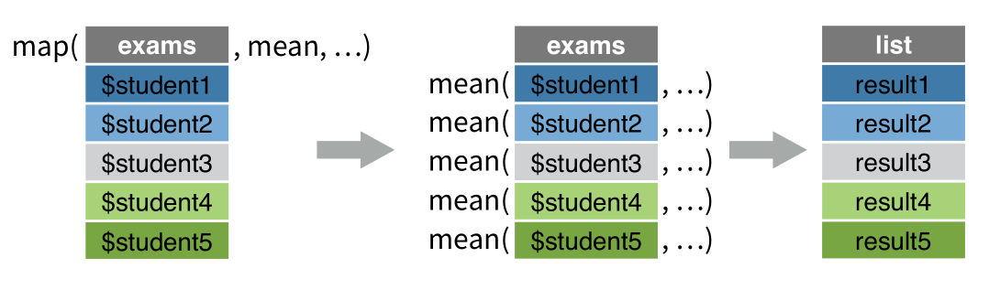
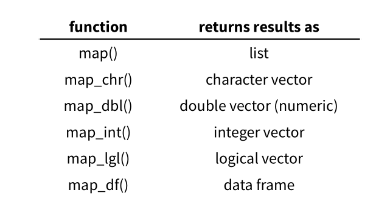

# 函数式编程 {#purrr}


很多教材都是讲函数和循环，都是从`for, while, ifelse`讲起
，如果我也这样讲，又回到了Base R的老路上去了。考虑到大家都没有编程背景，也不会立志当程序员，所以我直接讲purrr包，留坑以后填吧。

```{r purrr-1, message=FALSE, warning=FALSE, include=FALSE}
library(tidyverse)
```

## 简单回顾

大家知道R常用的数据结构是向量、矩阵、列表和数据框，如下图

```{r purrr-2, out.width = '90%', echo = FALSE}
knitr::include_graphics("images/data_struction1.png")
```


他们构造起来，很多相似性。

```{r purrr-3, eval=FALSE}
        list(a = 1, b = "a")   # 列表
           c(a = 1, b = 2)     # 命名向量
  data.frame(a = 1, b = 2)     # 数据框
      tibble(a = 1, b = 2)     # 增强型数据框
```

## 向量化运算

```{r purrr-4}
a <- c(2, 4, 3, 1, 5, 7)
```

用`for()`循环，让向量的每个元素乘以2
```{r purrr-5}
for (i in 1:length(a)) {
  print(a[i] * 2)
}
```

事实上，R语言是支持**向量化**（将运算符或者函数作用在向量的每一个元素上），可以用向量化代替循环

```{r purrr-6}
a * 2
```
达到同样的效果。


再比如，找出向量a中元素大于2的所有值

```{r purrr-7}
for (i in 1:length(a)) {
  if (a[i] > 2)
  print(a[i])
}
```
用向量化的运算，可以轻松实现
```{r purrr-8}
a[a > 2]
```

向量是R中最基础的一种数据结构，有种说法是“一切都是向量”，R中的矩阵、数组甚至是列表都可以看成是某种意义上的向量。因此，使用**向量化操作**可以大大提高代码的运行效率。


## 多说说列表

我们构造一个列表

```{r purrr-9}
a_list <- list(
  num = c(8, 9),
  log = TRUE,
  cha = c("a", "b", "c")
)
a_list
```

要想访问某个元素，可以这样
```{r purrr-10}
a_list["num"]
```
注意返回结果，第一行是`$num`，说明返回的结果仍然是列表, 相比`a_list`来说，`a_list["num"]`是只包含一个元素的列表。

想将num元素里面的向量提取出来，就得用两个`[[`
```{r purrr-11}
a_list[["num"]]
```

大家知道程序员都是偷懒的，为了节省体力，用一个美元符号`$`代替`[[" "]]`六个字符
```{r purrr-12}
a_list$num
```


```{r purrr-13, out.width = '90%', echo = FALSE}
knitr::include_graphics("images/list_subset.png")
```


在tidyverse里，还可以用
```{r purrr-14}
a_list %>% pluck(1)
```
或者
```{r purrr-15}
a_list %>% pluck("num")
```


## 列表 vs 向量

假定一向量
```{r purrr-16}
v <- c(-2, -1, 0, 1, 2)
v
```
我们对元素分别取绝对值
```{r purrr-17}
abs(v)
```

如果是列表形式，`abs`函数应用到列表中就会报错
```{r purrr-18}
lst <- list(-2, -1, 0, 1, 2)
```


```{r purrr-19, error=TRUE}
abs(lst)
```

报错了。用在向量的函数用在list上，往往行不通。


再来一个例子：我们模拟了5个学生的10次考试的成绩
```{r purrr-20}
exams <- list(
  student1 = round(runif(10, 50, 100)),
  student2 = round(runif(10, 50, 100)),
  student3 = round(runif(10, 50, 100)),
  student4 = round(runif(10, 50, 100)),
  student5 = round(runif(10, 50, 100))
)
exams
```

很显然，`exams`是一个列表。那么，每个学生的平均成绩是多呢？

我们可能会想到用mean函数，但是
```{r purrr-21, error=TRUE}
mean(exams)
```

发现报错了，可以看看帮助文档看看问题出在什么地方
```{r purrr-22, eval=FALSE}
?mean()
```

帮助文档告诉我们，`mean()`要求第一个参数是**数值型或者逻辑型**的向量。
而我们这里的`exams`是列表，因此无法运行。

那好，我们就用笨办法吧
```{r purrr-23}
list(
  student1 = mean(exams$student1),
  student2 = mean(exams$student2),
  student3 = mean(exams$student3),
  student4 = mean(exams$student4),
  student5 = mean(exams$student5)
)
```

成功了。但发现我们写了好多代码，如果有100个学生，那就得写更多的代码，如果是这样，程序员就不高兴了，这太累了啊。于是`purrr`包的`map`函数来解救我们，下面主角出场了。


## purrr

介绍之前，先试试
```{r purrr-24}
exams %>% map(mean)
```
哇，短短几句话，得出了相同的结果。如果希望返回的是数值型的**向量**，可以这样写
```{r purrr-25}
exams %>% map_dbl(mean)
```

如果希望返回的结果是数据框
```{r purrr-26}
exams %>% map_df(mean)
```

是不是很酷？


事实上，`map`函数

```{r purrr-27, out.width = '80%', echo = FALSE}
knitr::include_graphics("images/map_function1.png")
```

- 第一个参数是向量或列表（数据框是列表的一种特殊形式，因此数据框也是可以的）

```{r purrr-28, out.width = '70%', echo = FALSE}
knitr::include_graphics("images/map_fun.png")
```


- 第二个参数是函数，这个函数会**应用到列表的每一个元素**，比如这里`map`函数执行过程如下
：
```{r purrr-29, out.width = '90%', echo = FALSE}

```

具体为，`exams`有5个元素，一个元素装着一个学生的10次考试成绩，
运行`map(exams, mean)`函数后， 首先取出exams第一个元素`exams$student1`(它是向量)，然后执行
`mean(exams$student1)`, 然后将计算结果存放在列表result中的第一个位置`result1`上；


做完第一个学生的，紧接着取出`exams`第二个元素`exams$student2`，执行
`mean(exams$student2)`, 然后将计算结果存放在列表`result`中的第一个位置`result2`上；


如此这般，直到所有学生都处理完毕。我们得到了最终结果---一个新的列表`result`。


当然，我们也可以根据需要，让map返回我们需要的数据格式, purrr也提供了方便的函数，具体如下

```{r purrr-30, out.width = '90%', echo = FALSE}

```


我们将`mean`函数换成求方差`var`函数试试，
```{r purrr-31}
exams %>% map_df(var)
```


## 自定义函数

刚才我们是让学生成绩执行求平均`mean`，求方差`var`等函数。我们也可以自定义函数。
比如我们这里定义了将向量**中心化**的函数（先求出10次考试的平均值，然后每次考试成绩去减这个平均值）
```{r purrr-32}
my_fun <- function(x){
  x - mean(x)
}

exams %>% map_df(my_fun)
```

当然可以偷懒将函数直接写在`map()`里，用`~`代替`my_fun`， 但**代价**是参数必须是规定的写法，比如`.x`
```{r purrr-33}
exams %>% map_df(~ .x - mean(.x))
```


有时候，程序员觉得`x`还是有点多余，于是更够懒一点，只用`.`， 也是可以的
```{r purrr-34}
exams %>% map_df(~ . - mean(.))
```


总之，有三种方法将函数传递给`map()`


- 直接传递 
```{r purrr-35, eval=FALSE}
map(.x, mean, na.rm = TRUE
  )
```

- 匿名函数 

```{r purrr-36, eval=FALSE}
map(.x, 
    funciton(.x) {
      mean(.x, na.rm = TRUE)
      }
    )
```

- 使用 `~`  

```{r purrr-37, eval=FALSE}
function(.x) { 
  .x *2
}
# 程序员偷懒了
~ .x * 2
```

```{r purrr-38, eval=FALSE}
map(.x, 
    ~ mean(.x, na.rm = TRUE)
    )
```


## 在dplyr函数中的运用map

如果想显示列表中每个元素的长度，可以这样写
```{r purrr-39}
tibble(
  x = list(1, 2:3, 4:6)
) %>% 
 mutate(l = purrr::map_int(x, length))
```


用于各种函数，比如产生随机数
```{r purrr-40}
tibble(
  x = c(3, 5, 6)
) %>% 
 mutate(r = purrr::map(x, ~rnorm(.x, mean = 0, sd = 1)))
```
用于建模
```{r purrr-41}
mtcars %>%
  group_by(cyl) %>%
  nest() %>%
  mutate(model = purrr::map(data, ~ lm(mpg ~ wt, data = .))) %>%
  mutate(result = purrr::map(model, ~ broom::tidy(.))) %>%
  unnest(result)
```


更多内容和方法可参考第 \@ref(colwise) 章数据框列方向和行方向。


## 延伸阅读

1、阅读Hadley Wickham的[r4ds](https://r4ds.had.co.nz/)这本书第16章。

2、看手册`?purrr::modify()`， 思考下它与`map()`的区别
```{r purrr-42, eval=FALSE}
exams %>% map(~ . - mean(.))

exams %>% modify(~ . - mean(.))
```

```{r purrr-43, eval=FALSE}
exams %>% as_tibble() %>% map(~ . - mean(.))

exams %>% as_tibble() %>% modify(~ . - mean(.))
```


3、他们的区别哪里？函数能否互换？
```{r purrr-44, eval=FALSE}
mtcars %>% map_chr(typeof)
mtcars %>% map_lgl(is.double)
mtcars %>% map_int(n_unique)
mtcars %>% map_dbl(mean)
```


```{r purrr-45, echo = F}
# remove the objects
rm(a_list, exams, lst, a, i, v, my_fun)
```


```{r purrr-46, echo = F, message = F, warning = F, results = "hide"}
pacman::p_unload(pacman::p_loaded(), character.only = TRUE)
```


