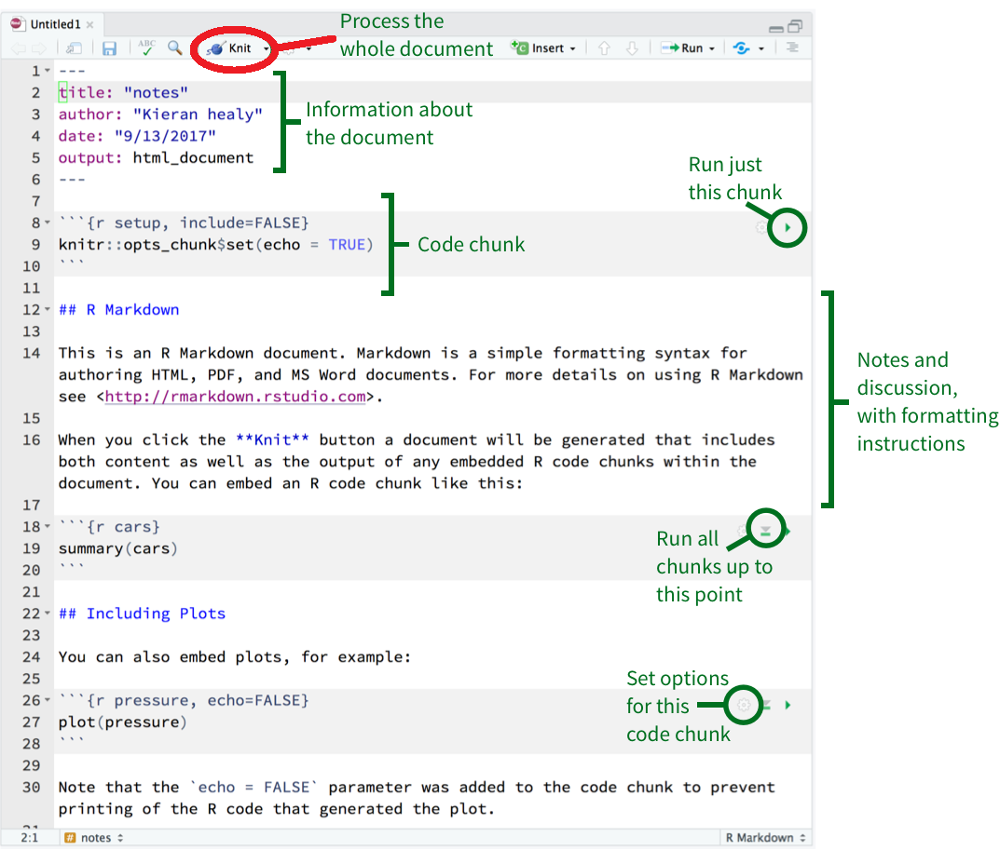

# (PART) tidyverse篇 {-}

# 可重复性报告 {#rmarkdown}

有时候，我们需要**展示和分享**我们的数据分析结果给同行、老板或者老师。 那么，为了让老板能快速地的理解我们的分析思路和方法，
最好的方法，就是将分析背景、分析过程、分析结果以及图表等形成**报告**，让读者能重复和验证我们的结果，确保结论的真实可信。
因此，本章就将介绍如何生成分析报告（可重复性报告）。


```{r, echo=FALSE}
library(rmarkdown)
```

## 什么是Rmarkdown
```{r out.width = '85%', echo = FALSE}
knitr::include_graphics("images/rmarkdown.png")
```

## markdown 基本语法
```{markdown, eval = FALSE, echo = TRUE}
# This is a title

#  第一章   （注意   "#" 与 "第一章"之间有空格）
##  第一节  （同上，"##" 与 "第一节"之间有空格）

This is a sentence.

Now a list begins:
  
- no importance
- again
- repeat
  
A numbered list:
  
1. first
2. second

__bold__, _italic_, ~~strike through~~
```


## Hello R Markdown

`Rstudio` create Rmd file ： `File -> New File -> R Markdown`.


基本构成（图中绿色括号地方）

- metadata
- text
- code

```{r out.width = '85%', echo = FALSE}

``` 
   
点击knit（图中红色地方），选择想要输出的文档格式即可。


## 生成html文档

希望html文档有章节号、目录或者更好显示表格，可以修改头文件（用下面的内容替换Rmarkdown的头文件）

```yaml
---
title: Habits
author: John Doe
date: "`r Sys.Date()`"
output: 
  html_document:
    df_print: paged
    toc: yes
    number_sections: yes
---
```

## 生成word文档

rmarkdown 生成的word功能不是很多，推荐使用[officedown](https://davidgohel.github.io/officedown/)
, [officer](https://davidgohel.github.io/officer/), [flextable](https://davidgohel.github.io/flextable/)宏包

## 生成pdf文档

pdf文档可以插入漂亮的矢量图和优雅的数学公式，所以备受同学们的喜欢。但往往我们写中文的时候，编译不成功。这里就来讲讲如何解决这些问题，推荐阅读[这里](https://bookdown.org/yihui/rmarkdown/)，或者看这个[视频](https://www.bilibili.com/video/BV1Gf4y1R7md)。

*Instructions*

1. 安装最新版本 [R](https://cran.r-project.org/mirrors.html) (>3.5) 和 [RStudio Desktop](https://rstudio.com/products/rstudio/) (>1.2).
2. 安装pdf查看器，[sumatrapdf网站](https://www.sumatrapdfreader.org/download-free-pdf-viewer.html)
3. 安装 [LaTeX](https://www.latex-project.org/get/). 然而这个软件会比较大
   (e.g. MacTeX is approximate 3.9G). 如果你之前没有安装过
   LaTeX，我推荐你安装轻量级的 `tinytex`. 安装方法如下，打开R，然后再命令行输入:

```{r, eval = FALSE}
install.packages("tinytex")
tinytex::install_tinytex(dir = "D:\\Tinytex", force = T)
```
中途会有两次警告，按 “ 确定 ” 就可以了。


4. 修改头文件，用下面的内容替换Rmarkdown的头文件, 不要修改缩进

```yaml
---
title: 'Going deeper with dplyr'
author: "王小二"
date: "`r "\x60r Sys.Date()\x60"`"
output:
  pdf_document: 
    latex_engine: xelatex
    extra_dependencies:
      ctex: UTF8
    number_sections: yes
    df_print: kable
    toc: yes
classoptions: "hyperref, 12pt, a4paper"
---
```


## 使用方法

### 插入公式

我相信你已经熟悉了latex语法，那么我们在Rmarkdwon里输入
`$$\frac{\sum (\bar{x} - x_i)^2}{n-1}$$`，那么实际输出:

$$\frac{\sum (\bar{x} - x_i)^2}{n-1}$$

也可以使用latex的等式环境， 比如


```latex
$$\Theta = \begin{pmatrix}\alpha & \beta\\
\gamma & \delta
\end{pmatrix}$$
```
输出

$$
\Theta = \begin{pmatrix}\alpha & \beta\\
\gamma & \delta
\end{pmatrix}
$$


### 插入图片


````markdown
`r ''````{r, out.width='35%', fig.align='left', fig.cap='this is caption'}
knitr::include_graphics("images/R_logo.png")
```
````


```{r out.width = '35%', fig.align='left', fig.cap='this is caption', echo = F}
knitr::include_graphics("images/R_logo.png")
```


### 运行代码

```{r, echo = T}
summary(cars)
```


### 表格

<!-- ```{r tables-mtcars,  echo = TRUE} -->
<!-- knitr::kable(iris[1:5, ], caption = "A caption") -->
<!-- ``` -->

````md
```{r tables-mtcars}`r ''`
knitr::kable(iris[1:5, ], caption = "A caption")
```
````


```{r tables-mtcars,  echo = F}
knitr::kable(iris[1:5, ], caption = "A caption")
```

需要更优美的表格，可参考[这里](https://haozhu233.github.io/kableExtra/)


### 生成图片
````md
```{r}`r ''`
plot(pressure)
```
````


```{r out.width = '85%', echo=FALSE}
plot(pressure)
```

或者

````md
```{r, out.width = '85%', fig.showtext = TRUE}`r ''`
library(tidyverse)
library(nycflights13)
library(showtext)
showtext_auto()

flights %>%
  group_by(dest) %>%
  summarize(
    count = n(),
    dist = mean(distance, na.rm = TRUE),
    delay = mean(arr_delay, na.rm = TRUE)
  ) %>%
  dplyr::filter(delay > 0, count > 20, dest != "HNL") %>%
  ggplot(mapping = aes(x = dist, y = delay)) +
  geom_point(aes(size = count), alpha = 1 / 3) +
  geom_smooth(se = FALSE) +
  ggtitle("这是我的标题")
```
````


```{r, fig.showtext = TRUE, echo=FALSE}
library(tidyverse)
library(nycflights13)
library(showtext)
showtext_auto()

flights %>%
  group_by(dest) %>%
  summarize(
    count = n(),
    dist = mean(distance, na.rm = TRUE),
    delay = mean(arr_delay, na.rm = TRUE)
  ) %>%
  dplyr::filter(delay > 0, count > 20, dest != "HNL") %>%
  ggplot(mapping = aes(x = dist, y = delay)) +
  geom_point(aes(size = count), alpha = 1 / 3) +
  geom_smooth(se = FALSE) +
  ggtitle("这是我的标题")
```


```{r echo=FALSE}
# pdf文档模板
xfun::embed_file('./data/my_pdf_document.Rmd')
```


## 延伸阅读

* Markdown tutorial https://www.markdowntutorial.com (10分钟学完)
* LaTeX tutorial https://www.latex-tutorial.com/quick-start/
* Rmarkdown 介绍 https://bookdown.org/yihui/rmarkdown/
* Rmarkdown 手册 https://bookdown.org/yihui/rmarkdown-cookbook/


```{r, echo = F}
# remove the objects
# rm(list=ls())
#rm(ar, df, die, dt, fac, list1, m, n, vec, x, y)
```


```{r, echo = F, message = F, warning = F, results = "hide"}
pacman::p_unload(pacman::p_loaded(), character.only = TRUE)
```
