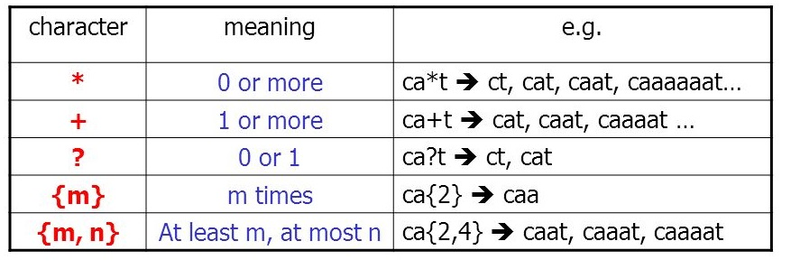

# 正则表达式 {#stringr}

```{r message = FALSE, warning = FALSE}
library(tidyverse)
library(stringr)
```


## 问题

这是一份关于地址信息的数据

```{r echo=FALSE, message=FALSE, warning=FALSE}
d <- tibble::tribble(
  ~No,                        ~address,
   1L,       "Sichuan Univ, Coll Chem",
   2L, "Sichuan Univ, Coll Elect Engn",
   3L,       "Sichuan Univ, Dept Phys",
   4L,   "Sichuan Univ, Coll Life Sci",
   6L,       "Sichuan Univ, Food Engn",
   7L,       "Sichuan Univ, Coll Phys",
   8L,    "Sichuan Univ, Sch Business",
   9L,           "Wuhan Univ, Mat Sci"
  )

d 
```

**问题**：如何提取`Sichuan Univ`后面的学院？这需要用到正则表达式的知识。


## 什么是正则表达式

我们在word文档或者excel中，经常使用查找和替换, 然而有些情况，word是解决不了的，比如

- 条件搜索
  - 统计文中，前面有 “data”, “computer” or “statistical” 的 “analysis”，这个单词的个数
  - 找出文中重复的单词，比如“we love love you”
- 拼写检查
  - 电话号码（邮件，密码等）是否正确格式
  - 日期书写的规范与统一
- 提取信息
  - 提取文本特定位置的数据 
- 文本挖掘
  - 非结构化的提取成结构化


这个时候就需要用到正则表达式（Regular Expression），这一强大、便捷、高效的文本处理工具。那么，什么是正则表达式呢？简单点说，正则表达式是处理字符串的。复杂点说，正则表达式描述了一种字符串匹配的模式（pattern），通常被用来检索、替换那些符合某个模式(规则)的文本。这种固定的格式的文本，生活中常见的有电话号码、网络地址、邮件地址和日期格式等等。

正则表达式并不是R语言特有的，事实上，几乎所有程序语言都支持正则表达式 (e.g. Perl, Python, Java, Ruby, etc).

R 语言中很多函数都需要使用正则表达式，然而正则表达式不太好学。幸运的是，大神Hadley Wickham开发的stringr包让正则表达式简单易懂，因此今天我们就介绍这个包。本章的内容与《R for data science》第10章基本一致。本章目的教大家写**简单的**正则表示式就行了。


## 字符串基础


### 字符串长度

想获取字符串的长度，可以使用`str_length()`函数
```{r}
str_length("R for data science")
```

字符串向量，也适用
```{r}
str_length(c("a", "R for data science", NA))
```

数据框里配合dplyr函数，同样很方便
```{r}
data.frame(
  x = c("a", "R for data science", NA)
  ) %>%
  mutate(y = str_length(x))
```


### 字符串组合


把字符串拼接在一起，使用 `str_c()` 函数
```{r}
str_c("x", "y")
```


把字符串拼接在一起，可以设置中间的间隔
```{r}
str_c("x", "y", sep = ", ")
```


```{r}
str_c(c("x", "y", "z"), sep = ", ")
```
是不是和你想象的不一样，那就`?str_c`，或者试试这个

```{r}
str_c(c("x", "y", "z"), c("x", "y", "z"), sep = ", ")
```

用在数据框里
```{r}
data.frame(
  x = c("I", "love", "you"),
  y = c("you", "like", "me")
  ) %>%
  mutate(z = str_c(x, y, sep = "|"))
```

使用collapse选项，是先组合，然后再转换成单个字符串，大家对比下

```{r}
str_c(c("x", "y", "z"), c("a", "b", "c"), sep = "|")
```

```{r}
str_c(c("x", "y", "z"), c("a", "b", "c"), collapse = "|")
```


### 字符串取子集

截取字符串的一部分，需要指定截取的开始位置和结束位置
```{r}
x <- c("Apple", "Banana", "Pear")
str_sub(x, 1, 3)
```

开始位置和结束位置如果是负整数，就表示位置是从后往前数，比如下面这段代码，截取倒数第3个至倒数第1个位置上的字符串
```{r}
x <- c("Apple", "Banana", "Pear")
str_sub(x, -3, -1)
```


也可以进行赋值，如果该位置上有字符，就用新的字符替换旧的字符

```{r}
x <- c("Apple", "Banana", "Pear")
x
```


```{r}
str_sub(x, 1, 1)
```


```{r}
str_sub(x, 1, 1) <- "Q"
x
```


## 使用正则表达式进行模式匹配

正则表示式慢慢会呈现了

### 基础匹配

`str_view()` 是查看string是否匹配pattern，如果匹配，就高亮显示
```{r}
x <- c("apple", "banana", "pear")
str_view(string = x, pattern = "an")
```

有时候，我们希望在字符`a`前后都有字符（即，a处在两字符中间，如rap, bad, sad, wave，spear等等）
```{r}
x <- c("apple", "banana", "pear")
str_view(x, ".a.")
```

这里的`.` 代表任意字符。如果向表达.本身呢？

```{r}
c("s.d") %>% 
  str_view(".")
```

```{r}
c("s.d") %>% 
  str_view("\\.")
```


### 锚点

希望`a`是字符串的开始
```{r}
x <- c("apple", "banana", "pear")
str_view(x, "^a")
```


希望`a`是一字符串的末尾
```{r}
x <- c("apple", "banana", "pear")
str_view(x, "a$")
```


```{r}
x <- c("apple pie", "apple", "apple cake")
str_view(x, "^apple$")
```


### 字符类与字符选项

前面提到，`.`匹配任意字符，事实上还有很多这种**特殊含义**的字符：

* `\d`: matches any digit.
* `\s`: matches any whitespace (e.g. space, tab, newline).
* `[abc]`: matches a, b, or c.
* `[^abc]`: matches anything except a, b, or c.


```{r}
str_view(c("grey", "gray"), "gr[ea]y")
```


### 重复

控制匹配次数:

* `?`: 0 or 1
* `+`: 1 or more
* `*`: 0 or more


```{r}
x <- "Roman numerals: MDCCCLXXXVIII"
str_view(x, "CC?")
str_view(x, "X+")
```


控制匹配次数:

* `{n}`: exactly n
* `{n,}`: n or more
* `{,m}`: at most m
* `{n,m}`: between n and m


```{r}
x <- "Roman numerals: MDCCCLXXXVIII"
str_view(x, "C{2}")
str_view(x, "C{2,}")
str_view(x, "C{2,3}")
```


- 默认的情况，`*`, `+` 匹配都是**贪婪**的，也就是它会尽可能的匹配更多
- 如果想让它不贪婪，而是变得懒惰起来，可以在`*`, `+` 加个`?`


```{r}
x <- "Roman numerals: MDCCCLXXXVIII"

str_view(x, "CLX+")
str_view(x, "CLX+?")
```


小结一下呢

```{r out.width = '75%', echo = FALSE}

```


### 分组与回溯引用


```{r}
ft <- fruit %>% head(10)
ft
```

我们想看看这些单词里，有哪些字母是重复两次的，比如`aa`, `pp`. 如果用上面学的方法
```{r}
str_view(ft, ".{2}", match = TRUE)
```

发现不是和我们的预想不一样呢。

所以需要用到新技术 **分组与回溯引用**，
```{r}
str_view(ft, "(.)\\1", match = TRUE)
```

- `.` 是匹配任何字符
- `(.)` 将匹配项括起来，它就用了一个名字，叫`\\1`； 如果有两个括号，就叫`\\1`和`\\2`
- `\\1` 表示回溯引用，表示引用`\\1`对于的`(.)`

所以`(.)\\1`的意思就是，匹配到了字符，后面还希望有个**同样的字符**


如果是匹配`abab`, `wcwc`
```{r}
str_view(ft, "(..)\\1", match = TRUE)
```

如果是匹配`abba`, `wccw`呢？

```{r}
str_view(ft, "(.)(.)\\2\\1", match = TRUE)
```

是不是很神奇？


## 解决实际问题


### 确定一个字符向量是否匹配一种模式

实际问题中，想判断是否匹配？可以用到`str_detect()`函数
```{r}
x <- c("apple", "banana", "pear")
str_detect(x, "e")
```

数据框中也是一样
```{r echo=FALSE}
d <- tibble(x = c("apple", "banana", "pear") )
d
```

```{r}
d %>% mutate(has_e = str_detect(x, "e"))
```

用于筛选也很方便

```{r}
d %>% dplyr::filter(str_detect(x, "e"))
```


`stringr::words`包含了牛津字典里常用单词
```{r}
stringr::words %>% head()
```

我们统计下以`t`开头的单词，有多少个？
```{r}
# How many common words start with t?
sum(str_detect(words, "^t"))
```
我们又一次看到了**强制转换**.


以元音结尾的单词，占比多少？
```{r}
# proportion of common words end with a vowel?
mean(str_detect(words, "[aeiou]$"))
```


放在数据框里看看, 看看以`x`结尾的单词是哪些？
```{r}
tibble(
  word = words
) %>%
  dplyr::filter(str_detect(word, "x$"))
```


`str_detect()` 有一个功能类似的函数`str_count()`，区别在于，后者不是简单地返回是或否，而是返回字符串中匹配的数量

```{r}
x <- c("apple", "banana", "pear")
str_count(x, "a")
```


```{r}
tibble(
  word = words
) %>%
  mutate(
    vowels = str_count(word, "[aeiou]"),
    consonants = str_count(word, "[^aeiou]")
  )
```


### 确定匹配的位置


大家放心，正则表达式不会重叠匹配。比如用`"aba"`去匹配`"abababa"`，肉眼感觉是三次，但正则表达式告诉我们是两次，因为不会重叠匹配

```{r}
str_count("abababa", "aba")
```


```{r}
str_view_all("abababa", "aba")
```


### 提取匹配的内容

```{r}
colours <- c(
  "red", "orange", "yellow",
  "green", "blue", "purple"
)
colour_match <- str_c(colours, collapse = "|")
colour_match
```

colour_match 这里是一个字符串，放在pattern参数位置上也是正则表达式了,

这里注意以下两者的区别

```{r, eval=FALSE}
str_view("abcd", "ab|cd")
str_view("abc", "a[bc]d")
```


```{r}
more <- "It is hard to erase blue or red ink."
str_extract(more, pattern = colour_match)
```


```{r}
str_extract_all(more, pattern = colour_match)
```


```{r}
more <- sentences[str_count(sentences, colour_match) > 1]
more
```
取出sentences中，含有有两种和两种颜色以上的句子。不过，不喜欢这种写法，看着费劲，还是用tidyverse的方法
```{r}
tibble(sentence = sentences) %>% 
  filter(str_count(sentences, colour_match) > 1)
```

`str_extract()`提取匹配, 谁先匹配就提取谁

```{r}
tibble(x = more) %>%
  mutate(color = str_extract(x, colour_match))
```


`str_extract_all()`提取全部匹配项

```{r}
tibble(x = more) %>%
  mutate(color = str_extract_all(x, colour_match))
```

```{r}
tibble(x = more) %>%
  mutate(color = str_extract_all(x, colour_match)) %>% 
  unnest(color)
```


### 替换匹配内容


只替换匹配的第一项
```{r}
x <- c("apple", "pear", "banana")
str_replace(x, "[aeiou]", "-")
```


替换全部匹配项
```{r}
str_replace_all(x, "[aeiou]", "-")
```


### 拆分字符串

这个和`str_c()`是相反的操作

```{r}
lines <- "I love my country"
lines
```


```{r}
str_split(lines, " ")
```


```{r}
fields <- c("Name: Hadley", "Country: NZ", "Age: 35")
fields %>% str_split(": ", n = 2, simplify = TRUE)
```


## 进阶部分

带有条件的匹配

### look ahead

想匹配Windows，同时希望Windows右侧是`"95", "98", "NT", "2000"`中的一个
```{r}
win <- c("Windows2000", "Windows", "Windows3.1")
str_view(win, "Windows(?=95|98|NT|2000)")
```


```{r}
win <- c("Windows2000", "Windows", "Windows3.1")
str_view(win, "Windows(?!95|98|NT|2000)")
```


Windows后面的 `()` 是匹配条件，事实上，有四种情形：

- `(?=pattern)`  要求此位置的后面必须匹配表达式pattern
- `(?!pattern)`  要求此位置的后面不能匹配表达式pattern
- `(?<=pattern)` 要求此位置的前面必须匹配表达式pattern
- `(?<!pattern)` 要求此位置的前面不能匹配表达式pattern


```{block, type="danger"}
注意：对于正则表达式引擎来说，它是从文本头部向尾部（从左到右）开始解析的，因此对于文本尾部方向，称为“前”，因为这个时候，正则引擎还没走到那块；而对文本头部方向，则称为“后”，因为正则引擎已经走过了那一块地方。
```


### look behind


```{r}
win <- c("2000Windows", "Windows", "3.1Windows")
str_view(win, "(?<=95|98|NT|2000)Windows")
```


```{r}
win <- c("2000Windows", "Windows", "3.1Windows")
str_view(win, "(?<!95|98|NT|2000)Windows")
```


## 案例分析

### 案例1

我们希望能提取第二列中的数值，构成新的一列

```{r}
dt <- tibble(
  x = 1:4,
  y = c("wk 3", "week-1", "7", "w#9")
)
dt
```


```{r, eval=FALSE,include=FALSE}
dt %>% 
  mutate(z = parse_number(y))
```

```{r, eval = FALSE, include=FALSE}
# parse_number() parse_integer() parse_double()

# parse_factor() parse_logical() parse_character()

# parse_datetime() parse_time() parse_date()
```

```{r}
dt %>%
  mutate(
    z = str_extract(y, "[0-9]")
  ) 
```


### 案例2

提取第二列中的大写字母

```{r}
df <- data.frame(
  x = seq_along(1:7),
  y = c("2016123456", "20150513", "AB2016123456", "J2017000987", "B2017000987C", "aksdf", "2014")
)
df
```


```{r}
df %>%
  mutate(
    item = str_extract_all(y, "[A-Z]")
  ) %>%
  tidyr::unnest(item)
```


### 案例3

要求：中英文分开

```{r}
tb <- tibble(x = c("I我", "love爱", "you你"))
tb
```


```{r}
tb %>% 
  tidyr::extract(
  x, c("en", "cn"), "([:alpha:]+)([^:alpha:]+)",
  remove = FALSE
)
```


### 案例4

要求：提取起始数字

```{r}
df <- tibble(x = c("1-12周", "1-10周", "5-12周"))
df
```


```{r}
df %>% extract(
  x,
  c("start", "end", "cn"), "([:digit:]+)-([:digit:]+)([^:alpha:]+)",
  remove = FALSE
)
```


### 案例5

要求：提取大写字母后的数字

```{r}
df <- tibble(
  x = c("12W34", "AB2C46", "B217C", "akTs6df", "21WD4")
)
```


```{r}
df %>% 
  mutate( item =  str_extract_all(x, "(?<=[A-Z])[0-9]")  ) %>% 
  tidyr::unnest(item)
```

思考题，

- 如何提取大写字母后的连续数字，比如B217C后面的217
- 如何提取提取数字前的大写字母？
- 为什么第一个正则表达式返回结果为"" 

```{r}
x <- "Roman numerals: MDCCCLXXXVIII"
str_match_all(x, "C?") # "?"的意思是匹配0次或者1次
str_match_all(x, "CC?")
```
 


### 案例6

提取数字并求和

```{r}
df <- tibble(
  x = c("1234", "B246", "217C", "2357f", "21WD4")
)
df
```


```{r}
df %>% 
  mutate(num = str_match_all(x, "\\d")) %>% 
  unnest(num) %>% 
  mutate_at(vars(num), as.numeric) %>% 
  group_by(x) %>% 
  summarise(sum = sum(num))
```

### 案例7
```{r}
text <- "Quantum entanglement is a physical phenomenon that occurs when pairs or groups of particles are generated, interact, or share spatial proximity in ways such that the quantum state of each particle cannot be described independently of the state of the others, even when the particles are separated by a large distance."


pairs <-
  tibble::tribble(
    ~item, ~code,
    "Quantum entanglement", "A01",
    "physical phenomenon", "A02",
    "quantum state", "A03",
    "quantum mechanics", "A04"
  ) %>%
  tibble::deframe()


text %>% str_replace_all(pairs)
```


## 回答提问

回到上课前的提问：如何提取`Sichuan Univ`后面的学院？
```{r echo=FALSE, message=FALSE, warning=FALSE}
d <- tibble::tribble(
  ~No,                        ~address,
   1L,       "Sichuan Univ, Coll Chem",
   2L, "Sichuan Univ, Coll Elect Engn",
   3L,       "Sichuan Univ, Dept Phys",
   4L,   "Sichuan Univ, Coll Life Sci",
   6L,       "Sichuan Univ, Food Engn",
   7L,       "Sichuan Univ, Coll Phys",
   8L,    "Sichuan Univ, Sch Business",
   9L,           "Wuhan Univ, Mat Sci"
  )

d 
```


```{r}
d %>% dplyr::mutate(
  coll = str_extract(address, "(?<=Sichuan Univ,).*") 
) %>% 
  tidyr::unnest(coll, keep_empty = TRUE)
```


当然还有其他的解决办法
```{r eval=FALSE}
d %>% mutate(
  coll = str_remove_all(address, ".*,")
  ) 
```

```{r eval=FALSE}
d %>% tidyr::separate(
  address, into = c("univ", "coll"), sep = ",", remove = FALSE
)
```


```{r eval=FALSE}
d %>% 
  tidyr::extract(
  address, c("univ", "coll"), "(Sichuan Univ), (.+)",
  remove = FALSE
)
```


## 一些有趣的正则表达式的宏包

- https://github.com/gadenbuie/regexplain
- https://github.com/daranzolin/inferregex
- https://github.com/VerbalExpressions/RVerbalExpressions


```{r}
library(inferregex) # remotes::install_github("daranzolin/inferregex")
s <- "abcd-9999-ab9"
infer_regex(s)$regex
```


```{r, echo = F}
# remove the objects
#rm(colour_match, colours, df, dt, fields, ft, lines, more, pairs, tb, text, win, x)
```


```{r, echo = F, message = F, warning = F, results = "hide"}
#pacman::p_unload(pacman::p_loaded(), character.only = TRUE)
```
