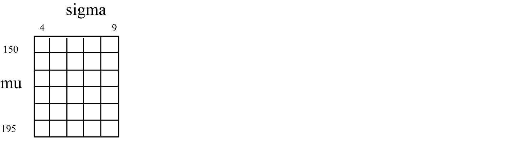
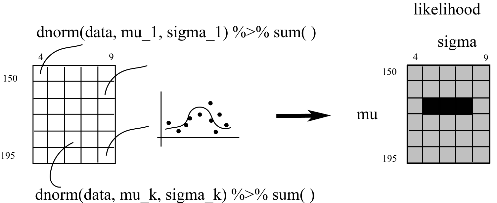
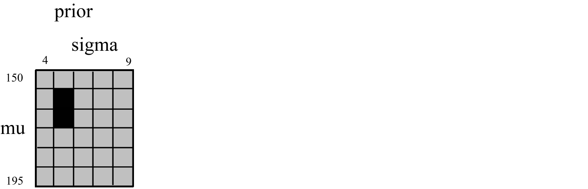

# 贝叶斯数据分析 {#tidybayes}


> "If you want to master something, teach it."
>
> --- ― Yogi Bhajan

贝叶斯分析的内容十分丰富，应用也非常广泛，尤其在心理学。下学期我们争取能揭开面纱的一角。
欢迎大家继续选课<Bayesian New Statistics>。本章我尽可能的不去翻译，一方面我翻译水平有限，二是尽量保持原汁原味


主要内容：

- 贝叶斯公式
- 贝叶斯应用场景
- 频率学派和贝叶斯数据分析的区别
- 贝叶斯数据分析的优势
- 什么是 bootstrapping?
- 什么是Markov Chain Monte Carlo
- Posterior, prior, likelihood, sample size.
- 贝叶斯数据分析的步骤
- 网格近似及其局限
- stan 与 brms
- 样本大小对后验概率的影响
- 先验概率对后验概率的影响


```{r message = FALSE, warning = FALSE}
library(tidyverse)
library(brms)
library(tidybayes)
library(patchwork)
```

## 贝叶斯应用场景

我经常会去打车，比如滴滴，假定有两个司机

1. 等级是5 颗星，历史成交量5
2. 等级是4.68 颗星，历史成交量1000

我们该如何选择？


## 贝叶斯公式

对于参数 $\theta$ 和数据 $D$，贝叶斯公式可以写为

$$
\begin{align*}
p(\theta|D) & = \frac{p(D|\theta)p(\theta)}{p(D)} \;\; \text{and since} \\
p(D)        & = \sum\limits_{\theta^*}p(D|\theta^*)p(\theta^*) \;\; \text{it's also the case that} \\
p(\theta|D) & = \frac{p(D|\theta)p(\theta)}{\sum\limits_{\theta^*}p(D|\theta^*)p(\theta^*)}.
\end{align*}
$$


这里，
$$
\underbrace{p(\theta|D)}_\text{posterior} \; = \; \underbrace{p(D|\theta)}_\text{likelihood} \;\; \underbrace{p(\theta)}_\text{prior} \; / \; \underbrace{p(D)}_\text{evidence}.
$$
作者(Kruschke, (2015))原书的解释如下：

> The "prior," $p(\theta)$, is the credibility of the $\theta$ values without the data $D$. The "posterior," $p(\theta|D)$, is the credibility of $\theta$ values with the data $D$ taken into account. The "likelihood," $p(D|\theta)$, is the probability that the data could be generated by the model with parameter value $\theta$. The "evidence" for the model, $p(D)$, is the overall probability of the data according to the model, determined by averaging across all possible parameter values weighted by the strength of belief in those parameter values. (pp. 106--107)


## Frequentists vs Bayesians


Frequentists assume parameters are fixed and data is random.
Bayesians assume parameters are random and data is fixed"


## Markov Chain Monte Carlo

MCMC的两个核心算法 

### Metropolis-Hastings：


- Has a proposal distribution (stochastic perturbation of initial state)
- Sample from it
- Calculate the acceptance probability
- Accepts with that probability (correction; reject if too far from typical set)
<!-- - 比如 neighbour of the current state -->

### Hamiltonian Monte Carlo：

- multivariate setting, sample from conditional probability with one
parameter fixed
<!-- - 比如冰球 -->


## Steps of Bayesian Data Analysis

一般来说。贝叶斯数据分析有如下五个步骤（摘自 Kruschke, J. K. (2015)）：


- **Identify the data** relevant to the research questions. What are the measurement scales of the data? Which data variables are to be predicted, and which data variables are supposed to act as predictors?
- **Define a descriptive model** for the relevant data. The mathematical form and its parameters should be meaningful and appropriate to the theoretical purposes of the analysis.
- **Specify a prior distribution** on the parameters. The prior must pass muster with the audience of the analysis, such as skeptical scientists.
- Use Bayesian inference to re-allocate credibility across parameter values. Interpret the **posterior distribution** with respect to theoretically meaningful issues (assuming that the model is a reasonable description of the data; see next step).
- Check that the posterior predictions mimic the data with reasonable accuracy (i.e., conduct a **“posterior predictive check”**). If not, then consider a different descriptive model.


下面通过具体的案例来演示贝叶斯数据分析流程

## Real Data Example

这里，我们模拟了川师男生和女生的身高体重

```{r}
set.seed(1024)

# boy:
  HtMmu   <- 168.52
  HtMsd   <- 6.87
  WtMmu   <- 58.14
  WtMsd   <- 3.17
  Mrho    <- 0.42
  Mmean   <- c(HtMmu, WtMmu)
  Msigma  <- matrix(c(HtMsd^2, Mrho * HtMsd * WtMsd,
                      Mrho * HtMsd * WtMsd, WtMsd^2), nrow = 2)
  
d1 <- 
  MASS::mvrnorm(n = 100, mu = Mmean, Sigma = Msigma)  %>%
  data.frame() %>%
  purrr::set_names("height", "weight") %>% 
  mutate(sex = "boy") %>% 
  select(sex, everything())

d1 %>% head()
```


```{r}
# girl:
  HtFmu   <- 161.11
  HtFsd   <- 5.76
  WtFmu   <- 48.06
  WtFsd   <- 4.24
  Frho    <- 0.41
  prop    <- 0.46
  Fmean   <- c(HtFmu, WtFmu)
  Fsigma  <- matrix(c(HtFsd^2, Frho * HtFsd * WtFsd,
                       Frho * HtFsd * WtFsd, WtFsd^2), nrow = 2)
  
d2 <- 
  MASS::mvrnorm(n = 100, mu = Fmean, Sigma = Fsigma)  %>%
  data.frame() %>%
  purrr::set_names("height", "weight") %>% 
  mutate(sex = "girl") %>% 
  select(sex, everything())

d2 %>% head()
```


```{r}
d <- bind_rows(d1, d2) 

d %>% 
  head()
```


我们想知道学生身高的分布情况，
```{r}
d %>% 
  summarise(
  min = min(height),
  max = max(height),
  sd = sd(height)
)
```


```{r}
d %>% 
  ggplot(aes(x = height)) +
  geom_density()
```

通过以上探索，我们有理由猜测：身高服从正态分布，且均值和方差在以下范围

```{r, eval=FALSE}
prior_mu       = dnorm(mu,    mean = 167, sd  = 20, log = T)
prior_sigma    = dunif(sigma, min  = 0,   max = 50, log = T)
```


```{r, fig.width = 6, fig.height = 2.5}
p1 <- 
  ggplot(data = tibble(x = seq(from = 100, to = 230, by = .1)), 
       aes(x = x, y = dnorm(x, mean = 167, sd = 20))) +
  geom_line() +
  xlab("height_mean") +
  ylab("density")


p2 <- 
  ggplot(data = tibble(x = seq(from = -10, to = 55, by = .1)), 
       aes(x = x, y =  dunif(x, min  = 0,   max = 50))) +
  geom_line() +
  xlab("height_sd") +
  ylab("density")

p1 + p2
```


### grid

为了在 tidyverse 框架下计算，我们构建了 1000*1000 个(mu, sigma)参数组合, 

```{r out.width = '100%', fig.align='left', echo = FALSE}

```


```{r}
n <- 1000
d_grid <-
	tibble(mu    = seq(from = 150, to = 190, length.out = n),
		     sigma = seq(from = 4,   to = 9,   length.out = n)) %>%
	#tidyr::expand(mu, sigma)
	modelr::data_grid(mu, sigma)
```


### likelihood

这里我们计算，每个(mu, sigma)组合的分布下，数据中身高值(`d$height`)出现的概率密度`dnorm(d2$height, mean = mu, sd = sigma)`，然后加起来。
很显然，不同的(mu, sigma)，概率密度之和不一样，我们这里有1000*1000 个(mu, sigma)组合，
所以会产生 1000*1000 个概率密度之和

```{r out.width = '100%', fig.align='left', echo = FALSE}

```


```{r}
grid_function <- function(mu, sigma){
	dnorm(d2$height, mean = mu, sd = sigma, log = T) %>% 
		sum()
}
```


```{r, eval=FALSE}
d_grid %>% 
	mutate(log_likelihood = map2_dbl(mu, sigma, grid_function)) 
```


### prior

```{r out.width = '100%', fig.align='left', echo = FALSE}

```


```{r, eval=FALSE}
d_grid %>% 
	mutate(prior_mu     = dnorm(mu,    mean = 178, sd  = 20, log = T),
	     prior_sigma    = dunif(sigma, min  = 0,   max = 50, log = T)) 
```


### posterior

```{r out.width = '100%', fig.align='left', echo = FALSE}
knitr::include_graphics("images/04posterior.png")
```


```{r}
d_grid <-
	d_grid %>%
	mutate(log_likelihood = map2_dbl(mu, sigma, grid_function)) %>%
	mutate(prior_mu       = dnorm(mu,    mean = 168, sd  = 20, log = T),
	     prior_sigma    = dunif(sigma, min  = 0,   max = 50, log = T)) %>%
	mutate(product        = log_likelihood + prior_mu + prior_sigma) %>%
	mutate(probability    = exp(product - max(product)))

head(d_grid)
```


```{r, fig.width = 3.25, fig.height = 3}
d_grid %>%
	ggplot(aes(x = mu, y = sigma, z = probability)) +
	geom_contour() +
	labs(x = expression(mu),
		 y = expression(sigma)) +
	coord_cartesian(xlim = range(d_grid$mu),
					ylim = range(d_grid$sigma)) +
	theme(panel.grid = element_blank())
```


```{r, fig.width = 4.5, fig.height = 3}
d_grid %>%
	ggplot(aes(x = mu, y = sigma)) +
	geom_raster(aes(fill = probability),
				interpolate = T) +
	scale_fill_viridis_c(option = "A") +
	labs(x = expression(mu),
		 y = expression(sigma)) +
	theme(panel.grid = element_blank())
```


### sampling from posterior

后验分布按照probability值的大小来抽样。先有分布，然后基于这种分布完成MCMC抽样。


```{r out.width = '100%', fig.align='left', echo = FALSE}
knitr::include_graphics("images/05sampling.png")
```


```{r}
d_grid_samples <- 
	d_grid %>% 
	sample_n(size = 1e4, replace = T, weight = probability)
```


```{r, fig.width = 3.25, fig.height = 3}
d_grid_samples %>% 
	ggplot(aes(x = mu, y = sigma)) + 
	geom_point(size = .9, alpha = 1/15) +
	scale_fill_viridis_c() +
	labs(x = expression(mu[samples]),
		 y = expression(sigma[samples])) +
	theme(panel.grid = element_blank())
```


```{r, fig.width = 6, fig.height = 3}
d_grid_samples %>%
	select(mu, sigma) %>%
	pivot_longer(
	  cols = everything(),
	  names_to = "key",
	  values_to = "value"
	) %>%
	ggplot(aes(x = value)) +
	geom_density(fill = "grey33", size = 0) +
	scale_y_continuous(NULL, breaks = NULL) +
	xlab(NULL) +
	theme(panel.grid = element_blank()) +
	facet_wrap(~key, scales = "free")
```


也可以用`tidybayes::mode_hdi()`得到后验概率的**最高密度区间**

```{r}
library(tidybayes)

d_grid_samples %>%
	select(mu, sigma) %>%
	pivot_longer(
	  cols = everything(),
	  names_to = "key",
	  values_to = "value"
	) %>%
	group_by(key) %>%
	mode_hdi(value)
```


以上是通过**网格近似**的方法得到weight分布的后验概率，但这种方法需要构建参数网格，对于较复杂的模型，计算量会陡增，内存占用大、比较费时，因此在实际的数据中，一般不采用这种方法，但网格近似的方法可以帮助我们很好地理解贝叶斯数据分析。


## 使用brms

[**brms**](https://cran.r-project.org/web/packages/brms/index.html)提供了很好的贝叶斯数据分析的框架，下面就用brms重新完成上面的工作。

```{r}
b20.1 <-
  brm(data = d, family = gaussian,
      height ~ 1,                  # 
      prior = c(prior(normal(168, 20), class = Intercept),
                prior(uniform(0, 50), class = sigma)),
      iter = 31000, warmup = 30000, chains = 4, cores = 4,
      seed = 4)

```


```{r}
plot(b20.1)
```


```{r}
post <- posterior_samples(b20.1)
head(post)
```


```{r}
# 以下三者是等价的
post %>%
  select(-lp__) %>%
  pivot_longer(
    cols = everything(),
    names_to = "parameter",
    values_to = "value"
  ) %>%
  group_by(parameter) %>%
  summarise(mean = mean(value),
            SD   = sd(value),
            `2.5_percentile`  = quantile(value, probs = .025),
            `97.5_percentile` = quantile(value, probs = .975)) %>%
  mutate_if(is.numeric, round, digits = 2)
```


```{r}
# 再或者
post %>%
  select(-lp__) %>%
  pivot_longer(
    cols = everything(),
    names_to = "parameter",
    values_to = "value"
  ) %>%
  group_by(parameter) %>%
  tidybayes::mean_qi(value)
```


```{r}
# 与上等价
posterior_summary(b20.1)
```


## 增加预测变量

brms 功能强大，可以完成**几乎所有回归模型**的贝叶斯分析


### 选择模型

数学公式表示

* $h_i \sim \text{Normal}(\mu_i, \sigma)$: `family = gaussian`
* $\mu_i = \alpha + \beta x_i$: `height ~ 1 + weight`
* $\alpha \sim \text{Normal}(166, 100)$: `prior(normal(166, 100), class = Intercept`
* $\beta \sim \text{Normal}(0, 10)$: ` prior(normal(0, 10), class = b)`
* $\sigma \sim \text{Uniform}(0, 50)$: `prior(uniform(0, 50), class = sigma)`


### Specifying Priors

各种先验概率分布

```{r, fig.width = 3, fig.height = 2.5}
ggplot(data = tibble(x = seq(from = 100, to = 230, by = .1)), 
       aes(x = x, y = dnorm(x, mean = 166, sd = 20))) +
  geom_line() +
  ylab("density")
```


```{r, fig.width = 3, fig.height = 2.5}
tibble(x = seq(from = -10, to = 60, by = .1)) %>%
  
  ggplot(aes(x = x, y = dunif(x, min = 0, max = 50))) +
  geom_line() +
  scale_y_continuous(NULL, breaks = NULL) +
  theme(panel.grid = element_blank())
```

除了正态分布、均匀分布，还可以指定其它分布，比如柯西分布

```{r, fig.width = 3, fig.height = 2.5}
tibble(x = seq(from = -10, to = 10, by = .1)) %>%
  
  ggplot(aes(x = x, y = dcauchy(x))) +
  geom_line() +
  scale_y_continuous(NULL, breaks = NULL) +
  theme(panel.grid = element_blank())
```


画在一起看看
```{r, fig.width = 3, fig.height = 2.5}
tibble(x = seq(from = -10, to = 10, by = .1)) %>%
  
  ggplot() +
  geom_line(aes(x = x, y = dcauchy(x))) +
  geom_line(aes(x = x, y = dnorm(x, mean = 0, sd = 2))) +
  scale_y_continuous(NULL, breaks = NULL) +
  theme(panel.grid = element_blank())
```


### Obtain the Posterior Distributions


```{r, cache = T, message = F, warning = F}
b20.2 <- 
  brm(data = d, 
      family = gaussian,
      weight ~ 1 + height,
      prior = c(prior(normal(0, 100), class = Intercept),
                prior(normal(0, 100), class = b),
                prior(cauchy(0, 10),  class = sigma)),
      chains = 4, cores = 4, iter = 4000, warmup = 2000,
      seed = 2)
```

忍不住向plot()下下

```{r, fig.width = 6, fig.height = 3.5}
plot(b20.2)
```


### Posterior Distribution

```{r, fig.width = 3.25, fig.height = 3}
# extract the posterior draws
post <- posterior_samples(b20.2)

# this will streamline some of the code, below
n_lines <- 150

# plot!
d %>% 
  ggplot(aes(x = height, y = weight)) +
  geom_abline(intercept = post[1:n_lines, 1], 
              slope     = post[1:n_lines, 2],
              color = "grey50", size = 1/4, alpha = .3) +
  geom_point(alpha = 2/3) +
  labs(subtitle = glue::glue("Data with ", n_lines, " credible regression lines"),
       x = "Height in cm",
       y = "Weight in kg") +
  theme(panel.grid = element_blank())
```


```{r, warning = F, message = F, fig.width = 3, fig.height = 3}
library(tidybayes)

post %>% 
  ggplot(aes(x = b_height)) +
  geom_histogram(color = "grey92", fill = "grey67",
                 binwidth = .02, size = .2) +
  stat_pointintervalh(aes(y = 0), 
                      point_interval = mode_hdi, .width = .95) +
  scale_y_continuous(NULL, breaks = NULL) +
  labs(title = "The posterior distribution",
       subtitle = "The mode and 95% HPD intervals are\nthe dot and horizontal line at the bottom.",
       x = expression(paste(beta[1], " (slope)"))) +
  theme(panel.grid = element_blank())
```


```{r, fig.width = 4, fig.height = 4}
nd <- tibble(height = seq(from = 145, to = 190, length.out = 60))

b20.2 %>% 
  predict(newdata = nd) %>%
  as_tibble() %>%
  bind_cols(nd) %>% 

  ggplot(aes(x = height)) +
  geom_pointrange(aes(y = Estimate, 
                      ymin = Q2.5, 
                      ymax = Q97.5),
                  color = "grey67",
                  shape = 20) +
  geom_point(data =  d, 
             aes(y = weight),
             alpha = 2/3) +
  labs(subtitle = "Data with the percentile-based 95% intervals and\nthe means of the posterior predictions",
       x = "Height in inches",
       y = "Weight in inches") +
  theme(panel.grid = element_blank())
```


也可以这样画

```{r, fig.width = 4, fig.height = 4}
nd <- tibble(height = seq(from = 145, to = 190, length.out = 60))

b20.2 %>% 
  predict(newdata = nd) %>%
  as_tibble() %>%
  bind_cols(nd) %>% 

  ggplot(aes(x = height)) +
  geom_ribbon(aes(ymin = Q2.5, 
                  ymax = Q97.5),
                  fill = "grey75") +
  geom_line(aes(y = Estimate),
            color = "grey92") +
  geom_point(data =  d, 
             aes(y = weight),
             alpha = 2/3) +
  labs(subtitle = "Data with the percentile-based 95% intervals and\nthe means of the posterior predictions",
       x = "Height in inches",
       y = "Weight in inches") +
  theme(panel.grid = element_blank())
```


### posterior predictive check

```{r, fig.width = 4, fig.height = 3.5}
pp_check(b20.2) + ggtitle("Outcome")
```

### 小结

#### case 1

| math 	| brms 		|
|----------	|:-------------:	|
|$h_i \sim \text{Normal}(\mu, \sigma)$ | `family = gaussian`|
|$\mu_i = \alpha$ |`height ~ 1`|
|$\mu \sim \text{Normal}(168, 20)$ | `prior(normal(168, 20), class = Intercept)`|
|$\sigma \sim \text{Uniform}(0, 50)$ | `prior(uniform(0, 50), class = sigma)`|

- height不受其他变量影响，其均值对应的是截距Intercept， 
- brms 返回参数 $(\mu, \sigma)$， 即Intercept 和 $\sigma$

#### case 2

| math 	| brms 		|
|----------	|:-------------:	|
|$h_i \sim \text{Normal}(\mu, \sigma)$ | `family = gaussian`|
|$\mu_i = \alpha + \beta x_i$ |`height ~ 1 + weight`|
|$\alpha \sim \text{N}(166, 100)$ | `prior(normal(166, 100), class = Intercept)` |
|$\beta \sim \text{N}(0, 10)$| `prior(normal(0, 10), class = b)` |
|$\sigma \sim \text{Uniform}(0, 50)$| `prior(uniform(0, 50), class = sigma)` |

- height受其他变量影响，其均值对应的是截距$\alpha + \beta x_i$， 
- brms 返回参数 $(\mu, \sigma)$，即 Intercept, $\beta 和  \sigma$


## 样本大小对后验概率的影响

我写了一个动画，代码在[这里](https://gist.github.com/perlatex/b87520c90a04f6af043a107abab777c7)， 可以帮助大家理解---**数据样本大小**对后验概率的影响

```{r out.width = '80%', fig.align='left', echo = FALSE}
knitr::include_graphics(path = "images/test.gif")
```

## 先验概率对后验概率的影响

coming soon


## 推荐阅读

- [Kruschke, J. K. (2015). *Doing Bayesian data analysis, Second Edition: A tutorial with R, JAGS, and Stan.* Burlington, MA: Academic Press/Elsevier.](https://sites.google.com/site/doingbayesiandataanalysis/)

- [McElreath, R. (2016). *Statistical rethinking: A Bayesian course with examples in R and Stan.* Chapman & Hall/CRC Press.](https://xcelab.net/rm/statistical-rethinking/)

<!-- - A Solomon Kurz, <https://bookdown.org/connect/#/apps/1850/access> -->
<!-- - A Solomon Kurz, <https://bookdown.org/ajkurz/DBDA_recoded/> -->

<!-- - <https://psyc-bayes-notes.netlify.com/> -->
