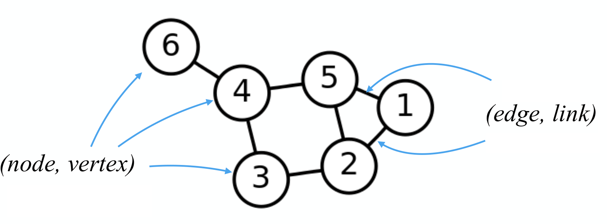
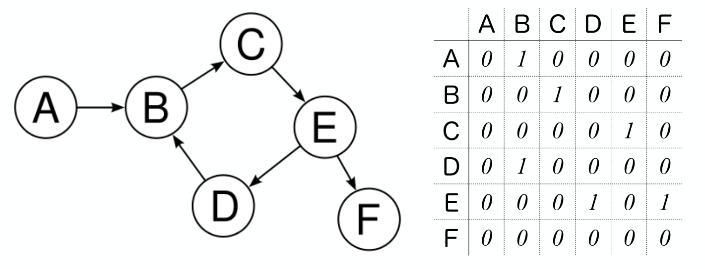

# 社会网络分析 {#tidygraph}


本章通过tidygraph宏包介绍社会网络分析。社会网络分析涉及的知识比较多，而tidygraph将网络结构规整地比较清晰，降低了学习难度，很适合入门学习。

```{r message = FALSE, warning = FALSE}
library(tidyverse)
library(tidygraph)
library(ggraph)
```


## 图论基本知识

网络图有两个主要特征: `nodes` and `edges`，

- **nodes**: 

- **edges**: 

```{r out.width = '70%', fig.align='center', echo = FALSE}

```


当然还包括其它的概念，比如

- **adjacency matrix**: 

- **edge list**: 

- **Node list**: 

- **Weighted network graph**: 

- **Directed and undirected network graph**:

 
 
有向图  
```{r out.width = '70%', fig.align='center', echo = FALSE}

```

无向图 
```{r out.width = '70%', fig.align='center', echo = FALSE}
knitr::include_graphics("images/node_edge03.png")
```


## 网络分析

先介绍tidygraph宏包

### tidygraph: A tidy API for graph manipulation 


```{r out.width = '70%', fig.align='center', echo = FALSE}
knitr::include_graphics("images/workflow_c.png")
```


### Tidy Network Anaylsis


- 在 `tidygraph` 框架, 网络数据可以分解成两个tidy数据框:
   - 一个是 **node** data 
   - 一个是 **edge** data


-  `tidygraph` 宏包提供了**node**数据框和**edge**数据框相互切换的方案，并且可以使用**dplyr**的语法操控
-  `tidygraph` 提供了常用的网络结构的**algorithms**，比如，计算网络拓扑结构中节点的重要性、中心度等。


### Create network objects


创建网络对象主要有两个函数:

- `tbl_graph()`. Creates a network object from nodes and edges data
- `as_tbl_graph()`. Converts network data and objects to a `tbl_graph` network.


案例: 欧盟总统之间通话以及次数。
```{r}
library("navdata") # devtools::install_github("kassambara/navdata")
data("phone.call2")
```


```{r}
node_list <- phone.call2$nodes
node_list
```


```{r}
edge_list <- phone.call2$edges
edge_list
```


### Use `tbl_graph`


- Create a `tbl_graph` network object using the phone call data:


```{r tibble to tbl_graph}
phone.net <- tbl_graph(nodes = node_list, edges = edge_list, directed = TRUE)
```


- Visualize the network graph

```{r out.width = '50%', fig.align='center'}
ggraph(phone.net, layout = "graphopt") +
  geom_edge_link(width = 1, colour = "lightgray") +
  geom_node_point(size = 4, colour = "red") +
  geom_node_text(aes(label = label), repel = TRUE) +
  theme_graph()
```


### Use `as_tbl_graph`


mtcars data set: R 的内置数据集，记录了32种不同品牌的轿车的的11个属性

1、we create a correlation matrix network graph

```{r}
library(corrr)
res.cor <- mtcars[, c(1, 3:6)] %>%    # (1)
  t() %>%
  correlate() %>%                     # (2)
  shave(upper = TRUE) %>%             # (3)
  stretch(na.rm = TRUE) %>%           # (4)
  filter(r >= 0.998)                  # (5)
res.cor
```


2、Create the correlation network graph:

```{r}
set.seed(1)
cor.graph <- as_tbl_graph(res.cor, directed = FALSE)
```


```{r out.width = '50%', fig.align='center'}
ggraph(cor.graph) +
  geom_edge_link() +
  geom_node_point() +
  geom_node_text(
    aes(label = name),
    size = 3, repel = TRUE
  ) +
  theme_graph()
```


### Print out a network object

```{r}
cor.graph
```


### extract the current active data


```{r}
cor.graph %>%
  activate(edges) %>%
  arrange(desc(r))
```
Note that, to extract the current active data as a tibble, you can use the function `as_tibble(cor.graph)`.


## Network graph manipulation


###  Car groups info (Number of cylinders)

```{r}
# Car groups info
cars.group <- data_frame(
  name = rownames(mtcars),
  cyl = as.factor(mtcars$cyl)
)
cars.group
```


###  Modify the nodes data:

```{r}
# Modify the nodes data
cor.graph <- cor.graph %>%
  activate(nodes) %>%
  left_join(cars.group, by = "name") %>% 
  rename(label = name)
cor.graph
```


###  Modify the edge data.
```{r}
# Modify the edge data.
cor.graph <- cor.graph %>%
  activate(edges) %>%
  rename(weight = r)
cor.graph
```


###  Display the final modified graphs object:
```{r}
cor.graph
```


###  Visualize the correlation network
```{r , message=FALSE, warning=FALSE, out.width='50%'}
set.seed(1)
ggraph(cor.graph) +
  geom_edge_link(aes(width = weight), alpha = 0.2) +
  scale_edge_width(range = c(0.2, 1)) +
  geom_node_point(aes(color = cyl), size = 2) +
  geom_node_text(aes(label = label), size = 3, repel = TRUE) +
  theme_graph()
```


## Network analysis


### Centrality
Centrality is an important concept when analyzing network graph. 

The `tidygraph` package contains more than 10 centrality measures, prefixed with the term `centrality_` :
```{r echo=TRUE}
# centrality_alpha()
# centrality_power()
# centrality_authority()
# centrality_betweenness()
# centrality_closeness()
# centrality_hub()
# centrality_degree()
# centrality_pagerank()
# centrality_eigen()
# centrality_subgraph
# centrality_edge_betweenness()
```


example:
- use the phone call network graph ( 欧盟总统之间通话以及次数)
- compute nodes centrality


```{r}
set.seed(123)
phone.net %>%
  activate(nodes) %>%
  mutate(centrality = centrality_authority()) 
```


```{r , message=FALSE, warning=FALSE, out.width='90%'}
set.seed(123)
phone.net %>%
  activate(nodes) %>%
  mutate(centrality = centrality_authority()) %>%
  ggraph(layout = "graphopt") +
  geom_edge_link(width = 1, colour = "lightgray") +
  geom_node_point(aes(size = centrality, colour = centrality)) +
  geom_node_text(aes(label = label), repel = TRUE) +
  scale_color_gradient(low = "yellow", high = "red") +
  theme_graph()
```


###  Clustering

- Clustering is a common operation in network analysis and it consists of grouping nodes based on the graph topology.


- Many clustering algorithms from are available in the tidygraph package and prefixed with the term group_. These include:

   - **Infomap community finding**. It groups nodes by minimizing the expected description length of a random walker trajectory. R function: `group_infomap()`
   - **Community structure detection based on edge betweenness**. It groups densely connected nodes. R function: `group_edge_betweenness()`


example:
- use the correlation network graphs (记录了32种不同品牌的轿车的的11个属性)
- detect clusters or communities

```{r}
set.seed(123)
cluster_mtcars <- cor.graph %>%
  activate(nodes) %>%
  mutate(community = as.factor(group_infomap())) 
cluster_mtcars
```


```{r, message=FALSE, warning=FALSE, out.width='90%'}
cluster_mtcars %>%
  ggraph(layout = "graphopt") +
  geom_edge_link(width = 1, colour = "lightgray") +
  geom_node_point(aes(colour = community), size = 4) +
  geom_node_text(aes(label = label), repel = TRUE) +
  theme_graph()
```


### More Algorithms

```{r out.width = '90%', fig.align='center', echo = FALSE}
knitr::include_graphics("images/Algorithms.png")
```


## 小结


```{r out.width = '70%', fig.align='center', echo = FALSE}
knitr::include_graphics("images/tbl_graph02.png")
```


tidybayes很聪明地将复杂的网络结构用两个数据框表征出来，node 数据框负责**节点**的属性，edge 数据框负责**网络连接**的属性，调整其中的一个数据框，另一个也会相应的调整，比如node数据框中删除一个节点，edge数据框就会自动地删除该节点的所有连接。


```{r out.width = '70%', fig.align='center', echo = FALSE}
knitr::include_graphics("images/tbl_graph04.png")
```


## Network Visualization

这里主要介绍tidygraph配套的[ggraph](https://github.com/thomasp85/ggraph)宏包，它们的作者都是同一个人。


### ggraph: A grammar of graphics for relational data
 
ggraph 沿袭了ggplot2的语法规则，

```{r message=FALSE, warning=FALSE}
cluster_mtcars %>%
  # Layout
  ggraph(layout = "graphopt") +
  # Edges
  geom_edge_link(
    width = 1,
    colour = "lightgray"
  ) +
  # Nodes
  geom_node_point(
    aes(colour = community),
    size = 4
  ) +
  geom_node_text(
    aes(label = label),
    repel = TRUE
  ) +
  theme_graph()
```


## 扩展阅读


- <https://www.data-imaginist.com/2017/introducing-tidygraph/>
- <https://github.com/thomasp85/tidygraph>
- <https://christophergandrud.github.io/networkD3/>


