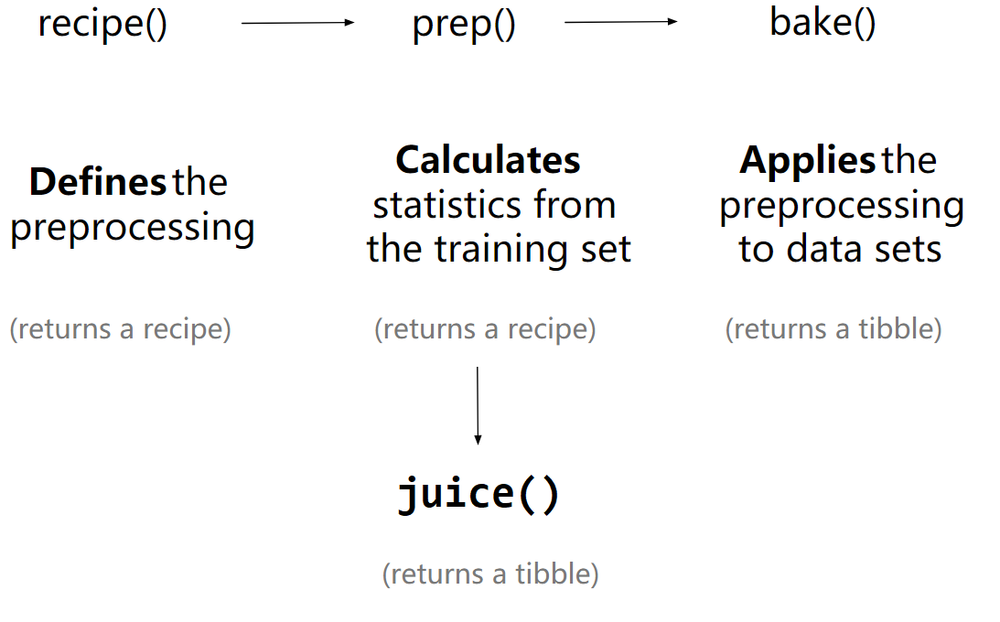

# 机器学习 {#tidymodels}

Rstudio工厂的 Max Kuhn 大神正主持**机器学习**的开发，日臻成熟了，感觉很强大啊。

```{r tidymodels-1, message = FALSE, warning = FALSE}
library(tidyverse)
library(tidymodels)
```


## 数据
```{r tidymodels-2, eval=FALSE}
penguins <- read_csv("./demo_data/penguins.csv") %>%
  janitor::clean_names() %>% 
  drop_na()

penguins %>%
  head()
```

```{r tidymodels-3, eval=FALSE}
penguins %>%
  ggplot(aes(x = bill_length_mm, y = bill_depth_mm, 
             color = species, shape = species)
         ) +
  geom_point()
```


## 机器学习

<!-- ?predict.model_fit -->
<!-- https://tidymodels.github.io/model-implementation-principles/model-predictions.html -->


```{r tidymodels-4, eval=FALSE}
split <- penguins %>% 
  mutate(species = as_factor(species)) %>% 
  mutate(species = fct_lump(species, 1)) %>% 
  initial_split()

split

training_data <- training(split)
training_data
testing_data <- testing(split)
testing_data
```


## model01
```{r tidymodels-5, eval=FALSE}
model_logistic <- parsnip::logistic_reg() %>% 
  set_engine("glm") %>% 
  set_mode("classification") %>% 
  fit(species ~ bill_length_mm + bill_depth_mm, data = training_data)


bind_cols(
  predict(model_logistic, new_data = testing_data, type = "class"),
  predict(model_logistic, new_data = testing_data, type = "prob"),
  testing_data
)


predict(model, new_data = testing_data) %>% 
  bind_cols(testing_data) %>% 
  count(.pred_class, species)
```


## model02
```{r tidymodels-6, eval=FALSE}
model_neighbor <- parsnip::nearest_neighbor(neighbors = 10) %>% 
  set_engine("kknn") %>% 
  set_mode("classification") %>% 
  fit(species ~ bill_length_mm, data = training_data)

predict(model_neighbor, new_data = testing_data) %>% 
  bind_cols(testing_data) %>% 
  count(.pred_class, species)
```


## model03
```{r tidymodels-7, eval=FALSE}
model_multinom <- parsnip::multinom_reg() %>% 
  set_engine("nnet") %>% 
  set_mode("classification") %>% 
  fit(species ~ bill_length_mm, data = training_data)

predict(model_multinom, new_data = testing_data) %>% 
  bind_cols(testing_data) %>% 
  count(.pred_class, species)

```


## model04
```{r tidymodels-8, eval=FALSE}
model_decision <- parsnip::decision_tree() %>% 
  set_engine("rpart") %>% 
  set_mode("classification") %>% 
  fit(species ~ bill_length_mm, data = training_data)

predict(model_decision, new_data = testing_data) %>% 
  bind_cols(testing_data) %>% 
  count(.pred_class, species)

```


## workflow

### 使用 recipes

```{r tidymodels-9, message=FALSE, warning=FALSE}
library(tidyverse)
library(tidymodels)
library(workflows)

penguins <- readr::read_csv("./demo_data/penguins.csv") %>%
  janitor::clean_names() 


split <- penguins %>% 
  tidyr::drop_na() %>% 
  rsample::initial_split(prop = 3/4)

training_data <- rsample::training(split)
testing_data  <- rsample::testing(split)
```


参考[tidy modeling in R](https://www.tmwr.org/recipes.html), 被预测变量在分割前，应该先处理，比如标准化。
但这里的案例，我为了偷懒，被预测变量`bill_length_mm`，暂时保留**不变**。
预测变量做标准处理。


```{r tidymodels-10}
penguins_lm <- 
  parsnip::linear_reg() %>% 
  #parsnip::set_engine("lm") 
  parsnip::set_engine("stan") 

penguins_recipe  <- 
  recipes::recipe(bill_length_mm ~ bill_depth_mm + sex, data = training_data) %>% 
  recipes::step_normalize(all_numeric(), -all_outcomes()) %>% 
  recipes::step_dummy(all_nominal())


broom::tidy(penguins_recipe)
```


```{r tidymodels-11, out.width='80%', fig.align='center', echo = FALSE}

```


```{r tidymodels-12, eval=FALSE}
penguins_recipe %>% 
  recipes::prep(data = training_data) %>%  #or prep(retain = TRUE)
  recipes::juice()


penguins_recipe %>%   
  recipes::prep(data = training_data) %>% 
  recipes::bake(new_data = testing_data)   # recipe used in new_data


train_data <- 
  penguins_recipe %>%   
  recipes::prep(data = training_data) %>% 
  recipes::bake(new_data = NULL) 


test_data <- 
  penguins_recipe %>%   
  recipes::prep(data = training_data) %>% 
  recipes::bake(new_data = testing_data)   
```


### workflows的思路更清晰

workflows的思路让模型结构更清晰。 这样`prep()`, `bake()`, and `juice()` 就可以省略了，只需要recipe和model，他们往往是成对出现的


```{r tidymodels-13}
wflow <- 
  workflows::workflow() %>% 
  workflows::add_recipe(penguins_recipe) %>% 
  workflows::add_model(penguins_lm) 


wflow_fit <- 
  wflow %>% 
  parsnip::fit(data = training_data)
```


```{r tidymodels-14}
wflow_fit %>% 
  workflows::pull_workflow_fit() %>% 
  broom.mixed::tidy()

wflow_fit %>% 
  workflows::pull_workflow_prepped_recipe() 
```


先提取模型，用在 `predict()` 是可以的，但这样太麻烦了

```{r tidymodels-15, eval=FALSE}
wflow_fit %>% 
  workflows::pull_workflow_fit() %>% 
  stats::predict(new_data = test_data) # note: test_data not testing_data
```


因为，`predict()` 会自动的将recipes(对training_data的操作)，应用到testing_data
这个不错，参考[这里](https://www.tidymodels.org/start/recipes/)

```{r tidymodels-16}
penguins_pred <- 
  predict(
    wflow_fit, 
    new_data = testing_data %>% dplyr::select(-bill_length_mm),
    type= "numeric"
  ) %>% 
  dplyr::bind_cols(testing_data %>% dplyr::select(bill_length_mm))

penguins_pred
```


```{r tidymodels-17}
penguins_pred %>% 
  ggplot(aes(x = bill_length_mm, y = .pred)) + 
  geom_abline(linetype = 2) + 
  geom_point(alpha = 0.5) + 
  labs(y = "Predicted ", x = "bill_length_mm") 
```

### 模型评估

参考<https://www.tmwr.org/performance.html#regression-metrics>

```{r tidymodels-18}
penguins_pred %>%
  yardstick::rmse(truth = bill_length_mm, estimate = .pred) 
```


```{r tidymodels-19}
# 自定义一个指标评价函数my_multi_metric，就是放一起，感觉不够tidyverse
my_multi_metric <- yardstick::metric_set(rmse, rsq, mae, ccc)

penguins_pred %>%
  my_multi_metric(truth = bill_length_mm, estimate = .pred) 
```


```{r tidymodels-20, echo = F}
# remove the objects
# ls() %>% stringr::str_flatten(collapse = ", ")

rm(my_multi_metric, penguins, penguins_lm, penguins_pred, penguins_recipe, split, testing_data, training_data, wflow, wflow_fit)
```


```{r tidymodels-21, echo = F, message = F, warning = F, results = "hide"}
pacman::p_unload(pacman::p_loaded(), character.only = TRUE)
```

