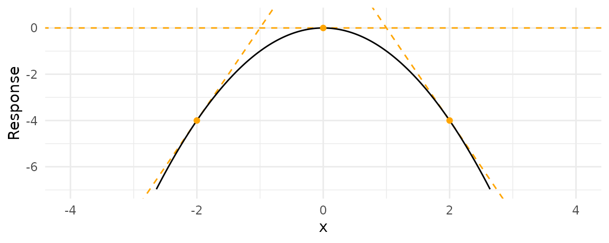

# 模型的边际效应 {#tidystats-marginaleffects}

本章介绍模型的边际效应，主要围绕[marginaleffects](https://vincentarelbundock.github.io/marginaleffects/index.html)宏包，本章的内容也是来源该宏包的说明文档。


## 边际效应

边际效应，测量的是某一个预测因子变化一个单位与伴随的响应变量的变化之间的关联。用数学语言表示，就是回归方程对x求偏导。


假定我们建立的回归方程是一个二次函数，
$$
y = -x^2
$$

那么对x的偏导数
$$
\frac{\partial y}{\partial x} = -2x
$$
```{r, out.width = '35%', echo = FALSE}

```

可以看到，此时的边际效应就是曲线的斜率

1. 当$x<0$，斜率为正，x增加y也增加，即，边际效应为正
2. 当$x=0$，斜率为0，在这个位置上边际效应为0
3. 当$x>0$，斜率为负，x增加y也减少，在这个位置上边际效应为负

## marginaleffects function

最简单的线性模型，每个因子的边际效应就是预测因子的系数，与因子的取值无关。但是复杂点模型，因子边际效应不仅仅与因子的取值有关，而且还与其它因子的值也有关。


我们下面用企鹅数据来说明。
```{r, message = FALSE, warning = FALSE, tidy = "styler"}
library(tidyverse)
library(palmerpenguins)
library(marginaleffects)
```


我们先构建一个二元变量`fat_penguin`（是否为胖子）, `1`表示是，`0`表示不是。并建立logitisc回归模型
```{r}
dat <- penguins %>%
  drop_na() %>% 
  mutate(
    fat_penguin = if_else(body_mass_g > median(body_mass_g), 1, 0)
  )

mod <- glm(
  fat_penguin ~ bill_length_mm + flipper_length_mm + species,
  data = dat, 
  family = binomial(link = "logit")
)
mod
```


   
```{r}
mfx <- marginaleffects(mod, type = "response") 
mfx
```

`marginaleffects()` 函数对数据框dat的每一行观测给出了边际效应估计，最后输出一个数据框
。注意到，我们的模型有3个预测因子（两个连续变量，一个离散变量），一个预测因子对应一个与原数据框等长的数据框，因此最终返回的结果是原来数据框长度的3倍。

```{r}
mfx %>% 
  count(term, contrast)
```


边际效应对连续变量非常适合。但离散变量的边际效应，不太好理解，因此采用对照方法，具体为，以某一层级为基线，那么从基线切换到其它层级，伴随着响应变量的变化，就为离散变量的边际效应。


## 平均边际效应
```{r}
summary(mfx)
```


## 参考

- <https://vincentarelbundock.github.io/marginaleffects/articles/mfx.html>
