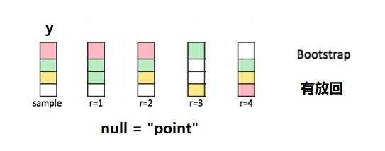

# 模拟与抽样3 {#tidystats-sampling-bootstrap}

```{r, include=FALSE}
knitr::opts_chunk$set(
   echo         = TRUE, 
   warning      = FALSE, 
   message      = FALSE,
   fig.showtext = TRUE
)
```

我很推崇infer基于模拟的假设检验。本节课的内容是用tidyverse技术重复infer过程，让统计分析透明。


```{r, message=FALSE, warning=FALSE}
library(tidyverse)
library(infer)

penguins <- palmerpenguins::penguins %>% drop_na()

point_estimate <- penguins %>%
  specify(response = bill_length_mm) %>%
  calculate(stat = "mean")

penguins %>%
  specify(response = bill_length_mm) %>%
  hypothesize(null = "point", mu = 40) %>%
  generate(reps = 5000, type = "bootstrap") %>%
  calculate(stat = "mean") %>%
  visualize() +
  shade_p_value(obs_stat = point_estimate, direction = "two-sided")
```


## 重复infer中`null = "point"`的抽样过程

- 零假设，bill_length_mm长度的均值是`mu = 40`.

**具体怎么做呢？**


### 抽样

```{r, out.width = '100%', fig.align='center', echo = FALSE}

```

- 响应变量`y`这一列，先中心化，然后加上假设条件`mu`
- 针对调整后的这一列，有放回的抽样。
- 反复抽样`reps = 1000`次


由图中可以看到，每次抽样返回的新数据框与原数据框大小相等，但因为是**有放回的抽样**，因此每次得到一个不同的集合，有的值可能没抽到，而有的值抽了好几次。下面以一个小的数据框为例演示 


```{r}
tbl <- tibble(
  y = 1:4,
  x = c("a", "a", "b", "b")
)
tbl
```

```{r, eval=FALSE}
tbl %>%
  specify(response = y) %>%
  hypothesize(null = "point", mu = 4) %>%
  generate(reps = 1, type = "bootstrap") 
```


先调整`y`列，然后有放回的抽样
```{r, eval=FALSE}
mu <- 4
y <- tbl[[1]] - mean(tbl[[1]]) + mu
y_prime <- sample(y, size = length(y), replace = TRUE)
  
tbl[1] <- y_prime 
tbl
```


也可以写成函数形式

```{r}
bootstrap_once <- function(df, mu) {
  y <- df[[1]] - mean(df[[1]]) + mu
  y_prime <- sample(y, size = length(y), replace = TRUE)
  
  df[[1]] <- y_prime
  return(df)
}

tbl %>% bootstrap_once(mu = 4)
```


这个操作需要重复若干次，比如100次，即得到100个数据框，因此可以使用`purrr::map()`迭代

```{r, eval=FALSE}
1:100 %>% 
   purrr::map(~ bootstrap_once(tbl)) 
```


为方便灵活定义重复的次数，也可以改成函数，并且为每次返回的样本(数据框)，编一个序号


```{r}
bootstrap_repeat <- function(df, reps = 30, mu = mu){
  df_out <- 
    purrr::map_dfr(.x = 1:reps, .f = ~ bootstrap_once(df, mu = mu)) %>% 
    dplyr::mutate(replicate = rep(1:reps, each = nrow(df))) %>% 
    dplyr::group_by(replicate)
  
  return(df_out)
}

tbl %>% bootstrap_repeat(reps = 1000, mu = 4)
```


### 计算null假设分布

计算每次抽样中，y的均值

```{r}
null_dist <- tbl %>% 
  bootstrap_repeat(reps = 1000, mu = 4) %>% 

  group_by(replicate) %>% 
  summarise(ybar = mean(y)) 

null_dist
```

### 可视化
```{r}
null_dist %>% 
  ggplot(aes(x = ybar)) +
  geom_histogram(bins = 15, color = "white")
```


### 应用penguins

```{r}
samples <- penguins %>% 
  select(bill_length_mm) %>% 
  bootstrap_repeat(reps = 5000, mu = 40)

null_dist <- samples %>% 
  group_by(replicate) %>% 
  summarise(stat = mean(bill_length_mm)) 

null_dist %>% 
  ggplot(aes(x = stat)) +
  geom_histogram(bins = 15, color = "white")
```


```{r}
obs_point <- mean(penguins$bill_length_mm)

p_value <- sum(null_dist$stat > obs_point) / length(null_dist$stat)
p_value
```


### 也可以用rowwise()写
```{r}
mu <- 40

update <- penguins %>% 
  mutate(
   bill_length_mm = bill_length_mm - mean(bill_length_mm) + mu
  )


null_dist <- tibble(replicate = 1:1000) %>% 
  rowwise() %>% 
  mutate(hand = list(sample(update$bill_length_mm, nrow(update), replace = TRUE))) %>% 
  mutate(points = mean(hand)) %>% 
  ungroup()

null_dist
```


```{r}
null_dist %>% 
  ggplot(aes(x = points)) +
  geom_histogram(bins = 15, color = "white")
```


## 参考

- <https://www.tidyverse.org/blog/2021/08/infer-1-0-0/>
- <http://ritsokiguess.site/blogg/posts/2021-11-14-tidy-simulation/>


```{r, echo = F, message = F, warning = F, results = "hide"}
pacman::p_unload(pacman::p_loaded(), character.only = TRUE)
```
