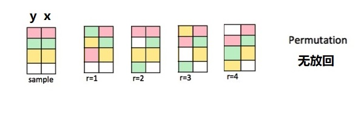

# 模拟与抽样2 {#tidystats-sampling-permute}


我很推崇infer基于模拟的假设检验。本节课的内容是用tidyverse技术重复infer过程，让统计分析透明。


```{r}
library(tidyverse)
library(infer)

penguins <- palmerpenguins::penguins %>% drop_na()

penguins %>%
  specify(formula = bill_length_mm ~ sex) %>%
  hypothesize(null = "independence") %>%
  generate(reps = 5000, type = "permute") %>% 
  calculate(
    stat = "diff in means",
    order = c("male", "female")
  ) %>%
  visualize()
```


## 重复infer中`diff in means`的抽样过程

两个假设：

- 独立性假设。假设有 y 和 x 两者独立，即y 与 x 无关，一个怎么变，都不会影响另一个。
- 零假设，x下有两个组（male, female），每组对应的y的均值是相等的，均值之差为0.

具体怎么做呢？


### 抽样

```{r, out.width = '100%', fig.align='center', echo = FALSE}

```

- 解释变量x列不动
- 响应变量y这一列，洗牌后放回。

相当于重新排列了y，所以抽样方法叫是"permute"。由图中可以看到每次抽样返回一个与原数据框大小相等的新数据框。下面以一个小的数据框为例演示 


```{r}
tbl <- tibble(
  y = 1:4,
  x = c("a", "a", "b", "b")
)
tbl
```


重新排列y
```{r}
y <- tbl[[1]]
y_prime <- sample(y, size = length(y), replace = FALSE)
  
tbl[1] <- y_prime 
tbl
```


也可以写成函数形式

```{r}
permute_once <- function(df) {
  y <- df[[1]]
  y_prime <- sample(y, size = length(y), replace = FALSE)
  
  df[1] <- y_prime 
  return(df)
}

tbl %>% permute_once()
```


这个操作需要重复若干次，比如100次，即得到100个数据框，因此可以使用`purrr::map()`迭代

```{r, eval=FALSE}
1:100 %>% 
   purrr::map(~ permute_once(tbl)) 
```


为方便灵活定义重复的次数，也可以改成函数，并且为每次返回的样本(数据框)，编一个序号


```{r}
permuate_repeat <- function(df, reps = 30){
  df_out <- 
    purrr::map_dfr(.x = 1:reps, .f = ~ permute_once(df)) %>% 
    dplyr::mutate(replicate = rep(1:reps, each = nrow(df))) %>% 
    dplyr::group_by(replicate)
  
  return(df_out)
}

tbl %>% permuate_repeat(reps = 1000)
```


### 计算null假设分布

计算每次抽样中，`a` 组和 `b` 组的均值，以及这两个均值的差

```{r}
null_dist <- tbl %>% 
  permuate_repeat(reps = 1000) %>% 

  group_by(replicate, x) %>% 
  summarise(ybar = mean(y)) %>% 
  group_by(replicate) %>% 
  summarise(
    stat = ybar[x == "a"] - ybar[x == "b"]
  )

null_dist
```

### 可视化
```{r}
null_dist %>% 
  ggplot(aes(x = stat)) +
  geom_histogram(bins = 15, color = "white")
```


### 应用penguins

```{r}
samples <- penguins %>% 
  select(bill_length_mm, sex) %>% 
  permuate_repeat(reps = 5000)

null_dist <- samples %>% 
  group_by(replicate, sex) %>% 
  summarise(ybar = mean(bill_length_mm)) %>% 
  group_by(replicate) %>% 
  summarise(
    stat = ybar[sex == "male"] - ybar[sex == "female"]
  )

null_dist %>% 
  ggplot(aes(x = stat)) +
  geom_histogram(bins = 15, color = "white")
```


```{r}
penguins %>%
  group_by(sex) %>%
  summarize(avg_rating = mean(bill_length_mm, na.rm = TRUE)) %>%
  mutate(diff_means = avg_rating - lag(avg_rating))
```


```{r}
p_value <- sum(null_dist$stat > 3.757792) / length(null_dist$stat)
p_value
```


```{r, echo = F, message = F, warning = F, results = "hide"}
pacman::p_unload(pacman::p_loaded(), character.only = TRUE)
```
