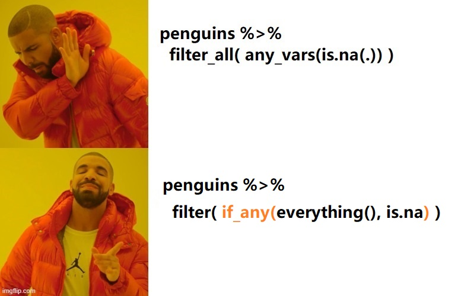

# tidyverse中的across()之美2 {#tidyverse-beauty-of-across2}

```{r beauty-of-across2-1}
library(tidyverse)
library(palmerpenguins)
```


## 曾经的痛点

dplyr 1.0.0 引入了`across()`函数，让我们再次感受到了dplyr的强大和人性化。
`across()`函数与`summarise()`和`mutate()`函数配合起来使用，非常方便（参考第 \@ref(beauty-of-across) 章），
但与`filter()`函数不是很理想，比如我们想**筛选数据框有缺失值的行**

```{r beauty-of-across2-2}
penguins %>% 
  filter( across(everything(), any_vars(is.na(.)))
)
```

代码能运行，但结果明显不正确。我搜索了很久，发现只能用dplyr 1.0.0之前的`filter_all()`函数实现， 

```{r beauty-of-across2-3}
penguins %>% 
  filter_all( any_vars(is.na(.)) )
```

多少让人感觉，在追求简约道路上，还是有美中不足。


## dplyr 1.0.4: if_any() and if_all()

如今，dplyr 1.0.4推出了 `if_any()` and `if_all()` 两个函数，正是弥补这个缺陷


```{r beauty-of-across2-41, out.width = '90%', echo = FALSE}

```


```{r beauty-of-across2-4}
penguins %>% 
  filter(if_any(everything(), is.na))
```


从函数形式上看，`if_any` 对应着 `across`的地位，

```r
across(.cols = everything(), .fns = NULL, ..., .names = NULL)

if_any(.cols, .fns = NULL, ..., .names = NULL)

if_all(.cols, .fns = NULL, ..., .names = NULL)
```


这就意味着**列方向我们有across()，行方向我们有if_any()/if_all()了**，可谓 纵横武林，倚天屠龙、谁与争锋?


## 案例赏析

下面通过一些例子展示下这两个新函数，其中一部分案例来自[官网](https://www.tidyverse.org/blog/2021/02/dplyr-1-0-4-if-any/)。


- 筛选有缺失值的行
```{r beauty-of-across2-5}
penguins %>% 
  filter(if_any(everything(), is.na))
```


- 筛选全部是缺失值的行
```{r beauty-of-across2-6}
penguins %>% 
  filter(if_all(everything(), is.na))
```


- 筛选企鹅嘴峰(长度和厚度)全部大于21mm的行
```{r beauty-of-across2-7}
penguins %>% 
  filter(if_all(contains("bill"), ~ . > 21))
```


当然可以弄成更骚一点喔
```{r beauty-of-across2-71}
penguins %>% 
  filter(if_all(contains("bill"), `>`, 21))
```


- 筛选企鹅嘴峰(长度或者厚度)大于21mm的行
```{r beauty-of-across2-8}
penguins %>% 
  filter(if_any(contains("bill"), ~ . > 21))
```


- 在指定的列(嘴峰长度和厚度)中检查每行的元素，如果这些元素都大于各自所在列的均值，就保留下来
```{r beauty-of-across2-9}
bigger_than_mean <- function(x) {
  x > mean(x, na.rm = TRUE)
}

penguins %>% 
  filter(if_all(contains("bill"), bigger_than_mean))
```


- 在指定的列(嘴峰长度和嘴峰厚度)中检查每行的元素，如果这些元素都大于各自所在列的均值，就"both big"；如果这些元素有一个大于自己所在列的均值，就"one big"，(注意case_when中if_all要在if_any之前)

```{r beauty-of-across2-10}
penguins %>% 
  filter(!is.na(bill_length_mm)) %>% 
  mutate(
    category = case_when(
      if_all(contains("bill"), bigger_than_mean) ~ "both big", 
      if_any(contains("bill"), bigger_than_mean) ~ "one big", 
      TRUE                          ~ "small"
    ))
```


```{r beauty-of-across2-23, echo = F}
# remove the objects
# ls() %>% stringr::str_flatten(collapse = ", ")

#rm(cutoffs, d1, d2, df, mult, std, weights, replace_col_max)
```


```{r beauty-of-across2-24, echo = F, message = F, warning = F, results = "hide"}
pacman::p_unload(pacman::p_loaded(), character.only = TRUE)
```


