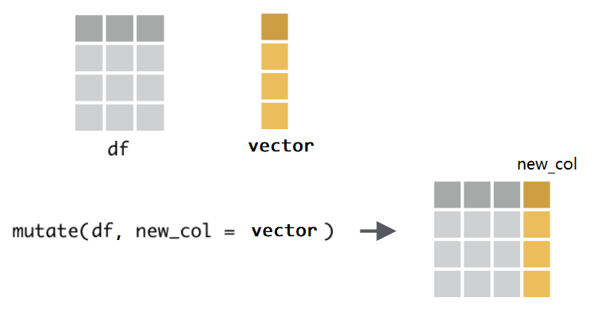
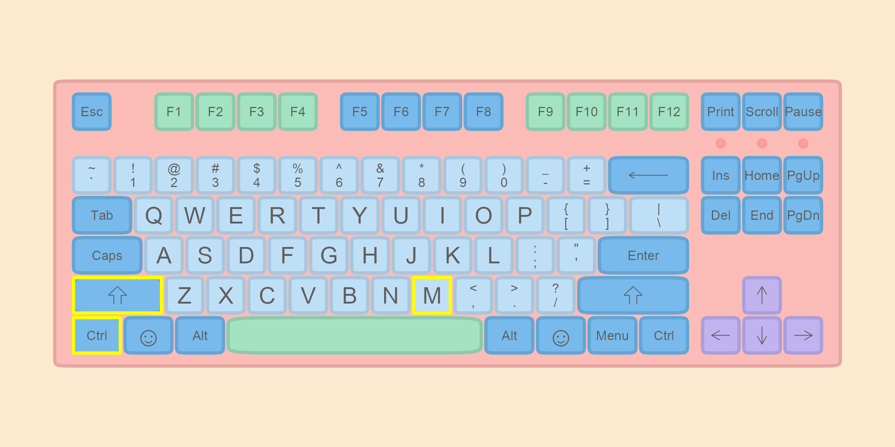
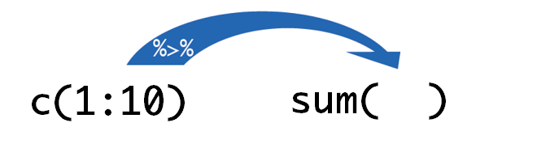
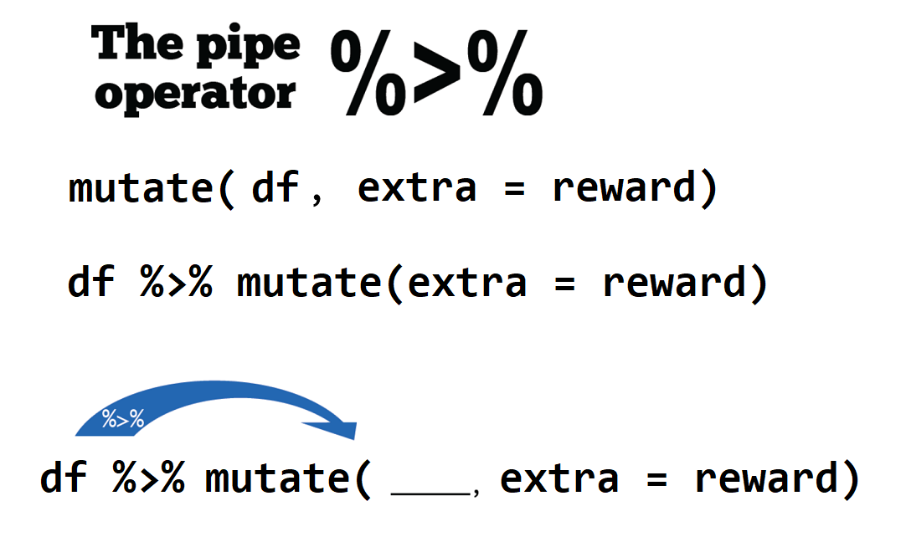
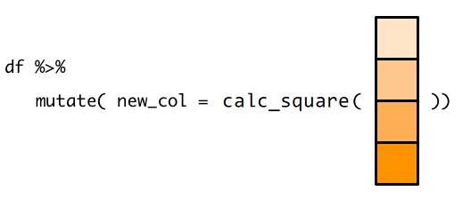
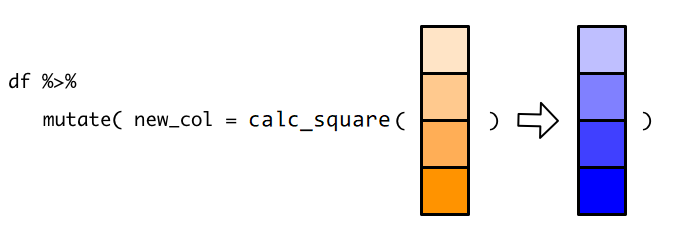
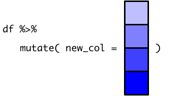

# 数据处理 {#tidyverse-dplyr}

我们用一个应用场景，复习上两章讲的数据类型和数据结构等概念。比如，这里有一个表格

- 如果构建学生们的成绩，需要用到是**向量**，一列就可以了。
- 如果构建学生的各科成绩，需要用到是**矩阵**，因为此时需要多列，不同的列对应不同的科目。
- 如果构建学生综合信息（性别，年龄，各科成绩，是否喜欢R），需要用到的是**列表**，因为除了各科成绩列，还需要其它数据类型的列。
- 当然，构建学生综合信息的表格，最好还是用**数据框**，因为这些信息是等长的，而且符合人的理解习惯, 所以，我们会经常和数据框打交道。


数据框的特性很丰富，在于：

- 第一，它是列表的特殊形式，可以存储不同类型的数据。
- 第二，它要求每个元素长度必须一致，因此长的像矩阵。
- 第三，它的每个元素就是一个是向量，而R语言有个优良特性，就是向量化操作，因此，使用函数非常方便。


本章我们介绍tidyverse里被誉为“瑞士军刀”的数据处理的工具dplyr宏包。首先，我们加载该宏包
```{r message = FALSE, warning = FALSE}
library(dplyr)
```


dplyr 定义了数据处理的规范语法，其中主要包含以下10个主要的函数。


* `mutate()`, `select()`, `rename()` , `filter()` 
* `summarise()`, `group_by()`, `arrange()`
* `left_join()`, `right_join()`， `full_join()`


我们用一个案例依次讲解这些函数的功能。假定这里有三位同学的英语和数学成绩

```{r message = FALSE, warning = FALSE}
df <- readr::read_csv(here::here("demo_data", "score.csv"))
df
```


## 新增一列 `mutate()` 

同学们表现不错，分别得到额外的奖励分 `c(2, 5, 9, 8, 5, 6)`

```{r}
reward <- c(2, 5, 9, 8, 5, 6)
```


那么，如何把奖励分加到表中呢？用`mutate()`函数可以这样写\index{mutate()} 
第一次觉得这个单词很陌生，可以理解为modify

```{r}
mutate(.data = df, extra = reward) 
```


`mutate()`函数的功能是给数据框新增一列，使用语法为 `mutate(.data = df, name = value)`：


- 第一个参数`.data`，接受要处理的数据框，比如这里的`df`。
- 第二个参数是`Name-value`对, 比如`extra = reward`，
   - 等号左边，是我们为新增的一列取的名字，比如这里的`extra`，因为数据框每一列都是要有名字的；
   - 等号右边，是打算并入数据框的向量，比如这里的`reward`，它是装着学生成绩的**向量**。注意，向量的长度，
      - 要么与数据框的行数等长，比如这里向量长度为6；
      - 要么长度为1，即，新增的这一列所有的值都是一样的(循环补齐机制)。
     
<!-- 如果向量的长度与数据框的行数相等，那么刚好与数据框的行对齐，相当于给每行增加了一个新值。 -->

```{r dplyr-9, out.width = '60%', echo = FALSE}

```


因为`mutate()`函数处理的是数据框，并且固定放置在第一位置上（**几乎所有dplyr的函数都是这样要求的**），所以这个`.data`可以偷懒不写，直接写`mutate(df, extra = reward)`。另外，如果想同时新增多个列，只需要提供多个`Name-value`对即可，比如
```{r, eval=FALSE}
mutate(df, 
       extra1 = c(2, 5, 9, 8, 5, 6),
       extra2 = c(1, 2, 3, 3, 2, 1),
       extra3 = c(8)
       ) 
```

## 管道 `%>%`

实际运用中，我们经常要使用函数，比如计算向量`c(1:10)`所有元素值的和

```{r}
sum(c(1:10))
```


现在有个与上面的等价的写法，就是使用管道操作符[ `%>%` ](https://magrittr.tidyverse.org/)。\index{\%>\%} 
```{r}
c(1:10) %>% sum()
```

这条语句的意思是`f(x)` 写成 `x %>% f()`，这里向量 `c(1:10)` 通过管道操作符 `%>%` ，传递到函数`sum()`的第一个参数位置，即`sum(c(1:10))`， 这个 `%>%` 管道操作符还是很形象的。在Windows系统中可以通过`Ctrl + Shift + M` 快捷键产生 `%>%`，苹果系统对应的快捷键是`Cmd + Shift + M`。


```{r, out.width = "100%", echo=FALSE}

```

通过下图图示可以看到管道操作符就像生产线上的传送带一样，将数据运入函数中。
```{r out.width = '45%', echo = FALSE}

```


当执行多个函数操作的时候，管道操作符 `%>%` 就显得格外方便，代码可读性也更强。比如

```{r}
sqrt(sum(abs(c(-10:10))))
```

使用管道操作符
```{r}
c(-10:10) %>% abs() %>% sum() %>% sqrt()
```


那么，之前增加学生奖励分成绩的语句 `mutate(df, extra = reward)`，也可以使用管道

```{r out.width = '65%', echo = FALSE}

```


```{r}
# using `%>%`
df %>% mutate(extra = reward) 
```

是不是很赞^[从R4.1开始，支持 `|>` 作为管道符号，但大家似乎已经习惯与 `%>% `]。


```{r out.width = '50%', echo = FALSE}
knitr::include_graphics("images/mutate-function.png")
```


## 向量函数与mutate()

`mutate()`函数的本质还是第 \@ref(baseR-operators) 章介绍向量函数和向量化操作，只不过是换作在数据框中完成，这样更能形成“据框进、数据框出”的思维，方便快捷地构思并统计任务^[https://dcl-prog.stanford.edu/data-structure-basics.html ]。

比如，我们想计算每位同学分数的平方，然后构建数据框新的一列，我们可以用第 \@ref(baseR-functions) 章函数的方法，自定义`calc_square()`函数

```{r}
calc_square <- function(x) {
  x^2
}

df %>% 
  mutate(new_col = calc_square(score))
```


在`mutate()`中引用数据框的某一**列名**，实际上是引用了列名对应的**整个向量**, 所以，这里我们传递`score`到`calc_square()`，就是把整个`score`向量传递给`calc_square()`.

```{r out.width = '70%', echo = FALSE}

```

几何算符（这里是平方）是向量化的，因此`calc_square()`会对输入的`score`向量，返回一个等长的向量。

```{r out.width = '90%', echo = FALSE}

```

`mutate()` 拿到这个新的向量后，就在原有数据框中添加新的一列`new_col`

```{r out.width = '50%', echo = FALSE}

```

## 保存为新的数据框

现在有个问题，此时 `df` 有没发生变化？是否包含额外的奖励分呢？
事实上，此时`df`并没有发生改变，还是原来的状态。如果需要保存计算结果，就需要把计算的结果重新赋值给新的对象，当然，也可以赋值给`df`本身，这样`df`存储的数据就**更新**为计算后的结果。


好，现在我们把添加奖励分、计算总成绩和保存结果这三个步骤一气呵成的完成
```{r how-to-save-new-df}
df_new <- df %>% 
  mutate(extra = reward) %>% 
  mutate(total = score + extra)
```

```{r, echo=FALSE, eval=FALSE}
flair::decorate("how-to-save-new-df") %>% 
  flair::flair_rx("df %>%[\\s\\S]*", background = "pink")
```


```{r}
df_new
```


```{r out.width = '65%', echo = FALSE}
knitr::include_graphics("images/Pipe_baking_magrittr_backAssign.gif")
```


## 选取列 `select()`

`select() `顾名思义选择，就是选择数据框的某一列，或者某几列。

```{r dplyr-19, out.width = '80%', echo = FALSE}
knitr::include_graphics("images/dplyr-select.png")
```


我们以上面学生成绩的数据框为例，这里选择`name`列 \index{select()} 


```{r}
df_new %>% select(name)
```

注意，结果是只有一列的数据框（仍然数据框喔，**数据框进数据框出是dplyr函数的第二个特点**）。如果要选取多列，就再多写几个列名就行了
```{r}
df_new %>% select(name, extra)
df_new %>% select(name, score, extra, total)
```


如果不想要某列，可以在变量前面加 `-` 或者 `!`，两者的结果是一样的。
```{r}
df_new %>% select(-type)
df_new %>% select(!type)
```


也可以通过位置索引进行选取，比如选取头三列
```{r}
df_new %>% select(1, 2, 3)
df_new %>% select(2:3)
```


如果要选取数据框的列很多，我们也可以先观察列名的特征，用特定的函数进行选取，比如选取以“s"开头的列
```{r}
df_new %>% select(starts_with("s"))

```

选取以"e"结尾的列
```{r}
df_new %>% select(ends_with("e"))
```

选取含有以"score"的列
```{r}
df_new %>% select(contains("score"))
```

当然，也可以通过变量的类型来选取，比如选取所有字符串类型的列
```{r}
df_new %>% select(where(is.character))
```

选取所有数值类型的列
```{r}
df_new %>% select(where(is.numeric))
```


选取所有数值类型的并且以"s"开头的列
```{r}
df_new %>% select(where(is.numeric) & starts_with("s"))
```

选取以"s"开头或者以"e"结尾的列
```{r}
df_new %>% select(starts_with("s") | ends_with("e"))
```


```{r}
df_new %>% select(!starts_with("s"))
```


## 修改列名 `rename()`

用`rename()`修改列的名字, 具体方法是`rename(.data, new_name = old_name)`，和`mutate()`一样，等号左边是新的变量名，右边是已经存在的变量名（这是dplyr函数的第三个特征^[有一个例外是recode函数]）。比如，我们这里将`total`修改为`total_score`
\index{rename()} 

```{r}
df_new %>% 
  select(name, type, total) %>% 
  rename(total_score = total)
```


## 筛选 `filter()`


前面`select()`是列方向的选择，而用`filter()`函数，我们可以对数据框**行方向**进行筛选，选出符合特定条件的某些行。


```{r dplyr-24, out.width = '65%', echo = FALSE}
knitr::include_graphics("images/dplyr-filter.png")
```

注意，这里filter()函数不是字面上“过滤掉”的意思，而是“筛选”，保留符合条件的行，也就说keep，不是drop的意思。 第一次会有一点点迷惑，我相信习惯就好了。

比如这里把**成绩等于90分的**同学筛选出来 \index{filter()} 。
```{r, error=TRUE}
df_new %>% filter(score = 90)
```

注意，这里判断是否相等要使用 `==` 而不是 `=`
```{r, error=TRUE}
df_new %>% filter(score == 90)
```

R提供了其他比较关系的算符: `<`, `>`, `<=`, `>=`, `==` (equal), `!=` (not equal), `%in%`, `is.na()` 和 `!is.na()` . 

比如把**成绩大于等于80分的**同学筛选出来
```{r}
df_new %>% filter(score >= 80)
```


也可以限定多个条件进行筛选, 比如，限定英语学科，同时要求成绩高于75分的所有条目筛选出来

```{r}
df_new %>% filter(type == "english", score >= 75)
```

也就说，逗号分隔的两个条件都要满足。

### 常见的错误
`filter()`函数两个常见的错误:

- 把 "=" 误认为 "=="
```{r, eval=FALSE}
df_new %>% filter(type = "english")   # error
df_new %>% filter(type == "english")
```

- 忘记引号
```{r, eval=FALSE}
df_new %>% filter(type == english)   # error
df_new %>% filter(type == "english")
```


### 逻辑算符

多个参数的情形，本质上是逻辑与的关系，每个条件都返回TRUE

```{r}
df_new %>% filter(type == "english" & score >= 75)
```
当然也可以使用其他的布尔算符 (& is “and,” | is “or,” and ! is “not.”).

比如，以下代码找出成绩等于70**或者**等于90的行
```{r}
df_new %>% filter(score == 70 | score == 90)
```
在filter()中有一个非常有效的等价方法，即使用 `x %in% y`，意思是**如果当前x的值是向量y的一员，那么就选出当前行**，因此，我们可以重写上面代码:

```{r}
df_new %>% filter(score %in% c(70, 90))
```

当然还可以配合一些函数使用，比如把最高分的同学找出来
```{r}
df_new %>% filter(score == max(score))
```

把成绩高于均值的找出来
```{r}
df_new %>% filter(score > mean(score))
```


## 统计汇总 `summarise()`

```{r dplyr-27, out.width = '70%', echo = FALSE}
knitr::include_graphics("images/dplyr-summarize.png")
```

`summarise() `函数非常强大，主要用于统计汇总，往往与其他函数配合使用，比如计算所有同学考试成绩的均值 \index{summarise()} 

```{r}
df_new %>% summarise(mean_score = mean(score))
```


计算所有同学的考试成绩的标准差
```{r}
df_new %>% summarise( sd_score = sd(score))
```


还可以同时完成多个统计
```{r}
df_new %>% summarise(
  mean_score   = mean(score),
  median_score = median(score),
  n            = n(),
  sum          = sum(score)
)
```

`summarise()` 与 `mutate()` 一样，也是创建新的变量（新的一列），仍然遵循**等号左边是新的列名，等号右边是基于原变量的统计**。
区别在于，`mutate()`是在原数据框的基础上增加新的一列；而`summarise()`在成立的新的数据框中创建一列。


## 分组统计 `group_by()` 

实际运用中，`summarise() `函数往往配合`group_by()`一起使用，即，先分组再统计。

```{r dplyr-31, out.width = '65%', echo = FALSE}
knitr::include_graphics("images/dplyr-group-by.png")
```


比如，我们想统计每个学生的平均成绩，那么就需要先按照学生`name`分组，然后每组求平均 \index{group\_by()} 

```{r}
df_new %>%
  group_by(name) %>%
  summarise(
    mean_score = mean(total),
    sd_score   = sd(total)
  )
```


## 排序 `arrange()`


`arrange()`这个很好理解的，就是按照某个变量排序。

```{r dplyr-33, out.width = '55%', echo = FALSE}
knitr::include_graphics("images/dplyr-arrange.png")
```


比如我们按照考试总成绩从低到高排序，然后输出 \index{arrange()} 

```{r}
df_new %>% arrange(total)
```


默认情况是从小到大排序，如果从高到低降序排序呢，有两种方法，第一种方法是在用于排序的变量前面加 `-` 号，
```{r}
df_new %>% arrange(-total)
```


第二种方法可读性更强些，需要使用`desc()`函数
```{r}
df_new %>% arrange(desc(total))
```


也可对多个变量依次排序。比如，我们先按学科类型排序，然后按照成绩从高到底降序排列
```{r}
df_new %>% 
  arrange(type, desc(total))
```


## 左联结 `left_join()` 

实际操作中，也会遇到数据框合并的情形。假定我们已经统计了每个同学的平均成绩，存放在`df1`

\index{left\_join()}

```{r}
df1 <- df_new %>% 
  group_by(name) %>% 
  summarise( 
    mean_score = mean(total) 
  )
df1
```


现在我们又有新一个数据框`df2`，它包含一些同学的年龄信息
```{r}
df2 <- tibble(
      name = c("Alice", "Bob", "Dave"),
      age =  c(12, 13, 14)
)
df2
```


可以使用 `left_join()`函数 把两个数据框`df1`和`df2`合并连接在一起。这两个数据框是通过姓名`name`连接的，因此需要指定`by = "name"`，代码如下


```{r}
left_join(df1, df2, by = "name")
```


用管道 `%>%`写，可读性更强

```{r, message=FALSE}
# using %>%
df1 %>% left_join(df2, by = "name")
```

大家注意到最后一行Carol的年龄是`NA`， 大家想想为什么呢？


## 右联结 `right_join()`


我们再试试`right_join()`  \index{right\_join()}

```{r, message=FALSE}
df1 %>% dplyr::right_join(df2, by = "name")
```

Carol同学的信息没有显示？ Dave 同学显示了但没有考试成绩？大家想想又为什么呢？


事实上，答案就在函数的名字上，`left_join()`是左联结，即以左边数据框`df1`中的学生姓名`name`为准，在右边数据框`df2`里，有`Alice`和`Bob`的年龄，那么就对应联结过来，没有`Carol`的年龄，自然就为缺失值`NA`。

`right_join()`是右联结，要以右边数据框`df2`中的学生姓名`name`为准，即`Alice`，`Bob`和`Dave`，而`df1`只有`Alice`和`Bob`的信息，没有`Dave`的信息，因此`Dave`对应的成绩为`NA`。

## 满联结 `full_join()`

有时候，我们不想丢失项，可以使用`full_join()`，该函数确保条目是完整的，信息缺失的地方为`NA`。 \index{full\_join()} 

```{r, message=FALSE}
df1 %>% full_join(df2, by = "name")
```


## 内联结`inner_join()`

只保留name条目相同地记录
```{r, message=FALSE}
df1 %>% inner_join(df2, by = "name")
```

## 筛选联结

筛选联结，有两个`semi_join(x, y)`和`anti_join(x, y)`，函数不改变数据框`x`的变量的数量，主要影响的是`x`的观测，也就说会剔除一些行，其功能类似`filter()`

- 半联结`semi_join(x, y)`，保留name与df2的name相一致的所有行
```{r}
df1 %>% semi_join(df2, by = "name")
```

可以看作对`df1`做筛选
```{r}
df1 %>% filter(
  name %in% df2$name
)
```


- 反联结`anti_join(x, y)`，丢弃name与df2的name相一致的所有行
```{r}
df1 %>% anti_join(df2, by = "name")
```

仍然可以看作对`df1`做筛选
```{r}
df1 %>% filter(
 ! name %in% df2$name
)
```

## 习题

1、总结 dplyr 系列函数的三个特征。

2、用本章中的数据框`df`运行以下代码，然后理解代码含义。

```{r, eval=FALSE}
df %>% 
  filter(score > mean(score))
```

3、 统计每位同学成绩高于75分的科目数

```{r eval=FALSE, include=FALSE}
df %>% 
  group_by(name) %>% 
  mutate(num_of_bigger_than_75 = sum(score >75))
```


4、运行以下代码，比较差异在什么地方。
```{r, eval=FALSE}
df %>%
  group_by(name) %>%
  summarise(mean_score = mean(score))
```

```{r, eval=FALSE}
df %>%
  group_by(name) %>%
  mutate(mean_score = mean(score))
```

5、排序，要求按照score从大往小排，但希望all是最下面一行。
```{r, echo=FALSE}
d <-
  tibble::tribble(
    ~name, ~score,
    "a1", 2,
    "a2", 5,
    "a3", 3,
    "a4", 7,
    "a5", 6,
    "all", 23
  )

d
```


## 延伸阅读

- 推荐[https://dplyr.tidyverse.org/](https://dplyr.tidyverse.org/).
- [cheatsheet](https://github.com/rstudio/cheatsheets/raw/master/data-transformation.pdf)
- <https://tidydatatutor.com/vis.html>
- 作业：读懂并运行下面的代码

```{r dplyr-43, echo=FALSE}
# a single file
xfun::embed_file('./data/nycflights.Rmd')
```
