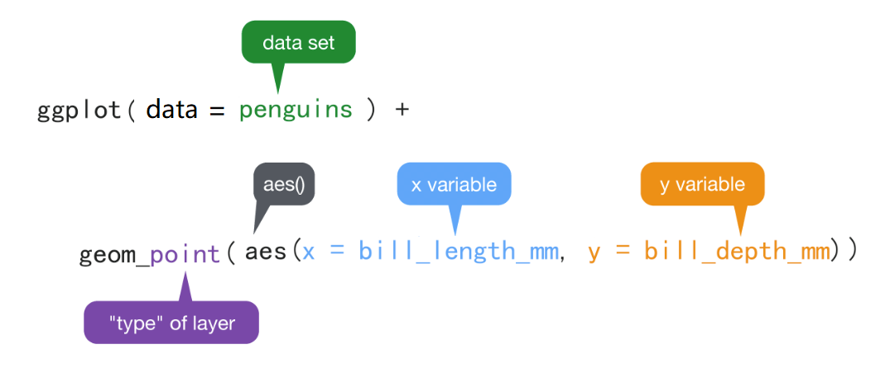
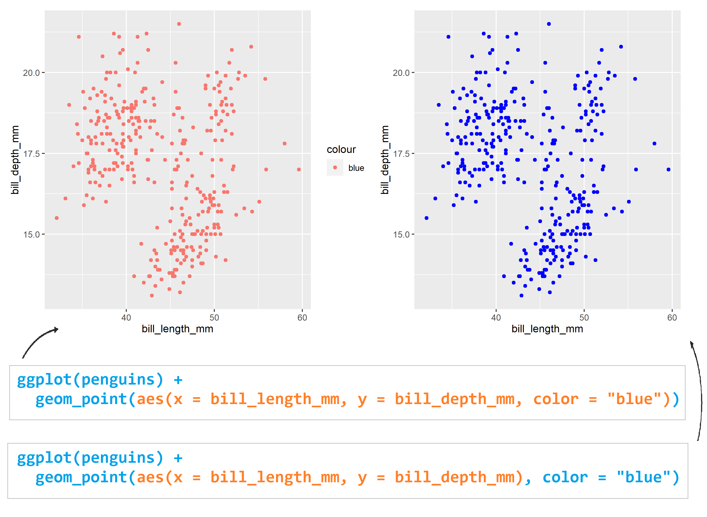

# 数据可视化 {#tidyverse-ggplot2-aes}

上节课介绍了R语言的基本数据结构，可能大家有种看美剧的感觉，有些懵。这很正常，我在开始学习R的时候，感觉和大家一样，所以不要惊慌，我们后面会慢慢填补这些知识点。

这节课，我们介绍R语言最强大的可视化，看看都有哪些炫酷的操作。


```{r ggplot2-aes2-1, message = FALSE, warning = FALSE}
library(tidyverse) # install.packages("tidyverse")
library(patchwork) # install.packages("patchwork")
```


## 为什么要可视化
我们先从一个故事开始，1854年伦敦爆发严重霍乱，当时流行的观点是霍乱是通过空气传播的，而John Snow医生（不是《权力的游戏》里的 Jon Snow）研究发现，霍乱是通过饮用水传播的。研究过程中，John Snow医生统计每户病亡人数，每死亡一人标注一条横线，分析发现，大多数病例的住所都围绕在Broad Street水泵附近，结合其他证据得出饮用水传播的结论，于是移掉了Broad Street水泵的把手，霍乱最终得到控制。


```{r ggplot2-aes2-2, out.width = '50%', echo = FALSE}
knitr::include_graphics(c("images/Cholera1.png", "images/Cholera2.png"))
```


另一个有趣的例子就是辛普森悖论（Simpson's Paradox）。比如我们想研究下，学习时间和考试成绩的关联。结果发现两者呈负相关性，即补课时间越长，考试成绩反而越差（下图横坐标是学习时间，纵坐标是考试成绩），很明显这个结果有违生活常识。

```{r ggplot2-aes2-3, echo=FALSE}
## simulate data
N <- 100
Sigma <- matrix(c(1, 0.75, 0.75, 1), 2, 2) * 1.5
means <- list(c(11, 3), c(9, 5), c(7, 7), c(5, 9), c(3, 11))

data <- means %>%
  purrr::map(~ MASS::mvrnorm(N, .x, Sigma)) %>%
  map(as.data.frame)
dat <- reduce(data, bind_rows) %>%
  mutate(Z = as.character(rep(seq_along(means), each = N))) %>%
  set_names(c("X", "Y", "Z"))


## First plot
dat %>%
  ggplot(aes(X, Y)) +
  geom_point(alpha = .5) +
  ggtitle(paste("correlation = ", round(cor(dat$X, dat$Y), 2)))

## second plot
means <- means %>%
  map(~ set_names(., c("x", "y"))) %>%
  reduce(bind_rows) %>%
  mutate(z = as.character(seq_along(means)))


# means %>% map(~set_names(., c("x", "y"))) %>%
#   enframe()  %>%
#   mutate(a = map(value, ~as.data.frame(.)))


corrs <- dat %>%
  group_by(Z) %>%
  summarize(cor = cor(X, Y)) %>%
  .$cor

p <- dat %>%
  ggplot(aes(X, Y, color = Z)) +
  geom_point(show.legend = FALSE, alpha = 0.5) +
  ggtitle(paste("correlations =", paste(signif(corrs, 2), collapse = " ")))


## third plot
p + annotate("text",
  x = means$x, y = means$y,
  label = paste("Z=", means$z), cex = 5
)
```

事实上，当我们把学生按照不同年级分成五组，再来观察学习时间和考试成绩之间的关联，发现相关性完全逆转了! 我们可以看到学习时间和考试成绩强烈正相关。


辛普森悖论在日常生活中层出不穷。 那么如何避免辛普森悖论呢？我们能做的，就是仔细地研究分析各种影响因素，不要笼统概括地、浅尝辄止地看问题。其中，可视化分析为我们提供了一个好的方法。

## 什么是数据可视化

### 图形属性(视觉元素)

我们在图中画一个点，那么这个**点**就有（形状，大小，颜色，位置，透明度）等属性，
这些属性就是**图形属性**（有时也称之为图形元素或者视觉元素），下图 \@ref(fig:common-aesthetics)列出了常用的图形属性。

```{r common-aesthetics, out.width = '98%', echo = FALSE, fig.cap= "常用的图形元素"}
knitr::include_graphics("./images/common-aesthetics.png")
```


点和线常用的图形属性

|  geom | x | y | size | color | shape | linetype | alpha | fill | group |
|:-----:|:-:|:-:|:----:|:-----:|:-----:|:--------:|:-----:|:----:|:-----:|
| point | √ | √ |   √  |   √   |   √   |     √    |   √   |   √  |   √   |
|  line | √ | √ |   √  |   √   |       |     √    |   √   |      |   √   |


## 宏包ggplot2 

ggplot2是RStudio首席科学家Hadley Wickham在2005年读博士期间的作品。很多人学习R语言，就是因为ggplot2宏包。目前，
ggplot2已经发展成为最受欢迎的R宏包，没有之一。我们可以看看它2019年cran的下载量
```{r ggplot2-aes2-4}
library(cranlogs)

d <- cran_downloads(package = "ggplot2", from = "2019-01-01", to = "2019-12-31")

sum(d$count)
```


### ggplot2 的图形语法

ggplot2有一套优雅的绘图语法，包名中“gg”是grammar of graphics的简称。
Hadley Wickham将这套可视化语法诠释为:

> 一张统计图形就是从**数据**到几何图形(geometric object，缩写geom)所包含的**图形属性**(aesthetic attribute，缩写aes)的一种映射。


通俗解释：就是我们的**数据**通过图形的**视觉元素**表示出来。比如**点**图，如果坐标x值越大，水平方向离原点的位置就越远，数值越小，水平方向离原点的位置就越近。
**数值的大小变成了视觉能感知的东西**。

```{r ggplot2-aes2-5, out.width = '100%', echo = FALSE, fig.cap = "数值到图形属性的映射过程"}
knitr::include_graphics("images/mapping.png")
```


同理，我们希望用**点的大小**代表这个位置上的某个变量（比如，降雨量，产品销量等等），那么变量的数值越小，点的半径就小一点，数值越大，点就可以大一点；或者变量的数值大，点的颜色就深一点，数值小，点的颜色就浅一点。即，数值到图形属性的**映射**过程。映射是一个数学词汇，这里您可以理解为**一一对应**。


### 怎么写代码

`ggplot()`函数包括9个部件：

- **数据 (data)**      （数据框）
- **映射 (mapping)**
- **几何图形 (geom)**
- 统计变换 (stats)
- 标度 (scale)
- 坐标系 (coord)
- 分面 (facet)
- 主题 (theme)
- 存储和输出 (output)

其中前三个是必需的。语法模板

```{r, eval = FALSE}
ggplot(data = <DATA>) + 
   <GEOM_FUNCTION>(mapping = aes(<MAPPINGS>))
```


此外，图形中还可能包含数据的统计变换(statistical  transformation，缩写stats)，最后绘制在某个特定的坐标系(coordinate
system，缩写coord)中，而分面(facet)则可以用来生成数据不同子集的图形。


先来点小菜。先看一个简单的案例（1880-2014年温度变化和二氧化碳排放量）

```{r, warning = FALSE, message = FALSE}
library(tidyverse)
d <- read_csv(here::here("demo_data", "temp_carbon.csv"))
d %>% head(5)
```


```{r, eval = FALSE}
library(ggplot2)
ggplot(___) + 
  geom_point(
    mapping = aes(x = ___, y = ___)
  )
```

我们只需要在相应位置填入数据框，和数据框的变量，就可以画图

```{r}
ggplot(data = d) +
  geom_point(mapping = aes(x = year, y = carbon_emissions)) +
  xlab("Year") +
  ylab("Carbon emissions (metric tons)") +
  ggtitle("Annual global carbon emissions, 1880-2014")
```

是不是很简单?


## 映射 

我们这里用科考人员收集的企鹅体征[数据](https://raw.githubusercontent.com/rfordatascience/tidytuesday/master/data/2020/2020-07-28/penguins.csv)来演示。


```{r ggplot2-aes2-10, out.width = '100%', echo = FALSE}
knitr::include_graphics("images/penguins.png")
```


```{r ggplot2-aes2-11, message = FALSE, warning = FALSE}
library(tidyverse)
penguins <- read_csv(here::here("demo_data", "penguins.csv")) %>%
  janitor::clean_names() %>% 
  drop_na()

penguins %>%
  head()
```

### 变量含义

|variable          |class   |description |
|:-----------------|:-------|:-----------|
|species           |integer | 企鹅种类 (Adelie, Gentoo, Chinstrap) |
|island            |integer | 所在岛屿 (Biscoe, Dream, Torgersen) |
|bill_length_mm    |double  | 嘴峰长度 (单位毫米) |
|bill_depth_mm     |double  | 嘴峰深度 (单位毫米)|
|flipper_length_mm |integer | 鰭肢长度 (单位毫米) |
|body_mass_g       |integer | 体重 (单位克) |
|sex               |integer | 性别 |
|year              |integer | 记录年份 |


我们会用到penguins数据集其中的四个变量

```{r ggplot2-aes2-13, eval=FALSE}
penguins %>%
  select(species, sex, bill_length_mm, bill_depth_mm) %>%
  head(4)
```


### 嘴巴越长，嘴巴也会越厚？

这里提出一个问题，嘴巴越长，嘴巴也会越厚？

```{r ggplot2-aes2-12, out.width = '86%', echo = FALSE}
knitr::include_graphics("images/culmen_depth.png")
```


为考察嘴峰长度(bill_length_mm)与嘴峰深度(bill_depth_mm)之间的关联，先绘制这两个变量的散点图，

```{r ggplot2-aes2-14, out.width = '85%', echo = FALSE}

```

- `ggplot()` 初始化绘图，相当于打开了一张纸，准备画画。
- `ggplot(data = penguins)` 表示使用penguins这个**数据框**来画图。

- `+`表示添加图层。

- `geom_point()`表示绘制散点图。

- `aes()`表示数值和视觉属性之间的映射。
  
`aes(x = bill_length_mm, y = bill_depth_mm)`，意思是变量bill_length_mm作为（映射为）**x轴方向的位置**，变量bill_depth_mm作为（映射为）**y轴方向的位置**。

- `aes()`除了位置上映射，还可以实现色彩、形状或透明度等视觉属性的映射。


运行脚本后生成图片：


```{r ggplot2-aes2-15, echo=FALSE}
ggplot(penguins) +
  geom_point(aes(x = bill_length_mm, y = bill_depth_mm))
```


刚才看到的是位置上的映射，`ggplot()`还包含了颜色、形状以及透明度等图形属性的映射，

比如我们在`aes()`里增加一个颜色映射` color = species`, 这样做就是希望，**不同的企鹅类型**, 用**不同的颜色**来表现。这里，企鹅类型有三组，那么就用三种不同的颜色来表示


```{r ggplot2-aes2-16}
ggplot(penguins) +
  geom_point(aes(x = bill_length_mm, y = bill_depth_mm, color = species))
```

此图绘制不同类型的企鹅，嘴峰长度与嘴峰深度散点图，并用颜色来实现了分组。


大家试试下面代码呢，
```{r ggplot2-aes2-17, eval = FALSE}
ggplot(penguins) +
  geom_point(aes(x = bill_length_mm, y = bill_depth_mm, size = species))
```


```{r ggplot2-aes2-18, eval = FALSE}
ggplot(penguins) +
  geom_point(aes(x = bill_length_mm, y = bill_depth_mm, shape = species))
```


```{r ggplot2-aes2-19, eval = FALSE}
ggplot(penguins) +
  geom_point(aes(x = bill_length_mm, y = bill_depth_mm, alpha = species))
```

也可更多映射

```{r}
ggplot(penguins) +
  geom_point(
    aes(x = bill_length_mm, y = bill_depth_mm, color = species, alpha = sex)
  )
```

为什么图中是这样的颜色呢？那是因为`ggplot()`内部有一套默认的设置

```{r ggplot2-aes2-20, out.width = '85%', echo = FALSE}
knitr::include_graphics("images/a-14.png")
```


不喜欢默认的颜色，可以自己定义喔。请往下看


## 映射 vs.设置

想把图中的点指定为某一种颜色，可以使用设置语句，比如

```{r ggplot2-aes2-21}
ggplot(penguins) +
  geom_point(aes(x = bill_length_mm, y = bill_depth_mm), color = "blue")
```


大家也可以试试下面
```{r ggplot2-aes2-22, eval = FALSE}
ggplot(penguins) +
  geom_point(aes(x = bill_length_mm, y = bill_depth_mm), size = 5)
```


```{r ggplot2-aes2-23, eval = FALSE}
ggplot(penguins) +
  geom_point(aes(x = bill_length_mm, y = bill_depth_mm), shape = 2)
```


```{r ggplot2-aes2-24, eval = FALSE}
ggplot(penguins) +
  geom_point(aes(x = bill_length_mm, y = bill_depth_mm), alpha = 0.5)
```


### 提问
```{r ggplot2-aes2-25, out.width = '100%', echo = FALSE}

```

思考下左图中`aes(color = "blue")`为什么会变成了红色的点？


```{r ggplot2-aes2-26, eval=FALSE, include=FALSE}
ggplot(penguins) +
  geom_point(aes(x = bill_length_mm, y = bill_depth_mm, color = "blue"))


ggplot(penguins) +
  geom_point(aes(x = bill_length_mm, y = bill_depth_mm), color = "blue")
```


## 几何图形

`geom_point()` 可以画散点图，也可以使用`geom_smooth()`绘制平滑曲线，
```{r ggplot2-aes2-27}
ggplot(penguins) +
  geom_smooth(aes(x = bill_length_mm, y = bill_depth_mm))
```


```{r ggplot2-aes2-28}
ggplot(penguins) +
  geom_smooth(
    aes(x = bill_length_mm, y = bill_depth_mm),
    method = "lm"
   )
```


## 图层叠加

```{r}
ggplot(penguins) +
  geom_point(aes(x = bill_length_mm, y = bill_depth_mm)) +
  geom_smooth(aes(x = bill_length_mm, y = bill_depth_mm))
```

很强大，但相同的代码让我写两遍，我不高兴。要在偷懒的路上追求简约

```{r}
ggplot(penguins, aes(x = bill_length_mm, y = bill_depth_mm)) +
  geom_point() +
  geom_smooth()
```


以上两段代码出来的图为什么是一样？背后的含义有什么不同？接着往下看


## Global vs. Local

```{r ggplot2-aes2-31}
ggplot(penguins, aes(x = bill_length_mm, y = bill_depth_mm, color = species)) +
  geom_point()
```


```{r ggplot2-aes2-32}
ggplot(penguins) +
  geom_point(aes(x = bill_length_mm, y = bill_depth_mm, color = species))
```

大家可以看到，以上两段代码出来的图是一样。但背后的含义却不同。


- 映射关系`aes(x = bill_length_mm, y = bill_depth_mm)` 写在`ggplot()`里, 为**全局声明**。那么，当`geom_point()`画图时，发现缺少图形所需要的映射关系（点的位置、点的大小、点的颜色等等），就会从`ggplot()`全局变量中继承映射关系。

- 如果映射关系`aes(x = bill_length_mm, y = bill_depth_mm)` 写在几何图形`geom_point()`里, 那么此处的映射关系就为**局部声明**, 那么`geom_point()`绘图时，发现所需要的映射关系已经存在，就不会继承全局变量的映射关系。


看下面这个例子，
```{r ggplot2-aes2-35, eval=FALSE, warning=FALSE, message=FALSE}
ggplot(penguins, aes(x = bill_length_mm, y = bill_depth_mm)) +
  geom_point(aes(color = species)) +
  geom_smooth()
```


这里的 `geom_point()` 和 `geom_smooth()` 都会从全局变量中继承位置映射关系。


再看下面这个例子，

```{r ggplot2-aes2-36}
ggplot(penguins,aes(x = bill_length_mm, y = bill_depth_mm, color = species)) +
  geom_point(aes(color = sex))
```

局部变量中的映射关系
`aes(color = )`已经存在，因此不会从全局变量中继承，沿用当前的映射关系。


### 图层从全局声明中继承

体会下代码之间的区别

```{r}
ggplot(penguins, aes(x = bill_length_mm, y = bill_depth_mm, color = species)) +
  geom_point()
```


```{r}
ggplot(penguins, aes(x = bill_length_mm, y = bill_depth_mm)) +
  geom_point(aes(color = species))
```


```{r}
ggplot(penguins, aes(x = bill_length_mm, y = bill_depth_mm, color = sex)) +
  geom_point(aes(color = species))
```


### 图层之间没有继承关系

再看下面这个例子

```{r}
ggplot(penguins, aes(x = bill_length_mm, y = bill_depth_mm)) +
  geom_point() +
  geom_smooth(method = "lm")
```


```{r}
ggplot(penguins, aes(x = bill_length_mm, y = bill_depth_mm)) +
  geom_point(aes(color = species)) +
  geom_smooth(method = "lm")
```


```{r}
ggplot(penguins, aes(x = bill_length_mm, y = bill_depth_mm)) +
  geom_smooth(method = "lm") +
  geom_point(aes(color = species))
```


```{r}
ggplot(penguins, aes(x = bill_length_mm, y = bill_depth_mm, color = species)) +
  geom_point() +
  geom_smooth(method = "lm") 
```


```{r}
ggplot(penguins, aes(x = bill_length_mm, y = bill_depth_mm, color = species)) +
  geom_point(aes(color = sex)) +
  geom_smooth(method = "lm") 
```


```{r}
ggplot(penguins, aes(x = bill_length_mm, y = bill_depth_mm, color = species)) +
  geom_point() +
  geom_smooth(method = "lm", aes(color = sex)) 
```


## 保存图片

可以使用`ggsave()`函数，将图片保存为所需要的格式，如".pdf", ".png"等，
还可以指定图片的高度和宽度，默认`units`是英寸，也可以使用"cm", or "mm".


```{r, eval=FALSE}
p1 <- penguins %>% 
  ggplot(aes(x = bill_length_mm, y = bill_depth_mm)) +
  geom_smooth(method = lm) +
  geom_point(aes(color = species)) +
  ggtitle("This is my first plot")

ggsave(
  plot = p1,
  filename = "my_plot.pdf",
  width = 8,
  height = 6,
  dpi = 300
)
```


如果想保存当前图形，`ggplot()` 也可以不用赋值，同时省略`ggsave()`中的 `plot = p1`，`ggsave()`会自动保存最近一次的绘图


```{r, eval=FALSE}
penguins %>% 
  ggplot(aes(x = bill_length_mm, y = bill_depth_mm)) +
  geom_smooth(method = lm) +
  geom_point(aes(color = species)) +
  ggtitle("This is my first plot")

ggsave("my_last_plot.pdf", width = 8, height = 6, dpi = 300)
```


## 课堂作业

补充代码，要求在一张图中画出

- 企鹅嘴巴长度和嘴巴厚度的散点图
- 不同企鹅种类用不同的颜色
- 整体的线性拟合
- 不同种类分别线性拟合

```{r ggplot2-aes2-40, eval = FALSE}
ggplot(penguins, aes(x = ___, y = ___)) +
  geom_point() +
  geom_smooth() +
  geom_smooth() 
```


## 延伸阅读 

在第 \@ref(tidyverse-ggplot2-geom) 章到第 \@ref(tidyverse-ggplot2-customize) 章会再讲ggplot2

一个点，有位置、颜色、大小、形状外，还有哪些属性？如果画线条，应该有哪些视觉属性？

  - 打开 <https://ggplot2tor.com/aesthetics>
  - 输入 geom_point 或者 geom_line 试试


```{r ggplot2-aes2-41, echo = F}
# remove the objects
# rm(list=ls())
rm(corrs, d, dat, data, means, penguins, N, p, p1, p2, p3, Sigma)
```


```{r ggplot2-aes2-42, echo = F, message = F, warning = F, results = "hide"}
pacman::p_unload(pacman::p_loaded(), character.only = TRUE)
```
