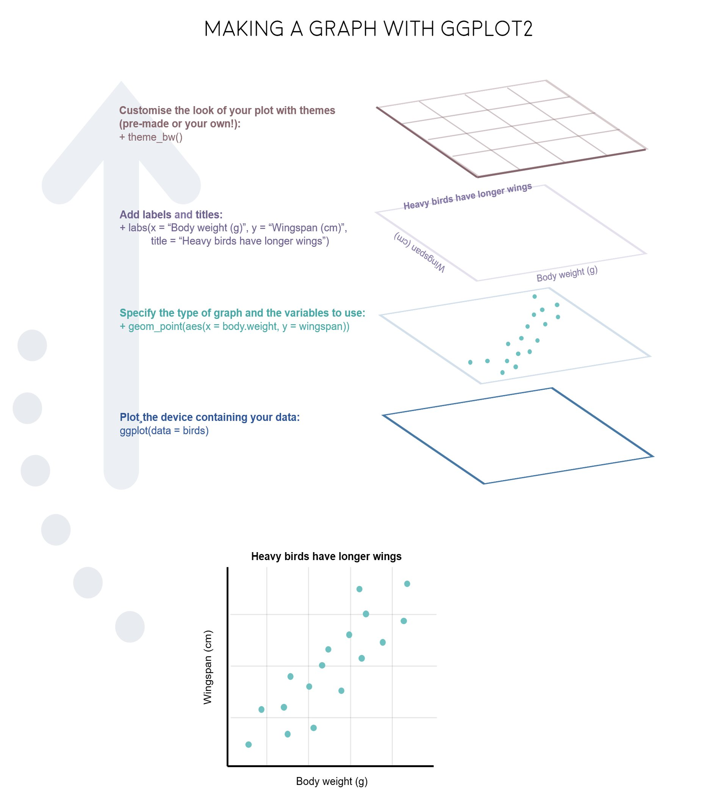

# ggplot2之几何形状 {#tidyverse-ggplot2-geom}

> 采菊东篱下，悠然见南山。
>


根据大家投票，觉得`ggplot2`是最想掌握的技能，我想这就是R语言中最有**质感**的部分吧。所以，这里专门拿出一节课讲`ggplot2`，也算是补上之前第 \@ref(tidyverse-ggplot2-aes) 章数据可视化没讲的内容。


```{r ggplot2-geom-1,warning = FALSE, message = FALSE}
library(tidyverse)
```


## 一个有趣的案例

先看一组数据

```{r ggplot2-geom-2}
df <- read_csv("./demo_data/datasaurus.csv")
df
```

先用`dataset`分组后，然后计算每组下`x`的均值和方差，`y`的均值和方差，以及`x，y`两者的相关系数，我们发现每组数据下它们几乎都是相等的
```{r ggplot2-geom-3}
df %>%
  group_by(dataset) %>%
  summarise(
    across(everything(), list(mean = mean, sd = sd), .names = "{fn}_{col}")
  ) %>%
  mutate(
    across(is.numeric, round, 3)
  )
```

如果上面代码不熟悉，可以用第 \@ref(tidyverse-dplyr) 章的代码重新表达，也是一样的
```{r ggplot2-geom-4}
df %>%
  group_by(dataset) %>%
  summarize(
    mean_x = mean(x),
    mean_y = mean(y),
    std_dev_x = sd(x),
    std_dev_y = sd(y),
    corr_x_y = cor(x, y)
  )
```

那么，我们是否能得出结论，每组的数据长的差不多呢？然而，我们画图发现

```{r ggplot2-geom-5, fig.asp=1.2, echo=FALSE}
ggplot(df, aes(x = x, y = y, colour = dataset)) +
  geom_point() +
  theme(legend.position = "none") +
  facet_wrap(~dataset, ncol = 3)
```


事实上，每张图都相差很大。所以，这里想说明的是，眼见为实。换句话说，可视化是数据探索中非常重要的部分。本章的目的就是带领大家学习ggplot2基本的绘图技能。


## 学习目标

### 图形语法

图形语法 “grammar of graphics” ("ggplot2" 中的`gg` 就来源于此) 使用图层(layer)去描述和构建图形，下图是ggplot2图层概念的示意图
```{r ggplot2-geom-6, out.width = '100%', echo = FALSE}

```

这个过程类似我们画一幅水彩画

```{r ggplot2-geom-7, out.width = '100%', echo = FALSE}
knitr::include_graphics("images/how_to_plot.png")
```

### 图形部件

一张统计图形就是从**数据**到几何形状(geometric object，缩写geom)所包含的**图形属性**(aesthetic attribute，缩写aes)的一种映射。


1. `data`: 数据框data.frame (注意，不支持向量vector和列表list类型）

2. `aes`: 数据框中的数据变量**映射**到图形属性。什么叫图形属性？就是图中点的位置、形状，大小，颜色等眼睛能看到的东西。什么叫映射？就是一种对应关系，比如数学中的函数`b = f(a)`就是`a`和`b`之间的一种映射关系, `a`的值决定或者控制了`b`的值，在ggplot2语法里，`a`就是我们输入的数据变量，`b`就是图形属性， 这些图形属性包括：
    + x（x轴方向的位置）
    + y（y轴方向的位置）
    + color（点或者线等元素的颜色）
    + size（点或者线等元素的大小）
    + shape（点或者线等元素的形状）
    + alpha（点或者线等元素的透明度）
    
3. `geoms`: 几何形状，确定我们想画什么样的图，一个`geom_***`确定一种形状。更多几何形状推荐阅读[这里](https://ggplot2.tidyverse.org/reference/)

    + `geom_bar()`
    + `geom_density()`
    + `geom_freqpoly()`
    + `geom_histogram()`
    + `geom_violin()`
    + `geom_boxplot()`
    + `geom_col()`
    + `geom_point()`
    + `geom_smooth()`
    + `geom_tile()`
    + `geom_density2d()`
    + `geom_bin2d()`
    + `geom_hex()`
    + `geom_count()`
    + `geom_text()`
    + `geom_sf()`
    
```{r, fig.align='default', out.width="12.5%", fig.cap='Source: <a href="https://ggplot2-book.org/individual-geoms.html">ggplot2 book</a>', fig.show='hold', echo=FALSE}
geoms <- list.files(path = "images/img", pattern = "geom-basic", full.names = T)
knitr::include_graphics(geoms)
```


4. `stats`:   统计变换
5. `scales`:  标度
6. `coord`:   坐标系统
7. `facet`:   分面
8. `layer`：  增加图层
9. `theme`:   主题风格
10. `save`:   保存图片


```{r, out.width = '85%', echo = FALSE, fig.cap= "ggplot2语法"}
knitr::include_graphics("images/grammar-of-graphics.png")
```


## 开始

```{block ggplot2-geom-10, type="try"}
R语言数据类型，有字符串型、数值型、因子型、逻辑型、日期型等。
ggplot2会将字符串型、因子型、逻辑型、日期型默认为**离散变量**，而数值型默认为**连续变量**，将日期时间为**日期变量**：

- **离散变量**: 字符串型<chr>, 因子型<fct>, 逻辑型<lgl>

- **连续变量**: 双精度数值<dbl>, 整数数值<int>

- **日期变量**: 日期<date>, 时间<time>, 日期时间<dttm>


我们在呈现数据的时候，可能会同时用到多种类型的数据，比如

* 一个离散
* 一个连续

* 两个离散
* 两个连续
* 一个离散, 一个连续

* 三个连续

```


### 导入数据

```{r ggplot2-geom-11}
gapdata <- read_csv("./demo_data/gapminder.csv")
gapdata
```

### 检查数据

是否有缺失值

```{r ggplot2-geom-12}
gapdata %>%
  summarise(
    across(everything(), ~ sum(is.na(.)))
  )
```


* `country`   代表国家
* `countinet` 表示所在的洲
* `year`      时间
* `lifeExp`   平均寿命
* `pop`       人口数量
* `gdpPercap` 人均GDP


```{block ggplot2-geom-13, type = "try"}
接下来，我们需要思考我们应该选择什么样的图，呈现这些不同类型的数据，探索数据背后的故事
```


## 基本绘图

### 柱状图
常用于一个离散变量

```{r ggplot2-geom-14}
gapdata %>%
  ggplot(aes(x = continent)) +
  geom_bar()
```


```{r ggplot2-geom-15}
gapdata %>%
  ggplot(aes(x = reorder(continent, continent, length))) +
  geom_bar()
```


```{r ggplot2-geom-16}
gapdata %>%
  ggplot(aes(x = reorder(continent, continent, length))) +
  geom_bar() +
  coord_flip()
```


```{r ggplot2-geom-17}
# geom_bar vs stat_count
gapdata %>%
  ggplot(aes(x = continent)) +
  stat_count()
```


```{r ggplot2-geom-18}
gapdata %>% count(continent)
```
可见，geom_bar() 自动完成了这个统计，更多geom与stat对应关系见[这里](https://ggplot2.tidyverse.org/reference/index.html#section-layer-stats)


```{r ggplot2-geom-19}
gapdata %>%
  distinct(continent, country) %>%
  ggplot(aes(x = continent)) +
  geom_bar()
```

我个人比较喜欢先统计，然后画图
```{r ggplot2-geom-20}
gapdata %>%
  distinct(continent, country) %>%
  group_by(continent) %>%
  summarise(num = n()) %>%
  ggplot(aes(x = continent, y = num)) +
  geom_col()
```


### 直方图
常用于一个连续变量
```{r ggplot2-geom-21}
gapdata %>%
  ggplot(aes(x = lifeExp)) +
  geom_histogram() # corresponding to stat_bin()
```


```{r ggplot2-geom-22}
gapdata %>%
  ggplot(aes(x = lifeExp)) +
  geom_histogram(binwidth = 1)
```


`geom_histograms()`, 默认使用 `position = "stack"`

```{r ggplot2-geom-23}
gapdata %>%
  ggplot(aes(x = lifeExp, fill = continent)) +
  geom_histogram()
```

也可以指定 `position = "identity"`
```{r ggplot2-geom-24}
gapdata %>%
  ggplot(aes(x = lifeExp, fill = continent)) +
  geom_histogram(position = "identity")
```

### 频次图

```{r ggplot2-geom-25}
gapdata %>%
  ggplot(aes(x = lifeExp, color = continent)) +
  geom_freqpoly()
```

### 密度图
```{r ggplot2-geom-26}
#' smooth histogram = density plot
gapdata %>%
  ggplot(aes(x = lifeExp)) +
  geom_density()
```

如果不喜欢下面那条线，可以这样
```{r ggplot2-geom-27}
gapdata %>%
  ggplot(aes(x = lifeExp)) +
  geom_line(stat = "density")
```


`geom_density()` 中adjust 用于调节bandwidth, adjust = 1/2 means use half of the default bandwidth.

```{r ggplot2-geom-28}
gapdata %>%
  ggplot(aes(x = lifeExp)) +
  geom_density(adjust = 1)

gapdata %>%
  ggplot(aes(x = lifeExp)) +
  geom_density(adjust = 0.2)
```


```{r ggplot2-geom-29}
gapdata %>%
  ggplot(aes(x = lifeExp, color = continent)) +
  geom_density()
```


```{r ggplot2-geom-30}
gapdata %>%
  ggplot(aes(x = lifeExp, fill = continent)) +
  geom_density(alpha = 0.2)
```


```{r ggplot2-geom-31}
gapdata %>%
  filter(continent != "Oceania") %>%
  ggplot(aes(x = lifeExp, fill = continent)) +
  geom_density(alpha = 0.2)
```


直方图和密度图画在一起。注意`y = stat(density) `表示y是由x新生成的变量，这是一种固定写法，类似的还有`stat(count)`, `stat(level)`

```{r ggplot2-geom-340}
gapdata %>%
  filter(continent != "Oceania") %>%
  ggplot(aes(x = lifeExp, y = stat(density))) +
  geom_histogram(aes(fill = continent)) +
  geom_density() 
```


### 箱线图

一个离散变量 + 一个连续变量，思考下结果为什么是这样？
```{r ggplot2-geom-35}
gapdata %>%
  ggplot(aes(x = year, y = lifeExp)) +
  geom_boxplot()
```


数据框中的year变量是数值型，需要先转换成因子型，弄成离散型变量

```{r ggplot2-geom-36}
gapdata %>%
  ggplot(aes(x = as.factor(year), y = lifeExp)) +
  geom_boxplot()
```


明确指定分组变量
```{r ggplot2-geom-37}
gapdata %>%
  ggplot(aes(x = year, y = lifeExp)) +
  geom_boxplot(aes(group = year))
```


```{r ggplot2-geom-38}
gapdata %>%
  ggplot(aes(x = year, y = lifeExp)) +
  geom_violin(aes(group = year)) +
  geom_jitter(alpha = 1 / 4) +
  geom_smooth(se = FALSE)
```


### 抖散图

点重叠的处理方案

```{r ggplot2-geom-39}
gapdata %>% 
  ggplot(aes(x = continent, y = lifeExp)) +
  geom_point()
```


```{r ggplot2-geom-40}
gapdata %>% 
  ggplot(aes(x = continent, y = lifeExp)) +
  geom_jitter()
```


```{r ggplot2-geom-41}
gapdata %>% 
  ggplot(aes(x = continent, y = lifeExp)) +
  geom_boxplot()
```

```{r ggplot2-geom-42}
gapdata %>% 
  ggplot(aes(x = continent, y = lifeExp)) +
  geom_boxplot() +
  geom_jitter()
```


```{r ggplot2-geom-43}
gapdata %>%
  ggplot(aes(x = continent, y = lifeExp)) +
  geom_jitter() +
  stat_summary(fun.y = median, colour = "red", geom = "point", size = 5)
```


```{r ggplot2-geom-44}
gapdata %>%
  ggplot(aes(reorder(x = continent, lifeExp), y = lifeExp)) +
  geom_jitter() +
  stat_summary(fun.y = median, colour = "red", geom = "point", size = 5)
```

注意到我们已经提到过 **stat_count / stat_bin / stat_summary **


```{r ggplot2-geom-45}
gapdata %>%
  ggplot(aes(x = continent, y = lifeExp)) +
  geom_violin(
    trim = FALSE,
    alpha = 0.5
  ) +
  stat_summary(
    fun.y = mean,
    fun.ymax = function(x) {
      mean(x) + sd(x)
    },
    fun.ymin = function(x) {
      mean(x) - sd(x)
    },
    geom = "pointrange"
  )
```


### 山峦图

常用于一个离散变量 + 一个连续变量
```{r ggplot2-geom-46}
gapdata %>%
  ggplot(aes(
    x = lifeExp,
    y = continent,
    fill = continent
  )) +
  ggridges::geom_density_ridges()
```
```{r ggplot2-geom-47}
# https://learnui.design/tools/data-color-picker.html#palette
gapdata %>%
  ggplot(aes(
    x = lifeExp,
    y = continent,
    fill = continent
  )) +
  ggridges::geom_density_ridges() +
  scale_fill_manual(
    values = c("#003f5c", "#58508d", "#bc5090", "#ff6361", "#ffa600")
  )
```


```{r ggplot2-geom-48}
gapdata %>%
  ggplot(aes(
    x = lifeExp,
    y = continent,
    fill = continent
  )) +
  ggridges::geom_density_ridges() +
  scale_fill_manual(
    values = colorspace::sequential_hcl(5, palette = "Peach")
  )
```


### 散点图
常用于两个连续变量

```{r ggplot2-geom-49}
gapdata %>%
  ggplot(aes(x = gdpPercap, y = lifeExp)) +
  geom_point()
```

```{r ggplot2-geom-50}
gapdata %>%
  ggplot(aes(x = log(gdpPercap), y = lifeExp)) +
  geom_point()
```


```{r ggplot2-geom-51}
gapdata %>%
  ggplot(aes(x = gdpPercap, y = lifeExp)) +
  geom_point() +
  scale_x_log10() # A better way to log transform
```

```{r ggplot2-geom-52}
gapdata %>%
  ggplot(aes(x = gdpPercap, y = lifeExp)) +
  geom_point(aes(color = continent))
```


```{r ggplot2-geom-53}
gapdata %>%
  ggplot(aes(x = gdpPercap, y = lifeExp)) +
  geom_point(alpha = (1 / 3), size = 2)
```


```{r ggplot2-geom-54}
gapdata %>%
  ggplot(aes(x = gdpPercap, y = lifeExp)) +
  geom_point() +
  geom_smooth()
```


```{r ggplot2-geom-55}
gapdata %>%
  ggplot(aes(x = gdpPercap, y = lifeExp)) +
  geom_point() +
  geom_smooth(lwd = 3, se = FALSE)
```


```{r ggplot2-geom-56}
gapdata %>%
  ggplot(aes(x = gdpPercap, y = lifeExp)) +
  geom_point() +
  geom_smooth(lwd = 3, se = FALSE, method = "lm")
```

```{r ggplot2-geom-57}
gapdata %>%
  ggplot(aes(x = gdpPercap, y = lifeExp, color = continent)) +
  geom_point() +
  geom_smooth(lwd = 3, se = FALSE, method = "lm")
```


```{r ggplot2-geom-59}
jCountries <- c("Canada", "Rwanda", "Cambodia", "Mexico")

gapdata %>%
  filter(country %in% jCountries) %>%
  ggplot(aes(x = year, y = lifeExp, color = country)) +
  geom_line() +
  geom_point()
```


```{r ggplot2-geom-60}
gapdata %>%
  filter(country %in% jCountries) %>%
  ggplot(aes(
    x = year, y = lifeExp,
    color = reorder(country, -1 * lifeExp, max)
  )) +
  geom_line() +
  geom_point()
```


这是一种技巧，但我更推荐以下方法

```{r ggplot2-geom-61}
d1 <- gapdata %>%
  filter(country %in% jCountries) %>%
  group_by(country) %>%
  mutate(end_label = if_else(year == max(year), country, NA_character_))

d1
```


```{r ggplot2-geom-62}
d1 %>% ggplot(aes(
  x = year, y = lifeExp, color = country
)) +
  geom_line() +
  geom_point() +
  geom_label(aes(label = end_label)) +
  theme(legend.position = "none")
```


如果觉得麻烦，就用`gghighlight`宏包吧

```{r ggplot2-geom-63}
gapdata %>%
  filter(country %in% jCountries) %>%
  ggplot(aes(
    x = year, y = lifeExp, color = country
  )) +
  geom_line() +
  geom_point() +
  gghighlight::gghighlight()
```

### 点线图
```{r ggplot2-geom-64}
gapdata %>%
  filter(continent == "Asia" & year == 2007) %>%
  ggplot(aes(x = lifeExp, y = country)) +
  geom_point()
```


```{r ggplot2-geom-65}
gapdata %>%
  filter(continent == "Asia" & year == 2007) %>%
  ggplot(aes(
    x = lifeExp,
    y = reorder(country, lifeExp)
  )) +
  geom_point(color = "blue", size = 2) +
  geom_segment(aes(
    x = 40,
    xend = lifeExp,
    y = reorder(country, lifeExp),
    yend = reorder(country, lifeExp)
  ),
  color = "lightgrey"
  ) +
  labs(
    x = "Life Expectancy (years)",
    y = "",
    title = "Life Expectancy by Country",
    subtitle = "GapMinder data for Asia - 2007"
  ) +
  theme_minimal() +
  theme(
    panel.grid.major = element_blank(),
    panel.grid.minor = element_blank()
  )
```


### 分面

如果想分别画出每个洲的寿命分布图，我们想到的是这样

```{r, eval=FALSE}
gapdata %>% 
  filter(continent == "Africa") %>% 
  ggplot(aes(x = lifeExp)) +
  geom_density()

gapdata %>% 
  filter(continent == "Americas") %>% 
  ggplot(aes(x = lifeExp)) +
  geom_density()

gapdata %>% 
  filter(continent == "Asia") %>% 
  ggplot(aes(x = lifeExp)) +
  geom_density()

gapdata %>% 
  filter(continent == "Europe") %>% 
  ggplot(aes(x = lifeExp)) +
  geom_density()

gapdata %>% 
  filter(continent == "Oceania") %>% 
  ggplot(aes(x = lifeExp)) +
  geom_density()
```


事实上，ggplot2的分面，可以很快捷的完成。分面有两个
- `facet_grid()`
- `facet_wrap()`


#### `facet_grid()`

- create a grid of graphs, by rows and columns 
- use `vars()` to call on the variables 
- adjust scales with `scales = "free"`


```{r ggplot2-geom-32}
gapdata %>%
  ggplot(aes(x = lifeExp)) +
  geom_density() +
  facet_grid(. ~ continent)
```

```{r ggplot2-geom-33}
gapdata %>%
  filter(continent != "Oceania") %>%
  ggplot(aes(x = lifeExp, fill = continent)) +
  geom_histogram() +
  facet_grid(continent ~ .)
```


```{r ggplot2-geom-34}
gapdata %>%
  filter(continent != "Oceania") %>%
  ggplot(aes(x = lifeExp, y = stat(density))) +
  geom_histogram(aes(fill = continent)) +
  geom_density() +
  facet_grid(continent ~ .)
```


#### `facet_wrap()`

- create small multiples by "wrapping" a series of plots
- use `vars()` to call on the variables 
- `nrow` and `ncol` arguments for dictating shape of grid 


```{r ggplot2-geom-58}
gapdata %>%
  ggplot(aes(x = gdpPercap, y = lifeExp, color = continent)) +
  geom_point(show.legend = FALSE) +
  facet_wrap(~continent)
```


### 文本标注

```{r ggplot2-geom-66}
gapdata %>%
  ggplot(aes(x = gdpPercap, y = lifeExp)) +
  geom_point() +
  ggforce::geom_mark_ellipse(aes(
    filter = gdpPercap > 70000,
    label = "Rich country",
    description = "What country are they?"
  ))
```


```{r ggplot2-geom-67}
ten_countries <- gapdata %>%
  distinct(country) %>%
  pull() %>%
  sample(10)
```


```{r ggplot2-geom-68}
library(ggrepel)
gapdata %>%
  filter(year == 2007) %>%
  mutate(
    label = ifelse(country %in% ten_countries, as.character(country), "")
  ) %>%
  ggplot(aes(log(gdpPercap), lifeExp)) +
  geom_point(
    size = 3.5,
    alpha = .9,
    shape = 21,
    col = "white",
    fill = "#0162B2"
  ) +
  geom_text_repel(
    aes(label = label),
    size = 4.5,
    point.padding = .2,
    box.padding = .3,
    force = 1,
    min.segment.length = 0
  ) +
  theme_minimal(14) +
  theme(
    legend.position = "none",
    panel.grid.minor = element_blank()
  ) +
  labs(
    x = "log(GDP per capita)",
    y = "life expectancy"
  )
```


### errorbar图

```{r ggplot2-geom-69}
avg_gapdata <- gapdata %>%
  group_by(continent) %>%
  summarise(
    mean = mean(lifeExp),
    sd = sd(lifeExp)
  )
avg_gapdata
```


```{r ggplot2-geom-70 }
avg_gapdata %>%
  ggplot(aes(continent, mean, fill = continent)) +
  # geom_col(alpha = 0.5) +
  geom_point() +
  geom_errorbar(aes(ymin = mean - sd, ymax = mean + sd), width = 0.25)
```

### 椭圆图

```{r ggplot2-geom-71}
gapdata %>%
  ggplot(aes(x = log(gdpPercap), y = lifeExp)) +
  geom_point() +
  stat_ellipse(type = "norm", level = 0.95)
```


### 2D 密度图

与一维的情形`geom_density()`类似，
`geom_density_2d()`, `geom_bin2d()`, `geom_hex()`常用于刻画两个变量构成的二维区间的密度


```{r ggplot2-geom-72}
gapdata %>%
  ggplot(aes(x = gdpPercap, y = lifeExp)) +
  geom_bin2d()
```


```{r ggplot2-geom-73}
gapdata %>%
  ggplot(aes(x = gdpPercap, y = lifeExp)) +
  geom_hex()
```


### 马赛克图

`geom_tile()`， `geom_contour()`， `geom_raster()`常用于3个变量

```{r ggplot2-geom-74}
gapdata %>%
  group_by(continent, year) %>%
  summarise(mean_lifeExp = mean(lifeExp)) %>%
  ggplot(aes(x = year, y = continent, fill = mean_lifeExp)) +
  geom_tile() +
  scale_fill_viridis_c()
```

事实上可以有更好的呈现方式

```{r ggplot2-geom-75}
gapdata %>%
  group_by(continent, year) %>%
  summarise(mean_lifeExp = mean(lifeExp)) %>%
  ggplot(aes(x = year, y = continent, size = mean_lifeExp)) +
  geom_point()
```


```{r ggplot2-geom-76}
gapdata %>%
  group_by(continent, year) %>%
  summarise(mean_lifeExp = mean(lifeExp)) %>%
  ggplot(aes(x = year, y = continent, size = mean_lifeExp)) +
  geom_point(shape = 21, color = "red", fill = "white") +
  scale_size_continuous(range = c(7, 15)) +
  geom_text(aes(label = round(mean_lifeExp, 2)), size = 3, color = "black") +
  theme(legend.position = "none")
```

## 课后思考题

哪画图的代码中，哪两张图的结果是一样？为什么？

```{r ggplot2-geom2-27, eval=FALSE}
library(tidyverse)
tbl <-
  tibble(
    x = rep(c(1, 2, 3), times = 2),
    y = 1:6,
    group = rep(c("group1", "group2"), each = 3)
  )
ggplot(tbl, aes(x, y)) + geom_line()
ggplot(tbl, aes(x, y, group = group)) + geom_line()
ggplot(tbl, aes(x, y, fill = group)) + geom_line()
ggplot(tbl, aes(x, y, color = group)) + geom_line()
```


## 参考资料

* [Look at Data](http://socviz.co/look-at-data.html) from [Data Vizualization for Social Science](http://socviz.co/)
* [Chapter 3: Data Visualisation](http://r4ds.had.co.nz/data-visualisation.html) of *R for Data Science*
* [Chapter 28: Graphics for communication](http://r4ds.had.co.nz/graphics-for-communication.html) of *R for Data Science*
* [Graphs](https://r-graphics.org/) in *R Graphics Cookbook*
* [ggplot2 cheat sheet](https://github.com/rstudio/cheatsheets/raw/master/data-visualization-2.1.pdf)
* [ggplot2 documentation](https://ggplot2.tidyverse.org/reference/)
* [The R Graph Gallery](http://www.r-graph-gallery.com/) (this is really useful)
* [Top 50 ggplot2 Visualizations](http://r-statistics.co/Top50-Ggplot2-Visualizations-MasterList-R-Code.html)
* [R Graphics Cookbook](http://www.cookbook-r.com/Graphs/) by Winston Chang
* [ggplot extensions](https://www.ggplot2-exts.org/)
* [plotly](https://plot.ly/ggplot2/) for creating interactive graphs


```{r ggplot2-geom-88, echo = F}
# remove the objects
# rm(list=ls())
rm(avg_gapdata, d1, df, gapdata, jCountries, ten_countries)
```

```{r ggplot2-geom-89, echo = F, message = F, warning = F, results = "hide"}
pacman::p_unload(pacman::p_loaded(), character.only = TRUE)
```
