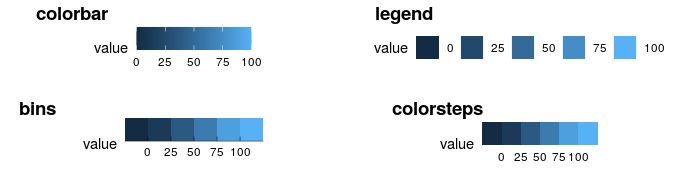

# ggplot2之图例系统 {#tidyverse-ggplot2-guides}

这一章，我们一起学习ggplot2中的图例系统，内容相对简单，但还是推荐大家阅读[ggplot2官方文档](https://cran.r-project.org/web/packages/ggplot2/index.html)


## 图例系统

为了方便演示，我们还是用熟悉的配方`ggplot2::mpg`

```{r ggplot2-guides-1}
library(tidyverse)

mpg %>%
  ggplot(aes(x = displ, y = hwy, color = factor(cyl))) +
  geom_point()  
```

如果想调整图例的样式，可以使用`guides()`函数，用法类似上节课中的`theme`函数, 具体参数为：

- 要么是`字符串` (i.e. `"color = colorbar"` or `"color = legend"`), 
- 要么是`特定的函数` (i.e. `color = guide_colourbar()` or `color = guide_legend()`) 


```{r ggplot2-guides-2, out.width = '99%', echo = FALSE}
knitr::include_graphics("images/ggplot2_guides.jpg")
```


以下 `guides()` 函数族用于控制图例的外观

- `guide_colorbar()`: continuous colors
- `guide_legend()`: discrete values (shapes, colors)
- `guide_axis()`: control axis text/spacing, add a secondary axis 
- `guide_bins()`: creates "bins" of values in the legend
- `guide_colorsteps()`: makes colorbar discrete 


```{r out.width = "80%"}

```

## 案例详解
```{r ggplot2-guides-3}
mpg %>%
  ggplot(aes(x = displ, y = hwy, color = factor(cyl))) +
  geom_point() +
  ggtitle("This is my title") +
  labs(x = "x_displ", y = "y_hwy") +
  guides(color = "legend")
```


```{r ggplot2-guides-4}
mpg %>%
  ggplot(aes(x = displ, y = hwy, color = factor(cyl))) +
  geom_point() +
  ggtitle("This is my title") +
  labs(x = "x_displ", y = "y_hwy") +
  guides(color = guide_bins(
                 title = "my title",
                 label.hjust = 1
                 )
         )
```


```{r ggplot2-guides-5}
mpg %>%
  ggplot(aes(x = displ, y = hwy, color = factor(cyl))) +
  geom_point() +
  ggtitle("This is my title")  +
  labs(x = "x_displ", y = "y_hwy") +
  guides(color = guide_legend(
                   ncol = 4
                 )
  )
```


```{r ggplot2-guides-51}
mpg %>%
  ggplot() + 
  geom_jitter(aes(x = cty, y = hwy, color = class), key_glyph = draw_key_pointrange) + #<<
  guides(color = guide_legend(nrow = 1)) +
  theme(legend.position =  "top", 
        axis.text = element_text(face = "italic", color = "navy"), 
        plot.background = element_rect(fill = "#a0d1f2"), 
        panel.background = element_blank(), 
        panel.grid = element_line(linetype = "dotdash"))
```


```{r ggplot2-guides-6}
mpg %>%
  ggplot(aes(x = displ, y = hwy, color = factor(cyl))) +
  geom_point() +
  ggtitle("This is my title")  +
  labs(x = "x_displ", y = "y_hwy") +
  guides(color = guide_legend(
    title = "title is too high",
    title.position = "top",
    title.vjust = 5,
    label.position = "left",
    label.hjust = 1,
    label.theme = element_text(size = 15,
                               face = "italic",
                               colour = "red",
                               angle = 0),
    keywidth = 5,
    reverse = TRUE
   )
  )
```


## 删除其中一个图例

```{r ggplot2-guides-7}
mpg %>%
  ggplot(aes(x = displ, y = hwy, color = class, size = cyl)) +
  geom_point()
```

比如，我们想删除size这个图例，那么需要这样做

```{r ggplot2-guides-8}
mpg %>%
  ggplot(aes(x = displ, y = hwy, color = class, size = cyl)) +
  geom_point() +
  guides(color = guide_legend("type"),      # keep
         size = FALSE                       # remove
         )
```


## 小结

到了这里，ggplot2内容的差不多介绍完了，最后做下自我测试，能读懂下面代码(来源 Emi Tanaka)的意思？

```{r ggplot2-guides-9, eval=FALSE}
mtcars %>%
  as_tibble() %>%
  ggplot(aes(x = wt, y = mpg, shape = factor(vs), color = hp)) +
  geom_point(size = 3) +
  colorspace::scale_color_continuous_sequential(palette = "Dark Mint") +
  scale_shape_discrete(labels = c("V-shaped", "Straight")) +
  labs(
    x = "Weight (1000 lbs)", y = "Miles per gallon",
    title = "Motor Trend Car Road Tests",
    shape = "Engine", color = "Horsepower"
  ) +
  theme(
    text = element_text(size = 18, color = "white"),
    rect = element_rect(fill = "black"),
    panel.background = element_rect(fill = "black"),
    legend.key = element_rect(fill = "black"),
    axis.text = element_text(color = "white"),
    plot.title.position = "plot",
    plot.margin = margin(10, 10, 10, 10)
  ) +
  guides(
    shape =
      guide_legend(override.aes = list(color = "white"))
  )
```


```{r ggplot2-guides-10, echo = F}
# remove the objects
# rm(list=ls())
```


```{r ggplot2-guides-11, echo = F, message = F, warning = F, results = "hide"}
pacman::p_unload(pacman::p_loaded(), character.only = TRUE)
```

