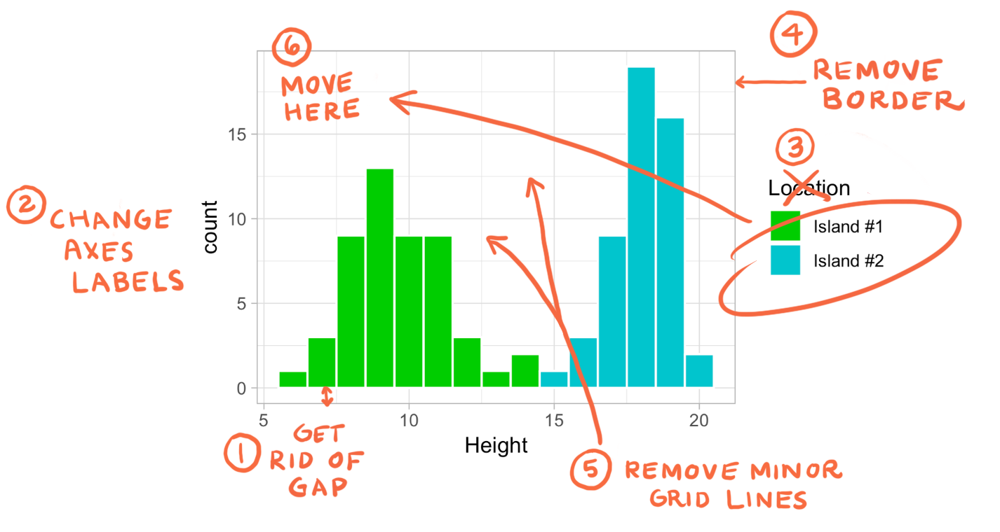

# ggplot2之主题设置 {#tidyverse-ggplot2-theme}

这一章我们一起学习ggplot2中的theme elements
语法，感谢[Henry Wang](https://henrywang.nl/ggplot2-theme-elements-demonstration/)提供了很好的思路。如果需要详细了解，可以参考Hadley Wickham最新版的[《ggplot2: Elegant Graphics for Data Analysis》](https://ggplot2-book.org/)，最推荐的是[ggplot2官方文档](https://cran.r-project.org/web/packages/ggplot2/index.html)


```{r ggplot2-theme-1, eval=FALSE}
theme(element_name = element_function())
```

这里`element_function()`有四个

```{r ggplot2-theme-2, eval=FALSE}
element_text()
element_line()
element_rect()
element_blank()
```

望文生义吧，内置元素函数有四个基础类型：

- `element_text()`,  文本，一般用于控制标签和标题的字体风格
- `element_line()`, 线条，一般用于控制线条或线段的颜色或线条类型
- `element_rect()`, 矩形区域，一般用于控制背景矩形的颜色或者边界线条类型
- `element_blank()` , 空白，就是不分配相应的绘图空间，即删去这个地方的绘图元素。


每个元素函数都有一系列控制外观的参数，下面我们通过具体的案例来一一介绍吧。

```{r ggplot2-theme-3}
library(tidyverse)
```

还是用让人生厌的`ggplot2::mpg`数据包吧，具体介绍请见\@ref(visual) 章。

```{r ggplot2-theme-4}
glimpse(mpg)
```


稍微做点数据整理
```{r ggplot2-theme-5}
df <- mpg %>% 
  as_tibble() %>% 
  filter(class != "2seater", manufacturer %in% c("toyota", "volkswagen"))
df
```
我相信这种图你们已经会画了吧
```{r ggplot2-theme-6}
df %>%
  ggplot(aes(x = displ, y = hwy, color = factor(cyl))) +
  geom_point() +
  facet_grid(vars(manufacturer), vars(class)) +
  ggtitle("This is my title") +
  labs(x = "x_displ", y = "y_hwy")
```

想让这张图，符合你的想法？如何**控制**呢？come on

## 图表整体元素

图表整体元素包括:

| 描述         | 主题元素         | 类型           |
|--------------|------------------|----------------|
|整个图形背景  | plot.background  |  element_rect()|
|图形标题      | plot.title       |  element_text()|
|图形边距      | plot.margin      |        margin()|


```{r ggplot2-theme-7}
df %>%
  ggplot(aes(x = displ, y = hwy, color = factor(cyl))) +
  geom_point() +
  facet_grid(vars(manufacturer), vars(class)) +
  ggtitle("This is my title") +
  labs(x = "x_displ", y = "y_hwy") +
  theme(
    plot.background = element_rect(fill = "orange", color = "black", size = 10),
    plot.title = element_text(hjust = 1, color = "red", face = "italic"),
    plot.margin = margin(t = 20, r = 20, b = 20, l = 20, unit = "pt")
  )
```

## 坐标轴元素

坐标轴元素包括:

| 描述         | 主题元素         | 类型           |
|--------------|------------------|----------------|
|坐标轴刻度    | axis.ticks       |  element_line()|
|坐标轴标题    | axis.title       |  element_text()|
|坐标轴标签    | axis.text        |  element_text()|
|直线和坐标轴  | axis.line        |  element_line()|

```{r ggplot2-theme-8}
df %>%
  ggplot(aes(x = displ, y = hwy, color = factor(cyl))) +
  geom_point() +
  facet_grid(vars(manufacturer), vars(class)) +
  ggtitle("This is my title") +
  labs(x = "x_displ", y = "y_hwy") +
  theme(
    axis.line = element_line(color = "orange", size = 2),
    axis.title = element_text(color = "red", face = "italic"),
    axis.ticks = element_line(color = "purple", size = 3),
    axis.text = element_text(color = "blue"),
    axis.text.x = element_text(angle = 45, hjust = 1)
  )
```


## 面板元素

面板元素包括:

| 描述         | 主题元素         | 类型           |
|--------------|------------------|----------------|
|面板背景      | panel.background | element_rect() |
|面板网格线    | panel.grid       | element_line() |
|面板边界      | panel.border     | element_rect() |


```{r ggplot2-theme-9}
df %>%
  ggplot(aes(x = displ, y = hwy, color = factor(cyl))) +
  geom_point() +
  facet_grid(vars(manufacturer), vars(class)) +
  ggtitle("This is my title") +
  labs(x = "x_displ", y = "y_hwy") +
  theme(
    panel.background = element_rect(fill = "orange", color = "red"),
    panel.grid = element_line(color = "grey80", size = 0.5)
  )
```

或者
```{r ggplot2-theme-10}
df %>%
  ggplot(aes(x = displ, y = hwy, color = factor(cyl))) +
  geom_point() +
  facet_grid(vars(manufacturer), vars(class)) +
  ggtitle("This is my title") +
  labs(x = "x_displ", y = "y_hwy") +
  theme(
    panel.background = element_rect(fill = "orange"),
    panel.grid = element_line(color = "grey80", size = 0.5),
    panel.border = element_rect(color = "red", fill = NA)
  )
```


## 图例元素

图例元素包括:

| 描述         | 主题元素         | 类型           |
|--------------|------------------|----------------|
|图例背景      | legend.background|  element_rect() |
|图例符号      | legend.key       |  element_rect() |
|图例标签      | legend.text      |  element_text() |
|图例标题      | legend.title     |  element_text() |
|图例边距      | legend.margin    |       margin    |
|图例位置      | legend.postion   |"top", "bottom", "left", "right"|


```{r ggplot2-theme-11}
df %>%
  ggplot(aes(x = displ, y = hwy, color = factor(cyl))) +
  geom_point() +
  facet_grid(vars(manufacturer), vars(class)) +
  ggtitle("This is my title") +
  labs(x = "x_displ", y = "y_hwy") +
  theme(
    legend.background = element_rect(fill = "orange"),
    legend.title = element_text(color = "blue", size = 10),
    legend.key = element_rect(fill = "grey80"),
    legend.text = element_text(color = "red"),
    legend.margin = margin(t = 20, r = 20, b = 20, l = 20, unit = "pt"),
    legend.position = "bottom"
  )
```


## 分面元素

分面元素包括:

| 描述         | 主题元素         | 类型           |
|--------------|------------------|----------------|
| 分面标签背景 | strip.background | element_rect() |
| 条状文本     | strip.text       | element_text() |
| 分面间隔     | panel.spacing    | unit           |


```{r ggplot2-theme-12}
df %>%
  ggplot(aes(x = displ, y = hwy, color = factor(cyl))) +
  geom_point() +
  facet_grid(vars(manufacturer), vars(class)) +
  ggtitle("This is my title") +
  labs(x = "x_displ", y = "y_hwy") +
  theme(
    strip.background = element_rect(fill = "orange"),
    strip.text = element_text(color = "red"),
    panel.spacing = unit(0.3, "inch") 
    # strip.switch.pad.grid =
  )
```

## 案例
```{r ggplot2-theme-13}
diamonds %>%
  ggplot(aes(carat, price)) +
  geom_hex() +
  labs(title = "Diamond") +
  theme(
    axis.title.x = element_text(
      size = 30,
      color = "red",
      face = "bold",
      angle = 10
    ),
    legend.title = element_text(
      size = 25,
      color = "#ff6361",
      margin = margin(b = 5)
    ),
    plot.title = element_text(
      size = 35,
      face = "bold",
      color = "blue"
    )
  )
```

你肯定不会觉得这图好看。


```{r ggplot2-theme-14}
library(palmerpenguins)
penguins %>%
  ggplot(aes(bill_length_mm, bill_depth_mm)) +
  geom_point() +
  theme(
    axis.line.y = element_line(
      color = "black",
      size = 1.2,
      arrow = grid::arrow()
    ),
    axis.line.x = element_line(
      linetype = "dashed",
      color = "brown",
      size = 1.2
    ),
    axis.ticks = element_line(color = "red", size = 1.1),
    axis.ticks.length = unit(3, "mm"),
    panel.grid.major = element_line(
      color = "blue",
      size = 1.2
    ),
    panel.grid.minor = element_line(
      color = "#58508d",
      size = 1.2,
      linetype = "dotted"
    )
  )
```


```{r ggplot2-theme-15}
penguins %>%
  ggplot(aes(bill_length_mm, bill_depth_mm)) +
  geom_point(aes(color = species)) +
  theme(
    legend.background = element_rect(
      fill = "#fff6c2",
      color = "black",
      linetype = "dashed"
    ),
    legend.key = element_rect(fill = "grey", color = "brown"),
    panel.background = element_rect(
      fill = "#005F59",
      color = "red", size = 3
    ),
    panel.border = element_rect(
      color = "black",
      fill = "transparent",
      linetype = "dashed", size = 3
    ),
    plot.background = element_rect(
      fill = "#a1dce9",
      color = "black",
      size = 1.3
    ),
    legend.position = "bottom"
  )
```

## 小结

```{r ggplot2-theme-16, out.width = '99%', echo = FALSE}
knitr::include_graphics("images/ggplot2-themes.jpg")
```


## 主题风格
当然可以使用自带的主题风格

```{r, fig.align='default', out.width="16.65%", fig.cap='Source: <a href="https://ggplot2-book.org/polishing.html">ggplot2 book</a>', fig.show='hold'}
thms <- list.files(path = "images/img", pattern = "built-in",full.names = T)
knitr::include_graphics(thms)
```


```{r ggplot2-geom2-24}
penguins %>% 
    ggplot(aes(x = bill_depth_mm, y = bill_length_mm)) +
    geom_point() +
    theme_minimal()
```


```{r ggplot2-geom2-240}
penguins %>% 
  ggplot(aes(x = bill_depth_mm, y = bill_length_mm)) +
  geom_point() +
  theme_bw() +
  theme(text = element_text(family = "serif", size = 20),
        panel.grid = element_blank()
        )
```


当然，`ggthemes`宏包也提供了很多优秀的主题风格

```{r ggplot2-geom2-25}
library(ggthemes)
penguins %>% 
    ggplot(aes(x = bill_depth_mm, y = bill_length_mm)) +
    geom_point() +
    ggthemes::theme_economist()
```


```{r ggplot2-geom-79}
gapdata <- read_csv("./demo_data/gapminder.csv")
gapdata %>%
  ggplot(aes(x = gdpPercap, y = lifeExp, color = continent)) +
  geom_point() +
  geom_smooth(lwd = 3, se = FALSE, method = "lm") +
  theme_grey() # the default
```


```{r ggplot2-geom-80}
gapdata %>%
  ggplot(aes(x = gdpPercap, y = lifeExp, color = continent)) +
  geom_point() +
  geom_smooth(lwd = 3, se = FALSE, method = "lm") +
  theme_bw()
```


```{r ggplot2-geom-81}
gapdata %>%
  ggplot(aes(x = gdpPercap, y = lifeExp, color = continent)) +
  geom_point() +
  geom_smooth(lwd = 3, se = FALSE, method = "lm") +
  ggthemes::theme_calc() +
  ggtitle("ggthemes::theme_calc()")
```


```{r ggplot2-geom-82}
gapdata %>%
  ggplot(aes(x = gdpPercap, y = lifeExp, color = continent)) +
  geom_point() +
  geom_smooth(lwd = 3, se = FALSE, method = "lm") +
  ggthemes::theme_economist() +
  ggtitle("ggthemes::theme_economist()")
```

```{r ggplot2-geom-83}
gapdata %>%
  ggplot(aes(x = gdpPercap, y = lifeExp, color = continent)) +
  geom_point() +
  geom_smooth(lwd = 3, se = FALSE, method = "lm") +
  ggthemes::theme_economist_white() +
  ggtitle("ggthemes::theme_economist_white()")
```


```{r ggplot2-geom-84}
gapdata %>%
  ggplot(aes(x = gdpPercap, y = lifeExp, color = continent)) +
  geom_point() +
  geom_smooth(lwd = 3, se = FALSE, method = "lm") +
  ggthemes::theme_few() +
  ggtitle("ggthemes::theme_few()")
```


```{r ggplot2-geom-85}
gapdata %>%
  ggplot(aes(x = gdpPercap, y = lifeExp, color = continent)) +
  geom_point() +
  geom_smooth(lwd = 3, se = FALSE, method = "lm") +
  ggthemes::theme_gdocs() +
  ggtitle("ggthemes::theme_gdocs()")
```


```{r ggplot2-geom-86}
gapdata %>%
  ggplot(aes(x = gdpPercap, y = lifeExp, color = continent)) +
  geom_point() +
  geom_smooth(lwd = 3, se = FALSE, method = "lm") +
  ggthemes::theme_tufte() +
  ggtitle("ggthemes::theme_tufte()")
```


```{r ggplot2-geom-87}
gapdata %>%
  ggplot(aes(x = gdpPercap, y = lifeExp, color = continent)) +
  geom_point() +
  geom_smooth(lwd = 3, se = FALSE, method = "lm") +
  ggthemes::theme_wsj() +
  ggtitle("ggthemes::theme_wsj()")
```


## 提问

- ggplot2中 plot 与 panel 有区别？

- 假定数据是这样

```{r ggplot2-theme-17}
library(tidyverse)
set.seed(12)

d1 <- data.frame(x = rnorm(50, 10, 2), type = "Island #1")
d2 <- data.frame(x = rnorm(50, 18, 1.2), type = "Island #2")

dd <- bind_rows(d1, d2) %>%
  set_names(c("Height", "Location"))

head(dd)
```

你画图后，交给老板看
```{r ggplot2-theme-18}
dd %>%
  ggplot(aes(x = Height, fill = Location)) +
  geom_histogram(binwidth = 1, color = "white") +
  scale_fill_manual(values = c("green3", "turquoise3"))
```

然而，老板有点不满意，希望你要这样改
```{r ggplot2-theme-19, echo=FALSE, out.width='85%'}

```

请用前后两章学到的内容让老板满意吧

```{r ggplot2-theme-20, eval=FALSE, include=FALSE}
ggplot(data = dd, aes(x = Height, fill = Location)) +
  geom_histogram(binwidth = 1, color = "white") +
  scale_fill_manual(values = c("green3", "turquoise3")) +
  theme_light() +
  scale_y_continuous(expand = c(0, 0)) +
  labs(x = "Teacup Giraffe heights", y = "Frequency", fill = NULL) +
  theme(panel.border = element_blank(), 
        panel.grid.minor = element_blank(), 
        legend.position = "top", 
        legend.justification='left',
        legend.background = element_rect(color = "white")
  )
```


```{r ggplot2-theme-21, echo = F}
# remove the objects
# rm(list=ls())
rm(d1, d2, dd, df)
```


```{r ggplot2-theme-22, echo = F, message = F, warning = F, results = "hide"}
pacman::p_unload(pacman::p_loaded(), character.only = TRUE)
```
