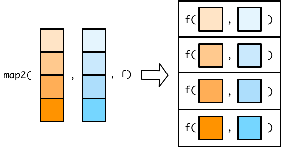
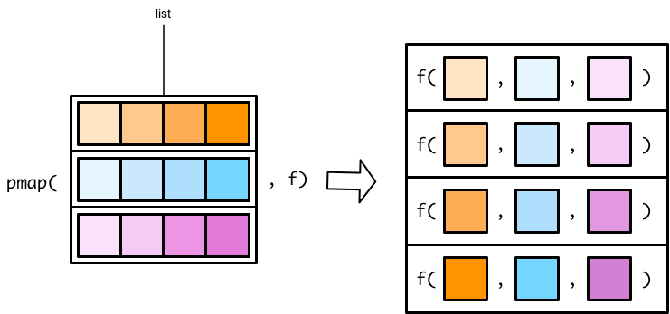
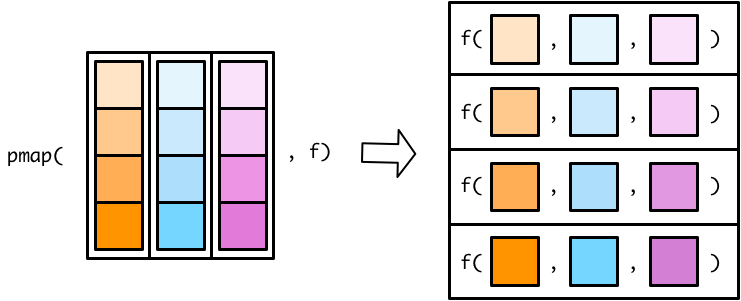

# 函数式编程2 {#tidyverse-purrr-adv}

```{r}
library(tidyverse)
```

第 \@ref(tidyverse-purrr) 章， 我们学习了如何使用`map()`函数迭代一个向量（或列表），并对其元素施以函数。

事实上，purrr()家族还有其它map()函数，可以在多个向量中迭代。也就说，同时接受多个向量的元素，并行计算。比如，`map2()`函数可以处理两个向量，而`pmap()`函数可以处理更多向量。

## map2()
`map2()`函数和`map()`函数类似，不同在于`map2()`接受两个**等长**的向量

```{r, out.width = '75%', echo = FALSE}

```
在`map()`函数使用匿名函数，可以用 `.` 代表输入向量的每个元素。在`map2()`函数， `.`不够用，所有需要需要用 `.x` 代表第一个向量的元素，`.y`代表第二个向量的元素

```{r}
x <- c(1, 2, 3)
y <- c(4, 5, 6)

map2(x, y, ~ .x + .y)
```
tibble的每一列都是向量，所以可以把map2()放在mutate()函数内部，对tibble的多列同时迭代

```{r}
df <-
  tibble(
    a = c(1, 2, 3),
    b = c(4, 5, 6)
  )

df %>% 
  mutate(min = map2_dbl(a, b, ~min(.x, .y)))
```
也可以简写
```{r}
df %>% 
  mutate(min = map2_dbl(a, b, min))
```

注意到，`mutate()` 是`column-operation`，即提取数据框一列作为向量，传递到mutate中，`map2_dbl()`返回的也是一个等长的向量。当然，我们可以用第 \@ref(tidyverse-colwise) 章的row-wise的方法，实现相同功能。

```{r}
df %>% 
  rowwise() %>% 
  mutate(min = min(a, b)) %>% 
  ungroup()
```

## pmap()

没有`map3()`或者`map4()`函数，只有 `pmap()` 函数可用(p for parallel) 

`pmap()`函数稍微有点不一样的地方:

- `map()`和`map2()`函数，指定传递给函数f的向量，向量各自放在各自的位置上
- `pmap()`需要将传递给函数的向量名，先装入一个list()中, 再传递给函数f

```{r, out.width = '75%', echo = FALSE}

```

翻转列表的图示，参数的传递关系看地更清楚。

```{r, out.width = '75%', echo = FALSE}

```

事实上，`map2()`是`pmap()`的一种特殊情况

```{r}
map2_dbl(x, y, min)
pmap_dbl(list(x, y), min)
```


### 用在tibble

tibble本质上就是list，这种结构就是`pmap()`所需要的，因此，直接应用函数即可。

```{r}
tibble(
  a = c(50, 60, 70),
  b = c(10, 90, 40),
  c = c(1, 105, 200)
) %>% 
  pmap_dbl(min)
```

### 匿名函数

pmap()可以接受多个向量，因此在pmap()种使用匿名函数，就需要一种新的方法，标识每个向量。

由于向量是多个，因此不再用`.x`， `.y`，而是用`..1`, `..2`, `..3` 分别代表第一个向量、第二个向量和第三个向量。


```{r, echo = F, message = F, warning = F, results = "hide"}
pacman::p_unload(pacman::p_loaded(), character.only = TRUE)
```


