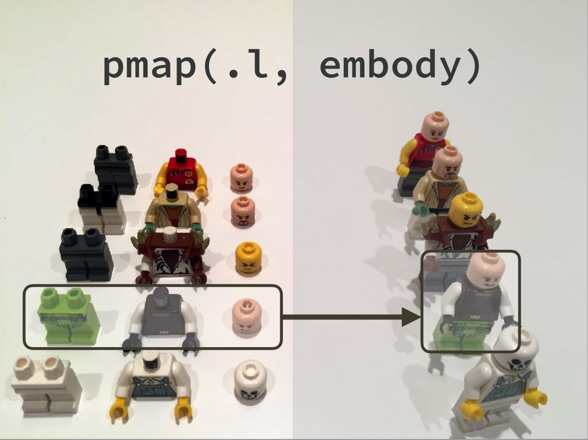
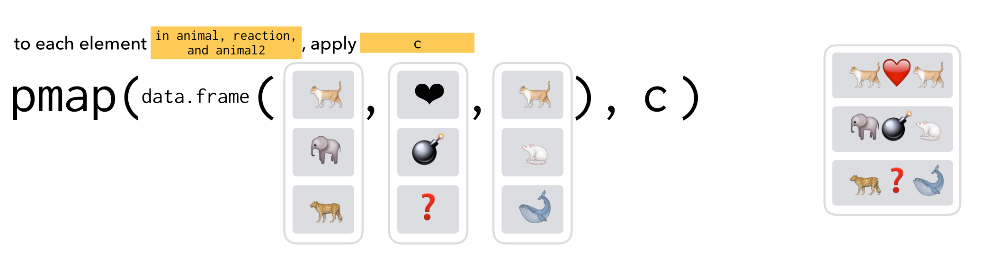
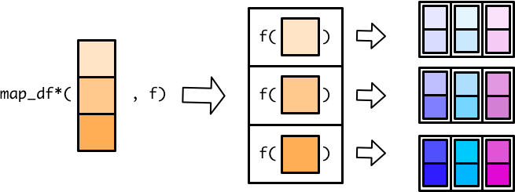
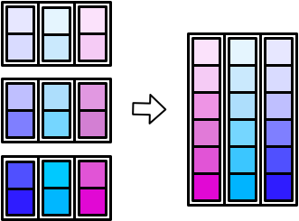
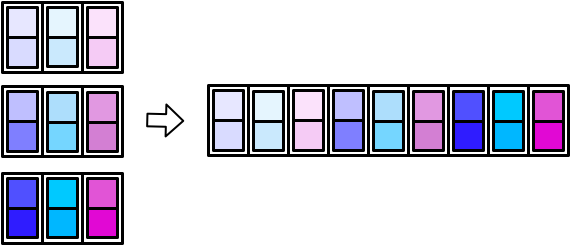

# 函数式编程2 {#tidyverse-purrr-adv}

```{r}
library(tidyverse)
```

第 \@ref(tidyverse-purrr) 章， 我们学习了如何使用`map()`函数迭代一个向量（或列表），并对其元素施以函数。

事实上，purrr()家族还有其它`map()`函数，可以在多个向量中迭代。也就说，同时接受多个向量的元素，并行计算。比如，`map2()`函数可以处理两个向量，而`pmap()`函数可以处理更多向量。

## map2()
`map2()`函数和`map()`函数类似，不同在于`map2()`接受两个的向量，这两个向量必须是**等长**

```{r, out.width = '75%', echo = FALSE}
knitr::include_graphics("images/dcl/map2.png")
```

在`map()`函数使用匿名函数，可以用 `.` 代表输入向量的每个元素。在`map2()`函数， `.`不够用，所有需要需要用 `.x` 代表第一个向量的元素，`.y`代表第二个向量的元素

```{r}
x <- c(1, 2, 3)
y <- c(4, 5, 6)

map2(x, y, ~ .x + .y)
```

tibble的每一列都是向量，所以可以把`map2()`放在`mutate()`函数内部，对tibble的多列同时迭代

```{r}
df <-
  tibble(
    a = c(1, 2, 3),
    b = c(4, 5, 6)
  )

df %>% 
  mutate(min = map2_dbl(a, b, ~min(.x, .y)))
```
也可以简写
```{r}
df %>% 
  mutate(min = map2_dbl(a, b, min))
```

注意到，`mutate()` 是`column-operation`，即提取数据框一列作为向量，传递到mutate中，`map2_dbl()`返回的也是一个等长的向量。当然，我们可以用第 \@ref(tidyverse-colwise) 章的row-wise的方法，实现相同功能。

```{r}
df %>% 
  rowwise() %>% 
  mutate(min = min(a, b)) %>% 
  ungroup()
```

## pmap()

没有`map3()`或者`map4()`函数，只有 `pmap()` 函数可用(p 的意思是 parallel) 

`pmap()`函数稍微有点不一样的地方:

- `map()`和`map2()`函数，指定传递给函数f的向量，向量各自放在各自的位置上
- `pmap()`需要将传递给函数的向量名，先装入一个list()中, 再传递给函数f

```{r, out.width = '75%', echo = FALSE}
knitr::include_graphics("images/dcl/pmap-list.png")
```

翻转列表的图示，参数的传递关系看地更清楚。

```{r, out.width = '75%', echo = FALSE}
knitr::include_graphics("images/dcl/pmap-flipped.png")
```

事实上，`map2()`是`pmap()`的一种特殊情况

```{r}
map2_dbl(x, y, min)
pmap_dbl(list(x, y), min)
```


### 用在tibble

tibble本质上就是list，这种结构就是`pmap()`所需要的，因此，直接应用函数即可。

```{r}
tibble(
  a = c(50, 60, 70),
  b = c(10, 90, 40),
  c = c(1, 105, 200)
) %>% 
  pmap_dbl(min)
```


以下是两个非常优秀的图示，方便大家记忆

```{r, out.width = '75%', echo = FALSE, fig.cap='图片来源于Jennifer Bryan 的报告[《Row-oriented workflows in R and tidyverse》](https://github.com/jennybc/row-oriented-workflows)'}

```


```{r, out.width = '75%', echo = FALSE, fig.cap='图片来源于charlotte wickham的报告[《solving iteration problems with purrr》](http://bit.ly/purrr-slides)'}

```


### 匿名函数

`pmap()`可以接受多个向量，因此在`pmap()`种使用匿名函数，就需要一种新的方法来标识每个向量。

由于向量是多个，因此不再用`.x`， `.y`，而是用`..1`, `..2`, `..3` 分别代表第一个向量、第二个向量和第三个向量。
```{r}
pmap(
  list(1:5, 5:1, 2), ~ ..1 + ..2 - ..3
  )
```


### 命名函数

```{r}
params <- tibble::tribble(
  ~ n, ~ min, ~ max,
   1L,     0,     1,
   2L,    10,   100,
   3L,   100,  1000
)

pmap(params, ~runif(n = ..1, min = ..2, max = ..3))

```


如果提供给`pmap()`的`.f` 是命名函数，比如`runif(n, min = , max = )`，它有三个参数
`n, min, max`， 而我们输入的列表刚好也有三个同名的元素，那么他们会自动匹配，代码因此变得更加简练

```{r}
pmap(params, runif)
```

当然，这里需要注意的是

- 输入列表的元素，其个数要与函数的参数个数一致
- 输入列表的元素，其变量名也要与函数的参数名一致


## 其他purrr函数

### Map functions that output tibbles

接着介绍purrr宏包的其他函数。
`map()`家族除了返回list和atomic vector 外，`map_df()`, `map_dfr()` 和`map_dfc()`还可以返回tibble。

这个过程，好比生产线上的工人把输入的列表元素依次转换成一个个tibble，

```{r, out.width = '75%', echo = FALSE}

```


最后归集一个大的tibble。在归集成一个大的tibble的时候，有两种方式，

- 竖着堆积，`map_dfr()` (r for rows) 

```{r, out.width = '75%', echo = FALSE}

```

- 并排堆放 `map_dfc()` (c for columns) 

```{r, out.width = '75%', echo = FALSE}

```


### Walk and friends
`walk()`函数与`map()`系列函数类似，但应用场景不同，`map()`在于执行函数操作，而`walk()` 保存记录数据（比如`print()`,`write.csv()`, `ggsave()`），常用于保存数据和生成图片。比如我们用`map()`生成系列图片，

```{r}
plot_rnorm <- function(sd) {
  tibble(x = rnorm(n = 5000, mean = 0, sd = sd)) %>% 
    ggplot(aes(x)) +
    geom_histogram(bins = 40) +
    geom_vline(xintercept = 0, color = "blue")
}

plots <-
  c(5, 1, 9) %>% 
  map(plot_rnorm)
```

然后我们用`walk()`函数依次打印出来
```{r}
plots %>% 
  walk(print)
```

`map()`函数是一定要返回列表的，但`walk()`看上去函数没有返回值，实际上它返回的就是它的**输入**，只是用户不可见而已。


```{r, out.width = '75%', echo = FALSE}
knitr::include_graphics("images/dcl/walk.png")
```
这样的设计很有用，尤其在管道操作中，我们可以统计中，用walk()保存中间计算的结果或者生成图片，然后**若无其事地**继续管道（因为walk()返回值，就是输入walk的值），保持计算的连贯。


## 参考

- <https://adv-r.hadley.nz/functionals.html>
- <https://dcl-prog.stanford.edu/purrr-extras.html>


```{r, echo = F, message = F, warning = F, results = "hide"}
pacman::p_unload(pacman::p_loaded(), character.only = TRUE)
```


