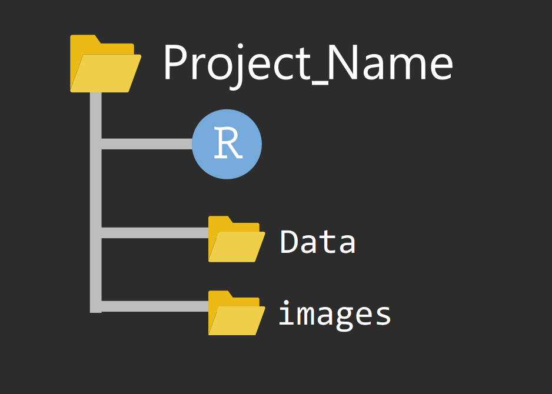

# 读取数据 {#tidyverse-readr}

在学习R语言过程中，除了使用内置的数据集外，我们更多的需要导入外部数据，
比如实验观察数据、社会调研的数据等等。
在讲如何读取数据到 **R**之前，先介绍下数据科学中的项目管理。

## 数据科学中的文件管理

把项目所需的文件（代码、数据、图片等），放在一个文件夹里

### 文件夹命名

**推荐**我自己的文件夹命名习惯 (项目名+日期)，注意这里不要有**中文和空格**, 比如下面风格的就比较好 

- `homework20201014`
- `project20201014`
- `Emotional_experiment20201014` 


### 项目文件结构

```{r readr-1, out.width='50%', fig.align='left', echo=FALSE}

```


## 读取文件

事实上，R语言提供了很多读取数据的函数。下表列出了常见文件格式的读取方法


文件格式                       |       **R** 函数 
:---------------------------   |       :----------------------
.txt                           |       `read.table()`
.csv                           |       `read.csv()` and `readr::read_csv()`
.xls and .xlsx                 |       `readxl::read_excel()` and `openxlsx::read.xlsx()`
.sav(SPSS files)               |       `haven::read_sav()` and `foreign::read.spss()`
.Rdata or rda                  |       `load()`
.rds                           |       `readRDS()` and `readr::read_rds()` 
.dta                           |       `haven::read_dta()` and `haven::read_stata()`
.sas7bdat(SAS files)           |       `haven::read_sas()`
Internet                       |       `download.file()`


## 文件路径

在读取文件时，路径的写法有如下方式（以图像文件"a.jpg"为例）

- 如果以当前项目文件为中心，图片在当前目录，它的路径
"./a.jpg"

- 如果以当前项目文件为中心，图片在下一层目录的images文件夹
"./images/a.jpg"

- 如果以当前项目文件为中心，图片在上一层目录下，它的路径
"../a.jpg"

- 如果以当前项目文件为中心，图片在上一层目录的images文件夹，它的路径
"../images/a.jpg"

- 从根目录出发，访问D盘的images文件"b.jpg"图片，它的路径
"D:/images/b.jpg"


## `here` 宏包

推荐使用强大的`here`宏包，`here()`会告诉我们当前所在的目录
```{r}
here::here()
```

以及指向某个文件的路径信息
```{r}
here::here("demo_data", "kidiq.RDS")
```
这样就会很方便的读取文件
```{r, eval=FALSE}
readr::read_rds(here::here("demo_data", "kidiq.RDS"))
```

`here`宏包的好处还在于，在不同的电脑和文件结构下，代码都能运行，尤其当与合作者共同完成一个项目时，这个方法非常有用。


## 范例


```{r readr-2, eval=FALSE, warning=FALSE}
d <- read.table(file= "./data/txt_file.txt", header = TRUE)
d <- read.table(here::here("data", "txt_file.txt"), header = TRUE)
```


```{r readr-3, eval=FALSE, warning=FALSE}
load(file = "./data/rda_file.rda")
load(here::here("data", "rda_file.rda"))
```


```{r readr-4, eval=FALSE, warning=FALSE}
d <- readRDS("./data/rds_file.rds")
d <- readRDS(here::here("data", "rda_file.rds"))
```


```{r readr-5, eval=FALSE, warning=FALSE}
library(readr)
d <- read_csv(file = "./data/csv_file.csv") 
d <- read_csv(here::here("data", "csv_file.csv")) 
```
csv = "comma-separated values"


```{r readr-6, eval=FALSE, warning=FALSE}
url <- "https://raw.githubusercontent.com/perlatex/R_for_Data_Science/master/demo_data/wages.csv"
d <- read_csv(url)
```


```{r readr-7, eval=FALSE, warning=FALSE}
library(readxl)
d <- read_excel("./data/vowel_data.xlsx") 
d <- read_excel(here::here("data", "vowel_data.xlsx")) 
```


```{r readr-8, eval=FALSE, warning=FALSE}
library(haven)
d <- read_dta("./data/cfps2010.dta")
d <- read_dta(here::here("data", "cfps2010.dta"))
```


## 乱码情形

```{block readr-9, type="danger"}
遇到乱码的情况，这里有个小小的提示：

- 可以先用记事本转换成"UTF-8"编码，
- 或者指定编码格式，比如`read.table(..., fileEncoding = "UTF-8")`，再试试。

```

## 习题

读取demo_data文件夹下kidiq.RDS文件

```{r, include = FALSE, eval = FALSE}
kidiq <- readr::read_rds(here::here("demo_data", "kidiq.RDS")) 
kidiq
```

变量含义：

| 变量       	| 含义             	|
|------------	|------------------	|
| kid_score  	| 小孩考试分数     	|
| mom_hs     	| 母亲是否完成高中 	|
| mom_iq     	| 母亲IQ值         	|
| mom_age    	| 母亲年龄         	|

请说出数据框中每一列的变量类型


