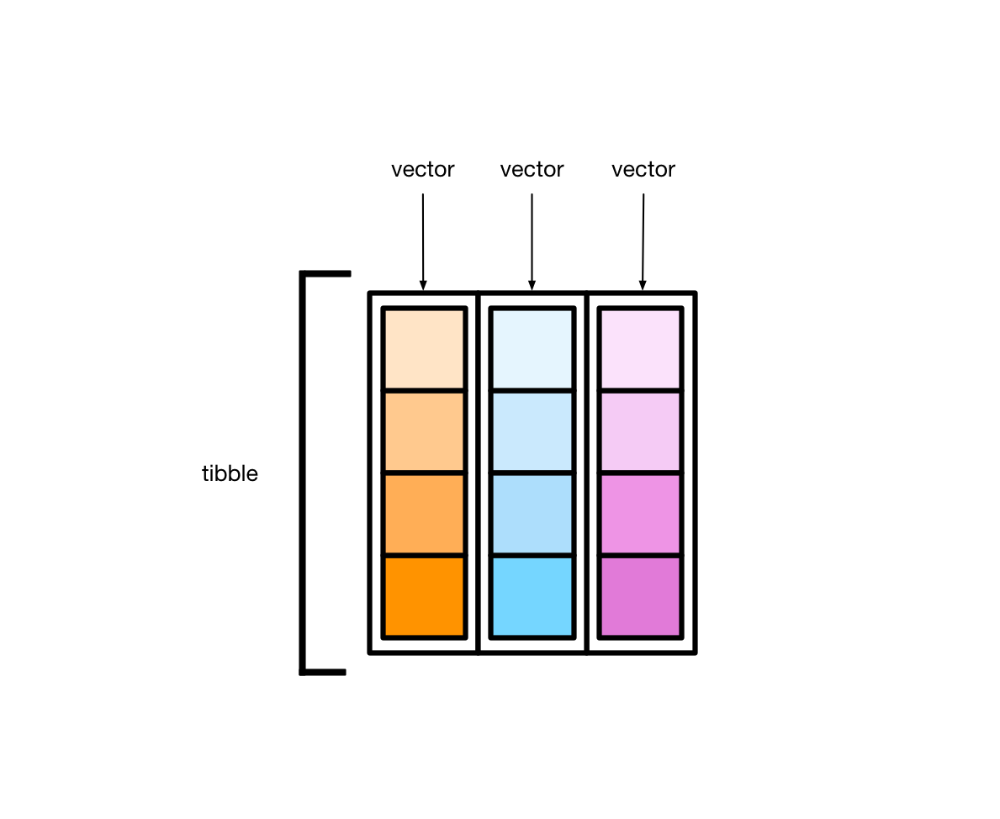
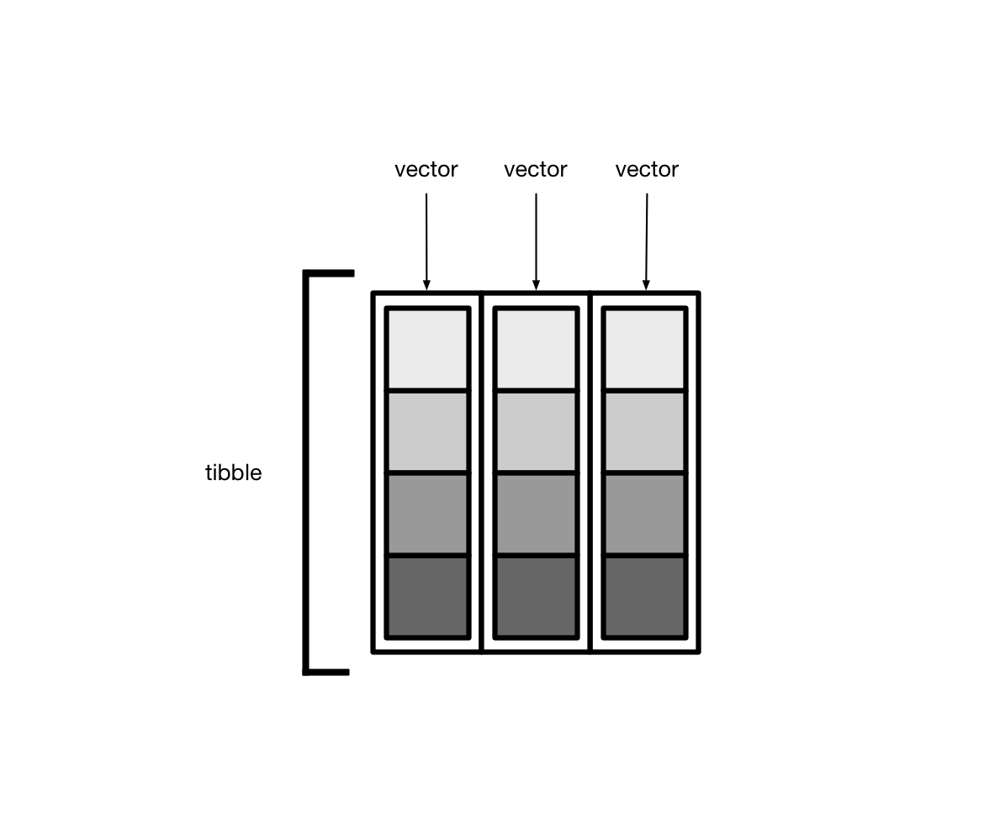
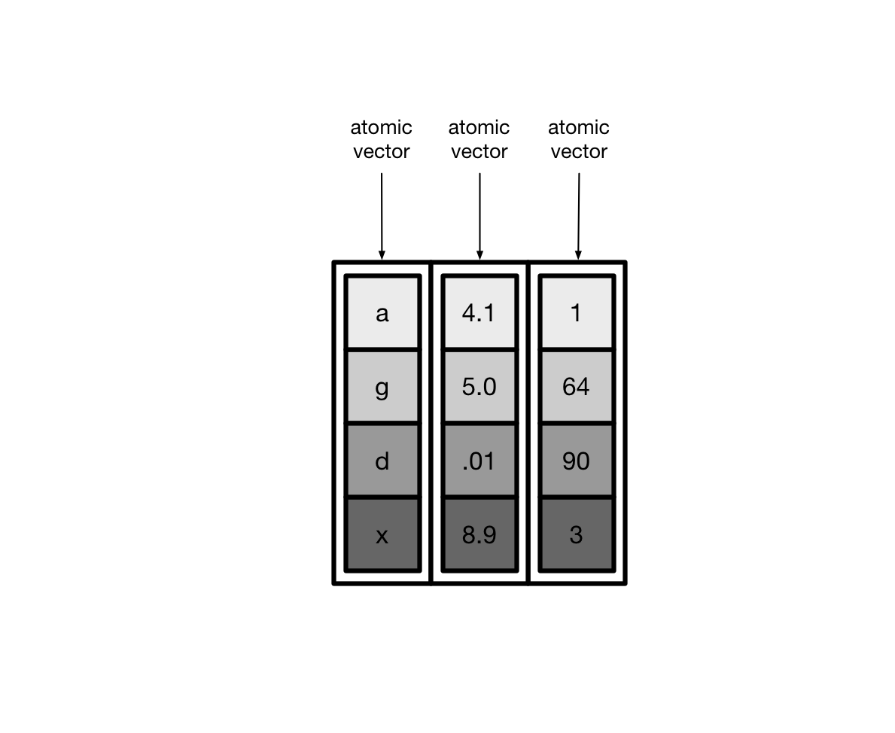
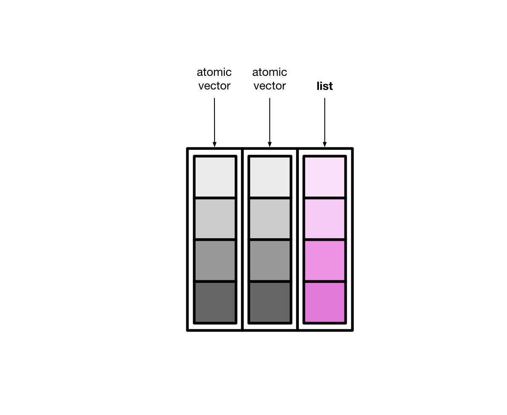
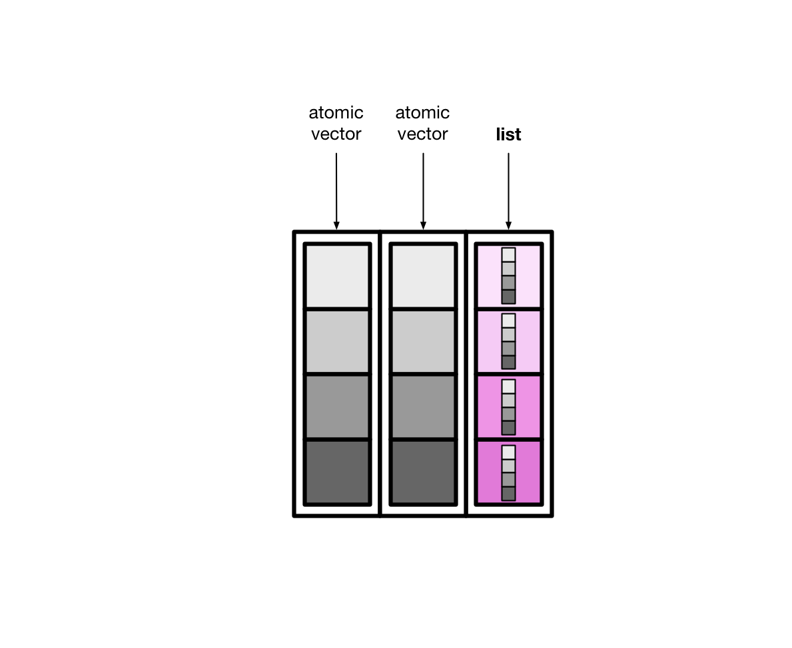
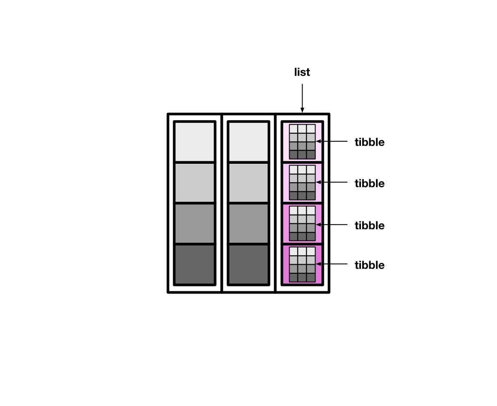

# 简单数据框 {#tidyverse-tibble}


```{r tibble-1, message = FALSE, warning = FALSE}
library(tidyverse)
library(tibble) 
```

事实上，library(tidyverse)已经加装了library(tibble)


## tidyverse 家族

前面陆续介绍了tidyverse家族，家庭主要成员包括


| 功能 | 宏包        |
|:-----|:------------|
有颜值担当 | ggplot2 |
数据处理王者 | dplyr |
数据转换专家  | tidyr |
数据载入利器 | readr |
循环加速器 | purrr |
强化数据框 | tibble |
字符串处理 | stringr |
因子处理   | forcats |


## 人性化的tibble

```{r, out.width = '75%', echo = FALSE}

```

- tibble是用来替换data.frame类型的扩展的数据框
- tibble继承了data.frame，是弱类型的。换句话说，tibble是data.frame的子类型
- tibble与data.frame有相同的语法，使用起来更方便
- tibble更早的检查数据，方便写出更干净、更多富有表现力的代码


tibble对data.frame做了重新的设定：

* tibble，不关心输入类型，可存储任意类型，包括list类型
* tibble，没有行名设置 row.names
* tibble，支持任意的列名
* tibble，会自动添加列名
* tibble，类型只能回收长度为1的输入
* tibble，会懒加载参数，并按顺序运行
* tibble，是tbl_df类型


## tibble 与 data.frame


传统创建数据框

```{r tibble-2}
data.frame(
  a = 1:5,
  b = letters[1:5]
)
```

发现，`data.frame()`会自动将**字符串型**的变量转换成**因子型**，如果想保持原来的字符串型，就得

```{r tibble-3}
data.frame(
  a = 1:5,
  b = letters[1:5],
  stringsAsFactors = FALSE
)
```


```{block tibble-4, type="danger"}
Note：
- 在R 4.0 后，`data.frame()` 不会将**字符串型**变量自动转换成**因子型**

```


用tibble创建数据框，不会这么麻烦，输出的就是原来的字符串类型
```{r tibble-5}
tibble(
  a = 1:5,
  b = letters[1:5]
)
```


我们有时候喜欢这样，构建两个有关联的变量， 比如
```{r tibble-6}
tb <- tibble(
  x = 1:3,
  y = x + 2
)
tb
```


但是，如果用传统的`data.frame()`来构建，会报错

```{r tibble-7, error = TRUE}
df <- data.frame(
  x = 1:3,
  y = x + 2
)

df
```

因此，在这一点上`tibble()`做的比较人性化。

大家还可以发现tibble另一个优势：tibble输出时，会显示多一行，用来指定每一列的类型。

tibble用缩写定义了7种类型：


| 类型 | 含义                      |
|------|---------------------------|
| int  | 代表integer               |
| dbl  | 代表double                |
| chr  | 代表character向量或字符串 |
| dttm | 代表日期+时间(date+time)  |
| lgl  | 代表逻辑判断TRUE或者FALSE |
| fctr | 代表因子类型factor        |
| date | 代表日期dates             |


## tibble数据操作

### 创建tibble

`tibble()`创建一个tibble类型的data.frame:

```{r tibble-8}
tibble(a = 1:5, b = letters[1:5])
```

刚才提到了，可以这样，
```{r tibble-9}
tibble(
  a = 1:5,
  b = 10:14,
  c = a + b
)
```

- 为了让每列更加直观，也可以`tribble()`创建，数据量不大的时候，挺方便的

```{r tibble-10}
tribble(
  ~x, ~y, ~z,
  "a", 2, 3.6,
  "b", 1, 8.5
)
```


### 转换成tibble类型


转换成tibble类型意思就是说，刚开始不是tibble, 现在转换成tibble， 包括

- data.frame转换成tibble
- vector转换成tibble
- list转换成tibble
- matrix转换成tibble


#### data.frame转换成tibble
```{r tibble-11}
t1 <- iris[1:6, 1:4] # data.frame
class(t1)
```


```{r tibble-12}
as_tibble(t1)
```


#### vector转型到tibble
```{r tibble-13}
x <- as_tibble(1:5) # Use `tibble::enframe()
x
```

#### 把list转型为tibble
```{r tibble-14}
df <- as_tibble(list(x = 1:6, y = runif(6), z = 6:1))
df
```

把tibble再转为list? `as.list(df)`


#### 把matrix转型为tibble

```{r tibble-15}
m <- matrix(rnorm(15), ncol = 5)
as_tibble(m)
```

tibble转回matrix? `as.matrix(df)`


### tibble简单操作

构建一个简单的数据框
```{r tibble-16}
df <- tibble(
  x = 1:2,
  y = 2:1
)

df
```


增加一列

```{r tibble-17}
add_column(df, z = 0:1, w = 0)
```


增加一行
```{r tibble-18}
add_row(df, x = 99, y = 9)
```

在第二行，增加一行

```{r tibble-19}
add_row(df, x = 99, y = 9, .before = 2)
```


### 有用的函数`lst`

lst，创建一个list，具有tibble特性的list。
```{r tibble-20}
lst(n = 5, x = runif(n), y = TRUE)
```

### 有用的函数`enframe`

`enframe()`将矢量快速创建tibble，，创建的tibble只有2列: name和value
```{r tibble-21}
enframe(1:3)
```


```{r tibble-22}
enframe(c(a = 5, b = 7, c = 9))
```


### 有用的函数`deframe`

`deframe() `可以看做是`enframe()` 的反操作，把tibble反向转成向量
```{r tibble-23}
df <- enframe(c(a = 5, b = 7))
df
```


```{r tibble-24}
# change to vector
deframe(df)
```


### 读取文件

read_csv()读取文件时，生成的直接就是tibble
```{r tibble-25}
read_csv("./demo_data/wages.csv")
```


## 关于行名

data.frame是支持行名的，但tibble不支持行名，**这也是两者不同的地方**

```{r tibble-26}
#  create data.frame
df <- data.frame(x = 1:3, y = 3:1)

# add row name
row.names(df) <- LETTERS[1:3]
df
```


判断是否有行名
```{r tibble-27}
has_rownames(df)
```


但是对于tibble

```{r tibble-28, error=TRUE}
tb <- tibble(x = 1:3, y = 3:1)

row.names(tb) <- LETTERS[1:3]
```


::: {.rmdnote}
需要注意的：

- 有时候遇到含有行名的data.frame，转换成tibble后，行名会被丢弃
- 如果想保留行名，就需要把行名转换成单独的一列

:::


举个例子
```{r tibble-30}
df <- mtcars[1:3, 1:3]
df
```


把行名转换为单独的一列
```{r tibble-31}
rownames_to_column(df, var = "rowname")
```


把行索引转换为单独的一列
```{r tibble-32}
rowid_to_column(df, var = "rowid")
```


## 修复列名

规范的来说，数据框的列名应该是唯一。但现实中代码是人写的，因此可能会稀奇古怪的，所幸的是tibble也提供了**人性化的解决方案**

```{r tibble-33, error = TRUE}
tibble(x = 1, x = 2)
```

- `.name_repair = "check_unique"` 检查列名唯一性，但不做修复（默认）

- `.name_repair = "minimal"`， 不检查也不修复，维持现状
 
- `.name_repair = "unique"` 修复列名，使得列名唯一且不为空
 
- `.name_repair = "universal"` 修复列名，使得列名唯一且语法可读


具体使用方法：
```{r tibble-34}
tibble(x = 1, x = 2, .name_repair = "minimal")
```


```{r tibble-35}
tibble(x = 1, x = 2, .name_repair = "unique")
```


```{r tibble-36}
tibble(x = 1, x = 2, .name_repair = "universal")
```


```{r tibble-37}
tibble(`a 1` = 1, `a 2` = 2, .name_repair = "universal")
```


如果认为`x...1`, `x...2` 不符合自己的审美，可以指定修复函数

```{r tibble-38}
tibble(x = 1, x = 2, .name_repair = make.unique)
```


```{r tibble-39}
tibble(x = 1, x = 2, .name_repair = ~ make.unique(.x, sep = "_"))
```


```{r tibble-40}
tibble(x = 1, x = 2, .name_repair = ~ make.names(., unique = TRUE))
```


注意`make.unique(names, sep = ".")`和`make.names(names, unique = FALSE, allow_ = TRUE)` 是基础包的函数，可通过`?make.unique()`或者`make.names()`获取说明文档。


当然也可以自定义函数

```{r tibble-41}
fix_names <- function(x) gsub("\\s+", "_", x)

tibble(`year 1` = 1, `year 2` = 2, .name_repair = fix_names)
```


::: {.rmdnote}
- 感觉越说越复杂了，事实上，我们写数据框的时候，完全可以避免上述问题，只要做到规范列名。
- 如果真正遇到比较乱的列名，推荐使用`janitor::clean_names()`一步到位。

:::


```{r tibble-43}
library(janitor)
tibble(`year 1` = 1, `year 2` = 2) %>%
  clean_names()
```


## `List-columns` (列表列) 

tibble 本质上是向量构成的列表。如下图所示

```{r, out.width = '75%', echo = FALSE}

```

大多情况下，我们接触到的向量是原子型向量(atomic vectors)，所谓原子型向量就是向量元素为单个值，比如 `"a"` 或者 `1`

```{r, out.width = '75%', echo = FALSE}

```


tibble还有可以允许某一列为列表(list)，那么列表构成的列，称之为列表列（list columns）

```{r, out.width = '75%', echo = FALSE}

```

这样一来，**列表列**非常灵活，因为列表元素可以是原子型向量、列表、矩阵或者小的tibble


```{r, out.width = '75%', echo = FALSE}

```


## nested tibble

tibble的列表列装载数据的能力很强大，也很灵活。下面，我们将介绍如何创建和操控有列表列的tibble。

### creating 
假定我们这里有一个tibble， 我们有三种方法可以创建列表列

* `nest()`
* `summarize()` and `list()`
* `mutate()` and `map()`


#### tidyr::nest()
使用tidyr::nest()函数，创建有列表列的tibble。 

```{r, out.width = '75%', echo = FALSE}

```

```{r tibble-44}
library(tidyverse)
library(palmerpenguins)
df <- penguins %>% 
  drop_na() %>% 
  select(species, bill_length_mm, bill_depth_mm, body_mass_g)
df
```


```{r}
tb <- df %>% 
  nest(data = c(bill_length_mm, bill_depth_mm, body_mass_g))

tb
```

`nest()` 为每种species创建了一个小的tibble， 每个小的tibble对应一个species
```{r}
tb$data[[1]]
```

可以看到，`tb`的整个`data`列是一个list
```{r}
tb$data %>% typeof()
```

如果想偷懒，也可以用`select()`的语法
```{r}
df %>% 
  nest(data = !species)
```
 
可以同时创建多个列表列

```{r}
df %>% 
  nest(data1 = c(bill_length_mm, bill_depth_mm), data2 = body_mass_g)
```


#### tidyr::summarise()
第 \@ref(tidyverse-dplyr) 章介绍数据处理， `group_by()` 和 `summarize()`组合可以将向量分组后分别压缩成单个值，事实上，`summarize()`还可以创建列表列。

```{r}
df_collapsed <- df %>% 
  group_by(species) %>% 
  summarise(
    data = list(bill_length_mm)
  )

df_collapsed
```

data就是构建的列表列，它的每个元素都是一个向量，对应一个species。这种方法和`nest()`方法很相似，不同在于，`summarise() + list()` 构建的列表列其元素是原子型向量，而`nest()`构建的是tibble.

```{r}
df_collapsed$data[[1]] %>% typeof()
```

`summarise() + list()`的方法还可以在创建列表列之前，对数据简单处理，比如排序
```{r}
df %>% 
  group_by(species) %>% 
  summarise(
    data = list(sort(bill_length_mm))
  )
```

或者做筛选
```{r}
df %>% 
  group_by(species) %>% 
  summarise(
    data = list(bill_length_mm[bill_length_mm > 45])
  )
```


#### dplyr::mutate()

第三种方法是用`rowwise() + mutate()`，比如，下面为每个岛屿(island) 创建一个与该岛企鹅数量等长的随机数向量，简单点说，这个岛屿上企鹅有多少只，那么随机数的个数就有多少个。
```{r}
penguins %>% 
  drop_na() %>% 
  group_by(island) %>% 
  summarise(
    n_num = n()
  ) %>% 
  
  rowwise() %>% 
  mutate(random = list(rnorm(n = n_num))) %>% 
  ungroup()
```

### Unnesting

用`unnest()`函数可以把**列表列**转换成**常规列**的形式，比如上节中的tb

```{r}
tb
```

这里把想要打开的列`data`，作为参数提供给`unnest(cols = )` 
```{r}
tb %>% 
  unnest(cols = data)
```

### Manipulating

操控列表列是一件有趣的事情，我们常常会借助于行方向的操作(rowwise), 请看第 \@ref(tidyverse-colwise) 章。比如找出每个岛屿企鹅的数量，我们需要对data列表列的元素依次迭代，
```{r}
tb %>% 
  rowwise() %>% 
  mutate(num_species = nrow(data))
```

再比如，求每组下企鹅嘴峰长度与嘴峰厚度的相关系数
```{r}
tb %>% 
  rowwise() %>% 
  mutate(corr_coef = cor(data$bill_length_mm, data$bill_depth_mm))
```


## 延伸阅读

1、阅读Hadley Wickham的[r4ds](https://r4ds.had.co.nz/)这本书[第10章](https://r4ds.had.co.nz/tibbles.html)。


2、 tibble的官方主页：[https://tibble.tidyverse.org/](https://tibble.tidyverse.org/)

3、创建**列表列**的方法，可以参考[nested tibble](https://tidyr.tidyverse.org/reference/nest.html)和
[list-columns](https://r4ds.had.co.nz/many-models.html)

4、本章借鉴了[https://dcl-prog.stanford.edu/](https://dcl-prog.stanford.edu/)的图片，特此感谢。


```{r tibble-45, echo = F}
# remove the objects
rm(df, m, t1, tb, x, fix_names)
```

```{r tibble-46, echo = F, message = F, warning = F, results = "hide"}
pacman::p_unload(pacman::p_loaded(), character.only = TRUE)
```
