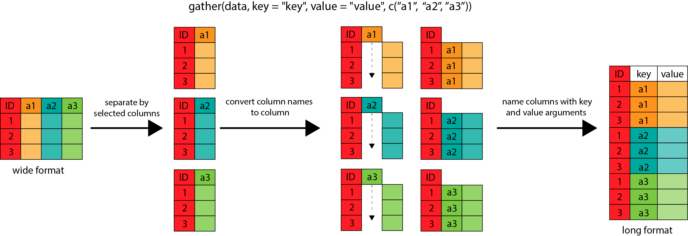
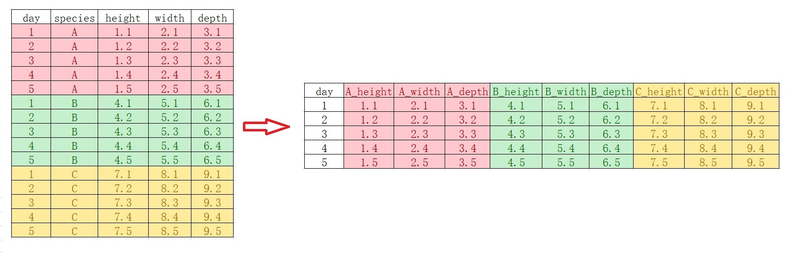

# 数据规整 {#tidyverse-tidyr}


```{r tidyr-1, message = FALSE, warning = FALSE}
library(tidyverse)
```


## 提问

假定这里有 `A`, `B`, `C` 和 `D` 四种植物每天生长的记录，

```{r tidyr-2}
plant_height <- data.frame(
  Day = 1:5,
  A = c(0.7, 1.0, 1.5, 1.8, 2.2),
  B = c(0.5, 0.7, 0.9, 1.3, 1.8),
  C = c(0.3, 0.6, 1.0, 1.2, 2.2),
  D = c(0.4, 0.7, 1.2, 1.5, 3.2)
)


plant_height
```


```{block tidyr-3, type="danger"}
大家想想，

- 把植物高度大于或等于0.8cm的时刻**筛选**出来，怎么写语句?
- 用不同的颜色画出四种植物**生长曲线**，怎么写语句?
```

很显然，我们用第 \@ref(tidyverse-dplyr) 章数据处理和第 \@ref(tidyverse-ggplot2-aes) 章数据可视化的技术，可以写成这样
```{r tidyr-4, eval = FALSE}
plant_height %>% 
  filter( ___ >= 0.8)
```


```{r tidyr-5, eval = FALSE}
plant_height %>% 
  ggplot(aes(x = Day, y = ___, color = ___)) +
  geom_line()
```

然而，发现遇到了问题？数据的格式与我们期望的不一样！


怎么解决呢？想用上面的语句，数据就得变形。那么怎么变形呢？ 

```{r tidyr-6, out.width = '100%', fig.align='left', echo = FALSE}
knitr::include_graphics("images/make_data_tidy.png")
```

下面任意一种都行：
```{r tidyr-7, eval=FALSE}
melted <- gather(plant_height, variable, value, 2:3)

## Column names instead of indices
melted <- gather(plant_height, variable, value, A, B)

## Excluding instead of including
melted <- gather(plant_height, variable, value, -1)

## Excluding using column name
melted <- gather(plant_height, variable, value, -Day)
```


但我更推荐大家使用`tidyr::pivot_longer()`, 这是2019年9月份，[tidyr](<https://tidyr.tidyverse.org/>) 1.0.0新增的一组函数`pivot_longer()/pivot_wider()`，用来补充和完善原来的`gather()/spread()` 


* `gather()/pivot_longer ` 宽表格变成长表格
* `spread()/pivot_wider`   长表格变成宽表格


```{r tidyr-8, out.width = '75%', fig.align='left', echo = FALSE}

```


## 宽表格变成长表格

所以现在使用`pivot_longer()`函数

```{r how-to-pivot, include=FALSE, eval=FALSE}
long <- plant_height %>%
  pivot_longer(
    cols = A:D,
    names_to = "plant",
    values_to = "height"
  )
long
```


```{r, echo=FALSE}
flair::decorate("how-to-pivot") %>% 
  flair::flair("cols") %>% 
  flair::flair("names_to") %>% 
  flair::flair("values_to") 
```


这里`pivot_longer()`函数有三个主要的参数：

- 参数`cols`，表示**哪些列**需要转换.
- 参数`names_to`，表示`cols`选取的这些列的**名字**，构成了新的一列，这里需要取一个名字.
- 参数`values_to`， 表示`cols`选取的这些列的**值**，构成了新的一列，这里也需要取一个名字.
- 数据框总的信息量不会丢失


当然，参数`cols` 的写法可以多种形式的，具体见第 \@ref(tidyverse-colwise) 章`select()`函数.
```{r tidyr-11, eval=FALSE}
plant_height %>% 
  pivot_longer(
  cols = -Day,         # A:D or c(A, B, C, D) or c("A", "B", "C", "D")
  names_to = "plant",
  values_to = "height"
)

```


画图的问题也就解决了

```{r tidyr-12}
long %>% 
  ggplot(aes(x = Day, y = height, color = plant)) +
  geom_line()
```


## 长表格变成宽表格

如果，长表格变回宽表格呢？需要用到`pivot_wider()`

```{r tidyr-13}
wide <- long %>% 
  pivot_wider(
  names_from = "plant",
  values_from = "height"
)
wide
```


## 列名转换成多个变量

假定 `A`, `B`, `C` 三种植物每天生长的记录，包括三个特征（height, width, depth）

```{r}
plant_record <- data.frame(
         day = c(1L, 2L, 3L, 4L, 5L),
    A_height = c(1.1, 1.2, 1.3, 1.4, 1.5),
     A_width = c(2.1, 2.2, 2.3, 2.4, 2.5),
     A_depth = c(3.1, 3.2, 3.3, 3.4, 3.5),
    B_height = c(4.1, 4.2, 4.3, 4.4, 4.5),
     B_width = c(5.1, 5.2, 5.3, 5.4, 5.5),
     B_depth = c(6.1, 6.2, 6.3, 6.4, 6.5),
    C_height = c(7.1, 7.2, 7.3, 7.4, 7.5),
     C_width = c(8.1, 8.2, 8.3, 8.4, 8.5),
     C_depth = c(9.1, 9.2, 9.3, 9.4, 9.5)
)
plant_record %>% 
  knitr::kable()
```


我们想原始数据框的**列名**，转换成多个变量，比如`A,B,C`成为物种(species)变量，（height, width, depth）成为parameter变量

```{r tidyr-60, out.width = '100%', fig.align='left', echo = FALSE}
knitr::include_graphics("images/make_data_tidy1.png")
```

用`pivot_longer()`函数，

```{r tidyr-601}
plant_record %>% 
  tidyr::pivot_longer(
    cols = !day,
    names_to = c("species", "parameter"),
    names_pattern = "(.*)_(.*)",
    values_to = "value"
)
```


## 复杂的情形

我们希望原始数据框的列名中，一部分进入变量，一部分保持原来的列名，比如，

```{r tidyr-602, out.width = '100%', fig.align='left', echo = FALSE}
knitr::include_graphics("images/make_data_tidy2.jpg")
```


```{r tidyr-603}
plant_record_longer <- plant_record %>% 
  tidyr::pivot_longer(
   cols = !day,
   names_to = c("species", ".value"),
   names_pattern = "(.*)_(.*)"
)
plant_record_longer
```


如果，反过来，又该怎么弄呢？

```{r tidyr-604, out.width = '100%', fig.align='left', echo = FALSE}

```


```{r, eval=FALSE}
us_rent_income %>%
  pivot_wider(
    names_from = variable,
    names_glue = "{variable}_{.value}",
    values_from = c(estimate, moe)
  )
```


```{r tidyr-605}
plant_record_longer %>% 
  tidyr::pivot_wider(
    names_from = species,
    values_from = c(height, width, depth),
    names_glue = "{species}_{.value}"
  )
```


```{block tidyr-6041, type="danger"}
看明白`.value`它代表的意思了吗？

- 注意 .value 而不是value，说明这里不是单个列名，而是匹配得到的多个值做列名
```

 

##  tidy data原则

Hadley Wickhamt提出了数据科学tidy原则，我结合自己的理解，tidy思想体现在:

```{r tidyr-14, out.width = '85%', echo = FALSE}
knitr::include_graphics("images/import_datatype01.png")
```

- 一切都是数据框，任何数据都可以规整
- 数据框的一列代表一个**变量**，数据框的一行代表一次**观察**
- 函数处理数据时，数据框进数据框出（函数的第一个参数始终为**数据框**）


根据Hadley Wickham的思想，这里的宽表格(`plant_heigt`和 `wide`)不是tidy的，只有长表格(`long`)才是tidy的，

```{r tidyr-15}
long
```


```{block tidyr-16, type="danger"}
以后，我们会意识到tidyverse中的很多函数都喜欢tidy的（尤其是ggplot2时）！
```


## 案例

请见第 \@ref(eda-olympics) 章、第 \@ref(eda-covid2019) 章和第 \@ref(eda-anscombe) 章.


```{r tidyr-17, echo = F}
# remove the objects
rm(long, wide, plant_height, plant_record, plant_record_longer)
```

```{r tidyr-18, echo = F, message = F, warning = F, results = "hide"}
pacman::p_unload(pacman::p_loaded(), character.only = TRUE)
```
