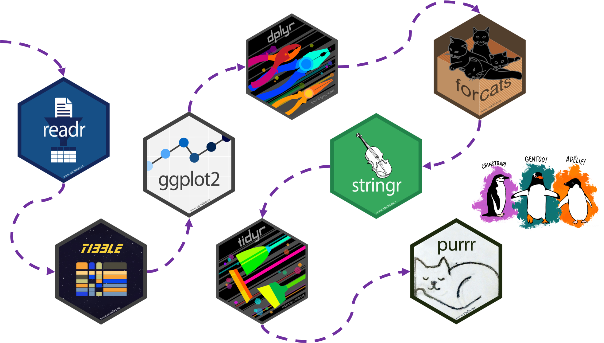

# 回望tidyverse之旅 {#tidyverse-workflow}

```{r, include=FALSE}
knitr::opts_chunk$set(
   echo         = TRUE, 
   warning      = FALSE, 
   message      = FALSE,
   fig.showtext = TRUE
)
```

```{r tidyverse-workflow-1}
library(tidyverse)
```

前面几章先后介绍了tidyverse套餐的若干部件。感觉很难吗？如果是，那说明你认真听了。

本章做个小结，通过案例**复习和串讲**下tidyverse中常用的核心部件（事实上，tidyverse套餐比我们列出的要丰富）。


```{r tidyverse-workflow-2, out.width='100%', fig.cap = "图片来源Silvia Canelón在R-Ladies Chicago的报告", echo=FALSE}

```


## readr 宏包
```{r tidyverse-workflow-3, out.width='20%', fig.align='left', echo = FALSE}
knitr::include_graphics("images/hex/readr.png")
```

读入数据是第一步，我们可以用`readr`导入数据

```{block tidyverse-workflow-4, type="danger"}
提示：

- 逗号(`,`)分割的文件 `read_csv()`
- 制表符(`tab`)分割的文件 `read_tsv()`
- 任意的分割符 `read_delim()`
- 固定宽度的文件 `read_fwf()`
- 空格分割的文件 `read_table()`
- 网页log文件 `read_log()` 
```


读取外部数据
```{r tidyverse-workflow-5}
penguins <- read_csv("./demo_data/penguins.csv") 
```


保存到外部文件
```{r tidyverse-workflow-6, eval=FALSE}
penguins %>% write_csv("newdata.csv")
```


## tibble 宏包
```{r tidyverse-workflow-7, out.width='20%', fig.align='left', echo = FALSE}
knitr::include_graphics("images/hex/tibble.png")
```

`tibble` 是升级版的 `dataframe`, 之所以是升级版，是因为在`tidyverse`中`tibble`做很多优化。下面你可以看到两者的区别：


```{r tidyverse-workflow-8}
as_tibble(penguins)
as.data.frame(penguins) %>% head()
```

在R Markdown里两者区别不大，但在console中，区别很明显的。比如`tibble`不一样的地方有：

- 列出了变量的类型(这个很不错)
- 只列出10行
- 只列出有限的列数（与屏幕适应的）
- 高亮 `NAs`


## ggplot2 宏包
```{r tidyverse-workflow-9, out.width='20%', fig.align='left', echo = FALSE}
knitr::include_graphics("images/hex/ggplot2.png")
```


### 查看数据

我们先查看下数据
```{r tidyverse-workflow-10}
glimpse(penguins)
```

### 散点图

体重在性别上有很大区别？
```{r tidyverse-workflow-11}
ggplot(data = penguins, aes(x = sex, y = body_mass_g)) +
  geom_point()
```


### 箱线图

```{r tidyverse-workflow-12}
ggplot(data = penguins, aes(x = sex, y = body_mass_g)) +
  geom_boxplot()
```


```{r tidyverse-workflow-13}
ggplot(data = penguins, aes(x = sex, y = body_mass_g)) +
  geom_boxplot(aes(fill = species))
```


我们可能看到：

- Gentoo 类的企鹅 比 Adelie 和 Chinstrap 类的企鹅体重更重
- Gentoo 类型中，雄性企鹅比雌性企鹅体重更重
- Adelie 和 Chinstrap 两种类型的企鹅，区别不是很明显
- sex 这个变量有缺失值，主要集中在 Gentoo 和 Chinstrap 两种类型


那么每种类型的企鹅，数据中有多少是`NA`呢？ 上`dplyr`吧！


## dplyr 宏包
```{r tidyverse-workflow-14, out.width='20%', fig.align='left', echo = FALSE}
knitr::include_graphics("images/hex/dplyr.png")
```


dplyr 宏包可以:

- 创建新变量 `mutate()`
- 分组统计 `summarize() + group_by()`
- 筛选 `filter()`
- 重命名变量 `rename()`
- 排序 `arrange()`
- 更多


### 选取列

下面两个有什么区别？

```{r tidyverse-workflow-15}
select(penguins, species, sex, body_mass_g)
```


```{r tidyverse-workflow-16}
penguins %>%
  select(species, sex, body_mass_g)
```


### 行方向排序

```{r tidyverse-workflow-17}
glimpse(penguins)
```


```{r tidyverse-workflow-18}
penguins %>%
  select(species, sex, body_mass_g) %>%
  arrange(desc(body_mass_g))
```


### 分组统计

```{r tidyverse-workflow-19}
penguins %>% 
  group_by(species, sex) %>%
  summarize(count = n())
```


### 增加列

```{r tidyverse-workflow-20}
penguins %>% 
  group_by(species) %>%
  mutate(count_species = n()) %>%
  ungroup() %>%
  group_by(species, sex, count_species) %>%
  summarize(count = n()) %>%
  mutate(prop = count/count_species*100)
```


### 筛选

```{r tidyverse-workflow-21}
penguins %>% 
  group_by(species) %>%
  mutate(count_species = n()) %>%
  ungroup() %>%
  group_by(species, sex, count_species) %>%
  summarize(count = n()) %>%
  mutate(percentage = count/count_species*100) %>%
  filter(species == "Chinstrap")
```


## forcats 宏包

```{r tidyverse-workflow-22, out.width='20%', fig.align='left', echo = FALSE}
knitr::include_graphics("images/hex/forcats.png")
```

`forcats` 宏包主要用于分类变量和因子型变量，比如这里的 `species, island, sex`.


对于不是因子型的变量，比如这里 `year` 是数值型变量，我们也可以通过 `factor()` 函数 将它转换成因子型变量。

```{r tidyverse-workflow-23}
penguins %>%
  mutate(year_factor = factor(year, levels = unique(year)))
```


我们保存到新的数据集中，再看看有什么变化

```{r tidyverse-workflow-24}
penguins_new <-
  penguins %>%
  mutate(year_factor = factor(year, levels = unique(year)))
penguins_new
```


```{r tidyverse-workflow-25}
class(penguins_new$year_factor)

levels(penguins_new$year_factor)
```

大家回想下，弄成因子型变量有什么好处呢？


## stringr 宏包

```{r tidyverse-workflow-26, out.width='20%', fig.align='left', echo = FALSE}
knitr::include_graphics("images/hex/stringr.png")
```

`stringr`宏包包含了非常丰富的**处理字符串**的函数，比如

- 匹配
- 字符串子集
- 字符串长度
- 字符串合并
- 字符串分割
- 更多

### 字符串转换

```{r tidyverse-workflow-27}
penguins %>%
  select(species, island) %>%
  mutate(ISLAND = str_to_upper(island))
```

### 字符串合并

```{r tidyverse-workflow-28}
penguins %>%
  select(species, island) %>%
  mutate(ISLAND = str_to_upper(island)) %>%
  mutate(species_island = str_c(species, ISLAND, sep = "_"))
```


## tidyr 宏包

```{r tidyverse-workflow-29, out.width='20%', fig.align='left', echo = FALSE}
knitr::include_graphics("images/hex/tidyr.png")
```

想想什么叫tidy data？


### 长表格变宽表格

```{r tidyverse-workflow-30}
untidy_penguins <-
  penguins %>%
    pivot_wider(names_from = sex,
                values_from = body_mass_g)
untidy_penguins
```


### 宽表格变长表格


```{r tidyverse-workflow-31}
untidy_penguins %>%
  pivot_longer(cols = male:`NA`, 
               names_to = "sex",
               values_to = "body_mass_g")
```


## purrr 宏包

```{r tidyverse-workflow-32, out.width='20%', fig.align='left', echo = FALSE}
knitr::include_graphics("images/hex/purrr.png")
```

`purrr` 宏包提供了`map()`等一系列函数，取代 `for` 和 `while`循环方式，实现高效迭代，保持语法一致性，同时增强了代码的可读性。


```{r tidyverse-workflow-33}
penguins %>% map(~sum(is.na(.)))
```


```{r tidyverse-workflow-34}
penguins %>%
  group_nest(species) %>%
  mutate(model = purrr::map(data, ~ lm(bill_depth_mm ~ bill_length_mm, data = .))) %>%
  mutate(result = purrr::map(model, ~ broom::tidy(.))) %>%
  tidyr::unnest(result)
```


```{r tidyverse-workflow-35, echo = F}
# remove the objects
# rm(list=ls())
rm(penguins, penguins_new, untidy_penguins)
```


```{r tidyverse-workflow-36, echo = F, message = F, warning = F, results = "hide"}
pacman::p_unload(pacman::p_loaded(), character.only = TRUE)
```
