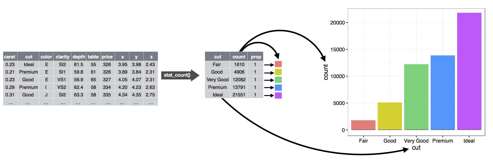
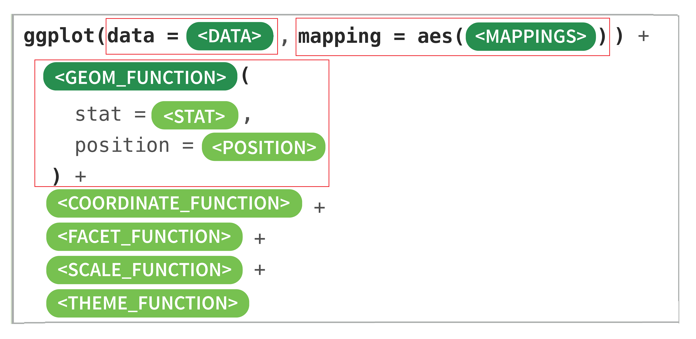
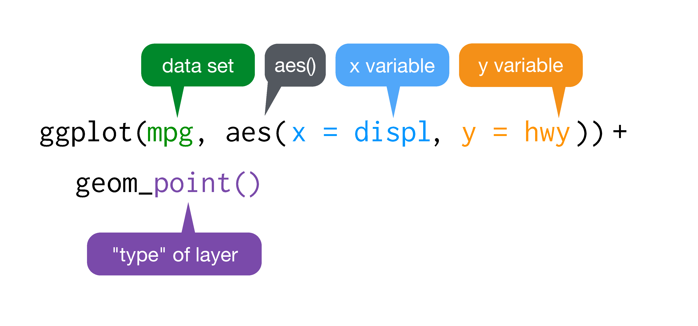

# 数据可视化 {#visual}

上节课介绍了R语言的基本数据结构，可能大家有种看美剧的感觉，有些懵。这很正常，我在开始学习R的时候，感觉和大家一样，所以不要惊慌，我们后面会慢慢填补这些知识点。

这节课，我们介绍R语言最强大的可视化，看看都有哪些炫酷的操作。


```{r message = FALSE, warning = FALSE}
library(tidyverse)  # install.packages("tidyverse")
library(patchwork)  # install.packages("patchwork")
```


## 为什么要可视化
我们先从一个故事开始，1854年伦敦爆发严重霍乱，当时流行的观点是霍乱是通过空气传播的，而John Snow医生（不是《权力的游戏》里的 Jon Snow）研究发现，霍乱是通过饮用水传播的。研究过程中，John Snow医生统计每户病亡人数，每死亡一人标注一条横线，分析发现，大多数病例的住所都围绕在Broad Street水泵附近，结合其他证据得出饮用水传播的结论，于是移掉了Broad Street水泵的把手，霍乱最终得到控制。


```{r out.width = '50%', echo = FALSE}
knitr::include_graphics(c("images/Cholera1.png", "images/Cholera2.png"))
```


另一个有趣的例子就是辛普森悖论（Simpson's Paradox）。比如我们想研究下，学习时间和考试成绩的关联。结果发现两者呈负相关性，即补课时间越长，考试成绩反而越差（下图横坐标是学习时间，纵坐标是考试成绩），很明显这个结果有违生活常识。

```{r echo=FALSE}
## simulate data
N <- 100
Sigma <- matrix(c(1, 0.75, 0.75, 1), 2, 2) * 1.5
means <- list(c(11, 3), c(9, 5), c(7, 7), c(5, 9), c(3, 11))

data <- means %>% purrr::map(~ MASS::mvrnorm(N, .x, Sigma)) %>% map(as.data.frame)
dat <- reduce(data, bind_rows) %>%
  mutate(Z = as.character(rep(seq_along(means), each = N))) %>%
  set_names(c("X", "Y", "Z"))


## First plot
dat %>%
  ggplot(aes(X, Y)) + geom_point(alpha = .5) +
  ggtitle(paste("correlation = ", round(cor(dat$X, dat$Y), 2)))

## second plot
means <- means %>% map(~set_names(., c("x", "y"))) %>% reduce(bind_rows) %>% 
  mutate(z = as.character(seq_along(means)))

  
  # means %>% map(~set_names(., c("x", "y"))) %>% 
  #   enframe()  %>% 
  #   mutate(a = map(value, ~as.data.frame(.)))
  

    
corrs <- dat %>% group_by(Z) %>% summarize(cor = cor(X, Y)) %>% .$cor

p <- dat %>%
  ggplot(aes(X, Y, color = Z)) +
  geom_point(show.legend = FALSE, alpha = 0.5) +
  ggtitle(paste("correlations =", paste(signif(corrs, 2), collapse = " ")))


## third plot
p + annotate("text",
             x = means$x, y = means$y,
             label = paste("Z=", means$z), cex = 5
)
```

事实上，当我们把学生按照不同年级分成五组，再来观察学习时间和考试成绩之间的关联，发现相关性完全逆转了! 我们可以看到学习时间和考试成绩强烈正相关。


辛普森悖论在日常生活中层出不穷。 那么如何避免辛普森悖论呢？我们能做的，就是仔细地研究分析各种影响因素，不要笼统概括地、浅尝辄止地看问题。其中，可视化分析为我们提供了一个好的方法。

## ggplot2 的图形语法


```{r out.width = '50%', echo = FALSE}

```

ggplot2是R语言最流行的宏包，是RStudio首席科学家Hadley Wickham读博期间的作品，是R相比其他语言一个独领风骚的特点。

包名中“gg”是grammar of graphics的简称，是一套优雅的绘图语法。


ggplot的语法包括9个部件：

- **数据 (data)**
- **映射 (mapping)**
- **几何对象 (geom)**
- 统计变换 (stats)
- 标度 (scale)
- 坐标系 (coord)
- 分面 (facet)
- 主题 (theme)
- 存储和输出 (output)

其中前三个是必需的。


Hadley Wickham将这套语法诠释为，一张统计图形就是从数据到几何对象（geometric object，缩写geom）的图形属性（aesthetic attribute，缩写aes）的一个映射。此外，图形中还可能包含数据的统计变换（statistical transformation，缩写stats），最后绘制在某个特定的坐标系（coordinate system，缩写coord）中，而分面（facet）则可以用来生成数据不同子集的图形。


### 语法模板

```{r out.width = '50%', echo = FALSE}

```


先看一个简单的案例（1880-2014年温度变化和二氧化碳排放量）
```{r, warning = FALSE, message = FALSE}
d <- read_csv("./demo_data/temp_carbon.csv") 
d
```


```{r}
library(ggplot2)
ggplot(data = d, mapping = aes(x = year, y = carbon_emissions)) +
  geom_line() 


  # xlab("Year") +
  # ylab("Carbon emissions (metric tons)") +
  # ggtitle("Annual global carbon emissions, 1880-2014")
```


## 映射
我们用ggplot2宏包内置的汽车测试数据（mpg）来演示，用到mpg数据集其中的四个变量

```{r}
mpg[c("displ", "hwy", "cyl", "class")]
```

- displ： 发动机排量
- hwy： 每加仑英里数
- cyl：汽缸数目
- class：汽车类型

我们想考察displ和hwy的关联，绘制这两个变量的散点图，

```{r out.width = '50%', echo = FALSE}

```


  - `ggplot()`表示调用该函数画图，`data = mpg` 表示使用mpg这个**数据框**来画图。

  - `aes()`表示数据和视觉属性之间的映射，
  
`aes(x = displ, y = hwy)`，意思是变量displ作为（映射为）x轴方向的**位置**，变量hwy作为（映射为）y轴方向的**位置**。

  - `aes()`除了位置上映射，还可以实现色彩、形状或透明度等视觉属性的映射。

  - `geom_point()`表示绘制散点图。

  - `+`表示添加图层。


运行脚本后生成图片：

```{r echo=FALSE}
ggplot(data = mpg, aes(x = displ, y = hwy)) + 
  geom_point()
```

刚才看到的是位置上的映射，ggplot还包含了颜色、形状以及透明度等图形属性的映射，比如我们在`aes()`里增加一个`color = class`, 具体来说，**不同的汽车类型**, 用**不同的颜色**来表现。
```{r}
ggplot(data = mpg, aes(x = displ, y = hwy, color = class)) + 
  geom_point()
```

此图绘制了displ和hwy的散点图， 用颜色来实现分组。


大家试试下面代码呢，
```{r, eval = FALSE}
ggplot(data = mpg, aes(x = displ, y = hwy, size = class)) + 
  geom_point()

ggplot(data = mpg, aes(x = displ, y = hwy, shape = class)) + 
  geom_point()

ggplot(data = mpg, aes(x = displ, y = hwy, aphha = class)) + 
  geom_point()
```


```{r out.width = '50%', echo = FALSE}
knitr::include_graphics("images/a-14.png")
```


## 映射 vs.设置

想把图中的点指定为某一种颜色，可以使用设置语句，比如

```{r}
ggplot(mpg, aes(displ, hwy)) + geom_point(color = "blue")
```

大家也可以试试下面
```{r, eval = FALSE}
ggplot(mpg, aes(displ, hwy)) + geom_point(size = 5)
ggplot(mpg, aes(displ, hwy)) + geom_point(shape = 3)
ggplot(mpg, aes(displ, hwy)) + geom_point(alpha = 0.5)
```


### 提问
```{r out.width = '50%', echo = FALSE}
knitr::include_graphics("images/a-21.png")
```

思考下`aes(color = "blue")`为什么会红色的点？


```{r}
ggplot(mpg, aes(x = displ, y = hwy, color = "blue")) + 
  geom_point()
```


```{r}
mpg$col <- "blue"
mpg[c("displ", "hwy", "cyl", "class", "col")]
```

```{r}
ggplot(mpg, aes(x = displ, y = hwy, color = col)) + 
  geom_point()
```


## 几何对象

`geom_point()` 可以画散点图，也可以使用`geom_smooth()`绘制平滑曲线，
```{r}
p1 <- ggplot(data = mpg, aes(x = displ, y = hwy)) + 
  geom_point()

p2 <- ggplot(data = mpg, aes(x = displ, y = hwy)) + 
  geom_smooth()

p3 <- ggplot(data = mpg, aes(x = displ, y = hwy)) + 
   geom_point() +
   geom_smooth()

p1 + p2 + p3
```


## Global vs. Local

```{r}
ggplot(mpg, aes(x = displ, y = hwy, color = class)) + 
  geom_point()
```


```{r}
ggplot(mpg) + 
  geom_point( aes(x = displ, y = hwy, color = class))
```

大家可以看到，以上两段代码出来的图是一样。


事实上，如果映射关系`aes()` 写在`ggplot()`里, 

```{r, eval=FALSE}
ggplot(mpg, aes(x = displ, y = hwy, color = class)) + 
  geom_point()
```

`x = displ, y = hwy, color = class` 为全局变量。


如果映射关系`aes()` 写在几何对象`geom_point()`里, 就为局部变量, 比如。

```{r, eval=FALSE}
ggplot(mpg) + 
  geom_point(aes(x = displ, y = hwy, color = class))
```


如果`geom_point()`中缺少所绘图所需要的映射关系，就会继承全局变量的映射关系`aes(x = displ, y = hwy, color = class)` 。

```{r, eval=FALSE, warning=FALSE, message=FALSE}
ggplot(mpg, aes(x = displ, y = hwy, color = class)) + 
  geom_point() +
  geom_smooth()
```
这里的 `geom_point()` 和 `geom_smooth()` 都会从全局变量中继承映射关系。


如果局部变量中的映射关系已经存在，那么就不会从全局变量中继承，沿用当前的映射关系。

```{r}
ggplot(mpg, aes(x = displ, y = hwy, color = class)) + 
  geom_point(aes(color = factor(cyl))) 
```


大家细细体会下，下面两段代码的区别
```{r}
ggplot(mpg, aes(x = displ, y = hwy, color = class)) + 
  geom_smooth(method = lm) +
  geom_point()
```


```{r}
ggplot(mpg, aes(x = displ, y = hwy)) + 
  geom_smooth(method = lm) +
  geom_point(aes(color = class))
```


## saving plots

可以使用ggsave()函数，将图片保存为所需要的格式，如".pdf", ".png"等

```{r, eval = FALSE}
ggplot(mpg, aes(x = displ, y = hwy)) + 
  geom_smooth(method = lm) +
  geom_point(aes(color = class)) +
  ggtitle("This is my first plot")


ggsave("myfirst_plot.pdf", width = 8, height = 6, dpi = 300)
```


## 延伸阅读 

在第 \@ref(ggplot2) 章会再讲ggplot2


